# Perceptually Accurate 3D Talking Head Generation: New Definitions, Speech-Mesh Representation, and Evaluation Metrics

Lee Chae-Yeon^(1∗) Oh Hyun-Bin^(2∗) Han EunGi¹ Kim Sung-Bin² Suekyeong
Nam³ Tae-Hyun Oh^(1,2,4)  
¹Grad. School of AI, POSTECH ²Dept. of Electrical Engineering,
POSTECH ³KRAFTON ⁴School of Computing, KAIST

###### Abstract

Recent advancements in speech-driven 3D talking head generation have
made significant progress in lip synchronization. However, existing
models still struggle to capture the perceptual alignment between
varying speech characteristics and corresponding lip movements. In this
work, we claim that three criteria—Temporal Synchronization, Lip
Readability, and Expressiveness—are crucial for achieving perceptually
accurate lip movements. Motivated by our hypothesis that a desirable
representation space exists to meet these three criteria, we introduce a
speech-mesh synchronized representation that captures intricate
correspondences between speech signals and 3D face meshes. We found that
our learned representation exhibits desirable characteristics, and we
plug it into existing models as a perceptual loss to better align lip
movements to the given speech. In addition, we utilize this
representation as a perceptual metric and introduce two other physically
grounded lip synchronization metrics to assess how well the generated 3D
talking heads align with these three criteria. Experiments show that
training 3D talking head generation models with our perceptual loss
significantly improve all three aspects of perceptually accurate lip
synchronization. Codes and datasets are available at
[https://perceptual-3d-talking-head.github.io/](https://perceptual-3d-talking-head.github.io/).

![[Uncaptioned
image]](arxiv-2503-20308--26e979b048a4.figures/figure-1.webp)

Figure 1: What defines perceptually accurate lip movement for a speech
signal? In this work, we define three criteria to assess perceptual
alignment between speech and lip movements of 3D talking heads: Temporal
Synchronization, Lip Readability, and Expressiveness (a). The
motivational hypothesis is the existence of a desirable representation
space that models and complies well with the three criteria between
diverse speech characteristics and 3D facial movements, as illustrated
in (b); where representations with the same phonemes are clustered, are
sensitive to temporal synchronization, and follow a certain pattern as
the speech intensity increases. Consequently, we build a rich
speech-mesh synchronized representation space that exhibits the
desirable properties.

^(\*)^(\*)footnotetext: These authors contributed equally.

## 1 Introduction

Speech-driven 3D talking head generation focuses on generating 3D facial
movements synchronized with input speech signals. This plays a key role
in enhancing communication within multimedia applications, such as
virtual reality, entertainment, and education \[39\]. To provide users
with a more realistic and immersive experience, it is crucial that the
facial and lip movements of 3D avatars are synchronized with the various
aspects of speech. This synchronization should be perceptually accurate
from a human perspective, ensuring that the avatars’ expressions are
both natural and convincing.

While recent works in learning-based 3D talking head generation \[8, 27,
46, 21, 33, 9\] aim to enhance the lip synchronization capabilities,
they commonly rely on minimizing the Mean Squared Error (MSE) loss
between generated 3D facial motion and ground truth motion as a learning
objective. This approach is practical, as it directly contributes to
minimizing the Lip Vertex Error (LVE), a commonly used metric that
measures the MSE between the lip vertices of generated 3D facial motions
and the ground truth.

Despite the improvements in the LVE metric, existing models still
struggle to correlate lip movements with some speech characteristics,
such as wider mouth openings as speech volume increases. These
characteristics are not adequately captured by existing datasets \[8,
12\], which have limited ranges of facial motion patterns due to the
small dataset scale and restricted intensity range. Moreover, relying on
MSE and LVE is insufficient for learning or assessing perceptually
plausible lip motions \[21, 37\], as it focuses solely on vertex-wise
geometric differences and overlooks the true correspondence between the
speech signals and lip movements. A lower MSE and LVE do not necessarily
correspond to a more perceptually accurate lip movement.

These observations raise critical questions: _What defines perceptually
accurate lip movement in response to a speech signal, and how can we
enhance this accuracy?_ We draw inspiration from findings on human
audio-visual perception: 1) Humans are sensitive to temporal asynchrony
between speech and lip movements; slight discrepancies can disrupt the
perception of natural synchronization \[43\]. 2) Humans rely on accurate
viseme-phoneme correspondence when assessing lip-sync accuracy,
expecting visual lip movements to match the spoken phonemes \[3\]. 3)
There is a proportional increase in jaw and lip movements as speech
intensity increases, contributing to the expressiveness perceived in
natural speech \[34, 18, 40, 28\]. Through our human study, we reveal an
intriguing finding: participants favor lip movements with intensity that
corresponds to speech—even if they exceed the established maximum
acceptable asynchrony \[43\] by twice—over those that are perfectly
synchronized but lack expressive alignment (Table 1-\[Right\]). This
reveals that humans are more sensitive to expressiveness than temporal
synchronization when perceiving, highlighting the importance of
expressiveness. Building upon these insights, we define three criteria
that significantly impact the perceptual lip synchronization of 3D
talking heads: _Temporal Synchronization_, _Lip Readability_, and
_Expressiveness_ (Fig. 1 (a)).

Motivated by our hypothesis that a desirable representation space exists
to meet these three criteria, we propose a speech-mesh synchronized and
rich representation that captures the intricate correspondence between
speech and 3D face mesh. We design a transformer-based architecture that
maps time-sequenced speech and mesh inputs to a shared representation
space. To effectively train this system, we employ a two-stage training
method: we first develop a robust audio-visual speech representation
using a large-scale 2D video dataset \[1\], which then serves as an
anchor for learning a speech-mesh representation. We found that the
first step is important and leads to emergent desirable properties
(illustrated in Fig. 1 (b)) in the final representation. This sequential
approach ensures that the model first establishes a space that captures
a wide range of speech characteristics, and then extends to explore the
relationships between speech and 3D face mesh across diverse speech
intensities and facial movements. Adopting this representation, we
introduce a plug-and-play perceptual loss adaptable to any existing 3D
talking head generation models  \[11, 46, 21\], enhancing the perceptual
quality of 3D talking heads.

Furthermore, to assess the three criteria, we introduce three metrics
for each aspect. We leverage our learned representation as a perceptual
metric, Perceptual Lip Readability Score (PLRS), to evaluate the
perceptual lip readability of lip movements. Also, we propose two
physically grounded lip synchronization metrics: Mean Temporal
Misalignment (MTM) for temporal synchronization and Speech-Lip Intensity
Correlation Coefficient (SLCC) for expressiveness.

Extensive experiments demonstrate that our perceptual loss significantly
enhances all three aspects: Temporal Synchronization, Lip Readability,
and Expressiveness, which are demonstrated across various metrics:
existing metric, our newly proposed metrics, and human evaluations. We
also find that incorporating an additional pseudo-dataset \[45\], which
captures diverse ranges of speech and lip movement intensities, can
further improve expressiveness. Our main contributions are summarized as
follows:

- •
  Defining three aspects—Temporal Synchronization, Lip Readability, and
  Expressiveness—that affect the perceptual quality of 3D talking heads
  and proposing three evaluation metrics for these aspects.
- •
  Constructing a speech-mesh representation space that captures rich and
  diverse correspondences between speech and lip movements.
- •
  Proposing a plug-in perceptual loss using the constructed speech-mesh
  representation and demonstrating improvements on existing metric, our
  newly proposed metrics, and human evaluations.

## 2 Related Work

#### Speech-driven 3D talking head generation

Speech-driven 3D talking head generation aims to generate realistic 3D
facial movements aligned with given speech. Among recent data-driven
methods \[8, 11, 46, 21, 22, 9, 48, 33\], FaceFormer \[11\] introduces a
transformer-based autoregressive model and leverages a pre-trained
speech model to capture long-term audio context and past facial
movements. CodeTalker \[46\] employs a VQ-VAE to construct a discrete
facial motion space, addressing the over-smoothing problem. Diffusion
models \[17, 31\] have also been demonstrated to be effective for 3D
talking head generation \[33, 36\]. In addition to synthesizing neutral
facial motions, several works extend the 3D talking head to express
specific aspects, such as emotional expressions \[9, 22\], multilingual
capabilities \[37\], or laughter \[38\]. Despite these advances,
existing methods rely on minimizing MSE loss without a clear definition
of perceptually accurate lip movement, overlooking the multifaceted
nature of lip synchronization. To address this, we define three critical
aspects of lip synchronization and propose rich speech-mesh
representation, along with its application as a perceptual loss in a
plug-and-play manner, enhancing all three aspects of lip synchronization
quality in existing 3D talking head generation models \[11, 46, 21\].

#### Speech-face representation learning

Well-aligned representation spaces learned from large-scale datasets
such as CLIP \[24\] and ImageBind \[14\] are valued for their
scalability and versatility. These spaces enable a wide range of
applications, including auxiliary loss \[42\], intermediate
representation \[41\], and evaluation metrics \[16\]. With this context,
audio-visual representation spaces trained specifically on speech and 2D
face videos have been proposed \[6, 29, 15, 35\]. For instance,
SyncNet \[6\], a CNN-based model learns to detect audio-visual temporal
synchronization and has been applied to several tasks, such as active
speaker detection \[1, 7\] and 2D talking head generation \[23, 44,
49\]. Similarly, a transformer-based AV-HuBERT \[29\] has demonstrated
remarkable effectiveness in various tasks, including lip reading \[30\],
audio-visual translation \[5\], and 2D talking head generation \[44\].
While there has been significant progress in the 2D domain, advancements
in the 3D domain remain under-explored. Yang *et al*. \[48\] extends the
SyncNet architecture to accommodate speech and 3D face meshes; however,
its application is limited to evaluating 3D talking heads. In this work,
we demonstrate the versatility of our representation space as a plug-in
module to improve the perceptual accuracy of the existing speech-driven
3D talking head generation models \[11, 46, 21\], as well as to assess
their performance.

#### Evaluation metrics for speech-driven 3D talking head

The prevalent evaluation metric, Lip Vertex Error (LVE) \[27\], measures
the L2 distance between predicted lip vertices and ground truth.
Additional metrics, such as Upper Face Dynamics Deviation (FDD) \[46\]
and Lip Readability Percentage (LRP) \[21\], consider different regions
of facial motion. These metrics, however, focus on vertex-wise geometric
differences between the ground-truth 3D facial motions and neglect
speech-related information. To incorporate both speech and 3D face mesh
data for evaluation, MultiTalk \[37\] introduces an Audio-Visual Lip
Readability (AVLR) metric, which assesses perceptual accuracy of lip
readability using a pre-trained Audio-Visual Speech Recognition
model \[2\]. Yet, AVLR relies on speech and 2D face video rendered from
the 3D face mesh, which may not align with the 3D talking head domain.
To address these limitations, we introduce novel and comprehensive
evaluation metrics that focus on diverse aspects of lip synchronization:
Mean Temporal Misalignment (MTM), Perceptual Lip Readability Score
(PLRS), and Speech-Lip Intensity Correlation Coefficient (SLCC).

## 3 Essential Criteria for Perceptually Accurate 3D Talking Head

Generating a 3D talking head with lip movements that are perceptually
accurate to human observers requires a clear understanding of the
components that influence perceptual quality. Although existing works
have focused on improving partial aspects of these talking head
generation models, a comprehensive exploration for establishing a
perceptually accurate 3D talking head model has barely been undertaken.
Drawing inspirations from extensive research in existing works \[43, 44,
21, 10, 34, 18, 40, 28\] and our studies, we identify three fundamental
criteria essential for achieving perceptually accurate lip movements in
3D talking heads.

#### Temporal Synchronization

This alignment is particularly crucial in media involving human speech,
where viewers expect lip movements to precisely match the corresponding
speech in time. Temporal misalignment between speech and lip movements
indeed distracts viewers, reduces user experiences, and negatively
impacts audience perception \[25\]. Vatakis *et al*. \[43\] find that
viewers are particularly sensitive to speech-lip asynchrony compared to
other audio-visual asynchrony, such as music. They note that mismatches
become noticeable when speech precedes lip movements by more than 50 ms
or follows them by more than 220 ms. These findings may hold the same in
3D talking head generation, where any misalignment between speech and
lip movements can break the illusion of realism, leading to a diminished
user experience and reducing the perceived authenticity of the virtual
character. Thus, we define the temporal synchronization of the talking
head as an important aspect of lip synchronization quality.

#### Lip Readability

Visemes (or lip movements) must correspond accurately to the speech
phonemes to ensure the spoken words are visually intelligible \[3\].
This aspect is widely acknowledged as important in existing literature
in both 2D \[44\] and 3D \[21, 10\] speech-driven talking head models,
which leverage lip reading experts as an auxiliary guidance to improve
the visual intelligibility of the spoken word. However, the mapping
between speech and lip movements is not one-to-one, making lip
readability challenging to define. For example, the size and shape of
the opening mouth and the dynamic movement patterns of the lips in
response to specific utterance differ at every moment \[48\] or per
individual \[32\]. To capture this complexity, we define the lip
readability within speech-mesh synchronized representation space learned
from a large-scale dataset, capturing the comprehensive and nuanced
correspondence between speech and lip movements.

![[Uncaptioned
image]](arxiv-2503-20308--26e979b048a4.figures/figure-2.webp)

|            |          |      |
| ---------- | -------- | ---- |
|            | Samples  |      |
|            | A        | B    |
| Temp.      | ✓        | ✗    |
| Exp.       | ✗        | ✓    |
| Prefer (%) | 17.4     | 82.6 |

Table 1: Human studies on alignment criteria. \[Left\] Preference scores
(1-3) for 3D talking heads with varying lip movement intensities paired
with different speech intensities. \[Right\] Human preference between
(A) samples with precise timing but low expressiveness, and (B) samples
with high expressiveness but 100ms asynchrony—twice the commonly
accepted 50ms threshold \[43\].

#### Expressiveness

Speech conveys not only linguistic content but also varies in intensity.
For instance, a speaker may express the same text softly or loudly, with
jaw and lip movements proportionally increasing as speech intensity
rises, which contributes to perceived expressiveness in real-world face
recognition \[18, 40, 28\]. To demonstrate that the positive correlation
of human preference between the intensity of speech and lip movements
also exists in 3D talking head field, we conduct a human study by
presenting 3D talking heads with varied lip movement intensities paired
with different speech intensities in Table 1-\[Left\]. Participants
prefer the lip movements with the intensity that match the intensity of
speech. Despite this distinct human preference for synchronization
between the intensity of corresponding speech and lip movements, this
aspect has barely been explored in the talking head generation field. We
thus define the expressiveness in 3D talking head as the correlation
between speech and lip movement intensity, which is crucial for
establishing genuine talking heads and is expected to guide future
research aimed at improving perceptual lip synchronization.

#### Focus of this work

Among the three criteria for perceptually accurate 3D talking head, we
find that recent 3D talking head generation models achieve reasonable
temporal alignment between speech and lip movements (see supplementary
for a visualization of temporal synchronization). Furthermore, we design
an A vs. B test, prompting participants to choose between two samples:
(A) temporally synchronized one while lacking expressive
synchronization, and (B) the other with expressive synchronization but
with 100ms asynchrony. Table 1-\[Right\] shows that users prefer sample
B, suggesting that humans may prioritize expressive synchronization over
strict temporal alignment. This insight directs our focus toward
enhancing all three aspects to better capture perceptual realism in 3D
talking head. Details of the human study are in the supplementary
material. Before introducing metrics to assess the criteria, we present
our synchronized representation for designing our perceptual loss.

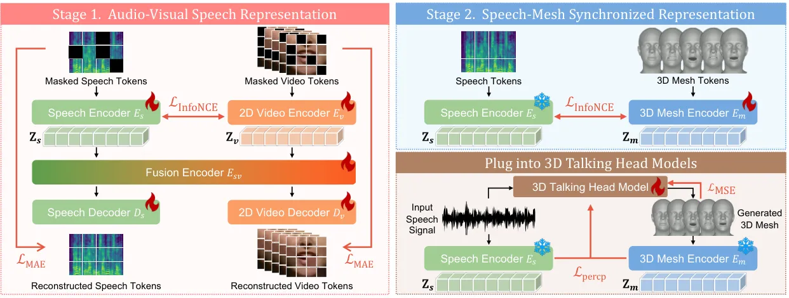

Figure 2: Pipeline of speech-mesh synchronized representation learning.
We train our speech-mesh representation space in a two-stage manner. In
the first stage, we learn a rich audio-visual representation in 2D
domain to capture the synchronization between lip movement and speech.
In the second stage, we train the 3D mesh encoder to align the 3D mesh
space with the frozen speech space. As an application of our speech-mesh
representation space, we propose a plug-in perceptual loss to 3D talking
head models to enhance the quality of lip movements.

## 4 Speech-Mesh Synchronized Representation

We hypothesize that a desirable representation space exists to meet the
three criteria defined in Sec. 3. Motivated by this hypothesis, we
develop a rich speech-mesh synchronized representation which captures
the intricate correspondence between speech and the 3D face mesh. We
found that our learned representation exhibits desirable properties, and
we adopt it as a perceptual loss to improve the perceptual accuracy of
existing models with respect to these three criteria.

#### Overview

Directly learning a synchronized speech-mesh representation presents
challenges due to the scarcity of speech-3D face mesh datasets. One
potential solution is to construct pseudo-GT 3D face meshes using
reconstruction models \[13\], although relying solely on pseudo-GT may
not suffice for building a robust representation. To overcome this, we
leverage the extensive knowledge from the speech-2D lip video
representations and adapt this to accommodate 3D face meshes.
Specifically, we propose a two-stage training process: in stage 1, we
learn an audio-visual speech representation that accurately reflects lip
movements from the unlabeled in-the-wild 2D synchronized talking face
video dataset, LRS3 \[1\]. Subsequently, we leverage the pre-trained
speech representation from stage 1, using it as the anchor space to
learn a synchronized speech-mesh representation.

#### Stage 1. Learning audio-visual speech representation

This stage aims to learn a rich speech-2D lip video representation that
effectively captures the correlation between varying speech
characteristics and lip dynamics. Motivated by prior works \[15, 35\],
we extend the integration of masked autoencoder (MAE) and cross-modal
contrastive learning to learn a synchronized speech-2D lip video
representation using 2D videos. The architecture for stage 1 consists of
two modality-specific encoders, a cross-modal fusion encoder, and two
modality-specific decoders. (see Fig. 2-\[Stage 1\]).

Given a speech and 2D lip video pair,
$`(\mathbf{X_{s}},\mathbf{X_{v}})\in D`$, we begin by patchifying and
tokenizing speech spectrograms and video frames into speech and video
tokens as $`\mathbf{S}=(\mathbf{s}_{1},\dots,\mathbf{s}_{N})`$ and
$`\mathbf{V}=(\mathbf{v}_{1},\dots,\mathbf{v}_{M})`$, where
$`\mathbf{s}_{i},\mathbf{v}_{j}\in\mathbb{R}^{H}`$. We then randomly
mask out $`P`$% portion of tokens. The remaining unmasked speech tokens
$`\mathbf{S}^{unmask}`$ and video tokens $`\mathbf{V}^{unmask}`$ are
respectively fed into the speech encoder $`{E}_{s}`$ and video encoder
$`{E}_{v}`$, each consisting of $`N_{e}`$ transformer layers. Each
encoder extracts uni-modal embeddings,
$`\mathbf{Z}^{l}_{\mathbf{s}}={E}^{l}_{s}(\mathbf{S}^{unmask})`$ and
$`\mathbf{Z}^{l}_{\mathbf{v}}={E}^{l}_{v}(\mathbf{V}^{unmask})`$, where
$`{l}\in(1,\dots,N_{e})`$ denote the layer indices. Also, the mean
pooled speech and video embeddings,
$`\mathbf{c}^{l}_{\mathbf{s}}=\text{MeanPool}(\mathbf{Z}^{l}_{\mathbf{s}})`$
and
$`\mathbf{c}^{l}_{\mathbf{v}}=\text{MeanPool}(\mathbf{Z}^{l}_{\mathbf{v}})`$,
are derived from the corresponding uni-modal embeddings. Following the
uni-modal encoders, we introduce a multi-modal fusion encoder
$`{E}_{sv}`$ to exploit complementary information from each extracted
uni-modal embedding. The speech and video embeddings are jointly
processed through this encoder, resulting in multi-modal fusion
embeddings $`\mathbf{F_{s}}`$ and $`\mathbf{F_{v}}`$, _i.e_.,
$`[\mathbf{F_{s}},\mathbf{F_{v}}]={E}_{sv}([\mathbf{Z_{s}},\mathbf{Z_{v}}])`$,
where $`[,]`$ denotes concatenation. With the fusion embeddings
$`\mathbf{F_{s}}`$ and $`\mathbf{F_{v}}`$, we utilize each modality’s
decoder to reconstruct the original signals. Specifically, we employ a
speech decoder $`{D}_{s}`$ and a video decoder $`{D}_{v}`$, each
consisting of $`N_{d}`$ transformer layers. We pad each multi-modal
fusion embedding with trainable masked tokens at their original
positions, resulting in $`\mathbf{F_{s}^{\prime}}`$ and
$`\mathbf{F_{v}^{\prime}}`$. Each decoder then reconstructs the
respective signals; the reconstructed speech spectrogram and video
tokens as $`\hat{\mathbf{S}}^{mask}{=}{D}_{s}(\mathbf{F_{s}^{\prime}})`$
and $`\hat{\mathbf{V}}^{mask}{=}{D}_{v}(\mathbf{F_{v}^{\prime}})`$.

Training the model involves two objectives: learning the cross-modal
alignment between the speech-2D lip video signals, while reconstructing
their original signals. Given $`B`$ speech-2D lip video token pairs in a
batch, $`\left\{\mathbf{S}_{i},\mathbf{V}_{i}\right\}_{i=1}^{B}`$, we
treat the true speech-2D lip video pair as positive samples, while the
others in the batch are considered negative samples. To encourage
alignment between temporally synchronized speech-2D lip video instances,
we utilize a cross-modal contrastive learning strategy, InfoNCE \[20\].
We maximize the cosine similarity between positive sample of the mean
pooled speech embedding
$`\mathbf{c}^{l}_{\mathbf{s},i}=\text{MeanPool}({E}^{l}_{s}(\mathbf{S}_{i}^{unmask}))`$
and the corresponding synchronized mean pooled video embedding
$`\mathbf{c}^{l}_{\mathbf{v},i}=\text{MeanPool}({E}^{l}_{v}(\mathbf{V}_{i}^{unmask}))`$.
We first define the speech-centric loss as:

```math
{\mathcal{L}}_{\text{S}\rightarrow\text{V}}=-\frac{1}{B}\sum_{i=1}^{B}\log\tfrac{\exp(\mathbf{c}_{\mathbf{s},i}^{l}\cdot\mathbf{c}_{\mathbf{v},i}^{l}/\tau)}{\sum_{j=1}^{B}\exp(\mathbf{c}_{\mathbf{s},i}^{l}\cdot\mathbf{c}_{\mathbf{v},j}^{l}/\tau)}, \tag{1}
```

where $`\tau`$ is a temperature hyperparameter. Also, we make the
objective symmetric by defining a video-centric loss as
$`{\mathcal{L}}_{\text{V}\rightarrow\text{S}}`$. We sum
$`{\mathcal{L}}_{\text{S}\rightarrow\text{V}}`$ and
$`{\mathcal{L}}_{\text{V}\rightarrow\text{S}}`$ across $`L`$ selected
encoder layers to obtain our final contrastive learning objective:

```math
\displaystyle{\mathcal{L}}_{\text{InfoNCE}}=\sum\nolimits_{l\in L}{\mathcal{L}}_{\text{S}\rightarrow\text{V}}+{\mathcal{L}}_{\text{V}\rightarrow\text{S}}. \tag{2}
```

For reconstruction, the model is trained in a self-supervised manner by
minimizing the reconstruction loss $`{\mathcal{L}}_{\text{MAE}}`$ as:

```math
\resizebox{32561971}{}{${\mathcal{L}}_{\text{MAE}}\!=\!\frac{1}{B}\sum_{i=1}^{B}\!\left[\!\frac{\sum\|\hat{\mathbf{S}}_{i}^{mask}-\mathbf{S}_{i}^{mask}\|_{F}^{2}}{|\mathbf{S}_{i}^{mask}|}\!+\!\frac{\sum\|\hat{\mathbf{V}}_{i}^{mask}-\mathbf{V}_{i}^{mask}\|_{F}^{2}}{|\mathbf{V}_{i}^{mask}|}\!\right]$}, \tag{3}
```

where $`|\mathbf{S}_{i}^{mask}|`$ and $`|\mathbf{V}_{i}^{mask}|`$ denote
the number of masked speech and video tokens, respectively. Overall, our
objective function is defined as:

```math
{\mathcal{L}}={\mathcal{L}}_{\text{MAE}}+\lambda{\mathcal{L}}_{\text{InfoNCE}},\vskip-2.84526pt \tag{4}
```

where $`\lambda`$ is the weight factor for cross-modal contrastive loss.

We observe that the representation space trained with the transformer
architecture and a rich and large-scale 2D face video dataset in this
way already possesses the desired properties we pursue, illustrated in
Fig. 1 (see supplementary for visualizations of pre-trained speech
representation). Motivated by this, we transfer these emergent
properties to the speech-mesh representation space as follows.

#### Stage 2. Learning speech-mesh representation

In this stage, we design a 3D mesh encoder that maps 3D face mesh to the
speech representation pre-trained in stage 1. This pre-trained speech
representation, derived from rich speech-2D face video data, serves as a
robust anchor space for learning the correlation between diverse speech
characteristics and 3D facial motions. We use contrastive learning loss
to align 3D facial motion embeddings with the anchored speech
representations, as shown in Fig. 2-\[Stage 2\].

Given a speech and 3D face mesh pair
$`(\mathbf{X_{s}},\mathbf{X_{m}})\in D`$, we patchify and tokenize
speech spectrograms into speech tokens $`\mathbf{S}`$, and map these
into pre-trained uni-modal mean pooled speech embeddings
$`\mathbf{c}^{l}_{\mathbf{s}}=\text{MeanPool}({E}^{l}_{s}(\mathbf{S}))`$.
Similarly, we patchify 3D face mesh into mesh tokens $`\mathbf{M}`$, and
feed them into the 3D mesh encoder $`{E}_{m}`$ consisting of $`N_{e}`$
transformer layers to extract mesh embeddings
$`\mathbf{Z}^{l}_{\mathbf{m}}={E}^{l}_{m}(\mathbf{M})`$ and the
corresponding mean-pooled mesh embedding
$`\mathbf{c}^{l}_{\mathbf{m}}`$. For the learning objective, given $`B`$
speech-3D face mesh token pairs in a batch,
$`\left\{\mathbf{S}_{i},\mathbf{M}_{i}\right\}_{i=1}^{B}`$, we first
define speech-anchored loss as:

```math
{\mathcal{L}}_{\text{S}\rightarrow\text{M}}=-\frac{1}{B}\sum_{i=1}^{B}\log\tfrac{\exp(\mathbf{c}_{\mathbf{s},i}^{l}\cdot\mathbf{c}_{\mathbf{m},i}^{l}/\tau)}{\sum_{j=1}^{B}\exp(\mathbf{c}_{\mathbf{s},i}^{l}\cdot\mathbf{c}_{\mathbf{m},j}^{l}/\tau)}, \tag{5}
```

as well as $`{\mathcal{L}}_{\text{M}\rightarrow\text{S}}`$ which is the
mesh-anchored loss. Similar to Eq. (2), we sum
$`{\mathcal{L}}_{\text{S}\rightarrow\text{M}}`$ and
$`{\mathcal{L}}_{\text{M}\rightarrow\text{S}}`$ across $`L`$ selected
encoder layers to train the 3D mesh encoder $`{E}_{m}`$ while the speech
encoder fixed. As a result, this two-stage training approach yields a
robust speech-mesh representation, which significantly enhances the
alignment between the speech and 3D face mesh modalities.

#### Adopting it as a perceptual loss

A key application of the speech-mesh representation learned through the
two-stage training process is its use as a perceptual loss to enhance
the perceptual accuracy of the 3D talking head model (see Fig. 2).
Leveraging this representation as a perceptual loss ensures that the
generated lip movements are perceptually accurate and aligned well with
the speech.

Given $`B`$ speech and generated 3D face mesh pairs in a batch,
$`\{\mathbf{S}_{i},\hat{\mathbf{M}}_{i}\}_{i=1}^{B}`$, we define our
perceptual loss with the symmetric InfoNCE loss (Eq. (2)) as

```math
\displaystyle{\mathcal{L}}_{percp}=\sum_{l\in L}{\mathcal{L}}_{\text{S}\rightarrow\text{M}}+{\mathcal{L}}_{\text{M}\rightarrow\text{S}}. \tag{6}
```

Our perceptual loss encourages synchronized speech and mesh embeddings
to pull closer together, while unsynchronized ones to push apart. The
effectiveness and analysis of our perceptual loss will be discussed in
later sections.

## 5 Evaluation Metrics

In this section, we describe our proposed evaluation metrics that assess
each criterion impacting the quality of 3D lip accuracy, as discussed in
Sec. 3. Here, we outline the high-level concepts of our proposed
metrics. Additional details and experiments are provided in the
supplementary material.

#### Mean Temporal Misalignment (MTM)

To measure the temporal discrepancy between speech and corresponding lip
movements, temporal correspondence annotations, such as onset times for
each modality, would typically be required. As a proxy, we determine
temporal correspondence and measure temporal discrepancies between the
ground truth and predicted lip vertex displacement sequences by using
Derivative Dynamic Time Warping (DDTW) \[19\], which robustly identifies
local structural similarities compared to standard Dynamic Time Warping
(DTW) \[4\]. For simplicity, we focus on the central vertices of the
upper and lower lips when extracting displacement sequences, and use
local extrema in the DDTW process to measure temporal misalignment by
pinpointing precise time steps for mouth opening and closing events.
Consequently, Mean Temporal Misalignment (MTM) $`\overline{\Delta t}`$
is defined as
$`\overline{\Delta t}=\tfrac{1}{K}\sum\nolimits_{k=1}^{K}\Delta t_{k}`$,
where $`K`$ is the total number of video clips and $`\Delta t_{k}`$ is
the averaged temporal misalignment of the $`k`$-th video clip.

#### Perceptual Lip Readability Score (PLRS)

While Lip Vertex Error (LVE) measures the accuracy of generated lip
articulations against the ground truth, it does not fully assess whether
lip movements are perceptually aligned with the given speech. To address
this, we leverage our speech-mesh representation in Sec. 4 as a
perceptual lip readability evaluator. We compute the perceptual
alignment using the cosine similarity of the mean pooled speech and mesh
embeddings. Since this representation has learned a rich distribution of
speech correspondences across various facial movements, our metric
correlates highly with human perception, measuring perceptual lip
movement alignment more accurately than LVE (see supplementary for the
human study on metrics).

#### Speech and Lip Intensity Correlation Coefficient (SLCC)

As shown in Table 1-\[Left\], humans prefer aligned intensity between
speech and lip movement. Thus, the intensity of generated lip movements
should positively correlate with the corresponding input speech. To
quantify this, we define the Speech and Lip Correlation Coefficient
$`r_{SL}`$ as:

```math
r_{SL}=\tfrac{\sum_{k=1}^{K}(\text{SI}_{k}-\bar{\text{SI}})(\text{LI}_{k}-\bar{\text{LI}})}{\sqrt{\sum_{k=1}^{K}(\text{SI}_{k}-\bar{\text{SI}})^{2}}\sqrt{\sum_{k=1}^{K}(\text{LI}_{k}-\bar{\text{LI}})^{2}}}, \tag{7}
```

where $`\text{SI}_{k}`$ and $`\text{LI}_{k}`$ denote Speech (SI) and Lip
Intensity (LI), respectively,
$`\bar{\text{SI}}{=}\tfrac{1}{K}\sum_{k=1}^{K}\text{SI}_{k}`$ and
$`\bar{\text{LI}}{=}\frac{1}{K}\sum_{k=1}^{K}\text{LI}_{k}`$. We define
SI using speech loudness, specifically the z-normalized Root Mean Square
(RMS) value, which is a widely accepted measure of speech intensity in
signal processing. To define LI, we measure the averaged lip
displacement value of a video clip, followed by the z-normalization.

## 6 Experiments

We first outline the evaluation setup, and then present thorough
analyses of the experimental results. Due to the space limitation, we
present more implementation details and additional experiments in the
supplementary material.

### 6.1 Experimental Settings

#### Datasets

Most of the existing speech-driven 3D talking head generation methods
rely on VOCASET \[8\] and BIWI \[12\] to train and test the models.
However, these datasets have limited ranges of facial motion patterns
due to the small dataset scale and restricted intensity range, which
restricts their ability to fully capture the intricate relationship
between speech and 3D face mesh. To address the lack of training
dataset, we construct two large-scale speech-3d face mesh benchmark
datasets, LRS3-3D and MEAD-3D, by processing LRS3 and MEAD videos using
two monocular face reconstruction methods: SPECTRE \[13\] for
LRS3 \[1\], which ensures accurate lip movements, and SMIRK \[26\] for
MEAD \[45\], which captures diverse speech and lip movement intensities.
We use LRS3 in the first stage and LRS3-3D in the second stage to train
our speech-mesh synchronized representation. Then, for base model
training and evaluations, we adopt two configurations: (1) training and
testing with VOCASET, in line with existing work, and (2) combining
MEAD-3D with VOCASET during training to endow expressiveness and testing
on MEAD-3D.

#### Base methods

We use three state-of-the-art 3D talking head generation models \[11,
46, 21\] to evaluate the effectiveness of our perceptual loss.

#### Metrics

To comprehensively evaluate the three aspects of lip synchronization, we
assess MTM, PLRS, and SLCC, corresponding to temporal synchronization,
lip readability, and expressiveness, respectively. Additionally, we
compute the level-wise SLCC for the MEAD-3D test set, which includes
three distinct emotional intensity levels, to evaluate the expressive
capability of 3D talking head generation models. We also measure LVE as
part of the lip readability evaluation.

|                   |                      |                      |                     |                                    |
| ----------------- | -------------------- | -------------------- | ------------------- | ---------------------------------- |
| Method            | Temporal             | Lip                  |                     | Expressiveness                     |
|                   | Synchronization      | Readability          |                     |                                    |
|                   | MTM ($`\downarrow`$) | LVE ($`\downarrow`$) | PLRS ($`\uparrow`$) | SLCC / $`\Delta`$ ($`\downarrow`$) |
| VOCASET           | \-                   | \-                   | 0.409               | 0.34 / -                           |
| FaceFormer \[11\] | 53.6                 | 3.357                | 0.368               | 0.26 / 0.08                        |
|    + Ours rep.    | 52.2                 | 3.091                | 0.463               | 0.37 / 0.03                        |
| CodeTalker \[46\] | 61.8                 | 3.700                | 0.381               | 0.38 / 0.04                        |
|    + Ours rep.    | 60.9                 | 3.579                | 0.388               | 0.35 / 0.01                        |
| SelfTalk \[21\]   | 50.1                 | 2.971                | 0.414               | 0.41 / 0.07                        |
|    + Ours rep.    | 49.2                 | 2.924                | 0.418               | 0.35 / 0.01                        |

Table 2: Quantitative results of lip synchronization on VOCASET \[8\]
test set. We evaluate the base models on our proposed lip
synchronization metrics. We denote $`\Delta`$ as the difference in SLCC
between the model and those measured on the data distribution. A lower
$`\Delta`$ indicates the model more closely represents the intensity
correlation of the dataset. We demonstrate the effectiveness of our
representation in consistently enhancing all three aspects of lip
synchronization.

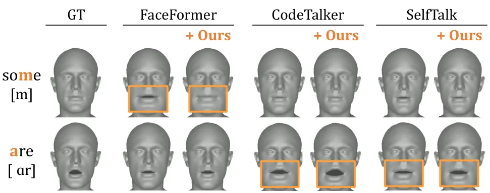

Figure 3: Qualitative results of the effectiveness of our perceptual
loss for lip readability. Our perceptual loss guides baselines \[11, 46,
21\] to generate perceptually accurate lip movements.

### 6.2 Experimental Results and Analysis

We conduct evaluations to assess the effectiveness of our speech-mesh
synchronized representation and the incorporation of an expressive
speech-3D face mesh paired dataset (_i.e_., MEAD-3D) in enhancing the
three criteria.

|                   |                   |                      |                      |                     |                                    |
| ----------------- | ----------------- | -------------------- | -------------------- | ------------------- | ---------------------------------- |
| Method            | Perceptual Loss   | Temporal             | Lip                  |                     | Expressiveness                     |
|                   |                   | Synchronization      | Readability          |                     |                                    |
|                   |                   | MTM ($`\downarrow`$) | LVE ($`\downarrow`$) | PLRS ($`\uparrow`$) | SLCC / $`\Delta`$ ($`\downarrow`$) |
| VOCASET           | -                 | -                    | -                    | 0.409               | 0.34 / -                           |
| FaceFormer \[11\] | ✗                 | 53.6                 | 3.357                | 0.368               | 0.26 / 0.08                        |
|                   | 3D SyncNet        | 55.6                 | 3.316                | 0.435               | 0.38 / 0.04                        |
|                   | Ours w/o 2D prior | 55.3                 | 3.278                | 0.400               | 0.42 / 0.08                        |
|                   | Ours w/ 2D prior  | 52.2                 | 3.091                | 0.463               | 0.37 / 0.03                        |
| CodeTalker \[46\] | ✗                 | 61.8                 | 3.700                | 0.381               | 0.38 / 0.04                        |
|                   | 3D SyncNet        | 59.6                 | 4.319                | 0.379               | 0.14 / 0.20                        |
|                   | Ours w/o 2D prior | 55.9                 | 3.579                | 0.374               | 0.23 / 0.11                        |
|                   | Ours w/ 2D prior  | 60.9                 | 3.579                | 0.388               | 0.35 / 0.01                        |
| SelfTalk \[21\]   | ✗                 | 50.1                 | 2.971                | 0.414               | 0.41 / 0.07                        |
|                   | 3D SyncNet        | 49.5                 | 2.941                | 0.405               | 0.35 / 0.01                        |
|                   | Ours w/o 2D prior | 54.4                 | 3.149                | 0.417               | 0.39 / 0.05                        |
|                   | Ours w/ 2D prior  | 49.2                 | 2.924                | 0.418               | 0.35 / 0.01                        |

Table 3: Ablation study on architectural choice and 2D prior knowledge.
We validate the effectiveness of the transformer-based architecture and
curriculum learning with a pre-trained 2D speech representation by
ablating them from our proposed representation.

How well do existing 3D talking head models achieve lip synchronization
in all three aspects?   The results are summarized in Table 2. For
temporal synchronization, most base models achieve MTM values between 50
and 60ms, indicating performance close to the acceptable asynchrony
threshold. Regarding lip readability, SelfTalk \[21\] achieves the best
performance, while FaceFormer \[11\] has the lowest PLRS score.
Furthermore, CodeTalker \[46\] demonstrates the closest SLCC values to
the ground truth VOCASET mesh, while FaceFormer exhibits the highest
SLCC discrepancy.

Does our speech-mesh representation improve lip synchronization?   Yes.
Table 2 and Fig. 3 show consistent improvements in the three aspects
with our perceptual loss.

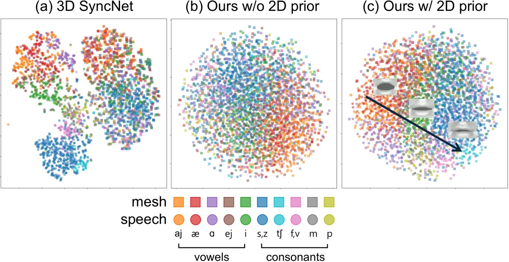

Figure 4: t-SNE plot of ablation study. We plot the t-SNE graph for each
perceptual critic model. We represent the features with same phoneme as
same color. Squared and circled points denote mesh and speech features
from each representation, respectively.

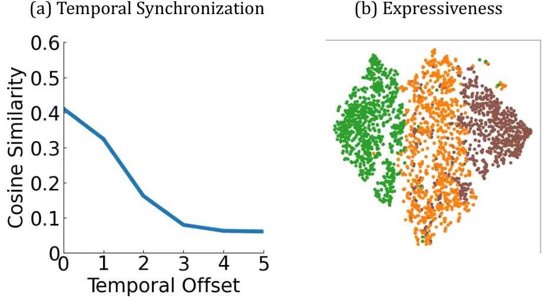

Figure 5: Behaviors of our representation in temporal and expressiveness
sensitivity. We demonstrate the effectiveness of our representation in
temporal synchronization and expressiveness using a cosine similarity
graph and speech feature plots, respectively. We color the point as low,
medium, and high intensity.

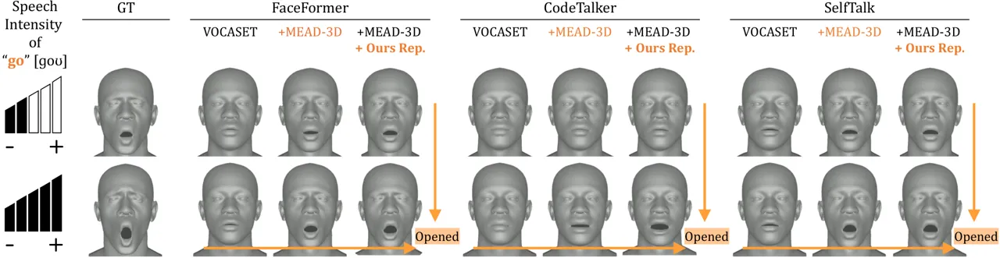

Figure 6: Qualitative results for the expressiveness. Given high and low
intensity levels of speech, models trained on both MEAD-3D and VOCASET
show more expressive lip movements compared to those trained on VOCASET
alone, and even better with our perceptual loss.

What makes our speech-mesh representation have lip synchronization
ability?   We hypothesize that the transformer-based architecture and
curriculum learning with a pre-trained audio-visual speech
representation contribute significantly to improved lip synchronization.
To validate this, we conduct ablation studies, summarized in Table 3,
examining the roles of pre-trained speech representation and
architectural design. Without the pre-trained speech representation,
base models show lower performance across metrics, and CNN-based
architectures, 3D SyncNet, do not clearly show effectiveness, while ours
with 2D prior consistently show improvement. The t-SNE plots of
perceptual critic models in Fig. 4 show that, in (a) 3D SyncNet, speech
and mesh features corresponding to the same phoneme group are separated.
In (b) ours without 2D priors, speech and mesh features lack separation
and appear scattered without clustering. Our representation (c),
notably, tends to form more distinct clusters according to phonemes,
with vowels and consonants grouped closely, potentially contributing to
enhancing lip readability. We also observe a directional progression in
the feature space, shifting from phonemes with mouth opening (_e.g_.,
/aj/) to those with mouth closing (_e.g_., /f/).

We also examine our representation’s performance in other aspects,
temporal synchronization and expressiveness. Figure 5-(a) demonstrates
temporal sensitivity, as cosine similarity drops when temporal
misalignment is introduced between input speech and 3D face mesh. In
Fig. 5-(b), we plot speech features at varying speech intensities,
showing a directional trend as intensity increases from lowest to
highest. Figures 4 and 5 imply that our representation holds favorable
properties discussed in Fig. 1 for the three criteria.

Can we unlock the expressive power of 3D talking heads?   Likely. Since
VOCASET \[8\] lacks the range of diverse speech and lip movement
intensities, evaluating expressive power requires testing on a dataset
with a broader range of intensities. To study this, we examine the
expressiveness of the base models on the MEAD-3D dataset, which includes
three intensity levels. We assess SLCC at each intensity level to
evaluate expressiveness and identify any expressiveness bounds as the
level of intensity increases. We first test the base models trained on
VOCASET \[8\] against the MEAD-3D test set. Table 4 shows these models
demonstrate limited expressiveness, with SLCC values showing minimal
increase across intensity levels. We hypothesize that this limitation
arises, because VOCASET’s smaller scale and intensity range restrict the
model’s ability to learn relationships between speech and lip intensity.
To address this, we integrate MEAD-3D with VOCASET for training, aiming
to boost expressiveness in the base models. This approach consistently
improves SLCC across all intensity levels. However, simply adding
MEAD-3D degrades lip synchronization metrics, except for expressiveness,
_i.e_., non-trivial. To counterbalance this, we leverage our perceptual
loss, which effectively mitigates the degradation introduced by MEAD-3D
while improving expressiveness (see Fig. 6).

|                   |                      |                      |                     |                                    |             |             |             |
| ----------------- | -------------------- | -------------------- | ------------------- | ---------------------------------- | ----------- | ----------- | ----------- |
| Method            | Temporal             | Lip                  |                     | Expressiveness                     |             |             |             |
|                   | Synchronization      | Readability          |                     |                                    |             |             |             |
|                   | MTM ($`\downarrow`$) | LVE ($`\downarrow`$) | PLRS ($`\uparrow`$) | SLCC / $`\Delta`$ ($`\downarrow`$) |             |             |             |
|                   |                      |                      |                     | Lv1                                | Lv2         | Lv3         | Avg         |
| MEAD-3D           | -                    | -                    | 0.230               | 0.24 / -                           | 0.30 / -    | 0.39 / -    | 0.42 / -    |
| FaceFormer \[11\] | 59.6                 | 3.207                | 0.299               | 0.08 / 0.16                        | 0.07 / 0.23 | 0.07 / 0.32 | 0.06 / 0.36 |
|   + MEAD-3D       | 59.5                 | 1.139                | 0.176               | 0.26 / 0.02                        | 0.30 / 0.00 | 0.34 / 0.05 | 0.35 / 0.07 |
|    + Ours rep.    | 55.8                 | 1.114                | 0.306               | 0.27 / 0.03                        | 0.27 / 0.03 | 0.32 / 0.07 | 0.33 / 0.09 |
| CodeTalker \[46\] | 60.7                 | 3.236                | 0.294               | 0.02 / 0.22                        | 0.03 / 0.27 | 0.03 / 0.36 | 0.02 / 0.40 |
|   + MEAD-3D       | 60.9                 | 2.954                | 0.154               | 0.09 / 0.15                        | 0.12 / 0.18 | 0.06 / 0.33 | 0.11 / 0.31 |
|    + Ours rep.    | 58.6                 | 2.705                | 0.221               | 0.18 / 0.06                        | 0.29 / 0.01 | 0.31 / 0.08 | 0.31 / 0.11 |
| SelfTalk \[21\]   | 53.4                 | 3.396                | 0.294               | 0.14 / 0.10                        | 0.14 / 0.16 | 0.17 / 0.22 | 0.15 / 0.27 |
|   + MEAD-3D       | 54.2                 | 1.238                | 0.216               | 0.16 / 0.08                        | 0.28 / 0.02 | 0.32 / 0.07 | 0.31 / 0.11 |
|    + Ours rep.    | 52.7                 | 1.192                | 0.230               | 0.17 / 0.07                        | 0.29 / 0.01 | 0.34 / 0.05 | 0.33 / 0.09 |

Table 4: Quantitative results of lip synchronization on MEAD-3D test
set. We evaluate the base models on the MEAD-3D test set. We also
compute the level-wise SLCC to evaluate the expressive capability of the
models.

## 7 Conclusion

This paper addresses challenges in existing 3D talking head generation
models, which often overlook the true correspondence between speech and
lip movements, making it difficult to accurately link lip movements with
varying speech characteristics. To overcome this issue, we identify
three essential aspects—Temporal Synchronization, Lip Readability, and
Expressiveness—that influence the perceptual quality of lip movements,
and develop specific metrics for each aspect. We introduce a speech-mesh
synchronized representation that exhibits these emergent properties and
adopt it as a perceptual loss. Our extensive analyses demonstrate that
our perceptual loss consistently enhances models across three aspects.
We believe that our defined aspects will guide future research in
generating more realistic 3D talking heads, and our representation will
serve as a key component.

#### Acknowledgments

This research was supported by a grant from KRAFTON AI, and was also
partially supported by Institute of Information & communications
Technology Planning & Evaluation (IITP) grant funded by the Korea
government (MSIT) (No.RS-2021-II212068, Artificial Intelligence
Innovation Hub; No.RS-2023-00225630, Development of Artificial
Intelligence for Text-based 3D Movie Generation; No. RS-2024-00457882,
National AI Research Lab Project) and Culture, Sports and Tourism R&D
Program through the Korea Creative Content Agency grant funded by the
Ministry of Culture, Sports and Tourism in 2024 (Project Name:
Development of barrier-free experiential XR contents technology to
improve accessibility to online activities for the physically disabled,
Project Number: RS-2024-00396700, Contribution Rate: 25%).

## References

- \[1\] Triantafyllos Afouras, Joon Son Chung, and Andrew Zisserman.
  Lrs3-ted: a large-scale dataset for visual speech recognition. _arXiv
  preprint arXiv:1809.00496_, 2018.
- \[2\] Mohamed Anwar, Bowen Shi, Vedanuj Goswami, Wei-Ning Hsu, Juan
  Pino, and Changhan Wang. Muavic: A multilingual audio-visual corpus
  for robust speech recognition and robust speech-to-text translation.
  In _INTERSPEECH 2023_, 2023.
- \[3\] Helen L Bear and Richard Harvey. Phoneme-to-viseme mappings: the
  good, the bad, and the ugly. _Speech Communication_, 2017.
- \[4\] Donald J Berndt and James Clifford. Using dynamic time warping
  to find patterns in time series. In _Proceedings of the 3rd
  international conference on knowledge discovery and data
  mining_, 1994.
- \[5\] Jeongsoo Choi, Se Jin Park, Minsu Kim, and Yong Man Ro. Av2av:
  Direct audio-visual speech to audio-visual speech translation with
  unified audio-visual speech representation. In _CVPR_, 2024.
- \[6\] J. S. Chung and A. Zisserman. Out of time: automated lip sync in
  the wild. In _Workshop on Multi-view Lip-reading, ACCV_, 2016.
- \[7\] Joon Son Chung, Arsha Nagrani, and Andrew Zisserman. Voxceleb2:
  Deep speaker recognition. _arXiv preprint arXiv:1806.05622_, 2018.
- \[8\] Daniel Cudeiro, Timo Bolkart, Cassidy Laidlaw, Anurag Ranjan,
  and Michael J Black. Capture, learning, and synthesis of 3d speaking
  styles. In _CVPR_, 2019.
- \[9\] Radek Daněček, Kiran Chhatre, Shashank Tripathi, Yandong Wen,
  Michael Black, and Timo Bolkart. Emotional speech-driven animation
  with content-emotion disentanglement. In _SIGGRAPH Asia 2023
  Conference Papers_, pages 1–13, 2023.
- \[10\] Han EunGi, Oh Hyun-Bin, Kim Sung-Bin, Corentin Nivelet
  Etcheberry, Suekyeong Nam, Janghoon Ju, and Tae-Hyun Oh. Enhancing
  speech-driven 3d facial animation with audio-visual guidance from lip
  reading expert. In _Interspeech 2024_, pages 2940–2944, 2024.
- \[11\] Yingruo Fan, Zhaojiang Lin, Jun Saito, Wenping Wang, and Taku
  Komura. Faceformer: Speech-driven 3d facial animation with
  transformers. In _CVPR_, 2022.
- \[12\] Gabriele Fanelli, Juergen Gall, Harald Romsdorfer, Thibaut
  Weise, and Luc Van Gool. A 3-d audio-visual corpus of affective
  communication. _IEEE TMM_, 2010.
- \[13\] Panagiotis P. Filntisis, George Retsinas, Foivos
  Paraperas-Papantoniou, Athanasios Katsamanis, Anastasios Roussos, and
  Petros Maragos. Spectre: Visual speech-informed perceptual 3d facial
  expression reconstruction from videos. In _CVPRW_, pages
  5745–5755, 2023.
- \[14\] Rohit Girdhar, Alaaeldin El-Nouby, Zhuang Liu, Mannat Singh,
  Kalyan Vasudev Alwala, Armand Joulin, and Ishan Misra. Imagebind: One
  embedding space to bind them all. In _CVPR_, 2023.
- \[15\] Yuan Gong, Andrew Rouditchenko, Alexander H. Liu, David
  Harwath, Leonid Karlinsky, Hilde Kuehne, and James R. Glass.
  Contrastive audio-visual masked autoencoder. In _The Eleventh
  International Conference on Learning Representations_, 2023.
- \[16\] Jack Hessel, Ari Holtzman, Maxwell Forbes, Ronan Le Bras, and
  Yejin Choi. CLIPScore: a reference-free evaluation metric for image
  captioning. In _EMNLP_, 2021.
- \[17\] Jonathan Ho, Ajay Jain, and Pieter Abbeel. Denoising diffusion
  probabilistic models. _NeurIPS_, 33:6840–6851, 2020.
- \[18\] Jessica E Huber and Bharath Chandrasekaran. Effects of
  increasing sound pressure level on lip and jaw movement parameters and
  consistency in young adults. 2006.
- \[19\] Eamonn J. Keogh and M. Pazzani. Derivative dynamic time
  warping. In _In First SIAM International Conference on Data
  Mining_, 2001.
- \[20\] Aaron van den Oord, Yazhe Li, and Oriol Vinyals. Representation
  learning with contrastive predictive coding. _arXiv preprint
  arXiv:1807.03748_, 2018.
- \[21\] Ziqiao Peng, Yihao Luo, Yue Shi, Hao Xu, Xiangyu Zhu, Hongyan
  Liu, Jun He, and Zhaoxin Fan. Selftalk: A self-supervised commutative
  training diagram to comprehend 3d talking faces. In _ACM MM_, 2023a.
- \[22\] Ziqiao Peng, Haoyu Wu, Zhenbo Song, Hao Xu, Xiangyu Zhu, Jun
  He, Hongyan Liu, and Zhaoxin Fan. Emotalk: Speech-driven emotional
  disentanglement for 3d face animation. In _Proceedings of the IEEE/CVF
  International Conference on Computer Vision (ICCV)_, 2023b.
- \[23\] K R Prajwal, Rudrabha Mukhopadhyay, Vinay P. Namboodiri, and
  C.V. Jawahar. A lip sync expert is all you need for speech to lip
  generation in the wild. In _Proceedings of the 28th ACM International
  Conference on Multimedia_, page 484–492. Association for Computing
  Machinery, 2020.
- \[24\] Alec Radford, Jong Wook Kim, Chris Hallacy, Aditya Ramesh,
  Gabriel Goh, Sandhini Agarwal, Girish Sastry, Amanda Askell, Pamela
  Mishkin, Jack Clark, et al. Learning transferable visual models from
  natural language supervision. In _Int. Conf. on Mach. Learn._, pages
  8748–8763. PMLR, 2021.
- \[25\] Byron Reeves and David Voelker. ffects of audio-video
  asynchrony on viewer’s memory, evaluation of content and detection
  ability. In _Research Report, Standford University_, 1993.
- \[26\] George Retsinas, Panagiotis P Filntisis, Radek Danecek,
  Victoria F Abrevaya, Anastasios Roussos, Timo Bolkart, and Petros
  Maragos. 3d facial expressions through analysis-by-neural-synthesis.
  In _CVPR_, 2024.
- \[27\] Alexander Richard, Michael Zollhöfer, Yandong Wen, Fernando
  De la Torre, and Yaser Sheikh. Meshtalk: 3d face animation from speech
  using cross-modality disentanglement. In _ICCV_, 2021.
- \[28\] Richard Schulman. Articulatory dynamics of loud and normal
  speech. _The Journal of the Acoustical Society of America_,
  85(1):295–312, 1989.
- \[29\] Bowen Shi, Wei-Ning Hsu, Kushal Lakhotia, and Abdelrahman
  Mohamed. Learning audio-visual speech representation by masked
  multimodal cluster prediction. In _ICLR_, 2022a.
- \[30\] Bowen Shi, Wei-Ning Hsu, and Abdelrahman Mohamed. Robust
  self-supervised audio-visual speech recognition. _arXiv preprint
  arXiv:2201.01763_, 2022b.
- \[31\] Jiaming Song, Chenlin Meng, and Stefano Ermon. Denoising
  diffusion implicit models. In _ICLR_, 2021.
- \[32\] Wenfeng Song, Xuan Wang, Shi Zheng, Shuai Li, Aimin Hao, and
  Xia Hou. Talkingstyle: Personalized speech-driven 3d facial animation
  with style preservation. _IEEE Transactions on Visualization and
  Computer Graphics_, 2024.
- \[33\] Stefan Stan, Kazi Injamamul Haque, and Zerrin Yumak.
  Facediffuser: Speech-driven 3d facial animation synthesis using
  diffusion. In _Proceedings of the 16th ACM SIGGRAPH Conference on
  Motion, Interaction and Games_, pages 1–11, 2023.
- \[34\] Trinity Suma, Birate Sonia, Kwame Agyemang Baffour, and Oyewole
  Oyekoya. The effects of avatar voice and facial expression intensity
  on emotional recognition and user perception. In _SIGGRAPH Asia 2023
  Technical Communications_, pages 1–4. 2023.
- \[35\] Licai Sun, Zheng Lian, Bin Liu, and Jianhua Tao. Hicmae:
  Hierarchical contrastive masked autoencoder for self-supervised
  audio-visual emotion recognition. _Information Fusion_, 108:102382,
  2024a.
- \[36\] Zhiyao Sun, Tian Lv, Sheng Ye, Matthieu Lin, Jenny Sheng,
  Yu-Hui Wen, Minjing Yu, and Yong-Jin Liu. Diffposetalk: Speech-driven
  stylistic 3d facial animation and head pose generation via diffusion
  models. _ACM TOG_, 43(4), 2024b.
- \[37\] Kim Sung-Bin, Lee Chae-Yeon, Gihun Son, Oh Hyun-Bin, Janghoon
  Ju, Suekyeong Nam, and Tae-Hyun Oh. Multitalk: Enhancing 3d talking
  head generation across languages with multilingual video dataset. In
  _Proc. Interspeech 2024_, pages 1380–1384, 2024a.
- \[38\] Kim Sung-Bin, Lee Hyun, Da Hye Hong, Suekyeong Nam, Janghoon
  Ju, and Tae-Hyun Oh. Laughtalk: Expressive 3d talking head generation
  with laughter. In _Proceedings of the IEEE/CVF Winter Conference on
  Applications of Computer Vision_, pages 6404–6413, 2024b.
- \[39\] Hiroki Tanaka, Satoshi Nakamura, et al. The acceptability of
  virtual characters as social skills trainers: usability study. _JMIR
  human factors_, 9(1):e35358, 2022.
- \[40\] Stephen M Tasko and Michael D McClean. Variations in
  articulatory movement with changes in speech task. 2004.
- \[41\] Guy Tevet, Sigal Raab, Brian Gordon, Yoni Shafir, Daniel
  Cohen-or, and Amit Haim Bermano. Human motion diffusion model. In
  _ICLR_, 2023.
- \[42\] Yoad Tewel, Yoav Shalev, Idan Schwartz, and Lior Wolf. Zerocap:
  Zero-shot image-to-text generation for visual-semantic arithmetic. In
  _Proceedings of the IEEE/CVF Conference on Computer Vision and Pattern
  Recognition_, pages 17918–17928, 2022.
- \[43\] Argiro Vatakis and Charles Spence. Audiovisual synchrony
  perception for speech and music assessed using a temporal order
  judgment task. _Neuroscience letters_, 393(1):40–44, 2006.
- \[44\] Jiadong Wang, Xinyuan Qian, Malu Zhang, Robby T Tan, and
  Haizhou Li. Seeing what you said: Talking face generation guided by a
  lip reading expert. In _CVPR_, pages 14653–14662, 2023.
- \[45\] Kaisiyuan Wang, Qianyi Wu, Linsen Song, Zhuoqian Yang, Wayne
  Wu, Chen Qian, Ran He, Yu Qiao, and Chen Change Loy. Mead: A
  large-scale audio-visual dataset for emotional talking-face
  generation. In _ECCV_, 2020.
- \[46\] Jinbo Xing, Menghan Xia, Yuechen Zhang, Xiaodong Cun, Jue Wang,
  and Tien-Tsin Wong. Codetalker: Speech-driven 3d facial animation with
  discrete motion prior. In _CVPR_, 2023.
- \[47\] Dogucan Yaman, Fevziye Irem Eyiokur, Leonard Bärmann, Seymanur
  Akti, Hazım Kemal Ekenel, and Alexander Waibel. Audio-visual speech
  representation expert for enhanced talking face video generation and
  evaluation. In _Proceedings of the IEEE/CVF Conference on Computer
  Vision and Pattern Recognition_, pages 6003–6013, 2024.
- \[48\] Karren Yang, Anurag Ranjan, Rick Chang, Raviteja Vemulapalli,
  and Oncel Tuzel. Probabilistic speech-driven 3d facial motion
  synthesis: New benchmarks, methods, and applications. In _CVPR_, 2024.
- \[49\] Wenxuan Zhang, Xiaodong Cun, Xuan Wang, Yong Zhang, Xi Shen, Yu
  Guo, Ying Shan, and Fei Wang. Sadtalker: Learning realistic 3d motion
  coefficients for stylized audio-driven single image talking face
  animation. In _CVPR_, pages 8652–8661, 2023.

Supplementary Material

## Contents

A Supplementary Video  
B Emergent Properties of 2D Speech Representation  
C Speech-Mesh Synchronized Representation  
  C.1 Network architecture  
  C.2 Training pipeline  
  C.3 Dataset statistics  
D Details of Human Study on Lip Synchronization Criteria  
E Evaluation Metrics  
  E.1 Definition and implementation details  
  E.2 Human study on perceptual metric  
F Implementation Details of Ablation Study  
G Additional Results  
  G.1 Human study on applying perceptual loss  
  G.2 FDD evaluation on applying perceptual loss  
  G.3 Qualitative result of temporal synchronization  
  G.4 Stability comparison on loss and cosine similarity  
H Discussion

 

## Appendix A Supplementary Video

This work focuses on 3D facial motions, which are best viewed in video
format. Please refer to the attached supplementary video. The video
contains qualitative results of lip synchronization on the VOCASET and
MEAD-3D test sets, demonstrating the effectiveness of our method in
enhancing lip synchronization in aspects of lip readability and
expressiveness.

## Appendix B Emergent Properties of 2D Speech Representation

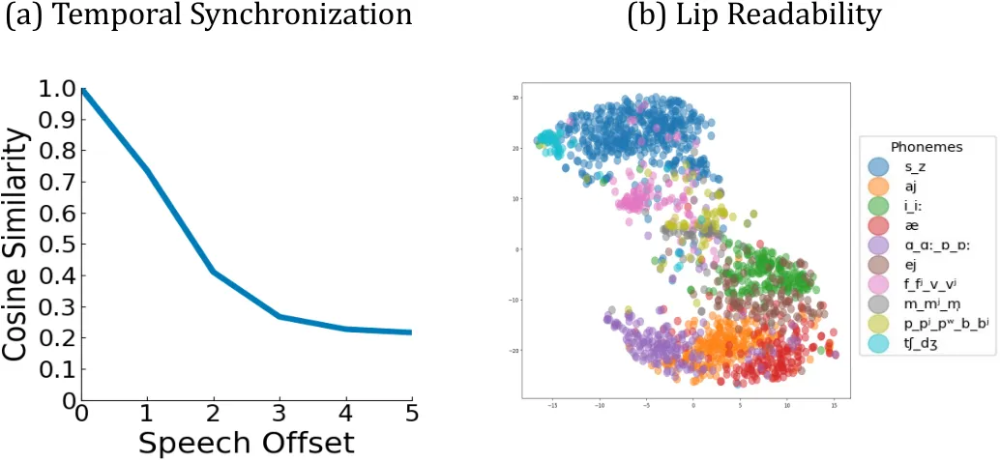

Figure S1: Emergent properties of 2D speech representation. We visualize
a cosine similarity versus temporal offset graph and a t-SNE
visualization of the 2D audio-visual speech representation. The 2D
speech representation already possesses desired properties we pursue,
which motivates us to transfer the emergent properties to the
speech-mesh representation space.

In this section, we conduct further analyses of 2D speech representation
(_i.e_., 2D prior knowledge), which motivate the transfer of the
emergent properties of 2D speech representation to the speech-mesh
representation space using a curriculum learning approach.

We observe that the 2D audio-visual speech representation, trained with
a transformer architecture and an extensive video dataset \[1\],
inherently exhibits the desirable properties for lip synchronization
that we aim to achieve. We visualize a cosine similarity versus temporal
offset graph and a t-SNE visualization of the 2D audio-visual speech
representation in Fig. S1. The speech representation exhibits the
properties regarding the critical aspects of lip synchronization: (1)
Temporal sensitivity in Fig. S1-(a), (2) clear separation and clustering
of speech features corresponding to the same phoneme group
in Fig. S1-(b), and (3) a directional progression of speech features as
intensity increases from the lowest to the highest levels in Fig. 5-(b)
of the main paper ^(\*)^(\*) \* We freeze the pre-trained speech encoder
from stage 1 and utilize it as the speech encoder in stage 2, which
ensures that the speech representation in both stages shares the same
favorable property of expressiveness.. This motivates us to transfer
these emergent properties to the 3D speech-mesh representation through
the curriculum learning approach, as mentioned in Sec. 4 of the main
paper. Furthermore, as shown in Figs. 4 and 5 of the main paper, we
demonstrate that these properties are successfully transferred to the
speech-mesh representation.

## Appendix C Speech-Mesh Synchronized Representation

We provide more details on the network architecture of audio-visual
speech representation and speech-mesh representation (Sec. C.1). In
addition, we provide the training details of the two-stage training
process (Sec. C.2) and dataset statistics of speech-mesh benchmark
datasets (Sec. C.3).

### C.1 Network architecture

|       |                  |                                                                                              |                                                                                                          |
| ----- | ---------------- | -------------------------------------------------------------------------------------------- | -------------------------------------------------------------------------------------------------------- |
| Stage | Module           | Input $`\rightarrow`$ Output                                                                 | Layer Operation                                                                                          |
| 1     | Speech Tokenizer | $`\mathbf{X_{s}}(C_{s},H_{s},W_{s})\rightarrow\mathbf{S}(N,H)`$                              | Conv2D$`((1,16),(1,16),H)`$                                                                              |
|       | Speech Encoder   | $`\mathbf{S}^{unmask}(N^{unmask},H)\rightarrow`$                                             | $`[`$MHSA$`(H,8)\rightarrow`$ FFN$`(H)]\times 10\rightarrow`$ LN                                         |
|       |                  | $`\mathbf{Z_{s}}(N^{unmask},H)`$                                                             |                                                                                                          |
|       | Speech Decoder   | $`\mathbf{F_{s}^{\prime}}\rightarrow\hat{\mathbf{S}}(N^{mask},C_{s}\cdot H_{s}\cdot W_{s})`$ | Concat$`(`$Linear$`(H,384)+`$ PE$`(N^{unmask})`$, PE$`(N^{mask}))\rightarrow`$                           |
|       |                  |                                                                                              | MHSA$`(384,8)\rightarrow`$ FFN$`(384\cdot 4)\rightarrow`$                                                |
|       |                  |                                                                                              | $`[`$MHSA$`(384,8)\rightarrow`$ MHCA$`(Z_{s},384,6)\rightarrow`$ FFN$`(384\cdot 4)]\times 3\rightarrow`$ |
|       |                  |                                                                                              | LN $`\rightarrow`$ Linear$`(C_{s}\cdot H_{s}\cdot W_{s})\rightarrow`$ Slice$`[N^{unmask}:]`$             |
|       | Video Tokenizer  | $`\mathbf{X_{v}}(C_{v},T,H_{v},W_{v})\rightarrow\mathbf{V}(M,H)`$                            | Conv3D$`\big((1,16,16),(1,16,16),H\big)`$                                                                |
|       | Video Encoder    | $`\mathbf{V}^{unmask}(M^{unmask},H)\rightarrow`$                                             | $`[`$MHSA$`(H,8)\rightarrow`$ FFN$`(H)]\times 10\rightarrow`$ LN                                         |
|       |                  | $`\mathbf{Z_{v}}(M^{unmask},H)`$                                                             |                                                                                                          |
|       | Video Decoder    | $`\mathbf{F_{v}^{\prime}}\rightarrow\hat{\mathbf{V}}(M^{mask},C_{v}\cdot H_{v}\cdot W_{v})`$ | Concat(Linear$`(H,384)+`$ PE$`(M^{unmask})`$, PE$`(M^{mask}))\rightarrow`$                               |
|       |                  |                                                                                              | MHSA$`(H,8)\rightarrow`$ FFN$`(H)\rightarrow`$                                                           |
|       |                  |                                                                                              | $`[`$MHSA$`(H,8)\rightarrow`$ MHCA$`(Z_{v},H,6)\rightarrow`$ FFN$`(H)]\times 3\rightarrow`$              |
|       |                  |                                                                                              | LN $`\rightarrow`$ Linear$`(C_{v}\cdot H_{v}\cdot W_{v})\rightarrow`$ Slice$`[M^{unmask}:]`$             |
|       | Fusion Encoder   | $`\mathbf{Z_{s}},\mathbf{Z_{v}}\rightarrow\mathbf{F_{s}}(N^{unmask},H)`$                     | $`[`$MHSA$`(H,8)\rightarrow`$ MHCA$`(Z_{v},H,8)\rightarrow`$ FFN$`(H\cdot 4)]\times 2`$                  |
|       |                  | $`\mathbf{Z_{s}},\mathbf{Z_{v}}\rightarrow\mathbf{F_{v}}(M^{unmask},H)`$                     | $`[`$MHSA$`(H,8)\rightarrow`$ MHCA$`(Z_{s},H,8)\rightarrow`$ FFN$`(H\cdot 4)]\times 2`$                  |
| 2     | Mesh Tokenizer   | $`\mathbf{X_{m}}(T,V\cdot 3)\rightarrow\mathbf{M}(T,H)`$                                     | Linear$`(H)`$                                                                                            |
|       | Mesh Encoder     | $`\mathbf{M}\rightarrow\mathbf{Z_{m}}(T,H)`$                                                 | $`[`$MHSA$`(H,8)\rightarrow`$ FFN$`(H)]\times 10\rightarrow`$ LN                                         |

Table S1: Architecture details. The parameters of network architectures.
Conv2D$`(k,s,n)`$ denotes a 2D Convolutional layer with kernel size
$`k`$, stride size $`s`$, and output channel of $`n`$. MHSA$`(d,nhead)`$
denotes a multi-head self-attention layer with the input channels $`d`$
and the number of heads in multi-head attention $`nhead`$.
MHCA$`(ca,d,nhead)`$ denotes a multi-head cross-attention layer with
additional cross-attention input $`ca`$. PE$`(a)`$ is a position
embedding layer where $`a`$ denotes the length of the position vector.
FFN$`(d)`$ is a feed-forward layer. Linear$`(n)`$ denotes a linear layer
with output channels of $`n`$. LN denotes layer normalization and
Slice$`[s:]`$ denotes slice operation.

To improve the reproducibility of our speech-mesh representation, we
further illustrate the detailed network architectures for the
audio-visual speech representation and the speech-mesh representation,
which are shown in Table S1.

### C.2 Training pipeline

#### Two-stage training process

In our experiment, we set $`T`$ = 5, $`H`$ = 512, and $`P`$ = 30. For
training the audio-visual speech representation, we use $`C_{s}`$ = 1,
$`H_{s}`$ = 64, $`W_{s}`$ = 128, $`N`$ = 512 for speech modality and
$`C_{s}`$ = 3, $`H_{v}`$ = 160, $`W_{v}`$ = 160, $`M`$ = 500 for video
modality. We train the audio-visual speech representation using LRS on
two NVIDIA A6000 for 100 epochs with the AdamW optimizer ($`\beta_{1}`$
= 0.9, $`\beta_{2}`$ = 0.95 and $`\epsilon`$ = 1$`e`$-8), where the
learning rate is initialized as 3$`e`$-4, and the mini-batch size is set
as 40. For training the speech-mesh representation, we use the number of
vertices $`V`$ = 5023. We train the speech-mesh representation using
LRS-3D with the mini-batch size of 80, and other hyper-parameters remain
unchanged as Stage 1.

#### Perceptual loss

We employ our speech-mesh representation as a perceptual loss to enhance
the perceptual accuracy of the 3D talking head model. We finetune our
speech-mesh representation using the VOCASET \[8\] train split on an
NVIDIA A6000 for 5 epochs with the initial learning rate 1$`e`$-4 and
other hyper-parameters remain unchanged as Stage 2. To train the 3D
talking head models with our perceptual loss, we split the generated
mesh from the model into 5 frames using a sliding window size of 1. We
make a batch of size 80 and get uni-modal embeddings from our
representation. We additionally apply the InfoNCE loss with a weight of
1$`e`$-7 to the original training loss of the model.

### C.3 Dataset statistics

|         |                     |                    |             |     |     |
| ------- | ------------------- | ------------------ | ----------- | --- | --- |
| Dataset | $`\#`$ Vertex clips | $`\#`$ Speaker IDs | Total hours | FPS |     |
| VOCASET | 475                 | 12                 | 0.5         | 30  |     |
| BIWI    | 1109                | 14                 | 1.4         | 25  |     |
| LRS3-3D | 17752               | 788                | 61.1        | 25  |     |
| MEAD-3D | 8765                | 15                 | 10.2        | 30  |     |

Table S2: Statistics of speech-mesh paired benchmark. We use VOCASET,
LRS3-3D and MEAD-3D speech-mesh paired datasets in our experiments. We
construct two large-scale speech-mesh benchmark datasets, LRS3-3D and
MEAD-3D, using monocular face reconstruction methods.

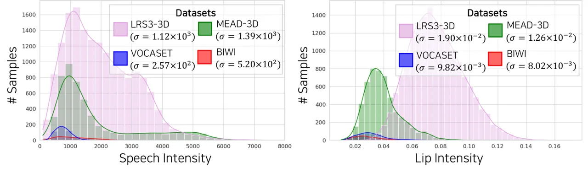

Figure S2: Speech and lip intensity distributions across datasets. We
present speech and lip intensity distributions and corresponding
standard deviation values across datasets.

We construct LRS3-3D and MEAD-3D by processing LRS3 \[1\] and
MEAD \[45\] videos using two monocular face reconstruction methods,
respectively: SPECTRE \[13\] for LRS3, which ensures accurate lip
movements, and SMIRK \[26\] for MEAD, which captures diverse speech and
lip movement intensities. We construct a test split for LRS-3D,
involving 934 clips. We split MEAD-3D to construct a test split, which
includes 3470 clips.

Table S2 and Fig. S2 show the statistics of the existing (VOCASET \[8\],
BIWI \[12\]) and the newly proposed large-scale speech-mesh benchmark
datasets (LRS3-3D and MEAD-3D). As shown in Table S2, LRS3-3D and
MEAD-3D have notably larger data sizes than VOCASET and BIWI. Fig. S2
presents the broader speech and lip intensity^(\*)^(\*) \* Lip intensity
was normalized by eye distance to account for differences between FLAME
and BIWI topologies. distributions of LRS3-3D and MEAD-3D with higher
standard deviations ($`\sigma`$), indicating greater variability in
facial motions. In contrast, VOCASET and BIWI show limitations in both
scale and diversity.

## Appendix D Details for Human Study on Lip Synchronization Criteria

#### Human preference between the speech and lip intensities

We conduct a preliminary experiment to demonstrate the positive
correlation of human preference between the intensity of speech and lip
movements in the 3D talking face field. Using the intensity annotations
from the MEAD dataset \[45\], we first split the MEAD-3D dataset into
three categories: Level 1, Level 2, and Level 3, representing different
intensity levels. Then, we train a 3D talking face model \[11\] using
VOCASET \[8\] (to ensure the quality of generation) and each intensity
split separately. This results in three distinct models, each of which
tends to generate lip movements biased toward the intensity level
present in its training data, regardless of the speech intensity
provided as input. We input three speeches with intensity levels ranging
from Level 1 to Level 3 into each of the three biased models, producing
nine intensity configurations in the generated mesh sequences as shown
in Tab.1-\[Left\] of the main paper. We then asked 17 participants, a
balanced group of males and females from a non-expert background in the
field, to rank their preferences in three videos, assigning a score from
1 (least preferred) to 3 (most preferred). Each video has the same
speech (identical in utterance and intensity) but differs in the
intensity of the lip movements.

#### Human preference on Temporal sync. vs. Expressiveness

We design a simple A/B test to investigate an interesting aspect of
human perception for lip synchronization. We use the two biased models
from the previous human study: one trained to generate Level 1 lip
movements and the other trained to generate Level 3 lip movements,
regardless of the speech intensity. For each model, we create two types
of samples. Sample A is temporally synchronized but lacks expressive
synchronization (_e.g_., speech of Level 3 intensity and lip movements
of Level 1 intensity). In contrast, sample B has expressive
synchronization (_e.g_., speech of Level 3 intensity and lip movements
of Level 3 intensity) but is temporally misaligned. To introduce the
temporal mismatch in Sample B, we make the speech lead the lip movements
by 100ms, which exceeds twice the established maximum acceptable
synchrony \[43\]. We then asked 28 participants, comprising a balanced
group of males and females from a non-expert background in the field, to
choose which sample they prefer based on how well the lip movements
correspond to the speech in sample A vs. B.

## Appendix E Evaluation Metrics

We present the comprehensive definitions of the evaluation metrics and
their implementation details (Sec. E.1). In addition, we provide the
human study on the perceptual metric (Sec. E.2), which demonstrates the
correlation between our perceptual metric and human preference.

### E.1 Definition and implementation details

#### Mean Temporal Misalignment (MTM)

Let $`\mathbf{V}(t)`$ represent the ground truth vertex sequences, where
each frame $`t`$ consists of vertex positions
$`\mathbf{v}_{t}\in\mathbb{R}^{N\times 3}`$, with $`N`$ being the number
of vertices. Similarly, $`\mathbf{\hat{V}}(t)`$ represents the predicted
vertex sequences, with predicted vertex positions
$`\mathbf{\hat{v}}_{t}\in\mathbb{R}^{N\times 3}`$. For each sample
$`k`$, we select two specific vertices that correspond to the center of
the upper and lower lips, extracting the upper-lip vertex sequence
$`\mathbf{V}_{u}(t)\in\mathbb{R}^{T\times 3}`$ and the lower-lip vertex
sequence $`\mathbf{V}_{l}(t)\in\mathbb{R}^{T\times 3}`$ (refer to
Fig. S3).

We then calculate the Euclidean distance between the upper and lower lip
vertices over time to derive the ground truth lip distance sequence
$`d_{v}(t)=\left\|\mathbf{V}_{u}(t)-\mathbf{V}_{l}(t)\right\|`$. The
same process is applied to obtain the predicted lip distance sequence
$`\hat{d}_{v}(t)`$. To reduce noise, we apply a Gaussian filter to both
lip distance sequences.

Next, we compute the first-order derivatives of the smoothed lip
distance sequences to capture the dynamic changes in lip movement. We
then use Derivative Dynamic Time Warping (DDTW) \[19\] to determine the
optimal alignment path $`\mathcal{A}=\{(i,j)\}`$ between the derivative
sequences $`\delta\tilde{d}_{v}(t)`$ and
$`\delta\tilde{\hat{d}}_{v}(t)`$. We identify local extrema (peaks and
valleys) in each derivative sequence and match only extrema of the same
type (i.e., both maxima or both minima) to compute the absolute time
difference $`\delta t_{n}=|i-j|`$ (refer to Fig. S4).

For each sample $`k`$, the sample mean temporal misalignment
$`\Delta t_{k}`$ is computed as
$`\Delta t_{k}=\dfrac{1}{M}\sum_{m=1}^{M}\delta t_{n}`$, where $`M`$ is
the number of matched extrema pairs in the sample. Finally, the overall
mean temporal misalignment is given by
$`\overline{\Delta t}=\dfrac{1}{K}\sum_{k=1}^{K}\Delta t_{k}`$, where
$`K`$ is the total number of samples. A smaller $`\overline{\Delta t}`$
indicates better temporal alignment of the predicted sequences with the
ground truth lip movements. To express the Mean Temporal Misalignment
(MTM) in milliseconds, we multiply $`\overline{\Delta t}`$ by the frame
duration for the given dataset. For instance, for a dataset with 25 FPS,
the MTM is obtained by multiplying $`\overline{\Delta t}`$ by 40ms.
Refer to Algorithm 1 for more details on the MTM calculation.
Furthermore, to validate the physical accuracy of our proposed temporal
synchronization metric, we present a graph showing the relationship
between the temporal offset and the corresponding MTM values.
Specifically, we introduce temporal mismatch to the ground truth mesh
sequences of VOCASET \[8\] by making the speech leading the mesh
sequences by 0 to 10 frames (_i.e_., 0 to 333ms for VOCASET). Figure S5
shows that MTM accurately captures the degree of temporal mismatch
across the samples, demonstrating the effectiveness and physical
accuracy of our proposed temporal synchronization metric.

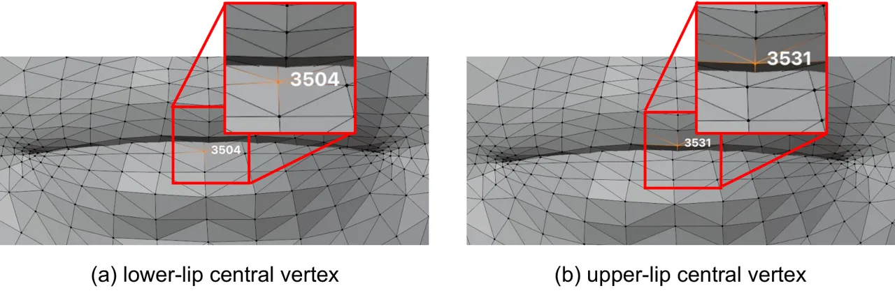

Figure S3: Central vertices of the lower and upper lips. We select two
specific vertices that correspond to the center of the upper and lower
lips to extract the lip vertex displacement sequences.

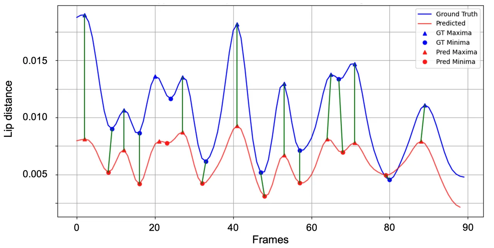

Figure S4: An example of DDTW matching results between ground truth and
predicted lip distance sequences. We present an example of the DDTW
local extrema correspondences of the ground truth and predicted lip
vertex displacement sequences. We represent matched local extrema using
green lines.

Figure S5: Physical accuracy of Mean Temporal Misalignment. We introduce
temporal mismatch to the ground truth mesh sequences of VOCASET \[8\] by
shifting the speech to lead the mesh sequences by 0 to 10 frames (where
0 represents no mismatch). For each temporal offset, we calculate the
average MTM and plot a graph showing the relationship between the
temporal offset and the corresponding MTM values.

#### Perceptual Lip Readability Score (PLRS)

We train speech-mesh representation using our proposed two-stage
training process with different datasets, initializations, and batch
sizes. For both Stage 1 and Stage 2, we use a batch size of 256. Given a
speech and generated mesh pair
$`(\mathbf{X_{s}},\hat{\mathbf{X}}_{\mathbf{m}})`$, we split the
generated mesh into 5 frames with a sliding window size of 5 to make
mesh tokens $`\{\hat{\mathbf{M}}_{i}\}_{i=1}^{G}`$ , and the speech is
also converted into corresponding speech tokens
$`\{\mathbf{S}_{i}\}_{i=1}^{G}`$. We then compute the average cosine
similarity between mean pooled speech embeddings
$`\{\mathbf{c}_{\mathbf{s},i}\}_{i=1}^{G}`$ and mesh embeddings
$`\{\mathbf{c}_{\mathbf{m},i}\}_{i=1}^{G}`$:

```math
{PLRS(\mathbf{S},\hat{\mathbf{M}})=\frac{1}{G}\sum_{i=1}^{G}\frac{\mathbf{c}_{\mathbf{s},i}\cdot\mathbf{c}_{\mathbf{m},i}}{\left\|\mathbf{c}_{\mathbf{s},i}\right\|\left\|\mathbf{c}_{\mathbf{m},i}\right\|}.} \tag{a}
```

#### Speech-Lip Intensity Correlation Coefficient (SLCC)

First, we define speech intensity using speech loudness, specifically
the Root Mean Square (RMS) value, which is a widely accepted measure of
speech intensity in signal processing. RMS loudness effectively captures
the energy of the speech signal and provides an accurate representation
of perceived speech intensity. However, since RMS values can vary based
on recording conditions (_e.g_., microphone gain and distance from the
microphone), we perform identity-wise z-normalization on the RMS values
to standardize them, assuming that clips belonging to the same identity
are recorded under similar conditions. The Speech Intensity (SI) is thus
defined as:

```math
\text{SI}_{k}=\frac{\text{RMS}_{k}-\mu_{s,i}}{\sigma_{s,i}}, \tag{b}
```

where $`\text{RMS}_{k}`$ is the averaged RMS value of k-th video clip
and $`\mu_{s,i}`$ and $`\sigma_{s,i}`$ are the mean and standard
deviation of the speech RMS values for the clips with identity
$`i\in I`$.

To define Lip Intensity (LI), we first measure the averaged lip
displacement value of k-th video clip $`\text{Dist}_{k}`$. as:

```math
\text{Dist}_{k}=\sqrt{\frac{1}{T_{k}-1}\sum_{t=1}^{T_{k}-1}\left(\frac{1}{V_{l}}\sum_{v=1}^{V_{l}}\|\mathbf{l}_{t+1,v}-\mathbf{l}_{t,v}\|\right)^{2}}, \tag{c}
```

where $`T_{k}`$ is the number of frames in clip $`k`$, $`V_{l}`$ is the
number of vertices in the lip region, and
$`\mathbf{l}_{t,v}\in\mathbb{R}^{3}`$ represents a vertex position in
the lip region at time $`t`$. Similar to Speech Intensity, we perform
identity-wise z-normalization to the lip displacement values to mitigate
individual bias in lip movement as:

```math
\text{LI}_{k}=\frac{\text{Dist}_{k}-\mu_{l,i}}{\sigma_{l,i}}, \tag{d}
```

where $`\mu_{l,i}`$ and $`\sigma_{l,i}`$ are the mean and standard
deviation of the lip displacement values for the clips belonging to
identity $`i\in I`$.

Finally, we can obtain the Speech and Lip Correlation Coefficient as:

```math
r_{SL}=\frac{\sum_{k=1}^{K}(SI_{k}-\bar{SI})(LI_{k}-\bar{LI})}{\sqrt{\sum_{k=1}^{K}(SI_{k}-\bar{SI})^{2}}\sqrt{\sum_{k=1}^{K}(LI_{k}-\bar{LI})^{2}}}, \tag{e}
```

where $`\bar{SI}=\frac{1}{K}\sum_{k=1}^{K}SI_{k}`$ and
$`\bar{LI}=\frac{1}{K}\sum_{k=1}^{K}LI_{k}`$.

### E.2 Human study on perceptual metric

To validate that our proposed perceptual metric, Perceptual Lip
Readability Score (PLRS), effectively evaluates perceptual alignment, we
conduct a human study that assesses the correlation between the metric
scores and human preferences. We collect meshes from the ground-truth
VOCASET \[8\] dataset and those generated by FaceFormer \[11\],
CodeTalker \[46\] and SelfTalk \[21\]. We measure the PLRS and the
existing evaluation metric Lip Vertex Error (LVE) for the generated
meshes of each model, and subsequently rank the models by their PLRSs
and LVEs. We ask 16 participants, evenly balanced in gender and from
non-expert backgrounds, to rank the models based on their preferences.
We then compute the Spearman’s correlation coefficient $`\rho`$ to
compare the PLRS rankings and the LVE rankings with the human preference
rankings. As shown in Table S3, PLRS exhibits a far more positive
correlation with human preferences compared to the LVE. This highlights
the efficacy of our proposed metric in evaluating perceptual lip
readability from a human perspective.

|        |                     |
| ------ | ------------------- |
| Metric | Spearman’s $`\rho`$ |
| LVE    | 0.166               |
| PLRS   | 0.437               |

Table S3: Human study on perceptual metric. We conduct a human study to
validate our proposed perceptual metric, PLRS. We compute the Spearman’s
correlation coefficient $`\rho`$ to compare the PLRS rankings with the
human preference rankings.

## Appendix F Implementation Details of Ablation Study

In this section, we provide implementation details of model variants
ablated from our speech-mesh representation: the 3D SyncNet and the
representation w/o 2D prior.

#### 3D SyncNet

Inspired by Chung *et al*. \[6\], we train 3D SyncNet to evaluate the
performance of our transformer-based model compared to a CNN-based
model. 3D SyncNet is trained using InfoNCE loss with a batch size of 80.
The architecture of 3D SyncNet consists of the mesh encoder comprising
three dilated convolutional layers and the speech encoder with six
convolution layers followed by two linear layers. The mesh and speech
features are extracted from each encoder, respectively. We train 3D
SycnNet on an NVIDIA RTX 3090 GPU for 20 epochs using LRS3-3D. Also, for
imposing the perceptual loss to 3D talking head models with 3D SyncNet,
we finetune the model with VOCASET \[8\] train split for 5 epochs, as
our speech-mesh representation model does.

#### Ours w/o 2D prior

We train speech-mesh representation without Stage 1 training to evaluate
the effectiveness of our learned 2D prior. We train the speech encoder
and mesh encoder, both with the same architecture as Stage 2, and the
other hyperparameters are the same as in Stage 2.

## Appendix G Additional Results

In this section, we present quantitative results on human studies (refer
to Sec. G.1) and Upper Face Dynamics Deviation (FDD) evaluation (refer
to Sec. G.2), comparing samples generated by the base models \[11, 46,
21\] with and without perceptual loss to demonstrate the effectiveness
of our speech-mesh representation. Additionally, we provide the
qualitative result of temporal synchronization for the base models \[11,
46\] (refer to Sec. G.3). We also provide comparisons on the stability
of perceptual loss and cosine similarity for ablated model variants
(refer to Sec. G.4).

### G.1 Human study on applying perceptual loss

We conduct a human study to evaluate the perceptual preference for our
method with two configurations: (1) training and testing on VOCASET, and
(2) training on the combined MEAD-3D and VOCASET and testing on MEAD-3D,
as mentioned in Sec. 6.1 of the main paper.

In the first configuration, we ask participants, evenly balanced group
of males and females with non-expert backgrounds, to compare two videos:
one generated by the base model \[11, 46, 21\] without our perceptual
loss and the other with it. To assess the quality of generated meshes,
we design two separate descriptions—one focusing on lip synchronization
and the other on overall quality. For lip synchronization, participants
are provided with the following description: “Please evaluate the lip
synchronization between the speech and the lip movements in videos A and
B, and choose the one that is more realistic and preferred.” A total of
18 participants take part in this evaluation. Table S4 shows that the
participants significantly favor the models incorporating our perceptual
loss with an overall preference rate of 72.9%. For overall quality, the
description is as follows: “Please evaluate the overall quality of
facial movements in videos A and B, and choose the one that is more
realistic and preferred.” This evaluation involves 15 participants. As
shown in Table S5, the participants show a strong preference for the
model incorporating perceptual loss, with an overall preference rate of
73.3%, indicating that the perceptual loss not only improves lip
synchronization but also enhances the overall quality of facial
movements.

In the second configuration, we ask 14 participants, also an evenly
balanced group of males and females with non-expert backgrounds, to
compare three videos: one generated by the base model \[11, 46, 21\]
trained on VOCASET, another generated by the base model trained on both
MEAD-3D and VOCASET without our perceptual loss, and the other generated
by the base model trained on both MEAD-3D and VOCASET with our
perceptual loss. The description is as follows: “Please rate the lip
synchronization between the speech and the lip movements in videos A
through C, with 3 being the most realistic and preferred, and 1 being
the least.” As indicated in Table S6-(a) and (b), the participants
significantly prefer the models incorporating MEAD-3D and our perceptual
loss each by in 76.9% and 67.9% overall. Notably, incorporating both
MEAD-3D dataset and the perceptual loss results in 84.6% of participants
favoring the model, as shown in Table S6-(c), compared to the original
models.

This preference on the two configurations highlights the effectiveness
of our speech-mesh representation as a plug-in module in enhancing lip
synchronization from the perspective of human perception.

|            |              |             |
| ---------- | ------------ | ----------- |
| Model      | w/o Our rep. | w/ Our rep. |
| FaceFormer | 13.7%        | 86.3%       |
| CodeTalker | 32.4%        | 67.6%       |
| SelfTalk   | 35.3%        | 64.7%       |
| Overall    | 27.1%        | 72.9%       |

Table S4: Human study results on lip synchronization in configuration 1.
We adopt A/B test and report the percentage (%) of preferences for A
(Ours) over B, assessing the generated meshes on lip sync. Participants
significantly favor the models incorporating our perceptual loss by in
overall 72.9%.

|            |              |             |
| ---------- | ------------ | ----------- |
| Model      | w/o Our rep. | w/ Our rep. |
| FaceFormer | 14.4%        | 85.6%       |
| CodeTalker | 27.8%        | 72.2%       |
| SelfTalk   | 37.8%        | 62.2%       |
| Overall    | 26.7%        | 73.3%       |

Table S5: Human study results on overall quality in configuration 1. We
adopt A/B test and report the percentage (%) of preferences for A (Ours)
over B, assessing the generated meshes on overall quality. Participants
show a strong preference for the models applying our perceptual loss,
with an overall preference rate of 73.3%.

|            |          |                    |                    |                               |          |                               |
| ---------- | -------- | ------------------ | ------------------ | ----------------------------- | -------- | ----------------------------- |
| Model      | \(a\)    |                    | \(b\)              |                               | \(c\)    |                               |
|            | Original | Original + MEAD-3D | Original + MEAD-3D | Original + MEAD-3D + Our rep. | Original | Original + MEAD-3D + Our rep. |
| FaceFormer | 33.3%    | 66.7%              | 32.1%              | 67.9%                         | 19.2%    | 80.8%                         |
| CodeTalker | 17.9%    | 82.1%              | 34.6%              | 65.4%                         | 19.0%    | 91.0%                         |
| SelfTalk   | 17.9%    | 82.1%              | 29.5%              | 70.5%                         | 17.9%    | 82.1%                         |
| Overall    | 23.1%    | 76.9%              | 32.1%              | 67.9%                         | 15.4%    | 84.6%                         |

Table S6: Human study results on lip synchronization in configuration 2.
We report the percentage (%) of preferences for A over B, assessing the
generated meshes on lip sync. Overall 84.6% of participants prefer the
model with MEAD-3D and our perceptual loss.

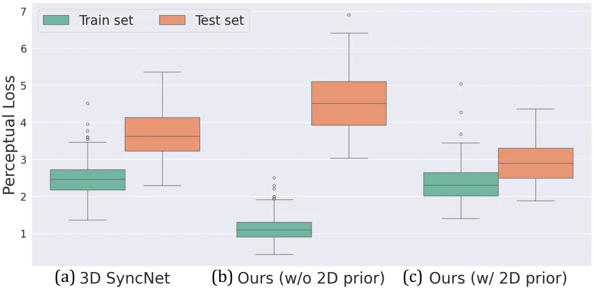

Figure S6: Perceptual loss stability. We visualize the perceptual loss
between GT speech-mesh pairs on VOCASET samples. Our representation
demonstrates strong generalization capability and provides a stable
training signal compared to 3D SyncNet and our representation without 2D
prior.

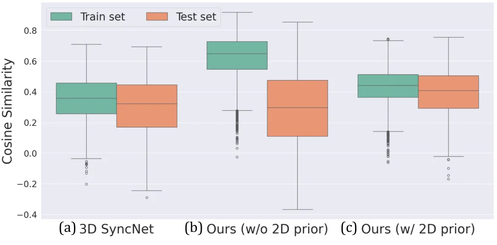

Figure S7: Cosine similarity stability. We visualize the cosine
similarity between GT speech-mesh pairs on VOCASET samples. Our
representation demonstrates strong generalization capability compared to
3D SyncNet and our representation without 2D prior.

### G.2 FDD evaluation on applying perceptual loss

In Table S7, we measure Upper Face Dynamics Deviation (FDD) \[46\], a
widely used metric for the upper face evaluation, to assess the
effectiveness of our perceptual loss. The models applying our perceptual
loss achieve similar or improved FDD scores. It is expected because FDD
is not the main focus of our work due to no direct relationship with the
quality of lip movements.

|              |                               |
| ------------ | ----------------------------- |
|              | FDD $`\downarrow`$            |
|              | ($`\times 10^{-7}\text{mm}`$) |
| FaceFormer   | 3.789                         |
| \+ Ours rep. | 3.325                         |
| CodeTalker   | 3.414                         |
| \+ Ours rep. | 3.259                         |
| SelfTalk     | 3.319                         |
| \+ Ours rep. | 3.424                         |

Table S7: FDD evaluation. We report Upper Face Dynamics Deviation (FDD)
scores to evaluate the variation in upper facial dynamics, which is not
the main focus of our work. As expected, the models trained with our
perceptual loss show similar or improved FDD scores.

### G.3 Qualitative result of temporal synchronization

We present the qualitative result of temporal synchronization using
existing base models \[11, 46, 21\] (See Fig. S8). Given rendered 3D
face mesh sequences, we place a vertical line with two pixel points near
the lip region and extract the y-t slices of the mesh sequences to
visualize the timing of lip closure and opening. Next, we align the y-t
slices with their corresponding speech waveforms and mel-spectrograms
along the time axis. We observe that these models already have a
reasonable temporal synchronization capability. Specifically, the timing
of lip closure (_e.g_., for the /p/ sound) in the y-t slices aligns with
minimal amplitude in both the speech waveforms and mel-spectrogram,
while the timing of lip opening (_e.g_., for the /r/ sound) in the y-t
slices coincides with a large amplitude in both speech representations.

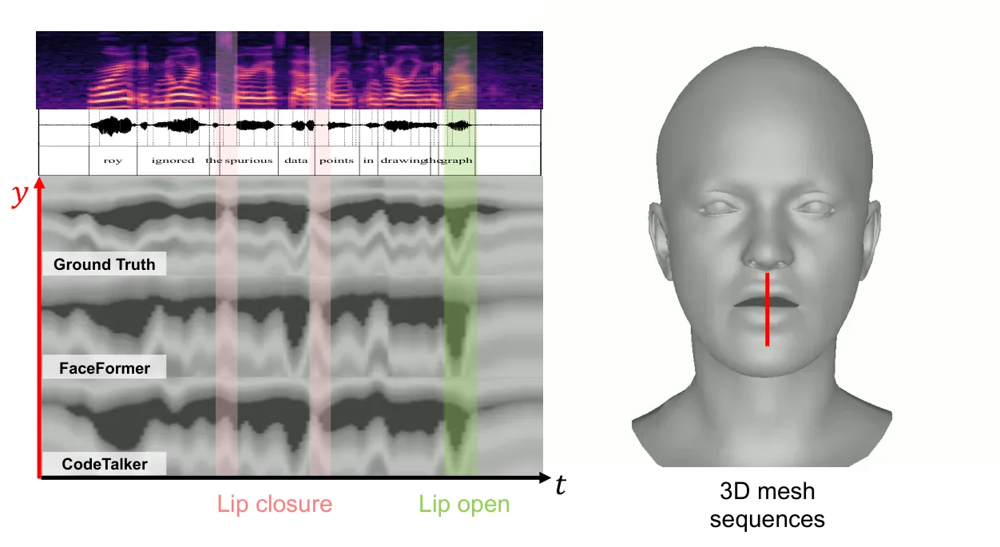

Figure S8: Qualitative results of temporal synchronization on existing
models. We plot y-t slices of rendered 3D face mesh sequences on the lip
region with corresponding speech waveforms and mel-spectrogram. We also
indicate the time steps of lip closure and opening with vertical lines.
This implies that existing models already exhibit reasonable temporal
sync. capability.

### G.4 Stability comparison on loss and cosine similarity

To utilize our speech-mesh synchronized representation as a perceptual
loss, it is essential to provide a stable training signal to the 3D
talking head model. In the domain of 2D audio-visual speech
representation, Yaman *et al*. \[47\] reveal that the transformer-based
architecture \[29\] learns more robust representation and provides more
stable guidance to talking head models compared to a CNN-based
approach \[6\]. To explore whether these observations hold for 3D
speech-mesh representations, we evaluate both the lip-sync loss and
cosine similarity across 3D SyncNet, our representation without 2D prior
and our final representation. This analysis aims to validate the
effectiveness of the transformer-based architecture and curriculum
learning with a pre-trained 2D speech representation.

Specifically, we measure the perceptual loss and cosine similarity,
computing the mean and standard deviation for both the train and test
samples. Figures S6 and S7 show the comparisons of perceptual loss and
cosine similarity comparison across the three representation variants.
We denote the train samples as green box plots and test samples as
orange box plots, respectively.

Our speech-mesh representation (Figs. S6-(c) and S7-(c)) demonstrates
the highest stability, exhibiting the lowest standard deviations (the
height of the box plots) on test set in both lip-sync loss and cosine
similarity. In contrast, the representation without 2D prior
(Figs. S6-(b) and  S7-(b)) reveals significant discrepancies between the
train and test samples on both the lip-sync loss and cosine similarity,
indicating poor generalization capability. Additionally, it shows the
highest standard deviations, which potentially cause unstable training.
Meanwhile, 3D SyncNet (Figs. S6-(a) and S7-(a)) displays the worst mean
values of perceptual loss and cosine similarity among the three.

|              |                     |                     |
| ------------ | ------------------- | ------------------- |
|              | Time $`\downarrow`$ | Mem. $`\downarrow`$ |
|              | (sec.)              | (MB)                |
| FaceFormer   | 0.447               | 1461                |
| \+ Ours rep. | 0.537               | 1738                |
| CodeTalker   | 0.138               | 3393                |
| \+ Ours rep. | 0.289               | 3675                |
| SelfTalk     | 0.175               | 8204                |
| \+ Ours rep. | 0.320               | 8480                |

Table S8: Training efficiency. We compared the memory consumption and
single-iteration speed during training with and without the perceptual
loss.

## Appendix H Discussion

#### Limitations

While our perceptual loss is applied only during training, which ensures
that the resource requirements at inference remain unchanged, it
requires additional computational resources during training. In
Table S8, we compare memory consumption and single-iteration speed
during training, measured on a single A6000 GPU. Also, to capture the
intricate correspondence between speech and 3D face mesh, we construct
large-scale speech-mesh paired datasets, LRS3-3D and MEAD-3D. To this
end, we utilize state-of-the-art monocular face reconstruction
methods \[13, 26\], which may impose limitations on the quality of the
3D mesh in the reconstructed datasets.

#### Ethical considerations

Our method can generate realistic 3D talking faces from arbitrary audio
signals, relying on both the 3D scan data collected from actors and the
reconstructed data from 2D talking videos. Thus, while this technology
has powerful applications, it also poses risks of misuse, such as
creating harmful or embarrassing content. To mitigate these risks, we
emphasize raising public awareness and promoting ethical and responsible
use through continued research.

1: GT vertex sequence $`V(t)`$, Predicted vertex sequence $`\hat{V}(t)`$

2: Overall mean temporal misalignment $`\overline{\Delta t}`$

3:

4: Initialize list of sample mean misalignments:
$`\{\Delta t_{k}\}\leftarrow\emptyset`$

5: for each sample $`k`$ do

6:    Initialize time differences list:
$`\{\delta t_{n}\}\leftarrow\emptyset`$

7:    Extract lip vertices:

8:     Upper lip vertex $`V_{u}(t)\in\mathbb{R}^{3}`$ from $`V(t)`$

9:     Lower lip vertex $`V_{l}(t)\in\mathbb{R}^{3}`$ from $`V(t)`$

10:     Predicted upper lip vertex $`\hat{V}_{u}(t)\in\mathbb{R}^{3}`$
from $`\hat{V}(t)`$

11:     Predicted lower lip vertex $`\hat{V}_{l}(t)\in\mathbb{R}^{3}`$
from $`\hat{V}(t)`$

12:    Compute lip distance sequences:

13:     $`d_{v}(t)=\left\|V_{u}(t)-V_{l}(t)\right\|`$

14:     $`\hat{d}_{v}(t)=\left\|\hat{V}_{u}(t)-\hat{V}_{l}(t)\right\|`$

15:    Smooth sequences using Gaussian filter:

16:     $`\tilde{d}_{v}(t)=\textit{Gauss}(d_{v}(t))`$

17:     $`\tilde{\hat{d}}_{v}(t)=\textit{Gauss}(\hat{d}_{v}(t))`$

18:    Compute derivatives:

19:     $`\delta\tilde{d}_{v}(t)=\tilde{d}_{v}(t)-\tilde{d}_{v}(t-1)`$

20:
    $`\delta\tilde{\hat{d}}_{v}(t)=\tilde{\hat{d}}_{v}(t)-\tilde{\hat{d}}_{v}(t-1)`$

21:    Perform DDTW to find alignment path $`\mathcal{A}=\{(i,j)\}`$

22:    Identify local extrema in $`\tilde{d}_{v}(t)`$ and
$`\tilde{\hat{d}}_{v}(t)`$

23:    for each aligned pair $`(i,j)\in\mathcal{A}`$ do

24:     if $`i`$ and $`j`$ are matching extrema of same type then

25:       if $`j`$ is within neighboring extrema range of $`i`$ in
$`\tilde{d}_{v}(t)`$ then

26:        Compute time difference: $`\delta t_{n}\leftarrow|i-j|`$

27:        Append $`\delta t_{n}`$ to $`\{\delta t_{n}\}`$

28:       end if

29:     end if

30:    end for

31:    if $`\{\delta t_{n}\}\neq\emptyset`$ then

32:     Compute mean delta time for clip $`k`$:

33:      $`\Delta t_{k}=\dfrac{1}{N}\sum_{n=1}^{N}\delta t_{n}`$

34:     Append $`\Delta t_{k}`$ to $`\{\Delta t_{k}\}`$

35:    end if

36: end for

37: if $`\{\Delta t_{k}\}\neq\emptyset`$ then

38:    Compute overall mean temporal misalignment:

39:     $`\overline{\Delta t}=\dfrac{1}{K}\sum_{k=1}^{K}\Delta t_{k}`$

40: else

41:    $`\overline{\Delta t}`$ is undefined

42: end if

Algorithm 1 Mean Temporal Misalignment Calculation
