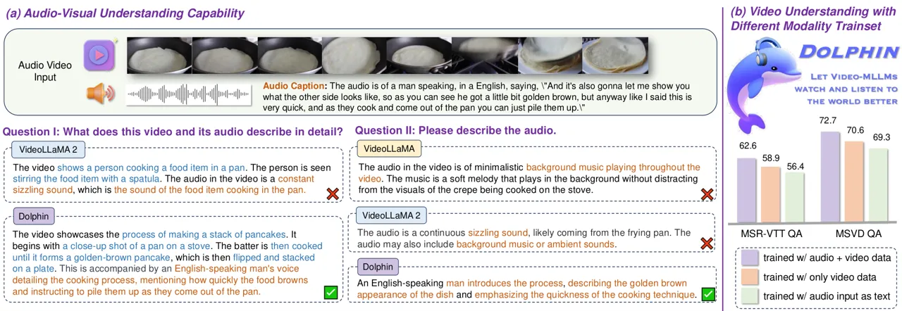
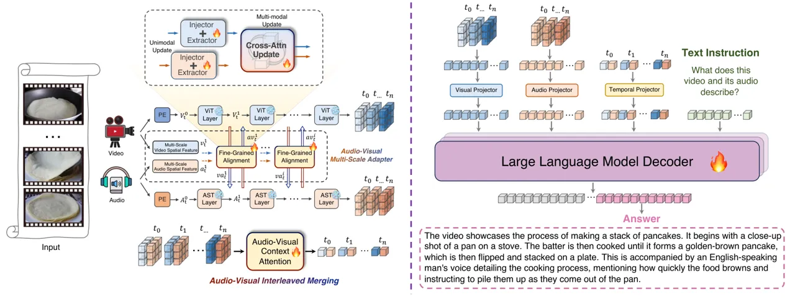
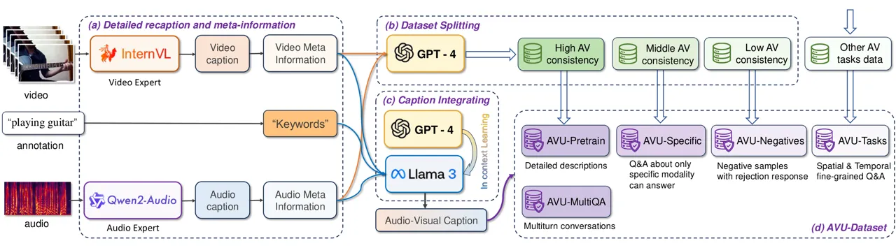
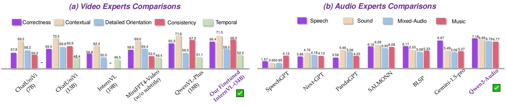
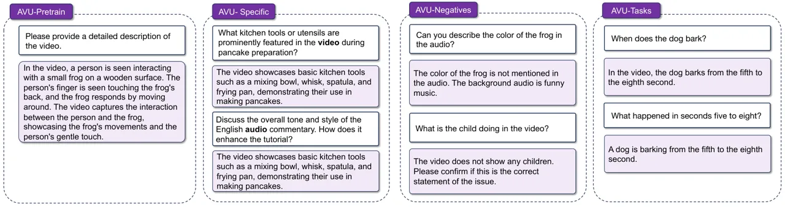
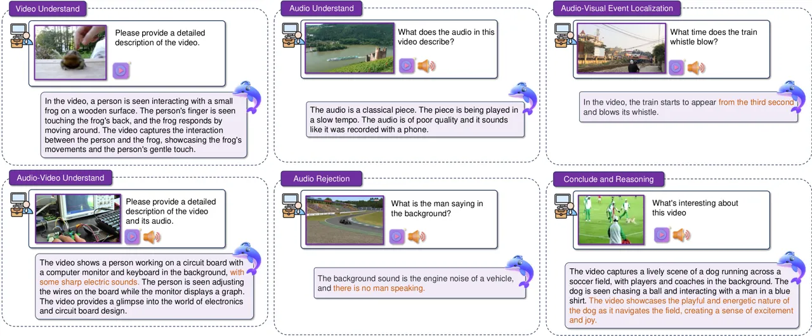
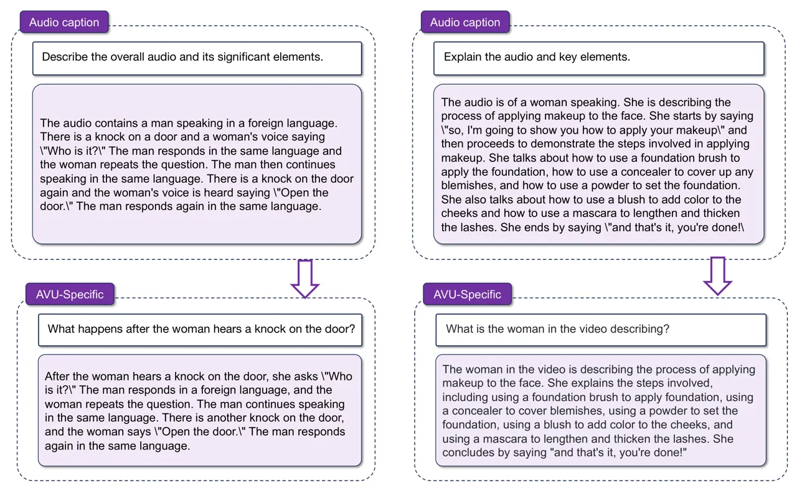

# Aligned Better, Listen Better for Audio-Visual Large Language Models

Yuxin Guo Affiliation: School of Artificial Intelligence, University of
Chinese Academy of Sciences Affiliation: MAIS, Institute of Automation,
Chinese Academy of Sciences (CASIA) Affiliation: Tongyi Lab, Alibaba
Group Email: <guoyuxin2021@ia.ac.cn>    Shuailei Ma Affiliation: Ant
Group Affiliation:  Northeastern University Email: <wei.zou@ia.ac.cn>   
Shijie Ma Affiliation: School of Artificial Intelligence, University of
Chinese Academy of Sciences Affiliation: MAIS, Institute of Automation,
Chinese Academy of Sciences (CASIA)    Xiaoyi Bao. Chen-Wei Xie
Affiliation: School of Artificial Intelligence, University of Chinese
Academy of Sciences Affiliation: MAIS, Institute of Automation, Chinese
Academy of Sciences (CASIA) Affiliation: Tongyi Lab, Alibaba Group   
Kecheng Zheng Affiliation: Ant Group    Tingyu Weng Affiliation: Tongyi
Lab, Alibaba Group    Siyang Sun Affiliation: Tongyi Lab, Alibaba Group
   Yun Zheng Affiliation: Tongyi Lab, Alibaba Group    Wei Zou
^(†)^(†)thanks: Corresponding author. Affiliation: School of Artificial
Intelligence, University of Chinese Academy of Sciences
Affiliation: MAIS, Institute of Automation, Chinese Academy of Sciences
(CASIA)

###### Abstract

Audio is essential for multimodal video understanding. On the one hand,
video inherently contains audio, which supplies complementary
information to vision. Besides, video large language models (Video-LLMs)
can encounter many audio-centric settings. However, existing Video-LLMs
and Audio-Visual Large Language Models (AV-LLMs) exhibit deficiencies in
exploiting audio information, leading to weak understanding and
hallucinations. To solve the issues, we delve into the model
architecture and dataset. (1) From the architectural perspective, we
propose a fine-grained AV-LLM, namely Dolphin. The concurrent alignment
of audio and visual modalities in both temporal and spatial dimensions
ensures a comprehensive and accurate understanding of videos.
Specifically, we devise an audio-visual multi-scale adapter for
multi-scale information aggregation, which achieves spatial alignment.
For temporal alignment, we propose audio-visual interleaved merging. (2)
From the dataset perspective, we curate an audio-visual caption &
instruction-tuning dataset, called AVU. It comprises 5.2 million
diverse, open-ended data tuples (video, audio, question, answer) and
introduces a novel data partitioning strategy. Extensive experiments
show our model not only achieves remarkable performance in audio-visual
understanding, but also mitigates potential hallucinations.

|     |
| --- |
|     |

## 1 introduction

Humans perceive the dynamic world through their eyes and ears, with
visual and auditory information complementing each other, both are
indispensable. Similarly, the audio modality proves crucial for the
comprehensive understanding capabilities of Multimodal Large Language
Models (MLLMs) (Liu et al., 2023; Ma et al., 2024c; Bao et al., 2024; Wu
et al., 2025; Ma et al., 2025a). On the one hand, audio modality can
provide complementary information to the visual modality (Guo et al.,
2024b), aiding MLLMs in more accurate comprehension. On the other hand,
there are many audio-centric tasks in audio-visual (AV) understanding,
_e.g_., AV question answering, AV source localization, AV event
localization, and AV segmentation (Tian et al., 2018; Yang et al., 2022;
Guo et al., 2023; Mo & Morgado, 2022; Guo et al., 2024a). However, most
existing Video-LLMs directly neglect audio, with only a small portion
incorporating both visual and audio modalities. A natural question
arises: _How proficient are these models in their audio-visual
comprehension capabilities?_

To answer the question, we design two progressive experiments, as in
Figure 1. First, we evaluate the AV understanding abilities of current
AV-LLMs, _e.g_., Video-LLaMA (Zhang et al., 2023a) and Video-LLaMA
2 (Cheng et al., 2024). We found they consistently neglect audio and the
descriptions solely come from the visual content. Furthermore, when
directly querying the audio content, the responses are always the
speculations and associations derived from the visual input, rather than
the audio itself. For example, when Video-LLaMA is presented with a
cooking video, the response is “background music playing throughout the
video.” But actually, the audio features a male commentator’s narration.
Besides, when replacing the background sound with white noise, the
model’s responses remain unchanged, indicating that the model does not
extract information from the audio.



Figure 1: (a) Audio visual capability of previous AV-LLMs and our
Dolphin. We pose questions separately for audio-video and audio,
discovering that VideoLLaMA and VideoLLaMA 2 exhibit significant
hallucinations for audio understanding, while Dolphin produces accurate
responses. (b) Audio could provide complementary information compared to
video. Incorporating audio into training greatly enhances video
understanding.

Based on the results, it naturally begs the question: _Why do AV-LLMs
tend to neglect the audio modality?_ We attribute the following reasons:
(1) For alignment, most models lack fine-grained alignment and
interactions between modalities, and simply concat the visual and audio
tokens. (2) For datasets size, large-scale audio-visual
instruction-following datasets are scarce, and most works align
vision-language and audio-language separately, resulting in less
coordinated audio-video representations, (3) In current datasets, visual
modality has relatively higher information density, where audio does not
provide necessary content, consequently, AV-LLMs tend to disregard
audio.

To solve these problems, we explore from two perspectives, _i.e_., model
architecture and training dataset. From the model perspective, we
propose a novel fine-grained AV-LLM, namely Dolphin, which aligns audio
and visual modalities both spatially and temporally and effectively
harnesses both complementary modalities. For spatial alignment, we
propose an audio-visual multi-scale adapter, which extracts multi-scale
features and implements audio-visual interaction and merging at various
scales. For temporal alignment, we propose audio-visual interleaved
merging, where both audio and visual serve as context for each other
through interleaved tokens. Finally, the fine-grained tokens aligned
both spatially and temporally are projected into the input space of LLM
to achieve remarkable joint audio-visual understanding.

From the dataset perspective, we propose a large-scale audio-visual
understanding caption and instruction-following dataset, called AVU,
which consists of 5.2M AV captions and question-and-answer (Q&A) tuples.
We extract video and audio meta-information and generate high-quality
captions and Q&A pairs. The dataset is divided into several splits
according to AV consistency for different training objectives.
Specifically, we incorporate datasets from several AV tasks, _e.g_.,
AVE (Tian et al., 2018), AVL (Mo & Morgado, 2022), AVS (Zhou et al., 2022) and AVVP (Tian et al., 2020), and convert them to fine-grained
instruction-following data. Besides, some negative samples for rejection
are devised to avoid potential hallucinations. To comprehensively
evaluate audio-visual understanding, we further propose a benchmark,
called AVU-Bench, for AV-LLMs. We highlight the importance of
interaction from both modalities, as in Fig. 1 (b).

Our contributions are summarized below:

- •
  We propose Dolphin, a fine-grained AV-LLM for audio-video multimodal
  and unimodal understanding. Dolphin could remarkably exploit audio
  information for understanding.
- •
  The core innovation lies in the architecture that enables audio-visual
  multi-scale spatial alignment as well as context-aided temporal
  alignment, which ensures fine-grained extraction of two complementary
  modalities and interaction between them.
- •
  We curate the first large-scale audio-visual caption and
  instruction-following dataset. It contains 5.2M samples with several
  splits and does not require rigid AV correspondence.
- •
  Extensive experiments show that Dolphin could not only achieve
  outstanding audio-visual understanding performance, but also be
  competent in unimodal tasks, which validates that Dolphin effectively
  exploits the information of two complementary modalities.

## 2 Related Works

#### Multi-Modal Large Language Models for Video Understanding.

A series of studies first decompose videos into different representation
dimensions and then integrate the inputs to enrich the prompts for
MLLMs. For example, Video-ChatGPT (Maaz et al., 2023) splits videos into
spatial and temporal branches for pooling. VideoChat (Li et al., 2023b)
decomposes videos into descriptions and video embeddings. LLaMA-VID (Li
et al., 2023c) represents each frame with context tokens and content
tokens. Video-LaVIT (Jin et al., 2024) performs video tokenization using
keyframes and motion vectors. Other works incorporate images into
unified video training to enrich the training data. Chat-UniVi (Jin
et al., 2023) and Video-LLaVA (Lin et al., 2023) employ strategies such
as object-based adaptive cluster-based tokens and aligning before
projection to unify image and video inputs, thereby achieving more
powerful visual understanding.

#### Audio-Visual Large Language Models.

Early works, like VideoChat (Li et al., 2023b), simply encode audio
inputs using Whisper (Radford et al., 2023b) and directly overlay them
to the textual input. Later works seek to align the output of audio and
visual encoders before feeding them into LLMs. MACAW-LLM (Lyu et al., 2023) aligns the encoder outputs to the textual space through a
learnable alignment module. Audio-Visual LLM (Shu et al., 2023a)
activates the embeddings of different modalities with different tags.
Moreover, some works (Sun et al., 2023a; Zhang et al., 2023a) explore
temporal alignment between video and audio using a Q-Former (Li et al.,
2023a) structure, but most of them (Tang et al., 2024) neglect
fine-grained spatial modeling. Meerkat (Chowdhury et al., 2024) explores
fine-grained understanding but only focuses on images. To sum up, most
existing AV-LLMs neither struggle to capture fine-grained local
information nor handle temporal alignment, which motivates us to delve
into the design and training of AV-LLMs.

## 3 Model Architecture



Figure 2: Overview of our Dolphin, which aligns on both spatial and
temporal dimensions to fully exploit the natural consistency of videos
and enhance the complementary roles of vision and hearing. Specifically,
for spatial alignment, we introduced an audio-visual multi-scale adapter
using a dual-feature pathway design, which extracts multi-scale features
from both visual and auditory inputs and achieves fine-grained alignment
with the respective modality.

#### Overview.

Dolphin primarily focuses on effectively strengthening the fine-grained
alignment and interaction between visual and auditory modalities. It
effectively exploits the complementary information of two modalities and
prevents overlooking any of them. Specifically, Dolphin primarily
comprises three components: (1) Audio-visual (AV) multi-scale adapter
(Section 3.1), which aims to align audio and visual features across
various spatial scales in a fine-grained manner. (2) Audio-visual (AV)
interleaved merging (Section 3.2) for temporal alignment and extracting
complementary information of two modalities. (3) Large Language Model
(LLM) to handle the interacted audio-visual tokens and output responses
according to the instructions.

#### Notations.

We split each video into $`T=8`$ visual frames and audio clips. Let
$`H_{v},W_{v}`$ denote the height and width of each frame, while each
audio clip is transformed into a spectrogram of $`H_{a}\times W_{a}`$.
$`N`$ denotes the number of ViT blocks. In the AV multi-scale adapter,
the visual modality contains dual-pathway input features, _i.e_., global
feature $`\bm{\mathcal{V}}_{t}^{i}`$ and multi-scale local feature
$`\bm{v}_{t}^{i}`$, where $`i`$ denotes the $`i`$-th block and $`t`$
denotes the $`t`$-th frame. Besides,
$`\widehat{\bm{\mathcal{V}}}_{t}^{i}`$ and $`\hat{\bm{v}}_{t}^{i}`$ are
features after modality interaction. Similar expressions of
$`\bm{\mathcal{A}}_{t}^{i},\bm{a}_{t}^{i},\widehat{\bm{\mathcal{A}}}_{t}^{i},\hat{\bm{a}}_{t}^{i}`$
are applicable to audio. The joint feature after modality interaction
could be represented as $`\bm{a}\bm{v}_{t}^{i}`$. In AV interleaved
merging, visual and audio tokens after contextual interaction could be
written as $`\bm{\mathcal{V}}_{t}^{temp}`$ and
$`\bm{\mathcal{A}}_{t}^{temp}`$, respectively.

### 3.1 Spatial: Audio-Visual Multi-Scale Adapter

The AV multi-scale adapter is designed to enhance the fine-grained
alignment of spatial features. Taking the spirit of ViT-Adapter (Chen
et al., 2023b), we first independently extract each modality’s global
and pyramid multi-scale features Lin et al. (2017); Liu et al. (2025).
Then, fine-grained alignment is performed across different scales. In
this section, we introduce the data flow with the visual modality as an
example, and the same principle applies to audio as well.

#### Visual global and initial multi-scale features.

For ViT-L (Dosovitskiy et al., 2021), we divide it into $`N=4`$ blocks,
each with 6 layers. To acquire multi-scale spatial features, we feed the
images into the spatial module, _i.e_., pyramid convolutional
network (Lin et al., 2017), to extract various multi-resolution
features, _i.e_., 1/8, 1/16 and 1/32 of $`H_{v}\times W_{v}`$, forming
the initial $`D`$-dimensional multi-scale features $`\bm{v}_{t}^{1}`$ as
an input to the adapter, as shown below:

```math
\bm{v}_{t}^{1}\in\mathbb{R}^{\left(\frac{HW}{8^{2}}+\frac{HW}{16^{2}}+\frac{HW}{32^{2}}\right)\times D},\quad\bm{a}_{t}^{1}\in\mathbb{R}^{\left(\frac{HW}{8^{2}}+\frac{HW}{16^{2}}+\frac{HW}{32^{2}}\right)\times D}. \tag{1}
```

#### Inter-modality feature interaction.

To achieve fine-grained alignment across scales, audio features are
injected into the multi-scale visual features $`\bm{v}_{t}^{i}`$, where
$`i`$ denotes the $`i`$-th block, we incorporate audio global feature
$`\bm{\mathcal{A}}_{t}^{i}`$ into $`\bm{v}_{t}^{i}`$ through
cross-attention, and obtain audio-guided multi-scale visual feature
$`\bm{a}\bm{v}_{t}^{i}`$ as follows:

```math
\bm{a}\bm{v}_{t}^{i}=\operatorname{CrossAttn}(\bm{v}_{t}^{i},\bm{\mathcal{A}}_{t}^{i},\bm{\mathcal{A}}_{t}^{i}). \tag{2}
```

#### Intra-modality feature fusion.

As shown in Figure 2, in the fusion process, the audio-guided
multi-scale visual features $`\bm{a}\bm{v}_{t}^{i}`$, which contains
visual spatial priors and audio information, are injected into original
global features $`\bm{\mathcal{V}}_{t}^{i}`$ through cross-attention and
added to $`\bm{\mathcal{V}}_{t}^{i}`$, as follows:

```math
\widehat{\bm{\mathcal{V}}}_{t}^{i}=\bm{\mathcal{V}}_{t}^{i}+\beta^{i}\operatorname{CrossAttn}(\bm{\mathcal{V}}_{t}^{i},\bm{a}\bm{v}_{t}^{i},\bm{a}\bm{v}_{t}^{i}). \tag{3}
```

Here, $`\beta`$ is a learnable vector initialized as 0, ensuring the
initial outputs are the same as ViT’s global features
$`\bm{\mathcal{V}}_{t}^{i}`$. Subsequently, the global features
$`\widehat{\bm{\mathcal{V}}}_{t}^{i}`$ are transmitted to the next block
through the $`i`$-th standard ViT block and the fine-grained features
$`\hat{\bm{v}}_{t}^{i}`$ are passed to the next block as
$`\bm{v}_{t}^{i+1}`$ through cross-attention and FFN layers:

```math
\bm{\mathcal{V}}_{t}^{i+1}=\text{ViT-Block}^{i}(\widehat{\bm{\mathcal{V}}}_{t}^{i}) \tag{4}
```

```math
\bm{v}_{t}^{i+1}=\hat{\bm{v}}_{t}^{i}+\operatorname{FFN}\left(\hat{\bm{v}}_{t}^{i}\right),\quad\hat{\bm{v}}_{t}^{i}=\bm{v}_{t}^{i}+\operatorname{CrossAttn}\left(\bm{v}_{t}^{i},\bm{\mathcal{V}}_{t}^{i+1},\bm{\mathcal{V}}_{t}^{i+1}\right). \tag{5}
```

#### Final outputs.

The AV multi-scale adapter obtains
$`\bm{\mathcal{V}}_{t}^{N+1}\in\mathbb{R}^{B\times T\times L_{v}\times D}`$
and
$`\bm{\mathcal{A}}_{t}^{N+1}\in\mathbb{R}^{B\times T\times L_{a}\times D}`$,
where $`B,T,D`$ denote batch size, number of frames and feature
dimension, and $`L_{v},L_{a}`$ are the number of tokens of two
modalities. We perform average pooling across the temporal dimension
$`T`$ and obtain the final spatial tokens. In this way, we gradually
incorporate audio information into the visual features and enhance the
interaction between audio and visual modalities. The guidance provided
by audio to the multi-scale visual features facilitates fine-grained
alignment.

### 3.2 Temporal: Audio-Visual Interleaved Merging

In this stage, we merge the final audio and visual features to implement
alignment and interaction at the temporal axis. Specifically, by
concatenating visual and audio tokens in the same frame, we could obtain
$`T`$ pairs of audio-visual interleaved tokens, each referred to as an
AV group, as shown in Figure 2. Within each group, we perform
bi-directional contextual attention on visual and audio tokens, which
produce visual-contextualized audio tokens and audio-contextualized
visual tokens.

```math
\begin{array}[]{c}\bm{\mathcal{V}}_{t}^{temp}=\operatorname{CrossAttn}(\bm{\mathcal{A}}_{t},\bm{\mathcal{V}}_{t},\bm{\mathcal{V}}_{t}),\quad\bm{\mathcal{A}}_{t}^{temp}=\operatorname{CrossAttn}(\bm{\mathcal{V}}_{t},\bm{\mathcal{A}}_{t},\bm{\mathcal{A}}_{t}).\end{array} \tag{6}
```

Then each AV token group is mapped into the input space of LLM through a
joint audio-visual projector. Here, we condense each frame of the video
into two tokens. In this way, we achieve integration and merging of
audio and visual information, which enhances the audio-visual
information exploitation of AV-LLMs.

### 3.3 Training Strategy

We employ Vicuna-v1.5 (Chiang et al., 2023) as the LLM. The video
encoder is ViT-L/14 from CLIP (Radford et al., 2021), and the audio
encoder adopts ImageBind (Girdhar et al., 2023b). (1) In the initial
pre-training phase, we freeze the visual encoder, audio encoder, and LLM
and only update all the projectors as well as the AV multi-scale adapter
to achieve alignment across visual, auditory, and LLM modal spaces. We
use the AVU-Pretrain dataset. (2) For the instruction tuning phase, only
the visual and audio encoders are frozen, while other modules are
updated. We employ AVU-Multi Q&A, AVU-Specific, AVU-Negatives and
AVU-Tasks subsets. See Section 4.3 for more details.



Figure 3: The integration pipeline of the audio-visual understanding
dataset (AVU-dataset).

[TABLE]

Table 1: The detailed statistics for our AVU (Audio-Visual Understanding
Dataset).

## 4 AVU: Audio-Visual Understanding Dataset

#### Motivation.

The quality of data (Ma et al., 2024b; Ma et al., 2025b) plays a vital
role in performance. Currently, there is a shortage of large-scale
audio-visual instruction-following and fine-grained captions, which
hinders the model from focusing on modality-specific information and
potentially leads to audio hallucinations. To solve the issues, we
propose an audio-visual understanding (AVU)-dataset, a large-scale AV
understanding and instruction-following dataset.

#### Overview.

In this section, we introduce the construction of the AVU-dataset
(Figure 3). Specifically, we first re-caption (Section 4.1) audio and
video data and generate meta-information (Section 4.2). Then the dataset
is split (Section 4.3) into several subsets according to the similarity
between audio and visual meta-information, and we feed different prompt
templates to generate the corresponding instruction-following dataset
and training stages.

#### Dataset statistics.

As shown in Table 1, AVU-dataset contains 2.13M audio-video pairs, each
has several Q&A pairs, resulting in 5.24M Q&A pairs in total.
AVU-dataset has four subsets, _i.e_., AVU-Pretrain (1.11M samples and
Q&A), AVU-Multi Q&A (500k samples and 1M Q&A pairs), AVU-Specific (554K
samples and 1.09M Q&A pairs for video and 1.11M for audio), AVU-Negative
(186Ksamples and 370K Q&A pairs) and AVU-Tasks (283K samples and 559K
Q&A pairs).

#### Datasets quality and verification.

We design three types of filtering mechanisms, including CLIP-Score
filtering, Self-consistency filtering, and Annotation filtering, to
filter noisy samples and guarantee the dataset quality, and then human
verification is implemented. Details are shown in the Appendix B.

### 4.1 Detailed Re-caption Generation



Figure 4: Performance comparison of different task-specific experts.

Figure 5: Examples of prompt templates for generating AVU-dataset,
others are in the appendix.



Figure 6: Some examples of AVU-dataset.

#### Source datasets.

We collect widely used audio-visual datasets, including
AudioSet-2M (Gemmeke et al., 2017), VGG-Sound (Chen et al., 2020a) and
task-specific datasets, _i.e_., MUSIC (Li et al., 2022) for AVQA (Yang
et al., 2022), Flickr-SoundNet (Arandjelovic & Zisserman, 2017),
VGG-SoundSource for AV source localization (Mo & Morgado, 2022), AVE
dataset for AV event localization (Tian et al., 2018), AVS-dataset for
AV segmentation (Zhou et al., 2022), and LLP for AV video parsing (Tian
et al., 2020). Then we utilize expert models to re-caption audio and
video to obtain audio, video and audio-video captions.

#### Expert models.

For MLLM, we employ a fine-tuned version of InternVL-34B (Chen et al.,
2024). For the audio expert captioners, we choose
Qwen2-Audio-7B-Instruct (Chu et al., 2024). The performance of these
models is illustrated in Figure 4.

#### Prompt templates.

We prompt expert models with hand-crafted templates to generate detailed
captions, and set some regularizations to mitigate hallucinations.
Figure 5 displays a subset: AVU-Specific prompt templates. See Figure 9
and Figure 10 in the appendix for more details.

### 4.2 Meta-Information Generation and Integration

#### Meta-information generation.

The function of meta-information is to maintain audio and video details
when integrating unimodal audio and video captions into multimodal
audio-video captions. Meta-information could be utilized to guide
subsequent AV caption integration and dataset splitting. Specifically,
we design options of ‘event’, ‘object’, ‘scene’, ‘place’, ‘action’ and
‘emotion’, _etc_., and transform original annotations to ‘keywords’.
Then, we employ GPT-4 (Achiam et al., 2023) to judge consistency based
on keywords and meta-information and filter noisy samples, which might
be caused by experts’ bias and hallucinations.

#### Meta-information integration.

We choose LLaMA3-70B-Instruct (Dubey et al., 2024) to integrate
meta-information. First, we employ GPT-4 to generate multiple examples
of integrating keywords and meta-information. After human adjustments,
we feed them to LLaMA3. The in-context learning abilities enable the
generation of audio-visual captions.

### 4.3 Dataset Splits

#### Splitting process.

The dataset is split according to the consistency between audio and
video meta-information. Notably, we do not require strict audio-visual
consistency, which is the main novelty of this work. For different types
of data, we create various types of instruction-tuning datasets for
corresponding training stages. The whole dataset is divided into three
subsets based on audio-visual consistency. Specifically, we feed audio
and video meta-information to GPT-4 (Achiam et al., 2023) to obtain the
consistency score. Figure 6 shows examples of subsets of the
AVU-dataset.

AVU-Pretrain comprises samples with high AV consistency. The audio and
video information are nearly the same. These samples are suitable for
the pre-training stage to align AV modalities. We design fixed question
templates (Figure 9 (a)) and randomly select one each time, and use the
previously integrated AV captions as the answers. In this way, we obtain
AVU-Pretrain subsets.

AVU-Multi Q&A also consists of high consistency samples. Different from
AVU-Pretrain, we design templates (Figure 9 (b)) to transfer AV caption
to multi-turn Q&A and reasoning.

AVU-Specific comprises samples with medium AV consistency. Both audio
and video carry relatively additional information compared to each
other. Questions are posed regarding this additional information to
generate Q&A pairs. These Q&A pairs construct AVU-Specific subsets and
could only be answered by focusing on a specific modality (Figure 10
(c)).

AVU-Negatives consist of low-consistency samples, _e.g_., the sounding
object is not present in the frame. Taking the spirit of contrastive
learning (Chen et al., 2020b; He et al., 2020), we create the negative
sample dataset, _i.e_., AVU-Negatives (Figure 10 (d)), whose answers are
primarily used as rejection. This subset could teach LLMs the rejection
option, mitigating potential hallucinations.

AVU-Tasks are curated directly from downstream AV tasks. Specifically,
we transform the original annotations to the format of Q&A, including
accurate details like time, spatial, and event. Notably, the AVU-Tasks
are derived from the fine-grained annotations, and significantly
contribute to the model’s fine-grained alignment capabilities.

For pre-training, we mainly employ high-consistency samples to enhance
modality alignment, while for instruction-tuning, we make use of samples
in which audio and visual do not exactly overlap and mix AVU-Multi Q&A,
AVU-Specific, AVU-Negatives and AVU-Tasks for training. In this way, the
issue of neglect of audio and hallucination is mitigated.

## 5 Experiments

We introduce the experimental setup and comparisons among models. In the
ablation studies, we explored and validated that fine-grained alignment
significantly aids LLMs in multimodal understanding. Temporal contextual
alignment is an effective way to leverage the inherent consistency of
videos and to exploit complementary audio-visual information.
Additionally, we also conducted ablations on the proposed dataset,
showcasing its assistance in audio-visual joint perception and its high
quality.

### 5.1 Experimental Setup

#### Implementation details.

For each video, we extract 8 frames of $`224\times 224`$ resolution, and
audio is sampled into 8 frames, each turned into a $`128\times 204`$
spectrogram. Both pre-training and fine-tuning are conducted for one
epoch, with batch sizes of 256 for pretraining and 128 for finetuning.
Projectors for audio, video, and audio-video use two-layer MLPs with a
GELU (Hendrycks & Gimpel, 2016) activation. Training is performed on
NVIDIA A100 GPUs. More details are in the appendix.

#### Dataset.

During training, we enhanced our model by mixing inputs from multiple
modalities. Apart from using AVU, we employ LLaVA (Liu et al., 2023),
10% of Valley, and audio clips for pre-training, LLaVA_instruct,
Video-ChatGPT (Maaz et al., 2023), and ClothoV2 (Drossos et al., 2020)
for instruction-based finetuning. We assessed our model’s zero-shot
capabilities on single-modality video and audio Q&A benchmarks and
compared it against existing audio-visual LLMs using a tailored
downstream task benchmark.

|                                     |                  |         |       |     |            |       |     |                |       |     |      |       |      |
| ----------------------------------- | ---------------- | ------- | ----- | --- | ---------- | ----- | --- | -------------- | ----- | --- | ---- | ----- | ---- |
| Method                              | LLM              | MSVD-QA |       |     | MSR-VTT-QA |       |     | ActivityNet-QA |       |     | TGIF |       | POPE |
|                                     |                  | Acc     | Score |     | Acc        | Score |     | Acc            | Score |     | Acc  | Score |      |
| LLaMA-Adapter (Zhang et al., 2023b) | LLaMA-7B         | 54.9    | 3.1   |     | 43.8       | 2.7   |     | 34.2           | 2.7   |     | \-   | \-    | \-   |
| Video-Chat (Li et al., 2023b)       | Vicuna-7B        | 56.3    | 2.8   |     | 45.0       | 2.5   |     | 26.5           | 2.2   |     | \-   | \-    | \-   |
| Video-ChatGPT (Maaz et al., 2023)   | Vicuna-7B        | 64.9    | 3.3   |     | 49.3       | 2.8   |     | 35.2           | 2.7   |     | \-   | \-    | \-   |
| BT-Adapter (Liu et al., 2024)       | Vicuna-7B        | 67.5    | 3.7   |     | 47.0       | 3.2   |     | 45.7           | 3.2   |     | \-   | \-    | \-   |
| LLaMA-VID (Li et al., 2023c)        | Vicuna-7B        | 69.7    | 3.7   |     | 57.7       | 3.2   |     | 47.4           | 3.3   |     | \-   | \-    | \-   |
| LLaMA-VID (Li et al., 2023c)        | Vicuna-13B       | 70.0    | 3.7   |     | 58.9       | 3.3   |     | 47.5           | 3.3   |     | \-   | \-    | \-   |
| Video-LLaVA (Lin et al., 2023)      | Vicuna-7B        | 70.7    | 3.9   |     | 59.2       | 3.5   |     | 45.3           | 3.3   |     | 70.0 | 4.0   | 84.4 |
| PandaGPT (Sun et al., 2024)         | Vicuna-7B        | 46.7    | -     |     | 23.7       | -     |     | -              | -     |     | -    | -     | 78.5 |
| VideoLLaMA (Zhang et al., 2023a)    | Vicuna-7B        | 51.6    | 2.5   |     | 29.6       | 1.8   |     | 12.4           | 1.1   |     | -    | -     | 82.9 |
| AV-LLM (Shu et al., 2023a)          | Vicuna-7B        | 67.3    | -     |     | 53.7       | -     |     | 47.2           | -     |     | -    | -     | -    |
| AVicuna (Tang et al., 2024)         | Vicuna-7B        | 70.2    | -     |     | 59.7       | -     |     | 53.0           | -     |     | -    | -     | 84.1 |
| OneLLM (Han et al., 2024)           | LLaMA2           | 56.5    | -     |     | 53.8       | -     |     | -              | -     |     | -    | -     | -    |
| FAVOR (Sun et al., 2023b)           | Vicuna-7B        | 67.8    | -     |     | 59.3       | -     |     | -              | -     |     | -    | -     | -    |
| VideoLLaMA 2 (Cheng et al., 2024)   | Mistral-Instruct | 71.7    | 3.9   |     | 57.4       | -     |     | 49.9           | 3.3   |     | -    | -     | 85.4 |
| video-SALMONN (Sun et al., 2024)    | Vicuna-7B        | 67.9    | 3.7   |     | 59.5       | 3.4   |     | -              | -     |     | -    | -     | -    |
| Dolphin-7B-LoRA (Ours)              | Vicuna-7B        | 71.6    | 3.9   |     | 61.3       | 3.4   |     | 47.9           | 3.4   |     | 70.9 | 3.9   | 85.1 |
| Dolphin-7B (Ours)                   | Vicuna-7B        | 72.7    | 3.9   |     | 62.6       | 3.5   |     | 49.1           | 3.4   |     | 71.2 | 3.9   | 85.9 |
| Dolphin-13B (Ours)                  | Vicuna-13B       | 74.8    | 3.9   |     | 63.5       | 3.5   |     | 49.6           | 3.4   |     | 71.3 | 4.0   | 86.2 |

Table 2: Comparison with existing Video-LLMs. We conducted a performance
comparison with the existing Video-LLM and reported the scoring results
of GPT on four zero-shot video-QA datasets.

|                                                                                                                 |                    |                      |                      |                    |                        |                     |                    |                    |                    |                    |
| --------------------------------------------------------------------------------------------------------------- | ------------------ | -------------------- | -------------------- | ------------------ | ---------------------- | ------------------- | ------------------ | ------------------ | ------------------ | ------------------ |
|                                                                                                                 | Audio              | Audio                | Speech               | Emotion            | Gender                 | Age                 | Music Genre        | Audio              | Speech             | Audio              |
|                                                                                                                 | Classif.           | Caption              | Recognition          | Recognition        | Classif.               | Pred.               | Classif.           | Question           | Question           | Hallucination      |
|                                                                                                                 | ESC-50             | AudioCaps            | Librispeech          | IEMOCAP            | Voxceleb2              | Voxceleb2           | GTZAN              |                    |                    | Random             |
| Method                                                                                                          | (ACC$`\uparrow`$ ) | (SPICE$`\uparrow`$ ) | (WER$`\downarrow`$ ) | (ACC$`\uparrow`$ ) | (maro-F1$`\uparrow`$ ) | (MAE$`\downarrow`$) | (ACC$`\uparrow`$ ) | (ACC$`\uparrow`$ ) | (ACC$`\uparrow`$ ) | (ACC$`\uparrow`$ ) |
| Best specialized models trained supervisedly on each dataset. Not generalizable to unseen label sets and tasks. |                    |                      |                      |                    |                        |                     |                    |                    |                    |                    |
| TASK-SOTA                                                                                                       | 97.0               | 17.7                 | 1.4                  | 70.6               | 98.3                   | 9.4                 | -                  | -                  | -                  |                    |
| CLIP-like audio-text model.                                                                                     |                    |                      |                      |                    |                        |                     |                    |                    |                    |                    |
| AudioClip (Guzhov et al., 2022)                                                                                 | 69.4               | \-                   | \-                   | \-                 | \-                     | \-                  | \-                 | \-                 | \-                 | \-                 |
| CLAP (Huang et al., 2013)                                                                                       | 82.6               | \-                   | \-                   | \-                 | \-                     | \-                  | 25.2               | \-                 | \-                 | \-                 |
| LTU-Audio (Gong et al., 2023b)                                                                                  | 82.8               | 17.0                 | 104.2                | 38.2               | 77.0                   | \-                  | 29.8               | 96%                | 69%                | \-                 |
| LTU-Speech (Gong et al., 2023b)                                                                                 | 10.9               | 0.5                  | 12.9                 | 69.8               | 90.1                   | 7.9                 | 23.5               | 65%                | 93%                | \-                 |
| LTU-AS (Gong et al., 2023b)                                                                                     | 80.8^(zs)          | 15.0                 | 4.9                  | 65.2               | 90.8                   | 7.3                 | 50.3^(zs)          | 96%                | 94%                | 50.1               |
| VideoLLaMA (Zhang et al., 2023a)                                                                                | 62.6^(zs)          | 6.2                  | 128.4^(zs)           | 23.4^(zs)          | 43.5^(zs)              | 8.8                 | 22.2^(zs)          | 56%                | 27%                | 43.2               |
| VideoLLaMA 2 (Cheng et al., 2024)                                                                               | 74.8^(zs)          | 15.8                 | 9.8^(zs)             | 63.9^(zs)          | 89.7^(zs)              | 7.3                 | 34.9^(zs)          | 92%                | 91%                | 56.8               |
| video-SALMONN (Sun et al., 2024)                                                                                | 77.6^(zs)          | 16.6                 | 3.9^(zs)             | 65.5^(zs)          | 90.6^(zs)              | 7.4                 | 36.7^(zs)          | 95%                | 94%                | 58.2               |
| Dolphin-LoRA (Ours)                                                                                             | 81.6^(zs)          | 17.2                 | 12.8^(zs)            | 67.4^(zs)          | 91.2^(zs)              | 7.2^(zs)            | 33.6               | 96%                | 93%                | 58.6               |
| Dolphin (Ours)                                                                                                  | 83.1^(zs)          | 17.8                 | 8.3^(zs)             | 69.2^(zs)          | 92.5^(zs)              | 7.0^(zs)            | 37.8               | 96%                | 94%                | 63.2               |

Table 3: Comparison with Audio-LLMs. We conducted closed-ended and
open-ended auditory tasks with LTU and LTU-AS, where ZS denotes
zero-shot evaluation.

### 5.2 Comparison with State-of-the-Arts

#### Zero-Shot Video Understanding.

To validate our model’s efficacy, we compared its performance in video
comprehension with existing video-LLMs. Specifically, we showcased
Dolphin’s comparison with various methods on MSR-VTT-QA, MSVD-QA, and
ActivityNet-QA benchmarks. As indicated in Table 2, our model
demonstrated superior video understanding, proving that auditory
information complemented visual comprehension in the training stage.
Moreover, POPE (Li et al., 2023d) results show our method could mitigate
object hallucinations.

#### Closed and Open-Ended Audio Tasks.

To evaluate audio understanding, we follow LTU and LTU-AS, evaluating
closed-ended and open-ended (Ma et al., 2024a; Zhu et al., 2024; Ma
et al., 2025c) audio tasks like classification and captioning in Table
 3. Despite zero-shot settings, our model showed effective
understanding, achieving or exceeding SOTA performance. We use the
pre-trained ImageBind (Girdhar et al., 2023a) audio encoder as our audio
encoder and freeze it during training, whose structure is AST (also used
in LTU). It is less effective in speech recognition compared with
Whisper (used by LTU-AS). However, our model showed improved speech
recognition, benefiting from our dataset mixing audio and speech.
Additionally, the audio-hallucination (Kuan et al., 2024) experiment
shows that our model can effectively reduce audio hallucination.

| Task                               | AVU   |       | AVSL     |       | AVE  |       | AVVP |       | AVSD |
| ---------------------------------- | ----- | ----- | -------- | ----- | ---- | ----- | ---- | ----- | ---- |
| Dataset                            | MUSIC |       | AVL, AVS |       | AVE  |       | LLP  |       | AVSD |
| Metric                             | acc   | score | acc      | score | acc  | score | acc  | score | acc  |
| Video LLaMA (Zhang et al., 2023a)  | 65.4  | 3.3   | 35.6     | 2.3   | 40.8 | 2.8   | 21.5 | 2.1   | 36.7 |
| Video LLaMA 2 (Cheng et al., 2024) | 73.2  | 3.5   | 47.1     | 2.3   | 48.2 | 2.9   | 28.4 | 2.3   | 57.2 |
| video-SALMONN (Sun et al., 2024)   | 74.7  | 3.5   | 48.3     | 2.4   | 51.5 | 3.0   | 30.9 | 2.4   | 51.6 |
| Dolphin (Ours)                     | 78.2  | 3.9   | 51.8     | 3.0   | 52.1 | 3.2   | 31.4 | 2.8   | 59.1 |

Table 4: Results on the proposed audio-visual understanding bench and
AVSD.

#### Audio-Visual Understanding Bench.

To assess our model’s competency in audio-visual understanding, we
developed a minibench tailored for Large Language Models (LLMs) that
aligns with existing audio-visual tasks. We meticulously gathered test
datasets from labeled audio-visual tasks, comprising MUSIC (AVQA), LLP
(AVVP), AVE (AVE), AVS-Bench (AVS), Flickr-SoundNet, and VGG-SoundSource
(AVL), to ensure a fair and precise evaluation. Inspired by zero-shot
question-answer evaluations and Video-ChatGPT, we transformed these
tasks’ ground truths into open-ended question-answer formats. We also
evaluate our model on AVSD (Alamri et al., 2019) benchmark.

This method evaluates the precision of our model’s predictive output,
awarding scores on a 1-5 scale. Comparing the performance of existing
methods, like Video-LLaMA (Zhang et al., 2023a), Video-LLaMA 2 (Cheng
et al., 2024), and video-SALMONN (Sun et al., 2024), our results,
presented in Table 4, demonstrate a notable performance gap favoring our
model on audio-centric vision tasks, which highlights our model’s
enhanced comprehension of audio and visual modalities.



Figure 7: Qualitative cases of Dolphin.

#### Qualitative evaluation.

The qualitative cases of the proposed Dolphin are illustrated in
Figure 7. Results show that Dolphin could remarkably comprehend both
audio and visual modalities, together with enhanced video understanding.

### 5.3 Ablation Studies and Analysis

In this section, through detailed ablation studies, we explored how to
enhance an audio-visual LLM’s integration of video and audio for better
video understanding. We also validated the effectiveness of our proposed
methods and datasets through model and dataset ablations.

#### Fine-grained spatial alignment effectively aids AV-LLMs in understanding multimodal semantic information.

In our prior analysis, we found that without fine-grained interaction
between visual and auditory information, LLMs struggle to learn relevant
information between videos and audios, as the lack of prior knowledge
regarding the two modalities leads the model to focus more on the
information-rich video content while neglecting audio. To investigate
this issue, we conducted ablation studies on our fine-grained alignment
module in Table 5(a). The results reveal that inter-modality interaction
indeed enhances the LLM’s attention to both modalities. However, in
comparison, when the two modalities undergo fine-grained alignment
before projection, the model is not only able to simultaneously focus on
both modalities but also better extract the complementary information
from visual and audio. Table 5(a) illustrates that fine-grained
audio-visual alignment aids LLMs in cross-modal understanding.
Inter-modal interaction boosts attention to both modalities, but
fine-grained alignment before projection further allows simultaneous
focus and better extraction of visual and auditory complementary
information. Compared to removing temporal alignment, understanding of
videos significantly improves with the help of temporal alignment and
interaction.

#### Contextual alignment effectively leverages the inherent consistency of videos.

We analyzed our temporal context attention module in Table 5(a) and
found that models without it or with only the chronological arrangement
of tokens underperform. In contrast, employing temporal context
attention, which aligns video and audio features over time,
significantly boosts performance by tapping into their inherent temporal
consistency, thus enhancing LLM’s understanding of both modalities
together.

|          |                         |      |       |      |       |
| -------- | ----------------------- | ---- | ----- | ---- | ----- |
| Module   | Variants                | AVU  |       | AVE  |       |
|          |                         | acc  | score | acc  | score |
| Original | Dolphin (All)           | 78.2 | 3.9   | 52.1 | 3.2   |
| Spatial  | w/o inter-modal         | 77.6 | 3.8   | 51.8 | 3.2   |
|          | w/o AV adapter          | 75.4 | 3.6   | 51.6 | 3.2   |
| Temporal | w/o bi-dir context attn | 76.1 | 3.6   | 50.3 | 3.1   |
|          | w/o AV inter-merging    | 32.3 | 2.5   | 22.6 | 2.2   |

(a) Model architecture designs.

| Variants          | MSR-VTT-QA |       | AV Understand |       | POPE |
| ----------------- | ---------- | ----- | ------------- | ----- | ---- |
|                   | acc        | score | acc           | score |      |
| w/o AVU-Pretrain  | 58.8       | 3.3   | 69.8          | 3.6   | 81.7 |
| w/o AVU-Specific  | 59.3       | 3.4   | 72.6          | 3.6   | 82.1 |
| w/o AVU-Negatives | 61.0       | 3.5   | 77.8          | 3.8   | 84.8 |
| Full AVU          | 62.6       | 3.5   | 78.2          | 3.9   | 85.9 |

(b) AVU-dataset subsets.

Table 5: Ablations on model architecture designs (a) and various dataset
subsets (b).

| Methods                           | MSR-VTT-QA   |            | Audiocaps   | AV Understand |            |
| --------------------------------- | ------------ | ---------- | ----------- | ------------- | ---------- |
|                                   | acc          | score      | SPICE       | acc           | score      |
| Video-LLaMA + Video-LLaMA dataset | 29.6         | 1.8        | 11.8        | 65.4          | 3.3        |
| Video-LLaMA + AVU (Ours)          | 55.3 (+25.7) | 3.1 (+1.3) | 15.9 (+4.1) | 73.2 (+7.8)   | 3.6 (+0.3) |
| Dolphin + Video-LLaMA dataset     | 42.8 (+13.2) | 2.7 (+0.9) | 14.4 (+2.6) | 69.9 (+4.5)   | 3.4 (+0.1) |
| Dolphin + AVU (Ours)              | 62.6 (+19.8) | 3.4 (+1.6) | 17.8 (+3.4) | 78.2 (+6.3)   | 3.9 (+0.5) |

Table 6: Detailed ablation on datasets and models.

#### Effectiveness of model structure and dataset quality.

We conducted an ablation study on our model and dataset in Table 5(b).
First, training without the audio dataset diminished the model’s
understanding of pure video content, indicating that our model
effectively utilizes complementary information from audio. Moreover,
comparing the performance without our dataset and training Video-LLaMA
with our dataset (Table 6) showed a significant performance decline
without the AVU dataset, whereas Video-LLaMA achieved better performance
on our dataset. These result, along with the human validation in
Appendix.B, jointly demonstrates the quality and effectiveness of our
dataset.

## 6 Conclusion

In this paper, we primarily explored how existing AV-LLMs can
effectively overcome insufficient focus on audio information. We
innovatively propose Dolphin, an Audio-Visual Large Language Model for
audio-video understanding, which features fine-grained interaction and
alignment on both spatial and temporal levels. We design a multi-scale
audio-visual adapter and a temporal context module to fully leverage the
inherent consistency of videos and realize the complementary function of
visual and auditory information. Extensive experiments indicate the
effectiveness of the model. Additionally, we collected and labeled an
audio-visual caption and instruction fine-tuning dataset for video
understanding, containing 2.13M pairs of AV samples and 5.24M Q&A pairs
and providing diverse training objectives for audio-visual LLMs. This
instruction-following dataset is suitable for large model learning and
has been proven to effectively enhance the audio-visual understanding
capabilities of existing models, and demonstrate the quality of our
dataset. Finally, through experiments, we explore and conclude that
fine-grained temporal and spatial alignment can effectively enhance
visual and auditory perception abilities of audio-visual LLMs.

## References

- Achiam et al. (2023) Josh Achiam, Steven Adler, Sandhini Agarwal, Lama
  Ahmad, Ilge Akkaya, Florencia Leoni Aleman, Diogo Almeida, Janko
  Altenschmidt, Sam Altman, Shyamal Anadkat, et al. Gpt-4 technical
  report. _arXiv preprint arXiv:2303.08774_, 2023.
- Alamri et al. (2019) Huda Alamri, Vincent Cartillier, Abhishek Das,
  Jue Wang, Anoop Cherian, Irfan Essa, Dhruv Batra, Tim K Marks, Chiori
  Hori, Peter Anderson, et al. Audio visual scene-aware dialog. In
  _Proceedings of the IEEE/CVF Conference on Computer Vision and Pattern
  Recognition_, pp. 7558–7567, 2019.
- Arandjelovic & Zisserman (2017) Relja Arandjelovic and Andrew
  Zisserman. Look, listen and learn. In _Proceedings of the IEEE
  international conference on computer vision_, pp. 609–617, 2017.
- Bao et al. (2024) Xiaoyi Bao, Siyang Sun, Shuailei Ma, Kecheng Zheng,
  Yuxin Guo, Guosheng Zhao, Yun Zheng, and Xingang Wang. Cores:
  Orchestrating the dance of reasoning and segmentation. In _European
  Conference on Computer Vision_, pp. 187–204. Springer, 2024.
- Chen et al. (2020a) Honglie Chen, Weidi Xie, Andrea Vedaldi, and
  Andrew Zisserman. Vggsound: A large-scale audio-visual dataset. In
  _ICASSP 2020-2020 IEEE International Conference on Acoustics, Speech
  and Signal Processing (ICASSP)_, pp. 721–725. IEEE, 2020a.
- Chen et al. (2023a) Lin Chen, Jinsong Li, Xiaoyi Dong, Pan Zhang,
  Conghui He, Jiaqi Wang, Feng Zhao, and Dahua Lin. Sharegpt4v:
  Improving large multi-modal models with better captions. _arXiv
  preprint arXiv:2311.12793_, 2023a.
- Chen et al. (2020b) Ting Chen, Simon Kornblith, Mohammad Norouzi, and
  Geoffrey Hinton. A simple framework for contrastive learning of visual
  representations. In _International conference on machine learning_,
  pp. 1597–1607. PMLR, 2020b.
- Chen et al. (2023b) Zhe Chen, Yuchen Duan, Wenhai Wang, Junjun He,
  Tong Lu, Jifeng Dai, and Yu Qiao. Vision transformer adapter for dense
  predictions. In _The Eleventh International Conference on Learning
  Representations_, 2023b.
- Chen et al. (2024) Zhe Chen, Jiannan Wu, Wenhai Wang, Weijie Su, Guo
  Chen, Sen Xing, Muyan Zhong, Qinglong Zhang, Xizhou Zhu, Lewei Lu,
  et al. Internvl: Scaling up vision foundation models and aligning for
  generic visual-linguistic tasks. In _Proceedings of the IEEE/CVF
  Conference on Computer Vision and Pattern Recognition_, pp.
  24185–24198, 2024.
- Cheng et al. (2024) Zesen Cheng, Sicong Leng, Hang Zhang, Yifei Xin,
  Xin Li, Guanzheng Chen, Yongxin Zhu, Wenqi Zhang, Ziyang Luo, Deli
  Zhao, et al. Videollama 2: Advancing spatial-temporal modeling and
  audio understanding in video-llms. _arXiv preprint
  arXiv:2406.07476_, 2024.
- Chiang et al. (2023) Wei-Lin Chiang, Zhuohan Li, Zi Lin, Ying Sheng,
  Zhanghao Wu, Hao Zhang, Lianmin Zheng, Siyuan Zhuang, Yonghao Zhuang,
  Joseph E. Gonzalez, Ion Stoica, and Eric P. Xing. Vicuna: An
  open-source chatbot impressing gpt-4 with 90%\* chatgpt quality,
  March 2023.
- Chowdhury et al. (2024) Sanjoy Chowdhury, Sayan Nag, Subhrajyoti
  Dasgupta, Jun Chen, Mohamed Elhoseiny, Ruohan Gao, and Dinesh Manocha.
  Meerkat: Audio-visual large language model for grounding in space and
  time. _arXiv preprint arXiv:2407.01851_, 2024.
- Chu et al. (2024) Yunfei Chu, Jin Xu, Qian Yang, Haojie Wei, Xipin
  Wei, Zhifang Guo, Yichong Leng, Yuanjun Lv, Jinzheng He, Junyang Lin,
  Chang Zhou, and Jingren Zhou. Qwen2-audio technical report. _arXiv
  preprint arXiv:2407.10759_, 2024.
- Dosovitskiy et al. (2021) Alexey Dosovitskiy, Lucas Beyer, Alexander
  Kolesnikov, Dirk Weissenborn, Xiaohua Zhai, Thomas Unterthiner,
  Mostafa Dehghani, Matthias Minderer, Georg Heigold, Sylvain Gelly,
  Jakob Uszkoreit, and Neil Houlsby. An image is worth 16x16 words:
  Transformers for image recognition at scale. In _International
  Conference on Learning Representations_, 2021.
- Drossos et al. (2020) Konstantinos Drossos, Samuel Lipping, and Tuomas
  Virtanen. Clotho: An audio captioning dataset. In _ICASSP 2020-2020
  IEEE International Conference on Acoustics, Speech and Signal
  Processing (ICASSP)_, pp. 736–740. IEEE, 2020.
- Dubey et al. (2024) Abhimanyu Dubey, Abhinav Jauhri, Abhinav Pandey,
  Abhishek Kadian, Ahmad Al-Dahle, Aiesha Letman, Akhil Mathur, Alan
  Schelten, Amy Yang, Angela Fan, et al. The llama 3 herd of models.
  _arXiv preprint arXiv:2407.21783_, 2024.
- Elizalde et al. (2023) Benjamin Elizalde, Soham Deshmukh, Mahmoud
  Al Ismail, and Huaming Wang. Clap learning audio concepts from natural
  language supervision. In _ICASSP 2023-2023 IEEE International
  Conference on Acoustics, Speech and Signal Processing (ICASSP)_, pp.
  1–5. IEEE, 2023.
- Gemmeke et al. (2017) Jort F Gemmeke, Daniel PW Ellis, Dylan Freedman,
  Aren Jansen, Wade Lawrence, R Channing Moore, Manoj Plakal, and Marvin
  Ritter. Audio set: An ontology and human-labeled dataset for audio
  events. In _2017 IEEE international conference on acoustics, speech
  and signal processing (ICASSP)_, pp. 776–780. IEEE, 2017.
- Girdhar et al. (2023a) Rohit Girdhar, Alaaeldin El-Nouby, Zhuang Liu,
  Mannat Singh, Kalyan Vasudev Alwala, Armand Joulin, and Ishan Misra.
  Imagebind: One embedding space to bind them all. In _Proceedings of
  the IEEE/CVF Conference on Computer Vision and Pattern Recognition_,
  pp. 15180–15190, 2023a.
- Girdhar et al. (2023b) Rohit Girdhar, Alaaeldin El-Nouby, Zhuang Liu,
  Mannat Singh, Kalyan Vasudev Alwala, Armand Joulin, and Ishan Misra.
  Imagebind: One embedding space to bind them all. In _Proceedings of
  the IEEE/CVF Conference on Computer Vision and Pattern Recognition_,
  pp. 15180–15190, 2023b.
- Gong et al. (2022) Yuan Gong, Andrew Rouditchenko, Alexander H Liu,
  David Harwath, Leonid Karlinsky, Hilde Kuehne, and James Glass.
  Contrastive audio-visual masked autoencoder. _arXiv preprint
  arXiv:2210.07839_, 2022.
- Gong et al. (2023a) Yuan Gong, Alexander H Liu, Hongyin Luo, Leonid
  Karlinsky, and James Glass. Joint audio and speech understanding. In
  _2023 IEEE Automatic Speech Recognition and Understanding Workshop
  (ASRU)_, pp. 1–8. IEEE, 2023a.
- Gong et al. (2023b) Yuan Gong, Hongyin Luo, Alexander H Liu, Leonid
  Karlinsky, and James Glass. Listen, think, and understand. _arXiv
  preprint arXiv:2305.10790_, 2023b.
- Guo et al. (2023) Yuxin Guo, Shijie Ma, Hu Su, Zhiqing Wang, Yuhao
  Zhao, Wei Zou, Siyang Sun, and Yun Zheng. Dual mean-teacher: An
  unbiased semi-supervised framework for audio-visual source
  localization. _Advances in Neural Information Processing Systems_,
  36:48639–48661, 2023.
- Guo et al. (2024a) Yuxin Guo, Shijie Ma, Yuhao Zhao, Hu Su, and Wei
  Zou. Cross pseudo-labeling for semi-supervised audio-visual source
  localization. In _ICASSP 2024-2024 IEEE International Conference on
  Acoustics, Speech and Signal Processing (ICASSP)_, pp. 8356–8360.
  IEEE, 2024a.
- Guo et al. (2024b) Yuxin Guo, Siyang Sun, Shuailei Ma, Kecheng Zheng,
  Xiaoyi Bao, Shijie Ma, Wei Zou, and Yun Zheng. Crossmae:
  Cross-modality masked autoencoders for region-aware audio-visual
  pre-training. In _Proceedings of the IEEE/CVF Conference on Computer
  Vision and Pattern Recognition_, pp. 26721–26731, 2024b.
- Guzhov et al. (2022) Andrey Guzhov, Federico Raue, Jörn Hees, and
  Andreas Dengel. Audioclip: Extending clip to image, text and audio. In
  _ICASSP 2022-2022 IEEE International Conference on Acoustics, Speech
  and Signal Processing (ICASSP)_, pp. 976–980. IEEE, 2022.
- Han et al. (2023) Jiaming Han, Renrui Zhang, Wenqi Shao, Peng Gao,
  Peng Xu, Han Xiao, Kaipeng Zhang, Chris Liu, Song Wen, Ziyu Guo,
  et al. Imagebind-llm: Multi-modality instruction tuning. _arXiv
  preprint arXiv:2309.03905_, 2023.
- Han et al. (2024) Jiaming Han, Kaixiong Gong, Yiyuan Zhang, Jiaqi
  Wang, Kaipeng Zhang, Dahua Lin, Yu Qiao, Peng Gao, and Xiangyu Yue.
  Onellm: One framework to align all modalities with language. In
  _Proceedings of the IEEE/CVF Conference on Computer Vision and Pattern
  Recognition_, pp. 26584–26595, 2024.
- He et al. (2020) Kaiming He, Haoqi Fan, Yuxin Wu, Saining Xie, and
  Ross Girshick. Momentum contrast for unsupervised visual
  representation learning. In _Proceedings of the IEEE/CVF conference on
  computer vision and pattern recognition_, pp. 9729–9738, 2020.
- Hendrycks & Gimpel (2016) Dan Hendrycks and Kevin Gimpel. Gaussian
  error linear units (gelus). _arXiv preprint arXiv:1606.08415_, 2016.
- Huang et al. (2013) Jeff Huang, Charles Zhang, and Julian Dolby. Clap:
  Recording local executions to reproduce concurrency failures. _Acm
  Sigplan Notices_, 48(6):141–152, 2013.
- Jin et al. (2023) Peng Jin, Ryuichi Takanobu, Caiwan Zhang, Xiaochun
  Cao, and Li Yuan. Chat-univi: Unified visual representation empowers
  large language models with image and video understanding. _arXiv
  preprint arXiv:2311.08046_, 2023.
- Jin et al. (2024) Yang Jin, Zhicheng Sun, Kun Xu, Liwei Chen, Hao
  Jiang, Quzhe Huang, Chengru Song, Yuliang Liu, Di Zhang, Yang Song,
  et al. Video-lavit: Unified video-language pre-training with decoupled
  visual-motional tokenization. _arXiv preprint arXiv:2402.03161_, 2024.
- Kuan et al. (2024) Chun-Yi Kuan, Wei-Ping Huang, and Hung-yi Lee.
  Understanding sounds, missing the questions: The challenge of object
  hallucination in large audio-language models. _arXiv preprint
  arXiv:2406.08402_, 2024.
- Li et al. (2024) Feng Li, Renrui Zhang, Hao Zhang, Yuanhan Zhang,
  Bo Li, Wei Li, Zejun Ma, and Chunyuan Li. Llava-next-interleave:
  Tackling multi-image, video, and 3d in large multimodal models. _arXiv
  preprint arXiv:2407.07895_, 2024.
- Li et al. (2022) Guangyao Li, Yake Wei, Yapeng Tian, Chenliang Xu,
  Ji-Rong Wen, and Di Hu. Learning to answer questions in dynamic
  audio-visual scenarios. In _Proceedings of the IEEE/CVF Conference on
  Computer Vision and Pattern Recognition_, pp. 19108–19118, 2022.
- Li et al. (2023a) Junnan Li, Dongxu Li, Silvio Savarese, and Steven
  Hoi. Blip-2: Bootstrapping language-image pre-training with frozen
  image encoders and large language models. In _International conference
  on machine learning_, pp. 19730–19742. PMLR, 2023a.
- Li et al. (2023b) KunChang Li, Yinan He, Yi Wang, Yizhuo Li, Wenhai
  Wang, Ping Luo, Yali Wang, Limin Wang, and Yu Qiao. Videochat:
  Chat-centric video understanding. _arXiv preprint arXiv:2305.06355_,
  2023b.
- Li et al. (2023c) Yanwei Li, Chengyao Wang, and Jiaya Jia. Llama-vid:
  An image is worth 2 tokens in large language models. _arXiv preprint
  arXiv:2311.17043_, 2023c.
- Li et al. (2025) Yanwei Li, Chengyao Wang, and Jiaya Jia. Llama-vid:
  An image is worth 2 tokens in large language models. In _European
  Conference on Computer Vision_, pp. 323–340. Springer, 2025.
- Li et al. (2023d) Yifan Li, Yifan Du, Kun Zhou, Jinpeng Wang,
  Wayne Xin Zhao, and Ji-Rong Wen. Evaluating object hallucination in
  large vision-language models. _arXiv preprint arXiv:2305.10355_,
  2023d.
- Lin et al. (2023) Bin Lin, Bin Zhu, Yang Ye, Munan Ning, Peng Jin, and
  Li Yuan. Video-llava: Learning united visual representation by
  alignment before projection. _arXiv preprint arXiv:2311.10122_, 2023.
- Lin et al. (2017) Tsung-Yi Lin, Piotr Dollár, Ross Girshick, Kaiming
  He, Bharath Hariharan, and Serge Belongie. Feature pyramid networks
  for object detection. In _Proceedings of the IEEE conference on
  computer vision and pattern recognition_, pp. 2117–2125, 2017.
- Liu et al. (2023) Haotian Liu, Chunyuan Li, Qingyang Wu, and Yong Jae
  Lee. Visual instruction tuning. _Advances in neural information
  processing systems_, 36, 2023.
- Liu et al. (2025) Jiangyuan Liu, Hongxuan Ma, Yuxin Guo, Yuhao Zhao,
  Chi Zhang, Wei Sui, and Wei Zou. Monocular depth estimation and
  segmentation for transparent object with iterative semantic and
  geometric fusion. _arXiv preprint arXiv:2502.14616_, 2025.
- Liu et al. (2024) Ruyang Liu, Chen Li, Yixiao Ge, Thomas H Li, Ying
  Shan, and Ge Li. Bt-adapter: Video conversation is feasible without
  video instruction tuning. In _Proceedings of the IEEE/CVF Conference
  on Computer Vision and Pattern Recognition_, pp. 13658–13667, 2024.
- Luo et al. (2023) Ruipu Luo, Ziwang Zhao, Min Yang, Junwei Dong,
  Da Li, Pengcheng Lu, Tao Wang, Linmei Hu, Minghui Qiu, and Zhongyu
  Wei. Valley: Video assistant with large language model enhanced
  ability. _arXiv preprint arXiv:2306.07207_, 2023.
- Lyu et al. (2023) Chenyang Lyu, Minghao Wu, Longyue Wang, Xinting
  Huang, Bingshuai Liu, Zefeng Du, Shuming Shi, and Zhaopeng Tu.
  Macaw-llm: Multi-modal language modeling with image, audio, video, and
  text integration. _arXiv preprint arXiv:2306.09093_, 2023.
- Ma et al. (2024a) Shijie Ma, Fei Zhu, Zhun Zhong, Wenzhuo Liu, Xu-yao
  Zhang, and Cheng-lin Liu. Happy: A debiased learning framework for
  continual generalized category discovery. In A. Globerson, L. Mackey,
  D. Belgrave, A. Fan, U. Paquet, J. Tomczak, and C. Zhang (eds.),
  _Advances in Neural Information Processing Systems_, volume 37, pp.
  50850–50875, 2024a.
- Ma et al. (2024b) Shijie Ma, Fei Zhu, Zhun Zhong, Xu-Yao Zhang, and
  Cheng-Lin Liu. Active generalized category discovery. In _Proceedings
  of the IEEE/CVF conference on computer vision and pattern
  recognition_, pp. 16890–16900, 2024b.
- Ma et al. (2025a) Shijie Ma, Yuying Ge, Teng Wang, Yuxin Guo, Yixiao
  Ge, and Ying Shan. Genhancer: Imperfect generative models are secretly
  strong vision-centric enhancers. _arXiv preprint arXiv:2503.19480_,
  2025a.
- Ma et al. (2025b) Shijie Ma, Fei Zhu, Zhen Cheng, and Xu-Yao Zhang.
  Towards trustworthy dataset distillation. _Pattern Recognition_,
  157:110875, 2025b.
- Ma et al. (2025c) Shijie Ma, Fei Zhu, Xu-Yao Zhang, and Cheng-Lin Liu.
  Protogcd: Unified and unbiased prototype learning for generalized
  category discovery. _IEEE Transactions on Pattern Analysis and Machine
  Intelligence_, 2025c.
- Ma et al. (2024c) Shuailei Ma, Kecheng Zheng, Ying Wei, Wei Wu, Fan
  Lu, Yifei Zhang, Chen-wei Xie, Jiapeng Zhu, and Yujun Shen. Learning
  visual generative priors without text. _arXiv preprint
  arXiv:2412.07767_, 2024c.
- Maaz et al. (2023) Muhammad Maaz, Hanoona Rasheed, Salman Khan, and
  Fahad Shahbaz Khan. Video-chatgpt: Towards detailed video
  understanding via large vision and language models. _arXiv preprint
  arXiv:2306.05424_, 2023.
- McKinzie et al. (2025) Brandon McKinzie, Zhe Gan, Jean-Philippe
  Fauconnier, Sam Dodge, Bowen Zhang, Philipp Dufter, Dhruti Shah,
  Xianzhi Du, Futang Peng, Anton Belyi, et al. Mm1: methods, analysis
  and insights from multimodal llm pre-training. In _European Conference
  on Computer Vision_, pp. 304–323. Springer, 2025.
- Mo & Morgado (2022) Shentong Mo and Pedro Morgado. A closer look at
  weakly-supervised audio-visual source localization. _Advances in
  Neural Information Processing Systems_, 35:37524–37536, 2022.
- Radford et al. (2021) Alec Radford, Jong Wook Kim, Chris Hallacy,
  Aditya Ramesh, Gabriel Goh, Sandhini Agarwal, Girish Sastry, Amanda
  Askell, Pamela Mishkin, Jack Clark, et al. Learning transferable
  visual models from natural language supervision. In _International
  conference on machine learning_, pp. 8748–8763. PMLR, 2021.
- Radford et al. (2023a) Alec Radford, Jong Wook Kim, Tao Xu, Greg
  Brockman, Christine McLeavey, and Ilya Sutskever. Robust speech
  recognition via large-scale weak supervision. In _International
  conference on machine learning_, pp. 28492–28518. PMLR, 2023a.
- Radford et al. (2023b) Alec Radford, Jong Wook Kim, Tao Xu, Greg
  Brockman, Christine McLeavey, and Ilya Sutskever. Robust speech
  recognition via large-scale weak supervision. In _International
  Conference on Machine Learning_, pp. 28492–28518. PMLR, 2023b.
- Shu et al. (2023a) Fangxun Shu, Lei Zhang, Hao Jiang, and Cihang Xie.
  Audio-visual llm for video understanding. _arXiv preprint
  arXiv:2312.06720_, 2023a.
- Shu et al. (2023b) Fangxun Shu, Lei Zhang, Hao Jiang, and Cihang Xie.
  Audio-visual llm for video understanding. _arXiv preprint
  arXiv:2312.06720_, 2023b.
- Su et al. (2023) Yixuan Su, Tian Lan, Huayang Li, Jialu Xu, Yan Wang,
  and Deng Cai. Pandagpt: One model to instruction-follow them all.
  _arXiv preprint arXiv:2305.16355_, 2023.
- Sun et al. (2023a) Guangzhi Sun, Wenyi Yu, Changli Tang, Xianzhao
  Chen, Tian Tan, Wei Li, Lu Lu, Zejun Ma, and Chao Zhang. Fine-grained
  audio-visual joint representations for multimodal large language
  models. _arXiv preprint arXiv:2310.05863_, 2023a.
- Sun et al. (2023b) Guangzhi Sun, Wenyi Yu, Changli Tang, Xianzhao
  Chen, Tian Tan, Wei Li, Lu Lu, Zejun Ma, and Chao Zhang. Fine-grained
  audio-visual joint representations for multimodal large language
  models. _arXiv preprint arXiv:2310.05863_, 2023b.
- Sun et al. (2024) Guangzhi Sun, Wenyi Yu, Changli Tang, Xianzhao Chen,
  Tian Tan, Wei Li, Lu Lu, Zejun Ma, Yuxuan Wang, and Chao Zhang.
  video-salmonn: Speech-enhanced audio-visual large language models.
  _arXiv preprint arXiv:2406.15704_, 2024.
- Tang et al. (2024) Yunlong Tang, Daiki Shimada, Jing Bi, and Chenliang
  Xu. Avicuna: Audio-visual llm with interleaver and context-boundary
  alignment for temporal referential dialogue. _arXiv preprint
  arXiv:2403.16276_, 2024.
- Tian et al. (2018) Yapeng Tian, Jing Shi, Bochen Li, Zhiyao Duan, and
  Chenliang Xu. Audio-visual event localization in unconstrained videos.
  In _Proceedings of the European conference on computer vision (ECCV)_,
  pp. 247–263, 2018.
- Tian et al. (2020) Yapeng Tian, Dingzeyu Li, and Chenliang Xu. Unified
  multisensory perception: Weakly-supervised audio-visual video parsing.
  In _Computer Vision–ECCV 2020: 16th European Conference, Glasgow, UK,
  August 23–28, 2020, Proceedings, Part III 16_, pp. 436–454.
  Springer, 2020.
- Tong et al. (2024) Shengbang Tong, Ellis Brown, Penghao Wu, Sanghyun
  Woo, Manoj Middepogu, Sai Charitha Akula, Jihan Yang, Shusheng Yang,
  Adithya Iyer, Xichen Pan, et al. Cambrian-1: A fully open,
  vision-centric exploration of multimodal llms. _arXiv preprint
  arXiv:2406.16860_, 2024.
- Wu et al. (2025) Wei Wu, Kecheng Zheng, Shuailei Ma, Fan Lu, Yuxin
  Guo, Yifei Zhang, Wei Chen, Qingpei Guo, Yujun Shen, and Zheng-Jun
  Zha. Lotlip: Improving language-image pre-training for long text
  understanding. _Advances in Neural Information Processing Systems_,
  37:64996–65019, 2025.
- Yang et al. (2022) Pinci Yang, Xin Wang, Xuguang Duan, Hong Chen,
  Runze Hou, Cong Jin, and Wenwu Zhu. Avqa: A dataset for audio-visual
  question answering on videos. In _Proceedings of the 30th ACM
  international conference on multimedia_, pp. 3480–3491, 2022.
- Zhai et al. (2023) Xiaohua Zhai, Basil Mustafa, Alexander Kolesnikov,
  and Lucas Beyer. Sigmoid loss for language image pre-training. In
  _Proceedings of the IEEE/CVF International Conference on Computer
  Vision_, pp. 11975–11986, 2023.
- Zhang et al. (2023a) Hang Zhang, Xin Li, and Lidong Bing. Video-llama:
  An instruction-tuned audio-visual language model for video
  understanding. _arXiv preprint arXiv:2306.02858_, 2023a.
- Zhang et al. (2024) Haotian Zhang, Mingfei Gao, Zhe Gan, Philipp
  Dufter, Nina Wenzel, Forrest Huang, Dhruti Shah, Xianzhi Du, Bowen
  Zhang, Yanghao Li, et al. Mm1. 5: Methods, analysis & insights from
  multimodal llm fine-tuning. _arXiv preprint arXiv:2409.20566_, 2024.
- Zhang et al. (2023b) Renrui Zhang, Jiaming Han, Chris Liu, Peng Gao,
  Aojun Zhou, Xiangfei Hu, Shilin Yan, Pan Lu, Hongsheng Li, and
  Yu Qiao. Llama-adapter: Efficient fine-tuning of language models with
  zero-init attention. _arXiv preprint arXiv:2303.16199_, 2023b.
- Zhou et al. (2022) Jinxing Zhou, Jianyuan Wang, Jiayi Zhang, Weixuan
  Sun, Jing Zhang, Stan Birchfield, Dan Guo, Lingpeng Kong, Meng Wang,
  and Yiran Zhong. Audio–visual segmentation. In _European Conference on
  Computer Vision_, pp. 386–403. Springer, 2022.
- Zhu et al. (2023) Bin Zhu, Bin Lin, Munan Ning, Yang Yan, Jiaxi Cui,
  HongFa Wang, Yatian Pang, Wenhao Jiang, Junwu Zhang, Zongwei Li,
  et al. Languagebind: Extending video-language pretraining to
  n-modality by language-based semantic alignment. _arXiv preprint
  arXiv:2310.01852_, 2023.
- Zhu et al. (2024) Fei Zhu, Shijie Ma, Zhen Cheng, Xu-Yao Zhang,
  Zhaoxiang Zhang, and Cheng-Lin Liu. Open-world machine learning: A
  review and new outlooks. _arXiv preprint arXiv:2403.01759_, 2024.

Supplementary Material

 

 

## Appendix A Differences from Existing Methods

### A.1 Comparison With Existing AV-MLLMs.

Here, we also explain the differences from the methodology perspective.
MACAW-LLM: The training visual and audio signals come from different
videos, which results in a lack of fine-grained representation and
alignment of modalities. The proposed dataset includes only images and
videos, without any audio.

ImageBind-LLM (Han et al., 2023): It includes six modalities but only
utilizes image-text alignment for training, without specifically
addressing the alignment and representation of audio-video pairs.

PandaGPT (Su et al., 2023): It integrates a shared latent space derived
from ImageBind, primarily facilitating zero-shot transfer across six
modalities: text, image/video, audio, depth, thermal, and IMUs.

Video-LLaMA (Zhang et al., 2023a): It employs audio and visual Q-Former
for respective modalities, but it only trains the vision-language branch
and the A-L branch on video/image instruction data, without
incorporating audio training.

AV-LLM (Shu et al., 2023a): It focuses solely on spatiotemporal modeling
of the video modality, neglecting the fine-grained information from the
audio.

FAVOR (Sun et al., 2023a): It proposes a causal Q-Former structure with
a causal attention module that aligns only temporally, lacking
fine-grained audio-visual modeling.

Video-LLaMA2 (Cheng et al., 2024): It focuses solely on the
spatiotemporal representation of video, neglecting fine-grained audio
representation and audio-visual interactions.

Meerkat (Chowdhury et al., 2024): It is a fine-grained audio-visual
understanding model; however, it only models images and lacks video
understanding capabilities.

AVicuna (Tang et al., 2024): It focuses solely on temporal modeling,
neglecting spatial fine-grained information. Additionally, it exhibits a
significant amount of hallucination.

OneLLM (Han et al., 2024): It achieves effective integration and
instruction adherence across different modalities through progressive
multimodal alignment and modality routing, primarily focusing on global
alignment.

In summary, our work introduces innovations in both the framework and
dataset pipeline, effectively addressing the challenges faced by
AV-MLLMs. Furthermore, the proposed solutions have the potential to
inspire research on existing AV-MLLM models and datasets, while also
contributing to the broader MLLM community.

### A.2 Comparison between Dolphin and LTU and LTU-AS.

We summarize the following four differences: (1) Different model types.
LTU (Gong et al., 2023b) and LTU-AS (Gong et al., 2023a) are
audio/speech-specific models, trained specifically with
audio/speech-language models for audio or speech tasks. In contrast, our
Dolphin model is an AV-LLM that comprehends both audio and video,
encompassing a broader range of modalities. (2) Different audio
backbones. LTU-AS employs Whisper (Radford et al., 2023b), which is
pre-trained on a large-scale speech-language dataset, resulting in
stronger speech recognition performance. We use the ImageBind-aud
encoder (used by LTU), which has not been pre-trained on a speech
dataset. Moreover, the primary tasks in Table 3, such as speech
recognition, emotion recognition, and gender classification, are closely
related to speech. Therefore, our performance reflects zero-shot
results. (3) Compared to LTU-AS, our audio encoder’s zero-shot
recognition performance still achieves state-of-the-art results in the
majority of tasks. This demonstrates our model’s ability to pay
attention to and comprehend audio effectively. (4) Compared to LTU, our
performance surpasses theirs by a considerable margin, which can be
attributed to our generated dataset that includes both audio and speech
samples. This highlights the effectiveness of our dataset.

## Appendix B Details of Dataset Curation and Verification

For the dataset filtering, we design three types of filtering
mechanisms: CLIP-Score filtering, self-consistency filtering and
annotation filtering. Subsequently, human verification is implemented to
quantitatively verify the quality of the generated caption.

- •
  CLIP-score filtering. In this stage, the visual and audio experts
  first generate captions based on the input video and audio, and then
  we employ CLIP and CLAP to assess the similarity score for each
  caption, respectively. Captions with lower scores might have noise and
  hallucinations.
- •
  Self-consistency filtering. We further prompt the visual and audio
  experts to summarize the meta-information of the generated captions,
  and utilize GPT4 to assign the matching score given the initial
  caption and its meta-information. Captions with lower scores might
  have noise and hallucinations.
- •
  Annotation filtering. The original annotations of the datasets are
  transformed to ‘keywords’. Then, we employ GPT-4 to judge consistency
  based on keywords and meta-information and filter noisy samples, which
  might be caused by experts’ bias and hallucinations.
- •
  We synthesized the aforementioned three factors to calculate a
  weighted confidence score for each sample and subsequently ranked
  them. The bottom 25% of samples, based on this ranking, will be
  eliminated. The weights for the screening criteria are as follows:
  CLIP-Score filtering: 2, Self-consistency filtering: 1, Annotation
  Filtering: 5.

Human verification. After the former three filtering steps, 100 human
annotators are employed to give scores (1 to 5) to each of the
video-caption and audio-caption pairs, considering completeness and
accuracy (related to hallucinations). We randomly sample 100
video-caption and 100 audio-caption pairs in the generated dataset.
Besides, we also verify the caption after the integration from two
modalities (Integration Effect). The results are shown in Table 7.

|              |                 |             |                 |             |                    |
| ------------ | --------------- | ----------- | --------------- | ----------- | ------------------ |
| Captions     | V: Completeness | V: Accuracy | A: Completeness | A: Accuracy | Integration Effect |
| Mean scoring | 4.27            | 4.45        | 4.23            | 4.40        | 4.31               |

Table 7: The mean scoring of human verification on completeness and
accuracy of audio (A) and visual (V) modalities.

The verification results show that the generated dataset is precise and
accurate.

## Appendix C Further Implementation Details

### C.1 Training Details.

Stage-1: Multi-modal text alignment pre-training. The model needs to
read audio, video and corresponding textual instructions, which is
related to the understanding of audio, video and audio-video contents.
The ground truth annotations are the captions of AVU-dataset. Stage-2:
Audio-visual dynamic instruction-tuning. The model is required to
respond accordingly to various types of instructions. The instructions
comprise complex visual, audio and audio-visual understanding tasks.
Both the projector and LLM are updated. Dataset prompts, audio or/and
video and questions are fed to the model to generate answers. The
generated answers are then supervised by the ground truth captions of
the datasets to update both the projectors and LLMs. For both stages,
the learning objective is autoregressive next-word-prediction loss.

### C.2 The Proposed Spatial and Temporal Modules are Mutually-Promoted.

The two modules are utilized to align fine-grained spatial and temporal
information for audio-visual data. The AV multi-scale adapter separately
extracts multi-scale features from visual and auditory modalities and
interacts with the other modality for fine-grained alignment. This
promotes fine-grained alignment between audio and video, avoiding the
neglect of auditory information and effectively enhancing the model’s
performance in audio-visual dense prediction tasks. The primary
innovation of the temporal interleaved merging lies in simultaneously
calculating bidirectional attention for both audio and video features,
enabling the alignment of video and audio features in the temporal
dimension. This effectively leverages the consistency of videos,
improving the LLM’s joint understanding of video and audio.

## Appendix D Further Experimental Results

### D.1 Comparison With Various Audio and Visual Encoders.

We compared various variants of audio and visual encoders and reported
the performance for video/audio/audio-video understanding, as shown in
Table 8.

| id    | Encoders                        | MSR-VTT-QA | Audio Caption | AV Understand |
| ----- | ------------------------------- | ---------- | ------------- | ------------- |
| \(a\) | CLIP+CLAP                       | 62.5       | 17.3          | 74.2          |
| \(b\) | ImageBind-video+ImageBind-audio | 58.2       | 15.8          | 72.3          |
| \(c\) | ImageBind-video+CLAP            | 59.8       | 17.6          | 76.5          |
| \(d\) | CLIP+ImageBind-audio (Ours)     | 62.6       | 17.8          | 78.2          |

Table 8: Comparison with various audio and visual encoder variants.

Then the following conclusions are drawn: (1) If both audio and visual
aspects are aligned with language (as in CLIP (Radford et al., 2021),
CLAP (Elizalde et al., 2023)), the performance on A/V understanding
tasks tends to be good, but the performance on AV tasks is not high. We
attribute this to the fact that the AV encoder, due to lack of
alignment, is unable to effectively utilize the AV adapter. (2) Building
upon this, we added stage 0.5 before pretraining and pre-trained for one
epoch on AudioSet-2M (Gemmeke et al., 2017) using the audio-visual
contrastive loss. We observed performance improvement (especially in
audio), which validates that fine-grained audio-visual alignment
effectively helps the model pay attention to the audio modality. (3) If
both audio and video use ImageBind (Girdhar et al., 2023b), which has
undergone audio-visual alignment, the A/V/AV understanding capabilities
decline. We believe that in Machine Learning Language Models, since the
output format is language, using a backbone that has not been aligned
with language will affect the final understanding results. (4) If the
audio modality is aligned with language (CLAP) and the visual modality
is aligned audio-visually (ImageBind-video), the results are inferior
compared to the other mode (ImageBind-audio+CLIP). We attribute this to
the fact that the semantic density of video is much higher than audio,
and video-language alignment can better enhance the model’s
understanding and instruction-following capabilities.

In summary, we believe that selecting a visual encoder aligned with
language and an audio encoder aligned with visual can effectively
balance A/V/AV understanding capabilities. Therefore, we chose
CLIP+ImageBind as our backbone encoder.

|                                            |               |            |               |
| ------------------------------------------ | ------------- | ---------- | ------------- |
|                                            | Audio caption | MSR-VTT-QA | AV Understand |
| w/ SigLIP (Zhai et al., 2023)              | 16.5          | 63.5       | 77.9          |
| w/ Whisper (Radford et al., 2023a)         | 17.9          | 61.9       | 77.5          |
| w/ Llama3-8B-Instruct (Dubey et al., 2024) | 18.6          | 64.0       | 80.3          |
| Ours                                       | 17.8          | 62.6       | 78.2          |

Table 9: Comparisons with various visual and LLM backbones.

### D.2 Other Encoders and LLM ablations.

The primary objective of our work is to explore effective learning
schemes, demonstrating that fine-grained audio-visual alignment can
enhance the model’s understanding of audio, and mitigate hallucinations.
To ensure fair comparisons, we have selected the most widely used
encoders with better AV alignment and LLMs.

Moreover, we also include the results with other encoders and LLMs, as
shown in Table. 9.

When choosing SigLIP, the visual abilities are enhanced while the
audio-related abilities are degraded, because SigLIP has weaker
alignment compared with CLIP. When choosing Llama3-8B-Instruct, our
method obtains better overall results. We attribute it to the
superiority of Llama3 and more parameters (LLaMA3: 8B \>Vicuna: 7B).

After replacing the aforementioned backbone, there is an improvement in
some results, such as SigLIP’s understanding of video and the
performance of Llama3-8B-Instruct. This further demonstrates the
effectiveness of our framework and dataset. It effectively helps the
model focus on both audio and video modalities while also mitigating
hallucinations. This also demonstrates the strong generalization
capability of our model, allowing it to be applicable to a wider range
of backbones.

### D.3 Impact of Using Image and Video Encoder

We explore the impact of whether our model uses a video encoder.

Firstly, we observed that preceding video caption models predominantly
utilize image encoders (CLIP), e.g., LLaMA-VID(Li et al., 2025) and
LLaVA-NeXTVideo (Li et al., 2024), ShareGPT4V (Chen et al., 2023a),
Valley (Luo et al., 2023), AV-LLM (Shu et al., 2023b), AVicuna (Tang
et al., 2024) and video-SALMONN (Sun et al., 2024), the reason is that
CLIP could align better with language and are pre-trained on larger
numbers of data with stronger visual abilities.

Additionally, using an image encoder to process video allows for the
selection of any frame rate, providing flexibility that aids in modeling
temporal information. This is also a similar rationale behind the
approach used in VideoLLaMA2 (Cheng et al., 2024).

We also added the results using video encoders in LanguageBind (Zhu
et al., 2023) and ImageBind (Girdhar et al., 2023a), as shown in
Table. 10.

|                               |               |            |               |
| ----------------------------- | ------------- | ---------- | ------------- |
|                               | Audio Caption | MSR-VTT-QA | AV Understand |
| w/ LanguageBind video encoder | 16.4          | 60.8       | 76.4          |
| w/ ImageBind video encoder    | 15.8          | 58.2       | 72.3          |
| w/ CLIP image encoder (ours)  | 17.8          | 62.6       | 78.2          |

Table 10: Ablation study of using video encoder and image encoder.

The results indicate that replacing the CLIP with other video encoders
leads to a decline in performance. This is attributed to CLIP’s superior
semantic representation capabilities and its alignment with text.
Besides, CLIP is pre-trained with a large number of images and has
stronger vision abilities.

### D.4 Impact of Freeze or Unfreeze

Moreover, we explored whether freezing has an impact on model
performance, and conducted experiments with unfrozen AV encoders, as
shown in Table. 11.

|                  |               |            |               |
| ---------------- | ------------- | ---------- | ------------- |
|                  | Audio Caption | MSR-VTT-QA | AV Understand |
| unfreeze av      | 15.3          | 58.7       | 75.9          |
| freeze av (Ours) | 17.8          | 62.6       | 78.2          |

Table 11: Ablation study of freezing or unfreezing encoder.

From the result, we can see that in the case of unfrozen encoders, the
overall results degraded. The increased number of training modules made
training more challenging and increased training consumption. The
training time was approximately 2.8 times longer than before.

### D.5 Impact of Different Connector

For audio, video, and audio-visual connectors, we follow LLaVA and use a
2x MLP with GELU activation. Regarding the selection of connectors,
existing Multimodal Language Learning Models (MLLMs) predominantly opt
for relatively simple structures. For instance, LLaVA (Liu et al., 2023)
and Video-LLaVA (Lin et al., 2023) utilize MLPs, Cambrian (Tong et al., 2024) employs a Spatial Vision Aggregator, and MM1.5 (McKinzie et al.,
2025; Zhang et al., 2024) selects an abstractor. An empirical study also
indicates that the choice of simple connectors (such as C-Abstractor,
average pooling, and attention pooling) has a marginal impact on the
results. Consequently, we followed LLaVA and opted for the simplest
configuration of MLP 2$`\times`$ with GELU activation.

We found that video-SALMONN (Sun et al., 2024), and VideoLLaMA (Zhang
et al., 2023a) use Q-Former as a connector. Therefore, we chose Q-Former
and a one-layer MLP to conduct the connector ablation experiments.

|               |                       |        |             |
| ------------- | --------------------- | ------ | ----------- |
|               | w/ MLP\*2+GELU (Ours) | w/ MLP | w/ Q-Former |
| MSR-VTT-QA    | 62.6                  | 60.8   | 58.6        |
| AV Understand | 78.2                  | 77.1   | 75.3        |

Table 12: Ablation study of freezing or unfreezing encoder.



Figure 8: Some cases of dataset samples containing speech information.
On the left is the audio caption generated by Qwen2-Audio. Notably,
these samples of audio carrying speech information are split into the
AVU-Specific subset in our dataset generation pipeline.

From the Table. 12, we can observe that the performance of our model
declined slightly after adding the Q-Former, which might be due to the
complexity of training the Q-Former, making it difficult to train well.
video-SALMONN (Sun et al., 2024), and VideoLLaMA (Zhang et al., 2023a)
mainly explore speech and audio with variable resolution and length,
while our main concern is the fine-grained audio-visual alignment and
mitigation of hallucination. Therefore, we decided not to adopt the
Q-Former.

### D.6 Speech Comprehension Capability

We have conducted an exploration into the speech capabilities of
Dolphin. Firstly, we discovered that Dolphin has a certain level of
speech recognition ability. From the perspective of performance, the
speech capabilities are not bad. In Table 3, Dolphin outperforms other
audio-centric models by a large margin. We attribute the result to the
fact that the generated AVU dataset contains a significant amount of
speech data.

Specifically, when we use Qwen2-Audio to generate captions, it will
perform real-time transcription for speech. We specifically calculated
that samples containing speech transcription, the results account for
39.6% of all audio captions. These speech-related data help enhance
speech abilities. As shown in Figure. 8 They contain a lot of speech
information in the captions and are generally categorized into the
AVU-Specific subset.

Similar findings that speech-centric training datasets could help
enhance the speech recognition of audio encoders have been concluded by
some prior works. For example, in LTU (Gong et al., 2023b), LTU-Speech
and LTU-audio utilize freeze audio encoders (AST encoder using
CAV-MAE (Gong et al., 2022) objectives) trained with audio and speech
data, respectively. Considering the performance, LTU-Speech outperforms
LTU-Audio by a large margin on Speech Question datasets (93% \>69%).

## Appendix E Dataset Details

### E.1 The Motivation of the AVU-Dataset

We list the purpose of the proposed AVU-dataset as follows: (1) There is
a lack of relevant datasets. Currently, there are no large-scale
audio-visual captioning and instruction tuning datasets available.
Existing methods have only been trained on vision-language and
audio-language datasets, resulting in a deficiency of audio-visual
alignment, which consequently leads to suboptimal performance in
audio-visual tasks. (2) We analyze that one of the primary reasons
existing models overlook the audio modality is that, in most cases,
audio does not provide more information than video. Therefore, one of
our significant innovations lies in our dataset, which specifically
selects samples where audio conveys more information than video. We have
transformed this audio-specific information into question-and-answer
pairs, effectively addressing the issue of AV-LLM’s neglect of audio.
(3) Existing audio-visual datasets exhibit diverse annotation formats
(bounding boxes, timestamps, masks). Consequently, we have standardized
the input and output formats for audiovisual tasks such as AVE, AVL,
AVQA, and AVVP, facilitating the training of AV-LLM. Additionally, we
have provided a dataset with fine-grained temporal and spatial
granularity (AVU-tasks).

### E.2 The Contribution of the AVU-Dataset

The contribution of our AVU-dataset is summarized as follows: (1) The
AVU dataset addresses the current lack of large-scale, high-quality
audiovisual instruction tuning datasets within the community. (2) The
AVU dataset features a rich variety of subsets, effectively addressing
the issue of AV-LLM neglecting the audio modality and significantly
reducing the occurrence of hallucinations. (3) The introduction of
meta-information in the AVU dataset, which is categorized based on AV
consistency, allows for the extraction of modality-specific information
(AVU-specific) and the generation of negative samples (AVU-negative).
This approach can be widely applied in the process of creating other
datasets.

### E.3 Prompt Templates.

The prompt templates are shown in Figure 9, Figure 10 and Figure 11.

Figure 9: Prompt templates for generation of AVU-dataset subsets.

Figure 10: Prompt templates for generation of AVU-dataset subsets.

Figure 11: Prompt templates for generation of meta-information.
