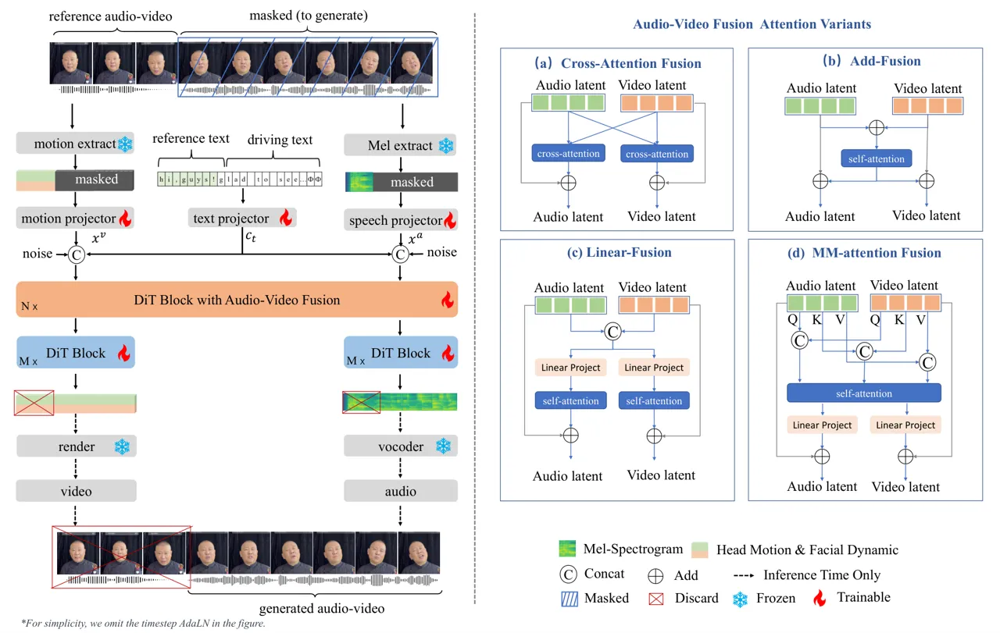
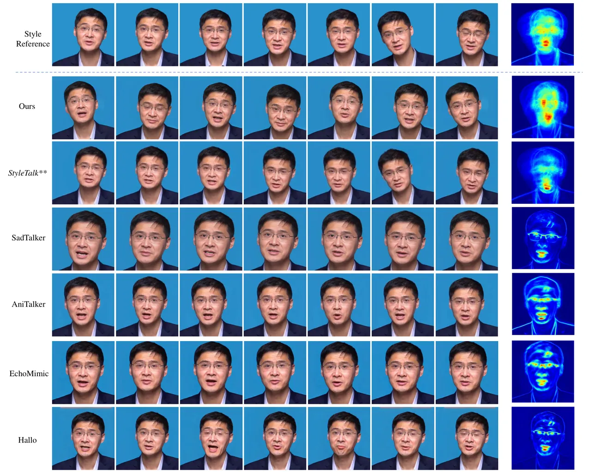
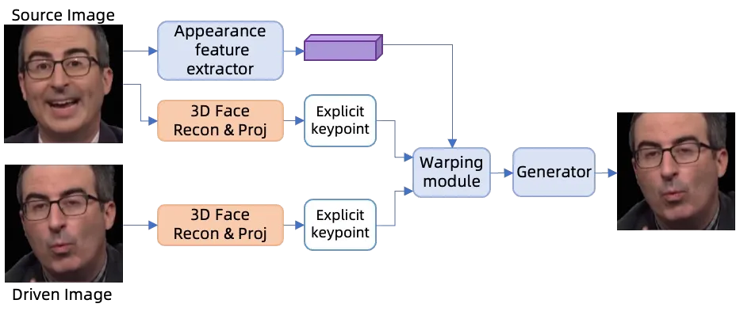
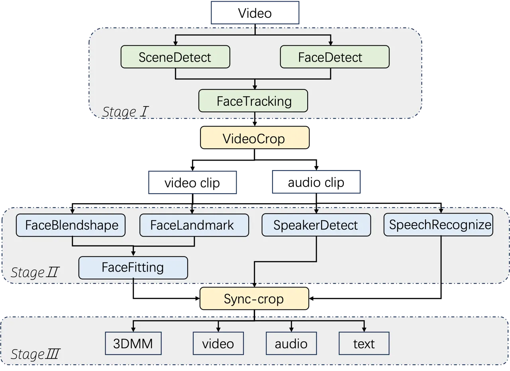
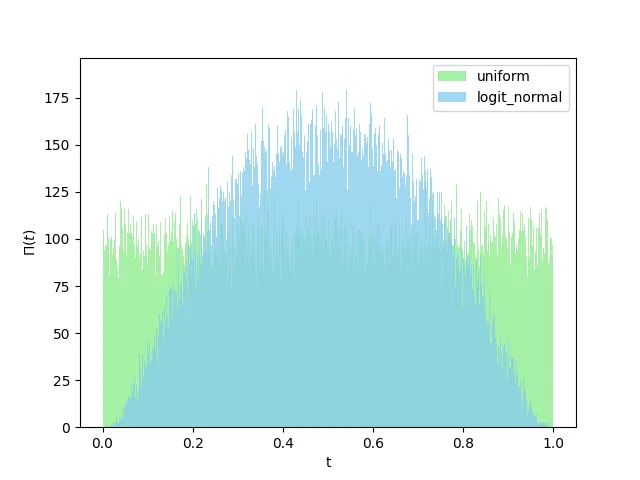
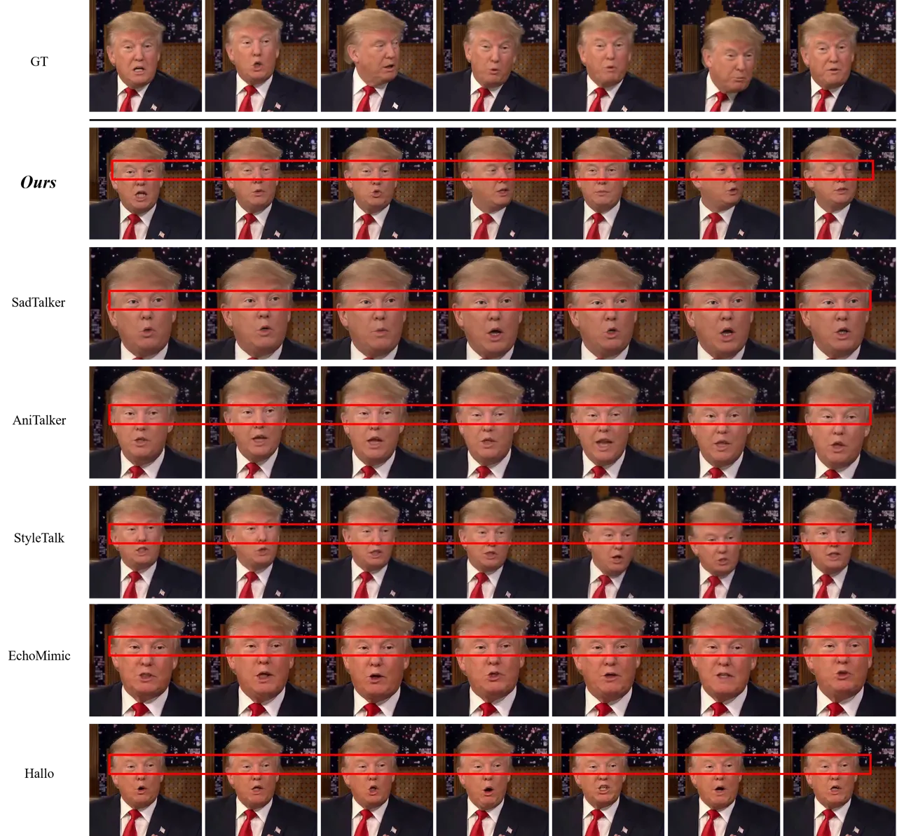
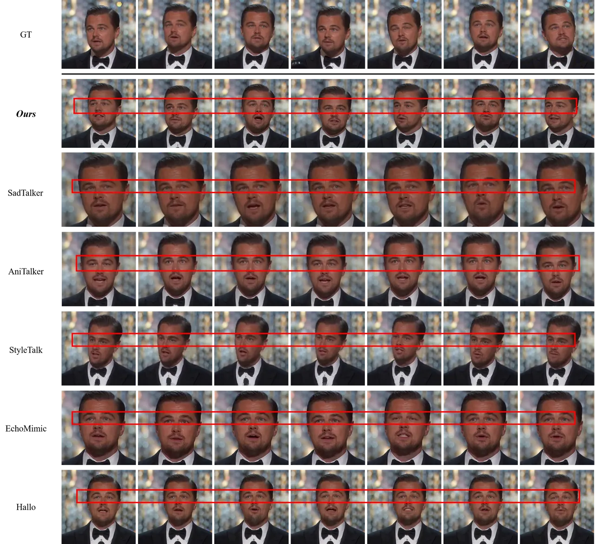
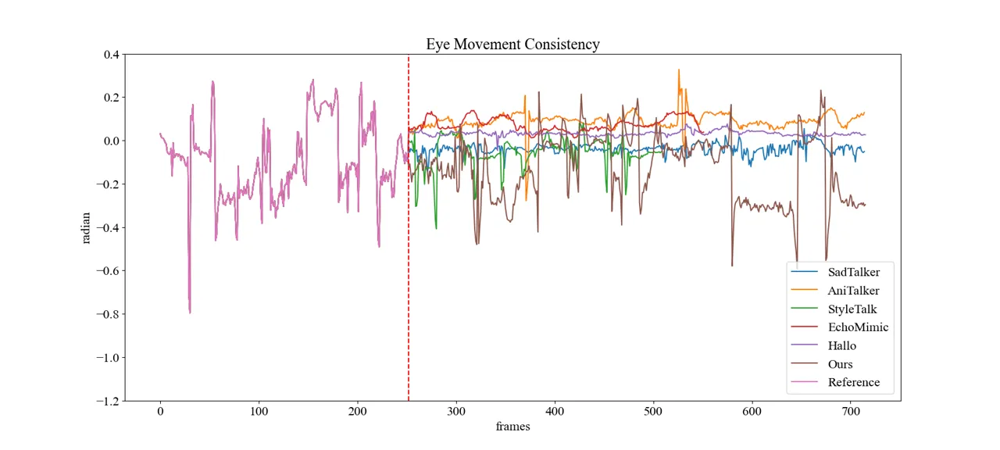
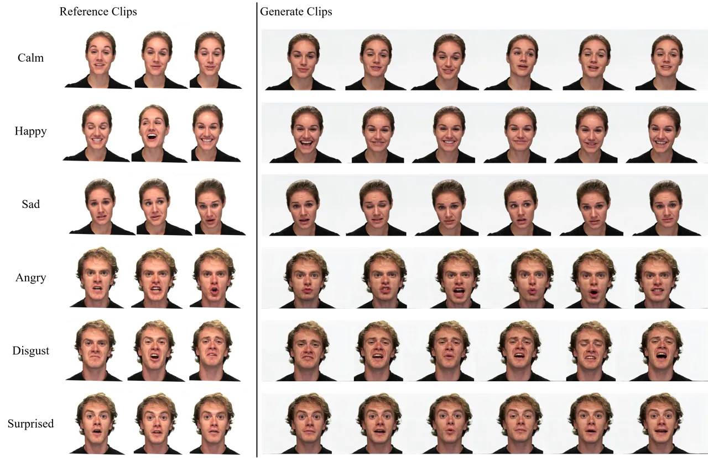

# OmniTalker: One-shot Real-time Text-Driven Talking Audio-Video Generation With Multimodal Style Mimicking

Zhongjian Wang¹¹footnotemark: 1     Peng Zhang¹¹footnotemark: 1    
Jinwei Qi¹¹footnotemark: 1     Guangyuan Wang Affiliation:     Chaona Ji
    Sheng Xu     Bang Zhang     Liefeng Bo Affiliation: Tongyi Lab,
Alibaba Group Affiliation: Project Page:
[https://humanaigc.github.io/omnitalker](https://humanaigc.github.io/omnitalker/)

###### Abstract

Although significant progress has been made in audio-driven talking head
generation, text-driven methods remain underexplored. In this work, we
present OmniTalker, a unified framework that jointly generates
synchronized talking audio-video content from input text while emulating
the target identity’s speaking and facial movement styles, including
speech characteristics, head motion, and facial dynamics. Our framework
adopts a dual-branch diffusion transformer (DiT) architecture, with one
branch dedicated to audio generation and the other to video synthesis.
At the shallow layers, cross-modal fusion modules are introduced to
integrate information between the two modalities. In deeper layers, each
modality is processed independently, with the generated audio decoded by
a vocoder and the video rendered using a GAN-based high-quality visual
renderer. Leveraging DiT’s in-context learning capability through a
masked-infilling strategy, our model can simultaneously capture both
audio and visual styles without requiring explicit style extraction
modules. Thanks to the efficiency of the DiT backbone and the optimized
visual renderer, OmniTalker achieves real-time inference at 25 FPS. To
the best of our knowledge, OmniTalker is the first one-shot framework
capable of jointly modeling speech and facial styles in real time.
Extensive experiments demonstrate its superiority over existing methods
in terms of generation quality, particularly in preserving style
consistency and ensuring precise audio-video synchronization, all while
maintaining efficient inference.

## 1 Introduction

Recent advancements in talking head generation (THG) have been
predominantly driven by breakthroughs in generative architectures.
Although current research predominantly focuses on audio-driven THG
systems\[37, 57, 45, 62, 16, 60\], emerging applications in
conversational AI and human-computer interaction increasingly demand
text-driven solutions - particularly given the paradigm shift enabled by
large language models (LLMs). Despite this technological imperative,
text-driven THG methodologies remain comparatively underdeveloped
relative to their audio-driven counterparts.

Existing text-driven approaches\[61, 59, 53, 43, 7, 24\] typically
employ a cascaded architecture combining text-to-speech (TTS) systems
with audio-driven THG models. This conventional paradigm suffers from
three fundamental limitations: (1) computational redundancy through
duplicated feature processing, (2) error propagation across disjoint
subsystems, and (3) audio-visual style discrepancies. Recent attempts to
address these issues, such as UniFlug\[35\] that utilizes TTS latent
features for facial keypoint generation, remain constrained by
unidirectional audio-to-visual information flow. While methods like \[3,
34\] demonstrate end-to-end generation capabilities, they require
training or finetuning for every identity, severely limiting practical
deployment..

The synthesis of expressive talking heads further necessitates precise
modeling of multimodal speaking styles that simultaneously capture vocal
characteristics, head motion patterns, and facial dynamics. Current
solutions predominantly address style modeling in audio-driven contexts
through either categorical emotion labels\[46, 19, 41\] or video-based
motion aggregation\[33, 50\]. However, these approaches fail to
holistically represent the complex interplay between acoustic and visual
style components that characterize natural human communication.

To overcome these challenges, we present OmniTalker, an end-to-end
framework for one-shot text-driven talking head generation with unified
audio-visual style transfer. Our architecture integrates three key
innovations: (1) A multimodal diffusion transformer (DiT) backbone
enabling bidirectional cross-modal attention across audio and visual
streams; (2) Dual transformer decoders for modality-specific refinement
while preserving cross-contextual information; and (3) A masked
infilling strategy that leverages DiT’s in-context learning capabilities
for joint audio-visual style transfer without dedicated style extraction
modules. The complete system is trained on a large-scale multimodal
dataset.

Our principal contributions can be summarized as follows:

- •
  We propose OmniTalker, the first end-to-end unified framework that
  generates synchronized, high-quality audio-visual talking heads
  directly from text input in a one-shot learning paradigm.
- •
  OmniTalker represents the first comprehensive solution for fully
  replicating an individual’s speaking style, including the dynamic
  triad of vocal characteristics, head motion patterns, and facial
  expression dynamics.
- •
  The proposed architecture achieves real-time inference on a single
  NVIDIA RTX 4090 GPU. It surpasses existing approaches in generation
  quality, with particular improvements in style preservation and
  audio-visual synchronization precision.

## 2 Related Work

We present the most relevant lines of work here, but since talking head
research is vast, a detailed comparison with prior methods is included
in the Appendix.

### 2.1 Audio-driven Talking Head Generation

Early audio-driven THG works\[37, 16\] primarily focuses on
lip-synchronization by modifying mouth regions in target videos based on
audio input. Recent advancements have extended this paradigm to generate
talking head videos from single reference images \[45, 33, 14, 57\].
Most state-of-the-art methods adopt a two-stage framework: (1) mapping
audio signals to intermediate motion representations (e.g., 3DMM
coefficients \[62, 63\], facial landmarks \[64, 27, 58\], or learnable
latent codes \[57, 23\]), followed by (2) video synthesis conditioned on
the predicted motion. While these methods have achieved remarkable
progress, their reliance on audio input constrains practical
applications in scenarios where only textual input is available.

Our work inherits the two-stage generation paradigm for its effective
decoupling of identity, head pose, and facial expressions. However, we
propose a novel end-to-end architecture that predicts head pose and
facial expressions directly from textual input rather than audio
signals.

### 2.2 Style-Controlled Talking Head Generation

Existing approaches typically adopt simplified formulations: some works
\[46, 19, 41\] represent styles as discrete emotion categories, while
others \[28, 22\] employ reference videos for frame-level expression
control - an approach that fails to capture the temporal dynamics of
facial expressions. StyleTalk \[33\] introduces a more sophisticated
solution by extracting spatiotemporal style codes from reference videos,
though this method primarily focuses on expression styles and neglects
head pose variations.

Current literature predominantly reduces speaking style to facial
dynamics, overlooking two critical aspects: (1) the inherent correlation
between vocal and facial styles, and (2) the semantic dependency between
speaking style and linguistic content. This limitation motivates our
work to develop a more comprehensive style modeling framework.

### 2.3 Text-driven Talking Head Generation

Text-driven talking head generation systems aim to jointly synthesize
speech audio and corresponding facial animations from textual input. The
predominant approach employs a cascaded pipeline combining a
text-to-speech (TTS) module with an audio-driven talking head generator
\[61, 59, 53, 43, 35, 7, 24\]. Cascaded systems are inherently limited
by three key issues: (1) computational redundancy through duplicated
feature processing, (2) error propagation across disjoint subsystems,
and (3) mismatches between audio and visual stylistic characteristics.

Recent efforts have explored parallel generation architectures to
address these issues \[9, 34, 35, 21, 3\]. Among existing solutions,
TTSF \[21\], NEUTART, and AV-Flow \[3\] share similarities with our
approach in employing cross-modal conditioning. However, TTSF predicts
sound directly from input images, which, while reducing dependency,
fails to replicate the specified identity. Both AV-Flow and NEUTART are
person-specific methods, requiring training for individual subjects.

## 3 Method

We aim to perform joint audio-visual generation using a compact neural
architecture that ensures alignment between audio and visual modalities
while preserving the speaking style (both vocal and facial) from a
reference video. Inspired by the in-context reference commonly used in
LLM\[2\] and TTS\[4\], as well as the dual-single stream hybrid
diffusion transformer(DiT) structure utilized in text-to-image
synthesis\[13, 25\], we propose the network architecture illustrated in
Figure 1. The architecture integrates three core components: (1)
Multi-Modal feature extractors to capture reference dynamics, (2) a
dual-branch DiT network for parallel audio-visual synthesis, and (3) an
Audio-Visual fusion module ensuring tight synchronization. Unlike
previous approaches, we aim at the domain of multimodal generation.



Figure 1: The architecture of OmniTalker. A dual-branch DiT framework
with cross-modal fusion for joint audio-video generation from
text(left). Four variants of Audio-Video fusion modules are
explored(right).

### 3.1 Multi-Modal Feature Alignment

Our model takes two inputs: the driven text $`T_{d}`$ and a style
reference video, to produce a realistic talking face video. We first
separate the audio and video streams from the reference video, denoting
them as $`A_{r}`$ and $`V_{r}`$, respectively. ASR models are adopted to
convert $`A_{r}`$ into transcript text $`T_{r}`$ as reference text.

Audio Feature A mel-spectrogram $`M_{r}\in\mathbb{R}^{F\times N_{a}}`$
is extracted from $`A_{r}`$, where $`F`$ is the mel dimension and
$`N_{a}`$ is the length of the reference sequence(at 94 fps by default).
A MLP-based module integrates the mel-spectrogram, to obtain the audio
embeddings $`x^{a}`$.

Visual Feature We extract visual codes
$`C_{r}\in\mathbb{R}^{61\times N_{v}}`$ for each video clip, which
consists of facial expression blendshapes
$`\alpha_{exp}\in\mathbb{R}^{51}`$, head pose $`[R;t]\in\mathbb{R}^{6}`$
and eye movement coefficients $`\alpha_{eye}\in\mathbb{R}^{4}`$ for each
frame. Blendshape is adopted for its more explicit semantic
interpretations compared to the commonly used 3DMM and FaceVerse\[49\]
coefficients. We firstly detect facial landmarks $`V_{2d}`$ from each
frame and optimizes $`C_{r}=[\alpha_{exp},\alpha_{eye},R,t]`$ by
minimizing distances between the projected keypoints and the detected
landmarks as follows:

```math
\mathcal{L}_{lmk}=\|P_{r}\times T\times\begin{bmatrix}\bar{S}+A_{exp}\alpha_{exp}+A_{eye}\alpha_{eye}\\
1\end{bmatrix}-V_{2d}\|^{2} \tag{1}
```

where $`P_{r}`$ is the orthographic projection matrix,
$`T\in\mathbb{R}^{3\times 4}`$ is the similarity transformation matrix
constructed by $`[R;t]`$, $`\bar{S}`$ is the mean 3D shape, $`A_{exp}`$
is the expression base and $`A_{exp}`$ is the eye movement base.
$`N_{v}`$ denotes the number of frames in the video sequence, which is
30 fps by default. To align $`N_{v}`$ with $`N_{a}`$, we upsample
$`C_{r}`$ to 94 fps through interpolation. $`C_{r}`$ is then projected
to the visual embeddings $`x^{v}`$ by a MLP-based embedding module.

Input Text Both the driving text $`T_{d}`$ and the reference text
$`T_{r}`$ are converted into a pinyin sequence (for Chinese) or
character/letter sequences (for Latin-based languages)\[4\]. The two
character sequences are concatenated and padded with filler tokens
$`\Phi`$ of the same length as $`x^{a}`$. Let $`S_{T}`$ represent the
final sequence. The text embedding module is built upon
ConvNeXt-V2\[55\], which is a common approach in the field of TTS, due
to its strong temporal modeling capability. The projected text
embeddings, denoted $`c_{t}`$ serves as condition for both audio and
visual branches.

### 3.2 Multi-Modal Feature Fusion

Figure 1 illustrates our network, which consists of multiple DiT blocks
designed to handle both audio and visual data streams. The network is
structured to facilitate the cross-modal fusion between audio and visual
features, enabling the generation of coherent and synchronized outputs.

Text Conditioning As detailed in Section 3.1, the model architecture
processes three modalities: text (as character sequences), audio, and
visual features. For the text modality, we apply an absolute sinusoidal
position embedding before feeding it into the ConvNeXt blocks. This
design allows the text representation to develop a moderate level of
modality-specific modeling capacity through the ConvNeXt blocks,
enabling better alignment with other modalities before cross-modal
fusion and in-context learning with other inputs. Diverging from
MMAudio’s \[6\] approach that maintains a separate text branch, our
architecture directly concatenates text embeddings with the audio and
visual modalities. This decision is motivated by our observation that
the pure MMDiT structure may be overly flexible for tasks requiring
high-fidelity generation aligned with explicit prompt guidance, e.g. TTS
and THG. To preserve spatial coherence in the multimodal input, we
augment the concatenated sequences with convolutional position
embeddings.

Audio-Visual Fusion Module: This module is responsible for the
integration of audio and visual features. It employs a dual-branch
architecture, where one branch processes visual information, and the
other processes audio. As for feature fusion mechanism, common
strategies include (a) Cross-Attention, (b) Element-wise Addition, (c)
Linear Fusion\[3\], (d) Multi-modal joint attention(MM-Attention)\[13,
25, 6\], as shown in Figure 1. After empirical validation, we adopted
MM-Attention which demonstrated superior performance. We will provide a
detailed comparison of the effects of different fusion methods in
Section 4.4. In MM-Attention, the Query($`Q`$), Key($`K`$), and
Value($`V`$) matrices are derived from both modalities in joint
attention, and RoPE\[44\] is applied. MM-Attention allows the network to
dynamically weight the importance of audio and visual features, ensuring
that the generated video is temporally aligned with the input audio.

Single-Modality DiT Blocks: Following the Audio-Visual Fusion Module,
the network employs several single-modality DiT blocks. These blocks
operate on the fused multimodal features but are designed to refine the
generation process by focusing on individual modalities (audio or
visual) after the initial cross-modal fusion. This two-stage approach,
first fusing multimodal information and then refining each modality
separately, allows the network to maintain the coherence of the
generated content while ensuring high-quality output for each modality.

### 3.3 In-Context Stylized Audio-Visual Generation

We propose an audio-visual sequence infilling framework that predicts
target segments by leveraging contextual information from surrounding
segments and full text transcriptions (including both reference text and
driving text). During training, we implement a masked reconstruction
strategy where multiple random segments in the audio-visual sequence are
occluded. The model is optimized through audio-visual reconstruction
loss computed on these masked regions. This in-context reference
mechanism enables the network to implicitly learn stylistic features
from reference videos without requiring complex additional style
extraction modules. For inference, our approach employs a
three-component input structure: (1) a reference audio-visual pair
serving as the talking style prompt, (2) arbitrary driving text as the
conditional input, and (3) a noisy latent placeholder representing the
target audio-visual sequence to be predicted. This architecture allows
the model to synthesize audio-visual synchronized sequences that inherit
the stylistic characteristics defined in the reference prompt while
maintaining alignment with the provided textual condition, as
illustrated in Figure 1.

Audio-Visual Generation via Flow Matching We employ flow matching\[30\]
to train our DiT-based model, leveraging its superior advantages such as
improved training and inference efficiency, simplified optimization, and
faster convergence compared to traditional methods. Let
$`x\in\mathbb{R}^{d}`$ donate the data points(mel-spectrogram $`M_{r}`$
and visual codes $`C_{r}`$ in our case), sampled from the ground truth
data distribution $`q(x)`$, and
$`p:[0,1]\times\mathbb{R}^{d}\to\mathbb{R}>0`$ donate the probability
density path, which is a time dependent probability density function.
Our model with parameters $`\theta`$ predict a vector field $`v_{t}`$,
which can be used to construct a time-dependent flow,
$`\phi:[0,1]\times\mathbb{R}^{d}\to\mathbb{R}^{d}`$ via the ordinary
differential equation (ODE). Follow the Optimal Transport (OT)
formulation from \[30\], we can train our model with conditions
$`C=[M_{r},C_{r},S_{T}]`$ by optimizing the conditional flow matching
objective:

```math
\mathcal{L}_{CFM}(\theta)=\mathbb{E}_{t,q(x_{1}),p(x_{0})}\left\|v_{t}((1-t)x_{0}+tx_{1},C;\theta)-(x_{1}-x_{0})\right\|^{2} \tag{2}
```

We provide detailed preliminaries of flow matching in Appendix. In the
training stage, we pass in the model the noisy audio-visual embeddings
$`(1-t)x_{0}+tx_{1}`$ and the masked embeddings $`(1-m)\odot x_{1}`$,
where $`x_{1}=[M_{r};C_{r}]`$, $`x_{0}`$ denotes sampled Gaussian noise
and $`m\in{\{0,1\}}^{(F+61)\times N_{a}}`$ represents a binary temporal
mask. The model is trained to reconstruct $`m\odot x_{1}`$ with
$`(1-m)\odot x_{1}`$ and $`S_{T}`$. We apply the conditional flow
matching loss function formulated in Equation 2 for both the audio and
visual branches. The overall objective is:

```math
\mathcal{L}=\lambda_{m}\mathcal{L}_{CFM}^{m}+\lambda_{h}\mathcal{L}_{CMF}^{h}+\lambda_{f}\mathcal{L}_{CFM}^{f}+\lambda_{e}\mathcal{L}_{CFM}^{e} \tag{3}
```

where $`m`$ is for mel-spectrogram, $`h`$ is for head pose, $`f`$ is for
facial expressions and $`e`$ is for eye movements correspondingly. We
use L1 loss instead of L2 as we found that an L1 loss leads to more
realistic results. During inference, we could push the data from the
Gaussian distribution to the target distribution by any ODE solver.

Classifier-Free Guidance To further improve generation quality and
enhance style replication, we integrate classifier-free guidance
(CFG)\[20\] into both branches. We randomly drop each of the input
conditions $`C=[M_{r},C_{r},S_{T}]`$ in the training stage, while during
inference, we apply multi-conditions CFG to construct the
$`v^{CFG}_{t}`$:

```math
v^{CFG}_{t}=(1+\sum_{c\in C}\alpha_{c})\cdot v_{t}(x_{0},c)-\sum_{c\in C}\alpha_{c}\cdot v_{t}(x_{0},0) \tag{4}
```

, where $`\alpha_{c}`$ is the guidance strength for condition $`c`$.
Please refer to Section 4.1 for the detailed parameter settings
mentioned above.

### 3.4 Audio And Video Decoders

The synthesized mel-spectrogram is decoded to speech via Vocos\[42\], a
high-fidelity vocoder selected for its real-time efficiency. Alternative
vocoders (e.g., BigVGAN\[26\]) can be flexibly integrated.

We design a warp-based GAN model as the visual render(similar to \[57,
11\], which randomly selects a frame from the reference video as the
identity reference and generates video frames based on the visual codes
$`C^{\prime}_{r}`$(including head pose, blendshapes and eye movements)
predicted by the DiT network. It produces $`512\times 512`$ resolution
frames at 50 fps, ensuring real-time performance. While the visual
rendering pipeline is beyond the scope of this work, it is designed to
be both computationally efficient and highly flexible. We refer readers
to the Appendix for more details.

|                              |                      |                   |                      |                   |     |                      |                   |
| ---------------------------- | -------------------- | ----------------- | -------------------- | ----------------- | --- | -------------------- | ----------------- |
|                              | SEED                 |                   |                      |                   |     | Custom               |                   |
| Method                       | ZH                   |                   | EN                   |                   |     | ZH                   |                   |
|                              | WER(%)$`\downarrow`$ | SIM-A$`\uparrow`$ | WER(%)$`\downarrow`$ | SIM-A$`\uparrow`$ |     | WER(%)$`\downarrow`$ | SIM-A$`\uparrow`$ |
| CosyVoice\[12\]              | 3.10                 | 0.723             | 4.29                 | 0.609             |     | 3.52                 | 0.725             |
| MaskGCT\[54\]                | 2.27                 | 0.774             | 2.62                 | 0.714             |     | 2.83                 | 0.769             |
| F5-TTS\[4\]                  | 1.56                 | 0.741             | 1.83                 | 0.647             |     | 1.82                 | 0.762             |
| Ours($`\alpha_{C_{r}}=0`$)   | 1.55                 | 0.766             | 1.85                 | 0.685             |     | 1.61                 | 0.771             |
| Ours($`\alpha_{C_{r}}=2.5`$) | \-                   | \-                | \-                   | \-                |     | 1.58                 | 0.762             |

Table 1: Quantitative comparison with TTS methods.

Figure 2: We visualize the values of head poses over time for the
reference video and videos generated by different methods. To better
showcase the differences, we focus on displaying the Yaw angle. The red
dashed line separates the values of the reference video on the left from
those of the generated results on the right. StyleTalk\*\* can only
mimic the expression style and simply copy the reference head pose.

|                 |                   |                  |                    |                     |                     |     |                   |                  |                    |                     |                     |     |                 |
| --------------- | ----------------- | ---------------- | ------------------ | ------------------- | ------------------- | --- | ----------------- | ---------------- | ------------------ | ------------------- | ------------------- | --- | --------------- |
|                 | VoxCeleb2         |                  |                    |                     |                     |     | Custom            |                  |                    |                     |                     |     | Inference       |
| Method          | FVD$`\downarrow`$ | CSIM$`\uparrow`$ | Sync-C$`\uparrow`$ | E-FID$`\downarrow`$ | P-FID$`\downarrow`$ |     | FVD$`\downarrow`$ | CSIM$`\uparrow`$ | Sync-C$`\uparrow`$ | E-FID$`\downarrow`$ | P-FID$`\downarrow`$ |     | FPS$`\uparrow`$ |
| SadTalker\[62\] | 243.92            | 0.828            | 5.34               | 0.67                | 3.37                |     | 595.00            | 0.854            | 3.61               | 0.45                | 9.23                |     | 25              |
| AniTalker\[31\] | 181.58            | 0.842            | 4.82               | 0.94                | 1.08                |     | 329.70            | 0.858            | 4.02               | 0.89                | 3.64                |     | 18              |
| StyleTalk\[33\] | 144.40            | 0.691            | 5.52               | 0.71                | 0.31                |     | 208.51            | 0.791            | 4.17               | 0.51                | 0.40                |     | 21              |
| EchoMimic\[5\]  | 191.77            | 0.883            | 5.88               | 0.60                | 2.74                |     | 367.74            | 0.908            | 4.74               | 0.36                | 8.26                |     | 0.78            |
| Hallo\[56\]     | 156.33            | 0.879            | 6.53               | 0.59                | 1.03                |     | 244.40            | 0.887            | 5.52               | 0.35                | 1.06                |     | 0.65            |
| Ours            | 102.54            | 0.890            | 6.37               | 0.02                | 0.04                |     | 176.32            | 0.905            | 5.48               | 0.08                | 0.12                |     | 25              |

Table 2: Quantitative comparison with SOTA audio-driven talking head
generation methods. We highlight the best, second best.

## 4 Experiments

### 4.1 Experimental Setup

Implementation Details. Our model includes 22 audio-visual fusion blocks
with two parallel branches (4 single-modality DiT blocks each), 512-dim
embeddings (audio/visual via linear layers, text via 4 ConvNeXt V2
blocks), totaling 0.8B parameters. The model was trained on 8 NVIDIA
A100 GPUs using a batch size of 12,800 frames per GPU for 750,000
iterations with a learning rate of $`1e-4`$. In Equation 3, we use
$`\lambda_{m}=0.1`$, $`\lambda_{f}=3.0`$, $`\lambda_{h}=0.5`$ and
$`\lambda_{e}=0.5`$. The audio features are represented as
100-D($`F=100`$) log-mel filterbank coefficients extracted with 24kHz
sampling rate and hop length 256, yielding an audio sequence with
approximately 94 fps. In contrast, visual codes are captured at 30 fps
and upsampled to 94 fps to match the audio frame rate. During inference,
the duration of reference audio-visual content is restricted to 1–10
seconds, with any excess truncated. The CFG parameters are set to
$`\alpha_{M_{r}}=2.0`$, $`\alpha_{C_{r}}=2.5`$ and
$`\alpha_{S_{T}}=2.0`$, while 16 sampling steps are used. We provide
full details in Appendix.

Datasets. We evaluated our method on both audio and video generation
tasks. For audio, we employed the SEED\[1\] dataset, while for video
generation, 500 clips were randomly selected from VoxCeleb2\[8\] as the
test set. To further validate the robustness of our approach in
practical applications, 100 video clips from Chinese real-world
scenarios were selected as Custom dataset for supplementary testing of
audio and video quality. We pre-trained our model on a collection of
large-scale open-source talking-head datasets and subsequently developed
a high-quality dataset(totaling 690 hours) to fine-tune the model’s
performance. We direct the authors to supplementary materials for more
details.

Compared Baselines. Since there is currently no method capable of
jointly generating audio and video simultaneously, we conducted
comparative analyses on text-to-speech (TTS) methods and audio-driven
talking head approaches separately. For the TTS module comparison, we
selected three representative methods: MaskGCT\[54\], F5TTS\[4\], and
CosyVoice\[12\]. Since SEED lacks visual information, we set
$`\alpha_{C_{r}}=0.0`$(w/o visual condition) during testing. On the
Custom dataset, we separately evaluated the scenarios of
$`\alpha_{C_{r}}=0.0`$ and $`\alpha_{C_{r}}=2.5`$(w. visual condition).
In the evaluation of Talking Head generation modules, we established a
multimodal comparative framework encompassing: (1) two GAN\[15\] based
methods (SadTalker\[62\] and AniTalker\[31\]); (2) two state-of-the-art
diffusion model-based approaches (EchoMimic\[5\] and Hallo\[56\]); and
(3) StyleTalk\[33\] – an audio-driven THG method with style-preservation
capabilities. It is important to note that all talking head models in
our experiments employed audio signals generated by our proposed method
as the driving input, ensuring fairness and comparability across
evaluations. All methods were evaluated at $`512\times 512`$ with a
single NVIDIA RTX 4090 GPU, whereas Sadtalker and AniTalker employ a
super-resolution model by default.

Evaluation Metrics. We evaluate audio quality using the word error rate
(WER), measured with the Whisper-Large-v3\[38\] model. Additionally, we
employ speaker similarity (SIM-A) to assess the performance of zero-shot
timbre preservation. The evaluation metrics utilized in the portrait
image animation approach include Fréchet Video Distance (FVD)\[48\],
Synchronization-C (Sync-C)\[40\]. Specifically, FVD measures the
similarity between generated videos and real data, with lower values
indicating better performance, and thus more realistic outputs. Sync-C
evaluates the lip synchronization of generated videos in terms of
content and dynamics, with higher Sync-C scores denoting better
alignment with audio. We also compute the cosine similarity(CSIM)
between facial identity features of the reference image and generated
frames. Following EMO\[47, 56\], we assess the preservation of speaking
style by calculating the Fréchet distance between motion coefficients
extracted from the reference and generated videos. To separately
evaluate expression and pose fidelity, we introduce E-FID (Expression
FID) and P-FID (Pose FID). Specifically, E-FID integrates facial
blendshapes $`\alpha_{exp}`$ and eye movements $`\alpha_{eye}`$, while
P-FID quantifies head pose consistency through $`[R;t]`$ parameters.



Figure 3: Qualitative Comparision. Given a video for identity and style
reference, we visualize generated frames of all compared methods. We
also visualize the motion heatmaps of generated videos on the right
side. For the audio-driven approach, we use the audio output from our
own method as the input. StyleTalk\*\* directly transfers the reference
pose sequence.

### 4.2 Quantitative Evaluation

Audio Results. In quantitative analysis of audio generation as
demonstrated in Table 1, our approach exhibits significant superiority
over TTS baseline models. WER is notably reduced on both SEED-ZH and
Custom test sets, while showing only marginal underperformance compared
to F5TTS on SEED-EN, demonstrating that the generated audio strictly
adheres to the input text. Additionally, our method ranks second in
SIM-A metrics, further validating the preservation capability of
identity features under zero-shot conditions. Notably, in the Custom
dataset, incorporating visual conditions achieves lower WER values,
indicating that introducing visual supervision effectively enhances
perceptual audio quality. We attribute this improvement to the
effectiveness of multi-task learning, as audio signals and facial motion
patterns represent highly correlated modalities.

Video Results. Table 2 further demonstrates the superior performance of
our method in visual generation. On both the VoxCeleb2 and Custom
datasets, our approach achieves SOTA performance on 5 core metrics, with
the lowest FVD and highest CSIM scores. These metrics confirm our
model’s significant advantage in generating high-quality videos while
preserving identity consistency. Notably, our method achieves
orders-of-magnitude improvements on the E-FID and P-FID metrics compared
to existing approaches, highlighting its exceptional capability in
preserving facial motion patterns and head pose characteristics. This
enables effective inheritance of the reference person’s speaking style,
leading to high-fidelity expression cloning with remarkable
authenticity. While our method obtains suboptimal results on the Sync-C,
slightly underperforming the diffusion-based method, empirical analysis
reveals that these metrics favor front-facing video generation. In
contrast, baseline methods tend to produce front-facing videos at the
expense of directional information from the reference images. Comparison
videos are provided in the supplementary materials for further insight.

User Study. We performed an MOS evaluation (1–5) based on \[60\] with 50
volunteers to assess perceptual quality. Participants rated videos on
six aspects: speech similarity, rhythm, visual quality, speaking style,
lip-sync, and pose-sync, details in Appendix. The results are shown in
Table 3. Our method achieved the best performance in speech similarity,
visual quality, speaking style, and pose synchronization, with
significant improvements in style preservation and pose generation over
competing methods, highlighting our state-of-the-art capabilities in
maintaining natural speaking styles and generating synchronized facial
movements.

Inference Efficiency. Our method achieves high-quality output with
real-time inference capabilities through the innovative integration of
flow matching technology and a relatively compact model architecture
(with only 0.8 billion parameters). As shown in Table 2, our method
outperforms others in both inference speed and output quality. It is
noteworthy that the fps number of baseline methods do not incorporate
the inference time of the preceding TTS process. In other words, none of
these methods can truly achieve real-time performance in practice.

### 4.3 Qualitative Evaluation

Facial Motion Styles. To more intuitively demonstrate the superior
capability of our method in modeling facial motion styles, we compared
the cumulative heatmaps of head movements in speaking videos generated
by our method and other existing approaches. As shown in Figure 3, by
comparing the generated results with reference videos, it is evident
that the heatmaps produced by our method align more closely with those
of the real data. This result indicates that our method possesses a
significant advantage in capturing and reproducing complex facial motion
styles. Figure 2 further validates this conclusion from a temporal
perspective. We selected the yaw angle (a parameter of head pose) as the
tracking metric. The red line on the left represents the reference
sequence, while the right side displays the sequences generated from
various methods. The results show that the generated sequences of our
method maintain a high consistency with the reference sequence in terms
of amplitude and frequency of movement while preserving necessary
differences, demonstrating effective inheritance of the head-pose style.
In contrast, the head movements generated by other methods were
generally less pronounced and lacked dynamic variation. It should be
noted that the StyleTalk method directly transfers the reference pose
sequence to achieve generation, which ensures complete consistency with
the reference pose but fails to consider the semantic association
between speech content and pose.

### 4.4 Ablation Study

Fusion Strategies. As shown in Table 4, the MM-Attention method achieved
the best performance in all terms. This suggests that employing
MM-Attention as the fusion strategy for audio and motion features may be
the most effective approach. It better captures the correlations and
importance distributions between the two modalities, thereby enhancing
the overall performance. Although others can also achieve feature
fusion, their performance generally lags behind that of MM-Attention. In
particular, the Add method performed the worst in all evaluation
metrics. This may be because simply adding or linearly combining the two
features fails to adequately account for their complex interactions and
the nuanced importance distributions inherent to each modality.

|                   | CosyVoice | MaskGCT | F5TTS | SadTalker | AniTalker | StyleTalk | EchoMimic | Hallo | Ours |
| ----------------- | --------- | ------- | ----- | --------- | --------- | --------- | --------- | ----- | ---- |
| Speech Similarity | 3.56      | 4.32    | 4.40  | \-        | \-        | \-        | \-        | \-    | 4.66 |
| Speech Rhythm     | 4.24      | 3.88    | 3.90  | \-        | \-        | \-        | \-        | \-    | 4.02 |
| Visual Quality    | \-        | \-      | \-    | 3.86      | 3.90      | 3.32      | 3.96      | 4..00 | 4.12 |
| Speak Style       | \-        | \-      | \-    | 2.10      | 2.56      | 3.98      | 3.88      | 3.94  | 4.57 |
| Lip-sync          | \-        | \-      | \-    | 4.00      | 3.90      | 4.00      | 3.82      | 4.30  | 4.20 |
| Pose-sync         | \-        | \-      | \-    | 1.22      | 1.60      | 1.98      | 3.00      | 3.52  | 4.44 |

Table 3: MOS score of different methods by user study.

| Fusion          |     | WER(%)$`\downarrow`$ | SIM-A$`\uparrow`$ |     | Sync-C$`\uparrow`$ | E-FID$`\downarrow`$ | P-FID$`\downarrow`$ |
| --------------- | --- | -------------------- | ----------------- | --- | ------------------ | ------------------- | ------------------- |
| Add             |     | 2.89                 | 0.582             |     | 4.92               | 0.58                | 3.20                |
| Linear          |     | 2.32                 | 0.645             |     | 5.08               | 0.21                | 1.54                |
| Cross-Attention |     | 1.72                 | 0.698             |     | 5.35               | 0.12                | 0.18                |
| MM-Attention    |     | 1.58                 | 0.762             |     | 5.48               | 0.08                | 0.12                |

Table 4: Ablation study of Fusion Strategies.

## 5 Conclusion

OmniTalker introduces a unified framework for text-driven talking head
generation, achieving simultaneous audio-visual synthesis with
in-context style replication. By integrating a dual-branch architecture
with cross-modal attention mechanisms and in-contex style reference, the
method bridges the gap between text input and multimodal output,
ensuring audio-visual synchronization and stylistic consistency without
reliance on cascaded pipelines. The combination of a lightweight network
architecture and flow matching based training enables the model to
deliver high-quality output with real-time inference capabilities.
Extensive experiments demonstrate that our method surpasses existing
approaches in generation quality, particularly excelling in style
preservation and audio-video synchronization, while maintaining
real-time prediction efficiency.

## References

- \[1\] Philip Anastassiou, Jiawei Chen, Jitong Chen, Yuanzhe Chen, Zhuo
  Chen, Ziyi Chen, Jian Cong, Lelai Deng, Chuang Ding, Lu Gao, et al.
  Seed-tts: A family of high-quality versatile speech generation models.
  _arXiv preprint arXiv:2406.02430_, 2024.
- \[2\] Tom Brown, Benjamin Mann, Nick Ryder, Melanie Subbiah, Jared D
  Kaplan, Prafulla Dhariwal, Arvind Neelakantan, Pranav Shyam, Girish
  Sastry, Amanda Askell, Sandhini Agarwal, Ariel Herbert-Voss, Gretchen
  Krueger, Tom Henighan, Rewon Child, Aditya Ramesh, Daniel Ziegler,
  Jeffrey Wu, Clemens Winter, Chris Hesse, Mark Chen, Eric Sigler,
  Mateusz Litwin, Scott Gray, Benjamin Chess, Jack Clark, Christopher
  Berner, Sam McCandlish, Alec Radford, Ilya Sutskever, and Dario
  Amodei. Language models are few-shot learners. In _NeurIPS_. Curran
  Associates, Inc., 2020.
- \[3\] Aggelina Chatziagapi, Louis-Philippe Morency, Hongyu Gong,
  Michael Zollhoefer, Dimitris Samaras, and Alexander Richard. AV-Flow:
  Transforming Text to Audio-Visual Human-like Interactions, 2025.
- \[4\] Yushen Chen, Zhikang Niu, Ziyang Ma, Keqi Deng, Chunhui Wang,
  Jian Zhao, Kai Yu, and Xie Chen. F5-tts: A fairytaler that fakes
  fluent and faithful speech with flow matching. _ArXiv_,
  abs/2410.06885, 2024a.
- \[5\] Zhiyuan Chen, Jiajiong Cao, Zhiquan Chen, Yuming Li, and
  Chenguang Ma. Echomimic: Lifelike audio-driven portrait animations
  through editable landmark conditions. _ArXiv_, abs/2407.08136, 2024b.
- \[6\] Ho Kei Cheng, Masato Ishii, Akio Hayakawa, Takashi Shibuya,
  Alexander G. Schwing, and Yuki Mitsufuji. Taming multimodal joint
  training for high-quality video-to-audio synthesis. _ArXiv_,
  abs/2412.15322, 2024.
- \[7\] Jeongsoo Choi, Minsu Kim, Se Jin Park, and Yong Man Ro.
  Text-Driven Talking Face Synthesis by Reprogramming Audio-Driven
  Models. In _ICASSP_, pages 8065–8069, Seoul, Korea, Republic of, 2024.
  IEEE.
- \[8\] Joon Son Chung, Arsha Nagrani, and Andrew Zisserman. Voxceleb2:
  Deep speaker recognition. _arXiv preprint arXiv:1806.05622_, 2018.
- \[9\] Sara Dahmani, Vincent Colotte, Valérian Girard, and Slim Ouni.
  Conditional Variational Auto-Encoder for Text-Driven Expressive
  AudioVisual Speech Synthesis. In _Interspeech 2019_, pages 2598–2602.
  ISCA, 2019.
- \[10\] PySceneDetect Developers. Pyscenedetect.
  [https://www.scenedetect.com/](https://www.scenedetect.com/), 2025.
- \[11\] Nikita Drobyshev, Antoni Bigata Casademunt, Konstantinos
  Vougioukas, Zoe Landgraf, Stavros Petridis, and Maja Pantic.
  Emoportraits: Emotion-enhanced multimodal one-shot head avatars. In
  _CVPR_, pages 8498–8507, 2024.
- \[12\] Zhihao Du, Qian Chen, Shiliang Zhang, Kai Hu, Heng Lu, Yexin
  Yang, Hangrui Hu, Siqi Zheng, Yue Gu, Ziyang Ma, et al. Cosyvoice: A
  scalable multilingual zero-shot text-to-speech synthesizer based on
  supervised semantic tokens. _arXiv preprint arXiv:2407.05407_, 2024.
- \[13\] Patrick Esser, Sumith Kulal, A. Blattmann, Rahim Entezari,
  Jonas Muller, Harry Saini, Yam Levi, Dominik Lorenz, Axel Sauer,
  Frederic Boesel, Dustin Podell, Tim Dockhorn, Zion English, Kyle
  Lacey, Alex Goodwin, Yannik Marek, and Robin Rombach. Scaling
  rectified flow transformers for high-resolution image synthesis.
  _ArXiv_, abs/2403.03206, 2024.
- \[14\] Yuan Gan, Zongxin Yang, Xihang Yue, Lingyun Sun, and Yi Yang.
  Efficient emotional adaptation for audio-driven talking-head
  generation. In _ICCV_, pages 22634–22645, 2023.
- \[15\] Ian J. Goodfellow, Jean Pouget-Abadie, Mehdi Mirza, Bing Xu,
  David Warde-Farley, Sherjil Ozair, Aaron C. Courville, and Yoshua
  Bengio. Generative adversarial networks. _arXiv
  preprint:1406.2661_, 2014.
- \[16\] Jiazhi Guan, Zhanwang Zhang, Hang Zhou, Tianshu Hu, Kaisiyuan
  Wang, Dongliang He, Haocheng Feng, Jingtuo Liu, Errui Ding, Ziwei Liu,
  and Jingdong Wang. Stylesync: High-fidelity generalized and
  personalized lip sync in style-based generator. _CVPR_, pages
  1505–1515, 2023.
- \[17\] Jia Guo, Jiankang Deng, Alexandros Lattas, and Stefanos
  Zafeiriou. Sample and computation redistribution for efficient face
  detection, 2021.
- \[18\] Jianzhu Guo, Dingyun Zhang, Xiaoqiang Liu, Zhizhou Zhong, Yuan
  Zhang, Pengfei Wan, and Di Zhang. Liveportrait: Efficient portrait
  animation with stitching and retargeting control. _arXiv
  preprint:2407.03168_, 2024.
- \[19\] Siddharth Gururani, Arun Mallya, Ting-Chun Wang, Rafael Valle,
  and Ming-Yu Liu. Space: Speech-driven portrait animation with
  controllable expression. _ICCV_, pages 20857–20866, 2022.
- \[20\] Jonathan Ho and Tim Salimans. Classifier-free diffusion
  guidance. _arXiv preprint arXiv:2207.12598_, 2022.
- \[21\] Youngjoon Jang, Ji-Hoon Kim, Junseok Ahn, Doyeop Kwak, Hong-Sun
  Yang, Yoon-Cheol Ju, Il-Hwan Kim, Byeong-Yeol Kim, and Joon Son Chung.
  Faces that Speak: Jointly Synthesising Talking Face and Speech from
  Text. In _CVPR_, pages 8818–8828, Seattle, WA, USA, 2024. IEEE.
- \[22\] Xinya Ji, Hang Zhou, Kaisiyuan Wang, Qianyi Wu, Wayne Wu, Feng
  Xu, and Xun Cao. Eamm: One-shot emotional talking face via audio-based
  emotion-aware motion model. _ACM SIGGRAPH 2022 Conference
  Proceedings_, 2022.
- \[23\] Taekyung Ki, Dongchan Min, and Gyoungsu Chae. Float: Generative
  motion latent flow matching for audio-driven talking portrait.
  _ArXiv_, abs/2412.01064, 2024.
- \[24\] Rithesh Kumar, Jose Sotelo, Kundan Kumar, Alexandre de
  Brebisson, and Yoshua Bengio. ObamaNet: Photo-realistic lip-sync from
  text, 2017.
- \[25\] Black Forest Labs. Flux.
  [https://github.com/black-forest-labs/flux](https://github.com/black-forest-labs/flux), 2024.
- \[26\] Sang-gil Lee, Wei Ping, Boris Ginsburg, Bryan Catanzaro, and
  Sungroh Yoon. Bigvgan: A universal neural vocoder with large-scale
  training. _arXiv preprint arXiv:2206.04658_, 2022.
- \[27\] Tianqi Li, Ruobing Zheng, Ming Yang, Jingdong Chen, and Ming
  Yang. Ditto: Motion-space diffusion for controllable realtime talking
  head synthesis. _ArXiv_, abs/2411.19509, 2024.
- \[28\] Borong Liang, Yan Pan, Zhizhi Guo, Hang Zhou, Zhibin Hong,
  Xiaoguang Han, Junyu Han, Jingtuo Liu, Errui Ding, and Jingdong Wang.
  Expressive talking head generation with granular audio-visual control.
  _CVPR_, pages 3377–3386, 2022.
- \[29\] Junhua Liao, Haihan Duan, Kanghui Feng, Wanbing Zhao, Yanbing
  Yang, and Liangyin Chen. A light weight model for active speaker
  detection. In _CVPR_, pages 22932–22941, 2023.
- \[30\] Yaron Lipman, Ricky TQ Chen, Heli Ben-Hamu, Maximilian Nickel,
  and Matt Le. Flow matching for generative modeling. _arXiv preprint
  arXiv:2210.02747_, 2022.
- \[31\] Tao Liu, Feilong Chen, Shuai Fan, Chenpeng Du, Qi Chen, Xie
  Chen, and Kai Yu. Anitalker: Animate vivid and diverse talking faces
  through identity-decoupled facial motion encoding. In _ACM
  Multimedia_, 2024.
- \[32\] Steven R Livingstone and Frank A Russo. The ryerson
  audio-visual database of emotional speech and song (ravdess): A
  dynamic, multimodal set of facial and vocal expressions in north
  american english. _PloS one_, 13(5):e0196391, 2018.
- \[33\] Yifeng Ma, Suzhe Wang, Zhipeng Hu, Changjie Fan, Tangjie Lv, Yu
  Ding, Zhidong Deng, and Xin Yu. Styletalk: One-shot talking head
  generation with controllable speaking styles. In _AAAI_, 2023.
- \[34\] Georgios Milis, Panagiotis P. Filntisis, Anastasios Roussos,
  and Petros Maragos. Neural Text to Articulate Talk: Deep Text to
  Audiovisual Speech Synthesis achieving both Auditory and
  Photo-realism, 2023.
- \[35\] Kentaro Mitsui, Yukiya Hono, and Kei Sawada. UniFLG: Unified
  Facial Landmark Generator from Text or Speech. In _Interspeech_, pages
  5501–5505. ISCA, 2023.
- \[36\] Arsha Nagrani, Joon Son Chung, and Andrew Zisserman. Voxceleb:
  a large-scale speaker identification dataset. _arXiv preprint
  arXiv:1706.08612_, 2017.
- \[37\] Prajwal K R, Rudrabha Mukhopadhyay, Vinay P. Namboodiri, and
  C. V. Jawahar. A lip sync expert is all you need for speech to lip
  generation in the wild. _Proceedings of the 28th ACM International
  Conference on Multimedia_, 2020.
- \[38\] Alec Radford, Jong Wook Kim, Tao Xu, Greg Brockman, Christine
  McLeavey, and Ilya Sutskever. Robust speech recognition via
  large-scale weak supervision. In _ICML_, pages 28492–28518.
  PMLR, 2023.
- \[39\] Chandan KA Reddy, Vishak Gopal, and Ross Cutler. Dnsmos p. 835:
  A non-intrusive perceptual objective speech quality metric to evaluate
  noise suppressors. In _ICASSP_, pages 886–890. IEEE, 2022.
- \[40\] Abhinav Roy, Bhavesh S. Gyanchandani, Jyoti Sahu, and
  K. Mallikharjuna Rao. Syncnet: Harmonizing nodes for efficient
  learning. _2024 International Conference on Software,
  Telecommunications and Computer Networks (SoftCOM)_, pages 1–6, 2024.
- \[41\] Sanjana Sinha, S. Biswas, Ravindra Yadav, and B. Bhowmick.
  Emotion-controllable generalized talking face generation. In
  _IJCAI_, 2022.
- \[42\] Hubert Siuzdak. Vocos: Closing the gap between time-domain and
  fourier-based neural vocoders for high-quality audio synthesis.
  _ArXiv_, abs/2306.00814, 2023.
- \[43\] Hyoung-Kyu Song, Sang Hoon Woo, Junhyeok Lee, Seungmin Yang,
  Hyunjae Cho, Youseong Lee, Dongho Choi, and Kang-Wook Kim. Talking
  Face Generation with Multilingual TTS. In _CVPR_, pages 21393–21398,
  New Orleans, LA, USA, 2022. IEEE.
- \[44\] Jianlin Su, Murtadha Ahmed, Yu Lu, Shengfeng Pan, Wen Bo, and
  Yunfeng Liu. Roformer: Enhanced transformer with rotary position
  embedding. _Neurocomputing_, 568:127063, 2024.
- \[45\] Xusen Sun, Longhao Zhang, Hao Zhu, Peng Zhang, Bang Zhang,
  Xinya Ji, Kangneng Zhou, Daiheng Gao, Liefeng Bo, and Xun Cao.
  Vividtalk: One-shot audio-driven talking head generation based on 3d
  hybrid prior. _ArXiv_, abs/2312.01841, 2023.
- \[46\] Shuai Tan, Bin Ji, and Ye Pan. Style2talker: High-resolution
  talking head generation with emotion style and art style. In
  _AAAI_, 2024.
- \[47\] Linrui Tian, Qi Wang, Bang Zhang, and Liefeng Bo. Emo: Emote
  portrait alive - generating expressive portrait videos with
  audio2video diffusion model under weak conditions. In _ECCV_, 2024.
- \[48\] Thomas Unterthiner, Sjoerd van Steenkiste, Karol Kurach,
  Raphaël Marinier, Marcin Michalski, and Sylvain Gelly. FVD: A new
  metric for video generation. In _ICLR_, 2019.
- \[49\] Lizhen Wang, Zhiyuan Chen, Tao Yu, Chenguang Ma, Liang Li, and
  Yebin Liu. Faceverse: a fine-grained and detail-controllable 3d face
  morphable model from a hybrid dataset. In _CVPR_, pages
  20301–20310, 2022.
- \[50\] Suzhen Wang, Yifeng Ma, Yu Ding, Zhipeng Hu, Changjie Fan,
  Tangjie Lv, Zhidong Deng, and Xin Yu. StyleTalk++: A Unified Framework
  for Controlling the Speaking Styles of Talking Heads. _IEEE TPAMI_,
  46(6):4331–4347, 2024a.
- \[51\] Ting-Chun Wang, Arun Mallya, and Ming-Yu Liu. One-shot
  free-view neural talking-head synthesis for video conferencing. In
  _CVPR_, pages 10039–10049, 2021a.
- \[52\] Ting-Chun Wang, Arun Mallya, and Ming-Yu Liu. One-shot
  free-view neural talking-head synthesis for video conferencing. In
  _CVPR_, 2021b.
- \[53\] Xinsheng Wang, Qicong Xie, Jihua Zhu, Lei Xie, and Odette
  Scharenborg. AnyoneNet: Synchronized Speech and Talking Head
  Generation for Arbitrary Persons. _IEEE TMM_, 25:6717–6728, 2023.
- \[54\] Yuancheng Wang, Haoyue Zhan, Liwei Liu, Ruihong Zeng, Haotian
  Guo, Jiachen Zheng, Qiang Zhang, Xueyao Zhang, Shunsi Zhang, and
  Zhizheng Wu. Maskgct: Zero-shot text-to-speech with masked generative
  codec transformer. _arXiv preprint arXiv:2409.00750_, 2024b.
- \[55\] Sanghyun Woo, Shoubhik Debnath, Ronghang Hu, Xinlei Chen,
  Zhuang Liu, In So Kweon, and Saining Xie. ConvNeXt V2: Co-designing
  and Scaling ConvNets with Masked Autoencoders. In _CVPR_, pages
  16133–16142, Vancouver, BC, Canada, 2023. IEEE.
- \[56\] Mingwang Xu, Hui Li, Qingkun Su, Hanlin Shang, Liwei Zhang, Ce
  Liu, Jingdong Wang, Yao Yao, and Siyu Zhu. Hallo: Hierarchical
  audio-driven visual synthesis for portrait image animation. _ArXiv_,
  abs/2406.08801, 2024a.
- \[57\] Sicheng Xu, Guojun Chen, Yu-Xiao Guo, Jiaolong Yang, Chong Li,
  Zhenyu Zang, Yizhong Zhang, Xin Tong, and Baining Guo. Vasa-1:
  Lifelike audio-driven talking faces generated in real time. _ArXiv_,
  abs/2404.10667, 2024b.
- \[58\] Kewei Yang, Kang Chen, Daoliang Guo, Song-Hai Zhang, Yuanchen
  Guo, and Weidong Zhang. Face2face$`\rho`$: Real-time high-resolution
  one-shot face reenactment. In _ECCV_, 2022.
- \[59\] Zhenhui Ye, Ziyue Jiang, Yi Ren, Jinglin Liu, Chen Zhang, Xiang
  Yin, Zejun Ma, and Zhou Zhao. Ada-TTA: Towards Adaptive High-Quality
  Text-to-Talking Avatar Synthesis, 2023.
- \[60\] Zhenhui Ye, Tianyun Zhong, Yi Ren, Ziyue Jiang, Jiawei Huang,
  Rongjie Huang, Jinglin Liu, Jinzheng He, Chen Zhang, Zehan Wang,
  et al. Mimictalk: Mimicking a personalized and expressive 3d talking
  face in minutes. _NeurIPS_, 37:1829–1853, 2024.
- \[61\] Sibo Zhang, Jiahong Yuan, Miao Liao, and Liangjun Zhang.
  Text2video: Text-Driven Talking-Head Video Synthesis with Personalized
  Phoneme - Pose Dictionary. In _ICASSP_, pages 2659–2663, Singapore,
  Singapore, 2022a. IEEE.
- \[62\] Wenxuan Zhang, Xiaodong Cun, Xuan Wang, Yong Zhang, Xiaodong
  Shen, Yu Guo, Ying Shan, and Fei Wang. Sadtalker: Learning realistic
  3d motion coefficients for stylized audio-driven single image talking
  face animation. _CVPR_, pages 8652–8661, 2022b.
- \[63\] Zhimeng Zhang, Lincheng Li, and Yu Ding. Flow-guided one-shot
  talking face generation with a high-resolution audio-visual dataset.
  _CVPR_, pages 3660–3669, 2021.
- \[64\] Yang Zhou, Dingzeyu Li, Xintong Han, Evangelos Kalogerakis, Eli
  Shechtman, and Jose I. Echevarria. Makeittalk: Speaker-aware talking
  head animation. _ArXiv_, abs/2004.12992, 2020.
- \[65\] Hao Zhu, Wayne Wu, Wentao Zhu, Liming Jiang, Siwei Tang, Li
  Zhang, Ziwei Liu, and Chen Change Loy. CelebV-HQ: A large-scale video
  facial attributes dataset. In _ECCV_, 2022.

## Appendix A Model Details

Our model includes 22 audio-visual fusion blocks with two parallel
branches (4 single-modality DiT blocks each), 512-dim embeddings
(audio/visual via linear layers, text via 4 ConvNeXt V2 blocks),
totaling 0.8B parameters. We provide detailed configurations in Table 5

|   Module              |   Hyper Parameter     |   Value |
| --------------------- | --------------------- | ------- |
|   TextEmbedding       |   ConvNeXt-V2 blocks  |   4     |
|                       |   Embedding dimension |   512   |
|                       |   FFN dimension       |   1024  |
|   AudioEmbedding      |   Linear Layer        |   1     |
|                       |   Embedding dimension |   1024  |
|   VisualEmbedding     |   Linear Layer        |   1     |
|                       |   Embedding dimension |   1024  |
|   Audio-visual Fusion |   Transformer blocks  |   22    |
|                       |   Attention heads     |   16    |
|                       |   Embedding dimension |   1024  |
|                       |   FFN dimension       |   2048  |
|   Audio DiT branch    |   Transformer blocks  |   4     |
|                       |   AdaLayerNorm        |   1     |
|                       |   Linear Layer        |   1     |
|                       |   Attention heads     |   16    |
|                       |   Embedding dimension |   1024  |
|                       |   FFN dimension       |   2048  |
|   Visual DiT branch   |   Transformer blocks  |   4     |
|                       |   AdaLayerNorm        |   1     |
|                       |   Linear Layer        |   1     |
|                       |   Attention heads     |   16    |
|                       |   Embedding dimension |   1024  |
|                       |   FFN dimension       |   2048  |

Table 5: Model Configuration

### A.1 Preliminaries on Flow Matching

Flow matching, evolved from Continuous Normalizing Flows (CNFs)\[30\],
aims to learn a model that transforms a simple distribution $`p_{0}`$
into a more complicated one $`p_{1}`$. This objective aligns closely
with the fundamental goal of diffusion models. The learning process is
achieved by minimizing the difference between the flow of the data and
the flow predicted by the model, with a simple objective:

```math
\mathcal{L}_{FM}(\theta)=\mathbb{E}_{t,p_{t}(x)}\left\|v_{t}(x)-u_{t}(x)\right\|^{2} \tag{5}
```

where $`x`$ denotes data points, $`p_{t}(x)`$ represents a time
dependent probability density path, and $`u_{t}(x)=\frac{dx_{t}}{dt}`$
denotes the unknown time-dependent vector field governing the trajectory
of the data distribution from from $`p_{0}`$ to $`p_{1}`$.

Specifically, given a specific sample $`x_{1}`$ from some unknown data
distribution $`q(x_{1})`$, $`p_{t}(x|x_{1})`$ refers to the conditional
probability path. The marginal probability path can be obtained by
taking the expectation of the conditional probability path over all
samples in the data distribution:

```math
p_{t}(x)=\int p_{t}(x|x_{1})q(x_{1})dx_{1}=\mathbb{E}_{q(x_{1})}(p_{t}(x|x_{1})) \tag{6}
```

Assuming $`p_{t}(x|x_{1})`$ is derived from the conditional vector field
$`u_{t}(x|x_{t})`$, it follows that $`u_{t}(x)`$ and $`u_{t}(x|x_{t})`$
satisfy the following relationship:

```math
u_{t}(x)=\int u_{t}(x|x_{1})\frac{p_{t}(x|x_{1})q(x_{1})}{p_{t}(x)}dx_{1}=\mathbb{E}_{p(x_{1}|x)}(u_{t}(x|x_{1})) \tag{7}
```

Therefore, the original $`\mathcal{L}_{FM}(\theta)`$ can be reformulated
as:

```math
\mathcal{L}_{CFM}(\theta)=\mathbb{E}_{t,q(x_{1}),p_{t}(x|x_{1})}\left\|v_{t}(x;\theta)-u_{t}(x|x_{1})\right\|^{2} \tag{8}
```

We consider the case of Gaussian distributions and adopt a simple yet
effective approach: the optimal transport (OT) path. Given the target
data point $`x_{1}`$ and the current data point $`x_{t}`$, the most
efficient way is to go with a straight line. The conditional vector
field is then defined as $`u_{t}(x|x_{1})=(x_{1}-x)/(1-t)`$. In this
case, the CFM loss takes the form:

```math
\mathcal{L}_{CFM}(\theta)=\mathbb{E}_{t,q(x_{1}),p(x_{0})}\left\|v_{t}((1-t)x_{0}+tx_{1};\theta)-(x_{1}-x_{0})\right\|^{2} \tag{9}
```

as described in Section 3.3

### A.2 Render



Figure 4: Overview of visual renderer.

To balance the quality of generated videos and model inference
performance, we employ a warping-based GAN framework inspired by
existing works \[51, 18\]. The general framework consists of four key
components as shown in Figure 4: 1) Appearance feature extraction to get
visual features from source image; 2) Motion representation extraction
that extracts explicit facial keypoint to represent face movement; 3)
Warping field estimation to calculate the transformation from source to
target; and 4) Generator to synthesize final images from warped
appearance features. Specifically, face motion is represented by 3D
keypoints projected from a 3DMM head template \[49\], and 3D keypoints
on key face regions are projected from the head template, including
eyes, mouth, eyebrows and face contours, driven by 3DMM coefficients,
which are capable of representing a diverse range of facial expressions.

We follow LivePortrait \[18\] using perceptual loss
$`\mathcal{L}_{Per}`$, GAN loss $`\mathcal{L}_{GAN}`$, reconstruction
loss $`\mathcal{L}_{Recon}`$ for render network training. To enhance the
quality of mouth region, we obtain the mouth mask and introduce a mouth
region perceptual loss $`\mathcal{L}_{Per}^{Mouth}`$. The overall
training objective is formulated as follows:

```math
\displaystyle\mathcal{L} \displaystyle=\mathcal{L}_{Per}+\mathcal{L}_{GAN}+\mathcal{L}_{Recon}+\mathcal{L}_{Per}^{Mouth} \tag{10}
```

During inference, the renderer generates the final video by projecting
the visual codes predicted by OmniTalker onto 3D keypoints through 3DMM.

## Appendix B Experiment Details

### B.1 Datasets



(a) Pipeline of Data Preprocessing

(b) Duration

(c) Char Count

(d) DNSMOS

(e) Face Size

Figure 5: Overview of our proposed pipeline and dataset.

We employ TalkingHead-1KH \[52\], VoxCeleb \[36\], and CelebV-HQ \[65\]
as pre-training datasets, while constructing a high-quality custom
dataset for fine-tuning. This study proposes an automated preprocessing
pipeline for large-scale multimodal data curation, as illustrated in
Figure 5(a). The pipeline comprises three sequential stages, containing
eight specialized processing modules strategically designed to enable
parallel execution and optimize computational efficiency through modular
architecture.

- •
  Stage 1: Coarse Segmentation
  - –
    Scene Detection: PySceneDetect \[10\] with adaptive threshold
    ($`\sigma=1.5`$)
  - –
    Face Detection & tracking: Insightface \[17\] with IoU continuity
    $`>0.5`$

- •
  Stage 2: Multimodal Feature Extraction
  - –
    Facial motion: FaceVerse \[49\] (52 blendshapes + 6DOF pose + 4 eye
    gaze)
  - –
    Speaker Detection: LightASD \[29\] (confidence $`>0.8`$)
  - –
    Speech Recognition: Whisper-V3-Large \[38\]

- •
  Stage 3: Fine Segmentation
  - –
    Temporal constraints: Clip duration: $`1s\leq t\leq 30s`$ & Phoneme
    rate: $`<1`$s/character
  - –
    Spatial constraints: Face bounding box $`>15\%`$ frame area
  - –
    Others: Audio quality: DNSMOS P.835 OVRL \[39\] (cutoff $`>2.5`$)

Figures 5(b), 5(c), 5(d) and 5(e) shows the distributions across
duration, text length, quality score, and average face size in custom
dataset. It comprises approximately 300,000 clips, totaling 690 hours of
high-quality multimodal data with synchronized text, audio, and video
components.

### B.2 Training

#### Strategy.

We begin by performing large-scale pre-training on open-source
multimodal datasets as described in Section B.1 to establish
foundational capabilities in text comprehension and multimodal
generation. During the training process, we implement a masking strategy
that randomly masks 70-100% of the audio-visual sequences, compelling
the model to learn sequence reconstruction abilities. Concurrently
applying random dropout with a 0.2 probability across text, audio, and
video conditioning inputs facilitates classifier-free guidance (CFG)
training. In the final stage, we conduct fine-tuning on custom dataset,
which significantly enhances the model’s performance.

#### Sampling.

We modified the timestep sampling distribution from a uniform
distribution to a logit-norm distribution (mean=0.0, std=1.0) according
to \[13\], and observed that employing logit-norm bias to prioritize the
selection of training timesteps significantly enhances model performance
than uniform distributions.



Figure 6: logit-norm and uniform distributions that bias the sampling of
training timesteps.

### B.3 More Qualitative Evaluation

#### Eye Movements.



Figure 7: Comparative Analysis of Eye Movement Visualization on ID1.



Figure 8: Comparative Analysis of Eye Movement Visualization on ID2.



Figure 9: Visualization of eye movements over time for the reference
video and videos generated by different methods. The red dashed line
separates the values of the reference video on the left from those of
the generated results on the right.

Figures 7 and 8 demonstrate the enhanced performance of our proposed
method in generating eye movements. As indicated by the highlighted red
regions in the visualizations, our approach produces complex gaze
trajectories with dynamic variations that exhibit significant temporal
correlations with head pose changes. By contrast, the baseline method
maintains a fixed gaze direction determined at initialization, resulting
in nearly static eye movements. This coordinated gaze-head motion
mechanism plays a critical role in enhancing the biological plausibility
of generated videos. Notably, Figure 9 further validates our method’s
capability to inherit eye movement characteristics from reference
videos. Experimental results show that the generated gaze trajectories
demonstrate heritable features in both frequency and amplitude
parameters compared to reference videos, while maintaining necessary
difference to avoid mechanical repetition while preserving consistency.

#### Emotional Generation.



Figure 10: Visualization of Generation via different emotional
reference.

As illustrated in Figure 10, we employ reference videos from the
RAVDESS\[32\] emotional dataset. Leveraging in-context learning
capabilities, our methods enables to generate results highly aligned
with target emotions. Experimental results demonstrate that the proposed
method accurately captures expressive facial micro-expressions. This
capability of generating multimodal emotional representations
effectively validates the model’s capacity for analyzing and
reconstructing complex emotional states.

### B.4 User Study Settings


Figure 11: The interface of user study.

We conducted user studies for both audio and video generation following
our quantitative evaluation. We selected 25 reference videos each from
the VoxCeleb2 and Custom datasets, totaling 50 references. For the audio
evaluation, we generated 50 audio samples per TTS method using the
provided text, then employed our synthesized audios to generate
corresponding videos for each THG method. Each participant was asked to
evaluate the results across six dimensions: for audio outputs, speech
similarity(assessing vocal timbre resemblance) and speech
rhythm(evaluating prosody alignment with text punctuation); for video
outputs, visual quality(focusing on image clarity, artifacts, and
geometric distortion), speaking style(comparing emotional expression,
head motion, and gaze patterns), lip-sync, and pose-sync(verifying
semantic accuracy of head gestures like nodding for affirmation).
Figure 11 displays the interface used in our user study. 50 participants
rated each generation result on a 5-point scale (1-5), with average
scores presented in Table 3. This comprehensive evaluation framework
ensures multi-dimensional assessment of both audio-visual quality and
semantic fidelity in human-like generation tasks.

## Appendix C Limitations and Future Work

Here we discuss the limitations of this work and potential directions
for future improvement. Firstly, the scope of our method focuses
primarily on dynamic generation of the head region without incorporating
hand pose modeling or full-body motion control. This constraint limits
the completeness and interactivity of generated content to some extent.
The second challenge relates to generation quality: GAN-based approaches
still face technical barriers when handling large-scale dynamic
transformations. Notably, when motion amplitude exceeds critical
thresholds, artifacts such as texture blurring and boundary
discontinuities frequently emerge, compromising the visual realism of
generated results.

To address these limitations, we propose optimizations along two
dimensions. First, in the motion control dimension, we can implement a
coordinated generation framework by integrating hand skeletal tracking
data with full-body pose estimation information. Second, for generation
quality enhancement, we recommend adopting a video diffusion model-based
generation paradigm. Compared to traditional GAN architectures, video
diffusion models demonstrate superior spatiotemporal continuity through
their progressive denoising process. The progressive sampling mechanism
effectively mitigates quality degradation caused by large-scale
movements. Furthermore, combining attention mechanisms with
spatiotemporal feature fusion strategies promises to significantly
enhance both detail fidelity and dynamic smoothness in generated
outputs.

## Appendix D Broader Impacts

Our work focuses on the efficient generation of realistic and expressive
digital human videos, aiming to drive technological advancement with
positive societal impact. By leveraging automation, real-time
interaction, and multimodal perception capabilities, this technology
enhances productivity across industries and accelerates innovation in
the integration of text, audio, and video processing systems. It also
fosters the emergence of new industries such as virtual idols and
digital avatars, while enabling cross-lingual content generation that
promotes cultural exchange across regions. However, the same technology
carries risks: hyper-realistic deepfake algorithms could be exploited
for disinformation campaigns, identity fraud, or synthetic media
manipulation; sensitive biometric data collection required for digital
humans may lead to large-scale privacy breaches if not properly secured;
and prolonged engagement with virtual companions or personalized avatars
might inadvertently create emotional dependencies or psychological
impacts. To address these challenges,

- •
  We incorporate visible watermarks into generated videos to proactively
  alert users that the content is synthetic in nature.
- •
  We embed imperceptible digital watermarks within both video and audio
  streams to enable traceability and track the origin of generated
  content, thereby requiring creators to consider potential legal and
  ethical risks associated with synthetic media production.
- •
  We are committed to advancing our methodology to enhance deepfake
  detection techniques, aiming to improve the accuracy and reliability
  of automated detection systems through continuous algorithmic
  refinement.
