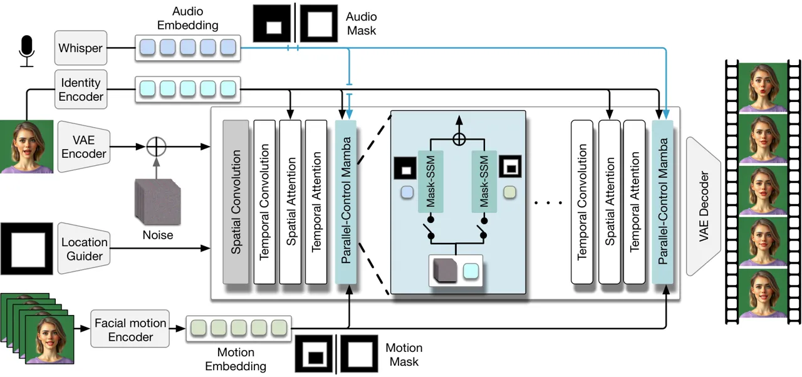
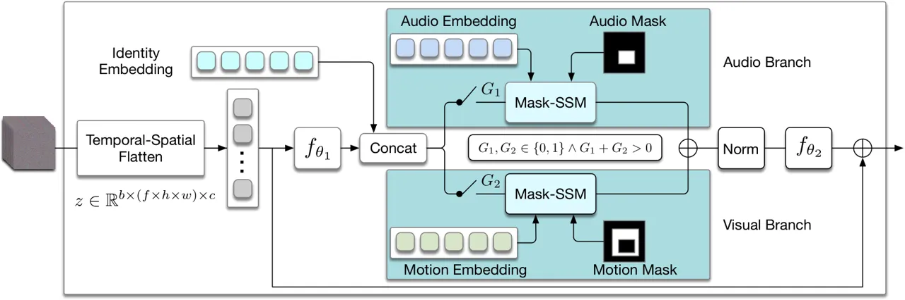
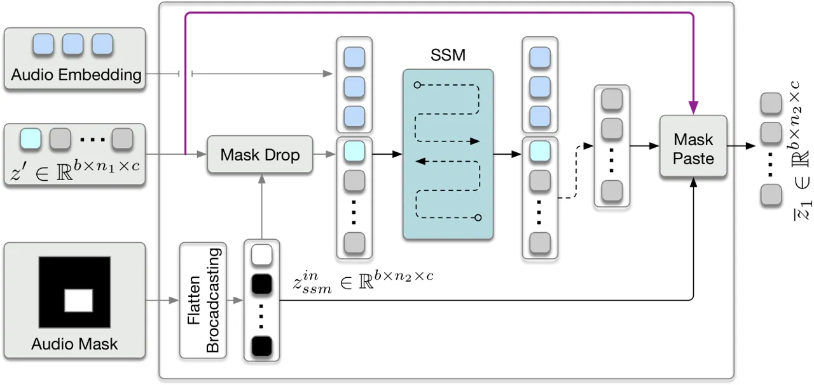
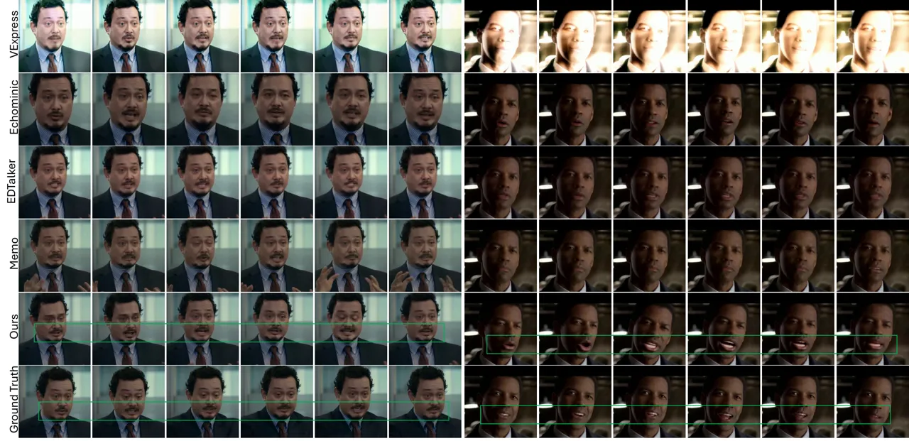
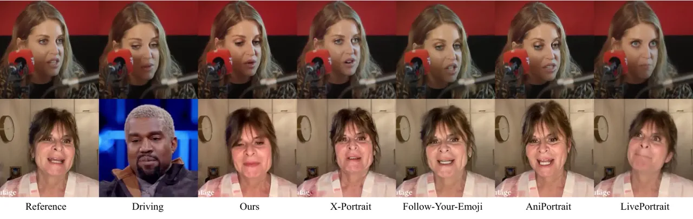
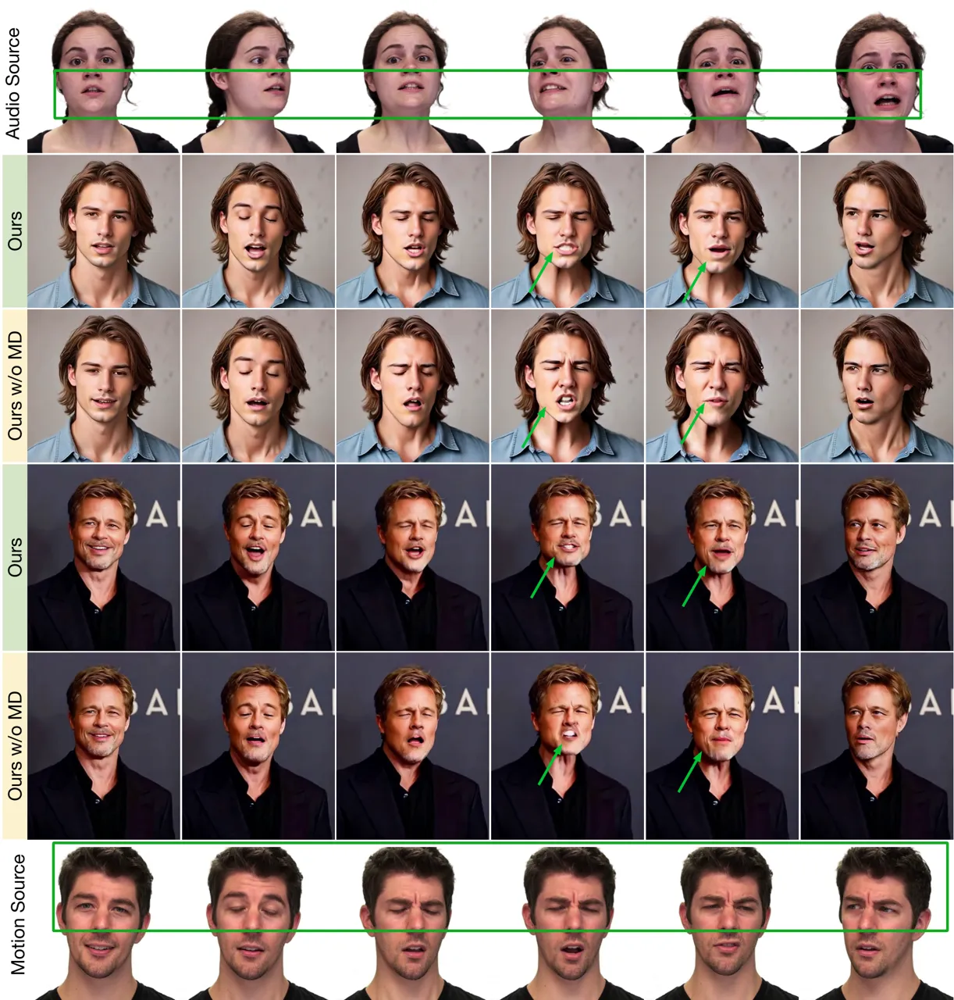
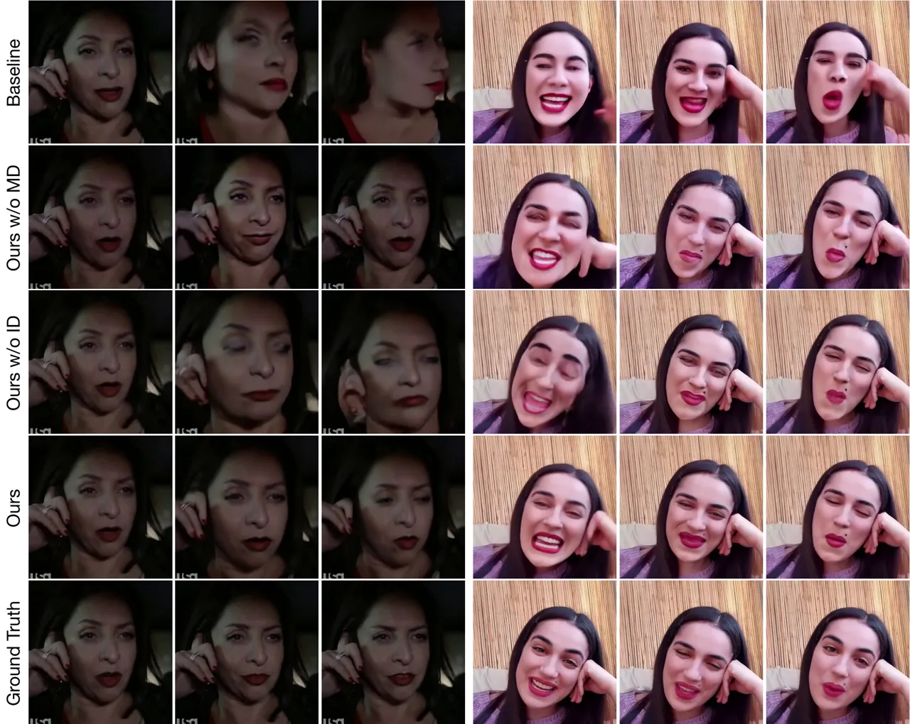
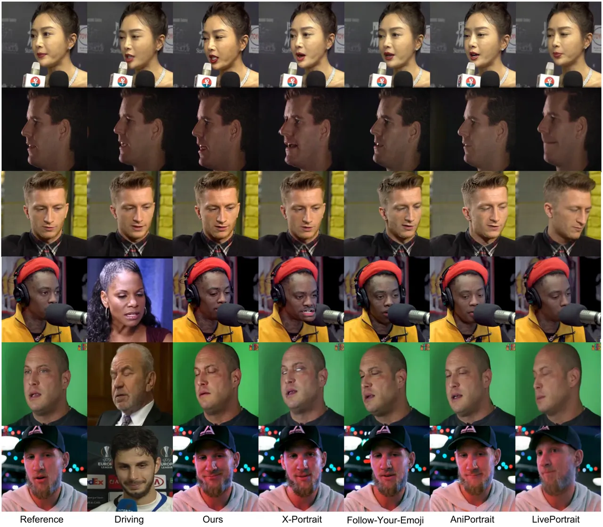
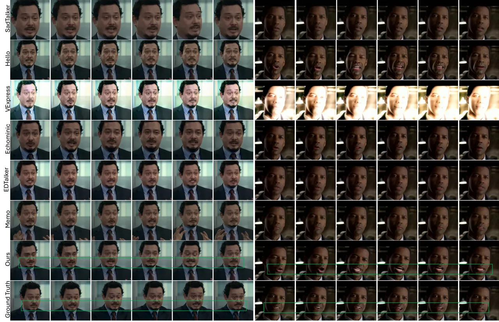
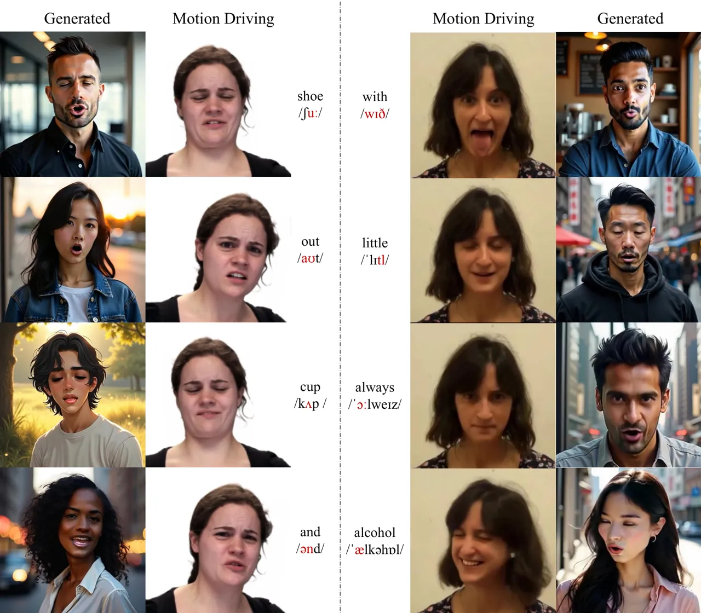

# Audio-visual Controlled Video Diffusion with Masked Selective State Spaces Modeling for Natural Talking Head Generation

Fa-Ting Hong Affiliation: HKUST Affiliation: Tencent    Zunnan Xu
Affiliation: Tencent Affiliation: Tsinghua University [![[Uncaptioned
image]](arxiv-2504-02542--6843e3e5e4eb.figures/figure-1.webp)](https://harlanhong.github.io/publications/actalker/index.html)[![[Uncaptioned
image]](arxiv-2504-02542--6843e3e5e4eb.figures/figure-2.webp)](https://arxiv.org/abs/2504.02542)[![[Uncaptioned
image]](arxiv-2504-02542--6843e3e5e4eb.figures/figure-3.webp)](https://github.com/harlanhong/ACTalker)[![[Uncaptioned
image]](arxiv-2504-02542--6843e3e5e4eb.figures/figure-4.webp)](https://huggingface.co/papers/2504.02542)
   Zixiang Zhou Affiliation: Tencent    Jun Zhou Affiliation: Tencent   
Xiu Li Affiliation: Tsinghua University [![[Uncaptioned
image]](arxiv-2504-02542--6843e3e5e4eb.figures/figure-1.webp)](https://harlanhong.github.io/publications/actalker/index.html)[![[Uncaptioned
image]](arxiv-2504-02542--6843e3e5e4eb.figures/figure-2.webp)](https://arxiv.org/abs/2504.02542)[![[Uncaptioned
image]](arxiv-2504-02542--6843e3e5e4eb.figures/figure-3.webp)](https://github.com/harlanhong/ACTalker)[![[Uncaptioned
image]](arxiv-2504-02542--6843e3e5e4eb.figures/figure-4.webp)](https://huggingface.co/papers/2504.02542)
   Qin Lin Affiliation: Tencent    Qinglin Lu Affiliation: Tencent   
Dan Xu Affiliation: HKUST

###### Abstract

Talking head synthesis is vital for virtual avatars and human-computer
interaction. However, most existing methods are typically limited to
accepting control from a single primary modality, restricting their
practical utility. To this end, we introduce ACTalker, an end-to-end
video diffusion framework that supports both multi-signals control and
single-signal control for talking head video generation. For multiple
control, we design a parallel mamba structure with multiple branches,
each utilizing a separate driving signal to control specific facial
regions. A gate mechanism is applied across all branches, providing
flexible control over video generation. To ensure natural coordination
of the controlled video both temporally and spatially, we employ the
mamba structure, which enables driving signals to manipulate feature
tokens across both dimensions in each branch. Additionally, we introduce
a mask-drop strategy that allows each driving signal to independently
control its corresponding facial region within the mamba structure,
preventing control conflicts. Experimental results demonstrate that our
method produces natural-looking facial videos driven by diverse signals
and that the mamba layer seamlessly integrates multiple driving
modalities without conflict. The project website can be found at
[HERE](https://harlanhong.github.io/publications/actalker/index.html).

![[Uncaptioned
image]](arxiv-2504-02542--6843e3e5e4eb.figures/figure-5.webp)

Figure 1: In this work, we aim to develop a framework that not only
generates videos driven by multiple signals without causing control
conflicts in the facial region (first three rows) but also supports
video generation driven by a single signal (last two rows).

## 1 Introduction

Talking head generation \[4, 42, 24, 23, 33, 66, 25, 69, 70, 59, 32\]
aims to create realistic portrait videos driven by specific input
signals. Audio and facial motion are the two primary driving signals for
the talking head generation task. In this work, we aim to develop a
framework capable of generating portrait videos with either single
signal control or simultaneous control of both signals.

Most existing methods typically use a single primary signal to control
video generation. They either use audio to control lip movements \[38,
47, 29, 15, 69, 27\], or rely on facial motion to govern overall facial
dynamics \[25, 24, 23, 42\]. Furthermore, some studies \[8, 60\] have
focused on developing unified frameworks that support various control
signals for video generation. However, they still allow only one signal
to drive the generation at a time during inference.

Therefore, generating a portrait video driven by both audio and facial
motion remains a significant challenge. Two critical issues must be
addressed for effective multi-control: 1) Control conflicts. Audio
signals usually have a strong influence on the mouth region and slightly
affect the expression of the face, while the facial motion signals can
accurately control the facial expression. When both signals are applied
simultaneously without resolving their conflicts, the resulting facial
expression tends to favor the strongest one. And when signals are
applied in a sequential manner, the model may prioritize the more recent
one, especially if the signals are in conflict or affect overlapping
facial areas. Solving control conflicts is difficult because it requires
balancing and blending these two distinct types of signals—one that
controls the lower face (mouth) and the other that governs the entire
facial expression—without allowing one to dominate the other. 2) Control
signals aggregation. Current video diffusion models \[29, 56, 46\]
typically use attention modules \[49\] to integrate control signals with
intermediate features along the temporal and spatial dimensions
separately. This separate processing can miss the interactions between
temporal and spatial dimensions, leading to less coherent transitions
and spatial inconsistencies. Moreover, when control signals are
integrated with flattened spatio-temporal features, the attention map
becomes extremely large due to the high number of tokens, especially for
longer videos. Thus, finding an efficient way to combine these signals
both temporally and spatially remains a critical challenge.

To address the challenges outlined above, we propose the Audio-visual
Controlled Video Diffusion model, coined as ACTalker, an end-to-end
framework that integrates spatial-temporal features with multiple
control signals for photorealistic and expressive talking head
generation. To enable the control signals to interact with intermediate
video features in both the temporal and spatial dimensions
simultaneously, we introduce a selective state-space model (SSM) to
aggregate the flattened temporal-spatial feature tokens with the control
signals, providing a more computationally efficient alternative to the
attention mechanism \[49\]. Furthermore, to facilitate learning, we
employ a mask-drop strategy that discards irrelevant feature tokens
outside the control regions, enhancing the effectiveness of the driving
signals and improving the generated content within the control regions.
Importantly, each driving signal is responsible only for the facial
regions indicated by a manually specified mask, addressing the control
conflict issues among audio and visual control. The SSM structure and
mask-drop strategy together form the Mask-SSM unit in our framework,
which handles facial control with a single signal in specific regions.
To enable control by multiple signals, we design a parallel-control
mamba layer (PCM) consisting of multiple parallel Mask-SSMs. The PCM
layer aggregates intermediate features with each driving signal in a
spatio-temporal manner within a single branch. To allow simultaneous
control by both audio and facial motion while maintaining the
flexibility to control by a single signal when needed, we introduce a
gating mechanism in each branch, which is randomly set to open during
training. This provides flexible control over the generated video, as
the gate can be opened or closed during inference, enabling manipulation
based on any chosen signals.

We conduct extensive experiments and ablation studies to validate the
effectiveness of our proposed method. The experimental results show that
our approach not only outperforms existing methods in single-signals
control talking head video generation, but also resolves the condition
conflict problem to achieve multiple signals control. Our ablation
studies demonstrate that our designed mamba structure effectively
integrates multiple driving signals with different feature tokens across
distinct facial regions, enabling fine-grained signals control without
conflicts.



Figure 2: Illustration of our ACTalker framework. ACTalker takes
multiple signals inputs (i.e., audio and visual facial motion) to drive
the generation of talking head videos. In addition to the standard
layers (e.g., spatial convolution, temporal convolution, spatial
attention, and temporal attention) in the stable video diffusion model,
we introduce a parallel-control mamba layer to harness the power of
multiple signals control. Audio and facial motion signals are fed into
this parallel-control mamba layer, along with their corresponding masks,
which indicates the regions to focus on for manipulation.

Our contributions can be summarized as follows:

- •
  We propose the audio-visual controlled video diffusion model for
  talking head generation, which enables seamless and simultaneous
  control of generated videos using both audio and fine-grained facial
  motion signals, leading to more realistic and expressive outputs.
- •
  We introduce the parallel-control mamba layer (PCM), which effectively
  coordinates multiple driving signals without conflicts, ensuring
  smooth integration of audio and facial motion signals. Additionally,
  we incorporate a mask-drop strategy that directs the model’s focus to
  the relevant facial regions for each control signal, improving both
  the quality and computational efficiency of the generated video.
- •
  We perform extensive experiments, including evaluations on challenging
  datasets, demonstrating that our method generates natural-looking
  talking head videos with precise control over multiple signals,
  achieving superior results in multiple signals video synthesis.

## 2 Related Work

Talking Head Generation. Talking head generation has been a longstanding
challenge in the fields of computer vision and graphics. Recent
advancements in the field of talking head generation can be divided into
two subcategories: non-diffusion-based and diffusion-based methods.
Non-diffusion-based methods \[28, 19, 33, 64\] are known for their
ability to achieve realistic facial animations and fidelity to motion.
Some expression-driven methods \[25, 24, 23\] employ Taylor
approximation to estimate the motion flow between two face and then
warping the source image. Some audio-driven talking head methods \[19,
63\] map the audio to the spatial expression landmarks and then control
the facial expression and lip movement by audio following the pipeline
of expression-driven methods \[67\]. With the development of diffusion
models, recent works \[47, 52, 57, 56, 2, 30, 29, 36\] have adopted
stable diffusion \[40\] and motion modules \[17\] for talking head
generation within a two-stage training paradigm.
Follow-Your-Emoji \[36\] leverages landmarks as motion representations
to guide video generation. X-Portrait \[55\] first constructs
cross-identity training pairs using a pretrained talking head model, and
then employs a ControlNet-style network to predict the results.
Hallo \[56\] introduces a hierarchical mask that enables audio-driven
control of portrait videos.

However, most previous methods only allow single-signal control at a
time. Therefore, we propose a novel framework based on the mamba
structure that can generate videos driven by either multiple signals or
a single signal at a time. Moreover, our architectural advancements
enhance the model’s ability to simultaneously learn spatial and temporal
relationships within the mamba structure.



Figure 3: Illustration of parallel-control mamba layer. There are two
parallel branches in this layer, one for audio control and the other is
for expression control. We utilize a gate in each branch to control the
accessing of control signal during training. During inference, we can
manually modify the statue of gates to enable single signal control or
multiple signals control.

Selective State Space Models. State Space Models (SSMs) have recently
been proposed to integrate deep learning for state space
transformation \[12, 9\]. Inspired by continuous state space models in
control systems, SSMs, when combined with HiPPO initialization \[11\],
show great potential in addressing long-range dependency issues, as
demonstrated in LSSL \[13\]. However, the computational and memory
demands of state representation make LSSL impractical for real-world
applications. To address this, S4 \[12\] introduces parameter
normalization into a diagonal structure. This has led to the development
of various structured SSMs with different configurations, such as
complex-diagonal structures \[18, 14\], MIMO support \[44\],
diagonal-plus-low-rank decomposition \[20\], and selection
mechanisms \[10\], which have been integrated into large-scale
frameworks \[35, 37\]. Recently, SSMs have been applied to language
understanding \[35, 37, 53\], content-based reasoning \[10\], motion
generation \[58\] and one-dimensional image classification at the pixel
level \[12\], leading to significant improvements.

In this work, we integrate SSMs into 2D talking head generation to
address the challenge of aggregating features with control signals. By
applying SSMs, our framework efficiently integrates contextual
information from audio, video, and spatiotemporal features,
demonstrating the potential of ACTalker for talking heads.

## 3 Methodology

In this work, we aim to develop a novel video diffusion model for
one-shot talking head video generation driven by multiple signals. We
propose an audio-visual controlled video diffusion model that provides
flexible control over the availability of each driving signal, enabling
effective multiple signals control of the generated video.

### 3.1 Overview

In this work, we adopt the stable video diffusion model (SVD) \[1\] as
our codebase. As shown in Figure 2, in addition to the regular inputs of
the source image and pose image, our ACTalker also accepts multiple
driving signals, such as audio and visual expressions, to guide video
generation. Given a source image $`\textbf{I}_{s}`$, a face mask image
$`\mathcal{M}_{face}`$, facial motion sequences
$`\{\textbf{I}_{exp}^{i}\}_{i=1}^{N}`$, and an audio segment
$`\mathcal{A}`$, we first use a VAE encoder to encode the source image
into latent space, which is then concatenated with noise latent. Next,
we use Whisper \[39\] to extract the audio embedding $`\mathbf{e}_{a}`$
from the audio $`\mathcal{A}`$. Similarly, we utilize a pre-trained
motion encoder \[57\] to extract an implicit facial motion embedding
$`\mathbf{e}_{mtn}`$ from a sequence of face images, and an identity
encoder \[7\] to obtain the identity embedding $`\mathbf{e}_{id}`$ from
the source image $`\textbf{I}_{s}`$.

In addition to the regular layers in SVD, such as spatial convolution,
temporal convolution, appearance attention, and temporal attention, we
design a parallel-control mamba layer (PCM) in each block to enable
multi-signal control. The PCM layer consists of multiple branches, each
containing a Mask-SSM unit. Specifically, in each branch, the Mask-SSM
takes one driven signal and its corresponding mask as input to
manipulate the selected spatial-temporal feature tokens by aggregating
them in the SSM structure, achieving facial control. Additionally, a
gate mechanism is used in the PCM to manage the control of each driven
signal. Each branch maintains a gate to decide the availability of the
corresponding branch.

### 3.2 Parallel-control Mamba Layer

In this work, we aim to develop a method for generating portrait videos
controlled by either multiple signals without conflict or a single
signal. To this end, we propose a novel parallel-control Mamba layer
(Figure 3) that leverages driven signals to manipulate the
temporal-spatial features via the Mamba structure, achieving
fine-grained control over facial synthesis. The layer consists of two
primary branches, each controlling different facial regions with
different conditioning signals: audio and facial motion. Additionally,
we designed a gate mechanism to achieve flexible control by controlling
the activation of each branch.

Identity Preservation. As illustrated in Figure 3, to enable the driving
signal to influence the intermediate noise feature both spatially and
temporally, we first flatten the spatiotemporal intermediate feature
across its spatial and temporal dimensions. This produces a flattened
feature $`z\in\mathbb{R}^{b\times(f\times h\times w)\times c}`$, where
$`f`$ represents the number of frames, and $`h`$ and $`w`$ are the
height and width of the original spatiotemporal feature. Furthermore, to
preserve identity during face manipulation driven by the signal, we also
aggregate the identity embedding $`\mathbf{e}_{id}`$ with the noise
feature:

```math
z^{\prime}=\text{Concat}(\mathbf{e}_{id},f_{\theta_{1}}(z)),\quad z^{\prime}\in\mathbb{R}^{b\times n_{1}\times c}, \tag{1}
```

where $`f_{\theta_{1}}`$, parameterized by $`\theta_{1}`$, is an MLP
that transforms the noise feature to integrate with the identity
embedding.

Multiple Signals Control with Gate Mechanism. To enable multiple signals
control, we feed the concatenated feature $`z^{\prime}`$ into parallel
branches, where each branch is responsible for controlling a specific
facial region. As shown in Figure 3, we have two branches to handle
audio-driven and motion-driven control, respectively. In our setup, we
expect our model to generate portrait videos driven by both signals
simultaneously, while still maintaining the capability to be driven by a
single signals. To achieve this, we randomly set up gate variables in
each branch ($`G_{1}`$ and $`G_{2}`$) to control the driving mode during
training. For the gates in both branches, we impose the constraint:

```math
G_{1},G_{2}\in\{0,1\}\quad\land\quad G_{1}+G_{2}>0, \tag{2}
```

There are three possible configurations under this constraint:
$`\{G_{1}=0,G_{2}=1\}`$, $`\{G_{1}=1,G_{2}=0\}`$, and
$`\{G_{1}=1,G_{2}=1\}`$. The first two configurations mean that only one
signal is used for control during training, while the last configuration
indicates that both signals are used simultaneously. During our
training, we randomly select one of these three gate statuses.
Therefore, our model is able to generate portrait video under the single
signals or both audio-visual signals control.

Multi-control Aggregation. For the outputs of each branch
($`\overline{z}_{1}`$ and $`\overline{z}_{2}`$, with the branch
structure detailed later), we concatenate them and apply normalization
to the concatenated results in order to improve training stability:

```math
o_{1}=\text{Norm}(\overline{z}_{1}+\overline{z}_{2}). \tag{3}
```

Next, we apply a residual connection between the aggregated output
$`o_{\text{agg}}`$ and the original flattened noise feature $`z`$:

```math
o_{2}=f_{\theta_{2}}(o_{1})+z, \tag{4}
```

where $`f_{\theta_{2}}`$ is an MLP that transforms the aggregated
feature $`o_{1}`$, parameterized by $`\theta_{2}`$. Finally, the entire
parallel-control mamba layer outputs $`o_{2}`$, which is passed to the
next block in our framework.

The audio and motion-manipulated features are then aggregated and pass
the control signal information throughout the framework without
conflicts.

### 3.3 Mask-SSM



Figure 4: The illustrating of the Mask-SSM in audio branch of
parallel-control mamba layer. The visual branch is the same but replace
with the motion embedding and motion mask

As shown in Figure 3, in each branch, we design a Mask State Space Model
(Mask-SSM) to process the input spatiotemporal noise feature and control
signal. Since we flatten the noise feature volume along both the spatial
and temporal dimensions, the number of tokens increases dramatically
($`\textbf{frames}\times\textbf{width}\times\textbf{height}`$) becomes
much larger in the shallow layers). To efficiently fuse each token with
the driving signal, we adopt the state space model in our framework. To
solve the control conflict problem, we design a specific mask (see
_Supplementary Material_) for each driven signal to indicate their
control regions. Based on that mask, we design a mask-drop strategy to
not only reduce the number of noise feature tokens by dropping
irrelevant ones but also distinguish the tokens across spatial and
temporal dimensions that need to be manipulated by the corresponding
signals, as indicated by the input mask. The mask-drop strategy mainly
consists of two steps: Mask Drop and Mask Paste. Each branch in PCM
shares the same architecture and specifies the control region of the
driven signals using different masks, _i.e._, the audio mask and the
motion mask. In this section, we take the audio branch as an example to
demonstrate the details.



Figure 5: Comparison of different methods for audio-driven talking head
generation. Our method can produce more natural and accurate lip-synced
videos. Due to the page limitation, the results of SadTalker \[63\] and
Hallo \[56\] are reported in _Supplementary Material_

Mask Drop. As shown in Figure 4, given an audio mask
$`\mathcal{M}_{audio}`$, where the control region is set to 1 and all
other regions are set to 0, we first flatten the mask and broadcast it
to match the shape of the input noise feature $`z^{\prime}`$. Then, we
apply this flattened mask to drop the noise features (we omit the
identity tokens concatenated in Eq. 1 for simplicity). This process is
expressed as:

```math
z_{ssm}^{in}=\mathcal{D}(z^{\prime},\mathcal{M}_{audio}), \tag{5}
```

where $`z_{ssm}^{in}\in\mathbb{R}^{b\times n_{2}\times c}`$,
$`z^{\prime}\in\mathbb{R}^{b\times n_{1}\times c}`$, and
$`n_{1}>n_{2}`$. Here, $`\mathcal{D}`$ represents the drop operation,
which removes the tokens where the corresponding position in the audio
mask $`\mathcal{M}_{audio}`$ is zero.

Mask Paste. After obtaining the masked tokens $`z_{ssm}^{in}`$, we
concatenate them with the driving signal, i.e., the audio embedding, and
then pass the concatenated result into an SSM unit to enable each token
to interact with the driving signal:

```math
z_{ssm}^{out}=SSM(Concat(z_{ssm}^{in},\mathbf{e}_{a})). \tag{6}
```

Consequently, we drop the audio and identity tokens in the result
$`z_{ssm}^{out}`$. The resulting tokens only maintain the facial
information of the controlled region after processing by the driven
signal. To cooperate with other regions, such as the background, we
paste the audio-aggregated tokens back to the original noise feature
$`z`$ according to the mask $`\mathcal{M}`$:

```math
\overline{z}_{1}\leftarrow z[\mathcal{M}_{audio}==1]=z_{ssm}^{out}. \tag{7}
```

Therefore, we replace the tokens of the control region in $`z`$ with the
aggregated feature tokens $`z_{ssm}^{out}`$ to obtain the
audio-aggregated feature $`\overline{z}_{1}`$. We can also get the
motion-aggregated feature $`\overline{z}_{2}`$ in the same way but in a
different Mask-SSM branch.

In this way, Mask-SSM can resolve control conflicts by distributing
different tokens to each driven signal using the mask-drop strategy. By
applying the mask-drop strategy in each control branch, we can aggregate
features spatio-temporally with reduced computational complexity through
the Mamba structure while improving the model’s focus on signal-specific
regions of the face, leading to more accurate control of video
generation.

### 3.4 Training and Inference

Training. To train our video diffusion model, we apply the general
training objective of the video diffusion model:

```math
\mathcal{L}=\mathbb{E}_{t,z,\epsilon}[||\epsilon-\epsilon_{\theta}(\mathcal{C},z,t)||], \tag{8}
```

where $`z`$ denotes the latent embedding of the training sample,
$`\epsilon`$ and $`\epsilon_{\theta}`$ are the ground truth noise at the
corresponding timestep $`t`$ and the predicted noise by our ACTalker,
respectively. $`\mathcal{C}`$ is the condition set, which includes the
audio embedding, motion embedding, identity embedding, and pose
location. During training, we randomly select one of the three gate
configurations in our parallel-control mamba layer to enable flexible
controllability. In the step of training the model with single-signal
control, we repurpose the pose mask $`\mathbf{I}_{p}`$ as an
audio/expression mask, allowing the driving signal to control the entire
face.

Inference. During inference, we manually set the gate status to enable
different types of control (audio-only, expression-only, and
audio-expression). Our ACTalker is capable of generating videos of
arbitrary length within memory constraints, given reference images and
audio or facial motion driving signals. We also apply classifier-free
guidance (CFG) \[22\] to achieve better results.

| Model               | Sync-C$`\uparrow`$ | Sync-D $`\downarrow`$ | FVD-Res $`\downarrow`$ | FVD-Inc $`\downarrow`$ | FID $`\downarrow`$ | Smooth $`\uparrow`$ | Sync-C$`\uparrow`$ | Sync-D $`\downarrow`$ | FVD-Res $`\downarrow`$ | FVD-Inc $`\downarrow`$ | FID $`\downarrow`$ | Smooth $`\uparrow`$ |
| ------------------- | ------------------ | --------------------- | ---------------------- | ---------------------- | ------------------ | ------------------- | ------------------ | --------------------- | ---------------------- | ---------------------- | ------------------ | ------------------- |
| SadTalker\[63\]     | 3.814              | 8.824                 | 18.484                 | 352.296                | 51.804             | 0.9963              | 3.899              | 7.895                 | 16.642                 | 264.065                | 44.965             | 0.9953              |
| Hallo\[56\]         | 4.316              | 9.020                 | 13.317                 | 342.965                | 37.400             | 0.9946              | 3.963              | 8.125                 | 6.888                  | 266.920                | 23.157             | 0.9941              |
| VExpress\[50\]      | 3.612              | 9.165                 | 37.657                 | 539.920                | 58.427             | 0.9959              | 4.888              | 7.898                 | 14.950                 | 517.880                | 26.753             | 0.9954              |
| EDTalk \[45\]       | 5.124              | 8.438                 | 16.723                 | 430.906                | 50.428             | 0.9972              | 4.759              | 8.375                 | 14.114                 | 477.147                | 50.135             | 0.9954              |
| EchoMimic \[2\]     | 2.989              | 10.188                | 16.897                 | 366.007                | 45.489             | 0.9938              | 3.239              | 9.411                 | 46.038                 | 450.798                | 41.357             | 0.9923              |
| Memo \[68\]         | 3.958              | 9.118                 | 7.992                  | 264.596                | 31.134             | 0.9954              | 5.093              | 7.854                 | 5.098                  | 194.570                | 18.837             | 0.9945              |
| Ours (Only Audio)   | 5.317              | 7.869                 | 7.328                  | 232.374                | 30.721             | 0.9978              | 5.334              | 7.569                 | 4.754                  | 193.120                | 16.730             | 0.9955              |
| Ours (Audio-Visual) | 5.737              | 7.510                 | 7.074                  | 230.125                | 29.977             | 0.9979              | 5.511              | 7.311                 | 4.574                  | 190.125                | 15.977             | 0.9955              |

Table 1: Audio-driven comparison of different methods on Celebv-HQ
dataset (left) and RAVDESS dataset (right).

## 4 Experiments

In this section, we present both quantitative and qualitative
experiments to validate the effectiveness of ACTalker. More
implementation details, additional results and video demonstrations can
be found in the _Supplementary Materials_. We strongly recommend
watching the video demos.



Figure 6: Comparison of different methods on VFHQ. Self reenactment
(first row) and cross reenactment (last row).

| Model                  | LMD($`\times 10^{-2}`$) $`\downarrow`$ | FID $`\downarrow`$ | FVD-Inc $`\downarrow`$ | PSNR $`\uparrow`$ | SSIM $`\uparrow`$ | LPIPS $`\downarrow`$ | Pose Distance $`\downarrow`$ | Expression Similarity $`\uparrow`$ | ID Similarity($`\times 10^{-1}`$)$`\uparrow`$ | Smooth ($`\times 10^{-2}`$)$`\uparrow`$ |
| ---------------------- | -------------------------------------- | ------------------ | ---------------------- | ----------------- | ----------------- | -------------------- | ---------------------------- | ---------------------------------- | --------------------------------------------- | --------------------------------------- |
| LivePortrait \[16\]    | 0.49                                   | 82.69              | 483.42                 | 40.37             | 0.92              | 0.31                 | 26.99                        | 0.38                               | 8.55                                          | 99.53                                   |
| AniPortrait \[52\]     | 0.68                                   | 81.89              | 430.27                 | 39.29             | 0.85              | 0.36                 | 21.31                        | 0.46                               | 8.50                                          | 99.36                                   |
| FollowYourEmoji \[36\] | 0.65                                   | 77.17              | 417.51                 | 39.67             | 0.86              | 0.35                 | 20.94                        | 0.48                               | 8.59                                          | 98.99                                   |
| X-Portrait \[55\]      | 0.24                                   | 82.92              | 416.42                 | 39.64             | 0.92              | 0.27                 | 20.38                        | 0.48                               | 8.57                                          | 99.39                                   |
| Ours                   | 0.14                                   | 75.47              | 358.82                 | 40.65             | 0.94              | 0.24                 | 20.32                        | 0.57                               | 8.64                                          | 99.48                                   |

Table 2: Comparison of different methods on VFHQ. Self reenactment
(left) and cross reenactment (right).

### 4.1 Experimental Settings

Dataset. We use publicly available datasets, such as HDTF \[65\],
VFHQ \[54\], VoxCeleb2 \[5\], CelebV-Text \[61\], along with
self-collected videos, to create a diverse training dataset. Since our
method is capable of both audio-driven talking head generation and
expression-driven face reenactment, we conduct comparisons on these two
tasks. For audio-driven talking head generation, we follow the settings
of Loopy \[29\], sampling 100 videos from CelebV-HQ \[71\] and RAVDESS
(Kaggle). Additionally, we test our face reenactment capabilities using
the VFHQ dataset \[54\].

### 4.2 Quantitative and Qualitative Analysis

We conduct a quantitative and qualitative comparison with other methods
on audio-driven talking head generation and face reenactment tasks.
During inference, we set the gate value to either 0 or 1 to control
whether the video is generated using the corresponding signal. The
quantitative results are reported in Table. 1 and Table. 2. Also, we
visualize the qualitative comparison in Figure. 5 and Figure. 6.

Audio-driven Talking Head Results. We first compare our method with
other audio-driven talking head generation methods. The results reported
in Table 1 and Table 1 strongly demonstrate the superiority of our
approach compared with existing works. Our method achieves the best
Sync-C and Sync-D scores on the CelebV-HD dataset ($`5.317`$ for Sync-C
and $`7.869`$ for Sync-D), verifying that it can produce
audio-synchronized talking head videos. In terms of video quality, our
method also shows significant improvement. For example, our approach
obtains an FVD-Inc score of $`232.374`$, outperforming the second-best
method Memo \[68\] by roughly $`32`$ points. These results demonstrate
that our specific design in the stable video diffusion model brings
notable benefits. Additionally, Figure 5 visualizes several samples of
audio-driven talking head generation. It can be observed that our
results exhibit accurate lip motion and fewer artifacts compared with
other methods. These findings confirm that our mamba structure design is
beneficial for lip-sync by directly manipulating the selected tokens.

Face Reenactment. In addition to audio-driven talking head video
generation, our framework is also capable of performing
expression-driven talking head video generation, i.e., face reenactment.
Existing methods \[24, 23\] typically evaluate face reenactment in two
scenarios: self-reenactment and cross-reenactment. In self-reenactment,
the driving video and reference share the same identity, whereas in
cross-reenactment they have different identities. As shown in Table 2,
our expression-driven method achieves superior results compared with
existing state-of-the-art approaches. Specifically, our method
outperforms X-Portrait \[55\] by $`9\%`$ in expression similarity during
cross reenactment, while also maintaining the best ID similarity (8.64
for cross reenactment). These results validate that our mamba structure
effectively manipulates facial region tokens to perform accurate facial
expression animation. We further visualize sample outputs in Figure 6.
Compared with other methods, our approach captures more subtle
micro-motions—such as the mouth movements in the first two
self-reenactment samples—and produces more precise expression animations
in the last two cross-reenactment samples. It verifies that our designed
Mask-SSM effectively enhances the generated content in the controlled
region.



Figure 7: Visualization of multiple signals control. Our generated video
accurately replicates the lip movements driven by the audio source and
captures the head motion—particularly the eye movements and pose—as
guided by the motion source. Once we remove the masks in both Mask-SSMs
and generate the video using multiple driving signals, the motion source
can also affect the mouth movement (“Ours w/o MD”), causing a control
conflict.



Figure 8: The visualization of ablation studies driven by audio. Our
full method can produce more natural videos.

| Model               | Sync-C$`\uparrow`$ | Sync-D $`\downarrow`$ | FVD-Res $`\downarrow`$ | FVD-Inc $`\downarrow`$ | FID $`\downarrow`$ | Smooth $`\uparrow`$ |
| ------------------- | ------------------ | --------------------- | ---------------------- | ---------------------- | ------------------ | ------------------- |
| Baseline            | 4.592              | 8.523                 | 16.983                 | 268.512                | 32.483             | 0.9967              |
| Ours w/o MD         | 4.953              | 8.184                 | 7.456                  | 240.651                | 31.268             | 0.9969              |
| Ours w/o ID         | 5.241              | 7.748                 | 8.364                  | 247.933                | 31.170             | 0.9978              |
| Ours (Only Audio)   | 5.317              | 7.869                 | 7.328                  | 232.374                | 30.721             | 0.9978              |
| Ours (Audio-Visual) | 5.737              | 7.510                 | 7.074                  | 230.125                | 29.977             | 0.9979              |

Table 3: Ablation studies on Celebv-HQ dataset for audio-driven.

### 4.3 Ablation Study

In this section, we evaluate each design in our framework to verify its
effectiveness. The results are reported in Table 3, Figure 7, and
Figure 8.

Multiple Signals Control. Benefiting from our gating mechanism and
Mask-SSM, our framework can generate videos driven either by a single
signal (audio or expression) or by multiple signals simultaneously. We
conduct multiple signals driven experiments as part of our ablation
studies. As shown in Figure 7, we generate three samples using the same
audio and expression signals. We observe that the generated videos
exhibit consistent expressions (e.g., similar eye status) and
synchronized mouth movements. Quantitative results further demonstrate
that videos driven by both signals yield superior performance compared
to those generated using a single signal. These findings confirm that
our parallel-control mamba layer effectively enables different signals
to control disentangled facial regions, achieving robust multiple
signals control.

Mamba Structure. To evaluate the effectiveness of our mamba structure,
we integrate it into the Stable Video Diffusion model and construct a
baseline by replacing the parallel-control mamba layer with a spatial
cross-attention layer. As shown in Table 3 and Figure 8, without our
mamba structure, both lip synchronization and overall video quality
deteriorate dramatically. These results confirm that our mamba structure
effectively captures the core information from the driving signal and
broadcasts it across temporal and spatial dimensions, resulting in more
natural portrait video generation.

Mask-Drop and Control Conflict. We employ a mask-drop strategy in our
mamba structure not only to reduce the number of processed tokens but
also to enhance the focus of the driving signal on the control regions.
We conduct an ablation study (labeled “Ours w/o MD” in Table 3 and
illustrated in Figure 8) to verify its effectiveness. As shown in
Table 3, without the mask-drop strategy, the model is distracted by
irrelevant tokens, resulting in a performance drop (the Sync-C score is
$`4.953`$ compared to $`5.317`$ with the full method). Moreover, the
generated outputs appear less natural without the mask-drop strategy.
Also, we show the samples that are driven by both signals in Figure 7.
We can observe that, without the mask-drop strategy, the mouth region is
affected by the motion signals, which is not what we expected. These
results confirm that the mask-drop strategy significantly improves the
controllability of the driving signal over the target regions and
resolves the control conflict.

Identity Embedding in PCM. In our parallel-control mamba layer (PCM), we
inject an identity embedding and aggregate it within the Mask-SSM to
preserve identity while manipulating the selected tokens. We also
perform an ablation study by removing the identity embedding from the
PCM (reported as “Ours w/o ID” in Table 3 and Figure 8). As shown in
Figure 8, without the identity embedding, some frames fail to maintain
the subject’s identity, resulting in poorer quantitative performance.
These findings underscore the necessity of identity embedding in our PCM
layer.

## 5 Conclusion

In this work, we introduce the audio-visual controlled video diffusion
(ACTalker) model, a novel end-to-end framework for talking head
generation that achieves seamless and simultaneous control using both
audio and fine-grained expression signals. Our method leverages a
parallel-control mamba (PCM) layer to effectively integrate multiple
driving modalities without conflict. By incorporating a mask-drop
strategy, the model can focus on the relevant facial regions for each
control signal, thereby enhancing video quality and preventing control
conflicts in the generated videos. Extensive experiments on challenging
datasets demonstrate that our approach produces natural-looking talking
head videos with precise multiple signals control, achieving superior
results compared to existing methods. Ablation studies verify the
effectiveness of our mask-drop strategy in enhancing generated content
and the gating mechanism in providing flexible control over the video
generation process.

## References

- \[1\] Andreas Blattmann, Tim Dockhorn, Sumith Kulal, Daniel
  Mendelevitch, Maciej Kilian, Dominik Lorenz, Yam Levi, Zion English,
  Vikram Voleti, Adam Letts, et al. Stable video diffusion: Scaling
  latent video diffusion models to large datasets. _arXiv preprint
  arXiv:2311.15127_, 2023.
- \[2\] Zhiyuan Chen, Jiajiong Cao, Zhiquan Chen, Yuming Li, and
  Chenguang Ma. Echomimic: Lifelike audio-driven portrait animations
  through editable landmark conditions. _arXiv preprint
  arXiv:2407.08136_, 2024.
- \[3\] Joon Son Chung and Andrew Zisserman. Out of time: automated lip
  sync in the wild. In _ACCV Workshops_, 2017.
- \[4\] Joon Son Chung, Andrew Senior, Oriol Vinyals, and Andrew
  Zisserman. Lip reading sentences in the wild. In _CVPR_, 2017.
- \[5\] Joon Son Chung, Arsha Nagrani, and Andrew Zisserman. Voxceleb2:
  Deep speaker recognition. _arXiv_, 2018.
- \[6\] Radek Daněček, Michael J Black, and Timo Bolkart. Emoca: Emotion
  driven monocular face capture and animation. In _CVPR_, 2022.
- \[7\] Jiankang Deng, Jia Guo, Niannan Xue, and Stefanos Zafeiriou.
  Arcface: Additive angular margin loss for deep face recognition. In
  _CVPR_, 2019.
- \[8\] Nikita Drobyshev, Antoni Bigata Casademunt, Konstantinos
  Vougioukas, Zoe Landgraf, Stavros Petridis, and Maja Pantic.
  Emoportraits: Emotion-enhanced multimodal one-shot head avatars. In
  _CVPR_, 2024.
- \[9\] Daniel Y Fu, Tri Dao, Khaled Kamal Saab, Armin W Thomas, Atri
  Rudra, and Christopher Re. Hungry hungry hippos: Towards language
  modeling with state space models. In _ICLR_, 2021.
- \[10\] Albert Gu and Tri Dao. Mamba: Linear-time sequence modeling
  with selective state spaces. _arXiv preprint arXiv:2312.00752_, 2023.
- \[11\] Albert Gu, Tri Dao, Stefano Ermon, Atri Rudra, and Christopher
  Ré. Hippo: Recurrent memory with optimal polynomial projections.
  _NeurIPS_, 2020.
- \[12\] Albert Gu, Karan Goel, and Christopher Re. Efficiently modeling
  long sequences with structured state spaces. In _ICLR_, 2021a.
- \[13\] Albert Gu, Isys Johnson, Karan Goel, Khaled Saab, Tri Dao, Atri
  Rudra, and Christopher Ré. Combining recurrent, convolutional, and
  continuous-time models with linear state space layers. _NeurIPS_,
  2021b.
- \[14\] Albert Gu, Karan Goel, Ankit Gupta, and Christopher Ré. On the
  parameterization and initialization of diagonal state space models.
  _NeurIPS_, 2022.
- \[15\] Jiazhi Guan, Zhanwang Zhang, Hang Zhou, Tianshu Hu, Kaisiyuan
  Wang, Dongliang He, Haocheng Feng, Jingtuo Liu, Errui Ding, Ziwei Liu,
  et al. Stylesync: High-fidelity generalized and personalized lip sync
  in style-based generator. In _CVPR_, 2023.
- \[16\] Jianzhu Guo, Dingyun Zhang, Xiaoqiang Liu, Zhizhou Zhong, Yuan
  Zhang, Pengfei Wan, and Di Zhang. Liveportrait: Efficient portrait
  animation with stitching and retargeting control. _arXiv_, 2024.
- \[17\] Yuwei Guo, Ceyuan Yang, Anyi Rao, Zhengyang Liang, Yaohui Wang,
  Yu Qiao, Maneesh Agrawala, Dahua Lin, and Bo Dai. Animatediff: Animate
  your personalized text-to-image diffusion models without specific
  tuning. _arXiv preprint arXiv:2307.04725_, 2023.
- \[18\] Ankit Gupta, Albert Gu, and Jonathan Berant. Diagonal state
  spaces are as effective as structured state spaces. _NeurIPS_, 2022.
- \[19\] Siddharth Gururani, Arun Mallya, Ting-Chun Wang, Rafael Valle,
  and Ming-Yu Liu. Space: Speech-driven portrait animation with
  controllable expression. In _ICCV_, 2023.
- \[20\] Ramin Hasani, Mathias Lechner, Tsun-Hsuan Wang, Makram Chahine,
  Alexander Amini, and Daniela Rus. Liquid structural state-space
  models. In _ICLR_, 2022.
- \[21\] Martin Heusel, Hubert Ramsauer, Thomas Unterthiner, Bernhard
  Nessler, and Sepp Hochreiter. Gans trained by a two time-scale update
  rule converge to a local nash equilibrium. _NeurIPS_, 2017.
- \[22\] Jonathan Ho and Tim Salimans. Classifier-free diffusion
  guidance. _arXiv preprint arXiv:2207.12598_, 2022.
- \[23\] Fa-Ting Hong and Dan Xu. Implicit identity representation
  conditioned memory compensation network for talking head video
  generation. In _ICCV_, 2023.
- \[24\] Fa-Ting Hong, Longhao Zhang, Li Shen, and Dan Xu. Depth-aware
  generative adversarial network for talking head video generation. In
  _CVPR_, 2022.
- \[25\] Fa-Ting Hong, Li Shen, and Dan Xu. Dagan++: Depth-aware
  generative adversarial network for talking head video generation.
  _arXiv preprint arXiv:2305.06225_, 2023.
- \[26\] Ziqi Huang, Yinan He, Jiashuo Yu, Fan Zhang, Chenyang Si,
  Yuming Jiang, Yuanhan Zhang, Tianxing Wu, Qingyang Jin, Nattapol
  Chanpaisit, et al. Vbench: Comprehensive benchmark suite for video
  generative models. In _CVPR_, 2024.
- \[27\] Xinya Ji, Hang Zhou, Kaisiyuan Wang, Wayne Wu, Chen Change Loy,
  Xun Cao, and Feng Xu. Audio-driven emotional video portraits. In
  _CVPR_, 2021.
- \[28\] Xinya Ji, Hang Zhou, Kaisiyuan Wang, Qianyi Wu, Wayne Wu, Feng
  Xu, and Xun Cao. Eamm: One-shot emotional talking face via audio-based
  emotion-aware motion model. In _SIGGRAPH_, 2022.
- \[29\] Jianwen Jiang, Chao Liang, Jiaqi Yang, Gaojie Lin, Tianyun
  Zhong, and Yanbo Zheng. Loopy: Taming audio-driven portrait avatar
  with long-term motion dependency. _arXiv preprint
  arXiv:2409.02634_, 2024.
- \[30\] Xiaoyu Jin, Zunnan Xu, Mingwen Ou, and Wenming Yang. Alignment
  is all you need: A training-free augmentation strategy for pose-guided
  video generation. _arXiv preprint arXiv:2408.16506_, 2024.
- \[31\] D. P. Kingma and M. Welling. Auto-encoding variational bayes.
  In _ICLR_, 2014.
- \[32\] Yukang Lin, Hokit Fung, Jianjin Xu, Zeping Ren, Adela SM Lau,
  Guosheng Yin, and Xiu Li. Mvportrait: Text-guided motion and emotion
  control for multi-view vivid portrait animation. _arXiv preprint
  arXiv:2503.19383_, 2025.
- \[33\] Yunfei Liu, Lijian Lin, Fei Yu, Changyin Zhou, and Yu Li. Moda:
  Mapping-once audio-driven portrait animation with dual attentions. In
  _ICCV_, 2023.
- \[34\] Camillo Lugaresi, Jiuqiang Tang, Hadon Nash, Chris McClanahan,
  Esha Uboweja, Michael Hays, Fan Zhang, Chuo-Ling Chang, Ming Guang
  Yong, Juhyun Lee, et al. Mediapipe: A framework for building
  perception pipelines. _arXiv preprint arXiv:1906.08172_, 2019.
- \[35\] Xuezhe Ma, Chunting Zhou, Xiang Kong, Junxian He, Liangke Gui,
  Graham Neubig, Jonathan May, and Luke Zettlemoyer. Mega: Moving
  average equipped gated attention. In _ICLR_, 2022.
- \[36\] Yue Ma, Hongyu Liu, Hongfa Wang, Heng Pan, Yingqing He, Junkun
  Yuan, Ailing Zeng, Chengfei Cai, Heung-Yeung Shum, Wei Liu, et al.
  Follow-your-emoji: Fine-controllable and expressive freestyle portrait
  animation. _arXiv preprint arXiv:2406.01900_, 2024.
- \[37\] Harsh Mehta, Ankit Gupta, Ashok Cutkosky, and Behnam Neyshabur.
  Long range language modeling via gated state spaces. In _ICLR_, 2023.
- \[38\] KR Prajwal, Rudrabha Mukhopadhyay, Vinay P Namboodiri, and CV
  Jawahar. A lip sync expert is all you need for speech to lip
  generation in the wild. In _ACM MM_, 2020.
- \[39\] Alec Radford, Jong Wook Kim, Tao Xu, Greg Brockman, Christine
  McLeavey, and Ilya Sutskever. Robust speech recognition via
  large-scale weak supervision. In _ICML_, 2023.
- \[40\] Robin Rombach, Andreas Blattmann, Dominik Lorenz, Patrick
  Esser, and Björn Ommer. High-resolution image synthesis with latent
  diffusion models. In _CVPR_, 2022.
- \[41\] Sefik Ilkin Serengil and Alper Ozpinar. Lightface: A hybrid
  deep face recognition framework. In _ASYU_, 2020.
- \[42\] Aliaksandr Siarohin, Stéphane Lathuilière, Sergey Tulyakov,
  Elisa Ricci, and Nicu Sebe. First order motion model for image
  animation. _NeurIPS_, 2019.
- \[43\] Karen Simonyan and Andrew Zisserman. Very deep convolutional
  networks for large-scale image recognition. _arXiv preprint
  arXiv:1409.1556_, 2014.
- \[44\] Jimmy TH Smith, Andrew Warrington, and Scott Linderman.
  Simplified state space layers for sequence modeling. In _ICLR_, 2022.
- \[45\] Shuai Tan, Bin Ji, Mengxiao Bi, and Ye Pan. Edtalk: Efficient
  disentanglement for emotional talking head synthesis. In _ECCV_, 2024.
- \[46\] Shixiang Tang, Yizhou Wang, Lu Chen, Yuan Wang, Sida Peng, Dan
  Xu, and Wanli Ouyang. Human-centric foundation models: Perception,
  generation and agentic modeling. _arXiv preprint
  arXiv:2502.08556_, 2025.
- \[47\] Linrui Tian, Qi Wang, Bang Zhang, and Liefeng Bo. Emo: Emote
  portrait alive generating expressive portrait videos with audio2video
  diffusion model under weak conditions. In _ECCV_, 2025.
- \[48\] Thomas Unterthiner, Sjoerd Van Steenkiste, Karol Kurach,
  Raphael Marinier, Marcin Michalski, and Sylvain Gelly. Towards
  accurate generative models of video: A new metric & challenges. _arXiv
  preprint arXiv:1812.01717_, 2018.
- \[49\] Ashish Vaswani, Noam Shazeer, Niki Parmar, Jakob Uszkoreit,
  Llion Jones, Aidan N Gomez, Łukasz Kaiser, and Illia Polosukhin.
  Attention is all you need. _NeurIPS_, 2017.
- \[50\] Cong Wang, Kuan Tian, Jun Zhang, Yonghang Guan, Feng Luo, Fei
  Shen, Zhiwei Jiang, Qing Gu, Xiao Han, and Wei Yang. V-express:
  Conditional dropout for progressive training of portrait video
  generation. _arXiv_, 2024.
- \[51\] Zhou Wang, Alan C Bovik, Hamid R Sheikh, and Eero P Simoncelli.
  Image quality assessment: from error visibility to structural
  similarity. _TIP_, 13(4):600–612, 2004.
- \[52\] Huawei Wei, Zejun Yang, and Zhisheng Wang. Aniportrait:
  Audio-driven synthesis of photorealistic portrait animation. _arXiv
  preprint arXiv:2403.17694_, 2024.
- \[53\] Yicheng Xiao, Lin Song, Shaoli Huang, Jiangshan Wang, Siyu
  Song, Yixiao Ge, Xiu Li, and Ying Shan. Grootvl: Tree topology is all
  you need in state space model. _arXiv preprint
  arXiv:2406.02395_, 2024.
- \[54\] Liangbin Xie, Xintao Wang, Honglun Zhang, Chao Dong, and Ying
  Shan. Vfhq: A high-quality dataset and benchmark for video face
  super-resolution. In _CVPR_, 2022.
- \[55\] You Xie, Hongyi Xu, Guoxian Song, Chao Wang, Yichun Shi, and
  Linjie Luo. X-portrait: Expressive portrait animation with
  hierarchical motion attention. In _SIGGRAPH_, 2024.
- \[56\] Mingwang Xu, Hui Li, Qingkun Su, Hanlin Shang, Liwei Zhang, Ce
  Liu, Jingdong Wang, Yao Yao, and Siyu Zhu. Hallo: Hierarchical
  audio-driven visual synthesis for portrait image animation. _arXiv
  preprint arXiv:2406.08801_, 2024a.
- \[57\] Sicheng Xu, Guojun Chen, Yu-Xiao Guo, Jiaolong Yang, Chong Li,
  Zhenyu Zang, Yizhong Zhang, Xin Tong, and Baining Guo. Vasa-1:
  Lifelike audio-driven talking faces generated in real time. _arXiv
  preprint arXiv:2404.10667_, 2024b.
- \[58\] Zunnan Xu, Yukang Lin, Haonan Han, Sicheng Yang, Ronghui Li,
  Yachao Zhang, and Xiu Li. Mambatalk: Efficient holistic gesture
  synthesis with selective state space models. In _The Thirty-eighth
  Annual Conference on Neural Information Processing Systems_, 2024c.
- \[59\] Zunnan Xu, Zhentao Yu, Zixiang Zhou, Jun Zhou, Xiaoyu Jin,
  Fa-Ting Hong, Xiaozhong Ji, Junwei Zhu, Chengfei Cai, Shiyu Tang, Qin
  Lin, Xiu Li, and Qinglin Lu. Hunyuanportrait: Implicit condition
  control for enhanced portrait animation. _arXiv preprint
  arXiv:2503.18860_, 2025.
- \[60\] Fei Yin, Yong Zhang, Xiaodong Cun, Mingdeng Cao, Yanbo Fan,
  Xuan Wang, Qingyan Bai, Baoyuan Wu, Jue Wang, and Yujiu Yang.
  Styleheat: One-shot high-resolution editable talking face generation
  via pre-trained stylegan. In _ECCV_, 2022.
- \[61\] Jianhui Yu, Hao Zhu, Liming Jiang, Chen Change Loy, Weidong
  Cai, and Wayne Wu. CelebV-Text: A large-scale facial text-video
  dataset. In _CVPR_, 2023.
- \[62\] Richard Zhang, Phillip Isola, Alexei A Efros, Eli Shechtman,
  and Oliver Wang. The unreasonable effectiveness of deep features as a
  perceptual metric. In _CVPR_, 2018.
- \[63\] Wenxuan Zhang, Xiaodong Cun, Xuan Wang, Yong Zhang, Xi Shen, Yu
  Guo, Ying Shan, and Fei Wang. Sadtalker: Learning realistic 3d motion
  coefficients for stylized audio-driven single image talking face
  animation. In _CVPR_, 2023a.
- \[64\] Wenxuan Zhang, Xiaodong Cun, Xuan Wang, Yong Zhang, Xi Shen, Yu
  Guo, Ying Shan, and Fei Wang. Sadtalker: Learning realistic 3d motion
  coefficients for stylized audio-driven single image talking face
  animation. In _CVPR_, 2023b.
- \[65\] Zhimeng Zhang, Lincheng Li, Yu Ding, and Changjie Fan.
  Flow-guided one-shot talking face generation with a high-resolution
  audio-visual dataset. In _CVPR_, 2021.
- \[66\] Shuling Zhao, Fating Hong, Xiaoshui Huang, and Dan Xu.
  Synergizing motion and appearance: Multi-scale compensatory codebooks
  for talking head video generation. In _CVPR_, 2025a.
- \[67\] Shuling Zhao, Fa-Ting Hong, Xiaoshui Huang, and Dan Xu.
  Synergizing motion and appearance: Multi-scale compensatory codebooks
  for talking head video generation. In _CVPR_, 2025b.
- \[68\] Longtao Zheng, Yifan Zhang, Hanzhong Guo, Jiachun Pan,
  Zhenxiong Tan, Jiahao Lu, Chuanxin Tang, Bo An, and Shuicheng Yan.
  Memo: Memory-guided diffusion for expressive talking video generation.
  _arXiv preprint arXiv:2412.04448_, 2024.
- \[69\] Hang Zhou, Yasheng Sun, Wayne Wu, Chen Change Loy, Xiaogang
  Wang, and Ziwei Liu. Pose-controllable talking face generation by
  implicitly modularized audio-visual representation. In _CVPR_, 2021.
- \[70\] Jun Zhou, Jiahao Li, Zunnan Xu, Hanhui Li, Yiji Cheng, Fa-Ting
  Hong, Qin Lin, Qinglin Lu, and Xiaodan Liang. Fireedit: Fine-grained
  instruction-based image editing via region-aware vision language
  model. _arXiv preprint arXiv:2503.18860_, 2025.
- \[71\] Hao Zhu, Wayne Wu, Wentao Zhu, Liming Jiang, Siwei Tang, Li
  Zhang, Ziwei Liu, and Chen Change Loy. Celebv-hq: A large-scale video
  facial attributes dataset. In _ECCV_, 2022.

## Appendix A Experiment Detail

### A.1 Implementation.

During the training process, we resize all images and videos to
$`640\times 640`$. To optimize the framework, we use the AdamW optimizer
with a learning rate of $`1\times 10^{-5}`$. The Identity encoder \[7\]
and VAE \[31\] are kept fixed, with their weights initialized from
Stable Video Diffusion \[1\]. During training, we randomly select the
gate states in the parallel-control mamba layer and manually set them
during inference to enable flexible control.

### A.2 Metrics

In this work, we evaluate our method and compare it with other
approaches using comprehensive quantitative metrics. Our evaluation
framework consists of three main categories: (1) audio-visual
synchronization, (2) visual quality assessment, and (3) facial motion
accuracy. Additionally, we assess temporal smoothness and identity
preservation through specialized measures.

Audio-Visual Synchronization. We employ Sync-C (synchronization
confidence) and Sync-D (synchronization distance) metrics from
wav2lip \[38\] using a pretrained SyncNet \[3\]. Sync-C measures the
confidence level of lip-audio alignment through classifier outputs,
where higher values indicate better synchronization. Sync-D calculates
the L2 distance between audio and visual features, with lower values
representing superior alignment.

Visual Quality Assessment. We utilize four complementary metrics:

- •
  PSNR: Peak Signal-to-Noise Ratio quantifies pixel-level fidelity
  through a logarithmic decibel scale, where higher values reflect
  better reconstruction accuracy.
- •
  SSIM \[51\]: Structural Similarity Index measures structural
  information preservation between generated and reference frames,
  ranging from 0 to 1, with higher values indicating better quality.
- •
  LPIPS \[62\]: Learned Perceptual Image Patch Similarity evaluates
  perceptual differences using VGG \[43\] features:

  ```math
  \text{LPIPS}(I_{gt}^{t},I_{gen}^{t})=\sum_{l}w_{l}\left\|\mathbf{F}_{l}(I_{gt}^{t})-\mathbf{F}_{l}(I_{gen}^{t})\right\|_{2} \tag{9}
  ```

- •
  Fréchet Inception Distance (FID) \[21\]: Measures feature distribution
  similarity between generated and real images using Inception-v3
  features, with lower scores indicating better perceptual quality.
- •
  Fréchet Video Distance (FVD) \[48\]: Assesses temporal coherence
  through pretrained network features:

  ```math
  \displaystyle\text{FVD} \displaystyle=\left\|\mu_{gen}-\mu_{gt}\right\|^{2}+ \tag{10}
  ```

  ```math
  \displaystyle\text{Tr}\left(\Sigma_{gen}+\Sigma_{gt}-2\left(\Sigma_{gen}\Sigma_{gt}\right)^{1/2}\right)
  ```

Facial Motion Accuracy. For expression and pose evaluation:

- •
  Landmark Mean Distance (LMD): Computes the average L2 distance between
  facial landmarks \[34\] of generated and reference frames, with lower
  values indicating better geometric accuracy.
- •
  Pose Distance: Measures head pose discrepancies using
  EMOCA \[6\]-derived parameters through the mean L1 distance between
  generated and driving frames.
- •
  Expression Similarity: Calculates the cosine similarity of expression
  parameters from EMOCA \[6\], with higher values indicating better
  emotional consistency.

Identity Similarity. We employ ArcFace \[7\] scores to measure identity
similarity between generated frames and reference images through deep
face recognition features, where higher scores indicate better identity
preservation.

Temporal Smoothness. We evaluate motion temporal smoothness by computing
the optical flow consistency using VBench metrics \[26\], where lower
variance in motion vectors indicates smoother transitions.

### A.3 Mask Design

Figure 9: The type of masks we used in our framework.



Figure 10: The results generated by our method under facial motion
control.

In our framework, we utilize masks to indicate the control regions of
each signal. Three types of masks are used in our framework. As
illustrated in Figure 9, the face mask is used to indicate the rough
position of the face in the source image. During training, we use
RetinaFace \[41\] to calculate the bounding box for all frames in the
ground truth segments and obtain the smallest enclosing rectangle of
these bounding boxes. We then draw the face mask based on that rectangle
to indicate the facial location in the desired video. Similarly, the
audio mask is obtained by detecting the mouth bounding boxes, and the
motion mask is generated by using the face mask to minimize the audio
mask. During the inference stage, we detect the bounding box of the
source image and apply the appropriate extension.



Figure 11: The results generated by our method under audio control.



Figure 12: The results generated by our method under audio-visual joint
control.

## Appendix B Visualization

### B.1 Face reenacment

Figure 10 demonstrates that our approach achieves enhanced precision in
replicating portrait motions that align closely with the driving video’s
dynamics. For self-reenactment, the results generated by our framework
better preserve intricate facial behaviors, particularly in eye movement
patterns, ocular orientation, and lip articulation accuracy.

As illustrated in the third, fifth, and sixth rows of Figure 10, our
method can achieve tracking of the overall rotation of the head, which
cannot be achieved by previous top-performing warping-based methods,
such as LivePortrait.

While previous diffusion-based methods demonstrate notable advantages in
output fidelity, their reliance on facial keypoint tracking introduces
limitations. As shown in the third and fifth rows of Figure 10,
discrepancies in facial geometry between source and target identities,
combined with the inherent limitations of keypoint representations in
capturing detailed facial expressions, make previous state-of-the-art
methods (e.g., AniPortrait \[52\], Follow Your Emoji \[36\])less
effective than our method in reconstructing facial contours, gaze
direction, and lip synchronization accuracy. These keypoint-dependent
methodologies remain susceptible to interference from driving video
subjects’ facial geometries, resulting in incomplete motion-identity
separation. These methods face challenges in identity preservation due
to changes in facial geometry resulting from misalignment of key points.
Our framework overcomes these limitations through a parallel-control
mamba layer (PCM), with an improved separation of facial identity
characteristics from motion parameters, as evidenced in Figure 10. This
enhanced decoupling enables superior identity retention while capturing
nuanced facial dynamics. Although X-Portrait \[55\] utilizes a
non-explicit keypoint control method, it does not completely decouple
motion and appearance information. This limitation results in noticeable
flaws in the generated results, particularly evident in the fourth and
fifth lines of Figure 10.

Moreover, frameworks built upon Stable Diffusion’s image generation
architecture typically under-perform our method in temporal coherence
metrics. By integrating the stable video diffusion model with our
framework, we achieve significant improvements in three critical
aspects: identity consistency preservation, visual quality optimization,
and micro-expression reproduction. This collectively produces more
natural-looking and temporally stable animations. We provide video demos
in the supplementary materials. In these video demos, we compare our
method with other methods, and our method obviously achieves better
results. Additionally, we found that when some of the reference images
provide more details, the results can be even more realistic.

### B.2 Audio Driven Talker Head Generation

We present a comprehensive comparison with all baseline methods in
Figure 11. As shown in the figure, our method is able to produce
accurate lip motion while containing fewer artifacts. Notably, our
method generates natural head poses and expressions similar to the
ground truth (please refer to the video demo in _Supplementary
Material_), whereas other methods mainly manipulate the mouth shape and
leave other regions static. These results confirm that our mamba design
effectively aggregates audio signals with facial tokens to produce
natural expressions and accurate lip synchronization, as we use the face
mask as an audio mask to incorporate nearly all facial tokens in an
audio-driven manner.

### B.3 Audio-visual Joint Driven

We also present additional demonstrations in Figure 12, which displays
the results produced by our method under audio-visual joint control. Our
approach effectively maintains lip synchronization with the audio while
accurately reflecting the expressions of the Motion Driving sources. We
highly recommend watching the video demonstrations. Additional results
can be found in the _supplementary materials_, where video
demonstrations are also available.

## Appendix C Ethics Considerations and AI Responsibility

This study aims to develop artificial intelligence-driven virtual
avatars with enhanced visual emotional expression capabilities,
utilizing audio or visual inputs, for applications in positive and
constructive domains. The technology is designed specifically for
ethical purposes, focusing on applications that are beneficial to
society, and is not intended for generating deceptive or harmful media
content.

However, as with all generative approaches in this field, there remains
a theoretical concern about potential misuse for identity replication or
malicious purposes. The research team strongly condemns any attempts to
use the technology for creating fraudulent, harmful, or misleading
representations of real individuals. Rigorous technical evaluations of
the current system indicate that the generated outputs exhibit clear
artificial features, and quantitative comparisons with genuine human
recordings show measurable discrepancies, ensuring that the results
remain distinguishable from authentic human expressions.
