# VideoSPatS: Video SPatiotemporal Splines for Disentangled Occlusion, Appearance and Motion Modeling and Editing

Juan Luis Gonzalez¹    Xu Yao¹    Alex Whelan¹    Kyle Olszewski¹   
Hyeongwoo Kim²    Pablo Garrido¹ Affiliation: ¹Flawless AI    ²Imperial
College London Affiliation: {juanluis.gonzalez, xu.yao, kyle.olszewski,
pablo.garrido}@flawlessai.com    hyeongwoo.kim@imperial.ac.uk

###### Abstract

We present an implicit video representation for occlusions, appearance,
and motion disentanglement from monocular videos, which we call Video
SPatiotemporal Splines (VideoSPatS). Unlike previous methods that map
time and coordinates to deformation and canonical colors, our VideoSPatS
maps input coordinates into Spatial and Color Spline deformation fields
$`\mathcal{D}_{s}`$ and $`\mathcal{D}_{c}`$, which disentangle motion
and appearance in videos. With spline-based parametrization, our method
naturally generates temporally consistent flow and guarantees long-term
temporal consistency, which is crucial for convincing video editing.
Using multiple prediction branches, our VideoSPatS model also performs
layer separation between the latent video and the selected occluder. By
disentangling occlusions, appearance, and motion, our method enables
better spatiotemporal modeling and editing of diverse videos, including
in-the-wild talking head videos with challenging occlusions, shadows,
and specularities while maintaining an appropriate canonical space for
editing. We also present general video modeling results on the DAVIS and
CoDeF datasets, as well as our own talking head video dataset collected
from open-source web videos. Extensive ablations show the combination of
$`\mathcal{D}_{s}`$ and $`\mathcal{D}_{c}`$ under neural splines can
overcome motion and appearance ambiguities, paving the way for more
advanced video editing models. Visit our project site¹¹ 1
[https://juanluisg-flwls.github.io/videospats-website/](https://juanluisg-flwls.github.io/videospats-website/).

![[Uncaptioned
image]](arxiv-2504-07146--ad958743c58b.figures/figure-1.webp)

Figure 1: Time varying appearance (e.g. highlights, shadows, etc.)
create optical flow ambiguities for video implicit representations. By
adopting spatial and color deformation spline fields, our proposed
method can disentangle occlusions, appearance, and motion in videos,
allowing for consistent video editing, even in the presence of
temporally varying texture appearance and occlusions.

## 1 Introduction

Implicit neural representations have shown promising results for
modeling images \[31, 32, 17, 20\] and videos \[11, 40, 21\]. The
implicit representations of videos are typically modeled as continuous
functions that map spatial and temporal coordinates into color values.
This becomes a challenging modeling task when various types of motion,
lighting variations, and occlusions are present. By increasing the
number of parameters in the implicit functions, perfect video
reconstructions are achievable. However, without the implicit function
disentangled, applying consistent editing to the whole sequence remains
an open challenge.

Recent advances in diffusion models for text-to-video generation, such
as Sora \[2\], Mochi \[33\] and CogVideoX \[39\], have made video
modeling an increasingly relevant task. Although these models have
succeeded in generating impressive quality video content with
high-fidelity motions, the question of how to perform semantics-aware
and disentangled editing still prevails. Several existing
approaches \[14, 15, 11, 40, 21\] propose to learn a canonical
representation for a video, such that edits can be applied in this
canonical space, and then propagated through the entire sequence.
However, these approaches present several limitations in the wild.
First, the canonical representation is typically modeled as a static
image, which struggles to capture objects with temporally varying
appearance. Moreover, when large motions or occlusions are present,
existing methods \[11, 21\] often produce distorted canonical images,
making it challenging to perform semantics-aware editing.

To address the aforementioned issues, we propose a novel approach to
learning an implicit video representation that disentangles occlusion,
appearance, and motion. Our method is inspired by existing work that
models spatiotemporal deformation with neural spline fields \[40, 5\].
Unlike raw neural representations that map coordinates directly into
colors, neural spline field networks are trained to map coordinates into
spline control points, which are then interpolated at sample timestamps
to form color values. While previous works \[14, 15, 11, 40, 21\] only
model a deformation field and a static canonical image, our method
learns both a spatial spline deformation field and a color spline
deformation field for the temporal-aware canonical space, allowing us to
model time-dependent appearance in videos. Moreover, our approach
handles occlusions more effectively, as neural splines generate
temporally consistent flow without the need for any explicit
regularization. Additionally, our novel approach opens up new
applications, such as motion editing, since the splines can be easily
edited by modifying the control points, which is a non-trivial task with
previous methods based on raw neural representations. Our main
contributions can be summarized as follows:

- •
  We propose a novel implicit video representation that disentangles
  occlusions, appearance, and motion from monocular videos.
- •
  We introduce, to our knowledge, the first temporal canonical space for
  modeling time-dependent appearance.
- •
  We achieve improved editability through a more consistent,
  state-of-the-art canonical space representation.

## 2 Related Work

Layered Video Decomposition. Factorizing appearance and motion in a
video to decompose the video into layers is a longstanding problem in
computer vision \[36, 10, 44, 25\]. The seminal work by Rav-Acha *et
al*. \[27\] models video frames as a 2D-to-2D mapping from an object’s
texture map to the image, reconstructing an "unwrap mosaic"
representation. The editing can be applied to the mosaics and then
composited back to the original sequences using the learned mapping.
With recent advances in deep learning, several works propose using
neural networks to decompose videos into layers. Lu *et al*. \[14, 15\]
propose learning a layered video representation in which each frame is
decomposed into separate RGBA layers that represent the appearances of
different people in the video. Kasten *et al*. \[11\] propose
decomposing a video of a dynamic scene into a set of layered neural
atlases, with a single atlas per object, using a coarse mask identifying
the object of interest as input. Ye *et al*. \[40\] address this problem
in an unsupervised manner by decomposing the video into layers of
persistent motion groups without requiring object masks. Ouyang *et
al*. \[21\] model a video as a canonical content field and a temporal
deformation field using a hash-based architecture for warping and
reconstruction, significantly reducing training time. Omnimatte
RF \[13\] synthesizes fully-visible layers of individual objects with
their associated effects from a video. Although these approaches achieve
good reconstruction quality, they still have several limitations. First,
the canonical representation is usually modeled as a static image, which
sometimes fails to capture objects with appearance changes over time.
Moreover, existing methods often produce distorted canonical images for
videos with complex motions, making semantic-aware editing difficult and
artifact-prone. On the contrary, our method learns a temporally aware
canonical space and generates a more regularized canonical image, making
it better suited for semantics-aware editing.

Occlusion-Aware Editing. Many videos contain occlusions in real-life
scenarios, and performing occlusion-aware editing on such videos is
still an unsolved problem in the existing literature. This holds true
since edits must retain the original occluder-background relationship
and preserve temporal consistency. A straightforward approach to address
this is to use occlusion detection methods \[12, 23\] to segment out the
occluded regions, turning it into a video inpainting problem \[43, 38\].
Nevertheless, occlusions can vary widely in type and extent, making it
challenging to train a single model to detect them all. Several
studies \[41, 37\] attempt to address editing on occluded faces using
3D-aware GAN inversion to perform editing in the latent space. However,
GAN inversion techniques often fail to achieve perfect reconstruction
and are prone to artifacts. Diffusion-based editing approaches, such as
frame-guided video editing \[22\] or motion editing \[18\], are also
constrained in generation and reconstruction by the underlying model.
Our work is inspired by recent research on burst image fusion by
Chugunov *et al*. \[5\], where motion is modeled using neural spline
fields. Although our work shares similarities with that of Chugunov *et
al*. in its use of neural spline fields to model motion, our methodology
stands out in several ways. First, we use neural spline fields to model
continuous videos rather than sparse burst images. Furthermore, we
introduce both a spatial deformation spline field and a color spline
deformation field, allowing us to handle temporally varying appearances
and much larger motions.

Neural Scene Representations. The flexibility of neural representations
have proven effective for representing content in a variety of domains,
such as 2- or 3-dimensional scenes, without the limitations of
traditional discrete representations such as pixels and voxels, or
explicit surface representations such as meshes. This enables the
mapping of continuous coordinates to a variety of learned signals such
as 2D image content \[32\], 3D surfaces \[31, 16\], 3D volumes \[17, 8,
24, 4\], and combined representations of 3D structure and
appearance \[30\]. Our work adopts implicit representations to model 2D
motion separation and dynamic appearance changes over time. To the best
of our knowledge, we are the first work addressing this problem using an
implicit video representation.

## 3 Method

Our aim is to disentangle occlusions, motion, and appearances in videos,
focusing mainly on talking face videos (_e.g_., Fig. 1). Given a video
and a user-provided mask indicating the object of interest, we model
each object (background talking face and foreground occluder) with a
canonical representation $`C_{rep}`$ and a deformation field
$`\mathcal{D}`$, akin to \[11, 21\]. However, unlike the previous
methods that adopt a spatiotemporal model to infer a deformation field,
ours is estimated by a cubic spline interpolation, whose control points
are estimated by our deformation model. Moreover, our motion canonical
representation is further parameterized with color deformation spline
fields to predict color control points, enabling efficient modeling of
lighting changes.

Proper disentangling of video content changes due to varying motion and
appearance is a crucial aspect of video processing and editing methods,
and it has proven challenging for previous work in this area. Common but
straightforward motion representations, _e.g_. optical flow, fail due to
simplifying assumptions like the constancy of the brightness and spatial
gradient of content as it moves throughout the image \[9, 3\]. Such
assumptions do not hold when varying surface illumination causes complex
appearance changes, such as specular highlights or shadows. This can
cause failures to identify when content is in motion rather than when
its appearance is changing, or for these transient effects to be ignored
in favor of more common features of the extracted content’s appearance.
If these time-dependent effects are not properly captured and applied to
the moving surfaces in the image, noticeable disparities between the
original and edited content will occur. Our method addresses this with
the extraction of a base color representation for this content, akin to
the surface albedo used when rendering lighting effects in computer
graphics. This enables us to apply time-dependent changes to this base
color before the content’s transformation by our deformation fields.

### 3.1 Preliminaries

Neural Spline Fields. Neural Spline Fields (NSF) \[5\] are used to learn
to integrate content from multiple images captured at different times
and locations. By learning NSF models capturing the appropriate
transformation between the points in each real image and separate,
reconstructed canonical images, _e.g_. for the intended capture target
and occluding objects, and an alpha matte defining the transmission
between these components, the appropriate content can be assigned to the
reconstructed images. Doing this, however, requires learning the
appropriate, continuous transformations mapping the real images content
to their corresponding points in these reconstructions.

Splines \[1, 7\] allow for the use of sparse control points
$`{\bm{\mathbf{P}}}`$ to define complex curves as a piecewise polynomial
function. Given these points and the spline formula
$`S({\bm{\mathbf{P}}},t)`$, adjusting the interpolation parameter
$`t\in[a,b]`$ (typically $`[0,1]`$) enables smooth, continuous traversal
of this curve, which enables defining the trajectory of a point
traveling through a given space, _e.g_. as a function of time.

An NSF model thus consists of a learned mapping
$`f_{\theta}(u,v):\mathbb{R}^{2}\to\mathbb{R}^{N\times D}`$ from image
coordinates $`{\bm{x}}=(u,v)\in[0,1]`$ to a set of $`D`$-dimensional
spline control points $`{\bm{\mathbf{P}}}`$ defining the deformation
$`{\bm{x}}+\Delta_{\bm{x}}`$ at time $`t`$:

```math
\Delta_{\bm{x}}=(\Delta_{u},\Delta_{v})=S({\bm{\mathbf{P}}}=f_{\theta}(u,v),t) \tag{1}
```

Given a set of control points $`{\bm{\mathbf{P}}}`$ and time parameter
$`t`$, we define our cubic Hermite splines $`S({\bm{\mathbf{P}}},t)`$
using the standard formula, as in \[5\]:

```math
\displaystyle S({\bm{\mathbf{P}}},t) \displaystyle=(2t_{r}^{3}-3t_{r}^{2}+1){\bm{\mathbf{P}}}_{\lfloor t_{s}\rfloor}+(-2t_{r}^{3}+3t_{r}^{2}){\bm{\mathbf{P}}}_{\lfloor t_{s}\rfloor+1}
```

```math
\displaystyle+(t_{r}^{3}-2t_{r}^{2}+t_{r})({\bm{\mathbf{P}}}_{\lfloor t_{s}\rfloor}-{\bm{\mathbf{P}}}_{\lfloor t_{s}\rfloor-1})/2
```

```math
\displaystyle+(t_{r}^{3}-t_{r}^{2})({\bm{\mathbf{P}}}_{\lfloor t_{s}\rfloor+1}-{\bm{\mathbf{P}}}_{\lfloor t_{s}\rfloor})/2
```

```math
\displaystyle t_{r} \displaystyle=t_{s}-\lfloor t_{s}\rfloor,\quad t_{s}=t\cdot|{\bm{\mathbf{P}}}|. \tag{2}
```

This spline formulation allows for continuity along the resulting path,
while enabling efficient evaluation \[1\]. Note that control points
$`{\bm{\mathbf{P}}}`$ can refer to vectors with two spatial components
$`(x,y)`$ or three color components $`(R,G,B)`$ to represent the spatial
($`\mathcal{D}_{s}`$) and color ($`\mathcal{D}_{c}`$) deformation
fields, respectively. For a set of $`N`$ control points, we use
$`{\bm{\mathbf{P}}}_{s}\in\mathbb{R}^{N\times 2}`$ for the former and
$`{\bm{\mathbf{P}}}_{c}\in\mathbb{R}^{N\times 3}`$ for the latter.

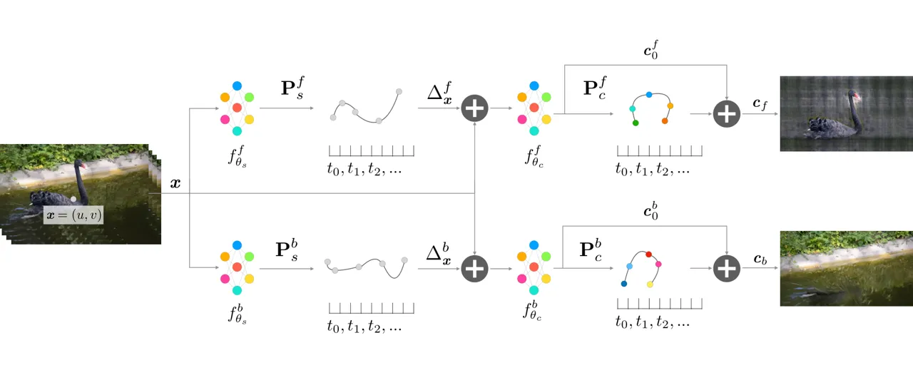

Figure 2: Overview. Our Video SPatiotemporal Spline model, referred to
as VideoSPatS, disentangles occlusions, motion, and appearance into
editable layers. Using independent branches for the regions of interest,
it learns Neural Spline Fields (Sec. 3.1) separating the foreground
$`f`$ (top) and background $`b`$ (bottom) into editable, canonical
representations. Given a sequence of video frames (left), image
coordinates $`{\bm{x}}`$ are used as input to train the spatial MLPs
$`f_{\theta_{s}}`$ for each region to infer spline control points
$`{\bm{\mathbf{P}}}_{s}`$, which define the trajectories of the
corresponding image content through the video frames (middle left,
Sec. 3.2). Interpolated points on this path used as input to the color
MLPs $`f_{\theta_{c}}`$, which infer a base color $`{\bm{c}}_{0}`$ and
to infer spline control points $`{\bm{\mathbf{P}}}_{c}`$ used to
smoothly interpolate the color values along the path (middle right). An
additional MLP, $`f_{\theta_{\alpha}}({\bm{x}}+\Delta^{f}_{{\bm{x}}})`$
(not shown here), is used to predict the alpha matte for
foreground/background compositing (Eq. (3)). By reconstructing the input
videos, these branches are trained to infer canonical representations of
the content and appearance of the foreground and background regions
(right, Sec. 3.3).

Alpha Compositing. To reconstruct each input image $`{\bm{c}}`$, we
learn separate NSF models $`f_{\theta}^{f}`$ and $`f_{\theta}^{b}`$,
which map the image content to the appropriate regions in the
reconstructed foreground (or occluder) image layer $`{\bm{c}}_{f}`$, and
background (or face) image layer $`{\bm{c}}_{b}`$, respectively, as well
as the alpha mask $`\alpha`$ used to composite them:

```math
{\bm{c}}=\alpha{\bm{c}}_{f}+(1-\alpha){\bm{c}}_{b}. \tag{3}
```

### 3.2 Model Architecture

Figure 2 illustrates our overall model, which takes as input a
coordinate $`{\bm{x}}=(u,v)\in[-1,1]`$ at time $`t\in[0,1]`$, and
predicts disentangled representation of occlusions, motion, and
appearance to render the final scene color $`{\bm{c}}`$ (Eq. (3)).

Our deformation model can be a simple yet effective multi-layer
perceptron (MLP) network with either periodical positional embeddings
\[35\] or 2D-hash encodings \[20\]. For each foreground and background
branch, the spatial deformation model $`f_{\theta_{s}}`$ maps each image
coordinate $`{\bm{x}}`$ to a set of spatial deformation spline control
points $`{\bm{\mathbf{P}}}_{s}=f_{\theta_{s}}({\bm{x}})`$. Then, to
obtain the spatial deformation $`\Delta_{\bm{x}}`$, we apply the Hermite
spline interpolation (Eq. (2)) at time $`t`$, described as follows:

```math
\Delta_{\bm{x}}=S({\bm{\mathbf{P}}}_{s},t). \tag{4}
```

The deformed coordinates $`{\bm{x}}+\Delta_{\bm{x}}`$ are then fed to
the color deformation model $`f_{\theta_{c}}`$, with a similar structure
to $`f_{\theta_{s}}`$, which outputs a set of color deformation control
points $`{\bm{\mathbf{P}}}_{c}`$ and a base color $`{\bm{c}}_{0}`$, as
follows:

```math
{\bm{c}}_{0},{\bm{\mathbf{P}}}_{c}=f_{\theta_{c}}({\bm{x}}+\Delta_{\bm{x}}). \tag{5}
```

Next, we apply the Hermite Spline interpolation on the color space to
obtain the final color deformation at time step $`t`$ and then add it to
the base color $`{\bm{c}}_{0}`$. The final color (for the background or
foreground branch) is given as follows:

```math
{\bm{c}}=\sigma({\bm{c}}_{0}+S({\bm{\mathbf{P}}}_{c},t)), \tag{6}
```

where $`\sigma(\cdot)`$ $`\in`$ $`[0,1]`$ is the sigmoid activation
function to ensure outputs with valid color image values.

Finally, an additional implicit model $`f_{\theta_{\alpha}}`$ maps the
foreground deformed coordinates $`{\bm{x}}+\Delta_{\bm{x}}`$ into an
opacity value $`\alpha`$ as given by

```math
a=\sigma(f_{\theta_{\alpha}}({\bm{x}}+\Delta_{\bm{x}},t)), \tag{7}
```

where $`\alpha`$ is utilized to composite the rendered foreground and
background colors, $`{\bm{c}}_{f}`$ and $`{\bm{c}}_{b}`$ respectively,
into the final predicted color $`{\bm{c}}`$ by Eq. (3).

### 3.3 Objective Functions

We train our neural spline fields with a combination of reconstruction
and regularization losses detailed below.

Reconstruction Loss $`l_{rec}`$. This loss ensures the final composited
color $`{\bm{c}}`$ matches the corresponding target GT color
$`{\bm{c}}^{*}`$ at pixel location $`{\bm{x}}`$ and time step $`t`$. We
compute $`l_{rec}`$ as the component-wise average absolute error, as
follows:

```math
l_{rec}=||{\bm{c}}-{\bm{c}}^{*}||_{1}, \tag{8}
```

where $`l_{rec}`$ is averaged for all input coordinates in a batch.

Optical flow guidance loss $`l_{fl}`$. While this loss is not an
absolute constraint, it helps in resolving motion ambiguities caused by
large pixel displacements and has extensively been used in prior
work \[11, 21\]. We can deem optical flow as a dense correspondence map
between two consecutive frames $`t_{0}`$ and $`t_{1}`$, i.e.,
$`{\bm{x}}_{0}`$ at time $`t_{0}`$ corresponds to
$`{\bm{x}}_{0}+{\bm{f}}_{0\rightarrow 1}`$ at time $`t_{1}`$. We
leverage this idea and model $`l_{fl}`$ such that it encourages that
corresponding input coordinates are mapped to the same canonical
coordinate, as follows:

```math
l_{fl}=||S({\bm{\mathbf{P}}}_{s}({\bm{x}}_{0}),t_{0})-S({\bm{\mathbf{P}}}_{s}({\bm{x}}_{0}+{\bm{f}}_{0\rightarrow 1}),t_{1})||_{1}, \tag{9}
```

where optical flows are obtained from RAFT \[34\] and filtered by cycle
consistency following \[21\].

Spatial splines deformation regularization loss $`l_{\mathcal{D}_{s}}`$.
This regularization loss is composed of two terms: A (i) motion control
point smoothness loss $`l_{sm}`$ and (ii) control point velocity
direction loss $`l_{pv}`$.

The first term $`l_{sm}`$ encourages neighboring coordinates to be
mapped to similar sets of control points, as follows:

```math
l_{sm}=||S({\bm{\mathbf{P}}}_{s}({\bm{x}}),t))-S({\bm{\mathbf{P}}}_{s}({\bm{x}}+(u_{0},v_{0})),t))||_{1}, \tag{10}
```

where $`(u_{0},v_{0})`$ is a $`1`$-pixel shift in both the horizontal
and vertical coordinate axes.

Even when the spline representation already models a smooth curve, we
further provide a regularization term that can only be applied to a
spline deformation field. The second term $`l_{pv}`$ encourages that the
tangent velocity described by the control points change its direction
slowly, as follows:

```math
l_{pv}=\partial\left(\tfrac{\partial{\bm{\mathbf{P}}}_{s}}{\partial t}\odot\left(||\tfrac{\partial{\bm{\mathbf{P}}}_{s}}{\partial t}||_{u,v}\right)^{-1}\right)\Big/\partial t. \tag{11}
```

We remark that regularizing the change in direction (and not the
magnitudes) allows more freedom to the learned control points. The final
spatial splines deformation regularization loss is then given as the sum
of the two terms above, i.e., $`l_{\mathcal{D}_{s}}=l_{sm}+l_{pv}`$.

Color deformation regularization loss $`l_{\mathcal{D}_{c}}`$. This loss
encourages a disentangled representation of motion and appearance. Even
though the optical flow loss guidance provides structural consistency,
$`l_{\mathcal{D}_{c}}`$ prevents large appearance displacements by
restricting color deformation control points. $`l_{\mathcal{D}_{c}}`$ is
given as:

```math
l_{\mathcal{D}_{c}}=||{\bm{\mathbf{P}}}_{c}||^{2}_{2}. \tag{12}
```

Note that we use the $`\ell^{2}`$ norm to penalize large color
deformation while allowing small color changes.

Layer separation loss $`l_{sep}`$. This loss comprises four terms: A
guidance loss, a regularization loss, a boundary loss, and an error
maximization loss. The first term, $`l_{guide}`$, encourages the
estimated mask to be similar to that of the user provided coarse mask
$`\alpha^{*}\in[0,1]`$, where the guidance is defined by $`1`$-valued
elements. $`l_{guide}`$ is then given by:

```math
l_{guide}=\tfrac{N}{\sum_{i}\alpha_{i}^{*}}\alpha^{*}|\alpha-\alpha^{*}|, \tag{13}
```

where $`\tfrac{N}{\sum_{i}\alpha_{i}^{*}}`$ normalizes the loss over the
valid coordinates $`i`$, such that only guided values contribute to the
loss. $`N`$ is the number of coordinates in the batch.

The second term, $`l_{reg}=m_{k}\alpha`$, minimizes the foreground
opacity, where the regularization mask $`m_{k}`$ is valued at 1 if
$`\alpha`$ lies at least $`k`$ pixels away from the guidance mask. The
third term ensures a soft transition between $`m_{k}`$ and
$`\alpha^{*}`$ by further regularizing $`\alpha`$ with
$`l_{bound}=((1-m_{k})*(1-\alpha^{*}))\alpha`$.

The last term in $`l_{sep}`$ aids in reconstructing a detailed
$`\alpha`$ mask from a coarse $`\alpha^{*}`$ by maximizing the error
between the masked region in the rendered background color and the
ground truth color, as given by

```math
l_{mxe}=-\tfrac{N}{\sum_{i}\alpha_{i}}\alpha|{\bm{c}}^{*}-{\bm{c}}_{b}|, \tag{14}
```

where $`\alpha`$ can maximize the error $`|{\bm{c}}^{*}-{\bm{c}}_{b}|`$
if it is similar to the corresponding unavailable alpha mask. This is
possible because each layer is initially biased to render the semantic
class that they are more exposed to, thus, at early iterations alpha
converges to a reasonable occlusion mask, given a sufficiently good
guidance mask (see supplement for details).

The final layer separation loss is then given as the sum of the four
terms above, i.e.,

```math
l_{sep}=l_{guide}+\lambda_{reg}l_{reg}+\lambda_{bound}l_{bound}+\lambda_{mxe}l_{mxe}, \tag{15}
```

where $`\lambda_{bound}=0.01`$, $`\lambda_{reg}=0.5`$, and
$`\lambda_{mxe}=0.1`$ are empirically set to be approximately in the
same magnitude order as $`l_{rec}`$.

Our final total loss $`l_{total}`$ can then be summarized as:

```math
l_{total}=l_{rec}+\lambda_{fl}l_{fl}+\lambda_{\mathcal{D}_{s}}l_{\mathcal{D}_{s}}+\lambda_{\mathcal{D}_{c}}l_{\mathcal{D}_{c}}+l_{sep}, \tag{16}
```

where $`\lambda_{fl}`$, $`\lambda_{\mathcal{D}_{s}}`$, and
$`\lambda_{\mathcal{D}_{c}}`$ are empirically set to have balanced
impact with respect to $`l_{rec}`$.

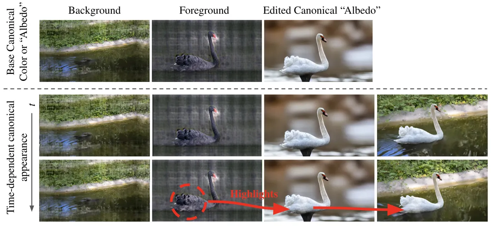

Figure 3: Our VideoSPatS modeling provides more naturally edited videos
by disentangling occlusions, motion, and appearance. See supplement for
videos.

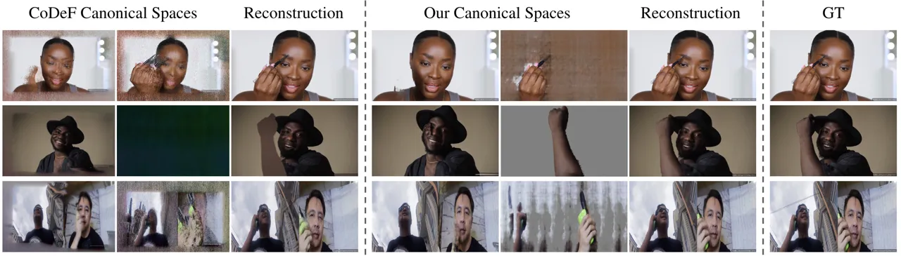

Figure 4: Results on YT-in-the-wild videos (Creative Commons videos from
YT, see supplemental for per-video details).

### 3.4 Editing

Unlike previous works that predict single fixed canonical images \[11,
21\], our method predicts a continuous color deformation spline field,
which means that appearance disentangled from motion can be controlled
by interpolating this color deformation field. For this reason, we
propose a new approach to perform editing on the base colors
$`{\bm{c}}_{0}`$ and then apply the temporally varying appearance on
top. This allows for better highlights, shadows, or other changes in
intensity values that are not to be modeled as motion in the scene.
Given editing algorithm $`\mathcal{A}(\cdot)`$, rendered base color
image $`\mathbf{I_{0}}`$, and color deformation image
$`\Delta_{\mathbf{I}_{t}}`$, the editing of our canonical space is given
by

```math
\mathbf{I}^{C_{ed}}_{t}({\bm{x}})=\sigma\left(\ln{\tfrac{\mathcal{A}(\mathbf{I}_{0}({\bm{x}}))}{(1-\mathcal{A}(\mathbf{I}_{0}({\bm{x}})))}}+\Delta_{\mathbf{I}_{t}}({\bm{x}})\right), \tag{17}
```

where images $`\mathbf{I}_{0}`$ and $`\Delta_{\mathbf{I}_{t}}`$ are
obtained by sampling all $`{\bm{x}}`$ within a window (and applying
$`S({\bm{\mathbf{P}}}_{c}({\bm{x}}),t)`$) in $`f_{\theta_{c}}`$. The
consistent video propagation of the edited canonical space is then given
by

```math
\mathbf{I}^{ed}_{t}({\bm{x}})=\mathbf{I}^{C_{ed}}_{t}(S({\bm{\mathbf{P}}}_{s}({\bm{x}}),t)), \tag{18}
```

which is, in practice, approximated via bilinear interpolation using
commonly available functions in deep learning libraries, such as
grid_sample. This process is depicted in Fig. 3, where deep editing (by
Stable Diffusion \[29\]) is applied to the canonical base or “albedo”
color. For more conceptual details on motion and appearance
decomposition for video editing, please see the supplementary material.

### 3.5 Initialization

We implicitly encourage a canonical space that resembles the observed
space by initializing the last fully connected layers of
$`f_{\theta_{s}}`$, $`f_{\theta_{c}}`$, and $`f_{\theta_{\alpha}}`$ with
zeros and no bias. This prevents large-valued mappings (e.g. far away
control points) from appearing in early iterations.

## 4 Experiments and Results

We present extensive experimental results and ablation evaluations in
this section. Additional videos and extended experiments can be found in
the supplemental materials.

### 4.1 Implementation Details

We train our model, the VideoSPatS, with a batch size of 10k random
coordinates for up to 100k iterations using an initial learning rate of
1e-4, which is progressively halved at $`50\%`$, $`70\%`$, $`80\%`$, and
$`90\%`$ of the training iterations. We train our models via Adam
optimization with default betas ($`\beta_{1}=0.9`$,
$`\beta_{2}=0.999`$). For optimal video fitting, we set the number of
control points to the number of video frames. For a smoother, more
regularized fitting, we fix the number of control points to be half of
the number of frames, i.e., the curve described by 3 control points
should satisfy the reconstruction of six frames. Note that we assign the
same number of control points for both spatial and color deformation.
Our models require about 4 GB of an A10G GPU for training and testing.
Under this setup, a 50-frame length video with a 512$`\times`$288 image
resolution is learned in 90 minutes.

For all our main experiments, all our MLPs share the same architecture
inspired by \[17\], an 8 fully-connected-ReLu layer network with 256
channels and a skip connection at layer 4 with positional encoding at
its inputs. The only difference among our MLPs is in the number of input
and output channels. We also apply an optimization schedule to our color
deformation model learning, using $`{\bm{c}}_{0}`$ only for $`50\%`$ of
the iterations in the reconstruction loss. Such a schedule helps prevent
appearance and motion entanglement until the deformation field has
warmed up.

YT-in-the-wild video dataset. We collected a set of 12 short video clips
from YouTube under the Creative Commons license. These videos each
contain at least 50 consecutive frames (no cuts), showing people in
motion and dynamic occlusions. We downscale these videos to
512$`\times`$288 for faster experimentation and run SAM 2 \[28\] to
extract coarse foreground-background masks for training, which are
eroded up to 11 pixels to simulate even coarser masks. For a 11-pixel
eroded guidance mask, we set up the boundary mask $`m_{k}`$ with
$`k=31`$ to test our alpha mask refinement objective functions.

DAVIS \[26\]. This dataset comprises casual videos of subjects (usually
a single one) being filmed. We use the provided segmentation masks and a
resolution of $`432\times 768`$ for training.

CoDeF dataset. This public dataset, released with a state-of-the-art
video representation model, CoDeF \[21\], contains short videos taken
mostly from movies, featuring different characters and complex scenes.
We use the guidance masks provided in the dataset’s repository for
training.

### 4.2 Evaluation

We evaluate our method VideoSPatS on the aforementioned three datasets
and compare it against the state-of-the-art video modeling method,
CoDeF \[21\]. Our results show that our method generalizes well to both
in-the-wild videos with complex occlusions and fast motion, as well as
to general scenes, such as those from DAVIS and CoDeF dataset.

Result on YT-in-the-wild video dataset. Fig. 4 depicts canonical spaces
for both the face background and the occluder foreground, along with
composited rendering results for CoDeF and our method. As noted,
although CoDeF is able to render a final composited image, it struggles
to consistently model the canonical spaces of fast moving objects,
leading to suboptimal foreground-background separation and motion
disentanglement. This can be observed in the repeated instances in the
first and second columns of Fig. 4. In contrast, our method generates
consistent canonical spaces, even in the challenging scenarios where
multiple moving objects are present, such as in the case of the bottom
row.

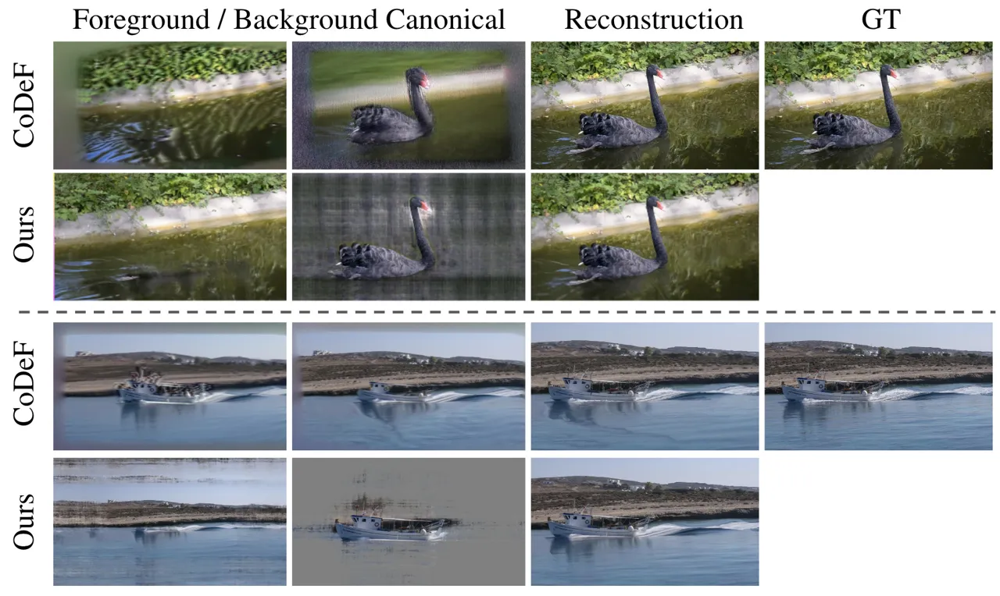

Figure 5: Results on DAVIS \[26\]. Compared with CoDeF \[21\], our
method generates consistent and separated canonical spaces.

Results on DAVIS. Fig. 5 shows our fitting results on several scenes
from the DAVIS dataset, which are compared with those of CoDeF. While
CoDeF achieves slightly better reconstruction, it struggles to
consistently model a semantically reasonable canonical space, as
observed in the noisy black swan example of Fig. 5 (top row). We remark
that obtaining an editable canonical space is much more critical than
high reconstruction quality, as it enables propagating semantic-aware
edits. We also highlight that our method separates foreground and
background contents more reliably, as shown in the boat renderings of
Fig. 5 (bottom row). We measured video editing quantitative results in
terms of warping consistency between edited and warped-and-edited
frames. We used RAFT \[34\] to obtain the original frames’ optical flow
to warp edited frames at $`t`$+$`n`$ into $`t`$. Ours outperforms CoDeF
\[21\] and Def. Sprites \[40\] by the considerable margins of 4.66dB and
0.4dB, respectively. See the supplemental for more details.

Editing results. Fig. 3 illustrates the effectiveness of our editing
method on the ‘blackswan’ scene of the DAVIS dataset. Thanks to our
proposed color spline deformation fields, temporally varying appearance,
such as highlights, can be propagated into the deep edited video. Please
refer to the supplemental material for more editing results.

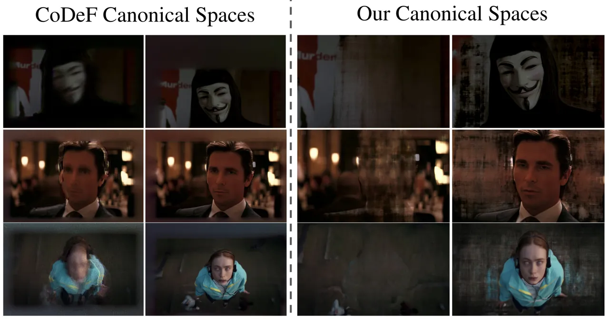

Figure 6: Qualitative comparisons of inferred canonical spaces on the
CoDeF Dataset \[21\].

Results on CoDeF dataset. Fig. 6 shows a qualitative comparison of the
learned canonical spaces obtained by CoDeF and our proposed method. Due
to the simplicity of the motion on the CoDeF dataset, the final
composited rendering is not displayed here (see supplemental material).
As can be noted, even when both approaches generate reasonable canonical
spaces for the characters in the videos, only our method implicitly
learns to reconstruct a clean background and maintains the canonical
space of the foreground well aligned and ill-formed with respect to the
input video.

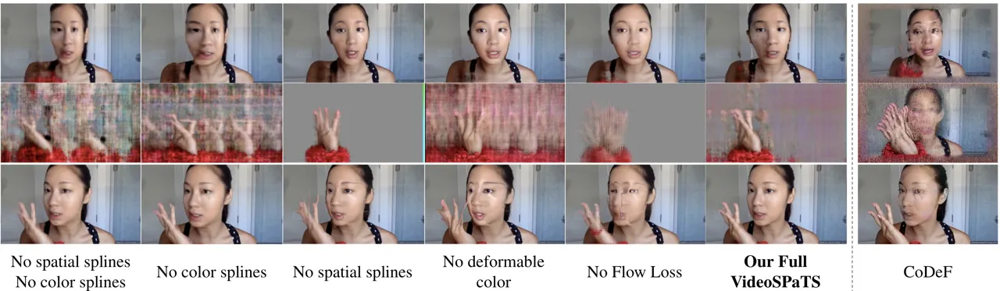

Figure 7: Ablations. From left to right, each feature in our VideoSPatS
produces better renderings and canonical spaces suitable for editing.

### 4.3 Ablation Analysis

We present extensive ablation analysis, illustrating the effects of each
of our contributions and design choices, such as our proposed spatial
and color deformation spline fields and different objective terms. Fig.
7 shows the ablation studies that lead to an improved canonical space
reconstruction and better motion and appearance disentanglement.

In the first column, we show the effects of not incorporating our spline
deformation fields, neither for spatial nor for color deformations.
Directly predicting the deformation fields is prone to deform the
canonical space. This is not the case for our proposed spline
deformation fields. Ours contain a smooth interpolation inductive bias,
and MLPs are conditioned on a lower dimensionality input $`(u,c)`$
instead of $`(u,v,t)`$, which is common in models without spline
controlled deformations. In the second column, we only utilize splines
for $`\mathcal{D}_{s}`$ (not for $`\mathcal{D}_{c}`$). While this
alleviates the distortion in the canonical space (Fig. 7, top row), the
color deformation is still not fully disentangled from spatial
deformations. In the third column, we do not use spatial splines. While
employing color splines improves the resulting canonical space, the
aspect ratio and final rendered quality are still far from suboptimal.

In the fourth column, we use splines for $`\mathcal{D}_{s}`$ but no
deformable color. As can be seen, the canonical space is reasonable, but
the rendered frame is unrealistic. Besides, the face of the girl wrongly
displays a rather uniform color. In contrast, the models that use
deformable colors tend to better contrast the shading on the left and
right side (dark vs bright colors of the target frame as shown at the
bottom row). Due to the inability to handle the temporally varying
color, the results from this version show massive warping artifacts on
the left side of the girl’s face. In the fifth column, we show the
effect of removing the optical flow loss, which proves that flow-based
regularization plays a crucial role in controlling motion under large
deformations.

Finally, the sixth column illustrates our full-blown model with a
reasonable canonical space that reflects the darkening/shading of the
left side of the girl’s face and a cleaner composited rendering on the
bottom. Note that the ablated models in columns 1-5 struggle to generate
a consistent canonical space for highly deformable dynamic objects (in
this case the hand), while our full model is more consistent.

Fig. 8 additionally illustrates the effectiveness of our layer
separation objective function $`l_{sep}`$. Our model without the
proposed MXE loss fails to refine the alpha mask, resulting in poor
occlusion disentanglement. For instance, hand artifacts appear in the
face image background and incomplete fingers in the occluder foreground.

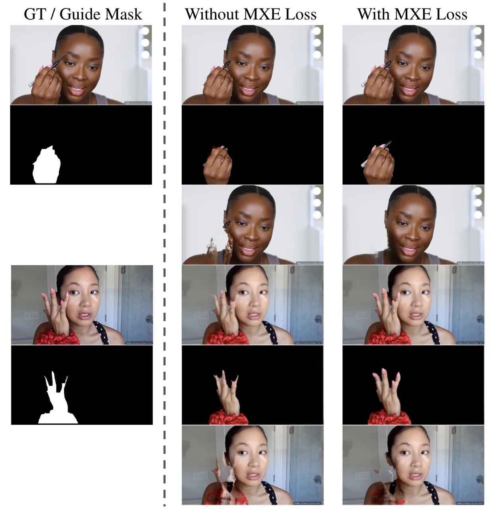

Figure 8: Effects of the proposed error max loss in Eq. (14).

### 4.4 Limitations

Even though our method has increased the range of motions that an
implicit video representation can handle, it is still restricted by the
extent of deformation and self-occlusions in the input videos.
Interestingly, our method is less so limited by the length of the
videos, as fewer control points can be employed (see supplemental
material).

## 5 Conclusion

In this work, we have presented a method to disentangle occlusions,
appearance, and motion from videos through two different deformation
fields, controlled by implicit neural spline functions. We show that
these spline-based spatial deformation fields can represent complex
motion in a dynamic scene while still preserving the semantic features
in the inferred canonical spaces. We also showed that spline-powered
color deformation fields are robust for motion and appearance
disentanglement, generating base or “albedo” canonical spaces that allow
propagation of time-dependent effects in the edited images. Such a
property enhances the plausibility of these methods w.r.t. previous
state-of-the-art methods. When used in conjunction with the spatial
deformation spline fields, our color deformation spline fields
consistently yield appropriate canonical spaces suitable for color
editing. It also allows for high-quality rendering of the modified
content. We remark that our approach is generic and flexible enough for
arbitrary content separation and editing. However, its particular
suitability for facial video processing opens up exciting future
directions, such as semantic edits of expressions, facial identity, and
material and lighting properties.

Supplementary Material

![[Uncaptioned
image]](arxiv-2504-07146--ad958743c58b.figures/figure-9.webp)

Figure 9: Disentangling motion and appearance.

In this supplemental material, we provide additional implementation
details and experimental results. We present further comparisons with
previous methods \[11, 40\], as well as additional results on texture
editing, motion editing, and training on longer sequences. We also
include additional ablation studies on loss terms, guidance masks, and
control points. Finally, we discuss some failure cases and the ethical
implications of our method and datasets. Furthermore, we provide several
videos in in our project website
[https://juanluisg-flwls.github.io/videospats-website/](https://juanluisg-flwls.github.io/videospats-website/),
which are critical for visualizing time-dependent appearance and
temporally consistent reconstructions and edits produced by our method.
We strongly encourage readers to visit our site for the best viewing
experience.

## Appendix A Additional details on disentangling motion and appearance.

For the sake of better conceptualization, we provide the additional Fig. 9. As shown in Fig. 9 for the foreground image (rhino),
$`f_{\theta_{s}}^{f}`$ learns to model motion (a.k.a. spatial
deformation field), while $`f_{\theta_{c}}^{f}`$ learns to model
time-dependent appearance (a.k.a. color deformation field). Note that
such disentanglement of motion and appearance allows us to perform
editing on the rhino that is not distorted by the time-dependent
appearance (e.g. shadows). In addition, as we learn a base color and
deformation color splines, we can seamlessly blend appearance changes
with color edits, as shown in the right-hand side of Fig. 9.

## Appendix B Additional implementation details

Our VideoSPaTS takes 90 minutes to fit a 512$`\times`$288, 50 frames
video. However, the training time could be reduced with additional
engineering efforts, such as replacing MLPs with optimized embedders
like those in tiny-cuda-nn \[19\]. This can potentially provide between
2$`\times`$ and 10$`\times`$ training speed-ups. In addition, our method
does not require running the models during inference / editing for every
single frame, since a single run suffices to obtain the deformation and
color control points, providing further speedups during inference and
editing.

We employed periodical positional encoding \[35\] for our deformation
models.

The weights in Eq.(16) of the main paper are empirically set to balance
their respective terms with respect to $`l_{rec}`$. Specifically:

- •
  $`\lambda_{fl}=100`$ is set with a relatively high value as the
  coordinate error has very small magnitudes in comparison with the
  color errors in $`l_{rec}`$.
- •
  $`\lambda_{\mathcal{D}_{s}}=0.1`$ is set to slightly regularize
  deformations. See Section D.1 for more details.
- •
  $`\lambda_{\mathcal{D}_{c}}=0.001`$ is set to a relatively low value
  to regularize color deformation while still allowing it to learn, as
  such color deformation is enabled after 50% of the training.

| Scene   | CoDeF      | Deformable Sprites | Ours       |
| ------- | ---------- | ------------------ | ---------- |
| Bear    | 27.52/0.84 | 30.94/0.96         | 30.82/0.95 |
| Train   | 21.53/0.87 | 27.08/0.94         | 27.68/0.92 |
| Rhino   | 24.66/0.81 | 28.60/0.94         | 29.35/0.94 |
| Average | 24.57/0.84 | 28.87/0.95         | 29.23/0.94 |

Table 1: Video editing quantiative results psnr/ssim

## Appendix C Additional results

We show additional results in this section. Please refer to our site
[https://juanluisg-flwls.github.io/videospats-website/](https://juanluisg-flwls.github.io/videospats-website/)
for additional video visualizations.

| a\) Deformable Sprites \[40\]                              |                                                            | a\) CoDeF \[21\]                                           |                                                            | b\) Our VideoSPatS                                         |                                                            |
| ---------------------------------------------------------- | ---------------------------------------------------------- | ---------------------------------------------------------- | ---------------------------------------------------------- | ---------------------------------------------------------- | ---------------------------------------------------------- |
| 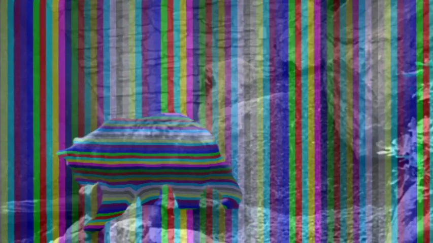 | 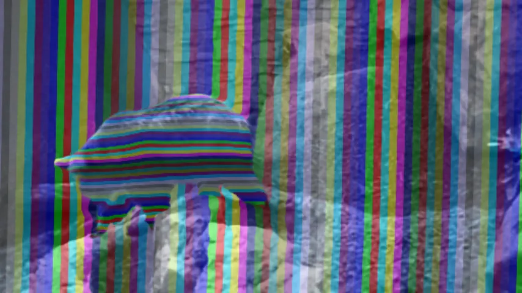 | 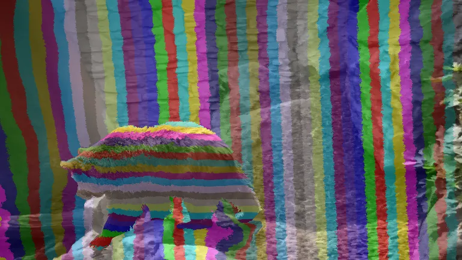 | 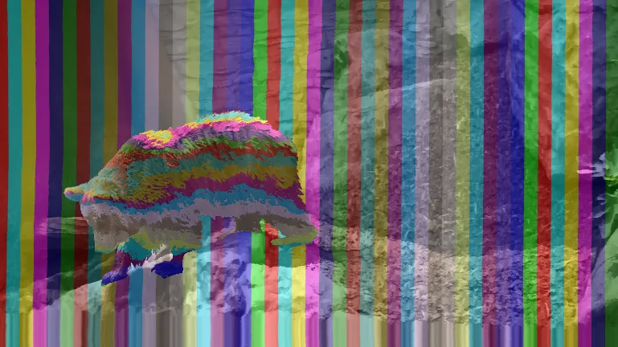 | 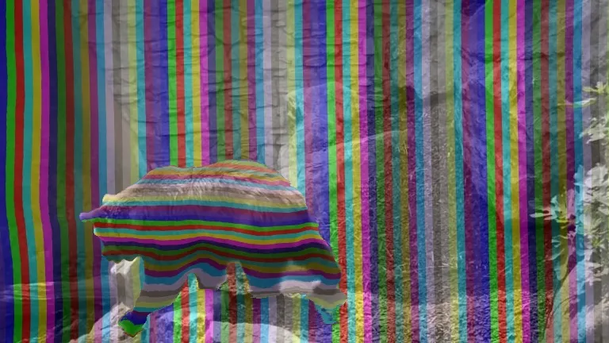 | 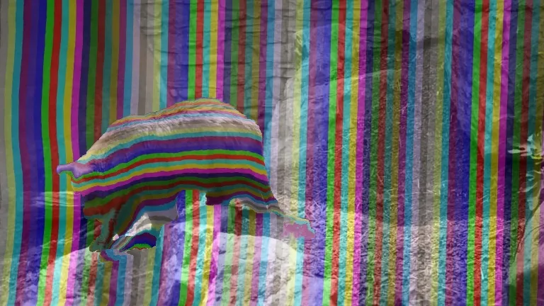 |
| 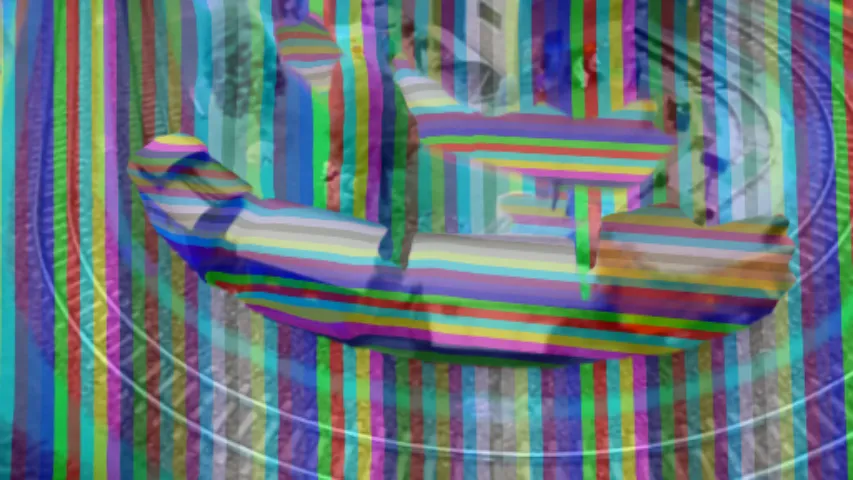 | 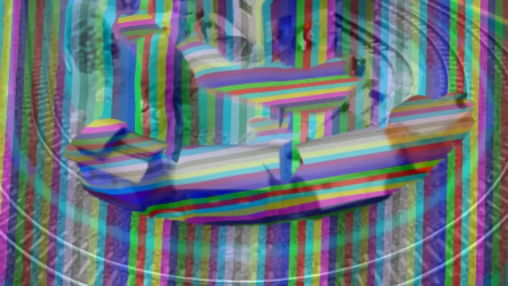 | 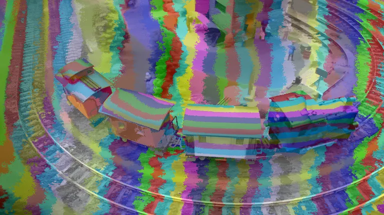 | 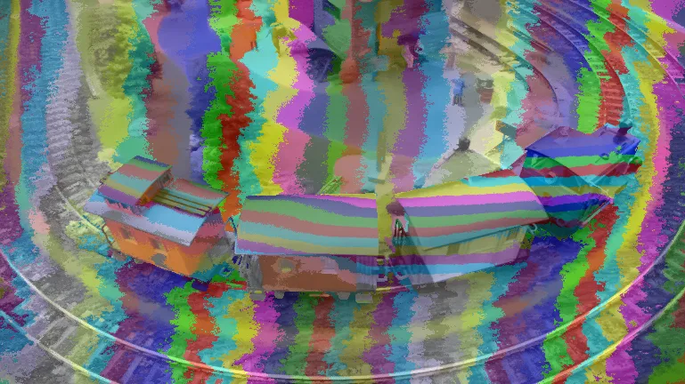 | 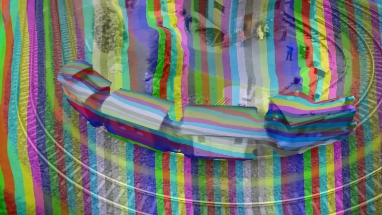 | 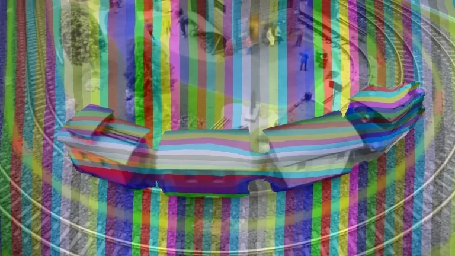 |

Figure 10: Editing results. Note inconsistencies in (b) as deformation
fields incorrectly model time-varying appearance in the bear’s fur.

| Ground Truth                                               | Neural Layered Atlases                                     | Deformable Sprites                                         | CoDeF                                                      | Our VideoSPatS                                             |
| ---------------------------------------------------------- | ---------------------------------------------------------- | ---------------------------------------------------------- | ---------------------------------------------------------- | ---------------------------------------------------------- |
| 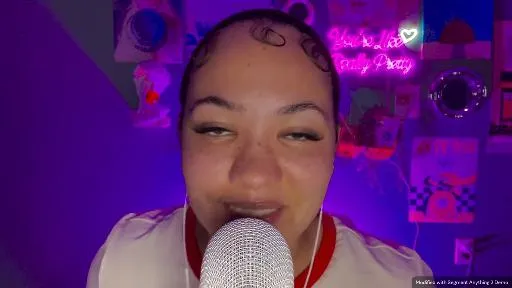 | 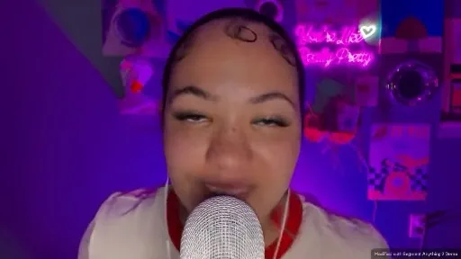 | 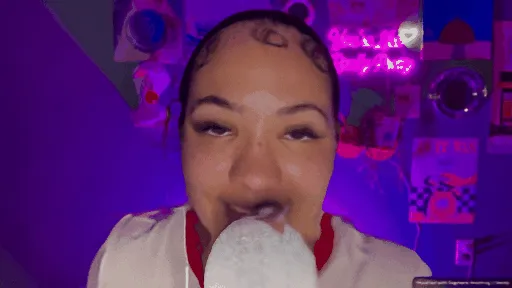 | 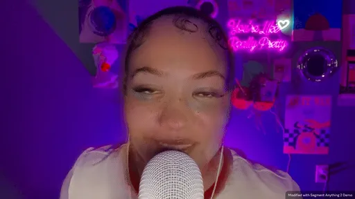 |  |
| 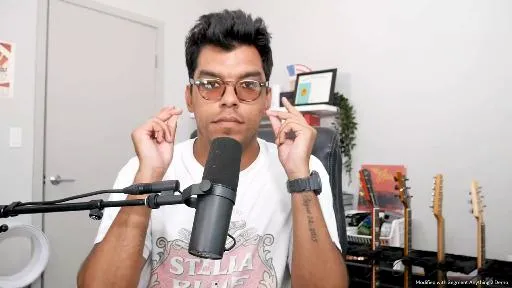 | 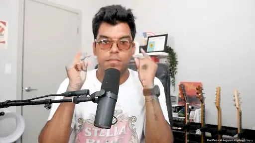 | 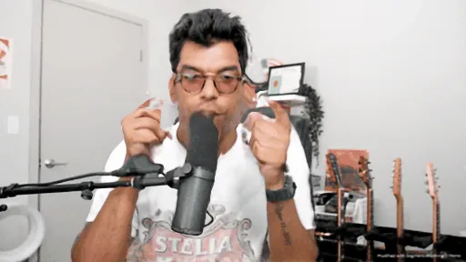 | 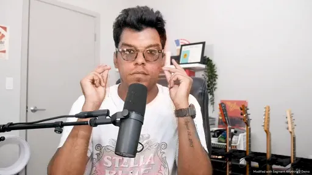 | 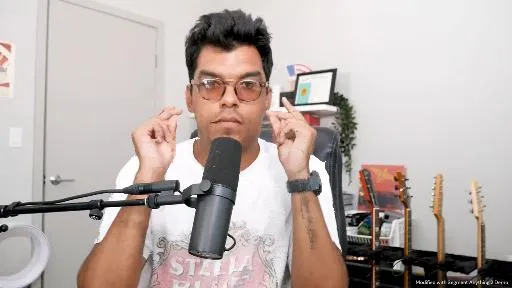 |
| 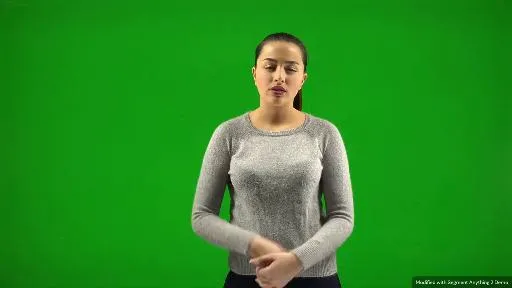 | 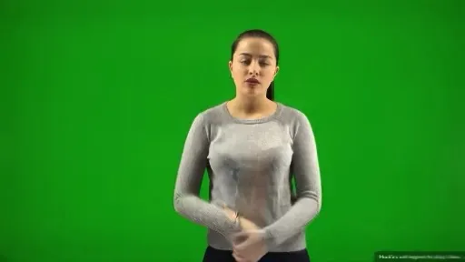 | 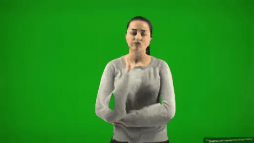 | 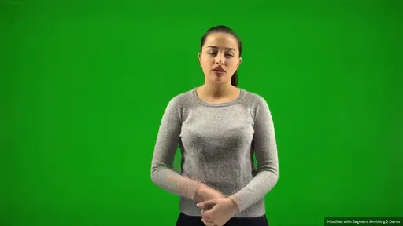 |  |
| 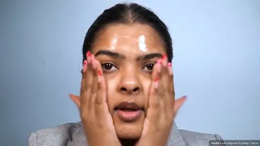 | 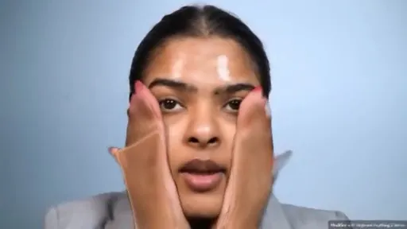 | 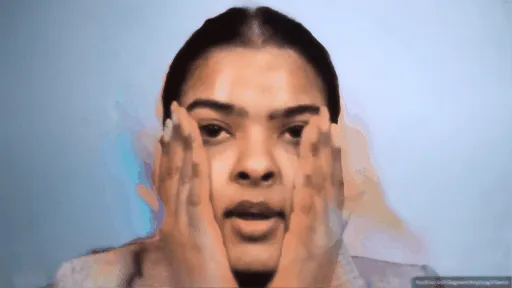 | 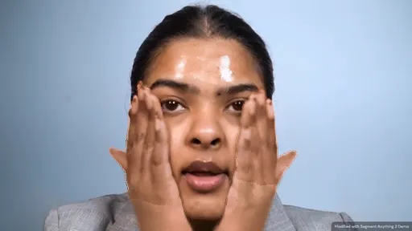 | 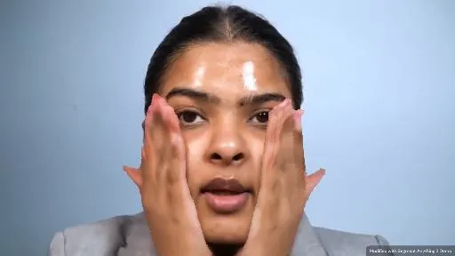 |

Figure 11: Video reconstruction comparisons with other methods. Our
method consistently implicitly reconstructs videos, while the other
methods fail on one case (CoDeF) or multiple cases (Layered Atlases,
Deformable Sprites).

[TABLE]

Figure 12: Comparisons of the obtained canonical spaces with other
methods. For every two rows, the top row corresponds to the background
canonical space, and the bottom row corresponds to the foreground
canonical space. Our VideoSPaTS consistently yields more
editing-intuitive and feasible canonical spaces.

### C.1 Quantitative results

As mere video reconstruction metrics are not indicative of editing
performance, we show video editing quantitative results in Table 1 in
terms of warping consistency, measured in avgerage PSNR and SSIM between
edited and warped edited frames. We use RAFT \[34\] to obtain the
original frames’ optical flow to warp edited frames at $`t`$+$`n`$ into
$`t`$. We set $`n`$=3 for a significant difference in terms of scene
optical flow. Ours outperforms CoDeF\[21\] by a large margin in terms of
PSNR and SSIM, corresponding well to the visuals in Fig. 10. With
respect to Deformable Sprites \[40\], our method outperforms it by 0.4dB
in terms of PSNR, but more importantly, our VideoSpatS can model the
time-dependent appearance (e.g. shadows on bear’s fur), yielding a more
realistic and disentangled reconstruction and editing than the fixed
colors in Deformable Sprites \[40\].

### C.2 Canonical spaces and reconstruction

We present additional qualitative results and comparisons with previous
methods, including Neural Layered Atlases \[11\], Deformable
Sprites \[40\] and Codef \[21\], in terms of video reconstruction and
canonical space estimation, as shown in Fig. 11 and Fig. 12,
respectively.

Fig. 11 shows that, unlike Neural Layered Atlases and Deformable
Sprites, our method consistently yields more detailed reconstructions.
Although CoDeF generates very detailed renderings, its canonical spaces
are not suitable for editing, as shown in Fig. 12. In contrast, our
method generates intuitive canonical spaces that are well-suited for
editing.

| Reference                                                  | CoDeF Editing (Canonic and Render)                         |                                                            | VideoSPatS Editing (Canonic and Render)                    |                                                             |
| ---------------------------------------------------------- | ---------------------------------------------------------- | ---------------------------------------------------------- | ---------------------------------------------------------- | ----------------------------------------------------------- |
|  | 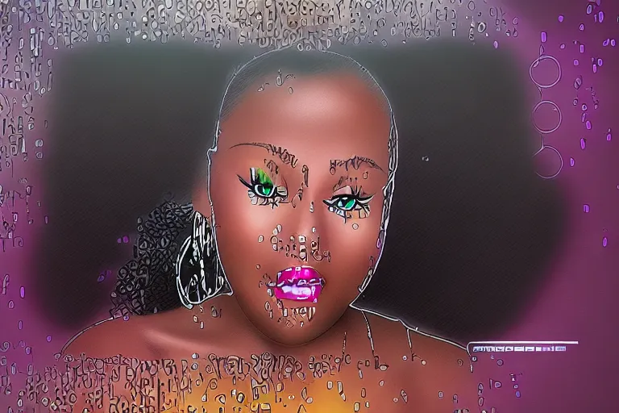 | 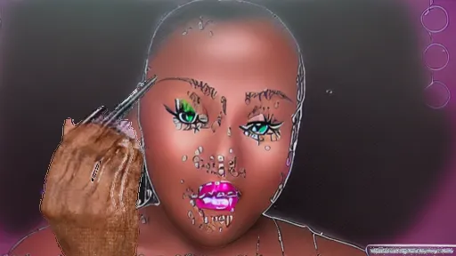 |  |   |
| 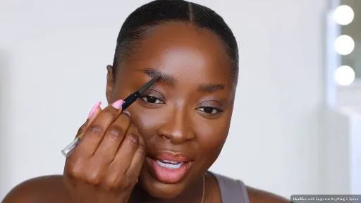 |  | 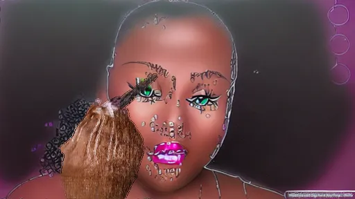 |  |   |
|  | 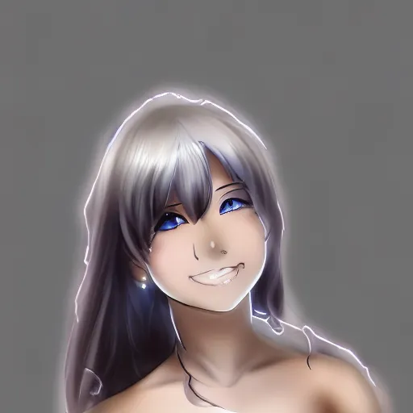 | 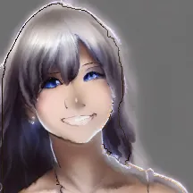 |  | 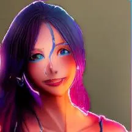  |
|  |  |  | 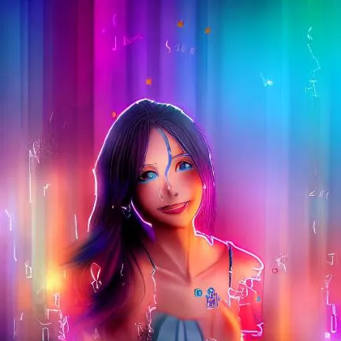 | 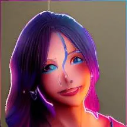  |
|  | 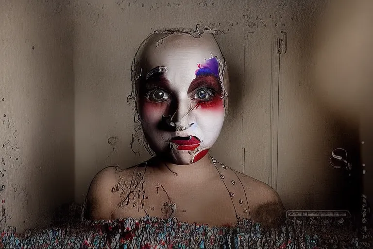 | 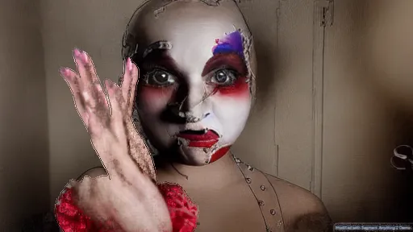 | 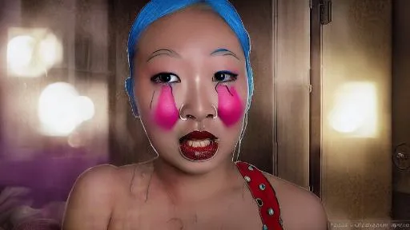 | 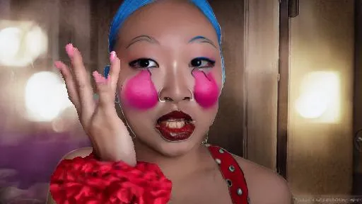  |
|  |  |  |  |  |

Figure 13: Additional editing results. The consistency of our canonical
spaces allows for better deep editing than that of CoDeF.

### C.3 Comparisons to diffusion-based methods.

Although flexible for semantic video editing, diffusion-based methods
such as \[22, 18\] are not designed for time-dependent appearance
editing or do not support motion editing. Our method, closer to
warping-based video modeling, focuses on modeling motion, appearance,
and occlusions, so we did not compare to general video editing
approaches in the main paper. For completeness, we provide an additional
comparison to ReVideo \[18\] in Fig. 14. Ours keeps original head poses
and temporal consistency, and ReVideo changes semantics.

| Original                                                    | ReVideo                                                     | Ours                                                        |
| ----------------------------------------------------------- | ----------------------------------------------------------- | ----------------------------------------------------------- |
|  |  |  |
|  |  |  |

Figure 14: Comparison to ReVideo \[18\].

| Amplified by $`\times 1.5`$                                 | Amplified $`\times 0.5`$                                    | $`v`$ off every 2 frames                                    | $`u,v`$ off every 3, 2 frames                               | GT                                                          |
| ----------------------------------------------------------- | ----------------------------------------------------------- | ----------------------------------------------------------- | ----------------------------------------------------------- | ----------------------------------------------------------- |
|  |  |  |  |  |
|  |  |  |  |  |
|  |  |  |  |  |

Figure 15: Additional results on motion editing by control points. See
our videos for a better visualization.

### C.4 Texture editing

We provide additional editing results in Fig 13. We use
ControlNet \[42\] to apply editing on the canonical space. Note that the
inconsistencies of canonical spaces in CoDeF prevent ControlNet from
generating a high quality edit, as shown in the first and last rows of
Fig 13. In contrast, our method generates more edit-friendly canonical
spaces that are translated into higher-quality, temporally-consistent
images.

### C.5 Motion editing

By modifying the precomputed control points, we can smoothly perform
motion editing. For instance, we can select every $`m`$ control point of
each foreground pixels and apply a vertical offset. Thanks to the spline
nature of our deformation fields, we can smoothly transfer this new
motion into the rendered video. Thanks to our spline deformation fields,
instead of rendering frames where the foreground is instantly
“teleporting” to the offset location, our motion-edited frames are
smoothly rendered without discontinuities. Additional motion edits, such
as amplification and diminishing of motion, are shown in the attached
videos as well as in Fig. 15.

### C.6 Experiments on long sequences

While most of the experiments mentioned above were conducted with videos
of 50 frames, our method also performs well on longer sequences. Fig. 16
presents additional results on sequences of 10 seconds. Our method is
capable of capturing the long-range correspondences in longer videos.

| 0s                                                          | 1s                                                          | 2s                                                          | 3s                                                          | 6s                                                          | 10s                                                         |
| ----------------------------------------------------------- | ----------------------------------------------------------- | ----------------------------------------------------------- | ----------------------------------------------------------- | ----------------------------------------------------------- | ----------------------------------------------------------- |
|  |  |  |  |  |  |
|  |  |  |  |  |  |
|  |  |  |  |  |  |

Figure 16: Additional results on long sequences. Our method can capture
long-range relationships in long video sequences (10s).

## Appendix D Additional ablation studies

### D.1 Spatial regularization loss

We show the effects of the Spatial Splines Deformation Regularization
loss, $`l_{\mathcal{D}_{s}}`$, in Fig. 17. Although the contribution of
the regularization loss is minimal to the canonical space and final
reconstruction, it still helps maintain a better aspect ratio between
the canonical space and the observed space. This is because it
encourages similar deformations between neighboring pixel locations,
preventing the “squeeze” of the canonical space, as observed in the
“without $`l_{\mathcal{D}_{s}}`$” column of Fig. 17.

| Ground Truth                                                | With $`l_{\mathcal{D}_{s}}`$                                | Without $`l_{\mathcal{D}_{s}}`$                             |
| ----------------------------------------------------------- | ----------------------------------------------------------- | ----------------------------------------------------------- |
|  |  |  |
|                                                             |  |  |
|                                                             |  |  |
|  |  |  |
|                                                             |  |  |
|                                                             |  |  |

Figure 17: Effects of $`l_{\mathcal{D}_{s}}`$. From top to bottom:
Composited images, foreground occluder canonical spaces, and background
face canonical spaces. Our model without $`l_{\mathcal{D}_{s}}`$ yields
a slightly squeezed canonical space, with respect to the observed frames
and our model with $`l_{\mathcal{D}_{s}}`$.

### D.2 Color regularization loss

Fig. 18 depicts the effects of the Color Deformation Regularization
loss, $`l_{D_{c}}`$, showing that not regularizing $`P_{c}`$ can lead to
potential entanglement between motion and appearance in the canonical
space, as shown in the bent finger on the rightmost image.

|                                                             |                                                             |                                                             |                                                             |
| ----------------------------------------------------------- | ----------------------------------------------------------- | ----------------------------------------------------------- | ----------------------------------------------------------- |
| Canonical Foreground w/ $`D_{c}`$                           |                                                             | Canonical Foreground w/o $`D_{c}`$                          |                                                             |
| $`t=0`$                                                     | $`t=1`$                                                     | $`t=0`$                                                     | $`t=1`$                                                     |
|  |  |  |  |

Figure 18: Effects of $`l_{D_{c}}`$. $`t=0`$: start, $`t=1`$: end of the
video.

|                                                             |                                                             |                                                             |
| ----------------------------------------------------------- | ----------------------------------------------------------- | ----------------------------------------------------------- |
|  |  |  |
| 10k-8.88min                                                 | 30k-27.23min                                                | 100k-88.6min                                                |
| 30.67dB                                                     | 36.16dB                                                     | 37.21dB                                                     |

Figure 19: Effects of Iteration \# on reconstruction PSNR.

### D.3 Levels of guidance mask

In the main paper, we show that our method can refine the guidance mask.
Fig. 20 provides additional results on different levels of degradation
of the guidance mask. In this supplemental study, our motivation is to
show the robustness of the proposed method when the guidance mask is
imperfect. As shown in Fig. 20 our proposed model can capture the
foreground motion even with a rough mask. Although our method cannot
recover the mask when it is too heavily degraded (last row in Fig. 20),
it still succeeds with smaller degradation levels, supporting our design
choices in Section 3.3.

| Guidance Mask                                               | Foreground and alpha                                        | Background                                                  | Composited                                                  |
| ----------------------------------------------------------- | ----------------------------------------------------------- | ----------------------------------------------------------- | ----------------------------------------------------------- |
|  |  |  |  |
|  |  |  |  |
|  |  |  |  |
|  |  |  |  |
|  |  |  |  |

Figure 20: Additional ablation studies on guidance mask. Original
guidance mask from SAM2\[28\] is eroded by 5, 11, 21, 31, and 41 pixels.
Even under extreme erosion, our method can still reasonably separate the
occluder foreground and the face background.

### D.4 Number of control points

Fig. 21 provides additional ablation studies on the number of control
points. While the best fit can be obtained with the number of control
points equal to the number of frames, our method can also reasonably
reconstruct the scene with fewer control points.

| Canonical Foreground                                        | Canonical Background                                        | Foreground                                                  | Background                                                  | Composited                                                  |
| ----------------------------------------------------------- | ----------------------------------------------------------- | ----------------------------------------------------------- | ----------------------------------------------------------- | ----------------------------------------------------------- |
|  |  |  |  |  |
|  |  |  |  |  |
|  |  |  |  |  |
|  |  |  |  |  |
|  |  |  |  |  |
|  |  |  |  |  |
|  |  |  |  |  |
|  |  |  |  |  |

Figure 21: Additional ablation studies on number of control points. From
top to bottom: 2 (24.195dB), 4 (26.132dB), 8 (28.433dB), 16 (32.209dB),
20 (32.721dB), 30 (34.280dB), 41 (37.010dB), and 82 (36.606dB) control
points for a video of 41 frames.

### D.5 Number of iterations

While performance optimization was not the research focus of this work,
we acknowledge the processing time can be accelerated using faster
neural representations (e.g. hash encodings \[20\]), optimized learning
libraries (e.g. PyTorch Lightning \[6\]), and quantization
(half-precision). We provide additional ablation studies on the effects
of training iterations in Fig. 19. As observed, reasonable results can
be obtained with 30K iterations ($`<`$30min), with only a 1dB drop
w.r.t. the fully trained model ($`\sim`$90min).

## Appendix E Failure cases

Fig. 22 illustrates examples of failure cases. In the top two rows, our
method fails to reconstruct a feasible canonical space for the
background face. This is because the relative size of the facial region
with respect the amount and complexity of the motion is very small. A
work-around for this issue would be to crop the images around the face
region and run our method again. In the bottom two rows, the amount of
motion is too large for our model to capture. In these cases, the brush
goes from one side to the other and also rotates showing different faces
of it, inducing two brushes on our estimated canonical space. A
potential solution would consist on modeling the brush with different
layers when it is on one side or the other.

| Can. Foreground                                             | Can. Background                                             | Foreground                                                  | Background                                                  | Composited                                                  | GT                                                          |
| ----------------------------------------------------------- | ----------------------------------------------------------- | ----------------------------------------------------------- | ----------------------------------------------------------- | ----------------------------------------------------------- | ----------------------------------------------------------- |
|  |  |  |  |  |  |
|  |  |  |  |  |  |
|  |  |  |  |  |  |
|  |  |  |  |  |  |

Figure 22: Failure cases. Top two rows: The dynamic region in background
image (face region) is too small. Bottom two rows: Too large foreground
motion and self-occlusion (opposite sides of brush) cause a double brush
effect in foreground canonical space.

## Appendix F Ethical implications

The use of ControlNet in conjunction with our proposed method to modify
the appearance of video content may raise ethical concerns around
authenticity and potential misuse, such as creating misleading
information. To address these concerns, we advocate for the responsible
and transparent use of this technology, ensuring that any modifications
are clearly indicated and used ethically.

Our collected dataset from publicly available YouTube videos contains
exclusively Creative Commons licensed videos, with the corresponding
URLs provided in the urls.json file. Authors of these videos are free to
contact us upon publication (due to the anonymous nature of submission)
to have their videos removed from this dataset or paper results.

## References

- \[1\] Richard H Bartels, John C Beatty, and Brian A Barsky. _An
  introduction to splines for use in computer graphics and geometric
  modeling_. Morgan Kaufmann, 1995.
- \[2\] Tim Brooks, Bill Peebles, Connor Holmes, Will DePue, Yufei Guo,
  Li Jing, David Schnurr, Joe Taylor, Troy Luhman, Eric Luhman, Clarence
  Ng, Ricky Wang, and Aditya Ramesh. Video generation models as world
  simulators, 2024.
- \[3\] Thomas Brox, Andrés Bruhn, Nils Papenberg, and Joachim Weickert.
  High accuracy optical flow estimation based on a theory for warping.
  In _Computer Vision-ECCV 2004: 8th European Conference on Computer
  Vision, Prague, Czech Republic, May 11-14, 2004. Proceedings, Part IV
  8_, pages 25–36. Springer, 2004.
- \[4\] Ang Cao and Justin Johnson. Hexplane: A fast representation for
  dynamic scenes. In _CVPR_, 2023.
- \[5\] Ilya Chugunov, David Shustin, Ruyu Yan, Chenyang Lei, and Felix
  Heide. Neural spline fields for burst image fusion and layer
  separation. In _Proceedings of the IEEE/CVF Conference on Computer
  Vision and Pattern Recognition_, pages 25763–25773, 2024.
- \[6\] William Falcon and The PyTorch Lightning team. PyTorch
  Lightning, 2019.
- \[7\] Gerald Farin. _Curves and surfaces for CAGD: a practical guide_.
  Elsevier, 2001.
- \[8\] Chen Gao, Ayush Saraf, Johannes Kopf, and Jia-Bin Huang. Dynamic
  view synthesis from dynamic monocular video. In _ICCV_, 2021.
- \[9\] Berthold KP Horn and Brian G Schunck. Determining optical flow.
  _Artificial intelligence_, 17(1-3):185–203, 1981.
- \[10\] Nebojsa Jojic and Brendan J Frey. Learning flexible sprites in
  video layers. In _Proceedings of the 2001 IEEE Computer Society
  Conference on Computer Vision and Pattern Recognition. CVPR 2001_,
  pages I–I. IEEE, 2001.
- \[11\] Yoni Kasten, Dolev Ofri, Oliver Wang, and Tali Dekel. Layered
  neural atlases for consistent video editing. _ACM Transactions on
  Graphics (TOG)_, 40(6):1–12, 2021.
- \[12\] Junhua Liao, Haihan Duan, Xin Li, Haoran Xu, Yanbing Yang, Wei
  Cai, Yanru Chen, and Liangyin Chen. Occlusion detection for automatic
  video editing. In _Proceedings of the 28th ACM International
  Conference on Multimedia_, pages 2255–2263, 2020.
- \[13\] Geng Lin, Chen Gao, Jia-Bin Huang, Changil Kim, Yipeng Wang,
  Matthias Zwicker, and Ayush Saraf. Omnimatterf: Robust omnimatte with
  3d background modeling. In _Proceedings of the IEEE/CVF International
  Conference on Computer Vision (ICCV)_, pages 23471–23480, 2023.
- \[14\] Erika Lu, Forrester Cole, Tali Dekel, Weidi Xie, Andrew
  Zisserman, David Salesin, William T Freeman, and Michael Rubinstein.
  Layered neural rendering for retiming people in video. _ACM
  Transactions on Graphics_, 39(6), 2020.
- \[15\] Erika Lu, Forrester Cole, Tali Dekel, Andrew Zisserman,
  William T Freeman, and Michael Rubinstein. Omnimatte: Associating
  objects and their effects in video. In _Proceedings of the IEEE/CVF
  Conference on Computer Vision and Pattern Recognition_, pages
  4507–4515, 2021.
- \[16\] Julien NP Martel, David B Lindell, Connor Z Lin, Eric R Chan,
  Marco Monteiro, and Gordon Wetzstein. Acorn: Adaptive coordinate
  networks for neural scene representation. _arXiv preprint
  arXiv:2105.02788_, 2021.
- \[17\] Ben Mildenhall, Pratul P Srinivasan, Matthew Tancik, Jonathan T
  Barron, Ravi Ramamoorthi, and Ren Ng. Nerf: Representing scenes as
  neural radiance fields for view synthesis. _Communications of the
  ACM_, 65(1):99–106, 2021.
- \[18\] Chong Mou, Mingdeng Cao, Xintao Wang, Zhaoyang Zhang, Ying
  Shan, and Jian Zhang. Revideo: Remake a video with motion and content
  control. _Advances in Neural Information Processing Systems_,
  37:18481–18505, 2024.
- \[19\] Thomas Müller. tiny-cuda-nn, 2021.
- \[20\] Thomas Müller, Alex Evans, Christoph Schied, and Alexander
  Keller. Instant neural graphics primitives with a multiresolution hash
  encoding. _ACM transactions on graphics (TOG)_, 41(4):1–15, 2022.
- \[21\] Hao Ouyang, Qiuyu Wang, Yuxi Xiao, Qingyan Bai, Juntao Zhang,
  Kecheng Zheng, Xiaowei Zhou, Qifeng Chen, and Yujun Shen. Codef:
  Content deformation fields for temporally consistent video processing.
  In _Proceedings of the IEEE/CVF Conference on Computer Vision and
  Pattern Recognition_, pages 8089–8099, 2024a.
- \[22\] Wenqi Ouyang, Yi Dong, Lei Yang, Jianlou Si, and Xingang Pan.
  I2vedit: First-frame-guided video editing via image-to-video diffusion
  models. In _SIGGRAPH Asia 2024 Conference Papers_, New York, NY, USA,
  2024b. Association for Computing Machinery.
- \[23\] JoonKyu Park, Yeonguk Oh, Gyeongsik Moon, Hongsuk Choi, and
  Kyoung Mu Lee. Handoccnet: Occlusion-robust 3d hand mesh estimation
  network. In _Proceedings of the IEEE/CVF conference on computer vision
  and pattern recognition_, pages 1496–1505, 2022.
- \[24\] Keunhong Park, Utkarsh Sinha, Jonathan T Barron, Sofien
  Bouaziz, Dan B Goldman, Steven M Seitz, and Ricardo Martin-Brualla.
  Nerfies: Deformable neural radiance fields. In _ICCV_, 2021.
- \[25\] M Pawan Kumar, Philip HS Torr, and Andrew Zisserman. Learning
  layered motion segmentations of video. _International Journal of
  Computer Vision_, 76:301–319, 2008.
- \[26\] Federico Perazzi, Jordi Pont-Tuset, Brian McWilliams, Luc Van
  Gool, Markus Gross, and Alexander Sorkine-Hornung. A benchmark dataset
  and evaluation methodology for video object segmentation. In _The IEEE
  Conference on Computer Vision and Pattern Recognition (CVPR)_, 2016.
- \[27\] Alex Rav-Acha, Pushmeet Kohli, Carsten Rother, and Andrew
  Fitzgibbon. Unwrap mosaics: A new representation for video editing. In
  _ACM SIGGRAPH 2008 papers_, pages 1–11, 2008.
- \[28\] Nikhila Ravi, Valentin Gabeur, Yuan-Ting Hu, Ronghang Hu,
  Chaitanya Ryali, Tengyu Ma, Haitham Khedr, Roman Rädle, Chloe Rolland,
  Laura Gustafson, Eric Mintun, Junting Pan, Kalyan Vasudev Alwala,
  Nicolas Carion, Chao-Yuan Wu, Ross Girshick, Piotr Dollár, and
  Christoph Feichtenhofer. Sam 2: Segment anything in images and videos.
  _arXiv preprint arXiv:2408.00714_, 2024.
- \[29\] Robin Rombach, Andreas Blattmann, Dominik Lorenz, Patrick
  Esser, and Björn Ommer. High-resolution image synthesis with latent
  diffusion models. In _Proceedings of the IEEE/CVF Conference on
  Computer Vision and Pattern Recognition (CVPR)_, pages
  10684–10695, 2022.
- \[30\] Vincent Sitzmann, Michael Zollhöfer, and Gordon Wetzstein.
  Scene representation networks: Continuous 3d-structure-aware neural
  scene representations. In _Advances in Neural Information Processing
  Systems_, 2019.
- \[31\] Vincent Sitzmann, Julien Martel, Alexander Bergman, David
  Lindell, and Gordon Wetzstein. Implicit neural representations with
  periodic activation functions. _Advances in neural information
  processing systems_, 33:7462–7473, 2020.
- \[32\] Matthew Tancik, Pratul Srinivasan, Ben Mildenhall, Sara
  Fridovich-Keil, Nithin Raghavan, Utkarsh Singhal, Ravi Ramamoorthi,
  Jonathan Barron, and Ren Ng. Fourier features let networks learn high
  frequency functions in low dimensional domains. _Advances in neural
  information processing systems_, 33:7537–7547, 2020.
- \[33\] Genmo Team. Mochi 1: A new sota in open-source video
  generation.
  [https://github.com/genmoai/models](https://github.com/genmoai/models), 2024.
- \[34\] Zachary Teed and Jia Deng. Raft: Recurrent all-pairs field
  transforms for optical flow. In _Computer Vision–ECCV 2020: 16th
  European Conference, Glasgow, UK, August 23–28, 2020, Proceedings,
  Part II 16_, pages 402–419. Springer, 2020.
- \[35\] Ashish Vaswani, Noam Shazeer, Niki Parmar, Jakob Uszkoreit,
  Llion Jones, Aidan N Gomez, Łukasz Kaiser, and Illia Polosukhin.
  Attention is all you need. _Advances in neural information processing
  systems_, 30, 2017.
- \[36\] John YA Wang and Edward H Adelson. Representing moving images
  with layers. _IEEE transactions on image processing_,
  3(5):625–638, 1994.
- \[37\] Yiran Xu, Zhixin Shu, Cameron Smith, Seoung Wug Oh, and Jia-Bin
  Huang. In-n-out: Faithful 3d gan inversion with volumetric
  decomposition for face editing. In _Proceedings of the IEEE/CVF
  Conference on Computer Vision and Pattern Recognition_, pages
  7225–7235, 2024.
- \[38\] Wenqi Yang, Zhenfang Chen, Chaofeng Chen, Guanying Chen, and
  Kwan-Yee K Wong. Deep face video inpainting via uv mapping. _IEEE
  Transactions on Image Processing_, 32:1145–1157, 2023.
- \[39\] Zhuoyi Yang, Jiayan Teng, Wendi Zheng, Ming Ding, Shiyu Huang,
  Jiazheng Xu, Yuanming Yang, Wenyi Hong, Xiaohan Zhang, Guanyu Feng,
  et al. Cogvideox: Text-to-video diffusion models with an expert
  transformer. _arXiv preprint arXiv:2408.06072_, 2024.
- \[40\] Vickie Ye, Zhengqi Li, Richard Tucker, Angjoo Kanazawa, and
  Noah Snavely. Deformable sprites for unsupervised video decomposition.
  In _Proceedings of the IEEE/CVF Conference on Computer Vision and
  Pattern Recognition_, pages 2657–2666, 2022.
- \[41\] Ziyang Yuan, Yiming Zhu, Yu Li, Hongyu Liu, and Chun Yuan. Make
  encoder great again in 3d gan inversion through geometry and
  occlusion-aware encoding. In _Proceedings of the IEEE/CVF
  International Conference on Computer Vision_, pages 2437–2447, 2023.
- \[42\] Lvmin Zhang, Anyi Rao, and Maneesh Agrawala. Adding conditional
  control to text-to-image diffusion models. In _Proceedings of the
  IEEE/CVF International Conference on Computer Vision_, pages
  3836–3847, 2023.
- \[43\] Shangchen Zhou, Chongyi Li, Kelvin CK Chan, and Chen Change
  Loy. Propainter: Improving propagation and transformer for video
  inpainting. In _Proceedings of the IEEE/CVF International Conference
  on Computer Vision_, pages 10477–10486, 2023.
- \[44\] C Lawrence Zitnick, Sing Bing Kang, Matthew Uyttendaele, Simon
  Winder, and Richard Szeliski. High-quality video view interpolation
  using a layered representation. _ACM transactions on graphics (TOG)_,
  23(3):600–608, 2004.
