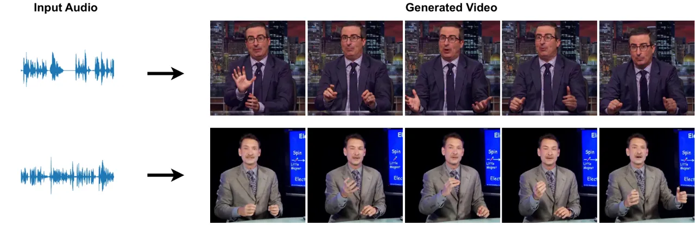
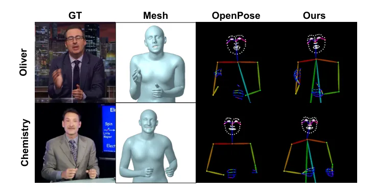
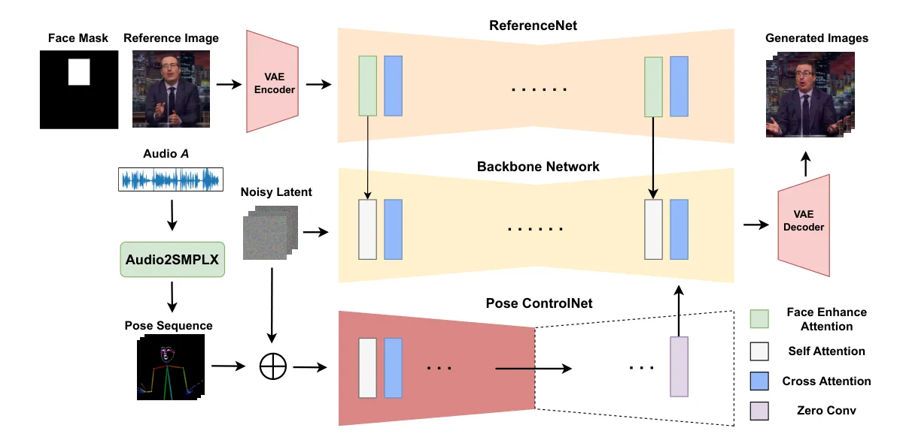
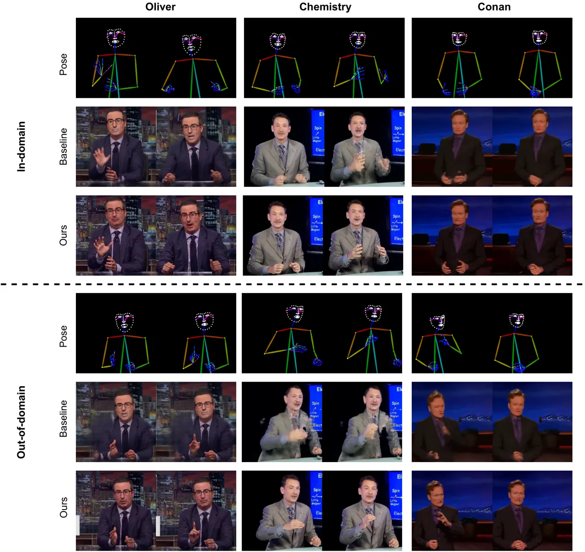
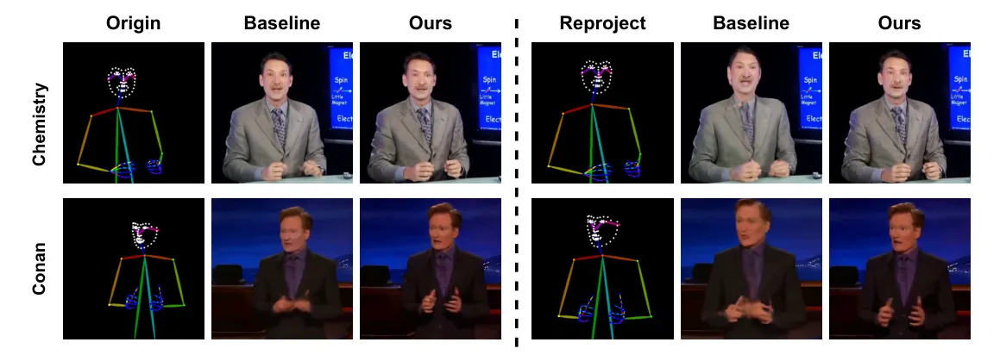
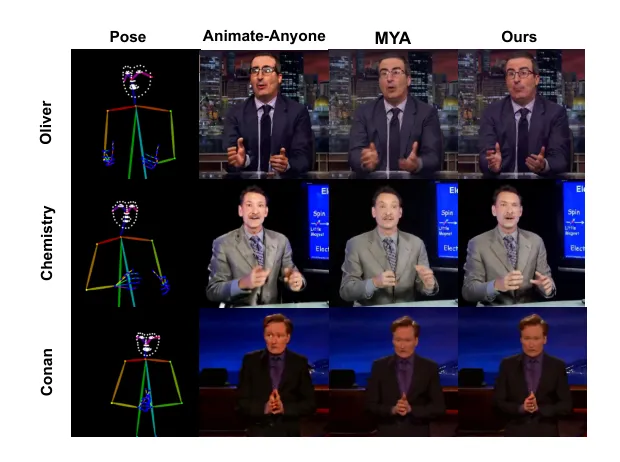

# EasyGenNet: An Efficient Framework for Audio-Driven Gesture Video Generation Based on Diffusion Model

Renda Li¹, Xiaohua Qi¹, Qiang Ling¹, Jun Yu^(1\*), Ziyi Chen², Peng
Chang², Mei Han² Jing Xiao² Affiliation:  Affiliation: ¹University of
Science and Technology of China, Hefei, China Affiliation: 
Affiliation: ²PAII Inc.

###### Abstract

Audio-driven cospeech video generation typically involves two stages:
speech-to-gesture and gesture-to-video. While significant advances have
been made in speech-to-gesture generation, synthesizing natural
expressions and gestures remains challenging in gesture-to-video
systems. In order to improve the generation effect, previous works
adopted complex input and training strategies and required a large
amount of data sets for pre-training, which brought inconvenience to
practical applications. We propose a simple one-stage training method
and a temporal inference method based on a diffusion model to synthesize
realistic and continuous gesture videos without the need for additional
training of temporal modules. The entire model makes use of existing
pre-trained weights, and only a few thousand frames of data are needed
for each character at a time to complete fine-tuning. Built upon the
video generator, we introduce a new audio-to-video pipeline to
synthesize co-speech videos, using 2D human skeleton as the intermediate
motion representation. Our experiments show that our method outperforms
existing GAN-based and diffusion-based methods.

###### Index Terms: 

diffusion models, human animation, video generation, multi-modality

## I Introduction

Co-speech video generation \[1\] focuses on creating photorealistic
videos of talking humans that are closely synchronized with the input
speech. Such videos not only match the lip movements to the spoken words
but also incorporate accurate facial expressions and gestures.

Co-speech video generation usually involves two stages:
speech-to-gesture and then gesture-to-video. Significant advances have
been made in speech-to-gesture generation, exemplified by the work in
 \[2\] where a holistic 3D mesh-based human motion sequence can be
generated from a given speech. However, most gesture-to-video works rely
on large-scale pre-training \[3, 4, 5\], and multi-stage training \[6,
7, 8\], which makes it difficult to quickly apply to characters outside
the training set. We hope to design a model that can quickly finetune on
a specific person while maintaining the generated visual quality.
GAN-based models have advantages in training and inference speed, but
previous methods \[1\] cannot generate realistic gesture videos.
Therefore, we use the latest GAN-based methods \[9\] to build a baseline
and thoroughly analyze the disadvantages of GAN in generalization
ability compared with diffusion models. GAN-based methods do not
extrapolate well to unseen gestures and especially have difficulty in
generating novel hand poses, resulting in blurry or missing fingers in
certain cases. Finally, we design a diffusion model-based framework that
fully utilizes the existing pre-trained weights, so that only a
single-stage finetune and a few thousand frames of character videos are
needed to quickly fine-tune the video generation model for a specific
person.

Fig. 1: Given an audio segment, a speaker ID, and a reference image of
the speaker, our co-speech gesture video generation framework can
produce videos with realistic appearances, vivid facial expressions, and
clear hand gestures. Here, we showcase several generated video frames
for two characters.

In this work, we present an audio-to-video pipeline to generate
co-speech videos of selected speakers, with realistic facial animation
and novel hand gesture movements. To minimize the training difficulty,
we introduce a simple SD-based Network, referred to as EasyGenNet, to
enable the synthesis of human hand movements in gesture videos with
significantly enhanced visual quality. Specifically, we propose to
generate the 2D skeleton maps from a 3D mesh-based human motion
sequence, explicitly enforcing the 3D human body physical constraint and
resulting in improved synthesis of the human body, especially for hands.
At the same time it allows to train on small datasets with a pre-trained
ControlNet \[10\]. Finally, we implement temporal inference by
performing self-attention on the temporal dimension, so that continuous
and smooth videos can be generated even after removing the temporal
module.

Our main contributions include the following:

- •
  We propose a simple SD-based co-speech gesture video generation
  pipeline (EasyGenNet), trained on a modest amount of data and without
  the need for complex input and multi-stage training strategies, to
  generate satisfactory human speech video with realistic gestures and
  hand motions.
- •
  We use the 3D human body parametric model SMPLX to obtain more
  accurate 2D skeleton images, significantly improving the SD synthesis
  result, most notably for human hands. Our method can be easily
  combined with the existing Audio-to-SMPLX method to expand its
  application capabilities.
- •
  We discuss the advantages of diffusion-based models over the
  state-of-art GAN-based models through quantitative and qualitative
  experiments, and and achieves better performance than other
  diffusion-based methods without requiring complex model and training
  strategies.

## II Related work

### II-A Co-speech Human Motion Generation.

Research in co-speech motion generation has largely been divided into
two categories: facial motion \[11, 12, 13, 14\] and body motion \[15,
16, 17, 18\]. Despite these advancements and recent efforts, creating a
unified framework that seamlessly integrates the generation of facial
expressions, body movements, and hand gestures remains difficult.
Recently, several works have tackled the above challenge by leveraging
human body parametric models \[19, 20, 21, 22\]. More recently, Yi et
al. \[15\] propose to generate full-body 3D meshes using an
encoder-decoder model for facial motions and a cross-model VQ-VAE for
modeling body and hand motion. Our study extends this methodology and
takes a step further to generate co-speech videos.

### II-B Gesture Video Generation.

GAN-based methods \[1, 23, 24\] learn to predict 2D skeleton-based
gestures given an input speech and use conditional GANs to generate
final videos. The recent state-of-art GAN-based method \[9\] uses a
textured mesh as a stronger condition. We use the framework of \[9\] as
a baseline and find that GAN-based video generators often fail to
generate clear hands and generalize to unseen poses. Some recent work
based on diffusion models \[7, 8, 6, 25, 3, 4\] has alleviated the
problems of GAN-based models to some extent. However, \[3\] requires 27
hours of pre-training to adapt the model to 2D mesh representation, and
requires additional face enhancement to improve facial clarity. \[4\]
focuses on zero-shot capabilities, so it uses 2.2k hours of data
pre-training. The 2D skeleton images in \[6, 8\] are directly extracted
using models like OpenPose, which may lead to missing hand, while \[25\]
relies on non-direct extraction from 3D meshes, potentially causing
inconsistencies. Our method generates realistic character videos in a
fine-tuned manner without the need for additional pre-training and
temporal module training. The 2D skeleton map used is directly projected
from 3D keypoints, avoiding missing and inaccurate hands.

## III Method

Fig. 2: Above chart illustrates skeleton maps generated with two
methods: inferring GT images with OpenPose model ($`3`$rd column), and
our method which extracts SMPLX model parameters then mapping them into
joints under the OpenPose configuration ($`4`$th column). Our method
yields more accurate hand poses, finger configurations and body shapes.

Our goal is to generate an audio-driven, photorealistic, co-speech
gesture video from a segment of audio given a speaker ID and a reference
image of a speaker. We address this challenge in two steps. First, given
an audio, we generate a sequence of plausible body poses and facial
expressions. Next, we use the generated sequence of 2D skeleton poses
and a reference image to condition an SD-based pipeline to generate the
photorealistic video. We have described the first and second steps in
more detail in III-A and III-B, respectively.

Fig. 3: Given an input audio $`\mathcal{A}_{t}`$, we first train a
network to predict skeleton sequences that match speech, as denoted as
$`\mathcal{P}_{t}`$ for each frame in Section III-A. Additionally,
leveraging the pre-trained SD 1.5 model and Pose ControlNet, we designed
a single-stage fine-tuned video generation model called EasyGenNet.
Given a skeleton sequence $`\mathcal{P}_{t}`$ and a reference image as
conditions, our model generates videos that align with the appearance of
the reference image while matching the poses to the skeleton sequence.

### III-A Audio to Gesture

Given an audio input, we first predict plausible motion sequence of
hands, face and body. We use human skeleton maps in OpenPose
configuration as our gesture representation. We use TALKSHOW \[2\] to
generate SMPLX \[22\] parameters from audio and then extract the 3D
joints and project them into a 2D skeleton image based on the camera
parameters of the training video. We use the SMPLX as an intermediate
step as it prevents generating unnatural gestures and gives more
temporally consistent results.

Given an input audio and a speaker ID, the model predicts the positions
of each 3D joint of every single frame. Those positions are then mapped
to the configuration of 135 joints utilized by OpenPose. Following this,
the camera settings from the source video are used to project those
joints onto a 2D plane. The projection process generates a sequence of
skeleton maps, represented as
$`\mathcal{P}_{1:T}=\{\mathcal{P}_{t}\}_{t=1}^{T}`$, where
$`t=\{1...T\}`$, and $`T`$ represents the total number of skeleton maps
in the sequence, as illustrated in Figure 2.

To generate a sequence of 2D skeleton maps driven by audio, a
straightforward approach is to train a model to regress the positions of
2D joints as configured in OpenPose. However, as shown in Figure 2,
OpenPose predictions can have missing and misaligned joints,which are
critical for gesture generation. Therefore, we constrain the 2D joint
positions using the 3D mesh representation of the SMPLX parametric human
model, resulting in more accurate joint positions and body postures.

### III-B Gesture to Video

Given the generated 2D skeleton sequence $`\mathcal{P}_{1:T}`$ and a
reference image, our objective is to generate a photorealistic speaker
video.

#### III-B1 Challenges

Our original intention was that the model could be quickly fine-tuned on
characters outside the training set. GAN-based models have great
advantages in training and inference speed. Therefore, we initially used
the model in \[9\] and the proposed refined 2D skeleton map as
conditional input. However, due to limited training data, GAN-based
methods tend to learn average color for specific body regions. This
results in artifacts around body parts with greater motion, such as
hands. It is also challenging for GAN-based methods to transfer gestures
from one speaker to another. Since GAN-based methods fail to generate
hand gestures that have not appeared in the training data.

Most diffusion model-based methods require additional training of a
temporal module or a facial enhancement module \[3\], as well as
large-scale pre-training to adapt the model to a certain representation.
To address these challenges, we use the previously mentioned refined 2D
skeleton map as condition, which can obtain more continuous results and
clearer facial expressions. And we use temporal inference to further
enhance the coherence of the generated video. Finally, all our modules
do not require specific pre-training or training of additional modules.

#### III-B2 Overview

The overview of our EasyGenNet is depicted in Figure 3. The Backbone
Network takes noisy latent representation as input and predicts the
noise introduced at time step T. To preserve the appearance information
of the speaker, the ReferenceNet uses the same SD 1.5 structure as the
Backbone Network. Given a specific reference image of a speaker, each
layer extracts appearance features and input into the corresponding
layer of the denoising network. For controlling the poses of the
generated individuals, the Pose ControlNet utilizes the original
ControlNet\[10\] structure and loads the ControlNet OpenPose weights. It
takes a sequence of 2D skeleton maps as input and extracts features
injected into the backbone network.

#### III-B3 Backbone Denoising Network

In the original SD 1.5, each layer’s transformer block consists of a
self-attention block and a cross-attention block. We are inspired by the
setup in \[8, 7\]. In self-attention, concat the output of the
corresponding layer of ReferenceNet. The cross-attention operates with
tmpty text, so that the entire backbone network can be frozen during
training to improve efficiency, unlike \[26\] where the cross-attention
layer still needs to be trained.

#### III-B4 ReferenceNet

Effective appearance control is a crucial capability of video generation
models, and recent works \[26, 6, 8, 27\] have explored various
structures for appearance control effects, including ControlNet-like
structures, CLIP encoder, and SD-like structures. Experimental results
\[6, 28\] demonstrate the importance of employing a structure similar to
the Backbone Network for maintaining consistency in character
appearance. Our ReferenceNet adopts the structure and pre-trained
weights of SD 1.5. Given a feature map
$`\mathbf{X}\in\mathbb{R}^{b\times h\times w\times c}`$ from a layer of
ReferenceNet, features $`\mathbb{R}^{b\times(h\times w)\times c}`$ are
obtained after passing through a self-attention layer. Different from
above methods, our referencenet additionally input a face mask map. In
the self-attention, the face tokens are multiplied by a learnable
magnification factor greater than 1 to enhance the visual effect of the
face without the need for an additional face enhancement module. We name
this self-attention Face Enhancement Attention.

#### III-B5 Pose ControlNet

ControlNet \[10\] has been shown to be able to robustly impose multiple
types of image control in T2I models. Therefore, we use the pre-trained
OpenPose ControNet model, whose output blocks are added to the input
latent of the corresponding out blocks of the Backbone Network. The
weights of Pose ControlNet are also frozen.

#### III-B6 Training Strategies

During training, the model takes a single frame image as input,
including a 2D skeleton map, its corresponding RGB image, and a randomly
selected reference image. Note that, as described in III-A, the skeleton
maps are obtained by fitting the SMPLX parametric human model, resulting
in more accurate joints position. Backbone Network and ReferenceNet are
initialized with the same SD 1.5 weight. During training, only the
weights of ReferenceNet are fine-tuned.

#### III-B7 Inference Strategies

Since our method does not use the temperal module to enhance the
consistency of the temporal dimension, we use the All-frames Attention
in \[3\] to enhance the temporal modeling during inference. Different
from \[3\], we do not use overlapping windows during inference, because
it cannot significantly improve the continuity between windows. Instead,
we use the same noise to initialize different window inputs, which can
enhance the continuity and avoid the huge inference time caused by
overlapping windows.

## IV Experiments

### IV-A Datasets.

We leverage the speaker dataset provided by TalkSHOW \[15\],
specifically focusing on the identities of three characters: “Oliver,”
“Chemistry,” and “Conan. For the audio-to-gesture component, we employ
the complete datasets of these three characters for about $`27`$ hours.
In the gesture-to-video phase, given that the dimensions of image frames
significantly surpass that of the SMPLX \[22\] model parameters used in
the audio-to-gesture stage, we restrict our training set to
approximately $`5`$K frames from a single video for each character. The
video frames are resized to a resolution of 512 $`\times`$ 512.
Additionally, we establish a perspective camera for each cropped video
of the three distinct speakers, facilitating the projection of 3D
skeletons outputted by Sec III-A onto the corresponding locations in the
cropped images.

We divide the test set into in-domain data and out-of-domain data, each
comprising approximately 10% of the number of frames in the training
set, and subject them to the same cropping process as the training set.
In-domain data means that it belongs to the same video as the training
set. Out-of-domain data represents videos different from training
videos. Out-of-domain data exhibits significant body shifts and novel
hand poses, posing a stringent test on the model’s capacity for
generalization.

### IV-B Baseline Model.

Here we built a GAN-based model with a similar structure to \[9\],
comprising an 8-layer UNet-like convolutional neural network generator
network and a multi-scale PatchGAN architecture discriminator. The total
loss consists of the adversarial loss from the discriminator, the color
loss, the perceptual loss, and the feature matching loss.

### IV-C Evaluation Settings.

Evaluation is conducted through two different approaches. The first
approach assesses the performance of our proposed gesture-to-video
generation model (EasyGenNet). In this setting, inference is performed
using ground-truth skeleton maps for in- and out-of-domain test sets. We
employ the SSIM \[29\], PSNR\[30\], and LPIPS \[31\] metrics for
evaluating the image-level generation quality and FVD \[32\] for
evaluating the quality of the generated video. The second approach
qualitatively evaluates the generative quality of the entire
audio-to-video system. Due to space constraints, the audio-to-video
results and video results are provided in the supplementary material.
For evaluation, we disregard background effects since the background
changes over time in the ground-truth frames. We focus on evaluating the
quality of the avatars. In the experiments, we utilize RVM  \[33\] to
mask out the background.

### IV-D Gesture to Video

We assess video generation quality using ground-truth 2D skeleton maps
from both in-domain and out-of-domain test sets. These maps are obtained
by estimating SMPL-X model parameters as outlined in Section III-A and
mapping the joints to match OpenPose configurations. As previously
noted, out-of-domain data show greater body shifts and more varied hand
poses than training data, highlighting the need for models with robust
generalization abilities to produce high-quality videos.

| Speaker   | Method         | SSIM $`(\uparrow)`$ | PSNR $`(\uparrow)`$ | LPIPS $`(\downarrow)`$ | FVD $`(\downarrow)`$ |
| --------- | -------------- | ------------------- | ------------------- | ---------------------- | -------------------- |
| Oliver    | Animate-Anyone | $`0.701`$           | $`29.484`$          | $`0.302`$              | $`15.776`$           |
|           | MYA            | $`0.752`$           | $`31.871`$          | $`0.223`$              | $`13.064`$           |
|           | GAN Baseline   | $`0.734`$           | $`31.780`$          | $`0.258`$              | $`14.930`$           |
|           | Ours           | $`\mathbf{0.758}`$  | $`\mathbf{32.688}`$ | $`\mathbf{0.219}`$     | $`\mathbf{12.178}`$  |
| Chemistry | Animate-Anyone | $`0.692`$           | $`30.053`$          | $`0.329`$              | $`14.385`$           |
|           | MYA            | $`\mathbf{0.751}`$  | $`\mathbf{32.064}`$ | $`0.269`$              | $`10.255`$           |
|           | GAN Baseline   | $`0.741`$           | $`31.755`$          | $`0.264`$              | $`11.237`$           |
|           | Ours           | $`0.729`$           | $`31.983`$          | $`\mathbf{0.251}`$     | $`\mathbf{9.150}`$   |
| Conan     | Animate-Anyone | $`0.768`$           | $`30.833`$          | $`0.311`$              | $`16.938`$           |
|           | MYA            | $`0.815`$           | $`33.917`$          | $`0.231`$              | $`9.823`$            |
|           | GAN Baseline   | $`0.842`$           | $`33.351`$          | $`0.202`$              | $`15.012`$           |
|           | Ours           | $`0.821`$           | $`\mathbf{34.106}`$ | $`\mathbf{0.161}`$     | $`\mathbf{8.060}`$   |

TABLE I: Quantitative comparison on the in-domain test set.

| Speaker   | Method       | SSIM $`(\uparrow)`$ | PSNR $`(\uparrow)`$ | LPIPS $`(\downarrow)`$ | FVD $`(\downarrow)`$ |
| --------- | ------------ | ------------------- | ------------------- | ---------------------- | -------------------- |
| Oliver    | GAN Baseline | $`0.715`$           | $`30.762`$          | $`0.315`$              | $`23.092`$           |
|           | Ours         | $`\mathbf{0.744}`$  | $`\mathbf{31.895}`$ | $`\mathbf{0.254}`$     | $`\mathbf{12.819}`$  |
| Chemistry | GAN Baseline | $`0.707`$           | $`30.862`$          | $`0.288`$              | $`24.507`$           |
|           | Ours         | $`\mathbf{0.729}`$  | $`\mathbf{31.983}`$ | $`\mathbf{0.245}`$     | $`\mathbf{8.890}`$   |
| Conan     | GAN Baseline | $`0.821`$           | $`32.121`$          | $`0.216`$              | $`16.939`$           |
|           | Ours         | $`\mathbf{0.843}`$  | $`\mathbf{33.209}`$ | $`\mathbf{0.183}`$     | $`\mathbf{9.611}`$   |

TABLE II: Quantitative comparison on the out-of-domain test set.

#### IV-D1 Quantitative Comparison.

Table I and Table III show the comparison results of our method with the
baseline GAN model and two diffusion model-based methods \[6, 3\] on two
test sets in terms of image-level and video-level metrics. On in-domain
data, our method outperforms the baseline in all metrics except for
SSIM. The slight lag in the SSIM metric is because GANs-based models
have stronger capabilities in restoring image brightness and contrast
than diffusion models fine-tuned with a small amount of data. However,
qualitative experiments show that our method significantly surpasses the
baseline in the quality of hand generation. On out-of-domain data, our
method comprehensively leads over the baseline. This demonstrates that
the videos generated by our method surpass those produced by the
baseline method in image quality. On both test sets, our method is
generally able to outperform other diffusion model-based methods, and
our method is more effective in model and training.

Fig. 4: Qualitative comparison between our method and the GAN baseline.
In the in-domain test set (upper half), our method outperforms the
baseline by generating clearer hands and more realistic facial
expressions. In the out-of-domain test set (lower half), the baseline
model fails to adapt to body shifts and new hand positions relative to
the training set, resulting in incorrect appearances, while our method
consistently generates accurate and high-quality images.

#### IV-D2 Qualitative Comparison with GAN Basiline

In Figure 4, we compare the video quality generated by our method and
the baseline method across all three subjects. Our method produced more
natural and clearer facial expressions and more defined hands on both
test sets. This advantage stems from the pre-trained SD and ControlNet’s
robust prior knowledge of body shifts and the corresponding shapes when
hands appear in different positions. Notably, in the out-of-domain data,
the results for Chemistry and Oliver (Figure 4, 5th row, 1-4th columns)
show that the baseline method generated blurry bodies or even missing
parts. This issue arose because their body positions were fixed in the
images of the training set, whereas there were shifts in the test set.
This indicates that GANs only learned to generate images with fixed
positions, while our method successfully generated correct appearances
and hand poses after position changes. In section IV-E, we will further
discuss the adaptability of the two methods to variations in subject
magnification.

Fig. 5: Generation results on the original skeleton map (left side) and
on the skeleton map after increasing the camera focal length (right
side) for both the Baseline method and our method. After the skeleton
maps were enlarged, our method not only continued to generate clear
hands but also produced correct head and body shapes compared to the
Baseline.

### IV-E Comparison of Camera Changes

This section further discusses the adaptability of two methods when the
camera parameters change, specifically when the input skeleton maps are
enlarged relative to those in the training set, questioning whether both
methods can adapt to this change and generate correct outcomes. Figure 5
presents that when the camera’s focal length increases, meaning the
skeleton is enlarged, GANs cannot generate accurate images, manifesting
incorrect body and head proportions. In contrast, our method succeeds in
generating the correct appearance of the enlarged characters, proving
its adaptability to changes in body position and size.

Fig. 6: We compared our method with the results generated by
Animate-Anyone and MYA. The skeleton maps are derived from the Ground
Truth of the out-of-domain test set. Our method produces clearer hands
and more expressive facial features.

| Design               | Method                        | SSIM $`(\uparrow)`$ | PSNR $`(\uparrow)`$ | LPIPS $`(\downarrow)`$ | FVD $`(\downarrow)`$ |
| -------------------- | ----------------------------- | ------------------- | ------------------- | ---------------------- | -------------------- |
| Skeleton map         | OpenPose                      | $`0.703`$           | $`30.429`$          | $`0.295`$              | $`18.762`$           |
|                      | Refined (Ours)                | $`\mathbf{0.744}`$  | $`\mathbf{32.336}`$ | $`\mathbf{0.235}`$     | $`\mathbf{10.664}`$  |
| Attention            | Self-Attention                | $`0.734`$           | $`32.158`$          | $`0.268`$              | $`10.737`$           |
|                      | Face Enhance Attnetion (Ours) | $`\mathbf{0.744}`$  | $`\mathbf{32.336}`$ | $`\mathbf{0.235}`$     | $`\mathbf{10.664}`$  |
| Temporal consistency | Temporal module               | $`0.749`$           | $`32.175`$          | $`0.221`$              | $`11.064`$           |
|                      | Temporal Inference (Ours)     | $`0.744`$           | $`\mathbf{32.336}`$ | $`\mathbf{0.235}`$     | $`\mathbf{10.664}`$  |

TABLE III: Ablation experiments on the main designs.

### IV-F Qualitative Comparison with Diffusion-based Method

In this section, we conduct a qualitative comparison of our method
against Make-Your-Anchor \[3\] and Animate-Anyone \[6\]. We train with
the original repository of \[3\], and for \[6\] we train with the
MooreThreads’ implementation.

Figure 6 illustrates a visual quality comparison of generated images
across three characters. Our method outperforms other methods in terms
of hand quality and face clarity, which shows the effectiveness of
refined 2D skeleton map and Face Enhance Attention.

### IV-G Ablation Study

We conduct ablation studies to verify the effectiveness of the proposed
methods. This section mainly evaluated three designs: 1) using skeleton
maps extracted by OpenPose or refined 2D skeleton maps proposed by us. 2) Face Enhance Attention. 3) using temporal inference or training
temporal module. The results are shown in Table 3, and we can see that
our proposed method can achieve better performance while avoiding
additional training. Note that the metrics in the table are averages on
the Oliver and Chemistry test sets.

## V Discussion

In this paper, we have introduced a diffusion-based system for
generating co-speech gesture videos driven by audio inputs. Our method
shows better generalization and clear hand poses than conditional
GAN-based methods for video generation, and our model structure and
training strategy are simpler and do not rely on large-scale
pre-training compared to recent diffusion model-based methods. We have
evaluated our method on the TALKSHOW dataset for a variety of audio
inputs and character types. We plan to evaluate our method on larger
datasets with more characters.

## References

- \[1\] S. Ginosar, A. Bar, G. Kohavi, C. Chan, A. Owens, and J. Malik,
  “Learning individual styles of conversational gesture,” in Computer
  Vision and Pattern Recognition (CVPR). June 2019, IEEE.
- \[2\] Hongwei Yi, Hualin Liang, Yifei Liu, Qiong Cao, Yandong Wen,
  Timo Bolkart, Dacheng Tao, and Michael J Black, “Generating holistic
  3d human motion from speech,” in Proceedings of the IEEE/CVF
  Conference on Computer Vision and Pattern Recognition, 2023, pp.
  469–480.
- \[3\] Ziyao Huang, Fan Tang, Yong Zhang, Xiaodong Cun, Juan Cao,
  Jintao Li, and Tong-Yee Lee, “Make-your-anchor: A diffusion-based 2d
  avatar generation framework,” in Proceedings of the IEEE/CVF
  Conference on Computer Vision and Pattern Recognition, 2024, pp.
  6997–7006.
- \[4\] Enric Corona, Andrei Zanfir, Eduard Gabriel Bazavan, Nikos
  Kolotouros, Thiemo Alldieck, and Cristian Sminchisescu, “Vlogger:
  Multimodal diffusion for embodied avatar synthesis,” arXiv preprint
  arXiv:2403.08764, 2024.
- \[5\] Gaojie Lin, Jianwen Jiang, Chao Liang, Tianyun Zhong, Jiaqi
  Yang, and Yanbo Zheng, “Cyberhost: Taming audio-driven avatar
  diffusion model with region codebook attention,” arXiv preprint
  arXiv:2409.01876, 2024.
- \[6\] Li Hu, Xin Gao, Peng Zhang, Ke Sun, Bang Zhang, and Liefeng Bo,
  “Animate anyone: Consistent and controllable image-to-video synthesis
  for character animation,” arXiv preprint arXiv:2311.17117, 2023.
- \[7\] Zhongcong Xu, Jianfeng Zhang, Jun Hao Liew, Hanshu Yan, Jia-Wei
  Liu, Chenxu Zhang, Jiashi Feng, and Mike Zheng Shou, “Magicanimate:
  Temporally consistent human image animation using diffusion model,” in
  Proceedings of the IEEE/CVF Conference on Computer Vision and Pattern
  Recognition, 2024, pp. 1481–1490.
- \[8\] Di Chang, Yichun Shi, Quankai Gao, Jessica Fu, Hongyi Xu,
  Guoxian Song, Qing Yan, Xiao Yang, and Mohammad Soleymani,
  “Magicdance: Realistic human dance video generation with motions &
  facial expressions transfer,” arXiv preprint arXiv:2311.12052, 2023.
- \[9\] Aniruddha Mahapatra, Richa Mishra, Renda Li, Ziyi Chen, Boyang
  Ding, Shoulei Wang, Jun-Yan Zhu, Peng Chang, Mei Han, and Jing Xiao,
  “Co-speech gesture video generation with 3d human meshes,” in European
  Conference on Computer Vision. Springer, 2025, pp. 172–189.
- \[10\] Lvmin Zhang and Maneesh Agrawala, “Adding conditional control
  to text-to-image diffusion models,” arXiv preprint
  arXiv:2302.05543, 2023.
- \[11\] Daniel Cudeiro, Timo Bolkart, Cassidy Laidlaw, Anurag Ranjan,
  and Michael J Black, “Capture, learning, and synthesis of 3d speaking
  styles,” in Proceedings of the IEEE/CVF Conference on Computer Vision
  and Pattern Recognition, 2019, pp. 10101–10111.
- \[12\] Tero Karras, Timo Aila, Samuli Laine, Antti Herva, and Jaakko
  Lehtinen, “Audio-driven facial animation by joint end-to-end learning
  of pose and emotion,” ACM Transactions on Graphics (TOG), vol. 36, no.
  4, pp. 1–12, 2017.
- \[13\] Alexander Richard, Michael Zollhöfer, Yandong Wen, Fernando
  De la Torre, and Yaser Sheikh, “Meshtalk: 3d face animation from
  speech using cross-modality disentanglement,” in Proceedings of the
  IEEE/CVF International Conference on Computer Vision, 2021, pp.
  1173–1182.
- \[14\] Yingruo Fan, Zhaojiang Lin, Jun Saito, Wenping Wang, and Taku
  Komura, “Faceformer: Speech-driven 3d facial animation with
  transformers,” in Proceedings of the IEEE/CVF Conference on Computer
  Vision and Pattern Recognition, 2022, pp. 18770–18780.
- \[15\] Hongwei Yi, Hualin Liang, Yifei Liu, Qiong Cao, Yandong Wen,
  Timo Bolkart, Dacheng Tao, and Michael J Black, “Generating holistic
  3d human motion from speech,” in CVPR, 2023.
- \[16\] Lingting Zhu, Xian Liu, Xuanyu Liu, Rui Qian, Ziwei Liu, and
  Lequan Yu, “Taming diffusion models for audio-driven co-speech gesture
  generation,” in Proceedings of the IEEE/CVF Conference on Computer
  Vision and Pattern Recognition, 2023, pp. 10544–10553.
- \[17\] Tenglong Ao, Zeyi Zhang, and Libin Liu, “Gesturediffuclip:
  Gesture diffusion model with clip latents,” ACM Trans. Graph., 2023.
- \[18\] Xian Liu, Qianyi Wu, Hang Zhou, Yuanqi Du, Wayne Wu, Dahua Lin,
  and Ziwei Liu, “Audio-driven co-speech gesture video generation,” 2022.
- \[19\] Tianye Li, Timo Bolkart, Michael J Black, Hao Li, and Javier
  Romero, “Learning a model of facial shape and expression from 4d
  scans.,” ACM Trans. Graph., vol. 36, no. 6, pp. 194–1, 2017.
- \[20\] Adnane Boukhayma, Rodrigo de Bem, and Philip HS Torr, “3d hand
  shape and pose from images in the wild,” in Proceedings of the
  IEEE/CVF Conference on Computer Vision and Pattern Recognition, 2019,
  pp. 10843–10852.
- \[21\] Matthew Loper, Naureen Mahmood, Javier Romero, Gerard
  Pons-Moll, and Michael J Black, “Smpl: A skinned multi-person linear
  model,” in Seminal Graphics Papers: Pushing the Boundaries, Volume 2,
  pp. 851–866. 2023.
- \[22\] Georgios Pavlakos, Vasileios Choutas, Nima Ghorbani, Timo
  Bolkart, Ahmed AA Osman, Dimitrios Tzionas, and Michael J Black,
  “Expressive body capture: 3d hands, face, and body from a single
  image,” in Proceedings of the IEEE/CVF conference on computer vision
  and pattern recognition, 2019, pp. 10975–10985.
- \[23\] Caroline Chan, Shiry Ginosar, Tinghui Zhou, and Alexei A Efros,
  “Everybody dance now,” in IEEE International Conference on Computer
  Vision (ICCV), 2019.
- \[24\] Ting-Chun Wang, Ming-Yu Liu, Jun-Yan Zhu, Guilin Liu, Andrew
  Tao, Jan Kautz, and Bryan Catanzaro, “Video-to-video synthesis,” in
  NeurIPS, 2018.
- \[25\] Shenhao Zhu, Junming Leo Chen, Zuozhuo Dai, Yinghui Xu, Xun
  Cao, Yao Yao, Hao Zhu, and Siyu Zhu, “Champ: Controllable and
  consistent human image animation with 3d parametric guidance,” arXiv
  preprint arXiv:2403.14781, 2024.
- \[26\] Linrui Tian, Qi Wang, Bang Zhang, and Liefeng Bo, “Emo: Emote
  portrait alive-generating expressive portrait videos with audio2video
  diffusion model under weak conditions,” arXiv preprint
  arXiv:2402.17485, 2024.
- \[27\] Tan Wang, Linjie Li, Kevin Lin, Chung-Ching Lin, Zhengyuan
  Yang, Hanwang Zhang, Zicheng Liu, and Lijuan Wang, “Disco:
  Disentangled control for referring human dance generation in real
  world,” arXiv e-prints, pp. arXiv–2307, 2023.
- \[28\] Luyang Zhu, Dawei Yang, Tyler Zhu, Fitsum Reda, William Chan,
  Chitwan Saharia, Mohammad Norouzi, and Ira Kemelmacher-Shlizerman,
  “Tryondiffusion: A tale of two unets,” in Proceedings of the IEEE/CVF
  Conference on Computer Vision and Pattern Recognition, 2023, pp.
  4606–4615.
- \[29\] Zhou Wang, Alan C Bovik, Hamid R Sheikh, and Eero P Simoncelli,
  “Image quality assessment: from error visibility to structural
  similarity,” IEEE transactions on image processing, vol. 13, no. 4,
  pp. 600–612, 2004.
- \[30\] Alain Hore and Djemel Ziou, “Image quality metrics: Psnr vs.
  ssim,” in 2010 20th international conference on pattern recognition.
  IEEE, 2010, pp. 2366–2369.
- \[31\] Richard Zhang, Phillip Isola, Alexei A Efros, Eli Shechtman,
  and Oliver Wang, “The unreasonable effectiveness of deep features as a
  perceptual metric,” in Proceedings of the IEEE conference on computer
  vision and pattern recognition, 2018, pp. 586–595.
- \[32\] Thomas Unterthiner, Sjoerd Van Steenkiste, Karol Kurach,
  Raphael Marinier, Marcin Michalski, and Sylvain Gelly, “Towards
  accurate generative models of video: A new metric & challenges,” arXiv
  preprint arXiv:1812.01717, 2018.
- \[33\] Shanchuan Lin, Linjie Yang, Imran Saleemi, and Soumyadip
  Sengupta, “Robust high-resolution video matting with temporal
  guidance,” in Proceedings of the IEEE/CVF Winter Conference on
  Applications of Computer Vision, 2022, pp. 238–247.
