# SpinMeRound: Consistent Multi-View Identity Generation Using Diffusion Models

Stathis Galanakis Affiliation: Imperial College London, UK    Alexandros
Lattas Affiliation: Imperial College London, UK    Stylianos Moschoglou
Affiliation: Imperial College London, UK    Bernhard Kainz
Affiliation: Imperial College London, UK Affiliation: FAU
Erlangen–Nürnberg, Germany    Stefanos Zafeiriou Affiliation: Imperial
College London, UK

###### Abstract

Despite recent progress in diffusion models, generating realistic head
portraits from novel viewpoints remains a significant challenge in
computer vision. Most current approaches are constrained to limited
angular ranges, predominantly focusing on frontal or near-frontal views.
Moreover, although the recent emerging large-scale diffusion models have
been proven robust in handling 3D scenes, they underperform on facial
data, given their complex structure and the uncanny valley pitfalls. In
this paper, we propose SpinMeRound, a diffusion-based approach designed
to generate consistent and accurate head portraits from novel
viewpoints. By leveraging a number of input views alongside an identity
embedding, our method effectively synthesizes diverse viewpoints of a
subject whilst robustly maintaining its unique identity features.
Through experimentation, we showcase our model’s generation capabilities
in full head synthesis, while beating current state-of-the-art
multi-view diffusion models. Project page:
[spin-me-round.github.io](https://spin-me-round.github.io/).

![[Uncaptioned
image]](arxiv-2504-10716--a734bb202b9b.figures/figure-1.webp)

Figure 1: SpinMeRound is a multiview diffusion model which generates
human portraits from novel viewpoints. Given a single or multiple views,
our method produces high-fidelity images along with precise surface
normals, ensuring accurate 3D consistency across perspectives.

## 1 Introduction

Recent advancements in deep learning have brought significant progress
to fundamental computer vision tasks, notably in image and video
generation \[58, 6\]. The introduction of Diffusion Models \[29, 17\]
has transformed these domains by enabling the generation of high-quality
visual content, facilitated by the use of large-scale datasets \[58,
5\]. Despite these developments, the task of generating consistent and
accurate head portraits from a single input image still remains a
challenging problem. This difficulty is primarily attributed to the
limited availability of comprehensive 3D facial datasets, which
constrains the training of models capable of reliably capturing and
reconstructing the detailed structure and variations of human faces.

A common practice for modeling human heads from a single image,
incorporates the use of a 3D Morphable Model (3DMM) \[4, 7, 8, 38\], to
represent the facial shape along with an appearance model \[22, 18,
35\]. However, given typical training data and the difficulty in
modeling complex hairstyles, these methods focus solely on the facial
region and avoid or miss the full head and hair. The seminal work of
Neural Radiance Fields (NeRF) \[44\] led to an explosion of works on
neural rendering of scenes that could not easily be modeled with
textured meshes. In addition, pairing such implicit representations with
generative models led to a wide variety of approaches \[2, 45, 9\] that
pushed the boundaries on the synthesis of novel facial views, achieving
high quality and control. More recently, Panohead \[1\] first showcased
high-quality $`360^{\circ}`$ head portrait synthesis. However, because
of its adaptive camera training scheme, the back-head synthesis
typically contains many artifacts \[36\], and its inversion on
“in-the-wild” images is challenging and requires complex fine-tuning
 \[57\].

Recently, diffusion models \[17\] demonstrated superior performance over
GAN-based methods in image generation and have achieved great quality in
human generation tasks \[58\]. However, achieving multi-view consistency
remains a significant challenge. Despite the lack of accurate 3D
datasets, recent advances, such as Score Distillation techniques \[51,
74\], represent an initial step toward leveraging the 2D generation
strengths of diffusion models to construct 3D content without extra
training. Nevertheless, these approaches are computationally intensive,
require intricate constraints, and do not consistently yield
photorealistic results. Meanwhile, multi-view diffusion architectures,
employing video diffusion models as a backbone framework \[65, 43\],
still remain very resource-demanding for generating a single novel view,
as they rely on comprehensive camera trajectories to generate coherent
central objects. Closer to our work, Zero123 \[40\] introduced a
view-conditioned diffusion model that incorporates view features and
camera information into the diffusion process. However, the generated
images lack strong multi-view consistency and are of low quality, which
restricts their performance in photorealistic 3D generation. Although
DiffPortrait3D \[26\] enables novel view generation through a diffusion
process, it still focuses only on near-front views and utilizes a
image-conditioned camera mechanism. Other closely related works are
Era3D \[37\] and Morphable Diffusion \[10\], which generate fixed camera
viewpoints, thus limiting their ability to produce full head portraits.
The recently proposed Cat3D \[21\] presents a promising solution by
efficiently integrating a number of input views with specified camera
poses to achieve a consistent novel viewpoint generation. It integrates
3D attention layers for efficiently sharing common information between
all views, along with robust camera pose feature maps. Still, Cat3D is
limited by its lack of focus on human generation and is currently
unavailable as an open-source tool.

In this paper, we present SpinMeRound, a multi-view diffusion model
designed to generate novel high-fidelity views of a given human face. In
addition to facial images, our model also generates the corresponding
normals, which are typically available for human data and, as we show,
improve the model’s performance and consistency on intricate facial
features. Moreover, we show that conditioning the model on an identity
embedding and one or more input views of a subject during inference, we
can not only sample but also reconstruct multi-view consistent images
from “in-the-wild” facial images. Our method can accurately synthesize
photorealistic head portraits from various angles while preserving
essential identity characteristics, which can be used to represent or
reconstruct 3D scenes. Given the lack of open-source large-scale
multi-view head datasets and the problematic nature of the permissions
of such datasets, our method is solely trained on synthetic data
acquired using Panohead \[1\], making this work accessible to experiment
and build with. Overall, in this paper:

- •
  We introduce SpinMeRound, a multi-view diffusion model conditioned on
  identity embeddings and a number of views that generates novel
  perspectives of an input subject and their respective normals.
- •
  We present a novel sampling strategy which, given a single
  “in-the-wild” facial image, generates consistent views encompassing
  the whole head.
- •
  We explore its potential by comparing it with current state-of-the-art
  multi-view diffusion-based methods and showcase superior results in
  full-head portrait generation.

## 2 Related Work

### 2.1 Face Modeling

Extensive research has been dedicated to representing 3D faces through a
combination of texture maps and 3D meshes, starting with fundamental 3D
Morphable Models (3DMM) \[4, 7, 8, 38\]. These approaches, however,
primarily focus on accurately capturing only the frontal region of the
head whilst lacking in integrating finer head details such as hair,
wrinkles and wearable items. Dealing with this, recent studies have
integrated implicit representations for 3D face modeling. Methods such
as  \[73, 24, 46\] integrate Signed Distance Functions (SDFs) whereas
other \[9, 2, 19, 70\] use Neural Radiance Field (NeRF) models \[44\]
for generating photorealistic results. Levering the powerful triplane
representation \[9\], RTRF \[64\] generates near-frontal views in
real-time whilst Panohead \[1\] introduces an adaptive camera training
strategy for enabling full head portrait synthesis. An extension of it
is 3DPortraitGAN \[69\] focusing on all-around upper body generation. As
this work focuses only on full-head generation, Panohead can effectively
be used to acquire synthetic portrait datasets.

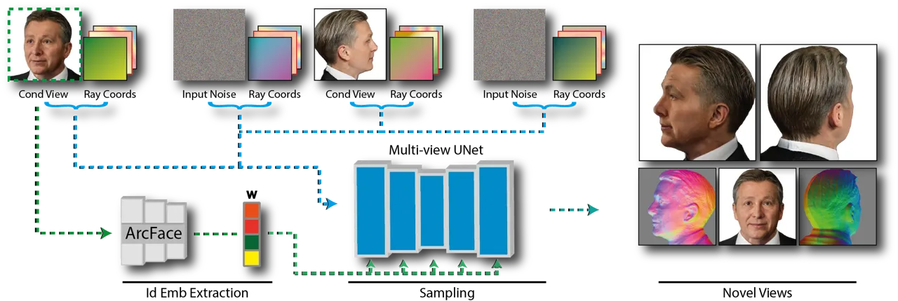

Figure 2: Overview of SpinMeRound: Starting with a number of input
conditioning views, the identity embedding $`\mathbf{W}`$ is extracted
via a Face Recognition network (ArcFace \[14\]). Both the conditioning
and target views are then encoded and combined with corresponding ray
coordinate maps that represent camera poses. After the sampling step,
our method synthesizes photorealistic images from novel angles, along
with their associated shape normals $`\mathcal{N}`$.

### 2.2 Diffusion Models

##### Face Generation

Diffusion models (DMs) \[29\] have proven their generative abilities by
beating the well-established GANs in image synthesis tasks \[17\]. The
availability of large-scale datasets has revolutionized text-to-image
generation \[58\] and video generation \[6, 5\] tasks. For face
synthesis, a range of methods have emerged to tackle essential tasks,
including 3D avatar creation \[67, 71\], avatar reenactment \[34, 15,
16\] and texture map generation \[48, 20\]. We adopt the concatenation
strategy outlined in \[48, 20\] to generate novel viewpoint images and
their corresponding shape normals simultaneously. Based on Stable
Diffusion \[58\], Arc2Face \[14\] and InstantID \[66\] generate facial
images given an input subject. Notably, Arc2Face exhibits strong
generalization abilities in facial image generation, leveraging an
up-sampled subset of WebFace42M \[76\]. Also, it introduces a robust
identity conditioning mechanism, which is integrated into our method.

##### Novel View Image Synthesis

DreamFusion \[51\] introduces the use of Score Distillation Sampling
(SDS), incorporating a pre-trained text-to-image diffusion model \[58\]
alongside a NeRF model, to synthesize 3D objects from text prompts. In
this way, its authors proved that they can efficiently generate 3D
objects despite the lack of large-scale datasets; by exploiting the
generalization abilities of an image generation network. Although
subsequent studies focus on better distillation strategies \[74, 55,
53\], the aforementioned approaches are time-consuming and require
complex balancing and additional constraints \[21\]. Closer to our work,
ID-to-3D \[3\] and Arc2Avatar \[23\] use score distillation to generate
3D facial geometry, lacking though photorealistic results.
Zero123 \[40\] introduces a multi-view diffusion model conditioned on a
reference image and a camera pose. Following it, methods such as
One-2-3-45 \[39\], SyncDreamer \[41\], Consistent1-to-3 \[68\] and
Cascade-Zero123 \[11\] further focus on multi-view consistency by
introducing priors during the denoising process. Studies such as
Zero123++ \[61\], Era3D \[37\] and Morphable Diffusion \[10\] generate
fixed viewpoints given the input image, without being able to handle
arbitrary views. In Cat3D \[21\], a general multi-view diffusion model
is introduced, using a powerful camera pose conditioning mechanism while
using 3D attention layers. Although it has been a robust method for
novel view synthesis, it does not focus on facial novel view synthesis,
lacks shape normal generation capabilities and is a closed source
framework. DiffPortrait3D \[26\] showcases novel view capabilities,
given an input facial image. Unlike our method, which employs image-free
camera conditioning, DiffPortrait3D employs an image-driven approach for
the desired output viewpoints and can generate only near-front views.
More recent works \[63, 52\] have explored diffusion-based frameworks
for generating controllable and animatable avatars. Concurrently to our
approach, Pippo \[30\] and DiffPortrait360 \[27\] demonstrated
$`360^{\circ}`$ avatar generation, without, though, being able to sample
novel identities.

##### Novel View Video Synthesis

Recently, video generation models \[25, 6, 5\] have proven their ability
to generate photorealistic models. Methods such as IM-3D \[43\],
V3D \[12\] and SV3D \[65\] integrate an off-the-shelf video diffusion
model for generating novel viewpoints of a reference object. Still, the
video generation step makes these methodologies computationally
demanding \[21\]. Additionally, they are often restricted by the
requirement for specific camera trajectories, typically revolving around
a central subject. In contrast, our approach focuses on implementing
multi-view diffusion networks that handle unordered camera poses.

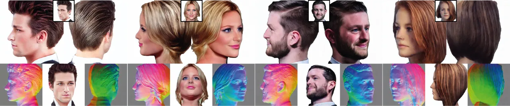

Figure 3: Samples generated by SpinMeRound on “in-the-wild” images:
Given only the input images (shown in a small box at the top center),
our method produces high-fidelity images from novel angles, along with
corresponding shape normals $`\mathcal{N}`$.

## 3 Method

SpinMeRound incorporates a multi-view diffusion model, trained on a 3D
facial dataset, capable of generating a full head portrait of an input
subject, given their identity embedding and a number of views (Fig. 2).
In the following sections, we first describe the proposed diffusion
model, its training scheme, and the proposed sampling strategy given a
single input view.

### 3.1 Multi-View Diffusion Model

SpinMeRound employs a latent multi-view diffusion model alongside a
powerful identity conditioning mechanism \[49\], enabling the generation
of novel views of an input scene containing a person. Our approach
leverages as conditioning inputs $`M\in\{1,3\}`$ pairs of sparse views
of a subject, their respective shape normals and their associated camera
poses. Let $`\mathbf{I}_{i}`$ denote a picked conditioned view and
$`\bar{\mathbf{I}}_{i}`$ a cropped and aligned version of
$`\mathbf{I}_{i}`$. We utilize a pre-trained face recognition network
(ArcFace \[14\]) $`\phi`$ to extract the identity embedding vector
$`\mathbf{w}=\phi(\bar{\mathbf{I}}_{i})\in\mathbb{R}^{512}`$ capable of
incorporating crucial identity features. Then, we inject the identity
information into the diffusion model as proposed in Arc2Face \[14\]. In
particular, a text prompt of “_a photo of $`<`$id$`>`$ person_, is fed
to a CLIP text encoder \[54\] followed by the tokenization step.
Followed by padding, the identity embedding vector $`\mathbf{w}`$
replaces the corresponding $`<`$id$`>`$ token resulting in
$`\mathbf{s}=\{e_{1},e_{2},e_{3},\hat{\mathbf{w}},e_{5}\}`$, where
$`\hat{\mathbf{w}}\in\mathbb{R}^{768}`$ is the padded version of
$`\mathbf{w}`$. The vector $`\mathbf{s}`$ is fed to the encoder
$`\mathcal{C}`$, and finally we retrieve the corresponding conditioning
vector
$`\mathbf{c}=\mathcal{C}(\mathbf{s})\in\mathbb{R}^{N\times 768}`$, where
$`N`$ is the maximum sequence length.

The proposed latent multi-view UNet \[59\] is similar to the one
introduced in Cat3D \[21\]. Our diffusion model is designed to
concurrently generate $`P=(M+K)=8`$ pairs of facial images and their
corresponding normals $`\mathcal{N}`$, given an input conditioning
vector $`\mathbf{w}`$, a number of $`M`$ views and the $`P`$ camera
poses. Let $`I_{i}^{cond}`$ represent the input human face images,
$`I_{j}^{tgt}`$ the target face images from novel viewpoints, and
$`\mathcal{N}_{i}^{cond}`$, $`\mathcal{N}_{j}^{tgt}`$ their respective
shape normals, where $`i\in\{1,2,...,M\}`$, $`j\in\{1,2,...,N\}`$ with
$`M`$ being the maximum number of the input conditional views and $`N`$
the number of target viewpoints. Following \[48, 21, 20\], we employ a
pre-trained AutoEncoder of Stable Diffusion 1.5 (SD 1.5) \[58\],
consisting of an encoder $`\mathcal{E}`$ and a decoder $`\mathcal{D}`$.
For each input conditioning image, we first obtain the corresponding
latent feature maps:
$`\mathbf{z}_{I_{i}^{cond}}=\mathcal{E}(I_{i}^{cond})\in\mathbb{R}^{4\times 64\times 64}`$
and
$`\mathbf{z}_{\mathcal{N}_{i}^{cond}}=\mathcal{E}(\mathcal{N}_{i}^{cond})\in\mathbb{R}^{4\times 64\times 64}`$.
These are then concatenated channel-wise. Similarly, we apply the same
procedure to extract the latent vectors for the target viewpoints. The
corresponding camera pose information is incorporated for both
conditioning and target viewpoints using the mechanism proposed in
Cat3D \[21\]. For each of the $`P`$ views, the latent feature maps
$`\mathbf{z}_{i}`$ are concatenated channel-wise with the respective ray
representation maps \[21, 60\]
$`\mathbf{r}_{i}^{cond},\mathbf{r}_{j}^{tgt}\in\mathbb{R}^{149\times 64\times 64}`$,
which encode the ray origin and direction. A binary mask
$`\mathbf{m}\in\{\mathbf{0},\mathbf{1}\}^{1\times 64\times 64}`$ is then
appended to differentiate between conditional and target latent vectors.
Finally, we retrieve the conditioning and target latent feature maps
$`\bar{\mathbf{z}}_{i}^{cond}=\{\mathbf{z}_{I_{i}^{cond}},\mathbf{z}_{\mathcal{N}_{i}^{cond}}\mathbf{r}_{j}^{cond}\mathbf{m}_{j}^{cond}\}`$
and
$`\bar{\mathbf{z}}_{i}^{tgt}=\{\mathbf{z}_{I_{i}^{tgt}},\mathbf{z}_{\mathcal{N}_{i}^{tgt}}\mathbf{r}_{j}^{tgt},\mathbf{m}_{j}^{tgt}\}`$.

As proposed in video diffusion models \[5\], we initialize our method
using a pre-trained LDM model (Arc2Face \[49\]) trained on large-scale
datasets while adding additional attention layers, connecting the
multiple latent feature maps. As in  \[21\], we integrate 3D attention
layers \[62\] by adding them between the original 2D self-attention
layers of the LDM, and we fine-tune all layers of the multi-view UNet
for improved multi-view consistency.

### 3.2 Training Details

We begin from the publicly available *Arc2Face* \[49\], and we adhere to
the training schemes introduced in \[5, 21\]. Specifically, we adapt the
EDM framework \[31\] to Arc2Face, training it for 31,000 iterations on
its dedicated dataset. To accommodate the input latent feature maps, we
expand the input and output convolutional layers channels, initializing
these by copying the existing weights to the shape-normal channels while
randomly initializing the camera-pose dimensions. As in  \[21\], we
shift the log-to-signal ratio by log(N), where N is the number of the
target images (N=7). We randomly select a conditioning view that
includes part of the frontal face during each training iteration, as
required for the identity embedding extraction. We then randomly pick
the N target images and calculate the relative camera angles. To enhance
the dataset, we replace the white background with a random color, in
50$`\%`$ of the samples. All the training viewpoints are encoded using
the encoder $`\mathcal{E}`$, with noise added only to the target latent
vectors, while conditioning vectors remain unchanged. Following the
classifier-free guidance (CFG) training scheme \[28\], with a
probability of $`\mathcal{P}_{uncond}=0.15`$, we randomly replace the
identity vector with the empty string, and the conditioning images with
zero-ed ones. We first train the model conditioned on a single view for
600k iterations. Then, for the additional 1M iterations, we vary the
conditioning views by randomly choosing 0, 1 or 3 conditioning views,
corresponding to 8, 7 and 5 target views, each with a probability of
$`\mathcal{P}_{=}1/3`$.

### 3.3 Novel view sampling

SpinMeRound synthesizes novel views for an input subject $`\mathbf{I}`$,
given a number of views. In this section, we introduce a robust sampling
strategy designed to produce a large number of consistent views that
comprehensively cover a full head, given only a single input image.
Achieving consistency across viewpoints requires a carefully structured
camera pose selection order. Therefore, we employ a three-step sampling
process: a) aligning input views and extracting the corresponding shape
normals, b) generating anchor images that provide complete coverage of
the $`360^{\circ}`$ human head and c) synthesizing intermediate views by
leveraging both the input views and the closest anchor images.

##### Alignment and Shape Normals generation

Given the input image $`\mathbf{I}`$, we extract its identity embedding
$`\mathbf{w}`$ as described in Sec. 3.1. Then, we obtain
$`\hat{\mathbf{I}}`$, a cropped and aligned version of $`\mathbf{I}`$,
using the alignment procedure presented in Panohead \[1\]. To generate
the shape normals $`\mathcal{N}`$, we treat this as an in-painting task,
thus retrieving the normals through the conditional guidance sampling
approach described in Relightify \[48\]. Specifically, using the aligned
image $`\hat{\mathbf{I}}`$ and its identity embedding vector
$`\mathbf{w}`$, we employ a binary visibility mask $`m`$, marking only
the image channels as visible and setting the shape normal channels as
non-visible. By applying the “channel-wise in-painting” algorithm, the
corresponding shape normals are retrieved. This process uses the EDM
sampler presented in  \[31\] alongside the DDPM \[29\] discretization
steps and runs for 50 steps. A more detailed presentation of this
approach is presented in the supplemental material.

##### Generating anchor and intermediate views

SpinMeRound can generate any arbitrary viewpoint, given the input
aligned facial image $`\hat{\mathbf{I}}`$ and the corresponding shape
normals $`\mathcal{N}`$. However, since it was trained to generate only
a limited number of views per sampling process, a carefully designed
sampling strategy is essential to produce a wide range of output views.
Since the target subject is centered in the scene, we first generate
$`M=7`$ anchor images $`\mathbf{A}_{i}`$ and corresponding anchor shape
normals $`\mathbf{A}_{\mathcal{N}_{i}},~i\in\{1,...,M\}`$, covering a
$`360^{\circ}`$ angle range of the subject
($`\pm 45^{\circ},\pm 90^{\circ},\pm 135^{\circ},180^{\circ}`$), as
proposed in  \[21\]. Using these anchors, any number of intermediate
views can then be synthesized by conditioning on image triplets
$`\{(\mathbf{I},\mathcal{N}),(\mathbf{A}_{k},\mathbf{A}_{\mathcal{N}_{k}}),(\mathbf{A}_{l},\mathbf{A}_{\mathcal{N}_{l}})\}`$,
where $`k,l`$ where represent the closest anchor images. This approach
ensures that each intermediate view remains consistent with both the
input aligned image $`\hat{\mathbf{I}}`$, and the closest already
generated views. For both sampling processes, we use the EDM sampler
facilitated by the EDM discretization steps \[31\], while it runs for 50
steps with a guidance scale set to 3. This method enables the generation
of 48, 88, or more novel views for a single input subject
$`\mathbf{I}`$, depending on the chosen angle step, thus covering the
entire scene.

(a) Input (b) SpinMeRound (Ours) (c) SV3D \[65\] (d) Zero123-XL \[13\]
(d) DiffPortrait3d \[26\]

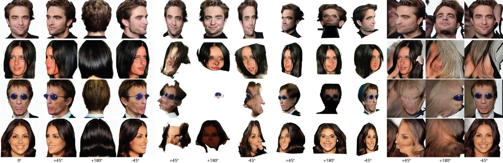

Figure 4: Qualitative comparison between SpinMeRound, Zero123-XL \[13\],
SV3D \[65\] and DiffPortrait3D \[26\] at angles
{$`\pm 45^{\circ},+180^{\circ}`$}. It is clear that SpinMeRound
effectively generates high-quality novel views from “in-the-wild” input
images, whilst SV3D produces distorted outputs, Zero123-XL generates
unnaturally squared avatars and DiffPortrait3D cannot handle such
angles.

## 4 Experiments

### 4.1 Training Dataset

Training such a model requires a large multi-view dataset containing a
great number of subjects $`\mathcal{S}`$. For each person
$`\mathcal{S}_{i}`$, it is necessary to acquire a set of images
$`\mathbf{I}_{k}^{i}`$, their corresponding shape normal maps
$`\mathcal{N}_{k}^{i}`$, camera poses $`\mathcal{C}_{k}^{i}`$ alongside
with their corresponding identity embedding vector $`\mathbf{w}^{i}`$,
where $`k\in\{1,2,...,N_{i}\}`$ and $`N_{i}`$ is the number of the
available views for the $`i`$-th scene. Due to the lack of such a
dataset, we create a large-scale synthetic dataset using the publicly
available Panohead \[1\]. We first sample $`\sim`$10k subjects and
manually remove instances with artifacts in the back of the head,
resulting in $`\sim`$7k distinct identities. We render images from 125
different viewpoints for each person to cover the entire head.
Simultaneously, we obtain each subject’s facial shape by extracting
their opacity values from the triplane feature maps and then applying
the marching cubes \[42\] algorithm. We render their respective normal
maps using the acquired facial shape using Pytorch3d \[56\]. All the
images depicting a frontal head are fed to the Arc-Face \[14\] network
to extract their corresponding identity vectors $`\mathbf{w}`$. All in
all, we end up with a synthetic dataset containing about 7k individuals,
rendered from $`N=125`$ different angles, the respective shape normals,
camera poses, and their identity embedding vector $`\mathbf{w}`$.

### 4.2 Qualitative Comparisons

#### 4.2.1 Novel View Synthesis comparisons

In this section, we present a qualitative comparison between our model
and other state-of-the-art multi-view diffusion models, SV3D \[65\]
Zero123-XL \[13\] and DiffPortrait3D \[26\], focusing on their output
under $`\pm 45^{\circ},+180^{\circ}`$ angles. SV3D, a latent video
diffusion model, creates $`360^{\circ}`$ videos from a single input
image. Zero123-XL, a multi-view diffusion model, synthesizes novel
perspectives based on the input image and specified camera poses.
DiffPortrait3D \[26\] generates novel views by conditioning the desired
camera on an input image and refining the initial noise through a
fine-tuning step to achieve optimal results. Figure 4 demonstrates
scenarios where the input “in-the-wild” images (Fig. 4a ) are fed to
these 4 different networks and their respective generations under
$`\pm 45^{\circ},+180^{\circ}`$ viewpoints. As illustrated, SpinMeRound
efficiently generates accurate novel viewpoints of the input subject,
while SV3D distorts the input image in its generated views, Zero123-XL
produces unnatural, square-like facial avatars and DiffPortrait3D cannot
handle those angles at all.

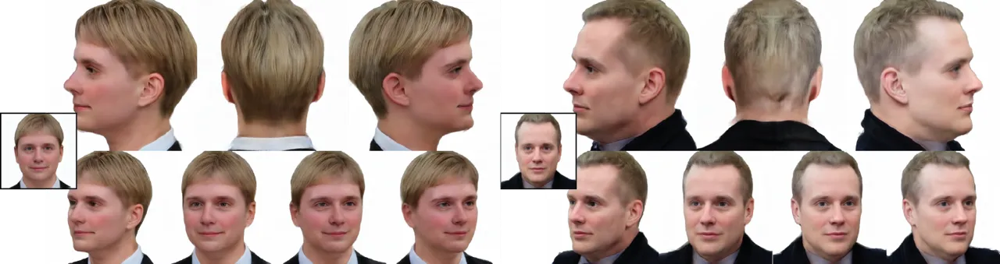

Figure 5: Given the input identities (shown in the small boxes), we
present the results of novel view synthesis after applying 3D Gaussian
splatting \[32\] to the views generated by our model.

### 4.3 3D Reconstruction

To evaluate our model’s consistency in generating novel views from an
input image, we assess its ability to reconstruct an input identity
through Gaussian Splatting (3DGS) \[32\]. More specifically, given an
input identity, we apply the sampling strategy outlined in Section 3.3
to generate 48 novel views. These views are then used to reconstruct the
identity through Gaussian Splatting. As in  \[21\], we modify the
provided 3DGS code to incorporate the LPIPS \[72\] loss between the
ground-truth and the generated viewpoints. In this way, we can deal with
small inconsistencies between nearby viewpoints. We present the novel
view synthesis of two input identities (small squares) in Figure 5,
which clearly illustrates that our proposed methodology can generate
consistent subjects.

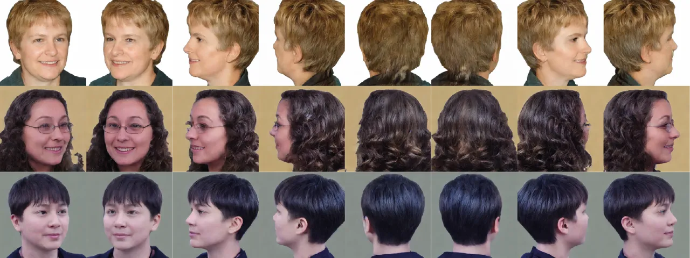

Figure 6: Samples generated using unconditional sampling. SpinMeRound
can generate novel identities without any prior input.

### 4.4 Unconditional Sampling

SpinMeRound is trained following the Classifier-Free Guidance training
scheme. Thus, our architecture can generate novel multi-view identities
without any prior conditioning. By setting the input identity embedding
equal to the empty string, our model can generate a novel identity along
with different viewpoints of that identity. Figure 6 presents some
examples of those identities.

### 4.5 Quantitative Comparisons

We compare our method’s ability to generate novel views with the current
state-of-the-art models: a) Eg3D \[9\] and Panohead \[1\] which are
NeRF-based approaches generating frontal and full-head portraits
respectively, b) Zero123 \[11\], Zero123-XL \[13\] and
DiffPortrai3D \[26\], which are multi-view diffusion models and c)
SV3D \[65\], a multi-view video diffusion model. For SV3D, we selected
the SV3D-p variant, as it supports flexible viewing angles, whereas
SV3D-u operates only with fixed viewpoints. We validate our approach
using the NeRSemble dataset \[33\], which includes 222 unique identities
recorded from 16 angles. We randomly select a timestamp from one of
their video sequences for each individual and extract a random subset of
views. All selected frames are then centered, and one of these views is
used as input for the tested methods. We evaluate their reconstruction
performance using L2 distance, LPIPS \[72\], SSIM, and an Identity
Similarity score. To calculate the Identity Similarity score, we feed
both the ground-truth and the reconstructed images into the
ArcFace \[14\] and VGGFace \[50\] networks and measure the cosine
similarity between their final feature vectors.

Table 1 summarizes the reconstruction performance of each network.
SpinMeRound, achieves state-of-the-art results across all cases when
evaluated on the LPIPS, SSIM, and Identity Similarity metrics.
Additionally, it outperforms all diffusion-based approaches in terms of
L2 distance. Although our method trails slightly behind NeRF-based
approaches, this is expected given the inherent advantages of NeRF-based
models in novel view synthesis tasks. Notably, methods like Eg3D and
Panohead require a time-intensive fitting process, which can
occasionally fail. In contrast, our proposed approach relies solely on
an efficient sampling process, eliminating the need for fitting.

|                 |                       |                           |                     |                  |                            |                            |
| --------------- | --------------------- | ------------------------- | ------------------- | ---------------- | -------------------------- | -------------------------- |
| Method          |                       | $`\textbf{L2}\downarrow`$ | LPIPS$`\downarrow`$ | SSIM$`\uparrow`$ | ID Sim \[14\] $`\uparrow`$ | ID Sim \[50\] $`\uparrow`$ |
| NeRF based      | Eg3d \[9\]            | 0.025                     | 0.4                 | 0.55             | 0.31                       | 0.89                       |
|                 | Panohead \[1\]        | 0.012                     | 0.32                | 0.65             | 0.27                       | 0.88                       |
| Diffusion based | Zero123 \[40\]        | 0.195                     | 0.515               | 0.55             | 0.169                      | 0.44                       |
|                 | Zero123-XL \[13\]     | 0.198                     | 0.51                | 0.563            | 0.118                      | 0.442                      |
|                 | SV3D \[65\]           | 0.087                     | 0.41                | 0.660            | 0.36                       | 0.881                      |
|                 | DiffPortrait3d \[26\] | 0.1                       | 0.5                 | 0.35             | 0.55                       | 0.887                      |
|                 | SpinMeRound (Ours)    | 0.033                     | 0.3                 | 0.73             | 0.61                       | 0.911                      |

Table 1: Reconstruction performance on the NeRSemble \[33\] dataset
shows that SpinMeRound achieves state-of-the-art results in LPIPS, SSIM
and ID Sim metrics while performing on par with the leading models in
terms of L2 distance.

## 5 Ablation Studies

### 5.1 Component analysis

In this section, we conduct ablation studies for the importance of the
identity mechanism, the shape normals and the input ground truth image.
For this reason, we trained the following three models while using the
same training data: a) our proposed architecture, without integrating
the input conditioning view, b) a Stable Diffusion-based model without
integrating the robust identity mechanism, and c) our model without
generating any shape normals.

##### Use of input image:

Starting from a pre-trained Arc2Face model using the EDM framework, we
trained a multi-view model to generate novel viewpoints given only an
input identity embedding vector. Notably, SpinMeRound has also been
trained to be able to generate input identities without providing the
conditioning view. In this case, it generates subjects close to the
input face, as illustrated in Figure 8.

|                                      |                   |                      |                   |
| ------------------------------------ | ----------------- | -------------------- | ----------------- |
|                                      | L2 $`\downarrow`$ | LPIPS $`\downarrow`$ | SSIM $`\uparrow`$ |
| SpinMeRound (w/o Input Image)        | 0.1246            | 0.4299               | 0.568             |
| SpinMeRound (w/o identity embedding) | 0.028             | 0.26                 | 0.70              |
| SpinMeRound (w/o Normals)            | 0.056             | 0.32                 | 0.65              |
| SpinMeRound                          | 0.018             | 0.22                 | 0.75              |

Table 2: Ablation study: We evaluate the performance of SpinMeRound
alongside three variations, demonstrating that the proposed architecture
achieves the highest performance across all reconstruction metrics.

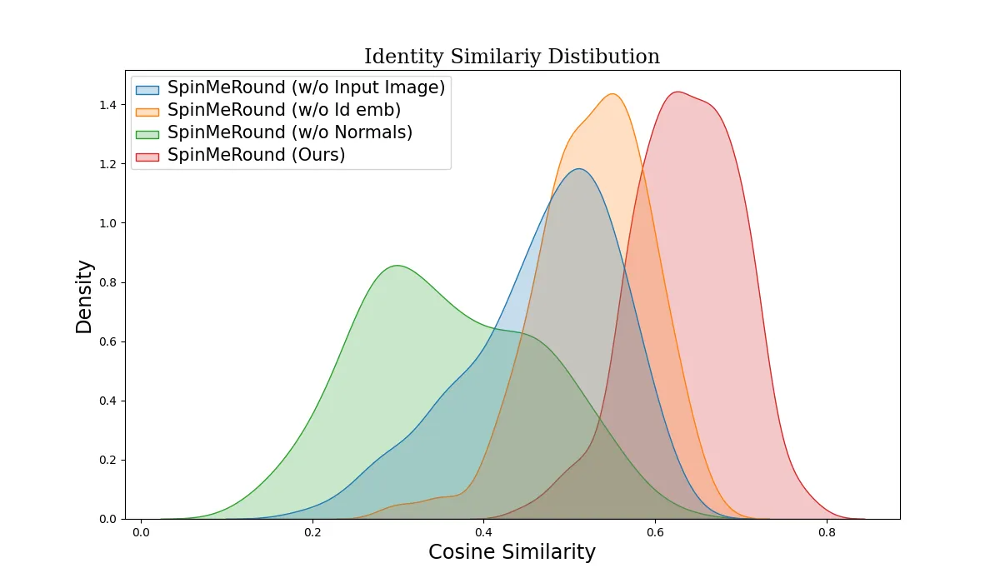

Figure 7: Ablation Study: We compare the identity similarity between
four models: SpinMeRound (Ours), a similar model without the input
image, ones without the identity embedding mechanism, and one without
generating shape normals $`\mathcal{N}`$. Results show that our proposed
architecture achieves the highest identity similarity.

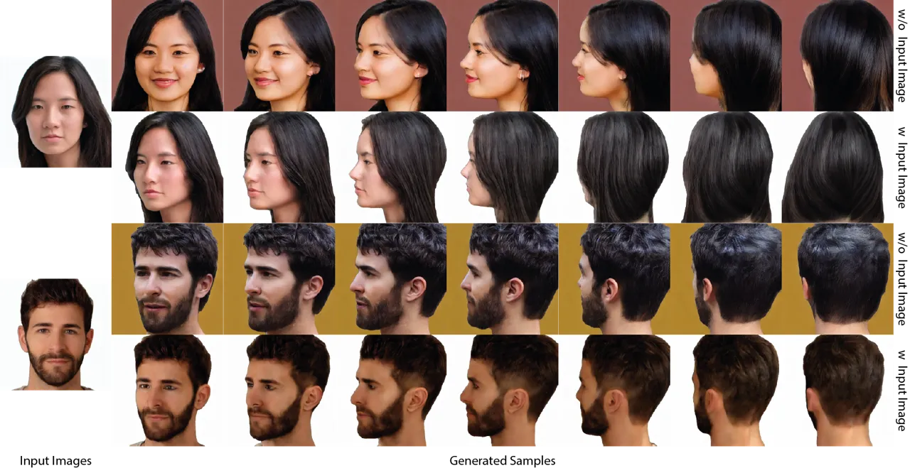

Figure 8: From the input images on the left, we present samples
generated by our method using only the corresponding identity embedding
vectors (top row) and using also the input image (bottom row). The
resulting subjects closely resemble the input identities.

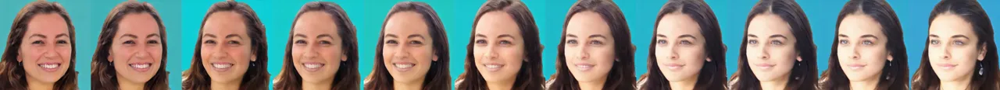


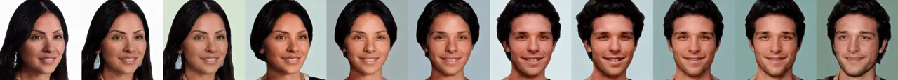


Figure 9: Identity interpolation between subject pairs, showcasing our
method generates smooth transitions between identities.

##### Identity embedding mechanism:

In this case, we start from a pre-trained Stable diffusion 1.5
architecture trained using the EDM framework. This model gets trained
following the same training parameters, as presented in Sec 3.2. Instead
of using the proposed identity conditioning mechanism, we feed an empty
string in the conditioning attention layers of the denoising UNet.

##### Use of Normals:

We also train a variant of the network similar to SpinMeRound, but
without generating shape normals. This version can only generate novel
views without having any additional information about the facial shape.

Aiming to showcase the importance of each component, we conducted a
multi-view reconstruction experiment. More specifically, we sample 100
distinct identities using Panohead \[1\]. For each subject, we sample 10
different views along with an input frontal view. Given the frontal view
as input to each separate model, we reconstruct the remaining views. We
measure the performance of each model by calculating their discrepancy
using L2 distance, LPIPS \[72\], SSIM and ID Similarity. As presented in
Table 2 and Figure 7, our proposed methodology performs better regarding
all reconstruction metrics while achieving the highest identity
similarity score.

### 5.2 Importance of ID features

Choosing to condition the stable diffusion model in identity embeddings
is an important design choice for our network. Those forms of
representation contain compact information extracted from a FR model
(ArcFace \[14\]), trained in millions of different images and subjects.
Those features allow linear interpolation between the facial
characteristics of different subjects. Hence, while using only the
identity embedding layer, we interpolate between 2 distinct identities
and present their linear interpolation results in Figure 9. It is
clearly shown that our model generates smooth transitions between the
generated identities.

## 6 Conclusion

In this paper, we presented SpinMeRound, a multi-view latent diffusion
model, which generates all-around head portraits of an input subject
given a number of input views alongside an input identity embedding.
Additionally, we introduced a sampling strategy for generating
consistent intermediate views, given an unconstrained input
“in-the-wild” facial image. Being trained sorely on multi-view synthetic
data, we showcase our method’s abilities by beating the current
state-of-the-art multi-view diffusion models in novel view synthesis
experiments.

Acknowledgments: S. Zafeiriou and part of the research was funded by the
EPSRC Fellowship DEFORM (EP/S010203/1) and EPSRC Project GNOMON
(EP/X011364/1). The authors gratefully acknowledge the scientific
support and HPC resources provided by the Erlangen National High
Performance Computing Center (NHR@FAU) of FAU under the NHR projects
b143dc and b180dc. NHR funding is provided by federal and Bavarian state
authorities. NHR@FAU hardware is partially funded by the German Research
Foundation (DFG) – 440719683. Additional support was also received by
the ERC - project MIA-NORMAL 101083647, DFG 513220538, 512819079, and by
the state of Bavaria (HTA).

## References

- \[1\] Sizhe An, Hongyi Xu, Yichun Shi, Guoxian Song, Umit Ogras, and
  Linjie Luo. Panohead: Geometry-aware 3d full-head synthesis in
  360^(∘), 2023.
- \[2\] ShahRukh Athar, Zexiang Xu, Kalyan Sunkavalli, Eli Shechtman,
  and Zhixin Shu. Rignerf: Fully controllable neural 3d portraits. In
  _Computer Vision and Pattern Recognition (CVPR)_, 2022.
- \[3\] Francesca Babiloni, Alexandros Lattas, Jiankang Deng, and
  Stefanos Zafeiriou. Id-to-3d: Expressive id-guided 3d heads via score
  distillation sampling. In _Advances in Neural Information Processing
  Systems_, pages 97167–97183. Curran Associates, Inc., 2024.
- \[4\] Volker Blanz and Thomas Vetter. A morphable model for the
  synthesis of 3d faces. In _SIGGRAPH ’99_, 1999.
- \[5\] Andreas Blattmann, Tim Dockhorn, Sumith Kulal, Daniel
  Mendelevitch, Maciej Kilian, Dominik Lorenz, Yam Levi, Zion English,
  Vikram Voleti, Adam Letts, Varun Jampani, and Robin Rombach. Stable
  video diffusion: Scaling latent video diffusion models to large
  datasets, 2023a.
- \[6\] Andreas Blattmann, Robin Rombach, Huan Ling, Tim Dockhorn,
  Seung Wook Kim, Sanja Fidler, and Karsten Kreis. Align your latents:
  High-resolution video synthesis with latent diffusion models. In _IEEE
  Conference on Computer Vision and Pattern Recognition (CVPR)_, 2023b.
- \[7\] James Booth, Anastasios Roussos, Stefanos Zafeiriou, Allan
  Ponniahy, and David Dunaway. A 3D morphable model learnt from 10,000
  faces. In _Proceedings of the IEEE Computer Society Conference on
  Computer Vision and Pattern Recognition_, pages 5543–5552, 2016.
- \[8\] James Booth, Anastasios Roussos, Allan Ponniah, David Dunaway,
  and Stefanos Zafeiriou. Large scale 3d morphable models.
  _International Journal of Computer Vision_, 126(2):233–254, 2018.
- \[9\] Eric R. Chan, Connor Z. Lin, Matthew A. Chan, Koki Nagano,
  Boxiao Pan, Shalini De Mello, Orazio Gallo, Leonidas J. Guibas,
  Jonathan Tremblay, Sameh Khamis, Tero Karras, and Gordon Wetzstein.
  Efficient geometry-aware 3d generative adversarial networks. In
  _Proceedings of the IEEE/CVF Conference on Computer Vision and Pattern
  Recognition (CVPR)_, pages 16123–16133, 2022.
- \[10\] Xiyi Chen, Marko Mihajlovic, Shaofei Wang, Sergey Prokudin, and
  Siyu Tang. Morphable diffusion: 3d-consistent diffusion for
  single-image avatar creation. 2024a.
- \[11\] Yabo Chen, Jiemin Fang, Yuyang Huang, Taoran Yi, Xiaopeng
  Zhang, Lingxi Xie, Xinggang Wang, Wenrui Dai, Hongkai Xiong, and Qi
  Tian. Cascade-zero123: One image to highly consistent 3d with
  self-prompted nearby views. _arXiv preprint arXiv:2312.04424_, 2023.
- \[12\] Zilong Chen, Yikai Wang, Feng Wang, Zhengyi Wang, and Huaping
  Liu. V3d: Video diffusion models are effective 3d generators. _arXiv
  preprint arXiv:2403.06738_, 2024b.
- \[13\] Matt Deitke, Ruoshi Liu, Matthew Wallingford, Huong Ngo, Oscar
  Michel, Aditya Kusupati, Alan Fan, Christian Laforte, Vikram Voleti,
  Samir Yitzhak Gadre, Eli VanderBilt, Aniruddha Kembhavi, Carl
  Vondrick, Georgia Gkioxari, Kiana Ehsani, Ludwig Schmidt, and Ali
  Farhadi. Objaverse-xl: A universe of 10m+ 3d objects. _arXiv preprint
  arXiv:2307.05663_, 2023.
- \[14\] Jiankang Deng, Jia Guo, Niannan Xue, and Stefanos Zafeiriou.
  Arcface: Additive angular margin loss for deep face recognition. In
  _Proceedings of the IEEE/CVF conference on computer vision and pattern
  recognition_, pages 4690–4699, 2019.
- \[15\] Yu Deng, Duomin Wang, Xiaohang Ren, Xingyu Chen, and Baoyuan
  Wang. Portrait4d: Learning one-shot 4d head avatar synthesis using
  synthetic data. In _IEEE/CVF Conference on Computer Vision and Pattern
  Recognition_, 2024a.
- \[16\] Yu Deng, Duomin Wang, and Baoyuan Wang. Portrait4d-v2: Pseudo
  multi-view data creates better 4d head synthesizer. _arXiv preprint
  arXiv:2403.13570_, 2024b.
- \[17\] Prafulla Dhariwal and Alexander Nichol. Diffusion models beat
  gans on image synthesis. In _Advances in Neural Information Processing
  Systems_, pages 8780–8794. Curran Associates, Inc., 2021.
- \[18\] Yao Feng, Haiwen Feng, Michael J. Black, and Timo Bolkart.
  Learning an animatable detailed 3D face model from in-the-wild images. 2021.
- \[19\] Stathis Galanakis, Baris Gecer, Alexandros Lattas, and Stefanos
  Zafeiriou. 3dmm-rf: Convolutional radiance fields for 3d face
  modeling. In _Proceedings of the IEEE/CVF Winter Conference on
  Applications of Computer Vision (WACV)_, pages 3536–3547, 2023.
- \[20\] Stathis Galanakis, Alexandros Lattas, Stylianos Moschoglou, and
  Stefanos Zafeiriou. Fitdiff: Robust monocular 3d facial shape and
  reflectance estimation using diffusion models, 2024.
- \[21\] Ruiqi Gao\*, Aleksander Holynski\*, Philipp Henzler, Arthur
  Brussee, Ricardo Martin-Brualla, Pratul P. Srinivasan, Jonathan T.
  Barron, and Ben Poole\*. Cat3d: Create anything in 3d with multi-view
  diffusion models. _arXiv_, 2024.
- \[22\] Baris Gecer, Stylianos Ploumpis, Irene Kotsia, and Stefanos
  Zafeiriou. Ganfit: Generative adversarial network fitting for high
  fidelity 3d face reconstruction. In _Proceedings of the IEEE/CVF
  Conference on Computer Vision and Pattern Recognition (CVPR)_, 2019.
- \[23\] Dimitrios Gerogiannis, Foivos Paraperas Papantoniou,
  Rolandos Alexandros Potamias, Alexandros Lattas, and Stefanos
  Zafeiriou. Arc2avatar: Generating expressive 3d avatars from a single
  image via id guidance. _arXiv preprint arXiv:2501.05379_, 2025.
- \[24\] Simon Giebenhain, Tobias Kirschstein, Markos Georgopoulos,
  Martin Rünz, Lourdes Agapito, and Matthias Nießner. Learning neural
  parametric head models. In _Proc. IEEE Conf. on Computer Vision and
  Pattern Recognition (CVPR)_, 2023.
- \[25\] Rohit Girdhar, Mannat Singh, Andrew Brown, Quentin Duval,
  Samaneh Azadi, Sai Saketh Rambhatla, Akbar Shah, Xi Yin, Devi Parikh,
  and Ishan Misra. Emu video: Factorizing text-to-video generation by
  explicit image conditioning, 2024.
- \[26\] Yuming Gu, Hongyi Xu, You Xie, Guoxian Song, Yichun Shi, Di
  Chang, Jing Yang, and Linjie Luo. Diffportrait3d: Controllable
  diffusion for zero-shot portrait view synthesis. In _Proceedings of
  the IEEE/CVF Conference on Computer Vision and Pattern Recognition
  (CVPR)_, pages 10456–10465, 2024.
- \[27\] Yuming Gu, Phong Tran, Yujian Zheng, Hongyi Xu, Heyuan Li,
  Adilbek Karmanov, and Hao Li. Diffportrait360: Consistent portrait
  diffusion for 360 view synthesis, 2025.
- \[28\] Jonathan Ho and Tim Salimans. Classifier-free diffusion
  guidance. _arXiv preprint arXiv:2207.12598_, 2022.
- \[29\] Jonathan Ho, Ajay Jain, and Pieter Abbeel. Denoising diffusion
  probabilistic models. _arXiv preprint arxiv:2006.11239_, 2020.
- \[30\] Yash Kant, Ethan Weber, Jin Kyu Kim, Rawal Khirodkar, Su
  Zhaoen, Julieta Martinez, Igor Gilitschenski, Shunsuke Saito, and
  Timur Bagautdinov. Pippo: High-resolution multi-view humans from a
  single image. 2025.
- \[31\] Tero Karras, Miika Aittala, Timo Aila, and Samuli Laine.
  Elucidating the design space of diffusion-based generative models. In
  _Proc. NeurIPS_, 2022.
- \[32\] Bernhard Kerbl, Georgios Kopanas, Thomas Leimkühler, and George
  Drettakis. 3d gaussian splatting for real-time radiance field
  rendering. _ACM Transactions on Graphics_, 42(4), 2023.
- \[33\] Tobias Kirschstein, Shenhan Qian, Simon Giebenhain, Tim Walter,
  and Matthias Nießner. Nersemble: Multi-view radiance field
  reconstruction of human heads. _ACM Trans. Graph._, 42(4), 2023.
- \[34\] Yushi Lan, Feitong Tan, Di Qiu, Qiangeng Xu, Kyle Genova, Zeng
  Huang, Sean Fanello, Rohit Pandey, Thomas Funkhouser, Chen Change Loy,
  and Yinda Zhang. Gaussian3diff: 3d gaussian diffusion for 3d full head
  synthesis and editing. In _ECCV_, 2024.
- \[35\] Alexandros Lattas, Stylianos Moschoglou, Stylianos Ploumpis,
  Baris Gecer, Jiankang Deng, and Stefanos Zafeiriou. FitMe: Deep
  photorealistic 3D morphable model avatars. In _Proceedings of the
  IEEE/CVF Conference on Computer Vision and Pattern Recognition
  (CVPR)_, 2023.
- \[36\] Heyuan Li, Ce Chen, Tianhao Shi, Yuda Qiu, Sizhe An, Guanying
  Chen, and Xiaoguang Han. Spherehead: Stable 3d full-head synthesis
  with spherical tri-plane representation, 2024a.
- \[37\] Peng Li, Yuan Liu, Xiaoxiao Long, Feihu Zhang, Cheng Lin,
  Mengfei Li, Xingqun Qi, Shanghang Zhang, Wenhan Luo, Ping Tan, et al.
  Era3d: High-resolution multiview diffusion using efficient row-wise
  attention. _arXiv preprint arXiv:2405.11616_, 2024b.
- \[38\] Tianye Li, Timo Bolkart, Michael. J. Black, Hao Li, and Javier
  Romero. Learning a model of facial shape and expression from 4D scans.
  _ACM Transactions on Graphics, (Proc. SIGGRAPH Asia)_,
  36(6):194:1–194:17, 2017.
- \[39\] Minghua Liu, Chao Xu, Haian Jin, Linghao Chen, Mukund Varma T,
  Zexiang Xu, and Hao Su. One-2-3-45: Any single image to 3d mesh in 45
  seconds without per-shape optimization. _Advances in Neural
  Information Processing Systems_, 36, 2024.
- \[40\] Ruoshi Liu, Rundi Wu, Basile Van Hoorick, Pavel Tokmakov,
  Sergey Zakharov, and Carl Vondrick. Zero-1-to-3: Zero-shot one image
  to 3d object, 2023a.
- \[41\] Yuan Liu, Cheng Lin, Zijiao Zeng, Xiaoxiao Long, Lingjie Liu,
  Taku Komura, and Wenping Wang. Syncdreamer: Generating
  multiview-consistent images from a single-view image. _arXiv preprint
  arXiv:2309.03453_, 2023b.
- \[42\] William E. Lorensen and Harvey E. Cline. Marching cubes: A high
  resolution 3d surface construction algorithm. In _SIGGRAPH_, pages
  163–169. ACM, 1987.
- \[43\] Luke Melas-Kyriazi, Iro Laina, Christian Rupprecht, Natalia
  Neverova, Andrea Vedaldi, Oran Gafni, and Filippos Kokkinos. Im-3d:
  Iterative multiview diffusion and reconstruction for high-quality 3d
  generation, 2024.
- \[44\] Ben Mildenhall, Pratul P Srinivasan, Matthew Tancik, Jonathan T
  Barron, Ravi Ramamoorthi, and Ren Ng. Nerf: Representing scenes as
  neural radiance fields for view synthesis. In _European conference on
  computer vision_, pages 405–421. Springer, 2020.
- \[45\] Roy Or-El, Xuan Luo, Mengyi Shan, Eli Shechtman, Jeong Joon
  Park, and Ira Kemelmacher-Shlizerman. Stylesdf: High-resolution
  3d-consistent image and geometry generation. In _Proceedings of the
  IEEE/CVF Conference on Computer Vision and Pattern Recognition
  (CVPR)_, pages 13503–13513, 2022a.
- \[46\] Roy Or-El, Xuan Luo, Mengyi Shan, Eli Shechtman, Jeong Joon
  Park, and Ira Kemelmacher-Shlizerman. StyleSDF: High-Resolution
  3D-Consistent Image and Geometry Generation. In _Proceedings of the
  IEEE/CVF Conference on Computer Vision and Pattern Recognition
  (CVPR)_, pages 13503–13513, 2022b.
- \[47\] Dongwei Pan, Long Zhuo, Jingtan Piao, Huiwen Luo, Wei Cheng,
  Yuxin Wang, Siming Fan, Shengqi Liu, Lei Yang, Bo Dai, Ziwei Liu,
  Chen Change Loy, Chen Qian, Wayne Wu, Dahua Lin, and Kwan-Yee Lin.
  Renderme-360: Large digital asset library and benchmark towards
  high-fidelity head avatars. In _Thirty-seventh Conference on Neural
  Information Processing Systems Datasets and Benchmarks Track_, 2023.
- \[48\] Foivos Paraperas Papantoniou, Alexandros Lattas, Stylianos
  Moschoglou, and Stefanos Zafeiriou. Relightify: Relightable 3d faces
  from a single image via diffusion models. In _Proceedings of the
  IEEE/CVF International Conference on Computer Vision (ICCV)_, 2023.
- \[49\] Foivos Paraperas Papantoniou, Alexandros Lattas, Stylianos
  Moschoglou, Jiankang Deng, Bernhard Kainz, and Stefanos Zafeiriou.
  Arc2face: A foundation model for id-consistent human faces. In
  _Proceedings of the European Conference on Computer Vision
  (ECCV)_, 2024.
- \[50\] Omkar M. Parkhi, Andrea Vedaldi, and Andrew Zisserman. Deep
  face recognition. In _British Machine Vision Conference_, 2015.
- \[51\] Ben Poole, Ajay Jain, Jonathan T. Barron, and Ben Mildenhall.
  Dreamfusion: Text-to-3d using 2d diffusion. _arXiv_, 2022.
- \[52\] Malte Prinzler, Egor Zakharov, Vanessa Sklyarova, Berna
  Kabadayi, and Justus Thies. Joker: Conditional 3d head synthesis with
  extreme facial expressions, 2024.
- \[53\] Guocheng Qian, Jinjie Mai, Abdullah Hamdi, Jian Ren, Aliaksandr
  Siarohin, Bing Li, Hsin-Ying Lee, Ivan Skorokhodov, Peter Wonka,
  Sergey Tulyakov, and Bernard Ghanem. Magic123: One image to
  high-quality 3d object generation using both 2d and 3d diffusion
  priors. In _The Twelfth International Conference on Learning
  Representations (ICLR)_, 2024.
- \[54\] Alec Radford, Jong Wook Kim, Chris Hallacy, A. Ramesh, Gabriel
  Goh, Sandhini Agarwal, Girish Sastry, Amanda Askell, Pamela Mishkin,
  Jack Clark, Gretchen Krueger, and Ilya Sutskever. Learning
  transferable visual models from natural language supervision. In
  _ICML_, 2021.
- \[55\] Amit Raj, Srinivas Kaza, Ben Poole, Michael Niemeyer, Ben
  Mildenhall, Nataniel Ruiz, Shiran Zada, Kfir Aberman, Michael
  Rubenstein, Jonathan Barron, Yuanzhen Li, and Varun Jampani.
  Dreambooth3d: Subject-driven text-to-3d generation. _ICCV_, 2023.
- \[56\] Nikhila Ravi, Jeremy Reizenstein, David Novotny, Taylor Gordon,
  Wan-Yen Lo, Justin Johnson, and Georgia Gkioxari. Accelerating 3d deep
  learning with pytorch3d. _arXiv:2007.08501_, 2020.
- \[57\] Daniel Roich, Ron Mokady, Amit H. Bermano, and Daniel Cohen-Or.
  Pivotal tuning for latent-based editing of real images, 2021.
- \[58\] Robin Rombach, Andreas Blattmann, Dominik Lorenz, Patrick
  Esser, and Björn Ommer. High-resolution image synthesis with latent
  diffusion models. In _Proceedings of the IEEE/CVF Conference on
  Computer Vision and Pattern Recognition (CVPR)_, pages
  10684–10695, 2022.
- \[59\] Olaf Ronneberger, Philipp Fischer, and Thomas Brox. U-net:
  Convolutional networks for biomedical image segmentation. _CoRR_,
  abs/1505.04597, 2015.
- \[60\] Mehdi S. M. Sajjadi, Henning Meyer, Etienne Pot, Urs Bergmann,
  Klaus Greff, Noha Radwan, Suhani Vora, Mario Lucic, Daniel Duckworth,
  Alexey Dosovitskiy, Jakob Uszkoreit, Thomas Funkhouser, and Andrea
  Tagliasacchi. Scene Representation Transformer: Geometry-Free Novel
  View Synthesis Through Set-Latent Scene Representations. _CVPR_, 2022.
- \[61\] Ruoxi Shi, Hansheng Chen, Zhuoyang Zhang, Minghua Liu, Chao Xu,
  Xinyue Wei, Linghao Chen, Chong Zeng, and Hao Su. Zero123++: a single
  image to consistent multi-view diffusion base model, 2023a.
- \[62\] Yichun Shi, Peng Wang, Jianglong Ye, Long Mai, Kejie Li, and
  Xiao Yang. Mvdream: Multi-view diffusion for 3d generation.
  _arXiv:2308.16512_, 2023b.
- \[63\] Felix Taubner, Ruihang Zhang, Mathieu Tuli, and David B.
  Lindell. Cap4d: Creating animatable 4d portrait avatars with morphable
  multi-view diffusion models, 2024.
- \[64\] Alex Trevithick, Matthew Chan, Michael Stengel, Eric R. Chan,
  Chao Liu, Zhiding Yu, Sameh Khamis, Manmohan Chandraker, Ravi
  Ramamoorthi, and Koki Nagano. Real-time radiance fields for
  single-image portrait view synthesis. In _ACM Transactions on Graphics
  (SIGGRAPH)_, 2023.
- \[65\] Vikram Voleti, Chun-Han Yao, Mark Boss, Adam Letts, David
  Pankratz, Dmitry Tochilkin, Christian Laforte, Robin Rombach, and
  Varun Jampani. Sv3d: Novel multi-view synthesis and 3d generation from
  a single image using latent video diffusion, 2024.
- \[66\] Qixun Wang, Xu Bai, Haofan Wang, Zekui Qin, and Anthony Chen.
  Instantid: Zero-shot identity-preserving generation in seconds. _arXiv
  preprint arXiv:2401.07519_, 2024.
- \[67\] Tengfei Wang, Bo Zhang, Ting Zhang, Shuyang Gu, Jianmin Bao,
  Tadas Baltrusaitis, Jingjing Shen, Dong Chen, Fang Wen, Qifeng Chen,
  and Baining Guo. Rodin: A generative model for sculpting 3d digital
  avatars using diffusion, 2022.
- \[68\] Haohan Weng, Tianyu Yang, Jianan Wang, Yu Li, Tong Zhang,
  C. L. Philip Chen, and Lei Zhang. Consistent123: Improve consistency
  for one image to 3d object synthesis, 2023.
- \[69\] Yiqian Wu, Hao Xu, Xiangjun Tang, Hongbo Fu, and Xiaogang Jin.
  3dportraitgan: Learning one-quarter headshot 3d gans from a
  single-view portrait dataset with diverse body poses, 2023.
- \[70\] Tarun Yenamandra, Ayush Tewari, Florian Bernard, Hans-Peter
  Seidel, Mohamed Elgharib, Daniel Cremers, and Christian Theobalt.
  i3dmm: Deep implicit 3d morphable model of human heads. In
  _Proceedings of the IEEE/CVF Conference on Computer Vision and Pattern
  Recognition_, pages 12803–12813, 2021.
- \[71\] Bowen Zhang, Yiji Cheng, Chunyu Wang, Ting Zhang, Jiaolong
  Yang, Yansong Tang, Feng Zhao, Dong Chen, and Baining Guo. Rodinhd:
  High-fidelity 3d avatar generation with diffusion models. _arXiv
  preprint arXiv:2407.06938_, 2024.
- \[72\] Richard Zhang, Phillip Isola, Alexei A Efros, Eli Shechtman,
  and Oliver Wang. The unreasonable effectiveness of deep features as a
  perceptual metric. In _CVPR_, 2018.
- \[73\] Mingwu Zheng, Hongyu Yang, Di Huang, and Liming Chen. Imface: A
  nonlinear 3d morphable face model with implicit neural
  representations. In _Proceedings of the IEEE/CVF Conference on
  Computer Vision and Pattern Recognition_, pages 20343–20352, 2022.
- \[74\] Zhenglin Zhou, Fan Ma, Hehe Fan, Zongxin Yang, and Yi Yang.
  Headstudio: Text to animatable head avatars with 3d gaussian
  splatting. 2024.
- \[75\] Hao Zhu, Haotian Yang, Longwei Guo, Yidi Zhang, Yanru Wang,
  Mingkai Huang, Menghua Wu, Qiu Shen, Ruigang Yang, and Xun Cao.
  Facescape: 3d facial dataset and benchmark for single-view 3d face
  reconstruction. _IEEE Transactions on Pattern Analysis and Machine
  Intelligence (TPAMI)_, 2023.
- \[76\] Zheng Zhu, Guan Huang, Jiankang Deng, Yun Ye, Junjie Huang,
  Xinze Chen, Jiagang Zhu, Tian Yang, Jiwen Lu, Dalong Du, and Jie Zhou.
  Webface260m: A benchmark unveiling the power of million-scale deep
  face recognition. In _Proceedings of the IEEE/CVF Conference on
  Computer Vision and Pattern Recognition (CVPR)_, pages
  10492–10502, 2021.

## 1 Limitations and Future Work

Although SpinMeRound showcases high-fidelity results, it has some
limitations. More specifically, our model takes over structural
limitations presented in Panohead \[1\] due to the synthetic dataset
used. This means that there are some inconsistencies in the generated
eyes, hair and noses. Moreover, using the alignment pipeline sometimes
results in failure cases, due to misalignment.

All in all, the fact that we do not use any captured data limits our
model’s capabilities. Hence, this is a direction that we plan to explore
in future work. Captured datasets such as FaceScape \[75\],
Renderme-360 \[47\] and NeRSemble \[33\] can be used to further improve
our results. Finally, integrating video diffusion models \[5\] can be
another direction for our future work, to improve the consistency of the
generated viewpoints.

## 2 Training Details

SpinMeRound begins training using the publicly available Arc2Face model
 \[49\]. The Arc2Face model is built upon *Stable Diffusion 1.5* \[58\],
meaning that it incorporates the following preconditioning functions,
according to the EDM framework \[31\]:

```math
\displaystyle c_{skip}^{SD1.5}(\sigma)=1, \displaystyle c_{out}^{SD1.5}(\sigma)=-\sigma,
```

```math
\displaystyle c_{in}^{SD1.5}=\frac{1}{\sqrt{\sigma^{2}+1}}, \displaystyle c_{noise}^{SD1.5}(\sigma)=\argmax_{j\in[1000]}(\sigma-\sigma_{j})
```

As proposed in \[31\], we modify the aforementioned pre-conditioning by:

```math
\displaystyle c_{skip}(\sigma)=(\sigma^{2}+1), \displaystyle c_{out}(\sigma)=\frac{-\sigma}{\sqrt{\sigma^{2}+1}},
```

```math
\displaystyle c_{in}=\frac{1}{\sqrt{\sigma^{2}+1}}, \displaystyle c_{noise}(\sigma)=0.25\log\sigma,
```

Furthermore, we use the proposed noise distribution and weighting
functions $`log\sigma\sim\mathcal{N}(P_{mean},P^{2}_{std})`$ and
$`\lambda(\sigma)=(1+\sigma^{2})\sigma^{-2}`$, with $`P_{mean}=0.7`$ and
$`P_{std}=1.6`$. We finetune the pre-trained Arc2Face model for 31k
iterations, using the training dataset provided by the Arc2Face authors.

### 2.1 Shape Normals Retrieving

1: The aligned facial “in-the-wild” image $`\bar{\mathbf{I}}`$, the
gradient scale $`\alpha`$, the binary visibility mask $`m`$, the
conditioning mechanism $`\mathcal{C}`$, and encoder $`\mathcal{E}`$.

2: $`\mathbf{c}\leftarrow\mathcal{C}(\bar{\mathbf{I}})`$,
$`\mathbf{z}_{gt}\leftarrow\{\mathcal{E}(\bar{\mathbf{I}})|\mathbf{0}\}`$

3: $`\mathbf{z}_{0}\sim\mathcal{N}(\mathbf{0},t_{0}^{2}\mathbf{I})`$

4: for all i from 0 to N-1 do

5:
  $`\mathbf{\epsilon}_{i}\sim\mathcal{N}(\mathbf{0},S_{noise}^{2}\mathbf{I})`$

6:
  $`\gamma_{i}=\left\{\begin{array}[]{cc}\min(\frac{S_{churn}}{N},\sqrt{2}-1)&\text{if }t_{i}\in[S_{tmin},S_{tmax}]\\
0&\text{otherwise}\\
\end{array}\right\}`$

7:   $`\hat{t}_{i}\leftarrow t_{i}+\gamma_{i}t_{i}`$

8:
  $`\hat{\mathbf{x}}_{i}\leftarrow\mathbf{x}_{i}+\sqrt{\hat{t}_{i}^{2}-t_{i}^{2}}\epsilon`$

9:
  $`\mathcal{L}\leftarrow||(\mathbf{z}_{gt}-D_{\theta}(\hat{\mathbf{x}}_{i};\hat{t}_{i},\mathbf{c}))\odot m||_{2}^{2}`$

10:
  $`\mathbf{d}_{i}\leftarrow(\hat{\mathbf{x}}_{i}-D_{\theta}(\hat{\mathbf{x}}_{i};\hat{t}_{i},\mathbf{c})-\alpha\frac{\partial\mathcal{L}}{\partial\hat{\mathbf{x}}_{i}})/\hat{t}_{i}`$

11:
  $`\mathbf{x}_{i+1}\leftarrow\hat{\mathbf{x}}_{i}+(t_{i+1}-\hat{t}_{i})\mathbf{d}_{i}`$

12: end for

13: return $`\mathbf{z}_{N}`$

Algorithm 1 Shape Normals sampling using Guidance

As mentioned in Section 3.3, given an input “in-the-wild” facial image,
we first extract the respective shape normals $`\mathcal{N}`$. Our
proposed sampling methodology is presented in Algorithm  1 and is
inspired from Relightify \[48\]. Given an aligned “in-the-wild” image,
we follow the sampling algorithm presented in Algorithm  1, where
$`\odot`$ denotes the Hadamard product $`\bar{\mathbf{I}}`$. We guide
the sampling process to generate the respective shape normals, based on
the distribution of the training data. In detail, we firstly extract the
conditioning label, as described in Section 3.1, and the latent feature
maps of the image $`\bar{\mathbf{I}}`$, which gets padded. After that,
we sample the input gaussian noise. For each sampling step, we estimate
$`\hat{x}_{i}`$ as presented in steps 4, 5, 6 and 7. Then, we compute
the guidance loss by calculating the masked _L2_-distance between the
ground-truth latent vector $`\mathbf{z}_{gt}`$ and the estimated
$`D_{\theta}(\hat{\mathbf{x}}_{i};\hat{t}_{i},\mathbf{c})`$. We
calculate the Euler step from $`\hat{t}_{i}`$ to $`t_{i+1}`$ by applying
the formula in line 9. During sampling we set the guidance scale equal
with $`10^{5}`$ and we run for $`t=50`$ sampling steps. The sampling
process takes about 2.4 seconds while it runs on an NVIDIA A100-PCIE.

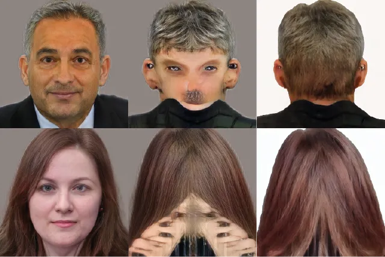

Input Panohead \[1\] Ours

Figure 10: We compare the generated backhead between SpinMeRound(Ours)
and Panohead \[1\].

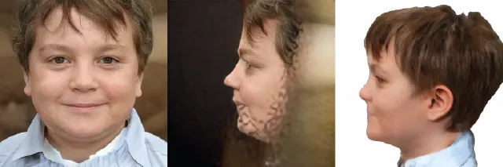

Input Eg3D \[9\] Ours

Figure 11: SpinMeRound and Eg3D \[9\] are shown at $`+90^{\circ}`$
angle.

## 3 Qualitative comparison with Panohead and Eg3D

Panohead \[1\] is a NeRF-based method capable of generating
$`360^{\circ}`$ views. Given an input facial image, it requires a
fitting process to produce novel views, often necessitating additional
pivotal tuning. In contrast, SpinMeRound eliminates the need for any
fitting or fine-tuning steps. Additionally, as presented in Fig. 10,
Panohead frequently introduces artifacts on the back of the head, a
limitation our method overcomes. On the other hand, EG3D \[9\] is
another NeRF-based method having similar drawbacks as Panohead.
Moreover, it only focuses on generating near-frontal views contrary to
our full-head approach as shown in Fig 11. We present a qualitative
comparison between our method and Panohead \[1\] in Fig. 13. As
demonstrated, our proposed approach achieves more faithful novel view
synthesis of the input subjects and significantly reduces the
back-of-head artifacts commonly observed in Panohead.

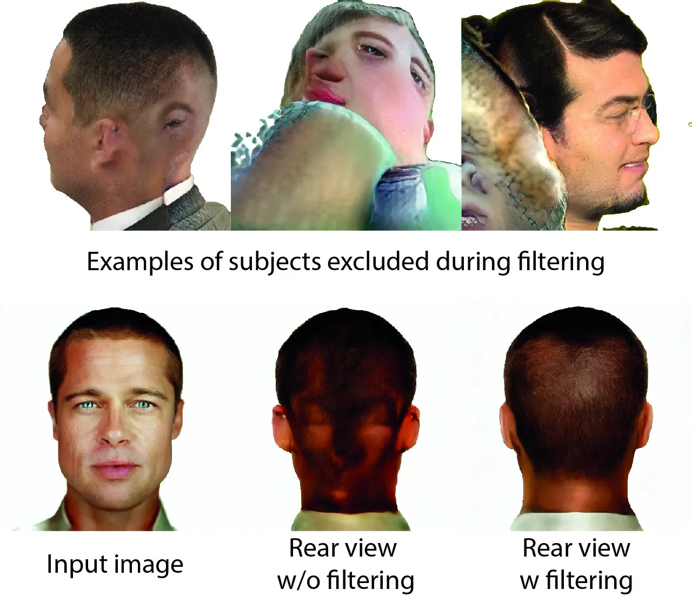

Figure 12: Top row: Examples of filtered-out subjects. Bottom row: We
present the rear view of an input image (left) when given to a model
trained with the unfiltered and the filtered datasets.

##### Importance of the used dataset

To train our method, we utilize a synthetic dataset, acquired using
Panohead \[1\]. Since artifacts frequently occur during sampling, a
manual filtering step is necessary. We filtered out failure cases,
including artifacts or abnormal side-heads, that could negatively impact
the performance of our model. We present excluded samples in the first
row of Figure 12. To confirm this, we trained two models for 100 epochs:
(a) one using the prior-filtering dataset, and (b) one using the
filtered dataset. Then, we gathered 50 images and compared their
identity similarity scores at a yaw angle of $`45^{\circ}`$. The first
model achieved an identity similarity score of $`0.651`$, whilst the
model trained on the filtered dataset achieved a score of $`0.72`$.
Moreover, we showcase the generated real views of a representative
subject in the bottom row of Figure 12.

## 4 Identity sampling

As mentioned in Section 5.1 and presented in Figure 8 of the main paper,
our method can generate multi-view human identities, given only the
input embedding. Although, this work does not focus on multi-view
identity sampling, we explore our method’s capabilities in this section.

As SpinMeRound has been trained using the classifier-free guidance
(CFG)\[28\] whilst getting 0, 1 or 3 conditioning input images, it can
be used to conditionally generate novel images depicting a similar
identity as the input one. By setting the guidance scale equal with 3.5,
we run the EDM sampler \[31\] for 50 sampling steps. We set
$`S_{churn}=0,S_{tmin}=0.05,S_{tmax}=50,S_{noise}=1.003`$ and we use the
EDM \[31\] discretization steps, with maximum sigma equal to 700. The
sampling process takes about 10 seconds while it runs on an NVIDIA
A100-PCIE. We present samples generated from our model in Figure 17.

## 5 More samples

We provide additional results in Figures 14,  15,  16,  18 and 19.
SpinMeRound is demonstrated under extreme viewpoints in Figure 14 whilst
Figure 15 presents a qualitative comparison between our method’s
performance and Panohead \[1\], Eg3D \[9\], DiffPortrait3D \[26\] and
SV3D \[65\]. In Figure 16, we showcase samples generated while using
SpinMeRound, under $`\{\pm 9^{\circ},\pm 16^{\circ},\pm 23^{\circ}\}`$
elevation and azimuth angles. Additionally, samples produced from our
model are presented in Figures  18 and 19, given the input images on the
left. As illustrated, our proposed methodology can be applied to a wide
variety of images, including diverse identities, input angles and image
styles.

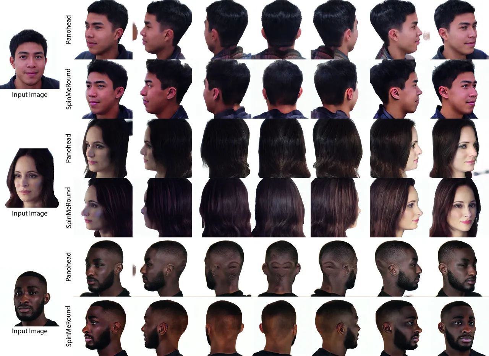

$`+45^{\circ}`$ $`+90^{\circ}`$ $`+135^{\circ}`$ $`+180^{\circ}`$
$`+225^{\circ}`$ $`+270^{\circ}`$ $`+315^{\circ}`$

Figure 13: We present a qualitative comparison between SpinMeRound and
Panohead \[1\] at yaw angles from $`+45^{\circ}`$ to $`+315^{\circ}`$.
Contrary to Panodhead, our method faithfully generates novel views of
the input subjects, without any artifacts on the backhead.

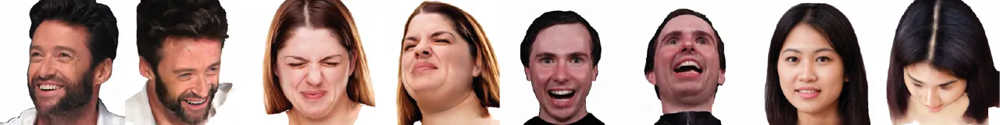

Input image Novel view Input image Novel view Input image Novel view
Input image Novel view

Figure 14: SpinMeRound is showcased under extreme angles.

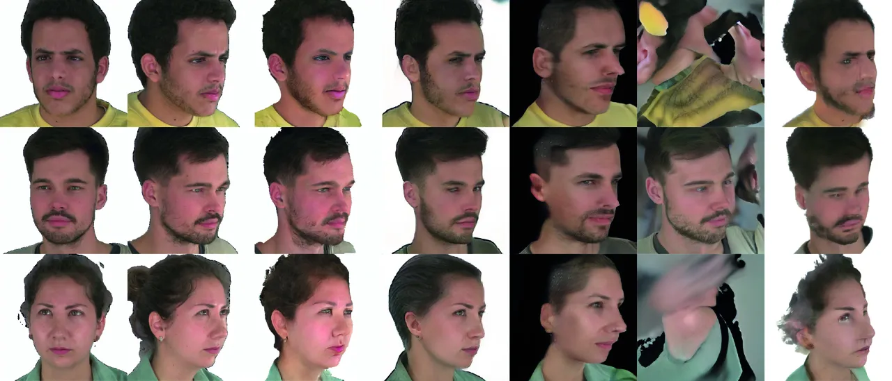

Input image Ground-truth SpinMeRound (Ours) Panohead \[1\] Eg3D \[9\]
DiffPortrait3D \[26\] SV3D \[65\]

Figure 15: Qualitative comparison on NeRSemble dataset \[33\]. As
showcased, SpinMeRound shows superior results over Panohead \[1\],
Eg3D \[9\], DiffPortrait3D \[26\] and SV3D \[65\].

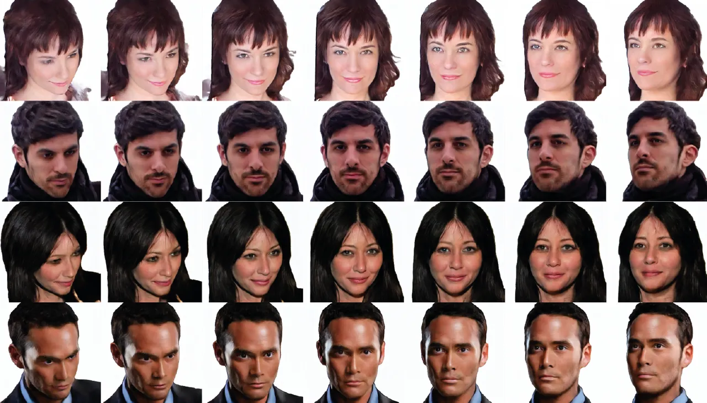

$`-23^{\circ}`$ $`-16^{\circ}`$ $`-9^{\circ}`$ Input $`+9^{\circ}`$
$`+16^{\circ}`$ $`+23^{\circ}`$

Figure 16: We showcase samples under
$`\{\pm 9^{\circ},\pm 16^{\circ},\pm 23^{\circ}\}`$ elevation and
azimuth angles.

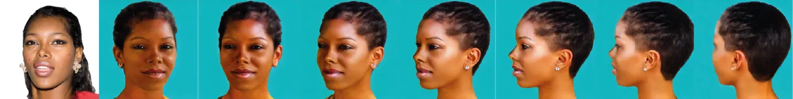

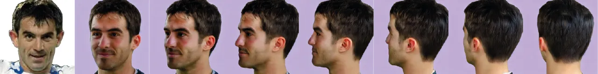

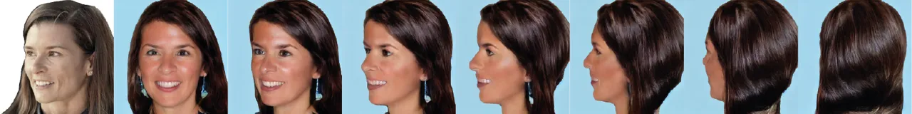

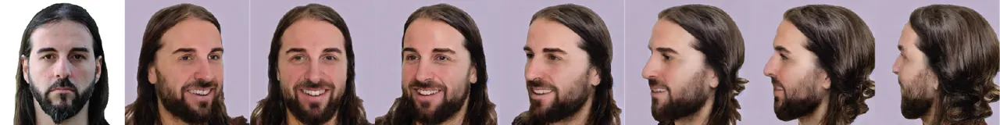

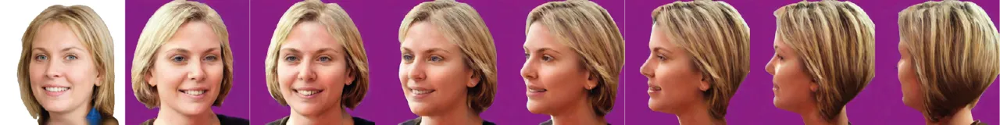

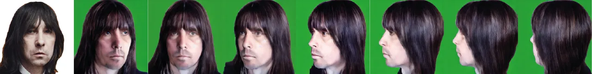

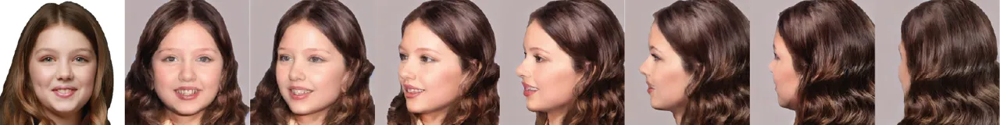

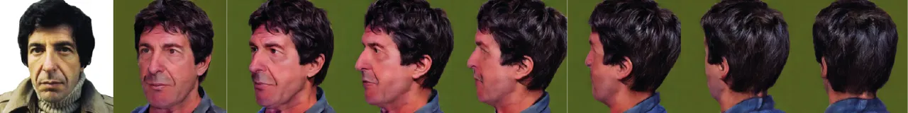

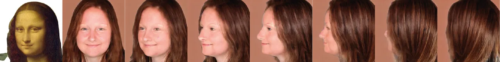

Input Images Generated samples

Figure 17: Samples generated using SpinMeRound using only the input
identity vector.

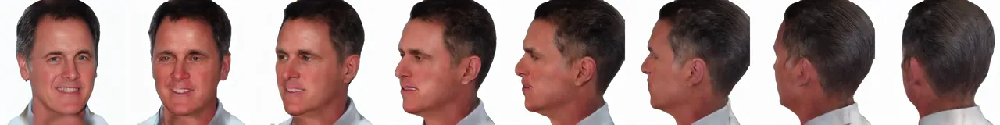

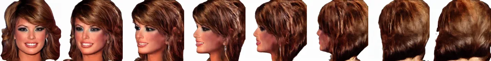

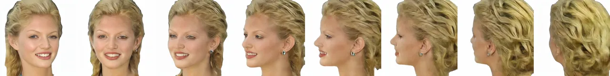

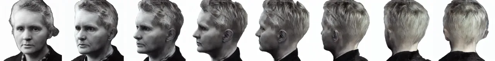

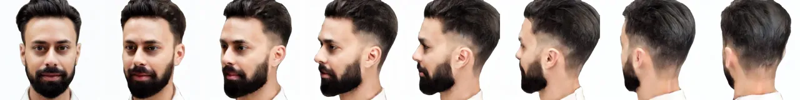

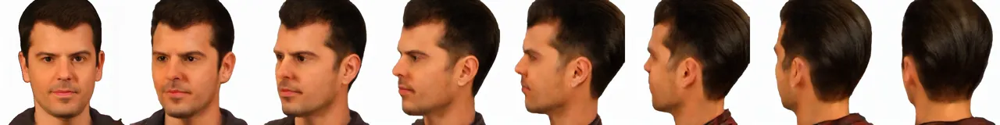

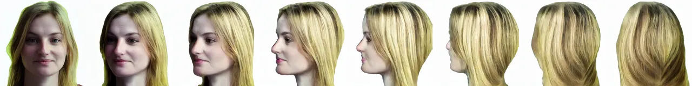

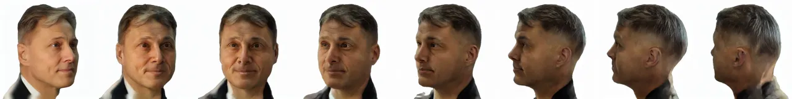

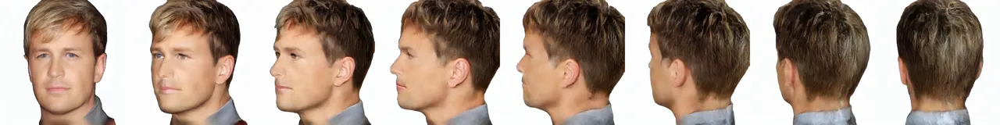

Input Images Generated samples

Figure 18: Samples generated with our method, using the images on the
left as input (1/2).

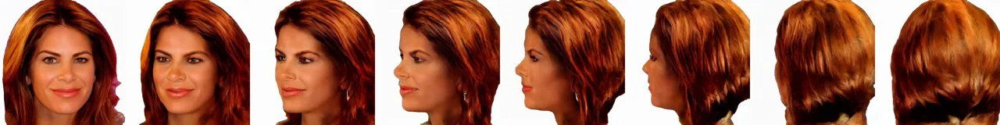

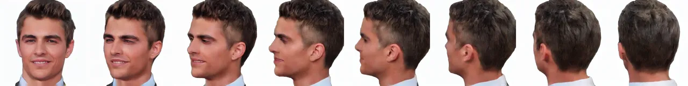


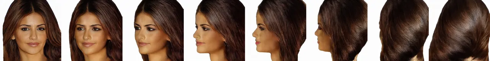

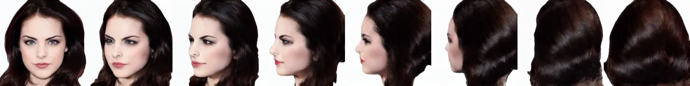

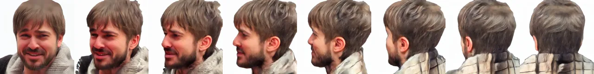

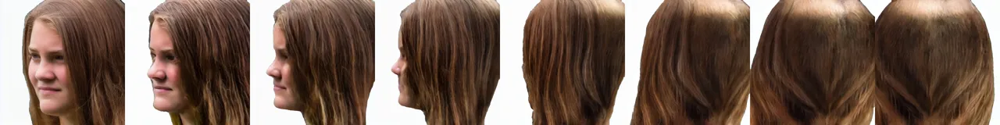

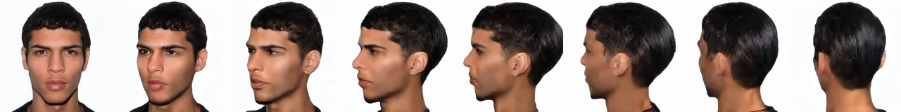

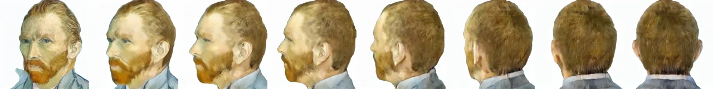

Input Images Generated samples

Figure 19: Samples generated with our method, using the images on the
left as input (2/2).
