# FaceCraft4D: Animated 3D Facial Avatar Generation from a Single Image

Fei Yin1    2\]    Mallikarjun B R²    Chun-Han Yao²    Rafał Mantiuk¹²²
2 Equal advising.    Varun Jampani²²² 2 Equal advising.
Affiliation: ¹University of Cambridge, ²Stability AI

###### Abstract

We present a novel framework for generating high-quality, animatable 4D
avatar from a single image. While recent advances have shown promising
results in 4D avatar creation, existing methods either require extensive
multiview data or struggle with shape accuracy and identity consistency.
To address these limitations, we propose a comprehensive system that
leverages shape, image, and video priors to create full-view, animatable
avatars. Our approach first obtains initial coarse shape through 3D-GAN
inversion. Then, it enhances multiview textures using depth-guided
warping signals for cross-view consistency with the help of the image
diffusion model. To handle expression animation, we incorporate a video
prior with synchronized driving signals across viewpoints. We further
introduce a Consistent-Inconsistent training to effectively handle data
inconsistencies during 4D reconstruction. Experimental results
demonstrate that our method achieves superior quality compared to the
prior art, while maintaining consistency across different viewpoints and
expressions.

¹¹footnotetext: No biometric data was used to train, validate, or
evaluate the model described in this work.

## 1 Introduction

|                                         |                      |           |                   |                      |           |                |         |
| --------------------------------------- | -------------------- | --------- | ----------------- | -------------------- | --------- | -------------- | ------- |
| Methods                                 | Goal                 | Dimension | Input             | $`360^{\circ}`$ view | Animation | 3D Consistency | Quality |
| LDM \[32\]                              | Image Generation     | 2D        | Single Image      |                      |           | \-             | High    |
| DreamFusion \[26\], SV3D \[38\]         | Image-to-3D          | 3D        | Single Image      | ✓                    |           | Low            | Low     |
| LivePortrait \[10\], AniPortrait \[40\] | Video Generation     | 2D        | Single Image      |                      | ✓         | Low            | High    |
| PanoHead \[1\], SPI \[45\]              | 3D GAN Inversion     | 3D        | Single Image      | ✓                    |           | Medium         | Medium  |
| Portrait4D \[7\], CAP4D \[36\]          | 3D Talking Head      | 3D        | Single Image      |                      | ✓         | Medium         | High    |
| FaceCraft4D                             | 4D Avatar Generation | 3D        | Single Image      | ✓                    | ✓         | High           | High    |
| HQ3D \[37\], GA \[27\]                  | 4D Avatar Generation | 3D        | Multi-view Videos | ✓                    | ✓         | High           | High    |

Table 1: Comparison of methods for avatar generation and animation. The
first two methods focus on general object generation, while the
remaining methods are specifically designed for avatar applications.

4D Avatar generation aims to create animatable 3D head avatars, enabling
the generation of consistent identities with custom viewpoints and
expressions. High-quality 4D heads have significant applications in
gaming, education, and film industries. However, existing 4D avatar
building methods \[37, 27, 23, 19\] often require extensive inputs, such
as multiview video with camera pose estimation, which is impractical for
widespread use. Furthermore, these methods struggle to produce realistic
results for extreme viewpoints and expression changes due to data
scarcity, for instance the back view of the head.

The goal of this work is to create a 4D facial avatar from just a single
image. This task is challenging because a single image provides limited
information, missing essential details like depth and multiple
viewpoints that are crucial for constructing a complete 3D model. A
single image cannot provide information about the unseen parts of a
person’s head or capture dynamic aspects like facial expressions. It is
also impractical to train an end-to-end model due to the lack of
multiview full-head animation datasets. To address these challenges, the
system needs to rely on prior knowledge, like shape and expression.

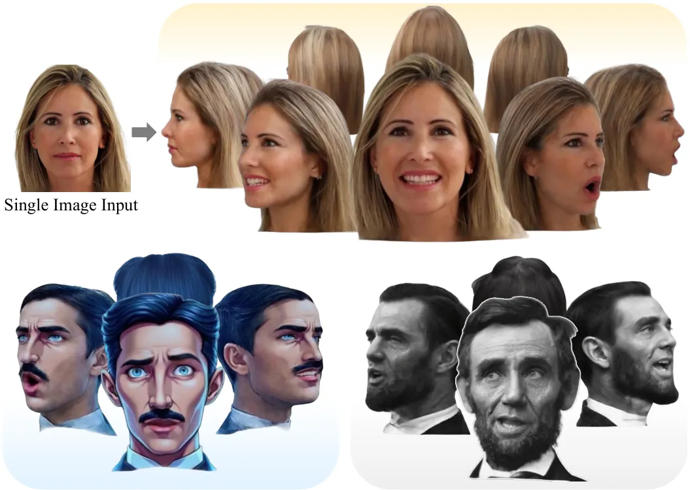

Figure 1: Given a single image input, our method is capable of
generating 4D avatars, producing photorealistic textures and consistent
expressions across multiple views. Our approach also demonstrates robust
performance on challenging inputs, including cartoon characters or old
photographs.

Existing single-image avatar generation methods come with many
shortcomings, which we summarize in Tab. 1. The works that rely on a
single image of novel identity at test time, typically utilize
large-scale, unstructured 2D images \[1\] and videos \[40, 7\] during
training to account for multiview and temporal aspects. Due to the
practical challenges in collecting multiview full-head animation
datasets, most single-image methods, including recent work \[36\],
cannot reconstruct a complete 360-degree view of the head. While some
approaches can generate full views \[41, 1\], they typically lack the
ability to model facial expressions. Among methods that can animate,
some methods rely solely on 2D representation \[40\], which makes these
methods multi-view inconsistent by design. To overcome the above
limitation, some methods rely on a hybrid representation that combines
2D and 3D \[7, 34\]. However, such methods cannot handle extreme camera
angles, as they rely on 2D components for high-resolution synthesis. In
contrast, we aim to build our model that has pure 3D representation,
and, therefore, is multiview-consistent by design.

We propose FaceCraft4D, which takes a single image as input and creates
a 3D Facial Avatar that can be animated and rendered in 360-degree view,
as shown in Fig. 1. To tackle such an under-constrained problem, we make
use of 3 different types of priors: a shape prior, an image prior, and a
video prior. We use these priors to synthesize personalized multiview
images of the given identity, which are then used to train an explicit
3D model of an avatar that can be animated (see Fig. 2). We will refer
to such a model as a 4D avatar.

We start with a shape prior from pretrained 3D-GAN \[1\]. Since, 3D-GAN
is trained with large-scale images that comprises of all the views of
the head, it has information about the complete head shape. Through
3D-GAN inversion \[31\], we obtain personalized shape along with an
approximate texture. The resulting 3D representation lacks personalized
high-quality multiview consistent texture and can not be used for
creating novel expressions or animations (see Tab. 1). To improve the
quality of the textures, we use of a 2D image prior. To ensure
multi-view consistency and preservation of identity across the views, we
employ epipolar constraints and cross-view mutual attention. The
resulting multi-view images can be used to build a high-quality static
3D head model, which, however, lacks control over expressions and
articulations. To animate the avatar, we utilize a 2D video
prior \[10\], which generates training data for facial animation across
different viewpoints.

Finally, for real-time rendering performance, we train a 3D Gaussian
representation \[16\] that is rigged to a FLAME parametric face
model \[21, 27\] using the multi-view videos obtained in the previous
steps. To further improve the training consistency across the views and
to avoid blur, we propose a COnsistent-INconsistent (COIN) training,
which can capture cross-view inconsistencies in an MLP.

In summary, the contributions of our work are as follows:

- •
  We present a novel framework for generating high-quality 4D head
  models from a single image of a face. We compare our framework with
  previous methods and summarize the differences in Tab. 1.
- •
  We introduce novel warping-based control generation signals to improve
  quality and consistency across different views and expressions.
- •
  We introduce COIN training, which enables a 3D Gaussian model to learn
  from inconsistent data while preserving high-quality, consistent
  features.

## 2 Related Work

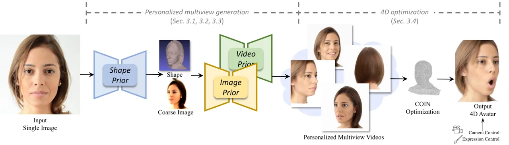

Figure 2: Overview of FaceCraft4D: Our approach begins with estimating
the shape of a single input image using a shape Prior. This shape guides
the synthesis of personalized multiview images, providing
$`360^{\circ}`$ views and varied expressions, with support from both 2D
image and video priors. Since the synthesized data often exhibit
inconsistency across views, we propose COIN optimization for robust 4D
optimization. By fitting the model to the multiview data, we achieve our
final 4D avatar. All faces in this manuscript come from the public FFHQ
dataset \[15\].

3D Head generation. Numerous studies have explored the reconstruction of
3D head models. To obtain sufficient information, most approaches \[9,
49, 49, 27\] utilize monocular video sequences, which provide multiple
viewpoints of the subject’s head. However, a significant limitation of
these methods is their reliance on multiple viewpoints and lengthy video
inputs. They also struggle to accurately reproduce less prominent
features in videos, such as the back of the head.

Another approach is to train a 3D generator on a large head image
dataset. EG3D \[3\] proposed a hybrid tri-plane representation that can
quickly and efficiently render high-quality facial images.
Panohead \[1\] and Portrait3D \[41\] expanded on EG3D by increasing the
number of planes, enabling the generation of 3D heads from limited
angles to full 360-degree views. However, most methods in this category
rely on hybrid representation having a 2D super-resolution network. This
impacts their generalization to extreme camera poses and suffer identity
inconsistency across views.

Recently, the rise of text-to-image models has spurred the development
of novel approaches for text-to-3D generation tasks. One such approach
is Score Distillation Sampling (SDS) \[26, 29\], which leverages the
score function to distill diffusion priors into 3D representations,
enabling the generation of 3D content from text or image inputs.
Headsculpt \[11\] incorporates facial keypoint information into the
text-to-3D generation method, effectively constraining the facial
layout. However, the texture generated by these methods can be
oversaturated, making it challenging to achieve photo-realistic head
models.

Head animation. Head animation techniques can be broadly categorized
into 2D-based and 3D-aware approaches, distinguished by their
utilization of explicit camera models for rendering. Recent methods \[8,
13, 30, 44\] have predominantly adopted warping-based strategies,
applying deformation fields to intermediate appearance features to
capture facial motion characteristics. While effective for frontal and
moderate poses, these approaches struggle to maintain shape consistency
during large pose variations due to their inherent lack of 3D modeling.

To enable free-viewpoint rendering with stronger 3D consistency
guarantees, researchers integrated explicit 3D representations into the
head synthesis pipeline. Early approaches \[17, 42\] relied on 3D
morphable models for representing head shape and texture. Subsequent
works \[5, 14, 22, 43, 46\] leveraged more sophisticated representations
such as Neural Radiance Fields (NeRFs) \[25\] to better capture complex
structures like hair and accessories. Recent advances like
GAGAvatar \[4\], which employs 3D Gaussian splatting \[16\], have
demonstrated impressive performance in both rendering quality and speed.
However, these methods are typically limited in their ability to
generate full 360-degree views. Our approach enables true 360-degree
view synthesis while maintaining real-time rendering capabilities and
achieving superior animation quality.

## 3 Method

In this work, we propose a novel framework for generating high-fidelity
4D avatars from a single portrait image $`I_{R}`$ . Reconstructing a 3D
dynamic model from a single 2D image is an inherently ill-posed problem,
as critical 3D and temporal information is missing. To address this
challenge, we leverage several 2D and 3D priors to compensate for the
missing data.

The overall pipeline, shown in Fig. 2, consists of two stages:
personalized multiview generation and 4D representation optimization. In
the Personalized Multiview Generation stage, we utilize shape priors to
estimate the 3D shape (Sec. 3.1), use image priors to enhance the
texture (Sec. 3.2), and video priors to synthesize high-quality,
consistent multi-view videos with dynamic expressions (Sec. 3.3). We
then leverage this synthetically-generated personalized image set to
optimize a robust 4D representation model (Sec. 3.4). The trained 4D
model can be animated by the control parameters of a morphable model,
enabling the generation of high-fidelity 4D avatars from a single
portrait image.

### 3.1 Shape Prior

The initialization is crucial for 3D generation. A good initialization
should follow the approximate shape of the head shown in the input
image, $`I_{R}`$. For that, we use the prior provided by a 3D-aware
generator, PanoHead \[1, 41\], which was trained on a large
$`360^{\circ}`$ head dataset. We obtain a coarse 3D reconstruction for a
given input image $`I_{R}`$ through GAN inversion. Specifically, we
first optimize the latent code $`z`$ within the generator’s domain by
minimizing a combination of pixel-wise $`\mathcal{L}_{2}`$ loss and
image-level LPIPS loss \[48\]. Subsequently, following \[31\], we keep
the optimized latent code $`z`$ fixed while fine-tuning the 3D
generator’s parameters. During this fine-tuning stage, we maintain the
same loss functions used in the latent optimization phase to ensure the
rendered views closely match the input image. This process gives us an
initial 3D head representation, though one that cannot be animated. The
optimized generator is then used to synthesize a set of approximate
multiview images $`\{I_{i}\}`$ and their corresponding depth maps
$`\{D_{i}\}`$ , where $`i`$ is the view index.

### 3.2 Image Prior

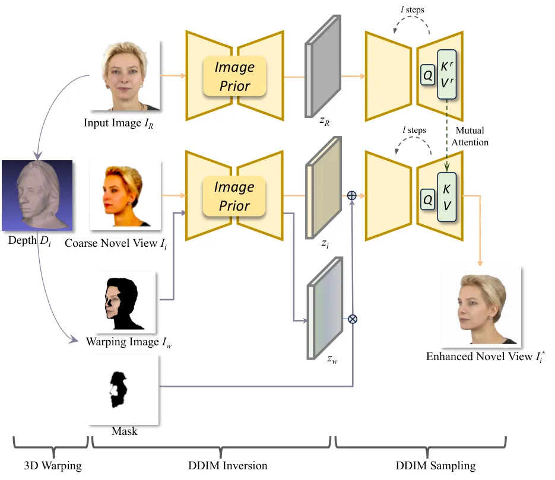

Figure 3: Image Prior: We introduce a cross-view mutual attention
mechanism and epipolar constraints to enhance consistency in generated
novel views. Our approach aligns reference and target images,
maintaining visual coherence across viewpoints.

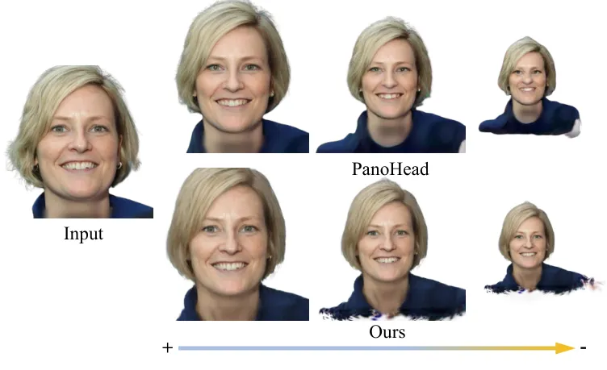

Figure 4: Triplane-based methods (e.g. PanoHead) are sensitive to focal
length (scale) and exhibit significant degradation of quality as focal
length decreases. In contrast, our Gaussian-based methods maintain
robust performance across varying focal lengths.

The textures synthesized from the shape prior may lack visual quality,
and the identity of the individual may not be well preserved across the
views. In particular, when rendering with different focal lengths,
triplane-based methods \[1\] exhibit substantial degradation in image
quality, as illustrated in Fig. 4. We enhance the generated multiview
images using 2D diffusion models \[32\], which have demonstrated
powerful generative capabilities. Although direct image-to-image
translation \[24\] appears to be a straightforward solution, this
approach poses significant risks: the denoising process may introduce
cross-view inconsistencies and also modify the original semantic
content. To address these risks, we propose two strategies that
constrain the generation process, which we describe next and illustrate
in Fig. 3.

Cross-view mutual attention. Inspired by MasaCtrl \[2\], we introduce a
cross-view attention mechanism to replace the standard self-attention
during the generation process. This modification allows us to inject
information from the reference image into the novel view. Specifically,
we first perform DDIM inversion \[33\] to introduce noise to both the
reference frame $`I_{R}`$ and the coarse image $`{I_{i}}`$ of the target
novel view. This step preserves the overall face structure and contour.
Then, the diffusion model is used to gradually denoise two images to
enhance the texture. In this process, we replace the key $`K`$ and value
$`V`$ matrices (calculated in self-attention) of the novel view with
those derived from the reference image. Different from \[2\], we adopt a
batch-processing strategy in which multiple images $`{I_{i}}`$
representing different viewpoints are treated as a single batch, with
the reference image $`I_{R}`$ serving as the consistent source for all
subsequent calculations. This not only streamlines the generation
process but also ensures uniformity in feature injection across novel
viewpoints.

The rationale behind this approach lies in the observation that, despite
variations in viewpoint, the underlying textures (represented by the
attention values) should maintain consistency across the views. The
cross-view attention mechanism enables the transfer of information from
the reference to the novel views, enhancing both the fidelity and
coherence of the generated novel views.

Warping-based control generation. The consistency across the views is
further enforced by epipolar constraints, which enforce shape
relationships between novel views and the input view. We first use
cross-view mutual attention to generate the view of the back of the
head. The generated back view along with the reference image are set as
anchors. Then, we propagate the texture information to novel views
through depth-based warping. Specifically, we lift the anchor image into
3D space and then project it to the adjacent view with depth guidance
$`\{D_{i}\}`$ . During the projection, we form a mask to indicate the
visibility of pixels to filter invisible areas using the rendered depth
values. The projected image is then used to guide the texture
enhancement process. The intermediate latent of the enhanced image in
the diffusion model is blended with the latent of the projected image
via a simple mask copy-pasting operation. By combining the latent, the
resulting images benefit from both the improved consistency provided by
the epipolar constraints and the enhanced quality achieved through the
denoising process. We repeat this process for various azimuth angles,
creating a comprehensive set of viewpoints.

With the aforementioned guidance and epipolar constraints, we can ensure
coherence across the entire view space and generate high-fidelity
view-consistent images $`\{I_{i}^{*}\}`$ for further reconstruction.

### 3.3 Video Prior

The view-consistent data created in the previous step has a static
expression similar to that of reference image $`I_{R}`$ . This may not
be enough to create diverse expressions as the images do not contain
some of the expression-dependent information. For example, if the
reference image has the mouth closed, the synthesized dataset would not
have details inside the mouth region. To incorporate
expression-dependent textures and shape that may not be available in the
multiview image generation stage (Sec. 3.2), we need to create
multi-view facial expression data. We use LivePortrait \[10\] as a video
prior, which can help generate multi-view expressive videos.
LivePortrait uses a single source image and a driving video to generate
new videos where the source identity mimics the expressions and poses
from the target video. Instead of directly copying the driving video’s
motion, one has the option of capturing the changes in relative
expression but maintain the pose of the input image. Given that we have
the reference and multiview-consistent enhanced images $`\{I_{i}^{*}\}`$
from the previous step, we provide these to LivePortrait as the source
images together with driving videos with diverse poses and expressions
(details in Sec. 4), and obtain target videos. Because the identity is
consistent across the input views, the resulting videos also maintain
the identity. Using identical driving videos ensures synchronized
expressions.

### 3.4 Robust 4D optimization with COIN training

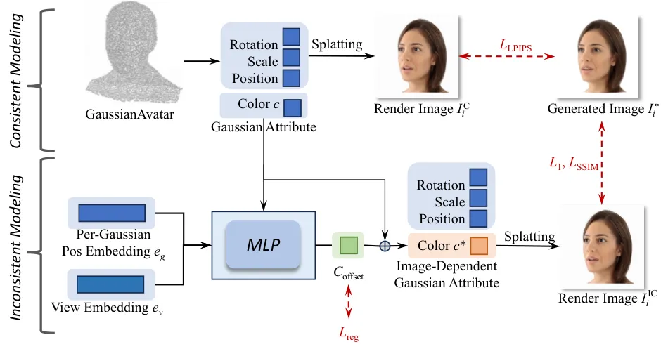

Figure 5: COIN-Training: To address shape and color inconsistencies
between the views, we train two 3D representations: a view-consistent
base model (GaussianAvatar) and an MLP, encoding inconsistencies between
the views. The MLP with inconsistencies lets us robustly reconstruct the
high-quality 3D base model.

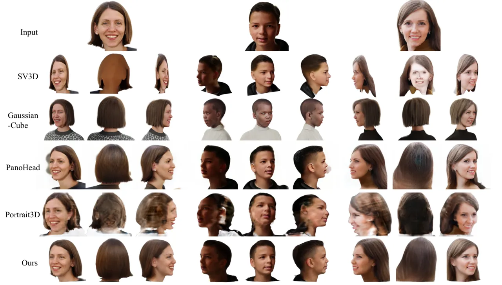

Figure 6: Qualitative comparison on static 3D head generation from a
single image.

The synthesized multi-view videos have high-quality textures and good
cross-view consistency, but small misalignment of features and colors is
unavoidable. Learning 4D representation directly on such data leads to
blurry textures for the rendered objects.

Here, we address this problem by proposing a robust training paradigm.
At a high level, we learn a base representation that is common to all
views, and a delta representation that is specific to each view during
training. This helps in cornering inconsistencies concerning each view
to separate representation. The base model will have a coarse but
consistent representation learned, while the high-frequency details end
up in the delta-space representation. At test time, we choose one of the
views as our reference view and use its delta representation as the
common high-frequency details for all the views.

In specific, we achieve this by jointly training two 4D representations:
a consistent GaussianAvatar \[27\], which represents the 3D structure
using Gaussians bound to a FLAME-tracked \[21\] mesh, and a NeRF-style
MLP, tasked with encoding inconsistencies between the views. As shown in
Fig. 5, we design the losses that prioritize structure reconstruction in
the consistent GaussianAvatar (LPIPS), and high-frequency detail
reconstruction in the MLP with the view-dependent inconsistencies (L1
and SSIM). By isolating view-dependent variations in a separate model,
this strategy prevents these inconsistencies from corrupting the base
representation. The approach can be considered a form of robust
regression, with the key difference that the view-dependent MLP ensures
that inconsistencies (outliers) are spatially localized. This cannot be
achieved with robust norms (e.g., L1), which do not maintain the
information about the spatial position of outliers.

We choose GaussianAvatar as our consistent representation because it
lets us animate the avatar with controllable FLAME expression and pose
parameters, providing a solid foundation for modeling consistent shape
and appearance features. The details of FLAME tracking and controlling
are explained in Sec. 1.3 of the supplementary. To model the
view-dependent variations, we design a lightweight MLP-based
architecture that introduces minimal computational overhead while
effectively capturing view-specific details. The network encodes the
offset in the color of each Gaussian (see Fig. 5), which can be
formulated as:

```math
c_{\text{offset}}=\text{MLP}(e_{\text{view}},c,e_{g};\theta), \tag{1}
```

where $`e_{\text{view}}\in\mathbb{R}^{d}`$ is a learnable view-specific
embedding that encodes view-representation, $`c`$ represents the initial
Gaussian color attributes from the GaussianAvatar, $`e_{g}`$ is a
position embedding for each Gaussian, accounting for location-specific
color variation ranges (e.g., eyes vs. mouth regions), and $`\theta`$ is
a vector of the trainable parameters. The final view-dependent color is
computed as the sum of the base GaussianAvatar color and the offset:
$`c^{*}=c+c_{\text{offset}}`$. The MLP consists of only two layers to
maintain computational efficiency and preserve the real-time rendering
capabilities of the Gaussian-based representation.

During training, we render two types of images: $`I^{\text{C}}_{i}`$
from the consistent component alone, and $`I^{\text{IC}}_{i}`$ from the
combination of both components. To ensure accurate reconstruction of
high-frequency details, we supervise $`I^{\text{IC}}_{i}`$ using
pixel-wise losses:

```math
\mathcal{L}_{\text{pixel}}=\lambda_{1}\mathcal{L}1(I^{\text{IC}}_{i},I^{*}_{i})+\lambda_{\text{SSIM}}\text{SSIM}(I^{\text{IC}}_{i},I^{*}_{i}) \tag{2}
```

To prevent the inconsistent component from dominating the representation
and maintain the effectiveness of the consistent component, we introduce
a structural supervision loss and a regularization term:

```math
\mathcal{L}_{\text{struc}}=\lambda_{\text{LPIPS}}\text{LPIPS}(I^{\text{C}}_{i},I^{*}_{i}) \tag{3}
```

```math
\mathcal{L}_{\text{reg}}=\lambda_{\text{offset}}\mathcal{L}1(c_{\text{offset}},0), \tag{4}
```

where LPIPS loss ensures image-level supervision for the consistent
component, and the offset regularization encourages minimal
view-dependent modifications. The hyper-parameters are set to
$`\lambda_{1}=0.8`$, $`\lambda_{\text{SSIM}}=0.2`$,
$`\lambda_{\text{LPIPS}}=0.05`$ and $`\lambda_{\text{offset}}=1`$.

During inference, we input a single fixed view-embedding for the
inconsistent component. Given that our reference image $`I_{R}`$
contains superior quality and identity information compared to the
generated multiview images $`\{I_{i}^{*}\}`$ , we select its
corresponding view embedding for inference. Novel expressions and poses
can be easily generated by adjusting the FLAME parameters, leveraging
the animation capabilities of our backbone model.

## 4 Experiments

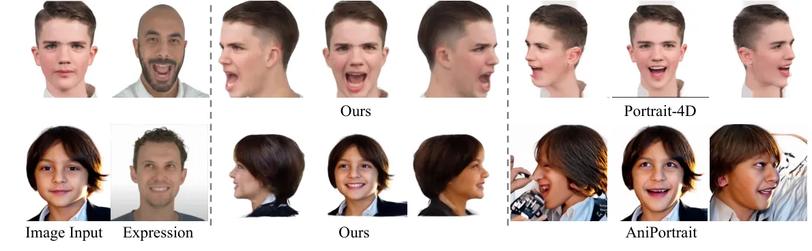

Figure 7: Qualitative comparison on animation of different views.

Implementation details. During the multiview generation stage, we use
PanoHead \[1\] as our shape prior, Cosmicman \[20\] as the image prior,
and LivePortrait \[10\] as the video prior model. We render 24 views
along the horizon orbit for static reconstruction. For animation, we
select $`I_{R}`$ and 11 frontal views from these generated images as
source images and randomly sample 8 video clips from the
NerSemble \[19\] dataset as driving videos. The source images and
driving videos are then input to the video prior model to produce
multiview video data. In the 4D optimization stage, we first optimize
the GaussianAvatar \[27\] model with the static data over 30K
iterations. Next, we apply COIN-optimization techniques, finetuning the
static Gaussian model over 90K iterations. The complete process takes
approximately two hours to generate a single 4D avatar.

Evaluation metrics. In the absence of ground truth data, we use commonly
adopted non-reference metrics to evaluate the rendered images in terms
of image quality and identity similarity. For overall image quality, we
use the FID \[12\] score. To assess multi-view consistency, we employ
the CLIP-I \[28\] score. For identity preservation, we calculate ID
scores by measuring the cosine distance of face recognition
features \[6\] between the novel views and the reference images.

| Method              | CLIP-I $`\uparrow`$ | ID $`\uparrow`$ | FID $`\downarrow`$ |
| ------------------- | ------------------- | --------------- | ------------------ |
| GaussianCube \[47\] | 0.6830              | 0.4300          | 258.81             |
| PanoHead \[1\]      | 0.8233              | 0.4246          | 195.28             |
| SV3D \[38\]         | 0.7656              | 0.4331          | 234.86             |
| Portrait3D \[41\]   | 0.7066              | 0.3719          | 302.74             |
| Ours                | 0.8053              | 0.5082          | 174.36             |

Table 2: Quantitative comparison on static 3D head generation.

| Method             | CLIP-I $`\uparrow`$ | ID $`\uparrow`$ | FID $`\downarrow`$ |
| ------------------ | ------------------- | --------------- | ------------------ |
| AniPortrait \[40\] | 0.4653              | 0.4171          | 364.99             |
| Portrait-4D \[7\]  | 0.5236              | 0.4592          | 248.36             |
| Ours               | 0.5737              | 0.4602          | 201.76             |

Table 3: Quantitative comparison on 3D head animation.

Datasets. We conducted our analysis on a subset of facial images from
FFHQ \[15\] dataset, a high-quality, in-the-wild facial dataset. For
evaluation, we select 100 images with unoccluded faces to evaluate our
model and baselines.

### 4.1 Static 3D Generation Comparisons

Baselines. We compare our method with existing image-to-3D approaches,
including a general object-focused model, SV3D \[38\], and three
head-specific methods: the inference-based GaussianCube \[47\], the
3D-GAN-based PanoHead \[1\], and the optimization-based
Portrait3D \[41\].

Qualitative results. Fig. 6 shows visual comparisons where our method
achieves the highest visual fidelity and identity coherence compared to
other approaches. Notably, it preserves details such as teeth and
earrings in side views. In contrast, SV3D, which focuses on general
objects, struggles to capture accurate head shape, often degenerating
into a flat plane. GaussianCube tends to “toonify” the input head due to
the nature of its training data. While PanoHead produces appealing
visual quality, it suffers from detail loss and floating artifacts
during pose rotation. Portrait3D also falls short in quality, as the
SDS \[26\] optimization introduces variations that lead to blurring
artifacts.

Quantitative results. For each generated head model, we render images
from five viewpoints: left-frontal, left, right-frontal, right, and
frontal. All five rendered images, along with the reference image, are
used to compute the CLIP-I, ID, and FID metrics. As shown in Tab. 2, our
method outperforms others in both ID and FID scores. This aligns with
the observed visual fidelity, as our results appear more realistic and
coherent. Our method achieves higher identity similarity and better
detail preservation, even in side views.

### 4.2 Animation Comparisons

Baselines. We compare our method with one-shot video-based head
reenactment approaches, including the 2D-based AniPortrait \[40\] and
the 3D-based Portrait-4D \[7\]. For AniPortrait, which uses keypoints as
intermediate driving signals, we modify the Euler angles of the
expression image to rotate the keypoints and generate novel view videos.
In the case of Portrait-4D, novel view videos can be generated directly
by editing the camera parameters.

Qualitative results. As shown in Fig. 7, our method preserves
expressions with greater accuracy. Portrait-4D lacks a back-of-head
model, so when rotated to side views, the back appears empty.
AniPortrait, as a 2D-based method, can achieve high texture quality.
However, with large-angle rotations, AniPortrait struggles to preserve
identity details and introduces noticeable artifacts in the hair and
background. In contrast, our method maintains accurate shape and
expression, even with camera movement.

Quantitative results. We test our data on unseen views (especially
$`60^{\circ}`$–$`180^{\circ}`$), to highlight each method’s performance
under varying viewing angles, as handling extreme rotations is often
challenging. The results are presented in Tab. 3. Our method outperforms
all baselines, demonstrating robustness across varied views. The
performance of baselines degrades significantly as the viewing angle
increases.

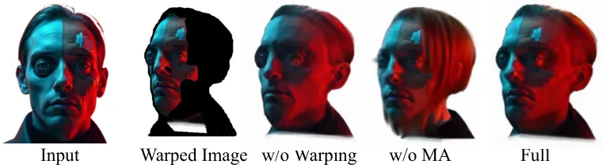

Figure 8: Ablation of multiview image generation modules.

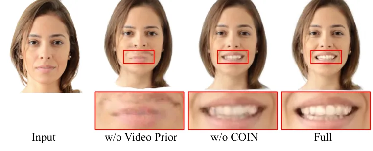

Figure 9: Ablation of animation modules.

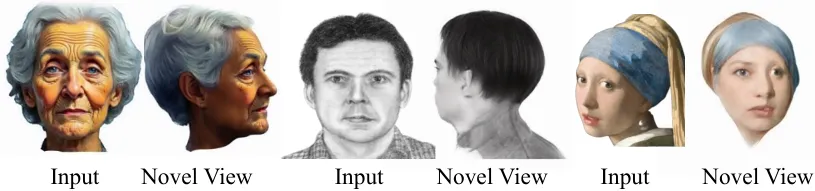

Figure 10: More results with diverse inputs.

### 4.3 Ablation Study

Multiview image generation. We conduct an ablation study on two
multi-view generation modules, as shown in Tab. 4 and Fig. 8.
Incorporating the warping module allows us to preserve finer details,
like tattoos, in novel views. While removing MA may lead to semantic
inconsistencies, such as changes in gender. Adding mutual attention (MA)
further improves fidelity and enhances identity similarity by injecting
features from the reference images.

Animation. Our 3D representation is based on GaussianAvatar \[27\],
which is FLAME-driven, enabling direct animation through FLAME
parameters. To evaluate the base performance, we remove our video prior
module. As shown in Fig. 9, without the video prior, the final avatar
fails to synthesize accurate expressions. For consistency modeling, we
compare our model with and without the COIN training. Without COIN,
training directly on inconsistent generated images results in blurred
textures. With COIN training, regions such as the teeth remain sharp,
and finer details, like individual hair strands, are preserved. The
quantitative results in Tab. 5 further validate the effectiveness of the
COIN optimization across novel views.

Processing times. We analyzed the processing times of each stage. Our
method consists of three stages: a) 3D GAN inversion (2 mins); b)
Multiview image & video generation (10 mins), FLAME parameters
extraction (10 mins); and c) COIN-training to overfit multiview videos
(2 hours). The generation of a single avatar $`\sim`$2.5 hours, which is
comparable to or faster than other optimization-based avatar
reconstruction methods, as shown in Tab. 6. At inference, we achieve
real time rendering at 156 FPS with a resolution of $`512\times 512`$.

Diverse inputs. To validate robustness, we conduct experiments on
diverse inputs, including cartoon, line drawing, and portraits with
extreme camera poses. The results in Fig. 10 demonstrate consistent
performance across various domains. Additional video results are
available on the webpage in the supplementary materials.

| Method          | CLIP-I $`\uparrow`$ | ID $`\uparrow`$ | FID    |
| --------------- | ------------------- | --------------- | ------ |
| w/o Warp w/o MA | 0.7328              | 0.4787          | 182.27 |
| w/o Warp        | 0.7886              | 0.4915          | 171.08 |
| w/o MA          | 0.8151              | 0.4951          | 172.43 |
| Full            | 0.8162              | 0.4984          | 166.96 |

Table 4: Ablation of multiview image generation modules. “Warp” refers
to the warping-based control generation (Sec. 3.2) and MA to cross-view
mutual attention (Sec. 3.2).

| Method   | CLIP-I $`\uparrow`$ | ID $`\uparrow`$ | FID $`\downarrow`$ |
| -------- | ------------------- | --------------- | ------------------ |
| w/o COIN | 0.7688              | 0.4952          | 144.95             |
| Full     | 0.7729              | 0.5010          | 142.80             |

Table 5: Ablation of animation modules.

| Method      | NerFace | IMAvatar       | PointAvatar | HeadStudio |
| ----------- | ------- | -------------- | ----------- | ---------- |
| Time (hour) | 54h     | 48h            | 6h          | 2h         |
| Method      | MonoGA  | GaussianAvatar | Hq3davatar  | Ours       |
| Time (hour) | 7h      | 2h             | 12h         | 2.5h       |

Table 6: Time comparison with optimization-based avatar reconstruction
methods.

## 5 Conclusions

In this paper, we present a novel method for generating high-quality 4D
portraits from a single image. By leveraging multiple priors including
3D-GAN for shape initialization, image prior for texture enhancement,
and video prior for animation, our method can generate animated avatars
with detailed textures, excellent consistency, and plausible rendition
of views missing in the input. The proposed depth-guided warping ensures
cross-view consistency during the generation process, while our
COIN-training strategy enables high-quality 4D reconstruction from
potentially inconsistent multi-view data. Extensive experiments
demonstrate that our method outperforms existing approaches in terms of
shape accuracy, texture quality, and identity preservation across
different viewpoints and expressions. Our framework makes high-quality
4D portrait generation more accessible by removing the requirement for
multi-view data capture, paving the way for broader applications.

## References

- \[1\] Sizhe An, Hongyi Xu, Yichun Shi, Guoxian Song, Umit Y Ogras, and
  Linjie Luo. Panohead: Geometry-aware 3d full-head synthesis in 360deg.
  In _Proceedings of the IEEE/CVF conference on computer vision and
  pattern recognition_, pages 20950–20959, 2023.
- \[2\] Mingdeng Cao, Xintao Wang, Zhongang Qi, Ying Shan, Xiaohu Qie,
  and Yinqiang Zheng. Masactrl: Tuning-free mutual self-attention
  control for consistent image synthesis and editing. In _Proceedings of
  the IEEE/CVF International Conference on Computer Vision_, pages
  22560–22570, 2023.
- \[3\] Eric R Chan, Connor Z Lin, Matthew A Chan, Koki Nagano, Boxiao
  Pan, Shalini De Mello, Orazio Gallo, Leonidas J Guibas, Jonathan
  Tremblay, Sameh Khamis, et al. Efficient geometry-aware 3d generative
  adversarial networks. In _Proceedings of the IEEE/CVF conference on
  computer vision and pattern recognition_, pages 16123–16133, 2022.
- \[4\] Xuangeng Chu and Tatsuya Harada. Generalizable and animatable
  gaussian head avatar. _arXiv preprint arXiv:2410.07971_, 2024.
- \[5\] Xuangeng Chu, Yu Li, Ailing Zeng, Tianyu Yang, Lijian Lin,
  Yunfei Liu, and Tatsuya Harada. Gpavatar: Generalizable and precise
  head avatar from image (s). _arXiv preprint arXiv:2401.10215_, 2024.
- \[6\] Jiankang Deng, Jia Guo, Niannan Xue, and Stefanos Zafeiriou.
  Arcface: Additive angular margin loss for deep face recognition. In
  _Proceedings of the IEEE/CVF conference on computer vision and pattern
  recognition_, pages 4690–4699, 2019.
- \[7\] Yu Deng, Duomin Wang, Xiaohang Ren, Xingyu Chen, and Baoyuan
  Wang. Portrait4d: Learning one-shot 4d head avatar synthesis using
  synthetic data. In _IEEE/CVF Conference on Computer Vision and Pattern
  Recognition_, 2024.
- \[8\] Nikita Drobyshev, Jenya Chelishev, Taras Khakhulin, Aleksei
  Ivakhnenko, Victor Lempitsky, and Egor Zakharov. Megaportraits:
  One-shot megapixel neural head avatars. In _Proceedings of the 30th
  ACM International Conference on Multimedia_, pages 2663–2671, 2022.
- \[9\] Philip-William Grassal, Malte Prinzler, Titus Leistner, Carsten
  Rother, Matthias Nießner, and Justus Thies. Neural head avatars from
  monocular rgb videos. In _Proceedings of the IEEE/CVF Conference on
  Computer Vision and Pattern Recognition_, pages 18653–18664, 2022.
- \[10\] Jianzhu Guo, Dingyun Zhang, Xiaoqiang Liu, Zhizhou Zhong, Yuan
  Zhang, Pengfei Wan, and Di Zhang. Liveportrait: Efficient portrait
  animation with stitching and retargeting control. _arXiv preprint
  arXiv:2407.03168_, 2024.
- \[11\] Xiao Han, Yukang Cao, Kai Han, Xiatian Zhu, Jiankang Deng,
  Yi-Zhe Song, Tao Xiang, and Kwan-Yee K Wong. Headsculpt: Crafting 3d
  head avatars with text. _Advances in Neural Information Processing
  Systems_, 36, 2024.
- \[12\] Martin Heusel, Hubert Ramsauer, Thomas Unterthiner, Bernhard
  Nessler, and Sepp Hochreiter. Gans trained by a two time-scale update
  rule converge to a local nash equilibrium. _Advances in neural
  information processing systems_, 30, 2017.
- \[13\] Fa-Ting Hong, Longhao Zhang, Li Shen, and Dan Xu. Depth-aware
  generative adversarial network for talking head video generation. In
  _Proceedings of the IEEE/CVF conference on computer vision and pattern
  recognition_, pages 3397–3406, 2022a.
- \[14\] Yang Hong, Bo Peng, Haiyao Xiao, Ligang Liu, and Juyong Zhang.
  Headnerf: A real-time nerf-based parametric head model. In
  _Proceedings of the IEEE/CVF Conference on Computer Vision and Pattern
  Recognition_, pages 20374–20384, 2022b.
- \[15\] Tero Karras, Samuli Laine, and Timo Aila. A style-based
  generator architecture for generative adversarial networks. In
  _Proceedings of the IEEE/CVF conference on computer vision and pattern
  recognition_, pages 4401–4410, 2019.
- \[16\] Bernhard Kerbl, Georgios Kopanas, Thomas Leimkühler, and George
  Drettakis. 3d gaussian splatting for real-time radiance field
  rendering. _ACM Trans. Graph._, 42(4):139–1, 2023.
- \[17\] Taras Khakhulin, Vanessa Sklyarova, Victor Lempitsky, and Egor
  Zakharov. Realistic one-shot mesh-based head avatars. In _European
  Conference on Computer Vision_, pages 345–362. Springer, 2022.
- \[18\] Davis E. King. Dlib-ml: A machine learning toolkit. _Journal of
  Machine Learning Research_, 10:1755–1758, 2009.
- \[19\] Tobias Kirschstein, Shenhan Qian, Simon Giebenhain, Tim Walter,
  and Matthias Nießner. Nersemble: Multi-view radiance field
  reconstruction of human heads. _ACM Transactions on Graphics (TOG)_,
  42(4):1–14, 2023.
- \[20\] Shikai Li, Jianglin Fu, Kaiyuan Liu, Wentao Wang, Kwan-Yee Lin,
  and Wayne Wu. Cosmicman: A text-to-image foundation model for humans.
  In _Computer Vision and Pattern Recognition (CVPR)_, 2024.
- \[21\] Tianye Li, Timo Bolkart, Michael. J. Black, Hao Li, and Javier
  Romero. Learning a model of facial shape and expression from 4D scans.
  _ACM Transactions on Graphics, (Proc. SIGGRAPH Asia)_, 36(6), 2017.
- \[22\] Weichuang Li, Longhao Zhang, Dong Wang, Bin Zhao, Zhigang Wang,
  Mulin Chen, Bang Zhang, Zhongjian Wang, Liefeng Bo, and Xuelong Li.
  One-shot high-fidelity talking-head synthesis with deformable neural
  radiance field. In _Proceedings of the IEEE/CVF Conference on Computer
  Vision and Pattern Recognition_, pages 17969–17978, 2023.
- \[23\] Shengjie Ma, Yanlin Weng, Tianjia Shao, and Kun Zhou. 3d
  gaussian blendshapes for head avatar animation. In _ACM SIGGRAPH 2024
  Conference Papers_, pages 1–10, 2024.
- \[24\] Chenlin Meng, Yutong He, Yang Song, Jiaming Song, Jiajun Wu,
  Jun-Yan Zhu, and Stefano Ermon. Sdedit: Guided image synthesis and
  editing with stochastic differential equations. _arXiv preprint
  arXiv:2108.01073_, 2021.
- \[25\] Ben Mildenhall, Pratul P Srinivasan, Matthew Tancik, Jonathan T
  Barron, Ravi Ramamoorthi, and Ren Ng. Nerf: Representing scenes as
  neural radiance fields for view synthesis. _Communications of the
  ACM_, 65(1):99–106, 2021.
- \[26\] Ben Poole, Ajay Jain, Jonathan T Barron, and Ben Mildenhall.
  Dreamfusion: Text-to-3d using 2d diffusion. _arXiv preprint
  arXiv:2209.14988_, 2022.
- \[27\] Shenhan Qian, Tobias Kirschstein, Liam Schoneveld, Davide
  Davoli, Simon Giebenhain, and Matthias Nießner. Gaussianavatars:
  Photorealistic head avatars with rigged 3d gaussians. In _Proceedings
  of the IEEE/CVF Conference on Computer Vision and Pattern
  Recognition_, pages 20299–20309, 2024.
- \[28\] Alec Radford, Jong Wook Kim, Chris Hallacy, Aditya Ramesh,
  Gabriel Goh, Sandhini Agarwal, Girish Sastry, Amanda Askell, Pamela
  Mishkin, Jack Clark, et al. Learning transferable visual models from
  natural language supervision. In _International conference on machine
  learning_, pages 8748–8763. PMLR, 2021.
- \[29\] Amit Raj, Srinivas Kaza, Ben Poole, Michael Niemeyer, Nataniel
  Ruiz, Ben Mildenhall, Shiran Zada, Kfir Aberman, Michael Rubinstein,
  Jonathan Barron, et al. Dreambooth3d: Subject-driven text-to-3d
  generation. In _Proceedings of the IEEE/CVF international conference
  on computer vision_, pages 2349–2359, 2023.
- \[30\] Yurui Ren, Ge Li, Yuanqi Chen, Thomas H Li, and Shan Liu.
  Pirenderer: Controllable portrait image generation via semantic neural
  rendering. In _Proceedings of the IEEE/CVF international conference on
  computer vision_, pages 13759–13768, 2021.
- \[31\] Daniel Roich, Ron Mokady, Amit H Bermano, and Daniel Cohen-Or.
  Pivotal tuning for latent-based editing of real images. _ACM
  Transactions on graphics (TOG)_, 42(1):1–13, 2022.
- \[32\] Robin Rombach, Andreas Blattmann, Dominik Lorenz, Patrick
  Esser, and Björn Ommer. High-resolution image synthesis with latent
  diffusion models. In _Proceedings of the IEEE/CVF conference on
  computer vision and pattern recognition_, pages 10684–10695, 2022.
- \[33\] Jiaming Song, Chenlin Meng, and Stefano Ermon. Denoising
  diffusion implicit models. _arXiv preprint arXiv:2010.02502_, 2020.
- \[34\] Jingxiang Sun, Xuan Wang, Lizhen Wang, Xiaoyu Li, Yong Zhang,
  Hongwen Zhang, and Yebin Liu. Next3d: Generative neural texture
  rasterization for 3d-aware head avatars. In _CVPR_, 2023.
- \[35\] Junshu Tang, Bo Zhang, Binxin Yang, Ting Zhang, Dong Chen,
  Lizhuang Ma, and Fang Wen. 3dfaceshop: Explicitly controllable
  3d-aware portrait generation. _IEEE transactions on visualization and
  computer graphics_, 30(9):6020–6037, 2023.
- \[36\] Felix Taubner, Ruihang Zhang, Mathieu Tuli, and David B
  Lindell. Cap4d: Creating animatable 4d portrait avatars with morphable
  multi-view diffusion models. _arXiv preprint arXiv:2412.12093_, 2024.
- \[37\] Kartik Teotia, Mallikarjun B R, Xingang Pan, Hyeongwoo Kim,
  Pablo Garrido, Mohamed Elgharib, and Christian Theobalt. Hq3davatar:
  High-quality implicit 3d head avatar. _ACM Transactions on Graphics_,
  43(3):1–24, 2024.
- \[38\] Vikram Voleti, Chun-Han Yao, Mark Boss, Adam Letts, David
  Pankratz, Dmitry Tochilkin, Christian Laforte, Robin Rombach, and
  Varun Jampani. Sv3d: Novel multi-view synthesis and 3d generation from
  a single image using latent video diffusion. _arXiv preprint
  arXiv:2403.12008_, 2024.
- \[39\] Kaisiyuan Wang, Qianyi Wu, Linsen Song, Zhuoqian Yang, Wayne
  Wu, Chen Qian, Ran He, Yu Qiao, and Chen Change Loy. Mead: A
  large-scale audio-visual dataset for emotional talking-face
  generation. In _European Conference on Computer Vision_, pages
  700–717. Springer, 2020.
- \[40\] Huawei Wei, Zejun Yang, and Zhisheng Wang. Aniportrait:
  Audio-driven synthesis of photorealistic portrait animation. _arXiv
  preprint arXiv:2403.17694_, 2024.
- \[41\] Yiqian Wu, Hao Xu, Xiangjun Tang, Xien Chen, Siyu Tang, Zhebin
  Zhang, Chen Li, and Xiaogang Jin. Portrait3d: Text-guided high-quality
  3d portrait generation using pyramid representation and gans prior.
  _ACM Transactions on Graphics (TOG)_, 43(4):1–12, 2024.
- \[42\] Sicheng Xu, Jiaolong Yang, Dong Chen, Fang Wen, Yu Deng, Yunde
  Jia, and Xin Tong. Deep 3d portrait from a single image. In
  _Proceedings of the IEEE/CVF Conference on Computer Vision and Pattern
  Recognition_, pages 7710–7720, 2020.
- \[43\] Zhenhui Ye, Tianyun Zhong, Yi Ren, Jiaqi Yang, Weichuang Li,
  Jiawei Huang, Ziyue Jiang, Jinzheng He, Rongjie Huang, Jinglin Liu,
  et al. Real3d-portrait: One-shot realistic 3d talking portrait
  synthesis. _arXiv preprint arXiv:2401.08503_, 2024.
- \[44\] Fei Yin, Yong Zhang, Xiaodong Cun, Mingdeng Cao, Yanbo Fan,
  Xuan Wang, Qingyan Bai, Baoyuan Wu, Jue Wang, and Yujiu Yang.
  Styleheat: One-shot high-resolution editable talking face generation
  via pre-trained stylegan. In _European conference on computer vision_,
  pages 85–101. Springer, 2022.
- \[45\] Fei Yin, Yong Zhang, Xuan Wang, Tengfei Wang, Xiaoyu Li, Yuan
  Gong, Yanbo Fan, Xiaodong Cun, Ying Shan, Cengiz Oztireli, et al. 3d
  gan inversion with facial symmetry prior. In _Proceedings of the
  IEEE/CVF Conference on Computer Vision and Pattern Recognition_, pages
  342–351, 2023.
- \[46\] Wangbo Yu, Yanbo Fan, Yong Zhang, Xuan Wang, Fei Yin, Yunpeng
  Bai, Yan-Pei Cao, Ying Shan, Yang Wu, Zhongqian Sun, et al. Nofa:
  Nerf-based one-shot facial avatar reconstruction. In _ACM SIGGRAPH
  2023 Conference Proceedings_, pages 1–12, 2023.
- \[47\] Bowen Zhang, Yiji Cheng, Jiaolong Yang, Chunyu Wang, Feng Zhao,
  Yansong Tang, Dong Chen, and Baining Guo. Gaussiancube: Structuring
  gaussian splatting using optimal transport for 3d generative modeling.
  _arXiv preprint arXiv:2403.19655_, 2024.
- \[48\] Richard Zhang, Phillip Isola, Alexei A Efros, Eli Shechtman,
  and Oliver Wang. The unreasonable effectiveness of deep features as a
  perceptual metric. In _CVPR_, 2018.
- \[49\] Yufeng Zheng, Wang Yifan, Gordon Wetzstein, Michael J Black,
  and Otmar Hilliges. Pointavatar: Deformable point-based head avatars
  from videos. In _Proceedings of the IEEE/CVF conference on computer
  vision and pattern recognition_, pages 21057–21067, 2023.

Supplementary Material

## 6 Implementation Details

### 6.1 Data Pre-processing

Following \[1\], we crop head regions for GAN inversion. Specifically,
we use dlib \[18\] to detect 68 facial keypoints. The keypoints are then
aligned to ensure the face is centered in the image. To isolate the
face, we apply matting to remove the background, replacing it with a
white color. For SV3D \[38\], which was trained on general objects, its
training set typically centers objects in the image. To adapt to this
domain, we add extra white padding around the face, ensuring better
alignment with the model’s original training conditions.

### 6.2 Multiview Image Generation

We set the DDIM inversion steps to $`T=25`$ and the image strength to
0.4, which corresponds to adding noise at timestep 10. Then, we use a
diffusion model to denoise the added noise feature and apply cross-view
mutual attention through the remaining steps.

In the warping-based control generation module, we employ a copy-pasting
operation to blend the warping features with the generation features. A
mask is extracted during the warping process to identify regions in the
novel view that correspond to reference textures in the original view.
This mask is then downsampled to match the feature size. To handle
boundary artifacts, we set the boundary values of the mask to 0.1. This
adjustment mitigates the effects of disconnections or distortion
artifacts commonly observed at the edges of warping features. By using a
non-binary mask, we enable a smooth transition between the warping
texture and the inpainted regions, effectively blending generative
features with the warping values.

### 6.3 Gaussian Training

We choose GaussianAvatar \[27\] as our consistent Gaussian
representation, which binds Gaussian features to a FLAME \[21\] template
mesh. This approach allows animating the avatar with controllable FLAME
expression and pose parameters.

We utilize the 2023 version of FLAME \[21\], which includes revised eye
regions. Additionally, following \[27\], we manually add 168 triangles
to represent the teeth in the FLAME template mesh. The upper and lower
teeth triangles are rigidly attached to the neck and jaw joints,
respectively, improving the avatar’s fidelity.

For FLAME tracking, we use the tracking code from \[27\]. The
optimization process includes per-frame parameters (translation, joint
poses, and expression) and shared parameters (shape, vertex offset, and
an albedo map). The optimization combines a keypoint loss, a color loss,
and regularization terms. We optimize all the parameters on the first
time step of the video sequence until convergence, then optimize
per-frame parameters for 50 iterations for each following time step with
the previous one as initialization. Afterward, we conduct global
optimization for 30 epochs by randomly sampling time steps to fine-tune
all parameters. For more details, please refer to \[27\].

| Method            | PSNR $`\uparrow`$ | SSIM $`\uparrow`$ | LPIPS $`\downarrow`$ | ID $`\uparrow`$ |
| ----------------- | ----------------- | ----------------- | -------------------- | --------------- |
| Portrait3D \[41\] | 9.51              | 0.5622            | 0.5275               | 0.2646          |
| SV3D \[38\]       | 13.54             | 0.6893            | 0.3174               | 0.7622          |
| PanoHead \[1\]    | 15.37             | 0.7342            | 0.2104               | 0.7981          |
| Ours              | 15.74             | 0.7495            | 0.2010               | 0.8006          |

Table 7: Quantitative comparison on static 3D head generation on
MEAD \[39\].

## 7 Additional Experiments

### 7.1 Comparison with Controllable 3D GANs

We compare our method with controllable 3D GANs: 3DFaceShop \[35\] and
Next3D \[34\]. For a fair comparison, since controllable 3D GANs do not
develop proper GAN inversion methods, we randomly sampled images from 3D
GANs and used them as identity source images, then used other videos as
expression signals. The qualitative results are shown in Fig. 11,
demonstrating that our method achieves more accurate expressions from
the driving images.

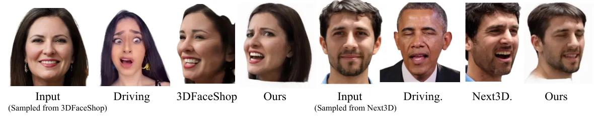

Figure 11: Qualitative comparison with controllable 3D GANs.

### 7.2 Evaluation on Multiview Dataset

To get a comprehensive understanding of the performance of our method,
we evaluate on MEAD \[39\], a multi-view dataset. The quantitative
comparison between the reconstruction portraits and the ground truth is
shown in Tab. 7. The qualitative results are shown in Fig. 12 and
Fig. 13. The results demonstrate that our method can generate a
consistent shape and texture in novel views, which aligns with the
conclusion of the manuscript.

### 7.3 Video Results

To further validate the robustness and real-time performance of our
method, supplementary video recordings are provided. These videos
demonstrate comparative experiments, accessible at:
[https://github.com/yourname/project/videos](https://github.com/yourname/project/videos).

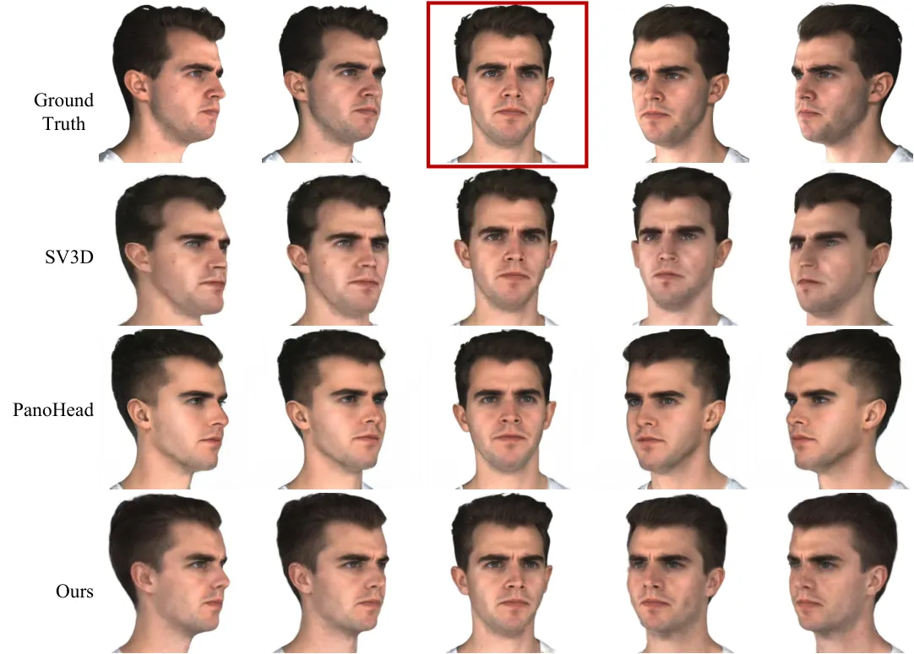

Figure 12: Qualitative comparison on static 3D head generation from a
single image on MEAD (1). Red box indicates the input image.

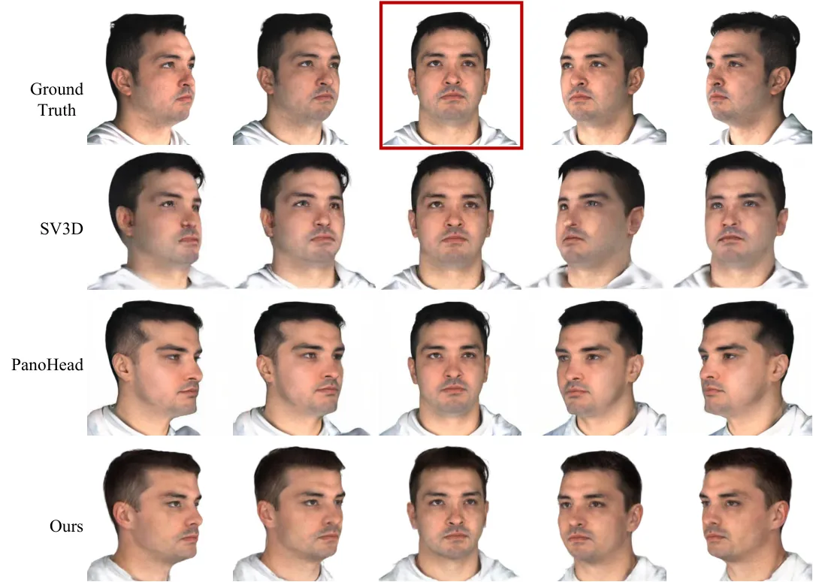

Figure 13: Qualitative comparison on static 3D head generation from a
single image on MEAD (2). Red box indicates the input image.
