# Generative AI for Character Animation: A Comprehensive Survey of Techniques, Applications, and Future Directions

Mohammad Mahdi Abootorabi Affiliation:  Qatar Computing Research
Institute, Doha, Qatar Correspondence:
[easgari@hbku.edu.qa](mailto:easgari@hbku.edu.qa)
[https://github.com/llm-lab-org/Generative-AI-for-Character-Animation-Survey](https://github.com/llm-lab-org/Generative-AI-for-Character-Animation-Survey)
   Omid Ghahroodi Affiliation:  Qatar Computing Research Institute,
Doha, Qatar Correspondence:
[easgari@hbku.edu.qa](mailto:easgari@hbku.edu.qa)
[https://github.com/llm-lab-org/Generative-AI-for-Character-Animation-Survey](https://github.com/llm-lab-org/Generative-AI-for-Character-Animation-Survey)
   Pardis Sadat Zahraei Affiliation:  Qatar Computing Research
Institute, Doha, Qatar Correspondence:
[easgari@hbku.edu.qa](mailto:easgari@hbku.edu.qa)
[https://github.com/llm-lab-org/Generative-AI-for-Character-Animation-Survey](https://github.com/llm-lab-org/Generative-AI-for-Character-Animation-Survey)
   Hossein Behzadasl Affiliation: Computer Engineering Department,
Sharif University of Technology, Tehran, Iran    Alireza Mirrokni
Affiliation: Computer Engineering Department, Sharif University of
Technology, Tehran, Iran    Mobina Salimipanah Affiliation: Computer
Engineering Department, Sharif University of Technology, Tehran, Iran   
Arash Rasouli Affiliation: Computer Engineering Department, Sharif
University of Technology, Tehran, Iran    Bahar Behzadipour
Affiliation: Computer Engineering Department, Sharif University of
Technology, Tehran, Iran    Sara Azarnoush Affiliation: Computer
Engineering Department, Sharif University of Technology, Tehran, Iran   
Benyamin Maleki Affiliation: Computer Engineering Department, Sharif
University of Technology, Tehran, Iran    Erfan Sadraiye
Affiliation: Computer Engineering Department, Sharif University of
Technology, Tehran, Iran    Kiarash Kiani Feriz Affiliation: Computer
Engineering Department, Sharif University of Technology, Tehran, Iran   
Mahdi Teymouri Nahad Affiliation: Computer Engineering Department,
Sharif University of Technology, Tehran, Iran    Ali Moghadasi
Affiliation: Computer Engineering Department, Sharif University of
Technology, Tehran, Iran    Abolfazl Eshagh Abianeh
Affiliation: Computer Engineering Department, Sharif University of
Technology, Tehran, Iran    Nizi Nazar Affiliation:  Qatar Computing
Research Institute, Doha, Qatar Correspondence:
[easgari@hbku.edu.qa](mailto:easgari@hbku.edu.qa)
[https://github.com/llm-lab-org/Generative-AI-for-Character-Animation-Survey](https://github.com/llm-lab-org/Generative-AI-for-Character-Animation-Survey)
   Hamid R. Rabiee Affiliation: Computer Engineering Department, Sharif
University of Technology, Tehran, Iran    Mahdieh Soleymani Baghshah
Affiliation: Computer Engineering Department, Sharif University of
Technology, Tehran, Iran    Meisam Ahmadi Affiliation: Iran University
of Science and Technology    Ehsaneddin Asgari
Note: https://mocap.cs.cmu.edu/ Affiliation:  Qatar Computing Research
Institute, Doha, Qatar Correspondence:
[easgari@hbku.edu.qa](mailto:easgari@hbku.edu.qa)
[https://github.com/llm-lab-org/Generative-AI-for-Character-Animation-Survey](https://github.com/llm-lab-org/Generative-AI-for-Character-Animation-Survey)

###### Abstract

Generative AI is reshaping art, gaming, and most notably animation.
Recent breakthroughs in foundation and diffusion models have reduced the
time and cost of producing animated content. Characters are central
animation components, involving motion, emotions, gestures, and facial
expressions. The pace and breadth of advances in recent months make it
difficult to maintain a coherent view of the field, motivating the need
for an integrative review. Unlike earlier overviews that treat avatars,
gestures, or facial animation in isolation, this survey offers a single,
comprehensive perspective on all the main generative AI applications for
character animation. We begin by examining the state-of-the-art in
facial animation, expression rendering, image synthesis, avatar
creation, gesture modeling, motion synthesis, object generation, and
texture synthesis. We highlight leading research, practical deployments,
commonly used datasets, and emerging trends for each area. To support
newcomers, we also provide a comprehensive background section that
introduces foundational models and evaluation metrics, equipping readers
with the knowledge needed to enter the field. We discuss open challenges
and map future research directions, providing a roadmap to advance
AI-driven character-animation technologies. This survey is intended as a
resource for researchers and developers entering the field of generative
AI animation or adjacent fields. Resources are available at:  
[https://github.com/llm-lab-org/Generative-AI-for-Character-Animation-Survey](https://github.com/llm-lab-org/Generative-AI-for-Character-Animation-Survey).

## 1 Introduction

Generative artificial intelligence (AI) has rapidly progressed in recent
years, revolutionizing fields such as computer vision, natural language
processing, and human-computer interaction. A significant frontier in
this evolution is generating human-related content, including realistic
facial synthesis, expressive gestures, and complex motion sequences.
These advancements have profound implications for virtual avatars,
gaming, animation, assistive technologies, and beyond. At the heart of
this innovation is character animation, which combines intricate visual,
temporal, and multimodal elements to achieve lifelike representations.
This paper comprehensively surveys generative AI techniques for
character animation, unifying developments across traditionally
fragmented domains. We examine the critical components of this field,
starting with fundamental topics such as SMPL \[1\], which underpin the
training and evaluation of generative systems.

We then delve into model architectures that have transformed generative
AI, from convolutional neural networks (CNNs) and temporal convolutional
networks (TCNs) \[2\] to state-of-the-art techniques like Generative
Adversarial Networks (GANs) \[3\], Variational Autoencoders (VAEs)
\[4\], Transformers \[5\], and Denoising Diffusion Probabilistic Models
(DDPMs) \[6\]. Each architecture contributes unique capabilities for
addressing challenges in animation, such as generating realistic motion
dynamics, modeling multimodal dependencies, and capturing long-range
temporal correlations. The discussion extends to cutting-edge methods
for integrating generative AI into multimodal systems. Technologies like
CLIP \[7\] and ControlNet \[8\] demonstrate how text, image, and audio
inputs can be harmonized to produce cohesive and context-aware character
animations. Similarly, 3D modeling advancements, including Neural
Radiance Fields (NeRFs) \[9\] and 3D Gaussian Splatting \[10\], offer
novel approaches to representing and synthesizing 3D content for
immersive applications.

Additionally, this survey explores and categorizes evaluation metrics
that gauge the performance of these models. We focus on metrics that
measure computational efficiency, perceptual realism, and the contextual
appropriateness of generated animations. These metrics ensure that
models meet technical and user-centered standards crucial for real-world
deployment. Each subsequent section delves into recent advances in a key
aspect of character animation.

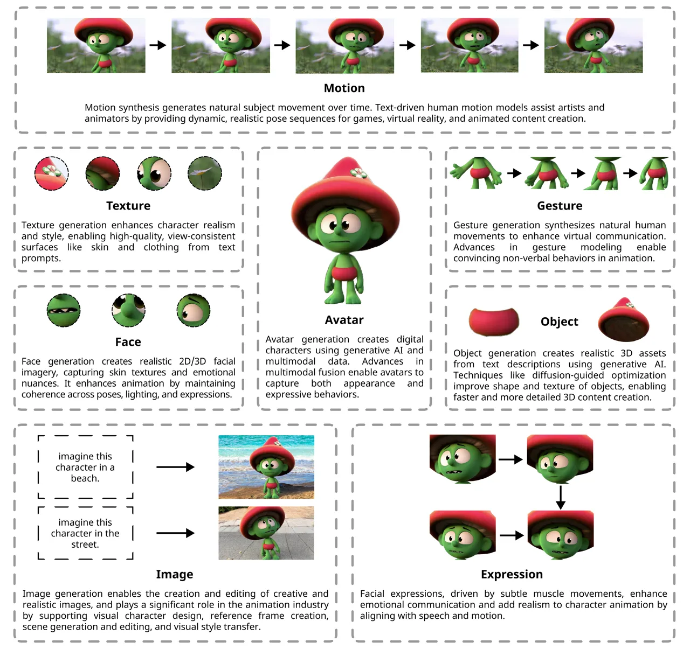

Figure 1: Overview of different components in animated character
generation. Each aspect, including face, expression, image, avatar,
gesture, motion, object, and texture, enhances realism and
expressiveness within digital animation environments. Generative AI
techniques, such as transformer-based and diffusion-based models,
contribute to these components by improving quality, streamlining
content creation, and enabling more sophisticated character animation.
Generative AI techniques, such as transformer-based and diffusion-based
models, contribute to these components, significantly enhancing quality
and streamlining content creation.

In the Face section, we discuss the role of generative AI in tasks such
as realistic face generation, facial reenactment, and attribute editing.
Models like StyleGAN \[11\] and its derivatives excel in producing
high-resolution, photorealistic faces, enabling detailed control over
facial features, expressions, and poses. Recent advances include
emotion-conditioned synthesis and speech-driven facial animation, which
enhance realism and interactivity.

In the Expression section, we explore the transformative impact of
generative AI in modeling and synthesizing facial expressions, a
cornerstone of nonverbal communication and character animation.
Techniques such as emotion-driven animation, facial expression
recognition (FER), and expression retargeting have advanced
significantly, enabling the creation of nuanced and lifelike facial
dynamics. Notable models such as DiffSHEG \[12\] revolutionized the
field by integrating multimodal data and leveraging diffusion-based
frameworks to achieve synchronized, expressive animations. These
innovations power applications ranging from virtual avatars in immersive
environments to adaptive tools in healthcare, driving progress in
human-computer interaction while addressing challenges like real-time
performance and identity preservation.

In the Image section, we discuss the role of generative AI in image
synthesis and editing, highlighting its transformative impact on
creative and practical applications. We categorize image datasets into
generation and editing tasks, leveraging resources like LAION \[13\],
COCO \[14\], and ADE20K \[15\], which provide extensive data for
training. Cutting-edge models like diffusion-based architectures and
hybrid frameworks enable high-quality image generation and manipulation.
Techniques like ControlNet \[8\] and disentangled latent space methods
offer enhanced precision in aligning outputs with user inputs, whether
for compositional synthesis or attribute adjustments.

In the Avatar section, we explore the advancements in generative AI for
avatar creation, focusing on generating lifelike and stylized digital
representations in both 2D and 3D. We examine datasets like WildAvatar
\[16\] and RenderMe-360 \[17\], which provide multimodal data, including
video, 3D body meshes, and audio, enabling the development of realistic
avatars with detailed facial expressions and dynamic motions. Key
models, such as SMPL \[1\] and FLAME \[18\], serve as foundational
frameworks for parametric body modeling. At the same time, methods like
NeRF-based and diffusion-based approaches advance the synthesis of
animate avatars with fine-grained control over appearance and motion.

In the Gesture section, we delve into generative AI’s role in gesture
generation, emphasizing its importance in creating human-like movements
for interactive and immersive experiences. We review datasets such as
BEAT \[19\] and Trinity Speech-Gesture \[20\], which integrate
modalities like audio, text, and motion capture data to model realistic
and context-aware gestures. Advanced models, including GAN-based and
transformer-based architectures, enable co-speech gesture generation and
stylistic customization, capturing temporal and semantic alignment with
input signals.

In the Motion section, we examine the advancements in generative AI for
human motion synthesis, focusing on text-constrained motion generation.
This task involves creating realistic and temporally coherent sequences
of human body poses based on natural language descriptions. Cutting-edge
models, such as MotionGPT \[21\] and Motiondiffuse \[22\], have
revolutionized this domain by leveraging variational autoencoders,
diffusion-based frameworks, and large language models (LLMs) to capture
diverse motion patterns and align them with textual prompts. These
systems utilize representations like skeletal keypoints, hierarchical
body joint rotations, or marker-based methods to ensure precision and
adaptability.

In the Object section, we delve into the transformative potential of
generative AI in text-to-3D object generation, a critical technology for
animation, gaming, and immersive environments. This task synthesizes 3D
models with realistic geometry, textures, and material properties from
textual descriptions, enabling seamless integration into virtual worlds.
Key innovations include using neural radiance fields (NeRFs) for
volumetric rendering and diffusion-based frameworks for high-fidelity
geometry and texture synthesis. Techniques such as multi-view
optimization and amortized training for real-time inference have
significantly improved efficiency and quality. These advancements
empower animators and designers to create detailed 3D assets rapidly,
streamlining workflows for storytelling, world-building, and interactive
media.

Finally, in the Texture section, we explore the advancements in
generative AI for creating detailed surface properties, such as
patterns, colors, and material characteristics, which are essential for
enhancing the realism of 3D models. Texture generation is pivotal in
animation and gaming by enriching geometric models with intricate
details, enabling lifelike or stylized appearances. Recent innovations
include text-guided texture synthesis, where natural language
descriptions drive the creation of specific textures, and techniques
like neural rendering and multi-view consistency ensure seamless
integration across perspectives.

In addition to these technical discussions, we include an Open Problems
& Research Directions section that identifies current challenges in
generative AI for character animation, such as dataset limitations,
real-time performance constraints, and ethical considerations. This is
followed by a Conclusion, summarizing key findings and reflecting on
future possibilities in this rapidly evolving field.

##### Contributions

In this work, (i) we present an in-depth survey of the core components
of animated character design, systematically analyzing the role of
generative AI in each aspect of the animation pipeline. We review recent
advancements in datasets, evaluation metrics, leading models, and
applications for each character animation component. An overview of the
different components and subfields is illustrated in Figure . (ii) To
support newcomers, we provide a comprehensive background section
introducing foundational models and evaluation metrics, equipping
readers with the necessary knowledge to enter the field (Appendix §).
(iii) We propose a well-defined and systematic taxonomy (Figure ) that
categorizes state-of-the-art models based on their primary contributions
to character animation, highlighting key methodologies and emerging
directions in AI-driven animation. (iv) To facilitate future research,
we compile and publicly share essential resources, including datasets,
benchmarks, models, and evaluation tools, fostering accessibility in the
field. (v) We identify current research trends and knowledge gaps,
offering insights and recommendations to guide future advancements in
generative AI for character animation.

{forest}

Figure 2: Taxonomy of recent advances in generative AI for character
animation, organized by key components within the animation environment.

## 2 Related Work

Several surveys have recently reviewed generative AI techniques applied
to specific animation domains. For instance, \[155\] examines GAN-based
face image synthesis and editing, detailing network architectures and
evaluation protocols to produce realistic static face images. In the
domain of temporal facial animation, \[156\] reviews deep learning
methods for audio-driven talking head generation, including
text-to-video conversion and speech-to-lip synchronization, while
\[157\] investigates face and full-body reenactment techniques utilized
in deepfake generation. These surveys emphasize advances in lip
synchronization, expression transfer, and identity preservation in
generated faces.

A different set of surveys addresses the generation of body motions and
gestures. \[158\] offers a comprehensive review of co-speech gesture
generation and compares data-driven models that convert audio or text
inputs into realistic character gestures. In a broader perspective,
\[159\] covers human motion synthesis methods conditioned on various
modalities such as text, audio, and scene context. Their work
categorizes motion generation approaches such as sequence-to-sequence
models and diffusion-based motion synthesizers. They also discuss
standard datasets and metrics for evaluating kinematic realism and
contextual coherence.

Recent studies on virtual avatars and digital humans have focused on
three-dimensional character modeling. \[160\] reviews techniques for
creating 3D human avatars, covering methods from geometry reconstruction
that employ implicit neural representations and NeRF \[9\] to fully
generative avatar synthesis driven by high-level control signals. Their
taxonomy spans body shape modeling, pose animation, and neural rendering
of human appearance. Similarly, \[161\] focuses on generating 3D object
shapes based on voxels, point clouds, and meshes. This survey discusses
how deep generative models such as GANs, VAEs, and diffusion models
learn to produce diverse, high-quality 3D geometries.

More broadly, surveys on image synthesis provide valuable context for
generative content creation applied to animation. \[162\] chronicles the
evolution of deep image generation models from early GANs and VAEs to
state-of-the-art diffusion and transformer-based generators,
highlighting improvements in output fidelity and diversity. Although
texture generation has not been the sole focus of a dedicated survey, it
is often treated as an essential component within comprehensive reviews
on image or 3D content generation, particularly in discussions on style
transfer and material synthesis.

In contrast to these focused investigations, our survey provides a
unified perspective on generative AI for character animation,
encompassing face, expression, gesture, motion generation, avatar
creation, and visual elements such as objects and textures. This
comprehensive framework organizes diverse methodologies into a coherent
taxonomy and highlights interconnections across traditionally distinct
subfields. For instance, the relationship between techniques used in
facial expression synthesis and those applied in body gesture animation
can be discovered through our survey. Furthermore, we provide an
in-depth background on recent advancements to support newcomers in the
field. To facilitate further research, we introduce key datasets used
across these subfields and make relevant resources, including benchmarks
and innovations, publicly available. Additionally, our survey integrates
recent advancements in diffusion-based models and multimodal
transformers while addressing standardized evaluation criteria for
generative AI in animation. By bridging these gaps, we offer a
comprehensive roadmap that is valuable to researchers and practitioners
developing AI-driven character animation systems.

## 3 Face

Face generation, considering both 2D and 3D representations, is an
expanding area of research aimed at synthesizing photorealistic and
contextually consistent facial imagery \[29\]. Whether creating static
portraits or dynamic, fully articulated 3D head models, the ability to
generate convincing faces underpins various applications, from virtual
assistants and entertainment to identity-protected data augmentation
\[27\]. This task often demands capturing subtle characteristics of
human appearance, such as facial landmarks, skin textures, and
expressions, while maintaining coherence across variations in lighting,
pose, and emotional states. Generating realistic faces requires a deep
understanding of human physiology and perception, coupled with advances
in generative modeling, computer graphics, and machine learning. Recent
progress, fueled by deep neural networks and data-driven techniques, has
empowered models to produce faces with striking fidelity and
personality. Furthermore, these approaches are integral to character
animation workflows, allowing models to seamlessly integrate facial
expressions, lip movements, and emotive nuances with full-body gestures
\[156\]. Additionally, parametric face models such as FLAME \[18\], when
combined with advanced generative architectures, facilitate
high-fidelity animation sequences that preserve identity and expression
details across various motion contexts \[157\]. As a result, face
generation has evolved from simplistic compositing techniques to
sophisticated frameworks capable of delivering nuanced, lifelike results
that further bridge the gap between virtual and real-world experiences.

### 3.1 Dataset

| Name                             | Statistics                                                                                                                                                                   | Modalities                  | Link                                                                                       |
| -------------------------------- | ---------------------------------------------------------------------------------------------------------------------------------------------------------------------------- | --------------------------- | ------------------------------------------------------------------------------------------ |
| RaFD \[163\]                     | More than 8,000 images. Images of 67 models displaying eight facial expressions, photographed from five different angles.                                                    | Images                      | [RaFD](https://rafd.socsci.ru.nl/)                                                         |
| MPIE \[164\]                     | Over 750,000 images with a broad range of variations in facial expressions, head poses, and lighting conditions.                                                             | Images                      | [MPIE](https://www.cs.cmu.edu/afs/cs/project/PIE/MultiPie/Multi-Pie/Home.html)             |
| VoxCeleb1 \[165\]                | More than 100,000 utterances from 1,251 celebrities.                                                                                                                         | Audio, Video                | [VoxCeleb1](https://www.robots.ox.ac.uk/~vgg/data/voxceleb/)                               |
| VoxCeleb2 \[165\]                | Over 1 million utterances from 6,112 celebrities.                                                                                                                            | Audio, Video                | [VoxCeleb2](https://www.robots.ox.ac.uk/~vgg/data/voxceleb/)                               |
| CelebA-HQ \[166\]                | 30,000 images at a resolution of 1024x1024, providing detailed facial images of celebrities.                                                                                 | Images                      | [CelebA-HQ](https://opendatalab.com/OpenDataLab/CelebA-HQ)                                 |
| FaceForensics \[167\]            | Over 1,000 video sequences with various face manipulations.                                                                                                                  | Video                       | [FaceForensics](https://justusthies.github.io/posts/faceforensics/)                        |
| 300-VW \[168\], \[169\], \[170\] | About 300 videos of faces in various scenarios and lighting conditions.                                                                                                      | Video                       | [300-VW](https://ibug.doc.ic.ac.uk/resources/300-VW/)                                      |
| FFHQ \[11\]                      | 70,000 images with extensive diversity, capturing various facial features, accessories, and environments.                                                                    | Images                      | [FFHQ](https://www.computer.org/csdl/journal/tp/2021/12/08977347/1h2AHNHb9bW)              |
| AffectNet \[171\]                | Over 1 million images collected from the internet, with annotations for 11 different facial expressions and emotions.                                                        | Images                      | [AffectNet](http://mohammadmahoor.com/affectnet/)                                          |
| M CelebA \[34\]                  | Over 150K facial images annotated with semantic segmentation, facial landmarks, and captions in multiple languages.                                                          | Images, Text                | [M CelebA](https://huggingface.co/datasets/m3face/M3CelebA/viewer)                         |
| CUB \[172\]                      | Over 11,000 images of 200 bird species, each annotated with various attributes like species, part locations, and bounding boxes.                                             | Images                      | [CUB](https://www.vision.caltech.edu/datasets/cub_200_2011/)                               |
| CelebA-Dialog \[173\]            | 202,599 face images from 10,177 identities, annotated with 5 fine-grained attributes: Bangs, Eyeglasses, Beard, Smiling, Age, along with captions and user editing requests. | Images, Text                | [CelebA-Dialog](https://mmlab.ie.cuhk.edu.hk/projects/CelebA/CelebA_Dialog.html)           |
| LS3D-W \[174\]                   | A dataset of 230,000 3D facial landmarks.                                                                                                                                    | Images                      | [LS3D-W](https://www.adrianbulat.com/face-alignment)                                       |
| MERL-RAV \[175\]                 | Over 19,000 face images with diverse head pose, all annotated by 68 point landmarks and visibility status.                                                                   | Audio, Video                | [MERL-RAV](https://github.com/abhi1kumar/MERL-RAV_dataset)                                 |
| AFLW2000-3D \[176\]              | Contains 2000 images with 68-point 3D facial landmarks, used to evaluate 3D facial landmark detection models with diverse head poses.                                        | Images, 3D/Point Cloud Data | [AFLW2000-3D](https://github.com/tensorflow/datasets/blob/master/docs/catalog/aflw2k3d.md) |
| FaceScape \[177\]                | Over 18K textured 3D faces, captured from 938 subjects, each with 20 specific expressions.                                                                                   | 3D/Point Cloud Data         | [FaceScape](https://facescape.nju.edu.cn/)                                                 |

Table 1: Summary of different facial datasets, highlighting their key
statistical characteristics and providing their corresponding links.

Face datasets are crucial for various applications in character
animation, including face generation, manipulation, recognition, and
editing. Face datasets can broadly be categorized into three main types:
i) face generation, ii) face editing, and iii) face recognition
manipulation datasets. Datasets for face generation include images of
people with changing expressions, different poses, and changing lighting
conditions. Such datasets will enable models to learn varied
representations of human faces under various conditions. RaFD \[163\]
and MPIE \[164\] have been two of the most common face datasets used in
these contexts. RaFD offers systematically controlled facial
expressions, gaze directions, and camera angles, validated through
extensive user studies to ensure both emotional clarity and naturalness.
Meanwhile, the Multi-PIE (MPIE) dataset significantly expands on pose,
illumination, and expression variations across multiple recording
sessions, making it a cornerstone for studying robust face recognition
and generation under real-world conditions.

Face editing datasets, on the other hand, are designed to modify facial
attributes such as age, emotion, or hairstyle in a way that preserves
identity. These datasets typically contain high-resolution face images
with rich annotations, including facial landmarks, emotions, and other
semantic features. Examples include the CelebA-HQ \[166\] and the
AffectNet \[171\] datasets.

Finally, face recognition and manipulation datasets focus on tasks like
face landmark detection, pose estimation, and identity manipulation.
These are further annotated in terms of more attributes, like facial
landmarks and bounding boxes, to further train the model and/or its
evaluation processes. For instance, VoxCeleb1 \[165\] and VoxCeleb2
\[165\] are used for voice-and-face recognition tasks, while the 300-VW
\[168\] is used for video data in facial landmark tracking in dynamic
environments. Table presents a summary of widely used face datasets,
their key statistics, modalities, and corresponding links.

### 3.2 Evaluation

Evaluating face generation models involves a multi-faceted approach that
captures various aspects such as visual realism, perceptual quality,
identity consistency, and task-specific alignment. These metrics ensure
that synthesized faces not only replicate the appearance of real-world
faces but also meet application-specific requirements, ranging from
realistic avatars to context-aware virtual assistants.

A widely used metric for assessing the overall quality of face
generation is the Fréchet Inception Distance (FID). This metric compares
the distribution of features between real and generated images,
providing a measure of how closely the generated faces resemble
real-world examples. A lower FID score indicates a closer match and
higher fidelity. Complementing FID, the CLIP Score evaluates semantic
alignment between generated faces and text or image prompts. This metric
is particularly valuable in conditional generation tasks, ensuring the
output matches the intended input.

To evaluate emotional expressiveness in generated faces, the Expression
Score measures the accuracy and intensity of facial expressions, such as
happiness, anger, or sadness. This is crucial for applications where
emotional communication is key. Additionally, the Mean Squared Error
(MSE) offers a straightforward comparison by quantifying the pixel-wise
or feature-wise difference between generated faces and ground truth
data. While MSE is an objective metric, it is often combined with
perceptual metrics to provide a more nuanced assessment.

Perceptual quality is crucial in face evaluation, with metrics like
LPIPS capturing subtle visual differences such as texture and lighting,
and Identity Consistency ensuring recognizable and stable facial
features across variations. For anatomical accuracy, Landmark Accuracy
assesses the precision of facial key points, while Lip Sync Quality
evaluates synchronization between lip movements and audio for a natural
speech-driven generation. Error-based metrics like Median Error measure
average deviations robustly, and Multi-View Identity Consistency (MVIC)
ensure identity consistency across angles, vital for applications like
3D modeling and virtual reality.

Advanced metrics are often introduced for specific scenarios. For
example, the Fréchet Video Distance (FVD) adapts the concept of FID to
sequential data, measuring the temporal coherence and realism of
generated videos. This metric is particularly important when evaluating
face-generation models that output dynamic or time-sequenced content.
The Perceptual Face Similarity (PFS) metric assesses high-level
perceptual features, focusing on human-aligned judgments of realism. In
cases involving 3D face generation, the 3D Face Alignment Score
evaluates the geometric accuracy of generated faces relative to ground
truth 3D models or vertex data, ensuring precise depth and spatial
alignment.

A range of recent methods has improved face generation with respect to
visual quality, realism, and controllability. More specifically,
StyleGAN-based models (e.g., StyleGAN2 \[178\] and StyleGAN3 \[179\])
have demonstrated superior latent-space manipulation with fine-grained
facial attribute control. Diffusion-based models have also gained
popularity, utilizing iterative denoising methods for generating
high-fidelity and photorealistic faces. Besides that,
multiview-consistent models such as EG3D \[180\] generalize beauty to 3D
representations with well-coherent geometry across views. These
state-of-the-art methods also usually involve advanced metrics such as
FID, LPIPS, and Identity Consistency to evaluate aesthetic quality and
identity consistency of synthesized faces, closely following the
multi-faceted evaluation methodologies outlined above.

### 3.3 Models

Face generation models generate photorealistic 2D or 3D faces by
leveraging generative models such as GANs. The recent trends in the area
include multi-component architectures where static and dynamic features
are separated for the exact control of facial expressions and textures.
Basic models like StyleGAN \[11\] and ResNet \[181\] form the backbone,
while innovations involving emotion conditioning and speech-driven
synthesis make them more realistic and interactive.

#### 3.3.1 Face Reenactment and Identity Preservation

These models focus on transferring expressions and poses from one
identity to another while preserving the source or target identity.
Early methods, such as Dual-Generator (DG) \[23\], address large-pose
reenactment using two modules: the ID-Preserving Shape Generator and the
Reenacted Face Generator, the latter based on StarGAN2 \[182\]. Figure
shows more details of the architecture. DG employs 3D landmarks to guide
expression transfer and introduces a visible local shape loss
($`L_{vls}`$) to mitigate occlusions in rotated faces. While effective
in preserving shape integrity, its reliance on structural priors such as
3D landmarks limits robustness.

Building on these limitations, One-Shot Face Reenactment \[24\] removes
dependencies on explicit landmark detection and 3D coefficients.
Instead, it introduces a Feature Disentanglement module to separate
identity and attributes, along with Feature Displacement Fields to
spatially align identity features with target expressions or poses.
Additionally, its Identity Transfer module leverages self-attention to
enforce consistency. While more robust than prior approaches, it remains
inadequate for extreme poses and struggles with complex transformations.

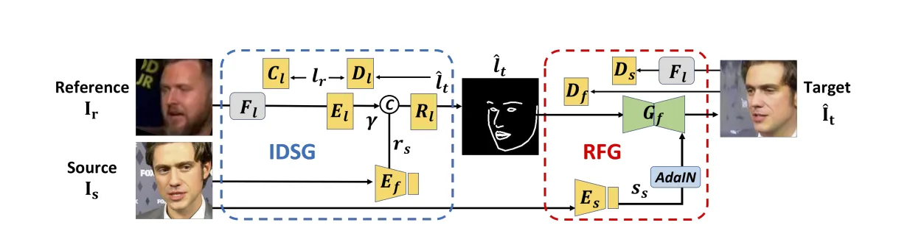

Figure 3: Overview of the Dual-Generator (DG) \[23\] network, which
consists of two generators: the ID-preserving Shape Generator (IDSG) and
the Reenacted Face Generator (RFG). Given a source face $`I_{s}`$ and a
reference face $`I_{r}`$, the IDSG transforms the reference’s actions
into landmarks $`\hat{l}_{t}`$. Using these landmarks and $`I_{s}`$, the
RFG produces a reenacted face $`\hat{I}_{t}`$ that matches the pose and
expression of $`I_{r}`$ while preserving the identity of $`I_{s}`$.
Reprinted from \[23\].

For more efficient reenactment, \[25\] directly maps pose and expression
variations from a 3D face model into the StyleGAN2 \[178\] latent space.
This does not require explicit identity/pose embeddings and gives
realistic, identity-preserving results, but has a limited expressive
linear mapping. IricGAN \[26\] further improves controllability using
two modules: a Hierarchical Feature Combination module to preserve
identity and semantics, and an Attribute Regression Module for
intensity-aware smooth edits. It replaces pre-trained recognition
networks with a custom training approach, requiring meticulous tuning to
ensure stability.

Finally, HiFace \[27\] advances 3D face modeling by disentangling static
and dynamic details using its SD-DeTail (Static and Dynamic Decoupling
for DeTail Reconstruction) Module. It uses ResNet-50 \[181\] for feature
extraction and AdaIN (Adaptive Instance Normalization) \[183\] for
detail synthesis to enable smooth, high-fidelity animation transitions
past the entanglement limitation of earlier methods. It allows the model
to reconstruct a high-fidelity 3D face from a single image with
realistic and animatable details.

#### 3.3.2 3D Face Generation and Editing

These models generate or edit 3D faces, often with control over
expressions, lighting, or geometry. To improve identity preservation and
expression control, a Controllable 3D GAN Face Model \[28\] utilizes a
Supervised Auto-Encoder for disentangling identity and expression into
disjoint latent spaces, maintaining their correlation through a shared
decoder. Expression levels are controlled precisely through a
Conditional GAN (cGAN) \[184\], which is essentially characterized by a
loss function incorporating both a reconstruction and a classification
term. Although this approach is effective in separation and management,
it remains data-intensive and computationally elaborate because of its
complicated structure. Pushing beyond the limitations of illumination
control and texture realism, AlbedoGAN \[29\] proposes a self-supervised
model that utilizes StyleGAN2 \[178\] latent space to generate
high-resolution albedo and very detailed 3D facial geometry. It improves
texture coherence with mesh refinement combined with a per-vertex
displacement map integrated into the FLAME model \[18\], while also
ensuring identity consistency with a symmetric reconstruction loss.
Notably, it incorporates CLIP to enable text-based 3D face editing, a
feature absent in earlier models. Nevertheless, it remains heavily
dependent on StyleGAN2 \[178\] and struggles with capturing fine
details, such as hair.

Focusing on animation and motion realism, GSmoothFace \[30\] introduces
a speech-driven talking face generation model through fine-grained 3D
modeling. Its two-stage pipeline is comprised of a Target Adaptive Face
Translation module and Morphology Augmented Face Blending (MAFB),
enabling identity-coherent and stable video synthesis. Innovations like
bias-based cross-attention improve lip synchronization, while MAFB
alleviates distortions in face blending. Concentrating on deep learning
with conventional graphics, the Hybrid Generator \[31\] unites
StyleGAN2-based neural generation with interpretable elements such as
the FLAME 3D head model and a differentiable renderer. This hybrid
framework enables photorealistic but controllable adjustment of facial
identity, expression, and pose, providing accuracy and interpretability
that cannot be attained with solely neural or graphics-based models.

#### 3.3.3 Text-to-Face and Style-Based Face Generation

These models generate faces from text prompts or manipulate attributes
in the latent space. Traditional approaches rely on direct linear
manipulation of latent codes, but AdaTrans \[32\] introduces a more
adaptive mechanism using nonlinear latent space transformations. This
improves the model’s ability to handle complex conditional edits while
preserving image realism, surpassing previous linear editing methods
based on StyleGAN \[11\]. Advancing textual control, StyleT2I \[33\]
addresses attribute compositionality and faithfulness issues by
incorporating a CLIP-guided contrastive loss and a Text-to-Direction
module. The latter learns latent directions corresponding to textual
descriptions, while Compositional Attribute Adjustment ensures that
multiple attributes are correctly and coherently expressed.

The multimodal extension with M3Face \[34\] facilitates the generation
and editing process by utilizing multilingual text, segmentation masks,
or landmarks. It uses models such as Muse \[185\] and VQ-GAN \[186\] to
extract conditioning inputs, which are subsequently fed into ControlNet
\[8\] for synthesis and optimized with Imagic for high-fidelity
fine-tuning. The architecture is able to seamlessly combine the
generation and editing process in an end-to-end pipeline, thereby
greatly enhancing accessibility and versatility for various languages
and input modalities.

Focusing on semantics and control, GuidedStyle \[35\] introduces a
knowledge network built from a pre-trained attribute classifier to guide
semantic face editing in StyleGAN \[11\]. Sparse attention enables
controlled, layer-wise editing, preserving disentanglement and
preventing unintended attribute changes, ensuring precise and
interpretable edits. AnyFace \[36\] marks a step toward open-world,
free-form text-to-face generation. It employs a two-stream framework
that separately handles text-to-face synthesis and face reconstruction,
improving visual-text alignment. Leveraging CLIP encoders and a
Cross-Modal Distillation module, it integrates text and image features
within StyleGAN’s latent space. Additionally, a Diverse Triplet Loss
promotes variation and semantic consistency, addressing challenges such
as mode collapse and the rigid vocabularies of earlier models.

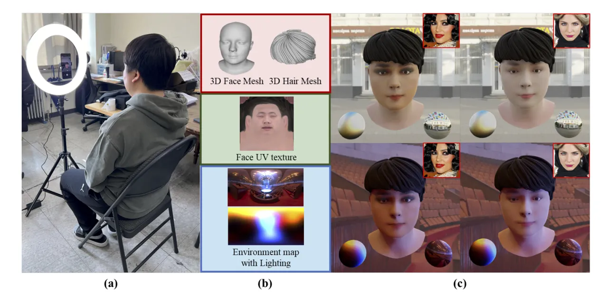

Figure 4: Overview of InViTe \[187\] in three stages: (a) capturing a
user’s face to produce a personalized 3D model, (b) generating
intermediate outputs for rendering, and (c) performing 3D face
manipulation (such as makeup style changes) on a mobile device.
Reprinted from \[187\].

### 3.4 Application

Face generation and editing, both in 2D and 3D, are integral to many
applications in generative AI, including virtual avatars, face
recognition, animation, and expression transfer. In 3D, generative
models such as GANs \[188\] and cGANs \[184\] are central to creating
realistic virtual avatars for use in video games, virtual reality (VR),
and augmented reality (AR). With these models, users are able to create
highly detailed customizations, adjusting face features, expressions,
and textures to make avatars or characters that look so real for
personalized experiences. The Individual Virtual Transfer (In-ViTe)
\[187\] system, as Figure represents, allows users to create and
customize 3D faces according to their preferences, contributing to the
personalization of virtual avatars. AvatarGen \[189\] is a 3D generative
model that facilitates the unsupervised creation of clothed virtual
humans with various appearances and animatable poses, important for
applications in AR/VR. They also improve facial recognition systems,
enhance animation for movies, and generate synthetic training data for
AI models. Expression transfer in 3D faces is critical for dynamic
content like movie characters and virtual assistants. These models are
also applied in biometric security systems to recognize faces under
varying conditions.

In 2D, face generation plays a critical role in creative fields such as
digital art, personalized avatars, and portrait synthesis. Models like
StyleGAN \[11\] have been widely used for generating realistic
portraits, enabling applications in gaming, advertising, and content
creation. Text-to-image and text-to-3D models are becoming increasingly
popular for generating faces based on user prompts, allowing for high
customization in virtual environments and applications like virtual
assistants or digital twins in health and wellness sectors \[190\]. The
capability to modify not only appearance but also expressions and poses
enables new avenues for interactive media, advertising, and film, where
characters could respond dynamically to user interactions or narrative
changes.

## 4 Expression

Facial expressions result from small muscle movements in the face and
serve as key indicators of a person’s emotional state \[191\]. The
Facial Action Coding System (FACS) was the first widely adopted and
empirically validated framework for classifying emotions based on facial
expressions \[192\].

Facial expressions are central to various tasks in computer vision and
animation. They play a crucial role in nonverbal communication and are
essential for generating believable and engaging animated characters
\[41\]. For instance, accurate lip sync and facial expressions enhance
the expressiveness, personality, and storytelling of animated
characters. Similarly, facial expression recognition (FER) is a key task
in computer vision that focuses on identifying and categorizing
emotional expressions. FER has applications in healthcare, security, and
driver safety, contributing to its adoption in human-computer
interaction for intelligent and adaptive systems \[193\]. Another
related task is Facial Expression Retargeting, which involves generating
new images of a person with controlled poses and facial expressions
while preserving their identity \[51, 52\].

### 4.1 Dataset

Facial expression-related tasks often rely on an auxiliary modality that
supports the primary objective, whether in animation, recognition, or
other applications. To accurately capture and represent facial
expressions, datasets typically include detailed annotations of facial
movements using blend shapes and Action Units (AUs).

##### Blendshapes

Blendshapes are predefined facial deformations that can be combined to
generate a wide range of expressions. They are particularly important in
animation and facial expression synthesis, allowing for precise control
over facial features and enabling smooth, realistic transitions between
expressions.

##### Action Units (AUs)

AUs are a core component of FACS, which categorizes facial movements
based on the muscles involved. Each AU corresponds to a specific muscle
action, such as raising the eyebrows or tightening the lips. By
annotating facial expressions with AUs, datasets provide a granular and
interpretable way to analyze and generate facial expressions, making
them essential for tasks like Facial Expression Recognition (FER) and
animation.

Datasets such as TEAD (Text-Expression Aligned Dataset) \[41\] leverage
both blend shapes and AUs to align natural language semantics with
facial expressions. TEAD links text descriptions with emotion tags, AUs,
and blend shape weights, facilitating tasks like emotion-driven
text-to-face generation. Similarly, the BEAT dataset \[19\], widely used
in speech-driven facial animation research, integrates 52-dimensional
blend shape weights with audio, emotion, and gesture modalities, making
it a valuable resource for multimodal emotion expression studies.

Beyond facial expression data, most datasets incorporate auxiliary
modalities such as speech, images, or video to support various
applications. For instance, VOCASET \[38\] pairs high-fidelity 4D facial
scans with synchronized audio, enabling the generation of 3D facial
animations from speech input. The SHOW dataset \[55\] combines video,
audio, facial expressions, and pose data to generate holistic 3D human
motion from speech, highlighting the role of auxiliary modalities in
enhancing expressiveness and realism.

By integrating blend shapes, AUs, and auxiliary modalities, facial
expression datasets provide essential tools for developing sophisticated
models capable of capturing the subtle nuances of human expression. More
details on these datasets can be found in Table .

| Name                          | Statistics                                                                                                                                                                                                   | Modalities                                      | Link                                                                           |
| ----------------------------- | ------------------------------------------------------------------------------------------------------------------------------------------------------------------------------------------------------------ | ----------------------------------------------- | ------------------------------------------------------------------------------ |
| BEAT \[19\]                   | 76 hours of speech data, paired with 52D facial blend shape weights; 30 speakers performing in 8 distinct emotional styles across 4 languages.                                                               | Audio, Images, Video, Text                      | [BEAT](https://pantomatrix.github.io/BEAT/)                                    |
| MEAD \[194\]                  | A talking-face video corpus featuring 60 actors and actresses talking with eight different emotions at three intensity levels; approximately 40 hours of audio-visual clips per person and view.             | Video, Audio, Text, Images                      | [MEAD](https://wywu.github.io/projects/MEAD/MEAD.html)                         |
| TEAD \[41\]                   | 50,000 quadruples, each including text, emotion tags, Action Units, blend shape weights, and situation sentences.                                                                                            | Text, Images                                    | \-                                                                             |
| JAFFE \[195\]                 | 213 images of 10 Japanese female models posing 7 facial expressions, annotated with average semantic ratings from 60 annotators.                                                                             | Images                                          | [JAFFE](https://zenodo.org/records/3451524)                                    |
| MMI Facial Expression \[196\] | Over 2900 videos and high-resolution still images of 75 subjects.                                                                                                                                            | Video, Images, Text                             | [MMI](https://mmifacedb.eu/)                                                   |
| Multiface \[197\]             | High-quality recordings of the faces of 13 identities. An average of 23,000 frames per subject; each frame includes roughly 160 different camera views.                                                      | Images, Audio, Tabular Data                     | [Multiface](https://github.com/facebookresearch/multiface)                     |
| ICT FaceKit \[198\]           | 4,000 high-resolution facial scans of 79 subjects (34 female, 45 male) aged 18–67, plus 99 full-head scans and 26 expressions per subject.                                                                   | 3D/Point Cloud Data, Images                     | [ICT FaceKit](https://github.com/ICT-VGL/ICT-FaceKit)                          |
| TikTok Dataset \[199\]        | Over 300 single-person dance videos (10–15 seconds each), extracted at 30fps, yielding 100K+ frames. Includes segmented images and computed UV coordinates.                                                  | Video, Images, Tabular Data                     | [TikTok Dataset](https://www.yasamin.page/hdnet_tiktok#h.jr9ifesshn7v)         |
| Everybody Dance Now \[200\]   | Long single-dancer videos for training and evaluation; includes both self-filmed videos and short YouTube videos.                                                                                            | Video, Tabular Data                             | [Everybody Dance Now](https://carolineec.github.io/everybody_dance_now/)       |
| Obama Weekly Footage \[201\]  | 17 hours of video footage, nearly two million frames, spanning eight years.                                                                                                                                  | Video, Audio                                    | [Obama Weekly Footage](https://grail.cs.washington.edu/projects/AudioToObama/) |
| VoxCeleb2 \[202\]             | Over 1 million utterances from over 6,000 speakers, collected from YouTube videos with 61% male speakers.                                                                                                    | Audio, Video                                    | [VoxCeleb2](https://www.robots.ox.ac.uk/~vgg/data/voxceleb/vox2.html)          |
| BIWI \[203\]                  | Over 15K images of 20 people recorded with a Kinect while turning their heads around freely.                                                                                                                 | 3D/Point Cloud Data, Images, Tabular Data, Text | [BIWI](https://paperswithcode.com/dataset/biwi-kinect-head-pose)               |
| VOCASET \[38\]                | About 29 minutes of high-fidelity 4D scans captured at 60fps, synchronized with audio; features 12 speakers with 40 sequences per subject (each sequence consists of English sentences lasting 3–5 seconds). | 3D/Point Cloud Data, Audio                      | [VOCASET](https://voca.is.tue.mpg.de/)                                         |
| SHOW \[55\]                   | Contains SMPLX \[204\] parameters of 4 persons reconstructed from videos; includes 88-frame motion clips for training and validation.                                                                        | Video, Audio, Images, Tabular Data              | [SHOW](https://github.com/yhw-yhw/SHOW)                                        |

Table 2: Overview of various datasets related to facial expressions,
including their main statistical features, modalities, and links.

### 4.2 Evaluation

Evaluating facial expression models requires a diverse set of metrics to
assess their performance across key dimensions such as realism, identity
preservation, synchronization, and diversity. These metrics offer
critical insights into different methods’ effectiveness and
applicability in real-world scenarios. The evaluation process broadly
consists of objective metrics for quantitative analysis and user studies
for perceptual validation.

Quantitative metrics serve as the foundation for performance assessment,
targeting specific aspects of model output. For instance, Lip Vertex
Error (LVE) and Emotional Vertex Error (EVE) measure spatial accuracy by
computing the Euclidean distance between predicted and ground-truth
vertices for lip and emotional regions, respectively. Similarly, Mean
Absolute Error (MAE) evaluates the alignment of generated expressions
with ground-truth Action Units, providing a fine-grained analysis of
expression dynamics. These metrics help ensure precise motion synthesis
while identifying areas for improvement, such as synchronization with
speech or text inputs.

Generative metrics such as Fréchet Inception Distance (FID) and Learned
Perceptual Image Patch Similarity (LPIPS) are widely used to evaluate
perceptual quality. FID measures distributional similarity between
generated and real images, capturing visual fidelity, while LPIPS
leverages deep learning features to assess structural coherence.
Additionally, the Structural Similarity Index (SSIM) \[205\] and Peak
Signal-to-Noise Ratio (PSNR) wang2004image quantify low-level image
quality, detecting deviations from ground-truth facial features.

Identity preservation is another critical evaluation aspect,
particularly for tasks like expression retargeting. Metrics such as
Face-Cosine Similarity \[52\] measure identity consistency by comparing
facial feature embeddings of generated and source images, ensuring that
expressions remain faithful to the original identity. For dynamic
expressions, temporal and motion-based metrics play a key role. Fréchet
Motion Distance (FMD), Fréchet Expression Distance (FED), and Fréchet
Gesture Distance (FGD) assess the realism and synchronization of motion
sequences. Additionally, the Percent of Correct Motions (PCM) and
Semantic Relevance Gesture Recognition (SRGR) evaluate how well facial
motions align with speech and semantic content, enhancing the contextual
appropriateness of generated animations.

##### User studies

These complement objective evaluations by capturing subjective
perceptions of realism and expressiveness. Participants rate the
naturalness and emotional resonance of generated expressions, providing
insights that quantitative metrics may overlook. A/B tests are commonly
used in these studies to compare models against baselines, highlighting
their relative strengths and weaknesses.

Benchmark evaluations in facial expression modeling have evolved to
assess models across multiple dimensions, including realism, identity
preservation, synchronization, and computational efficiency. Recent
advancements, particularly diffusion-based frameworks, have set new
standards for generating expressive and temporally coherent animations.
Benchmarks now emphasize models that handle diverse datasets and
multimodal inputs, reflecting the growing demand for real-time and
context-aware applications. State-of-the-art approaches, such as AdaMesh
\[44\] and DiffSHEG \[12\], showcase architectures that balance
expressiveness with computational efficiency. These benchmarks serve as
a guiding framework for future advancements in generative AI for facial
expression modeling.

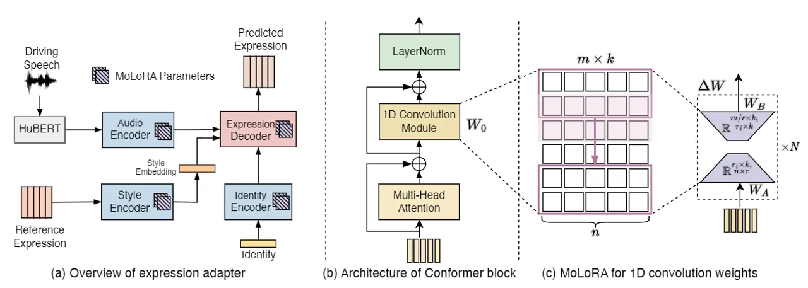

Figure 5: Overview of AdaMesh \[44\] model: (a) The expression adapter
integrates MoLoRA \[206\] parameters (striped patches) into pre-trained
encoders and the decoder to enable efficient adaptation for facial
expressions. (b) Architecture of the Conformer block \[207\], showcasing
its 1D convolution module and multi-head attention. (c) Illustration of
MoLoRA applied to the convolution operator, with low-rank decomposition
enhancing adaptation efficiency. MoLoRA is also applied to linear layers
in the expression adapter. Reprinted from \[44\].

### 4.3 Models

Recent advancements in facial expression modeling have significantly
improved expression retargeting and speech-driven animation. Expression
retargeting enables the transfer of facial expressions while preserving
the target’s identity, a crucial capability for animation and virtual
reality applications. Meanwhile, speech-driven models have evolved to
synthesize expressive facial motions in response to audio or text
inputs, enhancing the realism of animated characters.

#### 4.3.1 Speech-Driven and Multimodal Expression Generation

\[37\] introduces a joint audio-text model for 3D facial animation,
integrating a GPT-2-based text encoder with a dilated convolution audio
encoder. This bimodal approach improves upper-face expressiveness and
lip synchronization compared to VOCA \[38\] and MeshTalk \[39\], though
it lacks head and gaze control. Similarly, CSTalk \[40\] employs a
transformer-based encoder to capture correlations across facial regions,
enhancing realism in emotional speech-driven animations. However, its
expressivity is limited to five emotions.

ExpCLIP \[41\] aligns text, image, and expression embeddings via CLIP
encoders, enabling expressive speech-driven facial animation from
text/image prompts. It uses the TEAD dataset and Expression Prompt
Augmentation to adapt to diverse emotional styles. \[42\] enhances
personalization by disentangling style and content representations,
improving identity retention and transition smoothness. Compared to
FaceFormer \[43\], it achieves superior audio-visual synchronization,
though computational efficiency remains a challenge.

AdaMesh \[44\] introduces an Expression Adapter (MoLoRA-enhanced) and
Pose Adapter (retrieval-based) for personalized speech-driven facial
animation. Compared to GeneFace \[45\] and Imitator \[46\], it
demonstrates improved expressiveness, diversity, and synchronization.
Figure shows more architectural details. Similarly, \[47\] explores
disentangling emotional expressiveness with FaceXHuBERT \[48\] and
FaceDiffuser \[49\], highlighting stochastic approaches for motion
variability.

#### 4.3.2 Expression Retargeting and Motion Transfer

Neural Face Rigging (NFR) \[51\] automates 3D mesh rigging, encoding
interpretable deformation parameters aligned with ICT \[198\] and
Multiface \[197\], enabling fine-grained facial expression transfer.
More details of the NFR architecture can be found in Figure . MagicPose
\[52\] leverages diffusion models for 2D facial expression retargeting,
balancing identity preservation and motion control through Multi-Source
Attention and Pose ControlNet. Compared to DreamPose \[53\] and Disco
\[54\], it excels in identity retention and generalization but struggles
with extreme expressions.

DiffSHEG \[12\] pioneers joint 3D facial expression and gesture
synthesis, enforcing speech-driven alignment via uni-directional
conditioning. It introduces Fast Out-Painting-based Partial
Autoregressive Sampling (FOPPAS) for seamless, real-time motion
generation. Compared to TalkSHOW \[55\], LS3DCG \[56\], and
DiffuseStyleGesture \[50\], it achieves higher realism and
synchronization, though boundary inconsistencies persist in long
sequences.

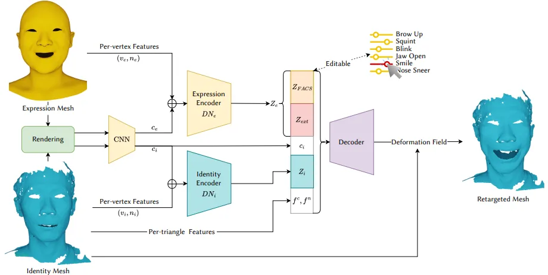

Figure 6: Overview of Neural Face Rigging (NFR) \[51\]. The model
extracts an expression code $`z_{e}`$ from an unrigged mesh with an
unknown expression (yellow) and an identity code $`z_{i}`$ from a target
neutral mesh (cyan). The extracted codes are combined to generate a
retargeted mesh (blue) with transferred expressions and
identity-preserving deformations. A part of $`z_{e}`$, denoted
$`z_{\text{FACS}}`$, enables interpretable rigging parameters, making
NFR an artist-friendly tool for automatic rigging and expression
retargeting. Reprinted from \[51\].

### 4.4 Application

Advancements in facial expression modeling have enabled a wide range of
applications across industries. Realistic facial animations enhance
immersion in gaming by making non-playable characters (NPCs) more
expressive and emotionally engaging. Similarly, virtual reality (VR)
benefits from these technologies by enabling personalized, synchronized
3D avatars. Models like AdaMesh \[44\] and DiffSHEG \[12\] facilitate
expressive avatar animation, though real-time performance remains a
challenge due to computational constraints.

In interactive media and animation, these technologies streamline
digital human creation, reducing the need for manual animation while
improving expressiveness. CSTalk \[40\] and FaceDiffuser \[49\] enable
nuanced emotional representation for storytelling, metaverse content,
and digital assistants. Furthermore, real-time generation methods, such
as DiffSHEG’s FOPPAS \[12\], demonstrate the potential for live-streamed
virtual performances by ensuring smooth and adaptive facial animation.
However, achieving consistent quality across different platforms and
balancing computational efficiency with expressiveness remain key
challenges.

Beyond entertainment, facial expression models are increasingly applied
in healthcare and education. Expression recognition systems support
therapeutic applications and adaptive learning environments \[208,
209\]. However, privacy concerns, demographic biases, and the need for
robust data protection necessitate further research. Future efforts
should focus on expanding emotion representations and improving model
scalability to meet the growing demands across these domains while
ensuring ethical deployment.

## 5 Image

Image generation using deep learning models has garnered significant
attention in recent years. Advances in this field have led to the
development of powerful models such as GANs \[210\] and diffusion models
\[211\], which can produce highly realistic and creative images. These
models have numerous applications in digital art \[212\], design
\[213\], and augmented reality \[214\]. More importantly, in animation,
image generation models play a crucial role in creating character
visuals, synthesizing facial expressions, and rendering textures
\[215\]. For instance, diffusion models can generate high-quality facial
images that serve as references for character design \[216\]. In
contrast, GAN-based models can create diverse character poses and aid in
motion synthesis \[217\]. These techniques significantly reduce the time
and cost required for creating visual assets in the animation production
pipeline.

### 5.1 Dataset

[TABLE]

Table 3: Overview of various image datasets, including their main
statistical features, modalities, and link.

Image datasets can be categorized into different types based on their
applications, primarily falling into two main groups: (i) image
generation datasets and (ii) image editing datasets.

Image generation datasets typically include images, descriptions, and,
in some cases, control conditions \[8\]. Most research relies on widely
used public datasets such as LAION \[13\] and COCO \[14\], though other
sources like Unsplash \[223\] and Pixabay \[224\] are sometimes used for
data collection \[65\].

Image editing datasets contain the original and edited images and a
description of the intended modification. Since maintaining similarity
between pre- and post-edit images is crucial while ensuring alignment
with the textual description, creative techniques are often employed to
construct such datasets. A common approach involves leveraging a large
language model (LLM) and a text-to-image model \[62\]. First, the LLM
generates captions for the input image, edit instructions, and output
captions reflecting the modifications. Then, a pre-trained text-to-image
model converts the caption pairs (describing pre-edit and post-edit
images) into corresponding image pairs \[62\]. Table presents an
overview of widely used image generation and editing datasets.

### 5.2 Evaluation

In evaluating image generation models, a comprehensive set of
quantitative and qualitative metrics is used to assess their quality and
performance. Quantitative metrics such as Fréchet Inception Distance
(FID), Learned Perceptual Image Patch Similarity (LPIPS), and Kernel
Inception Distance (KID) are widely employed to evaluate the
distributional similarity of generated images to real images. These
metrics compare images’ high- and low-level features to measure their
statistical alignment. Additionally, metrics like CLIP Score are used to
assess the semantic alignment between the image and the input text \[66,
62\]. PSNR (Peak Signal-to-Noise Ratio) \[225\] and SSIM (Structural
Similarity Index) \[205\] are also used to evaluate image reconstruction
quality based on the level of detail preservation and noise in the
output \[64\]. The results of these evaluations are compared with the
best available models to analyze the model’s performance more
accurately.

Alongside these quantitative metrics, qualitative evaluations also play
a significant role in assessing the perceptual quality of images. In
many studies, human evaluation examines the generated content’s visual
realism and semantic consistency with the text or initial conditions.
For example, in studies utilizing Amazon Mechanical Turk or similar
platforms for human surveys, participants have assessed the realism,
aesthetics, and semantic alignment of the images, such as SVDiff \[60\]
and Imagic \[65\]. These methods are highly effective for evaluating
metrics such as visual similarity, content coherence, and overall output
quality, as the ultimate goal of many image generation models is to
create images that appear natural and meaningful to humans \[8, 65\]. In
addition to qualitative and quantitative metrics, some studies have
examined the impact of model parameter variations on final performance.
For instance, changing hyperparameters such as learning rate, batch
size, or the number of sampling steps can significantly affect the
output quality \[226, 67, 65\].

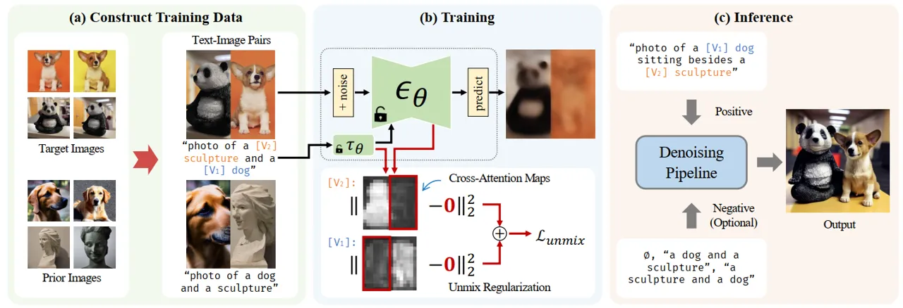

Figure 7: The Cut-Mix-Unmix data augmentation technique for
multi-subject generation, implemented in SVDiff \[60\]. The
Cut-Mix-Unmix method is a data augmentation technique designed to train
image generation models to handle multiple subjects. By creating
composite images and corresponding textual prompts, the method teaches
the model to distinguish between different concepts. Through Unmix
regularization and applying MSE to the attention maps, the model is
encouraged to separate better the subjects (e.g., a dog and a panda).
Reprinted from \[60\].

Another approach to evaluating the outputs of generative models involves
comparing different models based on factors such as image quality,
resource consumption, and efficiency \[227, 228, 61, 229, 69, 63, 65\].
In this method, models are compared against each other to identify their
strengths and weaknesses. Furthermore, in some studies, models are
evaluated under different conditions and on diverse datasets to measure
their generalization capabilities. Well-known benchmarks such as MS-COCO
\[14\], DreamBench \[230\], TEdBench \[65\] and LAION-5B \[13\] are
widely used for evaluating image generation models \[68, 57, 60\].

The evaluation of image generation models is a multidimensional process
combining quantitative metrics and qualitative assessments to understand
a model’s capabilities comprehensively. Metrics such as FID, LPIPS, CLIP
Score, PSNR, and SSIM offer valuable insights into the statistical,
perceptual, and semantic aspects of image quality. At the same time,
human evaluations provide a more accurate reflection of user
satisfaction in real-world scenarios. Recent studies, such as KOSMOS-G
\[68\], Imagic \[65\] and ControlNet \[8\], through comparisons with
other models, analysis of the metrics above, and human assessments, have
shown that their proposed methods are better at preserving the semantic
content of images and delivering higher quality outputs.

### 5.3 Models

#### 5.3.1 Image Generation

Diffusion models have achieved remarkable success in text-to-image
generation, enabling the creation of high-quality images from text
prompts or other modalities. Using the most advanced techniques in deep
learning, these models have generated high-quality images with precise
alignment to text descriptions. In this regard, models like Imagen
\[57\] and SDXL \[58\] have significantly improved the accuracy and
quality of text-to-image generation. Imagen \[57\] builds on the power
of large transformer language models in understanding text and hinges on
the strength of diffusion models in high-fidelity image generation
\[57\]. SDXL \[58\] is also a latent diffusion model for text-to-image
synthesis. Compared to previous versions of Stable Diffusion \[59\],
SDXL leverages a three times larger U-Net backbone \[231\].

In parallel with the advancements in high-quality text-to-image
generation through diffusion models, there is an increasing demand for
more efficient customization techniques. Existing methods for
customizing diffusion models face several challenges, especially when
dealing with multiple personalized subjects and minimizing the risk of
overfitting. Additionally, the large number of parameters in these
models leads to inefficiencies in storage. SVDiff \[60\] has been
proposed to address these limitations by introducing a compact parameter
space called spectral shift for diffusion model fine-tuning. The Cut
Mix-Unmix data augmentation technique further enhances the quality of
multi-subject generation, allowing for handling similar categories. The
way this mechanism works is illustrated in Figure .

Despite these advances, text-to-image models remain limited in
controlling spatial composition. ControlNet \[8\] addresses this by
locking large pre-trained diffusion models and reusing their deep,
robust encoding layers (trained on billions of images) as a strong
backbone for learning a diverse set of conditional controls. Extensive
results show that ControlNet \[8\] may facilitate broader applications
in controlling image diffusion models.

#### 5.3.2 Image Editing

In addition to image generation, developing models for image editing
through text input is significant. Various models and approaches have
been proposed in this area, each aiming to improve the accuracy and
quality of editing with a different strategy. DiffusionDisentanglement
\[61\] demonstrates that Stable Diffusion models inherently can
disentangle style and content. This property can be activated by
partially replacing text embeddings, and with only 50 parameters
optimized, it outperforms more complex methods. An example of this
model’s capability in editing images is shown in Figure . Similarly,
InstructPix2Pix \[62\] tackles image editing by creating a paired
dataset of “instruction-image” samples and training a supervised model
based on Stable Diffusion, achieving success even in challenging edits.

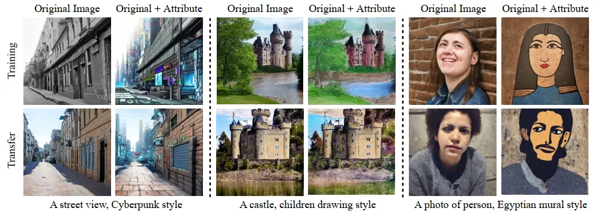

Figure 8: Examples of image editing using the DiffusionDisentanglement
model \[61\]. Each row displays a text description combining
style-neutral content and target attribute descriptions (separated by
commas). For each attribute section, the first row shows results on
optimization images, while the second row demonstrates transfer to
unseen images. The left column contains source images, and the right
column shows the corresponding modified images. Reprinted from \[61\].

Building on these efforts, several models have been designed to address
specific limitations in different stages of the editing process. SINE
\[63\] innovatively employs classifier-free guidance by both modifying
the guidance mechanism and injecting content seeds in the early
denoising steps. In the same direction, Null-text-Inversion \[64\]
enables high-fidelity reconstructions without re-training the model or
conditional embeddings, simply by optimizing the unconditional (null)
embedding.

To achieve a better balance between fidelity to the original image and
alignment with the target text, Imagic \[65\] combines text embedding
optimization, model fine-tuning, and linear interpolation between
embeddings. On a broader level, Unified Concept Editing (UCE) \[66\]
offers an integrated approach for targeted editing of diffusion models,
allowing the removal of bias, offensive content, or copyrighted material
using only textual descriptions, without compromising the core concepts
encoded in the model.

#### 5.3.3 Visual Language Models

In addition to text-based image generation and editing advancements,
significant efforts have also been made in multimodal interaction with
images and text. In this direction, models are not only capable of
understanding and generating visual content but can also engage in
multimodal dialogue, reason over inputs, and provide coherent responses
aligned with both textual and visual information.

In this context, models such as Visual ChatGPT \[67\] combine ChatGPT
with various vision models to enable responses to complex visual
queries. This model utilizes a prompt manager and chain-of-thought
reasoning to break down user requests into manageable tasks for vision
modules. The architecture of this model is shown in Figure . Similarly,
KOSMOS-G \[68\] establishes a connection between interleaved inputs and
the image decoder using its multimodal large language model and its
proposed AlignerNet component, enabling seamless concept-level guidance.
This novel AlignerNet is a crucial bridge, specifically trained to
address the misalignment between the MLLM’s output space and the input
space required by a frozen image decoder (like Stable Diffusion’s
U-Net). This alignment, achieved using supervision from CLIP’s text
encoder, allows the MLLM to effectively condition the image generation
process without modifying the decoder. Building on this line of work,
MM-REACT \[69\] introduces a multimodal reasoning-and-action framework
that has demonstrated its effectiveness in complex tasks such as
multi-image reasoning, multi-hop document understanding, and open-world
concept comprehension.

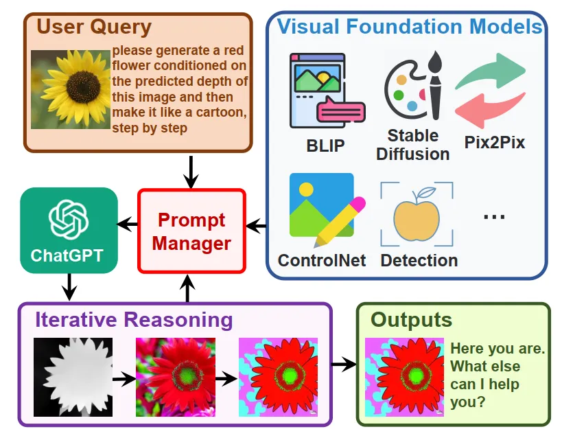

Figure 9: Visual ChatGPT architecture \[67\] showing the workflow from
user query to output. The system processes complex instructions on a
flower image through a prompt manager that coordinates visual foundation
models (BLIP, Stable Diffusion, ControlNet, etc.). The example
demonstrates iterative reasoning through depth estimation and style
transfer to transform a yellow flower into a red cartoon version.
Reprinted from \[67\].

### 5.4 Application

Image generation has been one of the most extensively studied research
problems in computer vision, with many competitive generative models
introduced over the past decade. Recently, new image generation methods,
capable of producing high-quality and high-resolution images in various
domains, have garnered significant attention in research \[69\]. These
models can generate nearly any image by simply feeding in a relevant
text, thereby dramatically transforming the landscape of artistic
applications \[64\].

Image generation technologies have found extensive applications across
various fields in recent years. In the entertainment and media industry
\[232\], these technologies have played a pivotal role in creating
realistic visual content, including designing digital characters \[233\]
and simulated environments. Similarly, in design and architecture, image
generation models have enhanced the process of visualizing designs and
presenting architectural concepts by simulating photorealistic images
\[227\].

Specifically, in the animation industry, image generation models have
accelerated the concept art process and the creation of complex
backgrounds \[234, 235\], boosting productivity and reducing production
time. Generative AI models are also used for enhancing visual effects,
refining character designs, and streamlining texture generation \[236,
237\]. Furthermore, in the fields of e-commerce and marketing, synthetic
image generation has significantly contributed to product
personalization and improved user experiences \[238\]. In the domains of
medicine \[239\] and education, these models have enabled synthetic data
generation for training and scientific research. Additionally, in social
networks and metaverse spaces, these technologies have provided tools
for creating digital identities and facilitating interactions in virtual
environments.

With the rise of powerful large language models (LLMs) and growing
attention to this area, image generation models have been integrated
with LLMs to effectively align visual and textual modalities, enabling
better comprehension of human instructions \[240\]. In this context,
models equipped with image generation and understanding capabilities
have proven highly effective in areas such as mathematical and textual
reasoning, understanding visual jokes and memes, spatial and coordinate
comprehension, visual planning and prediction, multi-image reasoning,
multi-step document understanding from charts, floor plans, flowcharts,
tables, open-world concept comprehension and video analysis and
summarization \[69\].

Text-based image editing has also recently gained substantial attention.
New image generation models have been utilized in diverse applications
such as image reconstruction, adversarial refinement, image compression,
image classification, and many others \[65\]. Remarkable advancements in
image generation have expanded the boundaries of technical capabilities
and redefined how humans interact with visual and textual data. These
technologies can potentially bring about profound transformations across
various industries by providing innovative tools for creativity,
analysis, and interaction.

## 6 Avatar

Avatar generation in generative AI focuses on synthesizing digital
representations of individuals or characters using advanced machine
learning techniques. Recent progress in deep learning architectures and
large-scale multimodal datasets has driven significant advancements in
this domain. Modern methods achieve visually realistic and behaviorally
expressive avatars by seamlessly integrating a variety of modalities,
including text, images, video, audio, and motion data. These
developments support virtual reality, gaming, film production, and
digital communication applications.

Key tasks in avatar generation include detailed 3D body reconstruction,
expressive facial animation, and motion synthesis for dynamic
interactions. Parametric models like SMPL (Skinned Multi-Person Linear
Model) \[1\] and FLAME (Faces Learned with an Articulated Model) \[18\]
serve as foundational frameworks, offering compact and interpretable
representations of human geometry and motion. These models facilitate
precise pose estimation, motion retargeting, and animation synthesis.
Furthermore, advancements in multimodal fusion have allowed avatars to
go beyond just replicating physical appearance; they can now convey
expressive behaviors like synchronized speech and gestures, greatly
enhancing their realism and interactivity.

### 6.1 Dataset

Developing large-scale and diverse datasets has been instrumental in
advancing avatar generation, providing the necessary training data for
realistic and generalizable models. These datasets capture various human
appearances, motions, and interactions through multimodal inputs. While
video and image data form the visual foundation, 3D body meshes, SMPL
parameters, and textured meshes enable detailed geometric and motion
representations. Additionally, audio and textual annotations enrich
these datasets by incorporating behavioral contexts, such as
speech-driven expressions or descriptive cues for stylized synthesis.

A notable example is WildAvatar \[16\], a large-scale dataset featuring
over 10,000 individuals sourced from in-the-wild YouTube videos.
Integrating video, 3D body motion, and audio modalities bridges the gap
between controlled laboratory datasets and the diverse real-world
scenarios essential for generalizable avatar generation. Similarly,
RenderMe-360 \[17\] marks a milestone in 3D avatar creation, capturing
over 243 million head frames from 500 identities using a 60-camera
system. With rich annotations, including FLAME parameters, UV maps, and
action units, it supports high-fidelity reconstruction and animation.

Datasets such as HuMMan \[241\] and AMASS \[242\] further highlight the
importance of multimodal integration. HuMMan provides video, point
clouds, and SMPL parameters for 1,000 subjects, supporting applications
ranging from action recognition to parametric recovery. Conversely,
AMASS unifies 15 motion capture datasets, offering over 42 hours of
motion data annotated with SMPL parameters, making it a foundational
resource for motion dynamics and retargeting research.

The availability of these datasets has driven the development of
sophisticated models capable of handling key challenges in avatar
generation, such as dynamic motion synthesis and expressive behavior
modeling. Including body meshes and SMPL parameters enables precise
motion analysis, while point clouds and textured meshes capture
fine-grained details crucial for photorealistic reconstruction. As the
demand for high-fidelity and adaptable avatars grows, dataset expansion
remains critical in advancing the field. A comprehensive overview of
these and other influential datasets is provided in Table .

| Name                | Statistics                                                                                                                                                                                                   | Modalities                                   | Link                                                     |
| ------------------- | ------------------------------------------------------------------------------------------------------------------------------------------------------------------------------------------------------------ | -------------------------------------------- | -------------------------------------------------------- |
| WildAvatar \[16\]   | Over 10,000 human subjects; extracted from YouTube; significantly richer than previous datasets for 3D human avatar creation                                                                                 | Video, 3D/Point Cloud Data, Audio            | [WildAvatar](https://wildavatar.github.io/)              |
| ZJU-MoCap \[243\]   | Multi-camera system with 20+ synchronized cameras; includes SMPL-X parameters for detailed motion capture of body, hand, and face; complex actions such as twirling, Taichi, and punching                    | Video, 3D/Point Cloud Data                   | [ZJU-MoCap](https://chingswy.github.io/Dataset-Demo/)    |
| TalkSHOW \[55\]     | 26.9 hours of in-the-wild talking videos from 4 speakers; expressive 3D whole-body meshes reconstructed at 30 fps, synchronized with audio at 22 kHz                                                         | Audio, 3D/Point Cloud Data                   | [TalkSHOW](https://talkshow.is.tue.mpg.de/)              |
| HuMMan \[241\]      | 1,000 human subjects, 400k sequences, 60M frames; include point clouds, SMPL parameters, and textured meshes for multimodal sensing                                                                          | Video, 3D/Point Cloud Data                   | [HuMMan](https://caizhongang.com/projects/HuMMan/)       |
| BUFF \[244\]        | 6 subjects performing motions in two clothing styles; 13,632 3D scans with high-resolution ground-truth minimally-clothed shapes                                                                             | 3D/Point Cloud Data                          | [BUFF](https://buff.is.tue.mpg.de/)                      |
| AMASS \[242\]       | Combines 15 motion capture datasets into a unified framework with over 42 hours of motion data; 346 subjects and 11,451 motions with SMPL pose parameters, 3D shape parameters, and soft-tissue coefficients | 3D/Point Cloud Data                          | [AMASS](https://amass.is.tue.mpg.de/)                    |
| 3DPW \[245\]        | 60 video sequences with accurate 3D poses using video and IMU data; 18 re-poseable 3D body models with different clothing variations                                                                         | Video, Time-Series Data, 3D/Point Cloud Data | [3DPW](https://virtualhumans.mpi-inf.mpg.de/3DPW/)       |
| AIST++ \[246\]      | 10,108,015 frames of 3D key points with corresponding images; 1,408 dance motion sequences spanning 10 dance genres with synchronized music                                                                  | Video, Audio, 3D/Point Cloud Data            | [AIST++](https://google.github.io/aistplusplus_dataset/) |
| RenderMe-360 \[17\] | Over 243 million head frames from 500 identities; includes FLAME parameters, UV maps, action units, textured meshes, and diverse annotations                                                                 | Video, 3D/Point Cloud Data                   | [RenderMe-360](https://renderme-360.github.io/)          |
| PuzzleIOI \[247\]   | 41 subjects with nearly 1,000 Outfit-of-the-Day (OOTD) configurations; includes paired ground-truth 3D body scans for challenging partial photos                                                             | Images, 3D/Point Cloud Data, Text            | [PuzzleIOI](https://puzzleavatar.is.tue.mpg.de/)         |

Table 4: Overview of various datasets related to avatar generation,
including their main statistical features, modalities, and links.

### 6.2 Evaluation

Evaluating avatar generation models involves assessing multiple
dimensions, including geometry accuracy, texture fidelity, identity
preservation, temporal consistency, and animation robustness. These
evaluations rely on quantitative metrics, qualitative assessments, and
ablation studies to comprehensively benchmark performance.

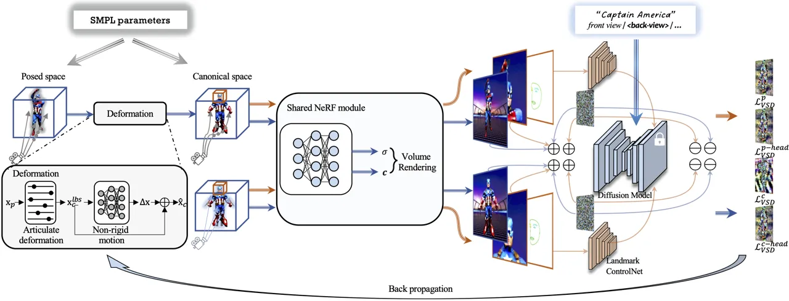

Figure 10: DreamAvatar’s dual-observation-space architecture shows how
text prompts and SMPL parameters drive avatar generation through
canonical and posed spaces. The system uses an SMPL-based deformation
field (left), shared NeRF module (center), and diffusion model guidance
with landmark ControlNet for head refinement (right) to produce
high-quality results with consistent facial features. Reprinted from
\[88\].

High-quality geometry and texture are fundamental for realistic avatars.
Common evaluation metrics include Fréchet Inception Distance (FID) and
Learned Perceptual Image Patch Similarity (LPIPS) for measuring texture
realism, while Landmark Mean Distance (LMD) evaluates geometric
accuracy. TADA \[79\] achieves strong FID and LPIPS scores by ensuring
geometric-texture consistency, particularly in facial regions.
Make-Your-Anchor \[87\] similarly demonstrates high-quality geometry and
texture, validated through FID and LMD. Temporal consistency ensures
stable and artifact-free animations. Metrics such as Fréchet Video
Distance (FVD) and LMD measure motion stability across frames.
Make-Your-Anchor \[87\] improves temporal coherence through
batch-overlapped temporal denoising and a two-stage training strategy,
reducing motion artifacts.

Maintaining identity across transformations is critical for personalized
avatars. CLIP Text-Image Direction Similarity (CLIP-S) and CLIP
Direction Consistency (CLIP-C) assess identity retention.
GaussianAvatar-Editor \[248\] enhances identity preservation through
occlusion-aware rendering and adversarial learning. Animation robustness
focuses on the ability of avatars to perform realistic pose-dependent
deformations and maintain semantic consistency during dynamic sequences.
Metrics such as Animation Compatibility, as introduced by TADA \[79\],
evaluate the alignment of geometry and texture during motion. Ablation
studies from DreamWaltz \[89\] underscore the importance of density
weighting and two-stage training in generating realistic and detailed
motion dynamics.

Qualitative assessments and user studies are pivotal in evaluating the
perceptual aspects of realism that cannot be captured by quantitative
metrics alone. DreamWaltz \[89\] outperforms DreamAvatar \[88\] and
AvatarCraft \[249\] in user preference studies based on geometry and
texture quality. AvatarVerse \[250\] achieves an 85% preference rate
over DreamFusion \[130\], DreamAvatar, DreamWaltz, and DreamHuman
\[84\], demonstrating superior texture fidelity. Ablation studies
provide insights into model design. Make-Your-Anchor \[87\] shows that
temporal denoising significantly enhances facial details and motion
stability. GaussianAvatar-Editor \[248\] demonstrates how Weighted Alpha
Blending reduces occlusion artifacts, improving CLIP-S scores.

Benchmark comparisons reveal various avatar generation models’ unique
strengths and limitations, providing valuable insights into
state-of-the-art advancements. These studies demonstrate that no single
model excels across all evaluation metrics; instead, each exhibits
specific strengths and trade-offs. Earlier models such as DreamFusion
\[130\], AvatarCLIP \[70\], Latent-NeRF \[251\], and Text2Mesh \[73\]
laid the foundation for avatar synthesis but lack the robustness and
flexibility of recent approaches. More advanced approaches reflect
progress in addressing geometry, texture realism, motion consistency,
and identity preservation challenges, collectively shaping the future of
avatar generation. For instance, DreamWaltz \[89\] showcases exceptional
geometry and texture fidelity, particularly for complex avatars with
intricate clothing details, while AvatarVerse \[250\] excels in
generating high-quality, fine-grained textures and maintaining stability
across arbitrary poses. DreamHuman \[84\] achieves diverse and realistic
avatar animations, addressing pose-dependent deformations effectively.
TADA \[79\] stands out for its animation compatibility and semantic
alignment, offering superior control during motion sequences.

### 6.3 Models

Generating realistic and controllable 3D avatars has become a prominent
research area. Various generative models have been proposed to address
the challenges of creating high-fidelity avatars with diverse
appearances, motions, and styles. These models can be broadly
categorized based on their underlying techniques.

#### 6.3.1 CLIP-Guided Models

Models leveraging CLIP \[7\] have revolutionized avatar generation by
enabling text-driven approaches. AvatarCLIP \[70\] is a prime example,
offering a zero-shot framework for generating and animating 3D avatars
from natural language descriptions. This pipeline translates text into
static and animatable 3D avatars, employing a shape VAE for initial
geometry generation guided by CLIP to ensure textual alignment. NeuS
(Neural Implicit Surface) \[71\] is also integrated for high-quality
geometry and photorealistic rendering. The motion generation phase
involves selecting candidate poses from a precomputed codebook using
CLIP and synthesizing smooth motions via a motion VAE. AvatarCLIP
demonstrates superior geometry, vivid textures, and animation
consistency compared to models like DreamField \[72\] and Text2Mesh
\[73\]. DreamField \[72\] adapts NeRF for text-driven 3D object
generation but struggles with detailed geometry, while Text2Mesh \[73\]
stylizes existing meshes using CLIP guidance but faces stability and
flexibility challenges with diverse text descriptions.

#### 6.3.2 Implicit Function-Based Models

Implicit function-based models have played a significant role in
achieving high-resolution, detailed 3D avatar reconstructions by
leveraging continuous surface representations. These methods have
evolved from single-view reconstruction to more sophisticated,
animatable avatars with fine-grained control. Early work, such as PIFu
(Pixel-Aligned Implicit Function) \[74\], introduced pixel-aligned
feature extraction for reconstructing 3D surfaces from single-view 2D
images. By projecting 3D points into the image space and retrieving
features via a CNN, PIFu enabled high-resolution surface reconstruction.
Its successor, PIFuHD \[75\], extended this approach with multi-scale
feature extraction, enhancing both global shape understanding and fine
surface details.

ARCH (Animatable Reconstruction of Clothed Humans) \[76\] introduced a
canonical space transformation via a parametric body model to address
pose variations and occlusions in human modeling. ARCH captured
intricate surface details, including clothing folds, by learning an
implicit function conditioned on pose-normalized coordinates. ARCH++
\[77\] further improved geometry encoding and texture generation,
refining the realism of reconstructed avatars. Expanding on parametric
models, PaMIR (Parametric Model-Conditioned Implicit Representation)
\[78\] integrated an SMPL body model into an implicit function
framework. By refining depth predictions and SMPL parameters, PaMIR
achieved closer alignment between inferred 3D surfaces and input images
and reduced artifacts caused by depth ambiguities.

Recent advancements have focused on text-driven generation and improved
articulation. TADA (Text to Animatable Dynamic Avatar) \[79\] introduced
SMPL-X models with learnable displacements, optimizing geometry and
texture through Score Distillation Sampling losses to generate
animatable avatars from text descriptions. GETAvatar (Generative
Textured Meshes for Animatable Human Avatars) \[80\] further advanced
explicit mesh-based modeling by employing signed distance fields (SDFs)
in a canonical space, deforming them via SMPL-based transformations to
match body shapes and poses while leveraging a normal field trained on
3D scans for enhanced geometric detail. More recently, RodinHD \[81\]
has emphasized high-resolution avatar creation from single portrait
images, constructing detailed 3D blueprints through triplane
representations and refining features with cascaded diffusion models to
achieve superior texture and geometric fidelity. These developments
reflect a broader evolution of implicit function-based models,
transitioning from single-view reconstructions to high-fidelity,
animatable avatars by integrating text-driven methods and neural
rendering techniques for greater realism and control.

#### 6.3.3 NeRF-Based Methods

NeRF-based methods have emerged as a powerful approach for 3D human
avatar modeling, addressing scenarios from static camera setups to
dynamic environments. These methods generally employ deformation fields
based on SMPL(-X) models to map points from observation to canonical
space, incorporating articulated deformation and non-rigid motion
correction.

HumanNeRF \[82\] pioneered the application of deformation fields for
dynamic human models from monocular images. Neural Body introduced
structured latent codes anchored to SMPL model vertices, processed using
SparseConvNet, to provide regularization. Neural Human Performer
captured information directly in observation, utilizing a skeletal
feature bank and transformers. Vid2Avatar \[83\] proposed jointly
modeling the human and scene background using two separate neural
radiance fields. DreamHuman \[84\] as illustrated in Figure , generates
animatable 3D human avatars from textual descriptions by combining NeRF
with imGHUM \[252\], using human body shape statistics to create
anatomically correct avatars with realistic body proportions that deform
naturally when posed.

#### 6.3.4 Diffusion-Based Methods

Diffusion-based methods have gained prominence in avatar generation,
leveraging pre-trained 2D text-to-image diffusion models to guide the
creation of high-quality 3D assets. Personalized Avatar Scene (PAS)
\[85\] generates customized 3D avatars in various poses and scenes based
on text descriptions, using a diffusion-based transformer model to
generate 3D body poses from text. The model proposed in \[86\] employs a
parametric 3D Morphable Model (3DMM) of the head (FLAME \[253\]) and
combines it with diffusion models to optimize both geometry and texture
for generating 3D head avatars directly from textual prompts. The
Make-Your-Anchor system \[87\] introduces a novel approach for
generating 2D anchor-style avatars capable of realistic full-body motion
and expression, utilizing a Structure-Guided Diffusion Model (SGDM).

#### 6.3.5 Hybrid Methods

Recent approaches combine multiple methodologies to overcome the
limitations of single-technique models. DreamAvatar \[88\] exemplifies
this trend by integrating shape priors, diffusion models, and NeRF
architecture in a dual-observation-space (DOS) framework, as illustrated
in Figure . By leveraging SMPL \[1\] for anatomical guidance through
density fields, it ensures structurally consistent avatars while
addressing geometry issues common in pure diffusion methods. The
system’s dual-space optimization works simultaneously in canonical and
posed spaces, enabling complete texture generation with pose-faithful
geometry. To solve the "Janus" problem (inconsistent facial features
across views), it employs joint optimization with specialized
head-focused VSD loss using ControlNet \[8\]. While offering superior
geometric accuracy and controllable shape modifications compared to
methods like DreamWaltz \[89\], limitations include a lack of animation
capabilities and inherited biases from pretrained diffusion models. As
avatar generation advances, such hybrid approaches that strategically
combine strengths from different paradigms represent a promising
direction for future research.

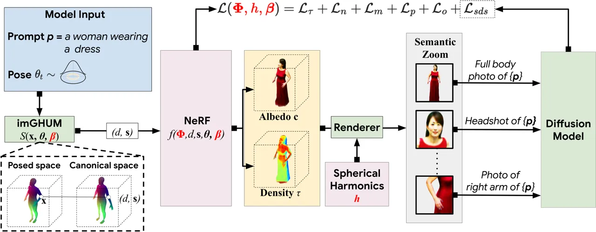

Figure 11: Pipeline of DreamHuman \[84\]: the model takes a text prompt
$`p`$ (e.g., a woman wearing a dress) and generates a 3D animatable
avatar using a deformable, pose-conditioned NeRF constrained by the
imGHUM \[252\] body model. The pipeline incorporates semantic zooming
for critical regions (face, hands) to improve detail and employs Score
Distillation Sampling (SDS) \[130\] for optimization, producing
high-fidelity avatars with pose control. Reprinted from \[84\].

### 6.4 Application

Advancements in avatar generation technologies have transformed
industries such as gaming, virtual reality (VR), and entertainment.
Realistic avatars with lifelike facial expressions, synchronized body
movements, and real-time motion capture enhance immersion and
interactivity, supported by large-scale datasets like WildAvatar \[16\]
and RenderMe-360 \[17\]. These advancements enrich storytelling,
multiplayer experiences, and player engagement \[254\]. In social media
and the metaverse, avatars facilitate personalized digital identities
through multimodal inputs such as text and speech. Generative models
create photorealistic textures and natural motion, fostering richer
interactions in virtual spaces. Similarly, e-commerce and education
benefit from AI-driven avatars, which serve as virtual assistants,
instructors, or customer support agents \[87\].

The entertainment industry leverages high-fidelity 3D models for digital
humans in films and animations, reducing production costs while
enhancing creative flexibility \[255\]. Beyond media, healthcare employs
avatars for therapy and rehabilitation, while education integrates them
as adaptive virtual tutors \[254\]. However, real-time performance,
scalability, and cross-platform compatibility must be addressed to meet
growing demands. Furthermore, ethical concerns related to privacy,
inclusivity, and deepfake misuse remain critical considerations.

## 7 Gesture

Gesture generation is a vital area of research that focuses on
synthesizing human-like movements to enhance communication and
interaction in virtual environments. The task involves producing
realistic and contextually appropriate gestures, often synchronized with
speech or other non-verbal communication. It finds applications in
domains such as virtual avatars, social robots, gaming, and animation
\[256\]. The challenge of gesture generation lies in its multimodal
nature, requiring the integration of audio, text, and visual inputs to
produce coherent and expressive movements \[257\]. Achieving
naturalistic gestures demands a deep understanding of human motion,
cultural norms, and contextual cues. Consequently, it is an
interdisciplinary field combining computer vision, machine learning,
linguistics, and psychology. Recent advancements in deep learning and
data-driven approaches have significantly improved the ability to
generate complex gestures \[258\]. These advancements have propelled the
field forward, enabling the creation of models capable of mimicking
human behavior with greater fidelity.

### 7.1 Dataset

Gesture models heavily depend on the quality and diversity of their
training data. The efficacy of these models is directly correlated with
the richness and representativeness of the datasets used to train them
\[259\]. As gesture generation advances, there has been a steady
increase in the number and sophistication of datasets suitable for
machine learning applications in human gesture analysis and synthesis.
Table provides a comprehensive overview of major datasets for gesture
generation, highlighting their key characteristics and contributions to
the field. In recent years, there has been a growing focus on gesture
generation, driven by the quest to achieve more natural and human-like
animations \[102\]. This increased attention has led to the development
of more specialized and diverse datasets, each contributing to our
understanding of different aspects of human gestures.

Gesture datasets capture multiple modalities to facilitate comprehensive
analysis and synthesis of human motion. The primary modality is gesture
data, obtained through motion capture or video recordings, which
provides the core movement information. Audio recordings often accompany
gestures, enabling researchers to explore the relationship between
speech and motion. Additionally, text annotations, including transcripts
or descriptions of spoken content, support tasks such as text-to-gesture
generation. To enhance contextual understanding, some datasets further
incorporate gesture properties, such as segmentation, categorical
labels, or semantic descriptions. Finally, emotion annotations play a
crucial role in modeling expressive gestures by associating movements
with underlying affective states.

Integrating these modalities in datasets allows researchers to develop
more sophisticated and context-aware gesture-generation models. For
instance, incorporating emotional annotations has led to significant
advancements in generating emotionally appropriate gestures \[260\]. As
generative AI continues to evolve, we anticipate the emergence of even
more comprehensive and nuanced gesture datasets. These future datasets
may incorporate additional modalities such as physiological data or
environmental context, further enhancing our ability to generate truly
natural and contextually appropriate gestures \[261\].

| Name                             | Statistics                                                                                                                                                                                         | Modalities                       | Link                                                                                                                                                                                         |
| -------------------------------- | -------------------------------------------------------------------------------------------------------------------------------------------------------------------------------------------------- | -------------------------------- | -------------------------------------------------------------------------------------------------------------------------------------------------------------------------------------------- |
| IEMOCAP \[262\]                  | 151 recorded dialogue videos, with 2 speakers per session, totaling 302 videos. Annotated for 9 emotions and valence, arousal, and dominance. Contains approximately 12 hours of audiovisual data. | Video, Audio, Text, Tabular Data | [IEMOCAP](https://sail.usc.edu/iemocap/)                                                                                                                                                     |
| SaGA \[263\]                     | 25 dialogues between interlocutors (50 total). Language: German. Published speakers: 6, unpublished speakers: 19. Annotated gestures: 1,764 (total corpus). Total video duration: 1 hour.          | Video, Audio, Tabular Data       | [SaGA](https://www.phonetik.uni-muenchen.de/Bas/BasSaGAeng.html)                                                                                                                             |
| Creative-IT \[264\]              | Data from 16 actors (male and female). Affective dyadic interactions range from 2 to 10 minutes each. Approximately 8 sessions of audiovisual data were released.                                  | Video, Audio, Text, Tabular Data | [CreativeIT](https://sail.usc.edu/CreativeIT/ImprovRelease.html)                                                                                                                             |
| CMU Panoptic \[265\]             | 3D facial landmarks from 65 sequences (5.5 hours). Contains 1.5 million 3D skeletons.                                                                                                              | Video, Audio, Text               | [CMU Panoptic](http://domedb.perception.cs.cmu.edu/)                                                                                                                                         |
| Speech-Gesture \[266\]           | A 144-hour dataset featuring 10 speakers. Includes frame-by-frame, automatically detected pose annotations.                                                                                        | Video, Audio                     | [Speech-Gesture](https://people.eecs.berkeley.edu/~shiry/projects/speech2gesture/)                                                                                                           |
| Talking With Hands 16.2M \[267\] | 16.2 million frames (50 hours) of two-person, face-to-face, spontaneous conversations. Strong covariance in arm and hand features.                                                                 | Video, Audio                     | [Talking With Hands](https://github.com/facebookresearch/TalkingWithHands32M)                                                                                                                |
| PATS \[268\]                     | 25 speakers, 251 hours of data, approximately 84,000 intervals. Mean interval length: 10.7 seconds.                                                                                                | Video, Audio, Text               | [PATS](http://chahuja.com/pats/)                                                                                                                                                             |
| Trinity Speech-Gesture II \[20\] | 244 minutes of motion capture and audio (23 takes). Includes one male native English speaker. The skeleton consists of 69 joints.                                                                  | Video, Audio, Tabular Data       | [Trinity](https://trinityspeechgesture.scss.tcd.ie/)                                                                                                                                         |
| SaGA++ \[269\]                   | 25 recordings, totaling 4 hours of data.                                                                                                                                                           | Video, Audio, Text, Tabular Data | [SaGA++](https://svito-zar.github.io/speech2properties2gestures/)                                                                                                                            |
| ZEGGS \[105\]                    | 67 monologue sequences with 19 different motion styles. Performed by a female actor speaking English. Total duration: 134.65 minutes.                                                              | Video, Audio                     | [ZEGGS](https://github.com/ubisoft/ubisoft-laforge-ZeroEGGS)                                                                                                                                 |
| BEAT \[19\]                      | 76 hours of 3D motion capture data from 30 speakers. Covers 8 emotions and 4 languages. Includes 32 million frame-level emotion and semantic relevance annotations.                                | Video, Audio, Text, Tabular Data | [BEAT](https://pantomatrix.github.io/BEAT/)                                                                                                                                                  |
| BEAT2 \[114\]                    | 60 hours of mesh-level, motion-captured co-speech gesture data. Integrates SMPL-X body and FLAME head parameters. Enhances modeling of head, neck, and finger movements.                           | Video, Audio, Tabular Data       | [BEAT2](https://pantomatrix.github.io/EMAGE/)                                                                                                                                                |
| GAMT \[270\]                     | 176 video clips of volunteers using math terms and gestures. Covers 8 classes of mathematical terms and gestures.                                                                                  | Video, Audio, Text               | [GAMT](https://openaccess.thecvf.com/content/CVPR2024W/MAR/html/Maidment_Using_Language-Aligned_Gesture_Embeddings_for_Understanding_Gestures_Accompanying_Math_Terms_CVPRW_2024_paper.html) |
| SeG \[271\]                      | 208 types of global semantic gestures. 544 motion files recorded from a male performer. Each gesture is represented in 2.6 variations on average.                                                  | Video, Audio, Tabular Data       | [SeG](https://pku-mocca.github.io/Semantic-Gesticulator-Page/)                                                                                                                               |
| DND Group Gesture \[272\]        | 6 hours of gesture data from 5 individuals playing Dungeons & Dragons. Recorded over 4 sessions (total duration: 6 hours). Includes beat, iconic, deictic, and metaphoric gestures.                | Video, Audio, Tabular Data       | [DND](https://github.com/m-hamza-mughal/convofusion)                                                                                                                                         |

Table 5: Overview of various gesture datasets, including their main
statistical features, modalities, and links.

### 7.2 Evaluation

Evaluating gesture synthesis models requires a comprehensive set of
metrics to capture the multifaceted nature of gestures, encompassing
aspects such as style, appropriateness, semantic alignment, and physical
realism. The choice of metrics plays a pivotal role in assessing the
quality and effectiveness of gesture generation, as each metric targets
specific aspects of performance. A key objective in gesture evaluation
is measuring human-likeness, which assesses how natural and lifelike the
generated gestures appear. This is often evaluated through user studies,
where participants judge the realism of the gestures. Alongside human
likeness, appropriateness is critical for determining whether the
gestures align contextually with the accompanying input, such as speech
or textual prompts. Both metrics are essential for capturing the
subjective quality of generated gestures.

Style is another important consideration in gesture synthesis,
particularly when the generated motions must adhere to specific
stylistic constraints. Metrics such as style correctness, evaluated
through user studies with dataset labels or random prompts, quantify how
well the generated gestures conform to intended stylistic features.
Complementing this, Style Recognition Accuracy (SRA) provides an
objective measure of the model’s ability to produce gestures matching
predefined styles \[273\]. To ensure that gestures align semantically
with input content, metrics such as Semantics-Relevant Gesture Recall
(SRGR) \[19\] and the Semantic Score (SC) evaluate how well the
generated gestures reflect the semantic meaning of the input. These
metrics are particularly valuable in scenarios where gestures must
convey meaningful and contextually appropriate information.

Physical realism is assessed using metrics that evaluate the accuracy
and smoothness of motion. Mean Absolute Joint Error (MAJE) quantifies
the average error in joint positions by comparing the generated gestures
to ground truth data. Similarly, Mean Acceleration Difference (MAD)
captures the smoothness of the generated motion by measuring
acceleration discrepancies. Metrics like average jerk and acceleration
further ensure that the gestures are dynamically realistic.
Additionally, statistical methods such as Canonical Correlation Analysis
(CCA) and Hellinger Distance provide insights into the similarity of
joint distributions between real and synthesized data. Temporal
synchronization between gestures and input signals is another critical
dimension of evaluation. Beat Consistency (BC) measures the alignment of
gestures with rhythmic features in speech or music, ensuring temporal
coherence \[274\]. The Probability of Correct Keypoints (PCK) metric,
often employed in pose estimation, evaluates the spatial accuracy of key
points relative to ground truth within a predefined threshold \[275\].

Finally, several metrics focus on assessing the perceptual quality of
the generated gestures. The Fréchet Gesture Distance (FGD) \[276\]
evaluates the distributional similarity between generated and real
gestures, drawing on statistical comparisons. Similarly, metrics such as
Learned Perceptual Image Patch Similarity (LPIPS) \[277\], Fréchet
Inception Distance (FID) \[278\], and Fréchet Video Distance (FVD)
\[279\], which were initially developed for images and videos, are
adapted here to measure perceptual and distributional qualities in
gesture evaluation. In cases where facial expressions are integral to
gesture synthesis, metrics like Mean Squared Error (MSE) and L1 Vertex
Difference (LVD) \[280\] provide additional accuracy measurements for
facial key points or vertices. By leveraging this diverse set of
metrics, gesture evaluation frameworks aim to comprehensively assess the
quality of generated gestures across visual, physical, and semantic
dimensions. These metrics ensure that gesture synthesis models achieve
fidelity to human motion but also expressiveness and contextual
relevance, addressing the complex challenges of modern gesture
generation.

Beyond individual evaluation metrics, standardized benchmarks are
crucial in assessing and comparing gesture synthesis models. The GENEA
Challenge \[281\] is one of the most comprehensive benchmarking
platforms for co-speech gesture generation, providing a structured
framework for evaluating state-of-the-art models under controlled
conditions. By employing both objective metrics and large-scale user
studies, the challenge enables rigorous assessment of gesture
naturalness, appropriateness, and perceptual quality \[282\].
State-of-the-art systems such as EMAGE \[114\] and MambaTalk \[115\]
exemplify recent advancements, leveraging Transformer-based
architectures, state space models, and multimodal learning techniques to
enhance gesture diversity, synchronization, and efficiency. However,
challenges such as maintaining long-term gesture consistency, reducing
motion artifacts, and improving the interpretability of generated
motions remain active research areas. Initiatives like GENEA drive
progress toward more robust and human-like gesture generation models by
continuously refining evaluation methodologies and fostering
community-driven benchmarking efforts.

### 7.3 Models

#### 7.3.1 Rule-Based and Parametric Models

Traditional approaches to gesture generation primarily rely on
rule-based systems and parametric techniques to synthesize realistic
gestures by leveraging predefined knowledge and high-level control
parameters. These models often use handcrafted rules and heuristics
based on observations of human behavior, allowing for expressive and
controllable gesture generation. One common approach within these
systems is parameter-based procedural animation, where high-level
parameters, such as emotion, speech intensity, or rhythm, guide the
selection and interpolation of predefined keyframes \[90\]. By smoothly
blending between keyframes, these methods can create convincing and
coherent motion sequences in response to dynamic inputs. Another
effective technique in rule-based models is using blendshape models for
generating hand and finger gestures. Blendshape models define a set of
base shapes (or blend shapes) and blend between them using weights,
enabling fine-grained control over specific regions of the hand \[91\].

In addition to traditional methods, BEAT (Behavior Expression Animation
Toolkit) \[92\] provides a rule-based framework that automatically
analyzes text input to suggest appropriate gestures based on linguistic
and contextual rules. It generates synchronized speech, facial
expressions, and gestures by applying a comprehensive set of behavior
generation rules derived from extensive studies of human communicative
patterns. This makes it particularly effective for creating natural
nonverbal behaviors for virtual agents. These models are particularly
advantageous for applications requiring detailed hand movements, as they
allow for both low-level control and smooth transitions between
gestures. B blend shape models achieve realistic and nuanced animations
by incorporating morphing techniques, making them a popular choice in
human-computer interaction systems. While rule-based and parametric
models offer flexibility and explicit control over gesture generation,
they often require extensive manual design and fine-tuning to cover
diverse scenarios and variations in human motion.

#### 7.3.2 Classical Deep Learning Models

Advancements in deep learning have led to the development of gesture
prediction and generation models that leverage neural networks to
synthesize human gestures end-to-end. These models typically incorporate
architectures like Generative Adversarial Networks (GANs) \[3\] and
Recurrent Neural Networks (RNNs) \[283\] to model the relationship
between input modalities such as audio, text, and gestures. One notable
model, GestureGAN \[93\], uses GANs to generate gesture animations
conditioned on audio inputs. The model employs a generator-discriminator
framework where the generator learns to synthesize realistic gesture
sequences, and the discriminator evaluates the realism and coherence of
these sequences. The network effectively captures the dynamics of hand
gestures, enabling robust gesture-to-gesture translation even in
challenging scenarios. Another significant model, Speech2Gesture \[94\],
generates co-speech gestures directly from speech features using Long
Short-Term Memory (LSTM) networks \[284\] or Recurrent Neural Networks
(RNNs) \[283\]. This architecture effectively captures temporal
dependencies between speech and gestures, utilizing specialized audio
processing layers to establish a strong correlation between speech
dynamics and gestural movements.

Building upon the need for personalized gestures, Audio-Driven
Adversarial Gesture Generation \[95\] combines GANs with Conditional
Variational Autoencoders (CVAE). This model captures the multimodal
nature of gestures by aligning audio and motion features within a shared
latent space, resulting in a more nuanced generation of audio-driven
gestures. Another notable approach, GestureMaster \[96\], employs graph
neural networks (GNNs) \[285\] to represent gesture relationships. By
adopting a graph-based framework, GestureMaster effectively captures the
spatial and temporal dependencies within gesture sequences, enhancing
the model’s ability to produce naturalistic hand and body gestures.

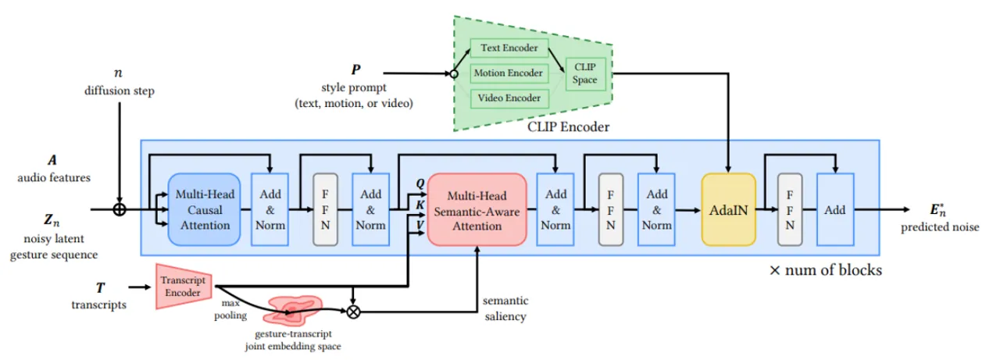

Figure 12: GestureDiffuCLIP \[106\] integrates a CLIP encoder for
semantic alignment and a diffusion process for refining gesture
sequences. The model uses multi-head causal and semantic-aware attention
mechanisms and adaptive instance normalization (AdaIN) to generate
expressive gestures. Reprinted from \[106\].

#### 7.3.3 Diffusion-Based Models

In recent years, diffusion-based models have emerged as a powerful
alternative for generating high-quality, coherent human gestures. These
models leverage a generative process inspired by diffusion \[286\],
gradually transforming random noise into structured outputs through a
series of iterative steps. By modeling the underlying distribution of
gestures, diffusion models excel at capturing complex, high-dimensional
data and producing realistic, continuous motion sequences.

DiM-Gesture \[97\] utilizes an adaptive layer normalization mechanism
called Mamba-2 \[287\], which adapts well to different speakers by
leveraging multi-source data during training \[287\]. This model focuses
on generating realistic co-speech gestures using speech information as
the driving input. Similarly, AMUSE \[98\] employs a disentangled latent
diffusion technique to generate emotionally expressive 3D body
animations. AMUSE effectively controls emotions through a multi-stage
training pipeline by separating emotional expressions and gestures.

Addressing broader speaker movements, the FreeTalker model \[99\]
introduces a diffusion-based framework with classifier-free guidance for
style control. FreeTalker generates natural transitions between gesture
clips using a generative prior, called DoubleTake, resulting in coherent
and spontaneous movements beyond just co-speech gestures. DiffuGesture
\[100\] focuses on generating gestures in two-person dialogues using
specialized diffusion techniques. By modeling interpersonal gesture
interactions, DiffuGesture ensures natural and synchronized gestures
between conversational partners. Expanding on diffusion-based multimodal
modeling, CSMP \[101\] employs a co-speech gesture generation approach
that utilizes joint text and audio representations. By capturing
intricate relationships between these modalities, CSMP produces coherent
gestures that align well with both speech content and rhythm.

#### 7.3.4 Transformer-Based Models

Transformer architectures have significantly influenced gesture
generation, enhancing contextual understanding, multimodal integration,
and stylistic adaptation. These models leverage self-attention
mechanisms and cross-modal learning to generate expressive and
contextually relevant gestures. One of the pioneering Transformer-based
models, Gesticulator \[102\], employs a multimodal Transformer
architecture to generate gestures conditioned on both text and audio
inputs. Gesticulator produces natural and synchronized gestures that
accurately reflect co-speech dynamics by effectively combining semantic
information from text with prosodic speech cues. Expanding on
vision-based Transformers, ViTPose \[103\] applies Vision Transformers
(ViTs) to human pose estimation, serving as a foundational approach for
gesture synthesis. By accurately capturing human pose dynamics, ViTPose
enhances gesture generation models by providing precise motion
representations.

Addressing the need for style adaptation, StyleGestures \[104\]
integrates Transformer-based sequence modeling with style tokens to
synthesize gestures that align with individual speaker characteristics.
This encoder-decoder framework learns stylistic variations in gesture
production, enabling the generation of gestures that match the personal
speaking style of different individuals. Lastly, ZeroEGGS \[105\]
presents a zero-shot learning paradigm for gesture generation. Using
example-based learning, ZeroEGGS generalizes gestures to unseen speaker
styles, offering high flexibility in synthesizing co-speech gestures
that match diverse speaker preferences. These Transformer-based models
showcase the power of self-attention mechanisms and cross-modal
integration, significantly improving gesture generation in terms of
contextual accuracy, personalization, and multimodal synchronization.

#### 7.3.5 Hybrid Models

Hybrid models combine different deep learning architectures, such as
Transformers, diffusion-based techniques, and adversarial learning, to
enhance the accuracy and expressiveness of gesture generation. These
models leverage multimodal learning, cross-modal attention mechanisms,
and style adaptation to synthesize natural and context-aware gestures.
For example, GestureDiffuCLIP \[106\] integrates contrastive
language-image pre-training (CLIP) with a diffusion-based process to
iteratively refine gesture sequences. The model aligns textual
descriptions with motion outputs using multi-head causal and
semantic-aware attention mechanisms, while adaptive instance
normalization (AdaIN) generates expressive gestures that maintain
semantic coherence \[183\]. This process is illustrated in Figure .
ZS-MSTM \[107\] introduces a zero-shot style transfer method for gesture
animation, driven by both text and speech inputs, utilizing adversarial
disentanglement to separate style and content features, enabling gesture
style transfer across different speakers without requiring
speaker-specific training data.

Models like SAGA (Style and Grammar-Aware Gesture Generation) \[108\]
combine recurrent and Transformer-based approaches to integrate
grammatical and stylistic features for gesture synthesis. It combines an
LSTM-based encoder-decoder for sequence modeling with a
Transformer-based grammar encoder, improving alignment with linguistic
structures. C2G2 \[109\] focuses on modular control over gesture
synthesis, offering a framework for controllable co-speech gesture
generation. This framework allows users to specify gesture attributes
such as style, speed, and intensity, providing flexibility in gesture
animation. Similarly, CoCoGesture \[110\] employs a Transformer-based
diffusion model that leverages a large-scale dataset, GES-X, and
integrates a mixture-of-experts (MoE) framework to align gestures with
human speech effectively, without relying on auxiliary text inputs
\[288\]. DiffuseStyleGesture+ \[111\] extends diffusion-based gesture
generation by incorporating multimodal inputs such as speaker IDs, seed
gestures, audio, and text. Leveraging self-attention and cross-local
attention mechanisms, the model refines gesture outputs to generate
personalized and stylistically diverse gestures. Figure shows this
model’s architecture. ExpressGesture \[20\] synthesizes expressive
gestures by integrating emotion recognition, allowing for the creation
of movements that match the content of speech and reflect the underlying
sentiment, resulting in emotionally expressive gestures. DiffSHEG \[12\]
utilizes a diffusion-based approach for real-time speech-driven 3D
expression and gesture generation, refining motion outputs through
iterative denoising steps to enhance the realism of gesture animations.

Gesture Motion Graphs \[112\] aims for few-shot gesture reenactment
using graph-based modeling of motion sequences, capturing temporal
relationships within gesture transitions to adapt effectively to novel
speakers with limited training data. Mix-StAGE \[113\] incorporates an
attention-based encoder-decoder architecture with a style encoder,
capturing individual speaker styles. Combining spatial and temporal
attention mechanisms enables expressive and personalized gesture
synthesis while maintaining temporal coherence. These hybrid models
showcase the power of combining various deep learning paradigms to
produce expressive, controllable, and semantically aligned gesture
synthesis.

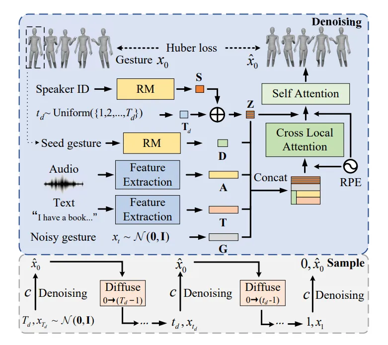

Figure 13: The architecture of DiffuseStyleGesture+ \[111\], showcasing
its multimodal integration for co-speech gesture generation. The model
incorporates speaker IDs, seed gestures, audio, and text through feature
extraction and representation modules. A diffusion process is employed
to refine noisy gestures into expressive outputs, leveraging
self-attention and cross-local attention mechanisms. The system also
uses Huber loss \[289\] for enhanced denoising performance and produces
stylistically diverse gesture outputs. Reprinted from \[111\].

EMAGE \[114\] introduces a framework for generating full-body human
gestures from audio and masked gestures, offering comprehensive control
over facial, body, hand, and global movements. Using a Masked Audio
Gesture Transformer, EMAGE effectively encodes and synthesizes
audio-to-gesture generation while incorporating masked gesture priors to
boost inference performance. The model also adaptively merges speech
features with compositional VQ-VAEs \[290\], generating diverse and
high-fidelity gestures synchronized with audio input. EMAGE’s flexible
design accepts predefined spatial-temporal gesture inputs, producing
holistic, audio-synchronized gesture outputs. State-of-the-art gesture
synthesis models often rely on diffusion and attention mechanisms, but
their high computational complexity limits efficiency in generating long
and diverse sequences. MambaTalk addresses this challenge by leveraging
Selective State Space Models (SSMs) \[291\], offering a more efficient
and scalable approach to holistic gesture generation \[115\]. By
implementing a two-stage modeling strategy with discrete motion priors,
MambaTalk enhances gesture quality while maintaining low latency. Built
on the Mamba block \[292\], it enables multimodal integration, improving
gesture diversity and rhythm without the heavy computational cost of
Transformers or diffusion models.

### 7.4 Application

Gestures are foundational to enhancing the realism and emotional depth
of generative AI and animations, making them essential for creating
engaging and immersive experiences across various domains. In animation,
gestures bring virtual characters to life by imbuing them with
human-like expressiveness and natural movements, critical for
storytelling in movies, video games, and cinematic experiences \[293\].
In gaming, gesture synthesis enables lifelike avatars and NPCs
(non-playable characters) to generate contextually appropriate motions
from inputs such as speech, text, or user actions, which heighten the
player’s sense of immersion and connection to the game world \[294\].
Techniques like co-speech gesture generation have been proposed to
produce human gestures synchronized with audio, enhancing avatar realism
in interactive gaming \[295\]. Similarly, in movies and videos,
gesture-driven AI facilitates the creation of dynamic performances,
allowing directors to craft complex scenes involving digital characters
or augmented environments with precision and creativity \[296\].

Beyond entertainment, gesture-based interactions are revolutionizing
interfaces and workflows in professional fields. For instance, gesture
animations play a critical role in VR and AR applications, enabling
intuitive manipulation of 3D content for architects, designers, and
engineers. In collaborative virtual spaces, real-time gesture-driven
animations enhance communication by translating users’ body language and
expressions into digital form, fostering a sense of presence and shared
engagement \[297\]. Additionally, gesture control systems are
transforming user interfaces by replacing traditional input methods,
offering seamless and intuitive ways to interact with digital
environments, from gaming to human-machine collaboration \[298\].
Studies have explored the evolution of gesture-based interactions and
their impact on human-computer interaction, emphasizing their role in
bridging the gap between physical and virtual worlds \[299\]. Overall,
gestures are a cornerstone for bridging the gap between physical and
virtual worlds, making animations, gaming, movies, and videos more
interactive, realistic, and impactful.

## 8 Motion

Human motion describes the coordinated spatiotemporal dynamics of body
movements, encompassing the interplay of limb articulation, facial
expressions, hand gestures, and overall trajectories as a unified whole.
It includes both low-level kinematic details (e.g., joint rotations,
velocities) and high-level semantic actions (e.g., walking, dancing)
\[159, 300\]. Motion modeling is foundational to applications like
animation, robotics, and virtual reality, where generating natural and
expressive movements is critical. Traditional marker-based motion
capture systems are limited to lab settings, but recent advances in
markerless methods and deep learning enable scalable 3D motion
estimation from RGB videos \[301, 300\]. Notably, whole-body motion
synthesis requires capturing not just body poses but also fine-grained
details like facial expressions and hand gestures, which are often
omitted in older datasets \[301\]. Furthermore, human motion synthesis
involves generating 3D human motion sequences conditioned on textual
descriptions (e.g., a person jumps while waving both hands). It bridges
natural language understanding and motion dynamics, demanding alignment
between linguistic semantics and kinematic plausibility \[127\].

### 8.1 Dataset

Early datasets focused on body-only motions with limited textual
diversity, but recent efforts emphasize multimodal annotations (text,
audio, video) and whole-body expressiveness \[301, 159, 302\].
Challenges include temporal coherence, contextual grounding, and
handling ambiguous textual inputs \[303, 159\]. From the technical
perspective, the evolution of 3D human motion datasets has been closely
tied to advancements in motion representation paradigms, each offering
unique advantages and limitations. Early datasets, such as CMU MoCap ,
relied on marker trajectories and hierarchical joint-angle
representations to capture lab-based motions like walking or jumping.
These formats prioritized compatibility with animation tools like
Blender but lacked standardization, leading to fragmented workflows. For
instance, the KIT Motion-Language Dataset \[304\] combined BVH files
with FBX formats to support text-driven animation pipelines. However,
its text annotations remained simplistic and limited to locomotive
actions. BVH (Biovision Hierarchy) and FBX (Filmbox) are file formats
used to store 3D human motion data, particularly from motion capture
systems. BVH is a text-based format focusing on skeletal animation,
defining the hierarchy of joints and their movements over time. FBX is a
binary format that can include motion data and 3D models, scenes, and
textures, making it suitable for integrating with animation software.

The introduction of parametric body models, notably SMPL \[1\] and its
extension SMPL-X \[305\], revolutionized motion representation by
unifying body, face, and hand movements into a single mesh topology.
Datasets such as AMASS \[242\] consolidated 15 marker-based datasets
into SMPL parameters, enabling large-scale training of generative
models. However, these early efforts focused primarily on body poses,
overlooking expressive details. Motion-X addressed this limitation
\[306\], which introduced SMPL-X annotations to capture whole-body
motions along with multimodal data such as text and audio. Before that,
HumanML3D \[119\] paired SMPL body parameters with crowdsourced text
labels but lacked facial and hand dynamics, reflecting the common
trade-off between scalability and expressiveness. Textual
representations have also evolved, with datasets employing various
annotation strategies. BABEL \[307\] paired SMPL motions from AMASS with
concise, verb-centric labels. In contrast, MotionScript \[302\]
introduced rule-based natural language descriptions (e.g., left elbow
bent at 45 degrees) to improve fine-grained text-to-motion alignment.
Table provides a more comprehensive list of key motion-related datasets.

| Name                                 | Statistics                                                                                                                                                   | Modalities                              | Link                                                                            |
| ------------------------------------ | ------------------------------------------------------------------------------------------------------------------------------------------------------------ | --------------------------------------- | ------------------------------------------------------------------------------- |
| Motion-X++ \[301\]                   | 19.5 million 3D poses across 120,500 sequences, synchronized with 80,800 RGB videos and 45,300 audio tracks, and annotated with free-form text descriptions. | 3D/Point Cloud Data, Text, Audio, Video | [Motion-X++](https://github.com/IDEA-Research/Motion-X)                         |
| HumanMM (ms-Motion) \[308\]          | 120 long-sequence 3D motions reconstructed from 600 in-the-wild multi-shot videos, totaling 237 minutes of data. Includes rare interactions.                 | 3D/Point Cloud Data, Video              | [HumanMM](https://github.com/zhangyuhong01/HumanMM-code)                        |
| Multimodal Anatomical Motion \[309\] | 51,051 annotated poses with 53 anatomical landmarks, captured across 48 virtual camera views per pose. Includes 2,000+ pathological motion variations.       | 3D/Point Cloud Data, Text               | [Multimodal Anatomical Motion](https://data.mendeley.com/datasets/493s6f753v/2) |
| AMASS \[242\]                        | 11,265 motion clips aggregated from 15 mocap datasets (e.g., CMU, KIT), totaling 43 hours of motion data in SMPL format. Covers 100+ action categories.      | 3D/Point Cloud Data                     | [AMASS](https://amass.is.tue.mpg.de/)                                           |
| HumanML3D \[119\]                    | 14,616 motion sequences (28.6 hours) paired with 44,970 free-form text descriptions spanning 200+ action categories.                                         | 3D/Point Cloud Data, Text               | [HumanML3D](https://github.com/EricGuo5513/HumanML3D)                           |
| BABEL \[307\]                        | 43 hours of motion data from AMASS, annotated with 250+ verb-centric action classes across 13,220 sequences. Includes temporal action boundaries.            | 3D/Point Cloud Data, Text               | [BABEL](https://babel.is.tue.mpg.de/)                                           |
| AIST++ \[246\]                       | 1,408 dance sequences (10.1 million frames) captured from 9 camera views, totaling 15 hours of multi-view RGB video data.                                    | 3D/Point Cloud Data, Video              | [AIST++](https://google.github.io/aistplusplus_dataset/)                        |
| 3DPW \[245\]                         | 60 sequences (51,000 frames) captured in diverse indoor/outdoor environments, featuring challenging poses and natural object interactions.                   | 3D/Point Cloud Data, Video              | [3DPW](https://virtualhumans.mpi-inf.mpg.de/3DPW/)                              |
| PROX \[310\]                         | 20 subjects performing 12 interactive scenarios in 3D scenes, including 180 annotated RGB frames for scene-aware motion analysis.                            | 3D/Point Cloud Data, Images             | [PROX](https://prox.is.tue.mpg.de/index.html)                                   |
| KIT-ML \[304\]                       | 3,911 motion clips (11.23 hours) with 6,278 natural language annotations containing 52,903 words, stored in BVH/FBX formats.                                 | 3D/Point Cloud Data, Text               | [KIT-ML](https://git.h2t.iar.kit.edu/sw/motion-annotation)                      |
| CMU MoCap                            | 2605 trials across 6 categories and 23 subcategories, performed by over 140 subjects.                                                                        | 3D/Point Cloud Data, Audio              | [CMU MoCap](https://mocap.cs.cmu.edu/)                                          |

Table 6: Comprehensive collection of datasets for 3D human motion
generation and synthesis, highlighting key statistics and modalities.

### 8.2 Evaluation

Text-to-motion models promise to animate characters with lifelike
movements that faithfully reflect the nuances of written prompts, but
their success hinges on rigorous evaluation. Ensuring that generated
motions are realistic, diverse, and precisely aligned with the input
text requires a multifaceted approach. Modern research has developed a
sophisticated evaluation framework that balances quantitative metrics
with human judgment, drawing inspiration from computer vision and
natural language processing. By examining how contemporary models are
assessed, we can uncover the factors defining their performance and the
metrics illuminating their strengths and limitations.

At the heart of text-to-motion evaluation lies the pursuit of fidelity,
the degree to which generated motions match the realism of actual human
movements. Researchers have adapted the Fréchet Inception Distance (FID)
to compare the feature distributions of synthetic and real motion
sequences. Lower FID scores signal motions closely resembling their
real-world counterparts, a critical factor for immersive applications
like virtual reality.

Equally important is the concept of consistency, which measures how well
a generated motion captures the semantic intent of the input text.
Without this alignment, even the most realistic motion risks becoming
irrelevant. The R-Precision metric \[311\] has emerged as a cornerstone
for evaluating this aspect, assessing whether a motion can retrieve its
corresponding text prompt from a set of candidates. By embedding motions
and texts into a shared space, often trained with contrastive loss,
R-Precision calculates the proportion of times the correct text ranks
among the top-k matches, typically at thresholds like top-1 or top-3.
Complementing R-Precision, the MultiModal Distance \[312\] quantifies
the Euclidean distance between motion and text embeddings, with lower
values indicating tighter semantic coupling.

Diversity represents another critical dimension, ensuring that
text-to-motion models can produce a rich variety of motions across
different prompts and within the same one. A model that generates
repetitive or stereotypical movements fails to capture the breadth of
human expression, limiting its utility in creative applications. The
Diversity metric \[313\] calculates the average distance between pairs
of randomly sampled motion sequences and evaluates a model’s ability to
span the motion space. Meanwhile, Multimodality \[313\] focuses on
diversity within a single prompt, measuring the variance among multiple
motions generated from the same text. These metrics collectively ensure
that models remain versatile, avoiding the pitfall of overfitting to
common motion patterns.

Beyond these quantitative measures, the subjective quality of generated
motions plays an indispensable role in evaluation, as automated metrics
alone cannot fully capture the nuances of human perception. User
studies, where human participants rate motions for naturalness and
appropriateness, provide insights into aspects like emotional
expressiveness or contextual relevance that quantitative metrics may not
fully capture \[314\]. Such studies highlight the importance of aligning
technical performance with user experience, particularly in applications
where audience engagement is paramount.

Over the past few years, the community has made significant headway in
refining evaluation benchmarks to capture better how faithfully
generated motions adhere to textual input. HumanML3D \[119\], for
example, has emerged as a standard reference point, offering a broad
range of test scenarios and consistently measured metrics like FID for
visual realism, R-Precision for semantic alignment, and Diversity for
sample variety. These benchmarks, along with others such as KIT
Motion-Language \[304\], help uncover trade-offs across various modeling
approaches, highlighting strengths and weaknesses in terms of text
matching, temporal coherence, and multi-modal variations. They also
reveal ongoing gaps in measurement, as no single metric fully captures
subjective motion quality or subtle semantics. Models such as MoMask
\[123\], DiverseMotion \[122\], and Motion Anything \[125\] currently
achieve state-of-the-art performance, excelling in text alignment,
realism, or both, signifying steady progress towards more expressive and
accurate text-driven motion generation.

### 8.3 Models

Generative AI and Deep Learning have significantly advanced the field of
generative modeling for 3D human motion, particularly for synthesis
conditioned on inputs like natural language. Recent research leverages
powerful architectures such as Variational Autoencoders (VAEs) and their
variations and Diffusion Models. Early foundational works established
methods for bridging the gap between textual concepts and motion
sequences. For instance, Language2Pose \[315\] introduced a neural
architecture to learn a joint embedding space where both language
descriptions and 3D pose sequences could be encoded, enabling the
generation of animations directly from text input. Subsequently,
MotionCLIP \[316\] demonstrated the power of leveraging large
pre-trained models by aligning a transformer-based motion autoencoder’s
latent space with the rich semantic space of CLIP \[7\]. This alignment
infused the motion generation process with strong semantic
understanding, allowing for more nuanced and even abstract
text-to-motion capabilities \[316\].

#### 8.3.1 VAE-Based Models

Variational Auto-Encoder (VAE) architectures are frequently employed in
motion generation models because they capture complex motion patterns
and learn meaningful latent representations. A prominent example is the
Action-Conditioned Transformer VAE \[116\], a model designed for
generating diverse and realistic 3D human motions conditioned on action
labels. It combines transformers with a VAE structure, enabling the
model to produce multiple motion variations from the same action
condition. Typically, its encoder maps an input motion sequence into a
latent Gaussian distribution. At the same time, the decoder uses samples
from this distribution, along with the action label, to generate new
motion sequences. This model is often adopted as a baseline in
subsequent research due to its strong performance and flexibility. TEMOS
(Text-To-Motions) \[117\] adapts the architecture for text-conditioned
generation of SMPL \[1\] body motions. It modifies the
Action-Conditioned Transformer VAE (referred to as ACTOR \[116\]) by
replacing action conditioning with text prompts and introducing two
symmetric encoders: one processing motion sequences and the other using
frozen DistilBERT \[317\] embeddings for text. Both encoders map their
inputs to parameters of a Gaussian distribution in a shared latent
space. The decoder then reconstructs motions while training objectives
align the text and motion representations within this latent space,
aiming for strong cross-modal consistency.

Addressing the challenge of generating coherent motion from sequential
instructions, TEACH (Temporal Action Composition for 3D Humans) \[118\]
extends TEMOS \[117\] to handle a sequence of text descriptions. Its key
innovation is a hierarchical generation strategy: it operates
non-autoregressively within individual actions but autoregressively
across the sequence of actions specified by the input texts. This allows
for temporal composition and smoother transitions between consecutive
motions described in the text sequence. Differing in architectural
design, T2M (Text2Motion) \[119\] employs a distinct two-stage framework
for text-to-motion synthesis. It first pre-trains a convolutional
auto-encoder to learn compact motion representations (motion
codes/snippets). Subsequently, a separate temporal VAE module,
incorporating RNNs and conditioned on text features, generates sequences
of these motion codes and predicts the overall motion duration based on
the input text. The pre-trained motion decoder then translates these
generated codes into the final 3D motion.

Shifting focus towards improving the alignment between text and motion
representations, TMR (Text-to-Motion Retrieval) \[120\] enhances the
TEMOS \[117\] framework primarily for the task of motion retrieval,
though still capable of synthesis. Inspired by CLIP \[7\], TMR
incorporates a contrastive loss objective during training to explicitly
structure the joint latent space, pushing embeddings of corresponding
text-motion pairs closer while separating mismatched pairs. Crucially,
it introduces a technique (using MPNet \[318\]) to filter out
potentially misleading negative pairs (texts describing similar motions)
during contrastive training, leading to significantly improved retrieval
performance over prior methods such as TEMOS \[117\] and T2M \[119\].
The main structure of this model is illustrated in Figure .

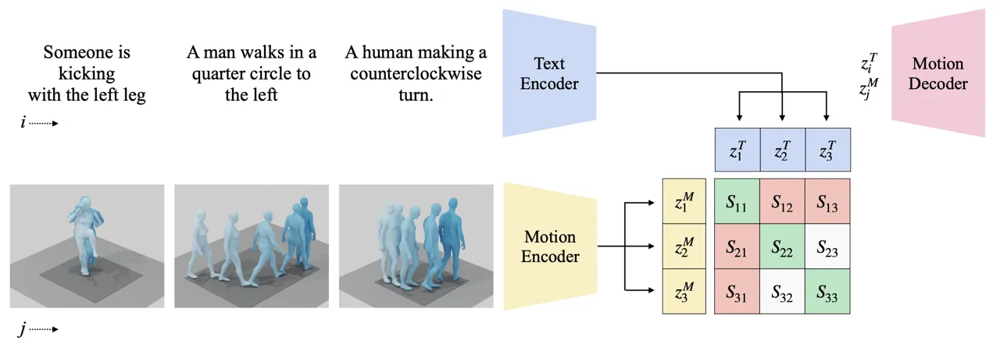

Figure 14: The architecture of the TMR \[120\] framework shows the use
of dual encoders for text and motion, and a joint embedding space for
similarity-based retrieval. Reprinted from \[120\].

#### 8.3.2 VQ-VAE-Based Models

A notable direction in 3D motion generation involves models based on a
VQ-VAE (Vector Quantized Variational Autoencoders) backbone, where
motion is represented as a sequence of discrete tokens sampled from a
learned codebook. This formulation treats motion synthesis similarly to
language modeling, allowing for more structured, controllable
generation. The idea was first introduced in T2M-GPT \[121\], which uses
a transformer with causal masked self-attention to autoregressively
predict motion tokens conditioned on text. The motion is encoded into
tokens using a pre-trained VQ-VAE, and text prompts are encoded via CLIP
\[7\], enabling the model to synthesize motion by generating a sequence
of token indices one by one.

Following this foundation, later models explore ways to improve
diversity, efficiency, and temporal coherence. DiverseMotion \[122\]
replaces the autoregressive decoding with a diffusion process,
corrupting motion tokens during the forward pass and denoising them in
reverse, conditioned on CLIP-based text embeddings. To capture richer
semantic context from text, it introduces Hierarchical Semantic
Aggregation (HSA), which aggregates token-level embeddings using
learnable weights and MLPs. Meanwhile, MoMask \[123\] adopts a
hierarchical codebook structure, combining masked token modeling
(inspired by BERT \[319\]) with a residual refinement stage. This allows
the model first to generate coarse motion using masked prediction and
then incrementally add fine-grained motion detail across quantization
layers.

Longer and more complex motion sequences are addressed in T2LM \[124\],
which maps multi-sentence text into motion using a 1D-convolutional
VQ-VAE and a transformer-based text encoder, enabling smooth transitions
across actions. Taking a different route, MotionGPT \[21\] combines
VQ-VAE with a large language model (LLM), treating motion generation as
a sequence-to-sequence task. Using LoRA \[320\] for efficient
fine-tuning, the LLM predicts motion tokens directly from text, offering
faster training and strong generalization. The main structure of
MotionGPT \[21\] is illustrated in Figure . Together, these models
demonstrate the flexibility of the VQ-VAE formulation and open new
directions for combining motion modeling with advances in language and
generative modeling.

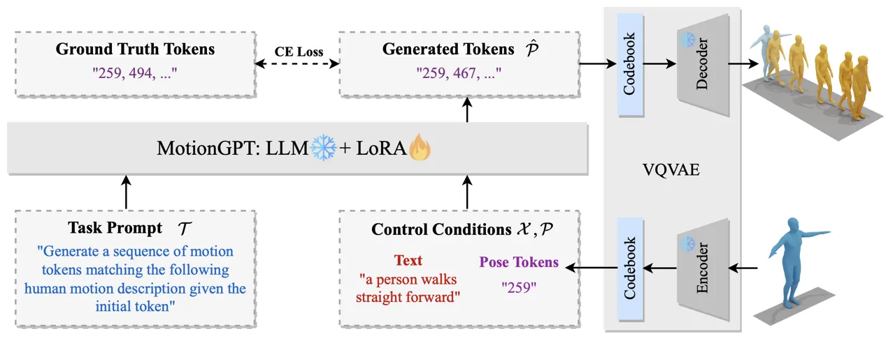

Figure 15: An overview of MotionGPT \[21\], which uses a frozen VQ-VAE
and LLM, with LoRA \[320\] applied to fine-tune the LLM for generating
motion tokens. Reprinted from \[21\].

#### 8.3.3 Diffusion-Based Models

Following the success of diffusion models in text-to-image generation
\[59, 321\], the field of text-to-human motion generation has
increasingly adopted the Denoising Diffusion Probabilistic Model (DDPM)
framework. These approaches begin by corrupting motion sequences with
noise and learn to reverse this process through a denoising network,
conditioned on natural language descriptions. Given the sequential
nature of motion, transformers are often used within the denoising
process to model temporal dependencies, though their integration varies
significantly across models.

Early adopters such as Flame \[18\], MotionDiffuse \[22\], and HMDM
\[126\] all incorporate transformers for denoising, but differ in their
conditioning strategies, temporal encoding, and loss functions. Flame
\[18\] introduces a transformer-based motion decoder in place of the
standard U-Net \[231\], using cross-attention to incorporate text
features extracted with RoBERTa \[322\]. It introduces two special
tokens for encoding motion length and diffusion timestep, both used
during cross-attention to guide generation. MotionDiffuse \[22\],
although similar in structure, handles the timestep differently by
sampling it from a uniform distribution, and introduces variable-length
motion generation by dividing sequences into sub-intervals. Each segment
is paired with a corresponding text description, enabling part-wise and
body-part-specific conditioning. It also incorporates Efficient
Attention \[323\] to reduce computational cost and uses a classical
transformer \[5\] for text encoding. While both Flame \[18\] and
MotionDiffuse \[22\] rely on noise-based reconstruction, Flame adds a
variational lower bound. In contrast, MotionDiffuse \[22\] optimizes
only a mean squared error loss on the predicted noise.

In contrast, HMDM \[126\] takes a different approach by applying its
primary reconstruction loss on the denoised signal rather than the
noise. It encodes text using CLIP \[7\] and feeds the diffusion timestep
into the transformer as a dedicated token, similar to Flame. However,
HMDM \[126\] fixes the motion length and introduces a set of auxiliary
loss functions designed to improve physical realism: a positional loss
in joint space, a velocity loss to enforce temporal consistency, and a
foot contact loss defined using forward kinematics. These losses are
combined with a standard reconstruction loss, forming a comprehensive
objective that better preserves both spatial accuracy and motion
smoothness.

Departing from sequential generation, MakeAnAnimation \[127\] proposes a
two-stage framework that first pre-trains on a large static 3D pose
dataset, created from pose detection applied to image collections, to
learn pose-text associations. Using a U-Net architecture \[231\] for the
denoising network and a pre-trained T5 encoder \[324\] for text, the
model generates full motion sequences concurrently. Unlike
transformer-based models such as HMDM \[126\] and Flame \[18\], which
enforce temporal consistency through specific loss functions,
MakeAnAnimation \[127\] avoids such constraints and relies solely on
standard diffusion loss. Despite this, it maintains motion continuity
through its concurrent sampling and large-scale pre-training strategy.

Recent works have also expanded the diffusion framework to support
spatial and semantic constraints. GMD \[128\] highlights that prior
models primarily focus on language conditioning while neglecting spatial
grounding—specifically, trajectory-level control derived from
body-ground contact. To address this, GMD \[128\] proposes a two-stage
pipeline. In the first stage, pose representations are re-normalized
with respect to ground location, and guidance signals (which are sparse
in time) are made more effective by diffusing their gradients across
neighboring frames. These enriched spatial signals are then used as
conditioning in the generation stage, enhancing trajectory control
during motion synthesis.

Using GMD’s idea, OmniControl \[129\] introduces improved spatial
guidance and a new realism constraint. It models global body location by
cumulatively summing relative pelvis positions and uses pose keyframes
as motion anchors. This cumulative structure enables gradient flow to
influence all prior frames of the guiding keyframe, while the relative
joint representation ensures local joints affect the pelvis in return.
However, since pelvis control alone does not sufficiently influence all
joints, the model adds a realism guidance component to propagate motion
cues more effectively, resulting in more coherent and controllable
generated sequences.

### 8.4 Application

Text-to-motion generation is revolutionizing various sectors by
automating the creation of 3D human motion from natural language
descriptions. Such automation has enabled the synthesis of realistic and
contextually relevant animations, transforming industries such as
gaming, film, virtual reality, and healthcare. These systems
significantly reduce manual effort, enhance creative flexibility, and
provide efficient solutions for generating diverse motion patterns
\[325\].

In gaming and film, models like TEMOS \[117\] and T2M-GPT \[121\]
generate animations for NPCs and pre-visualization. VR and metaverse
applications benefit from systems like MotionCLIP \[316\], which
enhances human character interactions with stylized actions aligned with
semantic embeddings. Models trained on biomechanical constraints can
visualize complex procedures like joint replacement surgeries or
physical therapy regimens. However, current limitations in muscle
activation modeling require hybrid AI-expert validation pipelines
\[326\], which may be utilized in the healthcare sector. On the other
hand, education benefits from instructional animations for sports
training and dance lessons. For example, TEACH \[118\] extends
text-to-motion capabilities by handling sequential instructions (e.g.,
"perform a squat followed by a jump"), making it ideal for creating
step-by-step tutorials.

Despite the transformative potential, challenges remain in generating
extended sequences, handling complex spatial and temporal dependencies,
and ensuring ethical use. Future research focuses on integrating spatial
constraints, improving trajectory control, enhancing realism, and
expanding datasets to include diverse motion types \[159\]. Addressing
these limitations will further unlock the potential of text-to-motion
generation, driving innovation and setting new benchmarks for efficiency
and creativity across industries.

## 9 Object

In generative AI, objects serve as fundamental components of digital
environments. An object is any distinct, visually representable entity,
ranging from everyday items like furniture and vehicles to intricate
structures such as architectural elements and animated characters. These
objects are essential in animation, gaming, and virtual reality, where
they enhance realism and contribute to narrative engagement \[327\]. The
ability to generate objects dynamically streamlines creative workflows
by enabling rapid content creation from minimal input while ensuring
stylistic consistency. Whether defining settings, interacting with
characters, or enriching immersive storytelling, procedural techniques
synthesizing objects at scale are crucial in advancing generative AI
applications \[328, 329\].

### 9.1 Dataset

Translating textual descriptions into 3D representations presents
multiple challenges: shape completion, geometry generation, texture
synthesis, and quantitative evaluation. Addressing these challenges
requires diverse datasets, each tailored to different stages of model
development, from training to validation, to ensure accurate shape
priors and realistic outputs. Many text-to-3D methods utilize 2D
datasets for shape completion, where paired image-text data, often in
the form of multi-view images or depth maps, provide essential
structural cues for inferring three-dimensional forms. Additionally,
text-image datasets are crucial in evaluating semantic alignment,
helping researchers determine how well-generated 3D models correspond to
their descriptive prompts.

Researchers rely on specialized 3D datasets for geometry and texture
synthesis, which contain detailed object representations in formats such
as meshes, point clouds, and implicit surfaces. These datasets offer
explicit geometric and material properties, enabling models to learn
high-fidelity generation of both shape and surface details. In recent
years, synthetic datasets that integrate 3D models with rendered 2D
views and textual annotations have become instrumental in training
multimodal systems, supporting end-to-end learning of shape, texture,
and appearance.

While synthetic datasets facilitate large-scale training, real-world
datasets such as ScanNet \[330\] and Matterport3D \[331\] are essential
for evaluating model robustness in practical scenarios. These datasets
capture complex indoor environments with real-world occlusions and
varied lighting conditions, offering a rigorous benchmark for assessing
generalization. Moreover, custom datasets are often developed for
specialized tasks, such as shape-guided generation, appearance control,
or fine-grained voxel editing, to ensure models are optimized for
specific applications. The continuous evolution in the composition and
quality of these datasets plays a pivotal role in advancing text-to-3D
generation, fostering the development of more reliable and generalizable
models. Table provides a comprehensive overview of major datasets for
this area.

| Name                   | Statistics                                                     | Modalities                        | Link                                                                 |
| ---------------------- | -------------------------------------------------------------- | --------------------------------- | -------------------------------------------------------------------- |
| ShapeNet\[328\]        | 3D models in categories like furniture and vehicles.           | 3D/Point Cloud Data, Text         | [ShapeNet](http://shapenet.org/about)                                |
| BuildingNet\[332\]     | Architectural structures for shape completion tasks.           | 3D/Point Cloud Data, Text         | [BuildingNet](https://github.com/BuildingNet/BuildingNet)            |
| Text2Shape\[333\]      | Textual descriptions linked to ShapeNet categories.            | Text, 3D/Point Cloud Data         | [Text2Shape](https://text2shape.github.io/)                          |
| ShapeGlot\[334\]       | Textual utterances describing differences between shapes.      | Text, 3D/Point Cloud Data         | [ShapeGlot](https://github.com/alters-mit/ShapeGlot)                 |
| Pix3D\[329\]           | 3D models aligned with real-world images for evaluation.       | Images, 3D/Point Cloud Data       | [Pix3D](https://github.com/xingyuansun/pix3d)                        |
| LAION-5B\[13\]         | Large-scale dataset with 5 billion image-text pairs.           | Images, Text                      | [LAION-5B](https://laion.ai/)                                        |
| COCO-Stuff\[335\]      | Annotated images for real-world 3D synthesis.                  | Images, Text                      | [COCO-Stuff](https://github.com/nightrome/cocostuff)                 |
| Flickr30K\[336\]       | Image dataset with diverse textual descriptions.               | Images, Text                      | [Flickr30K](https://github.com/ubmdmg/Flickr30kEntities)             |
| ModelNet40\[337\]      | 3D CAD models across 40 object categories.                     | 3D/Point Cloud Data               | [ModelNet40](https://modelnet.cs.princeton.edu/)                     |
| ShapeNetCore\[328\]    | Subset of ShapeNet with detailed object models.                | 3D/Point Cloud Data, Text         | [ShapeNetCore](http://shapenet.org/about)                            |
| BlendSwap\[338\]       | Realistic 3D models with physically based rendering (PBR).     | 3D/Point Cloud Data, Images       | [BlendSwap](https://www.blendswap.com/)                              |
| InstructPix2Pix\[339\] | Dataset for instruction-driven image modifications.            | Images, Text                      | [InstructPix2Pix](https://github.com/timothybrooks/instruct-pix2pix) |
| MagicBrush\[340\]      | Dataset for refining texture and appearance in 3D.             | Images                            | [MagicBrush](https://github.com/OSU-NLP-Group/MagicBrush)            |
| NeRF-Synthetic\[341\]  | 2D images rendered from synthetic 3D scenes.                   | Images                            | [NeRF-Synthetic](https://github.com/bmild/nerf)                      |
| ScanNet\[330\]         | 2.5M RGB-D views with semantic segmentations and camera poses. | Images, Text                      | [ScanNet](http://www.scan-net.org/)                                  |
| Matterport3D\[331\]    | 10,800 panoramic views from 90 building-scale scenes.          | Images, 3D/Point Cloud Data, Text | [Matterport3D](https://github.com/niessner/Matterport)               |

Table 7: A collection of datasets most frequently used for 3D Object
Generation.

### 9.2 Evaluation

Evaluating generative object models requires both qualitative and
quantitative metrics to assess their performance across visual,
structural, and computational dimensions. Geometric fidelity ensures
that synthesized objects exhibit accurate and plausible forms, often
measured using Chamfer Distance \[135\] or Earth Mover’s Distance (EMD)
\[342\]. Models such as DreamFusion \[130\] and SDFusion \[135\]
demonstrate strong geometric accuracy by leveraging advanced shape
synthesis techniques. In contrast, Magic3D \[131\] slightly compromises
geometric precision in favor of high-resolution texture details,
enhancing the generated surfaces’ realism.

Another critical aspect of evaluation is semantic alignment, which
assesses the correspondence between generated objects and their textual
descriptions. This is commonly measured using CLIP Similarity \[7\].
DreamFusion \[130\] and Fantasia3D \[139\] excel in this area,
effectively embedding semantic information to produce objects that
closely align with the input prompts. Magic3D \[131\], while maintaining
a degree of semantic accuracy, places greater emphasis on surface
realism and texture refinement rather than strict alignment with textual
input.

Textural quality is crucial in generative object evaluation,
particularly for models that enhance visual realism. Metrics such as
Structural Similarity Index (SSIM) \[205\] and Peak Signal-to-Noise
Ratio (PSNR) \[225\] are frequently employed to assess texture fidelity.
Magic3D \[131\] outperforms other models in this regard, achieving
exceptionally detailed textures at the cost of increased computational
demands. In comparison, models like DreamFusion \[130\] and Fantasia3D
\[139\] prioritize a balance between semantic accuracy and textural
detail, producing visually coherent outputs with moderate computational
overhead.

Computational efficiency is another critical factor, especially for
real-world applications. Models such as SDFusion \[135\] adopt efficient
processing strategies, achieving a balance between resource demands and
synthesis speed. In contrast, Magic3D \[131\] delivers superior
high-resolution results but at a significantly higher computational
cost, making it less scalable for large-scale applications. Meanwhile,
IPDreamer \[143\] introduces instruction-driven editing, offering
greater flexibility but occasionally sacrificing geometric fidelity in
the process.

Finally, Fréchet Inception Distance (FID) is a widely used metric for
evaluating the realism of generated outputs, particularly when comparing
generative models that produce 3D objects from 2D views. Fantasia3D
\[139\] and DreamFusion \[130\] achieve strong FID scores, indicating
their ability to synthesize realistic and visually coherent objects that
closely match real-world counterparts.

### 9.3 Models

Text-to-3D generation has rapidly evolved through three primary
paradigms: diffusion-guided optimization, amortized inference, and
high-fidelity geometry-aware synthesis. These paradigms reflect a
growing ambition to balance flexibility, speed, and realism in
synthesizing 3D content from text. This section traces the key
innovations across each, highlighting how models build upon one another
and navigate these trade-offs.

#### 9.3.1 Diffusion-Guided Score Distillation

Score Distillation Sampling (SDS) emerged as a turning point in
text-to-3D generation. Rather than relying on hand-crafted priors or
CLIP similarity, this technique taps into the rich, implicit knowledge
of pretrained 2D diffusion models. By minimizing the KL divergence
between the forward process of Gaussian noise and the learned score
function, SDS introduced a powerful image-space supervisory signal for
optimizing 3D representations.

This idea first crystallized in DreamFusion \[130\], where the authors
showed that a NeRF could be steered purely by text via SDS, yielding
coherent geometry and textures without any 3D supervision. It has been
one of the pioneer models in 3D object generation. Figure demonstrates
an overview of this approach. Yet, while DreamFusion was groundbreaking,
its outputs were often coarse, and the optimization process was long and
unstable. Building upon this, subsequent models introduced architectural
and procedural refinements. For instance, Magic3D \[131\] adopted a
two-stage pipeline: a low-resolution NeRF is optimized first, then
upsampled and fine-tuned as a textured mesh in a mesh-space latent
diffusion framework. This division significantly improved both speed and
visual fidelity, enabling 8 times higher resolution supervision and much
sharper geometry.

Still, the optimization process remained fragile. One subtle, yet
impactful, insight came from DreamTime \[132\], which revisited how
timesteps were sampled in SDS. It revealed that uniform timestep
sampling, common in early methods, led to inefficient gradients.
Instead, aligning the timestep selection with the DDPM sampling schedule
resulted in faster convergence and better quality. Another leap came
from incorporating multi-scale supervision. HD-Fusion \[133\] proposed a
hierarchical noise estimation and timestep fusion strategy, producing
assets with superior resolution and consistency. Combined with
structure-preserving priors from ControlNet, SDS-based generation was
closer to photorealistic fidelity.

To address structural realism explicitly, Dream3D \[134\] incorporated
shape priors into the diffusion process by generating rendered-style
images and conditioning on shape embeddings. This allowed the
optimization to be guided by visual realism and explicit structural
cues, leading to significantly more plausible geometries.
SDFusion\[135\], though often grouped with optimization methods, took a
more geometric perspective. Rather than NeRFs or meshes, it represented
objects using latent Signed Distance Functions (SDFs). Its diffusion
model could condition on multiple modalities, text, images, and partial
shapes, while learning to balance these inputs via attention-like
weightings. This enabled a wide range of tasks beyond generation,
including completion and reconstruction, all while maintaining
fine-grained geometric detail.

#### 9.3.2 Optimization-Amortized Models

While diffusion-guided optimization yields impressive results, its
per-prompt nature makes it ill-suited for large-scale or interactive
applications. To overcome this, a new class of models has emerged that
amortize the optimization process, learning a direct mapping from text
to 3D representation. ATT3D \[136\] was among the first to demonstrate
this shift. Instead of optimizing for each prompt individually, it
trained on batches of prompts simultaneously, learning a shared model
capable of generating diverse 3D assets in a single forward pass. This
enabled real-time inference and operations like prompt interpolation and
attribute mixing, capabilities out of reach for purely
optimization-based methods.

Scaling this idea further, LATTE3D \[137\] introduced a larger
architecture with 3D-aware priors and enhanced regularization.
Leveraging pretrained reconstruction networks and introducing stronger
shape constraints produced detailed and robust 3D meshes in less than a
second. Its ability to generalize across open-world prompts while
preserving visual and structural integrity marked a significant leap in
scalability. Interestingly, not all methods fall neatly into either
optimization or amortization. IT3D \[138\] occupies a hybrid space: it
retains SDS-based optimization but accelerates and enhances it via a
learned refinement module. Using an adversarial discriminator trained on
pose-conditioned renderings, this module sharpens geometry and textures,
acting as a learned prior over plausible 3D shapes. In doing so, it
offers a flexible middle ground and fast, high-quality inference without
fully abandoning the benefits of optimization.

#### 9.3.3 High-Fidelity and Geometry-Aware Models

Beyond generation speed and prompt alignment, another line of research
focuses on high-fidelity geometry and realism, emphasizing accurate
surface modeling, relightable textures, and physical plausibility.
Fantasia3D \[139\] exemplifies this trend by disentangling geometry and
appearance through DMTET-based mesh representations and BRDF-driven
material modeling. Instead of directly optimizing RGB outputs, it models
surface normals and reflectance, enabling outputs that can be relit or
edited realistically. Such separation also supports more controllable
generation, where geometry and texture can be manipulated independently.

Editing, too, has emerged as a critical area of focus in recent
advancements. Vox-E \[140\] approaches the problem from a 3D volumetric
perspective, incorporating a segmentation mechanism driven by
cross-attention. This allows users to apply local edits, like changing
the color or shape of an object part, while maintaining coherence and
structure through 3D-aware regularization. On the frontier of resolution
and detail, the Large Gaussian Model (LGM) \[141\] brings volumetric
Gaussian representations into play. Trained with an asymmetric U-Net and
capable of producing high-resolution geometry from minimal inputs (even
single images), it supports both image-to-3D and text-to-3D tasks with
impressive photorealism. Its differentiable structure also makes mesh
extraction straightforward, opening the door to downstream applications
in animation and simulation.

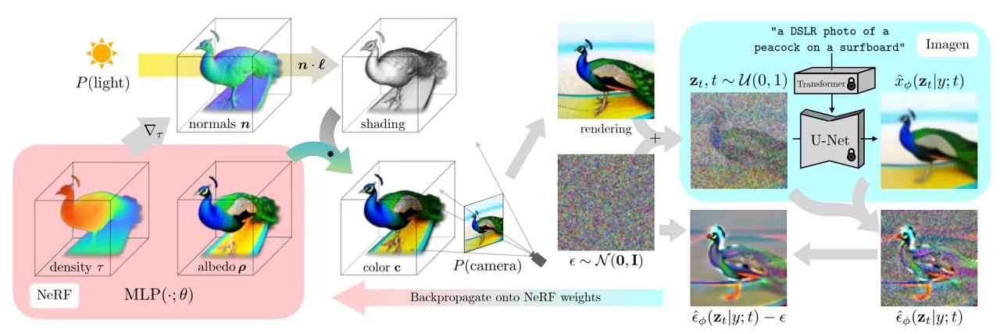

Figure 16: DreamFusion \[130\] generates 3D objects from text prompts
like “a DSLR photo of a peacock on a surfboard." It trains a Neural
Radiance Field (NeRF) from scratch for each caption, using shading from
normals and a frozen Imagen model \[57\] to guide updates for improved
geometry and appearance. Reprinted from \[130\].

Another advanced approach, Meta 3D AssetGen \[142\], combines
text-to-image synthesis with physically-based rendering (PBR). It
generates shaded and albedo maps for multi-view grids, then reconstructs
detailed meshes using signed distance functions (SDF) for geometry and a
transformer-based texture refinement module. This produces realistic
materials with adjustable lighting properties for high-quality,
customizable 3D outputs. Finally, IPDreamer \[143\] enhances control for
complex image prompts. It extracts detailed appearance features using
Image Prompt Score Distillation Sampling (IPSDS). A mask-guided
compositional alignment strategy ensures precise geometry-texture
coherence, stabilizing outputs even in ambiguous scenarios. This enables
robust, high-quality 3D synthesis from challenging prompts.

### 9.4 Application

The rapid progress in text-to-3D object generation is revolutionizing
multiple industries by enabling efficient and innovative workflows. In
entertainment and gaming, tools such as DreamFusion \[130\] and
Fantasia3D \[139\] are used to generate detailed 3D assets from text
prompts, thereby supporting immersive storytelling and procedural
world-building in VR and AR environments. In parallel, the healthcare
sector has begun to harness these advances, platforms like Dream3D
\[134\] yield anatomically accurate 3D models from textual descriptions,
which can significantly aid surgical planning, medical training, and
personalized patient care.

Meanwhile, in product design and prototyping, approaches like SDFusion
\[135\] and Magic3D (e.g., \[131\]) streamline the creation of items
ranging from furniture to vehicles by generating designs directly from
textual inputs. Educational initiatives also benefit from such
technologies; for example, Vox-E \[140\] enhances learning by providing
interactive 3D models of historical artifacts and scientific concepts.
Furthermore, the ability to generate on-demand 3D renderings from text
also offers promising advantages in e-commerce, where improved customer
experience and reduced production costs are key considerations. These
capabilities are underpinned by foundational datasets and repositories
such as ShapeNet \[328\], BuildingNet \[332\], and Pix3D \[329\],
highlighting the transformative impact of generative 3D modeling across
diverse sectors.

## 10 Texture

In generative AI for character animation, texture generation synthesizes
detailed surface properties for animated entities, including skin,
clothing, and accessories. These textures are essential for defining the
visual appearance of characters and conveying realism, emotional
expression, and stylized identity. High-quality textures significantly
enhance the immersive quality of animated scenes, particularly when
aligned with dynamic elements such as motion, lighting, and facial
deformation \[150, 153\].

To achieve photorealism and temporal coherence, texture generation must
support multi-view consistency and semantic alignment with
natural-language descriptions \[152, 149\]. Recent models have
demonstrated improved texture fidelity and reduced artifacts across
complex geometries and animated sequences \[145, 147, 154\]. Stylization
and artistic control are further enabled through text-conditioned
diffusion frameworks that allow creative re-texturing based on
high-level prompts \[146, 150\]. Traditional methods such as Generative
Adversarial Networks (GANs) \[3\] and neural rendering pipelines laid
the foundation for modern approaches, which now integrate spatial
priors, latent diffusion, and cross-view fusion to produce semantically
consistent and expressive textures for animated characters.

Recent advancements have enabled text-guided texture synthesis, allowing
designers to specify visual features of animated characters using
natural language prompts. For instance, systems can generate prompts
like “a velvet jacket with golden embroidery” or “robotic armor with
worn metallic panels” and produce coherent textures across the mesh.
Methods like TEXTure \[146\], Text2Tex \[145\], and TexFusion \[149\]
leverage pre-trained diffusion models conditioned on depth or multi-view
geometry to guide the generation process. These models align vision and
language through joint embeddings, enabling iterative updates from
multiple viewpoints to maintain global consistency. By reducing manual
effort and supporting semantic control, such systems transform the way
high-fidelity digital characters are textured for animation, games, and
interactive media.

### 10.1 Dataset

Effective texture generation relies heavily on the availability of
well-annotated, high-quality 3D datasets. In the context of character
animation, datasets must capture not only geometry and texture maps but
also support semantic alignment through language descriptions, diverse
categories (e.g., humans, animals, furniture), and consistent multi-view
representations. Attributes such as UV unwrapping quality, mesh
resolution, and the presence of paired text prompts are critical for
training and evaluating generative models. Moreover, datasets that
include complex human scans or stylized assets are especially valuable
for validating performance in character-specific applications.

The advancement of generative texture synthesis has been strongly
supported by the availability of large-scale, high-quality datasets
offering diverse modalities. These typically include 3D geometry,
surface textures, and camera-calibrated multi-view renderings,
complemented by additional data such as natural language descriptions or
2D reference images. Combining these modalities enables models to learn
fine-grained spatial representations, semantic consistency, and
cross-view alignment, essential for generating expressive and realistic
textures for animated characters.

Among the most widely adopted datasets, Objaverse \[343\] provides over
800K textured 3D objects annotated with text descriptions. It supports
various applications in generative modeling and serves as a foundational
dataset for many state-of-the-art models. ShapeNet \[145\], a
large-scale structured dataset with category-specific models, offers 3D
meshes across various domains, including a dedicated car subset used for
benchmarking texture generation. For human-centric tasks,
RenderPeople \[147\] and similar datasets supply high-fidelity scans
with detailed anatomical structures and surface properties, enabling
rigorous evaluation of textures on realistic geometry. Public benchmarks
such as these play a central role in assessing model performance
regarding realism, text alignment, and cross-view consistency. An
overview of the most prominent datasets used in texture synthesis
research is presented in Table .

| Name                      | Statistics                                                                                                                                              | Modalities                             | Link                                                                         |
| ------------------------- | ------------------------------------------------------------------------------------------------------------------------------------------------------- | -------------------------------------- | ---------------------------------------------------------------------------- |
| 3D-FUTURE \[344\]         | 9,992 detailed 3D furniture models with high-resolution textures; 20,240 photorealistic synthetic images across 5,000 diverse scenes.                   | 3D Geometry, Texture, 2D Images        | [3D-FUTURE](https://tianchi.aliyun.com/specials/promotion/alibaba-3d-future) |
| Objaverse \[343\]         | Over 800K textured 3D models with natural language descriptions across diverse categories; widely used for training and evaluation in generative tasks. | 3D Geometry, Texture, Language         | [Objaverse](https://objaverse.allenai.org/)                                  |
| ShapeNet \[145\]          | Large-scale dataset with category-specific 3D models, including 300 car meshes for texture benchmarking.                                                | 3D Geometry, Texture                   | [ShapeNet](https://shapenet.org/)                                            |
| ShapeNetSem \[151\]       | Semantic extension of ShapeNet with 445 diverse annotated 3D meshes for structure-aware evaluation.                                                     | 3D Geometry, Texture                   | [ShapeNetSem](https://shapenet.org/)                                         |
| ModelNet40 \[146\]        | Benchmark with 40 categories of 3D CAD models for generalization testing in geometry-aware texture generation.                                          | 3D Geometry                            | [ModelNet40](https://modelnet.cs.princeton.edu/)                             |
| Sketchfab \[150\]         | Repository of commercial and scanned 3D models used for qualitative texture evaluation and visualization.                                               | 3D Geometry, Texture                   | [Sketchfab](https://sketchfab.com/)                                          |
| CGTrader \[153\]          | High-resolution 3D models for qualitative analysis and mesh diversity in text-driven texture synthesis.                                                 | 3D Geometry, Texture                   | [CGTrader](https://www.cgtrader.com/)                                        |
| TurboSquid \[150\]        | The commercial dataset for detailed assets and fine-surface textures is used in high-fidelity mesh evaluations.                                         | 3D Geometry, Texture                   | [TurboSquid](https://www.turbosquid.com/)                                    |
| RenderPeople \[147\]      | High-quality 3D human scans are commonly used to test text-to-texture models on anatomically realistic meshes.                                          | 3D Scans, Human Meshes                 | [RenderPeople](https://renderpeople.com/)                                    |
| Tripleganger \[147\]      | Scanned high-fidelity 3D human models are used to evaluate facial and clothing texture realism.                                                         | 3D Scans, Human Meshes                 | [Tripleganger](https://triplegangers.com/)                                   |
| Stanford 3D Scans \[147\] | High-resolution 3D object scans are used to evaluate generalizations of real-world geometries.                                                          | 3D Scans                               | [Stanford 3D Scans](http://graphics.stanford.edu/data/3Dscanrep/)            |
| ElBa \[345\]              | 30K synthetic texture images with 3M texel annotations; designed for fine-grained element-based texture analysis.                                       | 2D Texture, Attributes, Spatial Layout | [ElBa](https://github.com/godimarcovr/Texel-Att)                             |

Table 8: Overview of prominent datasets used in texture generation
research, including main statistics, modalities, and reference links.

### 10.2 Evaluation

Evaluating generative models for texture synthesis in 3D character
animation necessitates a comprehensive understanding of both visual
quality and semantic correspondence with input prompts. Given that
textures play a central role in conveying realism, personality, and
narrative context in animated characters, evaluation criteria must
encompass fidelity, diversity, multi-view consistency, and computational
efficiency.

Standard image-based metrics such as Fréchet Inception Distance (FID)
and Kernel Inception Distance (KID) are frequently employed to quantify
global realism by measuring distributional similarity between generated
textures and ground truth images. These metrics have been used
extensively in early diffusion-based approaches such as Text2Tex
\[145\], demonstrating significant improvements over GAN-based baselines
in both FID and KID scores. As texture realism alone is insufficient in
character-focused settings, perceptual diversity is further evaluated
using Learned Perceptual Image Patch Similarity (LPIPS), particularly in
models like Point-UV Diffusion \[151\], which aim to produce varied
surface details across character geometry.

User studies are another common evaluation protocol that captures
subjective aspects such as visual appeal, coherence, and perceived
alignment with textual prompts. These were especially emphasized in
models such as TEXTure \[146\], which balanced fidelity with runtime
efficiency and visual consistency across complex character meshes.
Paint-it \[147\] introduced a multi-view aware optimization strategy and
received high user ratings for realism and material fidelity, while
TexPainter \[148\] improved visual coherence across camera views through
color-space optimization, albeit with a higher runtime cost.

Subsequent models focused more explicitly on runtime and scalability,
crucial factors for integration in animation pipelines. For instance,
TexFusion \[149\] demonstrated high-quality textures under significantly
reduced inference time (approximately 3 minutes per mesh) while
outperforming baseline methods in both FID and user preference.
GenesisTex \[150\] and Consistency \[152\] employed novel view-fusion
and latent-space optimization strategies to achieve superior
consistency, outperforming prior baselines in FID, KID, and user
preference metrics.

Recent models have adopted text-guided metrics such as ClipFID and
ClipScore to evaluate further alignment with prompts, which compute
similarity in a joint vision-language embedding space. VCD-Texture
\[154\] utilized these measures alongside traditional metrics to better
reflect semantic accuracy and stylistic fidelity in texture generation.
It demonstrated superior alignment in text-conditioned scenarios,
especially for stylized and expressive characters.

Among recent models, several stand out for their strong all-around
performance. VCD-Texture \[154\] achieves leading scores across realism
(FID metric), perceptual alignment (ClipFID and ClipScore metrics), and
runtime. Meta 3D TextureGen \[153\] combines fast inference and high
resolution output with seamless view consistency, while GenesisTex
\[150\] and Consistency \[152\] offer strong trade-offs between visual
quality and efficiency. These models represent the current
state-of-the-art in text-to-texture generation for animated characters,
balancing fidelity, semantic control, and deployment readiness.

### 10.3 Models

Text-guided texture generation has rapidly evolved through improvements
in model architectures, consistency strategies, and text alignment
mechanisms. To provide a clearer overview, we categorize existing models
into three major groups: (i) inpainting-based diffusion pipelines, (ii)
hierarchical and latent generation models, and (iii) UV-space and
variance-aware architectures. This categorization reflects both
architectural distinctions and the evolution of key challenges such as
multi-view coherence, semantic fidelity, and runtime efficiency.

#### 10.3.1 Inpainting-Based Diffusion Pipelines

Early efforts focus on masked inpainting techniques that leverage
partial geometry and language prompts to synthesize textures in a
viewpoint-dependent manner. One of the pioneering approaches \[144\]
uses pseudo-captioning through CLIP similarity to bridge 2D renderings
and 3D geometry, enabling semantically aligned texture generation
without requiring paired 3D-text data.

Text2Tex \[145\] introduces a two-stage framework that combines
denoising diffusion with depth-to-image translation. In the first stage,
initial textures are generated from fixed camera viewpoints, then
back-projected into UV space. A second refinement stage iteratively adds
new viewpoints to address incomplete coverage and reduce stretching
artifacts. This pipeline, shown in Figure , balances quality and
efficiency through dynamic view adaptation and geometric alignment.
TEXTure \[146\] follows a similar paradigm but incorporates a trip-based
segmentation strategy. By dividing the surface into regions to generate,
refine, or preserve, the model ensures smoother texture transitions and
avoids redundant computations during successive denoising passes. Both
models establish foundational principles for semantic guidance and
partial generation in texture synthesis.

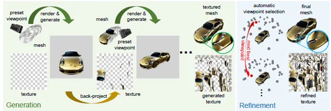

Figure 17: Pipeline of Text2Tex \[145\], featuring a two-stage process
for generating high-quality, multi-view consistent textures. Stage I
generates textures via depth-to-image diffusion from predefined
viewpoints. Stage II refines the results by automatically selecting
additional views to correct distortions and artifacts. This approach
balances realism, consistency, and efficiency. Reprinted from \[145\].

#### 10.3.2 Hierarchical and Latent Generation Models

Subsequent models adopt hierarchical and latent-space generation
strategies to overcome the limitations of view-dependency and inference
cost. These frameworks prioritize efficiency while maintaining realism
and diversity. Paint-it \[147\] integrates physically-based rendering
with U-Net-based reparameterization. A key feature is its use of Score
Distillation Sampling (SDS), which aligns texture generation with
semantic guidance from CLIP. While it achieves high realism and strong
material fidelity, the method demands a long optimization time per mesh,
posing scalability challenges.

TexPainter \[148\] advances latent diffusion techniques by operating in
color-space embeddings rather than pixel space. It employs a
depth-conditioned DDIM \[346\], a fast and deterministic sampling method
for diffusion models, to denoise latent features across a static set of
views. These perspectives are then aggregated into a single unified
texture. However, its fixed view configuration limits adaptability in
dynamic settings. TexFusion \[149\] further optimizes latent-space
generation by introducing the Sequential Interlaced Multiview Sampler
(SIMS), a module that interleaves and fuses multi-view features during
diffusion. The final texture is reconstructed using a neural color field
decoder, significantly reducing runtime while preserving cross-view
coherence.

#### 10.3.3 UV-Space and Variance-Aware Architectures

More recent approaches shift toward operating directly in UV texture
space, aiming to resolve inconsistencies caused by view-dependent
sampling and rasterization variance. These models fuse multi-view
features early in the pipeline to ensure consistent, high-fidelity
texture generation across complex geometry. GenesisTex \[150\] performs
cross-view fusion during diffusion by employing a cross-attention
mechanism that aligns latent features across different camera
perspectives. After texture generation, it applies Img2Img
post-processing, a method where a pre-trained image-to-image model
refines outputs, to reduce seams and enhance surface detail,
particularly in challenging regions. Building on the theme of
efficiency, Consistency \[152\] leverages Latent Consistency Models
(LCMs) to achieve fast generation with only four denoising steps per
view. Disentangling noise and color components enables flexible
resolution control while preserving multi-view coherence.

Extending these ideas, Meta 3D TextureGen \[153\] introduces a two-stage
architecture. A geometry-aware diffusion model generates multi-view
renderings conditioned on shape cues in the first phase. In the second,
these images are fused and refined in UV space using incidence-aware
blending. A patch-based upscaling module allows the system to produce
seamless textures at up to 4K resolution. As depicted in Figure , this
pipeline proves robust even in occluded or texture-deficient areas. In a
complementary direction, VCD-Texture \[154\] focuses on modeling
statistical variance across views to mitigate rendering inconsistencies.
It introduces Variance Alignment to maintain feature integrity during
rasterization, alongside Joint Noise Prediction and Multi-View
Aggregation modules that enhance texture fidelity. These strategies make
the model particularly effective for stylized characters and
geometrically complex assets.

Point-UV Diffusion \[151\] employs a coarse-to-fine mechanism where
textures are first generated directly on mesh surfaces and then enhanced
through 2D diffusion in UV space. This approach separates global
structure from fine detail, effectively addressing view misalignment and
UV distortion. Together, these models represent the evolving landscape
of text-to-texture generation. From early inpainting pipelines to
advanced UV-aware systems, the field has matured toward higher semantic
control, greater cross-view realism, and practical efficiency. The
advancements mentioned above are critical requirements in today’s
animated character workflows.

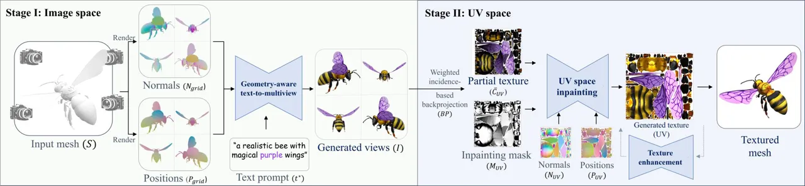

Figure 18: Meta 3D TextureGen \[153\] employs a two-stage architecture:
a geometry-aware diffusion process generates multi-view images, followed
by UV-space inpainting using incidence-aware blending. This design
enables seamless, high-resolution (up to 4K) textures with minimal
artifacts. Reprinted from \[153\].

### 10.4 Application

AI-based texture generation has become a key enabler across various
creative and industrial domains, significantly impacting animated
character design, virtual environments, and digital asset production. In
character animation and film, generative models are employed to create
semantically aligned textures for skin, clothing, and accessories, which
enhances expressiveness and believability. The use of high-fidelity and
consistent textures across multiple views plays a critical role in
conveying emotion and personality through animated surfaces \[145, 146,
347\].

In real-time applications such as gaming and virtual or augmented
reality (VR/AR), efficiency and multi-view coherence are essential.
Recent models support scalable generation of texture assets,
significantly reducing manual effort while ensuring stylistic alignment
and temporal consistency \[152, 149, 348\]. These properties allow rapid
customization of 3D characters and environments, improving immersion in
interactive platforms. In digital art and creative prototyping,
text-to-texture pipelines allow artists to explore stylistic variations
and rapidly iterate on design concepts \[147, 150\]. Such workflows
enable concept art generation, character ideation, and asset reuse
through stylized re-texturing and refinement. These flexible pipelines
are especially aligned with the needs of modern creative industries,
where rapid ideation and diversity are key \[349\].

In fields requiring ultra-high-resolution or real-time deployment,
models such as Meta 3D TextureGen \[153\] and VCD-Texture \[154\] have
been adopted to support immersive AR/VR experiences and realistic
simulations. Their ability to reduce artifacts and maintain visual
quality under tight computational constraints makes them suitable for
deployment in demanding environments. Beyond entertainment, generative
texture techniques are being extended to architecture, medical
visualization, and education. In these domains, textured 3D models
enable more accurate design prototyping, enhance anatomical detail in
training scenarios, and support engaging, interactive
storytelling \[350\]. Across all these applications, integrating
natural-language guidance and fast, high-quality synthesis empowers
technical users and artists to produce rich, expressive content with
greater efficiency \[351\].

## 11 Open Problems & Research Directions

Despite the rapid advancements in generative AI for character animation,
several open challenges remain. Addressing these challenges is crucial
for further improving AI-driven animation systems’ realism,
controllability, and efficiency. This section outlines key unresolved
issues and promising research directions in the field.

### 11.1 Data Limitations and Ethical Considerations

The effectiveness of generative models depends on the availability of
large-scale, high-quality datasets. However, existing datasets often
suffer from biases, limited diversity, and insufficient annotations
\[352, 353\]. Many publicly available datasets primarily focus on
specific demographics or animation styles, leading to a lack of
generalizability in trained models. Moreover, there is a notable lack of
comprehensive datasets that cover multiple subfields of character
animation, such as gestures, motions, and expressions, which limits the
ability to develop models that generalize across different aspects of
animation. Additionally, privacy concerns and ethical considerations
regarding data collection, especially for human facial expressions,
gestures, and motion, present significant obstacles \[354, 355\]. Future
research should explore data augmentation techniques \[356\], and
federated learning approaches \[357\] to enhance data diversity while
respecting privacy constraints.

### 11.2 Real-Time Performance and Computational Efficiency

Current state-of-the-art models, such as diffusion-based architectures
and large-scale transformer networks, often require substantial
computational resources, limiting their applicability in real-time
animation workflows. Optimizing inference speed without compromising
animation quality is an essential research direction. Techniques such as
model compression \[358\], quantization \[359\], and knowledge
distillation \[360\] could help reduce computational overhead.
Additionally, lightweight generative models designed for real-time
applications, particularly in gaming, virtual reality (VR), and
augmented reality (AR), remain an open area for further investigation.

### 11.3 Controllability and User-Guided Generation

A persistent challenge in generative AI for animation is achieving
precise, user-controllable outputs. Many current models generate
animations in a stochastic manner, making it difficult to fine-tune
specific aspects of character movement, facial expressions, or gestures
\[361, 362\]. Future research should focus on integrating more effective
control mechanisms, such as prompt-conditioned generation, reinforcement
learning with human feedback, and interactive editing interfaces that
allow animators to guide AI-generated outputs with minimal manual
adjustments \[363\].

### 11.4 Multimodal and Cross-Domain Integration

Character animation often involves the integration of multiple
modalities, such as speech, motion, and environmental context. While
recent advancements in models like CLIP \[7\] and ControlNet \[8\] and
also multimodal LLMs \[364, 365\] have enabled improved multimodal
synthesis, achieving seamless synchronization between different data
streams in this domain remains a challenge. Future research could
explore novel architectures that effectively unify text, speech, motion,
and visual inputs, leading to more coherent and context-aware character
animations.

### 11.5 Robustness and Generalization Across Styles and Domains

Most generative AI models are trained on specific datasets and struggle
with generalizing to unseen styles, artistic directions, or cultural
variations in expression. A key research direction is developing models
that can adapt across different animation styles, ranging from
hyper-realistic rendering to stylized 2D animations, without requiring
extensive retraining. Domain adaptation techniques, few-shot learning,
and transfer learning approaches may help improve model flexibility
across diverse artistic styles and applications \[366, 367\].

### 11.6 Evaluation Metrics for Character Animation

Assessing the quality of AI-generated character animation remains a
complex challenge. Common evaluation metrics focus on computational
efficiency, perceptual realism, and alignment with ground-truth human
motion. Objective metrics include Fréchet Inception Distance (FID)
\[278\] for visual quality, Structural Similarity Index (SSIM) \[205\]
for texture consistency, and motion-based metrics. However, these
metrics do not fully capture the subjective experience of human viewers.
Future research should emphasize user studies and perceptual metrics
that assess naturalness, emotional expressiveness, and engagement in
animation. Additionally, benchmark datasets and standardized evaluation
frameworks tailored to generative animation are needed to ensure fair
and comprehensive model comparisons.

### 11.7 Realism, Identity Preservation, Naturalness, and Interpretability

While generative AI continues to push the boundaries of realism in
character animation, maintaining identity preservation and achieving
naturalness remain significant challenges. Facial animations, in
particular, need to retain individual identity features while adapting
expressions and movements fluidly. Many current models introduce
artifacts or fail to maintain personality consistency across sequences.
Techniques such as identity-preserving loss functions \[368\] and
adversarial training with perceptual constraints \[369\] can help ensure
realism without distorting identity characteristics. Furthermore,
improving biomechanical accuracy in generated human motion remains an
open problem. Models should incorporate physiological constraints and
real-world physics-based priors to enhance the believability of
synthesized movements.

Additionally, many generative models operate as black boxes, making
interpreting or debugging their outputs difficult. This lack of
transparency can lead to unpredictable artifacts in animation, limiting
trust and adoption by professionals. Future work should focus on
explainable AI (XAI) approaches to provide better insights into how
models generate animations, allowing animators to fine-tune outputs more
effectively \[370, 371\].

### 11.8 Ethical and Societal Implications of AI-Generated Characters

The widespread use of AI-generated characters in entertainment, social
media, and virtual environments raises ethical concerns regarding
deepfake misuse \[372\], identity representation, and cultural
sensitivity \[373\]. The potential for AI to generate hyper-realistic
yet fabricated animations calls for developing robust detection
mechanisms and ethical guidelines. Research should focus on creating
watermarking techniques for AI-generated animations, transparent
disclosure practices, and frameworks for mitigating biases in character
portrayal.

### 11.9 Future Outlook

The field of generative AI for character animation is set for
transformative growth, with revolutionary potential in gaming, film
production, virtual assistants, and beyond. These technologies can
significantly accelerate the creation of animations, movies, and video
games, reducing production times while maintaining high-quality outputs.
Additionally, they open up new possibilities for creative expression by
enabling artists to prototype and refine ideas more efficiently.
Addressing these open challenges will require interdisciplinary
collaboration across computer vision, machine learning, human-computer
interaction, and digital arts. Future research can unlock new frontiers
in AI-driven animation by improving data quality, optimizing
computational efficiency, enhancing controllability, and ensuring
ethical deployment, making it more accessible, adaptable, and
responsible.

## 12 Conclusion

Generative AI is reshaping animation, making it possible to produce
lifelike characters and dynamic scenes with unprecedented efficiency and
realism. This survey provides a comprehensive overview of generative AI
in animation, covering key aspects such as facial expressions, gestures,
motion dynamics, avatars, objects, textures, and image synthesis. We
present a unified perspective highlighting these technologies’ extensive
impact by integrating traditionally fragmented domains.

Each section outlines advances in its respective subfield, demonstrating
how architectures such as generative adversarial networks (GANs),
variational autoencoders (VAEs), transformers, and diffusion models
address critical challenges like temporal coherence and multimodal
consistency. In addition, we review the datasets used in these animation
subfields, the evaluation metrics applied to assess model performance,
and the real-world applications of these approaches. Beyond surveying
recent progress, we provide a foundational background on models,
frameworks, and evaluation metrics, equipping researchers with the
necessary knowledge to build upon existing work. One central focus of
this survey is the role of foundational models, such as CLIP, large
language models (LLMs), and diffusion-based techniques, in advancing
generative AI for animation. These innovations have enabled more
realistic, diverse, and controllable character animations, from
identity-preserving facial expression synthesis to complex gesture
generation.

Although these innovations have advanced the field, significant
challenges remain, including limited robustness and cross-domain
generalizations, ethical and societal implications, data constraints,
and issues with the synchronization and realism of different parts of
the animation. We discuss these open problems and outline promising
future research directions to further enhance the capabilities and
accessibility of generative AI in animation. This survey is a
comprehensive resource for researchers and practitioners, offering
insight into current techniques, practical applications, essential
background knowledge, and emerging trends. By consolidating knowledge
across subfields, we aim to catalyze future innovations in AI-driven
character animation, ushering in more advanced, efficient, and creative
production pipelines.

## References

- \[1\] M. Loper, N. Mahmood, J. Romero, G. Pons-Moll, and M. J. Black,
  “SMPL: A skinned multi-person linear model,” _ACM Trans. Graphics
  (Proc. SIGGRAPH Asia)_, vol. 34, no. 6, pp. 248:1–248:16, Oct. 2015.
- \[2\] C. Lea, R. Vidal, A. Reiter, and G. D. Hager, “Temporal
  convolutional networks: A unified approach to action segmentation,” in
  _Computer Vision – ECCV 2016 Workshops_, G. Hua and H. Jégou,
  Eds. Cham: Springer International Publishing, 2016, pp. 47–54.
- \[3\] I. Goodfellow, J. Pouget-Abadie, M. Mirza, B. Xu,
  D. Warde-Farley, S. Ozair, A. Courville, and Y. Bengio, “Generative
  adversarial nets,” _Advances in neural information processing
  systems_, vol. 27, 2014.
- \[4\] D. P. Kingma and M. Welling, “Auto-encoding variational
  bayes,” 2022. \[Online\]. Available:
  [https://arxiv.org/abs/1312.6114](https://arxiv.org/abs/1312.6114)
- \[5\] A. Vaswani, N. Shazeer, N. Parmar, J. Uszkoreit, L. Jones, A. N.
  Gomez, Ł. Kaiser, and I. Polosukhin, “Attention is all you need,”
  _Advances in neural information processing systems_, vol. 30, 2017.
- \[6\] J. Ho, A. Jain, and P. Abbeel, “Denoising diffusion
  probabilistic models,” _Advances in neural information processing
  systems_, vol. 33, pp. 6840–6851, 2020.
- \[7\] A. Radford, J. W. Kim, C. Hallacy, A. Ramesh, G. Goh,
  S. Agarwal, G. Sastry, A. Askell, P. Mishkin, J. Clark, G. Krueger,
  and I. Sutskever, “Learning transferable visual models from natural
  language supervision,” in _Proceedings of the 38th International
  Conference on Machine Learning, ICML 2021, 18-24 July 2021, Virtual
  Event_, ser. Proceedings of Machine Learning Research, M. Meila and
  T. Zhang, Eds., vol. 139. PMLR, 2021, pp. 8748–8763. \[Online\].
  Available:
  [http://proceedings.mlr.press/v139/radford21a.html](http://proceedings.mlr.press/v139/radford21a.html)
- \[8\] L. Zhang, A. Rao, and M. Agrawala, “Adding conditional control
  to text-to-image diffusion models,” in _Proceedings of the IEEE/CVF
  International Conference on Computer Vision_, 2023, pp. 3836–3847.
- \[9\] B. Mildenhall, P. P. Srinivasan, M. Tancik, J. T. Barron,
  R. Ramamoorthi, and R. Ng, “Nerf: representing scenes as neural
  radiance fields for view synthesis,” _Commun. ACM_, vol. 65, no. 1, p.
  99–106, Dec. 2021. \[Online\]. Available:
  [https://doi.org/10.1145/3503250](https://doi.org/10.1145/3503250)
- \[10\] B. Kerbl, G. Kopanas, T. Leimkühler, and G. Drettakis, “3d
  gaussian splatting for real-time radiance field rendering,” _ACM
  Transactions on Graphics_, vol. 42, no. 4, July 2023. \[Online\].
  Available:
  [https://repo-sam.inria.fr/fungraph/3d-gaussian-splatting/](https://repo-sam.inria.fr/fungraph/3d-gaussian-splatting/)
- \[11\] T. Karras, S. Laine, and T. Aila, “A style-based generator
  architecture for generative adversarial networks,” _IEEE Transactions
  on Pattern Analysis &amp; Machine Intelligence_, vol. 43, no. 12, pp.
  4217–4228, dec 2021.
- \[12\] J. Chen, Y. Liu, J. Wang, A. Zeng, Y. Li, and Q. Chen,
  “Diffsheg: A diffusion-based approach for real-time speech-driven
  holistic 3d expression and gesture generation,” 2024. \[Online\].
  Available:
  [https://arxiv.org/abs/2401.04747](https://arxiv.org/abs/2401.04747)
- \[13\] C. Schuhmann, R. Beaumont, R. Vencu, C. Gordon, R. Wightman,
  M. Cherti, T. Coombes, A. Katta, C. Mullis, M. Wortsman _et al._,
  “Laion-5b: An open large-scale dataset for training next generation
  image-text models,” _Advances in Neural Information Processing
  Systems_, vol. 35, pp. 25 278–25 294, 2022.
- \[14\] T.-Y. Lin, M. Maire, S. Belongie, J. Hays, P. Perona,
  D. Ramanan, P. Dollár, and C. L. Zitnick, “Microsoft coco: Common
  objects in context,” in _Computer Vision–ECCV 2014: 13th European
  Conference, Zurich, Switzerland, September 6-12, 2014, Proceedings,
  Part V 13_. Springer, 2014, pp. 740–755.
- \[15\] B. Zhou, H. Zhao, X. Puig, T. Xiao, S. Fidler, A. Barriuso, and
  A. Torralba, “Semantic understanding of scenes through the ade20k
  dataset,” _International Journal of Computer Vision_, vol. 127, pp.
  302–321, 2019.
- \[16\] Z. Huang, S. Hu, G. Wang, T. Liu, Y. Zang, Z. Cao, W. Li, and
  Z. Liu, “Wildavatar: Web-scale in-the-wild video dataset for 3d avatar
  creation,” 2024. \[Online\]. Available:
  [https://arxiv.org/abs/2407.02165](https://arxiv.org/abs/2407.02165)
- \[17\] D. Pan, L. Zhuo, J. Piao, H. Luo, W. Cheng, Y. Wang, S. Fan,
  S. Liu, L. Yang, B. Dai, Z. Liu, C. C. Loy, C. Qian, W. Wu, D. Lin,
  and K.-Y. Lin, “Renderme-360: A large digital asset library and
  benchmarks towards high-fidelity head avatars,” _Advances in Neural
  Information Processing Systems_, vol. 36, 2024.
- \[18\] J. Kim, J. Kim, and S. Choi, “Flame: Free-form language-based
  motion synthesis & editing,” _arXiv preprint arXiv:2209.00349_, 2022.
- \[19\] H. Liu, Z. Zhu, N. Iwamoto, Y. Peng, Z. Li, Y. Zhou,
  E. Bozkurt, and B. Zheng, “Beat: A large-scale semantic and emotional
  multi-modal dataset for conversational gestures synthesis,” in
  _European conference on computer vision_. Springer, 2022, pp. 612–630.
- \[20\] Y. Ferstl, M. Neff, and R. McDonnell, “Expressgesture:
  Expressive gesture generation from speech through database matching,”
  _Computer Animation and Virtual Worlds_, vol. 32, 05 2021.
- \[21\] Y. Zhang, D. Huang, B. Liu, S. Tang, Y. Lu, L. Chen, L. Bai,
  Q. Chu, N. Yu, and W. Ouyang, “Motiongpt: Finetuned llms are
  general-purpose motion generators,” 2024. \[Online\]. Available:
  [https://arxiv.org/abs/2306.10900](https://arxiv.org/abs/2306.10900)
- \[22\] M. Zhang, Z. Cai, L. Pan, F. Hong, X. Guo, L. Yang, and Z. Liu,
  “Motiondiffuse: Text-driven human motion generation with diffusion
  model,” _arXiv preprint arXiv:2208.15001_, 2022.
- \[23\] G.-S. Hsu, C.-H. Tsai, and H.-Y. Wu, “Dual-generator face
  reenactment,” in _Proceedings of the IEEE/CVF Conference on Computer
  Vision and Pattern Recognition (CVPR)_, June 2022, pp. 642–650.
- \[24\] C. Xu, J. Zhang, Y. Han, G. Tian, X. Zeng, Y. Tai, Y. Wang,
  C. Wang, and Y. Liu, “Designing one unified framework for
  high-fidelity face reenactment and swapping,” in _European Conference
  on Computer Vision_, 2022. \[Online\]. Available:
  [https://api.semanticscholar.org/CorpusID:253270179](https://api.semanticscholar.org/CorpusID:253270179)
- \[25\] S. Bounareli, V. Argyriou, and G. Tzimiropoulos, “Finding
  directions in gan’s latent space for neural face reenactment,” _CoRR_,
  vol. abs/2202.00046, 2022. \[Online\]. Available:
  [https://arxiv.org/abs/2202.00046](https://arxiv.org/abs/2202.00046)
- \[26\] X. Ning, S. Xu, F. Nan, Q. Zeng, C. Wang, W. Cai, W. Li, and
  Y. Jiang, “Face editing based on facial recognition features,” _IEEE
  Transactions on Cognitive and Developmental Systems_, vol. 15, no. 2,
  pp. 774–783, 2023.
- \[27\] Z. Chai, T. Zhang, T. He, X. Tan, T. Baltrusaitis, H. Wu,
  R. Li, S. Zhao, C. Yuan, and J. Bian, “Hiface: High-fidelity 3d face
  reconstruction by learning static and dynamic details,” in
  _Proceedings of the IEEE/CVF International Conference on Computer
  Vision (ICCV)_, October 2023, pp. 9087–9098.
- \[28\] F. Taherkhani, A. Rai, Q. Gao, S. Srivastava, X. Chen, F. de la
  Torre, S. Song, A. Prakash, and D. Kim, “Controllable 3d generative
  adversarial face model via disentangling shape and appearance,” in
  _Proceedings of the IEEE/CVF Winter Conference on Applications of
  Computer Vision (WACV)_, January 2023, pp. 826–836.
- \[29\] A. Rai, H. Gupta, A. Pandey, F. V. Carrasco, S. J. Takagi,
  A. Aubel, D. Kim, A. Prakash, and F. De la Torre, “Towards realistic
  generative 3d face models,” _arXiv preprint arXiv:2304.12483_, 2023.
- \[30\] H. Zhang, Z. Yuan, C. Zheng, X. Yan, B. Wang, G. Li, S. Wu,
  S. Cui, and Z. Li, “Gsmoothface: Generalized smooth talking face
  generation via fine grained 3d face guidance,” _ArXiv_, vol.
  abs/2312.07385, 2023. \[Online\]. Available:
  [https://api.semanticscholar.org/CorpusID:266174481](https://api.semanticscholar.org/CorpusID:266174481)
- \[31\] D. Mensah, N. H. Kim, M. Aittala, S. Laine, and J. Lehtinen, “A
  hybrid generator architecture for controllable face synthesis,” in
  _ACM SIGGRAPH 2023 Conference Proceedings_, ser. SIGGRAPH ’23. New
  York, NY, USA: Association for Computing Machinery, 2023. \[Online\].
  Available:
  [https://doi.org/10.1145/3588432.3591563](https://doi.org/10.1145/3588432.3591563)
- \[32\] Z. Huang, S. Ma, J. Zhang, and H. Shan, “Adaptive nonlinear
  latent transformation for conditional face editing,” in _ICCV_, 2023.
- \[33\] Z. Li, M. R. Min, K. Li, and C. Xu, “Stylet2i: Toward
  compositional and high-fidelity text-to-image synthesis,” in
  _Proceedings of the IEEE/CVF Conference on Computer Vision and Pattern
  Recognition (CVPR)_, 2022.
- \[34\] M. Mofayezi, R. Alipour, M. A. Kakavand, and E. Asgari, “M
  face: A unified multi-modal multilingual framework for human face
  generation and editing,’’ 2024. \[Online\]. Available:
  [https://arxiv.org/abs/2402.02369](https://arxiv.org/abs/2402.02369)
- \[35\] X. Hou, X. Zhang, H. Liang, L. Shen, Z. Lai, and J. Wan,
  “Guidedstyle: Attribute knowledge guided style manipulation for
  semantic face editing,” _Neural Networks_, vol. 145, pp.
  209–220, 2022. \[Online\]. Available:
  [https://www.sciencedirect.com/science/article/pii/S0893608021004081](https://www.sciencedirect.com/science/article/pii/S0893608021004081)
- \[36\] J. Sun, Q. Deng, Q. Li, M. Sun, M. Ren, and Z. Sun, “Anyface:
  Free-style text-to-face synthesis and manipulation,” in _Proceedings
  of the IEEE/CVF Conference on Computer Vision and Pattern Recognition
  (CVPR)_, June 2022, pp. 18 687–18 696.
- \[37\] Y. Fan, Z. Lin, J. Saito, W. Wang, and T. Komura, “Joint
  audio-text model for expressive speech-driven 3d facial animation,”
  _Proceedings of the ACM on Computer Graphics and Interactive
  Techniques_, vol. 5, pp. 1 – 15, 2021. \[Online\]. Available:
  [https://api.semanticscholar.org/CorpusID:244908998](https://api.semanticscholar.org/CorpusID:244908998)
- \[38\] D. Cudeiro, T. Bolkart, C. Laidlaw, A. Ranjan, and M. J. Black,
  “Capture, learning, and synthesis of 3d speaking styles,” _2019
  IEEE/CVF Conference on Computer Vision and Pattern Recognition
  (CVPR)_, pp. 10 093–10 103, 2019. \[Online\]. Available:
  [https://api.semanticscholar.org/CorpusID:122437581](https://api.semanticscholar.org/CorpusID:122437581)
- \[39\] A. Richard, M. Zollhöfer, Y. Wen, F. de la Torre, and
  Y. Sheikh, “Meshtalk: 3d face animation from speech using
  cross-modality disentanglement,” in _Proceedings of the IEEE/CVF
  International Conference on Computer Vision (ICCV)_, October 2021, pp.
  1173–1182.
- \[40\] X. Liang, W. Zhuang, T. Wang, G. Geng, G. Geng, H. Xia, and
  S. Xia, “Cstalk: Correlation supervised speech-driven 3d emotional
  facial animation generation,” 2024. \[Online\]. Available:
  [https://arxiv.org/abs/2404.18604](https://arxiv.org/abs/2404.18604)
- \[41\] Y. Zhong, H. Wei, P. Yang, and Z. Wang, “Expclip: Bridging text
  and facial expressions via semantic alignment,” 2023. \[Online\].
  Available:
  [https://arxiv.org/abs/2308.14448](https://arxiv.org/abs/2308.14448)
- \[42\] E. Bozkurt, “Personalized speech-driven expressive 3d facial
  animation synthesis with style control,” 2023. \[Online\]. Available:
  [https://arxiv.org/abs/2310.17011](https://arxiv.org/abs/2310.17011)
- \[43\] Y. Fan, Z. Lin, J. Saito, W. Wang, and T. Komura, “Faceformer:
  Speech-driven 3d facial animation with transformers,” in _Proceedings
  of the IEEE/CVF Conference on Computer Vision and Pattern Recognition
  (CVPR)_, 2022.
- \[44\] L. Chen, W. Bao, S. Lei, B. Tang, Z. Wu, S. Kang, H. Huang, and
  H. Meng, “Adamesh: Personalized facial expressions and head poses for
  adaptive speech-driven 3d facial animation,” 2024. \[Online\].
  Available:
  [https://arxiv.org/abs/2310.07236](https://arxiv.org/abs/2310.07236)
- \[45\] Z. Ye, Z. Jiang, Y. Ren, J. Liu, J. He, and Z. Zhao, “Geneface:
  Generalized and high-fidelity audio-driven 3d talking face synthesis,”
  _arXiv preprint arXiv:2301.13430_, 2023.
- \[46\] B. Thambiraja, I. Habibie, S. Aliakbarian, D. Cosker,
  C. Theobalt, and J. Thies, “Imitator: Personalized speech-driven 3d
  facial animation,” in _Proceedings of the IEEE/CVF International
  Conference on Computer Vision (ICCV)_, October 2023, pp.
  20 621–20 631.
- \[47\] K. I. Haque, “Data-driven expressive 3d facial animation
  synthesis for digital humans,” in _SIGGRAPH Asia 2023 Doctoral
  Consortium_, ser. SA ’23. New York, NY, USA: Association for Computing
  Machinery, 2023. \[Online\]. Available:
  [https://doi.org/10.1145/3623053.3623369](https://doi.org/10.1145/3623053.3623369)
- \[48\] K. I. Haque and Z. Yumak, “Facexhubert: Text-less speech-driven
  e(x)pressive 3d facial animation synthesis using self-supervised
  speech representation learning,” in _INTERNATIONAL CONFERENCE ON
  MULTIMODAL INTERACTION (ICMI ’23)_. New York, NY, USA: ACM, 2023.
  \[Online\]. Available:
  [https://doi.org/10.1145/3577190.3614157](https://doi.org/10.1145/3577190.3614157)
- \[49\] S. Stan, K. I. Haque, and Z. Yumak, “Facediffuser:
  Speech-driven 3d facial animation synthesis using diffusion,” in
  _Proceedings of the 16th ACM SIGGRAPH Conference on Motion,
  Interaction and Games_, ser. MIG ’23. New York, NY, USA: Association
  for Computing Machinery, 2023. \[Online\]. Available:
  [https://doi.org/10.1145/3623264.3624447](https://doi.org/10.1145/3623264.3624447)
- \[50\] S. Yang, Z. Wu, M. Li, Z. Zhang, L. Hao, W. Bao, M. Cheng, and
  L. Xiao, “Diffusestylegesture: Stylized audio-driven co-speech gesture
  generation with diffusion models,” in _Proceedings of the
  Thirty-Second International Joint Conference on Artificial
  Intelligence, IJCAI-23_. International Joint Conferences on Artificial
  Intelligence Organization, 8 2023, pp. 5860–5868. \[Online\].
  Available:
  [https://doi.org/10.24963/ijcai.2023/650](https://doi.org/10.24963/ijcai.2023/650)
- \[51\] D. Qin, J. Saito, N. Aigerman, T. Groueix, and T. Komura,
  “Neural face rigging for animating and retargeting facial meshes in
  the wild,” in _ACM SIGGRAPH 2023 Conference Proceedings_, ser.
  SIGGRAPH ’23. New York, NY, USA: Association for Computing
  Machinery, 2023. \[Online\]. Available:
  [https://doi.org/10.1145/3588432.3591556](https://doi.org/10.1145/3588432.3591556)
- \[52\] D. Chang, Y. Shi, Q. Gao, J. Fu, H. Xu, G. Song, Q. Yan,
  Y. Zhu, X. Yang, and M. Soleymani, “Magicpose: Realistic human poses
  and facial expressions retargeting with identity-aware
  diffusion,” 2024. \[Online\]. Available:
  [https://arxiv.org/abs/2311.12052](https://arxiv.org/abs/2311.12052)
- \[53\] J. Karras, A. Holynski, T.-C. Wang, and
  I. Kemelmacher-Shlizerman, “Dreampose: Fashion image-to-video
  synthesis via stable diffusion,” 2023. \[Online\]. Available:
  [https://arxiv.org/abs/2304.06025](https://arxiv.org/abs/2304.06025)
- \[54\] T. Wang, L. Li, K. Lin, Y. Zhai, C.-C. Lin, Z. Yang, H. Zhang,
  Z. Liu, and L. Wang, “Disco: Disentangled control for realistic human
  dance generation,” _arXiv preprint arXiv:2307.00040_, 2023.
- \[55\] H. Yi, H. Liang, Y. Liu, Q. Cao, Y. Wen, T. Bolkart, D. Tao,
  and M. J. Black, “Generating holistic 3d human motion from speech,”
  _2023 IEEE/CVF Conference on Computer Vision and Pattern Recognition
  (CVPR)_, pp. 469–480, 2022. \[Online\]. Available:
  [https://api.semanticscholar.org/CorpusID:254409031](https://api.semanticscholar.org/CorpusID:254409031)
- \[56\] I. Habibie, W. Xu, D. Mehta, L. Liu, H.-P. Seidel,
  G. Pons-Moll, M. Elgharib, and C. Theobalt, “Learning speech-driven 3d
  conversational gestures from video,” in _Proceedings of the 21st ACM
  International Conference on Intelligent Virtual Agents_, ser. IVA
  ’21. New York, NY, USA: Association for Computing Machinery, 2021, p.
  101–108. \[Online\]. Available:
  [https://doi.org/10.1145/3472306.3478335](https://doi.org/10.1145/3472306.3478335)
- \[57\] C. Saharia, W. Chan, S. Saxena, L. Li, J. Whang, E. L. Denton,
  K. Ghasemipour, R. Gontijo Lopes, B. Karagol Ayan, T. Salimans
  _et al._, “Photorealistic text-to-image diffusion models with deep
  language understanding,” _Advances in neural information processing
  systems_, vol. 35, pp. 36 479–36 494, 2022.
- \[58\] D. Podell, Z. English, K. Lacey, A. Blattmann, T. Dockhorn,
  J. Müller, J. Penna, and R. Rombach, “Sdxl: Improving latent diffusion
  models for high-resolution image synthesis,” _arXiv preprint
  arXiv:2307.01952_, 2023.
- \[59\] R. Rombach, A. Blattmann, D. Lorenz, P. Esser, and B. Ommer,
  “High-resolution image synthesis with latent diffusion models,” in
  _Proceedings of the IEEE/CVF Conference on Computer Vision and Pattern
  Recognition_, 2022, pp. 10 684–10 695.
- \[60\] L. Han, Y. Li, H. Zhang, P. Milanfar, D. Metaxas, and F. Yang,
  “Svdiff: Compact parameter space for diffusion fine-tuning,” in
  _Proceedings of the IEEE/CVF International Conference on Computer
  Vision_, 2023, pp. 7323–7334.
- \[61\] Q. Wu, Y. Liu, H. Zhao, A. Kale, T. Bui, T. Yu, Z. Lin,
  Y. Zhang, and S. Chang, “Uncovering the disentanglement capability in
  text-to-image diffusion models,” in _Proceedings of the IEEE/CVF
  conference on computer vision and pattern recognition_, 2023, pp.
  1900–1910.
- \[62\] T. Brooks, A. Holynski, and A. A. Efros, “Instructpix2pix:
  Learning to follow image editing instructions,” in _Proceedings of the
  IEEE/CVF Conference on Computer Vision and Pattern Recognition_, 2023,
  pp. 18 392–18 402.
- \[63\] Z. Zhang, L. Han, A. Ghosh, D. N. Metaxas, and J. Ren, “Sine:
  Single image editing with text-to-image diffusion models,” in
  _Proceedings of the IEEE/CVF Conference on Computer Vision and Pattern
  Recognition_, 2023, pp. 6027–6037.
- \[64\] R. Mokady, A. Hertz, K. Aberman, Y. Pritch, and D. Cohen-Or,
  “Null-text inversion for editing real images using guided diffusion
  models,” in _Proceedings of the IEEE/CVF Conference on Computer Vision
  and Pattern Recognition_, 2023, pp. 6038–6047.
- \[65\] B. Kawar, S. Zada, O. Lang, O. Tov, H. Chang, T. Dekel,
  I. Mosseri, and M. Irani, “Imagic: Text-based real image editing with
  diffusion models,” in _Proceedings of the IEEE/CVF Conference on
  Computer Vision and Pattern Recognition_, 2023, pp. 6007–6017.
- \[66\] R. Gandikota, H. Orgad, Y. Belinkov, J. Materzyńska, and
  D. Bau, “Unified concept editing in diffusion models,” in _Proceedings
  of the IEEE/CVF Winter Conference on Applications of Computer Vision_,
  2024, pp. 5111–5120.
- \[67\] C. Wu, S. Yin, W. Qi, X. Wang, Z. Tang, and N. Duan, “Visual
  chatgpt: Talking, drawing and editing with visual foundation models,”
  _arXiv preprint arXiv:2303.04671_, 2023.
- \[68\] X. Pan, L. Dong, S. Huang, Z. Peng, W. Chen, and F. Wei,
  “Kosmos-g: Generating images in context with multimodal large language
  models,” _arXiv preprint arXiv:2310.02992_, 2023.
- \[69\] Z. Yang, L. Li, J. Wang, K. Lin, E. Azarnasab, F. Ahmed,
  Z. Liu, C. Liu, M. Zeng, and L. Wang, “Mm-react: Prompting chatgpt for
  multimodal reasoning and action,” _arXiv preprint
  arXiv:2303.11381_, 2023.
- \[70\] F. Hong, M. Zhang, L. Pan, Z. Cai, L. Yang, and Z. Liu,
  “Avatarclip: zero-shot text-driven generation and animation of 3d
  avatars,” _ACM Trans. Graph._, vol. 41, no. 4, Jul. 2022. \[Online\].
  Available:
  [https://doi.org/10.1145/3528223.3530094](https://doi.org/10.1145/3528223.3530094)
- \[71\] P. Wang, L. Liu, Y. Liu, C. Theobalt, T. Komura, and W. Wang,
  “Neus: learning neural implicit surfaces by volume rendering for
  multi-view reconstruction,” in _Proceedings of the 35th International
  Conference on Neural Information Processing Systems_, ser. NIPS
  ’21. Red Hook, NY, USA: Curran Associates Inc., 2024.
- \[72\] A. Jain, B. Mildenhall, J. T. Barron, P. Abbeel, and B. Poole,
  “Zero-shot text-guided object generation with dream fields,” 2022.
- \[73\] O. Michel, R. Bar-On, R. Liu, S. Benaim, and R. Hanocka,
  “Text2mesh: Text-driven neural stylization for meshes,” _arXiv
  preprint arXiv:2112.03221_, 2021.
- \[74\] S. Saito, , Z. Huang, R. Natsume, S. Morishima, A. Kanazawa,
  and H. Li, “Pifu: Pixel-aligned implicit function for high-resolution
  clothed human digitization,” _arXiv preprint arXiv:1905.05172_, 2019.
- \[75\] S. Saito, T. Simon, J. Saragih, and H. Joo, “Pifuhd:
  Multi-level pixel-aligned implicit function for high-resolution 3d
  human digitization,” in _Proceedings of the IEEE Conference on
  Computer Vision and Pattern Recognition_, June 2020.
- \[76\] Z. Huang, Y. Xu, C. Lassner, H. Li, and T. Tung, “Arch:
  Animatable reconstruction of clothed humans,” 2020.
- \[77\] T. He, Y. Xu, S. Saito, S. Soatto, and T. Tung, “Arch++:
  Animation-ready clothed human reconstruction revisited,” 2022.
  \[Online\]. Available:
  [https://arxiv.org/abs/2108.07845](https://arxiv.org/abs/2108.07845)
- \[78\] Z. Zheng, T. Yu, Y. Liu, and Q. Dai, “Pamir: Parametric
  model-conditioned implicit representation for image-based human
  reconstruction,” 2020. \[Online\]. Available:
  [https://arxiv.org/abs/2007.03858](https://arxiv.org/abs/2007.03858)
- \[79\] T. Liao, H. Yi, Y. Xiu, J. Tang, Y. Huang, J. Thies, and M. J.
  Black, “Tada! text to animatable digital avatars,” 2023. \[Online\].
  Available:
  [https://arxiv.org/abs/2308.10899](https://arxiv.org/abs/2308.10899)
- \[80\] X. Zhang, J. Zhang, C. Rohan, H. Xu, G. Song, Y. Yang, and
  J. Feng, “Getavatar: Generative textured meshes for animatable human
  avatars,” in _ICCV_, 2023.
- \[81\] B. Zhang, Y. Cheng, C. Wang, T. Zhang, J. Yang, Y. Tang,
  F. Zhao, D. Chen, and B. Guo, “Rodinhd: High-fidelity 3d avatar
  generation with diffusion models,” _arXiv preprint
  arXiv:2407.06938_, 2024.
- \[82\] C.-Y. Weng, B. Curless, P. P. Srinivasan, J. T. Barron, and
  I. Kemelmacher-Shlizerman, “Humannerf: Free-viewpoint rendering of
  moving people from monocular video,” in _Proceedings of the IEEE/CVF
  conference on computer vision and pattern Recognition_, 2022, pp.
  16 210–16 220.
- \[83\] C. Guo, T. Jiang, X. Chen, J. Song, and O. Hilliges,
  “Vid2avatar: 3d avatar reconstruction from videos in the wild via
  self-supervised scene decomposition,” in _Proceedings of the IEEE/CVF
  Conference on Computer Vision and Pattern Recognition_, 2023, pp.
  12 858–12 868.
- \[84\] N. Kolotouros, T. Alldieck, A. Zanfir, E. G. Bazavan,
  M. Fieraru, and C. Sminchisescu, “Dreamhuman: Animatable 3d avatars
  from text,” 2023.
- \[85\] S. Azadi, T. Hayes, A. Shah, G. Pang, D. Parikh, and S. Gupta,
  “Text-conditional contextualized avatars for zero-shot
  personalization,” 2023. \[Online\]. Available:
  [https://arxiv.org/abs/2304.07410](https://arxiv.org/abs/2304.07410)
- \[86\] A. W. Bergman, W. Yifan, and G. Wetzstein, “Articulated 3d head
  avatar generation using text-to-image diffusion models,” _ArXiv_, vol.
  abs/2307.04859, 2023. \[Online\]. Available:
  [https://api.semanticscholar.org/CorpusID:259766646](https://api.semanticscholar.org/CorpusID:259766646)
- \[87\] Z. Huang, F. Tang, Y. Zhang, X. Cun, J. Cao, J. Li, and T.-Y.
  Lee, “Make-your-anchor: A diffusion-based 2d avatar generation
  framework,” _arXiv preprint arXiv:2403.16510_, 2024.
- \[88\] Y. Cao, Y.-P. Cao, K. Han, Y. Shan, and K.-Y. K. Wong,
  “Dreamavatar: Text-and-shape guided 3d human avatar generation via
  diffusion models,” in _Proceedings of the IEEE/CVF Conference on
  Computer Vision and Pattern Recognition_, 2024, pp. 958–968.
- \[89\] Y. Huang, J. Wang, A. Zeng, H. Cao, X. Qi, Y. Shi, Z.-J. Zha,
  and L. Zhang, “Dreamwaltz: Make a scene with complex 3d animatable
  avatars,” 2023.
- \[90\] Y.-H. Lin, C.-Y. Liu, H.-W. Lee, S.-L. Huang, and T.-Y. Li,
  “Evaluating emotive character animations created with procedural
  animation,” 09 2009, pp. 308–315.
- \[91\] J. P. Lewis, K. Anjyo, T. Rhee, M. Zhang, F. Pighin, and
  Z. Deng, “Practice and Theory of Blendshape Facial Models,” in
  _Eurographics 2014 - State of the Art Reports_, S. Lefebvre and
  M. Spagnuolo, Eds. The Eurographics Association, 2014.
- \[92\] J. Cassell, H. H. Vilhjálmsson, and T. Bickmore, “Beat: the
  behavior expression animation toolkit,” in _Proceedings of the 28th
  annual conference on Computer graphics and interactive techniques_,
  2001, pp. 477–486.
- \[93\] H. Tang, W. Wang, D. Xu, Y. Yan, and N. Sebe, “Gesturegan for
  hand gesture-to-gesture translation in the wild,” 2019. \[Online\].
  Available:
  [https://arxiv.org/abs/1808.04859](https://arxiv.org/abs/1808.04859)
- \[94\] S. Ginosar, A. Bar, G. Kohavi, C. Chan, A. Owens, and J. Malik,
  “Learning individual styles of conversational gesture,” in _Computer
  Vision and Pattern Recognition (CVPR)_. IEEE, Jun. 2019.
- \[95\] L. Zhu, X. Liu, X. Liu, R. Qian, Z. Liu, and L. Yu, “Taming
  diffusion models for audio-driven co-speech gesture generation,” in
  _Proceedings of the IEEE/CVF Conference on Computer Vision and Pattern
  Recognition_, 2023, pp. 10 544–10 553.
- \[96\] C. Zhou, T. Bian, and K. Chen, “Gesturemaster: Graph-based
  speech-driven gesture generation,” in _Proceedings of the 2022
  International Conference on Multimodal Interaction_, ser. ICMI
  ’22. New York, NY, USA: Association for Computing Machinery, 2022, p.
  764–770. \[Online\]. Available:
  [https://doi.org/10.1145/3536221.3558063](https://doi.org/10.1145/3536221.3558063)
- \[97\] F. Zhang, N. Ji, F. Gao, B. Zhao, J. Wu, Y. Jiang, H. Du,
  Z. Ye, J. Zhu, W. Zhong, L. Yan, and X. Ma, “Dim-gesture: Co-speech
  gesture generation with adaptive layer normalization mamba-2
  framework,” 2024. \[Online\]. Available:
  [https://arxiv.org/abs/2408.00370](https://arxiv.org/abs/2408.00370)
- \[98\] K. Chhatre, R. Daněček, N. Athanasiou, G. Becherini, C. Peters,
  M. J. Black, and T. Bolkart, “AMUSE: Emotional speech-driven 3D body
  animation via disentangled latent diffusion,” in _Proceedings of the
  IEEE/CVF Conference on Computer Vision and Pattern Recognition
  (CVPR)_, June 2024, pp. 1942–1953. \[Online\]. Available:
  [https://amuse.is.tue.mpg.de](https://amuse.is.tue.mpg.de)
- \[99\] S. Yang, Z. Xu, H. Xue, Y. Cheng, S. Huang, M. Gong, and Z. Wu,
  “Freetalker: Controllable speech and text-driven gesture generation
  based on diffusion models for enhanced speaker naturalness,” in
  _ICASSP 2024 - 2024 IEEE International Conference on Acoustics, Speech
  and Signal Processing (ICASSP)_, 2024.
- \[100\] W. Zhao, L. Hu, and S. Zhang, “Diffugesture: Generating human
  gesture from two-person dialogue with diffusion models,” in _Companion
  Publication of the 25th International Conference on Multimodal
  Interaction_, ser. ICMI ’23 Companion. New York, NY, USA: Association
  for Computing Machinery, 2023, p. 179–185. \[Online\]. Available:
  [https://doi.org/10.1145/3610661.3616552](https://doi.org/10.1145/3610661.3616552)
- \[101\] A. Deichler, S. Mehta, S. Alexanderson, and J. Beskow,
  “Diffusion-based co-speech gesture generation using joint text and
  audio representation,” in _INTERNATIONAL CONFERENCE ON MULTIMODAL
  INTERACTION_, ser. ICMI ’23. ACM, Oct. 2023. \[Online\]. Available:
  [http://dx.doi.org/10.1145/3577190.3616117](http://dx.doi.org/10.1145/3577190.3616117)
- \[102\] T. Kucherenko, P. Jonell, S. van Waveren, G. E. Henter,
  S. Alexandersson, I. Leite, and H. Kjellström, “Gesticulator: A
  framework for semantically-aware speech-driven gesture generation,” in
  _Proceedings of the 2020 International Conference on Multimodal
  Interaction_, ser. ICMI ’20. ACM, Oct. 2020. \[Online\]. Available:
  [http://dx.doi.org/10.1145/3382507.3418815](http://dx.doi.org/10.1145/3382507.3418815)
- \[103\] Y. Xu, J. Zhang, Q. Zhang, and D. Tao, “Vitpose: Simple vision
  transformer baselines for human pose estimation,” 2022. \[Online\].
  Available:
  [https://arxiv.org/abs/2204.12484](https://arxiv.org/abs/2204.12484)
- \[104\] S. Alexanderson, G. E. Henter, T. Kucherenko, and J. Beskow,
  “Style-controllable speech-driven gesture synthesis using normalising
  flows,” _Computer Graphics Forum_, vol. 39, no. 2, pp. 487–496, 2020.
  \[Online\]. Available:
  [https://diglib.eg.org/handle/10.1111/cgf13946](https://diglib.eg.org/handle/10.1111/cgf13946)
- \[105\] S. Ghorbani, Y. Ferstl, D. Holden, N. F. Troje, and M.-A.
  Carbonneau, “Zeroeggs: Zero-shot example-based gesture generation from
  speech,” 2022. \[Online\]. Available:
  [https://arxiv.org/abs/2209.07556](https://arxiv.org/abs/2209.07556)
- \[106\] T. Ao, Z. Zhang, and L. Liu, “Gesturediffuclip: Gesture
  diffusion model with clip latents,” 2023. \[Online\]. Available:
  [https://arxiv.org/abs/2303.14613](https://arxiv.org/abs/2303.14613)
- \[107\] M. Fares, C. Pelachaud, and N. Obin, “Zs-mstm: Zero-shot style
  transfer for gesture animation driven by text and speech using
  adversarial disentanglement of multimodal style encoding,” 2023.
  \[Online\]. Available:
  [https://arxiv.org/abs/2305.12887](https://arxiv.org/abs/2305.12887)
- \[108\] H. Voß and S. Kopp, “Augmented co-speech gesture generation:
  Including form and meaning features to guide learning-based gesture
  synthesis,” in _Proceedings of the 23rd ACM International Conference
  on Intelligent Virtual Agents_, ser. IVA ’23. New York, NY, USA:
  Association for Computing Machinery, 2023. \[Online\]. Available:
  [https://doi.org/10.1145/3570945.3607337](https://doi.org/10.1145/3570945.3607337)
- \[109\] L. Ji, P. Wei, Y. Ren, J. Liu, C. Zhang, and X. Yin, “C2g2:
  Controllable co-speech gesture generation with latent diffusion
  model,” 2023. \[Online\]. Available:
  [https://arxiv.org/abs/2308.15016](https://arxiv.org/abs/2308.15016)
- \[110\] X. Qi, H. Zhang, Y. Wang, J. Pan, C. Liu, P. Li, X. Chi,
  M. Li, Q. Zhang, W. Xue, S. Zhang, W. Luo, Q. Liu, and Y. Guo,
  “Cocogesture: Toward coherent co-speech 3d gesture generation in the
  wild,” 2024. \[Online\]. Available:
  [https://arxiv.org/abs/2405.16874](https://arxiv.org/abs/2405.16874)
- \[111\] S. Yang, H. Xue, Z. Zhang, M. Li, Z. Wu, X. Wu, S. Xu, and
  Z. Dai, “The diffusestylegesture+ entry to the genea challenge 2023,”
  in _INTERNATIONAL CONFERENCE ON MULTIMODAL INTERACTION_, ser. ICMI
  ’23, vol. 33. ACM, Oct. 2023, p. 779–785. \[Online\]. Available:
  [http://dx.doi.org/10.1145/3577190.3616114](http://dx.doi.org/10.1145/3577190.3616114)
- \[112\] Z. Zhao, N. Gao, Z. Zeng, G. Zhang, J. Liu, and S. Zhang,
  “Gesture motion graphs for few-shot speech-driven gesture
  reenactment,” in _Proceedings of the 25th International Conference on
  Multimodal Interaction_, ser. ICMI ’23. New York, NY, USA: Association
  for Computing Machinery, 2023, p. 772–778. \[Online\]. Available:
  [https://doi.org/10.1145/3577190.3616118](https://doi.org/10.1145/3577190.3616118)
- \[113\] C. Ahuja, D. W. Lee, Y. I. Nakano, and L.-P. Morency, “Style
  transfer for co-speech gesture animation: A multi-speaker
  conditional-mixture approach,” 2020. \[Online\]. Available:
  [https://arxiv.org/abs/2007.12553](https://arxiv.org/abs/2007.12553)
- \[114\] H. Liu, Z. Zhu, G. Becherini, Y. Peng, M. Su, Y. Zhou, X. Zhe,
  N. Iwamoto, B. Zheng, and M. J. Black, “Emage: Towards unified
  holistic co-speech gesture generation via expressive masked audio
  gesture modeling,” 2024. \[Online\]. Available:
  [https://arxiv.org/abs/2401.00374](https://arxiv.org/abs/2401.00374)
- \[115\] Z. Xu, Y. Lin, H. Han, S. Yang, R. Li, Y. Zhang, and X. Li,
  “Mambatalk: Efficient holistic gesture synthesis with selective state
  space models,” 2025. \[Online\]. Available:
  [https://arxiv.org/abs/2403.09471](https://arxiv.org/abs/2403.09471)
- \[116\] M. Petrovich, M. J. Black, and G. Varol, “Action-conditioned
  3d human motion synthesis with transformer VAE,” _CoRR_, vol.
  abs/2104.05670, 2021. \[Online\]. Available:
  [https://arxiv.org/abs/2104.05670](https://arxiv.org/abs/2104.05670)
- \[117\] ——, “TEMOS: Generating diverse human motions from textual
  descriptions,” in _European Conference on Computer Vision
  (ECCV)_, 2022.
- \[118\] N. Athanasiou, M. Petrovich, M. J. Black, and G. Varol,
  “Teach: Temporal action composition for 3d humans,” 2022. \[Online\].
  Available:
  [https://arxiv.org/abs/2209.04066](https://arxiv.org/abs/2209.04066)
- \[119\] Guo, Chuan, Zou, Shihao, Zuo, Xinxin, Wang, Sen, Ji, Wei, Li,
  Xingyu, Cheng, and Li, “Generating diverse and natural 3d human
  motions from text,” in _Proceedings of the IEEE/CVF Conference on
  Computer Vision and Pattern Recognition (CVPR)_, June 2022, pp.
  5152–5161.
- \[120\] M. Petrovich, M. J. Black, and G. Varol, “Tmr: Text-to-motion
  retrieval using contrastive 3d human motion synthesis,” 2023.
  \[Online\]. Available:
  [https://arxiv.org/abs/2305.00976](https://arxiv.org/abs/2305.00976)
- \[121\] J. Zhang, Y. Zhang, X. Cun, S. Huang, Y. Zhang, H. Zhao,
  H. Lu, and X. Shen, “T2m-gpt: Generating human motion from textual
  descriptions with discrete representations,” in _Proceedings of the
  IEEE/CVF Conference on Computer Vision and Pattern Recognition
  (CVPR)_, 2023.
- \[122\] Y. Lou, L. Zhu, Y. Wang, X. Wang, and Y. Yang, “Diversemotion:
  Towards diverse human motion generation via discrete diffusion,” 2023.
  \[Online\]. Available:
  [https://arxiv.org/abs/2309.01372](https://arxiv.org/abs/2309.01372)
- \[123\] C. Guo, Y. Mu, M. G. Javed, S. Wang, and L. Cheng, “Momask:
  Generative masked modeling of 3d human motions,” 2023. \[Online\].
  Available:
  [https://arxiv.org/abs/2312.00063](https://arxiv.org/abs/2312.00063)
- \[124\] T. Lee, F. Baradel, T. Lucas, K. M. Lee, and G. Rogez, “T2lm:
  Long-term 3d human motion generation from multiple sentences,” 2024.
  \[Online\]. Available:
  [https://arxiv.org/abs/2406.00636](https://arxiv.org/abs/2406.00636)
- \[125\] Z. Zhang, Y. Wang, W. Mao, D. Li, R. Zhao, B. Wu, Z. Song,
  B. Zhuang, I. Reid, and R. Hartley, “Motion anything: Any to motion
  generation,” _arXiv preprint arXiv:2503.06955_, 2025.
- \[126\] G. Tevet, S. Raab, B. Gordon, Y. Shafir, D. Cohen-or, and
  A. H. Bermano, “Human motion diffusion model,” in _The Eleventh
  International Conference on Learning Representations_, 2023.
  \[Online\]. Available:
  [https://openreview.net/forum?id=SJ1kSyO2jwu](https://openreview.net/forum?id=SJ1kSyO2jwu)
- \[127\] S. Azadi, A. Shah, T. Hayes, D. Parikh, and S. Gupta,
  “Make-an-animation: Large-scale text-conditional 3d human motion
  generation,” 2023. \[Online\]. Available:
  [https://arxiv.org/abs/2305.09662](https://arxiv.org/abs/2305.09662)
- \[128\] K. Karunratanakul, K. Preechakul, S. Suwajanakorn, and
  S. Tang, “Guided motion diffusion for controllable human motion
  synthesis,” in _Proceedings of the IEEE/CVF International Conference
  on Computer Vision_, 2023, pp. 2151–2162.
- \[129\] Y. Xie, V. Jampani, L. Zhong, D. Sun, and H. Jiang,
  “Omnicontrol: Control any joint at any time for human motion
  generation,” in _The Twelfth International Conference on Learning
  Representations_, 2024.
- \[130\] B. Poole, A. Jain, J. T. Barron, and B. Mildenhall,
  “Dreamfusion: Text-to-3d using 2d diffusion,” _arXiv preprint
  arXiv:2209.14988_, 2022.
- \[131\] C.-H. Lin, J. Gao, L. Tang, T. Takikawa, X. Zeng, X. Huang,
  K. Kreis, S. Fidler, M.-Y. Liu, and T.-Y. Lin, “Magic3d:
  High-resolution text-to-3d content creation,” in _Proceedings of the
  IEEE/CVF Conference on Computer Vision and Pattern Recognition_, 2023,
  pp. 300–309.
- \[132\] Y. Huang, J. Wang, Y. Shi, B. Tang, X. Qi, and L. Zhang,
  “Dreamtime: An improved optimization strategy for diffusion-guided 3d
  generation,” 2024. \[Online\]. Available:
  [https://arxiv.org/abs/2306.12422](https://arxiv.org/abs/2306.12422)
- \[133\] J. Wu, X. Gao, X. Liu, Z. Shen, C. Zhao, H. Feng, J. Liu, and
  E. Ding, “Hd-fusion: Detailed text-to-3d generation leveraging
  multiple noise estimation,” 2023. \[Online\]. Available:
  [https://arxiv.org/abs/2307.16183](https://arxiv.org/abs/2307.16183)
- \[134\] J. Xu, X. Wang, W. Cheng, Y.-P. Cao, Y. Shan, X. Qie, and
  S. Gao, “Dream3d: Zero-shot text-to-3d synthesis using 3d shape prior
  and text-to-image diffusion models,” in _Proceedings of the IEEE/CVF
  Conference on Computer Vision and Pattern Recognition_, 2023, pp.
  20 908–20 918.
- \[135\] Cheng, Yen-Chi, Lee, Hsin-Ying, Tulyakov, Sergey, Schwing,
  A. G, Gui, and Liang-Yan, “Sdfusion: Multimodal 3d shape completion,
  reconstruction, and generation,” in _Proceedings of the IEEE/CVF
  Conference on Computer Vision and Pattern Recognition_, 2023, pp.
  4456–4465.
- \[136\] J. Lorraine, K. Xie, X. Zeng, C.-H. Lin, T. Takikawa,
  N. Sharp, T.-Y. Lin, M.-Y. Liu, S. Fidler, and J. Lucas, “Att3d:
  Amortized text-to-3d object synthesis,” _The International Conference
  on Computer Vision (ICCV)_, 2023.
- \[137\] K. Xie, J. Lorraine, T. Cao, J. Gao, J. Lucas, A. Torralba,
  S. Fidler, and X. Zeng, “Latte3d: Large-scale amortized
  text-to-enhanced3d synthesis,” _The 18th European Conference on
  Computer Vision (ECCV)_, 2024.
- \[138\] Y. Chen, C. Zhang, X. Yang, Z. Cai, G. Yu, L. Yang, and
  G. Lin, “It3d: Improved text-to-3d generation with explicit view
  synthesis,” in _Proceedings of the AAAI Conference on Artificial
  Intelligence_, vol. 38, no. 2, 2024, pp. 1237–1244.
- \[139\] R. Chen, Y. Chen, N. Jiao, and K. Jia, “Fantasia3d:
  Disentangling geometry and appearance for high-quality text-to-3d
  content creation,” in _Proceedings of the IEEE/CVF international
  conference on computer vision_, 2023, pp. 22 246–22 256.
- \[140\] E. Sella, G. Fiebelman, P. Hedman, and H. Averbuch-Elor,
  “Vox-e: Text-guided voxel editing of 3d objects,” in _Proceedings of
  the IEEE/CVF International Conference on Computer Vision_, 2023, pp.
  430–440.
- \[141\] J. Tang, Z. Chen, X. Chen, T. Wang, G. Zeng, and Z. Liu, “Lgm:
  Large multi-view gaussian model for high-resolution 3d content
  creation,” in _Computer Vision – ECCV 2024: 18th European Conference,
  Milan, Italy, September 29–October 4, 2024, Proceedings, Part
  IV_. Berlin, Heidelberg: Springer-Verlag, 2024, p. 1–18. \[Online\].
  Available:
  [https://doi.org/10.1007/978-3-031-73235-5_1](https://doi.org/10.1007/978-3-031-73235-5_1)
- \[142\] Y. Siddiqui, T. Monnier, F. Kokkinos, M. Kariya, Y. Kleiman,
  E. Garreau, O. Gafni, N. Neverova, A. Vedaldi, R. Shapovalov, and
  D. Novotny, “Meta 3d assetgen: Text-to-mesh generation with
  high-quality geometry, texture, and pbr materials,” 2024. \[Online\].
  Available:
  [https://arxiv.org/abs/2407.02445](https://arxiv.org/abs/2407.02445)
- \[143\] B. Zeng, S. Li, Y. Feng, L. Yang, H. Li, S. Gao, J. Liu,
  C. He, W. Zhang, J. Liu, B. Zhang, and S. Yan, “Ipdreamer:
  Appearance-controllable 3d object generation with image prompts,”
  _arXiv preprint arXiv:2310.05375_, 2023.
- \[144\] J. Wei, H. Wang, J. Feng, G. Lin, and K.-H. Yap, “ TAPS3D:
  Text-Guided 3D Textured Shape Generation from Pseudo Supervision ,” in
  _2023 IEEE/CVF Conference on Computer Vision and Pattern Recognition
  (CVPR)_. Los Alamitos, CA, USA: IEEE Computer Society, Jun. 2023, pp.
  16 805–16 815. \[Online\]. Available:
  [https://doi.ieeecomputersociety.org/10.1109/CVPR52729.2023.01612](https://doi.ieeecomputersociety.org/10.1109/CVPR52729.2023.01612)
- \[145\] D. Z. Chen, Y. Siddiqui, H.-Y. Lee, S. Tulyakov, and
  M. Nießner, “Text2tex: Text-driven texture synthesis via diffusion
  models,” 2023. \[Online\]. Available:
  [https://arxiv.org/abs/2303.11396](https://arxiv.org/abs/2303.11396)
- \[146\] E. Richardson, G. Metzer, Y. Alaluf, R. Giryes, and
  D. Cohen-Or, “Texture: Text-guided texturing of 3d shapes,” 2023.
  \[Online\]. Available:
  [https://arxiv.org/abs/2302.01721](https://arxiv.org/abs/2302.01721)
- \[147\] K. Youwang, T.-H. Oh, and G. Pons-Moll, “Paint-it:
  Text-to-texture synthesis via deep convolutional texture map
  optimization and physically-based rendering,” 2024. \[Online\].
  Available:
  [https://arxiv.org/abs/2312.11360](https://arxiv.org/abs/2312.11360)
- \[148\] H. Zhang, Z. Pan, C. Zhang, L. Zhu, and X. Gao, “Texpainter:
  Generative mesh texturing with multi-view consistency,” 2024.
  \[Online\]. Available:
  [https://arxiv.org/abs/2406.18539](https://arxiv.org/abs/2406.18539)
- \[149\] T. Cao, K. Kreis, S. Fidler, N. Sharp, and K. Yin, “Texfusion:
  Synthesizing 3d textures with text-guided image diffusion
  models,” 2023. \[Online\]. Available:
  [https://arxiv.org/abs/2310.13772](https://arxiv.org/abs/2310.13772)
- \[150\] C. Gao, B. Jiang, X. Li, Y. Zhang, and Q. Yu, “Genesistex:
  Adapting image denoising diffusion to texture space,” 2024.
  \[Online\]. Available:
  [https://arxiv.org/abs/2403.17782](https://arxiv.org/abs/2403.17782)
- \[151\] X. Yu, P. Dai, W. Li, L. Ma, Z. Liu, and X. Qi, “Texture
  generation on 3d meshes with point-uv diffusion,” 2023. \[Online\].
  Available:
  [https://arxiv.org/abs/2308.10490](https://arxiv.org/abs/2308.10490)
- \[152\] T. Wang, A. Obukhov, and K. Schindler, “Consistency:
  Consistent and fast 3d painting with latent consistency
  models,’’ 2024. \[Online\]. Available:
  [https://arxiv.org/abs/2406.11202](https://arxiv.org/abs/2406.11202)
- \[153\] R. Bensadoun, Y. Kleiman, I. Azuri, O. Harosh, A. Vedaldi,
  N. Neverova, and O. Gafni, “Meta 3d texturegen: Fast and consistent
  texture generation for 3d objects,” 2024. \[Online\]. Available:
  [https://arxiv.org/abs/2407.02430](https://arxiv.org/abs/2407.02430)
- \[154\] S. Liu, C. Yu, C. Cao, W. Qian, and F. Wang, “Vcd-texture:
  Variance alignment based 3d-2d co-denoising for text-guided
  texturing,” 2024. \[Online\]. Available:
  [https://arxiv.org/abs/2407.04461](https://arxiv.org/abs/2407.04461)
- \[155\] A. Kammoun, R. Slama, H. Tabia, T. Ouni, and M. Abid,
  “Generative Adversarial Networks for Face Generation: A Survey,” _ACM
  Computing Surveys_, vol. 55, no. 5, pp. 1–37, 2022.
- \[156\] M. A. Toshpulatov, W. Lee, and S. Lee, “Talking human face
  generation: A survey,” _Expert Systems with Applications_, vol.
  219, p. 119678, 2023.
- \[157\] R. Dhanyalakshmi, C.-I. Popirlan, and D. J. Hemanth, “A survey
  on deep learning based reenactment methods for deepfake applications,”
  _IET Image Processing_, 2024.
- \[158\] S. Nyatsanga, T. Kucherenko, C. Ahuja, G. E. Henter, and
  M. Neff, “A Comprehensive Review of Data-Driven Co-Speech Gesture
  Generation,” _Computer Graphics Forum_, vol. 42, no. 2, pp.
  569–596, 2023.
- \[159\] W. Zhu, X. Ma, D. Ro, H. Ci, J. Zhang, J. Shi, F. Gao,
  Q. Tian, and Y. Wang, “Human Motion Generation: A Survey,” _IEEE
  Transactions on Pattern Analysis and Machine Intelligence_, vol. 46,
  no. 11, pp. 2430–2449, 2024.
- \[160\] R. Wang, Y. Cao, K. Han, and K.-Y. K. Wong, “A Survey on 3D
  Human Avatar Modeling – From Reconstruction to Generation,” _arXiv
  preprint arXiv:2406.04253_, 2024.
- \[161\] Q.-C. Xu, T.-J. Mu, and Y.-L. Yang, “A survey of deep
  learning-based 3D shape generation,” _Computational Visual Media_,
  vol. 9, no. 3, pp. 407–442, 2023.
- \[162\] J. Li, C. Zhang, W. Zhu, and Y. Ren, “A Comprehensive Survey
  of Image Generation Models Based on Deep Learning,” _Annals of Data
  Science_, vol. 12, no. 1, pp. 141–170, 2024.
- \[163\] O. Langner, R. Dotsch, G. Bijlstra, D. H. J. Wigboldus, S. T.
  Hawk, and A. van Knippenberg, “Presentation and validation of the
  radboud faces database,” _Cognition and Emotion_, vol. 24, no. 8, pp.
  1377–1388, 2010. \[Online\]. Available:
  [https://doi.org/10.1080/02699930903485076](https://doi.org/10.1080/02699930903485076)
- \[164\] R. Gross, I. Matthews, J. Cohn, T. Kanade, and S. Baker,
  “Multi-pie,” _Image and Vision Computing_, vol. 28, no. 5, p. 807–813,
  May 2010. \[Online\]. Available:
  [https://doi.org/10.1016/j.imavis.2009.08.002](https://doi.org/10.1016/j.imavis.2009.08.002)
- \[165\] A. Nagrani, J. S. Chung, and A. Zisserman, “Voxceleb: a
  large-scale speaker identification dataset,” in _INTERSPEECH_, 2017.
- \[166\] T. Karras, T. Aila, S. Laine, and J. Lehtinen, “Progressive
  growing of gans for improved quality, stability, and variation,”
  _International Conference on Learning Representations_, Feb. 2018.
  \[Online\]. Available:
  [https://dblp.uni-trier.de/db/journals/corr/corr1710.html#abs-1710-10196](https://dblp.uni-trier.de/db/journals/corr/corr1710.html#abs-1710-10196)
- \[167\] A. Rössler, D. Cozzolino, L. Verdoliva, C. Riess, J. Thies,
  and M. Nießner, “Faceforensics: A large-scale video dataset for
  forgery detection in human faces,” _arXiv_, 2018.
- \[168\] J. Shen, S. Zafeiriou, G. G. Chrysos, J. Kossaifi,
  G. Tzimiropoulos, and M. Pantic, “The first facial landmark tracking
  in-the-wild challenge: Benchmark and results,” in _2015 IEEE
  International Conference on Computer Vision Workshop (ICCVW)_, 2015,
  pp. 1003–1011.
- \[169\] G. Tzimiropoulos, “Project-out cascaded regression with an
  application to face alignment,” in _2015 IEEE Conference on Computer
  Vision and Pattern Recognition (CVPR)_, 2015, pp. 3659–3667.
- \[170\] G. G. Chrysos, E. Antonakos, S. Zafeiriou, and P. Snape,
  “Offline deformable face tracking in arbitrary videos,” in _2015 IEEE
  International Conference on Computer Vision Workshop (ICCVW)_, 2015,
  pp. 954–962.
- \[171\] A. Mollahosseini, B. Hasani, and M. H. Mahoor, “Affectnet: a
  database for facial expression, valence, and arousal computing in the
  wild,” _IEEE Transactions on Affective Computing_, vol. 10, no. 1, p.
  18–31, Jan. 2019. \[Online\]. Available:
  [https://doi.org/10.1109/taffc.2017.2740923](https://doi.org/10.1109/taffc.2017.2740923)
- \[172\] C. Wah, S. Branson, P. Welinder, P. Perona, and S. Belongie,
  “Caltech-ucsd birds-200-2011,” California Institute of Technology,
  Tech. Rep. CNS-TR-2011-001, 2011.
- \[173\] Y. Jiang, Z. Huang, X. Pan, C. C. Loy, and Z. Liu,
  “Talk-to-edit: Fine-grained facial editing via dialog,” in
  _Proceedings of International Conference on Computer Vision
  (ICCV)_, 2021.
- \[174\] A. Bulat and G. Tzimiropoulos, “How far are we from solving
  the 2d & 3d face alignment problem? (and a dataset of 230,000 3d
  facial landmarks),” in _International Conference on Computer
  Vision_, 2017.
- \[175\] A. Kumar, T. K. Marks, W. Mou, Y. Wang, M. Jones, A. Cherian,
  T. Koike-Akino, X. Liu, and C. Feng, “Luvli face alignment: Estimating
  landmarks’ location, uncertainty, and visibility likelihood,” in
  _IEEE/CVF Conference on Computer Vision and Pattern Recognition
  (CVPR)_, 2020.
- \[176\] X. Zhu, Z. Lei, X. Liu, H. Shi, and S. Z. Li, “Face alignment
  across large poses: A 3d solution,” _CoRR_, vol. abs/1511.07212, 2015.
  \[Online\]. Available:
  [http://arxiv.org/abs/1511.07212](http://arxiv.org/abs/1511.07212)
- \[177\] H. Zhu, H. Yang, L. Guo, Y. Zhang, Y. Wang, M. Huang, M. Wu,
  Q. Shen, R. Yang, and X. Cao, “Facescape: 3d facial dataset and
  benchmark for single-view 3d face reconstruction,” _IEEE Transactions
  on Pattern Analysis and Machine Intelligence (TPAMI)_, 2023.
- \[178\] T. Karras, S. Laine, M. Aittala, J. Hellsten, J. Lehtinen, and
  T. Aila, “Analyzing and improving the image quality of StyleGAN,” in
  _Proc. CVPR_, 2020.
- \[179\] T. Karras, M. Aittala, S. Laine, E. Härkönen, J. Hellsten,
  J. Lehtinen, and T. Aila, “Alias-free generative adversarial
  networks,” in _Proc. NeurIPS_, 2021.
- \[180\] E. R. Chan, C. Z. Lin, M. A. Chan, K. Nagano, B. Pan, S. D.
  Mello, O. Gallo, L. Guibas, J. Tremblay, S. Khamis, T. Karras, and
  G. Wetzstein, “Efficient geometry-aware 3D generative adversarial
  networks,” in _arXiv_, 2021.
- \[181\] K. He, X. Zhang, S. Ren, and J. Sun, “Deep residual learning
  for image recognition,” in _2016 IEEE Conference on Computer Vision
  and Pattern Recognition (CVPR)_, 2016, pp. 770–778.
- \[182\] Y. Choi, Y. Uh, J. Yoo, and J.-W. Ha, “Stargan v2: Diverse
  image synthesis for multiple domains,” 2020. \[Online\]. Available:
  [https://arxiv.org/abs/1912.01865](https://arxiv.org/abs/1912.01865)
- \[183\] X. Huang and S. Belongie, “Arbitrary style transfer in
  real-time with adaptive instance normalization,” 2017. \[Online\].
  Available:
  [https://arxiv.org/abs/1703.06868](https://arxiv.org/abs/1703.06868)
- \[184\] M. Mirza and S. Osindero, “Conditional generative adversarial
  nets,” 2014. \[Online\]. Available:
  [https://arxiv.org/abs/1411.1784](https://arxiv.org/abs/1411.1784)
- \[185\] H. Chang, H. Zhang, J. Barber, A. Maschinot, J. Lezama,
  L. Jiang, M.-H. Yang, K. Murphy, W. T. Freeman, M. Rubinstein, Y. Li,
  and D. Krishnan, “Muse: Text-to-image generation via masked generative
  transformers,” 2023. \[Online\]. Available:
  [https://arxiv.org/abs/2301.00704](https://arxiv.org/abs/2301.00704)
- \[186\] P. Esser, R. Rombach, and B. Ommer, “Taming transformers for
  high-resolution image synthesis,” 2021. \[Online\]. Available:
  [https://arxiv.org/abs/2012.09841](https://arxiv.org/abs/2012.09841)
- \[187\] M. Jang, K. Lee, S. Lee, H. Tong, J. Chung, Y. Ro, and S. Lee,
  “Invite: individual virtual transfer for personalized 3d face
  generation system,” in _Proceedings of the Thirty-Third International
  Joint Conference on Artificial Intelligence_, ser. IJCAI ’24, 2024.
  \[Online\]. Available:
  [https://doi.org/10.24963/ijcai.2024/1008](https://doi.org/10.24963/ijcai.2024/1008)
- \[188\] I. J. Goodfellow, J. Pouget-Abadie, M. Mirza, B. Xu,
  D. Warde-Farley, S. Ozair, A. Courville, and Y. Bengio, “Generative
  adversarial networks,” 2014. \[Online\]. Available:
  [https://arxiv.org/abs/1406.2661](https://arxiv.org/abs/1406.2661)
- \[189\] J. Zhang, Z. Jiang, D. Yang, H. Xu, Y. Shi, G. Song, Z. Xu,
  X. Wang, and J. Feng, “Avatargen: a 3d generative model for animatable
  human avatars,” 2022. \[Online\]. Available:
  [https://arxiv.org/abs/2208.00561](https://arxiv.org/abs/2208.00561)
- \[190\] W. Wang, H. Yang, J. Kittler, and X. Zhu, “Single image, any
  face: Generalisable 3d face generation,” 2025. \[Online\]. Available:
  [https://arxiv.org/abs/2409.16990](https://arxiv.org/abs/2409.16990)
- \[191\] J. M. Harley, “Chapter 5 - measuring emotions: A survey of
  cutting edge methodologies used in computer-based learning environment
  research,” in _Emotions, Technology, Design, and Learning_, ser.
  Emotions and Technology, S. Y. Tettegah and M. Gartmeier, Eds. San
  Diego: Academic Press, 2016, pp. 89–114. \[Online\]. Available:
  [https://www.sciencedirect.com/science/article/pii/B9780128018569000050](https://www.sciencedirect.com/science/article/pii/B9780128018569000050)
- \[192\] P. Ekman and W. V. Friesen, “Facial action coding system,”
  _Environmental Psychology & Nonverbal Behavior_, 1978.
- \[193\] M. Sajjad, F. U. M. Ullah, M. Ullah, G. Christodoulou,
  F. Alaya Cheikh, M. Hijji, K. Muhammad, and J. J. Rodrigues, “A
  comprehensive survey on deep facial expression recognition:
  challenges, applications, and future guidelines,” _Alexandria
  Engineering Journal_, vol. 68, pp. 817–840, 2023. \[Online\].
  Available:
  [https://www.sciencedirect.com/science/article/pii/S1110016823000327](https://www.sciencedirect.com/science/article/pii/S1110016823000327)
- \[194\] K. Wang, Q. Wu, L. Song, Z. Yang, W. Wu, C. Qian, R. He,
  Y. Qiao, and C. C. Loy, “Mead: A large-scale audio-visual dataset for
  emotional talking-face generation,” in _Computer Vision – ECCV 2020_,
  A. Vedaldi, H. Bischof, T. Brox, and J.-M. Frahm, Eds. Cham: Springer
  International Publishing, 2020, pp. 700–717.
- \[195\] M. J. Lyons, M. G. Kamachi, and J. Gyoba, “The japanese female
  facial expression (jaffe) dataset,” 1998. \[Online\]. Available:
  [https://api.semanticscholar.org/CorpusID:231996102](https://api.semanticscholar.org/CorpusID:231996102)
- \[196\] M. Pantic, M. Valstar, R. Rademaker, and L. Maat, “Web-based
  database for facial expression analysis,” in _2005 IEEE International
  Conference on Multimedia and Expo_, 2005, pp. 5 pp.–.
- \[197\] C. hsin Wuu, N. Zheng, S. Ardisson, R. Bali, D. Belko,
  E. Brockmeyer, L. Evans, T. Godisart, H. Ha, X. Huang, A. Hypes,
  T. Koska, S. Krenn, S. Lombardi, X. Luo, K. McPhail, L. Millerschoen,
  M. Perdoch, M. Pitts, A. Richard, J. Saragih, J. Saragih,
  T. Shiratori, T. Simon, M. Stewart, A. Trimble, X. Weng, D. Whitewolf,
  C. Wu, S.-I. Yu, and Y. Sheikh, “Multiface: A dataset for neural face
  rendering,” 2023. \[Online\]. Available:
  [https://arxiv.org/abs/2207.11243](https://arxiv.org/abs/2207.11243)
- \[198\] R. Li, K. Bladin, Y. Zhao, C. Chinara, O. Ingraham, P. Xiang,
  X. Ren, P. B. Prasad, B. Kishore, J. Xing, and H. Li, “Learning
  formation of physically-based face attributes,” _2020 IEEE/CVF
  Conference on Computer Vision and Pattern Recognition (CVPR)_, pp.
  3407–3416, 2020. \[Online\]. Available:
  [https://api.semanticscholar.org/CorpusID:215238456](https://api.semanticscholar.org/CorpusID:215238456)
- \[199\] Y. Jafarian and H. S. Park, “Learning high fidelity depths of
  dressed humans by watching social media dance videos,” in _Proceedings
  of the IEEE/CVF Conference on Computer Vision and Pattern Recognition
  (CVPR)_, June 2021, pp. 12 753–12 762.
- \[200\] C. Chan, S. Ginosar, T. Zhou, and A. A. Efros, “Everybody
  dance now,” in _IEEE International Conference on Computer Vision
  (ICCV)_, 2019.
- \[201\] S. Suwajanakorn, S. M. Seitz, and I. Kemelmacher-Shlizerman,
  “Synthesizing obama: learning lip sync from audio,” _ACM Trans.
  Graph._, vol. 36, no. 4, jul 2017. \[Online\]. Available:
  [https://doi.org/10.1145/3072959.3073640](https://doi.org/10.1145/3072959.3073640)
- \[202\] J. S. Chung, A. Nagrani, and A. Zisserman, “VoxCeleb2: Deep
  Speaker Recognition,” in _Proc. Interspeech 2018_, 2018, pp.
  1086–1090.
- \[203\] G. Fanelli, T. Weise, J. Gall, and L. Van Gool, “Real time
  head pose estimation from consumer depth cameras,” in _Pattern
  Recognition_, R. Mester and M. Felsberg, Eds. Berlin, Heidelberg:
  Springer Berlin Heidelberg, 2011, pp. 101–110.
- \[204\] G. Pavlakos, V. Choutas, N. Ghorbani, T. Bolkart, A. A. A.
  Osman, D. Tzionas, and M. J. Black, “Expressive body capture: 3d
  hands, face, and body from a single image,” _2019 IEEE/CVF Conference
  on Computer Vision and Pattern Recognition (CVPR)_, pp.
  10 967–10 977, 2019. \[Online\]. Available:
  [https://api.semanticscholar.org/CorpusID:109932872](https://api.semanticscholar.org/CorpusID:109932872)
- \[205\] B. WangZhou, H. Sheikh _et al._, “Image qualityassessment:
  From errorvisibilitytostructural similarity,” _IEEE Transon
  ImageProcessing_, vol. 13, no. 4, p. 600, 2004.
- \[206\] T. Zadouri, A. Üstün, A. Ahmadian, B. Ermiş, A. Locatelli, and
  S. Hooker, “Pushing mixture of experts to the limit: Extremely
  parameter efficient moe for instruction tuning,” _arXiv preprint
  arXiv:2309.05444_, 2023.
- \[207\] L. Samarakoon and T.-Y. Leung, “Conformer-based speech
  recognition with linear nyström attention and rotary position
  embedding,” in _ICASSP 2022 - 2022 IEEE International Conference on
  Acoustics, Speech and Signal Processing (ICASSP)_, 2022, pp.
  8012–8016.
- \[208\] C. Bisogni, A. Castiglione, S. Hossain, F. Narducci, and
  S. Umer, “Impact of deep learning approaches on facial expression
  recognition in healthcare industries,” _IEEE Transactions on
  Industrial Informatics_, vol. 18, no. 8, pp. 5619–5627, 2022.
- \[209\] T. Patel, A. A. Othman, Ö. Sümer, F. Hellman, P. Krawitz,
  E. André, M. E. Ripper, C. Fortney, S. Persky, P. Hu,
  C. Tekendo-Ngongang, S. L. Hanchard, K. A. Flaharty, R. L. Waikel,
  D. Duong, and B. D. Solomon, “Approximating facial expression effects
  on diagnostic accuracy via generative ai in medical genetics,”
  _Bioinformatics_, vol. 40, no. Supplement_1, pp. i110–i118, 06 2024.
  \[Online\]. Available:
  [https://doi.org/10.1093/bioinformatics/btae239](https://doi.org/10.1093/bioinformatics/btae239)
- \[210\] I. J. Goodfellow, J. Pouget-Abadie, M. Mirza, B. Xu,
  D. Warde-Farley, S. Ozair, A. Courville, and Y. Bengio, “Generative
  adversarial nets,” in _Advances in Neural Information Processing
  Systems_, Z. Ghahramani, M. Welling, C. Cortes, N. Lawrence, and
  K. Weinberger, Eds., vol. 27. Curran Associates, Inc., 2014.
  \[Online\]. Available:
  [https://proceedings.neurips.cc/paper_files/paper/2014/file/f033ed80deb0234979a61f95710dbe25-Paper.pdf](https://proceedings.neurips.cc/paper_files/paper/2014/file/f033ed80deb0234979a61f95710dbe25-Paper.pdf)
- \[211\] J. Ho, A. Jain, and P. Abbeel, “Denoising diffusion
  probabilistic models,” in _Advances in Neural Information Processing
  Systems_, H. Larochelle, M. Ranzato, R. Hadsell, M. Balcan, and
  H. Lin, Eds., vol. 33. Curran Associates, Inc., 2020, pp. 6840–6851.
  \[Online\]. Available:
  [https://proceedings.neurips.cc/paper_files/paper/2020/file/4c5bcfec8584af0d967f1ab10179ca4b-Paper.pdf](https://proceedings.neurips.cc/paper_files/paper/2020/file/4c5bcfec8584af0d967f1ab10179ca4b-Paper.pdf)
- \[212\] Z. Li, Y. Zhang, S. Zhou, Q. Liu, J. Zhang, H. Xu, S. Chen,
  X. Chen, and L. Sun, “Realtimegen: An intervenable ai image generation
  system for commercial digital art asset creators,” _International
  Journal of Human–Computer Interaction_, pp. 1–24, 2024.
- \[213\] V. Paananen, J. Oppenlaender, and A. Visuri, “Using
  text-to-image generation for architectural design ideation,”
  _International Journal of Architectural Computing_, vol. 22, no. 3,
  pp. 458–474, 2024.
- \[214\] Z. Zhao and X. Ma, “A compensation method of two-stage image
  generation for human-ai collaborated in-situ fashion design in
  augmented reality environment,” in _2018 IEEE international conference
  on artificial intelligence and virtual reality (AIVR)_. IEEE, 2018,
  pp. 76–83.
- \[215\] B. Jing, H. Ding, Z. Yang, B. Li, and Q. Liu, “Image
  generation step by step: animation generation-image translation,”
  _Applied Intelligence_, pp. 1–14, 2022.
- \[216\] M. Kim, F. Liu, A. Jain, and X. Liu, “Dcface: Synthetic face
  generation with dual condition diffusion model,” in _Proceedings of
  the IEEE/CVF Conference on Computer Vision and Pattern Recognition
  (CVPR)_, June 2023, pp. 12 715–12 725.
- \[217\] T. Hinz, M. Fisher, O. Wang, E. Shechtman, and S. Wermter,
  “Charactergan: Few-shot keypoint character animation and reposing,” in
  _Proceedings of the IEEE/CVF Winter Conference on Applications of
  Computer Vision_, 2022, pp. 1988–1997.
- \[218\] C. Schuhmann, R. Vencu, R. Beaumont, R. Kaczmarczyk,
  C. Mullis, A. Katta, T. Coombes, J. Jitsev, and A. Komatsuzaki,
  “Laion-400m: Open dataset of clip-filtered 400 million image-text
  pairs,” _arXiv preprint arXiv:2111.02114_, 2021.
- \[219\] A. Kuznetsova, H. Rom, N. Alldrin, J. Uijlings, I. Krasin,
  J. Pont-Tuset, S. Kamali, S. Popov, M. Malloci, A. Kolesnikov,
  T. Duerig, and V. Ferrari, “The open images dataset v4: Unified image
  classification, object detection, and visual relationship detection at
  scale,” _IJCV_, 2020.
- \[220\] M. Byeon, B. Park, H. Kim, S. Lee, W. Baek, and S. Kim,
  “Coyo-700m: Image-text pair dataset,”
  [https://github.com/kakaobrain/coyo-dataset](https://github.com/kakaobrain/coyo-dataset), 2022.
- \[221\] P. Sharma, N. Ding, S. Goodman, and R. Soricut, “Conceptual
  captions: A cleaned, hypernymed, image alt-text dataset for automatic
  image captioning,” in _Proceedings of the 56th Annual Meeting of the
  Association for Computational Linguistics (Volume 1: Long Papers)_,
  I. Gurevych and Y. Miyao, Eds. Melbourne, Australia: Association for
  Computational Linguistics, Jul. 2018, pp. 2556–2565. \[Online\].
  Available:
  [https://aclanthology.org/P18-1238](https://aclanthology.org/P18-1238)
- \[222\] L. Chen, J. Li, X. Dong, P. Zhang, C. He, J. Wang, F. Zhao,
  and D. Lin, “Sharegpt4v: Improving large multi-modal models with
  better captions,” in _European Conference on Computer
  Vision_. Springer, 2025, pp. 370–387.
- \[223\] Unsplash. (2025) Free high-resolution photos. Accessed: 27
  March 2025. \[Online\]. Available:
  [https://unsplash.com](https://unsplash.com)
- \[224\] Pixabay. (2025) Free images and royalty free stock photos.
  Accessed: 27 March 2025. \[Online\]. Available:
  [https://pixabay.com](https://pixabay.com)
- \[225\] Z. Wang, A. C. Bovik, H. R. Sheikh, and E. P. Simoncelli,
  “Image quality assessment: From error visibility to structural
  similarity,” _IEEE Transactions on Image Processing_, vol. 13, no. 4,
  pp. 600–612, 2004.
- \[226\] P. Li, B. Li, and Z. Li, “Sketch-to-architecture: Generative
  ai-aided architectural design,” _arXiv preprint
  arXiv:2403.20186_, 2024.
- \[227\] İ. Karadağ, “Transforming sketches into realistic images:
  leveraging machine learning and image processing for enhanced
  architectural visualization,” _Sakarya University Journal of Science_,
  vol. 27, no. 6, pp. 1209–1216, 2023.
- \[228\] Z. He, X. Li, P. Wu, L. Fan, H. J. Wang, N. Wang, M. Li, and
  Y. Chen, “Generating architectural floor plans through conditional
  large diffusion model,” in _International Conference on Human-Computer
  Interaction_. Springer, 2024, pp. 53–63.
- \[229\] P. Gao, J. Han, R. Zhang, Z. Lin, S. Geng, A. Zhou, W. Zhang,
  P. Lu, C. He, X. Yue _et al._, “Llama-adapter v2: Parameter-efficient
  visual instruction model,” _arXiv preprint arXiv:2304.15010_, 2023.
- \[230\] N. Ruiz, Y. Li, V. Jampani, Y. Pritch, M. Rubinstein, and
  K. Aberman, “Dreambooth: Fine tuning text-to-image diffusion models
  for subject-driven generation,” in _Proceedings of the IEEE/CVF
  conference on computer vision and pattern recognition_, 2023, pp.
  22 500–22 510.
- \[231\] O. Ronneberger, P. Fischer, and T. Brox, “U-net: Convolutional
  networks for biomedical image segmentation,” _CoRR_, vol.
  abs/1505.04597, 2015. \[Online\]. Available:
  [http://arxiv.org/abs/1505.04597](http://arxiv.org/abs/1505.04597)
- \[232\] M. Hasan, K. S. Athrey, A. Khalid, D. Xie, E. Younessian, and
  T. Braskich, “Applications of computer vision in entertainment and
  media industry,” _Computer Vision: Challenges, Trends, and
  Opportunities_, p. 205, 2024.
- \[233\] O. Avrahami, A. Hertz, Y. Vinker, M. Arar, S. Fruchter,
  O. Fried, D. Cohen-Or, and D. Lischinski, “The chosen one: Consistent
  characters in text-to-image diffusion models,” in _ACM SIGGRAPH 2024
  conference papers_, 2024, pp. 1–12.
- \[234\] R. Brisco, L. Hay, and S. Dhami, “Exploring the role of
  text-to-image ai in concept generation,” _Proceedings of the Design
  Society_, vol. 3, pp. 1835–1844, 2023.
- \[235\] Y.-C. Chung, J.-M. Wang, and S.-W. Chen, “Progressive
  background images generation,” in _Proc. of 15th IPPR Conf. on
  Computer Vision, Graphics and Image Processing_, 2002, pp. 858–865.
- \[236\] L. Long, C. Xinyi, W. Ruoyu, L. Toby Jia-Jun, and L. Ray,
  “Sketchar: Supporting character design and illustration prototyping
  using generative ai,” _Proceedings of the ACM on Human-Computer
  Interaction_, vol. 8, no. CHI PLAY, p. 337, 2024.
- \[237\] J. Yin and B. Song, “Innovative 3d character model texture
  mapping solution based on artificial intelligence image generation
  model,” _International Journal of Contents_, vol. 20, no. 4, pp.
  14–21, 2024.
- \[238\] B. Chen, C. Zhong, W. Xiang, Y. Geng, and X. Xie,
  “Virtualmodel: Generating object-id-retentive human-object interaction
  image by diffusion model for e-commerce marketing,” _arXiv preprint
  arXiv:2405.09985_, 2024.
- \[239\] L. X. Nguyen, P. S. Aung, H. Q. Le, S.-B. Park, and C. S.
  Hong, “A new chapter for medical image generation: the stable
  diffusion method,” in _2023 International Conference on Information
  Networking (ICOIN)_. IEEE, 2023, pp. 483–486.
- \[240\] Y. Li, C. Zhang, G. Yu, W. Yang, Z. Wang, B. Fu, G. Lin,
  C. Shen, L. Chen, and Y. Wei, “Enhanced visual instruction tuning with
  synthesized image-dialogue data,” in _Findings of the Association for
  Computational Linguistics ACL 2024_, 2024, pp. 14 512–14 531.
- \[241\] Z. Cai, D. Ren, A. Zeng, Z. Lin, T. Yu, W. Wang, X. Fan,
  Y. Gao, Y. Yu, L. Pan, F. Hong, M. Zhang, C. C. Loy, L. Yang, and
  Z. Liu, “Humman: Multi-modal 4d human dataset for versatile sensing
  and modeling,” in _Computer Vision – ECCV 2022_, S. Avidan,
  G. Brostow, M. Cissé, G. M. Farinella, and T. Hassner, Eds. Cham:
  Springer Nature Switzerland, 2022, pp. 557–577.
- \[242\] N. Mahmood, N. Ghorbani, N. F. Troje, G. Pons-Moll, and M. J.
  Black, “AMASS: Archive of motion capture as surface shapes,” in
  _International Conference on Computer Vision_, Oct. 2019, pp.
  5442–5451.
- \[243\] S. Peng, Y. Zhang, Y. Xu, Q. Wang, Q. Shuai, H. Bao, and
  X. Zhou, “Neural body: Implicit neural representations with structured
  latent codes for novel view synthesis of dynamic humans,” in
  _CVPR_, 2021.
- \[244\] C. Zhang, S. Pujades, M. J. Black, and G. Pons-Moll,
  “Detailed, accurate, human shape estimation from clothed 3d scan
  sequences,” in _The IEEE Conference on Computer Vision and Pattern
  Recognition (CVPR)_, July 2017.
- \[245\] T. von Marcard, R. Henschel, M. Black, B. Rosenhahn, and
  G. Pons-Moll, “Recovering accurate 3d human pose in the wild using
  imus and a moving camera,” in _European Conference on Computer Vision
  (ECCV)_, sep 2018.
- \[246\] R. Li, S. Yang, D. A. Ross, and A. Kanazawa, “Learn to dance
  with aist++: Music conditioned 3d dance generation,” 2021.
- \[247\] Y. Xiu, Y. Ye, Z. Liu, D. Tzionas, and M. J. Black,
  “Puzzleavatar: Assembling 3d avatars from personal albums,” _ACM
  Transactions on Graphics (TOG)_, 2024.
- \[248\] X. Liu, K. Luo, H. Li, Q. Zhang, Y. Liu, L. Yi, and P. Tan,
  “Gaussianavatar-editor: Photorealistic animatable gaussian head avatar
  editor,” _arXiv preprint arXiv:2501.09978_, 2025.
- \[249\] R. Jiang, C. Wang, J. Zhang, M. Chai, M. He, D. Chen, and
  J. Liao, “Avatarcraft: Transforming text into neural human avatars
  with parameterized shape and pose control,” _arXiv preprint
  arXiv:2303.17606_, 2023.
- \[250\] H. Zhang, B. Chen, H. Yang, L. Qu, X. Wang, L. Chen, C. Long,
  F. Zhu, K. Du, and M. Zheng, “Avatarverse: High-quality & stable 3d
  avatar creation from text and pose,” 2023.
- \[251\] G. Metzer, E. Richardson, O. Patashnik, R. Giryes, and
  D. Cohen-Or, “Latent-nerf for shape-guided generation of 3d shapes and
  textures,” _arXiv preprint arXiv:2211.07600_, 2022.
- \[252\] T. Alldieck, H. Xu, and C. Sminchisescu, “imghum: Implicit
  generative models of 3d human shape and articulated pose,” _2021
  IEEE/CVF International Conference on Computer Vision (ICCV)_, pp.
  5441–5450, 2021. \[Online\]. Available:
  [https://api.semanticscholar.org/CorpusID:237278058](https://api.semanticscholar.org/CorpusID:237278058)
- \[253\] T. Li, T. Bolkart, M. J. Black, H. Li, and J. Romero,
  “Learning a model of facial shape and expression from 4d scans,” _ACM
  Trans. Graph._, vol. 36, no. 6, Nov. 2017. \[Online\]. Available:
  [https://doi.org/10.1145/3130800.3130813](https://doi.org/10.1145/3130800.3130813)
- \[254\] L. Liu and K. Zhao, “Report on methods and applications for
  crafting 3d humans,” 2024. \[Online\]. Available:
  [https://arxiv.org/abs/2406.01223](https://arxiv.org/abs/2406.01223)
- \[255\] Y. Zeng, Y. Lu, X. Ji, Y. Yao, H. Zhu, and X. Cao,
  “Avatarbooth: High-quality and customizable 3d human avatar
  generation,” 2023.
- \[256\] S. Nyatsanga, T. Kucherenko, C. Ahuja, G. E. Henter, and
  M. Neff, “A comprehensive review of data-driven co-speech gesture
  generation,” _Computer Graphics Forum_, vol. 42, no. 2, p. 569–596,
  May 2023. \[Online\]. Available:
  [http://dx.doi.org/10.1111/cgf.14776](http://dx.doi.org/10.1111/cgf.14776)
- \[257\] H. Cheng, T. Wang, G. Shi, Z. Zhao, and Y. Fu, “Hop:
  Heterogeneous topology-based multimodal entanglement for co-speech
  gesture generation,” 2025. \[Online\]. Available:
  [https://arxiv.org/abs/2503.01175](https://arxiv.org/abs/2503.01175)
- \[258\] I. Habibie, W. Xu, D. Mehta, L. Liu, H.-P. Seidel,
  G. Pons-Moll, M. Elgharib, and C. Theobalt, “Learning speech-driven 3d
  conversational gestures from video,” in _Proceedings of the 21st ACM
  International Conference on Intelligent Virtual Agents_, 2021, pp.
  101–108.
- \[259\] T. Kucherenko, D. Hasegawa, G. E. Henter, N. Kaneko, and
  H. Kjellström, “Analyzing input and output representations for
  speech-driven gesture generation,” in _Proceedings of the 19th ACM
  International Conference on Intelligent Virtual Agents_, ser. IVA
  ’19. ACM, Jul. 2019. \[Online\]. Available:
  [http://dx.doi.org/10.1145/3308532.3329472](http://dx.doi.org/10.1145/3308532.3329472)
- \[260\] Y. Ferstl, M. Neff, and R. McDonnell, “Multi-objective
  adversarial gesture generation (mig 2019),” 10 2019.
- \[261\] S. Alexanderson, G. Henter, T. Kucherenko, and J. Beskow,
  “Style-controllable speech-driven gesture synthesis using normalising
  flows,” _Computer Graphics Forum_, vol. 39, pp. 487–496, 07 2020.
- \[262\] C. Busso, M. Bulut, C.-C. Lee, A. Kazemzadeh,
  E. Mower Provost, S. Kim, J. Chang, S. Lee, and S. Narayanan,
  “Iemocap: Interactive emotional dyadic motion capture database,”
  _Language Resources and Evaluation_, vol. 42, pp. 335–359, 12 2008.
- \[263\] A. Lücking, K. Bergmann, F. Hahn, S. Kopp, and H. Rieser, “The
  bielefeld speech and gesture alignment corpus (saga),” 01 2010.
- \[264\] A. Metallinou, C.-C. Lee, C. Busso, S. Carnicke, and
  S. Narayanan, “The usc creativeit database: A multimodal database of
  theatrical improvisation,” 05 2010.
- \[265\] H. Joo, T. Simon, X. Li, H. Liu, L. Tan, L. Gui, S. Banerjee,
  T. S. Godisart, B. Nabbe, I. Matthews, T. Kanade, S. Nobuhara, and
  Y. Sheikh, “Panoptic studio: A massively multiview system for social
  interaction capture,” _IEEE Transactions on Pattern Analysis and
  Machine Intelligence_, 2017.
- \[266\] S. Ginosar, A. Bar, G. Kohavi, C. Chan, A. Owens, and
  J. Malik, “Learning Individual Styles of Conversational Gesture,” in
  _2019 IEEE/CVF Conference on Computer Vision and Pattern Recognition
  (CVPR)_. IEEE, Jun. 2019.
- \[267\] G. Lee, Z. Deng, S. Ma, T. Shiratori, S. Srinivasa, and
  Y. Sheikh, “Talking with hands 16.2m: A large-scale dataset of
  synchronized body-finger motion and audio for conversational motion
  analysis and synthesis,” 10 2019, pp. 763–772.
- \[268\] C. Ahuja, D. W. Lee, R. Ishii, and L.-P. Morency, “No gestures
  left behind: Learning relationships between spoken language and
  freeform gestures,” in _Proceedings of the 2020 Conference on
  Empirical Methods in Natural Language Processing: Findings_, 2020, pp.
  1884–1895.
- \[269\] T. Kucherenko, R. Nagy, P. Jonell, M. Neff, H. Kjellström, and
  G. E. Henter, “Speech2Properties2Gestures: Gesture-property prediction
  as a tool for generating representational gestures from speech,” in
  _Proceedings of the 21th ACM International Conference on Intelligent
  Virtual Agents_, ser. IVA ’21. New York, NY, USA: Association for
  Computing Machinery, 2021. \[Online\]. Available:
  [https://doi.org/10.1145/3472306.347833](https://doi.org/10.1145/3472306.347833)
- \[270\] O. Robutti, C. Sabena, C. Krause, C. Soldano, and
  F. Arzarello, _Gestures in Mathematics Thinking and Learning_, 11
  2022, pp. 685–726.
- \[271\] Z. Zhang, T. Ao, Y. Zhang, Q. Gao, C. Lin, B. Chen, and
  L. Liu, “Semantic gesticulator: Semantics-aware co-speech gesture
  synthesis,” 2024. \[Online\]. Available:
  [https://arxiv.org/abs/2405.09814](https://arxiv.org/abs/2405.09814)
- \[272\] M. H. Mughal, R. Dabral, I. Habibie, L. Donatelli,
  M. Habermann, and C. Theobalt, “Convofusion: Multi-modal
  conversational diffusion for co-speech gesture synthesis,” 2024.
  \[Online\]. Available:
  [https://arxiv.org/abs/2403.17936](https://arxiv.org/abs/2403.17936)
- \[273\] Z. Guo, Z. Hu, N. Zhao, and D. W. Soh, “Motionlab: Unified
  human motion generation and editing via the motion-condition-motion
  paradigm,” 2025. \[Online\]. Available:
  [https://arxiv.org/abs/2502.02358](https://arxiv.org/abs/2502.02358)
- \[274\] R. Li, S. Yang, D. A. Ross, and A. Kanazawa, “Ai
  choreographer: Music conditioned 3d dance generation with
  aist++,” 2021. \[Online\]. Available:
  [https://arxiv.org/abs/2101.08779](https://arxiv.org/abs/2101.08779)
- \[275\] Y. Yang and D. Ramanan, “Articulated human detection with
  flexible mixtures of parts,” _IEEE Transactions on Pattern Analysis
  and Machine Intelligence_, vol. 35, no. 12, pp. 2878–2890, 2013.
- \[276\] Y. Yoon, B. Cha, J.-H. Lee, M. Jang, J. Lee, J. Kim, and
  G. Lee, “Speech gesture generation from the trimodal context of text,
  audio, and speaker identity,” _ACM Transactions on Graphics_, vol. 39,
  no. 6, p. 1–16, Nov. 2020. \[Online\]. Available:
  [http://dx.doi.org/10.1145/3414685.3417838](http://dx.doi.org/10.1145/3414685.3417838)
- \[277\] R. Zhang, P. Isola, A. A. Efros, E. Shechtman, and O. Wang,
  “The unreasonable effectiveness of deep features as a perceptual
  metric,” in _2018 IEEE/CVF Conference on Computer Vision and Pattern
  Recognition_, 2018, pp. 586–595.
- \[278\] M. Heusel, H. Ramsauer, T. Unterthiner, B. Nessler, and
  S. Hochreiter, “Gans trained by a two time-scale update rule converge
  to a local nash equilibrium,” 2018. \[Online\]. Available:
  [https://arxiv.org/abs/1706.08500](https://arxiv.org/abs/1706.08500)
- \[279\] T. Unterthiner, S. van Steenkiste, K. Kurach, R. Marinier,
  M. Michalski, and S. Gelly, “Towards accurate generative models of
  video: A new metric & challenges,” 2019. \[Online\]. Available:
  [https://arxiv.org/abs/1812.01717](https://arxiv.org/abs/1812.01717)
- \[280\] H. Yi, H. Liang, Y. Liu, Q. Cao, Y. Wen, T. Bolkart, D. Tao,
  and M. J. Black, “Generating holistic 3d human motion from
  speech,” 2023. \[Online\]. Available:
  [https://arxiv.org/abs/2212.04420](https://arxiv.org/abs/2212.04420)
- \[281\] T. Kucherenko, R. Nagy, Y. Yoon, J. Woo, T. Nikolov,
  M. Tsakov, and G. E. Henter, “The genea challenge 2023: A large-scale
  evaluation of gesture generation models in monadic and dyadic
  settings,” in _Proceedings of the 25th International Conference on
  Multimodal Interaction_, ser. ICMI ’23. New York, NY, USA: Association
  for Computing Machinery, 2023, p. 792–801. \[Online\]. Available:
  [https://doi.org/10.1145/3577190.3616120](https://doi.org/10.1145/3577190.3616120)
- \[282\] R. Nagy, H. Voss, Y. Yoon, T. Kucherenko, T. Nikolov,
  T. Hoang-Minh, R. McDonnell, S. Kopp, M. Neff, and G. E. Henter,
  “Towards a genea leaderboard – an extended, living benchmark for
  evaluating and advancing conversational motion synthesis,” 2024.
  \[Online\]. Available:
  [https://arxiv.org/abs/2410.06327](https://arxiv.org/abs/2410.06327)
- \[283\] D. E. Rumelhart, G. E. Hinton, R. J. Williams _et al._,
  “Learning internal representations by error propagation,” 1985.
- \[284\] S. Hochreiter and J. Schmidhuber, “Long short-term memory,”
  _Neural Computation_, vol. 9, pp. 1735–1780, 11 1997.
- \[285\] F. Scarselli, M. Gori, A. C. Tsoi, M. Hagenbuchner, and
  G. Monfardini, “The graph neural network model,” _IEEE transactions on
  neural networks_, vol. 20, no. 1, pp. 61–80, 2008.
- \[286\] J. Ho, A. Jain, and P. Abbeel, “Denoising diffusion
  probabilistic models,” 2020. \[Online\]. Available:
  [https://arxiv.org/abs/2006.11239](https://arxiv.org/abs/2006.11239)
- \[287\] T. Dao and A. Gu, “Transformers are ssms: Generalized models
  and efficient algorithms through structured state space
  duality,” 2024. \[Online\]. Available:
  [https://arxiv.org/abs/2405.21060](https://arxiv.org/abs/2405.21060)
- \[288\] W. Fedus, B. Zoph, and N. Shazeer, “Switch transformers:
  scaling to trillion parameter models with simple and efficient
  sparsity,” _J. Mach. Learn. Res._, vol. 23, no. 1, Jan. 2022.
- \[289\] P. J. Huber, “Robust estimation of a location parameter,” in
  _Breakthroughs in statistics: Methodology and distribution_. Springer,
  1992, pp. 492–518.
- \[290\] A. van den Oord, O. Vinyals, and K. Kavukcuoglu, “Neural
  discrete representation learning,” 2018. \[Online\]. Available:
  [https://arxiv.org/abs/1711.00937](https://arxiv.org/abs/1711.00937)
- \[291\] A. Gu, K. Goel, and C. Ré, “Efficiently modeling long
  sequences with structured state spaces,” 2022. \[Online\]. Available:
  [https://arxiv.org/abs/2111.00396](https://arxiv.org/abs/2111.00396)
- \[292\] A. Gu and T. Dao, “Mamba: Linear-time sequence modeling with
  selective state spaces,” 2024. \[Online\]. Available:
  [https://arxiv.org/abs/2312.00752](https://arxiv.org/abs/2312.00752)
- \[293\] P. G. Torshizi, L. B. Hensel, A. Shapiro, and S. C. Marsella,
  “Large language models for virtual human gesture selection,” 2025.
  \[Online\]. Available:
  [https://arxiv.org/abs/2503.14408](https://arxiv.org/abs/2503.14408)
- \[294\] R. Gallotta, G. Todd, M. Zammit, S. Earle, A. Liapis,
  J. Togelius, and G. N. Yannakakis, “Large language models and games: A
  survey and roadmap,” _IEEE Transactions on Games_, p. 1–18, 2024.
  \[Online\]. Available:
  [http://dx.doi.org/10.1109/TG.2024.3461510](http://dx.doi.org/10.1109/TG.2024.3461510)
- \[295\] Y. Wu, A. Yi, C. Ma, and L. Chen, “Artificial intelligence for
  video game visualization, advancements, benefits and challenges,”
  _Mathematical Biosciences and Engineering_, vol. 20, pp.
  15 345–15 373, 07 2023.
- \[296\] K. Hossain and J. Deb, “A case study on integrating ai in
  making an animation movie,” _International Journal For
  Multidisciplinary Research_, vol. 7, p. 2, 03 2025.
- \[297\] D. Gavgiotaki, S. Ntoa, G. Margetis, K. Apostolakis, and
  C. Stephanidis, “Gesture-based interaction for ar systems: A short
  review,” 08 2023, pp. 284–292.
- \[298\] M. Wu, “Gesture recognition based on deep learning: A review,”
  _EAI Endorsed Transactions on e-Learning_, vol. 10, 03 2024.
- \[299\] S. Singh, “International journal of research publication and
  reviews evolution of gesture-based interactions: From touch screens to
  virtual reality,” _International Journal of Research Publication and
  Reviews_, pp. 2514–2518, 11 2023.
- \[300\] W. Gong, X. Zhang, J. Gonzàlez, A. Sobral, T. Bouwmans, C. Tu,
  and E.-h. Zahzah, “Human pose estimation from monocular images: A
  comprehensive survey,” _Sensors_, vol. 16, no. 12, 2016. \[Online\].
  Available:
  [https://www.mdpi.com/1424-8220/16/12/1966](https://www.mdpi.com/1424-8220/16/12/1966)
- \[301\] Y. Zhang, J. Lin, A. Zeng, G. Wu, S. Lu, Y. Fu, Y. Cai,
  R. Zhang, H. Wang, and L. Zhang, “Motion-x++: A large-scale multimodal
  3d whole-body human motion dataset,” _arXiv preprint
  arXiv:2501.05098_, 2025.
- \[302\] P. J. Yazdian, R. Lagasse, H. Mohammadi, E. Liu, L. Cheng, and
  A. Lim, “Motionscript: Natural language descriptions for expressive 3d
  human motions,” 2025. \[Online\]. Available:
  [https://arxiv.org/abs/2312.12634](https://arxiv.org/abs/2312.12634)
- \[303\] Z. Ye, H. Wu, and J. Jia, “Human motion modeling with deep
  learning: A survey,” _AI Open_, vol. 3, pp. 35–39, 2022. \[Online\].
  Available:
  [https://www.sciencedirect.com/science/article/pii/S2666651021000309](https://www.sciencedirect.com/science/article/pii/S2666651021000309)
- \[304\] M. Plappert, C. Mandery, and T. Asfour, “The KIT
  motion-language dataset,” _Big Data_, vol. 4, no. 4, pp. 236–252,
  dec 2016. \[Online\]. Available:
  [http://dx.doi.org/10.1089/big.2016.0028](http://dx.doi.org/10.1089/big.2016.0028)
- \[305\] G. Pavlakos, V. Choutas, N. Ghorbani, T. Bolkart, A. A. A.
  Osman, D. Tzionas, and M. J. Black, “Expressive body capture: 3D
  hands, face, and body from a single image,” in _Proceedings IEEE Conf.
  on Computer Vision and Pattern Recognition (CVPR)_, 2019, pp.
  10 975–10 985.
- \[306\] J. Lin, A. Zeng, S. Lu, Y. Cai, R. Zhang, H. Wang, and
  L. Zhang, “Motion-x: A large-scale 3d expressive whole-body human
  motion dataset,” _Advances in Neural Information Processing
  Systems_, 2023.
- \[307\] A. R. Punnakkal, A. Chandrasekaran, N. Athanasiou,
  A. Quiros-Ramirez, and M. J. Black, “BABEL: Bodies, action and
  behavior with english labels,” in _Proceedings IEEE/CVF Conf. on
  Computer Vision and Pattern Recognition (CVPR)_, Jun. 2021, pp.
  722–731.
- \[308\] Y. Zhang, G. Wu, L.-H. Chen, Z. Zhao, J. Lin, X. Jiang, J. Wu,
  Z. Li, H. F. Yang, H. Wang, and L. Zhang, “Humanmm: Global human
  motion recovery from multi-shot videos,” 2025. \[Online\]. Available:
  [https://arxiv.org/abs/2503.07597](https://arxiv.org/abs/2503.07597)
- \[309\] A. V. Ruescas-Nicolau, E. J. Medina-Ripoll, E. Parrilla
  Bernabé, and H. de Rosario Martínez, “Multimodal human motion dataset
  of 3d anatomical landmarks and pose keypoints,” _Data in Brief_,
  vol. 53, p. 110157, 2024. \[Online\]. Available:
  [https://www.sciencedirect.com/science/article/pii/S2352340924001288](https://www.sciencedirect.com/science/article/pii/S2352340924001288)
- \[310\] M. Hassan, V. Choutas, D. Tzionas, and M. J. Black, “Resolving
  3D human pose ambiguities with 3D scene constraints,” in
  _International Conference on Computer Vision_, Oct. 2019, pp.
  2282–2292. \[Online\]. Available:
  [https://prox.is.tue.mpg.de](https://prox.is.tue.mpg.de)
- \[311\] T. Xu, P. Zhang, Q. Huang, H. Zhang, Z. Gan, X. Huang, and
  X. He, “Attngan: Fine-grained text to image generation with
  attentional generative adversarial networks,” in _Proceedings of the
  IEEE conference on computer vision and pattern recognition_, 2018, pp.
  1316–1324.
- \[312\] C. Guo, X. Zuo, S. Wang, and L. Cheng, “Tm2t: Stochastic and
  tokenized modeling for the reciprocal generation of 3d human motions
  and texts,” in _European Conference on Computer Vision_. Springer,
  2022, pp. 580–597.
- \[313\] Z. Geng, C. Han, Z. Hayder, J. Liu, M. Shah, and A. Mian,
  “Text-guided 3d human motion generation with keyframe-based parallel
  skip transformer,” _ArXiv_, vol. abs/2405.15439, 2024. \[Online\].
  Available:
  [https://api.semanticscholar.org/CorpusID:270045816](https://api.semanticscholar.org/CorpusID:270045816)
- \[314\] K. Li and Y. Feng, “Motion generation from fine-grained
  textual descriptions,” _arXiv preprint arXiv:2403.13518_, 2024.
- \[315\] C. Ahuja and L. Morency, “Language2pose: Natural language
  grounded pose forecasting,” _CoRR_, vol. abs/1907.01108, 2019.
  \[Online\]. Available:
  [http://arxiv.org/abs/1907.01108](http://arxiv.org/abs/1907.01108)
- \[316\] G. Tevet, B. Gordon, A. Hertz, A. H. Bermano, and D. Cohen-Or,
  “Motionclip: Exposing human motion generation to clip space,” in
  _Computer Vision–ECCV 2022: 17th European Conference, Tel Aviv,
  Israel, October 23–27, 2022, Proceedings, Part XXII_. Springer, 2022,
  pp. 358–374.
- \[317\] V. Sanh, L. Debut, J. Chaumond, and T. Wolf, “Distilbert, a
  distilled version of bert: smaller, faster, cheaper and
  lighter,” 2020. \[Online\]. Available:
  [https://arxiv.org/abs/1910.01108](https://arxiv.org/abs/1910.01108)
- \[318\] K. Song, X. Tan, T. Qin, J. Lu, and T.-Y. Liu, “Mpnet: Masked
  and permuted pre-training for language understanding,” 2020.
  \[Online\]. Available:
  [https://arxiv.org/abs/2004.09297](https://arxiv.org/abs/2004.09297)
- \[319\] J. Devlin, M.-W. Chang, K. Lee, and K. Toutanova, “BERT:
  Pre-training of deep bidirectional transformers for language
  understanding,” in _Proceedings of the 2019 Conference of the North
  American Chapter of the Association for Computational Linguistics:
  Human Language Technologies, Volume 1 (Long and Short Papers)_,
  J. Burstein, C. Doran, and T. Solorio, Eds. Minneapolis, Minnesota:
  Association for Computational Linguistics, Jun. 2019, pp. 4171–4186.
  \[Online\]. Available:
  [https://aclanthology.org/N19-1423](https://aclanthology.org/N19-1423)
- \[320\] Y. Shen, P. Wallis, Z. Allen-Zhu, Y. Li, S. Wang _et al._,
  “Lora: Low-rank adaptation of large language models.”
- \[321\] A. Ramesh, M. Pavlov, G. Goh, S. Gray, C. Voss, A. Radford,
  M. Chen, and I. Sutskever, “Zero-shot text-to-image generation,” in
  _Proceedings of the 38th International Conference on Machine
  Learning_, ser. Proceedings of Machine Learning Research, M. Meila and
  T. Zhang, Eds., vol. 139. PMLR, 18–24 Jul 2021, pp. 8821–8831.
  \[Online\]. Available:
  [https://proceedings.mlr.press/v139/ramesh21a.html](https://proceedings.mlr.press/v139/ramesh21a.html)
- \[322\] Y. Liu, M. Ott, N. Goyal, J. Du, M. Joshi, D. Chen, O. Levy,
  M. Lewis, L. Zettlemoyer, and V. Stoyanov, “Roberta: A robustly
  optimized bert pretraining approach,” 2019, cite arxiv:1907.11692.
  \[Online\]. Available:
  [http://arxiv.org/abs/1907.11692](http://arxiv.org/abs/1907.11692)
- \[323\] Z. Shen, M. Zhang, H. Zhao, S. Yi, and H. Li, “Efficient
  attention: Attention with linear complexities,” _2021 IEEE Winter
  Conference on Applications of Computer Vision (WACV)_, pp.
  3530–3538, 2018. \[Online\]. Available:
  [https://api.semanticscholar.org/CorpusID:215999966](https://api.semanticscholar.org/CorpusID:215999966)
- \[324\] C. Raffel, N. Shazeer, A. Roberts, K. Lee, S. Narang,
  M. Matena, Y. Zhou, W. Li, and P. J. Liu, “Exploring the limits of
  transfer learning with a unified text-to-text transformer,” 2023.
  \[Online\]. Available:
  [https://arxiv.org/abs/1910.10683](https://arxiv.org/abs/1910.10683)
- \[325\] H. Ahn, T. Ha, Y. Choi, H. Yoo, and S. Oh, “Text2action:
  Generative adversarial synthesis from language to action,” in _2018
  IEEE International Conference on Robotics and Automation
  (ICRA)_. IEEE, 2018, pp. 5915–5920.
- \[326\] M. Liu, Y. Liu, G. Krishnan, K. S. Bayer, and B. Zhou, “T2m-x:
  Learning expressive text-to-motion generation from partially annotated
  data,” 2024. \[Online\]. Available:
  [https://arxiv.org/abs/2409.13251](https://arxiv.org/abs/2409.13251)
- \[327\] R. Silva and D. Brandão, “Narrative objects in virtual
  reality,” _Perspectives on Design and Digital Communication: Research,
  Innovations and Best Practices_, pp. 117–139, 2021.
- \[328\] A. X. Chang, T. Funkhouser, L. Guibas, P. Hanrahan, Q. Huang,
  Z. Li _et al._, “Shapenet: An information-rich 3d model repository,”
  _arXiv preprint arXiv:1512.03012_, 2015.
- \[329\] X. Sun, J. Wu, X. Zhang, J. Tenenbaum, B. Freeman, and
  A. Torralba, “Pix3d: Dataset and methods for single-image 3d shape
  modeling,” in _CVPR_, 2018.
- \[330\] A. Dai, A. X. Chang, M. Savva, M. Halber, T. Funkhouser, and
  M. Nießner, “Scannet: Richly-annotated 3d reconstructions of indoor
  scenes,” in _IEEE Conference on Computer Vision and Pattern
  Recognition (CVPR)_, 2017.
- \[331\] A. X. Chang, M. Savva, T. Funkhouser, and P. Hanrahan,
  “Matterport3d: Learning from rgb-d data in indoor environments,” in
  _European Conference on Computer Vision (ECCV)_, 2018.
- \[332\] J. Li, D. Ritchie, J. Wang, S. Li, and Y.-H. Lin,
  “Buildingnet: Learning to understand the geometry of building models,”
  in _CVPR_, 2020.
- \[333\] K. Chen, C. Zheng, K. Xu, and H. Zhang, “Text2shape:
  Generating shapes from natural language by learning joint embeddings,”
  in _AAAI_, 2019.
- \[334\] P. Achlioptas, J. Fan, S. Hao, and L. Guibas, “Shapeglot:
  Learning language for shape differentiation,” _arXiv preprint
  arXiv:1905.02925_, 2019.
- \[335\] H. Caesar, J. Uijlings, and V. Ferrari, “Coco-stuff: Thing and
  stuff classes in context,” in _CVPR_, 2018.
- \[336\] B. A. Plummer, L. Wang, C. M. Cervantes, J. C. Caicedo,
  J. Hockenmaier, and S. Lazebnik, “Flickr30k entities: Collecting
  region-to-phrase correspondences for richer image-to-sentence models,”
  in _ICCV_, 2015.
- \[337\] Z. Wu, S. Song, A. Khosla, F. Yu, L. Zhang, X. Tang, and
  J. Xiao, “3d shapenets: A deep representation for volumetric shapes,”
  in _CVPR_, 2015.
- \[338\] “Blendswap,” available at:
  [https://www.blendswap.com/](https://www.blendswap.com/).
- \[339\] T. Brooks, A. Holynski, and A. A. Efros, “Instructpix2pix:
  Learning to follow image editing instructions,” _arXiv preprint
  arXiv:2211.09800_, 2023.
- \[340\] K. Zhang, L. Mo, W. Chen, H. Sun, and Y. Su, “Magicbrush: A
  manually annotated dataset for instruction-guided image
  editing,” 2024. \[Online\]. Available:
  [https://arxiv.org/abs/2306.10012](https://arxiv.org/abs/2306.10012)
- \[341\] B. Mildenhall, P. P. Srinivasan, M. Tancik, J. T. Barron,
  R. Ramamoorthi, and R. Ng, “Nerf: Representing scenes as neural
  radiance fields for view synthesis,” in _ECCV_, 2020.
- \[342\] H. Fan, H. Su, and L. J. Guibas, “Point cloud generation from
  deep learning models,” _Proceedings of the IEEE Conference on Computer
  Vision and Pattern Recognition (CVPR)_, pp. 605–613, 2017.
- \[343\] M. Deitke, R. Liu, M. Wallingford, H. Ngo, O. Michel,
  A. Kusupati, A. Fan, C. Laforte, V. Voleti, S. Y. Gadre,
  E. VanderBilt, A. Kembhavi, C. Vondrick, G. Gkioxari, K. Ehsani,
  L. Schmidt, and A. Farhadi, “Objaverse-xl: A universe of 10m+ 3d
  objects,” 2023. \[Online\]. Available:
  [https://arxiv.org/abs/2307.05663](https://arxiv.org/abs/2307.05663)
- \[344\] H. Fu, R. Jia, L. Gao, M. Gong, B. Zhao, S. Maybank, and
  D. Tao, “3d-future: 3d furniture shape with texture,” 2020.
  \[Online\]. Available:
  [https://arxiv.org/abs/2009.09633](https://arxiv.org/abs/2009.09633)
- \[345\] M. Godi, C. Joppi, A. Giachetti, F. Pellacini, and
  M. Cristani, “Texel-att: Representing and classifying element-based
  textures by attributes,” 2019. \[Online\]. Available:
  [https://arxiv.org/abs/1908.11127](https://arxiv.org/abs/1908.11127)
- \[346\] J. Song, C. Meng, and S. Ermon, “Denoising diffusion implicit
  models,” _arXiv preprint arXiv:2010.02502_, 2020.
- \[347\] L. Xie, H. Wei, Y. Chen, Q. Wang, R. Yang, and M. Xu, “Neural
  texture synthesis: A review,” _Visual Informatics_, vol. 5, no. 3, pp.
  1–19, 2021.
- \[348\] T. Pieters, J. Dambre, and T. Waegeman, “A survey on neural
  network-based texture synthesis and stylization,” _Neural Computing
  and Applications_, vol. 32, pp. 15 587–15 610, 2020.
- \[349\] X. Qi, J. Liao, and L. Lin, “Deep texture and style transfer:
  A survey,” _arXiv preprint arXiv:1808.04325_, 2018.
- \[350\] L. A. Gatys, A. S. Ecker, and M. Bethge, “Image style transfer
  using convolutional neural networks,” _Proceedings of the IEEE
  Conference on Computer Vision and Pattern Recognition (CVPR)_, pp.
  2414–2423, 2016.
- \[351\] A. Lagae, S. Lefebvre, G. Drettakis, and P. Dutré, “A survey
  of procedural noise functions,” _Computer Graphics Forum_, vol. 29,
  no. 8, pp. 2579–2600, 2010.
- \[352\] T. Gebru, J. Morgenstern, B. Vecchione, J. W. Vaughan,
  H. Wallach, H. D. III, and K. Crawford, “Datasheets for
  datasets,” 2021. \[Online\]. Available:
  [https://arxiv.org/abs/1803.09010](https://arxiv.org/abs/1803.09010)
- \[353\] J. Buolamwini and T. Gebru, “Gender shades: Intersectional
  accuracy disparities in commercial gender classification,” in
  _FAT_, 2018. \[Online\]. Available:
  [https://api.semanticscholar.org/CorpusID:3298854](https://api.semanticscholar.org/CorpusID:3298854)
- \[354\] L. Rocher, J. Hendrickx, and Y.-A. Montjoye, “Estimating the
  success of re-identifications in incomplete datasets using generative
  models,” _Nature Communications_, vol. 10, 07 2019.
- \[355\] Y. Vasa, “Ethical implications and bias in generative ai,”
  _International Journal for Research Publication and Seminar_, vol. 15,
  pp. 500–511, 09 2024.
- \[356\] S. Yang, W. Xiao, M. Zhang, S. Guo, J. Zhao, and F. Shen,
  “Image data augmentation for deep learning: A survey,” 2023.
  \[Online\]. Available:
  [https://arxiv.org/abs/2204.08610](https://arxiv.org/abs/2204.08610)
- \[357\] H. B. McMahan, E. Moore, D. Ramage, S. Hampson, and B. A.
  y Arcas, “Communication-efficient learning of deep networks from
  decentralized data,” 2023. \[Online\]. Available:
  [https://arxiv.org/abs/1602.05629](https://arxiv.org/abs/1602.05629)
- \[358\] Y. Cheng, D. Wang, P. Zhou, and T. Zhang, “A survey of model
  compression and acceleration for deep neural networks,” 2020.
  \[Online\]. Available:
  [https://arxiv.org/abs/1710.09282](https://arxiv.org/abs/1710.09282)
- \[359\] A. Gholami, S. Kim, Z. Dong, Z. Yao, M. W. Mahoney, and
  K. Keutzer, “A survey of quantization methods for efficient neural
  network inference,” 2021. \[Online\]. Available:
  [https://arxiv.org/abs/2103.13630](https://arxiv.org/abs/2103.13630)
- \[360\] G. Hinton, O. Vinyals, and J. Dean, “Distilling the knowledge
  in a neural network,” 2015. \[Online\]. Available:
  [https://arxiv.org/abs/1503.02531](https://arxiv.org/abs/1503.02531)
- \[361\] Y. Tang, J. Guo, P. Liu, Z. Wang, H. Hua, J.-X. Zhong,
  Y. Xiao, C. Huang, L. Song, S. Liang, Y. Song, L. He, J. Bi, M. Feng,
  X. Li, Z. Zhang, and C. Xu, “Generative ai for cel-animation: A
  survey,” 2025. \[Online\]. Available:
  [https://arxiv.org/abs/2501.06250](https://arxiv.org/abs/2501.06250)
- \[362\] M. Canet Sola and V. Guljajeva, “Visions of destruction:
  Exploring a potential of generative ai in interactive art,” in
  _Proceedings of the 17th International Symposium on Visual Information
  Communication and Interaction_, ser. VINCI 2024. ACM, Dec. 2024, p.
  1–8. \[Online\]. Available:
  [http://dx.doi.org/10.1145/3678698.3687185](http://dx.doi.org/10.1145/3678698.3687185)
- \[363\] T. Yu and Q. Chang, “Reinforcement learning based user-guided
  motion planning for human-robot collaboration,” 2022. \[Online\].
  Available:
  [https://arxiv.org/abs/2207.00492](https://arxiv.org/abs/2207.00492)
- \[364\] G. Team, P. Georgiev, V. I. Lei, R. Burnell, L. Bai,
  A. Gulati, G. Tanzer, D. Vincent, Z. Pan, S. Wang, S. Mariooryad,
  Y. Ding, X. Geng, F. Alcober, R. Frostig, M. Omernick, L. Walker,
  C. Paduraru, C. Sorokin, A. Tacchetti, C. Gaffney, S. Daruki,
  O. Sercinoglu, Z. Gleicher, J. Love, P. Voigtlaender, R. Jain,
  G. Surita, K. Mohamed, R. Blevins, J. Ahn, T. Zhu, , and et al.,
  “Gemini 1.5: Unlocking multimodal understanding across millions of
  tokens of context,” 2024. \[Online\]. Available:
  [https://arxiv.org/abs/2403.05530](https://arxiv.org/abs/2403.05530)
- \[365\] OpenAI, J. Achiam, S. Adler, S. Agarwal, L. Ahmad, I. Akkaya,
  F. L. Aleman, D. Almeida, J. Altenschmidt, S. Altman, S. Anadkat,
  R. Avila, I. Babuschkin, S. Balaji, V. Balcom, P. Baltescu, H. Bao,
  M. Bavarian, J. Belgum, I. Bello, J. Berdine, G. Bernadett-Shapiro,
  C. Berner, L. Bogdonoff, O. Boiko, M. Boyd, A.-L. Brakman,
  G. Brockman, T. Brooks, M. Brundage, K. Button, T. Cai, R. Campbell,
  A. Cann, B. Carey, C. Carlson, R. Carmichael, , and et al., “Gpt-4
  technical report,” 2024. \[Online\]. Available:
  [https://arxiv.org/abs/2303.08774](https://arxiv.org/abs/2303.08774)
- \[366\] Y. Zhang, “A survey of unsupervised domain adaptation for
  visual recognition,” 2021. \[Online\]. Available:
  [https://arxiv.org/abs/2112.06745](https://arxiv.org/abs/2112.06745)
- \[367\] Y. Song, T. Wang, S. K. Mondal, and J. P. Sahoo, “A
  comprehensive survey of few-shot learning: Evolution, applications,
  challenges, and opportunities,” 2022. \[Online\]. Available:
  [https://arxiv.org/abs/2205.06743](https://arxiv.org/abs/2205.06743)
- \[368\] J. Xiao, L. Aggarwal, P. Banerjee, M. Aggarwal, and
  G. Medioni, “Identity preserving loss for learned image compression,”
  in _Proceedings of the IEEE/CVF Conference on Computer Vision and
  Pattern Recognition_, 2022, pp. 517–526.
- \[369\] C. Laidlaw, S. Singla, and S. Feizi, “Perceptual adversarial
  robustness: Defense against unseen threat models,” in _ICLR_, 2021.
- \[370\] A. Rai, H. Gupta, A. Pandey, F. V. Carrasco, S. J. Takagi,
  A. Aubel, D. Kim, A. Prakash, and F. de la Torre, “Towards realistic
  generative 3d face models,” 2023. \[Online\]. Available:
  [https://arxiv.org/abs/2304.12483](https://arxiv.org/abs/2304.12483)
- \[371\] S. R. Islam, W. Eberle, S. K. Ghafoor, and M. Ahmed,
  “Explainable artificial intelligence approaches: A survey,” 2021.
  \[Online\]. Available:
  [https://arxiv.org/abs/2101.09429](https://arxiv.org/abs/2101.09429)
- \[372\] D. K. Citron and R. M. Chesney, “Deepfakes and the new
  disinformation war,” _Foreign Affairs_, 2018. \[Online\]. Available:
  [https://api.semanticscholar.org/CorpusID:158514235](https://api.semanticscholar.org/CorpusID:158514235)
- \[373\] B. Vyas, “Ethical implications of generative ai in art and the
  media,” _International Journal For Multidisciplinary Research_,
  vol. 4, pp. 1–11, 08 2022.
- \[374\] M. Raeini, “The evolution of language models: From n-grams to
  llms, and beyond,” _SSRN Electronic Journal_, 01 2023.
- \[375\] M. Schuster and K. Paliwal, “Bidirectional recurrent neural
  networks,” _IEEE Transactions on Signal Processing_, vol. 45, no. 11,
  pp. 2673–2681, 1997.
- \[376\] I. Sutskever, O. Vinyals, and Q. V. Le, “Sequence to sequence
  learning with neural networks,” 2014.
- \[377\] Y. Bengio, P. Simard, and P. Frasconi, “Learning long-term
  dependencies with gradient descent is difficult,” _IEEE Transactions
  on Neural Networks_, vol. 5, no. 2, pp. 157–166, 1994.
- \[378\] F. Gers, J. Schmidhuber, and F. Cummins, “Learning to forget:
  Continual prediction with lstm,” _Neural Computation_, vol. 12, pp.
  2451–2471, 10 2000.
- \[379\] K. Cho, B. van Merriënboer, C. Gulcehre, D. Bahdanau,
  F. Bougares, H. Schwenk, and Y. Bengio, “Learning phrase
  representations using RNN encoder–decoder for statistical machine
  translation,” in _Proceedings of the 2014 Conference on Empirical
  Methods in Natural Language Processing (EMNLP)_, A. Moschitti,
  B. Pang, and W. Daelemans, Eds. Doha, Qatar: Association for
  Computational Linguistics, Oct. 2014, pp. 1724–1734. \[Online\].
  Available:
  [https://aclanthology.org/D14-1179/](https://aclanthology.org/D14-1179/)
- \[380\] J. Chung, C. Gulcehre, K. Cho, and Y. Bengio, “Empirical
  evaluation of gated recurrent neural networks on sequence modeling,”
  12 2014.
- \[381\] D. Bahdanau, K. Cho, and Y. Bengio, “Neural machine
  translation by jointly learning to align and translate,” 2016.
  \[Online\]. Available:
  [https://arxiv.org/abs/1409.0473](https://arxiv.org/abs/1409.0473)
- \[382\] A. Radford and K. Narasimhan, “Improving language
  understanding by generative pre-training,” 2018. \[Online\].
  Available:
  [https://api.semanticscholar.org/CorpusID:49313245](https://api.semanticscholar.org/CorpusID:49313245)
- \[383\] A. Dosovitskiy, L. Beyer, A. Kolesnikov, D. Weissenborn,
  X. Zhai, T. Unterthiner, M. Dehghani, M. Minderer, G. Heigold,
  S. Gelly, J. Uszkoreit, and N. Houlsby, “An image is worth 16x16
  words: Transformers for image recognition at scale,” 2021. \[Online\].
  Available:
  [https://arxiv.org/abs/2010.11929](https://arxiv.org/abs/2010.11929)
- \[384\] D. Weissenborn, O. Täckström, and J. Uszkoreit, “Scaling
  autoregressive video models,” 2020. \[Online\]. Available:
  [https://arxiv.org/abs/1906.02634](https://arxiv.org/abs/1906.02634)
- \[385\] M. Petrovich, M. J. Black, and G. Varol, “Action-conditioned
  3d human motion synthesis with transformer vae,” 2021. \[Online\].
  Available:
  [https://arxiv.org/abs/2104.05670](https://arxiv.org/abs/2104.05670)
- \[386\] A. M. Dai and Q. V. Le, “Semi-supervised sequence
  learning,” 2015. \[Online\]. Available:
  [https://arxiv.org/abs/1511.01432](https://arxiv.org/abs/1511.01432)
- \[387\] A. Radford, J. Wu, R. Child, D. Luan, D. Amodei, and
  I. Sutskever, “Language models are unsupervised multitask
  learners,” 2019. \[Online\]. Available:
  [https://api.semanticscholar.org/CorpusID:160025533](https://api.semanticscholar.org/CorpusID:160025533)
- \[388\] T. Brown, B. Mann, N. Ryder, M. Subbiah, J. D. Kaplan,
  P. Dhariwal, A. Neelakantan, P. Shyam, G. Sastry, A. Askell,
  S. Agarwal, A. Herbert-Voss, G. Krueger, T. Henighan, R. Child,
  A. Ramesh, D. Ziegler, J. Wu, C. Winter, C. Hesse, M. Chen, E. Sigler,
  M. Litwin, S. Gray, B. Chess, J. Clark, C. Berner, S. McCandlish,
  A. Radford, I. Sutskever, and D. Amodei, “Language models are few-shot
  learners,” in _Advances in Neural Information Processing Systems_,
  H. Larochelle, M. Ranzato, R. Hadsell, M. Balcan, and H. Lin, Eds.,
  vol. 33. Curran Associates, Inc., 2020, pp. 1877–1901. \[Online\].
  Available:
  [https://proceedings.neurips.cc/paper_files/paper/2020/file/1457c0d6bfcb4967418bfb8ac142f64a-Paper.pdf](https://proceedings.neurips.cc/paper_files/paper/2020/file/1457c0d6bfcb4967418bfb8ac142f64a-Paper.pdf)
- \[389\] L. Ouyang, J. Wu, X. Jiang, D. Almeida, C. Wainwright,
  P. Mishkin, C. Zhang, S. Agarwal, K. Slama, A. Ray, J. Schulman,
  J. Hilton, F. Kelton, L. Miller, M. Simens, A. Askell, P. Welinder,
  P. F. Christiano, J. Leike, and R. Lowe, “Training language models to
  follow instructions with human feedback,” in _Advances in Neural
  Information Processing Systems_, S. Koyejo, S. Mohamed, A. Agarwal,
  D. Belgrave, K. Cho, and A. Oh, Eds., vol. 35. Curran Associates,
  Inc., 2022, pp. 27 730–27 744. \[Online\]. Available:
  [https://proceedings.neurips.cc/paper_files/paper/2022/file/b1efde53be364a73914f58805a001731-Paper-Conference.pdf](https://proceedings.neurips.cc/paper_files/paper/2022/file/b1efde53be364a73914f58805a001731-Paper-Conference.pdf)
- \[390\] P. F. Christiano, J. Leike, T. B. Brown, M. Martic, S. Legg,
  and D. Amodei, “Deep reinforcement learning from human preferences,”
  in _Proceedings of the 31st International Conference on Neural
  Information Processing Systems_, ser. NIPS’17. Red Hook, NY, USA:
  Curran Associates Inc., 2017, p. 4302–4310.
- \[391\] T. Lucas, F. Baradel, P. Weinzaepfel, and G. Rogez, “Posegpt:
  Quantization-based 3d human motion generation and forecasting,” in
  _Computer Vision – ECCV 2022: 17th European Conference, Tel Aviv,
  Israel, October 23–27, 2022, Proceedings, Part VI_. Berlin,
  Heidelberg: Springer-Verlag, 2022, p. 417–435. \[Online\]. Available:
  [https://doi.org/10.1007/978-3-031-20068-7_24](https://doi.org/10.1007/978-3-031-20068-7_24)
- \[392\] X. Zeng, X. Wang, T. Zhang, C. Yu, S. Zhao, and Y. Chen,
  “Gesturegpt: Zero-shot interactive gesture understanding and grounding
  with large language model agents,” 2023.
- \[393\] B. Jiang, X. Chen, W. Liu, J. Yu, G. Yu, and T. Chen,
  “Motiongpt: Human motion as a foreign language,” in _Advances in
  Neural Information Processing Systems_, A. Oh, T. Naumann,
  A. Globerson, K. Saenko, M. Hardt, and S. Levine, Eds.,
  vol. 36. Curran Associates, Inc., 2023, pp. 20 067–20 079. \[Online\].
  Available:
  [https://proceedings.neurips.cc/paper_files/paper/2023/file/3fbf0c1ea0716c03dea93bb6be78dd6f-Paper-Conference.pdf](https://proceedings.neurips.cc/paper_files/paper/2023/file/3fbf0c1ea0716c03dea93bb6be78dd6f-Paper-Conference.pdf)
- \[394\] J. M. Gandarias, A. J. Garcia-Cerezo, and J. M. Gomez-de
  Gabriel, “Cnn-based methods for object recognition with
  high-resolution tactile sensors,” _IEEE Sensors Journal_, vol. 19,
  no. 16, pp. 6872–6882, 2019.
- \[395\] H. Ajmal, S. Rehman, U. Farooq, Q. U. Ain, F. Riaz, and
  A. Hassan, “Convolutional neural network based image segmentation: a
  review,” _Pattern Recognition and Tracking XXIX_, vol. 10649, pp.
  191–203, 2018.
- \[396\] A. Van den Oord, N. Kalchbrenner, L. Espeholt, O. Vinyals,
  A. Graves _et al._, “Conditional image generation with pixelcnn
  decoders,” _Advances in neural information processing systems_,
  vol. 29, 2016.
- \[397\] M. Klaiber, D. Sauter, H. Baumgartl, and R. Buettner, “A
  systematic literature review on transfer learning for 3d-cnns,” in
  _2021 International Joint Conference on Neural Networks (IJCNN)_,
  2021, pp. 1–10.
- \[398\] M. Iwasaki and R. Yoshioka, “Data augmentation based on 3d
  model data for machine learning,” in _2019 IEEE 4th International
  Conference on Computer and Communication Systems (ICCCS)_, 2019, pp.
  1–4.
- \[399\] S. Sun and L. Gao, “Contrastive pre-training and 3d
  convolution neural network for rna and small molecule binding affinity
  prediction,” _Bioinformatics_, vol. 40, no. 4, p. btae155, 2024.
- \[400\] F. Neha, D. Bhati, D. K. Shukla, S. M. Dalvi, N. Mantzou, and
  S. Shubbar, “U-net in medical image segmentation: A review of its
  applications across modalities,” _arXiv preprint
  arXiv:2412.02242_, 2024.
- \[401\] P. Ulmas and I. Liiv, “Segmentation of satellite imagery using
  u-net models for land cover classification,” _arXiv preprint
  arXiv:2003.02899_, 2020.
- \[402\] L.-A. Tran and M.-H. Le, “Robust u-net-based road lane
  markings detection for autonomous driving,” in _2019 International
  Conference on System Science and Engineering (ICSSE)_. IEEE, 2019, pp.
  62–66.
- \[403\] C. Szegedy, W. Liu, Y. Jia, P. Sermanet, S. Reed, D. Anguelov,
  D. Erhan, V. Vanhoucke, and A. Rabinovich, “Going deeper with
  convolutions,” in _Proceedings of the IEEE conference on computer
  vision and pattern recognition_, 2015, pp. 1–9.
- \[404\] J. Cao, M. Yan, Y. Jia, X. Tian, and Z. Zhang, “Application of
  a modified inception-v3 model in the dynasty-based classification of
  ancient murals,” _EURASIP Journal on Advances in Signal Processing_,
  vol. 2021, pp. 1–25, 2021.
- \[405\] K. Simonyan and A. Zisserman, “Very deep convolutional
  networks for large-scale image recognition,” in _3rd International
  Conference on Learning Representations, ICLR 2015, San Diego, CA, USA,
  May 7-9, 2015, Conference Track Proceedings_, Y. Bengio and Y. LeCun,
  Eds., 2015. \[Online\]. Available:
  [http://arxiv.org/abs/1409.1556](http://arxiv.org/abs/1409.1556)
- \[406\] J. Deng, W. Dong, R. Socher, L.-J. Li, K. Li, and L. Fei-Fei,
  “Imagenet: A large-scale hierarchical image database,” in _2009 IEEE
  Conference on Computer Vision and Pattern Recognition_, 2009, pp.
  248–255.
- \[407\] A. Krizhevsky, G. Hinton _et al._, “Learning multiple layers
  of features from tiny images,” 2009.
- \[408\] K. Han, Y. Wang, H. Chen, X. Chen, J. Guo, Z. Liu, Y. Tang,
  A. Xiao, C. Xu, Y. Xu _et al._, “A survey on vision transformer,”
  _IEEE transactions on pattern analysis and machine intelligence_,
  vol. 45, no. 1, pp. 87–110, 2022.
- \[409\] M. Malik, M. Malik, K. Mehmood, and I. Makhdoom, “Automatic
  speech recognition: a survey,” _Multimedia Tools and Applications_,
  vol. 80, pp. 1–47, 03 2021.
- \[410\] Y. Ren, Y. Ruan, X. Tan, T. Qin, S. Zhao, Z. Zhao, and T.-Y.
  Liu, “Fastspeech: Fast, robust and controllable text to speech,”
  _Advances in Neural Information Processing Systems_, vol. 32, 2019.
- \[411\] A. Radford, J. W. Kim, T. Xu, G. Brockman, C. McLeavey, and
  I. Sutskever, “Robust speech recognition via large-scale weak
  supervision,” _arXiv preprint arXiv:2212.04356_, 2022.
- \[412\] S. Schneider, A. Baevski, R. Collobert, and M. Auli, “wav2vec:
  Unsupervised pre-training for speech recognition,” _arXiv preprint
  arXiv:1904.05862_, 2019.
- \[413\] W.-N. Hsu, B. Bolte, Y.-H. H. Tsai, K. Lakhotia,
  R. Salakhutdinov, and A. Mohamed, “Hubert: Self-supervised speech
  representation learning by masked prediction of hidden units,”
  _IEEE/ACM Transactions on Audio, Speech, and Language Processing_,
  vol. 29, pp. 3451–3460, 2021.
- \[414\] MetaAI, “Seamless: Multilingual expressive and streaming
  speech translation,” _arXiv preprint arXiv:2308.11574_, 2023.
- \[415\] Y. Wang, R. Skerry-Ryan, D. Stanton, Y. Wu, R. J. Weiss,
  N. Jaitly, Z. Yang, Y. Xiao, Z. Chen, S. Bengio _et al._, “Tacotron:
  Towards end-to-end speech synthesis,” _arXiv preprint
  arXiv:1703.10135_, 2017.
- \[416\] A. Van Den Oord, S. Dieleman, H. Zen, K. Simonyan, O. Vinyals,
  A. Graves, N. Kalchbrenner, A. Senior, and K. Kavukcuoglu, “Wavenet: A
  generative model for raw audio,” _arXiv preprint
  arXiv:1609.03499_, 2016.
- \[417\] J. Shen, R. Pang, R. J. Weiss, M. Schuster, N. Jaitly,
  Z. Yang, Z. Chen, Y. Zhang, Y. Wang, R. Skerrv-Ryan _et al._, “Natural
  tts synthesis by conditioning wavenet on mel spectrogram predictions,”
  _In Proceedings of ICASSP_, pp. 4779–4783, 2018.
- \[418\] Y. Ren, C. Hu, X. Tan, T. Qin, S. Zhao, Z. Zhao, and T.-Y.
  Liu, “Fastspeech 2: Fast and high-quality end-to-end text to speech,”
  _arXiv preprint arXiv:2006.04558_, 2021.
- \[419\] A. Baevski, H. Zhou, A. Mohamed, and M. Auli, “wav2vec 2.0: A
  framework for self-supervised learning of speech representations,”
  _Advances in Neural Information Processing Systems_, vol. 33, pp.
  12 449–12 460, 2020.
- \[420\] P.-A. Duquenne, H. Schwenk, and B. Sagot, “Sonar:
  sentence-level multimodal and language-agnostic representations,”
  _arXiv preprint arXiv:2308.11466_, 2023.
- \[421\] C. Lea, M. D. Flynn, R. Vidal, A. Reiter, and G. D. Hager,
  “Temporal convolutional networks for action segmentation and
  detection,” 2016. \[Online\]. Available:
  [https://arxiv.org/abs/1611.05267](https://arxiv.org/abs/1611.05267)
- \[422\] Z. Dai, Z. Yang, Y. Yang, J. Carbonell, Q. V. Le, and
  R. Salakhutdinov, “Transformer-xl: Attentive language models beyond a
  fixed-length context,” 2019. \[Online\]. Available:
  [https://arxiv.org/abs/1901.02860](https://arxiv.org/abs/1901.02860)
- \[423\] X. Shi, Z. Chen, H. Wang, D.-Y. Yeung, W. kin Wong, and
  W. chun Woo, “Convolutional lstm network: A machine learning approach
  for precipitation nowcasting,” 2015. \[Online\]. Available:
  [https://arxiv.org/abs/1506.04214](https://arxiv.org/abs/1506.04214)
- \[424\] J. Romero, D. Tzionas, and M. J. Black, “Embodied hands:
  Modeling and capturing hands and bodies together,” _ACM Transactions
  on Graphics, (Proc. SIGGRAPH Asia)_, vol. 36, no. 6, Nov. 2017.
- \[425\] N. Hesse, S. Pujades, M. J. Black, M. Arens, U. G. Hofmann,
  and A. S. Schroeder, “Learning and tracking the 3d body shape of
  freely moving infants from rgb-d sequences,” 2018. \[Online\].
  Available:
  [https://arxiv.org/abs/1810.07538](https://arxiv.org/abs/1810.07538)
- \[426\] S. Zuffi, A. Kanazawa, D. Jacobs, and M. J. Black, “3D
  menagerie: Modeling the 3D shape and pose of animals,” in _IEEE Conf.
  on Computer Vision and Pattern Recognition (CVPR)_, Jul. 2017.
- \[427\] R. Nakada, H. I. Gulluk, Z. Deng, W. Ji, J. Zou, and L. Zhang,
  “Understanding multimodal contrastive learning and incorporating
  unpaired data,” 2023. \[Online\]. Available:
  [https://arxiv.org/abs/2302.06232](https://arxiv.org/abs/2302.06232)
- \[428\] Y. Ma, G. Xu, X. Sun, M. Yan, J. Zhang, and R. Ji, “X-clip:
  End-to-end multi-grained contrastive learning for video-text
  retrieval,” in _Proceedings of the 30th ACM International Conference
  on Multimedia_, ser. MM ’22. New York, NY, USA: Association for
  Computing Machinery, 2022, p. 638–647. \[Online\]. Available:
  [https://doi.org/10.1145/3503161.3547910](https://doi.org/10.1145/3503161.3547910)
- \[429\] H. Wang, F. Liu, L. Jiao, J. Wang, Z. Hao, S. Li, L. Li,
  P. Chen, and X. Liu, “Vilt-clip: Video and language tuning clip with
  multimodal prompt learning and scenario-guided optimization,”
  _Proceedings of the AAAI Conference on Artificial Intelligence_,
  vol. 38, no. 6, pp. 5390–5400, Mar. 2024. \[Online\]. Available:
  [https://ojs.aaai.org/index.php/AAAI/article/view/28347](https://ojs.aaai.org/index.php/AAAI/article/view/28347)
- \[430\] J. Guo, H. Manukyan, C. Yang, C. Wang, L. Khachatryan,
  S. Navasardyan, S. Song, H. Shi, and G. Huang, “Faceclip: Facial
  image-to-video translation via a brief text description,” _IEEE
  Transactions on Circuits and Systems for Video Technology_, vol. 34,
  no. 6, pp. 4270–4284, 2024.
- \[431\] I. Goodfellow, J. Pouget-Abadie, M. Mirza, B. Xu,
  D. Warde-Farley, S. Ozair, A. Courville, and Y. Bengio, “Generative
  adversarial networks,” _Communications of the ACM_, vol. 63, no. 11,
  pp. 139–144, 2020.
- \[432\] H. Zhang, T. Xu, H. Li, S. Zhang, X. Wang, X. Huang, and D. N.
  Metaxas, “Stackgan: Text to photo-realistic image synthesis with
  stacked generative adversarial networks,” in _Proceedings of the IEEE
  international conference on computer vision_, 2017, pp. 5907–5915.
- \[433\] F. Roldan, M. Tubau, J. Escur, S. Pascual, A. Salvador,
  E. Mohedano, K. McGuinness, J. Torres, and X. Giro-i Nieto, “Wav2pix:
  Speech-conditioned face generation using generative adversarial
  networks.” in _2019 IEEE International Conference on Acoustics, Speech
  and Signal Processing (ICASSP)_. IEEE, 2019.
- \[434\] P. Isola, J.-Y. Zhu, T. Zhou, and A. A. Efros, “Image-to-image
  translation with conditional adversarial networks,” in _Proceedings of
  the IEEE conference on computer vision and pattern recognition_, 2017,
  pp. 1125–1134.
- \[435\] J.-Y. Zhu, T. Park, P. Isola, and A. A. Efros, “Unpaired
  image-to-image translation using cycle-consistent adversarial
  networks,” in _Proceedings of the IEEE international conference on
  computer vision_, 2017, pp. 2223–2232.
- \[436\] D. E. Rumelhart, G. E. Hinton, and R. J. Williams, “Learning
  representations by back-propagating errors,” _Nature_, vol. 323, no.
  6088, pp. 533–536, 1986.
- \[437\] G. E. Hinton and R. R. Salakhutdinov, “Reducing the
  dimensionality of data with neural networks,” _Science_, vol. 313, no.
  5786, pp. 504–507, Jul. 2006. \[Online\]. Available:
  [http://www.ncbi.nlm.nih.gov/sites/entrez?db=pubmed&uid=16873662&cmd=showdetailview&indexed=google](http://www.ncbi.nlm.nih.gov/sites/entrez?db=pubmed&uid=16873662&cmd=showdetailview&indexed=google)
- \[438\] P. Vincent, H. Larochelle, Y. Bengio, and P.-A. Manzagol,
  “Extracting and composing robust features with denoising
  autoencoders,” in _Proceedings of the 25th international conference on
  Machine learning_, 2008, pp. 1096–1103.
- \[439\] J. Zhao, M. Mathieu, R. Goroshin, and Y. Lecun, “Stacked
  what-where auto-encoders,” _arXiv preprint arXiv:1506.02351_, 2015.
- \[440\] M. I. Jordan, Z. Ghahramani, T. S. Jaakkola, and L. K. Saul,
  “An introduction to variational methods for graphical models,”
  _Machine Learning_, vol. 37, no. 2, pp. 183–233, 1999.
- \[441\] Z. Wang, “3d representation methods: A survey,” 2024.
  \[Online\]. Available:
  [https://arxiv.org/abs/2410.06475](https://arxiv.org/abs/2410.06475)
- \[442\] A. Pumarola, E. Corona, G. Pons-Moll, and F. Moreno-Noguer,
  “D-nerf: Neural radiance fields for dynamic scenes,” in _Proceedings
  of the IEEE/CVF Conference on Computer Vision and Pattern
  Recognition_, 2020.
- \[443\] X. Wang _et al._, “Video2pose: Direct pose estimation from
  video for fine-grained character control,” in _CVPR_, 2018.
- \[444\] M. Chai _et al._, “Everybody dance now,” in _ICCV_, 2020.
- \[445\] P. Esser, R. Rombach, and B. Ommer, “Taming transformers for
  high-resolution image synthesis,” in _CVPR_, 2021.
- \[446\] R. Zhang, P. Isola, A. A. Efros, E. Shechtman, and O. Wang,
  “The unreasonable effectiveness of deep features as a perceptual
  metric,” 2018. \[Online\]. Available:
  [https://arxiv.org/abs/1801.03924](https://arxiv.org/abs/1801.03924)
- \[447\] U. Zabala, I. Rodriguez, J. M. Martínez-Otzeta, I. Irigoien,
  and E. Lazkano, “Quantitative analysis of robot gesticulation
  behavior,” _Autonomous Robots_, vol. 45, no. 1, p. 175–189, Jan. 2021.
  \[Online\]. Available:
  [http://dx.doi.org/10.1007/s10514-020-09958-1](http://dx.doi.org/10.1007/s10514-020-09958-1)
- \[448\] K. Kilgour, M. Zuluaga, D. Roblek, and M. Sharifi, “Fréchet
  audio distance: A metric for evaluating music enhancement
  algorithms,” 2019. \[Online\]. Available:
  [https://arxiv.org/abs/1812.08466](https://arxiv.org/abs/1812.08466)
- \[449\] S. Hershey, S. Chaudhuri, D. P. W. Ellis, J. F. Gemmeke,
  A. Jansen, R. C. Moore, M. Plakal, D. Platt, R. A. Saurous,
  B. Seybold, M. Slaney, R. J. Weiss, and K. Wilson, “Cnn architectures
  for large-scale audio classification,” in _2017 IEEE International
  Conference on Acoustics, Speech and Signal Processing (ICASSP)_. IEEE
  Press, 2017, p. 131–135. \[Online\]. Available:
  [https://doi.org/10.1109/ICASSP.2017.7952132](https://doi.org/10.1109/ICASSP.2017.7952132)
- \[450\] S. Jayasumana, S. Ramalingam, A. Veit, D. Glasner,
  A. Chakrabarti, and S. Kumar, “Rethinking fid: Towards a better
  evaluation metric for image generation,” 2024. \[Online\]. Available:
  [https://arxiv.org/abs/2401.09603](https://arxiv.org/abs/2401.09603)
- \[451\] J. Hessel, A. Holtzman, M. Forbes, R. L. Bras, and Y. Choi,
  “Clipscore: A reference-free evaluation metric for image
  captioning,” 2022. \[Online\]. Available:
  [https://arxiv.org/abs/2104.08718](https://arxiv.org/abs/2104.08718)
- \[452\] X. Dong, J. Bao, D. Chen, T. Zhang, W. Zhang, N. Yu, D. Chen,
  F. Wen, and B. Guo, “Protecting celebrities from deepfake with
  identity consistency transformer,” 2022. \[Online\]. Available:
  [https://arxiv.org/abs/2203.01318](https://arxiv.org/abs/2203.01318)
- \[453\] S. Aliakbarian, F. S. Saleh, M. Salzmann, L. Petersson, and
  S. Gould, “A stochastic conditioning scheme for diverse human motion
  prediction,” in _Proceedings of the IEEE international conference on
  computer vision_, 2020.
- \[454\] G. Tiwari, D. Antic, J. E. Lenssen, N. Sarafianos, T. Tung,
  and G. Pons-Moll, “Pose-ndf: Modeling human pose manifolds with neural
  distance fields,” in _European Conference on Computer Vision (ECCV)_,
  October 2022.
- \[455\] Y. Li _et al._, “Audio2gestures: Generating diverse gestures
  from speech audio with conditional vaes,” in _ICMI_, 2021.
- \[456\] Y. Ferstl _et al._, “Expressive gesture generation from speech
  using text and pose features,” _IEEE Transactions on Affective
  Computing_, 2021.
- \[457\] Z. Peng, H. Wu, Z. Song, H. Xu, X. Zhu, J. He, H. Liu, and
  Z. Fan, “Emotalk: Speech-driven emotional disentanglement for 3d face
  animation,” in _Proceedings of the IEEE/CVF International Conference
  on Computer Vision (ICCV)_, October 2023, pp. 20 687–20 697.
- \[458\] T. Guichoux, L. Soulier, N. Obin, and C. Pelachaud, “2d or not
  2d: How does the dimensionality of gesture representation affect 3d
  co-speech gesture generation?” 2024. \[Online\]. Available:
  [https://arxiv.org/abs/2409.10357](https://arxiv.org/abs/2409.10357)
- \[459\] U. Bhattacharya, E. Childs, N. Rewkowski, and D. Manocha,
  “Speech2affectivegestures: Synthesizing co-speech gestures with
  generative adversarial affective expression learning,” in _Proceedings
  of the 29th ACM International Conference on Multimedia_, 2021, pp.
  2027–2036.
- \[460\] L. Mourot, L. Hoyet, F. L. Clerc, and P. Hellier,
  “Underpressure: Deep learning for foot contact detection, ground
  reaction force estimation and footskate cleanup,” 2022. \[Online\].
  Available:
  [https://arxiv.org/abs/2208.04598](https://arxiv.org/abs/2208.04598)
- \[461\] J. Alex, P. Rao, and D. Dey, “A real-time character animation
  system for social robots using generative models,” in _Proceedings of
  the ACM/IEEE International Conference on Human-Robot
  Interaction_, 2020.
- \[462\] J. Yao _et al._, “Stylegesture: Style-aware co-speech gesture
  generation,” _IEEE Transactions on Visualization and Computer
  Graphics_, 2023.
- \[463\] M. Bińkowski, D. J. Sutherland, M. Arbel, and A. Gretton,
  “Demystifying mmd gans,” 2021. \[Online\]. Available:
  [https://arxiv.org/abs/1801.01401](https://arxiv.org/abs/1801.01401)
- \[464\] J. S. Chung and A. Zisserman, “Out of time: automated lip sync
  in the wild,” in _Computer Vision–ACCV 2016 Workshops: ACCV 2016
  International Workshops, Taipei, Taiwan, November 20-24, 2016, Revised
  Selected Papers, Part II 13_. Springer, 2017, pp. 251–263.
- \[465\] K. Prajwal, R. Mukhopadhyay, V. P. Namboodiri, and C. Jawahar,
  “A lip sync expert is all you need for speech to lip generation in the
  wild,” in _Proceedings of the 28th ACM international conference on
  multimedia_, 2020, pp. 484–492.
- \[466\] L. Goncalves, P. Mathur, C. Lavania, M. Cekic, M. Federico,
  and K. J. Han, “Peavs: Perceptual evaluation of audio-visual synchrony
  grounded in viewers’ opinion scores,” _arXiv preprint
  arXiv:2404.07336_, 2024.
- \[467\] J. Carreira and A. Zisserman, “Quo vadis, action recognition?
  a new model and the kinetics dataset,” in _proceedings of the IEEE
  Conference on Computer Vision and Pattern Recognition_, 2017, pp.
  6299–6308.

## Appendix A Background

This section establishes the fundamental concepts, models, and
evaluation metrics essential to character animation in generative AI.
Since generative approaches to character animation draw from multiple
subfields of machine learning and AI, a comprehensive understanding of
the underlying principles is crucial. We provide a detailed overview of
the foundational models that support various aspects of AI-driven
character animation, creating a technical framework for the specialized
topics discussed in subsequent sections.

### A.1 Models

#### A.1.1 Language

Language processing and generation have become central areas of focus in
AI research, fueled by the growing demand for natural language
interfaces and content generation systems, such as chatbots and virtual
assistants. Over the years, language model architectures have advanced
significantly, progressing from N-Grams or traditional Recurrent Neural
Networks to Transformer-based models and, most recently, to Large
Language Models (LLMs). Each generation of models has addressed the
limitations of its predecessors while introducing new capabilities,
allowing for more accurate and context-aware language understanding and
generation \[374\].

##### Recurrent Neural Networks (RNNs) \[283\]

RNNs are a class of neural networks designed to model sequential data by
maintaining a dynamic hidden state that evolves over time. Given an
input sequence $`\{x_{1},x_{2},\dots,x_{T}\}`$, the hidden state
$`h_{t}`$ at each time step $`t`$ is updated as:

```math
h_{t}=\sigma(W_{h}h_{t-1}+W_{x}x_{t}+b_{h}) \tag{1}
```

where $`W_{h}`$ and $`W_{x}`$ are weight matrices, $`b_{h}`$ is a bias
term, and $`\sigma`$ is a non-linear activation function, typically
$`\tanh`$. This hidden state $`h_{t}`$ encodes information from the
current input $`x_{t}`$ and the previous hidden state $`h_{t-1}`$,
capturing temporal dependencies in the sequence. The output $`y_{t}`$ at
each time step is computed using the hidden state:

```math
y_{t}=\phi(W_{y}h_{t}+b_{y}) \tag{2}
```

Where $`W_{y}`$ is a weight matrix and $`\phi`$ is an activation
function, often softmax, depending on the task.

RNNs are often extended with additional layers (multi-layer RNNs) to
capture more complex patterns. Additionally, a popular variant known as
bidirectional RNNs (BRNNs) \[375\] processes the input sequence in both
forward and backward directions, maintaining two hidden states,
$`h_{t}`$ and $`h_{t}`$, which are combined to produce the output:

```math
y_{t}=\phi(W_{y}[h_{t};h_{t}]+b_{y}) \tag{3}
```

This structure leverages both past and future context, significantly
improving performance in applications such as speech recognition and
machine translation \[375\].

Another widely adopted extension of RNNs is the encoder-decoder
framework, which is extensively used in sequence-to-sequence tasks such
as machine translation \[376\]. In this architecture, an encoder RNN
compresses the input sequence into a fixed-length context vector that is
passed to a decoder RNN to generate the output sequence. To mitigate the
limitations of encoding all information into a single context vector,
attention mechanisms were introduced \[5\]. Attention enables the model
to dynamically focus on different parts of the input sequence during
decoding, thereby enhancing performance on long-sequence tasks.

Despite their strengths, RNNs encounter issues like the vanishing and
exploding gradient problem when trained using backpropagation through
time (BPTT), limiting their ability to capture long-range dependencies
\[377\].

##### Long Short-Term Memory (LSTM) \[284\]

LSTM networks are a type of RNN specifically designed to capture
long-term dependencies \[284\]. LSTMs introduce memory cells $`c_{t}`$
that retain information across long periods, with three regulating
gates: the input gate $`i_{t}`$, the forget gate $`f_{t}`$, and the
output gate $`o_{t}`$. These gates govern the flow of information into
and out of the memory cell. The updated equations for an LSTM are as
follows:

```math
i_{t}=\sigma(W_{i}x_{t}+U_{i}h_{t-1}+b_{i}),\quad f_{t}=\sigma(W_{f}x_{t}+U_{f}h_{t-1}+b_{f}) \tag{4}
```

```math
c_{t}=f_{t}\odot c_{t-1}+i_{t}\odot\tanh(W_{c}x_{t}+U_{c}h_{t-1}+b_{c}) \tag{5}
```

```math
o_{t}=\sigma(W_{o}x_{t}+U_{o}h_{t-1}+b_{o}),\quad h_{t}=o_{t}\odot\tanh(c_{t}) \tag{6}
```

where $`\sigma`$ is the sigmoid activation, and $`\odot`$ denotes
element-wise multiplication. The forget gate $`f_{t}`$ controls which
information to discard from the cell state, while the input gate
$`i_{t}`$ manages new information added to the memory cell. The output
gate $`o_{t}`$ determines which part of the cell state is passed to the
hidden state $`h_{t}`$. These gating mechanisms allow LSTMs to address
the vanishing gradient issue effectively, enabling them to retain and
propagate information over long sequences \[378\].

##### Gated Recurrent Unit (GRU) \[379\]

GRU is a streamlined variant of the LSTM, providing similar capabilities
with a more efficient parameter set \[379\]. GRU’s design merges the
input and forget gates into a single update gate $`z_{t}`$, and replaces
the memory cell with a direct link to the hidden state, simplifying its
structure while retaining temporal modeling performance. The GRU update
equations are as follows:

```math
z_{t}=\sigma(W_{z}x_{t}+U_{z}h_{t-1}+b_{z}),\quad r_{t}=\sigma(W_{r}x_{t}+U_{r}h_{t-1}+b_{r}) \tag{7}
```

```math
\tilde{h}_{t}=\tanh(W_{h}x_{t}+r_{t}\odot U_{h}h_{t-1}+b_{h}),\quad h_{t}=z_{t}\odot h_{t-1}+(1-z_{t})\odot\tilde{h}_{t} \tag{8}
```

Where $`z_{t}`$ serves as an update gate that determines how much of the
previous hidden state should be retained, and $`r_{t}`$ is the reset
gate that manages the influence of prior inputs on the candidate hidden
state $`\tilde{h}_{t}`$. GRUs are widely used in sequence-based tasks,
especially where computational efficiency is a priority \[380\].

##### Attention \[5\]

The attention mechanism has become foundational in the development of
advanced machine learning models, especially generative AI systems that
synthesize language, motion, and visual data. Its ability to dynamically
prioritize relevant portions of the input while generating output has
made attention highly effective in tasks like animation generation,
gesture synthesis, and avatar modeling, where capturing detailed
temporal and spatial relationships is essential.

The core principle behind attention mechanisms is inspired by how humans
selectively focus on certain aspects of their surroundings while
ignoring others. In machine learning, this mechanism allows a model to
weigh the importance of different input elements at various stages of
processing. This selective focus has proven especially useful in
generating sequential data by capturing dependencies and patterns across
time or space.

The attention mechanism was first proposed in the context of neural
machine translation (NMT) to address the limitations of the traditional
encoder-decoder architecture, where a fixed-length vector representation
of the source sentence constrained the ability of the decoder to handle
long sequences effectively \[381\]. This mechanism computes a weighted
combination of encoder states, enabling the decoder to attend to
specific parts of the input sentence during translation.

Mathematically, attention is modeled by first computing the alignment
scores between an encoder hidden state $`h_{i}`$ and a decoder hidden
state $`s_{j}`$. These scores are normalized using a softmax function to
produce attention weights, which are then used to calculate a context
vector, a weighted sum of the encoder states:

```math
\alpha_{ij}=\frac{\exp(e_{ij})}{\sum_{k}\exp(e_{ik})},\quad c_{j}=\sum_{i}\alpha_{ij}h_{i} \tag{9}
```

where $`\alpha_{ij}`$ represents the attention weight between the
$`i`$-th input and $`j`$-th output position, and $`c_{j}`$ is the
context vector used by the decoder at step $`j`$. This mechanism allowed
models to selectively focus on specific parts of the input, thus
improving translation quality.

##### Self-Attention and Scaled Dot-Product Attention

A significant advancement in attention is self-attention, which relates
different positions within a single sequence to create a richer data
representation. In self-attention, the model simultaneously attends to
all positions in the input sequence, enhancing its ability to capture
long-range dependencies. This method, popularized by the Transformer
architecture, removes the need for recurrent or convolutional layers in
sequence transduction tasks \[5\]. The Transformer’s core component,
scaled dot-product attention, computes attention scores by taking the
dot product of query ($`Q`$) and key ($`K`$) vectors, scaled by the
dimension of the key vector $`d_{k}`$ to control gradient magnitudes:

```math
\text{Attention}(Q,K,V)=\text{softmax}\left(\frac{QK}{\sqrt{d_{k}}}\right)V \tag{10}
```

Here, $`Q`$, $`K`$, and $`V`$ are the query, key, and value matrices,
respectively. The softmax function ensures that the attention weights
sum to 1, and the scaling factor $`\sqrt{d_{k}}`$ mitigates gradient
instability in large $`d_{k}`$ values. This mechanism allows the model
to focus on different parts of the sequence at each step, enhancing its
capacity to capture dependencies regardless of distance within the
sequence.

##### Multi-Head Attention

Multi-head attention extends the attention mechanism by allowing
multiple parallel attention heads to capture varied relationships within
the input sequence. Each head operates on different projections of the
query, key, and value matrices, with outputs concatenated and linearly
transformed:

```math
\text{MultiHead}(Q,K,V)=\text{Concat}(\text{head}_{1},\dots,\text{head}_{h})W \tag{11}
```

This allows the model to jointly attend to information from different
subspaces at different positions, enabling a more comprehensive
representation of the sequence. Multi-head attention has been shown to
improve the expressiveness and performance of models in capturing
intricate patterns within the data.

##### Attention in Generative AI

Attention mechanisms enhance the realism and coherence of animated
sequences by modeling temporal and spatial dependencies for fluid,
contextually accurate movements. Generative models like Variational
Autoencoders (VAEs) \[4\] and Generative Adversarial Networks (GANs)
\[188\] increasingly incorporate attention to higher-quality outputs.
For example, in avatar motion synthesis, attention allows the model to
focus on key joints or body parts when predicting future movements,
leading to more lifelike animations. This is especially important in
tasks where avatars need to replicate subtle gestures or emotional
expressions, as attention helps the model understand which parts of the
body or face are most important in conveying a particular emotion or
action.

Attention can be used in a multimodal setting, where multiple streams of
data (such as audio, visual, and motion data) are processed in parallel.
Multimodal attention mechanisms allow generative models to consider the
relationships between different types of input. In a typical multimodal
attention setup, each modality (e.g., audio and motion) is first encoded
into a separate representation space, and attention is applied across
these modalities to capture relevant dependencies. This enables the
model to generate animations that are tightly coupled with input signals
like voice or facial expression data.

##### Transformer \[5\]

The Transformer model has revolutionized the field of deep learning by
significantly improving the efficiency and effectiveness of processing
sequential data. Its core innovation is the use of the self-attention
mechanism. The Transformer consists of an encoder-decoder structure,
though variants often use only the encoder (e.g., BERT) \[319\] or
decoder (e.g., GPT) \[382\], depending on the task. In its original
design, the encoder processes the input sequence while the decoder
generates an output sequence, attending to both the input and previously
generated outputs.

Each encoder and decoder layer contains two main components: multi-head
self-attention and a feed-forward neural network, both enhanced by
residual connections and layer normalization to stabilize training.
Without recurrence or convolution, the Transformer has no inherent
sequence order; thus, positional encoding is added to the input
embeddings to convey token order. The positional encoding is often
implemented using sine and cosine functions of different frequencies,
defined as:

```math
\text{PE}_{(pos,2i)}=\sin\left(\frac{pos}{10000}\right) \tag{12}
```

```math
\text{PE}_{(pos,2i+1)}=\cos\left(\frac{pos}{10000}\right) \tag{13}
```

where $`pos`$ is the position in the sequence and $`i`$ is the
dimension. This encoding ensures that the model is sensitive to the
order of tokens in the sequence, while also generalizing to input
sequences longer than those seen during training.

##### Transformers in Generative AI

While Transformers were initially designed for NLP tasks such as machine
translation and language modeling, they have been successfully adapted
to many other domains. For instance, in computer vision, Vision
Transformers (ViTs) have been shown to perform competitively with CNNs
for image classification tasks by treating an image as a sequence of
patches \[383\]. In the realm of generative AI, the Transformer
architecture has also been applied to tasks such as image generation
\[186\] \[384\], video generation \[384\], and motion synthesis \[385\].
For example, in the generation of animated sequences, Transformer-based
models can generate sequences of frames by learning the temporal
dependencies between keyframes, thus allowing for the creation of smooth
animations.

One particularly exciting application of Transformers is in the domain
of avatar generation and motion synthesis for animation. By applying
attention mechanisms to sequences of human poses or gestures,
Transformers can generate realistic avatar motions that follow specific
stylistic or emotional patterns. These models can attend to previous
movements to predict future motion, making them particularly suited for
tasks where continuity and coherence are essential, such as animating a
character’s gestures in response to speech or actions in virtual
environments.

##### BERT \[319\]

Bidirectional Encoder Representations from Transformers (BERT) represent
a major breakthrough in natural language processing. Unlike traditional
models that process language either left-to-right (as in GPT) or
right-to-left, BERT uses a bidirectional approach, allowing it to
consider the context from both directions when making predictions. This
has resulted in state-of-the-art performance on a range of NLP tasks
such as question answering, named entity recognition, and sentence
classification.

The architecture of BERT is based on the Transformer model, specifically
employing the encoder portion of the Transformer, with several layers of
multi-head self-attention and feed-forward neural networks. BERT is
trained using two tasks: masked language modeling (MLM) and next
sentence prediction (NSP). In MLM, $`15\%`$ of the input tokens are
masked, and BERT is tasked with predicting these missing words based on
the surrounding context, making it effective at understanding
relationships in a text sequence. NSP is designed to help the model
understand relationships between sentences, further improving its
ability to handle tasks like document classification and summarization.

The pretraining-finetuning paradigm introduced by BERT has since become
a standard in NLP, allowing the model to be fine-tuned on a specific
task with relatively little task-specific data. Its success has led to
the development of numerous variations, including DistilBERT \[317\],
which aims to retain much of BERT’s capabilities while being more
resource-efficient. BERT has become a fundamental tool in modern NLP due
to its ability to generalize across a wide range of tasks with minimal
adjustments. However, it is computationally intensive and struggles with
very long sequences due to its limited input window. Nevertheless, its
impact on the field is profound, leading to substantial improvements in
performance across many benchmarks.

##### GPT-1 \[382\]

Following the advent of the Transformer architecture, the GPT
(Generative Pretrained Transformer) family of models, developed by
OpenAI, represents some of the most influential advancements in the AI
community. The journey began with GPT-1, a 117M-parameter model trained
by combining the decoder part of Transformers with unsupervised
pre-training \[386\]. GPT-1 was trained in two stages: first, a
Transformer model was trained on a large corpus of data in an
unsupervised manner using language modeling as the training objective;
then, the model was fine-tuned on smaller, supervised datasets to
perform specific tasks.

GPT-2 \[387\] GPT-2 is a direct scale-up of GPT-1, featuring over ten
times the number of parameters and trained on a dataset more than ten
times larger. Specifically, GPT-2 is a 1.5 billion parameter
Transformer-based language model trained on 8 million web pages. The
increase in both model size and training data led to emergent behaviors
such as improved text coherence, enhanced contextual understanding, and
better generalization across various domains. GPT-2 maintains the same
fundamental objective as GPT-1, predicting the next word in a sequence
given all previous words. However, the expanded architecture, with more
and wider layers, allows GPT-2 to process information more thoroughly
and capture more complex patterns in the data.

GPT-3 \[388\] This marked a transformative moment for AI, boasting 175
billion parameters, making it the largest language model of its time.
GPT-3 demonstrated remarkable capabilities in zero-shot, one-shot, and
few-shot learning, enabling it to perform tasks such as translation,
question answering, and even code generation with little to no
task-specific training. GPT-3 laid the groundwork for numerous
AI-powered applications, including chatbots and content creation tools.
Its vast size allowed it to leverage contextual information more
effectively, which became one of its defining strengths. However, GPT-3
also exhibited limitations, including biases and incoherent outputs when
handling complex or ambiguous prompts.

The GPT-3.5 model, often referred to as ChatGPT, serves as an
intermediary between GPT-3 and GPT-4, designed to enhance conversational
capabilities. GPT-3.5 introduced optimized training techniques focused
on improving conversational responses and increasing robustness in
generating long-form dialogue. It became the core of OpenAI’s ChatGPT
product, which gained widespread recognition for its application in
chatbot systems.

InstructGPT \[389\] InstructGPT marked a significant shift in OpenAI’s
approach to training language models by incorporating reinforcement
learning from human feedback (RLHF) \[390\]. The InstructGPT models are
trained to better align their outputs with human instructions,
significantly improving the usability and safety of AI systems.
Mathematically, the RLHF process combines three critical objectives: (i)
a Reward Model (RM) that learns to predict human preferences by
comparing pairs of responses to the same prompt. The reward model’s loss
function is:

```math
{\mathcal{L}}(\theta)=-\mathbb{E}_{(x,y_{w},y_{l})}\left[\log(\sigma(r_{\theta}(x,y_{w})-r_{\theta}(x,y_{l})))\right] \tag{14}
```

Where $`r_{\theta}(x,y_{w})`$ and $`r_{\theta}(x,y_{l})`$ represent the
reward model scores for the "winning" (preferred) and "losing"
responses, respectively. This objective encourages the model to assign
higher scores to preferred responses, aligning it with human feedback.
(ii) a KL divergence constraint to maintain proximity to the original
supervised fine-tuned model; and (iii) a pretraining objective to
preserve general language capabilities. These objectives are combined in
the final optimization function:

```math
\text{objective}(\phi)=E_{x\sim D_{RL}}[RM(x,y)-\beta KL(LLM_{\phi}||LLM)]+\gamma E_{x\sim D_{pretrain}}[\log LLM_{\phi}(x)] \tag{15}
```

where $`\beta`$ and $`\gamma`$ are hyperparameters controlling the
balance between reward maximization, model stability, and language
modeling capabilities. This approach addressed critical issues present
in earlier GPT versions, such as hallucinations and the generation of
misleading or harmful content. It improved the model’s ability to follow
instructions and generate more human-aligned responses. The major
innovation of InstructGPT lies in its training methodology: instead of
solely optimizing for next-word prediction, the model learns to
prioritize human-preferred outputs, making it far more reliable for
real-world applications where generating helpful and safe content is
paramount.

GPT-4 \[365\] GPT-4 is the latest in the GPT series, representing a
significant advancement over its predecessors. GPT-4 is a multimodal
model capable of processing both text and images, thereby extending its
applicability to a wider range of tasks. It can understand and generate
text across various contexts, from simple queries to complex
instructions in multiple domains. This multimodal capability enhances
GPT-4’s utility in areas such as image analysis, document
interpretation, and generative design. Key improvements in GPT-4 include
better handling of nuanced instructions, improved context retention, and
more accurate responses during extended conversations. Additionally,
GPT-4 features an expanded context window and improved efficiency in
managing ambiguous or complex tasks, making it ideal for professional
and academic applications.

Recent developments in the GPT family include the introduction of
GPT-4o. This model represents the next generation of multimodal language
models, leveraging more advanced fine-tuning techniques and a larger
architecture to improve generalization capabilities even further.
Although detailed official documentation on GPT-4o is limited, it is
believed to feature significant improvements in handling multi-turn
conversations, reducing biases, and generating more context-aware,
reliable outputs across diverse tasks.

##### GPT in Generative AI

From GPT-2 onwards, GPT models have found numerous applications in
generative AI beyond mere text generation. They have been adapted for
various creative tasks, including generating code, music, and visual
content when combined with other multimodal models like CLIP. For
example, PoseGPT \[391\] focuses on pose estimation tasks within the
context of video generation. PoseGPT generates human-like pose data that
can animate characters in real time, making it useful in applications
such as gaming and virtual avatars. Similarly, GestureGPT \[392\]
extends the GPT framework to generate realistic human gestures based on
text or audio input. MotionGPT \[393\] is designed for generating motion
sequences and has been successfully applied in fields like animation and
robotics.

GPT models demonstrate a continuous trajectory of scaling, fine-tuning,
and expanding capabilities, from text-only generation to multimodal and
context-aware models. They have become indispensable in many domains,
and their impact on generative AI continues to grow.

#### A.1.2 Vision

##### Convolutional Neural Networks (CNNs)

CNNs are a specialized form of artificial neural networks designed
specifically for image-related tasks. Unlike traditional fully connected
networks, CNNs exploit spatial hierarchies in data by leveraging layers
structured in three dimensions: height, width, and depth (where depth
corresponds to the number of feature maps or channels). Each neuron in a
CNN is connected only to a small receptive field of the previous layer,
allowing for local pattern recognition and hierarchical feature
extraction. This architecture makes CNNs highly effective for tasks such
as image recognition, where detecting localized structures like edges
and textures is crucial. The core operation in CNNs is the convolution,
mathematically defined as:

```math
(f*g)(x,y)=\sum_{i=0}\sum_{j=0}f(x-i,y-j)\cdot g(i,j) \tag{16}
```

where $`f`$ represents the input image, $`g`$ is the convolutional
kernel (filter), and $`(x,y)`$ are spatial coordinates. Here, $`m`$ and
$`n`$ denote the height and width of the kernel, respectively.

CNNs consist of three primary types of layers: (i) convolutional layers,
(ii) pooling layers, and (iii) fully connected layers. (i) Convolutional
layers apply filters over the input to extract important visual
features, producing activation maps. (ii) Pooling layers, such as max
pooling or average pooling, reduce the spatial dimensions while
retaining essential information, thereby improving computational
efficiency and reducing overfitting. Finally, (iii) fully connected
layers aggregate the learned features for final classification or
regression. Through this structured feature transformation, CNNs achieve
remarkable performance in tasks such as object recognition \[394\],
segmentation \[395\], and image generation \[396\].

##### 3D CNNs

Three-Dimensional Convolutional Neural Networks (3D CNNs) extend the
capabilities of traditional CNNs to process volumetric data, such as
medical imaging (e.g., MRI scans), volumetric object recognition, and
spatiotemporal tasks like action recognition in videos. Unlike standard
2D CNNs, which operate on height and width, 3D CNNs incorporate an
additional depth dimension, allowing them to capture spatiotemporal
relationships within the data. This is achieved by using 3D
convolutional kernels that slide across the height, width, and depth of
the input volume. The 3D convolution operation is defined as:

```math
(f*g)(x,y,z)=\sum_{i=0}\sum_{j=0}\sum_{k=0}f(x-i,y-j,z-k)\cdot g(i,j,k) \tag{17}
```

where $`f`$ is the 3D input volume, $`g`$ is the 3D kernel, and
$`(x,y,z)`$ represent the spatial coordinates of the output feature
volume. The dimensions $`m,n,p`$ correspond to the kernel size along the
three axes.

3D CNNs are particularly effective for applications requiring an
understanding of complex structures and temporal dependencies. Since
training 3D models often requires large datasets, techniques such as
transfer learning \[397\], data augmentation \[398\], and pretraining on
related tasks \[399\] can help improve generalization. Overall, 3D CNNs
provide a powerful approach to processing volumetric and sequential
data, making them essential for applications in video analysis, medical
imaging, and 3D object detection.

##### U-Net

U-Net is a convolutional neural network architecture originally designed
for biomedical image segmentation. It follows a symmetric
encoder-decoder structure, where the encoder progressively reduces
spatial dimensions while extracting hierarchical features, and the
decoder restores spatial resolution to generate detailed segmentation
maps. The architecture employs skip connections, which directly link
corresponding encoder and decoder layers to preserve fine-grained
spatial information, improving the accuracy of the segmentation. The
skip connections in U-Net can be represented as:

```math
F_{l}=\text{Concat}(H_{l}(F_{l-1}),F_{l-1}) \tag{18}
```

where $`F_{l}`$ is the feature map at layer $`l`$, $`H_{l}`$ represents
the transformation applied at layer $`l`$, and ’Concat’ denotes feature
concatenation rather than element-wise addition (as seen in residual
networks).

Due to its ability to efficiently learn from small datasets and capture
multi-scale features, U-Net has been widely adopted in various fields,
including medical image analysis \[400\], satellite imagery \[401\], and
autonomous driving \[402\]. More recently, it has become a core
component in diffusion models, where it acts as a denoiser by leveraging
its skip connections and multi-scale feature extraction to generate
high-quality images from noisy inputs.

##### Inception \[403\]

Inception focuses on improving the efficiency and performance of deep
convolutional neural networks for tasks like image classification and
detection. The key method involves the development of the Inception
module, a novel building block that processes multiple spatial scales of
information within the same network layer. This module incorporates
convolutions of varying sizes (1x1, 3x3, and 5x5) and pooling operations
in parallel, allowing the network to capture features at different
resolutions simultaneously. One of the major innovations is the use of
1x1 convolutions for dimensionality reduction before applying the larger
convolutions, which drastically reduces the computational cost without
sacrificing the depth or accuracy of the model. The architecture allows
for stacking multiple Inception modules to create deeper networks while
maintaining efficient resource usage. Another feature of the model is
the balance between increasing both the depth and width of the network,
but controlling computational complexity. The paper applied the
Inception architecture in GoogLeNet, a 22-layer network, which uses far
fewer parameters than previous models yet achieved superior performance
in the ImageNet competition. Additionally, by introducing auxiliary
classifiers at intermediate layers, they ensured better gradient
propagation during training, which helped prevent vanishing gradients in
the deeper parts of the network. This method combines the strengths of
traditional convolutional layers with modern techniques like multi-scale
processing, making it both scalable and suitable for practical
applications \[404\].

##### VGG \[405\]

This primarily focuses on evaluating the impact of increasing the depth
of convolutional networks (ConvNets) on their performance for image
recognition tasks. To conduct this evaluation, the authors designed a
series of ConvNet configurations, varying primarily in the number of
convolutional layers, from 11 to 19 weight layers. Each layer uses very
small 3x3 convolution filters, which are the smallest receptive fields
that can capture directional patterns such as up/down and left/right. By
stacking multiple such layers, the networks achieve effective receptive
fields equivalent to larger filters (like 7x7) while introducing
additional non-linearities through rectification layers (ReLU) and using
fewer parameters. This makes the network both more computationally
efficient and more expressive in its ability to capture complex visual
features. For training, the networks use a fixed image input size of
224x224 pixels, and the input images are augmented by random crops,
horizontal flips, and RGB color shifts. The networks are trained using
stochastic gradient descent with momentum, mini-batches of size 256,
weight decay regularization, and dropout in the fully connected layers
to prevent overfitting. To further improve performance, it describes a
strategy of initializing deeper networks using weights from shallower
ones, which stabilizes training by preventing gradient instability. At
test time, they adopt a fully convolutional approach where fully
connected layers are converted to convolutional ones, enabling dense
evaluation of images without requiring multiple cropped samples, which
speeds up testing. The authors also experiment with multi-scale training
and testing, showing that scale jittering (training on images resized to
different scales) improves the network’s ability to generalize across
varying object sizes.

##### ResNet \[181\]

ResNet introduces a new residual learning framework designed to address
the difficulties of training very deep neural networks. The core method
proposed is based on reformulating the learning process so that the
network layers learn residual functions rather than directly
approximating the desired output. Specifically, the residual learning
framework uses shortcut connections, which skip one or more layers,
allowing the network to learn the residual mapping $`F(x)=H(x)-x`$,
where $`H(x)`$ is the original mapping. The addition of the shortcut
connection simplifies the optimization process, as it helps preserve
gradient flow during backpropagation. This method addresses the
degradation problem, where deeper networks often result in increased
training error. It is shown that residual networks (ResNets) not only
prevent this issue but also enable the training of extremely deep
networks with up to 152 layers. The paper validates their approach
through comprehensive experiments on the ImageNet \[406\] and CIFAR-10
\[407\] datasets. The shortcut connections, implemented as identity
mappings, do not add extra parameters or computational complexity,
making the method both efficient and scalable. They compare residual
networks to plain networks, demonstrating that ResNets are easier to
optimize and consistently yield better performance as network depth
increases.

##### Vision Transformers \[383\]

Vision Transformers (ViTs) represent a significant breakthrough in
computer vision by leveraging the self-attention mechanism and
transformer architecture. While Transformers have become the
state-of-the-art architecture for natural language processing tasks,
their application to computer vision has been more limited. ViTs apply
the attention mechanism to images, previously handled by Convolutional
Neural Networks (CNNs), by interpreting an image as a sequence of
patches and processing it using a standard Transformer encoder.
Specifically, an input image is divided into fixed-size patches, each of
which is linearly projected into a feature vector before being passed
through the Transformer. This process can be formally expressed as:

```math
Z_{0}=[x_{1}E;x_{2}E;...;x_{N}E]+E_{\text{pos}} \tag{19}
```

where $`x_{i}`$ represents the flattened image patches, $`E`$ is the
learnable linear projection matrix, and $`E_{\text{pos}}`$ denotes the
positional encoding. The resulting sequence of patch embeddings is then
fed into a Transformer encoder, enabling global context modeling across
the entire image. This approach proves effective, especially when
followed by pre-training on large datasets. ViTs either match or exceed
the state-of-the-art performance on many image classification benchmarks
while being relatively efficient to pre-train \[408\].

#### A.1.3 Speech

There are two main tasks in Speech processing: ASR (Automatic Speech
Recognition, Speech to Text) and TTS (Text to Speech). Converting spoken
language into written text is called Automatic Speech Recognition. ASR
is used in virtual assistants and transcription services \[409\]. Some
challenges in ASR are noisy environments, accents, and diverse
languages. Text-to-speech (TTS) converts text to spoken output.
Naturalness, clarity, and emotions are important factors for the quality
of a TTS system.

Transformers have become foundational in speech processing due to their
ability to capture long-range dependencies and parallelize computations.
In TTS systems like FastSpeech \[410\], self-attention ensures that each
phoneme is matched correctly to its corresponding segment of speech.
FastSpeech \[410\] achieves real-time speech synthesis by replacing
autoregressive decoding with non-autoregressive transformers that reduce
latency. Multi-head attention makes robustness better by allowing the
model to attend to multiple parts of the sequence simultaneously.
Whisper \[411\] uses that for multilingual transcription and
translation. Self-supervised models like Wave2Vec \[412\] and HuBERT
\[413\] learn from huge amounts of unlabeled audio data, making them
more effective for low-resource languages and noisy environments,
producing generalizable embeddings that improve tasks like ASR. In
multimodal speech systems, models such as Seamless \[414\] utilize
advanced attention mechanisms, such as Efficient Monotonic Multihead
Attention (EMMA), to align spoken words across languages while
preserving vocal styles and prosody during translation. Similarly,
Tacotron \[415\] employs attention-based sequence-to-sequence
architectures to ensure robust alignment between text and audio,
effectively mitigating issues like skipped or repeated words in
synthesized speech.

In the following discussion, we first examine prominent TTS models,
including WaveNet, Tacotron, and FastSpeech, which have significantly
advanced the synthesis of natural and expressive speech. Next, we delve
into key ASR models such as Wave2Vec, HuBERT, and Whisper, which have
revolutionized speech recognition through self-supervised learning and
multilingual transcription. Finally, we explore Seamless, a versatile
model capable of handling multiple speech tasks, including translation
and generation.

##### WaveNet \[416\]

WaveNet introduced a paradigm shift in audio synthesis by directly
modeling raw waveforms. Instead of relying on traditional parametric or
concatenative methods, WaveNet employed a deep autoregressive approach
that generated audio one sample at a time, with each prediction
conditioned on all previous samples. As an autoregressive model designed
for raw audio waveform generation, it employs dilated causal
convolutions to model the temporal dependencies in audio signals,
ensuring that predictions at each time step tt t depend only on past
time steps, thereby avoiding any leakage of future information:

```math
y(t)=f(x(t-1),x(t-2),\ldots,x(t-d)) \tag{20}
```

where d is the dilation factor, enabling the receptive field of the
model to grow exponentially with depth.

The architecture leveraged these dilated causal convolutions to
dramatically expand the receptive field while maintaining computational
efficiency. This allowed the model to capture long-range dependencies in
audio signals, which was crucial for producing natural-sounding speech.
WaveNet also modeled audio as a probability distribution rather than
deterministic values, allowing it to capture the natural variations
present in human speech. WaveNet can generate realistic and
natural-sounding speech better than parametric and concatenative
synthesis methods, and the use of dilated convolutions allows the model
to capture long-range dependencies efficiently. Wavenet was a paradigm
shift from feature-based parametric approaches to raw waveform synthesis
and enabled higher fidelity and expressiveness in speech. Its
flexibility meant it could be conditioned on different inputs, making it
adaptable for various applications, including text-to-speech, music
generation, and voice conversion. However, high latency, resource
requirements, and computational inefficiency remained problems in
WaveNet that would be addressed in later iterations.

##### Tacotron \[415\] and Tacotron 2 \[417\]

Tacotron represented the first fully end-to-end neural text-to-speech
system that went directly from text to spectrograms without requiring
handcrafted linguistic features. It employed a sequence-to-sequence
architecture with attention mechanisms to align text and audio features,
effectively learning the complex mappings between written language and
spoken sounds. The system consisted of an encoder-decoder framework with
a text encoder processing character-level input and a spectrogram
decoder generating the audio representation. This approach eliminated
the need for sophisticated linguistic front-ends that were previously
required in TTS systems. Tacotron’s ability to work directly with
characters rather than phonemes or other linguistic units simplified the
pipeline and reduced the expertise needed to build speech synthesis
systems, democratizing access to TTS technology.

Tacotron 2 enhances the original Tacotron approach by generating
mel-scale spectrograms and using WaveNet \[416\] to produce the final
waveform. This combined Tacotron’s text-to-spectrogram model with a
modified WaveNet for waveform generation, creating a fully neural
end-to-end system that significantly raised the bar for synthetic speech
quality. The model featured an improved attention mechanism that reduced
alignment errors and produced more consistent speech. This integration
resulted in substantially higher audio fidelity that often approached
human-level naturalness in controlled settings. Tacotron 2 excelled at
modeling prosodic elements such as intonation, stress, and rhythm,
capturing the nuanced characteristics that make speech sound authentic.
Its more streamlined architecture was easier to train and resulted in
fewer artifacts and errors compared to its predecessor. However,
Tacotron 2 introduces computational inefficiencies and higher resource
demands due to its reliance on WaveNet. The success of Tacotron 2
demonstrated that neural approaches could handle the entire TTS pipeline
effectively, setting a new standard for speech synthesis that has
influenced virtually all subsequent research in the field.

##### FastSpeech \[410\] and FastSpeech 2 \[418\]

FastSpeech uses a non-autoregressive approach for text-to-speech
synthesis, overcoming the inference latency issues of autoregressive
models like WaveNet \[416\]. It replaces RNNs with transformers for
parallel processing to achieve speedup during inference. FastSpeech 2
improves upon its predecessor by introducing variance predictors for
pitch, energy, and duration. FastSpeech enables real-time synthesis by
using parallel generation of speech spectrograms. Also robust alignment
mechanism reduces skipped or mispronounced words. If we want to say a
disadvantage in FastSpeech is that speech quality does not fully match
autoregressive approaches like WaveNet \[416\].

##### Wave2Vec \[412\] and Wave2Vec 2 \[419\]

Wave2Vec \[412\] is a self-supervised learning framework designed to
extract speech representations directly from raw audio, reducing the
need for labeled data. By learning from large-scale unlabeled audio, it
produces generalizable representations that enhance ASR across different
languages and accents. Wave2Vec 2 builds on this approach by integrating
quantization and contextualized embeddings, further improving ASR
performance. Additionally, it helps bridge the gap between supervised
and unsupervised ASR, making high-quality speech recognition more
accessible, particularly for low-resource languages. The key innovation
of Wave2Vec lies in its ability to learn useful speech representations
from raw audio in a self-supervised manner. The original Wave2Vec
architecture consists of a multi-layer convolutional encoder that
processes raw waveform inputs, followed by a context network that
captures broader contextual information. The model is trained using a
contrastive predictive coding objective, where it learns to identify the
correct future audio sample among a set of negative examples.

Wave2vec 2 \[419\] expands on this foundation with several architectural
improvements. It introduces a quantization module that discretizes the
latent representations, creating a more robust feature set. The model
incorporates a Transformer-based context network, replacing the
convolutional approach of the original, which allows for capturing
longer-range dependencies in the speech signal. Wave2vec 2 also employs
a more sophisticated contrastive learning objective with masked
prediction, where portions of the latent speech representations are
hidden, and the model must predict these masked regions from the
surrounding context. These innovations enable Wave2Vec 2 to achieve
state-of-the-art results with minimal labeled data, democratizing access
to high-quality speech recognition systems across diverse languages and
reducing the resource gap in speech technology development.

##### HuBERT \[413\]

HuBERT extends Wave2Vec \[412\] by incorporating clustering-based
pseudo-labeling and BERT-style masked prediction. Speech features are
initially clustered using techniques like K-means, and these clusters
serve as training targets for self-supervised learning. The model then
generates discrete representations of audio signals based on these
clusters. HuBERT improves its understanding of speech by randomly
masking portions of the input and training itself to predict the masked
segments using contextual cues. Through self-supervised pretraining on
raw audio, it learns rich speech representations. HuBERT outperforms
Wave2Vec 2 in ASR benchmarks, demonstrating its effectiveness in speech
recognition tasks. One of its key advantages is its reduced dependency
on labeled data, making it particularly useful for low-resource
languages. However, this comes at the cost of high computational
requirements, which can be a limitation in resource-constrained
environments.

##### Whisper \[411\]

Developed by OpenAI, Whisper \[411\] is a transformer-based model
designed for multitask speech processing, including ASR, translation,
and transcription. Its main innovation lies in its weakly-supervised
training approach, utilizing 680,000 hours of web-collected audio paired
with transcripts, eliminating the need for human-labeled datasets.
Architecturally, Whisper follows an encoder-decoder transformer design
where the encoder processes log-mel spectrograms through a convolutional
layer and transformer blocks, while the decoder generates text tokens
autoregressively with task-specific prompts. Trained on a large-scale
multilingual corpus covering 96 languages and 117,000 hours of
non-English audio, Whisper demonstrates robust performance across
various domains without requiring language-specific fine-tuning. Its
zero-shot transfer learning capability allows it to perform well on
unseen languages and tasks, while effectively handling noisy
environments and diverse speech patterns.

Available in multiple sizes from the compact "tiny" model (39M
parameters) to the comprehensive "large" variant (1.55B parameters),
Whisper incorporates special tokens for timestamps, punctuation, and
language identification, enhancing its utility for practical
applications. However, despite being one of the most versatile speech
processing models available, its large model size and computational
requirements may pose challenges for deployment on resource-limited
devices.

##### Seamless \[414\]

Seamless has the ability of universal speech translation and generation
and aims to create a comprehensive, end-to-end speech translation system
that enables real-time multilingual communication. Seamless integrates
several key components: a speech encoder that converts audio into a
universal representation, a text encoder for processing written
language, and a shared decoder capable of generating both text and
speech outputs. The model incorporates SeamlessM4T, a transformer-based
neural architecture that handles translation across multiple modalities
(speech-to-speech, speech-to-text, text-to-speech, text-to-text),
enabling a single unified model rather than separate cascaded systems.

Seamless introduces the SeamlessExpressive module for emotional
preservation, capturing the speaker’s original emotional context through
prosody modeling and specialized training on expressive speech data. A
key innovation of Seamless is its UnitY framework, which employs
discrete speech units as an intermediate representation between speech
and text, allowing for more efficient training and inference while
maintaining high fidelity. The model architecture also enables joint
training across 101 languages with a shared vocabulary of speech units
and text tokens, facilitating zero-shot translation between language
pairs never encountered during training.

Seamless employs attention mechanisms within its Transformer-based
architecture to determine which parts of the input are most critical for
accurate translation and generation, while its advanced SONAR acoustic
encoder \[420\] provides robust feature extraction across diverse
acoustic conditions. These innovations lead to reduced word error rates
compared to other models across various benchmarks, as well as
significantly lower latency. SeamlessStreaming, for instance, delivers
near real-time translation with latencies ranging from under a second to
just a few seconds, depending on the language pair and configuration.

#### A.1.4 Temporal Sequence Modeling

##### Temporal Convolutional Networks (TCNs) \[421\]

TCNs is a neural network architecture designed specifically for modeling
sequential data. TCNs employ causal convolutions, ensuring that
predictions at each time step $`t`$ rely solely on inputs from preceding
time steps, avoiding any leakage of future information. This property
makes TCNs particularly effective for time series tasks, sequence
modeling, and autoregressive forecasting.

```math
y(t)=\sum_{i=0}w(i)\cdot x(t-i) \tag{21}
```

To capture long-range dependencies, TCNs leverage dilated convolutions,
allowing the receptive field of the network to expand exponentially with
network depth while maintaining computational efficiency:

```math
y(t)=\sum_{i=0}w(i)\cdot x(t-d\cdot i) \tag{22}
```

Where $`d`$ is the dilation factor that controls the spacing of input
gaps.

In addition to preserving sequence structure, TCNs offer advantages over
RNN-based models, including the ability to parallelize training and a
reduced risk of vanishing or exploding gradients, which are common
issues in deep recurrent networks. This efficient structure allows TCNs
to perform well in long-sequence tasks, making them a robust choice for
temporal sequence modeling. TCNs have also gained attention in
generative AI applications, where sequential dependencies are crucial.
By leveraging the ability to handle long sequences effectively, TCNs are
increasingly used for generating time-dependent outputs, such as audio
synthesis, text generation, and video frame prediction.

##### Transformer-XL \[422\]

Transformer-XL is an extension of the Transformer model that addresses
its limitations in handling long sequences. Standard Transformers are
limited by fixed-length context windows, which often truncate long
dependencies. Transformer-XL overcomes this by introducing a
segment-level recurrence mechanism that allows it to reuse hidden states
from previous segments, enabling long-range dependency modeling over
extended contexts. This recurrent mechanism makes Transformer-XL
particularly effective in natural language processing tasks like text
generation and language modeling, where it excels in capturing semantic
dependencies across distant words. Moreover, Transformer-XL achieves
significant improvements in both memory efficiency and performance,
allowing it to handle much longer sequences than traditional
Transformers.

##### ConvLSTM \[423\]

ConvLSTM combines convolutional neural networks (CNNs) with Long
Short-Term Memory (LSTM) units to capture both spatial and temporal
dependencies, making it well-suited for data with spatiotemporal
structures, such as video or radar sequences. Unlike traditional LSTMs,
which process sequences without considering spatial dimensions, ConvLSTM
applies convolutions within the LSTM cell itself. This enables the model
to effectively capture spatial patterns in data while also learning
temporal dynamics. ConvLSTM has been successfully applied in
applications like precipitation nowcasting, where both time-dependent
and location-specific features are crucial for accurate predictions. By
leveraging the strengths of both CNNs and LSTMs, ConvLSTM enhances the
modeling of complex temporal sequences in spatial data.

#### A.1.5 Computer Graphics

##### SMPL \[1\]

Skinned Multi-Person Linear model (SMPL) is a popular parametric model
that represents the 3D geometry of the human body. It provides a
compact, low-dimensional representation of body shape and pose, making
it highly efficient for tasks like 3D body reconstruction, animation,
and human motion capture. The SMPL model is based on a combination of
linear blend skinning (LBS) and principal component analysis (PCA),
which allows it to model the surface of the human body with a small
number of parameters, namely: shape parameters
$`\bm{\beta}\in\mathbb{R}`$ that define variations in body shape,
capturing different body types; and pose parameters
$`\bm{\theta}\in\mathbb{R}`$ which encode the rotations of the body’s
joints to represent the pose.

The body surface is then defined as:

```math
\mathbf{T}_{\text{pose}}(\bm{\beta},\bm{\theta})=\mathbf{T}_{\text{shape}}(\bm{\beta})+\mathbf{T}_{\text{pose}}(\bm{\theta}) \tag{23}
```

where $`\mathbf{T}_{\text{shape}}`$ models the neutral body shape and
$`\mathbf{T}_{\text{pose}}`$ defines the deformations due to pose.

##### SMPL+H \[424\]

This is an extension of the SMPL model that incorporates hand modeling,
allowing for a more detailed representation of human hands in addition
to the body. It introduces additional parameters for the hand joints,
$`\bm{\theta}_{\text{hands}}\in\mathbb{R}`$, which encodes the pose of
the hand joints. This extension makes SMPL+H suitable for scenarios
where detailed hand movements and gestures are important, such as
gesture recognition and human-object interaction tasks.

##### SMPL-X \[305\]

SMPL-X further extends SMPL+H by incorporating facial expressions and
more detailed hand modeling, allowing for full-body human modeling,
including facial expressions and hand gestures. It introduces additional
parameters for the face and hands. First, the expression parameters
$`\bm{\psi}\in\mathbb{R}`$ that model facial expressions. Second, the
hand pose parameters $`\bm{\theta}_{\text{hands}}\in\mathbb{R}`$ which
encode the pose of the hand joints (same as in SMPL+H). SMPL-X is ideal
for tasks that require detailed human motion and interaction, such as
virtual avatars, human-object interaction modeling, and human-computer
interaction. Its ability to model both the body and expressive movements
of the face and hands makes it a versatile tool in 3D animation and
reconstruction. Figure illustrates the SMPL, SMPL+H, and SMPL-X models
generated from the same input images, highlighting the differences in
body, hand, and facial detail representation.

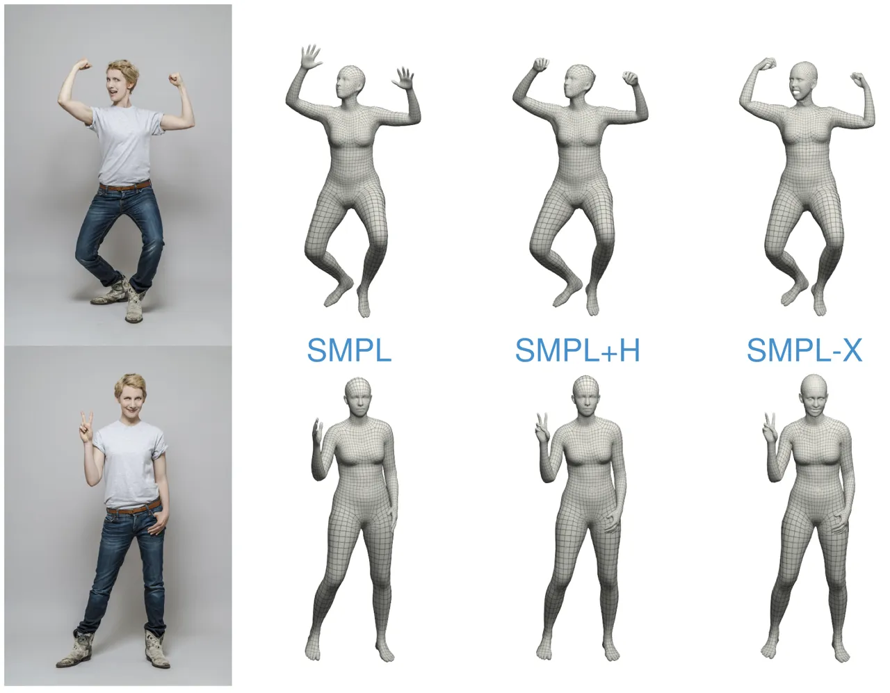

Figure 19: Comparison of SMPL \[1\], SMPL+H \[424\], and SMPL-X \[305\]
models: SMPL captures basic body shapes, SMPL+H adds detailed hand
poses, and SMPL-X includes body, hands, and facial expressions for a
more complete and realistic representation. Reprinted from \[305\].

SMIL (Skinned Multi-Infant Linear Model) \[425\] and SMAL (Skinned
Multi-Animal Linear Model) \[426\] are advanced 3D body models designed
to overcome challenges in capturing and analyzing non-cooperative
subjects. To begin with, SMIL is the first 3D body model developed
specifically for infants, aimed at addressing the lack of high-quality
scans by learning from the low-quality incomplete RGB-D data of freely
moving infants. It provides a basic tool for the General Movement
Assessment and other applications for early detection of
neurodevelopmental disorders. In contrast, SMAL focuses on animals,
representing a new approach to learning 3D articulated models from a few
scans of toy figurines in various poses. SMAL is a novelty for aligning
scans of varied shapes and sizes to a common template, hence allowing
the creation of a shape space for animals such as lions, horses, and
dogs. Both SMIL and SMAL are examples of breakthroughs in modeling
challenging subjects that have opened up detailed analysis and animation
in their respective domains.

Such models can be applied to creating realistic virtual avatars,
character animation, simulation of human interactions, and visualization
of human poses. For instance, AI models trained to learn human pose
could directly use detailed data to improve performance. Generative AI
systems can create highly detailed representations of humans, including
intricate hand and face details, and find application in VR and gaming.
The low dimensionality makes them ideal for seamless integration and
allows for efficient generation and manipulation of 3D human data. The
SMPL model helps these systems create and understand full-body motion
and makes it possible to visualize motions properly by generating
animations. When AI applications need hand interactions, SMPL+H helps
them train models for creating realistic hand interactions and handling
gesture tasks. Moreover, SMPL-X brings face, hand, and body parts
together and makes it possible for applications to use these factors to
generate a human body model realistically.

#### A.1.6 Multimodal

##### CLIP \[7\]

The introduction of the CLIP model represents a pivotal moment in the
evolution of multimodal foundation models. CLIP, which stands for
Contrastive Language-Image Pre-training, is a joint image-text embedding
model trained on 400 million image-text pairs. It encodes images and
text into the same embedding space by leveraging the power of
contrastive learning. For instance, an image of a cat and the caption
"This is a cat" will have highly similar embeddings after being
processed by CLIP’s respective image and text encoders. The model
consists of two main components: a text encoder, which utilizes a
Transformer \[5\], and an image encoder, which employs either the Vision
Transformer (ViT) \[383\] or ResNet-50 \[181\]. These pre-trained
encoders enable CLIP to perform well without relying on a complex
architecture.

The primary innovation of CLIP lies in its contrastive loss algorithm
\[427\]. Given a batch of $`N`$ (image, text) pairs, CLIP computes a
dense cosine similarity matrix between all $`N\times N`$ possible
(image, text) candidates within the batch. The text and image encoders
are jointly trained to maximize the similarity between $`N`$ correct
pairs of (image, text) associations while minimizing the similarity for
$`N\times(N-1)`$ incorrect pairs via a symmetric cross-entropy loss. The
image embeddings $`\mathbf{I}_{e}`$ and text embeddings
$`\mathbf{T}_{e}`$ are obtained by projecting the output of the image
encoder $`\mathbf{I}_{f}`$ and text encoder $`\mathbf{T}_{f}`$ into a
shared multimodal space using learned projection matrices and
normalizing them to unit length:

```math
\mathbf{I}_{e}=\frac{\mathbf{I}_{f}\mathbf{W}_{i}}{\|\mathbf{I}_{f}\mathbf{W}_{i}\|_{2}},\quad\mathbf{T}_{e}=\frac{\mathbf{T}_{f}\mathbf{W}_{t}}{\|\mathbf{T}_{f}\mathbf{W}_{t}\|_{2}} \tag{24}
```

Here, $`\mathbf{I}_{f}`$ and $`\mathbf{T}_{f}`$ are the features
extracted by the image and text encoders, respectively, and
$`\mathbf{W}_{i}`$ and $`\mathbf{W}_{t}`$ are learned projection
matrices that map the features to a shared embedding space. The
normalization ensures that the embeddings $`\mathbf{I}_{e}`$ and
$`\mathbf{T}_{e}`$ lie on a unit embedding space, allowing the model to
compare them using cosine similarity. Next, the similarity matrix
$`\mathbf{S}`$ is calculated by taking the dot product of the normalized
image and text embeddings and scaling it by a learnable temperature
parameter $`t`$:

```math
\mathbf{S}=\exp(t)\cdot(\mathbf{I}_{e}\mathbf{T}_{e}) \tag{25}
```

The temperature parameter $`t`$ controls the sharpness of the
distribution of similarities. When higher, it reduces sensitivity to
small differences, while a lower temperature sharpens that sensitivity.

Finally, the symmetric contrastive loss is computed by applying
cross-entropy loss on both the image-to-text and text-to-image
directions. The loss, applied symmetrically, is defined as:

```math
\mathcal{L}=\frac{1}{2}\left(\frac{1}{n}\sum_{i=1}\text{CrossEntropy}(\mathbf{S}_{i,:},\text{labels})+\frac{1}{n}\sum_{j=1}\text{CrossEntropy}(\mathbf{S}_{:,j},\text{labels})\right) \tag{26}
```

Where $`\mathbf{S}_{i,:}`$ refers to the similarities between the
$`i`$-th image and all text embeddings and $`\mathbf{S}_{:,j}`$ refers
to the similarities between the $`j`$-th text and all image embeddings.
The labels vector represents the correct image-text pairings within the
batch.

##### CLIP in Generative AI

CLIP’s multimodal capabilities have been transformative in generative
AI, enabling models to generate content that integrates textual and
visual information in meaningful ways \[428\]. For example, in avatar
generation, CLIP can ensure that the visual output aligns with textual
descriptions of gestures, expressions, or even personality traits,
leading to more personalized and context-aware avatars \[70\]. Moreover,
CLIP can cross-reference text, images, and even videos in its extended
versions \[429\]. This capability guarantees that generated content
remains semantically consistent with the provided instructions. It
encompasses various elements, including visual gestures, motion
patterns, and detailed facial expressions \[430\]. As a result, user
experiences are significantly enhanced in interactive environments such
as gaming, virtual meetings, and animation.

One of CLIP’s most remarkable features is its ability to perform
zero-shot learning, allowing it to make predictions for unseen
categories or domains without explicit training \[7\]. This zero-shot
capability has been demonstrated across various domains, such as image
classification, where CLIP can classify images solely based on textual
descriptions. This generalization power is critical in generative AI
systems where models must synthesize content for a broad range of inputs
and tasks. Notably, CLIP has also inspired subsequent models like DALL-E
\[321\], which extends CLIP’s framework to generate high-quality images
directly from textual descriptions, marking a significant development in
the field of multimodal generative AI.

##### GAN \[431\]

Generative Adversarial Networks (GANs) consist of two neural networks: a
generator (G) and a discriminator (D), which engage in an adversarial,
game-theoretic process. The generator $`G(z;\theta_{g})`$ takes noise
$`z`$ sampled from a prior distribution $`p_{z}(z)`$ and maps it to a
synthetic data point in the target space, aiming to mimic the real data
distribution $`p_{\text{data}}(x)`$. Meanwhile, the discriminator
$`D(x;\theta_{d})`$ outputs the probability that a given sample is real
rather than generated. The objective is framed as a minimax optimization
problem, where $`G`$ tries to generate realistic data to fool $`D`$, and
$`D`$ aims to correctly classify real and fake data. The optimization
problem can be expressed as:

```math
\min_{G}\max_{D}V(D,G)=\mathbb{E}_{x\sim p_{\text{data}}(x)}[\log D(x)]+\mathbb{E}_{z\sim p_{z}(z)}[\log(1-D(G(z)))] \tag{27}
```

The goal for the generator is to improve until the discriminator cannot
distinguish between real and fake data, ideally reaching a Nash
equilibrium, where $`D(x)=0.5`$ for all $`x`$. In practice, the original
minimax objective can lead to vanishing gradients for the generator in
early training. To address this, a more stable alternative called the
non-saturating loss is often used. Instead of minimizing
$`\log(1-D(G(z)))`$, the generator maximizes $`\log D(G(z))`$, resulting
in the following objective:

```math
J_{G}=\mathbb{E}_{z\sim p_{z}(z)}[-\log D(G(z))] \tag{28}
```

GANs are powerful because they model the data distribution implicitly
without explicitly estimating the probability density. However,
challenges such as training instability and mode collapse remain.

##### Conditional GANs (cGANs) \[184\]

Conditional GANs extend traditional GANs by incorporating extra
information, like class labels or attributes, to guide the generation
process. In this setup, both the generator and discriminator receive
this additional input to improve control over the generated outputs. The
generator produces samples $`G(z|y)`$ based on the input condition
$`y`$, while the discriminator checks whether the generated sample
aligns with both the data distribution and the given condition. This
design enables a wide range of tasks, such as text-to-image generation
\[432\], face synthesis \[433\], and image translation \[434\]. The cGAN
objective adjusts the standard GAN loss to ensure the outputs are not
only realistic but also consistent with the provided conditions.

##### CycleGAN \[435\]

CycleGAN is a framework designed for unpaired image-to-image
translation, enabling transformation between two different domains
(e.g., photos and paintings) without needing aligned image pairs for
training. The key innovation of CycleGAN is the introduction of cycle
consistency, which ensures that if an image is converted from one domain
to another and then back again, it closely matches the original input.
The model uses two generators: $`G`$, which maps images from domain
$`X`$ to domain $`Y`$, and $`F`$, which performs the reverse
transformation from $`Y`$ to $`X`$. Additionally, two discriminators,
$`D_{X}`$ and $`D_{Y}`$, are trained to distinguish between real and
generated images in each domain, ensuring that the generated outputs are
indistinguishable from real samples. The objective function consists of
two components. First is the adversarial loss, which encourages the
generated images to appear realistic. For the generator $`G`$, the
adversarial loss is defined as:

```math
\mathcal{L}_{GAN}(G,D_{Y},X,Y)=\mathbb{E}_{y\sim p_{data}(y)}[\log D_{Y}(y)]+\mathbb{E}_{x\sim p_{data}(x)}[\log(1-D_{Y}(G(x)))] \tag{29}
```

This ensures that $`G(X)`$ produces images that fool the discriminator
$`D_{Y}`$. Similarly, a parallel adversarial loss applies for the
reverse generator $`F`$ and discriminator $`D_{X}`$. The second
component is the cycle consistency loss, which ensures that a round-trip
translation returns the original input image. It is defined as:

```math
\mathcal{L}_{cyc}(G,F)=\mathbb{E}_{x\sim p_{data}(x)}[||F(G(x))-x||_{1}]+\mathbb{E}_{y\sim p_{data}(y)}[||G(F(y))-y||_{1}] \tag{30}
```

This loss penalizes discrepancies between the input image and the
reconstructed image after forward and reverse transformations. The final
objective function combines these losses:

```math
\mathcal{L}(G,F,D_{X},D_{Y})=\mathcal{L}_{GAN}(G,D_{Y},X,Y)+\mathcal{L}_{GAN}(F,D_{X},Y,X)+\lambda\mathcal{L}_{cyc}(G,F) \tag{31}
```

where $`\lambda`$ is a hyperparameter that balances the importance of
the cycle consistency loss relative to the adversarial loss. CycleGAN
has been successfully applied to tasks such as style transfer, where it
translates images between two visual styles (e.g., photos to paintings)
without needing paired datasets.

##### Autoencoders \[436\]

Autoencoders are a special type of neural networks that try to
reconstruct an input from the output. They consist of two main
components: an encoder that compresses input data into a
lower-dimensional representation and a decoder that reconstructs the
original data from this compressed form. Indeed, the basic idea of their
architecture is to extract the most important features of the input and
then reconstruct the input from those features. Autoencoders are
primarily used for unsupervised learning tasks, particularly in
dimensionality reduction and data compression. This notion was
introduced in the mid-1980s and has evolved significantly. \[437\]
demonstrated their use for deep learning-based dimensionality reduction
and subsequent innovations like denoising autoencoders \[438\].
Furthermore, they play a foundational role in generative AI, as they can
model the underlying data structure by learning efficient
representations in the latent space. This capability enables the
generation of new data samples by decoding points from the latent space,
forming the basis for techniques such as Variational Autoencoders
(VAEs), which are widely used for tasks like image synthesis and
generation.

More recently, supervised auto-encoders have emerged, incorporating
label information into the encoding process to improve feature learning.
By aligning the learned representations with specific task objectives,
these models have shown improved performance in classification and
regression tasks compared to traditional auto-encoders \[439\]. This
approach helps integrate both supervised and unsupervised learning for
more robust representations.

##### Variational Autoencoders (VAEs) \[4\]

VAEs are powerful extensions of traditional ones, particularly in
generation tasks. The primary issue of autoencoders is that they focus
solely on reducing the reconstruction error without ensuring that the
latent space follows any structured or interpretable distribution. As a
result, sampling directly from this latent space often leads to poor or
unrealistic generations. VAEs address these issues by mapping the input
to a probability distribution, typically a Gaussian, instead of mapping
the input to a single point in the latent space. The key idea is to
force the latent space to follow a predefined prior distribution. So,
the loss function of VAE has one more term than the reconstruction error
in autoencoders. The second term is the Kullback-Leibler (KL)
divergence, which measures how much the learned distribution deviates
from the prior. So, By adding this term and choosing a standard normal
distribution as a prior distribution, we can ensure that the latent
space is smooth and allows for sampling realistic data. The VAE
optimizes the following objective called evidence lower bound (ELBO)
\[440\]:

```math
\mathcal{L}=\mathbb{E}_{q_{\phi}(z|x)}\left[\log p_{\theta}(x|z)\right]-D_{\text{KL}}\left(q_{\phi}(z|x)\,||\,p(z)\right) \tag{32}
```

In the above $`q_{\phi}(z|x)`$ is the encoder network(approximate
posterior), which maps the input $`x`$ to the latent variable,
$`p_{\theta}(x|z)`$ is the decoder network(approximate likelihood),
which reconstructs the input data $`x`$ from $`z`$ and $`p(z)`$ is the
prior distribution over the latent variables.

##### Vector Quantized Variational Autoencoders (VQ-VAEs) \[290\]

VQ-VAEs enhance the traditional VAE framework by using discrete latent
variables instead of continuous ones. As the latent space is continuous
in standard VAEs, it is challenging to model discrete data, such as
categories, or tokens. VQ-VAEs address this by mapping the encoder
output to a discrete codebook of learned embeddings. This approach
allows the encoder to produce a latent vector quantized by selecting the
closest codebook vector, creating a more structured and interpretable
latent space. This makes VQ-VAEs particularly suitable for tasks such as
image generation, speech synthesis, and natural language processing,
where the data inherently has discrete structures.

Mathematically, given an input $`x`$, the encoder produces a latent
vector $`z_{e}(x)`$, which is then mapped to the nearest vector
$`e_{k}`$ from a set of codebook vectors $`e_{1},e_{2},\dots,e_{K}`$.
The decoder reconstructs the original input from the quantized vector
$`e_{k}`$. The loss function of VQ-VAEs combines three terms: the
reconstruction loss $`\mathcal{L}_{rec}`$, the codebook loss
$`\mathcal{L}_{vq}`$ to minimize the distance between the encoder’s
output and the closest codebook vector, and the commitment loss
$`\mathcal{L}_{com}`$ to ensure the encoder commits to the chosen
codebook entry. The overall loss respectively is:

```math
\mathcal{L}=\log p(x|z_{q}(x))+||\text{sg}[z_{e}(x)]-e_{k}||_{2}+\beta||z_{e}(x)-\text{sg}[e_{k}]||_{2} \tag{33}
```

Here, sg represents the stop-gradient operation, preventing the codebook
vectors from being updated by the gradients directly. This structure
encourages efficient use of the codebook and ensures that the model
produces high-quality reconstructions while maintaining a robust and
interpretable latent space.

##### NeRF \[9\]

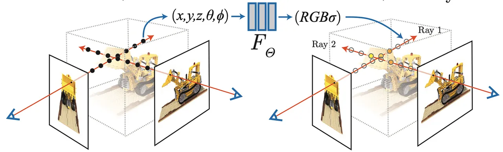

Figure 20: An overview of volumetric rendering in NeRF. Reprinted from
\[9\].

Traditionally, there have been two broad categories of methods to
represent 3D objects: explicit and implicit representations. Explicit
methods such as voxel grids, point clouds, and structurally meshed
surfaces model objects (i.e., you can see the structure through the
stored data). However, these approaches are memory-intensive. In
contrast, implicit representations offer a parametric description of 3D
scenes, requiring significantly less memory. For a more comprehensive
review of traditional methods, readers are encouraged to refer to
\[441\].

NeRFs (Neural Radiance Fields) \[9\] belong to the class of implicit
representations but take a step further by using a neural network to
learn the volumetric properties of a scene or an object. In other words,
NeRF encodes the color and density at every point in 5D representations.
In inference time, a frame of rays is cast to evaluate the color of each
pixel in the final rendered image. For each pixel, a ray is cast through
the scene, and the color contribution along the ray is calculated as:

```math
C(\mathbf{r})=\int_{t_{n}}T(t)\sigma(\mathbf{r}(t))\mathbf{c}(\mathbf{r}(t),\mathbf{d})dt \tag{34}
```

Where $`T(t)=\exp\left(-\int_{t_{n}}\sigma(\mathbf{r}(s))ds\right)`$ is
the accumulated transmittance along the ray, $`\sigma(\mathbf{r}(t))`$
represents the density function, which indicates the opacity at point
$`\mathbf{r}(t)`$, and $`\mathbf{c}(\mathbf{r}(t),\mathbf{d})`$ gives
the color of the point for a ray direction $`\mathbf{d}`$. The final
pixel color, $`C(r)`$, is the accumulated contribution of all the
densities and colors along the ray. Figure provides an overview of this
process. A benefit of volumetric rendering is that it models the
interaction between light and the medium through which it passes, which
can make the product of renders more natural. However, one key
limitation of NeRF is that it requires retraining for each new scene,
meaning that the trained weights of a network only capture the
information for an individual object or environment.

##### NeRFs in Generative AI

While NeRFs were initially developed for novel view synthesis of static
scenes, they have been successfully adapted to various generative tasks
in computer graphics and computer vision. For instance, in the domain of
dynamic scene generation, Dynamic NeRFs \[442\] have been shown to
perform competitively with traditional computer graphics techniques by
treating time as an additional dimension in the neural representation,
allowing for the synthesis of novel viewpoints of moving objects and
scenes.

In the realm of generative AI, NeRF architecture has also been applied
to tasks such as avatar creation, scene editing, and object
manipulation. For example, in the generation of photorealistic human
avatars, NeRF-based models can generate novel views of a person by
learning a continuous volumetric representation of their appearance and
geometry, thus allowing for the creation of highly detailed and
consistent 3D human models. One particularly exciting application of
NeRFs is in the domain of content creation and virtual production. By
applying volumetric rendering to learned scene representations, NeRFs
can generate photorealistic views of objects or environments that can be
seamlessly integrated into virtual productions. These models can capture
complex lighting and material properties, making them particularly
suited for tasks where physical accuracy and visual fidelity are
essential, such as virtual film production or architectural
visualization.

##### 3D Gaussian Splatting \[10\]

3D Gaussian Splatting (3DGS) is an alternative method for representing
3D scenes that builds on the advantages of NeRFs while addressing some
of their limitations. It represents a 3D scene as a collection of
Gaussian functions, where each Gaussian defines a local distribution of
points in space. Instead of using a dense grid or neural representation
to encode the scene, the scene is defined through a set of spatially
distributed Gaussians that approximate the shape, color, and opacity of
the object or scene.

Unlike NeRF \[9\], which requires a neural network to infer the color
and density at every point along the ray, Gaussian Splatting takes
advantage of more direct and computationally efficient rendering
techniques by leveraging splats, small, volumetric, Gaussian-shaped
primitives. These splats are rendered by blending their contributions
based on their distance from the camera view. The splatting process
computes the weighted contribution of each Gaussian along a ray-like
volumetric rendering in NeRF but typically with fewer computational
resources and memory requirements.

Each 3D Gaussian splat is parameterized by: Mean position
($`\mu_{i}\in\mathbb{R}`$), Covariance matrix
($`\Sigma_{i}\in\mathbb{R})`$ (defines the size, shape, and orientation
of the Gaussian), Color and opacity ($`\mathcal{}{c}_{i}\in\mathbb{R}`$
and $`\alpha_{i}\in[0,1]`$) The Gaussian density function for a point
$`\mathbf{x}`$ in 3D space is defined as:

```math
G_{i}(\mathbf{x})=\exp\left(-\frac{1}{2}(\mathbf{x}-\mu_{i})\Sigma_{i}(\mathbf{x}-\mu_{i})\right) \tag{35}
```

This equation gives the contribution of the $`i`$-th Gaussian splat to
any point $`\mathbf{x}`$ in space. The rendering of a scene using 3D
Gaussian Splatting requires blending the contributions of multiple
Gaussians along the ray. For each ray $`\mathbf{r}(t)`$, the color
contribution at a specific point is:

```math
C(\mathbf{r})=\int_{t_{n}}\sum_{i}\alpha_{i}G_{i}(\mathbf{r}(t))\,\mathbf{c}_{i}\,dt \tag{36}
```

Here, $`G_{i}(\mathbf{r}(t))`$ is the Gaussian function evaluated along
the ray at time $`t`$, while $`\alpha_{i}`$ controls the opacity of the
Gaussian. The contributions from multiple Gaussians are blended along
the ray, producing the final pixel color. To render the splats
correctly, a weighted accumulation of the Gaussians is needed, taking
into account their opacity:

```math
C(\mathbf{r})=\sum_{i}\left(\alpha_{i}\prod_{j<i}(1-\alpha_{j})\right)\mathbf{c}_{i} \tag{37}
```

Equation  ensures how much opacity is contributed by subsequent
Gaussians, which practically simulates depth and occlusion effects along
the ray.

##### Denoising Diffusion Probabilistic Models (DDPMs) \[6\]

DDPMs represent a unique class of deep generative models that can
generate high-quality and diverse outputs. They operate through two
phases: a forward diffusion process, which progressively adds noise to
data until it resembles white noise, and the reverse process called
denoising. The essential idea is to systematically and slowly destroy
the structure in a data distribution through an iterative forward
diffusion process. It then learns a reverse diffusion process that
restores structure and data, yielding a highly flexible and tractable
generative model of the data. The forward process is modeled as a Markov
process, adding Gaussian noise at each step using the following
equation:

```math
q(x_{t}|x_{t-1})=\mathcal{N}(x_{t};\sqrt{1-\beta_{t}}x_{t-1},\beta_{t}) \tag{38}
```

Where $`\beta_{t}`$ controls the variance. The forward diffusion process
uses a schedule (usually a Linear schedule) that scales the mean and the
variance. At the end of this process, diffused data will have just a
standard normal distribution. The reverse phase, or denoising, involves
learning to reconstruct the original data from the noise using a neural
network, essentially reversing the forward process. In this process, we
can approximate $`q(x_{t-1}|x_{t})`$ by trying to train a model to this
denoising distribution. This model’s structure explicitly uses
properties of a Gaussian distribution, such as using the
reparameterization trick in the case of sampling, and is defined by a
noise schedule that controls the diffusion process. DDPMs make use of a
reverse process, starting from a base distribution, typically a standard
normal distribution, and iteratively creating less noisy data through a
parametric denoising model. This model is typically a normal
distribution with parameters predicted by a neural network, making the
true denoising distribution generally intractable. The training utilizes
a similar variational upper bound as in VAE \[4\] and minimizes the
bound by minimizing the Kullback-Leibler divergence between the true and
parametric distributions.

```math
KL\left(q(x_{t-1}|x_{t},x_{0})\parallel p_{\theta}(x_{t-1}|x_{t})\right)=\frac{1}{2\sigma_{t}}\|\mu_{\text{posterior}}-\mu_{\theta}(x_{t})\| \tag{39}
```

where $`\mu_{\theta}`$ is the output of the neural network for a given
$`x_{t}`$, and $`\sigma_{t}`$ is the variance parameter. This approach
enhances sample generation quality by leveraging the reparameterization
trick and optimizing the noise prediction network. The neural network
architectures for such models generally include a U-Net \[231\]
structure with self-attention and residual blocks conditioned on time
via embeddings, including sinusoidal positional embeddings or random
Fourier features. Training also explores hyperparameters such as the
variance schedule ($`\beta_{t}`$) and noise variance ($`\sigma_{t}`$),
with some approaches allowing these to be learned adaptively. This
process underlines the importance of the diffusion parameters and
network design for high-quality outputs in diffusion models.

This has been one of the pivotal approaches in generative AI, with
applications ranging from high-quality image synthesis to text-to-image
synthesis, video generation, and audio applications. The DDPM gives a
more powerful capture of complex data distribution, hence a very solid
basis for state-of-the-art generative systems in many different
modalities. Their iterative nature and scalability further introduce
them as a versatile tool for achieving high-fidelity outputs within
practical AI applications.

##### ControlNet \[8\]

ControlNet is an advanced model that enhances control within image
diffusion processes by conditioning the generative model with auxiliary
input images, such as Canny edges, sketches, human poses, and depth
maps. This approach enables more precise guidance of the diffusion
model, reducing the need for exhaustive prompt experimentation while
increasing the specificity of generated images.

ControlNet employs a dual-copy architecture for neural network blocks,
incorporating both a "locked" copy that preserves the original model and
a "trainable" copy that adapts to new conditions. This design allows for
efficient fine-tuning with small image-pair datasets without
compromising the integrity of production-ready models. A notable
feature, "zero convolutions" (1x1 convolutions initialized with zero
weights), ensures that new layers initially produce zero outputs,
thereby preserving the original model’s function. This mechanism allows
ControlNet to integrate seamlessly with pre-trained models, providing an
adaptable framework for training on small-scale or personal devices. The
architecture also supports the merging, replacement, or offsetting of
model components, offering artists and designers greater flexibility.
Figure illustrates the difference that ControlNet has made to the
architecture of neural network models for image generation.

Given an input image $`z_{0}`$, image diffusion algorithms iteratively
add noise to produce a noisy image $`z_{t}`$, where $`t`$ represents the
noise addition steps. With a set of conditions, including time step
$`t`$, text prompts $`c_{t}`$, and a task-specific condition $`c_{f}`$,
these algorithms learn a network $`\epsilon_{\theta}`$ to predict the
noise added to $`z_{t}`$, using the following objective:

```math
L=\mathbb{E}_{z_{0},t,c_{t},c_{f},\epsilon\sim\mathcal{N}(0,1)}\left[\|\epsilon-\epsilon_{\theta}(z_{t},t,c_{t},c_{f})\|_{2}\right] \tag{40}
```

Where $`L`$ is the learning objective for the diffusion model, directly
used to fine-tune models with ControlNet. During training, 50% of text
prompts $`c_{t}`$ are replaced with empty strings to strengthen
ControlNet’s capacity to recognize and generate outputs based solely on
conditioning images (e.g., edges, poses, or depth maps), enhancing its
ability to capture image-based semantics without text prompts.

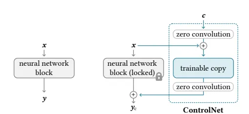

Figure 21: Before ControlNet (left): A neural network block processes
input $`x`$ to output $`y`$. After ControlNet (right): The original
block is locked as $`y_{c}`$, while a trainable copy integrates external
input $`c`$ via zero convolutions, enhancing functionality. Reprinted
from \[8\].

##### ControlNet in Generative AI

ControlNet is an invaluable asset in generative AI, as it offers refined
control over the image creation process. It allows users to specify
intricate structural details, ensuring that the resulting visuals
closely match the intended attributes. This capability promotes
consistency, particularly in the depiction of complex figures like human
poses, effectively reducing common distortions. Moreover, by
accommodating a wide range of input types such as sketches and depth
maps, ControlNet enables even basic outlines to inform and direct the
production of high-quality images. Its robustness is further enhanced
through training methods that intermittently remove prompts, shifting
the focus to image-based conditions rather than relying solely on text.
Overall, ControlNet significantly boosts the precision, versatility, and
adaptability of generative AI applications, making it especially
valuable for tasks that demand both creativity and structural accuracy.

##### DALL-E \[321\]

DALL-E is an AI model developed by OpenAI that generates images from
textual descriptions. This model utilizes advanced neural networks and
deep learning techniques to analyze the input text and associate it with
visual concepts, creating new and creative images. DALL-E is a simple
decoder-only transformer that receives both the text and the image as a
single stream of 1280 tokens (256 for the text and 1024 for the image)
and models all of them autoregressively. The attention mask at each of
its 64 self-attention layers allows each image token to attend to all
text tokens. DALL-E uses the standard causal mask for the text tokens
and sparse attention for the image tokens with either a row, column, or
convolutional attention pattern, depending on the layer.

Traditionally, text-to-image generation has focused on improving
modeling assumptions for training on fixed datasets, which may involve
complex architectures, auxiliary losses, or side information like object
part labels or segmentation masks provided during training. A simpler
approach to this task is based on a transformer that autoregressively
models text and image tokens as a single data stream. With sufficient
data and scale, this approach proves competitive with domain-specific
models when evaluated in a zero-shot fashion \[321\].

The objective is to train a transformer to autoregressively model the
text and image tokens as a unified data stream. However, directly using
pixels as image tokens would require excessive memory for
high-resolution images. Likelihood objectives tend to prioritize
modeling short-range dependencies between pixels, meaning much of the
model’s capacity would be used to capture high-frequency details instead
of the low-frequency structures that make objects visually recognizable.
These challenges are addressed through a two-stage training procedure
\[321\]: (i) A discrete variational autoencoder (dVAE) is trained to
compress each 256x256 RGB image into a 32x32 grid of image tokens, where
each element can take on 8192 possible values. This reduces the context
size for the transformer by a factor of 192 without significant
degradation in visual quality. (ii) Up to 256 BPE-encoded text tokens
are concatenated with the 32x32 (1024) image tokens and an
autoregressive transformer is trained to model the joint distribution
over the text and image tokens. Then, model optimization techniques were
used to achieve better results and optimal resource utilization. After
the optimization is performed, the samples drawn from the transformer
are reranked using a pre-trained contrastive model. For each caption and
its candidate image, the contrastive model assigns a score based on how
well the image aligns with the caption, and the top k images are
selected \[321\].

In the end, they were able to investigate a simple approach for
text-to-image generation based on an autoregressive transformer when it
is executed at scale. It is found that scale can lead to improved
generalization, both in terms of zero-shot performance relative to
previous domain-specific approaches and in terms of the range of
capabilities that emerge from a single generative model. The findings
suggest that improving generalization as a function of scale may be a
useful driver for progress on this task \[321\].

### A.2 Metrics

Evaluating generative models requires carefully designed metrics to
quantify different aspects of the generated content. These metrics serve
as essential tools for assessing key attributes such as visual fidelity,
realism, physical plausibility, and computational efficiency. Given the
complexity and multi-faceted nature of generative outputs, evaluation
measures are typically categorized based on distinct aspects of
performance. A well-structured taxonomy of these metrics offers valuable
insights into the capabilities and limitations of generative models,
facilitating both research advancements and practical applications.

#### A.2.1 Quality and Realism of Generated Output

This category encompasses evaluation metrics specifically designed to
assess the perceptual quality, realism, and naturalness of generated
content. Such evaluation often involves quantifying visual, auditory, or
perceptual fidelity by comparing generated outputs to real-world data or
human-annotated references. These metrics are particularly crucial in
applications such as image synthesis, motion generation, and facial
animation, where maintaining high perceptual quality and close
resemblance to real-world counterparts is essential.

To evaluate the perceptual quality and realism of generated content, we
present a set of metrics arranged from low-level pixel-based comparisons
to high-level distributional and semantic assessments. We begin with
basic pixel-wise metrics such as Mean Squared Error (MSE) and Peak
Signal-to-Noise Ratio (PSNR), which directly compare image intensities.
We then include Structural Similarity Index (SSIM), which incorporates
structural information and better aligns with human perception. Moving
toward perceptual metrics, Learned Perceptual Image Patch Similarity
(LPIPS) compares deep feature representations to quantify visual
similarity more holistically.

Beyond direct comparisons, we explore distributional similarity metrics
such as Fréchet Inception Distance (FID) and its modality-specific
extensions, Fréchet Gesture Distance (FGD), Fréchet Video Distance
(FVD), and Fréchet Audio Distance (FAD), which compare the statistics of
deep embeddings extracted from real and generated content. Additionally,
we include CLIP Score and CLIP-MMD, which measure alignment in a
multimodal embedding space. Finally, we consider Identity Consistency,
which evaluates whether the generated output preserves identity-related
features, particularly in tasks involving facial or gesture synthesis.
Together, these metrics provide a layered and comprehensive view of how
realistic, perceptually convincing, and semantically faithful the
generated content appears across various modalities.

##### Mean Squared Error (MSE)

Mean Squared Error (MSE) is a widely used metric for measuring
pixel-wise differences between a generated image and its corresponding
real counterpart. It calculates the average of the squared differences
between pixel values, providing an estimate of how closely the generated
image approximates the ground truth. The MSE is computed as follows:

```math
\text{MSE}=\frac{1}{n}\sum_{i=1}(x_{i}-y_{i}) \tag{41}
```

Here, $`n`$ is the total number of pixels in the image, $`x_{i}`$
represents the pixel value of the generated image at position $`i`$, and
$`y_{i}`$ denotes the corresponding pixel value in the real image.

Although MSE does not originate from a single source, it has been
extensively adopted in the evaluation of generative models across image
synthesis, video-based motion reconstruction, and animation. For
example, it has been employed to assess frame-level reconstruction in
video-to-pose translation \[443\], visual consistency in human animation
pipelines \[444\], and pixel fidelity in transformer-based image
synthesis \[445\].

Lower MSE values indicate a higher degree of similarity between the
generated and real images, suggesting better reconstruction quality.
However, since MSE evaluates differences at the pixel level, it fails to
capture perceptual differences or high-level structural variations,
making it less suitable for assessing visual realism in generative
models.

##### Peak Signal-to-Noise Ratio (PSNR) \[225\]

The Peak Signal-to-Noise Ratio (PSNR) is a widely adopted metric for
assessing the reconstruction quality of images or videos, especially
after compression or generation. It quantifies the ratio between the
maximum possible signal power and the power of the noise introduced by
compression or generative artifacts, and is expressed in decibels (dB).
The PSNR score is computed as follows:

```math
\mathrm{PSNR}=10\cdot\log_{10}\left(\frac{L}{\mathrm{MSE}}\right) \tag{42}
```

Here, $`L`$ represents the dynamic range of pixel values (e.g., 255 for
8-bit images), and $`\mathrm{MSE}`$ is the Mean Squared Error between
the original and generated image. Higher PSNR values indicate better
reconstruction fidelity. However, PSNR primarily measures low-level
pixel accuracy and may not align well with human perceptual judgments,
especially in complex visual scenes. It should be complemented with
other metrics that better capture perceptual quality.

##### Structural Similarity Index (SSIM) \[205\]

The Structural Similarity Index (SSIM) is a perceptual metric that
evaluates the similarity between two images based on structural
information, luminance, and contrast rather than raw pixel-wise
differences. SSIM is designed to be more consistent with human visual
perception, making it especially useful in generative tasks involving
visual realism. The SSIM score is computed as follows:

```math
\mathrm{PSNR}=10\cdot\log_{10}\left(\frac{L}{\mathrm{MSE}}\right) \tag{43}
```

In this equation, $`\mu_{x}`$ and $`\mu_{y}`$ denote the means of the
images $`x`$ and $`y`$; $`\sigma_{x}`$, $`\sigma_{y}`$ represent their
variances; and $`\sigma_{xy}`$ is the covariance between them. Constants
$`C_{1}`$ and $`C_{2}`$ stabilize the division when denominators are
small. SSIM ranges from -1 to 1, where a score closer to 1 indicates
stronger structural similarity. It is especially valuable in
applications such as super-resolution, inpainting, and generative image
restoration, where perceptual quality matters more than raw pixel
accuracy.

##### Learned Perceptual Image Patch Similarity (LPIPS) \[446\]

The Learned Perceptual Image Patch Similarity (LPIPS) metric evaluates
the perceptual similarity between two images by comparing deep feature
representations extracted from a pretrained neural network. Unlike
pixel-wise metrics such as MSE, LPIPS is more closely aligned with human
visual perception, making it a valuable tool for assessing image quality
in generative tasks. The LPIPS score is computed as follows:

```math
\text{LPIPS}(x,y)=\sum_{l}\frac{1}{H_{l}W_{l}}\sum_{h=1}\sum_{w=1}\left\|\hat{w}_{l}\odot\left(\hat{\phi}_{l}(x)_{h,w}-\hat{\phi}_{l}(y)_{h,w}\right)\right\|_{2} \tag{44}
```

Here, $`\hat{\phi}_{l}(x)`$ and $`\hat{\phi}_{l}(y)`$ denote the
unit-normalized deep feature embeddings extracted from layer $`l`$ of a
pretrained network for images $`x`$ and $`y`$, respectively. The terms
$`H_{l}`$ and $`W_{l}`$ represent the height and width of the spatial
dimensions of the feature maps at layer $`l`$. The vector
$`\hat{w}_{l}`$ contains learned per-channel weights that modulate the
contribution of each channel to the final perceptual distance. The
symbol $`\odot`$ denotes element-wise multiplication, and
$`\|\cdot\|_{2}`$ is the squared Euclidean norm. Lower LPIPS scores
indicate higher perceptual similarity between the images, making this
metric well-suited for tasks like image generation, super-resolution,
and style transfer, where human visual perception is a more appropriate
criterion than pixel-level fidelity.

##### Fréchet Inception Distance (FID) \[278\]

The Fréchet Inception Distance (FID) quantifies the similarity between
the feature distributions of real and generated samples. It measures the
statistical distance between deep feature representations extracted
using a pretrained Inception network. Lower FID values indicate that the
generated samples are perceptually closer to real data, both in
structure and content. The FID score is computed as:

```math
\text{FID}=\left\|\mu_{r}-\mu_{g}\right\|+\text{Tr}\left(\Sigma_{r}+\Sigma_{g}-2\sqrt{\Sigma_{r}\Sigma_{g}}\right) \tag{45}
```

Here, $`\mu_{r}`$ and $`\mu_{g}`$ denote the means, and $`\Sigma_{r}`$,
$`\Sigma_{g}`$ the covariances of real and generated feature
distributions, respectively. This metric is widely used in image
synthesis and character animation to assess the quality and realism of
generated outputs.

Several adaptations of FID have been proposed to better align with
domain-specific evaluation needs across different modalities. The
Fréchet Gesture Distance (FGD) \[447\] modifies the original formulation
by using motion-specific feature extractors instead of visual encoders,
allowing it to evaluate the fidelity of generated gestures in co-speech
animation, avatar behavior, and embodied agents. Similarly, the Fréchet
Video Distance (FVD) \[279\] extends FID to video generation by
incorporating temporal dynamics. It utilizes spatiotemporal networks
such as I3D to extract features that account for both spatial and
temporal coherence, making it suitable for evaluating video synthesis,
character motion, and human activity generation. On the audio side, the
Fréchet Audio Distance (FAD) \[448\] applies the same statistical
formulation to embeddings extracted from real and generated audio using
pretrained models like VGGish \[449\]. FAD has been used in speech
generation, music enhancement, and audio-based animation tasks to
measure how perceptually similar the generated audio is to real-world
recordings. While all these variants share the same core mathematical
structure as FID, their effectiveness depends on the modality-specific
embeddings used, enabling them to capture distributional fidelity in
gestures, videos, or audio, respectively.

##### CLIP-MMD \[450\]

CLIP-MMD (CLIP-based Maximum Mean Discrepancy) or CMMD is a perceptual
metric that evaluates the similarity between the distributions of real
and generated samples in a multimodal embedding space. Unlike
traditional metrics such as FID that rely on second-order statistics and
Gaussian assumptions, CLIP-MMD employs Maximum Mean Discrepancy (MMD) in
the CLIP feature space, making it more suitable for assessing perceptual
and semantic fidelity, particularly in domains involving text-to-image
or image-to-image generation. The CLIP-MMD score is computed as follows:

```math
\text{MMD}(X,Y)=\mathbb{E}_{x,x\sim X}[k(x,x)]+\mathbb{E}_{y,y\sim Y}[k(y,y)]-2\mathbb{E}_{x\sim X,y\sim Y}[k(x,y)] \tag{46}
```

Here, $`X`$ and $`Y`$ are the sets of CLIP feature embeddings extracted
from real and generated samples, respectively, and $`k(\cdot,\cdot)`$ is
a kernel function, typically a Gaussian or polynomial kernel, used to
compute similarity in the embedding space.

CLIP-MMD offers a non-parametric and distribution-free alternative to
FID by capturing higher-order discrepancies without relying on
moment-matching assumptions. It has shown improved correlation with
human judgment in evaluating semantic alignment and perceptual quality
across tasks such as text-to-image synthesis, visual style transfer, and
multimodal generative modeling.

##### CLIP Score \[451\]

The CLIP Score is a metric designed to evaluate the semantic similarity
between generated visual content and its corresponding textual
description. It leverages the CLIP model \[7\], which maps both images
and text into a shared embedding space. The metric quantifies the
alignment between a generated image and its textual description by
calculating the cosine similarity between their respective feature
embeddings. The CLIP Score is defined as:

```math
\text{CLIPScore}(t,i)=2.5\cdot\max\left(\frac{t\cdot i}{\|t\|\,\|i\|},\,0\right) \tag{47}
```

In this formula, $`\mathbf{t}`$ represents the text embedding produced
by CLIP for a given textual prompt, while $`\mathbf{i}`$ denotes the
image embedding generated by CLIP for the corresponding image. The
cosine similarity between these embeddings is computed by taking the dot
product $`t\cdot i`$, which measures the degree of alignment between the
text and image features in the shared semantic space. The norms
$`\|t\|`$ and $`\|i\|`$ are the Euclidean magnitudes of the text and
image embeddings, respectively, and they serve to normalize the
similarity score. This normalization ensures that the similarity is
independent of the absolute lengths of the embeddings, making it a
scale-invariant measure. The $`\max`$ function is used to guarantee that
the score is never negative, as a negative value would indicate a
misalignment between the embeddings. Finally, the constant factor of
$`2.5`$ is introduced to scale the result to a suitable range, ensuring
the CLIP Score provides meaningful and comparable values. Higher CLIP
Scores indicate a stronger semantic alignment between the generated
image and the textual description, making this metric particularly
valuable for evaluating text-to-image generation models and other
multimodal AI applications.

##### Identity Consistency \[452\]

The Identity Consistency metric measures the degree to which the inner
and outer regions of a face image represent the same identity. This
concept is particularly important in deepfake detection, where identity
inconsistencies between manipulated facial regions can indicate
tampering. \[452\] introduced the Identity Consistency Transformer
(ICT), which extracts separate identity vectors for the inner and outer
facial regions and compares them to assess coherence. The Identity
Consistency score is defined as:

```math
\text{Identity Consistency}(I)=d(f_{\text{in}},f_{\text{out}}) \tag{48}
```

Here, $`I`$ denotes the input face image, and $`f_{\text{in}}`$ and
$`f_{\text{out}}`$ represent identity embeddings extracted from the
inner and outer facial regions using ICT. The function
$`d(\cdot,\cdot)`$ is a distance metric such as cosine or Euclidean
distance. Lower scores indicate higher identity consistency and suggest
the face is likely authentic, while higher scores may reveal manipulated
or inconsistent facial features. This metric is especially useful in
detecting face swaps in deepfake content and protecting the identity
integrity of public figures.

These metrics serve as key indicators of how realistic and visually
convincing the generated content appears. They quantify the alignment
between real and generated data distributions, ensuring that synthesized
outputs maintain high perceptual fidelity. This category of metrics is
particularly relevant in applications such as Generative Adversarial
Networks (GANs) \[188\] for image synthesis and gesture generation
models, where the primary objective is to produce outputs that are both
visually plausible and semantically consistent with real-world data.

#### A.2.2 Diversity and Multimodality

This category evaluates a model’s ability to generate diverse and varied
outputs across multiple modalities, including text, images, and
gestures. Metrics in this domain assess whether the model effectively
mitigates mode collapse, a phenomenon where the model produces overly
deterministic outputs with limited variation. Instead, these metrics
ensure that the generative process retains flexibility, allowing for a
rich and diverse set of outputs that align with the natural variability
observed in real-world data.

Diversity and multimodality are particularly crucial in applications
where creative content generation, user personalization, and multimodal
synthesis play a fundamental role. Ensuring high diversity not only
enhances the expressiveness and adaptability of generative models but
also fosters better engagement and realism in AI-driven content
creation. To evaluate diversity in generated outputs, we consider three
complementary metrics that capture different aspects of variation. We
begin with the Diversity metric, which measures global variation across
independent samples. Next, we examine the Multimodality metric, which
focuses on within-class diversity under specific conditioning labels.
Finally, we consider the Average Pairwise Distance (APD), which provides
a more general statistical perspective by averaging distances between
all sample pairs. Together, these metrics offer a comprehensive view of
the model’s ability to produce varied, non-redundant outputs across
multiple modalities.

##### Diversity \[313\]

The Diversity metric quantifies the variation between two independently
sampled subsets of the generated outputs. It ensures that the model
avoids producing repetitive or overly similar outputs. The Diversity
score is computed as follows:

```math
\text{Diversity}=\frac{1}{N}\sum_{i=1}\left\|x_{i}-x_{i}\right\|_{2} \tag{49}
```

Here, $`\{x_{1},...,x_{N}\}`$ and $`\{x_{1},...,x_{N}\}`$ are two
independently sampled sets from the model’s output distribution, and
$`\|\cdot\|_{2}`$ denotes the Euclidean distance between corresponding
samples. Higher Diversity values indicate a broader range of variation
in the generated outputs, which is essential for producing diverse and
non-redundant results.

##### Multimodality \[313\]

The Multimodality metric evaluates the model’s ability to generate
diverse outputs within a specific action (label) class. Unlike the
Diversity metric, which measures global variation, Multimodality focuses
on within-class variation under a fixed conditioning label. The score is
computed as follows:

```math
\text{Multimodality}=\frac{1}{C\cdot N}\sum_{c=1}\sum_{n=1}\left\|x_{c,n}-x_{c,n}\right\|_{2} \tag{50}
```

Here, $`\{x_{c,1},\dots,x_{c,N}\}`$ and $`\{x_{c,1},\dots,x_{c,N}\}`$
denote two independently sampled sets of outputs conditioned on action
class $`c`$, where $`C`$ is the total number of classes and $`N`$ is the
number of samples per class. The term $`\|\cdot\|_{2}`$ represents the
Euclidean distance between corresponding samples. Higher Multimodality
scores indicate the model’s capacity to generate rich and diverse
outputs within each class, promoting mode variety and preventing
collapse.

##### Average Pairwise Distance (APD) \[453\]

The Average Pairwise Distance (APD) metric quantifies the average
distance between all generated samples, helping to ensure that the model
produces a diverse set of outputs. It is particularly useful in
multimodal generation tasks, where maintaining variability across
outputs is critical. It is used in various related generative works such
as Pose-NDF \[454\]. The APD score is calculated as follows:

```math
\text{APD}=\frac{1}{N(N-1)}\sum_{i\neq j}\left\|x_{i}-x_{j}\right\|_{2} \tag{51}
```

Here, $`N`$ denotes the total number of generated samples, while
$`x_{i}`$ and $`x_{j}`$ represent individual generated instances. The
term $`\|x_{i}-x_{j}\|_{2}`$ measures the Euclidean distance between the
two samples. Higher APD values indicate greater diversity among the
generated outputs, reducing the likelihood of mode collapse and
encouraging the model to explore a broader range of possibilities.

#### A.2.3 Relevance and Accuracy

This category of metrics evaluates how accurately generated content
aligns with ground truth data or expected task-specific outcomes. These
measures are particularly relevant in applications requiring high
precision, such as motion synthesis, speech-aligned gesture generation,
and keypoint-based animation, ensuring that generated outputs are
semantically and structurally accurate. By assessing the degree of
alignment between generated and real data, these metrics help determine
whether the model faithfully replicates desired patterns, reducing
errors and enhancing reliability in generative tasks.

To assess the relevance and accuracy of generated outputs, we present
metrics that span spatial, emotional, temporal, and semantic dimensions.
We begin with positional metrics such as Mean Absolute Joint Error
(MAJE) and Lip Vertex Error (LVE), which evaluate the spatial precision
of joints and facial features. Emotional Vertex Error (EVE) follows,
measuring the accuracy of expression-related regions. We then consider
temporal synchrony metrics, including Beat Consistency (BC) and
Audio-Visual Synchrony Score, which assess alignment between motion and
speech. Finally, we include Multimodal Distance (MM-Distance), which
quantifies semantic alignment between different modalities. This
progression allows for a layered evaluation of how closely the generated
content matches real-world data both structurally and contextually.

##### Mean Absolute Joint Error (MAJE)

The Mean Absolute Joint Error (MAJE) metric quantifies the discrepancy
between predicted and ground truth joint positions in motion synthesis
tasks. Unlike squared error metrics, MAJE computes the absolute
differences, making it less sensitive to large outliers while providing
a more intuitive measure of positional accuracy. The MAJE score is
calculated as follows:

```math
\text{MAJE}=\frac{1}{n}\sum_{i=1}|x_{i}-y_{i}| \tag{52}
```

Here, $`n`$ denotes the total number of evaluated joints, $`x_{i}`$
represents the predicted joint position at index $`i`$, and $`y_{i}`$
corresponds to the ground truth joint position. The absolute difference
$`|x_{i}-y_{i}|`$ captures the positional error between predicted and
actual joint positions, enabling accurate evaluation of the model’s
performance in motion synthesis and pose estimation.

Although MAJE does not originate from a single foundational paper, it
has been widely adopted in gesture generation and pose estimation
literature as a core evaluation metric for spatial accuracy. Notably,
prior works have employed MAJE to assess the fidelity of synthesized
joint trajectories in tasks such as gesture-from-audio generation \[455,
266\], and expressive motion modeling from multimodal cues \[456\].
Lower MAJE values indicate greater positional accuracy, making this
metric particularly important for tasks such as motion synthesis, human
pose estimation, and gesture generation.

##### Lip Vertex Error \[39\] and Emotional Vertex Error \[457\]

These are region-specific perceptual metrics designed to evaluate
spatial accuracy in speech-driven and expressive facial animation. Both
metrics compute the maximum per-frame vertex-wise error across time,
targeting different regions of the face based on application-specific
needs. Despite sharing a unified mathematical formulation, their
interpretative focus and targeted facial regions differ. The common
formulation is given by:

```math
\mathrm{VE}=\frac{1}{T}\sum_{t=1}\max_{v\in V_{R}}\left\|\hat{y}_{t,v}-y_{t,v}\right\|_{2} \tag{53}
```

In this formulation, $`T`$ denotes the number of frames in the animation
sequence, and $`v\in V_{R}`$ refers to the subset of vertices within a
specified region of interest $`V_{R}`$. $`\hat{y}_{t,v}`$ and
$`y_{t,v}`$ represent the predicted and ground truth 3D coordinates of
vertex $`v`$ at time step $`t`$, respectively. While this equation
remains constant across both metrics, the semantics of $`V_{R}`$ and the
source of the vertex data vary. Specifically, Lip Vertex Error (LVE) is
computed over the lip region using mesh data generated from audio input,
typically driven by a neutral template mesh as in MeshTalk \[39\]. In
contrast, Emotional Vertex Error (EVE) targets emotion-relevant areas
such as the brows, eyes, and forehead, and is computed over
expression-driven blendshape coefficients mapped to 3D vertices using
the FLAME model \[457\].

Thus, while LVE quantifies the accuracy of phoneme-synchronized lip
motion in speech-driven animation, EVE measures the emotional fidelity
and expressiveness captured in the upper face. These metrics complement
each other: LVE focuses on lip-sync precision, which is crucial for
intelligibility, while EVE emphasizes emotional realism, which is key
for expressive and affective character animation.

##### Beat Consistency (BC) \[458\]

The Beat Consistency (BC) metric quantifies the degree of temporal
alignment between motion and speech rhythms based on beat timing. It is
particularly useful in speech-driven gesture generation, dance
synthesis, and multimodal AI systems, where synchrony across modalities
enhances realism and coherence. The BC score is calculated as follows:

```math
\text{BC}=\frac{1}{n}\sum_{i=1}\exp\left(-\frac{\min_{t_{j}\in B_{y}}\|t_{x_{i}}-t_{j}\|}{2\sigma}\right) \tag{54}
```

Here, $`n`$ denotes the number of detected audio beats $`t_{x_{i}}`$,
and $`B_{y}`$ is the set of detected motion beat timestamps. For each
audio beat, the squared temporal distance to the nearest motion beat is
computed and passed through an exponential decay function, where
$`\sigma`$ is a smoothing factor (typically set to 0.1). Higher BC
values indicate stronger alignment between motion and speech timing,
making this metric essential for evaluating gesture animation,
speech-gesture synchrony, and expressive avatar generation.

##### Multimodal Distance \[312\]

The Multimodal Distance (MM-Distance) metric measures the degree of
alignment between generated motion and its corresponding textual
description. It evaluates how closely the feature representations of two
different modalities, such as text and motion, correspond to each other,
ensuring that the generated motion remains semantically relevant to the
input description. The MM-Distance score is calculated as follows:

```math
\text{MM-Distance}=\sqrt{\frac{1}{N}\sum_{n=1}\left\|f_{a,n}-f_{b,n}\right\|_{2}} \tag{55}
```

Here, $`N`$ represents the total number of evaluated samples,
$`f_{a,n}`$ denotes the feature embedding of the generated motion for
sample $`n`$, and $`f_{b,n}`$ corresponds to the feature embedding of
the associated textual input. The term $`\|\cdot\|_{2}`$ denotes the
squared Euclidean (L2) norm.

The set of paired feature representations is defined as:

```math
\{(f_{a,1},f_{b,1}),\dots,(f_{a,N},f_{b,N})\}
```

where each pair $`(f_{a,n},f_{b,n})`$ consists of feature vectors
extracted from two different modalities, $`a`$ (e.g., motion) and $`b`$
(e.g., text). While MM-Distance can be used to assess alignment between
any pair of modalities, it is most commonly applied in text-to-motion
generation tasks to evaluate how well the synthesized motion captures
the semantics of the input description, ensuring higher fidelity in
motion synthesis.

The above metrics assess how accurately the generated content aligns
with ground truth data or expected task-specific outcomes, providing a
quantitative measure of correctness. They are particularly crucial in
applications where semantic accuracy holds greater importance than
purely visual fidelity. In tasks such as human motion synthesis and
gesture generation, ensuring that the generated movements are
contextually and semantically appropriate is essential. Relevance and
accuracy metrics help evaluate whether the model faithfully replicates
meaningful gestures and motion patterns rather than just producing
visually plausible outputs.

#### A.2.4 Physical Plausibility and Interaction

This category evaluates the physical realism of generated content,
particularly in scenarios involving motion, object interaction, and
environmental constraints. These metrics ensure that synthesized outputs
adhere to real-world physical principles, such as smooth motion
trajectories, non-colliding movements, and biomechanically plausible
gestures. In applications like human motion synthesis, robotics, and
animation, maintaining physical plausibility is crucial to prevent
unnatural or implausible results.

Although these metrics are less frequently used compared to visual or
perceptual measures, they are essential for applications that require
physically grounded outputs. Evaluating physical plausibility helps
ensure that the generated content is not only visually appealing but
also mechanically viable and functionally realistic. We present the key
metrics in this category along with their respective formulations. To
assess the physical plausibility of generated motion, we introduce
metrics that capture both overall dynamic consistency and specific
physical interactions. We begin with the Mean Acceleration Difference
(MAD), which evaluates how closely the model’s motion adheres to
realistic acceleration patterns, reflecting the smoothness and
naturalness of the generated sequences. We then examine the Foot Skating
(FS) metric, which focuses on the physical correctness of foot-ground
contact by detecting unnatural sliding artifacts. Together, these
metrics provide a comprehensive view of physical realism, from internal
motion dynamics to external environmental interactions.

##### Mean Acceleration Difference (MAD) \[459\]

The Mean Acceleration Difference (MAD) metric quantifies the discrepancy
between actual and predicted acceleration in generated motion. It is
essential for ensuring that synthetic motion adheres to realistic
dynamics and avoids abrupt or unnatural changes in movement. The MAD
score is calculated as follows:

```math
\text{MAD}=\frac{1}{n}\sum_{i=1}\left\|a_{i}-\hat{a}_{i}\right\|_{2} \tag{56}
```

Here, $`n`$ denotes the total number of evaluated time steps or motion
frames, $`a_{i}`$ represents the actual acceleration at time step $`i`$,
and $`\hat{a}_{i}`$ is the predicted acceleration. The Euclidean norm
$`\|\cdot\|_{2}`$ measures the magnitude of the difference between
actual and predicted values.

Lower MAD scores indicate that the generated motion more closely follows
expected acceleration patterns, resulting in smoother and more natural
transitions. This metric is particularly relevant in human motion
synthesis, character animation, and physics-based simulations, where
adherence to realistic kinematic behavior is critical for visual and
physical plausibility.

##### Foot Skating (FS) \[460\]

The Foot Skating (FS) metric detects unnatural foot movements in human
pose generation, particularly in motion synthesis tasks where physically
plausible foot contact is critical. This metric quantifies foot
instability by measuring the horizontal velocity of the feet during
ground contact phases, where the velocity is theoretically expected to
approach zero. The FS score is computed as:

```math
\text{FS}=\frac{1}{|C|}\sum_{t\in C}\left\|\text{horizontal\_foot\_velocity}(t)\right\| \tag{57}
```

Here, $`C`$ denotes the set of time steps during which the foot is in
contact with the ground (as determined by foot contact labels), and
$`\text{horizontal\_foot\_velocity}(t)`$ represents the horizontal
component (typically in the XY-plane) of the foot’s velocity at time
$`t`$. The Euclidean norm $`\|\cdot\|`$ is used to measure the magnitude
of velocity.

Lower FS values indicate more physically plausible foot contact,
minimizing artifacts such as sliding or footskate.

By ensuring adherence to real-world physical principles, these metrics
help evaluate whether generated movements exhibit characteristics such
as smooth transitions, biomechanical plausibility, and non-colliding
interactions. Such evaluations are critical in fields like robotics,
animation, and virtual avatar creation, where maintaining physical
plausibility is essential for producing realistic and functionally
appropriate motion.

#### A.2.5 Efficiency and Computational Metrics

This category focuses on evaluating the computational efficiency of
generative models, ensuring that they balance output quality with
resource consumption. Metrics in this cluster measure factors such as
inference speed, memory usage, and scalability, which are critical for
real-time applications and large-scale deployments. While these metrics
are often underreported in generative modeling literature, they play a
pivotal role in determining the feasibility of deploying models in
time-sensitive and resource-constrained environments. In scenarios such
as interactive AI systems, gaming, robotics, and animation pipelines,
computational efficiency directly impacts usability.

To evaluate the computational efficiency of generative models, we
consider two complementary metrics that capture both processing speed
and output quality under resource constraints. We begin with Execution
Time, a widely used yet informally standardized metric that directly
measures the duration required to generate outputs. Although Execution
Time lacks a single point of origin, it has been employed in various
generative works, particularly in animation and character modeling
contexts, to assess inference latency and runtime efficiency \[461, 459,
462\]. We then introduce Kernel Inception Distance (KID), a metric
designed to evaluate the quality of generated outputs while ensuring
computational efficiency. This approach is especially advantageous in
situations with limited data or constrained resources. Together, these
metrics provide a balanced perspective on the speed, performance, and
deployability of generative systems.

##### Execution Time

The Execution Time metric measures the duration required to generate
outputs. It is calculated as:

```math
\text{Execution Time}=\text{End Time}-\text{Start Time} \tag{58}
```

Here, Start Time refers to the timestamp when the model begins
processing an input, and End Time denotes the moment the output is fully
generated. The difference reflects the total time taken for inference or
synthesis. Lower execution times indicate greater computational
efficiency, making the model more suitable for real-time applications
such as interactive AI, gaming, and robotics. Conversely, higher
execution times may reveal performance bottlenecks that require
optimization, especially in large-scale or latency-sensitive scenarios.
Execution Time has been widely adopted in various generative modeling
contexts. For example, prior works have used execution time to assess
the runtime performance of character animation systems \[461\],
speech-driven gesture generation \[459\], and style-aware motion
synthesis \[462\].

##### Kernel Inception Distance (KID) \[463\]

The Kernel Inception Distance (KID) metric evaluates the quality of
generated outputs while maintaining computational efficiency. It is
proposed as an alternative to the Fréchet Inception Distance (FID),
offering an unbiased estimator that is particularly reliable when
working with small sample sizes. The KID score is computed as follows:

```math
\text{KID}=\frac{1}{n(n-1)}\sum_{i\neq j}k(\phi(x_{i}),\phi(x_{j}))+\frac{1}{m(m-1)}\sum_{i\neq j}k(\phi(y_{i}),\phi(y_{j}))-\frac{2}{nm}\sum_{i,j}k(\phi(x_{i}),\phi(y_{j})) \tag{59}
```

Here, $`x_{i}`$ and $`y_{j}`$ are feature representations of real and
generated samples, respectively, and $`\phi(\cdot)`$ denotes the feature
embedding extracted using an Inception model. The function
$`k(\cdot,\cdot)`$ represents a polynomial kernel used to compute
similarities in the feature space. The values $`n`$ and $`m`$ correspond
to the number of real and generated samples.

Lower KID values indicate that the distribution of generated samples is
closer to that of the real samples, reflecting higher-quality outputs.
Unlike FID, KID does not assume Gaussianity in feature distributions,
making it more robust in scenarios involving small datasets or
non-normal data distributions. KID is widely adopted in the evaluation
of generative adversarial networks (GANs), image synthesis, and
benchmarking generative models, where both quality and computational
efficiency are important.

#### A.2.6 Deep Learning-Based Synchronization and Perceptual Metrics

This category introduces evaluation metrics that leverage deep learning
models to evaluate temporal synchrony and perceptual alignment between
modalities, particularly audio and visual streams. Unlike conventional
metrics that rely on geometric distances, pixel-wise errors, or
handcrafted rules, these approaches learn evaluative behavior directly
from data, using either self-supervised contrastive learning or
supervision from human ratings.

Such metrics are particularly relevant in scenarios where human
perception plays a central role, like speech-driven animation, video
dubbing, and avatar-based communication, as they better align with how
users experience multimodal coherence. By relying on pretrained networks
and perceptually grounded feature representations, they offer
task-specific, scalable alternatives to handcrafted synchrony measures.
We introduce two representative examples in this category: SyncNet-based
Metrics, which assess audio-visual alignment using learned contrastive
embeddings, and the PEAVS Score, a reference-free model trained on
large-scale human opinion data to predict perceived synchrony quality.

##### SyncNet-based Metrics \[464\]

Many evaluation metrics leverage the SyncNet model to assess temporal
alignment between audio and visual modalities in speech-driven facial
animation. SyncNet is a two-stream convolutional network trained to
detect whether a video frame and an audio segment are synchronized.

The core idea behind SyncNet-based metrics is to compute temporal
distances between audio and video embeddings using a sliding window
approach. While the original SyncNet method does not explicitly define a
scalar synchrony score, later works operationalize it by aggregating
distances over time \[42, 465\]. One widely used metric derived from
SyncNet is the Lip Sync Error - Distance (LSE-D) \[465\], which is
defined as:

```math
\text{LSE-D}=\frac{1}{T}\sum_{t=1}\left\|a(t)-v(t)\right\|_{2} \tag{60}
```

Here, $`a(t)`$ and $`v(t)`$ denote feature embeddings extracted from
audio and visual streams at time step $`t`$, and $`T`$ is the total
number of analyzed frames. Euclidean distance is used to measure
alignment. Lower LSE-D indicates better lip-sync and temporal coherence,
which is essential for realistic speech animation, dubbing, and avatar
interaction.

##### PEAVS Score \[466\]

The Perceptual Evaluation of Audio-Visual Synchrony (PEAVS) is a
reference-free, model-based metric designed to predict human-perceived
synchrony between audio and visual streams. Unlike metrics relying on
geometric alignment, PEAVS incorporates a deep neural architecture
trained on 120,000+ human annotations spanning nine synchronization
error types (e.g., temporal shifts, intermittent muting).

The PEAVS model combines motion (I3D \[467\]) and audio (VGGish \[449\])
features, processes them through a Transformer-based fusion network with
cross-modal attention, and outputs a discrete interpretable score
between 1 and 5 (1 = severe asynchrony, 5 = perfect synchronization). To
align predictions with human ratings, the model is trained using the
Concordance Correlation Coefficient (CCC), which jointly captures
precision and accuracy of the predictions:

```math
\mathcal{L}_{\text{PEAVS}}=\frac{2\rho\sigma_{x}\sigma_{y}}{\sigma_{x}+\sigma_{y}+(\mu_{x}-\mu_{y})} \tag{61}
```

Here, $`\rho`$ denotes the Pearson correlation between predicted
($`\hat{s}_{i}`$) and ground-truth ($`s_{i}`$) scores across a batch;
$`\mu_{x},\mu_{y}`$ are the respective means, and
$`\sigma_{x},\sigma_{y}`$ the standard deviations. PEAVS thus produces a
continuous synchrony score that aligns closely with perceptual
expectations, making it highly suitable for evaluating dubbing, video
synthesis, and expressive speech-driven avatars.
