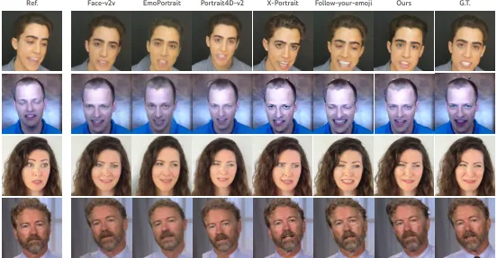
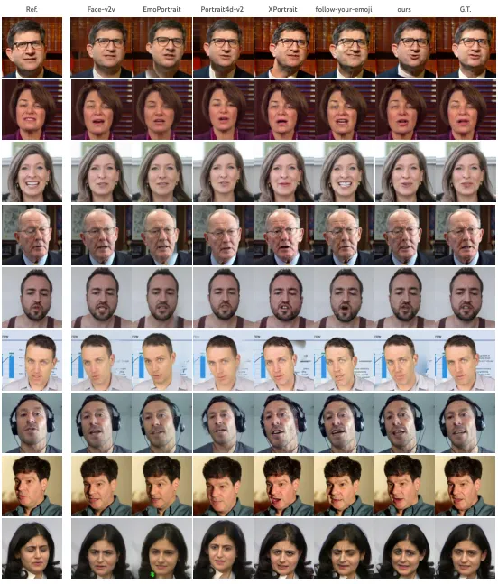
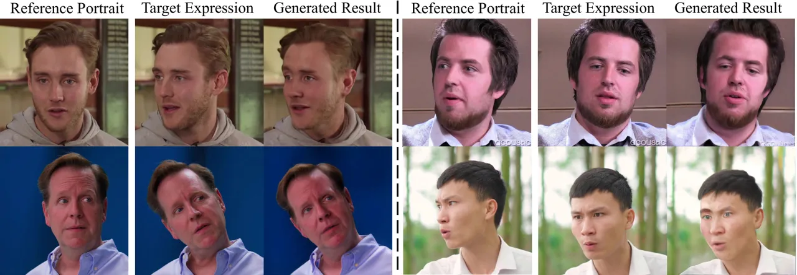
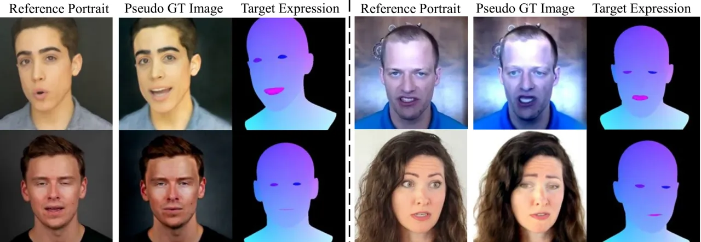
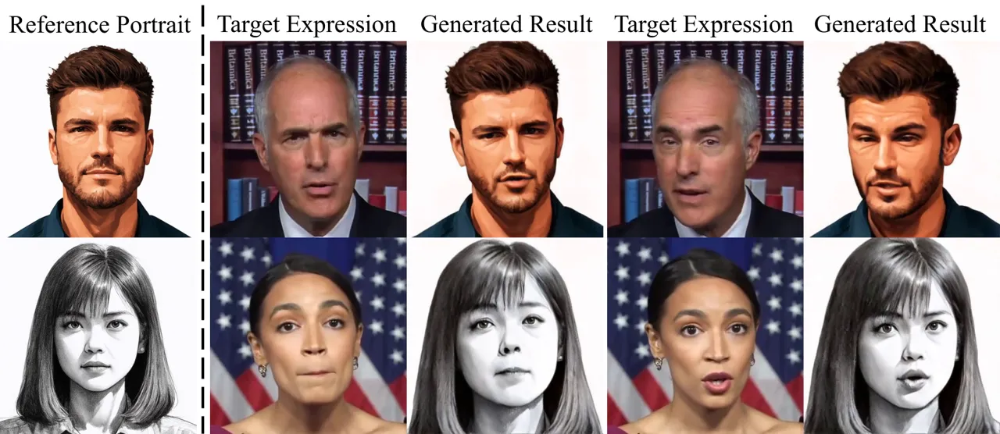

# IM-Portrait: Learning 3D-aware Video Diffusion for Photorealistic Talking Heads from Monocular Videos

Yuan Li⁴⁴ 4 Work was conducted while Yuan Li was an intern at Google.
Affiliation: State Key Lab of CAD&CG, Zhejiang University    Ziqian
Bai¹¹ 1 Authors contributed equally. Affiliation: Google    Feitong Tan
Affiliation: Google    Zhaopeng Cui²² 2 Corresponding authors.
Affiliation: State Key Lab of CAD&CG, Zhejiang University    Sean
Fanello Affiliation: Google    Yinda Zhang²² 2 Corresponding authors.
Affiliation: Google

###### Abstract

We propose a novel 3D-aware diffusion-based method for generating
photorealistic talking head videos directly from a single identity image
and explicit control signals (e.g., expressions). Our method generates
Multiplane Images (MPIs) that ensure geometric consistency, making them
ideal for immersive viewing experiences like binocular videos for VR
headsets. Unlike existing methods that often require a separate stage or
joint optimization to reconstruct a 3D representation (such as NeRF or
3D Gaussians), our approach directly generates the final output through
a single denoising process, eliminating the need for post-processing
steps to render novel views efficiently. To effectively learn from
monocular videos, we introduce a training mechanism that reconstructs
the output MPI randomly in either the target or the reference camera
space. This approach enables the model to simultaneously learn sharp
image details and underlying 3D information. Extensive experiments
demonstrate the effectiveness of our method, which achieves competitive
avatar quality and novel-view rendering capabilities, even without
explicit 3D reconstruction or high-quality multi-view training data.

![[Uncaptioned
image]](arxiv-2504-19165--e548de1e1905.figures/figure-1.webp)

Figure 1: We propose a 3D-aware video diffusion model for talking head
synthesis. Given an image as identity and a sequence of tracking signals
(as shown on the left for each example), our model directly generates
videos in Multiplane Images (MPIs) in a single denoising process, which
is ready for efficient novel-view rendering. This enables immersive
viewing experience, _e.g_. rendering binocular stereo or perspective
distortion in VR headset. Please see our website for more results:
[https://y-u-a-n-l-i.github.io/projects/IM-Portrait/](https://y-u-a-n-l-i.github.io/projects/IM-Portrait/).

## 1 Introduction

Synthesizing realistic talking heads, has been a long-lasting
challenging problem in computer vision for decades. The recent emergence
of diffusion models within the generative AI domain offers a promising
solution to this problem. Significant advancements have been made in
modeling talking heads using image or video diffusion models conditioned
on tracking signals \[46, 31, 14, 30\], leveraging the remarkable
generative capabilities of diffusion models.

Most diffusion-based approaches, however, operate in 2D image space, and
the extension of these methods to 3D rendering remains largely
unexplored. One potential approach involves applying 3D transformations
to the tracking signal, such as parametric models or landmarks. However,
this necessitates running the reverse diffusion process for each new
camera view, leading to significant computational overhead.
Alternatively, some diffusion-based approaches generate multi-view
images, which often lack geometric consistency. While off-the-shelf
methods like NeRF \[13\] or 3D Gaussians can be used to construct a 3D
representation for efficient rendering, the inherent inconsistencies in
the input multi-view images limit the quality of the final 3D
reconstruction, leading to potential issues in multi-view and temporal
consistency.

In this work, we present, for the first time, a diffusion based approach
that produces 3D talking heads that can be rendered efficiently in
varying camera poses. We adopt Multiplane Image (MPI) as the 3D
representation due to its remarkable rendering efficiency and quality,
and the affinity to 2D images such that we can make good use of existing
2D diffusion models. Essentially, we formulate the problem of
synthesizing talking heads images as a denoising diffusion process,
which is conditioned on a reference image (i.e. the subject identity)
and a sequence of control signals from parametric models (i.e.
expressions and head poses). In a single denoising process, our model
generates MPI videos that can be readily rendered in varying camera pose
and support spatial viewing experience.

Our model is learned directly from a large scale monocular talking head
videos in-the-wild. Due to the missing of multi-view datasets, like
previous works, the 3D consistency needs to be learned from the head
pose variability between video frames. To achieve this, it is required
to construct MPIs in a camera that looks at the head from a different
viewpoint than the target images. Specifically, we use the viewpoint of
the reference image to construct MPIs. The estimated target images can
then be rendered from MPIs by moving the camera according to the
relative head pose differences between the reference and target images.
In this way, however, the frontal views of MPIs will be misaligned with
the input noisy images (in our case the target ground-truth images),
which will break the training of the diffusion model. To tackle the
problem, we propose a novel training framework to bootstrap our model to
synthesize pseudo noisy input images that align with the MPIs in
referece cameras. With this, the MPIs are randomly generated from either
the reference camera viewpoint or the target camera viewpoint during the
training, which allows the diffusion model to learn both 3D information
and fine details.

Our contributions are as follows.

- •
  We propose a diffusion-based approach for 3D-aware talking heads
  generation.
- •
  Our diffusion model directly generates 3D renderable talking heads in
  a single denoising process, eliminating the need for post-processing
  steps.
- •
  We propose a novel training framework that enables our model to learn
  from monocular videos, and show how randomly selecting the camera
  viewpoint between reference and target images allows for better
  convergence and sharper results.
- •
  Extensive experiments demonstrate that our method achieves comparable
  or superior image and video quality to existing diffusion-based 2D
  talking head methods, while also offering efficient and consistent
  multi-view rendering on par with specialized (i.e. non-diffusion
  based) 3D approaches.

## 2 Related Works

2D Talking Heads. In recent year, there has been a great advancement on
synthesizing 2D talking heads with neural networks. A recent line of
works \[43, 17, 7, 15, 16, 48, 49, 36\] propose to leverage neural
networks to encode the appearance and motion from input images \[43, 16,
17, 36\] (or explicit control signals \[15, 48, 49\]) to some latent
features or manually defined representations (_e.g_. key-points, warping
fields, texture maps), which are injected into 2D CNN generators with
various architectures for talking head synthesis. More recently, many
works \[46, 31, 14, 30\] started to adopt 2D diffusion models,
leveraging their impressive image quality, for controllable talking head
synthesis. However, these approaches usually use simplified camera
models (_e.g_. orthogonal projection) or they do not have any explicit
camera control, making them unsuitable for spatial viewing experiences
such as binocular stereo and perspective geometry. In addition, these
methods usually do not produce explicit 3D geometry, which also limits
their downstream applications. While most of prior work learns talking
head models from monocular videos which are available in a large scale
in-the-wild, multi-view datasets, _e.g_. from lightstage \[23\], could
be leveraged to further improve fidelity, however such data requires
intensive collection labor and there are no large scale multi-view
datasets that are publicly available.

3D Talking Heads. The problem of generating 3D talking heads has been a
hot topic in the community. People attempted to model their talking
heads with various 3D representations, such as textured mesh \[10, 22\],
Neural Radiance Fields (NeRFs) \[32\] or other implicit functions \[20,
3, 4, 2, 54, 21, 12, 13\], and, more recently, Gaussian Splatting \[11,
35, 34\]. While most of these approaches are person-specific, which
requires to retrain a new model for every new person, some methods \[12,
13\] also explore the potential of person-agnostic models with explicit
3D representations. Despite having good 3D properties, these approaches
cannot easily leverage the recent advancement on 2D diffusion, which
lower the upper bound of their image quality.

Diffusion-based 3D Generative Model. Another line of work, investigates
how to apply diffusion models on 3D representations. The most
straightforward way is applying the standard diffusion process directly
on 3D data \[44, 41\]. However, this requires large scale 3D datasets,
which are generally not available. One typical workaround is to train
the diffusion model with 2D images. Some works \[27, 18, 26, 33, 42\]
firstly learn a latent space of the 3D samples with multiview 2D images,
then apply diffusion on the learned latent space. However, this results
to an additional latent space learning, which is non-trivial thus
increasing the pipeline complexity. Some other works \[37, 1\] directly
model 3D scene distributions with image space diffusion by integrating
the 3D-to-2D rendering into the reverse process. However, these methods
are mostly proposed for static scenes where multiview datasets are
available. In contrast to prior research, our method handles dynamic 3D
talking heads and is trained exclusively on monocular RGB videos from
real-world sources.

## 3 Method

Our goal is to generate 3D talking head videos represented as Multiplane
Images (MPIs), conditioned on a reference image (the subject’s identity)
and a sequence of control signals from a parametric model to determine
expressions and head poses. The generated videos must exhibit high image
quality, controllability, and efficient rendering for VR scenarios,
including binocular consistency.

Given the scarcity of large-scale multi-view video datasets, we design
our training pipeline to operate solely on 2D monocular videos from the
wild. To leverage the power of 2D diffusion models, we formulate our
model as a video diffusion process operating in the image space.
However, this raises two key challenges: 1) How to generate 3D scenes
from a diffusion denoising process defined on 2D observations, without
access to ground-truth MPIs? 2) How to learn 3D information from
monocular 2D videos?

To address the first challenge, we design a video diffusion pipeline
integrated with a differentiable forward rendering model \[37\]
(Sec. 3.2) to directly model 3D scene distributions from 2D monocular
data.

To address the second challenge, a possible approach involves
constructing MPIs of a 3D talking head in the reference image’s camera,
then moving the target camera to render the head in novel views during
training. This allows us to aggregate multi-view observations of the
head from different frames into a consistent 3D space to learn 3D
shapes. To this end, we propose an alternating training strategy that
switches between using the reference and target views as the frontal
camera for MPI construction and compute the loss on target views
accordingly (Sec. 3.3). This approach encourages the network to learn to
synthesize high-quality, sharp images when building the MPIs in target
views and to learn multiview consistency when building it in the
reference view. When MPIs are constructed in the reference camera, the
target ground-truth images cannot be used as input of the diffusion
model, as they are not pixel-aligned with the MPIs. To tackle this, we
bootstrap our model to generate the pseudo ground truth under the
reference camera (Sec. 3.3). During inference, our model generate 3D
scene representations in a single denoising diffusion process without
any post-processing or optimization (Sec. 3.4).

Figure 2: Inference pipeline. Our model is built on the architecture of
Lumiere \[5\], which takes an identity image, 2D noise video, the
sequence of expressions rendered from 3DMM model and first frame image
as input and outputs MPI video sequences. During inference, the network
is conditioned on a reference portrait and takes the last frame of
previously generated clip as the first frame condition. We separate the
network into a color branch and a geometry branch. The two branches
share information by zero convolution \[50\].

### 3.1 Preliminaries

Diffusion Formulation. Denoising diffusion probabilistic models
(DDPM) \[25\] are one kind of generative models that learn to capture a
data distribution $`p_{\theta}(\mathbf{x})`$. The method first
constructs a forward Markovian process $`q(\mathbf{x}_{0:T})`$ to
iteratively add noise to data as:

```math
q(\mathbf{x}_{t}|\mathbf{x}_{t-1})=\mathcal{N}(\mathbf{x}_{t};\sqrt{1-\beta_{t}}\mathbf{x}_{t-1},\beta_{t}\mathbf{I}), \tag{1}
```

where $`\beta_{t}`$ is scheduled to control the amount of noise being
added to data in each step. A denoising diffusion model $`g_{\theta}`$
with parameters $`\theta`$ is trained to iteratively perform the reverse
process $`p_{\theta}(\mathbf{x}_{t-1}|\mathbf{x}_{t})`$ to generate a
data sample $`\mathbf{x}_{0}`$ from a random Gaussian noise
$`\mathbf{x}_{T}`$. If we parameterize the model $`g_{\theta}`$ to
predict the estimated clean data sample
$`\hat{\mathbf{x}}_{t-1}=g_{\theta}(\mathbf{x}_{t},t)\approx\mathbf{x}_{0}`$,
then the reverse process can be written as:

```math
\begin{split}p_{\theta}(\mathbf{x}_{t-1}|\mathbf{x}_{t})&=p_{\theta}(\mathbf{x}_{t-1}|\mathbf{x}_{t},\hat{\mathbf{x}}_{t-1})\\
&=\mathcal{N}(\mathbf{x}_{t-1};\bm{\mu}_{t}(\mathbf{x}_{t},\hat{\mathbf{x}}_{t-1}),\sigma^{2}_{t}\mathbf{I})\end{split} \tag{2}
```

Please find the detailed formulation of $`\bm{\mu}_{t}`$ and
$`\sigma^{2}_{t}`$ in Eq. (7) of DDPM \[25\].

Multiplane Images. We leverage Multiplane Images (MPIs) to represent a
3D scene $`\mathbf{S}`$ (_e.g_. a 3D talking head). An MPI
representation consists of $`D`$ RGBA image planes placed in a reference
3D space defined by an MPI frontal camera $`\phi^{\text{mpi}}`$. These
planes are parallel to the image plane of the frontal camera and equally
spaced in disparity between near $`d_{n}`$ and far $`d_{f}`$ depths from
the camera. During rendering, the planes are firstly warped from the
frontal camera $`\phi^{\text{mpi}}`$ to a target camera
$`\phi^{\text{trgt}}`$ by a homography. The warped planes are then
composited via alpha blending. We also follow Tucker _et al_. \[39\] to
use only two RGB images, one as frontal, the other as residual, during
MPI rendering to set a proper rendering capability of our model.

### 3.2 3D Talking Head Video Diffusion

Unlike previous diffusion-based 2D talking head models  \[46, 31\], our
model aims to generate a sequence of 3D head representations in the form
of an MPI video with $`N`$ frames $`\{\mathbf{S}\}_{N}`$. This is
achieved by conditioning the model on a reference identity image
$`\mathbf{O}^{\text{ref}}`$ and a sequence of control signals
$`\{\mathbf{C}\}_{N}`$, which are the parameters of a mesh-based
parametric head model \[6, 28\], controlling facial expressions and head
pose. Inspired by recent 3D diffusion models \[1, 37\], we propose a
video diffusion framework that generates 3D content (an MPI video)
directly from 2D observations by integrating the MPI rendering into the
denoising process. More specifically, we formulate the forward process
in our avatar diffusion as

```math
q(\mathbf{O}^{\text{mpi}}_{t}|\mathbf{O}^{\text{mpi}}_{t-1})=\mathcal{N}(\mathbf{O}^{\text{mpi}}_{t};\sqrt{1-\beta_{t}}\mathbf{O}^{\text{mpi}}_{t-1},\beta_{t}\mathbf{I}), \tag{3}
```

where $`\mathbf{O}^{\text{mpi}}`$ is the 2D video observed by the MPI
frontal camera $`\phi^{\text{mpi}}`$ defined in Sec. 3.1. Note that we
intentionally formulate the diffusion process on the image space of MPI
frontal camera since it benefits the output quality. Also, we omit the
$`\{.\}_{N}`$ in $`\{\mathbf{O}^{\text{mpi}}\}_{N}`$ for simplicity and
do the same for $`\{\phi^{\text{mpi}}\}_{N}`$, $`\{\mathbf{S}\}_{N}`$
and $`\{\mathbf{C}\}_{N}`$. For the reverse process, instead of directly
predicting the estimated clean 2D video
$`\hat{\mathbf{O}}^{\text{mpi}}_{t-1}`$, we let the denoising model
$`g_{\theta}`$ to predict the MPI video $`\mathbf{S}_{t-1}`$, followed
by the MPI rendering to obtain $`\hat{\mathbf{O}}^{\text{mpi}}_{t-1}`$.
Formally, we have

```math
\displaystyle\mathbf{S}_{t-1} \displaystyle=g_{\theta}(\mathbf{O}^{\text{ref}},\mathbf{O}_{t}^{\text{mpi}};t,\mathbf{C}^{\text{mpi}}) \tag{4}
```

```math
\displaystyle\hat{\mathbf{O}}_{t-1}^{\text{mpi}} \displaystyle=\mathcal{R}(\mathbf{S}_{t-1},\phi^{\text{mpi}}), \tag{5}
```

where $`\mathcal{R}`$ is the MPI rendering function. Here, we rasterize
the control signals $`\mathbf{C}`$ into UV coordinate maps under the MPI
frontal camera $`\phi^{\text{mpi}}`$ to provide a pixel-aligned
condition $`\mathbf{C}^{\text{mpi}}`$. We also convert the meshes of the
parametric model under $`\mathbf{C}`$ into alpha planes and feed them
into the model. In practice, we also concatenate the identity image
$`\mathbf{O}^{\text{ref}}`$ with its corresponding UV coordinate map
rasterized from the reference camera as the model input. Finally, we
plug in the estimated clean 2D video
$`\hat{\mathbf{O}}^{\text{mpi}}_{t-1}`$ to Eq. 2 to perform the reverse
process, which is repeated $`T`$ times to sample the final MPI video
output $`\mathbf{S}_{0}`$. Given a novel side view camera (or
trajectory) $`\phi^{\text{side}}`$, we can simply run the MPI rendering
to obtain the desired video
$`\mathbf{O}^{\text{side}}_{0}=\mathcal{R}(\mathbf{S}_{0},\phi^{\text{side}})`$.

### 3.3 Reference-Target Alternating Training

Figure 3: Illustration of Reference-Target Alternating Training. On the
top branch, we construct MPIs in the target camera and render the
frontal view, where we directly use the ground truth target image to
compute loss Eq. 6 to learn sharp renderings and bootstrap the model. On
the bottom branch, we construct MPIs in the reference camera. We first
rasterize the target control signal (expression) in the reference
camera, then use the bootstrapped model to generate pseudo ground truth
by rendering the frontal view. The pseudo ground truth is added with
noise, serving as the model input to compute loss Eq. 7 for learning 3D
shapes.

Following a similar analysis as Tewari _et al_. \[37\], a
straightforward way to train our model in Sec. 3.2 needs two losses on
videos rendered from two different cameras $`\phi^{\text{mpi}}`$ (the
MPI frontal camera) and $`\phi^{\text{side}}`$ (a novel side view
camera):

```math
\displaystyle\hat{\mathbf{O}}_{t-1}^{\text{side}} \displaystyle=\mathcal{R}(\mathbf{S}_{t-1},\phi^{\text{side}})
```

```math
\displaystyle\mathcal{L}^{\text{mpi}}_{\theta} \displaystyle=\mathbb{E}_{\mathbf{O}^{\text{ref}},\mathbf{O}^{\text{mpi}},\mathbf{C}^{\text{mpi}},t}[\|\mathbf{O}^{\text{mpi}}-\hat{\mathbf{O}}^{\text{mpi}}_{t-1}\|^{2}] \tag{6}
```

```math
\displaystyle\mathcal{L}^{\text{side}}_{\theta} \displaystyle=\mathbb{E}_{\mathbf{O}^{\text{ref}},\mathbf{O}^{\text{mpi}},\mathbf{C}^{\text{mpi}},t,\mathbf{O}^{\text{side}},\phi^{\text{side}}}[\|\mathbf{O}^{\text{side}}-\hat{\mathbf{O}}^{\text{side}}_{t-1}\|^{2}]. \tag{7}
```

Intuitively, the first loss $`\mathcal{L}^{\text{mpi}}_{\theta}`$
encourages the model to give good frontal views of the MPIs, while the
second loss $`\mathcal{L}^{\text{side}}_{\theta}`$ encourages the model
to render good side views from the MPIs, which would be the only
supervision for learning 3D shapes. However, such approach would require
a large scale multiview video dataset, which is not generally available.

In order to enable multi-view supervision when training purely on
monocular 2D videos, a possible approach is to place MPIs in a canonical
space with a fixed head pose, then move the rendering camera to simulate
head pose changes. In this way, the image data representing different
head poses will act as a proxy ground truth for novel camera views to
provide multi-view supervision. Therefore, we could separately compute
loss $`\mathcal{L}^{\text{mpi}}_{\theta}`$ Eq. 6 and loss
$`\mathcal{L}^{\text{side}}_{\theta}`$ Eq. 7 with only monocular 2D
videos by using two different MPI setups as shown in Fig. 3. More
specifically, when computing the first loss
$`\mathcal{L}^{\text{mpi}}_{\theta}`$, we would set the MPI frontal
cameras $`\phi^{\text{mpi}}`$ as the target image camera and use the
target image as the frontal view ground truth
$`\mathbf{O}^{\text{mpi}}`$. Similarly, when computing the second loss
$`\mathcal{L}^{\text{side}}_{\theta}`$, we would set the MPI frontal
cameras $`\phi^{\text{mpi}}`$ to the reference image camera and use the
target image as the side view ground truth $`\mathbf{O}^{\text{side}}`$.

However, the above strategy only satisfies the ground truth requirements
of the two losses, but does not consider the model input. Indeed, when
computing the second loss $`\mathcal{L}^{\text{side}}_{\theta}`$ Eq. 7,
where the MPI frontal cameras $`\phi^{\text{mpi}}`$ are set to the
reference camera, the training video frames are used as the ground truth
to supervise the side view of MPIs. However these frames cannot be used
as input of the diffusion model, as they are no longer pixel-aligned
with the MPIs, which are constructed using the reference camera in this
setting. To tackle this problem, we propose a bootstrapping training
strategy that allows our model to generate the pseudo ground truth under
the reference camera by itself.

Bootstrapping. In order to bootstrap our model for generating pseudo
ground truth under the reference camera, we firstly train our model
$`g_{\theta}(.)`$ with only the loss
$`\mathcal{L}^{\text{mpi}}_{\theta}`$ Eq. 6 (_i.e_. setting the MPI
frontal cameras $`\phi^{\text{mpi}}`$ to the target camera). In this
way, the model learns to generate plausible frontal views rendered from
MPIs.

With this bootstrapping, we can then enable the second loss
$`\mathcal{L}^{\text{side}}_{\theta}`$ Eq. 7 to learn 3D structures of
the MPIs. More specifically, we first set the MPI frontal cameras
$`\phi^{\text{mpi}}`$ to the reference camera, then run the diffusion
sampling with $`k`$ steps to generate the output MPI video
$`\mathbf{S}_{k}`$, and render the frontal view to get images
$`\hat{\mathbf{O}}_{k}^{\text{mpi}}`$. Since the model has been trained
to give plausible frontal views, the rendered images
$`\hat{\mathbf{O}}_{k}^{\text{mpi}}`$ will have a reasonable quality,
acting as the pseudo ground truth under the reference camera. Thus we
can add noise to $`\hat{\mathbf{O}}_{k}^{\text{mpi}}`$ to obtain the
model input $`\mathbf{O}_{t}^{\text{mpi}}`$ when computing the second
loss $`\mathcal{L}^{\text{side}}_{\theta}`$ Eq. 7 to train our model for
learning 3D shapes inside MPIs.

Late-stage Noise Sampling. When training with the second loss
$`\mathcal{L}^{\text{side}}_{\theta}`$ Eq. 7, we compute the model input
from the pseudo ground truth $`\hat{\mathbf{O}}_{k}^{\text{mpi}}`$,
which cannot perfectly match the real image distribution. Such
distribution mismatch could harm the model learning and subsequently
lead to blurry results. To mitigate this negative influence, when
training with loss $`\mathcal{L}^{\text{side}}_{\theta}`$ Eq. 7, we only
sample $`t`$ from the second half of the forward Markovian process
$`[T/2,T]`$ so that the added noise is relatively large thus has a
better chance to hide the distribution mismatch.

|                          |                   |                      |                    |                    |                   |                      |                    |                    |                         |
| ------------------------ | ----------------- | -------------------- | ------------------ | ------------------ | ----------------- | -------------------- | ------------------ | ------------------ | ----------------------- |
| Method                   | HDTF              |                      |                    |                    | Talkinghead1kh    |                      |                    |                    | Novel View Render Speed |
|                          | L1 $`\downarrow`$ | LPIPS $`\downarrow`$ | FID $`\downarrow`$ | FVD $`\downarrow`$ | L1 $`\downarrow`$ | LPIPS $`\downarrow`$ | FID $`\downarrow`$ | FVD $`\downarrow`$ |                         |
| Face-V2V \[43\]          | 0.029             | 0.132                | 20.57              | 78.11              | 0.040             | 0.186                | 30.52              | 141.02             | 22 FPS in $`256^{2}`$   |
| EmoPortrait \[17\]       | 0.039             | 0.189                | 24.77              | 140.51             | 0.058             | 0.252                | 41.08              | 280.22             | 7 FPS in $`512^{2}`$    |
| Portrait4d-v2 \[13\]     | -                 | -                    | 25.74              | 139.11             | -                 | -                    | 37.38              | 227.32             | 10 FPS in $`512^{2}`$   |
| Follow-your-emoji \[31\] | 0.035             | 0.115                | 16.09              | 117.54             | 0.047             | 0.159                | 19.37              | 209.91             | 0.5FPS\* in $`512^{2}`$ |
| X-Portrait \[46\]        | 0.034             | 0.119                | 15.66              | 132.90             | 0.045             | 0.164                | 19.86              | 183.05             | 0.1FPS\* in $`512^{2}`$ |
| Ours                     | 0.031             | 0.118                | 15.93              | 69.04              | 0.045             | 0.180                | 27.83              | 135.12             | 109 FPS in $`512^{2}`$  |
| Ours w/o residual        | 0.030             | 0.116                | 14.76              | 65.75              | 0.044             | 0.174                | 28.19              | 127.11             | 109 FPS in $`512^{2}`$  |
| Ours w/o late-stage      | 0.031             | 0.123                | 16.70              | 70.69              | 0.045             | 0.180                | 29.86              | 136.07             | 109 FPS in $`512^{2}`$  |

Table 1: Quantitative comparison and ablation study. We compare our
method with previous work on both HDTF and Talkinghead1kh datasets. Our
method achieves comparable image quality (L1, LPIPS, FID) and the best
video quality (FVD) and novel-view rendering efficiency overall.
Compared to ablation cases, the averaged metrics are close, and we
highlight the actual huge gaps in perceived image, geometry, and side
view rendering quality in Fig. 7 and Fig. 6. All the render speeds are
tested on a single Nvidia A100 GPU. \*We report the generation speeds of
diffusion models for Follow-your-emoji \[31\] and X-Portrait \[46\], as
they do not support explicit camera control.

Loss Functions. During training, we composite the MPIs and a background
image calculated from the reference portrait $`\mathbf{O}^{\text{ref}}`$
with alpha blending to get the foreground renderings and the full image
renderings. Using pre-computed foreground masks of the data videos, we
calculate the standard L2 losses Eq. 6 and Eq. 7 on both the foreground
renderings and the full image renderings. Following Tewari _et
al_. \[37\], we additionally adopt several regularization losses besides
the standard L2 losses Eq. 6 and Eq. 7. The regularization losses
include: 1) A LPIPS perceptual loss $`\mathcal{L}_{\text{lpips}}`$ for
foreground renderings; 2) A mask loss $`\mathcal{L}_{\text{mask}}`$ to
supervise the rendered alpha mask; 3) An edge-aware depth smoothing loss
and a disparity loss following Tucker _et al_. \[39\] to further
supervise the underlying geometry, where we use the disparity maps
rendered from the parametric model as pesudo ground truth for disparity
loss.

### 3.4 Run-time Inference

When generating a 3D talking head from a driving video, we set the MPI
frontal cameras $`\phi^{\text{mpi}}`$ to the driving video. In order to
generate long video sequence and smooth the discontinuity between
adjacent video clips, we input ground truth first frame to the model in
a similar way as Lumiere \[5\] with random drop during training. During
inference, we take the last frame from the previous clip as the first
frame of next clip. The generated first frame is then dropped due to
overlapping when concatenating two adjacent clips.



Figure 4: Talking head results. We show results from previous work and
our method. Our method generates results with sharp appearance and
closely aligned expression with the ground truth. Note Portrait4d-v2
uses a customized camera space which is non-trivial to render GT camera
aligned images.

## 4 Experiments

In this section, we evaluate our method by comparing with prior arts on
talking heads image quality, temporal quality, multi-view consistency,
and computational efficiency. We also conduct qualitative comparisons
and ablation studies.

Implementation Details. We train our model on a self-collected dataset
consisting of 35k in-the-wild talking head monocular videos. Each video
has a length between 4 to 6 seconds, and we crop the face region in
$`512\times 512`$ for training. Our model generates MPI video with 32
frames in a single network forwarding, and each MPI consists of 24
planes. We dynamically set the near and far planes based on the distance
between the 3DMM head joint and the camera position. We optimize our
model end-to-end on 8 NVIDIA H100 GPUs with a batch size of 8. During
inference, we use DDIM sampling and do classifier-free guidance on
first-frame and reference portrait with two scales \[8\]. The guidance
scale for the reference portrait is set to 1.5, while the guidance scale
for the first frame is linearly reduced from 1 to 0 between frames 1 and 16. For the remaining 16 frames, the guidance scale for the first frame
is fixed at 0.

Benchmark. We perform our qualitative comparison on two widely used
public talking-head datasets, Talkinghead1kh \[43\] and HDTF \[52\]
datasets. For HDTF dataset, we randomly sample video clips from 100
identities and each video clip consists of 180 frames. For
Talkinghead1kh dataset, we randomly sample two 180-frame video clip from
all evaluation identities. During testing, the first frame of each video
clip is chosen as reference portrait $`\mathbf{O}^{\text{src}}`$ and all
the animations are performed in a self-reenactment way. Cross-identity
driving results are provided in the supp.

Baselines. We compare our method with existing one-shot photoreal
talking heads approaches trained from monocular videos in the wild.
Specifically, we compare with representatives for three families of
approaches: 1) Feed-forward models (_e.g_. Face-V2V \[43\] and
EmoPortrait \[17\]). These methods do not use diffusion model but
directly build 3D implicit feature volumes (as appearance) driven by
warping fields (as expression). These methods are often optimized for
the controllability in 2D space, but not the generation quality or 3D
consistency. 2) 3D NeRF-based one-shot talking heads (_e.g_.
Portrait4D-v2 \[12\]), which establish the standard for 3D consistency
due to the use of native 3D representation. 3) Video diffusion based
methods (_e.g_. follow-your-emoji  \[31\] and xportrait \[46\]), which
tend to be particularly strong on the quality of the generated images or
videos. We perform all the evaluations on 512x512 resolution since most
of the baselines outputs results at it, except Face-V2V for which we
upsample its outputs to the desired resolution.

### 4.1 Appearance and Motion Quality

Following prior works, we compare image quality with L1, LPIPS \[51\]
and FID score \[24\] and video quality, a combination of images and
motions, using FVD score \[40\]. Note that L1 and LPIPS are not
available for Portrait4D-v2 due to misalignments between its outputs and
ground truth.

Quantitative results are shown in Tab. 1. While the ranking based on
different metrics varies, our method remains competitive among the
state-of-the-art. Particularly, our model consistently achieves the best
FVD on both datasets indicating our overall best video quality, taking
into consideration both image quality and motion naturalness. This also
indicates that a native video diffusion model is stronger than a
finetuned image diffusion with added temporal component (like X-Portrait
\[46\] and Follow-your-emoji \[31\]).

We also show qualitative results in Fig. 4. Face-V2V \[43\] gives stable
results and follows the input identity, but produces less details due to
its low output resolution. EmoPortrait \[17\] gives sharper results, but
suffers from larger identity shifts. Portrait4D-v2 \[13\] produces good
sharpness and less identity shifts, however relatively stiff
expressions. The diffusion-based methods Follow-your-emoji  \[31\] and
X-portrait \[46\] render good high-frequency details, but do not
precisely follow the input head poses or expressions. In contrast, our
method gives good image quality, faithful identity, while follows the
input control signal.

Figure 5: Binocular stereo and perspective effects. Our method generates
MPI videos that enables efficient spatial rendering, _e.g_. binocular
stereo and perspective effects. We render stereo pairs and calculate a
disparity using RAFT-Stereo \[29\] to visualize the perceived geometry.
To demonstrate perspective effects, we render a view with camera moving
closer to the subject. Our method renders visually plausible and
comparable 3D effects with NeRF based approach like Portrait4d-v2, while
being orders of magnitude faster.

### 4.2 Effectiveness for 3D Rendering

We evaluate the effectiveness on 3D of different methods from the
following aspects. First, we consider the task of binocular stereo
rendering, which is one of the foundational use cases for VR/AR
applications. Also, we compare how well these approaches perform on
perspective geometry by moving the camera closer.

Note that Face-V2V \[43\] and EmoPortrait \[17\] use orthogonal
projection as a simplified camera model, thus they cannot produce any
reasonable renderings for stereo pairs (_i.e_. two views will have the
same disparity across the whole image) and moving camera closer (_i.e_.
getting identical renderings). Follow-your-emoji  \[31\] and
X-xportrait \[46\] only use detected landmarks and images as the driving
signal but do not allow any explicit control on the camera, thus they
cannot perform these two 3D tasks neither. As a result, we only show the
renderings from Portrait4D-v2 \[13\] and ours, where truth 3D rendering
is supported.

Binocular Stereo Rendering. We render stereo pairs with a $`5`$cm
baseline looking from $`1`$m in front of the talking head, and run an
off-the-shell stereo matching method \[29\] to get the disparity map. In
Fig. 5, ours gives stereo pairs with reasonable estimated disparities,
and is competitive with the NeRF-based Portrait4D-v2 \[13\], which acts
as a strong baseline on 3D effects, while being one order of magnitude
faster in novel view rendering (Tab. 1).

Perspective Geometry. To demonstrate the perspective effect, we render a
close view by moving the camera closer while reducing camera focal
length to keep the whole head in view. As in Fig. 5, ours produces good
perspective distortions that is comparable to the NeRF-based
Portrait4D-v2 \[13\], while being more faithful to the reference
identity shown in Fig. 4 second row.

### 4.3 Ablation

MPI as representation. Our diffusion model generates MPI frames, where
each of them has a frontal, a residual, and a set of planes with alpha.
While the frontal contains most of the appearance, we hereby evaluate
the importance of the residual image. We train our model producing a MPI
with only a frontal image, and reuse it for all the planes for alpha
composition. While the metrics on frontal view become even stronger
compared to the full model (1 (Ours w/o residual)), the model produces
much worse geometry (Fig. 6), presumable due to the missing of capacity
of handling view dependent effects. It also leads to obvious blurriness
in the boundary when rendering from the side view.

A further degenerated case is to use a RGB image and depth for
novel-view rendering, and please check our supp for more comparison.

Figure 6: Effect of residual RGB. We retrain our model with only a
single frontal image in the MPI. We show both the rendered side view
images and the disparity converted from the MPI alpha in frontal view.
We found this significantly reduces the capacity of MPI, which leads to
noisy and irregular geometry and blatant blurriness near the occlusion
boundaries.

Late-stage noise sampling. Late-stage noise sampling is also important
to learn sharp images since that significantly reduces the negative
impact from the imperfect pseudo ground truth. To verify this, we train
a model with full noise sampling, and show the quantitative and
qualitative comparison in Tab. 1 and Fig. 7. Without large noise
sampling, the diffusion model still produces reasonable structure but
missing details, e.g. wrinkles, mold, hair strand.

Figure 7: Effect of Late-stage noise sampling. We show a comparison
between our model trained with and without the Late-stage noise
sampling. Training with regular noise sampling leads to excessive
blurriness and lost of details.

## 5 Conclusion

We present a method to learn a 3D-aware video diffusion model, which
generates photorealistic talking head multiplane images given an
identity reference image and a sequence of tracking signals. We show
such a model can be learned directly from large scale monocular videos
without multi-view datasets. With appropriate learning strategies, both
3D information and high quality image generation can be learned
concurrently. Extensive experiments show that, our method generates not
only talking head video with quality comparable and even better than
existing arts but also 3D rendering efficiently that support spatial
viewing experience, like in VR headset. As limitations, the generated
talking head video does not support rendering from excessive camera
viewpoint changes, which is a common issue of the MPI representation.
Extending our framework with other efficient 3D representations or
enhancing training with multi-view dataset could be a promising
direction to improve both the image and 3D quality.

## References

- \[1\] Titas Anciukevičius, Zexiang Xu, Matthew Fisher, Paul Henderson,
  Hakan Bilen, Niloy J Mitra, and Paul Guerrero. Renderdiffusion: Image
  diffusion for 3d reconstruction, inpainting and generation. In
  _Proceedings of the IEEE/CVF conference on computer vision and pattern
  recognition_, pages 12608–12618, 2023.
- \[2\] ShahRukh Athar, Zexiang Xu, Kalyan Sunkavalli, Eli Shechtman,
  and Zhixin Shu. Rignerf: Fully controllable neural 3d portraits. In
  _Proceedings of the IEEE/CVF conference on Computer Vision and Pattern
  Recognition_, pages 20364–20373, 2022.
- \[3\] Ziqian Bai, Feitong Tan, Zeng Huang, Kripasindhu Sarkar, Danhang
  Tang, Di Qiu, Abhimitra Meka, Ruofei Du, Mingsong Dou, Sergio
  Orts-Escolano, et al. Learning personalized high quality volumetric
  head avatars from monocular rgb videos. In _Proceedings of the
  IEEE/CVF Conference on Computer Vision and Pattern Recognition_, pages
  16890–16900, 2023.
- \[4\] Ziqian Bai, Feitong Tan, Sean Fanello, Rohit Pandey, Mingsong
  Dou, Shichen Liu, Ping Tan, and Yinda Zhang. Efficient 3d implicit
  head avatar with mesh-anchored hash table blendshapes. In _Proceedings
  of the IEEE/CVF Conference on Computer Vision and Pattern
  Recognition_, pages 1975–1984, 2024.
- \[5\] Omer Bar-Tal, Hila Chefer, Omer Tov, Charles Herrmann, Roni
  Paiss, Shiran Zada, Ariel Ephrat, Junhwa Hur, Guanghui Liu, Amit Raj,
  et al. Lumiere: A space-time diffusion model for video generation.
  _arXiv preprint arXiv:2401.12945_, 2024.
- \[6\] Volker Blanz and Thomas Vetter. A morphable model for the
  synthesis of 3d faces. In _Seminal Graphics Papers: Pushing the
  Boundaries, Volume 2_, pages 157–164. 2023.
- \[7\] Stella Bounareli, Christos Tzelepis, Vasileios Argyriou, Ioannis
  Patras, and Georgios Tzimiropoulos. Hyperreenact: One-shot reenactment
  via jointly learning to refine and retarget faces. In _Proceedings of
  the IEEE/CVF International Conference on Computer Vision
  (ICCV)_, 2023.
- \[8\] Tim Brooks, Aleksander Holynski, and Alexei A Efros.
  Instructpix2pix: Learning to follow image editing instructions. In
  _Proceedings of the IEEE/CVF Conference on Computer Vision and Pattern
  Recognition_, pages 18392–18402, 2023.
- \[9\] Di Chang, Yichun Shi, Quankai Gao, Hongyi Xu, Jessica Fu,
  Guoxian Song, Qing Yan, Yizhe Zhu, Xiao Yang, and Mohammad Soleymani.
  Magicpose: Realistic human poses and facial expressions retargeting
  with identity-aware diffusion. In _ICML_, 2024.
- \[10\] Bindita Chaudhuri, Noranart Vesdapunt, Linda Shapiro, and
  Baoyuan Wang. Personalized face modeling for improved face
  reconstruction and motion retargeting. In _Computer Vision–ECCV 2020:
  16th European Conference, Glasgow, UK, August 23–28, 2020,
  Proceedings, Part V 16_, pages 142–160. Springer, 2020.
- \[11\] Yufan Chen, Lizhen Wang, Qijing Li, Hongjiang Xiao, Shengping
  Zhang, Hongxun Yao, and Yebin Liu. Monogaussianavatar: Monocular
  gaussian point-based head avatar. In _ACM SIGGRAPH 2024 Conference
  Papers_, pages 1–9, 2024.
- \[12\] Yu Deng, Duomin Wang, and Baoyuan Wang. Portrait4d-v2: Pseudo
  multi-view data creates better 4d head synthesizer. _arXiv preprint
  arXiv:2403.13570_, 2024a.
- \[13\] Yu Deng, Duomin Wang, and baoyuan Wang. Portrait4d-v2: Pseudo
  multi-view data creates better 4d head synthesizer. _arXiv_, 2024b.
- \[14\] Zheng Ding, Xuaner Zhang, Zhihao Xia, Lars Jebe, Zhuowen Tu,
  and Xiuming Zhang. Diffusionrig: Learning personalized priors for
  facial appearance editing. In _Proceedings of the IEEE/CVF Conference
  on Computer Vision and Pattern Recognition_, pages 12736–12746, 2023.
- \[15\] Michail Christos Doukas, Stefanos Zafeiriou, and Viktoriia
  Sharmanska. Headgan: One-shot neural head synthesis and editing. In
  _Proceedings of the IEEE/CVF International conference on Computer
  Vision_, pages 14398–14407, 2021.
- \[16\] Nikita Drobyshev, Jenya Chelishev, Taras Khakhulin, Aleksei
  Ivakhnenko, Victor Lempitsky, and Egor Zakharov. Megaportraits:
  One-shot megapixel neural head avatars. In _Proceedings of the 30th
  ACM International Conference on Multimedia_, pages 2663–2671, 2022.
- \[17\] Nikita Drobyshev, Antoni Bigata Casademunt, Konstantinos
  Vougioukas, Zoe Landgraf, Stavros Petridis, and Maja Pantic.
  Emoportraits: Emotion-enhanced multimodal one-shot head avatars. In
  _Proceedings of the IEEE/CVF Conference on Computer Vision and Pattern
  Recognition_, pages 8498–8507, 2024.
- \[18\] Emilien Dupont, Hyunjik Kim, SM Eslami, Danilo Rezende, and Dan
  Rosenbaum. From data to functa: Your data point is a function and you
  can treat it like one. _arXiv preprint arXiv:2201.12204_, 2022.
- \[19\] Patrick Esser, Sumith Kulal, Andreas Blattmann, Rahim Entezari,
  Jonas Müller, Harry Saini, Yam Levi, Dominik Lorenz, Axel Sauer,
  Frederic Boesel, et al. Scaling rectified flow transformers for
  high-resolution image synthesis. In _Forty-first international
  conference on machine learning_, 2024.
- \[20\] Guy Gafni, Justus Thies, Michael Zollhofer, and Matthias
  Nießner. Dynamic neural radiance fields for monocular 4d facial avatar
  reconstruction. In _Proceedings of the IEEE/CVF Conference on Computer
  Vision and Pattern Recognition_, pages 8649–8658, 2021.
- \[21\] Xuan Gao, Chenglai Zhong, Jun Xiang, Yang Hong, Yudong Guo, and
  Juyong Zhang. Reconstructing personalized semantic facial nerf models
  from monocular video. _ACM Transactions on Graphics (TOG)_,
  41(6):1–12, 2022.
- \[22\] Philip-William Grassal, Malte Prinzler, Titus Leistner, Carsten
  Rother, Matthias Nießner, and Justus Thies. Neural head avatars from
  monocular rgb videos. In _Proceedings of the IEEE/CVF Conference on
  Computer Vision and Pattern Recognition_, pages 18653–18664, 2022.
- \[23\] Jianzhu Guo, Dingyun Zhang, Xiaoqiang Liu, Zhizhou Zhong, Yuan
  Zhang, Pengfei Wan, and Di Zhang. Liveportrait: Efficient portrait
  animation with stitching and retargeting control. _arXiv preprint
  arXiv:2407.03168_, 2024.
- \[24\] Martin Heusel, Hubert Ramsauer, Thomas Unterthiner, Bernhard
  Nessler, and Sepp Hochreiter. Gans trained by a two time-scale update
  rule converge to a local nash equilibrium. _Advances in neural
  information processing systems_, 30, 2017.
- \[25\] Jonathan Ho, Ajay Jain, and Pieter Abbeel. Denoising diffusion
  probabilistic models. _Advances in neural information processing
  systems_, 33:6840–6851, 2020.
- \[26\] Heewoo Jun and Alex Nichol. Shap-e: Generating conditional 3d
  implicit functions. _arXiv preprint arXiv:2305.02463_, 2023.
- \[27\] Yushi Lan, Fangzhou Hong, Shuai Yang, Shangchen Zhou, Xuyi
  Meng, Bo Dai, Xingang Pan, and Chen Change Loy. Ln3diff: Scalable
  latent neural fields diffusion for speedy 3d generation. In _European
  Conference on Computer Vision_, pages 112–130. Springer, 2025.
- \[28\] Tianye Li, Timo Bolkart, Michael J Black, Hao Li, and Javier
  Romero. Learning a model of facial shape and expression from 4d scans.
  _ACM Trans. Graph._, 36(6):194–1, 2017.
- \[29\] Lahav Lipson, Zachary Teed, and Jia Deng. Raft-stereo:
  Multilevel recurrent field transforms for stereo matching. In _2021
  International Conference on 3D Vision (3DV)_, pages 218–227.
  IEEE, 2021.
- \[30\] Tao Liu, Chenpeng Du, Shuai Fan, Feilong Chen, and Kai Yu.
  Diffdub: Person-generic visual dubbing using inpainting renderer with
  diffusion auto-encoder. In _ICASSP 2024-2024 IEEE International
  Conference on Acoustics, Speech and Signal Processing (ICASSP)_, pages
  3630–3634. IEEE, 2024.
- \[31\] Yue Ma, Hongyu Liu, Hongfa Wang, Heng Pan, Yingqing He, Junkun
  Yuan, Ailing Zeng, Chengfei Cai, Heung-Yeung Shum, Wei Liu, et al.
  Follow-your-emoji: Fine-controllable and expressive freestyle portrait
  animation. _arXiv preprint arXiv:2406.01900_, 2024.
- \[32\] Ben Mildenhall, Pratul P Srinivasan, Matthew Tancik, Jonathan T
  Barron, Ravi Ramamoorthi, and Ren Ng. Nerf: Representing scenes as
  neural radiance fields for view synthesis. _Communications of the
  ACM_, 65(1):99–106, 2021.
- \[33\] Norman Müller, Yawar Siddiqui, Lorenzo Porzi, Samuel Rota Bulo,
  Peter Kontschieder, and Matthias Nießner. Diffrf: Rendering-guided 3d
  radiance field diffusion. In _Proceedings of the IEEE/CVF Conference
  on Computer Vision and Pattern Recognition_, pages 4328–4338, 2023.
- \[34\] Shenhan Qian, Tobias Kirschstein, Liam Schoneveld, Davide
  Davoli, Simon Giebenhain, and Matthias Nießner. Gaussianavatars:
  Photorealistic head avatars with rigged 3d gaussians. In _Proceedings
  of the IEEE/CVF Conference on Computer Vision and Pattern
  Recognition_, pages 20299–20309, 2024.
- \[35\] Shunsuke Saito, Gabriel Schwartz, Tomas Simon, Junxuan Li, and
  Giljoo Nam. Relightable gaussian codec avatars. In _Proceedings of the
  IEEE/CVF Conference on Computer Vision and Pattern Recognition_, pages
  130–141, 2024.
- \[36\] Aliaksandr Siarohin, Stéphane Lathuilière, Sergey Tulyakov,
  Elisa Ricci, and Nicu Sebe. First order motion model for image
  animation. _Advances in neural information processing systems_,
  32, 2019.
- \[37\] Ayush Tewari, Tianwei Yin, George Cazenavette, Semon Rezchikov,
  Josh Tenenbaum, Frédo Durand, Bill Freeman, and Vincent Sitzmann.
  Diffusion with forward models: Solving stochastic inverse problems
  without direct supervision. _Advances in Neural Information Processing
  Systems_, 36:12349–12362, 2023.
- \[38\] Alex Trevithick, Matthew Chan, Michael Stengel, Eric R. Chan,
  Chao Liu, Zhiding Yu, Sameh Khamis, Manmohan Chandraker, Ravi
  Ramamoorthi, and Koki Nagano. Real-time radiance fields for
  single-image portrait view synthesis. In _SIGGRAPH_, 2023.
- \[39\] Richard Tucker and Noah Snavely. Single-view view synthesis
  with multiplane images. In _Proceedings of the IEEE/CVF Conference on
  Computer Vision and Pattern Recognition_, pages 551–560, 2020.
- \[40\] Thomas Unterthiner, Sjoerd Van Steenkiste, Karol Kurach,
  Raphael Marinier, Marcin Michalski, and Sylvain Gelly. Towards
  accurate generative models of video: A new metric & challenges. _arXiv
  preprint arXiv:1812.01717_, 2018.
- \[41\] Arash Vahdat, Francis Williams, Zan Gojcic, Or Litany, Sanja
  Fidler, Karsten Kreis, et al. Lion: Latent point diffusion models for
  3d shape generation. _Advances in Neural Information Processing
  Systems_, 35:10021–10039, 2022.
- \[42\] Tengfei Wang, Bo Zhang, Ting Zhang, Shuyang Gu, Jianmin Bao,
  Tadas Baltrusaitis, Jingjing Shen, Dong Chen, Fang Wen, Qifeng Chen,
  et al. Rodin: A generative model for sculpting 3d digital avatars
  using diffusion. In _Proceedings of the IEEE/CVF conference on
  computer vision and pattern recognition_, pages 4563–4573, 2023.
- \[43\] Ting-Chun Wang, Arun Mallya, and Ming-Yu Liu. One-shot
  free-view neural talking-head synthesis for video conferencing. In
  _Proceedings of the IEEE/CVF conference on computer vision and pattern
  recognition_, pages 10039–10049, 2021.
- \[44\] Zhen Wang, Qiangeng Xu, Feitong Tan, Menglei Chai, Shichen Liu,
  Rohit Pandey, Sean Fanello, Achuta Kadambi, and Yinda Zhang. Mvdd:
  Multi-view depth diffusion models. In _European Conference on Computer
  Vision_, pages 236–253. Springer, 2025.
- \[45\] Liangbin Xie, Xintao Wang, Honglun Zhang, Chao Dong, and Ying
  Shan. Vfhq: A high-quality dataset and benchmark for video face
  super-resolution. In _The IEEE Conference on Computer Vision and
  Pattern Recognition Workshops (CVPRW)_, 2022.
- \[46\] You Xie, Hongyi Xu, Guoxian Song, Chao Wang, Yichun Shi, and
  Linjie Luo. X-portrait: Expressive portrait animation with
  hierarchical motion attention. In _ACM SIGGRAPH 2024 Conference
  Papers_, pages 1–11, 2024.
- \[47\] Lihe Yang, Bingyi Kang, Zilong Huang, Zhen Zhao, Xiaogang Xu,
  Jiashi Feng, and Hengshuang Zhao. Depth anything v2.
  _arXiv:2406.09414_, 2024.
- \[48\] Fei Yin, Yong Zhang, Xiaodong Cun, Mingdeng Cao, Yanbo Fan,
  Xuan Wang, Qingyan Bai, Baoyuan Wu, Jue Wang, and Yujiu Yang.
  Styleheat: One-shot high-resolution editable talking face generation
  via pre-trained stylegan. In _European conference on computer vision_,
  pages 85–101. Springer, 2022.
- \[49\] Egor Zakharov, Aleksei Ivakhnenko, Aliaksandra Shysheya, and
  Victor Lempitsky. Fast bi-layer neural synthesis of one-shot realistic
  head avatars. In _Computer Vision–ECCV 2020: 16th European Conference,
  Glasgow, UK, August 23–28, 2020, Proceedings, Part XII 16_, pages
  524–540. Springer, 2020.
- \[50\] Lvmin Zhang, Anyi Rao, and Maneesh Agrawala. Adding conditional
  control to text-to-image diffusion models. In _Proceedings of the
  IEEE/CVF International Conference on Computer Vision_, pages
  3836–3847, 2023.
- \[51\] Richard Zhang, Phillip Isola, Alexei A Efros, Eli Shechtman,
  and Oliver Wang. The unreasonable effectiveness of deep features as a
  perceptual metric. In _Proceedings of the IEEE conference on computer
  vision and pattern recognition_, pages 586–595, 2018.
- \[52\] Zhimeng Zhang, Lincheng Li, Yu Ding, and Changjie Fan.
  Flow-guided one-shot talking face generation with a high-resolution
  audio-visual dataset. In _Proceedings of the IEEE/CVF Conference on
  Computer Vision and Pattern Recognition_, pages 3661–3670, 2021.
- \[53\] Xiaoming Zhao, Fangchang Ma, David Güera, Zhile Ren,
  Alexander G Schwing, and Alex Colburn. Generative multiplane images:
  Making a 2d gan 3d-aware. In _European conference on computer vision_,
  pages 18–35. Springer, 2022.
- \[54\] Wojciech Zielonka, Timo Bolkart, and Justus Thies. Instant
  volumetric head avatars. In _Proceedings of the IEEE/CVF Conference on
  Computer Vision and Pattern Recognition_, pages 4574–4584, 2023.

Supplementary Material

In this supplementary material, we provide more information about
implementation details (Sec. A) and additional results, including more
qualitative and quantitative comparisons with other methods (Sec. B,
Sec. C, Sec. D), evaluations on out-of-distribution data (Sec. E),
evaluations on pseudo ground truth images (Sec. F), evaluations on side
view renderings (Sec. G) and comparison with “2D diffusion + depth”
(Sec. H). Additionally, we add further discussions on limitations
(Sec. I). We also provide a project page containing video results, as
well as stereo videos that can be viewed using a smart phone with Google
Cardboard.

## A Implementation Details

#### Network Architecture

We build our model architecture based on Space-Time U-Net \[5\]. We
first downsample $`512\times 512`$ images into $`128\times 128`$ feature
maps using one convolution layer. Then the feature map is downsampled
into $`64\times 64`$ by another convolution layer. In the color branch,
both downsample blocks and upsample blocks consist of 2
Convolution-based Inflation blocks for resolution 64 and 3
Convolution-based Inflation blocks for resolution 32 and 16. We also add
spatial and temporal self-attention layers inside each block with
resolution 16. In the geometry branch, each resolution only has one
Convolution-based Inflation block. We apply cross-attention layers
between the source image features and every block with 32 resolution in
the color branch. The output feature map is firstly upsampled by pixel
shuffle from $`64\times 64`$ into $`128\times 128`$ and processed by a
convolution layer. In the color branch, the result $`128\times 128`$
feature map is then upsampled into outputs of $`512\times 512`$ by
another pixel shuffle and convolution layer. In the geometry branch,
$`128\times 128`$ feature map is firstly upsampled into
$`256\times 256`$ and then upsampled into $`512\times 512`$ by pixel
shuffle and convolutions. The color branch predicts the estimated
frontal/residual RGB image of the Multiplane Images (MPIs), while the
geometry branch predicts alpha images of all planes. Since the geometry
branch does not take reference image as condition, reference image
features are passed through zero-convolutions between the color branch
and the geometry branch.

#### Training Details

In the data preparation stage, the reference and target pair of images
are randomly selected from the video following \[31, 46\], where the
camera poses are obtained through 3DMM fitting.

During the model bootstrapping described in main paper Sec. 3.3, we only
train the color branch with loss $`\mathcal{L}^{\text{mpi}}_{\theta}`$
Eq. (6). After bootstrapping, we freeze the color branch except the
output layer. Then, we train the geometry branch, the output layer of
the color branch, and all the zero convolution layers with both losses
$`\mathcal{L}^{\text{mpi}}_{\theta}`$ Eq. (6) and
$`\mathcal{L}^{\text{side}}_{\theta}`$ Eq. (7). In practice, in each
iteration, we randomly select one loss from the two to compute the
gradients for updating the model. We select the loss
$`\mathcal{L}^{\text{mpi}}_{\theta}`$ (Eq. (6)) with a probability of
0.8, where MPIs are constructed using target cameras. We select the loss
$`\mathcal{L}^{\text{side}}_{\theta}`$ (Eq. (7)) with a probability of
0.2, where MPIs are constructed using reference cameras, and target
cameras serve as side-view cameras.

During training, the weight of LPIPS loss is set to $`0.1`$ while the
mask loss has a weight of $`0.01`$. The mask loss is formulated as L2
loss since the matting mask has soft boundary. The depth smoothing loss
is calculated by a Laplacian kernel and has a weight of $`0.01`$. The
disparity loss has a weight of $`0.001`$. The drop rate of first frame
is $`0.7`$ while the drop rate of the reference portrait is $`0.1`$.

#### Rendering Details

Following  \[53\], we choose Multiplane Images (MPIs) as our scene
representation. We set near and far planes of MPIs adaptively based on
the distance $`r`$ from the MPI frontal camera to the head joint of the
parametric model. We place the near plane at $`r-0.15`$ while the far
plane at $`r+0.05`$.

During inference, we handle camera via two methods: 1) Rendering the
generated MPIs into explicit cameras $`\{\phi^{\text{side}}\}`$; 2)
Rasterizing the 3DMM UV coordinate maps into freely selected MPI frontal
cameras as the diffusion controlling signals $`\{\mathbf{C}\}`$. In our
experiments, all the side view renderings, stereo renderings and
rendering speed measurements are conducted through the first method.
When we render novel views through the first method, novel camera views
must stay within a specifiv range of the MPI frontal camera to avoid
pose deviations affecting rendering.

|                   |                   |                      |                    |                    |                        |                      |                    |                    |
| ----------------- | ----------------- | -------------------- | ------------------ | ------------------ | ---------------------- | -------------------- | ------------------ | ------------------ |
| Method            | VFHQ              |                      |                    |                    | Self-Collected Dataset |                      |                    |                    |
|                   | L1 $`\downarrow`$ | LPIPS $`\downarrow`$ | FID $`\downarrow`$ | FVD $`\downarrow`$ | L1 $`\downarrow`$      | LPIPS $`\downarrow`$ | FID $`\downarrow`$ | FVD $`\downarrow`$ |
| Face-V2V          | 0.051             | 0.290                | 71.58              | 226.42             | 0.050                  | 0.208                | 47.13              | 405.34             |
| EmoPortrait       | 0.064             | 0.251                | 48.96              | 292.01             | 0.071                  | 0.236                | 52.85              | 506.70             |
| Portrait4d-v2     | -                 | -                    | 54.26              | 329.58             | -                      | -                    | 54.46              | 553.42             |
| Follow-your-emoji | 0.057             | 0.198                | 32.40              | 214.29             | 0.060                  | 0.181                | 34.94              | 364.36             |
| X-Portrait        | 0.061             | 0.204                | 26.22              | 211.62             | 0.062                  | 0.185                | 32.77              | 499.67             |
| Ours              | 0.054             | 0.204                | 33.10              | 201.41             | 0.048                  | 0.174                | 36.98              | 342.78             |

Table A: More comparisons on VFHQ and self-collected dataset. We further
compare our method with baselines on both VFHQ and self-collected
dataset. Our method achieves comparable image quality and the best video
quality (FVD), which is consistent with quantitative comparison in the
main paper.

#### Long Video Classifiers-Free-Guidance (CFG)

During inference, we assign two different CFG scales to first frame
condition and reference portrait condition following Brooks _et
al_. \[8\]. The guidance scale of the reference portrait is $`1.5`$. The
guidance scale of the first frame is linearly decreased from $`1.0`$ to
$`0.0`$ from the beginning to the middle of the video clip while the
remaining 16 frames in the clip shares a scale of $`0.0`$.

We show the ablation on first frame’s classifier-free guidance in Fig.A.
We compare our scheduled scale with constant guidance scale of $`1.5`$.
As show in Fig.A, artifacts become more pronounced as additional frames
are generated. However, using our scheduled scale helps prevent the
accumulation of errors.

Figure A: Ablation on first frame’s classifier-free guidance. We compare
the generated results using a constant classifier-free guidance scale
for the first frame versus our scheduled guidance scale.

## B Additional Qualitative Results

We show more qualitative results on HDTF and Talkinghead1kh datasets in
Fig.C. Face-V2V \[43\] shows good consistency against the driving signal
and the reference portrait, while losing details due to its low output
resolution. EmoPortrait \[17\] gives sharp renderings but suffers from
identity shifts. Portrait4D-v2 \[13\] shows better identity consistency,
but losses subtle facial movements. XPortrait \[46\] and
Follow-your-emoji \[31\] generates sharp and high quality frames but
suffers from expression and head pose misalignment against the driving
signal. Our method generates sharp results that faithfully following
driving signals while keeping the identity of generated avatar aligned
with the reference portrait. For more comparisons on video quality,
please refer to our project page in supplementary material.

Before evaluation, we fix the cropping of all the evaluation data with a
tight cropping around head as show in Fig.B.

Figure B: Fixed cropping. We preprocess some portraits with a tighter
cropping around head.



Figure C: Talking head results. We show more results from previous work
and our method.

## C Additional Quantitative Results

We show more qualitative results on VFHQ \[45\] and self-collected
dataset in Tab.A. For VFHQ dataset, we sample the first 100 frames from
all evaluation identities. The self-collected dataset has 50 identities,
while each has 32 frames. Consistent with the other two datasets in the
main paper, ours achieves the best video quality (FVD) while being
competitive in other image-based metrics on VFHQ dataset. On
self-collected dataset, ours achieves the best L1, LPIPS and FVD scores.
The cross-dataset evaluations following \[9\] reinforces the generation
quality and generalizability of our model.

## D Further Explanations on Comparisons

|                   |                   |                   |                   |                   |
| ----------------- | ----------------- | ----------------- | ----------------- | ----------------- |
| Method            | HDTF              |                   | Talkinghead1kh    |                   |
|                   | PSNR $`\uparrow`$ | SSIM $`\uparrow`$ | PSNR $`\uparrow`$ | SSIM $`\uparrow`$ |
| Face-V2V          | 27.00             | 0.865             | 24.17             | 0.823             |
| EmoPortrait       | 22.35             | 0.794             | 19.59             | 0.731             |
| Follow-your-emoji | 24.16             | 0.811             | 21.50             | 0.759             |
| X-Portrait        | 24.54             | 0.820             | 21.82             | 0.767             |
| Ours              | 24.83             | 0.833             | 22.43             | 0.777             |

Table B: PSNR and SSIM on HDTF and Talkinghead1kh datasets. PSNR and
SSIM rankings align with the L1 score rankings in Table 1 of the main
paper.

In Tab.1 in main paper, we report L1 scores instead of PSNR and SSIM, as
these latter metrics are more suitable for pixel-wise alignment in
neural rendering tasks, while LPIPS better aligns with perceptual image
quality and tolerates some misalignment \[38\]. As shown in Tab. B, PSNR
and SSIM closely correlate with L1 scores reported in Tab.1, where our
method performs worse than non-generative methods like Face-V2V but
outperforms others. Due to the generative nature of diffusion models,
our method has slightly lower L1 scores but achieves better LPIPS, as it
tolerates misalignments. As shown in both Tab.1 and Tab.B, while sharing
network capacity for geometry and learning without 3D data results in a
slightly lower FID compared to purely 2D video methods (e.g.,
Follow-your-emoji, X-Portrait), we still achieve competitive results
across all image quality metrics and the best FVD score, which evaluates
both image and temporal quality.

|                          |                    |                    |
| ------------------------ | ------------------ | ------------------ |
| Method                   | FVD $`\downarrow`$ | FID $`\downarrow`$ |
| Face-V2V \[43\]          | 134.92             | 23.29              |
| EmoPortrait \[17\]       | 197.87             | 34.54              |
| Portrait4d-v2 \[13\]     | 185.42             | 28.86              |
| Follow-your-emoji \[31\] | 154.14             | 20.88              |
| X-Portrait \[46\]        | 199.27             | 21.03              |
| Ours                     | 107.90             | 18.00              |

Table C: Evaluation of rendering quality on cross-identity reenactment.



Figure D: Evaluation on large head pose movements. We show generated
results in the MPI frontal camera where the target head poses deviate
largely from reference portrait’s head poses. In the last row, generated
result doesn’t align with ground truth since the reference portrait
doesn’t contain any information about the other side of the character.



Figure E: Evaluation on pseudo ground truth images. We show pseudo
ground truth images used in the Reference-Target Alternating Training.
Pseudo images are only used when large noise is sampled. Though there
exist drifting in the color tone, the global structure of generated
result aligns with target expressions.

## E Evaluation on Out-of-distribution Data



Figure F: Evaluation on synthetic images. We show generated results when
taking synthetic images as reference images. Though trained on a
real-world distribution, our model is able to generalize to synthetic
images even with a huge gap between the color distribution.

We further test our model on out-of-distribution data. Despite trained
on real world talking-head videos, our model still generalizes to
stylized portraits generated by Stable-Diffusion 3 \[19\]. Results are
shown in Fig.F.

We also evaluate our model on large head pose movements between
reference portraits and target expressions through the second method
mentioned in Rendering Details of Sec.A. As shown in Fig.D, our model
generalize to large head pose movements. However, in some extreme cases,
e.g. reference portrait only includes side view of the head, our model
may struggle to generate aligned results with ground truth.

## F Evaluation on Pseudo Ground Truth Images

In Fig.E, we show some examples of pseudo ground truth images mentioned
in Reference-Target Alternating Training section. The generated pseudo
ground truth images aligns with target expressions. Note that the pseudo
images are only used in training when noise is large, so they don’t need
to be sharp and clear as long as the global structure is correct.

## G Evaluation on Side Views

Figure G: Side view rendering comparisons. We annotate rotation
directions by arrows in the ground truth frontal images.

We evaluate our method on side view renderings with HDTF dataset. We
select Face-V2V \[43\], EmoPortrait \[17\], Portrait4D-v2 \[13\] as
baselines since they have 3D representations or implicit 3D feature
volumes that support explicit camera control. On the other hand, the
diffusion-based baselines \[31, 46\] only take in images or eyes and
mouth landmarks, thus do not enable explicit camera control. More
specifically, we render several frames by applying a random horizontal
viewpoint change (rotate the camera around a fixed look-at point)
uniformly sampled from $`\pm 5^{\circ}`$, and compute the FID score. All
the evaluations are performed in a self-reenactment way. The evaluation
results are shown in Tab.D, where our method outperforms all the
baselines on FID score. For more visualizations of our method’s side
view renderings, please refer to the project page in supplementary
material.

|                        |                                 |
| ---------------------- | ------------------------------- |
| Method                 | FID $`\downarrow`$              |
| View Point             | Random within $`\pm 5^{\circ}`$ |
| Face-V2V \[43\]        | 22.27                           |
| EmoPortrait \[17\]     | 27.71                           |
| Portrait4d-v2 \[13\]   | 27.83                           |
| Ours 2D + Depth \[47\] | 19.72                           |
| Ours                   | 18.12                           |

Table D: Evaluation of side view rendering quality. Our method
outperforms all the baseline on rendering quality.

## H Compare With 2D Diffusion and Depth Prediction

We also build up a baseline with the 2D video diffusion variant of our
model and a monocular depth predictor  \[47\] to lift the images into
3D. To be specific, we firstly run depth predictor on all the generated
frames. The predicted monocular depth is then aligned with depth of 3DMM
mesh by calculating scale and shift. Since the 3DMM mesh doesn’t have
hair and cloth geometry, we sample depth values on detected facial
landmarks as inputs for alignment. Before rendering, we first project
aligned depth into 3D then connect 3D points of adjacent pixels to
create triangles. We also use foreground matting mask to filter out
background vertices. During rendering, we use the same background image
used by our method.

We compare our method with this baseline and show FID comparisons in
Tab.D. We also show qualitative comparisons in Fig.G. Using monocular
depth estimator to lift 2D diffusion to 3D suffers from blurry results
in occluded regions. Moreover, this baseline also fails to render
detailed geometry such as hair as shown in the last row of Fig.G.

## I Additional Discussions on Limitations

As discussed in the main paper, our model mainly focuses on realistic
foreground human rendering, while background is generated by an
inpainting network following \[17\]. Thus, the generated results do not
include animation in the background. To achieve more realistic generated
results for background, future works could train an auxiliary network to
animate the inpainted background. Furthermore, as shown in Fig.D, large
self-occlusions in the reference portrait may lead to degraded results
in the unseen facial region. Future work could focus on introducing
facial symmetry priors to mitigate this issue.
