# KeySync: A Robust Approach for Leakage-free Lip Synchronization in High Resolution

Antoni Bigata Affiliation: Imperial College London
Email: <ab4522@imperial.ac.uk>    Rodrigo MiraStella Bounareli
Affiliation: Imperial College London    Michał Stypułkowski
Affiliation: University of Wrocław    Konstantinos Vougioukas
Affiliation: Imperial College London    Stavros Petridis
Affiliation: Imperial College London    Maja Pantic
Affiliation: Imperial College London

###### Abstract

Lip synchronization, known as the task of aligning lip movements in an
existing video with new input audio, is typically framed as a simpler
variant of audio-driven facial animation. However, as well as suffering
from the usual issues in talking head generation (_e.g_., temporal
consistency), lip synchronization presents significant new challenges
such as expression leakage from the input video and facial occlusions,
which can severely impact real-world applications like automated
dubbing, but are often neglected in existing works. To address these
shortcomings, we present KeySync, a two-stage framework that succeeds in
solving the issue of temporal consistency, while also incorporating
solutions for leakage and occlusions using a carefully designed masking
strategy. We show that KeySync achieves state-of-the-art results in lip
reconstruction and cross-synchronization, improving visual quality and
reducing expression leakage according to LipLeak, our novel leakage
metric. Furthermore, we demonstrate the effectiveness of our new masking
approach in handling occlusions and validate our architectural choices
through several ablation studies. Code and model weights can be found at
[https://antonibigata.github.io/KeySync/](https://antonibigata.github.io/KeySync/).

## 1 Introduction

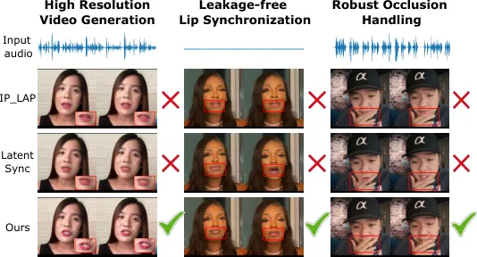

Figure 1: KeySync’s contributions. Unlike existing methods, KeySync
generates high-resolution lip-synced videos that are closely aligned
with the driving audio while minimizing leakage from the input video and
seamlessly handling facial occlusions.

Audio-driven facial animation has recently seen substantial progress
with the introduction of new generative models such as Generative
Adversarial Networks (GANs) \[17, 47, 65\] and diffusion models \[20,
43, 51, 48, 10\]. In contrast, the adjacent field of lip synchronization
(also known as lip-sync) has experienced comparatively slower
advancements \[18, 61, 36\]. This disparity is surprising given that
lip-sync has similar applications, ranging from facilitating
multilingual content production to enhancing virtual avatars \[62, 55\].
A potential reason for this slower progress is that while lip
synchronization may seem like a simpler task than animating the full
face from audio, it presents unique challenges that remain largely
unaddressed.

One of the primary limitations of current methods is their
low-resolution output, typically constrained to 256$`\times`$256, which
has become a de facto standard. While this resolution may be
computationally efficient, it significantly hinders real-world
applicability, where higher resolution outputs are necessary for
practical deployment. Another important limitation is that these methods
struggle to maintain temporal consistency across generated frames. Most
state-of-the-art approaches are frame-based, requiring additional
mechanisms to enforce consistency, while other methods adopt a two-stage
framework, where motion modelling is separated from pixel-level
synthesis \[54, 31, 64\]. However, such decompositions do not inherently
guarantee smooth transitions between frames, as each frame is generated
independently, often leading to temporal discontinuities.

Other approaches attempt to enforce temporal coherence using pre-trained
perceptual models \[29\] or an additional sequence discriminator \[33\].
Nevertheless, these methods offer only indirect control over
frame-to-frame consistency, often resulting in subtle visual artifacts
and unnatural mouth movements that degrade realism and limit practical
usability. Finally, another proposed solution has been to condition
generation on past frames \[3\] to ensure that newly generated frames
remain consistent with previous ones. However, this technique is prone
to error accumulation over long sequences, further degrading temporal
stability.

Beyond temporal consistency, a key but often overlooked issue is
expression leakage, where models inadvertently retain facial expressions
from the original input in the generated video. Regrettably, most
existing works focus excessively on lip synchronization as a
reconstruction task on paired audio-visual data, and neglect the
cross-synchronization scenario, where a non-matching audio clip is used
to re-animate the original video. As a consequence, they typically
exhibit major expression leakage from the original video, severely
degrading the synchronization between the generated video and the input
audio in the latter scenario. Notably, this behaviour jeopardizes the
viability of these models for applications such as automated dubbing,
where the audio and video are naturally mismatched.

To alleviate the issue of expression leakage, different masking
strategies have been devised. Some methods mask only the mouth region
while preserving facial areas such as the jaw and cheeks from the
original videos, potentially leading to leakage since these regions also
convey information about mouth movements \[28, 61\], while others adopt
broader masks that risk discarding important contextual cues \[59, 11\].
Remarkably, the impact of these masking strategies on generalization and
robustness remains largely unexplored, and no consensus exists on the
optimal approach. Lastly, another potential complication lies in
occlusion handling. Most existing models assume an unobstructed view of
the mouth, whereas, in the real world, occlusions caused by hands,
objects, or motion blur are frequent. In practice, this means that the
lack of explicit occlusion-handling mechanisms significantly limits the
applicability of current models.

To address these challenges, we propose KeySync, a two-stage lip
synchronization framework that leverages recent advances in facial
animation \[2\] to generate high-fidelity videos with lip movements that
are temporally consistent and aligned with the input audio. To minimize
leakage from the input video, we devise a masking strategy that
adequately covers the lower face while retaining the necessary
contextual regions. Furthermore, we augment this mask by excluding
facial occlusions using a video segmentation model \[39\], resulting in
a method that can consistently handle occlusions without uncanny visual
hallucinations. Our primary contributions, illustrated in Figure 1, can
be summarized as:

- •
  State-of-the-art lip synchronization: KeySync achieves
  state-of-the-art lip synchronization performance at a resolution of
  $`(512\times 512)`$, surpassing the common $`(256\times 256)`$
  standard. It outperforms all competing methods in terms of quality and
  lip movement accuracy according to several objective metrics and a
  holistic user study. We observe particularly noticeable improvements
  in the cross-synchronization setting (where there is a mismatch
  between the input video and audio), enabling promising real-world
  applications such as automated dubbing.
- •
  A new strategy for occlusion handling: We propose a new inference-time
  strategy for occlusion handling by excluding occluding objects from
  our mask automatically using a pre-trained video segmentation model.
  Through qualitative and quantitative analysis, we show that this
  method is consistently effective in handling occlusions.
- •
  A novel leakage metric: To the best of our knowledge, we propose the
  first lip synchronization leakage metric (LipLeak), which computes the
  ratio of non-silent frames generated from a silent audio and a
  non-silent video, effectively measuring how often the lip movements
  from the input video leak into the generated video.

## 2 Related Works

#### Audio-driven facial animation

The goal of audio-driven facial animation methods is to generate
high-quality talking head videos that preserve the identity of input
faces while ensuring accurate lip movements synchronized with the input
audio. Early GAN-based methods \[46, 47, 65, 13\] mostly focused on
animating the speaker’s facial expressions by introducing temporal
constraints and expert discriminators to improve lip-sync accuracy.
Later, several works \[8, 58, 66\] built on these approaches by
incorporating head pose modelling to generate more realistic animations,
but were prone to producing artifacts and unnatural motion.

Diffusion models \[20, 40\] have emerged as an alternative to GANs for
audio-driven facial animation, demonstrating improved temporal
consistency and video quality \[15, 52\]. Several methods \[43, 51, 48,
10\] leverage video diffusion models \[21, 4\] for temporally consistent
motion. Additionally, some works propose to condition the generation
process on facial landmarks \[50\] or 3D meshes \[56\]. However, these
approaches often produce non-realistic facial motion. Finally, a recent
line of works \[50, 48, 10\] leverage ReferenceNet \[23\] to improve
identity reconstruction, though at the cost of increased computational
complexity.

Recently, KeyFace \[2\] introduced a keyframe-based approach that
predicts key poses and interpolates between them, enhancing identity
preservation and temporal consistency. We follow their strategy,
tailoring it to lip synchronization to ensure temporally consistent
lip-sync animations that preserve the original identity without visible
inpainting borders or expression leakage from the input video.

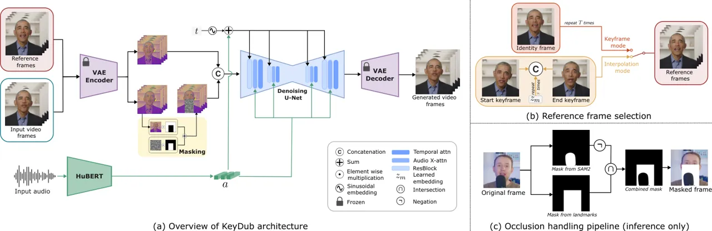

Figure 2: Overview of the KeySync framework. KeySync consists of two
stages, both of which involve generating video using latent diffusion
conditioned on an input video and audio, differing only in the reference
frames selection, as described in (b). During keyframe generation, the
model receives an identity frame $`x_{\text{id}}`$, which is repeated
and concatenated with the noised video input. During interpolation, the
model is conditioned on two successive keyframes $`z_{i}`$ and
$`z_{i+1}`$, along with intermediate learnable embeddings $`z_{m}`$.
Both stages integrate audio embeddings $`a`$ from HuBERT \[22\]. In (c),
we illustrate our occlusion handling pipeline, which we apply during
inference.

#### Audio-driven lip synchronization

Lip synchronization methods focus on adjusting mouth movements to match
the input audio while preserving other facial attributes, _i.e_., the
head pose and upper face expressions. The first notable work, Wav2Lip
\[36\], uses GANs to generate a sequence of frames from input video
frames with the lower part of the face masked. To improve lip
synchronization, Wav2Lip \[36\] leverages a pre-trained lip-sync expert
model. In order to enhance realism and identity generalization,
StyleSync \[18\] and StyleLipSync \[28\] introduce
StyleGAN2-based \[26\] architectures, while DINet \[61\] performs
spatial deformation on feature maps to improve visual quality. Finally,
TalkLip \[63\] proposes using contrastive learning based on a
pre-trained lip-sync expert to enhance the quality and accuracy of
generated lip region.

Recently, diffusion-based methods for lip synchronization have been
introduced \[33, 31, 3\]. Nevertheless, expression leakage from the
input video, especially in cross-driving scenarios, remains an open
issue. Several approaches attempt to mitigate this using different
masking strategies \[28, 61, 59, 11\], but no consensus exists regarding
the optimal masking method. Another challenge is temporal consistency,
as many methods \[54, 31, 64\] operate on a frame-by-frame basis without
explicit sequence modeling, leading to discontinuities. Some models are
conditioned on past frames \[3\], but consequently suffer from
cumulative error propagation, while others propose the use of
pre-trained perceptual models \[29\] or sequence discriminators \[33\]
to enforce coherence, but are generally not sufficient. Finally,
occlusion handling remains an open challenge, as most models assume
clear visibility of the mouth, failing in real-world settings where
occlusions from hands, objects, or motion blur occur.

Inspired by KeyFace \[2\], we propose a two-stage lip synchronization
framework ensuring robust, leakage-free cross-driving performance.
Furthermore, our post-training occlusion-handling strategy further
enhances robustness, rendering our model suitable for real-world
applications.

## 3 Method

In this section, we describe our proposed two-stage lip-sync approach,
which builds upon KeyFace’s facial animation framework \[2\].
Additionally, we discuss our masking strategy in Section 3.2 and present
a new method for handling occlusions in Section 3.5.

### 3.1 Latent diffusion

Diffusion models \[20, 14\] progressively transform random noise into
structured data by iteratively removing noise through a learned
denoising process. Latent diffusion) \[40\] applies this denoising
operation in a compressed, lower-dimensional latent space rather than in
the high-dimensional pixel space, improving computational efficiency.
Furthemore, the EDM framework \[27\] defines the denoising operation of
the denoiser $`D_{\theta}`$ as:

```math
D_{\theta}(\mathbf{x};\sigma)=c_{\text{skip}}(\sigma)\mathbf{x}+c_{\text{out}}(\sigma)F_{\theta}(c_{\text{in}}(\sigma)\mathbf{x};c_{\text{noise}}(\sigma)), \tag{1}
```

where $`F_{\theta}`$ denotes the trainable neural network and
$`\mathbf{x}`$ represents the input. The terms
$`c_{\text{noise}}(\sigma)`$, $`c_{\text{out}}(\sigma)`$,
$`c_{\text{skip}}(\sigma)`$, and $`c_{\text{in}}(\sigma)`$ are scaling
factors dependent on the noise level $`\sigma`$. These scaling factors
dynamically adjust the magnitude and influence of noise at different
stages of the denoising process, thereby improving the network’s
efficiency and robustness during diffusion.

### 3.2 Leakage-proof masking

We frame the lip-sync task as a video inpainting problem \[37, 41\] in
the latent space. The critical objective is to ensure the newly
generated lip region does not reuse (or “leak”) cues from the original
mouth shape that contradict the new audio. Specifically, we create a
mask $`M`$ by computing facial landmarks \[5\] and isolating the lower
facial region, extending slightly above the nose to cover any upper
cheek movements that could otherwise convey information about lip
movements, while still preserving overall facial identity. The mask also
extends to the lower edge of the image, preventing any leakage from jaw
movements. We find that this mask strikes an appropriate balance between
the two types of masks presented in prior works, namely:

- •
  Full lower-face masks \[64, 42, 33, 34\], which can obscure too much
  context, risking issues with identity and natural facial continuity;
- •
  Mouth-only masks \[61, 31, 28, 11\], which can inadvertently leak
  lower face expressions because residual mouth movements or shading
  remain visible to the model.

### 3.3 Two-stage video generation

Our approach is illustrated in Figure 2. We follow KeyFace’s two-stage
procedure \[2\] to generate lip-synced animations from a masked input
video and a driving audio clip. We feed the video frames
$`\{x_{t}\}_{t=1}^{T}`$ and their corresponding noised versions
$`\{x^{n}_{t}\}_{t=1}^{T}`$, into our VAE encoder \[4\] $`\mathcal{V}`$
to obtain latent representations $`\{z_{t}\}_{t=1}^{T}`$ and
$`\{z^{n}_{t}\}_{t=1}^{T}`$, respectively. Then, using the predefined
mask M, we define the input to the U-Net as:

```math
z_{t}^{m}=M\odot z^{n}_{t}+(1-M)\odot z_{t}, \tag{2}
```

where $`\odot`$ denotes element-wise multiplication. Given the
corresponding audio segments $`\{a_{t}\}_{t=1}^{T}`$, our goal is to
generate a new set of frames $`\{\hat{x}_{t}\}_{t=1}^{T}`$ in which the
lip movements are fully synchronized with the audio. Unlike previous
approaches that either generate all frames end-to-end \[28, 49, 29\] or
explicitly disentangle motion and appearance \[31, 64, 54\], we propose
a two-stage strategy for lip synchronization.

#### Keyframe Generation

We first generate a sparse set of keyframes capturing the essential lip
movements for the entire audio sequence. These serve as anchor points,
ensuring that each keyframe accurately reflects the phonetic content of
the audio while preserving the user’s identity (through an identity
frame $`\mathbf{x}_{id}`$). We build on Stable Video Diffusion
(SVD) \[4\], a latent diffusion model that operates on batches of frames
with a 2D U-Net and additional 1D temporal layers. Specifically, we
produce $`T`$ keyframes, each spaced $`S`$ frames apart,
$`\{\hat{x}_{t_{k}}\}_{k=1}^{T}`$, where $`t_{k}=k\cdot S`$.

#### Interpolation

Next, we interpolate between successive keyframes to achieve smooth,
temporally coherent motion. Using the same diffusion backbone, we
condition on keyframe pairs ($`\hat{z}{t_{i}}`$, $`\hat{z}{t_{i+1}}`$)
to generate the intermediate frames. Specifically, we construct the
sequence:

```math
s=\{z_{t_{i}},\underbrace{z_{m},\dots,z_{m}}_{\text{repeat}\ S\ \text{times}},z_{t_{i+1}}\}, \tag{3}
```

where $`z_{m}`$ is a learnable embedding that represents the missing
frames. This approach enables us to model the temporal dynamics of the
video directly, without requiring additional synchronization
losses \[33\], temporal perceptual models \[29\], or motion-specific
frames \[3\].

Throughout both steps, we rely on the audio encoder $`A`$,
HuBERT \[22\], to transform raw audio into a learned representation.
This audio embedding is integrated into the model via audio attention
blocks, where the embeddings are fed into the U-Net’s cross-attention
layers, and also via the timestep embeddings, where the audio features
are passed through an MLP and added to the diffusion timestep embeddings
$`\mathbf{t}_{s}\in\mathbb{R}^{C_{s}}`$, resulting in
$`\mathbf{t}^{\prime}_{s}=\mathbf{t}_{s}+\text{MLP}(a)`$. This dual
mechanism enhances alignment between video and audio frames, leading to
improved lip synchronization.

### 3.4 Losses

We adopt the loss formulation from \[27\], defined as:

```math
\mathcal{L}_{latent}=\mathbb{E}_{x,c,t,\sigma}\left[w_{t}\left\|F_{\theta}(z^{m}_{t};c,\sigma_{t})-z_{t}\right\|_{2}^{2}\right], \tag{4}
```

where $`w_{t}`$ is a predefined weighting function, $`F_{\theta}`$
represents the model to be trained, $`\sigma_{t}`$ denotes the noise
level, and $`c`$ the conditioning inputs to the model. We find that this
loss alone is sufficient to achieve good lip synchronization and
high-quality video generation. However, working solely in the compressed
latent space can make it difficult for the model to retain fine semantic
details \[57\], which are critical for real-world lip synchronization
tasks where preserving the nuances of the mouth region is essential. To
address this, we introduce an additional $`L_{2}`$ loss in the RGB
space. This requires decoding the generated latent sequence using the
VAE decoder $`\mathcal{V}`$, resulting in:

```math
\mathcal{L}_{rgb}=\mathbb{E}_{x,c,t,\sigma}\left[w_{t}\left\|\mathcal{V}(F_{\theta}(z^{m}_{t};c,\sigma_{t}))-x_{t}\right\|_{2}^{2}\right]. \tag{5}
```

To optimize memory efficiency, we apply $`\mathcal{L}_{rgb}`$ to a
randomly selected frame from the sequence, which we found to be
sufficient for maintaining perceptual quality. The final loss function
is then:

```math
\mathcal{L}_{total}=M\cdot\lambda(t)(\mathcal{L}_{latent}(\hat{z},z)+\lambda_{2}\mathcal{L}_{rgb}(\hat{x},x)), \tag{6}
```

where $`\lambda(t)`$ is a weighting factor dependent on the diffusion
timestep $`t`$, as defined in \[27\]. Importantly, we ensure that only
the generated region contributes to the loss computation by masking the
region of interest.

### 3.5 Handling occlusions

Occlusions are a critical yet often overlooked challenge in lip
synchronization. Even advanced models can produce unnatural results if
occlusions in the original video, such as a hand or microphone covering
the mouth, are not properly accounted for. A common issue arises when an
occlusion overlaps with the mouth region during masking, often causing
the model to incorrectly generate the mouth over the occluding object,
resulting in unnatural boundary artifacts.

To address this, we propose an inference-time solution capable of
handling any type of occlusion without additional training. Explicitly
training a model for occlusion handling is impractical due to the vast
range of possible occlusions and their inherent misalignment with
speech, making them hard for the model to learn. Instead, we introduce a
preprocessing pipeline that first segments the occluding object using a
state-of-the-art zero-shot video segmentation model \[39\], generating a
mask $`M_{obj}`$ of the occlusion. We then refine the original mask M by
excluding the occlusion:

```math
M=M\cap\neg M_{obj}, \tag{7}
```

where $`\cap`$ denotes intersection and $`\neg`$ denotes logical
negation. Since our model supports free-form masks, as in \[32\], it can
seamlessly reconstruct the mouth region while preserving the occluding
object, ensuring visually coherence.

## 4 Experiments

### 4.1 Datasets

We train our model on three widely used audiovisual datasets:
HDTF \[60\], CelebV-HQ \[67\], and CelebV-Text \[53\]. While HDTF is a
carefully curated dataset, CelebV-Text and CelebV-HQ prioritize quantity
and include many low-quality videos, instances where the speaker is out
of frame, and abrupt cuts. To address these issues, we implement a
curation and preprocessing pipeline that we use to refine the contents
of CelebV-Text and CelebV-HQ, and then combined them with HDTF for
training. This pipeline is described in detail in the supplementary
material.

For evaluation, we focus on the cross-sync task, the primary use case
for lip-sync models, where the input audio comes from a different video
than the one being generated. We randomly select 100 test videos from
CelebV-Text, CelebV-HQ, and HDTF and swap their audio tracks.
Additionally, to ensure consistency with prior works, we also report
reconstruction results for the same 100 videos.

### 4.2 Evaluation metrics

For evaluation, we rely on a set of no-reference metrics, as we found
they correlate better with human perception, particularly in the
cross-sync task. For image quality, we use CMMD \[24\], an improved
version of FID, along with a version of TOPIQ \[7\] trained on a facial
dataset from \[6\]. However, we found that these methods do not
effectively capture image blurriness. To address this, we incorporate a
common blurriness evaluation method: the variance of Laplacian
(VL) \[35\]. For video quality and temporal consistency, we use
FVD \[45\]. Additionally, we introduce LipLeak, a new metric for leakage
detection, and rely on LipScore \[2\] to evaluate lip synchronization,
which has been shown to be more effective than the offset and confidence
scores produced by the commonly used SyncNet model \[36\]. Further
details are provided in the supplementary material.

#### LipLeak

While leakage is a known issue in lip-sync models, there is currently no
direct method to quantify it. We propose a simple yet effective
evaluation approach based on feeding silent audio and non-silent video
into the model. Given the silent audio, it can be assumed that any frame
where the mouth is open is the result of expression leakage from the
non-silent input video. To this end, we assess leakage by computing the
proportion of time the mouth is open using the mouth aspect ratio
(MAR) \[25\]. MAR is defined as the ratio between the vertical distance
between the upper and lower lip landmarks and the horizontal distance
between the corner lip landmarks. By applying an empirically determined
threshold (set to 0.25) to distinguish open-mouth states, we obtain a
quantitative measure of lip movement leakage. This ratio provides a
direct measure of a model’s susceptibility to lip movement leakage,
hence we denote it as LipLeak.

### 4.3 User study

While the metrics above offer an objective evaluation, they do not
always align with human perception. To address this, we conduct a user
study where participants compare randomly selected video pairs based on
lip synchronization, temporal coherence, and visual quality. We then
rank the performance of each model using the Elo rating system \[16\],
and apply bootstrapping \[12\] for robustness. Further details are
provided in the supplementary material.

## 5 Results

|                |                   |                     |                    |                 |                    |                       |                        |                  |
| -------------- | ----------------- | ------------------- | ------------------ | --------------- | ------------------ | --------------------- | ---------------------- | ---------------- |
|                | Method            | CMMD $`\downarrow`$ | TOPIQ $`\uparrow`$ | VL $`\uparrow`$ | FVD $`\downarrow`$ | LipScore $`\uparrow`$ | LipLeak $`\downarrow`$ | Elo $`\uparrow`$ |
| Reconstruction | DiffDub \[31\]    | 0.403               | 0.44               | 37.12           | 429.07             | 0.34                  | \-                     | 1014             |
|                | IP\_ LAP \[63\]   | 0.091               | 0.49               | 37.77           | 282.02             | 0.36                  | \-                     | 1007             |
|                | Diff2Lip \[33\]   | 0.225               | 0.48               | 35.84           | 555.08             | 0.49                  | \-                     | 886              |
|                | TalkLip \[49\]    | 0.230               | 0.39               | 29.07           | 608.92             | 0.58                  | \-                     | 920              |
|                | LatentSync \[29\] | 0.319               | 0.41               | 45.23           | 343.90             | 0.52                  | \-                     | 1052             |
|                | KeySync           | 0.064               | 0.58               | 70.32           | 191.21             | 0.46                  | -                      | 1120             |
| Cross-sync     | DiffDub \[31\]    | 0.408               | 0.44               | 37.05           | 420.66             | 0.34                  | 0.56                   | 947              |
|                | IP\_ LAP \[63\]   | 0.093               | 0.49               | 35.32           | 294.66             | 0.17                  | 0.28                   | 1031             |
|                | Diff2Lip \[33\]   | 0.231               | 0.48               | 33.97           | 601.68             | 0.16                  | 0.25                   | 878              |
|                | TalkLip \[49\]    | 0.201               | 0.42               | 24.80           | 704.93             | 0.30                  | 0.66                   | 911              |
|                | LatentSync \[29\] | 0.325               | 0.41               | 45.95           | 361.57             | 0.14                  | 0.33                   | 1086             |
|                | KeySync           | 0.070               | 0.58               | 73.04           | 206.32             | 0.48                  | 0.16                   | 1145             |

Table 1: Quantitative comparison with other works on reconstruction and
cross-synchronization performance. The best results are highlighted in
bold, while the second-best results are underlined. All metrics are
described in Section 4.2.

In this section, we present a comprehensive evaluation of our model’s
performance against baselines, along with several ablations to assess
the impact of key components.

### 5.1 Comparison with other works

#### Quantitative analysis.

We evaluate our method alongside five competing approaches in Table 1.
The evaluation is conducted in two settings: reconstruction, where
videos are generated using the same audio as in the original video, and
cross-sync, where the audio is taken from a different video. The latter
is particularly relevant as it better reflects real-world applications
such as automated dubbing, where the driving audio is typically not
aligned with the input video.

KeySync consistently outperforms other methods in visual quality and
temporal consistency for both reconstruction and cross-sync tasks, as
reflected in the higher VL scores and lower FVD. Regarding lip
synchronization, while most methods experience a drop in LipScore during
cross-sync, our approach maintains consistent performance, as evidenced
by similar LipScores in both reconstruction and cross-sync. In the
reconstruction setting, some methods achieve a higher LipScore, but this
is primarily due to expression leakage. This hypothesis is also
supported by the high LipLeak scores exhibited by these models. An
interesting observation arises with DiffDub: in the cross-sync setting,
the model generates random lip movements, which LipScore mistakenly
interprets as improved synchronization, but LipLeak exposes as leakage.
Our method is also preferred by human evaluators in both settings, as
shown by the higher Elo rankings, highlighting the effectiveness of our
approach according to human perception.

#### Qualitative analysis.

Figure 3 presents results from all models for a cross-sync example. We
see that KeySync more accurately follows the lip movements corresponding
to the input audio. While LatentSync and Diff2Lip also appear to align
somewhat with the target lip movements, they fail to generate certain
vocalizations correctly and exhibit visual artifacts (highlighted on the
figure via red squares and arrows, respectively), limiting their
practical usability. Additionally, we notice that most methods produce
minimal lip movement or fail to open the mouth sufficiently. This can be
attributed to expression leakage, where the model receives conflicting
signals from the original video and the new audio, making it difficult
to generate a coherent and natural-looking mouth region.

#### Leakage.

As discussed in Section 4.2, we compute LipLeak by generating a video
using a silent audio input. Since the audio contains no speech, the
mouth should remain closed throughout the entire duration. However, in
practice, we observe that this is not always the case, as the non-silent
expressions in the input video can leak into the generated video.
Figure 4 presents examples of such generated videos alongside the
original input video and silent audio. We observe that all methods,
except ours and Diff2Lip, exhibit several frames where the mouth is open
(highlighted by red squares around the mouths) due to expression leakage
from the input video. While Diff2Lip manages to keep the mouth closed,
we notice significant blending artifacts across all frames, highlighting
the model’s struggle to generate silent frames when the original video
contains speech. Additionally, in Figure 5, we visualize the mouth
aspect ratio (MAR) of all methods over time. Since MAR is a ratio, it
remains independent of scale, ensuring a fair comparison across
different methods. The results show that baseline methods frequently
exceed the MAR threshold for an open mouth, indicating persistent
leakage. In contrast, KeySync consistently maintains a MAR below the
threshold, demonstrating its effectiveness in preventing unwanted lip
movements when no speech is present.

#### Occlusion handling.

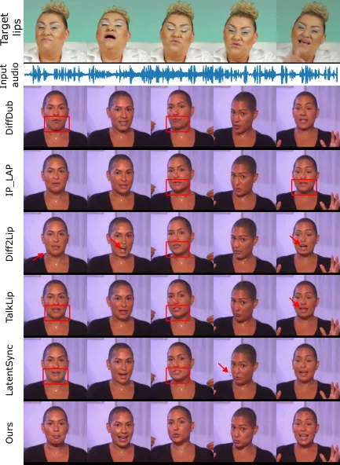

Figure 3: Qualitative comparison with other works. The top row (“Target
lips”) shows lip movements corresponding directly to the provided audio
input, and can therefore be seen as the target for the lips in the
generated videos.

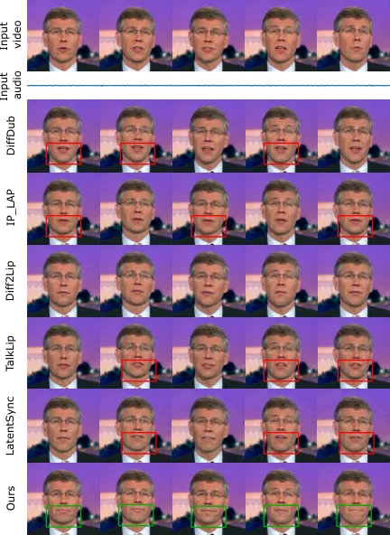

Figure 4: Qualitative leakage comparison. We condition the models on
silent audio and non-silent video (first row).

Figure 5: MAR over time. If MAR exceeds the threshold, the mouth is
considered open, indicating leakage.

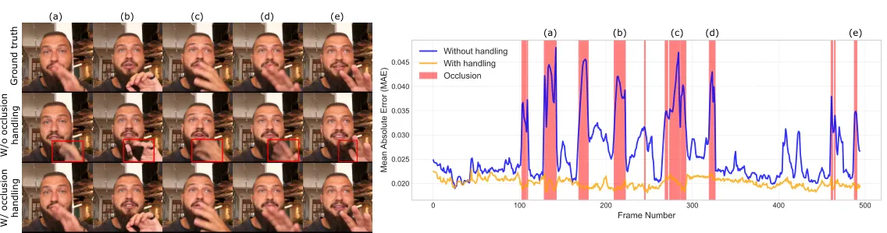

Figure 6: Occlusion handling comparison. We present qualitative results
on the left and quantitative results on the right.

We propose a technique to handle occlusions at inference time, as
defined in Section 3.5 and illustrated in Figure 2. The effectiveness of
our approach is demonstrated in Figure 6. On the left side, we observe
that without proper occlusion handling, the model fails to reconstruct
the occluded regions accurately, leading to unwanted artifacts,
particularly around the hand. In contrast, with our proposed method, the
hand is correctly represented while maintaining lip synchronization.
This improvement is further highlighted in the right part of the figure,
where we visualize the mean absolute error between the generated video
and the ground-truth. Without occlusion handling, we observe noticeable
error spikes during occlusions. Additional details are provided in the
supplementary material.

### 5.2 Ablation studies

#### Architecture.

We evaluate two alternate versions of our pipeline and present the
results in Table 2. The first approach replaces our two-stage pipeline
with a single-stage model, where the network directly generates a
sequence of frames, and a longer video is produced by concatenating
multiple sequences with a one-frame overlap to ensure temporal
consistency. The second approach keeps the two-stage logic, but
generates keyframes using an image-based model rather than producing
them all simultaneously with temporal layers. We find that the one-stage
model achieves reasonable visual quality according to CMMD, but sees a
sharp decline in FVD and LipScore, highlighting the importance of our
keyframe interpolation technique for generating smooth,
well-synchronized lip movements. Similarly, without the temporal layers,
the interpolation model struggles to maintain coherence, leading to
significant degradation across all three metrics.

#### Audio encoder.

|           |              |                     |                    |                       |
| --------- | ------------ | ------------------- | ------------------ | --------------------- |
| Two-stage | Temp. layers | CMMD $`\downarrow`$ | FVD $`\downarrow`$ | LipScore $`\uparrow`$ |
| ✗         | ✓            | 0.085               | 395.45             | 0.32                  |
| ✓         | ✗            | 0.142               | 618.27             | 0.39                  |
| ✓         | ✓            | 0.070               | 206.32             | 0.48                  |

Table 2: Architecture ablation in the cross-sync setting.

|                |                    |                       |                        |
| -------------- | ------------------ | --------------------- | ---------------------- |
| Audio backbone | FVD $`\downarrow`$ | LipScore $`\uparrow`$ | LipLeak $`\downarrow`$ |
| Whisper \[38\] | 207.41             | 0.47                  | 0.18                   |
| Wav2vec2 \[1\] | 201.13             | 0.45                  | 0.19                   |
| WavLM \[9\]    | 218.08             | 0.48                  | 0.17                   |
| HuBERT \[22\]  | 206.32             | 0.48                  | 0.16                   |

Table 3: Audio encoder ablation in the cross-sync setting.

|                   |                     |                    |                       |                        |
| ----------------- | ------------------- | ------------------ | --------------------- | ---------------------- |
| Mask              | CMMD $`\downarrow`$ | FVD $`\downarrow`$ | LipScore $`\uparrow`$ | LipLeak $`\downarrow`$ |
| Mouth-only        | 0.077               | 200.71             | 0.23                  | 0.38                   |
| Full lower-face   | 0.743               | 219.96             | 0.35                  | 0.28                   |
| Ours (nose-level) | 0.071               | 199.39             | 0.34                  | 0.35                   |
| Ours              | 0.070               | 206.32             | 0.48                  | 0.16                   |

Table 4: Mask ablation in the cross-sync setting.

We also investigate the impact of different audio encoders on the
generated videos, as shown in Table 3. We see that Wav2vec2 \[1\]
produces marginally higher video quality, as indicated by its lower FVD
score. However, this comes at the expense of lip synchronization, as
reflected in its lower LipScore. With WavLM \[9\], we achieve a LipScore
comparable to HuBERT \[22\], but at the cost of worse video quality. In
contrast, HuBERT not only maintains a strong LipScore but also achieves
the lowest LipLeak, indicating its effectiveness in mitigating
expression leakage. Based on these findings, we select HuBERT as our
default audio encoder.

#### Mask.

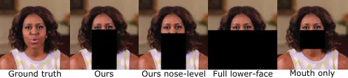

Figure 7: Examples of different masking techniques.

Finally, we investigate the impact of different masking techniques
(illustrated in Figure 7) in Table 4. Using a mouth-only mask yields
better video quality since it minimizes facial obstruction. However,
this approach suffers from severe leakage, as indicated by its low
LipScore and high LipLeak. This occurs because the model can infer mouth
movements from the mask’s position over time rather than learning proper
synchronization with the driving audio. Conversely, masking the entire
lower face effectively reduces leakage, but severely harms image and
video quality, as the model is forced to reconstruct unrelated
background elements. Our proposed box-style masking offers a balanced
trade-off between these two extremes, achieving the best overall
performance. Additionally, we demonstrate that extending the mask up to
the eye region is crucial in maximizing LipScore, as the cheeks convey
important cues about mouth movements and can therefore cause leakage.

## 6 Conclusion

In this paper, we propose KeySync, a state-of-the-art lip
synchronization approach based on a two-stage video diffusion model. We
show that, unlike other methods, KeySync generates high-resolution
videos which are temporally coherent and closely aligned with the
driving audios. Furthermore, by applying a new masking strategy, we show
that our model successfully minimizes expression leakage from the input
video, while also being robust to facial occlusions that may occur in
the wild. We hope that these improvements will enable the use of lip
synchronization models in applications such as automated dubbing, which
can help eliminate language barriers at scale.

## References

- \[1\] Alexei Baevski, Yuhao Zhou, Abdelrahman Mohamed, and Michael
  Auli. wav2vec 2.0: A framework for self-supervised learning of speech
  representations. In _Advances in Neural Information Processing Systems
  33: Annual Conference on Neural Information Processing Systems 2020,
  NeurIPS 2020, December 6-12, 2020, virtual_, 2020.
- \[2\] Antoni Bigata, Michał Stypułkowski, Rodrigo Mira, Stella
  Bounareli, Konstantinos Vougioukas, Zoe Landgraf, Nikita Drobyshev,
  Maciej Zieba, Stavros Petridis, and Maja Pantic. Keyface: Expressive
  audio-driven facial animation for long sequences via keyframe
  interpolation, 2025.
- \[3\] Dan Bigioi, Shubhajit Basak, Michal Stypulkowski, Maciej Zieba,
  Hugh Jordan, Rachel McDonnell, and Peter Corcoran. Speech driven video
  editing via an audio-conditioned diffusion model. _Image Vis.
  Comput._, 142:104911, 2024.
- \[4\] Andreas Blattmann, Tim Dockhorn, Sumith Kulal, Daniel
  Mendelevitch, Maciej Kilian, Dominik Lorenz, Yam Levi, Zion English,
  Vikram Voleti, Adam Letts, Varun Jampani, and Robin Rombach. Stable
  video diffusion: Scaling latent video diffusion models to large
  datasets, 2023.
- \[5\] Adrian Bulat and Georgios Tzimiropoulos. How far are we from
  solving the 2d & 3d face alignment problem? (and a dataset of 230, 000
  3d facial landmarks). In _IEEE International Conference on Computer
  Vision, ICCV 2017, Venice, Italy, October 22-29, 2017_, pages
  1021–1030. IEEE Computer Society, 2017.
- \[6\] Chaofeng Chen and Jiadi Mo. IQA-PyTorch: Pytorch toolbox for
  image quality assessment. \[Online\]. Available:
  [https://github.com/chaofengc/IQA-PyTorch](https://github.com/chaofengc/IQA-PyTorch), 2022.
- \[7\] Chaofeng Chen, Jiadi Mo, Jingwen Hou, Haoning Wu, Liang Liao,
  Wenxiu Sun, Qiong Yan, and Weisi Lin. TOPIQ: A top-down approach from
  semantics to distortions for image quality assessment. _IEEE Trans.
  Image Process._, 33:2404–2418, 2024a.
- \[8\] Lele Chen, Guofeng Cui, Celong Liu, Zhong Li, Ziyi Kou, Yi Xu,
  and Chenliang Xu. Talking-head generation with rhythmic head motion.
  In _European Conference on Computer Vision_, pages 35–51.
  Springer, 2020.
- \[9\] Sanyuan Chen, Chengyi Wang, Zhengyang Chen, Yu Wu, Shujie Liu,
  Zhuo Chen, Jinyu Li, Naoyuki Kanda, Takuya Yoshioka, Xiong Xiao, Jian
  Wu, Long Zhou, Shuo Ren, Yanmin Qian, Yao Qian, Jian Wu, Michael Zeng,
  Xiangzhan Yu, and Furu Wei. Wavlm: Large-scale self-supervised
  pre-training for full stack speech processing. _IEEE J. Sel. Top.
  Signal Process._, 16(6):1505–1518, 2022.
- \[10\] Zhiyuan Chen, Jiajiong Cao, Zhiquan Chen, Yuming Li, and
  Chenguang Ma. Echomimic: Lifelike audio-driven portrait animations
  through editable landmark conditions, 2024b.
- \[11\] Kun Cheng, Xiaodong Cun, Yong Zhang, Menghan Xia, Fei Yin,
  Mingrui Zhu, Xuan Wang, Jue Wang, and Nannan Wang. Videoretalking:
  Audio-based lip synchronization for talking head video editing in the
  wild. In _SIGGRAPH Asia 2022 Conference Papers, SA 2022, Daegu,
  Republic of Korea, December 6-9, 2022_, pages 30:1–30:9. ACM, 2022.
- \[12\] Wei-Lin Chiang, Lianmin Zheng, Ying Sheng, Anastasios Nikolas
  Angelopoulos, Tianle Li, Dacheng Li, Hao Zhang, Banghua Zhu, Michael
  Jordan, Joseph E. Gonzalez, and Ion Stoica. Chatbot arena: An open
  platform for evaluating llms by human preference, 2024.
- \[13\] Joon Son Chung, Amir Jamaludin, and Andrew Zisserman. You said
  that? _arXiv preprint arXiv:1705.02966_, 2017.
- \[14\] Prafulla Dhariwal and Alexander Quinn Nichol. Diffusion models
  beat gans on image synthesis. In _Advances in Neural Information
  Processing Systems 34: Annual Conference on Neural Information
  Processing Systems 2021, NeurIPS 2021, December 6-14, 2021, virtual_,
  pages 8780–8794, 2021.
- \[15\] Chenpeng Du, Qi Chen, Tianyu He, Xu Tan, Xie Chen, Kai Yu,
  Sheng Zhao, and Jiang Bian. Dae-talker: High fidelity speech-driven
  talking face generation with diffusion autoencoder. In _Proceedings of
  the 31st ACM International Conference on Multimedia_, pages
  4281–4289, 2023.
- \[16\] Arpad E. Elo. _The Rating of Chessplayers, Past and Present_.
  Arco Pub., New York, 1978.
- \[17\] Ian J. Goodfellow, Jean Pouget-Abadie, Mehdi Mirza, Bing Xu,
  David Warde-Farley, Sherjil Ozair, Aaron C. Courville, and Yoshua
  Bengio. Generative adversarial networks. _Commun. ACM_,
  63(11):139–144, 2020.
- \[18\] Jiazhi Guan, Zhanwang Zhang, Hang Zhou, Tianshu Hu, Kaisiyuan
  Wang, Dongliang He, Haocheng Feng, Jingtuo Liu, Errui Ding, Ziwei Liu,
  et al. Stylesync: High-fidelity generalized and personalized lip sync
  in style-based generator. In _Proceedings of the IEEE/CVF Conference
  on Computer Vision and Pattern Recognition_, pages 1505–1515, 2023.
- \[19\] Jonathan Ho. Classifier-free diffusion guidance. _ArXiv_,
  abs/2207.12598, 2022.
- \[20\] Jonathan Ho, Ajay Jain, and Pieter Abbeel. Denoising diffusion
  probabilistic models. In _Advances in Neural Information Processing
  Systems 33: Annual Conference on Neural Information Processing Systems
  2020, NeurIPS 2020, December 6-12, 2020, virtual_, 2020.
- \[21\] Jonathan Ho, Tim Salimans, Alexey Gritsenko, William Chan,
  Mohammad Norouzi, and David J Fleet. Video diffusion models. _Advances
  in Neural Information Processing Systems_, 35:8633–8646, 2022.
- \[22\] Wei-Ning Hsu, Benjamin Bolte, Yao-Hung Hubert Tsai, Kushal
  Lakhotia, Ruslan Salakhutdinov, and Abdelrahman Mohamed. Hubert:
  Self-supervised speech representation learning by masked prediction of
  hidden units. _IEEE ACM Trans. Audio Speech Lang. Process._,
  29:3451–3460, 2021.
- \[23\] Li Hu. Animate anyone: Consistent and controllable
  image-to-video synthesis for character animation. In _IEEE/CVF
  Conference on Computer Vision and Pattern Recognition, CVPR 2024,
  Seattle, WA, USA, June 16-22, 2024_, pages 8153–8163. IEEE, 2024.
- \[24\] Sadeep Jayasumana, Srikumar Ramalingam, Andreas Veit, Daniel
  Glasner, Ayan Chakrabarti, and Sanjiv Kumar. Rethinking FID: towards a
  better evaluation metric for image generation. In _IEEE/CVF Conference
  on Computer Vision and Pattern Recognition, CVPR 2024, Seattle, WA,
  USA, June 16-22, 2024_, pages 9307–9315. IEEE, 2024.
- \[25\] R Kannan, Palamakula Jahnavi, and M Megha. Driver drowsiness
  detection and alert system. In _2023 IEEE International Conference on
  Integrated Circuits and Communication Systems (ICICACS)_, pages
  1–5, 2023.
- \[26\] Tero Karras, Samuli Laine, Miika Aittala, Janne Hellsten,
  Jaakko Lehtinen, and Timo Aila. Analyzing and improving the image
  quality of stylegan. In _Proceedings of the IEEE/CVF conference on
  computer vision and pattern recognition_, pages 8110–8119, 2020.
- \[27\] Tero Karras, Miika Aittala, Timo Aila, and Samuli Laine.
  Elucidating the design space of diffusion-based generative models. In
  _Advances in Neural Information Processing Systems 35: Annual
  Conference on Neural Information Processing Systems 2022, NeurIPS
  2022, New Orleans, LA, USA, November 28 - December 9, 2022_, 2022.
- \[28\] Taekyung Ki and Dongchan Min. Stylelipsync: Style-based
  personalized lip-sync video generation. In _IEEE/CVF International
  Conference on Computer Vision, ICCV 2023, Paris, France, October 1-6,
  2023_, pages 22784–22793. IEEE, 2023.
- \[29\] Chunyu Li, Chao Zhang, Weikai Xu, Jinghui Xie, Weiguo Feng,
  Bingyue Peng, and Weiwei Xing. Latentsync: Audio conditioned latent
  diffusion models for lip sync. _CoRR_, abs/2412.09262, 2024.
- \[30\] Junhua Liao, Haihan Duan, Kanghui Feng, Wanbing Zhao, Yanbing
  Yang, and Liangyin Chen. A light weight model for active speaker
  detection. In _Proceedings of the IEEE/CVF Conference on Computer
  Vision and Pattern Recognition (CVPR)_, pages 22932–22941, 2023.
- \[31\] Tao Liu, Chenpeng Du, Shuai Fan, Feilong Chen, and Kai Yu.
  Diffdub: Person-generic visual dubbing using inpainting renderer with
  diffusion auto-encoder. In _IEEE International Conference on
  Acoustics, Speech and Signal Processing, ICASSP 2024, Seoul, Republic
  of Korea, April 14-19, 2024_, pages 3630–3634. IEEE, 2024.
- \[32\] Andreas Lugmayr, Martin Danelljan, Andrés Romero, Fisher Yu,
  Radu Timofte, and Luc Van Gool. Repaint: Inpainting using denoising
  diffusion probabilistic models. In _IEEE/CVF Conference on Computer
  Vision and Pattern Recognition, CVPR 2022, New Orleans, LA, USA, June
  18-24, 2022_, pages 11451–11461. IEEE, 2022.
- \[33\] Soumik Mukhopadhyay, Saksham Suri, Ravi Teja Gadde, and Abhinav
  Shrivastava. Diff2lip: Audio conditioned diffusion models for
  lip-synchronization. In _IEEE/CVF Winter Conference on Applications of
  Computer Vision, WACV 2024, Waikoloa, HI, USA, January 3-8, 2024_,
  pages 5280–5290. IEEE, 2024.
- \[34\] Se Jin Park, Minsu Kim, Joanna Hong, Jeongsoo Choi, and
  Yong Man Ro. Synctalkface: Talking face generation with precise
  lip-syncing via audio-lip memory. In _Thirty-Sixth AAAI Conference on
  Artificial Intelligence, AAAI 2022, Thirty-Fourth Conference on
  Innovative Applications of Artificial Intelligence, IAAI 2022, The
  Twelveth Symposium on Educational Advances in Artificial Intelligence,
  EAAI 2022 Virtual Event, February 22 - March 1, 2022_, pages
  2062–2070. AAAI Press, 2022.
- \[35\] J.L. Pech-Pacheco, G. Cristobal, J. Chamorro-Martinez, and J.
  Fernandez-Valdivia. Diatom autofocusing in brightfield microscopy: a
  comparative study. In _Proceedings 15th International Conference on
  Pattern Recognition. ICPR-2000_, pages 314–317 vol.3, 2000.
- \[36\] KR Prajwal, Rudrabha Mukhopadhyay, Vinay P Namboodiri, and CV
  Jawahar. A lip sync expert is all you need for speech to lip
  generation in the wild. In _Proceedings of the 28th ACM International
  Conference on Multimedia_, pages 484–492, 2020.
- \[37\] Weize Quan, Jiaxi Chen, Yanli Liu, Dong-Ming Yan, and Peter
  Wonka. Deep learning-based image and video inpainting: A survey.
  _Int. J. Comput. Vis._, 132(7):2367–2400, 2024.
- \[38\] Alec Radford, Jong Wook Kim, Tao Xu, Greg Brockman, Christine
  McLeavey, and Ilya Sutskever. Robust speech recognition via
  large-scale weak supervision. In _International conference on machine
  learning_, pages 28492–28518. PMLR, 2023.
- \[39\] Nikhila Ravi, Valentin Gabeur, Yuan-Ting Hu, Ronghang Hu,
  Chaitanya Ryali, Tengyu Ma, Haitham Khedr, Roman Rädle, Chloé Rolland,
  Laura Gustafson, Eric Mintun, Junting Pan, Kalyan Vasudev Alwala,
  Nicolas Carion, Chao-Yuan Wu, Ross B. Girshick, Piotr Dollár, and
  Christoph Feichtenhofer. SAM 2: Segment anything in images and videos.
  _CoRR_, abs/2408.00714, 2024.
- \[40\] Robin Rombach, Andreas Blattmann, Dominik Lorenz, Patrick
  Esser, and Björn Ommer. High-resolution image synthesis with latent
  diffusion models. In _IEEE/CVF Conference on Computer Vision and
  Pattern Recognition, CVPR 2022, New Orleans, LA, USA, June 18-24,
  2022_, pages 10674–10685. IEEE, 2022.
- \[41\] Chitwan Saharia, William Chan, Huiwen Chang, Chris A. Lee,
  Jonathan Ho, Tim Salimans, David J. Fleet, and Mohammad Norouzi.
  Palette: Image-to-image diffusion models. In _SIGGRAPH ’22: Special
  Interest Group on Computer Graphics and Interactive Techniques
  Conference, Vancouver, BC, Canada, August 7 - 11, 2022_, pages
  15:1–15:10. ACM, 2022.
- \[42\] Shuai Shen, Wenliang Zhao, Zibin Meng, Wanhua Li, Zheng Zhu,
  Jie Zhou, and Jiwen Lu. Difftalk: Crafting diffusion models for
  generalized audio-driven portraits animation. In _IEEE/CVF Conference
  on Computer Vision and Pattern Recognition, CVPR 2023, Vancouver, BC,
  Canada, June 17-24, 2023_, pages 1982–1991. IEEE, 2023.
- \[43\] Michal Stypulkowski, Konstantinos Vougioukas, Sen He, Maciej
  Zieba, Stavros Petridis, and Maja Pantic. Diffused heads: Diffusion
  models beat gans on talking-face generation. In _IEEE/CVF Winter
  Conference on Applications of Computer Vision, WACV 2024, Waikoloa,
  HI, USA, January 3-8, 2024_, pages 5089–5098. IEEE, 2024.
- \[44\] Shaolin Su, Qingsen Yan, Yu Zhu, Cheng Zhang, Xin Ge, Jinqiu
  Sun, and Yanning Zhang. Blindly assess image quality in the wild
  guided by a self-adaptive hyper network. In _IEEE/CVF Conference on
  Computer Vision and Pattern Recognition (CVPR)_, 2020.
- \[45\] Thomas Unterthiner, Sjoerd van Steenkiste, Karol Kurach,
  Raphael Marinier, Marcin Michalski, and Sylvain Gelly. Towards
  accurate generative models of video: A new metric and
  challenges, 2019.
- \[46\] Konstantinos Vougioukas, Stavros Petridis, and Maja Pantic.
  End-to-end speech-driven facial animation with temporal gans. In
  _British Machine Vision Conference 2018, BMVC 2018, Newcastle, UK,
  September 3-6, 2018_, page 133. BMVA Press, 2018.
- \[47\] Konstantinos Vougioukas, Stavros Petridis, and Maja Pantic.
  Realistic speech-driven facial animation with gans. _International
  Journal of Computer Vision_, pages 1–16, 2019.
- \[48\] Cong Wang, Kuan Tian, Jun Zhang, Yonghang Guan, Feng Luo, Fei
  Shen, Zhiwei Jiang, Qing Gu, Xiao Han, and Wei Yang. V-express:
  Conditional dropout for progressive training of portrait video
  generation. _CoRR_, abs/2406.02511, 2024.
- \[49\] Jiadong Wang, Xinyuan Qian, Malu Zhang, Robby T. Tan, and
  Haizhou Li. Seeing what you said: Talking face generation guided by a
  lip reading expert. In _IEEE/CVF Conference on Computer Vision and
  Pattern Recognition, CVPR 2023, Vancouver, BC, Canada, June 17-24,
  2023_, pages 14653–14662. IEEE, 2023.
- \[50\] Huawei Wei, Zejun Yang, and Zhisheng Wang. Aniportrait:
  Audio-driven synthesis of photorealistic portrait animation, 2024.
- \[51\] Mingwang Xu, Hui Li, Qingkun Su, Hanlin Shang, Liwei Zhang, Ce
  Liu, Jingdong Wang, Yao Yao, and Siyu Zhu. Hallo: Hierarchical
  audio-driven visual synthesis for portrait image animation, 2024a.
- \[52\] Sicheng Xu, Guojun Chen, Yu-Xiao Guo, Jiaolong Yang, Chong Li,
  Zhenyu Zang, Yizhong Zhang, Xin Tong, and Baining Guo. Vasa-1:
  Lifelike audio-driven talking faces generated in real time. _arXiv
  preprint arXiv:2404.10667_, 2024b.
- \[53\] Jianhui Yu, Hao Zhu, Liming Jiang, Chen Change Loy, Weidong
  Cai, and Wayne Wu. CelebV-Text: A large-scale facial text-video
  dataset. In _CVPR_, 2023.
- \[54\] Runyi Yu, Tianyu He, Ailing Zhang, Yuchi Wang, Junliang Guo, Xu
  Tan, Chang Liu, Jie Chen, and Jiang Bian. Make your actor talk:
  Generalizable and high-fidelity lip sync with motion and appearance
  disentanglement. _CoRR_, abs/2406.08096, 2024.
- \[55\] Fangneng Zhan, Yingchen Yu, Rongliang Wu, Jiahui Zhang, Shijian
  Lu, Lingjie Liu, Adam Kortylewski, Christian Theobalt, and Eric Xing.
  Multimodal image synthesis and editing: A survey and taxonomy. _IEEE
  Transactions on Pattern Analysis and Machine Intelligence_, 2023.
- \[56\] Chenxu Zhang, Chao Wang, Jianfeng Zhang, Hongyi Xu, Guoxian
  Song, You Xie, Linjie Luo, Yapeng Tian, Xiaohu Guo, and Jiashi Feng.
  Dream-talk: diffusion-based realistic emotional audio-driven method
  for single image talking face generation. _arXiv preprint
  arXiv:2312.13578_, 2023a.
- \[57\] David Junhao Zhang, Jay Zhangjie Wu, Jia-Wei Liu, Rui Zhao,
  Lingmin Ran, Yuchao Gu, Difei Gao, and Mike Zheng Shou. Show-1:
  Marrying pixel and latent diffusion models for text-to-video
  generation. _CoRR_, abs/2309.15818, 2023b.
- \[58\] Wenxuan Zhang, Xiaodong Cun, Xuan Wang, Yong Zhang, Xi Shen, Yu
  Guo, Ying Shan, and Fei Wang. Sadtalker: Learning realistic 3d motion
  coefficients for stylized audio-driven single image talking face
  animation. In _IEEE/CVF Conference on Computer Vision and Pattern
  Recognition, CVPR 2023, Vancouver, BC, Canada, June 17-24, 2023_,
  pages 8652–8661. IEEE, 2023c.
- \[59\] Yue Zhang, Minhao Liu, Zhaokang Chen, Bin Wu, Yubin Zeng, Chao
  Zhan, Yingjie He, Junxin Huang, and Wenjiang Zhou. MuseTalk: Real-Time
  High Quality Lip Synchronization with Latent Space Inpainting, 2024.
  arXiv:2410.10122 \[cs\].
- \[60\] Zhimeng Zhang, Lincheng Li, Yu Ding, and Changjie Fan.
  Flow-guided one-shot talking face generation with a high-resolution
  audio-visual dataset. In _2021 IEEE/CVF Conference on Computer Vision
  and Pattern Recognition (CVPR)_, pages 3660–3669, 2021.
- \[61\] Zhimeng Zhang, Zhipeng Hu, Wenjin Deng, Changjie Fan, Tangjie
  Lv, and Yu Ding. Dinet: Deformation inpainting network for realistic
  face visually dubbing on high resolution video. In _Thirty-Seventh
  AAAI Conference on Artificial Intelligence, AAAI 2023, Thirty-Fifth
  Conference on Innovative Applications of Artificial Intelligence, IAAI
  2023, Thirteenth Symposium on Educational Advances in Artificial
  Intelligence, EAAI 2023, Washington, DC, USA, February 7-14, 2023_,
  pages 3543–3551. AAAI Press, 2023d.
- \[62\] Rui Zhen, Wenchao Song, Qiang He, Juan Cao, Lei Shi, and Jia
  Luo. Human-computer interaction system: A survey of talking-head
  generation. _Electronics_, 12(1):218, 2023.
- \[63\] Weizhi Zhong, Chaowei Fang, Yinqi Cai, Pengxu Wei, Gangming
  Zhao, Liang Lin, and Guanbin Li. Identity-preserving talking face
  generation with landmark and appearance priors. In _Proceedings of the
  IEEE/CVF Conference on Computer Vision and Pattern Recognition
  (CVPR)_, pages 9729–9738, 2023.
- \[64\] Weizhi Zhong, Jichang Li, Yinqi Cai, Liang Lin, and Guanbin Li.
  Style-preserving lip sync via audio-aware style reference. _CoRR_,
  abs/2408.05412, 2024.
- \[65\] Hang Zhou, Yu Liu, Ziwei Liu, Ping Luo, and Xiaogang Wang.
  Talking face generation by adversarially disentangled audio-visual
  representation. In _Proceedings of the AAAI conference on artificial
  intelligence_, pages 9299–9306, 2019.
- \[66\] Hang Zhou, Yasheng Sun, Wayne Wu, Chen Change Loy, Xiaogang
  Wang, and Ziwei Liu. Pose-controllable talking face generation by
  implicitly modularized audio-visual representation. In _Proceedings of
  the IEEE/CVF conference on computer vision and pattern recognition_,
  pages 4176–4186, 2021.
- \[67\] Hao Zhu, Wayne Wu, Wentao Zhu, Liming Jiang, Siwei Tang, Li
  Zhang, Ziwei Liu, and Chen Change Loy. CelebV-HQ: A large-scale video
  facial attributes dataset. In _ECCV_, 2022.

Supplementary Material

## Appendix A Datasets

### A.1 Curation and preprocessing

When working with in-the-wild datasets such as CelebV-HQ \[67\] and
CelebV-Text \[53\], we observed that a significant portion of the data
is of suboptimal quality. Common issues include visible hands, camera
movement, editing artifacts, and occlusions. Additionally, some samples
exhibit lower resolution than advertised. Examples of these issues are
illustrated in Figure 8. During training, we found that such videos
negatively impacted model performance because their visual content
correlates poorly with the corresponding audio. To address these
challenges, we developed a data curation pipeline comprising the
following steps:

- •
  Extract videos at 25 FPS and single-channel audio at 16 kHz.
- •
  Discard low-quality videos based on HyperIQA \[44\] scores below 0.4.
  Each video’s score is computed as the average of nine evaluations:
  selecting the first, middle, and last frames, each evaluated on three
  random crops.
- •
  Detect and segment scenes using
  [PySceneDetect](https://github.com/Breakthrough/PySceneDetect).
- •
  Remove clips without active speakers using Light-ASD \[30\] indicated
  by the score below 0.75.

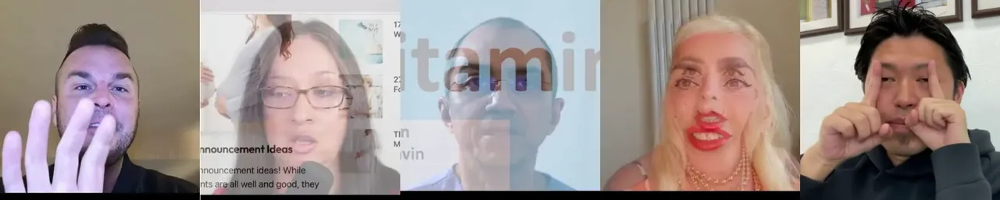

Figure 8: Examples of problematic videos in CelebV-HQ and CelebV-Text.

### A.2 Data statistics

Table 5 describes the training/evaluation data used in this paper,
specifying the number of speakers, videos, average video duration, and
total duration for each dataset. Additionally, to illustrate the impact
of our data curation pipeline, we present Table 6, which details the
statistics of the datasets before curation. Overall, we discard roughly
75 % of the original videos. Please note that CelebV-HQ and CelebV-Text
videos were split into shorter chunks during pre-processing, hence the
higher video count in Table 5.

|                    |             |           |             |              |
| ------------------ | ----------- | --------- | ----------- | ------------ |
| Dataset            | \# Speakers | \# Videos | Duration    |              |
|                    |             |           | Avg. (sec.) | Total (hrs.) |
| HDTF \[60\]        | 264         | 318       | 139.08      | 12           |
| CelebV-HQ \[67\]   | 3, 668      | 12, 000   | 4.00        | 13           |
| CelebV-Text \[53\] | 9, 109      | 75, 307   | 6.38        | 130          |

Table 5: Data statistics after curation and pre-processing.

|                    |           |             |              |
| ------------------ | --------- | ----------- | ------------ |
| Dataset            | \# Videos | Duration    |              |
|                    |           | Avg. (sec.) | Total (hrs.) |
| HDTF \[60\]        | 318       | 139.08      | 12           |
| CelebV-HQ \[67\]   | 35, 666   | 6.86        | 68           |
| CelebV-Text \[53\] | 70, 000   | 14.35       | 279          |

Table 6: Data statistics before curation.

## Appendix B Implementation details

#### Code

The code and model weights will be released upon acceptance.

#### Hyperparameters & Training Configuration

We summarize all the hyperparameters of our pipeline in Table 7. The
weights of the U-Net and VAE are initialized from SVD \[4\]. The
interpolation model undergoes more training steps because its task
differs more significantly from the original task of SVD.

|                                             |                     |
| ------------------------------------------- | ------------------- |
| Hyperparameter                              | Value               |
| Keyframe sequence length ($`T`$)            | 14                  |
| Keyframe spacing ($`S`$)                    | 12                  |
| Interpolation sequence length ($`S`$)       | 12                  |
| Keyframe training steps                     | 60, 000             |
| Interpolation training steps                | 120, 000            |
| Training batch size                         | 32                  |
| Optimizer                                   | AdamW               |
| Learning rate                               | $`1\times 10^{-5}`$ |
| Warmup steps                                | 1, 000              |
| Inference steps                             | 10                  |
| GPU used                                    | NVIDIA A100         |
| Video frame rate                            | 25                  |
| Audio sample rate                           | 16, 000             |
| Resolution                                  | $`512\times 512`$   |
| Pixel loss weighting ($`\lambda_{2}`$)      | 1                   |
| Audio condition drop rate for CFG \[19\]    | 20 %                |
| Identity condition drop rate for CFG \[19\] | 10 %                |

Table 7: Default model hyperparameters and training configurations.

## Appendix C LipLeak

We introduce LipLeak as part of our evaluation pipeline for measuring
expression leakage. The first step in computing LipLeak is to calculate
the mouth aspect ratio (MAR) from facial landmarks, as illustrated in
Figure 9. This ratio quantifies the vertical openness of the mouth
relative to its width, increasing as the mouth opens wider. Since
LipLeak is based on a ratio, it’s a a scale-invariant measure, and
allows for consistent evaluation across different video resolutions and
face sizes. To determine whether the mouth is open or closed, we define
a threshold for the MAR. In our case, we select a threshold of 0.25, as
any MAR below this value consistently represents a closed mouth based on
visual inspection of several samples.

To assess the sensitivity of LipLeak to threshold selection, we analyze
how the metric behaves when the threshold is varied linearly
(Figure 10). The results show a continuous decrease in LipLeak as the
threshold increases. This predictable behavior is essential, as it
ensures that LipLeak can serve as a reliable and interpretable metric
for evaluating mouth leakage across different conditions. A well-behaved
metric should exhibit smooth variations with respect to its parameters,
preventing erratic jumps or inconsistencies that could compromise its
usability in quantitative evaluations.

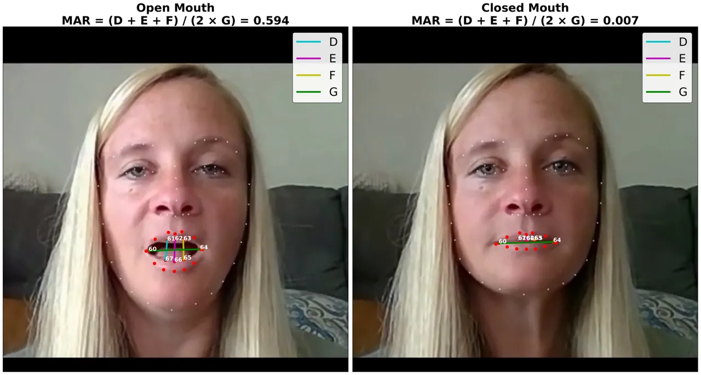

Figure 9: LipLeak measurement example.

Figure 10: LipLeak as a function of the MAR threshold.

## Appendix D Occlusion handling

We propose a method to handle occlusions at inference time, eliminating
the need for model retraining to apply our technique. This makes our
approach highly flexible and adaptable across different methods.
Figure 11 illustrates the application of our occlusion handling
technique to several existing methods:

- •
  DiffDub \[31\] and Diff2Lip \[33\]: Our approach works out of the box,
  seamlessly handling occlusions without requiring modifications.
- •
  LatentSync \[29\]: Since this method employs a fixed mask, the model
  has never been exposed to variations in masking. As a result, it
  struggles to adapt to the new mask patterns introduced by our
  occlusion-handling technique, highlighting a key drawback of using a
  rigid masking approach.
- •
  IP_ LAP \[63\]: This model generates the mouth region separately
  through an audio-to-landmark module. Consequently, the occlusion mask
  has no direct effect, and the mouth is generated on top of the
  occlusion.
- •
  TalkLip \[49\]: At first glance, TalkLip appears to function without
  occlusion handling. However, it achieves this by concatenating frames
  from the original video to generate new frames. This shortcut enables
  occlusion handling but comes at the cost of significant expression
  leakage, as evidenced by its very high LipLeak score in Table 1.

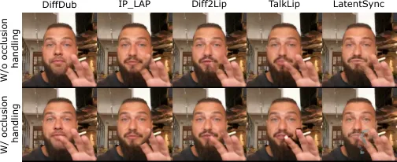

Figure 11: Effectiveness of Occlusion Handling Across Different Methods.

## Appendix E User study results

To ensure that the objective metrics presented in Table 1 align with
human perception, we conduct a user study to evaluate model performance
in terms of lip synchronization, overall coherence, and image quality.
Participants are presented with pairs of videos and asked to select the
one they preferred based on these criteria. The video pairs are randomly
sampled from the pool of models listed in Table 1 to ensure a fair and
unbiased comparison. A total of 1, 000 pairwise comparisons were
collected, providing a robust dataset for evaluating human preferences.
Figure 12 shows a screenshot of the user study interface, illustrating
the evaluation setup.

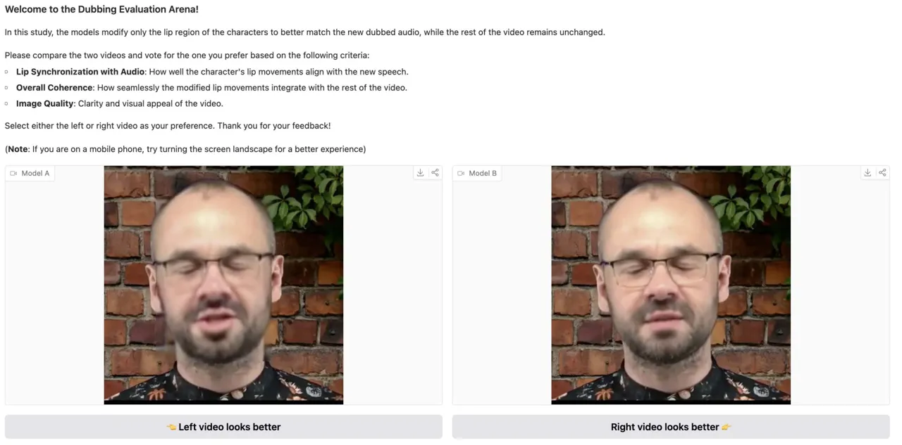

Figure 12: User study interface. Participants were shown side-by-side
videos and asked to select the preferred one based on lip
synchronization, coherence, and quality.

#### Elo ratings

To assess the relative performance of different models in our evaluation
framework, we employ the Elo rating system \[16\], a widely used method
for ranking competitors based on pairwise comparisons. The Elo rating
system assigns scores to models based on their performance in direct
comparisons, updating their ratings dynamically as more results are
collected.

We evaluate Elo ratings in two distinct settings:

- •
  Reconstruction setting (Figure 13): In this scenario, we compare
  videos are generated using the same audio as in the original video.
- •
  Cross-Synchronization Setting (Figure 14): In this scenario, we
  compare videos generated using a different audio from the original
  video.

In both cases, our model consistently outperforms competing methods,
achieving higher Elo ratings. This demonstrates its superior ability to
generate high-quality, accurately synchronised lip movements, both in
the reconstruction and cross-synchronization tasks.

Figure 13: Elo ratings in the reconstruction setting. Higher ratings
indicate better performance in generating videos with original audio as
input.

Figure 14: Elo ratings in the cross-sync setting. Higher ratings
indicate better performance in generating videos with different audio
from input.

#### Elo rating distributions

To better understand the distribution and variance of model rankings, we
analyse the overall Elo ratings across all evaluated models. Figure 15
presents a histogram of Elo scores, illustrating how models are ranked
relative to each other. A well-separated distribution suggests clear
performance differences between models, whereas overlapping scores
indicate models with similar performance levels. Our model achieves the
highest Elo ratings, forming a well-defined peak that highlights its
superior performance. In contrast, baseline models display varying
degrees of separation, with some exhibiting significant overlap,
suggesting closer competition and comparable performance in certain
cases.

Figure 15: Distribution of Elo ratings across all evaluated models. This
histogram illustrates the spread of Elo scores, highlighting performance
gaps or clustering amongst different models.

#### Win rates

Beyond Elo ratings, we compute win rates to assess how often each model
outperforms others in pairwise comparisons. The win rate matrix in
Figure 16 provides a detailed overview of direct matchups, where each
cell represents the percentage of times one model wins against another.
This analysis helps identify dominant models and potential
inconsistencies in ranking. Our model consistently outperforms competing
approaches, achieving a minimum win rate of 69 % and a maximum of 94 %.
These results indicate a strong and reliable performance advantage over
alternative methods.

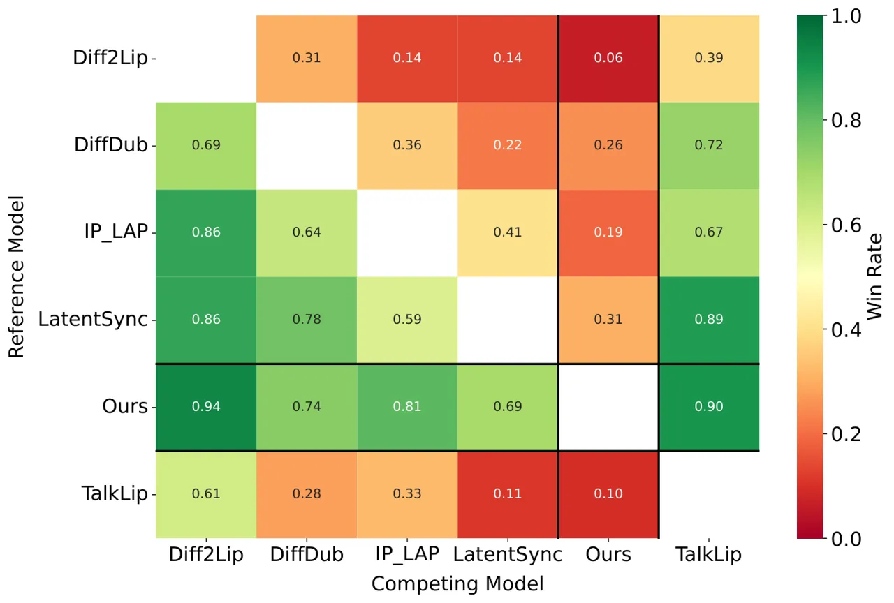

Figure 16: Win rate matrix for pairwise model comparisons. Each cell
represents the proportion of matchups where one model outperforms
another, offering insight into head-to-head performance.

## Appendix F Additional ablations

#### Guidance

Guidance plays a crucial role in the performance of diffusion
models \[14, 20\]. In our case, we use a modified version of
Classifier-Free Guidance (CFG) \[19\], which applies separate scaling
factors to the audio and identity conditions. Specifically, our guidance
function is defined as follows:

```math
z=z_{\emptyset}+w_{\text{id}}\cdot(z_{\text{id}}-z_{\emptyset})+w_{\text{aud}}\cdot(z_{\text{id \& aud}}-z_{\text{id}}), \tag{8}
```

where:

- •
  $`w_{\text{aud}}`$ and $`w_{\text{id}}`$ are the guidance scales for
  audio and identity, respectively.
- •
  $`z_{\emptyset}`$ represents the model output when all conditions are
  set to 0.
- •
  $`z_{\text{id}}`$ is the output when only the identity condition is
  applied.
- •
  $`z_{\text{id \& aud}}`$ is the output when both audio and identity
  conditions are applied.

By separating the audio and identity guidance conditions, we enable more
control over the generated videos, ultimately leading to improved
performance. Experimentally, we found that setting $`w_{\text{aud}}=5`$
and $`w_{\text{id}}=2`$ yields the best results. This configuration
achieves a 29.73 % improvement in LipScore, significantly enhancing lip
synchronization accuracy. While this comes at a 14.75 % increase in CMMD
and a minor 2.80 % increase in FVD, the overall perceptual quality
remains strong, making this trade-off highly beneficial for generating
realistic and synchronized videos. We summarize these results in
Table 8, demonstrating the effectiveness of our approach compared to
standard CFG.

|                                                  |                     |                    |                       |
| ------------------------------------------------ | ------------------- | ------------------ | --------------------- |
| Guidance                                         | CMMD $`\downarrow`$ | FVD $`\downarrow`$ | LipScore $`\uparrow`$ |
| CFG                                              | 0.061               | 200.71             | 0.37                  |
| Ours ($`w_{\text{aud}}=5`$, $`w_{\text{id}}=2`$) | 0.070               | 206.32             | 0.48                  |

Table 8: Guidance ablation in the cross-sync setting.

#### Losses

We present an ablation on the impact of applying a pixel loss in
addition to the diffusion loss in Table 9. Our findings indicate that
adding a $`L_{2}`$ loss in pixel space leads to a slight improvement in
image and video quality while maintaining the same level of lip
synchronization. However, contrary to the findings in \[2\], we did not
find that adding an additional LPIPS pixel loss benefits the model.
Instead, it causes the mouth region to deviate too much from the rest of
the image, as illustrated in Figure 17. This discrepancy arises because
facial animation is a different task from lip synchronization, with the
latter being more closely related to an inpainting task rather than full
facial reconstruction.

|               |                     |                    |                       |
| ------------- | ------------------- | ------------------ | --------------------- |
| Loss          | CMMD $`\downarrow`$ | FVD $`\downarrow`$ | LipScore $`\uparrow`$ |
| No pixel loss | 0.075               | 215.71             | 0.48                  |
| $`L_{2}`$     | 0.070               | 206.32             | 0.48                  |

Table 9: Pixel loss ablation in the cross-sync setting.

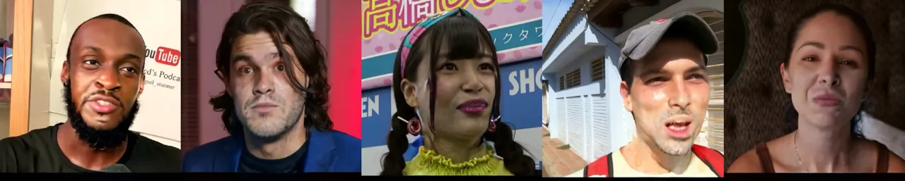

Figure 17: Examples of inconsistent mouth regions obtained by training
with an additional LPIPS pixel loss.

## Appendix G Limitations

To assess the limitations of our approach, we construct a small dataset
consisting of seven identities, where each individual recites the same
two sentences at five different angles: 0°, 20°, 45°, 70°, and 90°, as
illustrated in Figure 19. This setup allows us to systematically
evaluate how the model performs under varying viewpoint conditions.

We present the results of TOPIQ \[7\] with respect to the angle in
Figure 18. We use TOPIQ because it is a no-reference image quality
metric that does not require a large ground-truth dataset for direct
comparison, making it more practical than FID or FVD, which rely on
reference distributions that may be skewed or incomplete across extreme
angles. Additionally, unlike variance of Laplacian (VL), which only
captures blurriness, TOPIQ provides a more comprehensive measure of
perceptual quality degradation, including semantic distortions that
become more pronounced at oblique head poses. The results indicate that
all approaches exhibit performance degradation as the angle increases.
This is a key limitation of our model, which is also observed across
baseline methods. This decline in performance can be attributed to the
inherent biases in our training datasets, which predominantly contain
frontal faces. As a result, the model struggles to infer occluded or
unseen facial regions when presented with extreme head poses. One
potential solution is to provide identity frames from multiple
viewpoints during training, allowing the model to learn a more
comprehensive facial representation. However, this would require
extesnsive new data collection and further investigation, and is
therefore left for future work.

Figure 18: Impact of head pose on model performance.

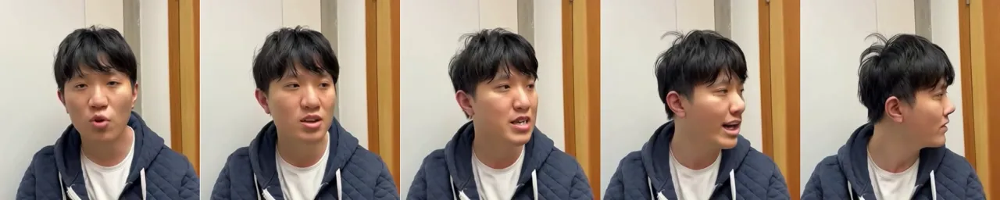

Figure 19: Examples of generated videos at different angles.

## Appendix H Additional qualitative results

We present additional qualitative results in Figure 20. As reported in
the main paper, our model demonstrates better alignment with the target
lips while also achieving higher image quality compared to other
methods. Additionally, we evaluate our model’s ability to handle
non-human faces in Figure 21. We find that KeySync produces plausible
lip-synced animations, while competing models fail to accurately
reconstruct mouth details, particularly in the first two identities, as
they deviate significantly from typical human facial structures. This
highlights our model’s superior adaptability in handling
out-of-distribution (OOD) scenarios.

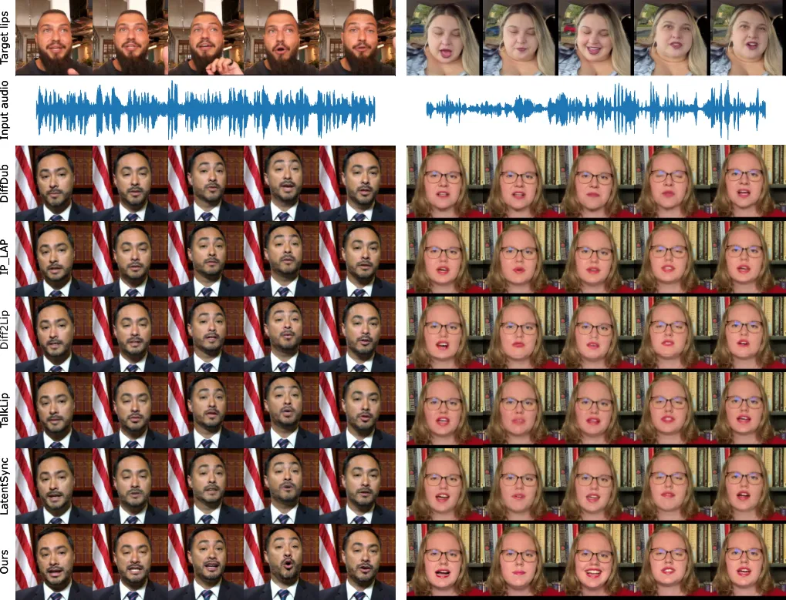

Figure 20: Additional qualitative comparison.

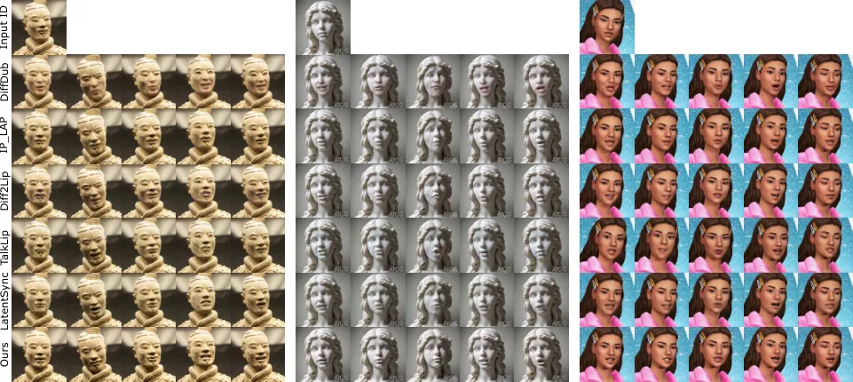

Figure 21: Qualitative comparison on non-human ids.

To better assess the effectiveness of our approach, we provide a series
of videos as part of the supplementary material. These videos are
categorized as follows:

- •
  Side-by-side comparisons: Showcasing our method against other
  approaches in both reconstruction and cross-sync settings.
- •
  Silent videos: Highlighting expression leakage within the same video,
  demonstrating how different models handle silent audio.
- •
  Occlusion cases: Also included in the same video, presenting
  situations where parts of the face are obstructed, illustrating the
  robustness of our approach.
- •
  Multilingual examples: Evaluating the model’s performance across
  different languages to assess generalization.
- •
  Out-of-distribution examples: Testing our model on non-human
  identities, demonstrating its adaptability to non-human faces.
- •
  Examples at different angles: Analyzing the model’s performance under
  varying head poses, highlighting its ability to handle different
  viewpoints as well as its limitations.
- •
  Additional cross-sync videos: Providing a more extensive evaluation of
  our model’s cross-sync capabilities across various conditions.

These supplementary videos offer a comprehensive visual demonstration of
our method’s performance across a wide range of conditions.

## Appendix I Ethical Considerations and Social Impact

#### User study

Our study includes a user evaluation where participants compare video
outputs for lip synchronization, image quality, and coherence. All
participants provided informed consent, and their responses were
collected anonymously. No personally identifiable information or
sensitive data were gathered, ensuring compliance with ethical research
guidelines.

#### Model

Lip-sync generation has numerous beneficial applications, including
enhanced video dubbing, accessibility tools for hearing-impaired
individuals, and improvements in digital content creation. However, we
acknowledge that such technology can also be misused, particularly in
the context of deepfake generation, which poses risks related to
misinformation, identity fraud, and unethical content manipulation. To
mitigate potential misuse, we emphasize that our approach is developed
with a focus on fair use cases and is intended strictly for research
purposes.

#### Datasets

We rely on publicly available datasets that were originally collected
and published by external researchers. We adhere to the terms and
ethical guidelines set by the dataset creators.
