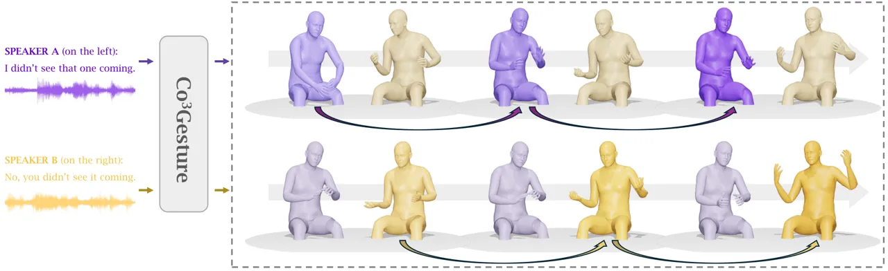
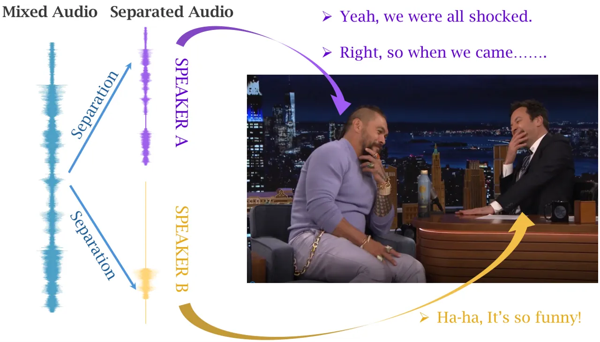
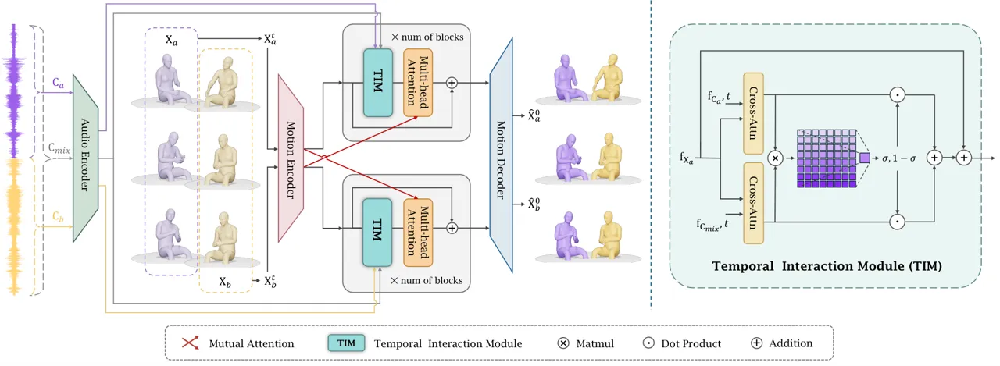
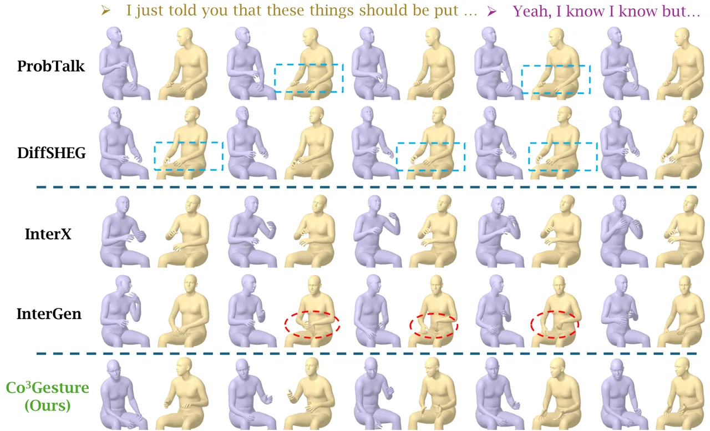
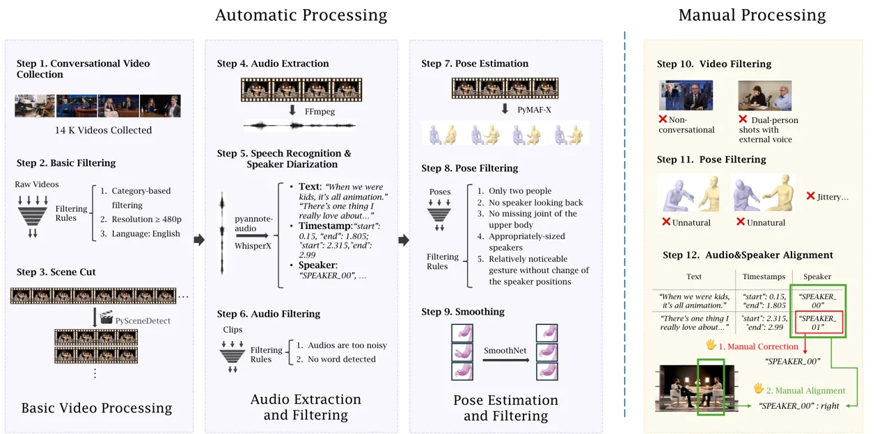
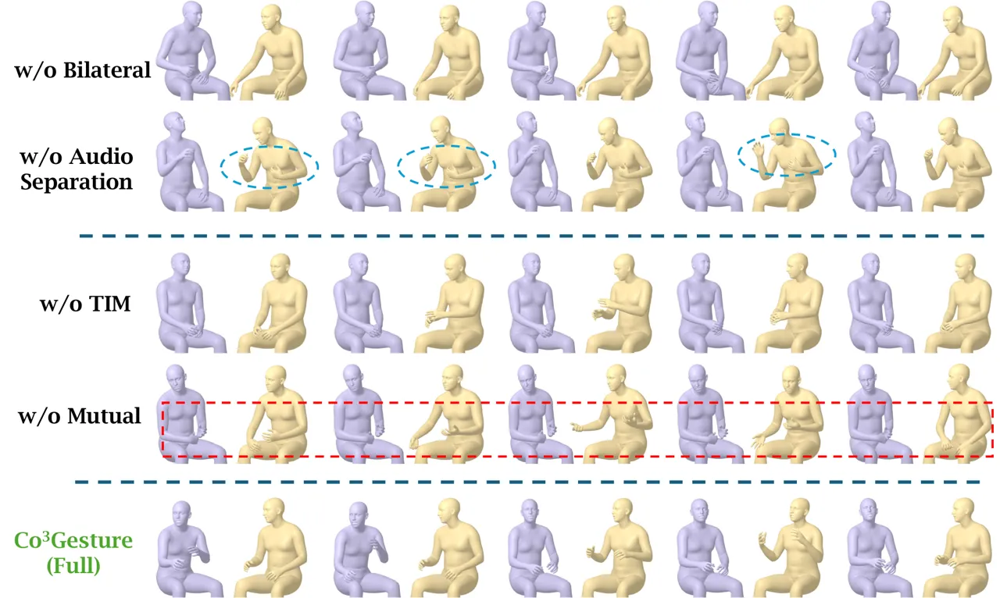

# Co³Gesture: Towards Coherent Concurrent Co-speech 3D Gesture Generation with Interactive Diffusion

Xingqun Qi¹¹ 1 These authors contributed equally to this work.
Affiliation:  The Hong Kong University of Science and Technology   
Yatian Wang¹¹ 1 These authors contributed equally to this work.
Affiliation:  The Hong Kong University of Science and Technology   
Hengyuan Zhang Affiliation:  Peking University    Jiahao Pan
Affiliation:  The Hong Kong University of Science and Technology    Wei
Xue Affiliation:  The Hong Kong University of Science and Technology   
Shanghang Zhang Affiliation:  Peking University    Wenhan Luo
Affiliation:  The Hong Kong University of Science and Technology   
Qifeng Liu Affiliation:  The Hong Kong University of Science and
Technology    Yike Guo Affiliation:  The Hong Kong University of Science
and Technology

###### Abstract

Generating gestures from human speech has gained tremendous progress in
animating virtual avatars. While the existing methods enable
synthesizing gestures cooperated by individual self-talking, they
overlook the practicality of concurrent gesture modeling with two-person
interactive conversations. Moreover, the lack of high-quality datasets
with concurrent co-speech gestures also limits handling this issue. To
fulfill this goal, we first construct a large-scale concurrent co-speech
gesture dataset that contains more than 7M frames for diverse two-person
interactive posture sequences, dubbed GES-Inter. Additionally, we
propose Co³Gesture, a novel framework that enables coherent concurrent
co-speech gesture synthesis including two-person interactive movements.
Considering the asymmetric body dynamics of two speakers, our framework
is built upon two cooperative generation branches conditioned on
separated speaker audio. Specifically, to enhance the coordination of
human postures *w.r.t.*corresponding speaker audios while interacting
with the conversational partner, we present a Temporal Interaction
Module (TIM). TIM can effectively model the temporal association
representation between two speakers’ gesture sequences as interaction
guidance and fuse it into the concurrent gesture generation. Then, we
devise a mutual attention mechanism to further holistically boost
learning dependencies of interacted concurrent motions, thereby enabling
us to generate vivid and coherent gestures. Extensive experiments
demonstrate that our method outperforms the state-of-the-art models on
our newly collected GES-Inter dataset. The dataset and source code are
publicly available at
[https://mattie-e.github.io/Co3/](https://mattie-e.github.io/Co3/).

|     |
| --- |
|     |



Figure 1: Diverse exemplary clips sampled by our method from our newly
collected GES-Inter dataset. The vital frames are visualized to
demonstrate the concurrent upper body dynamics of two speakers generated
by our Co³Gesture framework displaying temporal coherent interaction
with each other, respectively. Best view on screen.

^(†)^(†)footnotetext: ✉ Corresponding authors.

## 1 Introduction

The generation of co-speech gestures seeks to create expressive and
diverse human postures that align with audio input. These non-verbal
behaviors play a crucial role in human communication, significantly
enhancing the effectiveness of speech delivery. Meanwhile, modeling
co-speech gestures has broad applications in embodied AI, including
human-machine interaction (Liu et al., 2023), robotic
assistance (Farouk, 2022), and virtual/augmented reality (AR/VR) (Fu
et al., 2022). Traditionally, researchers have primarily concentrated on
synthesizing upper body gestures that correspond to spoken audio (Liu
et al., 2022b; Yi et al., 2023).

These methods usually focus on synthesizing single-speaker gestures
following people’s self-talking (Liu et al., 2024b; Liu et al., 2024a;
Qi et al., 2024b; Yang et al., 2023). Although some researchers model
the single human postures via conversational speech corpus (Mughal
et al., 2024a; Ng et al., 2024), they mostly overlook generating the
concurrent long sequence gestures with interactions. Besides, others
generate the single speaker gesture from conversational corpus
incorporated with interlocuter reaction movements (Kucherenko et al.,
2023; Zhao et al., 2023). However, few researchers have devoted
themselves to constructing datasets with interactive concurrent
gestures. For example, the interactive movement of two speakers may
include waving arms when saying “_hello_” during conversation. In this
work, we therefore introduce the new task of two-speaker concurrent
gestures generation under the condition of conversational human
speeches, as displayed in Figure 1.

There are two main challenges in this task: 1) Datasets of concurrent 3D
co-speech gestures synchronized with conversation audios of two speakers
are scarce. Creating such a dataset containing large-scale 3D human
postures is difficult due to complex motion capture systems and
expensive labor for actors. 2) Modeling the plausible and temporal
coherent co-speech gestures of two speakers is difficult, especially
involving the frequent interactions in long sequences.

To address the issue of data scarcity, we construct a new large-scale
whole-body meshed 3D co-speech gesture dataset that includes concurrent
speaker postures within more than 7M frames, dubbed GES-Inter. In
particular, we first leverage the advanced 3D pose estimator (Zhang
et al., 2023a)



Figure 2: Illustration of our audio separation and alignment with
speakers.

to obtain high-quality poses (_i.e._, SMPL-X Pavlakos et al. (2019) and
FLAME Li et al. (2017)) from in-the-wild talk show videos. To obtain the
individual sound signals of each speaker in the conversation while
preserving the identity consistency with the posture movement, we employ
the pyannote-audio Bredin et al. (2020) to separate the mixed speech, as
shown in Figure 2. Afterward, by utilizing the automatic speech
recognition techniques Whisper-X Bain et al. (2023), we acquire the
consistent text transcript and speech phoneme with speaker audio. In
this fashion, our GES-Inter dataset covers a wide range of two-person
interactive concurrent co-speech gestures, from daily conversations to
formal interviews. Moreover, the multi-modality annotation and common
meshed human postures pave the potential for various downstream tasks
like human behaviors analysis (Liang et al., 2024b; Xu et al., 2024) and
talking face generation (Peng et al., 2024; Ng et al., 2024), _etc._

Based on our GES-Inter dataset, we propose a novel framework, named
Co³Gesture , to model the coherent concurrent co-speech 3D gesture
generation. The key insight of our framework is to carefully build the
interactions between concurrent gestures. Here, we observe that the
motions of two speakers are asymmetric (_e.g._, when one speaker moves
in talking, the other could be quiet in static or moving slowly).
Directly producing the concurrent gestures in a holistic manner may lead
to unnatural results. Therefore, we establish two cooperative
transformer-based diffusion branches to generate corresponding gestures
of two speakers, performing the specific denoising process,
respectively. This bilateral paradigm encourages our framework to yield
diverse interactive movements while effectively preventing mode
collapse.

Moreover, to ensure the motions of the one speaker are temporally
consistent with the corresponding audio signal and display coherent
interaction with the conversational partner, we devise a Temporal
Interaction Module (TIM). Specifically, we first incorporate the
separated human voices to produce single-speaker gesture features,
respectively. Then, we model the joint embedding of the current speaker
features and the integrated conversational motion clues guided by mixed
speech audio. Here, the learned joint embedding is leveraged as the soft
weight to balance the interaction dependence of the generated current
speaker gesture dynamics with other ones. Then, we conduct the mutual
attention of the fused bilateral gesture denoisers to further facilitate
high-fidelity concurrent gesture generation with desirable interactive
properties. Extensive experiments conducted on our newly collected
GES-Inter dataset verify the effectiveness of our method, displaying
diverse and vivid concurrent co-speech gestures.

Overall, our contributions are summarized as follows:

- •
  We introduce the new task of concurrent co-speech gesture generation
  cooperating with one newly collected large-scale dataset named
  GES-Inter. It contains more than 7M high-quality co-speech postures of
  the whole body, significantly facilitating research on diverse gesture
  generation.
- •
  We propose a novel framework named Co³Gesture upon the bilateral
  cooperative diffusion branches to produce realistic concurrent
  co-speech gestures. Our Co³Gesture includes the tailor-designed
  Temporal Interaction Module (TIM) to ensure the temporal
  synchronization of gestures *w.r.t.*the corresponding speaker voices
  while preserving desirable interactive dynamics.
- •
  Extensive experiments show that our framework outperforms various
  state-of-the-art counterparts on the GES-Inter dataset, producing
  diverse and coherent concurrent co-speech gestures given
  conversational speech audios.

## 2 Related Work

##### Co-speech Gesture Synthesis.

Synthesizing the diverse and impressive co-speech gestures displays a
significant role in the wide range of applications like human-machine
interaction (Cho et al., 2023; Guo et al., 2021), robot (De Wit et al.,
2023; Sahoo et al., 2023), and embodied AI (Li et al., 2023; Benson
et al., 2023). Numerous works were proposed to address this task that
can be roughly divided into rule-based approaches, machine learning
designed methods, and deep learning based ones. Rule-based research
depends on linguistic experts’ pre-defined corpus to bridge human speech
and gesture movements (Cassell et al., 1994; Poggi et al., 2005). The
others usually leverage machine learning techniques with mutually
constructed speech features to generate co-speech gestures (Levine
et al., 2010; Sargin et al., 2008). However, these methods heavily rely
on efforts on pre-processing which may cause expensive labor
consumption.

Recently deep learning based methods gained much development directly
modeling co-speech gesture synthesis via deep neural networks. Most of
them usually leverage the multi-modality cues to generate postures
incorporated with individual self-talking audio (Li et al., 2021a; Zhu
et al., 2023; Yi et al., 2023; Qi et al., 2024c), such as speaker
identity (Liu et al., 2024a; Liu et al., 2024b; Chen et al., 2024),
emotion (Qi et al., 2024b; Qi et al., 2024a; Liu et al., 2022a), and
transcripts (Zhang et al., 2024; Ao et al., 2023; Ao et al., 2022; Zhi
et al., 2023). Only a few counterparts propose to synthesize the single
gesture under conversational speech guidance (Ng et al., 2024; Mughal
et al., 2024b). Besides, the GENEA challenge holds the most similar
settings to us. The participants aim to generate the single-person
gesture from the conversational corpus incorporated with interlocuter
reaction movements (Kucherenko et al., 2023). However, they overlook the
concurrent co-speech gesture modeling of two speakers during the
conversation is much more practical in the real scenes. Few of the above
methods could be directly adapted to this new thought.

##### Co-speech Gesture Datasets.

Co-speech gesture datasets are roughly divided into two types:
pseudo-label based gestures and motion-capture based ones. For
pseudo-label approaches, researchers usually utilize the pre-trained
pose estimator to obtain upper body postures from in-the-wild News or
talk show videos (Yoon et al., 2020; Ahuja et al., 2020; Habibie et al.,
2021). Thanks to the recent advanced parametric whole-body meshed 3D
model SMPL-X Pavlakos et al. (2019) and FLAME Li et al. (2017), some
high-quality whole-body based 3D co-speech gesture datasets are
emerged (Qi et al., 2024c; Yi et al., 2023; Qi et al., 2024b; Qi et al.,
2024a). Meanwhile, it significantly promotes the construction of
motion-capture based co-speech datasets (Liu et al., 2022a; Liu et al.,
2024a; Ghorbani et al., 2023; Mughal et al., 2024b; Ng et al., 2024).
Although some of them are built upon conversational corpora, they only
provide gestures of single speakers (Liu et al., 2024a; Ng et al.,
2024). The TWH16.2 (Lee et al., 2019) dataset displays the pioneer
exploration of concurrent gestures via joint-based representation.
However, it overlooks the significance of the facial expression data in
conversation. Meanwhile, the SMPL-X mesh-based whole-body data in our
dataset is more convenient for avatar rendering and downstream
applications (_e.g._, talking face) compared to TWH16.2. Besides, the
DND GROUP GESTURE dataset Mughal et al. (2024b) is built upon a
multi-performer group talking scene, which can not be directly applied
to our task. Therefore, a 3D co-speech dataset including concurrent
gestures of two speakers with the meshed whole body is required for
further research.

##### 3D Human Motion Modeling.

Human motion modeling aims to generate natural and realistic coherent
posture sequences from multi-modality conditions, which contains
co-speech gesture synthesis as a sub-task (Liang et al., 2024a; Tevet
et al., 2023). One of the hottest tasks is generating human movements
from the input action descriptions (Jiang et al., 2023; Zhang et al.,
2023b; Lin et al., 2024; Xu et al., 2024). It needs to enforce the
results by displaying an accurate semantic expression aligned with text
prompts. The other one that shares modality guidance similar to our task
is the AI choreographer (Li et al., 2020; Li et al., 2021b; Siyao
et al., 2022; Le et al., 2023). While retaining analogous interactive
human motion modeling with the approaches mentioned above, our newly
introduced work differs from them significantly. Both of the
aforementioned topics follow the symmetrical fact that exchanging the
identities of performers during interactions does not change the
semantics or coherence of motions. We take the asymmetric body dynamics
of concurrent human movements into consideration, motivating us to
design the bilateral diffusion branches.

## 3 Proposed Method

### 3.1 Interactive Gesture Dataset Construction

##### Preliminary.

Due to the expensive labor and complex motion capture system
establishment during the frequent interactive conversations, similar to
Yi et al. (2023); Liu et al. (2022b); Qi et al. (2024c), we intend to
obtain the high-quality 3D pseudo human postures of our dataset.
Synthesizing datasets conducive to our task focuses on ensuring
high-fidelity and smooth gesture movements, authority speaker voice
separation, and identity consistent audio-posture alignment.

|                                     |                     |                  |                       |      |        |      |                  |
| ----------------------------------- | ------------------- | ---------------- | --------------------- | ---- | ------ | ---- | ---------------- |
| Datasets                            | Concurrent Gestures | Duration (hours) | Additional Attributes |      |        |      | Joint Annotation |
|                                     |                     |                  | Facial                | Mesh | Phonme | Text |                  |
| TED (Yoon et al., 2020)\_(TOG)      | ✗                   | 106.1            | ✗                     | ✗    | ✗      | ✓    | pseudo           |
| TED-Ex (Liu et al., 2022b)\_(CVPR)  | ✗                   | 100.8            | ✗                     | ✗    | ✗      | ✓    | pseudo           |
| EGGS (Ghorbani et al., 2023)\_(CGF) | ✗                   | 2                | ✗                     | ✗    | ✗      | ✓    | pseudo           |
| BEAT (Liu et al., 2022a)\_(ECCV)    | ✗                   | 76               | ✓                     | ✗    | ✓      | ✓    | mo-cap           |
| SHOW (Yi et al., 2023)\_(CVPR)      | ✗                   | 26.9             | ✓                     | ✓    | ✗      | ✗    | pseudo           |
| TWH16.2 (Lee et al., 2019)\_(ICCV)  | ✓                   | 17               | ✓                     | ✓    | ✓      | ✓    | mo-cap           |
| BEAT2 (Liu et al., 2024a)\_(CVPR)   | ✗                   | 60               | ✓                     | ✓    | ✓      | ✓    | mo-cap           |
| DND (Mughal et al., 2024b)\_(CVPR)  | ✗                   | 6                | ✗                     | ✗    | ✗      | ✗    | mo-cap           |
| Photoreal (Ng et al., 2024)\_(CVPR) | ✗                   | 8                | ✓                     | ✗    | ✗      | ✗    | mo-cap           |
| GES-Inter (ours)                    | ✓                   | 70               | ✓                     | ✓    | ✓      | ✓    | pseudo           |

Table 1: Statistical comparison of our GES-Inter with existing datasets.
The dotted line separates whether the speech content in the dataset is
built based on the conversational corpus.

##### Estimation of 3D Posture.

Firstly, we exploit the state-of-the-art 3D pose estimator Pymaf-X Zhang
et al. (2023a) to acquire the meshed whole-body parametric human
postures based on SMPL-X Pavlakos et al. (2019). In particular, the body
dynamics are denoted by the unified SMPL model Loper et al. (2023) that
collaborated with the MANO hand model Boukhayma et al. (2019).
Meanwhile, we adopt the FLAME face model Li et al. (2017) to present the
facial expressions of speakers. The corpora are collected from the
in-the-wild talk show or formal interview videos that contain
high-resolution frames and unobstructed sitting postures. Then, we
conduct extensive data processing to filter the unnatural and jittery
poses, thereby ensuring the high-quality of the dataset^(\*)^(\*) \*
Please refer to supplementary material for more details about data
processing.. Our GES-Inter includes more than 7M validated gesture
frames with 70 hours. To the best of our knowledge, this is the first
large-scale co-speech dataset that includes mesh-based whole-body
concurrent postures of two speakers, as reported in Table 1.

##### Separation of Speaker Audio.

To obtain the identity-specific speech audios of each speaker in the
mixed conversation corpus, we leverage the advanced sound source
separation technique pyannote-audio Bredin et al. (2020) to conduct
human voice separation. Here, we enforce the number of separated
speakers as two for assigning each speech segment to the corresponding
speaker. Then, we utilize the superior speech recognition model
WhisperX Bain et al. (2023) to acquire accurate word-level text
transcripts. Once we acquire high-fidelity transcripts, we utilize the
Montreal Forced Aligner (MFA) McAuliffe et al. (2017) to obtain
phoneme-level timestamps associated with facial expressions. Such
extensive multi-modality attributes of our dataset enable the research
of various downstream tasks like talking face (Peng et al., 2024; Ng
et al., 2024), and human behavior analysis (Park et al., 2023; Qi
et al., 2023; Dubois et al., 2024) _etc._

##### Alignment of Audio-Posture Pair.

Once we obtain the separated audio signals for each speaker, we assign
them to the corresponding body dynamics. We recruit professional
inspectors to manually annotate the separated audio signals with their
corresponding speaker identities. To ensure the accuracy of the aligned
audio-posture pairs, different inspectors double-check these results. In
this way, our newly constructed GES-Inter dataset offers high-quality
concurrent gestures with aligned multi-modal annotations.

### 3.2 Problem Formulation

Given a sequential collection of conversational audio signal
$`\mathbf{C}_{mix}`$ as the condition, our goal is to generate the
interactive concurrent gesture sequences of two speakers $`\mathbf{x}`$.
Where $`\mathbf{C}_{mix}=\mathrm{C}_{a}+\mathrm{C}_{b}`$ and
$`\mathbf{x}=\left\{\mathrm{x}_{a},\mathrm{x}_{b}\right\}`$ denote the
corresponding audios and postures of two speakers. The sequence length
is the fixed number $`N`$. Specifically, each pose of a single person is
presented as $`J`$ joints with 3D representation. Note that we only
generate the upper body including fingers in this work.



Figure 3: The overall pipeline of our Co³Gesture . Given conversational
speech audios, our framework generates concurrent co-speech gestures
with coherent interactions.

### 3.3 Bilateral Cooperative Diffusion Model

Considering the asymmetric body dynamics of two speakers, we aim to
address the concurrent co-speech gesture generation in a bilateral
cooperation manner, as depicted in Figure 3. The framework takes the two
noisy human motions as input for producing denoised ones, which is
conditioned on diffusion time step $`t`$, mixed conversational audio
signal $`\mathbf{C}_{mix}`$, and separated speaker voices
$`\mathrm{C}_{a}`$ or $`\mathrm{C}_{b}`$. We leverage separated human
speech as guidance for bilateral branches to generate corresponding
gestures. Moreover, we utilize the original mixed audio signal of two
speakers to indicate the interaction information to ensure the
synthesized posture retains rhythm with specific audio while preserving
interactive coherency with the conversation partner. All the audio
signals are fed into the audio encoder for feature extraction.

##### Temporal Interaction Module.

To ensure temporal consistency while preserving the interactive dynamics
of concurrent gestures, we propose a Temporal Interaction Module (TIM)
to model the temporal association representation between each current
speaker movements and conversational counterparts. As shown in Figure 3,
we utilize the features extracted from mixed conversational audios to
indicate the interaction information. Here, the dimensions of features
in our TIM are all normalized as $`\mathbb{R}^{N\times D}`$. For
notation simplicity, we take single-branch $`\mathrm{x}_{a}`$ for
elaboration.

In particular, we first incorporate the current speaker audio embedding
$`\mathbf{f}_{\mathrm{C}_{a}}`$ as the query $`Q`$ to match the key
feature $`K`$ and value feature $`V`$ belonging to motion embedding
$`\mathbf{f}_{\mathrm{x}_{a}}`$ via cross-attention meshanism (Vaswani
et al., 2017):

```math
\displaystyle Q=\mathbf{f}_{\mathrm{C}_{a}}\mathbf{W},K={\mathbf{f}_{\mathrm{x}_{a}}}\mathbf{W},V={\mathbf{f}_{\mathrm{x}_{a}}}\mathbf{W}. \tag{1}
```

Here, $`\mathbf{W}`$ denotes the projection matrix. Along with this
operation, we obtain the updated current speaker motion embedding
$`\mathbf{f}_{\mathrm{x}_{a},\mathrm{C}_{a}}`$. Similarly, we acquire
the interactive motion embedding
$`\mathbf{f}_{\mathrm{x}_{a},\mathbf{C}_{mix}}`$ incorporated with mixed
conversational speeches. Then we calculate the temporal correlation
matrix $`\mathbf{M}\in\mathbb{R}^{N\times N}`$ between the updated
current gesture embedding and interactive embedding. Here, the temporal
correlation matrix represents the temporal variants between the current
gesture sequences and interactive ones. Then, we exploit a motion
encoder to acquire a learnable weight parameter $`\sigma`$ as the
temporal-interaction dependency. Once we obtain the weight parameter,
the current speaker motion embedding is boosted as follows:

```math
\displaystyle\mathbf{f}_{\mathrm{x}_{a},\mathrm{C}_{a}}=\sigma\odot\mathbf{f}_{\mathrm{x}_{a},\mathrm{C}_{a}}+(1-\sigma)\odot\mathbf{f}_{\mathrm{x}_{a},\mathbf{C}_{mix}},\sigma=sigmoid(\text{Enc}(\mathbf{M})), \tag{2}
```

where $`\odot`$ is Hadamard product, Enc denotes the motion encoder. The
motion embedding of the conversation partner is updated in the same
manner. In this fashion, the temporal interaction fidelity of generated
gestures is well-preserved.

##### Mutual Attention Mechanism.

To further enhance the interaction between two speakers, we construct
bilateral cooperative branches that interact with each other to produce
concurrent gestures. To be specific, we introduce the mutual attention
layers that take the features of the counterpart as the query $`Q`$ in
Multi-Head Attention (MHA), respectively. We observe that exchanging the
input order of the speaker’s audio results in an invariance effect of
interactive body dynamics. In other words, the distribution of
interaction data of two speakers adheres to the same marginal
distribution. Therefore, we formulate the cooperating denoisers
retaining shared weight update strategies. This encourages the gesture
features after the TIM to be more temporal and interactive with partner
ones, holistically.

### 3.4 Objective Functions

During the training phase, the denoisers of our bilateral branches share
the common network structure. Given the diffusion time step $`t`$, the
current speaker audio $`\left\{\mathrm{C}_{a},\mathrm{C}_{b}\right\}`$,
the mixed conversation audio $`\mathbf{C}_{mix}`$, and the noised
gestures $`\left\{\mathrm{x}_{a}^{(t)},\mathrm{x}_{b}^{(t)}\right\}`$,
the denoisers are enforced to produce continuous human gestures. The
denoising process can be constrained by the simple objective:

```math
\displaystyle\mathcal{L}_{simple} \displaystyle=\mathbb{E}_{\mathbf{x},t,\epsilon}\left[\left\|\mathrm{x}_{a}-\mathcal{D}(\mathrm{x}_{a}^{(t)},\mathrm{C}_{a},\mathbf{C}_{mix},t)\right\|_{2}^{2}+\left\|\mathrm{x}_{b}-\mathcal{D}(\mathrm{x}_{b}^{(t)},\mathrm{C}_{b},\mathbf{C}_{mix},t)\right\|_{2}^{2}\right], \tag{3}
```

where $`\mathcal{D}`$ is the denoiser,
$`\epsilon\sim\mathcal{N}(\mathbf{0},\mathbf{I})`$ is the added random
Gaussian noise,
$`\mathrm{x}_{\left\{a,b\right\}}^{(t)}=\mathrm{x}_{\left\{a,b\right\}}+\sigma_{(t)}\epsilon`$
is the gradually noise adding process at step $`t`$.
$`\sigma_{(t)}\in(0,1)`$ is the constant hper-parameter. Moreover, we
utilize the velocity loss $`\mathcal{L}_{vel}`$ and foot contact loss
$`\mathcal{L}_{foot}`$  (Tevet et al., 2023) to provide supervision on
the smoothness and physical reasonableness, respectively. Finally, the
overall objective is:

```math
\displaystyle\mathcal{L}_{total} \displaystyle=\lambda_{simple}\mathcal{L}_{simple}+\mathcal{L}_{vel}+\mathcal{L}_{foot}, \tag{4}
```

where $`\lambda_{simple}`$ is trade-off weight coefficients.

In the inference, since the audio signals of the concurrent gestures
generation serve as an essential condition modality, the prediction of
human postures is formulated as fully conditioned denoising. This
encourages our framework to strike a balance between high fidelity and
diversity.

## 4 Experiments

### 4.1 Datasets and Experimental Setting

##### GES-Inter Dataset.

Since the existing co-speech gesture datasets fail to provide
interactive concurrent body dynamics, we contribute a new dataset named
GES-Inter to evaluate our approach. The human postures of our GES-Inter
are collected from 1,462 processed videos including talk shows and
formal interviews. The extraction takes 8 NVIDIA RTX 4090 GPUs in one
month, obtaining 20 million raw frames. After the complex data
processing, we get more than 7 million validated instances. Finally, we
acquire 27,390 motion clips that are split into training/ validation/
testing following criteria (Liu et al., 2022a; Liu et al., 2024a) as
85%/ 7.5%/ 7.5%.

##### Implementation Details.

We set the total generated sequence length $`N=90`$ with the FPS
normalized as 15 in the experiments. $`\mathbf{C}_{mix}`$,
$`\mathrm{C}_{a}`$, and $`\mathrm{C}_{b}`$ are represented as audio
signal waves, initially. Then, these audio signals are converted into
mel-spectrograms with an FFT window size of 1,024, and the hop length is 512. The dimension of input audio mel-spectrograms is $`128\times 186`$.
We follow the tradition of  (Liu et al., 2022b; Qi et al., 2024b; Qi
et al., 2024c) to leverage the speech recognizer as the audio encoder.
Each branch of our pipeline is implemented with 8 blocks within 8 heads
of attention layers. The latent dimension $`D`$ is set to 768.

In the training stage, we set $`\lambda_{simple}=15`$, empirically. The
initial learning rate is set as $`1\times 10^{-4}`$ with an AdamW
optimizer. Similar to Nichol & Dhariwal (2021), we set the diffusion
time step as 1,000 with the cosine noisy schedule. Our model is applied
on a single NVIDIA H800 GPU with a batch size of 128. The training takes
a total of 100 epochs, accounting for 3 days. During inference, we adopt
DDIM Song et al. (2020) sampling strategy with 50 denoising timesteps to
produce gestures. Our experiments only contain upper body joints without
facial expressions and shape parameters. Our Co³Gesture synthesizes
upper body movements containing 46 joints (_i.e._, 16 body joints + 30
hand joints) of each speaker. Each joint is converted to a 6D rotation
representation Zhou et al. () for more stable modeling. The dimension of
the generated motion sequence is $`\mathbb{R}^{90\times 276}`$, where 90
denotes frame number and $`276=46\times 6`$ means upper body joints. The
order of each joint follows the original convention of SMPL-X.

##### Evaluation Metrics.

To fully evaluate the realism and diversity of the generated co-speech
gestures, we introduce various metrics:

- •
  FGD: Fréchet Gesture Distance (FGD) Yoon et al. (2020) is calculated
  as the distribution distance between the body movements of synthesized
  results and real ones via a pre-trained autoencoder.
- •
  BC: Beat Consistent Score (BC) / Beat Alignment Score (BA) Liu et al.
  (2022a); Liu et al. (2024a) measures whether the generated motion
  dynamics are rhythmic consistent with the input speech audios. We
  report the average score of two speakers in our experiments.
- •
  Diversity: Similar to (Liu et al., 2022b; Zhu et al., 2023; Liu
  et al., 2024a), the autoencoder of FGD is exploited to acquire feature
  embeddings of the synthesized gestures. Here, the diversity score
  means the average distance of 500 randomly assembed pairs.

### 4.2 Quantitative Results

|                                              |                          |                       |                              |
| -------------------------------------------- | ------------------------ | --------------------- | ---------------------------- |
|                                              |    GES-Inter Dataset     |                       |                              |
|    Methods                                   |    FGD $`\downarrow`$    |    BC $`\uparrow`$    |    Diversity $`\uparrow`$    |
|    TalkSHOW (Yi et al., 2023)\_(CVPR)        |    2.256                 |    0.613              |    53.037^(±1.021)           |
|    ProbTalk (Liu et al., 2024b)\_(CVPR)      |    1.238                 |    0.645              |    46.981^(±2.173)           |
|    DiffSHEG (Chen et al., 2024)\_(CVPR)      |    1.209                 |    0.638              |    56.781^(±1.905)           |
|    EMAGE (Liu et al., 2024a)\_(CVPR)         |    1.884                 |    0.637              |    60.917^(±1.179)           |
|    MDM (Tevet et al., 2023)\_(ICLR)          |    1.696                 |    0.654              |    65.529^(±2.218)           |
|    InterX (Xu et al., 2024)\_(CVPR)          |    1.178                 |    0.661              |    65.161^(±1.010)           |
|    InterGen (Liang et al., 2024b)\_(IJCV)    |    1.012                 |    0.670              |    69.455^(±1.590)           |
|    Co³Gesture (ours)                         |    0.769                 |    0.692              |    72.824^(±2.026)           |

Table 2: Comparison with the state-of-the-art counterparts on our newly
collected GES-Inter dataset. $`\uparrow`$ means the higher the better,
and $`\downarrow`$ indicates the lower the better. $`\pm`$ means 95%
confidence interval. The dotted line separates whether the methods are
adopted from single-person co-speech generation or text2motion
counterparts.

Comparisons with SOTA Methods. To the best of our knowledge, we are the
first to explore the coherent concurrent co-speech gesture generation
with conversational human audio. To fully verify the superiority of our
method, we implement various state-of-the-art (SOTA) counterparts from
the perspective of single-person-based co-speech gesture generation
(_i.e._, TalkSHOW (Yi et al., 2023), ProbTalk (Liu et al., 2024b),
DiffSHEG (Chen et al., 2024), EMAGE (Liu et al., 2024a)) and text2motion
generation (_i.e._, MDM (Tevet et al., 2023), InterX (Xu et al., 2024)
InterGen (Liang et al., 2024b)). For fair comparisons, all the
competitors are implemented by official source codes or pre-trained
models released by authors. Specifically, in DiffSHEG, we follow the
convention of the original work to utilize the pre-trained HuBERT (Hsu
et al., 2021) for audio feature extraction. In TalkSHOW, we exploit the
pre-trained Wav2vec (Baevski et al., 2020) to encode the audio signals
following the original setting. Apart from this, the remaining
components for gesture generation in DiffSHEG and TalkSHOW are all
trained from scratch on the newly collected GES-Inter dataset. For other
methods, we modify their final output layer to match the dimensions of
our experimental settings. Since the above text2motion counterparts are
designed without the audio incorporation setting, we adopt the same
audio encoder as ours in the models.

As reported in Table 2, we adopt the FGD, BC, and diversity for a
well-rounded view of comparison. Our Co³Gesture outperforms all the
competitors by a large margin on the GES-Inter dataset. Remarkably, our
method even achieves more than 24% (_i.e._,
$`(1.102-0.769)/1.012\approx 24\%`$) improvement over the sub-optimal
counterpart in FGD. We observe that both InterGen (Liang et al., 2024b)
and ours synthesize the authority gestures with much higher diversity
than others. This is caused by both of them employing the bilateral
branches to generate concurrent gestures of two speakers. However,
InterGen shows lower performance on FGD due to the lack of effective
temporal interaction modeling. In terms of BC, our method attains much
better results than other counterparts. This aligns highly with our
insight on the audio separation-based bilateral diffusion backbone that
encourages each branch to synthesize speech coherent gestures while
preserving the vivid interaction of the results. Compared with
single-person co-speech gesture based ones, our model still achieves the
best performance. This can be attributed to our well-designed temporal
interaction module.

##### Ablation Study.

To further evaluate the effectiveness of our Co³Gesture , we conduct
extensive ablation studies of different components and experiment
settings as variations.

Effects of the TIM and Mutual Attention: To verify the effectiveness of
TIM and mutual attention mechanism, we conduct detailed experiments as
reported in Table 3. The exclusion of the temporal interaction module
(TIM) and the mutual attention mechanism lead to performance degradation
in our full-version framework, respectively. Moreover, we conduct
ablation by simply replacing the TIM with an MLP layer for feature
fusion, the FGD and BC display the obvious worse impact as shown in the
Table. The results verify that our TIM effectively enhances interactive
coherency between two speakers. In particular, our temporal interaction
module effectively models the temporal dependency between the gesture
motions of the current speaker and the conversation partner.

|                           | GES-Inter Dataset  |                 |                        |
| ------------------------- | ------------------ | --------------- | ---------------------- |
| Methods                   | FGD $`\downarrow`$ | BC $`\uparrow`$ | Diversity $`\uparrow`$ |
| w/ MLP                    | 1.202              | 0.663           | 64.690^(±1.137)        |
| w/o TIM                   | 1.297              | 0.676           | 67.953^(±1.203)        |
| w/o Mutual Attention      | 0.924              | 0.681           | 69.084^(±1.412)        |
| Co³Gesture (full version) | 0.769              | 0.692           | 72.824^(±2.026)        |

Table 3: Ablation study of TIM and mutual attention mechanism on our
GES-Inter dataset.

Therefore, implementation without it leads our framework to fail in
producing cooperative motions, thus significantly reducing the
performance in all the metrics. Moreover, the exclusion of the mutual
attention mechanism results in FGD is obviously worse than the full
version framework. This indicates that our mutual attention can
effectively handle complex interactions from the perspective of holistic
fashion while balancing the specific movements of two speakers.

Effects of the Bilateral Branches and Audio Mixed/ Separation: We also
conduct the ablation study in different experiment settings. To
demonstrate the effectiveness of our bilateral diffusion branches, we
construct the single branch-based diffusion pipeline that generates the
gestures of two speakers in a holistic manner. As shown in Table 4, by
subtracting the bilateral branches from the full version pipeline, the
indicator FGD displays much worse results (_e.g._, $`0.769\to 1.669`$).
This outcome verifies that our cooperative bilateral diffusion branches
effectively handle the asymmetric motion of concurrent gestures of two
speakers. This supports our key technical insight on framework
construction. Then, by subtracting the original mixed audio, the
indicators FGD and BC present much worse performance. These results
verify the mixed audio signal displays effectively enhance the
interaction between two speakers.

|                           | GES-Inter Dataset  |                 |                        |
| ------------------------- | ------------------ | --------------- | ---------------------- |
| Methods                   | FGD $`\downarrow`$ | BC $`\uparrow`$ | Diversity $`\uparrow`$ |
| w/o Bilateral Branches    | 1.669              | 0.640           | 64.542^(±1.252)        |
| w/o Mixed Audio           | 1.227              | 0.656           | 64.899^(±1.004)        |
| w/o Audio Separation      | 1.180              | 0.633           | 66.159^(±1.501)        |
| Co³Gesture (full version) | 0.769              | 0.692           | 72.824^(±2.026)        |

Table 4: Ablation study of bilateral branches and audio mixed/
separation on our GES-Inter dataset.

Meanwhile, we further verify the capability of our audio separation
design where the model only takes the mixed conversational speech signal
as input. Based on the above-mentioned fashion, the BC metric clearly
attains a much worse result than the separated one. Directly modeling
mixed conversational speech to produce concurrent gestures impacts the
interactive correlation between two speakers. This seriously affects the
harmony of synthesized concurrent gestures and corresponding speech
rhythm.

Effects of the Foot Contact Loss: Inspired by (Tevet et al., 2023; Liang
et al., 2024b), we introduce foot contact loss to ensure the physical
reasonableness of the generated gestures.

|                                         | GES-Inter Dataset  |                 |                        |
| --------------------------------------- | ------------------ | --------------- | ---------------------- |
| Methods                                 | FGD $`\downarrow`$ | BC $`\uparrow`$ | Diversity $`\uparrow`$ |
| w/o Foot Contact $`\mathcal{L}_{foot}`$ | 1.082              | 0.675           | 68.448^(±1.082)        |
| Co³Gesture (full version)               | 0.769              | 0.692           | 72.824^(±2.026)        |

Table 5: Ablation study of foot contact loss on our GES-Inter dataset.

Since we only model the upper body joints in experiments, we complete
the lower body joints as $`T`$ pose in forward kinematic function during
calculate loss. We conduct the ablation study to verify the
effectiveness of $`\mathcal{L}_{foot}`$. As illustrated in Table 5, the
exclusion of the foot contact loss results in FGD and BC are obviously
worse than the full version framework. This indicates that our foot
contact loss displays a positive impact on the generated postures.

### 4.3 Qualitative Evaluation



Figure 4: Visualization of our generated concurrent 3D co-speech
gestures against various state-of-the-art methods. The samples are from
our newly collected GES-Inter dataset.

##### Visualization.

To fully demonstrate the superior performance of our method, we display
the visualized keyframes generated by our Co³Gesture framework with
other counterparts, as illustrated in Figure 4. For better
demonstration, the relative position coordinates of the two speakers are
fixed in visualization. The lower body including the legs is fixed
(_e.g._, seated) while visualizing due to the weak correlation with
human speech. For example, it is quite challenging to model whether the
two speakers are sitting or standing from only audio inputs. We showcase
the two optimal methods from single-person gesture generation and
text2motion, respectively. Our method shows coherent and interactive
body movements against other ones. To be specific, we observe that
ProbTalk and DiffSHEG would synthesize the stiff results (_e.g._, blue
rectangles of right speakers). Although the Inter-X generates the
natural movements of the left speaker, it displays less interactive
dynamics of the right speaker. In addition, the results synthesized by
InterGen show reasonable interaction between two speakers. However, it
may produce unnatural postures sometimes (as depicted in red circles).
In contrast, our Co³Gesture can generate interaction coherent concurrent
co-speech gestures. This highly aligns with our insight into the
bilateral cooperative diffusion pipeline. For more visualization demo
videos please refer to our anonymous webpage:
[https://mattie-e.github.io/Co3/](https://mattie-e.github.io/Co3/). In
our experiments, the length of the generated gesture sequence is 90
frames with 15 FPS. Thus, all the demo videos in the user study have the
same length of 6 seconds.

##### User Study.

To further analyze the quality of concurrent gestures synthesized by
ours against various competitors, we conduct a user study by recruiting
15 volunteers. All the volunteers are anonymously selected from various
majors in school. For each method, we randomly select two generated
videos in the user study. Hence, each participant needs to watch 16
videos for 6 seconds of each. The subjects are required to evaluate the
generated results by all the counterparts in terms of naturalness,
smoothness, and interaction coherency. The visualized videos are
randomly selected and ensure that each method has at least two samples.
The statistical results are shown in Figure 5 with the rating scale from
0-5 (the higher, the better).

Figure 5: User study on gesture naturalness, motion smoothness, and
interaction coherency.

Our framework demonstrates the best performance compared with all the
competitors. To be specific, our method achieves noticeable advantages
from the perspective of smoothness and interaction coherency. This
indicates the effectiveness of our proposed bilateral denoising and
temporal interaction module.

## 5 Conclusion

In this paper, we introduce a new task of coherent concurrent co-speech
gesture generation given conversational human speech. We first newly
collected a large-scale dataset containing more than 7M concurrent
co-speech gesture instances of two speakers, dubbed GES-Inter. This
high-quality dataset supports our task while significantly facilitating
the research on 3D human motion modeling. Moreover, we propose a novel
framework named Co³Gesture that includes a temporal-interaction module
to ensure the generated gestures preserve interactive coherence.
Extensive experiments conducted on our GES-Inter dataset show the
superiority of our framework.

##### Limitation.

Despite the huge effort we put into data preprocessing, the automatic
pose extraction stream may influence our dataset with some bad
instances. Meanwhile, our framework only generates the upper body
movements without expressive facial components. In the future, we will
incorporate our framework with tailor-designed facial expression
modeling and investigate more stable data collection techniques to
further improve the quality of our dataset. Besides, we will put more
effort into designing specific interaction metrics for better concurrent
gesture evaluation.

## Acknowledgment

The research was supported by Early Career Scheme (ECS-HKUST22201322),
Theme-based Research Scheme (T45-205/21-N) from Hong Kong RGC, NSFC (No.
62206234), and Generative AI Research and Development Centre from
InnoHK.

## References

- Ahuja et al. (2020) Chaitanya Ahuja, Dong Won Lee, Yukiko I Nakano,
  and Louis-Philippe Morency. Style transfer for co-speech gesture
  animation: A multi-speaker conditional-mixture approach. In _Computer
  Vision–ECCV 2020: 16th European Conference, Glasgow, UK, August 23–28,
  2020, Proceedings, Part XVIII 16_, pp. 248–265. Springer, 2020.
- Ao et al. (2022) Tenglong Ao, Qingzhe Gao, Yuke Lou, Baoquan Chen, and
  Libin Liu. Rhythmic gesticulator: Rhythm-aware co-speech gesture
  synthesis with hierarchical neural embeddings. _ACM Transactions on
  Graphics (TOG)_, 41(6):1–19, 2022.
- Ao et al. (2023) Tenglong Ao, Zeyi Zhang, and Libin Liu.
  Gesturediffuclip: Gesture diffusion model with clip latents. _ACM
  Transactions on Graphics (TOG)_, 42(4):1–18, 2023.
- Baevski et al. (2020) Alexei Baevski, Yuhao Zhou, Abdelrahman Mohamed,
  and Michael Auli. wav2vec 2.0: A framework for self-supervised
  learning of speech representations. _Advances in neural information
  processing systems_, 33:12449–12460, 2020.
- Bain et al. (2023) Max Bain, Jaesung Huh, Tengda Han, and Andrew
  Zisserman. Whisperx: Time-accurate speech transcription of long-form
  audio. _INTERSPEECH 2023_, 2023.
- Benson et al. (2023) William N Benson, Zachary Anderson, Evan Capelle,
  Maya F Dunlap, Blake Dorris, Jenna L Gorlewicz, Mitsuru Shimizu, and
  Jerry B Weinberg. Embodied expressive gestures in telerobots: a tale
  of two users. _ACM Transactions on Human-Robot Interaction_,
  12(2):1–20, 2023.
- Boukhayma et al. (2019) Adnane Boukhayma, Rodrigo de Bem, and
  Philip HS Torr. 3d hand shape and pose from images in the wild. In
  _Proceedings of the IEEE/CVF Conference on Computer Vision and Pattern
  Recognition_, pp. 10843–10852, 2019.
- Bredin et al. (2020) Hervé Bredin, Ruiqing Yin, Juan Manuel Coria,
  Gregory Gelly, Pavel Korshunov, Marvin Lavechin, Diego Fustes, Hadrien
  Titeux, Wassim Bouaziz, and Marie-Philippe Gill. Pyannote. audio:
  neural building blocks for speaker diarization. In _ICASSP 2020-2020
  IEEE International Conference on Acoustics, Speech and Signal
  Processing (ICASSP)_, pp. 7124–7128. IEEE, 2020.
- Cassell et al. (1994) Justine Cassell, Catherine Pelachaud, Norman
  Badler, Mark Steedman, Brett Achorn, Tripp Becket, Brett Douville,
  Scott Prevost, and Matthew Stone. Animated conversation: rule-based
  generation of facial expression, gesture & spoken intonation for
  multiple conversational agents. In _Proceedings of the 21st annual
  conference on Computer graphics and interactive techniques_, pp.
  413–420, 1994.
- Chen et al. (2024) Junming Chen, Yunfei Liu, Jianan Wang, Ailing Zeng,
  Yu Li, and Qifeng Chen. Diffsheg: A diffusion-based approach for
  real-time speech-driven holistic 3d expression and gesture generation.
  In _Proceedings of the IEEE/CVF Conference on Computer Vision and
  Pattern Recognition_, 2024.
- Cho et al. (2023) Haein Cho, Inho Lee, Jingon Jang, Jae-Hyun Kim,
  Hanbee Lee, Sungjun Park, and Gunuk Wang. Real-time finger motion
  recognition using skin-conformable electronics. _Nature Electronics_,
  6(8):619–629, 2023.
- De Wit et al. (2023) Jan De Wit, Paul Vogt, and Emiel Krahmer. The
  design and observed effects of robot-performed manual gestures: A
  systematic review. _ACM Transactions on Human-Robot Interaction_,
  12(1):1–62, 2023.
- Dubois et al. (2024) Yann Dubois, Chen Xuechen Li, Rohan Taori, Tianyi
  Zhang, Ishaan Gulrajani, Jimmy Ba, Carlos Guestrin, Percy S Liang, and
  Tatsunori B Hashimoto. Alpacafarm: A simulation framework for methods
  that learn from human feedback. _Advances in Neural Information
  Processing Systems_, 36, 2024.
- Farouk (2022) Maged Farouk. Studying human robot interaction and its
  characteristics. _International Journal of Computations, Information
  and Manufacturing (IJCIM)_, 2(1), 2022.
- Fu et al. (2022) Yu Fu, Yan Hu, and Veronica Sundstedt. A systematic
  literature review of virtual, augmented, and mixed reality game
  applications in healthcare. _ACM Transactions on Computing for
  Healthcare (HEALTH)_, 3(2):1–27, 2022.
- Ghorbani et al. (2023) Saeed Ghorbani, Ylva Ferstl, Daniel Holden,
  Nikolaus F Troje, and Marc-André Carbonneau. Zeroeggs: Zero-shot
  example-based gesture generation from speech. In _Computer Graphics
  Forum_, volume 42, pp. 206–216. Wiley Online Library, 2023.
- Guo et al. (2021) Lin Guo, Zongxing Lu, and Ligang Yao. Human-machine
  interaction sensing technology based on hand gesture recognition: A
  review. _IEEE Transactions on Human-Machine Systems_,
  51(4):300–309, 2021.
- Habibie et al. (2021) Ikhsanul Habibie, Weipeng Xu, Dushyant Mehta,
  Lingjie Liu, Hans-Peter Seidel, Gerard Pons-Moll, Mohamed Elgharib,
  and Christian Theobalt. Learning speech-driven 3d conversational
  gestures from video. In _Proceedings of the 21st ACM International
  Conference on Intelligent Virtual Agents_, pp. 101–108, 2021.
- Hsu et al. (2021) Wei-Ning Hsu, Benjamin Bolte, Yao-Hung Hubert Tsai,
  Kushal Lakhotia, Ruslan Salakhutdinov, and Abdelrahman Mohamed.
  Hubert: Self-supervised speech representation learning by masked
  prediction of hidden units. _IEEE/ACM transactions on audio, speech,
  and language processing_, 29:3451–3460, 2021.
- Jiang et al. (2023) Biao Jiang, Xin Chen, Wen Liu, Jingyi Yu, Gang Yu,
  and Tao Chen. Motiongpt: Human motion as a foreign language. _Advances
  in Neural Information Processing Systems_, 36:20067–20079, 2023.
- Kucherenko et al. (2023) Taras Kucherenko, Rajmund Nagy, Youngwoo
  Yoon, Jieyeon Woo, Teodor Nikolov, Mihail Tsakov, and Gustav Eje
  Henter. The genea challenge 2023: A large-scale evaluation of gesture
  generation models in monadic and dyadic settings. In _Proceedings of
  the 25th International Conference on Multimodal Interaction_, pp.
  792–801, 2023.
- Le et al. (2023) Nhat Le, Tuong Do, Khoa Do, Hien Nguyen, Erman
  Tjiputra, Quang D Tran, and Anh Nguyen. Controllable group
  choreography using contrastive diffusion. _ACM Transactions on
  Graphics (TOG)_, 42(6):1–14, 2023.
- Lee et al. (2019) Gilwoo Lee, Zhiwei Deng, Shugao Ma, Takaaki
  Shiratori, Siddhartha S Srinivasa, and Yaser Sheikh. Talking with
  hands 16.2 m: A large-scale dataset of synchronized body-finger motion
  and audio for conversational motion analysis and synthesis. In
  _Proceedings of the IEEE/CVF International Conference on Computer
  Vision_, pp. 763–772, 2019.
- Levine et al. (2010) Sergey Levine, Philipp Krähenbühl, Sebastian
  Thrun, and Vladlen Koltun. Gesture controllers. In _Acm siggraph 2010
  papers_, pp. 1–11. 2010.
- Li et al. (2020) Jiaman Li, Yihang Yin, Hang Chu, Yi Zhou, Tingwu
  Wang, Sanja Fidler, and Hao Li. Learning to generate diverse dance
  motions with transformer. _arXiv preprint arXiv:2008.08171_, 2020.
- Li et al. (2021a) Jing Li, Di Kang, Wenjie Pei, Xuefei Zhe, Ying
  Zhang, Zhenyu He, and Linchao Bao. Audio2gestures: Generating diverse
  gestures from speech audio with conditional variational autoencoders.
  In _Proceedings of the IEEE/CVF International Conference on Computer
  Vision (ICCV)_, pp. 11293–11302, October 2021a.
- Li et al. (2021b) Ruilong Li, Shan Yang, David A Ross, and Angjoo
  Kanazawa. Ai choreographer: Music conditioned 3d dance generation with
  aist++. In _Proceedings of the IEEE/CVF International Conference on
  Computer Vision_, pp. 13401–13412, 2021b.
- Li et al. (2017) Tianye Li, Timo Bolkart, Michael J Black, Hao Li, and
  Javier Romero. Learning a model of facial shape and expression from 4d
  scans. _ACM Trans. Graph._, 36(6):194–1, 2017.
- Li et al. (2023) Yang Li, Xiaoxue Chen, Hao Zhao, Jiangtao Gong, Guyue
  Zhou, Federico Rossano, and Yixin Zhu. Understanding embodied
  reference with touch-line transformer. In _ICLR_, 2023.
- Liang et al. (2024a) Han Liang, Jiacheng Bao, Ruichi Zhang, Sihan Ren,
  Yuecheng Xu, Sibei Yang, Xin Chen, Jingyi Yu, and Lan Xu. Omg: Towards
  open-vocabulary motion generation via mixture of controllers. In
  _Proceedings of the IEEE/CVF Conference on Computer Vision and Pattern
  Recognition_, pp. 482–493, 2024a.
- Liang et al. (2024b) Han Liang, Wenqian Zhang, Wenxuan Li, Jingyi Yu,
  and Lan Xu. Intergen: Diffusion-based multi-human motion generation
  under complex interactions. _International Journal of Computer
  Vision_, pp. 1–21, 2024b.
- Lin et al. (2024) Jing Lin, Ailing Zeng, Shunlin Lu, Yuanhao Cai,
  Ruimao Zhang, Haoqian Wang, and Lei Zhang. Motion-x: A large-scale 3d
  expressive whole-body human motion dataset. _Advances in Neural
  Information Processing Systems_, 36, 2024.
- Liu et al. (2023) Chen Liu, Peike Patrick Li, Xingqun Qi, Hu Zhang,
  Lincheng Li, Dadong Wang, and Xin Yu. Audio-visual segmentation by
  exploring cross-modal mutual semantics. In _Proceedings of the 31st
  ACM International Conference on Multimedia_, pp. 7590–7598, 2023.
- Liu et al. (2022a) Haiyang Liu, Zihao Zhu, Naoya Iwamoto, Yichen Peng,
  Zhengqing Li, You Zhou, Elif Bozkurt, and Bo Zheng. Beat: A
  large-scale semantic and emotional multi-modal dataset for
  conversational gestures synthesis. In _European Conference on Computer
  Vision_, pp. 612–630. Springer, 2022a.
- Liu et al. (2024a) Haiyang Liu, Zihao Zhu, Giorgio Becherini, Yichen
  Peng, Mingyang Su, You Zhou, Xuefei Zhe, Naoya Iwamoto, Bo Zheng, and
  Michael J. Black. Emage: Towards unified holistic co-speech gesture
  generation via expressive masked audio gesture modeling. In
  _Proceedings of the IEEE/CVF Conference on Computer Vision and Pattern
  Recognition (CVPR)_, pp. 1144–1154, June 2024a.
- Liu et al. (2022b) Xian Liu, Qianyi Wu, Hang Zhou, Yinghao Xu, Rui
  Qian, Xinyi Lin, Xiaowei Zhou, Wayne Wu, Bo Dai, and Bolei Zhou.
  Learning hierarchical cross-modal association for co-speech gesture
  generation. In _Proceedings of the IEEE/CVF Conference on Computer
  Vision and Pattern Recognition_, pp. 10462–10472, 2022b.
- Liu et al. (2024b) Yifei Liu, Qiong Cao, Yandong Wen, Huaiguang Jiang,
  and Changxing Ding. Towards variable and coordinated holistic
  co-speech motion generation. In _Proceedings of the IEEE/CVF
  Conference on Computer Vision and Pattern Recognition_, 2024b.
- Loper et al. (2023) Matthew Loper, Naureen Mahmood, Javier Romero,
  Gerard Pons-Moll, and Michael J Black. Smpl: A skinned multi-person
  linear model. In _Seminal Graphics Papers: Pushing the Boundaries,
  Volume 2_, pp. 851–866. 2023.
- McAuliffe et al. (2017) Michael McAuliffe, Michaela Socolof, Sarah
  Mihuc, Michael Wagner, and Morgan Sonderegger. Montreal forced
  aligner: Trainable text-speech alignment using kaldi. In
  _Interspeech_, volume 2017, pp. 498–502, 2017.
- Mughal et al. (2024a) Muhammad Hamza Mughal, Rishabh Dabral, Ikhsanul
  Habibie, Lucia Donatelli, Marc Habermann, and Christian Theobalt.
  Convofusion: Multi-modal conversational diffusion for co-speech
  gesture synthesis. In _Proceedings of the IEEE/CVF Conference on
  Computer Vision and Pattern Recognition (CVPR)_, pp. 1388–1398, June
  2024a.
- Mughal et al. (2024b) Muhammad Hamza Mughal, Rishabh Dabral, Ikhsanul
  Habibie, Lucia Donatelli, Marc Habermann, and Christian Theobalt.
  Convofusion: Multi-modal conversational diffusion for co-speech
  gesture synthesis. In _Proceedings of the IEEE/CVF Conference on
  Computer Vision and Pattern Recognition_, pp. 1388–1398, 2024b.
- Ng et al. (2024) Evonne Ng, Javier Romero, Timur Bagautdinov, Shaojie
  Bai, Trevor Darrell, Angjoo Kanazawa, and Alexander Richard. From
  audio to photoreal embodiment: Synthesizing humans in conversations.
  In _Proceedings of the IEEE/CVF Conference on Computer Vision and
  Pattern Recognition (CVPR)_, pp. 1001–1010, June 2024.
- Nichol & Dhariwal (2021) Alexander Quinn Nichol and Prafulla Dhariwal.
  Improved denoising diffusion probabilistic models. In _International
  conference on machine learning_, pp. 8162–8171. PMLR, 2021.
- Park et al. (2023) Joon Sung Park, Joseph O’Brien, Carrie Jun Cai,
  Meredith Ringel Morris, Percy Liang, and Michael S Bernstein.
  Generative agents: Interactive simulacra of human behavior. In
  _Proceedings of the 36th annual acm symposium on user interface
  software and technology_, pp. 1–22, 2023.
- Pavlakos et al. (2019) Georgios Pavlakos, Vasileios Choutas, Nima
  Ghorbani, Timo Bolkart, Ahmed AA Osman, Dimitrios Tzionas, and
  Michael J Black. Expressive body capture: 3d hands, face, and body
  from a single image. In _Proceedings of the IEEE/CVF conference on
  computer vision and pattern recognition_, pp. 10975–10985, 2019.
- Peng et al. (2024) Ziqiao Peng, Wentao Hu, Yue Shi, Xiangyu Zhu,
  Xiaomei Zhang, Hao Zhao, Jun He, Hongyan Liu, and Zhaoxin Fan.
  Synctalk: The devil is in the synchronization for talking head
  synthesis. In _Proceedings of the IEEE/CVF Conference on Computer
  Vision and Pattern Recognition_, pp. 666–676, 2024.
- Poggi et al. (2005) Isabella Poggi, Catherine Pelachaud, Fiorella
  de Rosis, Valeria Carofiglio, and Berardina De Carolis. Greta. a
  believable embodied conversational agent. _Multimodal intelligent
  information presentation_, pp. 3–25, 2005.
- Qi et al. (2023) Xingqun Qi, Chen Liu, Muyi Sun, Lincheng Li, Changjie
  Fan, and Xin Yu. Diverse 3d hand gesture prediction from body dynamics
  by bilateral hand disentanglement. In _Proceedings of the IEEE/CVF
  Conference on Computer Vision and Pattern Recognition_, pp.
  4616–4626, 2023.
- Qi et al. (2024a) Xingqun Qi, Chen Liu, Lincheng Li, Jie Hou, Haoran
  Xin, and Xin Yu. Emotiongesture: Audio-driven diverse emotional
  co-speech 3d gesture generation. _IEEE Transactions on Multimedia_,
  2024a.
- Qi et al. (2024b) Xingqun Qi, Jiahao Pan, Peng Li, Ruibin Yuan,
  Xiaowei Chi, Mengfei Li, Wenhan Luo, Wei Xue, Shanghang Zhang, Qifeng
  Liu, and Yike Guo. Weakly-supervised emotion transition learning for
  diverse 3d co-speech gesture generation. In _Proceedings of the
  IEEE/CVF Conference on Computer Vision and Pattern Recognition
  (CVPR)_, pp. 10424–10434, June 2024b.
- Qi et al. (2024c) Xingqun Qi, Hengyuan Zhang, Yatian Wang, Jiahao Pan,
  Chen Liu, Peng Li, Xiaowei Chi, Mengfei Li, Qixun Zhang, Wei Xue,
  et al. Cocogesture: Toward coherent co-speech 3d gesture generation in
  the wild. _arXiv preprint arXiv:2405.16874_, 2024c.
- Sahoo et al. (2023) Jaya Prakash Sahoo, Suraj Prakash Sahoo, Samit
  Ari, and Sarat Kumar Patra. Hand gesture recognition using densely
  connected deep residual network and channel attention module for
  mobile robot control. _IEEE Transactions on Instrumentation and
  Measurement_, 72:1–11, 2023.
- Sargin et al. (2008) Mehmet E Sargin, Yucel Yemez, Engin Erzin, and
  Ahmet M Tekalp. Analysis of head gesture and prosody patterns for
  prosody-driven head-gesture animation. _IEEE Transactions on Pattern
  Analysis and Machine Intelligence_, 30(8):1330–1345, 2008.
- Siyao et al. (2022) Li Siyao, Weijiang Yu, Tianpei Gu, Chunze Lin,
  Quan Wang, Chen Qian, Chen Change Loy, and Ziwei Liu. Bailando: 3d
  dance generation by actor-critic gpt with choreographic memory. In
  _Proceedings of the IEEE/CVF Conference on Computer Vision and Pattern
  Recognition_, pp. 11050–11059, 2022.
- Song et al. (2020) Jiaming Song, Chenlin Meng, and Stefano Ermon.
  Denoising diffusion implicit models. _arXiv preprint
  arXiv:2010.02502_, 2020.
- Tevet et al. (2023) Guy Tevet, Sigal Raab, Brian Gordon, Yoni Shafir,
  Daniel Cohen-or, and Amit Haim Bermano. Human motion diffusion model.
  In _The Eleventh International Conference on Learning
  Representations_, 2023. URL
  [https://openreview.net/forum?id=SJ1kSyO2jwu](https://openreview.net/forum?id=SJ1kSyO2jwu).
- Vaswani et al. (2017) Ashish Vaswani, Noam Shazeer, Niki Parmar, Jakob
  Uszkoreit, Llion Jones, Aidan N Gomez, Łukasz Kaiser, and Illia
  Polosukhin. Attention is all you need. _Advances in neural information
  processing systems_, 30, 2017.
- Xu et al. (2024) Liang Xu, Xintao Lv, Yichao Yan, Xin Jin, Shuwen Wu,
  Congsheng Xu, Yifan Liu, Yizhou Zhou, Fengyun Rao, Xingdong Sheng,
  et al. Inter-x: Towards versatile human-human interaction analysis. In
  _Proceedings of the IEEE/CVF Conference on Computer Vision and Pattern
  Recognition_, pp. 22260–22271, 2024.
- Yang et al. (2023) Sicheng Yang, Zhiyong Wu, Minglei Li, Zhensong
  Zhang, Lei Hao, Weihong Bao, Ming Cheng, and Long Xiao.
  Diffusestylegesture: stylized audio-driven co-speech gesture
  generation with diffusion models. In _Proceedings of the Thirty-Second
  International Joint Conference on Artificial Intelligence_, pp.
  5860–5868, 2023.
- Yi et al. (2023) Hongwei Yi, Hualin Liang, Yifei Liu, Qiong Cao,
  Yandong Wen, Timo Bolkart, Dacheng Tao, and Michael J Black.
  Generating holistic 3d human motion from speech. In _Proceedings of
  the IEEE/CVF Conference on Computer Vision and Pattern Recognition_,
  pp. 469–480, 2023.
- Yoon et al. (2020) Youngwoo Yoon, Bok Cha, Joo-Haeng Lee, Minsu Jang,
  Jaeyeon Lee, Jaehong Kim, and Geehyuk Lee. Speech gesture generation
  from the trimodal context of text, audio, and speaker identity. _ACM
  Transactions on Graphics (TOG)_, 39(6):1–16, 2020.
- Zeng et al. (2022) Ailing Zeng, Lei Yang, Xuan Ju, Jiefeng Li, Jianyi
  Wang, and Qiang Xu. Smoothnet: A plug-and-play network for refining
  human poses in videos. In _European Conference on Computer Vision_,
  pp. 625–642. Springer, 2022.
- Zhang et al. (2023a) Hongwen Zhang, Yating Tian, Yuxiang Zhang,
  Mengcheng Li, Liang An, Zhenan Sun, and Yebin Liu. Pymaf-x: Towards
  well-aligned full-body model regression from monocular images. _IEEE
  Transactions on Pattern Analysis and Machine Intelligence_, 2023a.
- Zhang et al. (2023b) Jianrong Zhang, Yangsong Zhang, Xiaodong Cun,
  Yong Zhang, Hongwei Zhao, Hongtao Lu, Xi Shen, and Ying Shan.
  Generating human motion from textual descriptions with discrete
  representations. In _Proceedings of the IEEE/CVF conference on
  computer vision and pattern recognition_, pp. 14730–14740, 2023b.
- Zhang et al. (2022) Mingyuan Zhang, Zhongang Cai, Liang Pan, Fangzhou
  Hong, Xinying Guo, Lei Yang, and Ziwei Liu. Motiondiffuse: Text-driven
  human motion generation with diffusion model. _arXiv preprint
  arXiv:2208.15001_, 2022.
- Zhang et al. (2024) Zeyi Zhang, Tenglong Ao, Yuyao Zhang, Qingzhe Gao,
  Chuan Lin, Baoquan Chen, and Libin Liu. Semantic gesticulator:
  Semantics-aware co-speech gesture synthesis. _ACM Transactions on
  Graphics (TOG)_, 43(4):1–17, 2024.
- Zhao et al. (2023) Weiyu Zhao, Liangxiao Hu, and Shengping Zhang.
  Diffugesture: Generating human gesture from two-person dialogue with
  diffusion models. In _Companion Publication of the 25th International
  Conference on Multimodal Interaction_, pp. 179–185, 2023.
- Zhi et al. (2023) Yihao Zhi, Xiaodong Cun, Xuelin Chen, Xi Shen, Wen
  Guo, Shaoli Huang, and Shenghua Gao. Livelyspeaker: Towards
  semantic-aware co-speech gesture generation. In _Proceedings of the
  IEEE/CVF International Conference on Computer Vision_, pp.
  20807–20817, 2023.
- (69) Yi Zhou, Connelly Barnes, Jingwan Lu, Jimei Yang, and Hao Li. On
  the continuity of rotation representations in neural networks. In
  _Proceedings of the IEEE/CVF conference on computer vision and pattern
  recognition_, pp. 5745–5753.
- Zhu et al. (2023) Lingting Zhu, Xian Liu, Xuanyu Liu, Rui Qian, Ziwei
  Liu, and Lequan Yu. Taming diffusion models for audio-driven co-speech
  gesture generation. In _Proceedings of the IEEE/CVF Conference on
  Computer Vision and Pattern Recognition_, pp. 10544–10553, 2023.

## Appendix A Appendix

To showcase the superior quality of our GES-Inter dataset and the
effectiveness of our proposed Co³Gesture , we provide additional details
on data collection and further visualization results below.



Figure 6: The overall workflow of our dataset construction. The videos
are processed to obtain high-quality postures through advanced automatic
technologies and professional expert proofreading.

### A.1 Dataset Construction

In this section, we give a detailed explanation of the data processing
pipeline of our GES-Inter dataset. We summarize the acquisition,
processing, and filtering of our GES-Inter dataset into two main
procedures: automatic and manual processing steps, as illustrated in
Figure 6.

#### A.1.1 Automatic Processing Steps

To build a high-quality 3D co-speech gesture dataset with concurrent and
interactive body dynamics, we collect a considerable number of videos.
They are then processed using automated methods to extract both audio
and motion information.

Basic Video Processing (Step 1, 2, 3): First, with related searching
keywords, we collect more than 14K conversational videos along with
their metadata (_e.g._, video length, frame resolution, audio sampling
rate, _etc._ ). Those keywords include talk show, conversation,
interview, _etc._ In this step, we acquire raw video data totaling up to
1,095 hours. However, many of these videos do not meet our requirements
regarding category, quality, language, and other factors. Therefore, we
filter them in step 2 to make sure: i) the speakers in the videos are
real people rather than cartoon characters; ii) the videos meet an
acceptable quality standard, featuring a resolution of at least 480p for
clear visuals; and iii) only English conversations are included. In
these preprocessing phases, due to the large amount of raw video
collected and labor consumption, we conduct initial filtering using
automatic techniques without manually checking each video. Specifically,
we leverage YOLOv8 for human detection, discarding clips that do not
show realistic people (eg, cartoon characters). Meta information
provided by downloaded videos directly filters the English
conversational corpus. Following the initial filtering, we proceed to
step 3, where we use PySceneDetect to cut the videos into short clips.

Audio Extraction and Filtering (Step 4, 5, 6): Audios and poses are two
necessary attributes for our GES-Inter dataset. In Step 4, we extract
audio from the video clips using FFmpeg. In step 5, we initially
employed the pyannote-audio technique for speaker diarization,
configuring it for two speakers to accommodate two-person dialogues. The
pyannote-audio tool assigns each speech segment to the appropriate
speaker. Next, we utilize WhisperX Bain et al. (2023) for speech-to-text
transcription. After transcription, we cluster the speakers based on the
generated timestamps to better organize the dialogue. With the extracted
audio and speaker diarization, we filter out clips in Step 6 that either
have relatively low audio quality or no word detected. This filtering
process improves the efficiency of the subsequent pose estimation.

Pose Estimation and Filtering (Step 7, 8, 9): As an acknowledged 3D
human representation standard, SMPL-X  Pavlakos et al. (2019) is used to
represent whole-body poses in various related tasks  Jiang et al.
(2023); Zhang et al. (2022); Liu et al. (2024b); Liu et al. (2024a);
Chen et al. (2024); Liang et al. (2024b). Accordingly, we employ the
cutting-edge pose estimator PyMAF-X  Zhang et al. (2023a) to extract
high-quality 3D postures including body poses, subtle fingers, shapes,
and expressions of the speakers. We then apply five criteria to filter
the clips based on the pose annotation: containing only two people, no
speaker looking back, no missing joint of the upper body,
appropriately-sized speakers, and relatively noticeable gesture without
change of the speaker positions. However, upon examining the visualized
motions, we still observe that some temporal jittering within the
movements is inevitable. To this end, we exploit SmoothNet Zeng et al.
(2022) for temporal smoothing and jittery motion refinement in Step 9.
The jittery effects are mostly caused by the blurring of speakers moving
quickly in consecutive video frames. Due to the strict keyword selection
in raw video crawling, our dataset rarely contains two speakers standing
or walking around. If there are several clips including the
aforementioned postures, we will filter them out to ensure our dataset
maintains unified posture representation.

In particular, our manual review indicates that SmoothNet effectively
generates cleaner and more reliable motion sequences while maintaining a
diverse range of postures. However, due to the frequent extreme
variations in camera angles, speaker poses, and lighting in talk show
videos, some inaccuracies in pose estimations from PyMAF-X are
unavoidable. Thus, inspired by Pavlakos et al. (2019), we translate the
joint of arm postures as Euler angles with $`x`$, $`y`$, and $`z`$
order. Then, if the wrist poses exceed 150 degrees on any axis, or if
the pose changes by more than 25 degrees between adjacent frames (at 15
fps), we discard these abnormal postures over a span of 90 frames.

#### A.1.2 Manual Processing Steps

Building on the initial postures and audio obtained automatically, we
introduce manual processing in this section to further refine the
annotation.

Basic Video Filtering (Step 10): We observe that several undesired clips
have passed through the initial filtering, including non-conversational
scenarios and dual-person shots with external voices. To ensure that all
videos meet our standards, we recruit two groups of inspectors to
meticulously review and eliminate any that do not comply with the
specified criteria. The results of each group are sampled and inspected
to guarantee authority.

Pose Filtering (Step 11): We conduct a manual review of the processed
clips at a consistent ratio of 5:1, selecting one clip from each group
of five while adhering to the order of scenecut. This approach is valid,
as there may exist overlap among adjacent clips. All clips are organized
into five groups, and each group is assigned to an inspector for
thorough evaluation. The inspectors assess the visualizations using
SMPL-X parameters to determine whether the motion appears smooth,
jittery, or unnatural. If any sequences are identified as jittery or
unnatural, we discard the entire group of five clips from which the
sample was taken.

Additionally, we eliminate instances where the speakers experience
significant occlusion of their bodies during the interaction. This
meticulous evaluation process greatly enhances the quality of our
GES-Inter dataset.

Audio&Speaker Alignment (Step 12): We obtained speech separation results
with an accuracy of 95%. Here we defined correct instances as those
audio clips with accurate speech segmentation, correct text recognition,
and accurate alignment. During our audio preprocessing, the audio is
initially segmented by pyannote-audio technique to achieve 92% accuracy.
Then, the accuracy of text recognized by WhisperX is 96%.

Once we obtain the separated audios, to ensure the identity consistency
between the separated audio and body dynamics, we conduct audio-speaker
alignment in this step. To be specific, professional human inspectors
are recruited to manually execute this operation. Inspectors first check
every video clip with its diarization to ensure the sentence-level
speaker identities are correct and consistent within the clip. Then,
inspectors assign the specific spatial position, _i.e._, left or right,
to the speaker identities in the diarization. Using the alignment and
the revised diarization with timestamps, inspectors separate each
extracted audio into two distinct files and name them according to the
corresponding speakers. To ensure the high fidelity of the alignment,
the initially aligned audio-speaker pairs are double-checked by another
group of inspectors. Meanwhile, the human inspectors would further check
the rationality of segmentation and text recognition results from the
perspective of human perception. In this step, we set two groups of
inspectors for cross-validation to ensure the final alignment rate is
98%. In this manner, our GES-Inter dataset contains high-quality human
postures with corresponding separated authority human speeches and
multi-modality annotations. We provide examples of audio separation for
better demonstration (refer to our webpage:
[https://mattie-e.github.io/Co3/](https://mattie-e.github.io/Co3/)).

### A.2 More Details about Experimental Setting

Due to the complex and variable positions of the two speakers of
in-the-wild videos, we set the relative positions of the two speakers to
fixed values. In the experiments, we only model the upper body dynamics
of the two speakers. In particular, the joint order follows the
convention of SMPL-X. During experiments, we follow the convention of
(Liu et al., 2022a; Liu et al., 2022b; Liu et al., 2024a) to resample
FPS as 15. In our dataset, we retain all the metadata (_e.g._, video
frames, poses, facial expressions) within the original FPS (_i.e._, 30)
of talk show videos. We will release our full version data and
pre-processing code, thereby researchers can obtain various FPS data
according to their tasks.

### A.3 More Details about User Study

In the user study, all participating students are asked to evaluate each
video without any indication of which model generated it. For fair
comparison in user study, the demo videos are randomly selected. We
count the motion fractions length of two speakers upon all the 16 demo
videos. We adopt elbow joints as indicators to determine whether the
motion occurs. Empirically, when the pose changes by more than 5 degrees
between adjacent frames, we nominate the speakers who are moving now.
Therefore, among 16 demo videos with 6 seconds, the average motion
fraction lengths of the two speakers are 4.3 and 3.1 seconds.

A higher score reflects better quality, with 5 signifying that the video
fully meets the audience’s expectations, while 0 indicates that the
video is completely unacceptable. To ensure fairness, each video is
presented on a PowerPoint slide with a neutral background. Before
participants see the generated results, we show several pseudo-annotated
demos in our dataset as reference. All participants are required to
watch the video at least once before they rate it. We invite
participants in batches at different time periods within a week. Once
all students have submitted their ratings anonymously, we collect them
to calculate an average score. After completing the statistics, we
randomly selected 60% of them to rate again two weeks later, and the
results show that there is no obvious deviation.

We report the detailed mean and standard deviation for each method as
shown in Table 6. Our method even achieves a 10% ((4.4-4.0)/4=10%) large
marginal improvement over suboptimal InterGen in Naturalness. Meanwhile,
our method displays a much lower standard deviation than InterX and
InterGen. This indicates the much more stable performance of our method
against competitors.

| Comparison Methods | Naturalness | Smoothness | Interaction Coherency |
| ------------------ | ----------- | ---------- | --------------------- |
| TalkSHOW           | 2^(±0.1)    | 2.4^(±0.6) | 1^(±0.1)              |
| ProbTalk           | 2.5^(±0.3)  | 2.2^(±0.3) | 2^(±0.2)              |
| DiffSHEG           | 3.5^(±0.5)  | 1.8^(±0.3) | 2.5^(±0.6)            |
| EMAGE              | 4^(±0.4)    | 2.8^(±0.4) | 2.3^(±0.5)            |
| MDM                | 3.5^(±0.6)  | 4^(±0.3)   | 3.5^(±0.1)            |
| InterX             | 3.8^(±0.4)  | 4^(±0.5)   | 4^(±0.3)              |
| InterGen           | 4^(±0.5)    | 4.2^(±0.2) | 4^(±0.2)              |
| Ours               | 4.4^(±0.2)  | 4.5^(±0.1) | 4.2^(±0.1)            |

Table 6: Statistical results in User Study. $`\pm`$ denotes standard
deviation.

To further verify the effectiveness of our user study, we conduct a
significant analysis of the user study using t-test, focusing on three
key aspects: Naturalness, Smoothness, and Interaction Coherency. The
results verify our method surpasses all the counterparts with
significant improvements, including sub-optimal InterGen. In particular,
for all the comparisons between our model and the other models, we
formulate our null hypotheses (H0) as ”our model does not outperform
another method”. In contrast, the alternative hypothesis (H1) posits
that ”our model significantly outperforms another method,” with a
significance level ($`\alpha`$) set as 0.05. Here, we perform a series
of t-tests to compare the rating scores of our model against each of the
other competitors individually and calculate all the t-statistics shown
in Table 7. Since we recruit 15 volunteers, our degree of freedom(df)
for every analysis is 14. Then, we look up the t-table with two tails
and find out all the p-values are less than 0.05 ($`\alpha`$).
Therefore, we reject the null hypotheses, indicating that our model
significantly outperforms all the other methods in every aspect.

| Comparison Methods | Naturalness | Smoothness | Interaction Coherency |
| ------------------ | ----------- | ---------- | --------------------- |
| TalkSHOW           | 5.345       | 3.567      | 4.123                 |
| ProbTalk           | 3.789       | 5.001      | 3.456                 |
| DiffSHEG           | 4.789       | 2.654      | 5.299                 |
| EMAGE              | 3.214       | 5.120      | 4.789                 |
| MDM                | 3.789       | 4.567      | 2.987                 |
| InterX             | 3.001       | 3.456      | 2.148                 |
| InterGen           | 2.654       | 3.299      | 2.234                 |

Table 7: Significance Analysis of User Study

### A.4 Additional Visualization Results

Here, we provide more visualization results of the ablation study in our
experiments. As shown in Figure 7, the full version of our framework
demonstrates the vivid and coherent interaction of body dynamics against
other versions. We also display more visualized demo videos on our
anonymous website:
[https://mattie-e.github.io/Co3/](https://mattie-e.github.io/Co3/).



Figure 7: Visualization of our generated concurrent 3D co-speech
gestures in the ablation study. Best view on screen.
