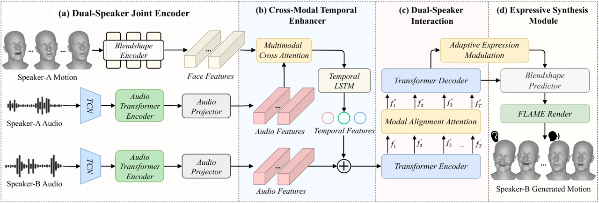
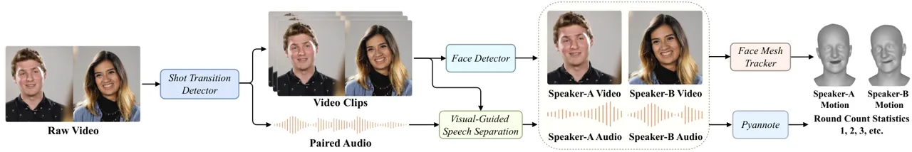
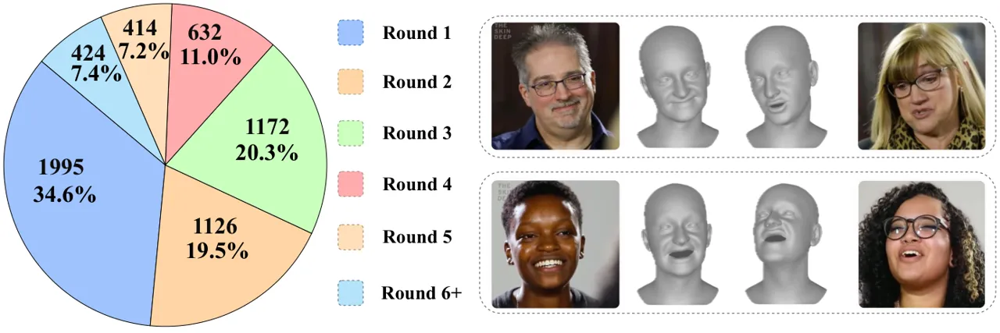
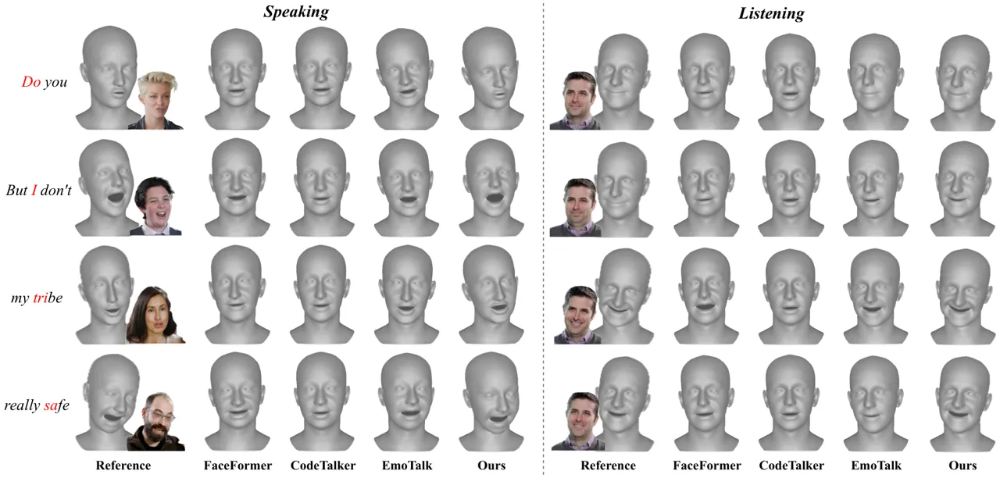

# DualTalk: Dual-Speaker Interaction for 3D Talking Head Conversations

Ziqiao Peng Affiliation: Renmin University of China    Yanbo Fan   
Haoyu Wu Affiliation: Renmin University of China    Xuan Wang
Affiliation: Ant Group    Hongyan Liu Affiliation: Tsinghua University
   Jun He    Zhaoxin Fan Affiliation: Beijing Advanced Innovation Center
for Future Blockchain and Privacy Computing

###### Abstract

In face-to-face conversations, individuals need to switch between
speaking and listening roles seamlessly. Existing 3D talking head
generation models focus solely on speaking or listening, neglecting the
natural dynamics of interactive conversation, which leads to unnatural
interactions and awkward transitions. To address this issue, we propose
a new task—multi-round dual-speaker interaction for 3D talking head
generation—which requires models to handle and generate both speaking
and listening behaviors in continuous conversation. To solve this task,
we introduce DualTalk, a novel unified framework that integrates the
dynamic behaviors of speakers and listeners to simulate realistic and
coherent dialogue interactions. This framework not only synthesizes
lifelike talking heads when speaking but also generates continuous and
vivid non-verbal feedback when listening, effectively capturing the
interplay between the roles. We also create a new dataset featuring 50
hours of multi-round conversations with over 1,000 characters, where
participants continuously switch between speaking and listening roles.
Extensive experiments demonstrate that our method significantly enhances
the naturalness and expressiveness of 3D talking heads in dual-speaker
conversations. We recommend watching the supplementary
video:[https://ziqiaopeng.github.io/dualtalk](https://ziqiaopeng.github.io/dualtalk)

![[Uncaptioned
image]](arxiv-2505-18096--1124778113ca.figures/figure-1.webp)

Figure 1: Comparison of single-role models (Speaker-Only and
Listener-Only) with DualTalk. Unlike single-role models, which lack key
interaction elements, DualTalk supports speaking and listening role
transition, multi-round conversations, and natural interaction.

^(†)^(†)footnotetext: This work was done during Ziqiao Peng’s internship
at Ant Group.¹¹footnotetext: Project Leader.²²footnotetext:
Corresponding Authors.

## 1 Introduction

Interactive conversational agents \[5, 8, 21, 44\], particularly 3D
talking heads \[40, 20, 35, 30, 50\], are increasingly central to
diverse applications, such as customer service, remote work, educational
platforms, and entertainment \[48, 13, 47, 32, 2\]. The ability of these
agents to engage in human-like conversations significantly enhances user
experience, offering more intuitive and accessible interactions \[45\].
Fluid conversations between participants are crucial, as they make
interactions more lifelike and deepen emotional and cognitive
engagement.

However, existing 3D talking head methods typically model either the
speaker \[51, 7, 36, 10\] or the listener \[27, 37\] independently,
overlooking the dynamic role-shifting inherent in real-world
interactions, where individuals transition seamlessly between speaking
and listening. Speaker-only models \[41, 46, 34, 33\] generate
synchronized lip movements for speaking segments, yet largely neglect
the essential listening behaviors that contribute to natural and
cohesive interactions. Conversely, listener-only models \[28, 38, 23,
42\] are often limited to short, reactive expressions, lacking the
capacity to capture the ongoing, bidirectional flow of human
communication. This gap restricts the authenticity of these
conversational simulations.

To bridge this gap, we propose a new task: multi-round dual-speaker
interaction for 3D talking head generation. This task emphasizes the
limitations of existing speaker-only and listener-only models, which are
insufficient to capture the nuanced interplay that shapes the tone,
facial expressions, and dynamics of real conversations. For instance, in
natural conversations, a speaker’s facial expressions may adjust in
response to non-verbal cues from the listener—such as nodding or
expressions signaling understanding or confusion. Expanding beyond
previous models, our goal is to dynamically simulate both speaking and
listening roles, adapting to spoken words as well as non-verbal
interactions, thereby enabling more authentic and engaging
conversations.

To address this challenge, we introduce DualTalk, a novel unified
framework designed to integrate the dynamic behaviors of both speakers
and listeners, enabling realistic simulation of multi-round
conversational interactions. Unlike previous methods \[27, 33, 34\] that
typically model speaker and listener roles separately, often resulting
in static and disjointed interactions, DualTalk treats the participant
as switching between two states: speaking and listening, as shown in
Fig. 1. Our approach includes four primary modules to support realistic
dual-speaker interactions. The Dual-Speaker Joint Encoder first captures
audio and visual signals from each speaker, generating a unified
representation. This is followed by the Cross-Modal Temporal Enhancer,
which aligns these features over time, preserving the natural flow of
conversation. The Dual-Speaker Interaction Module then integrates these
features to capture dynamic inter-speaker interplay, allowing for
context-aware responses. Finally, the Expressive Synthesis Module
fine-tunes the generated expressions, producing nuanced facial
animations. This approach not only enhances lip synchronization during
speaking segments but also ensures that listener responses are vivid and
contextually aligned, capturing the subtle non-verbal cues essential for
lifelike interactions.

For training and evaluation, we create a novel dataset for dual-speaker
interaction in 3D talking head generation. To the best of our knowledge,
this is the first 3D facial mesh dataset crafted for face-to-face,
multi-round interactions. This dataset includes dual-channel audio,
which allows for isolating each speaker’s voice within multi-speaker
environments—a critical feature for analyzing and synthesizing realistic
conversations. It comprises approximately 50 hours of conversational
data from over 1,000 unique identities, each engaging in multiple rounds
of dialogue, with an average of 2.5 rounds per session. Each session is
captured with high-quality video, precise audio, and detailed facial
expression coefficients. With these features, we have constructed a
benchmark for evaluating dual-speaker conversations. The DualTalk
dataset provides an essential foundation for training models that
require rich conversational context and detailed interaction dynamics,
enabling the DualTalk model to excel in generating authentic,
multi-round conversations.

In summary, the contributions of this paper are as follows:

- $`\bullet`$
  We propose a new research task focused on dual-speaker, multi-round
  interactive conversation, providing a clear framework for modeling
  continuous dual-speaker dialogues.
- $`\bullet`$
  We introduce DualTalk, a unified model designed for multi-round
  dual-speaker interactions, enabling seamless transitions between
  speaker and listener roles and enhancing interaction realism.
- $`\bullet`$
  We create a novel, large-scale dataset and benchmark specifically
  designed for dual-speaker interaction, providing an essential
  foundation for advancing realistic 3D talking head generation in
  dual-speaker scenarios.

## 2 Related Work



Figure 2: Overview of DualTalk. DualTalk consists of four components:
(a) Dual-Speaker Joint Encoder, (b) Cross-Modal Temporal Enhancer, (c)
Dual-Speaker Interaction Module, and (d) Expressive Synthesis Module,
enabling the generation of smooth and natural dual-speaker interactions.

### 2.1 3D Talking Head Generation

3D talking head generation \[6, 50\] has become an important research
area in computer vision. Early methods primarily focused on generating
lip-synchronized facial animations based on audio input. Cao et al.\[4\]
achieved emotional lip synchronization through a constraint-based search
within an animation graph structure. This approach required mocap data
specific to the animated subject, offline processing, and the
combination of various motion segments. Later, Karras et al.\[16\]
proposed an end-to-end CNN that learned mapping from waveforms to 3D
facial vertices. Recent advancements, such as FaceFormer \[10\],
CodeTalker \[46\], and SelfTalk \[33\], introduced geometry-based
methods using facial mesh representations to enhance realism in 3D
talking heads. UniTalker \[9\] improved generalization by training
across multiple datasets and fine-tuning with minimal data, while
ScanTalk \[31\] enabled 3D face animation with any topology, thus
broadening application scenarios. Despite these advancements, most
models are still primarily focused on generating individual speech
segments, lacking the capacity to support continuous, interactive
behaviors required for natural conversation dynamics.

Our DualTalk model differs from these approaches by jointly modeling
both speaker and listener behaviors in dual-speaker scenarios, allowing
for seamless transitions between roles.

### 2.2 Listener Modeling and Non-Verbal Feedback

A complementary research area is the modeling of non-verbal listener
behaviors \[15, 49, 28, 29, 25, 22, 37, 38, 23, 42\]. In human
conversations, listeners convey subtle cues through facial expressions,
head nods, and eye movements, which play a crucial role in the
conversational flow and in making interactions feel more natural.
Various studies have modeled listener behaviors with neural networks.
For example, Learning2listen \[27\] generates brief listener reactions,
such as head nods and facial expressions, based on the speaker’s speech
and facial mesh. However, this approach is limited to single-round
reactions and does not support continuous, multi-round interactions.
Other methods \[23, 37, 42\] predict facial expressions given a
conversational context but capture only brief, isolated reactions,
falling short of the fluidity required for extended dialogues.

The work most relevant to our approach is Audio2Photoreal \[29\], which
generates photorealistic avatars based on conversational audio. However,
this model relies solely on audio for modeling and lacks visual feedback
from the other participant’s expressions. In contrast, our DualTalk
method provides a unified framework capable of adjusting based on the
counterpart’s expressions, enabling seamless role transitions between
speaker and listener, thus enhancing the realism and dynamism of
interactions across multi-round conversations.

## 3 Task Definition

The primary objective of DualTalk is to generate realistic and dynamic
dual-speaker interactions in 3D talking head conversations, enabling
natural transitions between speaking and listening roles. Traditional
approaches often treat speaker and listener roles separately, failing to
capture the fluid dynamics of real-life conversations. Furthermore,
without integrated audio-visual understanding, models struggle to adjust
a speaker’s expressions based on the feedback received from their
conversational partner, leading to less natural outcomes. DualTalk aims
to address these limitations by simulating responsive, synchronized
reactions between two participants.

In this task, the input consists of Speaker-A’s audio
($`\mathbf{A}_{A}`$) and head motion ($`\mathbf{M}_{A}`$), as well as
Speaker-B’s audio ($`\mathbf{A}_{B}`$). Based on these inputs, the model
generates Speaker-B’s head motion ($`\hat{\mathbf{M}}_{B}`$) that
synchronizes with the conversational context, reflecting both the verbal
and non-verbal cues from Speaker-A. Formally, this process can be
defined as a function $`f`$ mapping the inputs to the desired output:

```math
\hat{\mathbf{M}}_{B}=f(\mathbf{A}_{A},\mathbf{M}_{A},\mathbf{A}_{B}), \tag{1}
```

where $`f`$ models the conversational dynamics, allowing Speaker-B’s
head motion $`\hat{\mathbf{M}}_{B}`$ to be conditioned on both
Speaker-A’s audio and motion, as well as Speaker-B’s own audio. This
formulation enables DualTalk to generate synchronized and contextually
responsive head motions for Speaker-B, effectively capturing the
non-verbal feedback and conversational interplay characteristic of
natural dual-speaker interactions.

## 4 Method

### 4.1 Overview

In this section, we introduce DualTalk, a unified framework designed to
model dual-speaker interactions for 3D talking head generation, as
depicted in Fig. 2. The framework consists of four main components: the
Dual-Speaker Joint Encoder, Cross-Modal Temporal Enhancer, Dual-Speaker
Interaction Module, and Expressive Synthesis Module. Each component
contributes to generating coherent and expressive 3D talking head
animations.

### 4.2 Dual-Speaker Joint Encoder

The Dual-Speaker Joint Encoder captures multimodal features from both
speakers, integrating audio and blendshape information into a unified
feature space. This encoder includes separate Wav2Vec 2.0 \[1\] audio
encoders for each speaker, which process the audio inputs
$`\mathbf{A}_{A}`$ and $`\mathbf{A}_{B}`$ into high-dimensional feature
representations. Additionally, the encoder includes a blendshape
processing branch that encodes the blendshape parameters, capturing
Speaker-A’s facial motion $`\mathbf{M}_{A}`$.

Let $`\mathbf{A}_{A}\in\mathbb{R}^{T_{A}\times F}`$ and
$`\mathbf{A}_{B}\in\mathbb{R}^{T_{B}\times F}`$ represent the raw audio
signals for Speaker-A and Speaker-B, respectively, where $`T_{A}`$ and
$`T_{B}`$ are the sequence lengths and $`F`$ is the sampling rate. Each
audio input is processed through a pre-trained Wav2Vec 2.0 encoder
\[1\]:

```math
\mathbf{H}_{A}=E_{\text{Audio1}}(\mathbf{A}_{A}),\quad\mathbf{H}_{B}=E_{\text{Audio2}}(\mathbf{A}_{B}), \tag{2}
```

where $`\mathbf{H}_{A},\mathbf{H}_{B}\in\mathbb{R}^{L\times D}`$ are the
encoded audio features, with $`L`$ being the length of the encoded
feature sequence and $`D=1024`$ representing the output embedding
dimension from the audio encoder.

These high-dimensional audio features are then linearly projected into a
shared feature space of dimension $`d`$:

```math
\mathbf{Z}_{A}=\mathbf{W}_{a}\mathbf{H}_{A},\quad\mathbf{Z}_{B}=\mathbf{W}_{a}\mathbf{H}_{B}, \tag{3}
```

where $`\mathbf{W}_{a}\in\mathbb{R}^{d\times D}`$ is a learnable
projection matrix, and
$`\mathbf{Z}_{A},\mathbf{Z}_{B}\in\mathbb{R}^{L\times d}`$ are the
transformed audio features for both speakers, mapped into a
lower-dimensional space compatible with the blendshape embeddings.

In parallel, the blendshape encoder processes Speaker-A’s facial motion
coefficients $`\mathbf{M}_{A}\in\mathbb{R}^{N\times b}`$, where $`N`$ is
the number of frames and $`b`$ is the number of blendshape coefficients
(e.g., $`b=56`$). The blendshape encoder consists of a two-layer fully
connected network with ReLU activations, which transforms the input into
an embedding space of dimension $`d`$:

```math
\mathbf{M}_{A}^{\prime}=f_{\text{blend}}(\mathbf{M}_{A})=\sigma\left(\mathbf{W}_{b}^{(2)}\,\sigma\left(\mathbf{W}_{b}^{(1)}\mathbf{M}_{A}\right)\right), \tag{4}
```

where $`\mathbf{W}_{b}^{(1)}\in\mathbb{R}^{b\times\frac{d}{2}}`$ and
$`\mathbf{W}_{b}^{(2)}\in\mathbb{R}^{\frac{d}{2}\times d}`$ are the
weights of the fully connected layers, and $`\sigma`$ denotes the ReLU
activation function. The output
$`\mathbf{M}_{A}^{\prime}\in\mathbb{R}^{N\times d}`$ is the blendshape
feature embedding, which captures the dynamics of facial movements.



Figure 3: Dataset construction pipeline. The pipeline takes raw
two-speaker videos and paired audio as input. It outputs segmented video
clips, isolated audio streams for each speaker, 3D facial mesh data, and
speaker round count statistics, providing high-quality, synchronized
multimodal data for training.

### 4.3 Cross-Modal Temporal Enhancer

The Cross-Modal Temporal Enhancer module integrates audio and blendshape
features, ensuring temporal coherence across frames. This module employs
a multimodal cross-attention mechanism to align audio and visual
modalities, followed by a bidirectional LSTM \[14\] to capture temporal
dependencies. This structure allows for synchronized temporal dynamics,
resulting in a coherent multimodal representation across time. The
cross-attention mechanism enhances the blendshape features by leveraging
audio cues, producing a fused feature
$`\mathbf{C}\in\mathbb{R}^{L\times d}`$.

Specifically, cross-attention is computed as follows:

```math
\mathbf{Q}=\mathbf{Z}_{A}\mathbf{W}_{q},\quad\mathbf{K}=\mathbf{M}_{A}^{\prime}\mathbf{W}_{k},\quad\mathbf{V}=\mathbf{M}_{A}^{\prime}\mathbf{W}_{v}, \tag{5}
```

where
$`\mathbf{W}_{q},\mathbf{W}_{k},\mathbf{W}_{v}\in\mathbb{R}^{d\times d}`$
are learnable matrices for query, key, and value vectors. The
cross-attention output is computed as:

```math
\mathbf{C}=\text{softmax}\left(\frac{\mathbf{Q}\mathbf{K}^{\top}}{\sqrt{d}}\right)\mathbf{V}. \tag{6}
```

This formulation allows the blendshape features to be modulated by the
audio features, aligning the visual representation with the acoustic
cues in a contextually-aware manner.

After obtaining the cross-attention output $`\mathbf{C}`$, the next step
is to model temporal dependencies using a bidirectional LSTM. The
bidirectional LSTM processes $`\mathbf{C}`$ in both forward and backward
directions, which captures context from both past and future frames:

```math
\mathbf{T}=\text{BiLSTM}(\mathbf{C}). \tag{7}
```

$`\mathbf{T}\in\mathbb{R}^{L\times 2h}`$ represents the temporally
enhanced feature, where $`h`$ is the hidden size of the LSTM. The
bidirectional nature of the LSTM allows the model to consider both prior
and subsequent context within the temporal sequence, which is crucial
for producing a coherent cross-modal output.

Finally, $`\mathbf{Z}_{A}`$ and $`\mathbf{T}`$ are concatenated along
the feature dimension to form a combined representation
$`\mathbf{I}\in\mathbb{R}^{L\times 2d}`$:

```math
\mathbf{I}=\text{Concat}(\mathbf{Z}_{A},\mathbf{T}), \tag{8}
```

where $`\text{Concat}(\cdot)`$ denotes the concatenation operation along
the feature dimension. The resulting $`\mathbf{I}`$ encodes both the
primary speaker’s audio information and the cross-modal temporal
features of the secondary speaker, effectively capturing the
multifaceted aspects of the interaction.

### 4.4 Dual-Speaker Interaction Module

The Dual-Speaker Interaction Module captures and enhances
interdependencies between speakers, enabling realistic, context-aware
interactions. This module utilizes a Transformer encoder, Modal
Alignment Attention, and a Transformer decoder to capture complex
dual-speaker dynamics.

The combined features are first processed through a Transformer encoder
to capture long-range dependencies and intricate interaction patterns
between speakers. This encoder outputs feature representations
$`\mathbf{f}^{{}^{\prime}}_{1},\mathbf{f}^{{}^{\prime}}_{2},\dots,\mathbf{f}^{{}^{\prime}}_{T}`$
that encode the dynamics of both speakers across the conversation
sequence.

To effectively align these multimodal features, we introduce a Modal
Alignment Attention mechanism using an alignment mask, inspired by
FaceFormer’s biased attention \[10\]. This mechanism adjusts the focus
between audio and facial cues, synchronizing responses of both speakers
and ensuring contextual alignment in generated interactions. The Modal
Alignment Attention (M-A Attention) refines the Transformer encoder
outputs to align temporal information from both speakers, enhancing
response coherence:

```math
\mathbf{f}^{{}^{\prime\prime}}_{t}=\text{M-A Attention}(\mathbf{f}^{{}^{\prime}}_{t}),\quad t=1,2,\dots,T \tag{9}
```

The refined sequence
$`\mathbf{f}^{{}^{\prime\prime}}_{1},\mathbf{f}^{{}^{\prime\prime}}_{2},\dots,\mathbf{f}^{{}^{\prime\prime}}_{T}`$
is then passed through a Transformer decoder, which iteratively
processes these features to produce a contextually enriched
representation. This representation captures the primary speaker’s
expressions while dynamically incorporating non-verbal cues from the
secondary speaker, facilitating bidirectional interaction. The output of
the Transformer decoder, denoted as $`\mathbf{D}`$, is then passed to
the Expressive Synthesis Module.

### 4.5 Expressive Synthesis Module

The Expressive Synthesis Module is the final component responsible for
generating the facial animations by predicting blendshape parameters
that drive the 3D talking head.

The Transformer decoder output $`\mathbf{D}`$ is processed through an
adaptive expression modulation mechanism to enhance emotional
expressiveness. This step ensures that the final blendshape parameters
capture not only lip-sync accuracy but also the emotional tone of the
interaction. The adaptive expression modulation is defined as:

```math
\mathbf{D}^{\prime}=\mathbf{D}+\alpha\cdot\text{Mod}(\mathbf{D}), \tag{10}
```

where $`\alpha`$ is a modulation factor that controls the extent of
adjustment, and $`\text{Mod}(\mathbf{D})`$ is computed as:

```math
\text{Mod}(\mathbf{D})=\sigma(\mathbf{D}\mathbf{W}_{m}+\mathbf{b}_{m}), \tag{11}
```

with $`\mathbf{W}_{m}\in\mathbb{R}^{d\times d}`$ and
$`\mathbf{b}_{m}\in\mathbb{R}^{d}`$ as learnable parameters and
$`\sigma`$ as the ReLU activation function. The modulation term
dynamically adjusts the expression output based on interaction context,
adapting expressions to fit emotional cues.

Finally, the modulated output
$`\mathbf{D}^{{}^{\prime}}\in\mathbb{R}^{L\times d}`$ is mapped to the
blendshape parameter space through a fully connected layer:

```math
\mathbf{\hat{M}}_{B}=\mathbf{D}^{\prime}\mathbf{W}_{o}+\mathbf{b}_{o}, \tag{12}
```

where $`\mathbf{W}_{o}\in\mathbb{R}^{d\times b}`$ and
$`\mathbf{b}_{o}\in\mathbb{R}^{b}`$ are learnable parameters for the
output layer, and $`b`$ denotes the dimensionality of the blendshape
parameters (e.g., $`b=56`$). The output
$`\mathbf{\hat{M}}_{B}\in\mathbb{R}^{L\times b}`$ represents the
predicted Speaker-B’s face motion coefficients for each frame, which
directly controls the 3D facial animation.



Figure 4: Distribution of conversation rounds in DualTalk dataset and
example samples.

[TABLE]

Table 1: Comparison of different 3D talking head datasets. DualTalk
dataset offers over 50 hours of data, 1,000+ identities, interaction,
and multi-round conversations.

|                   | FD $`\downarrow`$ |                   |                   | P-FD $`\downarrow`$ |                   |                   | MSE $`\downarrow`$ |                   |                   | SID $`\uparrow`$ |      |      | rPCC $`\downarrow`$ |                   |                   |
| ----------------- | ----------------- | ----------------- | ----------------- | ------------------- | ----------------- | ----------------- | ------------------ | ----------------- | ----------------- | ---------------- | ---- | ---- | ------------------- | ----------------- | ----------------- |
| Methods           | EXP               | JAW               | POSE              | EXP                 | JAW               | POSE              | EXP                | JAW               | POSE              | EXP              | JAW  | POSE | EXP                 | JAW               | POSE              |
|                   |                   | $`\times 10^{3}`$ | $`\times 10^{2}`$ |                     | $`\times 10^{3}`$ | $`\times 10^{2}`$ | $`\times 10^{1}`$  | $`\times 10^{3}`$ | $`\times 10^{2}`$ |                  |      |      | $`\times 10^{2}`$   | $`\times 10^{1}`$ | $`\times 10^{1}`$ |
| FaceFormer \[10\] | 34.90             | 5.40              | 8.00              | 34.90               | 5.40              | 8.00              | 6.97               | 1.80              | 2.67              | 0.54             | 0.36 | 0.50 | 13.05               | 2.41              | 5.27              |
| CodeTalker \[46\] | 48.57             | 6.89              | 10.74             | 48.57               | 6.89              | 10.74             | 9.71               | 2.29              | 3.58              | 0                | 0    | 0    | 11.06               | 2.33              | 5.11              |
| EmoTalk \[34\]    | 29.86             | 4.33              | 7.54              | 30.20               | 4.36              | 7.58              | 6.88               | 1.76              | 2.59              | 2.86             | 1.72 | 0.98 | 9.89                | 2.19              | 4.94              |
| SelfTalk \[33\]   | 35.77             | 5.49              | 8.14              | 35.77               | 5.49              | 8.14              | 7.15               | 1.83              | 2.71              | 2.49             | 1.30 | 1.28 | 12.25               | 2.39              | 4.70              |
| L2L \[27\]        | 24.61             | 3.69              | 7.08              | 24.99               | 3.74              | 7.13              | 5.68               | 1.48              | 2.49              | 2.86             | 1.89 | 1.19 | 8.52                | 2.06              | 4.11              |
| DualTalk          | 11.14             | 1.90              | 3.83              | 11.88               | 1.97              | 3.97              | 3.59               | 1.04              | 1.72              | 3.48             | 2.23 | 1.72 | 4.73                | 1.37              | 2.38              |
| FaceFormer \[10\] | 35.92             | 5.39              | 8.60              | 35.93               | 5.39              | 8.60              | 7.18               | 1.80              | 2.87              | 0.54             | 0.40 | 0.51 | 11.71               | 2.16              | 5.73              |
| CodeTalker \[46\] | 50.05             | 6.95              | 11.66             | 50.05               | 6.95              | 11.66             | 10.01              | 2.32              | 3.88              | 0                | 0    | 0    | 10.24               | 2.18              | 5.76              |
| EmoTalk \[34\]    | 34.12             | 4.17              | 8.59              | 34.44               | 4.21              | 8.62              | 7.73               | 1.71              | 2.94              | 2.89             | 1.79 | 0.94 | 9.44                | 1.96              | 5.54              |
| SelfTalk \[33\]   | 36.23             | 5.36              | 8.89              | 36.23               | 5.36              | 8.89              | 7.24               | 1.79              | 2.96              | 2.61             | 1.36 | 1.08 | 11.26               | 2.13              | 5.67              |
| L2L \[27\]        | 30.49             | 3.82              | 8.56              | 30.87               | 3.86              | 8.61              | 6.87               | 1.54              | 2.98              | 2.76             | 1.91 | 1.11 | 9.02                | 1.94              | 4.99              |
| DualTalk          | 21.71             | 3.15              | 5.89              | 22.56               | 3.22              | 6.06              | 5.97               | 1.50              | 2.48              | 2.98             | 1.94 | 1.38 | 6.86                | 1.60              | 3.28              |

Table 2: Quantitative comparison on DualTalk dataset. The top half shows
results on the DualTalk Test set, and the bottom half shows results on
the OOD set. DualTalk outperforms all baselines across most metrics,
indicating superior realism, synchronization, and diversity in generated
animations.

### 4.6 Dataset Construction

The DualTalk dataset is created to address the limitations of existing
datasets that lack support for dual-speaker, multi-round conversations
with comprehensive audio-visual synchronization. Current datasets focus
on single-speaker scenarios or lack isolated audio streams for each
participant, which is essential for training models that simulate both
speaking and listening roles. Additionally, most existing datasets do
not capture multi-round conversations, which are critical for capturing
natural, back-and-forth interactions. To overcome these gaps, we create
a dataset specifically designed for dual-speaker interactions, featuring
synchronized audio, video, and FLAME-based \[19\] 3D facial data for
high-quality training of 3D talking head generation models. The pipeline
of dataset construction is shown in Fig. 3, and see supplementary
materials for details.

The dataset includes 5,858 video clips, amounting to approximately 50
hours of two-person conversation videos, featuring 1,052 unique
speakers. Each clip provides clear visual and audio data, allowing for
precise audio-visual synchronization. We analyze the dataset’s
distribution of dialogue rounds (as shown in Fig.4), which reveals a
balanced range from single-round to six or more rounds, with an average
of 2.5 rounds per clip. This diversity supports training across varying
levels of dialogue complexity. Additionally, Tab.1 compares the DualTalk
dataset with other datasets, highlighting its unique advantages. The
dataset is divided into train, test, and out-of-distribution (OOD) sets,
with 4,935 clips in the train set, 539 clips in the test set, and 384
clips in the OOD set. The OOD set includes speakers not present in the
train set, facilitating robust model evaluation.

## 5 Experiments

[TABLE]

Table 3: Quantitative comparison on VOCASET dataset.

### 5.1 Quantitative Evaluation



Figure 5: Qualitative comparison of speaking and listening states. The
left side shows facial expressions in the speaking state, with DualTalk
achieving more accurate lip movements compared to other methods. The
right side shows expressions in the listening state, where DualTalk
captures expressive responses like smiling and nodding, outperforming
other methods in naturalness and contextual relevance.

We conduct three primary experiments to evaluate the performance of
DualTalk, comparing it with baseline models and assessing its
effectiveness across different datasets. Detailed experimental settings
are provided in the supplementary materials.

Baseline Methods on DualTalk Dataset. In this experiment, we retrain
several baseline methods, including FaceFormer \[10\],
CodeTalker \[46\], EmoTalk \[34\], SelfTalk \[33\], and L2L \[27\], on
the DualTalk dataset. We employ a comprehensive set of evaluation
metrics—including Fréchet Distance (FD), Paired Fréchet Distance (P-FD),
Mean Squared Error (MSE), SI for Diversity (SID), and Residual Pearson
Correlation Coefficient (rPCC)—to assess motion realism,
synchronization, diversity, and expression accuracy. As shown in Tab. 2,
our method consistently outperforms all baseline models on both the test
sequences and out-of-distribution (OOD) sequences of the DualTalk
dataset. DualTalk achieves lower errors in FD, P-FD, and MSE, with over
a 50$`\%`$ improvement in expression accuracy compared to the
second-best model, L2L \[27\]. This performance demonstrates that
DualTalk generates more accurate facial and head pose movements that
better match the dataset’s distribution of head motion. Furthermore, our
method improves expression diversity, with a 40$`\%`$ increase in SID
compared to SelfTalk \[33\], while preserving the movement
characteristics of the original dataset. The rPCC metric, which measures
motion synchronization between the speaker and listener, shows that our
method achieves the best synchronization results. We also test metrics
by concatenating outputs from speaker-only and listener-only models,
which lead to inferior results. This outcome indicates that DualTalk
produces more realistic, synchronized, and diverse motion outputs than
other approaches when trained on the same dataset.

| Methods        | FD $`\downarrow`$ |      | P-FD $`\downarrow`$ |      | MSE $`\downarrow`$ |      |
| -------------- | ----------------- | ---- | ------------------- | ---- | ------------------ | ---- |
|                | exp               | pose | exp                 | pose | exp                | pose |
| Random         | 72.88             | 0.12 | 75.82               | 0.12 | 2.05               | 0.03 |
| Nearest Audio  | 65.77             | 0.10 | 68.84               | 0.10 | 1.77               | 0.03 |
| Nearest Motion | 42.41             | 0.06 | 45.33               | 0.06 | 1.27               | 0.02 |
| L2L \[27\]     | 33.93             | 0.06 | 35.88               | 0.06 | 0.93               | 0.01 |
| RLHG \[49\]    | 39.02             | 0.07 | 40.18               | 0.07 | 0.86               | 0.01 |
| DIM \[42\]     | 23.88             | 0.06 | 24.39               | 0.06 | 0.70               | 0.01 |
| DualTalk       | 22.27             | 0.05 | 23.81               | 0.05 | 0.58               | 0.01 |

Table 4: Quantitative comparison on ViCo dataset.

DualTalk on Speaker-Only VOCASET. To further evaluate DualTalk’s
capability in generating high-quality facial animations, we train and
test our model on the speaker-only VOCASET. Tab. 3 presents results in
terms of Lip Vertex Error (LVE), Facial Dynamics Deviation (FDD), and
Lip Readability Percentage (LRP). Compared to other audio-driven models,
including VOCA, MeshTalk, FaceFormer, and CodeTalker, DualTalk
demonstrates significant improvements, achieving the lowest LVE and FDD
and the highest LRP score. In particular, we surpass SelfTalk by 5$`\%`$
in LRP, indicating that our method has superior lip movement accuracy.
These results highlight DualTalk’s effectiveness in accurately capturing
and replicating audio-driven facial dynamics.

[TABLE]

Table 5: User Study. Rating is on a scale of 1-5; the higher the better.

|                                           |                   |                   |                   |                     |                   |                   |                    |                   |                   |                  |      |      |
| ----------------------------------------- | ----------------- | ----------------- | ----------------- | ------------------- | ----------------- | ----------------- | ------------------ | ----------------- | ----------------- | ---------------- | ---- | ---- |
|                                           | FD $`\downarrow`$ |                   |                   | P-FD $`\downarrow`$ |                   |                   | MSE $`\downarrow`$ |                   |                   | SID $`\uparrow`$ |      |      |
| Ablation Study                            | EXP               | JAW               | POSE              | EXP                 | JAW               | POSE              | EXP                | JAW               | POSE              | EXP              | JAW  | POSE |
|                                           |                   | $`\times 10^{3}`$ | $`\times 10^{2}`$ |                     | $`\times 10^{3}`$ | $`\times 10^{2}`$ | $`\times 10^{1}`$  | $`\times 10^{3}`$ | $`\times 10^{2}`$ |                  |      |      |
| DualTalk                                  | 11.14             | 1.90              | 3.83              | 11.88               | 1.97              | 3.97              | 3.59               | 1.04              | 1.72              | 3.48             | 2.23 | 1.72 |
| w/o Speaker-A’s Speech                    | 23.27             | 4.01              | 5.48              | 23.74               | 4.09              | 5.51              | 4.82               | 1.42              | 1.85              | 1.68             | 1.23 | 1.13 |
| w/o Speaker-A’s Expression                | 28.43             | 4.72              | 5.91              | 29.10               | 4.79              | 6.05              | 5.68               | 1.57              | 1.97              | 1.47             | 1.05 | 0.97 |
| replace Audio Feature Extractor with MFCC | 27.42             | 3.96              | 7.25              | 27.95               | 4.02              | 7.31              | 6.02               | 1.55              | 2.51              | 2.71             | 1.66 | 1.06 |
| w/o Cross-Modal Temporal Enhancer         | 16.31             | 2.91              | 4.92              | 16.66               | 2.95              | 4.97              | 4.00               | 1.27              | 1.79              | 3.22             | 2.00 | 1.40 |
| w/o Dual-Speaker Interaction Module       | 16.70             | 2.99              | 4.78              | 17.27               | 3.05              | 4.87              | 4.27               | 1.32              | 1.84              | 3.03             | 2.05 | 1.47 |
| w/o Adaptive Expression Modulation        | 13.28             | 2.46              | 4.53              | 13.81               | 2.51              | 4.63              | 3.63               | 1.12              | 1.80              | 3.35             | 2.13 | 1.55 |

Table 6: Ablation study for our components. We show the FD, P-FD, MSE,
and SID in different cases.

DualTalk on Listener-Only ViCo Dataset. We evaluate DualTalk on the
listener-only ViCo dataset to examine its ability to model listener
responses accurately. As shown in Tab. 4, DualTalk outperforms methods
such as L2L \[27\], RLHG \[49\], and DIM \[42\], achieving the lowest FD
and P-FD scores, as well as the lowest MSE and highest SID values for
listener responses. This performance indicates that DualTalk effectively
captures listener-specific head and facial motions, surpassing baseline
methods in generating diverse and responsive listener animations.

Performance Efficiency. In addition to accuracy, we evaluate the runtime
efficiency of DualTalk. The model requires only 0.03 seconds to generate
one second of feedback, underscoring its suitability for real-time
applications.

### 5.2 Qualitative Evaluation

In addition to quantitative metrics, we perform qualitative evaluations
to assess the perceptual quality and realism of the 3D talking heads
generated by DualTalk. These evaluations focus on the accuracy of lip
synchronization, smoothness of facial expressions, and the relevance of
head and facial movements to the conversational context. We compare the
results against several baseline methods, including FaceFormer \[10\],
CodeTalker \[46\], and EmoTalk \[34\].

We visualize the output from each method in both speaking and listening
modes, as shown in Fig. 5. In speaking mode, DualTalk demonstrates
larger facial movements and greater expressiveness. Compared to
CodeTalker \[46\], DualTalk achieves notably better visual quality in
generating speaking expressions. In listening mode, we visualize a
sequence of four frames showing a positive response, where DualTalk
effectively combines a smiling expression with a nodding motion. This
result underscores DualTalk’s ability to enhance expressiveness in the
listener role while providing contextually appropriate responses to the
other speaker’s speech and expressions.

To further validate these observations, we conduct a user study in which
participants rated the realism and expressiveness of the generated
animations. We extract 30 video clips, each lasting over 10 seconds, and
invited 30 participants to evaluate them. The questionnaire is designed
using the Mean Opinion Score (MOS) rating protocol, asking participants
to rate the generated videos from four perspectives: (1) Lip Sync
Accuracy, (2) Pose Naturalness, (3) Expression Richness, and (4) Visual
Quality. The results are summarized in Tab. 5, where DualTalk
outperforms previous methods across all evaluations.

### 5.3 Ablation Study

To investigate the contributions of each component in our model, we
conduct an ablation study by systematically removing or modifying key
modules and inputs. The results, presented in Tab. 6, highlight the
impact of each component on performance, measured by Fréchet Distance
(FD), Paired Fréchet Distance (P-FD), Mean Squared Error (MSE), and SI
for Diversity (SID) across expression, jaw, and pose.

Removing Speaker-A’s speech and expression leads to significant
performance decreases, with FD scores rising to 23.27 and 28.43 for
expressions, respectively, emphasizing the importance of incorporating
these cues for realistic interactions. Replacing our audio encoder with
MFCC results in a decrease in SID from 3.48 to 2.71, demonstrating the
effectiveness of our audio encoder in capturing dual-speaker nuances.
Excluding the Cross-Modal Temporal Enhancer and Dual-Speaker Interaction
Module results in elevated P-FD and MSE scores, highlighting their
critical roles in ensuring temporal synchronization and capturing
interactive dynamics. Finally, removing the Adaptive Expression
Modulation reduces expressiveness, with FD in expressions increasing to
13.28, confirming its value in producing contextually responsive
expressions.

## 6 Conclusion

In this paper, we present DualTalk, a unified framework for muti-round
dual-speaker 3D talking head generation that seamlessly models both
speaker and listener roles. By integrating these roles within a single
model, DualTalk enables natural transitions and more realistic
interactions in extended conversations. To support this task, we created
a large-scale dataset with dual-channel audio and multi-round
interactions, providing a benchmark for dual-speaker modeling. Our
extensive experiments demonstrated that DualTalk outperforms
state-of-the-art methods in both lip synchronization and listener
feedback generation, producing more fluid and expressive conversations.

## Acknowledgments

This research was funded by the National Natural Science Foundation of
China under Grant Nos. 62436010 and 62172421, the Beijing Natural
Science Foundation under Grant No. 4254100, the Fundamental Research
Funds for the Central Universities under Grant No. KG16336301, and the
China Postdoctoral Science Foundation under Grant No. 2024M764093. This
work was also supported by the Outstanding Innovative Talents
Cultivation Funded Programs 2023 of Renmin University of China and the
Ant Group Research Intern Program. The project leader was Yanbo Fan.

## References

- \[1\] Alexei Baevski, Yuhao Zhou, Abdelrahman Mohamed, and Michael
  Auli. wav2vec 2.0: A framework for self-supervised learning of speech
  representations. _Advances in neural information processing systems_,
  33:12449–12460, 2020.
- \[2\] Yunpeng Bai, Yanbo Fan, Xuan Wang, Yong Zhang, Jingxiang Sun,
  Chun Yuan, and Ying Shan. High-fidelity facial avatar reconstruction
  from monocular video with generative priors. In _Proceedings of the
  IEEE/CVF Conference on Computer Vision and Pattern Recognition_, pages
  4541–4551, 2023.
- \[3\] Hervé Bredin, Ruiqing Yin, Juan Manuel Coria, Gregory Gelly,
  Pavel Korshunov, Marvin Lavechin, Diego Fustes, Hadrien Titeux, Wassim
  Bouaziz, and Marie-Philippe Gill. Pyannote. audio: neural building
  blocks for speaker diarization. In _ICASSP 2020-2020 IEEE
  International Conference on Acoustics, Speech and Signal Processing
  (ICASSP)_, pages 7124–7128. IEEE, 2020.
- \[4\] Yong Cao, Wen C Tien, Petros Faloutsos, and Frédéric Pighin.
  Expressive speech-driven facial animation. _ACM Transactions on
  Graphics (TOG)_, 24(4):1283–1302, 2005.
- \[5\] Justine Cassell, Tim Bickmore, Lee Campbell, Hannes
  Vilhjalmsson, Hao Yan, et al. Human conversation as a system
  framework: Designing embodied conversational agents. _Embodied
  conversational agents_, pages 29–63, 2000.
- \[6\] Hejia Chen, Haoxian Zhang, Shoulong Zhang, Xiaoqiang Liu, Sisi
  Zhuang, Pengfei Wan, Di ZHANG, Shuai Li, et al. Cafe-talk: Generating
  3d talking face animation with multimodal coarse-and fine-grained
  control. In _The Thirteenth International Conference on Learning
  Representations_.
- \[7\] Daniel Cudeiro, Timo Bolkart, Cassidy Laidlaw, Anurag Ranjan,
  and Michael J Black. Capture, learning, and synthesis of 3d speaking
  styles. In _Proceedings of the IEEE/CVF conference on computer vision
  and pattern recognition_, pages 10101–10111, 2019.
- \[8\] Stephan Diederich, Alfred Benedikt Brendel, Stefan Morana, and
  Lutz Kolbe. On the design of and interaction with conversational
  agents: An organizing and assessing review of human-computer
  interaction research. _Journal of the Association for Information
  Systems_, 23(1):96–138, 2022.
- \[9\] Xiangyu Fan, Jiaqi Li, Zhiqian Lin, Weiye Xiao, and Lei Yang.
  Unitalker: Scaling up audio-driven 3d facial animation through a
  unified model. _arXiv preprint arXiv:2408.00762_, 2024.
- \[10\] Yingruo Fan, Zhaojiang Lin, Jun Saito, Wenping Wang, and Taku
  Komura. Faceformer: Speech-driven 3d facial animation with
  transformers. In _Proceedings of the IEEE/CVF Conference on Computer
  Vision and Pattern Recognition_, pages 18770–18780, 2022.
- \[11\] Gabriele Fanelli, Juergen Gall, Harald Romsdorfer, Thibaut
  Weise, and Luc Van Gool. A 3-d audio-visual corpus of affective
  communication. _IEEE Transactions on Multimedia_, 12(6):591–598, 2010.
- \[12\] Scott Geng, Revant Teotia, Purva Tendulkar, Sachit Menon, and
  Carl Vondrick. Affective faces for goal-driven dyadic communication.
  _arXiv preprint arXiv:2301.10939_, 2023.
- \[13\] Shreyank N Gowda, Dheeraj Pandey, and Shashank Narayana Gowda.
  From pixels to portraits: A comprehensive survey of talking head
  generation techniques and applications. _arXiv preprint
  arXiv:2308.16041_, 2023.
- \[14\] S Hochreiter. Long short-term memory. _Neural Computation
  MIT-Press_, 1997.
- \[15\] Hung-Hsuan Huang, Masato Fukuda, and Toyoaki Nishida. Toward
  rnn based micro non-verbal behavior generation for virtual listener
  agents. In _Social Computing and Social Media. Design, Human Behavior
  and Analytics: 11th International Conference, SCSM 2019, Held as Part
  of the 21st HCI International Conference, HCII 2019, Orlando, FL, USA,
  July 26-31, 2019, Proceedings, Part I 21_, pages 53–63.
  Springer, 2019.
- \[16\] Tero Karras, Timo Aila, Samuli Laine, Antti Herva, and Jaakko
  Lehtinen. Audio-driven facial animation by joint end-to-end learning
  of pose and emotion. _ACM Transactions on Graphics (TOG)_,
  36(4):1–12, 2017.
- \[17\] Diederik P. Kingma and Jimmy Ba. Adam: A method for stochastic
  optimization. _CoRR_, abs/1412.6980, 2014.
- \[18\] Kai Li, Runxuan Yang, Fuchun Sun, and Xiaolin Hu. Iianet: An
  intra-and inter-modality attention network for audio-visual speech
  separation. In _Forty-first International Conference on Machine
  Learning_, 2024.
- \[19\] Tianye Li, Timo Bolkart, Michael J Black, Hao Li, and Javier
  Romero. Learning a model of facial shape and expression from 4d scans.
  _ACM Trans. Graph._, 36(6):194–1, 2017.
- \[20\] Weichuang Li, Longhao Zhang, Dong Wang, Bin Zhao, Zhigang Wang,
  Mulin Chen, Bang Zhang, Zhongjian Wang, Liefeng Bo, and Xuelong Li.
  One-shot high-fidelity talking-head synthesis with deformable neural
  radiance field. In _Proceedings of the IEEE/CVF Conference on Computer
  Vision and Pattern Recognition_, pages 17969–17978, 2023.
- \[21\] Lizi Liao, Grace Hui Yang, and Chirag Shah. Proactive
  conversational agents in the post-chatgpt world. In _Proceedings of
  the 46th International ACM SIGIR Conference on Research and
  Development in Information Retrieval_, pages 3452–3455, 2023.
- \[22\] Jin Liu, Xi Wang, Xiaomeng Fu, Yesheng Chai, Cai Yu, Jiao Dai,
  and Jizhong Han. Mfr-net: Multi-faceted responsive listening head
  generation via denoising diffusion model. In _Proceedings of the 31st
  ACM International Conference on Multimedia_, pages 6734–6743, 2023.
- \[23\] Xi Liu, Ying Guo, Cheng Zhen, Tong Li, Yingying Ao, and Pengfei
  Yan. Customlistener: Text-guided responsive interaction for
  user-friendly listening head generation. In _Proceedings of the
  IEEE/CVF Conference on Computer Vision and Pattern Recognition_, pages
  2415–2424, 2024.
- \[24\] Camillo Lugaresi, Jiuqiang Tang, Hadon Nash, Chris McClanahan,
  Esha Uboweja, Michael Hays, Fan Zhang, Chuo-Ling Chang, Ming Guang
  Yong, Juhyun Lee, et al. Mediapipe: A framework for building
  perception pipelines. _arXiv preprint arXiv:1906.08172_, 2019.
- \[25\] Cheng Luo, Siyang Song, Weicheng Xie, Micol Spitale, Linlin
  Shen, and Hatice Gunes. Reactface: Multiple appropriate facial
  reaction generation in dyadic interactions. _arXiv preprint
  arXiv:2305.15748_, 2023.
- \[26\] Zhiyuan Ma, Xiangyu Zhu, Guojun Qi, Chen Qian, Zhaoxiang Zhang,
  and Zhen Lei. Diffspeaker: Speech-driven 3d facial animation with
  diffusion transformer. _arXiv preprint arXiv:2402.05712_, 2024.
- \[27\] Evonne Ng, Hanbyul Joo, Liwen Hu, Hao Li, Trevor Darrell,
  Angjoo Kanazawa, and Shiry Ginosar. Learning to listen: Modeling
  non-deterministic dyadic facial motion. In _Proceedings of the
  IEEE/CVF Conference on Computer Vision and Pattern Recognition_, pages
  20395–20405, 2022.
- \[28\] Evonne Ng, Sanjay Subramanian, Dan Klein, Angjoo Kanazawa,
  Trevor Darrell, and Shiry Ginosar. Can language models learn to
  listen? In _Proceedings of the IEEE/CVF International Conference on
  Computer Vision_, pages 10083–10093, 2023.
- \[29\] Evonne Ng, Javier Romero, Timur Bagautdinov, Shaojie Bai,
  Trevor Darrell, Angjoo Kanazawa, and Alexander Richard. From audio to
  photoreal embodiment: Synthesizing humans in conversations. In
  _Proceedings of the IEEE/CVF Conference on Computer Vision and Pattern
  Recognition_, pages 1001–1010, 2024.
- \[30\] Arthur Niswar, Ee Ping Ong, Hong Thai Nguyen, and Zhiyong
  Huang. Real-time 3d talking head from a synthetic viseme dataset. In
  _Proceedings of the 8th International Conference on Virtual Reality
  Continuum and its Applications in Industry_, pages 29–33, 2009.
- \[31\] Federico Nocentini, Thomas Besnier, Claudio Ferrari, Sylvain
  Arguillere, Stefano Berretti, and Mohamed Daoudi. Scantalk: 3d talking
  heads from unregistered scans. _arXiv preprint
  arXiv:2403.10942_, 2024.
- \[32\] Youxin Pang, Yong Zhang, Weize Quan, Yanbo Fan, Xiaodong Cun,
  Ying Shan, and Dong-ming Yan. Dpe: Disentanglement of pose and
  expression for general video portrait editing. In _Proceedings of the
  IEEE/CVF Conference on Computer Vision and Pattern Recognition_, pages
  427–436, 2023.
- \[33\] Ziqiao Peng, Yihao Luo, Yue Shi, Hao Xu, Xiangyu Zhu, Hongyan
  Liu, Jun He, and Zhaoxin Fan. Selftalk: A self-supervised commutative
  training diagram to comprehend 3d talking faces. In _Proceedings of
  the 31st ACM International Conference on Multimedia_, pages 5292–5301,
  2023a.
- \[34\] Ziqiao Peng, Haoyu Wu, Zhenbo Song, Hao Xu, Xiangyu Zhu, Jun
  He, Hongyan Liu, and Zhaoxin Fan. Emotalk: Speech-driven emotional
  disentanglement for 3d face animation. In _Proceedings of the IEEE/CVF
  International Conference on Computer Vision_, pages 20687–20697,
  2023b.
- \[35\] Ziqiao Peng, Wentao Hu, Yue Shi, Xiangyu Zhu, Xiaomei Zhang,
  Hao Zhao, Jun He, Hongyan Liu, and Zhaoxin Fan. Synctalk: The devil is
  in the synchronization for talking head synthesis. In _Proceedings of
  the IEEE/CVF Conference on Computer Vision and Pattern Recognition_,
  pages 666–676, 2024.
- \[36\] Alexander Richard, Michael Zollhöfer, Yandong Wen, Fernando
  De la Torre, and Yaser Sheikh. Meshtalk: 3d face animation from speech
  using cross-modality disentanglement. In _Proceedings of the IEEE/CVF
  International Conference on Computer Vision_, pages 1173–1182, 2021.
- \[37\] Luchuan Song, Guojun Yin, Zhenchao Jin, Xiaoyi Dong, and
  Chenliang Xu. Emotional listener portrait: Neural listener head
  generation with emotion. In _Proceedings of the IEEE/CVF International
  Conference on Computer Vision_, pages 20839–20849, 2023a.
- \[38\] Siyang Song, Micol Spitale, Cheng Luo, Germán Barquero,
  Cristina Palmero, Sergio Escalera, Michel Valstar, Tobias Baur, Fabien
  Ringeval, Elisabeth André, et al. React2023: The first multiple
  appropriate facial reaction generation challenge. In _Proceedings of
  the 31st ACM International Conference on Multimedia_, pages 9620–9624,
  2023b.
- \[39\] Tomáš Souček and Jakub Lokoč. Transnet v2: An effective deep
  network architecture for fast shot transition detection. _arXiv
  preprint arXiv:2008.04838_, 2020.
- \[40\] Kim Sung-Bin, Lee Hyun, Da Hye Hong, Suekyeong Nam, Janghoon
  Ju, and Tae-Hyun Oh. Laughtalk: Expressive 3d talking head generation
  with laughter. In _Proceedings of the IEEE/CVF Winter Conference on
  Applications of Computer Vision_, pages 6404–6413, 2024.
- \[41\] Balamurugan Thambiraja, Ikhsanul Habibie, Sadegh Aliakbarian,
  Darren Cosker, Christian Theobalt, and Justus Thies. Imitator:
  Personalized speech-driven 3d facial animation. In _Proceedings of the
  IEEE/CVF International Conference on Computer Vision_, pages
  20621–20631, 2023.
- \[42\] Minh Tran, Di Chang, Maksim Siniukov, and Mohammad Soleymani.
  Dyadic interaction modeling for social behavior generation. _arXiv
  preprint arXiv:2403.09069_, 2024.
- \[43\] A Vaswani. Attention is all you need. _Advances in Neural
  Information Processing Systems_, 2017.
- \[44\] Haoyu Wu, Ziqiao Peng, Xukun Zhou, Yunfei Cheng, Jun He,
  Hongyan Liu, and Zhaoxin Fan. Vgg-tex: A vivid geometry-guided facial
  texture estimation model for high fidelity monocular 3d face
  reconstruction. _arXiv preprint arXiv:2409.09740_, 2024.
- \[45\] Qingyun Wu, Gagan Bansal, Jieyu Zhang, Yiran Wu, Shaokun Zhang,
  Erkang Zhu, Beibin Li, Li Jiang, Xiaoyun Zhang, and Chi Wang. Autogen:
  Enabling next-gen llm applications via multi-agent conversation
  framework. _arXiv preprint arXiv:2308.08155_, 2023.
- \[46\] Jinbo Xing, Menghan Xia, Yuechen Zhang, Xiaodong Cun, Jue Wang,
  and Tien-Tsin Wong. Codetalker: Speech-driven 3d facial animation with
  discrete motion prior. In _Proceedings of the IEEE/CVF Conference on
  Computer Vision and Pattern Recognition_, pages 12780–12790, 2023.
- \[47\] Wangbo Yu, Yanbo Fan, Yong Zhang, Xuan Wang, Fei Yin, Yunpeng
  Bai, Yan-Pei Cao, Ying Shan, Yang Wu, Zhongqian Sun, et al. Nofa:
  Nerf-based one-shot facial avatar reconstruction. In _ACM SIGGRAPH
  2023 conference proceedings_, pages 1–12, 2023.
- \[48\] Rui Zhen, Wenchao Song, Qiang He, Juan Cao, Lei Shi, and Jia
  Luo. Human-computer interaction system: A survey of talking-head
  generation. _Electronics_, 12(1):218, 2023.
- \[49\] Mohan Zhou, Yalong Bai, Wei Zhang, Ting Yao, Tiejun Zhao, and
  Tao Mei. Responsive listening head generation: a benchmark dataset and
  baseline. In _European Conference on Computer Vision_, pages 124–142.
  Springer, 2022.
- \[50\] Xukun Zhou, Fengxin Li, Ziqiao Peng, Kejian Wu, Jun He, Biao
  Qin, Zhaoxin Fan, and Hongyan Liu. Meta-learning empowered meta-face:
  Personalized speaking style adaptation for audio-driven 3d talking
  face animation. _arXiv preprint arXiv:2408.09357_, 2024.
- \[51\] Yang Zhou, Zhan Xu, Chris Landreth, Evangelos Kalogerakis,
  Subhransu Maji, and Karan Singh. Visemenet: Audio-driven
  animator-centric speech animation. _ACM Transactions on Graphics
  (TOG)_, 37(4):1–10, 2018.

Supplementary Material

In this supplementary material, we provide additional details on
DualTalk. Section 1 covers the implementation details, including network
architecture and loss functions. Section 2 describes the dataset
collection and processing methods. Section 3 outlines the evaluation
metrics used to assess performance. Section 4 discusses ethical
considerations, and Section 5 addresses limitations and future work.

## 1 Implementation Details

### 1.1 Network Architecture

In this section, we provide comprehensive implementation details of our
DualTalk framework. The framework consists of four main components:
Dual-Speaker Joint Encoder, Cross-Modal Temporal Enhancer, Dual-Speaker
Interaction Module, and Expressive Synthesis Module.

The Dual-Speaker Joint Encoder processes both audio and visual inputs
through parallel branches. For audio processing, we utilize a
pre-trained Wav2Vec 2.0 \[1\] model to encode the raw audio waveforms
(sampled at 16kHz) into high-dimensional feature representations. The
audio encoder consists of 12 transformer \[43\] layers with a hidden
dimension of 1024, followed by a linear projection layer that maps the
features to a 256-dimensional space. This projection is essential for
aligning the audio features with the visual representation space. The
visual branch processes blendshape coefficients through a two-layer MLP
with ReLU activations, where the first layer maps the 56 blendshape
parameters to 128 dimensions, and the second layer further projects
these features to match the 256-dimensional audio features.

The Cross-Modal Temporal Enhancer is designed to ensure temporal
coherence and modal alignment. At its core is a multimodal
cross-attention mechanism with 4 attention heads. This mechanism allows
the model to establish connections between audio and visual features
across different temporal positions. Following the cross-attention
layer, we employ a bidirectional LSTM \[14\] with 512 hidden units and 2
layers to capture long-term dependencies in both forward and backward
directions. The LSTM incorporates a dropout of 0.1 between layers to
prevent overfitting.

For the Dual-Speaker Interaction Module, we implement a
transformer-based architecture consisting of an encoder and decoder,
each with 3 layers. The encoder employs 4-head self-attention mechanisms
with a hidden dimension of 256 and a feed-forward network dimension of 512. The Modal Alignment Attention layer, inspired by FaceFormer \[10\],
uses a custom attention mask to ensure causal relationships in the
temporal domain. The decoder follows a similar structure but includes
additional cross-attention layers to integrate information from both
speakers.

The Expressive Synthesis Module utilizes an adaptive expression
modulation mechanism implemented as a two-layer MLP. The first layer
expands the 256-dimensional features to 512 dimensions, followed by
layer normalization and ReLU activation. The second layer then projects
back to 256 dimensions before the final blendshape prediction layer,
which outputs 56 blendshape parameters normalized through a sigmoid
activation.

### 1.2 Loss Functions

Our training objective incorporates multiple loss terms to ensure both
accurate blendshape prediction and smooth temporal dynamics. The total
loss function consists of two primary components: a direct blendshape
reconstruction loss and a velocity loss that enforces temporal
consistency.

The blendshape reconstruction loss ($`\mathcal{L}_{bs}`$) is computed as
the Mean Squared Error (MSE) between the predicted head motion
blendshape parameters ($`\hat{M}`$) and the ground truth blendshapes
($`M`$):

```math
\mathcal{L}_{bs}=\text{MSE}(\hat{M},M)=\frac{1}{N}\sum_{i=1}^{N}(\hat{M}_{i}-M_{i})^{2} \tag{13}
```

To ensure smooth and natural facial movements, we introduce a velocity
loss term that penalizes sudden changes in blendshape parameters between
consecutive frames. The velocity is computed as the first-order temporal
difference of blendshape parameters. Specifically, for both predicted
and ground truth sequences, we calculate the frame-to-frame differences:

```math
V_{gt}=M_{t+1}-M_{t} \tag{14}
```

```math
\hat{V}=\hat{M}_{t+1}-\hat{M}_{t} \tag{15}
```

where $`t`$ represents the frame index. The velocity loss
($`\mathcal{L}_{vel}`$) is then computed as the MSE between the
predicted and ground truth velocities:

```math
\mathcal{L}_{vel}=\text{MSE}(\hat{V},V_{gt})=\frac{1}{N-1}\sum_{t=1}^{N-1}(\hat{V}_{t}-V_{gt,t})^{2} \tag{16}
```

The final loss is the mean of these two components:

```math
\mathcal{L}_{total}=\mathcal{L}_{bs}+\mathcal{L}_{vel} \tag{17}
```

This combined loss function effectively balances between accurate facial
expression reproduction and temporal smoothness. The blendshape
reconstruction loss ensures that the predicted facial expressions match
the ground truth at each frame, while the velocity loss prevents
unrealistic, jittery movements by encouraging smooth transitions between
consecutive frames. During training, we use equally weighting these two
terms (with an implicit weight of 1.0 for each).

### 1.3 Training Details

During training, we optimize our model using the Adam \[17\] optimizer
with an initial learning rate of 1e-4. We train the model for 200 epochs
using a batch size of 32 on a NVIDIA A6000 GPU with 48GB memory each.
The complete training process takes approximately 48 hours to converge.

## 2 Dataset Details

Our dataset collection and processing pipeline is designed to create a
comprehensive and high-quality dataset for dual-speaker interaction
modeling. Here, we provide detailed information about our data
collection, processing procedures, and dataset statistics.

The raw data is collected from YouTube interviews, with a wide variety
of natural face-to-face interactions. We specifically focus on videos
featuring clear facial visibility of both speakers, high-quality audio,
and natural conversational dynamics. All videos are in 1920×1080
resolution recorded at 25 frames per second, with audio sampled at
16kHz. The collected videos span different languages, speaking styles,
and environmental conditions to ensure robustness and generalization of
our model.

The resulting dataset comprises 50 hours of processed conversation data,
featuring 1,052 unique identities across 5,858 video clips. Each clip
contains an average of 2.5 conversation rounds, where speakers naturally
alternate between speaking and listening roles. The dataset is carefully
split into training (4,935 clips), testing (539 clips), and
out-of-distribution (OOD) validation sets (384 clips). The OOD set
specifically includes speakers and conversation scenarios not present in
the training data to evaluate generalization capability.

To construct this dataset, we sourced two-person conversational videos
from YouTube and RealTalk \[12\] raw videos. Videos are segmented using
TransNet V2 \[39\] for shot transition detection, retaining only
segments longer than 5 seconds to capture meaningful interactions.
Visual-guided speech separation is performed with IIANet \[18\],
producing isolated audio streams for each speaker—a critical feature for
accurate lip synchronization and expression modeling.

To ensure speaker-specific frame isolation, we use MediaPipe \[24\] for
face detection and tracking. High-resolution 3D facial meshes are
extracted using Spectre, and samples with abnormal coefficients are
filtered out. For speaker separation, Pyannote \[3\] is employed,
allowing the identification of multi-round conversations and distinct
speaker turns to facilitate the extraction of back-and-forth dialogues.
To ensure annotation stability, a minimum speech duration of 2 seconds
is set.

## 3 Evaluation Metrics

In this section, we provide detailed descriptions of the evaluation
metrics used to assess the performance of our DualTalk framework. These
metrics are carefully selected to comprehensively evaluate different
aspects of the generated conversational animations, including motion
realism, temporal synchronization, and interaction dynamics.

Fréchet Distance (FD): The FD serves as our primary metric for
evaluating motion realism. It computes the distributional distance
between generated and ground-truth motions in the feature space.
Specifically, we extract deep features from both the predicted and
actual motion sequences using a pre-trained motion encoder, modeling
them as multivariate Gaussian distributions. The FD effectively captures
the statistical similarity between the generated and real motion
distributions, where a lower score indicates better motion realism.

Paired Fréchet Distance (P-FD): To evaluate the quality of dual-speaker
interactions, we introduce the P-FD metric, which extends the
traditional FD by considering the joint distribution of dual-speaker
pairs. By concatenating the generated Speaker-B’s motions with the
corresponding Speaker-A’s motions along the feature dimension, we
compute the FD between these paired representations and their
ground-truth counterparts. This approach captures the synchronization
and coherence between the two speakers’ movements, providing insights
into the quality of interactive dynamics.

Mean Squared Error (MSE): For direct motion accuracy assessment, we
employ the MSE between generated and ground-truth motions. This metric
is computed across all blendshape parameters and temporal dimensions,
providing a straightforward measure of prediction accuracy. The MSE
helps us understand how closely the generated animations match the
ground truth at a frame-by-frame level.

SI for Diversity (SID): To evaluate the diversity of generated
animations, we use the SID metric. This approach applies k-means
clustering (k=40) to the motion sequences in the feature space and
quantifies diversity by calculating the entropy of the cluster
assignment histogram. A higher SID value indicates more diverse and
varied motion patterns in the generated animations, which is crucial for
producing natural and non-repetitive conversational behaviors.

Residual Pearson Correlation Coefficient (rPCC): To assess the temporal
correlation between Speaker-A and Speaker-B movements, we introduce the
rPCC metric. It computes the frame-wise Pearson correlation between
Speaker-A and Speaker-B motions and then measures the L1 distance
between the correlation patterns of generated and ground-truth
sequences. The rPCC is particularly useful for evaluating how well the
model captures the subtle interactive dynamics between Speaker-A and
Speaker-B in conversation.

These metrics collectively provide a comprehensive evaluation framework
for assessing the quality, realism, and interactive dynamics of our
dual-speaker animation system. Each metric focuses on a specific aspect
of the generated animations, enabling detailed analysis of the model’s
performance across different dimensions. Through this multi-faceted
evaluation approach, we can thoroughly validate the effectiveness of our
proposed method in generating realistic and interactive conversational
animations.

## 4 Ethics Considerations

The development of DualTalk raises important ethical considerations,
particularly regarding privacy, misuse, and potential societal impacts.
The DualTalk dataset includes extensive conversational data, and while
publicly available sources were used, ensuring compliance with data
privacy laws and ethical guidelines remains a priority. Steps have been
taken to anonymize and process data responsibly, but future work will
aim to establish more robust safeguards to prevent inadvertent exposure
of personal information.

Another key concern is the potential misuse of DualTalk for deceptive
purposes, such as creating realistic yet fabricated conversations or
impersonating individuals. To mitigate this, strict usage policies and
watermarking techniques can be implemented to differentiate generated
content from real-world interactions. Open-sourcing the technology will
be accompanied by clear guidelines to discourage unethical applications.

## 5 Limitations and Future Works

The limitations of DualTalk primarily lie in its current focus on dyadic
interactions and the lack of precise emotional controllability in
generated animations. While DualTalk excels in creating synchronized and
natural two-speaker conversations, it cannot yet handle multi-party
interactions, which are common in real-world applications. Additionally,
while the Expressive Synthesis Module generates nuanced facial
expressions, the model lacks the ability to precisely control the
emotional tone of its outputs, limiting its adaptability to specific
scenarios or user preferences.

Future work will focus on extending DualTalk to multi-party
interactions, enabling the model to handle dynamic role transitions and
conversational flows in group settings. Additionally, efforts will be
directed toward generating controllable emotions, allowing the system to
adapt its responses to specific emotional tones or user preferences,
further enhancing the naturalness and versatility of 3D talking head
animations.
