# Total-Editing: Head Avatar with Editable Appearance, Motion, and Lighting

Yizhou Zhao¹  Chunjiang Liu¹  Haoyu Chen¹  Bhiksha Raj¹  Min Xu¹ Tadas
Baltrušaitis²  Mitch Rundle²  HsiangTao Wu²  Kamran Ghasedi² ¹Carnegie
Mellon University  ²Microsoft

###### Abstract

Face reenactment and portrait relighting are essential tasks in portrait
editing, yet they are typically addressed independently, without much
synergy. Most face reenactment methods prioritize motion control and
multiview consistency, while portrait relighting focuses on adjusting
shading effects. To take advantage of both geometric consistency and
illumination awareness, we introduce Total-Editing, a unified portrait
editing framework that enables precise control over appearance, motion,
and lighting. Specifically, we design a neural radiance field decoder
with intrinsic decomposition capabilities. This allows seamless
integration of lighting information from portrait images or HDR
environment maps into synthesized portraits. We also incorporate a
moving least squares based deformation field to enhance the
spatiotemporal coherence of avatar motion and shading effects. With
these innovations, our unified framework significantly improves the
quality and realism of portrait editing results. Further, the
multi-source nature of Total-Editing supports more flexible
applications, such as illumination transfer from one portrait to
another, or portrait animation with customized backgrounds.

![[Uncaptioned
image]](arxiv-2505-20582--5084e25ce32f.figures/figure-1.webp)

Figure 1: Our Total-Editing enables geometry-and-illumination-aware
portrait editing with appearance sources (top-right corner), motion
sources (bottom-left corner), and lighting sources (bottom-right corner)
through intrinsically decomposed neural radiance fields.

## 1 Introduction

Generating realistic human portraits is essential for various
applications, including virtual reality, augmented reality, social
media, gaming, and film production. Within these fields, face
reenactment and portrait relighting are two pivotal tasks. Face
reenactment involves transferring motion, i.e., facial expressions and
head pose, from one person to another, and enables lifelike talking-head
applications such as video conferencing \[68, 21\], virtual
avatars \[21, 64\], and video dubbing \[77, 2\]. Portrait relighting, on
the other hand, focuses on modifying a portrait’s lighting to match
diverse environments, enhancing realism and immersion by adapting to the
dynamic lighting in virtual spaces \[70, 61, 75\]. Despite their
inherent synergy, face reenactment and portrait relighting have largely
been treated as separate tasks.

This raises a question, should they be considered jointly? Indeed, face
reenactment benefits from dynamic relighting to ensure natural light and
shadow transitions during head motion, while portrait relighting can
leverage the abundant monocular video datasets used in reenactment,
which are more accessible than traditional light-stage datasets. Jointly
addressing both tasks improves adaptability and realism in portrait
editing, opening new possibilities for immersive applications. To this
end, we introduce Total-Editing, a novel portrait editing framework that
integrates face reenactment and portrait relighting in an end-to-end
pipeline.

Our design is guided by several key insights. First, existing face
reenactment methods \[16, 17, 74, 37, 10\] struggle to model lighting
variations without explicit guidance, leading to fixed light and shadow
under uneven lighting conditions, as shown in Fig. 2. This challenge
becomes even more pronounced when the training data lacks large head
motions or strong shading effects, which are essential for learning
illumination consistency. To address this, we introduce an intrinsically
decomposed neural radiance field (NeRF) decoder to decompose volumetric
color into intrinsic components, allowing direct control over lighting.
Moreover, we develop a physically rendered dataset that captures subject
motion under diverse lighting conditions to complement real data and
enhance illumination awareness.

Next, 3D Morphable Models (3DMM) \[5\] based motion editing \[16, 17\]
relies on surface fields (SF) \[4\] for feature warping. Due to the
reliance on nearest neighbors, it often requires additional
spatio-temporal smoothing to mitigate discontinuities in feature
propagation. To this end, we propose a Moving Least Squares (MLS) \[58,
83\] based deformation field, which naturally ensures smooth and
continuous deformations through its globally aware MLS kernel. Unlike
SF-based methods, MLS supports both translational deformation, which
adjusts only position attributes, and rotational deformation, which is
crucial for transforming directional properties like normal vectors.
This supports our model to provide more realistic portrait shading, as
in Fig. 2.

Finally, Total-Editing achieves portrait synthesis with disentangled
appearance, motion, and lighting conditions. Shown in Fig. 1, our method
produces natural light shifts on the face during head motion (top-left),
robust results with lighting estimated from portraits (top-right);
realistic HDR environment map based illumination (bottom-right); and
intrinsic decomposition into specular, diffuse, normal and albedo
components (bottom-left).

Our contributions can be summed up as follows:

- •
  We present a novel framework, Total-Editing, that conducts 3D-aware
  portrait generation given an appearance source, a motion source, and a
  lighting source, facilitating more precise control and more versatile
  applications compared to face reenactment and portrait relighting
  models.
- •
  We introduce an intrinsically decomposed NeRF decoder that uses
  estimated or pre-filtered lightmaps to represent lighting conditions.
  This allows flexible lighting control of portraits via source images
  or HDR environment maps.
- •
  We propose an MLS-based deformation field, which supports general
  affine deformation, including translation and rotation. It produces
  improved spatiotemporal consistencies than its SF-based counterparts.
- •
  We contribute a physically rendered synthetic dataset for general
  portrait editing, featuring 2M frames that capture diverse subjects,
  views, poses, expressions, and lighting environments. Each subject is
  presented with corresponding motion sequences across multiple
  environments.

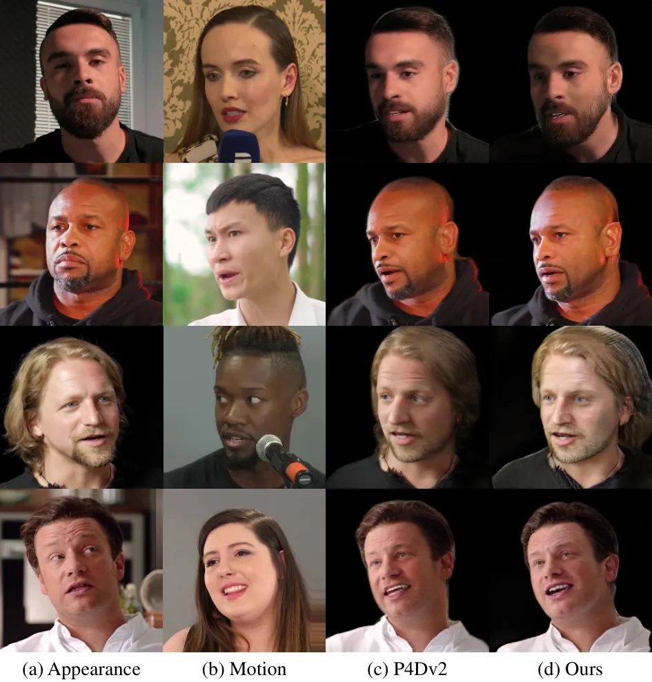

Figure 2: Face reenactment under uneven lighting. Existing models
like \[17\] couple facial textures and lighting, resulting in fixed
light and shadow that do not adapt to head movements. In contrast, our
model provides more realistic portrait shading.

## 2 Related Work

Face Reenactment has seen significant advancements in recent years
initially built on the success of CNN and GAN \[35, 20, 30\]. Early
strategies inserted features from driving images into 2D generative
networks to create animatable portraits \[78, 43, 67\]. Recent
approaches represent expressions and head poses as warp fields,
deforming source images to match driving images \[59, 56, 25\]. While
these methods produce high-quality images, they often lack 3D
consistency, limiting realistic results under varied poses and
expressions. Some methods incorporate 3D Morphable Models (3DMM) \[5\]
into 2D frameworks \[32, 40, 36, 37, 76, 10, 9\], but they are still
limited by the accuracy of monocular 3DMM reconstructions. Building on
the success of neural radiance fields (NeRF) \[43\], several
methods \[19, 47, 65, 3, 48\] have adopted NeRF for head reconstruction,
but their reliance on multi-view or single-view videos limits
generalization. Some works \[73, 63, 84, 72\] train generators for
controllable head avatars based on identity inversion, but often fail to
preserve the source identity due to inversion limitations. By learning
canonical triplane representations in NeRF-based models, Trevithick et
al. \[66\] provide real-time 3D-aware novel view synthesis without
expression change via volume rendering, and Portrait4D series \[16, 17\]
tackles dynamic expression modeling using synthetic and pseudo
multi-view data. Despite their advancements, these methods have
difficulty separating lighting effects from facial features, leading to
fixed light and shadows on the face. In contrast, our approach achieves
precise illumination consistency, allowing natural lighting shifts in
response to head movements.

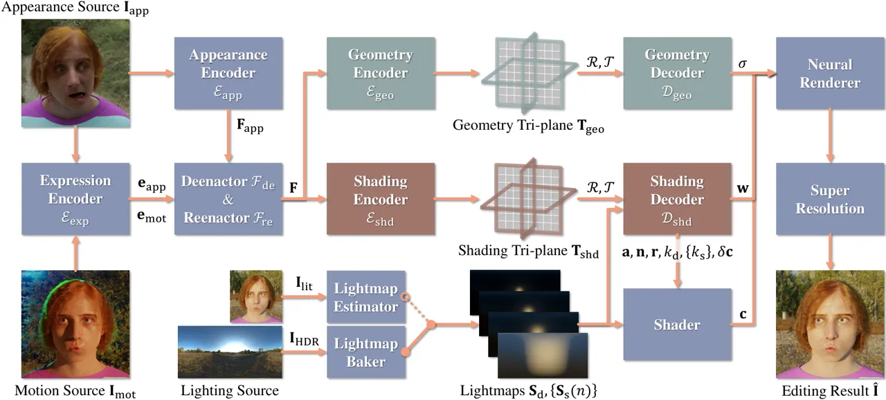

Figure 3: The framework of Total-Editing. Sec. 3.2: Our pipeline learns
to encode appearance and motion sources
$`\mathbf{I}_{\text{app}},\mathbf{I}_{\text{mot}}`$, neutralize the
expression from $`\mathbf{I}_{\text{app}}`$ and reapply the expression
from $`\mathbf{I}_{\text{mot}}`$ to obtain a fused feature
$`\mathbf{F}`$. After generating canonical space geometry and shading
tri-planes $`\mathbf{T}_{\text{geo}},\mathbf{T}_{\text{shd}}`$, the neck
pose is handled by warping features with moving least squares based
deformation fields $`\mathcal{R},\mathcal{T}`$. Sec. 3.4: For the
lighting source, we either estimate from a portrait image
$`\mathbf{I}_{\text{lit}}`$ or pre-filter (bake) an HDR environment map
$`\mathbf{I}_{\text{HDR}}`$, resulting in diffuse and specular lightmaps
$`\mathbf{S}_{\text{d}},\{\mathbf{S}_{\text{s}}(n)\}`$. Sec. 3.3: With
the lighting information, geometry and shading decoders
$`\mathcal{D}_{\text{geo}},\mathcal{D}_{\text{shd}}`$ decode point-wise
attributes. Finally, a neural renderer and a super-resolution module
render the editing result $`\hat{\mathbf{I}}`$.

Portrait Relighting aims to realistically re-illuminate human face
images. Early work by Debevec et al. \[12\] introduced a method for HDR
face relighting using a light stage to capture images one light at a
time (OLAT). This method was extended by \[70, 60, 69, 79\], but they
are limited to subjects captured within the light stage setup. To
address this, \[75, 18, 46, 82\] utilize synthetic data for training.
Some advancements in portrait relighting leverage diverse approaches,
including diffusion models, neural fields, GANs, and physics-guided
models \[7, 61, 27, 26, 34, 44, 55, 42, 54, 1\]. For lighting
representations, some approaches \[57, 51, 29, 13, 53, 82, 60, 50, 42,
22\] utilize Spherical Harmonics (SH) \[52\] as a compact lighting
representation. Other methods \[39, 75, 45, 28, 41, 54\] use
pre-filtered lightmaps from HDR environment maps to capture higher
frequency lighting details. Recently, SwitchLight \[34\] leverages the
Cook-Torrance reflectance model \[11\] for precise light-surface
interactions. Unlike these approaches which are mostly 2D-based, our
method leverages 3D representations for free-view rendering and
video-conditioned animations, requiring less training data and
facilitating more flexible applications.

## 3 Method

Taking as input an appearance source $`\mathbf{I}_{\text{app}}`$, a
motion source $`\mathbf{I}_{\text{mot}}`$, and a lighting source, either
a portrait image $`\mathbf{I}_{\text{lit}}`$ or an HDR environment map
$`\mathbf{I}_{\text{HDR}}`$, our goal is to synthesize a 3D head that
combines the appearance of $`\mathbf{I}_{\text{app}}`$, the motion of
$`\mathbf{I}_{\text{mot}}`$, and the lighting of
$`\mathbf{I}_{\text{lit}}`$ or $`\mathbf{I}_{\text{HDR}}`$. To achieve
this, we present the Total-Editing framework, as depicted in Fig. 3,
disentangling the control of appearance, motion, and lighting. For
appearance, we use a pre-trained appearance encoder \[17\] to extract
appearance features from $`\mathbf{I}_{\text{app}}`$. For motion, we
employ an off-the-shelf expression encoder \[67\] to extract
appearance-free expression features, allowing us to neutralize the
expression in $`\mathbf{I}_{\text{app}}`$ (de-enactment) and apply the
expression from $`\mathbf{I}_{\text{mot}}`$ (re-enactment), and moving
least squares based deformation fields to capture the neck pose. As for
lighting, we leverage pre-filtered HDR environment maps, i.e.,
lightmaps, as our lighting representation. Further, we decompose
point-wise colors in 3D volumes with the Phong reflection model to
isolate shading effects from portrait materials. In this way, our
framework effectively disentangles and integrates appearance, motion,
and lighting conditions, enabling the synthesis of realistic 3D head
models with precise control over each attribute.

### 3.1 Preliminaries

#### 3.1.1 Phong Reflection Model

The Phong reflection model \[49\] is a widely used lighting model for
simulating the way surfaces reflect light. For each point on the
surface, it decomposes the reflection into three terms, namely, the
ambient reflection ($`\mathbf{c}_{\text{a}}`$), the diffuse reflection
($`\mathbf{c}_{\text{d}}`$), and the specular reflection
($`\mathbf{c}_{\text{s}}`$),

```math
\displaystyle\mathbf{c}=\mathbf{c}_{\text{a}}+\mathbf{c}_{\text{d}}+\mathbf{c}_{\text{s}}, \tag{1}
```

where $`\mathbf{c}`$ is the total reflection intensity at this point. We
omit the ambient component $`\mathbf{c}_{\text{a}}`$ in our model and
calculate the diffuse and specular components as

```math
\displaystyle\mathbf{c}_{\text{d}} \displaystyle=k_{\text{d}}\mathbf{a}\odot\mathbf{s}_{\text{d}},\;\mathbf{s}_{\text{d}}=\int_{\Omega}{\mathbf{L}(\mathbf{l})\left(\mathbf{n}\cdot\mathbf{l}\right)d\mathbf{l}}, \tag{2}
```

```math
\displaystyle\mathbf{c}_{\text{s}} \displaystyle=\sum_{n}k_{\text{s}}(n)\mathbf{s}_{\text{s}}(n),\;\mathbf{s}_{\text{s}}(n)=\int_{\Omega}{\mathbf{L}(\mathbf{l})(\mathbf{r}\cdot\mathbf{l})^{n}d\mathbf{l}}. \tag{3}
```

Here, $`\odot`$ denotes the Hadamard product, scalars $`k_{\text{d}}`$
and $`k_{\text{s}}(n)`$ are the diffuse and specular coefficients,
$`\mathbf{a}`$ is the surface albedo, and $`n\in\{1,16,32,64\}`$ is the
shininess exponent. We refer to $`\mathbf{s}_{\text{d}}`$ and
$`\mathbf{s}_{\text{s}}(n)`$ as diffuse and specular shadings. They sum
the incoming light $`\mathbf{L}(\mathbf{l})`$ from all directions
$`\mathbf{l}`$ over the hemisphere $`\Omega`$ above the surface. In the
integral, $`\mathbf{n}`$ and $`\mathbf{r}`$ are the surface normal and
the reflected viewing direction, with

```math
\displaystyle\mathbf{r}=2(\mathbf{n}\cdot\mathbf{v})\mathbf{n}-\mathbf{v}, \tag{4}
```

where $`\mathbf{v}`$ is the viewing direction.

#### 3.1.2 Pre-filtering Environment Maps

Inspired by \[23, 31\], we pre-filter HDR environment maps with Phong
lobes to avoid expensive real-time reflection computations. For each
surface normal $`\mathbf{n}`$ in Eq. 2, we pre-integrate the diffuse
shading as $`\mathbf{s}_{\text{d}}(\mathbf{n})`$. Similarly, for each
reflected viewing direction $`\mathbf{r}`$ in Eq. 3, we precompute the
specular shading as $`\mathbf{s}(n,\mathbf{r})`$. Aggregating each gives
us the diffuse lightmap
$`\mathbf{S}_{\text{d}}=\{\mathbf{s}_{\text{d}}(\mathbf{n})\}_{\mathbf{n}\in\Omega}`$
and specular lightmaps
$`\{\mathbf{S}_{\text{s}}(n)\}_{n}=\{\{\mathbf{s}_{\text{s}}(n,\mathbf{r})\}_{\mathbf{r}\in\Omega}\}_{n}`$.
This process is also referred to as lightmap baking. At runtime, shading
calculations are simplified to look-ups in these precomputed lightmaps
with $`\mathbf{n}`$ or $`\mathbf{r}`$, reducing the computational
complexity of rendering each pixel from $`O(N)`$, where $`N`$ is the
number of incident rays from the environment, to $`O(1)`$.

#### 3.1.3 Image Formation

Integrating the Phong reflection model into volumetric rendering, we
derive the expected color $`\mathbf{C}(\mathbf{p})`$ of camera ray
$`\mathbf{p}(t)=\mathbf{o}+t\mathbf{d}`$ with $`t\in[t_{n},t_{f}]`$ and
$`\mathbf{d}=-\mathbf{v}`$,

```math
\displaystyle\mathbf{C}(\mathbf{p})=\int_{t_{n}}^{t_{f}}T(t)\sigma(\mathbf{p}(t))\mathbf{c}(\mathbf{p}(t),\mathbf{v})dt, \tag{5}
```

```math
\displaystyle T(t)=\exp\left(-\int_{t_{n}}^{t}\sigma(\mathbf{p}(s))ds\right), \tag{6}
```

where $`T`$ is the accumulated transmittance and $`\sigma`$ is the
volume density. We rewrite reflection as
$`\mathbf{c}(\mathbf{p}(t),\mathbf{v})`$ since its diffuse component
$`\mathbf{c}_{\text{d}}`$ is position dependent and its specular
component $`\mathbf{c}_{\text{s}}`$ is position and view dependent,

```math
\displaystyle\mathbf{c}_{\text{d}} \displaystyle=\mathbf{c}_{\text{d}}(\mathbf{p})=k_{\text{d}}(\mathbf{p})\mathbf{a}(\mathbf{p})\odot\mathbf{s}_{\text{d}}(\mathbf{n}(\mathbf{p})), \tag{7}
```

```math
\displaystyle\mathbf{c}_{\text{s}} \displaystyle=\mathbf{c}_{\text{s}}(\mathbf{p},\mathbf{v})=\sum_{n}k_{\text{s}}(n,\mathbf{p})\mathbf{s}_{\text{s}}(n,\mathbf{n}(\mathbf{p}),\mathbf{v}). \tag{8}
```

### 3.2 Learning Appearance and Motion

We follow \[16, 17\] to incorporate appearance and motion control in
Total-Editing with decoupled learning. Specifically, we adopt an
off-the-shelf expression encoder $`\mathcal{E}_{\text{mot}}`$ to extract
1D expression features for both appearance and motion sources,
$`\mathbf{e}_{\text{app}}=\mathcal{E}_{\text{mot}}(\mathbf{I}_{\text{app}})`$,
$`\mathbf{e}_{\text{mot}}=\mathcal{E}_{\text{mot}}(\mathbf{I}_{\text{mot}})`$,
and an appearance encoder $`\mathcal{E}_{\text{app}}`$ to extract 2D
appearance features from the appearance source,
$`\mathbf{F}_{\text{app}}=\mathcal{E}_{\text{app}}(\mathbf{I}_{\text{app}})`$.
All these features are fused with two Transformer-based modules, a
deenactor $`\mathcal{F}_{\text{de}}`$ and a following reenactor
$`\mathcal{F}_{\text{re}}`$,

```math
\displaystyle\mathbf{F} \displaystyle=\mathcal{F}_{\text{re}}(\mathcal{F}_{\text{de}}(\mathbf{F}_{\text{app}},\mathbf{e}_{\text{app}}),\mathbf{e}_{\text{mot}}). \tag{9}
```

Together, they learn to embed the appearance from
$`\mathbf{I}_{\text{app}}`$, neutralize it, and inject the expressions
from $`\mathbf{I}_{\text{mot}}`$. Using the fused appearance and
expression features $`\mathbf{F}`$, we generate a geometry tri-plane
$`\mathbf{T}_{\text{geo}}`$ and a shading tri-plane
$`\mathbf{T}_{\text{shd}}`$,

```math
\displaystyle\mathbf{T}_{\text{geo}} \displaystyle=\mathcal{E}_{\text{geo}}(\mathbf{F}),\;\mathbf{T}_{\text{shd}}=\mathcal{E}_{\text{shd}}(\mathbf{F}), \tag{10}
```

where $`\mathcal{E}_{\text{geo}}`$ and $`\mathcal{E}_{\text{shd}}`$ are
the geometry and shading encoders, respectively, both with a ViT-based
architecture \[66\]. To handle the neck pose, we further derive
deformation fields $`\mathcal{T},\mathcal{R}`$ with FLAME meshes. They
will then be utilized to warp tri-plane features and rotate decoded
normals from the unposed canonical space to the posed target space, as
shown in Fig. 4. Unlike \[16, 17\] using the Surface Field (SF)
approach \[4\] that determines the deformation for each sample point by
the motion of nearest triangles, we adopt moving least squares
(MLS) \[83\] instead to obtain continuous deformation results. Our
intuition is that by globally averaging transformations, MLS enables
more natural transitions and reduces the risk of artifacts that can
occur with the more localized SF method. Specifically, we set posed mesh
vertices $`\mathbf{V}^{\text{t}}`$ and their unposed correspondences
$`\mathbf{V}^{\text{c}}`$ as control points, and solve for the
transformation $`\mathcal{T}`$ of sample point $`\mathbf{p}`$ by

```math
\displaystyle\argmin_{\mathcal{T}}\sum_{i}w_{i}(\mathbf{V}^{\text{t}},\mathbf{p})\left\lVert\mathcal{T}(\mathbf{V}^{\text{t}}_{i})-\mathbf{V}^{\text{c}}_{i}\right\rVert_{2}^{2}, \tag{11}
```

where the weights are of the form

```math
\displaystyle w_{i}(\mathbf{X},\mathbf{p})=\left\lVert\mathbf{X}_{i}-\mathbf{p}\right\rVert_{2}^{-2\alpha}, \tag{12}
```

with $`\alpha=1.0`$ being a fall-off parameter. Note that this
formulation lets
$`w_{i}(\mathbf{V}^{\text{t}},\mathbf{V}^{\text{t}}_{i})=\infty`$ and
thus
$`\mathcal{T}(\mathbf{V}^{\text{t}}_{i})=\mathbf{V}^{\text{c}}_{i}`$.
Confining $`\mathcal{T}`$ to be a rigid transformation, this
minimization can be solved via singular value decomposition. Similarly,
we obtain the rotation field $`\mathcal{R}`$ by controlling with normals

```math
\displaystyle\argmin_{\mathcal{R}}\sum_{i}w_{i}(\mathbf{V}^{\text{t}},\mathbf{p})\left\lVert\mathcal{R}(\mathbf{N}^{\text{t}}_{i})-\mathbf{N}^{\text{c}}_{i}\right\rVert_{2}^{2}, \tag{13}
```

where $`\mathbf{N}^{\text{t}}`$ and $`\mathbf{N}^{\text{c}}`$ are
surface normal directions on posed and unposed meshes, respectively.

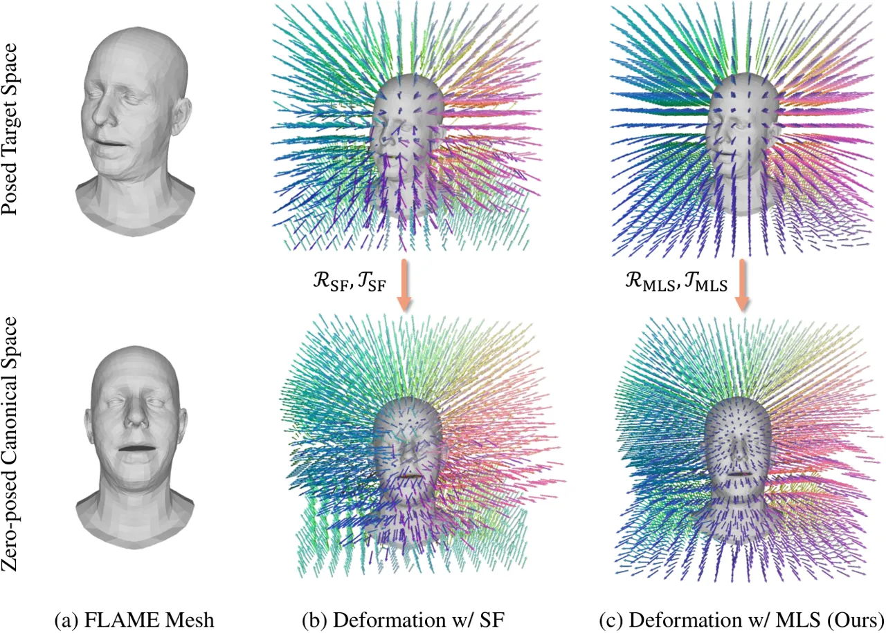

Figure 4: Deformation field comparison. (a) Similar to \[16, 17\] we
derive deformation field from FLAME meshes. Points and attached normals
are sampled from the posed target space and then deformed into the
unposed canonical space by deformation fields $`\mathcal{T}`$ and
$`\mathcal{R}`$. (b) Surface Field (SF) based approach \[4\] assigns
each grid to the nearest mesh triangle, leading to discontinuous
deformation results. (c) In contrast, our moving least squares (MLS)
based deformation field weighs per-point deformation with its inverse
distance to all mesh vertices, producing smoother results.

### 3.3 Learning Geometry and Shading

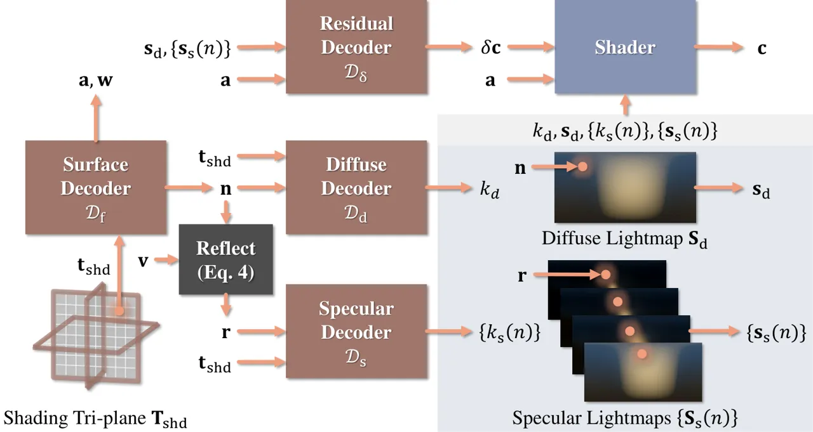

Figure 5: Shading module architecture. The shading feature
$`\mathbf{t}_{\text{shd}}`$ sampled from a position in the shading
tri-plane is first decoded into normal $`\mathbf{n}`$, albedo
$`\mathbf{a}`$, and additional features $`\mathbf{w}`$ for
super-resolution. The viewing direction $`\mathbf{v}`$ is then reflected
with the normal $`\mathbf{n}`$, resulting in a reflected viewing
direction $`\mathbf{r}`$. $`\mathbf{n}`$ and $`\mathbf{r}`$ are
concatenated with $`\mathbf{t}_{\text{shd}}`$ and mapped to a diffuse
coefficient $`k_{\text{d}}`$ and specular coefficients
$`\{k_{\text{s}}(n)\}`$ for various shininess values $`\{n\}`$,
respectively. They are also used to sample a diffuse shading
$`\mathbf{s}_{\text{d}}`$ and specular shadings
$`\{\mathbf{s}_{\text{s}}(n)\}`$ from corresponding lightmaps. These
shadings, $`\mathbf{s}_{\text{d}},\{\mathbf{s}_{\text{s}}(n)\}`$, are
concatenated with the albedo $`\mathbf{a}`$ to decode a residual color
$`\delta\mathbf{c}`$. The final color $`\mathbf{c}`$ at this position is
obtained by combining PBR and neural residual $`\delta\mathbf{c}`$
in Eq. 18.

We then decode point-wise attributes with MLP-based decoders.
Specifically, for each sample point $`\mathbf{p}`$ in the geometry
tri-plane, the geometry decoder $`\mathcal{D}_{\text{geo}}`$ decode its
volume density from the geometry feature $`\mathbf{t}_{\text{geo}}`$ at
this point,

```math
\displaystyle\sigma \displaystyle=\mathcal{D}_{\text{geo}}(\mathbf{t}_{\text{geo}}),\;\text{where }\mathbf{t}_{\text{geo}}=\mathbf{T}_{\text{geo}}(\mathcal{T}(\mathbf{p})), \tag{14}
```

and $`\mathcal{T}`$ is the FLAME-derived translation field warping
$`\mathbf{p}`$ from the target space to the canonical space. To inject
illumination awareness into our neural renderer, we extend the color
decoder in \[8\] to a shading decoder $`\mathcal{D}_{\text{shd}}`$ that
decomposes the volume color according to the Phong reflection model. It
incorporates a surface decoder $`\mathcal{D}_{\text{f}}`$, a diffuse
decoder $`\mathcal{D}_{\text{d}}`$, a specular decoder
$`\mathcal{D}_{\text{s}}`$, and a residual decoder
$`\mathcal{D}_{\delta}`$, as illustrated in Fig. 5. From the shading
feature $`\mathbf{t}_{\text{shd}}`$ at point $`\mathbf{p}`$, the surface
decoder $`\mathcal{D}_{\text{f}}`$ decodes canonical space normal
$`\mathbf{n}^{\text{c}}`$, albedo $`\mathbf{a}`$, and additional
features $`\mathbf{w}`$ for super-resolution,

```math
\displaystyle\mathbf{n}^{\text{c}},\mathbf{a},\mathbf{w} \displaystyle=\mathcal{D}_{\text{f}}(\mathbf{t}_{\text{shd}}),\;\text{where }\mathbf{t}_{\text{shd}}=\mathbf{T}_{\text{shd}}(\mathcal{T}(\mathbf{p})). \tag{15}
```

Different from $`\sigma,\mathbf{a},\mathbf{w}`$ which are the same in
zero pose and target pose, the canonical normal needs to be rotated to
the target normal $`\mathbf{n}=\mathcal{R}^{-1}(\mathbf{n}^{\text{c}})`$
with the target-to-canonical rotation field $`\mathcal{R}`$. Eq. 4
reflects the normal $`\mathbf{n}`$ with the viewing direction
$`\mathbf{v}`$ of the sampled ray to obtain a reflected viewing
direction $`\mathbf{r}`$. Then, the diffuse decoder
$`\mathcal{D}_{\text{d}}`$ and the specular decoder
$`\mathcal{D}_{\text{s}}`$ predict shading coefficients by utilizing
these surface attributes with the shading feature
$`\mathbf{t}_{\text{shd}}`$,

```math
\displaystyle k_{\text{d}} \displaystyle=\mathcal{D}_{\text{d}}([\mathbf{t}_{\text{shd}},\mathbf{n}]),\;\{k_{\text{s}}(n)\}=\mathcal{D}_{\text{s}}([\mathbf{t}_{\text{shd}},\mathbf{r}]), \tag{16}
```

where $`[\cdot,\cdot]`$ denotes a concatenation. We also sample diffuse
and specular lightmaps
$`\mathbf{S}_{\text{d}},\{\mathbf{S}_{\text{s}}(n)\}`$ with the normal
$`\mathbf{n}`$ and the reflected viewing direction $`\mathbf{r}`$,
respectively, resulting in diffuse and specular shadings
$`\mathbf{s}_{\text{d}},\{\mathbf{s}_{\text{s}}(n)\}`$. To enhance the
realism beyond naive Phong shading, we further decode a residual color
$`\delta\mathbf{c}`$ with a residual decoder $`\mathcal{D}_{\delta}`$,

```math
\displaystyle\delta\mathbf{c} \displaystyle=\mathcal{D}_{\delta}([\mathbf{a},\mathbf{s}_{\text{d}},\{\mathbf{s}_{\text{s}}(n)\}]). \tag{17}
```

This allows our shader to combine physically based rendering (PBR) with
learnable residuals as the volume color,

```math
\displaystyle\mathbf{c} \displaystyle=k_{\text{d}}\mathbf{a}\odot\mathbf{s}_{\text{d}}+\sum_{n}k_{\text{s}}(n)\mathbf{s}_{\text{s}}(n)+\delta\mathbf{c}. \tag{18}
```

Finally, we feed point-wise density $`\sigma`$, color $`\mathbf{c}`$,
and extra features $`\mathbf{w}`$ to a neural renderer and a subsequent
super-resolution module to obtain editing result $`\hat{\mathbf{I}}`$.

### 3.4 Learning Illumination

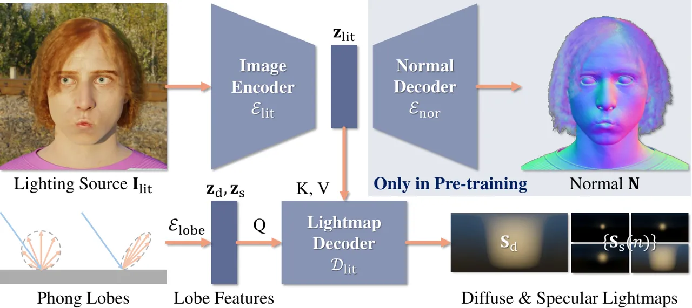

Figure 6: Lightmap estimator architecture. During pre-training with
synthetic data, we adopt a U-Net to encode lighting source
$`\mathbf{I}_{\text{lit}}`$ and decode pixel-wise normal $`\mathbf{N}`$.
The intermediate feature $`\mathbf{z}_{\text{lit}}`$ is used to decode
diffuse and specular lightmaps
$`\mathbf{S}_{\text{d}},\{\mathbf{S}_{\text{s}}(n)\}`$, querying with
embedded lobe features
$`\mathbf{z}_{\text{d}},\{\mathbf{z}_{\text{s}}(n)\}`$. In joint
training with Total-Editing, the normal decoder is detached.

With this intrinsic decomposition of our 3D portrait, we can illuminate
it using either a portrait image, $`\mathbf{I}_{\text{lit}}`$, or an HDR
environment map, $`\mathbf{I}_{\text{HDR}}`$. Both lighting sources are
converted into lightmaps for sampling by our shader. In addition to the
conversion of environment maps introduced in Sec. 3.1.2, we further
present our lightmap estimator inspired by \[34\] to predict lightmaps
from portrait images. As shown in Fig. 6, it leverages a U-Net
architecture for encoding lighting source $`\mathbf{I}_{\text{lit}}`$
and decoding its pixel-wise normal $`\mathbf{N}`$. To estimate lightmaps
$`\mathbf{S}_{\text{d}},\{\mathbf{S}_{\text{s}}(n)\}\in\mathbb{R}^{H\times W\times 3}`$,
diffuse and specular Phong lobes are projected into lobe features
$`\mathbf{z}_{\text{d}},\{\mathbf{z}_{\text{s}}(n)\}\in\mathbb{R}^{H\times W\times C}`$
with a shared linear layer $`\mathcal{E}_{\text{lobe}}`$,

```math
\displaystyle\mathbf{z}_{\text{d}} \displaystyle=\mathcal{E}_{\text{lobe}}\left(\max(0,\mathbf{n}\cdot\mathbf{l})\right), \tag{19}
```

```math
\displaystyle\mathbf{z}_{\text{s}}(n) \displaystyle=\mathcal{E}_{\text{lobe}}\left(\max(0,(\mathbf{r}\cdot\mathbf{l})^{n})\right), \tag{20}
```

where $`\mathbf{n},\mathbf{r}\in[-1,1]^{H\times W\times 3}`$ are query
normals and reflected viewing directions, respectively, and
$`\mathbf{l}\in[-1,1]^{N\times 3}`$ are quantized light directions over
a sphere. Then, a Transformer-based Lightmap decoder
$`\mathcal{D}_{\text{lit}}`$ queries the encoded portrait image
$`\mathbf{z}_{\text{lit}}`$ with these lobe features, producing diffuse
and specular lightmaps,

```math
\displaystyle\mathbf{S}_{\text{d}}=\mathcal{D}_{\text{lit}}(\mathbf{z}_{\text{d}},\mathbf{z}_{\text{lit}}),\;\mathbf{S}_{\text{s}}(n)=\mathcal{D}_{\text{lit}}(\mathbf{z}_{\text{s}}(n),\mathbf{z}_{\text{lit}}). \tag{21}
```

## 4 Experiments

### 4.1 Experimental Setting

Datasets. We jointly train our Total-Editing with synthetic and real
data. For the synthetic dataset, we render a multi-view subset and a
video-like one. The former includes 50K subjects rendered in 2
environments, with each subject captured from 10 different views. The
latter contains 10K subjects rendered across 10 environments, each with
10 varied poses and expressions. Each unique view, pose, or expression
is shared across all environments. The whole dataset with roughly 2M
images in total will be released to benefit the community. More details
available in the Supp. Mat. For real data, we use the VFHQ \[71\]
dataset, which comprises 15K video clips. We also evaluate our model
with its 100-clip test split. All data are at resolution $`512^{2}`$.

Evaluation Metrics. We employ common metrics to evaluate both the
synthesis quality and control accuracy of all baseline methods and our
model. For image quality, we use PSNR, SSIM, Fréchet Inception Distances
(FID)  \[24\], and LPIPS \[80\] to assess perceptual similarity and
distribution alignment between generated images and ground truths. To
measure identity preservation, we calculate the cosine similarity (CSIM)
between the face recognition features \[14\] of generated images and the
appearance sources. For expression and pose control accuracy, we use
Average Expression Distance (AED) and Average Pose Distance
(APD) \[38\], derived from a 3DMM estimator \[15\].

Implementation Details. During pre-training of the lightmap estimator
with synthetic data, we utilize the Adam optimizer with a learning rate
of $`1\times 10^{-4}`$ and a batch size of $`32`$, optimizing
$`\mathcal{E}_{\text{lit}},\mathcal{D}_{\text{lit}},\mathcal{E}_{\text{nor}}`$
for 500K steps. Subsequently, we plug the lightmap estimator into
Total-Editing. Upon the pre-trained
$`\mathcal{E}_{\text{app}},\mathcal{E}_{\text{mot}},\mathcal{F}_{\text{de}},\mathcal{F}_{\text{re}},\mathcal{E}_{\text{geo}},\mathcal{D}_{\text{geo}}`$
from Portrait4D-v2 \[17\], we learn
$`\mathcal{F}_{\text{re}},\mathcal{E}_{\text{geo}},\mathcal{D}_{\text{geo}},\mathcal{E}_{\text{shd}},\mathcal{D}_{\text{shd}},\mathcal{E}_{\text{lit}},\mathcal{D}_{\text{lit}}`$
using a combination of synthetic data and VFHQ-Train, while keeping the
remaining components of Total-Editing fixed. In this phase, training
proceeds for 1M steps with an Adam optimizer, a learning rate of
$`1\times 10^{-4}`$, and a batch size of $`12`$. During training, we
randomly sample appearance source $`\mathbf{I}_{\text{app}}`$ and motion
source $`\mathbf{I}_{\text{mot}}`$ of one subject, with the editing
target $`\mathbf{I}^{*}`$ equal to the motion source
$`\mathbf{I}_{\text{mot}}`$. As for the lighting source, we use the HDR
environment map of $`\mathbf{I}_{\text{mot}}`$ for synthetic data and
another random frame from the same video for real data. More details can
be found in Supp. Mat.

### 4.2 Comparison Results

Method Self Reenactment Cross Reenactment Reenactment Relighting PSNR
$`\uparrow`$ SSIM $`\uparrow`$ LPIPS $`\downarrow`$ CSIM $`\uparrow`$
AED $`\downarrow`$ APD $`\downarrow`$ CSIM $`\uparrow`$ AED
$`\downarrow`$ APD $`\downarrow`$ FID $`\downarrow`$ GPAvatar \[10\]
$`-`$ 20.7 0.753 0.256 0.802 0.176 0.021 0.517 0.383 0.037 55.5 Cai et
al. \[6\] 19.5 0.699 0.330 0.524 0.239 0.028 0.372 0.381 0.044 59.8
Real3DPortrait \[74\] $`-`$ 19.3 0.711 0.270 0.856 0.217 0.026 0.685
0.434 0.044 46.2 Cai et al. \[6\] 18.6 0.681 0.340 0.561 0.263 0.035
0.443 0.424 0.055 50.2 Portrait4D-v2 \[17\] $`-`$ 18.9 0.704 0.247 0.874
0.154 0.027 0.686 0.386 0.031 39.6 Cai et al. \[6\] 18.2 0.665 0.337
0.552 0.232 0.027 0.430 0.380 0.034 43.9 Total-Editing (Ours) 20.3 0.730
0.226 0.896 0.148 0.015 0.713 0.370 0.024 38.3

Table 1: Comparison results on VFHQ-Test at resolution $`512^{2}`$. We
use colors to denote first, second, and third places, respectively.

In Tab. 1, we first compare Total-Editing with other one-shot
video-based face reenactment methods directly. For baseline methods, we
test for standard self-reenactment and cross-reenactment settings, where
an appearance source is given, and a motion source is the video of the
same subject or another subject, respectively. As for our Total-Editing,
we also use the appearance source as the lighting source to let the
editing result reflect the source lighting situation. From empirical
results in Fig. 2, we observe current face reenactment models often
couple facial textures with lighting, resulting in unrealistic fixed
shading effects on generated results. We thus try to inject illumination
into the reenacted faces with a state-of-the-art portrait relighting
method \[6\], forming two-stage reenactment-relighting pipelines.
However, this leads to performance degradation. The reason might be 1)
accumulated errors that propagate from the reenacted faces to the
relighting model, and 2) the SH lighting representation used in \[6\]
capturing mainly diffuse shadings. Overall, our end-to-end method
outperforms all other approaches in the face reenactment task.

### 4.3 Ablation study

$`\mathcal{T}`$ $`\mathcal{R}`$ PSNR $`\uparrow`$ SSIM $`\uparrow`$
LPIPS $`\downarrow`$ CSIM $`\uparrow`$ AED $`\downarrow`$ APD
$`\downarrow`$ SF $`-`$ 19.9 0.714 0.239 0.861 0.171 0.024 SF 20.0 0.722
0.237 0.872 0.165 0.023 MLS $`-`$ 20.1 0.718 0.230 0.879 0.157 0.015 MLS
20.3 0.730 0.226 0.896 0.148 0.015

Table 2: Ablation study for deformation fields and illumination
awareness on VFHQ-Test self-reenactment at resolution $`512^{2}`$.
$`\mathcal{T}`$ and $`\mathcal{R}`$ denote deformation fields for
feature warping and normal rotation, respectively. No $`\mathcal{R}`$
means illumination unaware.

Impact of deformation fields. Rows 2 and 4 of Tab. 2 investigate the
effect of using different deformation fields. The results show that
using the MLS-based deformation field effectively enhances synthesis
quality and motion control accuracy compared to its SF-based
counterparts. These improvements highlight the effectiveness of MLS in
maintaining smooth and consistent deformations.

Impact of illumination awareness. As shown in every two rows of Tab. 2
(1$`{}^{\text{st}}`$ vs. 2$`{}^{\text{nd}}`$ and 3$`{}^{\text{rd}}`$ vs.
4$`{}^{\text{th}}`$), removing the rotation field applied to canonical
normals causes a noticeable decline in model performance. Without this
rotation field, the normal directions remain fixed, even as pose and
expression change, leaving the model illumination unaware and shadings
stuck to the face of animated portraits.

Synthetic Real Regularization CSIM $`\uparrow`$ AED $`\downarrow`$ APD
$`\downarrow`$ FID $`\downarrow`$ ✓ ✗ ✗ 0.509 0.384 0.030 58.8 ✗ ✓ ✗
0.695 0.395 0.024 41.7 ✓ ✓ ✗ 0.707 0.396 0.025 39.8 ✓ ✓
$`\left\lVert\mathbf{S}(\mathbf{I}_{\text{app}})-\mathbf{S}(\mathbf{I}_{\text{lit}})\right\rVert_{1}`$
0.721 0.372 0.027 39.5 ✓ ✓ Random $`\mathbf{I}_{\text{lit}}`$ 0.713
0.370 0.024 38.3

Table 3: Ablation study for data and regularization schemes on VFHQ-Test
cross-reenactment at resolution $`512^{2}`$. Real data refers to
VFHQ-Train.
$`\left\lVert\mathbf{S}(\mathbf{I}_{\text{app}})-\mathbf{S}(\mathbf{I}_{\text{lit}})\right\rVert_{1}`$:
L1 loss regularizing the difference between lightmaps estimated from the
appearance source and those from the lighting source. Random
$`\mathbf{I}_{\text{lit}}`$: randomly choosing a lighting source from
the same video clip for real data.

Impact of data sources. Rows 1-3 of Tab. 3 validate the effectiveness of
using both real and synthetic data in training Total-Editing. Synthetic
data alone (row 1) enables motion transfer but lacks fidelity due to a
distribution gap between synthetic subjects and real-world portraits.
Real data alone (row 2) improves realism but leads to an unconstrained
lightmap estimator in the end-to-end training stage, resulting in
degraded performance. Combining both sources (row 3) achieves optimal
results.

Impact of regularization on real data. Row 1-3 of Tab. 3 follow standard
reenactment training, where the appearance source
$`\mathbf{I}_{\text{app}}`$ and the motion source
$`\mathbf{I}_{\text{mot}}`$ are sampled from the same video, with
$`\mathbf{I}_{\text{lit}}=\mathbf{I}_{\text{mot}}`$. Since
$`\mathbf{I}_{\text{mot}}`$ is also the editing target, there is limited
penalty for the lightmap estimator to misinterpret albedo as shading,
e.g., beards as shadows, resulting in suboptimal performance. To tackle
this, we test two types of regularization: enforcing consistency between
lightmaps estimated from the appearance and lighting sources (row 4) and
randomly sampling the lighting source within the same video clip (row
5). Both learn a more robust lightmap estimator that better decouples
albedo from shading, enhancing fidelity for editing results. We choose
row 5 as our final scheme for the best performance.

### 4.4 Qualitative Analysis

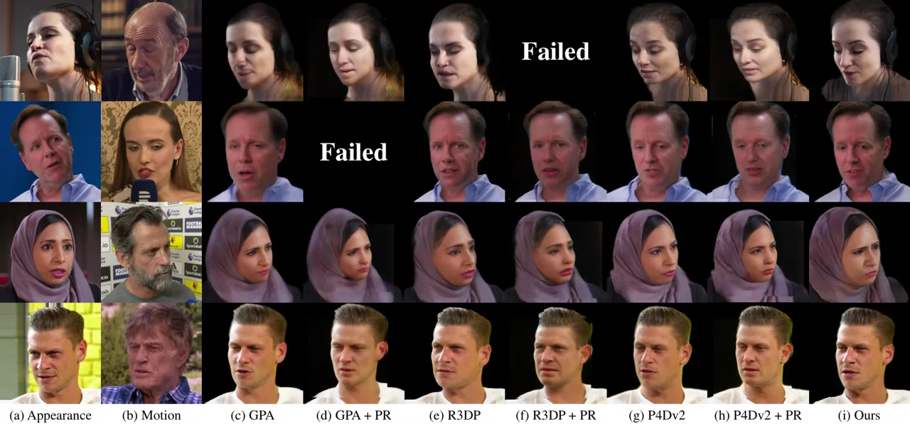

Figure 7: Qualitative comparison of cross-reenactment on VFHQ-Test. For
GPAvatar \[10\] (c), Real3DPortrait \[74\] (e), and Portrait4D-v2 \[17\]
(g), we use appearance sources (a) and motion sources (b) as inputs. For
additional relighting with PortraitRelighting \[6\], we use (a) as the
lighting condition. For our Total-Editing, we use (a) as both appearance
and lighting sources, and (b) as the motion source.

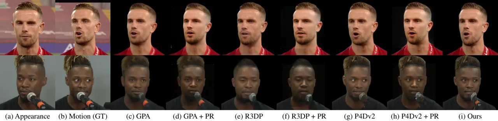

Figure 8: Qualitative comparison of self-reenactment on VFHQ-Test. We
employ the same input settings as in Fig. 7.

Fig. 7 compares Total-Editing with other reenactment and
reenactment-relighting pipelines for cross-enactment. Face reenactment
models tend to carry shading effects with portrait motion, leading to
unrealistic results. Non-end-to-end solutions can fail if the
reenactment step does not provide a reasonable portrait, compounding
errors in subsequent relighting. In contrast, our model achieves
consistent, realistic results by handling both motion and lighting
control. Fig. 8 compares Total-Editing with our baseline,
Portrait4D-v2 \[17\], in terms of self-reenactment, where our method
demonstrates better geometry and illumination control abilities. Thanks
to illumination awareness, our model synthesizes accurate movement of
the light spot on the forehead. Further, we explore the usage of
Total-Editing in Fig. 9. Users can edit the appearance, motion, and
lighting attributes of a portrait individually while not affecting
others. This facilitates applications such as background changing. More
visualizations can be found in Supp. Mat.

## 5 Conclusion

We introduce Total-Editing, a geometry-and-illumination-aware portrait
editing framework that synthesizes 3D portraits with given appearance,
motion, and lighting sources. With intrinsic decomposed neural radiance
fields, it achieves precise lighting control using either a portrait
image or an HDR environment map. The integration of a MLS-based
deformation field further enhances the realism of the generated
portraits. Experimental results show that Total-Editing provides
superior performance and more flexible applications compared to existing
methods.

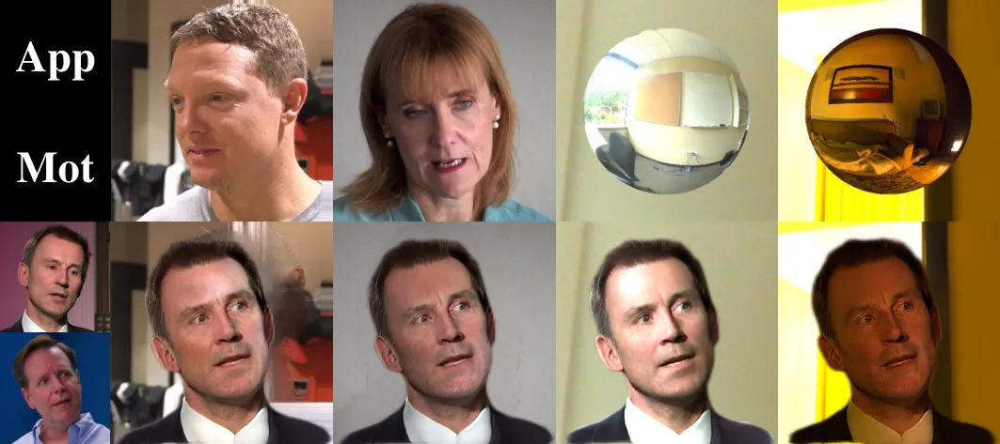

Figure 9: More applications. Total-Editing enables flexible applications
such as animatable portraits with background changing.

Limitation discussion and future work. The current formulation of
Total-Editing does not account for visibility and self-occlusion, making
it difficult to handle portraits with accessories, e.g., hats and
glasses. However, as suggested in LumiGAN \[13\], voxel-wise
visibilities can be calculated from the predicted density field and
learned in a self-supervised manner. We leave this to future
exploration.

## References

- \[1\] Rameen Abdal, Peihao Zhu, Niloy J Mitra, and Peter Wonka.
  Styleflow: Attribute-conditioned exploration of stylegan-generated
  images using conditional continuous normalizing flows. _ACM
  Transactions on Graphics (ToG)_, 40(3):1–21, 2021.
- \[2\] Madhav Agarwal et al. Audio-visual face reenactment. _arXiv
  preprint arXiv:2210.02755_, 2022.
- \[3\] ShahRukh Athar, Zexiang Xu, Kalyan Sunkavalli, Eli Shechtman,
  and Zhixin Shu. Rignerf: Fully controllable neural 3d portraits. In
  _Proceedings of the IEEE/CVF Conference on Computer Vision and Pattern
  Recognition (CVPR)_, pages 20364–20373, 2022.
- \[4\] Alexander Bergman, Petr Kellnhofer, Wang Yifan, Eric Chan, David
  Lindell, and Gordon Wetzstein. Generative neural articulated radiance
  fields. _Advances in Neural Information Processing Systems_,
  35:19900–19916, 2022.
- \[5\] Volker Blanz and Thomas Vetter. A morphable model for the
  synthesis of 3d faces. In _Proceedings of the 26th annual conference
  on Computer graphics and interactive techniques_, pages 187–194. ACM
  Press/Addison-Wesley Publishing Co., 1999.
- \[6\] Ziqi Cai, Kaiwen Jiang, Shu-Yu Chen, Yu-Kun Lai, Hongbo Fu,
  Boxin Shi, and Lin Gao. Real-time 3d-aware portrait video relighting.
  In _Proceedings of the IEEE/CVF Conference on Computer Vision and
  Pattern Recognition_, pages 6221–6231, 2024.
- \[7\] Pol Caselles, Eduard Ramon, Jaime Garcia, Xavier Giro-i Nieto,
  Francesc Moreno-Noguer, and Gil Triginer. Sira: Relightable avatars
  from a single image. In _Proceedings of the IEEE/CVF winter conference
  on applications of computer vision_, pages 775–784, 2023.
- \[8\] Eric R Chan, Connor Z Lin, Matthew A Chan, Koki Nagano, Boxiao
  Pan, Shalini De Mello, Orazio Gallo, Leonidas J Guibas, Jonathan
  Tremblay, Sameh Khamis, et al. Efficient geometry-aware 3d generative
  adversarial networks. In _Proceedings of the IEEE/CVF conference on
  computer vision and pattern recognition_, pages 16123–16133, 2022.
- \[9\] Xuangeng Chu and Tatsuya Harada. Generalizable and animatable
  gaussian head avatar. _arXiv preprint arXiv:2410.07971_, 2024.
- \[10\] Xuangeng Chu, Yu Li, Ailing Zeng, Tianyu Yang, Lijian Lin,
  Yunfei Liu, and Tatsuya Harada. Gpavatar: Generalizable and precise
  head avatar from image (s). _arXiv preprint arXiv:2401.10215_, 2024.
- \[11\] Robert L Cook and Kenneth E. Torrance. A reflectance model for
  computer graphics. _ACM Transactions on Graphics (ToG)_,
  1(1):7–24, 1982.
- \[12\] Paul Debevec, Tim Hawkins, Chris Tchou, Haarm-Pieter Duiker,
  Westley Sarokin, and Mark Sagar. Acquiring the reflectance field of a
  human face. In _Proceedings of the 27th annual conference on Computer
  graphics and interactive techniques_, pages 145–156, 2000.
- \[13\] Boyang Deng, Yifan Wang, and Gordon Wetzstein. Lumigan:
  Unconditional generation of relightable 3d human faces. In _2024
  International Conference on 3D Vision (3DV)_, pages 302–312. IEEE,
  2024a.
- \[14\] Jiankang Deng, Jia Guo, Niannan Xue, and Stefanos Zafeiriou.
  Arcface: Additive angular margin loss for deep face recognition. In
  _Proceedings of the IEEE/CVF conference on computer vision and pattern
  recognition_, pages 4690–4699, 2019a.
- \[15\] Yu Deng, Jiaolong Yang, Sicheng Xu, Dong Chen, Yunde Jia, and
  Xin Tong. Accurate 3d face reconstruction with weakly-supervised
  learning: From single image to image set. In _Proceedings of the
  IEEE/CVF conference on computer vision and pattern recognition
  workshops_, pages 0–0, 2019b.
- \[16\] Yu Deng, Duomin Wang, Xiaohang Ren, Xingyu Chen, and Baoyuan
  Wang. Portrait4d: Learning one-shot 4d head avatar synthesis using
  synthetic data. In _Proceedings of the IEEE/CVF Conference on Computer
  Vision and Pattern Recognition_, pages 7119–7130, 2024b.
- \[17\] Yu Deng, Duomin Wang, and Baoyuan Wang. Portrait4d-v2: Pseudo
  multi-view data creates better 4d head synthesizer. _arXiv preprint
  arXiv:2403.13570_, 2024c.
- \[18\] Fan Fei, Yean Cheng, Yongjie Zhu, Qian Zheng, Si Li, Gang Pan,
  and Boxin Shi. Split: Single portrait lighting estimation via a tetrad
  of face intrinsics. _IEEE Transactions on Pattern Analysis and Machine
  Intelligence_, 2023.
- \[19\] Guy Gafni, Justus Thies, Michael Zollhöfer, and Matthias
  Nießner. Dynamic neural radiance fields for monocular 4d facial avatar
  reconstruction. In _Proceedings of the IEEE/CVF Conference on Computer
  Vision and Pattern Recognition (CVPR)_, pages 8649–8658, 2021.
- \[20\] Ian Goodfellow, Jean Pouget-Abadie, Mehdi Mirza, Bing Xu, David
  Warde-Farley, Sherjil Ozair, Aaron Courville, and Yoshua Bengio.
  Generative adversarial nets. _Advances in neural information
  processing systems_, 27, 2014.
- \[21\] Google. Project starline.
  [https://en.wikipedia.org/wiki/Project_Starline](https://en.wikipedia.org/wiki/Project_Starline), 2021.
- \[22\] Mingtao Guo, Guanyu Xing, and Yanli Liu. High-fidelity
  relightable monocular portrait animation with lighting-controllable
  video diffusion model. _arXiv preprint arXiv:2502.19894_, 2025.
- \[23\] Wolfgang Heidrich and Hans-Peter Seidel. Realistic,
  hardware-accelerated shading and lighting. In _Proceedings of the 26th
  annual conference on Computer graphics and interactive techniques_,
  pages 171–178, 1999.
- \[24\] Martin Heusel, Hubert Ramsauer, Thomas Unterthiner, Bernhard
  Nessler, and Sepp Hochreiter. Gans trained by a two time-scale update
  rule converge to a local nash equilibrium. _Advances in neural
  information processing systems_, 30, 2017.
- \[25\] Fa-Ting Hong, Longhao Zhang, Li Shen, and Dan Xu. Depth-aware
  generative adversarial network for talking head video generation. In
  _Proceedings of the IEEE/CVF conference on computer vision and pattern
  recognition_, pages 3397–3406, 2022.
- \[26\] Andrew Hou, Ze Zhang, Michel Sarkis, Ning Bi, Yiying Tong, and
  Xiaoming Liu. Towards high fidelity face relighting with realistic
  shadows. In _Proceedings of the IEEE/CVF conference on computer vision
  and pattern recognition_, pages 14719–14728, 2021.
- \[27\] Andrew Hou, Michel Sarkis, Ning Bi, Yiying Tong, and Xiaoming
  Liu. Face relighting with geometrically consistent shadows. In
  _Proceedings of the IEEE/CVF conference on computer vision and pattern
  recognition_, pages 4217–4226, 2022.
- \[28\] Chaonan Ji, Tao Yu, Kaiwen Guo, Jingxin Liu, and Yebin Liu.
  Geometry-aware single-image full-body human relighting. In _European
  Conference on Computer Vision_, pages 388–405. Springer, 2022.
- \[29\] Kaiwen Jiang, Shu-Yu Chen, Hongbo Fu, and Lin Gao.
  Nerffacelighting: Implicit and disentangled face lighting
  representation leveraging generative prior in neural radiance fields.
  _ACM Transactions on Graphics_, 42(3):1–18, 2023.
- \[30\] Tero Karras, Samuli Laine, Miika Aittala, Janne Hellsten,
  Jaakko Lehtinen, and Timo Aila. Analyzing and improving the image
  quality of stylegan. In _Proceedings of the IEEE/CVF conference on
  computer vision and pattern recognition_, pages 8110–8119, 2020.
- \[31\] Jan Kautz, Pere-Pau Vázquez, Wolfgang Heidrich, and Hans-Peter
  Seidel. A unified approach to prefiltered environment maps. In
  _Rendering Techniques 2000: Proceedings of the Eurographics Workshop
  in Brno, Czech Republic, June 26–28, 2000 11_, pages 185–196.
  Springer, 2000.
- \[32\] Taras Khakhulin, Vanessa Sklyarova, Victor Lempitsky, and Egor
  Zakharov. Realistic one-shot mesh-based head avatars. In _European
  Conference on Computer Vision_, pages 345–362. Springer, 2022.
- \[33\] Rawal Khirodkar, Timur Bagautdinov, Julieta Martinez, Su
  Zhaoen, Austin James, Peter Selednik, Stuart Anderson, and Shunsuke
  Saito. Sapiens: Foundation for human vision models. _arXiv preprint
  arXiv:2408.12569_, 2024.
- \[34\] Hoon Kim, Minje Jang, Wonjun Yoon, Jisoo Lee, Donghyun Na, and
  Sanghyun Woo. Switchlight: Co-design of physics-driven architecture
  and pre-training framework for human portrait relighting. In
  _Proceedings of the IEEE/CVF Conference on Computer Vision and Pattern
  Recognition_, pages 25096–25106, 2024.
- \[35\] Yann LeCun, Léon Bottou, Yoshua Bengio, and Patrick Haffner.
  Gradient-based learning applied to document recognition. _Proceedings
  of the IEEE_, 86(11):2278–2324, 1998.
- \[36\] Weichuang Li, Longhao Zhang, Dong Wang, Bin Zhao, Zhigang Wang,
  Mulin Chen, Bang Zhang, Zhongjian Wang, Liefeng Bo, and Xuelong Li.
  One-shot high-fidelity talking-head synthesis with deformable neural
  radiance field. In _Proceedings of the IEEE/CVF Conference on Computer
  Vision and Pattern Recognition_, pages 17969–17978, 2023.
- \[37\] Xueting Li, Shalini De Mello, Sifei Liu, Koki Nagano, Umar
  Iqbal, and Jan Kautz. Generalizable one-shot 3d neural head avatar.
  _Advances in Neural Information Processing Systems_, 36, 2024.
- \[38\] Connor Z Lin, David B Lindell, Eric R Chan, and Gordon
  Wetzstein. 3d gan inversion for controllable portrait image animation.
  _arXiv preprint arXiv:2203.13441_, 2022.
- \[39\] Min-Hui Lin, Mahesh Reddy, Guillaume Berger, Michel Sarkis,
  Fatih Porikli, and Ning Bi. Edgerelight360: Text-conditioned
  360-degree hdr image generation for real-time on-device video portrait
  relighting. In _Proceedings of the IEEE/CVF Conference on Computer
  Vision and Pattern Recognition_, pages 831–840, 2024.
- \[40\] Zhiyuan Ma, Xiangyu Zhu, Guo-Jun Qi, Zhen Lei, and Lei Zhang.
  Otavatar: One-shot talking face avatar with controllable tri-plane
  rendering. In _Proceedings of the IEEE/CVF Conference on Computer
  Vision and Pattern Recognition_, pages 16901–16910, 2023.
- \[41\] Yiqun Mei, He Zhang, Xuaner Zhang, Jianming Zhang, Zhixin Shu,
  Yilin Wang, Zijun Wei, Shi Yan, HyunJoon Jung, and Vishal M Patel.
  Lightpainter: interactive portrait relighting with freehand scribble.
  In _Proceedings of the IEEE/CVF Conference on Computer Vision and
  Pattern Recognition_, pages 195–205, 2023.
- \[42\] Yiqun Mei, Yu Zeng, He Zhang, Zhixin Shu, Xuaner Zhang, Sai Bi,
  Jianming Zhang, HyunJoon Jung, and Vishal M Patel. Holo-relighting:
  Controllable volumetric portrait relighting from a single image. In
  _Proceedings of the IEEE/CVF Conference on Computer Vision and Pattern
  Recognition_, pages 4263–4273, 2024.
- \[43\] Ben Mildenhall, Pratul P Srinivasan, Matthew Tancik, Jonathan T
  Barron, Ravi Ramamoorthi, and Ren Ng. Nerf: Representing scenes as
  neural radiance fields for view synthesis. In _European conference on
  computer vision_, pages 405–421. Springer, 2020.
- \[44\] Thomas Nestmeyer, Jean-François Lalonde, Iain Matthews, and
  Andreas Lehrmann. Learning physics-guided face relighting under
  directional light. In _Proceedings of the IEEE/CVF Conference on
  Computer Vision and Pattern Recognition_, pages 5124–5133, 2020.
- \[45\] Rohit Pandey, Sergio Orts-Escolano, Chloe Legendre, Christian
  Haene, Sofien Bouaziz, Christoph Rhemann, Paul E Debevec, and
  Sean Ryan Fanello. Total relighting: learning to relight portraits for
  background replacement. _ACM Trans. Graph._, 40(4):43–1, 2021.
- \[46\] Foivos Paraperas Papantoniou, Alexandros Lattas, Stylianos
  Moschoglou, and Stefanos Zafeiriou. Relightify: Relightable 3d faces
  from a single image via diffusion models. In _Proceedings of the
  IEEE/CVF International Conference on Computer Vision_, pages
  8806–8817, 2023.
- \[47\] Keunhong Park, Utkarsh Sinha, Jonathan T. Barron, Sofien
  Bouaziz, Dan B. Goldman, Steven M. Seitz, and Ricardo Martin-Brualla.
  Nerfies: Deformable neural radiance fields. In _Proceedings of the
  IEEE/CVF International Conference on Computer Vision (ICCV)_, pages
  5865–5874, 2021a.
- \[48\] Keunhong Park, Utkarsh Sinha, Peter Hedman, Jonathan T. Barron,
  Sofien Bouaziz, Dan B. Goldman, Ricardo Martin-Brualla, and Steven M.
  Seitz. Hypernerf: A higher-dimensional representation for
  topologically varying neural radiance fields. _ACM Transactions on
  Graphics (TOG)_, 40(6):1–12, 2021b.
- \[49\] Bui Tuong Phong. Illumination for computer generated pictures.
  In _Seminal graphics: pioneering efforts that shaped the field_, pages
  95–101. 1998.
- \[50\] Puntawat Ponglertnapakorn, Nontawat Tritrong, and Supasorn
  Suwajanakorn. Difareli: Diffusion face relighting. In _Proceedings of
  the IEEE/CVF International Conference on Computer Vision_, pages
  22646–22657, 2023.
- \[51\] Haonan Qiu, Zhaoxi Chen, Yuming Jiang, Hang Zhou, Xiangyu Fan,
  Lei Yang, Wayne Wu, and Ziwei Liu. Relitalk: Relightable talking
  portrait generation from a single video. _International Journal of
  Computer Vision_, pages 1–16, 2024.
- \[52\] Ravi Ramamoorthi and Pat Hanrahan. An efficient representation
  for irradiance environment maps. In _Proceedings of the 28th annual
  conference on Computer graphics and interactive techniques_, pages
  497–500, 2001.
- \[53\] Anurag Ranjan, Kwang Moo Yi, Jen-Hao Rick Chang, and Oncel
  Tuzel. Facelit: Neural 3d relightable faces. In _Proceedings of the
  IEEE/CVF Conference on Computer Vision and Pattern Recognition_, pages
  8619–8628, 2023.
- \[54\] Pramod Rao, Gereon Fox, Abhimitra Meka, Mallikarjun BR,
  Fangneng Zhan, Tim Weyrich, Bernd Bickel, Hanspeter Pfister, Wojciech
  Matusik, Mohamed Elgharib, et al. Lite2relight: 3d-aware single image
  portrait relighting. In _ACM SIGGRAPH 2024 Conference Papers_, pages
  1–12, 2024.
- \[55\] Mengwei Ren, Wei Xiong, Jae Shin Yoon, Zhixin Shu, Jianming
  Zhang, HyunJoon Jung, Guido Gerig, and He Zhang. Relightful
  harmonization: Lighting-aware portrait background replacement. In
  _Proceedings of the IEEE/CVF Conference on Computer Vision and Pattern
  Recognition_, pages 6452–6462, 2024.
- \[56\] Yang Ren, Jie Liu, Xinwei Jiang, Xiaodan Liang, and Liang Lin.
  Adaptive perturbation learning for unsupervised disentangling of
  appearance and motion. In _Proceedings of the IEEE/CVF Conference on
  Computer Vision and Pattern Recognition (CVPR)_, pages
  14318–14327, 2021.
- \[57\] Shunsuke Saito, Gabriel Schwartz, Tomas Simon, Junxuan Li, and
  Giljoo Nam. Relightable gaussian codec avatars. In _Proceedings of the
  IEEE/CVF Conference on Computer Vision and Pattern Recognition_, pages
  130–141, 2024.
- \[58\] Scott Schaefer, Travis McPhail, and Joe Warren. Image
  deformation using moving least squares. In _ACM SIGGRAPH 2006 Papers_,
  pages 533–540. 2006.
- \[59\] Aliaksandr Siarohin, Stéphane Lathuilière, Sergey Tulyakov,
  Elisa Ricci, and Nicu Sebe. First order motion model for image
  animation. _Advances in neural information processing systems_,
  32, 2019.
- \[60\] Tiancheng Sun, Jonathan T Barron, Yun-Ta Tsai, Zexiang Xu,
  Xueming Yu, Graham Fyffe, Christoph Rhemann, Jay Busch, Paul Debevec,
  and Ravi Ramamoorthi. Single image portrait relighting. _ACM
  Transactions on Graphics (TOG)_, 38(4):1–12, 2019.
- \[61\] Tiancheng Sun, Kai-En Lin, Sai Bi, Zexiang Xu, and Ravi
  Ramamoorthi. Nelf: Neural light-transport field for portrait view
  synthesis and relighting. _arXiv preprint arXiv:2107.12351_, 2021.
- \[62\] Roman Suvorov, Elizaveta Logacheva, Anton Mashikhin, Anastasia
  Remizova, Arsenii Ashukha, Aleksei Silvestrov, Naejin Kong, Harshith
  Goka, Kiwoong Park, and Victor Lempitsky. Resolution-robust large mask
  inpainting with fourier convolutions. In _Proceedings of the IEEE/CVF
  winter conference on applications of computer vision_, pages
  2149–2159, 2022.
- \[63\] Junshu Tang, Bo Zhang, Binxin Yang, Ting Zhang, Dong Chen,
  Lizhuang Ma, and Fang Wen. 3DFaceShop: Explicitly controllable
  3d-aware portrait generation. _IEEE Transactions on Visualization and
  Computer Graphics_, 2023.
- \[64\] Justus Thies, Michael Zollhöfer, Marc Stamminger, Christian
  Theobalt, and Matthias Nießner. Neural voice puppetry: Audio-driven
  facial reenactment. In _Proceedings of the IEEE/CVF Conference on
  Computer Vision and Pattern Recognition_, pages 9382–9391, 2019.
- \[65\] Edgar Tretschk, Ayush Tewari, Vladislav Golyanik, Michael
  Zollhöfer, and Christian Theobalt. Non-rigid neural radiance fields:
  Reconstruction and novel view synthesis of a deforming scene from
  monocular video. In _Proceedings of the IEEE/CVF International
  Conference on Computer Vision (ICCV)_, pages 12959–12970, 2021.
- \[66\] Alex Trevithick, Matthew Chan, Michael Stengel, Eric Chan, Chao
  Liu, Zhiding Yu, Sameh Khamis, Ravi Ramamoorthi, and Koki Nagano.
  Real-time radiance fields for single-image portrait view synthesis. 2023.
- \[67\] Duomin Wang, Yu Deng, Zixin Yin, Heung-Yeung Shum, and Baoyuan
  Wang. Progressive disentangled representation learning for
  fine-grained controllable talking head synthesis. In _Proceedings of
  the IEEE/CVF Conference on Computer Vision and Pattern Recognition_,
  pages 17979–17989, 2023.
- \[68\] Ting-Chun Wang, Arun Mallya, and Ming-Yu Liu. One-shot
  free-view neural talking-head synthesis for video conferencing. _arXiv
  preprint arXiv:2011.15126_, 2020a.
- \[69\] Zhibo Wang, Xin Yu, Ming Lu, Quan Wang, Chen Qian, and Feng Xu.
  Single image portrait relighting via explicit multiple reflectance
  channel modeling. _ACM Transactions on Graphics (ToG)_, 39(6):1–13,
  2020b.
- \[70\] Andreas Wenger, Andrew Gardner, Chris Tchou, Jonas Unger, Tim
  Hawkins, and Paul Debevec. Performance relighting and reflectance
  transformation with time-multiplexed illumination. _ACM Transactions
  on Graphics (TOG)_, 24(3):756–764, 2005.
- \[71\] Liangbin Xie, Xintao Wang, Honglun Zhang, Chao Dong, and Ying
  Shan. Vfhq: A high-quality dataset and benchmark for video face
  super-resolution. In _Proceedings of the IEEE/CVF Conference on
  Computer Vision and Pattern Recognition_, pages 657–666, 2022.
- \[72\] Hongyi Xu, Guoxian Song, Zihang Jiang, Jianfeng Zhang, Yichun
  Shi, Jing Liu, Wanchun Ma, Jiashi Feng, and Linjie Luo. Omniavatar:
  Geometry-guided controllable 3d head synthesis. In _Proceedings of the
  IEEE/CVF Conference on Computer Vision and Pattern Recognition
  (CVPR)_, pages 12814–12824, 2023a.
- \[73\] Zhongcong Xu, Jianfeng Zhang, Junhao Liew, Wenqing Zhang, Song
  Bai, Jiashi Feng, and Mike Zheng Shou. PV3D: A 3d generative model for
  portrait video generation. In _Proceedings of the Tenth International
  Conference on Learning Representations (ICLR)_, 2023b.
- \[74\] Zhenhui Ye, Tianyun Zhong, Yi Ren, Jiaqi Yang, Weichuang Li,
  Jiawei Huang, Ziyue Jiang, Jinzheng He, Rongjie Huang, Jinglin Liu,
  et al. Real3d-portrait: One-shot realistic 3d talking portrait
  synthesis. _arXiv preprint arXiv:2401.08503_, 2024.
- \[75\] Yu-Ying Yeh, Koki Nagano, Sameh Khamis, Jan Kautz, Ming-Yu Liu,
  and Ting-Chun Wang. Learning to relight portrait images via a virtual
  light stage and synthetic-to-real adaptation. _ACM Transactions on
  Graphics (TOG)_, 41(6):1–21, 2022.
- \[76\] Wangbo Yu, Yanbo Fan, Yong Zhang, Xuan Wang, Fei Yin, Yunpeng
  Bai, Yan-Pei Cao, Ying Shan, Yang Wu, Zhongqian Sun, et al. Nofa:
  Nerf-based one-shot facial avatar reconstruction. In _ACM SIGGRAPH
  2023 Conference Proceedings_, pages 1–12, 2023a.
- \[77\] Zhenyu Yu et al. Dinet: Deformation inpainting network for
  realistic face visually dubbing on high resolution video. _arXiv
  preprint arXiv:2304.10212_, 2023b.
- \[78\] Egor Zakharov, Aliaksandra Shysheya, Egor Burkov, and Victor
  Lempitsky. Few-shot adversarial learning of realistic neural talking
  head models. In _Proceedings of the IEEE/CVF International Conference
  on Computer Vision_, pages 9459–9468, 2019.
- \[79\] Longwen Zhang, Qixuan Zhang, Minye Wu, Jingyi Yu, and Lan Xu.
  Neural video portrait relighting in real-time via consistency
  modeling. In _Proceedings of the IEEE/CVF international conference on
  computer vision_, pages 802–812, 2021a.
- \[80\] Richard Zhang, Phillip Isola, Alexei A Efros, Eli Shechtman,
  and Oliver Wang. The unreasonable effectiveness of deep features as a
  perceptual metric. In _Proceedings of the IEEE conference on computer
  vision and pattern recognition_, pages 586–595, 2018.
- \[81\] Zhimeng Zhang, Lincheng Li, Yu Ding, and Changjie Fan.
  Flow-guided one-shot talking face generation with a high-resolution
  audio-visual dataset. In _Proceedings of the IEEE/CVF conference on
  computer vision and pattern recognition_, pages 3661–3670, 2021b.
- \[82\] Hao Zhou, Sunil Hadap, Kalyan Sunkavalli, and David W Jacobs.
  Deep single-image portrait relighting. In _Proceedings of the IEEE/CVF
  international conference on computer vision_, pages 7194–7202, 2019.
- \[83\] Yuanchen Zhu and Steven J Gortler. 3d deformation using moving
  least squares. 2007.
- \[84\] Peiye Zhuang, Liqian Ma, Sanmi Koyejo, and Alexander Schwing.
  Controllable radiance fields for dynamic face synthesis. In
  _Proceedings of the 2022 International Conference on 3D Vision
  (3DV)_, 2022.

Supplementary Material

## A Training Scheme and Objective Functions

We begin by pre-training our lightmap estimator using synthetic data
with ground truths. The objective function is

```math
\displaystyle\mathcal{L}_{\text{pre}}=\mathcal{L}_{\mathbf{S}}+\mathcal{L}_{\mathbf{N}}, \tag{22}
```

where $`\mathcal{L}_{\mathbf{S}}`$ is an L1 loss comparing the predicted
and ground truth lightmaps
$`\mathbf{S}_{\text{d}},\{\mathbf{S}_{\text{s}}(n)\}`$,
$`\mathcal{L}_{\mathbf{N}}`$ is a cosine similarity loss between
predicted and ground truth normal $`\mathbf{N}`$. After pre-training, we
detach the normal decoder $`\mathcal{E}_{\text{nor}}`$ and integrate the
rest of the lightmap estimator with Total-Editing. The entire network is
then trained end-to-end using both real and synthetic data. During
training, we randomly sample appearance source
$`\mathbf{I}_{\text{app}}`$ and motion source
$`\mathbf{I}_{\text{mot}}`$ of one subject, with the editing target
$`\mathbf{I}^{*}`$ equal to the motion source
$`\mathbf{I}_{\text{mot}}`$. As for the lighting source, we use the HDR
environment map of $`\mathbf{I}_{\text{mot}}`$ for synthetic data and
another random frame from the same video clip for real data. In this
phase, our reconstruction objective is

```math
\displaystyle\mathcal{L}_{\text{rec}} \displaystyle=\mathcal{L}_{1}+\mathcal{L}_{\text{LPIPS}}+\mathcal{L}_{\text{id}}+\mathcal{L}_{\text{seg}}+\mathcal{L}_{\mathbf{a}}+\mathcal{L}_{\mathbf{n}}+\mathcal{L}_{\mathbf{S}}, \tag{23}
```

where $`\mathcal{L}_{1}`$, $`\mathcal{L}_{\text{LPIPS}}`$,
$`\mathcal{L}_{\text{id}}`$ are pixel-wise L1, perceptual
difference \[80\], and negative cosine similarity of face recognition
features \[14\] between the editing result $`\hat{\mathbf{I}}`$ and the
target $`\mathbf{I}^{*}`$, $`\mathcal{L}_{\text{seg}}`$ and
$`\mathcal{L}_{\mathbf{a}}`$ are L1 losses for the rendered foreground
mask and albedo, $`\mathcal{L}_{\mathbf{n}}`$ is a cosine similarity
loss for the rendered normal, and $`\mathcal{L}_{\mathbf{S}}`$ is the L1
loss for estimated lightmaps. Note that $`\mathcal{L}_{\mathbf{a}}`$ and
$`\mathcal{L}_{\mathbf{S}}`$ are used only for synthetic data, while
$`\mathcal{L}_{\mathbf{n}}`$ is also applied to real data with
Sapiens \[33\] pseudo ground truths. Further, we introduce
regularization

```math
\displaystyle\mathcal{L}_{\text{reg}} \displaystyle=\mathcal{R}_{\text{TV}}+\mathcal{R}_{\delta}+\mathcal{R}_{\mathbf{n}}, \tag{24}
```

where $`\mathcal{R}_{\text{TV}}`$ is the total variation loss to promote
spatial smoothness, $`\mathcal{R}_{\delta}`$ is a L1 regularization for
residual color $`\delta\mathbf{c}`$ which constraints it from dominating
the render, and

```math
\displaystyle\mathcal{R}_{\mathbf{n}} \displaystyle=\left\lVert 1-\mathbf{n}\cdot\left(-\frac{\nabla\sigma(\mathbf{p})}{\left\lVert\nabla\sigma(\mathbf{p})\right\rVert_{2}}\right)\right\rVert_{1} \tag{25}
```

regularizes normal $`\mathbf{n}`$ to align with the unit negative
gradient of density $`\sigma`$. We also apply an adversarial loss
$`\mathcal{L}_{\text{adv}}`$ with a dual discriminator \[8\]. Finally,
the training objective is

```math
\displaystyle\mathcal{L} \displaystyle=\mathcal{L}_{\text{rec}}+\mathcal{L}_{\text{reg}}+\mathcal{L}_{\text{adv}}. \tag{26}
```

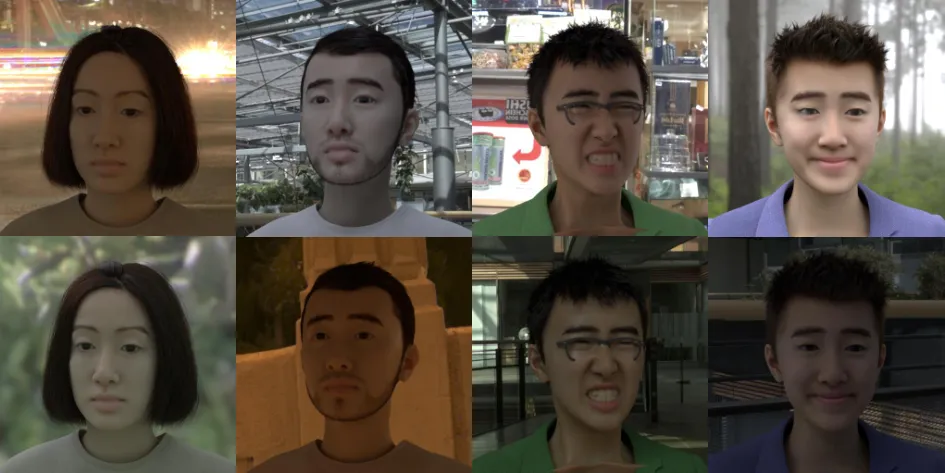

Figure 10: Samples from one identity of the Lumos \[75\] dataset. We
refer to each column as a unique subject, since they have different
appearances and accessories.

## B More Qualitative Results

We present additional face reenactment results on the VFHQ \[71\] and
HDTF \[81\] datasets in Figs. 11, 12, 13 and 14, demonstrating the
effectiveness of Total-Editing in both motion and lighting control.
Further, we explore two downstream applications. As shown in Fig. 15,
Total-Editing enables relighting of animated portraits using HDR
environment maps, producing a background replacement effect. In Fig. 16,
Total-Editing can leverage arbitrary portrait images as lighting
sources, vividly transferring the illumination effect from one portrait
to another.

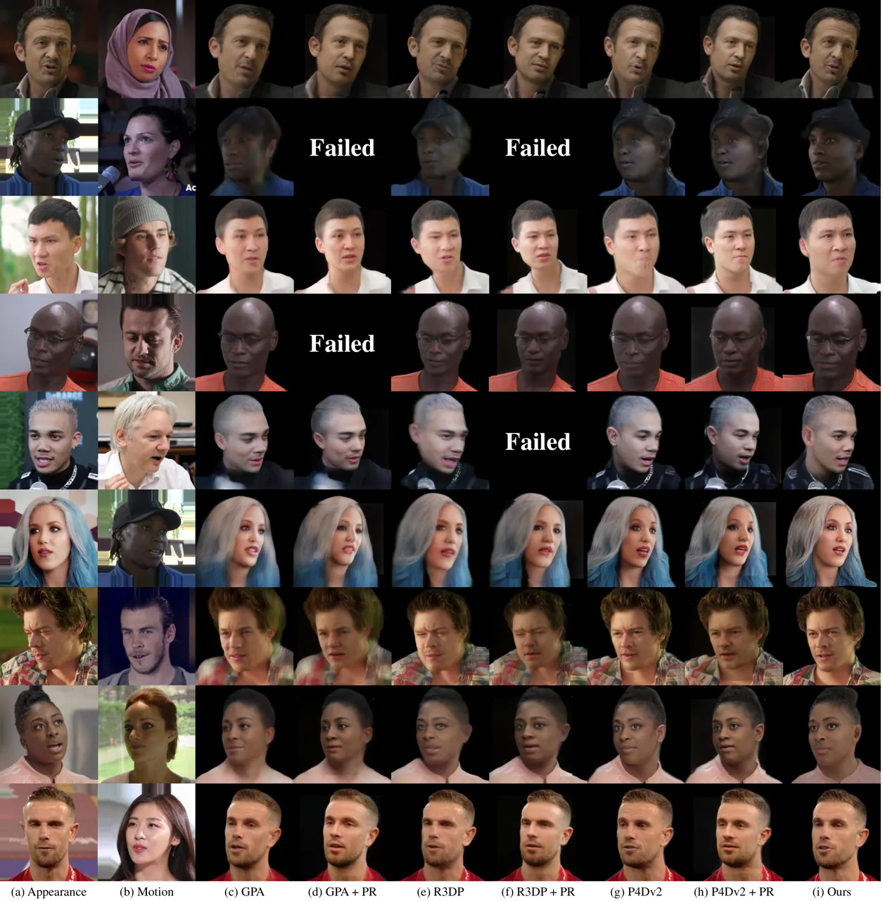

Figure 11: Additional cross-reenactment results on the VFHQ dataset.

## C Dataset Details

Our synthetic dataset is designed to advance research in general
portrait editing, offering two primary subsets: a multi-view subset and
a video-like subset.

- •
  The multi-view subset comprises 50K subjects, each captured in two
  distinct environments and viewed from 10 camera angles. This subset
  provides extensive data for analyzing objects from diverse
  perspectives and ensuring multi-view consistency. Samples are shown
  in Fig. 17.
- •
  The video-like subset includes 10K subjects, each rendered across 10
  environments with varied poses and expressions, making it well-suited
  for studying motion and temporal changes. Samples are shown
  in Fig. 18.

With diverse samples demonstrated in Fig. 19, our synthetic dataset
consists of 50K subjects and 2M images. It is enriched with ground truth
albedo, normal, depth, UV maps, segmentation masks, and HDR environment
maps. This dataset addresses critical limitations compared to the
existing synthetic datasets. For example, as shown in Fig. 10, the Lumos
dataset \[75\] captures each subject only from one view, limiting it to
tasks like portrait relighting. In contrast, our dataset incorporates
multiple viewpoints and subject movements, better simulating real-world
spatiotemporal variations. These improvements make our dataset more
versatile and effective for downstream applications requiring spatial
and/or temporal coherence.

## D Evaluation Details

In Tab. 1, we exclude both generated and ground truth backgrounds from
metric calculations, focusing solely on the quality of the portrait
regions. Since the relighting method proposed by Cai et al. \[6\]
requires additional cropping for input images, we recompose the outputs
with original inputs in Fig. 7 for visual consistency. During
quantitative comparisons in Tab. 1, we only consider the valid areas
after cropping. In Fig. 9, the backgrounds of 2$`{}^{\text{nd}}`$ to
3$`{}^{\text{rd}}`$ columns are synthesized by inpainting the lighting
source portrait using \[62\], while those in the 4$`{}^{\text{th}}`$ to
5$`{}^{\text{th}}`$ columns are rendered from the corresponding HDR
environment maps.

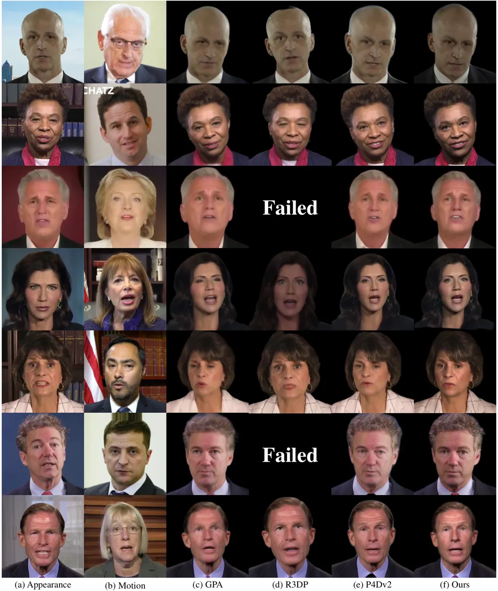

Figure 12: Cross-reenactment results on the HTDF dataset.

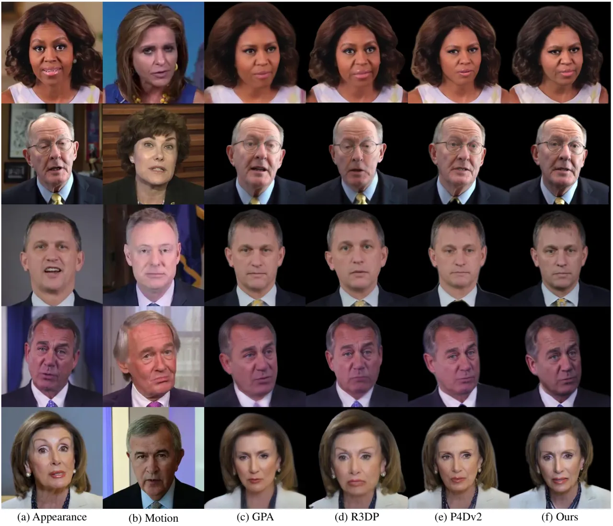

Figure 13: Cross-reenactment results on the HTDF dataset (continued).

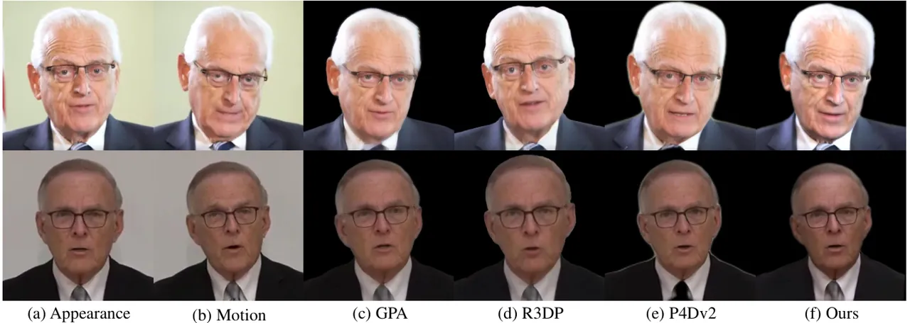

Figure 14: Self-reenactment results on the HTDF dataset.

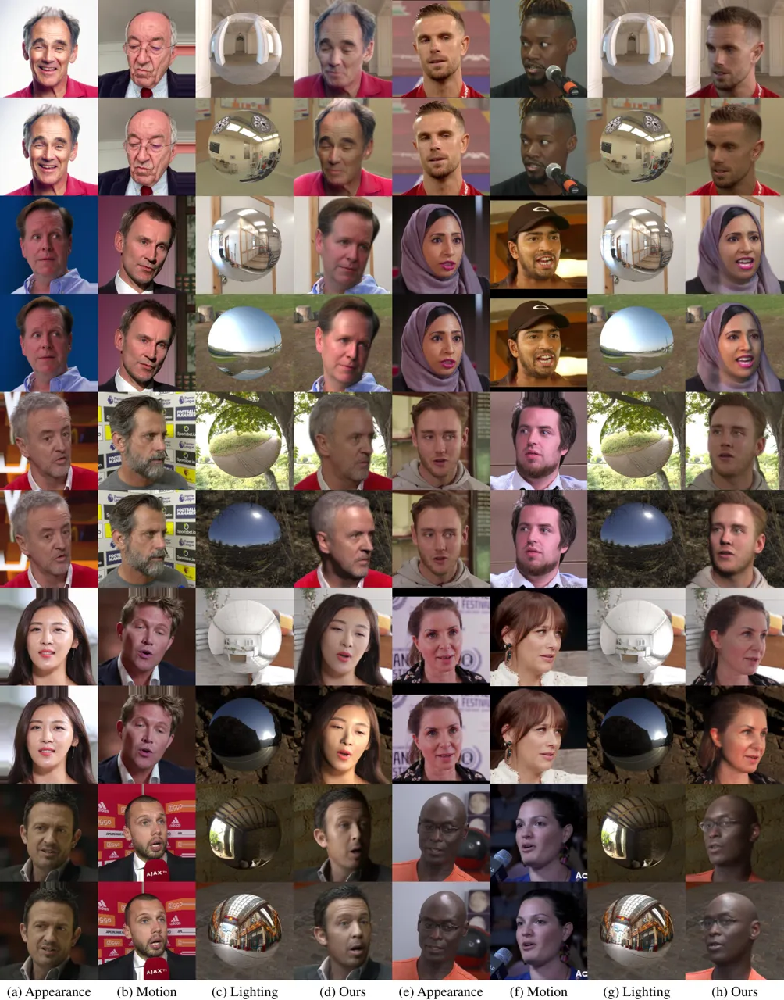

Figure 15: Cross-reenactment results on the VFHQ dataset with HDR
environment maps as lighting sources.

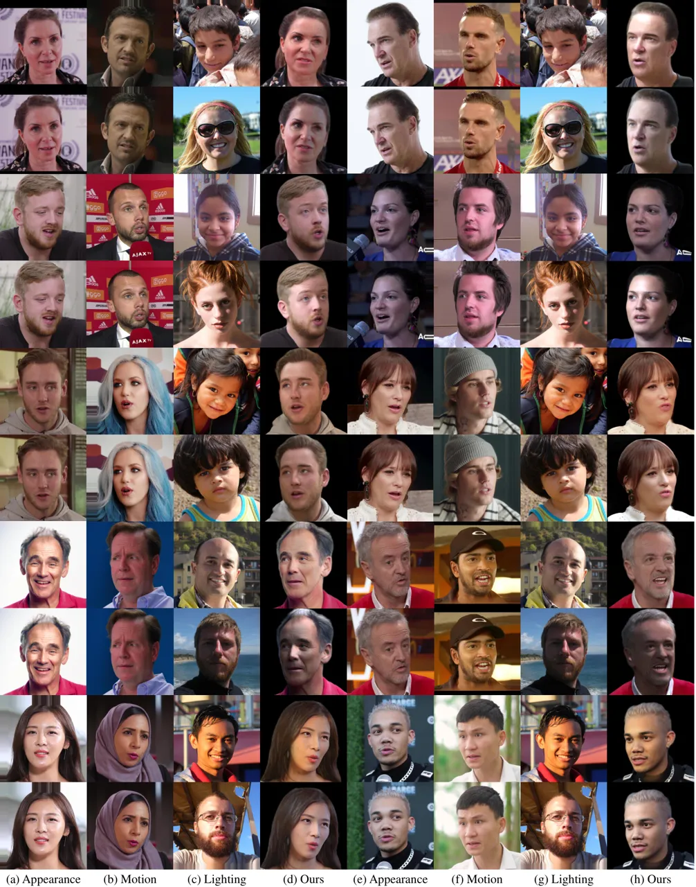

Figure 16: Cross-reenactment results on the VFHQ dataset with portrait
images as lighting sources.

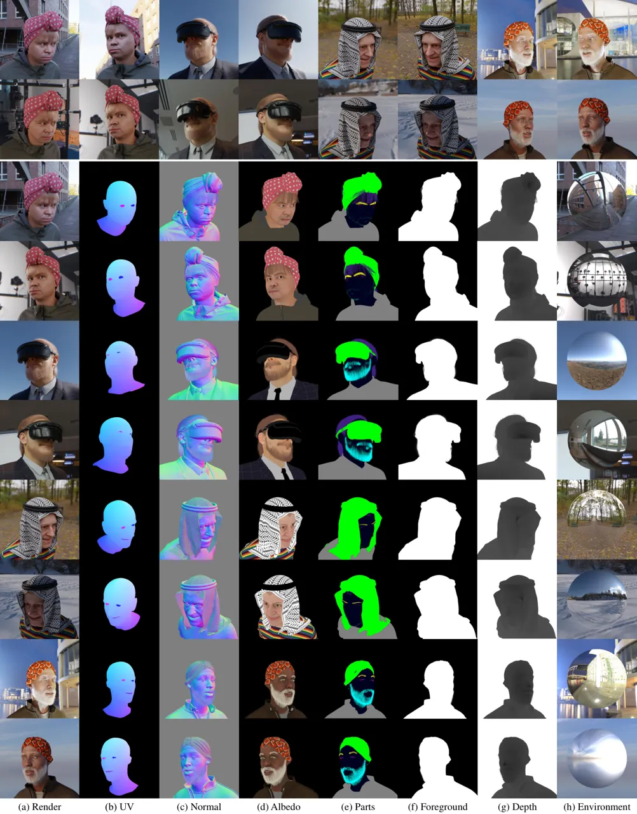

Figure 17: Multi-view subset of our synthetic data. It incorporates 50K
subjects. Each is rendered in 2 environments with 10 views.

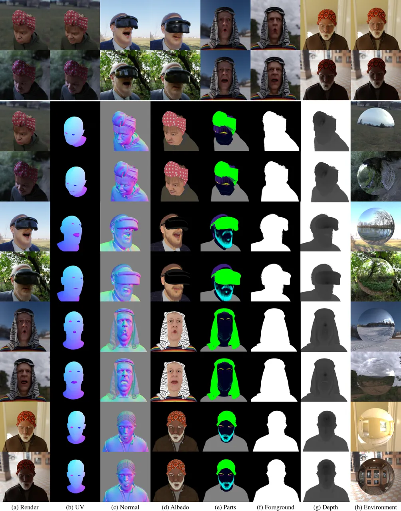

Figure 18: Video subset of our synthetic data. It includes 10K subjects.
Each is rendered in 10 environments with 10 poses/expressions.

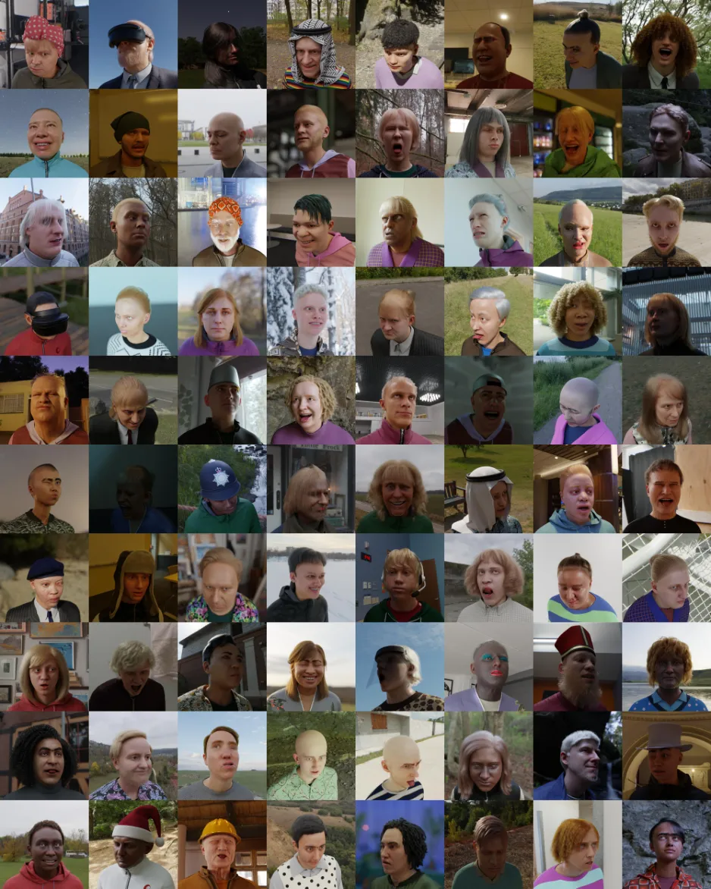

Figure 19: More subjects in our synthetic data. Subjects are with
randomized poses, expressions, hairstyles, skin types, accessories, etc.
