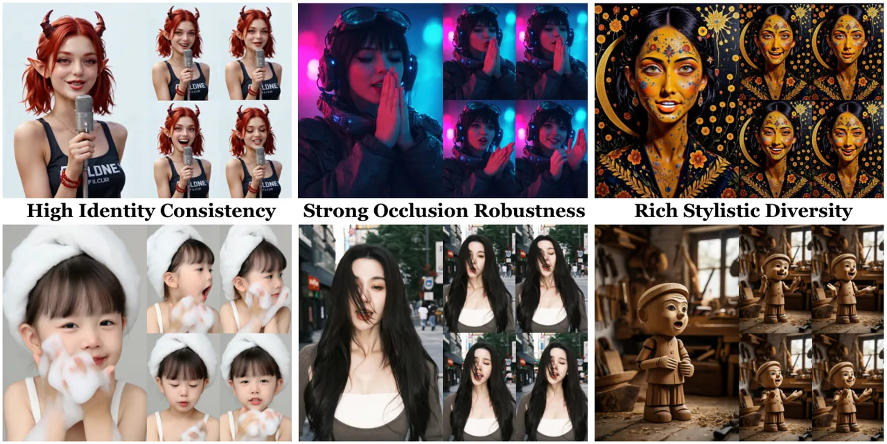
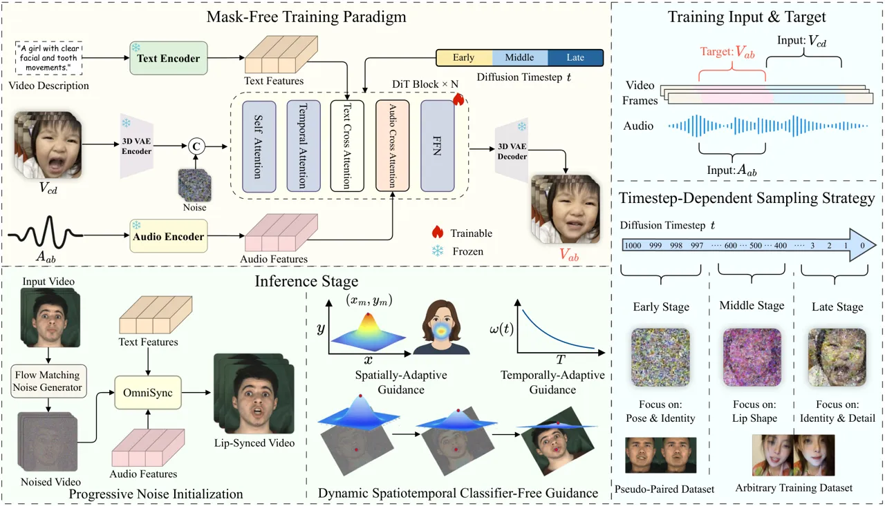
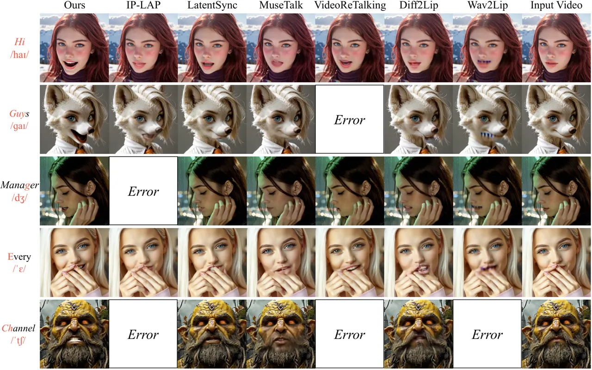
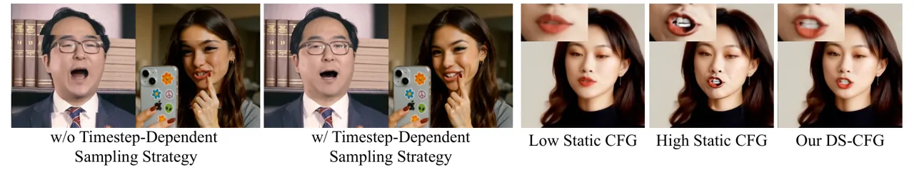
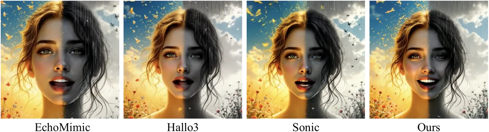
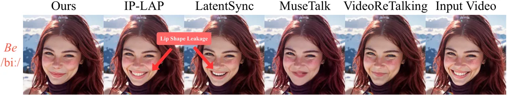
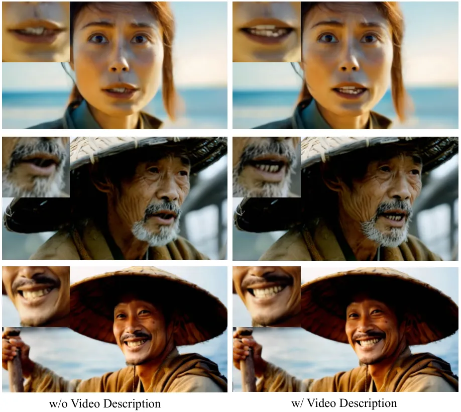
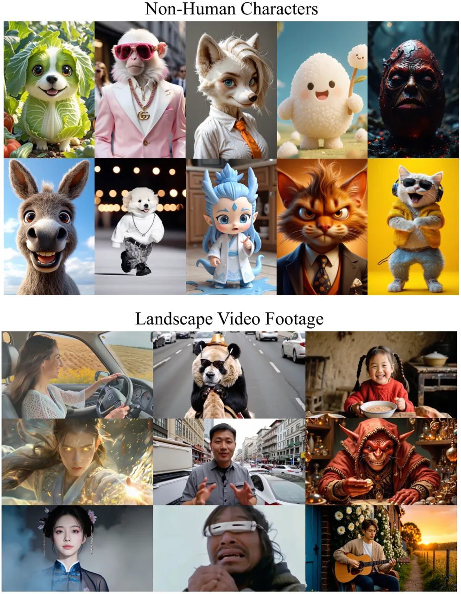
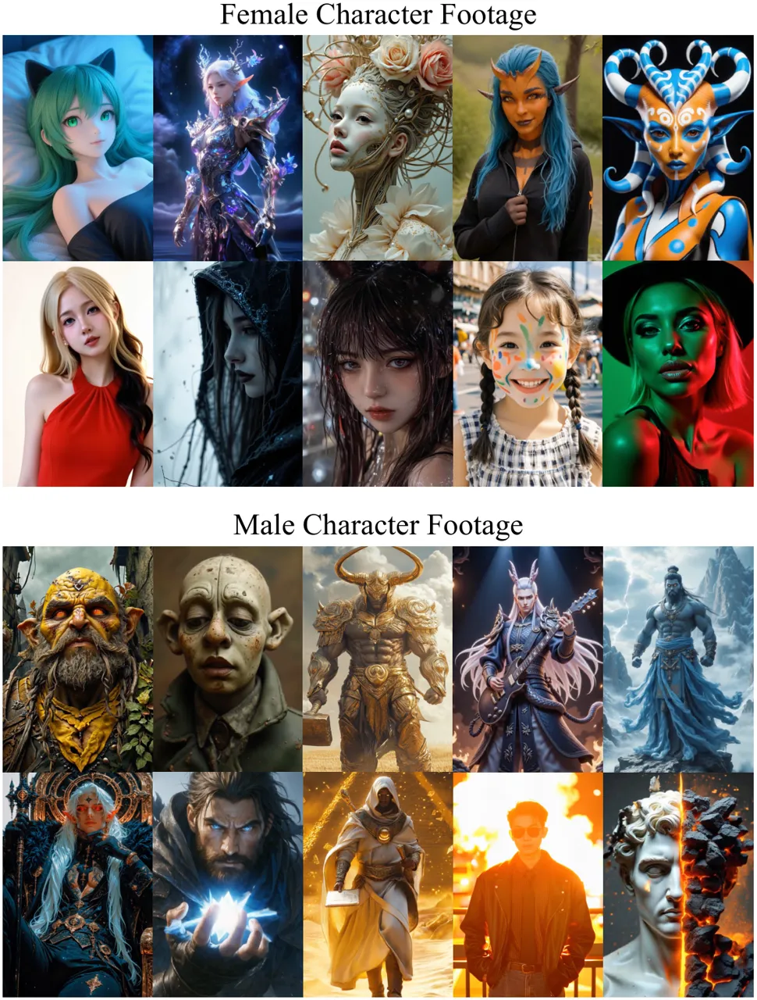

# OmniSync: Towards Universal Lip Synchronization via Diffusion Transformers

Ziqiao Peng ^(†)^(†)thanks: Work done during an internship at Kling
Team, Kuaishou Technology. Affiliation: Renmin University of China   
Jiwen Liu    Haoxian Zhang Affiliation: Kling Team, Kuaishou Technology
   Xiaoqiang Liu Affiliation: Kling Team, Kuaishou Technology    Songlin
Tang Affiliation: Kling Team, Kuaishou Technology    Pengfei Wan  Di
Zhang  Hongyan Liu  Jun He Affiliation: Renmin University of China
Affiliation: Kling Team, Kuaishou Technology Affiliation: Tsinghua
University^(†)Project Leader Affiliation: Corresponding
Author[https://ziqiaopeng.github.io/OmniSync/](https://ziqiaopeng.github.io/OmniSync/)

###### Abstract

Lip synchronization is the task of aligning a speaker’s lip movements in
video with corresponding speech audio, and it is essential for creating
realistic, expressive video content. However, existing methods often
rely on reference frames and masked-frame inpainting, which limit their
robustness to identity consistency, pose variations, facial occlusions,
and stylized content. In addition, since audio signals provide weaker
conditioning than visual cues, lip shape leakage from the original video
will affect lip sync quality. In this paper, we present OmniSync, a
universal lip synchronization framework for diverse visual scenarios.
Our approach introduces a mask-free training paradigm using Diffusion
Transformer models for direct frame editing without explicit masks,
enabling unlimited-duration inference while maintaining natural facial
dynamics and preserving character identity. During inference, we propose
a flow-matching-based progressive noise initialization to ensure pose
and identity consistency, while allowing precise mouth-region editing.
To address the weak conditioning signal of audio, we develop a Dynamic
Spatiotemporal Classifier-Free Guidance (DS-CFG) mechanism that
adaptively adjusts guidance strength over time and space. We also
establish the AIGC-LipSync Benchmark, the first evaluation suite for lip
synchronization in diverse AI-generated videos. Extensive experiments
demonstrate that OmniSync significantly outperforms prior methods in
both visual quality and lip sync accuracy, achieving superior results in
both real-world and AI-generated videos.



Figure 1: OmniSync demonstrates universal lip synchronization
capabilities, effectively handling facial occlusion, while maintaining
visual consistency and generating accurate lip movements.

## 1 Introduction

Lip synchronization, matching mouth movements with speech audio, is
essential for creating compelling visual content across film
dubbing \[47\], digital avatars \[32, 31, 50\], and
teleconferencing \[25, 28\]. With the rise of AI-generated content, this
technology has evolved from a specialized technique to a fundamental
aspect of the video generation landscape \[44, 34, 21\]. Despite
significant advances in text-to-video (T2V) models \[5, 2, 45, 17, 37\]
creating increasingly realistic footage, achieving precise and natural
lip synchronization remains an unsolved challenge.

Traditional lip synchronization approaches rely heavily on reference
frames combined with masked-frame inpainting \[33, 47, 12, 11\]. This
methodology extracts appearance information from reference frames to
inpaint masked regions in target frames—a process that introduces
several critical limitations. These methods struggle with head pose
variations, identity preservation, and artifact elimination, especially
when target poses differ significantly from references \[30, 29\].

Furthermore, the dependence on explicit masks cannot fully prevent
unwanted lip shape leakage, compromising synchronization quality and
restricting applicability across diverse visual representations \[1\].
The challenges intensify in the context of audio-driven generation.
Unlike strong visual cues, audio signals provide relatively weak
conditioning, making precise lip synchronization difficult \[38\].
Additionally, existing methods rely on face detection and
alignment \[3\] techniques that break down when applied to stylized
characters and non-human entities, precisely the diverse content that
modern text-to-video models excel at generating.

This technical gap is compounded by the absence of standardized
evaluation frameworks for lip sync in stylized videos. Current
benchmarks \[48, 40\] focus almost exclusively on photorealistic human
faces in controlled settings, failing to capture the visual diversity
inherent in AI-generated videos.

To address these challenges, we introduce OmniSync, a universal lip
synchronization framework designed for diverse videos. Our approach
eliminates reliance on reference frames and explicit masks through a
diffusion-based direct video editing paradigm. In addition, we establish
AIGC-LipSync Benchmark, the first comprehensive evaluation framework for
lip synchronization across diverse AIGC contexts. OmniSync’s technical
approach is built upon three key innovations:

First, we implement a mask-free training paradigm using Diffusion
Transformers (DiT) \[27\] for direct cross-frame editing. Our model
learns a mapping function $`(V_{cd},A_{ab})\mapsto V_{ab}`$, where $`V`$
represents video frames and $`A`$ represents audio. The indices
$`(a:b,c:d)`$ represent different segments sampled from the same video.
The model modifies only speech-relevant regions according to target
audio without requiring explicit masks or references. This approach
enables unlimited-duration inference while maintaining natural facial
dynamics and preserving character identity.

Second, we introduce a flow-matching-based progressive noise
initialization strategy during inference. Rather than beginning with
random noise \[36\], we inject controlled noise into original frames
using Flow Matching \[20\], then execute only the final denoising steps.
This approach maintains spatial consistency between source and generated
frames while allowing sufficient flexibility for precise mouth region
modifications, effectively mitigating pose inconsistency and identity
drift.

Third, we develop a dynamic spatiotemporal Classifier-Free Guidance
(CFG) framework \[14\] that provides fine-grained control over the
generation process. By adaptively adjusting guidance strength across
both temporal and spatial dimensions: temporally reducing guidance
strength as denoising progresses, and spatially applying
Gaussian-weighted control centered on mouth-relevant regions. This
balanced approach ensures precise lip synchronization without disturbing
unrelated areas.

Our contributions can be summarized as follows:

- $`\bullet`$
  A universal lip synchronization framework that eliminates reliance on
  reference frames and explicit masks, enabling accurate speech
  synchronization across diverse visual representations.
- $`\bullet`$
  A flow-matching-based progressive noise initialization strategy during
  inference, effectively stabilizing the early denoising process and
  mitigating pose inconsistency and identity drift.
- $`\bullet`$
  A dynamic spatiotemporal CFG framework that provides fine-grained
  control over audio influence, addressing the weak signal problem in
  audio-driven generation.
- $`\bullet`$
  A comprehensive AIGC-LipSync Benchmark for evaluating lip
  synchronization in AI-generated content, including stylized characters
  and non-human entities.

## 2 Related Work

### 2.1 Audio-driven Lip Synchronization

GAN-based Lip Synchronization. Traditional GAN-based \[10\]
methods \[33, 39, 7, 24, 13\] have established important foundations in
lip synchronization. Wav2Lip \[33\] pioneered the use of pretrained
SyncNet to supervise generator training, setting a benchmark for
subsequent research. DINet \[47\] enhanced synchronization quality by
performing spatial deformation on reference image feature maps, better
preserving high-frequency details. IP-LAP \[49\] introduced a two-stage
approach that first infers landmarks from audio before rendering them
into facial images. ReSyncer \[11\] incorporated 3D mesh priors for
facial motion, effectively reducing artifacts.

Diffusion-based Lip Synchronization. Recent advances in diffusion
models \[26, 46, 18, 23\] have enabled significant progress in
audio-driven lip synchronization. LatentSync \[18\] represents an
end-to-end framework based on audio-conditioned latent diffusion models
without intermediate motion representation. SayAnything \[23\] employs a
denoising UNet architecture that processes video latents with audio
conditioning. MuseTalk \[46\] proposes a novel sampling strategy that
selects reference images with head poses closely matching the target.

However, these methods still rely on reference frames combined with
masked-frame inpainting, leading to head pose limitations, identity
preservation issues, and blurry edge generation. Our OmniSync framework
addresses these limitations through a mask-free training paradigm that
enables application across diverse visual representations.

### 2.2 Audio-driven Portrait Animation

Audio-driven portrait animation \[36, 43, 16, 6, 15\] differs
fundamentally from lip sync. Portrait animation \[42, 8\] follows an
image-to-video framework without constraints on head poses or facial
expressions, eliminating the need to integrate generated content back
into original video. This approach is unsuitable for post-generation lip
synchronization in video generation pipelines. In contrast, lip
synchronization \[33, 18\] operates within a video-to-video framework,
modifying only lip movements while maintaining compatibility with
existing footage. This represents a more constrained task, requiring
precise modification of lip regions while preserving surrounding facial
features.

Recent models like OmniHuman-1 \[19\] and Mocha \[41\] use audio
directly as a conditioning signal for image-to-video or text-to-video
frameworks. However, due to limitations in talking head datasets, their
generative capabilities don’t match the versatility of advanced video
generation models. This gap highlights why specialized lip
synchronization for AI-generated videos remains critical.

## 3 Method

### 3.1 Overview

In this section, we present OmniSync, a universal lip synchronization
framework designed for diverse visual content (Fig. 2). Our approach
comprises three key components: 1) a mask-free training paradigm that
eliminates dependency on reference frames and explicit masks, 2) a
flow-matching-based progressive noise initialization strategy for
enhanced inference stability, and 3) dynamic spatiotemporal
Classifier-Free Guidance (CFG) that optimizes lip sync while preserving
facial details. The following subsections provide comprehensive
explanations of each component.



Figure 2: Overview of OmniSync. A mask-free training paradigm employs
timestep-dependent sampling to predict the lip-synchronized targets
$`V_{ab}`$. During inference, progressive noise initialization and
dynamic spatiotemporal CFG ensure consistent head pose and precise lip
synchronization.

### 3.2 Mask-Free Training Paradigm

Traditional lip synchronization methods \[33, 46\] rely on masked-frame
inpainting, isolating the mouth region before generating content based
on audio input. Despite their prevalence, these approaches produce
boundary artifacts and struggle with identity preservation. Crucially,
they require explicit face detection and alignment—techniques that fail
with stylized characters and non-human entities.

An alternative approach is direct frame editing, which aims to transform
frames according to target audio without relying on masks or references.
However, this approach requires perfectly paired training data with
identical head poses and identity—differing only in lip movements. Such
paired data is extremely rare and would severely restrict the model’s
generalizability to diverse visual results.

To address these limitations, we leverage the progressive denoising
characteristic of diffusion models, introducing a novel training
strategy that varies data sampling based on diffusion timesteps. This
allows for stable learning without requiring perfectly paired examples.
Our goal is to learn a conditional generation process mapping
$`(V_{cd},A_{ab})\mapsto V_{ab}`$ through iterative denoising, where
$`V`$ represents video frames and $`A`$ represents audio.

We employ Flow Matching \[20\] as our training objective. Given an input
video segment $`V_{cd}`$ from frames $`c`$ to $`d`$, and a target audio
segment $`A_{ab}`$ from frames $`a`$ to $`b`$, our model generates the
corresponding video segment $`V_{ab}`$ via the diffusion process:

```math
x_{t-1}=\text{DiT}(x_{t},V_{cd},A_{ab},t), \tag{1}
```

where $`x_{t}`$ represents the noised version of target video $`V_{ab}`$
at timestep $`t`$, and DiT denotes our diffusion transformer, which
predicts the denoised state at timestep $`t-1`$.

The CFM loss used for training is defined as:

```math
\mathcal{L}_{CFM}(\theta)=\mathbb{E}_{t,x_{t},V_{cd},A_{ab},V_{ab}}\left[\|v_{\theta}(x_{t},V_{cd},A_{ab},t)-u_{t}(x_{t}|V_{ab})\|_{2}^{2}\right], \tag{2}
```

where $`v_{\theta}(x_{t},V_{cd},A_{ab},t)`$ is the learned velocity
field predicted by DiT with conditioning on input video $`V_{cd}`$ and
target audio $`A_{ab}`$, $`u_{t}(x_{t}|V_{ab})`$ is the conditional
velocity field typically defined as
$`u_{t}(x_{t}|V_{ab})=(V_{ab}-x_{t})/(1-t)`$ for the linear
interpolation path $`x_{t}=(1-t)x_{0}+tV_{ab}`$.

Timestep-Dependent Sampling Strategy. A critical insight in our approach
is recognizing that the diffusion process can be decomposed into
distinct phases, each with different learning requirements.
Specifically, early timesteps focus on generating fundamental facial
structure, including pose and identity information; middle timesteps
primarily generate lip movements driven by audio; while late timesteps
refine identity details and textures. To capitalize on this natural
progression, we utilize different datasets for distinct timesteps.

For early timesteps (approximately $`t\approx T`$), responsible for
generating overall facial structure, we employ pseudo-paired data from
controlled laboratory settings. These samples maintain nearly identical
pose information, with variations only in lip movements, providing
stable learning signals for structural features and ensuring pose
alignment between input and output.

For middle and late timesteps, we transition to more diverse data,
sampling from arbitrary videos. During middle timesteps, the model
learns to generate lip shapes guided by audio input, whereas in late
timesteps (approximately $`t\approx 0`$), it focuses on refining
identity details and ensuring texture consistency. This
timestep-dependent training strategy can be formalized as:

```math
p(V_{cd},V_{ab}|t)=\begin{cases}p_{\text{pseudo-paired}}(V_{cd},V_{ab})&\text{if }t>t_{\text{threshold}},\\
p_{\text{arbitrary}}(V_{cd},V_{ab})&\text{otherwise}.\end{cases} \tag{3}
```

Here, $`p_{\text{pseudo-paired}}`$ indicates sampling from controlled
datasets with minimal pose variations, while $`p_{\text{arbitrary}}`$
signifies sampling from our diverse collection of videos. The
conditional generation process can be expressed mathematically as:

```math
p_{\theta}(V_{ab}|V_{cd},A_{ab})=\int p_{\theta}(V_{ab}|x_{0})p_{\theta}(x_{0}|V_{cd},A_{ab})dx_{0}, \tag{4}
```

where $`p_{\theta}(V_{ab}|x_{0})`$ represents the mapping from the fully
denoised state to the output video, and
$`p_{\theta}(x_{0}|V_{cd},A_{ab})`$ captures the relationship between
input conditions and the denoised state. Here, $`x_{0}`$ refers to the
completely denoised latent representation (at timestep $`t=0`$).

This progressive training approach aligns well with the natural learning
progression of diffusion models. By providing appropriate training
signals at each stage, we enable stable learning even without perfectly
paired data, allowing our model to generalize effectively to diverse
real-world scenarios while maintaining identity consistency.

### 3.3 Progressive Noise Initialization

Standard diffusion-based generation \[36\] typically begins from random
noise (timestep $`T`$) and progressively denoises toward the final
output (timestep $`0`$). However, this approach often results in subtle
but noticeable pose misalignments between generated content and original
video frames, creating undesirable boundary artifacts and compromising
identity preservation.

The fundamental issue lies in error accumulation during the early stages
of diffusion. Even minor deviations in early timesteps—when basic facial
structure is being formed—can lead to significant misalignments in the
final output. This problem is relevant for lip synchronization, where
the goal is to modify only speech-relevant regions while maintaining
perfect spatial consistency elsewhere. To address this challenge, we
introduce a flow-matching-based progressive noise initialization
strategy that transforms the traditional diffusion process.

Flow-Matching Noise Initialization. Rather than starting the diffusion
process from random noise at timestep $`T`$, we initialize from original
video frames with a controlled level of noise. This simulates an
intermediate state in the diffusion trajectory, corresponding to a
normalized parameter $`\tau`$. The initialization is performed by adding
this controlled noise to the original video frame:

```math
x_{\text{init}}=\text{FM}_{\text{add}}(V_{\text{source}},\tau)=(1-\tau)V_{\text{source}}+\tau\epsilon, \tag{5}
```

where $`x_{\text{init}}`$ is the initial noised state derived using the
parameter $`\tau`$, $`V_{\text{source}}`$ is the source video frame, and
$`\epsilon\sim\mathcal{N}(0,I)`$ is random noise. Let
$`t_{\text{start}}`$ be the discrete timestep corresponding to this
initialization point ($`T`$ is the total number of diffusion steps, and
$`\tau\in[0,1]`$).

This initialization strategy provides two significant advantages. First,
it bypasses the early stages of diffusion (from $`T`$ down to
$`t_{\text{start}}`$) where general facial structure is formed. This
ensures that head pose and global structure are directly inherited from
the source frame. Second, it reduces computational requirements by
performing denoising only for the remaining steps, from
$`t_{\text{start}}`$ down to $`0`$.

The complete progressive denoising process can be expressed as:

```math
x_{t}=\begin{cases}x_{\text{init}}&\text{if }t=t_{\text{start}},\\
\text{DiT}(x_{t+1},V_{\text{source}},A_{\text{target}},t+1)&\text{if }t_{\text{start}}>t\geq 0,\end{cases} \tag{6}
```

where $`A_{\text{target}}`$ is the target audio used to guide the
denoising process, and $`t`$ here represents discrete diffusion
timesteps.

This approach effectively creates a two-stage process: (1)
initialization using the flow-matching-inspired noise addition (Eq. 5)
to reach a state equivalent to timestep $`t_{\text{start}}`$, and (2)
guided denoising from $`t_{\text{start}}`$ to 0 that focuses on
modifying mouth regions according to the target audio while preserving
the overall facial structure, identity features, and head pose from the
source frame. By skipping the early noisy stages where basic structures
form, we maintain spatial consistency while allowing sufficient
flexibility for precise mouth region modifications.

### 3.4 Dynamic Spatiotemporal Classifier-Free Guidance

Audio-driven lip synchronization faces a fundamental challenge: audio
signals provide relatively weak conditioning compared to visual
cues \[38\]. Standard Classifier-Free Guidance (CFG) \[14\] can enhance
audio conditioning, but applying uniform guidance across spatial and
temporal dimensions creates an unavoidable dilemma: higher guidance
scales produce more accurate lip sync but introduce texture artifacts,
while lower scales preserve visual fidelity but yield less precise lip
movements.

To resolve this tension, we introduce Dynamic Spatiotemporal
Classifier-Free Guidance (DS-CFG), a novel approach that provides
fine-grained control over the generation process across both spatial and
temporal dimensions. Our method applies varying guidance strengths to
different regions of the frame and different stages of the diffusion
process, achieving an optimal balance between lip synchronization
accuracy and overall visual quality.

Spatially-Adaptive Guidance. The key insight for spatial adaptation is
that audio information primarily affects the mouth region, while other
facial areas should remain largely unchanged. We implement this through
a Gaussian-weighted spatial guidance matrix that concentrates guidance
strength around speech-relevant regions:

```math
\mathbf{G}_{\text{spatial}}(x,y)=\omega_{\text{base}}+(\omega_{\text{peak}}-\omega_{\text{base}})\cdot\exp\left(-\frac{(x-x_{m})^{2}+(y-y_{m})^{2}}{2\sigma^{2}}\right) \tag{7}
```

where $`(x_{m},y_{m})`$ represents the mouth center, $`\sigma`$ controls
the spread of the Gaussian distribution, $`\omega_{\text{base}}`$ is the
baseline guidance strength applied to non-mouth regions, and
$`\omega_{\text{peak}}`$ is the peak strength applied at the mouth
center. This spatial adaptation ensures that audio conditions strongly
influence lip and surrounding regions while minimally affecting other
facial features.

Temporally-Adaptive Guidance. We observe that audio conditioning plays
different roles at different stages of the diffusion process. In early
diffusion timesteps, strong guidance helps establish correct lip shapes,
while in later stages, excessive guidance can disrupt fine texture
details. To address this, we implement a temporally decreasing guidance
schedule:

```math
\omega(t)=\omega_{\text{peak}}\cdot\left(\frac{t}{T}\right)^{\gamma} \tag{8}
```

where $`t`$ is the current diffusion timestep, $`T`$ is the total number
of timesteps, $`\omega_{\text{peak}}`$ is the maximum guidance scale,
and $`\gamma`$ controls the decay rate, with a value of 1.5. This
temporal adaptation ensures strong guidance during early and middle
diffusion stages when coarse structures are formed, gradually reducing
influence during later stages when fine details and textures are
refined.

Unified Dynamic Spatiotemporal CFG. Combining both spatial and temporal
adaptations, our DS-CFG approach modifies the standard CFG formulation
to:

```math
\hat{\epsilon}_{\theta}(x_{t},c,t)=\epsilon_{\theta}(x_{t},\emptyset,t)+\mathbf{G}_{\text{spatial}}\cdot\omega(t)\cdot(\epsilon_{\theta}(x_{t},c,t)-\epsilon_{\theta}(x_{t},\emptyset,t)) \tag{9}
```

where $`\epsilon_{\theta}(x_{t},c,t)`$ and
$`\epsilon_{\theta}(x_{t},\emptyset,t)`$ are the noise predictions with
and without conditioning, respectively.

Through this DS-CFG, our method achieves precise control over the
generation process, effectively addressing the weak audio signal problem
in audio-driven generation.

## 4 Experiments

### 4.1 Experimental Settings

Datasets. We trained OmniSync using the MEAD dataset \[40\] and a
400-hour dataset collected from YouTube. MEAD’s controlled laboratory
recordings with diverse facial expressions but minimal head movement
provided ideal data for training early denoising stages, while the
YouTube dataset enhanced generalization across varied real-world
conditions for middle and late stages.

To address the limitations of existing benchmarks that focus solely on
real-world videos with frontal views and stable lighting, we created the
AIGC-LipSync Benchmark. This comprehensive evaluation framework
comprises 615 human-centric videos generated by state-of-the-art
text-to-video models such as Kling, Dreamina, Wan \[37\], and
Hunyuan \[17\]. The benchmark specifically captures challenging visual
scenarios such as large facial movements, profile views, variable
lighting, occlusions, and stylized characters—conditions that
traditional benchmarks fail to address. Details about benchmark
construction can be found in the supplementary materials.

Implementation Details. We implement our OmniSync model using the
Diffusion Transformer architecture. The model is trained on a combined
dataset for 80,000 steps using AdamW optimizer \[22\] with a learning
rate of 1e-5. Training is completed in 80 hours using 64 NVIDIA A100
GPUs with a batch size of 64. Audio features are extracted via a
pre-trained Whisper encoder, and text conditioning utilizes a T5
encoder. Training employs the timestep-dependent sampling threshold
$`t_{\text{threshold}}=850`$. The experimental results indicate that
excessive thresholds induce significant misalignment while insufficient
values will leak the original lip shape. During inference we adopt our
flow-matching-based progressive noise initialization starting at
$`\tau=0.92`$, followed by 50 denoising steps.

| HDTF Dataset         |                        |                    |                   |                      |                        |                       |                    |                    |
| -------------------- | ---------------------- | ------------------ | ----------------- | -------------------- | ---------------------- | --------------------- | ------------------ | ------------------ |
| Method               | Full Reference Metrics |                    |                   | No Reference Metrics |                        |                       | Lip Sync           |                    |
|                      | FID $`\downarrow`$     | FVD $`\downarrow`$ | CSIM $`\uparrow`$ | NIQE $`\downarrow`$  | BRISQUE $`\downarrow`$ | HyperIQA $`\uparrow`$ | LMD $`\downarrow`$ | LSE-C $`\uparrow`$ |
| Wav2Lip \[33\]       | 14.912                 | 543.340            | 0.852             | 6.495                | 53.372                 | 45.822                | 10.007             | 7.630              |
| VideoReTalking \[7\] | 11.868                 | 379.518            | 0.786             | 6.333                | 50.722                 | 48.476                | 8.848              | 7.180              |
| TalkLip \[39\]       | 16.680                 | 691.518            | 0.843             | 6.377                | 52.109                 | 44.393                | 15.954             | 5.880              |
| IP-LAP \[49\]        | 9.512                  | 325.691            | 0.809             | 6.533                | 54.402                 | 50.086                | 7.695              | 7.260              |
| Diff2Lip \[26\]      | 12.079                 | 461.341            | 0.869             | 6.261                | 49.361                 | 48.869                | 18.986             | 7.140              |
| MuseTalk \[46\]      | 8.759                  | 231.418            | 0.862             | 5.824                | 46.003                 | 55.397                | 8.701              | 6.890              |
| LatentSync \[18\]    | 8.518                  | 216.899            | 0.859             | 6.270                | 50.861                 | 53.208                | 17.344             | 8.050              |
| Ours                 | 7.855                  | 199.627            | 0.875             | 5.481                | 37.917                 | 56.356                | 7.097              | 7.309              |

Table 1: Quantitative comparison with previous methods on HDTF Dataset.

[TABLE]

Table 2: Quantitative comparison with previous methods on AIGC-LipSync
Benchmark.

### 4.2 Quantitative Evaluation

We evaluate OmniSync against state-of-the-art methods including
Wav2Lip \[33\], VideoReTalking \[7\], TalkLip \[39\], IP-LAP \[49\],
Diff2Lip \[26\], MuseTalk \[46\], and LatentSync \[18\] using a
comprehensive suite of metrics. For visual quality assessment, we employ
FID (Fréchet Inception Distance) to measure frame-level fidelity, FVD
(Fréchet Video Distance) for temporal consistency, and CSIM (Cosine
Similarity) to quantify identity preservation. Perceptual quality is
assessed using no-reference metrics including NIQE (Natural Image
Quality Evaluator), BRISQUE (Blind/Referenceless Image Spatial Quality
Evaluator), and HyperIQA \[35\]. For audio-visual synchronization, we
measure LMD (Landmark Distance) between predicted and ground truth
facial landmarks in the mouth region, and LSE-C (Lip Sync Error -
Confidence) to evaluate lip synchronization quality.

For the AIGC-LipSync benchmark, we report the Generation Success Rate
across all 615 videos and specifically for stylized characters. This
metric shows the percentage of videos that are successfully synchronized
and pass human verification. This evaluation is essential for universal
lip synchronization in AI-generated content, where traditional metrics
may not fully capture the challenges of stylized characters, extreme
poses, and other atypical visual conditions.

The experimental results in Tab. 1 and Tab. 2 demonstrate that our
approach achieves superior performance on multiple metrics. On the HDTF
dataset, our method reduced FID by 7.8$`\%`$ and FVD by 8.0$`\%`$
compared to LatentSync, with a remarkable 23.2$`\%`$ improvement in
BRISQUE over Diff2Lip. For lip synchronization, we achieved the lowest
LMD, outperforming IP-LAP by 7.8$`\%`$, while LatentSync maintained a
slight edge in LSE-C due to its SyncNet-based loss constraint.

On the challenging AIGC-LipSync benchmark, OmniSync demonstrated
exceptional capabilities with a 30.5$`\%`$ FID reduction and 19.7$`\%`$
FVD reduction compared to LatentSync, alongside improved identity
preservation. Most significantly, our method achieved a 97.40$`\%`$
Generation Success Rate across all videos—substantially higher than
MuseTalk (92.20$`\%`$) and other methods (below 75$`\%`$). For stylized
characters, our success rate of 87.78$`\%`$ outperformed MuseTalk
(67.78$`\%`$), demonstrating OmniSync’s capability to handle diverse
visual representations including stylized characters.



Figure 3: Qualitative comparison with previous methods across diverse
subjects and phonemes. Our approach produces more accurate lip
synchronization and better identity preservation.

[TABLE]

Table 3: User study results comparing various audio-driven lip-sync
methods.

### 4.3 Qualitative Evaluation

We present qualitative comparisons between OmniSync and existing methods
in Fig. 3. Our approach produces more natural facial expressions and
superior lip synchronization. Due to lip shape leakage, IP-LAP \[49\]
and LatentSync \[18\] frequently fail at mouth shape modification,
resulting in poor lip synchronization effects. MuseTalk \[46\] and
VideoReTalking \[7\] modify lip movements but frequently lose identity
and visual quality. Diff2Lip \[26\] and Wav2Lip \[33\] commonly exhibit
lip sync errors, mouth artifacts, and identity drift, particularly in
challenging or stylized cases. In contrast, OmniSync consistently
maintains identity details and generates realistic, expressive lip
movements, demonstrating robust performance. Our approach effectively
balances audio and visual cues, addressing the challenge of weak audio
conditioning.

User Study. To assess perceptual quality, we conducted a user study with
39 participants evaluating 32 video sets generated by OmniSync and seven
competing methods, with a standardized Cronbach’s $`\alpha`$ coefficient
of 0.98. Participants rated each video on a 5-point Likert scale across
five criteria: Lip Sync Accuracy, Character Identity preservation,
Timing Stability, Image Quality, and Video Realism. As shown in Tab. 3,
OmniSync outperformed all competitors across all metrics, achieving
superior scores in Lip Sync Accuracy (3.923 vs. 3.812 for LatentSync),
Character Identity (4.128 vs. 3.658), Timing Stability (4.043 vs.
3.581), Image Quality (4.051 vs. 3.632), and Video Realism (3.872 vs.
3.453). These results confirm OmniSync’s superior ability to generate
high-quality talking videos.

### 4.4 Ablation Study

To clarify the contributions of each core component in our framework, we
conduct an ablation study targeting three key modules: the
timestep-dependent data sampling strategy, progressive noise
initialization, and the Dynamic Spatiotemporal Classifier-Free Guidance
(DS-CFG) mechanism. Quantitative results are presented in Tab. 4, and
corresponding visual examples are shown in Fig. 4.

Removing the timestep-dependent sampling strategy results in a
significant drop in identity preservation and pose consistency, with a
10.7$`\%`$ decrease in CSIM and substantial increases in FID and FVD. As
shown in Fig. 4, without this sampling strategy, the generated faces
often exhibit clear mismatches with the original image, including
noticeable facial misalignment issues. This validates our design choice
of aligning pseudo-paired data with early diffusion steps, which proves
critical for generating structurally stable outputs. Similarly, removing
progressive noise initialization leads to evident temporal
inconsistencies and an increase in FVD, confirming the importance of our
flow-matching initialization in preserving spatial anchoring and motion
coherence.

We also compare our proposed DS-CFG with both low and high static CFG
settings. As illustrated in Fig. 4, low CFG provides insufficient audio
conditioning, resulting in under-articulated lip movements (LSE-C:
4.16), whereas high CFG improves synchronization (LSE-C: 7.10) but
introduces noticeable artifacts and distortions in facial details. In
contrast, DS-CFG achieves an optimal balance by applying strong
localized guidance in early diffusion stages and gradually reducing it
in later steps. These results confirm that dynamic control across
temporal and spatial dimensions is essential for producing expressive
and visually coherent lip synchronization in generative video content.

[TABLE]

Table 4: Ablation study for our method.



Figure 4: Ablation study for timestep-dependent sampling strategy and
different CFG settings.

## 5 Conclusion

In this paper, we introduce OmniSync, a universal lip synchronization
framework for diverse content that addresses critical limitations of
traditional approaches. Our three key innovations—a mask-free training
paradigm eliminating mask dependencies, a flow-matching-based
progressive noise initialization strategy ensuring identity
preservation, and dynamic spatiotemporal Classifier-Free Guidance
balancing synchronization with visual quality—collectively enable
precise lip movements across diverse visual representations. To support
systematic evaluation in this field, we establish the AIGC-LipSync
Benchmark, the first comprehensive framework for assessing lip
synchronization in varied AIGC contexts. Extensive experiments
demonstrate OmniSync’s superior performance across challenging
scenarios, establishing a robust foundation for integrating precise lip
synchronization into the broader AI video generation ecosystem.

## References

- \[1\] Antoni Bigata, Rodrigo Mira, Stella Bounareli, Michał
  Stypułkowski, Konstantinos Vougioukas, Stavros Petridis, and Maja
  Pantic. Keysync: A robust approach for leakage-free lip
  synchronization in high resolution. arXiv preprint
  arXiv:2505.00497, 2025.
- \[2\] Andreas Blattmann, Tim Dockhorn, Sumith Kulal, Daniel
  Mendelevitch, Maciej Kilian, Dominik Lorenz, Yam Levi, Zion English,
  Vikram Voleti, Adam Letts, et al. Stable video diffusion: Scaling
  latent video diffusion models to large datasets. arXiv preprint
  arXiv:2311.15127, 2023.
- \[3\] Adrian Bulat and Georgios Tzimiropoulos. How far are we from
  solving the 2d & 3d face alignment problem? (and a dataset of 230,000
  3d facial landmarks). In International Conference on Computer
  Vision, 2017.
- \[4\] Hila Chefer, Uriel Singer, Amit Zohar, Yuval Kirstain, Adam
  Polyak, Yaniv Taigman, Lior Wolf, and Shelly Sheynin. Videojam: Joint
  appearance-motion representations for enhanced motion generation in
  video models. arXiv preprint arXiv:2502.02492, 2025.
- \[5\] Haoxin Chen, Menghan Xia, Yingqing He, Yong Zhang, Xiaodong Cun,
  Shaoshu Yang, Jinbo Xing, Yaofang Liu, Qifeng Chen, Xintao Wang,
  et al. Videocrafter1: Open diffusion models for high-quality video
  generation. arXiv preprint arXiv:2310.19512, 2023.
- \[6\] Zhiyuan Chen, Jiajiong Cao, Zhiquan Chen, Yuming Li, and
  Chenguang Ma. Echomimic: Lifelike audio-driven portrait animations
  through editable landmark conditions. In Proceedings of the AAAI
  Conference on Artificial Intelligence, volume 39, pages
  2403–2410, 2025.
- \[7\] Kun Cheng, Xiaodong Cun, Yong Zhang, Menghan Xia, Fei Yin,
  Mingrui Zhu, Xuan Wang, Jue Wang, and Nannan Wang. Videoretalking:
  Audio-based lip synchronization for talking head video editing in the
  wild. In SIGGRAPH Asia 2022 Conference Papers, pages 1–9, 2022.
- \[8\] Jiahao Cui, Hui Li, Yao Yao, Hao Zhu, Hanlin Shang, Kaihui
  Cheng, Hang Zhou, Siyu Zhu, and Jingdong Wang. Hallo2: Long-duration
  and high-resolution audio-driven portrait image animation. arXiv
  preprint arXiv:2410.07718, 2024.
- \[9\] Jiahao Cui, Hui Li, Yun Zhan, Hanlin Shang, Kaihui Cheng, Yuqi
  Ma, Shan Mu, Hang Zhou, Jingdong Wang, and Siyu Zhu. Hallo3: Highly
  dynamic and realistic portrait image animation with video diffusion
  transformer. arXiv preprint arXiv:2412.00733, 2024.
- \[10\] Ian Goodfellow, Jean Pouget-Abadie, Mehdi Mirza, Bing Xu, David
  Warde-Farley, Sherjil Ozair, Aaron Courville, and Yoshua Bengio.
  Generative adversarial networks. Communications of the ACM,
  63(11):139–144, 2020.
- \[11\] Jiazhi Guan, Zhiliang Xu, Hang Zhou, Kaisiyuan Wang, Shengyi
  He, Zhanwang Zhang, Borong Liang, Haocheng Feng, Errui Ding, Jingtuo
  Liu, et al. Resyncer: Rewiring style-based generator for unified
  audio-visually synced facial performer. In European Conference on
  Computer Vision, pages 348–367. Springer, 2024.
- \[12\] Jiazhi Guan, Zhanwang Zhang, Hang Zhou, Tianshu Hu, Kaisiyuan
  Wang, Dongliang He, Haocheng Feng, Jingtuo Liu, Errui Ding, Ziwei Liu,
  et al. Stylesync: High-fidelity generalized and personalized lip sync
  in style-based generator. In Proceedings of the IEEE/CVF Conference on
  Computer Vision and Pattern Recognition, pages 1505–1515, 2023.
- \[13\] Anchit Gupta, Rudrabha Mukhopadhyay, Sindhu Balachandra,
  Faizan Farooq Khan, Vinay P Namboodiri, and CV Jawahar. Towards
  generating ultra-high resolution talking-face videos with lip
  synchronization. In Proceedings of the IEEE/CVF Winter Conference on
  Applications of Computer Vision, pages 5209–5218, 2023.
- \[14\] Jonathan Ho and Tim Salimans. Classifier-free diffusion
  guidance. arXiv preprint arXiv:2207.12598, 2022.
- \[15\] Xiaozhong Ji, Xiaobin Hu, Zhihong Xu, Junwei Zhu, Chuming Lin,
  Qingdong He, Jiangning Zhang, Donghao Luo, Yi Chen, Qin Lin, et al.
  Sonic: Shifting focus to global audio perception in portrait
  animation. arXiv preprint arXiv:2411.16331, 2024.
- \[16\] Jianwen Jiang, Chao Liang, Jiaqi Yang, Gaojie Lin, Tianyun
  Zhong, and Yanbo Zheng. Loopy: Taming audio-driven portrait avatar
  with long-term motion dependency. arXiv preprint
  arXiv:2409.02634, 2024.
- \[17\] Weijie Kong, Qi Tian, Zijian Zhang, Rox Min, Zuozhuo Dai, Jin
  Zhou, Jiangfeng Xiong, Xin Li, Bo Wu, Jianwei Zhang, et al.
  Hunyuanvideo: A systematic framework for large video generative
  models. arXiv preprint arXiv:2412.03603, 2024.
- \[18\] Chunyu Li, Chao Zhang, Weikai Xu, Jinghui Xie, Weiguo Feng,
  Bingyue Peng, and Weiwei Xing. Latentsync: Audio conditioned latent
  diffusion models for lip sync. arXiv preprint arXiv:2412.09262, 2024.
- \[19\] Gaojie Lin, Jianwen Jiang, Jiaqi Yang, Zerong Zheng, and Chao
  Liang. Omnihuman-1: Rethinking the scaling-up of one-stage conditioned
  human animation models. arXiv preprint arXiv:2502.01061, 2025.
- \[20\] Yaron Lipman, Ricky TQ Chen, Heli Ben-Hamu, Maximilian Nickel,
  and Matt Le. Flow matching for generative modeling. arXiv preprint
  arXiv:2210.02747, 2022.
- \[21\] Yaofang Liu, Xiaodong Cun, Xuebo Liu, Xintao Wang, Yong Zhang,
  Haoxin Chen, Yang Liu, Tieyong Zeng, Raymond Chan, and Ying Shan.
  Evalcrafter: Benchmarking and evaluating large video generation
  models. In Proceedings of the IEEE/CVF Conference on Computer Vision
  and Pattern Recognition, pages 22139–22149, 2024.
- \[22\] Ilya Loshchilov and Frank Hutter. Decoupled weight decay
  regularization. arXiv preprint arXiv:1711.05101, 2017.
- \[23\] Junxian Ma, Shiwen Wang, Jian Yang, Junyi Hu, Jian Liang,
  Guosheng Lin, Kai Li, Yu Meng, et al. Sayanything: Audio-driven lip
  synchronization with conditional video diffusion. arXiv preprint
  arXiv:2502.11515, 2025.
- \[24\] Yifeng Ma, Suzhen Wang, Zhipeng Hu, Changjie Fan, Tangjie Lv,
  Yu Ding, Zhidong Deng, and Xin Yu. Styletalk: One-shot talking head
  generation with controllable speaking styles. In Proceedings of the
  AAAI conference on artificial intelligence, volume 37, pages
  1896–1904, 2023.
- \[25\] Ming Meng, Yufei Zhao, Bo Zhang, Yonggui Zhu, Weimin Shi,
  Maxwell Wen, and Zhaoxin Fan. A comprehensive taxonomy and analysis of
  talking head synthesis: Techniques for portrait generation, driving
  mechanisms, and editing. arXiv preprint arXiv:2406.10553, 2024.
- \[26\] Soumik Mukhopadhyay, Saksham Suri, Ravi Teja Gadde, and Abhinav
  Shrivastava. Diff2lip: Audio conditioned diffusion models for
  lip-synchronization. In Proceedings of the IEEE/CVF Winter Conference
  on Applications of Computer Vision, pages 5292–5302, 2024.
- \[27\] William Peebles and Saining Xie. Scalable diffusion models with
  transformers. In Proceedings of the IEEE/CVF international conference
  on computer vision, pages 4195–4205, 2023.
- \[28\] Ziqiao Peng, Yanbo Fan, Haoyu Wu, Xuan Wang, Hongyan Liu, Jun
  He, and Zhaoxin Fan. Dualtalk: Dual-speaker interaction for 3d talking
  head conversations. arXiv preprint arXiv:2505.18096, 2025.
- \[29\] Ziqiao Peng, Wentao Hu, Junyuan Ma, Xiangyu Zhu, Xiaomei Zhang,
  Hao Zhao, Hui Tian, Jun He, Hongyan Liu, and Zhaoxin Fan. Synctalk++:
  High-fidelity and efficient synchronized talking heads synthesis using
  gaussian splatting. arXiv preprint arXiv:2506.14742, 2025.
- \[30\] Ziqiao Peng, Wentao Hu, Yue Shi, Xiangyu Zhu, Xiaomei Zhang,
  Hao Zhao, Jun He, Hongyan Liu, and Zhaoxin Fan. Synctalk: The devil is
  in the synchronization for talking head synthesis. In Proceedings of
  the IEEE/CVF Conference on Computer Vision and Pattern Recognition,
  pages 666–676, 2024.
- \[31\] Ziqiao Peng, Yihao Luo, Yue Shi, Hao Xu, Xiangyu Zhu, Hongyan
  Liu, Jun He, and Zhaoxin Fan. Selftalk: A self-supervised commutative
  training diagram to comprehend 3d talking faces. In Proceedings of the
  31st ACM International Conference on Multimedia, pages
  5292–5301, 2023.
- \[32\] Ziqiao Peng, Haoyu Wu, Zhenbo Song, Hao Xu, Xiangyu Zhu, Jun
  He, Hongyan Liu, and Zhaoxin Fan. Emotalk: Speech-driven emotional
  disentanglement for 3d face animation. In Proceedings of the IEEE/CVF
  international conference on computer vision, pages 20687–20697, 2023.
- \[33\] KR Prajwal, Rudrabha Mukhopadhyay, Vinay P Namboodiri, and
  CV Jawahar. A lip sync expert is all you need for speech to lip
  generation in the wild. In Proceedings of the 28th ACM international
  conference on multimedia, pages 484–492, 2020.
- \[34\] Uriel Singer, Adam Polyak, Thomas Hayes, Xi Yin, Jie An,
  Songyang Zhang, Qiyuan Hu, Harry Yang, Oron Ashual, Oran Gafni, et al.
  Make-a-video: Text-to-video generation without text-video data. arXiv
  preprint arXiv:2209.14792, 2022.
- \[35\] Shaolin Su, Qingsen Yan, Yu Zhu, Cheng Zhang, Xin Ge, Jinqiu
  Sun, and Yanning Zhang. Blindly assess image quality in the wild
  guided by a self-adaptive hyper network. In Proceedings of the
  IEEE/CVF conference on computer vision and pattern recognition, pages
  3667–3676, 2020.
- \[36\] Linrui Tian, Qi Wang, Bang Zhang, and Liefeng Bo. Emo: Emote
  portrait alive generating expressive portrait videos with audio2video
  diffusion model under weak conditions. In European Conference on
  Computer Vision, pages 244–260. Springer, 2024.
- \[37\] Ang Wang, Baole Ai, Bin Wen, Chaojie Mao, Chen-Wei Xie,
  Di Chen, Feiwu Yu, Haiming Zhao, Jianxiao Yang, Jianyuan Zeng, et al.
  Wan: Open and advanced large-scale video generative models. arXiv
  preprint arXiv:2503.20314, 2025.
- \[38\] Cong Wang, Kuan Tian, Jun Zhang, Yonghang Guan, Feng Luo, Fei
  Shen, Zhiwei Jiang, Qing Gu, Xiao Han, and Wei Yang. V-express:
  Conditional dropout for progressive training of portrait video
  generation. arXiv preprint arXiv:2406.02511, 2024.
- \[39\] Jiadong Wang, Xinyuan Qian, Malu Zhang, Robby T Tan, and
  Haizhou Li. Seeing what you said: Talking face generation guided by a
  lip reading expert. In Proceedings of the IEEE/CVF Conference on
  Computer Vision and Pattern Recognition, pages 14653–14662, 2023.
- \[40\] Kaisiyuan Wang, Qianyi Wu, Linsen Song, Zhuoqian Yang, Wayne
  Wu, Chen Qian, Ran He, Yu Qiao, and Chen Change Loy. Mead: A
  large-scale audio-visual dataset for emotional talking-face
  generation. In European conference on computer vision, pages 700–717.
  Springer, 2020.
- \[41\] Cong Wei, Bo Sun, Haoyu Ma, Ji Hou, Felix Juefei-Xu, Zecheng
  He, Xiaoliang Dai, Luxin Zhang, Kunpeng Li, Tingbo Hou, et al. Mocha:
  Towards movie-grade talking character synthesis. arXiv preprint
  arXiv:2503.23307, 2025.
- \[42\] Huawei Wei, Zejun Yang, and Zhisheng Wang. Aniportrait:
  Audio-driven synthesis of photorealistic portrait animation. arXiv
  preprint arXiv:2403.17694, 2024.
- \[43\] Mingwang Xu, Hui Li, Qingkun Su, Hanlin Shang, Liwei Zhang,
  Ce Liu, Jingdong Wang, Yao Yao, and Siyu Zhu. Hallo: Hierarchical
  audio-driven visual synthesis for portrait image animation. arXiv
  preprint arXiv:2406.08801, 2024.
- \[44\] Wilson Yan, Yunzhi Zhang, Pieter Abbeel, and Aravind Srinivas.
  Videogpt: Video generation using vq-vae and transformers. arXiv
  preprint arXiv:2104.10157, 2021.
- \[45\] Zhuoyi Yang, Jiayan Teng, Wendi Zheng, Ming Ding, Shiyu Huang,
  Jiazheng Xu, Yuanming Yang, Wenyi Hong, Xiaohan Zhang, Guanyu Feng,
  et al. Cogvideox: Text-to-video diffusion models with an expert
  transformer. arXiv preprint arXiv:2408.06072, 2024.
- \[46\] Yue Zhang, Minhao Liu, Zhaokang Chen, Bin Wu, Yubin Zeng, Chao
  Zhan, Yingjie He, Junxin Huang, and Wenjiang Zhou. Musetalk: Real-time
  high quality lip synchronization with latent space inpainting. arXiv
  preprint arXiv:2410.10122, 2024.
- \[47\] Zhimeng Zhang, Zhipeng Hu, Wenjin Deng, Changjie Fan, Tangjie
  Lv, and Yu Ding. Dinet: Deformation inpainting network for realistic
  face visually dubbing on high resolution video. In Proceedings of the
  AAAI conference on artificial intelligence, volume 37, pages
  3543–3551, 2023.
- \[48\] Zhimeng Zhang, Lincheng Li, Yu Ding, and Changjie Fan.
  Flow-guided one-shot talking face generation with a high-resolution
  audio-visual dataset. In Proceedings of the IEEE/CVF conference on
  computer vision and pattern recognition, pages 3661–3670, 2021.
- \[49\] Weizhi Zhong, Chaowei Fang, Yinqi Cai, Pengxu Wei, Gangming
  Zhao, Liang Lin, and Guanbin Li. Identity-preserving talking face
  generation with landmark and appearance priors. In Proceedings of the
  IEEE/CVF Conference on Computer Vision and Pattern Recognition, pages
  9729–9738, 2023.
- \[50\] Xukun Zhou, Fengxin Li, Ziqiao Peng, Kejian Wu, Jun He, Biao
  Qin, Zhaoxin Fan, and Hongyan Liu. Meta-learning empowered meta-face:
  Personalized speaking style adaptation for audio-driven 3d talking
  face animation. arXiv preprint arXiv:2408.09357, 2024.

## Appendix A Training Procedure Details

A critical aspect of our training methodology is the timestep-dependent
sampling strategy. The core idea behind this strategy is to provide the
model with different types of training data according to the different
denoising stages of the diffusion model. This optimizes learning
efficiency and final generation quality, especially for the specific
task of lip synchronization.

### Considerations for Early Denoising Stages and Link to Progressive Noise Initialization

The primary requirement of the lip synchronization task is to modify
only the lip region to match new audio while preserving the head pose,
identity features, and background environment of the input video. The
early stages of a traditional diffusion process starting from pure
random noise (i.e., when the noise level is very high, and $`t`$
approaches the total number of steps $`T`$) are mainly responsible for
generating the macroscopic structure of the image, including pose and
general identity outlines. However, for lip synchronization, the input
video itself already provides this macroscopic structural information.
Since our goal is to not change the pose and background, learning this
already-given information from scratch (starting from random noise) is
not only inefficient but can also introduce unnecessary variability,
potentially leading to discrepancies in pose or identity between the
final generated video and the original.

Therefore, during inference, we employ the Progressive Noise
Initialization strategy. This involves directly adding a controlled
level of noise (corresponding to a high starting timestep $`t_{start}`$,
e.g., $`\tau=0.92`$) to the original video frames (which we refer to as
"base frames") and then proceeding with the subsequent denoising steps
from this $`t_{start}`$. This is equivalent to "skipping" the early
denoising process from pure noise to $`t_{start}`$. The rationale is
that the base video already contains all the macroscopic structural
information (pose, identity, background) that we wish to preserve. By
directly noising the base video, we provide the model with an initial
state that already possesses the correct pose and identity, allowing it
to focus the subsequent denoising process more on the precise editing of
the lip region.

### Timestep-Dependent Sampling Strategy in Training

To enable the model during the training phase to adapt to this inference
mode of "skipping early structure generation" and to effectively learn
the specific knowledge required for lip synchronization, we designed the
following timestep-dependent sampling strategy:

- •
  For higher noise levels (early diffusion stages, e.g.,
  $`t\textgreater 850`$): At this stage, even when starting from random
  noise, the model is primarily learning to construct basic facial
  structures and poses. To provide the model with the most stable and
  relevant learning signals, we sample from pseudo-paired data. We
  specifically selected the MEAD dataset as our source of pseudo-paired
  data. The MEAD dataset, recorded under controlled laboratory
  conditions, offers several crucial advantages:
  - –
    Fixed Recording Conditions: Multiple emotional expressions from the
    same subjects were captured with fixed camera positions and
    consistent lighting. This results in video sequences where the
    facial structure and identity remain constant, with variations only
    in lip shapes and expressions.
  - –
    Natural Pseudo-Pairs: Within the same identity, frames from
    different utterances form natural pseudo-pairs—they maintain nearly
    identical head poses and environmental conditions but differ in lip
    configurations.
  - –
    Multi-View Capture: The multi-view setup in MEAD further enriches
    our training data by providing consistent identity representations
    across different angles. This enables the model to learn
    pose-invariant facial structures more robustly during the early
    diffusion timesteps.

  By using this carefully curated pseudo-paired data, the model, in the
  early (high-noise) stages, learns how to begin constructing facial
  features under given (or nearly given) pose and identity conditions,
  laying a solid foundation for subsequent lip generation. At this
  point, the model needs to learn how to recover a structure from the
  noise that is highly consistent in pose and identity with the input
  condition ($`V_{cd}`$, the noised version of the base video), while
  preparing for the generation of the target lip shape (the noised
  version of $`V_{ab}`$). Therefore, a strong correspondence in pose
  between the input ($`x_{t}`$ from noised $`V_{cd}`$) and the target
  (noised $`V_{ab}`$) is critical.

- •
  For lower noise levels (middle and late diffusion stages, e.g.,
  $`t\leq 850`$): As the diffusion process enters the middle and late
  stages, the noise level gradually decreases. At this point, by
  visualizing $`x_{t}`$ at different stages (similar to the analysis in
  works like VideoJAM \[4\]), we can observe that the main contour
  information, facial structure, and identity features have become
  relatively clear. In other words, the model has already "seen" the
  character’s pose and general identity.
  - –
    Shift in Model’s Learning Focus: The primary task of the model at
    this stage is no longer to construct macroscopic structures but to
    finely sculpt the lip shape and texture details according to the
    audio signal, ensuring a natural blend with the rest of the face.
  - –
    Rationale for Using Unpaired Data: Since macroscopic information
    such as pose and identity is largely established (guaranteed by
    early-stage learning and/or progressive initialization at
    inference), the model no longer heavily relies on strict pose
    pairing between input and target. Therefore, we can transition to
    sampling from our broader and more diverse collection of
    arbitrary/unpaired videos (from the YouTube dataset). While this
    data may not match any specific input video $`V_{cd}`$ in terms of
    pose, identity, or scene, it provides a vast number of lip movement
    samples under different speaking contents and styles. The model at
    this stage learns a more generalized "audio-to-lip-shape" mapping
    and how to apply this mapping to an $`x_{t}`$ that already possesses
    basic contours, to generate lip shapes synchronized with the target
    audio $`A_{ab}`$, and to refine local details and realism. This
    strategy significantly expands the diversity of training data,
    enhancing the model’s generalization capabilities to handle various
    real-world lip synchronization scenarios.

In summary, our timestep-dependent sampling strategy, combined with
progressive noise initialization at inference, allows OmniSync to
efficiently focus on the core challenges of lip synchronization. By
using pseudo-paired data in the early stages to stabilize structural
learning and leveraging large-scale unpaired data in the middle and late
stages to learn diverse lip expressions, the model ensures both identity
and pose consistency in the generated videos and possesses strong lip
generation and generalization capabilities.

## Appendix B Comparison with Portrait Animation Methods

Our OmniSync framework presents distinct advantages when compared to
state-of-the-art Portrait Animation methodologies, such as EMO \[36\],
EchoMimic \[6\], Hallo \[43\], and Sonic \[15\]. While these models can
achieve good lip synchronization and generalize across diverse visual
styles, they often struggle to fully preserve the unique identity,
texture, and dynamic characteristics of source video material. This can
lead to animations that, despite accurate lip sync, may appear somewhat
generic or lose fine-grained subject resemblance.

In contrast, OmniSync’s training paradigm, formulated as
$`(V_{cd},A_{ab})\mapsto V_{ab}`$, utilizes multi-frame video input
($`V_{cd}`$) instead of a single static image. This video input
inherently encodes richer information, including subtle facial dynamics
and individual speaking styles over a temporal window, beyond static
texture details. Conceptually, while the input $`V_{cd}`$ in our
framework serves a conditioning role analogous to the single image in
portrait animation approaches, the crucial difference lies in the
temporal dimension of $`V_{cd}`$, which allows for the preservation of
more stylistic and identity-specific information.

This architectural choice enables OmniSync to maintain strong
generalization capabilities while achieving high fidelity to the source.
As shown in Fig. 5, our qualitative comparison indicates that methods
such as EchoMimic \[6\], Hallo3 \[9\], and Sonic \[15\] face challenges
in maintaining identity, which may result in less realistic outcomes,
while OmniSync continuously generates synchronized speech, better
preserving the distinctive texture quality and inherent speaking style
of the input video. This holds true even when applied to
out-of-distribution subjects, such as non-human or highly stylized
characters. Our model effectively learns to transfer primarily the lip
movements dictated by the target audio, while retaining other visual
characteristics of the source video segment. Consequently, OmniSync’s
outputs appear as more natural integrations with the original content.



Figure 5: Comparison with portrait animation methods. Visual comparison
between our OmniSync framework and other approaches (EchoMimic, Hallo3,
and Sonic), demonstrating our method’s superior ability to preserve
identity and natural speaking style while maintaining accurate lip
synchronization.

## Appendix C Lip Shape Leakage in Lip Synchronization

Lip shape leakage occurs when original lip movements from source videos
persist in the synchronized output despite attempts to replace them with
new audio-driven movements. This phenomenon commonly affects traditional
lip synchronization methods that rely on masked-frame inpainting. When
using explicit masks to isolate mouth regions, the boundaries between
what should be modified and preserved often become ambiguous, allowing
original lip shapes to "leak" into the generated content. Additionally,
the relatively weak conditioning signal provided by audio compared to
visual information exacerbates this problem, as models may default to
preserving visual aspects of the original video rather than fully
replacing them.

The impact of lip shape leakage is significant for synchronization
quality. Viewers perceive temporal inconsistencies where mouth movements
partially match both the original video and target audio, creating
unnatural motion patterns. Critical phonemes requiring distinct mouth
shapes (such as bilabial or labiodental sounds) may not form correctly,
reducing visual intelligibility and breaking the illusion of natural
speech. As demonstrated in Fig. 6, methods like IP-LAP and LatentSync
frequently show this limitation, particularly for challenging phonemes
that require distinct mouth formations.



Figure 6: Comparison of lip synchronization methods showing how our
approach effectively prevents lip shape leakage from the original video,
while competing methods struggle with this issue (highlighted in red for
IP-LAP and LatentSync).

OmniSync addresses lip shape leakage through its mask-free training
paradigm and dynamic spatiotemporal guidance mechanism. Rather than
using explicit masks with hard boundaries, our diffusion-based approach
directly modifies frames based on audio conditioning, allowing the model
to determine appropriate modification regions dynamically. Our DS-CFG
further mitigates leakage by applying stronger guidance around mouth
regions, ensuring audio conditioning overcomes any tendency for original
lip shapes to persist in the output. These innovations effectively
eliminate lip shape leakage, enabling precise and consistent lip
synchronization across diverse visual representations, including
stylized characters where traditional face alignment techniques often
fail.



Figure 7: Comparison of lip synchronization without (left) and with
(right) Video Description conditioning. Text guidance produces more
pronounced lip movements with clearer dental visibility across diverse
subjects, as shown in the magnified mouth regions.

## Appendix D Impact of Video Description on Lip Clarity and Movement Amplitude

We conducted an ablation study to evaluate the effect of video
description conditioning on lip synchronization quality. As shown in
Fig. 7, we compare results generated without video description (left
column) to those with video description conditioning (right column). The
qualitative comparison clearly demonstrates the impact of textual
guidance on lip movement characteristics.

During training, we labeled videos with descriptive prompts such as "A
person speaking loudly with clear facial and tooth movements" to
establish associations between textual descriptions and specific lip
characteristics. This approach allows the model to learn correlations
between descriptive language and visual speech attributes. At inference
time, these text descriptions serve as an interpretable control
mechanism, enabling adjustment of lip clarity and movement amplitude
through prompt engineering without requiring model retraining. The
examples demonstrate how this text-guided approach results in more
expressive and visually distinct lip synchronization, enhancing overall
perceptual quality for viewers.

From the visual results, two key improvements are immediately apparent
with video description conditioning. First, the lip movements exhibit
greater amplitude and expressiveness, particularly evident in the middle
and bottom rows where the subjects display more pronounced mouth
openings. Second, there is notably improved clarity of dental
structures, with teeth being more visible and defined in the right
column examples. This enhancement in visual detail contributes
significantly to the realism and comprehensibility of the generated
speech.

## Appendix E Benchmark Construction Details

To comprehensively evaluate the performance of lip synchronization
methods within the current AI-Generated Content (AIGC) environment, we
have meticulously constructed the AIGC-LipSync Benchmark. This benchmark
comprises a total of 615 video clips, all generated by leading
text-to-video (T2V) or image-to-video (I2V) models. These videos
primarily originate from advanced models including Kling, Dreamina,
Wan \[37\], and Hunyuan \[17\], with all raw video materials downloaded
from publicly accessible communities such as Civitai, ensuring a diverse
and representative collection.



Figure 8: AIGC-LipSync Benchmark Examples (I): Showcasing non-human
characters and landscape-oriented video materials included in the
benchmark. This highlights its coverage of diverse subject types and
video formats, designed to test the model’s lip synchronization
capabilities on non-traditional visual inputs.



Figure 9: AIGC-LipSync Benchmark Examples (II): Presenting diverse male
and female character materials from the benchmark. These are used to
evaluate the model’s lip synchronization effectiveness and identity
preservation across various human figures, particularly in the rendition
of facial features and nuanced expressions.

This benchmark has been specifically curated to include a variety of
AI-generated content that poses significant challenges for lip
synchronization. Among all data, there are approximately 450 videos
featuring realistic human subjects, around 125 videos of stylized
characters with distinct artistic styles, and a smaller set of
approximately 40 videos depicting more challenging, atypical humanoid
characters. This composition is designed to span a wide spectrum of
visual representations, from photorealistic to highly abstract, thereby
enabling a more rigorous test of model generalization capabilities and
robustness. These video clips have an average duration of approximately
6 seconds, an average resolution of 976x1409 pixels, and an average
frame rate maintained at 30.00 FPS, providing sufficient data for
detailed synchronization analysis. As illustrated in Fig. 8 and 9,
representative examples from our benchmark showcase its content
diversity and the inherent challenges it presents.

## Appendix F Ethical Considerations

Our OmniSync framework, while advancing the field of lip
synchronization, raises important ethical considerations regarding
potential misuse. As with any technology capable of manipulating facial
content, there exists risk for creating misleading or deceptive media
that could contribute to misinformation or deepfakes. We acknowledge
this responsibility and have intentionally focused our research on
improving existing video content rather than enabling impersonation or
fabrication of speech.

To mitigate potential harms, we recommend implementing watermarking or
content provenance solutions when deploying this technology
commercially. Additionally, the creation of the AIGC-LipSync Benchmark
emphasizes evaluating performance on stylized characters and
AI-generated content, steering applications toward creative and
entertainment purposes rather than realistic human impersonation.

We are committed to transparency regarding the capabilities and
limitations of our approach. The technical advancements presented in
OmniSync are published to advance scientific understanding and enable
beneficial applications in areas such as film production, accessibility
services, and educational content. We encourage the research community
to continue developing detection methods for synthetically modified
content alongside improvements in generation quality.

## Appendix G Acknowledgments

We would like to express our sincere gratitude to the vibrant community
at Civitai for their generous sharing of creative content. The majority
of videos in our AIGC-LipSync Benchmark were collected from this
platform, showcasing the diverse and artistic AI-generated content that
creators within our community continuously produce and share. Their
contributions have been instrumental in enabling comprehensive
evaluation of lip synchronization methods across the full spectrum of
modern AI-generated visual content.
