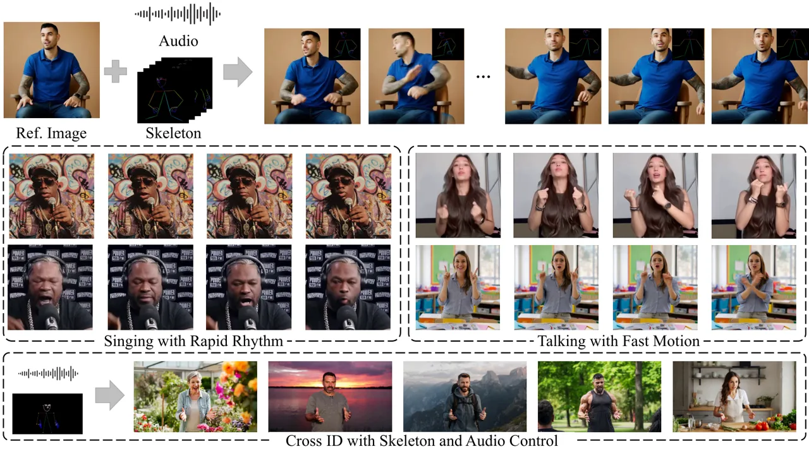
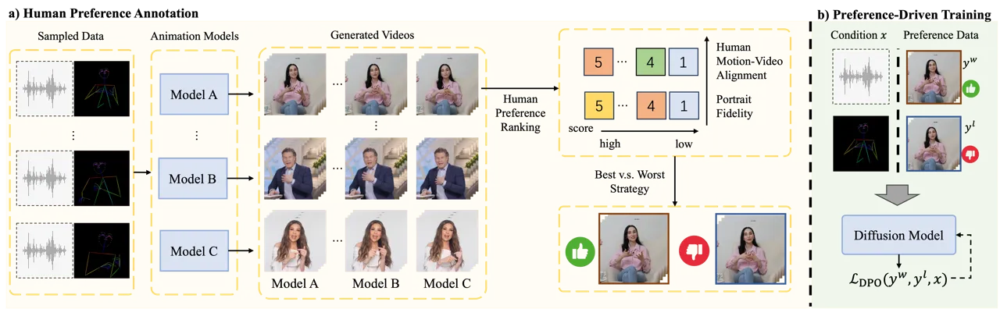
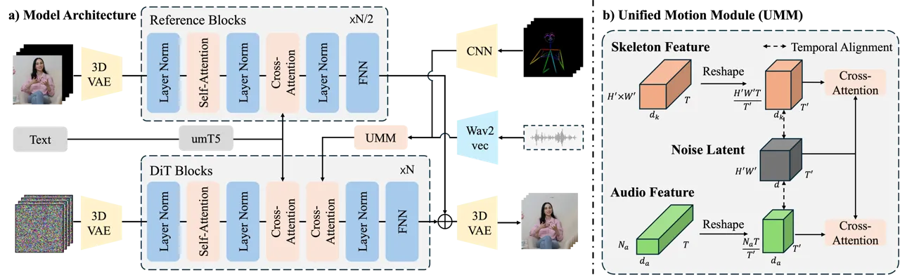
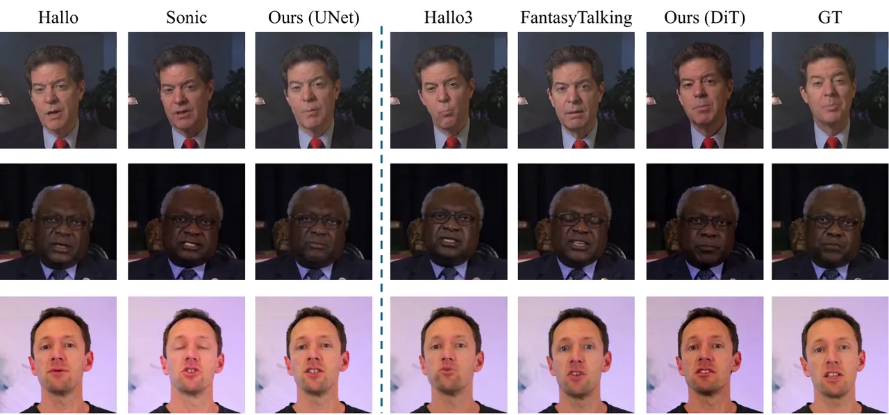
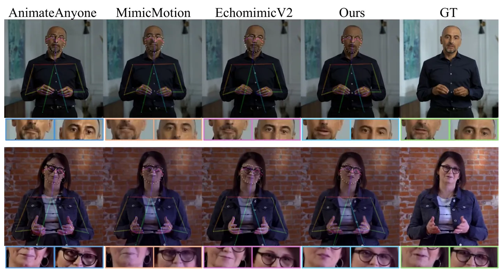
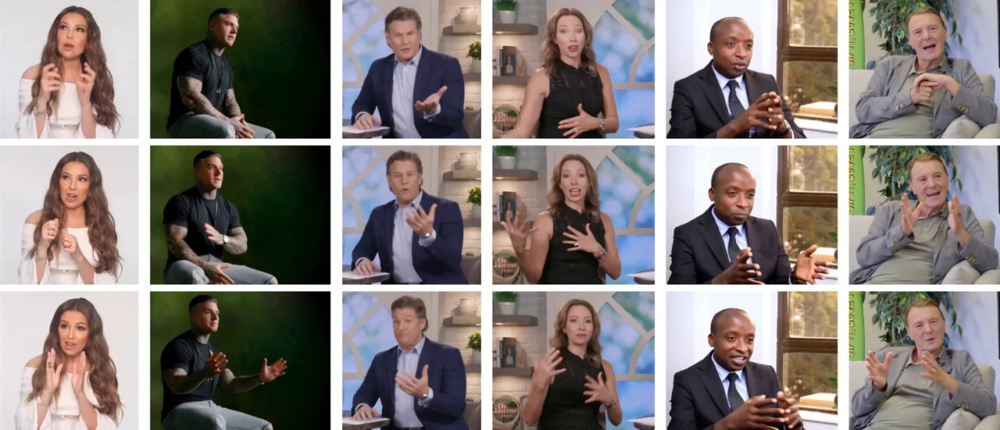
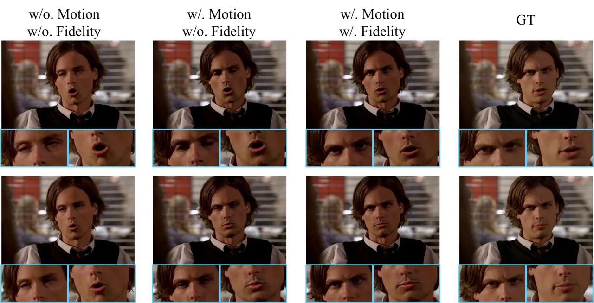
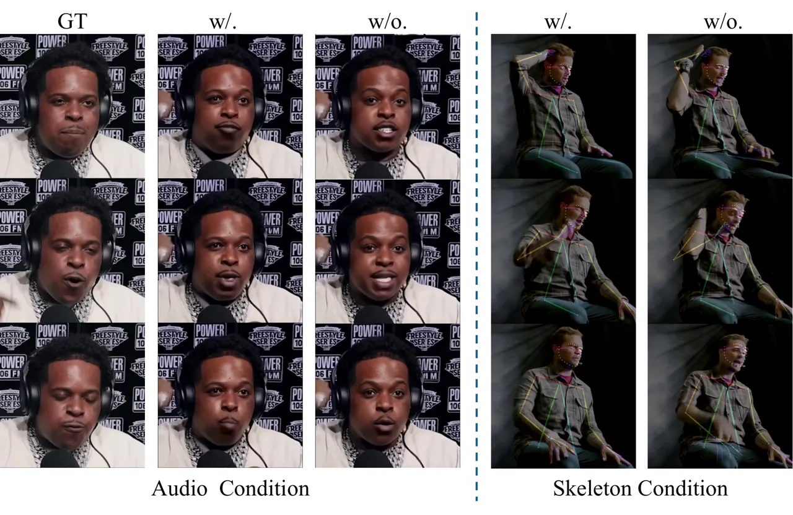

# Hallo4: High-Fidelity Dynamic Portrait Animation via Direct Preference Optimization

Jiahao Cui    Yan Chen    Mingwang Xu ^(†)^(†)thanks: indicates equal
contribution. Affiliation: Fudan University      Hanlin Shang
Affiliation: Fudan University      Yuxuan Chen Affiliation: Fudan
University      Yun Zhan Affiliation: Fudan University      Zilong Dong
Affiliation: Alibaba Group    Yao Yao Affiliation: Nanjing University  
   Jingdong Wang Affiliation: Baidu Inc.      Siyu Zhu
Affiliation: Fudan University   Affiliation: Shanghai Innovative
Institute  

###### Abstract

Generating highly dynamic and photorealistic portrait animations driven
by audio and skeletal motion remains challenging due to the need for
precise lip synchronization, natural facial expressions, and
high-fidelity body motion dynamics. We propose a
human-preference-aligned diffusion framework that addresses these
challenges through two key innovations. First, we introduce direct
preference optimization tailored for human-centric animation, leveraging
a curated dataset of human preferences to align generated outputs with
perceptual metrics for portrait motion-video alignment and naturalness
of expression. Second, the proposed temporal motion modulation resolves
spatiotemporal resolution mismatches by reshaping motion conditions into
dimensionally aligned latent features through temporal channel
redistribution and proportional feature expansion, preserving the
fidelity of high-frequency motion details in diffusion-based synthesis.
The proposed mechanism is complementary to existing UNet and DiT-based
portrait diffusion approaches, and experiments demonstrate obvious
improvements in lip-audio synchronization, expression vividness, body
motion coherence over baseline methods, alongside notable gains in human
preference metrics. Our model and source code can be found at:
https://github.com/fudan-generative-vision/hallo4.



Figure 1: Illustration of the proposed portrait animation framework.
Given a reference portrait image and multimodal control signals (audio
waveform with optional skeletal motion sequences), our method generates
high-fidelity, dynamically coherent animations through two key
innovations: (1) direct preference optimization for human-aligned
synchronization and expressiveness, and (2) unified temporal motion
modulation to preserve high-frequency body motion details. The framework
achieves accurate lip-audio synchronization, natural facial expressions,
and robust handling of rapid speech rhythms and abrupt upper-body
motions across diverse character identities and environmental scenarios.

## 1 Introduction

Portrait image animation, an interdisciplinary challenge at the
intersection of computer vision and computer graphics, aims to
synthesize photorealistic 2D videos of humans driven by multimodal
control signals such as text, audio, and pose. This technology holds
significant potential for applications spanning digital entertainment,
virtual reality, human-computer interaction, and personalized marketing.
Despite recent advances in diffusion models \[9, 11, 43\], vision
transformers \[22, 15, 23\], and autoregressive architectures \[32, 2,
16\], achieving high-fidelity animation remains constrained by two
persistent challenges: (1) generating lip-sync and facial expressions
that are both perceptually natural and aligned with human preferences,
and (2) capturing high-frequency motions, such as subtle articulations,
dynamic expressions, and rapid body gestures—particularly during abrupt
speech or sudden hand movements. In this work, we specifically
investigate audio-driven animation of facial and upper-body portraits
enhanced by skeletal motion conditions, aiming to address these two key
challenges.

Direct preference optimization (DPO) \[44\], a policy alignment
framework that bypasses explicit reward modeling by optimizing
generative models directly through pairwise human preference data, has
gained increasing attention in text-to-image and text-to-video
generation domains \[34\]. Unlike conventional reinforcement learning
approaches, DPO minimizes distributional shifts during generation by
aligning outputs with human preferences—such as aesthetic quality,
semantic coherence, and temporal consistency—while eliminating the need
for explicit reward model training and adversarial optimization loops
through pairwise preference rankings with minimal data. Building on this
paradigm, we introduce the first audio-driven portrait DPO dataset
specifically designed for human-centric animation, capturing human
preferences along two critical axes: (1) portrait-motion-video
synchronization accuracy and (2) facial expression and pose naturalness.
By contrasting trajectory probabilities of preferred and dispreferred
samples using a KL-constrained reward function, our method optimizes the
generation policy to maximize trajectory-level reward margins while
regularizing deviations from the base diffusion model’s denoising
dynamics. This approach achieves measurable improvements in lip-sync
accuracy (matching real-data benchmarks in lip-sync scores) and enhances
facial expressiveness, establishing a new baseline for
preference-aligned portrait animation.

While DiT-based diffusion models have shown promise in outperforming
UNet architectures in photorealistic portrait animation—particularly in
generalizing across diverse scenes and character identities, achieving
naturalistic character rendering, and seamlessly integrating portraits
with environmental contexts—their dependence on temporally downsampled
VAE-based features introduces a critical limitation. Specifically, the
standard practice of temporally downsampling motion conditions (e.g.,
lip articulation, facial expressions, and skeleton motions) to align
with latent video temporal dimensions inevitably discards high-frequency
and fine-grained motion details crucial for synchronizing rapid lip and
gesture motions. To address these challenges, we propose a temporal
motion condition modulation mechanism that unifies all motion conditions
to match the temporal dimension of video latents while proportionally
expanding feature dimensions to preserve motion granularity. This
mechanism establishes a scalable foundation for integrating diverse
motion signals with varying sampling frequencies into pretrained
diffusion transformers, resolving fidelity degradation caused by
latent-space temporal compression.

The proposed mechanism demonstrates complementary advantages when
integrated with both UNet and DiT architectures. Our framework,
combining direct preference optimization with unified temporal motion
modulation, establishes a robust foundation for high-fidelity portrait
animation. Comprehensive experiments demonstrate that our approach
achieves significant improvements in lip-audio synchronization and
expression naturalness compared to baseline methods, along with notable
gains in human preference metrics, while maintaining superior motion
coherence in complex upper-body gestures—particularly in challenging
scenarios involving rapid speech, abrupt facial expressions and pose
variations, and fast-changing body movements. To facilitate reproducible
research in preference-aligned portrait generation, we will release both
the codebase and curated preference dataset upon publication.



Figure 2: Demonstration of direct preference optimization for
audio-driven portrait animation.

## 2 Related Work

Portrait Image Animation. Research in portrait animation has evolved
through distinct technical paradigms addressing sequential limitations.
Early lip-synchronization methods, exemplified by Wav2Lip \[26\],
employed adversarial discriminators to enhance audio-visual alignment
but lacked holistic facial dynamics. Subsequent 3D morphable model
(3DMM)-based approaches improved motion naturalness through structured
representations: SadTalker \[45\] disentangled audio-driven 3D
coefficients, while VividTalk \[28\] and DreamTalk \[41\] introduced
hybrid mesh-codebook strategies. Diffusion-driven frameworks advanced
realism by integrating facial landmarks (DiffTalk \[27\],
AniPortrait \[38\]) and hierarchical temporal conditioning
(Loopy \[14\], Hallo \[39\]), with LivePortrait \[10\] optimizing
efficiency via implicit keypoints. Audio-centric methods like
Sonic \[13\] prioritized global perceptual coherence for diverse motion
synthesis. Transformer-based architectures, including VASA-1 \[40\],
Hallo3 \[7\] and OmniHuman \[19\], unified facial and bodily dynamics in
latent spaces for partial and full-body generalization. Our work
introduces a human-annotated DPO dataset and optimization approach to
enhance lip-sync accuracy and facial naturalness, complementing existing
UNet and DiT-based audio-driven diffusion frameworks.

Human Preference Alignment. Research on aligning generative models with
human preferences spans visual understanding and synthesis tasks. In
video understanding, early efforts \[29\] adapted reinforcement learning
with human feedback to mitigate hallucinations, while subsequent works
introduced self-supervised alignment via language model rewards \[44\],
AI feedback \[1\], and temporal grounding optimization \[17\]. For image
generation, Diffusion-DPO \[34\] reformulated DPO to align text-to-image
outputs with human judgments. Video generation methods further extended
DPO to optimize visual-textual semantics (VideoDPO \[21\]), enable
online training (OnlineVPO \[42\]), and refine motion dynamics
(Flow-DPO \[20\]). While these works establish DPO as a scalable
paradigm for preference-aware synthesis, none address the unique
challenges of audio-driven portrait animation. To our knowledge, this
work presents the first curated human preference dataset and tailored
DPO framework for enhancing lip-sync accuracy and facial naturalness in
portrait animation domain.

Motion Condition. Strategies for motion condition injection in human
video generation depend on motion signal type and control granularity.
Audio-driven portrait methods, such as EMO \[31\], VASA-1 \[40\], and
FantasyTalking \[37\], leverage cross-attention to align audio features
with visual frames. Body motion control approaches like CHAMP \[47\],
MimicMotion \[46\], and EasyControl \[36\] employ in-context learning
for coarse-grained skeletal dynamics. Half-body animation frameworks,
including CyberHost \[18\], EchoMimicV2 \[25\], and OmniHuman \[19\],
combine cross-attention for facial synchronization with in-context
learning for skeletal motion, achieving coherent upper-body motion.
Building on these insights, we propose a temporal motion condition
modulation mechanism that enhances high-frequency motion details and
fine-grained articulatory synchronization, particularly optimizing
motion fidelity for DiT-based portrait diffusion models.



Figure 3: Demonstration of a DiT-based portrait generative pipeline with
unified temporal motion modulation.

## 3 Methodology

Our framework integrates human preference driven diffusion optimization
and unified temporal motion modulation for highly dynamic and
high-fidelity portrait animation. Section 3.1 presents the preliminary
of diffusion models. Section 3.2 introduces curated preference datasets
that capture motion-video alignment and portrait fidelity through
best-vs-worst ranking and adapts direct preference optimization to align
denoising trajectories with human judgments. Section 3.3 resolves
temporal resolution mismatches via unified motion modulation through
feature reshaping and cross-attention fusion. Finally, Section 3.4
implements this through diffusion networks with DiT/UNet backbones,
enabling coherent synthesis of audio-driven facial movements and
skeleton-guided body dynamics.

### 3.1 Preliminary

Diffusion models generate data through an iterative denoising process
governed by a forward noise-addition process and a learned reverse
process. Formally, given a data sample
$`\mathbf{x}_{0}\sim q(\mathbf{x}_{0})`$, the forward process gradually
perturbs the data with Gaussian noise over $`T`$ timesteps according to:

```math
q(\mathbf{x}_{t}|\mathbf{x}_{t-1})=\mathcal{N}(\mathbf{x}_{t};\sqrt{1-\beta_{t}}\mathbf{x}_{t-1},\beta_{t}\mathbf{I}), \tag{1}
```

where $`\{\beta_{t}\}_{t=1}^{T}`$ defines a predetermined noise
schedule. This yields the marginal distribution at timestep $`t`$:

```math
\mathbf{x}_{t}=\sqrt{\bar{\alpha}_{t}}\mathbf{x}_{0}+\sqrt{1-\bar{\alpha}_{t}}\boldsymbol{\epsilon}, \tag{2}
```

with $`\bar{\alpha}_{t}=\prod_{s=1}^{t}(1-\beta_{s})`$ and
$`\boldsymbol{\epsilon}\sim\mathcal{N}(\mathbf{0},\mathbf{I})`$. The
reverse process learns to denoise through a neural network
$`\epsilon_{\theta}`$ parameterized by $`\theta`$, optimized to predict
the noise component via:

```math
\mathcal{L}(\theta)=\mathbb{E}_{t,\mathbf{x}_{0},\boldsymbol{\epsilon}}\left[\|\boldsymbol{\epsilon}-\epsilon_{\theta}(\mathbf{x}_{t},t)\|^{2}\right]. \tag{3}
```

Conventional implementations employ U-Net architectures for
$`\epsilon_{\theta}`$, leveraging their encoder-decoder structure with
skip connections. Recent advances propose diffusion transformers as
competitive alternatives, utilizing self-attention mechanisms to enhance
global coherence—a critical feature for modeling video frame
dependencies.

Our framework builds upon pretrained portrait diffusion models,
augmented by direct preference optimization to align animations with
human preferences. Another pivotal challenge lies in effectively
integrating motion conditions with varying temporal frequencies into the
noise latent space, which is temporally compressed via a VAE. This
integration is essential for achieving highly dynamic and naturalistic
portrait animations.

### 3.2 Preference-Driven Portrait Animation

To establish a robust foundation for direct preference optimization in
portrait animation, we curate a multimodal dataset that captures human
preferences across two critical dimensions: (1) motion-video alignment
and (2) portrait fidelity.

Preference Metrics. Motion-video alignment and portrait fidelity
constitute two critical metrics for evaluating synthesized portrait
animations. Motion-video alignment quantifies the temporal consistency
between generated animations and human motion conditions, emphasizing
lip synchronization with audio input and body movements synchronized to
rhythmic beats. Portrait fidelity evaluates the perceptual quality of
synthesized content, with particular emphasis on the semantic coherence
of facial expressions and head poses relative to speech content (e.g.,
conveying emotions such as joy, anger, or surprise), as well as the
overall naturalness and realism of the rendered output. These metrics
collectively ensure both perceptual accuracy and human-centric
plausibility in dynamic portrait generation systems.

Preference Dataset Curation. Direct preference optimization frames human
preference alignment as a policy optimization problem using pairwise
preference data $`\mathcal{D}=\{(x,y^{w},y^{l})\}`$, where $`y^{w}`$ is
preferred over $`y^{l}`$; here, $`y^{w}`$ and $`y^{l}`$ represent the
“winning” and “losing” samples, respectively \[34\]. To construct this
dataset, we employ annotators to assess the generated samples across the
two dimensions and combine them with a “best-vs-worst” selection
strategy to obtain the final preference dataset.

For each input audio clip, we generate candidate videos using five
representative methods spanning GAN-based (SadTalker), UNet-based
diffusion (AniPortrait, EchoMimic-v2), and DiT-based diffusion
(FantasyTalking, Hallo3) architectures. Following independent generation
human annotators evaluate each video on two critical axes: motion-video
alignment (lip/body synchronization) and portrait fidelity (expression
naturalness, rendering quality), assigning scores on a 5-point Likert
scale. To aggregate the scores across both dimensions, a composite
reward is defined as
$`r=\frac{1}{2}(r_{\text{align}}+r_{\text{fidelity}})`$.

Pairwise preferences data $`(y^{w},y^{l})`$ are derived by ranking
samples based on composite rewards $`r`$ with “best-vs-worst” strategy.
We define the sample with the highest reward as $`y^{w}`$, and the one
with the lowest as $`y^{l}`$. This strategy maximizes the reward margin
between $`y^{w}`$ and $`y^{l}`$ samples, encouraging clear distinctions
in subtle aspects like lip sync and expression quality. To maintain the
discriminability of the dataset, cases with minimal reward differences
are excluded.

Preference Optimization. To align generated animations with human
preferences, we adapt direct preference optimization to diffusion-based
portrait synthesis. Let the generation policy $`\pi_{\theta}(y|x)`$
represents the conditional distribution of videos $`y`$ given input
conditions $`x`$ (audio, skeleton), and $`\pi_{\text{ref}}`$ denotes a
reference policy initialized from a supervised fine-tuned diffusion
model. The DPO objective maximizes the likelihood of preferred outputs
while regularizing deviations from $`\pi_{\text{ref}}`$:

```math
\mathcal{L}_{\text{DPO}}=-\mathbb{E}_{(x,y^{w},y^{l})\sim\mathcal{D}}\left[\log\sigma\left(\beta\log\frac{\pi_{\theta}(y^{w}|x)}{\pi_{\text{ref}}(y^{w}|x)}-\beta\log\frac{\pi_{\theta}(y^{l}|x)}{\pi_{\text{ref}}(y^{l}|x)}\right)\right], \tag{4}
```

where $`\sigma(\cdot)`$ is the sigmoid function and $`\beta`$ controls
deviation from $`\pi_{\text{ref}}`$. This objective implicitly defines
the reward function
$`r_{\theta}(x,y)=\beta\log\frac{\pi_{\theta}(y|x)}{\pi_{\text{ref}}(y|x)}`$,
circumventing explicit reward modeling by leveraging pairwise preference
datasets.

For DiT diffusion models via flow-matching, the DPO loss is formulated
as:

```math
\displaystyle\mathcal{L}_{\text{DPO}}=-\mathbb{E}_{t\sim\mathcal{U}(0,1),\ (y^{w},y^{l})\sim\mathcal{D}}\log\sigma\Big(-\beta\omega_{t}\big[\|v^{w}-v_{\theta}(y_{t}^{w},t)\|^{2} \tag{5}
```

```math
\displaystyle-\|v^{w}-v_{\text{ref}}(y_{t}^{w},t)\|^{2}-\big(\|v^{l}-v_{\theta}(y_{t}^{l},t)\|^{2}-\|v^{l}-v_{\text{ref}}(y_{t}^{l},t)\|^{2}\big)\big]\Big)
```

where $`\omega_{t}`$ is a weighting function, $`v^{w}`$ and $`v^{l}`$
denote the velocity fields derived from preferred sample $`y^{w}`$ and
dispreferred sample $`y^{l}`$, respectively. The expectation is taken
over the preference dataset $`\mathcal{D}=\{(x,y^{w},y^{l})\}`$ and
noise timestep $`t`$. By minimizing $`\mathcal{L}_{\text{DPO}}`$, the
predicted velocity field $`v_{\theta}`$ becomes closer to $`v^{w}`$
(aligned with human preferences) and further from $`v^{l}`$, promoting
coherent motion trajectories and produce more natural and realistic
expressions.

During training, gradients from $`\mathcal{L}_{\text{DPO}}`$ adjust the
denoising direction to favor high-reward regions in the trajectory space
while preserving the temporal dynamics of the reference policy. This
joint optimization enables preference-aware generation without
compromising the inherent stability of pretrained diffusion models.

### 3.3 Unified Temporal Motion Modulation

Existing DiT-based diffusion models face challenges in aligning
multimodal motion signals (e.g., speech audio and skeletal sequences)
with compressed video latent representations, primarily due to temporal
resolution mismatches and dimensional incompatibility. To address this,
we propose a temporal reshaping strategy that aligns motion conditions
with video latents through temporal dimension matching and proportional
feature channel expansion, effectively preserving motion granularity
while maintaining dimensional consistency.

Latent Video Representation. The original video data $`\mathbf{V}`$ is
encoded into a compressed latent representation $`\mathbf{Z}`$ via a
pretrained causal 3D variational autoencoder. Following established
methods \[35\], the input video
$`\mathbf{V}\in\mathbb{R}^{T\times H\times W\times 3}`$ is compressed to
latent features
$`\mathbf{Z}=\mathcal{E}(\mathbf{V})\in\mathbb{R}^{T^{\prime}\times H^{\prime}\times W^{\prime}\times d}`$,
where $`T^{\prime}=\lfloor T/4\rfloor`$ represents the temporally
downsampled length, and $`H^{\prime}=\lfloor H/8\rfloor`$,
$`W^{\prime}=\lfloor W/8\rfloor`$ denote spatially reduced dimensions.
This encoding balances computational efficiency with the preservation of
critical motion dynamics and spatiotemporal coherence inherent in the
original video.

Human Motion Condition. We process two complementary motion modalities
to govern facial articulations and body dynamics. For audio-driven
facial movements, the raw speech signals $`\mathbf{S}\in\mathbb{R}^{L}`$
are encoded into frame-aligned acoustic features
$`\mathbf{C}_{\text{audio}}\in\mathbb{R}^{T\times N_{a}\times d_{a}}`$
via Wav2Vec 2.0 \[3\], preserving phoneme-level temporal precision
essential for lip synchronization. For skeletal-guided body motion, 2D
human keypoints $`\mathbf{V}_{k}\in\mathbb{R}^{T\times J\times 3}`$
(with $`J`$ joints) are processed through an efficient convolutional
network, generating motion descriptors
$`\mathbf{C}_{\text{skel}}\in\mathbb{R}^{T\times H^{\prime}\times W^{\prime}\times d_{k}}`$
that maintain original temporal resolution while achieving spatial
alignment with video latents through dimension reduction to
$`H^{\prime}\times W^{\prime}`$. This dual-conditioning mechanism
encourages synchronized integration of high-frequency facial movements
and coarse body kinematics with the latent video representation.

Temporal Reshaping and Fusion. To resolve temporal resolution mismatches
between motion conditions (frame rate $`T`$) and compressed video
latents (downsampled length $`T^{\prime}`$), we propose a feature
redistribution strategy that preserves motion fidelity through
dimensional expansion. For each motion condition
$`\mathbf{C}_{m}\in\mathbb{R}^{T\times D_{m}\times d_{m}}`$ (where
$`m\in\{\text{audio},\text{skel}\}`$), we reshape the temporal axis via:

```math
\tilde{\mathbf{C}}_{m}=\text{Reshape}\left(\mathbf{C}_{m},\left(T^{\prime},\rho D_{m}\right)\right)\in\mathbb{R}^{T^{\prime}\times(\rho D_{m})\times d_{m}}, \tag{6}
```

where $`\rho=T/T^{\prime}`$ denotes the latent compression ratio. This
operation eliminates subsampling artifacts by distributing original
temporal features into expanded channel dimensions while maintaining
alignment with latent length $`T^{\prime}`$. The reshaped features
undergo latent-space projection through learnable linear
transformations:

```math
\mathbf{H}_{m}=\mathbf{W}_{m}\tilde{\mathbf{C}}_{m}+\mathbf{b}_{m}\in\mathbb{R}^{T^{\prime}\times(\rho D_{m})\times d}, \tag{7}
```

ensuring dimensional compatibility with the video latents
$`\mathbf{Z}\in\mathbb{R}^{T^{\prime}\times H^{\prime}\times W^{\prime}\times d}`$.
Multimodal fusion is achieved via cross-attention:

```math
\mathbf{Z}^{\prime}=\text{Softmax}\left(\frac{\mathbf{Q}\mathbf{K}^{\top}}{\sqrt{d}}\right)\mathbf{V}+\mathbf{Z}, \tag{8}
```

where $`\mathbf{Q}=\mathbf{Z}\mathbf{W}_{Q}`$,
$`\mathbf{K}=\mathbf{H}\mathbf{W}_{K}`$,
$`\mathbf{V}=\mathbf{H}\mathbf{W}_{V}`$, and
$`\mathbf{H}=[\mathbf{H}_{\text{audio}}\|\mathbf{H}_{\text{skel}}]`$.
This design offers dual advantages: 1) High-frequency motion details
critical for lip synchronization and subtle gestures are preserved
through feature expansion rather than temporal subsampling; 2)
Dimensionally consistent projections enable seamless integration with
pretrained diffusion transformers without architectural modifications.

### 3.4 DPO-Enhanced Diffusion Network

Architecture. As illustrated in Figure 3, we validate our preference
dataset and DPO framework on both UNet-based and DiT-based diffusion
architectures. The proposed unified temporal motion modulation strategy
is specifically implemented within the DiT-based diffusion framework,
where temporal compression in the noise latent space is achieved via a
variational autoencoder.

For the UNet architecture, we adopt the design principles of EMO \[30\],
Hallo \[39\], and EchoMimic-v2 \[5\], using Stable Diffusion 1.5 \[4\]
as the backbone. A parallel ReferenceNet structure preserves visual
identity consistency, while audio-conditioning layers inject speech
features through cross-attention mechanisms. The diffusion denoising
process employs denoising diffusion probabilistic models, which learns a
parameterized reverse process through variational lower bound
optimization to iteratively recover clean data from noise.

For the DiT architecture, we utilize the Wan2.1 framework \[35\] as the
backbone, consistent with FantasyTalking \[37\]. This architecture
employs a 3D causal VAE for spatiotemporal compression and decoding. The
transformer module processes video data by unfolding it into token
sequences via 3D patchify operations. Each transformer block integrates
self-attention for spatial relations, cross-attention for text
conditioning, and timestep embeddings. All transformer layers share a
unified MLP structure. The denoising process leverages flow matching
principles, constructing vector fields based on optimal transport path
conditional probability flows to directly regress velocity fields. This
enables deterministic ODE-based transformations from noise distributions
to data distributions.

### 3.5 Training and Inference

Training. The training protocol adapts to architectural distinctions
between UNet and DiT backbones while maintaining preference optimization
consistency.

For UNet-based diffusion, we initialize with the pretrained Hallo
portrait model \[39\] and fine-tune it using direct preference
optimization. The DPO objective $`\mathcal{L}_{\text{DPO}}`$ optimizes
denoising trajectories to align with human preference judgments through
gradient updates on the UNet parameters.

For DiT architectures, training follows a phased approach to ensure
stable integration of multimodal conditions. Phase 1 focuses on
audio-driven synthesis, where parameter updates are restricted to the
cross-attention layers in the unified motion module, keeping the 3D VAE
and denoiser blocks frozen. Phase 2 introduces skeletal guidance by
extending the motion module to process joint kinematics, updating only
the newly introduced skeletal cross-attention parameters while
maintaining frozen 3D VAE and denoiser block weights. Both phases
leverage flow matching to regress velocity fields encoding
spatiotemporal dynamics. Finally, we apply DPO training that adjusts the
denoising policy through comparative gradient updates, prioritizing
human-preferred motion patterns and visual qualities while preserving
the model’s temporal coherence.

Inference. During inference, the model integrates four input modalities:
a reference image for visual context, a driving audio segment for speech
signals, a textual prompt for semantic guidance, and skeleton frames
encoding body motion dynamics. It generates a temporally coherent
portrait animation by harmonizing audio-driven lip synchronization with
skeleton-guided pose dynamics, encouraging both expressive facial
movements and anatomically consistent body kinematics.



Figure 4: Qualitative comparison on HDTF and Celeb-V dataset.

## 4 Experiment

### 4.1 Experimental Setups

Implementation Details. Our framework was implemented on 8 NVIDIA A100
GPUs through two sequential training phases. The temporal motion
modulation module underwent initial training with 10,000 iterations
using a learning rate of 1e-5, optimized via AdamW with 2,000 warm-up
steps to stabilize gradient updates. A batch size of 8 ensured memory
efficiency while preserving motion dynamics. For direct preference
optimization, we trained for 12,000 iterations with a reduced learning
rate of 1e-8 and 2,500 warm-up steps, employing a beta parameter of 2500
to balance preference alignment. The DPO phase maintained a global batch
size of 8.

Datasets. Our training dataset comprises 220K source videos (220 hours)
sourced from diverse platforms including Celeb-V, HDTF, and YouTube,
encouraging coverage across varied demographic and environmental
conditions. From this collection, we curate 20K high-confidence video
pairs through a rigorous selection process, where samples with the
minimal composite reward score are excluded to emphasize quality
differentials in portrait animation. The source videos train the base
DiT portrait animation model, while the curated pairs facilitate direct
preference optimization. For evaluation, we employ three benchmarks:
HDTF for general talking-head synthesis, CelebV-HQ for high-resolution
portrait generation, and EMTD to assess motion diversity and anatomical
consistency in skeletal-driven animations.

|              |                       |                    |                      |                     |
| ------------ | --------------------- | ------------------ | -------------------- | ------------------- |
| Architecture | Method                | Sync-C$`\uparrow`$ | Sync-D$`\downarrow`$ | E-FID$`\downarrow`$ |
| UNet-based   | SadTalker \[45\]      | 7.804              | 7.956                | 11.826              |
|              | DreamTalk \[24\]      | 7.515              | 7.717                | 9.142               |
|              | AniPortrait \[38\]    | 3.550              | 11.007               | 14.819              |
|              | Sonic \[13\]          | 8.186              | 6.823                | 9.370               |
|              | Hallo \[39\]          | 7.770              | 7.605                | 8.508               |
|              | Ours (UNet)           | 8.286              | 7.502                | 8.241               |
| DiT-based    | Hallo3 \[7\]          | 7.384              | 8.613                | 8.589               |
|              | FantasyTalking \[37\] | 4.218              | 11.043               | 9.806               |
|              | Ours (DiT)            | 9.161              | 6.987                | 7.645               |
| Real Video   |                       | 8.976              | 6.359                | –                   |

Table 1: Comparison with existing audio-driven portrait animation
methods on HDTF dataset. For the UNet-based diffusion models, “Ours
(UNet)” achieves superior motion-video alignment metrics in terms of lip
motion synchronization score (Sync-C, Sync-D), compared to its baseline
Hallo. For the DiT-based diffusion models, the performance improvement
from DPO and unified temporal motion modulation is more obvious.

|              |                       |                    |                      |                     |                   |                   |
| ------------ | --------------------- | ------------------ | -------------------- | ------------------- | ----------------- | ----------------- |
| Architecture | Method                | Sync-C$`\uparrow`$ | Sync-D$`\downarrow`$ | E-FID$`\downarrow`$ | FID$`\downarrow`$ | FVD$`\downarrow`$ |
| UNet-based   | SadTalker \[45\]      | 5.126              | 8.219                | 43.499              | 64.919            | 463.671           |
|              | DreamTalk \[24\]      | 4.691              | 8.290                | 68.211              | 137.049           | 879.902           |
|              | AniPortrait \[38\]    | 2.129              | 10.911               | 31.760              | 63.106            | 509.498           |
|              | Sonic \[13\]          | 5.387              | 7.370                | 19.928              | 56.104            | 489.458           |
|              | Hallo \[39\]          | 4.880              | 8.189                | 27.252              | 51.009            | 469.985           |
|              | Ours (Unet)           | 5.480              | 8.389                | 19.627              | 49.282            | 444.319           |
| DiT-based    | Hallo3 \[7\]          | 4.648              | 8.992                | 23.671              | 54.105            | 397.425           |
|              | FantasyTalking \[37\] | 2.957              | 10.559               | 47.124              | 69.332            | 614.462           |
|              | Ours (DiT)            | 5.689              | 7.853                | 18.998              | 58.815            | 538.396           |
| Real Video   |                       | 4.550              | 8.090                | –                   | –                 | –                 |

Table 2: Comparison with existing audio-driven portrait animation
methods on Celeb-V dataset. Given that the Celeb-V data are more wild
than HDTF dataset, the performance improvement in terms of motion-video
alignment and expression fidelity from DPO and and unified temporal
motion modulation is more obvious than the corresponding UNet and
DiT-based baselines.

### 4.2 Experimental Setups

Evaluation Metrics. For motion-video alignment, we adopt the widely used
Sync-C and Sync-D metrics \[6\] to measure the confidence and distance
between visual and audio content. Hand quality and motion richness are
measured using hand keypoint confidence (HKC) \[18\] and hand keypoint
variance (HKV) \[18\], respectively. These metrics validate the DPO
results after integrating preference data with human motion alignment,
as well as the improvements in highly dynamic motion enabled by the
unified temporal motion modulation module. To evaluate facial fidelity,
we employ E-FID \[8\], which quantifies expression discrepancies by
computing the Fréchet Inception Distance (FID) of facial expression
parameters extracted via face reconstruction. For visual quality
assessment, we utilize FID, FVD \[33\], PSNR, and SSIM.

Baseline. We conduct comprehensive comparisons across two dominant
architectural paradigms for audio-driven portrait animation: UNet-based
and DiT-based approaches. For UNet-based methods, we benchmark against
SadTalker \[45\], DreamTalk \[24\], AniPortrait \[38\], Sonic \[13\],
and Hallo \[39\]. Our UNet variant, denoted as Ours (UNet), extends
Hallo by integrating human preference data and direct preference
optimization (DPO). Within the DiT-based category, we evaluate
Hallo3 \[7\] and FantasyTalking \[37\], while our DiT implementation
(Ours (DiT)) builds upon the Wan2.1 backbone \[35\], incorporating
unified temporal motion modulation and DPO-enhanced training. To
validate generalization to skeletal-guided synthesis, we further compare
with pose-driven half-body animation methods: AnimateAnyone \[12\],
MimicMotion \[46\], and EchoMimic-v2 \[25\].

### 4.3 Comparison with State-of-the-Art

Comparison on HDTF Dataset. As shown in Table 1, our method achieves
state-of-the-art performance on HDTF, outperforming existing approaches
in critical metrics. Notably, the DiT variant achieves a Sync-C score of
9.161 and Sync-D of 6.987, surpassing even real videos (8.976 and
6.359), which underscores the efficacy of direct preference optimization
in refining motion-video alignment and expression fidelity, as evidenced
by the lowest E-FID (7.645). More visual comparison is shown in
Figure 4.

Comparison on Celeb-V Dataset. On the more challenging Celeb-V dataset
(Table 2), our method exhibits robust generalization, achieving superior
Sync-C (5.689) and E-FID (18.998) compared to all baselines. The obvious
Sync-C improvement (22.4% over Hallo3) highlights DPO’s capability to
adapt to wild scenarios by prioritizing human preferences for lip
coherence and expression fidelity.

|                      | Sync-C$`\uparrow`$ | HKV$`\uparrow`$ | HKC$`\uparrow`$ | PSNR$`\uparrow`$ | SSIM$`\uparrow`$ | FID$`\downarrow`$ | FVD$`\downarrow`$ |
| -------------------- | ------------------ | --------------- | --------------- | ---------------- | ---------------- | ----------------- | ----------------- |
| AnimateAnyone \[12\] | \-                 | 34.350          | 0.824           | 20.482           | 0.761            | 51.439            | 453.528           |
| MimicMotion \[46\]   | \-                 | 34.783          | 0.846           | 19.186           | 0.713            | 49.039            | 468.004           |
| EchoMimic-v2 \[25\]  | 6.624              | 33.284          | 0.863           | 21.421           | 0.796            | 38.461            | 301.347           |
| Ours (DiT)           | 6.764              | 35.736          | 0.886           | 22.221           | 0.808            | 44.422            | 381.752           |

Table 3: Quantitative comparison of pose-driven half-body animation
methods on EMTD dataset. Our approach demonstrates superior lip
synchronization (Sync-C) through direct preference optimization, while
the unified motion modulation mechanism enhances hand articulation
quality (HKC) and motion diversity (HKV).



Figure 5: Qualitative comparison on half-body EMTD dataset.

Comparison on Half-Body EMTD Dataset. Our evaluation on the EMTD dataset
for skeletal and audio-driven animations demonstrates that the unified
temporal motion modulation obvious enhances hand motion diversity (HKV)
and articulation quality (HKC), while improving visual fidelity
(PSNR/SSIM). As shown in Table 3, our method outperforms pose-driven
baselines by effectively aligning high-frequency skeletal dynamics with
latent video representations, achieving a 35.736 HKV and 0.886 HKC,
which underscores its capacity to harmonize anatomical consistency with
motion granularity. The qualitative comparison is shown in Figure 5.

Visualization on Wild Data-set. Figure 6 showcases our method’s
generalization across diverse identities, environments, and motion
intensities. The generated animations maintain lip-audio synchronization
and anatomical consistency even under challenging scenarios involving
rapid speech rhythms (e.g., rap vocals), exaggerated body movements
(e.g., dance sequences), and variable lighting conditions.

### 4.4 Ablation Study and Discussion

Preference Metrics. As demonstrated in Table 4 and Figure 7, integrating
motion alignment preferences significantly improves synchronization
metrics (Sync-C/Sync-D) compared to baseline models. Combining both
motion alignment and portrait fidelity preferences achieves the optimal
balance across synchronization (Sync-C: 5.689, Sync-D: 7.853) and
expression quality (E-FID: 18.998), enhancing realism in generated
animations while maintaining motion coherence.



Figure 6: Demonstration of more results from wild data-set.

| Motion | Fidelity | Sync-C$`\uparrow`$ | Sync-D$`\downarrow`$ | E-FID$`\downarrow`$ | FID$`\downarrow`$ | FVD$`\downarrow`$ |
| ------ | -------- | ------------------ | -------------------- | ------------------- | ----------------- | ----------------- |
|        |          | 5.326              | 8.391                | 21.065              | 59.007            | 541.201           |
| ✓      |          | 5.651              | 7.873                | 19.526              | 55.220            | 518.380           |
| ✓      | ✓        | 5.689              | 7.853                | 18.998              | 58.815            | 538.396           |

Table 4: Ablation of human preference metrics in direct preference
optimization. “Motion” refers to the metric of human motion video
alignment, and “Fidelity” refers to portrait fidelity.

|                  | Sync-C$`\uparrow`$ | Sync-D$`\downarrow`$ | E-FID$`\downarrow`$ | FID$`\downarrow`$ | FVD$`\downarrow`$ |
| ---------------- | ------------------ | -------------------- | ------------------- | ----------------- | ----------------- |
| better vs. worse | 5.341              | 8.197                | 20.199              | 58.947            | 541.684           |
| best vs. worse   | 5.506              | 8.086                | 19.990              | 61.371            | 530.853           |
| better vs. worst | 5.401              | 8.214                | 19.944              | 58.959            | 588.209           |
| best vs. worst   | 5.689              | 7.853                | 18.998              | 58.815            | 538.396           |

Table 5: Ablation study of pairwise preference construction strategies
on Celeb-V dataset. The “best-vs-worst” strategy, which pairs the
highest- and lowest-quality samples, achieves superior synchronization
(Sync-C/D) and expression fidelity (E-FID) compared to alternative pair
selection methods.



Figure 7: Ablation of direct preference optimization (with and without).

Pairwise Preference Construction Strategy. As show in Table 5, we
analyze these different preference data pair construction strategies.
The “better-worse" approach generates all possible pairs
$`(v_{i},v_{j})`$ where $`r_{i}>s_{j}`$. The “best-vs-worse" strategy
adopts a top-down perspective, pairing the highest-scoring video with
each lower-quality video. Conversely, the “better-vs-worst" method
employs a bottom-up framework by contrasting the lowest-quality sample
against all superior videos. The “best-vs-worst" strategy, used by us,
pairs only the highest and lowest-scoring video. The experiments show
that this strategy, which generates only the most distinctive pair,
yields the best performance.

|         | Sync-C$`\uparrow`$ | Sync-D$`\downarrow`$ | E-FID$`\downarrow`$ | FID$`\downarrow`$ | FVD$`\downarrow`$ |
| ------- | ------------------ | -------------------- | ------------------- | ----------------- | ----------------- |
| audio/4 | 2.769              | 10.852               | 20.263              | 56.149            | 538.821           |
| audio/2 | 4.244              | 8.849                | 19.464              | 56.382            | 557.557           |
| Ours    | 5.689              | 7.853                | 18.998              | 58.815            | 538.396           |

Table 6: Ablation study of temporal motion modulation strategies for
audio conditioning. “audio/4” denotes temporal compression by 4× without
channel expansion, directly aligning audio features with compressed
latents. “audio/2” applies 4× temporal compression followed by 2×
channel expansion. Our method employs 4× temporal compression with
proportional 4× channel expansion, redistributing features to preserve
temporal fidelity.

|            | HKV$`\uparrow`$ | HKC$`\uparrow`$ | PSNR$`\uparrow`$ | SSIM$`\uparrow`$ | FID$`\downarrow`$ | FVD$`\downarrow`$ |
| ---------- | --------------- | --------------- | ---------------- | ---------------- | ----------------- | ----------------- |
| skeleton/4 | 31.096          | 0.850           | 20.752           | 0.789            | 48.079            | 438.024           |
| skeleton/2 | 33.567          | 0.873           | 21.317           | 0.802            | 47.112            | 410.573           |
| Ours       | 35.736          | 0.886           | 22.221           | 0.808            | 44.422            | 381.752           |

Table 7: Ablation study of temporal motion modulation strategies for
skeleton conditioning. “skeleton/4” denotes temporal compression by 4×
without channel expansion, directly aligning skeleton features with
compressed latents. “skeleton/2” applies 4× temporal compression
followed by 2× channel expansion. Our method employs 4× temporal
compression with proportional 4× channel expansion, redistributing
features to preserve temporal fidelity.

Temporal Motion Modulation for Audio Conditioning. To evaluate the
efficacy of our temporal reshaping strategy for audio features, we
conduct ablation studies comparing different downsampling approaches. As
shown in Table 6, direct temporal compression (audio/4) without channel
expansion significantly degrades lip synchronization (Sync-C: 2.769),
while partial expansion (audio/2) improves Sync-C to 4.244. Our full
approach—temporal compression with proportional 4× channel
expansion—achieves optimal Sync-C (5.689) and E-FID (18.998) by
preserving high-frequency speech dynamics through feature redistribution
rather than subsampling. Visualization results are shown in Figure 8.

Temporal Motion Modulation for Skeleton Conditioning. Similar analysis
on skeletal motion modulation (Table 7) reveals that direct temporal
compression (skeleton/4) reduces hand motion diversity (HKV: 31.096).
Partial expansion (skeleton/2) improves HKV to 33.567, while our full
method achieves superior articulation quality (HKC: 0.886) and motion
variety (HKV: 35.736) through proportional channel expansion. This
demonstrates that redistributing temporal features into expanded
channels better preserves anatomical details critical for expressive
body animations.



Figure 8: Ablation of unified motion modulation (with and without).

Comparison with Supervised Fine-tuning. In Table 8, we compare direct
preference optimization with supervised fine-tuning on Celeb-V. While
SFT marginally improves Sync-C (5.387 vs. 5.326) and E-FID (21.432 vs.
21.065) over the baseline, DPO achieves superior gains (Sync-C: 5.689,
E-FID: 18.998). This demonstrates that preference-driven training better
aligns generated animations with human judgments than traditional
loss-driven approaches, despite equivalent training data exposure.

|          | Sync-C$`\uparrow`$ | Sync-D$`\downarrow`$ | E-FID$`\downarrow`$ | FID$`\downarrow`$ | FVD$`\downarrow`$ |
| -------- | ------------------ | -------------------- | ------------------- | ----------------- | ----------------- |
| Baseline | 5.326              | 8.391                | 21.065              | 59.007            | 541.201           |
| SFT      | 5.387              | 8.352                | 21.432              | 59.377            | 540.443           |
| Ours     | 5.689              | 7.853                | 18.998              | 58.815            | 538.396           |

Table 8: Comparison between direct preference optimization (Ours) and
supervised fine-tuning (SFT) on Celeb-V dataset.

| Method / Metric       | Lip sync | Beat align | Portrait fid | Motion div |
| --------------------- | -------- | ---------- | ------------ | ---------- |
| FantasyTalking \[37\] | 3.38     | 3.33       | 3.50         | 2.73       |
| DreamTalk \[24\]      | 2.83     | 2.88       | 2.68         | 3.20       |
| Hallo3 \[7\]          | 3.90     | 3.73       | 3.93         | 3.80       |
| Sonic \[13\]          | 4.18     | 4.08       | 4.13         | 4.03       |
| Ours                  | 4.60     | 4.48       | 4.43         | 4.23       |

Table 9: User study comparison of lip synchronization, beat alignment,
portrait fidelity and motion diversity on EMTD dataset

### 4.5 User Studies.

We conducted a user study evaluating 200 generated samples from the EMTD
dataset across four critical dimensions: lip synchronization, beat
alignment, portrait fidelity, and motion diversity. As shown in Table 9,
our method achieves superior ratings compared to state-of-the-art
baselines, with relative improvements of 10.1% in lip synchronization
and 5.0% in motion diversity over the strongest baseline (Sonic).
Participants rated samples on a 5-point scale, where our approach scored
4.43 for portrait fidelity – surpassing Hallo3 by 12.7% – demonstrating
its ability to synthesize identity-consistent animations with enhanced
motion variety and visual coherence.

### 4.6 Limitations and Future Work

While our method demonstrates obvious improvements in lip and body
synchronization and portrait fidelity, several limitations remain.
First, the current framework requires paired audio-visual data with
precise temporal alignment for optimal performance, which may constrain
its applicability to unconstrained real-world scenarios. Second, the
unified motion modulation mechanism, while effective, introduces
additional computational overhead during training due to feature channel
expansion. Third, our preference dataset currently focuses on upper-body
animations, leaving full-body motion synthesis as an open challenge.

Future work will explore three key directions: (1) extending the
preference optimization framework to handle weakly aligned or unlabeled
data through self-supervised learning, (2) developing more efficient
temporal modulation strategies to reduce computational costs, and (3)
expanding the motion condition framework to support full-body dynamics
while maintaining fine-grained control over facial expressions and hand
gestures. These advancements could further bridge the gap between
synthetic animations and natural human movements.

## 5 Conclusion

We present a novel framework for human preference-aligned portrait
animation that integrates direct preference optimization with unified
temporal motion modulation. By curating the first DPO dataset targeting
motion-video synchronization and expression naturalness, our method
significantly enhances lip-sync accuracy and facial expressiveness while
maintaining high-fidelity rendering. The proposed temporal modulation
mechanism effectively resolves motion granularity degradation in DiT
architectures through feature redistribution, enabling precise
synchronization of rapid articulatory gestures. While currently focused
on upper-body synthesis, our work establishes a foundation for extending
preference-aware optimization to full-body portrait animation.

## References

- \[1\] D. Ahn, Y. Choi, Y. Yu, D. Kang, and J. Choi (2024) Tuning large
  multimodal models for videos using reinforcement learning from ai
  feedback. arXiv preprint arXiv:2402.03746. Cited by: §2.
- \[2\] J. Alayrac, J. Donahue, P. Luc, A. Miech, I. Barr, Y. Hasson, K.
  Lenc, A. Mensch, K. Millican, M. Reynolds, et al. (2022) Flamingo: a
  visual language model for few-shot learning. Advances in neural
  information processing systems 35, pp. 23716–23736. Cited by: §1.
- \[3\] A. Baevski, Y. Zhou, A. Mohamed, and M. Auli (2020) Wav2vec 2.0:
  a framework for self-supervised learning of speech representations.
  Advances in neural information processing systems 33, pp. 12449–12460.
  Cited by: §3.3.
- \[4\] A. Blattmann, T. Dockhorn, S. Kulal, D. Mendelevitch, M.
  Kilian, D. Lorenz, Y. Levi, Z. English, V. Voleti, A. Letts, V.
  Jampani, and R. Rombach (2023) Stable video diffusion: scaling latent
  video diffusion models to large datasets. arXiv preprint
  arXiv:2311.15127. Cited by: §3.4.
- \[5\] Z. Chen, J. Cao, Z. Chen, Y. Li, and C. Ma (2024) Echomimic:
  lifelike audio-driven portrait animations through editable landmark
  conditions. arXiv preprint arXiv:2407.08136. Cited by: §3.4.
- \[6\] J. S. Chung and A. Zisserman (2017) Out of time: automated lip
  sync in the wild. In Computer Vision–ACCV 2016 Workshops: ACCV 2016
  International Workshops, Taipei, Taiwan, November 20-24, 2016, Revised
  Selected Papers, Part II 13, pp. 251–263. Cited by: §4.2.
- \[7\] J. Cui, H. Li, Y. Zhan, H. Shang, K. Cheng, Y. Ma, S. Mu, H.
  Zhou, J. Wang, and S. Zhu (2024) Hallo3: highly dynamic and realistic
  portrait image animation with video diffusion transformer. arXiv
  preprint arXiv:2412.00733. Cited by: §2, §4.2, Table 1, Table 2, Table 9.
- \[8\] Y. Deng, J. Yang, S. Xu, D. Chen, Y. Jia, and X. Tong (2019)
  Accurate 3d face reconstruction with weakly-supervised learning: from
  single image to image set. In Proceedings of the IEEE/CVF conference
  on computer vision and pattern recognition workshops, pp. 0–0. Cited
  by: §4.2.
- \[9\] P. Esser, S. Kulal, A. Blattmann, R. Entezari, J. Müller, H.
  Saini, Y. Levi, D. Lorenz, A. Sauer, F. Boesel, et al. (2024) Scaling
  rectified flow transformers for high-resolution image synthesis. In
  Forty-first international conference on machine learning, Cited by:
  §1.
- \[10\] J. Guo, D. Zhang, X. Liu, Z. Zhong, Y. Zhang, P. Wan, and D.
  Zhang (2024) Liveportrait: efficient portrait animation with stitching
  and retargeting control. arXiv preprint arXiv:2407.03168. Cited by:
  §2.
- \[11\] J. Ho, A. Jain, and P. Abbeel (2020) Denoising diffusion
  probabilistic models. Advances in neural information processing
  systems 33, pp. 6840–6851. Cited by: §1.
- \[12\] L. Hu (2024) Animate anyone: consistent and controllable
  image-to-video synthesis for character animation. In Proceedings of
  the IEEE/CVF Conference on Computer Vision and Pattern Recognition,
  pp. 8153–8163. Cited by: §4.2, Table 3.
- \[13\] X. Ji, X. Hu, Z. Xu, J. Zhu, C. Lin, Q. He, J. Zhang, D.
  Luo, Y. Chen, Q. Lin, et al. (2024) Sonic: shifting focus to global
  audio perception in portrait animation. arXiv preprint
  arXiv:2411.16331. Cited by: §2, §4.2, Table 1, Table 2, Table 9.
- \[14\] J. Jiang, C. Liang, J. Yang, G. Lin, T. Zhong, and Y.
  Zheng (2024) Loopy: taming audio-driven portrait avatar with long-term
  motion dependency. arXiv preprint arXiv:2409.02634. Cited by: §2.
- \[15\] A. Kirillov, E. Mintun, N. Ravi, H. Mao, C. Rolland, L.
  Gustafson, T. Xiao, S. Whitehead, A. C. Berg, W. Lo, et al. (2023)
  Segment anything. In Proceedings of the IEEE/CVF international
  conference on computer vision, pp. 4015–4026. Cited by: §1.
- \[16\] J. Li, D. Li, S. Savarese, and S. Hoi (2023) Blip-2:
  bootstrapping language-image pre-training with frozen image encoders
  and large language models. In International conference on machine
  learning, pp. 19730–19742. Cited by: §1.
- \[17\] R. Li, X. Wang, Y. Zhang, Z. Wang, and S. Yeung-Levy (2025)
  Temporal preference optimization for long-form video understanding.
  arXiv preprint arXiv:2501.13919. Cited by: §2.
- \[18\] G. Lin, J. Jiang, C. Liang, T. Zhong, J. Yang, and Y.
  Zheng (2024) CyberHost: taming audio-driven avatar diffusion model
  with region codebook attention. arXiv preprint arXiv:2409.01876. Cited
  by: §2, §4.2.
- \[19\] G. Lin, J. Jiang, J. Yang, Z. Zheng, and C. Liang (2025)
  OmniHuman-1: rethinking the scaling-up of one-stage conditioned human
  animation models. arXiv preprint arXiv:2502.01061. Cited by: §2, §2.
- \[20\] J. Liu, G. Liu, J. Liang, Z. Yuan, X. Liu, M. Zheng, X. Wu, Q.
  Wang, W. Qin, M. Xia, et al. (2025) Improving video generation with
  human feedback. arXiv preprint arXiv:2501.13918. Cited by: §2.
- \[21\] R. Liu, H. Wu, Z. Ziqiang, C. Wei, Y. He, R. Pi, and Q.
  Chen (2024) Videodpo: omni-preference alignment for video diffusion
  generation. arXiv preprint arXiv:2412.14167. Cited by: §2.
- \[22\] Y. Liu, Y. Tian, Y. Zhao, H. Yu, L. Xie, Y. Wang, Q. Ye, J.
  Jiao, and Y. Liu (2024) Vmamba: visual state space model. Advances in
  neural information processing systems 37, pp. 103031–103063. Cited by:
  §1.
- \[23\] Z. Liu, H. Hu, Y. Lin, Z. Yao, Z. Xie, Y. Wei, J. Ning, Y.
  Cao, Z. Zhang, L. Dong, et al. (2022) Swin transformer v2: scaling up
  capacity and resolution. In Proceedings of the IEEE/CVF conference on
  computer vision and pattern recognition, pp. 12009–12019. Cited by:
  §1.
- \[24\] Y. Ma, S. Zhang, J. Wang, X. Wang, Y. Zhang, and Z. Deng (2023)
  Dreamtalk: when expressive talking head generation meets diffusion
  probabilistic models. arXiv preprint arXiv:2312.09767. Cited by: §4.2,
  Table 1, Table 2, Table 9.
- \[25\] R. Meng, X. Zhang, Y. Li, and C. Ma (2024) EchoMimicV2: towards
  striking, simplified, and semi-body human animation. arXiv preprint
  arXiv:2411.10061. Cited by: §2, §4.2, Table 3.
- \[26\] K. Prajwal, R. Mukhopadhyay, V. P. Namboodiri, and C.
  Jawahar (2020) A lip sync expert is all you need for speech to lip
  generation in the wild. In Proceedings of the 28th ACM international
  conference on multimedia (ACM MM), pp. 484–492. Cited by: §2.
- \[27\] S. Shen, W. Zhao, Z. Meng, W. Li, Z. Zhu, J. Zhou, and J.
  Lu (2023) Difftalk: crafting diffusion models for generalized
  audio-driven portraits animation. In Proceedings of the IEEE/CVF
  Conference on Computer Vision and Pattern Recognition, pp. 1982–1991.
  Cited by: §2.
- \[28\] X. Sun, L. Zhang, H. Zhu, P. Zhang, B. Zhang, X. Ji, K.
  Zhou, D. Gao, L. Bo, and X. Cao (2023) Vividtalk: one-shot
  audio-driven talking head generation based on 3d hybrid prior. arXiv
  preprint arXiv:2312.01841. Cited by: §2.
- \[29\] Z. Sun, S. Shen, S. Cao, H. Liu, C. Li, Y. Shen, C. Gan, L.
  Gui, Y. Wang, Y. Yang, et al. (2023) Aligning large multimodal models
  with factually augmented rlhf. arXiv preprint arXiv:2309.14525. Cited
  by: §2.
- \[30\] L. Tian, Q. Wang, B. Zhang, and L. Bo (2024) Emo: emote
  portrait alive generating expressive portrait videos with audio2video
  diffusion model under weak conditions. In European Conference on
  Computer Vision, pp. 244–260. Cited by: §3.4.
- \[31\] Y. Tian, J. Ren, M. Chai, K. Olszewski, X. Peng, D. N. Metaxas,
  and S. Tulyakov (2021) A good image generator is what you need for
  high-resolution video synthesis. arXiv preprint arXiv:2104.15069.
  Cited by: §2.
- \[32\] H. Touvron, L. Martin, K. Stone, P. Albert, A. Almahairi, Y.
  Babaei, N. Bashlykov, S. Batra, P. Bhargava, S. Bhosale, et al. (2023)
  Llama 2: open foundation and fine-tuned chat models. arXiv preprint
  arXiv:2307.09288. Cited by: §1.
- \[33\] T. Unterthiner, S. van Steenkiste, K. Kurach, R. Marinier, M.
  Michalski, and S. Gelly (2018) Towards accurate generative models of
  video: a new metric & challenges. arXiv preprint arXiv:1812.01717.
  Cited by: §4.2.
- \[34\] B. Wallace, M. Dang, R. Rafailov, L. Zhou, A. Lou, S.
  Purushwalkam, S. Ermon, C. Xiong, S. Joty, and N. Naik (2024)
  Diffusion model alignment using direct preference optimization. In
  Proceedings of the IEEE/CVF Conference on Computer Vision and Pattern
  Recognition, pp. 8228–8238. Cited by: §1, §2, §3.2.
- \[35\] T. Wan, A. Wang, B. Ai, B. Wen, C. Mao, C. Xie, D. Chen, F.
  Yu, H. Zhao, J. Yang, J. Zeng, J. Wang, J. Zhang, J. Zhou, J. Wang, J.
  Chen, K. Zhu, K. Zhao, K. Yan, L. Huang, M. Feng, N. Zhang, P. Li, P.
  Wu, R. Chu, R. Feng, S. Zhang, S. Sun, T. Fang, T. Wang, T. Gui, T.
  Weng, T. Shen, W. Lin, W. Wang, W. Wang, W. Zhou, W. Wang, W. Shen, W.
  Yu, X. Shi, X. Huang, X. Xu, Y. Kou, Y. Lv, Y. Li, Y. Liu, Y. Wang, Y.
  Zhang, Y. Huang, Y. Li, Y. Wu, Y. Liu, Y. Pan, Y. Zheng, Y. Hong, Y.
  Shi, Y. Feng, Z. Jiang, Z. Han, Z. Wu, and Z. Liu (2025) Wan: open and
  advanced large-scale video generative models. arXiv preprint
  arXiv:2503.20314. Cited by: §3.3, §3.4, §4.2.
- \[36\] C. Wang, J. Gu, P. Hu, H. Zhao, Y. Guo, J. Han, H. Xu, and X.
  Liang (2024) Easycontrol: transfer controlnet to video diffusion for
  controllable generation and interpolation. arXiv preprint
  arXiv:2408.13005. Cited by: §2.
- \[37\] M. Wang, Q. Wang, F. Jiang, Y. Fan, Y. Zhang, Y. Qi, K. Zhao,
  and M. Xu (2025) FantasyTalking: realistic talking portrait generation
  via coherent motion synthesis. arXiv preprint arXiv:2504.04842. Cited
  by: §2, §3.4, §4.2, Table 1, Table 2, Table 9.
- \[38\] H. Wei, Z. Yang, and Z. Wang (2024) Aniportrait: audio-driven
  synthesis of photorealistic portrait animation. arXiv preprint
  arXiv:2403.17694. Cited by: §2, §4.2, Table 1, Table 2.
- \[39\] M. Xu, H. Li, Q. Su, H. Shang, L. Zhang, C. Liu, J. Wang, Y.
  Yao, and S. zhu (2024) Hallo: hierarchical audio-driven visual
  synthesis for portrait image animation. External Links: 2406.08801
  Cited by: §2, §3.4, §3.5, §4.2, Table 1, Table 2.
- \[40\] S. Xu, G. Chen, Y. Guo, J. Yang, C. Li, Z. Zang, Y. Zhang, X.
  Tong, and B. Guo (2024) Vasa-1: lifelike audio-driven talking faces
  generated in real time. Advances in Neural Information Processing
  Systems 37, pp. 660–684. Cited by: §2, §2.
- \[41\] C. Zhang, C. Wang, J. Zhang, H. Xu, G. Song, Y. Xie, L. Luo, Y.
  Tian, X. Guo, and J. Feng (2023) Dream-talk: diffusion-based realistic
  emotional audio-driven method for single image talking face
  generation. arXiv preprint arXiv:2312.13578. Cited by: §2.
- \[42\] J. Zhang, J. Wu, W. Chen, Y. Ji, X. Xiao, W. Huang, and K.
  Han (2024) Onlinevpo: align video diffusion model with online
  video-centric preference optimization. arXiv preprint
  arXiv:2412.15159. Cited by: §2.
- \[43\] L. Zhang, A. Rao, and M. Agrawala (2023) Adding conditional
  control to text-to-image diffusion models. In Proceedings of the
  IEEE/CVF Conference on Computer Vision and Pattern Recognition (CVPR),
  pp. 3836–3847. Cited by: §1.
- \[44\] R. Zhang, L. Gui, Z. Sun, Y. Feng, K. Xu, Y. Zhang, D. Fu, C.
  Li, A. Hauptmann, Y. Bisk, et al. (2024) Direct preference
  optimization of video large multimodal models from language model
  reward. arXiv preprint arXiv:2404.01258. Cited by: §1, §2.
- \[45\] W. Zhang, X. Cun, X. Wang, Y. Zhang, X. Shen, Y. Guo, Y. Shan,
  and F. Wang (2023) Sadtalker: learning realistic 3d motion
  coefficients for stylized audio-driven single image talking face
  animation. In Proceedings of the IEEE/CVF Conference on Computer
  Vision and Pattern Recognition (CVPR), pp. 8652–8661. Cited by: §2,
  §4.2, Table 1, Table 2.
- \[46\] Y. Zhang, J. Gu, L. Wang, H. Wang, J. Cheng, Y. Zhu, and F.
  Zou (2024) Mimicmotion: high-quality human motion video generation
  with confidence-aware pose guidance. arXiv preprint arXiv:2406.19680.
  Cited by: §2, §4.2, Table 3.
- \[47\] S. Zhu, J. L. Chen, Z. Dai, Y. Xu, X. Cao, Y. Yao, H. Zhu,
  and S. Zhu (2024) Champ: controllable and consistent human image
  animation with 3d parametric guidance. arXiv preprint
  arXiv:2403.14781. Cited by: §2.
