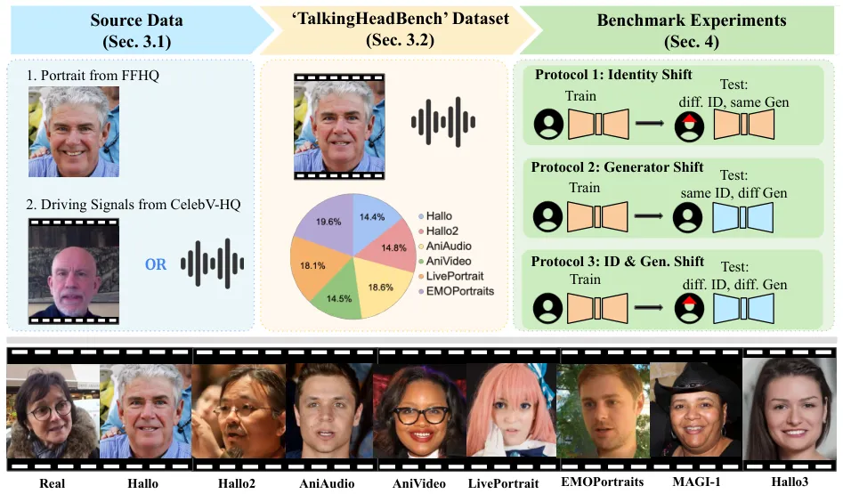
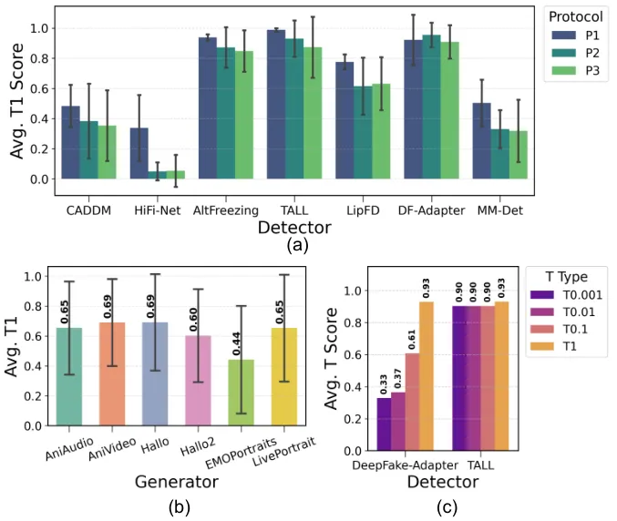
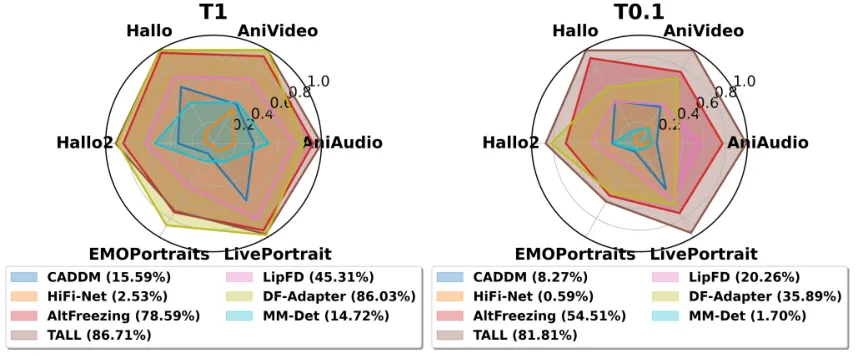
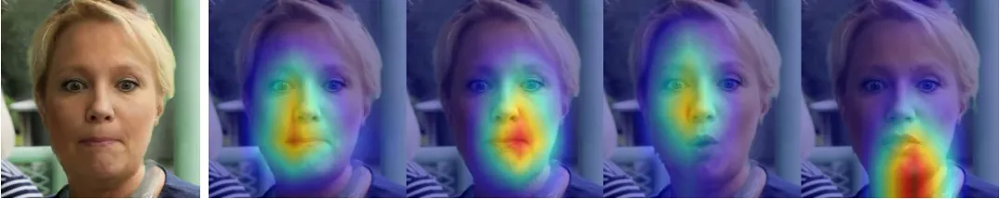
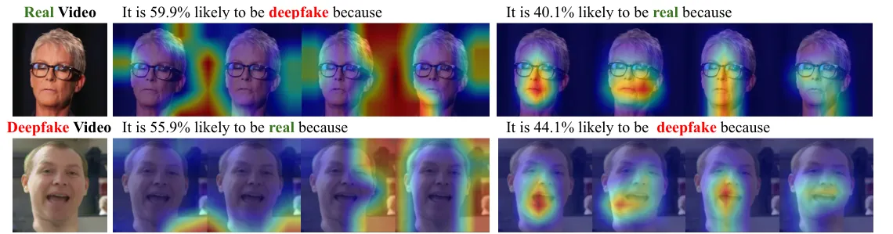
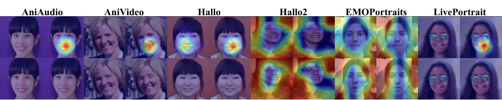
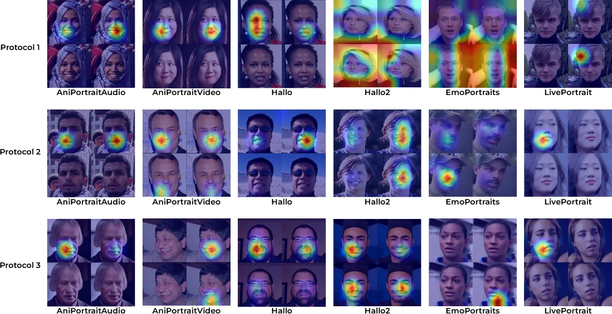
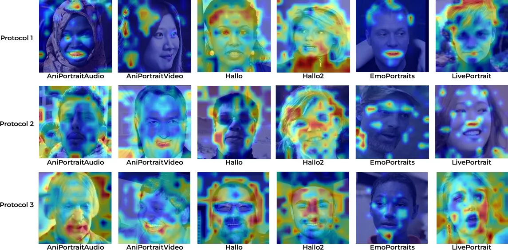

# TalkingHeadBench: A Multi-Modal Benchmark & Analysis of Talking-Head DeepFake Detection

Xinqi Xiong\*† Affiliation: University of North Carolina at Chapel Hill
Email: <xxiong@cs.unc.edu>    Prakrut Patel\* Affiliation: University of
North Carolina at Chapel Hill Email: <prakrut@cs.unc.edu>    Qingyuan
Fan\* Affiliation: University of North Carolina at Chapel Hill
Email: <lqi@cs.unc.edu>    Amisha Wadhwa\* Affiliation: University of
North Carolina at Chapel Hill Email: <ronisen@cs.unc.edu>    Sarathy
Selvam Affiliation: University of North Carolina at Chapel Hill
Email: <qfan@unc.edu>    Xiao Guo Affiliation: Michigan State University
Email: <wamish@unc.edu>    Luchao Qi Affiliation: University of North
Carolina at Chapel Hill Email: <sarathy@unc.edu>    Xiaoming Liu
Affiliation: Michigan State University    Roni Sengupta†
Email: [{guoxia11, liuxm}@msu.edu\*Equal contribution.†Corresponding
Authors.](mailto:) Affiliation: University of North Carolina at Chapel
Hill

###### Abstract

The rapid advancement of talking-head deepfake generation fueled by
advanced generative models has elevated the realism of synthetic videos
to a level that poses substantial risks in domains such as media,
politics, and finance. However, current benchmarks for deepfake
talking-head detection fail to reflect this progress, relying on
outdated generators and offering limited insight into model robustness
and generalization. We introduce TalkingHeadBench, a new benchmark
designed to address this gap, featuring talking-head videos from six
modern generators, with an additional two emerging generators used
exclusively for testing generalization. The dataset is built on an
expert-led curation process that filters over 60% of samples to remove
videos with noticeable artifacts, presenting a more difficult challenge
for detectors. Our evaluation protocols are designed to measure
generalization across identity and generator shifts. Benchmarking seven
state-of-the-art detectors reveals that models with high accuracy on
older datasets like FaceForensics++ show a significant performance drop
on our curated data, particularly at strict false positive rates (e.g.,
TPR@FPR=0.1%). In addition, we identify a trend where detectors focus on
background cues instead of facial features using Grad-CAM visualization.
Our benchmark aims to accelerate research towards more robust and
generalizable detection models in the face of rapidly evolving
generative techniques. We release our benchmark and dataset with all
data splits and protocols at
[https://anaxqx.github.io/talkingheadbench.github.io](https://anaxqx.github.io/talkingheadbench.github.io).

## 1 Introduction

Figure 1: Overview of the TalkingHeadBench dataset creation pipeline. We
use portrait images from FFHQ \[20\] as source and audio or video from
CelebV-HQ \[56\] as driving signal to generate talking-head deepfake
videos using 6 open-source generators for our core dataset. The images
at the bottom show sample outputs from these six generators as well as
from two additional emerging generators (MAGI-1 \[39\] and Hallo3 \[9\])
used for evaluating generalization. We then perform multi-stage data
curation to obtain 2994 high-quality deepfake videos along with 2312
real videos. Finally, we design three evaluation protocols to assess
detector robustness under distribution shifts in identity and generator
characteristics between training and testing sets.

Deepfake technology, known for its ability to manipulate facial features
and produce highly realistic synthetic videos, has seen rapid adoption
in entertainment \[24, 1\], marketing \[22\], and personalized content
creation \[31, 32, 48\]. Yet, these advancements also introduce serious
societal risks. Among deepfake types, talking-head deepfakes, which
generate highly realistic head-and-shoulder videos of individuals
speaking, are especially concerning. Driven by advanced generative
models, these videos are potent tools for spreading misinformation,
manipulating public discourse, and executing social engineering
attacks \[13, 38, 37\]. Their realism and ease of distribution make them
particularly dangerous in sensitive domains like politics, finance, and
media. In one real-world case, a finance worker was tricked into
transferring \$25 million during a video call with a deepfake
impersonating the company’s CFO \[27\]. These growing threats highlight
the urgent need to understand talking-head deepfakes and to develop
robust detection and mitigation strategies \[13, 44, 25\].

In response to the growing threats posed by talking-head deepfakes,
numerous facial deepfake benchmarks have been proposed (see Tab. 1),
which played a central role in advancing detection methods. However,
most existing benchmarks are not well-suited for the modern talking-head
landscape. Most deepfake datasets primarily feature face-swapping
techniques \[36\] rather than talking-head videos, which are generated
using different techniques. Although large-scale and collected in the
wild, these datasets often contain a high proportion of low-quality
samples with noticeable artifacts \[5, 53\], making it easier to train
detectors that ultimately perform poorly on more realistic deepfakes,
which pose a greater threat. This leaves a gap in reliably measuring the
performance of detectors against the more realistic manipulations
produced by the recent talking-head generators. To address these gaps,
we introduce TalkingHeadBench—the first manually curated,
multi-generator, multi-modal benchmark designed specifically for
evaluating detector robustness against state-of-the-art talking-head
deepfakes.

Our benchmark features high-quality synthetic videos generated with six
academic talking-head generators using both audio- and video-driven
diffusion and transformer-based models \[12, 8, 50, 47, 14\] in the
training dataset. To further test generalization, we evaluate models
against two emerging generators: an additional academic model
(Hallo3 \[9\]) and a commercial one (MAGI-1 \[39\]). To ensure dataset
quality, we use a five-stage expert curation protocol that removes over
60% of generated videos based on pre-defined artifact criteria. The
result is a challenging dataset of 2,994 high-quality talking-head
deepfakes from eight academic and commercial generators. This emphasis
on quality over quantity creates a more realistic evaluation setting. We
also carefully design evaluation protocols to assess the generalization
and robustness of state-of-the-art (SOTA) deepfake detectors \[11, 41,
51, 52, 26\] across identity and generator shifts in training and
testing data. In addition to benchmarking, we present a detailed error
analysis using Grad-CAM \[40\] to identify common failure cases of SOTA
detectors on different generators and inform future improvements in
detection strategies. We then note the limitations of SOTA detectors and
identify areas of improvement, and provide guidelines on what
performance future detectors should aspire to and how to analyze them.

We open-source the TalkingHeadBench benchmark with train-test data for
all generators across multiple protocols on our project page. In the
near future, we aim to build a more active benchmark repository by a)
developing API/code/metrics that also allow authors of new generators to
evaluate the ‘detectability’ of their videos; b) setting up two
leaderboards comparing generator and detector performance; c) updating
the list of generators and detectors every 6 months to accelerate the
development cycle.

Our main contributions are:

- •
  A highly curated benchmark for modern talking-head generation. We
  release TalkingHeadBench, a multi-modal and multi-generator dataset of
  2,994 high-quality deepfake videos, filtered from a much larger pool
  of deepfake videos using a multi-stage expert-led curation process.
- •
  An analysis of detector performance at strict thresholds. We show that
  standard metrics like AUC can obscure poor performance. On our
  benchmark, SOTA detectors exhibit sharp performance drops at more
  practical, low-FPR thresholds (e.g., TPR@FPR=0.1%).
- •
  A study of generalization across identity and generator shifts. Our
  structured protocols quantify the performance drop of detectors across
  these distribution shifts, showing the combined effect remains a
  difficult challenge.
- •
  An explainability analysis identifying semantic drift. Using Grad-CAM,
  we show that as generator quality improves, detectors tend to shift
  their focus from facial regions to background artifacts, exposing a
  common failure.

In summary, our benchmark demonstrates that while state-of-the-art
detectors attain high accuracy on existing deepfake detection benchmarks
\[36\], their performance drops markedly on TalkingHeadBench. This
degradation stems from the inclusion of advanced multi-modal generators,
deliberate shifts in identity and generator between training and testing
splits, and careful curation that eliminates obvious artifacts in the
deepfakes. Together, these factors highlight the need for developing
more robust deepfake detectors and establish our benchmark as a
foundation for driving future research in this direction.

|                          |              |                  |                   |          |      |         |         |
| ------------------------ | ------------ | ---------------- | ----------------- | -------- | ---- | ------- | ------- |
| Dataset                  | Talking-head | \# of Generators | Modality          | Curation | Year | Real \# | Fake \# |
| DeepFake-eval-2024 \[5\] | ✗            | N/A              | Video/Audio/Image | ✓        | 2025 | 1,208   | 767     |
| FakeAVCeleb \[23\]       | ✗            | Multiple         | Audio/Video       | ✓        | 2021 | 500     | 19,500  |
| FaceForensics++ \[36\]   | ✗            | Multiple         | Video             | ✓        | 2019 | 1,000   | 4,000   |
| LAV-DF \[4\]             | ✓\*          | Single           | Audio/Video       | ✗        | 2022 | 36,431  | 99,873  |
| AV-Deepfake1M \[2\]      | ✓\*          | Single           | Audio/Video       | ✗        | 2023 | 286,721 | 860,039 |
| PolyGlotFake \[18\]      | ✓\*          | Multiple         | Audio             | ✗        | 2024 | 766     | 14,472  |
| DF-40  \[53\]            | ✓            | Multiple         | Video/Image       | ✗        | 2024 | 1,590   | 1M+     |
| TalkingHeadBench (Ours)  | ✓            | Multiple         | Audio/Video       | ✓        | 2025 | 2,312   | 2,994   |

Table 1: Overview of Facial Deepfake Benchmarks. TalkingHeadBench is the
first manually curated, multi-modal, multi-generator benchmark focused
on talking-head deepfakes, specifically designed to evaluate detector
robustness and generalization. Curation removes $`\sim`$60% of
low-quality samples with obvious artifacts, ensuring a more realistic
and challenging benchmark. Generators marked with ✓\* use lip-sync-only
techniques.

## 2 Related Work

Deepfake generation has leveraged various facial manipulation techniques
over the years. Among them, face swapping methods \[30, 35, 6\] are
widely used, combining facial regions of various sources to create
synthetic videos. They often introduce visible artifacts such as
boundary inconsistency, lighting mismatch, or texture irregularity,
which modern detectors can learn to exploit easily.

Talking-head generation presents a different set of challenges. Unlike
face-swapping, which inserts a swapped facial region and often leaves
detectable boundary artifacts, talking-head models synthesize the entire
face in motion. These manipulations are driven by audio or video signals
and are characterized by their temporal properties and
speech-synchronized movements. This makes them a distinct class of
forgery that requires evaluation against detectors trained to spot not
just spatial inconsistencies, but also subtle temporal and behavioral
anomalies. Our benchmark is designed specifically to address this
category of deepfake.

Recently, talking-head generation has emerged as a more sophisticated
approach. These models synthesize the full face, including expressions
and lip motion, from a static portrait using audio or video driving
signals by eliminating the obvious seam-based flaws of earlier methods.
State-of-the-art diffusion-based talking-head models (see Tab. 2)
produce highly realistic outputs with synchronized audio-visual
features, significantly raising the detection difficulty.

Despite these advances, existing deepfake benchmarks remain limited in
scope. As shown in Tab. 1, most prior datasets either focus on older
GAN-based generators or target narrow manipulation types such as face
swapping (e.g., FakeAVCeleb \[23\] and FaceForensics++ \[36\]) or scrape
social media content without controlling of generators (e.g.,
DeepFake-eval-2024 \[5\]). While newer datasets like LAV-DF \[3\],
AV-Deepfake1M \[2\], and PolyGlobFake \[18\] incorporate talking-head
deepfakes, they mostly emphasize lip-sync-driven synthesis and lack
broader modality or generator diversity. Further, these datasets are
often massive but uncurated, resulting in many low-quality samples. In
contrast, our dataset is built using a curated collection of
cutting-edge diffusion-based talking-head generators spanning both audio
and video-driven modalities. Through manual inspection, we discarded
over 60% of generated videos due to visible artifacts (see Tab. 4),
ensuring that only high-quality, realistic samples remain—thereby
offering a more meaningful and challenging benchmark.

Recent detection methods (see Tab. 3), though effective on static and
unimodal datasets like FaceForensics++ \[36\], have not been thoroughly
evaluated against multi-modal diffusion-based deepfakes. To fill this
gap, we introduce a comprehensive benchmark that reflects the current
generation landscape. Our results show that SOTA detectors, which
achieve near-perfect accuracy on traditional benchmarks like
FaceForensics++, struggle significantly when tested on our dataset,
highlighting poor robustness to identity and generator shifts and
calling for stronger generalization capabilities.

|                    |               |                     |            |                   |
| ------------------ | ------------- | ------------------- | ---------- | ----------------- |
| Modality           | Framework     | Generator           | Venue      | Code Availability |
| Image, Audio       | Diffusion     | Hallo \[50\]        | arXiv24    | ✓                 |
| Image, Audio       | Diffusion     | Hallo2 \[8\]        | ICLR25     | ✓                 |
| Image, Audio, Text | Diffusion     | Hallo3 \[9\]        | CVPR25     | ✓                 |
| Image, Video       | Diffusion     | X-Portrait \[49\]   | SIGGRAPH24 | ✓                 |
| Image, Video       | Non-diffusion | LivePortrait \[14\] | arXiv24    | ✓                 |
| Image, Video       | Non-diffusion | EMOPortraits \[12\] | CVPR24     | ✓                 |
| Image, Video       | Non-diffusion | MCNet \[17\]        | ICCV23     | ✓                 |
| Image, Video       | Non-diffusion | FSRT \[34\]         | CVPR24     | ✗                 |
| Image, Audio/Video | Diffusion     | AniPortrait \[47\]  | arXiv24    | ✓                 |
| Image, Audio/Video | Diffusion     | SkyReels-A1 \[33\]  | arXiv25    | ✗                 |
| Image, Text        | Diffusion     | MAGI-1 \[39\]       | N/A        | ✓                 |

Table 2: Overview of talking-head generators, highlighted used for
creating the train and test sets of TalkingHeadBench.

|             |                 |                                |               |                   |
| ----------- | --------------- | ------------------------------ | ------------- | ----------------- |
| Modality    | Framework       | Detector                       | Venue         | Code Availability |
| Image       | CNN             | SBI \[43\]                     | CVPR22        | ✓                 |
| Image       | Neural Network  | CADDM \[11\]                   | CVPR23        | ✓                 |
| Image       | Neural Network  | HiFiNet\[16\]//HiFiNet++\[15\] | CVPR23/IJCV24 | ✓                 |
| Image       | Transformer     | DeepFake-Adapter \[41\]        | IJCV25        | ✓                 |
| Image       | Transformer     | GenConVit \[10\]               | arXiv25       | ✓                 |
| Image       | Transformer     | RFFR \[42\]                    | PR25          | ✓                 |
| Image       | Neural network  | LAA-Net \[29\]                 | CVPR24        | ✓                 |
| Video       | Transformer     | TALL \[51\]/TALL++ \[52\]      | ICCV23/IJCV24 | ✓                 |
| Video       | CNN             | AltFreezing \[46\]             | CVPR23        | ✗                 |
| Video       | CNN/Transformer | NACO \[55\]                    | ECCV24        | ✗                 |
| Video       | Neural network  | MM-Det \[45\]                  | NeurIPS24     | ✓                 |
| Video       | Neural network  | StyleFlow \[7\]                | CVPR24        | ✗                 |
| Audio/Video | Transformer     | LipFD \[26\]                   | NeurIPS 2024  | ✓                 |

Table 3: Overview of talking-head deepfake detectors, highlighted were
used in the paper.

## 3 Dataset Creation

This section details the creation process of our dataset, including data
sources, generation methods, curation procedures, statistics, and data
splits. See Fig. 1 for the overview.

### 3.1 Source Data and Generation Overview

To create a diverse deepfake benchmark dataset, we utilize publicly
available datasets containing images from FFHQ (Flickr-Faces-HQ) \[20\]
and videos of real people and audio of people talking from
CelebV-HQ \[56\], processed by a diverse suite of contemporary deepfake
generators. We select six open-source generators: Hallo \[50\],
Hallo2 \[8\], AniPortrait (Audio-driven) (AniAudio) \[47\], AniPortrait
(Video-driven) (AniVideo) \[47\], LivePortrait \[14\], and
EMOPortraits \[12\], aiming for diversity in both diffusion-based and
non-diffusion-based frameworks and driving signal modalities in both
video and audio, as summarized in Tab. 2. We choose these generators
because they are the latest SoTA generators with publicly available code
covering varying modalities and frameworks.

Additionally, we test generalization against two entirely unseen models:
Hallo3 \[9\], a recent academic generator, and MAGI-1 \[39\], a
commercial text-to-video model. These are used exclusively in our test
set to evaluate out-of-distribution robustness. Owing to computational
and cost limitations, these test sets are relatively small in size, but
they nevertheless provide a meaningful probe of model generalization. We
also explore other generators such as X-Portrait \[49\] and
MCNet \[17\], but do not include them in our dataset due to significant
artifacts observed.

Data Type \# Total \# Train \# Test Ratio Removed Hallo \[50\] 420 303
117 $`\sim 42\%`$ Hallo2 \[8\] 432 327 105 $`\sim 60\%`$ AniPortrait
(Audio) \[47\] 542 396 146 $`\sim 66.7\%`$ AniPortrait (Video) \[47\]
422 314 108 $`\sim 80\%`$ LivePortrait \[14\] 529 352 177 $`\sim 60\%`$
EMOPortraits \[12\] 573 381 192 $`\sim 50\%`$ MAGI-1 \[39\] 66 0 66
$`\sim 18\%`$ Hallo3 \[9\] 10 0 10 $`\sim 10\%`$ TOTAL Fakes 2994 2073
921 $`\sim 63\%`$

Table 4: TalkingHeadBench dataset statistics across generators.

### 3.2 Data Curation and Final Dataset Statistics

In order to create a high-quality dataset, we used a five-stage curation
pipeline conducted by experts on our team. This process removed
approximately 63% of the nearly 8,000 videos we initially generated,
ensuring the final dataset is not easily solved by detectors that rely
on simple artifacts.

1.  1.  Generator-Specific Artifact Definition: We analyzed videos from each
        generator to create a taxonomy of common artifacts, such as severe
        background warping or unnatural static hair. This formed a
        consistent set of rejection criteria, which are detailed in the
        supplementary.
2.  2.  Primary Review Pass: A curator reviewed all videos from a specific
        generator, removing samples that matched the artifact definitions or
        had other global distortions.
3.  3.  Cross-Validation by Experts: To ensure consistency, two other
        curators independently reviewed the remaining videos and removed any
        additional low-quality samples. Disagreements were resolved through
        discussion.
4.  4.  Detector-Based Final Checkpoint: To further refine the dataset’s
        difficulty, we passed the remaining videos through four pre-trained
        SOTA detectors. Any video detected with high confidence ($`\geq`$
        90% fake probability) across all four detectors was removed. This
        step filtered out samples that, while appearing plausible to humans,
        contained subtle but easily machine-detectable cues.
5.  5.  Identity-Separated Splits: The final curated set was partitioned
        into training and testing splits, with strict separation enforced by
        disallowing any overlap in source image-driving signal pairings
        across splits. The final dataset statistics are detailed in Tab. 4.

## 4 Benchmark Experiments

### 4.1 Evaluation Setup

AniAudio \[47\] AniVideo \[47\] Hallo \[50\] Hallo2 \[8\]
EMOPortraits \[12\] LivePortrait \[14\] Detector AUC T1 T0.1 Brier AUC
T1 T0.1 Brier AUC T1 T0.1 Brier AUC T1 T0.1 Brier AUC T1 T0.1 Brier AUC
T1 T0.1 Brier CADDM \[11\] 0.90 0.55 0.25 0.17 0.83 0.39 0.39 0.21 0.94
0.65 0.64 0.16 0.96 0.45 0.45 0.11 0.94 0.27 0.23 0.17 0.95 0.59 0.42
0.13 HiFi-Net \[16\] 0.95 0.47 0.27 0.09 0.95 0.66 0.41 0.09 0.93 0.39
0.19 0.11 0.92 0.22 0.12 0.12 0.81 0.03 0.01 0.25 0.90 0.26 0.04 0.12
AltFreezing \[46\] 1.00 0.93 0.71 0.03 1.00 0.91 0.75 0.05 1.00 0.97
0.97 0.03 1.00 0.95 0.88 0.05 1.00 0.93 0.89 0.04 1.00 0.94 0.89 0.04
TALL \[51\] 1.00 1.00 1.00 0.01 1.00 1.00 1.00 0.01 1.00 0.99 0.99 0.01
1.00 0.99 0.98 0.01 1.00 0.98 0.98 0.05 1.00 0.97 0.96 0.01 LipFD \[26\]
0.98 0.75 0.58 0.05 0.99 0.74 0.38 0.05 0.98 0.72 0.54 0.05 0.99 0.83
0.62 0.04 0.99 0.78 0.50 0.05 0.98 0.84 0.56 0.05 DF-Adapter \[41\] 0.99
0.58 0.06 0.01 1.00 1.00 0.15 0.01 1.00 0.99 0.11 0.01 1.00 0.99 0.98
0.01 1.00 0.99 0.25 0.01 1.00 0.98 0.41 0.01 MM-Det \[45\] 0.97 0.65
0.26 0.14 0.97 0.55 0.19 0.15 0.97 0.63 0.26 0.14 0.96 0.57 0.21 0.15
0.93 0.34 0.11 0.14 0.91 0.28 0.04 0.15

(a) Protocol 1 — Identity Shift Only.

AniAudio \[47\] AniVideo \[47\] Hallo \[50\] Hallo2 \[8\]
EMOPortraits \[12\] LivePortrait \[14\] Detector AUC T1 T0.1 Brier AUC
T1 T0.1 Brier AUC T1 T0.1 Brier AUC T1 T0.1 Brier AUC T1 T0.1 Brier AUC
T1 T0.1 Brier CADDM \[11\] 0.88 0.32 0.02 0.18 0.94 0.27 0.18 0.09 0.97
0.61 0.52 0.08 0.94 0.37 0.14 0.12 0.79 0.02 0.00 0.21 0.98 0.71 0.63
0.06 HiFi-Net \[16\] 0.88 0.08 0.01 0.16 0.82 0.16 0.06 0.18 0.82 0.02
0.00 0.20 0.48 0.02 0.00 0.45 0.58 0.01 0.00 0.34 0.85 0.01 0.01 0.20
AltFreezing \[46\] 1.00 0.97 0.82 0.02 1.00 0.94 0.66 0.02 1.00 0.98
0.87 0.01 0.98 0.71 0.53 0.06 0.96 0.69 0.52 0.08 1.00 0.94 0.78 0.02
TALL \[51\] 1.00 1.00 0.98 0.01 1.00 0.99 0.98 0.02 1.00 1.00 1.00 0.00
0.97 0.89 0.81 0.08 0.97 0.70 0.40 0.15 1.00 1.00 0.98 0.01 LipFD \[26\]
0.99 0.76 0.51 0.05 0.97 0.62 0.30 0.09 0.98 0.70 0.47 0.08 0.87 0.50
0.32 0.17 0.89 0.30 0.08 0.23 0.99 0.81 0.63 0.05 DF-Adapter \[41\] 1.00
1.00 0.83 0.01 1.00 1.00 1.00 0.00 1.00 1.00 0.73 0.01 0.97 0.80 0.68
0.15 0.99 0.93 0.80 0.13 1.00 1.00 0.99 0.01 MM-Det \[45\] 0.93 0.39
0.04 0.12 0.95 0.36 0.14 0.11 0.94 0.34 0.08 0.15 0.97 0.51 0.25 0.06
0.89 0.15 0.07 0.06 0.88 0.23 0.11 0.16

(b) Protocol 2 — Generator Shift Only.

AniAudio \[47\] AniVideo \[47\] Hallo \[50\] Hallo2 \[8\]
EMOPortraits \[12\] LivePortrait \[14\] Detector AUC T1 T0.1 Brier AUC
T1 T0.1 Brier AUC T1 T0.1 Brier AUC T1 T0.1 Brier AUC T1 T0.1 Brier AUC
T1 T0.1 Brier CADDM \[11\] 0.82 0.25 0.21 0.023 0.98 0.60 0.60 0.06 0.95
0.55 0.20 0.11 0.93 0.17 0.17 0.10 0.75 0.03 0.03 0.24 0.95 0.52 0.41
0.09 HiFi-Net \[16\] 0.88 0.03 0.01 0.17 0.86 0.27 0.11 0.16 0.84 0.00
0.00 0.18 0.48 0.00 0.00 0.44 0.61 0.01 0.00 0.34 0.84 0.01 0.00 0.27
AltFreezing \[46\] 1.00 0.87 0.78 0.03 1.00 0.94 0.88 0.03 1.00 0.95
0.89 0.02 0.99 0.85 0.64 0.04 0.95 0.58 0.26 0.08 0.99 0.90 0.56 0.03
TALL \[51\] 1.00 1.00 0.99 0.01 1.00 1.00 1.00 0.01 1.00 0.99 0.99 0.01
0.97 0.84 0.82 0.06 0.97 0.48 0.48 0.15 1.00 0.93 0.92 0.02 LipFD \[26\]
0.99 0.72 0.62 0.04 0.98 0.71 0.56 0.08 0.98 0.72 0.34 0.08 0.89 0.57
0.40 0.15 0.91 0.30 0.14 0.22 0.98 0.77 0.61 0.06 DF-Adapter \[41\] 1.00
0.93 0.16 0.02 1.00 0.99 0.94 0.01 1.00 1.00 0.95 0.00 0.98 0.88 0.80
0.09 0.98 0.70 0.53 0.14 1.00 0.95 0.56 0.03 MM-Det \[45\] 0.94 0.49
0.06 0.13 0.96 0.40 0.16 0.12 0.93 0.33 0.06 0.18 0.98 0.55 0.27 0.06
0.87 0.06 0.03 0.18 0.85 0.08 0.03 0.17

(c) Protocol 3 — Identity & Generator Shift Combined.

Table 5: Overall benchmark. Three protocols reported as stacked
subtables. Best numbers per generator in bold.

Benchmarking Objectives and Key Questions We perform a comprehensive
evaluation and analysis to answer the following questions:  
(i) How does the performance of the SOTA detectors change from
FaceForensics++ \[36\], where detectors have near-perfect accuracy, to
TalkingHeadBench?  
(ii) Can the SOTA detectors generalize across shifts in identity and
generator property?  
(iii) Which talking-head generators are easy or hard to detect, and
why?  
(iv) Which aspects of the TalkingHeadBench benchmark remain challenging
for the SOTA detectors and warrant further investigation?

SOTA Detectors To address these questions, we benchmark seven publicly
available SOTA deepfake detectors: CADDM \[11\], LipFD \[26\],
DeepFake-Adapter \[41\], TALL \[51\], AltFreezing \[46\], MM-Det \[45\],
and HiFi-Net \[16\]. Similar to the generators, we aim to diversify the
modalities and frameworks of our detectors, as shown in Tab. 3. These
seven detectors meet our goal of being the latest SOTA detectors with
available code, and together, they capture varying modalities.

Evaluation Protocols To systematically evaluate the generalization of
these SOTA detectors, we design three protocols:

P1 (Identity Shift Only) Evaluates generalization to unseen identities
within familiar generators. Models are trained on deepfakes from all
generators and real videos, then tested on each generator and real
videos, ensuring no overlap in identities between the training and test
sets. (see Tab. 5(a)).

P2 (Generator Shift) Evaluates generalization to an unseen generator.
Models are trained on remaining generators and real videos, then tested
on the held-out generator and real videos (see Tab. 5(b)).

P3 (Identity & Generator Shift) Evaluates generalization to an unseen
generator and identities. Using a leave-one-out approach, models are
trained on the train splits of remaining generators and real videos,
then tested on the test split of the held-out generator and real videos
(see Tab. 5(c)).

For these protocols, we select 1600 real videos from
FaceForensics++ \[36\] and CelebV-HQ \[56\], unseen during generation,
to match fake video numbers per protocol, and perform face comparison to
prevent identity leakage between train and test across real and fake
video sets.

Evaluation Metrics Detector performance under these protocols is
measured with three metrics: AUC, Brier Score, TPR@FPR=1% (T1), and
TPR@FPR=0.1% (T0.1), following IJB-C face benchmark \[28\]. Stricter
thresholds on FPR, e.g., T0.1, are more useful when these detectors are
applied at scale and only a small amount of bad detections are
tolerable. We will prioritize T1 for most analysis in this paper,
following its use in the IJB-C face benchmark, but later we will analyze
the detector performance across various thresholds in FPR. We classify
the performance of detectors as:  
Excellent: $`\geq`$0.99, Good: 0.95-0.99, Reasonable: 0.85-0.95, Fair:
0.75-0.85, and Poor: $`<`$0.75.

### 4.2 Impact of Generator and Identity Shifts

Protocol-Dependent Performance Shifts: Overall, detectors exhibit
performance shifts across protocols. In particular, average $`AUC`$ and
T1 scores tend to decline from P1 to P2, indicating that generator shift
(P2) poses greater challenges than identity shift (P1). This trend
continues in P3, where combined generator and identity shifts further
reduce performance as illustrated in Fig. 2a. For instance,
TALL’s \[51\] average T1 score decreases from 0.99 in P1 to 0.93 in P2
and 0.87 in P3. Despite these increasingly difficult conditions, TALL
and DeepFake-Adapter \[41\] maintain strong performance across all three
protocols, with DeepFake-Adapter’s lower score on P1 largely due to poor
performance on AniPortrait Audio \[47\](T1 = 0.58; see Tab. 5(a)). This
underscores the need to assess detectors not just by averages, but also
by generator-level sensitivity.

Generator Difficulty and Cross-Protocol Generalization: Fig. 2b shows
the variation of detector performance across generators.
EMOPortraits \[12\] stands out as the most challenging case, with
average T1 of only 0.44, far below all others. By contrast, the
remaining generators cluster within a narrower range of 0.60-0.69,
indicating more comparable levels of detectability. This sharp gap
emphasizes that while detectors maintain moderate robustness across most
generators, EMOPortraits remains a persistent failure case that reveals
their limitations under stricter thresholds.

Figure 2: Average performance scores across detectors and generators.
(a) shows the average T1 across all detectors for each evaluation
protocol. Detector performance consistently declines from P1 to P2, and
further in P3, highlighting the increasing difficulty of generalization.
These results suggest that evaluating detectors solely on average
performance may obscure generator-specific weaknesses. (b) shows the
average T1 score per generator across all detectors. EMOPortraits
emerges as the most challenging generator, while the others fall within
a narrower range of 0.60–0.69, indicating relatively comparable levels
of detectability. (c) presents the average TPR at varying FPR thresholds
for TALL and DeepFake-Adapter. TALL maintains high TPR even at extreme
thresholds (e.g., FPR=0.001), demonstrating strong robustness. In
contrast, DeepFake-Adapter exhibits a sharp performance drop as the
threshold tightens, highlighting its reduced reliability under stricter
operating conditions.

### 4.3 Detector Robustness and SOTA Evaluation

Overall Robustness Profile: While detailed per protocol analysis is
valuable, evaluating robustness across thresholds provides a
comprehensive view of a detector’s generalization capabilities. Fig. 3
summarizes performance across all generators, averaged over protocols,
for T1 and T0.1 thresholds. High and balanced coverage across all axes
indicates consistent generalization across identity, generator, and
joint shifts—crucial for handling unseen data from future SOTA
generators and varying identities. At T1 (Fig. 3a),
DeepFake-Adapter \[41\] and TALL \[51\] exhibit strong performance
across most generators, with DeepFake-Adapter excelling on
LivePortrait \[14\], Hallo \[50\], and AniPortraitVideo \[47\]. However,
when the threshold is tightened to T0.1 (Fig. 3b), DeepFake-Adapter’s
performance drops sharply—particularly for AniPortraitAudio \[47\] and
EMOPortraits \[12\]—indicating reduced robustness under stricter
constraints. In contrast, TALL retains high scores across most
generators at T0.1, suggesting better threshold-level resilience and
stronger generalization under a low false positive rate. We also
evaluate detector performance generalizing to unseen generators such as
commercial generator MAGI-1 \[39\] and academic generator Hallo3 \[9\].
We observe similar trend whereas the best-performing models, TALL and
DeepFake-Adapter, maintain high detection scores. We include the full
result in the Supplementary.

Performance across different FPR thresholds: While our primary
evaluation focuses on T1 due to its importance in deepfake detection
scenarios, analyzing stricter thresholds such as T0.1, T0.01, T0.001
also provides valuable insights into overall detector reliability. As
shown in Fig. 2c, even though both TALL and DeepFake-Adapter achieve
$`\geq`$ 0.90 for T1, while FPR decreases, we notice a significant drop
for DeepFake-Adapter. This indicates its reduced reliability in
real-world applications where minimizing such false accusations is
paramount. Meanwhile, TALL demonstrates robust performance, maintaining
a consistently high true positive rate even at these very low FPRs,
highlighting its suitability for deployment in sensitive environments.

Figure 3: Detector performance across generators measured by T1 and
T0.1, averaged over all protocols. (a) shows T1 result, where
DeepFake-Adapter and TALL demonstrate strong generalization across
identity, generator, and joint shifts. (b) shows stricter T0.1 result,
where most detectors have a noticeable drop, highlighting challenges in
maintaining high recall under low FPR. Despite this, TALL remains the
most robust, showing consistent performance across generators even under
tighter operating conditions.

### 4.4 Generalization to Emerging Generators

To simulate a real-world scenario, we evaluated detectors against
deepfakes from emerging academic generator Hallo3 \[9\] and commercial
generator MAGI-1 \[39\], which were not seen during training. The
results, provided in supplementary (Section 4), show that top-performing
models like TALL and AltFreezing maintained high accuracy, suggesting
that training on the diverse and curated set in TalkingHeadBench enables
detectors to handle novel generator architectures. This indicates the
detectors have learned a fundamental representation of talking-head
artifacts beyond overfitting to specific generator fingerprints.

### 4.5 Error Analysis and Explainability

The quantitative results highlight areas requiring deeper investigation,
for instance, the poor performance of most detectors against
EMOPortraits \[12\], particularly in P3 where T1 scores drop
significantly. Similarly, CADDM \[11\] underperforms consistently on
TalkingHeadBench, indicating a need to examine its limitations more
closely.

We leverage explainability techniques like Grad-CAM \[40\] to visualize
the regions and features that detectors focus their predictions on. We
demonstrate an example for TALL \[51\] since it achieves the overall
best performance on our dataset. Other detectors are in the
supplementary.

Failure Case Analysis: On the EMOPortraits dataset in P3-TALL \[51\]’s
worst performing scenario (see Tab. 5(c)), failure cases reveal that the
model misclassifies both real and fake videos due to reliance on
background cues. As shown in Fig. 5, real and fake videos are getting
misclassified due to the model’s attention being disproportionately
focused on the background, despite meaningful facial cues suggesting the
correct label. This indicates a weakness in TALL’s generalization: it is
overly influenced by background artifacts, likely due to training bias,
and fails to localize attention to the face under combined identity and
generator shifts.

Figure 4: Success case of TALL on EMOPortrait (P3): the model correctly
detects a deepfake by focusing on the neck, a known region of visual
artifacts in EMOPortrait. This shows cross-dataset generalization
despite the rarity of such artifacts in training data.

Success Case Analysis: In contrast to its failures, TALL demonstrates
effective generalization in certain EMOPortraits \[12\] videos under P3,
as shown in Fig. 4. The model accurately classifies a deepfake by
focusing on the neck region, which is known to exhibit artifacts in
EMOPortraits. Notably, this success occurs despite such artifacts being
uncommon in other datasets used during training. This suggests
TALL \[51\] has transferred knowledge from broader manipulation cues
across datasets. The focused activation around the lower face and neck
reflects meaningful model behavior and highlights its potential for
cross-domain generalization.

|                     |          |          |        |
| ------------------- | -------- | -------- | ------ |
| Generator           | TPs (P1) | FNs (P3) | % Drop |
| EMOPortraits \[12\] | 188      | 72       | 38.30% |
| Hallo2 \[8\]        | 102      | 9        | 8.82%  |
| LivePortrait \[14\] | 168      | 5        | 2.98%  |

Table 6: Breakdown of high-confidence true positives (TPs)
($`\geq 0.9`$) in P1 that become false negatives (FNs) in P3 for TALL. A
large drop from confident predictions in P1 to errors in P3 indicates
poor generalization across generator shifts.

Tracking Generalization Failures from Confident Predictions: To
understand detector failures under distribution shifts, we track how
high-confidence true positives (TPs) in P1 transition under P3. As shown
in Tab. 6, for TALL—our best-performing detector—38.3% of EMOPortraits
samples confidently classified in P1 (Prediction $`\geq`$ 0.9) are
misclassified as false negatives in P3. This drop suggests TALL
struggles to generalize when both identity and generator properties
change. In contrast, TALL shows only a 2.98% drop from P1 to P3 on
LivePortrait, highlighting that some generators pose far more severe
generalization challenges. These results reinforce that P3 degradation
is not random but rooted in generator-specific variation, with
EMOPortraits emerging as a valuable stress test for detector evaluation.

Protocol-Specific Feature Reliance: To further understand detector
behavior across generators, Fig. 6 presents Grad-CAM visualizations of
TALL on samples from all six generators in Protocol 1, where we can
study the bias of detectors to specific generator characteristics using
the smallest train-test data distribution shift in P1. For generators
such as AniPortrait (Audio/Video), Hallo, and LivePortrait, the model
predominantly focuses on the central facial region, aligning well with
human-interpretable deepfake cues. However, for Hallo2 and EMOPortraits,
attention shifts away from facial features and toward areas surrounding
the head. This may suggest: either the facial features in these
generators are realistic enough to fool the detector, or the model has
learned to rely on peripheral artifacts (e.g., spatial warping in Hallo2
or neck distortions in EMOPortraits) as key detection signals. Such
behavior indicates both progress in generator realism and potential
over-reliance on non-facial cues in certain detector architectures.

Figure 5: Failure case from TALL on EMOPortraits (P3):
misclassifications driven by attention to background regions rather than
facial features. Despite correct facial cues, the model’s focus on
irrelevant background areas leads to incorrect predictions.

Figure 6: Grad-CAM activation map from the TALL model on P1 samples
across all six generators.

### 4.6 Guidance for Future Research using TalkingHeadBench

This benchmark underscores several critical areas for future research in
deepfake detection.

Limitations of SOTA Detectors. Our analysis shows that while models like
TALL \[51\] and DeepFake-Adapter \[41\] perform strongly across most
generators, there remains room for improvement in achieving consistent
excellence across domains. Specifically, TALL achieves exceptional T1
scores on 3 of 6 generators and no worse than fair on the others, while
DeepFake-Adapter reaches exceptional on 2 and stays within reasonable to
fair elsewhere. Notably, both models are jointly exceptional only on
AniPortraitVideo \[47\] and Hallo \[50\], suggesting detectors still
struggle to generalize uniformly across diverse generation methods.

Open Challenges. While our analysis offers insights into robustness,
several aspects of TalkingHeadBench remain difficult. These include (i)
handling generators like EMOPortraits \[12\] and Hallo2 \[8\], where
SOTA detectors reach only 70% and 88% T1 in P3; (ii) reducing
degradation in P3 where both identity and generator differ between
splits, as all detectors except DF-Adapter degrade significantly; (iii)
overcoming reliance on background artifacts—as shown in Sec. 4.5—which
causes models to ignore relevant facial features. These challenges
highlight the need for detectors with stronger domain adaptation,
semantic attention, and modality-aware training to handle real-world
deepfakes more reliably.

Future Objective.  
(a) Performance: The best model, TALL \[51\], reaches excellent T1
($`>99\%`$) on only 3/6 generators in P3, while reaching $`\sim`$90% for
Hallo2 and LivePortrait and $`\sim`$80% for EMOPortraits. Future
research should strive for $`>99\%`$ in both T1 and T0.1 across all 6
detectors and protocols.  
(b) Analysis: TalkingHeadBench and its protocols offer the granularity
to pinpoint weaknesses and guide improvements. Research should
prioritize reducing drops in challenging generators (e.g., EMOPortraits,
Hallo2), exploring domain adaptation, and enhancing sensitivity to
subtle artifacts while avoiding overfitting to background cues.  
(c) Evolving Benchmark: A persistent challenge is that benchmarks lag
behind generative models, quickly becoming outdated. While
TalkingHeadBench on Hugging Face provides static splits, we aim to
evolve it for both detector and generator communities. This includes (i)
APIs for authors to test detectability, (ii) dual leaderboards to track
progress, (iii) adding generators with lower detectability, and (iv)
removing generators easily detectable ($`>99\%`$ T0.1) by most detectors
every six months. This evolving benchmark will accelerate innovation and
strengthen detection systems against newer generators.

By addressing these areas, the community can move towards deepfake
detectors that are more accurate, robust, reliable, and trustworthy
across diverse conditions encountered in real-world scenarios.

## 5 Conclusions, Broad Impacts, and Limitations

We introduce TalkingHeadBench, a comprehensive benchmark utilizing
contemporary talking-head generators to stress-test deepfake detectors
under realistic distribution shifts. Our evaluations reveal critical
gaps: even state-of-the-art detectors struggle with generalization
across changes in identity and generator, particularly with challenging
fakes like EMOPortraits \[12\], often due to over-reliance on non-facial
artifacts. TalkingHeadBench will broadly impact the community by
providing a standardized, challenging benchmark that reflects modern
deepfake realism and complexity. We will provide open access to the
dataset, evaluation protocols, and baseline code.

While we acknowledge one potential risk for the benchmark is that it
could facilitate more sophisticated talking-head generation techniques,
which could be potentially misused for deceptive or malicious purposes,
our primary objective is to catalyze research into more robust,
generalizable, and artifact-aware detection methods.

The dataset only contains a finite number of videos and identities
derived from FFHQ \[20\] and CelebV-HQ \[56\], which might not represent
the diversity of real-world deepfakes that can be exhibited. While we
focus on creating high-quality forgeries, we acknowledge that our
dataset can inherit the demographic imbalances from the public source
datasets. We provide a detailed demographic audit in the Supplementary
for transparency, and identify notable disparities across racial and age
groups, while gender bias is minimal. In the future, we will set up
leaderboards that allow performance comparison among newly developed
generators and detectors. Additionally, we will conduct regular fairness
audits, applying both group-based and individual fairness metrics to
ensure robustness in our future leaderboard as new generators emerge.
This benchmark serves as a crucial resource for developing trustworthy
deepfake detection systems, essential for mitigating the increasing
societal risks posed by manipulated media.

## 6 Acknowledgement

This research was supported in part by Lenovo Research (Morrisville,
NC). We gratefully acknowledge the invaluable support and assistance of
the members of the Mobile Technology Innovations Lab.

## References

- \[1\] M. Abdolahnejad and P. X. Liu (2020) Deep learning for face
  image synthesis and semantic manipulations: a review and future
  perspectives. Artificial Intelligence Review 53 (8), pp. 5847–5880
  (en). External Links: ISSN 1573-7462,
  [Link](https://doi.org/10.1007/s10462-020-09835-4),
  [Document](https://dx.doi.org/10.1007/s10462-020-09835-4) Cited by:
  §1.
- \[2\] Z. Cai, S. Ghosh, A. P. Adatia, M. Hayat, A. Dhall, T. Gedeon,
  and K. Stefanov (2024) AV-deepfake1m: a large-scale llm-driven
  audio-visual deepfake dataset. In Proceedings of the 32nd ACM
  International Conference on Multimedia, pp. 7414–7423. Cited by: Table
  1, §2.
- \[3\] Z. Cai, S. Ghosh, A. Dhall, T. Gedeon, K. Stefanov, and M.
  Hayat (2023) Glitch in the matrix: a large scale benchmark for content
  driven audio–visual forgery detection and localization. Computer
  Vision and Image Understanding 236, pp. 103818. Cited by: §2.
- \[4\] Z. Cai, K. Stefanov, A. Dhall, and M. Hayat (2022) Do you really
  mean that? content driven audio-visual deepfake dataset and multimodal
  method for temporal forgery localization. In 2022 International
  Conference on Digital Image Computing: Techniques and Applications
  (DICTA), pp. 1–10. Cited by: Table 1.
- \[5\] N. A. Chandra, R. Murtfeldt, L. Qiu, A. Karmakar, H. Lee, E.
  Tanumihardja, K. Farhat, B. Caffee, S. Paik, C. Lee, et al. (2025)
  Deepfake-eval-2024: a multi-modal in-the-wild benchmark of deepfakes
  circulated in 2024. arXiv preprint arXiv:2503.02857. Cited by: Table
  1, §1, §2.
- \[6\] R. Chen, X. Chen, B. Ni, and Y. Ge (2020) Simswap: an efficient
  framework for high fidelity face swapping. In Proceedings of the 28th
  ACM international conference on multimedia, pp. 2003–2011. Cited by:
  §2.
- \[7\] J. Choi, T. Kim, Y. Jeong, S. Baek, and J. Choi (2024)
  Exploiting style latent flows for generalizing deepfake video
  detection. In Proceedings of the IEEE/CVF conference on computer
  vision and pattern recognition, pp. 1133–1143. Cited by: Table 3.
- \[8\] J. Cui, H. Li, Y. Yao, H. Zhu, H. Shang, K. Cheng, H. Zhou, S.
  Zhu, and J. Wang (2024) Hallo2: long-duration and high-resolution
  audio-driven portrait image animation. arXiv preprint
  arXiv:2410.07718. Cited by: §B.2, §D.3, Table 7, Table 8, §1, Table 2,
  §3.1, Table 4, §4.6, 5(a), 5(b), 5(c), Table 6.
- \[9\] J. Cui, H. Li, Y. Zhan, H. Shang, K. Cheng, Y. Ma, S. Mu, H.
  Zhou, J. Wang, and S. Zhu (2024) Hallo3: highly dynamic and realistic
  portrait image animation with video diffusion transformer. arXiv
  preprint arXiv:2412.00733. Cited by: §B.2, Figure 1, Figure 1, §1,
  Table 2, §3.1, Table 4, §4.3, §4.4.
- \[10\] D. W. Deressa, H. Mareen, P. Lambert, S. Atnafu, Z. Akhtar,
  and G. V. Wallendael (2025) GenConViT: deepfake video detection using
  generative convolutional vision transformer. External Links:
  2307.07036, [Link](https://arxiv.org/abs/2307.07036) Cited by: Table 3.
- \[11\] S. Dong, J. Wang, R. Ji, J. Liang, H. Fan, and Z. Ge (2023)
  Implicit identity leakage: the stumbling block to improving deepfake
  detection generalization. In Proceedings of the IEEE/CVF Conference on
  Computer Vision and Pattern Recognition, pp. 3994–4004. Cited by:
  §B.3, Table 7, Table 8, §1, Table 3, §4.1, §4.5, 5(a), 5(b), 5(c).
- \[12\] N. Drobyshev, A. B. Casademunt, K. Vougioukas, Z. Landgraf, S.
  Petridis, and M. Pantic (2024) Emoportraits: emotion-enhanced
  multimodal one-shot head avatars. In Proceedings of the IEEE/CVF
  Conference on Computer Vision and Pattern Recognition, pp. 8498–8507.
  Cited by: §B.2, §D.5, Table 7, Table 8, §1, Table 2, §3.1, Table 4,
  §4.2, §4.3, §4.5, §4.5, §4.6, 5(a), 5(b), 5(c), Table 6, §5.
- \[13\] Á. F. Gambín, A. Yazidi, A. Vasilakos, H. Haugerud, and Y.
  Djenouri (2024) Deepfakes: current and future trends. Artificial
  Intelligence Review 57 (3), pp. 64. External Links: ISSN 1573-7462,
  [Link](https://doi.org/10.1007/s10462-023-10679-x),
  [Document](https://dx.doi.org/10.1007/s10462-023-10679-x) Cited by:
  §1.
- \[14\] J. Guo, D. Zhang, X. Liu, Z. Zhong, Y. Zhang, P. Wan, and D.
  Zhang (2024) Liveportrait: efficient portrait animation with stitching
  and retargeting control. arXiv preprint arXiv:2407.03168. Cited by:
  §B.2, §D.1, Table 7, Table 8, §1, Table 2, §3.1, Table 4, §4.3, 5(a),
  5(b), 5(c), Table 6.
- \[15\] X. Guo, X. Liu, I. Masi, and X. Liu (2024) Language-guided
  hierarchical fine-grained image forgery detection and localization.
  International Journal of Computer Vision, pp. 1–22. Cited by: Table 3.
- \[16\] X. Guo, X. Liu, Z. Ren, S. Grosz, I. Masi, and X. Liu (2023)
  Hierarchical fine-grained image forgery detection and localization. In
  Proceedings of the IEEE/CVF Conference on Computer Vision and Pattern
  Recognition, pp. 3155–3165. Cited by: §B.3, Table 7, Table 8, Table 3,
  §4.1, 5(a), 5(b), 5(c).
- \[17\] F. Hong and D. Xu (2023) Implicit identity representation
  conditioned memory compensation network for talking head video
  generation. In Proceedings of the IEEE/CVF International Conference on
  Computer Vision, pp. 23062–23072. Cited by: Table 2, §3.1.
- \[18\] Y. Hou, H. Fu, C. Chen, Z. Li, H. Zhang, and J. Zhao (2024)
  PolyGlotFake: a novel multilingual and multimodal deepfake dataset.
  External Links: 2405.08838, [Link](https://arxiv.org/abs/2405.08838)
  Cited by: Table 1, §2.
- \[19\] K. Karkkainen and J. Joo (2021) Fairface: face attribute
  dataset for balanced race, gender, and age for bias measurement and
  mitigation. In Proceedings of the IEEE/CVF winter conference on
  applications of computer vision, pp. 1548–1558. Cited by: Appendix G.
- \[20\] T. Karras, S. Laine, and T. Aila (2019) A style-based generator
  architecture for generative adversarial networks. In Proceedings of
  the IEEE/CVF conference on computer vision and pattern recognition,
  pp. 4401–4410. Cited by: Figure 1, Figure 1, §3.1, §5.
- \[21\] T. Karras, S. Laine, and T. Aila (2019) A Style-Based Generator
  Architecture for Generative Adversarial Networks. arXiv. External
  Links: [Link](http://arxiv.org/abs/1812.04948) Cited by: 1st item,
  §C.1.
- \[22\] A. Kaur, A. Noori Hoshyar, V. Saikrishna, S. Firmin, and F.
  Xia (2024) Deepfake video detection: challenges and opportunities.
  Artificial Intelligence Review 57 (6), pp. 159 (en). External Links:
  ISSN 1573-7462, [Link](https://doi.org/10.1007/s10462-024-10810-6),
  [Document](https://dx.doi.org/10.1007/s10462-024-10810-6) Cited by:
  §1.
- \[23\] H. Khalid, S. Tariq, M. Kim, and S. S. Woo (2021) FakeAVCeleb:
  a novel audio-video multimodal deepfake dataset. arXiv preprint
  arXiv:2108.05080. Cited by: Table 1, §2.
- \[24\] K. Liu, I. Perov, D. Gao, N. Chervoniy, W. Zhou, and W.
  Zhang (2023) Deepfacelab: Integrated, flexible and extensible
  face-swapping framework. Pattern Recognition 141, pp. 109628. External
  Links: ISSN 0031-3203,
  [Link](https://www.sciencedirect.com/science/article/pii/S0031320323003291),
  [Document](https://dx.doi.org/10.1016/j.patcog.2023.109628) Cited by:
  §1.
- \[25\] P. Liu, Q. Tao, and J. T. Zhou (2025) Evolving from
  Single-modal to Multi-modal Facial Deepfake Detection: Progress and
  Challenges. arXiv. Note: arXiv:2406.06965 \[cs\] External Links:
  [Link](http://arxiv.org/abs/2406.06965),
  [Document](https://dx.doi.org/10.48550/arXiv.2406.06965) Cited by: §1.
- \[26\] W. Liu, T. She, J. Liu, B. Li, D. Yao, and R. Wang (2024) Lips
  are lying: spotting the temporal inconsistency between audio and
  visual in lip-syncing deepfakes. Advances in Neural Information
  Processing Systems 37, pp. 91131–91155. Cited by: §B.3, §1, Table 3,
  §4.1, 5(a), 5(b), 5(c).
- \[27\] H. C. Magramo (2024) Finance worker pays out \$25 million after
  video call with deepfake ‘chief financial officer’. (en). External
  Links:
  [Link](https://www.cnn.com/2024/02/04/asia/deepfake-cfo-scam-hong-kong-intl-hnk)
  Cited by: §1.
- \[28\] B. Maze, J. Adams, J. A. Duncan, N. Kalka, T. Miller, C.
  Otto, A. K. Jain, W. T. Niggel, J. Anderson, J. Cheney, et al. (2018)
  Iarpa janus benchmark-c: face dataset and protocol. In 2018
  international conference on biometrics (ICB), pp. 158–165. Cited by:
  §4.1.
- \[29\] D. Nguyen, N. Mejri, I. P. Singh, P. Kuleshova, M. Astrid, A.
  Kacem, E. Ghorbel, and D. Aouada (2024) Laa-net: localized artifact
  attention network for quality-agnostic and generalizable deepfake
  detection. In Proceedings of the IEEE/CVF Conference on Computer
  Vision and Pattern Recognition, pp. 17395–17405. Cited by: Table 3.
- \[30\] Y. Nirkin, Y. Keller, and T. Hassner (2019) Fsgan: subject
  agnostic face swapping and reenactment. In Proceedings of the IEEE/CVF
  international conference on computer vision, pp. 7184–7193. Cited by:
  §2.
- \[31\] L. Qi, J. Wu, B. Gong, A. N. Wang, D. W. Jacobs, and R.
  Sengupta (2024) MyTimeMachine: personalized facial age transformation.
  arXiv preprint arXiv:2411.14521. Cited by: §1.
- \[32\] L. Qi, J. Wu, A. N. Wang, S. Wang, and R. Sengupta (2025)
  My3DGen: a scalable personalized 3d generative model. In 2025 IEEE/CVF
  Winter Conference on Applications of Computer Vision (WACV),
  pp. 961–972. Cited by: §1.
- \[33\] D. Qiu, Z. Fei, R. Wang, J. Bai, C. Yu, M. Fan, G. Chen, and X.
  Wen (2025) SkyReels-a1: expressive portrait animation in video
  diffusion transformers. External Links: 2502.10841,
  [Link](https://arxiv.org/abs/2502.10841) Cited by: Table 2.
- \[34\] A. Rochow, M. Schwarz, and S. Behnke (2024) Fsrt: facial scene
  representation transformer for face reenactment from factorized
  appearance head-pose and facial expression features. In Proceedings of
  the IEEE/CVF conference on computer vision and pattern recognition,
  pp. 7716–7726. Cited by: Table 2.
- \[35\] F. Rosberg, E. E. Aksoy, F. Alonso-Fernandez, and C.
  Englund (2023) Facedancer: pose-and occlusion-aware high fidelity face
  swapping. In Proceedings of the IEEE/CVF winter conference on
  applications of computer vision, pp. 3454–3463. Cited by: §2.
- \[36\] A. Rossler, D. Cozzolino, L. Verdoliva, C. Riess, J. Thies,
  and M. Nießner (2019) Faceforensics++: learning to detect manipulated
  facial images. In Proceedings of the IEEE/CVF international conference
  on computer vision, pp. 1–11. Cited by: 1st item, Table 1, §1, §1, §2,
  §2, §4.1, §4.1.
- \[37\] S. Saif, S. Tehseen, and S. S. Ali (2024) Fake news or real?
  Detecting deepfake videos using geometric facial structure and graph
  neural network. Technological Forecasting and Social Change 205,
  pp. 123471. External Links: ISSN 0040-1625,
  [Link](https://www.sciencedirect.com/science/article/pii/S0040162524002671),
  [Document](https://dx.doi.org/10.1016/j.techfore.2024.123471) Cited
  by: §1.
- \[38\] M. L. Saini, A. Patnaik, Mahadev, D. C. Sati, and R.
  Kumar (2024) Deepfake Detection System Using Deep Neural Networks. In
  2024 2nd International Conference on Computer, Communication and
  Control (IC4), pp. 1–5. External Links:
  [Link](https://ieeexplore.ieee.org/document/10486659),
  [Document](https://dx.doi.org/10.1109/IC457434.2024.10486659) Cited
  by: §1.
- \[39\] Sand-AI (2025) MAGI-1: autoregressive video generation at
  scale. External Links:
  [Link](https://static.magi.world/static/files/MAGI_1.pdf) Cited by:
  §B.2, Figure 1, Figure 1, §1, Table 2, §3.1, Table 4, §4.3, §4.4.
- \[40\] R. R. Selvaraju, M. Cogswell, A. Das, R. Vedantam, D. Parikh,
  and D. Batra (2019) Grad-cam: visual explanations from deep networks
  via gradient-based localization. International Journal of Computer
  Vision 128 (2), pp. 336–359. External Links: ISSN 1573-1405,
  [Link](http://dx.doi.org/10.1007/s11263-019-01228-7),
  [Document](https://dx.doi.org/10.1007/s11263-019-01228-7) Cited by:
  §1, §4.5.
- \[41\] R. Shao, T. Wu, L. Nie, and Z. Liu (2025) Deepfake-adapter:
  dual-level adapter for deepfake detection. International Journal of
  Computer Vision, pp. 1–16. Cited by: §B.3, Table 7, Table 8, §F.2, §1,
  Table 3, §4.1, §4.2, §4.3, §4.6, 5(a), 5(b), 5(c).
- \[42\] L. Shi, J. Zhang, Z. Ji, J. Bai, and S. Shan (2025) Real face
  foundation representation learning for generalized deepfake detection.
  Pattern Recognition 161, pp. 111299. Cited by: Table 3.
- \[43\] K. Shiohara and T. Yamasaki (2022) Detecting deepfakes with
  self-blended images. In Proceedings of the IEEE/CVF conference on
  computer vision and pattern recognition, pp. 18720–18729. Cited by:
  Table 3.
- \[44\] K. K. Sirra, S. Mogalla, and K. B. Madhuri (2024) CSSLnO: Cat
  Swarm Sea Lion Optimization-based deep learning for fake news
  detection from social media. International Journal of Information
  Technology 16 (7), pp. 4225–4241 (en). External Links: ISSN 2511-2112,
  [Link](https://doi.org/10.1007/s41870-024-01943-6),
  [Document](https://dx.doi.org/10.1007/s41870-024-01943-6) Cited by:
  §1.
- \[45\] X. Song, X. Guo, J. Zhang, Q. Li, L. Bai, X. Liu, G. Zhai,
  and X. Liu (2025) On learning multi-modal forgery representation for
  diffusion generated video detection. External Links: 2410.23623,
  [Link](https://arxiv.org/abs/2410.23623) Cited by: §B.3, Table 3,
  §4.1, 5(a), 5(b), 5(c).
- \[46\] Z. Wang, J. Bao, W. Zhou, W. Wang, and H. Li (2023) Altfreezing
  for more general video face forgery detection. In Proceedings of the
  IEEE/CVF conference on computer vision and pattern recognition,
  pp. 4129–4138. Cited by: §B.3, Table 3, §4.1, 5(a), 5(b), 5(c).
- \[47\] H. Wei, Z. Yang, and Z. Wang (2024) Aniportrait: audio-driven
  synthesis of photorealistic portrait animation. arXiv preprint
  arXiv:2403.17694. Cited by: §B.2, §D.4, Table 7, Table 7, Table 8,
  Table 8, §1, Table 2, §3.1, Table 4, Table 4, §4.2, §4.3, §4.6, 5(a),
  5(a), 5(b), 5(b), 5(c), 5(c).
- \[48\] Y. Wei, Y. Zheng, Y. Zhang, M. Liu, Z. Ji, L. Zhang, and W.
  Zuo (2025) Personalized Image Generation with Deep Generative Models:
  A Decade Survey. arXiv. Note: arXiv:2502.13081 \[cs\] External Links:
  [Link](http://arxiv.org/abs/2502.13081),
  [Document](https://dx.doi.org/10.48550/arXiv.2502.13081) Cited by: §1.
- \[49\] Y. Xie, H. Xu, G. Song, C. Wang, Y. Shi, and L. Luo (2024)
  X-portrait: expressive portrait animation with hierarchical motion
  attention. In ACM SIGGRAPH 2024 Conference Papers, pp. 1–11. Cited by:
  Table 2, §3.1.
- \[50\] M. Xu, H. Li, Q. Su, H. Shang, L. Zhang, C. Liu, J. Wang, Y.
  Yao, and S. Zhu (2024) Hallo: hierarchical audio-driven visual
  synthesis for portrait image animation. arXiv preprint
  arXiv:2406.08801. Cited by: §B.2, §D.2, Table 7, Table 8, §1, Table 2,
  §3.1, Table 4, §4.3, §4.6, 5(a), 5(b), 5(c).
- \[51\] Y. Xu, J. Liang, G. Jia, Z. Yang, Y. Zhang, and R. He (2023)
  Tall: thumbnail layout for deepfake video detection. In Proceedings of
  the IEEE/CVF international conference on computer vision,
  pp. 22658–22668. Cited by: §B.3, Table 7, Table 8, §F.1, §1, Table 3,
  §4.1, §4.2, §4.3, §4.5, §4.5, §4.5, §4.6, §4.6, 5(a), 5(b), 5(c).
- \[52\] Y. Xu, J. Liang, L. Sheng, and X. Zhang (2024) Learning
  spatiotemporal inconsistency via thumbnail layout for face deepfake
  detection. International Journal of Computer Vision 132 (12),
  pp. 5663–5680. Cited by: §1, Table 3.
- \[53\] Z. Yan, T. Yao, S. Chen, Y. Zhao, X. Fu, J. Zhu, D. Luo, C.
  Wang, S. Ding, Y. Wu, et al. (2024) Df40: toward next-generation
  deepfake detection. arXiv preprint arXiv:2406.13495. Cited by: Table
  1, §1.
- \[54\] Z. Yan, Y. Zhang, X. Yuan, S. Lyu, and B. Wu (2023)
  DeepfakeBench: a comprehensive benchmark of deepfake detection. In
  Proceedings of the 37th International Conference on Neural Information
  Processing Systems, NIPS ’23, Red Hook, NY, USA, pp. 4534–4565. Cited
  by: 1st item.
- \[55\] D. Zhang, Z. Xiao, S. Li, F. Lin, J. Li, and S. Ge (2024)
  Learning natural consistency representation for face forgery video
  detection. In European Conference on Computer Vision, pp. 407–424.
  Cited by: Table 3.
- \[56\] H. Zhu, W. Wu, W. Zhu, L. Jiang, S. Tang, L. Zhang, Z. Liu,
  and C. C. Loy (2022) CelebV-hq: a large-scale video facial attributes
  dataset. In European conference on computer vision, pp. 650–667. Cited
  by: 1st item, 2nd item, §C.1, Figure 1, Figure 1, §3.1, §4.1, §5.

## Appendix A Supplementary Materials

All benchmarks and curated dataset for our TalkingHeadBench are publicly
released at
[https://anaxqx.github.io/talkingheadbench.github.io](https://anaxqx.github.io/talkingheadbench.github.io).
TalkingHeadBench is released under a Creative Commons Attribution 4.0
License (CC BY 4.0).

Our supplementary materials are summarized as follows:

- •
  Details of Assets Used (Section B): Descriptions, sources, and
  licenses for source datasets, talking-head generators, and deepfake
  detectors utilized in our benchmark.
- •
  Detailed Experimental Setup (Section C): Dataset splits, data curation
  procedures, computational resources, and key training hyperparameters.
- •
  Detailed Per-Generator Artifact Observations (Section D): Specific
  types of visual artifacts commonly produced by each generator, noted
  during our manual curation process.
- •
  Experimental Results (Section E): Performance for commercial generator
  (MAGI-1) and academic generator (Hallo3).
- •
  Explainability Results (Section F): Grad-CAM visualizations for
  benchmarked detectors.

## Appendix B Details of Assets Used

### B.1 Source Datasets for Generation and Real Videos

TalkingHeadBench leverages publicly available datasets for source images
and driving signals (audio/video) for talking-head generation and real
videos for detector training and testing.

#### Source Images for Deepfake Generation

- •
  FFHQ (Flickr-Faces-HQ) \[21\]: This dataset served as the primary
  source for high-quality, diverse static portrait images used as the
  base for deepfake generation. It contains 70,000 high-resolution
  images of diverse human faces with diverse ages, ethnicities, and
  image backgrounds originally intended for GAN benchmarking. We
  utilized images from the 1024x1024 resolution subset. The dataset can
  be accessed through the following link:
  [https://github.com/NVlabs/ffhq-dataset](https://github.com/NVlabs/ffhq-dataset)
  under Creative Commons BY-NC-SA 4.0 license by NVIDIA Corporation.

#### Source Driving Signals (Audio/Video) for Deepfake Generation

- •
  CelebV-HQ \[56\]: This large-scale video facial attributes dataset was
  used as the source for dynamic driving signals. It contains a variety
  of identities, ethnicities, expressions, and poses. Both video
  segments (for video-driven generators) and extracted audio tracks (for
  audio-driven generators, converted to .wav format) were utilized. The
  dataset can be accessed through the following link:
  [https://github.com/CelebV-HQ/CelebV-HQ](https://github.com/CelebV-HQ/CelebV-HQ).
  The copyright information for this dataset is not explicitly
  mentioned.

#### Real Videos for Detector Training/Testing

- •
  FaceForensics++ (FF++) \[36\]: Original, unmanipulated video sequences
  were included in our set of real videos. We directly downloaded the
  dataset following the download script they provided, and finalized the
  number of our YouTube real videos from 1000 to 704 due to the
  unavailability of some of the videos on YouTube. We then renamed the
  downloaded audio to match the naming of the YouTube real videos. The
  renamed audio files are in our Hugging Face datasets (./audio/ff++).
  The original FF++ dataset can be accessed through the following link:
  [https://github.com/ondyari/FaceForensics](https://github.com/ondyari/FaceForensics).
  The copyright information can be found at
  [https://github.com/ondyari/FaceForensics/blob/master/LICENSE](https://github.com/ondyari/FaceForensics/blob/master/LICENSE).
- •
  CelebV-HQ \[56\]: To diversify the identity in our real videos, we
  incorporated a distinct set of real videos from CelebV-HQ that were
  not used for driving signal extraction.
- •
  Identity Control: To prevent identity leakage and ensure fair
  evaluation, rigorous identity separation was maintained. Identities in
  the real video sets did not overlap with those used for generating
  deepfakes (either source images or driving signals) or across the
  train/test splits of the real videos themselves. This was verified
  using face recognition (InsightFace with ArcFace model on middle
  frames of videos).

### B.2 Talking-Head Generators

The deepfake videos in TalkingHeadBench were generated using the
following state-of-the-art talking-head generators. We provide brief
descriptions, primary modality, and links to code repositories/licenses
where available. Visual examples are in Fig. 1.

#### Hallo \[50\]

- •
  Description: Hallo is a talking-head generator that was published
  in 2024. The generator aims to create realistic and temporally
  consistent talking-head animations from a static portrait image and a
  driving audio clip. Hallo integrates diffusion-based models, a
  UNet-based denoiser, temporal alignment techniques, and a reference
  network. This hierarchical audio-driven method allows for diversity in
  poses and expressions. This end-to-end approach enhances animation
  quality, motion diversity, and personalization across different
  identities.
- •
  Modality: Audio-driven.
- •
  Code Repository:
  [https://github.com/fudan-generative-vision/hallo](https://github.com/fudan-generative-vision/hallo)
- •
  License: MIT License.
- •
  Key Artifacts Observed: See Section D.2.

#### Hallo2 \[8\]

- •
  Description: Hallo2 is an audio-driven talking-head generator that
  extends Hallo by enabling long-duration and high-resolution video
  synthesis published in ICLR2025. It incorporates enhanced temporal
  modeling and spatial fidelity mechanisms to produce stable and
  expressive animations over extended sequences. Built upon a
  diffusion-based generation backbone, Hallo2 introduces improved
  temporal alignment and rendering strategies that support better
  lip-sync accuracy and identity preservation. Hallo2 is suited for
  real-world applications such as virtual avatars, video dubbing, and
  personalized content creation.
- •
  Modality: Audio-driven.
- •
  Code Repository:
  [https://github.com/fudan-generative-vision/hallo2](https://github.com/fudan-generative-vision/hallo2)
- •
  License: MIT License.
- •
  Key Artifacts Observed: See Section D.3.

#### Hallo3 \[9\]

- •
  Description: Hallo3 is an audio-driven portrait image animation model
  that uses a diffusion transformer backbone, with an identity reference
  network combining a causal 3D VAE plus stacked transformer layers, to
  generate highly dynamic, realistic video from static portraits. It
  improves over U-Net based generators by better handling non-frontal
  perspectives, immersive backgrounds, and motion dynamics, while
  preserving identity consistency even across viewpoint changes.
- •
  Modality: Audio-driven.
- •
  Code Repository:
  [https://github.com/fudan-generative-vision/hallo3](https://github.com/fudan-generative-vision/hallo3)
- •
  License: MIT License.
- •
  Key Artifacts Observed: Generally high quality; specific subtle
  artifacts, if any, are less pronounced or systematic compared to some
  open-source academic models.

#### AniPortrait \[47\]

- •
  Description: AniPortrait is a talking-head generator introduced
  in 2024. The two-stage approach first extracts 3D representations from
  audio, converting them to 2D facial landmark sequences. Then, a
  diffusion model with a motion module transforms these landmarks into
  temporally coherent talking-head videos. The hierarchical audio-driven
  pipeline offers precise control over audio-driven facial expressions
  and head poses while maintaining identity through reference guidance.
  Its training scheme, which decouples identity encoding from motion
  dynamics, enables an end-to-end approach that produces animations with
  accurate lip-sync, detailed expressions, and robust identity
  preservation. In video-driven mode, AniPortrait directly extracts
  facial landmarks from a source video to transfer expressions and
  movements to the reference portrait, utilizing the same reenactment
  pipeline for consistent temporal guidance and high-quality results.
- •
  Modality: Audio-driven or video-driven.
- •
  Code Repository:
  [https://github.com/Zejun-Yang/AniPortrait](https://github.com/Zejun-Yang/AniPortrait)
- •
  License: Apache-2.0 license.
- •
  Key Artifacts Observed: See Section D.4 for audio-driven artifacts and
  D.4 for video-driven artifacts.

#### LivePortrait \[14\]

- •
  Description: LivePortrait is a real-time talking-head generator
  designed to produce high-quality portrait animations from a single
  static image introduced in 2024. It employs an implicit keypoint-based
  architecture combined with lightweight retargeting and stitching
  modules to ensure accurate facial motion and head pose transfer.
  Trained on a large-scale dataset of over 69 million frames,
  LivePortrait generalizes well across diverse identities and
  expressions.
- •
  Modality: Video-driven.
- •
  Code Repository:
  [https://github.com/KwaiVGI/LivePortrait](https://github.com/KwaiVGI/LivePortrait)
- •
  License: MIT License.
- •
  Key Artifacts Observed: See Section D.1.

#### EMOPortraits \[12\]

- •
  Description: EMOPortraits is a one-shot talking-head generator
  introduced in CVPR2024. It employs a two-stage training process, with
  an optional audio-driven phase for video generation from a single
  image and audio input. The model selects two random frames of the
  source and driver at each step, adapts the driver frame’s motion and
  expressions onto the source frame to generate the final image. It
  encodes a source image into a 3D latent feature and identity
  descriptor, while a motion module extracts pose/expression codes from
  a driver, resulting in realistic deepfakes under extreme and
  asymmetric facial expressions.
- •
  Modality: Video-driven.
- •
  Code Repository:
  [https://github.com/neeek2303/EMOPortraits](https://github.com/neeek2303/EMOPortraits)
- •
  License: Apache-2.0 license.
- •
  Key Artifacts Observed: See Section D.5.

#### MAGI-1 \[39\] (Commercial)

- •
  Description: MAGI-1 is a talking-head generator published in 2025.
  This open-source generator produces realistic, high-quality,
  temporally consistent videos from text or image prompts. Built on a
  diffusion transformer architecture, MAGI-1 generates fixed-length
  videos, enabling real-time streaming and seamless video continuation.
  With support for large-scale model sizes and long context lengths, it
  is well-suited for a wide range of creative and generative video
  applications.
- •
  Modality: Primarily Text-to-Video, can optionally add a reference
  image.
- •
  Code Repository:
  [https://github.com/SandAI-org/MAGI-1](https://github.com/SandAI-org/MAGI-1)
- •
  License: Apache-2.0 license.
- •
  Key Artifacts Observed: Generally high quality; specific subtle
  artifacts, if any, are less pronounced or systematic compared to some
  open-source academic models. Focus is often on overall scene coherence
  rather than just facial animation.

### B.3 DeepFake Detectors

The following SOTA deepfake detection models were benchmarked on
TalkingHeadBench. Brief descriptions, primary input modality, and links
to code repositories/licenses are provided.

#### CADDM \[11\]

- •
  Description: CADDM utilizes an Artifact Detection Module designed to
  focus on local regions of images. This module employs multiscale
  anchors to detect and classify artifact areas, aiming to mitigate the
  influence of identity information in deepfake detection, making it
  generalizable across different datasets. It showed great improvement
  in both accuracy and robustness when evaluating FF++. We directly
  deployed the model from the official GitHub repository to our cluster
  without modifying any hyperparameter or model structure.
- •
  Modality: Image-based (CNN).
- •
  Code Repository:
  [https://github.com/megvii-research/CADDM](https://github.com/megvii-research/CADDM)
- •
  License: Apache-2.0 license.

#### TALL \[51\]

- •
  Description: TALL introduces a temporal-attentive localization and
  learning framework designed to exploit temporal inconsistencies in
  deepfake videos. By leveraging a dual-stream architecture that models
  both short-term and long-term temporal dependencies, TALL isolates
  manipulated frames and emphasizes temporal transitions typically
  ignored by frame-based detectors. A temporal attention mechanism
  further enhances frame-level representations by focusing on abrupt
  motion irregularities introduced by forgery generation processes.
  Moreover, the authors propose TALL-Swin, which integrates the TALL
  strategy with the Swin Transformer architecture. This combination
  leverages the Swin Transformer’s hierarchical feature representation
  and shifted window mechanism to effectively model both local and
  global dependencies within the thumbnail layout. Given there is no
  available model released on their original GitHub repository, we
  pretrained the model using FF++ based on the implementation version in
  DeepfakeBench \[54\].
- •
  Modality: Video-based (Transformer).
- •
  Code Repository:
  [https://github.com/rainy-xu/TALL4Deepfake](https://github.com/rainy-xu/TALL4Deepfake)
- •
  License: MIT license.

#### LipFD \[26\]

- •
  Description: LipFD targets lip-sync inconsistency by focusing on the
  alignment between lip motion and audio speech content. The model
  extracts fine-grained spatio-temporal features of mouth regions and
  correlates them with phoneme-level audio embeddings to detect subtle
  mismatches indicative of forgery. By isolating this cross-modal
  inconsistency, LipFD distinguishes itself from generic detectors that
  rely primarily on visual features. This focused approach leads to
  robust detection of audio-driven deepfakes, especially under
  real-world conditions. We directly reproduced the results from
  official GitHub repository with minimal adjustments on learning rate
  and learning rate decay.
- •
  Modality: Audio-Visual (Transformer).
- •
  Code Repository:
  [https://github.com/AaronComo/LipFD](https://github.com/AaronComo/LipFD)
- •
  License: N/A

#### DeepFake-Adapter \[41\]

- •
  Description: DeepFake-Adapter presents a universal adaptation
  framework for deepfake detection by leveraging modality specific
  adapters integrated into a unified transformer backbone. These
  adapters specialize in capturing subtle, forgery-specific artifacts
  across diverse data modalities (e.g., RGB, Depth, Frequency), enabling
  cross-modal generalization without retraining. We directly reproduced
  the results from official GitHub repository with minimum adjustments
  to train using our custom dataset.
- •
  Modality: Image-based (Transformer).
- •
  Code Repository:
  [https://github.com/rshaojimmy/DeepFake-Adapter](https://github.com/rshaojimmy/DeepFake-Adapter)
- •
  License: N/A

#### AltFreezing \[46\]

- •
  Description: A video-based deepfake detector that leverages a
  spatiotemporal model. It employs a training strategy for 3D ConvNet
  video detectors that alternately freezes spatial- and temporal-related
  parameter groups to force learning of both artifact types, yielding
  stronger out-of-distribution generalization on face forgery videos.
- •
  Modality: Video-based (3D ConvNet / spatiotemporal).
- •
  Code Repository:
  [https://github.com/ZhendongWang6/AltFreezing](https://github.com/ZhendongWang6/AltFreezing)
- •
  License: MIT license.

#### MM-Det \[45\]

- •
  Description: A diffusion deepfake video detector that builds a
  Multi-Modal Forgery Representation (MMFR) using a large multi-modal
  model (LLaVA) and fuses it with a spatiotemporal backbone enhanced by
  In-and-Across Frame Attention (IAFA). Introduces the DVF dataset and
  reports SOTA on diffusion-generated videos.
- •
  Modality: Video-based (Diffusion).
- •
  Code Repository:
  [https://github.com/SparkleXFantasy/MM-Det](https://github.com/SparkleXFantasy/MM-Det)
- •
  License: Apache-2.0 license.

#### HiFi-Net \[16\]

- •
  Description: An image forgery detection & localization framework with
  a hierarchical fine-grained formulation: multi-branch feature
  extractor plus dedicated localization and classification heads to
  capture subtle artifacts across manipulation types.
- •
  Modality: Image-based (detection + localization).
- •
  Code Repository:
  [https://github.com/CHELSEA234/HiFi_IFDL](https://github.com/CHELSEA234/HiFi_IFDL)
- •
  License: MIT license.

## Appendix C Detailed Experimental Setup

### C.1 Dataset Generation, Splits, and Curation Details

#### Deepfake Video Generation

Approximately 500-600 videos were initially generated for each of the
six open-source academic models. This was achieved by scripting random
pairings of source images from FFHQ \[21\] with driving signals (audio
or video) from distinct splits of CelebV-HQ \[56\].

#### Data Curation and Quality Control

A rigorous manual curation process was undertaken to ensure the quality
and challenge of the benchmark. This involved:

- •
  Reviewing each generated video for visual fidelity and realism.
- •
  Removing videos with obvious generation failures, extreme distortions,
  or artifacts that make them trivially identifiable as fake (unless
  such artifacts are characteristic and subtle).
- •
  Ensuring that the remaining fakes posed a reasonable challenge to
  detection models.

This process resulted in the final dataset sizes reported in Tab.4 of
the main paper, with approximately 60-65% of initially generated videos
being discarded.

#### Train/Test Splits and Real Data Integration

- •
  Identity Separation: Strict identity separation was enforced for all
  data. Source identities from FFHQ and driving signal identities from
  CelebV-HQ used for the training set of deepfakes were disjoint from
  those used for the test set.
- •
  Real Videos: Real videos from FF++ and CelebV-HQ were also split into
  training and testing sets, maintaining identity separation. The number
  of real videos was balanced to be approximately 1:1 with fake videos
  in the training splits for each protocol.
- •
  Validation Sets: For model validation during training, a small subset
  of identities from the training pool (both real and fake) was held
  out. For Protocol 1, this involved 50 real and 50 fake videos. For
  Protocols 2 and 3, it was 50 real and 50 fake videos per generator.

### C.2 Computational Resources

The generation of TalkingHeadBench and the benchmarking of detection
models were conducted using NVIDIA RTX A4500 GPUs. Deepfake generation
times varied significantly depending on the generator model and the
number of GPUs used, as videos were generated in parallel across
multiple GPUs. On average, producing 500 videos took several hours to up
to a day. For detector training, most state-of-the-art models completed
training within 4 hours on a single GPU, with the exception of one model
that required approximately an hour per epoch—making its total training
time dependent on the specific protocol used.

### C.3 Hyperparameters and Training Details for Detectors

For all benchmarked detectors, we adhered closely to the training
configurations and hyperparameters proposed in their original
publications and official codebases.

## Appendix D Detailed Per-Generator Artifact Observations

This section details characteristic visual artifacts observed for each
generator during the manual data curation phase. These insights informed
our curation and highlight the unique challenges posed by different
generation techniques.

### D.1 LivePortrait \[14\]

Common artifacts observed in generations from the LivePortrait model
included:

- •
  Non-Physical Head Kinematics and Scaling: Driving videos featuring
  substantial translational or lateral head motion often induced
  unnatural scaling (e.g., apparent growth or shrinkage) or other
  non-physical movements in the synthesized head, indicative of
  inconsistent head movement/pose and face warping/distortion.
- •
  Sensitivity to Source Image Composition: The generation process
  exhibited heightened susceptibility to artifacts when source images
  contained non-adult subjects or multiple individuals. In scenarios
  with multiple people, artifacts manifested as face warping/distortion,
  erroneous animation of partially occluded or out-of-frame figures, and
  visible errors related to internal bounding box estimations, leading
  to significant spatial inconsistencies.
- •
  Semantic Misinterpretation and Occlusion Errors: Objects proximal to
  the head in the source image were sometimes erroneously segmented as
  facial features, resulting in their co-movement with the head, a form
  of occlusion error or texture anomaly.
- •
  Lip Synchronization Deficiencies with Extreme Expressions: Source
  images depicting pronounced oral expressions (e.g., open mouths, broad
  smiles, compressed lips) occasionally resulted in static labial
  regions or aberrant lip articulation, indicating lip sync errors or
  failures in modeling extreme facial deformations.

### D.2 Hallo \[50\]

Common artifacts observed in generations from the Hallo model included:

- •
  Lip Synchronization Discrepancies: Generated videos frequently
  exhibited a temporal mismatch between the audible speech and the
  synthesized lip movements, a common form of lip sync error.
- •
  Hair Rendering Artifacts: Portions of the synthesized hair often
  displayed unnatural stasis, appeared to adhere to the background, or
  were rendered with low fidelity (e.g., hair artifacts), particularly
  noticeable during dynamic head movements. This can be considered a
  type of temporal inconsistency or texture anomaly.
- •
  Occlusion Handling Deficiencies: The model demonstrated improper
  rendering when facial regions were expected to be occluded by elements
  such as eyeglasses, hair, or hands (if present in the source), leading
  to occlusion errors.
- •
  Background Distortion: The background region immediately surrounding
  the synthesized head was prone to background warping/distortion
  correlating with the head movement.

### D.3 Hallo2 \[8\]

Generations from Hallo2 exhibited artifacts similar to its predecessor,
Hallo, albeit with some distinct manifestations:

- •
  Aberrant or Absent Lip Articulation: Instances of absent lip movement
  despite audible speech, or significant asynchrony between audio and
  visual lip cues, were noted, representing pronounced lip sync errors
  and temporal inconsistencies.
- •
  Static Peripheral Hair Artifacts: Hair situated outside the primary
  head bounding box frequently remained static during head motion,
  creating a visually jarring ”detached” effect—a specific type of hair
  artifact and temporal inconsistency.
- •
  Object-Induced Spatial Distortion: The presence of objects proximate
  to or intersecting with the head’s bounding box in the source image
  often precipitated localized face warping/distortion or spatial
  inconsistencies in the output.
- •
  Background-Correlated Visual Anomalies: Unsystematic visual artifacts,
  such as unpredictable patterns or noise, occasionally manifested,
  appearing to be correlated with complex textures or patterns within
  the source image’s background, a form of spatial inconsistency or
  texture anomaly.

### D.4 AniPortrait \[47\]

#### Audio-driven

Analysis of audio-driven outputs from AniPortrait revealed the
following:

- •
  Variable Perceptual Realism: The model demonstrated capacity for
  producing naturalistic results, particularly notable for an
  exclusively audio-driven synthesis approach.
- •
  Synchronization and Kinematic Irregularities: The system was prone to
  occasional lip sync errors and exhibited unnatural head kinematics,
  including sudden accelerations, oscillatory movements, or an overly
  rigid, static posture, all categorized under inconsistent head
  movement/pose.
- •
  Dental Structure Anomalies: Synthesized dentition sometimes presented
  with unrealistic characteristics, such as supernumerary or atypically
  arranged rows of teeth (teeth anomalies).
- •
  Pupillary Artifacts with Eyewear: Source images featuring subjects
  with eyeglasses occasionally led to anomalous pupillary dilation
  patterns, such as variable frequencies of dilation (pupil anomalies).
- •
  Hand-Induced Artifacts: The presence of hands within the source image
  frame was a primary trigger for various occlusion errors and spatial
  inconsistencies.

#### Video-driven

Video-driven synthesis using AniPortrait was characterized by:

- •
  Microphone Occlusion Handling: The model displayed an unusual
  proficiency in generating plausible outputs when the driving video
  featured a subject with a microphone in close proximity to the mouth,
  suggesting effective handling of this specific occlusion scenario.
- •
  Catastrophic ”Head Explosion” Artifacts: A frequent failure mode
  involved severe face warping/distortion, where the synthesized head
  appeared to disintegrate or become overlaid with disparate visual
  elements (often misidentified hands or other body parts) from the
  driving video, a critical spatial inconsistency.
- •
  Pervasive Background Instability: Background warping/distortion was
  commonly found even in outputs that were otherwise subjectively
  assessed as high quality.
- •
  Motion Tracking Fidelity versus Distortion Thresholds: While the model
  effectively tracked subtle head movements, more pronounced motions
  (e.g., swaying) frequently surpassed its stable generation threshold,
  resulting in severe face warping/distortion that could occupy a
  significant portion of the video frame, indicating limitations in
  maintaining inconsistent head movement/pose coherence.
- •
  Hair Segmentation Artifacts: In certain instances involving female
  source images, synthesized hair was subject to abrupt truncation or
  unnatural rendering.
- •
  Severe Hand-Related Artifacts: The model exhibited a notable inability
  to process hand movements in the driving video, almost invariably
  leading to prominent and clearly delineated occlusion errors and
  spatial inconsistencies.
- •
  High Incidence of Severe Generation Failures: A substantial proportion
  of initial generations were unusable due to extreme face
  warping/distortion, transforming the source image into an
  unrecognizable amalgam of textures and features, indicative of
  fundamental failures in identity preservation and coherent image
  synthesis.

### D.5 EMOPortraits \[12\]

Artifacts observed in EMOPortraits generations included:

- •
  ”Floating Head” Artifacts: Facial and head modifications were often
  restricted to the cephalic region, leading to a dissociation from neck
  and body movements. Significant corporeal motion in the driving video
  could result in the head appearing detached or ”floating,” a clear
  example of inconsistent head movement/pose and spatial inconsistency.
- •
  Perifacial Blurring and Edge Anomalies: The model frequently
  introduced blurring in the regions immediately surrounding the
  synthesized face, potentially diminishing perceptual realism and
  constituting an edge anomaly or texture anomaly.
- •
  Off-Axis Pose Instability: The system encountered difficulties
  rendering non-frontal (e.g., three-quarter or full profile) views.
  Lateral head rotations could precipitate severe face
  warping/distortion, including apparent shrinkage, color mismatch or
  degradation into noise resembling video static.
- •
  Eyewear-Related Artifacts: The model struggled with subjects wearing
  eyeglasses, particularly sunglasses. This often resulted in occlusion
  errors or texture anomalies where eyes were unrealistically rendered
  as visible through otherwise opaque lenses, or pupil anomalies.
- •
  Chroma Key-like Color Artifacts: Generated videos frequently exhibited
  spurious patches of bright, uniform color (commonly green),
  reminiscent of poorly executed chroma keying, indicating significant
  color mismatch or spatial inconsistencies.

## Appendix E Additional Experimental Results

### E.1 MAGI-1 Commercial Generator Results

We present detection performance on deepfakes generated by the MAGI-1
commercial model, an unseen generator included to test detector
robustness against proprietary systems. Since MAGI-1 does not provide
audio output, we restrict evaluation to detectors operating on visual
input: CADDM, HiFi-Net, TALL, and DeepFake-Adapter (DF-Adapter). Results
are reported in Tab. 7.

Overall, TALL achieves perfect scores across all metrics (AUC, T1,
T0.1), indicating strong robustness to MAGI-1’s generation pipeline.
DF-Adapter also performs near-perfectly, though its performance drops
slightly at stricter thresholds (e.g., T0.1 falling to 0.99 on some
splits). By contrast, CADDM achieves only moderate performance (AUC
0.88–0.97, T1 around 0.3–0.6), reflecting limited generalization under
MAGI-1. HiFi-Net performs worst overall, with low T1 values ($`<`$ 0.39)
and near-zero T0.1 on most splits, suggesting that its learned features
fail to transfer to this commercial generator.

These results highlight two key trends. First, detectors with strong
multi-generator training performance (TALL, DF-Adapter) transfer well to
unseen commercial generators, achieving excellent or near-excellent
robustness. Second, detectors such as CADDM and HiFi-Net, which are more
fragile under distribution shifts, fail to generalize effectively
despite maintaining higher AUC values. This reinforces the broader
insight from our benchmark: aggregate metrics such as AUC can obscure
vulnerabilities, while threshold-based measures (T1, T0.1) reveal
substantial gaps in robustness to emerging generators.

AniAudio \[47\] AniVideo \[47\] Hallo \[50\] Hallo2 \[8\]
EMOPortraits \[12\] LivePortrait \[14\] Detector AUC T1 T0.1 AUC T1 T0.1
AUC T1 T0.1 AUC T1 T0.1 AUC T1 T0.1 AUC T1 T0.1 CADDM \[11\] 0.88 0.29
0.29 0.95 0.39 0.39 0.91 0.53 0.53 0.96 0.62 0.62 0.97 0.62 0.62 0.97
0.64 0.64 HiFi-Net \[16\] 0.66 0.02 0.00 0.89 0.39 0.23 0.85 0.04 0.02
0.73 0.02 0.00 0.86 0.06 0.04 0.87 0.09 0.02 TALL \[51\] 1.00 1.00 1.00
1.00 1.00 1.00 1.00 1.00 1.00 1.00 1.00 1.00 1.00 1.00 1.00 1.00 1.00
1.00 DF-Adapter \[41\] 1.00 1.00 1.00 1.00 0.99 0.99 1.00 0.99 0.99 1.00
0.99 0.99 1.00 1.00 1.00 1.00 1.00 1.00

Table 7: Supplementary results on MAGI-1 commercial generator.

### E.2 Hallo3 Academic Generator Results

We evaluate detector robustness on Hallo3, a recent academic
talking-head generator. Results are shown in Tab. 8. As with MAGI-1, we
restrict evaluation to detectors operating on visual input.

TALL achieves perfect scores across all metrics (AUC, T1, T0.1),
demonstrating excellent generalization to Hallo3. DF-Adapter also
performs nearly perfectly, with T1 and T0.1 values consistently at
0.99–1.00 across all splits. By contrast, CADDM shows only moderate
performance, with AUC ranging from 0.67 to 0.97 and T1 values spanning
0.24–0.91 depending on the split. HiFi-Net performs inconsistently:
while it reaches very high scores on EMOPortraits (AUC = 1.00, T1 =
0.99), it collapses on other splits (e.g., T1 = 0.19 on AniAudio, T0.1 =
0.00 on LivePortrait), highlighting its fragility under generator and
protocol shifts.

These findings mirror broader trends from our benchmark: detectors such
as TALL and DF-Adapter maintain strong robustness on unseen generators,
while CADDM and HiFi-Net struggle to generalize reliably. The
variability in CADDM and the failure cases of HiFi-Net underscore the
importance of evaluating with stricter thresholds, as aggregate metrics
like AUC alone would obscure these weaknesses.

AniAudio \[47\] AniVideo \[47\] Hallo \[50\] Hallo2 \[8\]
EMOPortraits \[12\] LivePortrait \[14\] Detector AUC T1 T0.1 AUC T1 T0.1
AUC T1 T0.1 AUC T1 T0.1 AUC T1 T0.1 AUC T1 T0.1 CADDM \[11\] 0.67 0.24
0.24 0.70 0.40 0.40 0.93 0.76 0.76 0.82 0.64 0.64 0.97 0.91 0.91 0.93
0.69 0.69 HiFi-Net \[16\] 0.84 0.19 0.18 0.88 0.30 0.27 0.91 0.24 0.20
0.65 0.24 0.12 1.00 0.99 0.99 0.87 0.02 0.00 TALL \[51\] 1.00 1.00 1.00
1.00 1.00 1.00 1.00 1.00 1.00 1.00 1.00 1.00 1.00 1.00 1.00 1.00 1.00
1.00 DF-Adapter \[41\] 1.00 0.99 0.99 1.00 1.00 1.00 1.00 1.00 1.00 1.00
0.99 0.99 1.00 1.00 1.00 1.00 0.99 0.99

Table 8: Supplementary results on Hallo3 academic generator.

## Appendix F Additional Explainability Results

The main paper (Section 4.4) provides Grad-CAM visualizations for the
TALL detector. This section includes additional Grad-CAM results for
TALL and DeepFake-Adapter, the best two benchmarked detectors. These
visualizations illustrate the image regions these models focus on,
offering insights into their decision-making and potential biases across
different generators and protocols.

### F.1 Grad-CAM Visualizations for TALL \[51\]

Figure 7: Grad-CAM visualizations of the TALL detector on correctly
classified, high-confidence fake samples across Protocols 1–3 (one
sample per generator). TALL predominantly focuses on facial features
such as the eyes, nose, and mouth, but strategically shifts its
attention to background or peripheral regions for certain generators. In
Protocol 1, where the model has seen all generators during training, it
focuses on background cues for Hallo2 and EMOPortraits, suggesting that
these regions carry distinctive generative artifacts. In Protocol 3, the
detector localizes to the neck region for EMOPortraits, while
maintaining facial focus elsewhere. These examples reflect TALL’s
adaptive attention and its ability to leverage generator-specific cues
that contribute to its superior generalization and detection
performance.

Figure 7 presents Grad-CAM visualizations of the TALL detector across
Protocols 1–3, using one correctly classified high-confidence fake
sample per generator per protocol. These examples reflect cases where
TALL confidently and accurately identifies manipulations, allowing us to
interpret what visual evidence it relies on for detection.

Across most generators and protocols, TALL focuses its attention
primarily on the facial region—including key semantic features such as
the eyes, nose, and mouth—indicating that it has learned to localize and
exploit common deepfake artifacts. Notably, in Protocol 1, where the
model is trained on all generators (i.e., no generator shift), TALL
relies exclusively on background regions for Hallo2 and EMOPortraits.
This behavior contrasts with its facial focus for other generators and
suggests that TALL has learned to exploit generator-specific cues in the
background—clues that other detectors likely overlook.

In Protocol 3, where both identity and generator differ between train
and test, TALL continues to rely on consistent facial features for most
generators. However, it attends to the neck region for EMOPortraits,
which may again indicate an adaptation to persistent artifacts in that
region. Importantly, all examples shown here are correct
classifications, underscoring that TALL’s attention—whether focused on
facial or peripheral features—is meaningfully aligned with its high
performance.

These visualizations suggest that TALL does not overfit to a single
detection heuristic but instead generalizes flexibly across generators
by identifying the most informative regions—be they facial or
contextual—for each case. This ability to adaptively shift focus may
contribute to its strong generalization under distribution shifts.

### F.2 Grad-CAM Visualizations for DeepFake-Adapter \[41\]

Figure 8: Grad-CAM visualizations of DeepFake-Adapter across Protocols
1–3 (same samples as used for TALL). Compared to TALL, DF-Adapter shows
broader and less localized attention maps, often covering both facial
and background regions with reduced spatial focus. While it identifies
meaningful areas in some cases (e.g., the mouth region in EMOPortraits
under Protocol 1), attention weakens in Protocols 2 and 3, especially
for EMOPortraits, correlating with its performance drop. The model
appears to rely on a mixture of weak signals across the image rather
than generator-specific artifact patterns, reflecting its less
consistent generalization under distribution shifts.

Figure 8 presents Grad-CAM results for the DeepFake-Adapter model across
Protocols 1–3 using the same sample images previously analyzed for TALL.
Compared to TALL, whose attention maps are generally well-localized
around facial or generator-specific regions, DF-Adapter displays broader
and more diffuse attention, often spanning both the face and background
without a clearly focused region of interest.

In many cases, DF-Adapter does attend to relevant facial
areas—particularly the mouth and eyes—but the heatmaps suggest less
spatial precision. This pattern is observed across most generators and
protocols, indicating that DF-Adapter may rely on a combination of weak
signals distributed across the image rather than distinct artifact cues.
For example, in Protocol 1, the attention map for EMOPortraits is
focused around the mouth, a region commonly manipulated in talking-head
deepfakes. However, in Protocols 2 and 3, the attention on EMOPortraits
degrades significantly, with minimal relevant focused regions,
potentially explaining the model’s poor generalization to this generator
under unseen conditions.

The results also highlight DF-Adapter’s less adaptive generalization
behavior: while it sometimes leverages background information (as TALL
does for Hallo2 and EMOPortraits), it lacks the targeted selectivity
shown by TALL. This likely contributes to its performance drop under
Protocols 2 and 3, where subtle artifacts become harder to detect
without robust, focused visual strategies.

## Appendix G Demographic Bias Audit

To assess the fairness of the benchmarked detectors and understand
biases inherited from the source datasets (FFHQ, CelebV-HQ), we
conducted a demographic audit on our test set using classifications from
the FairFace model \[19\]. We analyzed detector performance across three
axes: race, gender, and age. Tab 9 summarized below indicate minimal
bias along gender lines but reveal notable performance disparities
across racial and age subgroups. This analysis highlights an important
area for future work in both dataset creation and algorithmic fairness
for deepfake detection.

|                  |          |
| ---------------- | -------- |
| Group            | Accuracy |
| Asian            | 88.89%   |
| African American | 81.58%   |
| Indian           | 87.23%   |
| White            | 87.55%   |

\(a\) Race

|        |          |
| ------ | -------- |
| Group  | Accuracy |
| Female | 87.77%   |
| Male   | 86.98%   |

\(b\) Gender

|           |          |
| --------- | -------- |
| Age Group | Accuracy |
| 0–2       | 95.00%   |
| 3–9       | 93.88%   |
| 10–19     | 90.91%   |
| 20–29     | 87.90%   |
| 30–39     | 84.48%   |
| 40–49     | 82.56%   |
| 50–59     | 85.37%   |
| 60–69     | 94.12%   |
| 70+       | 80.00%   |

\(c\) Age Group

Table 9: Detector performance by demographics. Disparities appear across
race and age, while gender differences are minimal.
