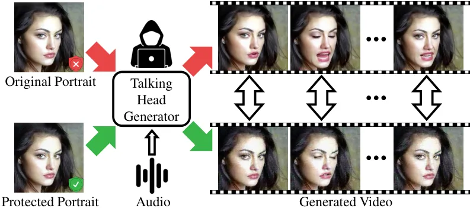
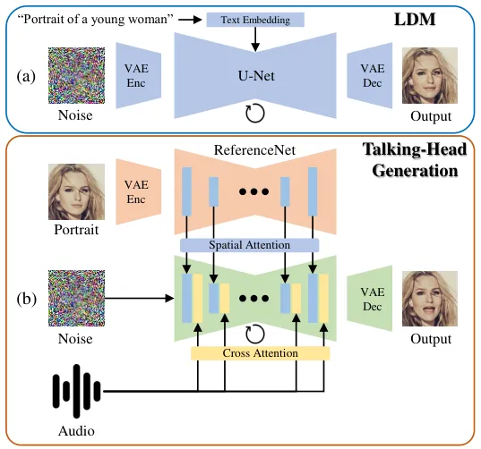
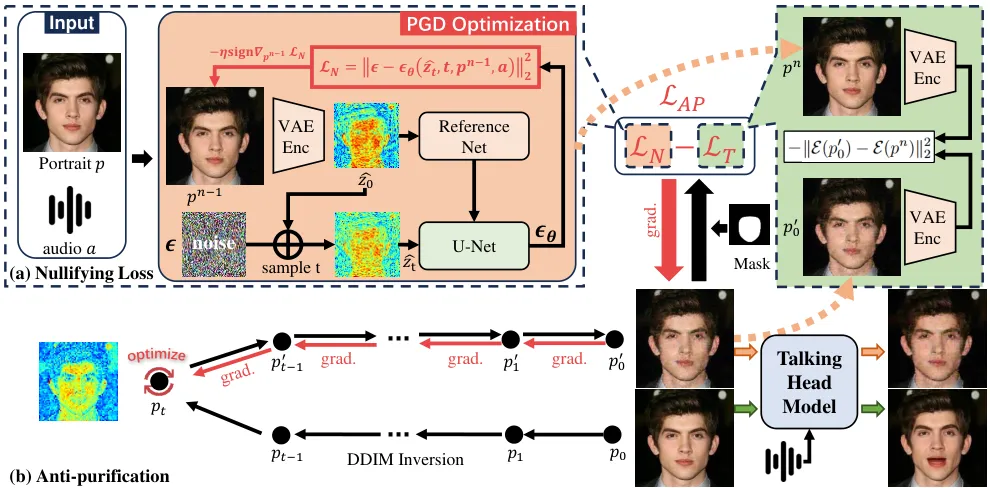
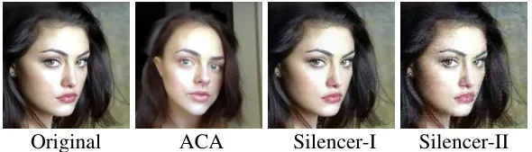
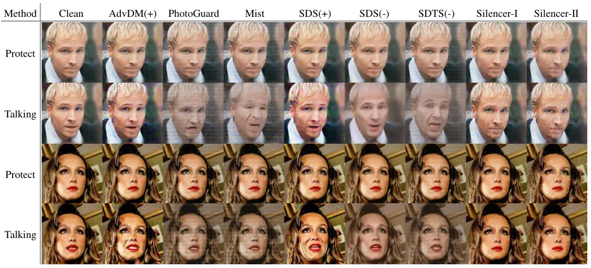
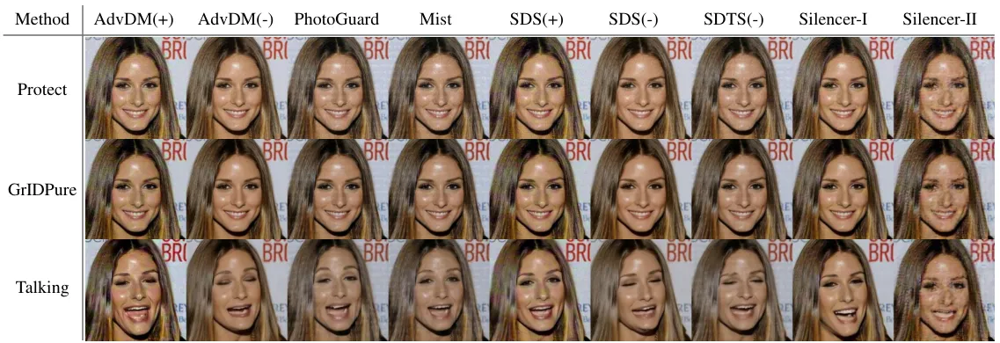
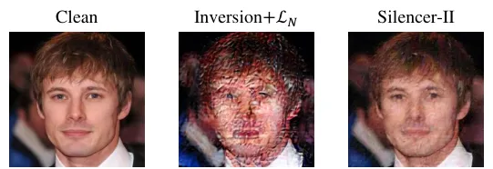
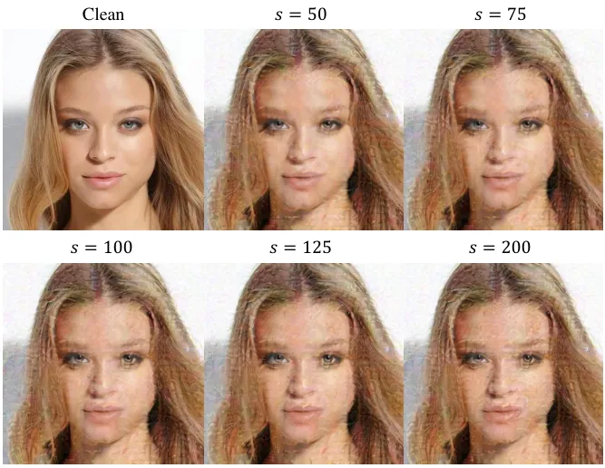
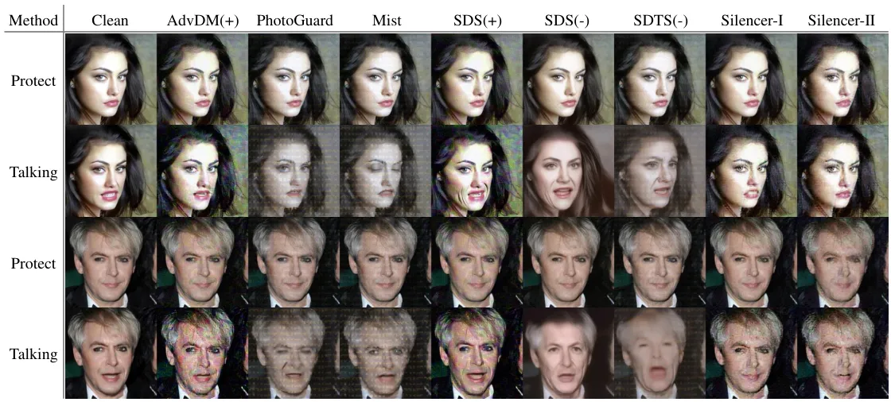
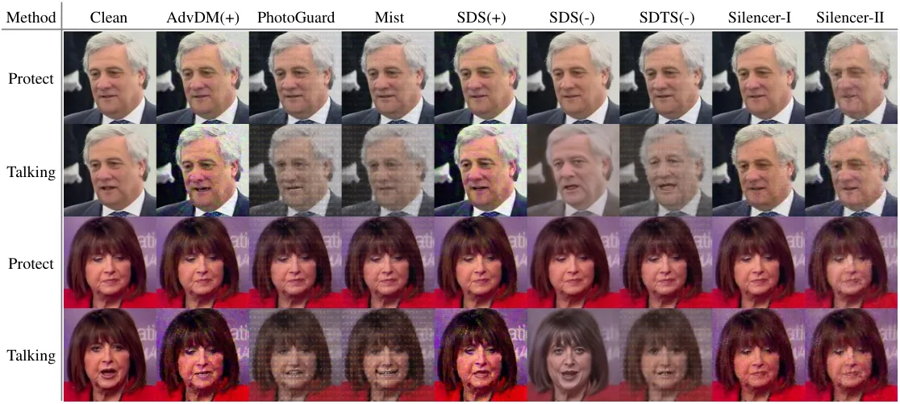

# Silence is Golden: Leveraging Adversarial Examples to Nullify Audio Control in LDM-based Talking-Head Generation

Yuan Gan Affiliation: ReLER, CCAI, Zhejiang University    Jiaxu Miao
^(†)^(†)thanks: Corresponding author. Affiliation: School of Cyber
Science and Technology, Sun Yat-sen University    Yunze Wang
Affiliation: Department of Statistics, University of Wisconsin–Madison
   Yi Yang Affiliation: ReLER, CCAI, Zhejiang University

###### Abstract

Advances in talking-head animation based on Latent Diffusion Models
(LDM) enable the creation of highly realistic, synchronized videos.
These fabricated videos are indistinguishable from real ones, increasing
the risk of potential misuse for scams, political manipulation, and
misinformation. Hence, addressing these ethical concerns has become a
pressing issue in AI security. Recent proactive defense studies focused
on countering LDM-based models by adding perturbations to portraits.
However, these methods are ineffective at protecting reference portraits
from advanced image-to-video animation. The limitations are twofold: 1)
they fail to prevent images from being manipulated by audio signals, and 2) diffusion-based purification techniques can effectively eliminate
protective perturbations. To address these challenges, we propose
Silencer, a two-stage method designed to proactively protect the privacy
of portraits. First, a nullifying loss is proposed to ignore audio
control in talking-head generation. Second, we apply anti-purification
loss in LDM to optimize the inverted latent feature to generate robust
perturbations. Extensive experiments demonstrate the effectiveness of
Silencer in proactively protecting portrait privacy. We hope this work
will raise awareness among the AI security community regarding critical
ethical issues related to talking-head generation techniques. Code:
[https://github.com/yuangan/Silencer](https://github.com/yuangan/Silencer).

## 1 Introduction

Talking-head animation \[3, 67, 20, 66, 62, 54, 15, 50\] enables the
creation of synchronized and highly realistic facial expressions based
on audio and portrait images, producing videos that are often
indistinguishable from authentic visual recordings. Recent advances in
diffusion models \[36, 24, 57, 5, 8\] have markedly improved the realism
of these animations. Consequently, this technological advancement
increases the risks of misusing AI-Generated Content (AIGC) for scams,
political manipulation, and misinformation. Mitigating these ethical
risks has become a critical priority in AIGC security.



Figure 1: Overview of Our Motivation. Given an audio input, talking-head
animation models can be exploited to generate fabricated videos using
any portrait. To safeguard portrait privacy, we introduced Silencer,
applying protective perturbations to ensure the portrait’s mouth remains
closed in generated talking videos.

To address the ethical risks associated with AIGC, there are two primary
approaches: passive defenses \[37, 9, 44, 60, 49\] and proactive
defenses \[28, 38, 30, 40, 29, 59\]. Passive defenses focus on detecting
whether a video has been fabricated, making it useful for forensics.
However, these approaches cannot prevent the infringement of personal
privacy by deepfakes. When victims realize their privacy has been
violated, the damage may already be irreparable. In contrast, proactive
defenses offer superior protection by proactively shielding individuals
from harm. These methods use adversarial perturbations on the input
images to disrupt the outputs of the generative model.

Recent studies \[30, 40, 29, 59\] explored proactive defenses against
diffusion models, particularly those mimicry techniques based on Latent
Diffusion Models (LDM). By adding perturbations to input images, these
approaches have achieved copyright protection in diffusion-based
mimicry. However, existing methods fail to protect privacy in the
audio-driven talking-head generation, which utilizes LDM to animate the
given portrait. Their limitations are twofold: 1) they cannot prevent
portraits from being animated by LDM-based talking-head models with a
provided audio. Although these methods may reduce the quality of the
generated video, this effect alone does not ensure privacy protection. 2) diffusion-based purification techniques can remove these protective
perturbations, counteracting the quality degradation and rendering the
privacy measures ineffective. Therefore, we need to generate robust
adversarial perturbations that can nullify audio-driven facial movements
and overcome purification techniques.

To address the above challenges with robust perturbations, we propose
Silencer, a two-stage approach to proactively protect portrait privacy
from animation by talking-head generation methods. In the first stage,
we introduce a nullifying loss by disregarding audio control in the
talking-head generation. Due to the lack of ground truth video, previous
methods cannot be directly applied to talking-head generation. Our
nullifying loss modifies the optimization objective of talking-head
training to keep the portrait “silent”, as shown in Fig. 1. With the
addition of adversarial noise via our nullifying loss, the generated
talking videos tend to remain static, exhibiting low synchronization
confidence. In the second stage, we design an anti-purification process
using LDM to optimize the inverted latent feature, generating more
robust perturbations. Since optimization in latent space does not have
precise control over the outcomes in image space, directly applying
nullifying loss to optimize the inverted latent feature would damage the
adversarial portrait. Therefore, we use adversarial examples from the
first stage to guide the optimization direction. To preserve the
identity information, we apply a mask to the facial region halfway
through the optimization process.

Overall, our main contributions are threefold:

- •
  We introduce a benchmark for assessing proactive protection measures
  against privacy threats posed by advanced LDM-based talking-head
  generation techniques.
- •
  We propose Silencer, a two-stage paradigm, to proactively protect
  portrait privacy with robust adversarial perturbations. First, we
  introduce a nullifying loss that effectively renders a portrait
  “silent” in the talking-head generation. Second, we develop an
  anti-purification strategy to enhance the robustness of these
  perturbations against countermeasures.
- •
  Extensive experiments are conducted to assess the efficacy of our
  Silencer. Our method achieves strong privacy protection with low
  synchronization confidence and exhibits resistance to
  purification-based attacks.

## 2 Related Work

##### Audio-Driven Talking-Head Animation.

Audio-driven talking-head generation has gained significant attention in
recent years with the success of generative models \[1, 17, 23, 45, 14,
36, 39, 31\]. Early methods \[7, 65, 3, 67, 20, 66, 62, 54, 15, 50\]
primarily relied on Generative Adversarial Networks (GANs) \[17\].
However, advancements in Latent Diffusion Models (LDMs) have led to more
effective techniques \[54, 43, 48, 51, 57, 56, 5\]. AniPortrait \[54\]
improves visual quality and temporal consistency by projecting 3D
representations as 2D landmarks in a diffusion model. In contrast,
approaches like DiffTalk and Diffused Heads \[43, 48\] simplify the
generation process by focusing on diffusion-based methods without
relying on 3D models. Furthermore, EMO \[51\] enhances expressiveness
through a direct generation framework that eliminates the need for 3D
models. VASA-1 \[57\] performs efficient operations in the latent space
for highly natural real-time generation. Hallo \[56\] incorporates
cross-attention mechanisms and innovative audio-landmark training
strategies to enhance generation quality and animation stability. In
this paper, we adopt Hallo as the pre-trained talking-head model.

##### Adversarial Attacks in Diffusion Models.

In the realm of adversarial attacks, early research introduced
gradient-based methods that generate small perturbations to deceive
neural network models \[18, 27, 10, 55, 11, 63, 16, 32\]. Building on
these methods, recent studies have applied adversarial attacks to
diffusion models. AdvDM \[30\] generates adversarial examples by
optimizing latent variables during the reverse process of diffusion
models. Photoguard \[40\] "immunizes" images by adding imperceptible
perturbations that prevent diffusion models from generating realistic
manipulations. Extending the ideas of AdvDM and Photoguard, Mist \[29\]
incorporates semantic and texture loss designs to enhance cross-task
transferability. Furthermore, Diff-Protect \[59\] introduces Score
Distillation Sampling (SDS) and highlights the encoder module as the
main vulnerability affecting the robustness of diffusion models.

##### Purification and Anti-purification.

Purification methods use generative models to remove adversarial noise
before classification, thereby improving resistance to adversarial
manipulations \[41, 47, 12, 19, 22, 46, 61, 42\]. Building on this
foundation, DiffPure \[35\] utilizes the forward and reverse processes
of diffusion models to purify adversarial examples. Moreover,
GridPure \[64\] introduces a grid-based iterative diffusion approach
tailored to high-resolution images, enhancing purification
effectiveness. PDM-Pure \[58\] uses pixel-space diffusion models as a
universal purifier to mitigate adversarial noise.

To resist purification, ACA \[4\] maps images onto a low-dimensional
latent manifold of the generative model and optimizes adversarial
objectives to enable diverse content generation and control.
Additionally, DiffAttack \[2\] introduces an innovative, diffusion-based
attack method to bypass existing purification defenses via latent
feature optimization.

## 3 Method

### 3.1 Preliminary

#### 3.1.1 Audio-driven Talking-head Generation with LDM.

Given a reference portrait $`p`$ and speech audio $`a`$, talking-head
generation aims to generate realistic speaking videos synchronized with
speech audio. To achieve this aim with powerful text-to-image LDM
models, such as Stable Diffusion \[36\], recent works follow a common
pipeline, which utilizes ReferenceNet and audio signals to guide the
animation process. ReferenceNet has the same architecture as the LDM
network, which extracts appearance features from reference images for
guidance. As shown in Fig. 2(b), talking-head LDM employs spatial
attention to preserve intricate appearance features from the reference
image. By integrating these appearance features, the model accurately
captures the reference portraits, allowing for precise manipulation of
facial expressions with audio inputs. Hence, during the training phase,
an associated talking frame $`f_{i}`$ is encoded into a latent
representation $`z_{0}`$ with the encoder of Variational AutoEncoder
(VAE) \[26, 13\]: $`z_{0}=\mathcal{E}(f_{i})`$. The diffusion process
across $`T`$ timesteps then transforms this latent representation to a
Gaussian noise $`z_{T}\sim\mathcal{N}(0,1)`$. The goal of the training
is to progressively denoise $`z_{T}`$ to produce a realistic
talking-head frame that not only preserves the visual characteristics of
the reference portrait $`p`$ but also synchronizes the lip movements
with the audio frame $`a_{i}`$. To achieve this aim, the training loss
is defined by the following objective function:



Figure 2: LDM and LDM-based Talking-head Generation Framework. (a) The
inference process of latent diffusion models. Given random noise and
text, LDM can generate a semantically coherent image through iterative
denoising. (b) The talking-head generation framework. Given a portrait
and audio frame, the talking-head generation model can produce a
lip-sync video frame with realistic facial expressions.

```math
\mathcal{L}_{ldm}=\mathbb{E}_{\mathcal{E}(f_{i}),p,a_{i},\epsilon,t}\left[\|\epsilon-\epsilon_{\theta}(z_{t},t,p,a_{i})\|^{2}_{2}\right], \tag{1}
```

where $`\epsilon\sim\mathcal{N}(0,1)`$ is a Gaussian noise,
$`\epsilon_{\theta}`$ represents the denoising U-Net model that
processes the noisy latent variable $`z_{t}`$ at each timestep $`t`$
along with the conditional inputs, $`p`$ is the reference portrait,
$`a_{i}`$ is the $`i`$-th frame of the talking-head audio.

The ability to use any person’s portrait as a reference in talking-head
generation raises significant privacy concerns. To mitigate this, we
propose a proactive defense mechanism centered around an open-source,
advanced LDM-based talking-head generation method \[56\].

#### 3.1.2 Adversarial Examples for LDM

Adversarial examples can protect images from LDM-based mimicry by
finding the appropriate perturbations that can effectively cause LDM
models to generate visually corrupted outputs. Previous studies have
used two objective functions to exploit vulnerabilities in the diffusion
model:

- •
  Semantic loss \[30\] is the training loss of LDM, which disrupts the
  denoising process, directing the model to produce samples that differ
  from the real image:

  ```math
  \mathcal{L}_{S}=\mathbb{E}_{t,\epsilon}\mathbb{E}_{z_{t}}\|\epsilon-\epsilon_{\theta}(z_{t},t)\|_{2}^{2} \tag{2}
  ```

- •
  Texture loss \[40\] attacks the VAE encoder $`\mathcal{E}(\cdot)`$ by
  steering the latent representation of the input image $`x`$ towards a
  target latent derived from another image $`y`$:

  ```math
  \mathcal{L}_{T}=-\|\mathcal{E}(x)-\mathcal{E}(y)\|_{2}^{2} \tag{3}
  ```

The final objective $`\mathcal{L}_{adv}`$ can be either semantic loss
$`\mathcal{L}_{S}`$, texture loss $`\mathcal{L}_{T}`$, or both. Then
PGD \[34\] is chosen to generate adversarial examples with projected
gradient ascent:

```math
x^{n}=\mathcal{P}_{B_{\infty}(x,\delta)}\left[x^{n-1}+\eta\,\text{sign}\,\nabla_{x^{n-1}}\mathcal{L}_{\text{adv}}(x^{n-1})\right] \tag{4}
```

where $`x^{n}`$ is the adversarial example at the $`n`$-th iteration,
$`\mathcal{P}_{B_{\infty}(x,\delta)}[\cdot]`$ projects the adversarial
output onto the $`\ell_{\infty}`$ ball centered at $`x`$ with budget
$`\delta`$, $`\eta`$ is the step size.



Figure 3: Silencer Framework. (a) In stage I, adversarial samples
$`p^{n}`$ are generated through iterative PGD optimization using our
proposed nullifying loss. These samples can avoid the influence of audio
in the talking-head model. (b) In stage II, our anti-purification
process is employed to optimize the inverted latent features, generating
more robust perturbations capable of resisting purification.

### 3.2 Silencer

To protect portrait privacy, a straightforward approach is to directly
apply semantic loss \[30\] to the talking-head animation task. However,
this naive method presents two major challenges: First, unlike image
generation tasks, we lack ground truth frames $`f_{i}`$, synchronized
with audio frame $`a_{i}`$ for any arbitrary input portrait in
talking-head animation. Second, we observed that noise-based
perturbations introduced for privacy protection can be neutralized by
purification methods. These purification methods counteract our
protective measures, effectively compromising the intended privacy
safeguards. In the following sections, we propose Silencer, a two-stage
method to address these challenges.

#### 3.2.1 Silencer-I: Nullifying Loss

To disrupt the denoising process and generate more artifacts in the
edited images, semantic loss is used to optimize the perturbations by
increasing or decreasing the LDM training loss. To calculate the
training loss in Eq. 1, the ground truth frame $`f_{i}`$ and the
corresponding latent representation $`z_{0}`$ are essential. A
straightforward approach is to employ existing talking-head models to
generate a synchronized video frame $`f_{i}`$. However, this has two
drawbacks. 1) Due to the time-consuming process of LDM inference, it is
inefficient to generate fake ground truth under complex talking-head
generation frameworks. 2) Generating fake ground truth presents a
paradox: protecting portrait privacy requires it to first be
compromised.

Unlike semantic loss, which requires ground truth, texture loss operates
without this requirement, relying instead on a target image. Despite
this advantage, texture loss does not directly affect the
synchronization of the generated videos. This is primarily due to the
changes of the LDM network architecture, as shown in Fig. 2. Unlike
traditional diffusion models, the LDM-based animation framework
introduces conditions using ReferenceNet, which makes texture loss fail
to eliminate the influence of the audio. Unless the face is fully
obscured, the portrait can still be driven by audio. Hence,
incorporating audio signals in the training of adversarial perturbations
is crucial.

[TABLE]

Table 1: Quantitative Comparisons with State-of-the-art Methods on
CelebA-HQ \[25\] and TalkingHead-1KH \[53\]. "$`\uparrow`$": higher is
better. "$`\downarrow`$": lower is better. Red: the 1st score. Blue: the
2nd score.

Given the limitations of existing loss functions regarding ground truth
requirements and audio signal integration, we propose training
adversarial perturbations that are both audio-aware and independent of
ground truth. We observe that forcing the generated result to stay
“silent” is an effective way to disrupt audio-visual synchronization,
avoiding the need to directly attack the talking-head training process.
To nullify the effect of audio signals $`a`$, we treat the reference
portrait $`p`$ as the ground truth of the talking-head generation.
Hence, we propose a nullifying loss to disrupt the audio-visual
synchronization efficiently with the following formulation:

```math
\mathcal{L}_{N}=\mathbb{E}_{t}\mathbb{E}_{\mathcal{E}(p),p,a_{i},\epsilon}\left[\|\epsilon-\epsilon_{\theta}(\hat{z_{t}},t,p,a_{i})\|^{2}_{2}\right], \tag{5}
```

where $`\hat{z_{t}}`$ is the noisy latent representation at timestep
$`t`$, $`\mathcal{E}(p)`$ is the latent representation $`\hat{z_{0}}`$
extracted from reference portrait $`p`$. As the reference portrait is a
condition in denoising, different timestep ranges would have different
attack performances. Hence, we empirically experiment on $`t`$ to find
the best range, as shown in Fig. 7.

$`\mathcal{L}_{N}`$ modifies the training target of talking-head
generation from a synchronized frame to a still portrait. Then we treat
$`\mathcal{L}_{N}`$ as the adversarial loss $`\mathcal{L}_{adv}`$ in
Eq. 4 and optimize the reference image $`p`$ with PGD for $`n`$
iterations to acquire the adversarial example $`p^{n}`$, as shown in
Fig. 3 (a). It is noted that we adopt gradient descent rather than
gradient ascent to optimize the adversarial portrait:

```math
p^{n}=\mathcal{P}_{B_{\infty}(p,\delta)}\left[p^{n-1}-\eta\,\text{sign}\,\nabla_{p^{n-1}}\mathcal{L}_{N}(p^{n-1})\right] \tag{6}
```

where $`p^{n-1}`$ is the input image in $`n`$-th iteration, $`p^{n}`$ is
the output adversarial image. Not only does $`p^{n}`$ disrupt
synchronization by remaining “silent”, but it also degrades the video
quality of the talking-head generation.

#### 3.2.2 Silencer-II: Anti-purification

By optimizing a perturbation using our proposed nullifying loss, and
adding it to the portrait image, we can generate an adversarial example
that prevents the portrait from being driven by audio. Unfortunately,
existing noise-removal or “purification” techniques can easily strip
away the noise, undermining the protection effect. To address this, we
need to find a more robust noise pattern that resists these purification
methods, enhancing the security and effectiveness of the adversarial
examples generated with our Silencer.



Figure 4: Visualization of ACA \[4\] and Silencer. The result of ACA is
generated by optimizing latent feature with skip gradients using our
nullifying loss.



Figure 5: Qualitative Comparison with Image Protection Methods. We
visualize the protected portraits and their frame driven by audio.

[TABLE]

Table 2: Comparison on Image Quality after Protection. Our Silencer-I
achieves the best average image quality with minimal added noise while
achieving protection effects.

ACA \[4\] generates adversarial examples by applying the gradients of
adversarial classification loss in the latent space inverted by
DDIM \[45\]. While it can make natural modifications to image content,
optimizing the latent vector $`z_{T}`$ through the skipped gradients can
lead to unpredictable and undesirable changes, compromising the
authenticity of the adversarial sample. These deviations are
particularly pronounced in talking-head generation models, leading to
significant distortions in facial identity, as shown in Fig. 4. Existing
methods to address this issue, such as applying consistent constraints
throughout the inversion process\[2\], suffer from high memory
consumption and are not scalable to high-resolution portrait images.

To address the limitations of existing methods, we propose a new
constrain for generating robust adversarial examples with lower
computational cost. Our method, illustrated in Fig.3 (b), leverages LDM
and DDIM inversion to optimize the latent representation of the image.
Instead of directly adding noise, we optimize the latent features to
create perturbations that are resistant to purification techniques. To
ensure these perturbations are effective without significantly altering
essential facial features, we utilize a constraint during the
optimization process. Specifically, we extracted the VAE feature of
adversarial samples generated in step I. The encoded features then serve
as a constraint, during the optimization of the LDM-based adversarial
example. This constrained optimization allows us to balance two
objectives: maintaining crucial facial features for recognition, while
simultaneously maximizing the robustness of the perturbations against
purification defenses. The optimization objective is formulated as
follows:

```math
\displaystyle\mathcal{L}_{AP} \displaystyle=\lambda_{1}\mathcal{L}_{N}-\lambda_{2}\mathcal{L}_{T} \tag{7}
```

```math
\displaystyle=\lambda_{1}\mathcal{L}_{N}+\lambda_{2}\|\mathcal{E}(p^{\prime}_{0})-\mathcal{E}(p^{n})\|_{2}^{2} \tag{8}
```

where $`p^{\prime}_{0}`$ is the output of the inverted diffusion model,
$`p^{n}`$ is the adversarial example generated in stage I,
$`\lambda_{1}`$ and $`\lambda_{2}`$ are the corresponding coefficients.
Then we use AdamW \[33\] to optimize the inverted latent representation
$`p_{t}`$ with $`\mathcal{L}_{AP}`$.

We observed that optimizing the entire image with $`\mathcal{L}_{AP}`$
introduces considerable distortions to the facial region. LDM tends to
distort the entire face in the iterative optimization process, aiming to
eliminate recognizable features like the mouth and eyes. This results in
a damaged face without any specific regions that could be manipulated or
driven. Hence, we apply a facial mask to the optimization process that
strikes a balance between face clarity and anti-purification protection.
Specifically, we optimize the entire image during the initial $`s`$
iterations. After this point, we restrict optimization to areas outside
the masked facial region.

## 4 Experiments

### 4.1 Experimental Setup

#### 4.1.1 Implementation Details

The videos are sampled at 25 FPS and the audio sample rate is 16KHz. The
reference portraits are resized to 512 $`\times`$ 512. We utilize
Hallo \[56\] as the LDM-based talking-head model with the public
implementation¹¹ 1 https://github.com/fudan-generative-vision/hallo. In
the first stage, we adopt PGD with a budget 16/255 to train each
portrait for 100 iterations, which is the same as our baselines. In the
second stage, we optimize the inverted latent feature for 200 iterations
with a learning rate of 0.01.

##### Baselines and Dataset.

We compare our proposed method with four state-of-the-art privacy
protection methods, including AdvDM \[30\], PhotoGuard \[40\],
Mist \[29\] and SDS \[59\]. To evaluate the performance of protection
baselines, we select 50 images from the CelebA-HQ \[25\] dataset as the
reference images and one audio as the driving signal. To create a more
realistic scenario, we utilize CLIP-IQA \[52\] to select 50 high-quality
video clips, each with a unique identity and associated speech audio,
from the widely used TalkingHead-1KH dataset \[53\].

[TABLE]

Table 3: Purification Experiments on CelebA-HQ \[25\]. The “Protected”
is the metrics calculated with protected portraits for reference. Others
are calculated with purified portraits. "$`\uparrow`$": higher is
better. "$`\downarrow`$": lower is better. Red: the 1st score. Blue: the
2nd score.



Figure 6: Visual Comparison in Anti-purification. The third row is the
animated talking frames with the portraits after GrIDPure \[64\].

#### 4.1.2 Metrics

We assess the quality of synthesized emotional videos with the following
metrics:

Image quality. We utilize Peak Signal-to-Noise Ratio (PSNR), Structural
Similarity Index Measure (SSIM), and Fréchet Inception Distance score
(FID) \[21\] to measure the image quality of synthesized videos. The
video metrics, V-PSNR/SSIM, measure PSNR/SSIM specifically on facial
regions. In contrast, the image metrics, I-PSNR/SSIM, calculate PSNR and
SSIM across the entire image by comparing the original image with the
adversarial image. The Fréchet Inception Distance (FID) is a common
metric for measuring the fidelity of synthesized videos. It quantifies
the distribution distance between videos generated using original and
protected portraits.

Audio-visual synchronization. We evaluate the audio-visual
synchronization of the synthesized videos using SyncNet’s confidence
score \[6, 15\]. In addition, the distance between the landmarks of the
mouth (M-LMD) \[3\] is used to indicate speech content consistency.

### 4.2 Privacy Protection

We first compare the effectiveness of our Silencer in privacy protection
with other state-of-the-art methods.We randomly selected an audio from
TalkingHead-1KH dataset for training all adversarial example and tested
the talking-head model with other audios. In CelebA-HQ, all tests used
the same audio clip, while in TalkingHead-1KH, each face was tested with
its original audio. We treat videos generated by Hallo using the
portraits without protection as the ground truth for comparison.

Table 1 shows that our method achieves the best synchronization
protection, with a score of 3.9685 on CelebA-HQ and 2.0017 on
TalkingHead-1KH. In stage I of Silencer, our nullifying loss effectively
frees reference portraits from audio control during talking-head
generation. In stage II, our Silencer continues to yield strong results,
further validating the effectiveness of our method. In terms of video
quality, our method can only achieve comparable results in the video
FID. This is primarily due to our nullifying loss, which aims to ensure
the reference portrait remains largely unchanged during the diffusion
process. As a result, our method has less impact on the generated video
quality compared to others. Table 2 shows that Silencer-I achieves the
highest I-PSNR, indicating minimal degradation of the reference
portrait’s realism. Furthermore, the qualitative comparison in Fig. 5
reveals that, unlike methods that significantly alter facial appearance,
our approach preserves visual consistency while “silencing” the talking
head. These results underscore the effectiveness of our method in
achieving privacy protection from audio control.

### 4.3 Anti-Purification Experiments

To demonstrate the effectiveness of our methods in resisting
purification, we conduct purification on the protected portraits. We
select the following advanced purification methods to attack:
JPEG \[42\], AdvClean, Diff-Pure \[35\] and GrIDPure \[64\].We evaluate
anti-purification effectiveness using I-PSNR, comparing original and
purified images, and FID for talking-head videos, comparing ground truth
to videos generated with purified portraits from a CelebA-HQ subset.
Table 3 shows Silencer-II achieves the best anti-purification
performance, with the lowest I-PSNR and highest FID. This is because
adversarial noises, generated by Silencer-I and other methods, are
optimized in the image space with PGD \[34\] and can be easily purified.
In contrast, Silencer-II optimizes perturbations within the LDM’s
inverted latent space, resulting in fundamentally different and more
robust perturbations. Fig. 6 visually demonstrates this efficacy.
Although our generated perturbations resist complete removal, their
structure is altered by purification, preventing a perfectly “silent”
portrait. Achieving a completely robust perturbation that results in a
“silent” portrait even after purification remains a challenge. We will
explore more robust solutions in future work.

Figure 7: Ablation Study on Timestep Ranges in Silencer-I.

### 4.4 Ablation Study

##### Ablation Study on Timestep Ranges in Silencer-I.

Since the reference portrait serves as a condition in the denoising
process, adjusting the timestep range results in varying levels of
attack effectiveness. To identify the optimal timestep ranges, we
divided the total of 1000 timesteps into ten equal segments, sampling
100 timesteps from each segment for training. We trained and evaluated
our model on the subset of CelebA-HQ, with the results illustrated in
Fig. 7. Our findings indicate that timesteps within the \[200, 300\]
range achieve a desirable balance: they provide effective privacy
protection, with a sync confidence of 4.2556, while maintaining minimal
noise, with an I-PSNR of 32.34. Based on these results, we selected the
\[200, 300\] range for timestep sampling in training Silencer-I.

##### Ablation Study on Each Component.

We conduct an ablation study to evaluate the impact of each component of
our Silencer using the CelebA-HQ dataset. As shown in Table 4, the
introduction of our nullifying loss leads to a significant reduction in
synchronization confidence compared to previous methods. Additionally,
the anti-purification process remains the low synchronization, providing
protection against talking-head manipulation. However, this comes at the
cost of reduced visual quality. To mitigate this, we optimize the
adversarial perturbation with a face mask, which preserves facial
structure while achieving effective privacy protection. More experiments
can be found in our supplementary material.

|                     |         |        |          |          |
| ------------------- | ------- | ------ | -------- | -------- |
| Ablation            | SDTS(-) | S-I    | S-II (A) | S-II (B) |
| $`\mathcal{L}_{N}`$ |         | ✓      | ✓        | ✓        |
| Anti-purify         |         |        | ✓        | ✓        |
| Mask                |         |        |          | ✓        |
| I-SSIM$`\uparrow`$  | 0.7446  | 0.7475 | 0.6561   | 0.6774   |
| FID$`\uparrow`$     | 89.70   | 124.07 | 167.40   | 156.99   |
| Sync$`\downarrow`$  | 6.4003  | 4.0644 | 3.4339   | 3.9685   |
| M-LMD$`\uparrow`$   | 2.1024  | 2.2008 | 2.3607   | 2.2108   |

Table 4: Ablation Study of Each Component. Each component contributes to
improving privacy protection, thus verifying its effectiveness.

## 5 Conclusion

In this paper, we introduce Silencer, a two-stage approach to
proactively protect portrait privacy from unauthorized animation in
audio-driven talking-head generation. This approach addresses the
limitations of prior methods that cannot effectively mitigate talking
animation and resist purification. The first stage employs a novel
nullifying loss to decouple facial movements from audio input,
significantly reducing the synchronization of generated talking-head
videos. Building upon this, the second stage enhances robustness through
an anti-purification process. This process optimizes perturbations
within the inverted latent space of an LDM, guided by adversarial
examples from the first stage to ensure targeted and effective
protection. A strategically applied mask preserves facial integrity
during this optimization. Extensive experiments demonstrate Silencer’s
superior performance in both preventing unauthorized animation and
resisting purification, confirming its effectiveness in protecting
portrait privacy. This work establishes a new benchmark for proactive
privacy protection in LDM-based talking-head generation and we
anticipate it will stimulate further research and development in this
critical area.

## Acknowledgments

This work was supported in part by the Key R&D Program of China
(2021ZD0112801), the Key Program of National Natural Science Foundation
of China (62436007) and the Natural Science Foundation of Zhejiang
Province (LDT23F02023F02).

## References

- \[1\] Yihan Cao, Siyu Li, Yixin Liu, Zhiling Yan, Yutong Dai, Philip S
  Yu, and Lichao Sun. A comprehensive survey of ai-generated content
  (aigc): A history of generative ai from gan to chatgpt. _arXiv
  preprint arXiv:2303.04226_, 2023.
- \[2\] Jianqi Chen, Hao Chen, Keyan Chen, Yilan Zhang, Zhengxia Zou,
  and Zhenwei Shi. Diffusion models for imperceptible and transferable
  adversarial attack. _IEEE Transactions on Pattern Analysis and Machine
  Intelligence_, pages 1–17, 2024a.
- \[3\] Lele Chen, Ross K Maddox, Zhiyao Duan, and Chenliang Xu.
  Hierarchical cross-modal talking face generation with dynamic
  pixel-wise loss. In _Proceedings of the IEEE/CVF Conference on
  Computer Vision and Pattern Recognition_, pages 7832–7841, 2019.
- \[4\] Zhaoyu Chen, Bo Li, Shuang Wu, Kaixun Jiang, Shouhong Ding, and
  Wenqiang Zhang. Content-based unrestricted adversarial attack. In
  _Thirty-seventh Conference on Neural Information Processing
  Systems_, 2023.
- \[5\] Zhiyuan Chen, Jiajiong Cao, Zhiquan Chen, Yuming Li, and
  Chenguang Ma. Echomimic: Lifelike audio-driven portrait animations
  through editable landmark conditioning, 2024b.
- \[6\] Joon Son Chung and Andrew Zisserman. Out of time: automated lip
  sync in the wild. In _Asian conference on computer vision_, pages
  251–263. Springer, 2016.
- \[7\] Joon Son Chung, Amir Jamaludin, and Andrew Zisserman. You said
  that? _BMVC_, 2017.
- \[8\] Jiahao Cui, Hui Li, Yao Yao, Hao Zhu, Hanlin Shang, Kaihui
  Cheng, Hang Zhou, Siyu Zhu, and Jingdong Wang. Hallo2: Long-duration
  and high-resolution audio-driven portrait image animation. _arXiv
  preprint arXiv:2410.07718_, 2024.
- \[9\] Hao Dang, Feng Liu, Joel Stehouwer, Xiaoming Liu, and Anil K
  Jain. On the detection of digital face manipulation. In _Proceedings
  of the IEEE/CVF Conference on Computer Vision and Pattern
  recognition_, pages 5781–5790, 2020.
- \[10\] Yinpeng Dong, Fangzhou Liao, Tianyu Pang, Hang Su, Jun Zhu,
  Xiaolin Hu, and Jianguo Li. Boosting adversarial attacks with
  momentum. In _Proceedings of the IEEE conference on computer vision
  and pattern recognition_, pages 9185–9193, 2018.
- \[11\] Yinpeng Dong, Tianyu Pang, Hang Su, and Jun Zhu. Evading
  defenses to transferable adversarial examples by translation-invariant
  attacks. In _Proceedings of the IEEE/CVF conference on computer vision
  and pattern recognition_, pages 4312–4321, 2019.
- \[12\] Yilun Du and Igor Mordatch. Implicit generation and modeling
  with energy based models. In _Advances in Neural Information
  Processing Systems_. Curran Associates, Inc., 2019.
- \[13\] Patrick Esser, Robin Rombach, and Bjorn Ommer. Taming
  transformers for high-resolution image synthesis. In _Proceedings of
  the IEEE/CVF conference on computer vision and pattern recognition_,
  pages 12873–12883, 2021.
- \[14\] Sheng Fan, Rui Liu, Wenguan Wang, and Yi Yang. Navigation
  instruction generation with bev perception and large language models.
  In _ECCV_, 2024.
- \[15\] Yuan Gan, Zongxin Yang, Xihang Yue, Lingyun Sun, and Yi Yang.
  Efficient emotional adaptation for audio-driven talking-head
  generation. In _Proceedings of the IEEE/CVF International Conference
  on Computer Vision_, pages 22634–22645, 2023.
- \[16\] Lianli Gao, Qilong Zhang, Jingkuan Song, Xianglong Liu, and
  Heng Tao Shen. Patch-wise attack for fooling deep neural network. In
  _Computer Vision–ECCV 2020: 16th European Conference, Glasgow, UK,
  August 23–28, 2020, Proceedings, Part XXVIII 16_, pages 307–322.
  Springer, 2020.
- \[17\] Ian J Goodfellow, Jean Pouget-Abadie, Mehdi Mirza, Bing Xu,
  David Warde-Farley, Sherjil Ozair, Aaron Courville, and Yoshua Bengio.
  Generative adversarial nets. _Advances in neural information
  processing systems_, 27, 2014a.
- \[18\] Ian J Goodfellow, Jonathon Shlens, and Christian Szegedy.
  Explaining and harnessing adversarial examples. _arXiv preprint
  arXiv:1412.6572_, 2014b.
- \[19\] Will Grathwohl, Kuan-Chieh Wang, Jörn-Henrik Jacobsen, David
  Duvenaud, Mohammad Norouzi, and Kevin Swersky. Your classifier is
  secretly an energy based model and you should treat it like one.
  _arXiv preprint arXiv:1912.03263_, 2019.
- \[20\] Yudong Guo, Keyu Chen, Sen Liang, YongJin Liu, Hujun Bao, and
  Juyong Zhang. Ad-nerf: Audio driven neural radiance fields for talking
  head synthesis. In _Proceedings of the IEEE/CVF International
  Conference on Computer Vision_, pages 5784–5794, 2021.
- \[21\] Martin Heusel, Hubert Ramsauer, Thomas Unterthiner, Bernhard
  Nessler, and Sepp Hochreiter. Gans trained by a two time-scale update
  rule converge to a local nash equilibrium. _Advances in neural
  information processing systems_, 30, 2017.
- \[22\] Mitch Hill, Jonathan Mitchell, and Song-Chun Zhu. Stochastic
  security: Adversarial defense using long-run dynamics of energy-based
  models. _arXiv preprint arXiv:2005.13525_, 2020.
- \[23\] Jonathan Ho, Ajay Jain, and Pieter Abbeel. Denoising diffusion
  probabilistic models. _Advances in neural information processing
  systems_, 33:6840–6851, 2020.
- \[24\] Li Hu. Animate anyone: Consistent and controllable
  image-to-video synthesis for character animation. In _Proceedings of
  the IEEE/CVF Conference on Computer Vision and Pattern Recognition_,
  pages 8153–8163, 2024.
- \[25\] Tero Karras, Timo Aila, Samuli Laine, and Jaakko Lehtinen.
  Progressive growing of gans for improved quality, stability, and
  variation. In _International Conference on Learning
  Representations_, 2018.
- \[26\] Diederik P. Kingma and Max Welling. Auto-encoding variational
  bayes. In _ICLR_, 2014.
- \[27\] Alexey Kurakin, Ian J Goodfellow, and Samy Bengio. Adversarial
  examples in the physical world. In _Artificial intelligence safety and
  security_, pages 99–112. Chapman and Hall/CRC, 2018.
- \[28\] Zheng Li, Ning Yu, Ahmed Salem, Michael Backes, Mario Fritz,
  and Yang Zhang. Unganable: Defending against gan-based face
  manipulation. In _32nd USENIX Security Symposium (USENIX Security 23)_, pages 7213–7230, 2023.
- \[29\] Chumeng Liang and Xiaoyu Wu. Mist: Towards improved adversarial
  examples for diffusion models. _arXiv preprint
  arXiv:2305.12683_, 2023.
- \[30\] Chumeng Liang, Xiaoyu Wu, Yang Hua, Jiaru Zhang, Yiming Xue,
  Tao Song, Zhengui Xue, Ruhui Ma, and Haibing Guan. Adversarial example
  does good: Preventing painting imitation from diffusion models via
  adversarial examples. In _International Conference on Machine
  Learning_, pages 20763–20786. PMLR, 2023.
- \[31\] Yaron Lipman, Ricky TQ Chen, Heli Ben-Hamu, Maximilian Nickel,
  and Matt Le. Flow matching for generative modeling. _arXiv preprint
  arXiv:2210.02747_, 2022.
- \[32\] Yuyang Long, Qilong Zhang, Boheng Zeng, Lianli Gao, Xianglong
  Liu, Jian Zhang, and Jingkuan Song. Frequency domain model
  augmentation for adversarial attack. In _European conference on
  computer vision_, pages 549–566. Springer, 2022.
- \[33\] I Loshchilov. Decoupled weight decay regularization. _arXiv
  preprint arXiv:1711.05101_, 2017.
- \[34\] Aleksander Madry. Towards deep learning models resistant to
  adversarial attacks. _arXiv preprint arXiv:1706.06083_, 2017.
- \[35\] Weili Nie, Brandon Guo, Yujia Huang, Chaowei Xiao, Arash
  Vahdat, and Anima Anandkumar. Diffusion models for adversarial
  purification. _arXiv preprint arXiv:2205.07460_, 2022.
- \[36\] Robin Rombach, Andreas Blattmann, Dominik Lorenz, Patrick
  Esser, and Björn Ommer. High-resolution image synthesis with latent
  diffusion models. In _Proceedings of the IEEE/CVF conference on
  computer vision and pattern recognition_, pages 10684–10695, 2022.
- \[37\] Andreas Rossler, Davide Cozzolino, Luisa Verdoliva, Christian
  Riess, Justus Thies, and Matthias Nießner. Faceforensics++: Learning
  to detect manipulated facial images. In _Proceedings of the IEEE/CVF
  international conference on computer vision_, pages 1–11, 2019.
- \[38\] Nataniel Ruiz, Sarah Adel Bargal, and Stan Sclaroff. Disrupting
  deepfakes: Adversarial attacks against conditional image translation
  networks and facial manipulation systems. In _Computer Vision–ECCV
  2020 Workshops: Glasgow, UK, August 23–28, 2020, Proceedings, Part IV
  16_, pages 236–251. Springer, 2020.
- \[39\] Nataniel Ruiz, Yuanzhen Li, Varun Jampani, Yael Pritch, Michael
  Rubinstein, and Kfir Aberman. Dreambooth: Fine tuning text-to-image
  diffusion models for subject-driven generation. In _Proceedings of the
  IEEE/CVF conference on computer vision and pattern recognition_, pages
  22500–22510, 2023.
- \[40\] Hadi Salman, Alaa Khaddaj, Guillaume Leclerc, Andrew Ilyas, and
  Aleksander Madry. Raising the cost of malicious ai-powered image
  editing. _arXiv preprint arXiv:2302.06588_, 2023.
- \[41\] P Samangouei. Defense-gan: protecting classifiers against
  adversarial attacks using generative models. _arXiv preprint
  arXiv:1805.06605_, 2018.
- \[42\] Pedro Sandoval-Segura, Jonas Geiping, and Tom Goldstein. Jpeg
  compressed images can bypass protections against ai editing. _arXiv
  preprint arXiv:2304.02234_, 2023.
- \[43\] Shuai Shen, Wenliang Zhao, Zibin Meng, Wanhua Li, Zheng Zhu,
  Jie Zhou, and Jiwen Lu. Difftalk: Crafting diffusion models for
  generalized audio-driven portraits animation. In _CVPR_, 2023.
- \[44\] Kaede Shiohara and Toshihiko Yamasaki. Detecting deepfakes with
  self-blended images. In _Proceedings of the IEEE/CVF Conference on
  Computer Vision and Pattern Recognition_, pages 18720–18729, 2022.
- \[45\] Jiaming Song, Chenlin Meng, and Stefano Ermon. Denoising
  diffusion implicit models. _arXiv preprint arXiv:2010.02502_, 2020.
- \[46\] Yang Song and Stefano Ermon. Generative modeling by estimating
  gradients of the data distribution. _Advances in neural information
  processing systems_, 32, 2019.
- \[47\] Yang Song, Taesup Kim, Sebastian Nowozin, Stefano Ermon, and
  Nate Kushman. Pixeldefend: Leveraging generative models to understand
  and defend against adversarial examples. _arXiv preprint
  arXiv:1710.10766_, 2017.
- \[48\] Michał Stypułkowski, Konstantinos Vougioukas, Sen He, Maciej
  Zięba, Stavros Petridis, and Maja Pantic. Diffused heads: Diffusion
  models beat gans on talking-face generation. In _Proceedings of the
  IEEE/CVF Winter Conference on Applications of Computer Vision_, pages
  5091–5100, 2024.
- \[49\] Chuangchuang Tan, Yao Zhao, Shikui Wei, Guanghua Gu, Ping Liu,
  and Yunchao Wei. Rethinking the up-sampling operations in cnn-based
  generative network for generalizable deepfake detection. In
  _Proceedings of the IEEE/CVF Conference on Computer Vision and Pattern
  Recognition_, pages 28130–28139, 2024a.
- \[50\] Shuai Tan, Bin Ji, Mengxiao Bi, and Ye Pan. Edtalk: Efficient
  disentanglement for emotional talking head synthesis. In _European
  Conference on Computer Vision_, pages 398–416. Springer, 2024b.
- \[51\] Linrui Tian, Qi Wang, Bang Zhang, and Liefeng Bo. Emo: Emote
  portrait alive-generating expressive portrait videos with audio2video
  diffusion model under weak conditions. _arXiv preprint
  arXiv:2402.17485_, 2024.
- \[52\] Jianyi Wang, Kelvin CK Chan, and Chen Change Loy. Exploring
  clip for assessing the look and feel of images. In _Proceedings of the
  AAAI Conference on Artificial Intelligence_, pages 2555–2563, 2023.
- \[53\] Ting-Chun Wang, Arun Mallya, and Ming-Yu Liu. One-shot
  free-view neural talking-head synthesis for video conferencing. In
  _CVPR_, 2021.
- \[54\] Huawei Wei, Zejun Yang, and Zhisheng Wang. Aniportrait:
  Audio-driven synthesis of photorealistic portrait animations, 2024.
- \[55\] Cihang Xie, Zhishuai Zhang, Yuyin Zhou, Song Bai, Jianyu Wang,
  Zhou Ren, and Alan L Yuille. Improving transferability of adversarial
  examples with input diversity. In _Proceedings of the IEEE/CVF
  conference on computer vision and pattern recognition_, pages
  2730–2739, 2019.
- \[56\] Mingwang Xu, Hui Li, Qingkun Su, Hanlin Shang, Liwei Zhang, Ce
  Liu, Jingdong Wang, Luc Van Gool, Yao Yao, and Siyu Zhu. Hallo:
  Hierarchical audio-driven visual synthesis for portrait image
  animation. _arXiv preprint arXiv:2406.08801_, 2024a.
- \[57\] Sicheng Xu, Guojun Chen, Yu-Xiao Guo, Jiaolong Yang, Chong Li,
  Zhenyu Zang, Yizhong Zhang, Xin Tong, and Baining Guo. Vasa-1:
  Lifelike audio-driven talking faces generated in real time. _arXiv
  preprint arXiv:2404.10667_, 2024b.
- \[58\] Haotian Xue and Yongxin Chen. Pixel is a barrier: Diffusion
  models are more adversarially robust than we think. _arXiv preprint
  arXiv:2404.13320_, 2024.
- \[59\] Haotian Xue, Chumeng Liang, Xiaoyu Wu, and Yongxin Chen. Toward
  effective protection against diffusion-based mimicry through score
  distillation. In _The Twelfth International Conference on Learning
  Representations_, 2023.
- \[60\] Zhiyuan Yan, Yong Zhang, Yanbo Fan, and Baoyuan Wu. Ucf:
  Uncovering common features for generalizable deepfake detection. In
  _Proceedings of the IEEE/CVF International Conference on Computer
  Vision_, pages 22412–22423, 2023.
- \[61\] Jongmin Yoon, Sung Ju Hwang, and Juho Lee. Adversarial
  purification with score-based generative models. In _International
  Conference on Machine Learning_, pages 12062–12072. PMLR, 2021.
- \[62\] Wenxuan Zhang, Xiaodong Cun, Xuan Wang, Yong Zhang, Xi Shen, Yu
  Guo, Ying Shan, and Fei Wang. Sadtalker: Learning realistic 3d motion
  coefficients for stylized audio-driven single image talking face
  animation. In _Proceedings of the IEEE/CVF Conference on Computer
  Vision and Pattern Recognition_, pages 8652–8661, 2023.
- \[63\] Zhengyu Zhao, Zhuoran Liu, and Martha Larson. Towards large yet
  imperceptible adversarial image perturbations with perceptual color
  distance. In _Proceedings of the IEEE/CVF conference on computer
  vision and pattern recognition_, pages 1039–1048, 2020.
- \[64\] Zhengyue Zhao, Jinhao Duan, Kaidi Xu, Chenan Wang, Rui Zhang,
  Zidong Du, Qi Guo, and Xing Hu. Can protective perturbation safeguard
  personal data from being exploited by stable diffusion? In
  _Proceedings of the IEEE/CVF Conference on Computer Vision and Pattern
  Recognition_, pages 24398–24407, 2024.
- \[65\] Hang Zhou, Yu Liu, Ziwei Liu, Ping Luo, and Xiaogang Wang.
  Talking face generation by adversarially disentangled audio-visual
  representation. In _Proceedings of the AAAI Conference on Artificial
  Intelligence_, pages 9299–9306, 2019.
- \[66\] Hang Zhou, Yasheng Sun, Wayne Wu, Chen Change Loy, Xiaogang
  Wang, and Ziwei Liu. Pose-controllable talking face generation by
  implicitly modularized audio-visual representation. In _Proceedings of
  the IEEE/CVF conference on computer vision and pattern recognition_,
  pages 4176–4186, 2021.
- \[67\] Yang Zhou, Xintong Han, Eli Shechtman, Jose Echevarria,
  Evangelos Kalogerakis, and Dingzeyu Li. Makelttalk: speaker-aware
  talking-head animation. _ACM Transactions on Graphics (TOG)_,
  39(6):1–15, 2020.

## Appendix A More Experiments

### A.1 More Implementation Details

The resolution of our input portrait is $`512\times 512`$. The audio
used for training in our experiment is a four-second clip. For testing
on CelebA-HQ, the audio length is seven seconds. In the case of
TalkingHead-1KH, the audio length varies between three and seven
seconds. In our experiment, the DDIM inversion step is set to 20. Due to
the limitation of GPU memory, we optimize only the inverted latent
feature from the final step. All experiments can be conducted using a
single NVIDIA A40 GPU.

### A.2 Evaluating the Transferability of Silencer

To evaluate the transferability of Silencer (S-I and S-II), we performed
a cross-model evaluation. Adversarial noise was optimized on the Hallo
model and subsequently tested on other LDM-based talking-head generation
models. Specifically, we randomly selected 20 portraits from the
TalkingHead-1KH dataset and generated talking-head videos using the
publicly available EchoMimic \[5\] and Hallo2 \[8\]. As shown in
Table 5, the synchronization values of the generated videos demonstrate
that Silencer maintains a significant adversarial effect even when
applied to models different from the one used for optimization. Although
Silencer is designed as a white-box attack, these results highlight its
notable generalization capability across various LDM-based talking-head
models. This cross-model robustness suggests the potential for broader
applicability and further validates the effectiveness of our method. A
likely explanation for the observed cross-model effectiveness of
Silencer is a combination of factors. First, these LDM-based
talking-head models share similar architectural designs. Second, and
perhaps more crucially, they are all fine-tuned upon Stable Diffusion.
This common foundation could introduce common weaknesses or biases that
Silencer is able to exploit, even across different models.

### A.3 Efficiency Analysis

We evaluated the computational efficiency on an NVIDIA A40 GPU. The
results, shown in Table 6, demonstrate a significant difference in
Silencer-I and Silencer-II. Silencer-I exhibits superior efficiency,
requiring considerably less computational time compared to Silencer-II.
This difference in efficiency stems primarily from the architectural
design of Silencer-II. Unlike Silencer-I, Silencer-II incorporates an
optimization step within the latent space of an additional LDM. This
additional optimization process introduces a substantial computational
overhead, increasing the overall time required for Silencer-II to
generate adversarial examples. While this optimization contributes to
more robust perturbations, it comes at the cost of reduced computational
efficiency. Silencer-I, by contrast, avoids this extra optimization
step, leading to a more streamlined and faster process. While Silencer-I
takes 64 seconds per image, its runtime is comparable to other methods
like AdvDM(+) and Mist (59 seconds). This makes Silencer-I a more
practical choice in scenarios where computational resources are limited
or where rapid generation of adversarial examples is critical. Notably,
SDS(-) demonstrate significantly faster runtimes, due to skipping the
UNet portion of the gradient calculation. However, whether such an
optimization can be effectively and reliably applied within an LDM-based
talking-head network to improve efficiency remains an open challenge for
future research.

|                 |        |          |        |         |        |        |
| --------------- | ------ | -------- | ------ | ------- | ------ | ------ |
| Method          | GT     | AdvDM(+) | Mist   | SDST(-) | S-I    | S-II   |
| EchoMimic \[5\] | 4.0365 | 1.8252   | 1.7839 | 2.2228  | 1.4601 | 0.9973 |
| Hallo2 \[8\]    | 5.6661 | 3.2136   | 3.0679 | 3.9238  | 1.5952 | 2.0783 |

Table 5: Evaluating the Transferability of Silencer. Synchronization
scores demonstrating cross-model transferability of Silencer (S-I and
S-II). Videos were generated by EchoMimic \[5\] and Hallo2 \[8\] using
original (GT) and adversarial inputs. Lower scores signify greater
disruption. Despite being optimized on Hallo, Silencer significantly
impacts both models.

|      |          |            |      |        |         |     |      |
| ---- | -------- | ---------- | ---- | ------ | ------- | --- | ---- |
|      | AdvDM(+) | PhotoGuard | Mist | SDS(-) | SDST(-) | S-I | S-II |
| time | 59       | 34         | 59   | 22     | 40      | 64  | 241  |

Table 6: Efficiency Analysis. Average time (seconds/image) required for
different protection methods.

|                    |              |              |              |
| ------------------ | ------------ | ------------ | ------------ |
| DiffPure timesteps | 50           | 100          | 150          |
| Silencer-I         | 30.65/0.2606 | 29.26/0.2540 | 28.13/0.2691 |
| Silencer-II        | 27.80/0.4057 | 27.26/0.3909 | 26.82/0.3504 |

Table 7: Ablation on Timesteps of DiffPure \[35\]. We present
I-PSNR/LPIPS scores for Silencer-I and Silencer-II after applying
DiffPure with varying timesteps. Red values highlight greater
robustness.

|                    |              |              |              |
| ------------------ | ------------ | ------------ | ------------ |
| GrIDPure timesteps | 5            | 10           | 15           |
| Silencer-I         | 28.35/0.1672 | 28.16/0.1698 | 27.93/0.2016 |
| Silencer-II        | 25.81/0.3451 | 25.72/0.3511 | 25.59/0.3610 |

Table 8: Ablation on Timesteps of GrIDPure \[64\]. We present
I-PSNR/LPIPS scores for Silencer-I and Silencer-II after applying
GrIDPure purification. GrIDPure was run for 20 iterations with initial
timesteps of 5, 10, and 15. Red values highlight greater robustness.

|                    |                 |                 |
| ------------------ | --------------- | --------------- |
|                    |    DiffAudio    |    SameAudio    |
|    Silencer-II     |    3.9685       |    2.4926       |
|    Ground Truth    |    6.4041       |    5.7509       |

Table 9: Impact of Audio Consistency on Silencer-II while Training and
Testing with CelebA-HQ. "DiffAudio" denotes using different audio for
training and testing, while "SameAudio" uses the same audio. Lower Sync
value is better.

|             |                           |                 |                    |                   |
| ----------- | ------------------------- | --------------- | ------------------ | ----------------- |
| $`l_{inf}`$ | V-PSNR/SSIM$`\downarrow`$ | FID$`\uparrow`$ | Sync$`\downarrow`$ | M-LMD$`\uparrow`$ |
| 8/255       | 19.59/0.5768              | 78.78           | 4.8368             | 2.0444            |
| 16/255      | 19.02/0.5104              | 124.07          | 4.0644             | 2.2008            |

Table 10: Ablation Study of $`l_{inf}`$ Perturbation Budgets in
Silencer-I on CelebA-HQ.

|                    |                           |                 |                    |                   |
| ------------------ | ------------------------- | --------------- | ------------------ | ----------------- |
| Inverted Timesteps | V-PSNR/SSIM$`\downarrow`$ | FID$`\uparrow`$ | Sync$`\downarrow`$ | M-LMD$`\uparrow`$ |
| the last one       | 19.01/0.5111              | 156.99          | 3.9685             | 2.2108            |
| the last two       | 19.30/0.5402              | 111.99          | 4.4579             | 2.1731            |

Table 11: Ablation Study of Inverted Timesteps in Silencer-II on
CelebA-HQ.

### A.4 More Ablation Study

##### Ablation Study on Timesteps in Purification Methods.

Our anti-purification experiments are conducted using the publicly
available implementation²² 2 https://github.com/zhengyuezhao/gridpure.
For DiffPure, we set the diffusion timestep to 100, while for GrIDPure,
we use a timestep of 10 with 20 iterations. We conduct the ablation
experiments on different settings of diffusion-based purification.
Table 7 and Table 8 illustrate the effectiveness of Silencer-I and
Silencer-II against image purification techniques, specifically DiffPure
and GrIDPure, across different timesteps. The tables compare I-PSNR and
LPIPS scores for images processed by both Silencer versions. While
larger timesteps in these purification methods improve the smoothness of
the resulting images, they fail to completely remove the perturbations
introduced by Silencer-II. This highlights the robustness of our
approach.



Figure 8: Ablation Study on $`\mathcal{L}_{T}`$ in Silencer-II. Without
the assistance of $`\mathcal{L}_{T}`$, the generated perturbation
becomes highly noticeable, significantly compromising the facial
identity.



Figure 9: Visualization Results with Different Iteration $`s`$. The
quality of the portrait decreases with the growth of $`s`$.

|                    |        |        |        |        |        |
| ------------------ | ------ | ------ | ------ | ------ | ------ |
| $`s`$              | 50     | 75     | 100    | 125    | 200    |
| I-SSIM$`\uparrow`$ | 0.7125 | 0.6998 | 0.6918 | 0.6844 | 0.6704 |
| FID$`\uparrow`$    | 136.88 | 166.10 | 173.18 | 171.08 | 193.46 |
| Sync$`\downarrow`$ | 5.5725 | 5.0413 | 4.0602 | 4.1832 | 4.0791 |
| M-LMD$`\uparrow`$  | 1.8559 | 2.1371 | 2.2053 | 2.3748 | 2.3563 |

Table 12: Ablation Study on the Initial Iteration $`s`$ without Mask.
Larger iterations without the face mask lead to better protection
performance with lower image quality.



Figure 10: Additional Visualization Comparison with Image Protection
Methods in CelebA-HQ \[25\].



Figure 11: Additional Visualization Comparison with Image Protection
Methods in TalkingHead-1KH \[53\].

##### Ablation Study on Audio and Portrait in the Training and Testing of CelebA-HQ.

For audio, We investigated the effect of using the same versus different
audio inputs during the training and testing phases. This tests whether
Silencer is overly sensitive to specific audio characteristics or if it
can generalize to unseen audio. As shown in Table 9, both scenarios
resulted in a reduction of the synchronization value compared to the
ground truth. The decrease in synchronization demonstrates that Silencer
effectively disrupts synchronization regardless of whether the audio
input is consistent between training and testing. This finding
highlights the robustness of the Silencer method to variations in audio
input, suggesting that it is not overfitting to specific audio features.

For the starting portrait, we conducted experiments on 50 different
portraits of CelebA-HQ in Table 1. The average sync value is 3.9685 and
the standard deviation is 1.5607. Our findings indicate that the
effectiveness of adversarial perturbations varies across different
facial identities, suggesting variations in inherent robustness. We
intend to investigate the factors contributing to this variability in
future research.

##### Ablation Study on Perturbation Budget in Silencer-I.

To understand the influence of the perturbation budget on the
effectiveness of Silencer-I, we conducted an ablation study on the
CelebA-HQ dataset. Specifically, we investigated the performance of
Silencer-I under constrained $`l_{inf}`$ perturbation budgets. The
$`l_{inf}`$ limits the maximum change allowed for any single pixel value
in the input image. A smaller budget implies a more subtle, less
perceptible adversarial perturbation. As shown in Table 10, we evaluated
Silencer-I with two different $`l_{inf}`$ budget: 8/255 and 16/255. The
results demonstrate that decreasing the perturbation budget leads to a
reduction in Silencer-I’s performance. This is because a smaller budget
restricts the degree to which Silencer-I can modify the input image to
disrupt synchronization. However, even with a stricter budget,
Silencer-I still achieves a notable level of protection performance
compared with existing methods in Table 1. This suggests that Silencer-I
is more effective, achieving considerable protection with fewer changes
to the input portrait.

##### Ablation Study on Inverted Timesteps in Silencer-II.

We conducted an ablation study on the inverted latent space timesteps
used in Silencer-II. Due to memory constraints, we investigated the
impact of optimizing the latent feature for the final timestep versus
optimizing for the final two timesteps specifically in the context of
DDIM inversion. As shown in Table 11, optimizing the latent feature at
only the final timestep yielded superior performance while consuming
fewer resources compared to optimizing the last two steps. Consequently,
we opted for the single-timestep optimization strategy. Further
exploration is needed to improve the efficiency and effectiveness of
latent feature optimization, addressing potential vulnerabilities to
purification methods.

##### Ablation Study on $`\mathcal{L}_{T}`$ in Silencer-II.

We perform an ablation study to evaluate the effectiveness of
$`\mathcal{L}_{T}`$ in optimizing the inverted latent representation. As
shown in Fig. 8, while the nullifying loss $`\mathcal{L}_{N}`$ still
produces disturbed results, it achieves this by distorting the portrait,
compromising the output’s quality and identification. It is mainly
because the talking-head model fails to operate effectively when it
cannot detect a face, rendering it unable to function as intended. This
highlights the necessity of exploring optimized solutions that protect
privacy without sacrificing visual integrity. With the assistance of
$`\mathcal{L}_{T}`$, we can effectively reduce noise in the facial
region while achieving our intended objectives. This approach strikes a
balance between minimizing distortions and achieving the desired
outcomes, enhancing the overall effectiveness of Silencer.

##### Ablation Study on the Initial Iteration $`s`$ without Mask in Silencer-II.

To prevent facial blurring, we incorporate a face mask during the
training process of Silencer-II. We begin by training the entire image
without a mask for $`s`$ iterations. Subsequently, a face mask is
applied to exclude the facial region from further optimization. To
verify the effect of $`s`$, we conduct an ablation study on a subset of
CelebA-HQ, as shown in Fig. 9 and Table 12. The results indicate that as
the number of iterations $`s`$ increases, face quality deteriorates
while protection performance improves. Therefore, we set $`s=100`$ in
our main experiments as it offers a balanced trade-off between
maintaining facial clarity and achieving effective protection.

### A.5 Additional Visual Results

Additional qualitative comparisons are presented in Fig. 10 and Fig. 11.
These figures illustrate that our Silencer consistently achieves
superior protection performance across various datasets. These video
results can be found in our supplementary video.
