# Low-Rank Head Avatar Personalization with Registers

Sai Tanmay Reddy Chakkera Affiliation: Department of Computer Science
Affiliation: Stony Brook University
Email: [schakkera@cs.stonybrook.edu](mailto:)    Aggelina Chatziagapi
Affiliation: Department of Computer Science Affiliation: Stony Brook
University Email: [echatziagapi@cs.stonybrook.edu](mailto:)    Md
Moniruzzaman Affiliation: Atmanity Inc.
Email: [mman@atmanity.io](mailto:)    Chen-Ping Yu Affiliation: Atmanity
Inc. Email: [cpyu@atmanity.io](mailto:)    Yi-Hsuan Tsai
Affiliation: Atmanity Inc. Email: [yhtsai@atmanity.io](mailto:)   
Dimitris Samaras Affiliation: Department of Computer Science
Affiliation: Stony Brook University
Email: [samaras@cs.stonybrook.edu](mailto:)

###### Abstract

We introduce a novel method for low-rank personalization of a generic
model for head avatar generation. Prior work proposes generic models
that achieve high-quality face animation by leveraging large-scale
datasets of multiple identities. However, such generic models usually
fail to synthesize unique identity-specific details, since they learn a
general domain prior. To adapt to specific subjects, we find that it is
still challenging to capture high-frequency facial details via popular
solutions like low-rank adaptation (LoRA). This motivates us to propose
a specific architecture, a Register Module, that enhances the
performance of LoRA, while requiring only a small number of parameters
to adapt to an unseen identity. Our module is applied to intermediate
features of a pre-trained model, storing and re-purposing information in
a learnable 3D feature space. To demonstrate the efficacy of our
personalization method, we collect a dataset of talking videos of
individuals with distinctive facial details, such as wrinkles and
tattoos. Our approach faithfully captures unseen faces, outperforming
existing methods quantitatively and qualitatively. We will release the
code, models, and dataset to the public. Project page:
[https://starc52.github.io/publications/LoRAvatar/](https://starc52.github.io/publications/2025-05-28-LoRAvatar/).

   

|     |
| --- |
|     |

## 1 Introduction

Synthesizing photo-realistic human faces has long been a challenge for
both computer vision and graphics. It has broad applications from AR/VR,
virtual communication, and video games, to the movie industry and
healthcare. Earlier approaches rely on 3D morphable models (3DMMs) (21,
20, 49), while subsequent methods turn to generative adversarial
networks (GANs) (28, 41, 40, 52). More recent works learn 3D neural
representations of the human face, which rely on neural radiance fields
(NeRFs) (42, 38, 18, 39) or 3D Gaussian Splatting (3DGS) (27, 8, 44,
58). While these approaches lead to high-quality results, they usually
require identity-specific training and are not able to generalize. Only
a few recent methods propose generic models, e.g., GAGAvatar (9), which
preserve the high-quality rendering of 3DGS, while trained on a
large-scale dataset of multiple identities, enabling generalization to
unseen human faces.

However, such generic models usually fail to produce key
identity-specific facial details, since they learn a general domain
prior. To produce distinctive details, prior work proposes adapting a
pre-trained model to a specific identity, e.g. through fine-tuning or
meta-learning (36, 60, 46). Low-rank adaptation (LoRA) (26) has been
first proposed for large language models (LLMs). It injects trainable
rank decomposition matrices into each layer of a pre-trained model,
leading to a significant decrease of the learnable parameters and on-par
performance compared to fine-tuning the entire model.

In this work, we address the problem of adaptation, also called
personalization, to a specific identity, which is not seen in the
initial training of a generic model for head avatar generation. Due to
its efficiency and popularity in other fields, we start with LoRA, by
learning low-rank decomposition matrices for specific layers. We notice
that LoRA is not sufficient to synthesize high-frequency facial
characteristics (see Figure 1). Inspired by \[11\] that learn additional
tokens (registers) in order to store global information for a
transformer network, we propose a specific module that extends the idea
of registers to 3D registers for human faces. To the best of our
knowledge, we believe that this is the first method to extend registers
to 3D representations.

More specifically, we design a Register Module that learns a 3D feature
space that stores and repurposes information for a human face during
training. Similar to registers in ViT (11) that store global information
of an image, our Register Module stores the distinctive details of an
identity, given different views. We apply our Register Module to
intermediate features that are extracted from a pre-trained DINOv2
model (37). While our proposed module can be applied to any network that
uses DINOv2 features, we focus our study on GAGAvatar (9) as our generic
pre-trained model. To evaluate the efficacy of our low-rank
personalization, we collect a dataset of talking videos of individuals
with rare high-frequency facial details, such as wrinkles and tattoos,
that are not included in existing datasets. Our method outperforms
state-of-the-art approaches, like meta-learning and vanilla LoRA, both
quantitatively and qualitatively, while it only requires a small number
of parameters to adapt.

In brief, our main contributions are as follows:

- •
  We propose a novel method for low-rank personalization of a generic
  model for head avatar generation, that captures identity-specific
  facial details.
- •
  We design a Register Module that stores and repurposes information for
  an identity in a learnable 3D feature space, extending the idea of
  registers for ViTs to 3D human faces.
- •
  We collect a dataset, namely RareFace-50, of talking videos of
  individuals with distinctive facial characteristics, e.g. wrinkles and
  tattoos, that are challenging to synthesize with generic models, and
  thus demonstrating the need for our method.

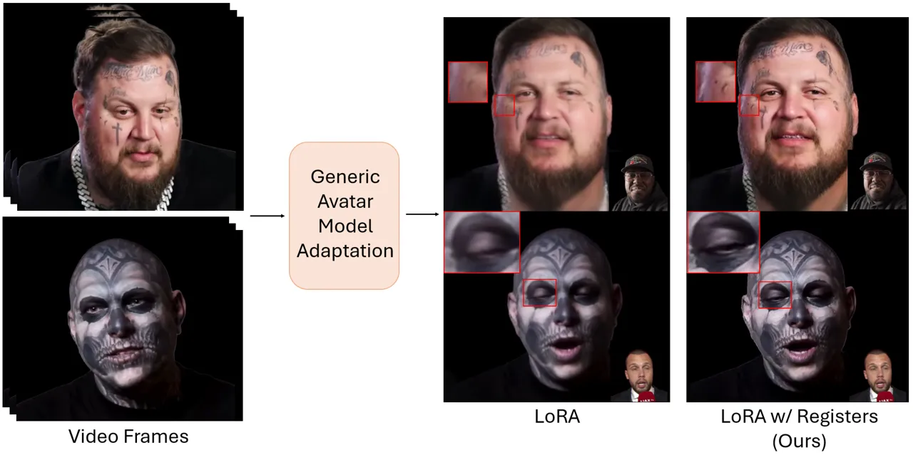

Figure 1: Our method personalizes and adapts a generic head avatar model
using LoRA, while preserving high-frequency identity-specific facial
details using our Register Module and retaining the original inference
speed. Note that the small image in the bottom-right corner is the
driving image.

## 2 Related Work

Human Portrait Synthesis. Earlier approaches for video synthesis of
human faces are based on 3DMMs (21, 20, 49). A 3DMM (2) is a parametric
model that represents a face as a linear combination of the principal
axes of shape, texture, and expression, learned by principal component
analysis (PCA). Subsequent works propose GAN-based networks for video
synthesis (28, 47, 41) and audio-driven talking faces (40, 63, 52, 56).
GANs are usually trained on large datasets of 2D videos of multiple
identities, but they cannot model the 3D face geometry. More recent
works learn 3D neural representations of the human face, which rely on
neural radiance fields (NeRFs) (34) or 3D Gaussian Splatting
(3DGS) (27). Diffusion models have also become popular but they only
produce 2D videos (57) or are identity-specific (30). In this paper, we
explore personalization to capture identity-specific facial details by
adapting a generic avatar model.

Animatable 3D Head Avatars. NeRFs have been first proposed for
novel-view synthesis of static scenes (34). They have been extended to
dynamic scenes and human faces (42, 38, 18, 39, 4). They usually
represent a human face by sampling 3D points in a canonical space, which
can be conditioned on 3DMM expression parameters to enable animation.
Although they produce high-quality reconstructions, they require
expensive identity-specific training. Subsequent works (65, 16) propose
techniques to reduce the training and inference time. 3DGS (27) became
very popular as it achieves real-time rendering with high visual
quality, by representing complex scenes with 3D Gaussians. It has
recently been applied for dynamic human avatars (8, 44, 58, 14, 53).
However, most approaches learn identity-specific models. Very few recent
works propose generic models (9, 10, 31), which preserve the
high-quality rendering of 3DGS, while trained on a large-scale dataset
of multiple identities, enabling generalization to unseen human faces.
However, generic models learn a general domain prior and usually fail to
produce unique identity-specific facial details, such as wrinkles or
tattoos, as studied in this paper.

Personalization. Numerous works have proposed ways to adapt pre-trained
models to various downstream tasks (25, 61). Parameter-efficient
fine-tuning (PEFT) techniques are proposed to fine-tune large models
efficiently. LoRA (26) adds low-rank matrices into each layer of a
pre-trained model, leading to a significant decrease of the learnable
parameters and on-par performance compared to fine-tuning the entire
model. In the context of face animation, fine-tuning part of the model
has been utilized (7, 32), as well as meta-learning. For instance,
MetaPortrait (60) adopts a meta-learning approach to allow adaptation
during inference, while \[19\] uses meta-learning to adapt a NeRF to a
single image of an unseen subject. Moreover, MyStyle (36) personalizes a
pre-trained StyleGAN by fine-tuning regions of its latent space, using a
set of images from an individual. Similarly, One2Avatar (59) adapts a
generic NeRF to one or a few images of a person. TalkLoRA (46) applies
LoRA for the task of 3D mesh animation, while My3DGen (43) adapts LoRA
to the convolutional layers of StyleGAN2 in an EG3D-based network (5).
Due to its popularity and efficiency, we study LoRA for our generic
model for head avatar animation. However, we find that LoRA is not
sufficient to capture high-frequency facial details of a new identity.
Thus, we propose to improve personalization by learning an additional
register module, inspired by register tokens in ViTs.

Additional Tokens in Neural Networks. Memory augmentation in neural
networks goes back to long short-term memory (LSTM) units (24) that
store information through gates. Memory networks (54, 48) have access to
external long-term memory. More recently, transformers have emerged as a
powerful representation for various deep learning tasks, where the core
element is self-attention (50). For language modeling, many works extend
the input sequence of transformers with special tokens. Such additional
tokens provide the network with new information, e.g. \[SEP\] in
BERT (13), or gather information for later downstream tasks,
e.g. \[CLS\] tokens (15), or \[MASK\] for generative modeling (1).
Unlike these works, \[11\] present additional tokens as registers for
storing and repurposing global information. Inspired by this, we extend
registers to a 3D feature space for human faces. We learn a Register
Module that stores information about distinctive high-frequency details
of a human face.

## 3 Proposed Method

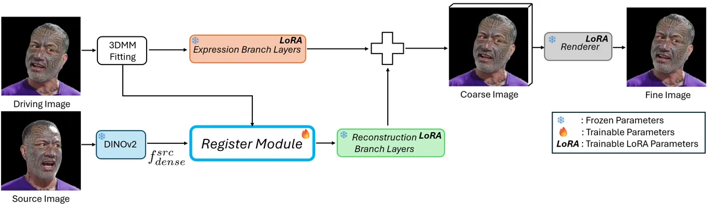

Figure 2: Illustration of our Register Module in a generic avatar
animation model. During adaptation, we pass the source image’s DINOv2
features $`f^{src}_{dense}`$ and driving image’s 3DMM parameters to our
module. Our module teaches the model to attend to specific regions in
the dense DINOv2 features, thus providing better learning signals for
LoRA to capture identity-specific details. Note that the Register Module
is not needed during inference but serves as the register during LoRA
training.

Figure 2 illustrates an overview of our proposed framework that adapts a
general avatar model to a particular identity. Inspired by
Parameter-Efficient Fine-Tuning (PEFT), specifically LoRA (26), we
utilize LoRA to adapt the weights of a generalized avatar model to a
particular identity. Through experiments, initially we find that
adapting with LoRA does not sufficiently improve personalization (see
Figure 1). Motivated by \[11\] that introduce registers in ViTs to store
and repurpose global information, we propose a Register Module to store
information about identity-specific details. Our Register Module
essentially teaches the model to attend to specific regions in the dense
DINOv2 features during adaptation. Importantly, it is only used during
adaptation and is deactivated at inference time. With its guidance, the
model learns to leverage DINOv2 features more effectively, enabling
high-quality personalized head avatar generation with real-time speed
from a single source image at inference.

Our proposed pipeline for personalizing a generic avatar animation model
consists of two main components:

\(1\) We add LoRA weights to specific pre-trained layers of a generic
avatar animation model (see Sec. 3.1), to keep the adaptation parameters
efficient and to avoid catastrophic forgetting (see Sec. 3.2).

\(2\) We design a Register Module that learns a 3D feature space,
facilitating the attention to specific regions of DINOv2 features, while
adapting to a face from multiple views (see Sec. 3.3).

We first describe a generic avatar animation model in Sec. 3.1. Next, we
describe the process of adding LoRA weights to pre-trained layers in
Sec. 3.2. Finally, we describe the architecture of our Register Module
in Sec. 3.3.

### 3.1 Preliminaries: Generic Avatar Generation

An avatar generation model consists of two branches: (a) reconstruction
branch, and (b) expression branch. The reconstruction branch generates
an animatable head avatar from the source image. The expression branch
extracts the expressions and pose from the driving image which is used
to animate the generated head avatar. These branches are merged and the
output is rendered using a neural renderer. This process learns a model
for generalized head avatar reconstruction (see Figure 2).

In particular, we use GAGAvatar (9) as our generic model trained on a
large-scale dataset using the general DINOv2 features in its
reconstruction branch, which is suitable to serve as our foundation
model for fast adaptation. While DINOv2 features are robust for generic
tasks, they may contain irrelevant information for avatar generation.
Thus, adapting the layers of the generic avatar model to focus on
relevant information within the DINOv2 feature space is necessary. We
propose our Register Module for this purpose in the following sections.

### 3.2 LoRA for Fast Adaptation

To adapt to a particular identity, inspired by the literature in NLP, we
use LoRA (26) for adaptation in a parameter-efficient manner. For a
pre-trained weight matrix $`W\in\mathbb{R}^{m\times n}`$, LoRA models
the adapted weights $`W_{adapt}`$ by representing it as an addition of
the pretrained weights $`W`$ and an offset matrix $`\Delta W`$, the
latter of which is low-rank decomposable.

```math
W_{adapt}=W+\Delta W=W+BA, \tag{1}
```

where $`B\in\mathbb{R}^{m\times r}`$ and $`A\in\mathbb{R}^{r\times n}`$
and $`r\ll min(m,n)`$. During adaptation, only parameters in $`A`$ and
$`B`$ receive gradients. For our purpose, we add LoRA weights $`A`$ and
$`B`$ to each parameter matrix in a pre-trained avatar model, except the
DINOv2 model. In our implementation, for all experiments except
ablations described in the supplementary material, we use the same rank
$`r=32`$ for all comparisons.

### 3.3 Register Module

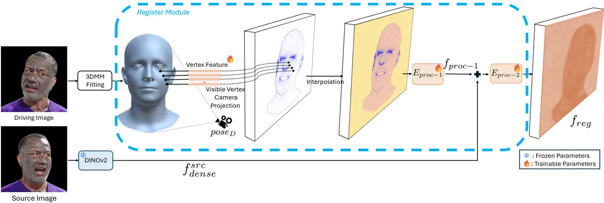

Figure 3: Illustration of our Register Module. We propose a Register
Module that learns features in the 3D space. We rig embeddings to
vertices on a 3DMM mesh and use camera pose $`pose_{D}`$ to project
visible vertices and their embeddings onto a camera plane. Next, we
interpolate features in the face mask region, fill in the background
feature. Finally, we add these features to source image’s DINOv2
features $`f^{src}_{dense}`$ to improve learning signals for LoRA.

Figure 3 illustrates the design of our Register Module. We hypothesize
that, in addition to adding LoRA weights, we need a mechanism for better
extraction of fine details of an identity, such as tattoos, wrinkles,
muscular idiosyncrasies, and other personal features of an identity. To
this end, we introduce a Register Module to improve the focus on
identity-specific details.

Feature Learning Procedure. Specifically, we propose to highlight
detailed information in DINOv2 local features of the source image with
the output of the Register Module. Let $`M=(V,E,F)`$ be a 3DMM mesh
(33), where $`V`$ is the set of vertices, $`n(V)`$ is the number of
vertices, $`E`$ is the set of edges and $`F`$ is the set of facets. In
our Register Module, we rig embeddings
$`e\in\mathbb{R}^{n(V)\times D}`$, where D is the dimension of the
embeddings, to vertices $`v\in V`$ of mesh $`M`$. Given a driving image
camera pose and position $`pose_{D}`$, we compute the set of visible
vertices $`U\subset V`$ of the mesh $`M`$ from

```math
U=\texttt{visible}(M,pose_{D})\;. \tag{2}
```

Next, we project these points $`U`$ to a feature space in the camera
plane $`S=\{(i,j)\in\mathbb{Z}^{2}|1\leq i\leq H,1\leq j\leq W\}`$ and
their corresponding embeddings to a dense feature
$`f_{S}\in\mathbb{R}^{H\times W\times D}`$, where $`H,W`$ are the
parameters of the image size, using a Perspective Projection:

```math
U_{S}=\texttt{perspective\_project}(U,pose_{D},K(S))\;, \tag{3}
```

where $`K(S)`$ is the intrinsic camera matrix for a camera with $`S`$ as
the camera plane. The projected points are rounded off to the nearest
integer. At points in the feature plane where a visible vertex
$`v\in U`$ is projected to, we assign the corresponding point’s
embedding from $`e`$. Hence the operation becomes:

```math
f_{S}[u^{i}_{S}]:=e[u^{i}]\text{ for }u^{i}\in U\text{ and }u^{i}_{S}\text{ is the projection of }u^{i}\;. \tag{4}
```

Given the set of points $`U_{s}`$ on the camera plane, we compute an
alpha shape (17) to find the simple contour polygon $`P_{U_{S}}`$ of the
vertex projections. Let $`\texttt{interior}(P)`$ represent all the
points inside a simple polygon $`P`$. For each point
$`p\in\texttt{interior}(P_{U_{S}})\text{ and }p\notin U_{S}`$, we
compute $`k`$ nearest points in $`U_{S}`$, and do inverse distance
weighted interpolation for point p. Mathematically, interpolated feature
$`e_{p}`$ for point
$`p\in\texttt{interior}(P_{U_{S}})\text{ and }p\notin U_{S}`$ is defined
as

```math
f_{S}[p]:=e_{p}=\frac{\sum^{k}_{i=1}\frac{1}{d_{i}}e_{v_{i}}}{\sum^{k}_{i=1}\frac{1}{d_{i}}}\;, \tag{5}
```

where $`\{v_{i}:i\in\{1,...,k\},v_{i}\in U_{S}\}\subset U_{S}`$ is the
set of $`k`$ nearest projected vertices and $`d_{i}=||p-v_{i}||_{2}`$.
For points $`p\in S\text{ and }p\notin\texttt{interior}(P_{U_{S}})`$, we
assign an feature $`e_{b}`$. This results in a dense constructed feature
$`f_{S}\in\mathbb{R}^{H\times W\times D}`$ from assigned features at
each point in $`S`$. We further process these features using a CNN-based
encoder $`E_{proc-1}`$.

```math
f_{proc-1}=E_{proc-1}(f_{S})\;, \tag{6}
```

where $`f_{proc-1}\in\mathbb{R}^{H\times W\times D_{out}}`$.

We add these features to the source image’s dense DINOv2 features
$`f^{src}_{dense}\in\mathbb{R}^{H\times W\times D_{out}}`$ and process
the result with another CNN-based encoder $`E_{proc-2}`$.
Mathematically, the output of our Register Module $`f_{reg}`$ is

```math
f_{reg}=E_{proc-2}(f^{src}_{dense}+f_{proc-1})\;. \tag{7}
```

In our implementation, we use $`H=W=296`$ and $`D_{out}=256`$ as in
\[9\]. We set $`k=11`$ and $`D=512`$ for all our comparisons.

Objective Functions. In order to make sure that the Register Module
learns meaningful features, we constrain the training with two losses.
First, we use the MSE loss between the driving image’s DINOv2 features
($`f^{dri}_{dense}`$) and output of the Register Module $`f_{reg}`$.

```math
L_{feat}=||f^{dri}_{dense}-f_{reg}||^{2}_{2}\;. \tag{8}
```

Next, to ensure that the features learned in the Register Module are
similar to each other, we regularize the embeddings $`e`$. This is
enforced by

```math
L_{reg}=\frac{\texttt{pcos}(e)}{n(V)(n(V)-1)}\;, \tag{9}
```

where
$`\texttt{pcos}(X)=\sum_{i}\sum_{j}\frac{X_{i}\cdot X_{j}}{||X_{i}||||X_{j}||}-n(V)`$
is the sum of the non-diagonal elements of a self-pairwise cosine
distance. We use a weighted combination of $`L_{feat}`$ and $`L_{reg}`$
with weights $`\lambda_{feat}`$ and $`\lambda_{reg}`$. Together, they
form $`L_{register}=\lambda_{feat}L_{feat}+\lambda_{reg}L_{reg}`$. In
our implementation, we set $`\lambda_{reg}=20`$ and
$`\lambda_{feat}=2`$.

Avatar Adaptation and Generation. To adapt to a particular identity, we
pick the first frame of a video as the source image and select a random
frame as the driving image. Next, we predict the Register Module’s
output $`f_{reg}`$ from the source image’s DINOv2 features
$`f^{src}_{dense}`$ and driving image’s 3DMM parameters. Next, we pass
the driving image’s 3DMM parameters to the expression branch and
$`f_{reg}`$ to the reconstruction branch. The outputs of the
corresponding branches are merged to produce a coarse image. A neural
renderer then produces the fine image. During inference, we skip the
Register Module and directly pass the source image’s DINOv2 features
$`f^{src}_{dense}`$ to the reconstruction branch, while the rest of the
process is the same as the training stage.

## 4 Experiments

### 4.1 Dataset Collection

We propose a new dataset, namely RareFace-50. Prior work uses datasets
with a large number of identities, e.g. VFHQ (55). However, these
datasets mostly include videos of celebrities and well-known faces from
television. Thus, they might lack in diversity in terms of age and
high-frequency facial details, such as wrinkles or unique tattoos (see
Figure 4). These underrepresented human faces are difficult to
faithfully generate by generic networks, such as GAGAvatar (9).
Identifying this issue in existing datasets, we collect a video dataset
of 50 identities with unique facial details from YouTube. The dataset is
collected from high-resolution close-up videos shot in 1080p, 2K and 4K
formats. We detect faces, crop and resize face images to
$`512\times 512`$ resolution. The average duration of the videos in this
dataset is around 15 seconds, with 2 videos per identity, resulting in
the total number of videos in the dataset equal to 100. We intend to
publish the dataset for research purposes. In addition to RareFace-50,
we also use VFHQ test set to evaluate our method. VFHQ Test consists of
50 high quality videos from 50 different identities cropped and resized
to $`512\times 512`$ resolution. Each video is around 4 to 10 seconds in
diverse poses and settings.

We pre-process input videos using the tracking pipeline from \[9\]. This
step provides background-matted input frames, along with its tracked
3DMM parameters (these include view pose, eye pose, jaw pose, FLAME
shape and expression parameters). We also pre-compute visible vertices
of the 3DMM mesh fitted on a particular frame. After this, we also
compute the alpha-shape polygon for the projection of the visible
vertices and the set of points that lie within this polygon given the
scale of the projection screen size. See more details in the
supplementary material.

### 4.2 Learned Features

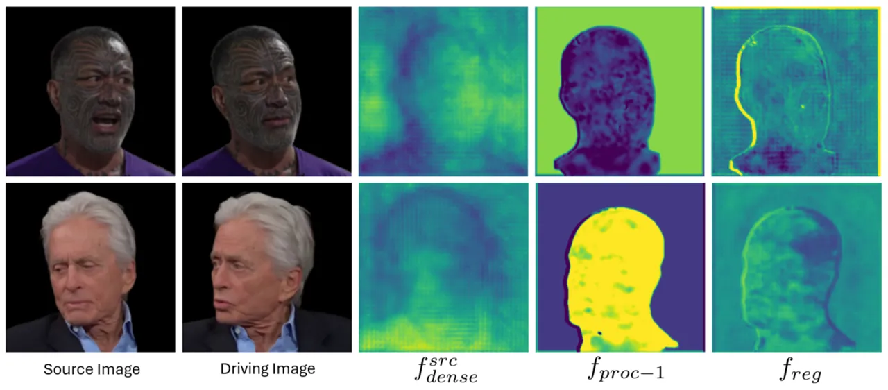

Figure 4: Visualization of learned features by the Register Module on
our RareFace-50 dataset. We visualize 1) source image’s DINOv2 feature
$`f^{src}_{dense}`$, 2) $`f_{proc-1}`$, output from $`E_{proc-1}`$, and 3) $`f_{reg}`$, output of the Register Module. We compute the 2nd
channel-wise PCA component and standardize the values. We observe that
the Register Module improves the learning signals by highlighting face
regions and dampening the background regions.

In Figure 4, we visualize the learned features of our Register Module.
Specifically, we visualize features 1) $`f_{proc-1}`$ from
$`E_{proc-1}`$, and 2) $`f_{reg}`$ from $`E_{proc-2}`$. We compute the
2nd channel-wise PCA component of DINOv2 features, and standardize and
visualize using colormap between the range $`[-3\sigma,3\sigma]`$ for
DINOv2 features and $`[-\sigma,\sigma]`$ for $`f_{proc-1}`$ and
$`f_{reg}`$. Since the DINOv2 model is trained in a self-supervised
manner to make features of different augmented views of an input image
to be similar on a diverse dataset, we observe features predicted by
DINOv2 to have features irrelevant to the task at hand, i.e.,
representing human faces. Moreover, the addition of the features from
$`f_{proc-1}`$ changes the characteristics of the added DINOv2 features
(see the comparison of $`f^{src}_{dense}`$ and $`f_{reg}`$ in Figure 4),
changing the distribution in irrelevant regions of the DINOv2 features.
In the supplementary material, we show additional visualization results,
other PCA components, and an analysis on the norms of DINOv2 and
Register Module features indicating that they improve meaningfully.

### 4.3 Ablation Study

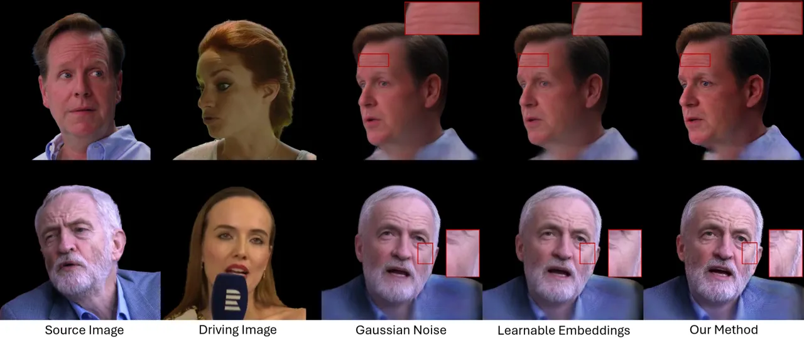

Figure 5: Ablation results on the VFHQ Test dataset. We observe that our
method performs better in preserving fine-details such as wrinkles and
blemishes.

| Method                     | LPIPS$`\downarrow`$ | ACD$`\downarrow`$ |
| -------------------------- | ------------------- | ----------------- |
| \(a\) Gaussian Noise       | 0.2699              | 0.3795            |
| \(b\) Learnable Embeddings | 0.2622              | 0.3604            |
| Ours                       | 0.2470              | 0.3559            |

Table 1: Ablation study on our proposed Register Module. In (a), we add
noise to DINOv2 features during adaptation. In (b), we add learnable
embeddings to DINOv2 features during adaptation.

We conduct an ablation study on our Register Module comparing our method
with variants. This study shows the contribution of our proposed 3D
feature space, which extends the idea of registers to 3D human faces.
Specifically, in variant (a) Gaussian Noise, we sample gaussian noise
$`G=(G_{h,w,d})\in\mathbb{R}^{H\times W\times D_{out}}`$,
$`Z_{h,w,d}\overset{\mathrm{iid}}{\sim}\mathcal{N}(0,1)`$ and add this
noise $`G`$ to the features $`f^{src}_{dense}`$ during the adaptation
stage. During inference, we directly use $`f^{src}_{dense}`$. In variant
(b) Learnable Embeddings, we add a learnable embedding dictionary
$`e_{learn}\in\mathbb{R}^{H\times W\times D_{out}}`$ to
$`f^{src}_{dense}`$ and make it trainable during adaptation. Again,
during inference we directly use $`f^{src}_{dense}`$.

Figure 5 shows visual results from these variants. Adding Gaussian Noise
causes washed out colors and overly smoothed details. Adding Learnable
Embeddings improves the preservation of details and colors slightly.
This variant would be the immediate extension of registers from \[11\]
to our case. However, we notice that our proposed Register Module best
preserves high-frequency details, such as roughness of the face and fine
wrinkles, by learning an appropriate 3D feature space for human faces.
Table 1 shows the corresponding quantitative results, demonstrating the
efficacy of our module in enhancing identity-specific details. We see
that our method has better perceptual similarity to the input image and
better preserves identity. We encourage the readers to watch our
supplementary video for additional results demonstrating the efficacy of
our Register Module.

### 4.4 Evaluation

Baselines. We compare our method to a baseline as the generic avatar
generation model (9) and the state-of-the-art approaches, namely
LoRA (46) and MetaPortrait (60) for adaptation in the
cross-reconstruction setting. We use the same rank $`r=32`$ for all our
comparisons. Note that we implement the meta-learning algorithm from
MetaPortrait (60) on LoRA weights for fair comparisons.

Evaluation Metrics. To measure visual quality, we select challenging
patches with high-frequency details from predicted frames and compare
them against source image patches using Learned Perceptual Image Patch
Similarity (LPIPS) (62) in the cross-reconstruction setting.
Furthermore, we estimate the identity preservation using the Average
Content Distance (ACD) metric \[51\], by calculating the cosine distance
between ArcFace (12) face recognition embeddings of synthesized and
source images. Essentially, the idea is that the smaller the distance
between those embeddings, the closer are the synthesized images to the
input source images in terms of identity.

|                   | VFHQ Test           |                   | RareFace-50         |                   |
| ----------------- | ------------------- | ----------------- | ------------------- | ----------------- |
| Method            | LPIPS$`\downarrow`$ | ACD$`\downarrow`$ | LPIPS$`\downarrow`$ | ACD$`\downarrow`$ |
| GAGAvatar (9)     | 0.2540              | 0.3631            | 0.2953              | 0.4046            |
| LoRA (26)         | 0.2666              | 0.3687            | 0.2855              | 0.3872            |
| MetaPortrait (60) | 0.2650              | 0.4131            | 0.2901              | 0.4504            |
| Ours              | 0.2470              | 0.3559            | 0.2744              | 0.3792            |

Table 2: Quantitative comparisons of our approach with the baseline and
other state-of-the-art adaptation methods. Results are highlighted as
follows: Best and Second Best.

Quantitative Evaluation. Table 2 shows our quantitative results. Our
method significantly outperforms the state-of-the-art in low-rank
adaptation (LoRA and Meta Learning on LoRA) in terms of visual quality
(LPIPS) and identity preservation (ACD). We encourage the readers to
watch our supplementary video for additional results demonstrating the
efficacy of our Register Module. Qualitative Evaluation.

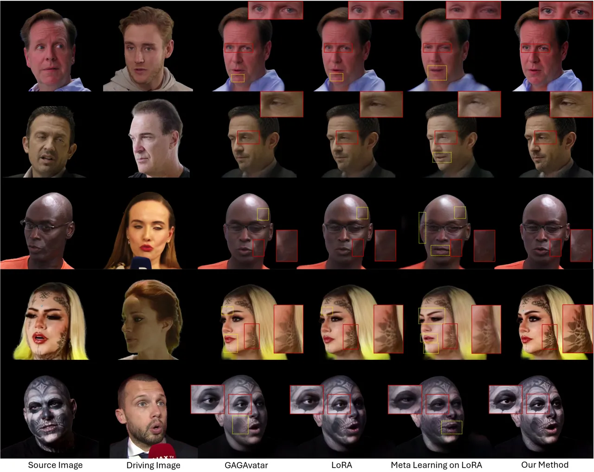

Figure 6: Personalized head avatar generation on VFHQ Test (row 1, 2,
and 3) and RareFace-50 (rows 4 and 5). We compare state-of-the-art
methods for adaptation (LoRA (26) and Meta-Learning (60)). We observe
that our method preserves fine details for identity-specific features
and produces higher quality results as compared to other methods.

Figure 6 shows our qualitative results. Notice how our method faithfully
reconstructs fine details and identity-specific features well as
compared to other methods. GAGAvatar frequently produces washed out
colors (in rows 4 and 5) and muted details (rows 1, 2, and 3). While
LoRA performs better than GAGAvatar, it still misses fine wrinkles and
veins (rows 1, 2, and 3), contrast in tattoos and skin (rows 4 and 5),
and bumpy skin (row 3). Meta Learning on LoRA weights produces artifacts
on face (row 3) and in eyes (rows 1, 2, and 5), produces wrong
expression as compared to the driving image (all rows), misses tattoos
on skin (row 4), and generates wrong colored lips. In general, our
method learns to preserve high-frequency details in the source identity
and produce higher quality results while using the same number of
parameters as other methods.

## 5 Conclusion

In conclusion, we introduce a novel method for personalized head avatar
generation. State-of-the-art approaches for adaptation such as vanilla
LoRA and meta-learning fail to preserve high-frequency details and
identity-specific features. We propose a novel Register Module that
enhances the performance of LoRA, by teaching the layers to attend to
specific regions in the intermediate features of a pre-trained model. To
demonstrate the effectiveness of our method, we collect a dataset of
talking individuals with distinctive facial features, such as wrinkles
and tattoos. Our method outperforms existing methods qualitatively and
quantitatively, faithfully capturing unseen identities.

Limitations and Future Work. Although our Register Module successfully
captures distinctive facial details, it might produce suboptimal results
for extreme side or back views that are rarely or not at all seen in a
video. In the future, we plan to extend our work to faithfully animate
avatars from such rare views of individuals.

## References

- \[1\] Hangbo Bao, Li Dong, Songhao Piao, and Furu Wei. Beit: Bert
  pre-training of image transformers. arXiv preprint
  arXiv:2106.08254, 2021.
- \[2\] Volker Blanz and Thomas Vetter. A morphable model for the
  synthesis of 3d faces. In Proceedings of the 26th annual conference on
  Computer graphics and interactive techniques, pages 187–194, 1999.
- \[3\] Zhixi Cai, Shreya Ghosh, Kalin Stefanov, Abhinav Dhall, Jianfei
  Cai, Hamid Rezatofighi, Reza Haffari, and Munawar Hayat. Marlin:
  Masked autoencoder for facial video representation learning. In
  CVPR, 2023.
- \[4\] Sai Tanmay Reddy Chakkera, Aggelina Chatziagapi, and Dimitris
  Samaras. Jean: Joint expression and audio-guided nerf-based talking
  face generation. arXiv preprint arXiv:2409.12156, 2024.
- \[5\] Eric R Chan, Connor Z Lin, Matthew A Chan, Koki Nagano, Boxiao
  Pan, Shalini De Mello, Orazio Gallo, Leonidas J Guibas, Jonathan
  Tremblay, Sameh Khamis, et al. Efficient geometry-aware 3d generative
  adversarial networks. In Proceedings of the IEEE/CVF conference on
  computer vision and pattern recognition, pages 16123–16133, 2022.
- \[6\] Jonathan Chang and James Kelly. minlora: a minimal pytorch
  library that allows you to apply lora to any pytorch model.
  [https://github.com/cccntu/minLoRA](https://github.com/cccntu/minLoRA).
  Accessed: 2025-05-17.
- \[7\] Aggelina Chatziagapi, Grigorios G Chrysos, and Dimitris Samaras.
  Mi-nerf: Learning a single face nerf from multiple identities. arXiv
  preprint arXiv:2403.19920, 2024.
- \[8\] Kyusun Cho, Joungbin Lee, Heeji Yoon, Yeobin Hong, Jaehoon Ko,
  Sangjun Ahn, and Seungryong Kim. Gaussiantalker: Real-time talking
  head synthesis with 3d gaussian splatting. In Proceedings of the 32nd
  ACM International Conference on Multimedia, pages 10985–10994, 2024.
- \[9\] Xuangeng Chu and Tatsuya Harada. Generalizable and animatable
  gaussian head avatar. In The Thirty-eighth Annual Conference on Neural
  Information Processing Systems, 2024.
- \[10\] Xuangeng Chu, Yu Li, Ailing Zeng, Tianyu Yang, Lijian Lin,
  Yunfei Liu, and Tatsuya Harada. Gpavatar: Generalizable and precise
  head avatar from image (s). arXiv preprint arXiv:2401.10215, 2024.
- \[11\] Timothée Darcet, Maxime Oquab, Julien Mairal, and Piotr
  Bojanowski. Vision transformers need registers. arXiv preprint
  arXiv:2309.16588, 2023.
- \[12\] Jiankang Deng, Jia Guo, Niannan Xue, and Stefanos Zafeiriou.
  Arcface: Additive angular margin loss for deep face recognition. In
  CVPR, 2019.
- \[13\] Jacob Devlin, Ming-Wei Chang, Kenton Lee, and Kristina
  Toutanova. BERT: Pre-training of deep bidirectional transformers for
  language understanding. In Jill Burstein, Christy Doran, and Thamar
  Solorio, editors, Proceedings of the 2019 Conference of the North
  American Chapter of the Association for Computational Linguistics:
  Human Language Technologies, Volume 1 (Long and Short Papers), pages
  4171–4186, Minneapolis, Minnesota, June 2019. Association for
  Computational Linguistics.
- \[14\] Helisa Dhamo, Yinyu Nie, Arthur Moreau, Jifei Song, Richard
  Shaw, Yiren Zhou, and Eduardo Pérez-Pellitero. Headgas: Real-time
  animatable head avatars via 3d gaussian splatting. In European
  Conference on Computer Vision, pages 459–476. Springer, 2024.
- \[15\] Alexey Dosovitskiy, Lucas Beyer, Alexander Kolesnikov, Dirk
  Weissenborn, Xiaohua Zhai, Thomas Unterthiner, Mostafa Dehghani,
  Matthias Minderer, Georg Heigold, Sylvain Gelly, Jakob Uszkoreit, and
  Neil Houlsby. An image is worth 16x16 words: Transformers for image
  recognition at scale. In International Conference on Learning
  Representations, 2021.
- \[16\] Hao-Bin Duan, Miao Wang, Jin-Chuan Shi, Xu-Chuan Chen, and
  Yan-Pei Cao. Bakedavatar: Baking neural fields for real-time head
  avatar synthesis. ACM Trans. Graph., 42(6), sep 2023.
- \[17\] H. Edelsbrunner, D. Kirkpatrick, and R. Seidel. On the shape of
  a set of points in the plane. IEEE Transactions on Information Theory,
  29(4):551–559, 1983.
- \[18\] Guy Gafni, Justus Thies, Michael Zollhöfer, and Matthias
  Nießner. Dynamic neural radiance fields for monocular 4d facial avatar
  reconstruction, 2020.
- \[19\] Chen Gao, Yichang Shih, Wei-Sheng Lai, Chia-Kai Liang, and
  Jia-Bin Huang. Portrait neural radiance fields from a single image.
  arXiv preprint arXiv:2012.05903, 2020.
- \[20\] Pablo Garrido, Levi Valgaerts, Ole Rehmsen, Thorsten
  Thormahlen, Patrick Perez, and Christian Theobalt. Automatic face
  reenactment. In Proceedings of the IEEE conference on computer vision
  and pattern recognition, pages 4217–4224, 2014.
- \[21\] Pablo Garrido, Levi Valgaerts, Hamid Sarmadi, Ingmar Steiner,
  Kiran Varanasi, Patrick Perez, and Christian Theobalt. Vdub: Modifying
  face video of actors for plausible visual alignment to a dubbed audio
  track. In Computer graphics forum, volume 34, pages 193–204. Wiley
  Online Library, 2015.
- \[22\] Xavier Glorot and Yoshua Bengio. Understanding the difficulty
  of training deep feedforward neural networks. In Yee Whye Teh and Mike
  Titterington, editors, Proceedings of the Thirteenth International
  Conference on Artificial Intelligence and Statistics, volume 9 of
  Proceedings of Machine Learning Research, pages 249–256, Chia Laguna
  Resort, Sardinia, Italy, 13–15 May 2010. PMLR.
- \[23\] Jia Guo, Jiankang Deng, Xiang An, Jack Yu, and Baris Gecer.
  Insightface repository model zoo.
- \[24\] Sepp Hochreiter and Jürgen Schmidhuber. Long short-term memory.
  Neural computation, 9(8):1735–1780, 1997.
- \[25\] Neil Houlsby, Andrei Giurgiu, Stanislaw Jastrzebski, Bruna
  Morrone, Quentin De Laroussilhe, Andrea Gesmundo, Mona Attariyan, and
  Sylvain Gelly. Parameter-efficient transfer learning for nlp. In
  International conference on machine learning, pages 2790–2799.
  PMLR, 2019.
- \[26\] Edward J Hu, Yelong Shen, Phillip Wallis, Zeyuan Allen-Zhu,
  Yuanzhi Li, Shean Wang, Lu Wang, and Weizhu Chen. LoRA: Low-rank
  adaptation of large language models. In International Conference on
  Learning Representations, 2022.
- \[27\] Bernhard Kerbl, Georgios Kopanas, Thomas Leimkühler, and George
  Drettakis. 3d gaussian splatting for real-time radiance field
  rendering. ACM Transactions on Graphics, 42(4), 2023.
- \[28\] Hyeongwoo Kim, Pablo Garrido, Ayush Tewari, Weipeng Xu, Justus
  Thies, Matthias Niessner, Patrick Pérez, Christian Richardt, Michael
  Zollhöfer, and Christian Theobalt. Deep video portraits. ACM
  Transactions on Graphics (TOG), 37(4):1–14, 2018.
- \[29\] Diederik P. Kingma and Jimmy Ba. Adam: A method for stochastic
  optimization, 2017.
- \[30\] Tobias Kirschstein, Simon Giebenhain, and Matthias Nießner.
  Diffusionavatars: Deferred diffusion for high-fidelity 3d head
  avatars. In Proceedings of the IEEE/CVF Conference on Computer Vision
  and Pattern Recognition, pages 5481–5492, 2024.
- \[31\] Tobias Kirschstein, Simon Giebenhain, Jiapeng Tang, Markos
  Georgopoulos, and Matthias Nießner. Gghead: Fast and generalizable 3d
  gaussian heads. In SIGGRAPH Asia 2024 Conference Papers, pages
  1–11, 2024.
- \[32\] Jiahe Li, Jiawei Zhang, Xiao Bai, Jin Zheng, Jun Zhou, and Lin
  Gu. Instag: Learning personalized 3d talking head from few-second
  video. arXiv preprint arXiv:2502.20387, 2025.
- \[33\] Tianye Li, Timo Bolkart, Michael. J. Black, Hao Li, and Javier
  Romero. Learning a model of facial shape and expression from 4D scans.
  ACM Transactions on Graphics, (Proc. SIGGRAPH Asia),
  36(6):194:1–194:17, 2017.
- \[34\] Ben Mildenhall, Pratul P. Srinivasan, Matthew Tancik,
  Jonathan T. Barron, Ravi Ramamoorthi, and Ren Ng. Nerf: Representing
  scenes as neural radiance fields for view synthesis. In ECCV, 2020.
- \[35\] Alex Nichol and John Schulman. Reptile: a scalable metalearning
  algorithm. arXiv preprint arXiv:1803.02999, 2(3):4, 2018.
- \[36\] Yotam Nitzan, Kfir Aberman, Qiurui He, Orly Liba, Michal Yarom,
  Yossi Gandelsman, Inbar Mosseri, Yael Pritch, and Daniel Cohen-Or.
  Mystyle: A personalized generative prior. arXiv preprint
  arXiv:2203.17272, 2022.
- \[37\] Maxime Oquab, Timothée Darcet, Théo Moutakanni, Huy Vo, Marc
  Szafraniec, Vasil Khalidov, Pierre Fernandez, Daniel Haziza, Francisco
  Massa, Alaaeldin El-Nouby, et al. Dinov2: Learning robust visual
  features without supervision. arXiv preprint arXiv:2304.07193, 2023.
- \[38\] Keunhong Park, Utkarsh Sinha, Jonathan T. Barron, Sofien
  Bouaziz, Dan B Goldman, Steven M. Seitz, and Ricardo Martin-Brualla.
  Nerfies: Deformable neural radiance fields. ICCV, 2021.
- \[39\] Keunhong Park, Utkarsh Sinha, Peter Hedman, Jonathan T Barron,
  Sofien Bouaziz, Dan B Goldman, Ricardo Martin-Brualla, and Steven M
  Seitz. Hypernerf: A higher-dimensional representation for
  topologically varying neural radiance fields. arXiv preprint
  arXiv:2106.13228, 2021.
- \[40\] K R Prajwal, Rudrabha Mukhopadhyay, Vinay P. Namboodiri, and
  C.V. Jawahar. A lip sync expert is all you need for speech to lip
  generation in the wild. In Proceedings of the 28th ACM International
  Conference on Multimedia, page 484–492, 2020.
- \[41\] Albert Pumarola, Antonio Agudo, Aleix M Martinez, Alberto
  Sanfeliu, and Francesc Moreno-Noguer. Ganimation: One-shot
  anatomically consistent facial animation. International Journal of
  Computer Vision, 128(3):698–713, 2020.
- \[42\] Albert Pumarola, Enric Corona, Gerard Pons-Moll, and Francesc
  Moreno-Noguer. D-nerf: Neural radiance fields for dynamic scenes. In
  Proceedings of the IEEE/CVF Conference on Computer Vision and Pattern
  Recognition, pages 10318–10327, 2021.
- \[43\] Luchao Qi, Jiaye Wu, Annie N Wang, Shengze Wang, and Roni
  Sengupta. My3dgen: A scalable personalized 3d generative model. In
  2025 IEEE/CVF Winter Conference on Applications of Computer Vision
  (WACV), pages 961–972. IEEE, 2025.
- \[44\] Shenhan Qian, Tobias Kirschstein, Liam Schoneveld, Davide
  Davoli, Simon Giebenhain, and Matthias Nießner. Gaussianavatars:
  Photorealistic head avatars with rigged 3d gaussians. In Proceedings
  of the IEEE/CVF Conference on Computer Vision and Pattern Recognition,
  pages 20299–20309, 2024.
- \[45\] Tal Reiss, Bar Cavia, and Yedid Hoshen. Detecting deepfakes
  without seeing any. arXiv preprint arXiv:2311.01458, 2023.
- \[46\] Jack Saunders and Vinay Namboodiri. Talklora: Low-rank
  adaptation for speech-driven animation. arXiv preprint
  arXiv:2408.13714, 2024.
- \[47\] Aliaksandr Siarohin, Stéphane Lathuilière, Sergey Tulyakov,
  Elisa Ricci, and Nicu Sebe. First order motion model for image
  animation. In Conference on Neural Information Processing Systems
  (NeurIPS), December 2019.
- \[48\] Sainbayar Sukhbaatar, Jason Weston, Rob Fergus, et al.
  End-to-end memory networks. Advances in neural information processing
  systems, 28, 2015.
- \[49\] Justus Thies, Michael Zollhofer, Marc Stamminger, Christian
  Theobalt, and Matthias Nießner. Face2face: Real-time face capture and
  reenactment of rgb videos. In Proceedings of the IEEE conference on
  computer vision and pattern recognition, pages 2387–2395, 2016.
- \[50\] Ashish Vaswani, Noam Shazeer, Niki Parmar, Jakob Uszkoreit,
  Llion Jones, Aidan N Gomez, Łukasz Kaiser, and Illia Polosukhin.
  Attention is all you need. Advances in neural information processing
  systems, 30, 2017.
- \[51\] Konstantinos Vougioukas, Stavros Petridis, and Maja Pantic.
  End-to-end speech-driven realistic facial animation with temporal
  gans. In CVPRW, 2019.
- \[52\] Konstantinos Vougioukas, Stavros Petridis, and Maja Pantic.
  Realistic speech-driven facial animation with gans. International
  Journal of Computer Vision, 128(5):1398–1413, 2020.
- \[53\] Jie Wang, Jiu-Cheng Xie, Xianyan Li, Feng Xu, Chi-Man Pun, and
  Hao Gao. Gaussianhead: High-fidelity head avatars with learnable
  gaussian derivation. IEEE Transactions on Visualization and Computer
  Graphics, 2025.
- \[54\] Jason Weston, Sumit Chopra, and Antoine Bordes. Memory
  networks. arXiv preprint arXiv:1410.3916, 2014.
- \[55\] Liangbin Xie, Xintao Wang, Honglun Zhang, Chao Dong, and Ying
  Shan. Vfhq: A high-quality dataset and benchmark for video face
  super-resolution. In Proceedings of the IEEE/CVF Conference on
  Computer Vision and Pattern Recognition, pages 657–666, 2022.
- \[56\] Jingyi Xu, Hieu Le, Zhixin Shu, Yang Wang, Yi-Hsuan Tsai, and
  Dimitris Samaras. Learning frame-wise emotion intensity for
  audio-driven talking-head generation. arXiv preprint
  arXiv:2409.19501, 2024.
- \[57\] Sicheng Xu, Guojun Chen, Yu-Xiao Guo, Jiaolong Yang, Chong Li,
  Zhenyu Zang, Yizhong Zhang, Xin Tong, and Baining Guo. Vasa-1:
  Lifelike audio-driven talking faces generated in real time. arXiv
  preprint arXiv:2404.10667, 2024.
- \[58\] Yuelang Xu, Benwang Chen, Zhe Li, Hongwen Zhang, Lizhen Wang,
  Zerong Zheng, and Yebin Liu. Gaussian head avatar: Ultra high-fidelity
  head avatar via dynamic gaussians. In Proceedings of the IEEE/CVF
  Conference on Computer Vision and Pattern Recognition (CVPR), 2024.
- \[59\] Zhixuan Yu, Ziqian Bai, Abhimitra Meka, Feitong Tan, Qiangeng
  Xu, Rohit Pandey, Sean Fanello, Hyun Soo Park, and Yinda Zhang.
  One2avatar: Generative implicit head avatar for few-shot user
  adaptation. arXiv preprint arXiv:2402.11909, 2024.
- \[60\] Bowen Zhang, Chenyang Qi, Pan Zhang, Bo Zhang, HsiangTao Wu,
  Dong Chen, Qifeng Chen, Yong Wang, and Fang Wen. Metaportrait:
  Identity-preserving talking head generation with fast personalized
  adaptation. In Proceedings of the IEEE/CVF Conference on Computer
  Vision and Pattern Recognition, pages 22096–22105, 2023.
- \[61\] Lvmin Zhang, Anyi Rao, and Maneesh Agrawala. Adding conditional
  control to text-to-image diffusion models. In Proceedings of the
  IEEE/CVF international conference on computer vision, pages
  3836–3847, 2023.
- \[62\] Richard Zhang, Phillip Isola, Alexei A Efros, Eli Shechtman,
  and Oliver Wang. The unreasonable effectiveness of deep features as a
  perceptual metric. In CVPR, 2018.
- \[63\] Hang Zhou, Yasheng Sun, Wayne Wu, Chen Change Loy, Xiaogang
  Wang, and Ziwei Liu. Pose-controllable talking face generation by
  implicitly modularized audio-visual representation. In Proceedings of
  the IEEE Conference on Computer Vision and Pattern Recognition
  (CVPR), 2021.
- \[64\] Zheng Zhu, Guan Huang, Jiankang Deng, Yun Ye, Junjie Huang,
  Xinze Chen, Jiagang Zhu, Tian Yang, Jiwen Lu, Dalong Du, and Jie Zhou.
  Webface260m: A benchmark unveiling the power of million-scale deep
  face recognition. In CVPR, 2021.
- \[65\] Wojciech Zielonka, Timo Bolkart, and Justus Thies. Instant
  volumetric head avatars. In Proceedings of the IEEE/CVF Conference on
  Computer Vision and Pattern Recognition, pages 4574–4584, 2023.

## Appendix

The appendix is organized as follows:

1.  1.  Additional Ablation Study in Sec. A
2.  2.  Implementation Details in Sec. B
3.  3.  Dataset Collection Details in Sec. C
4.  4.  Additional Results in Sec. D
5.  5.  User Study Details in Sec. E
6.  6.  Discussion: Broader Impact, Limitations, and Ethical Considerations
        in Sec. F

We strongly encourage the readers to watch our supplementary video.

## Appendix A Additional Ablation Study

| Method                      | LPIPS$`\downarrow`$ | ACD$`\downarrow`$ |
| --------------------------- | ------------------- | ----------------- |
| \(a\) Ours w/o $`L_{feat}`$ | 0.2574              | 0.3604            |
| \(b\) Ours w/o $`L_{reg}`$  | 0.2508              | 0.3574            |
| Ours                        | 0.2470              | 0.3559            |

Table 3: Ablation study on losses to adapt with our method. In (a), we
remove $`L_{feat}`$ during adaptation. In (b), we remove $`L_{reg}`$
during adaptation.

| Method              | LPIPS$`\downarrow`$ | ACD$`\downarrow`$ |
| ------------------- | ------------------- | ----------------- |
| \(a\) Ours w/ 4 sec | 0.2471              | 0.3639            |
| \(b\) Ours w/ 2 sec | 0.2471              | 0.3656            |
| \(c\) Ours w/ 1 sec | 0.2477              | 0.3687            |

Table 4: Ablation study on length of videos to adapt the head avatar. We
set the adaptation video length to 4, 2, and 1 seconds.

We conduct additional ablation studies on our proposed method.
Specifically, we ablate the various losses we propose. In Table 3(a), we
remove the loss $`L_{feat}`$ to supervise the output of our register
module during adaptation, and in (b) we remove $`L_{reg}`$ to make the
learned embeddings in our Register Module different from each other. We
see that removal of these losses causes a drop in performance as
compared to when both losses are present. Furthermore, we ablate on the
length of the videos used to adapt our head avatars in Table 4. We see
that reducing the length of the adaptation video causes a drop in the
performance of the method. Note that we trim the original videos to the
first 4, 2, and 1 second for these experiments.

## Appendix B Implementation Details

### B.1 Addition of LoRA to layers

We use minLoRA (6) library to add LoRA (26) parameters to all layers of
a pretrained pytorch model. During training LoRA is instantialized as
separate parameters
$`B\in\mathbb{R}^{m\times r},A\in\mathbb{R}^{r\times n}`$ and
$`r\ll min(m,n)`$ from the pretrained parameters
$`W_{pre}\in\mathbb{R}^{m\times n}`$ of the module, so that these
parameters can be trained. During inference the LoRA parameters are
merged with the pretrained parameters and assigned as the new pretrained
parameters according to:

```math
W_{adapt}:=W_{pre}+\Delta W=W_{pre}+BA. \tag{10}
```

This ensures that the LoRA layers add no overhead to the pipeline during
the inference. Given a pretrained GAGAvatar model, we add LoRA weights
to all layers except in the DINOv2 feature extractor.

### B.2 Dataset Preprocessing

Given the expression code, shape code, and camera pose predicted during
3DMM fitting, we predict a 3DMM mesh. We compute visible vertices of
3DMM mesh from the computed camera pose of a particular frame using
trimesh’s RayMeshIntersector implementation. Specifically, we cast rays
from the camera origin to each point in the mesh and compute whether any
line intersects the mesh (if an intersection exists, the point is not
visible). Given these visible points in 3D space, we find a screen space
camera projection on a screen of the same size as DINOv2 feature space
($`H=W=296`$) using Perspective Projection. Then we find an alpha-shape
of these projected points with $`\alpha=0.065`$. Next, we compute all
the points in the alpha-shape polygon using a parallelized
point-in-polygon test. For all points in the polygon that are not
projected points, we also compute the $`k`$ nearest projected points and
distances from those projected points, where $`k=11`$.

### B.3 Register Module Details

The embeddings rigged to vertices on the 3DMM mesh (33) are modeled in a
3D space in our register module, However, these points are projected
onto a 2D space using a camera projection following which, we
interpolate the features using a weighted sum of the $`k`$ nearest
neighbors to fill up the face region in densely constructed feature
$`f_{S}`$. Using the entire set of the vertices would cause all points
to be projected onto the densely constructed feature $`f_{S}`$, thus
impacting the interpolation process (projection of points from the back
of the head might be in the $`k`$ nearest neighbors of a point
$`p\in interior(P_{U_{S}})`$). Thus, we only project visible points from
any given view in our register module.

We model $`E_{proc-1}`$ as a convolutional module, with 4 convolutional
layers of channel sizes $`[512,512,256,256]`$ and kernel sizes set to
$`3`$ for each layer. $`E_{proc-2}`$ is also a convolutional module with
4 layers of channel sizes set to 256. The first 3 layers have a kernel
size of 3, while the last layer has a kernel size of 1.

### B.4 Training Details

#### B.4.1 Our Method

We initialize embeddings $`e`$ using Xavier Normal initialization (22).
We adapt head avatars with our method for a total of $`1000`$
iterations. The batch size is set to $`2`$. We use Adam (29) optimizer
with learning rate set to $`1e-4`$ for the LoRA layers whereas the
learning rate is set to $`1e-3`$ for parameters in the Register Module.
We use a linear learning rate scheduler with a start factor of 1.0 and
an end factor of 0.1 at the $`1000`$th iteration. Along with our
proposed losses, we also keep the losses proposed by GAGAvatar \[9\],
namely, RGB losses between predicted image and driving image, a
perceptual loss between the predicted images and driver image, and
$`L_{lifting}`$, loss between predicted points from reconstruction
branch and vertices of the 3DMM mesh fitted on the driving image. Our
adaptation takes $`\approx 35`$ minutes on an RTX A5000 GPU, consuming
$`\approx 23`$GB of VRAM. During inference, we load and merge the LoRA
weights into their corresponding layer parameters. Thus, there is no
overhead during inference, i.e., it consumes the same amount of
resources as GAGAvatar during inference.

#### B.4.2 Baselines and Ablations

For all comparisons with the vanilla LoRA, we use the same
hyperparameters as our method. That is, we adapt with vanilla LoRA for a
total of $`1000`$ iterations, set the batch size to $`2`$, use Adam
optimizer with learning rate set to $`1e-4`$ for the LoRA layers, and
use a linear learning rate scheduler with a start factor of 1.0 and an
end factor of 0.1 at the $`1000`$th iteration. This adaptation takes
$`\approx 25`$ minutes on an RTX A5000 GPU, consuming $`\approx 14.9`$GB
of VRAM.

Following MetaPortrait (60), we implement Reptile \[35\], a MAML based
strategy for meta-learning in our low-rank adaptation task. We perform
pre-training on our RareFace-50 dataset. Following the formulation of
MetaPortrait, we formulate the task of adapting to a particular identity
as an inner loop task. Thus, we adapt to a randomly sampled identity at
each outer step. For all comparisons with Meta-Learning on LoRA, we set
rank $`r=32`$, the inner loop learning rate to $`2e-4`$, and the outer
update step size to $`2e-5`$. The number of inner loop steps are set to
120, and number of elements in batch in inner loop is set to 4. We set
the number of outer iterations to 4800. Given resource constraints, we
implement a single GPU version of Reptile (35), thus taking 12 days to
complete the pretraining task on a Quadro RTX 8000 GPU, consuming
$`\approx 45`$GB of VRAM. After the pre-training task, we adapt the
model on an identity for 120 steps with the same learning rate as the
inner loop, which takes $`\approx 4`$ minutes on an RTX A5000 GPU
consuming $`\approx 14.9`$GB of VRAM. We then use these adapted weights
for inference by merging these LoRA weights to the corresponding layers.

For all experiments with learnable parameters $`e_{learn}`$ as a
replacement to our Register Module, we set the learning rate for
$`e_{learn}`$ parameters to be $`1e-3`$.

### B.5 Metrics

We compute the visual quality metrics namely, LPIPS \[62\], on specific
challenging crops with high frequency details from predicted frames and
compare them against source image patches. The identity preservation
metric (ACD) is measured using ArcFace \[12\], a ResNet50-based network
trained on WebFace \[64\]. Specifically, we used “buffalo_l” model from
the insightface repository \[23\].

## Appendix C Data Collection

We collect data from Youtube of people knowingly appearing in interviews
in public broadcasts with distinctive facial details, such as wrinkles
or tattoos. These characteristics are under-represented in existing
datasets. We will present the dataset as a set of links, along with trim
times and crop position coordinates. Additionally, this dataset will be
maintained using an automatic script that checks and removes links from
the list that no longer exist in YouTube.

## Appendix D Additional Results

### D.1 Details of Adaptation

Adaptation Duration. In this section, we discuss the adaptation
durations of our baselines and our method. Vanilla LoRA and our method
take $`\approx 25`$ minutes and $`\approx 35`$ minutes to adapt
respectively on an RTX A5000 GPU. Whereas, meta-learning on LoRA
requires a much longer $`12`$ day period on an RTX Quadro 8000 GPU for
the pretraining objective, after which it requires $`\approx 4`$ minutes
on a RTX A5000 GPU. However, during inference, all of these methods have
the same inference times as GAGAvatar \[9\].

Adaptation Parameters. In this section, we discuss the number of
parameters during adaptation and inference of our baselines and our
method. During adaptation, we introduce $`4.7`$M parameters as LoRA
weights to the pretrained layers in all baselines. Our Register Module
adds another $`18.5`$M parameters. Thus, our method has $`23.2`$M
parameters during adaptation, which is $`\approx 11\%`$ of the total
number of parameters ($`199`$M parameters) in GAGAvatar. During
adaptation, we discard the trained Register Module, which lends to the
same efficiency as GAGAvatar and other baselines.

### D.2 User Study

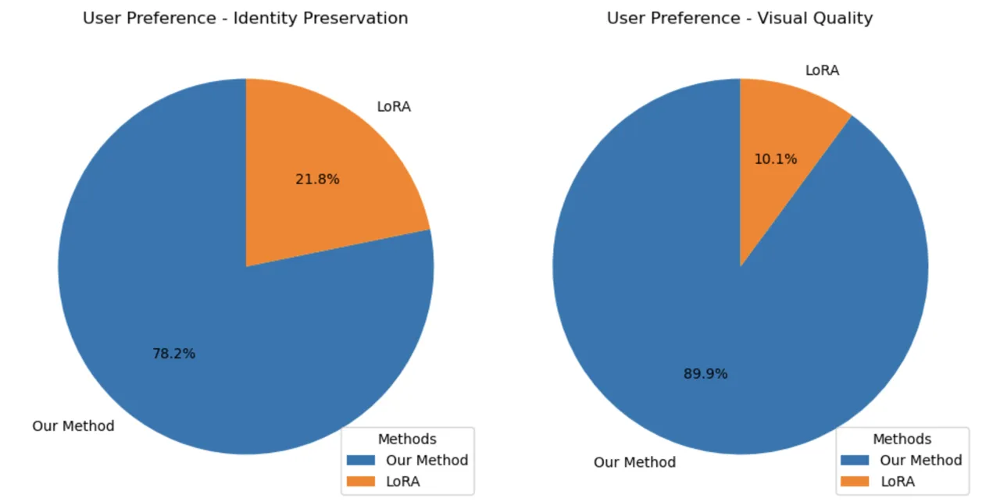

Figure 7: User Study. Preference (%) in terms of identity preservation,
and visual quality, comparing LoRA (26), and our method.

We conduct a user study to qualitatively and subjectively compare our
method against LoRA (see Sec. E for details). The results of our user
study are shown in Fig. 7. We find that $`78.2\%`$ of the users prefer
our method as compared to LoRA in terms of identity preservation.
Furthermore, we find that $`89.9\%`$ of the users prefer our results as
compared to LoRA in terms of visual quality.

### D.3 Additional Qualitative Results

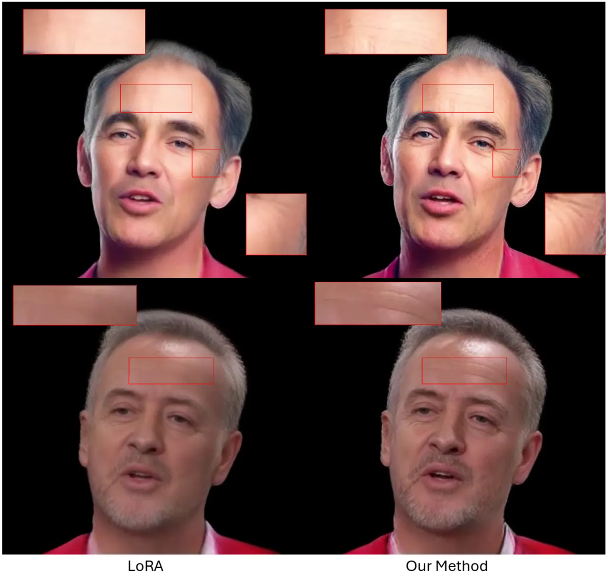

Figure 8: We show facial details that are well captured by our method
with Register Module, such as wrinkles and skin folds are realistic and
have higher quality than vanilla LoRA. Please note the enlarged insets
of specific details.

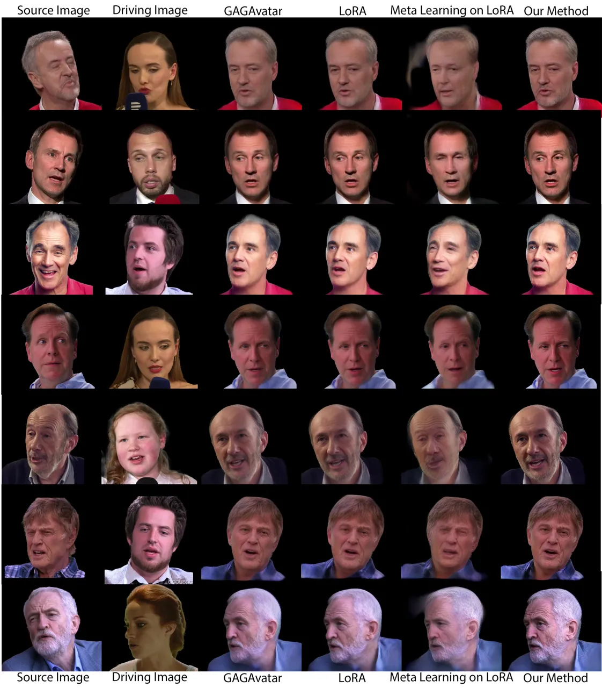

Figure 9: Additional results of personalized head avatar generation on
VFHQ Test. Please zoom in for better details.

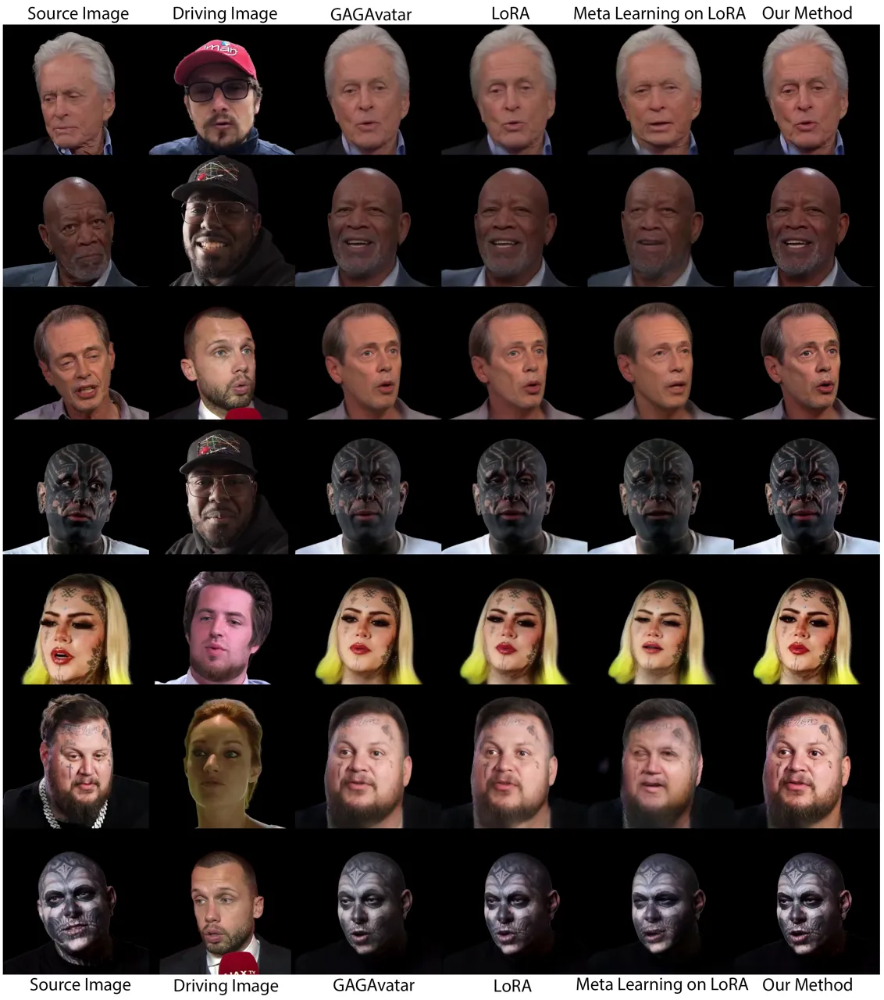

Figure 10: Additional results of personalized head avatar generation on
our RareFace-50 dataset. Please zoom in for better details.

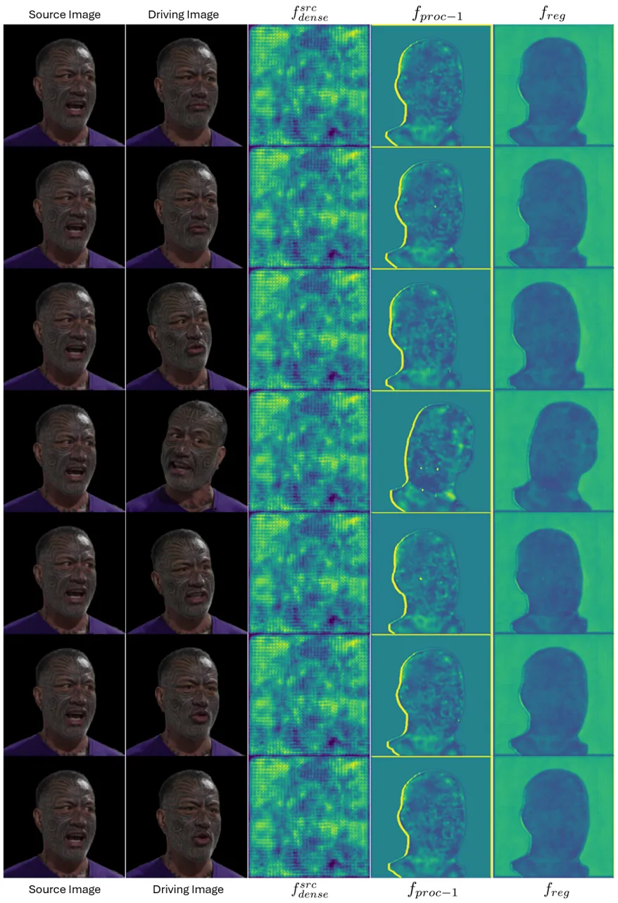

Figure 11: Visualization of learned features by the Register Module on
our RareFace-50 dataset. We visualize the 1) source image’s DINOv2
feature $`f^{src}_{dense}`$, 2) $`f_{proc-1}`$, output from
$`E_{proc-1}`$, and 3) $`f_{reg}`$, output of the Register Module. We
compute norms of the features along the embedding dimensions and
standardize values.

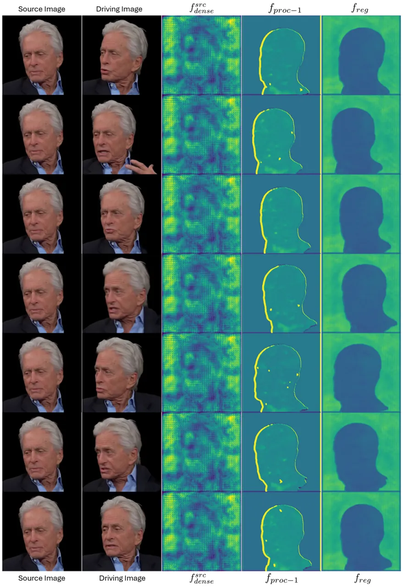

Figure 12: Visualization of learned features by the Register Module on
our RareFace-50 dataset. We visualize the 1) source image’s DINOv2
feature $`f^{src}_{dense}`$, 2) $`f_{proc-1}`$, output from
$`E_{proc-1}`$, and 3) $`f_{reg}`$, output of the Register Module. We
compute norms of the features along the embedding dimensions and
standardize values.

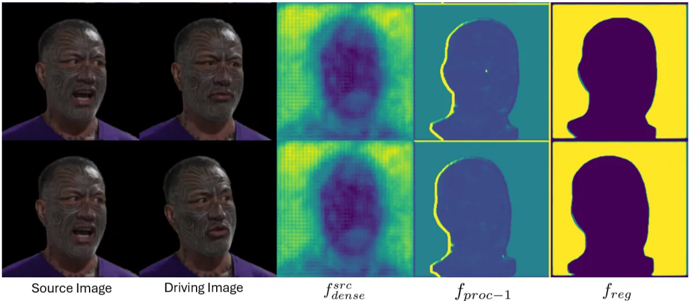

Figure 13: Visualization of learned features by the Register Module on
our RareFace-50 dataset. We compute the 1st channel-wise PCA component
and standardize the values.

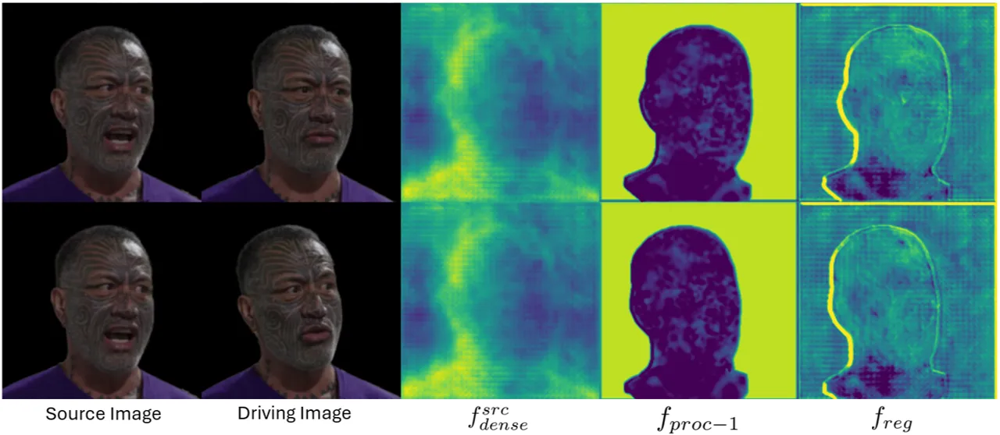

Figure 14: Visualization of learned features by the Register Module on
our RareFace-50 dataset. We compute the 2nd channel-wise PCA component
and standardize the values.

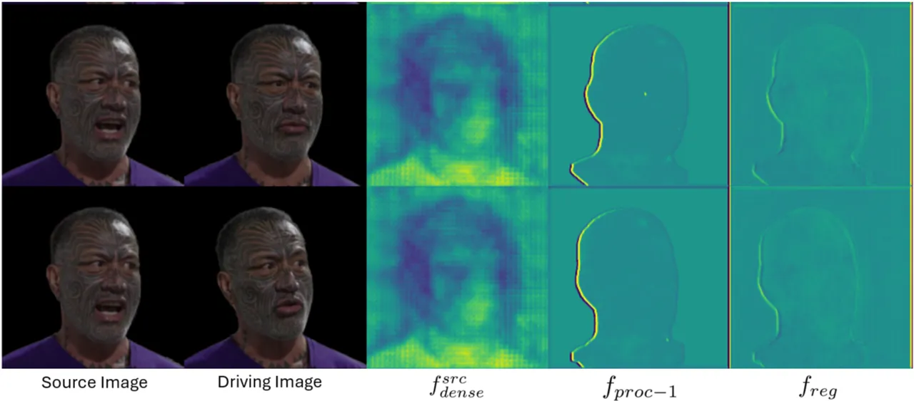

Figure 15: Visualization of learned features by the Register Module on
our RareFace-50 dataset. We compute the 3rd channel-wise PCA component
and standardize the values.

In Fig. 8, we show that, compared to LoRA, our method effectively
captures high-frequency details like wrinkles. We show additional
results of our method against the baselines on VFHQ Test in Fig. 9 and
on RareFace-50 in Fig. 10. Fig 11 and 12 show visualizations of feature
norms along the channel dimensions for two identities from RareFaces-50.
The values are visualized using colormaps between $`[-3\sigma,3\sigma]`$
for $`f^{src}_{dense}`$, and $`f_{reg}`$ and $`[-\sigma,\sigma]`$ for
$`f_{proc-1}`$. We visualize the first four channel-wise PCA components
in Fig. 13 to 15. We observe that the Register Module improves the
learning signals by highlighting face regions and dampening the
background regions.

## Appendix E User Study Details

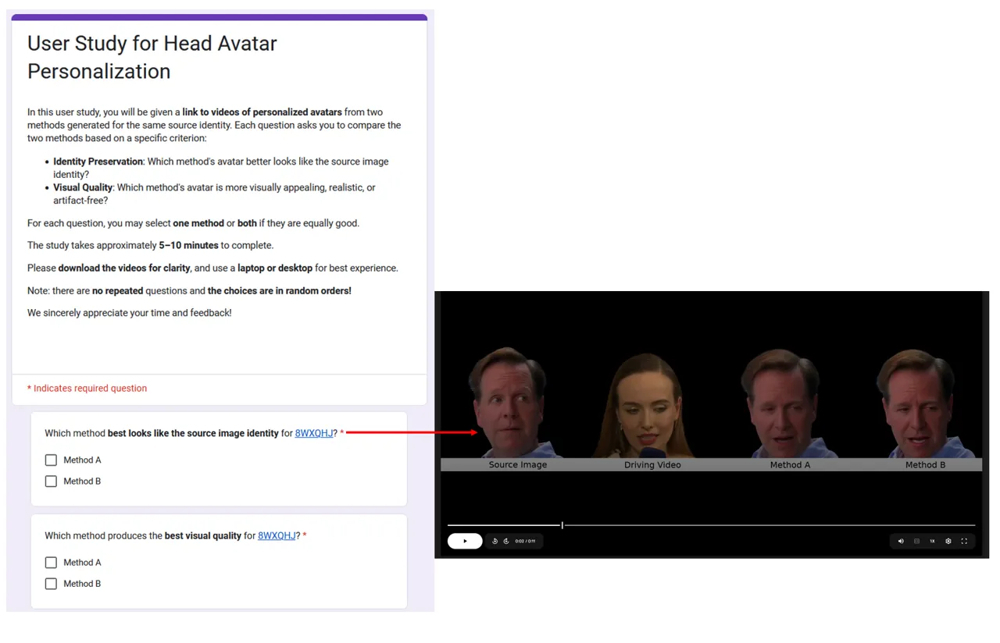

Figure 16: User Study Interface. We ask each user to watch 8 videos and
answer which method preserves the source image identity and which method
has the best visual quality.

As mentioned in Sec. D.2, we qualitatively compare our method with
vanilla LoRA as an adaptation method with a user study. We describe the
details of the user study here. Fig. 16 shows the interface that we use
for this user study. A total of 18 users responded to our user study. We
generate head avatars given source videos from VFHQ Test and RareFace-50
using our method and LoRA. The outputs are placed side by side and the
left-right orders are assigned randomly to make sure that the users are
unaware of which method is ours. Each generated video is $`\approx`$ 5
to 10 seconds long, concantenated with the source identity image and the
driving video. Users are asked two questions: “Which method’s avatar
best looks like the source image identity?” and “Which method avatar has
better visual quality?” The users can choose as answer “Method A” or
“Method B” or both. Label “Method A” is placed to the left of label
“Method B” and the generated videos are randomly placed in terms of a
left-right order. The answers are collected through a google form. The
videos are attached to the google form using a link to google drive, and
the users are encouraged to download the videos to view them on their
system. This is done to make sure that differences in high resolution
are evident to the users.

## Appendix F Discussions

### F.1 Limitations

An important factor of our method is the 3DMM fitting that is used to
extract the head pose, camera parameters, and 3DMM mesh parameters (see
Sec. 3.3 of the main paper). This fitting can be noisy and the error can
be propagated to the final generated videos. Improving the face tracking
further would be an interesting future work. Further, 3DMM fitting does
not model asymmetric/extreme expressions (such as winking) and the
movement of the tongue, which is another interesting line of work to
pursue.

### F.2 Ethical Considerations and Broader Impacts

While our method has significant promise across diverse applications, it
also carries the risk of abuse — for example, in creating “deep fakes”.
These can be used by users with malicious intent to spread
misinformation. To prevent this, it is imperative to develop forensic
tools to detect fake videos \[3, 45\]. We intend to share our code,
dataset and models to improve this research, in which we will release
them with strict licenses that only allow usage for academic research.
When used ethically and responsibly, our method can offer profound
benefits across industries — from video conferencing to the
entertainment sector. In addition, we have also put appropriate
procedures (see Sec. C) to ensure fair and safe use of videos from the
dataset we collect.
