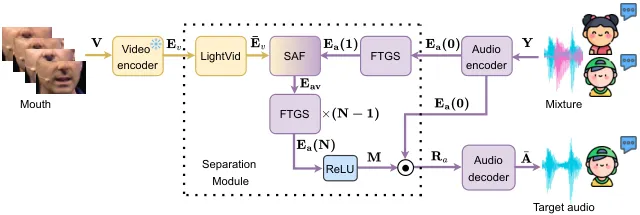

# A Fast and Lightweight Model for Causal Audio-Visual Speech Separation

Wendi Sang Note: Equal contribution (co-first authors).
Affiliation: School of Computer Technology and Application, Qinghai
University, Xining 810016, China Affiliation: Intelligent Computing and
Application Laboratory of Qinghai Province, Qinghai University, Xining
810016, China Affiliation: Department of Computer Science and
Technology, Institute for AI,  
BNRist, Tsinghua Laboratory of Brain and Intelligence (THBI),  
IDG/McGovern Institute for Brain Research, Tsinghua University, Beijing
100084, China    Kai Li¹¹footnotemark: 1 Affiliation: Department of
Computer Science and Technology, Institute for AI,  
BNRist, Tsinghua Laboratory of Brain and Intelligence (THBI),  
IDG/McGovern Institute for Brain Research, Tsinghua University, Beijing
100084, China    Runxuan Yang Affiliation: Department of Computer
Science and Technology, Institute for AI,  
BNRist, Tsinghua Laboratory of Brain and Intelligence (THBI),  
IDG/McGovern Institute for Brain Research, Tsinghua University, Beijing
100084, China    Jianqiang Huang ^(†)^(†)thanks: Co-corresponding
author. Email: hjqxaly@163.com, xlhu@tsinghua.edu.cn Affiliation: School
of Computer Technology and Application, Qinghai University, Xining
810016, China Affiliation: Intelligent Computing and Application
Laboratory of Qinghai Province, Qinghai University, Xining 810016, China
   Xiaolin Hu^(\*)^(\*)footnotemark: \* Affiliation: Department of
Computer Science and Technology, Institute for AI,  
BNRist, Tsinghua Laboratory of Brain and Intelligence (THBI),  
IDG/McGovern Institute for Brain Research, Tsinghua University, Beijing
100084, China Affiliation: Chinese Institute for Brain Research (CIBR),
Beijing 100010, China

###### Abstract

Audio-visual speech separation (AVSS) aims to extract a target speech
signal from a mixed signal by leveraging both auditory and visual (lip
movement) cues. However, most existing AVSS methods exhibit complex
architectures and rely on future context, operating offline, which
renders them unsuitable for real-time applications. Inspired by the
pipeline of RTFSNet, we propose a novel streaming AVSS model, named
Swift-Net, which enhances the causal processing capabilities required
for real-time applications. Swift-Net adopts a lightweight visual
feature extraction module and an efficient fusion module for
audio-visual integration. Additionally, Swift-Net employs Grouped SRUs
to integrate historical information across different feature spaces,
thereby improving the utilization efficiency of historical information.
We further propose a causal transformation template to facilitate the
conversion of non-causal AVSS models into causal counterparts.
Experiments on three standard benchmark datasets (LRS2, LRS3, and
VoxCeleb2) demonstrated that under causal conditions, our proposed
Swift-Net exhibited outstanding performance, highlighting the potential
of this method for processing speech in complex environments.

^(†)^(†)paperid: 5031

## 1 Introduction

With the rapid advancement of speech processing and artificial
intelligence technologies, audio-only speech separation (AOSS) methods
are facing numerous challenges in the cocktail party scenario
\[Michelsanti et al.(2021)Michelsanti, Tan, Zhang, Xu, Yu, Yu, and
Jensen\]. These challenges are mainly manifested as a significant
decline in processing efficiency with an increasing number of speakers,
and insufficient robustness in complex noisy environments \[Rahimi
et al.(2022)Rahimi, Afouras, and Zisserman, Ephrat et al.(2018)Ephrat,
Mosseri, Lang, Dekel, Wilson, Hassidim, Freeman, and Rubinstein\].
Inspired by the human multisensory information processing mechanism
\[Mesgarani and Chang(2012)\], researchers have proposed strategies for
integrating visual information with auditory information. By
incorporating visual cues into the separation network, the robustness
and processing efficiency of speech separation methods can be improved
\[Li et al.(2024)Li, Xie, Chen, Yuan, and Hu, Li et al.(2023)Li, Yang,
Sun, and Hu\]; Such methods are referred to as audio-visual speech
separation (AVSS).

However, most existing AVSS methods are non-causal and require the
entire audio sequence as input, and their complex architectures incur
large Params and MACs, limiting them to offline scenarios due to their
inability to process streaming data in real-time \[Liu and Wang(2020)\].
Therefore, developing low-latency causal models for real-time
applications is highly demanded.

In the domain of AOSS, many effective causal methods have already been
proposed \[Luo and Mesgarani(2019), Li et al.(2022a)Li, Yang, Wang, and
Qian, Della Libera et al.(2024)Della Libera, Subakan, Ravanelli,
Cornell, Lepoutre, and Grondin\]. Unfortunately, straightforward
adaptation of these advanced causal AOSS models for AVSS tasks may not
yield optimal results. For example, Zhang et al. \[Zhang
et al.(2021)Zhang, Xu, Hao, and Xu\] transformed a causal Conv-TasNet
\[Luo and Mesgarani(2019)\] into a audio-visual causal version (Causal
AV-ConvTasNet), yet the performance was suboptimal (see Section 5.3). A
natural idea is to construct a causal AVSS system by “causalizing”
existing high-performance non-causal backbone networks—simply replacing
non-causal CNNs with causal convolutions, replacing bidirectional RNNs
with unidirectional ones, using attention mask in Transformers, or
converting global pooling into frame-wise pooling (see Section 3). To
investigate these approaches, we implemented causal variants of several
non-causal AVSS models \[Pan et al.(2023)Pan, Wichern, Masuyama,
Germain, Khurana, Hori, and Le Roux, Lin et al.(2023)Lin, Cai, Dinkel,
Chen, Yan, Wang, Zhang, Wu, Wang, and Meng, Li et al.(2024)Li, Xie,
Chen, Yuan, and Hu, Tao et al.(2024)Tao, Qian, Jiang, Li, Wang, and Li,
Pegg et al.(2023)Pegg, Li, and Hu\] under the same training and
evaluation protocol. Our experimental results revealed that such
straightforward causal modifications failed to yield truly lightweight
and real-time-supporting models (see Section 5.3). The primary challenge
lies in designing a lightweight architecture that can effectively
leverage historical information, process audio in a causal manner, and
efficiently integrate visual cues.

During this exploration, we did find a non-causal AVSS model, namely
RTFSNet \[Pegg et al.(2023)Pegg, Li, and Hu\], that had potential to be
converted to an efficient causal model since its overall pipeline is
simple and lightweight. However, a straightforward conversion did not
lead to satisfactory results (see Section 5.3). After careful analysis,
we found that the reason lies in its complex architectures of its visual
encoder, separator, and audio-visual fusion network, all of which are
constructed using complex architectures such as TDANet \[Li
et al.(2022b)Li, Yang, and Hu\], convolutional layers, Transformers
\[Vaswani et al.(2017)Vaswani, Shazeer, Parmar, Uszkoreit, Jones, Gomez,
Kaiser, and Polosukhin\], and global pooling operations. These
components heavily rely on non-causal structures. When they are directly
modified to operate in a causal manner, they inherit the same
limitations—namely, restricted access to future context and inefficient
modeling of historical information—which results in a substantial
degradation of performance.

To address the aforementioned issues, we propose a causal AVSS model,
named Swift-Net, building on the RTFSNet’s pipeline \[Pegg
et al.(2023)Pegg, Li, and Hu\]. To reduce computational cost, we adopt
SRU networks \[Lei et al.(2018)Lei, Zhang, Wang, Dai, and Artzi\] for
visual feature extraction (LightVid block) and employ a selective
attention mechanism (SAF block) to integrate audio-visual features. To
maintain lightweight efficiency while enabling the SRU to better exploit
long-range temporal dependencies from historical information by focusing
on the temporal context within localized feature channels, we introduce
an efficient Grouped SRU mechanism inspired by grouped convolutional
layer \[Krizhevsky et al.(2012)Krizhevsky, Sutskever, and Hinton\] in
the separation network (FTGS block). By partitioning feature channels
into parallel SRU groups, the model is able to integrate historical
information across different feature spaces. This design captures
temporal and spectral dependencies with fewer parameters and lower
inference latency. In summary, our main contributions are as follows:

- •
  We design a lightweight visual feature extraction module that
  integrates convolution with SRUs to effectively capture historical
  information.
- •
  We propose a lightweight audio-visual fusion module that efficiently
  integrates auditory features correlated with visual cues through a
  selective attention mechanism.
- •
  We design an efficient Grouped SRU module that aggregates historical
  information across multiple feature spaces through a grouping
  strategy, further improving model efficiency.

Extensive experiments on mainstream datasets LRS2 \[Afouras
et al.(2018a)Afouras, Chung, Senior, Vinyals, and Zisserman\], LRS3
\[Afouras et al.(2018b)Afouras, Chung, and Zisserman\], and VoxCeleb2
\[Chung et al.(2018)Chung, Nagrani, and Zisserman\] demonstrated that
Swift-Net achieved SOTA performance. Additionally, we provided a toolkit
that modularizes the conversion of mainstream non-causal AVSS methods
into causal methods. Source code was made available at
[https://github.com/JusperLee/Swift-Net](https://github.com/JusperLee/Swift-Net).

## 2 Related Work

### 2.1 Non-causal AVSS Model

Early research on speech separation and enhancement largely centered on
audio-only processing \[Wang et al.(2018)Wang, Muckenhirn, Wilson,
Sridhar, Wu, Hershey, Saurous, Weiss, Jia, and Moreno, Delcroix
et al.(2018)Delcroix, Zmolikova, Kinoshita, Ogawa, and Nakatani, Luo and
Mesgarani(2019), Agrawal et al.(2023)Agrawal, Gupta, and Garg, Ke
et al.(2023)Ke, Wang, Hu, and Wang\]. Many of these methods require
pre-registered reference utterances to extract the target speaker, which
limits their applicability in open-world scenarios. To mitigate these
limitations, subsequent studies fused audio with visual cues, giving
rise to audio-visual speech separation (AVSS). However, most AVSS models
with decent separation performance have adopted non-causal architectures
\[Wu et al.(2019)Wu, Xu, Zhang, Chen, Yu, Xie, and Yu, Li
et al.(2023)Li, Yang, Sun, and Hu, Li et al.(2024)Li, Xie, Chen, Yuan,
and Hu, Afouras et al.(2018a)Afouras, Chung, Senior, Vinyals, and
Zisserman, Gao and Grauman(2021), Lin et al.(2023)Lin, Cai, Dinkel,
Chen, Yan, Wang, Zhang, Wu, Wang, and Meng, Tao et al.(2024)Tao, Qian,
Jiang, Li, Wang, and Li, Pan et al.(2023)Pan, Wichern, Masuyama,
Germain, Khurana, Hori, and Le Roux, Pegg et al.(2023)Pegg, Li, and
Hu\], achieving notable improvements in separation performance by
integrating both historical and future information. Researchers have
developed a variety of model architectures tackling the AVSS task,
including convolutional neural networks (CNNs), recurrent neural
networks (RNNs), Transformers, and hybrid ones. Specifically, CNN-based
models (e.g., AV-ConvTasNet \[Wu et al.(2019)Wu, Xu, Zhang, Chen, Yu,
Xie, and Yu\] and CTCNet \[Li et al.(2024)Li, Xie, Chen, Yuan, and Hu\])
typically utilize time-domain convolutional networks and incorporate
visual lip-reading features to enhance separation performance. However,
such methods primarily perform audio-visual fusion through convolutional
operations, resulting in large model parameter count and high
computational complexity. Furthermore, they rely on future time-step
information, making them challenging to deploy in real-time processing
scenarios. RNN-based models (e.g., AV-DPRNN \[Tao et al.(2024)Tao, Qian,
Jiang, Li, Wang, and Li\]) leverage deep recurrent structures to capture
long-term dependencies. However, due to their sequential processing
mechanism \[Lei et al.(2018)Lei, Zhang, Wang, Dai, and Artzi\], their
computational efficiency is limited. Transformer-based models,
represented by AV-Sepformer \[Lin et al.(2023)Lin, Cai, Dinkel, Chen,
Yan, Wang, Zhang, Wu, Wang, and Meng\], achieve synchronous modeling of
modal information through a dual-path Transformer architecture, which
substantially improves separation performance. Nonetheless, the
computational complexity of such models scales quadratically along with
sequence length, leading to increased computational burden and model
size. Lastly, hybrid architecture models (e.g., AV-TF-GridNet \[Pan
et al.(2023)Pan, Wichern, Masuyama, Germain, Khurana, Hori, and
Le Roux\] and RTFS-Net \[Pegg et al.(2023)Pegg, Li, and Hu\]) integrate
CNN, Transformer, and RNN modules to balance between performance and
computational complexity, achieving superior separation results in
offline speech separation tasks. However, these methods typically rely
on global information, thus limiting their application in real-time
separation scenarios. In this paper, we aim to develop a causal AVSS
method capable of operating under streaming processing conditions.

### 2.2 Causal Models

In the audio-only streaming domain, several causal architectures—such as
Conv-TasNet \[Luo and Mesgarani(2019)\], SkiM \[Li et al.(2022a)Li,
Yang, Wang, and Qian\], and ReSepformer \[Della Libera
et al.(2024)Della Libera, Subakan, Ravanelli, Cornell, Lepoutre, and
Grondin\]—have demonstrated impressive real-time separation performance.
However, when directly applied to the AVSS domain, these methods reveal
critical limitations: since they operate exclusively on acoustic
features, they fail to leverage complementary visual cues; moreover,
under causal constraints, their strict frame-by-frame fusion and limited
recurrence hinder the modeling of long-range, cross-modal temporal
dependencies, ultimately degrading robustness in visually guided
scenarios.

In the AVSS domain, compared to non-causal methods, research on causal
methods remains in its early stages. Some researchers \[Zhang
et al.(2021)Zhang, Xu, Hao, and Xu\] have even attempted to adapt the
causal Conv-TasNet \[Luo and Mesgarani(2019)\] to the AVSS task, but the
performance gap compared to non-causal AVSS methods remains substantial.
Therefore, these audio-only causal methods cannot be directly and
effectively transferred to the AVSS task without significant redesign.
Under causal constraints, achieving efficient cross-modal information
fusion while fully leveraging historical temporal dependencies remains a
critical challenge in causal AVSS tasks. In this paper, we propose
Swift-Net, which efficiently integrates historical information by
introducing power spectrogram features and the Grouped SRU network,
thereby substantially improving our model’s separation performance.

## 3 Causal Design Strategies

To ensure that the process of audio-visual separation strictly adheres
to temporal causality, that is, relying solely on current and past
information while completely avoiding any leakage of future information,
we have specifically redesigned and adjusted the neural network modules
commonly employed in non-causal AVSS methods. In particular, we have
implemented causal convolution, unidirectional recurrent networks,
self-attention modules with masking mechanisms, and segmented causal
average pooling, thereby ensuring that all components of the overall
model comply with causality constraints. We have also accordingly
modified AV-Sepformer \[Lin et al.(2023)Lin, Cai, Dinkel, Chen, Yan,
Wang, Zhang, Wu, Wang, and Meng\], CTCNet \[Li et al.(2024)Li, Xie,
Chen, Yuan, and Hu\], AV-DPRNN \[Tao et al.(2024)Tao, Qian, Jiang, Li,
Wang, and Li\], AV-TF-GridNet \[Pan et al.(2023)Pan, Wichern, Masuyama,
Germain, Khurana, Hori, and Le Roux\], and RTFSNet \[Pegg
et al.(2023)Pegg, Li, and Hu\], and conducted a systematic comparison
with Swift-Net.

Causal Convolutional Layers. When the kernel size of a convolution
exceeds 1, standard convolution operations inevitably introduce future
information when computing the output for the current frame. By applying
causal padding prior to the convolution operation \[Harell
et al.(2019)Harell, Makonin, and Bajić, Ma et al.(2021)Ma, Chen, Zhu,
Yuan, Chen, and Shu\], convolutional layers can be made causal.

Causal RNN Layer. For RNN layers like LSTM \[Hochreiter and
Schmidhuber(1997)\], SRU \[Lei et al.(2018)Lei, Zhang, Wang, Dai, and
Artzi\] and GRU \[Chung et al.(2014)Chung, Gulcehre, Cho, and Bengio\],
causal processing is inherently ensured by setting the network to
operate unidirectionally, guaranteeing that only past information is
utilized.

Causal Attention Layer. The causal attention layer is implemented by
introducing an upper triangular mask into the self-attention mechanism,
consistent with approaches adopted in existing causal large language
models \[Chang et al.(2024)Chang, Wang, Wang, Wu, Yang, Zhu, Chen, Yi,
Wang, Wang, et al.\]. Specifically, we construct an upper triangular
mask matrix where all elements above the main diagonal are assigned a
value of negative infinity. This design ensures that the attention
computation at each timestep depends only on the current and previous
information, thereby strictly adhering to causality constraints.

Causal Average Pooling Layer. We propose a segment-based causal adaptive
average pooling method, as shown in Figure 1. Specifically, let the
input sequence be $`\mathbf{X}\in\mathbb{R}^{1\times T}`$, where $`T`$
denotes the total number of timesteps. We first uniformly divide
$`\mathbf{X}`$ along the temporal axis into $`N`$ non-overlapping
segments, each with length $`L=\lceil T/N\rceil`$. For the $`n`$-th
output interval ($`n\in\{1,2,\dots,N\}`$), the corresponding temporal
range is $`[(n-1)L+1,\,nL]`$. To satisfy the causality constraint during
the pooling operation, the pooling result of the $`n`$-th segment,
$`\mathbf{y}_{n}`$, depends only on the current and previous inputs,
that is,

```math
\mathbf{y}_{n}=\frac{1}{nL}\sum_{t=1}^{nL}\mathbf{x}_{t}. \tag{1}
```

This way, the $`n`$-th output captures not only the information within
the current segment but also the historical information from all
preceding segments. Compared with conventional average pooling, this
”causal pooling” strictly ensures that the output does not utilize any
future information, thereby meeting the causality requirements essential
for sequential modeling.

Figure 1: Diagram for segment-based causal adaptive average pooling
layer. For clarity of presentation, we take an input sequence of length
$`T=8`$ that is evenly divided into $`S=4`$ segments as an example.
Here, avg denotes the averaging operation. At $`t=1`$, the computation
begins when $`x_{1}`$ arrives; at $`t=3`$, the computation begins when
$`x_{3}`$ arrives, and so on.

## 4 Method

Our proposed causal AVSS model, Swift-Net, consists of an audio encoder,
a video encoder, a separation module, and an audio decoder, as
illustrated in Figure 2. Specifically, the input comprises a mixed audio
signal $`\mathbf{Y}\in\mathbb{R}^{1\times T_{a}}`$ and the corresponding
grayscale lip movement video sequence
$`\mathbf{V}\in\mathbb{R}^{1\times T_{v}\times H\times W}`$, where
$`T_{a}`$ denotes the length of the audio sequence, and $`T_{v}`$,
$`H`$, and $`W`$ represent the number, height, and width of video
frames, respectively. First, the audio encoder maps the mixed audio
signal to an audio embedding
$`\mathbf{E_{a}(0)}\in\mathbb{R}^{C_{a}\times T^{\prime}_{a}\times F}`$,
and the video encoder maps the lip movement video sequence to a lip
embedding $`\mathbf{E}_{v}\in\mathbb{R}^{C_{v}\times T_{v}}`$, where
$`C_{a}`$ and $`C_{v}`$ denote the dimensions of the encoded features,
and $`T^{\prime}_{a}`$ is the corresponding encoded temporal lengths,
$`F`$ denotes the number of frequency bins in the spectrogram.
Subsequently, a causal audio-visual separation network generates an
estimated mask
$`\mathbf{M}\in\mathbb{R}^{C_{a}\times T^{\prime}_{a}\times F}`$ for the
target speaker based on $`\mathbf{E_{a}(0)}`$ and $`\mathbf{E}_{v}`$.
Finally, following the approach of RTFSNet \[Pegg et al.(2023)Pegg, Li,
and Hu\], the audio decoder performs element-wise multiplication of
$`\mathbf{E_{a}(0)}`$ and $`\mathbf{M}`$ in the complex domain to obtain
the audio embedding of the target speaker,
$`\mathbf{R}_{a}\in\mathbb{R}^{C_{a}\times T^{\prime}_{a}\times F}`$.
$`\mathbf{R}_{a}`$ is transformed back to the time-domain waveform by
applying the decoder, thus yielding the separated speech of the target
speaker $`\bar{\mathbf{A}}\in\mathbb{R}^{1\times T_{a}}`$.



Figure 2: The overall pipeline of Swift-Net. The yellow line and the
purple line represent the flow of visual features and audio features
respectively. The $`\odot`$ symbol denotes element-wise multiplication
in the complex domain.

### 4.1 Encoder

For the video encoder $`L_{m}(\cdot)`$, we employ the pretrained
CTCNet-Lip \[Li et al.(2024)Li, Xie, Chen, Yuan, and Hu\] model to
independently extract visual features $`\mathbf{E}_{v}`$ of the target
speaker from each lip movement video sequence
$`\mathbf{V}\in\mathbb{R}^{1\times T_{v}\times H\times W}`$:

```math
\mathbf{E}_{v}=L_{m}(\mathbf{V}),\quad\mathbf{E}_{v}\in\mathbb{R}^{C_{v}\times T_{v}}. \tag{2}
```

For the audio encoder, the input mixed audio signal $`\mathbf{Y}`$ is
first processed by a Short-Time Fourier Transform (STFT) to obtain its
real $`\mathbf{Y}_{r}\in\mathbb{R}^{T^{\prime}_{a}\times F}`$ and
imaginary $`\mathbf{Y}_{i}\in\mathbb{R}^{T^{\prime}_{a}\times F}`$
spectrograms. During this process, padding is applied to prevent the
window function from accessing future information. We observed that the
power spectrogram $`\mathbf{G}`$ contains crucial information closely
related to auditory perception, effectively reflecting the power
distribution of the signal \[Hsu et al.(2004)Hsu, Woolley, Fremouw, and
Theunissen\],

```math
\mathbf{G}=\sqrt{\mathbf{Y}_{r}^{2}+\mathbf{Y}_{i}^{2}},\quad\mathbf{G}\in\mathbb{R}^{T^{\prime}_{a}\times F}, \tag{3}
```

where $`F`$ and $`T^{\prime}_{a}`$ denote the frequency and temporal
dimensions, respectively. To further enrich the audio representation,
$`\mathbf{G}`$, $`\mathbf{Y}_{r}`$, and $`\mathbf{Y}_{i}`$ are stacked
along the channel dimension to construct a composite audio feature
$`\mathbf{Y}_{m}\in\mathbb{R}^{3\times T^{\prime}_{a}\times F}=\{\mathbf{G}||\mathbf{Y}_{r}||\mathbf{Y}_{i}\}`$,
where $`||`$ denotes concatenation along the channel dimension.
Thereafter, $`\mathbf{Y}_{m}`$ is fed into a convolutional layer with
normalization and nonlinear activation to obtain the audio embedding
$`\mathbf{{E_{a}}(0)}`$, which is subsequently input to the following
audio-visual separation network.

### 4.2 The Separation Module

The overall framework comprises three core components: a lightweight
video processing block (LightVid block), an efficient audio block (FTGS
block), and a selective attention audio-visual fusion block (SAF block).
First, visual features $`\mathbf{E}_{v}`$ generated by the video encoder
feed into the LightVid block to obtain enhanced visual embeddings
$`\bar{\mathbf{E}}_{v}`$. Simultaneously, audio features
$`\mathbf{E_{a}(0)}`$ are processed by the FTGS block to generate
refined audio embeddings $`\mathbf{E_{a}(1)}`$. Subsequently, features
from both modalities
$`\{\bar{\mathbf{E}}_{v}\in\mathbb{R}^{C_{v}\times T_{v}},\mathbf{{E}_{a}(1)}\in\mathbb{R}^{C_{a}\times T^{\prime}_{a}\times F}\}`$
flow into the SAF block to produce a joint audio-visual representation
$`\mathbf{{E}_{av}}\in\mathbb{R}^{C_{a}\times T^{\prime}_{a}\times F}`$.
Next, $`\mathbf{\mathbf{E}_{av}}`$ is fed into a deep network composed
of $`N-1`$ stacked Efficient FTGS blocks, where each FTGS block shares
parameters to further integrate and refine the joint representation,
ultimately yielding iteratively optimized features
$`\mathbf{{E}_{a}(N)}\in\mathbb{R}^{C_{a}\times T^{\prime}_{a}\times F}`$.
This cascaded structure, combined with the parameter sharing mechanism,
significantly enhances the computational efficiency and effectively
reduces the model size, enabling the separator to achieve real-time,
low-latency inference while maintaining superior separation performance.

#### 4.2.1 The LightVid block

Figure 3: The structural diagram of LightVid block. Here, $`c_{v}`$
denote the number of channels of the visual features, and $`T_{v}`$
represents the number of frames of the visual features.

Most of the current mainstream AVSS models employ complex visual
encoders involving delicate usage of deep convolutional neural networks
or Transformer \[Vaswani et al.(2017)Vaswani, Shazeer, Parmar,
Uszkoreit, Jones, Gomez, Kaiser, and Polosukhin\] architectures, often
entailing considerable computational cost. To address this issue, we
propose a lightweight video processing module, termed LightVid block
(see Figure 3), which serves as an efficient causal visual feature
extractor capable of extracting both local spatial information and
long-range temporal dynamics from lip-reading video sequences with low
latency.

Specifically, the LightVid block combines depthwise separable
convolutional layers with linear recurrent units to efficiently process
input visual feature sequence. For each frame, given the lip region
features
$`\{\mathbf{E}_{v,i}\in\mathbb{R}^{C_{v}}\mid i\in[1,T_{v}]\}`$, a
$`1\times 1`$ convolutional layer followed by layer-normalization is
first applied to independently model $`\mathbf{E}_{v,i}`$ along the
channel dimension, resulting in the processed features
$`\hat{\mathbf{E}}_{v}\in\mathbb{R}^{C_{v}\times T_{v}}`$. This
operation effectively preserves the local semantic information of lip
movements and provides a foundation for subsequent temporal modeling.
Afterwards, another $`1\times 1`$ convolution is used to project
$`\hat{\mathbf{E}}_{v}`$ to a lower-dimensional space, yielding
$`\tilde{\mathbf{E}}_{v}\in\mathbb{R}^{C_{h}\times T_{v}}`$, where
$`C_{h}<C_{v}`$, so as to reduce the number of feature channels and
improve computational efficiency. Next, a unidirectional SRU is
leveraged to model the temporal dependencies and dynamic variations of
lip movements across consecutive frames based on
$`\tilde{\mathbf{E}}_{v}`$. Finally, a $`1\times 1`$ convolution
projects the SRU outputs back to the original feature dimension, and a
residual connection from the block input is incorporated. The final
output is the enhanced visual feature representation
$`\bar{\mathbf{E}}_{v}\in\mathbb{R}^{C_{v}\times T_{v}}`$.

Figure 4: The structural diagram of FTGS block. Bi-GSRU denotes the
Bidirectional Grouped SRU. UNi-GSRU denotes the Unidirectional Grouped
SRU.

#### 4.2.2 The FTGS block

Some existing time-frequency domain AVSS methods \[Pegg
et al.(2023)Pegg, Li, and Hu, Pan et al.(2023)Pan, Wichern, Masuyama,
Germain, Khurana, Hori, and Le Roux\] employ two RNNs to model the audio
signal in the temporal and frequency dimensions, respectively. As a
result, their computational complexity is approximately twice that of
time-domain AVSS methods \[Li et al.(2023)Li, Yang, Sun, and Hu, Li
et al.(2024)Li, Xie, Chen, Yuan, and Hu\], often leading to significant
inference latency, making it challenging to meet real-time processing
requirements. To address this issue, we propose an efficient
Frequency-Time Grouped SRU block (FTGS block). In the FTGS block, the
channels of audio features are divided into multiple groups, each of
which is independently modeled by lightweight recurrent units with fewer
parameters. The outputs of all groups are subsequently concatenated
along the channel dimension. The grouping strategy decomposes the
overall modeling task into several parallelizable sub-tasks, thereby
substantially reducing computational overhead.

Figure 4 shows a structural diagram of the FTGS block. Let the auditory
feature representation input to the FTGS block be denoted as
$`\mathbf{E}_{a}(i)\in\mathbb{R}^{C_{a}\times T^{\prime}_{a}\times F}`$.
First, a $`1\times 1`$ two-dimensional convolution is applied to
$`\mathbf{E}_{a}(i)`$ for downsampling, resulting in
$`\mathbf{A}_{0}\in\mathbb{R}^{C_{a}\times\frac{T^{\prime}_{a}}{2}\times\frac{F}{2}}`$.
Subsequently, following a strategy similar to TF-GridNet \[Wang
et al.(2023)Wang, Cornell, Choi, Lee, Kim, and Watanabe\], we first
unfold $`\mathbf{A}_{0}`$ along the frequency dimension using a kernel
size of 8 and a stride of 1 to obtain
$`\mathbf{A}_{0}^{\prime}\in\mathbb{R}^{8C_{a}\times\frac{T^{\prime}_{a}}{2}\times{F^{\prime}}}`$
, where $`\mathbf{F}^{\prime}`$ is the resulting unfolded frequency
dimension. It then gets divided into $`G`$ groups along the channel
dimension, denoted as
$`\mathbf{A^{\prime}}_{0}=[\mathbf{A^{\prime}}_{0}^{(1)};\mathbf{A^{\prime}}_{0}^{(2)};\cdots;\mathbf{A^{\prime}}_{0}^{(G)}]`$,
where
$`\mathbf{A^{\prime}}_{0}^{(g)}\in\mathbb{R}^{C_{a}^{*}\times\frac{T^{\prime}_{a}}{2}\times{F^{\prime}}}`$
and $`C_{a}^{*}=8C_{a}/G`$ is the number of channels of each group. For
each group $`\mathbf{A^{\prime}}_{0}^{(g)}`$ and at each frame $`t`$,
the features corresponding to different frequencies are treated as a
sequence along the frequency axis. A bidirectional SRU is employed to
capture frequency correlations as:

```math
\tilde{\mathbf{X}}^{(g)}_{c,:,t}=\mathrm{BiSRU}\big(\mathbf{A^{\prime}}_{0}^{(g)}[c,t,:]\big)\quad\forall c=1,\ldots,C_{a}^{*},\ t=1,\ldots,\frac{T^{\prime}_{a}}{2}.
```

This procedure enhances the model’s ability to capture inter-frequency
coupling relationships. The outputs of all $`G`$ groups are then
concatenated along the channel dimension to restore the original number
of channels, yielding

```math
\mathbf{\tilde{A}}_{0}=\mathop{\mathrm{Concat}}\left(\tilde{\mathbf{X}}^{(1)},\tilde{\mathbf{X}}^{(2)},\dots,\tilde{\mathbf{X}}^{(G)}\right).
```

After upsampling the feature map along the frequency dimension to the
original resolution via a transposed convolution, a residual connection
is then applied via element-wise addition with $`\mathbf{A}_{0}`$ to
obtain
$`\mathbf{A}_{f}\in\mathbb{R}^{C_{a}\times T^{\prime}_{a}\times F}`$.

In contrast to frequency modeling, temporal modeling employs
unidirectional grouped SRUs to ensure a causal structure, enhancing the
integration of information from historical feature spaces and thereby
improving separation performance. The output is denoted as
$`\mathbf{A}_{t}`$. Next, a causal self-attention mechanism is applied
to $`\mathbf{A}_{t}`$ to further improve the audio feature
representation, resulting in $`\mathbf{A}_{att}`$. Finally, a
reconstruction strategy similar to TDANet \[Li et al.(2022b)Li, Yang,
and Hu\] is adopted to recover the time-frequency resolution, generating
the next-level feature $`\mathbf{E}_{a}(i+1)`$.

In our FTGS Block architecture, we adopt grouped SRU units (Grouped
SRUs) based on a grouping strategy. Compared to the standard SRU \[Lei
et al.(2018)Lei, Zhang, Wang, Dai, and Artzi\], Grouped SRU
significantly reduces both parameter count and computational complexity.
Specifically, let the input feature dimension be $`D_{\text{in}}`$ and
the hidden state dimension be $`D_{\text{hid}}`$. The main parameters of
a standard SRU come from the input-to-hidden transformation (e.g., a
weight matrix of size $`D_{\text{in}}\times kD_{\text{hid}}`$) as well
as the hidden-to-hidden connections (e.g., parameters of size
$`D_{\text{hid}}\times lD_{\text{hid}}`$). Ignoring bias terms, the
total parameter count can be approximated as
$`P_{\text{SRU}}\approx c_{1}D_{\text{in}}D_{\text{hid}}+c_{2}D_{\text{hid}}^{2}`$,
where $`c_{1}`$ and $`c_{2}`$ are constants related to the internal
structure of the SRU. Similarly, the primary computation cost
$`C_{\text{SRU}}`$, measured in MACs, is dominated by matrix
multiplications and has a similar structure,
$`C_{\text{SRU}}\propto D_{\text{in}}D_{\text{hid}}+D_{\text{hid}}^{2}`$.
For Grouped SRU, we partition both the input and hidden dimensions into
$`G`$ groups, with the subspace dimensions of each group being
$`D_{\text{in}}/G`$ and $`D_{\text{hid}}/G`$, respectively, and run a
separate sub-SRU independently in each group. The parameter count for a
single sub-SRU is
$`c_{1}(D_{\text{in}}/G)(D_{\text{hid}}/G)+c_{2}(D_{\text{hid}}/G)^{2}`$,
yielding a total parameter count of
$`P_{\text{GSRU}}=G\times P_{sub\text{-}SRU}\approx\frac{c_{1}D_{\text{in}}D_{\text{hid}}}{G}+\frac{c_{2}D_{\text{hid}}^{2}}{G}`$.
Thus, both the total parameter count and computation cost are reduced
approximately by a factor of $`1/G`$:

```math
\frac{P_{\text{GSRU}}}{P_{\text{SRU}}}\approx\frac{C_{\text{GSRU}}}{C_{\text{SRU}}}\approx\frac{1}{G}. \tag{4}
```

This result clearly indicates that, as the group number $`G`$ increases,
the storage and computational costs of the model decrease inversely.

#### 4.2.3 The SAF block

Figure 5: The structural diagram of SAF block. The yellow line and the
purple line represent the flow of visual features and audio features
respectively. $`\phi`$ represents nearest neighbor interpolation.
$`\rho`$ represents the flattening of the last dimension of the tensor.

Effective fusion of audio-visual features is crucial for AVSS
performance, yet existing methods typically rely on complex fusion
strategies that are computationally intensive. To address this, we
propose a streamlined SAF block (see Figure 5) that adaptively
integrates visual cues into audio features with high efficiency.
Specifically, inspired by the IIANet \[Li et al.(2023)Li, Yang, Sun, and
Hu\], the SAF block implements a channel-wise selective attention
strategy. First, the visual features $`\bar{\mathbf{E}}_{v}`$ extracted
by the LightVid block are passed through a $`1\times 1`$ convolution,
yielding features of shape
$`\bar{\mathbf{E}}_{v,d}\in\mathbb{R}^{2C_{v}\times T_{v}}`$.
Subsequently, $`\bar{\mathbf{E}}_{v,d}`$ is equally divided along the
channel dimension into $`\gamma\in\mathbb{R}^{C_{v}\times T_{v}}`$
(scaling factor) and $`\beta\in\mathbb{R}^{C_{v}\times T_{v}}`$ (bias
term), which are used for subsequent scaling and shifting operations on
the audio features, respectively. Considering potential differences in
temporal scale or frame rate between visual and audio features,
nearest-neighbor interpolation is utilized to align $`\gamma`$ and
$`\beta`$ along the temporal axis to match the time steps of the audio
features, $`T^{\prime}_{a}`$. Following this alignment, the audio
features
$`\mathbf{E}_{a}(1)\in\mathbb{R}^{C_{a}\times T^{\prime}_{a}\times F}`$
are modulated in a channel-wise manner as follows:

```math
\mathbf{E}_{av}=\mathbf{E}_{a}(1)\odot\gamma+\beta, \tag{5}
```

where $`\odot`$ denotes element-wise multiplication. The resulting fused
feature map
$`\mathbf{E}_{av}\in\mathbb{R}^{C_{a}\times T^{\prime}_{a}\times F}`$
incorporates both audio and visual information at each time step,
thereby enabling a more effective emphasis on the target speaker’s
speech representations.

### 4.3 Masking and Decoder

Consistent with RTFSNet \[Pegg et al.(2023)Pegg, Li, and Hu\], we adopt
a complex-domain masking strategy for audio feature reconstruction,
modified to operate causally. Specifically, given the refined feature
$`\mathbf{E}_{a}(N)\in\mathbb{R}^{C_{a}\times T\times F}`$, we generate
a mask $`\mathbf{M}\in\mathbb{R}^{C_{a}\times T\times F}`$ using a
convolutional module with PReLU nonlinearity. Subsequently, the audio
mixture embedding
$`\mathbf{E}_{a}\in\mathbb{R}^{C_{a}\times T\times F}`$ and the
generated mask $`\mathbf{M}`$ are each decomposed into their real and
imaginary parts, i.e.,
$`\mathbf{E}_{a}(0)=\mathbf{E}_{r}+j\mathbf{E}_{i}`$ and
$`\mathbf{M}=\mathbf{M}_{r}+j\mathbf{M}_{i}`$, where
$`\mathbf{E}_{r},\mathbf{E}_{i},\mathbf{M}_{r},\mathbf{M}_{i}\in\mathbb{R}^{C_{a}\times T\times F}`$.
Next, we perform feature fusion using the rules of complex
multiplication:
$`\mathbf{R}_{r}=\mathbf{E}_{r}\odot\mathbf{M}_{r}-\mathbf{E}_{i}\odot\mathbf{M}_{i}`$
and
$`\mathbf{R}_{i}=\mathbf{E}_{r}\odot\mathbf{M}_{i}+\mathbf{E}_{i}\odot\mathbf{M}_{r}`$,
where $`\odot`$ denotes element-wise (Hadamard) multiplication,
resulting in the separated feature
$`\mathbf{R}_{a}=\mathbf{R}_{r}+j\mathbf{R}_{i}`$. Operations in the
complex domain allow richer preservation of phase information in speech
signals, thereby improving separation performance.

After obtaining the separated feature
$`\mathbf{R}_{a}\in\mathbb{C}^{C_{a}\times T\times F}`$, we employ a
single-layer causal transposed two-dimensional convolution to map it to
a two-channel real-valued tensor, where the output channels are set to
$`2`$, corresponding to the real and imaginary parts respectively.
Finally, the output of the convolution is restored to the time domain by
inverse short-time Fourier transform (iSTFT), yielding the separated
waveform $`\bar{\mathbf{A}}\in\mathbb{R}^{1\times T_{a}}`$, thereby
achieving high-quality reconstruction of the target speaker’s speech.

|               |           |      |           |      |                |      |        |       |       |
| ------------- | --------- | ---- | --------- | ---- | -------------- | ---- | ------ | ----- | ----- |
| Model         | LRS2-2Mix |      | LRS3-2Mix |      | VoxCeleb2-2Mix |      | Params | MACs  | Time  |
|               | SI-SNRi   | SDRi | SI-SNRi   | SDRi | SI-SNRi        | SDRi | \(M\)  | \(G\) | (ms)  |
| AV-ConvTasNet | 9.8       | 10.3 | 12.5      | 12.8 | 6.9            | 8.2  | 11.0   | 15.0  | 16.1  |
| AV-Sepformer  | 10.6      | 11.1 | 13.4      | 13.7 | 6.9            | 8.3  | 39.7   | 226.5 | 60.0  |
| CTCNet        | 8.0       | 8.8  | 9.4       | 10.2 | 2.5            | 4.7  | 6.8    | 150.1 | 162.8 |
| AV-DPRNN      | 10.2      | 10.7 | 11.9      | 12.3 | 7.8            | 9.0  | 1.3    | 4.5   | 5.8   |
| AV-TF-GridNet | 12.7      | 13.1 | 14.3      | 14.8 | 5.8            | 7.7  | 6.2    | 213.8 | 567.8 |
| RTFSNet       | 12.4      | 12.8 | 14.0      | 14.4 | 8.4            | 10.7 | 0.6    | 49.8  | 178.8 |
| Swift-Net-6   | 13.4      | 13.6 | 14.8      | 15.1 | 10.8           | 11.9 | 0.5    | 20.6  | 89.7  |
| Swift-Net-9   | 13.6      | 13.8 | 15.4      | 15.8 | 11.4           | 12.4 | 0.5    | 28.6  | 130.7 |
| Swift-Net-12  | 13.9      | 14.1 | 16.0      | 16.3 | 11.8           | 12.6 | 0.5    | 36.6  | 172.1 |

Table 1: Separation quality and computational efficiency comparison of
different causal models across multiple datasets. All models are
implemented with causal design strategies to ensure causality.

## 5 Experiments

### 5.1 Datasets

In our experiments, we employed three publicly available audio-visual
mixture benchmark datasets: LRS2-2Mix \[Afouras et al.(2018a)Afouras,
Chung, Senior, Vinyals, and Zisserman\], LRS3-2Mix \[Afouras
et al.(2018b)Afouras, Chung, and Zisserman\], and VoxCeleb2-2Mix \[Chung
et al.(2018)Chung, Nagrani, and Zisserman\]. To ensure consistency with
existing research, we followed the same data pre-processing pipeline
\[Li et al.(2024)Li, Xie, Chen, Yuan, and Hu, Pegg et al.(2023)Pegg, Li,
and Hu\]. For video processing, all video samples were normalized to 25
frames per second (FPS). Subsequently, utilizing a face detection
network \[Zhang et al.(2016)Zhang, Zhang, Li, and Qiao\], we extracted
the lip region of the target speaker from each frame and uniformly
cropped it to grayscale images of size $`96\times 96`$. Regarding audio
processing, the sampling rate of all speech samples was set to 16 kHz.
To synchronize with the video data, we extracted 2-second mixed audio
segments from each sample, corresponding to 50 frames of video.

### 5.2 Implementation Details

In the FTGS block, we set different numbers of repeated iterations
$`N\in\{6,9,12\}`$, and denoted the corresponding models as
Swift-Net-{6, 9, 12}. Except for the number of repetitions, all other
hyperparameters were kept consistent across configurations. In the audio
encoder of Swift-Net, we utilized STFT/iSTFT with window length 256
under Hann window function, and hop size 128, to segment the audio
signal and obtain a 129-dimensional spectral representation for each
frame. For the LightVid block, the hidden size of the SRU was set to 64.
Within the FTGS block, downsampling and upsampling operations were
performed once along both the temporal and frequency dimensions at a
factor of 2. In the $`F`$ domain, the FTGS block employed a
bidirectional Grouped SRU with a hidden size of 32, whereas in the $`T`$
domain, a unidirectional Grouped SRU with a hidden size of 64 was used.
Moreover, the number of heads in the causal self-attention mechanism was
set to 4.

For training, we employed an early stopping strategy with a maximum
number of 500 epochs. All experiments were conducted on 8 NVIDIA H800
GPUs with batch size 8. The optimizer used was AdamW \[Loshchilov and
Hutter(2017)\] with weight decay $`1\times 10^{-1}`$ and initial
learning rate $`1\times 10^{-3}`$. If the validation loss did not reach
a new low for 5 consecutive epochs, the learning rate was halved. The
loss function was defined as the scale-invariant signal-to-noise ratio
(SI-SNR) \[Le Roux et al.(2019)Le Roux, Wisdom, Erdogan, and Hershey\]
between the predicted and target speech signals.

To comprehensively evaluate model performance, we assessed both
separation quality and computational efficiency. The separation quality
was measured using signal-to-distortion ratio improvement (SDRi)
\[Vincent et al.(2006)Vincent, Gribonval, and Févotte\] and SI-SNR
improvement (SI-SNRi) \[Le Roux et al.(2019)Le Roux, Wisdom, Erdogan,
and Hershey\]. For model complexity and computational efficiency, we
reported the number of parameters (Params, in millions), the number of
multiply-accumulate operations (MACs, in billions), and end-to-end
inference time (in milliseconds). All computational cost metrics were
evaluated on an NVIDIA 2080 GPU, using 2-second audio segments for
speech separation, to ensure fair comparisons across different methods.

### 5.3 Comparison with Existing Methods

We conducted a systematic evaluation of Swift-Net on three datasets and
compared it with various mainstream AVSS models. Results are shown in
Table 1. To ensure fairness, all comparison methods were adapted to
their causal versions following the causal strategy described in Section
3, and the open-source codes of each model were available¹¹ 1
[https://github.com/JusperLee/Swift-Net](https://github.com/JusperLee/Swift-Net).
Moreover, all compared models were trained within the same training
framework and evaluated using consistent performance metrics. Across all
datasets, it was noteworthy that Swift-Net-6, as the fastest inference
variant, achieved an SI-SNRi of 13.4 dB, outperforming existing SOTA
causal methods such as causal AV-TF-GridNet. In addition, Swift-Net-6
reduced the parameter count by 11.8 times and the computational cost by
10.3 times compared with causal AV-TF-GridNet. Furthermore, our
high-performance variant, Swift-Net-12, achieved over 1 dB improvement
in performance relative to causal AV-TF-GridNet. These results
collectively demonstrated that Swift-Net offered significant advantages
for causal speech separation tasks.

In addition, we further conducted a comparative analysis of the
separation performance of RTFSNet \[Pegg et al.(2023)Pegg, Li, and Hu\],
AV-TF-GridNet \[Pan et al.(2023)Pan, Wichern, Masuyama, Germain,
Khurana, Hori, and Le Roux\], and Swift-Net in real-world multi-speaker
scenarios. Specifically, we collected four distinct multi-speaker video
samples from the YouTube platform. To facilitate intuitive comparison of
the separated speech results, we developed an interactive demo website²²
2 [https://cslikai.cn/Swift-Net/](https://cslikai.cn/Swift-Net/)
allowing users to listen and compare the outputs. Subjective listening
evaluations indicated that, compared to RTFSNet and AV-TF-GridNet,
Swift-Net produces speech signals that were clearer, more natural,
effectively suppressing background interference.

### 5.4 Ablation Studies

We conducted ablation studies on the LRS2-2Mix dataset based on
Swift-Net-6 to analyze the effectiveness of key modules and design
strategies in Swift-Net, thereby verifying the rationality of the
proposed method.

Different Visual Feature Extraction Modules. We replaced the LightVid
block visual‐feature encoder with those from ConvTasNet and RTFSNet
while keeping every other component of the streaming AVSS pipeline
identical in order to quantify its module‐level benefits. As shown in
Table 2, this lean design requires only 67.27 K parameters and 3.39 M
MACs – over 4× reduction relative to ConvTasNet and RTFSNet. Remarkably,
despite its minimal complexity, LightVid block still delivers a slight
performance edge, confirming that a structurally simple encoder can
unite efficiency and effectiveness in real-time causal AVSS.

|                       |         |       |            |          |
| --------------------- | ------- | ----- | ---------- | -------- |
| Video block           | SI-SNRi | SDRi  | Params (K) | MACs (M) |
| ConvTasNet            | 13.05   | 13.37 | 265.73     | 13.34    |
| RTFSNet               | 13.15   | 13.45 | 284.55     | 7.63     |
| LightVid block (ours) | 13.34   | 13.64 | 67.27      | 3.39     |

Table 2: Results of using different visual feature extraction modules.
The parameters and MACs represent those used only during the visual
feature extraction process.

Number of the Grouped SRUs. To investigate the effect of the number of
Grouped SRUs on the model, we tested using {1, 2, 4, 8} Grouped SRUs
within the FTGS block. The experimental results in Table 3 indicated
that, in terms of separation performance, using two Grouped SRUs
achieved similar performance to the ungrouped setting (i.e., group
number being one). However, in terms of model efficiency, models with
Grouped SRUs demonstrated significant advantages: they reduced the
number of parameters by approximately 15%, and decreased the
computational cost by approximately 19%. In addition, grouping enabled
parallel processing of channels along both time and frequency
dimensions, enabling more effective utilization of historical
information and more efficient capture of long-term temporal
dependencies. This mechanism substantially improved overall model
efficiency, which is crucial for real-time applications.

|        |         |       |            |          |
| ------ | ------- | ----- | ---------- | -------- |
| Number | SI-SNRi | SDRi  | Params (M) | MACs (G) |
| 1      | 13.56   | 13.82 | 0.63       | 25.57    |
| 2      | 13.34   | 13.64 | 0.53       | 20.68    |
| 4      | 12.85   | 13.16 | 0.47       | 18.23    |
| 8      | 12.51   | 12.86 | 0.44       | 17.01    |

Table 3: Results of using different group sizes. Parameters and MACs
indicate the entire network structure.

Comparison of Different RNN Types in Group Modules. We conducted a
comparative analysis on how different recurrent units in the group
module affect model performance. In all experiments, the number of
groups was set to 2. The default SRU was respectively replaced with GRU
\[Cho et al.(2014)Cho, Van Merriënboer, Bahdanau, and Bengio\], LSTM
\[Hochreiter and Schmidhuber(1997)\], and vanilla RNN, and the results
were reported in Table 4. Experimental results showed that the SRU unit
achieved the best performance on the separation task. Other more complex
RNN structures such as GRU and LSTM led to a decrease in SI-SNRi of more
than 0.4 dB. Furthermore, the model based on SRU maintained a parameter
count of only 0.53M, indicating an optimal balance between performance
and efficiency. Thus, adopting SRU in the group module effectively
enhanced separation performance while maintaining low computational and
storage costs.

|            |         |       |            |          |
| ---------- | ------- | ----- | ---------- | -------- |
| RNN Type   | SI-SNRi | SDRi  | Params (M) | MACs (G) |
| GRU        | 13.21   | 13.50 | 0.55       | 22.02    |
| LSTM       | 12.92   | 13.24 | 0.59       | 24.11    |
| RNN        | 12.12   | 12.50 | 0.44       | 17.83    |
| SRU (ours) | 13.34   | 13.64 | 0.53       | 20.68    |

Table 4: Results of using different types of RNNs based on grouping.

Comparison of Different Fusion Module Designs. We conducted a systematic
comparison of various design strategies for the audio-visual fusion
module to evaluate their specific impact on separation performance. In
Swift-Net, the default strategy adopted a selective attention-based
fusion mechanism. For comprehensive analysis, we compared this approach
with the following three alternatives: (1) Concatenation Fusion: the
aligned visual features were concatenated with audio features along the
channel dimension, followed by convolutional layers for fusion; (2)
Addition Fusion: visual and audio features were directly added
element-wise; (3) Cross-Attention Fusion: the fusion was implemented
through a cross-attention mechanism.

As shown in Table 5, the selective attention-based fusion achieved the
best separation performance, indicating that other schemes failed to
fully utilize the visual information. It was noteworthy that although
the cross-attention fusion theoretically possessed stronger modeling
capability, its actual performance was significantly inferior to ours.
Moreover, its parameter count exceeded 26.38M, and computational
complexity reached 27.24G MACs, which was not suitable for real-time
applications. By contrast, our method maintained almost the same
parameter size and computational complexity as the direct addition and
cascaded convolutional fusion methods; specifically, the parameter count
was constrained to approximately 0.53M, and the computation was below
0.1G MACs.

|                 |         |       |            |          |
| --------------- | ------- | ----- | ---------- | -------- |
| Fusion Strategy | SI-SNRi | SDRi  | Params (M) | MACs (G) |
| Concatenation   | 12.85   | 13.15 | 0.72       | 27.09    |
| Addition        | 12.73   | 12.97 | 0.64       | 20.69    |
| Cross-attention | 13.10   | 13.40 | 26.38      | 27.24    |
| SAF (ours)      | 13.34   | 13.64 | 0.53       | 20.68    |

Table 5: Results of using different fusion strategies.

Effect of Incorporating Power Spectrogram Features. We systematically
evaluated the impact of introducing audio power spectrogram features on
audio separation performance across three models: RTFSNet,
AV-TF-GridNet, and Swift-Net. As shown in Table 6, in Swift-Net (with
0.53M parameters and an increase of less than 0.1G MACs), the inclusion
of power spectrogram features raised the SI-SNRi from 13.1 to 13.3.
Furthermore, introducing power spectrogram features resulted in
negligible increases in model parameters and incurred minimal MACs
overhead, making it a low-cost enhancement. We conjectured that power
spectrogram features provided key speech-presence cues, thereby
improving audio-visual fusion and separation performance.

|               |           |           |            |               |
| ------------- | --------- | --------- | ---------- | ------------- |
| Method        | SI-SNRi   | SDRi      | Params (M) | MACs (G)      |
| RTFSNet       | 12.8 12.4 | 13.1 12.8 | 0.64 0.63  | 49.89 49.81   |
| AV-TF-GridNet | 13.0 12.7 | 13.4 13.1 | 6.26 6.25  | 213.96 213.88 |
| Swift-Net-6   | 13.3 13.1 | 13.6 13.4 | 0.53 0.52  | 20.68 20.60   |

Table 6: Results with (upper) and without (lower) power spectrogram
modeling on the LRS2-2Mix dataset.

## 6 Conclusions

This work proposes a novel causal AVSS model, Swift-Net, to address the
limitations of non-causal models in real-time scenarios. To overcome
this challenge, our model incorporates three key innovations. First, we
design a lightweight visual feature extraction module combining
convolution with SRU to effectively capture temporal dependencies from
historical visual contexts. Second, we propose a lightweight
audio-visual fusion module utilizing a selective attention mechanism to
efficiently integrate auditory features correlated with visual cues.
Third, we develop an efficient Grouped SRU module that aggregates
historical information across multiple feature subspaces through a
grouping strategy, significantly enhancing model efficiency. Swift-Net
achieved the best separation performance on the public datasets LRS2,
LRS3, and VoxCeleb2, with fewer parameters and lower computational cost.

This work was supported in part by the National Key Research and
Development Program of China (No. 2021ZD0200301), the Science and
Technology Project of Qinghai Province (No. 2023-QY-208), and the
National Natural Science Foundation of China (No. U2341228).

## References

- \[Afouras et al.(2018a)Afouras, Chung, Senior, Vinyals, and
  Zisserman\] T. Afouras, J. S. Chung, A. Senior, O. Vinyals, and
  A. Zisserman. Deep audio-visual speech recognition. _IEEE transactions
  on pattern analysis and machine intelligence_, 44(12):8717–8727,
  2018a.
- \[Afouras et al.(2018b)Afouras, Chung, and Zisserman\] T. Afouras,
  J. S. Chung, and A. Zisserman. Lrs3-ted: a large-scale dataset for
  visual speech recognition. _arXiv preprint arXiv:1809.00496_, 2018b.
- \[Agrawal et al.(2023)Agrawal, Gupta, and Garg\] J. Agrawal, M. Gupta,
  and H. Garg. Monaural speech separation using wt-conv-tasnet for
  hearing aids. _International Journal of Speech Technology_,
  26(3):707–720, 2023.
- \[Chang et al.(2024)Chang, Wang, Wang, Wu, Yang, Zhu, Chen, Yi, Wang,
  Wang, et al.\] Y. Chang, X. Wang, J. Wang, Y. Wu, L. Yang, K. Zhu,
  H. Chen, X. Yi, C. Wang, Y. Wang, et al. A survey on evaluation of
  large language models. _ACM transactions on intelligent systems and
  technology_, 15(3):1–45, 2024.
- \[Cho et al.(2014)Cho, Van Merriënboer, Bahdanau, and Bengio\] K. Cho,
  B. Van Merriënboer, D. Bahdanau, and Y. Bengio. On the properties of
  neural machine translation: Encoder-decoder approaches. _arXiv
  preprint arXiv:1409.1259_, 2014.
- \[Chung et al.(2014)Chung, Gulcehre, Cho, and Bengio\] J. Chung,
  C. Gulcehre, K. Cho, and Y. Bengio. Empirical evaluation of gated
  recurrent neural networks on sequence modeling. _arXiv preprint
  arXiv:1412.3555_, 2014.
- \[Chung et al.(2018)Chung, Nagrani, and Zisserman\] J. S. Chung,
  A. Nagrani, and A. Zisserman. Voxceleb2: Deep speaker recognition.
  _arXiv preprint arXiv:1806.05622_, 2018.
- \[Delcroix et al.(2018)Delcroix, Zmolikova, Kinoshita, Ogawa, and
  Nakatani\] M. Delcroix, K. Zmolikova, K. Kinoshita, A. Ogawa, and
  T. Nakatani. Single channel target speaker extraction and recognition
  with speaker beam. In _2018 IEEE international conference on
  acoustics, speech and signal processing (ICASSP)_, pages 5554–5558.
  IEEE, 2018.
- \[Della Libera et al.(2024)Della Libera, Subakan, Ravanelli, Cornell,
  Lepoutre, and Grondin\] L. Della Libera, C. Subakan, M. Ravanelli,
  S. Cornell, F. Lepoutre, and F. Grondin. Resource-efficient separation
  transformer. In _ICASSP 2024-2024 IEEE International Conference on
  Acoustics, Speech and Signal Processing (ICASSP)_, pages 761–765.
  IEEE, 2024.
- \[Ephrat et al.(2018)Ephrat, Mosseri, Lang, Dekel, Wilson, Hassidim,
  Freeman, and Rubinstein\] A. Ephrat, I. Mosseri, O. Lang, T. Dekel,
  K. Wilson, A. Hassidim, W. T. Freeman, and M. Rubinstein. Looking to
  listen at the cocktail party: A speaker-independent audio-visual model
  for speech separation. _arXiv preprint arXiv:1804.03619_, 2018.
- \[Gao and Grauman(2021)\] R. Gao and K. Grauman. Visualvoice:
  Audio-visual speech separation with cross-modal consistency. In _2021
  IEEE/CVF Conference on Computer Vision and Pattern Recognition
  (CVPR)_, pages 15490–15500. IEEE, 2021.
- \[Harell et al.(2019)Harell, Makonin, and Bajić\] A. Harell,
  S. Makonin, and I. V. Bajić. Wavenilm: A causal neural network for
  power disaggregation from the complex power signal. In _ICASSP
  2019-2019 IEEE International Conference on Acoustics, Speech and
  Signal Processing (ICASSP)_, pages 8335–8339. IEEE, 2019.
- \[Hochreiter and Schmidhuber(1997)\] S. Hochreiter and J. Schmidhuber.
  Long short-term memory. _Neural computation_, 9(8):1735–1780, 1997.
- \[Hsu et al.(2004)Hsu, Woolley, Fremouw, and Theunissen\] A. Hsu,
  S. M. Woolley, T. E. Fremouw, and F. E. Theunissen. Modulation power
  and phase spectrum of natural sounds enhance neural encoding performed
  by single auditory neurons. _Journal of Neuroscience_,
  24(41):9201–9211, 2004.
- \[Ke et al.(2023)Ke, Wang, Hu, and Wang\] S. Ke, Z. Wang, R. Hu, and
  X. Wang. Single-channel multi-speakers speech separation based on
  isolated speech segments. _Neural Processing Letters_,
  55(1):385–400, 2023.
- \[Krizhevsky et al.(2012)Krizhevsky, Sutskever, and Hinton\]
  A. Krizhevsky, I. Sutskever, and G. E. Hinton. Imagenet classification
  with deep convolutional neural networks. In _Advances in neural
  information processing systems_, volume 25, 2012.
- \[Le Roux et al.(2019)Le Roux, Wisdom, Erdogan, and Hershey\]
  J. Le Roux, S. Wisdom, H. Erdogan, and J. R. Hershey. Sdr–half-baked
  or well done? In _ICASSP 2019-2019 IEEE International Conference on
  Acoustics, Speech and Signal Processing (ICASSP)_, pages 626–630.
  IEEE, 2019.
- \[Lei et al.(2018)Lei, Zhang, Wang, Dai, and Artzi\] T. Lei, Y. Zhang,
  S. I. Wang, H. Dai, and Y. Artzi. Simple recurrent units for highly
  parallelizable recurrence. In _Empirical Methods in Natural Language
  Processing (EMNLP)_, 2018.
- \[Li et al.(2022a)Li, Yang, Wang, and Qian\] C. Li, L. Yang, W. Wang,
  and Y. Qian. Skim: Skipping memory lstm for low-latency real-time
  continuous speech separation. In _ICASSP 2022-2022 IEEE International
  Conference on Acoustics, Speech and Signal Processing (ICASSP)_, pages
  681–685. IEEE, 2022a.
- \[Li et al.(2022b)Li, Yang, and Hu\] K. Li, R. Yang, and X. Hu. An
  efficient encoder-decoder architecture with top-down attention for
  speech separation. In _The Eleventh International Conference on
  Learning Representations_, 2022b.
- \[Li et al.(2023)Li, Yang, Sun, and Hu\] K. Li, R. Yang, F. Sun, and
  X. Hu. Iianet: An intra-and inter-modality attention network for
  audio-visual speech separation. _arXiv preprint
  arXiv:2308.08143_, 2023.
- \[Li et al.(2024)Li, Xie, Chen, Yuan, and Hu\] K. Li, F. Xie, H. Chen,
  K. Yuan, and X. Hu. An audio-visual speech separation model inspired
  by cortico-thalamo-cortical circuits. _IEEE Transactions on Pattern
  Analysis and Machine Intelligence_, 2024.
- \[Lin et al.(2023)Lin, Cai, Dinkel, Chen, Yan, Wang, Zhang, Wu, Wang,
  and Meng\] J. Lin, X. Cai, H. Dinkel, J. Chen, Z. Yan, Y. Wang,
  J. Zhang, Z. Wu, Y. Wang, and H. Meng. Av-sepformer: Cross-attention
  sepformer for audio-visual target speaker extraction. In _ICASSP
  2023-2023 IEEE International Conference on Acoustics, Speech and
  Signal Processing (ICASSP)_, pages 1–5. IEEE, 2023.
- \[Liu and Wang(2020)\] Y. Liu and D. Wang. Causal deep casa for
  monaural talker-independent speaker separation. _IEEE/ACM transactions
  on audio, speech, and language processing_, 28:2109–2118, 2020.
- \[Loshchilov and Hutter(2017)\] I. Loshchilov and F. Hutter. Decoupled
  weight decay regularization. _arXiv preprint arXiv:1711.05101_, 2017.
- \[Luo and Mesgarani(2019)\] Y. Luo and N. Mesgarani. Conv-tasnet:
  Surpassing ideal time–frequency magnitude masking for speech
  separation. _IEEE/ACM transactions on audio, speech, and language
  processing_, 27(8):1256–1266, 2019.
- \[Ma et al.(2021)Ma, Chen, Zhu, Yuan, Chen, and Shu\] H. Ma, C. Chen,
  Q. Zhu, H. Yuan, L. Chen, and M. Shu. An ecg signal classification
  method based on dilated causal convolution. _Computational and
  Mathematical Methods in Medicine_, 2021(1):6627939, 2021.
- \[Mesgarani and Chang(2012)\] N. Mesgarani and E. F. Chang. Selective
  cortical representation of attended speaker in multi-talker speech
  perception. _Nature_, 485(7397):233–236, 2012.
- \[Michelsanti et al.(2021)Michelsanti, Tan, Zhang, Xu, Yu, Yu, and
  Jensen\] D. Michelsanti, Z.-H. Tan, S.-X. Zhang, Y. Xu, M. Yu, D. Yu,
  and J. Jensen. An overview of deep-learning-based audio-visual speech
  enhancement and separation. _IEEE/ACM Transactions on Audio, Speech,
  and Language Processing_, 29:1368–1396, 2021.
- \[Pan et al.(2023)Pan, Wichern, Masuyama, Germain, Khurana, Hori, and
  Le Roux\] Z. Pan, G. Wichern, Y. Masuyama, F. G. Germain, S. Khurana,
  C. Hori, and J. Le Roux. Scenario-aware audio-visual tf-gridnet for
  target speech extraction. In _2023 IEEE Automatic Speech Recognition
  and Understanding Workshop (ASRU)_, pages 1–8. IEEE, 2023.
- \[Pegg et al.(2023)Pegg, Li, and Hu\] S. Pegg, K. Li, and X. Hu.
  Rtfs-net: Recurrent time-frequency modelling for efficient
  audio-visual speech separation. _arXiv preprint
  arXiv:2309.17189_, 2023.
- \[Rahimi et al.(2022)Rahimi, Afouras, and Zisserman\] A. Rahimi,
  T. Afouras, and A. Zisserman. Reading to listen at the cocktail party:
  Multi-modal speech separation. In _Proceedings of the IEEE/CVF
  Conference on Computer Vision and Pattern Recognition_, pages
  10493–10502, 2022.
- \[Tao et al.(2024)Tao, Qian, Jiang, Li, Wang, and Li\] R. Tao,
  X. Qian, Y. Jiang, J. Li, J. Wang, and H. Li. Audio-visual target
  speaker extraction with reverse selective auditory attention. _arXiv
  preprint arXiv:2404.18501_, 2024.
- \[Vaswani et al.(2017)Vaswani, Shazeer, Parmar, Uszkoreit, Jones,
  Gomez, Kaiser, and Polosukhin\] A. Vaswani, N. Shazeer, N. Parmar,
  J. Uszkoreit, L. Jones, A. N. Gomez, Ł. Kaiser, and I. Polosukhin.
  Attention is all you need. _Advances in neural information processing
  systems_, 30, 2017.
- \[Vincent et al.(2006)Vincent, Gribonval, and Févotte\] E. Vincent,
  R. Gribonval, and C. Févotte. Performance measurement in blind audio
  source separation. _IEEE transactions on audio, speech, and language
  processing_, 14(4):1462–1469, 2006.
- \[Wang et al.(2018)Wang, Muckenhirn, Wilson, Sridhar, Wu, Hershey,
  Saurous, Weiss, Jia, and Moreno\] Q. Wang, H. Muckenhirn, K. Wilson,
  P. Sridhar, Z. Wu, J. Hershey, R. A. Saurous, R. J. Weiss, Y. Jia, and
  I. L. Moreno. Voicefilter: Targeted voice separation by
  speaker-conditioned spectrogram masking. _arXiv preprint
  arXiv:1810.04826_, 2018.
- \[Wang et al.(2023)Wang, Cornell, Choi, Lee, Kim, and Watanabe\] Z.-Q.
  Wang, S. Cornell, S. Choi, Y. Lee, B.-Y. Kim, and S. Watanabe.
  Tf-gridnet: Integrating full-and sub-band modeling for speech
  separation. _IEEE/ACM Transactions on Audio, Speech, and Language
  Processing_, 31:3221–3236, 2023.
- \[Wu et al.(2019)Wu, Xu, Zhang, Chen, Yu, Xie, and Yu\] J. Wu, Y. Xu,
  S.-X. Zhang, L.-W. Chen, M. Yu, L. Xie, and D. Yu. Time domain audio
  visual speech separation. In _2019 IEEE automatic speech recognition
  and understanding workshop (ASRU)_, pages 667–673. IEEE, 2019.
- \[Zhang et al.(2016)Zhang, Zhang, Li, and Qiao\] K. Zhang, Z. Zhang,
  Z. Li, and Y. Qiao. Joint face detection and alignment using multitask
  cascaded convolutional networks. _IEEE signal processing letters_,
  23(10):1499–1503, 2016.
- \[Zhang et al.(2021)Zhang, Xu, Hao, and Xu\] P. Zhang, J. Xu, Y. Hao,
  and B. Xu. Online audio-visual speech separation with generative
  adversarial training. In _Proceedings of the 2021 7th International
  Conference on Computing and Artificial Intelligence_, pages
  379–385, 2021.
