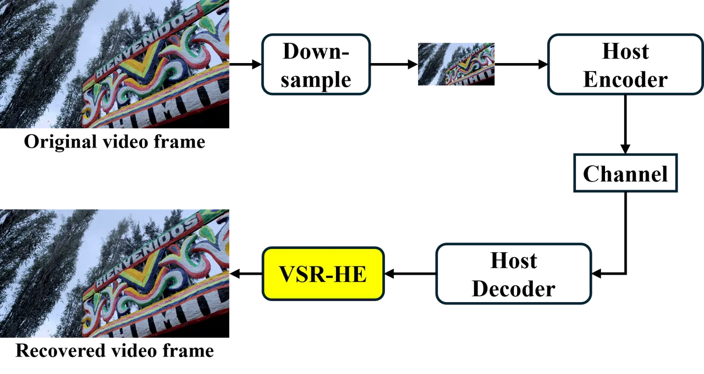
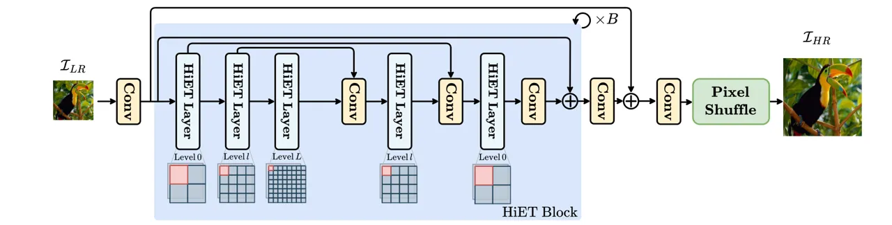
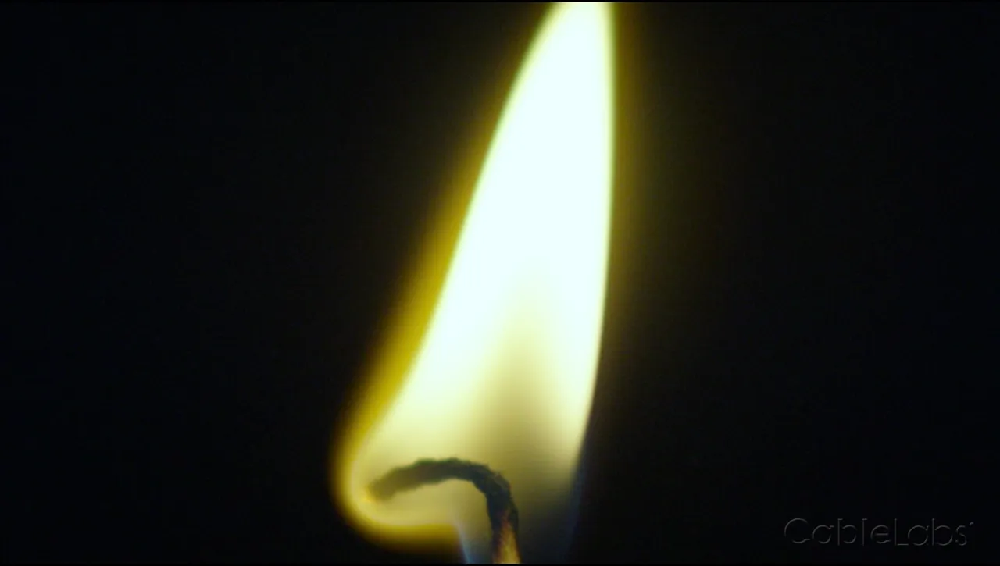
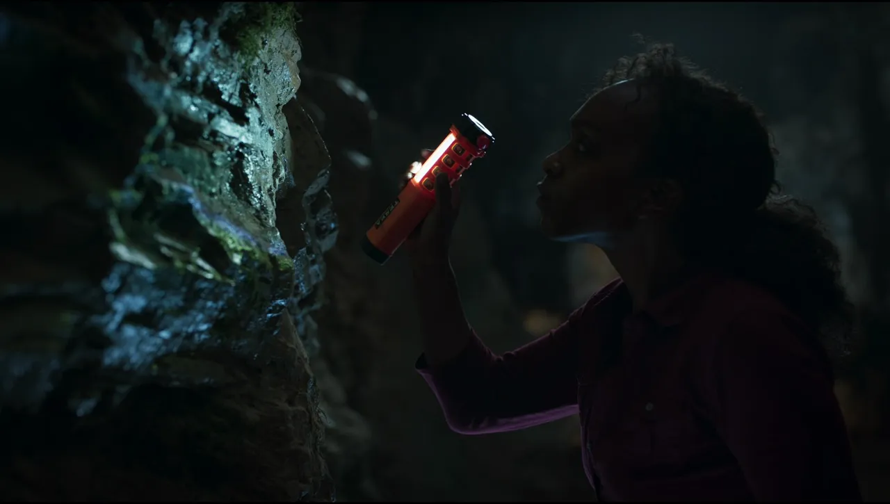
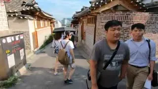
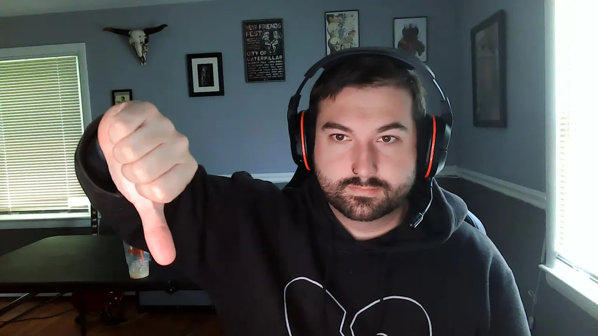
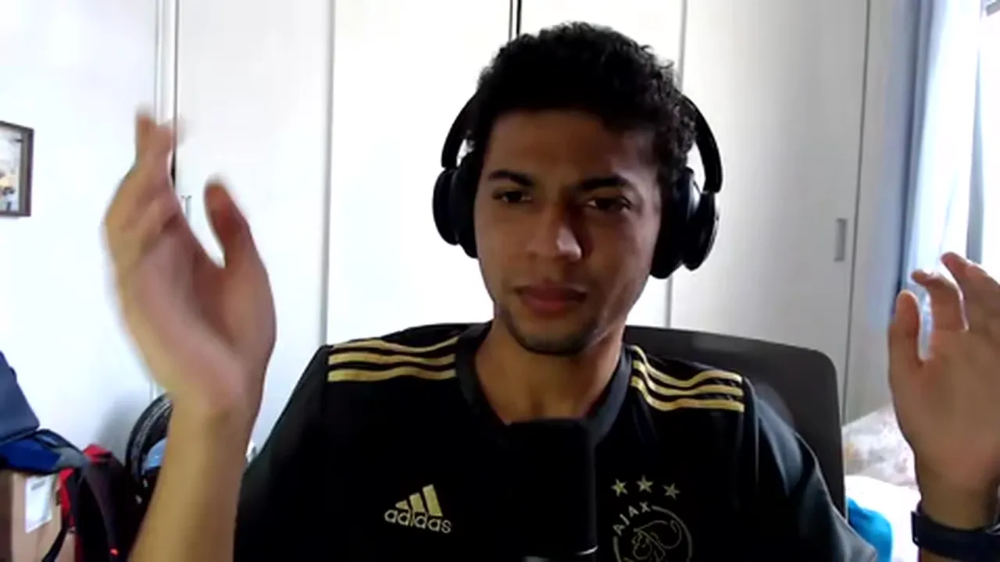
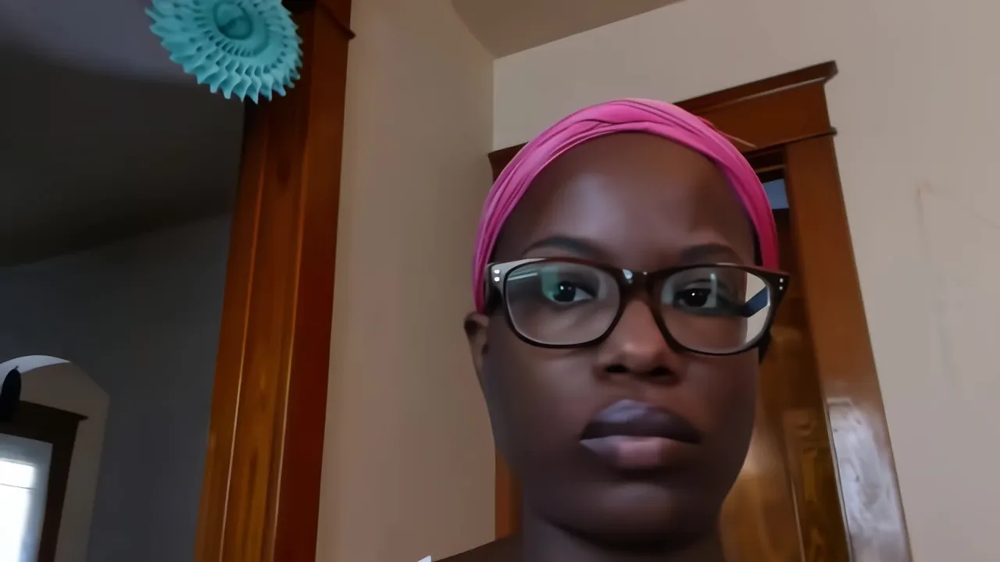
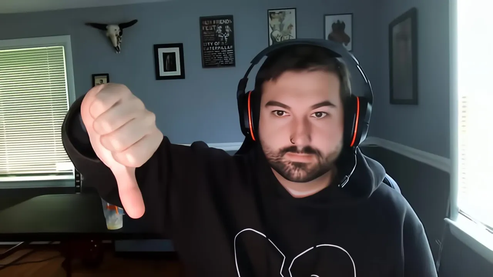

# Compressed Video Super-Resolution based on Hierarchical Encoding

Yuxuan Jiang Affiliation:  University of Bristol Affiliation: 
{yuxuan.jiang, siyue.teng, chen.feng, simon.zeng, fan.zhang,
dave.bull}@bristol.ac.uk    Siyue Teng Qiang Zhu Affiliation: 
University of Bristol Affiliation:  University of Electronic Science and
Technology of China Affiliation:  {yuxuan.jiang, siyue.teng, chen.feng,
simon.zeng, fan.zhang, dave.bull}@bristol.ac.uk Affiliation: 
{zhuqiang@std., eezsy@, eezeng@}uestc.edu.cn    Chen Feng Affiliation: 
University of Bristol Affiliation:  {yuxuan.jiang, siyue.teng,
chen.feng, simon.zeng, fan.zhang, dave.bull}@bristol.ac.uk    Chengxi
Zeng Affiliation:  University of Bristol Affiliation:  {yuxuan.jiang,
siyue.teng, chen.feng, simon.zeng, fan.zhang, dave.bull}@bristol.ac.uk
   Fan Zhang Affiliation:  University of Bristol Affiliation: 
{yuxuan.jiang, siyue.teng, chen.feng, simon.zeng, fan.zhang,
dave.bull}@bristol.ac.uk    Shuyuan Zhu Affiliation:  University of
Electronic Science and Technology of China Affiliation:  {zhuqiang@std.,
eezsy@, eezeng@}uestc.edu.cn    Bing Zeng Affiliation:  University of
Electronic Science and Technology of China Affiliation:  {zhuqiang@std.,
eezsy@, eezeng@}uestc.edu.cn    David Bull Affiliation:  University of
Bristol Affiliation:  {yuxuan.jiang, siyue.teng, chen.feng, simon.zeng,
fan.zhang, dave.bull}@bristol.ac.uk

###### Abstract

This paper presents a general-purpose video super-resolution (VSR)
method, dubbed VSR-HE, specifically designed to enhance the perceptual
quality of compressed content. Targeting scenarios characterized by
heavy compression, the method upscales low-resolution videos by a ratio
of four, from 180p to 720p or from 270p to 1080p. VSR-HE adopts
hierarchical encoding transformer blocks and has been sophisticatedly
optimized to eliminate a wide range of compression artifacts commonly
introduced by H.265/HEVC encoding across various quantization parameter
(QP) levels. To ensure robustness and generalization, the model is
trained and evaluated under diverse compression settings, allowing it to
effectively restore fine-grained details and preserve visual fidelity.
The proposed VSR-HE has been officially submitted to the ICME 2025 Grand
Challenge on VSR for Video Conferencing (Team BVI-VSR), under both the
Track 1 (General-Purpose Real-World Video Content) and Track 2 (Talking
Head Videos).

###### Index Terms: 

Video Super-resolution, H.265, Hierarchical Encoding

## I Introduction

Visual content plays an increasingly important role in our current
digital ecosystem. With the proliferation of smartphones, tablets, and
other digital devices, the consumption of video content has surged
across a wide range of applications, including live streaming, digital
broadcasting, video conferencing, and intelligent surveillance. These
video-centric services now account for a dominant share — approximately
80% — of global internet traffic, as reported by Cisco \[1\].

At the core of enabling efficient video transmission lies video
compression, a fundamental and long-standing research area in image and
video processing. Its role is vital in balancing the trade-off between
the high bitrate required to preserve rich, immersive video content and
the limited bandwidth resources typically available in real-world
scenarios. Over the past decades, the field has seen remarkable
progress, leading to the development of cutting-edge video coding
standards such as H.265/HEVC \[2\], H.266/VVC \[3\] and AOMedia (AOM)
AV1 \[4\]. Despite these advancements, current video codecs still rely
on traditional rate-distortion optimization frameworks inherited from
predecessors like HEVC and VP9 \[5\]. More recently, both MPEG and AOM
have initiated the exploration of new video coding algorithms beyond
their latest standards, with working codecs ECM (Enhanced Compression
Model) \[6\] and AVM (AOM Video Model) \[7\], respectively. However,
current solutions in these models are based on their legacy foundations,
which may limit their ability to fully meet the rapidly escalating
demands of next-generation media applications, especially when operating
at ultra-high spatial resolutions and maintaining a delicate balance
between encoding/decoding efficiency and overall performance \[8\].



Fig. 1: The applied coding framework, with a VSR-HE module serving as
SR.

To address these limitations, deep learning has emerged as a
transformative tool for video compression. Inspired by the advances of
image super-resolution \[9, 10, 11, 12, 13, 14, 15\], a growing body of
learning-based VSR coding approaches has been proposed in recent years
\[16, 17, 18, 19, 20, 21, 22, 23, 24, 25\], demonstrating impressive
improvements in coding efficiency when integrated into standard video
codecs. It is noted that, however, most CNN-based video compression
techniques are trained using simple distortion-based loss functions,
such as mean squared error (MSE) or L1 loss. While these metrics are
easy to compute, they correlate poorly with human visual perception and
often result in suboptimal perceptual quality \[18\].



Fig. 2: The architecture of the proposed network architecture for super
resolution. The HiET layers are adopted from \[12\]. Window sizes are
set to \[64, 32, 8, 32, 64\], with $`B=6`$ and the channel dimension of 126.


BBookcaseBVITexture


BForestLake


BNewYorkStreetDareful



BAncientThoughtS14



BAscStem2S4


BFireS18Mitch

Fig. 3: Sequence thumbnails of training content from BVI-AOM \[26\]
dataset.

In this paper, we propose a deep learning-based video super-resolution
approach, which has been submitted to the ICME 2025 Grand Challenge on
Video Super-Resolution for Video Conferencing (Track 1 & 2). The
proposed method builds upon a previously developed efficient
architecture, the HiET block \[12\], and employs a perceptual loss
function (PLF) combined with GAN-based training, inspired by the CVEGAN
framework \[18\]. In addition to the training set provided by the
organizers, we also used the BVI-AOM \[26\] database as a supplement to
further improve the model generalization and boost the performance. In
accordance with the challenge requirements, our method strictly
processes each frame independently during upscaling and enhancement.
This approach, denoted as VSR-HE, has been evaluated on H.265/HEVC
compressed content (ICME Grand Challenge validation video sequences) and
demonstrates consistent improvements across multiple evaluation
metrics—including PSNR, SSIM, MS-SSIM, and VMAF. Notably, it outperforms
both conventional upscaling methods such as bicubic filter and recent
learning-based VSR models such as EDSR \[14\] and SwinIR \[10\].

The rest of the paper is organized as follows. Section II describes the
proposed VSR-HE method, the integrated coding framework, and the
training process. The coding results are then presented in Section III.
Finally, Section IV concludes the paper and outlines the future work.

## II Proposed Algorithm

The coding framework is illustrated in Fig. 1. Prior to encoding, the
original YUV 720p videos are downsampled by a factor of 4 using a
bicubic filter for Track 1, whereas the original YUV 1080p videos are
downsampled by a factor of 4 using the Lanczos filter for Track 2. A
H.265/HEVC video codec \[2\] serves as the Host Encoder to compress the
low-resolution video in a low-power setting tailored to low-delay
conferencing scenarios. At the decoder, when the low-resolution video
stream is decoded, the proposed VSR-HE approach is applied to
reconstruct the full-resolution video content. Details regarding the
network architecture and the training process are described below.


Sequence1 GT


Sequence2 GT


Sequence3 GT



Sequence1 LR


Sequence2 LR


Sequence3 LR


Sequence1 Bicubic


Sequence2 Bicubic


Sequence3 Bicubic


Sequence1 Ours


Sequence2 Ours


Sequence3 Ours

Fig. 4: Visual comparison of track1 SR reconstruction results.


Sequence1 GT



Sequence2 GT


Sequence3 GT


Sequence1 LR


Sequence2 LR


Sequence3 LR


Sequence1 Bicubic


Sequence2 Bicubic



Sequence3 Bicubic



Sequence1 Ours



Sequence2 Ours


Sequence3 Ours

Fig. 5: Visual comparison of track2 SR reconstruction results.

### II-A Employed Network Architecture

The overall architecture of the proposed model is depicted in Fig. 2.
Specifically, a compressed 64$`\times`$64 YCbCr 4:2:0 image block is
first processed by a nearest-neighbor (NN) upsampling operation to
restore its chroma channels, resulting in a 64$`\times`$64 YCbCr 4:4:4
input. This preprocessed block is then fed into the super-resolution
network, which is designed to predict a high-resolution 256$`\times`$256
YCbCr 4:4:4 image block, achieving a spatial upscaling factor of
$`4\times`$. To ensure compatibility with standard coding pipelines, the
network output is subsequently converted back to the YCbCr 4:2:0 format.

The network backbone is constructed based on the recently proposed HiET
(Hierarchical Encoding Transformer) layer \[12\], which efficiently
captures both local spatial structures and long-range contextual
dependencies. Building upon this design, we propose a refined network
architecture specifically optimized for compressed-domain restoration
and super-resolution tasks. As shown in Fig. 2, the HiET layers are
configured with window sizes of \[64, 32, 8, 32, 64\], where the number
of stacked blocks is set to $`B=6`$ and the hidden channel dimension is
fixed at 126. This configuration is carefully selected to balance model
capacity and computational efficiency, making it particularly suitable
for practical deployment in video conferencing scenarios.

### II-B Training Configuration

The training process of the proposed VSR-HE model is divided into two
stages.

In the first stage, the network is optimized using a combined perceptual
loss function based on \[18\], which balances pixel-wise accuracy and
perceptual fidelity:

```math
\mathcal{L}_{p}=0.3\mathcal{L}_{\mathit{L1}}+0.2\mathcal{L}_{\mathit{SSIM}}+0.1\mathcal{L}_{\mathit{L2}}+0.4\mathcal{L}_{\mathit{MS-SSIM}} \tag{1}
```

where $`\mathcal{L}_{\mathit{L1}}`$ and $`\mathcal{L}_{\mathit{L2}}`$
denote the pixel-wise L1 and L2 losses, respectively, while
$`\mathcal{L}_{\mathit{SSIM}}`$ and $`\mathcal{L}_{\mathit{MS-SSIM}}`$
represent the Structural Similarity Index and its multi-scale variant.
This combined objective ensures both structural preservation and
enhanced perceptual quality during the early training phase.

In the second stage, following the strategy proposed in \[27\], we
further introduce an adversarial loss component based on the GAN
framework to refine the perceptual realism of the super-resolved
outputs. The total loss in this stage is formulated as the weighted sum
of the perceptual loss $`\mathcal{L}_{p}`$ and the GAN loss
$`\mathcal{L}_{GAN}`$.

```math
\mathcal{L}_{total}=\mathcal{L}_{p}+0.05\mathcal{L}_{GAN}. \tag{2}
```

The employed model is implemented using PyTorch 1.10 \[28\]. Training is
performed with the Adam optimizer \[29\], with default hyperparameters
$`\beta_{1}=0.9`$ and $`\beta_{2}=0.999`$. A batch size of 16 is used.
The learning rate is initially set to $`1\times 10^{-4}`$ and is
progressively reduced by a factor of 2 at 50k, 100k, 200k, and 300k
iterations, consistently across both training stages to facilitate
stable convergence. Both training and evaluation were executed on an
NVIDIA RTX4090 GPU.

### II-C Training Content

The proposed VSR-HE model is optimized through supervised training on a
curated dataset, as detailed below. In addition to the provided REDS
dataset \[30\] for Track 1 and the VCD dataset \[31\] for Track 2, we
further incorporate original video sequences from the BVI-AOM database
\[26\] to diversify and enhance the training corpus. Representative
thumbnails from the dataset are illustrated in Fig. 3.

|               |                         |                  |                     |                  |        |                         |                  |                     |                  |
| ------------- | ----------------------- | ---------------- | ------------------- | ---------------- | ------ | ----------------------- | ---------------- | ------------------- | ---------------- |
|               | Track1                  |                  |                     |                  | Track2 |                         |                  |                     |                  |
| Method        | PSNR-Y (dB)$`\uparrow`$ | SSIM$`\uparrow`$ | MS-SSIM$`\uparrow`$ | VMAF$`\uparrow`$ |        | PSNR-Y (dB)$`\uparrow`$ | SSIM$`\uparrow`$ | MS-SSIM$`\uparrow`$ | VMAF$`\uparrow`$ |
| Bicubic       | 25.74                   | 0.8425           | 0.8538              | 37.87            |        | \-                      | \-               | \-                  | \-               |
| Lanczos       | \-                      | \-               | \-                  | \-               |        | 32.64                   | 0.9612           | 0.9611              | 40.97            |
| EDSR \[14\]   | 26.11                   | 0.8710           | 0.8745              | 50.34            |        | 32.96                   | 0.9611           | 0.9613              | 53.64            |
| CVEGAN \[18\] | 26.15                   | 0.8751           | 0.8801              | 58.31            |        | 32.92                   | 0.9621           | 0.9619              | 59.49            |
| SwinIR \[10\] | 26.40                   | 0.8711           | 0.8788              | 56.87            |        | 33.12                   | 0.9612           | 0.9620              | 57.56            |
| Ours          | 26.47                   | 0.8759           | 0.8829              | 59.17            |        | 33.17                   | 0.9635           | 0.9650              | 60.12            |

TABLE I: PSNR-Y, SSIM, MS-SSIM, and VMAF results for the proposed
methods and all benchmarks for both Track 1 and 2.

| Track | Input | Output | Train Time (hrs) | \# Params. (M) | FLOPs (G) | GPU     | Runtime (ms/frame) |
| ----- | ----- | ------ | ---------------- | -------------- | --------- | ------- | ------------------ |
| 1     | 180p  | 720p   | 240              | 5.43           | 455.16    | RTX4090 | 140.61             |
| 2     | 270p  | 1080p  | 240              | 5.43           | 455.16    | RTX4090 | 375.11             |

TABLE II: Model complexity results.

All supplemental sequences were encoded by HEVC HM 18.0 with five
different quantization parameter (QP) values: 17, 22, 27, 32, 34, and
37, after downsampling. Following \[18\], both the degraded sequences
and their corresponding high-quality originals were uniformly cropped
into 64$`\times`$64 (compressed input) and 256$`\times`$256 patches
(high-resolution ground truth), respectively. These patches were
randomly sampled to construct the training pairs. To further enhance
data diversity and improve generalization, common augmentation
techniques such as random rotations and horizontal/vertical flipping
were applied. This comprehensive data preparation process resulted in
approximately 100,000 patch pairs for each track. The model was trained
independently on the respective datasets for Track 1 and Track 2,
enabling it to effectively handle compressed video content across a
broad range of QP values while maintaining robustness to various
compression artifacts.

## III Results and Discussion

Five sequences, provided by the ICME 2025 grand challenge organizer, are
used to evaluate the effectiveness of the proposed coding framework.
Each sequence contains up to 300 frames and is compressed with six
different QPs, ranging from 17 to 37, after down-sampling. The decoded
sequences were also provided by the organizer and stored in mp4 format.
These sequences were first converted into YCbCr 4:4:4 format and then
input into the VSR-HE model to recover to their original resolution.

TABLE. Isummarizes the average performance of the proposed VSR-HE method
for the test sequences in terms of VMAF, SSIM, MS-SSIM and PSNR-Y for
both tracks. To benchmark the performance of our proposed VSR-HE, we
also test several other methods, including bicubic filter, EDSR \[14\],
CVEGAN \[18\] and SwinIR \[10\]. According to the evaluation results,
the proposed model demonstrates strong performance advantages across
multiple aspects, including perceptual quality and fidelity to the
original content. Visual comparisons with Bicubic/Lanczos filters are
presented in Fig. 4 for Track 1 and Fig. 5 for Track 2. As shown, the
proposed VSR-HE model effectively mitigates compression artifacts and
reconstructs finer image details. These results highlight the model’s
effectiveness in enhancing real-world compressed videos and its
potential for various video enhancement applications in practical
scenarios.

Moreover, we also report the training time, number of parameters, FLOPs,
and runtime in TABLE. II. As shown in the table, the total number of
parameters of VSR-HE is 5.43M and the processing speed for each frame is
140 ms. These results offer valuable insights for the organizers to
conduct an in-depth analysis and comparison of the strengths and
weaknesses of each participating method.

## IV Conclusion

In this paper, we propose VSR-HE, a super-resolution framework designed
to upscale 180p compressed videos to 720p resolution. The proposed
method has been tested on H.265/HEVC compressed content and submitted to
the ICME 2025 Grand Challenge on Video Super-Resolution for Video
Conferencing, Track 1: General-Purpose Real-World Video Content with
$`4\times`$ Upscaling (Team BVI-VSR). The evaluation results demonstrate
that VSR-HE can significantly enhance visual quality while maintaining
compatibility with existing video coding workflows. Future work will aim
to further improve the computational efficiency of the model and extend
its deployment to other standard codecs and application scenarios.

## Acknowledgment

The authors appreciate the funding from the University of Bristol, the
UKRI MyWorld Strength in Places Programme (SIPF00006/1), and the China
Scholarship Council.

## References

- \[1\] CISCO, “CISCO visual networking index: forecast and methodology,
  2017–2022,” November 2018.
- \[2\] G. J. Sullivan, J.-R. Ohm, W.-J. Han, and T. Wiegand, “Overview
  of the High Efficiency Video Coding (HEVC) Standard,” IEEE
  Transactions on Circuits and Systems for Video Technology, vol. 22,
  no. 12, pp. 1649–1668, 2012.
- \[3\] “VVCSoftware_VTM.”
  [https://vcgit.hhi.fraunhofer.de/jvet/VVCSoftware_VTM](https://vcgit.hhi.fraunhofer.de/jvet/VVCSoftware_VTM).
  Accessed: Enter Date Accessed.
- \[4\] “SVT-AV1.”
  [https://gitlab.com/AOMediaCodec/SVT-AV1](https://gitlab.com/AOMediaCodec/SVT-AV1).
  Accessed: Enter Date Accessed.
- \[5\] “VP9.”
  [https://www.webmproject.org/vp9/](https://www.webmproject.org/vp9/).
  Accessed: Enter Date Accessed.
- \[6\] Joint Video Experts Team (JVET), “Enhanced Compression Model
  (ECM) 12.0 Library .”
  [https://vcgit.hhi.fraunhofer.de/ecm/ECM](https://vcgit.hhi.fraunhofer.de/ecm/ECM), 2024.
  Accessed: 2024-04-10.
- \[7\] Alliance for Open Media, “AOM Video Model (AVM) Codec 2.0.0
  Library.”
  [https://gitlab.com/AOMediaCodec/avm](https://gitlab.com/AOMediaCodec/avm), 2024.
  Accessed: 2024-04-10.
- \[8\] S. Teng, Y. Jiang, G. Gao, F. Zhang, T. Davis, Z. Liu, and
  D. Bull, “Benchmarking conventional and learned video codecs with a
  low-delay configuration,” in 2024 IEEE International Conference on
  Visual Communications and Image Processing (VCIP), pp. 1–5,
  IEEE, 2024.
- \[9\] Y. Jiang, C. Feng, F. Zhang, and D. Bull, “MTKD: Multi-teacher
  knowledge distillation for image super-resolution,” arXiv preprint
  arXiv:2404.09571, 2024.
- \[10\] J. Liang, J. Cao, G. Sun, K. Zhang, L. Van Gool, and
  R. Timofte, “SwinIR: Image restoration using swin transformer,” in
  Proceedings of the IEEE/CVF international conference on computer
  vision, pp. 1833–1844, 2021.
- \[11\] Y. Jiang, H. M. Kwan, T. Peng, G. Gao, F. Zhang, X. Zhu,
  J. Sole, and D. Bull, “Hiif: Hierarchical encoding based implicit
  image function for continuous super-resolution,” arXiv preprint
  arXiv:2412.03748, 2024.
- \[12\] Y. Jiang, C. Zeng, S. Teng, F. Zhang, X. Zhu, J. Sole, and
  D. Bull, “C2d-isr: Optimizing attention-based image super-resolution
  from continuous to discrete scales,” arXiv preprint
  arXiv:2503.13740, 2025.
- \[13\] Q. Zhu, Y. Jiang, S. Zhu, F. Zhang, D. Bull, and B. Zeng,
  “Blind video super-resolution based on implicit kernels,” arXiv
  preprint arXiv:2503.07856, 2025.
- \[14\] B. Lim, S. Son, H. Kim, S. Nah, and K. Mu Lee, “Enhanced deep
  residual networks for single image super-resolution,” in Proceedings
  of the IEEE conference on computer vision and pattern recognition
  workshops, pp. 136–144, 2017.
- \[15\] T. Peng, H. M. Kwan, Y. Jiang, G. Gao, F. Zhang, X. Xu, S. Liu,
  and D. Bull, “Instance data condensation for image super-resolution,”
  arXiv preprint arXiv:2505.21099, 2025.
- \[16\] N. Yan, D. Liu, H. Li, B. Li, L. Li, and F. Wu, “Convolutional
  neural network-based fractional-pixel motion compensation,” IEEE
  Transactions on Circuits and Systems for Video Technology, vol. 29,
  no. 3, pp. 840–853, 2018.
- \[17\] F. Zhang, C. Feng, and D. R. Bull, “Enhancing vvc through
  cnn-based post-processing,” in 2020 IEEE International Conference on
  Multimedia and Expo (ICME), pp. 1–6, IEEE, 2020.
- \[18\] D. Ma, F. Zhang, and D. R. Bull, “CVEGAN: a
  perceptually-inspired gan for compressed video enhancement,” arXiv
  preprint arXiv:2011.09190, 2020.
- \[19\] D. Ma, F. Zhang, and D. R. Bull, “MFRNet: a new CNN
  architecture for post-processing and in-loop filtering,” IEEE Journal
  of Selected Topics in Signal Processing, vol. 15, no. 2,
  pp. 378–387, 2020.
- \[20\] Y. Jiang, J. Nawała, C. Feng, F. Zhang, X. Zhu, J. Sole, and
  D. Bull, “Rtsr: A real-time super-resolution model for av1 compressed
  content,” arXiv preprint arXiv:2411.13362, 2024.
- \[21\] Y. Jiang, J. Nawała, F. Zhang, and D. Bull, “Compressing deep
  image super-resolution models,” in 2024 Picture Coding Symposium
  (PCS), pp. 1–5, IEEE, 2024.
- \[22\] C. Feng, D. Danier, C. Tan, F. Zhang, and D. Bull, “Vistra3:
  Video coding with deep parameter adaptation and post processing,” in
  2022 IEEE International Symposium on Circuits and Systems (ISCAS),
  pp. 824–828, IEEE, 2022.
- \[23\] M. V. Conde, Z. Lei, W. Li, C. Bampis, I. Katsavounidis, and
  R. Timofte, “Aim 2024 challenge on efficient video super-resolution
  for av1 compressed content,” arXiv preprint arXiv:2409.17256, 2024.
- \[24\] Q. Zhu, J. Hao, Y. Ding, Y. Liu, Q. Mo, M. Sun, C. Zhou, and
  S. Zhu, “Cpga: Coding priors-guided aggregation network for compressed
  video quality enhancement,” in Proceedings of the IEEE/CVF Conference
  on Computer Vision and Pattern Recognition, pp. 2964–2974, 2024.
- \[25\] Q. Zhu, F. Zhang, F. Chen, S. Zhu, D. Bull, and B. Zeng,
  “Fcvsr: A frequency-aware method for compressed video
  super-resolution,” arXiv preprint arXiv:2502.06431, 2025.
- \[26\] J. Nawała, Y. Jiang, F. Zhang, X. Zhu, J. Sole, and D. Bull,
  “BVI-AOM: A new training dataset for deep video compression
  optimization,” arXiv preprint arXiv:2408.03265, 2024.
- \[27\] X. Wang, K. Yu, S. Wu, J. Gu, Y. Liu, C. Dong, Y. Qiao, and
  C. Change Loy, “Esrgan: Enhanced super-resolution generative
  adversarial networks,” in Proceedings of the European conference on
  computer vision (ECCV) workshops, pp. 0–0, 2018.
- \[28\] A. Paszke, S. Gross, F. Massa, A. Lerer, J. Bradbury,
  G. Chanan, T. Killeen, Z. Lin, N. Gimelshein, L. Antiga, et al.,
  “Pytorch: An imperative style, high-performance deep learning
  library,” Advances in neural information processing systems,
  vol. 32, 2019.
- \[29\] D. P. Kingma and J. Ba, “Adam: A method for stochastic
  optimization,” arXiv preprint arXiv:1412.6980, 2014.
- \[30\] S. Nah, S. Baik, S. Hong, G. Moon, S. Son, R. Timofte, and
  K. Mu Lee, “Ntire 2019 challenge on video deblurring and
  super-resolution: Dataset and study,” in Proceedings of the IEEE/CVF
  conference on computer vision and pattern recognition workshops,
  pp. 0–0, 2019.
- \[31\] B. Naderi, R. Cutler, N. S. Khongbantabam, Y. Hosseinkashi,
  H. Turbell, A. Sadovnikov, and Q. Zou, “Vcd: A video conferencing
  dataset for video compression,” in ICASSP 2024-2024 IEEE International
  Conference on Acoustics, Speech and Signal Processing (ICASSP),
  pp. 3970–3974, IEEE, 2024.
