# EchoShot: Multi-Shot Portrait Video Generation

Jiahao Wang, Hualian Sheng, Sijia Cai, Weizhan Zhang, Caixia Yan   
Yachuang Feng, Bing Deng, Jieping Ye

¹Xi’an Jiaotong University ²Alibaba Cloud  
jiahaowang@stu.xjtu.edu.cn  stephen.csj@alibaba-inc.com  zhangwzh@xjtu.edu.cn

###### Abstract

Video diffusion models substantially boost the productivity of artistic
workflows with high-quality portrait video generative capacity. However,
prevailing pipelines are primarily constrained to single-shot creation,
while real-world applications urge for multiple shots with identity
consistency and flexible content controllability. In this work, we
propose EchoShot, a native and scalable multi-shot framework for
portrait customization built upon a foundation video diffusion model. To
start with, we propose shot-aware position embedding mechanisms within
video diffusion transformer architecture to model inter-shot variations
and establish intricate correspondence between multi-shot visual content
and their textual descriptions. This simple yet effective design enables
direct training on multi-shot video data without introducing additional
computational overhead. To facilitate model training within multi-shot
scenario, we construct PortraitGala, a large-scale and high-fidelity
human-centric video dataset featuring cross-shot identity consistency
and fine-grained captions such as facial attributes, outfits, and
dynamic motions. To further enhance applicability, we extend EchoShot to
perform reference image-based personalized multi-shot generation and
long video synthesis with infinite shot counts. Extensive evaluations
demonstrate that EchoShot achieves superior identity consistency as well
as attribute-level controllability in multi-shot portrait video
generation. Notably, the proposed framework demonstrates potential as a
foundational paradigm for general multi-shot video modeling. Project
page:
[https://johnneywang.github.io/EchoShot-webpage](https://johnneywang.github.io/EchoShot-webpage).

^(†)^(†)footnotetext: ^(∗) Corresponding Author^(†)^(†)footnotetext:
$`\dagger`$ Project Lead

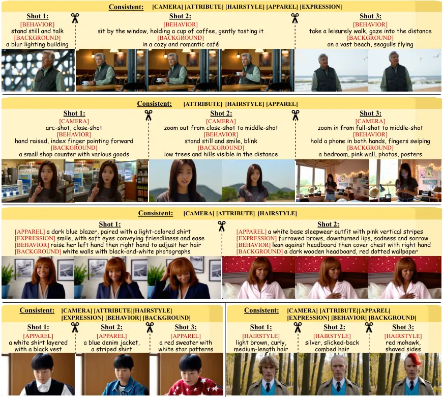

Figure 1: Given multiple formatted prompts of the same character,
EchoShot generates multi-shot portrait videos showing the same
appearance with superior fine-grained controllability.

## 1 Introduction

Recent advancements in Diffusion Transformer-based (DiT) model \[32\]
have catalyzed transformative progress in text-to-video (T2V)
generation, enabling the synthesis of visually realistic single-shot
videos \[10, 6, 4, 7, 3, 41\]. In real-world content creation workflows,
users frequently demand multi-shot video generation with persistent
subject consistency, particularly in human-centric applications such as
narrative storytelling, virtual try-on with background variations and
appearance attribute editing. However, prevailing T2V models exhibit
limitations in achieving identity consistency when generating multiple
human-centric videos, attributable to pre-training on independently
fragmented single-shot data and a lack of effective cross-shot
post-training strategies.

To tackle this challenge, we present a novel multi-shot portrait video
generation (MT2V) task. As straightforward solutions, existing studies
can be organized to perform this task through two paradigms: (1)
Iterative personalized generation. This approach achieves cross-shot
consistency through recurrent applications of personalized text-to-video
(PT2V) models \[7, 49, 4, 3\] but faces challenges in terms of textual
controllability and full-body consistency. To specify, the facial
feature guidance mechanism in PT2V models often leads to adversarial
competition between identity preservation and prompt adherence, reducing
the controllability in aspects such as hairstyle, expressions and
apparel. Moreover, these models, tailored for facial preservation, fail
to maintain the whole body consistency across generated videos. (2)
Keyframe-to-video synthesis. This approach first generates multiple
keyframes using consistent text-to-image (CT2I) models \[52, 40, 19,
42\] and transforms them into multiple shots utilizing sophisticated
image-to-video (I2V) models \[4, 3, 41\]. Although this decoupled
strategy partially mitigates the multi-shot consistency challenge, it
fundamentally suffers from the bottleneck effect and highly depends on
the performance of CT2I models. The flaws of keyframes such as blur,
distortion and inconsistency will severely degrade the quality of
generated videos. Besides, the absence of explicit identity conditioning
in I2V models leads to progressive degradation of facial consistency
during temporal expansion, causing dynamic identity drift.

For these issues, we explore a novel paradigm for native multi-shot
consistent video generation in this work. Our motivation lies in the
investigation of whether constructing temporally coherent portrait
dataset and implementing domain-specific post-training strategies can
enable DiT architecture to intrinsically model appearance-motion
consistency across multi-shot videos. To this end, we introduce
EchoShot, an advanced multi-shot portrait video generation framework
built upon state-of-the-art video DiT model Wan2.1-T2V \[41\], with our
work contributing three core innovations: (1) We propose PortraitGala, a
large-scale portrait dataset comprising 250k one-to-one single-shot
video clips and 400k many-to-one multi-shot video clips. Each video
undergoes rigorous identity clustering via facial embeddings and is
annotated with granular captions covering facial attributes, dynamic
expressions, and scene conditions, ensuring strict consistency and
fine-grained controllability in the final generated videos. (2) To
enable efficient multi-shot post-training based on the pretrained T2V
model, we integrate a new position embedding mechanism termed
Temporal-Cut RoPE (TcRoPE) into the DiT-based visual token
self-attention module to resolve challenges in variable shot counts,
flexible shot durations, and inter-shot token discontinuities. In the
video-text cross-attention module, a Temporal-Align RoPE (TaRoPE) with
mismatch suppression mechanism is further introduced to establish strict
alignment between text descriptions and their corresponding video
contents within each shot. (3) Based on our trained EchoShot model, we
further extend its capabilities by incorporating an external facial
encoder for reference image-based personalized multi-shot video
generation (PMT2V), and designing a disentangled RefAttn mechanism for
infinite shots video generation (InfT2V). These extensions highlight our
model’s flexibility and generalization in real-world content creation.

Our experiments demonstrate that EchoShot excels in generating
multi-shot portrait videos with consistent cross-shot identity
preservation, while supporting fine-grained attribute control and scene
manipulation. Comprehensive evaluations confirm its superiority over
existing methods in quantitative metrics and user studies, particularly
in maintaining identity coherence under complex motions and content
variations, all within a native multi-shot video generation
architecture.

## 2 Related Work

Video diffusion models. The video generation field has witnessed
remarkable progress over the past year, marked by Sora \[10\]’s
pioneering adoption of a scalable DiT architecture. Subsequently, both
closed-source models like Kling \[4\], MovieGen \[33\], Hailuo \[3\],
Veo2 \[6\] and Gen-4 \[2\], along with open-source alternatives such as
Open-Sora-Plan \[26\], CogVideoX \[47\], HunyuanVideo \[23\], StepVideo
\[29\], and Wan \[41\], have achieved remarkable and rapid advancements
in video generation quality. Key technical strides stem from
architectural shifts from U-Net \[34, 9\] to DiT/MMDiT \[32, 15\], the
evolution from spatio-temporal \[36, 16\] to 3D full attention in video
token interactions, model optimization from DDPM \[34\] to flow matching
\[15\], advanced Video-VAE \[47, 41\] and enhanced text encoders \[33,
23\]. Despite advancements, existing methods are limited to single-shot
videos, and extending pretrained T2V models for multi-shot scenarios
poses a critical challenge.

Consistent generation. Maintaining subject consistency across scenes has
broad real-world applications, with early efforts focusing on image
consistency for story visualization and comics. Techniques include
iterative use of personalized text-to-image models \[25, 44, 18\] for
similarity preservation, or leveraging self-attention mechanisms \[52,
40\] and in-context capabilities \[19\] for multi-image alignment. With
advances in video generation, these approaches could be applied to
keyframe generation, combined with I2V models for multi-shot video
synthesis. For example, VideoStudio \[28\] integrates entity embeddings
for appearance preservation, MovieDreamer \[50\] predicts coherent
visual tokens that are then decoded into keyframes, and VGoT \[51\]
employs identity-preserving embeddings for cross-shot consistency.
However, challenges persist in achieving high-fidelity dynamic identity
consistency and controllability. Recent work explores fine-tuning T2V
models for multi-event and multi-shot generation. HunyuanVideo \[23\]
supports two-shot generation through caption concatenation. TALC \[8\]
enhances temporal alignment with improved text conditioning, MinT \[45\]
introduces time-aware interactions and positional encoding, and LCT
\[17\] extends single-shot models using scene-level attention,
interleaved 3D embeddings, and asynchronous noise strategies. While LCT
emphasizes cross-shot coherence via scripted entity descriptions, our
method focuses on identity consistency and text-guided control in
multi-shot portrait generation.

Human video datasets. Diverse, large-scale human-centric video datasets
are crucial for advancing portrait video generation. While existing
high-quality portrait datasets like CelebV-HQ \[53\], CelebV-Text
\[48\], and VFHQ \[46\] primarily feature close-up heads or upper
bodies, other action datasets such as UCF101 \[37\], ActivityNet \[11\],
Kinetics700 \[12\] suffer from inadequate visual quality and
inconsistent face visibility. Recently, OpenHumanVid \[24\] introduces a
large-scale and visually realistic dataset sourced from films, TV
series, and documentaries for single-shot video pretraining/fine-tuning.
However, both specialized portrait datasets and general pre-training
datasets \[13, 43\] currently only offer single-shot video clips,
leaving a critical gap in high-quality multi-shot identity-consistent
portrait video datasets.

## 3 Method

Overview. To accomplish multi-shot portrait video generation, we first
review current single-shot models in Sec. 3.1. As a foundation, we
devise and train a multi-shot text-to-video (MT2V) modeling paradigm in
Sec. 3.2. We further tailor the personalized and infinite extensions in
Sec. 3.3. All the training is driven by a meticulously curated dataset
in Sec. 3.4.

### 3.1 Preliminary: Single-shot T2V Generation

Given a video segment $`\boldsymbol{x}`$ during training, prevailing T2V
models first encode it into a latent feature:
$`\boldsymbol{z}=\mathcal{E}(\boldsymbol{x})`$, where $`\mathcal{E}`$ is
a pretrained video encoder. The latent feature is then mixed with
Gaussian noise $`\boldsymbol{\epsilon}`$, becoming a noisy sample
$`\boldsymbol{z}_{\tau}`$. The training is driven by a denoising process
of rectified flow (RF) formulation \[27, 15\]:
$`\mathcal{L}=\mathbb{E}_{\boldsymbol{\epsilon}_{\tau},\tau,\boldsymbol{z}}||(\boldsymbol{\epsilon}-\boldsymbol{z})-u_{\phi}(\boldsymbol{z}_{\tau},\tau,\boldsymbol{c})||^{2}`$,
where $`\tau\in[0,1]`$ is the denoising timestep, $`u_{\phi}(\cdot)`$ is
a denoising network and $`\boldsymbol{c}`$ is the embeddings of the
textual description. A typical implementation of $`u_{\phi}(\cdot)`$ is
a DiT, combining self-attention and cross-attention layers. In the
self-attention layers, given a 3D-position-indexed query or key vector
$`\boldsymbol{f}^{\textit{sa}}_{t,h,w}\in\mathbb{R}^{d}`$, 3D Rotary
Position Embedding (RoPE) \[15\] adds dimension-wise position
information to it, forming
$`\tilde{\boldsymbol{f}}^{\textit{sa}}_{t,h,w}`$:

```math
\tilde{\boldsymbol{f}}^{\textit{sa}}_{t,h,w}=\mathrm{3D\text{-}RoPE}(\boldsymbol{f}^{\textit{sa}}_{t,h,w},t,h,w)=\boldsymbol{R}_{\Theta_{\textit{3D}},t,h,w}^{d}~\boldsymbol{f}^{\textit{sa}}_{t,h,w}, \tag{1}
```

where $`\boldsymbol{R}_{\Theta_{\textit{3D}},t,h,w}^{d}`$ represents a
3D rotation matrix determined by the positional index and a set of base
angles $`\Theta_{\textit{3D}}`$. Details are provided in Appendix.
Notably, RoPE is generally excluded from cross-attention layers. While
single-shot T2V models can generate portrait videos, extending this
capability to multi-shot T2V models while preserving consistent identity
remains a significant challenge.

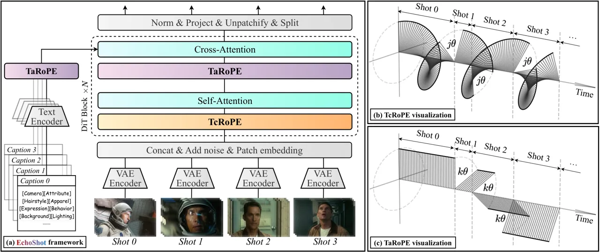

Figure 2: (a) The overall architecture of EchoShot, a multi-shot video
generation paradigm, which features two intricate RoPE mechanisms.
(b)TcRoPE, a 3D-RoPE which rotates an extra angular rotation at every
inter-shot boundary along the time dimension. (c)TaRoPE, a 1D-RoPE which
differentiates between matching and non-matching shot-caption pairs.
Note that the visualization displays only one rotational component, with
others excluded for simplicity.

### 3.2 Modeling Multi-shot T2V Generation for Consistent Identity

This task focuses on generating coherent multi-shot portrait videos that
exhibit consistent identity across all shots while allowing flexible,
user-defined control over both content and appearance. During training,
each instance consists of a multi-shot video paired with corresponding
frame counts and textual descriptions for each shot:
$`\{\boldsymbol{x}_{s},n_{s},p_{s}\}_{s=0}^{S-1}`$, where $`S`$ denotes
the total number of shots. Here, $`n_{s}`$ represents the frame count
for the $`s`$-th shot, and $`p_{s}`$ specifies its textual prompt.
During inference, users are empowered to define the desired frame counts
and prompts for $`S^{\prime}`$ shots:
$`\{n_{s},p_{s}\}_{s=0}^{S^{\prime}-1}`$, enabling customized multi-shot
video generation with consistent identity. This task presents three key
challenges compared to single-shot video generation:

- •
  Variable Shot Lengths: Each shot’s duration (i.e., frame count) can be
  flexibly defined by the user, accommodating diverse temporal
  requirements without imposing rigid constraints.
- •
  Identity Consistency Across Shots: The generated video must ensure
  that all shots depict the same individual identity, maintaining
  seamless visual coherence throughout the sequence.
- •
  Text-Driven Control of Each Shot: Both the background and foreground
  in each shot are controlled via textual prompts, enabling precise
  customization of scenes and characters.

Identifying the inter-shot boundary via TcRoPE. Starting with $`S`$
training video segments, a video encoder is first utilized to separately
encode them into compressed latent features $`\boldsymbol{z}_{s}`$, as
shown in Fig. 2(a). Then, the latent features are further projected into
query, key, and value embeddings to prepare for the self-attention
mechanism. To preserve relative positional and temporal information, in
vanilla 3D-RoPE, query and key embeddings require being modulated by the
indexes of time, height, and width. However, such temporal index
modulation is based on the assumption of continuous video content, which
is not suitable for multi-shot scenarios with discontinuous video
content. For example, the final frame of the first shot should correlate
strongly with its preceding frame and weakly with the subsequent frame
(i.e., the initial frame of the second shot). To model such an intricate
correlation, as shown in Fig. 2(b), we raise TcRoPE to modulate the
query and key embeddings, which incorporates rotary phase shift between
every two shots. For the feature embedding
$`\boldsymbol{a}^{\textit{sa}}_{t,h,w,s}`$ at time $`t`$, height $`h`$,
width $`w`$, and shot $`s`$, the processed feature can be denoted as:

```math
\tilde{\boldsymbol{f}}^{\textit{sa}}_{t,h,w,s}=\mathrm{TcRoPE}(\boldsymbol{f}^{\textit{sa}}_{t,h,w,s},t,h,w,s)=\mathrm{3D\text{-}RoPE}(\boldsymbol{f}^{\textit{sa}}_{t,h,w,s},t+s\cdot j,h,w), \tag{2}
```

where $`j`$ is the phase shift scale. Intuitively, TcRoPE delineates the
inter-shot boundary along the whole timeline concisely via an extra
angular rotation. This method paves the way for precise control over the
number of shots and the duration of each shot.

After the self-attention process, single-shot T2V models
indiscriminately fuse semantic and visual modalities without
incorporating positional information. In multi-shot scenarios, a
straightforward approach is to concatenate all shot-wise captions into a
single comprehensive caption. However, this method imposes limitations
on the length of each shot-wise caption, given that the total caption
must remain within the input window size of the text encoder.

Associating the semantic and visual modality via TaRoPE. Therefore, it
is necessary to establish a shot-wise intricate correspondence when
processing multi-shot videos and their associated captions.
Specifically, the query of a specific shot should fully interact with
the key of its corresponding caption, while maintaining a limited
interaction with the keys of other captions. Because fully ignoring
interactions with other captions would risk discarding potentially
useful supplementary details that could enhance the representation of
the shot. To achieve such delicate interactions, we first input the
captions separately into the text encoder to generate their respective
embeddings. These embeddings are then concatenated to form the complete
caption representation. Subsequently, as shown in Fig. 2(c), we propose
TaRoPE to modulate the visual query embeddings and textual key
embeddings. Given the $`i`$-th feature embedded in shot $`s`$, the
processed feature can be expressed as:

```math
\tilde{\boldsymbol{f}}^{\textit{ca}}_{i,s}=\mathrm{TaRoPE}(\boldsymbol{f}^{\textit{ca}}_{i,s},s)=\mathrm{1D\text{-}RoPE}(\boldsymbol{f}^{\textit{ca}}_{i,s},s\cdot k), \tag{3}
```

where $`k`$ is a hyperparameter that controls the mismatch suppression
scale. Following feature modulation, attention calculation is performed,
and the attention score between the query of $`s_{1}`$-th shot and the
key of $`s_{2}`$-th shot is given by:

```math
\tilde{A}_{s_{1},s_{2}}=A_{s_{1},s_{2}}\cdot\delta(k|s_{1}-s_{2}|), \tag{4}
```

where $`A_{s_{1},s_{2}}`$ represents the standard vanilla attention, and
$`\delta(\cdot)`$ is a monotonically decreasing function within a
specific input interval, with $`f(0)=1`$. Detailed derivation is
provided in Appendix. Consequently, the attention between the matched
query and key (i.e., when $`s_{1}=s_{2}`$) remains identical to that in
vanilla models. In contrast, the attention between unmatched pairs is
suppressed, controlled by $`k`$. Finally, the processed features are
passed through a FFN to generate the output.

Our proposed TcRoPE supports variable shot lengths and counts, while
TaRoPE enables text-driven control of each shot. The multi-shot training
paradigm inherently ensures identity consistency across all shots.
Notably, the two proposed RoPE mechanisms introduce no additional
parameters.

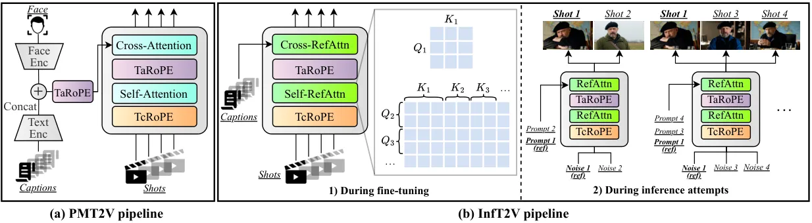

Figure 3: Two enhanced pipelines based on MT2V model. (a) PMT2V
pipeline, with a integrated conditioner branch, generates multi-shot
portrait videos of a given face input. (b) InfT2V pipeline creates
infinite shots of the same person across multiple generation attempts,
enabled by RefAttn, which disentangles the first shot as a constant
reference.

### 3.3 Towards Personalized and Infinite Multi-shot T2V Generation

PMT2V. The aforementioned method enables the model to generate video
segments while preserving consistent identity. However, a key
application involves extending the model’s capability to generate video
segments corresponding to user-specified image. To achieve this goal, as
illustrated in Fig. 3(a), we incorporate a conditioning branch to encode
the face input using a face encoder, which consists of ArcFace \[14\]
and CLIP-G \[39\]. The resulting face embeddings are concatenated with
the semantic embeddings of each text prompt, modulated by TaRoPE, and
subsequently fed into the cross-attention layers. The denoising network
is fine-tuned from the MT2V weights, guided by the standard RF loss.

InfT2V. In real-world applications, life-long video generation with an
infinite number of shots for the same individual is required. A natural
approach is to fix the first shot as a reference across multiple
generation attempts while varying the remaining shots. The inherent
dynamics of the full-attention mechanism update the denoising path of
each shot based on the fixed noise input from the first shot and the
random noise inputs from remaining shots, resulting in variations in the
first shot across different generation attempts. To address this issue,
we disentangle the first shot using RefAttn, as illustrated in Fig. 3,
which computes two attention weight matrices:

```math
\displaystyle A_{1}=Q_{1}\times K_{1},\quad A_{2}=[Q_{2},\dots]\times[K_{1},\dots], \tag{5}
```

where $`[\cdot]`$ is concatenation operation. Here, $`A_{1}`$ is
employed to update the first shot, while $`A_{2}`$ is utilized to update
the remaining shots. Integrating RefAttn, the model undergoes a quick
fine-tuning to learn this new patter. During inference, we maintain the
noise, length and prompt of the first shot unchanged across different
generations, providing a fixed reference. As we change the prompts of
the remaining shots, our method generates infinite shots preserving the
identity of the first.

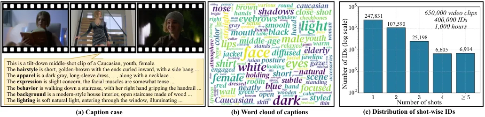

Figure 4: (a) A caption case of PortraitGala. Each clip is thoroughly
captioned in the fine-grained format. (b) The word cloud reflects the
comprehensiveness of the captions. (c) PortraitGala consists of 650,000
clips with 400,000 IDs, totaling a video duration of 1,000 hours.

### 3.4 PortraitGala: The First Multi-shot Portrait Video Dataset

Data processing. To support training, we meticulously construct a
high-quality and large-scale human portrait dataset through an
incremental process: 1) collect a raw data pool from diverse sources,
including movies, episodes, open-source dataset, etc. ; 2) filter by
aspect ratio, resolution, and other criteria; 3) slice into single-shot
clips using PySceneDetect \[5\]; 4) detect human face \[22\] and retain
single-person clips; 5) identity many-to-one clips showing the same
person using in-house facial embedding extraction and clustering
pipeline; 6) remove duplicate videos showing similar content; 7) attach
attribute labels, text descriptions, and other necessary structured
information based on Gemini 2.0 Flash \[1\].

Data format and statistics. We deconstruct the content of portrait
videos into 8 aspects and establish a unified caption format. To
specify, as shown in Fig. 4(a), every clip is annotated with the format
"This is a \[CAMERA\] of a \[ATTRIBUTE\].\[HAIRSTYLE\].\[APPAREL\].\[EXPRESSION\].\[BEHAVIOR\].\[BACKGROUND\].\[LIGHTING\].".
The word cloud in Fig. 4(b) reflects the comprehensiveness of our
detailed captions, which endows our model with fine-grained
controllability of the generated videos. As a result of the curation
pipeline, we ultimately build up PortraitGala, which consists of 600k
clips showing 400k identities, totaling a video duration of 1k hours. As
depicted in Fig. 4(c), our dataset includes 247k single-shot IDs, 107k
two-shot IDs, 25k three-shot IDs and so on, which lays a solid
foundation for our multi-shot training paradigm.

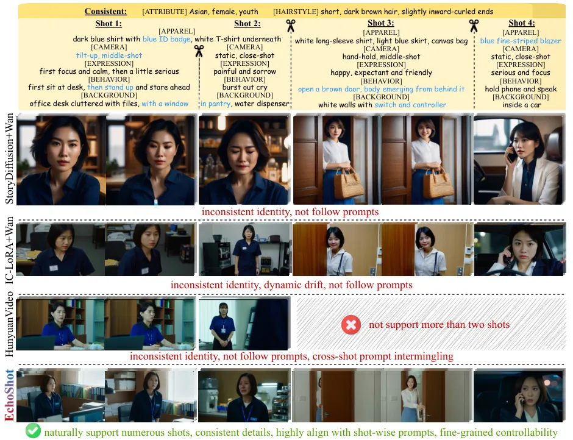

Figure 5: Illustration of EchoShot and baselines in the MT2V task. Key
prompts are marked blue. Our method demonstrates superior appearance
consistency and fine-grained controllability.

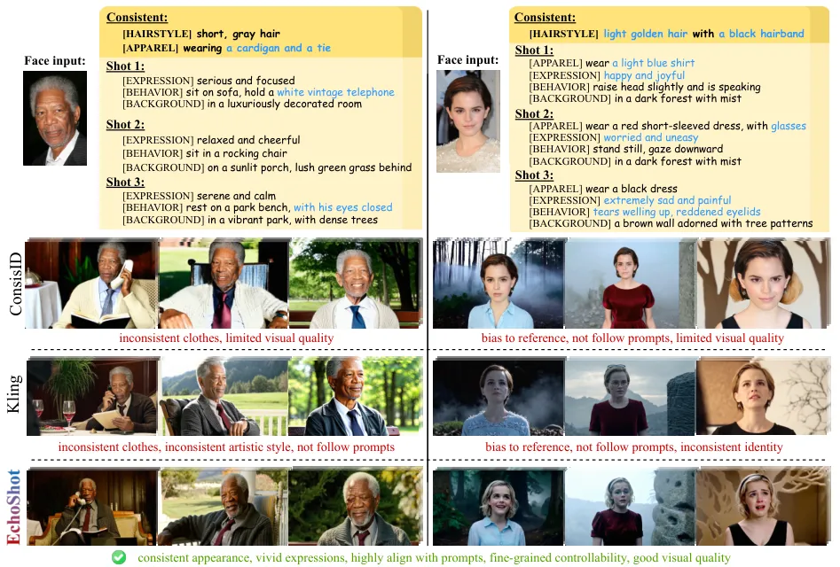

Figure 6: Illustration of EchoShot and baselines in PMT2V task.
Baselines exhibit severe bias, poor consistency and limited
controllability, while our method demonstrates superior overall quality.

## 4 Experiment

Implementation details. EchoShot is implemented based on Wan-1.3B
\[41\]. Throughout the three tasks, we set the resolution to
832$`\times`$480 and use a fixed 125 frames, which is equivalent to 7.8
seconds in the real world. We set the phase shift scale $`j`$ to 4 and
the mismatch suppression scale $`k`$ to 6. The training dataset consists
of one-third one-to-one data and two-thirds many-to-one data and the
shot number $`S`$ varies from 1 to 4. The length of each shot is
randomly sampled. All the training is driven by the standard RF loss.
The MT2V pretraining takes about 3,500 NVIDIA A100 GPU hours. The PMT2V
model and InfT2V model are fine-tuned base on the MT2V weights.

Baselines. To evaluate the performance of EchoShot, we compare it with a
variety of baselines. For MT2V, we include (1) keyframe-based pipelines,
StoryDiffusion \[52\]+Wan-I2V \[41\] (SD+W) and IC-LoRA \[19\]+Wan-I2V
\[41\] (IC+W), (2) HunyuanVideo \[23\], which supports two shots
generation. For PMT2V, we include (1) open-source ConsisID \[49\], (2)
closed-source Kling \[4\]. All model settings are kept at their default
values.

Benchmark. To provide an objective assessment, we instruct LLM to
generate 100 sets of multi-shot prompts in the portrait caption format.
The prompts are transformed into different versions to match the
different text input lengths of baselines. We encompass metrics from
three different aspects: (1) Identity consistency. Following \[49\], we
use FaceSim-Arc \[14\] and FaceSim-Cur \[20\] to measure the facial
consistency across different generated shots. (2) Prompt
controllability. We instruct VLM to score the alignment between the
video and the corresponding prompt in three dimensions: human appearance
(App.), camera and human motions (Mot.), background and lighting (Bg.).
(3) Visual quality. Since traditional metrics may not faithfully reflect
human preferences, we follow \[21\] to instruct VLM to score in two
dimensions. Static quality (Sta.) covers clarity, color saturation,
content layout, etc. Dynamic quality (Dyn.) covers smoothness, temporal
consistency, reasonableness, etc.

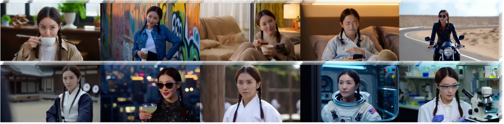

Figure 7: Illustration of EchoShot in InfT2V task. Our method succeeds
in generation of infinite shots (10 here) showing the same identity.

### 4.1 Qualitative Evaluation

MT2V. As shown in Fig. 5, limitations of baselines are observed: (1) The
performance of the keyframe-based pipelines is constrained by keyframe
priors. To specify, SD+W fails to follow the detailed prompts (e.g.,
blue blazer, id badge) and the visual style appears unnatural. Both SD+W
and IC+W exhibit suboptimal consistency across shots. (2) The
keyframe-based pipelines exhibit progressive degradation of facial
consistency during temporal expansion. For example, the crying person in
shot \#2 generated by IC+W shows obvious inconsistency with other shots.
(3) Simply concatenating the multi-shot prompts, adopted by
HunyuanVideo, causes the intermingling of prompts of different shots and
inferior controllability. For instance, in the videos generated by
HunyuanVideo, the window intended for shot \#1 unexpectedly appears in
shots \#2. By contrast, benefiting from the multi-shot modeling, our
EchoShot generates numerous shots with consistent details as well as
fine-grained controllability, demonstrating superiority over the
baselines. Notably, EchoShot is able to generate a coherent sequence of
human actions, such as the "body emerging from behind the door" in shot
\#2, whereas keyframe-based approaches struggle to achieve.

PMT2V&InfT2V. Fig. 6 illustrates the comparison between our method and
baselines in PMT2V task. Primarily trained on one-to-one portrait
dataset, both ConsisID and Kling exhibit severe bias to the reference
image and fail to follow the prompts (e.g., the hairstyle and
expressions of Emma Watson). Besides, the repeated generation process
lacks the ability to maintain consistency across different shots (e.g.,
the clothes of Morgan Freeman). By contrast, with many-to-one modeling
and shot-aware mechanisms, our method achieves consistent appearance,
vivid expressions and precise controllability across shots.
Additionally, we visualize the performance of our method in InfI2V task
in Fig. 7. Thanks to the RefAttn mechanism, our method is able to
generate infinite shots of freely customized prompts while maintaining
the same identity of the character.

Figure 8: User study. The overall high winning rate proves EchoShot
better aligns with human preferences.

### 4.2 Quantitative Evaluation

Metric results. Tab. 1 shows the quantitative metrics of EchoShot and
baselines in MT2V. For identity consistency, our method scores the
highest 73.74% on FaceSim-Arc and 69.43% on FaceSim-Cur, achieving
strong cross-shot identity consistency. In terms of prompt control, our
method remarkably scores 95.84% App., 88.86% Mot. and 94.72% Bg.,
surpassing the baselines by a large margin. Besides, our method scores
88.91% Sta. and 87.85% Dyn., both top-tier. The results prove the
overall advantages and the effectiveness of our method.

User study. To present a human-aligned assessment of MT2V, we further
conduct a user study involving 20 participants. They are asked to
perform binary voting in 45 one-on-one matchups between our method and
baselines in terms of the above-mentioned three aspects. As shown in
Fig. 8, our method wins at least 70% matchups for identity consistency
and prompt controllability as well as at least 50% matchups for visual
quality. The user study reconfirms the superiority of our method, which
echos the metric results. More experimental results and ablation studies
are presented in Appendix.

| Method                     | Identity consistency |             | Prompt controllability |       |       | Visual quality |       |
| -------------------------- | -------------------- | ----------- | ---------------------- | ----- | ----- | -------------- | ----- |
|                            | FaceSim-Arc          | FaceSim-Cur | App.                   | Mot.  | Bg.   | Sta.           | Dyn.  |
| StoryDiffusion+Wan-14B     | 68.65                | 65.29       | 83.33                  | 72.50 | 69.53 | 63.20          | 84.68 |
| IC-LoRA+Wan-14B            | 68.45                | 65.04       | 87.59                  | 83.71 | 75.37 | 79.49          | 87.98 |
| HunyuanVideo-13B (2 shots) | 64.80                | 61.25       | 83.39                  | 68.15 | 72.37 | 86.37          | 87.22 |
| EchoShot-1B (ours)         | 73.74                | 69.43       | 95.84                  | 88.86 | 94.72 | 88.91          | 87.85 |

Table 1: Metric results in MT2V task. Requiring only 1B parameters,
EchoShot tops the scoreboard compared to baselines. The best and
second-best scores are denoted bold and underlined.

## 5 Conclusion

We introduce EchoShot, a novel framework for multi-shot portrait
generation that addresses the limitations of existing single-shot
pipelines. EchoShot achieves high-quality, identity-consistent
multi-shot video synthesis with flexible user-defined control over
content and appearance through two shot-aware RoPE mechanisms: TcRoPE
and TaRoPE. Furthermore, we develop PortraitGala, a large-scale,
high-fidelity human-centric video dataset designed to support cross-shot
identity consistency and fine-grained controllability. Extensive
experiments confirm that EchoShot surpasses existing methods in both
quantitative metrics and qualitative assessments. Notably, EchoShot
provides a promising solution to enhance artistic workflows in
real-world applications.

Limitation. Our framework currently lacks the capability to directly
extend shots from previous content, thereby limiting the generation of
longer, continuous video segments within a single shot. Additionally,
generating consistent multi-subject scripts is a promising direction for
future work.

## References

- \[1\] Gemini 2.0 flash.
  [https://deepmind.google/technologies/gemini/flash/](https://deepmind.google/technologies/gemini/flash/).
- \[2\] Gen 4.
  [https://runwayml.com/research/introducing-runway-gen-4](https://runwayml.com/research/introducing-runway-gen-4).
- \[3\] Hailuo.
  [https://hailuoai.com/create](https://hailuoai.com/create).
- \[4\] Kling. [https://klingai.com/](https://klingai.com/).
- \[5\] Pyscenedetect.
  [https://www.scenedetect.com/](https://www.scenedetect.com/).
- \[6\] Veo 2.
  [https://deepmind.google/technologies/veo/veo-2/](https://deepmind.google/technologies/veo/veo-2/).
- \[7\] Vidu.
  [https://www.vidu.cn/create/character2video](https://www.vidu.cn/create/character2video).
- \[8\] Hritik Bansal, Yonatan Bitton, Michal Yarom, Idan Szpektor,
  Aditya Grover, and Kai-Wei Chang. Talc: Time-aligned captions for
  multi-scene text-to-video generation. arXiv preprint
  arXiv:2405.04682, 2024.
- \[9\] Andreas Blattmann, Tim Dockhorn, Sumith Kulal, Daniel
  Mendelevitch, Maciej Kilian, Dominik Lorenz, Yam Levi, Zion English,
  Vikram Voleti, Adam Letts, et al. Stable video diffusion: Scaling
  latent video diffusion models to large datasets. arXiv preprint
  arXiv:2311.15127, 2023.
- \[10\] Tim Brooks, Bill Peebles, Connor Holmes, Will DePue, Yufei Guo,
  Li Jing, David Schnurr, Joe Taylor, Troy Luhman, Eric Luhman, et al.
  Video generation models as world simulators. OpenAI Blog, 2024.
- \[11\] Fabian Caba Heilbron, Victor Escorcia, Bernard Ghanem, and Juan
  Carlos Niebles. Activitynet: A large-scale video benchmark for human
  activity understanding. In CVPR, 2015.
- \[12\] Joao Carreira, Eric Noland, Chloe Hillier, and Andrew
  Zisserman. A short note on the kinetics-700 human action dataset.
  arXiv preprint arXiv:1907.06987, 2019.
- \[13\] Tsai-Shien Chen, Aliaksandr Siarohin, Willi Menapace, Ekaterina
  Deyneka, Hsiang-wei Chao, Byung Eun Jeon, Yuwei Fang, Hsin-Ying Lee,
  Jian Ren, Ming-Hsuan Yang, et al. Panda-70m: Captioning 70m videos
  with multiple cross-modality teachers. In CVPR, 2024.
- \[14\] Jiankang Deng, Jia Guo, Niannan Xue, and Stefanos Zafeiriou.
  Arcface: Additive angular margin loss for deep face recognition. In
  CVPR, 2019.
- \[15\] Patrick Esser, Sumith Kulal, Andreas Blattmann, Rahim Entezari,
  Jonas Müller, Harry Saini, Yam Levi, Dominik Lorenz, Axel Sauer,
  Frederic Boesel, et al. Scaling rectified flow transformers for
  high-resolution image synthesis. In ICML, 2024.
- \[16\] Yuwei Guo, Ceyuan Yang, Anyi Rao, Zhengyang Liang, Yaohui Wang,
  Yu Qiao, Maneesh Agrawala, Dahua Lin, and Bo Dai. Animatediff: Animate
  your personalized text-to-image diffusion models without specific
  tuning. arXiv preprint arXiv:2307.04725, 2023.
- \[17\] Yuwei Guo, Ceyuan Yang, Ziyan Yang, Zhibei Ma, Zhijie Lin,
  Zhenheng Yang, Dahua Lin, and Lu Jiang. Long context tuning for video
  generation. arXiv preprint arXiv:2503.10589, 2025.
- \[18\] Zinan Guo, Yanze Wu, Chen Zhuowei, Peng Zhang, Qian He, et al.
  Pulid: Pure and lightning id customization via contrastive alignment.
  NeurIPS, 2024.
- \[19\] Lianghua Huang, Wei Wang, Zhi-Fan Wu, Yupeng Shi, Huanzhang
  Dou, Chen Liang, Yutong Feng, Yu Liu, and Jingren Zhou. In-context
  lora for diffusion transformers. arXiv preprint
  arXiv:2410.23775, 2024.
- \[20\] Yuge Huang, Yuhan Wang, Ying Tai, Xiaoming Liu, Pengcheng Shen,
  Shaoxin Li, Jilin Li, and Feiyue Huang. Curricularface: Adaptive
  curriculum learning loss for deep face recognition. In CVPR, 2020.
- \[21\] Ziqi Huang, Yinan He, Jiashuo Yu, Fan Zhang, Chenyang Si,
  Yuming Jiang, Yuanhan Zhang, Tianxing Wu, Qingyang Jin, Nattapol
  Chanpaisit, Yaohui Wang, Xinyuan Chen, Limin Wang, Dahua Lin, Yu Qiao,
  and Ziwei Liu. Vbench: Comprehensive benchmark suite for video
  generative models. In CVPR, 2024.
- \[22\] Rahima Khanam and Muhammad Hussain. Yolov11: An overview of the
  key architectural enhancements. arXiv preprint arXiv:2410.17725, 2024.
- \[23\] Weijie Kong, Qi Tian, Zijian Zhang, Rox Min, Zuozhuo Dai, Jin
  Zhou, Jiangfeng Xiong, Xin Li, Bo Wu, Jianwei Zhang, et al.
  Hunyuanvideo: A systematic framework for large video generative
  models. arXiv preprint arXiv:2412.03603, 2024.
- \[24\] Hui Li, Mingwang Xu, Yun Zhan, Shan Mu, Jiaye Li, Kaihui Cheng,
  Yuxuan Chen, Tan Chen, Mao Ye, Jingdong Wang, et al. Openhumanvid: A
  large-scale high-quality dataset for enhancing human-centric video
  generation. arXiv preprint arXiv:2412.00115, 2024.
- \[25\] Zhen Li, Mingdeng Cao, Xintao Wang, Zhongang Qi, Ming-Ming
  Cheng, and Ying Shan. Photomaker: Customizing realistic human photos
  via stacked id embedding. In CVPR, 2024.
- \[26\] Bin Lin, Yunyang Ge, Xinhua Cheng, Zongjian Li, Bin Zhu,
  Shaodong Wang, Xianyi He, Yang Ye, Shenghai Yuan, Liuhan Chen, et al.
  Open-sora plan: Open-source large video generation model. arXiv
  preprint arXiv:2412.00131, 2024.
- \[27\] Yaron Lipman, Ricky T. Q. Chen, Heli Ben-Hamu, Maximilian
  Nickel, and Matthew Le. Flow matching for generative modeling. 2023.
- \[28\] Fuchen Long, Zhaofan Qiu, Ting Yao, and Tao Mei. Videostudio:
  Generating consistent-content and multi-scene videos. In ECCV, 2024.
- \[29\] Guoqing Ma, Haoyang Huang, Kun Yan, Liangyu Chen, Nan Duan,
  Shengming Yin, Changyi Wan, Ranchen Ming, Xiaoniu Song, Xing Chen,
  et al. Step-video-t2v technical report: The practice, challenges, and
  future of video foundation model. arXiv preprint
  arXiv:2502.10248, 2025.
- \[30\] Leland McInnes, John Healy, and Steve Astels. hdbscan:
  Hierarchical density based clustering. Journal of Open Source
  Software, 2017.
- \[31\] Kepan Nan, Rui Xie, Penghao Zhou, Tiehan Fan, Zhenheng Yang,
  Zhijie Chen, Xiang Li, Jian Yang, and Ying Tai. Openvid-1m: A
  large-scale high-quality dataset for text-to-video generation. In
  ICLR, 2025.
- \[32\] William Peebles and Saining Xie. Scalable diffusion models with
  transformers. In ICCV, 2023.
- \[33\] A Polyak, A Zohar, A Brown, A Tjandra, A Sinha, A Lee, A Vyas,
  B Shi, CY Ma, CY Chuang, et al. Movie gen: A cast of media foundation
  models. arXiv preprint arXiv:2410.13720, 2024.
- \[34\] Robin Rombach, Andreas Blattmann, Dominik Lorenz, Patrick
  Esser, and Björn Ommer. High-resolution image synthesis with latent
  diffusion models. In CVPR, 2022.
- \[35\] Christoph Schuhmann. Aesthetic predictor.
  [https://github.com/christophschuhmann/improved-aesthetic-predictor.](https://github.com/christophschuhmann/improved-aesthetic-predictor.)
- \[36\] Uriel Singer, Adam Polyak, Thomas Hayes, Xi Yin, Jie An,
  Songyang Zhang, Qiyuan Hu, Harry Yang, Oron Ashual, Oran Gafni, et al.
  Make-a-video: Text-to-video generation without text-video data. 2023.
- \[37\] Khurram Soomro, Amir Roshan Zamir, and Mubarak Shah. Ucf101: A
  dataset of 101 human actions classes from videos in the wild. arXiv
  preprint arXiv:1212.0402, 2012.
- \[38\] Jianlin Su, Murtadha H. M. Ahmed, Yu Lu, Shengfeng Pan, Wen Bo,
  and Yunfeng Liu. Roformer: Enhanced transformer with rotary position
  embedding. Neurocomputing, 2024.
- \[39\] Quan Sun, Yuxin Fang, Ledell Wu, Xinlong Wang, and Yue Cao.
  Eva-clip: Improved training techniques for clip at scale. arXiv
  preprint arXiv:2303.15389, 2023.
- \[40\] Yoad Tewel, Omri Kaduri, Rinon Gal, Yoni Kasten, Lior Wolf, Gal
  Chechik, and Yuval Atzmon. Training-free consistent text-to-image
  generation. TOG, 2024.
- \[41\] Team Wan, Ang Wang, Baole Ai, Bin Wen, Chaojie Mao, Chen-Wei
  Xie, Di Chen, Feiwu Yu, Haiming Zhao, Jianxiao Yang, et al. Wan: Open
  and advanced large-scale video generative models. arXiv preprint
  arXiv:2503.20314, 2025.
- \[42\] Jiahao Wang, Caixia Yan, Haonan Lin, Weizhan Zhang, Mengmeng
  Wang, Tieliang Gong, Guang Dai, and Hao Sun. Oneactor: Consistent
  subject generation via cluster-conditioned guidance. NeurIPS, 2024.
- \[43\] Qiuheng Wang, Yukai Shi, Jiarong Ou, Rui Chen, Ke Lin, Jiahao
  Wang, Boyuan Jiang, Haotian Yang, Mingwu Zheng, Xin Tao, et al.
  Koala-36m: A large-scale video dataset improving consistency between
  fine-grained conditions and video content. arXiv preprint
  arXiv:2410.08260, 2024.
- \[44\] Qixun Wang, Xu Bai, Haofan Wang, Zekui Qin, Anthony Chen,
  Huaxia Li, Xu Tang, and Yao Hu. Instantid: Zero-shot
  identity-preserving generation in seconds. arXiv preprint
  arXiv:2401.07519, 2024.
- \[45\] Ziyi Wu, Aliaksandr Siarohin, Willi Menapace, Ivan Skorokhodov,
  Yuwei Fang, Varnith Chordia, Igor Gilitschenski, and Sergey Tulyakov.
  Mind the time: Temporally-controlled multi-event video generation.
  arXiv preprint arXiv:2412.05263, 2024.
- \[46\] Liangbin Xie, Xintao Wang, Honglun Zhang, Chao Dong, and Ying
  Shan. Vfhq: A high-quality dataset and benchmark for video face
  super-resolution. In CVPR, 2022.
- \[47\] Zhuoyi Yang, Jiayan Teng, Wendi Zheng, Ming Ding, Shiyu Huang,
  Jiazheng Xu, Yuanming Yang, Wenyi Hong, Xiaohan Zhang, Guanyu Feng,
  et al. Cogvideox: Text-to-video diffusion models with an expert
  transformer. In ICLR, 2025.
- \[48\] Jianhui Yu, Hao Zhu, Liming Jiang, Chen Change Loy, Weidong
  Cai, and Wayne Wu. Celebv-text: A large-scale facial text-video
  dataset. In CVPR, 2023.
- \[49\] Shenghai Yuan, Jinfa Huang, Xianyi He, Yunyuan Ge, Yujun Shi,
  Liuhan Chen, Jiebo Luo, and Li Yuan. Identity-preserving text-to-video
  generation by frequency decomposition. In CVPR, 2025.
- \[50\] Canyu Zhao, Mingyu Liu, Wen Wang, Weihua Chen, Fan Wang, Hao
  Chen, Bo Zhang, and Chunhua Shen. Moviedreamer: Hierarchical
  generation for coherent long visual sequence. arXiv preprint
  arXiv:2407.16655, 2024.
- \[51\] Mingzhe Zheng, Yongqi Xu, Haojian Huang, Xuran Ma, Yexin Liu,
  Wenjie Shu, Yatian Pang, Feilong Tang, Qifeng Chen, Harry Yang, et al.
  Videogen-of-thought: Step-by-step generating multi-shot video with
  minimal manual intervention. arXiv preprint arXiv:2503.15138, 2025.
- \[52\] Yupeng Zhou, Daquan Zhou, Ming-Ming Cheng, Jiashi Feng, and
  Qibin Hou. Storydiffusion: Consistent self-attention for long-range
  image and video generation. NeurIPS, 2024.
- \[53\] Hao Zhu, Wayne Wu, Wentao Zhu, Liming Jiang, Siwei Tang,
  Li Zhang, Ziwei Liu, and Chen Change Loy. Celebv-hq: A large-scale
  video facial attributes dataset. In ECCV, 2022.

EchoShot: Multi-Shot Portrait Video Generation

Supplementary Material

## Table of Contents

 

 

## Appendix A Mathematical Formulation

### A.1 Derivation of Rotary Position Embedding

In Sec. 3.1, we introduce Rotary Position Embedding (RoPE) in vanilla
models. Based on it, we propose two shot-aware mechanisms, TcRoPE and
TaRoPE. Here, we provide the complete denotation of RoPE, following
\[38\].

1D-RoPE. The proposed TaRoPE is based on 1D-RoPE, which is intended for
sequential modality along a single dimension. Given a position-indexed
query $`\boldsymbol{q}_{m}\in\mathbb{R}^{d}`$ or key vector
$`\boldsymbol{k}_{m}\in\mathbb{R}^{d}`$, 1D-RoPE can be expressed as:

```math
\tilde{\boldsymbol{q}}_{m}=\mathrm{1D\text{-}RoPE}(\boldsymbol{q}_{m},m)=\boldsymbol{R}_{\Theta_{\textit{1D}},m}^{d}~\boldsymbol{q}_{m}, \tag{6}
```

```math
\tilde{\boldsymbol{k}}_{m}=\mathrm{1D\text{-}RoPE}(\boldsymbol{k}_{m},m)=\boldsymbol{R}_{\Theta_{\textit{1D}},m}^{d}~\boldsymbol{k}_{m}, \tag{7}
```

where $`\boldsymbol{R}_{\Theta_{\textit{1D}},m}^{d}`$ is the rotary
matrix, denoted as:

```math
\begin{pmatrix}\cos m\theta_{1}&-\sin m\theta_{1}&0&0&\cdots&0&0\\
\sin m\theta_{1}&\cos m\theta_{1}&0&0&\cdots&0&0\\
0&0&\cos m\theta_{2}&-\sin m\theta_{2}&\cdots&0&0\\
0&0&\sin m\theta_{2}&\cos m\theta_{2}&\cdots&0&0\\
\vdots&\vdots&\vdots&\vdots&\ddots&\vdots&\vdots\\
0&0&0&0&\cdots&\cos m\theta_{\frac{d}{2}}&-\sin m\theta_{\frac{d}{2}}\\
0&0&0&0&\cdots&\sin m\theta_{\frac{d}{2}}&\cos m\theta_{\frac{d}{2}}\end{pmatrix}, \tag{8}
```

with pre-defined parameters
$`\Theta_{\textit{1D}}=\{\theta_{i}=10000^{\frac{-2(i-1)}{d}},i\in[1,2,\cdots,\frac{d}{2}]\}`$.
Thus, the proposed TaRoPE in Eq. (3) can be further written as:

```math
\tilde{\boldsymbol{q}}^{\textit{ca}}_{i,s}=\mathrm{TaRoPE}(\boldsymbol{q}^{\textit{ca}}_{i,s},s)=\mathrm{1D\text{-}RoPE}(\boldsymbol{q}^{\textit{ca}}_{i,s},s\cdot k)=\boldsymbol{R}_{\Theta_{\textit{1D}},s\cdot k}^{d}~\boldsymbol{q}^{\textit{ca}}_{i,s}, \tag{9}
```

```math
\tilde{\boldsymbol{k}}^{\textit{ca}}_{i,s}=\mathrm{TaRoPE}(\boldsymbol{k}^{\textit{ca}}_{i,s},s)=\mathrm{1D\text{-}RoPE}(\boldsymbol{k}^{\textit{ca}}_{i,s},s\cdot k)=\boldsymbol{R}_{\Theta_{\textit{1D}},s\cdot k}^{d}~\boldsymbol{k}^{\textit{ca}}_{i,s}. \tag{10}
```

3D-RoPE. The proposed TcRoPE is based on 3D-RoPE, which is an extension
of 1D-RoPE tailored for video modality. Given a 3D-position-indexed
$`\boldsymbol{q}_{t,h,w}\in\mathbb{R}^{d}`$ or key vector
$`\boldsymbol{k}_{t,h,w}\in\mathbb{R}^{d}`$, 3D-RoPE can be denoted as:

```math
\tilde{\boldsymbol{q}}_{t,h,w}=\mathrm{3D\text{-}RoPE}(\boldsymbol{q}_{t,h,w},t,h,w)=\boldsymbol{R}_{\Theta_{\textit{3D}},t,h,w}^{d}~\boldsymbol{q}_{t,h,w}, \tag{11}
```

```math
\tilde{\boldsymbol{k}}_{t,h,w}=\mathrm{3D\text{-}RoPE}(\boldsymbol{k}_{t,h,w},t,h,w)=\boldsymbol{R}_{\Theta_{\textit{3D}},t,h,w}^{d}~\boldsymbol{k}_{t,h,w}, \tag{12}
```

where $`\boldsymbol{R}_{\Theta_{\textit{3D}},t,h,w}^{d}`$ can be denoted
as:

```math
\begin{pmatrix}\cos t\theta_{1}&-\sin w\theta_{1}&0&0&0&0&\cdots&0&0&0&0&0&0\\
\sin w\theta_{1}&\cos t\theta_{1}&0&0&0&0&\cdots&0&0&0&0&0&0\\
0&0&\cos h\theta_{1}&-\sin h\theta_{1}&0&0&\cdots&0&0&0&0&0&0\\
0&0&\sin h\theta_{1}&\cos h\theta_{1}&0&0&\cdots&0&0&0&0&0&0\\
0&0&0&0&\cos w\theta_{1}&-\sin w\theta_{1}&\cdots&0&0&0&0&0&0\\
0&0&0&0&\sin w\theta_{1}&\cos w\theta_{1}&\cdots&0&0&0&0&0&0\\
\vdots&\vdots&\vdots&\vdots&\vdots&\vdots&\ddots&\vdots&\vdots&\vdots&\vdots&\vdots&\vdots\\
0&0&0&0&0&0&\cdots&\cos t\theta_{\frac{d}{6}}&-\sin w\theta_{\frac{d}{6}}&0&0&0&0\\
0&0&0&0&0&0&\cdots&\sin w\theta_{\frac{d}{6}}&\cos t\theta_{\frac{d}{6}}&0&0&0&0\\
0&0&0&0&0&0&\cdots&0&0&\cos h\theta_{\frac{d}{6}}&-\sin h\theta_{\frac{d}{6}}&0&0\\
0&0&0&0&0&0&\cdots&0&0&\sin h\theta_{\frac{d}{6}}&\cos h\theta_{\frac{d}{6}}&0&0\\
0&0&0&0&0&0&\cdots&0&0&0&0&\cos w\theta_{\frac{d}{6}}&-\sin w\theta_{\frac{d}{6}}\\
0&0&0&0&0&0&\cdots&0&0&0&0&\sin w\theta_{\frac{d}{6}}&\cos w\theta_{\frac{d}{6}}\end{pmatrix} \tag{13}
```

with pre-defined parameters
$`\Theta_{\textit{3D}}=\{\theta_{i}=10000^{\frac{-2(i-1)}{d}},i\in[1,2,\cdots,\frac{d}{6}]\}`$.
Thus, the proposed TcRoPE in Eq. (2) can be further written as:

```math
\tilde{\boldsymbol{q}}^{\textit{sa}}_{t,h,w,s}=\mathrm{TcRoPE}(\boldsymbol{q}^{\textit{sa}}_{t,h,w,s},t,h,w,s)=\mathrm{3D\text{-}RoPE}(\boldsymbol{q}^{\textit{sa}}_{t,h,w},t+s\cdot j,h,w)=\boldsymbol{R}_{\Theta_{\textit{3D}},t+s\cdot j,h,w}^{d}~\boldsymbol{q}^{\textit{sa}}_{t,h,w,s}, \tag{14}
```

```math
\tilde{\boldsymbol{k}}^{\textit{sa}}_{t,h,w,s}=\mathrm{TcRoPE}(\boldsymbol{k}^{\textit{sa}}_{t,h,w,s},t,h,w,s)=\mathrm{3D\text{-}RoPE}(\boldsymbol{k}^{\textit{sa}}_{t,h,w},t+s\cdot j,h,w)=\boldsymbol{R}_{\Theta_{\textit{3D}},t+s\cdot j,h,w}^{d}~\boldsymbol{k}^{\textit{sa}}_{t,h,w,s}. \tag{15}
```

### A.2 Proof of Claim about Attention Score with TaRoPE

In Eq. (4), we give a concise formulation of the attention score after
TaRoPE with claims. We provide a detailed proof of the claim here. Given
queries of the $`s_{1}`$-th shot $`\boldsymbol{q}_{s_{1}}`$ and keys of
the $`s_{2}`$-th shot $`\boldsymbol{k}_{s_{2}}`$, if we divide them into
2-component pairs along the channel dimension, the inner product of
their TaRoPE-enhanced representations can be written as a complex number
multiplication:

```math
\displaystyle\tilde{\boldsymbol{A}}_{s_{1},s_{2}} \displaystyle=(\boldsymbol{R}^{d}_{\Theta,ks_{1}}\boldsymbol{q}_{s_{1}})^{\mathsf{T}}(\boldsymbol{R}^{d}_{\Theta,ks_{2}}\boldsymbol{k}_{s_{2}}) \tag{16}
```

```math
\displaystyle=\mathrm{Re}\bigg[\sum_{i=0}^{\frac{d}{2}-1}\boldsymbol{q}_{s_{1},[2i:2i+1]}\boldsymbol{k}^{*}_{s_{2},[2i:2i+1]}e^{ik(s_{1}-s_{2})\theta_{i}}\bigg]
```

```math
\displaystyle=\begin{aligned} \sum_{i=0}^{\frac{d}{2}-1}&\left(q_{s_{1},2i}~k_{s_{2},2i}+q_{s_{1},2i+1}~k_{s_{2},2i+1}\right)\cos{(k(s_{1}-s_{2})\theta_{i})}\\
&+\left(q_{s_{1},2i}~k_{s_{2},2i}-q_{s_{1},2i+1}~k_{s_{2},2i+1}\right)\sin{(k(s_{1}-s_{2})\theta_{i})},\end{aligned}
```

where $`\boldsymbol{k}_{s_{1},[2i:2i+1]}`$ represents the $`2i^{th}`$ to
$`(2i+1)^{th}`$ components of $`\boldsymbol{k}_{s_{1}}`$ and
$`k_{s_{1},2i}`$ represents the $`2i^{th}`$ component of
$`\boldsymbol{k}_{s_{1}}`$. Note that the scalar $`k`$ without
subscripts is the mismatch suppression scale. When
$`\boldsymbol{q}_{s_{1}}`$ and $`\boldsymbol{k}_{s_{2}}`$ are from the
same shot (i.e., $`s_{1}=s_{2}`$), Eq. (16) can be simplified as:

```math
\tilde{\boldsymbol{A}}_{s_{1},s_{2}}=\sum_{i=0}^{\frac{d}{2}-1}\left(q_{s_{1},2i}~k_{s_{2},2i}+q_{s_{1},2i+1}~k_{s_{2},2i+1}\right)=\boldsymbol{q}_{s_{1}}~\boldsymbol{k}_{s_{2}}=\boldsymbol{A}_{s_{1},s_{2}}, \tag{17}
```

which indicates that the attention score with TaRoPE remains exactly the
same as that without TaRoPE.

To investigate the behavior of Eq. (16) as $`k(s_{1}-s_{2})`$ varies, we
follow \[38\] to denote
$`\boldsymbol{h_{i}}=~\boldsymbol{q_{[2i:2i+1]}}\boldsymbol{k^{*}_{[2i:2i+1]}}`$,
$`S_{j}=\sum_{i=0}^{j-1}e^{i(s_{1}-s_{2})\theta_{i}}`$, and let
$`h_{\frac{d}{2}}=0`$, $`S_{0}=0`$, we can rewrite Eq. (16) using Abel
transformation:

```math
\sum_{i=0}^{\frac{d}{2}-1}\boldsymbol{q}_{[2i:2i+1]}\boldsymbol{k}_{[2i:2i+1]}^{*}e^{i(s_{1}-s_{2})\theta_{i}}=\sum_{i=0}^{\frac{d}{2}-1}h_{i}(S_{i+1}-S_{i})=-\sum_{i=0}^{\frac{d}{2}-1}S_{i+1}(h_{i+1}-h_{i}). \tag{18}
```

```math
\begin{aligned} |\sum_{i=0}^{\frac{d}{2}-1}\boldsymbol{q}_{[2i:2i+1]}\boldsymbol{k}_{[2i:2i+1]}^{*}e^{i(s_{1}-s_{2})\theta_{i}}|&=|\sum_{i=0}^{\frac{d}{2}-1}S_{i+1}(h_{i+1}-h_{i})|\\
&\leq\sum_{i=0}^{\frac{d}{2}-1}|S_{i+1}||(h_{i+1}-h_{i})|\\
&\leq\left(\max_{i}|h_{i+1}-h_{i}|\right)\sum_{i=0}^{\frac{d}{2}-1}|S_{i+1}|\\
&\leq\sum_{i=0}^{\frac{d}{2}-1}|S_{i+1}|\end{aligned}. \tag{19}
```

We plot the graph of the value of
$`f(x)=\sum_{i=0}^{\frac{d}{2}-1}|S_{i+1}|`$ as $`x=k(s_{1}-s_{2})`$
varies in \[0,50\] in Fig. 9, which shows a monotonically decreasing
function. By synthesizing the above derivations, we arrive at the
conclusion of Eq. (4).

Figure 9: Graph of the attention score $`f(x)`$ as $`x`$ varies.

## Appendix B Details of PortraitGala

### B.1 Data Processing

We detail the construction of the PortraitGala dataset here, adhering to
the methodology outlined in Sec. 3.4. The PortraitGala dataset comprises
a collection of video resources, drawing from three primary sources: 1)
publicly available, high-quality portrait datasets such as CelebV-HQ
\[53\] and CelebV-Text \[48\]; 2) subsets extracted from large-scale,
open-source video datasets including OpenVid-1M \[31\] and OpenHumanVid
\[24\]; and 3) a selection of videos obtained from various websites,
encompassing both films and television series. In its entirety, the
original dataset encompassed 26,967 hours of video footage.

The curation process began with rigorous filtering of raw video material
to ensure quality and relevance. Specifically, we eliminated videos
exhibiting vertical aspect ratios or substandard resolution, retaining
only those conforming to the criteria: width \> height \> 480 pixels.
Given the extended duration of many source videos and the presence of
multiple camera shots within them, we employed PySceneDetect \[5\] to
segment these videos into discrete, single-shot clips. Furthermore, to
maintain high aesthetic quality, clips with an aesthetic score, as
determined by \[35\], below a threshold of 4 were discarded.

To ensure that each video clip in PortraitGala featured only one
individual, we implemented a person counting procedure leveraging
YOLOv11 \[22\] for person detection and tracking. Subsequently, person
identities were assigned using an improved version of HDBSCAN \[30\], a
density-based clustering algorithm, coupled with a proprietary facial
embedding extraction technique. A remaining challenge was the
identification and removal of near-duplicate video clips depicting the
same individual performing similar actions within a consistent setting.
To address this, we simply employed Non-Maximum Suppression based on the
detected person bounding boxes, specifically for videos with matching
person IDs. Through rigorous manual verification, we achieve a
clustering accuracy exceeding 99%, demonstrating that all video clips
assigned identical identifiers consistently depict the same individual
throughout.

Finally, attributes pertaining to camera shot composition and shot type
were derived using internal analytical methods. Supplementary attribute
labels and descriptive text were generated with the aid of Gemini 2.0
Flash \[1\] using the prompt below.

 

1.  1.  You are now going to describe the film for audience. The description
        should be as detailed, comprehensive, and logical as possible.
2.  2.  The output must be in English, around 600 words.
3.  3.  Do not use vague words such as "appear to be" or "seem." Your
        descriptions must be definitive, precise, and highly accurate.
4.  4.  There is only one main person, and all descriptions revolve around
        this person.
5.  5.  All sentences must be affirmative statements. No questions or
        negative sentences are allowed.
6.  6.  Do not determine the gender of the main character. Use "the person,"
        "the person is," or "the person’s" as pronouns.
7.  7.  Please provide a description of the entire video, rather than
        describing each individual image.
8.  8.  Each input requires descriptions of the following eight aspects,
        with each aspect not exceeding 100 words, and the key points of the
        descriptions between the aspects should not overlap:

    1.  (a)
        Hairstyle: Provide a detailed and comprehensive description of
        the hairstyle of the person. Start with ’The person’s hair …’.
    1.  (b)
        Expression: Provide a detailed and comprehensive description of
        the expressions and emotions of the person. (If there are any
        temporal changes in expression, also need describe in detail.)
        Start with ’The person’s expression …’.
    1.  (c)
        Apparel: Provide a detailed and comprehensive description of the
        clothing worn by the person (including lower body garments if
        visible). If there are accessories (e.g., glasses, earrings,
        watches), describe them as well. Start with ’The person wears
        …’.
    1.  (d)
        Behavior: Provide a detailed and comprehensive description of
        the behavior of the person (e.g., actions, interactions with
        objects). Start with ’The person …’.
    1.  (e)
        Background: From the perspective of film set design, provide a
        detailed and comprehensive description of the background and
        environment. Start with ’The background …’.
    1.  (f)
        Lighting: From the perspective of film analysis, provide a
        detailed and comprehensive description of the overall lighting
        conditions. ’The lighting …’.

 

### B.2 Data Distribution

We perform a statistical analysis on some key aspects of PortraitGala
dataset, depicted in Fig. 10. The shot-scale distribution indicates that
most videos are middle-shot (37.8%), followed by close-shot (33.6%),
long-shot (15.9%), and full-shot (12.7%). In terms of gender
distribution, male individuals are predominant at 56.7%, while female
individuals constitute 39.7%, and others make up 3.6%. The age-group
distribution shows a vast majority of youth individuals at 74.9%, with
middle-aged individuals at 22.6%, and other age groups at 2.5%. Finally,
ethnicity distribution reveals that 51.2% of the shown individuals are
white people, 19.3% are black people, 11.4% are Asian people, and 18.1%
are other ethnicities. This statistic breakdown highlights the diversity
present in the PortraitGala dataset.

Figure 10: Distribution of key aspects of PortraitGala.

### B.3 Dataset Examples

To provide a clear and intuitive representation of the dataset, we
present a gallery of multi-shot video instances in Fig. 11. It
highlights the diversity of the video distribution and the granularity
of the captions.

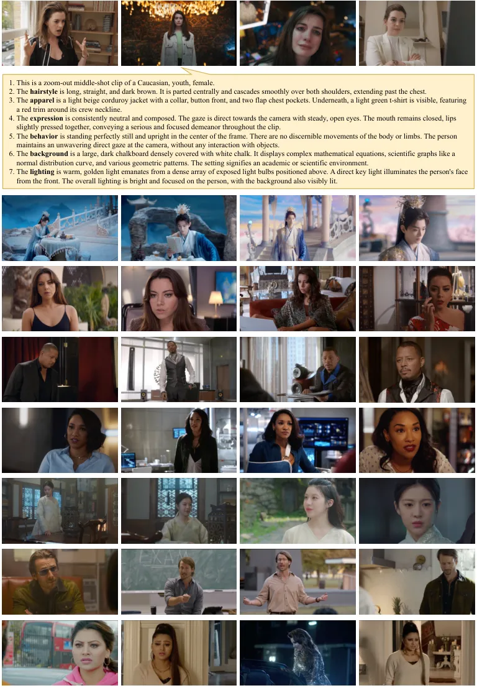

Figure 11: Illustration of examples in PortraitGala.

## Appendix C More Experimental Details

All the training is carried out on NVIDIA A100 80GB GPUs. The MT2V
pretraining takes 3,500 GPU hours while the PMT2V and InfT2V take
additional 2000 and 1000 GPU hours, respectively. Throughout the
training, all the important settings are listed below:

|     Parameter                 |     Value     |
| ----------------------------- | ------------- |
|     Video height              |     480       |
|     Video width               |     832       |
|     Video frame               |     125       |
|     FPS                       |     16        |
|     Batchsize                 |     2         |
|     Train timesteps           |     1000      |
|     Train shift               |     5.0       |
|     Optimizer                 |     AdamW     |
|     Learning rate             |     8e-6      |
|     Weight decay              |     0.001     |
|     Sample timesteps          |     50        |
|     Sample shift              |     5.0       |
|     Sample guidance scale     |     5.0       |

Table 2: Experimental settings of EchoShot.

## Appendix D Extra Experiments

### D.1 Motivation Verification

The pivotal core of our method is the multi-shot text-to-video modeling
with the proposed two mechanisms, TcRoPE and TaRoPE. To affirm our
motivation as well as verify the effectiveness, we conduct an intuitive
experiment between EchoShot and the vanilla model. To specify, we
perform a three-shot portrait video generation with EchoShot given three
cut timestamps and three prompts. For the vanilla model, we concatenate
the three prompts together as a input and perform standard generation.
During generation, we collect the self-attention scores and
cross-attention scores of the DiT blocks, average them and plot the
heatmaps. As shown in Figs. 12(a) and (b), the vanilla model
indiscriminately allocates attention to the visual tokens and the
textual tokens, which is suitable for single-shot video modeling. Yet in
the context of multiple shots, the vanilla model fails to differentiate
the shots. By contrast, as shown in Fig. 12(c), TcRoPE establishes a
inter-shot boundary during self-attention calculation, with the extra
rotation naturally reduce the interactions of features from different
shots while enhance that from the same shot. Additionally, TcRoPE allows
the model to flexibly allocate attention to potentially crucial pixels,
whether from the same shot or from different shots. Fig. 12(d) confirms
a similar conclusion to the above one, in the context of TaRoPE and
cross-attention.

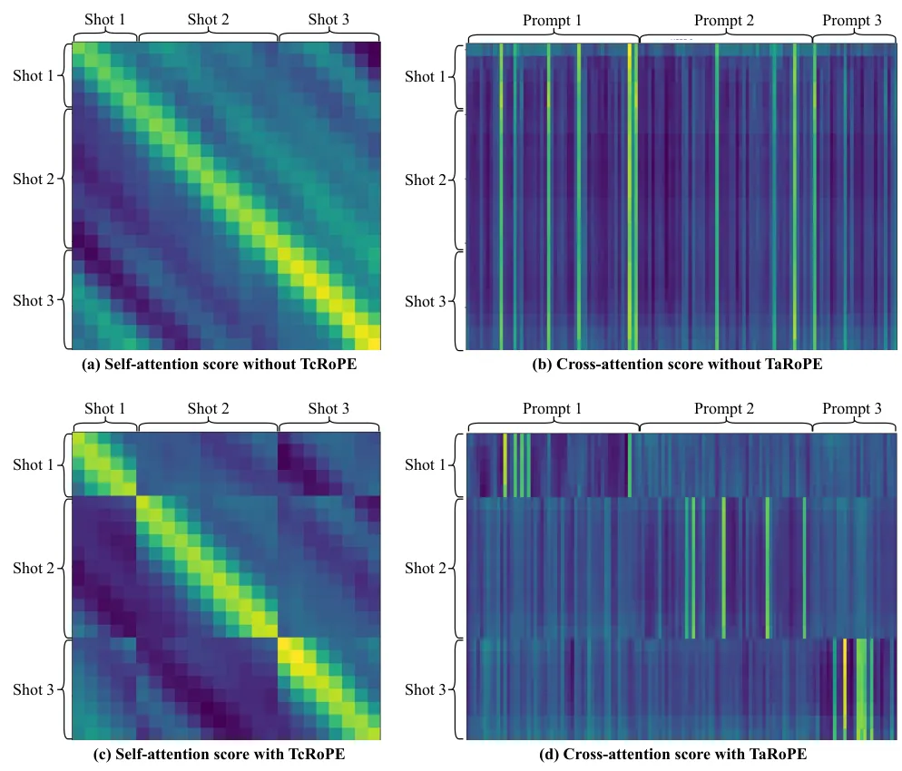

Figure 12: Visualization of self-attention score matrix w/ and w/o
TcRoPE and cross-attention score matrix w/ and w/o TaRoPE.

### D.2 More Quantitative Results

In Tab. 1, we present the quantitative results. As a supplement, we
propose the stand deviation results of these metrics across the test set
here.

| Method                     | Identity consistency |             | Prompt controllability |       |       | Visual quality |       |
| -------------------------- | -------------------- | ----------- | ---------------------- | ----- | ----- | -------------- | ----- |
|                            | FaceSim-Arc          | FaceSim-Cur | App.                   | Mot.  | Bg.   | Sta.           | Dyn.  |
| StoryDiffusion+Wan-14B     | 68.65                | 65.29       | 83.33                  | 72.50 | 69.53 | 63.20          | 84.68 |
| IC-LoRA+Wan-14B            | 68.45                | 65.04       | 87.59                  | 83.71 | 75.37 | 79.49          | 87.98 |
| HunyuanVideo-13B (2 shots) | 64.80                | 61.25       | 83.39                  | 68.15 | 72.37 | 86.37          | 87.22 |
| EchoShot-1B (ours)         | 73.74                | 69.43       | 95.84                  | 88.86 | 94.72 | 88.91          | 87.85 |

| Method                     | Identity consistency |             | Prompt controllability |       |       | Visual quality |      |
| -------------------------- | -------------------- | ----------- | ---------------------- | ----- | ----- | -------------- | ---- |
|                            | FaceSim-Arc          | FaceSim-Cur | App.                   | Mot.  | Bg.   | Sta.           | Dyn. |
| StoryDiffusion+Wan-14B     | 6.24                 | 6.86        | 9.50                   | 22.47 | 21.29 | 15.20          | 2.57 |
| IC-LoRA+Wan-14B            | 7.02                 | 6.75        | 10.16                  | 18.41 | 19.77 | 13.08          | 2.68 |
| HunyuanVideo-13B (2 shots) | 9.16                 | 8.28        | 10.13                  | 18.35 | 17.95 | 5.76           | 3.51 |
| EchoShot-1B (ours)         | 7.13                 | 7.91        | 6.51                   | 11.25 | 6.68  | 4.90           | 2.77 |

Table 3: Metric results (mean and standard deviation) in MT2V task.

### D.3 Ablation Study

To verify the effectiveness of each proposed mechanism, we carry out an
ablation study. For rapid assessment, we build a reduced-scale dataset,
sampling 10% of the full dataset and split it into a train set and a
test set. We construct three ablation models: (1) SimplyConcat (SC), our
baseline model, which simply concatenates the video latents and the
captions from different shots indiscriminately and apply the vanilla
RoPE. (2) SC+TcRoPE, which only applies TcRoPE mechanism. (3)
SC+TcRoPE+TaRoPE is our full method. After training, we conduct both
quantitative and a qualitative evaluations on the test set. As shown in
Fig. 13, SC often struggles to recognize the difference between shots,
causing failure of shot transition. Though it occasionally generates
multi-shot videos, the shot transition positions are elusive and
uncontrolled. With the modeling of shot-wise boundaries, SC+TcRoPE
enables shot transitions at given timestamps. Yet, both SC and SC+TcRoPE
exhibit an intermingling effect between prompts from different shots
(e.g., the clothes are the same across shots, though given different
apparel descriptions), likely caused by confusion from simple caption
concatenation. In contrast, our full method demonstrates precise
shot-wise prompt adherence without intermingling. In Tab. 4, benefiting
from the curated high-quality multi-shot dataset, the identity
consistency and visual quality of three ablation models exhibit minimal
variation. In terms of prompt controllability, the full model
demonstrates significant advantages over the comparing models, echoing
the qualitative results. The ablation study confirms that TcRoPE and
TaRoPE mechanisms perform as expected.

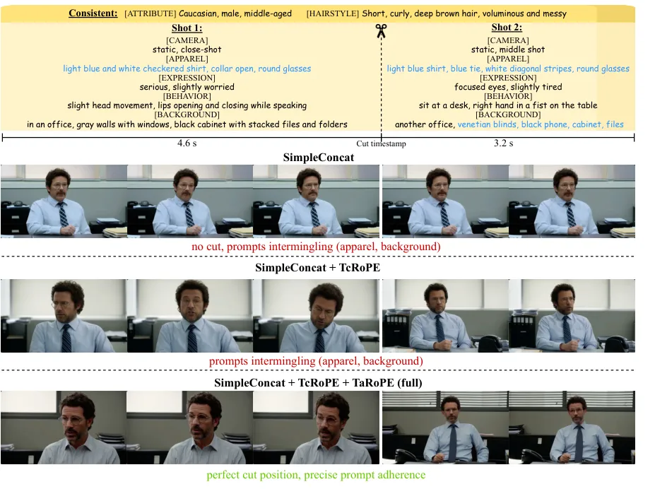

Figure 13: Illustration of generated videos of three ablation models.

| Method                 | Cut control | Identity consistency |             | Prompt controllability |       |       | Visual quality |       |
| ---------------------- | ----------- | -------------------- | ----------- | ---------------------- | ----- | ----- | -------------- | ----- |
|                        |             | FaceSim-Arc          | FaceSim-Cur | App.                   | Mot.  | Bg.   | Sta.           | Dyn.  |
| SC                     | No          | 75.24                | 70.61       | 55.79                  | 59.16 | 47.56 | 81.90          | 75.24 |
| SC+TcRoPE              | Yes         | 74.77                | 69.85       | 81.72                  | 72.84 | 74.22 | 84.32          | 81.69 |
| SC+TcRoPE+TaRoPE(full) | Yes         | 75.83                | 70.58       | 94.12                  | 87.41 | 93.96 | 84.10          | 83.46 |

Table 4: Metric results of three ablation models on reduced-scale
dataset.

### D.4 Parameter Analysis

Our method relies primarily on two key hyperparameters, the phase shift
scale $`j`$ in Eq. (2) and the mismatch suppression scale $`k`$ in
Eq. (3). To investigate the appropriate parameter selection, we conduct
an intuitive parameter analysis with the reduced-scale dataset. We
leverage the mathematical analysis and empirically pick several typical
values, $`j\in\{2,4,6\},k=6`$ and $`j=4,k\in\{2,6,12\}`$. The
quantitative results of the models under different settings are shown in
Tab. 5. To summarize, a too small $`j`$ excessively enhances the
inter-shot visual interactions, leading to occasional cut failure and
prompt intermingling with low prompt controllability scores. While a too
large $`j`$ nearly blocks the interactions, causing identity
inconsistency with low identity consistency scores. Similarly, a too
small $`k`$ gives rise to prompt intermingling while a too large $`k`$
results in a slightly decrease in scores. Consolidating the results, we
choose $`j=4,k=6`$ as the default setting.

| Method        | Identity consistency |             | Prompt controllability |       |       | Visual quality |       |
| ------------- | -------------------- | ----------- | ---------------------- | ----- | ----- | -------------- | ----- |
|               | FaceSim-Arc          | FaceSim-Cur | App.                   | Mot.  | Bg.   | Sta.           | Dyn.  |
| j=2,k=6       | 75.45                | 70.64       | 88.75                  | 82.10 | 85.28 | 80.97          | 81.67 |
| j=6,k=6       | 70.19                | 67.30       | 94.25                  | 88.29 | 92.66 | 83.18          | 82.03 |
| j=4,k=2       | 75.12                | 69.73       | 84.20                  | 76.69 | 80.16 | 80.55          | 81.02 |
| j=4,k=12      | 74.98                | 69.45       | 92.15                  | 86.82 | 92.73 | 83.50          | 83.91 |
| j=4,k=6(ours) | 75.83                | 70.58       | 94.12                  | 87.41 | 93.96 | 84.10          | 83.46 |

Table 5: Metric results of different parameter settings on reduced-scale
dataset.

## Appendix E EchoShot Gallery

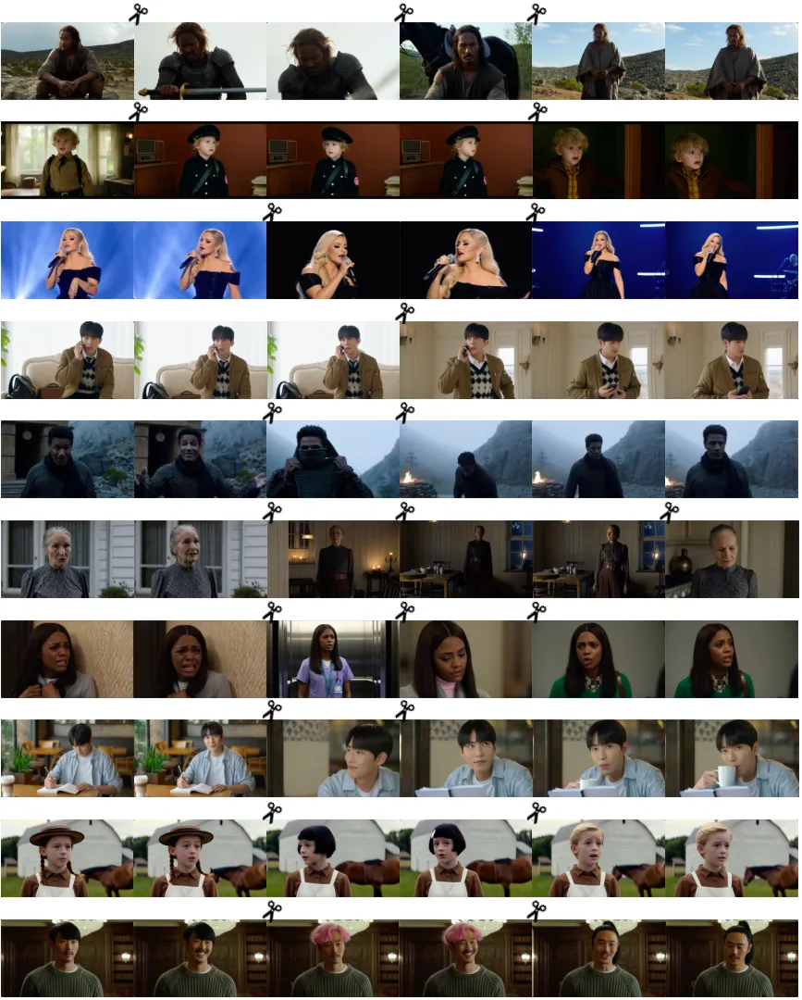

Figure 14: Illustration of generated videos by EchoShot.

## Appendix F Clarification about User Study

Instructions for Participants

 

> Thank you for participating in our study!
>
> We appreciate your willingness to contribute to our research. Below,
> you will find detailed instructions on how to complete the tasks
> involved in this study. Please read this information carefully before
> beginning.
>
> ### 1. Purpose of the Study
>
> The goal of this study is to evaluate different methods for generating
> multi-shot portrait videos showing the same identity. Your feedback
> will help us evaluate which method produce videos with best quality.
> Your participation is highly valuable to us!
>
> ### 2. Task Overview
>
> You will be asked to compare two methods by evaluating their outputs
> in a series of one-on-one matchups. Each matchup will present results
> generated by our proposed method and a random baseline method (both
> anonymous). Your task is to vote for your preferred option in each
> matchup based on the following criteria:
>
> - •
>   Identity Consistency: Which method better preserves the same
>   identity of the human (e.g., facial features, expressions, and
>   overall appearance) across all frames and shots in the video?
> - •
>   Prompt Controllability: Which method more accurately follows the
>   given prompts (e.g., appearance, motions, expressions, and
>   background) in the generated video?
> - •
>   Visual Quality: Which method produces a video with higher visual
>   quality, considering factors like sharpness, smoothness of motion,
>   and absence of artifacts (e.g., blurriness or unnatural textures)?
>
> ### 3. How to Complete the Task
>
> - •
>   You will complete 45 matchups in total.
> - •
>   For each matchup, you will see two outputs side by side.
> - •
>   To cast your vote, click on the button corresponding to your
>   preferred option.
> - •
>   There are no right or wrong answers. Please choose the option that
>   feels best to you.
>
> ### 4. Time Commitment
>
> The study should take approximately 20-30 minutes to complete. You can
> work at your own pace, but we recommend completing the task in one
> sitting to ensure consistency.
>
> ### 5. Voluntary Participation
>
> Your participation in this study is entirely voluntary. You are free
> to withdraw at any time without penalty or explanation. If you decide
> to withdraw, your responses will not be included in the analysis.
>
> ### 6. Compensation
>
> This study does not provide financial compensation. However, your
> contribution is greatly appreciated and will directly support
> advancements in this field of research.
>
> ### 7. Privacy and Data Use
>
> - •
>   Your responses will be anonymized and used solely for research
>   purposes.
> - •
>   No personally identifiable information will be collected or stored.
>
> ### 8. Questions or Concerns
>
> If you have any questions about the study or encounter technical
> issues, please contact us. We are happy to assist you.
>
> ### 9. Consent
>
> By proceeding with the study, you confirm that:
>
> - •
>   You have read and understood the instructions.
> - •
>   You agree to participate voluntarily.
> - •
>   You understand that you can withdraw at any time without penalty.
>
> Thank you again for your time and effort. Let’s get started!

 

Compensation. Participants were informed that their participation was
entirely voluntary based on their willingness to contribute to
scientific research, without financial compensation. No incentives or
pressures were applied to encourage involvement. Participants could
withdraw at any time.

Minimal risks. Before beginning the study, participants were provided
with detailed information about the purpose of the research, and their
rights as participants. Consent was obtained from all participants prior
to their involvement. The risks associated with this study were minimal.
The tasks posed no physical, psychological, or emotional harm to
participants. Participants were only required to perform binary voting
tasks, which involved evaluating outputs generated by different methods.
All interactions were conducted through a secure online platform,
ensuring privacy and anonymity. No sensitive data or personally
identifiable information was collected during the study.

Approval. This study received approval from the research institution.

## Appendix G Societal Impacts and Safeguards

The advancements in multi-shot portrait video generation, as exemplified
by our work on EchoShot, present profound societal impacts across
numerous domains. By enabling high-quality, identity-consistent, and
content-controllable portrait video creation, EchoShot democratizes
access to advanced video production tools, empowering creators of all
skill levels to produce professional-grade visual media. This innovation
streamlines workflows in industries such as filmmaking, advertising,
virtual avatars, and social media content creation, leading to
significant improvements in efficiency, cost savings, and creative
flexibility. The ability to generate consistent multi-shot videos with
fine-grained control over attributes like facial expressions, outfits,
and motions has the potential to revolutionize storytelling,
personalized media, and digital human modeling.

However, the rapid adoption of such generative technologies also raises
important challenges. Job displacement may occur for traditional video
editors and artists who rely on conventional methods, necessitating
reskilling and adaptation to remain competitive in an evolving job
market. Ethical concerns are equally critical, as the misuse of
generated videos (e.g.. creating deepfakes, impersonations, or
misleading content) can undermine public trust and exacerbate
misinformation. Ensuring that models like EchoShot are trained on
unbiased datasets is essential to prevent the reinforcement of harmful
stereotypes or biases in generated content. To address these issues, we
inherit safeguards from foundational models Wan2.1, including mechanisms
for detecting inappropriate or harmful outputs, while adhering to strict
usage guidelines. Furthermore, by open-sourcing our models and dataset,
we aim to foster transparency, encourage responsible use, and facilitate
community-driven improvements in ethical generative AI development.
