# CanonSwap: High-Fidelity and Consistent Video Face Swapping via Canonical Space Modulation

Xiangyang Luo ^(†)^(†)thanks: Intern at IDEA Affiliation: Tsinghua
Shenzhen International Graduate School, Tsinghua University
Affiliation: International Digital Economy Academy (IDEA)    Ye Zhu
^(†)^(†)thanks: Corresponding authors Affiliation: International Digital
Economy Academy (IDEA)    Yunfei Liu Affiliation: International Digital
Economy Academy (IDEA)    Lijian Lin Affiliation: International Digital
Economy Academy (IDEA)    Cong Wan Affiliation: Xi’an Jiaotong
University    Zijian Cai Affiliation: Xi’an Jiaotong University   
Shao-Lun Huang Affiliation: Tsinghua Shenzhen International Graduate
School, Tsinghua University    Yu Li Affiliation: International Digital
Economy Academy (IDEA)

###### Abstract

Video face swapping aims to address two primary challenges: effectively
transferring the source identity to the target video and accurately
preserving the dynamic attributes of the target face, such as head
poses, facial expressions, lip-sync, _etc_. Existing methods mainly
focus on achieving high-quality identity transfer but often fall short
in maintaining the dynamic attributes of the target face, leading to
inconsistent results. We attribute this issue to the inherent coupling
of facial appearance and motion in videos. To address this, we propose
CanonSwap, a novel video face-swapping framework that decouples motion
information from appearance information. Specifically, CanonSwap first
eliminates motion-related information, enabling identity modification
within a unified canonical space. Subsequently, the swapped feature is
reintegrated into the original video space, ensuring the preservation of
the target face’s dynamic attributes. To further achieve precise
identity transfer with minimal artifacts and enhanced realism, we design
a Partial Identity Modulation module that adaptively integrates source
identity features using a spatial mask to restrict modifications to
facial regions. Additionally, we introduce several fine-grained
synchronization metrics to comprehensively evaluate the performance of
video face swapping methods. Extensive experiments demonstrate that our
method significantly outperforms existing approaches in terms of visual
quality, temporal consistency, and identity preservation. Our project
page are publicly available at
[https://luoxyhappy.github.io/CanonSwap/](https://luoxyhappy.github.io/CanonSwap/).

![[Uncaptioned
image]](arxiv-2507-02691--64bbb1d21b76.figures/figure-1.webp)

Figure 1: CanonSwap decouples motion information from appearance by
first transforming the target video into a canonical space for face
swapping, then reintroducing its original motion. This process ensures
stable, temporally consistent results while accurately preserving motion
alignment.

^(†)^(†)footnotetext: ^(∗) Intern at IDEA.   ^(‡) Project lead.   ^(†)
Corresponding authors.

## 1 Introduction

With the rapid advancement of digital media technology, video face
swapping has garnered considerable attention across a wide range of
applications, including entertainment \[28\], film production \[1\], and
privacy protection \[10, 32\]. Unlike image-based face swapping, the
video face swapping task is more challenging. It not only requires
replacing the target face with a given source image but also demands
seamless transitions and the preservation of dynamic facial movements to
avoid flickering and jitter.

Most existing methods primarily focus on the effectiveness of identity
swapping, aiming to achieve high similarity and fidelity between the
swapped face and the source image. These approaches can generally be
categorized into two main types: GAN-based \[17\] and diffusion-based
methods. GAN-based methods \[7, 26, 30, 35, 23, 58, 31\] typically
inject identity features into the target image via latent space
manipulations or channel-wise normalization, achieving impressive
identity transfer. Diffusion-based methods \[25, 56, 2, 20\] reformulate
face swapping as a conditional inpainting task, using attribute and
keypoint conditions to guide the generation process and refine facial
details. However, these methods often disrupt the inherent attributes of
the face, such as facial expressions and lip movements. Moreover, when
applied to videos, they struggle to maintain consistency across frames,
resulting in flickering and artifacts. Recent advances in video
diffusion models have led to new video face swapping methods \[8, 44,
40\]. These methods can generate temporal consistent videos. However,
these methods often come with substantial computational overhead and may
compromise the preservation of original facial dynamics, such as head
pose and facial expression.

To address the aforementioned challenges, we argue that a stable video
face swapping framework requires disentangling facial attributes,
specifically separating identity-related information (_e.g_.,
appearance) from identity-agnostic information (_e.g_., facial motion).
Based on this insight, we propose a novel video face swapping framework,
termed CanonSwap. Our approach begins by extracting facial motion
information from the video, and uses a warping-based method to map the
face from the original space into a unified canonical space.
Subsequently, face swapping modulation is performed in this canonical
space. Finally, the swapped result is projected back into the original
video space to restore the target’s inherent facial dynamics, leading to
temporal consistency and stability in the generated video, please refer
to Fig. 1.

To mitigate the influence of non-facial regions on the face swapping
process and enhance the swapping quality, we introduce a Partial
Identity Modulation (PIM) module. This module adaptively integrates
source identity features into the target’s appearance while employing a
spatial mask to constrain identity modifications exclusively to
identity-relevant regions. PIM prevents unwanted alterations in
non-facial areas, thus ensuring that only the necessary facial
attributes are modified. By adaptively integrating source identity
features into the target’s appearance, our framework achieves
high-fidelity identity transfer, minimizing artifacts and preserving
fine-grained details.

Furthermore, since there exist limited video face swapping evaluation
benchmarks, we introduce a comprehensive set of fine-grained evaluation
metrics. These include novel synchronization measures, detailed
eye-related metrics (such as gaze direction and eye aperture dynamics),
and temporal consistency assessments.

Extensive experiments demonstrate that our approach significantly
outperforms existing methods. Our contributions can be summarized as
follows:

- •
  We introduce CanonSwap, a canonical space transformation framework
  that decouples facial motion and facial appearance, achieving both
  high-quality identity swapping and stable temporal consistency
  results.
- •
  We propose a PIM module that achieves accurate identity transfer to
  the facial region while preserving unwanted regions through partial
  adaptive weight modification.
- •
  We introduce comprehensive fine-grained evaluation metrics
  specifically designed for video face swapping, providing a more
  detailed assessment of synchronization, eye dynamics, and temporal
  consistency.
- •
  Experimental results demonstrate superior performance in terms of
  visual quality, temporal consistency, and identity preservation
  compared to existing methods.

## 2 Related Work

### 2.1 Image Face Swapping

Face swapping has attracted significant research interest due to its
wide range of practical applications. Early approaches primarily relied
on classical image processing techniques and three-dimensional morphable
models (3DMMs) \[34, 3\], which often resulted in visibly artificial
swaps. The introduction of generative adversarial networks (GANs) marked
a turning point. Early works like FSGAN \[34\] leveraged GANs for face
reenactment and blending, yet struggled with preserving the target’s
authentic attributes. This limitation spurred the development of
AdaIN-based methods \[22, 7, 26, 15, 41, 50\], which extract identity
features from pre-trained face recognition models and fuse them with
target features in the latent space.

To further enhance image quality, several works \[57, 51, 30\] have
leveraged StyleGAN \[23\] to boost face swapping performance. Some other
approaches \[58, 31\] utilize VQGAN \[14\] and proposed a multi-stage
training method. With the advent of diffusion models, methods such as
DiffSwap \[56\], DiffFace \[25\], and REFace \[2\] train diffusion
models for face swapping from scratch. Face Adapater \[20\] introduces
an adapter with pretrained diffusion models to achieve high-fidelity
face swapping.

However, directly swapping faces inevitably alters the motion due to the
coupling between facial appearance and motion. Although such
modifications may be negligible in static image face swapping, they may
lead to temporal inconsistencies and degraded results in video face
swapping.

### 2.2 Video Face Swapping

With the development of video diffusion models \[18, 4\], recent works
like DynamicFace \[44\], VividFace \[40\], and HiFiVFS \[8\] have
attempted to address temporal consistency in video face swapping through
temporal attention mechanism \[43\]. However, their experimental results
indicate limitations in preserving precise pose and expression dynamics,
which are crucial for applications requiring accurate audio-visual
synchronization. Additionally, video diffusion-based methods, while
prioritizing temporal consistency, often require substantial
computational resources and multiple conditioning signals, making them
less practical for efficient applications.

In contrast, our method addresses both temporal stability and attribute
preservation by operating in a canonical space, effectively decoupling
motion from appearance. Despite adopting a frame-by-frame approach, our
method achieves robust video face swapping while maintaining precise
pose control and temporal consistency within a relatively
computationally efficient framework.

### 2.3 Motion Appearance Decoupling

Motion appearance decoupling refers to the process of separating the
dynamic motion information from the static appearance features of facial
images, a critical operation in our framework. Recent advances in
portrait animation have demonstrated effective techniques for capturing
facial motion using keypoints \[19, 36, 42, 46, 13\], semantic
segmentation \[35, 27\], and 3DMMs \[16, 12, 33, 54, 29\], as well as
generating optical flow for precise warping. Methods like FOMM \[42\]
and Face vid2vid \[46\] utilize implicit keypoints to model facial
movements, while Face vid2vid extends this idea with 3D implicit
keypoints to support free-view portrait animation \[47\]. Additionally,
TPSM \[55\] employs nonlinear thin-plate spline transformations to
handle large-scale motions flexibly. With the development of diffusion
models \[37\], animation can be reformulated as a conditional inpainting
task that integrates both appearance and motion conditions \[21, 48, 45,
52\].

In contrast to these methods, which primarily aim to transfer poses
between source and driving images for animation, our approach repurposes
the warping mechanism to decouple motion from appearance. By
transforming face images into a canonical space, we effectively decouple
pose variations and isolate appearance features from dynamic motion
cues. This decoupling serves as a crucial preprocessing step for our
face swapping framework, enabling more robust and temporally consistent
video face swapping, as well as accurate pose alignment with the target
face.

## 3 Method

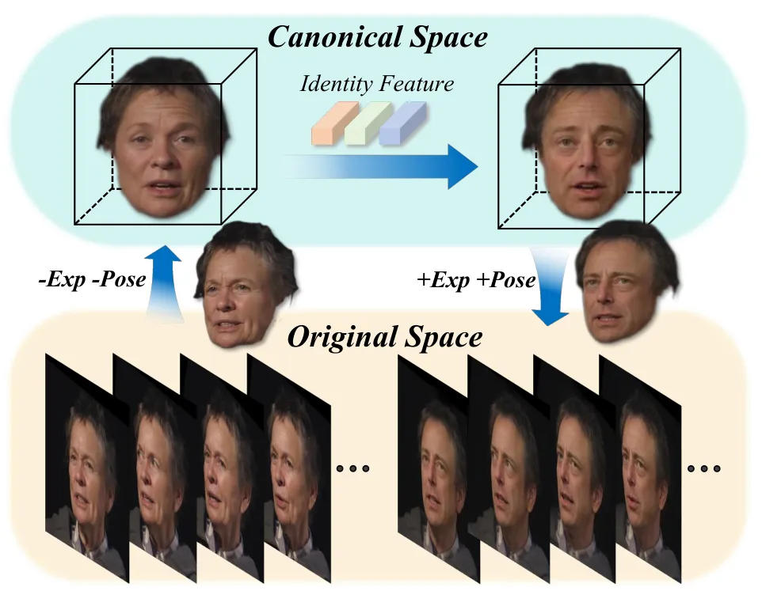

Figure 2: Conceptual illustration of CanonSwap. We transform video
frames from the original space to a canonical space to decouple motion
information. After performing face swapping in the canonical space, we
warp the results back to the original space, achieving precise motion
preservation and video consistency.

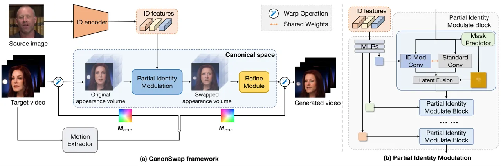

Figure 3: (a) The Pipeline of CanonSwap. Given a source image and a
target video, our method first extracts identity features through an ID
encoder from the source image. Each frame of the target video is warped
to a canonical space using transformation
$`\mathbf{M_{o\rightarrow c}}`$ estimated by the motion extractor. In
this canonical space, we perform identity transfer using the Partial
Identity Modulation module. The transformed features are then refined by
a refine module. Finally, the refined feature is warped back to the
target pose using $`\mathbf{M_{c\rightarrow o}}`$ and to generate the
swapped results. (b) The structure of our Partial Identity Modulation
(PIM) module. The PIM module contains several PIM blocks, each block
contains two branches, and the outputs of these two branches are fused
by a predicted soft spatial mask.

Existing face swapping methods perform face swap directly on the target
image or video in its original space. Due to the high coupling between
motion and appearance, altering the face often inadvertently modifies
the motion, which in turn causes jitters and reduces the overall realism
in video face swapping. Therefore, it’s necessery to decouple motion
information from appearance, which ensures motion consistency while
effectively transferring identity information.

The conceptual overview of our approach is illustrated in Fig. 2. Given
an input video, we first warp it from the original space to a canonical
space. In the canonical space, the face retains only appearance
information with a fixed and consistent pose. We then perform the face
swapping in this canonical space and warp the result back to the
original space. Thanks to the decoupling of motion and appearance,
CanoSwap can achieve highly consistent and stable swapping results
across video frames.

As shown in Fig. 3(a), our method consists of two parts: 1) Canonical
Swap Space, which describes how to construct a canonical space for face
swapping that eliminates motion information, and how to consistently map
the swapped results back to the original space. 2) Partial Identity
Modulation, which can accurately and efficiently transform the source
identity information into the target appearance features, achieving face
swapping in the canonical space.

### 3.1 Canonical Swap Space

Direct swapping face in the original space usually results in unexpected
appearance and motion alterations due to the coupling of appearance and
motion. To mitigate this issue, we propose to construct a canonical swap
space that decouples motion and appearance, and then conduct face
swapping in this space. The swapped results are subsequently warped back
to the original space, thereby preserving dynamic attributes and
ensuring consistency.

Inspired by \[46\], the canonical swap space can be constructed by using
motion-guided warping. We estimate the motion of the target video frame
with a motion extractor (please refer to supplementary for details) and
obtain the motion transformation $`M_{o\rightarrow c}`$ and
$`M_{c\rightarrow o}`$. Using the estimated motion transformation
$`M_{o\rightarrow c}`$, we can warp the original appearance volume
predicted by an appearance encoder to the appearance volume of the
canonical space. After face swapping in the canonical space, the swapped
appearance volume is then warped back to the original space by
$`M_{c\rightarrow o}`$ and decoded to produce the final result.

We note that after two successive warping steps, the appearance volume
may contain some discrepancies, leading to artifacts in the final
results. Therefore, we propose a refinement module, a lightweight 3D
U-Net structure \[38\], to refine the swapped appearance volume, before
warping it back to the original space.

### 3.2 Partial Identity Modulation

Based on the above mentioned canonical space, we conduct face swapping
by modulating the canonical appearance feature. Many GAN-based methods
employ AdaIN for face swapping and achieve promising results. However,
AdaIN operates over the entire feature map, often lacks flexibility and
can lead to unstable training. Inspired by \[24\], we further propose a
_Partial Identity Modulation_ (PIM) module that selectively applies
identity modulation only to facial regions while preserving the rest
part. By confining the modulation to facial areas, our approach
mitigates adversarial effects during training and enhances stability,
while the flexible modulation mechanism further enhances the upper bound
of face swapping performance. Appendix D proves that our method can
achieve faster convergence and effectively mitigate adversarial
phenomena in training.

As illustrated in Fig. 3(b), PIM module contains several blocks, each
block contains two parallel branches and adaptively combines the outputs
of these branches through a spatial mask $`A`$, expressed as:

```math
F_{\mathrm{out}}=A\odot F_{\mathrm{id}}+(1-A)\odot F_{\mathrm{normal}}, \tag{1}
```

where $`\odot`$ denotes element-wise multiplication, $`F_{\mathrm{id}}`$
and $`F_{\mathrm{normal}}`$ are features generated by two branches. This
fusion mechanism enables selective feature modulation across different
spatial regions.

Specifically, we first aggregate identity features from ID encoder
$`F_{\text{id}}^{i}`$ using a series of MLPs to obtain the identity code
$`s_{id}`$. The two parallel branches then process the input features as
follows: 1) Standard Convolution Branch:

```math
F_{\text{normal}}=\text{Conv}(F_{in};\mathbf{W}), \tag{2}
```

where $`\mathbf{W}`$ denotes the convolution weights and this branch
processes the input feature map $`F_{in}`$ without any identity-specific
transformations. 2) Modulated Convolution Branch: We first modulate the
original convolution weights $`\mathbf{W}`$ with the identity code
$`s_{id}`$ and then stabilize the resulting weights via demodulation.
This unified process can be formulated as:

```math
F_{\mathrm{id}}=\mathrm{Conv}\!\Biggl(F_{in};\,\frac{s_{id}\cdot\mathbf{W}}{\sqrt{\sum\!\Bigl(s_{id}\cdot\mathbf{W}\Bigr)^{2}+\epsilon}}\Biggr), \tag{3}
```

where $`\epsilon`$ is a small constant ensuring numerical stability. In
this formulation, the convolution weights are first scaled by $`s_{id}`$
to inject identity-specific features, and then normalized by their
$`\ell_{2}`$-norm to prevent excessive variance shifts. The spatial mask
$`A\in[0,1]^{H\times W}`$ is generated by a mask predictor
$`\phi(\cdot)`$ and can be expressed as:

```math
A=\phi(X). \tag{4}
```

This mask ensures that identity modulation primarily affects facial
regions (e.g., eyes, nose, and mouth) while preserving the original
content in the other irrelevant areas.

Overall, PIM provides fine-grained control over the facial regions,
avoiding over-modification and preserving the natural appearance of the
target attribute. This selective strategy significantly reduces
artifacts in challenging scenarios (e.g., complex backgrounds or large
poses), resulting in more realistic and robust results.

### 3.3 Training and Loss Functions

Our warping framework adopts \[46\], and we train the PIM module and
refinement in an end-to-end manner. During training, we simultaneously
supervise the swapped results in both canonical and original space. The
results in the canonical space $`I_{s\rightarrow t}^{c}`$ are obtained
by decoding the canonical face-swapped features, while the results in
the original space $`I_{s\rightarrow t}^{o}`$ are obtained by warping
the canonical swapped features back and decoding them in the original
space.

To ensure accurate identity transfer, we employ identity loss in both
canonical and original spaces. The identity loss utilizes a pre-trained
face recognition model \[11\] to measure the identity similarity between
the swapped face and the source identity:

```math
\displaystyle\mathcal{L}_{id}=-[\text{Sim}(E_{id}(I_{s}),E_{id}(I_{s\rightarrow t}^{c}))+ \tag{5}
```

```math
\displaystyle\text{Sim}(E_{id}(I_{s}),E_{id}(I_{s\rightarrow t}^{o}))],
```

where $`E_{id}`$ represents a pre-trained face recognition model \[11\],
$`\text{Sim}(\cdot,\cdot)`$ denotes the cosine similarity between two
feature vectors.

For maintaining structural consistency, we incorporate a perceptual loss
that measures the feature-level similarity \[53\] between the swapped
faces and the target faces:

```math
\mathcal{L}_{p}=\mathcal{L}_{LPIPS}(I_{s\rightarrow t}^{c},I_{t}^{c})+\mathcal{L}_{LPIPS}(I_{s\rightarrow t}^{o},I_{t}^{o}), \tag{6}
```

where $`I_{t}^{c}`$ represents the target face in canonical space, which
can be obtained by decoding canonical feature $`F^{c}_{t}`$.

To preserve pose and expression accuracy, we introduce motion loss,
which can be formulated as:

```math
L_{mo}=||P_{s\rightarrow t}^{c}||_{1}+||E_{s\rightarrow t}^{c}||_{1}+||P_{s\rightarrow t}^{o}-P_{t}^{o}||_{1}+||E_{s\rightarrow t}^{o}-E_{t}^{o}||_{1}, \tag{7}
```

where the expression and pose parameters $`E`$ and $`P`$ are extracted
from the motion extractor.

The reconstruction loss, $`\mathcal{L}_{r}`$, is applied to ensure
fidelity when the source and target images belong to the same identity.
During training, we randomly sample source-target pairs with a $`0.3`$
probability of sharing the same identity. The reconstruction loss is
formulated as:

```math
\mathcal{L}_{r}=\begin{cases}\|I_{s\rightarrow t}^{c}-I_{t}^{c}\|_{1}+\|I_{s\rightarrow t}^{o}-I_{t}\|_{1}&\text{if }id(I_{s})=id(I_{t}),\\
0&\text{otherwise}.\end{cases} \tag{8}
```

where $`id(\cdot)`$ denotes the identity of input images.

To enhance the visual quality and realism of the generated images, we
employ an adversarial loss:

```math
\mathcal{L}_{g}=\mathcal{L}_{adv}(D(I_{s\rightarrow t}^{o}))+\mathcal{L}_{adv}(D(I_{s\rightarrow t}^{c})). \tag{9}
```

where $`D`$ denotes the discriminator.

Although the above losses enable effective unsupervised learning of the
blending regions, where the network can automatically determine
appropriate boundaries for face swapping, we observe that overly sharp
transitions may introduce artifacts along these boundaries. Therefore,
we introduce additional regularization losses to ensure smooth and
accurate blending between the swapped regions:

```math
\mathcal{L}_{m}=\mathcal{L}_{tv}(A)+||A-A_{GT}||_{1} \tag{10}
```

where $`A`$ represents the predicted mask and $`A_{GT}`$ is the ground
truth mask when available. The total variation loss $`\mathcal{L}_{tv}`$
computes the sum of absolute differences between neighboring pixels in
both horizontal and vertical directions, encouraging spatial smoothness
in the predicted mask.

The overall training objective combines these losses with carefully
tuned weights:

```math
\mathcal{L}_{total}=\lambda_{id}\mathcal{L}_{id}+\lambda_{p}\mathcal{L}_{p}+\lambda_{mo}\mathcal{L}_{mo}+\lambda_{r}\mathcal{L}_{r}+\mathcal{L}_{g}+\lambda_{m}\mathcal{L}_{m}, \tag{11}
```

with $`\lambda_{id}=\lambda_{r}=10`$, $`\lambda_{p}=\lambda_{mo}=5`$,
and $`\lambda_{m}=1`$. This comprehensive loss function enables our
model to achieve high-quality face swapping results with motion
consistency and clean identity transfer.

## 4 Metrics of Video Face Swapping

Traditional face swapping evaluations typically rely on metrics such as
ID similarity, ID retrieval, expression accuracy, pose accuracy, and
FID \[7\]. While these metrics have been effective for image-based face
swapping, they do not capture the unique challenges of video face
swapping, such as temporal consistency and audio-lip synchronization. To
address this gap, we propose a set of more fine-grained evaluation
metrics specifically designed for video face swapping.

Our approach extends the conventional metrics with additional
measurements for the eye and lip regions. For the eyes, in addition to
the commonly used gaze estimation, we incorporate the Eye Aspect Ratio
(EAR) \[6\] to more accurately assess blink patterns. For the lip
region, we introduce synchronization (sync) metrics \[9\]. Specifically,
we adopt Lip Sync Error-Distance (LSE-D) and Lip Sync Error-Confidence
(LSE-C) from the talking head synthesis task to evaluate how well the
lip movements align with the audio. LSE-D quantifies the average
deviation of lip landmarks from the ground truth, while LSE-C measures
the confidence of the lip synchronization predictions.

To support these comprehensive evaluations, we also introduce a new
benchmark named VFS (Video Face Swapping benchmark). The VFS benchmark
comprises 100 source-target pairs randomly sampled from the VFHQ
dataset \[49\]. Each target video includes the first 100 frames along
with 4 seconds of corresponding audio, allowing for a thorough
assessment of both visual fidelity and audio-lip synchronization.

## 5 Experiment

### 5.1 Experimental Settings

#### 5.1.1 Datasets

We train our model on the VGGFace dataset \[5\], a widely-used face
recognition dataset. We perform face detection on the original VGGFace
dataset and filter out images with width less than 130 pixels, resulting
in 930K images. For training, these images are resized to
$`512\times 512`$ resolution. We evaluate our model’s performance on two
datasets: the widely-used FaceForensics++ (FF++) dataset \[39\] and our
newly proposed VFS benchmark.

#### 5.1.2 Compare Methods

To demonstrate the effectiveness of our method, we compare our method
with GAN-based methods like SimSwap \[7\], FSGAN \[35\] and E4S \[30\],
and Diffusion-based methods like DiffSwap \[56\], REFace \[2\] and Face
Adapter \[20\].

### 5.2 Quantitative Evaluations

#### 5.2.1 Overall Metrics

We evaluate our method using two distinct test sets: FF++ dataset and
our VFS benchmark. On FF++, we follow conventional face swapping
evaluation protocols with five established metrics: ID retrieval, ID
similarity, pose accuracy, expression accuracy, and Fréchet Inception
Distance (FID). ID retrieval and similarity are computed using a face
recognition model \[41\] with cosine similarity. Pose accuracy \[29\] is
measured by the Euclidean distance between the estimated and ground
truth poses, while expression accuracy \[29\] is computed as the L2
distance between the corresponding expression embeddings.

For our video benchmark, we employ Fréchet Video Distance (FVD) instead
of FID to better evaluate temporal consistency. We implement motion
jitter analysis (Temporal Consistency, a.k.a TC) by comparing optical
flow fields between source and swapped videos to quantify unnatural
facial movements. We also adopt fine-grained metrics in Section 4: Gaze
and EAR computed from facial landmarks, along with LSE-D and LSE-C
measured using SyncNet \[9\].

| Method              | ID Sim.$`\uparrow`$ | ID R.$`\uparrow`$ | Pose$`\downarrow`$ | Exp$`\downarrow`$ | FID$`\downarrow`$ |
| ------------------- | ------------------- | ----------------- | ------------------ | ----------------- | ----------------- |
| SimSwap \[7\]       | 0.5416              | 97.91             | 0.0158             | 0.9658            | 7.44              |
| FSGAN \[35\]        | 0.2781              | 41.35             | 0.0156             | 0.7184            | 14.58             |
| DiffSwap \[56\]     | 0.3179              | 48.93             | 0.0142             | 0.7370            | 10.80             |
| E4S \[30\]          | 0.4435              | 86.67             | 0.0212             | 1.0751            | 24.66             |
| Face Adapter \[20\] | 0.5035              | 94.46             | 0.0197             | 1.0064            | 16.01             |
| REFace \[2\]        | 0.4632              | 91.37             | 0.0201             | 1.1612            | 18.56             |
| CanonSwap           | 0.5751              | 98.29             | 0.0119             | 0.7328            | 6.21              |

Table 1: Quantitative comparison on FF++. Our approach demonstrates
superior performance on virtually all metrics, while maintaining
competitive results in expression metric.

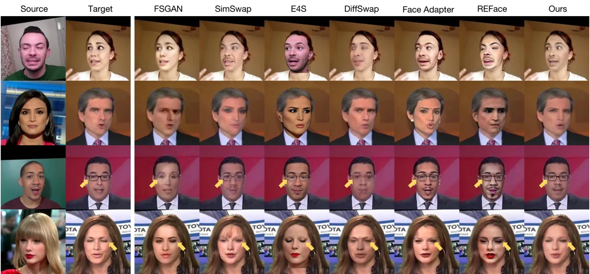

Figure 4: Qualitative results on FF++. Our method achieves accurate
identity transfer while ensuring precise motion consistency, without
introducing visible artifacts. See enlarged views for details.

### 5.3 Qualitative Evaluations

| Method              | Global              |                   |                    |                    | Eyes               |                   | Mouth(Sync)         |                   | Quality          |                   |
| ------------------- | ------------------- | ----------------- | ------------------ | ------------------ | ------------------ | ----------------- | ------------------- | ----------------- | ---------------- | ----------------- |
|                     | ID sim.$`\uparrow`$ | ID R.$`\uparrow`$ | Pose$`\downarrow`$ | Exp.$`\downarrow`$ | Gaze$`\downarrow`$ | EAR$`\downarrow`$ | LSE-D$`\downarrow`$ | LSE-C$`\uparrow`$ | TC$`\downarrow`$ | FVD$`\downarrow`$ |
| SimSwap \[7\]       | 0.5160              | 98.87             | 0.0196             | 0.9495             | 0.1206             | 5.403             | 8.344               | 5.306             | 0.773            | 136.78            |
| FSGAN \[35\]        | 0.1442              | 29.30             | 0.0204             | 0.7525             | 0.1037             | 3.976             | 8.847               | 4.710             | 0.760            | 322.30            |
| DiffSwap \[56\]     | 0.2461              | 63.45             | 0.0281             | 0.8646             | 0.1187             | 4.535             | 10.670              | 3.213             | 0.959            | 508.16            |
| E4S \[30\]          | 0.3953              | 89.63             | 0.0288             | 1.1780             | 0.1423             | 6.150             | 9.554               | 3.913             | 1.066            | 377.48            |
| Face Adapter \[20\] | 0.5215              | 98.77             | 0.0229             | 1.0354             | 0.1190             | 6.270             | 9.309               | 4.399             | 1.312            | 424.61            |
| REFace \[2\]        | 0.4306              | 96.23             | 0.0245             | 1.1782             | 0.1514             | 7.148             | 10.281              | 3.214             | 1.268            | 400.88            |
| CanonSwap           | 0.5748              | 99.78             | 0.0159             | 0.7592             | 0.0928             | 3.742             | 7.938               | 6.053             | 0.513            | 125.30            |

Table 2: Quantitative comparison on our VFS benchmark. We achieve the
best performance across all metrics, and our expression results are
nearly on par with the top-performing method.

#### 5.3.1 Evaluation Results

The evaluation results on both VFS benchmark and FF++ dataset are
presented in Tab. 1 and Tab. 2. The quantitative results demonstrate
that our method consistently outperforms existing GAN-based methods and
diffusion-based approaches across multiple metrics. In terms of identity
preservation, our method achieves the highest ID similarity score and ID
retrieval accuracy on both datasets, showing significant improvements
over both kinds of approaches. In addition, our method yields the lowest
errors on pose metrics and competitive results on expression metrics,
demonstrating the most precise motion alignment with the target video’s
motion compared to existing methods.

We also have a significant improvement in mouth synchronization metrics,
where our method achieves $`\mathbf{7.938}`$ and $`\mathbf{6.053}`$ on
LSE-D and LSE-C respectively, surpassing both GAN-based and
diffusion-based methods. This superior lip synchronization ability is
also reflected in the quality metrics, where our method achieves the
best FID and FVD scores, significantly outperforming other methods,
demonstrating better synthesis quality while maintaining temporal
consistency. These results show that decoupling appearance and motion is
essential for video face swapping.

To further evaluate the effectiveness of CanonSwap, we conduct
qualitative comparisons on the FF++ and VFS benchmarks, as shown in
Fig. 4 and Fig. 5. The results show that our method not only achieves
accurate identity transfer but also preserves precise motion alignment.

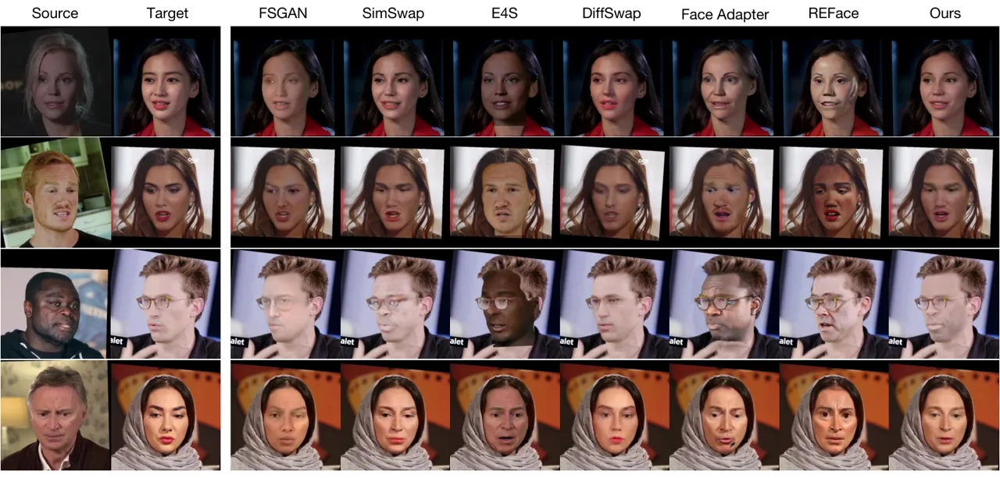

Figure 5: Quantitative results on the VFS benchmark. Our method achieves
accurate identity transfer while ensuring precise motion consistency,
without introducing visible artifacts. See enlarged views for details.

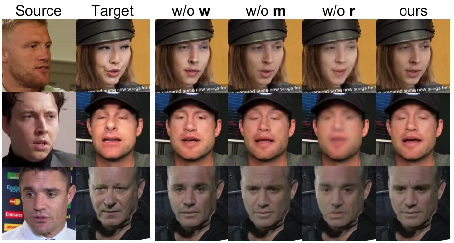

Figure 6: Qualitative results of ablation study. We compare the results
of removing each module individually: (1) omitting the warping step (w/o
w), (2) removing the spatial mask (w/o m), and (3) excluding the
refinement module (w/o r).

### 5.4 Ablation Study

We conduct ablation study on the VFS benchmark to evaluate the impact of
each module in our pipeline (see Tab. 3 and Fig. 6). Specifically, we
remove three components individually: (1) w/o w omits the warping step,
directly conducting face swarping in the original space; (2) w/o m
removes the soft spatial mask, resulting in global modulation across the
entire feature map; and (3) w/o r excludes the refinement module that
enhances canonical-space features before warping back. As shown in
Tab. 3, removing any of these components degrades the performance across
multiple metrics. Fig. 6 further illustrates these issues qualitatively:
w/o w fails to align pose and expression accurately, w/o m introduces
more undesired textures, and w/o r leads to blurry or inconsistent
identity details. These results demonstrate that all three modules are
essential for achieving accurate identity transfer, precise pose
alignment, and artifact-free results in video face swapping.

| Method | ID Sim.$`\uparrow`$ | ID R.$`\uparrow`$ | Pose$`\downarrow`$ | Exp$`\downarrow`$ | FVD$`\downarrow`$ |
| ------ | ------------------- | ----------------- | ------------------ | ----------------- | ----------------- |
| w/o w  | 0.5702              | 99.41             | 0.0227             | 0.9512            | 131.57            |
| w/o m  | 0.5508              | 97.38             | 0.0162             | 0.7669            | 165.17            |
| w/o r  | 0.4778              | 94.73             | 0.0264             | 1.0241            | 481.77            |
| Ours   | 0.5748              | 99.78             | 0.0159             | 0.7592            | 125.30            |

Table 3: Quantitative results of ablation study on the VFS benchmark.
Each row omits a component in our pipeline: warping (w), masking (m),
and refinement (r). The proposed three components are essential for
high-quality video face swapping.

### 5.5 Face Swapping and Animation

In our CanonSwap, the input image is decoupled into two components:
appearance and motion (i.e. pose and expression). Thus, other than
changing the appearance, CanonSwap also supports altering expressions
and poses. Specifically, during the warping-back process, the expression
of the target can be replaced with that of the source, allowing for
simultaneous identity and expression transfer. This capability enables
both face swapping and facial animation within a single framework. As
shown in Fig. 7, CanonSwap not only performs face swapping, but also
animates the target image, making it mimic the expressions and actions
of the source, thus broadening its potential applications.

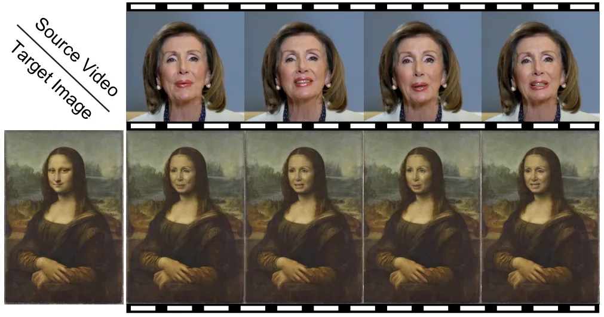

Figure 7: Face swapping and animation results. Both identity and
expression of result video come from the source video.

## 6 Conclusion

We propose a novel video face swapping framework that resolves temporal
instability by decoupling pose variations from identity transfer in
canonical space. Our partial identity modulation module enables precise
swapping control while maintaining temporal consistency. We introduce
fine-grained synchronization metrics for evaluation. Extensive
experiments demonstrate significant advances in stable and realistic
video face swapping across varying poses and expressions.

## References

- \[1\] Oleg Alexander, Mike Rogers, William Lambeth, Matt Chiang, and
  Paul Debevec. Creating a photoreal digital actor: The digital emily
  project. In _2009 Conference for Visual Media Production_, pages
  176–187. IEEE, 2009.
- \[2\] Sanoojan Baliah, Qinliang Lin, Shengcai Liao, Xiaodan Liang, and
  Muhammad Haris Khan. Realistic and efficient face swapping: A unified
  approach with diffusion models. _arXiv preprint
  arXiv:2409.07269_, 2024.
- \[3\] Dmitri Bitouk, Neeraj Kumar, Samreen Dhillon, Peter Belhumeur,
  and Shree K Nayar. Face swapping: automatically replacing faces in
  photographs. In _ACM SIGGRAPH 2008 papers_, pages 1–8. 2008.
- \[4\] Andreas Blattmann, Tim Dockhorn, Sumith Kulal, Daniel
  Mendelevitch, Maciej Kilian, Dominik Lorenz, Yam Levi, Zion English,
  Vikram Voleti, Adam Letts, et al. Stable video diffusion: Scaling
  latent video diffusion models to large datasets. _arXiv preprint
  arXiv:2311.15127_, 2023.
- \[5\] Qiong Cao, Li Shen, Weidi Xie, Omkar M Parkhi, and Andrew
  Zisserman. Vggface2: A dataset for recognising faces across pose and
  age. In _2018 13th IEEE international conference on automatic face &
  gesture recognition (FG 2018)_, pages 67–74. IEEE, 2018.
- \[6\] Jan Cech and Tereza Soukupova. Real-time eye blink detection
  using facial landmarks. _Cent. Mach. Perception, Dep. Cybern. Fac.
  Electr. Eng. Czech Tech. Univ. Prague_, pages 1–8, 2016.
- \[7\] Renwang Chen, Xuanhong Chen, Bingbing Ni, and Yanhao Ge.
  Simswap: An efficient framework for high fidelity face swapping. In
  _Proceedings of the 28th ACM International Conference on Multimedia_,
  pages 2003–2011, 2020.
- \[8\] Xu Chen, Keke He, Junwei Zhu, Yanhao Ge, Wei Li, and Chengjie
  Wang. Hifivfs: High fidelity video face swapping. _arXiv preprint
  arXiv:2411.18293_, 2024.
- \[9\] Joon Son Chung and Andrew Zisserman. Out of time: automated lip
  sync in the wild. In _Computer Vision–ACCV 2016 Workshops: ACCV 2016
  International Workshops, Taipei, Taiwan, November 20-24, 2016, Revised
  Selected Papers, Part II 13_, pages 251–263. Springer, 2017.
- \[10\] Umur A Ciftci, Gokturk Yuksek, and Ilke Demir. My face my
  choice: Privacy enhancing deepfakes for social media anonymization. In
  _Proceedings of the IEEE/CVF Winter Conference on Applications of
  Computer Vision_, pages 1369–1379, 2023.
- \[11\] Jiankang Deng, Jia Guo, Niannan Xue, and Stefanos Zafeiriou.
  Arcface: Additive angular margin loss for deep face recognition. In
  _Proceedings of the IEEE/CVF conference on computer vision and pattern
  recognition_, pages 4690–4699, 2019.
- \[12\] Yu Deng, Jiaolong Yang, Dong Chen, Fang Wen, and Xin Tong.
  Disentangled and controllable face image generation via 3d
  imitative-contrastive learning. In _Proceedings of the IEEE/CVF
  conference on computer vision and pattern recognition_, pages
  5154–5163, 2020.
- \[13\] Nikita Drobyshev, Jenya Chelishev, Taras Khakhulin, Aleksei
  Ivakhnenko, Victor Lempitsky, and Egor Zakharov. Megaportraits:
  One-shot megapixel neural head avatars. In _Proceedings of the 30th
  ACM International Conference on Multimedia_, pages 2663–2671, 2022.
- \[14\] Patrick Esser, Robin Rombach, and Bjorn Ommer. Taming
  transformers for high-resolution image synthesis. In _Proceedings of
  the IEEE/CVF conference on computer vision and pattern recognition_,
  pages 12873–12883, 2021.
- \[15\] Gege Gao, Huaibo Huang, Chaoyou Fu, Zhaoyang Li, and Ran He.
  Information bottleneck disentanglement for identity swapping. In
  _Proceedings of the IEEE/CVF Conference on Computer Vision and Pattern
  Recognition_, pages 3404–3413, 2021.
- \[16\] Zhenglin Geng, Chen Cao, and Sergey Tulyakov. 3d guided
  fine-grained face manipulation. In _Proceedings of the IEEE/CVF
  conference on computer vision and pattern recognition_, pages
  9821–9830, 2019.
- \[17\] Ian Goodfellow, Jean Pouget-Abadie, Mehdi Mirza, Bing Xu, David
  Warde-Farley, Sherjil Ozair, Aaron Courville, and Yoshua Bengio.
  Generative adversarial networks. _Communications of the ACM_,
  63(11):139–144, 2020.
- \[18\] Yuwei Guo, Ceyuan Yang, Anyi Rao, Zhengyang Liang, Yaohui Wang,
  Yu Qiao, Maneesh Agrawala, Dahua Lin, and Bo Dai. Animatediff: Animate
  your personalized text-to-image diffusion models without specific
  tuning. _arXiv preprint arXiv:2307.04725_, 2023.
- \[19\] Sungjoo Ha, Martin Kersner, Beomsu Kim, Seokjun Seo, and
  Dongyoung Kim. Marionette: Few-shot face reenactment preserving
  identity of unseen targets. In _Proceedings of the AAAI conference on
  artificial intelligence_, pages 10893–10900, 2020.
- \[20\] Yue Han, Junwei Zhu, Keke He, Xu Chen, Yanhao Ge, Wei Li,
  Xiangtai Li, Jiangning Zhang, Chengjie Wang, and Yong Liu.
  Face-adapter for pre-trained diffusion models with fine-grained id and
  attribute control. In _European Conference on Computer Vision_, pages
  20–36. Springer, 2024.
- \[21\] Li Hu. Animate anyone: Consistent and controllable
  image-to-video synthesis for character animation. In _Proceedings of
  the IEEE/CVF Conference on Computer Vision and Pattern Recognition_,
  pages 8153–8163, 2024.
- \[22\] Xun Huang and Serge Belongie. Arbitrary style transfer in
  real-time with adaptive instance normalization. In _Proceedings of the
  IEEE international conference on computer vision_, pages
  1501–1510, 2017.
- \[23\] Tero Karras, Samuli Laine, and Timo Aila. A style-based
  generator architecture for generative adversarial networks. In
  _Proceedings of the IEEE/CVF conference on computer vision and pattern
  recognition_, pages 4401–4410, 2019.
- \[24\] Tero Karras, Samuli Laine, Miika Aittala, Janne Hellsten,
  Jaakko Lehtinen, and Timo Aila. Analyzing and improving the image
  quality of stylegan. In _Proceedings of the IEEE/CVF conference on
  computer vision and pattern recognition_, pages 8110–8119, 2020.
- \[25\] Kihong Kim, Yunho Kim, Seokju Cho, Junyoung Seo, Jisu Nam,
  Kychul Lee, Seungryong Kim, and KwangHee Lee. Diffface:
  Diffusion-based face swapping with facial guidance. _arXiv preprint
  arXiv:2212.13344_, 2022.
- \[26\] Lingzhi Li, Jianmin Bao, Hao Yang, Dong Chen, and Fang Wen.
  Faceshifter: Towards high fidelity and occlusion aware face swapping.
  _CVPR_, 2020.
- \[27\] Zhichao Liao, Fengyuan Piao, Di Huang, Xinghui Li, Yue Ma,
  Pingfa Feng, Heming Fang, and Long Zeng. Freehand sketch generation
  from mechanical components. In _Proceedings of the 32nd ACM
  International Conference on Multimedia_, pages 6755–6764, 2024.
- \[28\] Zhichao Liao, Xiaokun Liu, Wenyu Qin, Qingyu Li, Qiulin Wang,
  Pengfei Wan, Di Zhang, Long Zeng, and Pingfa Feng. Humanaesexpert:
  Advancing a multi-modality foundation model for human image aesthetic
  assessment. _arXiv preprint arXiv:2503.23907_, 2025.
- \[29\] Yunfei Liu, Lei Zhu, Lijian Lin, Ye Zhu, Ailing Zhang, and Yu
  Li. Teaser: Token enhanced spatial modeling for expressions
  reconstruction. _arXiv preprint arXiv:2502.10982_, 2025.
- \[30\] Zhian Liu, Maomao Li, Yong Zhang, Cairong Wang, Qi Zhang, Jue
  Wang, and Yongwei Nie. Fine-grained face swapping via regional gan
  inversion. In _2023 IEEE/CVF Conference on Computer Vision and Pattern
  Recognition (CVPR)_, pages 8578–8587. IEEE, 2023.
- \[31\] Xiangyang Luo, Xin Zhang, Yifan Xie, Xinyi Tong, Weijiang Yu,
  Heng Chang, Fei Ma, and Fei Richard Yu. Codeswap: Symmetrically face
  swapping based on prior codebook. In _Proceedings of the 32nd ACM
  International Conference on Multimedia_, pages 6910–6919, 2024.
- \[32\] Sachit Mahajan, Ling-Jyh Chen, and Tzu-Chieh Tsai. Swapitup: A
  face swap application for privacy protection. In _2017 IEEE 31st
  international conference on advanced information networking and
  applications (AINA)_, pages 46–50. IEEE, 2017.
- \[33\] Koki Nagano, Jaewoo Seo, Jun Xing, Lingyu Wei, Zimo Li,
  Shunsuke Saito, Aviral Agarwal, Jens Fursund, Hao Li, Richard Roberts,
  et al. pagan: real-time avatars using dynamic textures. _ACM Trans.
  Graph._, 37(6):258, 2018.
- \[34\] Yuval Nirkin, Iacopo Masi, Anh Tran Tuan, Tal Hassner, and
  Gerard Medioni. On face segmentation, face swapping, and face
  perception. In _2018 13th IEEE International Conference on Automatic
  Face & Gesture Recognition (FG 2018)_, pages 98–105. IEEE, 2018.
- \[35\] Yuval Nirkin, Yosi Keller, and Tal Hassner. FSGANv2: Improved
  subject agnostic face swapping and reenactment. IEEE, 2022.
- \[36\] Shengju Qian, Kwan-Yee Lin, Wayne Wu, Yangxiaokang Liu, Quan
  Wang, Fumin Shen, Chen Qian, and Ran He. Make a face: Towards
  arbitrary high fidelity face manipulation. In _Proceedings of the
  IEEE/CVF international conference on computer vision_, pages
  10033–10042, 2019.
- \[37\] Robin Rombach, Andreas Blattmann, Dominik Lorenz, Patrick
  Esser, and Björn Ommer. High-resolution image synthesis with latent
  diffusion models. In _Proceedings of the IEEE/CVF conference on
  computer vision and pattern recognition_, pages 10684–10695, 2022.
- \[38\] Olaf Ronneberger, Philipp Fischer, and Thomas Brox. U-net:
  Convolutional networks for biomedical image segmentation. In _Medical
  image computing and computer-assisted intervention–MICCAI 2015: 18th
  international conference, Munich, Germany, October 5-9, 2015,
  proceedings, part III 18_, pages 234–241. Springer, 2015.
- \[39\] Andreas Rossler, Davide Cozzolino, Luisa Verdoliva, Christian
  Riess, Justus Thies, and Matthias Nießner. Faceforensics++: Learning
  to detect manipulated facial images. In _Proceedings of the IEEE/CVF
  international conference on computer vision_, pages 1–11, 2019.
- \[40\] Hao Shao, Shulun Wang, Yang Zhou, Guanglu Song, Dailan He, Shuo
  Qin, Zhuofan Zong, Bingqi Ma, Yu Liu, and Hongsheng Li. Vividface: A
  diffusion-based hybrid framework for high-fidelity video face
  swapping. _arXiv preprint arXiv:2412.11279_, 2024.
- \[41\] Kaede Shiohara, Xingchao Yang, and Takafumi Taketomi.
  Blendface: Re-designing identity encoders for face-swapping. In
  _Proceedings of the IEEE/CVF International Conference on Computer
  Vision (ICCV)_, pages 7634–7644, 2023.
- \[42\] Aliaksandr Siarohin, Stéphane Lathuilière, Sergey Tulyakov,
  Elisa Ricci, and Nicu Sebe. First order motion model for image
  animation. _Advances in neural information processing systems_,
  32, 2019.
- \[43\] Ashish Vaswani, Noam Shazeer, Niki Parmar, Jakob Uszkoreit,
  Llion Jones, Aidan N Gomez, Łukasz Kaiser, and Illia Polosukhin.
  Attention is all you need. _Advances in neural information processing
  systems_, 30, 2017.
- \[44\] Runqi Wang, Sijie Xu, Tianyao He, Yang Chen, Wei Zhu, Dejia
  Song, Nemo Chen, Xu Tang, and Yao Hu. Dynamicface: High-quality and
  consistent video face swapping using composable 3d facial priors.
  _arXiv preprint arXiv:2501.08553_, 2025a.
- \[45\] Tan Wang, Linjie Li, Kevin Lin, Yuanhao Zhai, Chung-Ching Lin,
  Zhengyuan Yang, Hanwang Zhang, Zicheng Liu, and Lijuan Wang. Disco:
  Disentangled control for realistic human dance generation. In
  _Proceedings of the IEEE/CVF Conference on Computer Vision and Pattern
  Recognition_, pages 9326–9336, 2024.
- \[46\] Ting-Chun Wang, Arun Mallya, and Ming-Yu Liu. One-shot
  free-view neural talking-head synthesis for video conferencing. In
  _Proceedings of the IEEE/CVF conference on computer vision and pattern
  recognition_, pages 10039–10049, 2021.
- \[47\] Yu Wang, Yunfei Liu, Fa-Ting Hong, Meng Cao, Lijian Lin, and Yu
  Li. Anytalk: Multi-modal driven multi-domain talking head generation.
  In _Proceedings of the AAAI Conference on Artificial Intelligence_,
  pages 8105–8113, 2025b.
- \[48\] Xiaole Xian, Zhichao Liao, Qingyu Li, Wenyu Qin, Pengfei Wan,
  Weicheng Xie, Long Zeng, Linlin Shen, and Pingfa Feng. Spf-portrait:
  Towards pure portrait customization with semantic pollution-free
  fine-tuning. _arXiv preprint arXiv:2504.00396_, 2025.
- \[49\] Liangbin Xie, Xintao Wang, Honglun Zhang, Chao Dong, and Ying
  Shan. Vfhq: A high-quality dataset and benchmark for video face
  super-resolution. In _Proceedings of the IEEE/CVF Conference on
  Computer Vision and Pattern Recognition_, pages 657–666, 2022.
- \[50\] Yangyang Xu, Bailin Deng, Junle Wang, Yanqing Jing, Jia Pan,
  and Shengfeng He. High-resolution face swapping via latent semantics
  disentanglement. In _Proceedings of the IEEE/CVF Conference on
  Computer Vision and Pattern Recognition_, pages 7642–7651, 2022a.
- \[51\] Zhiliang Xu, Hang Zhou, Zhibin Hong, Ziwei Liu, Jiaming Liu,
  Zhizhi Guo, Junyu Han, Jingtuo Liu, Errui Ding, and Jingdong Wang.
  Styleswap: Style-based generator empowers robust face swapping. In
  _European Conference on Computer Vision_, pages 661–677. Springer,
  2022b.
- \[52\] Haiwei Xue, Xiangyang Luo, Zhanghao Hu, Xin Zhang, Xunzhi
  Xiang, Yuqin Dai, Jianzhuang Liu, Zhensong Zhang, Minglei Li, Jian
  Yang, et al. Human motion video generation: A survey. _Authorea
  Preprints_, 2024.
- \[53\] Richard Zhang, Phillip Isola, Alexei A Efros, Eli Shechtman,
  and Oliver Wang. The unreasonable effectiveness of deep features as a
  perceptual metric. In _Proceedings of the IEEE conference on computer
  vision and pattern recognition_, pages 586–595, 2018.
- \[54\] Tianke Zhang, Xuangeng Chu, Yunfei Liu, Lijian Lin, Zhendong
  Yang, Zhengzhuo Xu, Chengkun Cao, Fei Yu, Changyin Zhou, Chun Yuan,
  et al. Accurate 3d face reconstruction with facial component tokens.
  In _Proceedings of the IEEE/CVF international conference on computer
  vision_, pages 9033–9042, 2023.
- \[55\] Jian Zhao and Hui Zhang. Thin-plate spline motion model for
  image animation. In _Proceedings of the IEEE/CVF Conference on
  Computer Vision and Pattern Recognition_, pages 3657–3666, 2022.
- \[56\] Wenliang Zhao, Yongming Rao, Weikang Shi, Zuyan Liu, Jie Zhou,
  and Jiwen Lu. Diffswap: High-fidelity and controllable face swapping
  via 3d-aware masked diffusion. In _Proceedings of the IEEE/CVF
  Conference on Computer Vision and Pattern Recognition_, pages
  8568–8577, 2023.
- \[57\] Yuhao Zhu, Qi Li, Jian Wang, Cheng-Zhong Xu, and Zhenan Sun.
  One shot face swapping on megapixels. In _Proceedings of the IEEE/CVF
  Conference on Computer Vision and Pattern Recognition (CVPR)_, pages
  4834–4844, 2021.
- \[58\] Yixuan Zhu, Wenliang Zhao, Yansong Tang, Yongming Rao, Jie
  Zhou, and Jiwen Lu. Stableswap: Stable face swapping in a shared and
  controllable latent space. _IEEE Transactions on Multimedia_, 2024.

Supplementary Material

## Appendix A Training Details

Our method is implemented in PyTorch and trained on two NVIDIA A6000
GPUs, with a batch size of 6 per GPU. We use the AdamW optimizer (weight
decay = $`1\times 10^{-4}`$, $`\beta_{1}=0.5`$, $`\beta_{2}=0.999`$) for
both generator and discriminator and set the initial learning rate to
$`1\times 10^{-4}`$. The model is trained for 150k steps in total.

For discriminator, we adopt the same architecture as SPADE. During
training, we introduce an additional gradient penalty loss, which
enforces smooth decision boundaries by penalizing large gradients in the
discriminator. This penalty stabilizes training and helps the
discriminator better distinguish between real and generated samples.

## Appendix B Visualization of Canonical Space

To provide an intuitive illustration of how our canonical space appears
after motion decoupling, we randomly select 10k frames from our CVF
benchmark and apply a crop-and-align procedure to obtain _Align Set_.
Next, we transform the images in _Align Set_ into the canonical space,
yielding _+Canonical Set_. We then use a face segmentation model to
compute the average parsing map for each set, as well as individual
nose, eyes, and mouth regions, and visualize the results in Fig. 8. As
shown, the canonical space removes motion information, causing facial
features to align almost perfectly. By contrast, the standard alignment
method still contains motion, resulting in blurred parsing
boundaries—particularly around the eyes, which can shift over a wide
range.

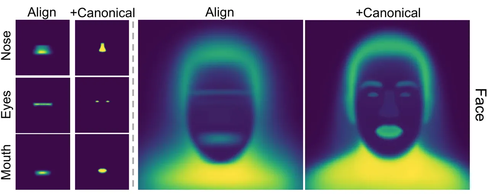

Figure 8: Comparison between traditional face alignment (left) and our
canonical-space transformation (right), visualized by averaging
segmentation maps across multiple samples. In traditional alignment,
residual motion information causes blurred and inconsistent boundaries.
By contrast, our canonical-space transformation effectively decouples
motion, resulting in more uniform and clearly defined facial regions.

Furthermore, we visualize the outputs of each stage of CanonSwap, as
shown in Fig. 9.

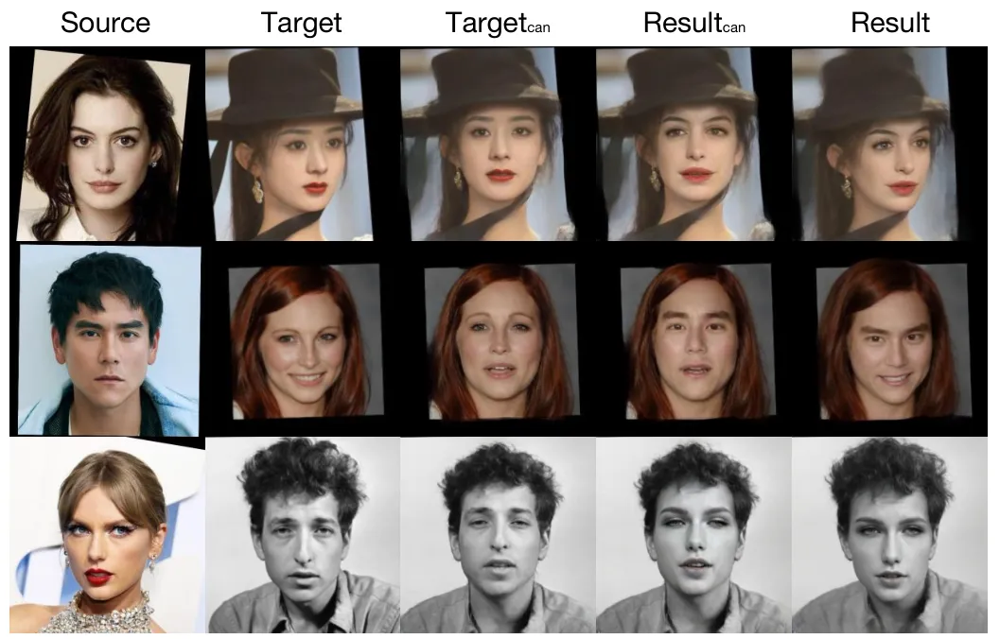

Figure 9: Visualization of outputs of each stage of CanonSwap.

## Appendix C Details of Motion Extractor

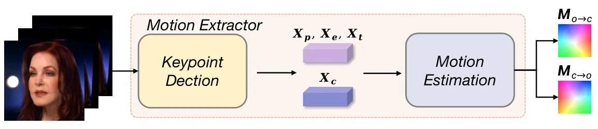

Figure 10: The components of our motion extractor.

The details of motion extractor is shown in Fig. 10, specifically, for a
frame of the target video in the original space $`V_{o}`$, we use an
implicit keypoint detector to obtain the canonical keypoints
$`X_{c}\in\mathbb{R}^{n\times 3}`$, along with motion deformations,
which include pose rotation $`X_{p}\in\mathbb{R}^{n\times 3}`$,
expression $`X_{e}\in\mathbb{R}^{n\times 3}`$, and translations
$`X_{t}\in\mathbb{R}^{3}`$, where $`n`$ denotes the number of keypoints.
Using these components, the keypoints for the frame are computed as:

```math
X=X_{c}X_{p}+X_{e}+X_{t}. \tag{12}
```

Then, we feed $`X`$ and $`X_{c}`$ into a motion estimation module
$`\mathcal{E}`$ to estimate motion information. By swapping the order of
$`X`$ and $`X_{c}`$, we can simultaneously obtain the deformations from
the original space to the canonical space $`M_{o\rightarrow c}`$, and
from the canonical space back to the original space
$`M_{c\rightarrow o}`$:

```math
M_{o\rightarrow c}=\mathcal{E}(X,X_{c}),\quad M_{c\rightarrow o}=\mathcal{E}(X_{c},X). \tag{13}
```

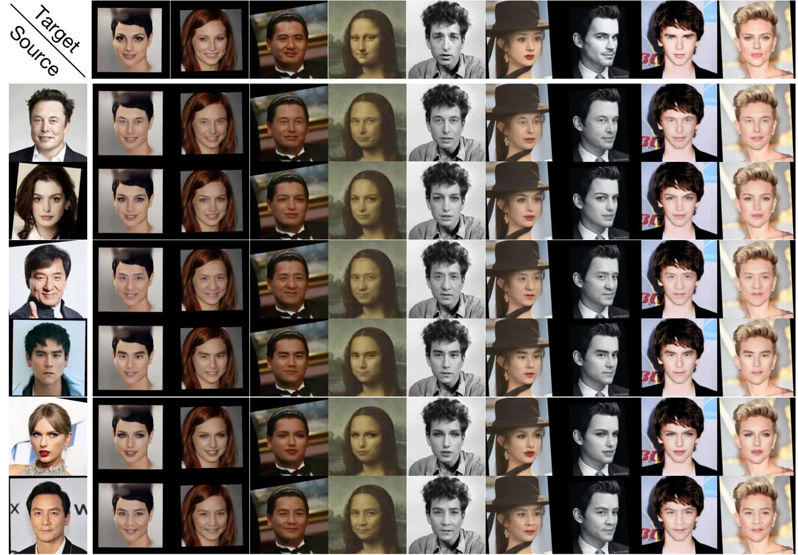

Figure 11: more qualitative results through a face matrix.

## Appendix D Advantages of the PIM.

Our PIM module addresses a key drawback of traditional
AdaIN/modulation-based methods—their global application alters
identity-irrelevant regions, which is suboptimal for face swapping. This
often leads to (1) visible artifacts and (2) unstable training from
conflicting losses, the latter often overlooked. We compare AdaIN,
global modulation, and PIM under the same setting. As shown in Fig. 12,
PIM converges faster and alleviates the conflict between identity loss
and perceptual loss (lowest ID loss and lowest perceptual loss),
resulting in better overall performance and a higher optimization
ceiling.

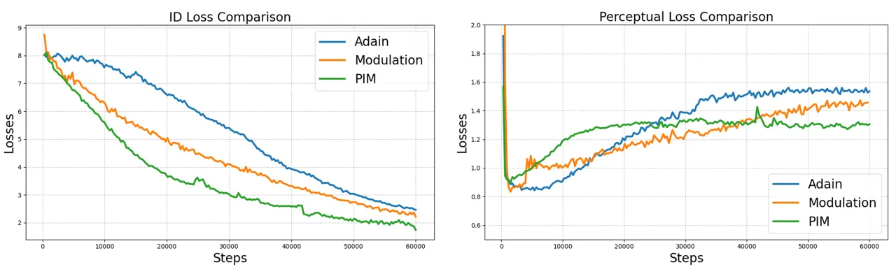

Figure 12: Training loss curves on the same dataset, our PIM achieves
the fastest convergence rate and demonstrates lower ID Loss and
Perceptual Loss, effectively mitigating the adversarial relationship
between losses and achieving a higher performance ceiling.

## Appendix E Computational Efficiency

We evaluate inference efficiency by comparing our method with existing
approaches, as shown in the table below (FPS). Our methods is faster
than Diffusion/StyleGAN-based methods.

| Metrics | Simswap | FSGAN | E4S | Diffswap | FaceAdapter | REFace | Ours |
| ------- | ------- | ----- | --- | -------- | ----------- | ------ | ---- |
| FPS     | 16      | 21    | 4   | 0.11     | 0.35        | 0.21   | 14   |

## Appendix F Face Swapping and Animation

To achieve face swapping and animation, we need to change the warping
back deformation $`M_{c\rightarrow o}`$ in Eq. 13. Specifically, we
obtain $`X_{c}`$, $`X_{p}`$, $`X_{e}`$, and $`X_{t}`$ from the target
frame, and also extract the source’s expression from the source frame.
During the transformation from the original space to the canonical
space, we follow the procedure described in the main text. In the
warp-back stage, we compute a new keypoint $`X^{\prime}`$ as

```math
X^{\prime}=X_{p}X_{c}+X_{e}^{s}+X_{t}, \tag{14}
```

where $`X_{e}^{s}`$ denotes the source’s expression. We then use the
motion estimator to obtain a new warp deformation,

```math
M_{c\rightarrow o}^{\prime}=\mathcal{E}\bigl(X_{c},X_{2}\bigr), \tag{15}
```

and apply it to warp back, thereby transferring the source expression to
the target image.

## Appendix G More Qualitative Results

To demonstrate the robustness of our model, we conducted a matrix swap,
and the results are shown in Fig. 11. Furthermore, compared to existing
face swapping methods, our approach can leverage powerful animation
priors to maintain robust performance under large pose variations.
Moreover, by replacing the target’s canonical keypoints with those of
the source, the facial geometry can be adaptively aligned to match the
source’s structure to some extent, which is shown in Fig. 13. We also
conduct an evaluation in large pose variation situation, which is shown
in Fig. 14. Warping-based animation (e.g., talking head) may struggle
with extreme pose variations due to insufficient target-pose features.
In contrast, CanonSwap performs face swapping in a canonical pose and
warps back to the original pose while preserving the original pose
features. This enables robust performance under large pose variation. As
shown in Fig. (a), CanonSwap outperforms prior methods in such
scenarios, where SimSwap typically fails to handle large pose
differences.

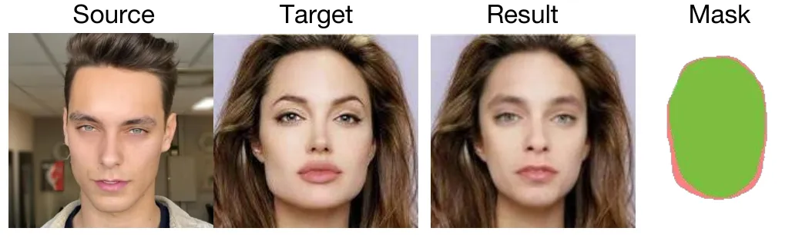

Figure 13: By exchanging canonical keypoints, our method can also
achieve shape transfer to some extent.

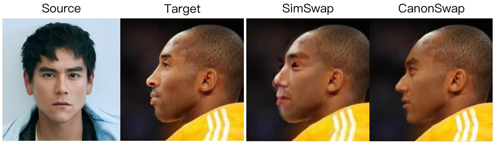

Figure 14: Qualitative comparison in large pose variation situation.

## Appendix H Ethical Considerations

This research is conducted solely for academic purposes and to advance
the video face swapping technology. We use publicly available datasets
and adhere to ethical guidelines in our experimentation. While our work
aims to improve the fidelity and temporal consistency of face swapping,
we acknowledge the potential for misuse in applications such as
deepfakes and identity manipulation. We strongly advocate for
responsible use of this technology and caution against applications that
may infringe on privacy, consent, or intellectual property rights.
Researchers and practitioners are encouraged to consider the ethical
implications and to implement safeguards to prevent harmful or deceptive
uses of our methods.
