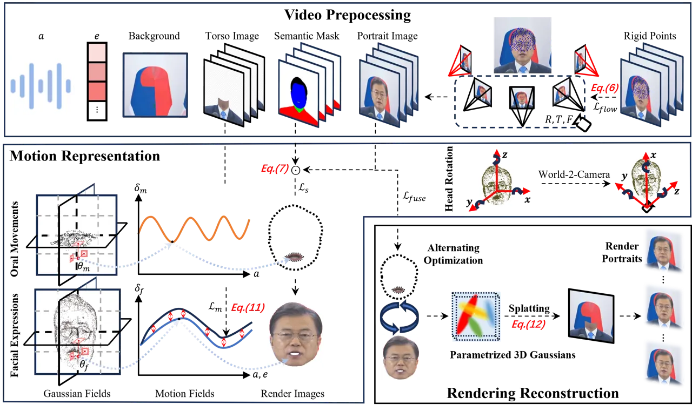
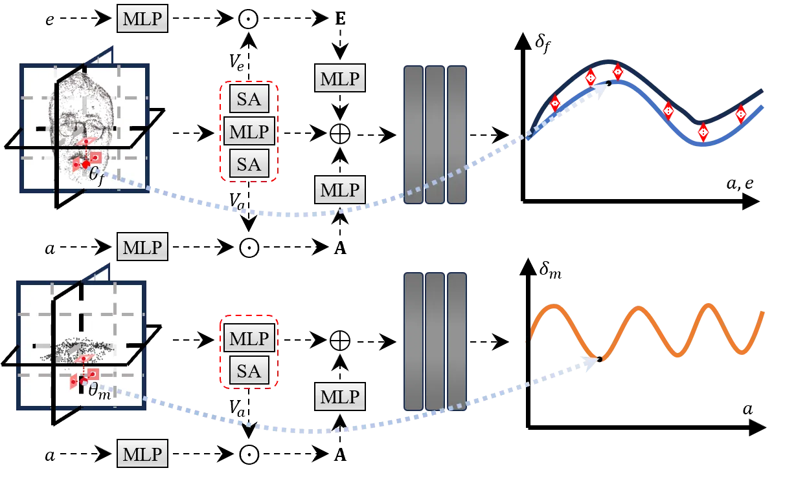
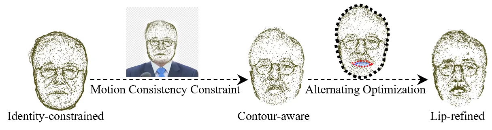
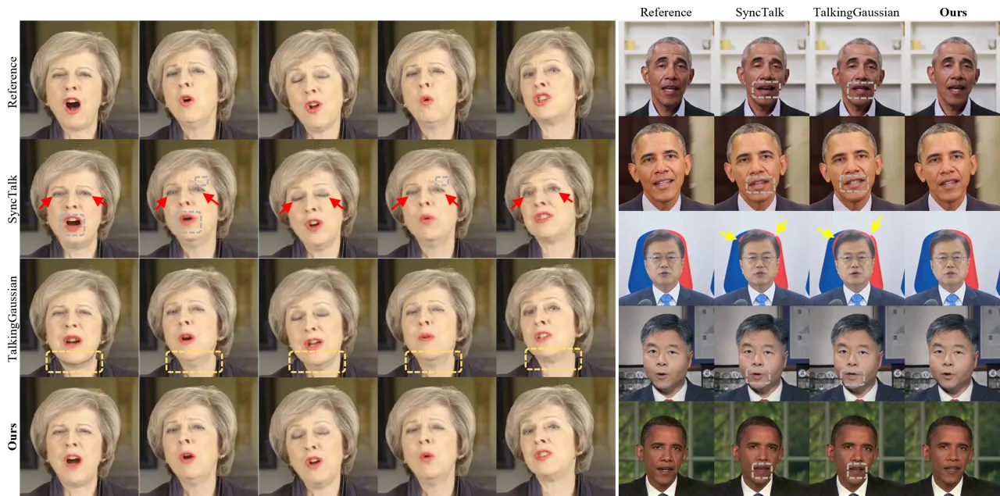
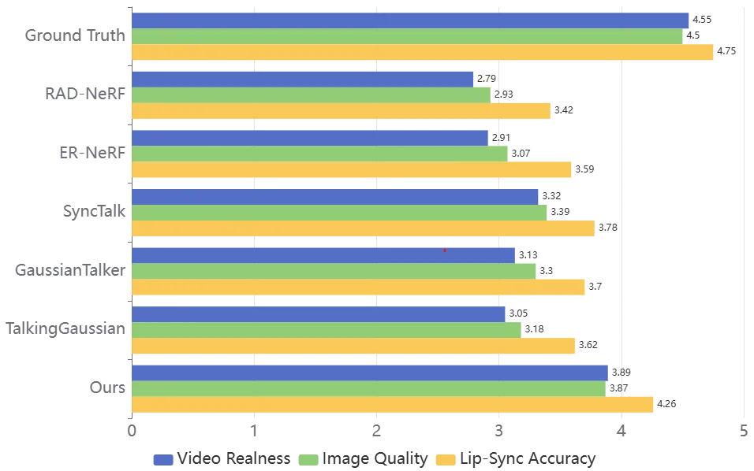
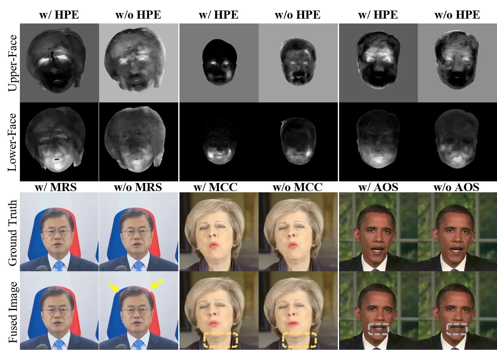
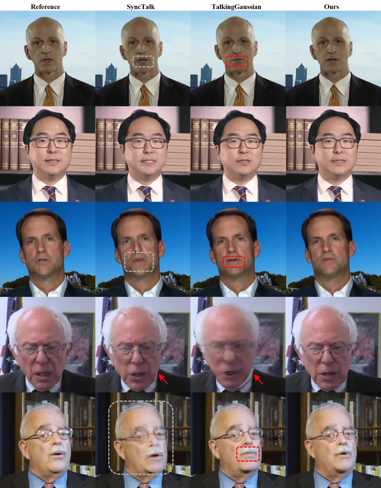

# M2DAO-Talker: Harmonizing Multi-granular Motion Decoupling and Alternating Optimization for Talking-head Generation

Kui Jiang    Shiyu Liu    Junjun Jiang    Hongxun Yao    Xiaopeng Fan

###### Abstract

Audio-driven talking head generation holds significant potential for
film production. While existing 3D methods have advanced motion modeling
and content synthesis, they often produce rendering artifacts, such as
motion blur, temporal jitter, and local penetration, due to limitations
in representing stable, fine-grained motion fields. Through systematic
analysis, we reformulate talking head generation into a unified
framework comprising three steps: video preprocessing, motion
representation, and rendering reconstruction. This framework underpins
our proposed M2DAO-Talker, which addresses current limitations via
multi-granular motion decoupling and alternating optimization.
Specifically, we devise a novel 2D portrait preprocessing pipeline to
extract frame-wise deformation control conditions (motion region
segmentation masks, and camera parameters) to facilitate motion
representation. To ameliorate motion modeling, we elaborate a
multi-granular motion decoupling strategy, which independently models
non-rigid (oral and facial) and rigid (head) motions for improved
reconstruction accuracy. Meanwhile, a motion consistency constraint is
developed to ensure head-torso kinematic consistency, thereby mitigating
penetration artifacts caused by motion aliasing. In addition, an
alternating optimization strategy is designed to iteratively refine
facial and oral motion parameters, enabling more realistic video
generation. Experiments across multiple datasets show that M2DAO-Talker
achieves state-of-the-art performance, with the 2.43 dB PSNR improvement
in generation quality and 0.64 gain in user-evaluated video realness
versus TalkingGaussian while with 150 FPS inference speed.

¹Harbin Institute of Technology

jiangkui@hit.edu.cn, liushiyu_aiia@stu.hit.edu.cn,
jiangjunjun@hit.edu.cn, h.yao@hit.edu.cn, fxp@hit.edu.cn

## Introduction

The generation of talking head videos (Wang et al. 2024a) significantly
enhances digital human realism by aligning with human perceptual
expectations, making it particularly valuable for film production,
immersive education platforms, and so on.

Traditional studies (Wang et al. 2023; Zhong et al. 2023; Guan et al.
2023; Zhang et al. 2023a) employ robust content generation capabilities
of generative adversarial networks (GANs) for lip-sync prediction,
demonstrating preliminary success in audio-driven synthesis. However,
their lack of explicit motion field modeling and geometric priors leads
to limited capacity for fine-grained facial dynamics, and artifacts from
fixed head pose constraints.

Recently, the 3D reconstruction area is experiencing vigorous
development with deep learning technologies, such as Neural Radiance
Fields (Mildenhall et al. 2021; Yang, Deng, and Zhang 2025) (NeRF) and
3D Gaussian Splating (Kerbl et al. 2023; Fei et al. 2024) (3DGS). For
talking head generation, NeRF-based methods (Guo et al. 2021; Tang
et al. 2022) ameliorate structural stability through tri-plane hash
encoders that compress dynamic heads into low-dimensional subspaces.
While enhancing identity preservation and texture generation, these
methods (Li et al. 2023; Peng et al. 2024) still face critical
limitations. For example, they lack precise motion representation due to
direct modeling of the relationship between position, color, and
density, causing facial distortions during rapid expressions.

Addressing these issues, 3D Gaussian Splatting (3DGS) offers a promising
alternative to NeRF, delivering comparable rendering quality with
significantly faster inference. Recent 3DGS variants (Cho et al. 2024;
Li et al. 2025) enhance temporal stability by learning explicit Gaussian
fields to model motion patterns. Some approaches (Li et al. 2025)
further acknowledge motion field heterogeneity across facial regions,
introducing face-mouth decomposition for fine-grained motion
representation. Despite improved oral rendering, three key challenges
persist in 3DGS methods. First, the extraction and segmentation of
motion regions via BiseNet (Yu et al. 2018) has been prone to produce
imprecise edges, resulting in blurred edges or piercing phenomena during
Gaussian field modeling. Second, adopting explicit geometric priors via
3D Morphable Models (Paysan et al. 2009) (3DMM) for frame-wise head pose
estimation (Li et al. 2025) causes obvious inter-frame head jitter,
where the mixed effects of head pose and facial expression on 3DMM are
ignored. Third, the lack of joint optimization between head and torso
movement results in kinematic discontinuity and unnatural visual effect.
Overall, 3DGS-based technologies (Cho et al. 2024; Li et al. 2025) lack
consistency and thoroughness when decoupling motion, resulting in
unnatural, warped facial repression and piercing phenomena in
synthesized videos.

To circumvent these challenges, we propose M2DAO-Talker–a unified
framework integrating multi-granular motion decoupling and alternating
optimization for audio-driven head-talking synthesis. Our M2DAO-Talker
approach systematically organizes the task through three coordinated
components: video preprocessing, motion representation, and rendering
reconstruction. Preprocessing is a key step in achieving precise motion
modeling. We implement a high-quality 2D talking portrait video
preprocessing pipeline to achieve frame-wise extraction of deformation
control parameters, motion region segmentation and camera parameters
estimation. In this way, we can produce the hyperparameters of motion
representation, accurate camera parameters, fine-grained semantic masks,
and so on. These inputs facilitate accurate motion modeling with
specific priors and significantly alleviate simulated errors.

In addition, we have developed a novel multi-granular motion decoupling
scheme to bolster motion expression in M2DAO-Talker. Specifically, in
addition to modeling rigid head rotation through camera parameters, we
adopt the common practice of separating non-rigid head motion into
facial and oral components using two dedicated branches: a Face Branch
for capturing macro-scale expressions (_e.g._, eyebrow movement, eye
blinks) and an Inside Mouth Branch for modeling finer oral articulations
such as phoneme-dependent tongue positions. Meanwhile, we have developed
a motion consistency constraint to maintain head-to-torso kinematic
consistency. Concretely, the unified representation of torso motion is
learned with the Face Branch to guide more reasonable Gaussian field
modeling of facial contours, producing visually pleasing and natural
reconstruction results.

To achieve more coherent facial reconstruction, we introduce an
alternate optimization strategy that cyclically updates parameters
between the Face Branch and the Inside Mouth Branch. In this way, it
encourages the network to dynamically adjust the convergence path based
on the optimization errors of specific branches, enhancing physically
consistent blending at facial/oral boundaries. In general, the
contributions are as follows.

- •
  We present a novel M2DAO-Talker approach for audio-driven talking head
  generation, which ameliorates stability and consistency of produced
  video by unifying multi-granular motion decoupling and alternating
  optimization.
- •
  We elaborate the video preprocessing pipeline to facilitate stable and
  precise motion field reconstruction, which simultaneously enables
  frame-wise deformation control extraction, semantic motion region
  segmentation, and camera parameter estimation.
- •
  We introduce the multi-granular motion decoupling scheme, an
  innovative solution that implements division representation of head,
  facial, and oral motions, cooperating with a motion consistency
  constraint and alternate optimization strategy to judiciously mitigate
  timing jitter and local penetration phenomenon.



Figure 1: The M2DAO-Talker pipeline comprises three stages. i) Video
Preprocessing: it extracts key features from input videos, involving
portrait image $`I`$, mouth movement feature $`a`$, semantic mask $`M`$,
background image $`I_{\text{bg}}`$, facial expression feature $`e`$, and
camera projection parameters. ii) Motion Representation: head motion is
categorized into three components: head rotation, facial expressions,
and oral movements. Head rotation is parameterized using a scaling
matrix $`T`$, rotation matrix $`R`$, and focal length $`F`$, while
facial expressions and oral movements are modeled by two separate motion
branches bashed on 3D Gaussian primitives. Region-specific supervision
is applied to each branch using $`I\odot M`$ as a localized training
signal, and facial deformations are regularized to maintain coherence
with torso motion. iii) Rendering Reconstruction: alternating
optimization cyclically updates parameters between the Face Branch and
the Inside Mouth Branch, using full portrait $`I`$ as ground truth.

## Method

As illustrated in Figure 1, our proposed framework, M2DAO-Talker,
synthesizes audio-driven talking-head videos from monocular portrait
footage of a target speaker. We propose a multi-granular, fully
disentangled motion representation for head motion. Specifically, our 2D
video preprocessing pipeline first decouples rigid head rotation and
segments distinct facial motion regions. Using semantic masks, non-rigid
motion is further decomposed into oral movements and facial expressions.
Finally, a motion consistency constraint and an alternating optimization
strategy are introduced to enforce coherent dynamics across motion
regions. Preliminaries and details of each module follow in subsequent
sections.

### Preliminaries

3D Gaussian Splatting. 3D Gaussian splatting (3DGS) represents 3D
information using anisotropic 3D Gaussians. Given a set of Gaussian
primitives $`\theta`$ and camera parameters, this method computes
pixel-level colors $`C`$ through differentiable rendering.

Each Gaussian primitive $`\theta`$ is parameterized by five attributes,
involving the center position $`\mu\in\mathbb{R}^{3}`$ (mean of the
Gaussian distribution), the scaling factor $`s\in\mathbb{R}^{3}`$, the
rotation quaternion $`q\in\mathbb{R}^{4}`$, the opacity
$`\alpha\in\mathbb{R}`$, and the $`K`$-order spherical harmonics
coefficients $`SH\in\mathbb{R}^{3(k+1)(k+1)}`$ for view-dependent color
representation.

The distribution of the Gaussian primitive
($`\theta=\{\mu,s,q,\alpha,SH\}`$) is defined by its mean $`\mu`$ and
the covariance matrix $`\Sigma\in\mathbb{R}^{3\times 3}`$, depicted as

```math
g(x)=\exp\left(-\frac{1}{2}(x-\mu)^{T}\Sigma^{-1}(x-\mu)\right), \tag{1}
```

where $`\Sigma=RSS^{T}R^{T}`$ . Here, $`S=\text{diag}(s)`$ is the
scaling matrix, and $`R`$ is the rotation matrix derived from $`q`$.

For 2D projection, 3D Gaussians computes the projected covariance
$`\Sigma^{\prime}`$ using

```math
\Sigma^{\prime}=JW\Sigma W^{T}J^{T}, \tag{2}
```

where $`W`$ is the world-to-camera transformation matrix, and $`J`$ is
the Jacobian of perspective projection. Pixel colors $`C`$ are rendered
via alpha-blending of ordered Gaussians with

```math
C=\sum_{i=1}c_{i}\alpha_{i}^{\prime}\prod_{j=1}^{i-1}\left(1-\alpha_{j}^{\prime}\right), \tag{3}
```

where $`c_{i}`$ denotes the view-dependent color from spherical
harmonics, and $`\alpha^{\prime}`$ represents the projected opacity. The
total pixel opacity $`A`$ is:

```math
A=\sum_{i=1}\alpha_{i}^{\prime}\prod_{j=1}^{i-1}\left(1-\alpha_{j}^{\prime}\right). \tag{4}
```

### Video Preprocessing

We design a structured preprocessing pipeline to extract semantically
disentangled motion signals from talking portrait videos, providing a
clean and physically grounded foundation for subsequent deformation
modeling. Our pipeline focuses on two key aspects: spatial segmentation
of motion-sensitive regions and robust estimation of head pose
trajectories. Details of audio-visual encoding and facial
representations are deferred to the Appendix.

Motion Region Segmentation (MRS). Facial motion during speech is
inherently localized, driven by specific muscular activations rather
than uniform deformation. To accurately model such behavior, we
introduce a hybrid segmentation framework that refines the delineation
of motion-relevant regions with greater granularity and robustness.
Rather than relying solely on conventional facial parsing (Yu et al.
2018), we incorporate spatial priors derived from position-guided
foreground extraction. Specifically, region masks are initialized based
on sparse positional prompts (e.g., eyes, mouth, torso), which guide a
spatial encoder (Ravi et al. 2024) to produce coherent foreground
boundaries:

```math
M_{R}=\text{Enc}_{p}(P_{le},P_{re},P_{m},P_{lt},P_{rt}), \tag{5}
```

where $`P_{*}`$ means the key positional prompt extracted from the
landmarks.

This enables more stable localization even under challenging conditions
such as occlusion or background clutter. The resulting mask is then
refined into semantically meaningful subregions
$`M_{R}=\{M_{\text{f}},M_{\text{m}}\}`$ through a two-stage parsing
strategy. In particular, we enhance the oral region segmentation (Yu
et al. 2018) by incoporating a fine-grained teeth-aware
parser (Kvanchiani et al. 2023), which resolves common edge ambiguities
caused by texture homogeneity around the lips and teeth. This
segmentation design serves as the basis for spatially disentangled
deformation learning in later stages.

Head Pose Estimation (HPE). To model rigid motion independently of
non-rigid deformations, we formulate a motion decomposition
strategy (Yao et al. 2022) that yields stable camera parameters aligned
with physically plausible head movement. Although prior approaches (Li
et al. 2025; Cho et al. 2024) often regress pose parameters through
landmark alignment, they are prone to drift due to entangled expression
dynamics.



Figure 2: Detailed architecture of the network designed to capture
non-rigid facial dynamics. “SA” stands for Self-Attention module.

In contrast, we propose to decouple rigid trajectories by identifying
deformation-invariant regions across time. Specifically, we compute
per-frame motion vectors and extract temporally stable keypoints (e.g.,
ears, hairlines) using Laplacian-filtered flow magnitude. These
keypoints define a rigid motion trajectory $`\{K_{t}\}_{t=1}^{T}`$ that
is minimally affected by facial articulation. The scaling matrix $`T`$,
rotation matrix $`R`$, and focal length $`F`$ of camera are then
optimized by aligning projected 3D landmarks $`P_{t}`$ with the tracked
rigid trajectory:

```math
\mathcal{L}_{\text{flow}}=\sum_{t=1}^{T}\lVert P_{t}(R_{\text{opt}},T_{\text{opt}},F_{\text{opt}})-K_{t}\rVert_{2}. \tag{6}
```

To ensure temporal stability, frames with high flow error are filtered
based on sequence-level statistics. Importantly, we preserve these
frames for alternating optimization by excluding them only from the
motion consistency constraint, thereby maintaining expression diversity
while suppressing rigid motion noise.

### Motion Representation

Our framework achieves multi-granular motion disentanglement into three
distinct components: head rotation, oral movements, and facial
expressions. While prior approaches attempt similar factorization, they
often exhibit residual entanglement due to insufficient rigid motion
modeling or inadequate semantic priors. In contrast, our method
explicitly separates these motion components during preprocessing,
establishing a robust foundation for downstream learning.

Specifically, we use HPE to extract rigid head rotation and MRS to
localize deformable facial subregions. These steps yield high-quality
initialization of semantic masks and 3D camera parameters, ensuring
physically plausible alignment and precise regional control. With these
decoupled signals, we deploy two dedicated deformation branches: a Face
Branch for full facial expressions and an Inside Mouth Branch for
internal articulations. Region masks $`{M_{\text{f}},M_{\text{m}}}`$ are
applied during both rendering and loss computation to enforce spatial
separation and prevent interference between motion types.

```math
I_{\text{f}}=I\odot M_{\text{f}},\quad I_{\text{m}}=I\odot M_{\text{m}}, \tag{7}
```

where $`I`$ is the input frame and $`\odot`$ denotes element-wise
multiplication. We can further remove $`I_{\text{m}}`$ and
$`I_{\text{f}}`$ from $`I`$ to obtain the background imgae
$`I_{\text{bg}}`$ that contains torso motion.

As illustrated in Figure 2, we introduce an anatomically grounded
attention mechanism to further decouple expressions from speech-induced
dynamics. Phoneme-aware features $`\mathbf{A}=\text{Enc}(a)\odot V_{a}`$
and expression embeddings $`\mathbf{E}=\text{Enc}(e)\odot V_{e}`$ are
generated via attention-guided MLPs (Guo et al. 2022), modulating
localized Gaussian offsets $`\delta=\{\Delta\mu,\Delta s,\Delta q\}`$:

```math
\displaystyle\delta_{\text{f}} \displaystyle=\text{MLP}\left(\mathcal{H}(\mu_{\text{face}})\oplus\mathbf{A}\oplus\mathbf{E}\right), \tag{8}
```

```math
\displaystyle\delta_{\text{m}} \displaystyle=\text{MLP}\left(\mathcal{H}(\mu_{\text{mouth}})\oplus\mathbf{A}\right), \tag{9}
```

where $`\mathcal{H}:\mathbb{R}^{3}\rightarrow\mathbb{R}^{36}`$ is a
tri-plane hash encoder, and $`\oplus`$ denotes feature concatenation.

Motion Consistency Constraint (MCC). To further promote biomechanical
coherence, we introduce a motion-level constraint that aligns facial
deformations with global torso dynamics. This is implemented through a
novel full-portrait supervision strategy applied during dynamic
refinement.

Following standard practice for static initialization, both branches
first reconstruct region-specific appearance using pixel-wise
$`\ell_{1}`$ and structural DSSIM losses:

```math
\displaystyle\mathcal{L}_{\text{s}}(\hat{I}_{\text{r}},I_{\text{r}}) \displaystyle=\ell_{1}(\hat{I}_{\text{r}},I_{\text{r}})+\lambda\mathcal{L}_{\text{SSIM}}(\hat{I}_{\text{r}},I_{\text{r}}), \tag{10}
```

where $`\hat{I}_{\text{r}}=\{\hat{I}_{\text{f}},\hat{I}_{\text{m}}\}`$
denotes predicted region images and
$`{I}_{\text{r}}=\{{I}_{\text{f}},{I}_{\text{m}}\}`$ denotes
ground-truth.

Our core innovation lies in the dynamic learning, where we introduce
full-portrait supervision by compositing facial renderings with
background using facial transparency $`A_{\text{f}}`$:
$`\hat{I}_{\text{bg}}=\hat{I}_{\text{f}}\times A_{\text{f}}+I_{\text{bg}}\times(1-A_{\text{f}})`$.
This enables global optimization through combined objectives:

```math
\mathcal{L}_{\text{m}}=\mathcal{L}_{\text{s}}(\hat{I}_{\text{bg}},I)+\gamma\mathcal{L}_{\text{LPIPS}}(\hat{I}_{\text{bg}},I). \tag{11}
```

Unlike prior work constrained to facial regions, this novel supervision
strategy explicitly couples facial motion with torso dynamics. However,
for the Inside Mouth Branch ,we still adopt specific region constraints
for optimization.

This formulation enforces harmonious deformation between facial regions
(especially the audio-responsive lower face) and adjacent torso motion.
By simultaneously optimizing the transparency parameter $`\alpha`$ for
each 3D Gaussian, we generate temporally consistent alpha mattes that
preserve boundary details during face-torso transitions. As shown in
Figure 3, this constraint sharpens point cloud contours along face-torso
interface, improving motion stability and anatomical coherence without
architectural overhead.



Figure 3: Iterative optimization of the facial 3DGS point cloud.

### Alternating Optimization Reconstruction

Synthesizing photorealistic talking heads from disentangled motion
sources requires coordinated facial and intra-oral rendering. However,
joint optimization under motion consistency constraints often introduces
boundary artifacts like lip color leakage and tooth discoloration. We
attribute these to imbalanced supervision: i) the facial mask
$`M_{\text{f}}`$ typically excludes inner-lip regions; ii)
under-constrained color reconstruction in the Face Branch; iii)
compensatory overfitting in the Inside Mouth Branch, resulting in
unnatural shading and misalignment.

|         |                                  |                   |                      |                   |                    |                          |                     |            |      |
| ------- | -------------------------------- | ----------------- | -------------------- | ----------------- | ------------------ | ------------------------ | ------------------- | ---------- | ---- |
| Methods |                                  | Rendering Quality |                      |                   | Motion Quality     |                          |                     | Efficiency |      |
|         |                                  | PSNR $`\uparrow`$ | LPIPS $`\downarrow`$ | SSIM $`\uparrow`$ | LMD $`\downarrow`$ | AUE-(L/U) $`\downarrow`$ | Sync-C $`\uparrow`$ | Time       | FPS  |
| NeRF    | AD-NeRF (Guo et al. 2021)        | 30.07             | 0.1042               | 0.9689            | 2.998              | 1.01/0.97                | 6.053               | 18.7h      | 0.11 |
|         | RAD-NeRF (Tang et al. 2022)      | 31.21             | 0.0643               | 0.9733            | 2.961              | 0.95/0.83                | 5.726               | 5.3h       | 28.7 |
|         | ER-NeRF (Li et al. 2023)         | 31.66             | 0.0385               | 0.9732            | 2.745              | 0.76/0.64                | 6.633               | 2.1h       | 31.2 |
|         | SyncTalk (Peng et al. 2024)      | 33.90             | 0.0246               | 0.9950            | 2.685              | 0.67/0.32                | 7.672               | 2.0h       | 52   |
| 3DGS    | GaussianTalker (Cho et al. 2024) | 31.75             | 0.0494               | 0.9942            | 2.805              | 0.83/0.70                | 6.37                | 3.2h       | 95   |
|         | TalkingGaussian (Li et al. 2025) | 32.04             | 0.0319               | 0.9947            | 2.714              | 0.70/0.32                | 6.284               | 0.5h       | 108  |
|         | M2DAO-Talker (Ours)              | 34.47             | 0.0229               | 0.9967            | 2.636              | 0.61/0.26                | 7.756               | 0.6h       | 150  |

Table 1: Quantitative results of Self-Reconstruction. We emphasize the
highest and second-highest results by bolding and underlining the
corresponding values, respectively.

Alternating Optimization Strategy. To address this, we implement a
decoupled, two-branch approach. We firstly optimize the Face Branch
while freezing the Inside Mouth Branch, allowing stable estimation of
coarse facial geometry and appearance, especially around the lip region.
Then we jointly fine-tune both branches: enhancing color/opacity of the
mouth region and refining facial outputs, enabling collaborative
correction of previous approximations while avoiding destructive
interference. This alternating optimization improves convergence,
harmonizes overlapping regions, and maintains motion consistency. As
shown in Figure 3, it yields smoother point cloud geometry and enhanced
appearance at facial-oral boundaries.

Given deformation parameters ($`\delta_{\text{f}}`$,
$`\delta_{\text{m}}`$), Gaussian primitive ($`\theta_{\text{f}}`$,
$`\theta_{\text{m}}`$) and camera parameters, we synthesize the final
image through:

```math
\hat{I}_{\text{fuse}}=\hat{I}_{\text{f}}\times A_{\text{f}}+(\hat{I}_{\text{m}}\times A_{\text{m}}+I_{\text{bg}}\times(1-A_{\text{m}}))\times(1-A_{\text{f}}), \tag{12}
```

and supervise it using the following reconstruction loss:

```math
\mathcal{L}_{\text{fuse}}=\mathcal{L}_{\text{s}}(\hat{I}_{\text{fuse}},I)+\gamma\mathcal{L}_{\text{LPIPS}}(\hat{I}_{\text{fuse}},I). \tag{13}
```

## Experiments

### Experimental Settings

Dataset. Following prior works (Ye et al. 2023; Li et al. 2023; Guo
et al. 2021; Tang et al. 2022), we use seven publicly available video
clips to train and evaluate both our M2DAO-Talker and baselines. Each
video averages 7,066 frames at 25 FPS, focusing on a centered portrait,
which are $`512\times 512`$ (“Obama2”,“May”, “Shaheen”and “Lieu”) or
$`450\times 450`$ (“Obama”, “Jae-in”, and “Obama1”) resolution.

Comparison Baseline. We provide comprehensive comparison and analysis
against several state-of-the-art 2D generative models (IP-LAP (Zhong
et al. 2023), TalkLip (Wang et al. 2023) and DINet (Zhang et al.
2023b)), NeRF-based approaches (AD-NeRF (Guo et al. 2021), RADNeRF (Tang
et al. 2022), ER-NeRF (Li et al. 2023) and SyncTalk (Peng et al. 2024))
and 3DGS-based methods (GaussianTalker (Cho et al. 2024) and
TalkingGaussian (Li et al. 2025)).

| Methods |                            | Motion Quality     |                          |                     |
| ------- | -------------------------- | ------------------ | ------------------------ | ------------------- |
|         |                            | LMD $`\downarrow`$ | AUE-(L/U) $`\downarrow`$ | Sync-C $`\uparrow`$ |
| GAN     | IP-LAP (Zhong et al. 2023) | 3.266              | 1.01/-                   | 7.047               |
|         | DINet (Zhang et al. 2023b) | 3.366              | 1.18/-                   | 7.645               |
|         | TalkLip (Wang et al. 2023) | 3.376              | 1.01/-                   | 6.536               |
|         | M2DAO-Talker (Ours)        | 2.636              | 0.61/0.26                | 7.756               |

Table 2: Comparison results of Self-Reconstruction with GAN-based
methods. The best results are indicated in bold.

Evaluation Metrics. For static image quality, we report Peak
Signal-to-Noise Ratio (PSNR), Structural Similarity Index (SSIM) (Wang
et al. 2004), and Learned Perceptual Image Patch Similarity
(LPIPS) (Zhang et al. 2018) to assess overall reconstruction accuracy,
structural integrity, and high-frequency detail preservation,
respectively. For dynamic motion evaluation, we employ SyncNet (Chung
and Zisserman 2017) to measure lip-sync quality via Landmark Distance
(LMD), Confidence Score (Sync-C), and Error Distance (Sync-D). To
further quantify facial expressiveness, we report Upper-face and
Lower-face AU errors (AUE-U / AUE-L) to assess the precision of facial
motion in different regions like TalkingGaussian (Li et al. 2025).

|                                  |                       |                     |                       |                     |                       |                     |                       |                     |
| -------------------------------- | --------------------- | ------------------- | --------------------- | ------------------- | --------------------- | ------------------- | --------------------- | ------------------- |
| Method                           | “Shaheen” Audio       |                     |                       |                     | “Lieu” Audio          |                     |                       |                     |
|                                  | “Obama”               |                     | “May”                 |                     | “Obama”               |                     | “May”                 |                     |
|                                  | Sync-D $`\downarrow`$ | Sync-C $`\uparrow`$ | Sync-D $`\downarrow`$ | Sync-C $`\uparrow`$ | Sync-D $`\downarrow`$ | Sync-C $`\uparrow`$ | Sync-D $`\downarrow`$ | Sync-C $`\uparrow`$ |
| DINet (Zhang et al. 2023b)       | 8.606                 | 7.481               | 8.201                 | 7.295               | 8.450                 | 6.851               | 8.226                 | 6.470               |
| IP-LAP (Zhong et al. 2023)       | 9.190                 | 6.135               | 9.819                 | 5.316               | 10.175                | 4.316               | 9.392                 | 5.077               |
| TalkLip (Wang et al. 2023)       | 10.967                | 4.754               | 9.553                 | 5.488               | 11.648                | 3.459               | 11.679                | 3.151               |
| RAD-NeRF (Tang et al. 2022)      | 8.633                 | 7.166               | 12.012                | 3.054               | 9.051                 | 6.163               | 12.044                | 2.449               |
| ER-NeRF (Li et al. 2023)         | 8.240                 | 7.628               | 9.775                 | 5.529               | 8.103                 | 7.179               | 10.017                | 4.782               |
| SyncTalk (Peng et al. 2024)      | 8.600                 | 7.099               | 8.903                 | 6.350               | 8.903                 | 6.350               | 7.508                 | 7.780               |
| GaussianTalker (Cho et al. 2024) | 9.415                 | 6.686               | 8.926                 | 6.576               | 10.171                | 5.441               | 10.943                | 4.198               |
| TalkingGaussian (Li et al. 2025) | 10.596                | 4.543               | 11.450                | 3.179               | 9.702                 | 5.746               | 9.849                 | 5.039               |
| M2DAO-Talker (Ours)              | 8.486                 | 7.255               | 7.667                 | 8.111               | 8.371                 | 6.916               | 7.028                 | 8.333               |

Table 3: Quantitative results of cross-domain audio-driven Lip
Synchronization.

Implementation Details. We adopt a two-phase training scheme per
identity: 50K iterations of joint training for both branches, followed
by 20K iterations of alternating optimization. The network is trained
using Adam and AdamW with a learning rate of $`5\times 10^{-4}`$. In the
loss functions (Equations 11, 10 and 13), we set $`\lambda=0.2`$ and
$`\gamma=0.5`$. All experiments are conducted on NVIDIA RTX 3090 GPUs.

### Comparison with SOTA

Comparison Settings. In our quantitative evaluation, we assess the
proposed method under two distinct conditions: the _self-reconstruction
setting_ and the _lip synchronization setting_. In the
self-reconstruction setting, a 10-to-1 train-validation split is applied
to each dataset to evaluate reconstruction fidelity. For the lip
synchronization setting, we perform cross-domain evaluation using audio
from unseen speakers (“Lieu” and “Shaheen”) to drive target identities
(“Obama” and “May”), including cross-gender cases, to test
generalization and synchronization robustness.



Figure 4: Qualitative results of Image Quality Comparison. Our method
effectively eliminates edge blur and corrects facial distortions,
blinking errors, and unnatural head-torso synthesis that were present in
previous approaches. For improved visualization, please zoom in or refer
to Supplementary Material.

Quantitative Results. Our method surpasses existing approaches in most
metrics (Tables 1 and 2). M2DAO-Talker achieves the highest PSNR of
34.47 and lowest LPIPS of 0.0229, outperforming SyncTalk (33.90) and
TalkingGaussian (32.04) by leveraging improved preprocessing and
region-specific deformation. In motion accuracy, it achieves an LMD of
2.636 and AUE-L of 0.61, indicating effective motion disentanglement.
Moreover, a Sync-C of 7.756 exceeds even specialized 2D lip-sync
baselines, thanks to our alternating optimization strategy. In
cross-domain lip synchronization (Table 3), our method demonstrates
stable and consistent performance across identities and genders.
Particularly in “Lieu” to “May”, it maintains accurate synchronization
despite large speaker variation, highlighting its ability to generalize
phoneme-to-motion mapping independently of identity. While ER-NeRF
performs well in certain scenarios, it fluctuates significantly due to
its direct audio-to-lip mapping, which lacks robustness to identity
shifts. In contrast, M2DAO-Talker’s multi-granular motion modeling
ensures reliable identity-consistent synthesis across diverse speaker
conditions.

Image Quality Comparison. Figure 4 visually compares self-reconstruction
results from SyncTalk, TalkingGaussian, and our method. Our approach
achieves superior facial detail sharpness and cleaner head-background
boundaries. SyncTalk exhibits facial distortions (gray boxes/red arrows)
due to inadequate motion field modeling, particularly misarticulating
lip and eye regions. Our motion disentanglement resolves these
limitations. TalkingGaussian shows head-torso kinematic discontinuity
(yellow box) and blending artifacts from poor segmentation (yellow
arrows). Our Motion Consistency Constraint (MCC) eliminates
discontinuity while hybrid segmentation ensures precise mask boundaries
and artifact-free foreground-background fusion.



Figure 5: User Study. The rating is in the range of 1-5, higher denotes
better performance.

User Study. To evaluate perceptual quality, we conduct a user study with
20 participants rating 49 half-minute videos from six models and Ground
Truth. Each subject scores seven videos (1–5 scale) on the video
realness, image quality and lip-sync accuracy. As shown in Figure 5, our
M2DAO-Talker achieves the highest overall ratings across all criteria,
reaching 87% of GT scores on average and the lowest lip-sync error
(0.49). These results highlight the perceptual advantages of our motion
disentanglement and alternating optimization design.

### Ablation Study

Ablation Setting. To assess the contribution of each module, we conduct
ablation studies on key components across our framework. For MRS and
HPE, which involve specific backbone design choices, we evaluate by
replacing them with widely adopted alternatives under controlled
settings. Specifically, we substitute MRS with BiseNet (Yu et al. 2018)
and conduct experiments on datasets such as “Jae-in”,“Shaheen”, and
“May” where boundary ambiguity is prominent. For HPE, we remove the high
flow error frames filter and replace the other methods’ estimations with
HPE. We evaluate the results on the “Obama”, “Obama1”, and “Obama2”
sequences, which feature diverse head movements. In contrast, we ablate
AOS and MCC on all seven datasets to comprehensively assess the global
impact.

| Backbone                         | MRS | BN  | PSNR $`\uparrow`$ | Sync-C $`\uparrow`$ | LMD $`\downarrow`$ |
| -------------------------------- | --- | --- | ----------------- | ------------------- | ------------------ |
| M2DAO-Talker (Ours)              | ✓   |     | 35.041            | 7.965               | 2.4575             |
|                                  |     | ✓   | 34.400            | 7.956               | 2.4586             |
| TalkingGaussian (Li et al. 2025) |     | ✓   | 31.519            | 5.971               | 2.5973             |
|                                  | ✓   |     | 33.260            | 6.868               | 2.5603             |
| SyncTalk (Peng et al. 2024)      |     | ✓   | 33.955            | 7.663               | 2.5374             |
|                                  | ✓   |     | 34.355            | 7.819               | 2.5733             |

Table 4: MRS ablation result.

Ablation Results. Replacing the standard segmentation backbone with MRS
yields consistent improvements (Table 4). These gains stem from MRS’s
precise boundary localization, which reduces motion interference and
enables more accurate region-specific deformation. Even SyncTalk, which
lacks explicit deformation modeling, benefits from MRS, confirming its
general utility for motion-aware synthesis. Incorporating HPE also
improves most metrics (Table 5), as it explicitly decouples rigid head
rotation from facial dynamics, enabling smoother and more stable
deformation learning, especially under large pose variations. With HPE,
the attention maps of upper-face ($`V_{e}`$) and lower-face ($`V_{a}`$)
focus more on the corresponding regions (Figure 6), indicating that
accurate decoupling of rigid head rotation enhances the learning of
non-rigid facial motion.

Disabling MCC results in poor quality (Table 6) and inconsistency in
motion, where face and torso move incoherently, leading to artifacts
such as jagged contours and depth violations (Figure 6). These results
highlight MCC’s importance in enforcing biomechanical coherence by
aligning facial motion with torso dynamics. Replacing AOS with naive
joint training causes color bleeding and perceptual degradation around
the lips (Table 6). The lack of staged supervision leads to early
overfitting in the Inside Mouth Branch, reducing lip detail fidelity and
disrupting facial-oral continuity.



Figure 6: Visualization of region attention map and reconstruction
result in individual components ablation.

| Backbone                         | HPE | PSNR $`\uparrow`$ | Sync-C $`\uparrow`$ | LMD $`\downarrow`$ |
| -------------------------------- | --- | ----------------- | ------------------- | ------------------ |
| M2DAO-Talker (Ours)              | ✓   | 33.746            | 7.372               | 2.809              |
|                                  |     | 33.648            | 7.338               | 2.799              |
| TalkingGaussian (Li et al. 2025) |     | 32.384            | 6.836               | 2.825              |
|                                  | ✓   | 33.215            | 6.859               | 2.762              |
| SyncTalk (Peng et al. 2024)      |     | 33.439            | 7.450               | 2.839              |
|                                  | ✓   | 33.669            | 7.174               | 2.787              |

Table 5: HPE ablation result.

| Backbone            | MCC | AOS | PSNR $`\uparrow`$ | Sync-C $`\uparrow`$ | LMD $`\downarrow`$ |
| ------------------- | --- | --- | ----------------- | ------------------- | ------------------ |
| M2DAO-Talker (Ours) | ✓   | ✓   | 34.475            | 7.757               | 2.636              |
|                     |     | ✓   | 34.123            | 7.688               | 2.624              |
|                     | ✓   |     | 34.375            | 7.556               | 2.620              |

Table 6: MCC and AOS ablation result.

## Conclusion

We propose M2DAO-Talker, a novel audio-driven talking head framework
that improves video stability and coherence through multi-granular
motion disentanglement and alternating optimization. A robust 2D video
preprocessing pipeline is developed to extract frame-wise deformation
control, segment semantic motion regions, and estimate camera
parameters. By decoupling head motion into rigid, facial, and oral
components, and reinforcing coherence via a motion consistency
constraint and alternating optimization, our approach effectively
reduces timing jitter and artifacts, achieving high-quality, real-time
synthesis.

## References

- Afouras et al. (2018) Afouras, T.; Chung, J. S.; Senior, A.; Vinyals,
  O.; and Zisserman, A. 2018. Deep audio-visual speech recognition.
  _IEEE Transactions on Pattern Analysis and Machine Intelligence_,
  44(12): 8717–8727.
- Amodei et al. (2016) Amodei, D.; Ananthanarayanan, S.; Anubhai, R.;
  Bai, J.; Battenberg, E.; Case, C.; Casper, J.; Catanzaro, B.; Cheng,
  Q.; Chen, G.; et al. 2016. Deep speech 2: End-to-end speech
  recognition in english and mandarin. In _International Conference on
  Machine Learning_, 173–182.
- Baltrusaitis et al. (2018) Baltrusaitis, T.; Zadeh, A.; Lim, Y. C.;
  and Morency, L.-P. 2018. OpenFace 2.0: Facial Behavior Analysis
  Toolkit. In _International Conference on Automatic Face and Gesture
  Recognition_, 59–66. IEEE.
- Brox et al. (2004) Brox, T.; Bruhn, A.; Papenberg, N.; and
  Weickert, J. 2004. High accuracy optical flow estimation based on a
  theory for warping. In _European Conference on Computer Vision_,
  25–36. Springer.
- Cho et al. (2024) Cho, K.; Lee, J.; Yoon, H.; Hong, Y.; Ko, J.; Ahn,
  S.; and Kim, S. 2024. GaussianTalker: Real-Time High-Fidelity Talking
  Head Synthesis with Audio-Driven 3D Gaussian Splatting. In _ACM
  International Conference on Multimedia_, 10985–10994.
- Chung and Zisserman (2017) Chung, J. S.; and Zisserman, A. 2017. Lip
  reading in the wild. In _Asian Conference on Computer Vision_, 87–103.
  Springer.
- Dosovitskiy et al. (2015) Dosovitskiy, A.; Fischer, P.; Ilg, E.;
  Hausser, P.; Hazirbas, C.; Golkov, V.; Van Der Smagt, P.; Cremers, D.;
  and Brox, T. 2015. Flownet: Learning optical flow with convolutional
  networks. In _IEEE/CVF International Conference on Computer Vision_,
  2758–2766.
- Duan et al. (2024) Duan, Y.; Wei, F.; Dai, Q.; He, Y.; Chen, W.; and
  Chen, B. 2024. 4d-rotor gaussian splatting: towards efficient novel
  view synthesis for dynamic scenes. In _ACM SIGGRAPH 2024 Conference
  Papers_, 1–11.
- Ekman and Friesen (1978) Ekman, P.; and Friesen, W. V. 1978. Facial
  action coding system. _Environmental Psychology & Nonverbal Behavior_.
- Fei et al. (2024) Fei, B.; Xu, J.; Zhang, R.; Zhou, Q.; Yang, W.; and
  He, Y. 2024. 3D Gaussian Splatting as New Era: A Survey. _IEEE
  Transactions on Visualization and Computer Graphics_, (01): 1–20.
- Guan et al. (2023) Guan, J.; Zhang, Z.; Zhou, H.; Hu, T.; Wang, K.;
  He, D.; Feng, H.; Liu, J.; Ding, E.; Liu, Z.; et al. 2023. Stylesync:
  High-fidelity generalized and personalized lip sync in style-based
  generator. In _IEEE/CVF Conference on Computer Vision and Pattern
  Recognition_, 1505–1515.
- Guo et al. (2022) Guo, M.-H.; Liu, Z.-N.; Mu, T.-J.; and Hu,
  S.-M. 2022. Beyond self-attention: External attention using two linear
  layers for visual tasks. _IEEE Transactions on Pattern Analysis and
  Machine Intelligence_, 45(5): 5436–5447.
- Guo et al. (2021) Guo, Y.; Chen, K.; Liang, S.; Liu, Y.-J.; Bao, H.;
  and Zhang, J. 2021. Ad-nerf: Audio driven neural radiance fields for
  talking head synthesis. In _IEEE/CVF International Conference on
  Computer Vision_, 5784–5794.
- Horn and Schunck (1981) Horn, B. K.; and Schunck, B. G. 1981.
  Determining optical flow. _Artificial Intelligence_, 17(1-3): 185–203.
- Hu et al. (2024) Hu, L.; Zhang, H.; Zhang, Y.; Zhou, B.; Liu, B.;
  Zhang, S.; and Nie, L. 2024. Gaussianavatar: Towards realistic human
  avatar modeling from a single video via animatable 3d gaussians. In
  _IEEE/CVF Conference on Computer Vision and Pattern Recognition_,
  634–644.
- Huang et al. (2024) Huang, N.; Wei, X.; Zheng, W.; An, P.; Lu, M.;
  Zhan, W.; Tomizuka, M.; Keutzer, K.; and Zhang, S. 2024. S³ Gaussian:
  Self-Supervised Street Gaussians for Autonomous Driving. _arXiv
  preprint arXiv:2405.20323_.
- Huang et al. (2022) Huang, Z.; Shi, X.; Zhang, C.; Wang, Q.; Cheung,
  K. C.; Qin, H.; Dai, J.; and Li, H. 2022. Flowformer: A transformer
  architecture for optical flow. In _European Conference on Computer
  Vision_, 668–685. Springer.
- Kerbl et al. (2023) Kerbl, B.; Kopanas, G.; Leimkühler, T.; and
  Drettakis, G. 2023. 3d gaussian splatting for real-time radiance field
  rendering. _ACM Transactions on Graphics_, 42(4).
- Kvanchiani et al. (2023) Kvanchiani, K.; Petrova, E.; Efremyan, K.;
  Sautin, A.; and Kapitanov, A. 2023. EasyPortrait–Face Parsing and
  Portrait Segmentation Dataset.
- Li et al. (2025) Li, J.; Zhang, J.; Bai, X.; Zheng, J.; Ning, X.;
  Zhou, J.; and Gu, L. 2025. Talkinggaussian: Structure-persistent 3d
  talking head synthesis via gaussian splatting. In _European Conference
  on Computer Vision_, 127–145.
- Li et al. (2023) Li, J.; Zhang, J.; Bai, X.; Zhou, J.; and
  Gu, L. 2023. Efficient region-aware neural radiance fields for
  high-fidelity talking portrait synthesis. In _IEEE/CVF International
  Conference on Computer Vision_, 7568–7578.
- Liu and Hao (2023) Liu, S.; and Hao, J. 2023. Generating Talking Face
  With Controllable Eye Movements by Disentangled Blinking Feature.
  _IEEE Transactions on Visualization and Computer Graphics_, 29(12):
  5050–5061.
- Lu, Chai, and Cao (2021) Lu, Y.; Chai, J.; and Cao, X. 2021. Live
  speech portraits: real-time photorealistic talking-head animation.
  _ACM Transactions on Graphics_, 40(6): 1–17.
- Mémin and Pérez (1998) Mémin, E.; and Pérez, P. 1998. Dense estimation
  and object-based segmentation of the optical flow with robust
  techniques. _IEEE Transactions on Image Processing_, 7(5): 703–719.
- Mildenhall et al. (2021) Mildenhall, B.; Srinivasan, P. P.; Tancik,
  M.; Barron, J. T.; Ramamoorthi, R.; and Ng, R. 2021. Nerf:
  Representing scenes as neural radiance fields for view synthesis.
  _Communications of the ACM_, 65(1): 99–106.
- Park et al. (2021a) Park, K.; Sinha, U.; Barron, J. T.; Bouaziz, S.;
  Goldman, D. B.; Seitz, S. M.; and Martin-Brualla, R. 2021a. Nerfies:
  Deformable neural radiance fields. In _IEEE/CVF International
  Conference on Computer Vision_, 5865–5874.
- Park et al. (2021b) Park, K.; Sinha, U.; Hedman, P.; Barron, J. T.;
  Bouaziz, S.; Goldman, D. B.; Martin-Brualla, R.; and Seitz, S. M.
  2021b. HyperNeRF: a higher-dimensional representation for
  topologically varying neural radiance fields. _ACM Transactions on
  Graphics (TOG)_, 40(6): 1–12.
- Paysan et al. (2009) Paysan, P.; Knothe, R.; Amberg, B.; Romdhani, S.;
  and Vetter, T. 2009. A 3D face model for pose and illumination
  invariant face recognition. In _IEEE International Conference on
  Advanced Video and Signal based Surveillance_, 296–301. IEEE.
- Peng et al. (2024) Peng, Z.; Hu, W.; Shi, Y.; Zhu, X.; Zhang, X.;
  Zhao, H.; He, J.; Liu, H.; and Fan, Z. 2024. Synctalk: The devil is in
  the synchronization for talking head synthesis. In _IEEE/CVF
  Conference on Computer Vision and Pattern Recognition_, 666–676.
- Prajwal et al. (2020) Prajwal, K.; Mukhopadhyay, R.; Namboodiri,
  V. P.; and Jawahar, C. 2020. A lip sync expert is all you need for
  speech to lip generation in the wild. In _ACM International Conference
  on Multimedia_, 484–492.
- Pumarola et al. (2021) Pumarola, A.; Corona, E.; Pons-Moll, G.; and
  Moreno-Noguer, F. 2021. D-nerf: Neural radiance fields for dynamic
  scenes. In _IEEE/CVF Conference on Computer Vision and Pattern
  Recognition_, 10318–10327.
- Ravi et al. (2024) Ravi, N.; Gabeur, V.; Hu, Y.-T.; Hu, R.; Ryali, C.;
  Ma, T.; Khedr, H.; Rädle, R.; Rolland, C.; Gustafson, L.; et al. 2024.
  Sam 2: Segment anything in images and videos. _arXiv preprint
  arXiv:2408.00714_.
- Sun et al. (2022a) Sun, S.; Chen, Y.; Zhu, Y.; Guo, G.; and Li, G.
  2022a. Skflow: Learning optical flow with super kernels. _Advances in
  Neural Information Processing Systems_, 35: 11313–11326.
- Sun et al. (2022b) Sun, Y.; Zhou, H.; Wang, K.; Wu, Q.; Hong, Z.; Liu,
  J.; Ding, E.; Wang, J.; Liu, Z.; and Hideki, K. 2022b. Masked lip-sync
  prediction by audio-visual contextual exploitation in transformers. In
  _SIGGRAPH Asia 2022 Conference Papers_, 1–9.
- Tang et al. (2022) Tang, J.; Wang, K.; Zhou, H.; Chen, X.; He, D.; Hu,
  T.; Liu, J.; Zeng, G.; and Wang, J. 2022. Real-time neural radiance
  talking portrait synthesis via audio-spatial decomposition. _arXiv
  preprint arXiv:2211.12368_.
- Teed and Deng (2020) Teed, Z.; and Deng, J. 2020. Raft: Recurrent
  all-pairs field transforms for optical flow. In _European Conference
  on Computer Vision_, 402–419. Springer.
- Tretschk et al. (2021) Tretschk, E.; Tewari, A.; Golyanik, V.;
  Zollhöfer, M.; Lassner, C.; and Theobalt, C. 2021. Non-rigid neural
  radiance fields: Reconstruction and novel view synthesis of a dynamic
  scene from monocular video. In _IEEE/CVF International Conference on
  Computer Vision_, 12959–12970.
- Wang et al. (2023) Wang, J.; Qian, X.; Zhang, M.; Tan, R. T.; and
  Li, H. 2023. Seeing what you said: Talking face generation guided by a
  lip reading expert. In _IEEE/CVF Conference on Computer Vision and
  Pattern Recognition_, 14653–14662.
- Wang et al. (2024a) Wang, M.; Zhao, S.; Dong, X.; and Shen, J. 2024a.
  High-Fidelity and High-Efficiency Talking Portrait Synthesis With
  Detail-Aware Neural Radiance Fields. _IEEE Transactions on
  Visualization and Computer Graphics_, (01): 1–14.
- Wang et al. (2024b) Wang, Q.; Ye, V.; Gao, H.; Austin, J.; Li, Z.; and
  Kanazawa, A. 2024b. Shape of motion: 4d reconstruction from a single
  video. _arXiv preprint arXiv:2407.13764_.
- Wang et al. (2021) Wang, S.; Li, L.; Ding, Y.; Fan, C.; and
  Yu, X. 2021. Audio2head: Audio-driven one-shot talking-head generation
  with natural head motion. In _International Joint Conference on
  Artificial Intelligence_, 1098–1105.
- Wang et al. (2004) Wang, Z.; Bovik, A. C.; Sheikh, H. R.; and
  Simoncelli, E. P. 2004. Image quality assessment: from error
  visibility to structural similarity. _IEEE Transactions on Image
  Processing_, 13(4): 600–612.
- Wedel et al. (2009) Wedel, A.; Cremers, D.; Pock, T.; and
  Bischof, H. 2009. Structure-and motion-adaptive regularization for
  high accuracy optic flow. In _IEEE/CVF International Conference on
  Computer Vision_, 1663–1668. IEEE.
- Wu et al. (2024) Wu, G.; Yi, T.; Fang, J.; Xie, L.; Zhang, X.; Wei,
  W.; Liu, W.; Tian, Q.; and Wang, X. 2024. 4d gaussian splatting for
  real-time dynamic scene rendering. In _IEEE/CVF Conference on Computer
  Vision and Pattern Recognition_, 20310–20320.
- Yang, Deng, and Zhang (2025) Yang, L.; Deng, B.; and Zhang, J. 2025.
  Scalable and high-quality neural implicit representation for 3D
  reconstruction. _IEEE Transactions on Visualization & Computer
  Graphics_.
- Yang et al. (2024a) Yang, Z.; Gao, X.; Zhou, W.; Jiao, S.; Zhang, Y.;
  and Jin, X. 2024a. Deformable 3d gaussians for high-fidelity monocular
  dynamic scene reconstruction. In _IEEE/CVF Conference on Computer
  Vision and Pattern Recognition_, 20331–20341.
- Yang et al. (2024b) Yang, Z.; Yang, H.; Pan, Z.; and Zhang, L. 2024b.
  Real-time Photorealistic Dynamic Scene Representation and Rendering
  with 4D Gaussian Splatting. In _International Conference on Learning
  Representations (ICLR)_.
- Yao et al. (2022) Yao, S.; Zhong, R.; Yan, Y.; Zhai, G.; and
  Yang, X. 2022. Dfa-nerf: Personalized talking head generation via
  disentangled face attributes neural rendering. _arXiv preprint
  arXiv:2201.00791_.
- Ye et al. (2023) Ye, Z.; Jiang, Z.; Ren, Y.; Liu, J.; He, J.; and
  Zhao, Z. 2023. GeneFace: Generalized and High-Fidelity Audio-Driven 3D
  Talking Face Synthesis.
- Yu et al. (2018) Yu, C.; Wang, J.; Peng, C.; Gao, C.; Yu, G.; and
  Sang, N. 2018. Bisenet: Bilateral segmentation network for real-time
  semantic segmentation. In _European Conference on Computer Vision_,
  325–341.
- Zhang et al. (2023a) Zhang, C.; Ni, S.; Fan, Z.; Li, H.; Zeng, M.;
  Budagavi, M.; and Guo, X. 2023a. 3D Talking Face With Personalized
  Pose Dynamics. _IEEE Transactions on Visualization and Computer
  Graphics_, 29(2): 1438–1449.
- Zhang et al. (2018) Zhang, R.; Isola, P.; Efros, A. A.; Shechtman, E.;
  and Wang, O. 2018. The unreasonable effectiveness of deep features as
  a perceptual metric. In _IEEE/CVF Conference on Computer Vision and
  Pattern Recognition_, 586–595.
- Zhang et al. (2023b) Zhang, Z.; Hu, Z.; Deng, W.; Fan, C.; Lv, T.; and
  Ding, Y. 2023b. Dinet: Deformation inpainting network for realistic
  face visually dubbing on high resolution video. In _AAAI Conference on
  Artificial Intelligence_, 3543–3551.
- Zhang et al. (2021) Zhang, Z.; Li, L.; Ding, Y.; and Fan, C. 2021.
  Flow-guided one-shot talking face generation with a high-resolution
  audio-visual dataset. In _IEEE/CVF Conference on Computer Vision and
  Pattern Recognition_, 3661–3670.
- Zhong et al. (2023) Zhong, W.; Fang, C.; Cai, Y.; Wei, P.; Zhao, G.;
  Lin, L.; and Li, G. 2023. Identity-preserving talking face generation
  with landmark and appearance priors. In _IEEE/CVF Conference on
  Computer Vision and Pattern Recognition_, 9729–9738.
- Zhuang et al. (2024) Zhuang, Y.; Cheng, B.; Cheng, Y.; Jin, Y.; Liu,
  R.; Li, C.; Cheng, X.; Liao, J.; and Lin, J. 2024. Learn2Talk: 3D
  Talking Face Learns from 2D Talking Face. _IEEE Transactions on
  Visualization and Computer Graphics_, 1–13.

Appendix:M2DAO-Talker

This appendix provides supplementary details to support the main paper.
It includes related works, extended methodology, additional experiments,
and further analysis. The appendix is structured as follows:

- •
  A. Related Works. We briefly review prior studies on audio-driven
  talking head synthesis and motion field modeling to contextualize our
  contributions.
- •
  B. Video Preprocessing. We describe additional components omitted from
  the main text, including the _Facial Action Encoder_ and _Audio-Visual
  Encoder_, which enhance motion disentanglement and region-specific
  modeling.
- •
  C. More Ablation Study. We provide targeted ablation experiments that
  validate the individual contributions of the _Facial Action Encoder_
  and _Audio-Visual Encoder_ to overall model performance.
- •
  D. Additional Visualization. We present qualitative comparisons
  against SyncTalk and TalkingGaussian on high-resolution real-world
  data. We further analyze common failure modes to highlight our model’s
  advantages in robustness and realism.
- •
  E. Limitation. We discuss the limitations of our current pipeline,
  including challenges in audio encoding robustness, semantic mask
  generation, and the constraints of optical flow-based camera
  estimation.
- •
  F. Future Work. We aim to extend our identity-specific modeling
  framework toward more generalizable talking head synthesis. Future
  directions include enabling arbitrary avatar identities to speak with
  diverse, transferable styles, supporting real-time customization and
  broader applicability in practical scenarios.

We hope these additional materials offer a deeper understanding of our
approach and its broader implications.

## Appendix A A. Related Works

In this section, we briefly review the more recent advances in the field
of talking head synthesis and motion field modeling.

### Talking Head Synthesis

Audio-driven talking head generation aims at generating videos with
accurate lip movements and realistic facial animations based on input
audio. Early methods, primarily based on 2D GANs (Wang et al. 2023;
Zhang et al. 2023b; Zhong et al. 2023; Guan et al. 2023; Sun et al.
2022b; Prajwal et al. 2020), have achieved considerable progress in
terms of photorealism. However, only the lip regions are
reconstructed (Prajwal et al. 2020), which neglects other facial
movements, facial expressions in particular. Further, some efforts
propose to learn the complete facial representation (Lu, Chai, and Cao
2021; Wang et al. 2021), but only display a fixed head posture due to
the absence of a 3D geometric modeling.

Compared to CNN-based technologies, NeRF (Mildenhall et al. 2021) shows
impressive capability for continuous volumetric scene representation,
which has garnered attention in employing for audio-driven talking head
generation. For example, AD-NeRF (Guo et al. 2021) proposes to project
audio features to dynamic neural radiance fields, enabling portrait
rendering by decoupling head and torso motion. To optimize modeling
efficiency, researchers introduce the multi-resolution hash (Tang et al. 2022) to encode spatial and audio information independently while
decomposing the 3D motion field into three-plane hash representation to
minimize collisions (Li et al. 2023). Meanwhile, SyncTalk (Peng et al. 2024) emphasizes synchronization as a key challenge, and introduces an
Audio-Visual Encoder for better audio-visual alignment.

Despite significant advancements, NeRF-based methods learn implicit
relationships among position, color, and density, which inevitably
suffer from facial distortion and unnatural deformation due to the
absence of geometrical constraints. Compared to NeRF, 3DGS utilizes the
explicit geometry information to model scene, which shows faster and
more efficient rendering while preserving fine details. More recently,
3DGS has been employed for audio-driven talking head generation (Zhuang
et al. 2024; Cho et al. 2024; Li et al. 2025). For example,
GaussianTalker (Cho et al. 2024) proposes to learn mutual refinement of
spatial-audio information, and characterizes motion field to improve
facial fidelity and lip synchronization. Building on this,
TalkingGaussian (Li et al. 2025) decouples oral movements and facial
expressions to achieve finer grained motion representation, while using
incremental sampling methods to improve compatibility between 3DGS and
deformation.

However, these approaches still face challenges, including edge
ambiguities in semantic masks, incomplete decoupling of head motion and
inconsistency between torso and facial motion. To address these issues,
we introduce 2D segmentation priors to refine semantic parsing and head
motion priors to optimize head pose estimation. Meanwhile, we learn the
head-torso unified representation to maintain motion consistency,
enhancing the quality of the generated video.

### Motion Field Modeling

Prior to deep learning, previous methods (Horn and Schunck 1981; Wedel
et al. 2009; Mémin and Pérez 1998; Brox et al. 2004) focus on
object-wise motion modeling, and estimate pixel-wise motion vectors
using brightness constancy constraints. And then researchers introduce
CNNs to regress motion vectors via an encoder-decoder
structure (Dosovitskiy et al. 2015; Teed and Deng 2020; Huang et al.
2022; Sun et al. 2022a).

However, 2D motion field-based models struggle with precise motion
representation due to a lack of scene information constraints, leading
to unnatural deformations under occlusion or viewpoint changes.
NeRF-based approaches consider both geometric shapes and motion states,
and learn the relationships among position, color, and density for 3D
reconstruction of complex scenes (Park et al. 2021a; Pumarola et al.
2021; Park et al. 2021b; Tretschk et al. 2021). For instance,
D-NeRF (Pumarola et al. 2021) uses a deformation network to project
motion field coordinates to a NeRF-based canonical space, while
Nerfies (Park et al. 2021a) correlates the motion fields with latent
codes to model intricate scenarios, such as human motion. While gaining
impressive rendering quality, due to the lack of explicit geometric
constraints, these methods produce unsatisfied results with obvious
motion distortions in the case of rapid movements. By explicitly
regulating spatial point variations through motion field representation,
3DGS effectively models temporal changes in dynamic scenes (Wu et al.
2024; Duan et al. 2024; Hu et al. 2024; Yang et al. 2024b; Yang et al.
2024a; Wang et al. 2024b; Huang et al. 2024).

However, existing 3DGS-based approaches primarily derive motion dynamics
function from temporal sequences, where deformation fields are
conditioned solely on frame indices or timestamps. Previous works reveal
that nonverbal facial actions introduce motion variances uncorrelated
with phoneme timing and features alter articulation dynamics beyond
temporal alignment. It indicates that audio-driven motions are governed
with multiple factors where time serves merely as a carrier variable. To
bridge this gap, we extract phoneme-aligned mouth movements features and
person-agnostic facial expression features from 2D video as control
conditions. And we establish a nonlinear mapping from control conditions
to Gaussian’s deformation, synthesizing motions congruent with both
audio content and expressive context.

## Appendix B B. Video Preprocessing

Audio-Visual Encoder (AVE) Talking head generation relies on strong
correlations between phonemes and orofacial kinematics. While existing
audio encoders (_e.g._, automatic speech recognition (ASR)-focused
models) prioritize semantic extraction of speech signals, they fail to
capture fine-grained mouth movement features critical for articulatory
dynamics. To address this, we adopt SyncTalk’s pre-trained audio-visual
encoder (Peng et al. 2024), adversarially trained on the LRS2
dataset (Afouras et al. 2018) with a lip-sync discriminator. This model
extracts phoneme-aware mouth movement features $`a`$, establishing
cross-modal alignment between speech signals and articulatory motion.
These features are injected into the deformation field via
attention-based modulation, controlling lip-related Gaussian primitive
deformations.

Facial Action Encoder (FAE) Facial expressions during speech production
involve complex muscle activations that extend beyond phoneme
articulation, including subtle movements such as squinting, eyebrow
elevation, and frowning. Current approaches exhibit limitations in
modeling these dynamics. For example, some efforts regulate basic
blinking patterns (Li et al. 2023; Tang et al. 2022; Liu and Hao 2023)
but fail to capture nuanced facial muscle coordination.
Blendshape-driven techniques (Peng et al. 2024) enable broader
expression control through 3D shape approximations but lack direct
correspondence to biomechanical muscle activations. To bridge this gap,
we propose a facial action encoder grounded in the Facial Action Coding
System (FACS) (Ekman and Friesen 1978). Our framework parameterizes
facial dynamics using six anatomically defined Action Units (AUs: 1, 4,
5, 6, 7, 45), selected for two key advantages.

AUs directly map to specific muscle groups (_e.g._, AU4 for brow
lowering, AU6 for cheek elevation) without inducing global facial
distortions common to blendshape approaches. In addition, these AUs
demonstrate low correlation with phoneme-driven lip movements, enabling
independent synchronization of emotional expressions and speech. During
training, we extract frame-wise facial expression features
$`e\in\mathbb{R}^{6}`$ via OpenFace (Baltrusaitis et al. 2018), focusing
on AUs governing brow, cheek, and eyelid kinematics. These features are
integrated into the deformation field through attention-based
modulation, enabling precise control of Gaussian primitives associated
with upper-face dynamics.

## Appendix C C. More Ablation Study

Audio-Visual Encoder. To assess the effectiveness of AVE, we conduct
ablation experiments on datasets with constrained head rotations
(“Lieu”, “Shaheen” and “Jae-in”), where subtle articulatory dynamics are
critical for accurate lip synchronization. Specifically, for
AVE-equipped methods (our M2DAO-Talker approach and SyncTalk (Peng
et al. 2024)): we replace AVE with DeepSpeech (Amodei et al. 2016) (DS)
audio encoding. For DS-based methods (TalkingGaussian (Li et al. 2025)),
we substitute DS with AVE encoding. We maintain the identical
architectures otherwise for fair comparison, and evaluate their
performance across PSNR, Sync-C, and LMD. Experiments in Table 5
demonstrate that AVE implementations outperform DS variants across all
metrics, which displays AVE’s advantage in capturing mouth movement
dynamics over DS’s semantic speech features. It is speculated that AVE’s
focus on articulatory features enhances visual-articulatory alignment.
Significantly, our M2DAO-Talker method maintains performance parity with
SyncTalk and TalkingGaussian even when using suboptimal DS encoding,
demonstrating obvious architectural resilience and superiority.

| Backbone                         | AVE | DS  | PSNR $`\uparrow`$ | Sync-C $`\uparrow`$ | LMD $`\downarrow`$ |
| -------------------------------- | --- | --- | ----------------- | ------------------- | ------------------ |
| M2DAO-Talker (Ours)              | ✓   |     | 35.932            | 7.793               | 2.423              |
|                                  |     | ✓   | 35.672            | 6.560               | 2.484              |
| TalkingGaussian (Li et al. 2025) |     | ✓   | 32.687            | 6.442               | 2.484              |
|                                  | ✓   |     | 32.841            | 7.485               | 2.363              |
| SyncTalk (Peng et al. 2024)      | ✓   |     | 35.075            | 7.522               | 2.503              |
|                                  |     | ✓   | 34.878            | 6.162               | 2.510              |

Table 7: Results of Audio-Visual Encoder Experiment. We compared the
performance of the Audio-Visual Encoder (AVE) and Deepspeech (DS). The
best results are indicated in bold.

| Backbone                         | AU  | BS  | PSNR $`\uparrow`$ | Sync-C $`\uparrow`$ | LMD $`\downarrow`$ |
| -------------------------------- | --- | --- | ----------------- | ------------------- | ------------------ |
| M2DAO-Talker (Ours)              | ✓   |     | 34.475            | 7.757               | 2.636              |
|                                  |     | ✓   | 34.333            | 7.714               | 2.672              |
| TalkingGaussian (Li et al. 2025) | ✓   |     | 32.042            | 6.387               | 2.712              |
|                                  |     | ✓   | 31.938            | 6.397               | 2.712              |
| SyncTalk (Peng et al. 2024)      |     | ✓   | 33.902            | 7.671               | 2.685              |
|                                  | ✓   |     | 33.905            | 7.675               | 2.660              |

Table 8: Results of Facial Action Encoder Experiments. We compared the
performance of the Action Unit (AU) and Blendshape (BS). The best
results are indicated in bold.

Facial Action Encoder. To evaluate the efficacy of FAE, we conduct
cross-paradigm ablation experiments by substituting Action Units (AUs)
and Blendshapes (BS) across seven datasets with varying expression
complexity. For AU-based methods (our M2DAO-Talker approach and
TalkingGaussian (Li et al. 2025)), we replace AUs with BS. Conversely,
for BS-based methods, we substitute BS with AUs for facial expression
control. The performance comparison across PSNR, Sync-C, and LMD are
shown in Table 6, revealing that AU-to-BS substitution causes consistent
metric degradation on average (PSNR: $`-`$0.142 dB, LMD: $`+`$0.036).
Overall, AUs outperforms BS in almost scenarios, particularly in complex
and diverse expression scenarios (*e.g.*, “May”:$`+`$0.61 dB, “Obama1”
:$`+`$0.29 dB and “Obama2” :$`+`$0.19 dB). This validates AUs’
superiority in modeling fine-grained muscle activations critical for
subtle expressions.



Figure 7: High-definition Comparison. We compare the generation results
of different methods across five complex scenarios. Overall, our method
achieves the best subjective visual quality.

## Appendix D D. Additional Visualization

To facilitate a more comprehensive comparison with SyncTalk and
TalkingGaussian, we select five speech videos exceeding four minutes in
duration from the High-Definition Talking Face (HDTF) dataset (Zhang
et al. 2021). Unlike the datasets used in the main paper, these videos
feature substantial torso motion and large-scale head rotations during
speech, thereby presenting challenging real-world conditions that stress
model generalization and robustness. We adopt the same
self-reconstruction setup as in earlier experiments, and visualize the
results in Figure 7. The following analysis highlights qualitative
differences across the three methods.

SyncTalk. Although both our method and SyncTalk employ AVE as the audio
encoder, SyncTalk lacks an explicit motion field formulation. Instead,
it directly predicts point cloud attributes from control signals, which
leads to facial distortions under rapid articulatory motion—manifesting
as blurred lips and degraded intra-oral regions (gray boxes). Moreover,
fast head rotations often induce global facial deformations and motion
blur. In contrast, our method decouples motion via a static Gaussian
field combined with a dynamic motion field that predicts deformation
parameters from control inputs, effectively alleviating such artifacts.
In addition, while both methods utilize optical flow for camera pose
estimation, SyncTalk suffers from inaccurate pose predictions, resulting
in face-torso misalignment and visible segmentation boundaries (red
arrows). Our method addresses this limitation by improving the semantic
segmentation network to produce more accurate facial masks, thereby
enhancing the quality of optical flow supervision. A subsequent outlier
removal step further filters unreliable frames during camera
optimization. This joint enhancement of motion priors and pose stability
ensures accurate head projection and clean spatial alignment between the
face and torso.

TalkingGaussian. While both TalkingGaussian and our method adopt a
dual-branch architecture to separately model facial and intra-oral
regions, the former relies heavily on the accuracy of facial
segmentation masks. Additionally, TalkingGaussian uses DeepSpeech as its
audio encoder, which is less effective in capturing fine-grained motion
cues from speech, resulting in inaccurate lip motion and blurry
intra-oral rendering (red boxes). In contrast, we adopt AVE for its
stronger motion awareness and implement an alternating optimization
strategy between the two branches, which reduces dependency on mask
quality and enables more precise lip synchronization. TalkingGaussian
estimates camera parameters using a per-frame 3DMM fitting strategy, but
lacks temporal consistency constraints. Furthermore, it computes losses
across all 3DMM landmarks indiscriminately, failing to distinguish
between rigid (e.g., upper face contours) and non-rigid (e.g., lip
landmarks) components. As a result, the estimated camera poses are often
biased by non-rigid deformations, leading to misaligned facial
projections and noticeable disjunctions with the torso (red arrows),
which ultimately degrades rendering fidelity. In contrast, our method
introduces an optical flow–based estimation of rigid facial keypoints
and jointly optimizes camera parameters across all frames, achieving
temporally consistent and accurate head pose tracking. Additionally, we
enforce a motion consistency constraint (MCC) to encourage coherent
deformation between the face and torso, producing more natural and
anatomically plausible head movements.

## Appendix E E. Limitation

Our preprocessing pipeline has several limitations. First, AVE may cause
lip jitter or incomplete mouth closure on some datasets, likely due to
suboptimal pretraining. Second, common facial segmentation models
generate binary masks, leading to jagged boundaries; using alpha-aware
masks could improve edge smoothness. Lastly, our optical flow–based
camera estimation fails on edited videos with temporal discontinuities,
restricting its use to continuous sequences.

## Appendix F F. Future Work

While current 3D talking head methods achieve high realism by training
on identity-specific data, they lack flexibility for real-world
applications such as real-time avatar customization or cross-identity
speaking style transfer. In future work, we aim to generalize our
identity-specific modeling approach to support arbitrary avatars driven
by diverse speaking styles, improving the scalability and adaptability
of digital human generation.
