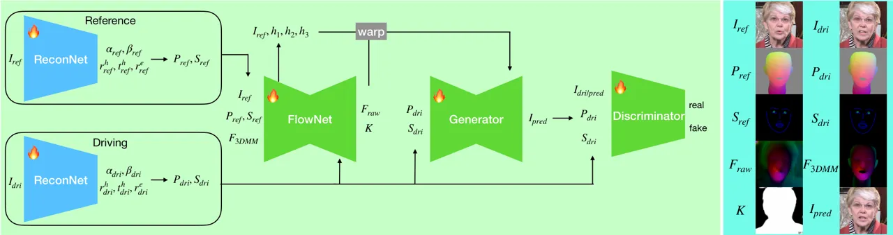
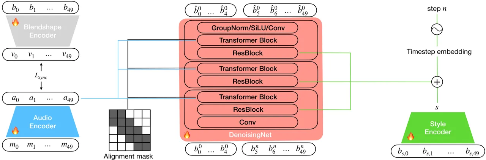
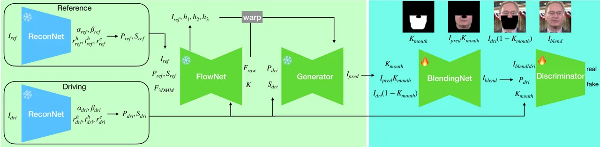
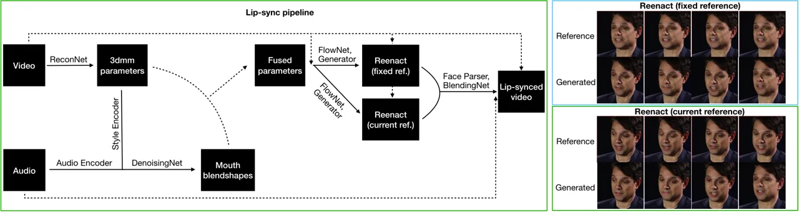
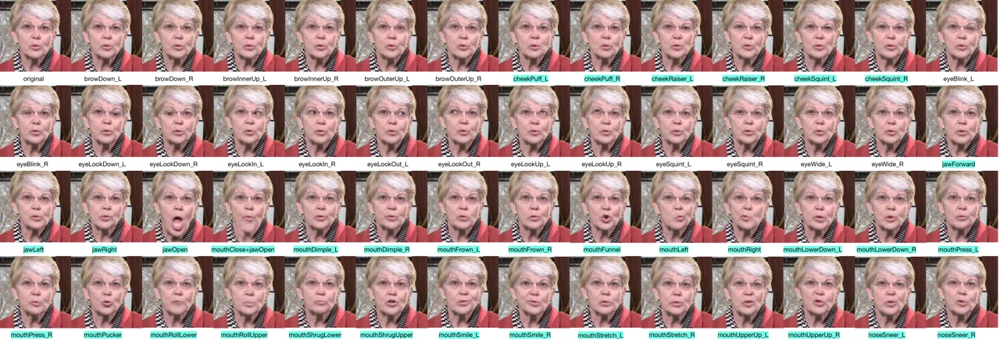
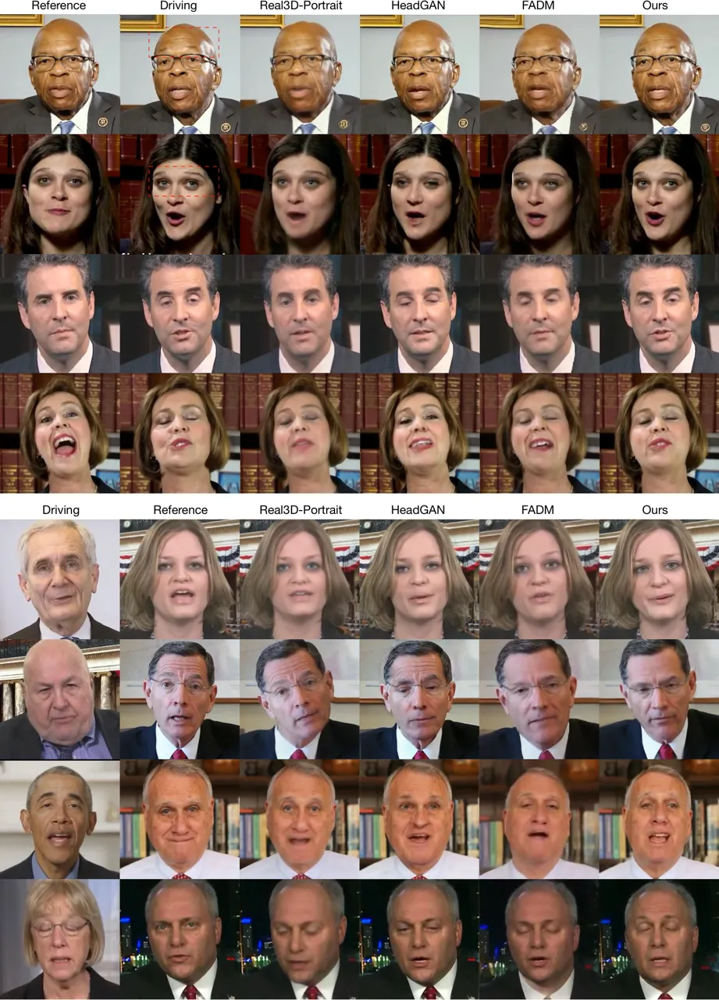
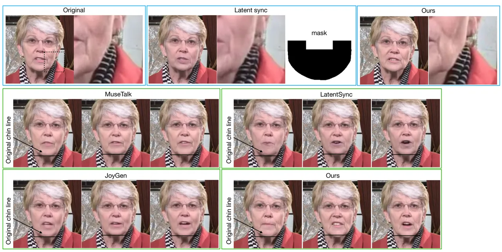
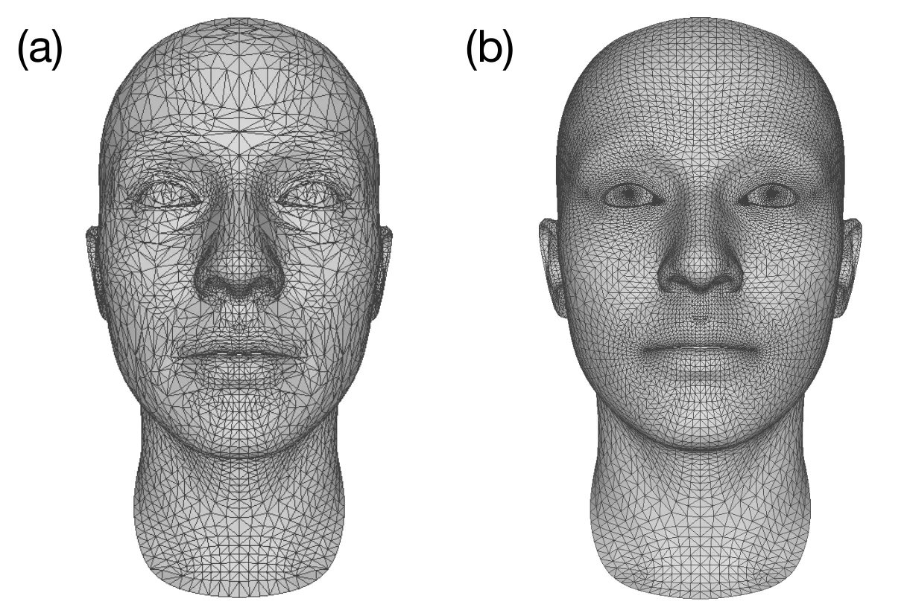
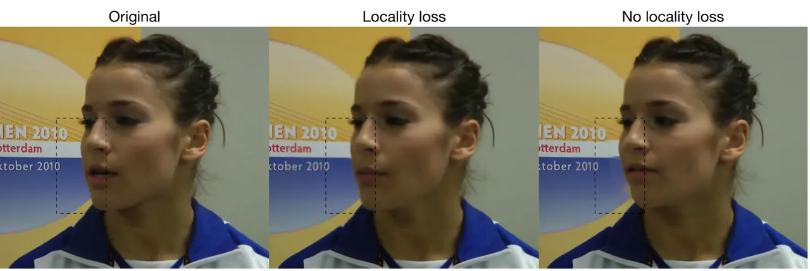
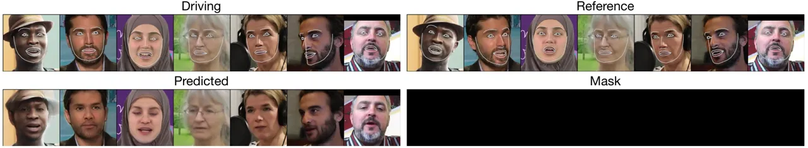

JOLT3D

# JOLT3D: Joint Learning of Talking Heads and 3DMM Parameters with Application to Lip-Sync

Sungjoon Park    Minsik Park    Haneol Lee    Jaesub Yun    Donggeon Lee

###### Abstract

In this work, we revisit the effectiveness of 3DMM for talking head
synthesis by jointly learning a 3D face reconstruction model and a
talking head synthesis model. This enables us to obtain a FACS-based
blendshape representation of facial expressions that is optimized for
talking head synthesis. This contrasts with previous methods that either
fit 3DMM parameters to 2D landmarks or rely on pretrained face
reconstruction models. Not only does our approach increase the quality
of the generated face, but it also allows us to take advantage of the
blendshape representation to modify just the mouth region for the
purpose of audio-based lip-sync. To this end, we propose a novel
lip-sync pipeline that, unlike previous methods, decouples the original
chin contour from the lip-synced chin contour, and reduces flickering
near the mouth. Project page:
[https://park-sungjoon.github.io/jolt3d/](https://park-sungjoon.github.io/jolt3d/)

^(†)^(†)email: fatrat@snu.ac.kr^(†)^(†)email:
mspark@hudson-ai.com^(†)^(†)email:
haneol.lee@hudson-ai.com^(†)^(†)email:
jaesub.yun@hudson-ai.com^(†)^(†)email:
donggeon.lee@hudson-ai.com^(†)^(†)affiliation: Hudson AI  
Seoul, KR

## 1 Introduction

The 3D morphable face model (3DMM) \[Egger et al.(2020)Egger, Smith,
Tewari, Wuhrer, Zollhoefer, Beeler, Bernard, Bolkart, Kortylewski,
Romdhani, et al.\] is an important and widely used tool for modeling the
human face. With the advent of deep learning, the task of monocular 3D
face reconstruction from in-the-wild face images using the 3DMM has been
extensively studied \[Tewari et al.(2017)Tewari, Zollhofer, Kim,
Garrido, Bernard, Perez, and Theobalt, Deng et al.(2019b)Deng, Yang, Xu,
Chen, Jia, and Tong, Li et al.(2020)Li, Bladin, Zhao, Chinara, Ingraham,
Xiang, Ren, Prasad, Kishore, Xing, et al., Daněček et al.(2022)Daněček,
Black, and Bolkart, Chai et al.(2023)Chai, Zhang, He, Tan, Baltrusaitis,
Wu, Li, Zhao, Yuan, and Bian\]. This has motivated the use of 3DMMs for
talking head synthesis (THS). Although many efforts have been made in
this direction, the idea has not gained popularity. This is because
existing approaches typically extract the 3DMM parameters either via
landmark fitting \[Doukas et al.(2021)Doukas, Zafeiriou, and Sharmanska,
Zhang et al.(2021b)Zhang, Li, Ding, and Fan, Ye et al.(2024)Ye, Zhong,
Ren, Yang, Li, Huang, Jiang, He, Huang, Liu, et al.\] or through
pretrained models \[Yi et al.(2020)Yi, Ye, Zhang, Bao, and Liu, Wu
et al.(2021)Wu, Jia, Wang, Dou, Duan, and Deng, Ren et al.(2021)Ren, Li,
Chen, Li, and Liu, Ye et al.(2022)Ye, Sun, Wen, Sun, Lv, Yi, and Liu, Xu
et al.(2023)Xu, Zhu, Zhang, Han, Chu, Tai, Wang, Xie, and Liu, Zhang
et al.(2023a)Zhang, Cun, Wang, Zhang, Shen, Guo, Shan, and Wang, Ji
et al.(2024)Ji, Lin, Ding, Tai, Zhu, Hu, Luo, Ge, and Wang, Zeng
et al.(2023)Zeng, Liu, Gao, Liu, Li, Liu, and Zhang, Wang
et al.(2025)Wang, Wu, Xu, Huang, and Lv\]. The former approach is
inherently limited, as 2D landmarks cannot fully capture the 3D geometry
of the face. This limitation is exacerbated by the fact that
off-the-shelf landmark detectors are often trained on noisy
human-annotated labels. The latter approach is constrained by the
quality of pretrained 3D face reconstruction models—referred to as
ReconNet in this work—which may not yield satisfactory results. In
particular, off-the-shelf ReconNets \[Deng et al.(2019b)Deng, Yang, Xu,
Chen, Jia, and Tong, Feng et al.(2021)Feng, Feng, Black, and Bolkart,
Daněček et al.(2022)Daněček, Black, and Bolkart\] are typically trained
using photometric losses by utilizing the texture map of the Basel Face
Model \[Paysan et al.(2009)Paysan, Knothe, Amberg, Romdhani, and Vetter,
Gerig et al.(2018)Gerig, Morel-Forster, Blumer, Egger, Luthi, Schönborn,
and Vetter\]. This is suboptimal because these 3DMM parameters are not
optimized for THS, and the texture map of the Basel Face Model cannot
accurately capture the facial attributes.

Moreover, using a pretrained ReconNet limits the flexibility of adopting
a different 3DMM than the one it was originally trained with. This is
because one must not only retrain the ReconNet, but also consider the
fact that not all 3DMMs come with a texture map. Popular ReconNets such
as D3DFR \[Deng et al.(2019b)Deng, Yang, Xu, Chen, Jia, and Tong\],
DECA \[Feng et al.(2021)Feng, Feng, Black, and Bolkart\], and
EMOCA \[Daněček et al.(2022)Daněček, Black, and Bolkart\] are based on
FLAME \[Li et al.(2020)Li, Bladin, Zhao, Chinara, Ingraham, Xiang, Ren,
Prasad, Kishore, Xing, et al.\] or FaceWarehouse \[Cao et al.(2013)Cao,
Weng, Zhou, Tong, and Zhou\]. However, the expression parameters of
FLAME are hard to interpret because they are generated by PCA. Since
there are many alternatives to the 3DMM for encoding the facial
attributes, such as neural embeddings \[Drobyshev et al.(2022)Drobyshev,
Chelishev, Khakhulin, Ivakhnenko, Lempitsky, and Zakharov, Drobyshev
et al.(2024)Drobyshev, Casademunt, Vougioukas, Landgraf, Petridis, and
Pantic, Xu et al.(2025)Xu, Chen, Guo, Yang, Li, Zang, Zhang, Tong, and
Guo\] or keypoints \[Siarohin et al.(2019)Siarohin, Lathuilière,
Tulyakov, Ricci, and Sebe, Wang et al.(2021)Wang, Mallya, and Liu, Guo
et al.(2024)Guo, Zhang, Liu, Zhong, Zhang, Wan, and Zhang\], FLAME
offers limited advantage over these alternatives. The FaceWarehouse uses
blendshapes based on Facial Action Coding System \[Ekman and
Friesen(1978)\] (FACS), but does not have eyeball mesh, which makes gaze
control difficult without additional modeling.

In this work, we propose to jointly train the ReconNet and the THS
model. To the best of our knowledge, this is the first effort towards
training a ReconNet that is optimized for THS. Instead of using FLAME or
FaceWarehouse, we adopt the ICT-FaceKit \[Li et al.(2020)Li, Bladin,
Zhao, Chinara, Ingraham, Xiang, Ren, Prasad, Kishore, Xing, et al.\],
which has 55 blendshapes (compared to 46 in FaceWarehouse) and includes
eyeball geometry. We prefer ICT-FaceKit because the FACS-based
blendshapes enable intuitive control of the face. The eyeballs also
allow gaze control without additional modeling \[Doukas
et al.(2023)Doukas, Ververas, Sharmanska, and Zafeiriou\]. Although
ICT-FaceKit lacks a texture map, this is not a hindrance due to our
training strategy. We therefore free 3DMM-based THS from the limitations
outlined above.

Thanks to the disentangled control of facial regions enabled by
FACS-based blendshapes, it is possible to modify only the mouth-related
blendshapes for lip-sync applications. For this, we train a model to
predict mouth blendshapes from audio and talking style using a diffusion
model \[Sohl-Dickstein et al.(2015)Sohl-Dickstein, Weiss,
Maheswaranathan, and Ganguli, Song et al.(2020)Song, Sohl-Dickstein,
Kingma, Kumar, Ermon, and Poole, Ho et al.(2020)Ho, Jain, and Abbeel\].
The face generated by using these mouth blendshapes can then be blended
into the original video by a simple face blending network. However,
blending the generated face into the original video is complicated by
the choice of the mouth mask. Common approaches include masking the
lower half of the face \[Prajwal et al.(2020)Prajwal, Mukhopadhyay,
Namboodiri, and Jawahar\], using a fixed square region \[Zhang
et al.(2023b)Zhang, Hu, Deng, Fan, Lv, and Ding\], or employing a
mouth-shape-agnostic mask \[Li et al.(2024)Li, Zhang, Xu, Xie, Feng,
Peng, and Xing\]. We find these strategies unsatisfactory, and propose
instead to inpaint just the mouth region after modifying the chin
contour of the original face, see Fig. 4 for an overview of the lip-sync
pipeline.

The main contributions of this work are as follows:

- •
  We propose JOLT3D, a novel framework where ReconNet is optimized for
  THS.
- •
  We achieve disentangled control over FACS-based blendshapes, including
  gaze.
- •
  We propose a novel lip-sync pipeline that avoids the common mouth-mask
  artifacts.

## 2 Related works

### 2.1 Audio-driven talking head synthesis

Early works directly mapped audio to lip shapes by encoding and decoding
the reference images and audio, constrained by a lip-sync loss \[Prajwal
et al.(2020)Prajwal, Mukhopadhyay, Namboodiri, and Jawahar, Park
et al.(2022)Park, Kim, Hong, Choi, and Ro, Muaz et al.(2023)Muaz, Jang,
Tripathi, Mani, Ouyang, Gadde, Gecer, Elizondo, Madad, and Nair, Wang
et al.(2023)Wang, Qian, Zhang, Tan, and Li\]. Other approaches predicted
3DMMs \[Zhang et al.(2021a)Zhang, Zhao, Huang, Zeng, Ni, Budagavi, and
Guo, Zhang et al.(2021b)Zhang, Li, Ding, and Fan, Zhang
et al.(2023a)Zhang, Cun, Wang, Zhang, Shen, Guo, Shan, and Wang, Ji
et al.(2024)Ji, Lin, Ding, Tai, Zhu, Hu, Luo, Ge, and Wang, Ye
et al.(2024)Ye, Zhong, Ren, Yang, Li, Huang, Jiang, He, Huang, Liu,
et al.\] or facial landmarks \[Zhong et al.(2023)Zhong, Fang, Cai, Wei,
Zhao, Lin, and Li\] from audio for THS. Recent methods use diffusion
models to predict various forms of facial representations from audio
\[Xu et al.(2025)Xu, Chen, Guo, Yang, Li, Zang, Zhang, Tong, and Guo,
Liu et al.(2024)Liu, Chen, Fan, Du, Chen, Chen, and Yu, Xu
et al.(2024)Xu, Li, Su, Shang, Zhang, Liu, Wang, Yao, and Zhu, Jiang
et al.(2024)Jiang, Liang, Yang, Lin, Zhong, and Zheng, Li
et al.(2024)Li, Zhang, Xu, Xie, Feng, Peng, and Xing\] for THS. In our
work, 3DMM is used as the facial representation for THS, and diffusion
model is used to predict the 3DMM parameters from audio and talking
style.

### 2.2 Talking head synthesis based on feature warping

In this family of methods, faces are generated by decoding the warped
features extracted from reference images. Note that because convolution
is translation-equivariant, smoothly varying warping fields tend to
produce temporally consistent results. Some methods constrain the
warping field to affine transformations \[Zhang et al.(2021b)Zhang, Li,
Ding, and Fan, Zhang et al.(2023b)Zhang, Hu, Deng, Fan, Lv, and Ding\].
Implicit keypoints, which can be either 2D \[Siarohin
et al.(2019)Siarohin, Lathuilière, Tulyakov, Ricci, and Sebe, Ji
et al.(2022)Ji, Zhou, Wang, Wu, Wu, Xu, and Cao\] or 3D \[Wang
et al.(2021)Wang, Mallya, and Liu, Zhang et al.(2023a)Zhang, Cun, Wang,
Zhang, Shen, Guo, Shan, and Wang, Guo et al.(2024)Guo, Zhang, Liu,
Zhong, Zhang, Wan, and Zhang\], are also commonly used to guide the
warping process. Other approaches rely on dense warping fields, which
can be either 2D \[Doukas et al.(2021)Doukas, Zafeiriou, and Sharmanska,
Doukas et al.(2023)Doukas, Ververas, Sharmanska, and Zafeiriou\] or
3D \[Drobyshev et al.(2022)Drobyshev, Chelishev, Khakhulin, Ivakhnenko,
Lempitsky, and Zakharov, Drobyshev et al.(2024)Drobyshev, Casademunt,
Vougioukas, Landgraf, Petridis, and Pantic, Xu et al.(2025)Xu, Chen,
Guo, Yang, Li, Zang, Zhang, Tong, and Guo\]. The neural embeddings used
in MegaPortraits \[Drobyshev et al.(2022)Drobyshev, Chelishev,
Khakhulin, Ivakhnenko, Lempitsky, and Zakharov\] can capture detailed
expressions \[Drobyshev et al.(2024)Drobyshev, Casademunt, Vougioukas,
Landgraf, Petridis, and Pantic\], although it requires careful treatment
of the latent vectors. Finally, some methods propose warping the
features implicitly \[Mallya et al.(2022)Mallya, Wang, and Liu, Ye
et al.(2024)Ye, Zhong, Ren, Yang, Li, Huang, Jiang, He, Huang, Liu,
et al.\].

In our work, we jointly train a ReconNet with a THS model that is based
on dense 2D warping fields. This turns out to be very effective, and we
expect that similar compatibility will hold for THS methods based on 3D
warping fields.

### 2.3 Talking head synthesis that uses 3DMMs

While numerous studies use 3DMMs for THS, they typically either fit the
3DMM parameters to 2D facial landmarks \[Zhang et al.(2021b)Zhang, Li,
Ding, and Fan, Doukas et al.(2021)Doukas, Zafeiriou, and Sharmanska, Ye
et al.(2024)Ye, Zhong, Ren, Yang, Li, Huang, Jiang, He, Huang, Liu,
et al.\], or use a pretrained ReconNet to extract the 3DMM
parameters \[Yi et al.(2020)Yi, Ye, Zhang, Bao, and Liu, Wu
et al.(2021)Wu, Jia, Wang, Dou, Duan, and Deng, Zhang
et al.(2021a)Zhang, Zhao, Huang, Zeng, Ni, Budagavi, and Guo, Ren
et al.(2021)Ren, Li, Chen, Li, and Liu, Ye et al.(2022)Ye, Sun, Wen,
Sun, Lv, Yi, and Liu, Xu et al.(2023)Xu, Zhu, Zhang, Han, Chu, Tai,
Wang, Xie, and Liu, Zhang et al.(2023a)Zhang, Cun, Wang, Zhang, Shen,
Guo, Shan, and Wang, Zeng et al.(2023)Zeng, Liu, Gao, Liu, Li, Liu, and
Zhang, Sun et al.(2024a)Sun, Li, Di, Liang, Zhang, Li, Chen, and Cui,
Wang et al.(2025)Wang, Wu, Xu, Huang, and Lv\]. In contrast, our
approach jointly trains ReconNet with the talking head generator. This
ensures that the 3DMM parameters are optimized for the task of THS.

## 3 Joint Training of ReconNet and Generator



Figure 1: Joint training of ReconNet and Generator. The ReconNet
extracts 3DMM parameters from the reference ($`I_{ref}`$) and the
driving ($`I_{dri}`$) images. These parameters are encoded into
$`P_{ref/dri}`$, $`S_{ref/dri}`$, and $`F_{3DMM}`$. FlowNet takes
$`I_{ref}`$, $`P_{ref}`$, $`S_{ref}`$, and $`F_{3DMM}`$ as inputs to
predict the raw flow field $`F_{raw}`$ and the mask $`K`$. $`I_{ref}`$
and the intermediate features of FlowNet ($`h_{i}`$) are then warped.
The Generator takes $`P_{dri}`$, $`S_{dri}`$, and the warped features to
predict the driving face image $`I^{pred}_{dri}`$. The Discriminator
receives either $`I_{pred}`$ or $`I_{dri}`$, along with $`S_{dri}`$ and
$`P_{dri}`$, to determine whether the image looks realistic.

The overview of our joint training scheme is shown in Fig. 1. The model
architecture is similar to that of HeadGAN \[Doukas et al.(2021)Doukas,
Zafeiriou, and Sharmanska\], but there are important differences that
will be discussed below. For further details, please see the
Supplementary Materials (SM).

### 3.1 Processing the 3DMM for talking head synthesis

The ICT-FaceKit contains many accessories that are superfluous for our
purposes, so we retain only the face and eyeballs. Because the
ICT-FaceKit does not define how the gaze blendshapes (eyeLookUp,
eyeLookDown, eyeLookLeft, eyeLookRight) should be coupled to gaze
directions, we define these relations ourselves, see SM for pseudocode.

Let $`M`$ denote the face mesh and $`\mathbf{c}`$ the projective camera
parameters. To utilize 3DMM for THS, we render the mean face coordinates
$`P=Renderer(M,\mathbf{c})`$, similarly to \[Zhu et al.(2016)Zhu, Lei,
Liu, Shi, and Li, Doukas et al.(2021)Doukas, Zafeiriou, and
Sharmanska\], using PyTorch3D \[Ravi et al.(2020)Ravi, Reizenstein,
Novotny, Gordon, Lo, Johnson, and Gkioxari\]. We also draw sketch $`S`$
of the face using a two-channel representation: one for the overall face
and one for the iris. We also compute the 2D flow field $`F_{3DMM}`$
resulting from the changes in 3DMM parameters by calculating how the
projected vertex coordinates shift between the reference and target
faces, see Fig. 1 for visualization.

### 3.2 Pretraining the ReconNet

For stable joint training, we pretrain the ReconNet using facial
landmarks. The ReconNet outputs $`\alpha`$, $`\beta`$, $`r^{h}`$,
$`t^{h}`$, $`r^{e}`$, where $`\alpha`$ is the identity, $`\beta`$ is the
blendshape, $`r^{h}`$ and $`t^{h}`$ are the head rotation and
translation, and $`r^{e}`$ is the eyeball rotation. The ReconNet is
trained to fit the projected 3DMM vertices to 2D landmark labels
obtained from off-the-shelf landmark detectors \[Grishchenko
et al.(2020)Grishchenko, Ablavatski, Kartynnik, Raveendran, and
Grundmann\]. We use L2 loss for landmarks and apply L2 regularization
for identity and blendshapes. We also include L2 loss between
$`\alpha`$’s extracted from two different images of a person for
identity consistency, and constrain the blendshapes to lie between 0 and

1.

### 3.3 Joint training of ReconNet and the Generator

We modify the feature warping mechanism of HeadGAN, which is unstable.
In the original formulation, FlowNet predicts the mask $`K`$, which
determines where to apply the warping, and the raw flow field
$`F_{raw}`$. Then, the flow field and the warped image are [computed
as](https://github.com/michaildoukas/headGAN/blob/c1ed8257b447df92d82236d361c72cf929135f1d/models/generator.py#L258):

```math
\displaystyle F=KF_{raw},\quad I_{warped}=F\star I. \tag{1}
```

The multiplication in the first equation is element-wise, and $`\star`$
denotes the warping operation. We find that $`K`$ can collapse to $`0`$
during training, that is, $`F=0`$. We hypothesize that this is because
(1) Initially, it is difficult to learn $`F`$ because the Generator does
not produce a meaningful face. (2) As a result, it is easy for the
Generator to rely on $`S_{dri}`$ and $`P_{dri}`$ for the face shape, and
the unwarped features for the face and background textures. (3) Once
$`K=0`$, training gets stuck because the magnitude of $`F`$ is
determined by both $`F_{raw}`$ (linear activation) and $`K`$ (sigmoid
activation). We therefore decouple magnitude of flow from $`K`$ as
follows:

```math
\displaystyle I_{warped}=K(F_{raw}\star I)+(1-K)I. \tag{2}
```

For joint training, we add to the losses in Sec. 3.2 the standard
photometric losses and the GAN losses. For spatial locality of mouth
blendshapes, we generate face after modifying just the mouth
blendshapes, and impose L1 pixel loss on changes that occur outside the
mouth region. To prevent head pose or expression from leaking into the
$`\alpha`$, we randomly swap the identity parameters between the driving
and the reference. To prevent identity from leaking into $`\beta`$, we
randomly shuffle blendshapes within the batch and impose cosine
similarity between the ArcFace \[Deng et al.(2019a)Deng, Guo, Xue, and
Zafeiriou\] embeddings of the original and the generated face.

## 4 Application to Lip-Sync

### 4.1 Audio-to-Blendshape





Figure 2: The Audio-to-Blendshape model. The Blendshape Encoder is an
auxiliary model for computing the sync-loss, and is not used during
inference.

Figure 3: BlendingNet takes the mouth region of the predicted face, the
region outside the mouth of the original face, and the mouth mask to
predict the blended face.

For lip-sync, we train a diffusion model \[Park and Cho(2023), Sun
et al.(2024b)Sun, Lv, Ye, Lin, Sheng, Wen, Yu, and Liu\] to predict the
$`35`$ mouth blendshapes (shown in Fig. 6) from audio and talking style
embeddings, see Fig. 3.

First, note that the video is set to $`25`$ fps and audio is sampled at
$`16`$ kHz. To compute the audio embeddings, we take $`2`$s of audio and
compute the Mel spectrogram with $`80`$ frequency bins and a hop size of
$`200`$. The Mel spectrogram is split into $`50`$ equally-spaced
overlapping chunks $`m_{i}\in\mathbb{R}^{16\times 80}`$. The Audio
Encoder encodes $`m_{i}`$ into $`a_{i}\in\mathbb{R}^{512}`$,
$`i=0,...,49`$. To capture the speaking style, we sample $`50`$
consecutive mouth blendshapes $`b_{s,i}\in\mathbb{R}^{35}`$,
$`i=0,...,49`$ (spanning $`2`$s) from a different part of the video. The
Style Encoder encodes $`b_{s,i}`$ into $`s\in\mathbb{R}^{512}`$.

The DenoisingNet $`\mathcal{N}`$ transforms noise into mouth
blendshapes, conditioned on $`a_{i}`$ and $`s`$. Let $`b_{i}`$,
$`i=0,...,49`$ be the mouth blendshapes corresponding to $`a_{i}`$. The
first five blendshapes are used to provide the temporal context to
$`\mathcal{N}`$, enabling it to generate a continuous blendshape
sequence. For the remaining blendshapes, $`\mathcal{N}`$ is used to
transform the noisy blendshapes $`b^{n}`$ into denoised blendshapes as
$`\hat{b}^{0}=\mathcal{N}(b_{0:4},b^{n}_{5:49},a_{0:49},n)`$. Here,
$`n`$ is the time step in the denoising process with the convention that
$`n=0`$ corresponds to the original distribution and $`n=T`$ corresponds
to pure noise.

We train using the denoising loss, supplemented by velocity and
smoothness losses. To help train the Audio Encoder, we use the
Blendshape Encoder to encode the blendshapes $`b_{i}`$ corresponding to
$`a_{i}`$ into $`v_{i}`$, and compute the sync-loss between them (see SM
for details).

### 4.2 Face Blending

As will be detailed in Sec. 4.3, a difficulty with lip-syncing is that
only the mouth region should be changed. We approach this problem by
first training a neural net that blends the face that is generated from
a fixed reference frame into the original video. For simplicity, we
train a UNet $`\mathcal{B}`$ using the GAN framework (see Fig. 3).

Let $`I_{dri}`$ be the original image, $`K_{mouth}`$ the mouth
segmentation map, and $`I_{pred}`$ the predicted image. The blended
image is given by
$`I_{blend}=\mathcal{B}(I_{dri}(1-K_{mouth}),K_{mouth},I_{pred}K_{mouth})`$.
The network is trained using photometric and GAN losses.



Figure 4: Left: lip-sync pipeline. Right: reenactment with fixed and
current references.

### 4.3 Full Lip-Sync Pipeline





Figure 5: Responses to changes in blendshapes. The mouth blendshapes are
highlighted.

Figure 6: Results of self-reenactment (above) and cross-reenactment
(below).

Our lip-sync (dubbing) pipeline is shown in Fig. 4. We assume that the
face to be lip-synced has been detected and that the dubbing audio is
provided. We begin by cropping the face from the video and extracting
the 3DMM parameters using the ReconNet. Next, we extract the style and
audio embeddings, which are used to predict denoised mouth blendshapes
$`\hat{b}`$. These mouth blendshapes $`\hat{b}`$ are inserted into the
3DMM parameters extracted from the original video. Using the fused 3DMM
parameters, we reenact the (cropped) face twice: (1) with a fixed
reference frame to obtain $`I_{FF}`$, and (2) with the current frame
$`I_{CF}`$ (see Fig. 4). We extract the mouth region from $`I_{CF}`$,
and blend $`I_{FF}`$ into $`I_{CF}`$. The blended face is then
composited back into the original video.

We now explain the rationale behind generating the face twice to obtain
$`I_{FF}`$ and $`I_{CF}`$. As can be expected, simply inpainting the
mouth region of the original face using $`I_{FF}`$ yields unsatisfactory
results since the chin contour cannot be modified. On the other hand,
inpainting a large, mouth-shape-agnostic region using $`I_{FF}`$ can
result in noticeable flickering, especially when the neighboring regions
of the mask differ between the reference and the current frame. Using
the current frame as the reference also results in unnatural video
because the reference frame keeps changing. We resolve this difficulty
by first adjusting the face contour appropriately to obtain $`I_{CF}`$,
and then blending in $`I_{FF}`$. This can also enhance video
consistency, especially when teeth are visible in the fixed reference
frame.

## 5 Experiments

### 5.1 Dataset

We use various publicly available datasets: AVSpeech \[Ephrat
et al.(2018)Ephrat, Mosseri, Lang, Dekel, Wilson, Hassidim, Freeman, and
Rubinstein\], VoxCeleb2 \[Chung et al.(2018)Chung, Nagrani, and
Zisserman\], CelebV-HQ \[Zhu et al.(2022)Zhu, Wu, Zhu, Jiang, Tang,
Zhang, Liu, and Loy\], TalkingHead-1KH \[Wang et al.(2021)Wang, Mallya,
and Liu\], and VFHQ \[Xie et al.(2022)Xie, Wang, Zhang, Dong, and
Shan\]. We use the topiq_nr-face metric in pyiqa \[Chen
et al.(2024)Chen, Mo, Hou, Wu, Liao, Sun, Yan, and Lin, Chen and
Mo(2022)\] to filter out faces with quality lower than $`0.4`$. Since
audio-visual correlation is important for training the
Audio-to-Blendshape model, we restore the sync, and remove data with
probability-at-offset $`<0.8`$ or offscreen ratio $`>0.354`$ \[Park
et al.(2024)Park, Yun, Lee, and Park\].

### 5.2 FACS based Blendshapes

In Fig. 6, we show that, in many cases, the generated face responds to
changes in blendshapes as expected. However, the model does not respond
adequately to blendshapes such as cheekPuff. We hypothesize that this is
due to the use of 2D warping fields and the absence of multi-view
consistency during training.

### 5.3 Self-reenactment and cross-reenactment

In Table 2 and Fig. 6, we compare our method on the task of facial
expression transfer with representative THS methods that utilize 3DMM.
For evaluation, we randomly sample 52 videos from the HDTF dataset, and
parts of the VoxCeleb2 dataset (about 1 hour) that are not used for
training. We compute L1, PSNR, SSIM, and FID \[Heusel
et al.(2017)Heusel, Ramsauer, Unterthiner, Nessler, and Hochreiter\] to
evaluate image quality. We compute lip-sync metrics LSE-D and LSE-C
\[Prajwal et al.(2020)Prajwal, Mukhopadhyay, Namboodiri, and Jawahar\]
to evaluate mouth shape quality, and compute CSIM \[Deng
et al.(2019a)Deng, Guo, Xue, and Zafeiriou\] to evaluate identity
preservation. Our method outperforms others in most cases, both
qualitatively and quantitatively, see SM for more details.

### 5.4 Lip-Syncing



Figure 7: First row: Large mouth mask in LatentSync can cause flickering
near the mouth. Second and third rows: MuseTalk and JoyGen cannot change
the chin contour, causing face shape to change. Our approach does show
these problems.

In Table 2, we compare our method with LatentSync \[Li et al.(2024)Li,
Zhang, Xu, Xie, Feng, Peng, and Xing\], MuseTalk \[Zhang
et al.(2024b)Zhang, Liu, Chen, Wu, Zeng, Zhan, He, Huang, and Zhou\],
and JoyGen \[Wang et al.(2025)Wang, Wu, Xu, Huang, and Lv\] on the task
of lip-sync. LatentSync outperforms other methods in terms of the LSE-D
and LSE-C metrics. One reason behind this is that LatentSync directly
optimizes the sync-loss. In fact, it achieves better lip-sync metrics
even than the original videos, for which LSE-D is $`6.8948`$ (HDTF) and
$`7.68`$ (VoxCeleb2), and LSE-C is $`8.22`$ (HDTF) and $`6.12`$
(VoxCeleb2).

Although our method does not achieve the best LSE-D and LSE-C, it
reduces visual artifacts (see Fig. 7). LatentSync uses a large,
mouth-shape-agnostic mask, and inpaints the masked region. As can be
seen, this can lead to flickering when the visual pattern near the mouth
is complex. In contrast, our approach does not suffer from such
artifacts.

Another common artifact of lip-synced videos is the preservation of the
original chin contour. The source of the issue lies in the masking
strategy. For example, MuseTalk and JoyGen inpaint the lower part of the
face using a rectangular mask. This causes the model to associate the
chin contour with the mask size. As a result, the chin line of the
original video is preserved in the lip-synced video, which causes
lengthening or shortening of the face. This is not an issue when our
lip-sync pipeline is adopted because we modify the original chin contour
before blending in the lip-synced face. To quantitatively evaluate this,
we define the metric
$`\Delta CL=\frac{|y_{2,\textrm{orig}}-y_{2,\textrm{lipsync}}|}{y_{\textrm{2,orig}}-y_{\textrm{1,orig}}}`$.
Here, $`y_{1}`$ and $`y_{2}`$ are the top and bottom coordinates of face
bounding box, and the subscripts orig and lipsync indicate original and
lip-synced results, respectively. As shown in Table 2 and Fig. 7,
MuseTalk and JoyGen fail to modify the chin line, and the correlation
persists in LatentSync as well because the mouth mask cannot completely
eliminate information on the original mouth shape.

| Method                                                                                            | L1$`\downarrow`$ | PSNR$`\uparrow`$ | SSIM$`\uparrow`$ | FID$`\downarrow`$ | LSE-D$`\downarrow`$ | LSE-C$`\uparrow`$ | CSIM$`\uparrow`$ |
| ------------------------------------------------------------------------------------------------- | ---------------- | ---------------- | ---------------- | ----------------- | ------------------- | ----------------- | ---------------- |
| HDTF dataset                                                                                      |                  |                  |                  |                   |                     |                   |                  |
| Real3D-Portrait \[Ye et al.(2024)Ye, Zhong, Ren, Yang, Li, Huang, Jiang, He, Huang, Liu, et al.\] | 8.81             | 22.8             | 0.822            | 24.1, 48.3        | 8.12, 8.42          | 6.71, 6.45        | 0.912, 0.887     |
| HeadGAN \[Doukas et al.(2021)Doukas, Zafeiriou, and Sharmanska\]                                  | 8.90             | 22.6             | 0.787            | 20.5, 47.0        | 7.79, 9.10          | 7.06, 5.61        | 0.907, 0.791     |
| FADM \[Zeng et al.(2023)Zeng, Liu, Gao, Liu, Li, Liu, and Zhang\]                                 | 7.20             | 25.5             | 0.855            | 16.4, 46.4        | 8.12, 8.96          | 6.69, 5.94        | 0.931, 0.845     |
| Ours                                                                                              | 5.18             | 27.7             | 0.891            | 11.3, 43.9        | 7.02, 7.83          | 8.12, 7.21        | 0.949, 0.833     |
| VoxCeleb2 dataset                                                                                 |                  |                  |                  |                   |                     |                   |                  |
| Real3D-Portrait \[Ye et al.(2024)Ye, Zhong, Ren, Yang, Li, Huang, Jiang, He, Huang, Liu, et al.\] | 12.2             | 21.1             | 0.799            | 17.1, 19.5        | 9.00, 9.42          | 4.66, 4.22        | 0.832, 0.808     |
| HeadGAN \[Doukas et al.(2021)Doukas, Zafeiriou, and Sharmanska\]                                  | 12.1             | 21.4             | 0.742            | 13.1, 24.9        | 8.51, 9.26          | 5.11, 4.22        | 0.795, 0.442     |
| FADM \[Zeng et al.(2023)Zeng, Liu, Gao, Liu, Li, Liu, and Zhang\]                                 | 9.97             | 23.9             | 0.817            | 9.97, 23.1        | 9.07, 9.88          | 4.46, 3.63        | 0.882, 0.624     |
| Ours                                                                                              | 7.42             | 25.7             | 0.852            | 7.19, 24.9        | 7.90, 8.62          | 5.94, 5.12        | 0.912, 0.652     |

| Method                                                                                | FID$`\downarrow`$ | LSE-D$`\downarrow`$ | LSE-C $`\uparrow`$ | CSIM$`\uparrow`$ | $`\Delta`$CL$`\uparrow`$ |
| ------------------------------------------------------------------------------------- | ----------------- | ------------------- | ------------------ | ---------------- | ------------------------ |
| HDTF dataset                                                                          |                   |                     |                    |                  |                          |
| LatentSync \[Li et al.(2024)Li, Zhang, Xu, Xie, Feng, Peng, and Xing\]                | 4.05, 11.4        | 5.78, 6.00          | 9.76, 9.41         | 0.967, 0.962     | 1.04, 1.26               |
| MuseTalk \[Zhang et al.(2024b)Zhang, Liu, Chen, Wu, Zeng, Zhan, He, Huang, and Zhou\] | 4.76, 11.9        | 8.30, 10.8          | 6.64, 4.09         | 0.967, 0.965     | 0.882, 0.957             |
| JoyGen \[Wang et al.(2025)Wang, Wu, Xu, Huang, and Lv\]                               | 8.87, 18.0        | 7.19, 8.90          | 7.89, 5.90         | 0.971, 0.968     | 0.832, 0.926             |
| Ours blended                                                                          | 3.51, 10.5        | 8.26, 8.99          | 6.58, 5.80         | 0.972, 0.967     | 1.08, 1.32               |
| VoxCeleb2 dataset                                                                     |                   |                     |                    |                  |                          |
| LatentSync \[Li et al.(2024)Li, Zhang, Xu, Xie, Feng, Peng, and Xing\]                | 2.15, 3.22        | 6.41, 6.84          | 7.94, 7.21         | 0.964, 0.953     | 1.04, 1.19               |
| MuseTalk \[Zhang et al.(2024b)Zhang, Liu, Chen, Wu, Zeng, Zhan, He, Huang, and Zhou\] | 2.93, 3.81        | 8.58, 10.7          | 5.11, 2.88         | 0.918, 0.910     | 1.03, 1.05               |
| JoyGen \[Wang et al.(2025)Wang, Wu, Xu, Huang, and Lv\]                               | 5.14, 6.74        | 7.72, 9.54          | 6.10, 4.16         | 0.938, 0.927     | 1.02, 1.06               |
| Ours blended                                                                          | 1.91, 2.85        | 9.57, 9.57          | 3.93, 3.93         | 0.965, 0.959     | 1.17, 1.33               |

Table 1: Evaluation metrics for self-reenactment and cross-reenactment.

Table 2: Evaluation metrics for lip-sync with original and different
audio.

## 6 Conclusion

Contrary to common belief, we have shown that 3DMM remains a suitable
representation for the purpose of THS. The limitations of previous
approaches that rely on 3DMM stem from poor extraction of 3DMM
parameters, rather than from limitations of 3DMM itself. Using the
FACS-based blendshapes of ICT-FaceKit, we have also proposed a lip-sync
pipeline that allows modification of the chin contour and reduces
flickering near the mouth.

The fact that warping-field-based approaches to THS are highly
compatible with the joint learning of ReconNet has important
implications. For example, our method can readily be generalized to
approaches using 3D warping fields such as face-vid2vid \[Wang
et al.(2021)Wang, Mallya, and Liu\] by binding 3D keypoints to vertices
of the 3DMM. It would also be interesting to explore whether keypoints
can be bound to the 3DMM to control the tongue movement, or whether the
3DMM can be supplemented with additional latent vectors that capture
fine-grained facial details, such as wrinkles. We leave the answers to
these questions for future research.

## References

- \[Cao et al.(2013)Cao, Weng, Zhou, Tong, and Zhou\] Chen Cao, Yanlin
  Weng, Shun Zhou, Yiying Tong, and Kun Zhou. Facewarehouse: A 3d facial
  expression database for visual computing. _IEEE Transactions on
  Visualization and Computer Graphics_, 20(3):413–425, 2013.
- \[Chai et al.(2023)Chai, Zhang, He, Tan, Baltrusaitis, Wu, Li, Zhao,
  Yuan, and Bian\] Zenghao Chai, Tianke Zhang, Tianyu He, Xu Tan, Tadas
  Baltrusaitis, HsiangTao Wu, Runnan Li, Sheng Zhao, Chun Yuan, and
  Jiang Bian. Hiface: High-fidelity 3d face reconstruction by learning
  static and dynamic details. In _Proceedings of the IEEE/CVF
  International Conference on Computer Vision_, pages 9087–9098, 2023.
- \[Chen and Mo(2022)\] Chaofeng Chen and Jiadi Mo. IQA-PyTorch: Pytorch
  toolbox for image quality assessment. \[Online\]. Available:
  [https://github.com/chaofengc/IQA-PyTorch](https://github.com/chaofengc/IQA-PyTorch), 2022.
- \[Chen et al.(2024)Chen, Mo, Hou, Wu, Liao, Sun, Yan, and Lin\]
  Chaofeng Chen, Jiadi Mo, Jingwen Hou, Haoning Wu, Liang Liao, Wenxiu
  Sun, Qiong Yan, and Weisi Lin. Topiq: A top-down approach from
  semantics to distortions for image quality assessment. _IEEE
  Transactions on Image Processing_, 2024.
- \[Chung et al.(2018)Chung, Nagrani, and Zisserman\] Joon Son Chung,
  Arsha Nagrani, and Andrew Zisserman. Voxceleb2: Deep speaker
  recognition. _arXiv preprint arXiv:1806.05622_, 2018.
- \[Daněček et al.(2022)Daněček, Black, and Bolkart\] Radek Daněček,
  Michael J Black, and Timo Bolkart. Emoca: Emotion driven monocular
  face capture and animation. In _Proceedings of the IEEE/CVF Conference
  on Computer Vision and Pattern Recognition_, pages 20311–20322, 2022.
- \[Deng et al.(2019a)Deng, Guo, Xue, and Zafeiriou\] Jiankang Deng, Jia
  Guo, Niannan Xue, and Stefanos Zafeiriou. Arcface: Additive angular
  margin loss for deep face recognition. In _Proceedings of the IEEE/CVF
  conference on computer vision and pattern recognition_, pages
  4690–4699, 2019a.
- \[Deng et al.(2019b)Deng, Yang, Xu, Chen, Jia, and Tong\] Yu Deng,
  Jiaolong Yang, Sicheng Xu, Dong Chen, Yunde Jia, and Xin Tong.
  Accurate 3d face reconstruction with weakly-supervised learning: From
  single image to image set. In _Proceedings of the IEEE/CVF conference
  on computer vision and pattern recognition workshops_, pages 0–0,
  2019b.
- \[Doukas et al.(2021)Doukas, Zafeiriou, and Sharmanska\]
  Michail Christos Doukas, Stefanos Zafeiriou, and Viktoriia Sharmanska.
  Headgan: One-shot neural head synthesis and editing. In _Proceedings
  of the IEEE/CVF International conference on Computer Vision_, pages
  14398–14407, 2021.
- \[Doukas et al.(2023)Doukas, Ververas, Sharmanska, and Zafeiriou\]
  Michail Christos Doukas, Evangelos Ververas, Viktoriia Sharmanska, and
  Stefanos Zafeiriou. Free-headgan: Neural talking head synthesis with
  explicit gaze control. _IEEE Transactions on Pattern Analysis and
  Machine Intelligence_, 45(8):9743–9756, 2023.
- \[Drobyshev et al.(2022)Drobyshev, Chelishev, Khakhulin, Ivakhnenko,
  Lempitsky, and Zakharov\] Nikita Drobyshev, Jenya Chelishev, Taras
  Khakhulin, Aleksei Ivakhnenko, Victor Lempitsky, and Egor Zakharov.
  Megaportraits: One-shot megapixel neural head avatars. In _Proceedings
  of the 30th ACM International Conference on Multimedia_, pages
  2663–2671, 2022.
- \[Drobyshev et al.(2024)Drobyshev, Casademunt, Vougioukas, Landgraf,
  Petridis, and Pantic\] Nikita Drobyshev, Antoni Bigata Casademunt,
  Konstantinos Vougioukas, Zoe Landgraf, Stavros Petridis, and Maja
  Pantic. Emoportraits: Emotion-enhanced multimodal one-shot head
  avatars. In _Proceedings of the IEEE/CVF Conference on Computer Vision
  and Pattern Recognition_, pages 8498–8507, 2024.
- \[Egger et al.(2020)Egger, Smith, Tewari, Wuhrer, Zollhoefer, Beeler,
  Bernard, Bolkart, Kortylewski, Romdhani, et al.\] Bernhard Egger,
  William AP Smith, Ayush Tewari, Stefanie Wuhrer, Michael Zollhoefer,
  Thabo Beeler, Florian Bernard, Timo Bolkart, Adam Kortylewski, Sami
  Romdhani, et al. 3d morphable face models—past, present, and future.
  _ACM Transactions on Graphics (ToG)_, 39(5):1–38, 2020.
- \[Ekman and Friesen(1978)\] Paul Ekman and Wallace V Friesen. Facial
  action coding system. _Environmental Psychology & Nonverbal
  Behavior_, 1978.
- \[Ephrat et al.(2018)Ephrat, Mosseri, Lang, Dekel, Wilson, Hassidim,
  Freeman, and Rubinstein\] Ariel Ephrat, Inbar Mosseri, Oran Lang, Tali
  Dekel, Kevin Wilson, Avinatan Hassidim, William T Freeman, and Michael
  Rubinstein. Looking to listen at the cocktail party: A
  speaker-independent audio-visual model for speech separation. _arXiv
  preprint arXiv:1804.03619_, 2018.
- \[Feng et al.(2021)Feng, Feng, Black, and Bolkart\] Yao Feng, Haiwen
  Feng, Michael J Black, and Timo Bolkart. Learning an animatable
  detailed 3d face model from in-the-wild images. _ACM Transactions on
  Graphics (ToG)_, 40(4):1–13, 2021.
- \[Garland and Heckbert(1997)\] Michael Garland and Paul S Heckbert.
  Surface simplification using quadric error metrics. In _Proceedings of
  the 24th annual conference on Computer graphics and interactive
  techniques_, pages 209–216, 1997.
- \[Gerig et al.(2018)Gerig, Morel-Forster, Blumer, Egger, Luthi,
  Schönborn, and Vetter\] Thomas Gerig, Andreas Morel-Forster, Clemens
  Blumer, Bernhard Egger, Marcel Luthi, Sandro Schönborn, and Thomas
  Vetter. Morphable face models-an open framework. In _2018 13th IEEE
  international conference on automatic face & gesture recognition (FG 2018)_, pages 75–82. IEEE, 2018.
- \[Grishchenko et al.(2020)Grishchenko, Ablavatski, Kartynnik,
  Raveendran, and Grundmann\] Ivan Grishchenko, Artsiom Ablavatski, Yury
  Kartynnik, Karthik Raveendran, and Matthias Grundmann. Attention mesh:
  High-fidelity face mesh prediction in real-time. _arXiv preprint
  arXiv:2006.10962_, 2020.
- \[Guo et al.(2024)Guo, Zhang, Liu, Zhong, Zhang, Wan, and Zhang\]
  Jianzhu Guo, Dingyun Zhang, Xiaoqiang Liu, Zhizhou Zhong, Yuan Zhang,
  Pengfei Wan, and Di Zhang. Liveportrait: Efficient portrait animation
  with stitching and retargeting control. _arXiv preprint
  arXiv:2407.03168_, 2024.
- \[He et al.(2016)He, Zhang, Ren, and Sun\] Kaiming He, Xiangyu Zhang,
  Shaoqing Ren, and Jian Sun. Deep residual learning for image
  recognition. In _Proceedings of the IEEE conference on computer vision
  and pattern recognition_, pages 770–778, 2016.
- \[Heusel et al.(2017)Heusel, Ramsauer, Unterthiner, Nessler, and
  Hochreiter\] Martin Heusel, Hubert Ramsauer, Thomas Unterthiner,
  Bernhard Nessler, and Sepp Hochreiter. Gans trained by a two
  time-scale update rule converge to a local nash equilibrium. _Advances
  in neural information processing systems_, 30, 2017.
- \[Ho and Salimans(2022)\] Jonathan Ho and Tim Salimans.
  Classifier-free diffusion guidance. _arXiv preprint
  arXiv:2207.12598_, 2022.
- \[Ho et al.(2020)Ho, Jain, and Abbeel\] Jonathan Ho, Ajay Jain, and
  Pieter Abbeel. Denoising diffusion probabilistic models. _Advances in
  neural information processing systems_, 33:6840–6851, 2020.
- \[Isola et al.(2017)Isola, Zhu, Zhou, and Efros\] Phillip Isola,
  Jun-Yan Zhu, Tinghui Zhou, and Alexei A Efros. Image-to-image
  translation with conditional adversarial networks. In _Proceedings of
  the IEEE conference on computer vision and pattern recognition_, pages
  1125–1134, 2017.
- \[Ji et al.(2024)Ji, Lin, Ding, Tai, Zhu, Hu, Luo, Ge, and Wang\]
  Xiaozhong Ji, Chuming Lin, Zhonggan Ding, Ying Tai, Junwei Zhu,
  Xiaobin Hu, Donghao Luo, Yanhao Ge, and Chengjie Wang. Realtalk:
  Real-time and realistic audio-driven face generation with 3d facial
  prior-guided identity alignment network. _arXiv preprint
  arXiv:2406.18284_, 2024.
- \[Ji et al.(2022)Ji, Zhou, Wang, Wu, Wu, Xu, and Cao\] Xinya Ji, Hang
  Zhou, Kaisiyuan Wang, Qianyi Wu, Wayne Wu, Feng Xu, and Xun Cao. Eamm:
  One-shot emotional talking face via audio-based emotion-aware motion
  model. In _ACM SIGGRAPH 2022 conference proceedings_, pages
  1–10, 2022.
- \[Jiang et al.(2024)Jiang, Liang, Yang, Lin, Zhong, and Zheng\]
  Jianwen Jiang, Chao Liang, Jiaqi Yang, Gaojie Lin, Tianyun Zhong, and
  Yanbo Zheng. Loopy: Taming audio-driven portrait avatar with long-term
  motion dependency. In _The Thirteenth International Conference on
  Learning Representations_, 2024.
- \[Kingma and Ba(2014)\] Diederik P Kingma and Jimmy Ba. Adam: A method
  for stochastic optimization. _arXiv preprint arXiv:1412.6980_, 2014.
- \[Ledig et al.(2017)Ledig, Theis, Huszár, Caballero, Cunningham,
  Acosta, Aitken, Tejani, Totz, Wang, et al.\] Christian Ledig, Lucas
  Theis, Ferenc Huszár, Jose Caballero, Andrew Cunningham, Alejandro
  Acosta, Andrew Aitken, Alykhan Tejani, Johannes Totz, Zehan Wang,
  et al. Photo-realistic single image super-resolution using a
  generative adversarial network. In _Proceedings of the IEEE conference
  on computer vision and pattern recognition_, pages 4681–4690, 2017.
- \[Li et al.(2024)Li, Zhang, Xu, Xie, Feng, Peng, and Xing\] Chunyu Li,
  Chao Zhang, Weikai Xu, Jinghui Xie, Weiguo Feng, Bingyue Peng, and
  Weiwei Xing. Latentsync: Audio conditioned latent diffusion models for
  lip sync. _arXiv preprint arXiv:2412.09262_, 2024.
- \[Li et al.(2020)Li, Bladin, Zhao, Chinara, Ingraham, Xiang, Ren,
  Prasad, Kishore, Xing, et al.\] Ruilong Li, Karl Bladin, Yajie Zhao,
  Chinmay Chinara, Owen Ingraham, Pengda Xiang, Xinglei Ren, Pratusha
  Prasad, Bipin Kishore, Jun Xing, et al. Learning formation of
  physically-based face attributes. In _Proceedings of the IEEE/CVF
  conference on computer vision and pattern recognition_, pages
  3410–3419, 2020.
- \[Lim and Ye(2017)\] Jae Hyun Lim and Jong Chul Ye. Geometric gan.
  _arXiv preprint arXiv:1705.02894_, 2017.
- \[Lin et al.(2022)Lin, Yang, Saleemi, and Sengupta\] Shanchuan Lin,
  Linjie Yang, Imran Saleemi, and Soumyadip Sengupta. Robust
  high-resolution video matting with temporal guidance. In _Proceedings
  of the IEEE/CVF Winter Conference on Applications of Computer Vision_,
  pages 238–247, 2022.
- \[Liu et al.(2024)Liu, Chen, Fan, Du, Chen, Chen, and Yu\] Tao Liu,
  Feilong Chen, Shuai Fan, Chenpeng Du, Qi Chen, Xie Chen, and Kai Yu.
  Anitalker: animate vivid and diverse talking faces through
  identity-decoupled facial motion encoding. In _Proceedings of the 32nd
  ACM International Conference on Multimedia_, pages 6696–6705, 2024.
- \[Loshchilov and Hutter(2017)\] Ilya Loshchilov and Frank Hutter.
  Decoupled weight decay regularization. _arXiv preprint
  arXiv:1711.05101_, 2017.
- \[Lugmayr et al.(2022)Lugmayr, Danelljan, Romero, Yu, Timofte, and
  Van Gool\] Andreas Lugmayr, Martin Danelljan, Andres Romero, Fisher
  Yu, Radu Timofte, and Luc Van Gool. Repaint: Inpainting using
  denoising diffusion probabilistic models. In _Proceedings of the
  IEEE/CVF conference on computer vision and pattern recognition_, pages
  11461–11471, 2022.
- \[Mallya et al.(2022)Mallya, Wang, and Liu\] Arun Mallya, Ting-Chun
  Wang, and Ming-Yu Liu. Implicit warping for animation with image sets.
  _Advances in Neural Information Processing Systems_,
  35:22438–22450, 2022.
- \[Muaz et al.(2023)Muaz, Jang, Tripathi, Mani, Ouyang, Gadde, Gecer,
  Elizondo, Madad, and Nair\] Urwa Muaz, Wondong Jang, Rohun Tripathi,
  Santhosh Mani, Wenbin Ouyang, Ravi Teja Gadde, Baris Gecer, Sergio
  Elizondo, Reza Madad, and Naveen Nair. Sidgan: High-resolution dubbed
  video generation via shift-invariant learning. In _Proceedings of the
  IEEE/CVF International Conference on Computer Vision_, pages
  7833–7842, 2023.
- \[Park and Cho(2023)\] Inkyu Park and Jaewoong Cho. Said:
  Speech-driven blendshape facial animation with diffusion. _arXiv
  preprint arXiv:2401.08655_, 2023.
- \[Park et al.(2022)Park, Kim, Hong, Choi, and Ro\] Se Jin Park, Minsu
  Kim, Joanna Hong, Jeongsoo Choi, and Yong Man Ro. Synctalkface:
  Talking face generation with precise lip-syncing via audio-lip memory.
  In _Proceedings of the AAAI Conference on Artificial Intelligence_,
  volume 36, pages 2062–2070, 2022.
- \[Park et al.(2024)Park, Yun, Lee, and Park\] Sungjoon Park, Jaesub
  Yun, Donggeon Lee, and Minsik Park. Interpretable convolutional
  syncnet. _arXiv preprint arXiv:2409.00971_, 2024.
- \[Park et al.(2019)Park, Liu, Wang, and Zhu\] Taesung Park, Ming-Yu
  Liu, Ting-Chun Wang, and Jun-Yan Zhu. Semantic image synthesis with
  spatially-adaptive normalization. In _Proceedings of the IEEE/CVF
  conference on computer vision and pattern recognition_, pages
  2337–2346, 2019.
- \[Paysan et al.(2009)Paysan, Knothe, Amberg, Romdhani, and Vetter\]
  Pascal Paysan, Reinhard Knothe, Brian Amberg, Sami Romdhani, and
  Thomas Vetter. A 3d face model for pose and illumination invariant
  face recognition. In _2009 sixth IEEE international conference on
  advanced video and signal based surveillance_, pages 296–301.
  Ieee, 2009.
- \[Prajwal et al.(2020)Prajwal, Mukhopadhyay, Namboodiri, and Jawahar\]
  KR Prajwal, Rudrabha Mukhopadhyay, Vinay P Namboodiri, and CV Jawahar.
  A lip sync expert is all you need for speech to lip generation in the
  wild. In _Proceedings of the 28th ACM international conference on
  multimedia_, pages 484–492, 2020.
- \[Ravi et al.(2020)Ravi, Reizenstein, Novotny, Gordon, Lo, Johnson,
  and Gkioxari\] Nikhila Ravi, Jeremy Reizenstein, David Novotny, Taylor
  Gordon, Wan-Yen Lo, Justin Johnson, and Georgia Gkioxari. Accelerating
  3d deep learning with pytorch3d. _arXiv:2007.08501_, 2020.
- \[Ren et al.(2021)Ren, Li, Chen, Li, and Liu\] Yurui Ren, Ge Li,
  Yuanqi Chen, Thomas H Li, and Shan Liu. Pirenderer: Controllable
  portrait image generation via semantic neural rendering. In
  _Proceedings of the IEEE/CVF international conference on computer
  vision_, pages 13759–13768, 2021.
- \[Ronneberger et al.(2015)Ronneberger, Fischer, and Brox\] Olaf
  Ronneberger, Philipp Fischer, and Thomas Brox. U-net: Convolutional
  networks for biomedical image segmentation. In _Medical image
  computing and computer-assisted intervention–MICCAI 2015: 18th
  international conference, Munich, Germany, October 5-9, 2015,
  proceedings, part III 18_, pages 234–241. Springer, 2015.
- \[Saharia et al.(2022)Saharia, Chan, Chang, Lee, Ho, Salimans, Fleet,
  and Norouzi\] Chitwan Saharia, William Chan, Huiwen Chang, Chris Lee,
  Jonathan Ho, Tim Salimans, David Fleet, and Mohammad Norouzi. Palette:
  Image-to-image diffusion models. In _ACM SIGGRAPH 2022 conference
  proceedings_, pages 1–10, 2022.
- \[Salimans et al.(2016)Salimans, Goodfellow, Zaremba, Cheung, Radford,
  and Chen\] Tim Salimans, Ian Goodfellow, Wojciech Zaremba, Vicki
  Cheung, Alec Radford, and Xi Chen. Improved techniques for training
  gans. _Advances in neural information processing systems_, 29, 2016.
- \[Seitzer(2020)\] Maximilian Seitzer. pytorch-fid: FID Score for
  PyTorch.
  [https://github.com/mseitzer/pytorch-fid](https://github.com/mseitzer/pytorch-fid),
  August 2020. Version 0.3.0.
- \[Siarohin et al.(2019)Siarohin, Lathuilière, Tulyakov, Ricci, and
  Sebe\] Aliaksandr Siarohin, Stéphane Lathuilière, Sergey Tulyakov,
  Elisa Ricci, and Nicu Sebe. First order motion model for image
  animation. _Advances in neural information processing systems_,
  32, 2019.
- \[Simonyan and Zisserman(2014)\] Karen Simonyan and Andrew Zisserman.
  Very deep convolutional networks for large-scale image recognition.
  _arXiv preprint arXiv:1409.1556_, 2014.
- \[Sohl-Dickstein et al.(2015)Sohl-Dickstein, Weiss, Maheswaranathan,
  and Ganguli\] Jascha Sohl-Dickstein, Eric Weiss, Niru Maheswaranathan,
  and Surya Ganguli. Deep unsupervised learning using nonequilibrium
  thermodynamics. In _International conference on machine learning_,
  pages 2256–2265. pmlr, 2015.
- \[Song et al.(2020)Song, Sohl-Dickstein, Kingma, Kumar, Ermon, and
  Poole\] Yang Song, Jascha Sohl-Dickstein, Diederik P Kingma, Abhishek
  Kumar, Stefano Ermon, and Ben Poole. Score-based generative modeling
  through stochastic differential equations. _arXiv preprint
  arXiv:2011.13456_, 2020.
- \[Sun et al.(2024a)Sun, Li, Di, Liang, Zhang, Li, Chen, and Cui\]
  Wenzhang Sun, Xiang Li, Donglin Di, Zhuding Liang, Qiyuan Zhang, Hao
  Li, Wei Chen, and Jianxun Cui. Uniavatar: Taming lifelike audio-driven
  talking head generation with comprehensive motion and lighting
  control. _arXiv preprint arXiv:2412.19860_, 2024a.
- \[Sun et al.(2024b)Sun, Lv, Ye, Lin, Sheng, Wen, Yu, and Liu\] Zhiyao
  Sun, Tian Lv, Sheng Ye, Matthieu Lin, Jenny Sheng, Yu-Hui Wen, Minjing
  Yu, and Yong-jin Liu. Diffposetalk: Speech-driven stylistic 3d facial
  animation and head pose generation via diffusion models. _ACM
  Transactions on Graphics (TOG)_, 43(4):1–9, 2024b.
- \[Tewari et al.(2017)Tewari, Zollhofer, Kim, Garrido, Bernard, Perez,
  and Theobalt\] Ayush Tewari, Michael Zollhofer, Hyeongwoo Kim, Pablo
  Garrido, Florian Bernard, Patrick Perez, and Christian Theobalt. Mofa:
  Model-based deep convolutional face autoencoder for unsupervised
  monocular reconstruction. In _Proceedings of the IEEE international
  conference on computer vision workshops_, pages 1274–1283, 2017.
- \[Ulyanov et al.(2016)Ulyanov, Vedaldi, and Lempitsky\] Dmitry
  Ulyanov, Andrea Vedaldi, and Victor Lempitsky. Instance normalization:
  The missing ingredient for fast stylization. _arXiv preprint
  arXiv:1607.08022_, 2016.
- \[Wang et al.(2023)Wang, Qian, Zhang, Tan, and Li\] Jiadong Wang,
  Xinyuan Qian, Malu Zhang, Robby T Tan, and Haizhou Li. Seeing what you
  said: Talking face generation guided by a lip reading expert. In
  _Proceedings of the IEEE/CVF Conference on Computer Vision and Pattern
  Recognition_, pages 14653–14662, 2023.
- \[Wang et al.(2025)Wang, Wu, Xu, Huang, and Lv\] Qili Wang, Dajiang
  Wu, Zihang Xu, Junshi Huang, and Jun Lv. Joygen: Audio-driven 3d
  depth-aware talking-face video editing. _arXiv preprint
  arXiv:2501.01798_, 2025.
- \[Wang et al.(2021)Wang, Mallya, and Liu\] Ting-Chun Wang, Arun
  Mallya, and Ming-Yu Liu. One-shot free-view neural talking-head
  synthesis for video conferencing. In _Proceedings of the IEEE/CVF
  conference on computer vision and pattern recognition_, pages
  10039–10049, 2021.
- \[Wu et al.(2021)Wu, Jia, Wang, Dou, Duan, and Deng\] Haozhe Wu, Jia
  Jia, Haoyu Wang, Yishun Dou, Chao Duan, and Qingshan Deng. Imitating
  arbitrary talking style for realistic audio-driven talking face
  synthesis. In _Proceedings of the 29th ACM International Conference on
  Multimedia_, pages 1478–1486, 2021.
- \[Wu and He(2018)\] Yuxin Wu and Kaiming He. Group normalization. In
  _Proceedings of the European conference on computer vision (ECCV)_,
  pages 3–19, 2018.
- \[Xie et al.(2022)Xie, Wang, Zhang, Dong, and Shan\] Liangbin Xie,
  Xintao Wang, Honglun Zhang, Chao Dong, and Ying Shan. Vfhq: A
  high-quality dataset and benchmark for video face super-resolution. In
  _Proceedings of the IEEE/CVF Conference on Computer Vision and Pattern
  Recognition_, pages 657–666, 2022.
- \[Xu et al.(2023)Xu, Zhu, Zhang, Han, Chu, Tai, Wang, Xie, and Liu\]
  Chao Xu, Junwei Zhu, Jiangning Zhang, Yue Han, Wenqing Chu, Ying Tai,
  Chengjie Wang, Zhifeng Xie, and Yong Liu. High-fidelity generalized
  emotional talking face generation with multi-modal emotion space
  learning. In _Proceedings of the IEEE/CVF conference on computer
  vision and pattern recognition_, pages 6609–6619, 2023.
- \[Xu et al.(2024)Xu, Li, Su, Shang, Zhang, Liu, Wang, Yao, and Zhu\]
  Mingwang Xu, Hui Li, Qingkun Su, Hanlin Shang, Liwei Zhang, Ce Liu,
  Jingdong Wang, Yao Yao, and Siyu Zhu. Hallo: Hierarchical audio-driven
  visual synthesis for portrait image animation. _arXiv preprint
  arXiv:2406.08801_, 2024.
- \[Xu et al.(2025)Xu, Chen, Guo, Yang, Li, Zang, Zhang, Tong, and Guo\]
  Sicheng Xu, Guojun Chen, Yu-Xiao Guo, Jiaolong Yang, Chong Li, Zhenyu
  Zang, Yizhong Zhang, Xin Tong, and Baining Guo. Vasa-1: Lifelike
  audio-driven talking faces generated in real time. _Advances in Neural
  Information Processing Systems_, 37:660–684, 2025.
- \[Ye et al.(2024)Ye, Zhong, Ren, Yang, Li, Huang, Jiang, He, Huang,
  Liu, et al.\] Zhenhui Ye, Tianyun Zhong, Yi Ren, Jiaqi Yang, Weichuang
  Li, Jiawei Huang, Ziyue Jiang, Jinzheng He, Rongjie Huang, Jinglin
  Liu, et al. Real3d-portrait: One-shot realistic 3d talking portrait
  synthesis. _arXiv preprint arXiv:2401.08503_, 2024.
- \[Ye et al.(2022)Ye, Sun, Wen, Sun, Lv, Yi, and Liu\] Zipeng Ye,
  Zhiyao Sun, Yu-Hui Wen, Yanan Sun, Tian Lv, Ran Yi, and Yong-Jin Liu.
  Dynamic neural textures: Generating talking-face videos with
  continuously controllable expressions. _arXiv preprint
  arXiv:2204.06180_, 2022.
- \[Yi et al.(2020)Yi, Ye, Zhang, Bao, and Liu\] Ran Yi, Zipeng Ye,
  Juyong Zhang, Hujun Bao, and Yong-Jin Liu. Audio-driven talking face
  video generation with learning-based personalized head pose. _arXiv
  preprint arXiv:2002.10137_, 2020.
- \[Zeng et al.(2023)Zeng, Liu, Gao, Liu, Li, Liu, and Zhang\] Bohan
  Zeng, Xuhui Liu, Sicheng Gao, Boyu Liu, Hong Li, Jianzhuang Liu, and
  Baochang Zhang. Face animation with an attribute-guided diffusion
  model. In _Proceedings of the IEEE/CVF Conference on Computer Vision
  and Pattern Recognition_, pages 628–637, 2023.
- \[Zhang et al.(2021a)Zhang, Zhao, Huang, Zeng, Ni, Budagavi, and Guo\]
  Chenxu Zhang, Yifan Zhao, Yifei Huang, Ming Zeng, Saifeng Ni, Madhukar
  Budagavi, and Xiaohu Guo. Facial: Synthesizing dynamic talking face
  with implicit attribute learning. In _Proceedings of the IEEE/CVF
  international conference on computer vision_, pages 3867–3876, 2021a.
- \[Zhang et al.(2024a)Zhang, Xiao, Habeeb, Laich, Bouaziz, Snape,
  Zhang, Cioffi, Zhang, Pidlypenskyi, et al.\] Qiang Zhang, Tong Xiao,
  Haroun Habeeb, Larissa Laich, Sofien Bouaziz, Patrick Snape, Wenjing
  Zhang, Matthew Cioffi, Peizhao Zhang, Pavel Pidlypenskyi, et al. Refa:
  Real-time egocentric facial animations for virtual reality. In
  _Proceedings of the IEEE/CVF Conference on Computer Vision and Pattern
  Recognition_, pages 4793–4802, 2024a.
- \[Zhang et al.(2023a)Zhang, Cun, Wang, Zhang, Shen, Guo, Shan, and
  Wang\] Wenxuan Zhang, Xiaodong Cun, Xuan Wang, Yong Zhang, Xi Shen,
  Yu Guo, Ying Shan, and Fei Wang. Sadtalker: Learning realistic 3d
  motion coefficients for stylized audio-driven single image talking
  face animation. In _Proceedings of the IEEE/CVF Conference on Computer
  Vision and Pattern Recognition_, pages 8652–8661, 2023a.
- \[Zhang et al.(2024b)Zhang, Liu, Chen, Wu, Zeng, Zhan, He, Huang, and
  Zhou\] Yue Zhang, Minhao Liu, Zhaokang Chen, Bin Wu, Yubin Zeng, Chao
  Zhan, Yingjie He, Junxin Huang, and Wenjiang Zhou. Musetalk: Real-time
  high quality lip synchronization with latent space inpainting. _arXiv
  preprint arXiv:2410.10122_, 2024b.
- \[Zhang et al.(2021b)Zhang, Li, Ding, and Fan\] Zhimeng Zhang,
  Lincheng Li, Yu Ding, and Changjie Fan. Flow-guided one-shot talking
  face generation with a high-resolution audio-visual dataset. In
  _Proceedings of the IEEE/CVF Conference on Computer Vision and Pattern
  Recognition_, pages 3661–3670, 2021b.
- \[Zhang et al.(2023b)Zhang, Hu, Deng, Fan, Lv, and Ding\] Zhimeng
  Zhang, Zhipeng Hu, Wenjin Deng, Changjie Fan, Tangjie Lv, and Yu Ding.
  Dinet: Deformation inpainting network for realistic face visually
  dubbing on high resolution video. In _Proceedings of the AAAI
  conference on artificial intelligence_, volume 37, pages 3543–3551,
  2023b.
- \[Zhang et al.(2024c)Zhang, Wu, Wang, Luo, Zhang, Zhao, Vajda,
  Metaxas, and Yu\] Zhixing Zhang, Bichen Wu, Xiaoyan Wang, Yaqiao Luo,
  Luxin Zhang, Yinan Zhao, Peter Vajda, Dimitris Metaxas, and Licheng
  Yu. Avid: Any-length video inpainting with diffusion model. In
  _Proceedings of the IEEE/CVF Conference on Computer Vision and Pattern
  Recognition_, pages 7162–7172, 2024c.
- \[Zheng et al.(2022)Zheng, Yang, Zhang, Bao, Chen, Huang, Yuan, Chen,
  Zeng, and Wen\] Yinglin Zheng, Hao Yang, Ting Zhang, Jianmin Bao,
  Dongdong Chen, Yangyu Huang, Lu Yuan, Dong Chen, Ming Zeng, and Fang
  Wen. General facial representation learning in a visual-linguistic
  manner. In _Proceedings of the IEEE/CVF conference on computer vision
  and pattern recognition_, pages 18697–18709, 2022.
- \[Zhong et al.(2023)Zhong, Fang, Cai, Wei, Zhao, Lin, and Li\] Weizhi
  Zhong, Chaowei Fang, Yinqi Cai, Pengxu Wei, Gangming Zhao, Liang Lin,
  and Guanbin Li. Identity-preserving talking face generation with
  landmark and appearance priors. In _Proceedings of the IEEE/CVF
  Conference on Computer Vision and Pattern Recognition_, pages
  9729–9738, 2023.
- \[Zhou et al.(2019)Zhou, Barnes, Lu, Yang, and Li\] Yi Zhou, Connelly
  Barnes, Jingwan Lu, Jimei Yang, and Hao Li. On the continuity of
  rotation representations in neural networks. In _Proceedings of the
  IEEE/CVF conference on computer vision and pattern recognition_, pages
  5745–5753, 2019.
- \[Zhu et al.(2022)Zhu, Wu, Zhu, Jiang, Tang, Zhang, Liu, and Loy\] Hao
  Zhu, Wayne Wu, Wentao Zhu, Liming Jiang, Siwei Tang, Li Zhang, Ziwei
  Liu, and Chen Change Loy. Celebv-hq: A large-scale video facial
  attributes dataset. In _European conference on computer vision_, pages
  650–667. Springer, 2022.
- \[Zhu et al.(2016)Zhu, Lei, Liu, Shi, and Li\] Xiangyu Zhu, Zhen Lei,
  Xiaoming Liu, Hailin Shi, and Stan Z Li. Face alignment across large
  poses: A 3d solution. In _Proceedings of the IEEE conference on
  computer vision and pattern recognition_, pages 146–155, 2016.

## Appendix A 3DMM geometry



Figure 8: (a) Simplified geometry (b) Original geometry after
triangulation.

We keep only the face and the eyeballs of the ICT-FaceKit. After
triangulation, the ICT-FaceKit has 12,549 vertices and 24,852 faces. We
further simplify the mesh to have 5,099 vertices and 9,857 faces (as a
comparison, the FLAME face mesh has 5,023 vertices and 9,976 faces). The
mesh is simplified by using the quadratic mesh error \[Garland and
Heckbert(1997)\], except that we average the error over 50 randomly
generated expressions, and decimate vertices symmetrically. The result
is shown in Fig. 8. While this simplification is not necessary, it
reduces unnecessary compute. Note that we use all of the blendshapes and
the first 50 identity parameters of the ICT-FaceKit.

We next give pseudocode for encoding the 3DMM (see discussion in
Sec. 3.1 and visualization in Fig. 1) using PyTorch and PyTorch3D. $`P`$
is computed as follows:

[⬇](data:text/plain;base64,IyAgQjogYmF0Y2ggc2l6ZSwgTl9WOiBudW1iZXIgb2YgdmVydGljZXMsIE5fVDogbnVtYmVyIG9mIHRyaWFuZ2xlcwojICB2X2Y6IHZlcnRpY2VzIGluIGZhY2lhbCBjb29yZGluYXRlcyBvZiBzaGFwZSBbQiwgTl9WLCAzXQojICBtZXNoOiBmYWNlIG1lc2ggdHJhbnNmb3JtZWQgdG8gd29ybGQgY29vcmRpbmF0ZXMKIyAgcmFzdGVyaXplcjogcHl0b3JjaDNkIHJhc3Rlcml6ZXIKZnJhZ21lbnRzID0gcmFzdGVyaXplcihtZXNoKQpwaXhfdG9fZmFjZSA9IGZyYWdtZW50cy5waXhfdG9fZmFjZSAjIFtCLCBILCBXLCAxXQpiYXJ5X2Nvb3JkcyA9IGZyYWdtZW50cy5iYXJ5X2Nvb3Jkcy51bnNxdWVlemUoLTEpICMgW0IsIEgsIFcsIDEsIDMsIDFdCmZvcmVncm91bmQgPSAocGl4X3RvX2ZhY2UgPj0gMCkucGVybXV0ZSgwLCAzLCAxLCAyKSAjIFtCLCAxLCBILCBXXQpwYWNrZWRfZmFjZXMgPSBtZXNoLmZhY2VzX3BhY2tlZCgpICMgW0IqTl9ULCAzXQpwYWNrZWRfdmVydHMgPSBtZXNoLnZlcnRzX3BhY2tlZCgpICMgW0IqTl9WLCAzXQpwaXhfdG9fdmVydHNfaWR4ID0gcGFja2VkX2ZhY2VzW3BpeF90b19mYWNlXSAjIFtCLCBILCBXLCAxLCAzXQpQID0gdl9mLnZpZXcoLTEsIDMpW3BpeF90b192ZXJ0c19pZHhdICogYmFyeV9jb29yZHMKUCA9IFAuc3VtKGF4aXM9LTIpLnNxdWVlemUoLTIpLnBlcm11dGUoMCwzLDEsMikKUCA9IFAgKiBmb3JlZ3JvdW5kICMgW0IsIDMsIEgsIFdd)

1 \# B: batch size, N_V: number of vertices, N_T: number of triangles

2 \# v_f: vertices in facial coordinates of shape \[B, N_V, 3\]

3 \# mesh: face mesh transformed to world coordinates

4 \# rasterizer: pytorch3d rasterizer

5 fragments = rasterizer(mesh)

6 pix_to_face = fragments.pix_to_face \# \[B, H, W, 1\]

7 bary_coords = fragments.bary_coords.unsqueeze(-1) \# \[B, H, W, 1, 3,
1\]

8 foreground = (pix_to_face \>= 0).permute(0, 3, 1, 2) \# \[B, 1, H, W\]

9 packed_faces = mesh.faces_packed() \# \[B\*N_T, 3\]

10 packed_verts = mesh.verts_packed() \# \[B\*N_V, 3\]

11 pix_to_verts_idx = packed_faces\[pix_to_face\] \# \[B, H, W, 1, 3\]

12 P = v_f.view(-1, 3)\[pix_to_verts_idx\] \* bary_coords

13 P = P.sum(axis=-2).squeeze(-2).permute(0,3,1,2)

14 P = P \* foreground \# \[B, 3, H, W\]

$`F_{3DMM}`$ is computed as follows:

[⬇](data:text/plain;base64,IyAgY2FtZXJhOiBweXRvcmNoM2QgY2FtZXJhCiMgIGQ6IGRyaXZpbmcsIHI6IHJlZmVyZW5jZQojICBwYWNrZWRfdmVydHMsIHBpeF90b192ZXJ0c19pZHgsIHBhY2tlZF9wcm9qX3ZlcnRzLAojICBiYXJ5X2Nvb3JkcywgZm9yZWdyb3VuZCBhcmUgY29tcHV0ZWQgYXMgYmVmb3JlCnBhY2tlZF9wcm9qX3ZlcnRzX2QgPSBjYW1lcmEudHJhbnNmb3JtX3BvaW50c19zY3JlZW4ocGFja2VkX3ZlcnRzX2QpCnBhY2tlZF9wcm9qX3ZlcnRzX3IgPSBjYW1lcmEudHJhbnNmb3JtX3BvaW50c19zY3JlZW4ocGFja2VkX3ZlcnRzX3IpCnBpeF90b192ZXJ0c19kID0gKHBhY2tlZF9wcm9qX3ZlcnRzX2QudmlldygtMSwzKVtwaXhfdG9fdmVydHNfaWR4X2RdICogYmFyeV9jb29yZHNfZC51bnNxdWVlemUoLTEpKS5zdW0oYXhpcz0tMikuc3F1ZWV6ZSgtMikKcGl4X3RvX3ZlcnRzX3NkID0gKHBhY2tlZF9wcm9qX3ZlcnRzX3MudmlldygtMSwzKVtwaXhfdG9fdmVydHNfaWR4X2RdICogYmFyeV9jb29yZHNfZC51bnNxdWVlemUoLTEpKS5zdW0oYXhpcz0tMikuc3F1ZWV6ZSgtMikKRl8zZG1tID0gKHBpeF90b192ZXJ0c19zZCAtIHBpeF90b192ZXJ0c19kKSAqIGZvcmVncm91bmRfZA==)

1 \# camera: pytorch3d camera

2 \# d: driving, r: reference

3 \# packed_verts, pix_to_verts_idx, packed_proj_verts,

4 \# bary_coords, foreground are computed as before

5 packed_proj_verts_d = camera.transform_points_screen(packed_verts_d)

6 packed_proj_verts_r = camera.transform_points_screen(packed_verts_r)

7 pix_to_verts_d = (packed_proj_verts_d.view(-1,3)\[pix_to_verts_idx_d\] \* bary_coords_d.unsqueeze(-1)).sum(axis=-2).squeeze(-2)

8 pix_to_verts_sd =
(packed_proj_verts_s.view(-1,3)\[pix_to_verts_idx_d\] \*
bary_coords_d.unsqueeze(-1)).sum(axis=-2).squeeze(-2)

9 F_3dmm = (pix_to_verts_sd - pix_to_verts_d) \* foreground_d

The pseudocode for computing the gaze blendshapes from gaze direction
for the right eyeball is as follows:

[⬇](data:text/plain;base64,IyByb3RfbWF0cml4OiByb3RhdGlvbiBtYXRyaXggZm9yIHJpZ2h0IGV5ZWJhbGwgb2Ygc2hhcGUgW0IsIDMsIDNdCiMgdGhfbWF4LCB0dl9tYXg6IG1heGltdW0gaG9yaXpvbnRhbCBhbmQgdmVydGljYWwgZ2F6ZSBhbmdsZXMKZCA9IHJvdF9tYXRyaXhbOiwgMl0gICMgZ2F6ZSBkaXJlY3Rpb24KdGggPSB0b3JjaC5hdGFuMihkWzosIDBdLCBkWzosIDJdKSAgIyBob3Jpem9udGFsIGFuZ2xlCnR2ID0gdG9yY2guYXRhbjIoZFs6LCAxXSwgZFs6LCAyXSkgICMgdmVydGljYWwgYW5nbGUKbm9ybV9oID0gKHRoIC8gdGhfbWF4KSAgIyBub3JtYWxpemUgaG9yaXpvbnRhbCBhbmdsZQpub3JtX3YgPSAodHYgLyB0dl9tYXgpICAjIG5vcm1hbGl6ZSB2ZXJ0aWNhbCBhbmdsZQpleWVfbG9va19pbiA9IG5vcm1faC5jbGFtcCgwLCAxKQpleWVfbG9va19vdXQgPSAtbm9ybV9oLmNsYW1wKC0xLCAwKQpleWVfbG9va191cCA9IG5vcm1fdi5jbGFtcCgwLCAxKQpleWVfbG9va19kb3duID0gLW5vcm1fdi5jbGFtcCgtMSwgMCk=)

1 \# rot_matrix: rotation matrix for right eyeball of shape \[B, 3, 3\]

2 \# th_max, tv_max: maximum horizontal and vertical gaze angles

3 d = rot_matrix\[:, 2\] \# gaze direction

4 th = torch.atan2(d\[:, 0\], d\[:, 2\]) \# horizontal angle

5 tv = torch.atan2(d\[:, 1\], d\[:, 2\]) \# vertical angle

6 norm_h = (th / th_max) \# normalize horizontal angle

7 norm_v = (tv / tv_max) \# normalize vertical angle

8 eye_look_in = norm_h.clamp(0, 1)

9 eye_look_out = -norm_h.clamp(-1, 0)

10 eye_look_up = norm_v.clamp(0, 1)

11 eye_look_down = -norm_v.clamp(-1, 0)

Note that $`x`$-axis points to the right, $`y`$-axis points upwards, and
$`z`$-axis points out of the plane in Fig. 8. Therefore, when all gaze
related blendshapes are zero, the gaze direction points towards the
$`z`$-axis. The computation for the left eyeball is similar. Note that
the maximum gaze angles in the horizontal direction (th_max) and
vertical direction (tv_max) are typically set to be around
$`30^{\circ}`$ \[Zhang et al.(2024a)Zhang, Xiao, Habeeb, Laich, Bouaziz,
Snape, Zhang, Cioffi, Zhang, Pidlypenskyi, et al.\].

## Appendix B Further details on the architecture

Figure 9: (a) Style Encoder. (b) Blendshape Encoder. (c) FlowNet and
Generator. FC represents fully-connected layer with Leaky ReLU
activation. C represents simple ConvBlock with group normalization and
Leaky ReLU activation. R represents ResBlock. SR represents SPADE
ResBlock. The numbers in the parenthesis in C and R are input channels,
output channels, kernel size, stride, and padding. The numbers in the
parenthesis in SR are input channels, output channels, conditioning
channels, kernel size, stride, and padding. In (a), the output is
reshaped to \[B, 1, 50, 50\] after FC. In (c), To Image is a simple
ConvBlock with sigmoid activation. To Mask and Flow is also a simple
ConvBlock, where Flow has linear activation and Mask has sigmoid
activation.

ReconNet: We use ResNet-50 backbone \[He et al.(2016)He, Zhang, Ren, and
Sun\], except that the head predicts $`\alpha\in\mathbb{R}^{50}`$;
$`\beta\in\mathbb{R}^{55}`$; $`r^{h},r^{e}\in\mathbb{R}^{12}`$;
$`t_{head}\in\mathbb{R}^{3}`$. Note that we use a 6D representation of
rotation \[Zhou et al.(2019)Zhou, Barnes, Lu, Yang, and Li\]. The input
image, $`P`$, and $`S`$ are all at $`224\times 224`$ resolution.

FlowNet, Generator. The architecture of FlowNet is adapted from HeadGAN
with the following changes:

- •
  InstanceNorm \[Ulyanov et al.(2016)Ulyanov, Vedaldi, and Lempitsky\]
  is replaced by GroupNorm \[Wu and He(2018)\].
- •
  Input channel is 10 ($`I`$, $`P`$, $`S`$, $`F_{3DMM}`$).
- •
  Output channel of first convolution block is $`64`$, instead of
  $`32`$.

Note that the maximum number of channels is kept at $`512`$, and that
input and output resolution are $`256`$. The architecture of Generator
is adapted from HeadGAN with the following changes:

- •
  InstanceNorm is replaced by GroupNorm.
- •
  Input channel is $`15`$ (three consecutive $`P`$ and $`S`$).
- •
  Output channel of first convolution block is $`64`$, instead of
  $`32`$.
- •
  The number of SPADE layers at the lowest resolution is increased from
  $`1`$ to $`5`$.
- •
  We remove AdaIN blocks that use audio signals.

Note that max channel is kept at $`512`$, and that the input and output
resolution is $`256`$. See Fig. 9 (c).

Discriminator. The architecture of Discriminator is adopted from
HeadGAN, which is similar to that in \[Park et al.(2019)Park, Liu, Wang,
and Zhu\], except for the following changes:

- •
  InstanceNorm is changed to GroupNorm
- •
  Input channel size is $`8`$ ($`I`$, $`P`$, $`S`$)

We use three discriminators, one for the full image, one for the eyes,
and one for the mouth.

AudioEncoder. The audio encoder in the Audio-to-Blendshape module is the
same as the audio encoder in Wav2Lip \[Prajwal et al.(2020)Prajwal,
Mukhopadhyay, Namboodiri, and Jawahar\].

Audio-to-blendshape. The style encoder in the Audio-to-Blendshape module
is shown in Fig. 9 (a). The blendshape encoder for computing sync-loss
is shown in Fig. 9 (b). The denoising net follows the simple UNet-style
convolutional network with cross attention in SAiD \[Park and
Cho(2023)\].

BlendingNet. The BlendingNet is a simple UNet \[Ronneberger
et al.(2015)Ronneberger, Fischer, and Brox, Isola et al.(2017)Isola,
Zhu, Zhou, and Efros\]. The output of UNet ($`I_{pred}`$) is blended
into the original image as follows:

```math
I_{blend}=I_{orig}(1-K_{mouth})+I_{pred}K_{mouth} \tag{3}
```

## Appendix C Further details on training

### C.1 Pretraining the ReconNet

For faster convergence, we initialize the backbone of ReconNet with a
pretrained backbone \[Deng et al.(2019b)Deng, Yang, Xu, Chen, Jia, and
Tong\]. We use L2 loss for landmark
$`\mathcal{L}_{lm}=\lVert l_{label}-l_{3DMM}\rVert_{2}^{2}`$ and the L2
regularization
$`\mathcal{L}_{reg}=\lVert\alpha\rVert_{2}^{2}+\lVert\beta\rVert_{2}^{2}`$.
Note that $`l_{label}`$ consists of $`68`$ standard facial landmarks
supplemented by $`10`$ additional landmarks for the iris, which are
extracted using MediaPipe \[Grishchenko et al.(2020)Grishchenko,
Ablavatski, Kartynnik, Raveendran, and Grundmann\]. We also include
identity consistency loss
$`\mathcal{L}_{id}=\lVert\alpha_{1}-\alpha_{2}\rVert_{2}^{2}`$, where
$`1`$ and $`2`$ indicate identity parameters extracted from the same
video but from different frames. Since blendshapes are designed to lie
between $`0`$ and $`1`$, we penalize deviations using
$`\mathcal{L}_{constraint}=\textrm{mean}(\textrm{max}(\textrm{abs}(\beta-0.5),0.5)-0.5)`$,
where max and abs are element-wise operations. The full ReconNet loss
$`\mathcal{L}_{recon}`$ is a sum of these losses, with the weights given
by $`\lambda_{lm}=80`$, $`\lambda_{reg}=0.025`$, $`\lambda_{id}=0.025`$,
$`\lambda_{constraint}=0.2`$. We train for $`100,000`$ steps using the
Adam \[Kingma and Ba(2014)\] optimizer with batch size $`128`$, a
learning rate of $`0.0001`$, and betas $`(0.9,0.999)`$. Training takes
about 1.5 days on a single NVIDIA A100 GPU.

### C.2 Joint training of ReconNet and Generator

We use the VGG perceptual loss \[Ledig et al.(2017)Ledig, Theis, Huszár,
Caballero, Cunningham, Acosta, Aitken, Tejani, Totz, Wang, et al.,
Simonyan and Zisserman(2014)\] $`\mathcal{L}_{perceptual}`$ and L1 pixel
loss $`\mathcal{L}_{pixel}`$ on the foreground regions between the
ground truth and predicted images. We use the GAN hinge loss \[Lim and
Ye(2017)\] $`\mathcal{L}_{GAN}`$, along with feature matching
loss \[Salimans et al.(2016)Salimans, Goodfellow, Zaremba, Cheung,
Radford, and Chen\] $`\mathcal{L}_{FM}`$. The mask $`K`$ is guided using
L1 loss $`\mathcal{L}_{FG}`$ to predict the foreground region \[Lin
et al.(2022)Lin, Yang, Saleemi, and Sengupta\]. We use VGG perceptual
loss $`\mathcal{L}_{perceptual}^{w}`$ and masked L1 pixel loss
$`\mathcal{L}_{pixel}^{w}`$ between the warped image and the ground
truth image. As auxiliary losses, we use L1 loss between $`F_{3DMM}`$
and $`F`$ on the face region to encourage the predicted flow to be
consistent with 3DMM. To enforce spatial locality, we detect the mouth
region and use L1 loss $`\mathcal{L}_{locality}`$ to demand that when
mouth blendshapes are changed by shuffling the mouth blendshapes within
the batch, the generated image does not change outside the mouth region.
To disentangle expression from identity and head pose, we shuffle
expressions inside the batch and impose the cosine similarity loss
$`\mathcal{L}_{arc}=1-\hat{z}_{arc}\cdot\hat{z}_{arc}^{\prime}`$ between
the original face and the reenacted face, where $`\hat{z}_{arc}`$ is the
unit-norm ArcFace \[Deng et al.(2019a)Deng, Guo, Xue, and Zafeiriou\]
embedding. We also randomly shuffle identity parameters between
reference and driving images to prevent expression and head pose from
leaking into the identity parameters. The loss weights are as follows:
$`\lambda_{perceptual}=10`$, $`\lambda_{GAN}=1`$, $`\lambda_{FM}=10`$,
$`\lambda_{pixel}=50`$, $`\lambda_{perceptual}^{w}=10`$,
$`\lambda_{pixel}^{w}=50`$, $`\lambda_{FG}=10`$,
$`\lambda_{locality}=20`$, $`\lambda_{arc}=1`$. We also add L2
smoothness loss $`\mathcal{L}_{smooth}`$ with
$`\lambda_{smooth}=0.025`$, so that blendshapes, head translations, head
rotations, eye rotations between consecutive frames do not change too
much.

We train with the Adam optimizer with an initial learning rate of
$`0.0002`$, $`\beta=(0.5,0.999)`$, and batch size of $`80`$. We train
for $`150,000`$ steps, where we reduce the learning rate by half
starting from $`50,000`$ steps with an interval of $`15,000`$ steps.
Training takes about 4 days on 8 NVIDIA A100 GPUs.

### C.3 Audio-to-Blendshape

We predict the denoised blendshapes, so the loss is
$`\mathcal{L}_{simple}=\lVert\hat{b}_{0:49}^{0}-b_{0:49}^{0}\rVert^{2}_{2}`$.
We also include the velocity loss
$`\mathcal{L}_{vel}=\lVert(b^{0}_{1:49}-b^{0}_{0:48})-(\hat{b}^{0}_{1:49}-\hat{b}_{0:48})\rVert^{2}_{2}`$,
and the smoothness loss
$`\mathcal{L}_{smooth}=\lVert\hat{b}^{0}_{2:49}-2\hat{b}^{0}_{1:48}+\hat{b}^{0}_{0:47}\rVert^{2}_{2}.`$
To help train the Audio Encoder, we also include the sync-loss as
follows. Recall from Sec. 4.1 that the Mel spectrograms are encoded into
$`a_{i}\in\mathbb{R}^{512}`$, $`i=0,...,49`$. We encode $`b_{i}`$,
$`i=0,...,49`$ corresponding to $`a_{i}`$ into
$`v_{i}\in\mathbb{R}^{512}`$ using a shallow network (Blendshape Encoder
in Fig. 3). The sync-loss is given by

```math
\mathcal{L}_{sync}=-\frac{1}{50\times 2}\sum_{i=0}^{49}\log\frac{e^{\phi(v_{i},a_{i})}}{\sum_{j\notin\{i-1,i+1\}}e^{\phi(v_{i},a_{j})}}-(a\leftrightarrow v) \tag{4}
```

During training, we randomly drop the audio signal with probability
$`0.1`$, the previous audio with probability $`0.5`$, and the previous
blendshape sequence with probability $`0.5`$. The loss weights are
$`\lambda_{simple}=1`$, $`\lambda_{vel}=7.5`$, $`\lambda_{smooth}=1`$,
$`\lambda_{sync}=1`$. The total number of denoising steps $`T`$ is set
to $`1000`$. During inference, we use $`50`$ denoising steps. We train
using the AdamW \[Loshchilov and Hutter(2017)\] optimizer with betas
$`(0.9,0.999)`$, a learning rate of $`0.0001`$, and a batch size of
$`128`$ for $`500,000`$ steps. Training takes about 2 days on a single
NVIDIA A100 GPU. Note that during inference, we use classifier free
guidance \[Ho and Salimans(2022)\] with the guidance scale fixed to 1.2
for audio and style.

### C.4 BlendingNet

We train using $`\mathcal{L}_{perceptual}`$, $`\mathcal{L}_{pixel}`$,
$`\mathcal{L}_{GAN}`$, $`\mathcal{L}_{FM}`$ with weights
$`\lambda_{perceptual}=10`$, $`\lambda_{pixel}=50`$,
$`\lambda_{GAN}=1`$, and $`\lambda_{FM}=10`$. We use the Adam optimizer
with $`\beta=(0.5,0.999)`$, a learning rate of $`0.0002`$, and a batch
size of $`80`$. Training is performed for $`150,000`$ steps, where the
learning rate is halved starting from $`50,000`$ steps with an interval
of $`15,000`$ steps. Training takes about 7 days on 4 NVIDIA A100 GPUs.

### C.5 Inference Time

When using a single NVIDIA 3090 GPU, the full lip-sync pipeline
typically takes around 9 times the duration of the video, where batch
size is set to $`8`$ except for the Audio-to-Blendshape model, for which
we set the batch size to $`1`$. This includes loading times, the caching
time (we cache results such as $`P`$ and $`S`$, $`I_{FF}`$, $`I_{CR}`$
to the hard drive), and the time required to save the final result. Note
that mouth mask is created using the face parser provided in
FaRL \[Zheng et al.(2022)Zheng, Yang, Zhang, Bao, Chen, Huang, Yuan,
Chen, Zeng, and Wen\].

## Appendix D Ablation studies

Locality loss. The locality loss is necessary for natural lip-sync.
Recall that the locality loss demands that the areas outside the mouth
does not change when the mouth blendshapes are changed:

```math
\mathcal{L}=\lVert(1-K_{mouth})(I_{pred}^{m}-I_{ref})\rVert_{1}. \tag{5}
```

Here, $`I_{pred}^{m}`$ is the predicted image when mouth blendshapes are
changed, and $`I_{ref}`$ is the reference image. Without the locality
loss, there can be flickering in the surrounding region when the current
frame is used as the reference to change the chin contour. This is shown
in Fig. 10.



Figure 10: The effect of locality loss. When locality loss is not
imposed, visible flickering appears in the background region, which is
indicated with a dashed box. This is significantly reduced when the
locality loss is imposed.

Parametrization of warping. The parametrization of the warping operation
in Eq. 2 is crucial for convergence. We have also tried detaching the
gradient (stopgrad) for the mask $`K`$ in Eq. 1:

```math
F=\textrm{sg}(K)F_{raw},\quad I_{warped}=F\star I. \tag{6}
```

We find that this parametrization is more stable than Eq. 1, but even
Eq. 6 can cause $`K`$ to collapse to zero. An example run where we
observed this behavior is shown in Fig. 11. Because $`K=F=0`$, features
are not warped, and the Generator relies on $`S_{dri},P_{dri}`$ for the
face shape, and on unwarped features for face texture. This is neither
intended nor helpful for THS. We have not observed this instability when
Eq. 2 is used.

Pretraining the ReconNet. We found that when the ReconNet is randomly
initialized, jointly training the ReconNet and the Generator does not
converge. It is likely that there exist configurations where the joint
training converges without pretraining the ReconNet. However, since
jointly training the ReconNet and the Generator is computationally
expensive, pretraining the ReconNet should still be desirable for faster
convergence.



Figure 11: Importance of properly parameterizing the warping operation
can be seen from this example run where the mask $`K`$ collapses to
zero. The face sketch $`S`$ drawn using the 3DMM parameters predicted by
the ReconNet is overlaid for reference.

## Appendix E Further details on evaluation

Self-reenactment. For self-reenactment, we choose the first frame of the
video as the reference frame and transfer all of the 3DMM parameters
extracted from the video to drive the reference frame. When computing
L1, PSNR, and SSIM, we mask out the background because the background
region is not of our interest. FID is computed using
pytorch-fid \[Seitzer(2020)\]. CSIM is computed by averaging all of the
ArcFace embeddings for the original video and the generated video.

Cross-reenactment. For cross-reenactment, we select random pairs from
the dataset and use the first video to drive the first frame of the
second video.

Lip-sync. For lip-sync, we use the pipeline outlined in Fig. 4 of the
main text. We would like to note that there is a lip-sync quality gap
when the original audio is used for lip-sync and when different audio
(audio from a different video in the dataset) is used for lip-sync, see
LSE-D and LSE-C in Table 2. We hypothesize that the quality gap is
caused by a mismatch between the style blendshapes and the talking style
implied by the audio. To understand this phenomenon, let us consider for
simplicity just the speaking speed. During training, we sample the style
blendshape from a different part of the video, so that the speaking
speed is usually similar. However, during inference, the speaking speed
between the style blendshapes and the dubbing audio can be quite
different, which is probably infrequent in the training data.

## Appendix F Limitation

Limitations of 2D warping. For the THS, we borrowed the architecture of‘
the HeadGAN framework, which relies on 2D feature warping. Feature
warping offers a simple way to achieve temporally consistent video
generation because convolutional neural nets are equivariant under
translation, and feature warping is locally a translation. However, the
2D warping is weak to occlusions, such as changes in head pose,
visibility of teeth, and visibility of iris. This is because it is
difficult to encode the information of the occluded area into 2D
features. We expect that such limitations can be handled by 3D
warping-based methods. Fortunately, this is not difficult to achieve:
our preliminary experiments indicate that by binding 3D keypoints to
vertices of the 3DMMs, one can incorporate methods based on 3D warping
fields into our approach.

Limitations in BlendingNet. We found that our BlendingNet is weak to
large changes in illumination. This becomes noticeable when there is
strong contrast in the video. We expect that this problem can be
addressed by using diffusion inpainting methods, especially video
diffusion inpainting methods, which work better than GAN based
methods \[Saharia et al.(2022)Saharia, Chan, Chang, Lee, Ho, Salimans,
Fleet, and Norouzi, Lugmayr et al.(2022)Lugmayr, Danelljan, Romero, Yu,
Timofte, and Van Gool, Zhang et al.(2024c)Zhang, Wu, Wang, Luo, Zhang,
Zhao, Vajda, Metaxas, and Yu\].

Limitations of the learned 3DMM parameters. The 3DMM parameters learned
in our work is not perfect. For example, it is not 3D consistent because
we have not utilized multi-view datasets. The teeth information is also
not correctly encoded into the blendshapes. This can be seen by changing
the mouthFunnel blendshape and the mouthUpperUp blendshape. Ideally, the
teeth location should be the same when either of the blendshapes is
activated, but we find that the teeth location is slightly different in
Fig. 6. This problem should also be solvable within our framework by
labeling parts of the dataset with teeth landmarks (the full ICT-FaceKit
mesh contains teeth), and incorporating these data when computing the
landmark loss.

Limitations of identity and expression disentanglement. Although
cross-reenactment was not the focus of our work, directly transferring
all of the blendshapes from the driving video has limitations in keeping
the source frame’s identity. This is because it is impossible to
completely disentangle expression from identity, especially when using a
single image. We expect additional designs for retargeting will be
helpful for cross-reenactment  \[Wang et al.(2021)Wang, Mallya, and Liu,
Guo et al.(2024)Guo, Zhang, Liu, Zhong, Zhang, Wan, and Zhang\].

Limitations in capturing detailed expressions. Although some of the
detailed expressions, such as wrinkles, can be captured with just the
3DMM (for example, the first row of the self-reenactment results of
Fig. 6 in main text), there are limitations. It would be interesting to
see if it is possible to supplement the 3DMM with additional features
responsible for detailed changes to the face.

Limitations on Audio-to-Blendshape model. As mentioned in Sec. E, the
Audio-to-Blendshape model struggles when there is a mismatch between the
style blendshapes and the audio. To solve this problem, a more
sophisticated treatment of style seems necessary.
