# Mask-Free Audio-driven Talking Face Generation for Enhanced Visual Quality and Identity Preservation

Dogucan Yaman Affiliation: Karlsruhe Institute of Technology
Email: <dogucan.yaman@kit.edu>    Fevziye Irem Eyiokur
Affiliation: Karlsruhe Institute of Technology    Leonard Bärmann
Affiliation: Karlsruhe Institute of Technology    Hazım Kemal Ekenel
Affiliation: Istanbul Technical University    Alexander Waibel
Affiliation: Karlsruhe Institute of Technology Affiliation: Carnegie
Mellon University

###### Abstract

Audio-Driven Talking Face Generation aims at generating realistic videos
of talking faces, focusing on accurate audio-lip synchronization without
deteriorating any identity-related visual details. Recent
state-of-the-art methods are based on inpainting, meaning that the lower
half of the input face is masked, and the model fills the masked region
by generating lips aligned with the given audio. Hence, to preserve
identity-related visual details from the lower half, these approaches
additionally require an unmasked identity reference image randomly
selected from the same video. However, this common masking strategy
suffers from (1) information loss in the input faces, significantly
affecting the networks’ ability to preserve visual quality and identity
details, (2) variation between identity reference and input image
degrading reconstruction performance, and (3) the identity reference
negatively impacting the model, causing unintended copying of elements
unaligned with the audio. To address these issues, we propose a
mask-free talking face generation approach while maintaining the
2D-based face editing task. Instead of masking the lower half, we
transform the input images to have closed mouths, using a two-step
landmark-based approach trained in an unpaired manner. Subsequently, we
provide these edited but unmasked faces to a lip adaptation model
alongside the audio to generate appropriate lip movements. Thus, our
approach needs neither masked input images nor identity reference
images. We conduct experiments on the benchmark LRS2 and HDTF datasets
and perform various ablation studies to validate our contributions.

## 1 Introduction

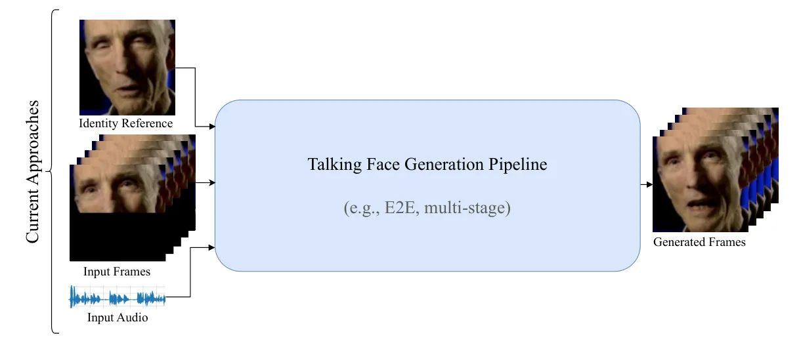

(a) Traditional talking face generation pipeline.

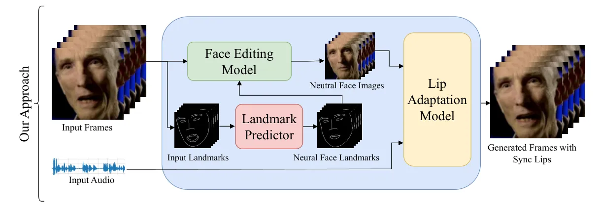

(b) Our mask-free approach.

Figure 1: Demonstration of the traditional talking face generation
approach and our mask-free approach.

Audio-driven 2D talking face generation, a.k.a. lip reanimation,
generates a video by manipulating the lips of existing video frames with
respect to a given audio, while preserving visual and identity-related
details. Talking face generation has gained significant popularity due
to its potential in applications like virtual assistants, video/movie
dubbing, and digital content creation & translation \[100, 108, 35\]. In
this intricate task, lip-sync and visual quality are essential factors
for generating natural-looking videos. While lip-sync ensures that lip
movements are aligned with the audio, visual quality involves delivering
high-resolution, artifact-free visual content that also preserves the
subject’s identity. Any issues in these details make the video less
natural since they are easily recognizable by humans.

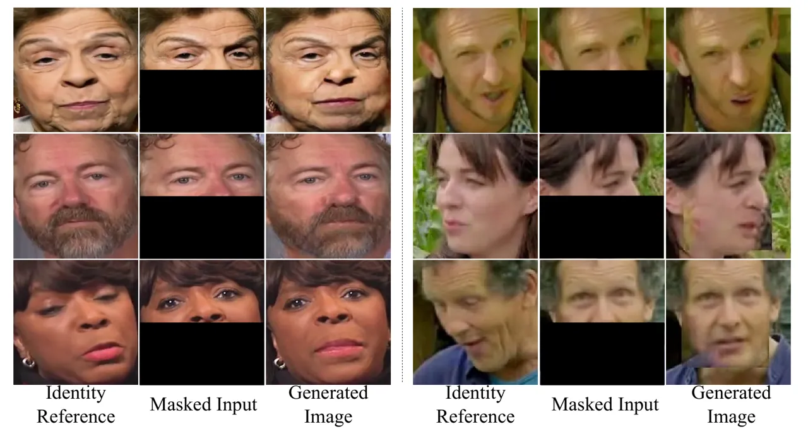

Figure 2: Mask-related problems. Generated images are clearly influenced
by the identity reference. Further, masking leads to occasional errors
in details of pose, background, face borders etc. Images generated by:
left: our baseline experiments, right (top to bottom): \[12, 85, 63\].
Best viewed by zooming in.

To achieve these goals, recent approaches in the literature \[63, 66,
109\] use an inpainting-based scheme (Fig. 1(a)): A generative network
receives the input audio and a sequence of video frames with masked
mouth region concealing the ground-truth lip shape (e.g. by masking the
lower half of the face), and is trained to reconstruct the masked part
aligned with the given audio. This is done using a combination of loss
functions including simple reconstruction loss, adversarial loss, and
specialized lip-sync loss utilizing pretrained feature extraction
networks to measure audio-lip synchronization \[63\]. However, the
described masking necessarily leads to information loss, meaning that
important identity-related details would be missing. Therefore, the
model additionally receives one (or multiple) identity reference
image(s), typically selected randomly from different time steps of the
input video.

This straightforward approach, nevertheless, has fundamental drawbacks:
(1) The masking strategy causes a loss of available information and
requires the network to regenerate the entire masked region using the
available information from the identity reference and the upper part of
the face. This hardens the network’s task and sometimes hinders accurate
inference of the missing details and preservation of identity, despite
the identity reference image. Generally, predicting more content of the
image raises the likelihood of errors and artifacts. (2) The differences
between the identity reference and masked input image in lightning,
pose, and expression can complicate the reconstruction process,
resulting in visual artifacts and alignment problems.

\(3\) The identity reference can undesirably influence the model,
leading to issues like lip leaking \[63, 12, 94\], where the model
occasionally copies the lip shape of the identity reference although it
is unaligned with the audio, both in training and inference. Thus, the
model ends up with suboptimal lip-sync and visual quality \[63, 12,
94\], as illustrated in Fig. 2.

In this work, we circumvent these issues by introducing a mask-free
talking face generation approach (MF-Talk, Fig. 1(b)). On a high level,
instead of masking the faces in the input video frames, we transform
them to always have closed lips. Given such a sequence of closed-mouth
frames and the input audio, our model generates faces aligned with the
audio, without requiring an additional identity reference since the
input images are not masked. Specifically, we begin by training a
transformer-based lip landmark prediction model responsible for
generating lip landmarks that accurately represent closed and flat
mouths, i.e., silent lips \[12, 94\]. Next, we train a landmark-driven
face editing model in an unpaired manner to modify the lips of the input
image to appear closed, using the predicted landmarks as a condition.
Finally, we use the modified image sequence as input to our lip
adaptation model, along with audio, to generate a face sequence by only
editing the lips, neither using masking nor an identity reference. With
our mask-free approach, we can benefit from the existing information in
the input image and simplify the task by editing only a small portion of
the input rather than generating the masked region from scratch by
trying to acquire the missing information from the identity reference.
Our contributions are:

- •
  We introduce mask-free talking face generation (MF-Talk) for the first
  time, as an alternative to the inpainting-based approaches, more
  accurately preserving identity, improving visual quality, and
  simplifying the model’s learning problem (see Fig. 1).
- •
  Our approach is able to synthesize the video with the appropriate lip
  movements by only using the input face sequence, without requiring an
  identity reference image, thus alleviating many issues of existing
  methods.
- •
  We propose a landmark prediction model that accurately generates
  landmarks to represent neutral/closed mouth and a face editing model
  conditioned on predicted landmark maps for face generation with
  neutral/closed mouth.
- •
  We conduct extensive experiments and detailed analyses to show the
  effectiveness of our approach.

## 2 Related Work

### 2.1 Masking Strategy

Early research efforts use mapping between audio features and
time-aligned facial motions \[98\] and perform facial motion prediction
using HMMs \[5\]. A more recent study \[76\] generates video by
retrieving the images that are most aligned with the audio. Another
approach to talking face generation is to use facial landmark
representations and generate the video based on these, as directly
mapping audio to face is more challenging \[11, 17, 112, 109\]. One of
the major milestones in talking face generation is Wav2Lip \[63\], which
addresses the task as an audio-conditioned image inpainting task. For
this, the faces in a video are processed as a sequence in each step. The
lower half of the faces is masked and provided to the image encoder
along with a randomly selected identity reference, since the
identity-related details in the input faces are unavailable due to the
masking strategy. This approach demonstrates superior performance in
both lip-sync accuracy and identity preservation. Due to its
effectiveness, subsequent works apply the same masking strategy to treat
the task as image inpainting \[60, 12, 86, 106, 109, 85, 55, 66, 73, 53,
93, 94, 62, 56\]. In contrast to this, we propose a mask-free approach,
by first transforming the video frames to have closed lips, and
subsequently using these frames for audio-driven talking face
generation. This way, we circumvent various issues that arise from
masking and the necessity of an identity reference in the
inpainting-based methods.

### 2.2 Lip-sync Learning

Lip-sync learning is a central point of the talking face generation
task. While initial studies utilize hand-crafted features and
statistical models \[25, 69\], later approaches focus on benefiting from
mutual information between audio-visual features to predict output as
sync or not sync for sound \[10, 30, 58\] and speech \[2, 14, 16, 37,
39\]. Although some works learn lip-sync implicitly \[11, 24, 76, 90,
105, 32, 40, 81\], explicit learning improves lip-sync accuracy,
especially with limited data. Some methods \[33, 59, 71, 112, 109\]
employ landmark distance to guide the model in lip-sync learning.
However, they lack optimal lip-sync despite good visual quality and
stability. So far, the most common and accurate method for lip-sync
learning is to employ an additional network for multimodal feature
extraction and to compute a loss representing the synchronization
between the generated lip movements and the given audio snippet \[45,
60, 63, 84, 86, 85, 95, 106, 110, 111, 20, 23, 72, 75, 83, 93, 94\]. In
this work, we follow recently proposed stabilized synchronization
loss \[94\], that alleviates lip-sync learning-related issues, and adapt
it for our approach.

### 2.3 Portrait Animation

Rather than solely editing faces in 2D for video translation, portrait
animation (a.k.a talking head generation) involves generating an entire
video from either a single image (one-shot) or using all the frames for
extracting corresponding parameters (e.g., pose, identity, expression)
and regenerating entire head. While some methods perform this head
generation in 2D space \[111, 45, 81\], the majority of works prefer
3D-based methods and Neural Radian Fields (NeRFs) for more precise
control in generation \[3, 4, 24, 48, 59, 65, 71, 79, 80, 84, 90, 95,
96, 99, 102, 105, 110, 112, 104, 38, 107, 13, 51, 43, 49, 9, 91, 44, 46,
96, 54\]. In portrait animation, expression and pose
controllability \[33, 111, 45, 34, 78, 21, 101, 103, 7, 47, 92, 74, 29\]
are essential for creating a natural video, as all parameters are
individually available. However, this is quite challenging. Therefore,
2D editing-based approaches are necessary when preserving the details of
the video is crucial, such as in movie dubbing. Similarly, some works go
further than just head generation, exploring talking head video
generation that includes natural torso \[97\] and full-body
gestures \[27, 8\]. On the other hand, transferring or controlling a
speaking style is another research direction in the literature \[52, 70,
87\]. Please note that the task that we cover in this paper involves
frame-by-frame 2D video editing to achieve precise lip synchronization
with audio, making it a fundamentally different approach to portrait
animation.

## 3 Mask-Free Talking Face Generation

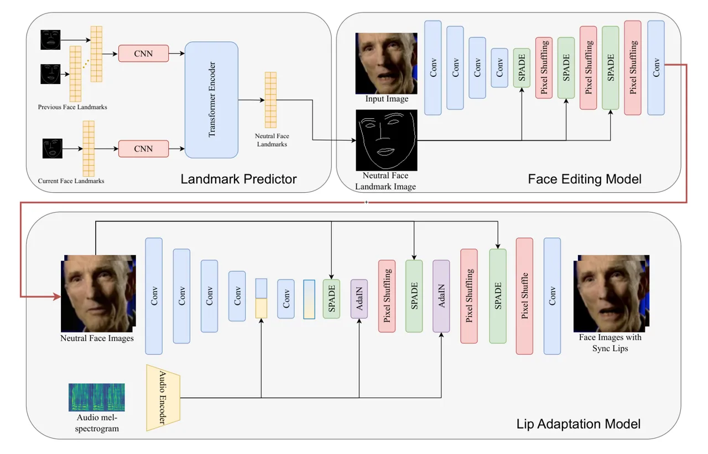

Figure 3: Our mask-free talking face generation pipeline in inference.
First, a landmark predictor ($`T_{L}`$) generates landmarks for neutral
mouth. Next, our face editing model ($`G_{E}`$) utilizes the generated
neutral face landmarks to modify the input image to have a neutral
mouth. Finally, the lip adaptation model ($`G_{L}`$) employs the output
of the face editing model along with the audio input to generate sync
lips.

In this paper, we propose mask-free talking face generation (MF-Talk),
aiming to better preserve the identity, removing mask-related artifacts,
and eliminating negative influences of the identity reference. As shown
in Fig. 3, we decompose the problem into three subtasks: neutral
landmark prediction, landmark-driven face editing for neutral mouth
generation, and lip adaptation.

In our method, we first extract a landmark map for each face using
Mediapipe \[50\]. Then, we predict the new neutral-mouth landmarks using
our transformer-based landmark prediction model ($`T_{L}`$). Next, our
landmark-driven face editing model ($`G_{E}`$) takes the input image and
the predicted landmark map to modify the mouth region of the image.
Finally, the lip adaptation model ($`G_{L}`$) gets the audio input and
the modified neutral-mouth input face to adapt the mouth region,
generating proper lip movements with respect to the given audio to
achieve synchronized lips.

### 3.1 Landmark Prediction Model

We first extract face landmark vectors
$`l_{t}\in\mathbb{R}^{2\times 131}`$ from each video frame at timestep
$`t`$. Given a such a vector, we write
$`l_{t}=(l^{l}_{t},l^{j}_{t},l^{p}_{t})`$ with lip landmarks
$`l^{l}_{t}\in\mathbb{R}^{2\times 41}`$, jaw landmarks
$`l^{j}_{t}\in\mathbb{R}^{2\times 16}`$, and pose landmarks
$`l^{p}_{t}\in\mathbb{R}^{2\times 74}`$. Our goal is to train a
transformer-based model $`T_{L}`$ to predict lip and jaw landmarks given
all landmarks from the $`k`$ previous frames and the current frame’s
pose landmarks:

```math
T_{L}:\left(\,l_{t-k}\,,\,...\,,\,l_{t-1}\,,\,l^{p}_{t}\,\right)\to(\,l^{l}_{t}\,,\,l^{j}_{t}\,) \tag{1}
```

Since we aim to predict lip and jaw landmarks, we provide the remaining
landmarks from the current frame to the network, which we refer to as
pose landmarks. Moreover, we provide the landmarks from previous frames
to guide the model in making smooth predictions and obtain identity
information. $`T_{L}`$ is responsible for predicting landmarks to
represent neutral mouth (see Section 3.5 for training details) as these
landmarks are used in $`G_{E}`$ as a condition. Note that we represent
all landmarks in $`T_{L}`$ as normalized coordinate pairs. The sketch
inputs in Fig. 3 are provided for illustration purposes only.

Our $`T_{L}`$ consists of two parallel encoders with 1D convolutions to
encode the landmarks of the previous frames, $`E_{r}`$, and pose
landmarks of the current frame, $`E_{p}`$, followed by a transformer
encoder with four layers. Each layer includes multi-head self-attention
(MHSA) \[82\], layer normalization (LN) \[42\], and multi-layer
perceptron layers (MLP).

```math
F^{l^{p}_{t}}=E_{p}(l^{p}_{t}) \tag{2}
```

```math
F^{l_{t-1}}=E_{r}(l_{t-1}) \tag{3}
```

```math
F^{l}_{i}=\text{TE}_{i}(F^{l}_{i-1}) \tag{4}
```

where $`\text{TE}_{i}`$ indicates layer $`i`$ of the transformer
encoder. We apply MLP on top of the transformer’s hidden states to
generate the output prediction $`\hat{l}_{t}^{l},\hat{l}_{t}^{j}`$. To
train $`T_{L}`$, we utilize L1 reconstruction loss between GT landmarks
and generated landmarks, i.e. the landmark reconstruction loss:

```math
L_{l}=||\hat{l}_{t}^{j}-l_{t}^{j}||+\lambda||\hat{l}_{t}^{l}-l_{t}^{l}|| \tag{5}
```

where $`\lambda`$ is set as $`10`$ to focus on the lip landmarks more.
Since the GT data is a subset of LRS2 dataset, which consists of
closed-mouth samples only, our $`T_{L}`$ can learn to generate a
landmark map with a closed mouth from any input landmark map while
preserving both pose and identity.

### 3.2 Landmark-driven Face Editing Model

We utilize a GAN-based \[22\] conditional image editing model
($`G_{E}`$) that takes an input image and the landmark map to edit the
mouth region of the face, synthesizing the same image with neutral mouth
that matches the input landmark map. Our $`G_{E}`$ has a U-Net shape
architecture \[64\], contains an image encoder and an image decoder with
SPADE \[61\] and Pixel Shuffling \[67\] layers (see Sec. B.2 for
details). To train $`G_{E}`$, we employ adversarial loss \[22\],
perceptual loss \[36\] with pretrained VGG-19 \[68\] features, feature
matching loss \[88\], and landmark reconstruction loss to match the lip
and jaw landmarks of the generated image with the input landmarks.
Moreover, we utilize an additional pretrained model that focuses on only
the mouth region to classify it as open or closed (see Section B.3). We
train this model by labeling the training images in LRS2 dataset \[1\]
as open / closed mouth according to the distance between the landmarks
of the upper and lower lips. The training objective of our $`G_{E}`$ is
as follows:

```math
L_{E}=L_{GAN}+\lambda_{1}L_{per}+\lambda_{2}L_{FM}+\lambda_{3}L_{l}+L_{m} \tag{6}
```

where $`L_{per}`$ indicates perceptual loss, $`L_{FM}`$ states feature
matching loss, $`L_{l}`$ represents landmark reconstruction loss, and
$`L_{m}`$ is cross-entropy loss for mouth classification model, which
works like a discriminator. Since we don’t mask the input image and
employ $`L_{per}`$ along with $`L_{FM}`$, our $`G_{E}`$ effectively
preserves identity while editing the lips (see Table 4).
($`\lambda_{1},\lambda_{2},\lambda_{3}`$) ) ($`1,0.1,0.25`$).

|                             | LRS2              |                   |                    |                    |                    |                      |                   | HDTF              |                   |                    |                    |                    |                      |                   |
| --------------------------- | ----------------- | ----------------- | ------------------ | ------------------ | ------------------ | -------------------- | ----------------- | ----------------- | ----------------- | ------------------ | ------------------ | ------------------ | -------------------- | ----------------- |
| Method                      | SSIM $`\uparrow`$ | PSNR $`\uparrow`$ | FID $`\downarrow`$ | LMD $`\downarrow`$ | LSE-C $`\uparrow`$ | LSE-D $`\downarrow`$ | CSIM $`\uparrow`$ | SSIM $`\uparrow`$ | PSNR $`\uparrow`$ | FID $`\downarrow`$ | LMD $`\downarrow`$ | LSE-C $`\uparrow`$ | LSE-D $`\downarrow`$ | CSIM $`\uparrow`$ |
| Wav2Lip \[63\]              | 0.86              | 26.53             | 7.05               | 2.38               | 7.59               | 6.75                 | 0.84              | 0.84              | 24.81             | 35.41              | 1.34               | 9.05               | 6.14                 | 0.87              |
| VideoReTalking w/ FR \[12\] | 0.84              | 25.58             | 9.28               | 2.61               | 7.49               | 6.82                 | 0.75              | 0.83              | 24.55             | 29.77              | 3.09               | 6.12               | 7.37                 | 0.89              |
| DINet \[106\]               | 0.78              | 24.35             | 4.26               | 2.30               | 5.37               | 8.37                 | 0.73              | 0.91              | 29.12             | 18.77              | 1.45               | 6.42               | 8.93                 | 0.82              |
| TalkLip \[85\]              | 0.86              | 26.11             | 4.94               | 2.34               | 8.53               | 6.08                 | 0.75              | 0.82              | 25.23             | 25.10              | 2.98               | 6.19               | 7.28                 | 0.89              |
| IPLAP \[109\]               | 0.87              | 29.67             | 4.10               | 2.11               | 6.49               | 7.16                 | 0.82              | 0.87              | 27.80             | 22.09              | 2.21               | 5.56               | 8.49                 | 0.80              |
| AVTFG \[93\]                | 0.95              | 31.27             | 4.51               | 1.19               | 7.95               | 6.30                 | 0.80              | 0.93              | 30.58             | 16.76              | 1.29               | 8.11               | 6.77                 | 0.89              |
| PLGAN \[94\]                | 0.95              | 32.64             | 3.83               | 1.13               | 8.41               | 6.03                 | 0.79              | 0.89              | 28.60             | 21.46              | 1.30               | 8.30               | 6.36                 | 0.81              |
| Diff2Lip \[56\]             | 0.94              | 31.68             | 3.80               | 1.50               | 7.87               | 6.46                 | 0.85              | 0.83              | 26.07             | 27.82              | 2.29               | 7.45               | 7.16                 | 0.81              |
| Ours                        | 0.95              | 33.96             | 3.57               | 1.18               | 7.76               | 6.32                 | 0.88              | 0.95              | 31.35             | 12.84              | 1.25               | 7.79               | 6.31                 | 0.92              |

Table 1: Quantitative results on the LRS2 test set and HDTF dataset.
Please see Appendix F for more results.

### 3.3 Lip Adaptation Model

At this stage, we aim to adapt the lips to the given audio to achieve
synchronized lips. The generator $`G_{L}`$ takes the output from
$`G_{E}`$, which is a face image with neutral mouth region. We encode
this image using an image encoder composed of several consecutive
convolutional layers, batch normalization \[31\], and ReLU activation
functions \[57, 41\]: $`f_{I}^{512\times 16\times 16}=E_{I}(I)`$.
Additionally, $`G_{L}`$ receives the corresponding audio snippet as a
condition for adapting the lips. We encode the mel-spectrogram
representation of the audio using an audio encoder, that has similar
architecture with  \[63\], into $`f^{1\times 1\times 512}`$ feature
vector and incorporate it into the network via Adaptive Instance
Normalization (AdaIN) layer \[28\], which has shown more efficient
performance \[12, 109\]. However, we empirically find that using only
AdaIN to feed audio into the network results in suboptimal lip-sync
performance. To address this, we inject the audio into the embedding
space as well by concatenating the encoded image and audio features
along the depth dimension. Our generator involves SPADE layers that help
preserving identity better by retaining identity-specific details since
we provide the original image as semantic input. Moreover, we employ
Pixel shuffling layers \[67\], as it demonstrates better generation
quality and tends to cause less artifacts compared to transposed
convolution layers (see Sec. B.4 for architectural details).

To train our model, we use adversarial loss ($`L_{GAN}`$), perceptual
loss ($`L_{per}`$), lip synchronization loss ($`L_{ads}`$) (see
Section 3.4), and L1 pixel reconstruction loss ($`L_{pixel}`$):

```math
L=L_{GAN}+\lambda_{1}L_{per}+\lambda_{2}L_{ads}+\lambda_{3}L_{pixel} \tag{7}
```

where we empirically choose coefficients as follows:
$`(\lambda_{1},\lambda_{2},\lambda_{3})=(4,0.5,10)`$.

### 3.4 Audio-Lip Synchronization

The most common approach for learning audio-lip synchronization is to
utilize the pretrained SyncNet model \[63\] for audio-visual feature
extraction to calculate synchronization loss. Recent studies \[55, 85,
93, 94\] highlight fundamental issues with this approach and propose
alternative methods. Following \[94\], we employ a modified version of
stabilized synchronization loss, which we refer to as the adapted
stabilized synchronization loss, during the training of our lip
adaptation model. In the stabilized synchronization loss, the difference
in similarity between (GT lips, audio) and (generated lips, audio) is
utilized instead of solely relying on the similarity of the (generated
lips, audio) pair. Additionally, the similarity of the (reference lips,
audio) pair is employed to adjust the loss when the reference shows a
higher similarity to the audio. However, since we don’t use any
reference image in our approach, we by-pass the similarity of the
(reference lips, audio) pair and use the difference in similarity
between (GT lips, audio) and (generated lips, audio) as follows:

```math
L_{ads}=-log(1-|D(F^{A},F^{I^{\prime}})-D(F^{A},F^{I^{GT}})|) \tag{8}
```

where $`D`$ is cosine similarity, $`F^{A}`$ indicates audio features,
$`F^{I^{\prime}}`$ and $`F^{I^{GT}}`$ represent generated image and
ground-truth image features, respectively. We obtain these features from
SyncNet \[63\] audio and image encoders.

### 3.5 Training Strategy

First, we train our landmark generation model using a subset of the LRS2
dataset \[1\], selecting faces with closed lips by computing the
distance between top and bottom lip landmarks. This step is crucial, as
accurate lip landmark prediction is essential for guiding the face
editing model ($`G_{E}`$) to have neutral lips. Since this is a
relatively straightforward approach, the subset of the LRS2 dataset is
sufficient for learning generalized landmark prediction model for
neutral lips. In the second step, we use our landmark generator to
produce neutral lip landmarks for each face in the LRS2 dataset. Then,
we train the face editing model (see Section 3.2) by conditioning it on
the input image —a face from the LRS2 dataset— and the predicted neutral
lip landmark map. Finally, after rendering a face image with neutral
mouth, we use it as an input image, along with the corresponding audio,
in our lip adaptation model to generate final output, which is the face
images with accurate lip movements regarding to the input audio.

While we process one face image per step ($`T=1`$) in the landmark
generation and face editing models, we use $`5`$ images per step
($`T=5`$) in the our lip adaptation model, as maintaining temporal
sequence is essential for achieving accurate lip synchronization as well
as measuring it more efficiently during the training. We use FAN \[6\]
to detect faces and apply tight cropping, adding $`10\%`$ margin at the
bottom since FAN tends to cut off a small portion of the chin. Given the
low resolution of faces in LRS2 dataset, our model takes input images
$`128\times 128`$ resolution image as input. Our audio encoder requires
a mel-spectrogram of size $`16\times 80`$, which derived from $`16`$
$`kHz`$ audio with a window size of $`800`$ and a hop size of $`200`$.
We employ the Adam optimizer with $`(\beta_{1},\beta_{2})=(0.5,0.999)`$.
We set the learning rate to $`1\times 10^{-4}`$ for all models. We train
our models on a single NVIDIA RTX A6000 GPU.

Inference. During inference, our landmark predictor takes only the
landmarks of the input image and generates a landmark map with a neutral
mouth. Then, the face editing model utilizes the input image and the
predicted landmark map to modify the mouth region accordingly. Finally,
the lip adaptation model processes the output of the face editing model
along with the input audio to adjust the lip movements. In summary, our
entire pipeline requires only a single image during inference. Some
might argue that certain existing models (e.g., Wav2Lip \[63\],
VRT \[12\]) can also rely solely on the input image during inference by
selecting the input image and identity reference as the same. While this
is technically possible, it applies only during inference, not during
training. Consequently, identity reference-related issues during
training persist. Moreover, these models still require a masked input
image in both training and inference, leading to all the previously
identified mask-related problems. Last but not least, empirical results
indicate that the identity reference influences the lip-sync performance
of these models \[12, 55, 94\] (See Section 1 and performance
degradation from Table 1 to Table 2).


(a) Wav2Lip

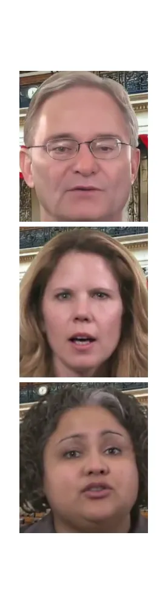

(b) VRT

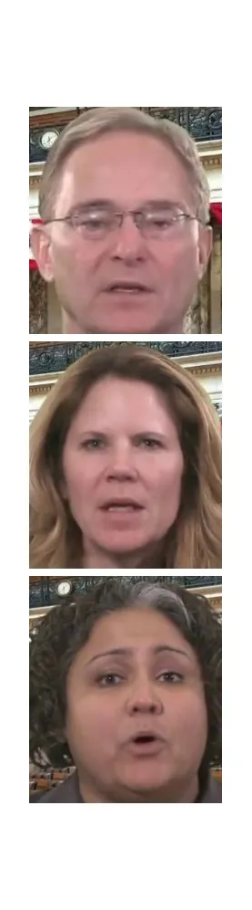

(c) DINet


(d) IPLAP

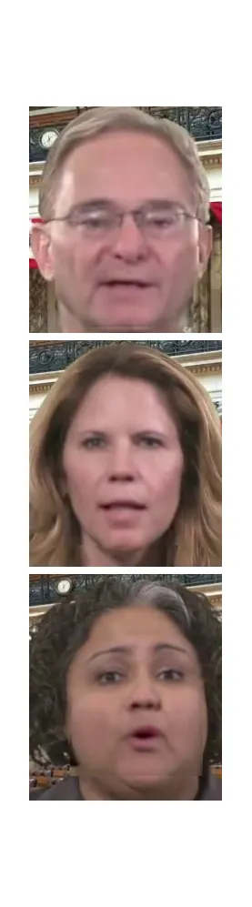

(e) TalkLip

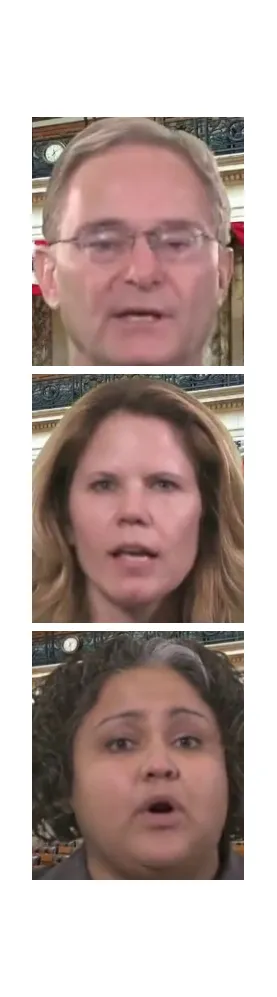

(f) AVTFG

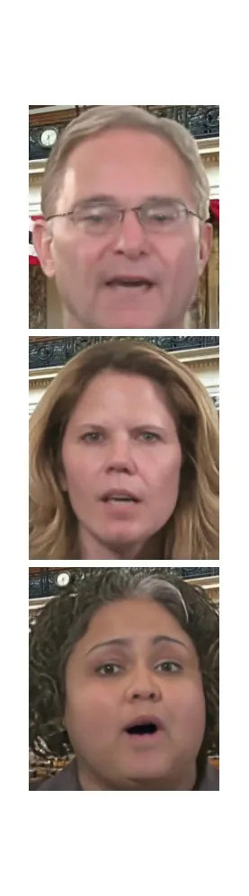

(g) PLGAN


(h) Diff2Lip


(i) Ours


(j) GT

Figure 4: Qualitative comparison of our model with SOTA methods. The
samples are randomly selected from generated videos in the unseen HDTF
dataset. For more qualitative comparison, please check Appendix F and
Supplementary videos.

| Method         | SSIM  | PSNR   | FID  | LSE-C | LSE-D  | CSIM  |
| -------------- | ----- | ------ | ---- | ----- | ------ | ----- |
| Wav2Lip        | 0.842 | 25.835 | 7.89 | 7.347 | 7.184  | 0.736 |
| VideoReTalking | 0.837 | 26.539 | 9.75 | 6.815 | 7.743  | 0.749 |
| DINet          | 0.776 | 24.034 | 4.17 | 4.461 | 9.554  | 0.724 |
| TalkLip        | 0.849 | 25.701 | 4.04 | 6.044 | 8.206  | 0.739 |
| IPLAP          | 0.861 | 28.989 | 3.95 | 3.627 | 10.102 | 0.766 |
| AVTFG          | 0.849 | 26.425 | 5.78 | 6.844 | 7.901  | 0.723 |
| PLGAN          | 0.855 | 25.376 | 4.11 | 7.578 | 6.805  | 0.731 |
| Diff2Lip       | 0.916 | 30.317 | 3.59 | 6.710 | 7.261  | 0.833 |
| Ours           | 0.924 | 31.472 | 3.52 | 6.525 | 7.388  | 0.842 |

Table 2: Quantitative results on the LRS2 test set for cross matching
scenario (random video–audio pairs).

## 4 Experimental Results

Datasets We trained our landmark prediction model on a subset of the
LRS2 dataset \[1\] and the other two models on the entire LRS2 dataset.
We evaluated our overall approach using both the LRS2 test set and the
HDTF dataset \[105\].

Baseline and Evaluation We select state-of-the-art methods in 2D
audio-driven talking face generation for comparison with our model and
follow established evaluation metrics from the literature \[63, 12, 106,
109, 85, 94, 56\]. For visual quality assessment, we employed
SSIM \[89\], PSNR, and FID \[26\], while for lip-sync evaluation, we
used LSE-C, LSE-D \[15, 63\], and LMD \[11\]. To evaluate how well the
models preserve identity, we employed the CSIM, which measures cosine
similarity between the features of the generated and target faces. For
feature extraction, we used the pretrained ArcFace model \[19\] (see
Appendix C for details). We share various ablation studies in Sec. 4.3
and Appendix E.

### 4.1 Quantitative Results

In Table 1, we present quantitative results on the LRS2 test set and the
HDTF dataset. This is using the standard approach for evaluating talking
face generation, i.e., videos are generated with their respective GT
audio, allowing us to measure the performance accurately even for
metrics that require exact GT data. We outperform other methods in
visual quality metrics across both datasets, and our mask-free approach
enables significantly better identity preservation, as reflected in the
CSIM scores. In terms of lip-sync accuracy, our model demonstrates
comparable performance. We consistently outperform other approaches in
our user study (see Appendix D). In contrast to this, Table 2
demonstrates quantitative results on the LRS2 test set for cross
audio-video pairs, i.e., randomly pairing videos and audio in the test
set. This is done to eliminate any potential lip leakage, following the
setup in Wav2Lip \[63\]. Note that the LSE-C & -D metrics do not require
any GT data, whereas the remaining metrics do. Although these models
alter the mouth region, we still use the input images to measure these
metrics, as the models are expected to preserve various details
regardless. The results clearly show the effectiveness of our approach,
especially in visual quality and identity preservation. We achieve the
best SSIM, PSNR and FID scores and competitive performance on LSE-C, and
LSE-D. As in Table 1, we again reach the best CSIM, highlighting the
strong identity preservation capability of our method. The performance
of the other methods mostly deteriorates notably.

### 4.2 Qualitative Results

We use generated videos from the HDTF dataset to qualitatively evaluate
the performance of our method alongside other approaches. In Figure 4,
we present results from recent SOTA models. Our model generates lip
shapes that align most accurately with the GT data. Although Wav2Lip,
TalkLip, AVTFG, and PLGAN demonstrate comparable performance, they do
not achieve the same level of accuracy as our model. Moreover, DINet’s
outputs closely resemble the GT lip shapes, however, it was trained on
HDTF dataset, unlike the other methods. Additionally, TalkLip and
Wav2Lip occasionally exhibit artifacts along the facial borders,
especially near the lower edge, while DINet and VideoReTalking do not
perform as well as our model in preserving identity. Similarly, despite
its high quality, Diff2Lip exhibits noticeable teeth artifacts.
Moreover, PLGAN shows artifacts in teeth generation.

### 4.3 Ablation Study

#### 4.3.1 Analysis of Landmark Prediction

In Table 3, we conduct experiments to evaluate our $`T_{L}`$ model’s
performance in generating landmarks for a neutral mouth. For comparison,
we use IPLAP landmark prediction model with silent audio, expecting it
to generate a neutral mouth since no speech is present. We assess the
models’ performance with three metrics. $`LD_{full}`$ calculates the L2
distance between the generated and ground-truth landmarks, while
$`LD_{lip}`$ measures the L2 distance specifically between the generated
and ground-truth lip landmarks. The final metric, $`LD_{c}`$, represents
the vertical L1 distance between the center point of the upper and lower
lips, which is expected to be minimal in a neutral mouth scenario. In
all three metrics on two different datasets, we clearly surpass IPLAP
landmark generator for generating more accurate neutral mouth when there
is no speech. Ours w/o lip loss also validates the usefulness of our
dedicated lip landmark loss in the training. Note, however, that our
$`T_{L}`$ is specifically trained for generating neutral mouths, in
contrast to IPLAP. For qualitative comparison, Figure 5 presents the
predicted landmark maps generated by our landmark predictor alongside
those from the IPLAP predictor when using silent audio. Our model
demonstrates superior performance in achieving a neutral-mouth position
(see Fig. 5(a)). Additionally, our model produces images with a more
accurate closed-mouth appearance (see Fig. 5(b)). Overall, our approach
achieves higher accuracy in neutralizing the mouth while preserving the
given pose.

|                       |                           |                          |                        |                           |                          |                        |
| --------------------- | ------------------------- | ------------------------ | ---------------------- | ------------------------- | ------------------------ | ---------------------- |
|                       | LRS2                      |                          |                        | HDTF                      |                          |                        |
| Method                | LD\_(full) $`\downarrow`$ | LD\_(lip) $`\downarrow`$ | LD\_(c) $`\downarrow`$ | LD\_(full) $`\downarrow`$ | LD\_(lip) $`\downarrow`$ | LD\_(c) $`\downarrow`$ |
| IPLAP w/ silent audio | 9.504                     | 2.501                    | 0.305                  | 10.388                    | 2.755                    | 0.322                  |
| Ours w/o lip loss     | 9.694                     | 2.580                    | 0.329                  | 10.541                    | 2.806                    | 0.340                  |
| Ours                  | 9.418                     | 2.459                    | 0.293                  | 10.199                    | 2.657                    | 0.301                  |

Table 3: Quantitative results of our landmark predictor and IPLAP
landmark predictor on the LRS2 test set and HDTF dataset.

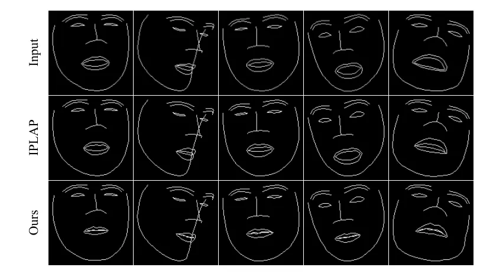

(a) Input maps and predicted neutral-mouth landmark maps

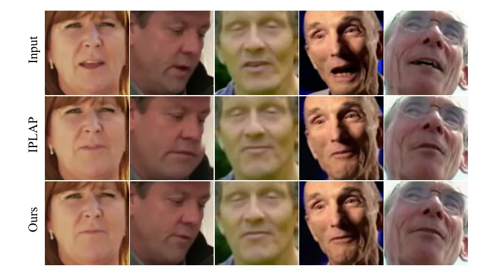

(b) Input images and generated faces with neutral mouth.

Figure 5: Comparison of the IPLAP landmark generation method (with
silent audio) and our landmark predictor.

#### 4.3.2 Face Generation with Neutral Mouth

In Table 4, we generate faces with neutral mouths on the LRS2 test set
using our $`G_{E}`$ face editing model. We also test the canonical face
generation model of VideoReTalking, which generates faces by
neutralizing both expression and mouth position, and silent-lip
generator from PLGAN. For evaluation, we employ visual quality and
identity preservation metrics. According to the scores, our model
clearly surpasses VideoReTalking and IPLAP models in both visual quality
and identity preservation metrics. Despite comparable performance of
PLGAN on PSNR and FID, we outperform it in SSIM and CSIM (see Figure 6).

In Table 5, we use aforementioned neutral mouth generation method in
place of our first and second stages. We then train our lip adaptation
model with these images to explore the impact of different neutral mouth
generation models on talking face generation. Our model achieves the
best performance across all metrics. The highest CSIM scores clearly
demonstrate that $`G_{E}`$ preserves identity while generating face
image with a neutral / closed mouth.

#### 4.3.3 Masking Strategy

In Table 6, we compare our approach with a masking-based baseline
approach, where we incorporate a masking strategy in the lip adaptation
model ($`G_{L}`$) and omit the first and second stages. Due to the
masking, we utilize a randomly selected identity reference image. In the
second experiment, we apply our full setup but mask the input image in
the second stage. Therefore, we again provide identity reference. The
output image from the second stage, a face with a neutral mouth, is then
used as the identity reference in the third stage, where we also mask
the input image. As expected, this second approach outperforms the first
(baseline), as the neutral identity reference strategy has already been
validated in PLGAN. However, our mask-free approach clearly demonstrates
the best performance across all metrics.

| Method                | SSIM  | PSNR  | FID   | CSIM  |
| --------------------- | ----- | ----- | ----- | ----- |
| VideoReTalking        | 0.646 | 22.12 | 33.60 | 0.603 |
| IPLAP w/ silent audio | 0.859 | 28.45 | 6.78  | 0.821 |
| PLGAN                 | 0.908 | 30.32 | 4.41  | 0.856 |
| Ours                  | 0.912 | 29.74 | 4.92  | 0.887 |

Table 4: Quantitative comparison of our face editing model for neutral
mouth generation with the canonical face generation model from
VideoReTalking, the IPLAP model with silent audio, and PLGAN silent-lip
generation model.

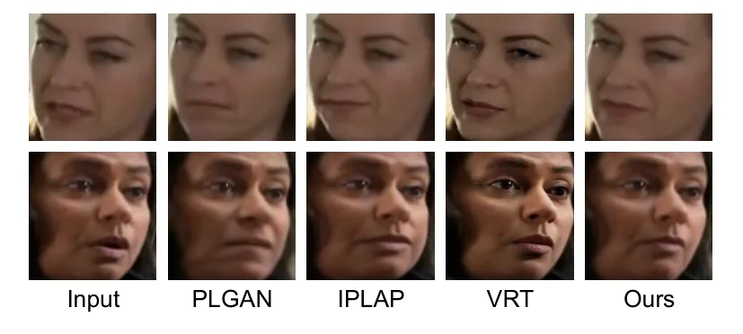

Figure 6: Generated samples with neutral mouth by different methods. The
samples are from LRS2 test set.

| Method            | SSIM | PSNR  | FID  | LMD  | LSE-C | LSE-D | CSIM |
| ----------------- | ---- | ----- | ---- | ---- | ----- | ----- | ---- |
| w/ VideoRetalking | 0.77 | 24.08 | 5.45 | 2.50 | 7.03  | 6.88  | 0.76 |
| w/ IPLAP          | 0.83 | 28.85 | 3.77 | 1.92 | 7.72  | 6.32  | 0.82 |
| w/ PLGAN          | 0.79 | 23.63 | 4.32 | 2.58 | 7.13  | 6.83  | 0.74 |
| w/ our model      | 0.95 | 33.96 | 3.57 | 1.18 | 7.76  | 6.32  | 0.88 |

Table 5: Ablation study of neutral mouth generation methods. We use
different neutral mouth generation models to synthesize faces with
neutral mouth and train our lip adaptation model with them to explore
their effects on the final performance.

| Method           | SSIM | PSNR  | FID   | LMD  | LSE-C | LSE-D | CSIM | Ep. |
| ---------------- | ---- | ----- | ----- | ---- | ----- | ----- | ---- | --- |
| Baseline         | 0.81 | 25.28 | 14.89 | 2.41 | 7.61  | 6.45  | 0.75 | 120 |
| Ours w/ masking  | 0.85 | 27.41 | 7.94  | 2.04 | 7.79  | 6.31  | 0.76 | 58  |
| Ours (Mask-Free) | 0.95 | 33.96 | 3.57  | 1.18 | 7.76  | 6.32  | 0.88 | 32  |

Table 6: Ablation study for masking approach.

## 5 Conclusion

We introduce a mask-free approach for talking face generation. First, we
transform the input video frames to have neutral, closed lips using a
two-stage landmark-based face editing model trained with unpaired data.
Then, we apply an audio-conditioned lip adaptation model on the
transformed sequence of neutral-mouth faces to generate lips matching
the given audio. Our experiments show that MF-Talk achieves competitive
results on LRS2 and HDTF, especially preserving identity better than
masking-based approaches, and the extensive ablation studies underline
the importance of each pipeline component.

Limitations & Ethics. Our model generates suboptimal teeth due to having
neutral/closed mouth in the input of the lip adaptation model (e.g., no
visible teeth in the input). This occasionally conceals the subject’s
teeth. However, relevant information may still exist in the feature
space, allowing the model to accurately generate the teeth according to
our empirical observation. Generating lip-sync faces offers valuable
applications but is vulnerable to misuse, such as in deepfake creation.
We will implement watermarking to prevent unauthorized use of our model.

## References

- \[1\] Triantafyllos Afouras, Joon Son Chung, Andrew Senior, Oriol
  Vinyals, and Andrew Zisserman. Deep audio-visual speech recognition.
  _IEEE transactions on pattern analysis and machine intelligence_,
  44(12):8717–8727, 2018.
- \[2\] Triantafyllos Afouras, Andrew Owens, Joon Son Chung, and Andrew
  Zisserman. Self-supervised learning of audio-visual objects from
  video. In _Computer Vision–ECCV 2020: 16th European Conference,
  Glasgow, UK, August 23–28, 2020, Proceedings, Part XVIII 16_, pages
  208–224. Springer, 2020.
- \[3\] Volker Blanz and Thomas Vetter. A morphable model for the
  synthesis of 3d faces. In _Seminal Graphics Papers: Pushing the
  Boundaries, Volume 2_, pages 157–164, 2023.
- \[4\] James Booth, Anastasios Roussos, Allan Ponniah, David Dunaway,
  and Stefanos Zafeiriou. Large scale 3d morphable models.
  _International Journal of Computer Vision_, 126(2):233–254, 2018.
- \[5\] Matthew Brand. Voice puppetry. In _Proceedings of the 26th
  annual conference on Computer graphics and interactive techniques_,
  pages 21–28, 1999.
- \[6\] Adrian Bulat and Georgios Tzimiropoulos. How far are we from
  solving the 2d & 3d face alignment problem? (and a dataset of 230,000
  3d facial landmarks). In _International Conference on Computer
  Vision_, 2017.
- \[7\] Sai Tanmay Reddy Chakkera, Aggelina Chatziagapi, and Dimitris
  Samaras. Jean: Joint expression and audio-guided nerf-based talking
  face generation. _arXiv preprint arXiv:2409.12156_, 2024.
- \[8\] Aggelina Chatziagapi, Bindita Chaudhuri, Amit Kumar, Rakesh
  Ranjan, Dimitris Samaras, and Nikolaos Sarafianos. Talkinnerf:
  Animatable neural fields for full-body talking humans. _arXiv preprint
  arXiv:2409.16666_, 2024.
- \[9\] Chuhan Chen, Matthew O’Toole, Gaurav Bharaj, and Pablo Garrido.
  Implicit neural head synthesis via controllable local deformation
  fields. In _Proceedings of the IEEE/CVF Conference on Computer Vision
  and Pattern Recognition_, pages 416–426, 2023.
- \[10\] Honglie Chen, Weidi Xie, Triantafyllos Afouras, Arsha Nagrani,
  Andrea Vedaldi, and Andrew Zisserman. Audio-visual synchronisation in
  the wild. _arXiv preprint arXiv:2112.04432_, 2021.
- \[11\] Lele Chen, Ross K Maddox, Zhiyao Duan, and Chenliang Xu.
  Hierarchical cross-modal talking face generation with dynamic
  pixel-wise loss. In _Proceedings of the IEEE/CVF conference on
  computer vision and pattern recognition_, pages 7832–7841, 2019.
- \[12\] Kun Cheng, Xiaodong Cun, Yong Zhang, Menghan Xia, Fei Yin,
  Mingrui Zhu, Xuan Wang, Jue Wang, and Nannan Wang. Videoretalking:
  Audio-based lip synchronization for talking head video editing in the
  wild. In _SIGGRAPH Asia 2022 Conference Papers_, pages 1–9, 2022.
- \[13\] Xuangeng Chu, Yu Li, Ailing Zeng, Tianyu Yang, Lijian Lin,
  Yunfei Liu, and Tatsuya Harada. Gpavatar: Generalizable and precise
  head avatar from image (s). _arXiv preprint arXiv:2401.10215_, 2024.
- \[14\] Joon Son Chung and Andrew Zisserman. Lip reading in the wild.
  In _Computer Vision–ACCV 2016: 13th Asian Conference on Computer
  Vision, Taipei, Taiwan, November 20-24, 2016, Revised Selected Papers,
  Part II 13_, pages 87–103. Springer, 2017a.
- \[15\] Joon Son Chung and Andrew Zisserman. Out of time: automated lip
  sync in the wild. In _Computer Vision–ACCV 2016 Workshops: ACCV 2016
  International Workshops, Taipei, Taiwan, November 20-24, 2016, Revised
  Selected Papers, Part II 13_, pages 251–263. Springer, 2017b.
- \[16\] Soo-Whan Chung, Joon Son Chung, and Hong-Goo Kang. Perfect
  match: Improved cross-modal embeddings for audio-visual
  synchronisation. In _ICASSP 2019-2019 IEEE International Conference on
  Acoustics, Speech and Signal Processing (ICASSP)_, pages 3965–3969.
  IEEE, 2019.
- \[17\] Dipanjan Das, Sandika Biswas, Sanjana Sinha, and Brojeshwar
  Bhowmick. Speech-driven facial animation using cascaded gans for
  learning of motion and texture. In _Computer Vision–ECCV 2020: 16th
  European Conference, Glasgow, UK, August 23–28, 2020, Proceedings,
  Part XXX 16_, pages 408–424. Springer, 2020.
- \[18\] Jia Deng, Wei Dong, Richard Socher, Li-Jia Li, Kai Li, and Li
  Fei-Fei. Imagenet: A large-scale hierarchical image database. In _2009
  IEEE conference on computer vision and pattern recognition_, pages
  248–255. Ieee, 2009.
- \[19\] Jiankang Deng, Jia Guo, Niannan Xue, and Stefanos Zafeiriou.
  Arcface: Additive angular margin loss for deep face recognition. In
  _Proceedings of the IEEE/CVF conference on computer vision and pattern
  recognition_, pages 4690–4699, 2019.
- \[20\] Sefik Emre Eskimez, Ross K Maddox, Chenliang Xu, and Zhiyao
  Duan. End-to-end generation of talking faces from noisy speech. In
  _ICASSP 2020-2020 IEEE International Conference on Acoustics, Speech
  and Signal Processing (ICASSP)_, pages 1948–1952. IEEE, 2020.
- \[21\] Yuan Gan, Zongxin Yang, Xihang Yue, Lingyun Sun, and Yi Yang.
  Efficient emotional adaptation for audio-driven talking-head
  generation. In _Proceedings of the IEEE/CVF International Conference
  on Computer Vision_, pages 22634–22645, 2023.
- \[22\] Ian Goodfellow, Jean Pouget-Abadie, Mehdi Mirza, Bing Xu, David
  Warde-Farley, Sherjil Ozair, Aaron Courville, and Yoshua Bengio.
  Generative adversarial nets. _Advances in neural information
  processing systems_, 27, 2014.
- \[23\] Jiazhi Guan, Zhanwang Zhang, Hang Zhou, Tianshu Hu, Kaisiyuan
  Wang, Dongliang He, Haocheng Feng, Jingtuo Liu, Errui Ding, Ziwei Liu,
  et al. Stylesync: High-fidelity generalized and personalized lip sync
  in style-based generator. In _Proceedings of the IEEE/CVF Conference
  on Computer Vision and Pattern Recognition_, pages 1505–1515, 2023.
- \[24\] Yudong Guo, Keyu Chen, Sen Liang, Yong-Jin Liu, Hujun Bao, and
  Juyong Zhang. Ad-nerf: Audio driven neural radiance fields for talking
  head synthesis. In _Proceedings of the IEEE/CVF international
  conference on computer vision_, pages 5784–5794, 2021.
- \[25\] John Hershey and Javier Movellan. Audio vision: Using
  audio-visual synchrony to locate sounds. _Advances in neural
  information processing systems_, 12, 1999.
- \[26\] Martin Heusel, Hubert Ramsauer, Thomas Unterthiner, Bernhard
  Nessler, and Sepp Hochreiter. Gans trained by a two time-scale update
  rule converge to a local nash equilibrium. _Advances in neural
  information processing systems_, 30, 2017.
- \[27\] Steven Hogue, Chenxu Zhang, Hamza Daruger, Yapeng Tian, and
  Xiaohu Guo. Diffted: One-shot audio-driven ted talk video generation
  with diffusion-based co-speech gestures. In _Proceedings of the
  IEEE/CVF Conference on Computer Vision and Pattern Recognition_, pages
  1922–1931, 2024.
- \[28\] Xun Huang and Serge Belongie. Arbitrary style transfer in
  real-time with adaptive instance normalization. In _Proceedings of the
  IEEE international conference on computer vision_, pages
  1501–1510, 2017.
- \[29\] Geumbyeol Hwang, Sunwon Hong, Seunghyun Lee, Sungwoo Park, and
  Gyeongsu Chae. Discohead: audio-and-video-driven talking head
  generation by disentangled control of head pose and facial
  expressions. In _ICASSP 2023-2023 IEEE International Conference on
  Acoustics, Speech and Signal Processing (ICASSP)_, pages 1–5.
  IEEE, 2023.
- \[30\] Vladimir Iashin, Weidi Xie, Esa Rahtu, and Andrew Zisserman.
  Sparse in space and time: Audio-visual synchronisation with trainable
  selectors. _arXiv preprint arXiv:2210.07055_, 2022.
- \[31\] Sergey Ioffe and Christian Szegedy. Batch normalization:
  Accelerating deep network training by reducing internal covariate
  shift. In _International conference on machine learning_, pages
  448–456. pmlr, 2015.
- \[32\] Amir Jamaludin, Joon Son Chung, and Andrew Zisserman. You said
  that?: Synthesising talking faces from audio. _International Journal
  of Computer Vision_, 127:1767–1779, 2019.
- \[33\] Xinya Ji, Hang Zhou, Kaisiyuan Wang, Wayne Wu, Chen Change Loy,
  Xun Cao, and Feng Xu. Audio-driven emotional video portraits. In
  _Proceedings of the IEEE/CVF conference on computer vision and pattern
  recognition_, pages 14080–14089, 2021.
- \[34\] Xinya Ji, Hang Zhou, Kaisiyuan Wang, Qianyi Wu, Wayne Wu, Feng
  Xu, and Xun Cao. Eamm: One-shot emotional talking face via audio-based
  emotion-aware motion model. In _ACM SIGGRAPH 2022 Conference
  Proceedings_, pages 1–10, 2022.
- \[35\] Diqiong Jiang, Jian Chang, Lihua You, Shaojun Bian, Robert
  Kosk, and Greg Maguire. Audio-driven facial animation with deep
  learning: A survey. _Information_, 15(11):675, 2024.
- \[36\] Justin Johnson, Alexandre Alahi, and Li Fei-Fei. Perceptual
  losses for real-time style transfer and super-resolution. In _Computer
  Vision–ECCV 2016: 14th European Conference, Amsterdam, The
  Netherlands, October 11-14, 2016, Proceedings, Part II 14_, pages
  694–711. Springer, 2016.
- \[37\] Venkatesh S Kadandale, Juan F Montesinos, and Gloria Haro.
  Vocalist: An audio-visual synchronisation model for lips and voices.
  _arXiv preprint arXiv:2204.02090_, 2022.
- \[38\] Gihoon Kim, Kwanggyoon Seo, Sihun Cha, and Junyong Noh.
  Nerffacespeech: One-shot audio-diven 3d talking head synthesis via
  generative prior. _arXiv preprint arXiv:2405.05749_, 2024.
- \[39\] You Jin Kim, Hee Soo Heo, Soo-Whan Chung, and Bong-Jin Lee.
  End-to-end lip synchronisation based on pattern classification. In
  _2021 IEEE Spoken Language Technology Workshop (SLT)_, pages 598–605.
  IEEE, 2021.
- \[40\] Prajwal KR, Rudrabha Mukhopadhyay, Jerin Philip, Abhishek Jha,
  Vinay Namboodiri, and CV Jawahar. Towards automatic face-to-face
  translation. In _Proceedings of the 27th ACM international conference
  on multimedia_, pages 1428–1436, 2019.
- \[41\] Alex Krizhevsky, Ilya Sutskever, and Geoffrey E Hinton.
  Imagenet classification with deep convolutional neural networks.
  _Advances in neural information processing systems_, 25, 2012.
- \[42\] Jimmy Lei Ba, Jamie Ryan Kiros, and Geoffrey E Hinton. Layer
  normalization. _ArXiv e-prints_, pages arXiv–1607, 2016.
- \[43\] Jiahe Li, Jiawei Zhang, Xiao Bai, Jun Zhou, and Lin Gu.
  Efficient region-aware neural radiance fields for high-fidelity
  talking portrait synthesis. In _Proceedings of the IEEE/CVF
  International Conference on Computer Vision_, pages 7568–7578, 2023a.
- \[44\] Weichuang Li, Longhao Zhang, Dong Wang, Bin Zhao, Zhigang Wang,
  Mulin Chen, Bang Zhang, Zhongjian Wang, Liefeng Bo, and Xuelong Li.
  One-shot high-fidelity talking-head synthesis with deformable neural
  radiance field. In _Proceedings of the IEEE/CVF Conference on Computer
  Vision and Pattern Recognition_, pages 17969–17978, 2023b.
- \[45\] Borong Liang, Yan Pan, Zhizhi Guo, Hang Zhou, Zhibin Hong,
  Xiaoguang Han, Junyu Han, Jingtuo Liu, Errui Ding, and Jingdong Wang.
  Expressive talking head generation with granular audio-visual control.
  In _Proceedings of the IEEE/CVF Conference on Computer Vision and
  Pattern Recognition_, pages 3387–3396, 2022.
- \[46\] Jin Liu, Xi Wang, Xiaomeng Fu, Yesheng Chai, Cai Yu, Jiao Dai,
  and Jizhong Han. Font: Flow-guided one-shot talking head generation
  with natural head motions. In _2023 IEEE International Conference on
  Multimedia and Expo (ICME)_, pages 2099–2104. IEEE, 2023a.
- \[47\] Jin Liu, Xi Wang, Xiaomeng Fu, Yesheng Chai, Cai Yu, Jiao Dai,
  and Jizhong Han. Opt: One-shot pose-controllable talking head
  generation. In _ICASSP 2023-2023 IEEE International Conference on
  Acoustics, Speech and Signal Processing (ICASSP)_, pages 1–5. IEEE,
  2023b.
- \[48\] Xian Liu, Yinghao Xu, Qianyi Wu, Hang Zhou, Wayne Wu, and Bolei
  Zhou. Semantic-aware implicit neural audio-driven video portrait
  generation. In _European conference on computer vision_, pages
  106–125. Springer, 2022.
- \[49\] Yunfei Liu, Lijian Lin, Fei Yu, Changyin Zhou, and Yu Li. Moda:
  Mapping-once audio-driven portrait animation with dual attentions. In
  _Proceedings of the IEEE/CVF International Conference on Computer
  Vision_, pages 23020–23029, 2023c.
- \[50\] Camillo Lugaresi, Jiuqiang Tang, Hadon Nash, Chris McClanahan,
  Esha Uboweja, Michael Hays, Fan Zhang, Chuo-Ling Chang, Ming Guang
  Yong, Juhyun Lee, et al. Mediapipe: A framework for building
  perception pipelines. _arXiv preprint arXiv:1906.08172_, 2019.
- \[51\] Haoyu Ma, Tong Zhang, Shanlin Sun, Xiangyi Yan, Kun Han, and
  Xiaohui Xie. Cvthead: One-shot controllable head avatar with
  vertex-feature transformer. In _Proceedings of the IEEE/CVF Winter
  Conference on Applications of Computer Vision_, pages 6131–6141, 2024.
- \[52\] Yifeng Ma, Suzhen Wang, Zhipeng Hu, Changjie Fan, Tangjie Lv,
  Yu Ding, Zhidong Deng, and Xin Yu. Styletalk: One-shot talking head
  generation with controllable speaking styles. In _Proceedings of the
  AAAI Conference on Artificial Intelligence_, pages 1896–1904, 2023a.
- \[53\] Yifeng Ma, Shiwei Zhang, Jiayu Wang, Xiang Wang, Yingya Zhang,
  and Zhidong Deng. Dreamtalk: When expressive talking head generation
  meets diffusion probabilistic models. _arXiv preprint
  arXiv:2312.09767_, 2023b.
- \[54\] Zhiyuan Ma, Xiangyu Zhu, Guo-Jun Qi, Zhen Lei, and Lei Zhang.
  Otavatar: One-shot talking face avatar with controllable tri-plane
  rendering. In _Proceedings of the IEEE/CVF Conference on Computer
  Vision and Pattern Recognition_, pages 16901–16910, 2023c.
- \[55\] Urwa Muaz, Wondong Jang, Rohun Tripathi, Santhosh Mani, Wenbin
  Ouyang, Ravi Teja Gadde, Baris Gecer, Sergio Elizondo, Reza Madad, and
  Naveen Nair. Sidgan: High-resolution dubbed video generation via
  shift-invariant learning. In _Proceedings of the IEEE/CVF
  International Conference on Computer Vision_, pages 7833–7842, 2023.
- \[56\] Soumik Mukhopadhyay, Saksham Suri, Ravi Teja Gadde, and Abhinav
  Shrivastava. Diff2lip: Audio conditioned diffusion models for
  lip-synchronization. In _Proceedings of the IEEE/CVF Winter Conference
  on Applications of Computer Vision_, pages 5292–5302, 2024.
- \[57\] Vinod Nair and Geoffrey E Hinton. Rectified linear units
  improve restricted boltzmann machines. In _Proceedings of the 27th
  international conference on machine learning (ICML-10)_, pages
  807–814, 2010.
- \[58\] Andrew Owens and Alexei A Efros. Audio-visual scene analysis
  with self-supervised multisensory features. In _Proceedings of the
  European conference on computer vision (ECCV)_, pages 631–648, 2018.
- \[59\] Foivos Paraperas Papantoniou, Panagiotis P Filntisis, Petros
  Maragos, and Anastasios Roussos. Neural emotion director:
  Speech-preserving semantic control of facial expressions in"
  in-the-wild" videos. In _Proceedings of the IEEE/CVF Conference on
  Computer Vision and Pattern Recognition_, pages 18781–18790, 2022.
- \[60\] Se Jin Park, Minsu Kim, Joanna Hong, Jeongsoo Choi, and
  Yong Man Ro. Synctalkface: Talking face generation with precise
  lip-syncing via audio-lip memory. In _Proceedings of the AAAI
  Conference on Artificial Intelligence_, pages 2062–2070, 2022.
- \[61\] Taesung Park, Ming-Yu Liu, Ting-Chun Wang, and Jun-Yan Zhu.
  Semantic image synthesis with spatially-adaptive normalization. In
  _Proceedings of the IEEE/CVF conference on computer vision and pattern
  recognition_, pages 2337–2346, 2019.
- \[62\] Ziqiao Peng, Wentao Hu, Yue Shi, Xiangyu Zhu, Xiaomei Zhang,
  Hao Zhao, Jun He, Hongyan Liu, and Zhaoxin Fan. Synctalk: The devil is
  in the synchronization for talking head synthesis. In _Proceedings of
  the IEEE/CVF Conference on Computer Vision and Pattern Recognition_,
  pages 666–676, 2024.
- \[63\] KR Prajwal, Rudrabha Mukhopadhyay, Vinay P Namboodiri, and CV
  Jawahar. A lip sync expert is all you need for speech to lip
  generation in the wild. In _Proceedings of the 28th ACM international
  conference on multimedia_, pages 484–492, 2020.
- \[64\] Olaf Ronneberger, Philipp Fischer, and Thomas Brox. U-net:
  Convolutional networks for biomedical image segmentation. In _Medical
  Image Computing and Computer-Assisted Intervention–MICCAI 2015: 18th
  International Conference, Munich, Germany, October 5-9, 2015,
  Proceedings, Part III 18_, pages 234–241. Springer, 2015.
- \[65\] Shuai Shen, Wanhua Li, Zheng Zhu, Yueqi Duan, Jie Zhou, and
  Jiwen Lu. Learning dynamic facial radiance fields for few-shot talking
  head synthesis. In _European conference on computer vision_, pages
  666–682. Springer, 2022.
- \[66\] Shuai Shen, Wenliang Zhao, Zibin Meng, Wanhua Li, Zheng Zhu,
  Jie Zhou, and Jiwen Lu. Difftalk: Crafting diffusion models for
  generalized audio-driven portraits animation. In _Proceedings of the
  IEEE/CVF Conference on Computer Vision and Pattern Recognition_, pages
  1982–1991, 2023.
- \[67\] Wenzhe Shi, Jose Caballero, Ferenc Huszár, Johannes Totz,
  Andrew P Aitken, Rob Bishop, Daniel Rueckert, and Zehan Wang.
  Real-time single image and video super-resolution using an efficient
  sub-pixel convolutional neural network. In _Proceedings of the IEEE
  conference on computer vision and pattern recognition_, pages
  1874–1883, 2016.
- \[68\] Karen Simonyan and Andrew Zisserman. Very deep convolutional
  networks for large-scale image recognition. _arXiv preprint
  arXiv:1409.1556_, 2014.
- \[69\] Malcolm Slaney and Michele Covell. Facesync: A linear operator
  for measuring synchronization of video facial images and audio tracks.
  _Advances in neural information processing systems_, 13, 2000.
- \[70\] Linsen Song, Wayne Wu, Chaoyou Fu, Chen Change Loy, and Ran He.
  Audio-driven dubbing for user generated contents via style-aware
  semi-parametric synthesis. _IEEE Transactions on Circuits and Systems
  for Video Technology_, 33(3):1247–1261, 2022a.
- \[71\] Linsen Song, Wayne Wu, Chen Qian, Ran He, and Chen Change Loy.
  Everybody’s talkin’: Let me talk as you want. _IEEE Transactions on
  Information Forensics and Security_, 17:585–598, 2022b.
- \[72\] Yang Song, Jingwen Zhu, Dawei Li, Xiaolong Wang, and Hairong
  Qi. Talking face generation by conditional recurrent adversarial
  network. _arXiv preprint arXiv:1804.04786_, 2018.
- \[73\] Michał Stypułkowski, Konstantinos Vougioukas, Sen He, Maciej
  Zięba, Stavros Petridis, and Maja Pantic. Diffused heads: Diffusion
  models beat gans on talking-face generation. In _Proceedings of the
  IEEE/CVF Winter Conference on Applications of Computer Vision_, pages
  5091–5100, 2024.
- \[74\] Xusen Sun, Longhao Zhang, Hao Zhu, Peng Zhang, Bang Zhang,
  Xinya Ji, Kangneng Zhou, Daiheng Gao, Liefeng Bo, and Xun Cao.
  Vividtalk: One-shot audio-driven talking head generation based on 3d
  hybrid prior. _arXiv preprint arXiv:2312.01841_, 2023.
- \[75\] Yasheng Sun, Hang Zhou, Kaisiyuan Wang, Qianyi Wu, Zhibin Hong,
  Jingtuo Liu, Errui Ding, Jingdong Wang, Ziwei Liu, and Koike Hideki.
  Masked lip-sync prediction by audio-visual contextual exploitation in
  transformers. In _SIGGRAPH Asia 2022 Conference Papers_, pages
  1–9, 2022.
- \[76\] Supasorn Suwajanakorn, Steven M Seitz, and Ira
  Kemelmacher-Shlizerman. Synthesizing obama: learning lip sync from
  audio. _ACM Transactions on Graphics (ToG)_, 36(4):1–13, 2017.
- \[77\] Christian Szegedy, Vincent Vanhoucke, Sergey Ioffe, Jon Shlens,
  and Zbigniew Wojna. Rethinking the inception architecture for computer
  vision. In _Proceedings of the IEEE conference on computer vision and
  pattern recognition_, pages 2818–2826, 2016.
- \[78\] Shuai Tan, Bin Ji, and Ye Pan. Emmn: Emotional motion memory
  network for audio-driven emotional talking face generation. In
  _Proceedings of the IEEE/CVF International Conference on Computer
  Vision_, pages 22146–22156, 2023.
- \[79\] Jiaxiang Tang, Kaisiyuan Wang, Hang Zhou, Xiaokang Chen,
  Dongliang He, Tianshu Hu, Jingtuo Liu, Gang Zeng, and Jingdong Wang.
  Real-time neural radiance talking portrait synthesis via audio-spatial
  decomposition. _arXiv preprint arXiv:2211.12368_, 2022.
- \[80\] Justus Thies, Mohamed Elgharib, Ayush Tewari, Christian
  Theobalt, and Matthias Nießner. Neural voice puppetry: Audio-driven
  facial reenactment. In _Computer Vision–ECCV 2020: 16th European
  Conference, Glasgow, UK, August 23–28, 2020, Proceedings, Part XVI
  16_, pages 716–731. Springer, 2020.
- \[81\] Linrui Tian, Qi Wang, Bang Zhang, and Liefeng Bo. Emo: Emote
  portrait alive-generating expressive portrait videos with audio2video
  diffusion model under weak conditions. _arXiv preprint
  arXiv:2402.17485_, 2024.
- \[82\] A Vaswani. Attention is all you need. _Advances in Neural
  Information Processing Systems_, 2017.
- \[83\] Konstantinos Vougioukas, Stavros Petridis, and Maja Pantic.
  Realistic speech-driven facial animation with gans. _International
  Journal of Computer Vision_, 128(5):1398–1413, 2020.
- \[84\] Duomin Wang, Yu Deng, Zixin Yin, Heung-Yeung Shum, and Baoyuan
  Wang. Progressive disentangled representation learning for
  fine-grained controllable talking head synthesis. In _Proceedings of
  the IEEE/CVF Conference on Computer Vision and Pattern Recognition_,
  pages 17979–17989, 2023a.
- \[85\] Jiadong Wang, Xinyuan Qian, Malu Zhang, Robby T Tan, and
  Haizhou Li. Seeing what you said: Talking face generation guided by a
  lip reading expert. In _Proceedings of the IEEE/CVF Conference on
  Computer Vision and Pattern Recognition_, pages 14653–14662, 2023b.
- \[86\] Jiayu Wang, Kang Zhao, Shiwei Zhang, Yingya Zhang, Yujun Shen,
  Deli Zhao, and Jingren Zhou. Lipformer: High-fidelity and
  generalizable talking face generation with a pre-learned facial
  codebook. In _Proceedings of the IEEE/CVF Conference on Computer
  Vision and Pattern Recognition_, pages 13844–13853, 2023c.
- \[87\] Suzhen Wang, Yifeng Ma, Yu Ding, Zhipeng Hu, Changjie Fan,
  Tangjie Lv, Zhidong Deng, and Xin Yu. Styletalk++: A unified framework
  for controlling the speaking styles of talking heads. _IEEE
  Transactions on Pattern Analysis and Machine Intelligence_, 2024.
- \[88\] Ting-Chun Wang, Ming-Yu Liu, Jun-Yan Zhu, Andrew Tao, Jan
  Kautz, and Bryan Catanzaro. High-resolution image synthesis and
  semantic manipulation with conditional gans. In _Proceedings of the
  IEEE conference on computer vision and pattern recognition_, pages
  8798–8807, 2018.
- \[89\] Zhou Wang, Alan C Bovik, Hamid R Sheikh, and Eero P Simoncelli.
  Image quality assessment: from error visibility to structural
  similarity. _IEEE transactions on image processing_,
  13(4):600–612, 2004.
- \[90\] Haozhe Wu, Jia Jia, Haoyu Wang, Yishun Dou, Chao Duan, and
  Qingshan Deng. Imitating arbitrary talking style for realistic
  audio-driven talking face synthesis. In _Proceedings of the 29th ACM
  International Conference on Multimedia_, pages 1478–1486, 2021.
- \[91\] Sijing Wu, Yichao Yan, Yunhao Li, Yuhao Cheng, Wenhan Zhu, Ke
  Gao, Xiaobo Li, and Guangtao Zhai. Ganhead: Towards generative
  animatable neural head avatars. In _Proceedings of the IEEE/CVF
  conference on computer vision and pattern recognition_, pages
  437–447, 2023.
- \[92\] Chao Xu, Junwei Zhu, Jiangning Zhang, Yue Han, Wenqing Chu,
  Ying Tai, Chengjie Wang, Zhifeng Xie, and Yong Liu. High-fidelity
  generalized emotional talking face generation with multi-modal emotion
  space learning. In _Proceedings of the IEEE/CVF conference on computer
  vision and pattern recognition_, pages 6609–6619, 2023.
- \[93\] Dogucan Yaman, Fevziye Irem Eyiokur, Leonard Bärmann, Seymanur
  Akti, Hazım Kemal Ekenel, and Alexander Waibel. Audio-visual speech
  representation expert for enhanced talking face video generation and
  evaluation. In _Proceedings of the IEEE/CVF Conference on Computer
  Vision and Pattern Recognition_, pages 6003–6013, 2024a.
- \[94\] Dogucan Yaman, Fevziye Irem Eyiokur, Leonard Bärmann,
  Hazim Kemal Ekenel, and Alexander Waibel. Audio-driven talking face
  generation with stabilized synchronization loss. _arXiv preprint
  arXiv:2307.09368_, 2024b.
- \[95\] Shunyu Yao, RuiZhe Zhong, Yichao Yan, Guangtao Zhai, and
  Xiaokang Yang. Dfa-nerf: Personalized talking head generation via
  disentangled face attributes neural rendering. _arXiv preprint
  arXiv:2201.00791_, 2022.
- \[96\] Zhenhui Ye, Ziyue Jiang, Yi Ren, Jinglin Liu, Jinzheng He, and
  Zhou Zhao. Geneface: Generalized and high-fidelity audio-driven 3d
  talking face synthesis. _arXiv preprint arXiv:2301.13430_, 2023.
- \[97\] Zhenhui Ye, Tianyun Zhong, Yi Ren, Jiaqi Yang, Weichuang Li,
  Jiawei Huang, Ziyue Jiang, Jinzheng He, Rongjie Huang, Jinglin Liu,
  et al. Real3d-portrait: One-shot realistic 3d talking portrait
  synthesis. _arXiv preprint arXiv:2401.08503_, 2024.
- \[98\] Hani Yehia, Philip Rubin, and Eric Vatikiotis-Bateson.
  Quantitative association of vocal-tract and facial behavior. _Speech
  Communication_, 26(1-2):23–43, 1998.
- \[99\] Fei Yin, Yong Zhang, Xiaodong Cun, Mingdeng Cao, Yanbo Fan,
  Xuan Wang, Qingyan Bai, Baoyuan Wu, Jue Wang, and Yujiu Yang.
  Styleheat: One-shot high-resolution editable talking face generation
  via pre-trained stylegan. In _European conference on computer vision_,
  pages 85–101. Springer, 2022.
- \[100\] Fangneng Zhan, Yingchen Yu, Rongliang Wu, Jiahui Zhang,
  Shijian Lu, Lingjie Liu, Adam Kortylewski, Christian Theobalt, and
  Eric Xing. Multimodal image synthesis and editing: A survey and
  taxonomy. _IEEE Transactions on Pattern Analysis and Machine
  Intelligence_, 2023.
- \[101\] Bingyuan Zhang, Xulong Zhang, Ning Cheng, Jun Yu, Jing Xiao,
  and Jianzong Wang. Emotalker: Emotionally editable talking face
  generation via diffusion model. In _ICASSP 2024-2024 IEEE
  International Conference on Acoustics, Speech and Signal Processing
  (ICASSP)_, pages 8276–8280. IEEE, 2024a.
- \[102\] Chenxu Zhang, Yifan Zhao, Yifei Huang, Ming Zeng, Saifeng Ni,
  Madhukar Budagavi, and Xiaohu Guo. Facial: Synthesizing dynamic
  talking face with implicit attribute learning. In _Proceedings of the
  IEEE/CVF international conference on computer vision_, pages
  3867–3876, 2021a.
- \[103\] Jian Zhang, Weijian Mai, and Zhijun Zhang. Emodiffhead:
  Continuously emotional control in talking head generation via
  diffusion. _arXiv preprint arXiv:2409.07255_, 2024b.
- \[104\] Wenxuan Zhang, Xiaodong Cun, Xuan Wang, Yong Zhang, Xi Shen,
  Yu Guo, Ying Shan, and Fei Wang. Sadtalker: Learning realistic 3d
  motion coefficients for stylized audio-driven single image talking
  face animation. In _Proceedings of the IEEE/CVF Conference on Computer
  Vision and Pattern Recognition_, pages 8652–8661, 2023a.
- \[105\] Zhimeng Zhang, Lincheng Li, Yu Ding, and Changjie Fan.
  Flow-guided one-shot talking face generation with a high-resolution
  audio-visual dataset. In _Proceedings of the IEEE/CVF Conference on
  Computer Vision and Pattern Recognition_, pages 3661–3670, 2021b.
- \[106\] Zhimeng Zhang, Zhipeng Hu, Wenjin Deng, Changjie Fan, Tangjie
  Lv, and Yu Ding. Dinet: Deformation inpainting network for realistic
  face visually dubbing on high resolution video. In _Proceedings of the
  AAAI Conference on Artificial Intelligence_, pages 3543–3551, 2023b.
- \[107\] Zicheng Zhang, Ruobing Zheng, Bonan Li, Congying Han, Tianqi
  Li, Meng Wang, Tiande Guo, Jingdong Chen, Ziwen Liu, and Ming Yang.
  Learning dynamic tetrahedra for high-quality talking head synthesis.
  In _Proceedings of the IEEE/CVF Conference on Computer Vision and
  Pattern Recognition_, pages 5209–5219, 2024c.
- \[108\] Rui Zhen, Wenchao Song, Qiang He, Juan Cao, Lei Shi, and Jia
  Luo. Human-computer interaction system: A survey of talking-head
  generation. _Electronics_, 12(1):218, 2023.
- \[109\] Weizhi Zhong, Chaowei Fang, Yinqi Cai, Pengxu Wei, Gangming
  Zhao, Liang Lin, and Guanbin Li. Identity-preserving talking face
  generation with landmark and appearance priors. In _Proceedings of the
  IEEE/CVF Conference on Computer Vision and Pattern Recognition_, pages
  9729–9738, 2023.
- \[110\] Hang Zhou, Yu Liu, Ziwei Liu, Ping Luo, and Xiaogang Wang.
  Talking face generation by adversarially disentangled audio-visual
  representation. In _Proceedings of the AAAI conference on artificial
  intelligence_, pages 9299–9306, 2019.
- \[111\] Hang Zhou, Yasheng Sun, Wayne Wu, Chen Change Loy, Xiaogang
  Wang, and Ziwei Liu. Pose-controllable talking face generation by
  implicitly modularized audio-visual representation. In _Proceedings of
  the IEEE/CVF conference on computer vision and pattern recognition_,
  pages 4176–4186, 2021.
- \[112\] Yang Zhou, Xintong Han, Eli Shechtman, Jose Echevarria,
  Evangelos Kalogerakis, and Dingzeyu Li. Makelttalk: speaker-aware
  talking-head animation. _ACM Transactions On Graphics (TOG)_,
  39(6):1–15, 2020.

Supplementary Material

## Appendix A Datasets

LRS2. This dataset comprises $`45839`$ utterances in the training set,
with $`1082`$ and $`1243`$ utterances in the validation and test sets,
respectively. Each utterance is a short clip approximately $`2`$ seconds
long.

HDTF. This dataset consists of $`174`$ relatively long, high-quality
video clips that feature various subjects.

## Appendix B Method

### B.1 Landmark Prediction Model

##### How do we prepare training data?

In order to train our face model, we need ground-truth images with a
closed or neutral mouth. Therefore, we select faces from the LRS2
training set that have a closed mouth. This selection is based on the
calculation of the distance between the landmark points of the upper and
lower lips. Using this data, we then train our landmark prediction model
($`T_{L}`$).

##### Training setup

In our model, we represent facial landmark points as a 1D vector. We use
$`k`$ previous face frames, detect their landmark points, and encode
them in vector format. These previous frames help capture
identity-related details at the landmark level. Additionally, we provide
the upper-face landmarks from the current time step $`t`$. However, we
do not include lower-face landmarks, as our model is designed to learn
and predict them, ensuring they represent a neutral or closed-mouth
expression. In the selected subset, we have a diverse range of poses,
including some very challenging ones. Moreover, the task is relatively
easier since it involves only predicting the lower-face landmark points
representing a neutral mouth. These predictions must also maintain
coherence with the upper-face landmarks and the person’s identity (e.g.,
mouth and cheek size), which is derived from previous frames.

##### CNN Encoder

In our network, each CNN encoder has 20 consecutive 1D convolutional
layers, producing $`1\times 512`$ embeddings.

##### Landmark distance loss

The utilized landmark distance loss ensures that the model accurately
reconstructs the upper-face landmarks (which are already provided as
input) and predicts the lower-face landmarks. This includes both
correctly modeling neutral or closed-mouth landmarks and properly
localizing them by maintaining coherence with the upper-face landmarks
and the overall pose of the face.

##### How can we use this model in inference?

During inference, we similarly provide the previous $`k`$ frames and the
upper-face landmarks of the current frame to predict the full set of
landmarks. No neutral face landmarks are required as input during
inference, as our model can generate neutral face landmarks from any
given input.

##### Performance

The experimental results on the LRS2 test data clearly demonstrate that
our landmark generator accurately predicts neutral mouth landmarks while
maintaining coherence with the rest of the face.

### B.2 Landmark-driven Face Editing Model

##### Training setup

In this model, we take a face input along with a landmark map drawn from
the predicted landmark vector. This vector is generated by our landmark
prediction model ($`T_{L}`$) based on the original landmarks of the
input image. While the predicted landmarks closely resemble the original
ones, the lower-face landmarks are modified to represent a neutral
mouth. Our face editing model ($`G_{E}`$) is responsible for applying
these lower-face modifications at the RGB image level, conditioned on
the input landmark map.

##### Performance Analysis

Since our face editing model ($`G_{E}`$) does not use a masking
strategy, it avoids the mask-related issues mentioned earlier. Another
important aspect is identity preservation. The experimental results
clearly demonstrate that our face editing model ($`G_{E}`$) preserves
identity with high accuracy. In addition, the visual quality remains
very accurate. By utilizing feature matching loss and perceptual loss,
and with the absence of masking (which eliminates information loss), the
task becomes largely about reconstructing the input with slight
modifications. As a result, our model can both accurately preserve
identity and deliver high visual quality performance.

##### Architecture

We present our architectural design for face encoder and face decoder in
Table 7 and Table 8, respectively.

### B.3 Mouth Classification Model

We finetune pretrained ResNet-50 model (which was trained on ImageNet
dataset) on LRS2 dataset with Binary Cross-Entropy Loss. We label data
open and closed mouths as in $`T_{L}`$ training. The model achieved
89.06% classification accuracy on LRS2 test set.

### B.4 Lip Adaptation Model

##### Architecture

We present the face encoder architecture in Table 7. After each
convolutional layer, we utilize batch normalization and ReLU activation
function. Please note that we choose the same architecture design for
the face encoder in the face editing model ($`G_{E}`$) and the lip
adaptation model ($`G_{L}`$). We introduce the details of the face
decoder in Table 9.

| Layer Name | Output Size                | Layer Detail                  |
| ---------- | -------------------------- | ----------------------------- |
| Conv₁      | $`128\times 128\times 64`$ | $`[7\times 7,64]`$, stride 1  |
| Conv₂      | $`64\times 64\times 128`$  | $`[3\times 3,128]`$, stride 2 |
| Conv₃      | $`32\times 32\times 256`$  | $`[3\times 3,256]`$, stride 2 |
| Conv₄      | $`16\times 16\times 512`$  | $`[3\times 3,512]`$, stride 2 |

Table 7: Architecture of the face encoder in the face editing model
($`G_{E}`$) and the lip adaptation model ($`G_{L}`$). After each
convolutional layer, we employ batch normalization (BN) and ReLU
activation function.

|               |                           |                                   |
| ------------- | ------------------------- | --------------------------------- |
| Layer Name    | Output Size               | Layer Detail                      |
| SPADE₁        | $`16\times 16\times 512`$ | channel 512, modulation channel 3 |
| PixelShuffle₁ | $`32\times 32\times 128`$ | upscale factor 2                  |
| SPADE₂        | $`32\times 32\times 128`$ | channel 128, modulation channel 3 |
| PixelShuffle₂ | $`64\times 64\times 32`$  | upscale factor 2                  |
| SPADE₃        | $`64\times 64\times 32`$  | channel 32, modulation channel 3  |
| PixelShuffle₃ | $`128\times 128\times 8`$ | upscale factor 2                  |
| Conv₄         | $`128\times 128\times 3`$ | $`[7\times 7,3],stride1`$         |

Table 8: Architecture of the face decoder in the face editing model
($`G_{E}`$).

|               |                           |                                           |
| ------------- | ------------------------- | ----------------------------------------- |
| Layer Name    | Output Size               | Layer Detail                              |
| Conv₁         | $`16\times 16\times 512`$ | $`[3\times 3,512]`$, stride 1             |
| SPADE₁        | $`16\times 16\times 512`$ | channel 512, modulation channel 3         |
| AdaIN₁        | $`16\times 16\times 512`$ | input channel 512, modulation channel 512 |
| PixelShuffle₁ | $`32\times 32\times 128`$ | upscale factor 2                          |
| SPADE₂        | $`32\times 32\times 128`$ | channel 128, modulation channel 3         |
| AdaIN₂        | $`32\times 32\times 128`$ | input channel 128, modulation channel 512 |
| PixelShuffle₂ | $`64\times 64\times 32`$  | upscale factor 2                          |
| SPADE₃        | $`64\times 64\times 32`$  | channel 32, modulation channel 3          |
| PixelShuffle₃ | $`128\times 128\times 8`$ | upscale factor 2                          |
| Conv₄         | $`128\times 128\times 3`$ | $`[7\times 7,3],stride1`$                 |

Table 9: Architecture of the face decoder in the lip adaptation model
($`G_{L}`$).

## Appendix C Evaluation Metrics

Structural Similarity Index Measure (SSIM). This metric is for measuring
the perceived quality. We need to have ground truth images for this
metric. Higher score means more quality.

```math
SSIM(x,y)=\frac{(2\mu_{x}\mu_{y}+c_{1})(2\sigma_{xy}+c_{2})}{(\mu_{x}^{2}+\mu_{y}^{2}+c_{1})(\sigma_{x}^{2}+\sigma_{y}^{2}+c_{2})} \tag{9}
```

Peak Signal-to-Noise Ration (PSNR). PSNR assesses visual quality by
using the ratio of the maximum possible squared pixel value to the mean
squared error (MSE) between the generated image and the ground truth.
Higher values indicate better visual quality.

```math
PSNR(I^{\prime},I)=10\ast log_{10}\frac{max(I^{\prime})^{2}}{MSE(I^{\prime},I)} \tag{10}
```

```math
MSE(I^{\prime},I)=\frac{1}{HW}\sum_{i=0}^{H-1}\sum_{j=0}^{W-1}|I^{\prime}_{i,j}-I_{i,j}|^{2} \tag{11}
```

Fréchet Inception Distance (FID). FID \[26\] measures visual quality by
calculating the distance between generated images and ground truth
images in feature space. A lower FID score, approaching zero, indicates
better visual quality. First, we extract features from real images and
generated samples using the last pooling layer of the pre-trained
Inception-V3 model \[77\], which has been trained on the large-scale
ImageNet dataset \[18\] for image classification. FID formula is as
follows:

```math
FID(F^{\prime},F)=|\mu_{F^{\prime}}-\mu_{F}|+TR(\Sigma_{F^{\prime}}+\Sigma_{F}-2(\Sigma_{F^{\prime}}\Sigma_{F})^{\frac{1}{2}}) \tag{12}
```

Landmark Mouth Distance (LMD). LMD is a metric for evaluating
synchronization in videos using only visual data. Specifically, it
involves detecting lip landmark points in both the generated samples and
their ground truth counterparts \[6\]¹¹ 1
https://github.com/1adrianb/face-alignment, then calculating the
distance between them \[11\]. A smaller distance indicates greater
similarity and better lip synchronization. However, LMD is not a robust
metric for assessing synchronization, as variations in lip aperture and
spreading can increase the distance despite maintaining synchronization.

LSE-C and LSE-D. LSE-C and LSE-D are metrics for evaluating
synchronization between audio and lip movements in generated faces,
measuring confidence and distance, respectively \[15, 63\].
SyncNet \[15\], a network with jointly trained audio and image encoders,
is used for extracting audio and visual features to assess
synchronization. Higher LSE-C values and lower LSE-D values indicate
better audio-visual synchronization.

CSIM. This metric computes the cosine similarity between the generated
face features and the ground truth (GT) face features. The features used
are extracted from a pretrained ArcFace model \[19\].

## Appendix D User Study and Runtime Analysis

| Method  | Sync | Vis  | Identity | Overall | Runtime\* | Resolution       |
| ------- | ---- | ---- | -------- | ------- | --------- | ---------------- |
| Wav2Lip | 2.31 | 0.98 | 1.19     | 1.49    | 28.39     | 96$`\times`$96   |
| DINet   | 1.47 | 1.95 | 1.84     | 1.75    | 129.85    | 128$`\times`$128 |
| VRT     | 3.55 | 3.87 | 3.92     | 3.78    | 642.50    | 96$`\times`$96   |
| TalkLip | 0.85 | 0.05 | 0.10     | 0.33    | 171.24    | 96$`\times`$96   |
| IPLAP   | 2.71 | 3.71 | 3.96     | 3.46    | 420.46    | 128$`\times`$128 |
| AVTFG   | 3.88 | 4.02 | 3.90     | 3.93    | 55.41     | 96$`\times`$96   |
| PLGAN   | 4.12 | 3.79 | 3.95     | 3.96    | 371.59    | 96$`\times`$96   |
| Ours    | 4.28 | 4.48 | 4.27     | 4.34    | 128.17    | 128$`\times`$128 |

Table 10: User study for lip-sync, visual quality, and identity
preservation and runing time analysis. Reported scores are MOS, scaled
to $`[0,5]`$. \* in sec / video min. Please consider the resolution.

We conduct a user study to evaluate lip-sync accuracy, visual quality,
and identity preservation. Ten participants participated in the study
and we randomly selected ten videos for each model from the HDTF
dataset, which is unseen data for all models except DINet. The results
are presented in Table 10 and the scores indicate the mean opinion score
(MOS), scaled to $`[0,5]`$. We also analyze the running time of the
models. The results in Table 10 state that, despite the fact that it
involves three submodules, our model achieves a relatively fast running
time performance.

## Appendix E Ablation Study

### E.1 Masking Strategy

We use three setups in the ablation study for masking. In the baseline
setup, we redesign our lip adaptation model ($`G_{L}`$) in a traditional
manner. It takes an identity reference, along with the audio and face
inputs, and masks the lower half of the face input. This setup trains
the model in the traditional way for talking face generation. In the
second setup, ’ours with masking,’ we use our three models: the landmark
prediction model ($`T_{L}`$), the face editing model ($`G_{E}`$), and
the lip adaptation model ($`G_{L}`$). The objectives of these models
remain the same as in our original approach. However, in both the face
editing ($`T_{L}`$) and lip adaptation ($`G_{L}`$) models, we mask the
lower half of the input face, and therefore, we use an identity
reference for both models. In the face editing model ($`G_{E}`$), we use
a randomly selected face as the identity reference. In the lip
adaptation model ($`G_{L}`$), we use the output of the face editing
model ($`G_{E}`$) as the identity reference, which is a relatively
similar approach to the identity reference used in PLGAN \[94\]. The
third setup, ’ours (mask-free),’ represents our final approach.

| Method   | LRS2 |       | HDTF |       | LRS2-c |       | \# Params |
| -------- | ---- | ----- | ---- | ----- | ------ | ----- | --------- |
|          | IFC  | LPIPS | IFC  | LPIPS | IFC    | LPIPS |           |
| Wav2Lip  | 0.21 | 2.5   | 0.25 | 2.8   | 0.22   | 2.4   | 36M       |
| DINet    | 0.25 | 2.5   | 0.23 | 2.5   | 0.28   | 2.5   | 139M      |
| VRT      | 0.22 | 2.5   | 0.29 | 2.8   | 0.24   | 2.5   | 181M      |
| TalkLip  | 0.24 | 1.9   | 0.31 | 2.3   | 0.30   | 2.0   | 138M      |
| IPLAP    | 0.20 | 2.1   | 0.26 | 2.5   | 0.22   | 2.3   | 53M       |
| AVTFG    | 0.19 | 2.5   | 0.21 | 2.7   | 0.22   | 2.5   | 52M       |
| PLGAN    | 0.16 | 2.6   | 0.20 | 2.7   | 0.18   | 2.6   | 72M       |
| Diff2Lip | 0.15 | 2.2   | 0.25 | 2.6   | 0.16   | 2.3   | 102M      |
| Ours     | 0.15 | 2.1   | 0.20 | 2.4   | 0.17   | 2.2   | 79M       |

Table 11: Temporal coherence analyses using Inter frame consistency
(IFC) and LPIPS. Lower is better in both metrics. LRS2-c indicates the
cross-match scenario (same set with Table 2 in the main paper).

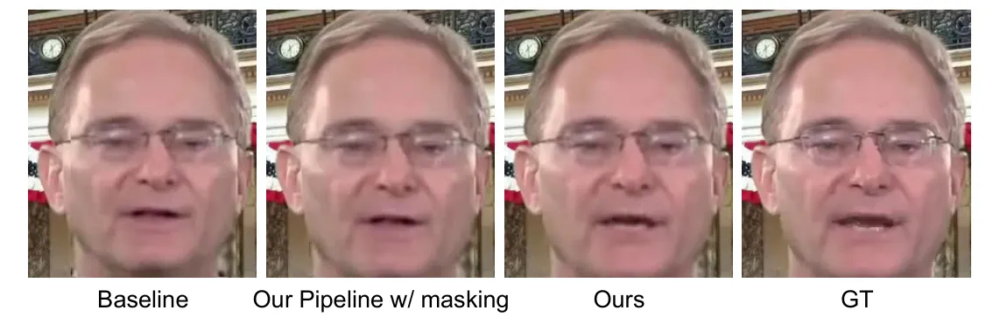

Figure 7: Generated faces with baseline, our pipeline with masking
strategy, and our mask-free pipeline.

### E.2 Hyperparameters Selection

Temporal dimension - T Due to the extensive ablation study conducted in
Wav2Lip \[63\], almost all works in the literature choose $`T=5`$.
Therefore, we follow the literature and select $`T=5`$ as well in
landmark adaptation model as the temporal consistency for speech is
crucial. However, in the landmark prediction model ($`T_{L}`$) and the
face editing model ($`G_{E})`$, we empirically choose $`T=1`$. This is
because these two models are responsible for generating faces with the
neutral mouth, and as a result, there is no need for inter-frame
consistency in lip movements, unlike in talking face generation.
According to our experiments, selecting different values of $`T`$ does
not improve performance, despite slightly increased running time.

Number of previous frames - k We conduct ablation study for empirically
choosing $`k`$. We present the results in Table 12. According to the
scores, the best performance is obtained with $`k=1`$.

| $`k`$    | $`LD_{full}`$ | $`LD_{lip}`$ | $`LD_{c}`$ |
| -------- | ------------- | ------------ | ---------- |
| $`k=1`$  | 9.418         | 2.459        | 0.293      |
| $`k=2`$  | 9.419         | 2.458        | 0.293      |
| $`k=5`$  | 9.405         | 2.458        | 0.291      |
| $`k=10`$ | 9.406         | 2.455        | 0.292      |

Table 12: Ablation study for the hyperparameter $`k`$, which indicates
the number of previous frames used in the landmark prediction model
($`T_{L}`$).

Margin for face cropping after face detection Since the face detection
model used detects faces with a tight crop, we decided to apply a margin
to better cover the boundaries of the face. Without this margin, we
sometimes slightly lose the bottom of the chin and the face boundaries.
Our observations show that a $`10\%`$ margin is the most reasonable
choice. When we use smaller margins, we still lose some face
information. On the other hand, using more than $`10\%`$ introduces
redundant background information unnecessarily.

Audio parameters For these hyperparameters (audio frequency, window
size, hop size), we follow the literature, as they have already been
extensively ablated, and these selected values are considered the gold
standard in audio-driven talking face generation.

## Appendix F Additional Results

Please note that Diff2Lip \[56\] is trained on the VoxCeleb2 dataset,
which consists of over 1 million face-cropped YouTube videos from more
than 6,000 identities. This is a considerably large-scale dataset,
especially when compared to LRS2, which contains only 29 hours of
training data.

We demonstrate additional results in the following figures from our
model. The results show the accuracy of our whole model as well as each
submodule.

In Figure 8, we further compare our model with the existing SOTA models.

In Figure 9, we visualize the input and output of our landmark
prediction model, $`T_{L}`$. While the first rows in each block
represent the input face landmarks, the second rows depict the predicted
landmark maps that have neutral mouth, which is the output of $`T_{L}`$.

In Figure 10, we show the input face and input landmark map, that is
predicted by $`T_{L}`$, for our face editing model, $`G_{E}`$. We also
demonsttrate the generated neutral mouth which is the outout of
$`G_{E}`$. It is the version of the input face with a neutral/closed
mouth. As can be seen from Figure 10, $`G_{E}`$ takes the input face and
the predicted landmark map as a condition to generate a version of the
input face with a neutral mouth while preserving all other details. The
results demonstrate that $`G_{E}`$ effectively closes the mouth, while
maintaining the overall facial consistency, identity, and illumination.

In Figure 11, we present the outputs of each submodule: $`T_{L}`$,
$`G_{E}`$, $`G_{L}`$. In each block:

- •
  The first row visualizes the predicted landmark map (output of
  $`T_{L}`$).
- •
  The second row shows the output of $`G_{E}`$, which is a face image
  with a neutral mouth. During this process, $`G_{E}`$ uses the
  predicted landmark map as a conditioning input.
- •
  The third row has the output of $`G_{L}`$, which is the generated
  talking face conditioned on the audio and the neutral-mouth image
  (generated neutral mouth), generated by $`G_{E}`$.
- •
  The last row contains the ground-truth (GT) face images.

Each block consists of ten sequential frames from different randomly
selected videos in the HDTF dataset.

Figure 8: Additional results from the HDTF dataset. We compare the
performance of different models with our model. Each set of three rows
consists of sequential frames from a different video, presented in a
temporally ordered way.

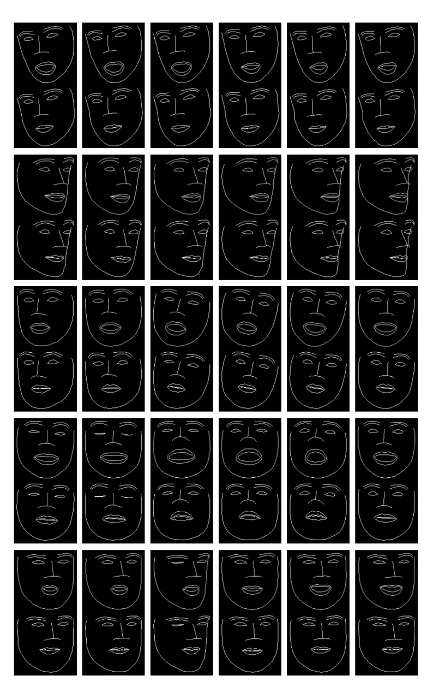

Figure 9: Generated landmark samples. In each block, the first row shows
the landmark map of an input video frame, generally a talking face. The
second row demonstrates the landmarks with a neutral mouth that are
predicted by our landmark prediction model ($`T_{L}`$). Please note that
$`T_{L}`$ predicts only the landmark vector. We visualize these
landmarks to illustrate their appearance in this figure and to use them
as a condition in the face editing model ($`G_{E}`$).

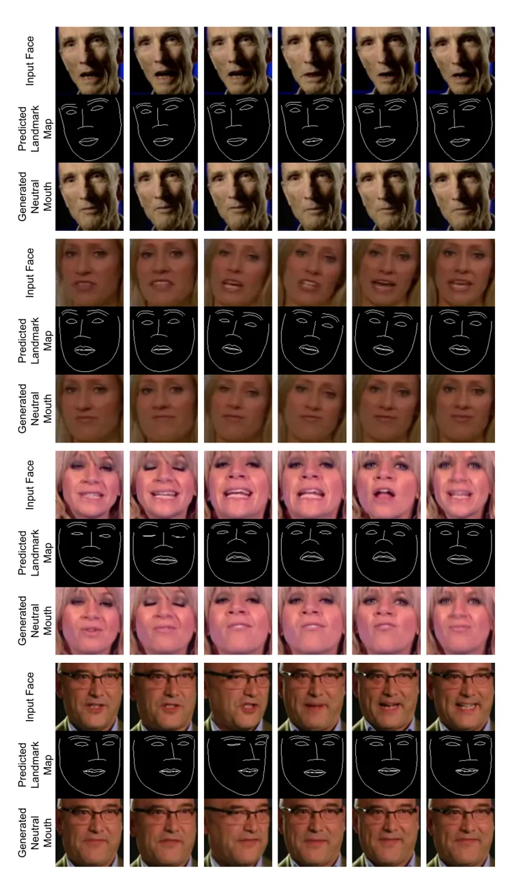

Figure 10: Output images demonstrating the performance of our face
editing model ($`G_{E}`$). In each block, the first row contains the
original input faces, while the second row shows the map of the
predicted landmarks with a neutral mouth (visualized output of
$`T_{L}`$). The last row presents the output images generated by our
face editing model ($`G_{E}`$).

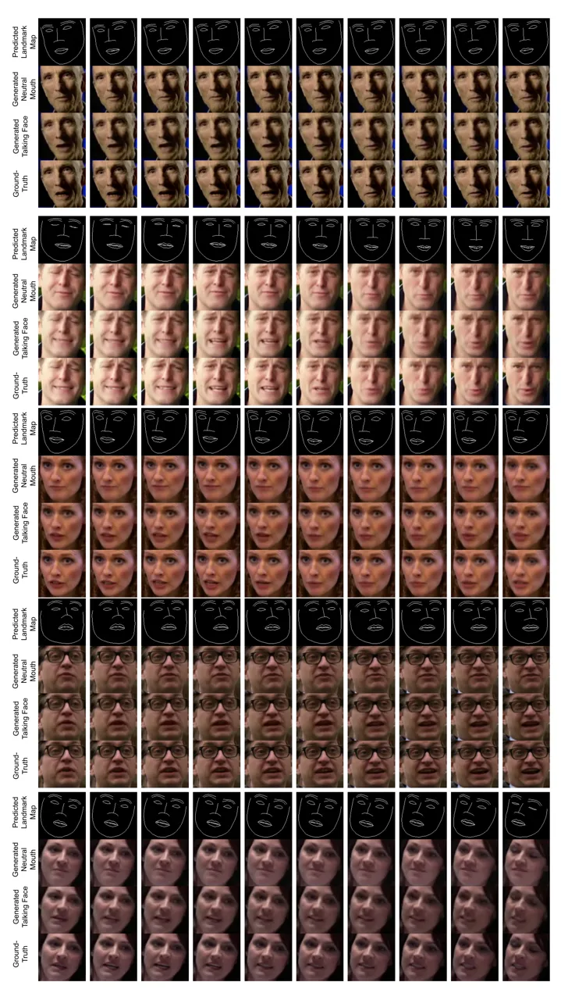

Figure 11: Demonstration of the output of each submodules along with
ground-truth (GT) samples. In each block, rows demonstrate the predicted
landmark map (visualization of predicted landmarks by $`T_{L}`$),
generated neutral mouth (generated by $`G_{E}`$), generated talking face
(generated by $`G_{L}`$), and GT face.
