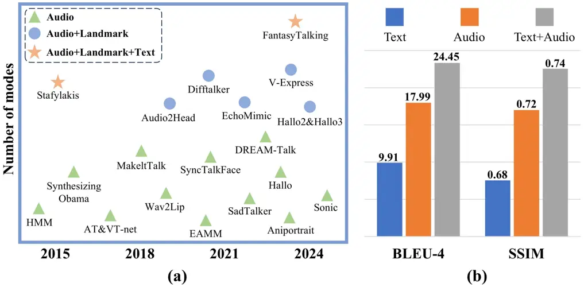
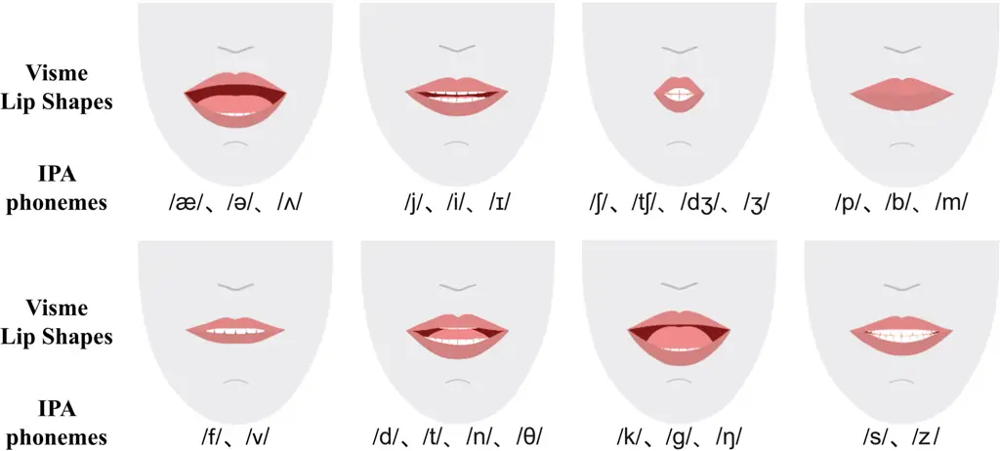
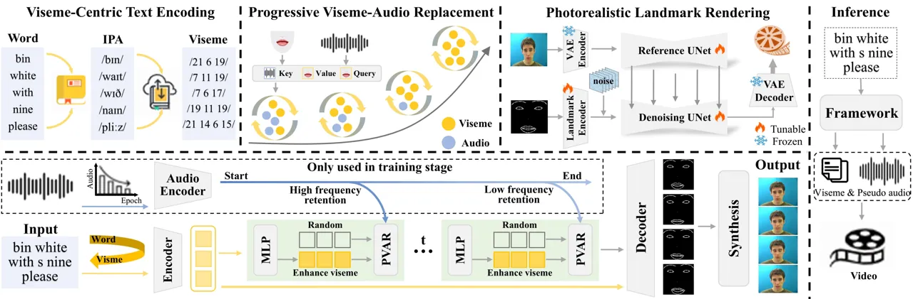

# Text2Lip: Progressive Lip-Synced Talking Face Generation from Text via Viseme-Guided Rendering

Xu Wang    Shengeng Tang ^(†)^(†)thanks: Corresponding author.    Fei
Wang    Lechao Cheng    Dan Guo    Feng Xue    Richang Hong

###### Abstract

Generating semantically coherent and visually accurate talking faces
requires bridging the gap between linguistic meaning and facial
articulation. Although audio-driven methods remain prevalent, their
reliance on high-quality paired audio visual data and the inherent
ambiguity in mapping acoustics to lip motion pose significant challenges
in terms of scalability and robustness. To address these issues, we
propose Text2Lip, a viseme-centric framework that constructs an
interpretable phonetic-visual bridge by embedding textual input into
structured viseme sequences. These mid-level units serve as a
linguistically grounded prior for lip motion prediction. Furthermore, we
design a progressive viseme-audio replacement strategy based on
curriculum learning, enabling the model to gradually transition from
real audio to pseudo-audio reconstructed from enhanced viseme features
via cross-modal attention. This allows for robust generation in both
audio-present and audio-free scenarios. Finally, a landmark-guided
renderer synthesizes photorealistic facial videos with accurate lip
synchronization. Extensive evaluations show that Text2Lip outperforms
existing approaches in semantic fidelity, visual realism, and modality
robustness, establishing a new paradigm for controllable and flexible
talking face generation. Our project homepage is
https://plyon1.github.io/Text2Lip/.

Hefei University of Technology

wangxu2002@mail.hfut.edu.cn, tangsg@hfut.edu.cn

## Introduction

Talking face generation aims to synthesize photorealistic facial videos
synchronized with speech or textual content, enabling applications in
virtual avatars (Tang et al. 2025a; Wang et al. 2025a), accessible
assistive communication (Tang et al. 2022a; Guo, Tang, and Wang 2019),
and human-computer interaction (Tang et al. 2025c; Tang et al. 2025b).
Most existing approaches adopt an audio-driven paradigm, where acoustic
features directly guide lip motion via 3D deformable models (Xu et al.
2024b; Wei, Yang, and Wang 2024) or facial landmarks (Zhou et al. 2020;
Wang et al. 2024). While audio provides rich temporal and prosodic cues
for driving lip motion, obtaining high-quality paired audio-video data
remains costly and error-prone. In contrast, text as input is more
flexible and accessible, making it an attractive alternative, especially
in low-resource or privacy-sensitive scenarios. Apart from this,
directly relying on audio overlooks the intrinsic coupling among text,
phonetics, and visual articulation that underlies human communication.
This leads to a critical limitation: speech-driven models often learn
ambiguous mappings from audio to lip shapes. For example, different
semantic expressions such as “bad boy” and “bat boat” may correspond to
nearly identical lip motions. This ambiguity compromises semantic
precision and visual expressiveness, particularly when emotional clarity
or linguistic fidelity is essential. As illustrated in Figure 1, these
challenges motivate us to rethink modality design. We explore how the
inherent structure of language, when grounded through phonetic and
visemic representations, can effectively guide facial animation, even in
the absence of audio.



Figure 1: Modality usage in talking face generation. (a) Existing
methods predominantly rely on audio inputs to drive lip motion. However,
aligned audio-visual data is often scarce or costly to obtain. (b)
Quantitative comparisons show that audio outperforms text-only input in
fidelity, while combining both modalities yields further improvements.
These observations motivate our viseme-centric approach, which leverages
the accessibility and structure of text to bridge linguistic semantics
and facial motion—enabling robust synthesis even in the absence of
audio.

To address this, we introduce Text2Lip, a viseme-aware framework that
explicitly models the linguistic-phonetic-visual hierarchy. Instead of
relying solely on audio, we convert input text into interpretable viseme
sequences via word-to-phoneme-to-viseme mapping, which serve as
semantically grounded priors for facial motion synthesis. This design
disambiguates visually similar phonemes and enhances semantic-lip
alignment.

Built upon this foundation, we develop a curriculum-based Progressive
Viseme-Audio Replacement strategy. During training, we gradually
transition from real audio to text-derived viseme embeddings, enabling
our model to reconstruct pseudo-audio features through cross-modal
attention. This approach not only allows seamless adaptation to
audio-free settings but also enhances robustness against noisy or
missing speech. To ensure high-quality visual synthesis, we adopt a
landmark-guided Photorealistic Video Rendering module adapted from
EchoMimic (Chen et al. 2025), which converts the predicted landmarks and
optional (real or pseudo) audio into temporally smooth, lip-synced
talking face videos. Our contributions are summarized as follows:

- •
  We propose a novel viseme-centric framework that systematically aligns
  linguistic, phonetic, and visual representations, enabling more
  interpretable and controllable talking face generation.
- •
  We introduce a curriculum-based viseme-audio replacement strategy that
  facilitates flexible modality handling, supporting both audio-driven
  and audio-free generation scenarios.
- •
  Our approach achieves state-of-the-art performance in lip
  synchronization, semantic consistency, and cross-modal robustness,
  demonstrated on multiple benchmarks under varied conditions.

## Related work

### Audio-Driven Talking Face Generation

Audio-driven talking face generation is a long-standing core focus in
audiovisual synthesis. Traditional methods employ explicit 3D
representations, such as 3DMM-based approaches (Zhang et al. 2023b;
Zhang et al. 2023a; Wei, Yang, and Wang 2024; Xu et al. 2024b), which
offer controllability but struggle to capture fine-grained facial
dynamics. End-to-end models (Chen et al. 2025; Xu et al. 2024a;
Ferdowsifard et al. 2021) bypass 3D intermediates by directly mapping
audio to pixels, improving realism and synchronization. Extensions like
Hallo2/3 (Cui et al. 2025a; Cui et al. 2025b) enrich expression
diversity via semantic prompts, but still rely on reference images for
identity consistency. To enhance expressiveness, multimodal methods
incorporate landmarks (Wang et al. 2024), motion fields (Wang et al.
2021), or textual cues (Wei et al. 2025) to supplement audio. Despite
progress, audio remains vulnerable to noise and lacks strong alignment
with non-verbal expressions. These limitations motivate a shift toward
text-driven paradigms. Our work explores a viseme-aware generation
framework that reconstructs expressive lip motion from text alone,
bypassing the limitations of unreliable audio input while preserving
semantic-visual alignment.

### Landmark-based Lip Reading

Lip reading deciphers speech from silent video using visual cues. Early
methods rely on handcrafted features (Lucey, Potamianos, and Sridharan
2008; Chan 2001; Luettin and Thacker 1997), while deep learning
approaches (Stafylakis and Tzimiropoulos 2017) improve spatiotemporal
modeling via CNNs. However, most focus on recognition rather than
generation. Lip-synchronized face generation reverses the task by
synthesizing facial motion from audio. Models like Wav2Lip (Prajwal
et al. 2020), EAMM (Ji et al. 2022), and SyncTalkFace (Park et al. 2022)
leverage lip landmarks or keypoints as intermediates to align audio and
visual dynamics. Despite their success, these methods suffer from
phoneme-to-lip ambiguity, where different phonemes share similar lip
shapes, limiting generation fidelity. To address this, we introduce
visemes—visually discriminative units of speech—as a semantic-visual
bridge. By modeling viseme-aware structures, our approach enhances
disambiguation and improves expressiveness in text- or audio-driven
facial animation.

## Methodology

Although audio-driven talking face generation has made notable progress,
it suffers from intrinsic audio-to-lip ambiguity: different phrases
(_e.g._, ’bad boy’ vs. ’bat boat’) can share nearly identical lip
shapes, leading to semantically inconsistent or visually blurred
outputs. This ambiguity limits both expressiveness and training
stability, especially when semantic precision is needed. To address
this, we introduce visemes, visual units that abstract away acoustic
differences while capturing shared articulatory patterns, as an
intermediate representation. Compared to phonemes, visemes offer a more
visually grounded and interpretable signal to guide the movement of the
lips. This structured visual prior improves semantic alignment, supports
generalization to audio-free settings, and improves generation quality.
We therefore propose a viseme-aware pipeline that transforms text into
viseme sequences to guide subsequent lip motion synthesis. The detailed
process is presented below.



Figure 2: The correspondence between Viseme lip shapes and International
Phonetic Alphabet (IPA) phonemes. Each row shows a set of typical lip
shapes, and the IPA phonemes that trigger the lip shape are marked
below.

### Viseme-Centric Text Encoding

Accurate lip-reading generation hinges on capturing the visual
manifestation of speech articulation. In this context, _visemes_, the
minimal visual units representing distinct lip movements, serve as a
theoretical and practical bridge between phonetic content and facial
motion. Unlike phonemes, visemes abstract away acoustic variations such
as vocal cord vibration, and instead focus on articulatory similarities.
For instance, while /b/ and /p/ differ phonetically, both correspond to
the visual pattern of lips suddenly parting after closure. This visual
commonality positions visemes as a crucial intermediate representation
for aligning text semantics with lip dynamics.

To visually illustrate the phoneme-to-viseme abstraction, Figure 2
presents a representative mapping between International Phonetic
Alphabet (IPA) symbols and their corresponding lip shapes. Each row
depicts a typical viseme category, showcasing the shared articulatory
appearance among phonemes within the same group. For example, for the
phonemes /s/ and /z/, despite differing in vocal cord vibration, exhibit
similar tongue and lip configurations, and are thus assigned to the same
viseme. In contrast, visually distinct phonemes such as /a:/ and /i/ are
grouped into separate viseme classes to preserve critical visual
differences.

Building on this insight, we transform input text into fine-grained
viseme sequences via a multi-stage pipeline. Specifically, we convert
text into IPA sequences using established text-to-phoneme tools, with a
dictionary-based fallback for common words to ensure semantic fidelity.
Next, a predefined phoneme-to-viseme mapping table (from Microsoft’s
Speech API) is used to cluster phonemes into viseme categories based on
articulatory similarity.

The resulting viseme sequence $`\mathbf{V}`$ encapsulates the visual
articulation structure inherent in the text and serves as an
interpretable input for downstream generation. It ensures that lip
movements are visually plausible and semantically coherent at the
pronunciation level, forming a strong visual prior for accurate and
expressive lip-reading synthesis.



Figure 3: Overview of the proposed framework Text2Lip. It contains three
key stages: (1) Viseme-Centric Text Encoding converts text to visemes
via word-phoneme-viseme mapping, (2) Progressive Viseme-Audio
Replacement adopts text-derived viseme embeddings to radually replace
the audio using curriculum learning, and (3) Photorealistic Landmark
Rendering synthesizes high-quality videos with precise lip
synchronization via an adaptive EchoMimic renderer. The inference stage
achieves realistic talking face videos driven solely by text.

### Progressive Viseme-Audio Replacement

While the viseme sequence $`\mathbf{V}`$ provides structured and
semantically grounded visual instructions, directly generating
temporally consistent and expressive facial landmarks from visemes alone
remains challenging—especially under real-world conditions where audio
is noisy, incomplete, or entirely absent. Most prior methods rely
heavily on audio input as the temporal driving force, which limits their
robustness and generalizability. To address this, we propose
_Progressive Viseme-Audio Replacement_ (PVAR), a curriculum learning
strategy that progressively replaces audio features with viseme-derived
from textual embeddings during training. This allows the model to
gradually adapt to text-only inputs, while retaining audio guidance in
early stages to stabilize training. Furthermore, we introduce a
pseudo-audio reconstruction module to recover latent speech information
from enhanced text features, ensuring high-fidelity landmark generation
even without explicit audio.

##### Viseme Feature Extraction.

We employ a Transformer-based encoder to extract high-level semantic
features from viseme sequences. Each viseme token is first linearly
projected into an embedding space with positional encoding:

```math
\displaystyle v^{\prime}_{n}=W^{v}\cdot v_{n}+b^{v}+PE_{v}(n), \tag{1}
```

where $`v_{n}`$ is the one-hot encoding of the $`n`$-th viseme in
vocabulary $`\mathcal{V}`$, $`W^{v}`$ and $`b^{v}`$ are learnable
parameters, and $`PE_{v}(\cdot)`$ denotes sinusoidal position
encoding (Vaswani et al. 2017). The resulting embedded sequence
$`\{v^{\prime}_{n}\}_{n=1}^{N}`$ is processed by a viseme encoder:

```math
\displaystyle\tilde{v}_{1:N}=\text{VisemeEncoder}(v^{\prime}_{1:N}). \tag{2}
```

##### Landmark Generation with Modality Replacement.

To generate accurate facial landmarks under varying modality
availability, we design a Transformer-based module that progressively
drops the audio stream during training and reconstructs it via
pseudo-audio generation. For each time step, facial landmarks and MFCC
audio features are encoded as:

```math
\displaystyle\left\{\begin{array}[]{l}l^{\prime}_{m}=W^{l}\cdot l_{m}+b^{l}+PE_{l}(m),\\
a^{\prime}_{n}=W^{a}\cdot a_{n}+b^{a}+PE_{a}(n),\end{array}\right.
```

where $`l_{m}`$ is the $`m`$-th landmark coordinate, $`a_{n}`$ is the
MFCC audio feature, and $`W^{l},W^{a},b^{l},b^{a}`$ are trainable
weights and biases.

We introduce an audio dropout mechanism governed by a Bernoulli mask
$`\mathbf{M}`$:

```math
\displaystyle\tilde{a}_{1:N}=\mathbf{M}\odot\text{AudioEncoder}(a^{\prime}_{1:N}),\mathbf{M}\sim B(1-p_{\text{drop}}), \tag{6}
```

where $`p_{\text{drop}}`$ is linearly increased over training steps:

```math
\displaystyle p_{\text{drop}}=p_{\text{start}}+\frac{(p_{\text{end}}-p_{\text{start}})\cdot t}{T}, \tag{7}
```

with $`t`$ denoting the current step and $`T`$ the total steps. We set
$`p_{\text{start}}=0`$, $`p_{\text{end}}=1`$ to ensure a full transition
to text-only input.

##### Viseme-Driven Audio Hallucination.

To compensate for missing audio, we enhance the viseme features using a
gated feedforward unit:

```math
\displaystyle\tilde{v}^{\text{enh}}_{1:N}=\text{LayerNorm}(\text{GLU}(\tilde{v}_{1:N})). \tag{8}
```

These enhanced features are fed into a cross-modal pseudo-audio
generator based on multi-head attention:

```math
\displaystyle\hat{a}_{1:N}=\text{MultiheadAttention}(\tilde{a}_{1:N},\tilde{v}^{\text{enh}}_{1:N},\tilde{v}^{\text{enh}}_{1:N}). \tag{9}
```

The reconstructed pseudo-audio $`\hat{a}_{1:N}`$ is then fused through
linear projection and gated modulation:

```math
\displaystyle\hat{a}^{\text{pse}}_{1:N}=W_{a}(\hat{a}_{1:N}\cdot\mathbf{1}_{1\rightarrow N})\odot\sigma(\text{Gate}(\hat{a}_{1:N}\cdot\mathbf{1}_{1\rightarrow N})), \tag{10}
```

where $`W_{a}`$ is a linear transformation, $`\sigma`$ is a sigmoid
activation, and $`\text{Gate}(\cdot)`$ denotes a learnable compression
layer.

##### Cross-Modal Landmark Prediction.

Finally, we use a Transformer-based LipDecoder to synthesize facial
landmark sequences by integrating pseudo-audio, viseme features, and
previously generated poses:

```math
\displaystyle\tilde{l}_{m+1}=\text{LipDecoder}(l^{\prime}_{1:m},\tilde{v}_{1:N},\hat{a}^{\text{pse}}_{1:N}), \tag{11}
```

which can be decomposed into:

```math
\displaystyle\left\{\begin{array}[]{l}z_{m}=\text{CrossAttention}(l^{\prime}_{1:m},\hat{a}^{\text{pse}}_{1:N},\hat{a}^{\text{pse}}_{1:N}),\\
\tilde{l}_{m+1}=\text{CrossAttention}(z_{1:m},\tilde{v}_{1:N},\tilde{v}_{1:N}).\end{array}\right.
```

This design enables the model to synthesize temporally coherent and
semantically aligned facial motion, even under modality-incomplete
conditions.

### Photorealistic Landmark Rendering

Having obtained temporally coherent and semantically aligned facial
landmark sequences $`\{\tilde{l}_{m}\}_{m=1}^{M}`$ through PVAR-based
compensation, we proceed to synthesize photorealistic talking face
videos. This stage translates structural motion cues into pixel-level
facial dynamics while preserving lip-audio synchronization and visual
realism.

To achieve this, we adopt the state-of-the-art _EchoMimic_ model (Chen
et al. 2025) as the video rendering backend. EchoMimic is a
reference-based video synthesis framework that generates high-fidelity
lip-synced talking faces by taking in a sequence of facial landmarks and
auxiliary audio features. It employs a spatiotemporal consistency module
to enforce smooth lip transitions and a texture completion mechanism to
preserve identity and image quality.

Given the predicted landmark trajectory $`\{\tilde{l}_{m+1}\}`$ and
optional audio features (real or pseudo), the video generation process
is defined as:

```math
\displaystyle\text{Video}=\text{Synthesis}(\{\tilde{l}_{m+1}\}_{m=1}^{M},\text{audio}), \tag{15}
```

where audio can refer to original audio or reconstructed pseudo-audio,
depending on availability. In scenarios where audio input is missing,
our framework remains functional by relying solely on viseme-derived
pseudo-audio features, ensuring robustness in low-resource or silent
input conditions.

This design completes our pipeline from textual input to fully generated
talking face video, enabling expressive, semantically accurate, and
modality-flexible synthesis.

### Training Protocol

We finally streamline our core framework as a three-stage design for
text-driven lip-synced talking face generation, as illustrated in
Figure 3.

Stage I: Viseme-Centric Text Encoding converts input text into a
sequence of visual speech units using word-to-phoneme-to-viseme mapping,
establishing a semantically aligned prior for lip motion.

Stage II: Progressive Viseme-Audio Replacement employs curriculum
learning to gradually replace audio inputs with text-derived viseme
embeddings. Cross-modal attention reconstructs pseudo-audio features
from enhanced viseme representations, which are fused with visual cues
to predict temporally coherent facial landmarks.

Stage III: Photorealistic Landmark Rendering synthesizes high-fidelity
videos from landmarks and optional audio (real or pseudo-acoustic) using
our adapted EchoMimic renderer, ensuring accurate lip synchronization
and temporal smoothness.

This comprehensive framework demonstrates robust performance across
different input modalities, supporting both audio-conditioned and
text-only generation scenarios while maintaining high visual quality and
articulation accuracy. The progressive three-stage design effectively
bridges the semantic gap between linguistic inputs and visual outputs
through carefully designed intermediate representations.

[TABLE]

Table 1: Quantitative comparisons with the state-of-the-arts on GRID and
AVDigits datasets.

![](data:image/svg+xml;base64,PHN2ZyBpZD0iU3gzLlQxLnBpYzEzIiBjbGFzcz0ibHR4X3BpY3R1cmUiIGhlaWdodD0iMTYzMi43NyIgb3ZlcmZsb3c9InZpc2libGUiIHZlcnNpb249IjEuMSIgdmlld2JveD0iMCAwIDE3NjAuMDcgMTYzMi43NyIgd2lkdGg9IjE3NjAuMDciPjxnIHN0eWxlPSItLWx0eC1zdHJva2UtY29sb3I6IzAwMDAwMDstLWx0eC1maWxsLWNvbG9yOiMwMDAwMDA7IiBmaWxsPSIjMDAwMDAwIiBmaWxsLXJ1bGU9Im5vbnplcm8iIHN0cm9rZT0iIzAwMDAwMCIgc3Ryb2tlLXdpZHRoPSIxLjZwdCIgdHJhbnNmb3JtPSJ0cmFuc2xhdGUoMCwxNjMyLjc3KSBtYXRyaXgoMSAwIDAgLTEgMCAwKSB0cmFuc2xhdGUoLTIxOS4xOCwwKSB0cmFuc2xhdGUoMCwyMDYwLjA4KSI+PHBhdGggZD0iTSAxOTc4LjE1IC02NTUuMzIgQyAxOTc4LjE1IC02ODQuODQgMTk3My4zNSAtNzA2Ljk4IDE5NjMuNzUgLTcyMS43NCBDIDE5NjMuMDIgLTcyMS43NCAxOTQ3LjUyIC03MzcuOTggMTkxNy4yNiAtNzcwLjQ1IEMgMTg4Mi41OCAtODA4LjgyIDE4MjkuODEgLTg2Ni4zOCAxNzU4Ljk3IC05NDMuMTMgQyAxNjM3LjIgLTEwNzMuMDIgMTQ1My40NCAtMTI2Ni4zNyAxMjA3LjcgLTE1MjMuMTggQyAxMTQyLjAyIC0xNTg1LjkxIDEwNDMuODcgLTE2ODAuMzcgOTEzLjI1IC0xODA2LjU3IEMgNzM5LjA4IC0xOTc0LjgyIDYyOC43NiAtMjA1OC45NSA1ODIuMjYgLTIwNTguOTUgQyA1NjkuNzIgLTIwNTguOTUgNTUyLjM4IC0yMDU3LjQ4IDUzMC4yNCAtMjA1NC41MyBDIDUwMy42NyAtMjA1MC44NCA0NTkuMzkgLTIwMjYuNDggMzk3LjQgLTE5ODEuNDcgQyAzMzUuNDEgLTE5MzUuNzEgMjk3Ljc3IC0xOTAwLjI5IDI4NC40OSAtMTg3NS4yIEMgMjY4Ljk5IC0xODQ1LjY4IDI1My44NiAtMTc1MC4xMSAyMzkuMSAtMTU4OC40OSBDIDIyNi41NiAtMTQ1MC40OSAyMjAuMjkgLTEzNDcuNTQgMjIwLjI5IC0xMjc5LjY1IEMgMjIwLjI5IC0xMjcwLjc5IDIyMC42NSAtMTI1OC45OSAyMjEuMzkgLTEyNDQuMjMgQyAyMjQuMzQgLTExODUuMTkgMjI4LjAzIC0xMTUwLjE0IDIzMi40NiAtMTEzOS4wNyBDIDIzNi44OSAtMTEyOCAyNTguMjkgLTEwOTkuNTggMjk2LjY3IC0xMDUzLjgzIEMgMzI4LjQgLTEwMTYuMTkgMzQ2LjExIC05OTUuNTMgMzQ5LjggLTk5MS44NCBDIDM3MS45NCAtOTY4Ljk2IDM5NC4wOCAtOTUzLjQ3IDQxNi4yMiAtOTQ1LjM1IEMgNDUzLjEyIC05MzIuMDYgNDkxLjg2IC05MjUuNDIgNTMyLjQ1IC05MjUuNDIgQyA1NTkuNzUgLTkyNS40MiA1ODMuMzcgLTkzMy4xNyA2MDMuMyAtOTQ4LjY3IEMgNjIzLjk2IC05NjQuMTcgNjM0LjI5IC05ODguMTUgNjM0LjI5IC0xMDIwLjYyIEMgNjM0LjI5IC0xMDYwLjQ3IDYzOS40NiAtMTEwOS4xOCA2NDkuNzkgLTExNjYuNzQgQyA2NTkuMzggLTEyMTQuNzEgNjY4LjYxIC0xMjYyLjY4IDY3Ny40NiAtMTMxMC42NSBDIDY4MC40MSAtMTMzNS43NCA2OTAuMDEgLTEzNjguOTUgNzA2LjI0IC0xNDEwLjI3IEMgNzIzLjk1IC0xNDMwLjIgNzQ0LjYyIC0xNDQwLjE2IDc2OC4yMyAtMTQ0MC4xNiBDIDc4MC43OCAtMTQ0MC4xNiA4MDkuMTkgLTE0MTguMDIgODUzLjQ3IC0xMzczLjc0IEMgOTMwLjIyIC0xMjk3LjczIDEwODQuNDYgLTExNDYuODEgMTMxNi4xOCAtOTIwLjk5IEMgMTM4Ny43NiAtODUwLjE1IDE0OTYuNjIgLTc0NC45OSAxNjQyLjczIC02MDUuNTEgQyAxNjc2LjY4IC01NzQuNTEgMTczNC45OCAtNTI2LjE4IDE4MTcuNjQgLTQ2MC41IEMgMTg0NC45NCAtNDM5LjEgMTg3NC40NiAtNDI4LjQgMTkwNi4xOSAtNDI4LjQgQyAxOTM5LjQgLTQyOC40IDE5NTkuNyAtNDMyLjgyIDE5NjcuMDggLTQ0MS42OCBDIDE5NzQuNDYgLTQ1MC41MyAxOTc4LjE1IC00NzIuNjcgMTk3OC4xNSAtNTA4LjEgTCAxOTc4LjE1IC02NTUuMzIgWiIgLz48L2c+PC9zdmc+)

indicates the modality used. T, A and L represent Text, Audio and
Landmark respectively.

|                     |                    |                    |                   |                     |                     |
| ------------------- | ------------------ | ------------------ | ----------------- | ------------------- | ------------------- |
| Methods             | BLEU-1$`\uparrow`$ | BLEU-4$`\uparrow`$ | WER$`\downarrow`$ | DTW-P$`\downarrow`$ | MPJPE$`\downarrow`$ |
| PT-GN (ECCV 2020)   | 40.87              | 9.76               | 52.17             | 4.97                | 807.49              |
| GEN-OBT (MM 2022)   | 36.36              | 6.35               | 56.33             | 6.55                | 761.35              |
| LVMCN (ICASSP 2025) | 47.85              | 15.36              | 45.41             | 5.32                | 807.37              |
| Text2Lip(Ours)      | 54.81              | 23.50              | 39.43             | 3.27                | 783.32              |

Table 2: Landmark comparison results on GRID dataset.

## Experiments

### Experimental Settings

#### Datasets.

Following existing works (Assael et al. 2016; Wang et al. 2021), we
conduct experiments on two popular benchmarks GRID (Cooke et al. 2006)
and AVDigits (Hu, Li et al. 2016) to evaluate the effectiveness of the
proposed method. GRID contains videos of 33 speakers, covering a total
of 51 words. Each sentence consists of six words, with a fixed sentence
structure of command + color + preposition + letter + number + adverb
(_e.g._, lay red with y two again). All videos have a consistent
duration of 75 frames. AVDigits captures the speech video of digits 0 to
9 spoken nine times by six speakers. Each video is recorded at 25 fps
and the audio is recorded at 48 kHz. To improve data quality, we screen
the original videos, removing abnormal samples such as those with
excessive head movements, multiple faces, and inconsistencies in the
speaker’s voice. The processed data are divided into training,
validation, and test sets according to  (Assael et al. 2016). In
addition, we also test our model on self-collected data for open-domain
evaluation.

#### Evaluation Metrics.

We use multiple indicators to perform quantitative analysis from
different dimensions. First, we use the SSIM (Wang et al. 2004),
PSNR (Hore and Ziou 2010), LPIPS (Zhang et al. 2018), FID (Heusel et al. 2017) and FVD (Unterthiner et al. 2018) to measure the visual similarity
between the generated videos and the real videos at the image and video
levels. DTW-P (Sakoe and Chiba 2003) and MPJPE (Ionescu et al. 2013) are
adopted to measure the matching degree between the generated landmark
sequence with ground-truth. Besides, we introduce the SyncNet (Chung and
Zisserman 2016) model to calculate Sync-C and Sync-D, in which Sync-C
measures the synchronization consistency between lip sounds and audio,
while the Sync-D evaluates the temporal consistency of dynamic lip
movements. In addition, we design an inverse evaluation to measure the
semantic preservation accuracy of generated videos. Specifically, we
retrain the NSLT (Camgoz et al. 2018) model, which interprets text
sentences from lip reading videos and calculates the text alignment
accuracy, such as BLEU (Papineni et al. 2002), ROUGE (Lin 2004),
WER (Assael et al. 2016), DTW-P (Sakoe and Chiba 2003).

#### Data Prepossessing.

We adopt the DLib (Kazemi and Sullivan 2014) library to accurately
extract the 2D coordinates of 68 facial landmarks from the original
videos. The extracted coordinates are globally normalized to eliminate
individual and environmental variations, producing standardized 2D
facial landmark labels. For audio data, we use the Mel-frequency
cepstral coefficients (MFCC) to preprocess the original audio data,
laying a foundation for subsequent model training and analysis.

#### Model Settings.

Our Text2Lip model is built from 2-layer, 4-head Transformers with a
uniform embedding size of 512. All parts of the network are trained
using the Adam optimizer with a learning rate of $`1\times{10}^{-3}`$
and a batch size of batchsize = 128. All experiments are conducted on a
server equipped with 8 NVIDIA A40 GPUs.

### Comparison with State-of-the-Arts

We compare the Text2Lip with some mainstream talkface generation
methods: V-Express (Wang et al. 2024), AniPortrait (Wei, Yang, and Wang
2024), EchoMimic (Chen et al. 2025), Hallo2 (Cui et al. 2025a),
SadTalker (Zhang et al. 2023b) and Sonic (Ji et al. 2025). It is worth
noting that all compared methods rely on audio input, and some of them
incorporate additional signals such as text or landmarks, while our
model can be deployed under audio-free conditions.

#### Comparison on GRID.

As shown in Table 1, our method Text2Lip achieves superior or comparable
performance across all major evaluation metrics, demonstrating the
effectiveness of our audio-free design. In terms of visual quality, our
model achieves the highest SSIM of 0.740 and PSNR of 19.023,
demonstrating superior structural similarity and pixel-level fidelity
compared to methods leveraging audio (_e.g._, Sonic: SSIM 0.737, PSNR
18.821). Furthermore, we achieve the lowest LPIPS of 0.238 and FID of
32.109, highlighting enhanced perceptual realism and distributional
closeness to real videos. In terms of overall video quality, our method
achieves the best FVD score of 277.65, outperforming all compared
methods, including those utilizing audio and keypoints. While lip sync
accuracy is inherently challenging in the absence of audio, Text2Lip
still achieves Sync-C 4.641 and Sync-D 7.302, surpassing V-Express and
EchoMimic and approaching the performance of strong audio-based methods
SadTalker and Sonic. Despite relying solely on text, Text2Lip surpasses
or approaches the audio-based baseline in all metrics, demonstrating the
feasibility and advantages of audio-free speaking face generation in
real-world scenarios.

We further evaluate Text2Lip landmark generation capabilities on GRID
dataset, with the results shown in Table 2. Text2Lip achieve a BLEU-1
score of 54.81 and a BLEU-4 score of 23.50, significantly outperforming
state-of-the-art methods such as PT-GN (Saunders, Camgoz, and Bowden
2020), GEN-OBT (Tang et al. 2022b), and LVMCN (Wang et al. 2025b),
demonstrating higher semantic fidelity in landmark sequences. Its WER of
39.43 is lower than all other compared methods, further confirming its
accurate landmark sequence reconstruction. In terms of dynamic metrics,
although its MPJPE 783.32 performance is lower than GEN-OBT, overall, we
achieve a balance between semantics and landmark accuracy.

#### Comparison on AVDigits.

As shown in Table 1, Text2Lip also demonstrates highly competitive
performance on the AVDigits dataset. Despite relying solely on text, it
achieves a FVD score of 251.841, surpassing strong baselines such as
V-Express (176.67), Sonic (308.594), and SadTalker (451.286). In terms
of lip synchronization, Text2Lip achieves Sync-C scores of 3.715 and
Sync-D scores of 6.207, comparable to or exceeding audio-based methods
such as SadTalker (3.198/6.317) and V-Express (3.850/6.445),
demonstrating its ability to ensure lip sync coherence without audio
supervision. These results validate the feasibility of the Text2Lip
text-only framework for generating natural, synchronized speaking faces
and extend its utility to scenarios with limited or no audio.

#### User Study.

We conduct subjective evaluations on GRID and AVDigits datasets across
four key dimensions: naturalness, visual clarity, temporal consistency,
and smoothness. A total of 100 participants rated the results of the
five compared methods on a scale of 1 to 5. As shown in Table 5, our
Text2Lip method outperformed the other methods across all four
dimensions, particularly achieving a significant 37% improvement in
smoothness.

|                     |                    |                      |                   |     |                  |                  |                     |                   |
| ------------------- | ------------------ | -------------------- | ----------------- | --- | ---------------- | ---------------- | ------------------- | ----------------- |
| Sources             | Semantic Quality   |                      |                   |     | Video Quality    |                  |                     |                   |
|                     | BLEU-1$`\uparrow`$ | BLEU-4$`\downarrow`$ | WER$`\downarrow`$ |     | SSIM$`\uparrow`$ | PSNR$`\uparrow`$ | LPIPS$`\downarrow`$ | FID$`\downarrow`$ |
| GT                  | 55.20              | 24.45                | 39.48             |     | 0.743            | 19.217           | 0.223               | 30.296            |
| From IndexTTS       | 49.46              | 16.82                | 44.29             |     | 0.718            | 17.631           | 0.281               | 91.276            |
| From offline coding | 51.86              | 19.72                | 41.84             |     | 0.721            | 17.859           | 0.276               | 87.655            |
| From viseme (Ours)  | 54.81              | 23.50                | 39.43             |     | 0.740            | 19.023           | 0.238               | 32.109            |

Table 3: Comparison results of different audio sources on GRID dataset.

|                             |                    |                      |                   |     |                  |                  |                     |                   |
| --------------------------- | ------------------ | -------------------- | ----------------- | --- | ---------------- | ---------------- | ------------------- | ----------------- |
| Methods                     | Semantic Quality   |                      |                   |     | Video Quality    |                  |                     |                   |
|                             | BLEU-1$`\uparrow`$ | BLEU-4$`\downarrow`$ | WER$`\downarrow`$ |     | SSIM$`\uparrow`$ | PSNR$`\uparrow`$ | LPIPS$`\downarrow`$ | FID$`\downarrow`$ |
| Text                        | 40.04              | 9.91                 | 52.64             |     | 0.681            | 15.896           | 0.301               | 187.628           |
| Text $`\rightarrow`$ Viseme | 47.23              | 14.78                | 45.76             |     | 0.702            | 17.553           | 0.292               | 120.391           |
| Text2Lip (Ours)             | 54.81              | 23.50                | 39.43             |     | 0.740            | 19.023           | 0.238               | 32.109            |

Table 4: The role of viseme conversion strategy and pseudo-audio
generation module on GRID dataset.

|                 |                        |                        |                        |                        |
| --------------- | ---------------------- | ---------------------- | ---------------------- | ---------------------- |
| Methods         | Naturalness            | Visual clarity         | Temporal consistency   | Smoothness             |
| Sonic           | 3.35                   | 3.16                   | 3.22                   | 3.05                   |
| Hallo2          | 2.82                   | 2.92                   | 2.71                   | 2.75                   |
| AniPortrait     | 2.57                   | 3.01                   | 2.63                   | 2.71                   |
| V-Express       | 1.62                   | 2.19                   | 2.31                   | 2.28                   |
| Text2Lip (Ours) | 3.97 (19%$`\uparrow`$) | 4.23 (34%$`\uparrow`$) | 4.26 (32%$`\uparrow`$) | 4.19 (37%$`\uparrow`$) |

Table 5: User study comparison on GRID dataset.

### Ablation Study

#### The Role of Viseme-centric Text Encoding.

The experimental analysis in Table 4 shows that viseme-centric encoding
effectively bridges the semantic gap, resolves phoneme ambiguity, and
significantly improves semantic quality indicators (BLEU-1 increases by
17.9% to 47.23, and WER decreases by 13.1% to 45.76). It also enhances
lip movement coherence and promotes video quality optimization (FID
decreases to 120.391, and SSIM increases by 0.702). Furthermore, the
PVAR strategy gradually replaces audio features with text embeddings
during training through curriculum learning, and collaborates with the
pseudo-audio generation module to re-encode the audio features. The new
method uses acoustic constraints to achieve a performance leap in the
absence of audio: at the semantic level, BLEU-4 significantly increases
by 59.1% to 23.50, and WER further decreases by 13.8% to 39.43; at the
visual fidelity level, FID plummets by 73.3% to 32.109, LPIPS increases
by 18.5% to 0.238, and PSNR increases by 8.4% to 19.023, confirming the
reasonable guidance of pseudo-audio on lip movements and verifying that
Text2Lip provides an explainable technical paradigm for cross-modal
generation.

#### Effect of Progressive Viseme-Audio Replacement.

As shown in Table 3, we compare three audio sources: audio generated by
IndexTTS, offline coding audio, and our proposed pseudo-audio. Our
method achieves superior semantic quality (BLEU-1: 54.81, BLEU-4: 23.50,
WER: 39.43) compared to both IndexTTS and offline encoding. In terms of
visual quality, our method also surpasses the baselines in SSIM (0.740),
PSNR (19.023), and FID (32.109), demonstrating improvements in both
semantic accuracy and visual realism. Notably, our pseudo-audio achieves
performance close to that of ground-truth audio, demonstrating its
ability to effectively capture the speech features crucial for
high-quality speaking face generation and effectively achieving the
desired effect of audio replacement.

Figure 4: Visualization examples on GRID dataset.

Figure 5: Visualization examples of unseen sentences in open domains.

### Qualitative Results

#### Visualization Results on dataset.

Figure 4 shows a qualitative comparison between baseline methods (Sonic,
Hallo2, AniPortrait and V-Express) and our method on GRID dataset,
focusing on the third column (blink dynamics) and the sixth column (lip
shape details) with significant differences. In terms of tone-driven
blinks, the compared methods suffer from insufficient closure (_e.g._,
residual eyelid occlusion in Sonic and Hallo2) and abrupt transitions
(_e.g._, uniform occlusion lacking gradualness in AniPortrait). Our
method accurately captures eyelid edge alignment and light-shadow
transitions, and its closure duration and opening and closing amplitude
are highly consistent with the GT. Regarding lip shape details, the
comparisons exhibit blurred contours (_e.g._, jagged edges in V-Express)
and motion asymmetry (_e.g._, lip deviation in AniPortrait). Our method
generates lip shapes with clear anatomical structure, a natural
transition between the upper lip peak and lower lip valley that aligns
with articulatory dynamics, and a closer approximation to the GT. The
results show that Text2Lip can achieve fine coordination of eyebrow
movement, eyelid opening and closing, and lip shape while keeping the
head stable, and is overall closer to the natural human expressions.

#### Performance on Unseen Sentences.

To verify its performance on unseen open-domain sentences, we use the
real complex sentence “please set eight red bins with green in one
place” for visualization analysis. As shown in Figure 5, compared to
mainstream methods such as Sonic, Hallo2, AniPortrait and V-Expres, our
method significantly outperforms in lip shape naturalness, lip fluency,
and semantic relevance: The lip shape space closely matches the
articulatory movements (_e.g._, lips open in “eight” and lips closed in
“set”), and generalization is stable in the open domain (even robust to
untrained sentences). The enlarged image further verifies that key
phonemes (_e.g._, lips open in the vowel “eight” \textipa/eI/ and lips
and teeth contact in the final /t/) are strictly mapped to viseme lip
shape, demonstrating the advantages of viseme decoupled representation.
This method enables precise control of lip-synced talking faces
generation in complex open-domain scenarios, providing technical support
for cross-modal visual interaction.

Figure 6: Visualization examples of unseen speakers in open domains.

#### Performance on Unseen Speakers.

As shown in the visualization in Figure 6, we conducted validation
analysis on unseen speakers in an open-domain scenario. For character
settings with differentiated basic appearance features, such as boys
with glasses and long-haired girls, the generated video sequences
accurately reproduced the speech-synchronized lip movements and
micro-expression dynamics of the reference image while preserving key
features of the target identity. Furthermore, in complex, blurred
scenes, the algorithm effectively separated foreground characters from
interfering background information. The generated dynamic images
preserved the subject’s facial details while also appropriately filling
in the blurred areas through adaptive background generation, verifying
the model’s stability under the influence of environmental variables. In
the challenging cartoon art style task, the generated results
successfully captured the line features and color semantics of the
hand-drawn style, transforming the real-life reference into a virtual
avatar with a distinctive artistic style. The overall results show that
the identity-separated lip-sync video generation strategy can be
flexibly transferred to different roles and scenarios, providing an
effective solution for speaker-unseen talking face generation in open
domains.

## Conclusions

In this work, we propose a viseme-centric framework, Text2Lip, that
bridges linguistic semantics and visual articulation for viseme-driven
lip-synced talking face generation. The proposed method addresses key
limitations of conventional audio-driven approaches through three core
innovations: structured viseme mapping for semantic-aligned lip motion
priors, curriculum-based viseme-audio replacement for robust multi-modal
handling, and landmark-guided rendering for photorealistic synthesis.
Extensive evaluations demonstrate superior performance in both semantic
consistency, visual quality, and generalization in open domains.

## References

- Assael et al. (2016) Assael, Y. M.; Shillingford, B.; Whiteson, S.;
  and De Freitas, N. 2016. Lipnet: End-to-end sentence-level lipreading.
  _arXiv preprint arXiv:1611.01599_.
- Camgoz et al. (2018) Camgoz, N. C.; Hadfield, S.; Koller, O.; Ney, H.;
  and Bowden, R. 2018. Neural Sign Language Translation. In _Computer
  Vision and Pattern Recognition_, 7784–7793.
- Chan (2001) Chan, M. T. 2001. HMM-based audio-visual speech
  recognition integrating geometric-and appearance-based visual
  features. In _IEEE Fourth Workshop on Multimedia Signal Processing_,
  9–14.
- Chen et al. (2025) Chen, Z.; Cao, J.; Chen, Z.; Li, Y.; and
  Ma, C. 2025. Echomimic: Lifelike audio-driven portrait animations
  through editable landmark conditions. In _Proceedings of the AAAI
  Conference on Artificial Intelligence_, 2403–2410.
- Chung and Zisserman (2016) Chung, J. S.; and Zisserman, A. 2016. Out
  of time: automated lip sync in the wild. In _Workshop on Multi-view
  Lip-reading, ACCV_.
- Cooke et al. (2006) Cooke, M.; Barker, J.; Cunningham, S.; and
  Shao, X. 2006. An audio-visual corpus for speech perception and
  automatic speech recognition. _The Journal of the Acoustical Society
  of America_, 120(5): 2421–2424.
- Cui et al. (2025a) Cui, J.; Li, H.; Yao, Y.; Zhu, H.; Shang, H.;
  Cheng, K.; Zhou, H.; Zhu, S.; and Wang, J. 2025a. Hallo2:
  Long-Duration and High-Resolution Audio-Driven Portrait Image
  Animation. In _The Thirteenth International Conference on Learning
  Representations_.
- Cui et al. (2025b) Cui, J.; Li, H.; Zhan, Y.; Shang, H.; Cheng, K.;
  Ma, Y.; Mu, S.; Zhou, H.; Wang, J.; and Zhu, S. 2025b. Hallo3: Highly
  dynamic and realistic portrait image animation with video diffusion
  transformer. In _Proceedings of the Computer Vision and Pattern
  Recognition Conference_, 21086–21095.
- Ferdowsifard et al. (2021) Ferdowsifard, K.; Barke, S.; Peleg, H.;
  Lerner, S.; and Polikarpova, N. 2021. LooPy: interactive program
  synthesis with control structures. _Proceedings of the ACM on
  Programming Languages_, 5(OOPSLA): 1–29.
- Guo, Tang, and Wang (2019) Guo, D.; Tang, S.; and Wang, M. 2019.
  Connectionist Temporal Modeling of Video and Language: A Joint Model
  for Translation and Sign Labeling. In _International Joint Conference
  on Artificial Intelligence_, 751–757.
- Heusel et al. (2017) Heusel, M.; Ramsauer, H.; Unterthiner, T.;
  Nessler, B.; and Hochreiter, S. 2017. Gans trained by a two time-scale
  update rule converge to a local nash equilibrium. _Advances in neural
  information processing systems_, 30.
- Hore and Ziou (2010) Hore, A.; and Ziou, D. 2010. Image quality
  metrics: PSNR vs. SSIM. In _2010 20th international conference on
  pattern recognition_, 2366–2369. IEEE.
- Hu, Li et al. (2016) Hu, D.; Li, X.; et al. 2016. Temporal multimodal
  learning in audiovisual speech recognition. In _Proceedings of the
  IEEE Conference on Computer Vision and Pattern Recognition_,
  3574–3582.
- Ionescu et al. (2013) Ionescu, C.; Papava, D.; Olaru, V.; and
  Sminchisescu, C. 2013. Human3. 6m: Large scale datasets and predictive
  methods for 3d human sensing in natural environments. _IEEE
  transactions on pattern analysis and machine intelligence_, 36(7):
  1325–1339.
- Ji et al. (2025) Ji, X.; Hu, X.; Xu, Z.; Zhu, J.; Lin, C.; He, Q.;
  Zhang, J.; Luo, D.; Chen, Y.; Lin, Q.; et al. 2025. Sonic: Shifting
  focus to global audio perception in portrait animation. In
  _Proceedings of the Computer Vision and Pattern Recognition
  Conference_, 193–203.
- Ji et al. (2022) Ji, X.; Zhou, H.; Wang, K.; Wu, Q.; Wu, W.; Xu, F.;
  and Cao, X. 2022. Eamm: One-shot emotional talking face via
  audio-based emotion-aware motion model. In _ACM SIGGRAPH 2022
  Conference Proceedings_, 1–10.
- Kazemi and Sullivan (2014) Kazemi, V.; and Sullivan, J. 2014. One
  millisecond face alignment with an ensemble of regression trees. In
  _Proceedings of the IEEE conference on computer vision and pattern
  recognition_, 1867–1874.
- Lin (2004) Lin, C.-Y. 2004. Rouge: A package for automatic evaluation
  of summaries. In _Text summarization branches out_, 74–81.
- Lucey, Potamianos, and Sridharan (2008) Lucey, P.; Potamianos, G.; and
  Sridharan, S. 2008. Patch-based analysis of visual speech from
  multiple views. In _International Conference on Auditory-Visual Speech
  Processing_, 69–74.
- Luettin and Thacker (1997) Luettin, J.; and Thacker, N. A. 1997.
  Speechreading using probabilistic models. _Computer vision and image
  understanding_, 65(2): 163–178.
- Papineni et al. (2002) Papineni, K.; Roukos, S.; Ward, T.; and Zhu,
  W.-J. 2002. Bleu: a method for automatic evaluation of machine
  translation. In _Proceedings of the 40th annual meeting of the
  Association for Computational Linguistics_, 311–318.
- Park et al. (2022) Park, S. J.; Kim, M.; Hong, J.; Choi, J.; and Ro,
  Y. M. 2022. Synctalkface: Talking face generation with precise
  lip-syncing via audio-lip memory. In _AAAI Conference on Artificial
  Intelligence_, 2062–2070.
- Prajwal et al. (2020) Prajwal, K.; Mukhopadhyay, R.; Namboodiri,
  V. P.; and Jawahar, C. 2020. A lip sync expert is all you need for
  speech to lip generation in the wild. In _ACM international conference
  on multimedia_, 484–492.
- Sakoe and Chiba (2003) Sakoe, H.; and Chiba, S. 2003. Dynamic
  programming algorithm optimization for spoken word recognition. _IEEE
  transactions on acoustics, speech, and signal processing_, 26(1):
  43–49.
- Saunders, Camgoz, and Bowden (2020) Saunders, B.; Camgoz, N. C.; and
  Bowden, R. 2020. Progressive Transformers for End-to-End Sign Language
  Production. In _European Conference on Computer Vision_, 687–705.
- Stafylakis and Tzimiropoulos (2017) Stafylakis, T.; and
  Tzimiropoulos, G. 2017. Combining residual networks with LSTMs for
  lipreading. _arXiv preprint arXiv:1703.04105_.
- Tang et al. (2022a) Tang, S.; Guo, D.; Hong, R.; and Wang, M. 2022a.
  Graph-Based Multimodal Sequential Embedding for Sign Language
  Translation. _IEEE Transactions on Multimedia_, 4433–4445.
- Tang et al. (2025a) Tang, S.; He, J.; Cheng, L.; Wu, J.; Guo, D.; and
  Hong, R. 2025a. Discrete to Continuous: Generating Smooth Transition
  Poses from Sign Language Observations. In _Computer Vision and Pattern
  Recognition Conference_, 3481–3491.
- Tang et al. (2025b) Tang, S.; He, J.; Guo, D.; Wei, Y.; Li, F.; and
  Hong, R. 2025b. Sign-IDD: Iconicity Disentangled Diffusion for Sign
  Language Production. In _AAAI Conference on Artificial Intelligence_,
  7266–7274.
- Tang et al. (2022b) Tang, S.; Hong, R.; Guo, D.; and Wang, M. 2022b.
  Gloss Semantic-Enhanced Network with Online Back-Translation for Sign
  Language Production. In _ACM International Conference on Multimedia_,
  5630–5638.
- Tang et al. (2025c) Tang, S.; Xue, F.; Wu, J.; Wang, S.; and Hong, R.
  2025c. Gloss-Driven Conditional Diffusion Models for Sign Language
  Production. _ACM Transactions on Multimedia Computing, Communications
  and Applications_, 1–17.
- Unterthiner et al. (2018) Unterthiner, T.; Van Steenkiste, S.; Kurach,
  K.; Marinier, R.; Michalski, M.; and Gelly, S. 2018. Towards accurate
  generative models of video: A new metric & challenges. _arXiv preprint
  arXiv:1812.01717_.
- Vaswani et al. (2017) Vaswani, A.; Shazeer, N.; Parmar, N.; Uszkoreit,
  J.; Jones, L.; Gomez, A. N.; Kaiser, Ł.; and Polosukhin, I. 2017.
  Attention is All You Need. In _Neural Information Processing Systems_,
  1–11.
- Wang et al. (2024) Wang, C.; Tian, K.; Zhang, J.; Guan, Y.; Luo, F.;
  Shen, F.; Jiang, Z.; Gu, Q.; Han, X.; and Yang, W. 2024. V-express:
  Conditional dropout for progressive training of portrait video
  generation. _arXiv preprint arXiv:2406.02511_.
- Wang et al. (2021) Wang, S.; Li, L.; Ding, Y.; Fan, C.; and
  Yu, X. 2021. Audio2Head: Audio-driven One-shot Talking-head Generation
  with Natural Head Motion. In _Proceedings of the Thirtieth
  International Joint Conference On Artificial Intelligence, Ijcai
  2021_, 1098–1105. International Joint Conferences on Artificial
  Intelligence Organization.
- Wang et al. (2025a) Wang, X.; Tang, S.; Cheng, L.; Li, F.; Wang, S.;
  and Hong, R. 2025a. SignAligner: Harmonizing Complementary Pose
  Modalities for Coherent Sign Language Generation. _arXiv preprint
  arXiv:2506.11621_.
- Wang et al. (2025b) Wang, X.; Tang, S.; Song, P.; Wang, S.; Guo, D.;
  and Hong, R. 2025b. Linguistics-vision monotonic consistent network
  for sign language production. In _ICASSP 2025-2025 IEEE International
  Conference on Acoustics, Speech and Signal Processing (ICASSP)_, 1–5.
  IEEE.
- Wang et al. (2004) Wang, Z.; Bovik, A. C.; Sheikh, H. R.; and
  Simoncelli, E. P. 2004. Image quality assessment: from error
  visibility to structural similarity. _IEEE transactions on image
  processing_, 13(4): 600–612.
- Wei et al. (2025) Wei, C.; Sun, B.; Ma, H.; Hou, J.; Juefei-Xu, F.;
  He, Z.; Dai, X.; Zhang, L.; Li, K.; Hou, T.; et al. 2025. Mocha:
  Towards movie-grade talking character synthesis. _arXiv preprint
  arXiv:2503.23307_.
- Wei, Yang, and Wang (2024) Wei, H.; Yang, Z.; and Wang, Z. 2024.
  Aniportrait: Audio-driven synthesis of photorealistic portrait
  animation. _arXiv preprint arXiv:2403.17694_.
- Xu et al. (2024a) Xu, M.; Li, H.; Su, Q.; Shang, H.; Zhang, L.; Liu,
  C.; Wang, J.; Yao, Y.; and Zhu, S. 2024a. Hallo: Hierarchical
  audio-driven visual synthesis for portrait image animation. _arXiv
  preprint arXiv:2406.08801_.
- Xu et al. (2024b) Xu, S.; Chen, G.; Guo, Y.-X.; Yang, J.; Li, C.;
  Zang, Z.; Zhang, Y.; Tong, X.; and Guo, B. 2024b. Vasa-1: Lifelike
  audio-driven talking faces generated in real time. _Advances in Neural
  Information Processing Systems_, 37: 660–684.
- Zhang et al. (2023a) Zhang, C.; Wang, C.; Zhang, J.; Xu, H.; Song, G.;
  Xie, Y.; Luo, L.; Tian, Y.; Guo, X.; and Feng, J. 2023a. Dream-talk:
  Diffusion-based realistic emotional audio-driven method for single
  image talking face generation. _arXiv preprint arXiv:2312.13578_.
- Zhang et al. (2018) Zhang, R.; Isola, P.; Efros, A. A.; Shechtman, E.;
  and Wang, O. 2018. The unreasonable effectiveness of deep features as
  a perceptual metric. In _Proceedings of the IEEE conference on
  computer vision and pattern recognition_, 586–595.
- Zhang et al. (2023b) Zhang, W.; Cun, X.; Wang, X.; Zhang, Y.; Shen,
  X.; Guo, Y.; Shan, Y.; and Wang, F. 2023b. Sadtalker: Learning
  realistic 3d motion coefficients for stylized audio-driven single
  image talking face animation. In _Proceedings of the IEEE/CVF
  conference on computer vision and pattern recognition_, 8652–8661.
- Zhou et al. (2020) Zhou, Y.; Han, X.; Shechtman, E.; Echevarria, J.;
  Kalogerakis, E.; and Li, D. 2020. Makelttalk: speaker-aware
  talking-head animation. _ACM Transactions On Graphics_, 39(6): 1–15.
