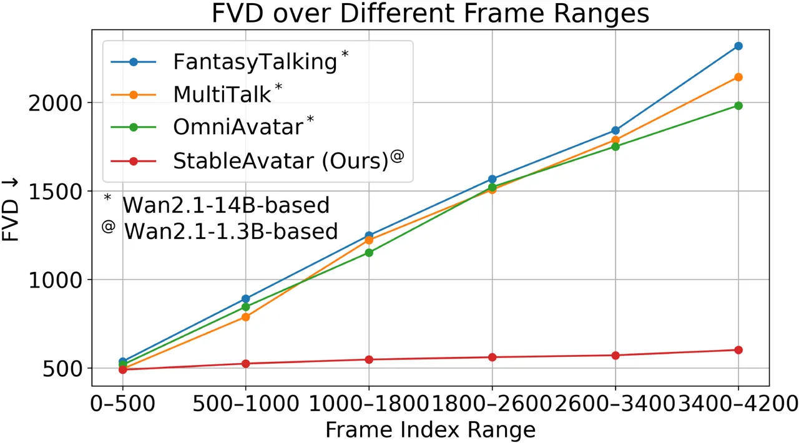
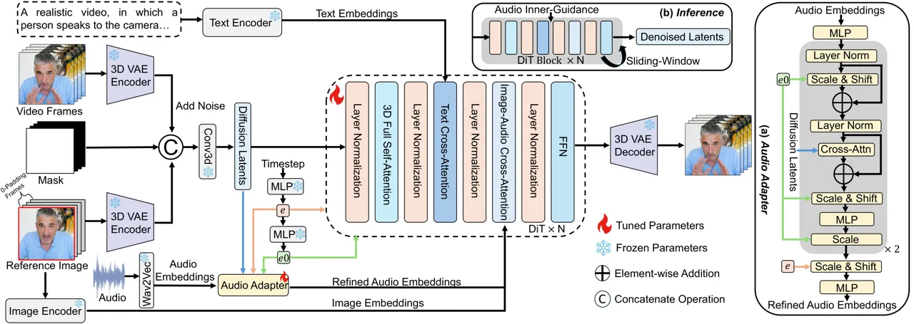
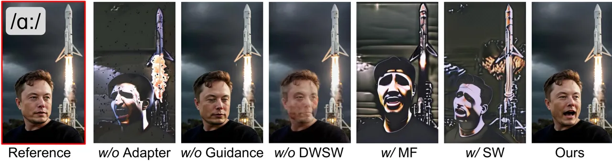
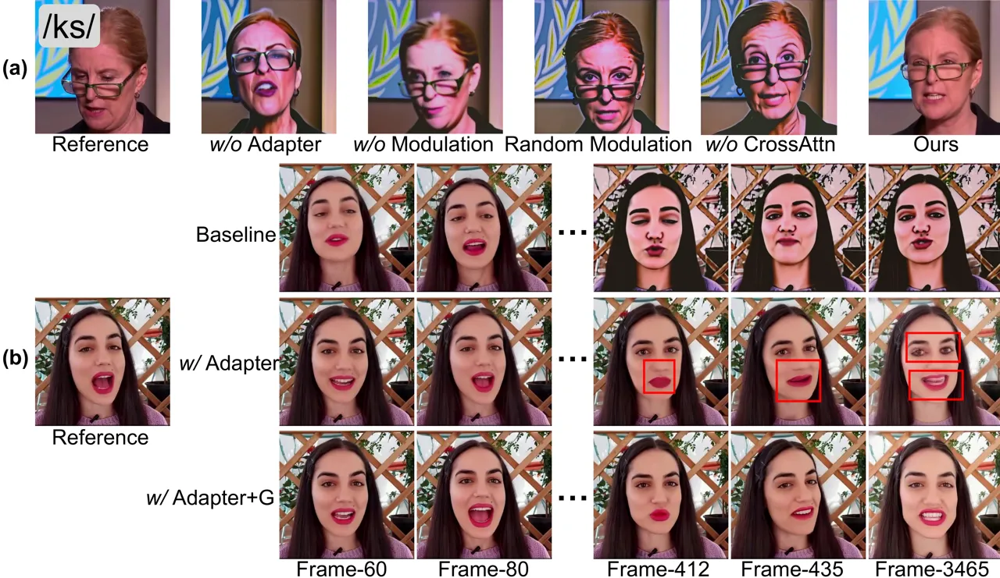
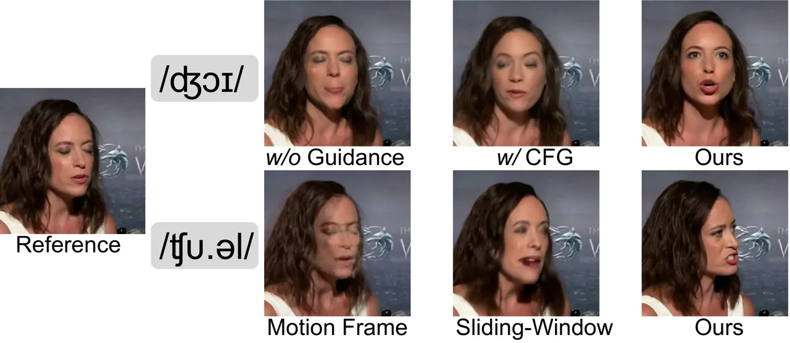
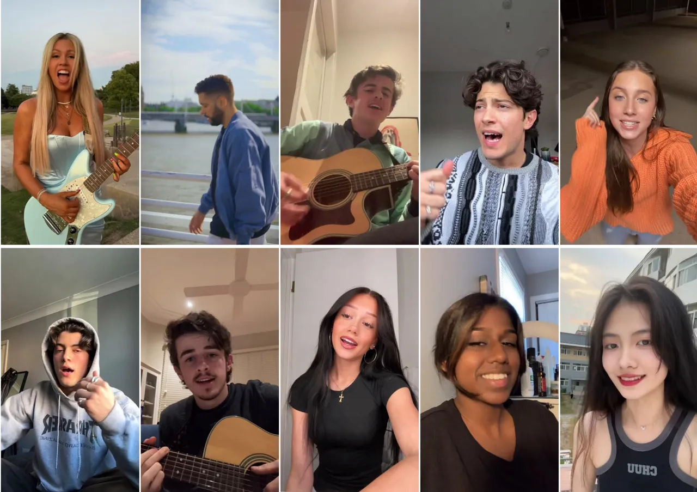
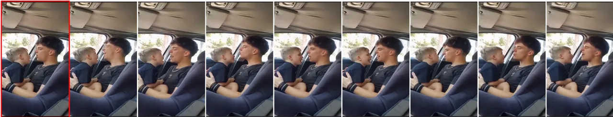
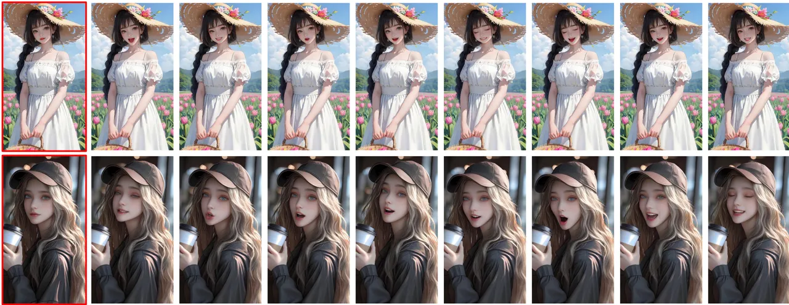
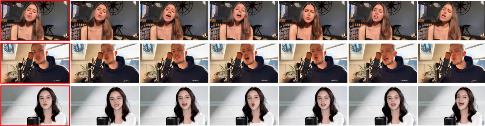
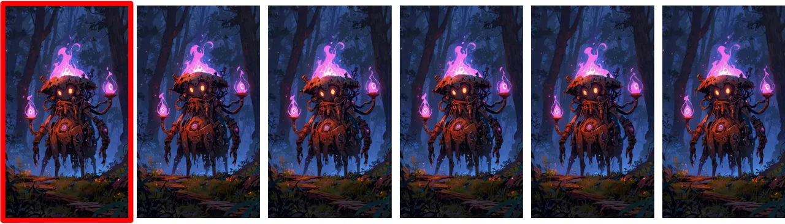

# StableAvatar: Infinite-Length Audio-Driven Avatar Video Generation

Shuyuan Tu Yueming Pan Yinming Huang Xintong Han Zhen Xing Qi Dai Chong
Luo Affiliation: Fudan University Affiliation: Microsoft Research Asia
Affiliation: Xi’an Jiaotong University Affiliation: Hunyuan, Tencent
Inc.[https://francis-rings.github.io/StableAvatar](https://francis-rings.github.io/StableAvatar)
   Zuxuan Wu Yu-Gang Jiang Affiliation: Fudan University

###### Abstract

Current diffusion models for audio-driven avatar video generation
struggle to synthesize long videos with natural audio synchronization
and identity consistency. This paper presents StableAvatar, the first
end-to-end video diffusion transformer that synthesizes infinite-length
high-quality videos without post-processing. Conditioned on a reference
image and audio, StableAvatar integrates tailored training and inference
modules to enable infinite-length video generation. We observe that the
main reason preventing existing models from generating long videos lies
in their audio modeling. They typically rely on third-party
off-the-shelf extractors to obtain audio embeddings, which are then
directly injected into the diffusion model via cross-attention. Since
current diffusion backbones lack any audio-related priors, this approach
causes severe latent distribution error accumulation across video clips,
leading the latent distribution of subsequent segments to drift away
from the optimal distribution gradually. To address this, StableAvatar
introduces a novel Time-step-aware Audio Adapter that prevents error
accumulation via time-step-aware modulation. During inference, we
propose a novel Audio Native Guidance Mechanism to further enhance the
audio synchronization by leveraging the diffusion’s own evolving joint
audio-latent prediction as a dynamic guidance signal. To enhance the
smoothness of the infinite-length videos, we introduce a Dynamic
Weighted Sliding-window Strategy that fuses latent over time.
Experiments on benchmarks show the effectiveness of StableAvatar both
qualitatively and quantitatively.

![[Uncaptioned
image]](arxiv-2508-08248--4584b4163d8d.figures/figure-1.webp)

Figure 1: Audio-driven avatar videos generated by StableAvatar, showing
its power to synthesize infinite-length ID-preserving videos. The
presented videos last over 3 minutes (FPS=30). Frame-X refers to the
X-th frame of the synthesized avatar video.



Figure 2: Quantitative comparisons in quality drift. a-b on the x-axis
is the frame range from the a-th frame to the b-th frame.

## 1 Introduction

Diffusion models \[75, 77, 76, 12, 24, 25, 53, 51, 47, 40, 21, 63, 72,
59, 60, 61, 62, 32\] have significantly inspired research in
audio-driven avatar video generation \[81, 71, 67, 41, 10, 69, 6, 30,
14, 27\]. In particular, audio-driven avatar video generation aims to
synthesize natural human-centric videos with synchronized facial
expressions and body movements based on a reference image and audio,
offering diverse applications in film production and virtual assistants.
However, current approaches are limited to generating short avatar
videos of less than 15 seconds, and when they attempt to generate videos
longer than 15 seconds, significant body distortions and appearance
inconsistencies occur, particularly in facial regions. This severely
restricts their practical applications.

To address this issue, several methods have explored consistency
preservation for avatar video generation \[27, 10, 30, 14\], yet limited
effort has been devoted to tackling the underlying essence of the
problem. These strategies—whether leveraging motion frames \[78\] or
adopting various shifted-window mechanisms during inference—only
partially improve the smoothness of long videos and fail to
fundamentally mitigate quality degradation in infinite-length avatar
videos. One could alternatively split a long audio into segments,
process each independently, and then concatenate them to form a
continuous video. However, this approach introduces inconsistencies and
abrupt transitions between segments. Thus, for audio-driven avatar video
generation, end-to-end synthesis of infinite-length avatar videos while
ensuring high fidelity remains an extremely challenging task.

In light of this, we propose StableAvatar, consisting of dedicated
modules for both training and inference to maintain ID consistency and
audio synchronization for audio-driven high-quality and infinite-length
avatar video generation, as shown in Fig. 3. We first observe that the
primary limitation preventing previous models from synthesizing
infinite-length videos lies in their audio modeling. They simply use a
third-party off-the-shelf extractor \[1\] to obtain audio embeddings,
and then directly inject them into a Video Diffusion Transformer via
cross-attention. As current diffusion backbones lack any audio-related
priors, this approach results in severe latent distribution error
accumulation across video clips, leading the latent distribution of
subsequent segments to gradually drift away from the target
distribution. To tackle this, StableAvatar feeds audio embeddings to a
Video Diffusion Transformer with a novel Timestep-aware Audio Adapter
that dramatically reduces error accumulation over clips. In particular,
initial audio embeddings (Query) sequentially cross-attend with initial
patchified latents (Key and Value), followed by affine modulation with
timestep embeddings to obtain the refined audio embeddings. As timestep
embeddings are strongly correlated with latents, this potentially forces
the diffusion to model the joint audio-latent feature distribution at
each timestep, effectively mitigating latent distribution error
accumulation due to the lack of audio priors. Following \[69, 30, 14\],
the refined audio embeddings (Key and Value) are injected into the
diffusion model via cross-attention with latents (Query).

During inference, to further enhance the audio synchronization and
facial expression, StableAvatar introduces a novel Audio Native Guidance
Mechanism to replace the conventional Classify-Free-Guidance
(CFG) \[23\]. As the refined audio embeddings are also inherently
dependent on the latents, rather than solely relying on external audio
signals, our guidance directly manipulates the diffusion’s sampling
distribution, steering the generation towards the joint audio-latent
distribution and enabling the diffusion model to refine its outputs
throughout the denoising process. StableAvatar further proposes a
dynamic weighted sliding-window denoising strategy that fuses latents
over time to improve the smoothness in long avatar video generation.

As shown in Fig. 1 and Fig. 2, while the latest audio-driven avatar
video generation model OmniAvatar \[14\] suffers from dramatic face/body
distortion and color drift, StableAvatar accurately animates the
reference with natural lip synchronization driven by audio while
preserving the overall consistency, even in the infinite-length video
generation scenario (3500+ frames in a single pass).

In conclusion, our contributions are as follows: (1) We propose a novel
Timestep-aware Audio Adapter to force the diffusion model to capture
joint audio-latent features, thereby significantly reducing latent
distribution error accumulation during audio injection, making
StableAvatar the first video diffusion transformer that generates
infinite-length audio-driven avatar video end-to-end. (2) A novel
training-free Audio Native Guidance Mechanism replaces the conventional
CFG to further enhance audio synchronization, while a dynamic weighted
sliding-window denoising strategy improves the smoothness of synthesized
long videos. (4) Experimental results on benchmark datasets show the
superiority of StableAvatar over the SOTA. Notably, based on a
Wan2.1-1.3B model \[66\], we surpass previous Wan2.1-14B-based models in
video quality for long-video generation.

## 2 Related Work



Figure 3: Architecture of StableAvatar. (a) refers to the structure of
the Audio Adapter. Embeddings from the Image Encoder and Text Encoder
are injected to each block of DiT. Given the audio, we extract the audio
embeddings utilizing Wav2Vec. To model joint audio-latent
representations, the audio embeddings are fed into the Audio Adapter,
and its outputs are injected into the DiT via cross-attention.

Video Generation. The capacity for diversity and high fidelity in
diffusion models \[12, 24, 25, 58, 42, 53, 51, 47, 40, 21, 63\] has
sparked significant interest in their potential for video generation.
Early video diffusion models \[49, 3, 18, 74, 70, 59, 5, 60, 61\]
primarily leverage the U-Net architecture for video generation by adding
temporal layers to pre-trained image diffusion models for joint
spatio-temporal modeling. Recent works \[2, 26, 29, 66\] replace the
U-Net with the Diffusion-in-Transformer (DiT) architecture \[44\] for
stronger scalability. Inspired by previous works \[69, 30, 14\], we
utilize Wan2.1 \[66\] as the backbone.

Audio-Driven Avatar Video Generation. Audio-driven avatar video
generation aims to animate a reference human image based on given audio.
Early works \[17, 81, 8, 43, 79, 15, 67\] first convert audio into
features \[56, 52\], and then use a motion-to-video model (GAN \[16\])
projects these features into videos. Recently, some studies have applied
diffusion models to this field. Most works \[54, 71, 27, 7, 31, 28\]
leverage the diffusion model to integrate audio cues with lips, which
only supports head movement. CyberHost \[33\] and FantasyTalking \[69\]
aim to animate half-body avatars. EMO2 \[55\] and EchomimicV2 \[41\] use
hand pose sequences to improve half-body video quality. OmniHuman \[34\]
applies a mixed data training strategy for scaling up.
HunyuanVideo-Avatar \[6\] and MultiTalk \[30\] aim to synthesize
multi-character animation. OmniAvatar \[14\] supports full-body avatar
video generation. However, previous works suffer from face/body
distortion and color drift, particularly when generating long avatar
videos. While some works \[10, 27, 30, 14, 78\] propose strategies for
long video generation, their approaches are only activated during
inference and primarily improve smoothness, without addressing the
underlying cause of distortion—latent error accumulation. StableAvatar
addresses these issues and performs infinite-length high-quality avatar
video generation.

Long Video Generation Strategy. Generating long videos \[50, 4, 19, 65,
57, 80, 38, 37\] is extremely challenging due to temporal complexity and
the need for content consistency. Nuwa-XL \[80\] and StreamingT2V \[20\]
both adopt short-long memory blocks to ensure long video consistency.
Gen-L-Video \[68\] and FreeNoise \[45\] extend videos by merging
overlapping sub-segments with a sliding window. FreeLong \[38\] and
FreeLong++ \[37\] blend global and local video features for consistency.
However, audio-driven avatar video generation cannot directly apply the
above methods, as they are designed for Text-to-Video tasks and exhibit
a significant domain gap with audio.

## 3 Method

Illustrated in Fig. 3, StableAvatar is based on the commonly used
Wan2.1 \[66\] following previous works \[69, 30, 14\]. The audio is
first fed to Wav2Vec \[1\] to gain audio embeddings, which are
subsequently refined for reducing latent distribution error accumulation
via our Audio Adapter. The refined audio embeddings are then fed to the
denoising DiT. More details are described in Sec. 3.1. Following \[66\],
a reference image is processed through the diffusion model via two
pathways: (1) Concatenated with zero-filled frames along the temporal
axis and transformed into a latent code by a frozen 3D VAE
Encoder \[66\]. The latent code is further concatenated with compressed
video frames and binary masks (the first frame is 1 and all subsequent
frames are 0) in the channel axis. (2) Encoded by the CLIP Image
Encoder \[46\] to obtain image embeddings, which are fed to each
image-audio cross-attention block of a denoising DiT, to modulate the
synthesized appearance.

We replace the original input video frames with random noise during
inference, while the other inputs stay the same. We propose a novel
Audio Native Guidance to replace conventional CFG \[23\] for further
facilitating lip synchronization and facial expression, as detailed in
Sec. 3.2. We introduce a dynamic weighted sliding-window denoising
strategy that fuses latent over time to enhance the video smoothness
during long video generation, as detailed in Sec. 3.3.

### 3.1 Timestep-aware Audio Adapter

Our goal is to generate infinite-length avatar videos under the guidance
of the audio while preserving the content consistency. Previous
works \[10, 69, 14, 6, 30, 27, 41\] exhibit significant face and body
distortions, along with color drift, in avatar videos longer than 15
seconds. This issue is attributed to their audio modeling, which
directly injects the third-party off-the-shelf audio embeddings \[1\]
into diffusion models via cross-attention. Current diffusion
backbones \[3, 66, 29\] lack audio-related priors, causing significant
latent distribution errors to accumulate across video clips when
injecting audio embeddings into the diffusion. This results in the
latent distribution of subsequent segments gradually drifting away from
the optimal distribution. To address this, we propose a novel
Timestep-aware Audio Adapter, in which the audio embeddings go through
multiple affine modulations and cross-attention blocks to interact with
timestep embeddings and latents as shown in Fig. 3.

Concretely, following \[54, 30\], we first use Wav2Vec \[1\] to extract
the raw audio embeddings $`\bm{a}`$. As the current state is influenced
by preceding and succeeding audio frames, we then concatenate them
proximal to the current frames, gaining audio embeddings
$`\bm{emb}_{aud}`$:

```math
\displaystyle\bm{emb}_{aud}^{i}=\mathtt{Concat}(\bm{a}^{i-k},...,\bm{a}^{i},...,\bm{a}^{i+k}), \tag{1}
```

where $`2k+1`$ is the context length. We further feed $`\bm{emb}_{aud}`$
to our Audio Adapter for addressing the error accumulation issue. Given
a timestep, following \[66\], the DiT uses two successive MLP layers to
obtain overall timestep embeddings $`\bm{e}\in{\cal{R}}^{1\times D}`$
and projected timestep embeddings $`\bm{e0}\in{\cal{R}}^{6\times D}`$.
$`D`$ refers to the latent dimension. In diffusion pretraining, latents
are tightly coupled with the timestep embeddings. Each timestep
embedding corresponds to a distinct latent distribution, revealing a
strong correlation between the latents and the timestep embeddings. Due
to this strong correlation, applying timestep-aware affine modulations
to $`\bm{emb}_{aud}`$ can implicitly bridge the joint relationship
between $`\bm{emb}_{aud}`$ and latents $`\bm{z}_{i}`$, enabling the
diffusion model to more effectively capture joint audio-latent features,
thereby overcoming the scarcity of audio priors. The modulations (scale
and shift) are the same as those in the DiT for domain consistency:

```math
\displaystyle\bm{emb}_{aud}^{\lambda} \displaystyle=\mathtt{LN}(\mathtt{MLP}(\bm{emb}_{aud}), \tag{2}
```

```math
\displaystyle\bm{emb}_{aud}^{\gamma} \displaystyle=\bm{e0}[2]*(\bm{emb}_{aud}^{\lambda}*(1+\bm{e0}[1])+\bm{e0}[0])+\bm{emb}_{aud}^{\lambda},
```

where $`\mathtt{LN}(\cdot)`$ is Layer Norm. $`\mathtt{MLP}(\cdot)`$ aims
to project $`\bm{emb}_{aud}`$ onto the latent dimension. To further
explicitly enhance joint audio-latent modeling, we perform
cross-attention between $`\bm{emb}_{aud}^{\gamma}`$ (Query) and
$`\bm{z}_{t}`$ (Key and Value), with the outputs modulated by
$`\bm{e0}`$ as follows:

```math
\displaystyle\bm{emb}_{aud}^{{}^{\prime}} \displaystyle=\mathtt{CAttn}(\mathtt{LN}(\bm{emb}_{aud}^{\gamma}),\bm{z}_{t})+\mathtt{LN}(\bm{emb}_{aud}^{\gamma}), \tag{3}
```

```math
\displaystyle\bm{emb}_{aud}^{\eta} \displaystyle=\mathtt{MLP}(\mathtt{LN}(\bm{emb}_{aud}^{{}^{\prime}})*(1+\bm{e0}[4])+\bm{e0}[3]),
```

```math
\displaystyle\bm{emb}_{aud}^{*} \displaystyle=\bm{emb}_{aud}^{{}^{\prime}}+\bm{e0}[5]*\bm{emb}_{aud}^{\eta},
```

where $`\mathtt{CAttn}(\bm{x},\bm{y})`$ refers to cross-attention
operation, in which $`\bm{x}`$ is the Query and $`\bm{y}`$ is the Value
and Key. To more comprehensively establish the joint relationship
between latents and audio representations, $`\bm{emb}_{aud}^{*}`$ is
modulated by $`\bm{e}`$ to gain the refined audio embeddings
$`\bar{\bm{a}}_{t}`$:

```math
\displaystyle\bm{e} \displaystyle=\mathtt{Repeat}(\bm{e})+\bm{r}, \tag{4}
```

```math
\displaystyle\bar{\bm{a}}_{t} \displaystyle=\mathtt{MLP}(\bm{emb}_{aud}^{*}*(1+\bm{e}[1])+\bm{e}[0]),
```

where $`\mathtt{Repeat}(\cdot)`$ and $`\bm{r}`$ refer to duplicating
along the channel dimension twice and learnable parameters. We
ultimately inject $`\bar{\bm{a}}_{t}`$ into the DiT via cross attention:

```math
\displaystyle\bar{\bm{z}}_{t} \displaystyle=\mathtt{CAttn}(\bm{z}_{t},\bar{\bm{a}}_{t})+\mathtt{CAttn}(\bm{z}_{t},\bm{emb}_{img}), \tag{5}
```

where $`\bm{emb}_{img}`$ refers to the image embeddings.

### 3.2 Audio Native Guidance

To further enhance audio synchronization and facial expression, we
propose a novel Audio Native Guidance mechanism to replace the
conventional CFG \[23\], which does not take joint audio-latent
relationship into consideration. We modify the denoising score
function \[53\] to steer the denoising process forward in a way that
maximizes both audio synchronization and naturalness. In particular,
according to our Audio Adapter, $`\bar{\bm{a}}_{t}`$ depends on the
latents and the given audio. Thus, we treat $`\bar{\bm{a}}_{t}`$ as an
additional prediction of the DiT, guiding the diffusion model to capture
the joint audio-latent distribution, conditioned on the external signal
and model parameters. The denoising process is given by:

```math
\displaystyle\bar{\bm{p}}_{\theta}([\bm{z}_{t},\bar{\bm{a}}_{t}]|\bm{A})\propto\bm{p}_{\theta}([\bm{z}_{t},\bar{\bm{a}}_{t}]|\bm{A})\bm{p}_{\theta}(\bm{A}|[\bm{z}_{t},\bar{\bm{a}}_{t}])^{\alpha}\bm{p}_{\theta}(\bar{\bm{a}}_{t}|\bm{z}_{t},\bm{A})^{\beta}, \tag{6}
```

where $`\bar{\bm{p}}_{\theta}(\cdot)`$, $`\bm{p}_{\theta}(\cdot)`$, and
$`\bm{A}`$ refer to the modified sampling process, original sampling
process, and audio. $`\alpha`$ and $`\beta`$ are guidance scales.
Following Bayes’ Theorem, we obtain:

```math
\displaystyle\bm{p}_{\theta}([\bm{z}_{t},\bar{\bm{a}}_{t}]|\bm{A})(\frac{\bm{p}_{\theta}([\bm{z}_{t},\bar{\bm{a}}_{t}],\bm{A})}{\bm{p}_{\theta}(\bm{z}_{t},\bar{\bm{a}}_{t})})^{\alpha}(\frac{\bm{p}_{\theta}([\bm{z}_{t},\bar{\bm{a}}_{t}],\bm{A})}{\bm{p}_{\theta}(\bm{z}_{t},\bm{A})})^{\beta} \tag{7}
```

```math
\displaystyle\rightarrow \displaystyle\bm{p}_{\theta}([\bm{z}_{t},\bar{\bm{a}}_{t}]|\bm{A})(\frac{\bm{p}_{\theta}([\bm{z}_{t},\bar{\bm{a}}_{t}]|\bm{A})\bm{p}_{\theta}(\bm{A})}{\bm{p}_{\theta}(\bm{z}_{t},\bar{\bm{a}}_{t})})^{\alpha}(\frac{\bm{p}_{\theta}([\bm{z}_{t},\bar{\bm{a}}_{t}]|\bm{A})}{\bm{p}_{\theta}(\bm{z}_{t}|\bm{A})})^{\beta}.
```

As $`\bm{p}_{\theta}(\bm{A})`$ is a constant probability, we remove it
as follows:

```math
\displaystyle\bm{p}_{\theta}([\bm{z}_{t},\bar{\bm{a}}_{t}]|\bm{A})(\frac{\bm{p}_{\theta}([\bm{z}_{t},\bar{\bm{a}}_{t}]|\bm{A})}{\bm{p}_{\theta}(\bm{z}_{t},\bar{\bm{a}}_{t})})^{\alpha}(\frac{\bm{p}_{\theta}([\bm{z}_{t},\bar{\bm{a}}_{t}]|\bm{A})}{\bm{p}_{\theta}(\bm{z}_{t}|\bm{A})})^{\beta}. \tag{8}
```

We further convert Eq. 8 to the score function format:

```math
\displaystyle(1+\alpha+\beta)\nabla_{\theta}\log\bm{p}_{\theta}([\bm{z}_{t},\bar{\bm{a}}_{t}]|\bm{A}) \tag{9}
```

```math
\displaystyle-\alpha\nabla_{\theta}\log\bm{p}_{\theta}([\bm{z}_{t},\bar{\bm{a}}_{t}])-\beta\nabla_{\theta}\log\bm{p}_{\theta}(\bm{z}_{t}|\bm{A}).
```

Thus, the inference formulation can be described as:

```math
\displaystyle(1+\alpha+\beta)\bm{D}([\bm{z}_{t},\bar{\bm{a}}_{t}],\bm{y},\bm{I},\bm{A};\theta) \tag{10}
```

```math
\displaystyle-\alpha\bm{D}([\bm{z}_{t},\bar{\bm{a}}_{t}],\bm{y},\bm{I},\emptyset;\theta)-\beta\bm{D}([\bm{z}_{t},\emptyset],\bm{y},\bm{I},\bm{A};\theta),
```

where $`\bm{D}(\cdot)`$, $`\bm{y}`$, and $`\bm{I}`$ refer to the
diffusion model, text prompt, and reference image. Notably, $`\bm{I}`$
and $`\bm{y}`$ are not guidance factors, as we find that incorporating
$`\bm{I}`$ and $`\bm{y}`$ into the guidance substantially increases GPU
resource consumption and does not significantly improve visual quality.
The Audio Native Guidance mechanism regards $`\bar{\bm{a}}_{t}`$ as an
additional prediction target for the diffusion model, allowing the model
to be guided by the joint audio-latent distribution, thereby ensuring
that audio and latents are strongly correlated during the denoising
process. It significantly reduces distribution error accumulation in
audio-driven video generation, even when the base model lacks audio
priors.

1: Input: $`\bm{emb}_{aud}^{[0,L]}`$, $`T`$, $`\bm{z}_{T}^{[0,L]}`$,
$`\bm{D}(\cdot)`$, $`l~(l<L)`$, $`m`$, $`\bm{y}`$, $`\bm{I}`$

2: for $`t\in\{T,\ldots,1\}`$ do $`\triangleright`$ $`T`$ is denoising
steps

3:   $`\text{start index }s=0`$ $`\triangleright`$ $`m`$ is overlap
length between windows

4:   $`\text{end index }e=s+l`$ $`\triangleright`$ $`l`$ is video
clip/window length

5:   $`\text{previous end index }e_{prev}=e`$ $`\triangleright`$
$`\bm{z}_{T}^{[0,L]}`$ are noised latents

6:   while $`e\leq L`$ do $`\triangleright`$ $`\bm{I}`$ is the reference
image

7:   
$`\bm{z}_{t-1}^{[s,e]}=\bm{D}(\bm{z}_{t}^{[s,e]},\bm{emb}_{aud}^{[s,e]},t,\bm{y},\bm{I})`$
$`\triangleright`$ $`\bm{y}`$ is the text

8:    if $`s\neq 0`$ and $`t\neq T`$: $`\triangleright`$
$`\mathtt{log1p}(x)`$ is $`\log(x+1)`$

9:     $`\bm{w}=\mathtt{np.linspace}(0,1,\text{num\_samples=}m)`$

10:     $`\bm{w}=\mathtt{np.log1p}(\bm{w}*(\mathtt{np.exp}(1)-1))`$

11:    
$`\bm{w}=\frac{\bm{w}-\mathtt{min}(\bm{w})}{\mathtt{max}(\bm{w})-\mathtt{min}(\bm{w})}`$

12:    
$`\bm{z}_{t-1}^{[s,s+m]}=\bm{w}*\bm{z}_{t-1}^{[s,s+m]}+(1-\bm{w})*\bm{z}_{t-1}^{[e_{prev}-m,e_{prev}]}`$

13:    if $`e<L`$: $`\triangleright`$ It’s for the edge case of the
final clip

14:     $`e_{prev}=e,s=s+(l-m)`$

15:     $`e=\mathtt{min}(s+l,L)`$

16:    else: break

17: return $`\bm{z}_{0}^{[0,L]}`$

Algorithm 1 Dynamic Weighted Sliding-Window Strategy

### 3.3 Dynamic Weighted Sliding-Window Strategy

To improve the smoothness of synthesized long avatar videos, we further
propose a Dynamic Weighted Sliding-Window Strategy (DWSW) during
inference. Compared with the previous sling-window denoising
strategy \[27\], overlapping latents between adjacent windows are fused
using a sliding window mechanism, where the fusion weights follow a
logarithmic interpolation based on the relative frame indices, as
described in the Algorithm 1 and Fig. 8. $`L`$ is the VAE-compressed
total video length. The fused latents are injected back into both
adjacent windows, ensuring that both boundaries of the central window
consist of blended features. Leveraging a logarithmic weighting function
introduces a progressive smoothing effect in the transitions between
video clips. Early stages experience a more pronounced weight variation,
while later stages exhibit subtle shifts, resulting in seamless
continuity across video clips.

### 3.4 Training

We use the reconstruction loss to train our model, with trainable
components including attention modules of a Dit and an Audio Adapter. We
introduce face masks $`\bm{M}_{face}`$ and lip masks $`\bm{M}_{lip}`$,
extracted by Mediapipe \[39\] from the input video frames to enhance the
modeling of face regions:

```math
\displaystyle\mathcal{L}=\begin{cases}\mathbb{E}_{\theta}(\left\|(\bm{z}_{gt}-\bm{z}_{\theta})\odot\bm{M}_{face}\right\|^{2}),~~~0.4\leq\bm{q}<0.5&\\
\mathbb{E}_{\theta}(\left\|(\bm{z}_{gt}-\bm{z}_{\theta})\odot\bm{M}_{lip}\right\|^{2}),~~~~~~~\bm{q}\geq 0.5&\\
\mathbb{E}_{\theta}(\left\|(\bm{z}_{gt}-\bm{z}_{\theta})\odot(1+\bm{M}_{face}+\bm{M}_{lip})\right\|^{2}),\text{otherwise}&\end{cases} \tag{11}
```

where $`\bm{z}_{gt}`$ and $`\bm{z}_{\varepsilon}`$ refer to diffusion
latents and denoised latents, respectively. $`\bm{q}`$ is a random
variable uniformly distributed over the interval $`[0,1]`$. This
piecewise objective separately supervises lip synchronization and facial
expression, enabling more targeted learning.

## 4 Experiments

### 4.1 Implementation Details

Our training dataset is composed of three parts: Hallo3 \[10\],
Celebv-HQ \[83\], and videos collected from the internet, totaling 1200
hours of video. Following previous works \[69, 10, 30, 14\], we evaluate
our model on HDTF \[82\] and semi-body AVSpeech \[13\]. Since previous
works do not open-source their testing datasets, we randomly select 100
videos (5-20 seconds long) from HDTF and AVSpeech, respectively. We
conduct additional experiments on 100 unseen videos (2-5 minutes long),
referred to the Long100, selected from the internet to assess the
robustness of our model during long avatar animation. Our DiT uses
pre-trained weights of Wan2.1-I2V 1.3B \[66, 36\], while the Audio
Encoder is trained from scratch. Our model is trained for 20 epochs on
64 NVIDIA A100 80G GPUs, with a batch size of 1 per GPU. We set learning
rate=1$`e`$-5, $`\alpha=4.5`$, and $`\beta=3.0`$.

| Model                 | FID$`\downarrow`$   | FVD$`\downarrow`$ | CSIM$`\uparrow`$  | Sync-C$`\uparrow`$ | Sync-D$`\downarrow`$ | IQA$`\uparrow`$ | ASE$`\uparrow`$ |
| --------------------- | ------------------- | ----------------- | ----------------- | ------------------ | -------------------- | --------------- | --------------- |
| SadTalker \[81\]      | 53.12/120.57/194.88 | 567/1468/2261     | 0.821/0.802/0.423 | 7.25/4.13/3.21     | 9.86/9.72/11.16      | 3.12/2.40/2.31  | 2.14/1.43/1.38  |
| Aniportrait \[71\]    | 46.35/118.86/190.66 | 537/1524/2095     | 0.815/0.796/0.415 | 3.88/1.95/1.13     | 10.84/11.58/12.87    | 3.82/2.28/2.10  | 2.41/1.31/1.22  |
| Sonic \[27\]          | 62.17/187.42/278.40 | 552/2051/2877     | 0.843/0.825/0.451 | 8.16/6.04/4.03     | 7.65/8.94/10.23      | 3.28/2.24/2.08  | 2.05/1.36/1.13  |
| EchoMimic \[7\]       | 63.43/108.13/178.12 | 593/1123/1885     | 0.849/0.837/0.456 | 5.44/4.59/3.64     | 9.27/9.78/10.74      | 3.64/2.97/2.31  | 2.23/1.82/1.43  |
| Hallo3 \[10\]         | 44.31/98.14/170.44  | 438/987/1724      | 0.845/0.834/0.462 | 6.58/5.16/4.42     | 8.64/9.62/9.92       | 3.50/3.38/2.35  | 2.11/1.96/1.36  |
| FantasyTalking \[69\] | 46.74/80.01/175.78  | 479/823/1789      | 0.863/0.853/0.468 | 3.42/2.98/1.92     | 12.15/11.422/11.78   | 3.55/3.24/2.42  | 2.28/1.89/1.48  |
| HunyuanAvatar \[6\]   | 52.16/77.53/172.94  | 625/868/1743      | 0.866/0.859/0.472 | 7.20/6.74/4.34     | 8.39/8.28/10.07      | 3.56/3.63/2.46  | 2.25/2.21/1.52  |
| MultiTalk \[30\]      | 46.94/75.67/175.52  | 446/804/1768      | 0.868/0.861/0.465 | 7.53/4.88/4.12     | 8.02/9.59/10.18      | 3.54/3.72/2.42  | 2.15/2.25/1.45  |
| OmniAvatar \[14\]     | 41.79/72.56/168.49  | 424/744/1621      | 0.862/0.857/0.471 | 7.50/6.78/4.45     | 8.26/8.05/9.62       | 3.55/3.74/2.51  | 2.27/2.29/1.56  |
| Ours                  | 38.14/68.12/57.18   | 375/640/504       | 0.875/0.872/0.849 | 8.15/7.56/8.24     | 6.94/7.85/6.79       | 3.90/3.79/3.84  | 2.46/2.32/2.39  |

Table 1: Quantitative comparisons on HDTF/AVSpeech/Long100. In the table
elements $`a`$ / $`b`$ / $`c`$, $`a`$, $`b`$, and $`c`$ refer to the
result on the HDTF, AVSpeech, and Long100, respectively. The average
video duration of HDTF and AVSpeech is 10 seconds, while Long100 is 3
minutes.

### 4.2 Comparison with State-of-the-Art Methods

Quantitative results. Regarding metrics, we use FID \[22\] and
FVD \[64\] to assess the quality of synthesized images and videos. We
further use the Q-align model \[73\] to evaluate the video quality (IQA)
and aesthetic metrics (ASE). Sync-C \[9\] and Sync-D \[9\] are utilized
to assess the synchronization of lips with audio. CSIM \[81\] evaluates
the cosine similarity between the facial embeddings of two images. We
compare with recent audio-driven avatar video generation models,
including GAN-based models (SadTalker \[81\]) and diffusion-based models
(SD-based: AniPortrait \[71\], EchoMimic \[7\]; SVD-based: Sonic \[27\];
CogVideo-5B-based: Hallo3 \[10\]; HunyuanVideo-13B-based:
HunyuanAvatar \[6\]; Wan-14B-based: FantasyTalking \[69\],
MultiTalk \[30\], OmniAvatar \[14\]). Based on previous studies that
assess quantitative results using the self-driven and reconstruction
approach, we perform quantitative comparisons with the above competitors
on HDTF \[82\], AVSpeech \[13\], and Long100. Notably, all competitors
are trained on our dataset before evaluating on Long100 to ensure a fair
comparison. The results are shown in Table 1. We observe that, even
though all competitors encounter a significant drop in performance for
long video generation, StableAvatar still surpasses them regarding face
quality, video fidelity, and lip synchronization while maintaining
relatively high single-frame quality. Specifically, Wan2.1-1.3B-based
StableAvatar outperforms the leading competitor, Wan2.1-14B-based
OmniAvatar, by 80.3% and 85.2% in CSIM and Sync-C on Long100.

Qualitative Results. The qualitative results are shown in Fig. 4.
Notably, each audio lasts 3+ minutes and is filled with intricate rhythm
patterns, while the references include intricate details of appearances.
We only display selected frames from the last 2 minutes for brevity.
EchoMimic \[7\] exhibits face/body distortion and clothing changes,
while the rest of competitors can accurately modify the reference lip
movements within the first 15 seconds of the video. However, when the
video duration exceeds 15 seconds, all competitors suffer from audio-lip
synchronization issues, blurry noises, face distortion, and color drift.
In particular, Hallo3 \[10\] and HunyuanAvatar \[6\] suffer from severe
face distortion and audio-lip synchronization issues, with the lips
moving randomly. Meanwhile, FantasyTalking \[69\], MultiTalk \[30\], and
OmniAvatar \[14\] struggle with color drift, body/face distortion, and
audio-lip synchronization issues. In contrast, our StableAvatar
accurately animates images based on the given audio while preserving
reference identities even after generating 3500+ frames, highlighting
the superiority of our model in identity retention and in generating
vivid, infinite-length avatar videos.

Length Discussion. Fig. 2 shows that the quality drift in our
StableAvatar remains negligible as the frame count increases, especially
when compared to previous models. Theoretically, our StableAvatar is
capable of synthesizing hours of video without significant quality
degradation.

Figure 4: Qualitative comparisons with state-of-the-art methods. More
examples can be found in the supplementary material.



Figure 5: Ablations on core components of StableAvatar.

| Method            | FVD$`\downarrow`$ | CSIM$`\uparrow`$ | Sync-C$`\uparrow`$ | Sync-D$`\downarrow`$ | IQA$`\uparrow`$ | ASE$`\uparrow`$ |
| ----------------- | ----------------- | ---------------- | ------------------ | -------------------- | --------------- | --------------- |
| w/o Audio Adapter | 1802              | 0.457            | 3.95               | 10.96                | 2.34            | 1.40            |
| w/o Guidance      | 866               | 0.822            | 7.48               | 8.36                 | 3.74            | 2.31            |
| w/o DWSW          | 718               | 0.845            | 8.17               | 6.85                 | 3.79            | 2.36            |
| w/ MF \[10\]      | 2043              | 0.402            | 3.69               | 10.82                | 2.28            | 1.32            |
| w/ SW \[27\]      | 1854              | 0.438            | 3.77               | 10.72                | 2.31            | 1.35            |
| Ours              | 504               | 0.849            | 8.24               | 6.79                 | 3.84            | 2.39            |

Table 2: Ablation study on core components. MF and SW are motion
frame \[10\] and conventional sliding-window \[27\], which are both
based on w/o Audio Adapter.

### 4.3 Ablation Study

Audio Adapter. We conduct an ablation study to demonstrate the
contributions of core components in StableAvatar, as shown in Table 2
and Fig. 5. Notably, all quantitative ablation studies are on the
Long100 dataset. We can see that removing the core components
significantly degrades performance, particularly in CSIM and Sync-C/D,
highlighting that our components significantly enhance both video
fidelity while preserving high ID consistency in long avatar video
generation. In contrast, previous long video generation strategies (w/
MF \[10\] and w/ SW \[27\]) still suffer from dramatic appearance
inconsistency and color drift, as they only basically tackle the video
smoothness issue.

We further conduct an ablation study regarding audio modeling, as shown
in Table 3 and Fig. 6 (a). By analyzing the results, we can gain the
following observations: (1) w/o Aduio Adapter dramatically degrades the
video fidelity and lip synchronization. The plausible reason is that
current diffusion backbones lack audio-related priors, and directly
injecting audio embeddings from third-party off-the-shelf extractors
into diffusion leads to significant latent error accumulation across
video clips, gradually deteriorating the overall long video quality. (2)
w/o Modulation/CAttn both relatively degrade the video quality. The
underlying reason is that timestep-aware modulation bridges the joint
audio-latent modeling, as latents and timesteps are strongly correlated.
CAttn explicitly introduces latents into audio modeling, but without
timestep modulation for audio embeddings, making it challenging for the
model to effectively model the joint latent-audio space. Thus,
timestep-aware modulation and CAttn are complementary, which is also
evidenced by w/ Random modulation results. (3) StableAvatar can
significantly refine the face quality while maintaining high video
fidelity in long video generation since our model enables joint
audio-latent modeling, reducing latent distribution error accumulation
across video clips.



Figure 6: Ablation study on audio modeling.

| Method               | FVD$`\downarrow`$ | CSIM$`\uparrow`$ | Sync-C$`\uparrow`$ | Sync-D$`\downarrow`$ | IQA$`\uparrow`$ | ASE$`\uparrow`$ |
| -------------------- | ----------------- | ---------------- | ------------------ | -------------------- | --------------- | --------------- |
| w/o Audio Adapter    | 1802              | 0.457            | 3.95               | 10.96                | 2.34            | 1.40            |
| w/o Modulation       | 1340              | 0.637            | 5.25               | 9.48                 | 3.39            | 1.98            |
| w/ Random modulation | 1186              | 0.632            | 5.16               | 9.76                 | 3.50            | 2.07            |
| w/o CAttn            | 1218              | 0.664            | 6.37               | 8.52                 | 3.56            | 2.23            |
| Ours                 | 504               | 0.849            | 8.24               | 6.79                 | 3.84            | 2.39            |

Table 3: Ablation study on audio modeling. w/o Random modulation and w/o
CAttn refer to replace timesteps with random learnable parameters and
remove cross-attention in our Audio Adapter.

| Method          | FVD$`\downarrow`$ | CSIM$`\uparrow`$ | Sync-C$`\uparrow`$ | Sync-D$`\downarrow`$ | CIEDE$`\downarrow`$ |
| --------------- | ----------------- | ---------------- | ------------------ | -------------------- | ------------------- |
| Baseline(A)     | 865               | 0.836            | 7.66               | 7.82                 | 0.536               |
| Baseline(B)     | 2388              | 0.405            | 3.78               | 10.47                | 2.318               |
| w/ Adapter(A)   | 723               | 0.829            | 8.23               | 6.74                 | 0.196               |
| w/ Adapter(B)   | 912               | 0.818            | 7.95               | 6.92                 | 0.831               |
| w/ Adapter+G(A) | 478               | 0.846            | 8.28               | 6.65                 | 0.166               |
| w/ Adapter+G(B) | 572               | 0.853            | 8.20               | 6.83                 | 0.523               |

Table 4: Ablation study on the error accumulation. Adapter and G refer
to our Audio Adapter and Audio Native Guidance.

Error Accumulation. We conduct an ablation study on error accumulation,
as shown in Table 4 and Fig. 6(b). A and B pick the 1st-200th and
3500th-3700th frames for evaluation, respectively. CIEDE \[48\] measures
the extent of color drift. Baseline removes all our audio-related
components. We have the following observations: (1) Baseline suffers
from significant video quality deterioration in the 3500th-3700th
frames. The main reason is that raw audio embeddings have conflicts with
original backbone priors, triggering latent distribution error at each
clip. As the number of generated frames increases, error accumulation
becomes more severe, and the shift of the subsequent distribution from
the target distribution grows larger. (2) w/ Adapter relatively
maintains video fidelity even in the later frame intervals. It indicates
that our Audio Adapter helps the diffusion model to overcome the
scarcity of audio priors via timestep-aware modulation, thereby tackling
the error accumulation issue. (3) Our guidance can also ensure the video
quality stability in the long video generation to some extents, as it
can further alleviate the latent error at each clip. (4) Our
audio-related components ensure that even after generating 3500+ frames,
the video consistency and fidelity remain stable without significant
degradation, certainly addressing the accumulation issue.



Figure 7: Ablation study on long video generation strategies.

| Method        | FVD$`\downarrow`$ | CSIM$`\uparrow`$ | Sync-C$`\uparrow`$ | Sync-D$`\downarrow`$ | IQA$`\uparrow`$ | ASE$`\uparrow`$ |
| ------------- | ----------------- | ---------------- | ------------------ | -------------------- | --------------- | --------------- |
| w/o Guidance  | 866               | 0.822            | 7.48               | 8.36                 | 3.74            | 2.31            |
| w/ CFG \[23\] | 822               | 0.828            | 7.62               | 7.91                 | 3.78            | 2.33            |
| Ours          | 532               | 0.853            | 8.20               | 6.83                 | 3.84            | 2.39            |

Table 5: Ablation study on the guidance. w/ CFG replaces our Audio
Native Guidance with Classify-Free-Guidance (CFG).

Audio Native Guidance. To validate the significance of our Audio Native
Guidance, we conduct an ablation regarding different strategies. The
results are in Table 5 and Fig. 7. While conventional CFG only regards
each external condition as an individual signal which is independent of
latents, our guidance considers audio embeddings as correlated with the
latents, accounting for the joint audio-latent distribution, thereby
further facilitating the lip synchronization/naturalness and video
fidelity.

| Method                | FVD$`\downarrow`$ | CSIM$`\uparrow`$ | Sync-C$`\uparrow`$ | Sync-D$`\downarrow`$ | IQA$`\uparrow`$ | ASE$`\uparrow`$ |
| --------------------- | ----------------- | ---------------- | ------------------ | -------------------- | --------------- | --------------- |
| Motion Frame \[10\]   | 772               | 0.836            | 8.12               | 6.98                 | 3.72            | 2.23            |
| Sliding Window \[27\] | 698               | 0.842            | 8.18               | 6.89                 | 3.77            | 2.31            |
| Ours                  | 532               | 0.853            | 8.20               | 6.83                 | 3.84            | 2.39            |

Table 6: Ablation study on long avatar video generation methods.

Long Video Strategy. We conduct a comparison between our DWSW and other
types of long avatar video generation strategies, as shown in Table 6
and Fig. 7. We can see that both motion frame \[10, 30\] and
conventional sliding-window \[27\] fail to eliminate the jitter caused
by the connection between video clips. By contrast, our DWSW leverages a
logarithmic interpolation to dynamically assign weights to different
context windows, significantly mitigating the impact of video clip
connection. More ablation studies are in Sec. A.4 of the Supp.

### 4.4 Applications and User Study

Speed and GPU Resource. We compare the inference speed and GPU memory
consumption between our StableAvatar and previous models, as shown in
Sec. A.5 of the Supp. With approximately 50% of the memory consumption
and 10 times the inference speed of the leading competitor
OmniAvatar \[14\], our Wan2.1-1.3B-based StableAvatar significantly
outperforms previous Wan2.1-14B-based models \[69, 30, 14\] in face
quality and lip synchronization, highlighting its superiority in long
avatar video generation.

Full Body Avatar Videos. We conduct a qualitative experiment on our
StableAvatar in full/half-body avatar animation. The results are shown
in Sec. A.6 of the Supp. Each protagonist in the reference image
interacts with an object, such as an instrument or an apple. We can
observe that our StableAvatar can handle full/half-body avatar animation
in high fidelity while preserving identities even during intensive
object interactions.

Multi-Avatar Animation. We experiment on audio-driven multi-avatar
animation, as shown in Sec. A.7 of the Supp. We can see that our model
is capable of animating multiple individuals following the given audio.

Cartoon Avatars. To validate the robustness of our StableAvatar, we
experiment on audio-driven cartoon avatar animation, as shown in Sec.
A.8 of the Supp. We can observe that our model can synthesize natural
cartoon avatar videos with rich facial expressions based on the given
audio.

User Study. We conduct a user study on 30 selected videos to evaluate
the human preference between our StableAvatar and other competitors. The
participants are basically university students and faculty. In each
case, participants are first presented with the reference image and the
audio. Then we provide two videos (one is generated by our StableAvatar
and the other is synthesized by a competitor) in random orders.
Participants are then asked to answer the following questions:
L-A/A-A/B-A/I-A: “Which one has better lip/appearance/background/ID
alignment with the audio/reference”. Table 7 shows the superiority of
our model regarding subjective evaluation.

| Method                | L-A   | A-A   | B-A   | I-A   |
| --------------------- | ----- | ----- | ----- | ----- |
| Hallo3 \[10\]         | 97.4% | 98.1% | 95.2% | 98.9% |
| FantasyTalking \[69\] | 98.6% | 95.8% | 94.9% | 98.1% |
| HunyuanAvatar \[6\]   | 96.2% | 94.5% | 94.6% | 97.5% |
| MultiTalk \[30\]      | 95.5% | 95.2% | 94.2% | 96.4% |
| OmniAvatar \[14\]     | 94.6% | 95.6% | 93.8% | 95.8% |

Table 7: User preference of StableAvatar compared with other
competitors. Higher indicates users prefer more to our model.

## 5 Conclusion

In this paper, we proposed StableAvatar, a video diffusion transformer
with dedicated modules for training and inference to synthesize
infinite-length high-quality avatar videos. StableAvatar first utilized
off-the-shelf models to gain audio embeddings. To overcome the scarcity
of audio priors of diffusion backbones, StableAvatar introduced an Audio
Adapter to refine audio embeddings. In inference, to further enhance lip
synchronization with audio, StableAvatar introduced an Audio Native
Guidance Mechanism to replace conventional Classify-Free-Guidance. To
improve the long video’s smoothness, StableAvatar further proposed a
dynamic weighted sliding-window strategy. Experimental results across
various datasets demonstrated the superiority of our model in producing
infinite-length high-quality avatar videos.

## References

- \[1\] Alexei Baevski, Yuhao Zhou, Abdelrahman Mohamed, and Michael
  Auli. wav2vec 2.0: A framework for self-supervised learning of speech
  representations. _Advances in neural information processing
  systems_, 2020.
- \[2\] Fan Bao, Chendong Xiang, Gang Yue, Guande He, Hongzhou Zhu,
  Kaiwen Zheng, Min Zhao, Shilong Liu, Yaole Wang, and Jun Zhu. Vidu: a
  highly consistent, dynamic and skilled text-to-video generator with
  diffusion models. _arXiv preprint arXiv:2405.04233_, 2024.
- \[3\] Andreas Blattmann, Tim Dockhorn, Sumith Kulal, Daniel
  Mendelevitch, Maciej Kilian, Dominik Lorenz, Yam Levi, Zion English,
  Vikram Voleti, Adam Letts, et al. Stable video diffusion: Scaling
  latent video diffusion models to large datasets. _arXiv preprint
  arXiv:2311.15127_, 2023.
- \[4\] Tim Brooks, Janne Hellsten, Miika Aittala, Ting-Chun Wang, Timo
  Aila, Jaakko Lehtinen, Ming-Yu Liu, Alexei Efros, and Tero Karras.
  Generating long videos of dynamic scenes. In _NIPS_, 2022.
- \[5\] Tim Brooks, Bill Peebles, Connor Holmes, Will DePue, Yufei Guo,
  Li Jing, David Schnurr, Joe Taylor, Troy Luhman, Eric Luhman, Clarence
  Ng, Ricky Wang, and Aditya Ramesh. Video generation models as world
  simulators. 2024.
- \[6\] Yi Chen, Sen Liang, Zixiang Zhou, Ziyao Huang, Yifeng Ma, Junshu
  Tang, Qin Lin, Yuan Zhou, and Qinglin Lu. Hunyuanvideo-avatar:
  High-fidelity audio-driven human animation for multiple characters.
  _arXiv preprint arXiv:2505.20156_, 2025a.
- \[7\] Zhiyuan Chen, Jiajiong Cao, Zhiquan Chen, Yuming Li, and
  Chenguang Ma. Echomimic: Lifelike audio-driven portrait animations
  through editable landmark conditions. In _AAAI_, 2025b.
- \[8\] Kun Cheng, Xiaodong Cun, Yong Zhang, Menghan Xia, Fei Yin,
  Mingrui Zhu, Xuan Wang, Jue Wang, and Nannan Wang. Videoretalking:
  Audio-based lip synchronization for talking head video editing in the
  wild. In _SIGGRAPH Asia_, 2022.
- \[9\] Joon Son Chung and Andrew Zisserman. Out of time: automated lip
  sync in the wild. In _ACCV_, 2016.
- \[10\] Jiahao Cui, Hui Li, Yun Zhan, Hanlin Shang, Kaihui Cheng, Yuqi
  Ma, Shan Mu, Hang Zhou, Jingdong Wang, and Siyu Zhu. Hallo3: Highly
  dynamic and realistic portrait image animation with video diffusion
  transformer. In _CVPR_, 2025.
- \[11\] Jiankang Deng, Jia Guo, Niannan Xue, and Stefanos Zafeiriou.
  Arcface: Additive angular margin loss for deep face recognition. In
  _CVPR_, 2019.
- \[12\] Prafulla Dhariwal and Alexander Nichol. Diffusion models beat
  gans on image synthesis. In _NeurIPS_, 2021.
- \[13\] Ariel Ephrat, Inbar Mosseri, Oran Lang, Tali Dekel, Kevin
  Wilson, Avinatan Hassidim, William T Freeman, and Michael Rubinstein.
  Looking to listen at the cocktail party: A speaker-independent
  audio-visual model for speech separation. _arXiv preprint
  arXiv:1804.03619_, 2018.
- \[14\] Qijun Gan, Ruizi Yang, Jianke Zhu, Shaofei Xue, and Steven Hoi.
  Omniavatar: Efficient audio-driven avatar video generation with
  adaptive body animation. _arXiv preprint arXiv:2506.18866_, 2025.
- \[15\] Yuan Gong, Yong Zhang, Xiaodong Cun, Fei Yin, Yanbo Fan, Xuan
  Wang, Baoyuan Wu, and Yujiu Yang. Toontalker: Cross-domain face
  reenactment. In _ICCV_, 2023.
- \[16\] Ian Goodfellow, Jean Pouget-Abadie, Mehdi Mirza, Bing Xu, David
  Warde-Farley, Sherjil Ozair, Aaron Courville, and Yoshua Bengio.
  Generative adversarial networks. _Communications of the ACM_, 2020.
- \[17\] Jiazhi Guan, Zhanwang Zhang, Hang Zhou, Tianshu Hu, Kaisiyuan
  Wang, Dongliang He, Haocheng Feng, Jingtuo Liu, Errui Ding, Ziwei Liu,
  et al. Stylesync: High-fidelity generalized and personalized lip sync
  in style-based generator. In _CVPR_, 2023.
- \[18\] Yuwei Guo, Ceyuan Yang, Anyi Rao, Zhengyang Liang, Yaohui Wang,
  Yu Qiao, Maneesh Agrawala, Dahua Lin, and Bo Dai. Animatediff: Animate
  your personalized text-to-image diffusion models without specific
  tuning. In _ICLR_, 2024.
- \[19\] William Harvey, Saeid Naderiparizi, Vaden Masrani, Christian
  Weilbach, and Frank Wood. Flexible diffusion modeling of long videos.
  In _NIPS_, 2022.
- \[20\] Roberto Henschel, Levon Khachatryan, Hayk Poghosyan, Daniil
  Hayrapetyan, Vahram Tadevosyan, Zhangyang Wang, Shant Navasardyan, and
  Humphrey Shi. Streamingt2v: Consistent, dynamic, and extendable long
  video generation from text. In _CVPR_, 2025.
- \[21\] Amir Hertz, Ron Mokady, Jay Tenenbaum, Kfir Aberman, Yael
  Pritch, and Daniel Cohen-Or. Prompt-to-prompt image editing with cross
  attention control. _arXiv preprint arXiv:2208.01626_, 2022.
- \[22\] Martin Heusel, Hubert Ramsauer, Thomas Unterthiner, Bernhard
  Nessler, and Sepp Hochreiter. Gans trained by a two time-scale update
  rule converge to a local nash equilibrium. _NIPS_, 2017.
- \[23\] Jonathan Ho and Tim Salimans. Classifier-free diffusion
  guidance. _arXiv preprint arXiv:2207.12598_, 2022.
- \[24\] Jonathan Ho, Ajay Jain, and Pieter Abbeel. Denoising diffusion
  probabilistic models. In _NeurIPS_, 2020.
- \[25\] Jonathan Ho, Chitwan Saharia, William Chan, David J Fleet,
  Mohammad Norouzi, and Tim Salimans. Cascaded diffusion models for high
  fidelity image generation. _JMLR_, 2022.
- \[26\] Wenyi Hong, Ming Ding, Wendi Zheng, Xinghan Liu, and Jie Tang.
  Cogvideo: Large-scale pretraining for text-to-video generation via
  transformers. _arXiv preprint arXiv:2205.15868_, 2022.
- \[27\] Xiaozhong Ji, Xiaobin Hu, Zhihong Xu, Junwei Zhu, Chuming Lin,
  Qingdong He, Jiangning Zhang, Donghao Luo, Yi Chen, Qin Lin, et al.
  Sonic: Shifting focus to global audio perception in portrait
  animation. In _CVPR_, 2025.
- \[28\] Jianwen Jiang, Chao Liang, Jiaqi Yang, Gaojie Lin, Tianyun
  Zhong, and Yanbo Zheng. Loopy: Taming audio-driven portrait avatar
  with long-term motion dependency. _arXiv preprint
  arXiv:2409.02634_, 2024.
- \[29\] Weijie Kong, Qi Tian, Zijian Zhang, Rox Min, Zuozhuo Dai, Jin
  Zhou, Jiangfeng Xiong, Xin Li, Bo Wu, Jianwei Zhang, et al.
  Hunyuanvideo: A systematic framework for large video generative
  models. _arXiv preprint arXiv:2412.03603_, 2024.
- \[30\] Zhe Kong, Feng Gao, Yong Zhang, Zhuoliang Kang, Xiaoming Wei,
  Xunliang Cai, Guanying Chen, and Wenhan Luo. Let them talk:
  Audio-driven multi-person conversational video generation. _arXiv
  preprint arXiv:2505.22647_, 2025.
- \[31\] Chunyu Li, Chao Zhang, Weikai Xu, Jinghui Xie, Weiguo Feng,
  Bingyue Peng, and Weiwei Xing. Latentsync: Audio conditioned latent
  diffusion models for lip sync. _arXiv e-prints_, pages
  arXiv–2412, 2024.
- \[32\] Quanhao Li, Zhen Xing, Rui Wang, Hui Zhang, Qi Dai, and Zuxuan
  Wu. Magicmotion: Controllable video generation with dense-to-sparse
  trajectory guidance. _arXiv preprint arXiv:2503.16421_, 2025.
- \[33\] Gaojie Lin, Jianwen Jiang, Chao Liang, Tianyun Zhong, Jiaqi
  Yang, Zerong Zheng, and Yanbo Zheng. Cyberhost: A one-stage diffusion
  framework for audio-driven talking body generation. In _ICLR_, 2025a.
- \[34\] Gaojie Lin, Jianwen Jiang, Jiaqi Yang, Zerong Zheng, and Chao
  Liang. Omnihuman-1: Rethinking the scaling-up of one-stage conditioned
  human animation models. _arXiv preprint arXiv:2502.01061_, 2025b.
- \[35\] Yaron Lipman, Ricky TQ Chen, Heli Ben-Hamu, Maximilian Nickel,
  and Matt Le. Flow matching for generative modeling. _arXiv preprint
  arXiv:2210.02747_, 2022.
- \[36\] Lijie Liu, Tianxiang Ma, Bingchuan Li, Zhuowei Chen, Jiawei
  Liu, Gen Li, Siyu Zhou, Qian He, and Xinglong Wu. Phantom:
  Subject-consistent video generation via cross-modal alignment. _arXiv
  preprint arXiv:2502.11079_, 2025.
- \[37\] Yu Lu and Yi Yang. Freelong++: Training-free long video
  generation via multi-band spectralfusion. _arXiv preprint
  arXiv:2507.00162_, 2025.
- \[38\] Yu Lu, Yuanzhi Liang, Linchao Zhu, and Yi Yang. Freelong:
  Training-free long video generation with spectralblend temporal
  attention. In _NIPS_, 2024.
- \[39\] Camillo Lugaresi, Jiuqiang Tang, Hadon Nash, Chris McClanahan,
  Esha Uboweja, Michael Hays, Fan Zhang, Chuo-Ling Chang, Ming Guang
  Yong, Juhyun Lee, et al. Mediapipe: A framework for building
  perception pipelines. _arXiv preprint arXiv:1906.08172_, 2019.
- \[40\] Chenlin Meng, Yutong He, Yang Song, Jiaming Song, Jiajun Wu,
  Jun-Yan Zhu, and Stefano Ermon. Sdedit: Guided image synthesis and
  editing with stochastic differential equations. In _ICLR_, 2021.
- \[41\] Rang Meng, Xingyu Zhang, Yuming Li, and Chenguang Ma.
  Echomimicv2: Towards striking, simplified, and semi-body human
  animation. In _CVPR_, 2025.
- \[42\] Alexander Quinn Nichol and Prafulla Dhariwal. Improved
  denoising diffusion probabilistic models. In _ICML_, 2021.
- \[43\] Youxin Pang, Yong Zhang, Weize Quan, Yanbo Fan, Xiaodong Cun,
  Ying Shan, and Dong-ming Yan. Dpe: Disentanglement of pose and
  expression for general video portrait editing. In _CVPR_, 2023.
- \[44\] William Peebles and Saining Xie. Scalable diffusion models with
  transformers. In _ICCV_, 2023.
- \[45\] Haonan Qiu, Menghan Xia, Yong Zhang, Yingqing He, Xintao Wang,
  Ying Shan, and Ziwei Liu. Freenoise: Tuning-free longer video
  diffusion via noise rescheduling. _arXiv preprint
  arXiv:2310.15169_, 2023.
- \[46\] Alec Radford, Jong Wook Kim, Chris Hallacy, Aditya Ramesh,
  Gabriel Goh, Sandhini Agarwal, Girish Sastry, Amanda Askell, Pamela
  Mishkin, Jack Clark, et al. Learning transferable visual models from
  natural language supervision. In _ICML_, 2021.
- \[47\] Robin Rombach, Andreas Blattmann, Dominik Lorenz, Patrick
  Esser, and Björn Ommer. High-resolution image synthesis with latent
  diffusion models. In _CVPR_, 2022.
- \[48\] Gaurav Sharma, Wencheng Wu, and Edul N Dalal. The ciede2000
  color-difference formula: Implementation notes, supplementary test
  data, and mathematical observations. _Color Research & Application:
  Endorsed by Inter-Society Color Council, The Colour Group (Great
  Britain), Canadian Society for Color, Color Science Association of
  Japan, Dutch Society for the Study of Color, The Swedish Colour Centre
  Foundation, Colour Society of Australia, Centre Français de la
  Couleur_, 30(1):21–30, 2005.
- \[49\] Uriel Singer, Adam Polyak, Thomas Hayes, Xi Yin, Jie An,
  Songyang Zhang, Qiyuan Hu, Harry Yang, Oron Ashual, Oran Gafni, et al.
  Make-a-video: Text-to-video generation without text-video data. _arXiv
  preprint arXiv:2209.14792_, 2022.
- \[50\] Ivan Skorokhodov, Sergey Tulyakov, and Mohamed Elhoseiny.
  Stylegan-v: A continuous video generator with the price, image quality
  and perks of stylegan2. In _CVPR_, 2022.
- \[51\] Jiaming Song, Chenlin Meng, and Stefano Ermon. Denoising
  diffusion implicit models. In _ICLR_, 2021a.
- \[52\] Linsen Song, Wayne Wu, Chaoyou Fu, Chen Change Loy, and Ran He.
  Audio-driven dubbing for user generated contents via style-aware
  semi-parametric synthesis. _IEEE Transactions on Circuits and Systems
  for Video Technology_, 33(3):1247–1261, 2022.
- \[53\] Yang Song, Jascha Sohl-Dickstein, Diederik P Kingma, Abhishek
  Kumar, Stefano Ermon, and Ben Poole. Score-based generative modeling
  through stochastic differential equations. In _ICLR_, 2021b.
- \[54\] Linrui Tian, Qi Wang, Bang Zhang, and Liefeng Bo. Emo: Emote
  portrait alive generating expressive portrait videos with audio2video
  diffusion model under weak conditions. In _ECCV_, 2024.
- \[55\] Linrui Tian, Siqi Hu, Qi Wang, Bang Zhang, and Liefeng Bo.
  Emo2: End-effector guided audio-driven avatar video generation. _arXiv
  preprint arXiv:2501.10687_, 2025.
- \[56\] Luan Tran and Xiaoming Liu. Nonlinear 3d face morphable model.
  In _CVPR_, 2018.
- \[57\] Hung-Yu Tseng, Qinbo Li, Changil Kim, Suhib Alsisan, Jia-Bin
  Huang, and Johannes Kopf. Consistent view synthesis with pose-guided
  diffusion models. In _CVPR_, 2023.
- \[58\] Shuyuan Tu, Qi Dai, Zuxuan Wu, Zhi-Qi Cheng, Han Hu, and
  Yu-Gang Jiang. Implicit temporal modeling with learnable alignment for
  video recognition. In _ICCV_, 2023.
- \[59\] Shuyuan Tu, Qi Dai, Zhi-Qi Cheng, Han Hu, Xintong Han, Zuxuan
  Wu, and Yu-Gang Jiang. Motioneditor: Editing video motion via
  content-aware diffusion. In _CVPR_, 2024a.
- \[60\] Shuyuan Tu, Qi Dai, Zihao Zhang, Sicheng Xie, Zhi-Qi Cheng,
  Chong Luo, Xintong Han, Zuxuan Wu, and Yu-Gang Jiang. Motionfollower:
  Editing video motion via lightweight score-guided diffusion. _arXiv
  preprint arXiv:2405.20325_, 2024b.
- \[61\] Shuyuan Tu, Zhen Xing, Xintong Han, Zhi-Qi Cheng, Qi Dai, Chong
  Luo, and Zuxuan Wu. Stableanimator: High-quality identity-preserving
  human image animation. In _CVPR_, 2025a.
- \[62\] Shuyuan Tu, Zhen Xing, Xintong Han, Zhi-Qi Cheng, Qi Dai, Chong
  Luo, Zuxuan Wu, and Yu-Gang Jiang. Stableanimator++: Overcoming pose
  misalignment and face distortion for human image animation. _arXiv
  preprint arXiv:2507.15064_, 2025b.
- \[63\] Narek Tumanyan, Michal Geyer, Shai Bagon, and Tali Dekel.
  Plug-and-play diffusion features for text-driven image-to-image
  translation. In _CVPR_, 2023.
- \[64\] Thomas Unterthiner, Sjoerd Van Steenkiste, Karol Kurach,
  Raphael Marinier, Marcin Michalski, and Sylvain Gelly. Towards
  accurate generative models of video: A new metric & challenges. _arXiv
  preprint arXiv:1812.01717_, 2018.
- \[65\] Vikram Voleti, Alexia Jolicoeur-Martineau, and Chris Pal.
  Mcvd-masked conditional video diffusion for prediction, generation,
  and interpolation. In _NIPS_, 2022.
- \[66\] Team Wan, Ang Wang, Baole Ai, Bin Wen, Chaojie Mao, Chen-Wei
  Xie, Di Chen, Feiwu Yu, Haiming Zhao, Jianxiao Yang, Jianyuan Zeng,
  Jiayu Wang, Jingfeng Zhang, Jingren Zhou, Jinkai Wang, Jixuan Chen,
  Kai Zhu, Kang Zhao, Keyu Yan, Lianghua Huang, Mengyang Feng, Ningyi
  Zhang, Pandeng Li, Pingyu Wu, Ruihang Chu, Ruili Feng, Shiwei Zhang,
  Siyang Sun, Tao Fang, Tianxing Wang, Tianyi Gui, Tingyu Weng, Tong
  Shen, Wei Lin, Wei Wang, Wei Wang, Wenmeng Zhou, Wente Wang, Wenting
  Shen, Wenyuan Yu, Xianzhong Shi, Xiaoming Huang, Xin Xu, Yan Kou,
  Yangyu Lv, Yifei Li, Yijing Liu, Yiming Wang, Yingya Zhang, Yitong
  Huang, Yong Li, You Wu, Yu Liu, Yulin Pan, Yun Zheng, Yuntao Hong,
  Yupeng Shi, Yutong Feng, Zeyinzi Jiang, Zhen Han, Zhi-Fan Wu, and Ziyu
  Liu. Wan: Open and advanced large-scale video generative models.
  _arXiv preprint arXiv:2503.20314_, 2025.
- \[67\] Cong Wang, Kuan Tian, Jun Zhang, Yonghang Guan, Feng Luo, Fei
  Shen, Zhiwei Jiang, Qing Gu, Xiao Han, and Wei Yang. V-express:
  Conditional dropout for progressive training of portrait video
  generation. _arXiv preprint arXiv:2406.02511_, 2024a.
- \[68\] Fu-Yun Wang, Wenshuo Chen, Guanglu Song, Han-Jia Ye, Yu Liu,
  and Hongsheng Li. Gen-l-video: Multi-text to long video generation via
  temporal co-denoising. _arXiv preprint arXiv:2305.18264_, 2023.
- \[69\] Mengchao Wang, Qiang Wang, Fan Jiang, Yaqi Fan, Yunpeng Zhang,
  Yonggang Qi, Kun Zhao, and Mu Xu. Fantasytalking: Realistic talking
  portrait generation via coherent motion synthesis. _arXiv preprint
  arXiv:2504.04842_, 2025.
- \[70\] Weimin Wang, Jiawei Liu, Zhijie Lin, Jiangqiao Yan, Shuo Chen,
  Chetwin Low, Tuyen Hoang, Jie Wu, Jun Hao Liew, Hanshu Yan, et al.
  Magicvideo-v2: Multi-stage high-aesthetic video generation. _arXiv
  preprint arXiv:2401.04468_, 2024b.
- \[71\] Huawei Wei, Zejun Yang, and Zhisheng Wang. Aniportrait:
  Audio-driven synthesis of photorealistic portrait animation. _arXiv
  preprint arXiv:2403.17694_, 2024.
- \[72\] Zejia Weng, Xitong Yang, Zhen Xing, Zuxuan Wu, and Yu-Gang
  Jiang. Genrec: Unifying video generation and recognition with
  diffusion models. _arXiv preprint arXiv:2408.15241_, 2024.
- \[73\] Haoning Wu, Zicheng Zhang, Weixia Zhang, Chaofeng Chen, Liang
  Liao, Chunyi Li, Yixuan Gao, Annan Wang, Erli Zhang, Wenxiu Sun,
  et al. Q-align: Teaching lmms for visual scoring via discrete
  text-defined levels. _arXiv preprint arXiv:2312.17090_, 2023a.
- \[74\] Jay Zhangjie Wu, Yixiao Ge, Xintao Wang, Stan Weixian Lei,
  Yuchao Gu, Yufei Shi, Wynne Hsu, Ying Shan, Xiaohu Qie, and Mike Zheng
  Shou. Tune-a-video: One-shot tuning of image diffusion models for
  text-to-video generation. In _CVPR_, 2023b.
- \[75\] Zhen Xing, Qi Dai, Han Hu, Zuxuan Wu, and Yu-Gang Jiang. Simda:
  Simple diffusion adapter for efficient video generation. In
  _Proceedings of the IEEE/CVF Conference on Computer Vision and Pattern
  Recognition_, pages 7827–7839, 2024a.
- \[76\] Zhen Xing, Qi Dai, Zejia Weng, Zuxuan Wu, and Yu-Gang Jiang.
  Aid: Adapting image2video diffusion models for instruction-guided
  video prediction. _arXiv preprint arXiv:2406.06465_, 2024b.
- \[77\] Zhen Xing, Qijun Feng, Haoran Chen, Qi Dai, Han Hu, Hang Xu,
  Zuxuan Wu, and Yu-Gang Jiang. A survey on video diffusion models. _ACM
  Computing Surveys_, 57(2):1–42, 2024c.
- \[78\] Mingwang Xu, Hui Li, Qingkun Su, Hanlin Shang, Liwei Zhang, Ce
  Liu, Jingdong Wang, Yao Yao, and Siyu Zhu. Hallo: Hierarchical
  audio-driven visual synthesis for portrait image animation. _arXiv
  preprint arXiv:2406.08801_, 2024.
- \[79\] Fei Yin, Yong Zhang, Xiaodong Cun, Mingdeng Cao, Yanbo Fan,
  Xuan Wang, Qingyan Bai, Baoyuan Wu, Jue Wang, and Yujiu Yang.
  Styleheat: One-shot high-resolution editable talking face generation
  via pre-trained stylegan. In _ECCV_, 2022.
- \[80\] Shengming Yin, Chenfei Wu, Huan Yang, Jianfeng Wang, Xiaodong
  Wang, Minheng Ni, Zhengyuan Yang, Linjie Li, Shuguang Liu, Fan Yang,
  et al. Nuwa-xl: Diffusion over diffusion for extremely long video
  generation. _arXiv preprint arXiv:2303.12346_, 2023.
- \[81\] Wenxuan Zhang, Xiaodong Cun, Xuan Wang, Yong Zhang, Xi Shen, Yu
  Guo, Ying Shan, and Fei Wang. Sadtalker: Learning realistic 3d motion
  coefficients for stylized audio-driven single image talking face
  animation. In _CVPR_, 2023.
- \[82\] Zhimeng Zhang, Lincheng Li, Yu Ding, and Changjie Fan.
  Flow-guided one-shot talking face generation with a high-resolution
  audio-visual dataset. In _CVPR_, 2021.
- \[83\] Hao Zhu, Wayne Wu, Wentao Zhu, Liming Jiang, Siwei Tang, Li
  Zhang, Ziwei Liu, and Chen Change Loy. CelebV-HQ: A large-scale video
  facial attributes dataset. In _ECCV_, 2022.

## Appendix A Supplementary Material

### A.1 Preliminaries

The diffusion model includes a forward diffusion process and a reverse
denoising process. In the forward process, inspired by Rectified
Flow \[35\], the Gaussian noise is progressively added to the data
sample $`\bm{x}_{0}\sim\bm{p}_{\text{data}}`$ from the particular data
distribution $`\bm{p}_{\text{data}}`$:

```math
\displaystyle\bm{x}_{t}=(1-t)\bm{x}_{0}+t\bm{e}, \tag{12}
```

where $`t\in[0,1]`$ refers to the timestep and $`\bm{e}`$ is sampled
from a standard-normal distribution $`\mathcal{N}(0,1)`$. The data
sample $`\bm{x}_{0}`$ is ultimately converted into Gaussian noise
$`\bm{x}_{T}\sim\mathcal{N}(0,1)`$ after $`\bm{T}`$ diffusion forward
steps. In the reverse process, the diffusion model
$`\bm{\varepsilon}_{\theta}(\bm{x}_{t},t)`$ is trained to predict the
velocity $`\bm{v^{\prime}}_{t}=d\bm{x}_{t}/dt`$ conditioned on the noisy
latents $`x_{t}`$ and the timestep $`t`$. The MSE loss is applied to
train $`\bm{\varepsilon}(\cdot)`$:

```math
\displaystyle\mathcal{L}=\mathbb{E}_{\bm{x}_{0},\bm{\varepsilon},t}(\left\|\bm{v^{\prime}}_{t}-\bm{\varepsilon}_{\theta}(\bm{x}_{t},t)\right\|^{2}). \tag{13}
```

### A.2 Sling Window Details

Fig. 8 illustrates a detailed pipeline of our Dynamic Weighted Sliding
Window Denoising Strategy (DWSW).

Figure 8: The pipeline of our DWSW.

### A.3 Details of Dataset

Regarding the training dataset, our training dataset consists of three
parts, including Hallo3 \[10\], Celebv-HQ \[83\], and collected videos
from the internet (BilBil, YouTube, and TikTok). We leverage
SyncNet \[9\] and Q-Align \[73\] to filter for higher-quality videos by
assessing lip-sync accuracy with audio and video fidelity. We also
employ InsightFace \[11\] to filter out videos with a facial confidence
score below 0.9. Ultimately, we obtain the refined training dataset,
containing approximately 1200 hours of videos.

In terms of the testing dataset, we select 100 unseen videos (2-5
minutes long, FPS=30) from the internet to construct the testing dataset
Long100. Some examples are shown in Fig. 9. The sources of videos come
from numerous social media platforms, including YouTube, TikTok, and
BiliBili. These videos showcase individuals across ethnicities, genders,
portrayed in full-body, half-body, and close-up shots against varied
indoor and outdoor settings. In contrast to existing open-source testing
datasets (HDTF and AVSpeech), our Long100 contains relatively
complicated audio rhythms and intricate protagonist appearances.
Moreover, the average duration of Long100 (2-5 minutes) is significantly
longer than existing open-source testing datasets (2-60 seconds).
Long100 also involves multiple human-object interactions, such as
instruments, making it more challenging to maintain identity
consistency.



Figure 9: Examples from Long100.

| Model         | FVD$`\downarrow`$ | CSIM$`\uparrow`$ | Sync-C$`\uparrow`$ | Sync-D$`\downarrow`$ | IQA$`\uparrow`$ | ASE$`\uparrow`$ |
| ------------- | ----------------- | ---------------- | ------------------ | -------------------- | --------------- | --------------- |
| Fixed weights | 705               | 0.838            | 8.08               | 7.18                 | 3.73            | 2.25            |
| Uniformed gap | 594               | 0.847            | 8.15               | 6.94                 | 3.82            | 2.33            |
| Ours          | 532               | 0.853            | 8.20               | 6.83                 | 3.84            | 2.39            |

Table 8: Ablation study on different weight assignment.

### A.4 Additional Ablation on DWSW

We further conduct an ablation study on the weight assignment of our
Dynamic Weighted Sliding Window Denoising Strategy (DWSM),as shown in
Table 8. Fixed weights set all weights of context window to 0.5 and
Uniformed gap refers to the weights of each element in the context
window following an arithmetic progression. We can observe that our
logarithmic weighting function achieves the best performance, indicating
that the logarithmic function prioritizes the fusion of elements from
the previous context window in the early stages, while progressively and
smoothly incorporating both context windows in the later stages, thereby
facilitating the overall long video smoothness.

| Method                | CSIM$`\uparrow`$ | Sync-C$`\uparrow`$ | Sync-D$`\downarrow`$ | GPU Mem$`\downarrow`$ | Speed$`\downarrow`$ |
| --------------------- | ---------------- | ------------------ | -------------------- | --------------------- | ------------------- |
| Hallo3 \[10\]         | 0.462            | 4.42               | 9.92                 | 49.8G                 | 13.72               |
| FantasyTalking \[69\] | 0.468            | 1.92               | 11.78                | 44.7G                 | 16.40               |
| HunyuanAvatar \[6\]   | 0.472            | 4.34               | 10.07                | 26.6G                 | 21.98               |
| MultiTalk \[30\]      | 0.465            | 4.12               | 10.18                | 49.21G                | 23.0                |
| OmniAvatar \[14\]     | 0.471            | 4.45               | 9.62                 | 40.83G                | 20.31               |
| Ours                  | 0.849            | 8.24               | 6.79                 | 18.4G                 | 2.32                |

Table 9: Comparisons in inference latency and GPU resources. Inference
latency (minutes) and GPU memory are measured for generating 81 frames
at 480×832 resolution.

### A.5 Speed and GPU Resource.

We compare the inference speed and GPU memory consumption between our
StableAvatar and previous models, as shown in Table 9. Despite being
built on a significantly smaller backbone (Wan2.1-1.3B), StableAvatar
achieves superior face quality and lip synchronization compared to prior
Wan2.1-14B-based models \[69, 30, 14\], while requiring only half the
memory and achieving a tenfold increase in inference speed over the
leading competitor OmniAvatar \[14\]. This demonstrates its strong
advantage in long-form avatar video generation.

### A.6 Full/Half-Body Avatar Video Results

We perform a qualitative experiment in audio-driven full/half-body
avatar animations, as shown in Fig. 10. Each reference protagonist
interacts with an object, such as an apple or a piano, making it more
challenging to preserve appearance consistency and lip synchronization
with the given audio. We can see that our model is capable of
synthesizing full/half-body avatar videos, even involving interactions
with external objects.

### A.7 Multi-Avatar Animation

To demonstrate the robustness of our StableAvatar, we experiment on a
particular reference image involving multiple protagonists, as shown in
Fig. 11. We can see that our StableAvatar is also capable of handling
audio-driven multiple-avatar animations while preserving the original
identity and achieving high video fidelity.

### A.8 Cartoon Avatar Video Generation

To validate the diversity of our StableAvatar, we perform experiments on
two reference images involving cartoon protagonists, as shown in Fig. 12. We can observe that our StableAvatar can also handle audio-driven
cartoon avatar video generation, highlighting the diversity of our
StableAvatar.

### A.9 Long Avatar Video Results

Fig. 13, Fig. 14, Fig. 15, Fig. 16, and Fig. 17 show additional
audio-driven long avatar videos synthesized by our StableAvatar.
Notably, each audio lasts over 3 minutes, and with an FPS of 30, this
results in 5400+ synthesized frames. We only display selected frames
from the last 10 seconds for brevity. Each case contains complex
protagonist’s appearance and an intricate audio rhythm pattern. We can
see that our StableAvatar can perform a wide range of audio-driven
avatar animation while simultaneously preserving the protagonist’s
appearance, background, and identity, even after synthesizing 5000+
frames. For example, in the reference image in the third row of Fig. 13,
the protagonist wears a mask, making it particularly challenging for the
model to perform accurate lip synchronization with audio. Moreover, the
reference protagonists in the fourth row and the sixth row of Fig. 16
face the camera at an angle, making it dramatically difficult for the
avatar animation model to preserve ID consistency. It is noticeable that
our StableAvatar can accurately manipulate the lip, facial expression,
and body gesture in the reference image while preserving high-quality
identity consistency, even in specific cases involving head shaking and
external object interaction. Moreover, StableAvatar supports
simultaneously animating the avatar and background following the given
audio via text prompt description. For example, in the reference images
in the second row of Fig. 13 and the sixth row of Fig. 16, StableAvatar
utilizes text prompts to animate contextual elements—for instance,
making the scenery outside a car window shift as the vehicle starts
moving, or generating dynamic ocean waves along the coastline.

### A.10 Limitation and Future Work

Fig. 18 shows one failure case of our StableAvatar. In the given
reference image, the protagonist is a non-human creature (fantastical
creature), which has significant appearance and structure discrepancies
with the common human. Our StableAvatar struggles to find its lip,
thereby failing to synchronize its lip with the audio. One potential
solution is to introduce an additional reference network to explicitly
capture the semantic details of the reference images. This part is left
as future work.

### A.11 Ethical Concern

Our StableAvatar can animate the given reference image based on the
given audio, which can be implemented in various fields, including
virtual reality and digital human creation. However, the potential
misuse of this model, particularly for creating misleading content on
social media platforms, is a concern. To mitigate this, it is essential
to use sensitive content detection algorithms.

Figure 10: Full/Half-body avatar animation results. The images with red
borders are the reference images.



Figure 11: Audio-driven multiple-avatar animation results. The images
with red borders are the reference images.



Figure 12: Audio-driven cartoon avatar animation results. The images
with red borders are the reference images.

Figure 13: Audio-driven long avatar video results (1/5). The images with
red borders are the reference images.

Figure 14: Audio-driven long avatar video results (2/5). The images with
red borders are the reference images.



Figure 15: Audio-driven long avatar video results (3/5). The images with
red borders are the reference images.

Figure 16: Audio-driven long avatar video results (4/5). The images with
red borders are the reference images.

Figure 17: Audio-driven long avatar video results (5/5). The images with
red borders are the reference images.



Figure 18: One failure case of our StableAvatar. The images with red
borders are the reference images.
