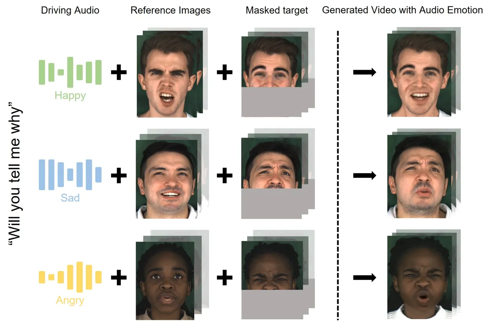
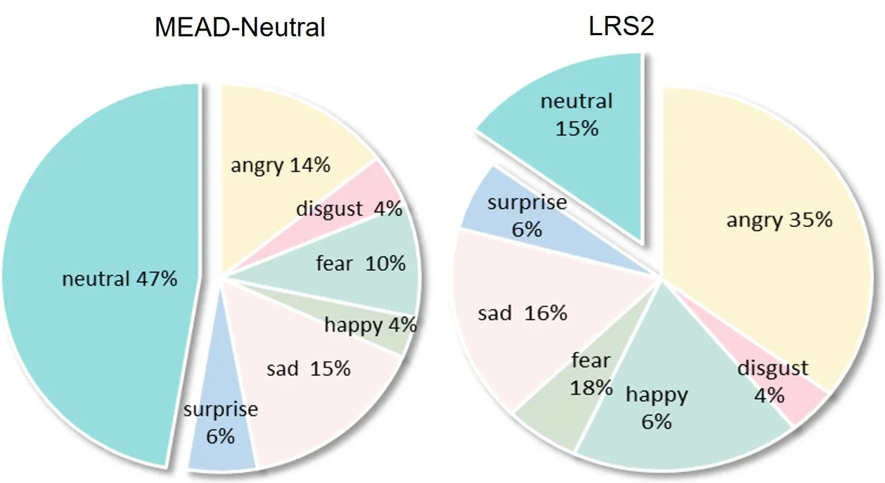
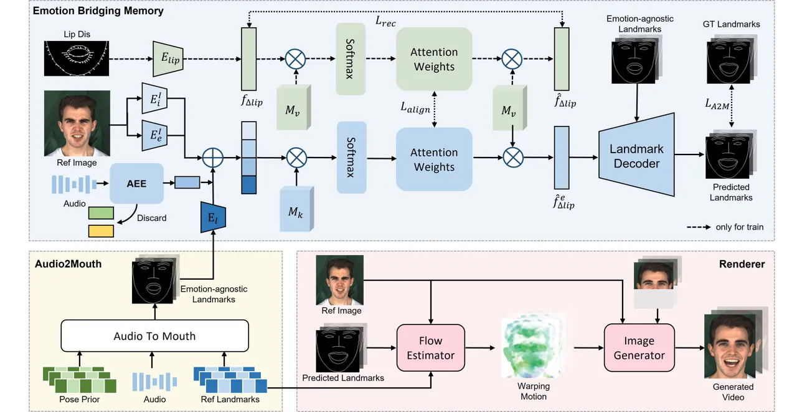
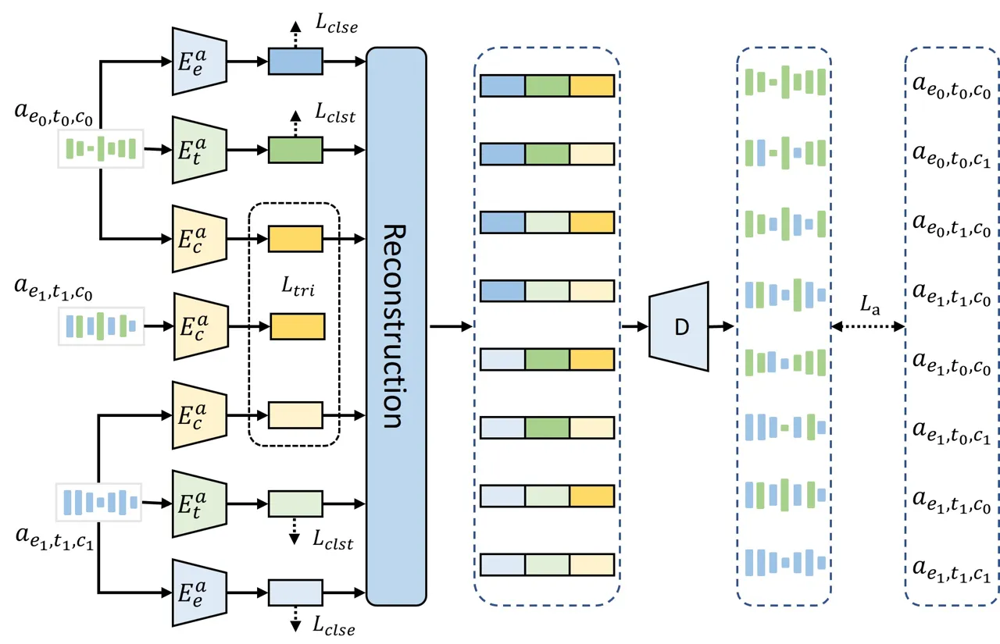
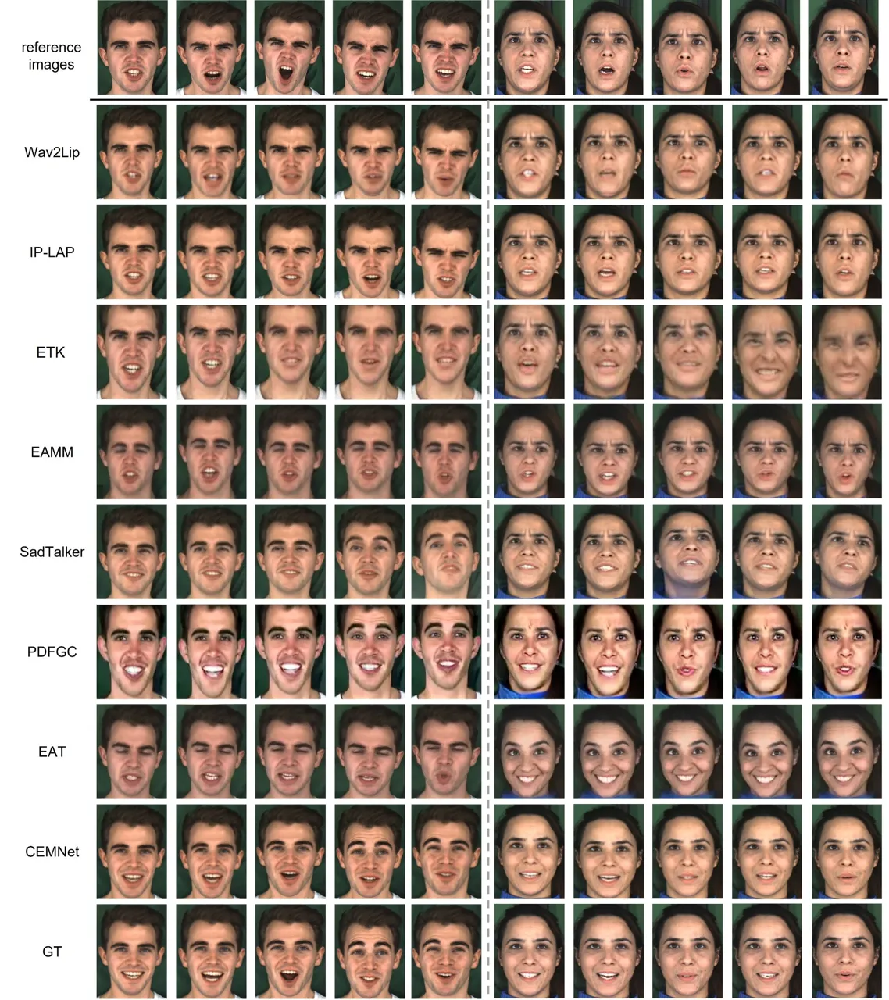
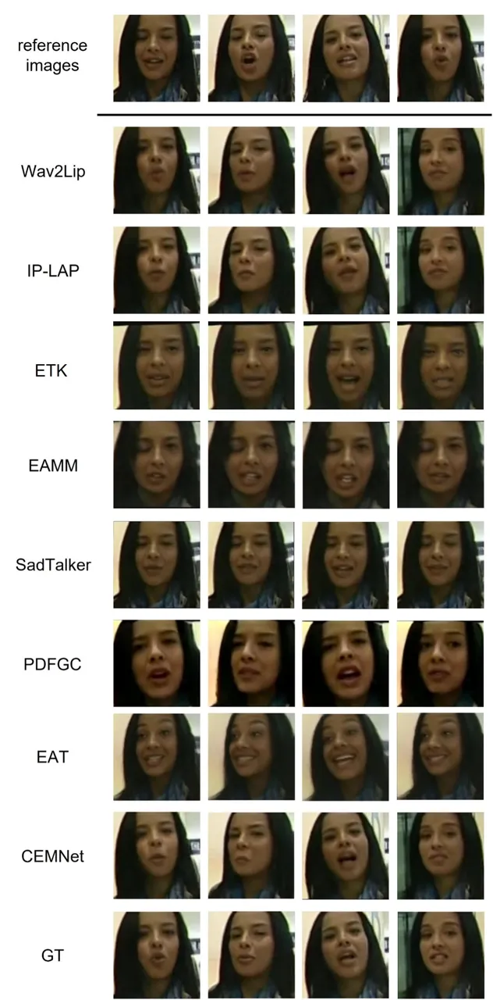
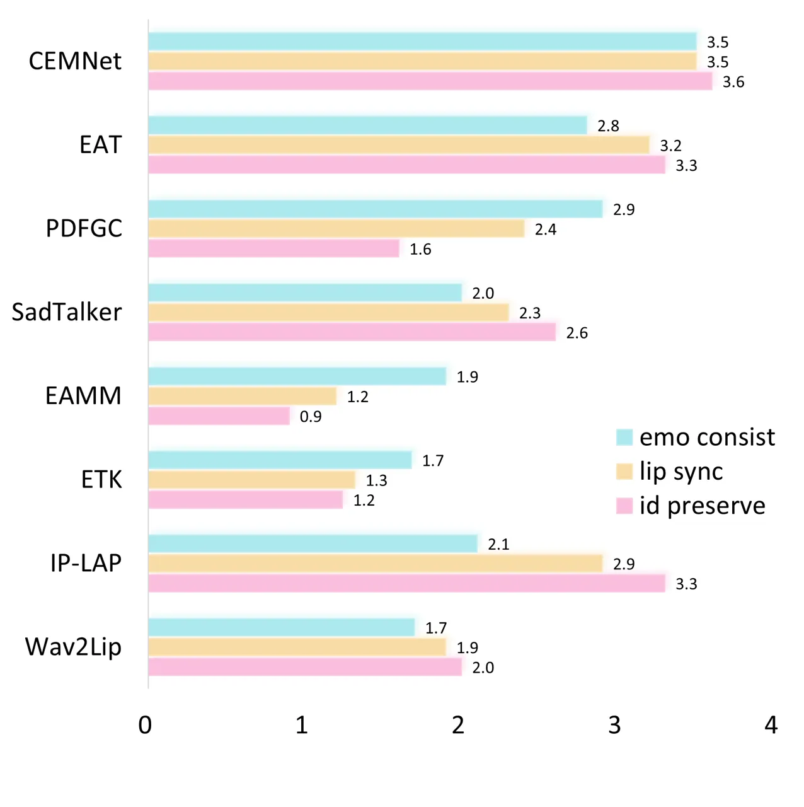
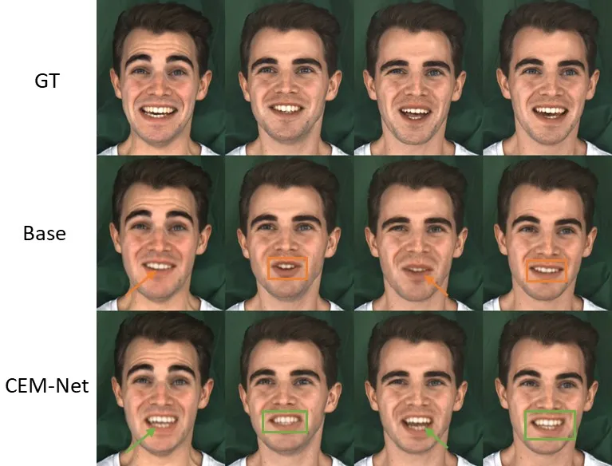
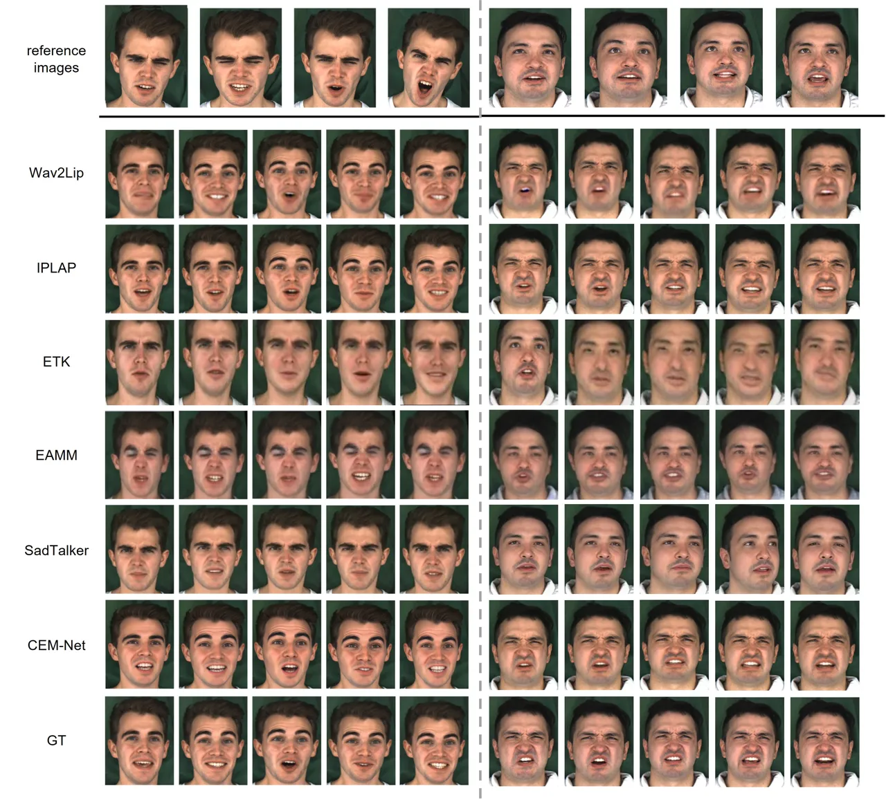
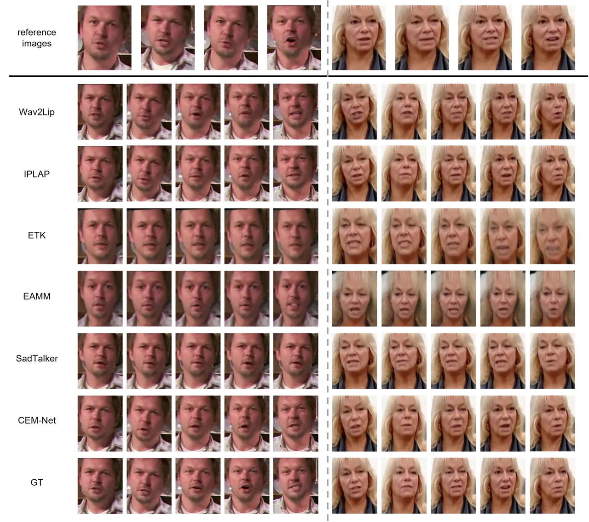

# CEM-Net: Cross-Emotion Memory Network for Emotional Talking Face Generation

PubID: pubid: 0000–0000/00\$00.00 © 2021 IEEE

Kangyi Wu^(\*)    Pengna Li^(\*)    Jingwen Fu    Yang Wu    Yuhan Liu
   Sanping Zhou    Jinjun Wang^(†) ^(†)^(†)thanks: Kangyi Wu, Pengna Li,
Jingwen Fu, Yang Wu, Yuhan Liu, Sanping Zhou, and Jinjun Wang are with
the Institute of Artificial Intelligence and Robotics Xi’an Jiaotong
University No.28, West Xianning Road, Xi’an, Shaanxi, China. (email:
wukangyi747600@stu.xjtu.edu.cn; sauerfisch@stu.xjtu.edu.cn;
fu1371252069@stu.xjtu.edu.cn; wuyang_cc@stu.xjtu.edu.cn;
liuyuhan200095  
@stu.xjtu.edu.cn; spzhou@xjtu.edu.cn; jinjun@mail.xjtu.edu.cn) This work
was supported in part by the National Key Research and Development
Project under Grant 2024YFB4708100, National Natural Science Foundation
of China under Grants 62088102, U24A20325 and 12326608, and Key Research
and Development Plan of Shaanxi Province under Grant 2024PT-ZCK-80.
^(\*)These authors contribute equally. ^(†)Corresponding Author.

###### Abstract

Emotional talking face generation aims to animate a human face in given
reference images and generate a talking video that matches the content
and emotion of driving audio. However, existing methods neglect that
reference images may have a strong emotion that conflicts with the audio
emotion, leading to severe emotion inaccuracy and distorted generated
results. To tackle the issue, we introduce a cross-emotion memory
network (CEM-Net), designed to generate emotional talking faces aligned
with the driving audio when reference images exhibit strong emotion.
Specifically, an Audio Emotion Enhancement module (AEE) is first devised
with the cross-reconstruction training strategy to enhance audio
emotion, overcoming the disruption from reference image emotion.
Secondly, since reference images cannot provide sufficient facial motion
information of the speaker under audio emotion, an Emotion Bridging
Memory module (EBM) is utilized to compensate for the lacked
information. It brings in expression displacement from the reference
image emotion to the audio emotion and stores it in the memory. Given a
cross-emotion feature as a query, the matching displacement can be
retrieved at inference time. Extensive experiments have demonstrated
that our CEM-Net can synthesize expressive, natural and lip-synced
talking face videos with better emotion accuracy.

###### Index Terms: 

Audio-Visual, Multimodal, Cross-Emotion Talking Face Generation

## I Introduction

Synthesizing realistic talking faces with audio input has gained
extensive attention \[1, 2, 3, 4, 5, 6, 7\] and has a wide range of
applications, such as digital avatars \[8\], video dubbing \[9\] and
animation movies \[10\]. Due to the importance of emotion in human
communication \[11\], an increasing number of researchers have begun to
focus on generating emotion-controllable talking faces \[12\] in recent
years. Generally, emotional talking face generation is driven by three
inputs: speaker images, audio input, and target emotion.

Existing methods primarily derive the target emotion from an arbitrary
emotion label\[13, 14, 15, 16\], additional emotional videos \[17\] and
emotional audio\[18, 19\]. Among them, the first two sources share the
same problem: it’s difficult to choose the suitable target emotion to
make the generated result semantically and visually realistic \[20,
18\]. Differently, audio inherently contains the speaker’s emotion
information. So in this paper, we are dedicated to obtaining the target
emotion from audio. As depicted in Fig. 1, our goal is to animate a
speaker’s face in still reference images and generate a talking video
coherent with the content and emotion of driving audio. Previous methods
commonly use audio emotion to refine faces predicted from driving audio
and reference images\[21, 22, 23\]. However, in real-world deployment,
reference images may have a strong emotion that conflicts with audio
emotion. This will result in distortion and incorrect expression of
generated talking videos.



Fig. 1: Audio-driven talking face video generated by the proposed
CEM-Net. Given an emotional audio clip, CEM-Net utilizes appearance
prior of reference images to synthesise the lower-half face. Even if the
reference has apparent emotion prior, CEM-Net is capable of generating a
realistic talking face video, where lip motions and emotion are coherent
with the driving audio.

Therefore, only when purely neutral faces are provided as references can
the result be synthesized with accurate emotion. However, it’s difficult
to acquire purely neutral faces for the two following reasons:

$`(i)`$ Purely neutral faces only constitute a small portion in reality.
As illustrated in Fig. 2, proportion of seven emotions are calculated
with Deepface\[24\] for neutral videos in the MEAD dataset\[25\] and all
videos in the LRS2 dataset\[26\]. Even in the neutral videos from the
MEAD dataset, frames with neutral emotion only account for 47.25%. For
the LRS2 dataset which is collected from BBC videos and is closer to
real-world scenarios, the ratio for neutral emotion is only 14.82%. This
illustrates that people tend to express emotion when they are talking,
and reference images, to varying degrees, exhibit some emotional bias
towards an arbitrary emotion. It’s possible that we can require the user
to only upload neutral references. However, according to \[27\], in
software engineering, “Simplicity is the most important consideration.”
It’s better to allow users to generate realistic talking faces in
natural way.

$`(ii)`$ Acquiring neutral faces with face emotion editing models \[28,
29, 30\] is costly and the generated results are not necessarily good.
We evaluate the loss of identity information with the Identity
Deterioration metric of edited face images by Arcface\[31\]. The closer
this number is to 0, the more identity information is preserved. As can
be seen from Table I, face editing models typically encounter identity
information decay which cannot be compensated for in the talking face
generation stage. e.g. For EmoStyle\[29\], the identity information loss
of the edited neutral face is 0.12. If talking faces are generated on
the edited neutral face, the final identity deterioration will be
definitely higher than 0.12, which is unacceptable and will lead to
severe artifacts. Moreover, the computational load of face emotion
editing models is significant, some even exceeding that of our talking
face generation model.



Fig. 2: Emotion proportion for MEAD Neutral videos and all videos in the
LRS2 dataset.

Based on the observation above, how to achieve emotional talking face
generation when reference images have a strong emotion conflicting with
that from the driving audio, which is called “cross-emotion”, is an
urgent problem to be solved. There exist two unavoidable challenges when
neutral faces are not available: 1) Since our target emotion is
extracted from driving audio, it can be easily disturbed by the timbre
of different speakers. For example, the difference between an angry
audio and a happy audio may be smaller than that between two different
speakers with the same emotion. It’s crucial to enhance the emotional
information from the voice. 2) In a cross-emotion setting, due to the
great differences between emotions, reference images fail to provide
sufficient facial motion information to generate talking faces under the
target emotion. Also, different speakers have variant motion habits.
Models are required to learn the unique motion habits of a specific
speaker under a certain emotion.

| Method          | Identity Deterioration$`\downarrow`$ | Parameter |
| --------------- | ------------------------------------ | --------- |
| Interface\[32\] | 0.19                                 | 23.08M    |
| MyStyle\[30\]   | 0.21                                 | 28.26M    |
| EmoStyle\[29\]  | 0.12                                 | 48.40M    |

TABLE I: The decay of identity information after face emotion editing,
coined as Identity Deterioration, and model parameter of three popular
face emotion editing models.

In this paper, we introduce a novel audio-driven cross-emotion talking
face generation framework, called Cross-Emotion Memory
Network (CEM-Net). To cope with the first challenge, we carefully design
an Audio Emotion Enhancement module (AEE) that decouples audio signal
into timbre, content and emotion. Specifically, cross-reconstruct
training strategy is adopted to train this module inspired by  \[33\].
After the AEE module is trained, a stronger target emotion is acquired.
To address the second challenge, we resort to external memory
network\[34\] to compensate for the lacked motion information and
speakers’ motion habits. In detail, the Emotion Bridging Memory
Network (EBM) is implemented to map the cross-emotion features to
expression displacement. The memory first stores the representative
expression displacements. By leveraging the various combinations of
cross-emotion features, we can obtain different expression displacements
for different motion habits. In this way, the lacked information can be
compensated for by memory.

Our contributions are summarized as follows:

- •
  For the first time, we indicate that the reference image in reality
  usually contains a certain amount of emotional information, which, if
  conflicts with the target emotion, will eventually make the mouth
  shape of the generated results emotionally inaccurate and distorted.
- •
  A brand-new framework, CEM-Net, is introduced for the “cross-emotion”
  talking face generation task. We devised an Emotion Bridging Memory
  Network (EBM) to compensate for the lacked motion information under
  target emotion and speakers’ motion habits in reference images. Also,
  an audio emotion enhancement module (AEE) is utilized to strengthen
  the audio emotion.
- •
  We systematically evaluate the emotion correctness and lip
  synchronization of the results and extensive experiments demonstrated
  the superiority of our method over state-of-the-art methods.

## II Related Work

### II-A Audio-driven talking face generation.

Audio-driven talking face generation is to synthesize a sequence of
video frames of a certain identity whose lip movement is synchronized
with the audio input. These techniques are broadly categorized into two
types: person-specific and person-generic methods. Although
person-specific approaches deliver superior animation outcomes, their
application scenarios are restricted. Ad-Nerf \[35\] generates not only
the head region but also the upper body via two individual neural
radiance fields. Facial \[36\] proposes a FACIAl-GAN to synthesize 3D
face animation with realistic motions of lips, head poses and eye
blinks. However, these approaches all necessitate videos of the target
speaker for re-training or fine-tuning, a requirement that might be
unattainable in real-world situations. Thus developing person-generic
methods capable of synthesizing talking face videos for speakers not
previously seen is of greater importance. MCNET \[37\] learns a global
facial representation space and design an implicit identity
representation conditioned memory compensation network for talking head
generation. IP-LAP \[38\] devises a transformer-based landmark generator
and a new alignment module to enhance identity information. MODA \[39\]
proposes a dual-attention module to learn the correlation between
lip-sync and other movements. Though these methods can generate videos
with high fidelity, they fail to account for the emotional factor, which
is crucial for achieving realism in the generated videos and ensuring
the comprehensive conveyance of semantic meaning from the driving audio.

### II-B Emotional talking face generation.

Since emotional talking face generation methods can synthesize more
expressive results, it has attracted considerable attention in recent
years. Based on the emotion source, emotional talking face generation
methods can be generally categorized as vision-driving or audio-driving
types. Vision-driving methods extract emotion representation from
emotional videos or images. EAMM \[40\] proposes a two-stage framework
and devises an Implicit Emotion Displacement Learner to add emotion
displacement. PDFGC \[41\] devises a progressive disentangled
representation learning strategy to realize fine-grained control over
multiple perspectives. However, selecting appropriate driving source to
ensure both semantic and visual realism in the results is
labor-intensive in practice. It’s more significant to generate emotional
talking face videos whose emotion is directly predicted from the driving
audio. EVP \[18\] applies a cross-reconstruction emotion disentanglement
module to extract emotion from audio. SadTalker \[42\] presents an
ExpNet to learn accurate facial expressions from audio by distilling
both coefficients and 3D-rendered faces. However, existing methods all
add this emotion knowledge to intermediate representation predicted from
driving audio and reference images with neutral faces, which is
difficult to acquire in most cases. If reference identity images have
strong emotion different from that in driving audio, there will be
severe emotional inconsistency between generated videos and driving
audio. On the contrary, we aim to generate talking faces videos with
audio emotion when reference images have another disruptive emotion.

### II-C Memory Network for talking face generation.

Memory Network \[34\] utilizes inference components in conjunction with
a long-term memory component for reasoning. Due to its versatile
capacity to store, abstract, and organize long-term knowledge into a
coherent form, memory network is favoured in several tasks \[43, 44, 45,
46\], including talking face generation. EMMN \[19\] stores emotion
embedding and lip motion in memory, together with paired expression code
to make lip movement consistent with that of expression. MCNet \[37\]
learns a unified spatial facial meta-memory bank to provide rich facial
structure and appearance priors. SyncTalkFace \[47\] proposes an
audio-lip memory to compensate for visual information corresponding to
input audio and enhance fine-grained audio-visual consistency. However,
previous works all focus on emotion-agnostic or emotional talking face
tasks with neutral faces as references and fail to adapt effectively to
cross-emotion generation. For the memory network, compensating for the
lacked motion information of reference images has yet to be attempted.
We build a carefully designed emotion-bridging memory module to store
and align cross-emotion features and expression displacement, which is
utilized to compensate for the motion information and speakers’ motion
habits. In this way, our memory network will provide warping information
between two arbitrary emotions in consideration of the identity
information.

## III Method



Fig. 3: Overview of the proposed method. The Audio2Mouth module predicts
lip landmarks from reference images and driving audio without
considering the emotion. Then the Emotion Bridging Memory module
produces the cross emotion lip displacement based on the emotion
embedding from reference images and driving audio. Lastly, the Renderer
generates lip-synced and high fidelity results. The structure of AEE is
presented in Fig. 4.

The framework of our proposed CEM-Net is depicted in Fig. 3. The first
is Audio2Mouth module which predicts emotion-agnostic lip landmarks from
reference images and driving audio. Then the target emotion is
disentangled from driving audio with the Audio Emotion Enhancement
module. Thirdly, an image emotion extractor trained with data
augmentation strategies \[40\] extracts source emotion from the
reference image. Next, the identity feature of the reference image
extracted from ArcFace \[31\] pre-trained on Casia  \[48\] is used as an
additional identity condition. The three above combined with the
emotion-agnostic lip motion form the final cross-emotion features, which
drive the Emotion Bridging Memory. Given the cross-emotion feature as a
query, we can obtain the corresponding emotional lip displacement to add
emotional movement. Lastly, the renderer is incorporated to generate
lip-synced and high-fidelity results with identity information
well-preserved. Each part of our method is illustrated in detail in the
following sections.

### III-A Audio2Mouth.

An audio2mouth module is firstly built to map reference images, audio
content and pose landmarks to landmarks without considering emotion
factor. Since transformer \[49\] has demonstrated its superiority in
learning long-term relations, we choose the transformer encoder as the
backbone. $`N`$ randomly selected reference identity images are used for
predicting $`T`$ adjacent frames at a time. Specifically, for each
reference identity image $`\{I_{i}^{r}\}^{N}`$, landmark detector $`L`$
is used to predict the initial motion representation
$`\{l_{i}^{r}\}^{N}`$ first. Then, three encoders are constructed to
encode reference landmarks $`\{l_{i}^{r}\}^{N}`$, driving audio
$`\{a_{t}\}_{t=1}^{T}`$ and pose landmarks $`\{p_{t}\}_{t=1}^{T}`$
respectively, generating reference embedding $`\{e_{i}^{r}\}^{N}`$,
audio embedding $`\{e^{a}_{t}\}_{t=1}^{T}`$ and pose embedding
$`\{e^{p}_{t}\}_{t=1}^{T}`$. All the features serve as the input to
Audio2Mouth model $`A2M`$. The last T output tokens are adopted to
predict mouth motions. Generally, the function of the Audio2Mouth module
can be formulated as:

```math
\{z_{k}\}_{k=1}^{N+2T}=A2M(\{e_{i}\}^{N+T+T}), \tag{1}
```

```math
\overline{m}_{t}=Linear(z_{N+T+t})\quad t=1,2,3,\ldots,T. \tag{2}
```

To update the Audio2Mouth module, we minimize the $`L_{1}`$ distance
between the predicted $`\overline{m}_{t}`$ and ground truth $`m_{t}`$.
Also, to enhance the smoothness over time, we implement a continuity
regularization technique to ensure the consistency of predicted mouth
movements between $`\overline{m}_{t+1}-\overline{m}_{t}`$ and
$`m_{t+1}-m_{t}`$, which can be formulated as:

```math
L_{v}=\frac{1}{T-1}\sum\nolimits_{t=1}^{T-1}\left|\left|(\overline{m}_{t+1}-\overline{m}_{t})-(m_{t+1}-m_{t})\right|\right|_{2}. \tag{3}
```

Therefore, the loss function for the Audio2Mouth module is derived by:

```math
L_{A2M}=L_{1}+\lambda L_{v}, \tag{4}
```

where $`\lambda`$ serves as a hyper-parameter to do a trade-off between
precision and smoothness.



Fig. 4: Audio Emotion Enhancement (AEE) with cross-reconstruction
training strategies. We extract disentangled different timbre, content
and emotion from two individual audios and reconstruct new audios.

### III-B Audio Emotion Enhancement.

Accurately extracting emotional information from the driving audio is
important for cross-emotion talking face generation. Although previous
works \[18, 19\] have made their efforts and achieved great face emotion
recognition scores, they have difficulty dealing with person-generic
tasks due to speaker variations. Instead of simply disentangling emotion
from audio leading to emotion knowledge degraded by the pronunciation
habits of different individuals, we construct a brand-new Audio Emotion
Enhancement (AEE) module with cross-reconstruction \[50\] technique to
enhance audio emotion to eliminate the influence of timbre (identity)
and content from audio. To implement cross-reconstruction training, we
achieve paired audio data with the different emotions and content spoken
by individual speakers from MEAD \[25\]. The details of data processing
are put in the Appendix. A temporal alignment algorithm\[51\] is
utilized to synchronize speeches of varying lengths. As shown in Fig. 4,
three encoders $`E^{a}_{e}`$, $`E^{a}_{t}`$ and $`E^{a}_{c}`$ are
leveraged as emotion encoder, timbre encoder and content encoder to
extract disentangled emotion embedding, timbre embedding and content
embedding and from a specific audio clip $`a_{e_{i},t_{j},c_{k}}`$ with
emotion $`i`$, identity $`j`$ and content $`k`$. Specifically, two audio
clips, $`a_{e_{i},t_{j},c_{k}}`$ and $`a_{e_{m},t_{p},c_{q}}`$, serve as
an input sample. We concatenate $`E_{t}(a_{e_{i},t_{j},c_{k}})`$,
$`E_{e}(a_{e_{m},t_{p},c_{q}})`$ and $`E_{c}(a_{e_{i},t_{j},c_{k}})`$
together to form a new audio embedding and reconstruct the audio clip
$`a_{a_{e_{i},t_{p},c_{k}}}`$ with a decoder $`D`$. To make the three
encoders have disentanglement capability and avoid loss of knowledge, we
update the model with four losses: emotion classification loss, identity
classification loss, content reconstruction loss, and audio
reconstruction loss. Given $`a_{e_{0},t_{0},c_{0}}`$ and
$`a_{e_{1},t_{1},c_{1}}`$ as input, the audio reconstruction loss is
defined by:

```math
L_{a}=\sum_{i,j,k=0}^{1}\Bigl|\Bigl|D(E_{t}(a_{e_{i},t_{i},c_{i}}),E_{e}(a_{e_{j},t_{j},c_{j}}),\\
E_{c}(a_{e_{k},t_{k},c_{k}}))-a_{e_{i},t_{j},c_{k}}\Bigr|\Bigr|_{2}. \tag{5}
```

With additional classifiers $`C_{t}`$ and $`C_{e}`$, identity
classification loss $`L_{clst}`$ and emotion classification loss
$`L_{clse}`$ are adopted to map audio with the same emotion category or
same identity into clustered groups in latent space. What’s more,
triplet loss is used to make audio with the same content share similar
content embedding:

```math
L_{tri}=\sum_{i,j,k=0}^{1}max(\alpha+\left|\left|E_{c}(a_{e_{i},t_{i},c_{i}}-E_{c}(a_{e_{k},t_{k},c_{k}})\right|\right|\\
-\left|\left|E_{c}(a_{e_{i},t_{i},c_{i}}-E_{c}(a_{e_{1-k},t_{1-k},c_{1-k}})\right|\right|,0). \tag{6}
```

The summarization of the losses above is the final objective of the AEE
module:

```math
L_{AEE}=\lambda_{a}L_{a}+\lambda_{clst}L_{clst}+\lambda_{clse}L_{clse}+\lambda_{tri}L_{tri}, \tag{7}
```

where $`\lambda_{s}`$ are hyper-parameters for balancing the different
weights of losses. The AEE loss enhances the disentanglement among
emotion, timbre and content features. After the AEE module training is
finished, the trained audio emotion encoder $`E^{a}_{e}`$ is adopted to
extract clean target emotion unaffected by timbre and content from
audio.

### III-C Emotion Bridging Memory.

To further deal with emotional conflict, we combine target emotion with
source emotion extracted from reference images to form cross-emotion
features. Besides, different speakers have specific motion habits so the
identity information should be considered. We bring in identity features
from reference images to cross-emotion features. Due to the great gap
between the source and target emotion, reference images fail to provide
sufficient motion information to generate talking faces, we propose the
Emotion Bridging Memory Network (EBM) to compensate for the expression
motion information and speakers’ motion habits. Specifically, EBM stores
and aligns the cross-emotion and lip displacement features, where lip
displacement is obtained from the difference between ground-truth and
emotion-agnostic landmark. EMB module consists of key
memory $`\mathcal{M}_{k}\in{\mathcal{R}^{K\times{D}}}`$ and value
memory $`\mathcal{M}_{v}\in{\mathcal{R}^{K\times{D}}}`$, where K is
memory size and D is dimension of each slot. In detail, the value memory
learns to store representative lip displacement features. We firstly
obtain lip displacement features $`f_{\Delta{lip}}\in{\mathcal{R}^{D}}`$
using a lip landmark encoder. Then attention weights are computed by
softmax of cosine similarity between $`f_{\Delta{lip}}`$ and each slot
as follows:

```math
{\alpha}_{v}={Softmax}({f_{\Delta{lip}}}\cdot{\mathcal{M}_{v}^{t}}). \tag{8}
```

Through the attention weights, we reconstruct the lip displacement
features by:

```math
\hat{f}_{\Delta{lip}}=\sum\nolimits_{i=1}^{K}{\alpha}_{v}^{i}\cdot{m_{v}^{i}}={\alpha}_{v}{\mathcal{M}_{v}}, \tag{9}
```

where $`m_{v}^{i}`$ is the $`i`$th slot in $`\mathcal{M}_{v}`$. The
reconstruction loss to optimize $`\mathcal{M}_{v}`$ is formulated as:

```math
L_{rec}={\left|\left|f_{\Delta{lip}}-\hat{f}_{\Delta{lip}}\right|\right|}^{2}. \tag{10}
```

By this means, typical lip displacement features can be stored in
$`M_{v}`$. However, at inference time, only the cross-emotion features
are available. Given a cross-emotion feature $`f_{e}`$ as a key, we
expect the obtained value to be the corresponding lip displacement
feature. In other words, we should ensure that attention weights of key
memory and value memory are as close as possible. Therefore, we adopt KL
divergence to align the attention weights:

```math
{\alpha}_{k}={Softmax}({f_{e}}\cdot{\mathcal{M}_{k}^{t}}), \tag{11}
```

```math
L_{align}=KL({\alpha}_{k}||{\alpha}_{v}). \tag{12}
```

Aligning key attention weights and value attention weights, we obtain
corresponding lip displacement features by:

```math
\hat{f}_{\Delta{lip}}^{e}=\sum\nolimits_{i=1}^{K}{\alpha}_{k}^{i}\cdot{m_{v}^{i}}={\alpha}_{k}{\mathcal{M}_{v}}. \tag{13}
```

Then, we concatenate $`\hat{f}_{\Delta{lip}}^{e}`$ and emotion-unaware
lip motion obtained by our Audio2Mouth to generate final emotion-aware
mouth motions via a landmark decoder and utilize $`L_{A2M}`$ loss to
supervised the training of this module.

### III-D Renderer.

Inspired by Monkey-Net \[32\], our renderer consists of a flow estimator
and an image generator. Given the predicted landmarks from EBM, the flow
estimator takes the original reference images and their landmarks as
input to predict the warping motion first. Then a generator is
constructed to synthesize the final result based on the warping motion.
Specifically, we concatenate refined mouth landmarks
$`\{\hat{m}_{t}\}_{t=1}^{T}`$ and pose landmarks $`\{p_{t}\}_{t=1}^{T}`$
to form predicted face landmarks $`\{\hat{f}_{t}\}_{t=1}^{T}`$. They
will be fed to flow estimation module $`W`$ together with reference
landmarks $`\{l_{i}^{r}\}^{N}`$. and reference images
$`\{I_{i}^{r}\}^{N}`$. For each reference landmark $`l_{i}^{r}`$, T
motion fields $`M^{i}_{1\rightarrow T}`$are generated. The formulation
of the flow estimation module is:

```math
M^{i}_{1\rightarrow T}=W(l_{i}^{r},\hat{f}_{1\rightarrow T},I_{i}^{r})\quad i=1,2,3,\ldots,N. \tag{14}
```

The warped reference images for each predicted frame are calculated as:

```math
\overline{I_{t}^{r}}=\frac{\sum_{i=1}^{N}\omega_{t}^{i}M^{i}_{t}(I_{i}^{r})}{\sum_{i=1}^{N}\omega_{i}}\quad t=1,2,3,\ldots,T, \tag{15}
```

where $`\omega_{t}^{i}`$ represent the predicted weight for
$`I_{i}^{r}`$ when generating frame $`t`$. At last, the warped reference
images $`\{\overline{I_{t}^{r}}\}_{t=1}^{T}`$, predicted face landmarks
$`\{\hat{f}_{t}\}_{t=1}^{T}`$ and the masked target face $`I_{t}^{m}`$
are concatenated as input to the generator $`G`$. The overall process of
the generator is formulated as:

```math
\hat{I}_{t}=G(\overline{I_{t}^{r}},I_{t}^{m},\hat{f}_{t})\quad t=1,2,3,\ldots,T. \tag{16}
```

The renderer is trained in an end-to-end manner, with perceptual loss,
GAN loss and feature matching loss implemented. Perceptual loss
$`L_{per}`$ \[52\] is employed to ensure the precision of the motion
field and the quality of the generated faces. GAN loss $`L_{gan}`$ and
feature matching loss $`L_{fm}`$ from  \[53\] is also utilized to
improve image realism. In total, the loss of renderer is formulated as:

```math
L_{renderer}=\omega_{per}L_{per}+\omega_{gan}L_{gan}+\omega_{fm}L_{fm}. \tag{17}
```

## IV Experiments

| Method          | Avenue      | Emotion | Neutral Base     |                  |                     |                |                  |                     | Cross Emotion    |                  |                     |                |                  |                     |
| --------------- | ----------- | ------- | ---------------- | ---------------- | ------------------- | -------------- | ---------------- | ------------------- | ---------------- | ---------------- | ------------------- | -------------- | ---------------- | ------------------- |
|                 |             |         | PSNR$`\uparrow`$ | SSIM$`\uparrow`$ | M-LMD$`\downarrow`$ | EA$`\uparrow`$ | CSIM$`\uparrow`$ | LipSync$`\uparrow`$ | PSNR$`\uparrow`$ | SSIM$`\uparrow`$ | M-LMD$`\downarrow`$ | EA$`\uparrow`$ | CSIM$`\uparrow`$ | LipSync$`\uparrow`$ |
| Wav2Lip\[54\]   | ACMMM’20    | ✗       | 29.03            | 0.57             | 3.43                | 14.96          | 0.6616           | 7.36                | 22.77            | 0.53             | 6.93                | 11.53          | 0.4097           | 5.74                |
| IP-LAP\[38\]    | CVPR’23     | ✗       | 32.14            | 0.97             | 3.52                | 24.06          | 0.6790           | 7.90                | 31.06            | 0.97             | 4.95                | 20.66          | 0.4508           | 5.64                |
| ETK\[21\]       | T-MM’22     | ✓       | 27.68            | 0.48             | 3.73                | 30.23          | 0.1234           | 1.95                | 10.71            | 0.55             | 9.47                | 10.47          | 0.1157           | 1.74                |
| EAMM\[40\]      | SIGGRAPH’22 | ✓       | 29.03            | 0.66             | 2.41                | 30.43          | 0.2318           | 5.03                | 14.52            | 0.67             | 8.66                | 13.16          | 0.0349           | 5.62                |
| SadTalker\[42\] | CVPR’23     | ✓       | 22.05            | 0.85             | 2.71                | 20.66          | 0.6080           | 6.86                | 22.20            | 0.73             | 5.31                | 12.44          | 0.5686           | 6.32                |
| PDFGC\[41\]     | CVPR’23     | ✓       | 20.79            | 0.69             | 3.03                | 27.67          | 0.4691           | 6.25                | 24.85            | 0.63             | 4.85                | 17.73          | 0.1729           | 5.80                |
| EAT\[55\]       | ICCV’23     | ✓       | 21.75            | 0.68             | 2.45                | 28.01          | 0.5052           | 6.32                | 23.63            | 0.67             | 4.17                | 23.12          | 0.5687           | 6.51                |
| Ground Truth    | \-          |         | \-               | 1.00             | 0.00                | 60.74          | 1.0000           | \-                  | \-               | 1.00             | 0.00                | 60.74          | 1.0000           | \-                  |
| Ours            | \-          | ✓       | 31.34            | 0.96             | 2.39                | 33.94          | 0.6451           | 6.94                | 31.63            | 0.97             | 2.82                | 27.49          | 0.6279           | 6.76                |

TABLE II: Quatitative comparison with state-of-the-art audio-driven
talking face generation methods on neutral faces based and cross emotion
settings on the MEAD dataset. In neutral base settings, neutral faces
are provided as reference images. But in cross emotion settings,
reference images have randomly chosen emotions different from those of
driving audio. The results of EAMM and Wav2Lip under Neutral Base are
from \[40\].

### IV-A Datasets.

We train our model with LRS2 dataset \[56\] and MEAD dataset \[25\].
LRS2 dataset consists of thousands of spoken sentences from BBC
television without emotion annotation. This dataset helps our model
learn lip-audio synchronization. Then, MEAD is introduced to train our
cross-emotion memory network. The MEAD dataset comprises a collection of
talking face videos, showcasing 48 actors and actresses expressing eight
distinct emotions. From the dataset, we randomly choose 40 actors for
training and 8 actors for evaluation. Landmarks are detected for each
frame from both datasets with mediapipe tools \[57\]. The LRS2 dataset
is used to train the Audio2Mouth module and Renderer separately. Then,
the MEAD dataset is used to train the Audio Emotion Enhancement module
and Emotion Bridging Memory module with the former modules fixed in an
end-to-end manner.

### IV-B Model Structure.

The transformer encoder \[49\] is utilized as our Audio2Mouth module. In
it, the feature size is set to 512 and the attention head number is set
to 4. The audio encoder is composed of 13 2D convolution layers. The
reference encoder and the pose encoder are composed of 1D convolution
layers. In the Audio Emotion Enhancement module, the structure of
$`E_{e}^{a}`$, $`E_{t}^{a}`$, and $`E_{c}^{a}`$ share the same. They all
contain eight 2D convolution layers and three fully connected layers
with ReLU activation. For the Emotion Bridging Memory module, the
detailed structure of key memory and value memory can be found on
External Attention \[58\].

### IV-C Implementation Details.

All videos are cropped to $`128\times 128`$. The sample rate for audio
is set to 16kHz. The number of reference images N and the number of
adjacent frames predicted at one time T are both set to 5. For
Audio2Mouth module, Adam optimizer\[59\] is utilized with learning rate
set to 1e-4. The weight of $`L_{v}`$ $`\lambda`$ is set to 1 during this
process. Early Stop is used on L1 loss to decide when to stop training.
Finally, the module is trained for 1850 epochs before stopping. For
Audio Emotion Enhancement module, following \[18\], we first pre-train
our emotion encoder $`E_{e}^{a}`$ with emotion classification task on
MEAD dataset, our timbre encoder $`E_{t}^{a}`$ with identity
classification task on MEAD dataset and our content encoder
$`E_{c}^{a}`$ with audio2text task on LRS2 dataset. After that, the
three pre-trained encoders are trained with the cross-reconstruction
strategy\[50\], with the learning rate set to $`2e-4`$. For Renderer,
$`\omega_{per}`$, $`\omega_{gan}`$ and $`\omega_{fm}`$ are set to 4,
0.25 and 1 respectively. It takes 7 days to train Renderer with 4 RTX
3090 GPUs. When the modules above are trained, we fix the weights of
them to train Emotion Bridging Memory. It takes 60 epochs to train this
module.

### IV-D Metrics.

Peak Signal-to-Noise Ratio (PSNR) and Structured Similarity (SSIM) are
utilized to evaluate the quality of the generated videos. To measure the
lip synchronization, we adopt the landmark distance on
mouth (M-LMD) \[60\] and the confidence score of
SyncNet (LipSync) \[61\]. Deepface tool \[24\] is applied to assess the
emotion accuracy (EA) of the generated results. Cosine Similarity (CSIM)
of extracted identity vectors by ArcFace \[31\] is calculated to
evaluate the identity preservation capability.

### IV-E Comparison with SOTAs



Fig. 5: Qualitative comparison with state-of-the-art methods under cross
emotion setting on the MEAD dataset. The first row represents the given
reference images with ’angry’ emotion while the driving audio has
’happy’ emotion.

#### IV-E1 Comparison Methods.

We perform comparison with state-of-the-art methods on the MEAD and LRS2
dataset. Wav2Lip \[54\] and IP-LAP \[38\] are person-generic methods
that generate talking face from audio and reference images directly
without considering the emotion factor. ETK \[21\] is an emotional
talking face animation method which require emotion label as input.
EAMM \[40\] synthesizes emotional talking face with an additional
emotional image as input. SadTalker \[42\] realizes emotional face
generation by extracting emotion directly from driving audio.
PDFGC \[41\] presents a progressive disentangled representation learning
strategy to achieve fine-grained control over multiple aspects.
EAT \[55\] transforms emotion-agnostic models into emotional ones with
parameter-efficient adaptations.

| Method          | PSNR$`\uparrow`$ | SSIM$`\uparrow`$ | SyncScore $`\uparrow`$ | CSIM $`\uparrow`$ |
| --------------- | ---------------- | ---------------- | ---------------------- | ----------------- |
| Wav2Lip\[54\]   | 27.92            | 0.89             | 3.86                   | 0.5925            |
| IP-LAP\[38\]    | 32.91            | 0.93             | 4.49                   | 0.6523            |
| ETK\[21\]       | 13.38            | 0.5627           | 2.41                   | 0.2954            |
| EAMM\[40\]      | 15.17            | 0.46             | 3.01                   | 0.2318            |
| SadTalker\[42\] | 29.48            | 0.65             | 5.14                   | 0.5367            |
| PDFGC\[41\]     | 23.34            | 0.64             | 4.44                   | 0.3217            |
| EAT\[55\]       | 16.11            | 0.65             | 5.45                   | 0.6180            |
| Ground Truth    | \-               | 1.00             | 8.06                   | 1.0000            |
| Ours            | 30.19            | 0.93             | 6.03                   | 0.6609            |

TABLE III: Quantitative comparison with state-of-the-art audio-driven
talking face generation methods on LRS2 dataset. The PSNR, SSIM and CSIM
metric of Wav2Lip\[54\], IP-LAP\[38\] and EAMM\[40\] are from \[38\].

#### IV-E2 Quantitative Comparison.

Quantitative comparison with state-of-the-art methods is conducted on
MEAD dataset under neutral base setting and cross emotion setting. Only
reference images and driving audio from a specific speaker are given in
both settings. The reference images are ensured to be neutral emotion in
the neutral base setting while in cross emotion setting, reference
images are chosen with arbitrary emotion different from that of audio.
The ground-truth video has the same emotion and content as the driving
audio. We run the evaluation on the test set five times and calculate
the average as the final result.

As illustrated in Table II, almost all the methods encounter performance
degradation under cross-emotion settings with respect to lip
synchronization (M-LMD, LipSync), identity preservation (CSIM) and
emotion accuracy (EA). This indicates that the emotional conflicts
between reference images and the driving audio will seriously hurt the
performance of emotional talking face generation. Among all the methods,
our model performs best under the cross-emotion setting. The reason is
that our Emotion Bridging Memory can compensate for the lacked motion
information and provide accurate landmark displacements from the
reference emotion to the target emotion. This illustrates the
effectiveness of our proposed memory network CEM-Net.

In neutral base settings, our method achieves the best performance in
M-LMD and EA. This illustrates that our lip movement is more consistent
with the driving audio and the emotion is more accurate. The cause of
this improvement is that even in neutral videos from the MEAD dataset,
neutral faces only account for 47.25% as shown in Fig. 2, meaning that
most neutral faces still have subtle emotion. Methods incorporating
target emotion directly into the slightly emotional reference images
will encounter emotion accuracy decline and distorted lip movement.

Quantitative comparison is also conducted on the LRS2 dataset further to
evaluate our lip synchronization and identity preservation performance.
Since there’s no emotion annotation for this dataset, we only conduct
the common audio-driven talking face generation task. Specifically, for
each video, we randomly select 5 frames from it as the reference images
and use its audio as the driving audio and the video itself as the
ground truth. Also, we only calculate the PSNR, SSIM, LipSync, and CSIM
to evaluate the lip synchronization and identity preservation ability of
our model. The result is presented in Table III. As can be seen from the
table, our model achieves the best performance on SyncScore and CSIM,
which illustrates that CEMNet can generate talking faces with accurate
lip movement and high identity preservation.



Fig. 6: Qualitative comparison with state-of-the-art methods on the LRS2
dataset on the audio-driven talking face generation task. The first row
represents the given reference images.



Fig. 7: User study results on identity preservation, emotion consistency
and lip synchronization.

#### IV-E3 Qualitative Comparison.

We first compare our CEMNet with the state-of-the-art methods under the
cross-emotion setting on the MEAD dataset. Specifically, two speakers
are randomly chosen from the MEAD dataset. We choose the “angry” emotion
as our reference image emotion and the “happy” emotion as the driving
audio emotion. The generated results are represented in Fig. 5.

From the figure, it is visible that the lip movements generated by our
model are the closest to GT. Lip movements generated by SadTalker are
influenced by the emotion of reference images, mismatching the driving
audio. The videos generated by EAMM show adjustments based on the audio
emotion “happy”, but since there’s no neutral face as input, it directly
imposes the “happy” emotion onto the ’disgusted’ reference, resulting in
considerable distortion of the mouth shape. The generated mouth movement
of IPLAP is the closest to GT besides our method, but since it does not
take emotional factors into account, the lip shapes are still influenced
by the emotion from reference images. ETK successfully adds “happy”
emotion to the disgusted face. However, it encounters severe identity
distortion. In contrast, our model eliminates emotional information in
reference images, making the final generation align well with the
driving audio in both emotion and content while preserving the identity
features.

We also choose a speaker from the LRS2 test set and visualize the
generated results on the common audio-driven talking face generation
task. Specifically, for each video, we randomly select 5 frames from it
as the reference images and use its audio as the driving audio and the
video itself as the ground truth. The results are shown in Fig. 6. It
can be seen from the figure that our CEMNet can generate the closest lip
movement to the GT. However, we noticed that the lips generated by our
model are slightly curved downward, displaying a subtle “disgusted”
emotion. This may be because our Emotion Bridging Memory module is
trained on the MEAD dataset where clear emotions are presented on the
human face. When subtle emotion is detected in the driving audio from
the LRS2 dataset, it may exaggerate this subtle emotion in the generated
lip shapes.

#### IV-E4 User Study.

It’s common practice to validate the effectiveness qualitatively with
user study. We conduct a user study following the setting in
IP-LAP \[38\]. Specifically, 30 individuals participated in the study,
all of whom have a basic knowledge of deep learning. For the MEAD test
set, one video for each of the eight emotions from the eight speakers is
selected. Audios from these videos are extracted to serve as the driving
audio. For each driving audio, reference images were randomly obtained
from another video of the same speaker with a different emotion.
Ultimately, each model generates $`8\times 8`$ emotional videos.

Participants score the consistency of the generated videos with GT
videos from three criteria: lip synchronization, emotion consistency and
identity preservation. The scores ranged from 1 to 5, with higher scores
indicating better performance. We calculated the average score of the 64
videos for each model as the final score. The result is illustrated in
Fig. 7. Our CEM-Net surpasses other methods in all of the three aspects.
It further validates the great capability of our method in cross emotion
setting.

### IV-F Ablation Study



Fig. 8: Qualitative results of ablation study. It’s clear that our
module can help to generate lip movements that match the audio emotion.

#### IV-F1 Visualization results.

To validate the effectiveness of our methods to generate emotional lip
movements, we visualize the generated results of the baseline and our
proposed CEM-Net in Fig. 8. The baseline is a simple wav2lip model
without considering the emotion factor. With the AEE and EBM modules
added, our method can generate more expressive and emotional results,
especially for the speaker’s mouth corner curvature and lower teeth
generation. This indicates the effectiveness of our proposed method.

|    Method     |    M-LMD$`\downarrow`$    |    EA$`\uparrow`$    |
| ------------- | ------------------------- | -------------------- |
|    w/o AEE    |    3.16                   |    24.38             |
|    w/o EBM    |    4.82                   |    19.53             |
|    CEM-Net    |    2.82                   |    27.49             |

TABLE IV: Ablation study on two components. We provide quantitative
results on M-LMD and EA.

#### IV-F2 Audio Emotion Enhancement.

To prove necessity of Audio Emotion Enhancement Module (AEE), we replace
our pre-trained audio emotion encoder of AEE with a commonly used
emotion classifier\[18\] with the last softmax removed. The comparison
result is in Table IV. With AEE, there was a significant improvement in
the consistency of lip movements and emotion accuracy, which was
entirely in line with our expectations. This suggests that our AEE is
more accurate in extracting the target emotion compared to the
straightforward audio classification task, avoiding the issue of
ambiguous emotions caused by person-specific timbre.

#### IV-F3 Emotion Bridging Memory.

To verify the effectiveness of our Emotion Bridging Memory(EBM), we
attempt to remove the EBM and feed cross-emotion features directly to
landmark decoder. This method is indicated as “w/o EBM”. We trained the
landmark decoder on the MEAD training set. In Table IV, it is observed
that removing the EBM witnessed a certain performance degradation in
M-LMD and EA. This demonstrates the effectiveness of our EBM in lip-sync
and emotion maintenance.

### IV-G Out-Of-Distribution Results.

Fig. 9: Visualization of out-of-distribution results. We present two
out-of-distribution videos, including both cartoon characteristics and
real people.

In this part, we visualize two examples with out-of-distribution
reference images to test the generalization of our proposed method on
cartoon characteristics and real people. Audios are chosen from the MEAD
dataset with “neutral” and “happy” emotions. The reference images are
obtained from SadTalker \[42\] and Synthesizing Obama \[62\]. The result
is shown in Fig. 9. It can be seen from the visualization that the lip
movement generated by our model aligns perfectly with the ground-truth
videos. This proves that our method generalizes well when it comes to
lip synchronization and identity preservation. We also noticed that the
lip movements in the generated Obama video exhibit a certain degree of
upward curvature. This is because the driving audio contains a ’happy’
emotion, and our model successfully incorporated the ’happy’ emotion
into the generated result.

## V Conclusion

In this paper, we present a Cross-Emotion Memory Network(CEM-Net) to
realize emotional talking face generation when reference images have
strong emotion differing from audio emotion. We employ an Audio Emotion
Enhancement (AEE) module to strengthen the audio emotion. Then an
Emotion Bridging Memory (EBM) module is devised to compensate for the
lacked motion information of reference images and speakers’ motion
habits. Quantitative and qualitative experiments validate that CEM-Net
can generate expressive and realistic talking face videos in
cross-emotion settings.

## VI Limitations and Future Works.

While CEM-Net achieves promising results in emotional talking face
generation, our method still has limitations. One of the limitations is
that we only consider the emotion and lip movements of talking faces to
match the driving audio, neglecting other semantic information in audio,
such as head pose, which will improve the reality of the generated
results further. What’s more, due to limited computational resources, we
chose to conduct experiments on a baseline that only generates the lower
half of the human face to verify the feasibility of the algorithm.
However, it’s better to generate the entire face in order to fully
implement this method. In future works, we intend to learn head poses
from audio to generate natural video. We will also implement our method
against baselines that can generate the entire human face to improve our
method’s usability.

## References

- \[1\] L. Yu, J. Yu, M. Li, and Q. Ling, “Multimodal inputs driven
  talking face generation with spatial–temporal dependency,” _IEEE
  Transactions on Circuits and Systems for Video Technology_, vol. 31,
  no. 1, pp. 203–216, 2020.
- \[2\] B. Chen, Z. Wang, B. Li, S. Wang, and Y. Ye, “Compact temporal
  trajectory representation for talking face video compression,” _IEEE
  Transactions on Circuits and Systems for Video Technology_, vol. 33,
  no. 11, pp. 7009–7023, 2023.
- \[3\] Z. Ye, M. Xia, R. Yi, J. Zhang, Y.-K. Lai, X. Huang, G. Zhang,
  and Y.-j. Liu, “Audio-driven talking face video generation with
  dynamic convolution kernels,” _IEEE Transactions on Multimedia_,
  vol. 25, pp. 2033–2046, 2022.
- \[4\] Z. Liu, X. Liu, S. Chen, J. Liu, L. Wang, and C. Bi, “Multimodal
  fusion for talking face generation utilizing speech-related facial
  action units,” _ACM Transactions on Multimedia Computing,
  Communications and Applications_, vol. 20, no. 9, pp. 1–24, 2024.
- \[5\] J. Liu, X. Wang, X. Fu, Y. Chai, C. Yu, J. Dai, and J. Han,
  “Osm-net: One-to-many one-shot talking head generation with
  spontaneous head motions,” _IEEE Transactions on Circuits and Systems
  for Video Technology_, 2024.
- \[6\] J. Zhang, C. Liu, K. Xian, and Z. Cao, “Hierarchical feature
  warping and blending for talking head animation,” _IEEE Transactions
  on Circuits and Systems for Video Technology_, 2024.
- \[7\] M. Liu, D. Li, Y. Li, X. Song, and L. Nie, “Audio-semantic
  enhanced pose-driven talking head generation,” _IEEE Transactions on
  Circuits and Systems for Video Technology_, 2024.
- \[8\] J. Thies, M. Elgharib, A. Tewari, C. Theobalt, and M. Nießner,
  “Neural voice puppetry: Audio-driven facial reenactment,” in _Computer
  Vision–ECCV 2020: 16th European Conference, Glasgow, UK, August 23–28,
  2020, Proceedings, Part XVI 16_. Springer, 2020, pp. 716–731.
- \[9\] Z. Zhang, Z. Hu, W. Deng, C. Fan, T. Lv, and Y. Ding, “Dinet:
  Deformation inpainting network for realistic face visually dubbing on
  high resolution video,” in _Proceedings of the AAAI Conference on
  Artificial Intelligence_, vol. 37, no. 3, 2023, pp. 3543–3551.
- \[10\] H. Kim, M. Elgharib, M. Zollhöfer, H.-P. Seidel, T. Beeler,
  C. Richardt, and C. Theobalt, “Neural style-preserving visual
  dubbing,” _ACM Transactions on Graphics (TOG)_, vol. 38, no. 6, pp.
  1–13, 2019.
- \[11\] N. M. Szajnberg, “What the face reveals: Basic and applied
  studies of spontaneous expression using the facial action coding
  system (facs),” 2022.
- \[12\] S. Goyal, S. Bhagat, S. Uppal, H. Jangra, Y. Yu, Y. Yin, and
  R. R. Shah, “Emotionally enhanced talking face generation,” in
  _Proceedings of the 1st International Workshop on Multimedia Content
  Generation and Evaluation: New Methods and Practice_, 2023, pp. 81–90.
- \[13\] C. Xu, S. Zhu, J. Zhu, T. Huang, J. Zhang, Y. Tai, and Y. Liu,
  “Multimodal-driven talking face generation via a unified
  diffusion-based generator,” _arXiv preprint arXiv:2305.02594_, 2023.
- \[14\] G. Feng, H. Cheng, Y. Li, Z. Ma, C. Li, Z. Qian, Q. Miao, and
  C.-M. Pun, “Emospeaker: One-shot fine-grained emotion-controlled
  talking face generation,” 2024.
- \[15\] S. Gururani, A. Mallya, T.-C. Wang, R. Valle, and M.-Y. Liu,
  “Space: Speech-driven portrait animation with controllable
  expression,” in _Proceedings of the IEEE/CVF International Conference
  on Computer Vision_, 2023, pp. 20 914–20 923.
- \[16\] Z. Sheng, L. Nie, M. Zhang, X. Chang, and Y. Yan, “Stochastic
  latent talking face generation toward emotional expressions and head
  poses,” _IEEE Transactions on Circuits and Systems for Video
  Technology_, vol. 34, no. 4, pp. 2734–2748, 2023.
- \[17\] M. Agarwal, R. Mukhopadhyay, V. P. Namboodiri, and C. Jawahar,
  “Audio-visual face reenactment,” in _Proceedings of the IEEE/CVF
  Winter Conference on Applications of Computer Vision_, 2023, pp.
  5178–5187.
- \[18\] X. Ji, H. Zhou, K. Wang, W. Wu, C. C. Loy, X. Cao, and F. Xu,
  “Audio-driven emotional video portraits,” in _Proceedings of the
  IEEE/CVF conference on computer vision and pattern recognition_, 2021,
  pp. 14 080–14 089.
- \[19\] S. Tan, B. Ji, and Y. Pan, “Emmn: Emotional motion memory
  network for audio-driven emotional talking face generation,” in
  _Proceedings of the IEEE/CVF International Conference on Computer
  Vision_, 2023, pp. 22 146–22 156.
- \[20\] Y. Sun, W. Chu, H. Zhou, K. Wang, and H. Koike, “Avi-talking:
  Learning audio-visual instructions for expressive 3d talking face
  generation,” _arXiv preprint arXiv:2402.16124_, 2024.
- \[21\] S. E. Eskimez, Y. Zhang, and Z. Duan, “Speech driven talking
  face generation from a single image and an emotion condition,” _IEEE
  Transactions on Multimedia_, vol. 24, pp. 3480–3490, 2021.
- \[22\] B. Liang, Y. Pan, Z. Guo, H. Zhou, Z. Hong, X. Han, J. Han,
  J. Liu, E. Ding, and J. Wang, “Expressive talking head generation with
  granular audio-visual control,” in _Proceedings of the IEEE/CVF
  Conference on Computer Vision and Pattern Recognition_, 2022, pp.
  3387–3396.
- \[23\] Y. Ma, S. Wang, Y. Ding, B. Ma, T. Lv, C. Fan, Z. Hu, Z. Deng,
  and X. Yu, “Talkclip: Talking head generation with text-guided
  expressive speaking styles,” _arXiv preprint arXiv:2304.00334_, 2023.
- \[24\] S. I. Serengil and A. Ozpinar, “Hyperextended lightface: A
  facial attribute analysis framework,” in _2021 International
  Conference on Engineering and Emerging Technologies (ICEET)_. IEEE,
  2021, pp. 1–4. \[Online\]. Available:
  https://doi.org/10.1109/ICEET53442.2021.9659697
- \[25\] K. Wang, Q. Wu, L. Song, Z. Yang, W. Wu, C. Qian, R. He,
  Y. Qiao, and C. C. Loy, “Mead: A large-scale audio-visual dataset for
  emotional talking-face generation,” in _European Conference on
  Computer Vision_. Springer, 2020, pp. 700–717.
- \[26\] J. Son Chung, A. Senior, O. Vinyals, and A. Zisserman, “Lip
  reading sentences in the wild,” in _Proceedings of the IEEE conference
  on computer vision and pattern recognition_, 2017, pp. 6447–6456.
- \[27\] R. P. Gabriel, “Worse is better,” _URL http://www. dreamsongs.
  com/WorseIsBetter. html_, 1990.
- \[28\] Y. Shen, J. Gu, X. Tang, and B. Zhou, “Interpreting the latent
  space of gans for semantic face editing,” in _Proceedings of the
  IEEE/CVF conference on computer vision and pattern recognition_, 2020,
  pp. 9243–9252.
- \[29\] B. Azari and A. Lim, “Emostyle: One-shot facial expression
  editing using continuous emotion parameters,” in _Proceedings of the
  IEEE/CVF Winter Conference on Applications of Computer Vision_, 2024,
  pp. 6385–6394.
- \[30\] Y. Nitzan, K. Aberman, Q. He, O. Liba, M. Yarom, Y. Gandelsman,
  I. Mosseri, Y. Pritch, and D. Cohen-Or, “Mystyle: A personalized
  generative prior,” _ACM Transactions on Graphics (TOG)_, vol. 41,
  no. 6, pp. 1–10, 2022.
- \[31\] J. Deng, J. Guo, N. Xue, and S. Zafeiriou, “Arcface: Additive
  angular margin loss for deep face recognition,” in _Proceedings of the
  IEEE/CVF conference on computer vision and pattern recognition_, 2019,
  pp. 4690–4699.
- \[32\] A. Siarohin, S. Lathuilière, S. Tulyakov, E. Ricci, and
  N. Sebe, “Animating arbitrary objects via deep motion transfer,” in
  _Proceedings of the IEEE/CVF Conference on Computer Vision and Pattern
  Recognition_, 2019, pp. 2377–2386.
- \[33\] W. Zhang, L. Yang, S. Geng, and S. Hong, “Self-supervised time
  series representation learning via cross reconstruction transformer,”
  _arXiv preprint arXiv:2205.09928_, 2022.
- \[34\] J. Weston, S. Chopra, and A. Bordes, “Memory networks,” _arXiv
  preprint arXiv:1410.3916_, 2014.
- \[35\] Y. Guo, K. Chen, S. Liang, Y.-J. Liu, H. Bao, and J. Zhang,
  “Ad-nerf: Audio driven neural radiance fields for talking head
  synthesis,” in _Proceedings of the IEEE/CVF international conference
  on computer vision_, 2021, pp. 5784–5794.
- \[36\] C. Zhang, Y. Zhao, Y. Huang, M. Zeng, S. Ni, M. Budagavi, and
  X. Guo, “Facial: Synthesizing dynamic talking face with implicit
  attribute learning,” in _Proceedings of the IEEE/CVF international
  conference on computer vision_, 2021, pp. 3867–3876.
- \[37\] F.-T. Hong and D. Xu, “Implicit identity representation
  conditioned memory compensation network for talking head video
  generation,” in _Proceedings of the IEEE/CVF International Conference
  on Computer Vision_, 2023, pp. 23 062–23 072.
- \[38\] W. Zhong, C. Fang, Y. Cai, P. Wei, G. Zhao, L. Lin, and G. Li,
  “Identity-preserving talking face generation with landmark and
  appearance priors,” in _Proceedings of the IEEE/CVF Conference on
  Computer Vision and Pattern Recognition_, 2023, pp. 9729–9738.
- \[39\] Y. Liu, L. Lin, F. Yu, C. Zhou, and Y. Li, “Moda: Mapping-once
  audio-driven portrait animation with dual attentions,” in _Proceedings
  of the IEEE/CVF International Conference on Computer Vision_, 2023,
  pp. 23 020–23 029.
- \[40\] X. Ji, H. Zhou, K. Wang, Q. Wu, W. Wu, F. Xu, and X. Cao,
  “Eamm: One-shot emotional talking face via audio-based emotion-aware
  motion model,” in _ACM SIGGRAPH 2022 Conference Proceedings_, 2022,
  pp. 1–10.
- \[41\] D. Wang, Y. Deng, Z. Yin, H.-Y. Shum, and B. Wang, “Progressive
  disentangled representation learning for fine-grained controllable
  talking head synthesis,” in _Proceedings of the IEEE/CVF Conference on
  Computer Vision and Pattern Recognition_, 2023, pp. 17 979–17 989.
- \[42\] W. Zhang, X. Cun, X. Wang, Y. Zhang, X. Shen, Y. Guo, Y. Shan,
  and F. Wang, “Sadtalker: Learning realistic 3d motion coefficients for
  stylized audio-driven single image talking face animation,” in
  _Proceedings of the IEEE/CVF Conference on Computer Vision and Pattern
  Recognition_, 2023, pp. 8652–8661.
- \[43\] S. Yoo, H. Bahng, S. Chung, J. Lee, J. Chang, and J. Choo,
  “Coloring with limited data: Few-shot colorization via memory
  augmented networks,” in _Proceedings of the IEEE/CVF conference on
  computer vision and pattern recognition_, 2019, pp. 11 283–11 292.
- \[44\] H. Huang, A. Yu, and R. He, “Memory oriented transfer learning
  for semi-supervised image deraining,” in _Proceedings of the IEEE/CVF
  conference on computer vision and pattern recognition_, 2021, pp.
  7732–7741.
- \[45\] G. Sun, Y. Hua, G. Hu, and N. Robertson, “Mamba: Multi-level
  aggregation via memory bank for video object detection,” in
  _Proceedings of the AAAI Conference on Artificial Intelligence_,
  vol. 35, no. 3, 2021, pp. 2620–2627.
- \[46\] Z. Fei, “Memory-augmented image captioning,” in _Proceedings of
  the AAAI Conference on Artificial Intelligence_, vol. 35, no. 2, 2021,
  pp. 1317–1324.
- \[47\] S. J. Park, M. Kim, J. Hong, J. Choi, and Y. M. Ro,
  “Synctalkface: Talking face generation with precise lip-syncing via
  audio-lip memory,” in _Proceedings of the AAAI Conference on
  Artificial Intelligence_, vol. 36, no. 2, 2022, pp. 2062–2070.
- \[48\] D. Yi, Z. Lei, S. Liao, and S. Z. Li, “Learning face
  representation from scratch,” _arXiv preprint arXiv:1411.7923_, 2014.
- \[49\] A. Vaswani, N. Shazeer, N. Parmar, J. Uszkoreit, L. Jones,
  A. N. Gomez, Ł. Kaiser, and I. Polosukhin, “Attention is all you
  need,” _Advances in neural information processing systems_,
  vol. 30, 2017.
- \[50\] K. Aberman, R. Wu, D. Lischinski, B. Chen, and D. Cohen-Or,
  “Learning character-agnostic motion for motion retargeting in 2d,”
  _arXiv preprint arXiv:1905.01680_, 2019.
- \[51\] D. J. Berndt and J. Clifford, “Using dynamic time warping to
  find patterns in time series,” in _Proceedings of the 3rd
  international conference on knowledge discovery and data mining_,
  1994, pp. 359–370.
- \[52\] J. Johnson, A. Alahi, and L. Fei-Fei, “Perceptual losses for
  real-time style transfer and super-resolution,” in _Computer
  Vision–ECCV 2016: 14th European Conference, Amsterdam, The
  Netherlands, October 11-14, 2016, Proceedings, Part II 14_. Springer,
  2016, pp. 694–711.
- \[53\] T.-C. Wang, M.-Y. Liu, J.-Y. Zhu, A. Tao, J. Kautz, and
  B. Catanzaro, “High-resolution image synthesis and semantic
  manipulation with conditional gans,” in _Proceedings of the IEEE
  conference on computer vision and pattern recognition_, 2018, pp.
  8798–8807.
- \[54\] K. Prajwal, R. Mukhopadhyay, V. P. Namboodiri, and C. Jawahar,
  “A lip sync expert is all you need for speech to lip generation in the
  wild,” in _Proceedings of the 28th ACM international conference on
  multimedia_, 2020, pp. 484–492.
- \[55\] Y. Gan, Z. Yang, X. Yue, L. Sun, and Y. Yang, “Efficient
  emotional adaptation for audio-driven talking-head generation,” in
  _Proceedings of the IEEE/CVF International Conference on Computer
  Vision_, 2023, pp. 22 634–22 645.
- \[56\] T. Afouras, J. S. Chung, A. Senior, O. Vinyals, and
  A. Zisserman, “Deep audio-visual speech recognition,” _IEEE
  transactions on pattern analysis and machine intelligence_, vol. 44,
  no. 12, pp. 8717–8727, 2018.
- \[57\] C. Lugaresi, J. Tang, H. Nash, C. McClanahan, E. Uboweja,
  M. Hays, F. Zhang, C.-L. Chang, M. G. Yong, J. Lee _et al._,
  “Mediapipe: A framework for building perception pipelines,” _arXiv
  preprint arXiv:1906.08172_, 2019.
- \[58\] M.-H. Guo, Z.-N. Liu, T.-J. Mu, and S.-M. Hu, “Beyond
  self-attention: External attention using two linear layers for visual
  tasks,” _IEEE Transactions on Pattern Analysis and Machine
  Intelligence_, vol. 45, no. 5, pp. 5436–5447, 2022.
- \[59\] D. P. Kingma and J. Ba, “Adam: A method for stochastic
  optimization,” _arXiv preprint arXiv:1412.6980_, 2014.
- \[60\] L. Chen, R. K. Maddox, Z. Duan, and C. Xu, “Hierarchical
  cross-modal talking face generation with dynamic pixel-wise loss,” in
  _Proceedings of the IEEE/CVF conference on computer vision and pattern
  recognition_, 2019, pp. 7832–7841.
- \[61\] J. S. Chung and A. Zisserman, “Out of time: automated lip sync
  in the wild,” in _Computer Vision–ACCV 2016 Workshops: ACCV 2016
  International Workshops, Taipei, Taiwan, November 20-24, 2016, Revised
  Selected Papers, Part II 13_. Springer, 2017, pp. 251–263.
- \[62\] S. Suwajanakorn, S. M. Seitz, and I. Kemelmacher-Shlizerman,
  “Synthesizing obama: learning lip sync from audio,” _ACM Transactions
  on Graphics (ToG)_, vol. 36, no. 4, pp. 1–13, 2017.
- \[63\] G. Kim, T. Kwon, and J. C. Ye, “Diffusionclip: Text-guided
  diffusion models for robust image manipulation,” in _Proceedings of
  the IEEE/CVF Conference on Computer Vision and Pattern Recognition_,
  2022, pp. 2426–2435.
- \[64\] Y. Alaluf, O. Tov, R. Mokady, R. Gal, and A. Bermano,
  “Hyperstyle: Stylegan inversion with hypernetworks for real image
  editing,” in _Proceedings of the IEEE/CVF conference on computer
  Vision and pattern recognition_, 2022, pp. 18 511–18 521.
- \[65\] D. Roich, R. Mokady, A. H. Bermano, and D. Cohen-Or, “Pivotal
  tuning for latent-based editing of real images,” _ACM Transactions on
  graphics (TOG)_, vol. 42, no. 1, pp. 1–13, 2022.
- \[66\] Y. Deng, J. Yang, J. Xiang, and X. Tong, “Gram: Generative
  radiance manifolds for 3d-aware image generation,” in _Proceedings of
  the IEEE/CVF Conference on Computer Vision and Pattern Recognition_,
  2022, pp. 10 673–10 683.
- \[67\] T. Wang, Y. Zhang, Y. Fan, J. Wang, and Q. Chen, “High-fidelity
  gan inversion for image attribute editing,” in _Proceedings of the
  IEEE/CVF Conference on Computer Vision and Pattern Recognition_, 2022,
  pp. 11 379–11 388.

## Appendix A Experiment Details

### A-A Emotion Proportion and Identity Deterioration

In this part, we present the details in calculating Emotion Proportion
for neutral videos in MEAD dataset\[40\] and LRS2 dataset\[26\], and the
evaluation of Identity Deterioration for three face emotion editing
methods.

Emotion Proportion. Deepface\[24\] is a lightweight face recognition and
facial attribute analysis(age, gender, emotion and race) framework for
Python. It can classify a human face into seven different emotions,
including angry, fear, neutral, sad, disgust, happy and surprise, with a
confidence score for each emotion. To obtain the distribution of each
emotion, we first crop and resize each frame from the neutral videos in
the MEAD dataset and all videos in LRS2 dataset into $`256*256`$. After
that, we use Deepface to predict the confidence score of seven emotions
for each cropped video frame. We calculate the average score of the
seven emotions for each dataset. The average score represents the
approximate proportion of these emotions in the specific dataset.

Identity Deterioration. Arcface\[31\] is a face recognition network
commonly used in image generation tasks\[38, 63, 64, 47, 65, 66, 67\] to
evaluate the identity preservation ability of generation models. To
evaluate the identity preservation capability of face editing models
\[30, 29, 32\], we first use these models to do face emotion editing
with arbitrary images from MEAD dataset. Then, Arcface model is used to
extract identity embeddings from the edited image and the original
image. Cosine similarity of these two embeddings, marked as $`ID`$, are
then calculated as the identity preservation score. We regard $`1-ID`$
as Identity Deterioration. So, the closer Identity Deterioration is to
0, the more identity information is preserved.

### A-B Implementation Settings.

In this part, more experimental details are provided.

Model Structure. We use the transformer encoder\[49\] as our Audio2Mouth
module. Feature size is set to 512 and attention head number is set to 4. In this part, the audio encoder is composed of 13 2D convolution
layers, the reference encoder and the pose encoder is composed of 1D
convolution layers. In the Audio Emotion Enhancement module, the
structure of $`E_{e}^{a}`$, $`E_{t}^{a}`$ and $`E_{c}^{a}`$ share the
same. They all contain eight 2D convolution layers and three fully
connected layers with RELU activation. For the Emotion Bridging Memory
module, the detailed structure of key memory and value memory can be
found on \[58\].

Training Details. For Audio2Mouth module, Adam optimizer\[59\] is
utilized with learning rate set to 1e-4. $`\lambda`$ is set to 1 during
this process. Early Stop is used on L1 loss to decide when to stop
training. Finally, the module is trained for 1850 epochs before
stopping. For Audio Emotion Enhancement module, following \[18\], we
first pre-train our emotion encoder $`E_{e}^{a}`$ with emotion
classification task on MEAD dataset, our timbre encoder $`E_{t}^{a}`$
with identity classification task on MEAD dataset and our content
encoder $`E_{c}^{a}`$ with audio2text task on LRS2 dataset. After that,
the three pre-trained encoders are trained with the cross-reconstruction
strategy\[50\], with the learning rate set to $`2e-4`$. For Renderer,
$`\omega_{per}`$, $`\omega_{gan}`$ and $`\omega_{fm}`$ are set to 4,
0.25 and 1 respectively. It takes 7 days to train Renderer with 4 RTX
3090 GPUs. When the modules above are trained, we fix the weights of
them to train Emotion Bridging Memory. It takes 60 epochs to train this
module.

## Appendix B More results

### B-A Comparison Methods Implementation

We evaluate each method with their publicly available pre-trained
models. To test them under the cross-emotion setting, we need to give
these methods arbitrary emotion videos or images as reference. And the
audio of the ground truth video is given as driving audio. If the
testing model is an emotional method, we also give the target emotion of
the ground truth video. Specifically, since EAMM\[40\] is an emotional
talking face generation model with an emotional image or emotion label
as the target emotion, we set the emotion label input as the ground
truth emotion. Because SadTalker\[42\] can extract target emotion from
driving audio, we simply give the ground truth audio as the driving
audio. For ETK\[21\], since it can generate videos for seven different
emotions simultaneously, we select the generated result with the same
emotion as the ground truth video as the final output. Considering
IPLAP\[38\] and Wav2Lip\[54\] can only generate the lip movement of the
target speaker, we give the upper face of the ground truth video as an
additional input.

### B-B More cross-emotion results on MEAD dataset



Fig. 10: Two speakers from the MEAD testing dataset are selected for
qualitative comparison of cross-emotion talking face classification
tasks.

\+ To validate the effectiveness of CEM-Net on solving the cross-emotion
talking face generation task, we compare the generated results of
CEM-Net on the MEAD dataset\[25\] with State-Of-The-Art methods. Some
results are presented in ”Qualitative Comparison” section of the paper,
and the results of two more speakers are displayed in Figure 10.

In the figure, two speakers are selected from the MEAD testing dataset.
For the left speaker, reference images are given with angry emotion, and
the driving audio is of happy emotion. For the right speaker, we select
reference images from happy emotion videos and the driving audio have
disgusted emotion. As can be seen from Figure 10, the lip movements
generated by our model CEM-Net are the closest to the ground truth
video. The results generated by Wav2Lip\[54\] are relatively blurry,
with considerable distortion in the lip shapes. This is consistent with
the lower PSNR and SSIM values we measured in our paper. IPLAP\[38\]
tends to generate lip movements severely influenced by reference images.
For example, the generated video for the right speaker is not that
disgusted. In fact, the mouth shape of some frames seem to be smiling
compared to the ground truth mouth shape. This is illustrated by the
lower Emotion Accuracy (EA) in our quantitative results. The synthesized
results of ETK\[21\] and EAMM\[40\] have severely distorted identity
information. And the generated emotion is also not correct. This is
presented in the low CSIM and EA in our quantitative table.
SadTalker\[42\] can generate quite precise identity information, but the
emotion control is not that well. So the EA metric of SadTalker is quite
low. Compared to the methods above, our CEM-Net has demonstrated its
superiority in cross-emotion talking face generation.

### B-C Experimantal Results on LRS2 dataset.

| Method          | PSNR$`\uparrow`$ | SSIM$`\uparrow`$ | SyncScore $`\uparrow`$ | CSIM $`\uparrow`$ |
| --------------- | ---------------- | ---------------- | ---------------------- | ----------------- |
| Wav2Lip\[54\]   | 27.92            | 0.8962           | 3.86                   | 0.5925            |
| IP-LAP\[38\]    | 32.91            | 0.9399           | 4.49                   | 0.6523            |
| ETK\[21\]       | 13.38            | 0.5627           | 2.41                   | 0.2954            |
| EAMM\[40\]      | 15.17            | 0.4623           | 3.01                   | 0.2318            |
| SadTalker\[42\] | 29.48            | 0.65             | 4.14                   | 0.5367            |
| Ground Truth    | \-               | 1.00             | 8.06                   | 1.00              |
| Ours            | 30.19            | 0.9324           | 5.03                   | 0.6609            |

TABLE V: Quantitative comparison with state-of-the-art audio-driven
talking face generation methods on LRS2 dataset. The PSNR, SSIM and CSIM
metric of Wav2Lip\[54\], IP-LAP\[38\] and EAMM\[40\] are from \[38\].

To further validate the superiority of CEM-Net on the emotion-agnostic
talking face generation task, we test the performance of our model on
LRS2 dataset\[26\].



Fig. 11: Two video clips from the LRS2 dataset are selected for
qualitative comparison of talking face generation task.

Metrics. Peak Signal-to-Noise Ratio (PSNR) and Structured
Similarity (SSIM) are utilized to evaluate the quality of the generated
videos. We also use SyncNet\[61\] to calculate SyncScore to measure the
synchronization between the generated videos and corresponding driving
audios. Cosine Similarity (CSIM) of extracted identity vectors by
ArcFace \[31\] is calculated to evaluate the identity preservation
capability.


Fig. 12: Four in-the-wild images are selected to test the generalization
of CEM-Net. The results can be seen in the supplementary video.

Implementation Details. We randomly selected 45 video clips from LRS2
dataset to evaluate the performance of different methods. Since
EAMM\[40\] requires an driving audio, a reference image, a pose sequence
and a driving image as input, we select the first frame of each testing
video as the reference image and driving image. The pose sequence of the
testing video is extracted as input. For SadTalker\[42\] and ETK\[21\],
we only give the first frame of the video and driving audio as input. We
only select the generated video with neutral emotion as the result of
ETK. For Wav2Lip, IP-LAP and our method, we give randomly selected
images from the testing audio as reference images and the upper face of
each frame.

Quantitative Comparison. As can be seen from Table V, our method
achieves comparable performance. Since driving audio have the same
emotion with reference images in this setting, our CEM-Net achieves only
a slight performance improvement in lip synchronization and identity
preservation ability with a subtle performance increase. This may be
because the randomly selected reference images can have subtle emotion
difference with driving audio. And our method can bridge the little
emotion gap. Also, since our network can extract additional identity
information from reference images and add displacement on the lip
landmarks, the mouth movement can be closer to the ground truth speaker.

Qualitative Comparison. In Figure 11, we present the visualization of
two video clips on LRS2 dataset. From the figure, it is evident that our
model has excellent lip generation effects and commendable identity
preservation capabilities. This indicates that our model can still
produce satisfactory results on emotion-agnostic talking face generation
tasks.

### B-D Experimental Results on Image in the wild

We also test the generalization ability of CEM-Net on images in the
wild. Specifically, four in-the-wild images/videos, as depicted in
Figure 12, are selected as the reference. A piece of audio is randomly
chosen from MEAD dataset. The generated results can be seen in the
supplementary video.

## Appendix C Ethical Considerations.

Audio-driven talking face generation holds great potential for
widespread real-world deployments, yet it has the risk of being
exploited for generating deepfakes, media manipulation and illicit
gains. To counteract such uses, we intend to impose restrictions on the
access and use of our code and to embed watermarks in the generated
outputs. Furthermore, we are committed to contributing to the deepfake
detection community by sharing our synthetic videos, thereby aiding in
the enhancement of their detection algorithms. We are convinced that
when used ethically, this technology can significantly enrich our daily
lives.
