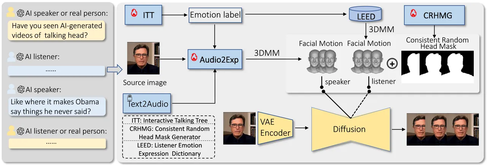
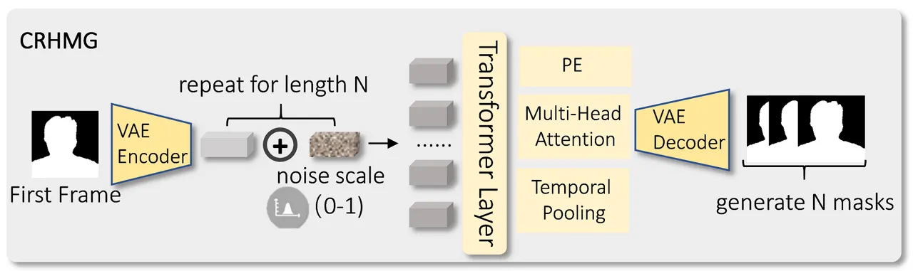
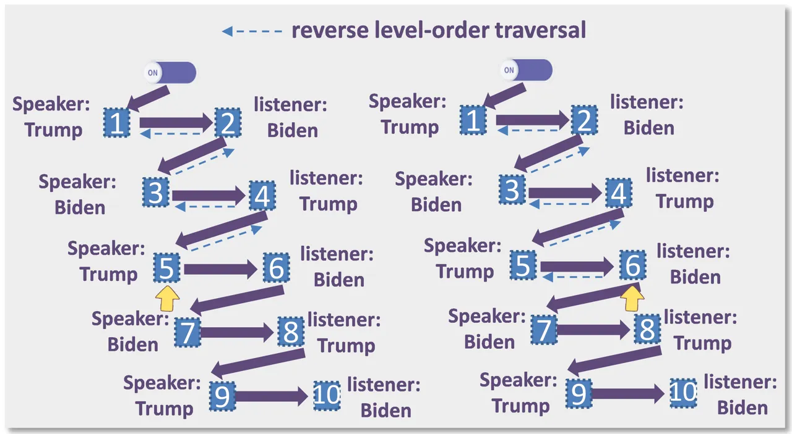
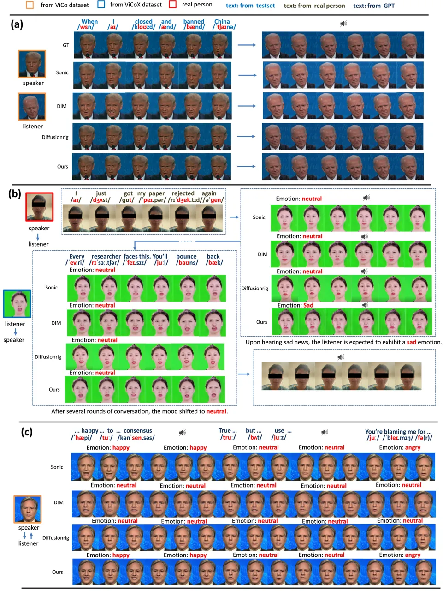
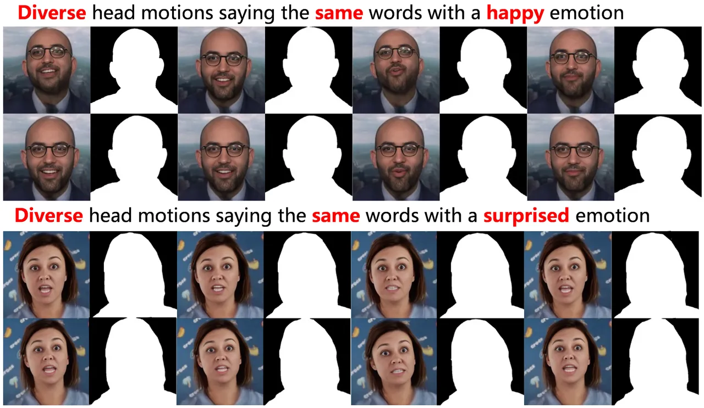

# Warm Chat: Diffuse Emotion-aware Interactive Talking Head Avatar with Tree-Structured GuidanceThanks: \*Corresponding author

Haijie Yang Affiliation: Nanjing University of Science and Technology,
Nanjing, China email: <yanghaijie@njust.edu.cn> , Zhenyu Zhang
Affiliation: Nanjing University, Nanjing, China email:
<zhangjesse@foxmail.com> , Hao Tang Affiliation: School of Computer
Science, Peking University, Beijing, China email:
<bjdxtanghao@gmail.com> , Jianjun Qian Affiliation: Nanjing University
of Science and Technology, Nanjing, China email: <csjqian@njust.edu.cn>
and Jian Yang Affiliation: Nanjing University of Science and Technology,
Nanjing, China email: <csjyang@mail.njust.edu.cn>

###### Abstract.

Generative models have advanced rapidly, enabling impressive talking
head generation that brings AI to life. However, most existing methods
focus solely on one-way portrait animation. Even the few that support
bidirectional conversational interactions lack precise emotion-adaptive
capabilities, significantly limiting their practical applicability. In
this paper, we propose Warm Chat, a novel emotion-aware talking head
generation framework for dyadic interactions. Leveraging the dialogue
generation capability of large language models (LLMs, e.g., GPT-4), our
method produces temporally consistent virtual avatars with rich
emotional variations that seamlessly transition between speaking and
listening states. Specifically, we design a Transformer-based head mask
generator that learns temporally consistent motion features in a latent
mask space, capable of generating arbitrary-length, temporally
consistent mask sequences to constrain head motions. Furthermore, we
introduce an interactive talking tree structure to represent dialogue
state transitions, where each tree node contains information such as
child/parent/sibling nodes and the current character’s emotional state.
By performing reverse-level traversal, we extract rich historical
emotional cues from the current node to guide expression synthesis.
Extensive experiments demonstrate the superior performance and
effectiveness of our method.

## 1. Introduction

Existing talking head generation methods (Zhang et al., 2023; Guan et
al., 2023; Liu et al., 2024b; Ng et al., 2022b; Tan et al., 2023; Tian
et al., 2024) have made significant progress in terms of generation
quality and audio-lip synchronization. Among these approaches, Teller
(Zhen et al., 2025) introduces the first autoregressive streaming
audio-driven animation framework, achieving notable fidelity and
responsiveness. However, like many other methods, it remains limited to
one-way portrait animation or reconstruction which lacks listener
feedback. On the other hand, listening-head generation methods (Liu et
al., 2024b; Wang et al., 2025; Zhou et al., 2021b) are specifically
designed to respond to speakers’ behaviors, but these approaches are
confined solely to generating non-verbal facial movements, falling far
short of realistic conversational interactions. Crucially, both
paradigms share a common limitation: they struggle to model the
bidirectional interaction dynamics required for engaging, real-world
applications.

To address these limitations, several approaches (Tran et al., 2024b;
Wang et al., 2023a) have explored head generation in dyadic interaction
scenarios. For example, DyadicIM (Tran et al., 2024b) jointly models the
motions of the speaker and the listener through masked modeling and
contrastive learning. However, such methods still require manual
pre-assignment of listener/speaker roles and cannot achieve natural and
seamless role switching. Recent advances (Peng et al., 2025; Zhu et al.,
2024; Kong et al., 2025) have enabled dialogue systems to dynamically
switch between listener and speaker roles based on the conversational
context. The INFP (Zhu et al., 2024), for example, achieves this through
its motion-based head imitation stage and audio-guided motion generation
stage. Although these approaches enable dynamic toggling between
speaking and listening states for agent portraits, they all overlook a
crucial aspect, emotional variation during dynamic conversations.
Emotionless agent portraits are clearly far from real-life interaction
scenarios. Recent studies (Song et al., 2023b; Ng et al., 2024b;
Siniukov et al., 2025) have incorporated emotional modeling into
conversational agents, with approaches such as DiTailListener (Siniukov
et al., 2025) employing text-based conditioning (e.g., "smile," "nod")
to modulate emotional expressions. However, such implementations exhibit
critical limitations in modeling naturalistic emotional dynamics. Rather
than static or unidimensional representations, affect states should
adhere to two fundamental psycholinguistic principles: (1) Progressive
accumulation: current emotional states are influenced by associations
with historical dialog. (2) Recency effect: recent interaction events
exert a disproportionately stronger influence on current affective
states.

Based on the discussion above, we pose the following question: Can we
develop an interactive dialogue framework that seamlessly switches
between the roles of speaker and listener, while enabling dynamic
emotional perception? The key challenges to address are: (1) Ensure
smooth transitions between the speaker and listener roles. (2) Introduce
randomness in character motions generated, as these motions are
independent of dialogue content. (3) Maintain temporal consistency in
the synthesized dialogue video, for both roles. (4) Model the emotions
of the speaker and listener as the dialogue progresses.

To this end, we propose Warm Chat, a novel interactive dialogue
framework with emotional perception, based on a diffusion model
architecture guided by head and facial motion. Specifically, we decouple
the dialogue avatar into two parts: head motion (head mask) and facial
motion (facial expressions). For the speaker’s facial motion, we
fine-tune a pre-trained audio-to-expression model, while for the
listener’s facial motion, we construct a Listener Emotion Expression
Dictionary (LEED) and randomly select facial expression sequences based
on the input emotion labels. For head motion, we design a
Transformer-based head mask generator that learns temporally consistent
motion features in a latent mask space, capable of generating
arbitrarily long, temporally consistent mask sequences to constrain head
movements. Next, for switching between the speaker and listener roles
and emotion modeling, we propose a novel Interactive Talking Tree (ITT).
Each node in this structure represents either the speaker or the
listener and contains information such as emotional states, parent-child
relationships, and sibling nodes. Nodes at the same depth correspond to
a single round of dialogue. As the tree grows, the roles of speaker and
listener can switch. Additionally, we use reverse hierarchical traversal
to account for historical dialogue emotions and apply weighted methods
to determine the emotional state of the current node. Finally, we
introduce a large language model (LLM, such as GPT-4) to generate
dialogue text and use text-to-speech technology to allow the agent to
engage in endless conversations.

In summary, our contributions are as follows:

- •
  We propose a novel interactive talking framework with emotional
  perception, enabling endless conversations with the help of a large
  language model.
- •
  We design a Transformer-based, random yet temporally consistent head
  mask generator framework that constrains conversational head motions.
- •
  We introduce a novel Interactive Talking Tree (ITT) structure to
  switch between the listener and speaker roles and model their
  emotional states.



Figure 1. Overview. First, we construct an Interactive Talking Tree
(ITT) to represent the dynamic states of the dialogue throughout the
modeling process. By performing a reverse hierarchical traversal with
weighted operations on the ITT, we derive the cumulative emotional label
at the current node. Additionally, we fine-tune the pre-trained
audio-to-expression model to obtain the speaker’s facial motion. Next,
we introduce a Consistent Random Head Mask Generator (CRHMG) to regulate
the head motion of both the speaker and the listener. We also develop a
Listener Emotion-Expression Dictionary (LEED) that maps emotional labels
to plausible facial expressions, which are then translated into
corresponding facial motion. Finally, we design a diffusion model
conditioned on both facial and head motion to generate realistic
responses for the speaker and listener. Leveraging a large language
model (GPT-4), the system supports continuous, open-ended dialogue
between the two parties.

## 2. Related Work

Talking Head Generation. Early methods rely on GANs to map audio
directly to video, as seen in Wav2Lip (R et al., 2020) and MakeItTalk
(Zhou et al., 2020), which focus on audio-visual synchronization, and
PC-AVS (Zhou et al., 2021a), which adds pose control. The field evolves
with more advanced techniques, including VASA-1 (Xu et al., 2024), which
disentangles latent representations to synthesize high-quality videos
from a single image. Diffusion models such as DiffTalk (Shen et al., 2023) and EmoTalk (Peng et al., 2023) further improve temporal coherence
and expressiveness through probabilistic modeling. Hybrid training
approaches also enhance robustness: EchoMimic (Chen et al., 2024)
jointly optimizes facial and audio landmarks, while AniTalker (Liu et
al., 2024a) uses self-supervised learning to capture fine-grained facial
motion. Building on these trends, GeneFace++ (Ye et al., 2023) and
TalkLip (Wang et al., 2023b) combine 3D facial priors with neural
rendering for photorealistic results.

Listening Head Generation. Early methods use sequential decoders to
model head motion, such as RLHG (Zhou et al., 2021c), which introduces
the ViCo dataset and an autoregressive baseline. Later approaches
improve visual quality with improved rendering, as in PCH (Huang et al.,
2022), which proposes a neural renderer for finer details. The field
evolves with more advanced modeling techniques. Song et al. (Song et
al., 2024) launch the REACT challenge to evaluate offline and online
listener generation. To increase motion diversity, L2L (Ng et al.,
2022a) uses VQ-VAE (van den Oord et al., 2017) to discretize motion
sequences, while ELP (Song et al., 2023a) uses emotional priors to
structure the latent space for more expressive output. Newer models
expand control inputs: CustomListener (Liu et al., 2024b) supports
text-driven synthesis, and MFR-Net (Liu et al., 2023) improves identity
preservation and motion diversity through contrastive learning. Recent
work adopts large-scale pretraining to boost generalization. RealTalk
(Geng et al., 2023) combines retrieval-augmented generation with large
language models (LLMs) for context-aware motion, and Ng et al. (Ng et
al., 2023) show that transfer learning from LLMs benefits motion
prediction. Building on these trends, DiffListener (Jung and Kim, 2025)
uses diffusion-based frameworks to generate emotionally rich and
high-fidelity listener responses, setting new standards for realism and
diversity.

Head Generation in Interactive Talking. Early approaches like ViCo-X
(Zhou et al., 2023) extended RLHG (Zhou et al., 2021c) by introducing a
multi-turn dataset and a Role Switcher to bridge speaker and listener
generators. However, explicit role switching often leads to unnatural
transitions and fails to handle overlapping speech states. DIM (Tran et
al., 2024a) proposed joint modeling of speaker and listener motions but
requires task-specific fine-tuning, limiting flexibility. AgentAvatar
(Wang et al., 2023a) synthesized photorealistic avatars but struggled
with precise audio-facial alignment due to reliance on textual
descriptions. Recent advances address these limitations. INFP (Zhu et
al., 2024) introduces a unified framework that dynamically switches
between speaking and listening states without manual role assignment,
leveraging a two-stage pipeline (motion imitation + audio-guided
generation) and a large-scale dataset, DyConv. Currently, Ng et al. (Ng
et al., 2024a) combine VQ-VAE and diffusion models to generate
photorealistic avatars of the full body with nuanced facial and gestural
motion, emphasizing the importance of photorealism in evaluating subtle
conversational cues.

## 3. Method

In this section, we present Warm Chat, an innovative dialogue framework
that incorporates emotional awareness, built on a diffusion model
architecture driven by head and facial motion cues. An overview of this
framework is shown in Fig. 1. First, to simulate realistic dialogue
scenarios, we design a Transformer-based Consistent Random Head Mask
Generator (CRHMG) capable of producing arbitrarily long, temporally
consistent mask sequences to constrain head motion. Next, to enable
speaker-listener role-switching and emotion modeling, we propose a novel
Interactive Talking Tree (ITT). Then, for the facial motion of speakers
and listeners, we fine-tune a pre-trained Audio-to-Expression
(Audio2Exp) model and construct a Listener Emotion Expression Dictionary
(LEED), respectively, selecting facial expression sequences randomly
based on input emotion labels. Finally, we develop a diffusion model
guided by both head mask and facial motion to generate emotion-aware,
high-quality, realistic and temporally consistent talking heads.



Figure 2. The architecture diagram of the Consistent Random Head Mask
Generator.

### 3.1. Consistent Random Head Mask Generator

As previously described, the Consistent Random Head Mask Generator
(CRHMG) is a Transformer-based architecture designed to produce
arbitrarily long, temporally consistent mask sequences from a single
initial frame. As illustrated in Fig. 2, the system comprises three main
components: (1) a variational encoder that maps the input frame to a
latent space, (2) a Transformer-based temporal generator that
incorporates noise injection, and (3) a variational decoder that
reconstructs the mask sequence.

\(1\) Given an initial mask frame
$`\mathbf{x}_{1}\in\mathbb{R}^{1\times H\times W}`$, we first encode it
into a latent condition vector using an encoder:

```math
\displaystyle\mathbf{z}_{1}=\text{Encoder}_{\phi}(\mathbf{x}_{1})\in\mathbb{R}^{d}, \tag{1}
```

where $`d`$ is the latent dimension (256 in our implementation). The
encoder $`\text{Encoder}_{\phi}`$ consists of three convolutional layers
(32→64→128 channels) with ReLU activations, followed by global average
pooling and a linear projection to the latent space. To generate a
sequence of length $`N`$, where $`N`$ corresponds to the length of the
audio signal, we construct an initial latent sequence by repeating the
condition vector and adding controlled noise:

```math
\displaystyle\mathbf{Z}=[\mathbf{z}_{1},\mathbf{z}_{1},\dots,\mathbf{z}_{1}]+\epsilon\odot\boldsymbol{\eta},\quad\boldsymbol{\eta}\sim\mathcal{N}(\mathbf{0},\mathbf{I}), \tag{2}
```

where $`\epsilon\in[0,1]`$ is a hyperparameter controlling the noise
scale, $`\boldsymbol{\eta}`$ is Gaussian noise sampled independently for
each latent vector, and $`\odot`$ denotes element-wise multiplication.
This noisy latent sequence is then combined with positional embeddings
and passed through a Transformer encoder to model temporal dependencies.
Finally, the output is decoded into a sequence of masks using a decoder.

\(2\) The latent sequence $`\mathbf{Z}\in\mathbb{R}^{N\times d}`$ is
then processed by a stack of $`L=6`$ Transformer encoder layers :

```math
\displaystyle\mathbf{Z}^{\prime}=\text{Transformer}(\mathbf{Z}+\mathbf{P}), \tag{3}
```

where $`\mathbf{P}\in\mathbb{R}^{N\times d}`$ is the learned positional
encoding. Each Transformer layer employs multi-head attention (8 heads)
with dimension $`d_{k}=d/h`$:

```math
\displaystyle\text{Attention}(\mathbf{Q},\mathbf{K},\mathbf{V})=\text{softmax}\left(\frac{\mathbf{Q}\mathbf{K}^{T}}{\sqrt{d_{k}}}\right)\mathbf{V}. \tag{4}
```

The temporal pooling operation ensures consistency by attending to
previous frames when generating each new mask.

\(3\) The transformed latent sequence $`\mathbf{Z}^{\prime}`$ is decoded
into mask predictions:

```math
\displaystyle\hat{\mathbf{X}}=\text{Decoder}_{\theta}(\mathbf{Z}^{\prime}), \tag{5}
```

where the decoder $`\text{Decoder}_{\theta}`$ mirrors the encoder
structure with transposed convolutions (128→64→32→1 channels) and
sigmoid activation.

### 3.2. Interactive Talking Tree

To model the dialogue states and emotional states of the two roles in a
conversation, we construct a novel and infinitely extensible Interactive
Talking Tree.

Tree Structure Definition. Interactive Talking Tree is defined as a
six-tuple:

```math
\displaystyle\mathcal{T}=(V,G,\Psi,\Lambda,S,D), \tag{6}
```

where $`V`$ is the set of nodes. $`G=\{\text{speak},\text{listen}\}`$ is
set of dialogue state, $`\Psi=\{\psi_{1},\psi_{2},\dots,\psi_{k}\}`$ is
the set of emotion state. $`k`$ is the number of nodes.
$`\Lambda:V\to G\times\Psi\times[0,1]`$ is the node annotation function
with dialogue state, emotion state and confidence $`P`$.
$`S:V\to\{v_{\text{child}},v_{\text{parent}},v_{\text{ls}},v_{\text{rs}}\}`$
is the structural query function, the elements represent the parent
node, child node, left sibling node, and right sibling node,
respectively. $`D`$ is the depth query function. The tree structure is
shown in Fig. 3. For example,
$`\Lambda(v_{5})=(\text{speak},\psi_{5},P_{5})`$, $`D(v_{5})=3`$,
$`S_{\text{parent}}(v_{5})=v_{4}`$,
$`S_{\text{ls}}(v_{5})=\text{Null}`$, $`S_{\text{rs}}(v_{5})=v_{6}`$,
$`S_{\text{child}}(v_{5})=\text{Null}`$. The tree growth follows:

```math
\displaystyle v_{\text{next}}=\begin{cases}S_{\text{child}}(v)&\text{if }G(v)=\text{listen},\\
S_{\text{rs}}(v)&\text{if }G(v)=\text{speak}.\end{cases} \tag{7}
```

Emotion Modeling. We use a multimodal emotion recognition model
Emotion-LLaMA (Cheng et al., 2024) to obtain the corresponding emotional
state and its confidence score. It is worth noting that if the dialogue
content of both parties is generated by a large language model, the
multimodal emotion recognition model only takes text input to determine
the emotion. However, if one party is a real person in a real-world
scenario, the emotional states derived from text, visual, and audio
inputs may differ. In this case, the multimodal emotion recognition
model takes text, visual, and audio input to determine the emotion. The
emotion category $`\psi`$ and the confidence score $`P`$ for a given
node are obtained using the following formula:

```math
\displaystyle\psi \displaystyle=\mathop{\mathrm{argmax}}\limits_{k}\left(\mathrm{softmax}(W^{\top}f+b)\right), \tag{8}
```

```math
\displaystyle P \displaystyle=\max\left(\mathrm{softmax}(W^{\top}f+b)\right), \tag{9}
```

where $`W\in\mathbb{R}^{d\times k}`$ is classification weight matrix,
$`f\in\mathbb{R}^{d}`$ is feature vector, $`b`$, $`d`$, and $`k`$
represent the bias, input feature dimension, and number of emotion
categories, respectively.



Figure 3. The architecture of the Interactive Talking Tree.

Emotion Propagation. Relying solely on multimodal emotion recognition to
determine the emotional state of the current node does not accurately
reflect the emotional dynamics in real-world conversations. We argue
that a node’s emotion is gradually accumulated as the conversation
progresses. Therefore, we propose an emotion propagation query function
$`Q`$. Specifically, based on the current node’s dialogue state, we
perform a reverse level-order traversal to query historical emotional
states and their confidence scores, and then compute a weighted sum. The
weights are positively correlated with the node depth. As defined by the
formula below:

```math
\displaystyle Q(v)=\begin{cases}\text{if }G(v)=\text{speak}\\
\mathop{\mathrm{argmax}}\limits_{\psi\in\Psi}\left(P_{v}(\psi)+\sum_{u\in\pi(v,D(v)-1)}D(u)\cdot P_{u}(\psi)\right),&\\
\text{if }G(v)=\text{listen}\\
\mathop{\mathrm{argmax}}\limits_{\psi\in\Psi}\left(\sum_{u\in\pi(v,D(v))}D(u)\cdot P_{u}(\psi)\right).&\\
\end{cases} \tag{10}
```

The traversal operation $`\pi`$ processes nodes in reverse-level-order,
with $`P_{v}(\psi)`$ computed as $`\psi=C(\text{text})`$ for
GPT-generated nodes, while real person nodes use
$`\psi=C(\text{text},\text{audio},\text{video})`$ via multimodal model
$`C`$. This emotion querying approach aligns with the psychological
principle of the recency effect and effectively captures the cumulative
nature of emotions in dialogue.

### 3.3. Fine-tune Audio-to-Expression

To model the speaker’s facial motion, we need to convert speech (or
text-to-speech) in the datasets into expression coefficients, we utilize
EAT (Gan et al., 2023), an efficient emotional adaptation method for
audio-driven talking head generation. However, directly inputting the
character image, audio, and emotion label into the model often produces
expression coefficients that do not fully align with the specific facial
characteristics of the target character, which can compromise the
accuracy of subsequent emotional dialogue modeling. To address this, we
fine-tune the model using video data of the new character along with the
corresponding audio. The fine-tuning process strictly follows EAT’s loss
functions, including reconstruction loss, latent loss, synchronization
loss, and CLIP loss, to ensure effective adaptation. After fine-tuning,
the final 2D facial motion is generated using a 3D Morphable Model
(3DMM).

### 3.4. Listen Emotion Expression Dictionary

To model the listener’s facial motion, we introduce the Listener Emotion
Expression Dictionary (LEED)—a structured repository of emotion-specific
facial expressions. Unlike the speaker, the listener’s facial motion is
not driven by any speech input (in practice, we feed in silent audio of
the same duration as the speaker’s audio). Moreover, in real-world
scenarios, a listener’s head motion and facial expressions are typically
unpredictable. To better approximate this reality, we generate the
listener’s head motion using CRHMG. For the facial motion, we also
leverage EAT (Gan et al., 2023). We construct the LEED for each
character by feeding EAT with various emotion labels along with silent
audio. During inference, we retrieve the desired facial expression
sequence from LEED by indexing with the target emotion label and
specifying the required length. The resulting expression coefficients
are then passed through a 3DMM to generate the final 2D facial motion.

### 3.5. Diffusion-Based Face Generation with Head Mask and Facial Motion Guidance

To synthesize high-quality, emotionally expressive, and temporally
consistent talking-head avatar, we design a diffusion-based face
generation module conditioned on both head motion masks and facial
motion sequences. This module constitutes the final stage of our Warm
Chat framework and is responsible for transforming abstract motion
representations into realistic facial imagery. Let
$`\mathbf{x}_{0}\in\mathbb{R}^{H\times W\times 3}`$ denote a target
talking-head frame to be generated, where $`H`$ and $`W`$ are the image
height and width. Our goal is to learn a conditional distribution
$`p(\mathbf{x}_{0}\mid\mathbf{M},\mathbf{E})`$, where
$`\mathbf{M}=\{\mathbf{m}_{t}\}_{t=1}^{T}`$ is a sequence of head motion
masks, ensuring plausible and consistent global head movements.
$`\mathbf{E}=\{\mathbf{e}_{t}\}_{t=1}^{T}`$ is a sequence of facial
motion, providing localized emotional control. We leverage a
ControlNet-based conditional diffusion model to model this generation
process.

The forward diffusion process gradually adds noise to the clean image
$`\mathbf{x}_{0}`$ over $`T`$ steps:

```math
\displaystyle q(\mathbf{x}_{t}\mid\mathbf{x}_{t-1})=\mathcal{N}(\mathbf{x}_{t};\sqrt{1-\beta_{t}}\,\mathbf{x}_{t-1},\beta_{t}\mathbf{I}). \tag{11}
```

During training, the model learns to reverse this process by predicting
the noise $`\boldsymbol{\epsilon}`$ given the noisy image and the
conditional controls:

```math
\displaystyle\mathcal{L}_{\text{diff}}=\mathbb{E}_{\mathbf{x}_{0},t,\boldsymbol{\epsilon}}\left[\left\|\boldsymbol{\epsilon}-\epsilon_{\theta}(\mathbf{x}_{t},t,\mathbf{M},\mathbf{E})\right\|_{2}^{2}\right], \tag{12}
```

$`\epsilon_{\theta}`$ is the noise prediction network conditioned on
$`\mathbf{M}`$ and $`\mathbf{E}`$. At inference time, we generate each
video frame by iteratively denoising from Gaussian noise using the
learned reverse process:

```math
\displaystyle\mathbf{x}_{0}\leftarrow\epsilon_{\theta}^{-1}(\mathbf{x}_{T},\mathbf{M},\mathbf{E}) \tag{13}
```



Figure 4. Our method demonstrates superior performance compared to other
approaches across three scenarios: talking sequence reconstruction (a),
human-virtual agent interaction (b), and virtual agent-virtual agent
dialogue (c). The results show our method achieves better image quality,
audio-lip synchronization, and emotional expressiveness. Notably, while
Sonic and DiffusionRig were not originally designed for interactive
dialogue scenarios, we manually implemented speaker-listener role
switching for comparative evaluation.



Figure 5. Results of diverse generated head motions.

## 4. Experiment

### 4.1. Setup

Datasets. We utilize two datasets for our experiments: ViCo (Zhou et
al., 2023)and ViCoX (Zhou et al., 2022). ViCo contains 1.6 hours of
video footage with unique IDs. ViCoX consists of conversational videos
recorded through face-to-face performances by professional actors.
Compared to the ViCo dataset, it shifts the research focus from listener
modeling to dyadic interaction modeling, incorporating multi-turn
dialogues as video corpus. As our network model trains one ID at a time,
we select a subset of 15 IDs (10 male and 5 female) from these datasets
for training. After training, any two IDs can engage in unlimited
multi-turn conversations, with dialogue texts generated by GPT-4. All
video frames are resized to 256×256 resolution during preprocessing.

Evaluation Criteria. To quantitatively evaluate the visual quality of
the generated videos, we compute head motion using a predefined test
mask extracted from ground truth portraits and employ following
established metrics: Structural Similarity Index (SSIM) (Wang et al.,
2004b) for perceptual quality assessment, Peak Signal-to-Noise Ratio
(PSNR) (Wang et al., 2004a) for pixel-level accuracy measurement, and
Fréchet Inception Distance (FID) (Heusel et al., 2018) for feature
distribution analysis. We further enhance our evaluation framework by
incorporating LPIPS (Zhang et al., 2018) for deep feature-space
comparison, SyncNet’s confidence score (SyncScore) (Chung and Zisserman, 2017) for precise audio-visual synchronization assessment, and Temporal
Consistency (TC) quantified through optical flow variation proximity
relative to rendering benchmarks, while motion diversity is analyzed
using the Diversity Index (SID) and frame Variance (Var) following
established protocols (Ng et al., 2022a; Tran et al., 2024b). To
complement these objective measures, we conduct a controlled user study
with 40 participants. Evaluators rate 10 generated videos (derived from
5 dialogue pairs) using a standardized 5-point Likert scale (where 1
indicates the lowest quality and 5 the highest quality) across six key
dimensions: movement naturalness (MN), motion variety (MV), lip-sync
accuracy (LSA), emotional and contextual coherence (ECC), Temporal
Consistency (TC) and overall visual fidelity (OA).

Implementation Details. Our framework is implemented using PyTorch and
runs on an RTX 3090 GPU. For the training of the CRHMG, the Adam
optimizer is employed with a learning rate of $`10^{-4}`$, over 400
epochs and a batch size of 16. Regarding the training of the conditional
diffusion model, the base architecture of U-Net is retained, and an
additional control branch is introduced. The Adam optimizer is also used
with a learning rate of $`10^{-4}`$, conducting 15,000 iterations with a
batch size of 4. For more details, please refer to the supplementary
materials.

|              |                   |                  |                   |                     |                       |                 |                 |                |                |                 |                 |                |                |
| ------------ | ----------------- | ---------------- | ----------------- | ------------------- | --------------------- | --------------- | --------------- | -------------- | -------------- | --------------- | --------------- | -------------- | -------------- |
| Method       | Objective Metrics |                  |                   |                     |                       |                 |                 | User Study     |                |                 |                 |                |                |
|              | SSIM$`\uparrow`$  | PSNR$`\uparrow`$ | FID$`\downarrow`$ | LPIPS$`\downarrow`$ | SyncScore$`\uparrow`$ | SID$`\uparrow`$ | Var$`\uparrow`$ | MN$`\uparrow`$ | MV$`\uparrow`$ | LSA$`\uparrow`$ | ECC$`\uparrow`$ | TC$`\uparrow`$ | OA$`\uparrow`$ |
| Sonic        | 0.831             | 29.552           | 18.718            | 0.294               | 5.811                 | 1.786           | 1.724           | 7.5%           | 12.5%          | 10%             | 2.5%            | 17.5%          | 15%            |
| DIM          | 0.729             | 29.314           | 20.574            | 0.386               | 5.245                 | 1.486           | 0.927           | 5%             | 10%            | 5%              | 5%              | 7.5%           | 7.5%           |
| Diffusionrig | 0.834             | 30.092           | 15.366            | 0.288               | 5.872                 | 2.211           | 1.322           | 0%             | 2.5%           | 5%              | 2.5%            | 0&             | 2.5%           |
| w/o CRHMG    | 0.848             | 31.913           | 14.092            | 0.269               | 6.902                 | 2.631           | 2.179           | $`\sim`$       | $`\sim`$       | $`\sim`$        | $`\sim`$        | $`\sim`$       | $`\sim`$       |
| w/o ITT      | 0.843             | 31.827           | 14.397            | 0.274               | 6.882                 | 2.596           | 2.014           | $`\sim`$       | $`\sim`$       | $`\sim`$        | $`\sim`$        | $`\sim`$       | $`\sim`$       |
| Ours         | 0.852             | 32.039           | 13.622            | 0.236               | 7.230                 | 2.739           | 2.477           | 87.5%          | 75%            | 80%             | 90%             | 75%            | 75%            |

Table 1. Quantitative comparison of interactive head generation with
other methods.

|                |                                 |                                 |                                 |                                 |                                 |                                 |                                 |                                 |                                 |                           |
| -------------- | ------------------------------- | ------------------------------- | ------------------------------- | ------------------------------- | ------------------------------- | ------------------------------- | ------------------------------- | ------------------------------- | ------------------------------- | ------------------------- |
| Method / Frame | 1-2                             | 2-3                             | 3-4                             | 4-5                             | 5-6                             | 6-7                             | 7-8                             | 8-9                             | 9-10                            | total error$`\downarrow`$ |
| GT             | 0.21                            | 0.34                            | 0.33                            | 0.04                            | 0.18                            | 0.17                            | 0.14                            | 0.21                            | 0.09                            | 0                         |
| Sonic          | 0.52^(+0.31)                    | 0.35^(+0.01)                    | 0.32^(+0.01)                    | 0.31^(+0.27)                    | 0.29^(+0.11)                    | 0.21^(+0.04)                    | 0.75^(+0.61)                    | 0.65^(+0.44)                    | 0.27^(+0.18)                    | $`1.98`$                  |
| DIM            | $`0.79{{}^{\scriptsize+0.58}}`$ | $`0.26{{}^{\scriptsize+0.08}}`$ | $`0.28{{}^{\scriptsize+0.05}}`$ | $`0.27{{}^{\scriptsize+0.23}}`$ | $`0.14{{}^{\scriptsize+0.04}}`$ | $`0.06{{}^{\scriptsize+0.11}}`$ | $`0.34{{}^{\scriptsize+0.20}}`$ | $`0.32{{}^{\scriptsize+0.11}}`$ | $`0.21{{}^{\scriptsize+0.12}}`$ | $`1.52`$                  |
| Diffusionrig   | $`0.78{{}^{\scriptsize+0.57}}`$ | $`0.08{{}^{\scriptsize+0.26}}`$ | $`0.04{{}^{\scriptsize+0.29}}`$ | $`0.31{{}^{\scriptsize+0.27}}`$ | $`0.16{{}^{\scriptsize+0.02}}`$ | $`1.33{{}^{\scriptsize+1.16}}`$ | $`1.17{{}^{\scriptsize+1.03}}`$ | $`2.80{{}^{\scriptsize+2.59}}`$ | $`2.02{{}^{\scriptsize+1.93}}`$ | $`8.12`$                  |
| w/o CRHMG      | $`0.05{{}^{\scriptsize+0.16}}`$ | $`0.17{{}^{\scriptsize+0.17}}`$ | $`0.21{{}^{\scriptsize+0.12}}`$ | $`0.13{{}^{\scriptsize+0.09}}`$ | $`0.14{{}^{\scriptsize+0.04}}`$ | $`0.08{{}^{\scriptsize+0.09}}`$ | $`0.11{{}^{\scriptsize+0.03}}`$ | $`0.05{{}^{\scriptsize+0.16}}`$ | $`0.07{{}^{\scriptsize+0.02}}`$ | $`0.88`$                  |
| w/o ITT        | $`0.18{{}^{\scriptsize+0.03}}`$ | $`0.25{{}^{\scriptsize+0.09}}`$ | $`0.16{{}^{\scriptsize+0.17}}`$ | $`0.18{{}^{\scriptsize+0.14}}`$ | $`0.13{{}^{\scriptsize+0.05}}`$ | $`0.05{{}^{\scriptsize+0.12}}`$ | $`0.06{{}^{\scriptsize+0.08}}`$ | $`0.15{{}^{\scriptsize+0.06}}`$ | $`0.02{{}^{\scriptsize+0.07}}`$ | $`0.81`$                  |
| Ours           | $`0.24{{}^{\scriptsize+0.03}}`$ | $`0.35{{}^{\scriptsize+0.01}}`$ | $`0.22{{}^{\scriptsize+0.11}}`$ | $`0.10{{}^{\scriptsize+0.06}}`$ | $`0.12{{}^{\scriptsize+0.06}}`$ | $`0.18{{}^{\scriptsize+0.01}}`$ | $`0.08{{}^{\scriptsize+0.06}}`$ | $`0.16{{}^{\scriptsize+0.05}}`$ | $`0.07{{}^{\scriptsize+0.02}}`$ | 0.41                      |

Table 2. Quantitative comparisons on the temporal consistency of
interactive head generation with other methods.

### 4.2. Qualitative Evaluation

Fig. 4 presents three comparative cases with baseline models. For the
first case Fig. 4 (a), we select a random dialogue sequence between two
characters from the test set. When using their extracted masks as
constraints, our method accurately reconstructs the original talking
segments while maintaining superior generation quality and audio-lip
synchronization compared to other approaches. For the second case shown
in Fig. 4 (b), we randomly select one character from the dataset and one
real human to simulate authentic conversation. The dataset character
generates subsequent responses based on the human’s speech content using
GPT-4, with head masks produced by our CRHMG method. Experimental
results demonstrate our method’s capability to dynamically adapt
emotional expressions according to the conversational context. For the
third case Fig. 4 (c), we randomly select two characters from the
dataset (presenting unidirectional results) and simulate an extended
conversation using GPT-4-generated text. Our method consistently
delivers high-quality facial rendering with precise audio-lip
synchronization while exhibiting more nuanced emotional variations.
Sonic and DiffusionRig are not designed for interactive dialogues, so we
manually switch between speaker and listener roles. In contrast, our ITT
module can automatically handle role transitions.

### 4.3. Quantitative Evaluation

We conduct quantitative experiments on the test set corresponding to 15
selected identities, and the detailed results are shown in Tab 1. In
terms of visual quality, our method achieves superior performance on
metrics. For the user study, under fair comparison settings, our method
receives the highest scores across all five evaluation dimensions. In
addition, we quantitatively compare the temporal consistency (TC, same
as TC from User Study) with other methods by measuring the difference in
optical flow magnitude between consecutive frames against the original
video form test set (such as Fig 4 (a)), as shown in Tab. 2.

### 4.4. Ablation Study

To evaluate the contribution of each component in our method, we analyze
the following aspects: 1) The impact of the masks generated by the
Consistent Random Head Mask Generator (CRHMG) on the final talking-head
generation; 2) The effect of the Interactive Talking Tree (ITT) on the
final talking-head generation.

Consistent Random Head Mask Generator (CRHMG). We conduct an ablation
study on CRHMG. CRHMG generates random head masks to constrain the head
motions of both the speaker and the listener. Its randomness contributes
to greater diversity in the generated head motions, while its temporal
consistency leads to improvements in both image quality metrics and
temporal consistency during the reconstruction stage. Detailed results
are presented in Tab. 1. Fig. 5 also demonstrates the diversity of head
motion.

Interactive Talking Tree (ITT). ITT models the dialog and emotional
dynamics of both participants using a tree-structured representation,
and introduces an emotion computation mechanism that incorporates
historical emotional context to produce more realistic and natural
interactions. To evaluate its effectiveness, we perform ablation
experiments from two perspectives: First, we remove ITT entirely,
resulting in a setting where no emotional modeling is applied. In this
case, all emotion labels are defaulted to ‘neutral’. The quantitative
results are shown in Tab. 1. Second, we retain ITT but modify the
emotion computation to rely solely on the current node’s emotion,
omitting the accumulated emotional context from previous dialog turns.
The results indicate that this leads to abrupt emotional shifts in
certain cases, which do not align well with the conversational flow.
Detailed analyses are provided in the supplementary material.

## 5. Conclusion

This paper proposes an innovative talking head generation framework,
Warm Chat, specifically designed for emotion-aware dyadic interaction.
It enables the synthesis of temporally consistent virtual avatars with
emotional dynamics, and supports natural transitions between speaking
and listening. We first develop a Transformer-based head mask generation
module that learns continuous motion features within a latent mask
space. This module can randomly generate temporally coherent mask
sequences of arbitrary length to control head movements. In addition, we
design an interactive talking tree structure to model the conversation
flow, the model captures the accumulation of emotional context from the
dialogue history, effectively guiding the subsequent expression
generation. However, our method also has some limitations, which are
detailed in the supplementary materials.

## References

- Chen et al. (2024) Z. Chen, J. Cao, Z. Chen, Y. Li, and C. Ma
  EchoMimic: lifelike audio-driven portrait animations through editable
  landmark conditions. ArXiv abs/2407.08136. External Links:
  [Link](https://api.semanticscholar.org/CorpusID:271097416) Cited by:
  §2.
- Cheng et al. (2024) Z. Cheng, Z. Cheng, J. He, J. Sun, K. Wang, Y.
  Lin, Z. Lian, X. Peng, and A. Hauptmann Emotion-llama: multimodal
  emotion recognition and reasoning with instruction tuning. External
  Links: 2406.11161, [Link](https://arxiv.org/abs/2406.11161) Cited by:
  §3.2.
- Chung and Zisserman (2017) J. S. Chung and A. Zisserman Out of time:
  automated lip sync in the wild. In Computer vision - ACCV 2016
  workshops, part 2: 13th Asian conference on computer vision (ACCV
  2016), November 20-24 2016, Taipei, Taiwan, Cited by: §4.1.
- Gan et al. (2023) Y. Gan, Z. Yang, X. Yue, L. Sun, and Y. Yang
  Efficient emotional adaptation for audio-driven talking-head
  generation. 2023 IEEE/CVF International Conference on Computer Vision
  (ICCV), pp. 22577–22588. External Links:
  [Link](https://api.semanticscholar.org/CorpusID:261682435) Cited by:
  §3.3, §3.4.
- Geng et al. (2023) S. Geng, R. Teotia, P. Tendulkar, S. Menon, and C.
  Vondrick Affective faces for goal-driven dyadic communication. ArXiv
  abs/2301.10939. External Links:
  [Link](https://api.semanticscholar.org/CorpusID:256274727) Cited by:
  §2.
- Guan et al. (2023) J. Guan, Z. Zhang, H. Zhou, T. Hu, K. Wang, D.
  He, H. Feng, J. Liu, E. Ding, Z. Liu, and J. Wang StyleSync:
  high-fidelity generalized and personalized lip sync in style-based
  generator. 2023 IEEE/CVF Conference on Computer Vision and Pattern
  Recognition (CVPR), pp. 1505–1515. External Links:
  [Link](https://api.semanticscholar.org/CorpusID:258564714) Cited by:
  §1.
- Heusel et al. (2018) M. Heusel, H. Ramsauer, T. Unterthiner, B.
  Nessler, and S. Hochreiter GANs trained by a two time-scale update
  rule converge to a local nash equilibrium. External Links: 1706.08500,
  [Link](https://arxiv.org/abs/1706.08500) Cited by: §4.1.
- Huang et al. (2022) A. Huang, Z. Huang, and S. Zhou Perceptual
  conversational head generation with regularized driver and enhanced
  renderer. Proceedings of the 30th ACM International Conference on
  Multimedia. External Links:
  [Link](https://api.semanticscholar.org/CorpusID:250072874) Cited by:
  §2.
- Jung and Kim (2025) S. Jung and T. Kim DiffListener: discrete
  diffusion model for listener generation. ArXiv abs/2502.06822.
  External Links:
  [Link](https://api.semanticscholar.org/CorpusID:276259108) Cited by:
  §2.
- Kong et al. (2025) Z. Kong, F. Gao, Y. Zhang, Z. Kang, X. Wei, X.
  Cai, G. Chen, and W. Luo Let them talk: audio-driven multi-person
  conversational video generation. External Links:
  [Link](https://api.semanticscholar.org/CorpusID:278959338) Cited by:
  §1.
- Liu et al. (2023) J. Liu, X. Wang, X. Fu, Y. Chai, C. Yu, J. Dai,
  and J. Han MFR-net: multi-faceted responsive listening head generation
  via denoising diffusion model. Proceedings of the 31st ACM
  International Conference on Multimedia. External Links:
  [Link](https://api.semanticscholar.org/CorpusID:261395895) Cited by:
  §2.
- Liu et al. (2024a) T. Liu, F. Chen, S. Fan, C. Du, Q. Chen, X. Chen,
  and K. Yu AniTalker: animate vivid and diverse talking faces through
  identity-decoupled facial motion encoding. Proceedings of the 32nd ACM
  International Conference on Multimedia. External Links:
  [Link](https://api.semanticscholar.org/CorpusID:269605245) Cited by:
  §2.
- Liu et al. (2024b) X. Liu, Y. Guo, C. Zhen, T. Li, Y. Ao, and P. Yan
  CustomListener: text-guided responsive interaction for user-friendly
  listening head generation. 2024 IEEE/CVF Conference on Computer Vision
  and Pattern Recognition (CVPR), pp. 2415–2424. External Links:
  [Link](https://api.semanticscholar.org/CorpusID:268201808) Cited by:
  §1, §2.
- Ng et al. (2022a) E. Ng, H. Joo, L. Hu, H. Li, T. Darrell, A.
  Kanazawa, and S. Ginosar Learning to listen: modeling
  non-deterministic dyadic facial motion. 2022 IEEE/CVF Conference on
  Computer Vision and Pattern Recognition (CVPR), pp. 20363–20373.
  External Links:
  [Link](https://api.semanticscholar.org/CorpusID:248227839) Cited by:
  §2, §4.1.
- Ng et al. (2022b) E. Ng, H. Joo, L. Hu, H. Li, T. Darrell, A.
  Kanazawa, and S. Ginosar Learning to listen: modeling
  non-deterministic dyadic facial motion. 2022 IEEE/CVF Conference on
  Computer Vision and Pattern Recognition (CVPR), pp. 20363–20373.
  External Links:
  [Link](https://api.semanticscholar.org/CorpusID:248227839) Cited by:
  §1.
- Ng et al. (2024a) E. Ng, J. Romero, T. M. Bagautdinov, S. Bai, T.
  Darrell, A. Kanazawa, and A. Richard From audio to photoreal
  embodiment: synthesizing humans in conversations. In IEEE/CVF
  Conference on Computer Vision and Pattern Recognition, CVPR 2024,
  Seattle, WA, USA, June 16-22, 2024, pp. 1001–1010. External Links:
  [Link](https://doi.org/10.1109/CVPR52733.2024.00101),
  [Document](https://dx.doi.org/10.1109/CVPR52733.2024.00101) Cited by:
  §2.
- Ng et al. (2024b) E. Ng, J. Romero, T. M. Bagautdinov, S. Bai, T.
  Darrell, A. Kanazawa, and A. Richard From audio to photoreal
  embodiment: synthesizing humans in conversations. 2024 IEEE/CVF
  Conference on Computer Vision and Pattern Recognition (CVPR),
  pp. 1001–1010. External Links:
  [Link](https://api.semanticscholar.org/CorpusID:266741730) Cited by:
  §1.
- Ng et al. (2023) E. Ng, S. Subramanian, D. Klein, A. Kanazawa, T.
  Darrell, and S. Ginosar Can language models learn to listen?. In
  IEEE/CVF International Conference on Computer Vision, ICCV 2023,
  Paris, France, October 1-6, 2023, pp. 10049–10059. External Links:
  [Link](https://doi.org/10.1109/ICCV51070.2023.00925),
  [Document](https://dx.doi.org/10.1109/ICCV51070.2023.00925) Cited by:
  §2.
- Peng et al. (2025) Z. Peng, Y. Fan, H. Wu, X. Wang, H. Liu, J. He,
  and Z. Fan DualTalk: dual-speaker interaction for 3d talking head
  conversations. External Links:
  [Link](https://api.semanticscholar.org/CorpusID:278886516) Cited by:
  §1.
- Peng et al. (2023) Z. Peng, H. Wu, Z. Song, H. Xu, X. Zhu, H. Liu, J.
  He, and Z. Fan EmoTalk: speech-driven emotional disentanglement for 3d
  face animation. 2023 IEEE/CVF International Conference on Computer
  Vision (ICCV), pp. 20630–20640. External Links:
  [Link](https://api.semanticscholar.org/CorpusID:257632043) Cited by:
  §2.
- R et al. (2020) P. K. R, R. Mukhopadhyay, V. P. Namboodiri, and C. V.
  Jawahar A lip sync expert is all you need for speech to lip generation
  in the wild. Proceedings of the 28th ACM International Conference on
  Multimedia. External Links:
  [Link](https://api.semanticscholar.org/CorpusID:221266065) Cited by:
  §2.
- Shen et al. (2023) S. Shen, W. Zhao, Z. Meng, W. Li, Z. Zhu, J. Zhou,
  and J. Lu DiffTalk: crafting diffusion models for generalized
  audio-driven portraits animation. 2023 IEEE/CVF Conference on Computer
  Vision and Pattern Recognition (CVPR), pp. 1982–1991. External Links:
  [Link](https://api.semanticscholar.org/CorpusID:258236723) Cited by:
  §2.
- Siniukov et al. (2025) M. Siniukov, D. Chang, M. Tran, H. Gong, A.
  Chaubey, and M. Soleymani DiTaiListener: controllable high fidelity
  listener video generation with diffusion. ArXiv abs/2504.04010.
  External Links:
  [Link](https://api.semanticscholar.org/CorpusID:277621640) Cited by:
  §1.
- Song et al. (2023a) L. Song, G. Yin, Z. Jin, X. Dong, and C. Xu
  Emotional listener portrait: realistic listener motion simulation in
  conversation. In IEEE/CVF International Conference on Computer Vision,
  ICCV 2023, Paris, France, October 1-6, 2023, pp. 20782–20792. External
  Links: [Link](https://doi.org/10.1109/ICCV51070.2023.01905),
  [Document](https://dx.doi.org/10.1109/ICCV51070.2023.01905) Cited by:
  §2.
- Song et al. (2023b) L. Song, G. Yin, Z. Jin, X. Dong, and C. Xu
  Emotional listener portrait: realistic listener motion simulation in
  conversation. 2023 IEEE/CVF International Conference on Computer
  Vision (ICCV), pp. 20782–20792. External Links:
  [Link](https://api.semanticscholar.org/CorpusID:263334150) Cited by:
  §1.
- Song et al. (2024) S. Song, M. Spitale, C. Luo, C. Palmero, G.
  Barquero, H. Zhu, S. Escalera, M. F. Valstar, T. Baur, F. Ringeval, E.
  André, and H. Gunes REACT 2024: the second multiple appropriate facial
  reaction generation challenge. 2024 IEEE 18th International Conference
  on Automatic Face and Gesture Recognition (FG), pp. 1–5. External
  Links: [Link](https://api.semanticscholar.org/CorpusID:266903078)
  Cited by: §2.
- Tan et al. (2023) S. Tan, B. Ji, and Y. Pan EMMN: emotional motion
  memory network for audio-driven emotional talking face generation. In
  2023 IEEE/CVF International Conference on Computer Vision (ICCV), Vol.
  , pp. 22089–22099. Cited by: §1.
- Tian et al. (2024) L. Tian, Q. Wang, B. Zhang, and L. Bo EMO: emote
  portrait alive - generating expressive portrait videos with
  audio2video diffusion model under weak conditions. In European
  Conference on Computer Vision, External Links:
  [Link](https://api.semanticscholar.org/CorpusID:268032834) Cited by:
  §1.
- Tran et al. (2024a) M. Tran, D. Chang, M. Siniukov, and M. Soleymani
  DIM: dyadic interaction modeling for social behavior generation. In
  Computer Vision - ECCV 2024 - 18th European Conference, Milan, Italy,
  September 29-October 4, 2024, Proceedings, Part XXXVII, A.
  Leonardis, E. Ricci, S. Roth, O. Russakovsky, T. Sattler, and G. Varol
  (Eds.), Lecture Notes in Computer Science, Vol. 15095, pp. 484–503.
  External Links:
  [Link](https://doi.org/10.1007/978-3-031-72913-3%5C_27),
  [Document](https://dx.doi.org/10.1007/978-3-031-72913-3%5F27) Cited
  by: §2.
- Tran et al. (2024b) M. Tran, D. Chang, M. Siniukov, and M. Soleymani
  Dyadic interaction modeling for social behavior generation. In
  European Conference on Computer Vision, External Links:
  [Link](https://api.semanticscholar.org/CorpusID:268385381) Cited by:
  §1, §4.1.
- van den Oord et al. (2017) A. van den Oord, O. Vinyals, and K.
  Kavukcuoglu Neural discrete representation learning. In Neural
  Information Processing Systems, External Links:
  [Link](https://api.semanticscholar.org/CorpusID:20282961) Cited by:
  §2.
- Wang et al. (2023a) D. Wang, B. Dai, Y. Deng, and B. Wang AgentAvatar:
  disentangling planning, driving and rendering for photorealistic
  avatar agents. ArXiv abs/2311.17465. External Links:
  [Link](https://api.semanticscholar.org/CorpusID:265498926) Cited by:
  §1, §2.
- Wang et al. (2023b) J. Wang, X. Qian, M. Zhang, R. T. Tan, and H. Li
  Seeing what you said: talking face generation guided by a lip reading
  expert. 2023 IEEE/CVF Conference on Computer Vision and Pattern
  Recognition (CVPR), pp. 14653–14662. External Links:
  [Link](https://api.semanticscholar.org/CorpusID:257834184) Cited by:
  §2.
- Wang et al. (2025) Z. Wang, A. Bruckert, P. L. Callet, and G. Zhai
  Efficient listener: dyadic facial motion synthesis via action
  diffusion. ArXiv abs/2504.20685. External Links:
  [Link](https://api.semanticscholar.org/CorpusID:278171652) Cited by:
  §1.
- Wang et al. (2004a) Z. Wang, A.C. Bovik, H.R. Sheikh, and E.P.
  Simoncelli Image quality assessment: from error visibility to
  structural similarity. IEEE Transactions on Image Processing 13 (4),
  pp. 600–612. External Links:
  [Document](https://dx.doi.org/10.1109/TIP.2003.819861) Cited by: §4.1.
- Wang et al. (2004b) Z. Wang, A.C. Bovik, H.R. Sheikh, and E.P.
  Simoncelli Image quality assessment: from error visibility to
  structural similarity. IEEE Transactions on Image Processing 13 (4),
  pp. 600–612. External Links:
  [Document](https://dx.doi.org/10.1109/TIP.2003.819861) Cited by: §4.1.
- Xu et al. (2024) S. Xu, G. Chen, Y. Guo, J. Yang, C. Li, Z. Zang, Y.
  Zhang, X. Tong, and B. Guo VASA-1: lifelike audio-driven talking faces
  generated in real time. ArXiv abs/2404.10667. External Links:
  [Link](https://api.semanticscholar.org/CorpusID:269157309) Cited by:
  §2.
- Ye et al. (2023) Z. Ye, J. He, Z. Jiang, R. Huang, J. Huang, J.
  Liu, Y. Ren, X. Yin, Z. Ma, and Z. Zhao GeneFace++: generalized and
  stable real-time audio-driven 3d talking face generation. ArXiv
  abs/2305.00787. External Links:
  [Link](https://api.semanticscholar.org/CorpusID:258426429) Cited by:
  §2.
- Zhang et al. (2018) R. Zhang, P. Isola, A. A. Efros, E. Shechtman,
  and O. Wang The unreasonable effectiveness of deep features as a
  perceptual metric. External Links: 1801.03924,
  [Link](https://arxiv.org/abs/1801.03924) Cited by: §4.1.
- Zhang et al. (2023) W. Zhang, X. Cun, X. Wang, Y. Zhang, X. Shen, Y.
  Guo, Y. Shan, and F. Wang SadTalker: learning realistic 3d motion
  coefficients for stylized audio-driven single image talking face
  animation. External Links: 2211.12194 Cited by: §1.
- Zhen et al. (2025) D. Zhen, S. Yin, S. Qin, H. Yi, Z. Zhang, S.
  Liu, G. Qi, and M. Tao Teller: real-time streaming audio-driven
  portrait animation with autoregressive motion generation. ArXiv
  abs/2503.18429. External Links:
  [Link](https://api.semanticscholar.org/CorpusID:277272150) Cited by:
  §1.
- Zhou et al. (2021a) H. Zhou, Y. Sun, W. Wu, C. C. Loy, X. Wang, and Z.
  Liu Pose-controllable talking face generation by implicitly
  modularized audio-visual representation. 2021 IEEE/CVF Conference on
  Computer Vision and Pattern Recognition (CVPR), pp. 4174–4184.
  External Links:
  [Link](https://api.semanticscholar.org/CorpusID:233346930) Cited by:
  §2.
- Zhou et al. (2022) M. Zhou, Y. Bai, W. Zhang, T. Yao, T. Zhao, and T.
  Mei ViCo-x: multimodal conversation dataset. Note:
  [https://project.mhzhou.com/vico](https://project.mhzhou.com/vico)Accessed:
  2022-09-30 Cited by: §4.1.
- Zhou et al. (2023) M. Zhou, Y. Bai, W. Zhang, T. Yao, and T. Zhao
  Interactive conversational head generation. CoRR abs/2307.02090.
  External Links: [Link](https://doi.org/10.48550/arXiv.2307.02090),
  [Document](https://dx.doi.org/10.48550/ARXIV.2307.02090), 2307.02090
  Cited by: §2, §4.1.
- Zhou et al. (2021b) M. Zhou, Y. Bai, W. Zhang, T. Zhao, and T. Mei
  Responsive listening head generation: a benchmark dataset and
  baseline. In European Conference on Computer Vision, External Links:
  [Link](https://api.semanticscholar.org/CorpusID:245502277) Cited by:
  §1.
- Zhou et al. (2021c) M. Zhou, Y. Bai, W. Zhang, T. Zhao, and T. Mei
  Responsive listening head generation: A benchmark dataset and
  baseline. CoRR abs/2112.13548. External Links:
  [Link](https://arxiv.org/abs/2112.13548), 2112.13548 Cited by: §2, §2.
- Zhou et al. (2020) Y. Zhou, D. Li, X. Han, E. Kalogerakis, E.
  Shechtman, and J. I. Echevarria MakeItTalk: speaker-aware talking head
  animation. ArXiv abs/2004.12992. External Links:
  [Link](https://api.semanticscholar.org/CorpusID:216553251) Cited by:
  §2.
- Zhu et al. (2024) Y. Zhu, L. Zhang, Z. Rong, T. Hu, S. Liang, and Z.
  Ge INFP: audio-driven interactive head generation in dyadic
  conversations. ArXiv abs/2412.04037. External Links:
  [Link](https://api.semanticscholar.org/CorpusID:274514429) Cited by:
  §1, §2.
