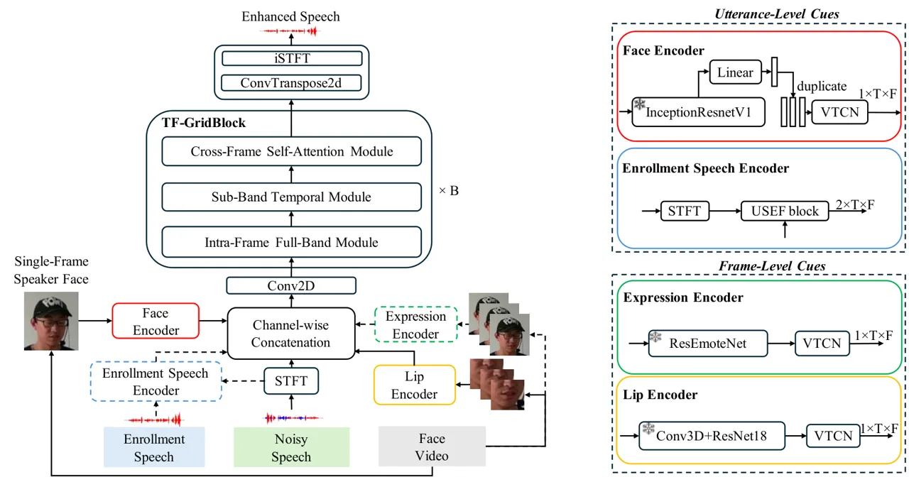

Jin Zeng Yang Du Ju Tian Liu Li

# Robust Audio-Visual Target Speaker Extraction with Multiple Enrollment Fusion

Zhan    Bang    Peijun    Jiarong    Wei    Yao    Juan    Ming

###### Abstract

Audio-Visual Target Speaker Extraction (AVTSE) is crucial for cocktail
party scenarios. Leveraging multiple cues --such as utterance-level
speaker embeddings or steady face images, and frame-level lip motion or
facial expression features --can significantly improve performance.
However, real-world applications often suffer from intermittent signal
loss, especially for frame-level cues. This paper systematically
investigates the robustness of multi-enrollment fusion under varying
degrees of modality missing. Results show that while full multimodal
fusion excels under ideal conditions, its performance degrades sharply
when encountering unseen modalities missing during the testing.
Crucially, training with a high missing rate dramatically enhances
robustness, maintaining stable performance even under severe test-time
modality missing. We demonstrate that fusing the complementary one frame
of face image with frame-level lip features achieves both strong
performance and robustness for the AVTSE task. The model and codes are
shared. ¹¹ 1 the link to the resource will be added after the blind
review process

###### keywords

multi-modality, target speaker extraction, speech enhancement,
audio-visual

^(†)^(†)address: ¹ School of Computer Science, Wuhan University, Wuhan,
China  
² School of Artificial Intelligence, The Chinese University of Hong
Kong, Shenzhen, China  
³ School of Artificial Intelligence, Wuhan University, Wuhan, China  
⁴ School of Cyber Science and Engineering, Wuhan University, Wuhan,
China  
⁵ Digital Innovation Research Center, Duke Kunshan University, Kunshan,
China  
⁶ AI Center, OPPO, Beijing, China ^(†)^(†)email:
ming.li.cuhksz@gmail.com

## 1 Introduction

The “cocktail party effect” describes the human ability to focus on a
specific speaker’s voice in a noisy acoustic environment. Recently,
Target Speaker Extraction (TSE) has become an increasingly significant
task, as it directly aims to isolate and enhance the voice of a target
speaker from a multi-talker mixture using prior information. The core of
this task lies in leveraging pre-enrolled cues that encapsulate the
target speaker’s characteristics, which serves as a guiding signal for
the extraction model to pinpoint and separate the desired voice from the
background. Any information that represents the target speaker’s vocal
characteristics can potentially serve as such a cue.

Various modalities are used to characterize the target speaker, broadly
categorized into utterance-level and frame-level features. Early
audio-visual TSE methods placed greater emphasis on frame-level lip
regions \[1, 2, 3, 4, 5\], as lip movements contain rich contextual
information which is highly correlated with speech. Moreover, the visual
modality remains unaffected by the acoustic environment, making it
robust in complex auditory conditions. Gabbay \[1\] proposed an
audio-visual separation network that adopts a pre-trained VGG-Face
network to extract a face descriptor for the target speaker. Afouras
\[2\] proposed using a pre-trained lip-reading model \[6\] to extract
multi-frame lip embeddings of the target speaker as visual cues to
assist TSE. In USEV \[7\], the leading role of lip movements in TSE
tasks is analyzed under various speech overlap conditions, and in \[8\]
self-supervised learning is applied to demonstrate the importance of
synchrony between the target speaker’s visual cues and the target speech
for TSE performance.

Figure 1: Proposed AVTSE system structure with multiple enrollment
fusion

However, TSE methods that depend on frame-level visual information are
susceptible to real-world robustness issues such as face occlusion, head
movement, signal interruption, etc., which can lead to missing facial
frames. This has motivated studies exploring methods to mitigate the
resulting performance degradation. First, models are designed to extract
useful information from available frames to compensate for missing data.
ImagineNet \[9\] employs multi-task learning combining video frame
inpainting and audio-visual TSE, enhancing model performance across
different video frame occlusion ratios. However, the visual encoder only
utilizes lip movements, and its training and evaluation are conducted
under matched conditions, either both occluded or both non-occluded.

Second, utterance-level information, including steady-face features and
speaker enrollment voice, can be incorporated alongside frame-level
cues. VisualVoice \[10\] leveraged face embeddings extracted with an
end-to-end face network, building a multi-task learning framework that
jointly learns audio-visual TSE and cross-modal embedding distance. Two
scenarios were compared where video clips are subtly misaligned and
occluded during both training and test to simulate real-world
conditions. Although the correlation between face and lip embeddings was
analyzed, the simulated occlusion scenarios remained relatively simple,
comparing only fully-occluded versus non-occluded conditions during both
training and testing. Voice embeddings are commonly adopted as the
reference cue in TSE \[11, 12, 13, 14\], but they are highly sensitive
to the quality of the enrollment speech and are inconvenient for
speakers at first glance. Afouras proposed a two-stage model framework
\[15\] that selectively uses visual embeddings to assist TSE and
leverages the estimated speech as voice enrollment in the second stage.
Through realistic simulations, model performance was empirically
investigated under varying ratios of face occlusion. However, that work
did not show the performance of the purposed voice+visual enrollment
method when the model is trained without occlusion but tested under
varying lip occlusion ratios, and it only examined the correlation
between two enrollment modalities. Face images contain partial speaker
information such as gender and age, providing robust utterance-level
support for TSE. Moreover, they offer a convenient enrollment method for
speakers at first glance. The aforementioned works did not focus on
study the coupling relationships among multi-modality cues in TSE, the
potential of applying multiple enrollment fusion under varying missing
ratios has not been explored.

In this paper, we address the problem of partially missing face frames
from two perspectives. 1. We explore a wider variety of modal
information pairs within the model architecture, analyze the effects of
four types of speaker cues—lip, face, expression, and enrollment
speech—and investigate their correlations and functional differences in
TSE tasks. 2. We employ training strategies that expose the model to
severely degraded scenarios, thereby enhancing its adaptability to
incomplete frames, and validate the effectiveness of these modalities
under various degrees of modality missing. Section II describes the
baseline architecture and embedding extraction for the four modalities,
Section III discusses experimental details, and Section IV presents the
conclusion.

|                             | SISDR  |        |        | PESQ  |       |       | STOI  |       |       |
| --------------------------- | ------ | ------ | ------ | ----- | ----- | ----- | ----- | ----- | ----- |
| Model                       | 0%     | 40%    | 80%    | 0%    | 40%   | 80%   | 0%    | 40%   | 80%   |
| Mix                         | -4.860 | -4.860 | -4.860 | 1.176 | 1.176 | 1.176 | 0.615 | 0.615 | 0.615 |
| Lip                         | 12.221 | 7.893  | 3.043  | 2.399 | 1.912 | 1.662 | 0.874 | 0.776 | 0.672 |
| Lip-Expr                    | 12.561 | 8.221  | 1.693  | 2.438 | 1.890 | 1.516 | 0.879 | 0.783 | 0.651 |
| Lip-Face                    | 12.661 | 7.862  | 5.031  | 2.451 | 1.901 | 1.816 | 0.881 | 0.769 | 0.697 |
| Lip-Enroll Speech           | 12.968 | 10.174 | 8.019  | 2.490 | 2.153 | 2.016 | 0.886 | 0.818 | 0.768 |
| Lip-Expr-Face               | 12.636 | 9.206  | 6.109  | 2.460 | 2.070 | 1.942 | 0.881 | 0.800 | 0.732 |
| Lip-Expr-Face-Enroll Speech | 13.137 | 8.822  | 6.941  | 2.522 | 2.036 | 1.988 | 0.887 | 0.790 | 0.753 |

Table 1: Performance on the AVSEC3 Test Set with 0% occlusion during the
training and 0%, 40% and 80% occlusions during the test

|                             | SISDR  |        |        | PESQ  |       |       | STOI  |       |       |
| --------------------------- | ------ | ------ | ------ | ----- | ----- | ----- | ----- | ----- | ----- |
| Model                       | 0%     | 40%    | 80%    | 0%    | 40%   | 80%   | 0%    | 40%   | 80%   |
| Mix                         | -4.860 | -4.860 | -4.860 | 1.176 | 1.176 | 1.176 | 0.615 | 0.615 | 0.615 |
| Lip                         | 12.338 | 12.151 | 12.071 | 2.425 | 2.404 | 2.312 | 0.876 | 0.871 | 0.868 |
| Lip-Expr                    | 12.659 | 12.427 | 12.087 | 2.464 | 2.434 | 2.404 | 0.881 | 0.875 | 0.869 |
| Lip-Face                    | 12.827 | 12.548 | 12.298 | 2.478 | 2.451 | 2.428 | 0.884 | 0.878 | 0.873 |
| Lip-Enroll Speech           | 13.073 | 12.917 | 12.828 | 2.509 | 2.489 | 2.479 | 0.888 | 0.884 | 0.882 |
| Lip-Expr-Face               | 12.846 | 12.623 | 12.242 | 2.484 | 2.463 | 2.436 | 0.885 | 0.879 | 0.872 |
| Lip-Expr-Face-Enroll Speech | 13.151 | 13.027 | 12.913 | 2.539 | 2.524 | 2.507 | 0.889 | 0.885 | 0.882 |

Table 2: Performance on the AVSEC3 Test Set with 80% occlusion during
the training and 0%, 40% and 80% occlusions during the test

## 2 Methods

### 2.1 System overview

The proposed system shown in Figure 1 consists of a speech encoder,
multiple target speaker encoders, namely enrollment speech encoder, lip
encoder, face encoder, expression encoder, a modal fusion block,
separator blocks, and a speech decoder.

The speech encoder applies STFT to the mixed speech, producing a complex
spectrogram. The modal fusion block includes attractors for different
modalities and a fusion module. Except for enrollment speech embeddings,
which employ a cross-attention module, all visual embeddings (lip, face,
expression) first pass through an attractor with a Visual Temporal
Convolutional Network (V-TCN) structure \[16\], projecting the target
speaker information from different modalities to features on the same
plane with a unified shape. These encoder outputs, together with the
complex spectrogram, are then channel-wise concatenated and passed
through a 2D convolution layer in the time-frequency direction before
entering the separator blocks. This facilitates effective multiple
enrollment fusion and enhances TSE performance.

The separator backbone includes six TFGridBlock modules, each comprising
an intra-frame full-band module, a sub-band temporal module, and a
cross-frame self-attention module \[11\]. The separator outputs
estimated target speaker’s spectrogram features in the time-frequency
domain. The decoder includes a 2D transposed convolution layer followed
by an iSTFT to transform the tensor back to a waveform.

### 2.2 Target speaker encoders

Here we have enrollment speech encoder and face encoder at the utterance
level as well as lip encoder and expression encoder at the frame-level.

#### 2.2.1 Enrollment speech encoder at the utterance-level

First, both the mixed speech and the enrollment speech are transformed
into time-frequency domain features via STFT. Second, enrollment
embeddings are extracted using the Universal Speaker Embedding Free
(USEF) block \[14\], which adds a learnable multi-head cross-attention
module between the enrollment and mixed TF features. The enrollment
features serve as Query, and the mixed speech features serve as Key and
Value, to compute voice embeddings that fully leverage the contextual
relationship between enrollment and mixed speech.

#### 2.2.2 Face encoder at the utterance-level

Face embeddings are extracted using the InceptionResNetV1 model \[17\].
The enrollment input is a face image of the target speaker; in our
experiment, this is simulated by randomly extracting a face image of the
target speaker from the video clip. The extracted face embeddings are
then duplicated along the time dimension before passing through the
feature attractor.

#### 2.2.3 Lip encoder at the frame-level

For the lip encoder, we use the same pre-trained ResNet-18 model as in
\[4\], which achieves 84% lip-reading accuracy on the LRW dataset. Lip
embeddings are extracted using the frontend model, including a 3D
convolution layer and four residual convolution blocks. Before passing
through the attractor, linear interpolation is applied to the embeddings
to unify the time dimension with that of the mixed spectrogram.

#### 2.2.4 Expression encoder at the frame-level

Facial expression embeddings are extracted using ResEmoteNet \[18\], a
facial emotion recognition model that achieves SOTA performance on
multiple emotion benchmarks including FER2013 \[19\], RAF-DB \[20\],
AffectNet-7 \[21\] and ExpW \[22\]. For each frame containing the target
speaker’s face, we employ a frontend model pre-trained on RAF-DB to
extract expression embeddings, discarding the final linear layers
originally used for classification. Our hypothesis is that emotional
content is present in both audio and visual modalities, and that
paralinguistic information often manifests through facial expressions,
thereby providing contextual cues that extend beyond identity.

### 2.3 Training with missing data strategy

We implement a modality occlusion function that allows custom occlusion
ratios on speech signals of varying sequence lengths. During training,
we use two different occlusion ratios— zero and 80%—to expose the model
to both no-occlusion and heavy occlusion scenarios. For testing, we
perform speech extraction under three occlusion ratios: 0%, 40%, and
80%. The occlusion function replicates the approach described in \[15\],
specifically zeroing out consecutive frames to represent occluded
speaker cues during those periods. Each clip contains multiple randomly
positioned occluded segments, with the total duration equal to the three
length ratios mentioned above, and each individual segment length
constrained to 15–25 frames.

|                   | Speech+Noise |      |      | Speech+Speech |      |      |
| ----------------- | ------------ | ---- | ---- | ------------- | ---- | ---- |
| System            | SISDR        | PESQ | STOI | SISDR         | PESQ | STOI |
| Mix               | -4.4         | 1.15 | 0.68 | -5.0          | 1.17 | 0.60 |
| AV-CrossNet\[24\] | 14.3         | 2.75 | 0.92 | 17.3          | 3.23 | 0.95 |
| SAV-GridNet\[16\] | 14.2         | 2.68 | 0.91 | 17.5          | 3.23 | 0.95 |
| Lip-Face (ours)   | 14.4         | 2.57 | 0.91 | 17.5          | 3.08 | 0.95 |

Table 3: Performance on AVSEC3 Dev Set under different mixing scenarios
according to the evaluation plan \[23\]

| System          | SISDR  | PESQ  | STOI  |
| --------------- | ------ | ----- | ----- |
| ict_avsu_1      | 8.989  | 3.087 | 0.881 |
| Smiip_try2      | 12.701 | 3.004 | 0.886 |
| Lip-Face (ours) | 13.259 | 3.087 | 0.894 |

Table 4: Performance on AVSEC3 Leaderboard Evaluation Set, PESQ is
applied here according to the evaluation plan

## 3 Experimental results

### 3.1 Datasets

The 3rd COG-MHEAR Audio-Visual Speech Enhancement Challenge (AVSEC-3)
constructs challenge data from various public datasets \[23\]. Two types
of speech mixtures are considered: a target speaker mixed with a single
interferer, or a target speaker mixed with non-speech noise. Speaker
data are sourced from LRS3 \[25\], and non-speaker noise data from CEC1
\[26\], DEMAND \[27\], DNS 2nd Version \[28\], MedleyB Audio \[29\], and
ESC-50 \[30\]. The AVSEC-3 Training Set comprises approximately 34,500
scenes, totaling 113 hours, with 605 target speakers; interferers are
drawn from 405 competing speakers and about 7,300 noise files. The
AVSEC-3 Dev Set includes around 3,300 scenes, and the AVSEC-3 Test Set
contains 2,400 scenes. For the occlusion comparison experiments, we used
the Test Set. To compare with other systems, we accordingly evaluate our
system on the Leaderboard Evaluation Set, and on Dev Set against other
SOTA systems.

### 3.2 Implementation Details

Audio data are sampled at 16 kHz. In the STFT encoder, the window size
is 128, hop size is 64, yielding a complex spectrogram with 65 frequency
bins. After 2D convolution fusion, the feature channels expand from the
concatenated size to 128. In each TF-GridBlock, both LSTM layers are
bi-directional with 240 hidden units and 128 feature units; the 1D
transposed convolution layer transforms the 256 channels back to 128
before input to the next LSTM layer.

SISDR is used for training, and a hybrid loss function of SISNR and STOI
is used for fintuning where the STOI loss weight is 0.5. During
training, dynamic mixing is applied. The batch size is 32. The optimizer
is Adam with an initial learning rate of 1e-3. The learning rate is
halved if validation does not improve for 3 consecutive epochs, and
training stops if validation does not improve for 10 consecutive epochs.
Evaluation metrics include SISDR \[31\], PESQ \[32\] and STOI \[33\].

For each frame containing the target speaker’s face, we employ a
frontend model pre-trained on the RAF-DB dataset to extract facial
expression embeddings, discarding the final linear layers originally
used for classification. Our hypothesis is that emotional content is
present in both audio and visual modalities, and that paralinguistic
information often manifests through facial expressions, thereby
providing contextual cues that extend beyond identity.

### 3.3 Results and Analysis

Experimental results are first compared under ideal conditions without
occlusion in Table 1 to analyze the synergy among different cues, and
then under three testing occlusion ratios in Table 2, investigating the
impact of modality occlusion under different training regimes. Both
tables are evaluated on the challenge test set using wide-band PESQ. To
compare with other systems, Table 3 shows state-of-the-art systems on
the challenge dev set, and Table 4 shows the best-performing systems on
the challenge leaderboard. It is noticed that Table 4 uses narrow-band
PESQ according to the challenge standard metrics, unlike all other
tables that apply wide-band PESQ.

#### 3.3.1 Complementarity of different cues under Zero Occlusion

Under ideal conditions with no occlusion, as shown in Table 1, the full
multiple fusion system integrating all four cues achieves the best
performance, confirming the complementarity that different modalities
provide. Face embeddings contribute noticeable gains by offering
utterance-level speaker information. However, expression embeddings do
not outperform face embeddings, suggesting they may not effectively
decouple dynamic emotion from static identity within the tested
framework. In contrast, enrollment speech embeddings yield substantial
improvements when added, highlighting the value of complementary speaker
information from the acoustic domain.

#### 3.3.2 Impact of Occlusion under Different Training Regimes

In Table 1, when models are trained without occlusion, performance
degrades severely as test-time occlusion increases. In this setting,
utterance-level embeddings demonstrate superior robustness compared to
frame-level cues, while expression embeddings are highly sensitive to
occlusion. This indicates that models trained on pristine data over-rely
on the availability of specific modalities.

Training with a high occlusion rate as in Table 2 fundamentally improves
the robustness. Models then maintain strong and stable performance
across all test occlusion levels. All modalities, including expression
and face embeddings, contribute positively even under high occlusion,
unlike in the zero-occlusion training scenario. This shows that
high-occlusion training strategy guides the model to effectively utilize
available cues without overdependence on the complete set at the
frame-level.

We further demonstrate that fusing the complementary one frame of face
image with frame-level lip features (our Lip+Face system)achieves both
strong performance and robustness for the AVTSE task.

#### 3.3.3 Comparison with other systems

To situate our findings within the broader research landscape, we
compare our proposed Lip-Face system with leading systems on the AVSEC-3
benchmark, as shown in Table 4. While the system ict_avsu_1 achieves the
highest PESQ, our Lip-Face system attains comparable PESQ and superior
SISDR and STOI scores. Notably, our model’s performance is competitive
with the top-ranking Smiip_try2 in SISDR and exceeds it in STOI. This
demonstrates that the fusion of utterance-level face embeddings with
frame-level lip cues provides a robust and effective identity
representation for the TSE task, even when compared to other
state-of-the-art approaches on a standard hidden test set.

Further comparison with recent state-of-the-art models AV-CrossNet and
SAV-GridNet on the dev set in Table 3 reveals a key trade-off. While our
model’s SISDR is comparable to SAV-GridNet and PESQ is slightly lower,
it achieves an identical STOI score. More importantly, the primary
advantage of our system lies not in maximizing ideal-condition metrics
but in its engineered robustness to modality loss. Unlike typical
systems trained and evaluated solely on pristine data, our model is
explicitly optimized through high-occlusion-rate training (80%) to
handle severe, real-world incomplete cues. As evidenced in Table 2, this
strategy yields stable performance across all test-time occlusion levels
(0%, 40%, 80%), a capability not demonstrated by conventional systems.
Therefore, compared to systems that excel only under ideal settings, our
work prioritizes and achieves reliable performance in practical
scenarios where modalities are intermittently missing. The results in
Table 3 and Table 4 confirm that while our system remains competitive on
standard benchmarks, it consistently performs well under diverse and
challenging missing-modality conditions.

### 3.4 Conclusion

This study re-evaluates Multiple Enrollment Fusion for AVTSE. Under
ideal conditions, face embeddings provide complementary information of
the target speaker, while facial expression embeddings show limited
added value in the current framework. Training strategy critically
determines real-world robustness. Training without occlusion leads to
fragility when fame-level cues are missing, whereas high-occlusion
training ensures consistent performance by preventing over-reliance on
any single cue. We further demonstrate that fusing the complementary one
frame of face image with frame-level lip features achieves both strong
performance and robustness.

## 4 Generative AI Use Disclosure

Generative AI tools were used for limited language editing purposes,
including improving clarity and correcting grammatical issues. No
substantive content, analysis, or conclusions were generated by AI. The
authors remain fully responsible for the content of this manuscript.

## References

- \[1\] A. Gabbay, A. Ephrat, T. Halperin, and S. Peleg (2018) Seeing
  through noise: visually driven speaker separation and enhancement. In
  Proc. of ICASSP, pp. 3051–3055. Cited by: §1.
- \[2\] T. Alfouras, J. Chung, and A. Zisserman (2018) The conversation:
  deep audio-visual speech enhancement. In Proc. of INTERSPEECH, Vol. 2018. Cited by: §1.
- \[3\] J. Wu, Y. Xu, S. Zhang, L. Chen, M. Yu, L. Xie, and D. Yu (2019)
  Time domain audio visual speech separation. In Proc. of ASRU,
  pp. 667–673. Cited by: §1.
- \[4\] K. Li, F. Xie, H. Chen, K. Yuan, and X. Hu (2024) An
  audio-visual speech separation model inspired by
  cortico-thalamo-cortical circuits. IEEE Transactions on Pattern
  Analysis and Machine Intelligence 46 (10), pp. 6637–6651. Cited by:
  §1, §2.2.3.
- \[5\] K. Li, R. Yang, F. Sun, and X. Hu (2024) IIANet: an intra-and
  inter-modality attention network for audio-visual speech separation.
  In Proc. of ICML, pp. 29181–29200. Cited by: §1.
- \[6\] T. Stafylakis and G. Tzimiropoulos (2017) Combining residual
  networks with lstms for lipreading. Proc. of INTERSPEECH. Cited by:
  §1.
- \[7\] Z. Pan, M. Ge, and H. Li (2022) USEV: universal speaker
  extraction with visual cue. IEEE/ACM Transactions on Audio, Speech,
  and Language Processing 30, pp. 3032–3045. Cited by: §1.
- \[8\] Z. Pan, R. Tao, C. Xu, and H. Li (2022) Selective listening by
  synchronizing speech with lips. IEEE/ACM Transactions on Audio,
  Speech, and Language Processing 30, pp. 1650–1664. Cited by: §1.
- \[9\] Z. Pan, W. Wang, M. Borsdorf, and H. Li (2023) ImagineNet:
  target speaker extraction with intermittent visual cue through
  embedding inpainting. In Proc. of ICASSP, pp. 1–5. Cited by: §1.
- \[10\] R. Gao and K. Grauman (2021) Visualvoice: audio-visual speech
  separation with cross-modal consistency. In Proc. of CVPR,
  pp. 15490–15500. Cited by: §1.
- \[11\] Z. Wang, S. Cornell, S. Choi, Y. Lee, B. Kim, and S.
  Watanabe (2023) TF-gridnet: integrating full-and sub-band modeling for
  speech separation. IEEE/ACM Transactions on Audio, Speech, and
  Language Processing 31, pp. 3221–3236. Cited by: §1, §2.1.
- \[12\] C. Subakan, M. Ravanelli, S. Cornell, M. Bronzi, and J.
  Zhong (2021) Attention is all you need in speech separation. In Proc.
  of ICASSP, pp. 21–25. Cited by: §1.
- \[13\] Y. Luo, Z. Chen, and T. Yoshioka (2020) Dual-path rnn:
  efficient long sequence modeling for time-domain single-channel speech
  separation. In Proc. of ICASSP, pp. 46–50. Cited by: §1.
- \[14\] B. Zeng and M. Li (2025) Usef-tse: universal speaker embedding
  free target speaker extraction. IEEE Transactions on Audio, Speech and
  Language Processing. Cited by: §1, §2.2.1.
- \[15\] T. Afouras, J. S. Chung, and A. Zisserman (2019) My lips are
  concealed: audio-visual speech enhancement through obstructions. In
  Proc. of INTERSPEECH, Vol. 2019, pp. 4295–4299. Cited by: §1, §2.3.
- \[16\] Z. Pan, G. Wichern, Y. Masuyama, F. G. Germain, S. Khurana, C.
  Hori, and J. Le Roux (2023) Scenario-aware audio-visual tf-gridnet for
  target speech extraction. In Proc. of ASRU, pp. 1–8. Cited by: §2.1,
  Table 3.
- \[17\] C. Szegedy, S. Ioffe, V. Vanhoucke, and A. Alemi (2017)
  Inception-v4, inception-resnet and the impact of residual connections
  on learning. In Proc. of AAAI, Vol. 31. Cited by: §2.2.2.
- \[18\] A. K. Roy, H. K. Kathania, A. Sharma, A. Dey, and M. S. A.
  Ansari (2024) ResEmoteNet: bridging accuracy and loss reduction in
  facial emotion recognition. IEEE Signal Processing Letters. Cited by:
  §2.2.4.
- \[19\] I. J. Goodfellow, D. Erhan, P. L. Carrier, A. Courville, M.
  Mirza, B. Hamner, W. Cukierski, Y. Tang, D. Thaler, D. Lee, et
  al. (2013) Challenges in representation learning: a report on three
  machine learning contests. In Proc. of ICONIP, pp. 117–124. Cited by:
  §2.2.4.
- \[20\] S. Li, W. Deng, and J. Du (2017) Reliable crowdsourcing and
  deep locality-preserving learning for expression recognition in the
  wild. In Proc. of CVPR, pp. 2852–2861. Cited by: §2.2.4.
- \[21\] A. Mollahosseini, B. Hasani, and M. H. Mahoor (2017) Affectnet:
  a database for facial expression, valence, and arousal computing in
  the wild. IEEE transactions on affective computing 10 (1), pp. 18–31.
  Cited by: §2.2.4.
- \[22\] Z. Zhang, P. Luo, C. C. Loy, and X. Tang (2018) From facial
  expression recognition to interpersonal relation prediction.
  International Journal of Computer Vision 126 (5), pp. 550–569. Cited
  by: §2.2.4.
- \[23\] A. L. A. Blanco, C. Valentini-Botinhao, O. Klejch, M.
  Gogate, K. Dashtipour, A. Hussain, and P. Bell (2023) AVSE challenge:
  audio-visual speech enhancement challenge. In Proc. of SLT,
  pp. 465–471. Cited by: Table 3, §3.1.
- \[24\] V. A. Kalkhorani, C. Yu, A. Kumar, K. Tan, B. Xu, and D.
  Wang (2025) AV-crossnet: an audiovisual complex spectral mapping
  network for speech separation by leveraging narrow-and cross-band
  modeling. IEEE Journal of Selected Topics in Signal Processing. Cited
  by: Table 3.
- \[25\] T. Afouras, J. S. Chung, and A. Zisserman (2018) LRS3-ted: a
  large-scale dataset for visual speech recognition. arXiv preprint
  arXiv:1809.00496. Cited by: §3.1.
- \[26\] S. Graetzer, J. Barker, T. J. Cox, M. Akeroyd, J. F.
  Culling, G. Naylor, E. Porter, R. Viveros Munoz, et al. (2021)
  Clarity-2021 challenges: machine learning challenges for advancing
  hearing aid processing. In Proc. of INTERSPEECH, Vol. 2, pp. 686–690.
  Cited by: §3.1.
- \[27\] J. Thiemann, N. Ito, and E. Vincent (2013) DEMAND: a collection
  of multi-channel recordings of acoustic noise in diverse environments.
  (No Title). Cited by: §3.1.
- \[28\] H. Dubey, A. Aazami, V. Gopal, B. Naderi, S. Braun, R.
  Cutler, H. Gamper, M. Golestaneh, and R. Aichner (2023) ICASSP 2023
  deep noise suppression challenge. In Proc. of ICASSP, Cited by: §3.1.
- \[29\] R. Bittner, J. Salamon, M. Tierney, M. Mauch, C. Cannam, and J.
  Bello (2014) Medleydb: a dataset of multitrack audio for music
  research. In Proc. of ISMIR, Cited by: §3.1.
- \[30\] K. J. Piczak (2015) ESC: Dataset for Environmental Sound
  Classification. In Proc. of ACMMM, pp. 1015–1018. External Links:
  [Link](http://dl.acm.org/citation.cfm?doid=2733373.2806390),
  [Document](https://dx.doi.org/10.1145/2733373.2806390), ISBN
  978-1-4503-3459-4 Cited by: §3.1.
- \[31\] J. Le Roux, S. Wisdom, H. Erdogan, and J. R. Hershey (2019)
  SDR–half-baked or well done?. In Proc. of ICASSP, pp. 626–630. Cited
  by: §3.2.
- \[32\] A. W. Rix, J. G. Beerends, M. P. Hollier, and A. P.
  Hekstra (2001) Perceptual evaluation of speech quality (pesq)-a new
  method for speech quality assessment of telephone networks and codecs.
  In Proc. of ICASSP, Vol. 2, pp. 749–752. Cited by: §3.2.
- \[33\] C. H. Taal, R. C. Hendriks, R. Heusdens, and J. Jensen (2011)
  An algorithm for intelligibility prediction of time–frequency weighted
  noisy speech. IEEE Transactions on audio, speech, and language
  processing 19 (7), pp. 2125–2136. Cited by: §3.2.
