# Audio-Driven Universal Gaussian Head Avatars

Journal: TOGConference: SIGGRAPH Asia 2025 Conference Papers; December
15–18, 2025; Hong Kong, Hong KongSIGGRAPH Asia 2025 Conference Papers
(SA Conference Papers ’25), December 15–18, 2025, Hong Kong, Hong Kong

Kartik Teotia
[![](data:image/svg+xml;base64,PHN2ZyBjbGFzcz0ibHR4X29yY2lkbG9nbyIgaGVpZ2h0PSIxZW0iIHZlcnNpb249IjEuMSIgdmlld2JveD0iMCAwIDcyIDcyIiB3aWR0aD0iMWVtIj48cGF0aCBzdHlsZT0iLS1sdHgtZmlsbC1jb2xvcjojQTZDRTM5OyIgZD0iTTcyLDM2IEM3Miw1NS44ODQzNzUgNTUuODg0Mzc1LDcyIDM2LDcyIEMxNi4xMTU2MjUsNzIgMCw1NS44ODQzNzUgMCwzNiBDMCwxNi4xMTU2MjUgMTYuMTE1NjI1LDAgMzYsMCBDNTUuODg0Mzc1LDAgNzIsMTYuMTE1NjI1IDcyLDM2IFoiIGZpbGw9IiNBNkNFMzkiIC8+PGcgc3R5bGU9Ii0tbHR4LWZpbGwtY29sb3I6I0ZGRkZGRjsiIGZpbGw9IiNGRkZGRkYiIHRyYW5zZm9ybT0idHJhbnNsYXRlKDE4Ljg2ODk2NiwgMTIuOTEwMzQ1KSI+PHBvbHlnb24gcG9pbnRzPSI1LjAzNzM0OTI5IDM5LjEyNTA4NzggMC42OTU0Mjk4NjEgMzkuMTI1MDg3OCAwLjY5NTQyOTg2MSA5LjE0NDMxNzg3IDUuMDM3MzQ5MjkgOS4xNDQzMTc4NyA1LjAzNzM0OTI5IDIyLjY5MzA1MDUgNS4wMzczNDkyOSAzOS4xMjUwODc4Ij48L3BvbHlnb24+PHBhdGggZD0iTTExLjQwOTI1Nyw5LjE0NDMxNzg3IEwyMy4xMzgwNzg0LDkuMTQ0MzE3ODcgQzM0LjMwMzAxNCw5LjE0NDMxNzg3IDM5LjIwODgxOTEsMTcuMDY2NDA3NCAzOS4yMDg4MTkxLDI0LjE0ODY5OTUgQzM5LjIwODgxOTEsMzEuODQ2ODQzIDMzLjE0NzA0ODUsMzkuMTUzMDgxMSAyMy4xOTQ0NjY5LDM5LjE1MzA4MTEgTDExLjQwOTI1NywzOS4xNTMwODExIEwxMS40MDkyNTcsOS4xNDQzMTc4NyBaIE0xNS43NTExNzY1LDM1LjI2MjAxOTQgTDIyLjY1ODc3NTYsMzUuMjYyMDE5NCBDMzIuNDk4NTgsMzUuMjYyMDE5NCAzNC43NTQxMjI2LDI3Ljg0MzgwODQgMzQuNzU0MTIyNiwyNC4xNDg2OTk1IEMzNC43NTQxMjI2LDE4LjEzMDE1MDkgMzAuODkxNTA1OSwxMy4wMzUzNzk1IDIyLjQzMzIyMTMsMTMuMDM1Mzc5NSBMMTUuNzUxMTc2NSwxMy4wMzUzNzk1IEwxNS43NTExNzY1LDM1LjI2MjAxOTQgWiIgLz48cGF0aCBkPSJNNS43MTQwMTIwNiwyLjkwMTgyMzI5IEM1LjcxNDAxMjA2LDQuNDQxNDUyIDQuNDQ1MjY5MzcsNS43MjkxNDE0NiAyLjg2NjM4OTU4LDUuNzI5MTQxNDYgQzEuMjg3NTA5NzgsNS43MjkxNDE0NiAwLjAxODc2NzA5MTgsNC40NDE0NTIgMC4wMTg3NjcwOTE4LDIuOTAxODIzMjkgQzAuMDE4NzY3MDkxOCwxLjMzNDIwMTMzIDEuMjg3NTA5NzgsMC4wNzQ1MDUxMDk2IDIuODY2Mzg5NTgsMC4wNzQ1MDUxMDk2IEM0LjQ0NTI2OTM3LDAuMDc0NTA1MTA5NiA1LjcxNDAxMjA2LDEuMzYyMTk0NTggNS43MTQwMTIwNiwyLjkwMTgyMzI5IFoiIC8+PC9nPjwvc3ZnPg==)](https://orcid.org/0009-0007-6985-7159)
email: <kteotia@mpi-inf.mpg.de> Affiliation: Max Planck Institute for
Informatics and Saarland Informatics Campus, Germany , Helge Rhodin
[![](data:image/svg+xml;base64,PHN2ZyBjbGFzcz0ibHR4X29yY2lkbG9nbyIgaGVpZ2h0PSIxZW0iIHZlcnNpb249IjEuMSIgdmlld2JveD0iMCAwIDcyIDcyIiB3aWR0aD0iMWVtIj48cGF0aCBzdHlsZT0iLS1sdHgtZmlsbC1jb2xvcjojQTZDRTM5OyIgZD0iTTcyLDM2IEM3Miw1NS44ODQzNzUgNTUuODg0Mzc1LDcyIDM2LDcyIEMxNi4xMTU2MjUsNzIgMCw1NS44ODQzNzUgMCwzNiBDMCwxNi4xMTU2MjUgMTYuMTE1NjI1LDAgMzYsMCBDNTUuODg0Mzc1LDAgNzIsMTYuMTE1NjI1IDcyLDM2IFoiIGZpbGw9IiNBNkNFMzkiIC8+PGcgc3R5bGU9Ii0tbHR4LWZpbGwtY29sb3I6I0ZGRkZGRjsiIGZpbGw9IiNGRkZGRkYiIHRyYW5zZm9ybT0idHJhbnNsYXRlKDE4Ljg2ODk2NiwgMTIuOTEwMzQ1KSI+PHBvbHlnb24gcG9pbnRzPSI1LjAzNzM0OTI5IDM5LjEyNTA4NzggMC42OTU0Mjk4NjEgMzkuMTI1MDg3OCAwLjY5NTQyOTg2MSA5LjE0NDMxNzg3IDUuMDM3MzQ5MjkgOS4xNDQzMTc4NyA1LjAzNzM0OTI5IDIyLjY5MzA1MDUgNS4wMzczNDkyOSAzOS4xMjUwODc4Ij48L3BvbHlnb24+PHBhdGggZD0iTTExLjQwOTI1Nyw5LjE0NDMxNzg3IEwyMy4xMzgwNzg0LDkuMTQ0MzE3ODcgQzM0LjMwMzAxNCw5LjE0NDMxNzg3IDM5LjIwODgxOTEsMTcuMDY2NDA3NCAzOS4yMDg4MTkxLDI0LjE0ODY5OTUgQzM5LjIwODgxOTEsMzEuODQ2ODQzIDMzLjE0NzA0ODUsMzkuMTUzMDgxMSAyMy4xOTQ0NjY5LDM5LjE1MzA4MTEgTDExLjQwOTI1NywzOS4xNTMwODExIEwxMS40MDkyNTcsOS4xNDQzMTc4NyBaIE0xNS43NTExNzY1LDM1LjI2MjAxOTQgTDIyLjY1ODc3NTYsMzUuMjYyMDE5NCBDMzIuNDk4NTgsMzUuMjYyMDE5NCAzNC43NTQxMjI2LDI3Ljg0MzgwODQgMzQuNzU0MTIyNiwyNC4xNDg2OTk1IEMzNC43NTQxMjI2LDE4LjEzMDE1MDkgMzAuODkxNTA1OSwxMy4wMzUzNzk1IDIyLjQzMzIyMTMsMTMuMDM1Mzc5NSBMMTUuNzUxMTc2NSwxMy4wMzUzNzk1IEwxNS43NTExNzY1LDM1LjI2MjAxOTQgWiIgLz48cGF0aCBkPSJNNS43MTQwMTIwNiwyLjkwMTgyMzI5IEM1LjcxNDAxMjA2LDQuNDQxNDUyIDQuNDQ1MjY5MzcsNS43MjkxNDE0NiAyLjg2NjM4OTU4LDUuNzI5MTQxNDYgQzEuMjg3NTA5NzgsNS43MjkxNDE0NiAwLjAxODc2NzA5MTgsNC40NDE0NTIgMC4wMTg3NjcwOTE4LDIuOTAxODIzMjkgQzAuMDE4NzY3MDkxOCwxLjMzNDIwMTMzIDEuMjg3NTA5NzgsMC4wNzQ1MDUxMDk2IDIuODY2Mzg5NTgsMC4wNzQ1MDUxMDk2IEM0LjQ0NTI2OTM3LDAuMDc0NTA1MTA5NiA1LjcxNDAxMjA2LDEuMzYyMTk0NTggNS43MTQwMTIwNiwyLjkwMTgyMzI5IFoiIC8+PC9nPjwvc3ZnPg==)](https://orcid.org/0000-0003-2692-0801)
email: <hrhodin@mpi-inf.mpg.de> Affiliation: Max Planck Institute for
Informatics, Germany , Mohit Mendiratta
[![](data:image/svg+xml;base64,PHN2ZyBjbGFzcz0ibHR4X29yY2lkbG9nbyIgaGVpZ2h0PSIxZW0iIHZlcnNpb249IjEuMSIgdmlld2JveD0iMCAwIDcyIDcyIiB3aWR0aD0iMWVtIj48cGF0aCBzdHlsZT0iLS1sdHgtZmlsbC1jb2xvcjojQTZDRTM5OyIgZD0iTTcyLDM2IEM3Miw1NS44ODQzNzUgNTUuODg0Mzc1LDcyIDM2LDcyIEMxNi4xMTU2MjUsNzIgMCw1NS44ODQzNzUgMCwzNiBDMCwxNi4xMTU2MjUgMTYuMTE1NjI1LDAgMzYsMCBDNTUuODg0Mzc1LDAgNzIsMTYuMTE1NjI1IDcyLDM2IFoiIGZpbGw9IiNBNkNFMzkiIC8+PGcgc3R5bGU9Ii0tbHR4LWZpbGwtY29sb3I6I0ZGRkZGRjsiIGZpbGw9IiNGRkZGRkYiIHRyYW5zZm9ybT0idHJhbnNsYXRlKDE4Ljg2ODk2NiwgMTIuOTEwMzQ1KSI+PHBvbHlnb24gcG9pbnRzPSI1LjAzNzM0OTI5IDM5LjEyNTA4NzggMC42OTU0Mjk4NjEgMzkuMTI1MDg3OCAwLjY5NTQyOTg2MSA5LjE0NDMxNzg3IDUuMDM3MzQ5MjkgOS4xNDQzMTc4NyA1LjAzNzM0OTI5IDIyLjY5MzA1MDUgNS4wMzczNDkyOSAzOS4xMjUwODc4Ij48L3BvbHlnb24+PHBhdGggZD0iTTExLjQwOTI1Nyw5LjE0NDMxNzg3IEwyMy4xMzgwNzg0LDkuMTQ0MzE3ODcgQzM0LjMwMzAxNCw5LjE0NDMxNzg3IDM5LjIwODgxOTEsMTcuMDY2NDA3NCAzOS4yMDg4MTkxLDI0LjE0ODY5OTUgQzM5LjIwODgxOTEsMzEuODQ2ODQzIDMzLjE0NzA0ODUsMzkuMTUzMDgxMSAyMy4xOTQ0NjY5LDM5LjE1MzA4MTEgTDExLjQwOTI1NywzOS4xNTMwODExIEwxMS40MDkyNTcsOS4xNDQzMTc4NyBaIE0xNS43NTExNzY1LDM1LjI2MjAxOTQgTDIyLjY1ODc3NTYsMzUuMjYyMDE5NCBDMzIuNDk4NTgsMzUuMjYyMDE5NCAzNC43NTQxMjI2LDI3Ljg0MzgwODQgMzQuNzU0MTIyNiwyNC4xNDg2OTk1IEMzNC43NTQxMjI2LDE4LjEzMDE1MDkgMzAuODkxNTA1OSwxMy4wMzUzNzk1IDIyLjQzMzIyMTMsMTMuMDM1Mzc5NSBMMTUuNzUxMTc2NSwxMy4wMzUzNzk1IEwxNS43NTExNzY1LDM1LjI2MjAxOTQgWiIgLz48cGF0aCBkPSJNNS43MTQwMTIwNiwyLjkwMTgyMzI5IEM1LjcxNDAxMjA2LDQuNDQxNDUyIDQuNDQ1MjY5MzcsNS43MjkxNDE0NiAyLjg2NjM4OTU4LDUuNzI5MTQxNDYgQzEuMjg3NTA5NzgsNS43MjkxNDE0NiAwLjAxODc2NzA5MTgsNC40NDE0NTIgMC4wMTg3NjcwOTE4LDIuOTAxODIzMjkgQzAuMDE4NzY3MDkxOCwxLjMzNDIwMTMzIDEuMjg3NTA5NzgsMC4wNzQ1MDUxMDk2IDIuODY2Mzg5NTgsMC4wNzQ1MDUxMDk2IEM0LjQ0NTI2OTM3LDAuMDc0NTA1MTA5NiA1LjcxNDAxMjA2LDEuMzYyMTk0NTggNS43MTQwMTIwNiwyLjkwMTgyMzI5IFoiIC8+PC9nPjwvc3ZnPg==)](https://orcid.org/0009-0001-5577-157X)
email: <mmendiratta@mpi-inf.mpg.de> Affiliation: Max Planck Institute
for Informatics and Saarland Informatics Campus, Germany , Hyeongwoo Kim
[![](data:image/svg+xml;base64,PHN2ZyBjbGFzcz0ibHR4X29yY2lkbG9nbyIgaGVpZ2h0PSIxZW0iIHZlcnNpb249IjEuMSIgdmlld2JveD0iMCAwIDcyIDcyIiB3aWR0aD0iMWVtIj48cGF0aCBzdHlsZT0iLS1sdHgtZmlsbC1jb2xvcjojQTZDRTM5OyIgZD0iTTcyLDM2IEM3Miw1NS44ODQzNzUgNTUuODg0Mzc1LDcyIDM2LDcyIEMxNi4xMTU2MjUsNzIgMCw1NS44ODQzNzUgMCwzNiBDMCwxNi4xMTU2MjUgMTYuMTE1NjI1LDAgMzYsMCBDNTUuODg0Mzc1LDAgNzIsMTYuMTE1NjI1IDcyLDM2IFoiIGZpbGw9IiNBNkNFMzkiIC8+PGcgc3R5bGU9Ii0tbHR4LWZpbGwtY29sb3I6I0ZGRkZGRjsiIGZpbGw9IiNGRkZGRkYiIHRyYW5zZm9ybT0idHJhbnNsYXRlKDE4Ljg2ODk2NiwgMTIuOTEwMzQ1KSI+PHBvbHlnb24gcG9pbnRzPSI1LjAzNzM0OTI5IDM5LjEyNTA4NzggMC42OTU0Mjk4NjEgMzkuMTI1MDg3OCAwLjY5NTQyOTg2MSA5LjE0NDMxNzg3IDUuMDM3MzQ5MjkgOS4xNDQzMTc4NyA1LjAzNzM0OTI5IDIyLjY5MzA1MDUgNS4wMzczNDkyOSAzOS4xMjUwODc4Ij48L3BvbHlnb24+PHBhdGggZD0iTTExLjQwOTI1Nyw5LjE0NDMxNzg3IEwyMy4xMzgwNzg0LDkuMTQ0MzE3ODcgQzM0LjMwMzAxNCw5LjE0NDMxNzg3IDM5LjIwODgxOTEsMTcuMDY2NDA3NCAzOS4yMDg4MTkxLDI0LjE0ODY5OTUgQzM5LjIwODgxOTEsMzEuODQ2ODQzIDMzLjE0NzA0ODUsMzkuMTUzMDgxMSAyMy4xOTQ0NjY5LDM5LjE1MzA4MTEgTDExLjQwOTI1NywzOS4xNTMwODExIEwxMS40MDkyNTcsOS4xNDQzMTc4NyBaIE0xNS43NTExNzY1LDM1LjI2MjAxOTQgTDIyLjY1ODc3NTYsMzUuMjYyMDE5NCBDMzIuNDk4NTgsMzUuMjYyMDE5NCAzNC43NTQxMjI2LDI3Ljg0MzgwODQgMzQuNzU0MTIyNiwyNC4xNDg2OTk1IEMzNC43NTQxMjI2LDE4LjEzMDE1MDkgMzAuODkxNTA1OSwxMy4wMzUzNzk1IDIyLjQzMzIyMTMsMTMuMDM1Mzc5NSBMMTUuNzUxMTc2NSwxMy4wMzUzNzk1IEwxNS43NTExNzY1LDM1LjI2MjAxOTQgWiIgLz48cGF0aCBkPSJNNS43MTQwMTIwNiwyLjkwMTgyMzI5IEM1LjcxNDAxMjA2LDQuNDQxNDUyIDQuNDQ1MjY5MzcsNS43MjkxNDE0NiAyLjg2NjM4OTU4LDUuNzI5MTQxNDYgQzEuMjg3NTA5NzgsNS43MjkxNDE0NiAwLjAxODc2NzA5MTgsNC40NDE0NTIgMC4wMTg3NjcwOTE4LDIuOTAxODIzMjkgQzAuMDE4NzY3MDkxOCwxLjMzNDIwMTMzIDEuMjg3NTA5NzgsMC4wNzQ1MDUxMDk2IDIuODY2Mzg5NTgsMC4wNzQ1MDUxMDk2IEM0LjQ0NTI2OTM3LDAuMDc0NTA1MTA5NiA1LjcxNDAxMjA2LDEuMzYyMTk0NTggNS43MTQwMTIwNiwyLjkwMTgyMzI5IFoiIC8+PC9nPjwvc3ZnPg==)](https://orcid.org/0000-0002-9685-2579)
email: <hyeongwoo.kim@imperial.ac.uk> Affiliation: Imperial College
London, United Kingdom , Marc Habermann
[![](data:image/svg+xml;base64,PHN2ZyBjbGFzcz0ibHR4X29yY2lkbG9nbyIgaGVpZ2h0PSIxZW0iIHZlcnNpb249IjEuMSIgdmlld2JveD0iMCAwIDcyIDcyIiB3aWR0aD0iMWVtIj48cGF0aCBzdHlsZT0iLS1sdHgtZmlsbC1jb2xvcjojQTZDRTM5OyIgZD0iTTcyLDM2IEM3Miw1NS44ODQzNzUgNTUuODg0Mzc1LDcyIDM2LDcyIEMxNi4xMTU2MjUsNzIgMCw1NS44ODQzNzUgMCwzNiBDMCwxNi4xMTU2MjUgMTYuMTE1NjI1LDAgMzYsMCBDNTUuODg0Mzc1LDAgNzIsMTYuMTE1NjI1IDcyLDM2IFoiIGZpbGw9IiNBNkNFMzkiIC8+PGcgc3R5bGU9Ii0tbHR4LWZpbGwtY29sb3I6I0ZGRkZGRjsiIGZpbGw9IiNGRkZGRkYiIHRyYW5zZm9ybT0idHJhbnNsYXRlKDE4Ljg2ODk2NiwgMTIuOTEwMzQ1KSI+PHBvbHlnb24gcG9pbnRzPSI1LjAzNzM0OTI5IDM5LjEyNTA4NzggMC42OTU0Mjk4NjEgMzkuMTI1MDg3OCAwLjY5NTQyOTg2MSA5LjE0NDMxNzg3IDUuMDM3MzQ5MjkgOS4xNDQzMTc4NyA1LjAzNzM0OTI5IDIyLjY5MzA1MDUgNS4wMzczNDkyOSAzOS4xMjUwODc4Ij48L3BvbHlnb24+PHBhdGggZD0iTTExLjQwOTI1Nyw5LjE0NDMxNzg3IEwyMy4xMzgwNzg0LDkuMTQ0MzE3ODcgQzM0LjMwMzAxNCw5LjE0NDMxNzg3IDM5LjIwODgxOTEsMTcuMDY2NDA3NCAzOS4yMDg4MTkxLDI0LjE0ODY5OTUgQzM5LjIwODgxOTEsMzEuODQ2ODQzIDMzLjE0NzA0ODUsMzkuMTUzMDgxMSAyMy4xOTQ0NjY5LDM5LjE1MzA4MTEgTDExLjQwOTI1NywzOS4xNTMwODExIEwxMS40MDkyNTcsOS4xNDQzMTc4NyBaIE0xNS43NTExNzY1LDM1LjI2MjAxOTQgTDIyLjY1ODc3NTYsMzUuMjYyMDE5NCBDMzIuNDk4NTgsMzUuMjYyMDE5NCAzNC43NTQxMjI2LDI3Ljg0MzgwODQgMzQuNzU0MTIyNiwyNC4xNDg2OTk1IEMzNC43NTQxMjI2LDE4LjEzMDE1MDkgMzAuODkxNTA1OSwxMy4wMzUzNzk1IDIyLjQzMzIyMTMsMTMuMDM1Mzc5NSBMMTUuNzUxMTc2NSwxMy4wMzUzNzk1IEwxNS43NTExNzY1LDM1LjI2MjAxOTQgWiIgLz48cGF0aCBkPSJNNS43MTQwMTIwNiwyLjkwMTgyMzI5IEM1LjcxNDAxMjA2LDQuNDQxNDUyIDQuNDQ1MjY5MzcsNS43MjkxNDE0NiAyLjg2NjM4OTU4LDUuNzI5MTQxNDYgQzEuMjg3NTA5NzgsNS43MjkxNDE0NiAwLjAxODc2NzA5MTgsNC40NDE0NTIgMC4wMTg3NjcwOTE4LDIuOTAxODIzMjkgQzAuMDE4NzY3MDkxOCwxLjMzNDIwMTMzIDEuMjg3NTA5NzgsMC4wNzQ1MDUxMDk2IDIuODY2Mzg5NTgsMC4wNzQ1MDUxMDk2IEM0LjQ0NTI2OTM3LDAuMDc0NTA1MTA5NiA1LjcxNDAxMjA2LDEuMzYyMTk0NTggNS43MTQwMTIwNiwyLjkwMTgyMzI5IFoiIC8+PC9nPjwvc3ZnPg==)](https://orcid.org/0000-0003-3899-7515)
email: <mhaberma@mpi-inf.mpg.de> Affiliation: Max Planck Institute for
Informatics and Saarland Informatics Campus, Germany and Christian
Theobalt
[![](data:image/svg+xml;base64,PHN2ZyBjbGFzcz0ibHR4X29yY2lkbG9nbyIgaGVpZ2h0PSIxZW0iIHZlcnNpb249IjEuMSIgdmlld2JveD0iMCAwIDcyIDcyIiB3aWR0aD0iMWVtIj48cGF0aCBzdHlsZT0iLS1sdHgtZmlsbC1jb2xvcjojQTZDRTM5OyIgZD0iTTcyLDM2IEM3Miw1NS44ODQzNzUgNTUuODg0Mzc1LDcyIDM2LDcyIEMxNi4xMTU2MjUsNzIgMCw1NS44ODQzNzUgMCwzNiBDMCwxNi4xMTU2MjUgMTYuMTE1NjI1LDAgMzYsMCBDNTUuODg0Mzc1LDAgNzIsMTYuMTE1NjI1IDcyLDM2IFoiIGZpbGw9IiNBNkNFMzkiIC8+PGcgc3R5bGU9Ii0tbHR4LWZpbGwtY29sb3I6I0ZGRkZGRjsiIGZpbGw9IiNGRkZGRkYiIHRyYW5zZm9ybT0idHJhbnNsYXRlKDE4Ljg2ODk2NiwgMTIuOTEwMzQ1KSI+PHBvbHlnb24gcG9pbnRzPSI1LjAzNzM0OTI5IDM5LjEyNTA4NzggMC42OTU0Mjk4NjEgMzkuMTI1MDg3OCAwLjY5NTQyOTg2MSA5LjE0NDMxNzg3IDUuMDM3MzQ5MjkgOS4xNDQzMTc4NyA1LjAzNzM0OTI5IDIyLjY5MzA1MDUgNS4wMzczNDkyOSAzOS4xMjUwODc4Ij48L3BvbHlnb24+PHBhdGggZD0iTTExLjQwOTI1Nyw5LjE0NDMxNzg3IEwyMy4xMzgwNzg0LDkuMTQ0MzE3ODcgQzM0LjMwMzAxNCw5LjE0NDMxNzg3IDM5LjIwODgxOTEsMTcuMDY2NDA3NCAzOS4yMDg4MTkxLDI0LjE0ODY5OTUgQzM5LjIwODgxOTEsMzEuODQ2ODQzIDMzLjE0NzA0ODUsMzkuMTUzMDgxMSAyMy4xOTQ0NjY5LDM5LjE1MzA4MTEgTDExLjQwOTI1NywzOS4xNTMwODExIEwxMS40MDkyNTcsOS4xNDQzMTc4NyBaIE0xNS43NTExNzY1LDM1LjI2MjAxOTQgTDIyLjY1ODc3NTYsMzUuMjYyMDE5NCBDMzIuNDk4NTgsMzUuMjYyMDE5NCAzNC43NTQxMjI2LDI3Ljg0MzgwODQgMzQuNzU0MTIyNiwyNC4xNDg2OTk1IEMzNC43NTQxMjI2LDE4LjEzMDE1MDkgMzAuODkxNTA1OSwxMy4wMzUzNzk1IDIyLjQzMzIyMTMsMTMuMDM1Mzc5NSBMMTUuNzUxMTc2NSwxMy4wMzUzNzk1IEwxNS43NTExNzY1LDM1LjI2MjAxOTQgWiIgLz48cGF0aCBkPSJNNS43MTQwMTIwNiwyLjkwMTgyMzI5IEM1LjcxNDAxMjA2LDQuNDQxNDUyIDQuNDQ1MjY5MzcsNS43MjkxNDE0NiAyLjg2NjM4OTU4LDUuNzI5MTQxNDYgQzEuMjg3NTA5NzgsNS43MjkxNDE0NiAwLjAxODc2NzA5MTgsNC40NDE0NTIgMC4wMTg3NjcwOTE4LDIuOTAxODIzMjkgQzAuMDE4NzY3MDkxOCwxLjMzNDIwMTMzIDEuMjg3NTA5NzgsMC4wNzQ1MDUxMDk2IDIuODY2Mzg5NTgsMC4wNzQ1MDUxMDk2IEM0LjQ0NTI2OTM3LDAuMDc0NTA1MTA5NiA1LjcxNDAxMjA2LDEuMzYyMTk0NTggNS43MTQwMTIwNiwyLjkwMTgyMzI5IFoiIC8+PC9nPjwvc3ZnPg==)](https://orcid.org/0000-0001-6104-6625)
email: <theobalt@mpi-inf.mpg.de> Affiliation: Max Planck Institute for
Informatics and Saarland Informatics Campus, Germany

© cc

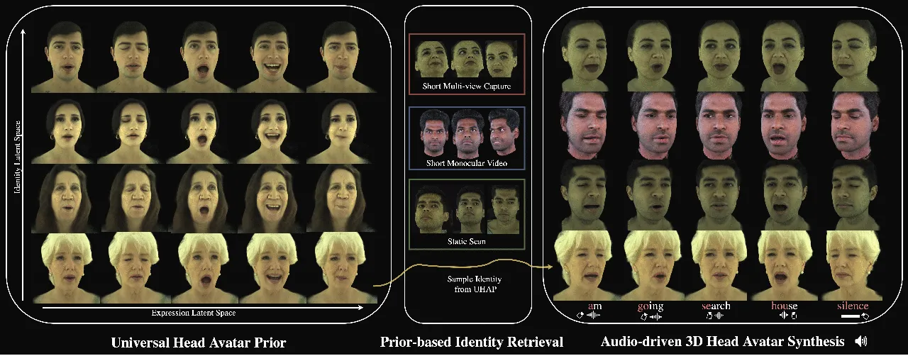

Figure 1. We present a new method for audio-driven photorealistic 3D
head avatar synthesis with a Universal Head Avatar Prior (UHAP). (Left)
We learn a Universal Head Avatar Prior from a diverse dataset, capturing
rich facial geometry and appearance across multiple identities (rows)
and dynamic expressions (columns). (Center) Given minimal data for a new
subject—whether a short multi-view capture, a monocular video clip, or a
single static scan—we retrieve a personalized identity from the UHAP.
(Right) Conditioning the retrieved identity on an arbitrary speech
waveform yields high-fidelity, lip-synced full-face animations that
faithfully preserve identity and expression dynamics across multiple
subjects.

###### Abstract.

We introduce the first method for audio-driven universal photorealistic
avatar synthesis, combining a person-agnostic speech model with our
novel Universal Head Avatar Prior (UHAP). UHAP is trained on
cross-identity multi-view videos. In particular, our UHAP is supervised
with neutral scan data, enabling it to capture the identity-specific
details at high fidelity. In contrast to previous approaches, which
predominantly map audio features to geometric deformations only while
ignoring audio-dependent appearance variations, our universal speech
model directly maps raw audio inputs into the UHAP latent expression
space. This expression space inherently encodes, both, geometric and
appearance variations. For efficient personalization to new subjects, we
employ a monocular encoder, which enables lightweight regression of
dynamic expression variations across video frames. By accounting for
these expression-dependent changes, it enables the subsequent model
fine-tuning stage to focus exclusively on capturing the subject’s global
appearance and geometry. Decoding these audio-driven expression codes
via UHAP generates highly realistic avatars with precise lip
synchronization and nuanced expressive details, such as eyebrow
movement, gaze shifts, and realistic mouth interior appearance as well
as motion. Extensive evaluations demonstrate that our method is not only
the first generalizable audio-driven avatar model that can account for
detailed appearance modeling and rendering, but it also outperforms
competing (geometry-only) methods across metrics measuring lip-sync
accuracy, quantitative image quality, and perceptual realism. Webpage:
[https://kartik-teotia.github.io/UniGAHA/](https://kartik-teotia.github.io/UniGAHA/)

###### Keywords: 

Audio-driven animation, Gaussian Head Avatars

^(†)^(†)cc-license: by^(†)^(†)cc-license: by

## 1. Introduction

Synthesizing photorealistic 3D head avatars, which can be driven solely
from speech, presents a compelling avenue for applications ranging from
virtual communication to digital entertainment (Fan et al., 2022b). The
goal is to generate accurate lip synchronization along with expressive
facial motion and, crucially, realistic visual appearance, while also
ensuring temporal and view-point consistency. Achieving this using only
speech as input is particularly valuable due to the lightweight sensor
modality required to capture these audio signals.

A primary challenge lies in generating photorealistic appearance
synchronized with accurate 3D facial motion derived from speech, while
also ensuring the model generalizes to novel identities either by
sampling a novel identity or by finetuning on few shot data of a real
person. Recent advancements in audio-driven video synthesis, such as
VASA-1(Xu et al., 2024a), have demonstrated impressive results in
generating lifelike talking faces. These methods leverage the power of
diffusion-based models for mapping audio features to a video latent
space to create highly realistic animations. However, these
state-of-the-art approaches primarily operate in 2D, synthesizing video
frames that, while visually compelling, lack the underlying 3D structure
necessary for applications requiring free-viewpoint rendering. Achieving
combined realism in motion and appearance in 3D remains difficult,
especially without prohibitive per-person requirements like extensive
multi-view capture sessions or hours of subject-specific training time
(Aneja et al., 2024a; Richard et al., 2021a).

Traditional approaches to audio-driven 3D animation utilize geometric
representations like 3D Morphable Models (3DMMs) (Taylor et al., 2017;
Fan et al., 2022a) or artist designed template meshes (Karras et al.,
2017). While suitable for controlling basic 3D shape and motion, they
face a key limitation: they do not model dynamic textures and
view-dependent appearance directly from the audio signal. This
deficiency makes it particularly difficult to realistically render
regions such as the mouth interior or gaze shifts during speech.
Consequently, the visual results often fall short of the photorealism
required by many modern applications

Techniques employing modern photorealistic representations like Neural
Radiance Fields (NeRFs) (Mildenhall et al., 2020) or 3D Gaussian
Splatting (3DGS) (Kerbl et al., 2023a) excel at capturing appearance for
static scenes or controlled dynamic captures. However, applying them
directly to audio-driven animation across diverse identities often
involves costly per-subject optimization or training (Aneja et al.,
2024a; Richard et al., 2021a; Ng et al., 2024), requiring significant
computation time (hours to days) and large amounts of per-person data,
thus, hindering the creation of universal and readily deployable models.
Moreover, many recent audio-driven methods, even when using the powerful
diffusion models (Sun et al., 2024a; Zhao et al., 2024a), still
primarily focus on driving intermediate geometry, thereby inheriting the
appearance and expressiveness limitations of those representations.

Our work addresses these limitations through a novel framework centered
around three key technical contributions. First, we construct a
Universal Head Avatar Prior (UHAP) based on 3D Gaussian Splatting (3DGS)
(Kerbl et al., 2023b). This prior is trained on large-scale multi-view
dynamic videos from studio captures, and critically incorporates
supervision from neutral scan data to preserve identity-specific details
during training. The resulting UHAP learns an avatar representation
representation with effectively disentangled latent spaces for identity
and expression. Second, unlike prior work mapping audio to intermediate
geometry, we leverage a diffusion-based speech model that maps raw audio
features directly into the UHAP’s expression space. A key aspect of our
approach is that these predicted latent parameters explicitly encode
both geometry (e.g. mouth motion) and appearance (e.g. gaze shifts)
variations. Third, we enable efficient personalization of the UHAP to
new subjects from sparse data, enabling practical applications such as
driving a subject from a single static capture, or a short monocular
video. Key to our adaptation process is a generalized monocular image
encoder that estimates and factors out expression dynamics within the
video frames. Thereby our monocular finetuning stage captures the target
identity’s global appearance and geometry. Importantly, our monocular
image encoder does not rely on acquiring explicit geometry and
appearance tracking. Decoding the audio-driven expression codes via the
personalized UHAP yields the final photorealistic avatars with
high-fidelity facial motion and naturally synchronized appearance
changes.

In summary, our key contributions are:

- •
  A universal framework for audio-driven and photorealistic 3D Gaussian
  head avatar generation allowing unconditional identity sampling as
  well as few-shot identity finetuning while preserving an audio-driven
  expression latent space.
- •
  To this end, we first introduce a Universal Head Avatar Prior (UHAP),
  which effectively disentangles identity and expression latent spaces
  while ensuring high-fidelity synthesis thanks to our neutral texture
  formulation.
- •
  A diffusion-based speech model that maps input audio to the UHAP’s
  expression latent space, which enables driving of the underlying 3D
  facial geometry and appearance. This mapping to a 3D avatar prior
  ensures view- and-identity consistent facial animations.
- •
  Our monocular expression encoder facilitates a variety of few-shot
  identity finetuning applications such as finetuning the identity
  solely on a static scan or a short monocular video.

To the best of our knowledge, our work is the first that demonstrates
generalization across individuals while also enabling audio-driven
appearance synthesis. Our evaluation further demonstrates that we
outperform geometry-only baselines in terms of audio-visual
synchronization as well as visual appearance.

## 2. Related Work

For universal avatar models to be practical for widespread adoption,
they must satisfy three key criteria: they should accurately represent
diverse identities, capture nuanced speech-driven expressions, and
enable easy personalization from sparse observations. In what follows,
we discuss prior works according to these criteria, highlighting their
strengths and identifying key limitations.

### 2.1. Speech-driven Geometric Facial Representations

The generation of 3D facial animation from audio has a rich history,
with 3D Morphable Models (3DMMs) (Blanz and Vetter, 1999; Li et al., 2017) offering a generalized parametric framework for representing
facial geometry and appearance. Previous approaches often involved
mapping acoustic features to the parameters of these 3DMMs to achieve
speech-driven animation (Sun et al., 2024b; Aylagas et al., 2022; Peng
et al., 2023; Daněček et al., 2022). However, these models are often
constrained by the expressive capacity inherent in the 3DMM’s
low-dimensional Principal Component Analysis (PCA) parameters, which can
struggle to capture the full range of subtle, high-fidelity dynamics.
Recognizing these limitations, other approaches have focused on directly
modeling more detailed geometric deformations (Richard et al., 2021b;
Fan et al., 2022a). More recently, deep generative approaches,
particularly diffusion models, have gained traction in this domain (Stan
et al., 2023a; Sun et al., 2024b; Zhao et al., 2024b). While powerful,
many of these diffusion-based methods still focus on predicting
parameters for established representations like 3DMMs or geometric
latent models (Aneja et al., 2024b). However, a key limitation across
many speech-driven geometric representations is their inability to
directly model or synthesize nuanced, speech-correlated appearance
changes, such as subtle gaze shifts, or deforming mouth interior.
Addressing this gap, our approach synthesizes expression latents of our
Universal Head Avatar Prior (UHAP), which jointly encodes, both, the
subject-agnostic geometry-dependent expression changes and dynamic
appearance.

### 2.2. Speech-driven Appearance Methods

Integrating realistic, dynamic appearance with speech-driven animation
is crucial for photorealism but remains challenging. Early efforts
primarily focused on 2D audio-driven facial animation from monocular RGB
videos (Chen et al., 2018; Guan et al., 2023). These 2D methods, while
achieving plausible lip sync, operate in pixel space, and, thus, they
can neither achieve 3D consistency nor they support free-viewpoint
rendering. Transitioning to 3D, many recent efforts leveraging Neural
Radiance Fields (NeRF) for talking head synthesis from monocular video
have shown impressive photorealism, such as AD-NeRF (Guo et al., 2021)
and GeneFace (Ye et al., 2023), but these are often person-specific and
require per-subject optimization. Other works like RAD-NeRF (Tang
et al., 2022) and ER-NeRF (Li et al., 2023) focus on efficient,
real-time synthesis from audio for personalized avatars. Audio-driven
codec avatars, as explored in (Richard et al., 2021a; Ng et al., 2024),
can produce high-fidelity personalized results but also operate on a
per-subject basis. Similarly, GaussianSpeech (Aneja et al., 2024a)
achieves detailed, personalized audio-driven avatars using 3D Gaussian
Splatting by learning expression-dependent color and dynamic wrinkles,
but is tailored to individual subjects. TexTalker (Li et al., 2025b), a
concurrent work to ours, generates dynamic textures aligned with
speech-driven facial motion, using a high-resolution 4D dataset. It
proposes a diffusion-based framework to simultaneously generate facial
motions and dynamic textures from speech for personalized avatars. While
TexTalker addresses dynamic textures, our work distinguishes itself by
aiming for a universal prior that holistically controls, both, geometry
and the broader appearance attributes captured by 3D Gaussians, not
limited to the tracked 2D texture maps, and allows for efficient
adaptation to new individuals.

### 2.3. Gaussian Avatar Representations

Recent works leveraging 3D Gaussian Splatting (Kerbl et al., 2023b) have
introduced several powerful representations for creating personalized,
animatable head avatars. Foundational approaches such as GaussianAvatars
(Qian et al., 2024a) rig 3D Gaussians directly to the FLAME model (Li
et al., 2017), while others learn to deform a canonical set of Gaussians
conditioned on global expression parameters (Teotia et al., 2024; Saito
et al., 2024; Giebenhain et al., 2024). ScaffoldAvatar (Aneja et al., 2025) achieves high fidelity rendering of faces using localized
patch-based expressions. Gaussian Blendshapes (Ma et al., 2024)
introduce an explicit blendshape formulation, where a full set of
expression bases directly modulates Gaussian parameters for facial
animation. RGBAvatar (Li et al., 2025a) streamlines this design by
predicting a reduced blendshape basis from FLAME expressions, yielding a
more compact representation that supports efficient online training and
real-time rendering. Specialized models like GaussianSpeech (Aneja
et al., 2024a) animates subject-specific avatars by using a transformer
model to predict audio-driven mesh deformations, which then drive the
final 3D Gaussian representation. While these works provide powerful
representations for creating high-fidelity personalized Gaussian
avatars, often requiring extensive per-subject data and training, our
approach introduces a Universal Head Avatar Prior (UHAP). This
generalizable, person-agnostic model learns a disentangled,
cross-identity latent space for facial expressions that enables
high-fidelity animation from multiple modalities, such as an audio
stream or a driving video, and supports efficient, few-shot
personalization from limited input data for a new subject like a short
monocular video or a static capture from multiple views.

### 2.4. Universal Avatar Priors

Universal avatar models, capable of representing diverse identities and
expressions within a unified framework, are pivotal for enabling
generalization to new individuals. Significant progress has been made in
this domain. For instance, some recent universal priors focus on
achieving relighting capabilities alongside expressive control;
URAvatar (Li et al., 2024) and VRMM (Haotian et al., 2024) are notable
examples that allow for avatars to be rendered under novel illumination
conditions, with VRMM also emphasizing volumetric representations built
from data captured under controlled lighting. Other efforts, such as
Authentic Volumetric Avatars by Cao et al. (Cao et al., 2022), have
pushed the boundaries of creating high-fidelity, animatable volumetric
avatars from inputs like phone scans. While these works show promising
results in creating generalizable and high-fidelity avatars, adapting
them to new, unseen identities can present challenges. For example,
approaches such as those by Cao et al. (Cao et al., 2022) and Li et
al. (Li et al., 2024) (URAvatar) may involve extensive fine-tuning or
the acquisition of dynamically tracked non-rigid facial
geometry (Grassal et al., 2022). Additionally, many recent approaches
based on 3D Gaussian Splatting map inputs to lower-dimensional
expression spaces derived from, or aligned with, parametric
models (Zheng et al., 2024; Xu et al., 2024b), which can constrain the
overall expressiveness. Avat3r (Kirschstein et al., 2025) presents a
feed-forward method for avatar creation using phone scans; however, its
animation is driven by signals restricted to studio-tracked captures.
Our Universal Head Avatar Prior (UHAP), embedded within a 3D Gaussian
Splatting framework, presents a framework for lightweight
personalization as well animation. It achieves lightweight
personalization—facilitated by our image encoder that effectively
disentangles dynamic subject-specific variations from global appearance
and expression nuances—and, critically, learns a richer latent
expression space directly from high-quality studio data, moving beyond
the constraints of predefined parametric models. This learned expression
space directly modulates 3D Gaussian properties for animation from
lightweight input signals such as audio or monocular images.

## 3. Method

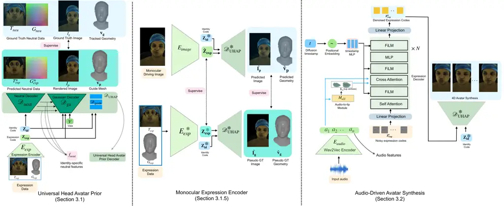

Figure 2. Overview of our Audio-Driven Universal Gaussian Avatar
pipeline. This figure illustrates the three main stages: (Sec. 3.1)
Universal Head Avatar Prior (UHAP) Training: A universal decoder
$`\mathcal{D}_{\mathrm{UHAP}}`$ is trained on multi-identity, multi-view
data to learn disentangled latent codes for identity
($`\mathbf{Z}_{\mathrm{id}}`$) and expression
($`\mathbf{Z}_{\mathrm{exp}}`$). (Sec. 3.1.5) Monocular Expression
Encoder Training: An image encoder $`E_{\mathrm{image}}`$ predicts
expression codes $`\mathbf{\hat{Z}}_{\mathrm{exp}}`$ from single images,
supervised by $`E_{\mathrm{exp}}`$ (from UHAP) and reconstruction losses
using pseudo-ground truth data ($`\hat{I}_{\mathrm{g}}`$,
$`\mathbf{\hat{v}}_{\mathrm{g}}`$). (Sec. 3.2) Audio-Driven Avatar
Synthesis: A diffusion model generates expression code sequences
$`\mathbf{Z}^{0}_{\mathrm{exp}}`$ from audio features which, combined
with $`\mathbf{Z}_{\mathrm{id}}`$, drive the frozen
$`\mathcal{D}_{\mathrm{UHAP}}`$ to synthesize the final animation.

Our method synthesizes photorealistic, audio-driven 3D talking head
avatars, designed for cross-identity generalization and efficient
personalization. It integrates a new high-fidelity Universal Head Avatar
Prior (UHAP), built upon 3D Gaussian Splatting (3DGS) (Kerbl et al.,
2023b), with a universal diffusion-based speech model. This approach
facilitates a direct mapping from audio features to a latent space
encoding, both, expression-dependent geometry and appearance variations.
Addressing the common challenge of acquiring large-scale, perfectly
aligned multi-modal data (including synchronized audio, dynamic 3D
geometry, and appearance across diverse identities), our framework is
designed to effectively utilize varied data sources; for example, the
universal prior can be trained on multi-view data even if it lacks
corresponding audio, while the audio-driven aspects are learned
subsequently with a diffusion model in the learned latent space.
Notably, personalization is possible from sparse subject-specific video
or a static scan by using a monocular expression encoding and an
optimization of an identity code and decoder fine-tuning, as outlined in
Fig. 2. The primary stages are: UHAP training (Sec. 3.1), learning a
monocular expression encoder (Sec. 3.1.5), and audio-driven avatar
synthesis (Sec. 3.2), followed by a personalization stage for new
subjects (Sec. 3.3). At inference, our method requires input audio
(processed into features) to drive the personalized UHAP decoder.

### 3.1. Universal Head Avatar Prior (UHAP)

The UHAP is our core model for synthesizing 3D Gaussian head avatars.
Synthesizing realistic, drivable 3D head avatars, especially from sparse
inputs or solely audio, is an inherently ill-posed problem; UHAP
addresses this by serving as a powerful, learned prior that constrains
the synthesis process to enable high-fidelity and generalizable results.
It is conditioned on the identity code
$`\mathbf{Z}_{\mathrm{id}}\in\mathbb{R}^{D_{\mathrm{id}}}`$ and an
expression code
$`\mathbf{Z_{\mathrm{exp}}}\in\mathbb{R}^{D_{\mathrm{exp}}}`$. The
identity code $`\mathbf{Z}_{\mathrm{id}}`$ aims to capture
subject-specific canonical geometry and appearance, while
$`\mathbf{Z}_{\mathrm{exp}}`$ controls facial deformations and
associated appearance changes. The UHAP is trained on dense multi-view
video data from multiple subjects in the Ava-256 dataset (Martinez
et al., 2024), which includes registered neutral 3D scans for each
subject. Unlike frameworks that encode pre-acquired neutral assets for
new identities (Li et al., 2024; Cao et al., 2022), our UHAP
incorporates a Neutral Decoder component (Sec. 3.1.3). This network
learns to inject identity-specific features—derived from the neutral
scan data during UHAP training and conditioned on
$`\mathbf{Z}_{\mathrm{id}}`$—into the main avatar decoder. This
architecture promotes high-fidelity rendering. Furthermore, for new,
unseen identities, it allows for efficient fine-tuning using sparse
data, such as a single static scan (Sec. 3.3). Critically, our
streamlined personalization strategy sidesteps an expensive and
time-consuming precomputation; it does not necessitate non-rigid
registration of the input dynamic or static data for these new subjects
as is the case with (Li et al., 2024; Cao et al., 2022).

#### 3.1.1. Representation

We represent each avatar as a collection of $`N_{g}=256k`$ 3D Gaussian
primitives $`\{g_{k}\}_{k=1}^{N_{g}}`$. Each Gaussian
$`g_{k}=\{\mathbf{t}_{k}\in\mathbb{R}^{3},\mathbf{q}_{k}\in\mathbb{R}^{4},\mathbf{s}_{k}\in\mathbb{R}^{3}_{+},o_{k}\in\mathbb{R}_{+},\mathbf{c}_{k}\in\mathbb{R}^{D_{c}}\}`$
is defined by its center position $`\mathbf{t}_{k}`$, rotation as a unit
quaternion $`\mathbf{q}_{k}`$, anisotropic scale $`\mathbf{s}_{k}`$,
opacity $`o_{k}`$, and $`D_{c}`$ spherical harmonics (SH) coefficients
encoding the color $`\mathbf{c}_{k}`$. The rotation $`\mathbf{q}_{k}`$
and scale $`\mathbf{s}_{k}`$ together define the 3D Gaussian’s
covariance matrix. Images $`I`$ are rendered differentiably from these
primitives using the Gaussian rasterizer
$`\mathcal{R}(\{g_{k}\}_{k=1}^{N_{g}})`$, as proposed by Kerbl et al.
(2023b).

#### 3.1.2. Expression Encoder

A variational autoencoder (VAE) (Stan et al., 2023b),
$`E_{\mathrm{exp}}`$, learns the expression manifold. The inputs to this
encoder are UV-parameterized texture data ($`T`$) and geometry data
($`G`$). To focus on expression-specific changes, $`E_{\mathrm{exp}}`$
processes the differences:
$`\Delta T_{\mathrm{exp}}=T_{\mathrm{exp}}-T_{\mathrm{neu}}`$ and
$`\Delta G_{\mathrm{exp}}=G_{\mathrm{exp}}-G_{\mathrm{neu}}`$. These
represent the deviations of the dynamic expression state
($`T_{\mathrm{exp}},G_{\mathrm{exp}}`$) from a corresponding neutral
state ($`T_{\mathrm{neu}},G_{\mathrm{neu}}`$). The encoder maps these
differences into the parameters (mean
$`\boldsymbol{\mu}_{\mathrm{exp}}`$ and standard deviation
$`\boldsymbol{\sigma}_{\mathrm{exp}}`$) of a multivariate Gaussian
distribution:

```math
\boldsymbol{\mu}_{\mathrm{exp}},\boldsymbol{\sigma}_{\mathrm{exp}}=E_{\mathrm{exp}}(\Delta T_{\mathrm{exp}},\Delta G_{\mathrm{exp}};\Phi_{E_{\mathrm{exp}}}) \tag{1}
```

The expression code
$`\mathbf{Z}_{\mathrm{exp}}\in\mathbb{R}^{D_{\mathrm{exp}}}`$
($`D_{\mathrm{exp}}=256`$) is then sampled using the reparameterization
trick (Stan et al., 2023b):
$`\mathbf{Z}_{\mathrm{exp}}=\boldsymbol{\mu}_{\mathrm{exp}}+\boldsymbol{\sigma}_{\mathrm{exp}}\cdot\boldsymbol{\epsilon}`$,
where $`\boldsymbol{\epsilon}\sim\mathcal{N}(0,I)`$.

#### 3.1.3. UHAP Decoder

The UHAP Decoder, $`\mathcal{D}_{\mathrm{UHAP}}`$, synthesizes the full
3D Gaussian avatar conditioned on the identity code
$`\mathbf{Z}_{\mathrm{id}}`$ and expression code
$`\mathbf{Z}_{\mathrm{exp}}`$. It comprises three main components, each
with its own set of learnable parameters denoted by $`\Phi_{(\cdot)}`$.
(1) A Neutral Decoder $`\mathcal{D}_{\mathrm{neut}}`$ processes
$`\mathbf{Z}_{\mathrm{id}}`$ to produce identity-specific feature maps
$`\mathbf{f}_{\mathrm{neut}}=\mathcal{D}_{\mathrm{neut}}(\mathbf{Z}_{\mathrm{id}};\Phi_{\mathrm{neut}})`$.
Supervised by registered neutral 3D scan data during training,
$`\mathbf{f}_{\mathrm{neut}}`$ encapsulates the subject’s base geometry
and appearance. This dedicated Neutral Decoder is a key design choice;
by explicitly learning to inject these identity-specific features, it
promotes better disentanglement of identity from expression, ensures
more robust identity preservation during animation, and contributes to
more stable training, ultimately leading to sharper, higher-fidelity
rendering. Critically, this enables efficient personalization to unseen
captures of new identities (Sec. 3.3), without requiring explicit
neutral 3D scans for those new subjects. (2) A Guide Mesh Decoder
$`\mathcal{D}_{\mathrm{guide}}`$ predicts vertex positions
$`\mathbf{\hat{v}}_{p}`$. Conditioned on both
$`\mathbf{Z}_{\mathrm{id}}`$ and $`\mathbf{Z}_{\mathrm{exp}}`$, this
decoder,
$`\mathcal{D}_{\mathrm{guide}}(\mathbf{Z}_{\mathrm{id}},\mathbf{Z}_{\mathrm{exp}};\Phi_{\mathrm{guide}})`$,
predicts these as offsets relative to a canonical template mesh,
$`\mathbf{v}_{\mathrm{can}}`$, which has a fixed topology of 7306
vertices. (3) The Gaussian Avatar Decoder $`\mathcal{D}_{\mathrm{ga}}`$,
a CNN-based decoder,
$`\mathcal{D}_{\mathrm{ga}}(\mathbf{Z}_{\mathrm{id}},\mathbf{Z}_{\mathrm{exp}},\mathbf{f}_{\mathrm{neut}},V;\Phi_{\mathrm{ga}})`$,
predicts the parameters
$`\{\delta\mathbf{t}_{k},\mathbf{q}_{k},\mathbf{s}_{k},o_{k},\mathbf{c}_{k}\}`$
for the set of 3D Gaussians. The Gaussians are learned on a UV map that
is parameterized by the guide mesh topology. $`\delta\mathbf{t}_{k}`$
represents predicted offsets from initial Gaussian positions which are
initialized on the decoded guide mesh vertices $`\mathbf{\hat{v}}_{p}`$.
This decoder is conditioned on $`\mathbf{Z}_{\mathrm{id}}`$,
$`\mathbf{Z}_{\mathrm{exp}}`$, the identity features
$`\mathbf{f}_{\mathrm{neut}}`$ (injected at various network layers), and
the camera viewpoint $`V`$. The final rendered image is denoted as
$`I_{p}=\mathcal{R}(\{g_{k}\})`$.

#### 3.1.4. UHAP Training Objective

For UHAP training, we utilize the Ava-256 dataset (Martinez et al.,
2024). This dataset provides multi-view images for 256 subjects and,
critically for our loss terms, includes annotations such as: non-rigid
mesh tracking for dynamic geometry ($`G_{\mathrm{exp}}`$), which yields
the ground truth vertices $`\mathbf{v}_{\mathrm{g}}`$ maintaining a
consistent topology across expressions and subjects; tracked dynamic
appearance as UV maps ($`T_{\mathrm{exp}}`$); and per-subject neutral
scan data ($`G_{\mathrm{neu}},T_{\mathrm{neu}}`$). The neutral data
($`G_{\mathrm{neu}},T_{\mathrm{neu}}`$) is derived by averaging the
tracked dynamic geometry and texture sequences for each subject. We
jointly optimize all UHAP parameters
$`\Phi=\bigl(\Phi_{E_{\mathrm{exp}}},\allowbreak\ \Phi_{\mathcal{D}_{\mathrm{UHAP}}}\bigr)`$,
where
$`\Phi_{\mathcal{D}_{\mathrm{UHAP}}}=\bigl(\Phi_{\mathrm{neut}},\allowbreak\ \Phi_{\mathrm{guide}},\allowbreak\ \Phi_{\mathrm{ga}}\bigr)`$.
The overall loss $`\mathcal{L}_{\mathrm{UHAP}}`$ is defined as
following:

```math
\begin{split}\mathcal{L}_{\mathrm{UHAP}}=\lambda_{\mathrm{rec}}\mathcal{L}_{\mathrm{rec}}+\lambda_{\mathrm{neut}}\mathcal{L}_{\mathrm{neut}}+\lambda_{\mathrm{KL}}\mathcal{L}_{\mathrm{KL}}+\lambda_{\mathrm{geo}}\mathcal{L}_{\mathrm{geo}}\\
+\lambda_{\mathrm{perc}}\mathcal{L}_{\mathrm{perc}}+\lambda_{\mathrm{reg\_id}}\mathcal{L}_{\mathrm{reg\_id}}+\lambda_{\mathrm{reg\_gauss}}\mathcal{L}_{\mathrm{reg\_gauss}}\end{split} \tag{2}
```

Here, $`\mathcal{L}_{\mathrm{rec}}`$ is an image reconstruction loss (L1
and SSIM (Wang et al., 2004)) between the rendering $`I_{\mathrm{p}}`$
and ground truth image $`I_{\mathrm{g}}`$.
$`\mathcal{L}_{\mathrm{neut}}`$ is an L1 loss on the model’s
reconstruction of the neutral scan data
($`G_{\mathrm{neu}},T_{\mathrm{neu}}`$) provided by the Ava-256 dataset.
$`\mathcal{L}_{\mathrm{KL}}`$ is the KL-divergence for the VAE’s
expression posterior
$`q(\mathbf{Z}_{\mathrm{exp}}|\Delta T_{\mathrm{exp}},\Delta G_{\mathrm{exp}})`$
against $`\mathcal{N}(0,I)`$. $`\mathcal{L}_{\mathrm{geo}}`$ is an L2
loss comparing the predicted guide mesh vertices
$`\mathbf{\hat{v}}_{\mathrm{p}}`$ to the ground truth tracked vertices
$`\mathbf{v}_{\mathrm{g}}`$, which are obtained from the non-rigid mesh
tracking annotations in the Ava-256 dataset.
$`\mathcal{L}_{\mathrm{perc}}`$ is a perceptual loss (Johnson et al., 2016) between $`I_{\mathrm{p}}`$ and $`I_{\mathrm{g}}`$.
$`\mathcal{L}_{\mathrm{reg\_id}}`$ is an L1 norm on the identity code
$`\mathbf{Z}_{\mathrm{id}}`$. $`\mathcal{L}_{\mathrm{reg\_gauss}}`$
includes standard 3D Gaussian regularizations (e.g., for opacity and
scale) (Teotia et al., 2024). The $`\lambda_{(\cdot)}`$ values are
hyperparameter weights.

#### 3.1.5. Monocular Expression Encoder

To effectively personalize our UHAP model to new, unseen captures
(videos or static images) and to facilitate image-driven animation, we
train a dedicated Monocular Expression Encoder,
$`E_{\mathrm{image}}(I_{i};\Phi_{\mathrm{img}})`$. This network’s
primary role is to map an input image $`I_{\mathrm{i}}`$ to an estimated
expression code $`\mathbf{\hat{Z}}_{\mathrm{exp}}`$ within UHAP’s
learned latent expression space. By explaining expression-dependent
variations in the input image, $`E_{\mathrm{image}}`$ allows the
subsequent fine-tuning of $`\mathcal{D}_{\mathrm{UHAP}}`$ (Sec. 3.3) to
focus on capturing the global, identity-specific attributes of the new
subject.

$`E_{\mathrm{image}}`$ is trained using frontal images derived from our
UHAP training data as inputs, with the corresponding ground truth
expression codes $`\mathbf{Z}_{\mathrm{exp}}`$ (obtained from
$`E_{\mathrm{exp}}`$ as described in Sec. 3.1.2) serving as targets. To
enhance its generalization capabilities and encourage the learning of
identity-agnostic expression features, we employ a data augmentation
strategy during the training of $`E_{\mathrm{image}}`$. This involves
randomly swapping the identity of the input renderings by leveraging
LivePortrait (Guo et al., 2024) as an effective expression-transfer tool
to re-render the same expression on a different identity. The objective
$`\mathcal{L}_{E_{\mathrm{image}}}`$ combines a squared L2 loss on the
predicted latent codes with an L1 reconstruction loss. This L1 loss
measures the difference between renderings produced using the predicted
expression code ($`\hat{I}_{\mathrm{p}}`$ for images,
$`\mathbf{\hat{v}_{\mathrm{p}}}`$ for guide mesh vertices) and
pseudo-ground truth targets
($`\hat{I}_{\mathrm{g}},\mathbf{\hat{v}}_{\mathrm{g}}`$):

```math
\mathcal{L}_{E_{\mathrm{image}}}=\lambda_{\mathrm{latent}}||\mathbf{\hat{Z}}_{\mathrm{exp}}-\mathbf{Z}_{\mathrm{exp}}||_{2}+\lambda_{\mathrm{recon}}(||\hat{I}_{\mathrm{p}}-\hat{I}_{\mathrm{g}}||_{1}+||\mathbf{\hat{v}_{\mathrm{p}}}-\mathbf{\hat{v}}_{\mathrm{g}}||_{1}) \tag{3}
```

Here, $`\hat{I}_{\mathrm{p}}`$ and $`\mathbf{\hat{v}_{\mathrm{p}}}`$ are
generated using
$`\mathcal{D}_{\mathrm{UHAP}}(\mathbf{Z}_{\mathrm{id}},\mathbf{\hat{Z}}_{\mathrm{exp}})`$,
while $`\hat{I}_{\mathrm{g}}`$ and $`\mathbf{\hat{v}}_{\mathrm{g}}`$ are
the pseudo-ground truth targets derived from UHAP training data, as
depicted in Fig. 2 (middle).

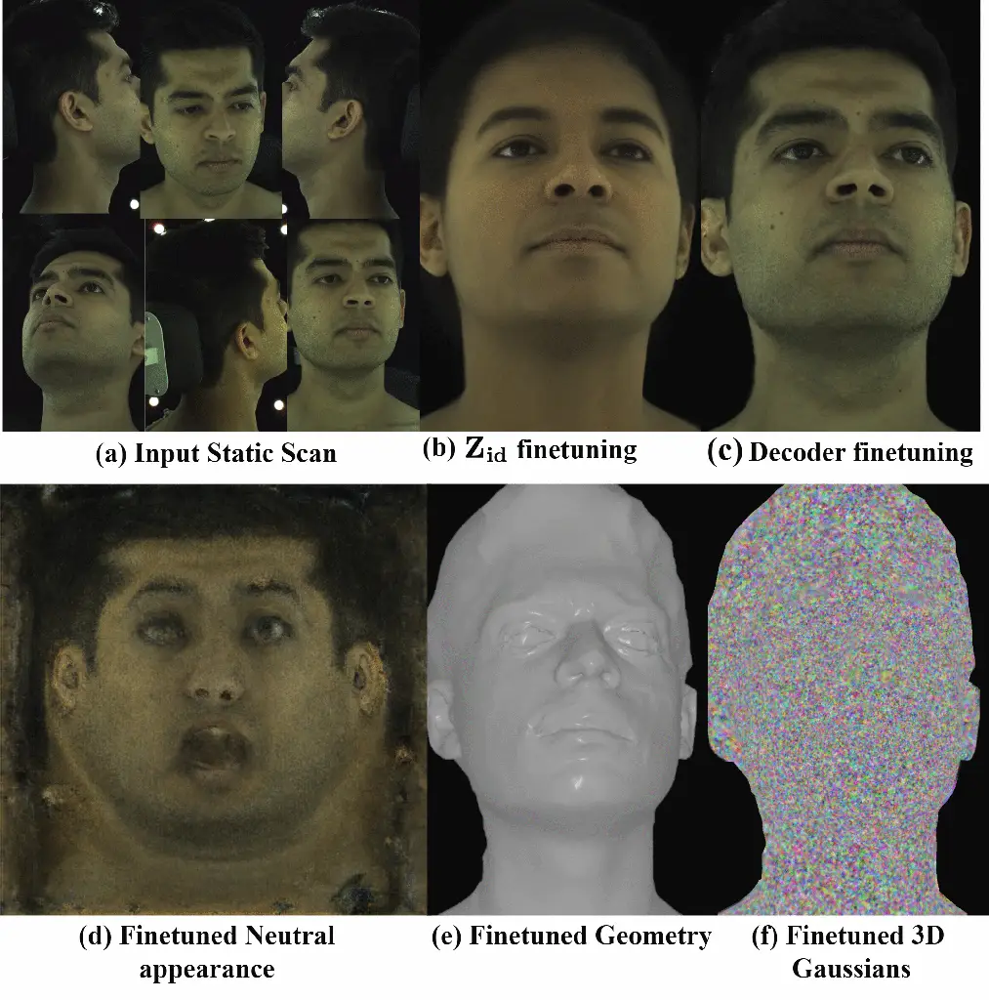

Figure 3. Personalization pipeline stages: (a) Input static scan. (b)
Result after $`\mathbf{Z}_{\mathrm{id}}`$ fine-tuning. (c) Result after
$`\mathcal{D}_{\mathrm{UHAP}}`$ decoder fine-tuning. Process yields (d)
finetuned neutral appearance, (e) geometry, and (f) 3D Gaussians.

### 3.2. Audio-Driven Avatar Synthesis

To animate our Universal Head Avatar Prior (UHAP) from speech (Figure 2,
Right), we generate sequences of its rich expression codes,
$`\mathbf{Z_{exp}}`$. These codes are designed to holistically modulate
the entire facial state. Generating full-face expressions directly from
audio, which primarily correlates with lip movements, is a key
challenge. Our core audio-to-expression generator is a diffusion
probabilistic model (DDPM) (Ho et al., 2020), $`\mathcal{G}_{\theta}`$.
For its backbone, we use the Transformer-based model as proposed in  (Ng
et al., 2024). While the framework in (Ng et al., 2024) is effective for
generating expressive outputs, it was originally applied to predict
person-specific codes. In contrast, our $`\mathcal{G}_{\theta}`$ is
trained to synthesize sequences within our person-agnostic UHAP
expression space $`\mathbf{Z_{exp}}`$. Furthermore, our approach differs
from other diffusion-based models like FaceTalk (Aneja et al., 2024b),
which, though also using a Transformer architecture, primarily predicts
latent codes for geometry-only parametric models. Our
$`\mathbf{Z_{exp}}`$ latents, conversely, drive both the geometry and
the appearance-related facial expression dynamics of UHAP. The DDPM
$`\mathcal{G}_{\theta}`$ is conditioned on several inputs: audio
features $`\mathbf{A}^{1:N}`$, predicted lip vertices
$`\mathbf{L}_{v}`$, the noisy expression codes $`\mathbf{Z^{t}_{exp}}`$,
and the diffusion timestep $`t`$. The audio features
$`\mathbf{A}^{1:N}`$ are extracted from the input waveform by a
Wav2Vec-based encoder (Baevski et al., 2020) ($`E_{audio}`$ in
Figure 2). The lip vertices $`\mathbf{L}_{v}`$ are predicted by a
dedicated Audio-to-lip Module ($`M_{a2l}`$ in Figure 2) from
$`\mathbf{A}^{1:N}`$ to provide strong local synchronization cues. The
Audio-to-lip module uses the Wav2Vec encoder (Baevski et al., 2020) and
a pretrained, lightweight transformer to predict $`338`$ lip vertices
directly from audio. These vertices provide explicit local conditioning
for our diffusion model. The Transformer architecture (Vaswani et al., 2023) within $`\mathcal{G}_{\theta}`$ utilizes self-attention,
cross-attention to fuse these conditioning signals, and FiLM
layers (Perez et al., 2018) for the timestep embedding.

$`\mathcal{G}_{\theta}`$ is trained to predict the noise
$`\boldsymbol{\epsilon}`$ added to the clean expression codes
$`\mathbf{Z^{0}_{exp}}`$, using the standard DDPM objective:

```math
\mathcal{L}_{diff}=\mathbb{E}_{\mathbf{Z_{exp}^{0}},\mathbf{A},\mathbf{L}_{v},\boldsymbol{\epsilon},t}\left[\left\|\boldsymbol{\epsilon}-\mathcal{G}_{\theta}\left(\sqrt{\bar{\alpha}_{t}}\mathbf{Z_{exp}^{0}}+\sqrt{1-\bar{\alpha}_{t}}\boldsymbol{\epsilon},t,\mathbf{A},\mathbf{L}_{v}\right)\right\|_{2}^{2}\right] \tag{4}
```

where $`\boldsymbol{\epsilon}\sim\mathcal{N}(0,I)`$ and
$`\bar{\alpha}_{t}`$ is from the noise schedule. Training employs paired
audio segments and $`\mathbf{Z_{exp}}`$ codes from the Multiface
dataset (hsin Wuu et al., 2023), where $`\mathbf{Z_{exp}}`$ codes are
obtained via our UHAP’s $`E_{exp}`$ (Sec. 3.1.2). During inference, the
denoised sequence $`\mathbf{\hat{Z}^{0}_{exp}}`$, with a target identity
code $`\mathbf{Z_{id}}`$, drives the frozen UHAP decoder
$`\mathcal{D}_{UHAP}`$.

### 3.3. Personalization for New Identities

Our UHAP can be personalized to new identities using various input data,
including short dynamic captures of the new subject, or a static
multi-view capture. A key advantage of our personalization approach is
its efficiency and minimal data prerequisites: for the input data, we
only require the rigid head pose and do not necessitate prior non-rigid
3D tracking or complex geometric registration of the subject. To adapt
UHAP to a new identity, for instance from a static capture, we perform a
two-stage fine-tuning process. This entire process takes approximately
20 minutes in total on a single NVIDIA A40 GPU. When adapting UHAP to a
new identity from a static scan, we pass a frontal image from the scan
to our pre-trained Monocular Expression Encoder $`E_{image}`$
(Sec. 3.1.5) to obtain the corresponding expression code,
$`\mathbf{Z_{exp}}`$. This specific expression code $`\mathbf{Z_{exp}}`$
is then held constant throughout the subsequent two-stage fine-tuning
procedure. If personalizing from a short dynamic video, $`E_{image}`$
would provide per-frame expression codes. First, the identity code
$`\mathbf{Z}_{\mathrm{id}}`$ is optimized for $`\sim`$2k iterations
(Fig. 3b). Second, the UHAP decoder $`\mathcal{D}_{\mathrm{UHAP}}`$ is
fine-tuned for $`\sim`$2k iterations (Fig. 3c) using the fitting loss
$`\mathcal{L}_{\mathrm{fit}}`$:

```math
\mathcal{L}_{\mathrm{fit}}=\alpha_{1}\mathcal{L}_{\mathrm{photo}}+\alpha_{2}\mathcal{L}_{\mathrm{laplacian}}+\alpha_{3}\mathcal{L}_{\mathrm{offset}}+\alpha_{4}\mathcal{L}_{\mathrm{scale}} \tag{5}
```

where $`\mathcal{L}_{\mathrm{photo}}`$ is an $`\mathcal{L}_{1}`$
photometric loss between the rendered image and the input scan;
$`\mathcal{L}_{\mathrm{laplacian}}`$ regularizes the smoothness of the
guide mesh vertices ($`\mathbf{v}_{t}`$); and
$`\mathcal{L}_{\mathrm{offset}}`$ and $`\mathcal{L}_{\mathrm{scale}}`$
are $`\mathcal{L}_{1}`$ norms applied to the predicted Gaussian
positional offsets and scales, respectively. The coefficients
$`\alpha_{i}`$ are hyperparameter weights balancing these terms. This
two-stage process yields the subject’s personalized neutral appearance
(Fig. 3d), geometry (e), and the set of 3D Gaussians (f) that constitute
the fine-tuned 3D Gaussian Avatar.

## 4. Experiments

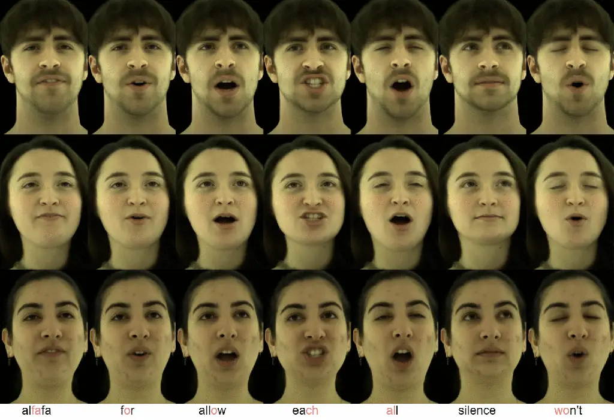

Figure 4. Audio-driven synthesis results for three UHAP model identities
with corresponding audio prompts.

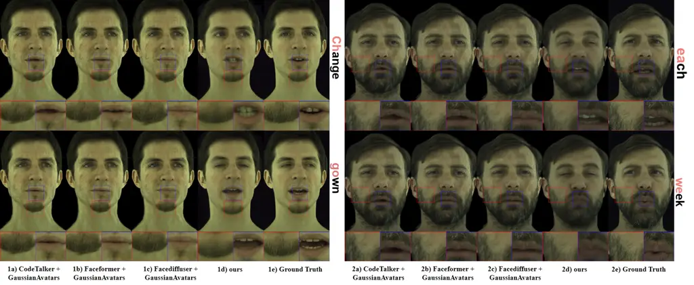

Figure 5. Qualitative comparison with SOTA methods (CodeTalker+GA,
Faceformer+GA, FaceDiffuser+GA, Ours) and Ground Truth for specified
audio segments. GA denotes GaussianAvatars augmentation.

In this section, we first outline the datasets used for training our
universal prior and the audio-driven synthesis model, along with key
implementation details (Sec. 4.1). We then present qualitative results
that demonstrate the capabilities of our method in generating
audio-driven, diverse, and expressive animations (Sec. 6). Subsequently,
we provide quantitative and qualitative comparisons against audio-driven
(geometric) facial animation methods (Sec. 4.3). Finally, we conduct
ablation studies (Sec. 4.4) to validate the impact of our key components
and design choices within our proposed framework, such as the role of
neutral features, the pretraining of our monocular encoder, and the
amount of data needed for personalization.

### 4.1. Datasets and Implementation Details

Training Data. Our Universal Head Avatar Prior (UHAP) is trained using
230 distinct identities from the Ava-256 dataset (Martinez et al.,
2024). This dataset provides multi-view dynamic video recordings and
registered neutral 3D scans for each subject _but it contains no audio_.
The large number of identities in Ava-256 is crucial for learning a
robust and generalizable prior (UHAP) over identity and expression. For
training the audio-to-expression synthesis model, we utilize the
Multiface dataset (hsin Wuu et al., 2023). Multiface provides
synchronized multi-view video data of subjects uttering a combined 650
sentences, offering rich audio-visual correspondence, though with a more
limited number of identities compared to Ava-256. All identities from
Multiface are unseen during the training of our UHAP prior. Multiface
also provides tracked dynamic geometry ($`G_{\mathrm{exp}}`$), dynamic
appearance UV maps ($`T_{\mathrm{exp}}`$), and corresponding neutral
data ($`G_{\mathrm{neu}},T_{\mathrm{neu}}`$) for its subjects. We
leverage our pre-trained UHAP and its associated expression encoder
(Sec. 3.1.2) to process these $`T_{\mathrm{exp}},G_{\mathrm{exp}}`$
sequences from the Multiface dataset, mapping them into our
subject-agnostic expression space to obtain $`\mathbf{Z_{exp}}`$ codes.
This allows us to create the synchronized
audio-feature-to-$`\mathbf{Z_{exp}}`$ pairs necessary for training our
audio-driven model. Data from $`10`$ identities from Multiface dataset
are used for training this audio model. Three Multiface dataset
identities, entirely unseen by both the UHAP model and the audio model
during their respective training phases, are held out exclusively for
testing and evaluating the audio-visual performance of our complete
pipeline.

Baseline Setup. Our method’s capability to personalize to new subjects
is versatile, accommodating inputs such as static captures or dynamic
videos (as detailed in Sec. 3.3). For the quantitative and qualitative
comparisons against state-of-the-art methods requiring personalization
(Sec. 4.3), we use a consistent setup for, both, our model and the
baselines. Specifically, for new identities from the Multiface test set,
our UHAP model is fine-tuned using approximately 500 frames (or  5
sentences) per camera from 12 views. We highlight that there is no prior
work that is generalizable from speech input and enables photoreal
renderings. Instead, we compare against state-of-the-art geometry-based
methods, i.e., Faceformer (Fan et al., 2022a), CodeTalker (Xing et al.,
2023), and FaceDiffuser (Stan et al., 2023a). Their output consists of
animated mesh sequences in FLAME topology, which we further augmented
for photorealistic rendering for fair comparison. This is achieved by
training person-specific GaussianAvatars (Qian et al., 2024b) for each
test identity. Crucially, these GaussianAvatars are also trained using
the identical data setup as our personalization stage leverages. This
ensures a fair and direct comparison in terms of the input data provided
for achieving photorealistic results.

### 4.2. Qualitative Results

Figure 6. Personalization from sparse inputs (left column) and resulting
audio-driven animation (right columns) for three subjects at a novel
viewpoint.

We first show the general qualitative performance of our audio-driven
avatar synthesis method. Fig. 4 demonstrates the capability of our
method to generate expressive audio-driven animations for three distinct
synthesized identities. The sequences highlight accurate lip
synchronization corresponding to the provided audio prompts, accompanied
by natural-looking facial dynamics and varied expressions indicative of
the spoken content. Fig. 6 illustrates the versatility and effectiveness
of our personalization process across various input conditions. We show
adaptation to new subjects from: a monocular video capture from the
INSTA dataset (Zielonka et al., 2023) (top row), multiview captures (8
input views) from Multiface Dataset (hsin Wuu et al., 2023) (middle
row), and (bottom row). We highlight that all these datasets are not
part of the UHAP training. In each case, the input data (leftmost
column) is used to personalize UHAP, and the subsequent audio-driven
animations (right columns) demonstrate that the unique identities are
well-captured and then faithfully animated with coherent speech motions.
Beyond audio-driven synthesis, Fig. 7 underscores the versatility of our
learned expression space through image-driven animation.

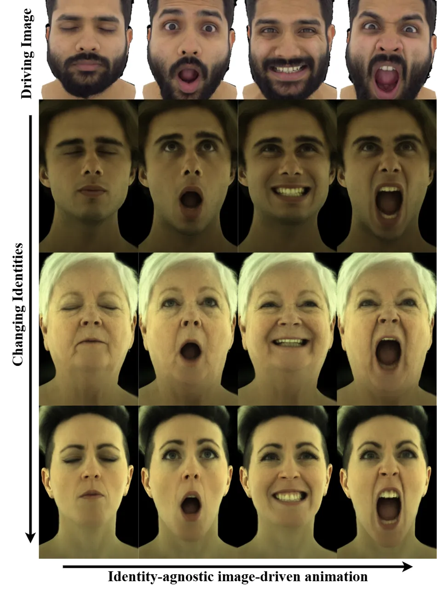

Figure 7. Image-driven animation: Driving image sequence (top) and
animated target identities (rows below).

Here, expressions from a source driving sequence (top row) are
successfully transferred to multiple distinct target identities (rows
below), demonstrating accurate expression re-targeting while
consistently maintaining the unique appearance and characteristics of
each target avatar. This highlights the successful latent
disentanglement of the identity and expression latent space. We also
provide additional qualitative results on subjects from the HQ3DAvatar
(Teotia et al., 2023) and Renderme-360 (Pan et al., 2024) datasets in
the supplementary material.

### 4.3. Comparisons with State-of-the-Art Methods

|              |                   |                      |                   |                      |
| ------------ | ----------------- | -------------------- | ----------------- | -------------------- |
| Method       | PSNR $`\uparrow`$ | LPIPS $`\downarrow`$ | SSIM $`\uparrow`$ | LSE-D $`\downarrow`$ |
| CodeTalker   | $`26.23`$         | $`0.37`$             | $`0.6518`$        | $`8.30`$             |
| FaceFormer   | $`25.93`$         | $`0.38`$             | $`0.6475`$        | $`9.32`$             |
| FaceDiffuser | $`26.32`$         | $`0.43`$             | $`0.6832`$        | $`8.88`$             |
| Ours         | 27.37             | 0.29                 | 0.7293            | 6.32                 |

Table 1. Quantitative comparison with SOTA audio-driven avatar methods
on the held-out audio and universal model test subjects. Metrics are
averaged across all frames and identities.

We conduct a comparative evaluation of our method against several recent
state-of-the-art audio-driven facial animation techniques:
Faceformer (Fan et al., 2022a), CodeTalker (Xing et al., 2023), and
FaceDiffuser (Stan et al., 2023a). As these methods primarily focus on
generating 3D mesh deformations, their outputs are rendered using
personalized GaussianAvatars (Qian et al., 2024b) to enable a fair
photorealistic comparison. We evaluate our method on held-out
speakers/subjects from the Multiface dataset (hsin Wuu et al., 2023).

Quantitative Comparison. Tab. 1 summarizes the quantitative results on
the held-out Multiface test identities. Our method achieves superior
performance across standard image reconstruction metrics, including
higher PSNR and lower L1 and LPIPS (Zhang et al., 2018) scores, which
indicates enhanced image fidelity and perceptual quality. Furthermore,
our approach demonstrates improved audio-visual synchronization, as
reflected by a better (lower) LSE-D score (Chung and Zisserman, 2016).
Since these metrics test the end-to-end performance from audio to image
quality, these results confirm the combined benefits of our
contributions that more directly link audio input and avatar rendering.

Qualitative Comparison. Fig. 5 provides a side-by-side visual comparison
against state-of-the-art methods, personalized on the same Multiface
test subjects, and ground truth for specified audio segments, shown from
a held-out novel viewpoint. Our method consistently produces results
with higher fidelity details in terms of appearance and geometry. For
instance, in subjects with facial hair, our approach renders a sharper
beard that deforms naturally and coherently with speech-induced jaw and
cheek movements, a detail which prior method can typically not preserve
resulting in smoothed out renderings that lack photorealism.
Furthermore, our model generates a significantly sharper and more
realistic mouth interior, contributing to more natural expressions
during speech. This, combined with more precise mouth articulation
(e.g., for words like “change” and “bride”) and subtle eye movements,
leads to better visual lip synchronization and overall fidelity to the
ground truth, which is visibly higher compared to the baselines. This
visual superiority can be attributed to our model’s ability to directly
synthesize these fine-grained appearance attributes coherently with
geometric deformations, all driven by the audio-driven latent expression
codes.

### 4.4. Ablation Studies

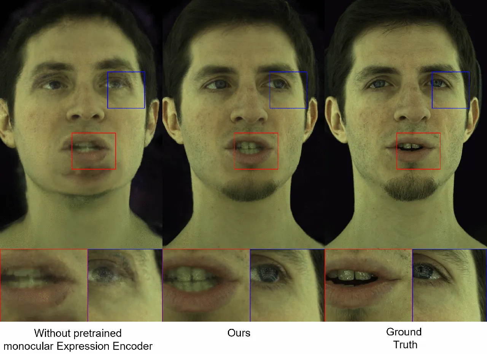

Figure 8. Ablation on monocular encoder ($`E_{image}`$) training:
Encoder trained during fitting (left), Ours (pretrained encoder,
center), Ground Truth (right).

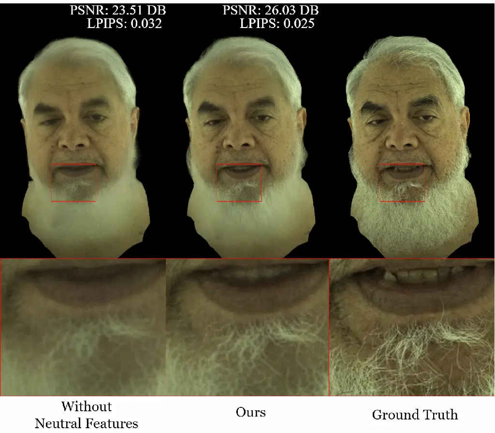

Figure 9. Ablation on neutral features ($`f_{neut}`$): Without Neutral
Features (left), Ours (center), Ground Truth (right), with PSNR/LPIPS
metrics.

To validate the contributions of individual components and design
choices within our framework, we perform several ablation studies.

Impact of Neutral Features in UHAP. Fig. 9 evaluates the importance of
incorporating identity-specific neutral features ($`f_{\mathrm{neut}}`$)
during UHAP training. The visual comparison shows renderings with our
full model, without neutral features, and the Ground Truth, alongside
quantitative metrics. Removing these neutral feature inputs results in a
discernible degradation in rendering quality and the precision of
identity preservation. This highlights the critical role of these
learned neutral characteristics in achieving high-fidelity
personalization with our UHAP.

Role of Pretrained Monocular Expression Encoder. The significance of
employing a pretrained monocular expression encoder
($`E_{\mathrm{image}}`$), as opposed to training it from scratch during
subject-specific fine-tuning, is demonstrated in Fig. 8. The left panel
shows results when the encoder is trained during fitting, the center
panel shows our approach with a pretrained encoder, and the right panel
shows ground truth. When the expression encoder is trained concurrently
with subject fine-tuning, it tends to learn a mapping that entangles
expression with the specific subject’s appearance and geometry. This
causes a mismatch when expression codes from our universal audio model,
which expects the original, disentangled latent space semantics, are fed
into this subject-adapted decoder, leading to distorted expressions and
incorrect appearance. Our proposed approach, which utilizes the
pretrained encoder designed to isolate true expression variations,
maintains compatibility with the audio model’s output, ensuring faithful
synthesis.

## 5. Conclusion

We have introduced a novel framework for the audio-driven synthesis of
universal, photorealistic 3D Gaussian head avatars. Our Universal Head
Avatar Prior (UHAP), learns a rich expression latent space that
holistically controls both detailed geometry and dynamic appearance.
Combined with an efficient personalization strategy adaptable to sparse
inputs and an audio-to-expression diffusion model, our approach
generates high-fidelity animations. These animations demonstrate
accurate lip synchronization and nuanced facial dynamics such as
eye-gaze shifts, all generalizing across diverse identities and sparse,
monocular capture settings.

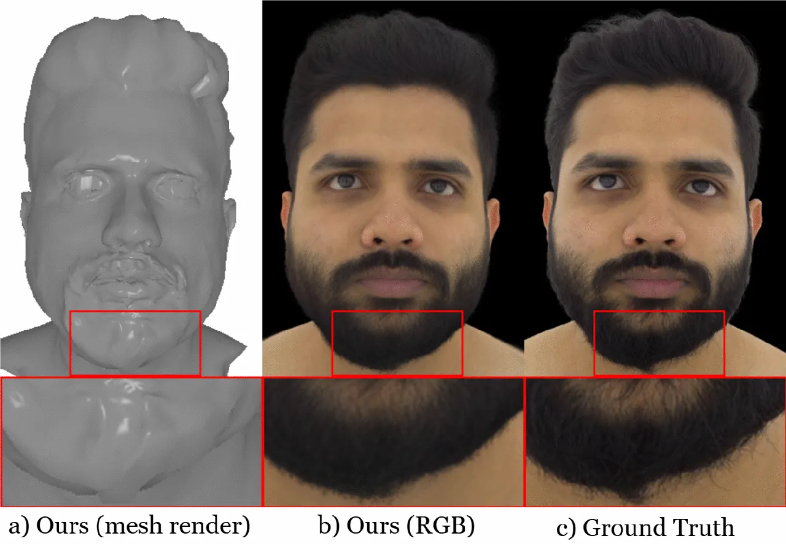

Figure 10. Our method struggles with fine regions such as beards, where
our model’s geometry-fitting (a) averages out fine details, leading to
less accurate reproduction (b) compared to ground truth (c).

Limitations. Despite promising results, our method has limitations.
While synthesized upper-head expressions generally align well with
speech-driven mouth motion, the current gaze behavior can sometimes
appear unnatural, potentially reflecting the script-reading nature of
the audio training data. Training on conversational audio-visual data
and adding explicit gaze control are potential avenues for future works
to overcome this limitation. Furthermore, although our model
reconstructs fine details like static hair strands, it struggles with
elements that exhibit complex, independent motion relative to the skin
surface, such as beards as shown in Fig. 10, which the current
representation may not perfectly register. This limitation can be
overcome by leveraging strand-based representation for facial hair
(Winberg et al., 2022). While our appearance model can render avatars in
real-time ($`50`$ FPS on a single NVIDIA A40 series GPU), the
audio-to-latent module does not decode expression codes in real-time due
to the iterative nature of the denoising process of the diffusion model.
Future work could explore diffusion models optimized for faster
inference to enable real-time expression code decoding while maintaining
quality. Finally, our UHAP is trained on high-quality studio data with
the same lighting conditions across subjects. Robustness to in-the-wild
captures (e.g., mobile phone recordings under uncontrolled lighting) is
still limited. Extending the UHAP training corpus to include light-stage
data will increase robustness to such capture conditions.

Future Work. Future work will aim to address these limitations and
further enhance our system’s capabilities. We plan to investigate
methods for learning more natural and interactive gaze behaviors,
perhaps by incorporating data from unscripted conversational videos or
by enabling explicit gaze control. A significant avenue for future
development involves leveraging our monocular expression encoder
($`E_{image}`$) by using it as an inference tool to collect expression
codes on large-scale, diverse in-the-wild audio-visual datasets. This
could enable the explicit modeling and audio-driven synthesis of a
broader spectrum of nuanced human emotions, thereby enriching avatar
expressiveness and realism.

## 6. Acknowledgements

We would like to thank Flawless AI for financially supporting Kartik
Teotia for this work.

## References

- Aneja et al. (2024a) Shivangi Aneja, Artem Sevastopolsky, Tobias
  Kirschstein, Justus Thies, Angela Dai, and Matthias Nießner. 2024a.
  GaussianSpeech: Audio-Driven Gaussian Avatars.
  arXiv:2411.18675 \[cs.CV\]
  [https://arxiv.org/abs/2411.18675](https://arxiv.org/abs/2411.18675)
- Aneja et al. (2024b) Shivangi Aneja, Justus Thies, Angela Dai, and
  Matthias Nießner. 2024b. FaceTalk: Audio-Driven Motion Diffusion for
  Neural Parametric Head Models. In _Proc. IEEE Conf. on Computer Vision
  and Pattern Recognition (CVPR)_.
- Aneja et al. (2025) Shivangi Aneja, Sebastian Weiss, Irene Baeza,
  Prashanth Chandran, Gaspard Zoss, Matthias Nießner, and Derek
  Bradley. 2025. ScaffoldAvatar: High-Fidelity Gaussian Avatars with
  Patch Expressions. arXiv:2507.10542 \[cs.GR\]
  [https://arxiv.org/abs/2507.10542](https://arxiv.org/abs/2507.10542)
- Aylagas et al. (2022) Monica Villanueva Aylagas, Hector Anadon Leon,
  Mattias Teye, and Konrad Tollmar. 2022. Voice2face: Audio-driven
  facial and tongue rig animations with cvaes.
- Baevski et al. (2020) Alexei Baevski, Henry Zhou, Abdelrahman Mohamed,
  and Michael Auli. 2020. wav2vec 2.0: A Framework for Self-Supervised
  Learning of Speech Representations. arXiv:2006.11477 \[cs.CL\]
  [https://arxiv.org/abs/2006.11477](https://arxiv.org/abs/2006.11477)
- Blanz and Vetter (1999) Volker Blanz and Thomas Vetter. 1999. A
  Morphable Model for the Synthesis of 3D Faces. In _Proceedings of the
  26th Annual Conference on Computer Graphics and Interactive Techniques
  (SIGGRAPH ’99)_. 187–194.
  [doi:10.1145/311535.311556](https://doi.org/10.1145/311535.311556)
- Cao et al. (2022) Chen Cao, Tomas Simon, Jin Kyu Kim, Gabe Schwartz,
  Michael Zollhöfer, Shunsuke Saito, Stephen Lombardi, Shih-En Wei,
  Danielle Belko, Shoou-I Yu, Yaser Sheikh, and Jason M. Saragih. 2022.
  Authentic volumetric avatars from a phone scan. _ACM Trans. Graph._
  41, 4 (2022), 163:1–163:19.
- Chen et al. (2018) Lele Chen, Zhiheng Li, Ross K. Maddox, Zhiyao Duan,
  and Chenliang Xu. 2018. Lip Movements Generation at a Glance. In
  _Computer Vision – ECCV 2018: 15th European Conference, Munich,
  Germany, September 8–14, 2018, Proceedings, Part VII_ (Munich,
  Germany). Springer-Verlag, Berlin, Heidelberg, 538–553.
  [doi:10.1007/978-3-030-01234-2_32](https://doi.org/10.1007/978-3-030-01234-2_32)
- Chung and Zisserman (2016) J. S. Chung and A. Zisserman. 2016. Out of
  time: automated lip sync in the wild. In _Workshop on Multi-view
  Lip-reading, ACCV_.
- Daněček et al. (2022) Radek Daněček, Michael J. Black, and Timo
  Bolkart. 2022. EMOCA: Emotion Driven Monocular Face Capture and
  Animation. In _Proceedings of the IEEE/CVF Conference on Computer
  Vision and Pattern Recognition (CVPR)_. 20311–20322.
- Dosovitskiy et al. (2021) Alexey Dosovitskiy, Lucas Beyer, Alexander
  Kolesnikov, Dirk Weissenborn, Xiaohua Zhai, Thomas Unterthiner,
  Mostafa Dehghani, Matthias Minderer, Georg Heigold, Sylvain Gelly,
  Jakob Uszkoreit, and Neil Houlsby. 2021. An Image is Worth 16x16
  Words: Transformers for Image Recognition at Scale.
  arXiv:2010.11929 \[cs.CV\]
  [https://arxiv.org/abs/2010.11929](https://arxiv.org/abs/2010.11929)
- Fan et al. (2022a) Xiangyu Fan, Jiaqi Li, Zhiqian Lin, Weiye Xiao, and
  Lei Yang. 2022a. FaceFormer: Speech-Driven 3D Facial Animation with
  Transformers. In _IEEE/CVF Conference on Computer Vision and Pattern
  Recognition (CVPR)_. 18770–18780.
  [doi:10.1109/CVPR52688.2022.01828](https://doi.org/10.1109/CVPR52688.2022.01828)
- Fan et al. (2022b) Yingruo Fan, Zhaojiang Lin, Jun Saito, Wenping
  Wang, and Taku Komura. 2022b. FaceFormer: Speech-Driven 3D Facial
  Animation with Transformers. In _Proceedings of the IEEE/CVF
  Conference on Computer Vision and Pattern Recognition (CVPR)_.
  18749–18758.
  [doi:10.1109/CVPR52688.2022.01821](https://doi.org/10.1109/CVPR52688.2022.01821)
- Giebenhain et al. (2024) Simon Giebenhain, Tobias Kirschstein, Martin
  Rünz, Lourdes Agapito, and Matthias Nießner. 2024. NPGA: Neural
  Parametric Gaussian Avatars. In _SIGGRAPH Asia 2024 Conference Papers
  (SA Conference Papers ’24), December 3-6, Tokyo, Japan_.
  [doi:10.1145/3680528.3687689](https://doi.org/10.1145/3680528.3687689)
- Grassal et al. (2022) Philip-William Grassal, Malte Prinzler, Titus
  Leistner, Carsten Rother, Matthias Nießner, and Justus Thies. 2022.
  Neural Head Avatars from Monocular RGB Videos. In _IEEE Conf. Comput.
  Vis. Pattern Recog._ IEEE, 18632–18643.
- Guan et al. (2023) Jiazhi Guan, Zhanwang Zhang, Hang Zhou, Tianshu Hu,
  Kaisiyuan Wang, Dongliang He, Haocheng Feng, Jingtuo Liu, Errui Ding,
  Ziwei Liu, and Jingdong Wang. 2023. StyleSync: High-Fidelity
  Generalized and Personalized Lip Sync in Style-based Generator.
  arXiv:2305.05445 \[cs.CV\]
  [https://arxiv.org/abs/2305.05445](https://arxiv.org/abs/2305.05445)
- Guo et al. (2024) Jianzhu Guo, Dingyun Zhang, Xiaoqiang Liu, Zhizhou
  Zhong, Yuan Zhang, Pengfei Wan, and Di Zhang. 2024. LivePortrait:
  Efficient Portrait Animation with Stitching and Retargeting Control.
  _arXiv preprint arXiv:2407.03168_ (2024).
- Guo et al. (2021) Yudong Guo, Keyu Chen, Sen Liang, Yong-Jin Liu,
  Hujun Bao, and Juyong Zhang. 2021. AD-NeRF: Audio Driven Neural
  Radiance Fields for Talking Head Synthesis. In _IEEE/CVF International
  Conference on Computer Vision (ICCV)_. 5784–5793.
  [doi:10.1109/ICCV48922.2021.00572](https://doi.org/10.1109/ICCV48922.2021.00572)
- Haotian et al. (2024) Yang Haotian, Zheng Mingwu, Ma ChongYang, Lai
  Yu-Kun, Wan Pengfei, and Huang Haibin. 2024. VRMM: A Volumetric
  Relightable Morphable Head Model. In _SIGGRAPH 2024 Conference
  Proceedings_.
- He et al. (2015) Kaiming He, Xiangyu Zhang, Shaoqing Ren, and Jian
  Sun. 2015. Deep Residual Learning for Image Recognition. _CoRR_
  abs/1512.03385 (2015). arXiv:1512.03385
  [http://arxiv.org/abs/1512.03385](http://arxiv.org/abs/1512.03385)
- Ho et al. (2020) Jonathan Ho, Ajay Jain, and Pieter Abbeel. 2020.
  Denoising Diffusion Probabilistic Models. In _Advances in Neural
  Information Processing Systems_, H. Larochelle, M. Ranzato,
  R. Hadsell, M.F. Balcan, and H. Lin (Eds.), Vol. 33. Curran
  Associates, Inc., 6840–6851.
  [https://proceedings.neurips.cc/paper_files/paper/2020/file/4c5bcfec8584af0d967f1ab10179ca4b-Paper.pdf](https://proceedings.neurips.cc/paper_files/paper/2020/file/4c5bcfec8584af0d967f1ab10179ca4b-Paper.pdf)
- hsin Wuu et al. (2023) Cheng hsin Wuu, Ningyuan Zheng, Scott Ardisson,
  Rohan Bali, Danielle Belko, Eric Brockmeyer, Lucas Evans, Timothy
  Godisart, Hyowon Ha, Xuhua Huang, Alexander Hypes, Taylor Koska,
  Steven Krenn, Stephen Lombardi, Xiaomin Luo, Kevyn McPhail, Laura
  Millerschoen, Michal Perdoch, Mark Pitts, Alexander Richard, Jason
  Saragih, Junko Saragih, Takaaki Shiratori, Tomas Simon, Matt Stewart,
  Autumn Trimble, Xinshuo Weng, David Whitewolf, Chenglei Wu, Shoou-I
  Yu, and Yaser Sheikh. 2023. Multiface: A Dataset for Neural Face
  Rendering. arXiv:2207.11243 \[cs.CV\]
  [https://arxiv.org/abs/2207.11243](https://arxiv.org/abs/2207.11243)
- Johnson et al. (2016) Justin Johnson, Alexandre Alahi, and Li
  Fei-Fei. 2016. Perceptual Losses for Real-Time Style Transfer and
  Super-Resolution. _CoRR_ abs/1603.08155 (2016). arXiv:1603.08155
  [http://arxiv.org/abs/1603.08155](http://arxiv.org/abs/1603.08155)
- Karras et al. (2017) Tero Karras, Timo Aila, Samuli Laine, Antti
  Herva, and Jaakko Lehtinen. 2017. Audio-driven facial animation by
  joint end-to-end learning of pose and emotion.
- Kerbl et al. (2023b) Bernhard Kerbl, Georgios Kopanas, Thomas
  Leimkuehler, and George Drettakis. 2023b. 3D Gaussian Splatting for
  Real-Time Radiance Field Rendering. _ACM Trans. Graph._ 42, 4, Article
  139 (jul 2023), 14 pages.
  [doi:10.1145/3592433](https://doi.org/10.1145/3592433)
- Kerbl et al. (2023a) Thomas Kerbl, Luca Guarnera, Gerald Wimmer,
  Michael Wimmer, and Markus Steinberger. 2023a. 3D Gaussian Splatting
  for Real-Time Radiance Field Rendering. In _ACM SIGGRAPH Conference
  Proceedings_.
  [doi:10.1145/3588432.3591528](https://doi.org/10.1145/3588432.3591528)
- Khirodkar et al. (2024) Rawal Khirodkar, Timur Bagautdinov, Julieta
  Martinez, Su Zhaoen, Austin James, Peter Selednik, Stuart Anderson,
  and Shunsuke Saito. 2024. Sapiens: Foundation for Human Vision Models.
  arXiv:2408.12569 \[cs.CV\]
  [https://arxiv.org/abs/2408.12569](https://arxiv.org/abs/2408.12569)
- Kirschstein et al. (2025) Tobias Kirschstein, Javier Romero, Artem
  Sevastopolsky, Matthias Nießner, and Shunsuke Saito. 2025. Avat3r:
  Large Animatable Gaussian Reconstruction Model for High-fidelity 3D
  Head Avatars. arXiv:2502.20220 \[cs.CV\]
  [https://arxiv.org/abs/2502.20220](https://arxiv.org/abs/2502.20220)
- Li et al. (2023) Junxuan Li, Chen Cao, Gabriel Schwartz, Rawal
  Khirodkar, Christian Richardt, Tomas Simon, Yaser Sheikh, and Shunsuke
  Saito. 2023. ER-NeRF: Efficient Region-Aware Neural Radiance Fields
  for High-Fidelity Talking Portrait Synthesis. In _IEEE/CVF
  International Conference on Computer Vision (ICCV)_.
- Li et al. (2024) Junxuan Li, Chen Cao, Gabriel Schwartz, Rawal
  Khirodkar, Christian Richardt, Tomas Simon, Yaser Sheikh, and Shunsuke
  Saito. 2024. URAvatar: Universal Relightable Gaussian Codec Avatars.
  In _ACM SIGGRAPH 2024 Conference Papers_.
- Li et al. (2025a) Linzhou Li, Yumeng Li, Yanlin Weng, Youyi Zheng, and
  Kun Zhou. 2025a. RGBAvatar: Reduced Gaussian Blendshapes for Online
  Modeling of Head Avatars. In _The IEEE/CVF Conference on Computer
  Vision and Pattern Recognition_.
- Li et al. (2017) Tianye Li, Timo Bolkart, Michael J. Black, Hao Li,
  and Javier Romero. 2017. Learning a model of facial shape and
  expression from 4D scans. _ACM Trans. Graph._ 36, 6 (2017),
  194:1–194:17.
- Li et al. (2025b) Xuanchen Li, Jianyu Wang, Yuhao Cheng, Yikun Zeng,
  Xingyu Ren, Wenhan Zhu, Weiming Zhao, and Yichao Yan. 2025b. Towards
  High-fidelity 3D Talking Avatar with Personalized Dynamic Texture.
  _arXiv preprint arXiv:2503.00495_ (2025).
- Ma et al. (2024) Shengjie Ma, Yanlin Weng, Tianjia Shao, and Kun
  Zhou. 2024. 3D Gaussian Blendshapes for Head Avatar Animation. In _ACM
  SIGGRAPH Conference Proceedings, Denver, CO, United States, July 28 -
  August 1, 2024_.
- Martinez et al. (2024) Julieta Martinez, Emily Kim, Javier Romero,
  Timur Bagautdinov, Shunsuke Saito, Shoou-I Yu, Stuart Anderson,
  Michael Zollhöfer, Te-Li Wang, Shaojie Bai, Chenghui Li, Shih-En Wei,
  Rohan Joshi, Wyatt Borsos, Tomas Simon, Jason Saragih, Paul Theodosis,
  Alexander Greene, Anjani Josyula, Silvio Mano Maeta, Andrew I. Jewett,
  Simon Venshtain, Christopher Heilman, Yueh-Tung Chen, Sidi Fu, Mohamed
  Ezzeldin A. Elshaer, Tingfang Du, Longhua Wu, Shen-Chi Chen, Kai Kang,
  Michael Wu, Youssef Emad, Steven Longay, Ashley Brewer, Hitesh Shah,
  James Booth, Taylor Koska, Kayla Haidle, Matt Andromalos, Joanna Hsu,
  Thomas Dauer, Peter Selednik, Tim Godisart, Scott Ardisson, Matthew
  Cipperly, Ben Humberston, Lon Farr, Bob Hansen, Peihong Guo, Dave
  Braun, Steven Krenn, He Wen, Lucas Evans, Natalia Fadeeva, Matthew
  Stewart, Gabriel Schwartz, Divam Gupta, Gyeongsik Moon, Kaiwen Guo,
  Yuan Dong, Yichen Xu, Takaaki Shiratori, Fabian Prada, Bernardo R.
  Pires, Bo Peng, Julia Buffalini, Autumn Trimble, Kevyn McPhail,
  Melissa Schoeller, and Yaser Sheikh. 2024. Codec Avatar Studio: Paired
  Human Captures for Complete, Driveable, and Generalizable Avatars.
  _NeurIPS Track on Datasets and Benchmarks_ (2024).
- Mildenhall et al. (2020) Ben Mildenhall, Pratul P. Srinivasan, Matthew
  Tancik, Jonathan T. Barron, Ravi Ramamoorthi, and Ren Ng. 2020. NeRF:
  Representing Scenes as Neural Radiance Fields for View Synthesis. In
  _Proceedings of the European Conference on Computer Vision (ECCV)_.
  405–421.
  [doi:10.1007/978-3-030-58452-8_24](https://doi.org/10.1007/978-3-030-58452-8_24)
- Ng et al. (2024) Evonne Ng, Javier Romero, Timur Bagautdinov, Shaojie
  Bai, Trevor Darrell, Angjoo Kanazawa, and Alexander Richard. 2024.
  From Audio to Photoreal Embodiment: Synthesizing Humans in
  Conversations. arXiv:2401.01885 \[cs.CV\]
  [https://arxiv.org/abs/2401.01885](https://arxiv.org/abs/2401.01885)
- Pan et al. (2024) Dongwei Pan, Long Zhuo, Jingtan Piao, Huiwen Luo,
  Wei Cheng, Yuxin Wang, Siming Fan, Shengqi Liu, Lei Yang, Bo Dai,
  Ziwei Liu, Chen Change Loy, Chen Qian, Wayne Wu, Dahua Lin, and
  Kwan-Yee Lin. 2024. RenderMe-360: A Large Digital Asset Library and
  Benchmarks Towards High-fidelity Head Avatars. _Advances in Neural
  Information Processing Systems_ 36 (2024).
- Peng et al. (2023) Ziqiao Peng, Haoyu Wu, Zhenbo Song, Hao Xu, Xiangyu
  Zhu, Jun He, Hongyan Liu, and Zhaoxin Fan. 2023. Emotalk:
  Speech-driven emotional disentanglement for 3d face animation.
- Perez et al. (2018) Ethan Perez, Florian Strub, Harm de Vries, Vincent
  Dumoulin, and Aaron C. Courville. 2018. FiLM: Visual Reasoning with a
  General Conditioning Layer. In _AAAI_.
- Qian et al. (2024a) Shenhan Qian, Tobias Kirschstein, Liam Schoneveld,
  Davide Davoli, Simon Giebenhain, and Matthias Nießner. 2024a.
  Gaussianavatars: Photorealistic head avatars with rigged 3d gaussians.
  In _Proceedings of the IEEE/CVF Conference on Computer Vision and
  Pattern Recognition_. 20299–20309.
- Qian et al. (2024b) Shenhan Qian, Tobias Kirschstein, Liam Schoneveld,
  Davide Davoli, Simon Giebenhain, and Matthias Nießner. 2024b.
  GaussianAvatars: Photorealistic Head Avatars with Rigged 3D Gaussians.
  In _Proceedings of the IEEE/CVF Conference on Computer Vision and
  Pattern Recognition (CVPR)_.
  [https://openaccess.thecvf.com/content/CVPR2024/html/Qian_GaussianAvatars_Photorealistic_Head_Avatars_with_Rigged_3D_Gaussians_CVPR_2024_paper.html](https://openaccess.thecvf.com/content/CVPR2024/html/Qian_GaussianAvatars_Photorealistic_Head_Avatars_with_Rigged_3D_Gaussians_CVPR_2024_paper.html)
- Richard et al. (2021a) Alexander Richard, Colin Lea, Shugao Ma, Jurgen
  Gall, Fernando de la Torre, and Yaser Sheikh. 2021a. Audio- and
  Gaze-Driven Facial Animation of Codec Avatars. In _Proceedings of the
  IEEE/CVF Winter Conference on Applications of Computer Vision (WACV)_.
  41–50.
- Richard et al. (2021b) Alexander Richard, Michael Zollhöfer, Yandong
  Wen, Fernando De la Torre, and Yaser Sheikh. 2021b. MeshTalk: 3D Face
  Animation from Speech Using Cross-Modality Disentanglement. In
  _IEEE/CVF International Conference on Computer Vision (ICCV)_.
  1173–1182.
  [doi:10.1109/ICCV48922.2021.00121](https://doi.org/10.1109/ICCV48922.2021.00121)
- Saito et al. (2024) Shunsuke Saito, Gabriel Schwartz, Tomas Simon,
  Junxuan Li, and Giljoo Nam. 2024. Relightable Gaussian Codec Avatars.
  In _CVPR_.
- Stan et al. (2023a) Stefan Stan, Kazi Injamamul Haque, and Zerrin
  Yumak. 2023a. FaceDiffuser: Speech-Driven 3D Facial Animation
  Synthesis Using Diffusion. arXiv:2309.11306 \[cs.CV\]
  [https://arxiv.org/abs/2309.11306](https://arxiv.org/abs/2309.11306)
- Stan et al. (2023b) Stefan Stan, Kazi Injamamul Haque, and Zerrin
  Yumak. 2023b. FaceDiffuser: Speech-Driven 3D Facial Animation
  Synthesis Using Diffusion. arXiv:2309.11306 \[cs.CV\]
  [https://arxiv.org/abs/2309.11306](https://arxiv.org/abs/2309.11306)
- Sun et al. (2024a) Zhiyao Sun, Tian Lv, Sheng Ye, Matthieu Lin, Jenny
  Sheng, Yu-Hui Wen, Minjing Yu, and Yong-Jin Liu. 2024a. DiffPoseTalk:
  Speech-Driven Stylistic 3D Facial Animation and Head Pose Generation
  via Diffusion Models. _ACM Transactions on Graphics_ (2024).
  [doi:10.1145/3679561](https://doi.org/10.1145/3679561) Proceedings of
  SIGGRAPH 2024.
- Sun et al. (2024b) Zhiyao Sun, Tian Lv, Sheng Ye, Matthieu Lin, Jenny
  Sheng, Yu-Hui Wen, Minjing Yu, and Yong-Jin Liu. 2024b. DiffPoseTalk:
  Speech-Driven Stylistic 3D Facial Animation and Head Pose Generation
  via Diffusion Models. _ACM Transactions on Graphics (TOG)_ 43, 4,
  Article 46 (2024), 9 pages.
  [doi:10.1145/3658221](https://doi.org/10.1145/3658221)
- Tang et al. (2022) Jiaxiang Tang, Kaisiyuan Wang, Hang Zhou, Xiaokang
  Chen, Dongliang He, Jingtuo Liu, Tianshu Hu, Gang Zeng, and Jingdong
  Wang. 2022. RAD-NeRF: Real-Time Neural Radiance Talking Portrait
  Synthesis via Audio-Spatial Decomposition. _arXiv preprint
  arXiv:2211.12368_ (2022).
- Taylor et al. (2017) Sarah Taylor, Taehwan Kim, Yisong Yue, Moshe
  Mahler, James Krahe, Anastasio Garcia Rodriguez, Jessica Hodgins, and
  Iain Matthews. 2017. A Deep Learning Approach for Generalized Speech
  Animation. _ACM Transactions on Graphics_ 36, 4 (2017), 93:1–93:12.
  [doi:10.1145/3072959.3073699](https://doi.org/10.1145/3072959.3073699)
- Teotia et al. (2024) Kartik Teotia, Hyeongwoo Kim, Pablo Garrido, Marc
  Habermann, Mohamed Elgharib, and Christian Theobalt. 2024.
  GaussianHeads: End-to-End Learning of Drivable Gaussian Head Avatars
  from Coarse-to-fine Representations. _ACM Trans. Graph._ 43, 6,
  Article 264 (Nov. 2024), 12 pages.
  [doi:10.1145/3687927](https://doi.org/10.1145/3687927)
- Teotia et al. (2023) Kartik Teotia, Mallikarjun B R, Xingang Pan,
  Hyeongwoo Kim, Pablo Garrido, Mohamed Elgharib, and Christian
  Theobalt. 2023. HQ3DAvatar: High Quality Controllable 3D Head Avatar.
  arXiv:2303.14471 \[cs.CV\]
- Trevithick et al. (2023) Alex Trevithick, Matthew Chan, Michael
  Stengel, Eric R. Chan, Chao Liu, Zhiding Yu, Sameh Khamis, Manmohan
  Chandraker, Ravi Ramamoorthi, and Koki Nagano. 2023. Real-Time
  Radiance Fields for Single-Image Portrait View Synthesis. In _ACM
  Transactions on Graphics (SIGGRAPH)_.
- Vaswani et al. (2023) Ashish Vaswani, Noam Shazeer, Niki Parmar, Jakob
  Uszkoreit, Llion Jones, Aidan N. Gomez, Lukasz Kaiser, and Illia
  Polosukhin. 2023. Attention Is All You Need.
  arXiv:1706.03762 \[cs.CL\]
  [https://arxiv.org/abs/1706.03762](https://arxiv.org/abs/1706.03762)
- Wang et al. (2004) Zhou Wang, Alan C. Bovik, Hamid R. Sheikh, and
  Eero P. Simoncelli. 2004. Image quality assessment: from error
  visibility to structural similarity. _IEEE Trans. Image Process._ 13,
  4 (2004), 600–612.
- Winberg et al. (2022) Sebastian Winberg, Gaspard Zoss, Prashanth
  Chandran, Paulo Gotardo, and Derek Bradley. 2022. Facial hair tracking
  for high fidelity performance capture. _ACM Trans. Graph._ 41, 4,
  Article 165 (July 2022), 12 pages.
  [doi:10.1145/3528223.3530116](https://doi.org/10.1145/3528223.3530116)
- Xing et al. (2023) Jinbo Xing, Menghan Xia, Yuechen Zhang, Xiaodong
  Cun, Jue Wang, and Tien-Tsin Wong. 2023. Codetalker: Speech-driven 3d
  facial animation with discrete motion prior.
- Xu et al. (2024a) Sicheng Xu, Guojun Chen, Yu-Xiao Guo, Jiaolong Yang,
  Chong Li, Zhenyu Zang, Yizhong Zhang, Xin Tong, and Baining Guo.
  2024a. VASA-1: Lifelike Audio-Driven Talking Faces Generated in Real
  Time. arXiv:2404.10667 \[cs.CV\]
  [https://arxiv.org/abs/2404.10667](https://arxiv.org/abs/2404.10667)
- Xu et al. (2024b) Yuelang Xu, Lizhen Wang, Zerong Zheng, Zhaoqi Su,
  and Yebin Liu. 2024b. 3D Gaussian Parametric Head Model. In
  _Proceedings of the European Conference on Computer Vision (ECCV)_.
- Ye et al. (2023) Zhenhui Ye, Ziyue Jiang, Yi Ren, Jinglin Liu,
  Jinzheng He, and Zhou Zhao. 2023. GeneFace: Generalized and
  High-Fidelity Audio-Driven 3D Talking Face Synthesis. _International
  Conference on Learning Representations (ICLR)_ (2023).
- Zhang et al. (2018) Richard Zhang, Phillip Isola, Alexei A Efros, Eli
  Shechtman, and Oliver Wang. 2018. The Unreasonable Effectiveness of
  Deep Features as a Perceptual Metric. In _CVPR_.
- Zhao et al. (2024a) Qingcheng Zhao, Pengyu Long, Qixuan Zhang, et al.
  2024a. Media2Face: Co-speech Facial Animation Generation with
  Multi-Modality Guidance. _ACM Transactions on Graphics_ (2024).
  [doi:10.1145/3641519.3657413](https://doi.org/10.1145/3641519.3657413)
  Proceedings of SIGGRAPH 2024.
- Zhao et al. (2024b) Qingcheng Zhao, Pengyu Long, Qixuan Zhang, Dafei
  Qin, Han Liang, Longwen Zhang, Yingliang Zhang, Jingyi Yu, and Lan Xu.
  2024b. Media2face: Co-speech facial animation generation with
  multi-modality guidance.
- Zheng et al. (2024) Xiaozheng Zheng, Chao Wen, Zhaohu Li, Weiyi Zhang,
  Zhuo Su, Xu Chang, Yang Zhao, Zheng Lv, Xiaoyuan Zhang, Yongjie Zhang,
  Guidong Wang, and Xu Lan. 2024. HeadGAP: Few-shot 3D Head Avatar via
  Generalizable Gaussian Priors. _arXiv preprint arXiv:2408.06019_
  (2024).
- Zielonka et al. (2023) Wojciech Zielonka, Timo Bolkart, and Justus
  Thies. 2023. Instant Volumetric Head Avatars. In _CVPR_. 4574–4584.

## Appendix A Supplementary Document Overview

This document supplements the information in the main paper with
additional qualitative examples, ablation studies, and implementation
details, including the neural network architecture.

## Appendix B Additional Experiments

##### Impact of Number of Frames for Personalization.

Fig. 12 studies the effect of the number of frames used for fine-tuning
UHAP on a new identity. While personalization from even a single static
capture yields plausible results, using a short sequence of frames
allows for the capture of more subject-specific expression nuances. Our
experiments in Fig. 12 show that fine-tuning with approximately 500
frames effectively captures these nuances. Increasing the data to 2000
frames provides only marginal improvements, indicating that our approach
can achieve high-quality, nuanced personalization efficiently with a
limited number of frames. For this ablative study, we keep the number of
views fixed at 12 for each experiment.

##### Impact of Number of input views for Personalization.

Fig. 13 studies the effect of the number of input views used for
fine-tuning UHAP on a new identity. Our method shows robust
personalization across 4, 8, and 30 views, where even with as few as 4
views the fitting remains accurate and identity-preserving. While
additional views provide modest gains in capturing subtle appearance
details, the overall performance with fewer views remains strong,
highlighting the efficiency of our approach in low-view settings. For
this ablative study, we keep the number of input frames fixed at 500 for
each experiment.

##### Monocular Encoder Generalization with Diverse Exposure.

Fig. 11 investigates the benefit of exposing the monocular image encoder
($`E_{image}`$) to diverse identities exhibiting similar expressions
during its training, leveraging techniques inspired by LivePortrait (Guo
et al., 2024). This pre-exposure aids in learning a more robust
expression representation that generalizes better. The figure compares
results driven by an in-the-wild image (right): left shows animation
without this diverse pre-exposure, while center shows our method with
it. This diverse training helps achieve more accurate expression
alignment when driving the avatar with in-the-wild images of unseen
identities and varied conditions.

##### Geometric Accuracy.

To further validate the robustness of our approach, we report
quantitative geometry metrics on held-out speaker data (Tab. 2) on a
subject from the Multiface dataset (hsin Wuu et al., 2023). For fair
comparison across different 3D mesh topologies (FLAME, Ava-256), we
resample all meshes to the Sapiens (Khirodkar et al., 2024) landmark
topology. Our method achieves lower lip vertex error (LVE) and mean
vertex error (MVE), as well as a strong FDD score, demonstrating that
UHAP not only drives photorealistic appearance but also preserves
accurate geometric motion compared to ground-truth facial dynamics.

##### Additional qualitative results

We further provide qualitative results on subjects from the
HQ3DAvatar (Teotia et al., 2023) and RenderMe-360 (Pan et al., 2024)
datasets. As shown in Fig. 14, our method takes as input expression data
from multiple views for each subject, and synthesizes high-fidelity
audio-driven facial animation, consistently across all the subjects.

|              |                           |                           |                    |
| ------------ | ------------------------- | ------------------------- | ------------------ |
| Method       | LVE \[mm\] $`\downarrow`$ | MVE \[mm\] $`\downarrow`$ | FDD $`\downarrow`$ |
| CodeTalker   | $`4.13`$                  | $`4.25`$                  | $`0.4902`$         |
| FaceFormer   | $`3.92`$                  | $`4.16`$                  | $`0.4390`$         |
| FaceDiffuser | $`3.46`$                  | $`3.98`$                  | $`0.4060`$         |
| Ours         | 3.01                      | 3.15                      | 0.1848             |

Table 2. Quantitative comparison with SOTA audio-driven avatar methods
on landmark and facial dynamics distance metrics.

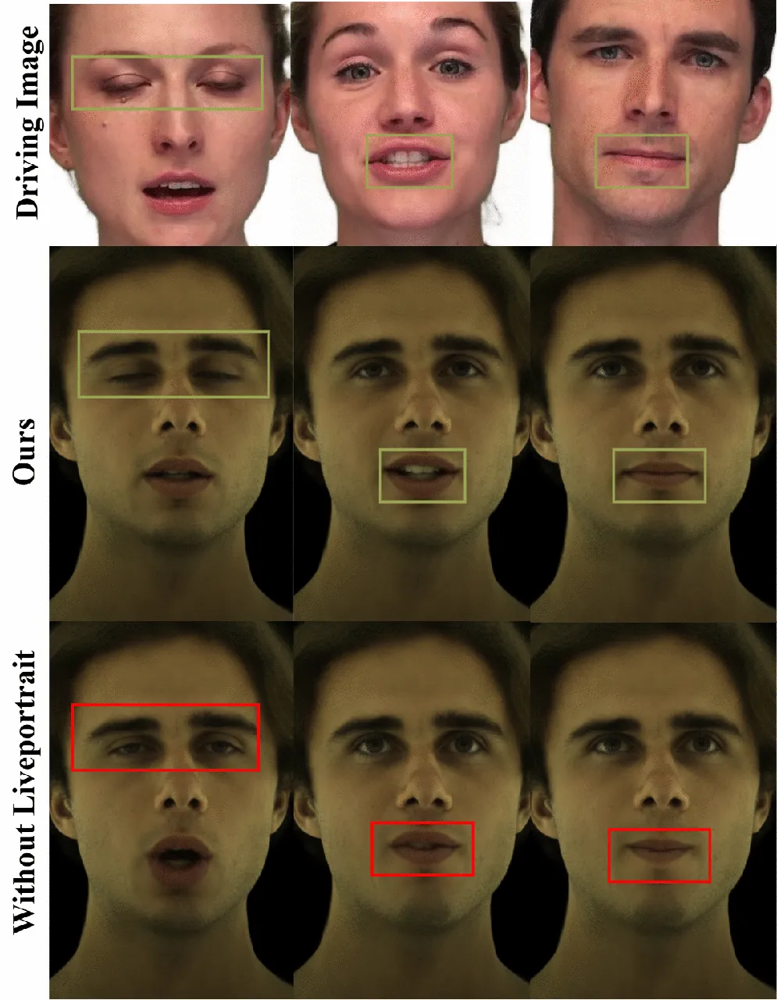

Figure 11. Ablation on monocular encoder generalization using
LivePortrait2D (Guo et al., 2024) inspired diverse pre-exposure: Without
diverse pre-exposure (left), Ours (center), Driving Image (right).

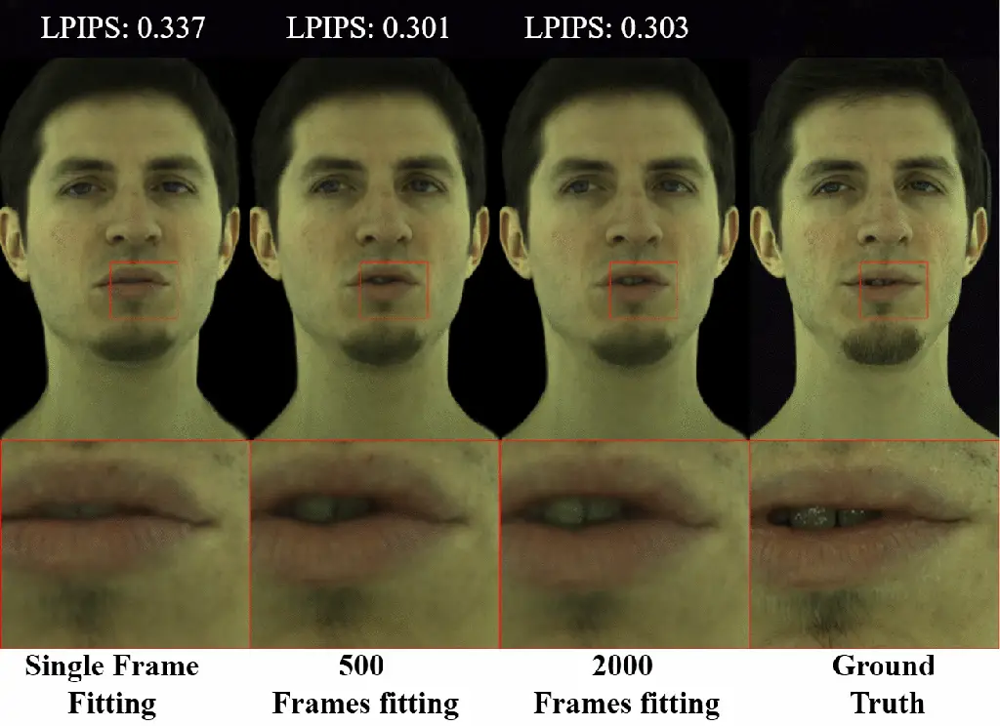

Figure 12. Ablation on number of frames used to fine-tune UHAP.

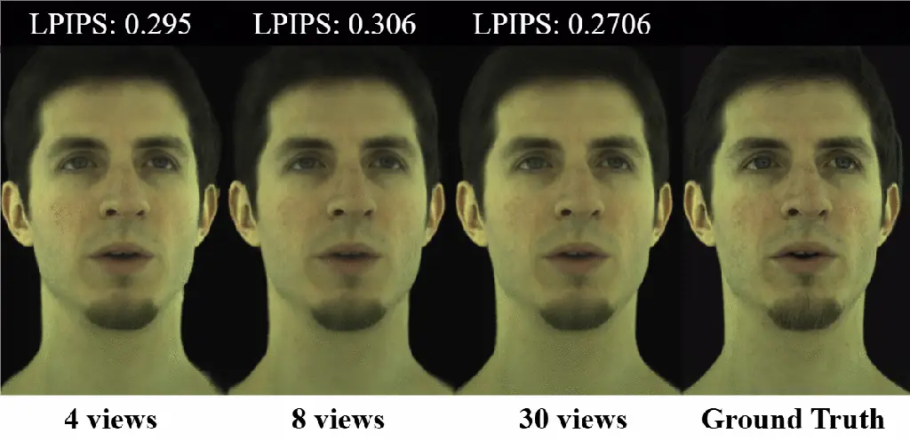

Figure 13. Ablation on number of input views used to fine-tune UHAP.

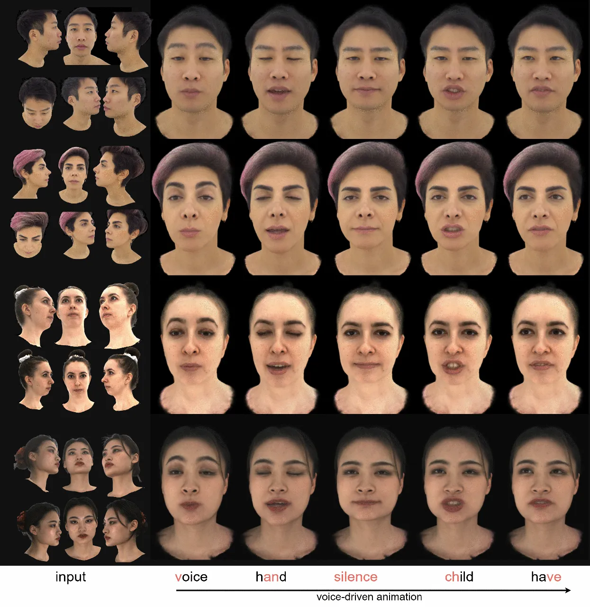

Figure 14. Additional audio-driven qualitative results on sparse input
data from subjects of HQ3DAvatar (Teotia et al., 2023) (top 2 rows) and
RenderMe-360 (Pan et al., 2024) (bottom 2 rows) datasets. Our method
produces high-fidelity facial animation across diverse identities.

## Appendix C Implementation Details

This section details the architectures of the core components of our
framework: the Universal Head Avatar Prior (UHAP), the Monocular
Expression Encoder ($`E_{image}`$), and the Audio-to-Expression
Diffusion Model ($`\mathcal{G}_{\theta}`$), as well as training
specifics.

### C.1. UHAP Components

The UHAP, is composed of several interconnected neural network modules.
These modules are responsible for encoding expressions ($`E_{exp}`$),
representing identity ($`\mathbf{Z_{id}}`$), and decoding these into a
full 3D Gaussian avatar via $`\mathcal{D}_{UHAP}`$ (which includes
$`\mathcal{D}_{neut}`$, $`\mathcal{D}_{guide}`$, and
$`\mathcal{D}_{ga}`$). Below, we detail their architectures, with layer
configurations summarized in the accompanying tables.

#### C.1.1. Expression Encoder ($`E_{exp}`$)

The Expression Encoder $`E_{exp}`$ processes UV-parameterized texture
difference maps ($`\Delta T_{exp}`$) and geometry difference maps
($`\Delta G_{exp}`$) to produce the parameters of the expression code
$`\mathbf{Z_{exp}}`$. The input UV maps are of size $`512\times 512`$
with 3 channels. As detailed in Table 3 (module ‘CNNEncoderPosmap‘), the
encoder consists of a series of 8 convolutional blocks. Each block
applies a 2D convolution, followed by a LeakyReLU activation and
downsampling, progressively reducing the spatial resolution from
$`512\times 512`$ down to $`2\times 2`$ while adjusting channel depth.
The final $`256\times 2\times 2`$ feature map is flattened and passed
through a fully connected layer to output the 256-dimensional parameters
($`\boldsymbol{\mu}_{exp},\boldsymbol{\sigma}_{exp}`$) for
$`\mathbf{Z_{exp}}`$.

|         | Channels / Resolution                       | Operation    |
| ------- | ------------------------------------------- | ------------ |
| Input   | 3 @ $`512\times 512`$                       | N/A          |
| Block 1 | (3$`\to`$32) @ $`512\to 256`$               | (C, LR, DS)  |
| Block 2 | (32$`\to`$32) @ $`256\to 128`$              | (C, LR, DS)  |
| Block 3 | (32$`\to`$64) @ $`128\to 64`$               | (C, LR, DS)  |
| Block 4 | (64$`\to`$64) @ $`64\to 32`$                | (C, LR, DS)  |
| Block 5 | (64$`\to`$128) @ $`32\to 16`$               | (C, LR, DS)  |
| Block 6 | (128$`\to`$128) @ $`16\to 8`$               | (C, LR, DS)  |
| Block 7 | (128$`\to`$256) @ $`8\to 4`$                | (C, LR, DS)  |
| Block 8 | (256$`\to`$256) @ $`4\to 2`$                | (C, LR, DS)  |
| Output  | $`256\text{ @ }2\times 2\to\text{FC}(256)`$ | Flatten + FC |

Table 3. Architecture of the UHAP Expression Encoder $`E_{exp}`$. C =
Conv2dUB; LR = LeakyReLU; DS = down-sample; FC = Fully Connected.

#### C.1.2. Identity Representation ($`\mathbf{Z_{id}}`$)

The identity code $`\mathbf{Z_{id}}`$ is a learnable embedding vector
for each subject. For $`N_{ids}`$ unique identities in the training set,
an embedding table of size $`N_{ids}\times D_{id}`$ is maintained, where
$`D_{id}=512`$ is the dimension of the identity latent code. The
corresponding 512-dimensional vector $`\mathbf{Z_{id}}`$ is retrieved
via lookup (module ‘IdentityLatentCode‘, Table 4).

|        | Embedding Size             | Operation          |
| ------ | -------------------------- | ------------------ |
| Input  | $`N_{ids}`$ indices        | N/A                |
| Lookup | ($`N_{ids}\times D_{id}`$) | Embedding lookup   |
| Output | $`D_{id}`$                 | per-subject vector |

Table 4. Identity Latent Code Module.

#### C.1.3. Neutral Decoder ($`\mathcal{D}_{neut}`$)

The Neutral Decoder $`\mathcal{D}_{neut}`$ takes the
$`D_{id}`$-dimensional identity code $`\mathbf{Z_{id}}`$ as input and
generates the identity-specific feature maps $`\mathbf{f}_{neut}`$.
These maps comprise two sets of multi-scale bias maps:
$`\mathbf{f}_{neut,geo}`$ for geometry and $`\mathbf{f}_{neut,app}`$ for
appearance. Each set is produced by dedicated generators. As detailed in
Table 5, each generator processes the 512-dim $`\mathbf{Z_{id}}`$
through a series of deconvolutional blocks. This produces a pyramid of 9
bias maps, where each map in the pyramid has a progressively larger
spatial resolution (from $`4\times 4`$ up to $`1024\times 1024`$) and a
corresponding number of channels as specified in the table. These
$`\mathbf{f}_{neut}`$ maps are then injected (by element-wise add) at
matching scales into the Gaussian Avatar Decoder $`\mathcal{D}_{ga}`$ to
provide identity-specific conditioning.

|                 | Channels                          | Resolutions                                           |
| --------------- | --------------------------------- | ----------------------------------------------------- |
| Input           | $`D_{id}`$ (512)                  | N/A                                                   |
| Blocks (Deconv) | \[256,256,128,128,64,64,32,16,3\] | $`4\times 4\to 8\times 8\to\dots\to 1024\times 1024`$ |
| Output          | 9 bias maps                       | multi-scale                                           |

Table 5. Architecture of Bias Map Generators for $`\mathbf{f}_{neut}`$.
The "Channels" for "Blocks (Deconv)" lists the output channels for each
of the 9 generated bias maps corresponding to the increasing
resolutions.

#### C.1.4. Guide Mesh Decoder ($`\mathcal{D}_{guide}`$)

The Guide Mesh Decoder $`\mathcal{D}_{guide}`$ predicts per-vertex
displacements for a canonical template mesh of $`N_{verts}=7306`$
vertices. It processes a 768-dimensional vector, formed by concatenating
$`\mathbf{Z_{id}}`$ ($`D_{id}=512`$) and $`\mathbf{Z_{exp}}`$
($`D_{exp}=256`$), through an MLP with LeakyReLU activations, as
detailed in Table 6. The output is reshaped to $`N_{verts}\times 3`$
displacement vectors, which are added to the canonical mesh vertices to
yield $`\mathbf{\hat{v}_{p}}`$.

|         | Units                                      | Operation          |
| ------- | ------------------------------------------ | ------------------ |
| Input   | $`D_{exp}`$ (256) + $`D_{id}`$ (512) = 768 | N/A                |
| Block 1 | $`768\to 1024`$                            | (FC, LR)           |
| Block 2 | $`1024\to 2048`$                           | (FC, LR)           |
| Block 3 | $`2048\to 3\times N_{verts}`$              | FC                 |
| Output  | $`N_{verts}\times 3`$                      | reshape to offsets |

Table 6. Architecture of the Guide Mesh Decoder $`\mathcal{D}_{guide}`$.
FC = Fully Connected; LR = LeakyReLU.

#### C.1.5. Gaussian Avatar Decoder ($`\mathcal{D}_{ga}`$)

The Gaussian Avatar Decoder $`\mathcal{D}_{ga}`$ synthesizes the final
3D Gaussian parameters through two sub-decoders: a view-independent
decoder $`\mathcal{D}_{vi}`$ for geometry-related attributes and an
appearance decoder $`\mathcal{D}_{rgb}`$ for view-dependent color. Both
are conditioned on $`\mathbf{Z_{id}}`$, $`\mathbf{Z_{exp}}`$, and
$`\mathbf{f}_{neut}`$.

View-Independent Decoder ($`\mathcal{D}_{vi}`$): This component
(architecture in Table 7) predicts view-independent Gaussian parameters:
positional offsets $`\delta\mathbf{t}_{k}`$, rotations
$`\mathbf{q}_{k}`$, scales $`\mathbf{s}_{k}`$, and opacity $`o_{k}`$.
Input is the concatenated $`\mathbf{Z_{id}}`$ and $`\mathbf{Z_{exp}}`$.
An initial FC layer projects this to a $`256\times 8\times 8`$ feature
map. Subsequent blocks perform bias injection (using
$`\mathbf{f}_{neut,geo}`$), transposed convolution for upsampling, and
LeakyReLU activation, producing a map (e.g., $`11\times 512\times 512`$)
which is reshaped to provide parameters for each of the $`N_{g}`$
Gaussians.

|         | Channels / Feature Map Size                         | Operation            |
| ------- | --------------------------------------------------- | -------------------- |
| Input   | 768 ($`D_{exp}`$ + $`D_{id}`$)                      | N/A                  |
| Block 1 | FC $`\to`$ 256 @ $`8\times 8`$                      | (FC+WN, LR)          |
| Block 2 | (256$`\to`$128) @ $`8\times 8\to 16\times 16`$      | (Bias-inject, C, LR) |
| Block 3 | (128$`\to`$128) @ $`16\times 16\to 32\times 32`$    | (Bias-inject, C, LR) |
| Block 4 | (128$`\to`$64) @ $`32\times 32\to 64\times 64`$     | (Bias-inject, C, LR) |
| Block 5 | (64$`\to`$64) @ $`64\times 64\to 128\times 128`$    | (Bias-inject, C, LR) |
| Block 6 | (64$`\to`$32) @ $`128\times 128\to 256\times 256`$  | (Bias-inject, C, LR) |
| Block 7 | (32$`\to`$16) @ $`256\times 256\to 512\times 512`$  | (Bias-inject, C, LR) |
| Block 8 | (16$`\to`$11) @ $`512\times 512`$                   | (Bias-inject, C)     |
| Output  | $`11\times 512\times 512\to N_{g}`$ Gaussian params | split and reshape    |

Table 7. Architecture of the View-Independent Decoder
($`\mathcal{D}_{vi}`$). Bias-inject uses $`\mathbf{f}_{neut,geo}`$; WN =
weight-norm; C = Transposed Conv; LR = LeakyReLU.

Appearance Decoder ($`\mathcal{D}_{rgb}`$): This component (architecture
in Table 8) predicts view-dependent 3-channel RGB color
$`\mathbf{c}_{k}\in\mathbb{R}^{3}`$. It takes concatenated
$`\mathbf{Z_{id}}`$, $`\mathbf{Z_{exp}}`$, and viewpoint features $`V`$
as input. Similar to $`\mathcal{D}_{vi}`$, it uses an FC layer and
upsampling blocks with bias injection (using $`\mathbf{f}_{neut,app}`$),
culminating in a $`3\times 512\times 512`$ map for the RGB color
$`\mathbf{c}_{k}`$ for each Gaussian.

|         | Channels / Feature Map Size                           | Operation            |
| ------- | ----------------------------------------------------- | -------------------- |
| Input   | $`\sim`$771 ($`D_{exp}`$ + $`D_{id}`$ + $`D_{view}`$) | N/A                  |
| Block 1 | FC $`\to`$ 256 @ $`8\times 8`$                        | (FC+WN, LR)          |
| Block 2 | (256$`\to`$128) @ $`8\times 8\to 16\times 16`$        | (Bias-inject, C, LR) |
| Block 3 | (128$`\to`$128) @ $`16\times 16\to 32\times 32`$      | (Bias-inject, C, LR) |
| Block 4 | (128$`\to`$64) @ $`32\times 32\to 64\times 64`$       | (Bias-inject, C, LR) |
| Block 5 | (64$`\to`$64) @ $`64\times 64\to 128\times 128`$      | (Bias-inject, C, LR) |
| Block 6 | (64$`\to`$32) @ $`128\times 128\to 256\times 256`$    | (Bias-inject, C, LR) |
| Block 7 | (32$`\to`$16) @ $`256\times 256\to 512\times 512`$    | (Bias-inject, C, LR) |
| Block 8 | (16$`\to 3`$) @ $`512\times 512`$                     | (Bias-inject, C)     |
| Output  | $`3\times 512\times 512\to N_{g}`$ RGB color          | reshape              |

Table 8. Architecture of the Appearance Decoder ($`\mathcal{D}_{rgb}`$).
Bias-inject uses $`\mathbf{f}_{neut,app}`$; WN = weight-norm; C =
Transposed Conv; LR = LeakyReLU.

The outputs from these decoders constitute the full set of parameters
for the $`N_{g}`$ 3D Gaussians, used for rendering the final avatar
image.

### C.2. Monocular Expression Encoder ($`E_{image}`$)

The Monocular Expression Encoder $`E_{image}`$, responsible for
predicting the 256-dimensional expression code
$`\mathbf{\hat{Z}_{exp}}`$ from a single input image. It employs a
two-branch architecture inspired by Live3DPortrait (Trevithick et al.,
2023). However, instead of predicting triplanes, our $`E_{image}`$
directly regresses the latent expression code $`\mathbf{\hat{Z}_{exp}}`$
compatible with our UHAP.

The encoder processes the input image $`I_{i}`$ (e.g.,
$`512\times 512\times 3`$) through two parallel pathways:

- •
  Low-Resolution Branch: A truncated ResNet34 (He et al., 2015) acts as
  a feature extractor (low_feat_extractor), producing features
  ($`512\times H/32\times W/32`$). These are passed through a
  $`1\times 1`$ convolution (low_conv) to reduce channel dimensionality
  (e.g., to 128). An OverlapPatchEmbed module then converts these
  features into patch embeddings of dimension 256. These patch
  embeddings are processed by a TransformerBlock (vit_block) and
  reshaped back into a 2D feature map ($`256\times H/32\times W/32`$).
- •
  High-Resolution Branch: A simple CNN, HighResEncoder (two Conv2D-ReLU
  layers reducing $`512\times 512\times 3\to 128\times 128\times 64`$),
  extracts high-frequency details. These features are also passed
  through a $`1\times 1`$ convolution to match channel dimensions
  (to 128) and then bilinearly interpolated to the same spatial
  dimensions ($`H/32\times W/32`$) as the output of the low-resolution
  branch.

The feature maps from both branches are concatenated channel-wise (e.g.,
$`256+128=384`$ channels) and fused using a $`3\times 3`$ convolution,
reducing channels back to 256. This fused feature map is then flattened
and processed by a ViT-decoder (Dosovitskiy et al., 2021). The output of
this decoder is followed by adaptive average pooling and a linear
projection layer to output the final 256-dimensional expression code
$`\mathbf{\hat{Z}_{exp}}`$.

### C.3. Audio-to-Expression Diffusion Model ($`\mathcal{G}_{\theta}`$)

The audio-to-expression diffusion model $`\mathcal{G}_{\theta}`$, is
based on the Transformer architecture from (Ng et al., 2024). It
consists of $`L=6`$ layers, with each multi-head attention mechanism
employing $`H=8`$ heads. During training, for classifier-free guidance
(to avoid overfittin), conditioning signals (audio features and
predicted lip vertices) are masked with a probability of
$`p_{cond\_mask}=0.25`$.

Inference. At inference time, the expression code sequence
$`\mathbf{\hat{Z}^{0}_{exp}}`$ is generated by iteratively denoising a
random Gaussian noise sample for $`N_{diff}=500`$ diffusion steps. To
handle long audio sequences and maintain temporal coherence, we adopt a
windowed generation approach. The audio is processed in overlapping
windows (120 frames). For each window beyond the first, the last 30
frames of the previously generated expression sequence are normalized
using pre-computed dataset statistics (mean and standard deviation of
expression codes) and provided context to condition the generation of
the current window. Only the new, non-overlapping portion of each
generated window is retained, ensuring smooth transitions across the
full sequence.

### C.4. Hyperparameters and Training Resources

The training of our UHAP model and the personalization fine-tuning stage
involve several loss terms weighted by hyperparameters. These weights
balance the contribution of each term to the overall objective. Table 9
details the hyperparameter weights $`\lambda_{(\cdot)}`$ for the UHAP
training objective $`\mathcal{L}_{UHAP}`$. Table 10 specifies the
weights $`\alpha_{i}`$ for the personalization fitting objective
$`\mathcal{L}_{fit}`$. The values presented are indicative and typically
determined through empirical validation.

| Hyperparameter           | Value           |
| ------------------------ | --------------- |
| $`\lambda_{rec}`$        | $`1.0`$         |
| $`\lambda_{neut}`$       | $`1e\text{-}3`$ |
| $`\lambda_{KL}`$         | $`1e\text{-}2`$ |
| $`\lambda_{geo}`$        | $`1e\text{-}3`$ |
| $`\lambda_{perc}`$       | $`1e\text{-}2`$ |
| $`\lambda_{reg\_id}`$    | $`1e\text{-}3`$ |
| $`\lambda_{reg\_gauss}`$ | $`1e\text{-}3`$ |

Table 9. Hyperparameter weights for the UHAP training objective
$`\mathcal{L}_{UHAP}`$.

| Hyperparameter | Value           |
| -------------- | --------------- |
| $`\alpha_{1}`$ | $`1`$           |
| $`\alpha_{2}`$ | $`1e\text{-}2`$ |
| $`\alpha_{3}`$ | $`1e\text{-}3`$ |
| $`\alpha_{4}`$ | $`1e\text{-}2`$ |

Table 10. Hyperparameter weights for the personalization objective
$`\mathcal{L}_{fit}`$.

Training Time and Resources. The Universal Head Avatar Prior (UHAP) is
trained for a total of 300k iterations on 4 NVIDIA A40 GPUs (with a
batch size of 1 per GPU). The Monocular Expression Encoder
($`E_{image}`$) is subsequently trained for 100k iterations. The
audio-to-expression diffusion model ($`\mathcal{G}_{\theta}`$) is
trained for 200k iterations on a single NVIDIA A40 GPU.
