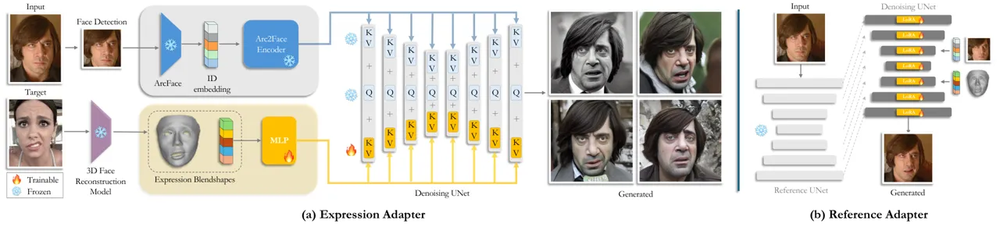
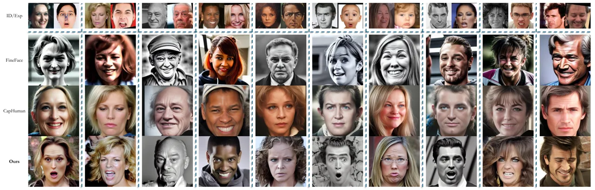
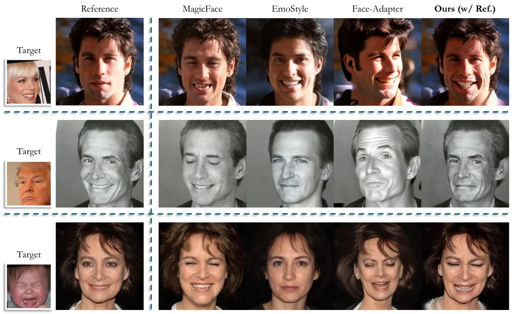
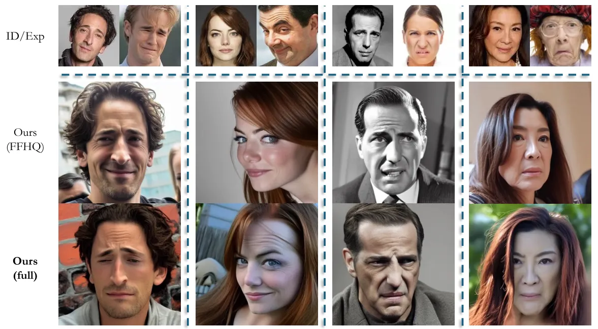
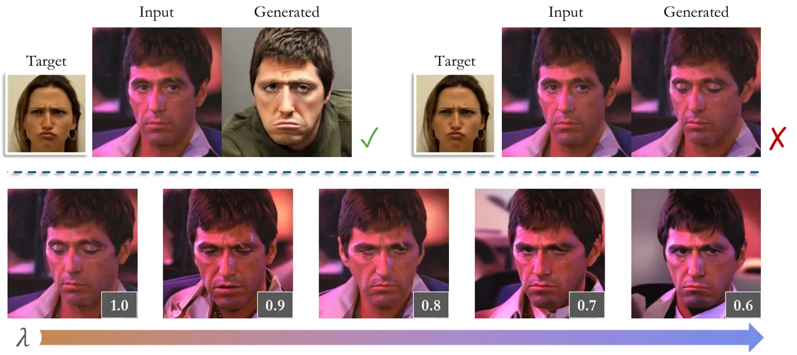
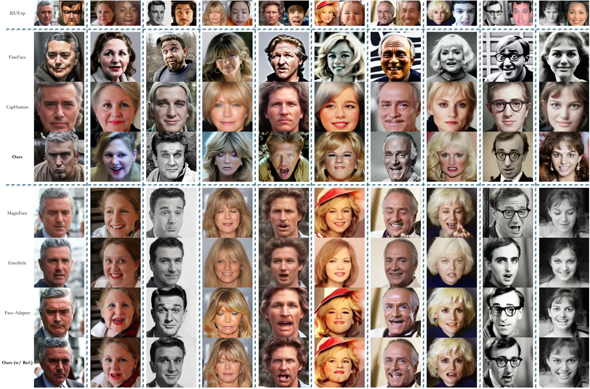
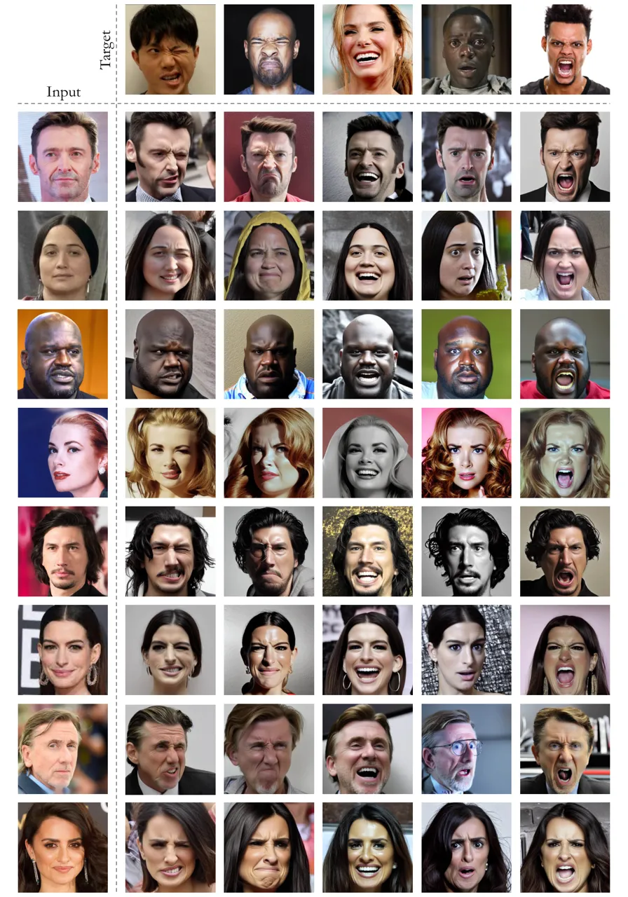
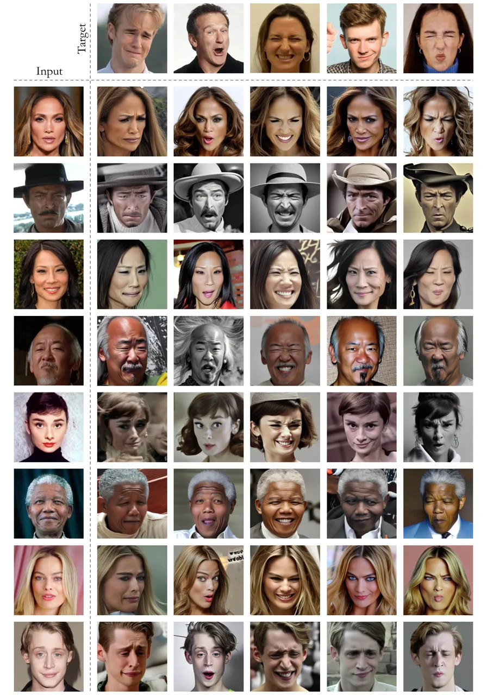
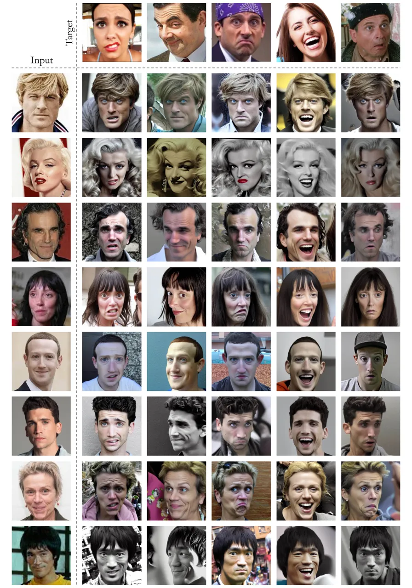

# ID-Consistent, Precise Expression Generation with Blendshape-Guided Diffusion

Foivos Paraperas Papantoniou Affiliation: Imperial College London, UK   
Stefanos Zafeiriou Affiliation: {f.paraperas,
s.zafeiriou}@imperial.ac.uk

###### Abstract

Human-centric generative models designed for AI-driven storytelling must
bring together two core capabilities: identity consistency and precise
control over human performance. While recent diffusion-based approaches
have made significant progress in maintaining facial identity, achieving
fine-grained expression control without compromising identity remains
challenging. In this work, we present a diffusion-based framework that
faithfully reimagines any subject under any particular facial
expression. Building on an ID-consistent face foundation model, we adopt
a compositional design featuring an expression cross-attention module
guided by FLAME blendshape parameters for explicit control. Trained on a
diverse mixture of image and video data rich in expressive variation,
our adapter generalizes beyond basic emotions to subtle
micro-expressions and expressive transitions, overlooked by prior works.
In addition, a pluggable Reference Adapter enables expression editing in
real images by transferring the appearance from a reference frame during
synthesis. Extensive quantitative and qualitative evaluations show that
our model outperforms existing methods in tailored and
identity-consistent expression generation. Code and models can be found
at
[https://github.com/foivospar/Arc2Face](https://github.com/foivospar/Arc2Face).

## 1 Introduction

The rapid advancement of generative models, beginning with GANs \[14\]
and now dominated by diffusion models \[17, 46, 8\], has significantly
elevated the quality and versatility of synthetic visual content.
Powered by high-performance computing and trained on vast amounts of
data, foundation diffusion models can generate high-quality and diverse
images of human characters, achieving remarkable realism and
adaptability across domains. The impact of such technology spans
multiple industries, from advertising to education and virtual
environments. Yet, one of the most transformative applications lies in
film and entertainment, where human performance is central to
storytelling. Despite progress in human-centric generation, the existing
paradigm in diffusion models focuses on identity preservation, often
overlooking controllability.

Facial expressions, however, play a vital role in human communication,
conveying emotions, intentions, and personality traits. As such, they
have become a central focus in face modeling research. A long line of
work has explored facial expression editing with GAN-based methods \[5,
6, 9, 48, 32\], though often with limited realism. More recent
approaches leverage powerful pre-trained text-to-image diffusion models
like Stable Diffusion \[40\], extending them with additional mechanisms
for identity and expression control to generate faces with desired
emotional states. These methods typically rely on emotion
representations such as categorical labels (_e.g_., happy, sad), the
continuous Valence-Arousal 2D space \[41\], or Action Units (AUs) \[11\]
that describe localized facial muscle movements. However, while these
descriptors offer semantic editing, they often fall short in capturing
the full precision and nuance of facial expressions, limiting their
usefulness for applications requiring fine-grained control.

In this work, we target precise and disentangled facial expression
control. To achieve this, we adopt a parametric representation based on
expression blendshapes from the FLAME 3D face model \[21\], which offers
continuous, high-dimensional control over expression. We build upon
Arc2Face \[33\], a foundation diffusion model which can synthesize
diverse, realistic faces of a single identity using identity embeddings
as conditioning input. To incorporate detailed control, we inject the
expression parameters into the model’s cross-attention layers, while the
pretrained backbone remains frozen, preserving its strong identity
prior. To support a wide range of expressive capabilities, including
rare, asymmetric, subtle, and extreme expressions, we carefully curate
training datasets with rich expression diversity. Additionally, we
introduce a Reference Adapter trained on top of the base model that
conditions generation on an input image, allowing precise expression
editing while maintaining the subject’s original appearance and
background.

## 2 Related Work

### 2.1 Facial Expression Generation and Editing

Early efforts to edit facial expressions in “in-the-wild” images
primarily employed GAN-based architectures. These approaches typically
used conditional GANs for image-to-image translation. For instance,
StarGAN \[5\] enabled multi-domain facial attribute transfer using
categorical emotion labels, while ExprGAN \[9\] and Lindt _et al_.
\[24\] introduced expression editing along emotion intensity levels.
Deviating from hand-crafted emotion representations, GANmut \[6\]
proposed a framework that implicitly learns a continuous and
interpretable emotion space from categorical labels, by associating
classification confidence with expression intensity. Despite promising
results, these methods are limited by the quality and diversity of their
training data, as well as the inherent instability of GAN training.

At the same time, various works focus on geometry-driven expression
editing, addressing the task of face reenactment. Models like ICface
\[48\] and GANimation \[37\] leverage Action Units (AUs) as an
interpretable representation for expression control, whereas Neural
Emotion Director \[32\] introduces a 3D-based Emotion Manipulator that
translates expressions into basic emotions or reference-driven styles
using a 3D Morphable Model (3DMM)-conditioned GAN. Another direction
explores the latent space of the pre-trained StyleGAN \[18\] network,
for facial editing. InterFaceGAN \[44, 45\] disentangles facial
attributes using pre-trained classifiers, enabling semantic control over
identity, age, or expression. StyleCLIP \[35\] builds on this by
incorporating CLIP \[38\], allowing text-driven facial edits within
StyleGAN’s latent space, while EmoStyle \[1\] takes this further by
explicitly separating expression from other facial attributes, using
Valence-Arousal values to modify expressions while preserving identity
and appearance.

### 2.2 ID and Attribute Control in Diffusion Models

Following the advent of diffusion models, research has shifted towards
adding controllability to frontier text-to-image models like Stable
Diffusion \[40\]. One major area of focus has been identity
preservation. A popular approach involves using the CLIP image encoder
\[38\] to extract features from reference subjects, which are then
injected into pre-trained models via cross-attention layers. Notable
examples include FastComposer \[56\], PhotoVerse \[3\], MoA \[51\], and
PhotoMaker \[22\]. A more robust alternative to CLIP embeddings is the
use of face recognition networks, which extract stronger ID-specific
features. This approach has been leveraged in works such as Face0
\[49\], DreamIdentity \[4\], IP-Adapter-FaceID \[57\], PortraitBooth
\[36\], and InstantID \[52\] for both 2D and 3D face generation \[13\].
Among these, the pioneering Arc2Face work \[33\], showed how the
powerful Stable Diffusion model can be transformed into an ID-consistent
face foundation model capable of generating highly realistic and diverse
images with compelling identity similarity, by leveraging WebFace
\[60\] - the largest public dataset for face recognition.

In parallel, numerous efforts explore the integration of expression
features. These methods vary in the type of representation used,
including 2D landmarks \[15, 30\], 3DMMs \[23\], Action Units \[55,
50\], continuous emotion spaces \[34\], or natural language instructions
\[54, 25\]. Yet, they often fall short in expression fidelity -
particularly when handling asymmetric or extreme expressions and
typically introduce identity distortion.

## 3 Method



Figure 2: Overview of the proposed expression-control framework. Our
approach builds on the Arc2Face diffusion model \[33\], which conditions
the denoising UNet on ID embeddings. (a) We introduce an Expression
Adapter that guides the generation using explicit FLAME \[21\]
blendshape parameters extracted from reference images via an
off-the-shelf 3D reconstruction method \[39\]. The adapter consists of
two components: (1) an MLP that maps 3DMM parameters into the CLIP
latent space used by Stable Diffusion, and (2) a dual attention
mechanism that integrates expression information alongside identity
using separate key and value matrices in the cross-attention layers. (b)
We further incorporate a Reference Adapter that conditions the model on
the input image itself. A dedicated Reference UNet extracts multi-scale
features, which are injected into the denoising UNet via self-attention
layers modulated by added LoRA weights. By enabling this adapter at
inference, we support image-based expression editing. The proposed
modules are trained on expression-rich image and video data, achieving
strong generalization across a wide range of facial expressions.

Our method generates facial images with disentangled control over
identity and expression. Given an input facial identity, represented by
ArcFace \[7\] embeddings, and a target expression, encoded as FLAME
blendshape parameters extracted from an expressive target image, our
diffusion model synthesizes diverse and photorealistic images that
faithfully reflect the source subject with the target expression, as
shown in . To further enhance applicability, we introduce an optional
inference-time mechanism that conditions the generation directly on the
source image pixels, enabling expression editing on real images while
preserving background and appearance. Specific details of our approach
are provided in the subsequent sections. For a high-level overview, see
Fig. 2.

### 3.1 Preliminary: Arc2Face

Arc2Face \[33\] is a recent diffusion foundation model for human faces,
built on top of the Stable Diffusion framework. It achieves
identity-consistent synthesis by integrating ArcFace \[7\] embeddings
into the generation pipeline, enabling the creation of diverse,
high-quality $`512\times 512`$ facial images with a significantly higher
degree of identity similarity compared to prior methods. Starting from a
face image $`\mathbf{x}\in\mathbb{R}^{H\times W\times C}`$ as input, the
ArcFace network \[7\] $`\phi`$ is used, following cropping and
alignment, to extract the identity features,
$`\mathbf{v}=\phi(\mathbf{x})\in\mathbb{R}^{512}`$. In order to project
these features into the cross-attention layers of the UNet for
conditioning, Arc2Face repurposes the original CLIP text encoder
$`\tau`$ to act as a facial identity encoder tailored to ArcFace
embeddings. The identity vector $`\mathbf{v}`$ replaces a placeholder
token within a fixed text prompt and is mapped by the fine-tuned encoder
to a sequence in the CLIP latent space:
$`\mathbf{v}_{c}=\tau(\mathbf{v})\in\mathbb{R}^{77\times 768}`$. The
entire model - comprising the adapted CLIP encoder and the UNet - is
extensively fine-tuned on WebFace260M \[60\], the largest publicly
available face recognition dataset, enabling Arc2Face to function as a
powerful prior model. Its strong decoupling between identity and other
visual attributes makes it well-suited for our task, which aims to
introduce fine-grained, expression-level control while maintaining
subject fidelity.

### 3.2 Expression Adapter

To achieve fine-grained and disentangled control over facial
expressions, we leverage a parametric 3DMM, specifically FLAME \[21\],
which decomposes facial geometry into distinct components for identity
and expression. This formulation maps the emotion control problem from
image space to the subject-agnostic parameter space of a 3D model. We
construct an expression representation vector by concatenating FLAME’s
expression parameters $`\mathbf{e}\in\mathbb{R}^{50}`$, eyelid pose
parameters $`\mathbf{a}\in\mathbb{R}^{2}`$, and jaw articulation
parameters $`\mathbf{p}\in\mathbb{R}^{3}`$. The resulting vector
$`\mathbf{s}=\text{concat}(\mathbf{e},\mathbf{a},\mathbf{p})\in\mathbb{R}^{55}`$
serves as the input to our Expression Adapter.

Our approach follows the paradigm of IP-Adapter \[57\], and integrates
expression information into the cross-attention layers of the UNet in a
disentangled manner. First, we use a lightweight MLP $`\epsilon`$ to
project the expression vector into the CLIP latent space
$`\mathbf{s}_{c}=\epsilon(\mathbf{s})\in\mathbb{R}^{4\times 768}`$. This
projected embedding is then used to produce additional key and value
matrices, $`\mathbf{K}_{exp},\mathbf{V}_{exp}`$, which are incorporated
into each cross-attention layer of the UNet. Specifically, at each
layer, we extend the original cross-attention mechanism
$`\text{Attention}_{\text{id}}(\mathbf{Q},\mathbf{K},\mathbf{V})`$ -
conditioned on the identity embedding - with an additional branch
conditioned on expression, where the two attention outputs are computed
in parallel using the same query matrix $`\mathbf{Q}`$. The final
attention output is the sum of both contributions:

```math
\begin{split}\mathbf{S}=\text{Attention}_{\text{id}}(\mathbf{Q},\mathbf{K},\mathbf{V})+\text{Attention}_{\text{exp}}(\mathbf{Q},\mathbf{K}_{exp},\mathbf{V}_{exp})\\
=\text{Softmax}(\frac{\mathbf{Q}\mathbf{K}^{\top}}{\sqrt{d}})\mathbf{V}+\text{Softmax}(\frac{\mathbf{Q}(\mathbf{K}_{exp})^{\top}}{\sqrt{d}})\mathbf{V}_{exp}\end{split} \tag{1}
```

To maintain the strong prior of the pre-trained Arc2Face backbone, we
freeze all original model weights and train only the additional
parameters: the expression projection MLP $`\epsilon`$, and the linear
projection layers $`\mathbf{W}_{k_{exp}}`$, $`\mathbf{W}_{v_{exp}}`$
used to compute the expression key and value matrices
$`\mathbf{K}_{exp}=\mathbf{s}_{c}\mathbf{W}_{k_{exp}},\mathbf{V}_{exp}=\mathbf{s}_{c}\mathbf{W}_{v_{exp}}`$.

### 3.3 Reference Adapter

While our base model enables stochastic portrait generation conditioned
on identity and expression features, certain use cases, such as real
image editing, require preserving the subject’s appearance and
background. To support this, we introduce a Reference Adapter, which can
be seamlessly integrated into the base model to condition the generation
on the source image itself. This is implemented via a Reference UNet, a
frozen copy of the original denoising UNet that mirrors its
architecture. The Reference UNet serves as a feature encoder for the
input reference image, extracting spatially-aligned representations that
capture the subject’s appearance and background at each layer. Since
these features are dimensionally aligned with those produced by the main
(expression-conditioned) UNet during the denoising process, we
concatenate the two feature maps within the self-attention layers. This
allows the model to blend appearance cues from the reference image with
the evolving features of the generated image. While this modification
achieves reference conditioning at inference time, in practice, it may
introduce conflicts with expression control - especially when the
reference expression differs from the target. To resolve this, we
incorporate lightweight LoRA layers into the self-attention modules of
the denoising UNet. These are fine-tuned with both the Expression
Adapter and the Reference Adapter active, enabling the model to
harmonize identity, expression, and appearance without retraining the
full network. During inference, our approach supports flexible
generation: the model can switch between reference-driven and stochastic
expression synthesis by adding or removing the Reference UNet and the
optimized LoRA weights.

### 3.4 Training Details

Training is performed in two stages. In the first phase, we train the
Expression Adapter using expression-rich datasets. We use AffectNet
\[31\] with 450K images which we upsample with a face restoration
network \[53\], and augment it with 250K frames from the FEED video
dataset \[10\] containing extreme expressions. We also include 70K
high-resolution images from FFHQ \[18\] for enhanced quality. For each
image, we extract identity embeddings using ArcFace \[7\] and expression
parameters using the state-of-the-art SMIRK method \[39\], for
conditioning, while the image itself is used as the supervision target
for the denoising loss.

The second phase includes adding the LoRA layers of the Reference
Adapter, and training them while keeping the trained Expression Adapter
frozen. This requires cross-paired training samples where the same
individual appears with different expressions in the source and target
images, as using the same image would lead the model to simply
“copy-paste” the reference image, bypassing the target expression.
Therefore, we utilize the FEED video dataset, as well as the large-scale
HDTF video dataset \[59\], containing approximately 1.5 million frames
of talking faces. We sample reference–target pairs by selecting two
random frames within short (2-second) clips, ensuring expression
variation while maintaining identity consistency. Again, we annotate the
reference images with identity embeddings and the target images with
expression parameters.

## 4 Experiments



Figure 3: Visual comparison of our method with competing models \[50,
23\] for expression-controlled generation conditioned on identity
features.

We conduct comprehensive comparisons with state-of-the-art open-source
approaches for face generation with emotion control. Below, we outline
the experimental setup, evaluation metrics, and baseline methods used in
each setting. Additional qualitative results are provided in the
Supplementary Material.

### 4.1 Identity-Driven Expression Generation

We first focus on the unconstrained generation setting, where the goal
is to synthesize novel expressive facial images, conditioned on a given
identity and target expression. We compare against recent similar
methods that achieve expression control on top of Stable Diffusion:
FineFace \[50\], which uses Action Units (AUs) as expression guidance,
and CapHuman \[23\], which leverages rendered normals and albedo maps
from FLAME with a ControlNet-like \[58\] structure. Both incorporate
identity embeddings to preserve subject identity. For benchmarking, we
collect 1K “in-the-wild” face images of different individuals. For each
subject, we randomly sample 5 target expression images from the
AffectNet validation set \[31\], resulting in 5K expression-conditioned
generations per method. We evaluate performance across three main axes:
image quality, expression fidelity, and identity preservation, using the
following metrics: 1) FID \[16, 43\]: Fréchet Inception Distance to
assess realism by comparing distributions of generated and input
identity images; 2) VA-MSE: MSE of Valence-Arousal values between
generated and target expression images; 3) AU-MSE: MSE between target
and generated Action Unit intensities; 4) Emotion Accuracy:
Classification accuracy for 8 emotion categories (anger, contempt,
disgust, fear, happiness, neutral, sadness, surprise) between intended
and generated emotions; 5) 3D Exp-MSE: MSE of reconstructed FLAME
expression parameters using \[39\] between target and synthesized
images; 6) ID Similarity: Cosine similarity of identity embeddings
between source and generated faces. To extract Valence-Arousal values,
AU intensities, and emotion labels for all images, we employ
off-the-shelf models from the Facetorch toolkit \[12, 20, 29, 42\].

As shown in Tab. 1, our method significantly outperforms the baselines
in terms of expression consistency across all metrics, while also
achieving a lower FID score, indicating higher visual quality. This
highlights the effectiveness of our precise, parametric expression
representation in accurately transferring expressions against AU-based
and render-based alternatives. Moreover, as illustrated in Fig. 5, our
model consistently achieves higher identity similarity to the input
subjects, owing to the strong Arc2Face prior and our careful integration
of expression conditioning avoiding interference with identity. To
further validate the superiority of our approach, we conducted a user
study with 37 participants who were asked to choose the method whose
result best resembles the desired expression across a randomly chosen
set of 25 ID/expression pairs from our dataset. As reported in Fig. 5,
our method received 72% of the votes, indicating its strong expression
fidelity. For a visual comparison, we provide examples in Fig. 3. It is
evident that other methods struggle to transfer varying target
expressions to the input subjects, whereas our method performs reliably,
even for subtle or uncommon facial expressions.

|                 | FID$`\downarrow`$ | Em. Acc. (%)$`\uparrow`$ | AU-MSE$`\downarrow`$ | VA-MSE$`\downarrow`$ | 3D Exp-MSE$`\downarrow`$ |
| --------------- | ----------------- | ------------------------ | -------------------- | -------------------- | ------------------------ |
| FineFace \[50\] | 0.367             | 35.85                    | 0.038                | 0.164                | 1.250                    |
| CapHuman \[23\] | 0.701             | 23.50                    | 0.045                | 0.208                | 1.076                    |
| Ours            | 0.300             | 46.59                    | 0.032                | 0.086                | 0.696                    |

Table 1: ID-conditioned generation: Comparison of our method with
ID-conditioned diffusion models for expression control \[50, 23\] on a
dataset of 1K IDs. For each ID, we generate 5 expressive samples using
target expressions shared across all methods. We report expression
accuracy using metrics based on 3D reconstruction, emotion
classification, Action Unit (AU), and Valence-Arousal (VA) predictions.
Image quality is assessed using FID. Bold values indicate the best
performance for each metric.

Figure 4: Cosine similarity distribution between identity features of
input and generated faces.

Figure 5: Users’ preference on accuracy between generated/intended
expressions.

### 4.2 Reference-Driven Expression Generation

We further evaluate our method in a reference-driven setting, where the
objective is to modify the facial expression of a given image while
preserving the subject’s appearance and background. The evaluation setup
mirrors that of the stochastic generation experiment, using the same
metrics and test data. However, in this case, we activate the Reference
Adapter and its associated LoRA layers for our method, allowing our
model to condition not only on the ArcFace embedding but also directly
on the source image itself. We compare against recent methods designed
for this task: MagicFace \[55\] which incorporates Action Units along
with reference image features into the Stable Diffusion pipeline and
Face-Adapter \[15\] which uses 3D landmarks instead, along with the
source image. Finally, we include EmoStyle \[1\], a GAN-based approach
which manipulates StyleGAN2 \[19\] latent codes using Valence-Arousal
controls via a learned expression-guidance network.

We present the results in Tab. 2 and Fig. 6 and provide visual
comparisons in Fig. 7. Our method again achieves superior results than
the baselines in all aspects. While our primary design targets
stochastic generation with expression and identity guidance, we show how
our architecture can be seamlessly extended to reference-based editing
via the proposed optional mechanism, outperforming models explicitly
designed for this task.

|                     | FID$`\downarrow`$ | Em. Acc. (%)$`\uparrow`$ | AU-MSE$`\downarrow`$ | VA-MSE$`\downarrow`$ | 3D Exp-MSE$`\downarrow`$ |
| ------------------- | ----------------- | ------------------------ | -------------------- | -------------------- | ------------------------ |
| MagicFace \[55\]    | 0.138             | 34.08                    | 0.044                | 0.166                | 1.595                    |
| EmoStyle \[2\]      | 0.159             | 42.42                    | 0.043                | 0.091                | 1.223                    |
| Face-Adapter \[15\] | 0.166             | 43.85                    | 0.040                | 0.093                | 0.986                    |
| Ours (w/ Ref.)      | 0.128             | 44.19                    | 0.038                | 0.090                | 0.849                    |

Table 2: Reference-driven generation: Comparison of our method -
extended with the Reference Adapter - against approaches for expression
editing in reference images \[55, 1, 15\]. The evaluation setup is
identical to that in Tab. 1. Bold values indicate the best performance
for each metric.

Figure 6: Comparison of cosine similarity distributions between identity
features of input and generated faces for the reference-driven setting.



Figure 7: Visual comparison with recent methods for reference-driven
expression control \[55, 15, 2\]. Our method achieves more faithful
expression transfer while better preserving both identity and visual
consistency with the reference image.

### 4.3 Ablation Studies

To further validate the effectiveness of our expression representation,
we conduct ablation studies comparing our method against two alternative
variants. First, we replace the FLAME blendshape parameters
$`\mathbf{s}\in\mathbb{R}^{55}`$ with deep perceptual expression
features. Specifically, we use EmoNet \[47\], a widely used expression
recognition model, to extract perceptual features
$`c\in\mathbb{R}^{256}`$ from its final convolutional layers, just
before classification. These features are then used as input to the
Expression Adapter, instead of the original 3DMM-based parameters.
Second, we evaluate a straightforward baseline that integrates
ControlNet \[58\] with the Arc2Face model \[33\]. For this, we use the
official pre-trained ControlNet variant provided by Arc2Face, which is
conditioned on normal maps derived from the FLAME 3D model. We evaluate
both baselines using the same expression consistency protocol as in the
main experiments. Tab. 3 shows that both alternatives fall short in
accurately encoding the intended expressions, leading to a noticeable
performance drop. We attribute this to the highly discriminative nature
of emotion recognition networks in the first case and ControlNet’s
reliance on low-dimensional geometric cues, such as normal maps, in the
second case, which provide only coarse surface information about facial
structure. In contrast, the use of explicit and compact blendshape
parameters, while simple in design, proves to be the most efficient
approach for capturing and re-generating detailed expressions.

Furthermore, we examine the importance of expressive variability in the
training data. As discussed earlier, in addition to FFHQ, we incorporate
AffectNet \[31\], which is tailored for facial expression recognition
(FER), and FEED \[10\], a dataset featuring exaggerated expressions
performed by actors. These datasets are crucial for capturing a broad
range of facial expressions and enabling the model to generalize beyond
subtle or common emotions. To demonstrate this, we retrain our model
using only the high-quality but expression-limited FFHQ dataset. Fig. 8
provides examples where this model fails to accurately reproduce more
nuanced reference expressions that go beyond prototypical emotions such
as happiness or anger, and instead reflect micro-expressions or facial
morphs. The integration of AffectNet and FEED proves essential for
robust expression synthesis across the full spectrum of human affect.

|                       | Em. Acc. (%)$`\uparrow`$ | AU-MSE$`\downarrow`$ | VA-MSE$`\downarrow`$ | 3D Exp-MSE$`\downarrow`$ |
| --------------------- | ------------------------ | -------------------- | -------------------- | ------------------------ |
| Arc2Face + ControlNet | 31.92                    | 0.038                | 0.154                | 1.167                    |
| Ours w/ EmoNet        | 44.28                    | 0.037                | 0.105                | 1.192                    |
| Ours                  | 46.59                    | 0.032                | 0.086                | 0.696                    |

Table 3: Ablation study comparing the proposed approach with two
alternative variants: (1) integrating a ControlNet into Arc2Face, using
normal maps for control instead of expression blendshapes; and (2) using
the proposed Expression Adapter, but conditioned on deep features from a
Facial Expression Recognition (FER) network rather than explicit 3DMM
parameters.



Figure 8: Comparison of our Expression Adapter trained on the full
dataset (AffectNet + FEED + FFHQ) vs. trained only on FFHQ.

## 5 Limitations

While our approach effectively generates precise and detailed
expressions, some limitations remain. First, the adopted parametric
representation lacks semantic interpretability. As a result, expression
manipulation typically relies on extracting parameters from reference
images, which may be limiting for certain applications. Second, the
accuracy of expression reproduction is inherently dependent on the
quality of the 3D reconstruction method used to extract blendshape
parameters \[39\], which although state-of-the-art might still be
imperfect and introduce occasional errors. Finally, expression editing
with the Reference Adapter can sometimes be inconsistent. As shown in
Fig. 9 (top), there are instances where the base model accurately
transfers the target expression, but the reference-driven variant fails
to do so. This is due to the Reference Adapter often tending to
“copy-paste” the reference image, despite our use of cross-paired video
data for training. This behavior can be mitigated at test time by
adjusting the scaling factor $`\lambda`$ of the LoRA layers, which
modulates the influence of the reference image. As shown in Fig. 9
(bottom), reducing $`\lambda`$ improves expression fidelity at the cost
of slight deviations in background or pose from the reference image.  
Note on social impact. We acknowledge the ethical implications of our
work, as technologies for controllable face generation may be misused to
produce deceptive or unoriginal facial imagery, particularly when
capable of altering expressions. While our goal is to advance research
in positive domains such as accessibility and creative storytelling, we
recognize these risks and emphasize the importance of ethical standards
and investment in countermeasures like synthetic content detection.



Figure 9: Top: Example of failure case where the base model successfully
reproduces the target expression, but the reference-driven variant
struggles due to over-reliance on the source image. Bottom: Reducing the
LoRA scaling factor $`\lambda`$ of the Reference Adapter alleviates this
by trading off pose and background consistency for improved expression
fidelity.

## 6 Conclusion

In this work, we extend a foundation face model, Arc2Face, to enable
explicit and accurate expression control in the context of ID-consistent
face generation. Our Expression Adapter maps expression parameters from
a 3DMM into the latent space of CLIP embeddings, aligning with Stable
Diffusion’s conditioning interface, while its dual attention mechanism
enables disentangled expression control without compromising identity
fidelity. Given blendshape parameters extracted from a target image via
3D reconstruction, our model faithfully reproduces the same expression
to any source identity, with superior accuracy and visual quality than
prior methods. We place particular emphasis on curating expression-rich
training data to provide a robust model that goes beyond simple
emotions, enabling complex expressive transitions that lie between
canonical emotional states. We further enable image-based expression
editing through a Reference Adapter that conditions the generation on
multi-scale features from the reference image via an adapted
self-attention mechanism. Our open-source model can provide a versatile
tool for controllable synthetic data generation, benefiting downstream
tasks such as Facial Expression Recognition (FER), while bridging the
gap between general-purpose image generation and human-centric synthesis
for AI-driven storytelling.  
Acknowledgements. S. Zafeiriou and part of the research was funded by
the EPSRC Project GNOMON (EP/X011364/1) and Turing AI Fellowship
(EP/Z534699/1).

## References

- \[1\] Bita Azari and Angelica Lim. Emostyle: One-shot facial
  expression editing using continuous emotion parameters. In
  _Proceedings of the IEEE/CVF Winter Conference on Applications of
  Computer Vision (WACV)_, pages 6385–6394, 2024a.
- \[2\] Bita Azari and Angelica Lim. Emostyle: One-shot facial
  expression editing using continuous emotion parameters. In
  _Proceedings of the IEEE/CVF Winter Conference on Applications of
  Computer Vision_, 2024b.
- \[3\] Li Chen, Mengyi Zhao, Yiheng Liu, Mingxu Ding, Yangyang Song,
  Shizun Wang, Xu Wang, Hao Yang, Jing Liu, Kang Du, et al. Photoverse:
  Tuning-free image customization with text-to-image diffusion models.
  _arXiv preprint arxiv:2309.05793_, 2023a.
- \[4\] Zhuowei Chen, Shancheng Fang, Wei Liu, Qian He, Mengqi Huang,
  Yongdong Zhang, and Zhendong Mao. Dreamidentity: Improved editability
  for efficient face-identity preserved image generation. _arXiv
  preprint arXiv:2307.00300_, 2023b.
- \[5\] Yunjey Choi, Minje Choi, Munyoung Kim, Jung-Woo Ha, Sunghun Kim,
  and Jaegul Choo. Stargan: Unified generative adversarial networks for
  multi-domain image-to-image translation. In _Proceedings of the IEEE
  Conference on Computer Vision and Pattern Recognition (CVPR)_, 2018.
- \[6\] Stefano d’Apolito, Danda Pani Paudel, Zhiwu Huang, Andres
  Romero, and Luc Van Gool. Ganmut: Learning interpretable conditional
  space for gamut of emotions. In _Proceedings of the IEEE Conference on
  Computer Vision and Pattern Recognition (CVPR)_, 2021.
- \[7\] Jiankang Deng, Jia Guo, Niannan Xue, and Stefanos Zafeiriou.
  Arcface: Additive angular margin loss for deep face recognition. In
  _Proceedings of the IEEE/CVF Conference on Computer Vision and Pattern
  Recognition_, pages 4690–4699, 2019.
- \[8\] Prafulla Dhariwal and Alexander Nichol. Diffusion models beat
  gans on image synthesis. _Advances in Neural Information Processing
  Systems_, 34:8780–8794, 2021.
- \[9\] Hui Ding, Kumar Sricharan, and Rama Chellappa. Exprgan: Facial
  expression editing with controllable expression intensity.
  _AAAI_, 2018.
- \[10\] Nikita Drobyshev, Antoni Bigata Casademunt, Konstantinos
  Vougioukas, Zoe Landgraf, Stavros Petridis, and Maja Pantic.
  Emoportraits: Emotion-enhanced multimodal one-shot head avatars. In
  _Proceedings of the IEEE/CVF Conference on Computer Vision and Pattern
  Recognition (CVPR)_, pages 8498–8507, 2024.
- \[11\] Paul Ekman and Wallace V. Friesen. _Facial Action Coding
  System_. Consulting Psychologists Press, 1978.
- \[12\] Tomas Gajarsky. Facetorch: A python library for analyzing faces
  using pytorch.
  [https://github.com/tomas-gajarsky/facetorch](https://github.com/tomas-gajarsky/facetorch), 2024.
- \[13\] Dimitrios Gerogiannis, Foivos Paraperas Papantoniou,
  Rolandos Alexandros Potamias, Alexandros Lattas, and Stefanos
  Zafeiriou. Arc2avatar: Generating expressive 3d avatars from a single
  image via id guidance. In _Proceedings of the IEEE/CVF Conference on
  Computer Vision and Pattern Recognition (CVPR)_, 2025.
- \[14\] Ian Goodfellow, Jean Pouget-Abadie, Mehdi Mirza, Bing Xu, David
  Warde-Farley, Sherjil Ozair, Aaron Courville, and Yoshua Bengio.
  Generative adversarial networks. _Communications of the ACM_,
  63(11):139–144, 2020.
- \[15\] Yue Han, Junwei Zhu, Keke He, Xu Chen, Yanhao Ge, Wei Li,
  Xiangtai Li, Jiangning Zhang, Chengjie Wang, and Yong Liu. Face
  adapter for pre-trained diffusion models with fine-grained id and
  attribute control. _arXiv preprint arXiv:2405.12970_, 2024.
- \[16\] Martin Heusel, Hubert Ramsauer, Thomas Unterthiner, Bernhard
  Nessler, and Sepp Hochreiter. Gans trained by a two time-scale update
  rule converge to a local nash equilibrium. _Advances in neural
  information processing systems_, 30, 2017.
- \[17\] Jonathan Ho, Ajay Jain, and Pieter Abbeel. Denoising diffusion
  probabilistic models. In _Advances in Neural Information Processing
  Systems_, pages 6840–6851, 2020.
- \[18\] Tero Karras, Samuli Laine, and Timo Aila. A style-based
  generator architecture for generative adversarial networks. In
  _Proceedings of the IEEE/CVF Conference on Computer Vision and Pattern
  Recognition (CVPR)_, 2019.
- \[19\] Tero Karras, Samuli Laine, Miika Aittala, Janne Hellsten,
  Jaakko Lehtinen, and Timo Aila. Analyzing and improving the image
  quality of stylegan. In _Proceedings of the IEEE/CVF Conference on
  Computer Vision and Pattern Recognition_, pages 8110–8119, 2020.
- \[20\] Daeha Kim and Byung Cheol Song. Optimal transport-based
  identity matching for identity-invariant facial expression
  recognition. _Advances in Neural Information Processing Systems_,
  35:18749–18762, 2022.
- \[21\] Tianye Li, Timo Bolkart, Michael. J. Black, Hao Li, and Javier
  Romero. Learning a model of facial shape and expression from 4D scans.
  _ACM Transactions on Graphics, (Proc. SIGGRAPH Asia)_,
  36(6):194:1–194:17, 2017.
- \[22\] Zhen Li, Mingdeng Cao, Xintao Wang, Zhongang Qi, Ming-Ming
  Cheng, and Ying Shan. Photomaker: Customizing realistic human photos
  via stacked id embedding. _arXiv preprint arXiv:2312.04461_, 2023.
- \[23\] Chao Liang, Fan Ma, Linchao Zhu, Yingying Deng, and Yi Yang.
  Caphuman: Capture your moments in parallel universes. In _Proceedings
  of the IEEE/CVF Conference on Computer Vision and Pattern
  Recognition_, 2024.
- \[24\] Alexandra Lindt, Pablo V. A. Barros, Henrique Siqueira, and
  Stefan Wermter. Facial expression editing with continuous emotion
  labels. _Proceedings of the 14th IEEE International Conference on
  Automatic Face & Gesture Recognition (FG)_, pages 1–8, 2019.
- \[25\] Renshuai Liu, Bowen Ma, Wei Zhang, Zhipeng Hu, Changjie Fan,
  Tangjie Lv, Yu Ding, and Xuan Cheng. Towards a simultaneous and
  granular identity-expression control in personalized face generation.
  In _Proceedings of the IEEE/CVF Conference on Computer Vision and
  Pattern Recognition_, pages 2114–2123, 2024.
- \[26\] Ilya Loshchilov and Frank Hutter. Decoupled weight decay
  regularization. _arXiv preprint arXiv:1711.05101_, 2017.
- \[27\] Cheng Lu, Yuhao Zhou, Fan Bao, Jianfei Chen, Chongxuan Li, and
  Jun Zhu. Dpm-solver: A fast ode solver for diffusion probabilistic
  model sampling in around 10 steps. _Advances in Neural Information
  Processing Systems_, 35:5775–5787, 2022a.
- \[28\] Cheng Lu, Yuhao Zhou, Fan Bao, Jianfei Chen, Chongxuan Li, and
  Jun Zhu. Dpm-solver++: Fast solver for guided sampling of diffusion
  probabilistic models. _arXiv preprint arXiv:2211.01095_, 2022b.
- \[29\] Cheng Luo, Siyang Song, Weicheng Xie, Linlin Shen, and Hatice
  Gunes. Learning multi-dimensional edge feature-based au relation graph
  for facial action unit recognition. In _Proceedings of the
  Thirty-First International Joint Conference on Artificial
  Intelligence, IJCAI-22_, pages 1239–1246, 2022.
- \[30\] Kazuaki Mishima, Antoni Bigata Casademunt, Stavros Petridis,
  Maja Pantic, and Kenji Suzuki. Facecrafter: Identity-conditional
  diffusion with disentangled control over facial pose, expression, and
  emotion. _arXiv preprint arXiv:2505.15313_, 2025.
- \[31\] Ali Mollahosseini, Behzad Hasani, and Mohammad H Mahoor.
  Affectnet: A database for facial expression, valence, and arousal
  computing in the wild. _IEEE Transactions on Affective Computing_,
  10(1):18–31, 2017.
- \[32\] Foivos Paraperas Papantoniou, Panagiotis P. Filntisis, Petros
  Maragos, and Anastasios Roussos. Neural emotion director:
  Speech-preserving semantic control of facial expressions in
  ”in-the-wild” videos. In _Proceedings of the IEEE/CVF Conference on
  Computer Vision and Pattern Recognition (CVPR)_, 2022.
- \[33\] Foivos Paraperas Papantoniou, Alexandros Lattas, Stylianos
  Moschoglou, Jiankang Deng, Bernhard Kainz, and Stefanos Zafeiriou.
  Arc2face: A foundation model for id-consistent human faces. In
  _Proceedings of the European Conference on Computer Vision
  (ECCV)_, 2024.
- \[34\] Reni Paskaleva, Mykyta Holubakha, Andela Ilic, Saman Motamed,
  Luc Van Gool, and Danda Paudel. A unified and interpretable emotion
  representation and expression generation. In _Proceedings of the
  IEEE/CVF Conference on Computer Vision and Pattern Recognition
  (CVPR)_, 2024.
- \[35\] Or Patashnik, Zongze Wu, Eli Shechtman, Daniel Cohen-Or, and
  Dani Lischinski. Styleclip: Text-driven manipulation of stylegan
  imagery. In _Proceedings of the IEEE/CVF International Conference on
  Computer Vision_, pages 2085–2094, 2021.
- \[36\] Xu Peng, Junwei Zhu, Boyuan Jiang, Ying Tai, Donghao Luo,
  Jiangning Zhang, Wei Lin, Taisong Jin, Chengjie Wang, and Rongrong Ji.
  Portraitbooth: A versatile portrait model for fast identity-preserved
  personalization. _arXiv preprint arXiv:2312.06354_, 2023.
- \[37\] A. Pumarola, A. Agudo, A.M. Martinez, A. Sanfeliu, and F.
  Moreno-Noguer. Ganimation: One-shot anatomically consistent facial
  animation. 2019.
- \[38\] Alec Radford, Jong Wook Kim, Chris Hallacy, Aditya Ramesh,
  Gabriel Goh, Sandhini Agarwal, Girish Sastry, Amanda Askell, Pamela
  Mishkin, Jack Clark, et al. Learning transferable visual models from
  natural language supervision. In _International Conference on Machine
  Learning_, pages 8748–8763, 2021.
- \[39\] George Retsinas, Panagiotis P. Filntisis, Radek Danecek,
  Victoria F. Abrevaya, Anastasios Roussos, Timo Bolkart, and Petros
  Maragos. 3d facial expressions through analysis-by-neural-synthesis.
  In _Proceedings of the IEEE/CVF Conference on Computer Vision and
  Pattern Recognition (CVPR)_, pages 2490–2501, 2024.
- \[40\] Robin Rombach, Andreas Blattmann, Dominik Lorenz, Patrick
  Esser, and Björn Ommer. High-resolution image synthesis with latent
  diffusion models. In _Proceedings of the IEEE/CVF Conference on
  Computer Vision and Pattern Recognition (CVPR)_, pages
  10684–10695, 2022.
- \[41\] James A Russell and Albert Mehrabian. Evidence for a
  three-factor theory of emotions. _Journal of research in Personality_,
  11(3):273–294, 1977.
- \[42\] Andrey V. Savchenko. Facial expression and attributes
  recognition based on multi-task learning of lightweight neural
  networks. In _2021 IEEE 19th International Symposium on Intelligent
  Systems and Informatics (SISY)_, pages 119–124, 2021.
- \[43\] Maximilian Seitzer. pytorch-fid: FID Score for PyTorch.
  [https://github.com/mseitzer/pytorch-fid](https://github.com/mseitzer/pytorch-fid), 2020.
  Version 0.3.0.
- \[44\] Yujun Shen, Jinjin Gu, Xiaoou Tang, and Bolei Zhou.
  Interpreting the latent space of gans for semantic face editing. In
  _Proceedings of the IEEE/CVF Conference on Computer Vision and Pattern
  Recognition (CVPR)_, 2020a.
- \[45\] Yujun Shen, Ceyuan Yang, Xiaoou Tang, and Bolei Zhou.
  Interfacegan: Interpreting the disentangled face representation
  learned by gans. _IEEE Transactions on Pattern Analysis and Machine
  Intelligence (TPAMI)_, 2020b.
- \[46\] Yang Song, Jascha Sohl-Dickstein, Diederik P Kingma, Abhishek
  Kumar, Stefano Ermon, and Ben Poole. Score-based generative modeling
  through stochastic differential equations. In _International
  Conference on Learning Representations_, 2021.
- \[47\] Antoine Toisoul, Jean Kossaifi, Adrian Bulat, Georgios
  Tzimiropoulos, and Maja Pantic. Estimation of continuous valence and
  arousal levels from faces in naturalistic conditions. _Nature Machine
  Intelligence_, 2021.
- \[48\] Soumya Tripathy, Juho Kannala, and Esa Rahtu. Icface:
  Interpretable and controllable face reenactment using gans. In
  _Proceedings of the IEEE/CVF Winter Conference on Applications of
  Computer Vision (WACV)_, 2020.
- \[49\] Dani Valevski, Danny Lumen, Yossi Matias, and Yaniv Leviathan.
  Face0: Instantaneously conditioning a text-to-image model on a face.
  In _SIGGRAPH Asia 2023 Conference Papers_, pages 1–10, 2023.
- \[50\] Tuomas Varanka, Huai-Qian Khor, Yante Li, Mengting Wei, Hanwei
  Kung, Nicu Sebe, and Guoying Zhao. Towards localized fine-grained
  control for facial expression generation. _arXiv preprint
  arXiv:2407.20175_, 2024.
- \[51\] Kuan-Chieh Wang, Daniil Ostashev, Yuwei Fang, Sergey Tulyakov,
  and Kfir Aberman. Moa: Mixture-of-attention for subject-context
  disentanglement in personalized image generation. _arXiv preprint
  arXiv:2404.11565_, 2024a.
- \[52\] Qixun Wang, Xu Bai, Haofan Wang, Zekui Qin, and Anthony Chen.
  Instantid: Zero-shot identity-preserving generation in seconds. _arXiv
  preprint arXiv:2401.07519_, 2024b.
- \[53\] Xintao Wang, Yu Li, Honglun Zhang, and Ying Shan. Towards
  real-world blind face restoration with generative facial prior. In
  _The IEEE Conference on Computer Vision and Pattern Recognition
  (CVPR)_, 2021.
- \[54\] Yuchi Wang, Junliang Guo, Jianhong Bai, Runyi Yu, Tianyu He, Xu
  Tan, Xu Sun, and Jiang Bian. Instructavatar: Text-guided emotion and
  motion control for avatar generation. _arXiv preprint
  arXiv:2405.15758_, 2024c.
- \[55\] Mengting Wei, Tuomas Varanka, Xingxun Jiang, Huai-Qian Khor,
  and Guoying Zhao. Magicface: High-fidelity facial expression editing
  with action-unit control. _arXiv preprint arXiv:2501.02260_, 2025.
- \[56\] Guangxuan Xiao, Tianwei Yin, William T Freeman, Frédo Durand,
  and Song Han. Fastcomposer: Tuning-free multi-subject image generation
  with localized attention. _arXiv preprint arXiv:2305.10431_, 2023.
- \[57\] Hu Ye, Jun Zhang, Sibo Liu, Xiao Han, and Wei Yang. Ip-adapter:
  Text compatible image prompt adapter for text-to-image diffusion
  models. _arXiv preprint arXiv:2308.06721_, 2023.
- \[58\] Lvmin Zhang, Anyi Rao, and Maneesh Agrawala. Adding conditional
  control to text-to-image diffusion models. In _Proceedings of the
  IEEE/CVF International Conference on Computer Vision_, pages
  3836–3847, 2023.
- \[59\] Zhimeng Zhang, Lincheng Li, Yu Ding, and Changjie Fan.
  Flow-guided one-shot talking face generation with a high-resolution
  audio-visual dataset. In _Proceedings of the IEEE/CVF Conference on
  Computer Vision and Pattern Recognition_, pages 3661–3670, 2021.
- \[60\] Zheng Zhu, Guan Huang, Jiankang Deng, Yun Ye, Junjie Huang,
  Xinze Chen, Jiagang Zhu, Tian Yang, Jiwen Lu, Dalong Du, et al.
  Webface260m: A benchmark unveiling the power of million-scale deep
  face recognition. In _Proceedings of the IEEE/CVF Conference on
  Computer Vision and Pattern Recognition_, pages 10492–10502, 2021.

ID-Consistent, Precise Expression Generation with Blendshape-Guided
Diffusion

(Supplementary Material)

## Appendix A Implementation Details

Our method builds on Arc2Face \[33\], which uses a fine-tuned UNet and
ID encoder derived from stable-diffusion-v1-5. For our Expression
Adapter, we employ a two-layer MLP, as well as separate identical
key/value matrices into the UNet’s cross-attention layers. Training is
performed with AdamW \[26\] using a learning rate of 1e-4, a batch size
of 8 per GPU, across 8 NVIDIA A100 GPUs for 300K iterations. For the
Reference Adapter, we use a copy of Arc2Face’s UNet as the reference
network and augment the original UNet with LoRA matrices of rank 128.
The LoRA weights are trained using cross-paired frames from video
datasets, as described in the main paper. We optimize them with a
learning rate of 1e-5, using the same hardware configuration and a batch
size of 8, for 15K iterations. For inference, we adopt DPM-Solver \[27,
28\] with 25 denoising steps and a classifier-free guidance scale of 3.
For the LoRA weights in the Reference Adapter, we found a scale factor
of 0.8 to provide a good balance between visual consistency with the
input image and alignment with the target expression. Finally, for the
baselines in our comparisons, we replace any additional text
conditioning (if used by the method) with the prompt “photo of a person”
to ensure a fair comparison that emphasizes identity and expression
control.

## Appendix B Additional Results

Below, we provide additional visual comparisons in Fig. 10, along with
further generations from our Expression Adapter in Figs. 11, 12 and 13.



Figure 10: Visual comparison between our method and competing
expression-conditioned models. Top: ID-driven results compared to \[50,
23\]. Bottom: Reference-driven generation compared to \[55, 2, 15\]. For
the latter setting, our method is conditioned on both identity features
and the reference image via the Reference Adapter.



Figure 11: Samples generated by our model, conditioned on the input
identity and the corresponding target expression.



Figure 12: Samples generated by our model, conditioned on the input
identity and the corresponding target expression (cont.).



Figure 13: Samples generated by our model, conditioned on the input
identity and the corresponding target expression (cont.).
