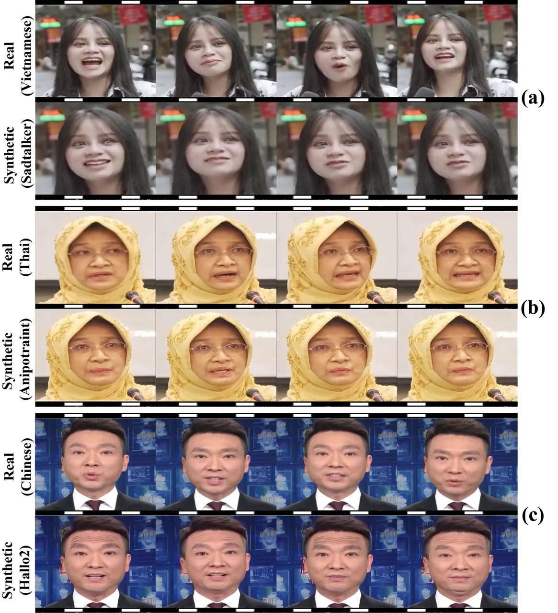
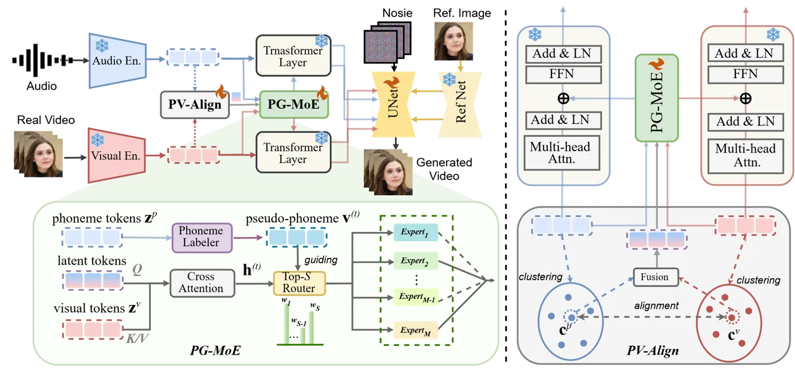
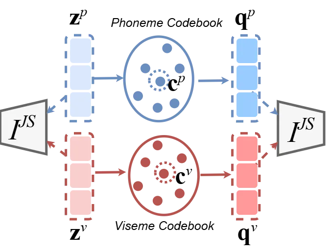
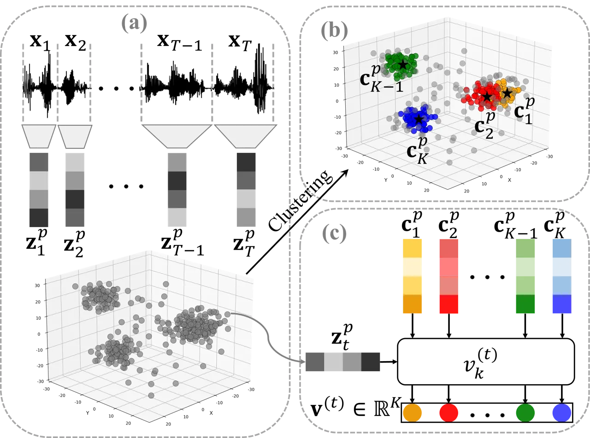
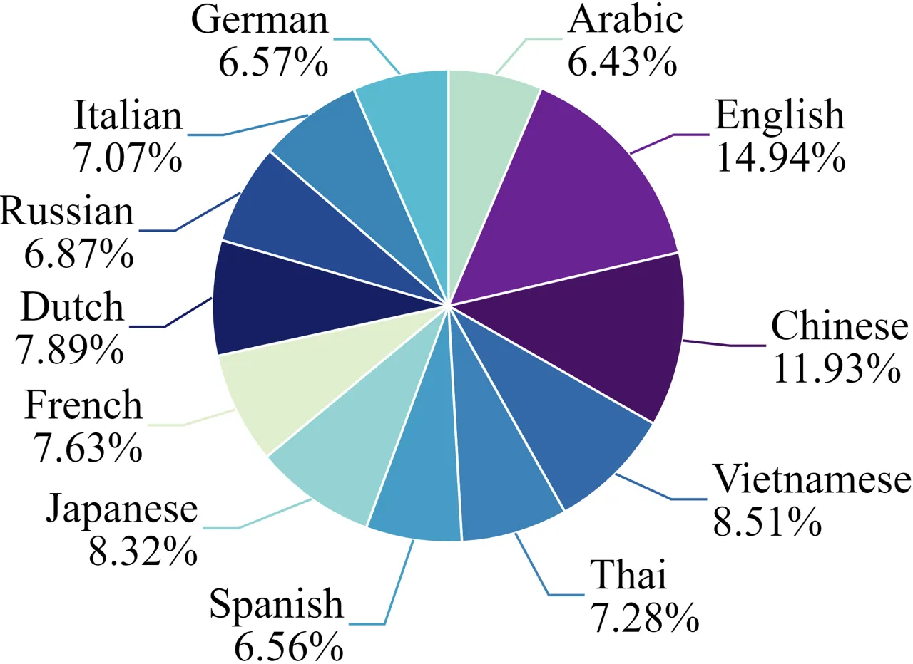
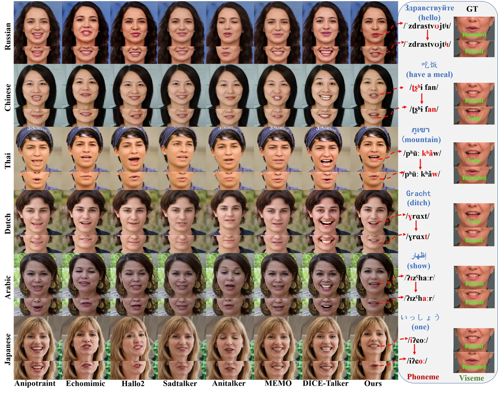
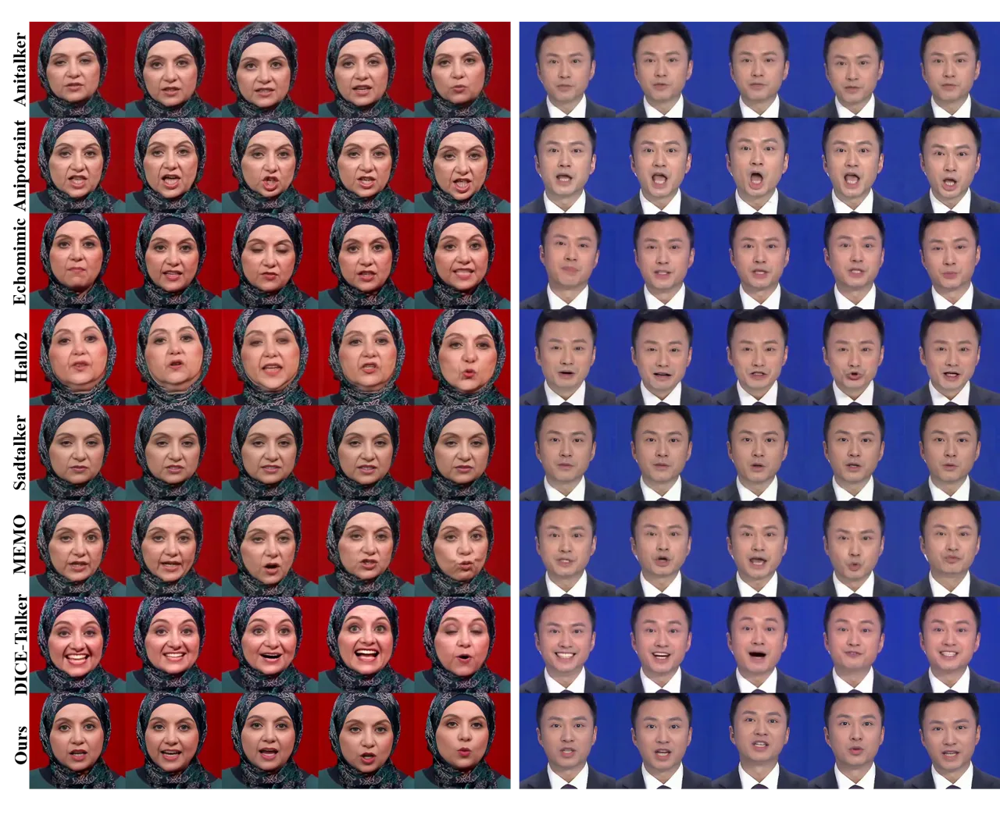

# A Bridge from Audio to Video: Phoneme-Viseme Alignment Allows Every Face to Speak Multiple Languages

Zibo Su, Kun Wei, Jiahua Li, Jing Kong, Xu Yang, Cheng Deng  
Xidian University  
[https://tking-su.github.io/MuEx/](https://tking-su.github.io/MuEx/)

###### Abstract.

Speech-driven talking face synthesis (TFS) focuses on generating
lifelike facial animations from speech input. Current TFS models perform
well in English but unsatisfactorily in non-English languages, producing
wrong mouth shapes and rigid facial expressions. The terrible
performance is mainly caused by the English-dominated training datasets
and the lack of cross-language generalization abilities. Thus, we
propose Multilingual Experts (MuEx), a novel framework featuring a
Phoneme-Guided Mixture-of-Experts (PG-MoE) architecture that employs
phonemes and visemes as universal intermediaries to bridge the gap
between audio and video modalities, achieving lifelike multilingual TFS.
To alleviate the influence of linguistic differences and dataset bias,
we extract speech and visual features as phonemes and visemes
respectively, which are the basic units of speech sounds and mouth
movements. To address audiovisual synchronization issues, we introduce
the Phoneme-Viseme Alignment Mechanism (PV-Align), which establishes
robust cross-modal correspondences between phonemes and visemes. In
addition, we build a Multilingual Talking Face Dataset (MTFD) comprising
12 diverse languages with 95.04 hours of high-quality videos for
training and evaluating multilingual TFS performance. Extensive
experiments demonstrate that MuEx achieves superior performance across
all languages in MTFD and exhibits effective zero-shot generalization to
unseen languages without additional training.

###### Keywords: 

Talking Face Synthesis, Phoneme-Viseme Alignment, MoE

## 1. Introduction

Speech-driven TFS (Fan et al., 2026; Tan et al., 2026; Li et al., 2026b;
Zhang et al., 2026a; Lyu et al., 2026) has made remarkable progress in
creating realistic facial animations with precise lip synchronization
(Prajwal et al., 2020; Zhang et al., 2023; Cui et al., 2025; Wang et
al., 2025). These advances enable applications that range from virtual
assistants to content creation. However, current methods face severe
limitations when processing non-English speech.

As shown in Figure 1, three critical issues emerge when existing TFS
models (Zhang et al., 2023; Wei et al., 2024; Cui et al., 2025) process
non-English languages. First, there are mismatches between phonemes
(basic units of speech sounds) and visemes (corresponding mouth shapes)
when models process new audio patterns, as shown in Figure 1 (a).
Second, audiovisual decoupling leads to a more severe issue: clear
speech audio does not produce the corresponding mouth movements, as
shown in Figure 1 (b). Third, facial expressions become rigid,
especially in tonal languages (Chinese), as shown in Figure 1 (c).

The root cause of the above audiovisual mismatches is the result of two
critical flaws in existing methods. First, existing models are trained
mainly on English datasets such as VoxCeleb (Nagrani et al., 2017),
CelebV-HQ (Zhu et al., 2022), and HDTF (Zhang et al., 2021), resulting
in generation patterns optimized specifically for English audiovisual
alignment. When processing non-English speech with different phonetic
structures, the pre-trained audiovisual alignment fails to generate
accurate mouth movements from multilingual speech. Second, existing
approaches construct audiovisual alignment through end-to-end learning
without modeling the underlying phonological principles. Thus, these
methods lack the ability to generalize to multilingual speech, resulting
in incorrect mouth movements and poor audiovisual synchronization.



Figure 1. Comparison of real and TFS videos on non-English languages
reveals phoneme-viseme mismatches, rigid facial expressions, and
audiovisual decoupling.

Therefore, we propose MuEx, a novel framework featuring a phoneme-guided
mixture-of-experts (PG-MoE) architecture that employs phonemes and
visemes as universal intermediaries to bridge the gap between audio and
video modalities, achieving lifelike multilingual TFS. Our approach is
centered on two core innovations. First, we introduce the PV-Align
mechanism, which constructs language-agnostic articulatory
representations by clustering speech and visual features into phoneme
and viseme prototypes, and then establishes robust cross-modal
correspondences through prototype-level alignment. This resolves
phoneme-viseme mismatches by learning universal audiovisual
correspondences that transcend linguistic boundaries. Second, we design
a PG-MoE that leverages these universal phoneme-viseme alignments for
MoE routing. The system selects experts based on audiovisual
similarities rather than language labels, enabling the model to choose
appropriate processing pathways for multiple languages without explicit
supervision.

Our framework supports speech-driven talking face generation across
diverse languages without requiring explicit language labels, and
demonstrates effective transfer to unseen languages in our experiments.

Our contributions include:

- •
  We design a novel speech-driven face synthesis paradigm (MuEx)
  utilizing phonemes and visemes as intermediaries to bridge the gap
  between audio and video modalities, overcoming multilingual TFS
  generalization barriers and cross-modal synchronization challenges.
- •
  We propose the Phoneme-Viseme Alignment (PV-Align) mechanism to
  establish robust cross-modal correspondences between phonemes and
  visemes, thereby enabling effective zero-shot generalization to unseen
  languages.
- •
  We introduce a comprehensive Multilingual Talking Face Dataset (MTFD)
  comprising 12 languages with 95.04 hours of high-quality audiovisual
  content to train and evaluate multilingual TFS performance.

## 2. Related Work

### 2.1. Audio-Driven Talking Head Generation

Recent advances in speech-driven talking head generation (Wu et al.,
2026; Wang et al., 2026; Chen et al., 2026; Flynn et al., 2026; Zhang et
al., 2026b) have leveraged deep learning for improved realism. GAN-based
methods such as Wav2Lip (Prajwal et al., 2020) and SadTalker (Zhang et
al., 2023) achieved strong lip-sync precision and control of facial
expression. Diffusion-based approaches such as DiffTalk (Shen et al., 2023) and Hallo2 (Cui et al., 2025) demonstrated the high-quality facial
animation synthesis. Transformer architectures, including AniTalker
(Peng et al., 2024) and EchoMimic (Chen et al., 2024) focused on
temporal consistency and identity preservation. However, these methods
primarily target single-language scenarios and struggle with
multilingual generalization.

### 2.2. Multilingual Speech and Learning

Multilingual speech processing has made progress with self-supervised
methods such as Wav2Vec 2.0 (Baevski et al., 2020) and XLSR (Conneau et
al., 2020), demonstrating multilingual transfer capabilities across
diverse languages. Understanding phoneme-to-viseme correspondences is
crucial for lip-sync generation, with research showing that languages
exhibit distinct articulatory patterns and viseme distributions (Massaro
and Cohen, 1999). multilingual transfer learning techniques, including
few-shot learning (Finn et al., 2017) and zero-shot generalization
(Radford et al., 2021), have shown promise in handling low-resource
scenarios, while continual learning methods address catastrophic
forgetting (Kirkpatrick et al., 2017).

### 2.3. Mixture of Experts

Mixture of Experts (MoE) architectures (Wu et al., 2024) have proven
effective in handling diverse tasks through sparse expert routing, as
demonstrated in Switch Transformer (Fedus et al., 2022) and Vision MoE
(Riquelme et al., 2021). For facial animation, discrete representation
learning through vector quantization has gained attention. VQTalker (Liu
et al., 2025) introduced facial motion quantization for talking head
generation, while methods such as VQ-VAE (Van Den Oord et al., 2017)
established foundations for discrete generative modeling.

Despite advances in TFS (Egin et al., 2026; Ling et al., 2026; Cao et
al., 2024; Li et al., 2026a; Ling et al., 2026), existing methods
struggle with multilingual scenarios, exhibiting phoneme-viseme
mismatches and audiovisual decoupling when processing non-English
speech. These English-centric approaches lack cross-language
generalization and require complete retraining for different languages.
Our MuEx framework addresses these limitations through PG-MoE and
PV-Align, enabling robust multilingual synthesis with zero-shot transfer
capabilities.

## 3. Method



Figure 2. Framework. The model learns universal viseme–phoneme
prototypes and employs pseudo-phoneme guided expert routing to enable
cross-lingual speech-driven TFS.

### 3.1. Overview

Our goal is to improve cross-lingual generalization in speech-driven
TFS. A key challenge lies in the variability of speech-to-lip
correspondences across different languages, which often prevents models
trained on one language from transferring effectively to others. To
overcome this, we propose a framework that disentangles and aligns
phoneme and viseme representations in a language-agnostic manner. As
shown in Figure 2, the pipeline consists of three major components.
First, we cluster speech (phoneme-level) and video (viseme-level)
features into prototypes, which act as universal anchors capturing
articulatory units shared across languages. Second, we align phoneme and
viseme prototypes by maximizing their mutual information while
suppressing spurious correlations at the raw feature level, ensuring
that the learned mapping reflects stable and transferable articulatory
patterns. Third, we estimate pseudo-phonemes and use them to guide a
sparse mixture-of-experts (MoE) router, which dynamically selects
specialized expert modules to synthesize natural and synchronized lip
movements in multiple languages. Together, these components form a
unified architecture that builds a universal viseme–phoneme mapping and
leverages it for cross-lingual speech-driven TFS.

### 3.2. Phoneme–Viseme Alignment

A central goal of our framework is to construct language-independent
articulatory anchors that bridge the gap between audio and video
modalities. To this end, we cluster speech features at the phoneme level
and video features at the viseme level into $`K`$ prototypes, denoted as
$`\{\mathbf{c}^{p}_{k}\}_{k=1}^{K}`$ and
$`\{\mathbf{c}^{v}_{k}\}_{k=1}^{K}`$, respectively. We set $`K`$ close
to the phoneme inventory size and initialize the prototypes with
K-means++ for stable coverage of the feature space. To adapt to the
evolving feature distribution during training, the prototypes are
periodically updated every 10 epochs with modest computational overhead.

Given an input feature $`\mathbf{z}^{p}_{t}`$ or $`\mathbf{z}^{v}_{t}`$
at time step $`t`$, we assign it to the nearest prototype and obtain the
corresponding discrete codes $`\mathbf{q}^{p}_{t}`$ and
$`\mathbf{q}^{v}_{t}`$. Such prototype-based discretization provides
interpretable articulatory units for both modalities. Although phoneme
inventories differ across languages, many articulatory gestures, such as
lip closure, mouth opening, and jaw movement, are shared across
languages. Therefore, these prototypes serve as transferable anchors for
cross-modal alignment.

Figure 3 illustrates the overall mechanism of PV-Align, where speech and
visual features are first mapped to prototype codebooks and then aligned
through the Jensen–Shannon MI objective. Based on these discrete
assignments, we define the phoneme–viseme alignment loss as

```math
\mathcal{L}_{\mathrm{align}}=-\,I^{\mathrm{JS}}\!\big(\mathbf{q}^{p},\mathbf{q}^{v}\big)\;+\;\lambda_{\mathrm{neg}}\,I^{\mathrm{JS}}\!\big(\mathbf{z}^{p},\mathbf{z}^{v}\big), \tag{1}
```

where $`\mathbf{q}^{p}`$ and $`\mathbf{q}^{v}`$ denote the phoneme and
viseme prototype assignments, while $`\mathbf{z}^{p}`$ and
$`\mathbf{z}^{v}`$ are the corresponding raw speech and visual features.
As illustrated in Figure 3, this objective promotes meaningful
cross-modal correspondences in the prototype space while suppressing
noisy correlations in the raw feature space.

Specifically, the first term,
$`-I^{\mathrm{JS}}(\mathbf{q}^{p},\mathbf{q}^{v})`$, maximizes the
Jensen–Shannon mutual information between matched phoneme and viseme
assignments. This encourages speech and mouth-shape samples that
co-occur in real data to be mapped to compatible prototype groups,
making the learned clusters more consistent across modalities rather
than being determined solely by within-modality similarity. The second
term,
$`\lambda_{\mathrm{neg}}I^{\mathrm{JS}}(\mathbf{z}^{p},\mathbf{z}^{v})`$
serves as a _weak regularizer_ on the mutual information between raw
speech and visual features, discouraging the model from over-relying on
low-level cross-modal correlations. In particular, it aims to reduce
_nuisance correlations_, such as speaker-specific style,
appearance-dependent patterns, and recording-condition artifacts, which
are less transferable across languages.

Importantly, this regularization is not intended to remove
content-relevant audio-visual consistency necessary for lip
synchronization. Such consistency is preserved by the prototype-level
alignment term together with the downstream generation objectives. In
practice, $`\lambda_{\mathrm{neg}}`$ is set to a small value so that
this term only provides a mild inductive bias rather than dominating the
overall optimization.

To estimate mutual information in a unified manner, we adopt the
Jensen–Shannon lower bound with a binary-classifier formulation. Let
$`\mathcal{P}`$ denote the set of matched pairs and $`\mathcal{N}`$ the
set of shuffled (mismatched) pairs. Using a lightweight discriminator
$`D_{\psi}`$ that takes the concatenated feature pair
$`[\mathbf{x};\mathbf{y}]`$ as input, the estimator is

```math
\displaystyle I^{\mathrm{JS}}(\mathbf{x},\mathbf{y}) \displaystyle=\mathbb{E}_{(\mathbf{x},\mathbf{y})\sim\mathcal{P}}\!\left[\log\sigma\!\big(D_{\psi}([\mathbf{x};\mathbf{y}])\big)\right] \tag{2}
```

```math
\displaystyle+\mathbb{E}_{(\mathbf{x},\mathbf{y})\sim\mathcal{N}}\!\left[\log\!\big(1-\sigma\!\big(D_{\psi}([\mathbf{x};\mathbf{y}])\big)\big)\right],
```

where $`\sigma(\cdot)`$ denotes the logistic sigmoid. This formulation
encourages matched phoneme–viseme pairs to be distinguishable from
mismatched ones, thereby improving the reliability of the learned
cross-modal correspondence.



Figure 3. Illustration of PV-Align. Audio and video features are mapped
into phoneme and viseme prototype codebooks, producing discrete
assignments.

### 3.3. Pseudo-Phoneme Guided Expert Routing

Although prototype alignment provides universal anchors, the model still
needs to adapt feature processing dynamically across languages. To this
end, we introduce a sparse mixture-of-experts (MoE) router guided by
pseudo-phoneme distributions. At each time step $`t`$, the router
combines content features $`\mathbf{h}^{(t)}`$ with pseudo-phoneme
features $`\mathbf{v}^{(t)}`$ to produce expert logits

```math
a_{i}^{(t)}=\beta\,g_{\text{phon},i}(\mathbf{v}^{(t)})+(1-\beta)\,g_{\text{cont},i}(\mathbf{h}^{(t)}),\quad i=1,\dots,M, \tag{3}
```

where $`\beta\in[0,1]`$ balances phoneme-aware and content-aware
routing. The routing distribution is computed by

```math
r_{i}^{(t)}=\frac{\exp(a_{i}^{(t)})}{\sum_{j=1}^{M}\exp(a_{j}^{(t)})}. \tag{4}
```

The top-$`S`$ experts are selected for sparse computation, and their
outputs are aggregated with normalized routing weights.

As illustrated in Figure 4, we compute a soft assignment over phoneme
prototypes based on the similarity between the speech embedding
$`\mathbf{z}_{t}^{p}`$ and the phoneme centroids
$`\{\mathbf{c}_{k}^{p}\}_{k=1}^{K}`$:

```math
v_{k}^{(t)}=\frac{\exp\!\left(-\|\mathbf{z}_{t}^{p}-\mathbf{c}_{k}^{p}\|_{2}^{2}/\tau^{2}\right)}{\sum_{j=1}^{K}\exp\!\left(-\|\mathbf{z}_{t}^{p}-\mathbf{c}_{j}^{p}\|_{2}^{2}/\tau^{2}\right)},\quad k=1,\dots,K. \tag{5}
```

The resulting pseudo-phoneme vector
$`\mathbf{v}^{(t)}=[v_{1}^{(t)},v_{2}^{(t)},\ldots,v_{K}^{(t)}]`$ can be
regarded as a phoneme-like latent representation that approximates the
underlying acoustic-articulatory structure of true phonemes in a
language-agnostic feature space. As a $`K`$-dimensional probability
distribution, it measures the affinity between the input speech
representation and each discovered phonetic prototype, allowing the
model to capture shared cross-lingual phonetic structure without
explicit language supervision.



Figure 4. Mechanism of the Phoneme Labeler.

To make pseudo-phoneme supervision compatible with expert routing, we
introduce a learnable projection matrix
$`\mathbf{A}\in\mathbb{R}^{K\times M}`$ and define the
pseudo-phoneme-guided expert target as

```math
\tilde{\mathbf{r}}^{(t)}=\mathrm{softmax}(\mathbf{A}^{\top}\mathbf{v}^{(t)}). \tag{6}
```

The routing loss is defined as

```math
\mathcal{L}_{\text{router}}=-\frac{1}{T}\sum_{t=1}^{T}\sum_{i=1}^{M}\tilde{r}_{i}^{(t)}\log r_{i}^{(t)}+\lambda_{\text{bal}}\sum_{i=1}^{M}\left(\bar{r}_{i}-\frac{1}{M}\right)^{2}, \tag{7}
```

where

```math
\bar{r}_{i}=\frac{1}{T}\sum_{t=1}^{T}r_{i}^{(t)}. \tag{8}
```

The first term aligns the router output with the pseudo-phoneme-guided
target distribution, while the second term encourages balanced expert
utilization. Using this simple routing objective, the router learns to
activate experts associated with transferable cross-lingual articulatory
patterns.

### 3.4. Training Objective and Workflow

Our model jointly optimizes prototype alignment, expert routing, and the
TFS objective. The overall loss is defined as

```math
\mathcal{L}=\lambda_{\mathrm{align}}\mathcal{L}_{\mathrm{align}}+\lambda_{\mathrm{router}}\mathcal{L}_{\mathrm{router}}+\lambda_{\mathrm{gen}}\mathcal{L}_{\mathrm{gen}}, \tag{9}
```

where $`\mathcal{L}_{\text{align}}`$ enforces universal phoneme–viseme
mapping, $`\mathcal{L}_{\text{router}}`$ guides expert activation with
pseudo-phoneme supervision, and $`\mathcal{L}_{\text{gen}}`$ drives the
talking face generator.

Generation loss. To ensure both pixel fidelity and perceptual realism,
we define

```math
\mathcal{L}_{\text{gen}}=\lambda_{1}\|\hat{\mathbf{I}}-\mathbf{I}\|_{1}+\lambda_{p}\|\phi(\hat{\mathbf{I}})-\phi(\mathbf{I})\|_{2}^{2}+\lambda_{t}\|\nabla_{t}\hat{\mathbf{I}}-\nabla_{t}\mathbf{I}\|_{1}, \tag{10}
```

where $`\hat{\mathbf{I}}`$ and $`\mathbf{I}`$ denote the generated and
ground-truth video frames, $`\phi(\cdot)`$ extracts deep features from a
pretrained perceptual network (VGG), and $`\nabla_{t}`$ denotes temporal
frame differences. The first term enforces pixel-level accuracy, the
second term preserves semantic and structural realism, and the third
term improves temporal smoothness of lip movements. The weights
$`\lambda_{1},\lambda_{p},\lambda_{t}`$ control the relative
contributions of these objectives.

Training workflow. During each training step, we (1) extract phoneme and
viseme features from the input and video, (2) assign features to
prototypes and compute the alignment loss, (3) estimate pseudo-phonemes
and apply MoE routing, (4) synthesize video frames and compute
$`\mathcal{L}_{\text{gen}}`$, and (5) jointly update all modules by
minimizing the total loss. This unified optimization enables the model
to capture language-agnostic articulatory correspondences while
generating realistic cross-lingual talking face videos.

## 4. Experiments

### 4.1. Dataset Details

We employ a two-stage training approach using complementary datasets.
Initially, we trained on the HDTF (Zhang et al., 2021) dataset, which
provides more than 15 hours of high-quality English talking face videos
with 512×512 resolution with clear audiovisual synchronization. For
multilingual generalization, we constructed a multilingual talking face
dataset (MTFD) by collecting news broadcasts and interview videos from
12 countries. As shown in figure 5, the dataset contains 95.04 hours of
high-quality content spanning diverse language families. Each video
segment undergoes careful preprocessing to ensure a single-person
appearance, frontal face orientation, and clean speech without
background music or noise. All videos are standardized to 512×512
resolution to maintain consistency with the HDTF baseline. The
collection includes both tonal languages (Chinese, Thai, Vietnamese) and
non-tonal languages, providing comprehensive coverage for evaluating
multilingual performance. This data set addresses the lack of diverse
multilingual datasets in TFS research, particularly for underrepresented
languages like Arabic and Thai.



Figure 5. Language distribution in MTFD.

### 4.2. Evaluation Metrics

We used the Fréchet Video Distance (FVD) (Unterthiner et al., 2019) to
quantify the distributional differences between the generated and real
videos. Additionally, we adopt SyncNet (Prajwal et al., 2020) and use
the SyncNet confidence score (Sync-C) as a metric to assess speech-lip
synchronization quality. To better evaluate multilingual scenarios, we
propose two novel metrics.

#### 4.2.1. Lip-Sync Error Distance (LSE-D)

We propose LSE-D to measure geometric consistency between mouth
movements in generated and ground truth videos. We extract 26 key lip
landmarks using MediaPipe Face Mesh (Kartynnik et al., 2019) with
standardized preprocessing for scale invariance. The frame-wise lip-sync
error is:

```math
\vskip-5.0pt\text{LSE}_{t}=\frac{1}{26}\sum_{i=1}^{26}\|l^{real}_{t,i}-l^{gen}_{t,i}\|_{2}.\vskip-5.0pt \tag{11}
```

The overall LSE-D score is the temporal average:
$`\text{LSE-D}=\frac{1}{T}\sum_{t=1}^{T}\text{LSE}_{t}`$, where lower
values indicate better synchronization.

#### 4.2.2. Temporal Mouth Dynamics Correlation (TMDC)

To capture fine-grained temporal consistency across linguistic patterns,
we propose TMDC. For each frame $`t`$, we extract five scale-invariant
mouth features from lip landmarks $`\mathbf{L}_{t}`$:

```math
\mathbf{F}_{t}=\begin{bmatrix}\|\mathbf{L}_{left}-\mathbf{L}_{right}\|_{2}\\
\|\mathbf{L}_{top}-\mathbf{L}_{bottom}\|_{2}\\
\text{ConvexHull}(\mathbf{L}_{t})\\
\frac{\|\mathbf{L}_{left}-\mathbf{L}_{right}\|_{2}}{\|\mathbf{L}_{top}-\mathbf{L}_{bottom}\|_{2}+\epsilon}\\
\frac{\|\mathbf{L}_{top}-\mathbf{L}_{bottom}\|_{2}}{\|\mathbf{L}_{left}-\mathbf{L}_{right}\|_{2}+\epsilon}\end{bmatrix}=\begin{bmatrix}\text{Width}_{t}\\
\text{Height}_{t}\\
\text{Area}_{t}\\
\text{AspectRatio}_{t}\\
\text{Openness}_{t}\end{bmatrix}, \tag{12}
```

where $`\epsilon=10^{-8}`$ prevents the division from being zero.

For each feature $`k`$, we compute the Pearson correlation between real
and generated sequences:

```math
r_{k}=\frac{\sum_{t=1}^{T}(f^{real}_{k,t}-\bar{f}^{real}_{k})(f^{gen}_{k,t}-\bar{f}^{gen}_{k})}{\sqrt{\sum_{t=1}^{T}(f^{real}_{k,t}-\bar{f}^{real}_{k})^{2}}\sqrt{\sum_{t=1}^{T}(f^{gen}_{k,t}-\bar{f}^{gen}_{k})^{2}}}. \tag{13}
```

The overall TMDC score is
$`\text{TMDC}=\frac{1}{5}\sum_{k=1}^{5}r_{k}`$, where higher values
indicate better temporal consistency.

### 4.3. Experimental Results

|             |                 |                   |                    |                     |                  |
| ----------- | --------------- | ----------------- | ------------------ | ------------------- | ---------------- |
| Method      | Setting         | FVD$`\downarrow`$ | Sync-C$`\uparrow`$ | LSE-D$`\downarrow`$ | TMDC$`\uparrow`$ |
| AniTalker   | Pretrained      | 193.762           | 5.594              | 0.0557              | 0.543            |
| SadTalker   | Pretrained      | 185.382           | 6.312              | 0.0498              | 0.646            |
| EchoMimic   | Pretrained      | 172.987           | 6.081              | 0.0451              | 0.712            |
| AniPortrait | Pretrained      | 248.913           | 4.064              | 0.0487              | 0.641            |
| AniPortrait | Trained on MTFD | 236.844           | 4.193              | 0.0492              | 0.654            |
| Hallo2      | Pretrained      | 161.942           | 7.450              | 0.0480              | 0.693            |
| Hallo2      | Trained on MTFD | 158.625           | 7.469              | 0.0447              | 0.705            |
| MEMO        | Pretrained      | 158.842           | 7.453              | 0.0456              | 0.677            |
| MEMO        | Trained on MTFD | 156.918           | 7.471              | 0.0453              | 0.698            |
| DICE-Talker | Pretrained      | 216.830           | 6.780              | 0.0471              | 0.710            |
| Ours        | Trained on MTFD | 171.284           | 7.536              | 0.0437              | 0.756            |
| Real video  | \-              | \-                | 8.914              | \-                  | \-               |

Table 1. Comparison with other methods. “Pretrained” denotes direct
inference using official released checkpoints on the MTFD test set,
while “Trained on MTFD” denotes models adapted on the MTFD training
split before evaluation.

|                 |                                                                                    |           |           |             |                                 |           |           |           |
| --------------- | ---------------------------------------------------------------------------------- | --------- | --------- | ----------- | ------------------------------- | --------- | --------- | --------- |
|                 | Evaluation Metrics (Lip-Speech Synchronization / Teeth Visibility and Naturalness) |           |           |             |                                 |           |           |           |
| Language        | MTFD-adapted models                                                                |           |           |             | Off-the-shelf pretrained models |           |           |           |
|                 | MuEx                                                                               | MEMO      | Hallo2    | AniPortrait | DICE-Talker                     | EchoMimic | SadTalker | AniTalker |
| In-MTFD         |                                                                                    |           |           |             |                                 |           |           |           |
| English         | 5.70/5.60                                                                          | 5.45/2.95 | 5.30/1.00 | 2.10/2.20   | 5.10/4.65                       | 3.15/5.40 | 3.75/3.65 | 1.00/3.15 |
| Chinese         | 5.70/5.15                                                                          | 4.50/3.70 | 4.55/4.95 | 2.85/2.30   | 3.20/3.45                       | 4.65/4.75 | 1.55/1.60 | 1.70/2.25 |
| Spanish         | 5.55/5.55                                                                          | 5.15/5.05 | 4.85/5.20 | 1.75/1.95   | 4.65/4.30                       | 4.60/4.20 | 3.00/2.75 | 1.25/1.35 |
| French          | 5.60/4.20                                                                          | 5.20/4.55 | 4.20/3.85 | 2.85/5.50   | 4.35/4.25                       | 5.15/4.45 | 1.00/1.05 | 2.20/1.95 |
| German          | 5.65/5.35                                                                          | 4.35/4.55 | 4.50/4.80 | 1.35/1.40   | 4.20/3.85                       | 2.70/2.45 | 4.45/4.40 | 2.35/2.60 |
| Japanese        | 5.70/5.70                                                                          | 3.15/4.35 | 3.60/1.50 | 1.90/3.55   | 4.05/3.90                       | 4.80/4.65 | 3.55/3.70 | 1.45/1.90 |
| Arabic          | 5.70/5.65                                                                          | 4.50/3.55 | 3.65/3.15 | 3.20/3.75   | 3.85/3.40                       | 3.75/3.80 | 2.60/2.40 | 2.10/2.25 |
| Dutch           | 5.65/5.00                                                                          | 4.85/4.25 | 4.25/3.20 | 2.70/5.10   | 4.50/3.25                       | 4.95/4.65 | 1.05/1.15 | 2.40/1.90 |
| Russian         | 5.80/5.60                                                                          | 5.25/4.00 | 4.55/4.55 | 1.90/3.05   | 3.45/3.30                       | 4.55/3.95 | 2.45/2.05 | 1.75/1.80 |
| Italian         | 5.65/5.45                                                                          | 5.00/4.60 | 5.15/4.80 | 3.75/3.20   | 5.10/3.95                       | 3.45/4.55 | 1.15/1.70 | 1.85/1.30 |
| Thai            | 5.75/5.85                                                                          | 4.65/4.85 | 3.80/3.05 | 4.75/4.60   | 3.45/3.30                       | 3.50/4.30 | 1.10/1.00 | 2.10/2.20 |
| Vietnamese      | 5.65/5.30                                                                          | 3.45/3.60 | 5.35/4.55 | 3.55/3.00   | 4.30/3.55                       | 3.45/5.15 | 1.55/1.30 | 1.45/1.70 |
| Out-of-MTFD     |                                                                                    |           |           |             |                                 |           |           |           |
| Korean          | 5.65/5.70                                                                          | 4.60/3.85 | 2.30/2.10 | 4.80/4.10   | 4.35/4.00                       | 4.50/5.00 | 1.00/1.15 | 2.75/2.95 |
| Burmese         | 5.50/5.85                                                                          | 4.15/3.55 | 5.05/3.70 | 1.80/1.55   | 4.25/3.95                       | 4.45/5.10 | 3.00/3.35 | 1.20/1.45 |
| Hindi           | 5.55/5.00                                                                          | 5.10/4.45 | 3.25/3.70 | 2.65/4.00   | 5.15/3.80                       | 5.30/4.45 | 3.25/2.65 | 1.00/1.20 |
| In-MTFD Avg     | 5.68/5.37                                                                          | 4.63/4.17 | 4.48/3.72 | 2.72/3.30   | 4.27/3.80                       | 4.06/4.36 | 2.27/2.23 | 1.80/2.03 |
| Out-of-MTFD Avg | 5.57/5.52                                                                          | 4.62/3.95 | 3.53/3.17 | 3.08/3.22   | 4.58/3.92                       | 4.75/4.85 | 2.42/2.38 | 1.65/1.87 |
| Overall Avg     | 5.65/5.41                                                                          | 4.62/4.12 | 4.25/3.56 | 2.82/3.28   | 4.33/3.82                       | 4.25/4.49 | 2.31/2.27 | 1.76/1.99 |

Table 2. Human Evaluation Results: Comprehensive Weighted Ranking
Scores. Higher is better. Red indicates the best result and blue
indicates the second-best result.

#### 4.3.1. Quantitative Analysis

We compare MuEx with seven representative state-of-the-art TFS methods,
including AniTalker (Peng et al., 2024), SadTalker (Zhang et al., 2023),
EchoMimic (Chen et al., 2024), AniPortrait (Wei et al., 2024),
MEMO (Zheng et al., 2024), Hallo2 (Cui et al., 2025), and
DICE-Talker (Tan et al., 2025). To ensure a transparent and as fair as
possible comparison, we adopt two evaluation settings for methods with
publicly available training code. Specifically, AniPortrait, Hallo2, and
MEMO are evaluated under both: (1) an off-the-shelf setting using their
officially released pretrained checkpoints, and (2) a multilingual
adaptation setting, where each model is fine-tuned on the MTFD training
split using the same data partition, face cropping pipeline, audio
preprocessing strategy, and evaluation protocol as MuEx. For AniTalker,
SadTalker, EchoMimic, and DICE-Talker, whose full training pipelines are
not publicly available, we report results obtained directly from their
official pretrained checkpoints on the MTFD test set.

Table 1 summarizes the quantitative results. MuEx achieves the strongest
overall performance on synchronization-oriented metrics, obtaining the
highest Sync-C score of 7.536, the lowest LSE-D of 0.0437, and the best
TMDC of 0.756. Although its FVD of 171.284 is not the best among all
methods, it remains competitive and indicates that MuEx preserves good
visual quality while substantially improving audiovisual alignment. In
contrast, MEMO fine-tuned on MTFD achieves the best FVD (156.918), but
still falls behind MuEx on all synchronization-related metrics,
suggesting that stronger global video realism does not necessarily
translate into more accurate lip synchronization or better temporal
mouth dynamics.

Among the adapted baselines, Hallo2 is the strongest competitor in terms
of balanced performance. Compared with Hallo2 fine-tuned on MTFD, MuEx
improves Sync-C from 7.469 to 7.536, reduces LSE-D from 0.0447 to
0.0437, and increases TMDC from 0.705 to 0.756. These gains correspond
to relative improvements of 0.9%, 2.2%, and 7.2%, respectively,
demonstrating that MuEx produces more accurate and temporally coherent
lip movements. Compared with MEMO fine-tuned on MTFD, MuEx further
improves Sync-C by 0.87%, reduces LSE-D by 3.5%, and improves TMDC by
8.3%, highlighting the advantage of our method in modeling cross-lingual
phoneme-viseme correspondences even when the overall perceptual realism
is not the absolute best in terms of FVD.

MuEx also consistently outperforms off-the-shelf pretrained baselines
such as SadTalker, EchoMimic, and DICE-Talker on all
synchronization-centered metrics. For example, compared with SadTalker,
MuEx improves Sync-C from 6.312 to 7.536, reduces LSE-D from 0.0498 to
0.0437, and increases TMDC from 0.646 to 0.756. A similar trend can be
observed against EchoMimic and DICE-Talker, indicating that existing
English-centric pretrained models do not generalize sufficiently well to
multilingual scenarios, whereas MuEx can better maintain speech-lip
consistency across languages.

Overall, these results verify the effectiveness of the proposed PG-MoE
and PV-Align modules. The clear gains on Sync-C, LSE-D, and TMDC
demonstrate that MuEx is particularly effective at improving
multilingual lip synchronization and temporal mouth motion consistency,
which are the core challenges in cross-lingual talking face synthesis.



Figure 6. Qualitative comparison across multiple languages. We
transcribe test words into International Phonetic Alphabet (IPA)
notation and extract representative video frames corresponding to
specific phoneme pronunciations for comparison with the ground-truth
mouth shapes (GT). Here, phonemes denote the basic units of speech
sounds, while visemes denote their corresponding visual mouth
configurations. MuEx produces more accurate viseme patterns and more
natural articulatory transitions across languages. Hallo2, AniPortrait,
and MEMO are shown using models fine-tuned on MTFD, while AniTalker,
SadTalker, EchoMimic, and DICE-Talker are evaluated using their official
pretrained checkpoints on the MTFD test set.

|                                |                   |                    |                     |                  |
| ------------------------------ | ----------------- | ------------------ | ------------------- | ---------------- |
| Configuration                  | FVD$`\downarrow`$ | Sync-C$`\uparrow`$ | LSE-D$`\downarrow`$ | TMDC$`\uparrow`$ |
| Baseline (w/o PG-MoE)          | 171.547           | 6.921              | 0.0612              | 0.583            |
| + PG-MoE (w/o PV-Align)        | 171.392           | 7.089              | 0.0551              | 0.629            |
| + PG-MoE (w/o Phoneme Labeler) | 171.294           | 7.284              | 0.0481              | 0.686            |
| MuEx (Full)                    | 171.284           | 7.536              | 0.0437              | 0.756            |

Table 3. Ablation study on key components

#### 4.3.2. Qualitative Analysis

We conducted a comprehensive human evaluation involving 300 participants
across 15 language groups. Each group consisted of 20 speakers who
evaluated 8 methods on two dimensions: (1) lip–speech synchronization
consistency and (2) teeth visibility clarity and naturalness.
Participants ranked the methods from 1st to 8th place, and weighted
average scores were computed accordingly, with higher scores indicating
better perceptual quality. The evaluation covered 12 in-MTFD languages
and 3 unseen out-of-MTFD languages (Korean, Burmese, and Hindi),
enabling assessment of both multilingual generation quality and
zero-shot generalization.

As illustrated in Figures 6 and 7, MuEx generates more accurate mouth
shapes and smoother temporal dynamics across representative languages,
showing clearer phoneme-to-viseme correspondence than the compared
baselines. The human evaluation results in Table 2 are consistent with
these visual observations. MuEx achieves the best overall average scores
among all methods, reaching 5.65 in lip–speech synchronization and 5.41
in teeth naturalness, and remains the top-performing method on both the
in-MTFD subset (5.68/5.37) and the out-of-MTFD subset (5.57/5.52).

The advantage of MuEx is particularly evident in tonal languages such as
Chinese, Thai, and Vietnamese, where it obtains 5.70/5.15, 5.75/5.85,
and 5.65/5.30, respectively. Moreover, its strong performance on Korean,
Burmese, and Hindi indicates that the proposed phoneme-viseme alignment
and expert routing strategy generalize effectively to unseen languages
without additional training.



Figure 7. Qualitative comparison on Arabic (left) and Chinese (right).
MuEx generates more accurate mouth shapes and more natural facial
expressions across distinct phonetic contexts, demonstrating stronger
cross-lingual phoneme-viseme alignment.

### 4.4. Ablation Studies

#### 4.4.1. Core Component Analysis

Table 3 presents a comprehensive ablation study evaluating each key
component of our MuEx. The baseline model without PG-MoE shows
substantial deficiencies in multilingual synchronization (LSE-D: 0.0612,
TMDC: 0.583), confirming that specialized expert routing specifically
targets multilingual synchronization challenges. Adding PG-MoE modules
without PV-Align provides notable improvements (LSE-D: 0.0551, TMDC:
0.629), demonstrating MoE effectiveness for multilingual variations. The
configuration with PG-MoE but without phoneme-guided routing achieves
substantial improvements (LSE-D: 0.0481, TMDC: 0.686) through
content-based expert selection, yet lacks the language-agnostic
inductive bias for optimal cross-linguistic generalization. The complete
MuEx delivers optimal performance across all metrics, eliminating
explicit language supervision while enabling superior multilingual
generalization. Progressive improvements demonstrate framework
effectiveness: LSE-D improves by 28.6% and TMDC by 29.7% compared to
baseline, validating the superiority of acoustic-articulatory principles
for multilingual lip synchronization.

#### 4.4.2. Hyperparameter Selection

|                 |     |     |                     |                    |                     |                  |                          |                 |
| --------------- | --- | --- | ------------------- | ------------------ | ------------------- | ---------------- | ------------------------ | --------------- |
| Hyperparameters |     |     | Performance Metrics |                    |                     |                  | Efficiency Metrics       |                 |
| S               | M   | K   | FVD$`\downarrow`$   | Sync-C$`\uparrow`$ | LSE-D$`\downarrow`$ | TMDC$`\uparrow`$ | Memory(GB)$`\downarrow`$ | FPS$`\uparrow`$ |
| 1               | 2   | 36  | 182.536             | 6.874              | 0.0534              | 0.641            | 1.7                      | 31.2            |
| 1               | 3   | 40  | 179.482             | 7.091              | 0.0501              | 0.679            | 2.0                      | 28.7            |
| 1               | 4   | 44  | 176.395             | 7.251              | 0.0476              | 0.703            | 2.5                      | 25.8            |
| 2               | 3   | 40  | 174.826             | 7.329              | 0.0463              | 0.721            | 2.2                      | 26.4            |
| 2               | 4   | 44  | 171.284             | 7.536              | 0.0437              | 0.756            | 2.8                      | 22.1            |
| 2               | 5   | 48  | 173.214             | 7.489              | 0.0452              | 0.734            | 3.3                      | 19.5            |
| 3               | 4   | 44  | 174.157             | 7.467              | 0.0458              | 0.742            | 3.0                      | 20.8            |
| 3               | 6   | 52  | 176.739             | 7.423              | 0.0471              | 0.718            | 4.1                      | 16.3            |

Table 4. Trade-off Analysis of Hyperparameter Settings

Table 4 demonstrates a clear performance efficiency trade-off across
different hyperparameter configurations. The optimal configuration
$`(S=2,M=4,K=44)`$ achieves the best overall performance (FVD: 171.284,
Sync-C: 7.536, LSE-D: 0.0437, TMDC: 0.756) while maintaining reasonable
computational efficiency (22.1 FPS, 2.8 GB memory). Lightweight
configurations like $`(S=1,M=2,K=36)`$ maximize inference speed (31.2
FPS) and minimize memory usage (1.7 GB) at the cost of significant
performance degradation. Notably, performance gains are not monotonic -
the $`(S=2,M=5,K=48)`$ configuration underperforms despite higher
complexity, while the heaviest configuration $`(S=3,M=6,K=52)`$ shows
performance regression, indicating that excessive expert capacity can
lead to training instability and suboptimal convergence, emphasizing the
importance of balanced hyperparameter selection.

## 5. Conclusion

We propose MuEx, a novel framework that addresses the critical
limitations of existing TFS methods in multilingual scenarios. Our
approach introduces two key innovations: a PV-Align mechanism that
creates language-agnostic cross-modal correspondences, and a PG-MoE that
enables intelligent expert routing based on audiovisual similarities.
Through comprehensive evaluation on our newly constructed MTFD with 12
languages, MuEx demonstrates superior performance in multilingual
audiovisual synchronization while maintaining English capabilities and
achieving effective zero-shot generalization to unseen languages. This
work establishes a new paradigm for multilingual TFS that transcends
language boundaries through universal phoneme-viseme principles.

## References

- Baevski et al. (2020) A. Baevski, Y. Zhou, A. Mohamed, and M. Auli
  wav2vec 2.0: A Framework for Self-Supervised Learning of Speech
  Representations. In Advances in Neural Information Processing Systems,
  Vol. 33, pp. 12449–12460. Cited by: §2.2.
- Cao et al. (2024) X. Cao, G. Wang, S. Shi, J. Zhao, Y. Yao, J. Fei,
  and M. Gao JoyVASA: portrait and animal image animation with
  diffusion-based audio-driven facial dynamics and head motion
  generation. External Links: 2411.09209,
  [Link](https://arxiv.org/abs/2411.09209) Cited by: §2.3.
- Chen et al. (2026) A. Chen, N. K. Korem, T. Halperin, M. B. Yosef, U.
  Jelercic, O. Bibi, O. Patashnik, and D. Cohen-Or JUST-dub-it: video
  dubbing via joint audio-visual diffusion. External Links: 2601.22143,
  [Link](https://arxiv.org/abs/2601.22143) Cited by: §2.1.
- Chen et al. (2024) Z. Chen, J. Zhu, Z. Li, Z. Wu, C. Zhou, J. Wang, Z.
  Ma, C. Fang, E. Ding, and J. Wang EchoMimic: Lifelike Audio-Driven
  Portrait Animations through Editable Landmark Conditioning. External
  Links: 2407.08136 Cited by: §2.1, §4.3.1.
- Conneau et al. (2020) A. Conneau, A. Baevski, R. Collobert, A.
  Mohamed, and M. Auli Unsupervised Cross-lingual Representation
  Learning for Speech Recognition. In Proceedings of the 58th Annual
  Meeting of the Association for Computational Linguistics, Online,
  pp. 2426–2436. Cited by: §2.2.
- Cui et al. (2025) J. Cui, H. Li, Y. Yao, H. Zhu, H. Shang, K.
  Cheng, H. Zhou, S. Zhu, and J. Wang Hallo2: Long-Duration and
  High-Resolution Audio-Driven Portrait Image Animation. In The
  Thirteenth International Conference on Learning Representations,
  External Links: [Link](https://openreview.net/forum?id=rkzabmWl5k)
  Cited by: §1, §1, §2.1, §4.3.1.
- Egin et al. (2026) A. Egin, A. Tangherloni, and A. Dantcheva Now you
  see me, now you don’t: a unified framework for expression consistent
  anonymization in talking head videos. External Links: 2601.11635,
  [Link](https://arxiv.org/abs/2601.11635) Cited by: §2.3.
- Fan et al. (2026) R. Fan, Y. Zhou, S. Wang, T. Yu, Y. Jiang, and X.
  Liu UniSync: towards generalizable and high-fidelity lip
  synchronization for challenging scenarios. External Links: 2603.03882,
  [Link](https://arxiv.org/abs/2603.03882) Cited by: §1.
- Fedus et al. (2022) W. Fedus, B. Zoph, and N. Shazeer Switch
  Transformer: Scaling to Trillion Parameter Models with Simple and
  Efficient Sparsity. Journal of Machine Learning Research 23 (120),
  pp. 1–39. Cited by: §2.3.
- Finn et al. (2017) C. Finn, P. Abbeel, and S. Levine Model-Agnostic
  Meta-Learning for Fast Adaptation of Deep Networks. External Links:
  1703.03400 Cited by: §2.2.
- Flynn et al. (2026) J. Flynn, W. Paier, D. Dinev, S. N. Nguyen, H.
  Poghosyan, M. Toribio, S. Banerjee, and G. Gafni EditYourself:
  audio-driven generation and manipulation of talking head videos with
  diffusion transformers. External Links: 2601.22127,
  [Link](https://arxiv.org/abs/2601.22127) Cited by: §2.1.
- Kartynnik et al. (2019) Y. Kartynnik, A. Ablavatski, I. Grishchenko,
  and M. Grundmann Real-time facial surface geometry from monocular
  video on mobile gpus. arXiv preprint arXiv:1907.06724. Cited by:
  §4.2.1.
- Kirkpatrick et al. (2017) J. Kirkpatrick, R. Pascanu, N.
  Rabinowitz, J. Veness, G. Desjardins, A. A. Rusu, K. Milan, J.
  Quan, T. Ramalho, A. Grabska-Barwinska, et al. Overcoming Catastrophic
  Forgetting in Neural Networks. In Proceedings of the National Academy
  of Sciences, Vol. 114, pp. 3521–3526. Cited by: §2.2.
- Li et al. (2026a) C. Li, R. Wang, L. Zhou, J. Feng, H. Luo, H.
  Zhang, Y. Wu, and X. He JoyAvatar-flash: real-time and infinite
  audio-driven avatar generation with autoregressive diffusion. External
  Links: 2512.11423, [Link](https://arxiv.org/abs/2512.11423) Cited by:
  §2.3.
- Li et al. (2026b) H. Li, Z. Liang, B. Sun, Z. Yin, X. Sha, C. Wang,
  and Y. Yang UniTalking: a unified audio-video framework for talking
  portrait generation. External Links: 2603.01418,
  [Link](https://arxiv.org/abs/2603.01418) Cited by: §1.
- Ling et al. (2026) Z. Ling, X. Gu, J. Tang, and C. Zou SyncLipMAE:
  contrastive masked pretraining for audio-visual talking-face
  representation. External Links: 2510.10069,
  [Link](https://arxiv.org/abs/2510.10069) Cited by: §2.3.
- Liu et al. (2025) T. Liu, Z. Ma, Q. Chen, F. Chen, S. Fan, X. Chen,
  and K. Yu VQTalker: Towards Multilingual Talking Avatars Through
  Facial Motion Tokenization. In Proceedings of the AAAI Conference on
  Artificial Intelligence, Vol. 39, pp. 5586–5594. Cited by: §2.3.
- Lyu et al. (2026) J. Lyu, L. Qu, W. Zhang, H. Jiang, K. Liu, Z.
  Zhou, X. Xia, J. Xue, and T. Chua AUHead: realistic emotional talking
  head generation via action units control. External Links: 2602.09534,
  [Link](https://arxiv.org/abs/2602.09534) Cited by: §1.
- Massaro and Cohen (1999) D. W. Massaro and M. M. Cohen Perceiving
  Talking Faces. Current Directions in Psychological Science 8 (4),
  pp. 104–109. Cited by: §2.2.
- Nagrani et al. (2017) A. Nagrani, J. S. Chung, and A. Zisserman
  Voxceleb: a large-scale speaker identification dataset. arXiv preprint
  arXiv:1706.08612. Cited by: §1.
- Peng et al. (2024) T. Peng, G. Zhang, T. Li, J. Lu, Y. Chen, J.
  Dong, B. Zhou, and H. Liu AniTalker: Animate Vivid and Diverse Talking
  Faces through Identity-Decoupled Facial Motion Encoding. In
  Proceedings of the IEEE/CVF Conference on Computer Vision and Pattern
  Recognition, pp. 12506–12516. Cited by: §2.1, §4.3.1.
- Prajwal et al. (2020) K. R. Prajwal, R. Mukhopadhyay, V. P.
  Namboodiri, and C. V. Jawahar A Lip Sync Expert Is All You Need for
  Speech to Lip Generation In The Wild. In Proceedings of the 28th ACM
  International Conference on Multimedia, New York, NY, USA,
  pp. 484–492. Cited by: §1, §2.1, §4.2.
- Radford et al. (2021) A. Radford, J. W. Kim, C. Hallacy, A. Ramesh, G.
  Goh, S. Agarwal, G. Sastry, A. Askell, P. Mishkin, J. Clark, G.
  Krueger, and I. Sutskever Learning Transferable Visual Models From
  Natural Language Supervision. External Links: 2103.00020 Cited by:
  §2.2.
- Riquelme et al. (2021) C. Riquelme, J. Puigcerver, B. Mustafa, M.
  Neumann, R. Jenatton, A. S. Pinto, D. Keysers, and N. Houlsby Scaling
  Vision with Sparse Mixture of Experts. In Advances in Neural
  Information Processing Systems, Vol. 34, pp. 8583–8595. Cited by:
  §2.3.
- Shen et al. (2023) S. Shen, W. Zhao, Z. Meng, W. Li, Z. Zhu, J. Zhou,
  and J. Lu DiffTalk: Crafting Diffusion Models for Generalized
  Audio-Driven Portraits Animation. Proceedings of the IEEE/CVF
  Conference on Computer Vision and Pattern Recognition, pp. 1982–1991.
  Cited by: §2.1.
- Tan et al. (2025) W. Tan, C. Lin, C. Xu, F. Xu, X. Hu, X. Ji, J.
  Zhu, C. Wang, and Y. Fu Disentangle identity, cooperate emotion:
  correlation-aware emotional talking portrait generation. arXiv
  preprint arXiv:2504.18087. Cited by: §4.3.1.
- Tan et al. (2026) W. Tan, A. T. Liu, M. Tu, X. Qu, P. Koehn, and L. Lu
  FlowPortrait: reinforcement learning for audio-driven portrait video
  generation. External Links: 2603.00159,
  [Link](https://arxiv.org/abs/2603.00159) Cited by: §1.
- Unterthiner et al. (2019) T. Unterthiner, S. Van Steenkiste, K.
  Kurach, R. Marinier, M. Michalski, and S. Gelly FVD: a new metric for
  video generation. Cited by: §4.2.
- Van Den Oord et al. (2017) A. Van Den Oord O. Vinyals et al. Neural
  discrete representation learning. Advances in neural information
  processing systems 30. Cited by: §2.3.
- Wang et al. (2025) M. Wang, Q. Wang, F. Jiang, Y. Fan, Y. Zhang, Y.
  Qi, K. Zhao, and M. Xu Fantasytalking: realistic talking portrait
  generation via coherent motion synthesis. arXiv preprint
  arXiv:2504.04842. Cited by: §1.
- Wang et al. (2026) R. Wang, J. Feng, L. Tian, H. Luo, C. Li, L.
  Zhou, H. Zhang, Y. Wu, and X. He JoyAvatar: unlocking highly
  expressive avatars via harmonized text-audio conditioning. External
  Links: 2602.00702, [Link](https://arxiv.org/abs/2602.00702) Cited by:
  §2.1.
- Wei et al. (2024) H. Wei, Z. Yang, and Z. Wang Aniportrait:
  audio-driven synthesis of photorealistic portrait animation. arXiv
  preprint arXiv:2403.17694. Cited by: §1, §4.3.1.
- Wu et al. (2026) B. Wu, Y. Zhao, Z. Ye, J. Lian, X. Yue, and G.
  Anumanchipalli Asymmetric hierarchical anchoring for audio-visual
  joint representation: resolving information allocation ambiguity for
  robust cross-modal generalization. External Links: 2602.03570,
  [Link](https://arxiv.org/abs/2602.03570) Cited by: §2.1.
- Wu et al. (2024) X. Wu, S. Huang, W. Wang, S. Ma, L. Dong, and F. Wei
  Multi-head mixture-of-experts. In The Thirty-eighth Annual Conference
  on Neural Information Processing Systems, External Links:
  [Link](https://openreview.net/forum?id=dyZ8GJZjtX) Cited by: §2.3.
- Zhang et al. (2026a) H. Zhang, Z. Li, Y. Guo, and T. Yu Ex-omni:
  enabling 3d facial animation generation for omni-modal large language
  models. External Links: 2602.07106,
  [Link](https://arxiv.org/abs/2602.07106) Cited by: §1.
- Zhang et al. (2023) W. Zhang, X. Cun, X. Wang, Y. Zhang, X. Shen, Y.
  Guo, Y. Shan, and F. Wang SadTalker: Learning Realistic 3D Motion
  Coefficients for Stylized Audio-Driven Single Image Talking Face
  Animation. Proceedings of the IEEE/CVF Conference on Computer Vision
  and Pattern Recognition, pp. 8652–8661. Cited by: §1, §1, §2.1,
  §4.3.1.
- Zhang et al. (2026b) Y. Zhang, H. Yu, W. Liang, and S. Zhang
  Audio-driven talking face generation with blink embedding and hash
  grid landmarks encoding. External Links: 2601.18849,
  [Link](https://arxiv.org/abs/2601.18849) Cited by: §2.1.
- Zhang et al. (2021) Z. Zhang, L. Li, Y. Ding, and C. Fan Flow-guided
  one-shot talking face generation with a high-resolution audio-visual
  dataset. In Proceedings of the IEEE/CVF conference on computer vision
  and pattern recognition, pp. 3661–3670. Cited by: §1, §4.1.
- Zheng et al. (2024) L. Zheng, Y. Zhang, H. A. Guo, J. Pan, Z. Tan, J.
  Lu, C. Tang, B. An, and S. YAN MEMO: memory-guided and emotion-aware
  talking video generation. External Links:
  [Link](https://openreview.net/forum?id=CpgWRFqxhD) Cited by: §4.3.1.
- Zhu et al. (2022) H. Zhu, W. Wu, W. Zhu, L. Jiang, S. Tang, L.
  Zhang, Z. Liu, and C. C. Loy CelebV-hq: a large-scale video facial
  attributes dataset. In European conference on computer vision,
  pp. 650–667. Cited by: §1.
