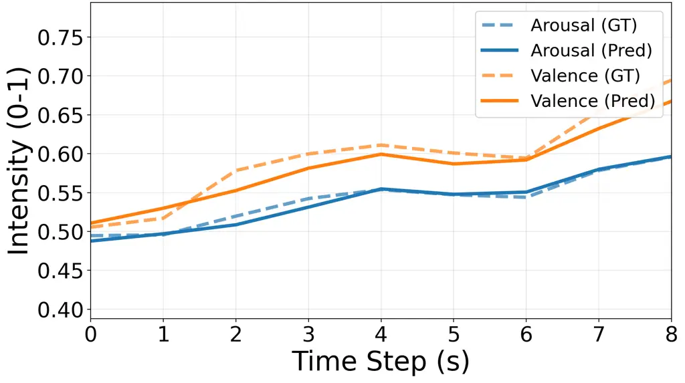
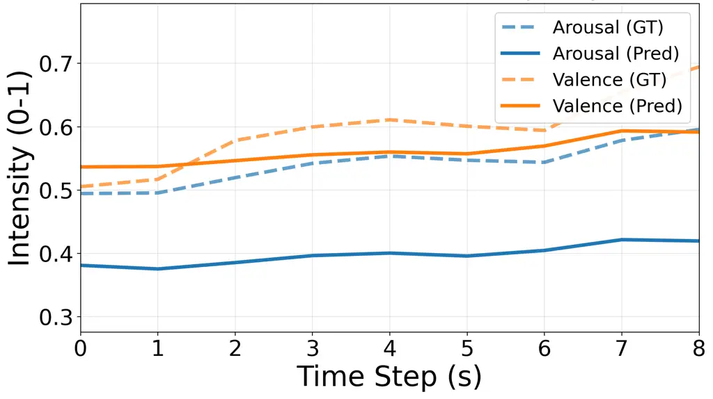
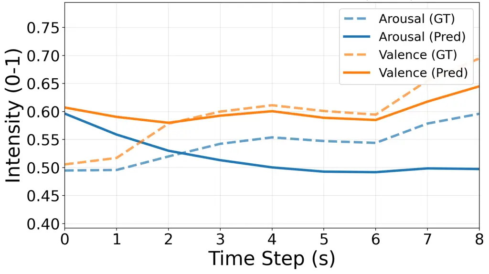

Zhou Patel Kankipati Gupta Li Shukla Narang Kofman Ye Wang Shi Li Lin
Cheng Chou Lian Anumanchipalli

# AV-EMO-REASONING: BENCHMARKING EMOTIONAL REASONING CAPABILITIES IN OMNI-MODAL LLMS WITH AUDIO-VISUAL CUES

Dingkun    Krish    Ajay    Akshaj    Zeyi Austin    Mohul    Vibhor   
Sara    Zongli    Grace    Xiaoyu    Tingle    Guan-Ting    Kan Jen   
Huang-Cheng    Jiachen    Gopala

###### Abstract

Emotions conveyed through voice and face shape engagement and context in
human–AI interaction. Despite rapid progress in omni-modal large
language models (LLMs), the holistic evaluation of emotional reasoning
with audiovisual cues remains limited. To address this gap, we introduce
AV-EMO-Reasoning, a benchmark designed to systematically assess
emotional reasoning abilities in LLMs. The framework leverages a curated
audiovisual corpus comprising synthetic single- and multi-turn dialogues
and a real-world subset, together with emotion-perception and
interaction-reasoning metrics, to assess whether LLMs can appropriately
understand users’ emotions and produce appropriate responses. By
releasing a systematic evaluation benchmark, AV-EMO-Reasoning offers a
reproducible standard for evaluating emotion-aware dialogue and advances
toward more natural, adaptive human–AI interaction.

###### keywords

speech recognition, human-computer interaction, computational
paralinguistics

^(†)^(†)address: ¹ UC Berkeley, USA ² South China University of
Technology, China ³ Zhejiang University, China ⁴ National Taiwan
University, Taiwan ⁵ University of Southern California, USA
¹¹footnotetext: Dingkun Zhou and Krish Patel contributed equally.
Jiachen Lian is the project lead and corresponding author:
jiachenlian@berkeley.edu.

## 1 Introduction

Human communication encompasses more than the words we say. Speech
meaning is fundamentally shaped by vocal tone, emotional prosody, and
temporal dynamics \[1, 2\]. When auditory cues are flat or ambiguous,
non-verbal signals such as facial expressions, gaze, and head motion
often provide the necessary context to decode a speaker’s intent \[3\].
While Large Language Models (LLMs) \[4\] and Spoken Dialogue Models
(SDMs) \[5, 6, 7, 8, 9\] have made significant strides in parsing
linguistic content and basic acoustic affect, they often overlook the
fluid, cross-modal nature of real world interaction. Emotional states
are not static; they shift dynamically throughout a conversation. For
instance, a smile may accompany apologies, and facial expressions can
convey critical information during silence. Capturing, tracking, and
responding to these subtle shifts across both voice and face is
essential for building modern systems that are intuitive, natural, and
empathetic.

While many SDMs process linguistic content well, they frequently
overlook the rational use of emotion \[10\], such as acknowledging
distress with empathy or amplifying joy to build rapport. Prior efforts
have introduced benchmarks for spoken question answering \[11, 12, 13\],
instruction following \[14, 15\], style-conditioned conversation \[16,
17, 18, 19\], duplex systems \[20, 21, 10\], facial expression \[22,
23\], talking head generation \[24, 25\], and recognizing affect \[26\]
from speech or video alone. These works address important facets of
dialogue, yet they do not systematically evaluate whether an SDM or,
more broadly, an omni-modal LLM can detect, interpret, and incorporate a
user’s emotional state using both audio and visual cues in a
context-aware manner.

Figure 1: The AV-EMO-Reasoning Framework.

Speech-only evaluation is insufficient for emotion reasoning since many
affective cues are ambiguous in voice, complementary across modalities,
or visible yet silent \[27\]. The nuance of real-world conversation
often hinges on the congruence between these expressive streams. For
instance, sarcasm, masking, or specific cultural speaking styles can
flatten prosody, leaving facial action patterns as the primary reliable
indicators of intent. Furthermore, since vocal arousal and facial
valence frequently diverge, perceiving them jointly significantly
improves inference accuracy, particularly in environments characterized
by acoustic noise or channel mismatch. Some emotional markers such as
tears, micro-expressions, and gaze aversion often leave little to no
acoustic trace, yet they remain visually self-evident. Because humans
are highly sensitive to cross-modal incongruence \[28\] such as a smile
paired with a cold, detached tone and adjust their social expectations
accordingly \[29\], computational frameworks must account for these
multi-modal discrepancies to achieve affective alignment. Restricting
the evaluation to speech leaves these complex, high-stakes communicative
phenomena untested.

To bridge this gap, we propose AV-EMO-Reasoning (Figure 1), a benchmark
that evaluates an omni-modal LLM’s ability to detect, interpret, and
integrate a user’s emotional state from vocal tone, linguistic content,
and visual signals, and effectively reflect this understanding in its
responses. We evaluate both discrete emotion categories (e.g., happy,
angry) and continuous affective trajectories to capture a broad range of
affective phenomena across turns.

Concretely, AV-EMO-Reasoning evaluates two complementary dimensions:
emotion understanding and emotion reasoning. Emotion understanding
measures whether LLMs can correctly recognize a speaker’s emotion under
multimodal inputs, remain robust when emotional modalities are missing,
and resolve audio-visual conflicts. Emotion reasoning measures whether
LLMs can track, regulate, and respond to emotional dynamics across
turns. These metrics also reveal the internal patterns and preferences
in how they interpret emotions. To facilitate fine-grained temporal
analysis, we developed an Audio-Visual Continuous Emotion Recognition
(AV-CSER) model. Unlike standard turn-level classifiers, AV-CSER
generates frame-level estimates for arousal and valence that are
precisely aligned with both raw waveforms and video frames. This
continuous stream complements our discrete turn-level labels, providing
a more granular ground truth for evaluation. To enable fine-grained
continuous analysis, we develop an audio-visual continuous emotion
recognition (AV-CSER) model that produces frame-level arousal/valence
estimates aligned to both waveform and video frames, complementing a
discrete classifier for turn-level labels. Our experiments indicate that
current omni-modal LLMs underperform on audio-visual emotion reasoning.
Their performance degrades sharply in the absence of explicit acoustic
cues, and in multi-turn dialogue they tend to mirror the user’s
emotional state rather than regulating or guiding them appropriately.
These findings underscore a substantial opportunity for future works to
improve through more integrated, joint reasoning across modalities. We
summarize our contributions as follows:

Audio-visual dialogue data. We collect an emotionally expressive
audio-visual dialogue set with single-turn and multi-turn interactions,
aligning speech with facial expressions to enable synchronized
evaluation.

Audio-visual continuous emotion analysis. We train an AV-CSER model for
frame-level arousal/valence trajectories from audio and video,
supporting detailed temporal studies of affect.

Cross-modal understanding and reasoning metrics. We introduce two
categories of metrics, understanding and reasoning, to test whether the
model can correctly interpret emotions and reliably use cross-modal cues
to guide how the dialogue unfolds.

Benchmarking omni-modal LLMs. We provide AV-EMO-Reasoning, a new
benchmark for emotional reasoning in omni-modal LLMs/SDMs, and report
baseline results that surface key failure modes and directions for
improvement.

## 2 AV-EMO-Reasoning Framework

We evaluate LLMs along two dimensions: emotion understanding and emotion
reasoning. All metrics are normalized to the range $`[0,1]`$. We use
four high-agreement emotion categories (neutral, happy, angry, and sad)
to keep discrete evaluation reliable and balanced. Finer-grained
emotional variation is captured by continuous arousal and valence
measures and by human perceptual ratings.

### 2.1 Emotion Understanding Metrics

We evaluate our metrics on both single-turn and multi-turn dialogue
segments. For multi-turn segments, each segment contains 3–5 consecutive
dialogue turns, and we fix the first speaker in the segment as the user.
Given the full dialogue context, we then independently evaluate the
emotion of each user turn in the segment; in the single-turn setting, we
directly evaluate the emotion for that turn. For each user turn, we
measure the model’s emotion understanding ability under four input
conditions: Full-AV, A-only, V-only, and Conflict. For each user turn,
we measure the model’s emotion understanding ability under four input
conditions: Full-AV for categorical emotion understanding, A-only and
V-only for missing-modality robustness, and Conflict for audio-visual
conflict preference.

#### 2.1.1 Categorical Emotion Understanding (Full-AV)

We first evaluate the model’s basic ability to recognize the user’s
emotion at each dialogue turn under the full audio-visual condition.
$`\text{Acc}_{\text{AV}}`$ measures the proportion of user turns whose
predicted emotion matches the ground-truth label. Concretely, we count
how many user turns have matching predictions and annotations under the
Full-AV input and divide this by the total number of user turns. Full-AV
macro-averaged $`\textbf{F1}_{\text{AV}}`$ evaluates whether the model’s
performance is balanced across emotion categories. We compute the F1
score for each category separately and then average them. The emotion
label set includes four categories: neutral, happy, angry, and sad.

#### 2.1.2 Missing Modality Robustness (A/V-Only)

To quantify the robustness of emotion understanding under
missing-modality conditions, we evaluate the model’s emotion
classification accuracy with A-only and V-only inputs. In the A-only
setting, the visual modality is replaced with repeated copies of the
first frame of the original video. We count how many user turns have
predicted emotion labels that match the human-annotated ground-truth
labels under the A-only condition and divide this number by the total
number of user turns. Similarly, in the V-only setting, the speech
signal is replaced with noise. We count how many user turns have
predicted emotion labels that match the human-annotated ground-truth
labels under the V-only condition and divide this number by the total
number of user turns.

#### 2.1.3 AV-Conflict Preference

In user turns where the audio and video convey conflicting emotions, we
further analyze which modality the model tends to rely on under
cross-modal conflict. Audio-Align Rate (AAR) measures the proportion of
conflict turns for which the model’s predicted emotion matches the audio
emotion label. Concretely, we count how many conflict turns have
predictions equal to the audio label and divide this number by the total
number of conflict turns. Visual-Align Rate (VAR) and Other-Label Rate
(OLR) are defined analogously for the visual label and for predictions
that match neither label.

### 2.2 Emotion Reasoning Metrics

Our emotion Reasoning metrics are adapted from the EMO-Reasoning\[10\]
and are evaluated uniformly on both single-turn and multi-turn dialogue
segments. All continuous metrics are defined in the arousal–valence
(V/A) space, and we group them into single-turn and multi-turn variants.
A single-turn metric applies a function to a local V/A trajectory. A
multi-turn metric aggregates these single-turn scores across dialogue
turns and reflects how the model maintains, regulates, and guides
emotion over the full conversation.

#### 2.2.1 Single-turn Metrics

ECS measures how promptly the model perceives and follows the user’s
emotional changes. EBS measures how strongly the model’s trajectory
converges toward a balanced trajectory when the user is in an extreme
state. ESS measures the smoothness of the emotional trajectory within a
turn, penalizing sharp fluctuations. ERS is the average of ECS, EBS, and
ESS and reflects overall single-turn emotion understanding and
regulation.

#### 2.2.2 Multi-turn Metrics

CT-ECS averages ECS over all turns in a multi-turn dialogue. It
evaluates the model’s overall emotional contagion ability across the
full conversation. CT-EBS averages EBS only over turns where the user
shows an extreme emotional state. It evaluates the model’s global
ability to balance emotion throughout the dialogue. CT-ESS extends ESS
to the multi-turn setting. It first applies dynamic time warping between
the V/A trajectories of adjacent turns and then normalizes and
aggregates the distances. It evaluates the continuity and smoothness of
emotional trajectories across turns. CT-ERS is computed by averaging
CT-ECS, CT-EBS, and CT-ESS. It evaluates the model’s overall multi-turn
emotion reasoning ability.

### 2.3 Subjective Human Perception Evaluation

We conducted a human evaluation using ratings from annotators who
successfully passed a pre-training session. Annotators assessed 15
dialogues from each of the three LLMs and the baseline, rating each
response for rationality, naturalness, and relevance on a 5-point Likert
scale. Each dialogue was rated by at least five annotators. The
collected Likert scores were then averaged and normalized to the range
\[0,1\], where higher values indicate better quality. The details of the
metrics are below.

Emotional Rationality (ER) judges how appropriate the model’s emotion is
to the user’s state. Not just “matching,” it rewards understanding and
empathy.

Emotional Naturalness (EN) rates how natural and smooth the emotional
expression of the SDM sounds, free of robotic, forced, or mechanical
tone.

Response Relevance (RR) scores how well the content addresses the user’s
emotional and contextual needs; detailed, specific, context-aware
replies rate higher than generic platitudes.

## 3 Categorical A-V-Emotion Recognition

Model and Dataset. Our audio-visual emotion detection model is trained
with random video modality dropout, yielding a unified framework capable
of inference on both multi-modal (audio-video) and uni-modal
(audio-only) data. Our model is trained on the MultiDialog dataset
\[30\], a corpus of face-to-face, audio-visual dialogues with
per-utterance emotion annotations. The dataset comprises 8,733 dialogues
(340 hours) from 12 speakers. We adhere to the official split, using
7,011 dialogues for training, 891 for validation, and 831 for testing.

Model Configuration and Baseline. To establish single-modality
baselines, we extracted audio embeddings using SenseVoice-Small \[31\]
and facial embeddings using EmotiEffLib \[32\]. As shown in Table 1, our
proposed multi-modal approach significantly outperforms both the
audio-only and video-only baselines on the MultiDialog dataset \[30\].

| Model                   | Neutral | Happy  | Angry  | Sad    |
| ----------------------- | ------- | ------ | ------ | ------ |
| SenseVoice Small \[31\] | 0.4745  | 0.4599 | 0.3717 | 0.3128 |
| EmotiEffLib \[32\]      | 0.5642  | 0.3033 | 0.0639 | 0.0727 |
| Ours                    | 0.6074  | 0.6350 | 0.6074 | 0.5111 |

Table 1: This table summarizes the Weighted F1 scores for all models
evaluated on the MultiDialog dataset \[30\].

|                                                           |                                                           |                                                           |
| --------------------------------------------------------- | --------------------------------------------------------- | --------------------------------------------------------- |
|  |  |  |
| Audio + Video                                             | Audio                                                     | Video                                                     |

Figure 2: Continuous emotion predictions across modalities on the
RECOLA.

|                                |                   |        |        |        |                            |                           |                           |                           |       |       |       |                  |       |       |       |
| ------------------------------ | ----------------- | ------ | ------ | ------ | -------------------------- | ------------------------- | ------------------------- | ------------------------- | ----- | ----- | ----- | ---------------- | ----- | ----- | ----- |
|                                | Emotion Reasoning |        |        |        | Emotion Understanding      |                           |                           |                           |       |       |       | Human Evaluation |       |       |       |
| Model (Single-Turn, Synthetic) | ECS               | EBS    | ESS    | ERS    | $`\text{Acc}_{\text{AV}}`$ | $`\text{F1}_{\text{AV}}`$ | $`\text{Acc}_{\text{A}}`$ | $`\text{Acc}_{\text{V}}`$ | AAR   | VAR   | OLR   | ER               | EN    | RR    | ERS   |
| Synthetic (GPT-4 + CosyVoice)  | 0.767             | 0.672  | 1.000  | 0.737  | —                          |                           |                           |                           |       |       |       | 0.590            | 0.535 | 0.573 | 0.567 |
| Baichuan 1.5-o \[33\]          | 0.577             | 0.483  | 1.000  | 0.524  | 0.841                      | 0.311                     | 0.547                     | 0.760                     | 0.490 | 0.195 | 0.270 | 0.628            | 0.575 | 0.618 | 0.607 |
| MiniCPM-o 2.6 \[34\]           | 0.660             | 0.492  | 1.000  | 0.589  | 0.804                      | 0.343                     | 0.865                     | 0.824                     | 0.686 | 0.104 | 0.264 | 0.888            | 0.873 | 0.950 | 0.903 |
| Qwen 2.5-o \[35\]              | 0.731             | 0.587  | 1.000  | 0.672  | 0.713                      | 0.243                     | 0.627                     | 0.850                     | 0.632 | 0.137 | 0.317 | 0.665            | 0.720 | 0.710 | 0.698 |
| Model (Multi-Turn, Synthetic)  | CT-ECS            | CT-EBS | CT-ESS | CT-ERS | $`\text{Acc}_{\text{AV}}`$ | $`\text{F1}_{\text{AV}}`$ | $`\text{Acc}_{\text{A}}`$ | $`\text{Acc}_{\text{V}}`$ | AAR   | VAR   | OLR   | ER               | EN    | RR    | ERS   |
| Synthetic (GPT-4 + CosyVoice)  | 0.747             | 0.385  | 0.838  | 0.623  | —                          |                           |                           |                           |       |       |       | 0.860            | 0.830 | 0.785 | 0.825 |
| Baichuan 1.5-o \[33\]          | 0.619             | 0.039  | 0.806  | 0.426  | 0.763                      | 0.307                     | 0.598                     | 0.806                     | 0.694 | 0.028 | 0.321 | 0.768            | 0.695 | 0.748 | 0.737 |
| MiniCPM-o 2.6 \[34\]           | 0.667             | 0.161  | 0.657  | 0.445  | 0.728                      | 0.347                     | 0.673                     | 0.797                     | 0.796 | 0.021 | 0.213 | 0.850            | 0.793 | 0.868 | 0.837 |
| Qwen 2.5-o \[35\]              | 0.730             | 0.162  | 0.814  | 0.526  | 0.815                      | 0.384                     | 0.520                     | 0.821                     | 0.600 | 0.114 | 0.266 | 0.768            | 0.740 | 0.790 | 0.766 |
| Model (Multi-Turn, Real)       | CT-ECS            | CT-EBS | CT-ESS | CT-ERS | $`\text{Acc}_{\text{AV}}`$ | $`\text{F1}_{\text{AV}}`$ | $`\text{Acc}_{\text{A}}`$ | $`\text{Acc}_{\text{V}}`$ | AAR   | VAR   | OLR   | ER               | EN    | RR    | ERS   |
| Real (MultiDialog \[30\])      | 0.749             | 0.623  | 0.788  | 0.394  | —                          |                           |                           |                           |       |       |       | 0.540            | 0.538 | 0.480 | 0.519 |
| Baichuan 1.5-o \[33\]          | 0.632             | 0.407  | 0.765  | 0.362  | 0.720                      | 0.287                     | 0.580                     | 0.770                     | 0.670 | 0.030 | 0.300 | 0.378            | 0.508 | 0.355 | 0.413 |
| MiniCPM-o 2.6 \[34\]           | 0.648             | 0.501  | 0.688  | 0.258  | 0.760                      | 0.363                     | 0.720                     | 0.760                     | 0.760 | 0.020 | 0.220 | 0.580            | 0.568 | 0.558 | 0.568 |
| Qwen 2.5-o \[35\]              | 0.741             | 0.406  | 0.747  | 0.341  | 0.770                      | 0.363                     | 0.550                     | 0.790                     | 0.640 | 0.110 | 0.250 | 0.578            | 0.555 | 0.685 | 0.601 |

Table 2: Results on the Synthetic (single-/multi-turn) and the
MultiDialog (multi-turn) datasets.

## 4 Continuous A-V-Emotion Recognition

To evaluate our proposed metrics, we train an audio-visual continuous
speech emotion recognition (AV-CSER) model that extracts fine-grained
temporal emotion trajectories from synchronized speech and video
signals. We use RECOLA dataset \[36\] for training. For each segment, we
use HiCMAE \[37\] to pre-extract features and downsample them to two
values per second, namely valence and arousal. The regression head is a
single-layer BiLSTM with a hidden size of 256, and its outputs are
mapped to the range $`[0,1]`$ using a sigmoid function. During training,
we optimize the concordance correlation coefficient (CCC) loss with a
learning rate of $`1\times 10^{-3}`$, and apply a ReduceLROnPlateau
scheduler.

Our results show that multimodal fusion consistently outperforms
unimodal methods in all settings. Detailed comparisons with the prior
audio-only CSER baseline are reported in Table 3, while
modality-specific results across subject-wise and official RECOLA splits
are reported in Table 4. These performance trends are also visualized in
Figure 2, which compares the model predictions with the ground-truth
trajectories (dashed lines) for a sample segment. The fused A+V model
most accurately tracks changes in both arousal and valence, capturing
sharp emotional shifts around $`t\approx 2`$–4 s and $`t\approx 7`$–8 s
with almost no delay. In contrast, the audio-only model can follow
short-term changes in arousal but shows a systematic negative bias of
about 0.08–0.12 and noticeably attenuated amplitudes. The video-only
model aligns well with the valence level but underfits the arousal
trajectory and exhibits a larger initial offset at the beginning of the
sequence.

| Model       | Arousal | Valence | Mean  |
| ----------- | ------- | ------- | ----- |
| CSER \[10\] | 0.403   | 0.164   | 0.284 |
| Ours        | 0.687   | 0.690   | 0.689 |

Table 3: Concordance Correlation Coefficient (CCC) comparison between
our method and previous audio-only approach for RECOLA (subject-wise
split).

|               |                    |         |       |                |         |       |
| ------------- | ------------------ | ------- | ----- | -------------- | ------- | ----- |
|               | Subject-wise split |         |       | Official split |         |       |
| Modality      | Arousal            | Valence | Mean  | Arousal        | Valence | Mean  |
| Audio         | 0.282              | 0.139   | 0.211 | 0.191          | 0.039   | 0.115 |
| Video         | 0.397              | 0.468   | 0.432 | 0.228          | 0.323   | 0.276 |
| Audio + Video | 0.687              | 0.690   | 0.688 | 0.644          | 0.463   | 0.553 |

Table 4: Concordance Correlation Coefficient (CCC) across modalities on
the RECOLA for subjective-wise and official splits.

## 5 Experimental Setup

### 5.1 Dataset

Synthetic Data. We constructed our synthetic dataset using a three-stage
pipeline. First, we prompted GPT-4 \[38\] to generate both single-turn
and multi-turn dialogues. Each utterance was accompanied by a stylistic
prompt describing the desired vocal delivery Second, these
text-and-prompt pairs were used as input for the CosyVoice
text-to-speech model \[39\] to synthesize high-quality emotional speech.
Finally, for each audio segment, a random facial image was selected from
the AI-Face dataset \[40\] and animated using DreamTalk \[41\].

On top of this base, we further construct missing-modality and
modality-conflict conditions. For the audio-missing condition, we
replace the speech track with noise while keeping the original video
unchanged. For the visual-missing condition, we replace the video with a
simple temporal repetition of the first frame. To obtain strongly
polarized modality-conflict samples, we synthesize a pair of
audio-visual clips with opposite emotional polarity from the same
transcript. Given an emotion label and its opposite, we construct two
corresponding style prompts and generate the two clips. We then combine
the audio from one clip with the video from the other so that the audio
and visual streams carry explicitly opposite discrete emotion labels,
forming AV-Conflict samples.

Real Data. To evaluate model performance on real human speech, we use
the MultiDialog dataset \[30\]. The construction of the audio-missing
(A-missing) and visual-missing (V-missing) conditions follows the same
procedure as in the synthetic data setting. For the modality-conflict
condition, we select pairs of video clips from the real dataset that
share the same speaker ID, have opposite emotion labels, and differ in
duration by no more than 1 s. We then combine the audio from one clip
with the video from the other, thereby constructing AV-Conflict samples
in which the audio and visual streams carry explicitly opposite discrete
emotion labels.

LLM Response Collection. We use the same prompt to collect responses
from three omni-modal language models, each supporting audio-visual
inputs and native speech synthesis: Baichuan-Omni-1.5 \[33\], MiniCPM-o
2.6 \[34\], and Qwen 2.5-Omni-7B \[35\].

## 6 Results

Table 2 summarizes the benchmark results across emotion understanding,
emotion reasoning, and human evaluation.

Emotion Understanding Performance. The model can reliably identify
common emotions but struggles to distinguish rare ones, and its
performance drops substantially under audio-only input. Multimodal
fusion does not clearly surpass the best single modality and is often
dominated by a single channel. When emotional cues in audio and video
conflict, AAR is typically much higher than VAR, indicating that the
model tends to align with the audio label even though audio is not the
more reliable modality overall. This preference for the weaker modality
under conflict reveals a mismatch between the model’s implicit modality
weighting and the actual effectiveness of each modality on the task.

Emotion Reasoning Performance. All models achieve ECS scores close to
the reference trajectory, showing that they adjust their emotional
trajectories in the same direction as the user, with Qwen exhibiting the
strongest emotional contagion. In contrast, EBS is consistently below
the baseline, suggesting that when the user is in an extreme emotional
state, the models rarely pull their emotion back toward a more balanced
range. In multi-turn dialogue settings, all models reach relatively high
ESS scores and their trajectories are generally continuous and stable,
although MiniCPM exhibits the largest fluctuations. Overall, in real
multi-turn conversations, none of the current models has yet reached
human-level emotional reasoning or regulation.

Human Evaluation. On automatic metrics, the ground-truth real and
synthetic dialogues show stronger affect dynamics and label consistency
than LLM-generated responses. In contrast, on perceptual metrics,
annotators prefer the LLM outputs, likely because they are more verbose
and descriptive. Automatic scores further indicate that canonical
dataset answers better preserve emotional tone across turns, even when
humans favor the content of LLM-generated replies. This leaves
substantial headroom for LLMs to sound truly humanlike: wording and
phrasing are well received, but prosody, pacing, and affect still lag
genuine human speech.

## 7 Conclusion and Future Work

This paper introduces AV-Emo-Reasoning, a framework for evaluating LLMs’
understanding and reasoning abilities in multimodal settings. We further
build a joint audio-visual categorical emotion recognizer and an AV-CSER
for fine-grained temporal analysis.Our experiments show that current
omni-modal LLMs still exhibit a clear gap between recognizing emotion
and speaking with emotionally appropriate responses. It remains
necessary to better model the temporal dynamics of emotion and to design
systems that can maintain and adapt their emotional state over the
course of a full dialogue. We hope that AV-Emo-Reasoning will serve as a
foundation for future LLM research on emotional perception and emotional
reasoning.

## References

- \[1\] L. Quinto et al. (2013) Emotional communication in speech and
  music: The role of melodic and rhythmic contrasts. Frontiers in
  psychology 4, pp. 184. Cited by: §1.
- \[2\] J. W. Mullennix et al. (2002) Effects of variation in emotional
  tone of voice on speech perception. Language and speech 45 (3),
  pp. 255–283. Cited by: §1.
- \[3\] C. Busso et al. (2004) Analysis of emotion recognition using
  facial expressions, speech and multimodal information. In Proceedings
  of the 6th international conference on Multimodal interfaces,
  pp. 205–211. Cited by: §1.
- \[4\] T. Brown et al. (2020) Language models are few-shot learners.
  Advances in neural information processing systems 33, pp. 1877–1901.
  Cited by: §1.
- \[5\] Q. Fang et al. (2024) Llama-omni: Seamless speech interaction
  with large language models. arXiv preprint arXiv:2409.06666. Cited by:
  §1.
- \[6\] Z. Xie and C. Wu (2024) Mini-omni: Language models can hear,
  talk while thinking in streaming. arXiv preprint arXiv:2408.16725.
  Cited by: §1.
- \[7\] X. Wang et al. (2024) Freeze-omni: A smart and low latency
  speech-to-speech dialogue model with frozen llm. arXiv preprint
  arXiv:2411.00774. Cited by: §1.
- \[8\] A. Zeng et al. (2024) Glm-4-voice: Towards intelligent and
  human-like end-to-end spoken chatbot. arXiv preprint arXiv:2412.02612.
  Cited by: §1.
- \[9\] A. Défossez et al. (2024) Moshi: a speech-text foundation model
  for real-time dialogue. arXiv preprint arXiv:2410.00037. Cited by: §1.
- \[10\] J. Liu et al. (2025) EMO-Reasoning: Benchmarking Emotional
  Reasoning Capabilities in Spoken Dialogue Systems. 2025 IEEE Automatic
  Speech Recognition and Understanding Workshop (ASRU). Cited by: §1,
  §2.2, Table 3.
- \[11\] M. Hassid et al. (2023) Textually pretrained speech language
  models. Advances in Neural Information Processing Systems 36,
  pp. 63483–63501. Cited by: §1.
- \[12\] M. Shih et al. (2023) Gsqa: An end-to-end model for generative
  spoken question answering. arXiv preprint arXiv:2312.09781. Cited by:
  §1.
- \[13\] G. Lin et al. (2024) Align-slm: Textless spoken language models
  with reinforcement learning from ai feedback. arXiv preprint
  arXiv:2411.01834. Cited by: §1.
- \[14\] C. Huang et al. (2024) Dynamic-superb: Towards a dynamic,
  collaborative, and comprehensive instruction-tuning benchmark for
  speech. In ICASSP 2024-2024 IEEE International Conference on
  Acoustics, Speech and Signal Processing (ICASSP), pp. 12136–12140.
  Cited by: §1.
- \[15\] C. Huang et al. (2024) Dynamic-superb phase-2: A
  collaboratively expanding benchmark for measuring the capabilities of
  spoken language models with 180 tasks. arXiv preprint
  arXiv:2411.05361. Cited by: §1.
- \[16\] J. Ao et al. (2024) Sd-eval: A benchmark dataset for spoken
  dialogue understanding beyond words. Advances in Neural Information
  Processing Systems 37, pp. 56898–56918. Cited by: §1.
- \[17\] G. Lin et al. (2024) Advancing large language models to capture
  varied speaking styles and respond properly in spoken conversations.
  arXiv preprint arXiv:2402.12786. Cited by: §1.
- \[18\] G. Lin and H. Lee (2024) Can LLMs Understand the Implication of
  Emphasized Sentences in Dialogue?. arXiv preprint arXiv:2406.11065.
  Cited by: §1.
- \[19\] G. Lin et al. (2024) Paralinguistics-enhanced large language
  modeling of spoken dialogue. In ICASSP 2024-2024 IEEE International
  Conference on Acoustics, Speech and Signal Processing (ICASSP),
  pp. 10316–10320. Cited by: §1.
- \[20\] G. Lin et al. (2025) Full-duplex-bench: A benchmark to evaluate
  full-duplex spoken dialogue models on turn-taking capabilities. arXiv
  preprint arXiv:2503.04721. Cited by: §1.
- \[21\] G. Lin et al. (2025) Full-Duplex-Bench v1. 5: Evaluating
  Overlap Handling for Full-Duplex Speech Models. arXiv preprint
  arXiv:2507.23159. Cited by: §1.
- \[22\] C. Schuhmann et al. (2025) Emonet-face: An expert-annotated
  benchmark for synthetic emotion recognition. arXiv preprint
  arXiv:2505.20033. Cited by: §1.
- \[23\] S. Zhao et al. (2023) Dfme: A new benchmark for dynamic facial
  micro-expression recognition. IEEE Transactions on Affective Computing
  15 (3), pp. 1371–1386. Cited by: §1.
- \[24\] L. Chen et al. (2020) What comprises a good talking-head video
  generation?: A survey and benchmark. arXiv preprint arXiv:2005.03201.
  Cited by: §1.
- \[25\] Y. Zhou et al. (2024) Subjective and objective
  quality-of-experience assessment for 3d talking heads. In Proceedings
  of the 32nd ACM International Conference on Multimedia, pp. 6033–6042.
  Cited by: §1.
- \[26\] J. Lian, A. Baevski, W. Hsu, and M. Auli (2023) Av-data2vec:
  self-supervised learning of audio-visual speech representations with
  contextualized target representations. In 2023 IEEE Automatic Speech
  Recognition and Understanding Workshop (ASRU), pp. 1–8. Cited by: §1.
- \[27\] L. Goncalves et al. (2025) Jointly Learning From Unimodal and
  Multimodal-Rated Labels in Audio-Visual Emotion Recognition. IEEE Open
  Journal of Signal Processing 6 (), pp. 165–174. External Links:
  [Document](https://dx.doi.org/10.1109/OJSP.2025.3530274) Cited by: §1.
- \[28\] H. Chou et al. (2025) Stimulus Modality Matters: Impact of
  Perceptual Evaluations from Different Modalities on Speech Emotion
  Recognition System Performance. In ICASSP 2025 - 2025 IEEE
  International Conference on Acoustics, Speech and Signal Processing
  (ICASSP), Vol. , pp. 1–5. External Links:
  [Document](https://dx.doi.org/10.1109/ICASSP49660.2025.10890558) Cited
  by: §1.
- \[29\] J. Wang et al. (2024) Cross-modal incongruity aligning and
  collaborating for multi-modal sarcasm detection. Information Fusion
  103, pp. 102132. Cited by: §1.
- \[30\] S. J. Park et al. (2024) Let’s Go Real Talk: Spoken Dialogue
  Model for Face-to-Face Conversation. Association for Computational
  Linguistics (ACL). Cited by: Table 1, Table 1, Table 2, §3, §3, §5.1.
- \[31\] K. An et al. (2024) FunAudioLLM: Voice Understanding and
  Generation Foundation Models for Natural Interaction Between Humans
  and LLMs. arXiv preprint arXiv:2407.04051. Cited by: Table 1, §3.
- \[32\] A. Savchenko (2023) Facial Expression Recognition with Adaptive
  Frame Rate based on Multiple Testing Correction. International
  Conference on Machine Learning (ICML). External Links:
  [Link](https://proceedings.mlr.press/v202/savchenko23a.html) Cited by:
  Table 1, §3.
- \[33\] Y. Li et al. (2025) Baichuan-Omni-1.5 Technical Report. arXiv
  preprint arXiv:2501.15368. Cited by: Table 2, Table 2, Table 2, §5.1.
- \[34\] Y. Yao et al. (2024) MiniCPM-V: A GPT-4V Level MLLM on Your
  Phone. arXiv preprint arXiv:2408.01800. Cited by: Table 2, Table 2,
  Table 2, §5.1.
- \[35\] J. Xu et al. (2025) Qwen2.5-Omni Technical Report. arXiv
  preprint arXiv:2503.20215. Cited by: Table 2, Table 2, Table 2, §5.1.
- \[36\] F. Ringeval et al. (2013) Introducing the RECOLA multimodal
  corpus of remote collaborative and affective interactions. In 2013
  10th IEEE international conference and workshops on automatic face and
  gesture recognition (FG), pp. 1–8. Cited by: §4.
- \[37\] L. Sun et al. (2024) Hicmae: Hierarchical contrastive masked
  autoencoder for self-supervised audio-visual emotion recognition.
  Information Fusion 108, pp. 102382. Cited by: §4.
- \[38\] J. Achiam et al. (2023) Gpt-4 technical report. arXiv preprint
  arXiv:2303.08774. Cited by: §5.1.
- \[39\] Z. Du et al. (2024) Cosyvoice 2: Scalable streaming speech
  synthesis with large language models. arXiv preprint arXiv:2412.10117.
  Cited by: §5.1.
- \[40\] L. Lin et al. (2025) AI-Face: A Million-Scale Demographically
  Annotated AI-Generated Face Dataset and Fairness Benchmark. In
  Proceedings of the IEEE/CVF Conference on Computer Vision and Pattern
  Recognition (CVPR), Cited by: §5.1.
- \[41\] Y. Ma et al. (2023) DreamTalk: When Expressive Talking Head
  Generation Meets Diffusion Probabilistic Models. arXiv preprint
  arXiv:2312.09767. Cited by: §5.1.
