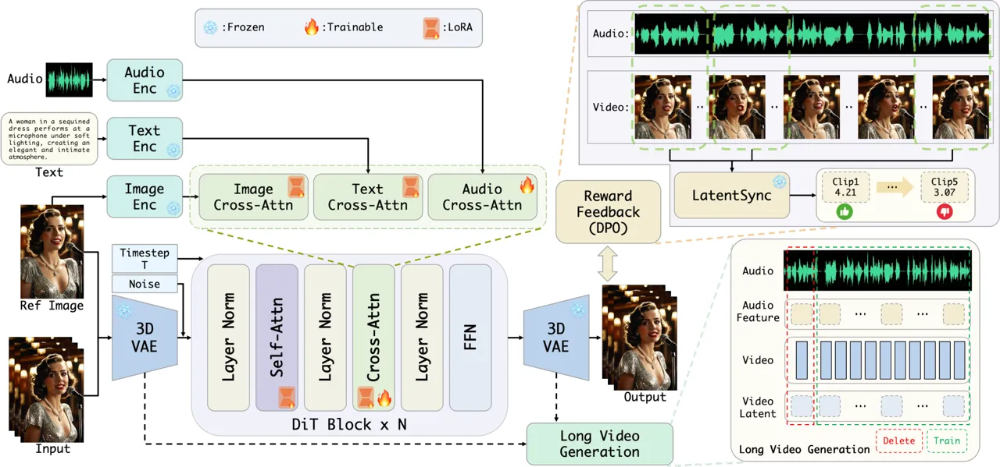
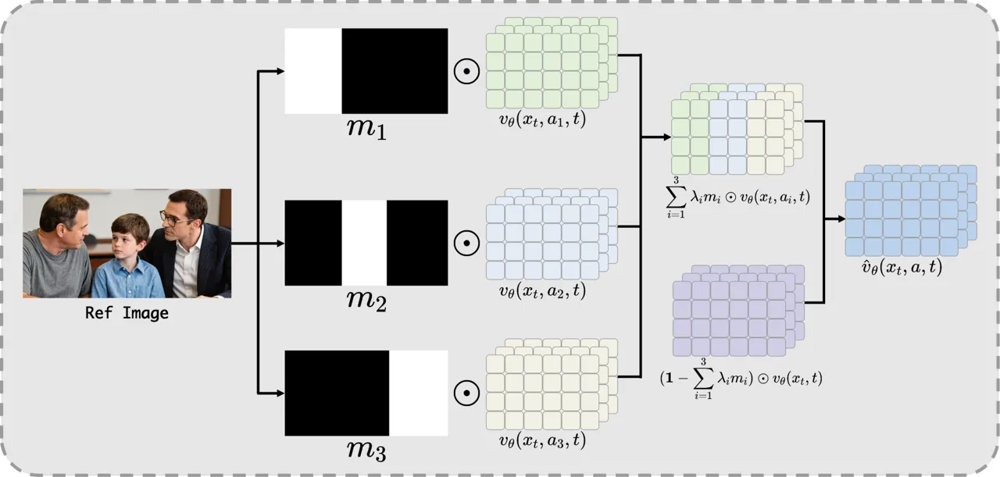
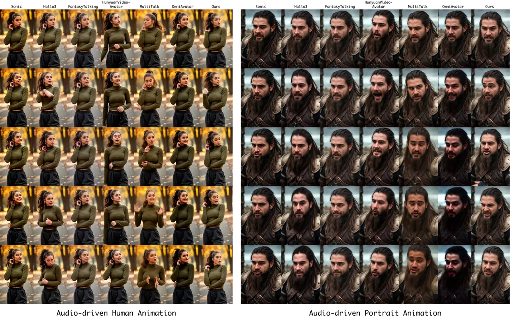
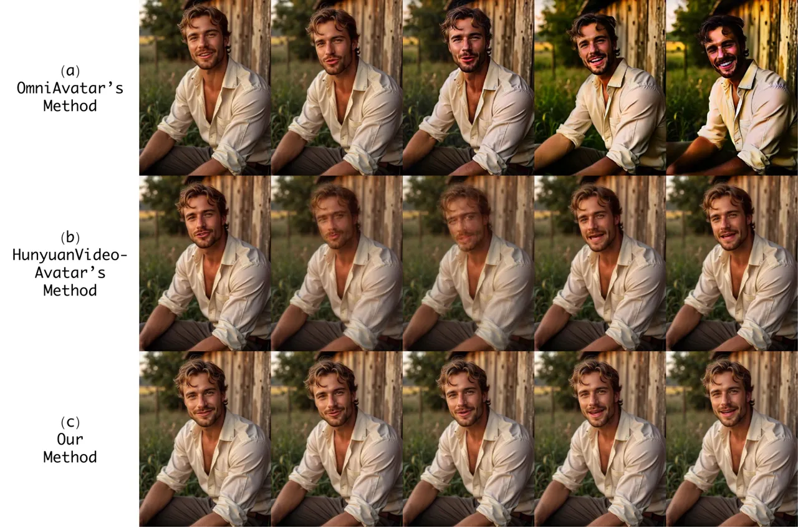
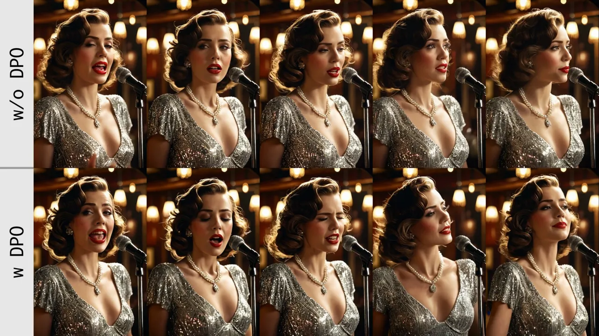

# Playmate2: Training-Free Multi-Character Audio-Driven Animation via Diffusion Transformer with Reward Feedback

Xingpei Ma    Shenneng Huang    Jiaran Cai ^(†)^(†)thanks: Project lead
& Corresponding Author.    Yuansheng Guan    Shen Zheng    Hanfeng Zhao
   Qiang Zhang    Shunsi Zhang

###### Abstract

Recent advances in diffusion models have significantly improved
audio-driven human video generation, surpassing traditional methods in
both quality and controllability. However, existing approaches still
face challenges in lip-sync accuracy, temporal coherence for long video
generation, and multi-character animation. In this work, we propose a
diffusion transformer (DiT)-based framework for generating lifelike
talking videos of arbitrary length, and introduce a training-free method
for multi-character audio-driven animation. First, we employ a
LoRA-based training strategy combined with a position shift inference
approach, which enables efficient long video generation while preserving
the capabilities of the foundation model. Moreover, we combine partial
parameter updates with reward feedback to enhance both lip
synchronization and natural body motion. Finally, we propose a
training-free approach, Mask Classifier-Free Guidance (Mask-CFG), for
multi-character animation, which requires no specialized datasets or
model modifications and supports audio-driven animation for three or
more characters. Experimental results demonstrate that our method
outperforms existing state-of-the-art approaches, achieving
high-quality, temporally coherent, and multi-character audio-driven
video generation in a simple, efficient, and cost-effective manner.

Guangzhou Quwan Network Technology

{maxingpei, huangshenneng, caijiaran, guanyuansheng, zhengshen,
zhaohanfeng, zhangqiang, zhangshunsi}@52tt.com

![[Uncaptioned
image]](arxiv-2510-12089--5fd2939328df.figures/figure-1.webp)

Figure 1: We present a novel DiT-based framework for generating
high-quality, audio-driven human videos that effectively tackles key
challenges related to temporal coherence in long sequences and
multi-character animations. To the best of our knowledge, this is the
first training-free approach capable of enabling audio-driven animation
for three or more characters without requiring additional data or model
modifications.

Project Page — https://playmate111.github.io/Playmate2/

## 1 Introduction

Benefiting from large-scale pre-training and advanced architectural
designs, diffusion models (Rombach et al. 2022; Esser et al. 2024; Liu
et al. 2024; Yang et al. 2024; Kong et al. 2024; Wan et al. 2025) have
achieved significant advances in image and video synthesis,
outperforming traditional generative adversarial networks
(GANs) (Goodfellow et al. 2020) in both visual quality and temporal
coherence. These advancements have greatly improved the generation of
audio-driven human videos (Xue et al. 2024), making this capability a
cornerstone of digital human research. Audio-driven human animation has
broad applications in digital entertainment, film and gaming production,
virtual reality, and digital storytelling.

Audio-driven human animation (Jiang et al. 2024) synthesizes realistic
character videos with synchronized lip movements and natural body
gestures from speech and auxiliary inputs. Recent advances in diffusion
models have spurred their use in this domain, leading to two main
categories: portrait animation and human animation. The first focuses on
synthesizing facial expressions solely from audio signals, with little
attention given to background dynamics (Tian et al. 2024; Xu et al.
2024a; Xu et al. 2024b; Ji et al. 2024; Ma et al. 2023; Chen et al.
2024; Cui et al. 2025b). Such a restricted approach frequently
compromises the realism of generated videos in complex scenes, leading
to results that do not satisfy the demands of high-quality applications.
The second employs video diffusion models to overcome the aforementioned
spatial constraints, thereby achieving full-body animation
generation (Lin et al. 2025; Fei et al. 2025; Wang et al. 2025a; Chen et
al. 2025; Kong et al. 2025; Cui et al. 2025a). Despite progress, several
challenges persist: 1) Existing methods often struggle to maintain
accurate lip-sync while generating natural body movements; 2) In long
video synthesis, current solutions often result in jittery motions and
abrupt transitions, failing to preserve temporal coherence; 3) Most
existing techniques are unable to animate scenes involving multiple
characters using audio input; although some works achieve
multi-character animation by constructing multi-speaker datasets and
introducing significant modifications to the model architecture, such
strategies are often resource-intensive and not scalable.

To address these challenges, leveraging the large-scale video diffusion
model Wan2.1 (Wan et al. 2025), we propose a diffusion transformer
(DiT)-based (Peebles and Xie 2023) framework for audio-driven facial and
human video generation, aiming to enhance video quality and enable
cost-effective multi-character animation. First, we adopt a
LoRA-based (Hu et al. 2022) training strategy to preserve the
capabilities of the foundation model while enabling long video
generation. Next, we explore a training strategy that combines partial
parameter updates with reward feedback, producing videos with accurate
lip synchronization and natural body motions. Finally, inspired by
Classifier-Free Guidance (CFG) (Ho and Salimans 2022), we introduce a
training-free approach, Mask Classifier-Free Guidance (Mask-CFG), to
tackle the challenge of multi-character animation. This method does not
require constructing specialized datasets or modifying the model
architecture; instead, it achieves multi-character control through
simple adjustments during inference, making it both efficient and
cost-effective.

To the best of our knowledge, this is the first training-free approach
capable of enabling audio-driven animation for three or more characters.
In summary, our contributions are as follows:

- •
  We propose a DiT-based framework for audio-driven human animation,
  combined with a LoRA-based training strategy for long video
  generation.
- •
  We investigate a training strategy combining partial parameter updates
  with reward feedback to improve lip-sync accuracy while maintaining
  natural and adaptive body movements.
- •
  We introduce a training-free method (Mask-CFG) to support
  multi-character animation, which is both efficient and cost-effective.

## 2 Related Work



Figure 2: Overview of our method. Our framework leverages a LoRA-based
training strategy and position shift inference to generate long,
temporally coherent videos with consistent identity. A partial parameter
update with reward feedback enhances lip synchronization and upper-body
motion naturalness. Furthermore, we propose Mask-CFG, a training-free
approach for multi-character animation that requires no additional data
or model fine-tuning, yet supports audio-driven animation of three or
more characters.

### 2.1 Audio-Driven Portrait Animation

Prior work on audio-driven portrait animation has largely focused on
lip-sync accuracy (Prajwal et al. 2020; Zhang et al. 2023b; Zhang et al.
2023a; Guo et al. 2021; Wang et al. 2024). Traditional approaches based
on GANs, neural radiance fields (NeRF) (Mildenhall et al. 2021), and 3D
Gaussian Splatting (Kerbl et al. 2023) have achieved strong results, yet
often fail to model the subtle relationship between prosody and facial
dynamics, leading to limited expressiveness and reduced visual realism.
Recently, diffusion-based methods have enabled end-to-end talking video
generation. EMO (Tian et al. 2024) improves inter-frame consistency for
stable, natural synthesis. Hallo (Xu et al. 2024a) jointly addresses lip
synchronization, expression, and pose. Sonic (Ji et al. 2024) emphasizes
global perceptual coherence for diverse motions, while DICE-Talk (Tan et
al. 2025) and Playmate (Ma et al. 2025) introduce emotional control for
expressive portraits. Despite producing realistic outputs, these methods
are primarily limited to facial animation and do not support full-body
motion synthesis.

### 2.2 Audio-Driven Human Animation

To enable audio-driven human animation, recent methods leverage
large-scale video diffusion models. CyberHost (Lin et al. 2024) proposes
a one-stage framework with novel attention and human-prior-guided
training for upper-body synthesis. Approaches like OmniHuman-1 (Lin et
al. 2025), FantasyTalking (Wang et al. 2025a), SkyReels-Audio (Fei et
al. 2025), and OmniAvatar (Gan et al. 2025) build on models such as
Seaweed (Seawead et al. 2025), HunyuanVideo (Kong et al. 2024), and
Wan2.1 for holistic motion generation. In multi-character scenarios,
HunyuanVideo-Avatar (Chen et al. 2025) uses latent-space masking for
localized, character-specific control, while MultiTalk (Kong et al. 2025) introduces Label Rotary Position Embedding with a multi-person
dataset to resolve audio-person binding. Inspired by these advances, we
base our approach on a large-scale video diffusion transformer for
audio-driven human animation.

### 2.3 Direct Preference Optimization

Reinforcement Learning from Human Feedback (RLHF) (Ouyang et al. 2022)
is widely used to align large language models with human preferences.
This paradigm has been extended to image and video generation via reward
models or preference data (Zhang et al. 2024; Wallace et al. 2024; Liu
et al. 2025). Recently, Direct Preference Optimization (DPO) (Rafailov
et al. 2023) has gained traction in audio-driven animation. Hallo4 (Cui
et al. 2025a) proposes a DPO framework for human-centric animation,
leveraging a curated human preference dataset to align generated outputs
with perceptual metrics related to motion-video alignment and facial
expression naturalness. EchoMimicV3 (Meng et al. 2025) further adopts an
alternating Supervised Fine-Tuning (SFT) and DPO training paradigm,
enabling high-quality video generation with a 1.3B-parameter model.
Building on these advances, we present a more efficient framework that
integrates DPO to simultaneously enhance lip synchronization accuracy
and facial expression naturalness in audio-driven video generation.

## 3 Methodology

Our method generates high-quality talking videos and enables efficient
multi-character animation from a single image, text prompt, and audio
clip. The overall framework is illustrated in Figure 2. Built upon the
Wan2.1 video diffusion model, we propose a DiT-based architecture
enhanced with a LoRA-based training strategy to support long-duration
video generation (Section 3.1). We further introduce a partial-update
training approach with reward feedback to improve visual fidelity
(Section 3.2) and lip synchronization accuracy. Finally, we present a
training-free solution, named Mask-CFG, for efficient and cost-effective
multi-character audio-driven animation (Section 3.3).

### 3.1 LoRA-based Long Video Generation

The framework of our method is illustrated in Figure 2, where Wan2.1
serves as the foundational model. Specifically, we employ the causal 3D
Variational Autoencoder (VAE) (Kingma et al. 2013) from Wan2.1 to
compress both the reference image and the ground-truth video from pixel
space to the latent space. Additionally, we use UMT5 (Chung et al. 2023)
for text encoding and CLIP (Radford et al. 2021) for image encoding. For
audio input, we utilize Wav2Vec (Baevski et al. 2020) to extract audio
tokens containing rich multi-scale acoustic features, which are then
injected into the DiT through cross-attention mechanisms.

HunyuanVideo-Avatar (Chen et al. 2025) uses the Time-Aware Position
Shift Fusion method from Sonic (Ji et al. 2024) to enable long video
generation. OmniAvatar (Gan et al. 2025) reuses the final latent of the
current segment as the initial latent for the next, and applies
reference image embedding to preserve identity and maintain frame
overlap for temporal consistency. Our experiments show that these two
methods fail to achieve satisfactory performance in long video
generation. This issue stems from the special architecture of video
diffusion models, such as Wan2.1, which are designed to support joint
training on both video and image data. In particular, given an input
video $`V\in\mathbb{R}^{(1+T)\times H\times W\times 3}`$, where the
frames of $`V`$ follow the $`1+T`$ input format, Wan2.1 divides the
video into $`1+T/4`$ chunks. Then, Wan-VAE compresses the
spatio-temporal dimensions of these chunks to $`[1+T/4,H/8,W/8]`$, while
the first frame is only spatially compressed to better handle image
data. This independent processing of the first frame tends to cause
forgetting and drifting issues.

To address this issue, we divide the video into $`T/4`$ chunks and
encode each chunk into a single latent representation. Subsequently, we
employ the LoRA training approach, which enables the model to
efficiently adapt to long video generation while maintaining
high-quality output and low computational cost during training. Notably,
we do not add audio cross-attention layers at this stage; instead, we
apply LoRA training only to the self-attention and cross-attention
modules within the Wan2.1 DiT blocks.

### 3.2 Partial-update Training and DPO

#### Audio Cross-Attention.

After completing the first LoRA-based training stage, we obtain a
diffusion transformer capable of seamless long video generation. Next,
we introduce the Audio Cross-Attention module and adopt the Flow
Matching (Lipman et al. 2022) approach used in Wan2.1 to update its
parameters. Specifically, we aggregate every four consecutive audio
frames into a single representation to ensure temporal alignment between
the audio features and the compressed video latent representation. The
Audio Cross-Attention mechanism is defined as:

```math
z^{\prime}=\text{CrossAttn}(z_{v},z_{a})=\text{Attn}(Q_{v},K_{a},V_{a}), \tag{1}
```

where $`z_{v}\in\mathbb{R}^{b\times f\times(w\times h)\times c}`$ and
$`z_{a}\in\mathbb{R}^{b\times f\times l\times c}`$ denote the video and
audio tokens, respectively. Here, $`f`$, $`h`$ and $`w`$ represent the
number of frames, height, and width of the latent video representation,
while $`l`$ denotes the sequence length of the audio tokens. $`Q_{v}`$,
$`K_{a}`$, and $`V_{a}`$ are the video query, audio key, and audio value
matrices, respectively.

Finally, we use the following Flow Matching objective to update the
parameters of the Audio Cross-Attention module:

```math
{\mathcal{L}}=\mathbb{E}_{z_{0},z_{1},z_{a},t}\left\|v_{\theta_{a}}\left(z_{t},z_{a},t;\theta_{a}\right)-v_{t}\right\|^{2}, \tag{2}
```

where $`z_{1}`$ denotes the latent embedding of the training sample, and
$`z_{0}`$ denotes the initial noise sampled from the standard Gaussian
distribution $`\mathcal{N}(\mathbf{0},\mathbf{I})`$. The latent variable
$`z_{t}`$ is linearly interpolated between $`z_{0}`$ and $`z_{1}`$, and
its time derivative $`v_{t}=\frac{dz_{t}}{dt}=z_{1}-z_{0}`$ serves as
the regression target. The model predicts this velocity as
$`v_{\theta_{a}}\left(z_{t},z_{a},t;\theta_{a}\right)`$, where
$`\theta_{a}`$ represents the parameters of the Audio Cross-Attention
module, and $`z_{a}`$ denotes the audio features used for conditioning.

#### Reward Feedback.

To further improve lip-sync accuracy and align the model with human
preferences, we introduce DPO for optimization after completing the
aforementioned stages. Hallo4 (Cui et al. 2025a) presents the first
audio-driven portrait DPO dataset that captures human preferences in
lip-sync and facial naturalness via annotator rankings. Unlike Hallo4,
which relies on human annotators to construct the dataset, we introduce
DPO in a more efficient and cost-effective manner.

Direct Preference Optimization formulates the alignment of models with
human preferences as a policy optimization task, based on pairwise
preference data $`\mathcal{D}=\{(x,y^{w},y^{l})\}`$, where $`y^{w}`$ is
preferred over $`y^{l}`$. As shown in Figure 2, for each training
sample, we randomly select five segments and employ LatentSync (Li et
al. 2024) to compute the Sync-C score for each; the highest-scoring
segment is selected as $`y^{w}`$, and the lowest as $`y^{l}`$. Finally,
we use the Flow-DPO loss proposed by VideoReward (Liu et al. 2025) to
train the model:

```math
\begin{split}\mathcal{L}_{\text{DPO}}=&-\mathbb{E}_{y^{w},y^{l},t}\biggl[\log\sigma\biggl(-\frac{\beta_{t}}{2}\Bigl(\|v^{w}-v_{\theta_{a}}(y_{t}^{w},t)\|^{2}\\
&-\|v^{w}-v_{\text{ref}}(y_{t}^{w},t)\|^{2}-\|v^{l}-v_{\theta_{a}}(y_{t}^{l},t)\|^{2}\\
&+\|v^{l}-v_{\text{ref}}(y_{t}^{l},t)\|^{2}\Bigr)\biggr)\biggr],\end{split} \tag{3}
```

where $`v_{\text{ref}}`$ denotes the reference model, initialized from
the previously fine-tuned diffusion model; $`v^{w}`$ and $`v^{l}`$
denote the velocity fields derived from the preferred sample $`y^{w}`$
and the dispreferred sample $`y^{l}`$, respectively. Here,
$`\beta_{t}=\beta(1-t)^{2}`$, and the expectation is taken over
$`(y^{w},y^{l})\sim\mathcal{D}`$ and $`t\sim[0,1]`$. The overall
training loss during this stage is:

```math
\mathcal{L}_{\text{all}}=\mathcal{L}_{\text{diff}}+\lambda\mathcal{L}_{\text{DPO}}, \tag{4}
```

where $`\mathcal{L}_{\text{diff}}`$ and $`\mathcal{L}_{\text{DPO}}`$
denote the losses in Equation 2 and Equation 3, respectively, and
$`\lambda`$ is set to 0.1.

### 3.3 Mask-CFG for Multi-Character Audio-driven Animation

After the training stage described above, we obtain a diffusion
transformer that achieves accurate lip-sync and strong alignment with
human preferences. We now introduce a training-free method to enable
multi-character audio-driven video generation. Methods such as
MultiTalk (Kong et al. 2025) and HunyuanVideo-Avatar achieve this
capability by constructing multi-speaker datasets and modifying the
cross-attention mechanism. In contrast, we enable multi-character
animation by improving the classifier-free guidance (CFG) mechanism
during inference—without any training or model modification—resulting in
a simple, efficient, and framework-agnostic approach. Specifically, we
propose Mask-CFG, which leverages spatial masks to route audio
conditions to specific characters. Given an audio condition set
$`A=\{a_{1},a_{2},\dots,a_{n}\}`$, the corresponding binary mask set is
defined as $`M=\{m_{1},m_{2},\dots,m_{n}\}`$. Here, $`a_{1}`$ is
considered to be silent audio, and $`m_{1}`$ serves as the background
mask. Each $`m_{i}\in\{0,1\}^{H\times W}`$ denotes a binary segmentation
of the input image, and the masks are exhaustive and mutually exclusive,
satisfying $`\bigvee_{i=1}^{n}m_{i}=\mathbf{1}`$, meaning their union
covers the entire image region. Under classifier-free guidance, the
conditional distribution $`p(a_{i}\mid x_{t})`$ leads to the following
formulation:

```math
\begin{split}p(a_{i}\mid x_{t})&=p\left(a_{i}\,\middle|\,\sum_{j=1}^{n}m_{j}\odot x_{t}\right)\\
&=\frac{p(\sum_{j=1}^{n}m_{j}\odot x_{t}\mid a_{i})p(a_{i})}{p(\sum_{j=1}^{n}m_{j}\odot x_{t})}\\
&=\frac{\prod_{j=1}^{n}p(m_{j}\odot x_{t}\mid a_{i})p(a_{i})}{\prod_{j=1}^{n}p(m_{j}\odot x_{t})}\\
&=\frac{p(m_{i}\odot x_{t}\mid a_{i})p(a_{i})\prod_{j=1,j\neq i}^{n}p(m_{j}\odot x_{t})}{p(m_{i}\odot x_{t})\prod_{j=1,j\neq i}^{n}p(m_{j}\odot x_{t})}\\
&=\frac{p(m_{i}\odot x_{t},a_{i})}{p(m_{i}\odot x_{t})}\\
&=p(a_{i}\mid m_{i}\odot x_{t}).\end{split} \tag{5}
```

Substituting $`p(a_{i}\mid x_{t})=p(a_{i}\mid m_{i}\odot x_{t})`$ into
the CFG score term $`\nabla_{x_{t}}\log p(a_{i}\mid x_{t})`$ and
combining it with the standard CFG formula, we obtain:

```math
\begin{split}\hat{v}_{\theta}(&x_{t},a,t)=\nabla_{x_{t}}\log p(x_{t})+\lambda\nabla_{x_{t}}\log p(a\mid x_{t})\\
&=\nabla_{x_{t}}\log p(x_{t})+\lambda\nabla_{x_{t}}\log\prod_{i=1}^{n}p(a_{i}\mid x_{t})\\
&=\nabla_{x_{t}}\log p(x_{t})+\lambda\sum_{i=1}^{n}\nabla_{m_{i}\odot x_{t}}\log p(a_{i}\mid m_{i}\odot x_{t})\\
&=\nabla_{x_{t}}\log p(x_{t})+\lambda\sum_{i=1}^{n}m_{i}\odot\nabla_{x_{t}}\log p(a_{i}\mid x_{t})\\
&={v}_{\theta}(x_{t},t)+\sum_{i=1}^{n}\lambda_{i}m_{i}\odot[v_{\theta}(x_{t},a_{i},t)-v_{\theta}(x_{t},t)].\end{split} \tag{6}
```

Through the above Mask-CFG approach, we achieve multi-character
audio-driven video generation in a training-free manner, with the
visualization workflow shown in Figure 3.

## 4 Experiment

### 4.1 Experimental Setups

#### Datasets.

We collect our training data from public datasets (including
AVSpeech (Ephrat et al. 2018) and OpenHumanVid (Li et al. 2025)) and
sources we collect ourselves. To ensure high data quality, we employ
tools such as Koala-36M (Wang et al. 2025b) to filter out videos with
low brightness or poor aesthetic quality. Through this standardized
selection process, we obtain over $`300,000`$ training samples, with a
total duration exceeding $`800`$ hours. To demonstrate the effectiveness
of our multi-character audio-driven approach in a training-free manner,
all training samples are single-person talking videos. For evaluation,
we use two public datasets: CelebV-HQ (Zhu et al. 2022), which features
diverse scenes, and HDTF (Zhang et al. 2021), which provides
high-resolution videos and a larger number of subjects, to assess the
animation capabilities of our method.



Figure 3: Workflow of Mask-CFG.

#### Implementation Details.

The training weights of our first LoRA stage are initialized from the
pretrained Wan2.1-I2V-14B-720P model, and the training process is
conducted using $`16`$ NVIDIA A100 GPUs for a total of $`5000`$ steps.
Subsequently, we use $`32`$ NVIDIA A100 GPUs and conduct additional
training for $`100,000`$ steps to obtain the first $`v_{\text{ref}}`$.
Next, we introduce DPO-based refinement training for another $`100,000`$
steps, during which $`v_{\text{ref}}`$ is updated every $`10,000`$
steps. The model operates at a resolution of $`720\times 1280`$. We
employ AdamW as the optimizer and set the learning rate to
$`1\times 10^{-5}`$. After completing the above training pipeline, we
introduce Mask-CFG during the inference stage to enable multi-person
audio-driven animation, with $`\lambda`$ set to $`5.0`$.

#### Evaluation Metrics.

We evaluate the superiority of our method using several widely adopted
metrics from prior work. Specifically, we employ the Fréchet Inception
Distance (FID) and Fréchet Video Distance (FVD) to assess the visual
quality and diversity of the generated content. Audio-visual
synchronization is measured using Sync-C and Sync-D. Furthermore, we
conduct an analysis of both perceptual quality, using Image Quality
Assessment (IQA), and aesthetic appeal with the Aesthetic Score
Estimator (ASE).

|                     |                    |                    |                  |                  |                     |                       |
| ------------------- | ------------------ | ------------------ | ---------------- | ---------------- | ------------------- | --------------------- |
| Method              | HDTF/CelebV-HQ     |                    |                  |                  |                     |                       |
|                     | FID $`\downarrow`$ | FVD $`\downarrow`$ | IQA $`\uparrow`$ | ASE $`\uparrow`$ | Sync-C $`\uparrow`$ | Sync-D $`\downarrow`$ |
| Sonic               | 46.47/87.61        | 213.15/232.65      | 7.53/6.37        | 4.58/3.11        | 6.91/5.28           | 8.57/8.15             |
| Hallo3              | 33.16/80.17        | 185.40/159.04      | 7.96/7.15        | 4.81/3.76        | 6.55/4.64           | 9.01/9.17             |
| FantasyTalking      | 38.17/78.72        | 86.89/138.22       | 7.62/7.16        | 4.83/3.82        | 3.56/3.22           | 11.16/10.14           |
| HunyuanVideo-Avatar | 34.80/78.85        | 175.00/230.41      | 7.95/7.29        | 5.13/4.06        | 7.43/4.81           | 8.12/8.11             |
| MultiTalk           | 38.51/77.92        | 172.02/206.46      | 8.35/7.24        | 5.71/3.95        | 8.57/5.64           | 6.97/7.67             |
| OmniAvatar          | 36.19/82.40        | 137.19/169.66      | 8.14/7.35        | 5.35/4.14        | 7.72/5.36           | 7.66/7.76             |
| Ours (w/o DPO)      | 29.05/76.25        | 86.10/152.33       | 7.94/7.27        | 5.66/3.99        | 7.89/5.28           | 7.53/7.84             |
| Ours (w/ DPO)       | 27.63/66.11        | 81.86/133.78       | 8.38/7.33        | 5.96/4.13        | 8.15/5.49           | 7.32/7.66             |

Table 1: Quantitative comparisons of video quality and lip
synchronization with other competing methods on two test datasets. The
best results are in bold, and the second-best are underlined.



Figure 4: Qualitative comparison with other competing methods.

### 4.2 Results and Analysis

We conduct both qualitative and quantitative evaluations of our method
by comparing it with SOTA audio-driven animation approaches, including
Sonic, Hallo3, FantasyTalking, HunyuanVideo-Avatar, MultiTalk, and
OmniAvatar. Since the work Hallo4 has not yet released its code and
models, a direct comparison is not feasible.

#### Quantitative Results.

As shown in Table 1, our method significantly outperforms existing
approaches in FID and FVD across both test datasets. On the HDTF
benchmark, we achieve the best results in all image and video quality
metrics (FID, FVD, IQA, ASE) and performs competitively in lip
synchronization. On the CelebV-HQ test set, our method achieves the best
scores in FID, FVD, and Sync-D, and ranks second in the remaining
metrics(IQA, ASE, and Sync-C), with only a marginal gap to the best
result. Overall, our method delivers superior quantitative performance
compared to current SOTA methods.

#### Qualitative Results.

We conducted qualitative comparisons with existing methods. As shown in
Figure 4, for human animation, our method generates videos with more
natural variations in the foreground, background, and character
movements, as well as higher overall quality. In contrast, Sonic,
HunyuanVideo-Avatar, and OmniAvatar produce unnatural facial expressions
and inaccurate lip synchronization, while FantasyTalking exhibits motion
only in the mouth region, with minimal changes elsewhere. Hallo3 and
MultiTalk show noticeable artifacts in the face and hands. For portrait
animation, Hallo3, HunyuanVideo-Avatar, and MultiTalk fail to maintain
character consistency, whereas FantasyTalking animates only the mouth
with limited motion in other areas. Sonic demonstrates limited facial
expressiveness, and OmniAvatar suffers from severe color distortion. In
comparison, our method generates more natural and vivid facial
expressions and more aesthetically pleasing visual effects, resulting in
superior video quality.



Figure 5: Qualitative comparison of long video generation results.

| Methods             | LS $`\uparrow`$ | VD $`\uparrow`$ | N $`\uparrow`$ | VA $`\uparrow`$ |
| ------------------- | --------------- | --------------- | -------------- | --------------- |
| Sonic               | 3.50            | 3.14            | 3.21           | 3.21            |
| Hallo3              | 2.86            | 2.79            | 2.79           | 2.86            |
| FantasyTalking      | 1.93            | 2.64            | 2.57           | 2.71            |
| HunyuanVideo-Avatar | 3.54            | 3.14            | 3.05           | 2.86            |
| MultiTalk           | 3.93            | 3.79            | 3.93           | 3.79            |
| OmniAvatar          | 3.71            | 3.77            | 3.21           | 3.29            |
| Ours                | 4.02            | 3.98            | 3.90           | 4.11            |

Table 2: User Study results. The best results are in bold, and the
second-best are in underlined.

#### User Study.

To further validate the effectiveness of our proposed method, we
conducted a user study with 50 participants, who rated the videos using
a 5-point Mean Opinion Score (MOS) scale across four critical
dimensions: Lip Synchronization (LS), Video Definition (VD), Naturalness
(N), and Visual Appeal (VA). As shown in Table 2, our method achieves
higher scores in LS, VD, and VA. Although the naturalness score is
slightly lower than that of MultiTalk, it still significantly
outperforms all other methods, demonstrating competitive performance.
This comprehensive evaluation highlights the superiority of our approach
in generating realistic and diverse talking animations while maintaining
consistent identity representation and high visual fidelity.

### 4.3 Ablation Studies

#### Ablation on Long Video Generation.

We conducted ablation experiments on the LoRA-based long video
generation method described in Section 3.1. Specifically, we trained a
model without incorporating the improvements outlined in that section,
and then generated long videos using the approaches from OmniAvatar and
HunyuanVideo-Avatar. As illustrated in Figure 5, the final latent
extension strategy used in OmniAvatar suffers from error accumulation
over time, leading to significant degradation in the quality of the
generated long video. The Time-aware Position Shift Fusion method
employed in HunyuanVideo-Avatar produces visible artifacts in the
transition regions due to the special input format of the DiT backbone.
In contrast, our method generates temporally coherent and
identity-consistent long videos, effectively preserving both visual
fidelity and temporal smoothness.



Figure 6: Visual comparison of DPO ablation study.

#### Ablation on the Reward Feedback.

We train models with and without DPO to evaluate the Reward Feedback
method (Section 3.2) both quantitatively and qualitatively. As shown in
Table 1, incorporating DPO leads to consistent improvements across all
metrics, indicating enhanced video quality and lip synchronization
accuracy. Qualitatively (Figure 6), the model with DPO generates rich,
context-appropriate facial expressions for singing audio, while the
ablated version produces flat and under-expressive results. These
results demonstrate that our DPO-based approach improves not only
fidelity and synchronization but also expressiveness, yielding outputs
better aligned with human preferences.

## 5 Conclusion

We present a novel DiT-based framework for high-quality, audio-driven
human video generation, addressing key challenges in long-sequence
temporal coherence and multi-character animation. Our method enables
arbitrarily long video generation via LoRA-based training and a position
shift inference technique, preserving temporal coherence, identity
consistency, and the integrity of the pre-trained model. To further
enhance synchronization and motion naturalness, we introduce a partial
parameter update scheme combined with reward feedback, which improves
both lip synchronization accuracy and upper-body dynamics. Furthermore,
we propose Mask-CFG, a training-free approach for multi-character
animation that requires no additional data or model fine-tuning, yet
supports audio-driven animation of three or more characters. To the best
of our knowledge, this is the first training-free method to enable
audio-driven animation for three or more characters. Extensive
experiments show that our method surpasses existing SOTA approaches in
terms of visual quality, temporal consistency, and scalability.

## References

- Baevski et al. (2020) A. Baevski, Y. Zhou, A. Mohamed, and M. Auli
  Wav2vec 2.0: a framework for self-supervised learning of speech
  representations. Advances in neural information processing systems 33,
  pp. 12449–12460. Cited by: §3.1.
- Chen et al. (2025) Y. Chen, S. Liang, Z. Zhou, Z. Huang, Y. Ma, J.
  Tang, Q. Lin, Y. Zhou, and Q. Lu HunyuanVideo-avatar: high-fidelity
  audio-driven human animation for multiple characters. arXiv preprint
  arXiv:2505.20156. Cited by: §1, §2.2, §3.1.
- Chen et al. (2024) Z. Chen, J. Cao, Z. Chen, Y. Li, and C. Ma
  Echomimic: lifelike audio-driven portrait animations through editable
  landmark conditions. arXiv preprint arXiv:2407.08136. Cited by: §1.
- Chung et al. (2023) H. W. Chung, N. Constant, X. Garcia, A.
  Roberts, Y. Tay, S. Narang, and O. Firat Unimax: fairer and more
  effective language sampling for large-scale multilingual pretraining.
  arXiv preprint arXiv:2304.09151. Cited by: §3.1.
- Cui et al. (2025a) J. Cui, Y. Chen, M. Xu, H. Shang, Y. Chen, Y.
  Zhan, Z. Dong, Y. Yao, J. Wang, and S. Zhu Hallo4: high-fidelity
  dynamic portrait animation via direct preference optimization and
  temporal motion modulation. arXiv preprint arXiv:2505.23525. Cited by:
  §1, §2.3, §3.2.
- Cui et al. (2025b) J. Cui, H. Li, Y. Zhan, H. Shang, K. Cheng, Y.
  Ma, S. Mu, H. Zhou, J. Wang, and S. Zhu Hallo3: highly dynamic and
  realistic portrait image animation with video diffusion transformer.
  In Proceedings of the Computer Vision and Pattern Recognition
  Conference, pp. 21086–21095. Cited by: §1.
- Ephrat et al. (2018) A. Ephrat, I. Mosseri, O. Lang, T. Dekel, K.
  Wilson, A. Hassidim, W. T. Freeman, and M. Rubinstein Looking to
  listen at the cocktail party: a speaker-independent audio-visual model
  for speech separation. arXiv preprint arXiv:1804.03619. Cited by:
  §4.1.
- Esser et al. (2024) P. Esser, S. Kulal, A. Blattmann, R. Entezari, J.
  Müller, H. Saini, Y. Levi, D. Lorenz, A. Sauer, F. Boesel, et al.
  Scaling rectified flow transformers for high-resolution image
  synthesis. In Forty-first international conference on machine
  learning, Cited by: §1.
- Fei et al. (2025) Z. Fei, H. Jiang, D. Qiu, B. Gu, Y. Zhang, J.
  Wang, J. Bai, D. Li, M. Fan, G. Chen, et al. SkyReels-audio: omni
  audio-conditioned talking portraits in video diffusion transformers.
  arXiv preprint arXiv:2506.00830. Cited by: §1, §2.2.
- Gan et al. (2025) Q. Gan, R. Yang, J. Zhu, S. Xue, and S. Hoi
  OmniAvatar: efficient audio-driven avatar video generation with
  adaptive body animation. arXiv preprint arXiv:2506.18866. Cited by:
  §2.2, §3.1.
- Goodfellow et al. (2020) I. Goodfellow, J. Pouget-Abadie, M. Mirza, B.
  Xu, D. Warde-Farley, S. Ozair, A. Courville, and Y. Bengio Generative
  adversarial networks. Communications of the ACM 63 (11), pp. 139–144.
  Cited by: §1.
- Guo et al. (2021) Y. Guo, K. Chen, S. Liang, Y. Liu, H. Bao, and J.
  Zhang Ad-nerf: audio driven neural radiance fields for talking head
  synthesis. In Proceedings of the IEEE/CVF international conference on
  computer vision, pp. 5784–5794. Cited by: §2.1.
- Ho and Salimans (2022) J. Ho and T. Salimans Classifier-free diffusion
  guidance. arXiv preprint arXiv:2207.12598. Cited by: §1.
- Hu et al. (2022) E. J. Hu, Y. Shen, P. Wallis, Z. Allen-Zhu, Y. Li, S.
  Wang, L. Wang, W. Chen, et al. Lora: low-rank adaptation of large
  language models.. ICLR 1 (2), pp. 3. Cited by: §1.
- Ji et al. (2024) X. Ji, X. Hu, Z. Xu, J. Zhu, C. Lin, Q. He, J.
  Zhang, D. Luo, Y. Chen, Q. Lin, et al. Sonic: shifting focus to global
  audio perception in portrait animation. arXiv preprint
  arXiv:2411.16331. Cited by: §1, §2.1, §3.1.
- Jiang et al. (2024) D. Jiang, J. Chang, L. You, S. Bian, R. Kosk,
  and G. Maguire Audio-driven facial animation with deep learning: a
  survey. Information 15 (11), pp. 675. Cited by: §1.
- Kerbl et al. (2023) B. Kerbl, G. Kopanas, T. Leimkühler, and G.
  Drettakis 3D gaussian splatting for real-time radiance field
  rendering.. ACM Trans. Graph. 42 (4), pp. 139–1. Cited by: §2.1.
- Kingma et al. (2013) D. P. Kingma M. Welling et al. Auto-encoding
  variational bayes. Banff, Canada. Cited by: §3.1.
- Kong et al. (2024) W. Kong, Q. Tian, Z. Zhang, R. Min, Z. Dai, J.
  Zhou, J. Xiong, X. Li, B. Wu, J. Zhang, et al. HunyuanVideo: a
  systematic framework for large video generative models. arXiv preprint
  arXiv:2412.03603. Cited by: §1, §2.2.
- Kong et al. (2025) Z. Kong, F. Gao, Y. Zhang, Z. Kang, X. Wei, X.
  Cai, G. Chen, and W. Luo Let them talk: audio-driven multi-person
  conversational video generation. arXiv preprint arXiv:2505.22647.
  Cited by: §1, §2.2, §3.3.
- Li et al. (2024) C. Li, C. Zhang, W. Xu, J. Lin, J. Xie, W. Feng, B.
  Peng, C. Chen, and W. Xing LatentSync: taming audio-conditioned latent
  diffusion models for lip sync with syncnet supervision. arXiv preprint
  arXiv:2412.09262. Cited by: §3.2.
- Li et al. (2025) H. Li, M. Xu, Y. Zhan, S. Mu, J. Li, K. Cheng, Y.
  Chen, T. Chen, M. Ye, J. Wang, et al. Openhumanvid: a large-scale
  high-quality dataset for enhancing human-centric video generation. In
  Proceedings of the Computer Vision and Pattern Recognition Conference,
  pp. 7752–7762. Cited by: §4.1.
- Lin et al. (2024) G. Lin, J. Jiang, C. Liang, T. Zhong, J. Yang,
  and Y. Zheng Cyberhost: taming audio-driven avatar diffusion model
  with region codebook attention. arXiv preprint arXiv:2409.01876. Cited
  by: §2.2.
- Lin et al. (2025) G. Lin, J. Jiang, J. Yang, Z. Zheng, and C. Liang
  OmniHuman-1: rethinking the scaling-up of one-stage conditioned human
  animation models. arXiv preprint arXiv:2502.01061. Cited by: §1, §2.2.
- Lipman et al. (2022) Y. Lipman, R. T. Chen, H. Ben-Hamu, M. Nickel,
  and M. Le Flow matching for generative modeling. arXiv preprint
  arXiv:2210.02747. Cited by: §3.2.
- Liu et al. (2025) J. Liu, G. Liu, J. Liang, Z. Yuan, X. Liu, M.
  Zheng, X. Wu, Q. Wang, W. Qin, M. Xia, et al. Improving video
  generation with human feedback. arXiv preprint arXiv:2501.13918. Cited
  by: §2.3, §3.2.
- Liu et al. (2024) Y. Liu, K. Zhang, Y. Li, Z. Yan, C. Gao, R. Chen, Z.
  Yuan, Y. Huang, H. Sun, J. Gao, et al. Sora: a review on background,
  technology, limitations, and opportunities of large vision models.
  arXiv preprint arXiv:2402.17177. Cited by: §1.
- Ma et al. (2025) X. Ma, J. Cai, Y. Guan, S. Huang, Q. Zhang, and S.
  Zhang Playmate: flexible control of portrait animation via 3d-implicit
  space guided diffusion. In Forty-second International Conference on
  Machine Learning, Cited by: §2.1.
- Ma et al. (2023) Y. Ma, S. Zhang, J. Wang, X. Wang, Y. Zhang, and Z.
  Deng Dreamtalk: when expressive talking head generation meets
  diffusion probabilistic models. arXiv e-prints, pp. arXiv–2312. Cited
  by: §1.
- Meng et al. (2025) R. Meng, Y. Wang, W. Wu, R. Zheng, Y. Li, and C. Ma
  EchoMimicV3: 1.3 b parameters are all you need for unified multi-modal
  and multi-task human animation. arXiv preprint arXiv:2507.03905. Cited
  by: §2.3.
- Mildenhall et al. (2021) B. Mildenhall, P. P. Srinivasan, M.
  Tancik, J. T. Barron, R. Ramamoorthi, and R. Ng Nerf: representing
  scenes as neural radiance fields for view synthesis. Communications of
  the ACM 65 (1), pp. 99–106. Cited by: §2.1.
- Ouyang et al. (2022) L. Ouyang, J. Wu, X. Jiang, D. Almeida, C.
  Wainwright, P. Mishkin, C. Zhang, S. Agarwal, K. Slama, A. Ray, et al.
  Training language models to follow instructions with human feedback.
  Advances in neural information processing systems 35, pp. 27730–27744.
  Cited by: §2.3.
- Peebles and Xie (2023) W. Peebles and S. Xie Scalable diffusion models
  with transformers. In Proceedings of the IEEE/CVF International
  Conference on Computer Vision, pp. 4195–4205. Cited by: §1.
- Prajwal et al. (2020) K. Prajwal, R. Mukhopadhyay, V. P. Namboodiri,
  and C. Jawahar A lip sync expert is all you need for speech to lip
  generation in the wild. In Proceedings of the 28th ACM international
  conference on multimedia, pp. 484–492. Cited by: §2.1.
- Radford et al. (2021) A. Radford, J. W. Kim, C. Hallacy, A. Ramesh, G.
  Goh, S. Agarwal, G. Sastry, A. Askell, P. Mishkin, J. Clark, et al.
  Learning transferable visual models from natural language supervision.
  In International conference on machine learning, pp. 8748–8763. Cited
  by: §3.1.
- Rafailov et al. (2023) R. Rafailov, A. Sharma, E. Mitchell, C. D.
  Manning, S. Ermon, and C. Finn Direct preference optimization: your
  language model is secretly a reward model. Advances in neural
  information processing systems 36, pp. 53728–53741. Cited by: §2.3.
- Rombach et al. (2022) R. Rombach, A. Blattmann, D. Lorenz, P. Esser,
  and B. Ommer High-resolution image synthesis with latent diffusion
  models. In Proceedings of the IEEE/CVF conference on computer vision
  and pattern recognition, pp. 10684–10695. Cited by: §1.
- Seawead et al. (2025) T. Seawead, C. Yang, Z. Lin, Y. Zhao, S. Lin, Z.
  Ma, H. Guo, H. Chen, L. Qi, S. Wang, et al. Seaweed-7b: cost-effective
  training of video generation foundation model. arXiv preprint
  arXiv:2504.08685. Cited by: §2.2.
- Tan et al. (2025) W. Tan, C. Lin, C. Xu, F. Xu, X. Hu, X. Ji, J.
  Zhu, C. Wang, and Y. Fu Disentangle identity, cooperate emotion:
  correlation-aware emotional talking portrait generation. arXiv
  preprint arXiv:2504.18087. Cited by: §2.1.
- Tian et al. (2024) L. Tian, Q. Wang, B. Zhang, and L. Bo Emo: emote
  portrait alive generating expressive portrait videos with audio2video
  diffusion model under weak conditions. In European Conference on
  Computer Vision, pp. 244–260. Cited by: §1, §2.1.
- Wallace et al. (2024) B. Wallace, M. Dang, R. Rafailov, L. Zhou, A.
  Lou, S. Purushwalkam, S. Ermon, C. Xiong, S. Joty, and N. Naik
  Diffusion model alignment using direct preference optimization. In
  Proceedings of the IEEE/CVF Conference on Computer Vision and Pattern
  Recognition, pp. 8228–8238. Cited by: §2.3.
- Wan et al. (2025) T. Wan, A. Wang, B. Ai, B. Wen, C. Mao, C. Xie, D.
  Chen, F. Yu, H. Zhao, J. Yang, et al. Wan: open and advanced
  large-scale video generative models. arXiv preprint arXiv:2503.20314.
  Cited by: §1, §1.
- Wang et al. (2025a) M. Wang, Q. Wang, F. Jiang, Y. Fan, Y. Zhang, Y.
  Qi, K. Zhao, and M. Xu Fantasytalking: realistic talking portrait
  generation via coherent motion synthesis. arXiv preprint
  arXiv:2504.04842. Cited by: §1, §2.2.
- Wang et al. (2025b) Q. Wang, Y. Shi, J. Ou, R. Chen, K. Lin, J.
  Wang, B. Jiang, H. Yang, M. Zheng, X. Tao, et al. Koala-36m: a
  large-scale video dataset improving consistency between fine-grained
  conditions and video content. In Proceedings of the Computer Vision
  and Pattern Recognition Conference, pp. 8428–8437. Cited by: §4.1.
- Wang et al. (2024) X. Wang, T. Ruan, J. Xu, X. Guo, J. Li, F. Yan, G.
  Zhao, and C. Wang Expression-aware neural radiance fields for
  high-fidelity talking portrait synthesis. Image and Vision Computing
  147, pp. 105075. Cited by: §2.1.
- Xu et al. (2024a) M. Xu, H. Li, Q. Su, H. Shang, L. Zhang, C. Liu, J.
  Wang, Y. Yao, and S. Zhu Hallo: hierarchical audio-driven visual
  synthesis for portrait image animation. arXiv preprint
  arXiv:2406.08801. Cited by: §1, §2.1.
- Xu et al. (2024b) S. Xu, G. Chen, Y. Guo, J. Yang, C. Li, Z. Zang, Y.
  Zhang, X. Tong, and B. Guo Vasa-1: lifelike audio-driven talking faces
  generated in real time. arXiv preprint arXiv:2404.10667. Cited by: §1.
- Xue et al. (2024) H. Xue, X. Luo, Z. Hu, X. Zhang, X. Xiang, Y.
  Dai, J. Liu, Z. Zhang, M. Li, J. Yang, et al. Human motion video
  generation: a survey. Authorea Preprints. Cited by: §1.
- Yang et al. (2024) Z. Yang, J. Teng, W. Zheng, M. Ding, S. Huang, J.
  Xu, Y. Yang, W. Hong, X. Zhang, G. Feng, et al. Cogvideox:
  text-to-video diffusion models with an expert transformer. arXiv
  preprint arXiv:2408.06072. Cited by: §1.
- Zhang et al. (2024) R. Zhang, L. Gui, Z. Sun, Y. Feng, K. Xu, Y.
  Zhang, D. Fu, C. Li, A. Hauptmann, Y. Bisk, et al. Direct preference
  optimization of video large multimodal models from language model
  reward. arXiv preprint arXiv:2404.01258. Cited by: §2.3.
- Zhang et al. (2023a) W. Zhang, X. Cun, X. Wang, Y. Zhang, X. Shen, Y.
  Guo, Y. Shan, and F. Wang Sadtalker: learning realistic 3d motion
  coefficients for stylized audio-driven single image talking face
  animation. In Proceedings of the IEEE/CVF Conference on Computer
  Vision and Pattern Recognition, pp. 8652–8661. Cited by: §2.1.
- Zhang et al. (2023b) Z. Zhang, Z. Hu, W. Deng, C. Fan, T. Lv, and Y.
  Ding Dinet: deformation inpainting network for realistic face visually
  dubbing on high resolution video. In Proceedings of the AAAI
  Conference on Artificial Intelligence, Vol. 37, pp. 3543–3551. Cited
  by: §2.1.
- Zhang et al. (2021) Z. Zhang, L. Li, Y. Ding, and C. Fan Flow-guided
  one-shot talking face generation with a high-resolution audio-visual
  dataset. In Proceedings of the IEEE/CVF Conference on Computer Vision
  and Pattern Recognition, pp. 3661–3670. Cited by: §4.1.
- Zhu et al. (2022) H. Zhu, W. Wu, W. Zhu, L. Jiang, S. Tang, L.
  Zhang, Z. Liu, and C. C. Loy CelebV-hq: a large-scale video facial
  attributes dataset. In European conference on computer vision,
  pp. 650–667. Cited by: §4.1.
