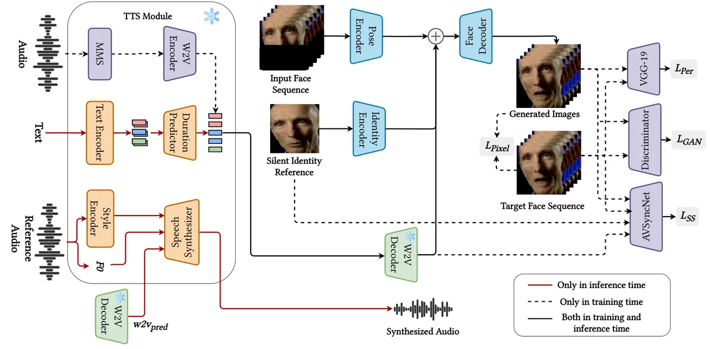
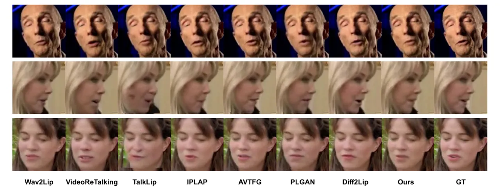

# SHARED LATENT REPRESENTATION FOR JOINT TEXT-TO-AUDIO-VISUAL SYNTHESIS

Dogucan Yaman   Seymanur Akti   Fevziye Irem Eyiokur  Alexander Waibel
^(†)^(†)thanks: \*The authors contributed equally.

###### Abstract

We propose a text-to-talking-face synthesis framework leveraging latent
speech representations from HierSpeech++. A Text-to-Vec module generates
Wav2Vec2 embeddings from text, which jointly condition speech and face
generation. To handle distribution shifts between clean and
TTS-predicted features, we adopt a two-stage training: pretraining on
Wav2Vec2 embeddings and finetuning on TTS outputs. This enables tight
audio-visual alignment, preserves speaker identity, and produces
natural, expressive speech and synchronized facial motion without
ground-truth audio at inference. Experiments show that conditioning on
TTS-predicted latent features outperforms cascaded pipelines, improving
both lip-sync and visual realism.

###### Index Terms: 

Talking face generation, Text-to-Speech, Text-to-audio-visual synthesis

^(†)^(†)address: ¹Karlsruhe Institute of Technology, ²Carnegie Mellon
University

## 1 Introduction

Generating realistic talking-face videos directly from text, while
simultaneously producing high-quality speech, remains a challenging task
for applications such as virtual avatars, face-dubbing \[18\], and
digital assistants. Traditional talking face generation (TFG) models
trained on ground-truth audio often suffer from temporal misalignment
and reduced performance when exposed to synthetic speech. Some existing
pipelines adopt a cascaded approach, where text is first converted to
speech and then the audio drives facial animation \[20, 26, 25\]. While
effective to some extent, these methods are prone to domain shift and
error accumulation, as the talking-face model is not trained on
TTS-generated audio.

Other approaches mitigate this issue by creating shared latent
representations for text and audio \[12, 3\] or by using feature fusion
techniques to incorporate text-enriched features into TFG \[5\]. More
recent works employ advanced generative models to jointly synthesize
speech and talking faces \[8, 21\], demonstrating the benefits of
unified modeling for audio-visual coherence.

In our approach, we adopt a simple yet effective adaptation strategy. We
leverage a Text-to-Vec (TTV) module to generate intermediate latent
speech features directly from text. These features serve as a shared
representation for both speech reconstruction and talking-face
generation, ensuring tight audio-visual alignment. We then adapt the
talking face generator to these intermediate TTS-predicted features,
addressing the domain shift that occurs between clean, pretrained audio
features and TTS outputs. By conditioning the generator on these
predicted representations, we avoid the limitations of cascaded
pipelines and enable existing TFG models to handle synthetic speech more
effectively, improving both lip–speech synchronization and overall
realism. Our contributions are as follows: (1) To the best of our
knowledge, we present the first joint text-to-audio-visual synthesis for
face dubbing. (2) We propose a two-stage training strategy for talking
face generation that learns a shared latent space and adapts effectively
to TTS-predicted features. (3) We conduct extensive experiments
demonstrating that our method achieves competitive performance while
enabling direct text-to-audio-video generation. This is particularly
important since generating audio and video in parallel from a joint
space is crucial as it guarantees natural audio-lip synchronization and
coherent audio-visual alignment. It also eliminates the need for a
cascaded system.

## 2 METHOD

Figure 1: Joint text-to-audio-visual synthesis framework. Text is
converted to latent Wav2Vec2 features via TTV, which condition both
speech synthesis and talking-face generation for synchronized output
without ground-truth audio.

In order to adapt the talking face generation model for text-to-speech
outputs, we used Hierspeech++ \[11\] as the TTS backbone where we used
the outputs from the text-to-vec module as inputs to the TFG module.
Then TFG and speech synthesizer synthesize the speech and corresponding
talking face. The overall architecture is shown in Figure 1.

### 2.1 TTS Module

HierSpeech++ is a hierarchical speech synthesis model that combines
linguistic, acoustic, and prosodic representations to generate natural
and expressive speech. Unlike conventional TTS systems that operate on
mel-spectrograms, HierSpeech++ leverages hierarchical latent
representations derived from the self-supervised speech model Wav2Vec2
(W2V2) \[1\], trained on massively multilingual data \[15\], and aligns
them with text through a conditional variational autoencoder
architecture. This design enables improved prosody modeling, robustness
to out-of-domain text, and enhanced expressiveness.

In our pipeline, we employ TTV and speech synthesizer modules. The TTV
module is a variational autoencoder similar to VITS \[10\], trained to
synthesize W2V2 embeddings and F0 from text. It consists of a text
encoder for generating text embeddings, a W2V2 encoder-decoder for
reconstructing W2V2 features, and a duration predictor that learns
text-to-W2V2 alignment via monotonic alignment search (MAS). During
training, we use the W2V2 encoder-decoder to reconstruct ground-truth
W2V2 embeddings and employ the predicted embeddings to fine-tune the
model for synthetic speech adaptation, ensuring that video–audio
alignment from the original data is preserved, a critical factor for
talking-face generation training.

During inference, as ground-truth audio is unavailable, we generate W2V2
features from text using the predicted durations and feed these
predicted features into the pipeline to jointly synthesize speech and
the corresponding talking face. Reference audio is used for style
conditioning, including speaker identity, while the hierarchical speech
synthesizer generates the waveform. This approach enables tight
synchronization between generated speech and facial motion while
maintaining naturalness and speaker characteristics.

|                 | With Real Data   |                  |                   |                   |                     |                  | With TTS Data    |                  |                   |                   |                     |                  |
| --------------- | ---------------- | ---------------- | ----------------- | ----------------- | ------------------- | ---------------- | ---------------- | ---------------- | ----------------- | ----------------- | ------------------- | ---------------- |
| Method          | SSIM$`\uparrow`$ | PSNR$`\uparrow`$ | FID$`\downarrow`$ | LSE-C$`\uparrow`$ | LSE-D$`\downarrow`$ | CSIM$`\uparrow`$ | SSIM$`\uparrow`$ | PSNR$`\uparrow`$ | FID$`\downarrow`$ | LSE-C$`\uparrow`$ | LSE-D$`\downarrow`$ | CSIM$`\uparrow`$ |
| Wav2Lip \[14\]  | 0.86             | 26.53            | 7.05              | 7.59              | 6.75                | 0.84             | 0.94             | 30.71            | 10.85             | 6.18              | 8.12                | 0.86             |
| TalkLip \[19\]  | 0.86             | 26.11            | 4.94              | 8.53              | 6.08                | 0.75             | 0.84             | 24.33            | 12.81             | 7.05              | 7.21                | 0.76             |
| IPLAP \[27\]    | 0.87             | 29.67            | 4.10              | 6.49              | 7.16                | 0.82             | 0.88             | 28.27            | 11.47             | 6.51              | 7.08                | 0.83             |
| AVTFG \[23\]    | 0.95             | 31.27            | 4.51              | 7.95              | 6.30                | 0.80             | 0.94             | 32.98            | 13.67             | 6.19              | 8.16                | 0.88             |
| PLGAN \[24\]    | 0.95             | 32.64            | 3.83              | 8.41              | 6.03                | 0.79             | 0.94             | 31.21            | 12.01             | 6.30              | 7.99                | 0.87             |
| Diff2Lip \[13\] | 0.94             | 31.68            | 3.80              | 7.87              | 6.46                | 0.85             | 0.93             | 30.61            | 15.37             | 7.06              | 6.84                | 0.87             |
| Ours            | 0.92             | 30.90            | 4.93              | 7.97              | 6.18                | 0.85             | 0.93             | 31.48            | 13.15             | 6.30              | 7.81                | 0.84             |

Table 1: Quantitative results of our talking face generation model
compared with SOTA methods. The left part shows generation with real
audio (and Wav2Vec2 features extracted from real audio for our model),
while the right part shows generation with TTS-generated audio (and
TTS-predicted features for our model).

Figure 2: Qualitative comparison of our model with other approaches.
Note that since our model is trained with predicted Wav2Vec2 features
and is designed to align lips with TTS-generated audio in a joint space,
the expected lip shapes do not necessarily need to match those of the
GT.

### 2.2 Talking Face Generation Model

We use the GAN-based \[6\] talking face generation model presented in
\[24\]. The original model includes two image encoders responsible for
processing the identity reference image and the input face sequence to
generate embeddings, as well as an audio encoder that extracts audio
embeddings from mel-spectrogram input. However, since our goal is to
generate video from the same latent space as TTS, we remove the audio
encoder from the architecture. Instead, we utilize features from the
joint space and directly concatenate them with the visual embeddings.
Finally, the face decoder generates the face sequence with synchronized
lip movements. In \[23\], it was also observed that the identity
reference can occasionally harm training stability and the model’s
lip-sync performance due to the lip leaking problem. To address this,
the authors proposed using an additional preprocessing network to modify
the selected identity reference image and generate a silent-face image,
representing a face with a stable, closed mouth. Since this approach
improves both performance and training stability, we adopt the same
strategy in training our model.

Two-stage training strategy. We propose a two-stage training strategy
for our talking-face generation model to ensure tight synchronization
with TTS-generated speech. In the first stage, we extract audio features
from pretrained W2V2 model ¹¹ 1 https://huggingface.co/facebook/mms-300m
that match the output space of the TTV module from HierSpeech++. These
features are used as audio conditions to train the model, providing a
robust initial mapping from speech representations to facial motion.

In the second stage, we finetune the model using features predicted by
the TTV decoder of the TTS model. This step is crucial for adapting to
the distribution shift between clean, pretrained W2V2 features and the
synthetic TTS-predicted vectors, which may have different statistics.
Unlike traditional cascaded pipelines, raw audio is unavailable during
inference; the face generator must rely on the same predicted features
used for speech synthesis.

|          | With Real Data   |                  |                   |                   |                     |                  | With TTS Data    |                  |                   |                   |                     |                  |
| -------- | ---------------- | ---------------- | ----------------- | ----------------- | ------------------- | ---------------- | ---------------- | ---------------- | ----------------- | ----------------- | ------------------- | ---------------- |
| Method   | SSIM$`\uparrow`$ | PSNR$`\uparrow`$ | FID$`\downarrow`$ | LSE-C$`\uparrow`$ | LSE-D$`\downarrow`$ | CSIM$`\uparrow`$ | SSIM$`\uparrow`$ | PSNR$`\uparrow`$ | FID$`\downarrow`$ | LSE-C$`\uparrow`$ | LSE-D$`\downarrow`$ | CSIM$`\uparrow`$ |
| Wav2Lip  | 0.84             | 25.84            | 7.89              | 7.35              | 7.18                | 0.74             | 0.87             | 23.21            | 11.93             | 6.82              | 7.49                | 0.76             |
| TalkLip  | 0.85             | 25.70            | 4.04              | 6.04              | 8.21                | 0.74             | 0.86             | 24.65            | 12.64             | 4.41              | 9.54                | 0.74             |
| IPLAP    | 0.86             | 28.98            | 3.95              | 3.63              | 10.10               | 0.77             | 0.91             | 29.74            | 11.25             | 3.49              | 10.50               | 0.81             |
| AVTFG    | 0.85             | 26.43            | 5.78              | 6.84              | 7.90                | 0.72             | 0.89             | 26.99            | 16.07             | 5.83              | 8.58                | 0.73             |
| PLGAN    | 0.86             | 25.38            | 4.11              | 7.58              | 6.81                | 0.73             | 0.87             | 25.57            | 15.99             | 6.91              | 7.22                | 0.74             |
| Diff2Lip | 0.92             | 30.32            | 3.59              | 6.71              | 7.26                | 0.83             | 0.93             | 31.11            | 8.05              | 6.21              | 7.36                | 0.85             |
| Ours     | 0.92             | 31.35            | 3.97              | 4.39              | 8.72                | 0.83             | 0.93             | 31.37            | 15.06             | 5.38              | 8.68                | 0.84             |

Table 2: Cross-test evaluation of the models. Instead of using matching
audio–video pairs, we randomly pair audio and video to create a
mismatched test setup. As in Table 1, the left and right parts
correspond to generation with real and TTS-generated data, respectively.

Loss functions. In training our model, we employ the following loss
functions: (1) Adversarial loss \[6\]: A discriminator network is used
to compute adversarial loss based on its output, guiding the model
toward generating realistic outputs. (2) Perceptual loss \[9\]: We adopt
a pretrained VGG-19 model \[17\] to extract features from both the
generated and GT faces, and compute the L2 distance between them. This
loss contributes to visual quality and identity preservation. (3) Pixel
reconstruction loss: We compute the L1 distance between the generated
and GT faces in pixel space, which helps preserve fine visual details.
(4) Stabilized synchronization loss: Following \[23\], we use the
stabilized synchronization loss, which outperforms vanilla lip-sync
loss \[14\] and other lip-sync learning methods. However, during the
second training stage, since the GT data may not be perfectly aligned
with the predicted features, we employ vanilla lip-sync loss instead.
Given that our model has already learned lip synchronization in the
first stage, we apply vanilla lip-sync with a small coefficient during
the second stage of training.

## 3 Experimental Results

Evaluation. We train our talking face generation model on the LRS2
training set and evaluate it on the LRS2 test set. For evaluation of
talking face generation module, we follow the standard setup in the
literature and employ widely used metrics. To assess visual quality, we
report SSIM \[22\], PSNR, and FID \[7\]. For audio–lip synchronization,
we use mouth landmark distance (LMD) \[2\] and LSE-C & LSE-D \[4, 14\].
LMD measures the distance between the mouth landmarks of the generated
and GT faces, while LSE-C and LSE-D rely on the SyncNet model \[4\] to
extract audio–visual features and compute confidence and distance,
respectively.

For evaluating the speech synthesizer on LRS2 dataset, we measure the
word error rate (WER) using Whisper Large-v3 ²² 2
https://huggingface.co/openai/whisper-large-v3 for intelligibility
assessment, speaker embedding cosine similarity (SECS) using
Resemblyzer ³³ 3 https://github.com/resemble-ai/Resemblyzer for speaker
identity preservation assessments and UTMOS \[16\] for perceived
naturalness.

### 3.1 Results

Talking face generation. Table 1 reports the quantitative results on the
LRS2 test set mactched audio-video scenario, comparing our model with
existing methods. We consider two setups in this experiment. On the
left, videos are generated with the compared models using real audio,
while our model uses Wav2Vec2 features extracted from the same audio. On
the right, audio is generated with our TTS model and provided to the
compared models, whereas our model uses the corresponding TTS-predicted
Wav2Vec2 features. In terms of visual quality, our model achieves nearly
state-of-the-art (SOTA) performance on SSIM, PSNR, and FID. For identity
preservation, measured by CSIM, we obtain the best score together with
Diff2Lip. For lip synchronization, our model outperforms most of the
methods.

We further conduct a cross-test evaluation to assess the models under
more challenging conditions, where audio and video are randomly paired,
in contrast to the matched (GT) pairs used in Table 1. The results are
presented in Table 2. For identity preservation, our model achieves SOTA
performance, consistent with the matched scenario. In terms of FID, our
score is slightly below SOTA. For lip synchronization, our model
demonstrates moderate performance according to the LSE-C and LSE-D
metrics. Note that the setup in this table follows the same protocol as
Table 1 with respect to real and TTS data; the only difference is the
use of mismatched audio–video pairs.

| Method                          | SSIM$`\uparrow`$ | PSNR$`\uparrow`$ | FID$`\downarrow`$ | LSE-C$`\uparrow`$ | LSE-D$`\downarrow`$ | CSIM$`\uparrow`$ |
| ------------------------------- | ---------------- | ---------------- | ----------------- | ----------------- | ------------------- | ---------------- |
| Ours - first stage only w/ Real | 0.91             | 29.78            | 7.29              | 8.39              | 5.92                | 0.84             |
| Ours - first stage only         | 0.92             | 30.42            | 9.09              | 3.24              | 11.12               | 0.84             |
| Ours - two-stage, no sync       | 0.92             | 31.21            | 7.47              | 3.31              | 10.81               | 0.84             |
| Ours - full                     | 0.93             | 31.48            | 5.31              | 4.14              | 10.28               | 0.84             |

Table 3: Ablation study evaluating the impact of the proposed training
strategy.

Speech Synthesis. The evaluation results of HierSpeech++ outputs
compared to ground-truth speech are reported in Table 4. The WER scores
indicate that HierSpeech++ generates highly intelligible speech from
text, even surpassing the performance on the ground-truth recordings,
likely due to the dataset containing suboptimal recording conditions,
whereas the TTS output is cleaner and less noisy. SECS results show that
speaker identity is largely preserved, and UTMOS scores suggest that the
synthesized speech maintains naturalness comparable to real speech.

| Method       | WER$`\downarrow`$ | SECS$`\uparrow`$ | UTMOS$`\uparrow`$ |
| ------------ | ----------------- | ---------------- | ----------------- |
| GT           | 4.47%             | -                | 3.05              |
| HierSpeech++ | 1.51%             | 72%              | 4.22              |

Table 4: Quantitative evaluation of the synthesized speech.

### 3.2 Ablation Study

Table 3 presents the ablation study of our method. We first evaluate the
model trained only in the first stage, using Wav2Vec2 features extracted
from real audio (Ours – first stage only w/ Real). Next, we apply the
same model with TTS-predicted features, reported as Ours – first stage
only. We then evaluate a two-stage model in which the second stage is
trained without any explicit lip-sync loss (Ours – two-stage, no sync.).
Finally, the last row corresponds to our full pipeline.

## 4 Conclusion

We present a joint text-to-audio-visual synthesis framework using latent
speech representations from HierSpeech++. By conditioning the
talking-face generator on TTS-predicted Wav2Vec2 features, we achieve
tight audio–visual alignment, preserve speaker identity, and generate
natural speech with synchronized facial motion, compatible to other
models. Limitations include reliance on high-quality latent features,
which may reduce generalization to unseen languages or noisy TTS
outputs, and the lack of explicit modeling for subtle facial expressions
beyond lip movements.

## References

- \[1\] A. Baevski, Y. Zhou, A. Mohamed, and M. Auli (2020) Wav2vec 2.0:
  a framework for self-supervised learning of speech representations.
  Advances in neural information processing systems 33, pp. 12449–12460.
  Cited by: §2.1.
- \[2\] L. Chen, R. K. Maddox, Z. Duan, and C. Xu (2019) Hierarchical
  cross-modal talking face generation with dynamic pixel-wise loss. In
  Proceedings of the IEEE/CVF conference on computer vision and pattern
  recognition, pp. 7832–7841. Cited by: §3.
- \[3\] J. Choi, M. Kim, S. J. Park, and Y. M. Ro (2024) Text-driven
  talking face synthesis by reprogramming audio-driven models. In
  ICASSP, pp. 8065–8069. Cited by: §1.
- \[4\] J. S. Chung and A. Zisserman (2017) Out of time: automated lip
  sync in the wild. In Computer Vision–ACCV 2016 Workshops: ACCV 2016
  International Workshops, Taipei, Taiwan, November 20-24, 2016, Revised
  Selected Papers, Part II 13, pp. 251–263. Cited by: §3.
- \[5\] X. Diao, M. Cheng, W. Barrios, and S. Jin (2025) Ft2tf:
  first-person statement text-to-talking face generation. In WACV,
  pp. 4821–4830. Cited by: §1.
- \[6\] I. Goodfellow, J. Pouget-Abadie, M. Mirza, B. Xu, D.
  Warde-Farley, S. Ozair, A. Courville, and Y. Bengio (2014) Generative
  adversarial nets. Advances in neural information processing systems 27. Cited by: §2.2, §2.2.
- \[7\] M. Heusel, H. Ramsauer, T. Unterthiner, B. Nessler, and S.
  Hochreiter (2017) Gans trained by a two time-scale update rule
  converge to a local nash equilibrium. Advances in neural information
  processing systems 30. Cited by: §3.
- \[8\] Y. Jang, J. Kim, J. Ahn, D. Kwak, H. Yang, Y. Ju, I. Kim, B.
  Kim, and J. S. Chung (2024) Faces that speak: jointly synthesising
  talking face and speech from text. In Proceedings of the IEEE/CVF
  Conference on Computer Vision and Pattern Recognition, pp. 8818–8828.
  Cited by: §1.
- \[9\] J. Johnson, A. Alahi, and L. Fei-Fei (2016) Perceptual losses
  for real-time style transfer and super-resolution. In Computer
  Vision–ECCV 2016: 14th European Conference, Amsterdam, The
  Netherlands, October 11-14, 2016, Proceedings, Part II 14,
  pp. 694–711. Cited by: §2.2.
- \[10\] J. Kim, J. Kong, and J. Son (2021) Conditional variational
  autoencoder with adversarial learning for end-to-end text-to-speech.
  In International Conference on Machine Learning, pp. 5530–5540. Cited
  by: §2.1.
- \[11\] S. Lee, H. Choi, S. Kim, and S. Lee (2025) Hierspeech++:
  bridging the gap between semantic and acoustic representation of
  speech by hierarchical variational inference for zero-shot speech
  synthesis. IEEE Transactions on Neural Networks and Learning Systems.
  Cited by: §2.
- \[12\] K. Mitsui, Y. Hono, and K. Sawada (2023) Uniflg: unified facial
  landmark generator from text or speech. arXiv preprint
  arXiv:2302.14337. Cited by: §1.
- \[13\] S. Mukhopadhyay, S. Suri, R. T. Gadde, and A.
  Shrivastava (2024) Diff2lip: audio conditioned diffusion models for
  lip-synchronization. In Proceedings of the IEEE/CVF Winter Conference
  on Applications of Computer Vision, pp. 5292–5302. Cited by: Table 1.
- \[14\] K. Prajwal, R. Mukhopadhyay, V. P. Namboodiri, and C.
  Jawahar (2020) A lip sync expert is all you need for speech to lip
  generation in the wild. In Proceedings of the 28th ACM international
  conference on multimedia, pp. 484–492. Cited by: §2.2, Table 1, §3.
- \[15\] V. Pratap, A. Tjandra, B. Shi, P. Tomasello, A. Babu, S.
  Kundu, A. Elkahky, Z. Ni, A. Vyas, M. Fazel-Zarandi, et al. (2024)
  Scaling speech technology to 1,000+ languages. Journal of Machine
  Learning Research 25 (97), pp. 1–52. Cited by: §2.1.
- \[16\] T. Saeki, D. Xin, W. Nakata, T. Koriyama, S. Takamichi, and H.
  Saruwatari (2022) Utmos: utokyo-sarulab system for voicemos challenge 2022. arXiv preprint arXiv:2204.02152. Cited by: §3.
- \[17\] K. Simonyan and A. Zisserman (2014) Very deep convolutional
  networks for large-scale image recognition. arXiv preprint
  arXiv:1409.1556. Cited by: §2.2.
- \[18\] A. Waibel, M. Behr, D. Yaman, F. I. Eyiokur, T. Nguyen, C.
  Mullov, M. A. Demirtas, A. Kantarci, S. Constantin, and H. K.
  Ekenel (2023) Face-dubbing++: lip-synchronous, voice preserving
  translation of videos. In 2023 IEEE International Conference on
  Acoustics, Speech, and Signal Processing Workshops (ICASSPW), pp. 1–5.
  Cited by: §1.
- \[19\] J. Wang, X. Qian, M. Zhang, R. T. Tan, and H. Li (2023) Seeing
  what you said: talking face generation guided by a lip reading expert.
  In Proceedings of the IEEE/CVF Conference on Computer Vision and
  Pattern Recognition, pp. 14653–14662. Cited by: Table 1.
- \[20\] Z. Wang, M. Dai, and K. Lundgaard (2023) Text-to-video: a
  two-stage framework for zero-shot identity-agnostic talking-head
  generation. arXiv preprint arXiv:2308.06457. Cited by: §1.
- \[21\] Z. Wang, P. Zhang, J. Qi, G. Wang, C. Ji, S. Xu, B. Zhang,
  and L. Bo (2025) OmniTalker: one-shot real-time text-driven talking
  audio-video generation with multimodal style mimicking. arXiv preprint
  arXiv:2504.02433. Cited by: §1.
- \[22\] Z. Wang, A. C. Bovik, H. R. Sheikh, and E. P. Simoncelli (2004)
  Image quality assessment: from error visibility to structural
  similarity. IEEE transactions on image processing 13 (4), pp. 600–612.
  Cited by: §3.
- \[23\] D. Yaman, F. I. Eyiokur, L. Bärmann, S. Akti, H. K. Ekenel,
  and A. Waibel (2024) Audio-visual speech representation expert for
  enhanced talking face video generation and evaluation. In Proceedings
  of the IEEE/CVF Conference on Computer Vision and Pattern Recognition,
  pp. 6003–6013. Cited by: §2.2, §2.2, Table 1.
- \[24\] D. Yaman, F. I. Eyiokur, L. Bärmann, H. K. Ekenel, and A.
  Waibel (2024) Audio-driven talking face generation with stabilized
  synchronization loss. arXiv preprint arXiv:2307.09368. Cited by: §2.2,
  Table 1.
- \[25\] Z. Ye, Z. Jiang, Y. Ren, J. Liu, C. Zhang, X. Yin, Z. Ma,
  and Z. Zhao (2023) Ada-tta: towards adaptive high-quality
  text-to-talking avatar synthesis. arXiv preprint arXiv:2306.03504.
  Cited by: §1.
- \[26\] S. Zhang, J. Yuan, M. Liao, and L. Zhang (2022) Text2video:
  text-driven talking-head video synthesis with personalized
  phoneme-pose dictionary. In ICASSP, pp. 2659–2663. Cited by: §1.
- \[27\] W. Zhong, C. Fang, Y. Cai, P. Wei, G. Zhao, L. Lin, and G.
  Li (2023) Identity-preserving talking face generation with landmark
  and appearance priors. In Proceedings of the IEEE/CVF Conference on
  Computer Vision and Pattern Recognition, pp. 9729–9738. Cited by:
  Table 1.
