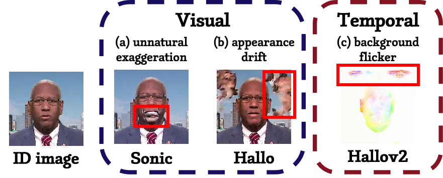
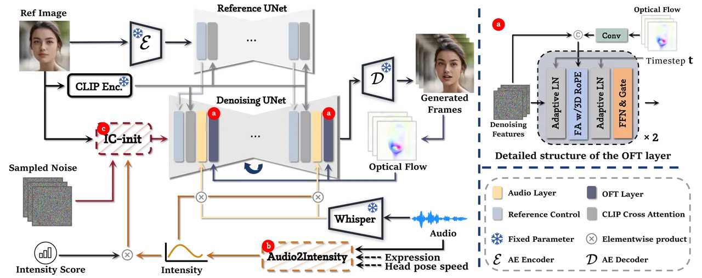
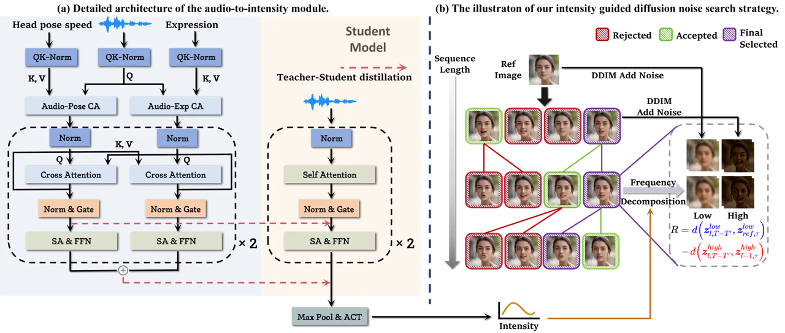
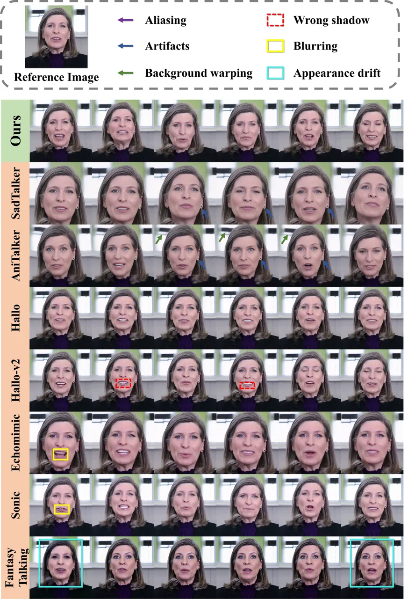
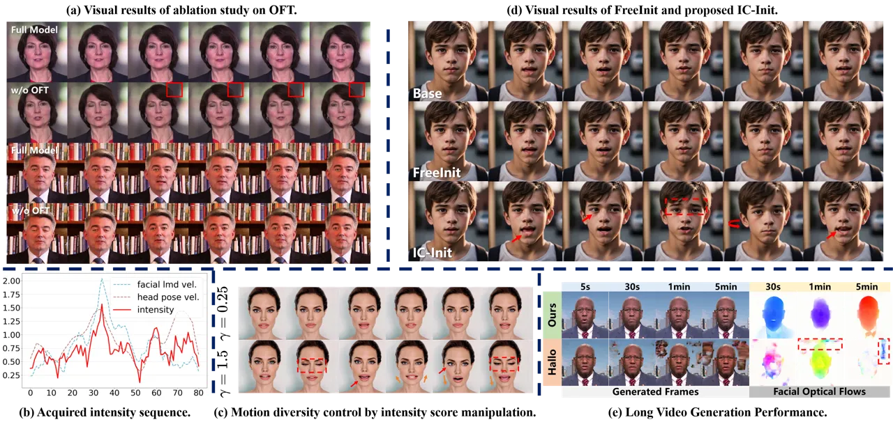

# ConsistTalk: Intensity Controllable Temporally Consistent Talking Head Generation with Diffusion Noise Search

Zhenjie Liu    Jianzhang Lu    Renjie Lu    Cong Liang    Shangfei Wang
^(†)^(†)thanks: The corresponding author.

###### Abstract

Recent advancements in video diffusion models have significantly
enhanced audio-driven portrait animation. However, current methods still
suffer from flickering, identity drift, and poor audio-visual
synchronization. These issues primarily stem from entangled
appearance-motion representations and unstable inference strategies. In
this paper, we introduce ConsistTalk, a novel intensity-controllable and
temporally consistent talking head generation framework with diffusion
noise search inference. First, we propose an optical flow-guided
temporal module (OFT) that decouples motion features from static
appearance by leveraging facial optical flow, thereby reducing visual
flicker and improving temporal consistency. Second, we present an
Audio-to-Intensity (A2I) model obtained through multimodal
teacher-student knowledge distillation. By transforming audio and facial
velocity features into a frame-wise intensity sequence, the A2I model
enables joint modeling of audio and visual motion, resulting in more
natural dynamics. This further enables fine-grained, frame-wise control
of motion dynamics while maintaining tight audio-visual synchronization.
Third, we introduce a diffusion noise initialization strategy (IC-Init).
By enforcing explicit constraints on background coherence and motion
continuity during inference-time noise search, we achieve better
identity preservation and refine motion dynamics compared to the current
autoregressive strategy. Extensive experiments demonstrate that
ConsistTalk significantly outperforms prior methods in reducing flicker,
preserving identity, and delivering temporally stable, high-fidelity
talking head videos.

University of Science and Technology of China

{liuzhenjie, jzlu, lu_h, lc150303}@mail.ustc.edu.cn, sfwang@ustc.edu.cn

## 1 Introduction

Audio-driven portrait animation aims to synthesize expressive talking
head videos from a static portrait image and accompanying speech audio.
Early works (Zhang et al. 2023b; Wei et al. 2024) primarily employ a
two-stage pipeline using 3D motion or keypoints as intermediate
representations. However, representational bottlenecks limit the ability
of these methods to produce dynamic and realistic facial movements.

Recent advancements in this field have been spurred by the emergence of
image generation diffusion models such as Stable Diffusion (SD) (Rombach
et al. 2022) and DiT (Peebles and Xie 2023). Diffusion models have
demonstrated superior generative capabilities compared to non-diffusion
models, leading to their adaptation for portrait animation tasks. For
example, EMO (Tian et al. 2024), the first end-to-end framework capable
of generating high-realism animations from a single image and audio,
extends SD to video generation by incorporating temporal modules.
Likewise, other notable approaches (Chen et al. 2024; Xu et al. 2024a;
Jiang et al. 2024; Ji et al. 2024; Wang et al. 2025b) built upon the
pretrained image diffusion model backbone demonstrate robust generation
capabilities in this domain.



Figure 1: Failure cases in maintaining visual and temporal consistency
of current methods. The left samples exhibit significant visual
distortion (a) and background deformation with identity drift (b). The
rightmost visualization displays temporal flickering (c) in the optical
flows.

Despite these advancements, existing methods still exhibit significant
temporal and visual inconsistencies, as illustrated in Figure 1. First,
predominant approaches leverage motion features extracted from preceding
frames through the ReferenceNet as temporal signals. However, flickering
remains problematic due to the contamination of appearance information
in complex scenes (Cui et al. 2024). Second, current methods either
predict motion solely from audio or from previous frames, resulting in
abrupt temporal jitter. Controlling motion intensity may disrupt the
synchronization between audio and visual elements, leading to unstable
inferences. Finally, many methods (Xu et al. 2024a; Cui et al. 2024;
Wang et al. 2025b) adopt an autoregressive-like inference strategy for
long video generation to maintain consistent motion across segments. By
recursively using generated frames as reference images, deformations
will accumulate over time and cause noticeable appearance drift.

To address these challenges, we propose ConsistTalk, a novel
intensity-controllable and temporally consistent talking head generation
framework with a diffusion noise search inference strategy. The method
comprises three key innovations: 1) Optical Flow-guided Temporal Module
(OFT): We utilize facial optical flow to decouple facial dynamics from
static appearance features, thereby preventing appearance contamination
in the temporal layer and reducing flicker. 2) Audio-to-Intensity (A2I)
Module: Intensity modeling captures the one-to-many mapping between
audio and facial movements. A student model is distilled from a
multimodal teacher to predict a frame-wise intensity sequence from audio
alone, enabling controllable motion while maintaining audio-visual
synchronization. 3) IC-Init strategy: We introduce a training-free
inference algorithm that leverages a noise searching mechanism guided by
the intensity sequence. By enforcing constraints on background stability
and motion continuity, we enhance generation robustness and dynamic
quality. Extensive experiments demonstrate that ConsistTalk outperforms
existing methods in temporal consistency, identity preservation, and
motion fidelity. Our contributions are summarized as follows.

- •
  We present ConsistTalk, a novel diffusion-based model that leverages
  facial optical flow to decouple motion from appearance, thereby
  mitigating temporal flickering. Through multimodal learning, it
  effectively captures the correlation between audio and motion velocity
  and enables motion dynamics control.
- •
  We propose IC-Init, a training-free diffusion noise initialization
  strategy that leverages an intensity-guided noise search,
  significantly improving identity preservation and motion continuity
  during inference.
- •
  We conduct fair and extensive experiments across diverse settings to
  validate our approach. Results show that ConsistTalk consistently
  generates more vivid, expressive, and temporally coherent talking head
  videos than existing state-of-the-art methods.



Figure 2: Overall architecture of the proposed ConsistTalk framework.
The system integrates three key modules: (a) a facial optical
flow-guided temporal module (OFT) that decouples motion dynamics from
appearance features to suppress flicker and enhance temporal
consistency; (b) a audio-to-intensity (A2I) model that transforms audio
and facial velocity features into frame-wise intensity signals for
fine-grained motion control; and (c) a noise initialization strategy
(IC-Init) that stabilizes the generation process by leveraging a noise
search procedure.

## 2 Related Work

Audio-driven talking head generation has seen significant progress in
recent years. Existing approaches generally fall into two categories
based on their generation strategies: two-stage pipelines and end-to-end
generation frameworks.

Two-Stage Talking Head Generation. Early works like SadTalker (Zhang et
al. 2023b) and Aniprotrait (Wei et al. 2024) in this field primarily
incorporated intermediate 3D motion representations and employed a
two-stage pipeline for video generation. Specifically, in the first
stage, audio features are converted into motion parameters, while in the
second stage, these motion cues guide a rendering or warping-based
synthesis module to generate video frames. However, the reliance on
intermediate motion representations limits their ability to model
nuanced facial dynamics.

End-To-End Talking Head Generation. Recent studies (Tian et al. 2024; Xu
et al. 2024a; Cui et al. 2024; Jiang et al. 2024; Ji et al. 2024; Zhang
et al. 2024) have integrated diffusion models into this field. By
leveraging the powerful generative capabilities of pretrained image
diffusion models, these approaches employ Stable Diffusion (Rombach et
al. 2022) or Wan 2.1 (Wang et al. 2025a) as the backbone network. To
enhance the image generation model’s ability to capture cross-frame
dynamics, these methods incorporate ReferenceNet features from previous
frames to construct temporal layers. However, because they rely on
overall visual features as motion control signals without decoupling
motion features, they still suffer from temporal inconsistencies. Figure
1 (c) illustrates cross-frame optical flow, showing sudden variations in
the background that result in noticeable temporal flickering. In
contrast, our method explicitly separates motion dynamics from
appearance via facial optical flow, improving background coherence. This
fundamentally differs from implicit decoupling strategies such as
Patch-Drop in Hallo2 (Cui et al. 2024).

Secondly, current methods often struggle to achieve visually consistent
control of motion intensity. Hallo (Xu et al. 2024a) proposes a
hierarchical audio-driven visual synthesis module, while Sonic (Ji et
al. 2024) introduces a motion-decoupled control module that predicts
motion buckets through audio-reference image fusion. However, as
illustrated in Figure 1 (a), unnatural or exaggerated motions can occur
due to unstable motion intensity control strategies. In contrast, we
present a multimodal teacher-student knowledge distillation learning
strategy designed to explicitly predict motion intensity. The acquired
intensity value is then provided to the denoising model as a latent
scale factor, offering a user-friendly method for controlling motion
intensity while maintaining audio-visual synchronization.

Thirdly, for long-form video generation, autoregressive-like inference
(Xu et al. 2024a; Cui et al. 2024) is commonly used, where previously
generated frames are recursively fed as motion conditions or reference
images. Although this approach facilitates continuous motion across
frames, it is susceptible to error accumulation. Deformations relative
to the reference image or inconsistencies in motion from earlier frames
can propagate to subsequent frames, leading to issues with background
and identity shifting, as shown in Figure 1 (b). We enhance this
inference strategy by constructing a noise search algorithm that
incorporates explicit constraints related to the reference image and
preceding frames, thereby improving motion diversity and temporal
consistency.

## 3 Methodology

In this section, we present ConsistTalk for audio-driven portrait image
animation, designed to mitigate flickering and temporal inconsistency
problems effectively. Let $`\boldsymbol{I}_{ref}`$ denote the reference
image, and let $`\{\boldsymbol{I}_{t-1},\cdots,\boldsymbol{I}_{t-n}\}`$
represent the preceding $`n`$ generated frames. Our architecture is
built upon the Dual-UNet design (Tian et al. 2024; Xu et al. 2024a; Chen
et al. 2024). We first use CLIP (Radford et al. 2021) to extract
features from the reference ID portrait image. Compared with Hallo(Xu et
al. 2024a)’s face embedding, it is compatible with the stable
diffusion’s text-image cross-attention space. To decouple temporal
motion dynamics from identity information in motion frames, we introduce
a facial optical flow-guided temporal module (Sec. 3.1). In addition, a
multimodal joint modeling module is proposed to learn audio-video
intensity from both audio signals and facial/head motion sequences (Sec.
3.2). The intensity value is then used to guide noise initialization,
enhancing the quality of generation and ensuring temporal consistency
(Sec. 3.3).

### 3.1 Optical Flow Guided Temporal Module

The temporal module in current methods builds upon ReferenceNet, an
extension of ControlNet (Zhang et al. 2023a), which is widely used in
image-to-video (I2V) generation to enable spatio-temporal alignment (Hu
2024; Xu et al. 2024b; Choi et al. 2024; Tian et al. 2024). To avoid
appearance contamination in spatio-temporal fusion, we adopt a
decoupling strategy: identity (ID) features are encoded by ReferenceNet
only once, while motion information is dynamically constructed by
estimating facial optical flow between adjacent frames. Optical flow
captures inter-frame sub-pixel-level motion dynamics information from
pixel space. The core idea is to decouple motion dynamics from identity
information in the generated frames, thus ensuring that the model relies
primarily on the reference image for appearance features and utilizes
preceding frames to capture temporal movement features.

Specifically, the global visual texture information is extracted with
the help of ReferenceNet and injected into the Dual-UNet through
cross-attention. Then we use a lightweight model FacialFlownet (Lu et
al. 2024) to estimate the facial optical flow frames
$`\{\boldsymbol{F}_{i}\in\mathbb{R}^{C\times H\times W}\}_{i=t-1}^{t-n}`$
and downsample them to the resolution of the latent space using 3D
convolution. To enhance temporal consistency, we employ the
Full-Attention mechanism (Kong et al. 2024; Lin et al. 2024; Yang et al. 2024) with 3D RoPE (Su et al. 2021). Compared to the divided
spatiotemporal (2D+1D) attention, it can better integrate spatial and
temporal features and improve the temporal consistency of the generated
video. Refer to Figure 2 (a) for a visualization of the temporal module.



Figure 3: Audio-to-Intensity module and IC-Init. The left side presents
the detailed structure of the audio-to-intensity module, and on the
right is the inference-time noise search strategy IC-Init based on
intensity-guided frequency decomposition.

### 3.2 Motion Intensity Sequence Modeling

Here, we propose a motion intensity sequence modeling strategy, in which
the intensity sequence captures the overall magnitude of head and facial
expression movements over time. Unlike prior methods (Ji et al. 2024;
Jiang et al. 2024; Xu et al. 2024a), our approach explicitly estimates a
frame-wise intensity sequence and performs multimodal fusion during
training, rather than relying on modal dropout as in (Jiang et al.
2024). Specifically, we first use Whisper-Tiny (Radford et al. 2022) to
extract audio features, and a duration of $`0.2s`$ windowed audio
features is used for each frame and projected using linear layers. The
transformed audio embedding is denoted as
$`c_{a}\in\mathbb{R}^{b\times f\times d_{a}}`$, where $`b`$ denotes
batch size, $`f`$ is segment length, and $`c`$ is cross attention
dimension. Additionally, following Loopy (Jiang et al. 2024), facial
velocity-related features, such as head motion velocity
$`v_{h}\in\mathbb{R}^{b\times L\times 1}`$ and facial landmark motion
variance $`v_{f}\in\mathbb{R}^{b\times L\times 1}`$, are extracted,
where $`L`$ denotes the velocity feature length. Then we use 1D
convolution and linear layers to match the shape of the projected audio
features.

As shown in Figure 3, we propose an audio-to-intensity module based on
teacher-student learning. The teacher model leverages multimodal cross
attention and a variant of the gated linear unit to capture the
relationships between driven audio and portrait movement-related
features. We use the Swish (Ramachandran et al. 2017) activation
function and take $`\boldsymbol{y}=\texttt{Swish}(\boldsymbol{h})`$ as
the output intensity sequence. Due to the audio-velocity multimodal
fusion, intensity can be interpreted as an aggregate representation of
the overall magnitude of head pose dynamics and facial expression
movements. Since the intensity sequence has no ground truth as the
supervisory signal, we draw inspiration from time series tasks (Le Guen
and Thome 2019) to make the intensity sequence and the input velocity
sequence construct shape and temporal loss. Specifically, the intensity
loss is defined by

```math
\displaystyle\mathcal{L}_{intensity}= \displaystyle\alpha\sum\nolimits_{c\in\{h,f\}}\mathcal{L}_{shape}(\boldsymbol{y},v_{c})
```

```math
\displaystyle+(1-\alpha)\sum\nolimits_{c\in\{h,f\}}\mathcal{L}_{temporal}(\boldsymbol{y},v_{c}) \tag{1}
```

where $`\boldsymbol{y}`$ is the output intensity sequence, and $`c`$
represents the velocity modal. Since velocity-related features are
unavailable during the inference phase, we employ a knowledge
distillation approach to train a student model that predicts the
intensity sequence solely from audio input. Specifically, we minimize
the mean squared error (MSE) loss between the cross-attention logits of
the last $`l`$ layers of the teacher and student models, as demonstrated
in Figure 3 (a). This design encourages the student model to learn the
multi-modal correspondence and anchors the learned intensity to concrete
velocity priors. We further enforce that the intensity sequence matches
the velocity patterns via shape and temporal losses. Formally, the total
loss function for the student model is defined as
$`\mathcal{L}=\mathcal{L}_{MSE}+\alpha\cdot\mathcal{L}_{intensity}`$.

0:  latent denoising diffusion model $`\boldsymbol{\epsilon}_{\theta}`$,
reference portrait image latent $`\boldsymbol{z}_{ref}`$, number of
beams $`B`$, number of candidates $`K`$, number of lookahead steps
$`T^{\prime}`$, number of add noise steps $`\tau`$

1:
 $`\boldsymbol{z}_{ref,\tau}=\texttt{add\_noise}(\boldsymbol{z}_{ref},\tau)`$

2:  $`B_{0}=\{\boldsymbol{z}_{0}^{s}\}_{s=1}^{B}`$   $`\triangleright`$
Initial Beams

3:  for $`l=1`$ to $`L`$ do

4:   $`\texttt{budget}=\varnothing,\;B_{l}=\varnothing`$

5:   for $`\boldsymbol{z}_{l-1}^{s}\in B_{l-1}`$ do

6:
   $`\boldsymbol{z}_{l-1,\tau}^{s}=\texttt{add\_noise}(\boldsymbol{z}_{l-1}^{s},\tau)`$
$`\triangleright`$ Sample $`K`$ candidates for each latent in
$`B_{l-1}`$

7:
   $`\big\{\boldsymbol{z}_{l,T}^{s,k}\sim\mathcal{N}(\boldsymbol{0},\boldsymbol{I})\big\}_{k=1}^{K}`$
$`\triangleright`$ lookahead denoising

8:
   $`\boldsymbol{z}_{l,T-T^{\prime}}^{s,k}=\texttt{de\_noise}\left(\boldsymbol{z}_{l,T}^{k},\boldsymbol{\epsilon}_{\theta},T^{\prime}\right)`$

9:
   $`\texttt{budget}\;+=\Big\{(\boldsymbol{z}_{l,T-T^{\prime}}^{s,k},\boldsymbol{z}_{l-1,\tau}^{s})\Big\}_{k=1}^{K}`$

10:   end for$`\triangleright`$ Search $`B`$ higher reward from
$`B\times K`$ pairs

11:   for
$`\boldsymbol{z}_{l,T-T^{\prime}}^{s,k},\boldsymbol{z}_{l-1,\tau}^{s}\in\texttt{top-}B\Big(\texttt{budget},R(\cdot)\Big)`$
do

12:
   $`B_{l}\;+=\texttt{de\_noise}\left(\boldsymbol{z}_{l,T-T^{\prime}}^{s,k},\boldsymbol{\epsilon}_{\theta},T-T^{\prime}\right)`$

13:   end for

14:  end for$`\triangleright`$ Final selected path

15:  return:
$`\{\boldsymbol{z}^{\prime}_{l}\}_{l=1}^{L}=\texttt{argmax}_{\{z_{l}\}_{l=1}^{L}\subset\bigcup B_{l}}\sum R(\cdot)`$

Algorithm 1 Intensity Guided Diffusion Noise Beam Search

|                             |                    |                   |                     |                       |                     |                       |                |                 |
| --------------------------- | ------------------ | ----------------- | ------------------- | --------------------- | ------------------- | --------------------- | -------------- | --------------- |
| Method                      | Lip Sync           | Quality           |                     | Consistency           |                     | ID                    | Motion         |                 |
|                             | Sync-C$`\uparrow`$ | FVD$`\downarrow`$ | E-FID$`\downarrow`$ | Flicker$`\downarrow`$ | VBench $`\uparrow`$ | ID-dist$`\downarrow`$ | BA$`\uparrow`$ | Div$`\uparrow`$ |
| SadTalker^(†) (2023b)       | 5.44               | 778.2             | 2.029               | 0.5445                | 99.5 / 97.77        | 0.2204                | 1.468          | 3.31            |
| AniTalker^(†) (2024)        | 4.53               | 575.0             | 2.569               | 0.7519                | 99.5 / 98.37        | 0.2021                | 1.432          | 2.75            |
| Hallo (2024a)               | 6.3                | 268.4             | 2.327               | 2.3274                | 99.37 / 97.18       | 0.1864                | 1.545          | 2.59            |
| Hallo-v2 (2024)             | 6.27               | 284.1             | 2.5685              | 0.5914                | 99.4 / 96.95        | 0.1889                | 1.452          | 3.01            |
| EchoMimic (2024)            | 6.12               | 693.8             | 1.138               | 0.6552                | 99.34 / 97.13       | 0.1777                | 1.507          | 2.95            |
| Sonic (2024)                | 7.11               | 206.1             | 1.664               | 0.688                 | 99.61 / 97.47       | 0.1835                | 1.41           | 2.8             |
| FantasyTalking (2025b)      | 5.82               | 256.9             | 2.069               | 1.874                 | 99.63 / 96.56       | 0.228                 | 1.581          | 2.43            |
| ConsistTalk (Full Model)    | 6.83               | 171.7             | 1.4397              | 0.4218                | 99.68 / 98.28       | 0.1743                | 1.659          | 3.48            |
| Base Model +OFT +A2I        | 6.92               | 186.5             | 1.3758              | 0.6583                | 99.64 / 97.68       | 0.1723                | 1.624          | 3.16            |
| Base Model +OFT             | 5.94               | 203.9             | 1.3542              | 0.5288                | 99.67 / 97.44       | 0.1705                | 1.551          | 2.95            |
| Base Model (w/ReferenctNet) | 6.28               | 228.4             | 1.4637              | 2.2642                | 99.26 / 97.15       | 0.1823                | 1.533          | 2.81            |

Table 1: Quantitative comparison results with baselines on HDTF (Zhang
et al. 2021) dataset. The best result for each metric is in bold, and
the second-best is underlined. The Base Model refers to the original
Dual-Unet framework from Hallo, without optical flow motion feature
decoupling (i.e., the standard ReferenceNet strategy). And Full Model
represents the base model with all proposed modules (OFT, A2I, and
IC-Init). ^(†): evaluated using $`256\times 256`$ resolution outputs
without resizing.

The acquired intensity value is provided to the denoising UNet model by
multiplying it with the hidden states of the audio-conditioned layer.
This design enables explicit, frame-wise control over motion dynamics
and diversity by adjusting the intensity values during inference.

### 3.3 Intensity Guided Diffusion Noise Search

In this subsection, we present our noise initialization strategy,
IC-Init. Drawing inspiration from ConsistI2V (Ren et al. 2024), we
observe that high-frequency components encode rapid motion and fine
details, while low-frequency components preserve coarse structure and
identity. Based on this observation, we perform frequency decomposition
and define a reward function conditioned on the reference image and
previous frames. The reward weights are adaptively modulated by the
predicted intensity sequence. This design enables intensity-aware beam
search to select temporally coherent and visually dynamic latent paths
during inference.

The procedure is illustrated in Figure 3 (b) and Algorithm 1.
Specifically, we establish the diffusion noise beam search process in
the temporal dimension. At each sequence step $`l=1,\ldots,L`$, we
sample $`K`$ latent candidates from a Gaussian distribution for every
beam in the previous set (Line 7). These candidates are partially
denoised with a $`T^{\prime}`$-step lookahead (where
$`T^{\prime}\ll T`$) to form a search budget of size $`B\times K`$
(Lines 8-9). Additionally, we apply $`\tau`$-step noise to both the
reference latent and the latent from the previous timestep (Lines 1 and
6). From the budget, we then select the top-$`B`$ candidates based on a
reward function:

```math
\displaystyle R(\boldsymbol{z}_{l,T-T^{\prime}},\boldsymbol{z}_{ref,\tau},\boldsymbol{z}_{l-1,\tau})=
```

```math
\displaystyle\lambda_{low}\cdot\left\langle\boldsymbol{z}_{l,T-T^{\prime}}^{low},\boldsymbol{z}_{ref,\tau}^{low}\right\rangle-\lambda_{high}\cdot\left\langle\boldsymbol{z}_{l,T-T^{\prime}}^{high},\boldsymbol{z}_{l-1,\tau}^{high}\right\rangle \tag{2}
```

The high- and low-frequency components are obtained via:

```math
\displaystyle\boldsymbol{z}=\texttt{FFT\_3D}(\boldsymbol{z})\odot\mathcal{M},\;\mathcal{M}=\begin{cases}\mathcal{G}(y_{l}),&\text{low\;freq.}\\
1-\mathcal{G}(y_{l}),&\text{high\;freq.}\end{cases} \tag{3}
```

where
$`\mathcal{G}(y):\mathbb{R}^{1}\to\mathbb{\{}0,1\}^{b\times c\times f\times h\times w}`$
is the Gaussian low-pass filter parameterized by the acquired intensity
sequence, and $`\langle\cdot,\cdot\rangle`$ represents the dot product
operation. The reward function comprises two components: a low-frequency
similarity term between the reference image latent and the candidate,
which preserves identity and global structure, and a high-frequency
dissimilarity term that penalizes deviations from the prior frame,
thereby promoting motion expressiveness. Maximizing this reward balances
stability with dynamic motion over time. The reward weights
$`\lambda_{low}(y_{l})`$ and $`\lambda_{high}(y_{l})`$ are dynamically
computed based on the normalized intensity score:
$`\lambda_{low}(y)=\texttt{sigmoid}\Big(\text{z-norm}(\boldsymbol{y})\Big),\;\lambda_{high}(y)=1-\lambda_{low}(y)`$,
where $`\text{z-norm}(y)=\frac{y-\mu(y)}{\sigma(y)}`$ is the Z-score
normalization. Higher intensity emphasizes high-frequency motion, while
lower intensity prioritizes low-frequency stability. Finally, we select
the path with the highest cumulative reward as the final sequence of
latents (Lines 15-16). Compared to the greedy search, IC-Init explores a
broader latent space and achieves superior temporal stability and motion
fidelity through frequency-aware sampling.

Let $`\Omega`$ denote the FLOPs of a single forward pass of the
diffusion model, and $`T`$ represents the total denoising steps.
Compared to autoregressive inference with complexity
$`\mathcal{O}(L\cdot T\cdot\Omega)`$, IC-Init introduces a beam search
with total complexity
$`\mathcal{O}(L\cdot B\cdot(K\cdot T^{\prime}+T-T^{\prime})\cdot\Omega)`$,
where $`B`$ and $`K`$ are beam and candidate sizes, and $`T^{\prime}`$
denotes the lookahead steps. Although computational cost approximately
increases by a factor of $`B`$, IC-Init yields significantly better
temporal stability, motion diversity, and identity preservation.



Figure 4: Qualitative comparisons with State-of-the-Art talking head
generation methods on HDTF (Zhang et al. 2021) dataset.

## 4 Experiment

### 4.1 Experimental Setups

#### Datasets

We developed a diverse training dataset by aggregating data from various
open-source datasets, including CelebV-HQ (Zhu et al. 2022), VFHQ (Xie
et al. 2022), and the Hallov3 (Cui et al. 2025) training set. To ensure
a fair evaluation, we randomly select 50 16-second clips from HDTF
(Zhang et al. 2021) as the test set, ensuring that no identity or video
clip is used during training. Following FOMM (Siarohin et al. 2019), we
first convert each video to 25 FPS and resample the audio to 16 kHz.
Then, we crop and resize the facial region to $`512\times 512`$
resolution using FaceAlignment (Bulat and Tzimiropoulos 2017).

#### Implementation Details

Our denoising net is initialized using Hallo-v1. We manipulate the data
in both training phases such that the drop ratio of the driven audio,
reference image, and optical flows is set to 5%, respectively. And
following Loopy (Jiang et al. 2024), we use DWPose (Yang et al. 2023) to
detect facial keypoints. The velocity of the absolute position of the
nose tip across the last 64 frames is the head pose movement feature.
The velocity of the displacement of the upper half of the facial
keypoints is used as the expression feature. We trained our model using
the Adam (Kingma 2014) optimizer with a learning rate of $`1e-5`$.

For IC-Init, we use DDIM (Song et al. 2020) scheduler with
$`\tau=20,\;T^{\prime}=3,\;T=30`$. And the beam search hyperparameters
are $`K=4,B=2`$.

During training, each instance generates $`f=10`$ video frame segments
and uses ground-truth optical flow from the previous six frames. While
in the inference stage, optical flow is computed from previously
generated frames.

#### Evaluation

We utilize nine metrics to evaluate. For overall video quality, we
measure Fréchet Video Distance (FVD) (Unterthiner et al. 2018), which
quantifies the similarity between generated and ground-truth videos, and
lower values indicate better realism. We measure Expression FID (E-FID)
(Tian et al. 2024) and ArcFace (Deng et al. 2019) identity cosine
distance (ID-Dist) for facial expression and identity preservation,
respectively. SyncNet-C (Chung and Zisserman 2016) evaluates audio-lip
synchronization in generated videos. For evaluating video motion
fluidity and temporal consistency, we compute VBench (Huang et al.
2024)’s smooth and background metrics, along with Flicker metrics. In
addition, we report Beat Align Score (BA) (Siyao et al. 2022) and a
motion diversity metric to assess alignment between audio and head
motion, and to capture the range of motion dynamics, respectively.

We compare our method against state-of-the-art audio-driven talking head
approaches with publicly available implementations: SadTalker (Zhang et
al. 2023b), AniTalker (Liu et al. 2024), Hallo(v1&v2) (Xu et al. 2024a;
Cui et al. 2024), EchoMimic (Chen et al. 2024), Sonic (Ji et al. 2024)
and FantasyTalking (Wang et al. 2025b).



Figure 5: Ablation studies. (a): Visual results for ablation on facial
optical-guided temporal module OFT. (b): Line chart of the acquired
intensity sequence. (c): Qualitative comparison with intensity score
manipulation. (d): Qualitative comparison with FreeInit and proposed
IC-Init. (e): Comparison of long video generation quality between
ConsistTalk and baseline Hallo.

### 4.2 Results and Analysis

Quantitative Comparison. We show the quantitative comparison results in
Table 1. ConsistTalk outperforms or matches state-of-the-art methods
across multiple metrics. Regarding overall video quality, our framework
achieves the lowest FVD score of 171.7, representing a 16.7% reduction
compared to the second-best model, Sonic (206.1), demonstrating superior
generation quality. Our method also achieves the lowest ID-Dist score,
underscoring its strength in identity preservation and validating the
effectiveness of our IC-Init strategy. For temporal stability, as
measured by Flicker (0.4218), our model reduces flicker by over 22%
compared to the next best, SadTalker, and by nearly 39% compared to
Sonic. Additionally, VBench scores of 99.68 and 98.28 further confirm
superior cross-frame background steadiness. Lip synchronization quality
remains high, with a Sync-C score of 6.83, approximately 13.2% higher
than the baseline model Hallo (6.3), indicating that the A2I module
preserves accurate mouth movements. Moreover, the model achieves the
highest Beat Align (1.659) and Diversity (3.48) scores, reflecting more
varied and better-synchronized head motions with audio.

Qualitative Comparison. Qualitative results are shown in Figure 4.
Compared to existing methods, our approach achieves significantly better
visual consistency. Prior methods exhibit various artifacts, including
aliasing and blurring (e.g., EchoMimic, Sonic), background warping
(e.g., AniTalker, SadTalker), identity inconsistency (e.g.,
FantasyTalking), and lip or shading distortions (e.g., Hallo-v2). In
contrast, our method mitigates these issues through three key
components: the OFT module decouples motion from appearance to reduce
flicker, the A2I module enables synchronized and controllable motion
from audio, and IC-Init enhances stability via intensity-guided noise
search. These modules collectively ensure natural expressions, stable
identity, and high motion fidelity across frames.

### 4.3 Ablation Studies

Effectiveness of Optical Flow Guided Temporal Module. The ablation study
in Table 1 quantitatively evaluates the effectiveness of our proposed
temporal module, OFT. Compared to the baseline model with ReferenceNet
(FVD: 228.4, Flicker: 2.2642), incorporating OFT alone significantly
reduces flickering (Flicker: 0.5288, a 76.6% reduction) and improves
generation quality (FVD: 203.9, a 10.7% reduction). These results
demonstrate that explicitly modeling motion via facial optical flow
effectively decouples temporal dynamics from appearance features,
leading to enhanced visual stability and temporal coherence. The
instances in Figure 5 (a) demonstrate that OFT mitigates flickering and
enhances temporal consistency.

Analyses of Audio-to-Intensity Module. Quantitative results in Table 1
further validate the contribution of the A2I module. When added to the
base model with OFT, A2I improves the Beat Align (BA) score from 1.551
to 1.624, reflecting enhanced synchronization between audio and head
motion. Additionally, it increases motion diversity (from 2.95 to 3.16)
without degrading identity or temporal consistency, demonstrating that
A2I enables fine-grained, frame-wise motion control while preserving
natural dynamics.

Figure 5 (b) presents a line chart visualization of the acquired
intensity sequence along with the corresponding velocity feature
sequence. Both the intensity and velocity features exhibit a strong
correlation in terms of shape and timing, which supports the validity of
intensity loss $`\mathcal{L}_{intensity}`$. Figure 5 (c) illustrates the
qualitative outcomes of motion diversity control achieved by
manipulating intensity scores. It reveals that higher intensities
significantly enhance the range of motion and overall dynamism, whereas
lower intensities restrict movement primarily to the mouth and lip
regions.

Effectiveness of IC-Init. We compare three variants of ConsistTalk to
evaluate the effectiveness of IC-Init: (1) the base model without
IC-Init, (2) a variant with FreeInit using $`\tau=20`$ and
$`D_{0}=0.25`$, and (3) the full model with IC-Init. As shown in Figure
5 (d), IC-Init stabilizes the output video, minimizes sudden changes in
appearance and motion, and produces videos with richer dynamics compared
to FreeInit.

Long Video Generation Performance. We further evaluate the robustness of
our method in long video generation scenarios. As shown in Figure 5 (e),
Hallo suffers from severe appearance drift and background flickering
over time, especially after 1–5 minutes. This degradation stems from
cumulative errors in its autoregressive inference, leading to identity
shifts and distorted frames.

In contrast, ConsistTalk maintains stable identity and coherent facial
structure throughout. The corresponding optical flow maps show that our
method produces concentrated, face-focused motion fields, while Hallo
exhibits noisy and dispersed flows, indicating unstable dynamics. These
results highlight the effectiveness of our OFT and IC-Init modules in
preserving temporal consistency and suppressing drift in long video
generation.

## 5 Conclusion

In this paper, we present ConsistTalk, a novel intensity-controllable
and temporally consistent talking head generation framework with
diffusion noise search algorithm. Our method integrates three key
components: an Optical Flow-guided Temporal module (OFT) for decoupling
motion and appearance, a multimodal Audio-to-Intensity (A2I) module for
synchronized and controllable motion generation, and a training-free
IC-Init strategy for stable inference through intensity-guided noise
search. Together, these designs address common challenges such as
flickering, background instability, and motion inconsistency. Extensive
experiments demonstrate that ConsistTalk produces temporally coherent,
identity-preserving, and expressive talking head videos, with
fine-grained motion control and superior generation quality.

## Acknowledgements

This work was supported by National Natural Science Foundation of China 62376255.

## References

- Bulat and Tzimiropoulos (2017) A. Bulat and G. Tzimiropoulos How far
  are we from solving the 2d & 3d face alignment problem? (and a dataset
  of 230,000 3d facial landmarks). In International Conference on
  Computer Vision, Cited by: §4.1.
- Chen et al. (2024) Z. Chen, J. Cao, Z. Chen, Y. Li, and C. Ma
  Echomimic: lifelike audio-driven portrait animations through editable
  landmark conditions. arXiv preprint arXiv:2407.08136. Cited by: §1,
  Table 1, §3, §4.1.
- Choi et al. (2024) Y. Choi, S. Kwak, K. Lee, H. Choi, and J. Shin
  Improving diffusion models for virtual try-on. arXiv e-prints,
  pp. arXiv–2403. Cited by: §3.1.
- Chung and Zisserman (2016) J. S. Chung and A. Zisserman Out of time:
  automated lip sync in the wild. In Asian Conference on Computer
  Vision, pp. 251–263. Cited by: §4.1.
- Cui et al. (2024) J. Cui, H. Li, Y. Yao, H. Zhu, H. Shang, K.
  Cheng, H. Zhou, S. Zhu, and J. Wang Hallo2: long-duration and
  high-resolution audio-driven portrait image animation. arXiv preprint
  arXiv:2410.07718. Cited by: §1, §2, §2, Table 1, §4.1.
- Cui et al. (2025) J. Cui, H. Li, Y. Zhan, H. Shang, K. Cheng, Y.
  Ma, S. Mu, H. Zhou, J. Wang, and S. Zhu Hallo3: highly dynamic and
  realistic portrait image animation with video diffusion transformer.
  In Proceedings of the Computer Vision and Pattern Recognition
  Conference, pp. 21086–21095. Cited by: §4.1.
- Deng et al. (2019) J. Deng, J. Guo, N. Xue, and S. Zafeiriou Arcface:
  additive angular margin loss for deep face recognition. In Proceedings
  of the IEEE/CVF Conference on Computer Vision and Pattern Recognition
  (CVPR), pp. 4690–4699. Cited by: §4.1.
- Hu (2024) L. Hu Animate anyone: consistent and controllable
  image-to-video synthesis for character animation. In Proceedings of
  the IEEE/CVF Conference on Computer Vision and Pattern Recognition
  (CVPR), pp. 8153–8163. Cited by: §3.1.
- Huang et al. (2024) Z. Huang, Y. He, J. Yu, F. Zhang, C. Si, Y.
  Jiang, Y. Zhang, T. Wu, Q. Jin, N. Chanpaisit, et al. Vbench:
  comprehensive benchmark suite for video generative models. In
  Proceedings of the IEEE/CVF Conference on Computer Vision and Pattern
  Recognition, pp. 21807–21818. Cited by: §4.1.
- Ji et al. (2024) X. Ji, X. Hu, Z. Xu, J. Zhu, C. Lin, Q. He, J.
  Zhang, D. Luo, Y. Chen, Q. Lin, Q. Lu, and C. Wang Sonic: shifting
  focus to global audio perception in portrait animation. ArXiv
  abs/2411.16331. Cited by: §1, §2, §2, §3.2, Table 1, §4.1.
- Jiang et al. (2024) J. Jiang, C. Liang, J. Yang, G. Lin, T. Zhong,
  and Y. Zheng Loopy: taming audio-driven portrait avatar with long-term
  motion dependency. In The Thirteenth International Conference on
  Learning Representations, Cited by: §1, §2, §3.2, §4.1.
- Kingma (2014) D. P. Kingma Adam: a method for stochastic optimization.
  arXiv preprint arXiv:1412.6980. Cited by: §4.1.
- Kong et al. (2024) W. Kong, Q. Tian, Z. Zhang, R. Min, Z. Dai, J.
  Zhou, J. Xiong, X. Li, B. Wu, J. Zhang, et al. Hunyuanvideo: a
  systematic framework for large video generative models. arXiv preprint
  arXiv:2412.03603. Cited by: §3.1.
- Le Guen and Thome (2019) V. Le Guen and N. Thome Shape and time
  distortion loss for training deep time series forecasting models. In
  Advances in Neural Information Processing Systems, pp. 4191–4203.
  Cited by: §3.2.
- Lin et al. (2024) B. Lin, Y. Ge, X. Cheng, Z. Li, B. Zhu, S. Wang, X.
  He, Y. Ye, S. Yuan, L. Chen, et al. Open-sora plan: open-source large
  video generation model. arXiv preprint arXiv:2412.00131. Cited by:
  §3.1.
- Liu et al. (2024) T. Liu, F. Chen, S. Fan, C. Du, Q. Chen, X. Chen,
  and K. Yu Anitalker: animate vivid and diverse talking faces through
  identity-decoupled facial motion encoding. In Proceedings of the 32nd
  ACM International Conference on Multimedia, pp. 6696–6705. Cited by:
  Table 1, §4.1.
- Lu et al. (2024) J. Lu, R. He, S. Zhou, W. Tan, and B. Yan
  FacialFlowNet: advancing facial optical flow estimation with a diverse
  dataset and a decomposed model. In Proceedings of the 32nd ACM
  International Conference on Multimedia, pp. 2194–2203. Cited by: §3.1.
- Peebles and Xie (2023) W. Peebles and S. Xie Scalable diffusion models
  with transformers. In Proceedings of the IEEE/CVF International
  Conference on Computer Vision, pp. 4195–4205. Cited by: §1.
- Radford et al. (2021) A. Radford, J. W. Kim, C. Hallacy, A. Ramesh, G.
  Goh, S. Agarwal, G. Sastry, A. Askell, P. Mishkin, J. Clark, et al.
  Learning transferable visual models from natural language supervision.
  In International conference on machine learning, pp. 8748–8763. Cited
  by: §3.
- Radford et al. (2022) A. Radford, J. W. Kim, T. Xu, G. Brockman, C.
  McLeavey, and I. Sutskever Robust speech recognition via large-scale
  weak supervision. In International Conference on Machine Learning,
  Cited by: §3.2.
- Ramachandran et al. (2017) P. Ramachandran, B. Zoph, and Q. V. Le
  Swish: a self-gated activation function. arXiv: Neural and
  Evolutionary Computing. Cited by: §3.2.
- Ren et al. (2024) W. Ren, H. Yang, G. Zhang, C. Wei, X. Du, W. Huang,
  and W. Chen Consisti2v: enhancing visual consistency for
  image-to-video generation. arXiv preprint arXiv:2402.04324. Cited by:
  §3.3.
- Rombach et al. (2022) R. Rombach, A. Blattmann, D. Lorenz, P. Esser,
  and B. Ommer High-resolution image synthesis with latent diffusion
  models. In Proceedings of the IEEE/CVF Conference on Computer Vision
  and Pattern Recognition (CVPR), pp. 10684–10695. Cited by: §1, §2.
- Siarohin et al. (2019) A. Siarohin, S. Lathuilière, S. Tulyakov, E.
  Ricci, and N. Sebe First order motion model for image animation.
  Advances in neural information processing systems 32. Cited by: §4.1.
- Siyao et al. (2022) L. Siyao, W. Yu, T. Gu, C. Lin, Q. Wang, C.
  Qian, C. C. Loy, and Z. Liu Bailando: 3d dance generation by
  actor-critic gpt with choreographic memory. In Proceedings of the
  IEEE/CVF Conference on Computer Vision and Pattern Recognition,
  pp. 11050–11059. Cited by: §4.1.
- Song et al. (2020) J. Song, C. Meng, and S. Ermon Denoising diffusion
  implicit models. arXiv preprint arXiv:2010.02502. Cited by: §4.1.
- Su et al. (2021) J. Su, Y. Lu, S. Pan, B. Wen, and Y. Liu RoFormer:
  enhanced transformer with rotary position embedding. ArXiv
  abs/2104.09864. Cited by: §3.1.
- Tian et al. (2024) L. Tian, Q. Wang, B. Zhang, and L. Bo Emo: emote
  portrait alive generating expressive portrait videos with audio2video
  diffusion model under weak conditions. In European Conference on
  Computer Vision, pp. 244–260. Cited by: §1, §2, §3.1, §3, §4.1.
- Unterthiner et al. (2018) T. Unterthiner, S. Van Steenkiste, K.
  Kurach, R. Marinier, M. Michalski, and S. Gelly Towards accurate
  generative models of video: a new metric & challenges. arXiv preprint
  arXiv:1812.01717. Cited by: §4.1.
- Wang et al. (2025a) A. Wang, B. Ai, B. Wen, C. Mao, C. Xie, D.
  Chen, F. Yu, H. Zhao, J. Yang, J. Zeng, et al. Wan: open and advanced
  large-scale video generative models. arXiv preprint arXiv:2503.20314.
  Cited by: §2.
- Wang et al. (2025b) M. Wang, Q. Wang, F. Jiang, Y. Fan, Y. Zhang, Y.
  Qi, K. Zhao, and M. Xu FantasyTalking: realistic talking portrait
  generation via coherent motion synthesis. arXiv preprint
  arXiv:2504.04842. Cited by: §1, §1, Table 1, §4.1.
- Wei et al. (2024) H. Wei, Z. Yang, and Z. Wang Aniportrait:
  audio-driven synthesis of photorealistic portrait animation. arXiv
  preprint arXiv:2403.17694. Cited by: §1, §2.
- Xie et al. (2022) L. Xie, X. Wang, H. Zhang, C. Dong, and Y. Shan
  Vfhq: a high-quality dataset and benchmark for video face
  super-resolution. In Proceedings of the IEEE/CVF Conference on
  Computer Vision and Pattern Recognition (CVPR), pp. 657–666. Cited by:
  §4.1.
- Xu et al. (2024a) M. Xu, H. Li, Q. Su, H. Shang, L. Zhang, C. Liu, J.
  Wang, L. Van Gool, Y. Yao, and S. Zhu Hallo: hierarchical audio-driven
  visual synthesis for portrait image animation. arXiv preprint
  arXiv:2406.08801. Cited by: §1, §1, §2, §2, §2, §3.2, Table 1, §3,
  §4.1.
- Xu et al. (2024b) Z. Xu, J. Zhang, J. H. Liew, H. Yan, J. Liu, C.
  Zhang, J. Feng, and M. Z. Shou Magicanimate: temporally consistent
  human image animation using diffusion model. In Proceedings of the
  IEEE/CVF Conference on Computer Vision and Pattern Recognition,
  pp. 1481–1490. Cited by: §3.1.
- Yang et al. (2023) Z. Yang, A. Zeng, C. Yuan, and Y. Li Effective
  whole-body pose estimation with two-stages distillation. In
  Proceedings of the IEEE/CVF International Conference on Computer
  Vision, pp. 4210–4220. Cited by: §4.1.
- Yang et al. (2024) Z. Yang, J. Teng, W. Zheng, M. Ding, S. Huang, J.
  Xu, Y. Yang, W. Hong, X. Zhang, G. Feng, D. Yin, X. Gu, Y. Zhang, W.
  Wang, Y. Cheng, T. Liu, B. Xu, Y. Dong, and J. Tang CogVideoX:
  text-to-video diffusion models with an expert transformer. ArXiv
  abs/2408.06072. External Links:
  [Link](https://api.semanticscholar.org/CorpusID:271855655) Cited by:
  §3.1.
- Zhang et al. (2024) H. Zhang, Z. Liang, R. Fu, Z. Wen, X. Liu, C.
  Li, J. Tao, and Y. Liang LetsTalk: latent diffusion transformer for
  talking video synthesis. arXiv preprint arXiv:2411.16748. Cited by:
  §2.
- Zhang et al. (2023a) L. Zhang, A. Rao, and M. Agrawala Adding
  conditional control to text-to-image diffusion models. In Proceedings
  of the IEEE/CVF International Conference on Computer Vision,
  pp. 3836–3847. Cited by: §3.1.
- Zhang et al. (2023b) W. Zhang, X. Cun, X. Wang, Y. Zhang, X. Shen, Y.
  Guo, Y. Shan, and F. Wang Sadtalker: learning realistic 3d motion
  coefficients for stylized audio-driven single image talking face
  animation. In Proceedings of the IEEE/CVF Conference on Computer
  Vision and Pattern Recognition (CVPR), pp. 8652–8661. Cited by: §1,
  §2, Table 1, §4.1.
- Zhang et al. (2021) Z. Zhang, L. Li, Y. Ding, and C. Fan Flow-guided
  one-shot talking face generation with a high-resolution audio-visual
  dataset. In Proceedings of the IEEE/CVF Conference on Computer Vision
  and Pattern Recognition (CVPR), pp. 3661–3670. Cited by: Figure 4,
  Table 1, §4.1.
- Zhu et al. (2022) H. Zhu, W. Wu, W. Zhu, L. Jiang, S. Tang, L.
  Zhang, Z. Liu, and C. C. Loy CelebV-hq: a large-scale video facial
  attributes dataset. In European conference on computer vision,
  pp. 650–667. Cited by: §4.1.
