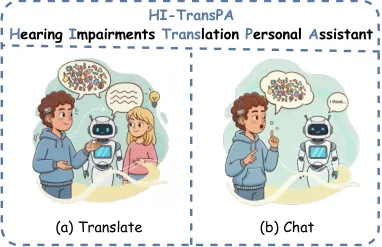
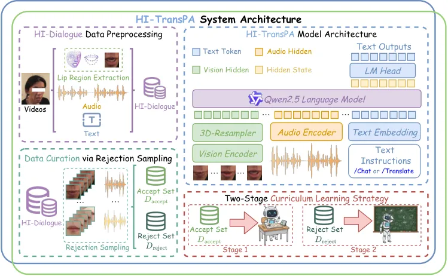
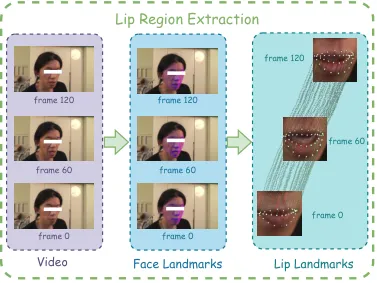
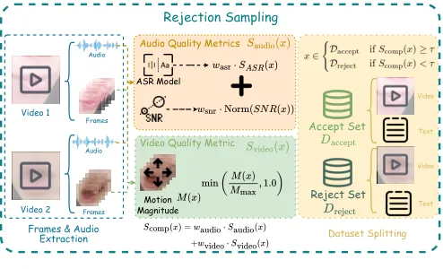
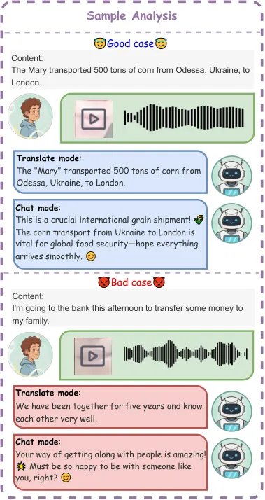

# HI-TransPA: Hearing Impairments Translation Personal Assistant

Zhiming Ma ^(†)^(†)thanks: Equal contribution.^(†)^(†)thanks:
Corresponding author. Email: mazhiming312@outlook.com &
chengshi@shanghaitech.edu.cn Affiliation: SmartFlowAI Research
Affiliation: Shanghai, China    Shiyu Gan¹¹footnotemark: 1
Affiliation: Tongji University Affiliation: Shanghai, China    Junhao
Zhao¹¹footnotemark: 1 Affiliation: SmartFlowAI Research
Affiliation: Shanghai, China    Xianming Li Affiliation: CMIC
Affiliation: Guangzhou, China    Qingyun Pan Affiliation: BUPT
Affiliation: Beijing, China    Peidong Wang Affiliation: Northeastern
University Affiliation: Shenyang, China    Mingjun Pan
Affiliation: Peking University Affiliation: Beijing, China    Yuhao Mo
Affiliation: CMIC Affiliation: Guangzhou, China    Jiajie Cheng
Affiliation: CMIC Affiliation: Guangzhou, China    Chengxin Chen
Affiliation: CMIC Affiliation: Guangzhou, China    Zhonglun Cao
Affiliation: CMIC Affiliation: Guangzhou, China    Chonghan Liu
Affiliation: Qiyuan Tech Affiliation: Beijing, China    Shi
Cheng²²footnotemark: 2 Affiliation: SmartFlowAI Research
Affiliation: Shanghai, China

###### Abstract

Hearing-impaired individuals often face significant barriers in daily
communication due to the inherent challenges of producing clear speech.
To address this, we introduce the Omni-Model paradigm into assistive
technology and present HI-TransPA, an instruction-driven audio-visual
personal assistant. The model fuses indistinct speech with lip dynamics,
enabling both translation and dialogue within a single multimodal
framework. To address the distinctive pronunciation patterns of
hearing-impaired speech and the limited adaptability of existing models,
we develop a multimodal preprocessing and curation pipeline that detects
facial landmarks, stabilizes the lip region, and quantitatively
evaluates sample quality. These quality scores guide a curriculum
learning strategy that first trains on clean, high-confidence samples
and progressively incorporates harder cases to strengthen model
robustness. Architecturally, we employs a novel unified 3D-Resampler to
efficiently encode the lip dynamics, which is critical for accurate
interpretation. Experiments on purpose-built HI-Dialogue dataset show
that HI-TransPA achieves state-of-the-art performance in both literal
accuracy and semantic fidelity. Our work establishes a foundation for
applying Omni-Models to assistive communication technology, providing an
end-to-end modeling framework and essential processing tools for future
research.

## 1 Introduction

In recent years, the rapid evolution of Large Language Models (LLMs) has
driven artificial intelligence into a new era. Building upon this
foundation, multimodal models have unified visual, auditory, and textual
modalities, demonstrating remarkable capabilities in perception,
reasoning, and generation \[8, 19, 20, 22\]. These advances have led to
significant breakthroughs in areas such as machine translation,
human–computer interaction, and content creation. By integrating
audio-visual information, machines can now not only “see” and “hear” but
also comprehend complex cross-modal contexts, thereby establishing a
robust foundation for tackling real-world communication challenges.

Despite the remarkable progress of artificial intelligence,
accessibility and real-world applicability remain limited for certain
groups. Individuals with disabilities constitute a substantial share of
the global population and still encounter barriers that prevent them
from fully benefiting from AI technologies. Encouragingly, early
research efforts have begun to bridge this gap by demonstrating how AI
can promote greater inclusivity. For instance, vision-based systems such
as electronic guide dogs \[2\] and OpenAIglasses for Navigation \[1\]
have been developed to assist visually impaired users in enhancing their
mobility and independence. These pioneering works underscore the
potential of socially oriented, human-centric AI in promoting
accessibility.

Among various disability groups, individuals with hearing loss face
particularly intricate and far-reaching challenges. According to the
latest estimates from the World Health Organization, more than
1.5 billion people worldwide live with some degree of hearing loss, and
over 430 million require rehabilitative support owing to moderate or
higher levels of impairment \[16\]. The impact of hearing loss extends
well beyond auditory perception itself. It interferes with natural
language acquisition and speech development, which in turn leads to
persistent difficulties in verbal communication. These limitations
restrict educational and occupational participation and reduce access to
information and social interaction. Consequently, hearing loss can
result in social isolation, psychological distress, and deepened social
inequality.

Most existing assistive technologies focus on converting speech from
hearing individuals into text, enabling deaf or hard-of-hearing users to
access spoken information. However, these systems offer little support
when hearing-impaired users attempt to express themselves. Conventional
speech recognition models \[3, 9\] are typically trained on standard
speech data and therefore struggle to interpret atypical or partially
articulated utterances. This limitation hinders the ability of
hearing-impaired individuals to engage in spoken interaction and
underscores the need for adaptive multimodal models that can understand
and process diverse and non-standard speech characteristics.



Figure 1: HI-TransPA functions as (a) a translator and (b) an
intelligent assistant for individuals with hearing impairments.

To this end, we introduce the Omni-Model paradigm for assistive
technologies targeting hearing-impaired users and present HI-TransPA, an
instruction-driven audio-visual personal assistant. To the best of our
knowledge, this is the first unified framework that integrates
translation and chat functionalities within a single model explicitly
designed for assisting the hearing-impaired. To enable HI-TransPA to
learn effectively from such inherently challenging data, we first design
a comprehensive data processing pipeline that purifies input signals and
then evaluates and partitions the data based on quality. Building upon
this partitioning, we then propose a novel quality-aware curriculum
learning strategy that leverages the structured data for robust
training. Through these methods, HI-TransPA simultaneously processes
both raw audio and high-frame-rate visual cues from lip dynamics, and
acts as an intelligent conversational partner that understands context
and infers user intent.

Our main contributions are summarized as follows:

1.  1.  Unified audio-visual framework. We introduce HI-TransPA, an
        instruction-driven multimodal framework for assisting
        hearing-impaired individuals. By jointly modeling auditory signals
        and high-frame-rate lip dynamics, HI-TransPA performs accurate
        translation and natural dialogue within a single end-to-end
        architecture.
2.  2.  Comprehensive multimodal data pipeline. We construct a full pipeline
        covering preprocessing and quality-aware curation. It first extracts
        and aligns the lip region through a two-stage method, then applies
        rejection sampling based on multimodal metrics to automatically
        split data into “easy” and “hard” subsets.
3.  3.  Quality-aware curriculum learning. We propose a data-driven
        curriculum strategy that ranks multimodal samples by quality and
        schedules training from easy to hard, leading to stronger
        generalization across diverse hearing-impaired speech patterns.



Figure 2: HI-TransPA System Architecture.

## 2 Related Work

### 2.1 ASR and Multimodal Large Language Models

The field of audio-centric AI has rapidly evolved from narrow,
task-specific systems to comprehensive multimodal understanding. Early
progress in Automatic Speech Recognition (ASR) was driven by large-scale
weakly supervised training (e.g., Whisper \[15\]), data-efficient
modeling (e.g., Canary \[14\]), and architectures optimized for fast
inference (e.g., Paraformer \[9\]). A major paradigm shift subsequently
occurred with the integration of Large Language Models (LLMs), as
demonstrated by FireRedASR-AED \[21\], which enhances ASR performance
through greater contextual comprehension and reasoning.

This evolution has given rise to Large Audio-Language Models (LALMs),
which treat audio as a rich semantic modality beyond transcription.
Representative models such as Qwen2-Audio \[6\], MiDashengLM \[7\], and
Step-Audio2\[17\] exhibit open-domain auditory understanding, supporting
instruction following and spoken dialogue across diverse contexts.

Building upon these advances, Omni-Models have emerged to unify text,
audio, and visual modalities within a single foundation model. Both
proprietary and open-source systems, including GPT-4o \[10\], and
Qwen2.5-Omni \[19\], demonstrate impressive multimodal reasoning
capabilities. However, their applications in assistive technology for
individuals with hearing loss remain limited. Progress toward inclusive
communication tools is further constrained by the scarcity of multimodal
datasets, particularly those that containing indistinct speech aligned
with lip dynamics.

### 2.2 AI for Hearing-Impaired Assistance

Research on AI-based hearing support has traditionally focused on narrow
subtasks, with a predominant emphasis on sign language processing, while
the development of tools facilitating speech expression has received
comparatively little attention.

Sign Language Recognition and Translation. Early studies in sign
language understanding focused on isolated sign recognition through
multimodal fusion of skeleton keypoints, RGB frames, and depth
data \[11\]. For continuous sign translation, Camgoz et al. \[4\]
introduced an end-to-end joint recognition and translation framework.
More recently, contrastive learning has been used to align textual and
visual sign embeddings \[12\], and incorporating non-manual cues such as
lip dynamics has been shown to further enhance translation
accuracy \[18\].

Lip Reading and Lip-to-Speech Synthesis. Complementary lines of work in
visual speech processing have focused on decoding speech information
directly from lip motions. Cross-modal knowledge distillation enables
lip-reading models to exploit representations from pre-trained speech
recognizers \[29\]. In addition, recent lip-to-speech synthesis methods
reconstruct intelligible speech directly from silent lip videos by
leveraging self-supervised discrete speech units as intermediate
representations \[5\].

Despite these promising advances, most approaches still regard
individuals with hearing loss as passive recipients of translation
output, focusing primarily on perception rather than expression.
Enabling active speech articulation is essential to reducing
communication barriers, promoting social inclusion, and enhancing
self-perception. The emergence of multimodal Omni-Models offers a
promising path forward: unified frameworks capable of fine-grained
multimodal understanding and context-driven generation. Motivated by
this potential, our proposed HI-TransPA leverages the Omni-Model
paradigm to realize an intelligent audio-visual assistant capable of
both accurate translation and interactive dialogue, supporting truly
bidirectional communication for the hearing-impaired.

## 3 Method

To address the two main challenges of noise and heterogeneity in raw
data, and the inadequacy of existing Omni-Models for modeling
high-frame-rate lip dynamics, we develop HI-TransPA, an Omni-Model with
three key components: (1) a data preprocessing and curation pipeline,
(2) a high-speed vision architecture specialized for lip dynamics, and
(3) a multi-stage training objective based on curriculum learning. The
overall framework is illustrated in Fig. 2.

### 3.1 Data Preprocessing and Curation

#### Lip Region Extraction.

To mitigate head pose variations, irrelevant facial movements, and
background noise, we design a two-stage lip region extraction pipeline.

In the first stage, for each video frame $`I_{t}`$, a pre-trained
landmark detector $`F_{lm}`$ extracts $`N=468`$ facial keypoints with
coordinates $`(x_{i},y_{i})`$, from which we retain only the $`M`$
points corresponding to the lip region:

```math
P_{t}=\{p_{i}=(x_{i},y_{i})\mid i\in S_{\text{lips}}\}, \tag{1}
```

where $`\{p_{1},...,p_{N}\}=F_{lm}(I_{t})`$ and $`S_{\text{lips}}`$
denotes the set of lip-related indices. These landmarks form a temporal
sequence representing lip motion across frames.

In the second stage, we align and stabilize the lip video
$`V_{\text{lips}}`$. For frames with valid landmarks $`P_{t}`$, we
compute bounding boxes $`B_{t}`$ and define a uniform crop size $`S`$
as:

```math
S=\lceil\gamma\cdot\max(\bar{W},\bar{H})\rceil_{2}, \tag{2}
```

where $`\gamma=1.2`$ is chosen as expansion factor and
$`\lceil\cdot\rceil_{2}`$ rounds up to the nearest even number. Cropping
is centered at each frame’s landmark centroid $`C_{t}`$, linearly
interpolated when landmarks are missing. The resulting stabilized video
$`V_{\text{lips}}`$ normalizes head motion and emphasizes lip dynamics
relevant to speech articulation.



Figure 3: Overview of the lip region extraction pipeline. The left
column shows input video frames at different timestamps. In the middle,
a face landmark detector identifies 468 facial keypoints (purple). The
right column isolates and tracks lip landmarks across frames to produce
stabilized lip crops used by the vision encoder.

#### Data Curation via Rejection Sampling.

Even after region extraction, hearing-impaired speech data can exhibit
articulation ambiguity or acoustic distortion. To ensure data
reliability, we introduce a rejection sampling framework that scores
each audio-visual pair and partitions the dataset into accepted and
rejected subsets, as shown in Fig. 4.

#### Audio Quality.

Audio quality is assessed using two complementary metrics. The ASR
confidence score $`S_{\text{ASR}}(x)`$ measures the textual consistency
between Whisper-large-v3’s transcription $`\hat{y}`$ and the ground
truth $`y`$:

```math
S_{\text{ASR}}(x)=1-\frac{d_{\text{Lev}}(\hat{y},y)}{\max(|y|,|\hat{y}|)}, \tag{3}
```

where $`d_{\text{Lev}}`$ denotes the Levenshtein distance. Signal
clarity is quantified by the signal-to-noise ratio (SNR), defined as:

```math
\text{SNR}(x)=10\cdot\log_{10}\left(\frac{\sum_{t}s_{t}^{2}}{\sum_{t}(s_{t}-\hat{s}_{t})^{2}}\right), \tag{4}
```

where $`s_{t}`$ represents the clean signal and $`\hat{s}_{t}`$ its
noisy counterpart. A higher SNR indicates clearer speech with less
background interference. The final composite audio score combines these
two aspects:

```math
S_{\text{audio}}(x)=0.5\cdot S_{\text{ASR}}(x)+0.5\cdot\text{Norm}(SNR(x)), \tag{5}
```

where $`\text{Norm}(\cdot)`$ denotes min-max normalization.

#### Video Quality.

Video quality is characterized by the motion magnitude $`M(x)`$, defined
as the mean pixel difference between consecutive frames. We normalize
this metric into the range $`[0,1]`$:

```math
S_{\text{video}}(x)=\min\left(\frac{M(x)}{M_{\text{max}}},1.0\right), \tag{6}
```

where $`M_{\text{max}}`$ is the 90th-percentile motion magnitude across
the dataset.

#### Rejection Sampling.

The final composite sample score is defined as:

```math
S_{\text{comp}}(x)=0.6\cdot S_{\text{audio}}(x)+0.4\cdot S_{\text{video}}(x), \tag{7}
```

and samples are partitioned as:

```math
x\in\begin{cases}\mathcal{D}_{\text{accept}},&\text{if }S_{\text{comp}}(x)\geq 0.55,\\
\mathcal{D}_{\text{reject}},&\text{otherwise.}\end{cases} \tag{8}
```

Rejected samples are later reused as hard examples in the curriculum
learning stage to enhance model robustness.



Figure 4: Overview of the rejection sampling pipeline. Each audio-visual
sample is scored based on quality metrics from both modalities and then
divided into accepted ($`\mathcal{D}_{\text{accept}}`$) and rejected
($`\mathcal{D}_{\text{reject}}`$) subsets for curriculum learning.

### 3.2 Model Architecture

The proposed HI-TransPA builds upon the Qwen2.5-Omni-3B framework, with
a re-engineered vision subsystem specifically optimized for
high-frame-rate lip reading. The main architectural innovations are the
integration of the SigLIP Vision Transformer and the Unified
3D-Resampler module from MiniCPM-V 4.5 \[23\].

#### Vision Encoder.

The SigLIP encoder \[24\] provides fine-grained visual representations
suitable for lip articulation modeling. It processes the lip video
$`V_{\text{lips}}\in\mathbb{R}^{T\times H\times W\times C}`$ and encodes
it into a sequence of patch tokens $`Z_{\text{patch}}`$.

#### Spatiotemporal Resampler.

To reduce computation for long video sequences, we apply the Unified
3D-Resampler after the vision encoder. It uses cross-attention with
$`N_{q}=64`$ learnable queries to compress the token sequence:

```math
Z_{\text{fused}}=\text{3D-Resampler}(Z_{\text{patch}}), \tag{9}
```

yielding $`Z_{\text{fused}}\in\mathbb{R}^{N_{q}\times D_{\text{llm}}}`$,
which preserves essential spatiotemporal cues while reducing token
length.

### 3.3 Multi-Stage Alignment and Fine-Tuning

With the vision subsystem redesigned, we perform a three-stage alignment
and adaptation process to ensure multimodal synergy between vision,
audio, and language.

#### Stage 1: General Visual Alignment.

This stage introduces the language model to the new visual features
through two phases: (1) _Image alignment_: train only the 3D-Resampler
on the Chinese-LLaVA-Vision dataset \[13\] while freezing the vision
encoder and LLM; (2) _Video alignment_: urther train the Resampler on
30% of the LLaVA-Video-178K dataset \[27\] to capture temporal dynamics.

#### Stage 2: Audio-Visual Co-adaptation.

Using the Chinese-LiPS dataset \[28\], we jointly fine-tune the
3D-Resampler and the audio encoder so that both modalities produce
complementary embeddings optimized for Audio-Visual Speech Recognition
(AVSR).

#### Stage 3: Conversational Fine-Tuning.

We perform end-to-end instruction fine-tuning to jointly optimize the
model’s translation and dialogue abilities. A mixed-instruction dataset
is constructed with two modes: /translate, using paired audio-visual
samples and their reference texts; and /chat, which shares the same
inputs but pairs them with language-model–generated conversational
replies. During training, both modes are combined under the curriculum
learning strategy described in Section 3.4, where sample difficulty is
determined by translation quality. The unified fine-tuning stage enables
HI-TransPA to consolidate comprehension and transcription skills while
adapting to real conversational scenarios.

### 3.4 Training Objective

To enhance robustness and training stability when learning from
multimodal data, we apply a two-stage curriculum learning approach.

#### Stage 1: Foundational Learning on Accepted Data.

We start by fine-tuning the model on high-quality samples
$`\mathcal{D}_{\text{accept}}`$ for three epochs using the cross-entropy
loss:

```math
\mathcal{L}_{\text{Stage 1}}=\mathbb{E}_{x\in\mathcal{D}_{\text{accept}}}[L_{\text{CE}}(f(x),y)], \tag{10}
```

which aim to establish stable multimodal alignment between lip motion,
audio, and textual content.

#### Stage 2: Robustness Enhancement on Rejected Data.

We then continue training for five epochs on the harder subset
$`\mathcal{D}_{\text{reject}}`$:

```math
\mathcal{L}_{\text{Stage 2}}=\mathbb{E}_{x^{\prime}\in\mathcal{D}_{\text{reject}}}[L_{\text{CE}}(f(x^{\prime}),y^{\prime})], \tag{11}
```

which is designed to implicitly up-weights challenging examples,
encouraging the model to learn robust representations that generalize to
noisy, real-world conditions.

Overall, this easy-to-hard learning schedule stabilizes convergence and
yields a model capable of consistent performance under diverse acoustic
and visual quality levels.

### 3.5 Metrics Definition

#### Character Error Rate (CER).

For evaluation, we report the CER to measure literal transcription
accuracy. Given a ground-truth sequence $`y`$ and model output
$`\hat{y}`$, CER is defined as:

```math
\text{CER}=\frac{d_{\text{Lev}}(\hat{y},y)}{|y|}, \tag{12}
```

where $`d_{\text{Lev}}`$ is the Levenshtein distance counting
substitutions, deletions, and insertions. A lower CER indicates higher
transcription fidelity, while a higher CER reflects poorer recognition
performance.

#### Embedding Similarity (EmbSim).

To measure the alignment consistency between predicted and reference
utterances in embedding space, we compute Embedding Similarity using
cosine similarity. Given audio-visual feature embeddings
$`\mathbf{e}_{\text{pred}}`$ and $`\mathbf{e}_{\text{ref}}`$, EmbSim is
defined as:

```math
\text{EmbSim}=\frac{\mathbf{e}_{\text{pred}}\cdot\mathbf{e}_{\text{ref}}}{\|\mathbf{e}_{\text{pred}}\|_{2}\,\|\mathbf{e}_{\text{ref}}\|_{2}}. \tag{13}
```

Higher EmbSim values indicate closer semantic alignment between the
predicted representation and the reference embedding, reflecting
stronger cross-modal coherence.

## 4 Experiments

| Models                           | Params | Audio | Video | EmbSim | CER  | CS   |
| -------------------------------- | ------ | ----- | ----- | ------ | ---- | ---- |
| ASR Models                       |        |       |       |        |      |      |
| Whisper-large-V3                 | 1.6B   | ✓     | ✗     | 0.79   | 0.32 | 0.74 |
| SenseVoice-small                 | 0.3B   | ✓     | ✗     | 0.71   | 0.35 | 0.68 |
| Paraformer-large                 | 0.2B   | ✓     | ✗     | 0.70   | 0.38 | 0.66 |
| FireRedASR-AED                   | 1.1B   | ✓     | ✗     | 0.77   | 0.38 | 0.70 |
| LALMs                            |        |       |       |        |      |      |
| Qwen2-Audio                      | 7B     | ✓     | ✗     | 0.74   | 0.44 | 0.65 |
| MiDashengLM                      | 7B     | ✓     | ✗     | 0.67   | 0.53 | 0.57 |
| InternLM-XComposer2.5-OmniLive   | 7B     | ✓     | ✗     | 0.67   | 0.54 | 0.57 |
| Step-Audio 2 mini                | 7B     | ✓     | ✗     | 0.79   | 0.34 | 0.73 |
| Omni-Models                      |        |       |       |        |      |      |
| Qwen2.5-Omni (3B)                | 3B     | ✓     | ✓     | 0.73   | 0.44 | 0.65 |
| Qwen2.5-Omni (7B)                | 7B     | ✓     | ✓     | 0.75   | 0.42 | 0.67 |
| HI-TransPA                       | 3B     | ✓     | ✓     | 0.77   | 0.37 | 0.70 |
| HI-TransPA (Curriculum Learning) | 3B     | ✓     | ✓     | 0.84   | 0.27 | 0.79 |

Table 1: Comparison of various models on the HI-Dialogue test set.

### 4.1 Experimental Setup

Dataset. We collected and curated a dedicated dataset, HI-Dialogue, to
support the training and evaluation of audio-visual dialogue models for
hearing-impaired individuals. Six volunteers with varying levels of
hearing loss recorded audio-visual materials covering daily
conversations, instructional texts, and emergency situations. After
manual screening to remove samples with occluded lip regions or
mismatched transcripts, we obtained 9,673 high-quality samples.

The dataset is split into 7,736 training and 1,937 test samples (80/20).
Following the rejection sampling strategy (Sec. 3.1), the training data
is further divided into an accepted set
($`\mathcal{D}_{\text{accept}}`$, 4,733 samples) and a rejected set
($`\mathcal{D}_{\text{reject}}`$, 3,003 samples) used for curriculum
learning. To enhance conversational capability, text responses are
distilled for each training sample to support instruction tuning.

### 4.2 Evaluation Metrics

We evaluate the models primarily on their comprehension accuracy. To
quantify both literal and semantic correctness, we define a
Comprehensive Score (CS) as:

```math
\text{CS}=(1-\alpha)\cdot(1-\text{CER})+\alpha\cdot\text{EmbSim}, \tag{14}
```

and $`\alpha=0.5`$ is adopted in our experiments.

The Character Error Rate (CER) follows the definition in Eq. 12 of
Sec. 3.4; it measures literal transcription accuracy, where a lower
value indicates better performance and a higher value denotes more
transcription errors. The Embedding Similarity (EmbSim), defined in
Eq. 13, is computed using the cosine similarity between the predicted
and reference embeddings, where higher values indicate stronger semantic
consistency. We adopt Qwen3-Embedding-0.6B \[26\] for embedding
extraction.

This balanced formulation in Eq. 14 provides a holistic measure that
reflects both surface-level accuracy (through CER) and deeper semantic
fidelity (through EmbSim). We omit conversational fluency and empathy
metrics to maintain comparability among models with different dialogue
generation capabilities, focusing instead on the upstream comprehension
of noisy audio-visual signals—a shared foundation across all systems
evaluated.

### 4.3 Baselines

We benchmark HI-TransPA against a set of representative speech and
multimodal systems, covering three major categories as summarized in
Table 1. All baseline models are fine-tuned on the HI-Dialogue dataset
for comparability. Together, they form a comprehensive spectrum ranging
from traditional audio-only recognizers to state-of-the-art multimodal
Omni-Models.

ASR Models. We select four widely used automatic speech recognition
(ASR) systems representing strong audio-only foundations with different
design philosophies. Whisper-large-v3 \[15\] is trained on 680k hours of
weakly supervised web data and serves as a robust multilingual reference
under zero-shot conditions. SenseVoice-small \[3\] is part of the
FunAudioLLM framework, supporting fast multilingual ASR and audio-event
recognition with low latency. Paraformer-large \[9\] employs a
non-autoregressive parallel Transformer to accelerate inference while
maintaining competitive accuracy. FireRedASR-AED \[21\] represents an
industrial-grade, Mandarin-optimized encoder–decoder architecture
integrating large language modeling for superior character error rate
(CER) performance. These models quantify the upper bound of purely
acoustic transcription capability and provide a foundation for measuring
the gains from incorporating visual inputs.

Large Audio Language Models (LALMs). To evaluate semantic reasoning on
spoken content, we benchmark against large audio–language models that
couple LLM backbones with acoustic encoders, yet remain unimodal.
Qwen2-Audio \[6\] enables direct comprehension of complex auditory
scenes through instruction-following and conversational understanding.
MiDashengLM \[7\], InternLM-XComposer2.5-OmniLive \[25\], and
Step-Audio 2 mini represent different scales of audio-centric systems,
combining pretrained LLMs with efficient auditory front-ends for
contextual reasoning. While these models excel in semantic
comprehension, they cannot exploit visual cues—such as lip dynamics—to
disambiguate indistinct or impaired speech, which is the focus of our
proposed system.

Omni-Models. Finally, we compare with open-source multimodal Omni-Models
that jointly process audio, visual, and textual information.
Qwen2.5-Omni (3B and 7B) \[19\] integrates synchronized audio–visual
encoders and a shared language backbone to handle streaming multimodal
tasks, representing the state of general-purpose cross-modal LLMs. Our
HI-TransPA and its variant trained with curriculum learning follow the
Omni-Model paradigm but are specifically optimized for accessibility. By
aligning high-frame-rate lip features and audio inputs through
instruction tuning, HI-TransPA demonstrates improvements in both
embedding similarity and character error rate, outperforming generic
Omni baselines by a clear margin.

Figure 5: Interpretation of the Comprehensive Score (CS). Models are
plotted in the $`(1-\text{CER})`$ vs. EmbSim space. Higher positions and
rightward movement correspond to lower error rates and stronger semantic
consistency, jointly yielding higher CS values.

### 4.4 Main Results and Analysis

The detailed comparison results are presented in Table 1.

Baseline analysis. Audio-only models perform significantly worse on
hearing-impaired speech: Whisper-large-V3 and Step-Audio 2 mini achieve
CS scores of 0.74 and 0.73 but maintain high CERs (Eq. 12). Adding
general vision encoders, as in Qwen2.5-Omni, yields limited gains (CS =
0.67), suggesting that generic multimodal fusion fails to capture the
fine-grained lip dynamics.

Effectiveness of HI-TransPA. Our 3B HI-TransPA already surpasses the
larger 7B Qwen2.5-Omni, achieving a CS of 0.70. The specialized vision
architecture, optimized for high-frame-rate lip motion, proves crucial.
Incorporating curriculum learning further boosts performance, yielding a
CS of 0.79, an EmbSim of 0.84 (Eq. 13), and a reduced CER of 27%—the
best among all baselines.

### 4.5 Interpretation of the Comprehensive Score

The comprehensive score (Eq. 14) combines literal correctness
$`(1-\text{CER})`$ and semantic coherence (EmbSim), enabling us to
compare models beyond recognition accuracy. From Table 1, three core
observations emerge:

1.  1.  ASR models: Whisper-large-V3 shows a moderate CER ($`32\%`$) and
        EmbSim = 0.79, resulting in CS = 0.74. This indicates that despite
        high transcription accuracy, audio-only models lack multimodal
        semantic grounding.
2.  2.  Generic Omni-models: Qwen2.5-Omni (3B and 7B) achieve modest
        improvement. They benefit from visual cues but fail to capture
        fine-grained temporal lip dynamics, keeping both CER and EmbSim
        suboptimal.
3.  3.  HI-TransPA: Our model enhances both dimensions simultaneously,
        reducing the CER from 42% to 27% and increasing the EmbSim from 0.75
        to 0.84, which leads to a CS of 0.79. This indicates that HI-TransPA
        not only produces more accurate transcripts but also better
        preserves contextual meaning through specialized lip-motion modeling
        and curriculum-based training.

Fig. 5 visualizes different models on a two-dimensional plane defined by
$`(1-\text{CER})`$ and EmbSim. Points closer to the upper-right corner
indicate a better balance between literal accuracy and semantic
coherence. The distribution shows that the proposed Comprehensive Score
(CS) effectively reflects each model’s overall comprehension ability by
jointly capturing text-level correctness and meaning preservation,
allowing direct comparison across architectures with different
modalities and training paradigms.



Figure 6: Qualitative examples illustrating the importance of
comprehension. The “Good case” (from our HI-TransPA) shows how accurate
translation enables a relevant and helpful chat response. The “Bad case”
(from a baseline) demonstrates how a failure in comprehension leads to a
completely irrelevant dialogue, underscoring our “Comprehension First”
evaluation principle.

### 4.6 Ablation Studies

Role of the Visual Modality. To assess the contribution of visual input,
we compare the full model with an audio-only variant. As shown in
Table 2, removing the visual modality severely degrades performance (CS
drops from 0.70 to 0.64; CER rises from 37% to 46%, see Eq. 12),
confirming that lip motion provides indispensable cues for
comprehension.

Effect of Curriculum Learning. Finally, we analyze the impact of the
proposed two-stage training strategy (Sec. 3.4). Compared with the base
model trained without curriculum learning, the final version improves CS
(Eq. 14) from 0.70 to 0.79 and reduces CER (Eq. 12) from 37% to 27%,
confirming that progressive training enhances model robustness against
noisy and difficult samples.

### 4.7 Qualitative Analysis

To provide a more intuitive demonstration of our model’s capabilities
and to analyze the critical role of comprehension accuracy in generating
meaningful dialogue, we present two representative cases in Figure 6.
These cases showcase two modes of operation for HI-TransPA: a “Translate
mode,” which aims for a literal transcription that reveals the model’s
true understanding of the input, and a “Chat mode,” which aims to
generate a natural and helpful conversational response based on that
understanding.

| Model  | Audio | Video | EmbSim | CER(%) | CS   |
| ------ | ----- | ----- | ------ | ------ | ---- |
| Our(A) | ✓     |       | 0.74   | 46     | 0.64 |
| Our(O) | ✓     | ✓     | 0.77   | 37     | 0.70 |

Table 2: Ablation on the effectiveness of the visual modality.

In the “Good case,” our HI-TransPA model successfully processes a
complex sentence containing multiple entities. The output in “Translate
mode” is a near-perfect transcription, demonstrating its robust
multimodal comprehension. Based on this precise understanding, the “Chat
mode” is able to go beyond simple repetition, infer the broader context
of an “international grain shipment,” and provide an empathetic and
insightful response, truly functioning as an intelligent assistant.

In contrast, the “Bad case” vividly illustrates what occurs when
comprehension fails (this result is from a poorly performing baseline).
The “Translate mode” output reveals a complete misinterpretation of the
user’s intent, producing a sentence semantically unrelated to the
original input about transferring money at a bank. This fundamental
failure in comprehension directly explains why the “Chat mode” response
is nonsensical in context. Although the chat response is grammatically
coherent, it is logically derived from an incorrect premise, rendering
it entirely useless and potentially confusing for the user.

The comparison strongly validates our Comprehension First principle
(Section 4.2), showing that accurate comprehension, reflected in literal
translation, forms the basis of all higher-level dialogue abilities. As
confirmed in Table 1, HI-TransPA’s superior understanding establishes a
solid foundation for meaningful and supportive interaction.

## 5 Conclusion

We presented HI-TransPA, an instruction-driven audio-visual Omni-Model
that designed to assists people with hearing loss in natural dialogue
and precise speech translation. With jointly modeling speech and
high-frame-rate lip cues with a redesigned visual encoder and a
quality-aware curriculum strategy for training, HI-TransPA achieves
outstanding performance on multimodal real-world scenarios. Extensive
experimental results on the HI-Dialogue dataset demonstrate that
HI-TransPA consistently outperforms existing ASR methods, LALMs, and
general Omni-Models, highlighting the potential of instruction-tuned
multimodal intelligence for inclusive communication.

## References

- \[1\] AI-FanGe (2025) OpenAIglasses_for_Navigation: an open framework
  for blind navigation based on esp32. Note: Accessed: 2025-11-13 Cited
  by: §1.
- \[2\] H. An, J. Xiao, H. Zhao, Z. Sun, and X. Li (2024) InternDog: an
  offline embodied intelligent guide dog system based on internlm2.
  Note: GitHub repository Cited by: §1.
- \[3\] K. An, Q. Chen, C. Deng, Z. Du, C. Gao, Z. Gao, Y. Gu, T. He, H.
  Hu, K. Hu, et al. (2024) Funaudiollm: voice understanding and
  generation foundation models for natural interaction between humans
  and llms. arXiv preprint arXiv:2407.04051. Cited by: §1, §4.3.
- \[4\] N. C. Camgoz, O. Koller, S. Hadfield, and R. Bowden (2020) Sign
  language transformers: joint end-to-end sign language recognition and
  translation. In Proceedings of the IEEE/CVF conference on computer
  vision and pattern recognition, pp. 10023–10033. Cited by: §2.2.
- \[5\] J. Choi, M. Kim, and Y. M. Ro (2023) Intelligible lip-to-speech
  synthesis with speech units. arXiv preprint arXiv:2305.19603. Cited
  by: §2.2.
- \[6\] Y. Chu, J. Xu, Q. Yang, H. Wei, X. Wei, Z. Guo, Y. Leng, Y.
  Lv, J. He, J. Lin, et al. (2024) Qwen2-audio technical report. arXiv
  preprint arXiv:2407.10759. Cited by: §2.1, §4.3.
- \[7\] H. Dinkel, G. Li, J. Liu, J. Luan, Y. Niu, X. Sun, T. Wang, Q.
  Xiao, J. Zhang, and J. Zhou (2025) Midashenglm: efficient audio
  understanding with general audio captions. arXiv preprint
  arXiv:2508.03983. Cited by: §2.1, §4.3.
- \[8\] Q. Fang, S. Guo, Y. Zhou, Z. Ma, S. Zhang, and Y. Feng (2024)
  Llama-omni: seamless speech interaction with large language models.
  arXiv preprint arXiv:2409.06666. Cited by: §1.
- \[9\] Z. Gao, S. Zhang, I. McLoughlin, and Z. Yan (2022) Paraformer:
  fast and accurate parallel transformer for non-autoregressive
  end-to-end speech recognition. arXiv preprint arXiv:2206.08317. Cited
  by: §1, §2.1, §4.3.
- \[10\] A. Hurst, A. Lerer, A. P. Goucher, A. Perelman, A. Ramesh, A.
  Clark, A. Ostrow, A. Welihinda, A. Hayes, A. Radford, et al. (2024)
  Gpt-4o system card. arXiv preprint arXiv:2410.21276. Cited by: §2.1.
- \[11\] S. Jiang, B. Sun, L. Wang, Y. Bai, K. Li, and Y. Fu (2021) Sign
  language recognition via skeleton-aware multi-model ensemble. arXiv
  preprint arXiv:2110.06161. Cited by: §2.2.
- \[12\] Z. Jiang, G. Sant, A. Moryossef, M. Müller, R. Sennrich, and S.
  Ebling (2024) Signclip: connecting text and sign language by
  contrastive learning. arXiv preprint arXiv:2407.01264. Cited by: §2.2.
- \[13\] Chinese-LLaVA: an open-source bilingual chinese-english
  vision-language assistant Note: Apache-2.0 License Cited by: §3.3.
- \[14\] K. C. Puvvada, P. Żelasko, H. Huang, O. Hrinchuk, N. R.
  Koluguri, K. Dhawan, S. Majumdar, E. Rastorgueva, Z. Chen, V.
  Lavrukhin, et al. (2024) Less is more: accurate speech recognition &
  translation without web-scale data. arXiv preprint arXiv:2406.19674.
  Cited by: §2.1.
- \[15\] A. Radford, J. W. Kim, T. Xu, G. Brockman, C. McLeavey, and I.
  Sutskever (2023) Robust speech recognition via large-scale weak
  supervision. In International conference on machine learning,
  pp. 28492–28518. Cited by: §2.1, §4.3.
- \[16\] World Health Organization (2021) World report on hearing:
  executive summary. Note: Licence: CC BY-NC-SA 3.0 IGO Cited by: §1.
- \[17\] B. Wu, C. Yan, C. Hu, C. Yi, C. Feng, F. Tian, F. Shen, G.
  Yu, H. Zhang, J. Li, et al. (2025) Step-audio 2 technical report.
  arXiv preprint arXiv:2507.16632. Cited by: §2.1.
- \[18\] W. Wu, T. Yuan, Y. Li, D. Wang, and X. Fu (2025) SignClip:
  leveraging mouthing cues for sign language translation by multimodal
  contrastive fusion. arXiv preprint arXiv:2509.10266. Cited by: §2.2.
- \[19\] J. Xu, Z. Guo, J. He, H. Hu, T. He, S. Bai, K. Chen, J.
  Wang, Y. Fan, K. Dang, et al. (2025) Qwen2. 5-omni technical report.
  arXiv preprint arXiv:2503.20215. Cited by: §1, §2.1, §4.3.
- \[20\] J. Xu, Z. Guo, H. Hu, Y. Chu, X. Wang, J. He, Y. Wang, X.
  Shi, T. He, X. Zhu, et al. (2025) Qwen3-omni technical report. arXiv
  preprint arXiv:2509.17765. Cited by: §1.
- \[21\] K. Xu, F. Xie, X. Tang, and Y. Hu (2025) Fireredasr:
  open-source industrial-grade mandarin speech recognition models from
  encoder-decoder to llm integration. arXiv preprint arXiv:2501.14350.
  Cited by: §2.1, §4.3.
- \[22\] H. Ye, C. H. Yang, A. Goel, W. Huang, L. Zhu, Y. Su, S. Lin, A.
  Cheng, Z. Wan, J. Tian, et al. (2025) OmniVinci: enhancing
  architecture and data for omni-modal understanding llm. arXiv preprint
  arXiv:2510.15870. Cited by: §1.
- \[23\] T. Yu, Z. Wang, C. Wang, F. Huang, W. Ma, Z. He, T. Cai, W.
  Chen, Y. Huang, Y. Zhao, et al. (2025) Minicpm-v 4.5: cooking
  efficient mllms via architecture, data, and training recipe. arXiv
  preprint arXiv:2509.18154. Cited by: §3.2.
- \[24\] X. Zhai, B. Mustafa, A. Kolesnikov, and L. Beyer (2023) Sigmoid
  loss for language image pre-training. In Proceedings of the IEEE/CVF
  international conference on computer vision, pp. 11975–11986. Cited
  by: §3.2.
- \[25\] P. Zhang, X. Dong, Y. Cao, Y. Zang, R. Qian, X. Wei, L.
  Chen, Y. Li, J. Niu, S. Ding, et al. (2024) Internlm-xcomposer2.
  5-omnilive: a comprehensive multimodal system for long-term streaming
  video and audio interactions. arXiv preprint arXiv:2412.09596. Cited
  by: §4.3.
- \[26\] Y. Zhang, M. Li, D. Long, X. Zhang, H. Lin, B. Yang, P. Xie, A.
  Yang, D. Liu, J. Lin, F. Huang, and J. Zhou (2025) Qwen3 embedding:
  advancing text embedding and reranking through foundation models.
  arXiv preprint arXiv:2506.05176. Cited by: §4.2.
- \[27\] Y. Zhang, J. Wu, W. Li, B. Li, Z. Ma, Z. Liu, and C. Li (2024)
  Video instruction tuning with synthetic data. External Links:
  2410.02713, [Link](https://arxiv.org/abs/2410.02713) Cited by: §3.3.
- \[28\] J. Zhao, Y. Jia, S. Wang, J. Zhou, H. Wang, and Y. Qin (2025)
  Chinese-lips: a chinese audio-visual speech recognition dataset with
  lip-reading and presentation slides. External Links: 2504.15066,
  [Link](https://arxiv.org/abs/2504.15066) Cited by: §3.3.
- \[29\] Y. Zhao, R. Xu, X. Wang, P. Hou, H. Tang, and M. Song (2020)
  Hearing lips: improving lip reading by distilling speech recognizers.
  In Proceedings of the AAAI Conference on Artificial Intelligence, Vol.
  34, pp. 6917–6924. Cited by: §2.2.
