# IMTalker: Efficient Audio-driven Talking Face Generation with Implicit Motion Transfer

Bo Chen Affiliation: X-LANCE Lab, Shanghai Jiao Tong University
Affiliation: State Key Laboratory of General Artificial Intelligence,
BIGAI Email: <cbforever@sjtu.edu.cn>    Tao Liu Affiliation: X-LANCE
Lab, Shanghai Jiao Tong University Email: <chenxie95@sjtu.edu.cn>    Qi
Chen Affiliation: X-LANCE Lab, Shanghai Jiao Tong University    Xie Chen
Affiliation: X-LANCE Lab, Shanghai Jiao Tong University    Zilong Zheng
Email: [zlzheng@bigai.aiProject:
[https://cbsjtu01.github.io/IMTalker/](https://cbsjtu01.github.io/IMTalker/)](mailto:)
Affiliation: State Key Laboratory of General Artificial Intelligence,
BIGAI

###### Abstract

Talking face generation aims to synthesize realistic speaking portraits
from a single image, yet existing methods often rely on explicit optical
flow and local warping, which fail to model complex global motions and
cause identity drift. We present  *IMTalker*, a novel framework that
achieves efficient and high-fidelity talking face generation through
implicit motion transfer. The core idea is to replace traditional
flow-based warping with a cross-attention mechanism that implicitly
models motion discrepancy and identity alignment within a unified latent
space, enabling robust global motion rendering. To further preserve
speaker identity during cross-identity reenactment, we introduce an
identity-adaptive module that projects motion latents into personalized
spaces, ensuring clear disentanglement between motion and identity. In
addition, a lightweight flow-matching motion generator produces vivid
and controllable implicit motion vectors from audio, pose, and gaze
cues. Extensive experiments demonstrate that IMTalker surpasses prior
methods in motion accuracy, identity preservation, and audio–lip
synchronization, achieving state-of-the-art quality with superior
efficiency, operating at 40 FPS for video-driven and 42 FPS for
audio-driven generation on an RTX 4090 GPU. We will release our code and
pre-trained models to facilitate applications and future research.

![[Uncaptioned
image]](arxiv-2511-22167--29f9a3054fb7.figures/figure-1.webp)

Figure 1: IMTalker accepts diverse portrait styles and achieves 40 FPS
for video-driven and 42 FPS for audio-driven talking-face generation
when tested on an NVIDIA RTX 4090 GPU at $`512\times 512`$ resolution.
It also enables diverse controllability by allowing precise head-pose
and eye-gaze inputs alongside audio.

^(†)^(†)footnotetext: \* Corresponding authors.

## 1 Introduction

Talking face generation creates a photorealistic video of a person
speaking from a single portrait, guided by either an audio track or a
driving video. Owing to its applications in virtual avatars, video
conferencing, and digital content creation, it has become a major
research focus. An ideal model must satisfy a set of often competing
desiderata: high-fidelity generation, precise synchronization with the
driving source (such as lip-to-audio or motion-to-video), strong
identity preservation, natural facial expressiveness, and real-time
performance. The realization of such an ideal model is an indispensable
step toward more advanced human-computer interaction.

Driven by the rapid advances of generative models such as GANs \[11\]
and diffusion models \[16, 32, 36\], talking face generation has
achieved remarkable progress. Recent approaches \[27, 53, 41, 22, 20\]
can synthesize expressive facial dynamics and natural head movements.
Existing methods generally follow a two-stage pipeline \[53, 27, 41, 24,
22\] for efficiency, which first converts the audio into an
identity-agnostic motion representation and then estimates explicit
optical flow to warp the source frame \[37, 9, 12, 45, 44\]. This
explicit, local warping is efficient but inherently assumes small,
locally smooth deformations. As a result, it struggles to handle large
head poses, occlusions, and non-rigid articulations, often producing
stretching, tearing, or identity drift that degrade realism. These
limitations highlight the need for a global, implicit motion
representation capable of modeling complex movements while maintaining
identity consistency and efficiency.

To address the above limitations, we introduce _IMTalker_, an efficient
and realistic talking-face generation framework built upon an Implicit
Motion representation. Instead of explicitly predicting pixel-wise
optical flow and performing local warping, _IMTalker_ encodes all
identity-agnostic motion cues into a compact latent embedding and
employs a cross-attention–based implicit motion transfer module to align
motion discrepancies with identity features in a unified latent space.
This implicit formulation captures global and non-rigid facial dynamics,
enabling holistic re-rendering of the face and substantially mitigating
the identity degradation that occurs under large-pose variations or
expressive movements.

However, simultaneously combining motion transfer and identity alignment
within the latent space inevitably introduces an inductive bias related
to identity information into the motion latent. During cross-identity
motion transfer, this state of incomplete disentanglement between
identity and motion challenges the model’s ability to maintain identity
consistency. To address this, we design an Identity-Adaptive module.
Specifically, we project the same motion latent vector into the
respective motion spaces of different subjects to derive personalized
descriptions of that motion. We then apply a distance constraint to
regularize these personalized representations during the motion
transfer. Through this adaptive process, we efficiently achieve
identity-motion disentanglement, thereby preserving identity consistency
during the motion transfer process.

Furthermore, we develop a conditional Flow-Matching Motion Generator to
produce vivid and controllable motion latents from audio, pose, and gaze
signals. This generator benefits from the stability and efficiency of
Flow Matching \[26, 28\], enabling diverse and realistic facial dynamics
under real-time settings. Extensive experiments on HDTF \[54\] and
CelebV \[51\] confirm that IMTalker outperforms existing flow-based and
diffusion-based approaches in motion accuracy, identity preservation,
and audio–lip synchronization.

Our key contributions are summarized as follows:

- •
  We introduce IMTalker, a new efficient and realistic talking face
  generation framework. Its core novelty lies in replacing explicit
  optical flow and warping with attention-based implicit motion
  transfer, which holistically models global motion and improves
  realism.
- •
  We propose a dedicated Identity-Adaptive module to explicitly tackle
  the problem of identity leakage during motion transfer. This ensures
  that the generated video maintains a high degree of consistency with
  the source identity.
- •
  We design a lightweight and versatile motion generator using a
  conditional flow matching model. This allows for fine-grained control
  over facial expression, head pose, and eye movement, leading to more
  vivid and dynamic video synthesis.
- •
  Extensive experiments demonstrate that our method achieves
  state-of-the-art performance in precise motion transfer, high identity
  preservation, and superior audio-to-lip synchronization.

## 2 Related Work

### 2.1 Audio-Driven talking face

With the emergence of diffusion models \[16, 38\], several works (e.g.,
EMO \[42\], Hallo-1/2/3 \[50, 6, 7\], Sonic \[20\]) have explored
end-to-end audio-driven talking face generation by injecting multimodal
cues, such as audio, motion reference, and appearance reference—into
pretrained video diffusion models through a Reference Network. Although
these methods enable more holistic facial animation compared with
earlier lip-synchronization approaches, they often suffer from
appearance leakage from the motion reference, leading to visual
artifacts and high computational cost.

To address these challenges, subsequent research has increasingly
adopted a two-stage framework to explicitly disentangle appearance and
motion. In the first stage, they construct a disentangled motion and
appearance space; in the second stage, a separate network maps audio
features to the motion representation.

Regarding motion representation, some approaches employ explicit
representations, such as facial landmarks (e.g., EchoMimic \[4\], SPACEx
\[13\]) or 3D morphable model (3DMM) coefficients (e.g., SadTalker
\[53\]). These methods generally achieve strong audio-visual consistency
and controllability over the entire face. However, due to the limited
expressiveness of landmarks and 3DMM parameters, they often fail to
capture subtle and stochastic facial movements, resulting in less
natural motion synthesis.

Alternatively, other works learn implicit motion representations through
AutoEncoders that disentangle motion and appearance in the latent space.
For example, AniTalker \[27\] enhances disentanglement using speaker
identity and mutual information constraints; Ditto \[24\], inspired by
Face-vid2vid \[44\] and LivePortrait \[12\], represents facial motion
using learnable facial keypoints; and FLOAT \[22\], following LIA
\[45\], achieves disentanglement through a linear orthogonal structure
to compress motion features.

For audio-to-motion generation, most recent methods adopt diffusion
models or flow matching \[26\] for sequence-to-sequence generation, as
demonstrated by AniTalker and FLOAT.

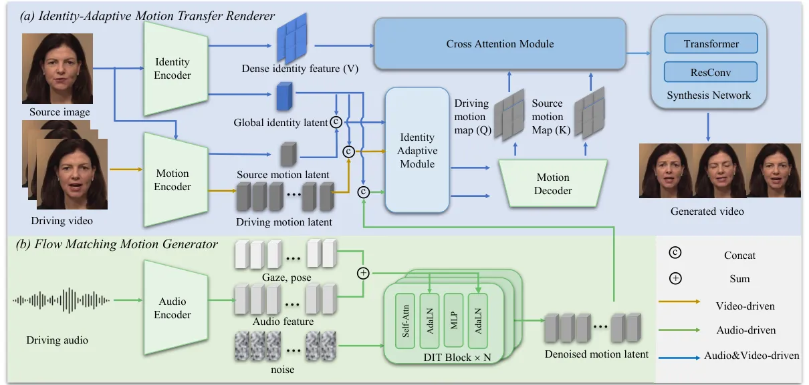

Figure 2: Overall architecture of our proposed framework. Given a source
image, an _Identity Encoder_ and _Motion Encoder_ extract identity
features and source motion. A driving motion latent is either extracted
from video by the _Motion Encoder_ or synthesized from audio by a
_Flow-Matching Motion Generator_. Both motion latents are then
personalized by the _Identity-Adaptive Module_. Subsequently, the
_Implicit Motion Transfer Module_ uses these personalized latents and
$`f_{id}`$ to generate aligned features via a motion decoder and
cross-attention. Finally, the _Synthesis Network_ renders these aligned
features into the final photorealistic image.

### 2.2 Video-Driven talking face

To achieve a disentangled representation of motion and appearance, many
audio-driven talking face approaches build upon the architectures of
video-driven models. Face-vid2vid \[44\] employs implicit 3D keypoints
to represent facial motion and applies affine transformations for face
warping, laying the foundation for subsequent methods. Following this
idea, MCNet \[19\] and LivePortrait \[12\] further refine motion
representation and improve reconstruction fidelity. X-Portrait \[49\],
built upon a pre-trained Face-vid2vid model, enhances attention to local
facial movements, thereby mitigating appearance leakage. In addition,
several works adopt orthogonal bases to represent motion, modeling the
motion code as a linear combination of a set of basis vectors. For
example, LIA \[45\], LIA-X \[46\], EDTalk \[41\] and FIXTalk \[40\]
maintain a set of learnable orthogonal embeddings during training,
enabling more stable and disentangled motion encoding. Moreover, some
approaches leverage information compression techniques combined with
attention mechanisms to aggregate information from videos and achieve
disentanglement. For instance, IMF \[10\] proposes an implicit motion
function that aggregates motion information from videos using
low-dimensional vectors and a cross-attention mechanism. Similarly, BCD
\[25\] constrains the bitrate of motion using GVQ, enabling implicit
disentanglement of motion representation.

## 3 Methodology

We will first introduce the overview of our framework Sec. 3.1, followed
by a detailed description of the two main components: (1) an
Identity-Adaptive Motion Transfer Renderer Sec. 3.2 responsible for
personalizing motion representations, achieving motion transfer in the
latent space, and finally synthesizing photorealistic facial imagery,
and (2) a Flow-Matching Motion Generator Sec. 3.3 that learns to
generate identity-agnostic facial motion latent vectors from audio and
other control conditions.

### 3.1 Framework Overview

Let $`I_{S}\in\mathbb{R}^{H\times W\times 3}`$ be a static source
identity image and $`\mathcal{D}`$ be a driving signal. Our framework,
IMTalker, is designed to handle two distinct reenactment tasks by
accepting two types of driving signals: an audio waveform $`A`$ for
audio-driven synthesis, or a driving video sequence $`V_{D}`$ for
video-driven motion transfer. The objective is to synthesize a video
frame sequence $`\{\hat{I}_{T}\}`$ that preserves the identity of
$`I_{S}`$ while exhibiting facial motion driven by the driving signal
$`\mathcal{D}`$.

Our IMTalker framework factorizes this problem into two main stages.
First, the motion latent generation stage acquires the driving motion
latent $`z_{\text{motion, D}}`$. This is either synthesized from audio
$`A`$ (and optional control signals pose $`p`$, gaze $`g`$) by a flow
matching motion generator ($`G_{\text{motion}}`$) for the audio-driven
task, or directly extracted from a driving video $`V_{D}`$ by a motion
encoder ($`E_{\text{motion}}`$) for the video-driven task. Second, the
motion transfer and portrait rendering stage, the renderer
$`G_{\text{render}}`$ synthesizes the final frame $`\hat{I}_{T}`$
conditioned on the driving motion $`z_{\text{motion, D}}`$ and two
representations from the source image $`I_{S}`$: identity features
$`f_{id}`$ (from $`E_{\text{id}}`$) and source motion
$`z_{\text{motion, S}}`$ (from $`E_{\text{motion}}`$). This complete
process is formulated as:

```math
\displaystyle f_{id},z_{\text{motion, S}}=E_{\text{id}}(I_{S}),E_{\text{motion}}(I_{S}) \tag{1}
```

```math
\displaystyle z_{\text{motion, D}}=\begin{cases}G_{\text{motion}}(A,p,g),&\text{if }\mathcal{D}\text{ is audio}\\
E_{\text{motion}}(V_{D}),&\text{if }\mathcal{D}\text{ is video}\end{cases} \tag{2}
```

```math
\displaystyle\hat{I}_{T}=G_{\text{render}}(f_{id},z_{\text{motion, S}},z_{\text{motion, D}}) \tag{3}
```

### 3.2 Identity-Adaptive Motion Transfer Renderer

The Renderer $`G_{\text{render}}`$ is designed to follow a precise data
flow and is composed of three key sub-modules: (1) an Identity-Adaptive
(IA) Module ($`\Phi`$) that first personalizes the input motion latents
(Sec. 3.2.1), (2) an Implicit Motion Transfer (IMT) Module that then
align motion discrepancies with dense identity features (Sec. 3.2.2),
and (3) a Synthesis Network that finally renders these aligned features
into a photorealistic output image (Sec. 3.2.3). The training objective
for this stage is described in Sec. 3.2.4.

#### 3.2.1 Identity-Adaptive (IA) Module

The core problem we target is that a single, global motion latent
$`z_{\text{motion}}`$ is not optimal for all identities, as different
individuals have unique ways of expressing the same phoneme or emotion.
Therefore, we introduce a lightweight yet highly effective
Identity-Adaptive Module ($`\Phi`$). The function of $`\Phi`$ is to
specialize this global motion vector for a target identity, embedding
identity-specific style without corrupting the core motion command.
$`\Phi`$ is a small MLP that takes the motion latent
$`z_{\text{motion}}`$ and the global identity feature
$`f_{\text{global}}`$ as input to produce a personalized motion latent
$`z^{\prime}_{\text{motion}}`$:

```math
\displaystyle\Phi:\mathbb{R}^{d_{z}}\times\mathbb{R}^{d_{f}}\to\mathbb{R}^{d_{z}} \tag{4}
```

```math
\displaystyle z^{\prime}_{\text{motion}}=\Phi(z_{\text{motion}},f_{\text{global}}) \tag{5}
```

However, in practical training, the source and driving frames originate
from the same identity (see Sec. 3.2.4). This inevitably introduces an
identity bias into the motion latent during our adaptive process, which
in turn diminishes its ability to generalize to significant identity
discrepancies. Therefore, we design a Motion Distance Consistency Loss
$`\mathcal{L}_{\text{dist}}`$ to enforce the identity-invariance of the
motion latent prior to identity adaptation. For each motion latent
$`z_{\text{motion}}`$, we sample two distinct identities, $`A`$ and
$`B`$. We then compute their respective personalized motion latents:

```math
\displaystyle z^{\prime}_{A} \displaystyle=\Phi(z_{\text{motion}},f_{\text{global},A}) \tag{6}
```

```math
\displaystyle z^{\prime}_{B} \displaystyle=\Phi(z_{\text{motion}},f_{\text{global},B}) \tag{7}
```

The loss then encourages the distance from the original motion latent to
each of the personalized latents to be equal:

```math
\mathcal{L}_{\text{dist}}=\left|d(z_{\text{motion}},z^{\prime}_{A})-d(z_{\text{motion}},z^{\prime}_{B})\right| \tag{8}
```

where $`d(\cdot,\cdot)`$ is the L1 distance. This objective forces all
personalized motion latents to lie on a hypersphere centered at the
original motion latent. It ensures that the adaptation module $`\Phi`$
applies a stylization of consistent “strength” for all identities,
preventing it from adapting some more aggressively than others.

#### 3.2.2 Implicit Motion Transfer (IMT) Module

The goal of the Implicit Motion Transfer (IMT) Module is to perform
motion transfer by generating new appearance features directly in the
latent space, rather than simply rearranging existing ones. To initiate
this, a unified motion decoder $`D_{\text{motion}}`$ utilizes style
modulation \[21\] to transform the personalized latent vectors
($`z^{\prime}_{\text{motion, S}},z^{\prime}_{\text{motion, D}}`$) into
multi-scale 2D motion maps ($`M_{S},M_{D}`$), where each scale
corresponds to a different granularity of facial motion. These maps are
spatially aligned with the dense identity features $`f_{\text{dense}}`$,
establishing a crucial sub-pixel spatial correspondence between motion
and appearance in a unified 2D latent space. At each scale, the 2D
feature maps $`M_{D}`$, $`M_{S}`$, and $`f_{\text{dense}}`$ serve as the
inputs for our cross-attention mechanism. However, the $`O(N^{2})`$
quadratic complexity of standard attention imposes a prohibitive
computational burden when processing high-resolution feature maps. To
address this, we propose a hierarchical coarse-to-fine guided attention
strategy. Our architecture processes coarse and fine feature maps
differently:

At lower resolution (e.g., $`64^{2}`$), we employ a standard
cross-attention mechanism. The input feature maps
($`M_{D},M_{S},f_{\text{dense}}`$) are linearly projected and flattened
into sequences to form the Query ($`Q`$), Key ($`K`$), and Value ($`V`$)
matrices. The full attention map, denoted as $`A_{\text{coarse}}`$, is
then computed from $`Q`$ to $`K`$, and subsequently applied to $`V`$ to
produce the aligned feature set $`f_{\text{aligned, coarse}}`$.

At finer resolutions (e.g., $`128^{2}`$, $`256^{2}`$), we introduce a
highly efficient Guided Sparse Resampler module that operates without
computing QK attention. This module takes two inputs: the
high-resolution value features $`V_{\text{high}}`$ (derived from
$`f_{\text{dense}}`$) and the coarse attention map $`A_{\text{coarse}}`$
(output from the previous coarse stage). $`A_{\text{coarse}}`$ is first
spatially upsampled to match the resolution of $`V_{\text{high}}`$.
Then, for each row in the upsampled attention map, we select the
top-$`k`$ values to form a sparse attention mask. This mask is
subsequently applied to $`V_{\text{high}}`$ using the Hadamard product
to generate the aligned feature set $`f_{\text{aligned, fine}}`$.

This efficient, hybrid strategy retains a global receptive field,
overcoming the limitations of local affine approximations in traditional
warp-based methods. It allows the resulting features to represent newly
generated appearance, enabling the robust handling of complex, non-rigid
facial motions. The set of multi-scale aligned features from all scales,
denoted as $`f_{\text{aligned}}`$, is then passed to the Synthesis
Network.

#### 3.2.3 Synthesis Network

The Synthesis Network is responsible for fusing different aligned
features $`f_{\text{aligned}}`$ from the IMT module into the final
output image $`\hat{I}_{T}`$. Its architecture is composed of a stack of
alternating transformer blocks and residual convolution (ResConv)
blocks. This hybrid design is crucial for fusing global and local
information at multiple scales. For efficiency considerations, we adopt
standard Transformer blocks for $`f_{\text{aligned, coarse}}`$, and
employ the shift windows mechanism similar to \[29\] for
$`f_{\text{aligned, fine}}`$ to avoid full-attention operations.

#### 3.2.4 Training Objective

We jointly train the renderer $`G_{\text{render}}`$ and the encoders
using a reconstruction objective in a self-supervised manner. Given a
source frame $`I_{S}`$ and target frame $`I_{T}`$, we first extracts the
source identity latent $`f_{i}d=E_{i}d(I_{S})`$ and their respective
motion latents, $`z_{S}=E_{\text{motion}}(I_{S})`$ and
$`z_{T}=E_{\text{motion}}(I_{T})`$. The renderer then reconstructs the
target frame as $`\hat{I}_{T}=G_{\text{render}}(f_{id},z_{S},z_{T})`$.
The networks are optimized by minimizing the following composite loss
between $`\hat{I}_{T}`$ and $`I_{T}`$:

```math
\mathcal{L}_{\text{total}}=\lambda_{\text{rec}}\mathcal{L}_{\text{rec}}+\lambda_{\text{lpips}}\mathcal{L}_{\text{lpips}}+\lambda_{\text{GAN}}\mathcal{L}_{\text{GAN}}+\lambda_{\text{dist}}\mathcal{L}_{\text{dist}} \tag{9}
```

The $`\lambda`$ terms balance the objectives for pixel-level
reconstruction, perceptual similarity, photorealism, and representation
disentanglement.

|                                                            |                                                            |                                                            |                                                            |                                                            |                                                            |                                                            |                                                            |
| ---------------------------------------------------------- | ---------------------------------------------------------- | ---------------------------------------------------------- | ---------------------------------------------------------- | ---------------------------------------------------------- | ---------------------------------------------------------- | ---------------------------------------------------------- | ---------------------------------------------------------- |
|   |   | 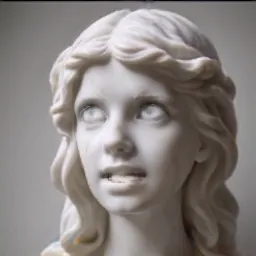  | 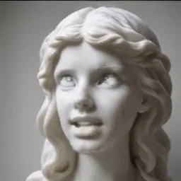  | 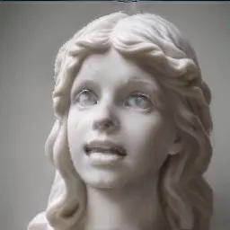  |   |   | 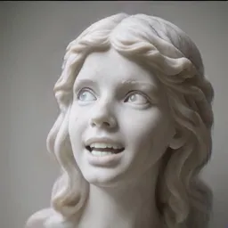 |
|  |  |  |  |  |  |  |  |
|  | 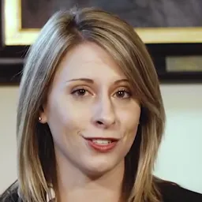 |  |  |  | 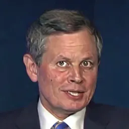 |  |  |
|  | 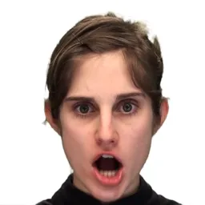 |  |  |  | 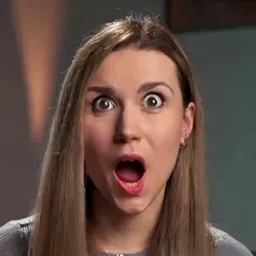 |  |  |
| Source                                                     | Driving                                                    | LIA                                                        | MCNet                                                      | EDTalk                                                     | X-Portrait                                                 | LivePortrait                                               | IMTalker (Ours)                                            |

Figure 3: Qualitative comparison on cross-reenactment. Our method
(IMTalker) achieves superior identity preservation and visual realism
compared to existing baselines. Please refer to our supplementary
material for more detailed comparison.

### 3.3 Flow Matching Motion Generator

Inspired by recent two-stage models \[27, 24, 22, 31\], rather than
inefficiently modeling the direct audio-to-pixel-space mapping, we
design a lightweight flow matching based generator $`G_{\text{motion}}`$
to learn the mapping from audio signals to the low-dimensional motion
latents (learned in the first stage). To further enhance the model’s
controllability, we also incorporate deterministic control conditions,
such as pose and gaze, into the generator.

#### 3.3.1 Conditional Signals and Architecture

We extract audio features ($`f_{\text{audio}}`$), 6D pose parameters
($`p_{\text{6d}}`$), and eye gaze ($`g_{\text{eye}}`$) from a
pre-trained wav2vec2 \[3\] model, a 3D face reconstruction model \[35\],
and a gaze estimation model \[1\], respectively. These various
conditions, along with the timestep $`t`$, are projected by their
respective linear layers ($`L_{i}`$) and then fused via element-wise
summation to form the final control condition $`C`$. We adopt a modified
Diffusion Transformer (DiT) \[33\] as our motion generator backbone.
Specifically, the DiT is composed of stacked self-attention layers and
frame-wise Adaptive Layer Normalization \[2\](AdaLN). For an input
feature map $`h`$ from a preceding layer (e.g., a self-attention block),
the AdaLN layer uses $`C`$ to predict the scale ($`\gamma_{c}`$) and
bias ($`\beta_{c}`$) parameters that modulate it:

```math
\text{AdaLN}(h)=\gamma_{c}\cdot\text{LayerNorm}(h)+\beta_{c} \tag{10}
```

This design leverages self-attention to model temporal dependencies,
while AdaLN provides precise, frame-level control over the synthesis
process.

#### 3.3.2 Training Objective and Inference

We parameterize our motion generator $`G_{\text{motion}}`$ as a vector
field predictor $`v_{\theta}`$ and train it using a Flow Matching (FM)
objective. The predictor $`v_{\theta}`$ learns to predict the
straight-line vector field $`z_{1}-z_{0}`$ (from a Gaussian prior
$`z_{0}`$ to a ground-truth motion latent $`z_{1}`$), conditioned on the
condition $`C`$ and timestep $`t`$. To enable Classifier-Free Guidance
(CFG) \[17\], during training, each control condition
$`m\in\{\text{audio},\text{pose},\text{gaze}\}`$ is independently
replaced by a null embedding $`\emptyset_{m}`$ with a probability of
$`p=0.1`$. The FM objective is minimized via MSE:

```math
\mathcal{L}_{\text{FM}}=\mathbb{E}_{t,z_{0},z_{1},c}\left\|v_{\theta}((1-t)z_{0}+tz_{1},C,t)-(z_{1}-z_{0})\right\|_{2}^{2} \tag{11}
```

At inference, a numerical solver (e.g., Euler) solves the probability
flow ODE $`\frac{dz}{dt}=v^{\prime}_{\theta}(z,c,t)`$ from $`t=0`$ to
$`t=1`$. The guided vector field $`v^{\prime}_{\theta}`$ is computed at
each step using a guidance scale $`w`$:

```math
v^{\prime}_{\theta}(z_{t},c,t)=v_{\theta}(z_{t},\emptyset,t)+w\cdot(v_{\theta}(z_{t},c,t)-v_{\theta}(z_{t},\emptyset,t)) \tag{12}
```

where $`z_{t}`$ is the current motion latent, and
$`v_{\theta}(z_{t},\emptyset,t)`$ is the unconditional prediction, where
$`\emptyset=\{\emptyset_{\text{audio}}\}`$.

|                     |                  |                  |                     |                  |                   |                   |                   |                   |                  |                   |
| ------------------- | ---------------- | ---------------- | ------------------- | ---------------- | ----------------- | ----------------- | ----------------- | ----------------- | ---------------- | ----------------- |
|                     | Self-Reenactment |                  |                     |                  |                   | Cross-Reenactment |                   |                   |                  |                   |
| Method              | PSNR$`\uparrow`$ | SSIM$`\uparrow`$ | LPIPS$`\downarrow`$ | CSIM$`\uparrow`$ | FID$`\downarrow`$ | AED$`\downarrow`$ | APD$`\downarrow`$ | MAE$`\downarrow`$ | CSIM$`\uparrow`$ | FID$`\downarrow`$ |
| LIA \[45\]          | $`25.991`$       | $`0.839`$        | $`0.085`$           | $`0.862`$        | $`14.053`$        | $`0.808`$         | $`0.096`$         | $`10.215`$        | $`0.696`$        | $`59.812`$        |
| MCNet \[19\]        | 27.974           | 0.886            | $`0.070`$           | $`0.876`$        | $`9.672`$         | $`0.830`$         | $`0.095`$         | $`10.230`$        | $`0.696`$        | $`54.448`$        |
| EDTalk \[41\]       | $`26.366`$       | $`0.853`$        | $`0.081`$           | $`0.868`$        | $`12.201`$        | $`0.713`$         | $`0.038`$         | $`10.583`$        | $`0.750`$        | $`60.669`$        |
| X-Portrait \[49\]   | $`25.590`$       | $`0.841`$        | $`0.063`$           | $`0.878`$        | $`10.415`$        | $`0.745`$         | $`0.062`$         | $`9.977`$         | $`0.779`$        | $`54.762`$        |
| LivePortrait \[12\] | $`27.173`$       | $`0.878`$        | 0.043               | 0.896            | 9.049             | 0.627             | 0.026             | 9.841             | 0.789            | 53.144            |
| IMTalker (Ours)     | 28.458           | 0.899            | 0.037               | 0.898            | 7.426             | 0.581             | 0.024             | 7.553             | 0.824            | 53.137            |

Table 1: Quantitative comparison for video-driven self-reenactment and
cross-reenactment on the HDTF dataset. Best and second-best results are
in bold and underlined.

## 4 Experiment

We will first introduce our framework’s implementation details,
baselines, metrics, parameters and inference speed. Subsequently, we
will present the experimental results under two different evaluation
settings—video-driven and audio-driven—providing both qualitative and
quantitative assessments. Finally, we conduct ablation studies to
validate the effectiveness of our proposed modules.

##### Implementation details

For the Renderer, we trained the model on a composite dataset from three
public talking head video datasets—VFHQ \[48\], VoxCeleb2 \[5\], and
MultiTalk \[39\]—totaling approximately 660 hours (35,000 clips). Input
frames were resized to $`256^{2}`$ resolution, with an output resolution
of $`512^{2}`$. The motion generator utilized only the video and audio
data from VoxCeleb2 \[5\], comprising approximately 350 hours (160,000
clips). Both stages were trained on 4 NVIDIA A100 GPUs using the Adam
optimizer \[23\], with a learning rate of $`1\times 10^{-4}`$,
$`\beta_{1}=0.5`$, and $`\beta_{2}=0.99`$. Using batch sizes of 16 and
256, the renderer and the generator were trained to full convergence in
approximately 4 days and 2 days, respectively.

| Methods   | HDTF                                                       |                                                            |                                                            |                                                            |                                                            | Source                                                     | CelebV                                                     |                                                            |                                                            |                                                            |                                                            |
| --------- | ---------------------------------------------------------- | ---------------------------------------------------------- | ---------------------------------------------------------- | ---------------------------------------------------------- | ---------------------------------------------------------- | ---------------------------------------------------------- | ---------------------------------------------------------- | ---------------------------------------------------------- | ---------------------------------------------------------- | ---------------------------------------------------------- | ---------------------------------------------------------- |
| AniTalker |  |  |  |  |  |                                                            | 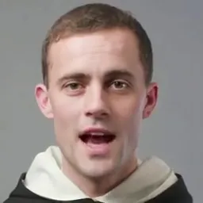 |  |  | 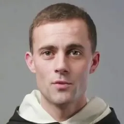 | 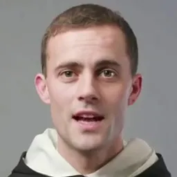 |
| Hallo     |  |  |  |  |  |  | 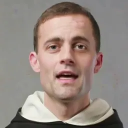 | 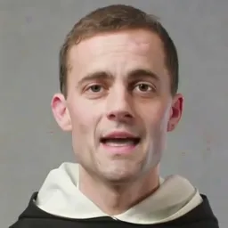 |  | 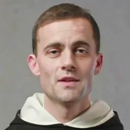 | 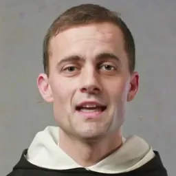 |
| EchoMimic |  |  |  |  |  |                                                            |  |  |  |  | 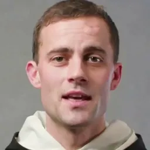 |
| Ditto     |  |  |  |  |  |                                                            | 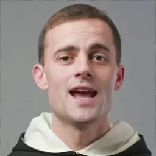 | 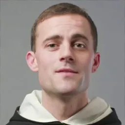 | 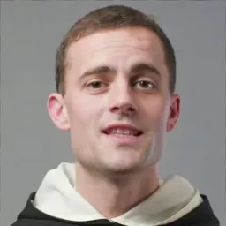 | 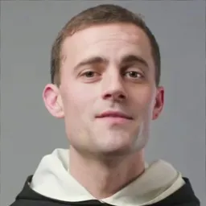 | 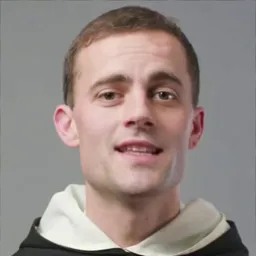 |
| FLOAT     |  |  |  |  |  | 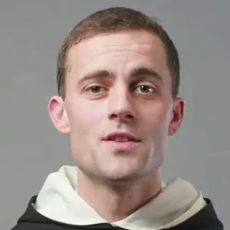 |  |  |  |  |  |
| IMTalker  |  |  |  |  |  |                                                            | 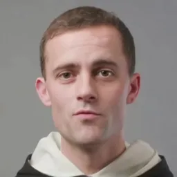 | 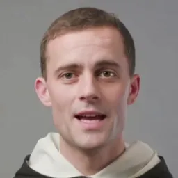 | 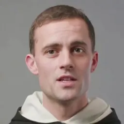 | 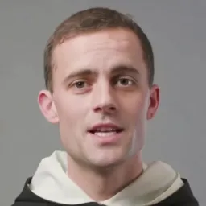 |  |

Figure 4: Qualitative comparison of audio-driven talking head generation
results. The Source column (center) shows the single source identity
used for all methods on HDTF \[54\] (top image, left block) and CelebV
\[51\] (bottom image, right block). Each row corresponds to one method’s
results on different test samples. Please refer to our supplementary
material for more detailed comparison.

##### Baselines

In the video-driven setting, we compare our method against several
open-source baselines, including LIA \[45\], MCNet \[18\], EDTalk
\[41\], LivePortrait \[12\], and X-Portrait \[49\]. In the audio-driven
setting, we conduct comparisons with EchoMimic \[4\], Hallo \[50\],
AniTalker \[27\], Ditto \[24\], and FLOAT \[22\].

##### Metrics

We use Peak Signal-to-Noise Ratio (PSNR), Structural Similarity Index
(SSIM) \[47\], Learned Perceptual Image Patch Similarity (LPIPS) \[52\],
Fréchet Inception Distance (FID) \[15\], and Fréchet Video Distance
(FVD) \[43\] to evaluate the image and video generation quality. To
assess identity consistency and motion transfer accuracy, we employ
Cosine Similarity of identity embedding (CSIM) \[8\], Average Expression
Distance (AED) \[37\], Average Pose Distance (APD) \[37\], and Mean
Angular Error (MAE) \[14\] of eyeball direction. The degree of audio-lip
synchronization is measured using Lip-Sync Error Confidence (Sync-C)
\[34\] and Lip-Sync Error Distance (Sync-D) \[34\].

| Method           | FID$`\downarrow`$ |            | FVD$`\downarrow`$ |             | Sync-C$`\uparrow`$ |           | Sync-D$`\downarrow`$ |           | CSIM$`\uparrow`$ |           | SSIM$`\uparrow`$ |           | LPIPS$`\downarrow`$ |           |
| ---------------- | ----------------- | ---------- | ----------------- | ----------- | ------------------ | --------- | -------------------- | --------- | ---------------- | --------- | ---------------- | --------- | ------------------- | --------- |
| EchoMimic \[4\]  | $`27.846`$/       | $`33.243`$ | $`288.457`$/      | $`299.913`$ | $`6.265`$/         | $`6.014`$ | $`8.661`$/           | $`8.754`$ | $`0.806`$/       | $`0.611`$ | $`0.493`$/       | $`0.482`$ | $`0.249`$/          | $`0.303`$ |
| Hallo \[50\]     | $`10.573`$/       | $`21.538`$ | 154.975/          | $`246.266`$ | 7.497/             | 6.843     | 7.694/               | 8.065     | $`0.863`$/       | $`0.787`$ | 0.668/           | $`0.575`$ | 0.137/              | 0.233     |
| Anitalker \[27\] | $`14.224`$/       | $`24.815`$ | $`241.968`$/      | $`241.968`$ | $`6.855`$/         | $`6.501`$ | $`8.184`$/           | $`8.316`$ | $`0.857`$/       | $`0.746`$ | $`0.607`$/       | $`0.544`$ | $`0.195`$/          | $`0.278`$ |
| Ditto \[24\]     | $`11.746`$/       | $`25.367`$ | $`195.848`$/      | $`288.804`$ | $`6.093`$/         | $`5.154`$ | $`8.938`$/           | $`9.771`$ | 0.886/           | 0.806     | 0.669/           | 0.582     | $`0.139`$/          | $`0.234`$ |
| FLOAT \[22\]     | 9.164/            | 18.272     | $`198.964`$/      | 228.215     | $`6.854`$/         | $`6.843`$ | $`8.336`$/           | $`8.171`$ | $`0.843`$/       | $`0.745`$ | $`0.639`$/       | $`0.577`$ | $`0.161`$/          | $`0.239`$ |
| IMTalker (Ours)  | 9.084/            | 17.921     | 143.623/          | 200.592     | 7.711/             | 7.364     | 7.794/               | 7.832     | 0.869/           | 0.814     | $`0.665`$/       | 0.585     | 0.141/              | 0.226     |

Table 2: Comparison of audio-driven methods on the HDTF and CelebV
datasets. Best and second-best results are in bold and underlined.

##### Parameters and Inference Speed

Our renderer and motion generator comprise 124M and 39M learnable
parameters, respectively. On a NVIDIA RTX 4090 GPU, they can generate
$`512^{2}`$ resolution video at 40 FPS and 42 FPS, respectively,
demonstrating that our method is sufficiently lightweight and fast for
real-time applications.

### 4.1 Video-Driven Setting

In this video-driven setting, we compare the capabilities of our method
against state-of-the-art (SOTA) baselines in terms of motion transfer,
identity preservation, and image quality. Specifically, a source frame
and a driving frame are provided as input, supplying the identity and
motion information, respectively. Under this setting, if the source
frame and driving frame originate from the same video, we term this
self-reenactment; if they come from different videos, it is termed
cross-reenactment. For a fair comparison, we cropped the output videos
from all methods to $`256^{2}`$ resolution. The detailed quantitative
and qualitative evaluations are as follows.

##### Qualitative Evaluation

For the qualitative comparison, to more intuitively demonstrate the
superiority of our method in motion transfer across diverse subjects and
motions, we sampled a wider variety of frames from datasets including
CelebV \[51\], VFHQ \[48\], and RAVDESS \[30\]. Fig. 3 illustrates the
qualitative evaluation results for cross-reenactment against other
methods. Each row highlights specific challenging scenarios, such as eye
gaze, large-angle poses, cross-gender reenactment, and rich emotional
expressions. The baseline methods inevitably suffer from failure cases,
including identity degradation and inaccurate motion transfer. In
contrast, our method successfully handles these challenges and achieves
significantly better results.

##### Quantitative Evaluation

For quantitative evaluation, we randomly sampled 50 videos from the HDTF
\[54\] dataset. The results are presented in Tab. 1. In the
self-reenactment setting (left), our method achieves the best results
across all pixel-level and image quality metrics, indicating superior
generation quality. In the cross-reenactment setting (right), IMTalker
again achieves state-of-the-art results, showing particular strength in
metrics like CSIM, AED, and MAE. This confirms our method’s ability to
accurately transfer fine-grained motions, such as expressions and eye
gaze, while maintaining high identity consistency.

### 4.2 Audio-driven Setting

We use the HDTF \[54\] and CelebV \[51\] datasets for qualitative and
quantitative comparisons against the baselines. Specifically, we
randomly sampled 50 videos from each of these two datasets. For each
video, we use the first frame as the source frame and the complete audio
stream as the driving condition to generate the output video. The
qualitative and quantitative evaluations are as follows.

##### Qualitative Evaluation

Fig. 4 presents the qualitative comparison for the audio-driven task. As
shown, other methods either fail to generate rich head movements and
expressions, struggle to align fine-grained syllables with corresponding
lip motions, or suffer from artifacts in high-frequency details (such as
distorted teeth). In contrast, our method simultaneously achieves
accurate lip synchronization, rich expressions and movements, and
high-quality talking head video generation.

##### Quantitative Evaluation

We present the quantitative comparison results in Tab. 2. As shown in
the table, our method achieves the best performance on both datasets
across most metrics, with the exception of CSIM, where it is slightly
lower than Ditto. This discrepancy is attributable to the fact that
Ditto generates only very slight head movements, and the CSIM metric is
highly sensitive to pose variations. In contrast, our method not only
achieves accurate lip synchronization but also generates rich and
diverse head movements, which contributes to a higher degree of realism.

|                                                            |                                                                                                                      |                                                                                                                        |                                                                                                                        |
| ---------------------------------------------------------- | -------------------------------------------------------------------------------------------------------------------- | ---------------------------------------------------------------------------------------------------------------------- | ---------------------------------------------------------------------------------------------------------------------- |
|  | 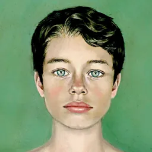 | 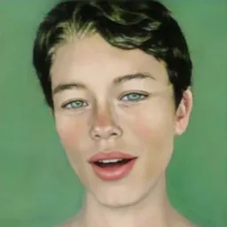 | 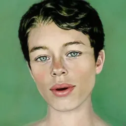 |
| Driving                                                    | Source                                                                                                               | w/o IA                                                                                                                 | w IA                                                                                                                   |

Figure 5: Ablation study on Identity-Adaptive module From left to right:
driving frame, source images, results of our model without
identity-adaptive module, and the full model results.

[TABLE]

Table 3: Ablation study on sampling steps and conditional inputs.

### 4.3 Ablation Study

##### Ablation on Identity-Adaptive Module

We conducted an ablation study by comparing the model with and without
the Identity-Adaptive (IA) Module in the cross-reenactment setting. As
visualized in Fig. 5, without IA, the source identity’s appearance is
significantly degraded during the motion transfer process. This result
demonstrates that IA disentangles identity content from motion and
enables personalized motion adaptation, thereby significantly improving
both identity consistency and motion accuracy.

##### Ablation on Sampling Steps and Conditional Inputs

We evaluate the impact of sampling steps and control conditions in
Tab. 3. In the audio-only setting, fewer sampling steps yield superior
lip synchronization while maintaining stable video quality, highlighting
the efficiency of our flow matching process. Furthermore, incorporating
additional control conditions significantly enhances visual fidelity
with negligible impact on lip alignment, demonstrating the robust
controllability of our approach.

## 5 Conclusion

We presented IMTalker, an efficient talking face generation framework
driven by video or audio. Our core innovation is an Identity-Adaptive
Motion Transfer Renderer that leverages cross-attention to perform
motion transfer while disentangling identity-specific styles. For the
audio-driven task, a lightweight Flow-Matching Motion Generator
efficiently synthesizes controllable motion latents from multi-modal
conditions. Extensive experiments on various benchmarks confirm that
IMTalker achieves state-of-the-art performance in motion accuracy,
identity preservation, and audio-lip synchronization, facilitating
real-world applications.

## References

- \[1\] A. A. Abdelrahman, T. Hempel, A. Khalifa, A. Al-Hamadi, and L.
  Dinges (2023) L2cs-net: fine-grained gaze estimation in unconstrained
  environments. In 2023 8th International Conference on Frontiers of
  Signal Processing (ICFSP), pp. 98–102. Cited by: §3.3.1.
- \[2\] J. L. Ba, J. R. Kiros, and G. E. Hinton (2016) Layer
  normalization. arXiv preprint arXiv:1607.06450. Cited by: §3.3.1.
- \[3\] A. Baevski, Y. Zhou, A. Mohamed, and M. Auli (2020) Wav2vec 2.0:
  a framework for self-supervised learning of speech representations.
  Advances in neural information processing systems 33, pp. 12449–12460.
  Cited by: §3.3.1.
- \[4\] Z. Chen, J. Cao, Z. Chen, Y. Li, and C. Ma (2025) Echomimic:
  lifelike audio-driven portrait animations through editable landmark
  conditions. In Proceedings of the AAAI Conference on Artificial
  Intelligence, Vol. 39, pp. 2403–2410. Cited by: §2.1, §4, Table 2.
- \[5\] J. S. Chung, A. Nagrani, and A. Zisserman (2018) Voxceleb2: deep
  speaker recognition. arXiv preprint arXiv:1806.05622. Cited by: §4.
- \[6\] J. Cui, H. Li, Y. Yao, H. Zhu, H. Shang, K. Cheng, H. Zhou, S.
  Zhu, and J. Wang (2024) Hallo2: long-duration and high-resolution
  audio-driven portrait image animation. arXiv preprint
  arXiv:2410.07718. Cited by: §2.1.
- \[7\] J. Cui, H. Li, Y. Zhan, H. Shang, K. Cheng, Y. Ma, S. Mu, H.
  Zhou, J. Wang, and S. Zhu (2025) Hallo3: highly dynamic and realistic
  portrait image animation with video diffusion transformer. In
  Proceedings of the Computer Vision and Pattern Recognition Conference,
  pp. 21086–21095. Cited by: §2.1.
- \[8\] J. Deng, J. Guo, N. Xue, and S. Zafeiriou (2019) Arcface:
  additive angular margin loss for deep face recognition. In Proceedings
  of the IEEE/CVF conference on computer vision and pattern recognition,
  pp. 4690–4699. Cited by: §4.
- \[9\] N. Drobyshev, A. B. Casademunt, K. Vougioukas, Z. Landgraf, S.
  Petridis, and M. Pantic (2024) Emoportraits: emotion-enhanced
  multimodal one-shot head avatars. In Proceedings of the IEEE/CVF
  Conference on Computer Vision and Pattern Recognition, pp. 8498–8507.
  Cited by: §1.
- \[10\] Y. Gao, J. Li, L. Chu, and Y. Lu (2024) Implicit motion
  function. In Proceedings of the IEEE/CVF Conference on Computer Vision
  and Pattern Recognition, pp. 19278–19289. Cited by: §2.2.
- \[11\] I. J. Goodfellow, J. Pouget-Abadie, M. Mirza, B. Xu, D.
  Warde-Farley, S. Ozair, A. Courville, and Y. Bengio (2014) Generative
  adversarial nets. Advances in neural information processing systems 27. Cited by: §1.
- \[12\] J. Guo, D. Zhang, X. Liu, Z. Zhong, Y. Zhang, P. Wan, and D.
  Zhang (2024) Liveportrait: efficient portrait animation with stitching
  and retargeting control. arXiv preprint arXiv:2407.03168. Cited by:
  §1, §2.1, §2.2, Table 1, §4.
- \[13\] S. Gururani, A. Mallya, T. Wang, R. Valle, and M. Liu (2023)
  Space: speech-driven portrait animation with controllable expression.
  In Proceedings of the ieee/cvf international conference on computer
  vision, pp. 20914–20923. Cited by: §2.1.
- \[14\] Y. Han, J. Zhu, K. He, X. Chen, Y. Ge, W. Li, X. Li, J.
  Zhang, C. Wang, and Y. Liu (2024) Face-adapter for pre-trained
  diffusion models with fine-grained id and attribute control. In
  European Conference on Computer Vision, pp. 20–36. Cited by: §4.
- \[15\] M. Heusel, H. Ramsauer, T. Unterthiner, B. Nessler, and S.
  Hochreiter (2017) Gans trained by a two time-scale update rule
  converge to a local nash equilibrium. Advances in neural information
  processing systems 30. Cited by: §4.
- \[16\] J. Ho, A. Jain, and P. Abbeel (2020) Denoising diffusion
  probabilistic models. Advances in neural information processing
  systems 33, pp. 6840–6851. Cited by: §1, §2.1.
- \[17\] J. Ho and T. Salimans (2022) Classifier-free diffusion
  guidance. arXiv preprint arXiv:2207.12598. Cited by: §3.3.2.
- \[18\] F. Hong and D. Xu (2023) Implicit identity representation
  conditioned memory compensation network for talking head video
  generation. In Proceedings of the IEEE/CVF international conference on
  computer vision, pp. 23062–23072. Cited by: §4.
- \[19\] F. Hong and D. Xu (2023) Implicit identity representation
  conditioned memory compensation network for talking head video
  generation. In ICCV, Cited by: §2.2, Table 1.
- \[20\] X. Ji, X. Hu, Z. Xu, J. Zhu, C. Lin, Q. He, J. Zhang, D.
  Luo, Y. Chen, Q. Lin, et al. (2025) Sonic: shifting focus to global
  audio perception in portrait animation. In Proceedings of the Computer
  Vision and Pattern Recognition Conference, pp. 193–203. Cited by: §1,
  §2.1.
- \[21\] T. Karras, S. Laine, M. Aittala, J. Hellsten, J. Lehtinen,
  and T. Aila (2020) Analyzing and improving the image quality of
  stylegan. In Proceedings of the IEEE/CVF conference on computer vision
  and pattern recognition, pp. 8110–8119. Cited by: §3.2.2.
- \[22\] T. Ki, D. Min, and G. Chae (2025) Float: generative motion
  latent flow matching for audio-driven talking portrait. In Proceedings
  of the IEEE/CVF International Conference on Computer Vision,
  pp. 14699–14710. Cited by: §1, §2.1, §3.3, §4, Table 2.
- \[23\] D. P. Kingma (2014) Adam: a method for stochastic optimization.
  arXiv preprint arXiv:1412.6980. Cited by: §4.
- \[24\] T. Li, R. Zheng, M. Yang, J. Chen, and M. Yang (2024) Ditto:
  motion-space diffusion for controllable realtime talking head
  synthesis. arXiv preprint arXiv:2411.19509. Cited by: §1, §2.1, §3.3,
  §4, Table 2.
- \[25\] X. Li, Q. Chen, X. Peng, K. Yu, X. Chen, and Y. Lu (2025)
  Bitrate-controlled diffusion for disentangling motion and content in
  video. In Proceedings of the IEEE/CVF International Conference on
  Computer Vision, pp. 12904–12914. Cited by: §2.2.
- \[26\] Y. Lipman, R. T. Chen, H. Ben-Hamu, M. Nickel, and M. Le (2022)
  Flow matching for generative modeling. arXiv preprint
  arXiv:2210.02747. Cited by: §1, §2.1.
- \[27\] T. Liu, F. Chen, S. Fan, C. Du, Q. Chen, X. Chen, and K.
  Yu (2024) Anitalker: animate vivid and diverse talking faces through
  identity-decoupled facial motion encoding. In Proceedings of the 32nd
  ACM International Conference on Multimedia, pp. 6696–6705. Cited by:
  §1, §2.1, §3.3, §4, Table 2.
- \[28\] X. Liu, C. Gong, and Q. Liu (2022) Flow straight and fast:
  learning to generate and transfer data with rectified flow. arXiv
  preprint arXiv:2209.03003. Cited by: §1.
- \[29\] Z. Liu, Y. Lin, Y. Cao, H. Hu, Y. Wei, Z. Zhang, S. Lin, and B.
  Guo (2021) Swin transformer: hierarchical vision transformer using
  shifted windows. In Proceedings of the IEEE/CVF international
  conference on computer vision, pp. 10012–10022. Cited by: §3.2.3.
- \[30\] S. R. Livingstone and F. A. Russo (2018) The ryerson
  audio-visual database of emotional speech and song (ravdess): a
  dynamic, multimodal set of facial and vocal expressions in north
  american english. PloS one 13 (5), pp. e0196391. Cited by: §4.1.
- \[31\] X. Ma, J. Cai, Y. Guan, S. Huang, Q. Zhang, and S. Zhang (2025)
  Playmate: flexible control of portrait animation via 3d-implicit space
  guided diffusion. arXiv preprint arXiv:2502.07203. Cited by: §3.3.
- \[32\] A. Q. Nichol and P. Dhariwal (2021) Improved denoising
  diffusion probabilistic models. In International conference on machine
  learning, pp. 8162–8171. Cited by: §1.
- \[33\] W. Peebles and S. Xie (2023) Scalable diffusion models with
  transformers. In Proceedings of the IEEE/CVF international conference
  on computer vision, pp. 4195–4205. Cited by: §3.3.1.
- \[34\] K. Prajwal, R. Mukhopadhyay, V. P. Namboodiri, and C.
  Jawahar (2020) A lip sync expert is all you need for speech to lip
  generation in the wild. In Proceedings of the 28th ACM international
  conference on multimedia, pp. 484–492. Cited by: §4.
- \[35\] G. Retsinas, P. P. Filntisis, R. Danecek, V. F. Abrevaya, A.
  Roussos, T. Bolkart, and P. Maragos (2024) SMIRK: 3d facial
  expressions through analysis-by-neural-synthesis. arXiv preprint
  arXiv:2404.04104. Cited by: §3.3.1.
- \[36\] R. Rombach, A. Blattmann, D. Lorenz, P. Esser, and B.
  Ommer (2022) High-resolution image synthesis with latent diffusion
  models. In Proceedings of the IEEE/CVF conference on computer vision
  and pattern recognition, pp. 10684–10695. Cited by: §1.
- \[37\] A. Siarohin, S. Lathuilière, S. Tulyakov, E. Ricci, and N.
  Sebe (2019) First order motion model for image animation. Advances in
  neural information processing systems 32. Cited by: §1, §4.
- \[38\] J. Song, C. Meng, and S. Ermon (2020) Denoising diffusion
  implicit models. arXiv preprint arXiv:2010.02502. Cited by: §2.1.
- \[39\] K. Sung-Bin, L. Chae-Yeon, G. Son, O. Hyun-Bin, J. Ju, S. Nam,
  and T. Oh (2024) MultiTalk: enhancing 3d talking head generation
  across languages with multilingual video dataset. arXiv preprint
  arXiv:2406.14272. Cited by: §4.
- \[40\] S. Tan, B. Gong, B. Ji, and Y. Pan (2025) FixTalk: taming
  identity leakage for high-quality talking head generation in extreme
  cases. arXiv preprint arXiv:2507.01390. Cited by: §2.2.
- \[41\] S. Tan, B. Ji, M. Bi, and Y. Pan (2024) Edtalk: efficient
  disentanglement for emotional talking head synthesis. In European
  Conference on Computer Vision, pp. 398–416. Cited by: §1, §2.2, Table
  1, §4.
- \[42\] L. Tian, Q. Wang, B. Zhang, and L. Bo (2024) Emo: emote
  portrait alive generating expressive portrait videos with audio2video
  diffusion model under weak conditions. In European Conference on
  Computer Vision, pp. 244–260. Cited by: §2.1.
- \[43\] T. Unterthiner, S. Van Steenkiste, K. Kurach, R. Marinier, M.
  Michalski, and S. Gelly (2018) Towards accurate generative models of
  video: a new metric & challenges. arXiv preprint arXiv:1812.01717.
  Cited by: §4.
- \[44\] T. Wang, A. Mallya, and M. Liu (2021) One-shot free-view neural
  talking-head synthesis for video conferencing. In Proceedings of the
  IEEE/CVF conference on computer vision and pattern recognition,
  pp. 10039–10049. Cited by: §1, §2.1, §2.2.
- \[45\] Y. Wang, D. Yang, F. Bremond, and A. Dantcheva (2022) Latent
  image animator: learning to animate images via latent space
  navigation. arXiv preprint arXiv:2203.09043. Cited by: §1, §2.1, §2.2,
  Table 1, §4.
- \[46\] Y. Wang, D. Yang, X. Chen, F. Bremond, Y. Qiao, and A.
  Dantcheva (2025) Lia-x: interpretable latent portrait animator. arXiv
  preprint arXiv:2508.09959. Cited by: §2.2.
- \[47\] Z. Wang, A. C. Bovik, H. R. Sheikh, and E. P. Simoncelli (2004)
  Image quality assessment: from error visibility to structural
  similarity. IEEE transactions on image processing 13 (4), pp. 600–612.
  Cited by: §4.
- \[48\] L. Xie, X. Wang, H. Zhang, C. Dong, and Y. Shan (2022) Vfhq: a
  high-quality dataset and benchmark for video face super-resolution. In
  Proceedings of the IEEE/CVF Conference on Computer Vision and Pattern
  Recognition, pp. 657–666. Cited by: §4, §4.1.
- \[49\] Y. Xie, H. Xu, G. Song, C. Wang, Y. Shi, and L. Luo (2024)
  X-portrait: expressive portrait animation with hierarchical motion
  attention. In ACM SIGGRAPH 2024 Conference Papers, pp. 1–11. Cited by:
  §2.2, Table 1, §4.
- \[50\] M. Xu, H. Li, Q. Su, H. Shang, L. Zhang, C. Liu, J. Wang, Y.
  Yao, and S. Zhu (2024) Hallo: hierarchical audio-driven visual
  synthesis for portrait image animation. arXiv preprint
  arXiv:2406.08801. Cited by: §2.1, §4, Table 2.
- \[51\] J. Yu, H. Zhu, L. Jiang, C. C. Loy, W. Cai, and W. Wu (2023)
  Celebv-text: a large-scale facial text-video dataset. In Proceedings
  of the IEEE/CVF Conference on Computer Vision and Pattern Recognition,
  pp. 14805–14814. Cited by: §1, Figure 4, Figure 4, §4.1, §4.2.
- \[52\] R. Zhang, P. Isola, A. A. Efros, E. Shechtman, and O.
  Wang (2018) The unreasonable effectiveness of deep features as a
  perceptual metric. In Proceedings of the IEEE conference on computer
  vision and pattern recognition, pp. 586–595. Cited by: §4.
- \[53\] W. Zhang, X. Cun, X. Wang, Y. Zhang, X. Shen, Y. Guo, Y. Shan,
  and F. Wang (2023) Sadtalker: learning realistic 3d motion
  coefficients for stylized audio-driven single image talking face
  animation. In Proceedings of the IEEE/CVF conference on computer
  vision and pattern recognition, pp. 8652–8661. Cited by: §1, §2.1.
- \[54\] Z. Zhang, L. Li, Y. Ding, and C. Fan (2021) Flow-guided
  one-shot talking face generation with a high-resolution audio-visual
  dataset. In Proceedings of the IEEE/CVF conference on computer vision
  and pattern recognition, pp. 3661–3670. Cited by: §1, Figure 4, Figure
  4, §4.1, §4.2.
