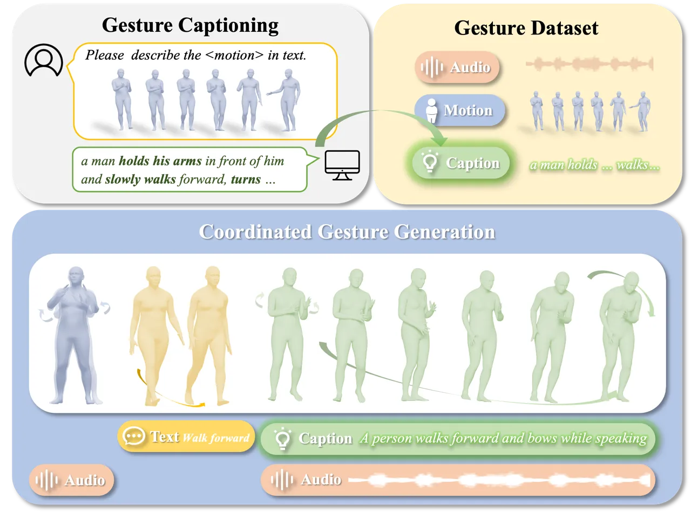
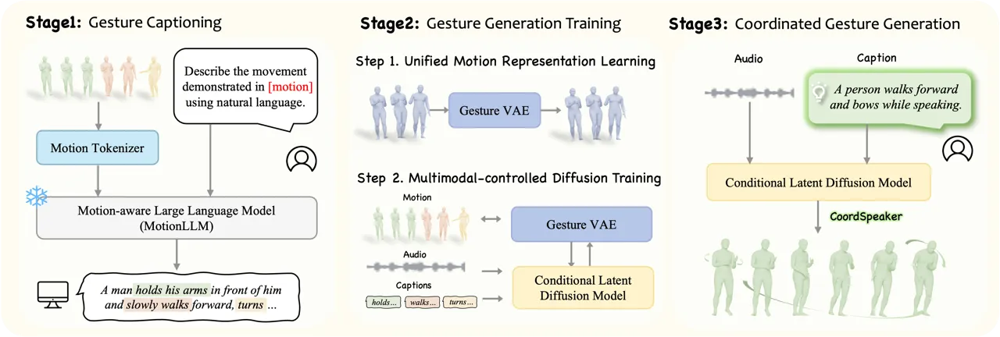
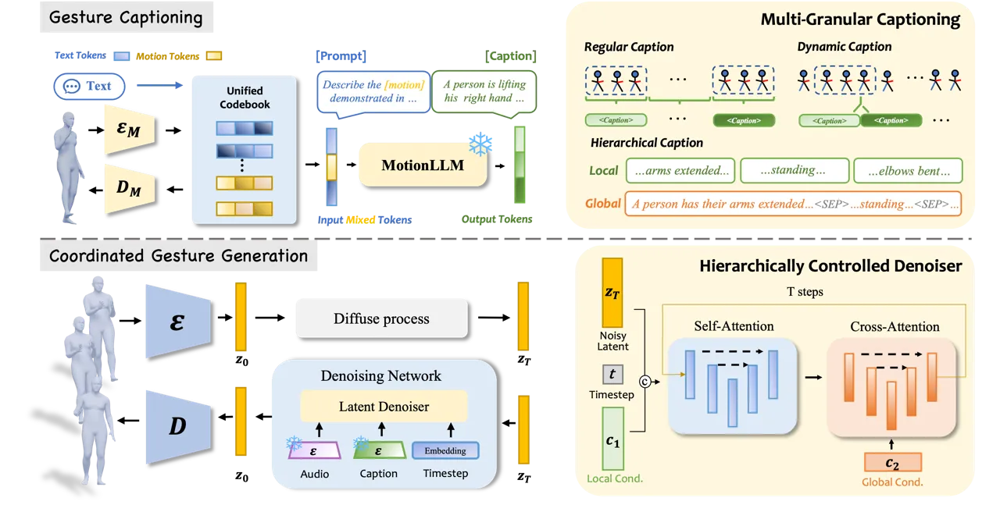
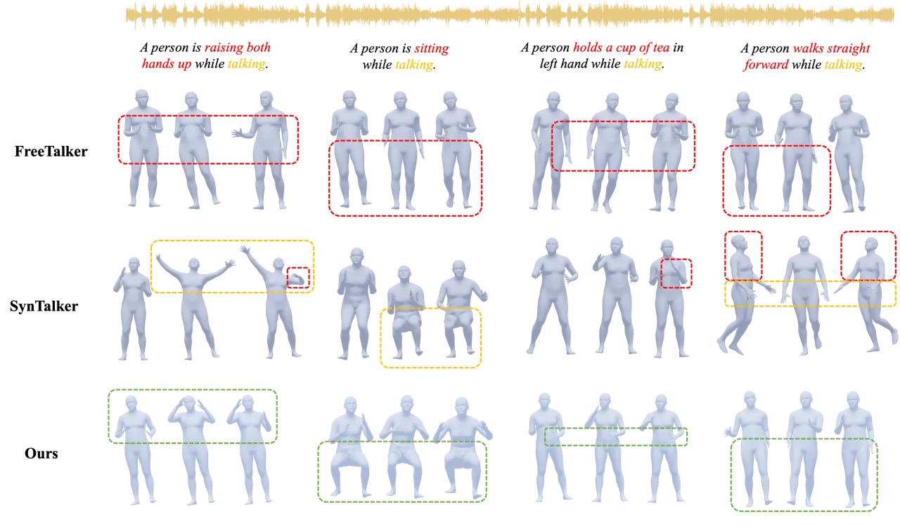
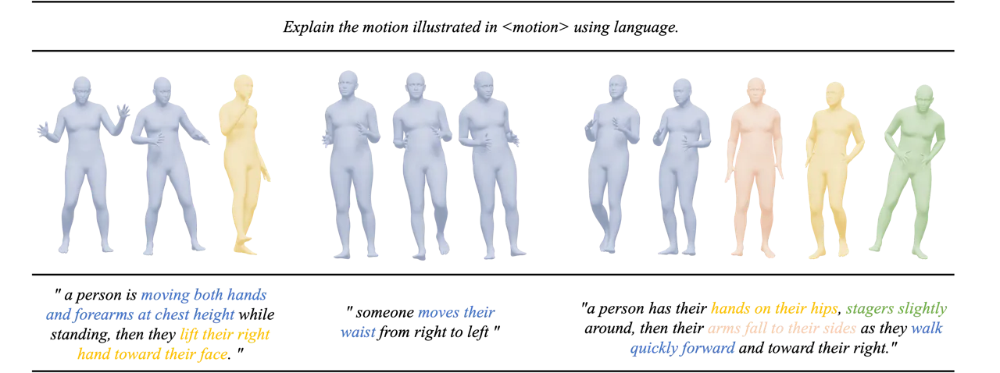
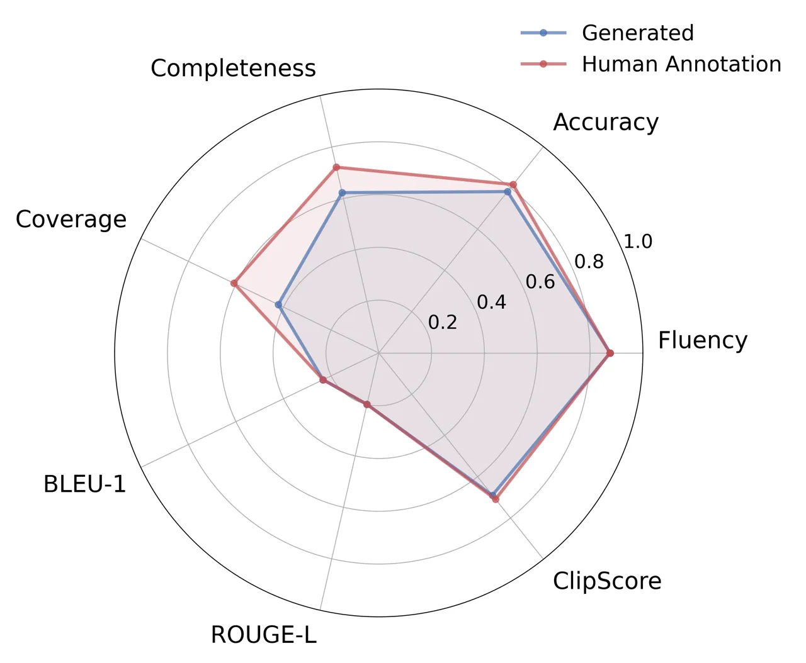
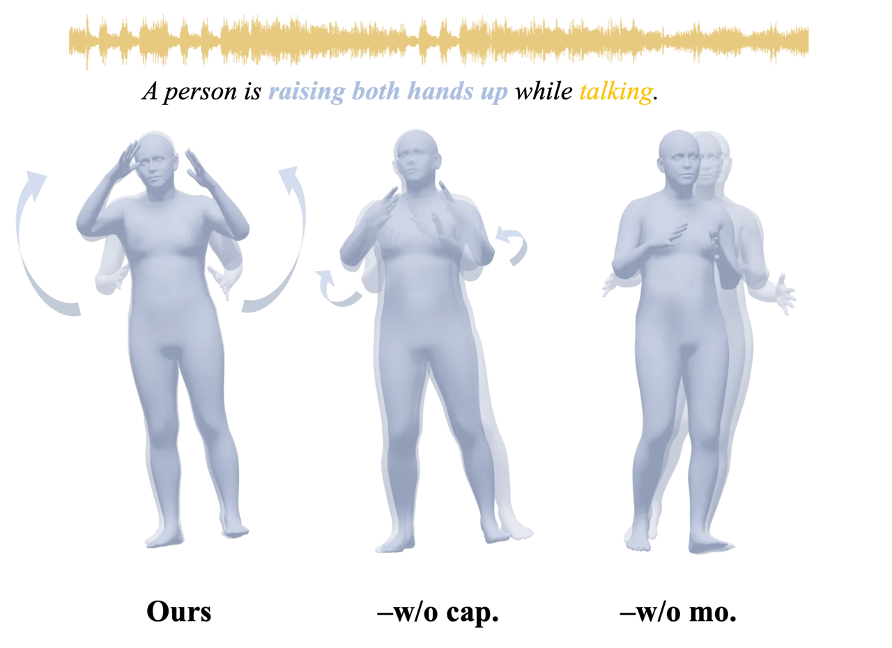
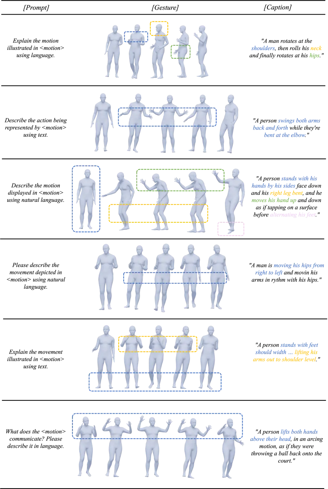
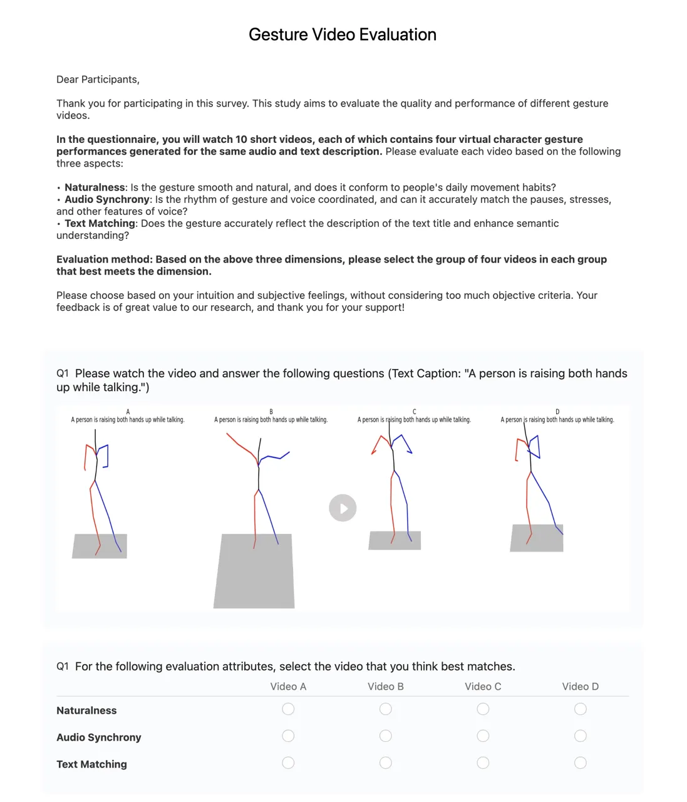

# CoordSpeaker: Exploiting Gesture Captioning for Coordinated Caption-Empowered Co-Speech Gesture Generation

Fengyi Fang    Sicheng Yang    Wenming Yang Affiliation: Tsinghua
University

###### Abstract

Co-speech gesture generation has significantly advanced human-computer
interaction, yet speaker movements remain constrained due to the
omission of text-driven non-spontaneous gestures (e.g., bowing while
talking). Existing methods face two key challenges: 1) the semantic
prior gap due to the lack of descriptive text annotations in gesture
datasets, and 2) the difficulty in achieving coordinated multimodal
control over gesture generation. To address these challenges, this paper
introduces CoordSpeaker, a comprehensive framework that enables
coordinated caption-empowered co-speech gesture synthesis. Our approach
first bridges the semantic prior gap through a novel gesture captioning
framework, leveraging a motion-language model to generate descriptive
captions at multiple granularities. Building upon this, we propose a
conditional latent diffusion model with unified cross-dataset motion
representation and a hierarchically controlled denoiser to achieve
highly controlled, coordinated gesture generation. CoordSpeaker pioneers
the first exploration of gesture understanding and captioning to tackle
the semantic gap in gesture generation while offering a novel
perspective of bidirectional gesture-text mapping. Extensive experiments
demonstrate that our method produces high-quality gestures that are both
rhythmically synchronized with speeches and semantically coherent with
arbitrary captions, achieving superior performance with higher
efficiency compared to existing approaches.

## 1 Introduction



Figure 1: CoordSpeaker exploits gesture captioning to enable customized
coordinated speaker gesture generation, producing both co-speech
spontaneous gestures and caption-driven non-spontaneous motions. In a
speech scenario, our method allows the speaker to naturally walk forward
and bow while speaking, seamlessly delivering a closing gesture.

Gesture synthesis has garnered significant interest due to its broad
applications in human-computer interaction, such as virtual reality
\[1\], games \[55\], and digital avatars \[23, 12\]. To enhance the
diversity and controllability of gesture generation, various modalities
have been explored, including speech audio \[45, 44, 42\], text
transcripts \[53, 29, 23\], emotion \[32, 33\], style \[3, 45, 10\], and
speaker identity \[47\]. Among these, two critical aspects are highly
emphasized: speech synchronization and semantic correlation. Though
advances in deep neural networks \[23, 42, 8\] have significantly
enhanced generation quality and diversity, current methods primarily
focus on co-speech spontaneous gestures, while neglecting text-driven
non-spontaneous gestures \[46\]. This constrains the natural full-body
movement of speakers, which is particularly critical in digital avatars
applications like public speaking or gaming. For instance, a game NPC
may pace or lift an object while speaking, whereas a virtual teacher
would naturally deliver lectures (spontaneous gesture) and point to key
content on the screen as needed (non-spontaneous gesture). Thus,
achieving coordinated gesture generation that ensures rhythmic
synchronization for spontaneous gestures and semantic coherence for
non-spontaneous gestures is essential.

Coordinated gesture generation remains challenging due to two key
factors: 1) Semantic Prior Gap: Existing gesture datasets \[23, 24, 10,
21\] lack direct descriptive text annotations. While speech audio is
naturally available, semantic cues are typically inferred through speech
transcriptions, which contain only limited and indirect guidance,
resulting in weak semantic associations. Moreover, manually annotating
gesture semantics is prohibitively expensive, further exacerbating the
challenge. Gestures inherently possess richer semantic properties, which
require a more direct and structured approach to extract and utilize.
Although some methods attempt to alleviate this issue by incorporating
additional motion datasets for joint training \[46\] or motion-text
alignment pretraining \[4\], they still struggle with the inherent
semantic gap. The former fails to achieve joint control, while the
latter introduces additional training and inference costs. 2)
Coordinated Multimodal Control Challenge: A fundamental challenge in
generation domain lies in the effective coordination of heterogeneous
multimodal conditions \[51, 26, 43\], particularly when they impose
distinct or conflicting control objectives. Unlike naturally paired
modalities (e.g., speech-text transcription), combining indirectly
related ones (e.g., audio and description) requires more carefully
balancing conflicts and complementarities. Previous methods simply
concatenate multimodal conditions \[46, 4, 42\], treating them merely as
signals of varying intensities rather than modeling their interactions,
typically leading to inharmonious control. Given these challenges, it is
critical to bridge the semantic gap and develop a coordinated gesture
generation method that enables harmonious multimodal control with
minimal cost.

To tackle these challenges, we propose CoordSpeaker (Fig. 1), a novel
coordinated gesture generation approach that achieves both rhythmically
synchronized and semantically consistent gesture synthesis while
maintaining high generation quality and computational efficiency.
Firstly, to mitigate the semantic prior gap, we introduce a gesture
captioning framework, utilizing a motion-language model to generate
descriptive gesture captions and a multi-granular captioning mechanism
to enable precise semantic guidance. Secondly, to address the
coordinated multimodal control challenge, we develop a coordinated
gesture generation model learning a unified latent motion representation
for cross-dataset modeling and leveraging a hierarchically controlled
denoiser to ensure coordinated condition injection and efficient
generation. To the best of our knowledge, this work represents the first
exploration of gesture captioning as a solution to semantic prior gap,
facilitating coordination between speech and semantics in gesture
generation, meanwhile offering a novel perspective for bidirectional
gesture-text mapping. Our contributions are as follows:

- •
  We propose CoordSpeaker, a coordinated gesture generation approach
  producing both co-speech spontaneous gestures and caption-driven
  non-spontaneous motions.
- •
  We present the first gesture captioning framework to bridge the
  semantic prior gap of gesture data and ensure precise multi-granular
  caption alignment.
- •
  We introduce a hierarchical conditional latent diffusion model
  enabling efficient and coordinated multimodal controlled gesture
  generation.
- •
  Extensive experiments show our method effectively produces
  semantically coherent, rhythmically synchronized gestures while
  maintaining high fidelity and efficiency.

## 2 Related Work

### 2.1 Gesture Synthesis

Gesture synthesis is a complex task that aims to generate gesture motion
sequences from multimodal inputs \[27\]. Early approaches employed RNNs
\[24, 48\] and Transformers \[53, 29\] for gesture sequence modeling,
but suffered from limited temporal modeling capacity and computational
challenges, respectively. Diffusion models \[2, 40, 52\] have gained
prominence in motion generation due to powerful generative capabilities.
However, operating directly in motion space leads to high computational
costs and training instability. In comparison, latent diffusion models
(LDMs) \[35\] enable powerful generative capabilities while maintaining
computational efficiency through low-dimensional latent space
operations. Although current co-speech gesture generation methods have
achieved significant progress in speech synchronization \[5, 54, 49\],
semantic correlation is still limited by the lack of descriptive text
annotations for gesture data \[23, 24\]. Yang et al. \[46\] propose a
co-speech and text-driven approach, but it still suffers from semantic
annotation gaps and does not support coordinated generation conditioned
on joint signals. Chen et al. \[4\] leverage prompt-motion alignment
pre-training to generate implicit text labels while introducing
additional training and inference costs. In contrast to existing
methods, we propose a coordinated gesture generation approach, which
enables both semantic correlation and rhythmic consistency while
maintaining low annotation and computational costs.



Figure 2: Overview of CoordSpeaker. We first introduce Gesture
Captioning (Sec. 3.1) to bridge the semantic prior gap of gesture data,
generating descriptive, multi-granular gesture captions at low cost.
Subsequently, we propose a Coordinated Gesture Generation Model
(Sec. 3.2) enabling harmonious coordination over heterogeneous
multi-modal and multi-scale conditions. Our model can generate both
rhythmically-synchronous and semantically-coherent gestures with high
quality and superior efficiency.

### 2.2 Motion-Text Translation

Human motion exhibits semantic coupling similar to natural language and
is often viewed as a form of body language \[17\]. Previous research has
explored various text-related motion tasks, including text-to-motion
generation \[40, 13\], motion-to-text captioning \[17, 14\], and unified
motion-language modeling \[39, 17\]. Recent text-to-motion works \[7,
9\] leverage pre-trained language models to extract semantics for motion
control. Motion captioning aims to describe human motion using natural
language, with early approaches relying on statistical models and RNNs
to learn motion-language mappings \[38\]. More recently, bidirectional
motion-text translation has gained attention. TM2T \[14\] pioneered this
direction through tokenization, unified motion-language models \[17, 18,
25\] have emerged by fusing language data with large-scale motion
models. Gestures inherently possess natural semantic properties, while
no effort has been made to explore gesture understanding and captioning.
To address this gap, this paper first introduces a gesture captioning
framework that bridges the lack of gesture captions and enables
fine-grained semantic control over non-spontaneous gestures.



Figure 3: Model overview. (Top) Gesture Captioning Framework: A motion
tokenizer and a motion-aware language model (MotionLLM) generate
descriptive gesture \[captions\] from predefined \[prompt\] and
\[motion\] inputs, addressing the semantic prior gap efficiently. A
multi-granular captioning mechanism further enhances multi-scale
semantic alignment via three strategies: Regular, Dynamic, and
Hierarchical. (Bottom) Coordinated Gesture Generation Model: A gesture
VAE first learns a unified latent motion space for cross-dataset
modeling. A conditional latent diffusion model with a hierarchically
controlled denoiser enables efficient and coordinated gesture generation
via hierarchical multimodal condition injection.

## 3 Method

In this section, we present a comprehensive framework for coordinated
caption-empowered co-speech gesture generation (Fig. 2, 3). We first
introduce a Gesture Captioning Framework (Sec. 3.1) to bridge the
semantic prior gap, leveraging a motion-language model combined with a
multi-granular captioning mechanism to generate descriptive, precisely
aligned gesture captions, enabling fine-grained semantic injection over
gesture generation. Subsequently, we propose a Coordinated Gesture
Generation Model (Sec. 3.2) comprising two key components: (1) a gesture
VAE that learns a unified low-dimensional latent representation,
enabling compact cross-dataset motion modeling, and (2) a conditional
latent diffusion model with a hierarchically controlled denoiser
ensuring coordinated multimodal-controlled gesture generation. Our model
can generate both rhythmically-synchronous and semantically-coherent
speaker gestures with high quality and efficiency.

### 3.1 Gesture Captioning

#### 3.1.1 Motion-Language Modeling

Our gesture captioning framework (Fig. 3, Top) comprises two main
components: a motion tokenizer and a motion-aware large language model
(MotionLLM). The motion tokenizer is built upon the VQ-VAE architecture
used in \[14, 50\], consisting of an encoder $`\mathcal{E_{M}}`$ and a
decoder $`\mathcal{D_{M}}`$ that generates discrete motion tokens. The
motion-aware language model adopts a transformer-based architecture with
a unified text-motion vocabulary
$`\mathbf{V}=\{\mathbf{V_{t}},\mathbf{V_{m}}\}`$, enabling flexible
joint modeling of text and motion within a single model. To better match
the general motion-language space, the gesture sequence is first
converted into a unified motion representation space (detailed in
Sec. 3.2.1), then projected to a 22-joint feature subset. Specifically,
given an M-frame gesture motion sequence
$`m^{1:M}=\{x^{i}\}^{M}_{i=1}`$, the motion tokenizer encodes and
quantizes it into a discrete motion token sequence
$`s^{1:L}=\{s^{i}\}^{L}_{i=1}`$. A carefully designed prompt template is
then tokenized into text tokens $`w^{1:N}=\{w^{i}\}^{N}_{i=1}`$.
Subsequently, the discrete motion and text tokens are mixed and jointly
fed into the motion-aware language model to generate the corresponding
gesture caption $`\hat{w}^{1:L}=\{w^{i}\}^{L}_{i=1}`$. In practice, we
leverage MotionGPT \[17\] for motion-language modeling and freeze it
during inference. Notably, the captions are generated and cached
offline, incurring no additional overhead. This framework produces
direct and descriptive captions for gesture data, efficiently addressing
the semantic prior gap, enabling precise semantic control over gesture
generation. See supplementary material (Sec. 6.2) for more details.

#### 3.1.2 Multi-Granular Captioning

Precise semantic control via gesture captions is challenging due to
temporal dynamics and varying semantic granularity. To address this, we
propose a multi-granular captioning mechanism that enables fine-grained
caption alignment across temporal and semantic scales. We first
introduce a hierarchical caption manner integrating both local and
global gesture captions. Given a gesture sequence, we segment it as
$`m^{1:M}=\{m^{i:i+K-1}\}_{i=1}^{M-K+1}`$, where $`K`$ denotes the
segment length. Each segment is processed by our gesture captioning
framework independently to generate local captions
$`\mathbf{C}_{\text{local}}=\{w^{i}\}^{L}_{i=1}`$. In contrast, global
caption is formed by concatenating local captions with separator tokens
$`\mathbf{C}_{\text{global}}=\{\mathbf{C}^{1}_{\text{local}}\textless\text{SEP}\textgreater\mathbf{C}^{2}_{\text{local}}\textless\text{SEP}\textgreater\dots\mathbf{C}^{M/K}_{\text{local}}\}`$.
While local captions provide fine-grained semantic supervision at the
segment level, a global caption summarizes the overall gesture semantics
across the entire sequence. To instantiate this mechanism, we explore
three captioning strategies (Fig.3, Top): (1) Regular Caption applies
uniform temporal segmentation to generate local captions for each
fixed-length gesture segment, offering precise temporal alignment. (2)
Dynamic Caption randomly samples segments during training, and
introduces stochastic sampling and caption mixing for local captions,
enhancing the robustness to varying temporal patterns and flexible
caption combinations. (3) Hierarchical Caption combines both local and
global captions to incorporate complementary fine-to-coarse semantic
cues. This multi-granular captioning mechanism ensures precise caption
alignment and enables flexible multi-scale semantic control over gesture
generation.

### 3.2 Coordinated Gesture Generation

#### 3.2.1 Unified Motion Representation

To leverage additional human motion semantic priors, we incorporate the
human motion dataset HumanML3D \[13\] and introduce a unified motion
representation. The various data formats are first converted into a
unified feature format and then fit into a representative latent space
via our motion encoder $`\mathcal{E}`$ (Fig. 3). Specifically, data in
different formats is first converted into SMPL-X \[30\] axis-angle
representation. After scaling and initial orientation adjustment, 3D
joint positions are obtained through SMPL-X forward computation.
Subsequently, following \[46, 13\], the $`i`$-th motion frame is
represented as
$`x^{i}=\left\{\dot{r}^{a},\dot{r}^{x},\dot{r}^{z},r^{y},\mathbf{j}^{p},\mathbf{j}^{v},\mathbf{j}^{r},\mathbf{c}^{f}\right\}`$,
where $`\dot{r}^{a},\dot{r}^{x},\dot{r}^{z},r^{y}`$ denote the root
joint’s angular velocity, linear velocities and height,
$`\mathbf{j}^{p},\mathbf{j}^{v},\mathbf{j}^{r}`$ represent joint
positions, velocities and rotations, and $`\mathbf{c}^{f}`$ indicates
foot contact. We employ 55 joints to accommodate gesture data better.
Consequently, each motion frame is represented by a 659-dimensional
feature vector, denoted as $`x\in\mathbb{R}^{T\times 659}`$, where $`T`$
is the sequence length.

#### 3.2.2 Gesture VAE

A transformer-based \[31\] VAE model (Fig. 3) is adopted to encode
motion representation into a compact and informative latent space, which
consists of an encoder $`\mathcal{E}`$ and a decoder $`\mathcal{D}`$,
both enhanced with long skip connections to preserve motion details.
Specifically, the motion sequence $`x^{1:L}`$ is first encoded into a
latent vector $`z\in\mathbb{R}^{n\times d}`$ through the encoder
$`\mathcal{E}`$, where $`d`$ denotes the latent dimension. The encoder
takes frame-wise motion features and learnable distribution tokens as
input, producing Gaussian distribution parameters $`\mu`$ and $`\sigma`$
for the motion latent space. These parameters are used to
reparameterize \[19\] the latent vector through the standard VAE
sampling process. For motion decoding, $`\mathcal{D}`$ employs a
cross-attention \[41\] mechanism. It takes zero motion tokens as queries
and the latent vector $`z`$ as key and value, generating the
reconstructed motion sequence $`\hat{x}^{1:L}`$. The VAE is trained by
minimizing a combination of Mean Squared Error (MSE) for reconstruction
accuracy and Kullback-Leibler (KL) divergence to regularize the encoded
latent distribution
$`q(z|x^{1:L})=\mathcal{N}(z;\mu_{\mathcal{E}},\sigma^{2}_{\mathcal{E}})`$
toward a standard gaussian distribution:

```math
\mathcal{L}_{\text{VAE}}=\|x^{1:L}-\hat{x}^{1:L}\|_{2}^{2}+\beta\text{KL}(q(z|x^{1:L})\|p(z)) \tag{1}
```

where $`\beta`$ balances the reconstruction and regularization terms.
This latent representation enables efficient gesture synthesis while
maintaining motion fidelity and diversity.

#### 3.2.3 Conditional Latent Diffusion Model

We introduce a conditional latent diffusion model with a hierarchically
controlled denoiser (Fig. 3, Bottom) to generate high-quality,
coordinated gestures in learned latent space.

##### Diffuse Process.

The diffusion process in latent space follows a Markov chain that
gradually adds Gaussian noise to the latent vector
$`z\in\mathbb{R}^{n\times d}`$. For a noising step $`t\in[1,T]`$, the
forward process is defined as:

```math
q(z_{t}|z_{t-1})=\mathcal{N}(\sqrt{\alpha_{t}}z_{t-1},(1-\alpha_{t})\mathbf{I}), \tag{2}
```

$`\alpha_{t}\in(0,1)`$ is constant variance schedule,
$`z_{T}\sim\mathcal{N}(0,\mathbf{I})`$.

##### Hierarchically Controlled Denoiser.

We propose a hierarchically controlled denoiser $`\epsilon_{\theta}`$ to
facilitate coordinated multimodal control over gesture generation. The
denoiser employs a transformer-based endoder-decoder architecture to
predict and remove noise iteratively. Starting from random noise
$`z_{T}`$, the denoiser gradually recovers the latent vector
$`\hat{z}_{0}`$, which is then decoded into gesture motion through
$`\mathcal{D}`$. Specifically, given the caption embedding
$`\mathbf{C}`$ and audio embedding $`\mathbf{A}`$, the denoising process
is controlled by hierarchical two-stage condition injection (Fig. 3):
First, the local condition
$`\mathbf{c_{1}}=\{\mathbf{C}_{\text{local}},\mathbf{A}\}`$ is
concatenated with the noised latent and timestep embeddings before being
fed into the denoiser encoder $`\mathcal{E}_{d}`$ performing
self-attention, ensuring precise semantic and rhythmic synchronization
with the local gesture segments. Second, the global condition
$`\mathbf{c_{2}}=\{\mathbf{C}_{\text{global}}\}`$ is incorporated into
the denoiser decoder $`\mathcal{D}_{d}`$ through cross-attention,
enhancing both the overall gesture coherence and semantic relevance with
high-level context. Overall, the reverse process is defined as follows:

```math
h=\mathcal{E}_{d}(\text{concat}(z_{t},t,\mathbf{c_{1}})),\quad\epsilon_{\theta}(z_{t},t,\mathbf{c})=\mathcal{D}_{d}(h,\mathbf{c_{2}}), \tag{3}
```

where $`t`$ is the timestep embedding, and the predicted noise
$`\epsilon_{\theta}`$ is used to recover $`\hat{z}_{t-1}`$. This
hierarchical architecture aligns with our multi-granular captions
effectively coordinates different modalities and scales, ensuring
balanced contributions for heterogeneous conditions.

##### Classifier-free Guidance.

To enhance the quality and controllability of generated gestures, we
adopt classifier-free guidance \[16\]. During training, 10% of the
condition inputs are randomly masked \[36\] to learn both conditional
and unconditional distributions. During inference, noise prediction is
computed as a weighted combination of outputs with different guidance:

```math
\begin{split}\epsilon_{\theta}^{s}(z_{t},t,\mathbf{c})=&s_{1}\epsilon_{\theta}(z_{t},t,\mathbf{c}=\{\varnothing,\mathbf{A}\})\\
&+s_{2}\epsilon_{\theta}(z_{t},t,\mathbf{c}=\{\mathbf{C},\varnothing\})\\
&+(1-s_{1}-s_{2})\epsilon_{\theta}(z_{t},t,\mathbf{c}=\{\varnothing,\varnothing\}),\end{split} \tag{4}
```

where $`s_{1}`$, $`s_{2}`$ are guidance scales for audio $`\mathbf{A}`$
and caption $`\mathbf{C}`$, respectively.

##### Training and Inference.

The latent diffusion model is trained with a $`\ell_{2}`$ objective
\[15\]:

```math
\mathcal{L}_{\text{Diff}}=\mathbb{E}_{\epsilon,t}[\|\epsilon-\epsilon_{\theta}(z_{t},t,\mathbf{c})\|_{2}^{2}], \tag{5}
```

where $`\epsilon\sim\mathcal{N}(0,\mathbf{I})`$ and
$`z_{0}=\mathcal{E}(x^{1:L})`$. During inference, our model employs DDIM
sampler \[37\] with 50 denoising steps to predict the latent
$`\hat{z}_{0}`$, then decodes it to motion sequence $`\hat{x}^{1:L}`$
using a forward pass through decoder $`\mathcal{D}`$.



Figure 4: Qualitative comparison of coordinated gesture generation. Red
boxes highlight semantic inconsistencies, yellow boxes indicate
unnatural motions, and green boxes denote well-coordinated natural
gestures. More results are in supplementary material (Sec. 8).

| Methods       | Reconstruction      |                       | Audio-to-Gesture    |                     |                      | Text-to-Motion      |                       |                     |                         |
| ------------- | ------------------- | --------------------- | ------------------- | ------------------- | -------------------- | ------------------- | --------------------- | ------------------- | ----------------------- |
|               | Jerk$`\rightarrow`$ | Accel.$`\rightarrow`$ | FGD$`\downarrow`$   | BC$`\uparrow`$      | L1Div$`\uparrow`$    | FID$`\downarrow`$   | MM-Dist$`\downarrow`$ | Div$`\rightarrow`$  | R-Precision$`\uparrow`$ |
| GT            | $`1.165^{\pm.000}`$ | $`0.043^{\pm.000}`$   | -                   | -                   | -                    | -                   | $`6.205^{\pm.043}`$   | $`5.512^{\pm.114}`$ | $`0.140^{\pm.008}`$     |
| Freetalker    | $`0.611^{\pm.013}`$ | $`0.030^{\pm.000}`$   | $`2.101^{\pm.026}`$ | $`1.147^{\pm.028}`$ | $`11.332^{\pm.025}`$ | $`0.761^{\pm.048}`$ | $`6.737^{\pm.051}`$   | $`5.396^{\pm.127}`$ | $`0.102^{\pm.008}`$     |
| Ours          | $`1.190^{\pm.015}`$ | $`0.039^{\pm.001}`$   | $`3.173^{\pm.123}`$ | $`1.327^{\pm.049}`$ | $`10.861^{\pm.066}`$ | $`1.118^{\pm.061}`$ | $`6.814^{\pm.056}`$   | $`5.558^{\pm.126}`$ | $`0.100^{\pm.008}`$     |
| Ours-w/o hcd. | $`1.201^{\pm.017}`$ | $`0.038^{\pm.001}`$   | $`2.302^{\pm.061}`$ | $`1.910^{\pm.004}`$ | $`12.781^{\pm.044}`$ | $`1.260^{\pm.063}`$ | $`6.872^{\pm.058}`$   | $`5.303^{\pm.107}`$ | $`0.102^{\pm.010}`$     |
| Ours-w/o mgc. | $`1.239^{\pm.013}`$ | $`0.039^{\pm.000}`$   | $`3.123^{\pm.139}`$ | $`2.256^{\pm.045}`$ | $`15.363^{\pm.103}`$ | $`2.568^{\pm.099}`$ | $`7.031^{\pm.044}`$   | $`5.447^{\pm.150}`$ | $`0.082^{\pm.006}`$     |
| Ours-w/o mo.  | $`1.005^{\pm.014}`$ | $`0.032^{\pm.000}`$   | $`2.654^{\pm.041}`$ | $`2.627^{\pm.043}`$ | $`19.600^{\pm.089}`$ | $`3.911^{\pm.163}`$ | $`7.664^{\pm.050}`$   | $`4.070^{\pm.117}`$ | $`0.043^{\pm.004}`$     |

Table 1: Quantitative results of baseline comparisons and ablation
studies. Metrics are reported with 95% confidence interval over 20 runs.
‘$`\rightarrow`$’ denotes the closer to the real motion the better. We
report BC $`\times 10^{-1}`$ and Top-1 R-Precision.

## 4 Experiments

In this section, we evaluate our method through both quantitative and
qualitative analyses in four aspects: (1) Coordinated Gesture
Generation. Assessing the model’s ability to generate
speech-synchronized, semantically-relevant gestures under joint speech
and caption control, compared to state-of-the-art baselines. (2)
Text-Driven Motion Generation. Comparing with state-of-the-art
text-to-motion methods to evaluate semantic understanding and
non-spontaneous gesture generation. (3) Gesture Captioning. Evaluating
the quality, human-alignment, and diversity of generated captions marks
the first approach to bridging the semantic gap in gesture datasets. (4)
Ablation Studies. Analyzing the impact of key components in our method.

### 4.1 Experimental Setup

##### Datasets

We jointly train on the audio-to-gesture dataset BEAT \[24\] and the
text-to-motion dataset HumanML3D \[13\]. BEAT offers 76 hours of
speech-gesture data. We utilize four English speakers’ gestures
following \[24\]. HumanML3D contains 14,616 motions with 44,970 text
descriptions, providing rich semantic priors. For coordinated
generation, missing text in BEAT is generated via our captioning
framework, while missing audio in HumanML3D is set to zero
following \[46\].

##### Metrics

The evaluation is conducted from three perspectives: (1) Reconstruction
Quality: Motion smoothness and naturalness are measured using jerk and
acceleration \[20\]. (2) Audio-to-Gesture: Gesture realism is assessed
via FGD \[48\], diversity by the mean L1 distance between
gestures \[23\], and speech-motion synchronization by Beat Consistency
(BC) \[22\]. (3) Text-to-Motion: Frechet Inception Distance (FID) \[7\]
and Diversity (DIV) \[12\] evaluate realism and diversity, while
motion-retrieval precision (R Precision) and Multimodal Distance
(MM-Dist) assess motion-text alignment \[7\]. Implementation details are
in supplementary material (Sec. 6).

### 4.2 Coordinated Gesture Generation

##### Qualitative Comparison

We first evaluate the performance of our method in generating
coordinated, speech-synchronized, semantically-relevant gestures. As
depicted in Fig. 4, we compare with the only two works \[46, 4\] that
addressed related coordinated generation tasks. Following \[4\], results
are presented with a calm audio input and four distinct text captions.
Results show that our method generates well-coordinated gestures that
are both rhythmically aligned and semantically consistent, while
achieving more natural appearances. In contrast, FreeTalker \[46\] fails
to produce semantic motions under all settings, focusing solely on
speech-driven gestures. While SynTalker \[4\] captures partial semantic
relevance, it struggles to jointly coordinate multimodal conditions,
leading to control conflicts (e.g., losing co-speech gestures in “walks
while talking”), inconsistent details (e.g., incorrect hand poses for
“raising” and “holding”), and unnatural stiffness (e.g., incorrect
turning in “walks straight forward”). Ablations (Sec. 4.5) further
demonstrate that our superior semantic understanding stems from gesture
captioning and enhanced multimodal coordination from proposed
hierarchically controlled denoiser. More results are in supplement
(Sec. 8 and video).

##### Quantitative Results

Since only FreeTalker \[46\] and SynTalker \[4\] share a similar
research scope with our work, and SynTalker does not provide a
quantitative evaluation method under multimodal conditioning, we
reproduce FreeTalker as primary baseline in this comparison, and present
additional single-condition comparison with SynTalker in Sec. 4.3. As
shown in Table 1, our method achieves comparable or superior results
across all evaluation metrics, surpassing FreeTalker in reconstruction
quality, beat consistency (BC $`0.180\uparrow`$), and diversity (Div
$`0.162\uparrow`$), while achieving better coordination and
substantially faster inference (Sec. 4.5). Note that due to existing
quantitative metrics solely focus on single-modality factors, our aim is
to achieve balance performance across multimodal metrics. More details
are in supplement (Sec. 6.4).

##### Perceptual Study

A user study was conducted to assess gesture quality under joint speech
and caption control. 20 participants were recruited to evaluate 10 pairs
of 9-second results based on: (i) Naturalness: realism and naturalness
of generated gestures; (ii) Synchrony: synchronization with speech;
(iii) Matching: alignment with text captions. Participants viewed video
clips from different models and selected the best one for each aspect.
Table 2 shows our proposed model outperforms others. A chi-square test
further confirms the significant differences across methods in all
aspects (Naturalness: $`\chi^{2}`$=27.20, $`p`$=0.000005; Synchrony:
$`\chi^{2}`$=8.68, $`p`$=0.034; Matching: $`\chi^{2}`$=17.72,
$`p`$=0.0005). More details are in supplementary material (Sec. 10).

| Methods       | Naturalness         | Synchrony           | Matching            |
| ------------- | ------------------- | ------------------- | ------------------- |
| FreeTalker    | $`18.0^{\pm 5.32}`$ | $`24.0^{\pm 5.92}`$ | $`15.5^{\pm 5.02}`$ |
| SynTalker     | $`32.0^{\pm 6.46}`$ | $`26.5^{\pm 6.12}`$ | $`31.5^{\pm 6.44}`$ |
| Ours-w/o cap. | $`14.0^{\pm 4.81}`$ | $`17.5^{\pm 5.27}`$ | $`20.0^{\pm 5.54}`$ |
| Ours          | $`36.0^{\pm 6.65}`$ | $`32.0^{\pm 6.46}`$ | $`33.0^{\pm 6.52}`$ |

Table 2: User preference win rates (%) show that our results are
perceived as more realistic and controllable, outperforming previous
work \[4\] by 4.0%, 5.5%, and 1.5% in naturalness ($`p{<}0.001`$),
synchrony ($`p{<}0.05`$), and matching ($`p{<}0.001`$), respectively.
All results are reported with 95% confidence intervals.

| Methods         | FID$`\downarrow`$   | MM-Dist$`\downarrow`$ | Div$`\rightarrow`$   | R-Precision$`\uparrow`$ |                     |                     |
| --------------- | ------------------- | --------------------- | -------------------- | ----------------------- | ------------------- | ------------------- |
|                 |                     |                       |                      | Top-1                   | Top-2               | Top-3               |
| GT              | $`0.001^{\pm.001}`$ | $`3.378^{\pm.007}`$   | $`10.471^{\pm.083}`$ | $`0.490^{\pm.003}`$     | $`0.682^{\pm.003}`$ | $`0.783^{\pm.003}`$ |
| MDM \[40\]      | $`1.390^{\pm.088}`$ | $`4.599^{\pm.037}`$   | $`10.704^{\pm.066}`$ | $`0.363^{\pm.007}`$     | $`0.553^{\pm.008}`$ | $`0.662^{\pm.007}`$ |
| T2M-GPT \[50\]  | $`0.564^{\pm.012}`$ | $`3.867^{\pm.008}`$   | $`10.558^{\pm.083}`$ | $`0.433^{\pm.003}`$     | $`0.615^{\pm.002}`$ | $`0.716^{\pm.003}`$ |
| MLD \[7\]       | $`0.963^{\pm.029}`$ | $`3.898^{\pm.012}`$   | $`10.401^{\pm.096}`$ | $`0.429^{\pm.003}`$     | $`0.613^{\pm.003}`$ | $`0.717^{\pm.002}`$ |
| MoMask \[11\]   | $`0.222^{\pm.007}`$ | $`3.620^{\pm.011}`$   | $`10.621^{\pm.096}`$ | $`0.461^{\pm.002}`$     | $`0.657^{\pm.003}`$ | $`0.760^{\pm.002}`$ |
| SynTalker \[4\] | $`4.385^{\pm.034}`$ | $`4.499^{\pm.012}`$   | $`9.374^{\pm.073}`$  | $`0.375^{\pm.003}`$     | $`0.564^{\pm.003}`$ | $`0.681^{\pm.002}`$ |
| Ours            | $`0.405^{\pm.012}`$ | $`3.584^{\pm.012}`$   | $`9.109^{\pm.235}`$  | $`0.424^{\pm.003}`$     | $`0.601^{\pm.003}`$ | $`0.702^{\pm.003}`$ |

Table 3: Comparison with state-of-the-art methods on HumanML3D test set.
Metrics follow the standard protocol in \[7\] and are reported with 95%
confidence interval over 20 runs. ‘$`\rightarrow`$’ denotes the closer
to the real motion the better.

### 4.3 Text-Driven Motion Generation

We further compare our method with SOTA text-to-motion approaches to
validate its capacity in capturing semantics and generating
non-spontaneous motions. For fair comparison, we report results on the
HumanML3D test set using only text condition. Table 3 shows our method
achieves advanced performance compared to SOTA models, attaining the
best text alignment (MM-Dist 3.584) and the second-best generation
fidelity (FID 0.405). This underscores the effectiveness of our
hierarchically controlled denoiser in integrating fine-grained
semantics. Notably, our approach significantly outperforms the similar
synergistic method SynTalker, highlighting its superiority in both
coordinated generation and enhanced semantic control.



(a)



(b)



(c)

Figure 5: Visualization results. (a) Gesture captioning examples. Our
captioning framework can effectively describe both overall motion
patterns and fine-grained details. More results are in supplementary
material (Sec. 8). (b) Quantitative captioning evaluation. Our model
performs comparably to human annotations. (c) Qualitative ablation
study. Results are generated using audio and single caption.

### 4.4 Gesture Captioning

##### Qualitative Results

As shown in Fig. 5(a), the proposed captioning framework demonstrates
practical capabilities in generating descriptive gesture annotations.
Our method can accurately describe both fine-grained hand movements
(e.g., “moving both hands…”) and coarse-grained full-body actions (e.g.,
“moves their waist…”). Furthermore, the proposed approach proves
advantageous in capturing continuous composite actions within extended
time windows (e.g., “a person \[motion 1\], then \[motion 2\] as
\[motion 3\]”). This demonstrates the effectiveness of our method in
bridging the semantic prior gap in gesture datasets. Nevertheless, we
also observe that the model encounters challenges in perceiving temporal
order in longer gesture sequences. More results and discussion of
limitations are provided in supplementary material (Sec. 8, 9).

##### Quantitative Captioning Evaluation

Quantitative evaluation is inherently challenging due to the lack of
Ground-Truth captions, precisely the “semantic prior gap” we aim to
address. To compensate, we construct a 200-sample expert-annotated set
and evaluate from three aspects: (1) motion-semantic relevance
(MotionClipScore \[39\]), (2) language quality (via GPT \[28\]), (3)
reference alignment (BLEU, ROUGE). As shown in Fig. 5(b), our model
performs comparably to expert annotations in both relevance and quality,
with slightly better fluency (4.380 vs. 4.375), comparable ClipScore
(0.690 vs. 0.709), and reasonable alignment for the open-ended task.
Combined with qualitative results (Fig. 5(a)), these further confirm the
effectiveness and robustness of our captioning framework.

### 4.5 Ablation Studies

Ablation studies are conducted to evaluate the impact of different
components. Qualitative results are shown in Fig. 5(c), while
quantitative results are presented in Table. 1.

##### Multi-Granular Gesture Caption

Fig. 5(c) (middle) shows that removing gesture captions results in only
basic co-speech gestures, lacking meaningful non-spontaneous movements.
Table 1 further demonstrates that removing multi-granular captioning
(-w/o mgc.) significantly reduces semantic relevance, as evidenced by an
increased MM-Dist and a decreased R-Precision. These highlight the
crucial role of the multi-granular captioning in providing precise
semantic guidance. A detailed comparison of the three captioning
strategies (Reg., Dyn., Hie.) is provided in supplementary material
(Sec. 7); the Hierarchical strategy with Regular local captions is
adopted, as it achieves the best overall balance across all metrics.

##### Hierarchically Controlled Denoiser

Table 1 shows that removing the hierarchically controlled denoiser (-w/o
hcd.) degrades reconstruction quality and weakens condition
coordination, resulting in a stronger bias toward co-speech gestures (BC
$`0.583\uparrow`$) while losing semantic relevance (MM-Dist
$`0.058\uparrow`$). This underscores the importance of the hierarchical
denoiser for multimodal coordination.

##### Unified Cross-Dataset Motion Representation

Ablating unified motion representation (Fig. 5(c) (right)) limits the
semantic awareness beyond typical co-speech movements, leading to
incomplete execution of intended movements like raising hands. Results
in Table 1 (-w/o mo.) further confirm this degradation, showing a
substantial drop in semantic relevance (MM-Dist $`0.850\uparrow`$ and
R-Precision $`0.057\downarrow`$).

##### Inference Time

Long inference time is a major bottleneck in diffusion models. We
evaluate efficiency using Average Inference Time per Sentence
(AITS) \[7\] on a single NVIDIA RTX 3090 GPU, with batch size one and
excluding model loading time. Our method achieves an AITS of
$`0.842^{\pm.002}`$s, over $`6\times`$ faster than FreeTalker
($`6.632^{\pm.044}`$s) and SynTalker ($`5.804^{\pm.044}`$s). This
significant speedup can be attributed to our efficient hierarchical
denoiser and optimized latent diffusion process, making our approach
more practical for real-world applications.

## 5 Conclusion

In this study, we propose CoordSpeaker, a coordinated gesture generation
approach designed to generate both co-speech spontaneous gesture and
caption-driven non-spontaneous motion, under joint audio-caption
control. We present the first Gesture Captioning Framework to bridge
semantic prior gap by generating descriptive, well-aligned captions for
gesture data. Building upon this, we propose a Coordinated Gesture
Generation Model, leveraging a hierarchically controlled denoiser for
efficient and coordinated gesture generation. Our approach pioneers
gesture captioning and explores bidirectional gesture-text mapping.
Extensive experiments demonstrate that CoordSpeaker produces
high-quality gestures with enhanced semantic coherence and rhythmic
synchronization while significantly improving efficiency, surpassing
existing methods.

## References

- \[1\] C. Ahuja and L. Morency (2019) Language2pose: natural language
  grounded pose forecasting. In 2019 International conference on 3D
  vision (3DV), pp. 719–728. Cited by: §1.
- \[2\] S. Alexanderson, R. Nagy, J. Beskow, and G. E. Henter (2023)
  Listen, denoise, action! audio-driven motion synthesis with diffusion
  models. ACM Transactions on Graphics (TOG) 42 (4), pp. 1–20. Cited by:
  §2.1.
- \[3\] T. Ao, Z. Zhang, and L. Liu (2023) Gesturediffuclip: gesture
  diffusion model with clip latents. ACM Transactions on Graphics (TOG)
  42 (4), pp. 1–18. Cited by: §1.
- \[4\] B. Chen, Y. Li, Y. Ding, T. Shao, and K. Zhou (2024) Enabling
  synergistic full-body control in prompt-based co-speech motion
  generation. In Proceedings of the 32nd ACM International Conference on
  Multimedia, pp. 6774–6783. Cited by: §1, §2.1, §4.2, §4.2, Table 2,
  Table 2, Table 3, §6.4.
- \[5\] J. Chen, Y. Liu, J. Wang, A. Zeng, Y. Li, and Q. Chen (2024)
  Diffsheg: a diffusion-based approach for real-time speech-driven
  holistic 3d expression and gesture generation. In Proceedings of the
  IEEE/CVF Conference on Computer Vision and Pattern Recognition,
  pp. 7352–7361. Cited by: §2.1.
- \[6\] S. Chen, C. Wang, Z. Chen, Y. Wu, S. Liu, Z. Chen, J. Li, N.
  Kanda, T. Yoshioka, X. Xiao, et al. (2022) Wavlm: large-scale
  self-supervised pre-training for full stack speech processing. IEEE
  Journal of Selected Topics in Signal Processing 16 (6), pp. 1505–1518.
  Cited by: §6.1.
- \[7\] X. Chen, B. Jiang, W. Liu, Z. Huang, B. Fu, T. Chen, and G.
  Yu (2023) Executing your commands via motion diffusion in latent
  space. In Proceedings of the IEEE/CVF Conference on Computer Vision
  and Pattern Recognition, pp. 18000–18010. Cited by: §2.2, §4.1, §4.5,
  Table 3, Table 3, Table 3.
- \[8\] Q. Cheng, X. Li, and X. Fu (2024) SIGGesture: generalized
  co-speech gesture synthesis via semantic injection with large-scale
  pre-training diffusion models. In SIGGRAPH Asia 2024 Conference
  Papers, pp. 1–11. Cited by: §1.
- \[9\] W. Dai, L. Chen, J. Wang, J. Liu, B. Dai, and Y. Tang (2024)
  Motionlcm: real-time controllable motion generation via latent
  consistency model. In European Conference on Computer Vision,
  pp. 390–408. Cited by: §2.2.
- \[10\] S. Ghorbani, Y. Ferstl, D. Holden, N. F. Troje, and M.
  Carbonneau (2023) ZeroEGGS: zero-shot example-based gesture generation
  from speech. In Computer Graphics Forum, Vol. 42, pp. 206–216. Cited
  by: §1, §1.
- \[11\] C. Guo, Y. Mu, M. G. Javed, S. Wang, and L. Cheng (2024)
  Momask: generative masked modeling of 3d human motions. In Proceedings
  of the IEEE/CVF Conference on Computer Vision and Pattern Recognition,
  pp. 1900–1910. Cited by: Table 3.
- \[12\] C. Guo, S. Zou, X. Zuo, S. Wang, W. Ji, X. Li, and L.
  Cheng (2022) Generating diverse and natural 3d human motions from
  text. In Proceedings of the IEEE/CVF conference on computer vision and
  pattern recognition, pp. 5152–5161. Cited by: §1, §4.1.
- \[13\] C. Guo, S. Zou, X. Zuo, S. Wang, W. Ji, X. Li, and L.
  Cheng (2022) Generating diverse and natural 3d human motions from
  text. In Proceedings of the IEEE/CVF Conference on Computer Vision and
  Pattern Recognition, pp. 5152–5161. Cited by: §2.2, §3.2.1, §4.1,
  §6.2.
- \[14\] C. Guo, X. Zuo, S. Wang, and L. Cheng (2022) Tm2t: stochastic
  and tokenized modeling for the reciprocal generation of 3d human
  motions and texts. In European Conference on Computer Vision,
  pp. 580–597. Cited by: §2.2, §3.1.1.
- \[15\] J. Ho, A. Jain, and P. Abbeel (2020) Denoising diffusion
  probabilistic models. Advances in neural information processing
  systems 33, pp. 6840–6851. Cited by: §3.2.3.
- \[16\] J. Ho and T. Salimans (2022) Classifier-free diffusion
  guidance. arXiv preprint arXiv:2207.12598. Cited by: §3.2.3.
- \[17\] B. Jiang, X. Chen, W. Liu, J. Yu, G. Yu, and T. Chen (2024)
  Motiongpt: human motion as a foreign language. Advances in Neural
  Information Processing Systems 36. Cited by: §2.2, §3.1.1, §6.2.
- \[18\] B. Jiang, X. Chen, C. Zhang, F. Yin, Z. Li, G. Yu, and J.
  Fan (2024) Motionchain: conversational motion controllers via
  multimodal prompts. In European Conference on Computer Vision,
  pp. 54–74. Cited by: §2.2.
- \[19\] D. P. Kingma M. Welling et al. (2013) Auto-encoding variational
  bayes. Banff, Canada. Cited by: §3.2.2.
- \[20\] T. Kucherenko, D. Hasegawa, G. E. Henter, N. Kaneko, and H.
  Kjellström (2019) Analyzing input and output representations for
  speech-driven gesture generation. In Proceedings of the 19th ACM
  International Conference on Intelligent Virtual Agents, pp. 97–104.
  Cited by: §4.1.
- \[21\] G. Lee, Z. Deng, S. Ma, T. Shiratori, S. Srinivasa, and Y.
  Sheikh (2019) Talking with hands 16.2m: a large-scale dataset of
  synchronized body-finger motion and audio for conversational motion
  analysis and synthesis. In 2019 IEEE/CVF International Conference on
  Computer Vision (ICCV), Vol. , pp. 763–772. External Links:
  [Document](https://dx.doi.org/10.1109/ICCV.2019.00085) Cited by: §1.
- \[22\] R. Li, S. Yang, D. A. Ross, and A. Kanazawa (2021) Ai
  choreographer: music conditioned 3d dance generation with aist++. In
  Proceedings of the IEEE/CVF international conference on computer
  vision, pp. 13401–13412. Cited by: §4.1.
- \[23\] H. Liu, Z. Zhu, G. Becherini, Y. Peng, M. Su, Y. Zhou, X.
  Zhe, N. Iwamoto, B. Zheng, and M. J. Black (2024) EMAGE: towards
  unified holistic co-speech gesture generation via expressive masked
  audio gesture modeling. In Proceedings of the IEEE/CVF Conference on
  Computer Vision and Pattern Recognition, pp. 1144–1154. Cited by: §1,
  §1, §2.1, §4.1, §6.4, §9.2.
- \[24\] H. Liu, Z. Zhu, N. Iwamoto, Y. Peng, Z. Li, Y. Zhou, E.
  Bozkurt, and B. Zheng (2022) Beat: a large-scale semantic and
  emotional multi-modal dataset for conversational gestures synthesis.
  In European conference on computer vision, pp. 612–630. Cited by: §1,
  §2.1, §4.1, §9.2.
- \[25\] M. Luo, R. Hou, Z. Li, H. Chang, Z. Liu, Y. Wang, and S.
  Shan (2024) M³gpt: an advanced multimodal, multitask framework for
  motion comprehension and generation. arXiv preprint arXiv:2405.16273.
  Cited by: §2.2.
- \[26\] M. H. Mughal, R. Dabral, I. Habibie, L. Donatelli, M.
  Habermann, and C. Theobalt (2024) Convofusion: multi-modal
  conversational diffusion for co-speech gesture synthesis. In
  Proceedings of the IEEE/CVF Conference on Computer Vision and Pattern
  Recognition, pp. 1388–1398. Cited by: §1.
- \[27\] S. Nyatsanga, T. Kucherenko, C. Ahuja, G. E. Henter, and M.
  Neff (2023) A comprehensive review of data-driven co-speech gesture
  generation. In Computer Graphics Forum, Vol. 42, pp. 569–596. Cited
  by: §2.1.
- \[28\] OpenAI (2024) GPT-4o mini: advancing cost-efficient
  intelligence. Note: Accessed: 2025-05-16 External Links:
  [Link](https://openai.com/index/gpt-4o-mini-advancing-cost-efficient-intelligence/)
  Cited by: §4.4.
- \[29\] K. Pang, D. Qin, Y. Fan, J. Habekost, T. Shiratori, J.
  Yamagishi, and T. Komura (2023) Bodyformer: semantics-guided 3d body
  gesture synthesis with transformer. ACM Transactions on Graphics (TOG)
  42 (4), pp. 1–12. Cited by: §1, §2.1.
- \[30\] G. Pavlakos, V. Choutas, N. Ghorbani, T. Bolkart, A. A.
  Osman, D. Tzionas, and M. J. Black (2019) Expressive body capture: 3d
  hands, face, and body from a single image. In Proceedings of the
  IEEE/CVF conference on computer vision and pattern recognition,
  pp. 10975–10985. Cited by: §3.2.1.
- \[31\] M. Petrovich, M. J. Black, and G. Varol (2021)
  Action-conditioned 3d human motion synthesis with transformer vae. In
  Proceedings of the IEEE/CVF International Conference on Computer
  Vision, pp. 10985–10995. Cited by: §3.2.2.
- \[32\] X. Qi, C. Liu, L. Li, J. Hou, H. Xin, and X. Yu (2024)
  Emotiongesture: audio-driven diverse emotional co-speech 3d gesture
  generation. IEEE Transactions on Multimedia. Cited by: §1.
- \[33\] X. Qi, J. Pan, P. Li, R. Yuan, X. Chi, M. Li, W. Luo, W.
  Xue, S. Zhang, Q. Liu, et al. (2024) Weakly-supervised emotion
  transition learning for diverse 3d co-speech gesture generation. In
  Proceedings of the IEEE/CVF Conference on Computer Vision and Pattern
  Recognition, pp. 10424–10434. Cited by: §1.
- \[34\] A. Radford, J. W. Kim, C. Hallacy, A. Ramesh, G. Goh, S.
  Agarwal, G. Sastry, A. Askell, P. Mishkin, J. Clark, et al. (2021)
  Learning transferable visual models from natural language supervision.
  In International conference on machine learning, pp. 8748–8763. Cited
  by: §6.1.
- \[35\] R. Rombach, A. Blattmann, D. Lorenz, P. Esser, and B.
  Ommer (2022) High-resolution image synthesis with latent diffusion
  models. In Proceedings of the IEEE/CVF conference on computer vision
  and pattern recognition, pp. 10684–10695. Cited by: §2.1.
- \[36\] C. Saharia, W. Chan, S. Saxena, L. Li, J. Whang, E. L.
  Denton, K. Ghasemipour, R. Gontijo Lopes, B. Karagol Ayan, T.
  Salimans, et al. (2022) Photorealistic text-to-image diffusion models
  with deep language understanding. Advances in neural information
  processing systems 35, pp. 36479–36494. Cited by: §3.2.3.
- \[37\] J. Song, C. Meng, and S. Ermon (2020) Denoising diffusion
  implicit models. arXiv preprint arXiv:2010.02502. Cited by: §3.2.3.
- \[38\] W. Takano and Y. Nakamura (2015) Statistical mutual conversion
  between whole body motion primitives and linguistic sentences for
  human motions. The International Journal of Robotics Research 34 (10),
  pp. 1314–1328. Cited by: §2.2.
- \[39\] G. Tevet, B. Gordon, A. Hertz, A. H. Bermano, and D.
  Cohen-Or (2022) Motionclip: exposing human motion generation to clip
  space. In European Conference on Computer Vision, pp. 358–374. Cited
  by: §2.2, §4.4.
- \[40\] G. Tevet, S. Raab, B. Gordon, Y. Shafir, D. Cohen-or, and A. H.
  Bermano (2022) Human motion diffusion model. In The Eleventh
  International Conference on Learning Representations, Cited by: §2.1,
  §2.2, Table 3.
- \[41\] A. Vaswani, N. Shazeer, N. Parmar, J. Uszkoreit, L.
  Jones, A. N. Gomez, Ł. Kaiser, and I. Polosukhin (2017) Attention is
  all you need. Advances in neural information processing systems 30.
  Cited by: §3.2.2.
- \[42\] Z. Xu, Y. Lin, H. Han, S. Yang, R. Li, Y. Zhang, and X.
  Li (2025) Mambatalk: efficient holistic gesture synthesis with
  selective state space models. Advances in Neural Information
  Processing Systems 37, pp. 20055–20080. Cited by: §1, §1.
- \[43\] Z. Xu, Y. Zhang, S. Yang, R. Li, and X. Li (2024) Chain of
  generation: multi-modal gesture synthesis via cascaded conditional
  control. In Proceedings of the AAAI Conference on Artificial
  Intelligence, Vol. 38, pp. 6387–6395. Cited by: §1.
- \[44\] S. Yang, Z. Wang, Z. Wu, M. Li, Z. Zhang, Q. Huang, L. Hao, S.
  Xu, X. Wu, C. Yang, et al. (2023) Unifiedgesture: a unified gesture
  synthesis model for multiple skeletons. In Proceedings of the 31st ACM
  International Conference on Multimedia, pp. 1033–1044. Cited by: §1.
- \[45\] S. Yang, Z. Wu, M. Li, Z. Zhang, L. Hao, W. Bao, M. Cheng,
  and L. Xiao (2023) Diffusestylegesture: stylized audio-driven
  co-speech gesture generation with diffusion models. arXiv preprint
  arXiv:2305.04919. Cited by: §1.
- \[46\] S. Yang, Z. Xu, H. Xue, Y. Cheng, S. Huang, M. Gong, and Z.
  Wu (2024) Freetalker: controllable speech and text-driven gesture
  generation based on diffusion models for enhanced speaker naturalness.
  In ICASSP 2024-2024 IEEE International Conference on Acoustics, Speech
  and Signal Processing (ICASSP), pp. 7945–7949. Cited by: §1, §1, §2.1,
  §3.2.1, §4.1, §4.2, §4.2, §6.3, §6.4.
- \[47\] S. Yang, H. Xue, Z. Zhang, M. Li, Z. Wu, X. Wu, S. Xu, and Z.
  Dai (2023) The diffusestylegesture+ entry to the genea challenge 2023.
  In Proceedings of the 25th International Conference on Multimodal
  Interaction, pp. 779–785. Cited by: §1.
- \[48\] Y. Yoon, B. Cha, J. Lee, M. Jang, J. Lee, J. Kim, and G.
  Lee (2020) Speech gesture generation from the trimodal context of
  text, audio, and speaker identity. ACM Transactions on Graphics (TOG)
  39 (6), pp. 1–16. Cited by: §2.1, §4.1.
- \[49\] F. Zhang, N. Ji, F. Gao, and Y. Li (2023) DiffMotion:
  speech-driven gesture synthesis using denoising diffusion model. In
  International Conference on Multimedia Modeling, pp. 231–242. Cited
  by: §2.1.
- \[50\] J. Zhang, Y. Zhang, X. Cun, Y. Zhang, H. Zhao, H. Lu, X. Shen,
  and Y. Shan (2023) Generating human motion from textual descriptions
  with discrete representations. In Proceedings of the IEEE/CVF
  conference on computer vision and pattern recognition,
  pp. 14730–14740. Cited by: §3.1.1, Table 3.
- \[51\] J. Zhang, Y. Liu, Y. Tai, and C. Tang (2024) C3net: compound
  conditioned controlnet for multimodal content generation. In
  Proceedings of the IEEE/CVF Conference on Computer Vision and Pattern
  Recognition, pp. 26886–26895. Cited by: §1.
- \[52\] M. Zhang, Z. Cai, L. Pan, F. Hong, X. Guo, L. Yang, and Z.
  Liu (2024) Motiondiffuse: text-driven human motion generation with
  diffusion model. IEEE transactions on pattern analysis and machine
  intelligence 46 (6), pp. 4115–4128. Cited by: §2.1.
- \[53\] Y. Zhi, X. Cun, X. Chen, X. Shen, W. Guo, S. Huang, and S.
  Gao (2023) Livelyspeaker: towards semantic-aware co-speech gesture
  generation. In Proceedings of the IEEE/CVF international conference on
  computer vision, pp. 20807–20817. Cited by: §1, §2.1.
- \[54\] L. Zhu, X. Liu, X. Liu, R. Qian, Z. Liu, and L. Yu (2023)
  Taming diffusion models for audio-driven co-speech gesture generation.
  In Proceedings of the IEEE/CVF Conference on Computer Vision and
  Pattern Recognition, pp. 10544–10553. Cited by: §2.1.
- \[55\] W. Zhu, X. Ma, D. Ro, H. Ci, J. Zhang, J. Shi, F. Gao, Q. Tian,
  and Y. Wang (2023) Human motion generation: a survey. IEEE
  Transactions on Pattern Analysis and Machine Intelligence 46 (4),
  pp. 2430–2449. Cited by: §1.

Supplementary Material

In the supplementary material, we provide more implementation details
(Sec. 6), additional experimental results (Sec. 7), more visual results
(Sec. 8), discussion on limitations and future work (Sec. 9), and user
study ethical considerations (Sec. 10) of the proposed CoordSpeaker.

## 6 Implementation Details

### 6.1 Network Details

Our transformer-based VAE and denoiser $`\epsilon_{\theta}`$ are both
composed of an encoder and a decoder, each containing 9 layers and 4
attention heads with GELU activation and residual connections. The
latent dimension is set to $`z\in\mathbb{R}^{1\times 512}`$. For
training, we use the AdamW optimizer with a learning rate of $`1e^{-4}`$
and a batch size of 128. The VAE is trained for 6000 epochs, while the
diffusion model is trained for 2000 epochs. We use 1000 diffusion steps
for training and 50 steps for inference. During training, the noise
variance $`\beta_{t}`$ linearly scaled from $`8.5\times 10^{-4}`$ to
0.012. In the VAE stage, the KL loss weight $`\beta`$ is set to
$`1e^{-4}`$. During inference, for classifier-free guidance, the audio
and caption guidance scales are set to $`s_{1}=7`$ and $`s_{2}=0.75`$ by
default to balance contributions.

For condition embedding, we employ CLIP text encoder \[34\] and WavLM
encoder \[6\] to extract semantic features
$`\mathbf{C}\in\mathbb{R}^{512}`$ from captions and audio features
$`\mathbf{A}\in\mathbb{R}^{T\times 1133}`$ from speech respectively.
Both semantic and audio embeddings are projected through a linear layer
into a 512-dimensional space before being fed into the denoiser.

### 6.2 Additional Details of Gesture Captioning

##### Prompt Template

Table 4 presents a collection of prompt templates employed in our
gesture captioning framework. These carefully curated templates are
randomly sampled multiple times and paired with different gesture
segments to generate diverse gesture captions. Templates are inspired by
recent advances in motion-language modeling \[17\].

##### Motion Representation Alignment

To better match the general motion-language space, we convert the
gesture features into a commonly adopted human motion format \[13\]
$`x\in\mathbb{R}^{T\times 659}\rightarrow\mathbb{R}^{T\times 263}`$ by
retaining 22 key joints before performing captioning inference.
Nevertheless, this conversion may omit some fine-grained finger-motion
details. We provide more discussions in the following section (Sec. 9).

##### Caption Quality Control

Given the differences in granularity and distribution between full-body
motion and co-speech gestures, MotionLLM, pretrained on coarser human
motion data, occasionally generate overly brief or action-oriented
descriptions, such as interpreting exaggerated speaker movements as “The
person is boxing”. To mitigate this, we implement a quality control
mechanism that filters out captions with fewer than 5 words and their
corresponding gesture segments, which are considered to lack clear
non-spontaneous motion and cannot provide sufficient semantic guidance.
This mechanism ensures that each retained segment is paired with a
semantically rich caption as an effective training prior. In addition,
global captions further complement local ones by providing broader
contextual semantics. This strategy ensures caption quality and reduces
the risk of ambiguous guidance during generation.

| Task            | Input                                                                             | Output      |
| --------------- | --------------------------------------------------------------------------------- | ----------- |
| Gesture-to-Text | Give me a summary of the motion being displayed in \[motion\] using words.        | \[caption\] |
|                 | Explain the motion illustrated in \[motion\] using language.                      |             |
|                 | Describe the action being represented by \[motion\] using text.                   |             |
|                 | What kind of action is being demonstrated in \[motion\]?                          |             |
|                 | Describe the movement demonstrated in \[motion\] in words.                        |             |
|                 | Generate a sentence that explains the action in \[motion\].                       |             |
|                 | Please describe the movement depicted in \[motion\] using natural language.       |             |
|                 | Provide a description of the motion being displayed in \[motion\] using language. |             |
|                 | Give me a brief summary of the movement depicted in \[motion\].                   |             |
|                 | Describe the movement demonstrated in \[motion\] using natural language.          |             |

Table 4: Examples of prompt templates used in our gesture captioning
framework.

| Methods   | Reconstruction      |                       | Audio-to-Gesture    |                     |                      | Text-to-Motion      |                       |                     |                         |
| --------- | ------------------- | --------------------- | ------------------- | ------------------- | -------------------- | ------------------- | --------------------- | ------------------- | ----------------------- |
|           | Jerk$`\rightarrow`$ | Accel.$`\rightarrow`$ | FGD$`\downarrow`$   | BC$`\uparrow`$      | L1Div$`\uparrow`$    | FID$`\downarrow`$   | MM-Dist$`\downarrow`$ | Div$`\rightarrow`$  | R-Precision$`\uparrow`$ |
| GT        | $`1.165^{\pm.000}`$ | $`0.043^{\pm.000}`$   | -                   | -                   | -                    | -                   | $`6.205^{\pm.043}`$   | $`5.512^{\pm.114}`$ | $`0.140^{\pm.008}`$     |
| Ours-Reg. | $`1.201^{\pm.017}`$ | $`0.038^{\pm.001}`$   | $`2.302^{\pm.061}`$ | $`1.910^{\pm.004}`$ | $`12.781^{\pm.044}`$ | $`1.260^{\pm.063}`$ | $`6.872^{\pm.058}`$   | $`5.303^{\pm.107}`$ | $`0.102^{\pm.010}`$     |
| Ours-Dyn. | $`1.189^{\pm.013}`$ | $`0.038^{\pm.000}`$   | $`2.866^{\pm.106}`$ | $`1.943^{\pm.037}`$ | $`14.471^{\pm.110}`$ | $`1.404^{\pm.049}`$ | $`6.955^{\pm.044}`$   | $`5.440^{\pm.114}`$ | $`0.095^{\pm.006}`$     |
| Ours-Hie. | $`1.190^{\pm.015}`$ | $`0.039^{\pm.001}`$   | $`3.173^{\pm.123}`$ | $`1.327^{\pm.049}`$ | $`10.861^{\pm.066}`$ | $`1.118^{\pm.061}`$ | $`6.814^{\pm.056}`$   | $`5.558^{\pm.126}`$ | $`0.100^{\pm.008}`$     |

Table 5: Ablation studies on multi-granular captioning strategies.
“Reg.” denotes the Regular Caption strategy, “Dyn.” denotes the Dynamic
Caption strategy, and “Hie.” denotes the Hierarchical Caption strategy.
Each metric is reported under the 95% confidence interval from 20 times
running. We report BC $`\times 10^{-1}`$ and Top-1 R-Precision.

### 6.3 Dataset Details

To balance the data distribution between datasets during training, a
weighted random sampling strategy is employed for the dataloader.
Following \[46\], all motion sequences are resampled to 20 FPS and
either truncated or padded to 180 frames. For the HumanML3D dataset,
only sequences with lengths between 40 and 180 frames are utilized. Data
is split into training, validation, and testing sets in an 8:1:1 ratio.

### 6.4 Evaluation Metrics

##### Coordination Evaluation Protocol

Due to the absence of a unified multimodal benchmark, we follow standard
practice \[46, 4\] and report Audio-to-Gesture and Text-to-Motion
metrics on BEAT and HumanML3D in Sec. 4.2, respectively, to ensure fair
comparison. However, this separation forces existing quantitative
metrics to evaluate only single-modality factors: speech–gesture
synchrony on BEAT and text–motion semantic alignment on HumanML3D,
without directly reflecting the multimodal coordination that is critical
to the joint generation task. Consequently, in Table 1 we focus on
balanced performance across Audio-to-Gesture and Text-to-Motion metrics,
as strong multimodal coordination inherently requires trade-offs between
separate tasks. We believe that developing a unified multimodal
benchmark would substantially benefit the coordination evaluation of
this field, and our captioning framework may help facilitate its
construction.

##### Fréchet Gesture Distance

Following prior work \[23\], our FGD is calculated based on latent
features extracted by a pre-trained autoencoder. Specifically, FGD is
computed as:

```math
\text{FGD}(g,\hat{g})=\|\mu_{r}-\mu_{g}\|_{2}^{2}+\text{Tr}(\Sigma_{r}+\Sigma_{g}-2(\Sigma_{r}\Sigma_{g})^{1/2}) \tag{6}
```

where $`\mu_{r}`$ and $`\Sigma_{r}`$ represent the mean and covariance
matrix of the latent features $`z_{r}`$ extracted from real gestures
$`g`$, while $`\mu_{g}`$ and $`\Sigma_{g}`$ correspond to those of
generated gestures $`\hat{g}`$. A lower FGD indicates a better quality
of generated gestures. To extract these latent features for our proposed
unified motion representation (Sec. 3.1), we train a Full CNN-based
autoencoder consisting of 4-layer convolutional encoders and decoders.
Each convolutional layer is followed by a LeakyReLU activation function.
The latent dimension is set to 240. This autoencoder is trained on the 4
English speakers of the BEAT dataset for 1000 epochs using the same
training configuration as our VAE stage.

## 7 Additional Experimental Results

### 7.1 Comparison of Multi-Granular Captioning

Table 5 further compares the performance of different captioning
strategies. Among these, the hierarchical strategy (Ours-Hie.) achieves
the optimal balance across all metrics, making it well-suited for
coordinated gesture generation. It yields better semantic relevance
(lower MM-Dist at $`6.814`$ vs. $`6.872`$ and $`6.955`$), improved
motion quality (lower FID by 11.3% and 25.6%), while maintaining
comparable audio synchronization and motion diversity. Additionally, the
dynamic strategy (Ours-Dyn.) exhibits advantages in co-speech gesture
synchronization (BC: $`1.943`$) and diversity (L1Div: $`14.471`$). This
may be attributed to its adaptive sampling mechanism, which introduces
more rhythmic variation during training. Overall, these results suggest
that the multi-granular captioning mechanism effectively supports
multimodal coordination, enabling both fine-grained semantic control and
rhythmically natural gestures.

## 8 More Visual Results

### 8.1 More Coordinated Generation Results

As shown in Fig. 6, we provide more coordinated generation results using
calm audio and different text captions. These results further confirm
the effectiveness of our proposed method in generating both co-speech
spontaneous gestures and caption-driven non-spontaneous motions under
joint speech-caption control. For dynamic results, please see our demo
video appendix.

### 8.2 More Gesture Captioning Results

We present additional gesture captioning results in Fig. 7, further
demonstrating the effectiveness of our approach in accurately mapping
gestures to text. As highlighted in colorful boxes, the model
effectively captures both fine-grained hand movements and coarse-grained
full-body motions while describing complex, continuous actions.

## 9 Limitations and Future Work

### 9.1 Enhancing Gesture Understanding

While gesture captioning effectively bridges the semantic gap in gesture
generation, it still faces challenges in temporal consistency,
occasionally leading to misordered actions in longer sequences. Our
multi-granular captioning mechanism mitigates this: fine-grained local
captions reduce the burden of describing long sequences, while global
captions provide complementary long-range semantic context. Future
improvements may stem from enhancing the temporal modeling capacity of
motion-language models.

In addition, since MotionLLM occasionally produces coarse
action-oriented descriptions, constructing broader gesture–caption
benchmarks and fine-tuning a dedicated GestureLLM could further enhance
the perception of fine-grained gesture semantics. We aim to expand our
expert-annotated set in future work to support this direction. Moreover,
incorporating audio or text transcripts into caption generation offers a
promising avenue for producing more expressive gesture captions, which
could further enhance coordinated gesture generation.

### 9.2 Fine-grained Gesture Representations

The proposed coordinated gesture generation framework could benefit from
more refined motion representations. Given our primary focus on
coordinated gestures and full-body movement synthesis, we adopt the BEAT
dataset \[24\], which provides sufficient data for this purpose.
However, integrating datasets with more precise head and finger motion,
such as BEAT2 \[23\], could facilitate more holistic gesture generation.
A key challenge that lies here is bridging the additional semantic gap
for finer-grained facial expressions and finger movements, potentially
requiring more detailed annotated datasets or a more powerful
gesture-language model in future research.

## 10 Ethical Considerations in User Study

This section elaborates on the details of our user study protocol and
participant demographics. The study recruited participants between 18
and 40 years of age, all possessing a minimum of an undergraduate degree
to ensure a qualified assessment. Fig. 8 illustrates the interface of
our evaluation platform, which presents a standardized template layout
to all participants. To maintain data quality and ensure thorough
evaluation, we implemented a response time threshold: any trial
completed in less than 100 seconds was deemed insufficient for proper
assessment and subsequently excluded from our analysis.

Figure 6: More visual results of coordinated gesture generation.



Figure 7: More gesture captioning results. Colorful boxes highlight the
precise mapping between gestures and textual captions.



Figure 8: The screenshots of the user study website for participants.
