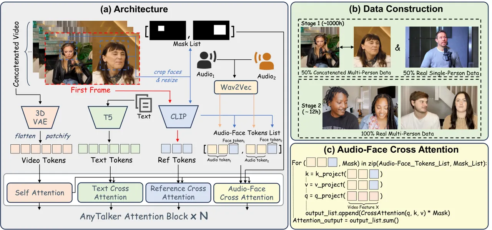
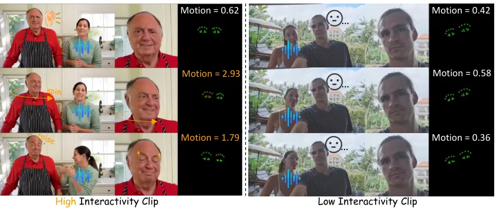
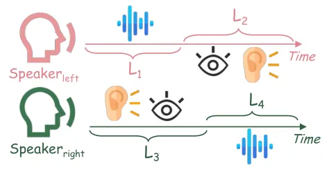
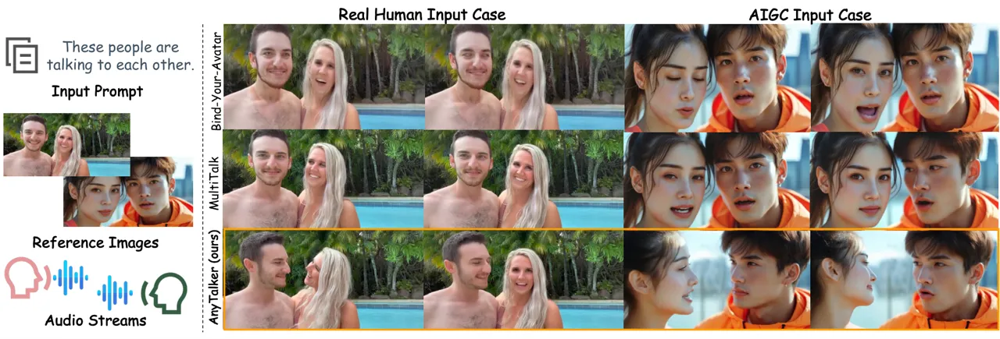
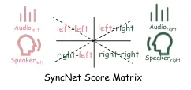
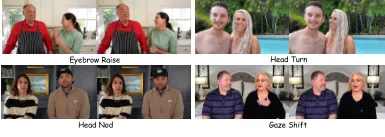
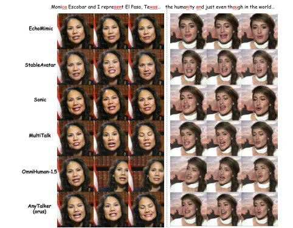
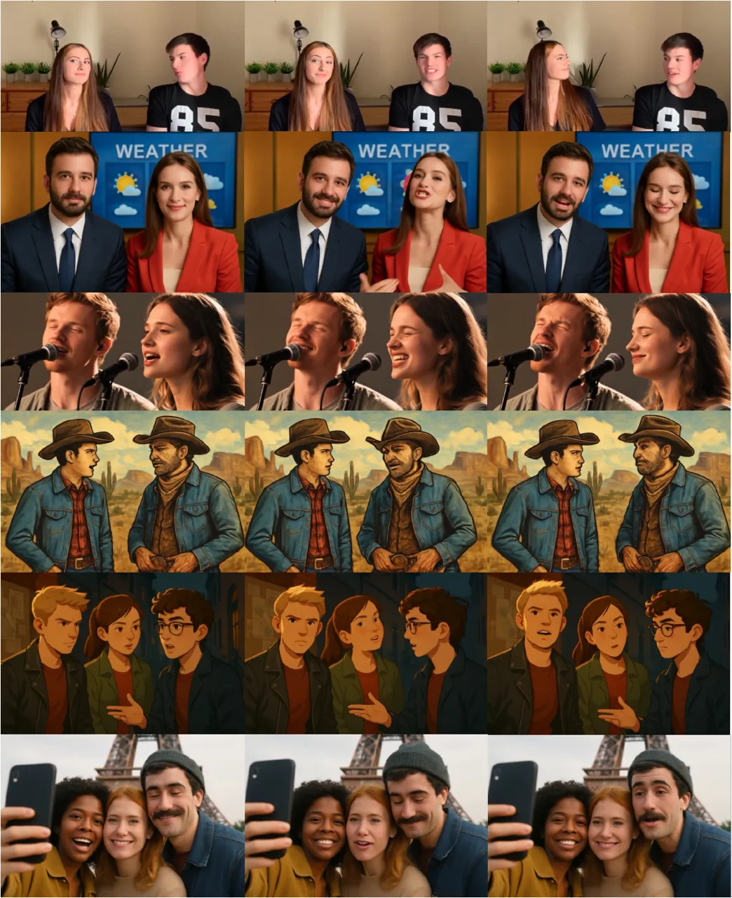
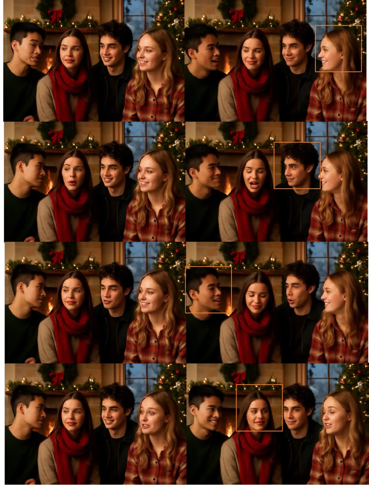

# AnyTalker: Scaling Multi-Person Talking Video Generation with Interactivity Refinement

Zhizhou Zhong Affiliation: Hong Kong University of Science and
Technology Affiliation: Video Rebirth    Yicheng Ji Affiliation: Video
Rebirth Affiliation: Zhejiang University    Zhe Kong Affiliation: Hong
Kong University of Science and Technology    Yiying Liu    Jiarui Wang
Affiliation: Video Rebirth    Jiasun Feng Affiliation: Video Rebirth   
Lupeng Liu Affiliation: Video Rebirth Affiliation: Beijing Jiaotong
UniversityHomepage: https://hkust-c4g.github.io/AnyTalker-homepageCode:
https://github.com/HKUST-C4G/AnyTalker    Xiangyi Wang
Affiliation: Video Rebirth Affiliation: Beijing Jiaotong
UniversityHomepage: https://hkust-c4g.github.io/AnyTalker-homepageCode:
https://github.com/HKUST-C4G/AnyTalker    Yanjia Li Affiliation: Video
Rebirth    Yuqing She Ying Qin Affiliation: Video Rebirth
Affiliation: Beijing Jiaotong UniversityHomepage:
https://hkust-c4g.github.io/AnyTalker-homepageCode:
https://github.com/HKUST-C4G/AnyTalker    Huan Li Affiliation: Zhejiang
University    Shuiyang Mao Affiliation: Video Rebirth    Wei Liu
Affiliation: Video Rebirth    Wenhan Luo

###### Abstract

Recently, multi-person video generation has started to gain prominence.
While a few preliminary works have explored audio-driven multi-person
talking video generation, they often face challenges due to the high
costs of diverse multi-person data collection and the difficulty of
driving multiple identities with coherent interactivity. To address
these challenges, we propose AnyTalker, a multi-person generation
framework that features an extensible multi-stream processing
architecture. Specifically, we extend Diffusion Transformer’s attention
block with a novel identity-aware attention mechanism that iteratively
processes identity–audio pairs, allowing arbitrary scaling of drivable
identities. Besides, training multi-person generative models demands
massive multi-person data. Our proposed training pipeline depends solely
on single-person videos to learn multi-person speaking patterns and
refines interactivity with only a few real multi-person clips.
Furthermore, we contribute a targeted metric and dataset designed to
evaluate the naturalness and interactivity of the generated multi-person
videos. Extensive experiments demonstrate that AnyTalker achieves
remarkable lip synchronization, visual quality, and natural
interactivity, striking a favorable balance between data costs and
identity scalability.

![[Uncaptioned
image]](arxiv-2511-23475--f1a7e9c284de.figures/figure-1.webp)

Figure 1: We propose AnyTalker, a powerful audio-driven framework for
interactive multi-person video generation. It can generate natural
videos that are rich in gestures, lively emotions, and interactivity,
and can freely generalize to arbitrary IDs or even non-human cases.

^(†)^(†)footnotetext: ^(∗) Project leader.^(†)^(†)footnotetext: ^(†)
Corresponding author.

## 1 Introduction

In the era of digital media, video creation has emerged as a crucial
component of media platforms. Podcasts, live-streaming sales, and
entertainment programs often feature rich multi-person interactions,
resulting in a growing demand for multi-person video generation. Despite
the advent of large-scale video generation models \[4, 70, 28, 59\],
which have furnished robust backbone architectures for audio-driven
talking video generation methods \[35, 14, 26, 69, 11, 7, 24, 15, 31\],
enabling the creation of realistic lip movements for single subjects,
these models still struggle to accommodate the complexities of
multi-person interactions.

This limitation has prompted multi-person driving approaches that scale
to arbitrary numbers of persons, handle multi-stream signals, and enable
differentiated control over each subject. Despite recent advances \[63,
23, 31\] that propose solutions for handling multi-stream audio signals,
these methods typically require hundreds to thousands of hours of
meticulously curated multi-person data, leading to prohibitive
collection costs and limited reproducibility. Specifically, the
challenge of gathering training data for multi-person scenarios is
heightened by their complex dynamics, including turn-taking,
role-switching, and nonverbal cues like eye gaze, which complicate data
annotation. Most existing audio-visual datasets \[80, 65, 11, 41, 33,
9\] focus on single-person monologues or isolated facial animations,
thereby limiting their applicability for training the audio-driven
multi-person generation model. In addition, current multi-person driving
approaches frequently struggle to model genuine interactivity, leading
to unnatural results.

To address the aforementioned challenges, we introduce an innovative
driving framework named AnyTalker. Built on the pre-trained video
diffusion model \[59\], AnyTalker achieves impressive multi-person video
driving with remarkably low data costs and a distinct emphasis on
interactivity, as illustrated in Fig. 1. The central idea is to leverage
low-cost single-person data for scalable multi-person video driving and
refine interactivity with just a small amount of multi-person data (as
little as 12 hours). Specifically, AnyTalker supports extending the
number of drivable identities (IDs) to arbitrary numbers, with
guaranteed interactivity among all IDs. To accommodate multi-stream
control signals, we design an extensible audio-to-face in-context
attention mechanism supporting any number of IDs and audio inputs. The
training process is divided into two stages based on the types of data
used, with the number of speaker IDs in individual data samples evolving
from one to many. In the first stage, we randomly concatenate
single-person talking videos along the horizontal dimension to simulate
multi-person talking scenarios, ensuring that the model acquires a
baseline capacity for multi-person speaking patterns. In the second
stage, we fine-tune the model using a small amount of multi-person data
to enhance its interactive capabilities.

Commonly used single-person talking head benchmarks \[80, 65, 81\] lack
multi-person interactions, rendering them unsuitable for assessing
multi-person generation methods. While InterActHuman \[63\] offered a
related benchmark, it focuses on single speakers, limiting its utility
for interaction analysis. To address this limitation, we introduce a
meticulously annotated benchmark featuring videos of two individuals
engaging in both speech and eye contact, with fine-grained labels that
mark the speaking and listening intervals, thus facilitating the
assessment of interactions during listening states. Additionally, we
firstly introduce a novel metric to evaluate interactivity by measuring
the activity of eye keypoints during listening periods. The proposed
benchmark and metric will fill the gap in the assessment of
interactivity in multi-person generation methods, benefiting future
research in this area.

The main contributions are summarized as follows: (1) We present an
extensible multi-stream processing architecture for multi-person
generation that can scale drivable identities arbitrarily. (2) A novel
two-stage training pipeline is introduced for the model to learn
multi-speaker speaking patterns from single-person data and achieve
seamless inter-identity interactions via multi-person data refinement.
(3) We propose a new metric that quantitatively evaluates multi-person
interactivity for the first time, accompanied by a tailored benchmark
dataset for thorough assessment. (4) Comprehensive experiments
demonstrate that AnyTalker achieves state-of-the-art performance and
strikes a favorable balance among identity scalability, interactivity,
lip synchronization, and data cost.

## 2 Related Work



Figure 2: (a) The architecture of AnyTalker, which incorporates a novel
multi-stream audio processing layer, Audio-Face Cross Attention, enables
the handling of multiple facial and audio inputs. (b) The training of
AnyTalker is divided into two stages: the first stage uses concatenated
multi-person data derived from single-person data mixed with
single-person data to learn accurate lip movements; the second stage
employs authentic multi-person data to enhance the interactivity in
generated videos. (c) The detailed implementation of Audio-Face Cross
Attention, a recursively callable structure that applies masking to the
output using face masks.

### 2.1 Audio-driven Talking Video Generation

Recent key advancements \[19, 50, 20, 75, 44\] in text-to-image fields
have significantly catalyzed progress in downstream applications. Early
efforts like EMO \[55\] extend pre-trained diffusion text-to-image
models \[50\] to end-to-end audio-driven virtual-human video
generation \[25, 8, 66, 73, 60, 43, 34, 6\]. They typically integrate
modules for temporal attention \[17\], identity control via
ReferenceNet \[82, 22, 30, 74\], and audio-conditioning using
pre-trained audio processing models \[47, 1, 51\], with conditional
signals injected via cascaded attention layers \[58\]. Video foundation
models \[4, 70, 28, 59, 77\] enable end-to-end, audio-driven
virtual-human models \[40, 11, 24, 56, 35, 69, 15, 26\]. These works
largely employ audio-injection practices from earlier methods \[55, 25\]
and report breakthroughs in long-video generation \[69, 11\], full-body
synthesis \[35\], driving non-human cases \[15, 14\], synchronized lip
movements \[24\], and coherent hand movements \[40\]. Consequently, they
surpass earlier GAN-based generation methods \[78, 67, 16, 79\] and
image diffusion-based techniques \[50, 44\] in terms of both quality and
controllability. However, most methods still target single-person
scenarios; in multi-person scenarios, they tend to synchronize identical
motions or lip movements across all speakers, with restricted
multi-person interaction.

### 2.2 Multi-person Video Generation

Multi-person video generation has advanced rapidly through specialized
architectures, including portrait video generation \[62, 42\], dancing
video generation \[68\], and talking video generation \[23, 31, 63\].
Within the audio-driven talking-head axis, Bind-your-Avatar \[23\]
introduces a fine-grained Embedding Router that binds “who” with “what
they speak”. InterActHuman \[63\] trains a mask predictor to identify
which body regions to activate, enabling targeted control.
MultiTalk \[31\] proposes Label Rotary Position Embedding \[52\] to
address audio–person binding. All three approaches above rely on
expensive data, ranging from hundreds to thousands of hours of
multi-person talking data. Some models \[7, 39\] trained on
single-person data generalize to multi-person driving through
specialized controllers: HunyuanVideo-Avatar \[7\] leverages a
Face-Aware Audio Adapter to activate attention across different
characters selectively, and Playmate2 \[39\] uses token-level masking
within a classifier-free guidance framework to realize similar binding.
Despite enabling multi-person outputs, these approaches might yield
fragmented interactions across distinct characters, with limited
interactivity between individuals.

In this work, AnyTalker explores the potential of learning multi-person
speaking patterns from single-person data and designs an extensible
multi-stream audio processing attention architecture, achieving a
favorable balance among interactivity, identity scalability, and lip
synchronization in the generated videos with low training data cost.

## 3 Method

The overall framework of the proposed AnyTalker is illustrated
in Fig. 2. AnyTalker inherits certain architectural components from the
Wan I2V model \[59\]. To handle multi-stream audio and identity input,
we introduce a specialized multi-stream processing structure, termed as
the Audio-Face Cross Attention (AFCA), which will be further described
in Sec. 3.2. Our training pipeline is divided into two stages, which are
summarized in Sec. 3.3.

Figure 3: (a) Mapping of video tokens to audio tokens, facilitated by a
custom attention mask. Every 4 audio tokens are bound to 1 video token,
except for the first. (b) Mask token used for output masking in
Audio-Face Cross Attention.

### 3.1 Preliminaries

As a DiT-based model, AnyTalker tokenizes the 3D VAE features
$`f_{video}`$ through patchifying and flattening, whereas the text
features $`f_{text}`$ are generated by the T5 encoder \[48\].
Additionally, AnyTalker incorporates Reference Attention Layer, a
cross-attention mechanism that leverages the CLIP image encoder \[46\]
$`E_{\text{CLIP}}`$ to extract features $`f_{ref}`$ from the first frame
of the video. Wav2Vec2 \[1\] is also applied to extract the audio
feature $`f_{audio}`$. The overall input features $`f_{input}`$ can be
written as

```math
f_{input}=[f_{video},f_{text},f_{ref},f_{audio}]. \tag{1}
```

Consistent with the Wan model, all attention layers are connected to the
final output FFN layer (omitted in Fig. 2).

### 3.2 Audio-Face Cross Attention

To enable multi-person talking, the model must be capable of handling
multi-stream audio inputs. Potential solutions may include the L-RoPE
technique used in MultiTalk \[31\], which assigns unique labels and
biases to different audio features. However, the range of these labels
needs to be explicitly defined, which limits its scalability.
Considering this, we design a more extensible structure to drive
multiple IDs and enable accurate control in a scalable manner. As
depicted in Fig. 2 (a) and (c), we introduce a specialized structure
named Audio-Face Cross Attention (AFCA). The structure can iterate
through a loop multiple times, contingent upon the number of input
face-audio pairs. As illustrated in Eq. 4 and Fig. 2 (c), it enables
flexible processing of diverse audio and identity inputs, with summed
outputs from each iteration yielding the final attention output.

Audio Token Modeling. We employ Wav2Vec2 \[1\] to encode audio features.
The first latent frame attends to all audio tokens, whereas each
subsequent latent frame focuses only on a local temporal window
corresponding to four audio tokens. This structured alignment between
video and audio streams is achieved by applying a Temporal Attention
Mask $`M_{\text{temporal}}`$, as explicitly shown in Fig. 3 (a).
Furthermore, to enable comprehensive information integration, each audio
token $`f_{\text{audio}}`$ utilized in the AFCA computation is
concatenated with a face token $`f_{\text{face}}`$ encoded by
$`E_{\text{CLIP}}`$. This concatenation allows all video query tokens
$`Q_{\text{video}}`$ to attend to different pairs of audio and face
information effectively, as computed below:

```math
\displaystyle K_{\text{af}} \displaystyle=\text{Concat}(f_{\text{audio}},f_{\text{face}})\cdot W_{K}, \tag{2}
```

```math
\displaystyle V_{\text{af}} \displaystyle=\text{Concat}(f_{\text{audio}},f_{\text{face}})\cdot W_{V},
```

```math
\displaystyle\text{Attn}_{\text{out}} \displaystyle=\text{MHCA}(Q_{\text{video}},K_{\text{af}},V_{\text{af}},M_{\text{temporal}}).
```

Here, MHCA denotes Multi-Head Cross Attention, while $`W_{K}`$ and
$`W_{V}`$ represent the key matrix and value matrix, respectively. The
attention output $`\text{Attn}_{\text{out}}`$ will later be refined by
the face mask token, as described in Eq. 3.

Face Token Modeling. The facial image is obtained by online cropping the
first frame of the selected video clip using InsightFace \[12\] during
training, while the facial mask $`M_{\text{face}}`$ is precomputed
offline to cover the maximum extent of the face mask across the entire
video, i.e., the global face bounding box. This mask ensures that facial
movements will never exceed this region, preventing the mask from
incorrectly activating video tokens after the reshape and flatten
operations shown in Fig. 3 (b), especially for videos with significant
facial displacements. This mask, which shares the same dimensions as
$`\text{Attn}_{\text{out}}`$, can be directly employed for element-wise
multiplication to compute the Audio-Face Cross Attention output, as
formulated below:

```math
\displaystyle{M}_{\text{token}} \displaystyle=\text{Patchify}(\text{Flatten}(M_{\text{face}})), \tag{3}
```

```math
\displaystyle\text{AFCA}_{\text{out}} \displaystyle={M}_{\text{token}}\odot\text{Attn}_{\text{out}}.
```

Consequently, the hidden state $`H_{i}`$ of each I2V DiT block can be
formulated as

```math
\displaystyle H_{i}^{{}^{\prime}} \displaystyle=H_{i}+\text{AFCA}_{\text{out}}^{(1)}+\cdots+\text{AFCA}_{\text{out}}^{(n)}, \tag{4}
```

where $`i`$ represents the layer index of the attention block, and $`n`$
denotes the number of IDs. Note that all
$`\mathrm{AFCA}_{\mathrm{out}}`$ terms are produced by the _same_ AFCA
layer with shared parameters. The AFCA computation is applied $`n`$
times iteratively, once for each individual. This architecture enables
the number of drivable IDs to scale arbitrarily.



Figure 4: Two video clips from InteractiveEyes with $`{Motion}`$ score
(px): left shows original video, right shows cropped face and eye
landmarks. Head turn toward the speaker or eyebrow raise will increase
$`Motion`$ and Interactivity; sustained stillness keeps both low.

### 3.3 Training Strategy

AnyTalker explores the potential of single-person data for learning
multi-person speaking patterns, with low-cost single-person data
comprising the majority of training data.

Single-Person Data Pretraining. We train the model using both standard
single-person data and synthetic two-person data generated by horizontal
concatenation. With an equal 50% probability, each batch of data is
randomly configured to either two-person or single-person mode, as
depicted in Fig. 2 (b). In two-person mode, each sample within the batch
is horizontally concatenated with the data at the next index, along with
its corresponding audio. This approach keeps the batch size identical
across the two modes for every data batch. Additionally, we have
predefined several generic text prompts that describe dual people
speaking when data concatenation happens.

Although the above data construction strategy enhances the model’s
ability to localize audio-visual features within local regions and learn
speaking patterns of dual speakers, completely omitting the
single-person data is not feasible. Doing so would significantly degrade
the model’s performance on generating accurate lip movements, leading to
unstable driving results, which we later discuss in Tab. 4.

Multi-person Data Refinement. In the next stage, we refine the model
using a small amount of authentic multi-person data to enhance the
interactivity within different IDs. Although our training data contains
only interactions between two identities, we surprisingly find that our
model equipped with the AFCA module naturally generalizes to scenarios
with more than two IDs, as shown in Fig. 1. We speculate that this is
because the AFCA mechanism enables learning general patterns of human
interaction, including not only accurate lip-syncing to the audio but
also listening and responsive behaviors to other IDs’ speaking actions.

To construct high-quality multi-person training data, we construct a
rigorous quality control pipeline, using InsightFace \[13\] to ensure
two faces in most frames, audio diarization \[45\] to separate audio and
ensure there is only one or two speakers, optical flow \[27\] to filter
excessive motion, and Sync scores \[10\] to pair audio with faces. More
details about this pipeline are in the supplementary material. This
pipeline yields a total of $`12`$ hours of high-quality dual-person
data, which is a small amount compared to previous methods \[31, 63,
39\]. As the design of AnyTalker’s AFCA Layer inherently supports
multi-ID inputs, two-person data is fed into the model in the same
format as the concatenated data in the first stage, with no extra
processing required.

To summarize, the single-person data training process enhances the
model’s lip-syncing capability and generation quality, while also
learning a generalized multi-person speaking pattern. Subsequently,
lightweight multi-person data refinement compensates for the real
interactions that cannot be fully covered by single-person data.

## 4 Interactivity Evaluation

Despite progress, the prevailing evaluation benchmarks \[80, 65, 81\]
for single-person talking head generation are inadequate for assessing
natural interactions among characters. Although InterActHuman \[63\]
introduces a comparable benchmark, its test set is limited to scenarios
with only one speaker, which is not conducive to evaluating interactions
among multiple characters. To fill this gap, we have curated a
collection of videos featuring two distinct identities, sourced from the
web for evaluation purposes.

### 4.1 Dataset Construction

We select interactive two-person videos to construct the video dataset,
named InteractiveEyes. Two clips of these videos are illustrated
in Fig. 4. Each video is approximately 10 seconds in duration and
showcases exactly two faces throughout the entire segment. Furthermore,
through a meticulous manual process, we segment the audio of each video
to ensure that the majority of the videos capture scenes of both
individuals engaging in speaking and listening, as well as a variety of
rich eye interaction scenarios, as shown in Fig. 5. We have also ensured
that each video includes instances of mutual gaze and head movements to
provide authentic references.



Figure 5: Listening and speaking periods of each speaker.

### 4.2 Proposed Interactivity Metric

In addition to this dataset, we introduce a novel metric, the
eye-focused Interactivity, designed to assess the natural interaction
between speakers and listeners. Since eye interaction is a fundamental
and spontaneous behavior in conversational contexts, we use it as a key
indicator of interactivity. Drawing inspiration from the Hand Keypoint
Variance (HKV) metric employed in CyberHost \[34\], we propose a
quantitative evaluation of the interaction by tracking the motion
amplitude of eye keypoints.

To achieve this, we define $`Motion`$ on the sequence of face-aligned
eye keypoints extracted from the generated frames, where $`S`$ denotes
the frame sequence and $`E`$ the eye keypoints. The $`Motion`$ is
calculated as follows

```math
Motion=\frac{1}{|S|-1}\sum_{j=1}^{|S|-1}\left(\frac{1}{|E|}\sum_{i=1}^{|E|}|E_{i,j+1}-E_{i,j}|\right). \tag{5}
```

Here, $`i`$ and $`j`$ denote the eye keypoint index and the frame index,
while $`E_{i,j}`$ denotes eye keypoints present in each frame. This
formula intuitively computes the displacement and rotation of the eye
region. We then calculate the motion during listening periods. The
reason is, most generation methods perform well when activating the
speaking subject, but the listening subject often appears rigid.
Therefore, evaluating during listening periods is more targeted and
valuable. The lengths of the listening and speaking periods of each
person are described in Fig. 5, denoted as $`L_{1},L_{2},L_{3},L_{4}`$,
respectively. To quantify the responsiveness of the generated avatars,
we compute the average motion intensity during the listening phases
$`L_{2}`$ and $`L_{3}`$:

```math
\displaystyle\text{Interactivity} \displaystyle=\frac{L_{2}\cdot Motion_{L2}+L_{3}\cdot Motion_{L3}}{L_{2}+L_{3}}. \tag{6}
```

This metric measures the interactivity effectively in the generated
multi-character videos. As Fig. 4 suggests, the proposed metric aligns
well with human perception: static or sluggish eye movements receive low
$`Motion`$ scores, while head turns and eyebrow raises increase the
score thus indicating higher interactivity. Moreover, to avoid
misjudging abnormal eye movements, we implemented an exclusion algorithm
detailed in the supplementary materials.

|                          |                            |                |                    |                   |                   |                |                    |                   |                   |                |
| ------------------------ | -------------------------- | -------------- | ------------------ | ----------------- | ----------------- | -------------- | ------------------ | ----------------- | ----------------- | -------------- |
| Method                   | Supported Generation Scope |                | HDTF               |                   |                   |                | VFHQ               |                   |                   |                |
|                          | multi-person               | body           | Sync-C$`\uparrow`$ | FID$`\downarrow`$ | FVD$`\downarrow`$ | ID$`\uparrow`$ | Sync-C$`\uparrow`$ | FID$`\downarrow`$ | FVD$`\downarrow`$ | ID$`\uparrow`$ |
| AniPortrait \[64\]       | $`\times`$                 | $`\times`$     | 3.44               | 18.74             | 241.84            | 0.94           | 2.63               | 28.54             | 269.24            | 0.95           |
| FantasyTalking \[61\]    | $`\times`$                 | $`\checkmark`$ | 3.97               | 14.93             | 166.79            | 0.93           | 3.57               | 24.83             | 272.13            | 0.94           |
| StableAvatar \[56\]      | $`\times`$                 | $`\checkmark`$ | 4.11               | 14.67             | 166.44            | 0.91           | 3.53               | 22.91             | 275.73            | 0.88           |
| EchoMimic \[8\]          | $`\times`$                 | $`\times`$     | 5.23               | 61.53             | 381.55            | 0.95           | 4.87               | 58.72             | 486.75            | 0.86           |
| Hallo3 \[11\]            | $`\times`$                 | $`\times`$     | 7.53               | 17.12             | 195.61            | 0.91           | 6.32               | 41.26             | 371.24            | 0.91           |
| Sonic \[24\]             | $`\times`$                 | $`\times`$     | 7.81               | 52.96             | 286.12            | 0.95           | 7.71               | 36.68             | 385.37            | 0.89           |
| OmniHuman-1.5^(∗) \[26\] | $`\times`$                 | $`\checkmark`$ | 7.23               | 35.26             | 173.23            | 0.90           | 7.67               | 35.36             | 283.39            | 0.90           |
| MuitiTalk \[31\]         | $`\checkmark`$             | $`\checkmark`$ | 8.91               | 13.54             | 162.58            | 0.93           | 7.77               | 24.25             | 243.66            | 0.94           |
| AnyTalker-1.3B           | $`\checkmark`$             | $`\checkmark`$ | 6.85               | 14.47             | 218.01            | 0.91           | 5.81               | 21.88             | 267.08            | 0.91           |
| AnyTalker-14B            | $`\checkmark`$             | $`\checkmark`$ | 9.05               | 13.84             | 160.87            | 0.94           | 7.79               | 20.99             | 290.73            | 0.94           |

Table 1: Quantitative comparison with other competing methods on
HDTF \[80\] and VFHQ \[65\] benchmark. Here, OmniHuman-1.5^(∗) \[26\]
refers to its “Master Mode” version accessed via the JiMeng
platform \[5\], which currently does not support multi-person
generation.

| Method                  | Interactivity$`\uparrow`$ | Sync-C^(∗)$`\uparrow`$ | FVD$`\downarrow`$ |
| ----------------------- | ------------------------- | ---------------------- | ----------------- |
| Ground Truth            | 0.77                      | 6.01                   | 0                 |
| Bind-Your-Avatar \[23\] | 0.45                      | 3.03                   | 695.58            |
| MuitiTalk \[31\]        | 0.49                      | 6.88                   | 500.03            |
| AnyTalker-1.3B          | 0.97                      | 4.56                   | 467.84            |
| AnyTalker-14B           | 1.01                      | 6.99                   | 424.15            |

Table 2: Quantitative comparison with other competing methods on the
multi-person benchmark, InteractiveEyes.

## 5 Experiments

Dataset. We expand single-person datasets \[80, 65, 11, 81, 9\] with
internet-collected data, yielding roughly 1,000 hours for first-stage
training, and also gather two-person conversation clips for the
second-stage training, retaining only about 12 hours after filtering.
Evaluations are conducted on two types of benchmarks: (i) standard
talking-head benchmarks HDTF \[80\] and VFHQ \[65\], and (ii) our
self-collected multi-person conversation dataset (head-and-body, both
identities speak). We then select 20 videos from each benchmark,
rigorously ensuring that their identities do not appear in the training
set.

Implement Details. To comprehensively evaluate our method, we train two
models of different sizes: Wan2.1-1.3B-Inp and Wan2.1-I2V-14B \[59\],
which serve as the foundational video diffusion models for our
experiments. In all stages, the text \[48\], audio \[1\], and
image \[46\] encoders, as well as the 3D VAE, remain frozen. The DiT
main network, including the newly added AFCA layers, has all its
parameters open for training. Stage 1 pretrains at $`2\times 10^{-5}`$
learning rate; stage 2 fine-tunes at $`5\times 10^{-6}`$. All models are
optimized with AdamW \[36\] on 32 NVIDIA H200 GPUs.

Evaluation Metrics. For the single-person benchmark, we employ several
commonly used metrics: the Fréchet Inception Distance (FID) \[18\] and
the Fréchet Video Distance (FVD) \[57\] to assess the quality of the
generated data, Sync-C \[10\] to measure the synchronization between
audio and lip movements, and ID similarity \[13\] calculated between the
first frame and the remaining frames.

For the multi-person benchmark, we evaluate from different dimensions.
The newly introduced metric, termed Interactivity, serves as the primary
metric for assessment. For the FVD metric, the calculation is similar to
that in the single-person benchmark. For the Sync-C metric, we refine
its calculation as Sync-C^(∗) to focus only on the lip synchronization
during each character’s speaking periods, thereby avoiding the influence
of long listening segments on the final lip synchronization score,
specifically,

```math
\text{Sync-C}^{*}=\frac{L_{1}\cdot\text{Sync-C}_{L1}+L_{4}\cdot\text{Sync-C}_{L4}}{L_{1}+L_{4}}. \tag{7}
```

Here, $`L_{1}`$ and $`L_{4}`$ denotes the speaking phases depicted
in Fig. 5.

Comparsion Methods. We compare AnyTalker with several state-of-the-art
talking video generation methods. For single-person generation, we
compare with AniPortrait \[64\], EchoMimic \[8\], Hallo3 \[11\],
Sonic \[24\], FantasyTalking \[61\], StableAvatar \[56\],
OmniHuman-1.5 \[26\], and MultiTalk \[31\]. For multi-person generation,
we choose Bind-Your-Avatar \[23\] and MultiTalk \[31\] for quantitative
and qualitative comparison.

### 5.1 Comparison with SOTA methods

Quantitative Comparison. To begin with, we compare AnyTalker with
several single-person generation methods to verify its excellent
single-person driving capability. The quantitative results are shown
in Tab. 1. Despite not being specifically designed for driving talking
faces, AnyTalker achieves the best or competitive results across all
metrics. Moreover, the 1.3B model of AnyTalker significantly outperforms
AniPortrait \[64\], EchoMimic \[8\], and StableAvatar \[56\] in terms of
lip synchronization, even though they have a similar number of
parameters. These results demonstrate the excellent and comprehensive
driving capabilities of the AnyTalker framework.

Subsequently, we evaluate AnyTalker’s ability to drive multiple IDs
while maintaining both accurate lip synchronization and natural
interactivity using the multi-person dataset, InteractiveEyes, described
in Sec. 5, along with relevant metrics. In this comparison, we contrast
AnyTalker with the available open-source multi-person driving methods,
MultiTalk \[31\] and Bind-Your-Avatar \[23\]. The results depicted
in Tab. 2 demonstrate that both the 1.3B and 14B models of AnyTalker
achieve the best performance in terms of the Interactivity metric.
Additionally, the 14B model achieves the best results across all
metrics, thereby validating the effectiveness of our proposed training
pipeline. We further illustrate AnyTalker’s capability to generate
videos rich in interactivity through quantitative evaluation.



Figure 6: Qualitative comparison of multiple multi-person driving
methods. With the same text prompt, reference images, and multiple audio
streams as input, we compare the generation results of Bind-Your-Avatar,
MultiTalk, and AnyTalker. The left case uses the input image from the
InteractiveEyes dataset, while the right case uses the image produced by
a text-to-image generative model \[54\].

Qualitative Comparsion. We then select an authentic human input from the
InteractiveEyes dataset and use an input generated by an AIGC
mode \[54\], both accompanied by corresponding text prompts and dual
audio streams, to conduct a quantitative evaluation comparison using
Bind-Your-Avatar \[23\], MultiTalk \[31\], and AnyTalker. As shown
in Fig. 6, AnyTalker generates more natural videos with eye and head
interactions compared to the other methods. MultiTalk exhibits weaker
eye interaction, while Bind-Your-Avatar tends to produce more static
expressions. This trend further validates the effectiveness of the
Interactivity metric proposed in Sec. 5. AnyTalker not only generates
natural, two-person interactive speaking scenarios but also scales well
to multiple IDs, as demonstrated in Fig. 1, where it effectively handles
interactions among four IDs. The qualitative results of the
single-person benchmarks \[80, 65\] will be included in the
supplementary material.

| Setting                 | Metrics            |                   |                   |                |
| ----------------------- | ------------------ | ----------------- | ----------------- | -------------- |
|                         | Sync-C$`\uparrow`$ | FID$`\downarrow`$ | FVD$`\downarrow`$ | ID$`\uparrow`$ |
| Baseline                | 5.42               | 13.01             | 170.96            | 0.90           |
| w/o AFCA                | 6.71               | 14.97             | 207.47            | 0.88           |
| w/o Mask Token          | 5.84               | 14.81             | 193.78            | 0.89           |
| w/o Concatenated Data   | 6.21               | 14.73             | 202.01            | 0.91           |
| AnyTalker-1.3B (Single) | 6.97               | 15.58             | 166.27            | 0.91           |

Table 3: Ablation study about AnyTalker’s components on the HDTF dataset
using the 1.3B model. “Baseline” denotes the model equipped solely with
the basic audio attention layers. “AFCA” indicates the inclusion of the
Audio-Face Cross Attention mechanism. “Single” indicates that authentic
multi-person data is not utilized in this stage.

### 5.2 Ablation Study

Components. We conduct ablation studies on the three important
components mentioned in Fig. 2, including Audio-Face Cross Attention,
Mask Token for attention output, and concatenated multi-person data.
Starting from the full 1.3B model in the first stage, which utilizes
only single-person data, we progressively remove the relevant components
to evaluate their impact on lip synchronization, generation quality, and
identity similarity in the generated videos. The results in Tab. 3 show
that every component plays a significant role, with concatenated
multi-person data most beneficial to lip-movement accuracy. Although the
completed model in the initial phase exhibits a marginally higher FID
score compared to the Baseline model, we attribute this to the Baseline
model’s propensity for generating talking videos with minimal facial
expressions or head movements. Conversely, the completed model generates
more dynamic actions, which inherently influence the FID calculation to
some degree. We regard this trade-off as a natural consequence of the
model’s design. Furthermore, the completed model demonstrates superior
performance over the Baseline model across other evaluation metrics.
Crucially, the first-stage model already has the basic capability to
drive multiple individuals, a feature that the Baseline model lacks.

| Setting        |                |                | Metrics                   |                        |                   |
| -------------- | -------------- | -------------- | ------------------------- | ---------------------- | ----------------- |
| RS             | CM             | RM             | Interactivity$`\uparrow`$ | Sync-C^(∗)$`\uparrow`$ | FVD$`\downarrow`$ |
| $`\times`$     | $`\checkmark`$ | $`\times`$     | 0.55                      | 3.21                   | 672.18            |
| $`\checkmark`$ | $`\times`$     | $`\times`$     | 0.47                      | 4.13                   | 475.31            |
| $`\checkmark`$ | $`\checkmark`$ | $`\times`$     | 0.58                      | 4.89                   | 393.86            |
| $`\checkmark`$ | $`\times`$     | $`\checkmark`$ | 0.71                      | 3.63                   | 511.51            |
| $`\checkmark`$ | $`\checkmark`$ | $`\checkmark`$ | 0.97                      | 4.56                   | 467.84            |

Table 4: Ablation studies conducted on the InteractiveEyes dataset using
the 1.3B model. “RS” denotes the use of authentic single-person data in
the first stage. “CM” indicates concatenated multi-person data in the
first stage. “RM” represents authentic multi-person data in the second
stage.

Multi-Person Data. Subsequently, we focus on multi-person data and
conduct more targeted ablation experiments on the InteractiveEyes
benchmark. In the first stage, we create concatenated multi-person data
using single-person data. As shown in Tab. 4, models utilizing this
concatenated data outperform those without it across all evaluation
dimensions, especially in lip synchronization and interactivity,
highlighting the role of concatenated data in learning multi-person
speaking patterns. It is worth noting that the results in the first row
of the table also demonstrate the necessity of mixing single-person data
in the first stage; otherwise, the generated results would be unstable.

After fine-tuning with authentic multi-person data, models that use
concatenated data in the first stage demonstrate even more superior
performance, further proving their early adaptation to multi-person
speaking patterns. Although fine-tuning with authentic multi-person data
leads to a slight decrease in lip synchronization, it significantly
improves interactivity, which we consider a reasonable trade-off.

## 6 Conclusion

In this paper, we introduce AnyTalker, an audio-driven framework for
generating multi-person talking videos. It presents an extensible
multi-stream processing structure called Audio-Face Cross Attention that
enables identity scaling while guaranteeing seamless cross-identity
interactions. We further propose a generalizable training strategy that
maximally leverages single-person data through concatenation-based
augmentation for learning multi-person speaking patterns. Additionally,
we propose the first interactivity evaluation metric and a tailored
benchmark for comprehensive assessment. Extensive experiments suggest
that AnyTalker balances lip synchronization, identity scalability, and
interactivity in multi-person scenarios.

## References

- \[1\] A. Baevski, Y. Zhou, A. Mohamed, and M. Auli (2020) Wav2vec 2.0:
  a framework for self-supervised learning of speech representations.
  Advances in Neural Information Processing Systems 33, pp. 12449–12460.
  Cited by: §2.1, §3.1, §3.2, §5, A.1. Training Data Processing, A.3.
  Implement Details.
- \[2\] S. Bahmani, I. Skorokhodov, G. Qian, A. Siarohin, W.
  Menapace, A. Tagliasacchi, D. B. Lindell, and S. Tulyakov (2025) Ac3d:
  analyzing and improving 3d camera control in video diffusion
  transformers. In Proceedings of the Computer Vision and Pattern
  Recognition Conference, pp. 22875–22889. Cited by: B.4. Future Work.
- \[3\] J. Bai, M. Xia, X. Fu, X. Wang, L. Mu, J. Cao, Z. Liu, H. Hu, X.
  Bai, P. Wan, et al. (2025) Recammaster: camera-controlled generative
  rendering from a single video. arXiv preprint arXiv:2503.11647. Cited
  by: B.4. Future Work.
- \[4\] A. Blattmann, T. Dockhorn, S. Kulal, D. Mendelevitch, M.
  Kilian, D. Lorenz, Y. Levi, Z. English, V. Voleti, A. Letts, et
  al. (2023) Stable video diffusion: scaling latent video diffusion
  models to large datasets. arXiv preprint arXiv:2311.15127. Cited by:
  §1, §2.1.
- \[5\] ByteDance (2025) Jimeng platform. Note:
  [https://jimeng.jianying.com/ai-tool/home?type=digitalHuman](https://jimeng.jianying.com/ai-tool/home?type=digitalHuman)
  Cited by: Table 1.
- \[6\] M. Chen, L. Cui, W. Zhang, H. Zhang, Y. Zhou, X. Li, S. Tang, J.
  Liu, B. Liao, H. Chen, et al. (2025) Midas: multimodal interactive
  digital-human synthesis via real-time autoregressive video generation.
  arXiv preprint arXiv:2508.19320. Cited by: §2.1.
- \[7\] Y. Chen, S. Liang, Z. Zhou, Z. Huang, Y. Ma, J. Tang, Q. Lin, Y.
  Zhou, and Q. Lu (2025) HunyuanVideo-avatar: high-fidelity audio-driven
  human animation for multiple characters. arXiv preprint
  arXiv:2505.20156. Cited by: §1, §2.2.
- \[8\] Z. Chen, J. Cao, Z. Chen, Y. Li, and C. Ma (2025) Echomimic:
  lifelike audio-driven portrait animations through editable landmark
  conditions. In Proceedings of the AAAI Conference on Artificial
  Intelligence, Vol. 39, pp. 2403–2410. Cited by: §2.1, Table 1, §5.1,
  §5, B.2. Additional Experimental Results.
- \[9\] J. Chung, A. Nagrani, and A. Zisserman (2018) VoxCeleb2: deep
  speaker recognition. Interspeech 2018. Cited by: §1, §5.
- \[10\] J. S. Chung and A. Zisserman (2016) Out of time: automated lip
  sync in the wild. In Asian Conference on Computer Vision, pp. 251–263.
  Cited by: §3.3, §5.
- \[11\] J. Cui, H. Li, Y. Zhan, H. Shang, K. Cheng, Y. Ma, S. Mu, H.
  Zhou, J. Wang, and S. Zhu (2025) Hallo3: highly dynamic and realistic
  portrait image animation with video diffusion transformer. In
  Proceedings of the Computer Vision and Pattern Recognition Conference,
  pp. 21086–21095. Cited by: §1, §1, §2.1, Table 1, §5, §5.
- \[12\] J. Deng, J. Guo, E. Ververas, I. Kotsia, and S.
  Zafeiriou (2020) Retinaface: single-shot multi-level face localisation
  in the wild. In Proceedings of the IEEE/CVF Conference on Computer
  Vision and Pattern Recognition, pp. 5203–5212. Cited by: §3.2, item 3,
  A.1. Training Data Processing, A.1. Training Data Processing.
- \[13\] J. Deng, J. Guo, N. Xue, and S. Zafeiriou (2019) Arcface:
  additive angular margin loss for deep face recognition. In Proceedings
  of the IEEE/CVF Conference on Computer Vision and Pattern Recognition,
  pp. 4690–4699. Cited by: §3.3, §5, A.1. Training Data Processing.
- \[14\] Q. Gan, R. Yang, J. Zhu, S. Xue, and S. Hoi (2025) OmniAvatar:
  efficient audio-driven avatar video generation with adaptive body
  animation. arXiv preprint arXiv:2506.18866. Cited by: §1, §2.1.
- \[15\] X. Gao, L. Hu, S. Hu, M. Huang, C. Ji, D. Meng, J. Qi, P.
  Qiao, Z. Shen, Y. Song, et al. (2025) Wan-s2v: audio-driven cinematic
  video generation. arXiv preprint arXiv:2508.18621. Cited by: §1, §2.1.
- \[16\] J. Guo, D. Zhang, X. Liu, Z. Zhong, Y. Zhang, P. Wan, and D.
  Zhang (2024) Liveportrait: efficient portrait animation with stitching
  and retargeting control. arXiv preprint arXiv:2407.03168. Cited by:
  §2.1.
- \[17\] Y. Guo, C. Yang, A. Rao, Z. Liang, Y. Wang, Y. Qiao, M.
  Agrawala, D. Lin, and B. Dai (2024) AnimateDiff: animate your
  personalized text-to-image diffusion models without specific tuning.
  In The Twelfth International Conference on Learning Representations,
  Cited by: §2.1.
- \[18\] M. Heusel, H. Ramsauer, T. Unterthiner, B. Nessler, and S.
  Hochreiter (2017) Gans trained by a two time-scale update rule
  converge to a local nash equilibrium. Advances in Neural Information
  Processing Systems 30. Cited by: §5.
- \[19\] J. Ho, A. Jain, and P. Abbeel (2020) Denoising diffusion
  probabilistic models. Advances in Neural Information Processing
  Systems 33, pp. 6840–6851. Cited by: §2.1.
- \[20\] J. Ho and T. Salimans (2021) Classifier-free diffusion
  guidance. In NeurIPS 2021 Workshop on Deep Generative Models and
  Downstream Applications, Cited by: §2.1, A.3. Implement Details.
- \[21\] E. J. Hu, Y. Shen, P. Wallis, Z. Allen-Zhu, Y. Li, S. Wang, L.
  Wang, W. Chen, et al. (2022) Lora: low-rank adaptation of large
  language models.. ICLR 1 (2), pp. 3. Cited by: B.4. Future Work.
- \[22\] L. Hu (2024) Animate anyone: consistent and controllable
  image-to-video synthesis for character animation. In Proceedings of
  the IEEE/CVF Conference on Computer Vision and Pattern Recognition,
  pp. 8153–8163. Cited by: §2.1.
- \[23\] Y. Huang, W. Wang, S. Zhao, T. Xu, L. Liu, and E. Chen (2025)
  Bind-your-avatar: multi-talking-character video generation with
  dynamic 3d-mask-based embedding router. arXiv preprint
  arXiv:2506.19833. Cited by: §1, §2.2, Table 2, §5.1, §5.1, §5, Figure
  12, Figure 12, B.1. More analysis about Interactivity Metric.
- \[24\] X. Ji, X. Hu, Z. Xu, J. Zhu, C. Lin, Q. He, J. Zhang, D.
  Luo, Y. Chen, Q. Lin, et al. (2025) Sonic: shifting focus to global
  audio perception in portrait animation. In Proceedings of the Computer
  Vision and Pattern Recognition Conference, pp. 193–203. Cited by: §1,
  §2.1, Table 1, §5, B.2. Additional Experimental Results.
- \[25\] J. Jiang, C. Liang, J. Yang, G. Lin, T. Zhong, and Y.
  Zheng (2025) Loopy: taming audio-driven portrait avatar with long-term
  motion dependency. In The Thirteenth International Conference on
  Learning Representations, Cited by: §2.1.
- \[26\] J. Jiang, W. Zeng, Z. Zheng, J. Yang, C. Liang, W. Liao, H.
  Liang, Y. Zhang, and M. Gao (2025) Omnihuman-1.5: instilling an active
  mind in avatars via cognitive simulation. arXiv preprint
  arXiv:2508.19209. Cited by: §1, §2.1, Table 1, Table 1, §5, B.2.
  Additional Experimental Results.
- \[27\] N. Karaev, I. Rocco, B. Graham, N. Neverova, A. Vedaldi, and C.
  Rupprecht (2024) Cotracker: it is better to track together. In
  European Conference on Computer Vision, pp. 18–35. Cited by: §3.3,
  A.1. Training Data Processing, A.1. Training Data Processing.
- \[28\] W. Kong, Q. Tian, Z. Zhang, R. Min, Z. Dai, J. Zhou, J.
  Xiong, X. Li, B. Wu, J. Zhang, et al. (2024) Hunyuanvideo: a
  systematic framework for large video generative models. arXiv preprint
  arXiv:2412.03603. Cited by: §1, §2.1.
- \[29\] X. Kong, H. Chen, Y. Guo, L. Zhang, G. Wetzstein, M. Agrawala,
  and A. Rao (2025) Taming flow-based i2v models for creative video
  editing. arXiv preprint arXiv:2509.21917. Cited by: B.4. Future Work.
- \[30\] X. Kong, Q. Qi, Y. Wang, A. Rao, B. Chen, A. Zhang, S. Liu,
  and H. Jiang (2025) ProFashion: prototype-guided fashion video
  generation with multiple reference images. arXiv preprint
  arXiv:2505.06537. Cited by: §2.1.
- \[31\] Z. Kong, F. Gao, Y. Zhang, Z. Kang, X. Wei, X. Cai, G. Chen,
  and W. Luo (2025) Let them talk: audio-driven multi-person
  conversational video generation. arXiv preprint arXiv:2505.22647.
  Cited by: §1, §1, §2.2, §3.2, §3.3, Table 1, Table 2, §5.1, §5.1, §5,
  Table 5, B.2. Additional Experimental Results, B.2. Additional
  Experimental Results.
- \[32\] C. Li, C. Zhang, W. Xu, J. Lin, J. Xie, W. Feng, B. Peng, C.
  Chen, and W. Xing (2024) LatentSync: taming audio-conditioned latent
  diffusion models for lip sync with syncnet supervision. arXiv preprint
  arXiv:2412.09262. Cited by: A.1. Training Data Processing, A.1.
  Training Data Processing.
- \[33\] H. Li, M. Xu, Y. Zhan, S. Mu, J. Li, K. Cheng, Y. Chen, T.
  Chen, M. Ye, J. Wang, et al. (2025) Openhumanvid: a large-scale
  high-quality dataset for enhancing human-centric video generation. In
  Proceedings of the Computer Vision and Pattern Recognition Conference,
  pp. 7752–7762. Cited by: §1.
- \[34\] G. Lin, J. Jiang, C. Liang, T. Zhong, J. Yang, Z. Zheng, and Y.
  Zheng (2025) Cyberhost: a one-stage diffusion framework for
  audio-driven talking body generation. In The Thirteenth International
  Conference on Learning Representations, Cited by: §2.1, §4.2.
- \[35\] G. Lin, J. Jiang, J. Yang, Z. Zheng, C. Liang, Y. Zhang, and J.
  Liu (2025) Omnihuman-1: rethinking the scaling-up of one-stage
  conditioned human animation models. In Proceedings of the IEEE/CVF
  International Conference on Computer Vision, pp. 13847–13858. Cited
  by: §1, §2.1.
- \[36\] I. Loshchilov and F. Hutter (2017) Decoupled weight decay
  regularization. arXiv preprint arXiv:1711.05101. Cited by: §5, A.3.
  Implement Details.
- \[37\] Y. Lu, Y. Ren, X. Xia, S. Lin, X. Wang, X. Xiao, A. J. Ma, X.
  Xie, and J. Lai (2025) Adversarial distribution matching for diffusion
  distillation towards efficient image and video synthesis. In
  Proceedings of the IEEE/CVF International Conference on Computer
  Vision, pp. 16818–16829. Cited by: B.4. Future Work.
- \[38\] Y. Lu, M. Zhang, A. J. Ma, X. Xie, and J. Lai (2024)
  Coarse-to-fine latent diffusion for pose-guided person image
  synthesis. In Proceedings of the IEEE/CVF Conference on Computer
  Vision and Pattern Recognition, pp. 6420–6429. Cited by: B.4. Future
  Work.
- \[39\] X. Ma, S. Huang, J. Cai, Y. Guan, S. Zheng, H. Zhao, Q. Zhang,
  and S. Zhang (2025) Playmate2: training-free multi-character
  audio-driven animation via diffusion transformer with reward feedback.
  arXiv preprint arXiv:2510.12089. Cited by: §2.2, §3.3.
- \[40\] R. Meng, Y. Wang, W. Wu, R. Zheng, Y. Li, and C. Ma (2025)
  Echomimicv3: 1.3 b parameters are all you need for unified multi-modal
  and multi-task human animation. arXiv preprint arXiv:2507.03905. Cited
  by: §2.1.
- \[41\] R. Meng, X. Zhang, Y. Li, and C. Ma (2025) Echomimicv2: towards
  striking, simplified, and semi-body human animation. In Proceedings of
  the Computer Vision and Pattern Recognition Conference, pp. 5489–5498.
  Cited by: §1, Figure 10, Figure 10, Table 5, Table 5, Table 5, B.2.
  Additional Experimental Results.
- \[42\] X. Meng, Z. Zhang, Z. Zhang, J. Liao, L. Qin, and W.
  Wang (2025) Identity-grpo: optimizing multi-human identity-preserving
  video generation via reinforcement learning. arXiv preprint
  arXiv:2510.14256. Cited by: §2.2.
- \[43\] F. Nazarieh, Z. Feng, D. Kanojia, M. Awais, and J.
  Kittler (2024) PortraitTalk: towards customizable one-shot
  audio-to-talking face generation. arXiv preprint arXiv:2412.07754.
  Cited by: §2.1.
- \[44\] W. Peebles and S. Xie (2023) Scalable diffusion models with
  transformers. In Proceedings of the IEEE/CVF international conference
  on computer vision, pp. 4195–4205. Cited by: §2.1.
- \[45\] A. Plaquet and H. Bredin (2023) Powerset multi-class cross
  entropy loss for neural speaker diarization. In Proc. INTERSPEECH
  2023, Cited by: §3.3, item 2, A.1. Training Data Processing, A.1.
  Training Data Processing, A.2. Benchmark Data Processing.
- \[46\] A. Radford, J. W. Kim, C. Hallacy, A. Ramesh, G. Goh, S.
  Agarwal, G. Sastry, A. Askell, P. Mishkin, J. Clark, et al. (2021)
  Learning transferable visual models from natural language supervision.
  In International conference on machine learning, pp. 8748–8763. Cited
  by: §3.1, §5, A.3. Implement Details.
- \[47\] A. Radford, J. W. Kim, T. Xu, G. Brockman, C. McLeavey, and I.
  Sutskever (2023) Robust speech recognition via large-scale weak
  supervision. In International conference on machine learning,
  pp. 28492–28518. Cited by: §2.1, A.1. Training Data Processing, A.1.
  Training Data Processing.
- \[48\] C. Raffel, N. Shazeer, A. Roberts, K. Lee, S. Narang, M.
  Matena, Y. Zhou, W. Li, and P. J. Liu (2020) Exploring the limits of
  transfer learning with a unified text-to-text transformer. Journal of
  machine learning research 21 (140), pp. 1–67. Cited by: §3.1, §5, A.1.
  Training Data Processing, A.3. Implement Details.
- \[49\] Y. Ren, X. Xia, Y. Lu, J. Zhang, J. Wu, P. Xie, X. Wang, and X.
  Xiao (2024) Hyper-sd: trajectory segmented consistency model for
  efficient image synthesis. Advances in Neural Information Processing
  Systems 37, pp. 117340–117362. Cited by: B.4. Future Work.
- \[50\] R. Rombach, A. Blattmann, D. Lorenz, P. Esser, and B.
  Ommer (2022) High-resolution image synthesis with latent diffusion
  models. In Proceedings of the IEEE/CVF Conference on Computer Vision
  and Pattern Recognition, pp. 10684–10695. Cited by: §2.1.
- \[51\] S. Schneider, A. Baevski, R. Collobert, and M. Auli (2019)
  Wav2vec: unsupervised pre-training for speech recognition. arXiv
  preprint arXiv:1904.05862. Cited by: §2.1, A.1. Training Data
  Processing, A.1. Training Data Processing.
- \[52\] J. Su, M. Ahmed, Y. Lu, S. Pan, W. Bo, and Y. Liu (2024)
  Roformer: enhanced transformer with rotary position embedding.
  Neurocomputing 568, pp. 127063. Cited by: §2.2.
- \[53\] N. Takahashi and Y. Mitsufuji (2017) Multi-scale multi-band
  densenets for audio source separation. In 2017 IEEE Workshop on
  Applications of Signal Processing to Audio and Acoustics (WASPAA),
  pp. 21–25. Cited by: A.1. Training Data Processing, A.1. Training Data
  Processing.
- \[54\] K. Team (2024) Kolors: effective training of diffusion model
  for photorealistic text-to-image synthesis. arXiv preprint. Cited by:
  Figure 6, Figure 6, §5.1.
- \[55\] L. Tian, Q. Wang, B. Zhang, and L. Bo (2024) Emo: emote
  portrait alive generating expressive portrait videos with audio2video
  diffusion model under weak conditions. In European Conference on
  Computer Vision, pp. 244–260. Cited by: §2.1.
- \[56\] S. Tu, Y. Pan, Y. Huang, X. Han, Z. Xing, Q. Dai, C. Luo, Z.
  Wu, and Y. Jiang (2025) Stableavatar: infinite-length audio-driven
  avatar video generation. arXiv preprint arXiv:2508.08248. Cited by:
  §2.1, Table 1, §5.1, §5, B.2. Additional Experimental Results.
- \[57\] T. Unterthiner, S. Van Steenkiste, K. Kurach, R. Marinier, M.
  Michalski, and S. Gelly (2019) FVD: a new metric for video generation.
  Cited by: §5.
- \[58\] A. Vaswani, N. Shazeer, N. Parmar, J. Uszkoreit, L.
  Jones, A. N. Gomez, Ł. Kaiser, and I. Polosukhin (2017) Attention is
  all you need. Advances in Neural Information Processing Systems 30.
  Cited by: §2.1.
- \[59\] T. Wan, A. Wang, B. Ai, B. Wen, C. Mao, C. Xie, D. Chen, F.
  Yu, H. Zhao, J. Yang, et al. (2025) Wan: open and advanced large-scale
  video generative models. arXiv preprint arXiv:2503.20314. Cited by:
  §1, §1, §2.1, §3, §5, A.3. Implement Details.
- \[60\] C. Wang, K. Tian, J. Zhang, Y. Guan, F. Luo, F. Shen, Z.
  Jiang, Q. Gu, X. Han, and W. Yang (2024) V-express: conditional
  dropout for progressive training of portrait video generation. arXiv
  preprint arXiv:2406.02511. Cited by: §2.1.
- \[61\] M. Wang, Q. Wang, F. Jiang, Y. Fan, Y. Zhang, Y. Qi, K. Zhao,
  and M. Xu (2025) FantasyTalking: realistic talking portrait generation
  via coherent motion synthesis. Proceedings of the 33th ACM
  International Conference on Multimedia. Cited by: Table 1, §5, Table
  5, B.2. Additional Experimental Results.
- \[62\] Q. Wang, M. Wang, F. Jiang, Y. Fan, Y. Qi, and M. Xu (2025)
  FantasyPortrait: enhancing multi-character portrait animation with
  expression-augmented diffusion transformers. arXiv preprint
  arXiv:2507.12956. Cited by: §2.2.
- \[63\] Z. Wang, J. Yang, J. Jiang, C. Liang, G. Lin, Z. Zheng, C.
  Yang, and D. Lin (2025) InterActHuman: multi-concept human animation
  with layout-aligned audio conditions. arXiv preprint arXiv:2506.09984.
  Cited by: §1, §1, §2.2, §3.3, §4.
- \[64\] H. Wei, Z. Yang, and Z. Wang (2024) Aniportrait: audio-driven
  synthesis of photorealistic portrait animation. arXiv preprint
  arXiv:2403.17694. Cited by: Table 1, §5.1, §5.
- \[65\] L. Xie, X. Wang, H. Zhang, C. Dong, and Y. Shan (2022) Vfhq: a
  high-quality dataset and benchmark for video face super-resolution. In
  Proceedings of the IEEE/CVF Conference on Computer Vision and Pattern
  Recognition, pp. 657–666. Cited by: §1, §1, Table 1, §4, §5.1, §5,
  Figure 10, Figure 10, Figure 13, Figure 13, A.2. Benchmark Data
  Processing, B.2. Additional Experimental Results.
- \[66\] M. Xu, H. Li, Q. Su, H. Shang, L. Zhang, C. Liu, J. Wang, Y.
  Yao, and S. Zhu (2024) Hallo: hierarchical audio-driven visual
  synthesis for portrait image animation. arXiv preprint
  arXiv:2406.08801. Cited by: §2.1.
- \[67\] S. Xu, G. Chen, Y. Guo, J. Yang, C. Li, Z. Zang, Y. Zhang, X.
  Tong, and B. Guo (2024) Vasa-1: lifelike audio-driven talking faces
  generated in real time. Advances in Neural Information Processing
  Systems 37, pp. 660–684. Cited by: §2.1.
- \[68\] J. Xue, H. Wang, Q. Tian, Y. Ma, A. Wang, Z. Zhao, S. Min, W.
  Zhao, K. Zhang, H. Shum, et al. (2025) Towards multiple character
  image animation through enhancing implicit decoupling. In The
  Thirteenth International Conference on Learning Representations, Cited
  by: §2.2.
- \[69\] S. Yang, Z. Kong, F. Gao, M. Cheng, X. Liu, Y. Zhang, Z.
  Kang, W. Luo, X. Cai, R. He, et al. (2025) InfiniteTalk: audio-driven
  video generation for sparse-frame video dubbing. arXiv preprint
  arXiv:2508.14033. Cited by: §1, §2.1.
- \[70\] Z. Yang, J. Teng, W. Zheng, M. Ding, S. Huang, J. Xu, Y.
  Yang, W. Hong, X. Zhang, G. Feng, et al. (2025) CogVideoX:
  text-to-video diffusion models with an expert transformer. In The
  Thirteenth International Conference on Learning Representations, Cited
  by: §1, §2.1.
- \[71\] Z. Ye, X. He, Q. Liu, Q. Wang, X. Wang, P. Wan, D. Zhang, K.
  Gai, Q. Chen, and W. Luo (2025) UNIC: unified in-context video
  editing. arXiv preprint arXiv:2506.04216. Cited by: B.4. Future Work.
- \[72\] Z. Ye, H. Huang, X. Wang, P. Wan, D. Zhang, and W. Luo (2025)
  Stylemaster: stylize your video with artistic generation and
  translation. In Proceedings of the Computer Vision and Pattern
  Recognition Conference, pp. 2630–2640. Cited by: B.4. Future Work.
- \[73\] P. T. Yee, D. Kollias, S. Mishra, and A. Dhall (2025)
  SynchroRaMa: lip-synchronized and emotion-aware talking face
  generation via multi-modal emotion embedding. arXiv preprint
  arXiv:2509.19965. Cited by: §2.1.
- \[74\] D. Zhang, Q. Huang, Y. Sun, Y. Liu, W. Zheng, P. Xiong, and W.
  Zhang (2025) Learning implicit features with flow-infused
  transformations for realistic virtual try-on. In Proceedings of the
  IEEE/CVF International Conference on Computer Vision, pp. 18736–18745.
  Cited by: §2.1.
- \[75\] L. Zhang, A. Rao, and M. Agrawala (2023) Adding conditional
  control to text-to-image diffusion models. In Proceedings of the
  IEEE/CVF international conference on computer vision, pp. 3836–3847.
  Cited by: §2.1.
- \[76\] R. Zhang, J. Zhou, Z. Xu, Z. Liu, J. Huang, M. Zhang, Y. Sun,
  and X. Li (2025) Zero-shot 3d-aware trajectory-guided image-to-video
  generation via test-time training. arXiv preprint arXiv:2509.06723.
  Cited by: B.4. Future Work.
- \[77\] R. Zhang, B. Yu, J. Min, Y. Xin, Z. Wei, J. N. Shi, M.
  Huang, X. Kong, N. L. Xin, S. Jiang, P. Bahuguna, M. Chan, K. Hora, L.
  Yang, Y. Liang, R. Bian, Y. Liu, I. C. Valencia, P. M. Tredinick, I.
  Kozlov, S. Jiang, P. Huang, N. Chen, X. Liu, and A. Rao (2025)
  Generative ai for film creation: a survey of recent advances. In
  Proceedings of the IEEE/CVF Conference on Computer Vision and Pattern
  Recognition (CVPR) Workshops, pp. 6266–6278. Cited by: §2.1.
- \[78\] W. Zhang, X. Cun, X. Wang, Y. Zhang, X. Shen, Y. Guo, Y. Shan,
  and F. Wang (2023) Sadtalker: learning realistic 3d motion
  coefficients for stylized audio-driven single image talking face
  animation. In Proceedings of the IEEE/CVF Conference on Computer
  Vision and Pattern Recognition, pp. 8652–8661. Cited by: §2.1.
- \[79\] Y. Zhang, Z. Zhong, M. Liu, Z. Chen, B. Wu, Y. Zeng, C.
  Zhan, Y. He, J. Huang, and W. Zhou (2024) MuseTalk: real-time
  high-fidelity video dubbing via spatio-temporal sampling. arXiv
  preprint arXiv:2410.10122. Cited by: §2.1.
- \[80\] Z. Zhang, L. Li, Y. Ding, and C. Fan (2021) Flow-guided
  one-shot talking face generation with a high-resolution audio-visual
  dataset. In Proceedings of the IEEE/CVF Conference on Computer Vision
  and Pattern Recognition, pp. 3661–3670. Cited by: §1, §1, Table 1, §4,
  §5.1, §5, Figure 10, Figure 10, Figure 13, Figure 13, A.2. Benchmark
  Data Processing, B.2. Additional Experimental Results.
- \[81\] H. Zhu, W. Wu, W. Zhu, L. Jiang, S. Tang, L. Zhang, Z. Liu,
  and C. C. Loy (2022) CelebV-hq: a large-scale video facial attributes
  dataset. In European Conference on Computer Vision, pp. 650–667. Cited
  by: §1, §4, §5.
- \[82\] L. Zhu, D. Yang, T. Zhu, F. Reda, W. Chan, C. Saharia, M.
  Norouzi, and I. Kemelmacher-Shlizerman (2023) Tryondiffusion: a tale
  of two unets. In Proceedings of the IEEE/CVF Conference on Computer
  Vision and Pattern Recognition, pp. 4606–4615. Cited by: §2.1.

Supplementary Material

## Outline

This supplementary material provides two sets of additional information
on AnyTalker.

### A. Experimental Details

- •
  Data-processing pipeline used during training
- •
  Construction scheme for inference data
- •
  Training hyper-parameters and other technical details
- •
  Inference settings

### B. Extended Experiments

- •
  More analysis of the Interactivity metric
- •
  Additional experimental results
- •
  Effectiveness of interactivity refinement

## A. Experimental Details

### A.1. Training Data Processing



Figure 7: SyncNet Score Matrix in two-person data.

Auxiliary Models. We first introduce the auxiliary models used during
the data processing stage. To segment sentences and chunk the audio
track extracted from each video, we employ the pre-trained
speaker-diarization-3.1 model \[45\]^(†)^(†)
[https://huggingface.co/pyannote/speaker-diarization-3.1](https://huggingface.co/pyannote/speaker-diarization-3.1)
in conjunction with OpenAI’s Whisper \[47\]^(†)^(†)
[https://github.com/openai/whisper](https://github.com/openai/whisper).
For vocal separation and vocal feature extraction, we use pre-trained
models from Kim_Vocal_2 \[53\]^(†)^(†)
[https://github.com/Anjok07/ultimatevocalremovergui](https://github.com/Anjok07/ultimatevocalremovergui)
and Wav2Vec2 \[51, 1\]^(†)^(†)
[https://huggingface.co/facebook/wav2vec2-base-960h](https://huggingface.co/facebook/wav2vec2-base-960h).
For face detection and facial feature processing, we adopt
RetinaFace \[12\] and ArcFace \[13\], both accessible via
InsightFace^(†)^(†)
[https://github.com/deepinsight/insightface](https://github.com/deepinsight/insightface).
To measure audio-visual synchronization, we employ the pre-trained
SyncNet model from LatentSync \[32\]^(†)^(†)
[https://huggingface.co/ByteDance/LatentSync/tree/main](https://huggingface.co/ByteDance/LatentSync/tree/main).
Text prompts are obtained with Gemini 2.5 Pro^(†)^(†)
[https://deepmind.google/models/gemini/pro/](https://deepmind.google/models/gemini/pro/),
and their features are extracted using the T5-encoder \[48\]^(†)^(†)
[https://huggingface.co/Wan-AI/Wan2.1-I2V-14B-720P/tree/main/google/umt5-xxl](https://huggingface.co/Wan-AI/Wan2.1-I2V-14B-720P/tree/main/google/umt5-xxl).
Finally, we filter videos with excessive camera motion by means of the
CoTracker model \[27\]^(†)^(†)
[https://huggingface.co/facebook/cotracker](https://huggingface.co/facebook/cotracker).

Figure 8: Properties of training data.


Figure 9: Two cases from InteractiveEyes. Both of the speakers have
speaking periods.


Figure 10: Input cases from the benchmark dataset, from left to right:
HDTF \[80\], VFHQ \[65\], and EMTD \[41\].

Single-Person Data. A valid single-person clip is a 24-fps video that
continuously exhibits one identifiable face and is accompanied by speech
audio whose lip movements are perfectly synchronised with the
soundtrack. We first eliminate hand-held recordings exhibiting
pronounced camera shake or abrupt scene changes using CoTracker \[27\].
RetinaFace \[12\] is then applied to guarantee that most frame contains
exactly one face. Videos that satisfy the above criteria are processed
by speaker-diarization-3.1 \[45\] to obtain coarse sentence-level
segments. Utterances longer than 5 s are further subdivided into
semantically coherent units with Whisper \[47\], after which any
fragment containing overlapping speakers is discarded. The remaining
clean single-speaker segments average $`\approx`$ 2 s in duration.
Because 2 s clips cannot saturate GPU memory, we randomly concatenate
consecutive segments to extend each sequence; the resulting clip lengths
follow a Gaussian distribution with mean 4 s and standard deviation
0.5 s. Then, their vocal tracks are extracted with Kim_Vocal_2 \[53\]
and encoded with Wav2Vec-2 \[51\], while audio-visual synchrony is
scored by SyncNet \[32\]. Clips whose synchrony score lies below a
pre-defined threshold are removed from the training set. Finally, every
retained clip is transcribed and annotated with frame-level face
bounding boxes. We then use Gemini 2.5 Pro to generate textual
descriptions for these clips and employ a T5 encoder to extract text
features. All input text is uniformly truncated or padded to exactly 512
tokens. After being preceded by the above pipeline, it yields
approximately $`1,000`$ h of high-quality 480P single-person data.

Two-Person Data. Processing Two-person clips follows the single-person
pipeline with three key modifications.

1.  1.  Face count: the video must contain _exactly two_ faces in most
        frame.
2.  2.  Speaker activity: speaker-diarization-3.1 \[45\] is constrained to
        output only two valid states: (i) both speakers active or (ii) a
        single speaker active.
3.  3.  Spatial consistency: the left–right spatial ordering of the two
        faces must remain unchanged throughout the entire clip; identity
        swapping is detected and rejected via InsightFace \[12\].

To establish the correct voice–face correspondence, we compute a
$`2\!\times\!2`$ SyncNet confidence matrix (Fig. 7) and requires the two
largest scores to lie on the diagonal; otherwise, the clip is discarded.
A minimum synchrony threshold identical to the single-person setting is
further applied. After filtering, approximately $`12`$ h of clean
two-person data are retained.

Data Concatenation. During the first-stage training, we horizontally
concatenate randomly selected single-person clips. Because the original
videos are extremely high-resolution (many 2K/4K), naively resizing them
along the height axis and stacking would yield faces that occupy only a
tiny fraction of the frame. To avoid this, we adopt a special cropping
strategy. First, we locate the face centre in each of the two candidate
clips. For 480P footage, the frame size is (H, W)=(480,832), so we
expand a minimal crop of (480,416) around each face centre. We then
apply further augmentation: while keeping the crop inside the original
image, we randomly enlarge the window while preserving the 480/416
aspect ratio. The resulting crops contain a much larger facial region,
enabling the model to learn a more accurate lip-to-audio mapping.

Data Properties. Each processed sample is summarised by a
dictionary-style item that stores the absolute paths to the decoded
video, cleaned audio, and pre-extracted features. During training, the
data loader indexes all information through this item. Single-person and
two-person clips share an identical key structure; the number of
face–speech entries in the list unambiguously indicates whether the
sample contains one or two speakers. Further details are illustrated
in Fig. 8.



Figure 11: Four typical cases that will get a high Interactivity score.

### A.2. Benchmark Data Processing

Single-Person Data. We adopt HDTF \[80\] and VFHQ \[65\] as the
single-speaker evaluation benchmarks. Both datasets are de facto
standards for talking-head generation; their images are tightly cropped
around the face region. Additional experiments on half-body sequences
that include hands are reported in Sec. B.2.

For each test video, we supply (i) a single reference image of the
subject and (ii) the corresponding speech segment. To respect GPU-memory
constraints, we fix the audio length to 6 s—a duration that all
competing methods process without overflow. Twenty clips are randomly
selected from each dataset, ensuring that none of the identities appear
in the AnyTalker training set. Reference images from the three
evaluation splits are visualised in Fig. 10.

Two-Person Data. We provide additional details for _InteractiveEyes_,
the test set introduced in Section 4 in the main text for two-speaker
scenarios. Each video is shot with a stable camera and contains _exactly
two faces in every frame_; the duration is approximately 10 s. In 80 %
of the cases, both speakers produce speech, while in the remaining 20 %
only one speaker talks and the other maintains a listening pose. To
avoid segmentation errors, we do _not_ apply
speaker-diarization-3.1 \[45\]; instead, speaking intervals are manually
annotated so that the Interactivity metric proposed in the main paper
can be computed accurately. Two representative cases are shown
in Fig. 9.

|                       |                    |                   |                   |                |
| --------------------- | ------------------ | ----------------- | ----------------- | -------------- |
| Method                | Metrics            |                   |                   |                |
|                       | Sync-C$`\uparrow`$ | FID$`\downarrow`$ | FVD$`\downarrow`$ | ID$`\uparrow`$ |
| FantasyTalking \[61\] | 3.76               | 67.66             | 818.71            | 0.76           |
| EchoMimic v2 \[41\]   | 6.27               | 63.43             | 671.18            | 0.76           |
| MultiTalk \[31\]      | 8.38               | 64.71             | 787.99            | 0.79           |
| AnyTalker-1.3B        | 5.83               | 56.01             | 789.59            | 0.74           |
| AnyTalker-14B         | 8.45               | 50.61             | 664.58            | 0.77           |

Table 5: Quantitative result on EMTD \[41\] benchmark.


Figure 12: A bad case generated by Bind-Your-Avatar \[23\].



Figure 13: Qualitative results on HDTF \[80\] (left) and VFHQ \[65\]
(right) benchmark. The positions of pronunciation have been highlighted
in red and underlined.

### A.3. Implement Details

Training Details. To comprehensively evaluate our method, we train two
models of different sizes: Wan2.1-1.3B-Inp^(†)^(†)
[https://huggingface.co/alibaba-pai/Wan2.1-Fun-1.3B-InP](https://huggingface.co/alibaba-pai/Wan2.1-Fun-1.3B-InP)
and Wan2.1-I2V-14B \[59\], which served as the foundational video
diffusion models for our experiments. In all stages, the text \[48\],
audio \[1\], and image \[46\] encoders, as well as the 3D VAE, remained
frozen with their parameters unchanged. The DiT main network, including
the newly added AFCA Layers, had all its parameters open for training.
The first stage employs a higher learning rate of $`2\times 10^{-5}`$
for pretraining, while the second stage uses a lower learning rate of
$`5\times 10^{-6}`$ for fine-tuning, incorporating a warm-up strategy
and optimized using the AdamW optimizer \[36\]. The 14B model is trained
using 32 NVIDIA H200 GPUs. In the first stage, the global batch size is
set to 32 and the model is trained for 2.4M steps. In the second stage,
the batch size is adjusted to 16, and the model is trained for an
additional 50K steps. The 1.3B model is trained using 8 NVIDIA H200
GPUs. The global batch size is maintained at 48 throughout the training
process, with the total number of training steps being consistent with
that of the 14B model.

Inference Details. For all competing methods, we strictly follow the
publicly released implementations and adopt their default recommended
inference hyperparameters. Approaches that require textual input receive
a fixed prompt for the single-person benchmark: “this person is
talking”. For the multi-person benchmark, the prompts are automatically
generated by Gemini 2.5 Pro as described in Sec. A.1. AnyTalker performs
inference with classifier-free guidance (CFG) \[20\] using a guidance
scale of $`4.0`$; in the unconditional branch, both textual and audio
features are set to zero. Face masks are extracted with InsightFace and
uniformly dilated to provide a slightly enlarged region for generation.

## B. Extended Experiments

### B.1. More analysis about Interactivity Metric



Figure 14: More Results generated by AnyTalker.



Figure 15: Improvement in interaction among each identity after
fine-tuning on authentic multi-person data (right).

Good Case. Fig. 11 visualises four representative listener behaviours
that strongly signal conversational engagement: eyebrow raise, head nod,
head turn, and gaze shift. The presence of such cues contributes
substantially to the final Interactivity score. Because Interactivity is
computed over the entire video, we do not report frame-level values
in Fig. 11. As illustrated in Fig. 14, AnyTalker produces sequences rich
in these interactive actions, and thus achieves a comparatively high
Interactivity rating.

The Rubustness of Interactive Metric. Some generative baselines
occasionally produce highly implausible motions. For example,
Bind-Your-Avatar \[23\] generates an exaggerated “lying-down” action
shown in Fig. 12. Without counter-measures, such artifacts would
dramatically inflate the $`{Motion}`$ score even though they are
unrelated to interactivity. We therefore introduce a lightweight
anomaly-suppression rule: if the mean facial-landmark displacement
between two consecutive frames exceeds 10 pixels (all faces are
pre-aligned to a $`256\times 256`$ canvas), the landmark positions are
frozen until a subsequent displacement below 10 pixels is observed. As
demonstrated in the right two frames of Fig. 12, this simple clamping
prevents the vast majority of abnormal movements from entering the
Interactivity computation.

### B.2. Additional Experimental Results

Quantitative Results on the EMTD Benchmark. EMTD \[41\] is a half-body
dataset that includes hands, as illustrated in Fig. 8. We compare
AnyTalker against three methods capable of generating half-body
sequences: EchoMimic v2 \[41\], FantasyTalking \[61\], and
MultiTalk \[31\]. The evaluation protocol strictly follows the metrics
described in Sec. 5.1 for the single-person benchmark. AnyTalker-14B
achieves the best scores on three metrics and is only marginally behind
MultiTalk on identity preservation (ID). These results demonstrate that
AnyTalker is a comprehensive framework that handles not only tight-face
inputs but also half-body scenarios.

Qualitative Result on Single-Person Benchmarks. As illustrated
in Fig. 13, we present qualitative comparisons of EchoMimic \[8\],
StableAvatar \[56\], Sonic \[24\], MultiTalk \[31\],
OmniHuman-1.5 \[26\], and AnyTalker-14B on the HDTF \[80\] and
VFHQ \[65\] benchmarks. AnyTalker consistently produces clear dentition
and accurate lip movement.

More Multi-Person Results. Fig. 14 showcases additional multi-person
animations generated by AnyTalker. The model gracefully handles a broad
spectrum of inputs: real photographs, AIGC images, and cartoons. It
produces natural, context-appropriate interactions regardless of the
number of identities involved. Further compelling examples are available
in the videos on the project homepage.

### B.3. Effectiveness of Interactivity Refinement

As shown in Fig. 15, refining interactivity with authentic multi-person
data lets identities exchange significantly more natural eye contact. A
model trained solely on single-person data can activate each face
correctly, yet every identity remains blank whenever it is not speaking,
an effect that looks highly unnatural in conversational scenes.

### B.4. Future Work

At present, AnyTalker supports only rudimentary camera motions driven by
textual prompts. Drawing inspiration from recent controllable
video-generation approaches \[71, 38, 72\], we can incorporate
additional conditional signals, such as camera trajectory \[3\]. By
grafting lightweight, training-efficient modules \[21, 29, 37, 49\] into
recent camera-trajectory-control techniques \[76, 2\], we expect to
enrich the visual storytelling of the generated videos, automatically
framing and tracking the active speaker without manual intervention.
