# In-Context Sync-LoRA for Portrait Video Editing

Sagi Polaczek    Or Patashnik    Ali Mahdavi-Amiri Affiliation: Tel Aviv
University   Simon Fraser University    Daniel Cohen-Or

###### Abstract

Editing portrait videos is a challenging task that requires flexible yet
precise control over a wide range of modifications, such as appearance
changes, expression edits, or the addition of objects. The key
difficulty lies in preserving the subject’s original temporal behavior,
demanding that every edited frame remains precisely synchronized with
the corresponding source frame. We present Sync-LoRA, a method for
editing portrait videos that achieves high-quality visual modifications
while maintaining frame-accurate synchronization and identity
consistency. Our approach uses an image-to-video diffusion model, where
the edit is defined by modifying the first frame and then propagated to
the entire sequence. To enable accurate synchronization, we train an
in-context LoRA using paired videos that depict identical motion
trajectories but differ in appearance. These pairs are automatically
generated and curated through a synchronization-based filtering process
that selects only the most temporally aligned examples for training.
This training setup teaches the model to combine motion cues from the
source video with the visual changes introduced in the edited first
frame. Trained on a compact, highly curated set of synchronized human
portraits, Sync-LoRA generalizes to unseen identities and diverse edits
(e.g., modifying appearance, adding objects, or changing backgrounds),
robustly handling variations in pose and expression. Our results
demonstrate high visual fidelity and strong temporal coherence,
achieving a robust balance between edit fidelity and precise motion
preservation. Project page: https://sagipolaczek.github.io/Sync-LoRA/ .

![[Uncaptioned
image]](arxiv-2512-03013--cabd7f3705fb.figures/figure-1.webp)

Figure 1: Given a source video and an edited first frame, our method
propagates the visual edit. The resulting video precisely retains the
subject’s identity and frame-accurate source motion, while faithfully
adopting the new appearance from the edited frame.

## 1 Introduction

With the rapid advancement of diffusion-based video editing techniques,
text- and image-driven methods have gained prominence for achieving
high-quality, temporally consistent edits \[19, 27, 57\]. These
techniques hold strong promise for applications in advertising, film
production, game development, and interactive media, where fine-grained
control over visual content is essential.

A particular interest in video editing lies in the editing of portrait
videos, as a large portion of visual media features humans \[20, 35,
17\]. Editing portrait videos presents a uniquely demanding challenge.
On the one hand, the visual appearance of the subject must be modified
according to a user-defined instruction. On the other hand, the
resulting video is expected to preserve the exact motion patterns of the
source video. This requirement goes beyond visual consistency across
frames. The edited video should follow the source on a frame-by-frame
basis so that every blink, gaze shift, or articulation occurs at the
same moment as in the source. This level of temporal synchronization is
critical in talking-head scenarios, where even small misalignment may
render the output unfaithful to the source performance. At the same
time, the desired edit is often localized and specific, such as adding a
mustache, changing an expression, or inserting a visual accessory. The
goal is to alter only what is strictly required by the instruction,
leaving all other visual content and motion untouched. Achieving this
combination of precise synchronization, a minimal editing footprint, and
temporal identity preservation remains an open challenge for most
existing video editing techniques \[17, 29, 37, 27\].

Inspired by the In-Context LoRA (IC-LoRA) paradigm  \[26, 65, 9, 46, 1,
11\], we introduce Sync-LoRA, a method designed to generate precisely
synchronized edited portrait videos. The edit is guided by modifying
only the first frame of the source video, which, together with a text
prompt, defines the visual transformation to be applied. Our key idea is
to fine-tune an image-to-video diffusion model using curated pairs of
videos, one showing the original sequence and the other its edited
counterpart. These paired videos are constructed to be frame-accurately
synchronized, meaning that corresponding frames exhibit identical motion
trajectories while differing only in the aspects altered by the edit.

To obtain such pairs, we develop a two-stage pipeline: generation
followed by synchronization-based filtering. In the generation stage, a
vision-language model produces diverse subject prompts and edit
instructions, which are used to synthesize matching portrait-image pairs
via text-to-image generation and image editing. These are then converted
into side-by-side talking-head videos by leveraging the in-context
generation capabilities of a diffusion image-to-video model, a concept
explored in \[14\]. However, these naively generated pairs often suffer
from temporal misalignments or motion drift. To address this critical
data quality issue, our filtering stage evaluates each pair’s temporal
alignment using human motion metrics derived from facial and pose
landmarks. We compute synchronization scores across four complementary
channels (speech, gaze, blink, and pose) and _retain only the most
aligned pairs_ for training (see Figure 3). By training on our curated
set of synchronized examples, the model learns to propagate motion cues
from the source to the edited view, applying only localized changes
defined by the first frame while maintaining frame-level alignment with
the source video (see Figure 1).

At inference time, the user simply edits the first frame using any image
editing tool. Sync-LoRA then takes the original video, the edited frame,
and an edit prompt as input, synthesizing an output video that adopts
the new appearance while remaining perfectly synchronized with the
source.

In contrast to image-based IC-LoRA approaches that require separate
training for each editing task, our single Sync-LoRA module generalizes
across diverse edits and achieves a robust balance between high visual
fidelity and precise motion preservation, as demonstrated in our
experiments (see  section 4).

## 2 Related Work

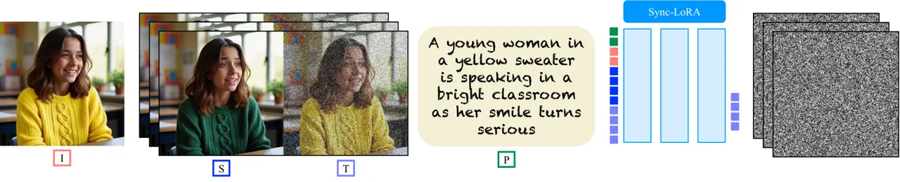

Figure 2: Overview of Sync-LoRA. Given a source video $`S`$, an edited
first frame $`I`$, and an edit prompt $`P`$, Sync-LoRA denoises the
target video $`T`$ conditioned on these inputs. During training, only
the edited branch is noised, while the source branch stays clean and
provides motion and identity cues through shared attention, so the model
copies motion from $`S`$ and propagates the local edit across all
frames.

#### In-Context Learning in Diffusion Models

In-context learning (ICL) enables models to generalize to new tasks by
conditioning on structured input examples without explicit supervision.
While extensively studied in language models \[5\], recent research has
explored ICL in diffusion-based image generation \[26, 9, 65, 46\]. In
these works, the model generates a panel of images, where the images
within the panel provide context to each other. This enables
applications that require consistency across different generated images
(e.g., storyboard generation) \[24, 52, 3\]. When conditioning such
panels on a given real image, ICL-based approaches can be used for a
wide range of image-to-image tasks, such as image personalization \[15,
44, 49, 31, 6, 16\] and image editing \[42, 23, 41, 18, 38\].

The most closely related work to ours is IC-LoRA \[26\]. This work
observes that transformer-based diffusion models possess an inherent
capability to generate panels in which certain attributes remain
consistent across the different images in the panel. They show that this
capability can be enhanced by fine-tuning the model with a low-rank
adapter (LoRA) on structured, consistent panels, and using an
appropriate template prompt. Their approach has been applied to diverse
tasks such as film storyboard generation, font design, and home
decoration. Our work extends the paradigm to video, and presents an
IC-LoRA for video editing which focuses on frame-accurate portrait
synchronization.

Additionally, recent progress has shown that large video diffusion
transformers naturally exhibit in-context learning behavior, enabling
them to generate multiple temporally or spatially related clips within a
single diffusion process \[14\]. That work focuses on analyzing this
emergent ability for in-context _generation_, using inpainting-based
conditioning to achieve controlled scene composition, but without any
mechanism to ensure temporal correspondence across clips. Building on
this insight, PoseGen \[22\] introduces in-context LoRA finetuning for
pose-controllable human video generation, achieving long and coherent
motion from a reference image. In contrast, our approach explicitly
_trains_ this in-context behavior toward _synchronized editing_.

#### LoRA for Video Diffusion Models

Recent works have extended LoRA-based fine-tuning to video diffusion
models, primarily focusing on subject or motion personalization.
Customize-A-Video \[43\] applies LoRA to the temporal attention layers
of a text-to-video diffusion model, enabling motion customization.
CustomTTT \[4\] introduces a method for generating customized videos in
which the subject is taken from a reference image and the motion from a
source video. This work identifies motion- and appearance-specific
layers and applies LoRA modules for per-layer adaptation. Abdal et
al. \[1\] introduce the notion of personalizing dynamic concepts. In
this task, the model learns both the appearance and motion of a concept
from a reference video. They achieve this by training a LoRA on the
reference video, which then enables generation of the learned dynamic
concept in novel scenes. While these works focus on personalizing
appearance or motion, our method is designed for frame-accurate
synchronized editing, which demands far stricter preservation of the
source video’s motion.

#### Video Editing

Recent research on diffusion-based video editing has introduced methods
that use text or image prompts to enable user-guided modifications. Some
methods \[50, 37, 57, 33, 8\] focus on text-based editing, typically
excelling at appearance modifications that preserve motion. Others \[29,
40, 27, 39\] apply edits to the first frame using existing image editing
techniques, and then propagate the changes across the video. Additional
methods have been developed for specific tasks such as object
insertion \[60\] or overlaying hand-drawn doodles onto videos \[62\].

In portrait video editing, earlier approaches rely on keypoints \[47,
54, 36, 2, 20\] or 3DMM template meshes \[28, 51\] to transfer
expressions from a driving video to a source image. More recently,
diffusion models have enabled new methods that generate videos from a
single image guided by a driving video. These methods typically
establish correspondence either through keypoints \[35\] or 3DMM \[64\]
as an intermediate representation or by leveraging the attention
mechanisms within diffusion models \[55, 58, 59\]. In contrast, our
approach uses in-context learning: the edited first frame sets the
appearance context, while the source video provides the motion context,
eliminating the need for explicit correspondence modeling.

## 3 Method

### 3.1 In-Context LoRA

Inspired by the IC-LoRA paradigm, we develop a framework for portrait
video editing. Our model learns to generate an edited video conditioned
on a clean source video and its edited first frame, which together serve
as contextual input. This setup enables synchronized, context-aware
editing during inference, where conditioning on the input video
naturally steers the generation of its edited counterpart.

While IC-LoRA was originally designed for static image panels, extending
it to video requires the model to reason not only about appearance
correspondence but also about temporal alignment across frames. To
handle this additional temporal dimension, we build on a
transformer-based diffusion model (DiT) designed for image-to-video
generation (see Figure 2). In this architecture, the input image (first
frame), source video, and text prompt are represented as token
sequences, and joint-attention layers operate over them to iteratively
denoise the edited video representation.

During training, only the edited view is denoised, while the source view
remains noise-free and provides motion guidance through shared
attention. This design directs the model to learn temporal
synchronization between the two views rather than re-solving the edit,
as the appearance change is already defined by the conditioning panel.
At inference, the user edits the first frame, and the model generates a
coherent video that preserves the original motion.

Alongside the visual conditioning, the model is also guided by a text
prompt that describes the intended relation between the two views (green
tokens in Figure 2). Conditioned on the first frame and text prompt, the
model learns to propagate the edit consistently across the entire
sequence while maintaining precise motion correspondence.

### 3.2 Data Generation and Curation

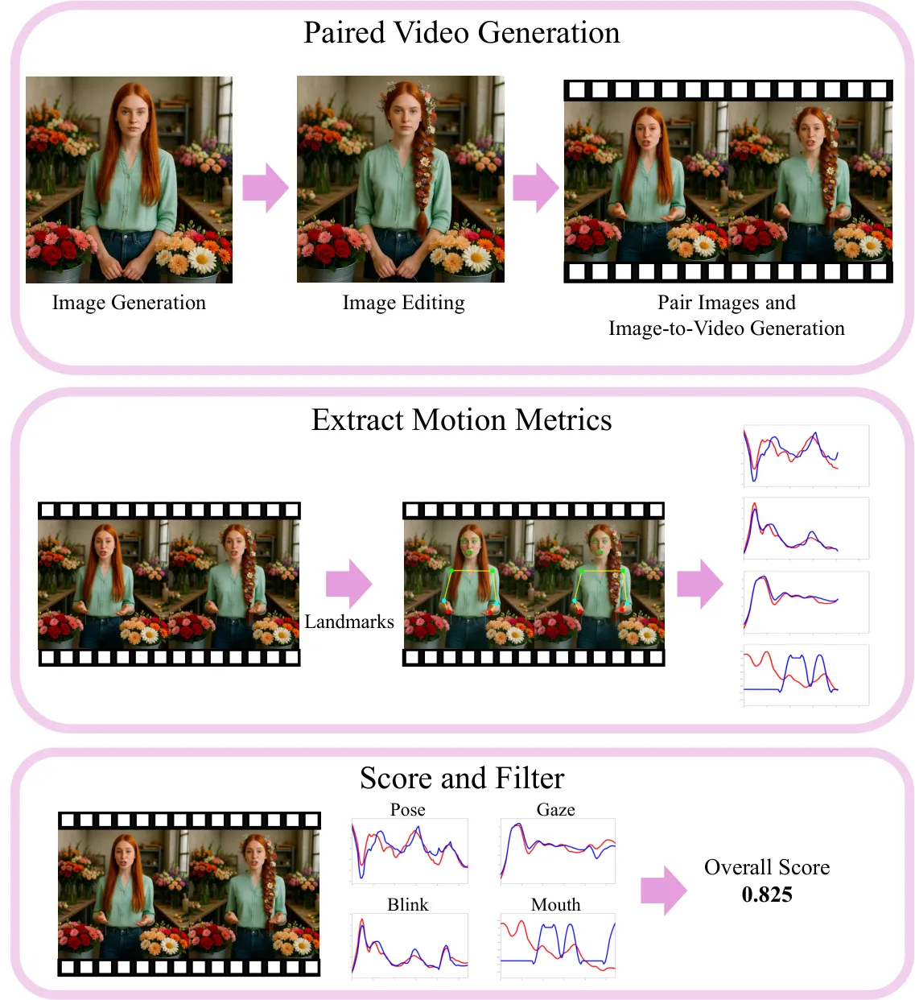

Figure 3: Data generation and curation pipeline.  
Our process constructs synchronized video pairs for Sync-LoRA training.
(Top) Portrait images are generated, edited, and converted into
side-by-side talking-head videos. (Middle) Facial and pose landmarks
yield motion signals for speech, gaze, blink, and pose. (Bottom) Pairs
are scored and filtered by synchronization quality, keeping only the
most aligned examples for training.

Training Sync-LoRA requires high-quality talking-head video pairs that
differ in appearance but exhibit tight temporal synchronization. These
video pairs serve as the foundational supervision signal, and, as shown
in our ablations, their precision is critical for faithfully
transferring motion dynamics while applying the necessary edits (see
subsection 4.3). To create such data, we devise a two-stage pipeline:
large-scale generation followed by synchronization-based filtering. The
full process is illustrated in Figure 3.

#### Generation.

We generate a diverse, large-scale synthetic talking-head pairs. A
vision-language model (VLM) produces subject prompts and edit
instructions (e.g., “change hair color,” “add a hat”), to create aligned
portrait-image pairs via image generation and editing. Each pair is
composed into a dual-panel image and converted into a side-by-side
talking-head video using an image-to-video model. The process leverages
the in-context generation ability of our base _data-generation_ model
(Wan2.1 \[53\]), which we further refine by LoRA fine-tuning on a small,
curated set of synchronized examples to improve motion consistency.

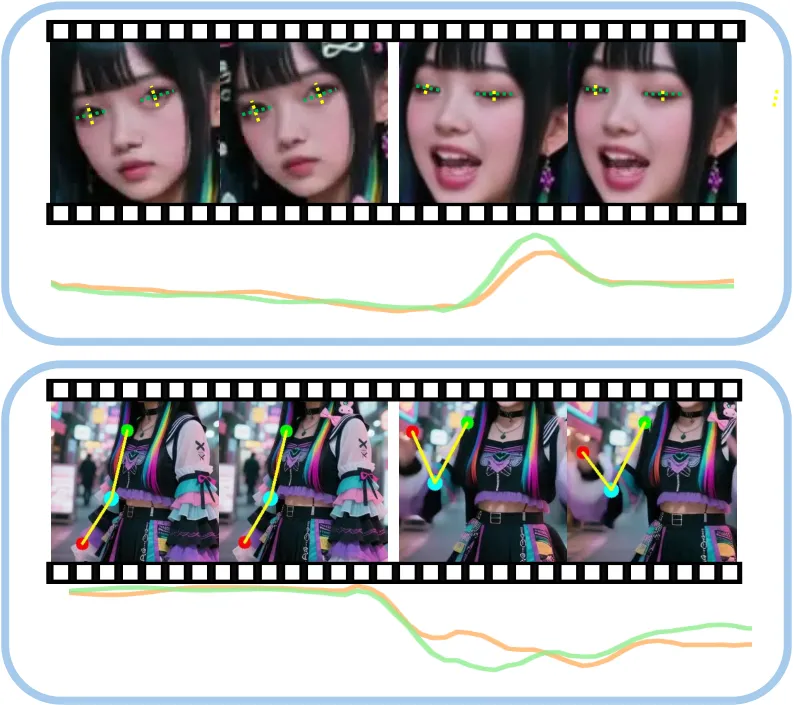

Figure 4: Synchronization signal visualization. Two synchronization cues
used in our filtering process. Top: Eye landmarks are used to compute
the Eye Aspect Ratio (EAR). Note how the plotted peaks (reference in
green, edited in orange) correspond directly to the blink event shown in
the frames above. Bottom: Upper-body pose landmarks are used to track
the right elbow angle. The plots again show tightly correlated motion,
confirming the arm movement is synchronized across both videos.

#### Filtering.

Despite being designed for synchronization, generated pairs often
contain misalignments. To ensure data quality, we introduce a filtering
stage that quantifies temporal correspondence using motion-based metrics
derived from facial and pose landmarks. Human facial and pose landmarks
are extracted using MediaPipe \[34\], producing per-frame scalar signals
for analysis. For each pair, trajectories of key landmarks are analyzed
across four motion channels ,speech, gaze, blink, and pose, capturing
complementary aspects of talking-head dynamics. Signals are interpolated
to fill missing detections, smoothed with a Savitzky-Golay
filter \[45\], z-normalized, and correlated between the left and right
views at zero temporal lag. Visualization is shown in Figure 4 and full
implementation details are provided in the supplementary material. Pairs
with insufficient detection coverage are discarded, and top-ranked
examples are retained, yielding high-quality synchronized videos.

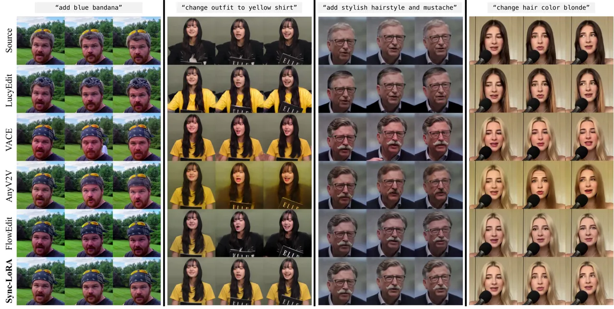

Figure 5: Comparison of portrait video editing methods. The rows show
the source video and results from LucyEdit, VACE, AnyV2V, FlowEdit, and
Sync-LoRA (Ours). The columns depict different temporal positions. Our
method, VACE, AnyV2V, and FlowEdit utilize the same edited first frame
as visual input, whereas the text-based LucyEdit operates from text
guidance alone.

#### Synchronization Scoring Metrics.

We measure _speech_ using the mouth aspect ratio over time. _Blink_ uses
the Eye Aspect Ratio (EAR) \[7\], with peaks indicating closure events.
_Gaze_ tracks normalized 2D iris motion, while _pose_ uses six
upper-body angles or relative heights (shoulder, torso, elbows, wrists).
Each signal is independently correlated between the original and edited
videos and then combined into a weighted synchronization score (weights:
40% speech, 30% gaze, 15% blink, 15% pose). This curated dataset forms
the foundation of Sync-LoRA, enabling precise motion preservation while
applying localized visual edits. Full definitions and implementation
details are provided in the supplementary material.

#### Implementation Details.

We use QwenImage and QwenImageEdit-2509 \[56\] for portrait generation
and editing the first frame, respectively. For video synthesis, we
employ Wan2.1  \[53\] as the base image-to-video model, generating each
paired video with 30 denoising steps.

We generate over 20,000 paired examples and apply a
synchronization-based filtering to retain the most temporally aligned
samples. The final training set consists of only 512 video pairs, with a
3:1 ratio of edited to identical (unmodified) samples to stabilize
training.

### 3.3 Training

#### Base Model.

We build our method upon LTX-Video \[21\], a transformer-based latent
diffusion model that integrates the video-VAE and the denoising
transformer in a unified framework. LTX-Video operates in a highly
compressed spatio-temporal latent space and employs full 3D attention,
enabling efficient generation of high-resolution, temporally coherent
videos.

To adapt this model for synchronized portrait editing, we fine-tune it
using low-rank adaptation (LoRA) \[25\] with a rank of 128. This
lightweight adaptation preserves the rich prior of LTX-Video while
encouraging the model to rely on the provided first frame for appearance
and motion cues. This setup ensures consistent temporal alignment and
visual coherence, without altering the base architecture. Training is
facilitated by the LTX-Video-Trainer code \[61\].

#### Positional Encoding.

Following LTX-Video \[21\], each latent token is represented by a
continuous 3D coordinate $`(t,h,w)`$ within the spatio-temporal volume,
scaled by VAE compression factors and normalized by frame rate. We embed
these coordinates using 3D Rotary Positional Embeddings (RoPE) \[48\].
While both source and target streams share identical positional
coordinates for spatial alignment, they are differentiated by _per-token
timesteps_. This mechanism, inherited from the LTX-Video base
model \[21\], uses each token’s timestep to generate unique _scale_ and
_shift_ parameters for its Adaptive Layer Normalization (AdaLN). The
model thus learns to treat source stream tokens (assigned $`t=0`$) as
clean conditioning, and target stream tokens (assigned $`t>0`$) as the
noisy sequence to be denoised.

#### Loss Function.

We adopt the rectified flow objective \[32, 13\], also used in
LTX-Video, to train our model to predict the velocity field that
transforms noise into the clean latent of the edited video. Unlike
conventional diffusion setups generating a single video from text or an
image prompt, our formulation introduces an additional conditioning
stream, the source video, which remains noise-free throughout denoising
and provides motion and appearance cues.

Given a noisy latent sample of the edited branch
$`x_{t}=(1-t)\,x_{1}+t\,x_{0}`$ with timestep $`t\in[0,1]`$, the model
is optimized to match the ground-truth velocity $`v_{t}=x_{t}-x_{0}`$:

```math
\mathcal{L}_{\text{RF}}=\mathbb{E}\left[\left\|u(x_{t},c_{\text{text}},c_{\text{img}},c_{\text{vid}},t;\theta_{\text{LoRA}})-v_{t}\right\|_{2}^{2}\right],
```

where $`x_{0}\sim\mathcal{N}(0,I)`$ is Gaussian noise, $`x_{1}`$ is the
target latent of the edited video, $`c_{\text{text}}`$ is the editing
prompt, $`c_{\text{img}}`$ is the edited first frame, and
$`c_{\text{vid}}`$ represents the latent features of the source video.

## 4 Experiments

#### Evaluation Setup.

We evaluate Sync-LoRA on a curated benchmark of 166 portrait videos
assessing spatial fidelity, and temporal alignment. The benchmark spans
diverse edit types, including object insertion, background replacement,
colorization, and appearance modification, with source clips from
CelebV \[63\], CelebV-HQ \[66\], TalkVid \[10\], and high-quality
YouTube content.

To ensure consistency, we apply strict curation, retaining only sharp,
well-lit clips of at least five seconds. Clips with subtitles,
letterboxing, cropping, or jump cuts are excluded. Representative
accepted and rejected samples are shown in the supplementary.

For each sequence, the first frame is edited using
QwenImageEdit-2509 \[56\], guided by VLM-generated instructions to cover
a wide range of transformations. We compare our method against four
strong baselines, VACE \[27\], LucyEdit \[50\], FlowEdit \[30\], and
AnyV2V \[29\], covering both qualitative and quantitative evaluations
across state-of-the-art video editing paradigms. The VACE, LucyEdit, and
AnyV2V results are based on their official implementations, and for
FlowEdit, we used the public LTX-Video implementation. All clips contain
81 frames at 20 FPS.

### 4.1 Qualitative Evaluation

#### Qualitative Comparison.

As shown in Figure 5, Sync-LoRA produces temporally coherent and
visually faithful results across the diverse editing tasks illustrated
in the figure. While all baselines attempt the edit, they exhibit
notable failures. Using the third column as a representative example,
LucyEdit fails to apply the edit faithfully, while VACE, AnyV2V, and
FlowEdit all introduce temporal artifacts, inconsistent textures, or
motion drift. In contrast, Sync-LoRA faithfully preserves the source
video’s motion while consistently applying the edits across all frames.
Our method achieves superior synchronization and visual fidelity in all
examples, demonstrating frame-accurate alignment and consistent visual
appearance throughout the sequence. The full temporal performance of our
method and all baselines is best assessed in the supplementary video,
which highlights Sync-LoRA’s ability to maintain precise synchronization
while achieving high edit fidelity.

### 4.2 Quantitative Comparisons

We evaluate the generated outputs across three key aspects:
_Synchronization_, _Edit Fidelity_, and _Identity Preservation_.

(1) Synchronization. We measure frame-level temporal correspondence
between the source and edited videos using four correlation-based
metrics: _speech_, _gaze_, _blink_, and _pose_. Each captures a distinct
aspect of motion dynamics: mouth aspect ratio for speech, iris
trajectory for gaze, eye aspect ratio for blinking, and upper-body joint
angles for pose. While these metrics are identical to those used for our
training data filtering (subsection 3.2), they serve only to curate the
dataset and perform this final evaluation. They are never used as a loss
function or otherwise included in the model’s training objective.

Metric VACE LucyEdit FlowEdit AnyV2V Ours Pose Canny Depth
Synchronization Speech Corr. $`\uparrow`$ $`0.37`$ $`0.11`$ $`0.39`$
0.80 $`0.50`$ $`0.70`$ 0.72 Gaze Corr. $`\uparrow`$ $`0.63`$ $`0.63`$
$`0.69`$ 0.82 $`0.56`$ $`0.71`$ 0.75 Blink Corr. $`\uparrow`$ $`0.34`$
$`0.24`$ $`0.36`$ 0.70 $`0.33`$ $`0.48`$ 0.55 Pose Corr. $`\uparrow`$
$`0.45`$ $`0.39`$ $`0.51`$ 0.64 $`0.38`$ $`0.51`$ 0.55 Edit Fidelity
Directional CLIP (image) $`\uparrow`$ 0.57 $`0.55`$ $`0.45`$ N/A
$`0.53`$ $`0.39`$ 0.57 Directional CLIP (text-dual) $`\uparrow`$ 0.20
0.20 $`0.16`$ 0.11 $`0.18`$ $`0.17`$ 0.21 CLIP-Text Align. $`\uparrow`$
0.33 $`0.33`$ $`0.32`$ 0.32 $`0.32`$ $`0.32`$ 0.33 Identity Preservation
ArcFace Sim. $`\uparrow`$ 0.73 $`0.71`$ $`0.72`$ 0.69 $`0.68`$ $`0.63`$
0.75

Table 1: Quantitative Video Comparisons. We evaluate across three axes:
_Synchronization_, _Edit Fidelity_, and _Identity Preservation_. The
Directional CLIP (image) score is omitted for _LucyEdit_, as it operates
solely from text prompts, making this metric not directly applicable.

(2) Edit Fidelity. We evaluate whether the intended edit is accurately
applied and remains consistent throughout the video using two
complementary CLIP-based metrics.

Directional CLIP Score. Originally proposed for image editing, we adapt
the Directional CLIP metric to the video domain to measure how
consistently the per-frame visual transformation aligns with the overall
edit direction in CLIP’s embedding space. We report two complementary
variants: an _image-based_ version that quantifies alignment with the
visual edit implied by the edited first frame, and a _text-dual_ version
that measures alignment with the semantic edit described by the text
prompt. The text-dual variant is included for fairness, since some
baselines such as LucyEdit operate purely from textual guidance and do
not have access to the edited first frame. Intuitively, the image-based
variant asks whether the change from source frames to edited frames
looks like the change between the unedited and edited first frames,
while the text-dual variant asks whether that same visual change looks
like the change suggested by the edit text.

CLIP-Text Alignment Score. To further assess semantic accuracy, we
measure how well each generated frame matches the textual description in
CLIP space. This score captures whether the video remains faithful to
the prompt semantics across time, complementing the directional measure
above. In contrast to the directional score, CLIP-Text Alignment ignores
the source frames and judges only how well each edited frame by itself
matches the target description.

Together, these metrics jointly evaluate both the _directional
consistency_ of the applied edit and its _semantic alignment_ throughout
the sequence.

(3) Identity Preservation. To evaluate how well subject identity is
maintained throughout the edited video, we compute the mean cosine
similarity between face embeddings extracted by a pre-trained
ArcFace \[12\] model for each frame and the edited first frame. This
measure reflects how faithfully the appearance and facial structure of
the person are preserved during temporal propagation, where higher
values correspond to stronger identity consistency.

Furthermore, a user study confirmed our method is perceptually preferred
for visual quality and temporal alignment. Full details for this study
and all quantitative metric formulations are provided in the
supplementary material.

Results Discussion. As shown in  Table 1, while text-based methods like
LucyEdit achieve high scores on some sync metrics (e.g., Speech Corr.
0.80 vs. our 0.72), this comes at the cost of failing the edit itself,
as shown by its low 0.11 Directional CLIP (text-dual) score (vs. our
0.21). Our method achieves the best overall balance, strongly performing
on synchronization while also faithfully applying the visual edit. VACE,
conversely, benefits from strong external conditioning
(pose/canny/depth), yields higher CLIP-based alignment, yet it exhibits
weaker temporal correspondence and identity consistency. By explicitly
training for synchronized editing, Sync-LoRA maintains strong temporal
alignment while producing precise edits that preserve subject identity.
This trade-off highlights the strength of our in-context formulation,
which balances motion coherence and edit fidelity rather than excelling
in a single axis.

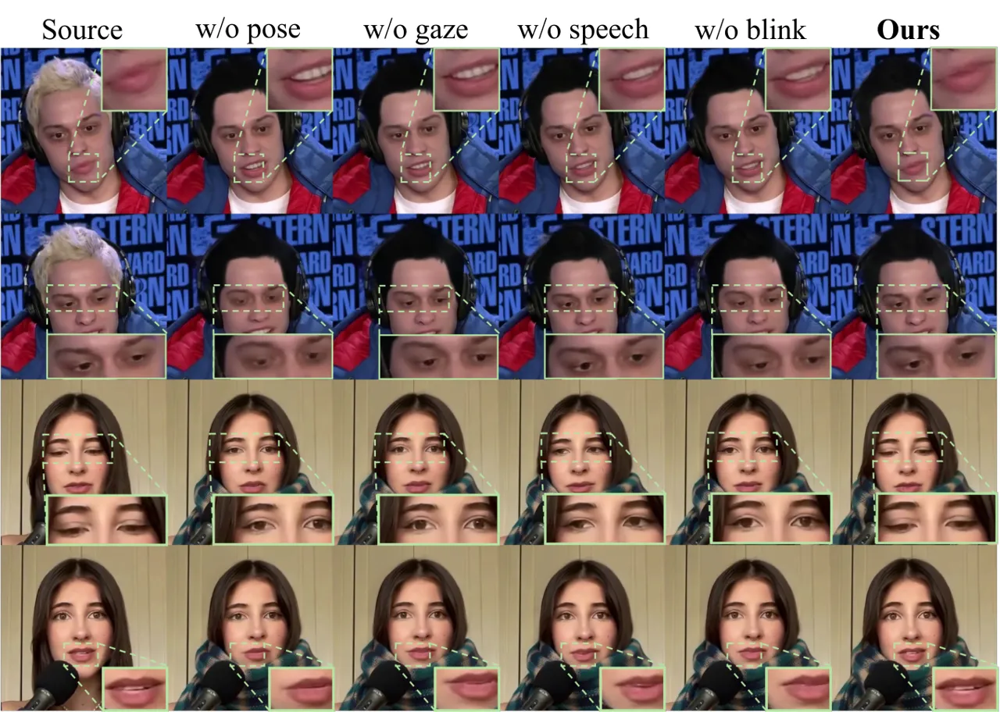

Figure 6: Necessity of all synchronization cues. Each column shows
results when training without the specified motion cue (pose, gaze,
speech, or blink) from the filtering stage, compared to our full setup.
The source video is shown on the left. Omitting any cue causes motion
drift or misalignment across frames.

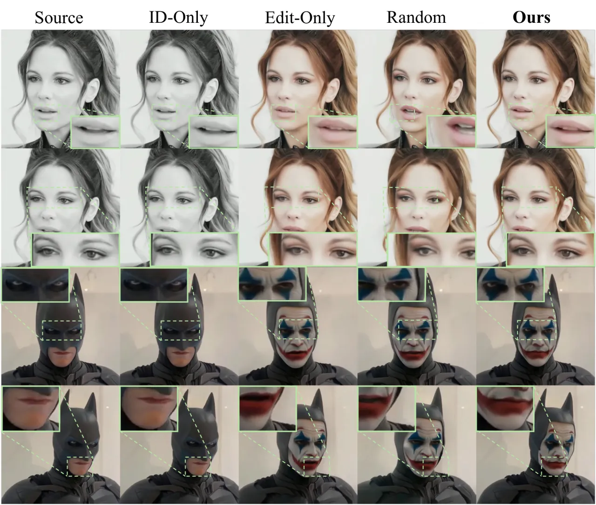

Figure 7: Effect of dataset composition strategy. Qualitative comparison
of different dataset composition strategies. Each column shows a
distinct training setup: ID-Only (identical pairs), Edit-Only (edited
pairs), Random (unfiltered pairs). Our full method is on rightmost
column and the source video is on the left.

### 4.3 Ablation Studies

In Figure 6, we present a leave-one-out experiment where we test the
contribution of each synchronization channel. This is done by training
models on datasets curated without one component (_speech_, _gaze_,
_blink_, or _pose_), which we achieve by setting its respective weight
to zero in our filtering score (subsection 3.2). Concretely, in the
first example (top two rows), excluding _pose_ leads to visible errors
in head orientation, while in the second (bottom two rows), removing any
channel introduces spatial drift and temporal misalignment in gaze or
blinking. Omitting any channel degrades synchronization, notably in the
man’s mouth and the woman’s eye motion, confirming that all four cues
provide complementary motion information.

In Figure 7 we ablate different dataset compositions and filtering on
model performance. We evaluate three baselines: ID-Only, containing
identical (unmodified) pairs; Edit-Only, containing only edited pairs;
and Random, using unfiltered, randomly generated pairs. As illustrated
in the top two rows, ID-Only maintains alignment but fails to preserve
the edit, while Edit-Only and Random introduce drift in facial regions
such as the eyes, mouth, and gaze. Our full model achieves both precise
synchronization and faithful edit preservation, for example keeping the
woman’s eye motion aligned and the painted edit on Batman’s mouth
stable, confirming the importance of balanced data and
synchronization-based filtering.

A formal quantitative analysis in Table 2 confirms these qualitative
observations. The leave-one-out study shows removing any single motion
cue degrades performance. Notably, removing the ‘speech‘ cue causes the
largest drop in Speech Corr. (0.72 to 0.53), confirming its necessity
for lip-sync. Removing the ‘pose‘ cue degrades Gaze Corr. (0.75 to
0.67), revealing a learned correlation between head pose and eye
movement.

The baseline results in Table 2 further prove our data strategy is
essential. The ‘ID-Only‘ baseline achieves the highest synchronization
(e.g., 0.80 Speech Corr.) but completely fails the edit, scoring only
0.05 in Directional CLIP. Conversely, the ‘Edit-Only‘ and ‘Random‘
baselines, which lack our filtering and data balance, suffer from poor
synchronization and identity drift. Our full method is the only one to
achieve a strong balance across all three core metrics, confirming our
design choices.

Metric Ablations (w/o component) Baselines Ours Speech Gaze Blink Pose
Only Edit Only ID Random Synchronization Speech Corr. $`\uparrow`$
$`0.53`$ $`0.56`$ $`0.55`$ $`0.55`$ $`0.58`$ 0.80 $`0.56`$ 0.72 Gaze
Corr. $`\uparrow`$ $`0.68`$ $`0.67`$ $`0.70`$ $`0.67`$ $`0.68`$ 0.83
$`0.68`$ 0.75 Blink Corr. $`\uparrow`$ $`0.46`$ $`0.45`$ $`0.49`$
$`0.45`$ $`0.48`$ 0.70 $`0.47`$ 0.55 Pose Corr. $`\uparrow`$ $`0.47`$
$`0.46`$ $`0.46`$ $`0.46`$ $`0.47`$ 0.66 $`0.46`$ 0.55 Edit Fidelity
Directional CLIP $`\uparrow`$ $`0.55`$ 0.57 $`0.56`$ $`0.56`$ 0.57
$`0.05`$ $`0.55`$ 0.57 Directional CLIP (text-dual) $`\uparrow`$
$`0.20`$ $`0.20`$ $`0.20`$ $`0.20`$ 0.21 $`0.01`$ $`0.20`$ 0.21
CLIP-Text Align. $`\uparrow`$ 0.33 0.33 0.33 0.33 0.33 $`0.31`$ 0.33
0.33 Identity Preservation ArcFace Sim. $`\uparrow`$ $`0.72`$ $`0.72`$
$`0.72`$ $`0.72`$ 0.73 $`0.70`$ $`0.72`$ 0.75

Table 2: Impact of Data Curation Strategy. We compare our full method
(’Ours’) against two ablation categories: models trained without
specific motion cues (w/o component) and models trained on alternative
dataset compositions (Baselines) .

### 4.4 Application - Expression Modification

Demonstrating its capability beyond spatial and appearance
modifications, Sync-LoRA also performs expression editing by propagating
facial emotion changes while maintaining the underlying articulation. As
illustrated in Figure 8, our method accurately transfers expressions
such as happiness, anger, or sadness to the same source motion, even in
the presence of partial occlusions. To train an expression-specific
Sync-LoRA, we employ LivePortrait \[20\] to synthesize multiple
expressive videos (e.g., happy, angry) from a single neutral reference
frame. While LivePortrait achieves impressive real-time reenactment, its
warping-based synthesis often struggles under extreme head rotations or
when occlusions, such as microphones, masks, or hands, partially obscure
the face. In these challenging cases, Sync-LoRA produces more stable and
photorealistic results, maintaining structural consistency and accurate
synchronization throughout the sequence. This demonstrates the
robustness of our diffusion-based in-context formulation, which models
temporal coherence directly in the latent space rather than relying on
geometric warping. Comprehensive comparisons highlighting these
robustness gains are presented in the supplementary materials.

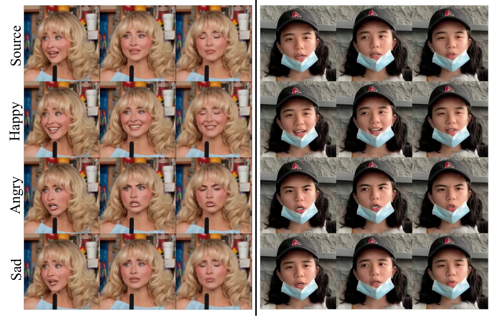

Figure 8: Expression editing. Sync-LoRA performs expression editing
(Happy, Angry, Sad) while keeping motion synchronized and geometry
consistent, even under occlusions.

## 5 Conclusions, Limitations and Future work

Sync-LoRA introduces an in-context LoRA framework for synchronized
portrait video editing. By conditioning generation on the original video
and its edited first frame, the model learns to propagate local
appearance modifications while preserving precise temporal alignment and
subject identity. Trained on automatically generated and
synchronization-filtered video pairs, Sync-LoRA balances edit fidelity,
motion correspondence, and visual realism across diverse subjects and
edit types including background manipulation, object insertion,
expression modification.

While our method performs robustly across a wide range of scenarios,
some limitations remain. The quality of the applied edits may degrade in
sequences with fast or large-scale motion, where maintaining fine
spatial coherence becomes challenging. Our approach also assumes that
the edited first frame is geometrically aligned with the source;
significant misalignments can lead to temporal drift or local artifacts
during propagation. We provide visual examples of these failure cases in
the supplementary material. Resolving these issues remains future work.
In addition, since Sync-LoRA builds upon a specific base video diffusion
model, future versions could benefit from stronger architectures with
enhanced temporal reasoning and multi-view consistency.

Overall, Sync-LoRA establishes a new paradigm for controllable and
temporally faithful video editing. This level of frame-accurate
synchronization is especially crucial for personalized talking-head
applications, where faithfulness to the original action, speech, and
performance is essential. Looking ahead, extending this in-context
formulation to emerging multi-modal video models that jointly reason
over video and audio signals presents an exciting and challenging
direction for future research.

## Acknowledgments

We thank Sigal Raab, Ellie Arar, Nadav Magar, and Mickey Finkelson for
their valuable feedback and insightful reviews of this work. This
research was supported in part by the Israel Science Foundation (grants
no. 2492/20 and 1473/24), Len Blavatnik and the Blavatnik family
foundation.

## References

- \[1\] Rameen Abdal, Or Patashnik, Ivan Skorokhodov, Willi Menapace,
  Aliaksandr Siarohin, Sergey Tulyakov, Daniel Cohen-Or, and Kfir
  Aberman. Dynamic concepts personalization from single videos, 2025.
- \[2\] Hadar Averbuch-Elor, Daniel Cohen-Or, Johannes Kopf, and
  Michael F. Cohen. Bringing portraits to life. _ACM Trans. Graph._,
  36(6), 2017.
- \[3\] Omri Avrahami, Amir Hertz, Yael Vinker, Moab Arar, Shlomi
  Fruchter, Ohad Fried, Daniel Cohen-Or, and Dani Lischinski. The chosen
  one: Consistent characters in text-to-image diffusion models. In _ACM
  SIGGRAPH 2024 Conference Papers_, New York, NY, USA, 2024. Association
  for Computing Machinery.
- \[4\] Xiuli Bi, Jian Lu, Bo Liu, Xiaodong Cun, Yong Zhang, WeiSheng
  Li, and Bin Xiao. Customttt: Motion and appearance customized video
  generation via test-time training. _arXiv preprint
  arXiv:2412.15646_, 2024.
- \[5\] Tom Brown, Benjamin Mann, Nick Ryder, Melanie Subbiah, Jared D
  Kaplan, Prafulla Dhariwal, Arvind Neelakantan, Pranav Shyam, Girish
  Sastry, Amanda Askell, et al. Language models are few-shot learners.
  _Advances in neural information processing systems_,
  33:1877–1901, 2020.
- \[6\] Shengqu Cai, Eric Chan, Yunzhi Zhang, Leonidas Guibas, Jiajun
  Wu, and Gordon. Wetzstein. Diffusion self-distillation for zero-shot
  customized image generation. In _CVPR_, 2025.
- \[7\] Jan Cech and Tereza Soukupova. Real-time eye blink detection
  using facial landmarks. _Cent. Mach. Perception, Dep. Cybern. Fac.
  Electr. Eng. Czech Tech. Univ. Prague_, pages 1–8, 2016.
- \[8\] Duygu Ceylan, Chun-Hao Huang, and Niloy J. Mitra. Pix2video:
  Video editing using image diffusion. 2023.
- \[9\] Lan Chen, Qi Mao, Yuchao Gu, and Mike Zheng Shou. Edit transfer:
  Learning image editing via vision in-context relations, 2025a.
- \[10\] Shunian Chen, Hejin Huang, Yexin Liu, Zihan Ye, Pengcheng Chen,
  Chenghao Zhu, Michael Guan, Rongsheng Wang, Junying Chen, Guanbin Li,
  Ser-Nam Lim, Harry Yang, and Benyou Wang. Talkvid: A large-scale
  diversified dataset for audio-driven talking head synthesis, 2025b.
- \[11\] Tsai-Shien Chen, Aliaksandr Siarohin, Willi Menapace, Yuwei
  Fang, Kwot Sin Lee, Ivan Skorokhodov, Kfir Aberman, Jun-Yan Zhu,
  Ming-Hsuan Yang, and Sergey Tulyakov. Multi-subject open-set
  personalization in video generation. _arXiv preprint
  arXiv:2501.06187_, 2025c.
- \[12\] Jiankang Deng, Jia Guo, Jing Yang, Niannan Xue, Irene Kotsia,
  and Stefanos Zafeiriou. Arcface: Additive angular margin loss for deep
  face recognition. _IEEE Transactions on Pattern Analysis and Machine
  Intelligence_, 44(10):5962–5979, 2022.
- \[13\] Patrick Esser, Sumith Kulal, Andreas Blattmann, Rahim Entezari,
  Jonas Müller, Harry Saini, Yam Levi, Dominik Lorenz, Axel Sauer,
  Frederic Boesel, Dustin Podell, Tim Dockhorn, Zion English, Kyle
  Lacey, Alex Goodwin, Yannik Marek, and Robin Rombach. Scaling
  rectified flow transformers for high-resolution image synthesis, 2024.
- \[14\] Zhengcong Fei, Di Qiu, Debang Li, Changqian Yu, and Mingyuan
  Fan. Video diffusion transformers are in-context learners, 2025.
- \[15\] Rinon Gal, Yuval Alaluf, Yuval Atzmon, Or Patashnik, Amit H.
  Bermano, Gal Chechik, and Daniel Cohen-Or. An image is worth one word:
  Personalizing text-to-image generation using textual inversion, 2022.
- \[16\] Rinon Gal, Or Lichter, Elad Richardson, Or Patashnik, Amit H.
  Bermano, Gal Chechik, and Daniel Cohen-Or. Lcm-lookahead for
  encoder-based text-to-image personalization, 2024.
- \[17\] Xuan Gao, Haiyao Xiao, Chenglai Zhong, Shimin Hu, Yudong Guo,
  and Juyong Zhang. Portrait video editing empowered by multimodal
  generative priors. In _ACM SIGGRAPH Asia Conference
  Proceedings_, 2024.
- \[18\] Daniel Garibi, Or Patashnik, Andrey Voynov, Hadar
  Averbuch-Elor, and Daniel Cohen-Or. Renoise: Real image inversion
  through iterative noising, 2024.
- \[19\] Michal Geyer, Omer Bar-Tal, Shai Bagon, and Tali Dekel.
  Tokenflow: Consistent diffusion features for consistent video editing.
  _arXiv preprint arxiv:2307.10373_, 2023.
- \[20\] Jianzhu Guo, Dingyun Zhang, Xiaoqiang Liu, Zhizhou Zhong, Yuan
  Zhang, Pengfei Wan, and Di Zhang. Liveportrait: Efficient portrait
  animation with stitching and retargeting control. _arXiv preprint
  arXiv:2407.03168_, 2024.
- \[21\] Yoav HaCohen, Nisan Chiprut, Benny Brazowski, Daniel Shalem,
  Dudu Moshe, Eitan Richardson, Eran Levin, Guy Shiran, Nir Zabari, Ori
  Gordon, Poriya Panet, Sapir Weissbuch, Victor Kulikov, Yaki Bitterman,
  Zeev Melumian, and Ofir Bibi. Ltx-video: Realtime video latent
  diffusion, 2024.
- \[22\] Jingxuan He, Busheng Su, and Finn Wong. Posegen: In-context
  lora finetuning for pose-controllable long human video
  generation, 2025.
- \[23\] Amir Hertz, Ron Mokady, Jay Tenenbaum, Kfir Aberman, Yael
  Pritch, and Daniel Cohen-Or. Prompt-to-prompt image editing with cross
  attention control. 2022.
- \[24\] Amir Hertz, Andrey Voynov, Shlomi Fruchter, and Daniel
  Cohen-Or. Style aligned image generation via shared attention. 2023.
- \[25\] Edward J Hu, Yelong Shen, Phillip Wallis, Zeyuan Allen-Zhu,
  Yuanzhi Li, Shean Wang, Lu Wang, and Weizhu Chen. LoRA: Low-rank
  adaptation of large language models. In _International Conference on
  Learning Representations_, 2022.
- \[26\] Lianghua Huang, Wei Wang, Zhi-Fan Wu, Yupeng Shi, Huanzhang
  Dou, Chen Liang, Yutong Feng, Yu Liu, and Jingren Zhou. In-context
  lora for diffusion transformers. 2024.
- \[27\] Zeyinzi Jiang, Zhen Han, Chaojie Mao, Jingfeng Zhang, Yulin
  Pan, and Yu Liu. Vace: All-in-one video creation and editing. _arXiv
  preprint arXiv:2503.07598_, 2025.
- \[28\] Taras Khakhulin, Vanessa Sklyarova, Victor Lempitsky, and Egor
  Zakharov. Realistic one-shot mesh-based head avatars. In _European
  Conference of Computer vision (ECCV)_, 2022.
- \[29\] Max Ku, Cong Wei, Weiming Ren, Harry Yang, and Wenhu Chen.
  Anyv2v: A tuning-free framework for any video-to-video editing tasks.
  _arXiv preprint arXiv:2403.14468_, 2024.
- \[30\] Vladimir Kulikov, Matan Kleiner, Inbar Huberman-Spiegelglas,
  and Tomer Michaeli. Flowedit: Inversion-free text-based editing using
  pre-trained flow models, 2025.
- \[31\] Nupur Kumari, Xi Yin, Jun-Yan Zhu, Ishan Misra, and Samaneh
  Azadi. Generating multi-image synthetic data for text-to-image
  customization. _ArXiv_, 2025.
- \[32\] Yaron Lipman, Ricky T. Q. Chen, Heli Ben-Hamu, Maximilian
  Nickel, and Matt Le. Flow matching for generative modeling, 2023.
- \[33\] Shaoteng Liu, Yuechen Zhang, Wenbo Li, Zhe Lin, and Jiaya Jia.
  Video-p2p: Video editing with cross-attention control.
  _arXiv:2303.04761_, 2023.
- \[34\] Camillo Lugaresi, Jiuqiang Tang, Hadon Nash, Chris McClanahan,
  Esha Uboweja, Michael Hays, Fan Zhang, Chuo-Ling Chang, Ming Guang
  Yong, Juhyun Lee, Wan-Teh Chang, Wei Hua, Manfred Georg, and Matthias
  Grundmann. Mediapipe: A framework for building perception
  pipelines, 2019.
- \[35\] Yue Ma, Hongyu Liu, Hongfa Wang, Heng Pan, Yingqing He, Junkun
  Yuan, Ailing Zeng, Chengfei Cai, Heung-Yeung Shum, Wei Liu, et al.
  Follow-your-emoji: Fine-controllable and expressive freestyle portrait
  animation. _arXiv preprint arXiv:2406.01900_, 2024.
- \[36\] Arun Mallya, Ting-Chun Wang, and Ming-Yu Liu. Implicit warping
  for animation with image sets. In _Advances in Neural Information
  Processing Systems_, pages 22438–22450. Curran Associates, Inc., 2022.
- \[37\] Eyal Molad, Eliahu Horwitz, Dani Valevski, Alex Rav Acha, Yossi
  Matias, Yael Pritch, Yaniv Leviathan, and Yedid Hoshen. Dreamix: Video
  diffusion models are general video editors. _arXiv preprint
  arXiv:2302.01329_, 2023.
- \[38\] Ivona Najdenkoska, Animesh Sinha, Abhimanyu Dubey, Dhruv
  Mahajan, Vignesh Ramanathan, and Filip Radenovic. Context diffusion:
  In-context aware image generation, 2025.
- \[39\] Hao Ouyang, Qiuyu Wang, Yuxi Xiao, Qingyan Bai, Juntao Zhang,
  Kecheng Zheng, Xiaowei Zhou, Qifeng Chen, and Yujun Shen. Codef:
  Content deformation fields for temporally consistent video processing.
  _arXiv preprint arXiv:2308.07926_, 2023.
- \[40\] Wenqi Ouyang, Yi Dong, Lei Yang, Jianlou Si, and Xingang Pan.
  I2vedit: First-frame-guided video editing via image-to-video diffusion
  models. In _SIGGRAPH Asia 2024 Conference Papers_, New York, NY,
  USA, 2024. Association for Computing Machinery.
- \[41\] Gaurav Parmar, Krishna Kumar Singh, Richard Zhang, Yijun Li,
  Jingwan Lu, and Jun-Yan Zhu. Zero-shot image-to-image translation. In
  _ACM SIGGRAPH 2023 conference proceedings_, pages 1–11, 2023.
- \[42\] Or Patashnik, Zongze Wu, Eli Shechtman, Daniel Cohen-Or, and
  Dani Lischinski. Styleclip: Text-driven manipulation of stylegan
  imagery. In _Proceedings of the IEEE/CVF International Conference on
  Computer Vision (ICCV)_, pages 2085–2094, 2021.
- \[43\] Yixuan Ren, Yang Zhou, Jimei Yang, Jing Shi, Difan Liu, Feng
  Liu, Mingi Kwon, and Abhinav Shrivastava. Customize-a-video: One-shot
  motion customization of text-to-video diffusion models. In _European
  Conference on Computer Vision_, pages 332–349. Springer, 2024.
- \[44\] Nataniel Ruiz, Yuanzhen Li, Varun Jampani, Yael Pritch, Michael
  Rubinstein, and Kfir Aberman. Dreambooth: Fine tuning text-to-image
  diffusion models for subject-driven generation. In _Proceedings of the
  IEEE/CVF Conference on Computer Vision and Pattern Recognition_, 2023.
- \[45\] Abraham. Savitzky and M. J. E. Golay. Smoothing and
  differentiation of data by simplified least squares procedures.
  _Analytical Chemistry_, 36(8):1627–1639, 1964.
- \[46\] Chaehun Shin, Jooyoung Choi, Heeseung Kim, and Sungroh Yoon.
  Large-scale text-to-image model with inpainting is a zero-shot
  subject-driven image generator. 2024.
- \[47\] Aliaksandr Siarohin, Stéphane Lathuilière, Sergey Tulyakov,
  Elisa Ricci, and Nicu Sebe. _First order motion model for image
  animation_. Curran Associates Inc., Red Hook, NY, USA, 2019.
- \[48\] Jianlin Su, Yu Lu, Shengfeng Pan, Ahmed Murtadha, Bo Wen, and
  Yunfeng Liu. Roformer: Enhanced transformer with rotary position
  embedding, 2023.
- \[49\] Zhenxiong Tan, Songhua Liu, Xingyi Yang, Qiaochu Xue, and
  Xinchao Wang. Ominicontrol: Minimal and universal control for
  diffusion transformer, 2024.
- \[50\] DecartAI Team. Lucy edit: Open-weight text-guided video
  editing. 2025.
- \[51\] Ayush Tewari, Mohamed Elgharib, Gaurav Bharaj, Florian Bernard,
  Hans-Peter Seidel, Patrick Pérez, Michael Zollhöfer, and Christian
  Theobalt. Stylerig: Rigging stylegan for 3d control over portrait
  images. In _2020 IEEE/CVF Conference on Computer Vision and Pattern
  Recognition (CVPR)_, pages 6141–6150, 2020.
- \[52\] Yoad Tewel, Omri Kaduri, Rinon Gal, Yoni Kasten, Lior Wolf, Gal
  Chechik, and Yuval Atzmon. Training-free consistent text-to-image
  generation, 2024.
- \[53\] Team Wan, Ang Wang, Baole Ai, Bin Wen, Chaojie Mao, Chen-Wei
  Xie, Di Chen, Feiwu Yu, Haiming Zhao, Jianxiao Yang, Jianyuan Zeng,
  Jiayu Wang, Jingfeng Zhang, Jingren Zhou, Jinkai Wang, Jixuan Chen,
  Kai Zhu, Kang Zhao, Keyu Yan, Lianghua Huang, Mengyang Feng, Ningyi
  Zhang, Pandeng Li, Pingyu Wu, Ruihang Chu, Ruili Feng, Shiwei Zhang,
  Siyang Sun, Tao Fang, Tianxing Wang, Tianyi Gui, Tingyu Weng, Tong
  Shen, Wei Lin, Wei Wang, Wei Wang, Wenmeng Zhou, Wente Wang, Wenting
  Shen, Wenyuan Yu, Xianzhong Shi, Xiaoming Huang, Xin Xu, Yan Kou,
  Yangyu Lv, Yifei Li, Yijing Liu, Yiming Wang, Yingya Zhang, Yitong
  Huang, Yong Li, You Wu, Yu Liu, Yulin Pan, Yun Zheng, Yuntao Hong,
  Yupeng Shi, Yutong Feng, Zeyinzi Jiang, Zhen Han, Zhi-Fan Wu, and Ziyu
  Liu. Wan: Open and advanced large-scale video generative models, 2025.
- \[54\] Ting-Chun Wang, Arun Mallya, and Ming-Yu Liu. One-shot
  free-view neural talking-head synthesis for video conferencing. In
  _2021 IEEE/CVF Conference on Computer Vision and Pattern Recognition
  (CVPR)_, pages 10034–10044, 2021.
- \[55\] Huawei Wei, Zejun Yang, and Zhisheng Wang. Aniportrait:
  Audio-driven synthesis of photorealistic portrait animations, 2024.
- \[56\] Chenfei Wu, Jiahao Li, Jingren Zhou, Junyang Lin, Kaiyuan Gao,
  Kun Yan, Sheng ming Yin, Shuai Bai, Xiao Xu, Yilei Chen, Yuxiang Chen,
  Zecheng Tang, Zekai Zhang, Zhengyi Wang, An Yang, Bowen Yu, Chen
  Cheng, Dayiheng Liu, Deqing Li, Hang Zhang, Hao Meng, Hu Wei, Jingyuan
  Ni, Kai Chen, Kuan Cao, Liang Peng, Lin Qu, Minggang Wu, Peng Wang,
  Shuting Yu, Tingkun Wen, Wensen Feng, Xiaoxiao Xu, Yi Wang, Yichang
  Zhang, Yongqiang Zhu, Yujia Wu, Yuxuan Cai, and Zenan Liu. Qwen-image
  technical report, 2025.
- \[57\] Jay Zhangjie Wu, Yixiao Ge, Xintao Wang, Stan Weixian Lei,
  Yuchao Gu, Yufei Shi, Wynne Hsu, Ying Shan, Xiaohu Qie, and Mike Zheng
  Shou. Tune-a-video: One-shot tuning of image diffusion models for
  text-to-video generation. In _Proceedings of the IEEE/CVF
  International Conference on Computer Vision_, pages 7623–7633, 2023.
- \[58\] You Xie, Hongyi Xu, Guoxian Song, Chao Wang, Yichun Shi, and
  Linjie Luo. X-portrait: Expressive portrait animation with
  hierarchical motion attention. In _ACM SIGGRAPH 2024 Conference
  Papers_, New York, NY, USA, 2024. Association for Computing Machinery.
- \[59\] Shurong Yang, Huadong Li, Juhao Wu, Minhao Jing, Linze Li,
  Renhe Ji, Jiajun Liang, and Haoqiang Fan. Megactor: Harness the power
  of raw video for vivid portrait animation, 2024.
- \[60\] Danah Yatim, Rafail Fridman, Omer Bar-Tal, and Tali Dekel.
  Dynvfx: Augmenting real videos with dynamic content, 2025.
- \[61\] Matan Ben Yosef, Naomi Ken Korem, and Tavi Halperin. Ltx-video
  community trainer, 2025.
- \[62\] Emilie Yu, Kevin Blackburn-Matzen, Cuong Nguyen, Oliver Wang,
  Rubaiat Habib Kazi, and Adrien Bousseau. Videodoodles: Hand-drawn
  animations on videos with scene-aware canvases. _ACM Trans. Graph._,
  2023a.
- \[63\] Jianhui Yu, Hao Zhu, Liming Jiang, Chen Change Loy, Weidong
  Cai, and Wayne Wu. Celebv-text: A large-scale facial text-video
  dataset, 2023b.
- \[64\] Bohan Zeng, Xuhui Liu, Sicheng Gao, Boyu Liu, Hong Li,
  Jianzhuang Liu, and Baochang Zhang. Face animation with an
  attribute-guided diffusion model. In _Proceedings of the IEEE/CVF
  Conference on Computer Vision and Pattern Recognition (CVPR)
  Workshops_, pages 628–637, 2023.
- \[65\] Zechuan Zhang, Ji Xie, Yu Lu, Zongxin Yang, and Yi Yang.
  In-context edit: Enabling instructional image editing with in-context
  generation in large scale diffusion transformer. _arXiv_, 2025.
- \[66\] Hao Zhu, Wayne Wu, Wentao Zhu, Liming Jiang, Siwei Tang, Li
  Zhang, Ziwei Liu, and Chen Change Loy. Celebv-hq: A large-scale video
  facial attributes dataset, 2022.

In-Context Sync-LoRA for Portrait Video Editing  
Supplementary Material

## 6 Additional Implementation Details

### 6.1 Reference and Target Stream Differentiation

We implement in-context conditioning by spatially concatenating the
source and target streams along the sequence dimension, and
differentiating them via per-token timestep conditioning while
preserving spatial correspondence. Algorithm 1 details the masking
strategy that blocks gradients through the reference stream so it acts
as a frozen context while gradients flow only through the target stream.

[⬇](data:text/plain;base64,ZGVmIHRyYWluaW5nX3N0ZXAoc291cmNlX3ZpZGVvLCBlZGl0ZWRfdmlkZW8sIGRpZmZ1c2lvbl90KToKICAgICIiIgogICAgc291cmNlX3ZpZGVvOiBDbGVhbiBsYXRlbnQgZnJhbWVzIGZyb20gdGhlIHJlZmVyZW5jZSB2aWRlbwogICAgZWRpdGVkX3ZpZGVvOiBOb2lzeSBsYXRlbnQgZnJhbWVzIChhdCB0aW1lIHQpIGZyb20gdGhlIHRhcmdldCB2aWRlbwogICAgZGlmZnVzaW9uX3Q6IFRoZSBub2lzZSBsZXZlbCAodGltZXN0ZXApIGZvciB0aGUgdGFyZ2V0IHZpZGVvCiAgICAiIiIKCiAgICAjIDEuIFNlcXVlbmNlIENvbmNhdGVuYXRpb24KICAgICMgV2UgY29uY2F0ZW5hdGUgYWxvbmcgdGhlIHNlcXVlbmNlIGRpbWVuc2lvbiAoZnJhbWVzKS4KICAgICMgVGhpcyBhbGxvd3Mgam9pbnQgYXR0ZW50aW9uIGJldHdlZW4gc291cmNlIGFuZCB0YXJnZXQuCiAgICBtb2RlbF9pbnB1dCA9IHRvcmNoLmNhdChbc291cmNlX3ZpZGVvLCBlZGl0ZWRfdmlkZW9dLCBkaW09MikKCiAgICAjIDIuIFBlci1Ub2tlbiBUaW1lc3RlcCBDb25kaXRpb25pbmcKICAgICMgU291cmNlIHRva2VucyBnZXQgdD0wIChzaWduYWxpbmcgImNsZWFuIGNvbnRleHQiKS4KICAgICMgVGFyZ2V0IHRva2VucyBnZXQgdD1kaWZmdXNpb25fdCAoc2lnbmFsaW5nICJkZW5vaXNlIG1lIikuCiAgICAjIFRoZXNlIHRpbWVzdGVwcyBnZW5lcmF0ZSBkaXN0aW5jdCBBZGFMYXllck5vcm0gcGFyYW1ldGVycy4KICAgIHRfc291cmNlID0gdG9yY2guemVyb3Moc291cmNlX3ZpZGVvLnNoYXBlWzBdKQogICAgdF90YXJnZXQgPSBkaWZmdXNpb25fdAogICAgbW9kZWxfdGltZXN0ZXBzID0gdG9yY2guY2F0KFt0X3NvdXJjZSwgdF90YXJnZXRdLCBkaW09MCkKCiAgICAjIDMuIFNoYXJlZCBQb3NpdGlvbmFsIEVtYmVkZGluZ3MgKFJvUEUpCiAgICAjIEJvdGggc3RyZWFtcyB1c2UgaWRlbnRpY2FsIGdyaWQgY29vcmRpbmF0ZXMgKHQsIGgsIHcpLgogICAgIyBBIHRva2VuIGF0IChGcmFtZSAxLCB4LCB5KSBpbiBTb3VyY2UgaGFzIHRoZSBleGFjdCBzYW1lCiAgICAjIHBvc2l0aW9uYWwgZW1iZWRkaW5nIGFzIChGcmFtZSAxLCB4LCB5KSBpbiBUYXJnZXQuCiAgICByb3BlX3NvdXJjZSA9IGdldF8zZF9yb3BlKHNvdXJjZV92aWRlby5zaGFwZSkKICAgIHJvcGVfdGFyZ2V0ID0gZ2V0XzNkX3JvcGUoZWRpdGVkX3ZpZGVvLnNoYXBlKSAjIElkZW50aWNhbCB0byBzb3VyY2UKICAgIG1vZGVsX3JvcGUgPSB0b3JjaC5jYXQoW3JvcGVfc291cmNlLCByb3BlX3RhcmdldF0sIGRpbT0xKQoKICAgICMgNC4gRm9yd2FyZCBQYXNzCiAgICAjIFRoZSBtb2RlbCB1c2VzIHRoZSBzaGFyZWQgUm9QRSB0byBmaW5kIHNwYXRpYWwgY29ycmVzcG9uZGVuY2VzCiAgICAjIGFuZCB0aGUgc3BsaXQgdGltZXN0ZXBzIHRvIGFwcGx5IGRpZmZlcmVudCBub3JtYWxpemF0aW9uLgogICAgdmVsb2NpdHlfcHJlZCA9IG1vZGVsKAogICAgICAgIHg9bW9kZWxfaW5wdXQsCiAgICAgICAgdGltZXN0ZXBzPW1vZGVsX3RpbWVzdGVwcywKICAgICAgICBwb3NfZW1iZWQ9bW9kZWxfcm9wZQogICAgKQoKICAgICMgNS4gTG9zcyBNYXNraW5nCiAgICAjIFdlIG9ubHkgY29tcHV0ZSBsb3NzIG9uIHRoZSB0YXJnZXQgKGVkaXRlZCkgaGFsZiBvZiB0aGUgc2VxdWVuY2UuCiAgICBwcmVkX3NvdXJjZSwgcHJlZF90YXJnZXQgPSB0b3JjaC5jaHVuayh2ZWxvY2l0eV9wcmVkLCAyLCBkaW09MikKICAgIGxvc3MgPSBGLm1zZV9sb3NzKHByZWRfdGFyZ2V0LCB0YXJnZXRfdmVsb2NpdHlfZ3JvdW5kX3RydXRoKQoKICAgIHJldHVybiBsb3Nz)

1 def training_step(source_video, edited_video, diffusion_t):

2 """

3 source_video: Clean latent frames from the reference video

4 edited_video: Noisy latent frames (at time t) from the target video

5 diffusion_t: The noise level (timestep) for the target video

6 """

7

8 \# 1. Sequence Concatenation

9 \# We concatenate along the sequence dimension (frames).

10 \# This allows joint attention between source and target.

11 model_input = torch.cat(\[source_video, edited_video\], dim=2)

12

13 \# 2. Per-Token Timestep Conditioning

14 \# Source tokens get t=0 (signaling "clean context").

15 \# Target tokens get t=diffusion_t (signaling "denoise me").

16 \# These timesteps generate distinct AdaLayerNorm parameters.

17 t_source = torch.zeros(source_video.shape\[0\])

18 t_target = diffusion_t

19 model_timesteps = torch.cat(\[t_source, t_target\], dim=0)

20

21 \# 3. Shared Positional Embeddings (RoPE)

22 \# Both streams use identical grid coordinates (t, h, w).

23 \# A token at (Frame 1, x, y) in Source has the exact same

24 \# positional embedding as (Frame 1, x, y) in Target.

25 rope_source = get_3d_rope(source_video.shape)

26 rope_target = get_3d_rope(edited_video.shape) \# Identical to source

27 model_rope = torch.cat(\[rope_source, rope_target\], dim=1)

28

29 \# 4. Forward Pass

30 \# The model uses the shared RoPE to find spatial correspondences

31 \# and the split timesteps to apply different normalization.

32 velocity_pred = model(

33 x=model_input,

34 timesteps=model_timesteps,

35 pos_embed=model_rope

36 )

37

38 \# 5. Loss Masking

39 \# We only compute loss on the target (edited) half of the sequence.

40 pred_source, pred_target = torch.chunk(velocity_pred, 2, dim=2)

41 loss = F.mse_loss(pred_target, target_velocity_ground_truth)

42

43 return loss

Algorithm 1 Pseudocode for Reference and Target Stream Differentiation

### 6.2 Hyperparameters

We provide a detailed summary of the hyperparameters used for training
Sync-LoRA in Table 3.

|                      |                                  |
| -------------------- | -------------------------------- |
| Hyperparameter       | Value                            |
| Base Model           | LTX-Video \[21\]                 |
| LoRA Rank            | 128                              |
| Optimizer            | AdamW                            |
| Learning Rate        | $`2\times 10^{-4}`$              |
| Batch Size           | 1                                |
| Total Training Steps | 5,000                            |
| Resolution           | $`512\times 512`$                |
| Frames per Clip      | 81                               |
| Training Hardware    | 1 $`\times`$ NVIDIA A6000 (48GB) |

Table 3: Training Hyperparameters. Summary of the configuration used for
fine-tuning Sync-LoRA.

## 7 Data Curation Pipeline

This section details the synchronization-based filtering process used to
curate our training dataset. Figure 13 illustrates this curation
process, showing representative examples of generated pairs that were
accepted or rejected based on their synchronization scores.

### 7.1 Synchronization Scoring Metrics

Our filtering pipeline relies on four motion channels derived from
MediaPipe \[34\] landmarks. Let $`\mathbf{p}_{i}\in\mathbb{R}^{2}`$
denote the 2D coordinates of landmark index $`i`$. For each paired video
(source and edited), we extract per-frame scalar signals for each
channel as follows:

- •
  Speech (40% weight). We compute the Mouth Aspect Ratio (MAR) as the
  ratio of the average vertical lip separation to the mouth width. Using
  the standard MediaPipe mesh indices, we obtain:

  ```math
  \text{MAR}=\frac{\frac{1}{4}\sum_{j=1}^{4}\|\mathbf{p}_{u_{j}}-\mathbf{p}_{d_{j}}\|_{2}}{\|\mathbf{p}_{61}-\mathbf{p}_{291}\|_{2}} \tag{1}
  ```

  where the vertical pairs $`(u_{j},d_{j})`$ are
  $`\{(13,14),(82,87),(312,317),(0,17)\}`$, and indices $`61,291`$
  represent the mouth corners.

- •
  Gaze (30% weight). We calculate the normalized gaze vector
  $`\mathbf{g}=[g_{x},g_{y}]`$ representing the iris center relative to
  the eye bounding box. For the iris center $`\mathbf{p}_{\text{iris}}`$
  and eye boundary landmarks (inner $`x_{\text{in}}`$, outer
  $`x_{\text{out}}`$, upper $`y_{\text{up}}`$, lower $`y_{\text{dn}}`$),
  the normalized coordinates are:

  ```math
  g_{x}=2\cdot\frac{\mathbf{p}_{\text{iris},x}-x_{\text{in}}}{x_{\text{out}}-x_{\text{in}}}-1,\quad g_{y}=2\cdot\frac{\mathbf{p}_{\text{iris},y}-y_{\text{up}}}{y_{\text{dn}}-y_{\text{up}}}-1 \tag{2}
  ```

  We compute this for both eyes and average the motion vectors.

- •
  Blink (15% weight). We utilize a simplified Eye Aspect Ratio (EAR)
  based on the ratio of vertical to horizontal eye landmarks. The signal
  is averaged across both eyes and negated so that blink events appear
  as positive peaks:

  ```math
  \text{Signal}_{\text{blink}}=-\frac{1}{2}\left(\frac{\|\mathbf{p}_{159}-\mathbf{p}_{145}\|}{\|\mathbf{p}_{33}-\mathbf{p}_{133}\|}+\frac{\|\mathbf{p}_{386}-\mathbf{p}_{374}\|}{\|\mathbf{p}_{263}-\mathbf{p}_{362}\|}\right) \tag{3}
  ```

- •
  Pose (15% weight). We track six upper-body geometric features to
  capture torso dynamics:
  1.  1.  Shoulder Orientation: Angle of the vector
          $`\mathbf{p}_{12}-\mathbf{p}_{11}`$.
  2.  2.  Torso Inclination: Angle of the vector connecting the shoulder
          midpoint to the hip midpoint
          ($`\mathbf{p}_{23},\mathbf{p}_{24}`$).
  3.  3.  Elbow Angles (Left/Right): Angles formed by the
          Shoulder-Elbow-Wrist triplets (11-13-15 and 12-14-16).
  4.  4.  Relative Wrist Heights (Left/Right): The vertical displacement
          between shoulder and wrist, defined as
          $`h=y_{\text{shoulder}}-y_{\text{wrist}}`$.

Signal Processing: To ensure robustness against detection noise, all raw
signals undergo the following processing steps:

1.  1.  Interpolation: Missing detections (NaNs) are filled via linear
        interpolation.
2.  2.  Smoothing: We apply a Savitzky-Golay \[45\] filter with a window
        length of $`W=9`$ and polynomial order $`K=2`$.
3.  3.  Normalization: Signals are z-score normalized,
        $`z=\frac{x-\mu}{\sigma+\epsilon}`$ , with $`\epsilon=10^{-6}`$.

Final Score: The final synchronization score is computed as the weighted
sum of the Pearson correlation coefficients (at zero temporal lag)
between the processed signals of the source and edited videos.

## 8 Evaluation Benchmark and Metrics

### 8.1 Benchmark Curation

As mentioned in Section 4 of the main paper, our evaluation benchmark
was strictly curated to ensure high-quality assessment. We applied
rigorous criteria, retaining only clips with consistent lighting and
high sharpness, while excluding those with jump cuts, subtitles, or
significant motion blur. Figure 9 illustrates a typical rejection case,
such as a clip with noticeable letterboxing.

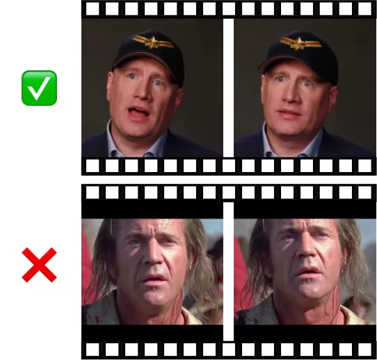

Figure 9: Benchmark Examples. examples

### 8.2 Quantitative Evaluation Metric Definitions

This subsection provides the full mathematical definitions of the
metrics reported in Subsection 4.2 of the main paper. All notations
follow those used in the main paper. Given source frames
$`I^{\mathrm{src}}_{t}`$, edited frames $`I^{\mathrm{edit}}_{t}`$, and
an edited keyframe $`I^{\mathrm{key}}`$, the following metrics are used
for quantitative evaluation.

#### Directional CLIP Score.

This metric measures how consistently the per-frame visual
transformation aligns with the intended edit direction in CLIP’s
embedding space. We report two variants: an image-based version and a
text-dual version. The CLIP model used is ‘ViT-B-32’.

Image-based Direction. The global edit direction in CLIP image space is
defined as:

```math
\mathbf{d}_{\text{img}}=\frac{E_{\text{img}}(I^{\mathrm{key}})-E_{\text{img}}(I^{\mathrm{src}}_{0})}{\|E_{\text{img}}(I^{\mathrm{key}})-E_{\text{img}}(I^{\mathrm{src}}_{0})\|}.
```

For each frame $`t`$, we compute its local transformation direction:

```math
\mathbf{V}_{t}=\frac{E_{\text{img}}(I^{\mathrm{edit}}_{t})-E_{\text{img}}(I^{\mathrm{src}}_{t})}{\|E_{\text{img}}(I^{\mathrm{edit}}_{t})-E_{\text{img}}(I^{\mathrm{src}}_{t})\|}.
```

The Directional CLIP score is their mean cosine similarity:

```math
\text{DirectionalCLIP}_{\text{img}}=\frac{1}{T}\sum_{t=1}^{T}\mathbf{V}_{t}\cdot\mathbf{d}_{\text{img}}.
```

Text-dual Direction. For methods guided by text rather than edited
keyframes, the semantic direction is obtained from CLIP’s text encoder:

```math
\mathbf{d}_{\text{text}}=\frac{E_{\text{text}}(t_{\text{target}})-E_{\text{text}}(t_{\text{source}})}{\|E_{\text{text}}(t_{\text{target}})-E_{\text{text}}(t_{\text{source}})\|}.
```

The local per-frame directions $`\mathbf{V}_{t}`$ are identical to the
image-based case, yielding:

```math
\text{DirectionalCLIP}_{\text{text-dual}}=\frac{1}{T}\sum_{t=1}^{T}\mathbf{V}_{t}\cdot\mathbf{d}_{\text{text}}.
```

Higher values indicate stronger alignment between frame-wise visual
changes and the intended edit.

#### CLIP-Text Alignment Score.

This metric evaluates the semantic consistency of the edited video with
the target description. Given normalized text embedding
$`\mathbf{t}=E_{\text{text}}(\cdot)`$ and per-frame image embeddings
$`E_{\text{img}}(I^{\mathrm{edit}}_{t})`$:

```math
\text{CLIPTextAlign}=\frac{1}{T}\sum_{t=1}^{T}E_{\text{img}}(I^{\mathrm{edit}}_{t})\cdot\mathbf{t}
```

#### ArcFace Similarity.

To quantify identity preservation, we compute the mean cosine similarity
between ArcFace \[12\] embeddings of each frame and the edited keyframe:

```math
\text{ArcFaceSim}=\frac{1}{T}\sum_{t=1}^{T}E_{\text{face}}(I^{\mathrm{edit}}_{t})\cdot E_{\text{face}}(I^{\mathrm{key}})
```

Higher values correspond to stronger identity consistency across frames.

## 9 User Study

We conducted a user study to evaluate Sync-LoRA based on four distinct
criteria: (1) Edit Fidelity (adherence to the visual instruction), (2)
Synchronization (preservation of timing and movement), (3) Identity
Preservation (consistency with the subject’s original identity), and (4)
Overall Preference. To this end, we performed a blinded, randomized
Two-Alternative Forced Choice (2AFC) comparison between our method and
four state-of-the-art baselines: VACE, LucyEdit, AnyV2V, and FlowEdit.
We curated a robust pool of 36 distinct video comparison pairs
distributed across three unique evaluation forms. The study involved 23
independent participants, where each completed 12 comparisons (3 per
baseline), yielding a total of 69 pairwise judgments for each competitor
method.

The complete results are presented in Figure 10, where we report the
preference rates for Sync-LoRA against each baseline. As shown, users
strongly favored our approach by a significant margin across all
metrics. Notably, our method achieved the highest gains in Identity
Preservation and Synchronization, confirming our core contribution of
maintaining temporal coherence and subject identity while faithfully
applying the intended edits.

Figure 10: User Study Results. Pairwise preference rates for Sync-LoRA
(Ours) against four baselines. Our method is strongly preferred across
all four criteria: Edit Fidelity, Synchronization, Identity
Preservation, and Overall Preference.

## 10 Supplementary Videos

Qualitative evaluation of video editing requires assessing motion
stability and temporal coherence, which static frames cannot fully
convey. Therefore, we strongly encourage readers to view the results in
the _attached supplementary webpage_. This interactive file features
comprehensive side-by-side comparisons against all baselines (VACE,
LucyEdit, FlowEdit, AnyV2V), detailed ablation studies verifying our
synchronization cues, and extensive examples of expression editing and
failure cases.

## 11 Expression Modification

This section provides comparisons for the expression editing application
mentioned in Subsection 4.4 of the main paper. Specifically, we compare
our results against LivePortrait \[20\] to demonstrate how our
diffusion-based approach resolves emergent issues typical of
warping-based modules.

Robustness to Occlusion and Rotation. LivePortrait employs warping
fields to transfer expressions from a driving video. As shown in
Figure 11, this approach often produces artifacts when the face is
partially occluded by objects or when background elements are in close
proximity. For instance, in the left example, the warping field
erroneously deforms the background person’s face and blurs the hand
holding the pistol. Similarly, in the right example, the rigid structure
of the microphone is unnaturally bent near the subject’s jawline. In
contrast, Sync-LoRA treats expression editing as an in-context
generation task. By leveraging the strong generative prior of the
diffusion model, our method synthesizes geometrically plausible pixels
even in occluded regions, maintaining structural integrity and
photorealism while accurately transferring the target expression.

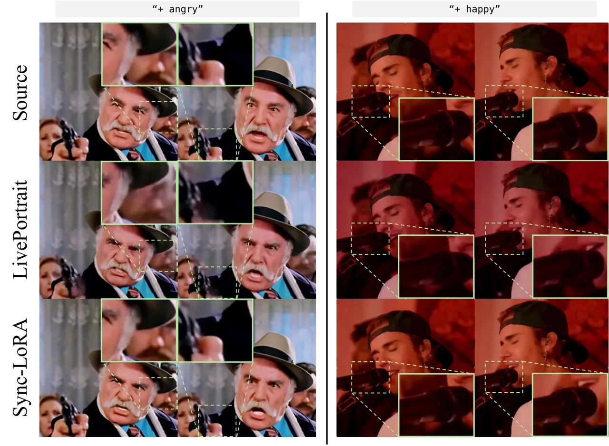

Figure 11: Expression editing robustness. Comparison between
LivePortrait \[20\] and Sync-LoRA (Ours).

## 12 Limitations and Failure Cases

As discussed in Section 5 of the main paper, our method exhibits
specific failure modes. We categorize these into two primary types,
illustrated in Figure 12.

Geometric Misalignment. Our method conditions the generation on both the
edited first frame and the source video context. If the edited frame
structurally contradicts the spatial information inherent in the source
video (e.g., a zoom-out as shown in Figure 12), the model attempts to
reconcile two conflicting spatial signals. This often compromises
temporal alignment, leading to noticeable synchronization issues that
propagate through the sequence.

Rapid Motion Degradation. In sequences involving very fast or
large-scale motion (such as rapid hand movements, dancing, or camera
pans), the optical flow guidance from the source video can become
ambiguous, resulting in blurred textures or a loss of temporal
coherence. We anticipate that this limitation could be mitigated by
future base models with enhanced temporal reasoning capabilities.

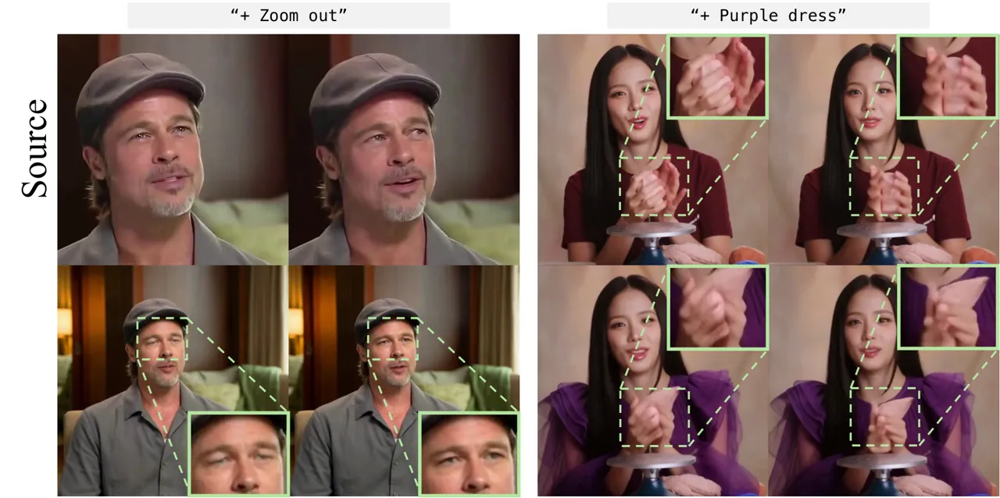

Figure 12: Limitations of Sync-LoRA. The figure illustrates two primary
failure modes. (Left) Spatial and synchronization degradation during
non-aligned geometric edits (zoom-out), resulting in blurred facial
features and temporal drift. (Right) Loss of detail and warping
artifacts on fast-moving, complex regions (hands) during complex
appearance modifications.

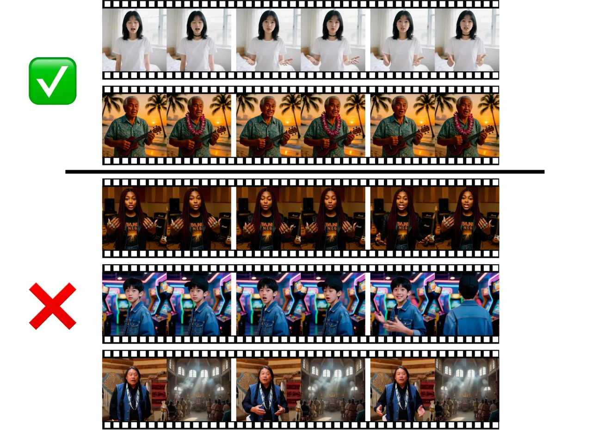

Figure 13: Data Curation Filtering. Examples from our automatic
filtering pipeline. (Top) Accepted clips exhibit high synchronization
scores, indicating precise temporal alignment and stable motion.
(Bottom) Rejected clips receive low synchronization scores due to
temporal or spatial misalignments and motion drift.
