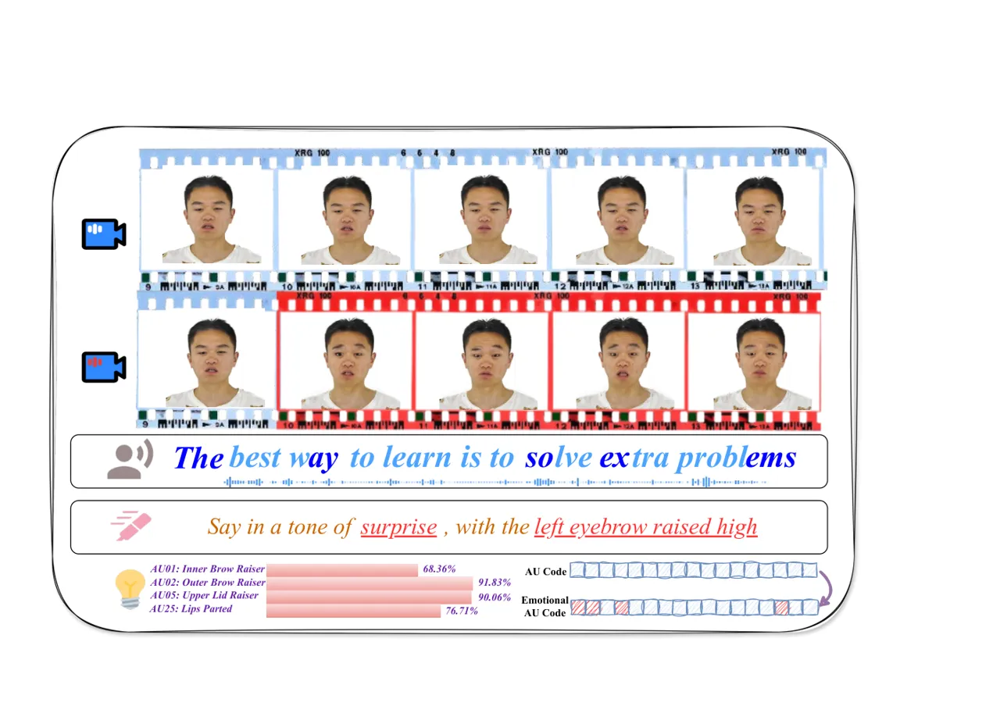
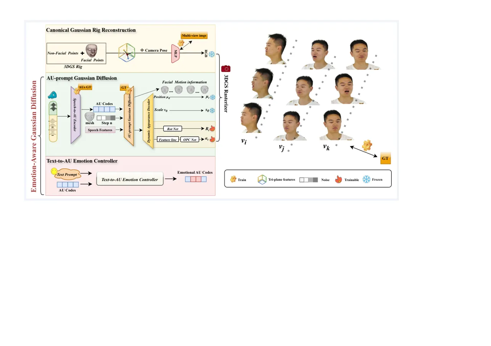
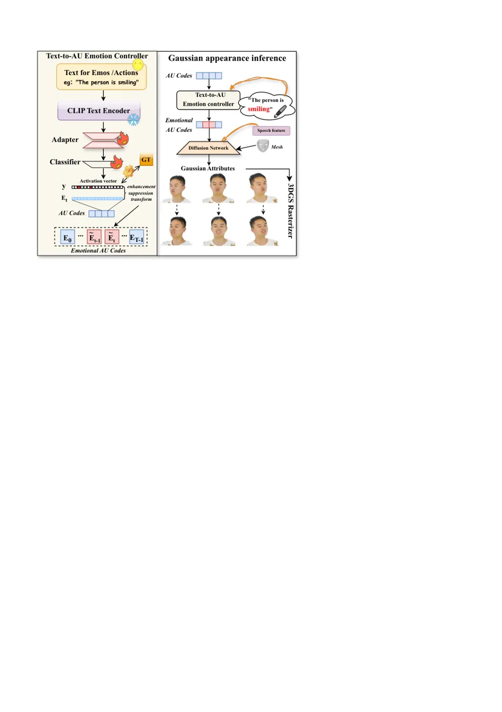
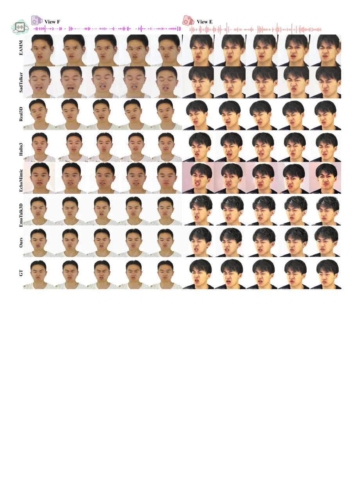
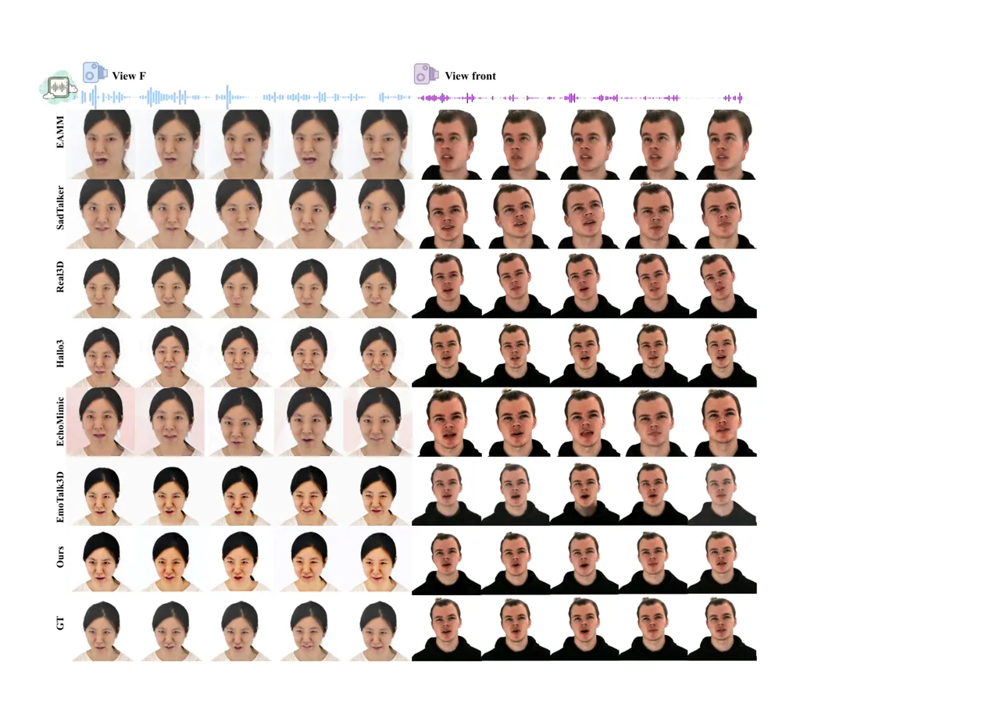
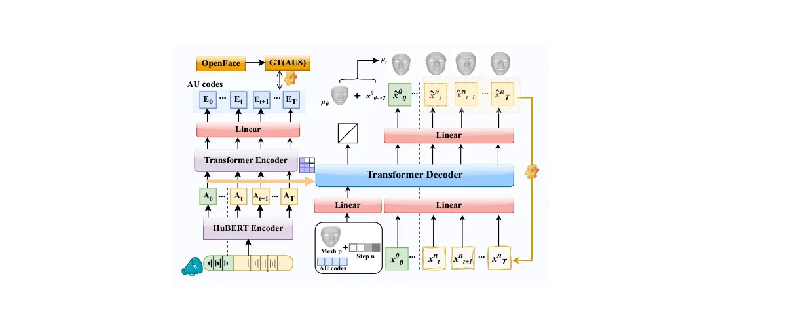
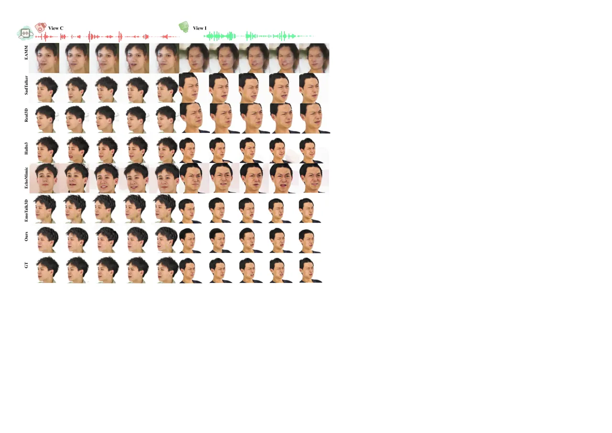
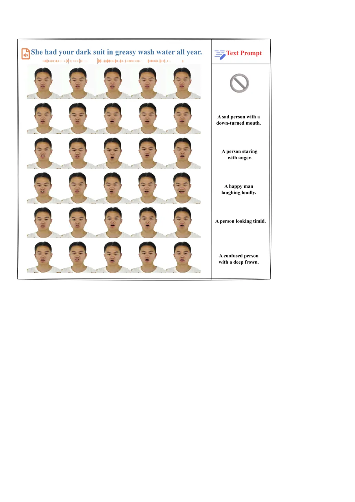
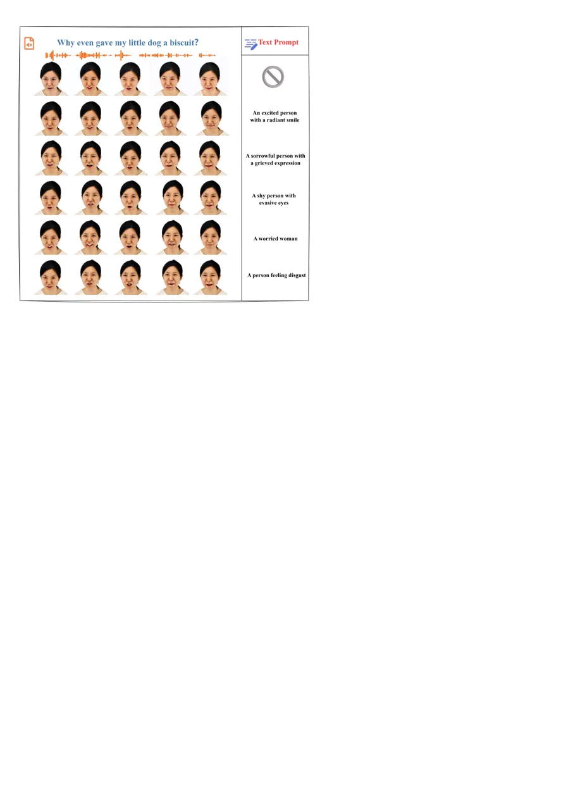
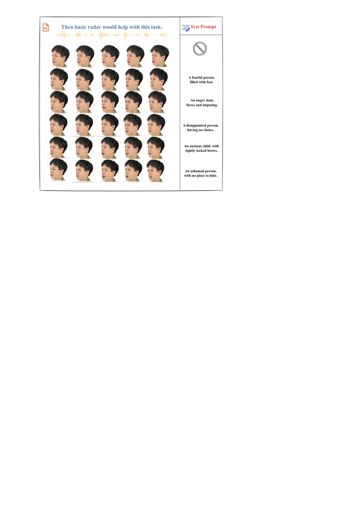

# EmoDiffTalk: Emotion-aware Diffusion for Editable 3D Gaussian Talking Head

Chang Liu Affiliation: Beijing Normal University    Tianjiao Jing
Affiliation: Beijing Normal University    Chengcheng Ma
Affiliation: Beijing Normal University    Xuanqi Zhou
Affiliation: Beijing Normal University    Zhengxuan Lian
Affiliation: Beijing Normal University    Qin Jin Affiliation: Renmin
University of China    Hongliang Yuan Affiliation: Tencent AI Lab   
Shi-Sheng Huang Affiliation: Beijing Normal University

###### Abstract

Recent photo-realistic 3D talking head via 3D Gaussian Splatting still
has significant shortcoming in emotional expression manipulation,
especially for fine-grained and expansive dynamics emotional editing
using multi-modal control. This paper introduces a new editable 3D
Gaussian talking head, i.e. EmoDiffTalk. Our key idea is a novel
Emotion-aware Gaussian Diffusion, which includes an action unit (AU)
prompt Gaussian diffusion process for fine-grained facial animator, and
moreover an accurate text-to-AU emotion controller to provide accurate
and expansive dynamic emotional editing using text input. Experiments on
public EmoTalk3D and RenderMe-360 datasets demonstrate superior
emotional subtlety, lip-sync fidelity, and controllability of our
EmoDiffTalk over previous works, establishing a principled pathway
toward high-quality, diffusion-driven, multimodal editable 3D
talking-head synthesis. To our best knowledge, our EmoDiffTalk is one of
the first few 3D Gaussian Splatting talking-head generation framework,
especially supporting continuous, multimodal emotional editing within
the AU-based expression space.Please visit our website for more details
and
information:[https://liuchang883.github.io/EmoDiffTalk/](https://liuchang883.github.io/EmoDiffTalk/)

## 1 Introduction



Figure 1: Text-to-AU based emotion editing results of our EmoDiffTalk.
Our EmoDiffTalk not only supports fine-grained speech-driven (third row)
3DGS talking head generation (first row), but also enabling expansive
and accurate text-based emotion editing (second and fourth rows). The AU
Code (bottom) are also demonstrated. Please refer to our demo video for
more text driven 3D talking head editing results.

Photo-realistic 3D talking head has achieved remarkable progress using
representations such as 3DMM \[41, 51, 35, 42, 44\], neural radiance
fields (NeRF) \[18, 58, 2, 53, 45, 36, 20\] and 3D Gaussian Splatting
(3DGS) \[28, 10, 17, 31, 55\]. However, most of current 3D talking head
focus on photo-realistic portrait rendering quality \[39, 13, 46, 52\]
and audio-lip synchronization \[9, 37\], which are still limited in
semantic-level talking head editing such as emotional
expressions \[16\].

One of the main challenging for emotional talking head manipulation lies
in the ambiguous audio-to-emotion and emotion-to-expression mappings,
which makes it difficult to conduct accurate emotional editing within
the dynamic 3D talking head space \[15, 59\]. Some early works such as
EAMM \[25\] adopt to perform emotional editing within the implicit
latent space using control signals such as reference images. For more
better emotional-expression editing, EmoTalk \[35\] and the subsequent
works \[19\] proposed to disentangle the emotion from speech to rich 3D
facial generation. Recent Hallo3 \[12\] utilize text prompt to the
audio-diffusion process, which has achieved impressive emotional 3D
talking head generation. However, the quality of emotional editing but
not only stylization \[44\] or personalization \[3\] is still limited,
especially for fine-grained and expansive emotional editing using
multi-modal control.

To address such issue, this paper proposes a new emotional controllable
3D talking head based on 3D Gaussian splatting \[19\], called
EmoDiffTalk, which generates high fidelity dynamic portrait rendering
quality while enabling fine-grained emotional editing using cross-modal
input such as text. Unlike previous emotion editing talking heads
incorporating speech and emotion within implicit feature space \[25,
35\] or direct diffusion process \[12\], our key insight is to model the
emotion-to-expression mapping via action unit (AU) code space \[14\],
and introduce the AU code as effective emotional embedding to prompt the
Gaussian diffusion process to predict the dynamic Gaussian primitive
attributions. This formulates as a novel emotional-aware Gaussian
diffusion, within which we first build a AU-prompt Gaussian diffusion
for fine-grained facial animator, and then introduce a text-to-AU
emotion controller to distill the Gaussian diffusion for accurate
emotion editing using text input. Benefit from the emotional-aware
Gaussian diffusion, our EmoDiffTalk can reconstruct photo-realistic 3D
talking head with more better fine-grained expressions, and enables high
accurate and easy-to-use emotion editing using texts as shown in Fig. 1.

To evaluate the effectiveness of our EmoDiffTalk, we conducted extensive
evaluation on public EmoTalk3D \[19\] and RenderMe-360 \[34\] datasets,
comparing with previous SOTA approaches such as EAMM\[25\],
SadTalker\[58\], Real3D-Portrait\[54\], EmoTalk3D\[19\], Hallo3\[12\]
and EchoMimic\[8\]. From the experiments, on average our EmoDiffTalk
boosts PSNR (+$`4.56\text{\,}\mathrm{d}`$B vs EmoTalk3D) and CPBD
(+$`16.1\text{\,}\mathrm{\%}`$ vs Hallo3) on EmoTalk3D, retains best
LPIPS and lowers LMD, and on RenderMe-360 cuts LMD by
$`29.4\text{\,}\mathrm{\%}`$ and adds $`1.28\text{\,}\mathrm{d}`$B PSNR
over Hallo3; user studies also exceed Hallo3 in video fidelity
(+$`5.3\text{\,}\mathrm{\%}`$), image quality
(+$`4.7\text{\,}\mathrm{\%}`$) on EmoTalk3D, video fidelity
(+$`1.7\text{\,}\mathrm{\%}`$), and emotion control
(+$`2.2\text{\,}\mathrm{\%}`$) on RenderMe-360. To our best knowledge,
our approach becomes a new state-of-the-art emotional controllable 3D
talking head, especially in simultaneously delivering photo-realistic
dynamic reconstruction and precise, text-driven emotional editing with
superior expression accuracy, naturalness, and flexibility.

## 2 Related Work

### 2.1 From 2D Generation to 3D Talking Heads

The pursuit of photorealistic talking heads has evolved along two
primary paradigms. 2D-based methods prioritize generation efficiency and
frame-wise realism, achieving significant success in audio-lip
synchronization \[9, 37\] and one-shot video editing \[24, 7, 29, 50,
38, 43\]. For instance, EAMM \[24\] enables emotional editing via
reference images in a latent space, while Hallo3 \[12\] and EchoMimic
\[8\] leverage powerful video diffusion models for highly dynamic
portraits. However, these methods often struggle with 3D consistency and
free-viewpoint synthesis \[30\]. This limitation has spurred the
advancement of 3D-aware approaches. Early models relied on 3D Morphable
Models (3DMM) \[35, 41, 51, 27\] for explicit control but were
constrained by their linear expressivity. The emergence of neural
fields, particularly NeRF \[18, 45, 53, 58, 20, 21\], and more recently,
3D Gaussian Splatting (3DGS) \[26\] , has enabled high-fidelity novel
view synthesis. 3DGS-based methods like GaussianTalker \[10\],
TalkingGaussian \[28\], and EmoTalk3D \[19\] have demonstrated real-time
capability and improved rendering quality. Recent work such as FATE
\[55\] further addresses monocular full-head reconstruction through
efficient Gaussian representation and neural baking for texture editing.
Despite these advances, precise and expansive semantic-level control,
especially for fine-grained emotional expressions, remains a challenge
in 3D-aware talking heads \[16\].

### 2.2 Emotion Control and AU-Based Synthesis

A central challenge in controllable talking head generation is the
ambiguous mapping from audio or semantic prompts to expressive facial
dynamics \[15, 59\]. Research has explored various control signals.
While methods like EmoTalk \[35\] and its 3DGS extension \[19\]
disentangle emotion from speech, and diffusion-based approaches like
Diffposetalk \[44\] and Hallo3 \[12\] use text prompts for stylization,
they often operate on holistic expressions or implicit features, lacking
fine-grained anatomical grounding \[47\]. In contrast, the Facial Action
Coding System (FACS) \[14, 1\], which defines Action Units (AUs)
corresponding to specific facial muscle movements, provides a
foundational, interpretable framework for precise expression modeling.
Although widely used in analysis and 3DMM-based animation \[35\], the
integration of AUs as a central control mechanism for editable 3D
Gaussian-based avatars is novel. Our work bridges this gap by
introducing an explicit AU code space to mediate between multi-modal
inputs (speech, text) and the Gaussian diffusion process, enabling
anatomically-aware fine-grained emotional editing.



Figure 2: Overall Pipeline of EmoDiffTalk. We first reconstruct the
canonical Gaussian rig from a subject’s multi-view images, and then
perform an emotion-aware Gaussian diffusion, including a AU-prompt
Gaussian Diffusion process and Text-to-AU Emotion Controller, to animate
the canonical Gaussian rig with any speech and text-based emotion prompt
input, ultimately enabling free-viewpoint rendering via the 3DGS
splatting.

## 3 Method

Given a subject’s multi-view images $`\mathcal{I}=\{\mathbf{I}_{i}\}`$
accompanied with a facial template $`\mathcal{T}_{f}`$ as like
EmoTalk3D \[19\], our goal is to reconstruct the dynamic 3DGS primitives
representation $`\mathcal{G}=\{g_{t}^{i}\}`$, which can be driven with
fine-grained facial expression by any speech input, and more importantly
supports emotion editing using text input. As show in Fig. 2, we first
perform a canonical Gaussian rig reconstruction (Sec. 3.1) to get a
basic canonical 3DGS rig along with high accurate Gaussian color
fetching. Then we set up a novel emotion-aware Gaussian diffusion, by
which we can drive the canonical 3DGS rig using any speech input and
perform text-based emotion editing simultaneously.

Our emotion-aware Gaussian diffusion consists of two key components:
(1)AU-prompt Gaussian Diffusion (Sec. 3.2), which encodes audio signals
into Action Unit (AU) codes and subsequently decodes them to predict
Gaussian position along with all other fine-grained Gaussian splatting
attributes, and (2)Text-to-AU Emotion Controller (Sec. 3.3), which
establishes a direct mapping from a textual emotion prompt to an
Activation vector enabling freely editable emotional adjustment.

### 3.1 Canonical Gaussian Rig Reconstruction

Before conducting speech driven talking head generation, we first
reconstruct the subject’s _canonical_ 3DGS rig from the multi-view image
input as like EmoTalk3D \[19\], which divides the 3D head into facial
and non-facial regions and then creates a motion-binding between such
two regions. Using the canonical 3DGS rig, we can focus on the facial
dynamics during the thereafter talking head animation, since the
non-facial region can be driven along with the facial region
automatically and efficiently.

Different from previous canonical 3DGS rig \[19\] that utilizes
Spherical Harmonics (SH) to fetch view-dependent Gaussian’s color
appearance, we employ a triplane-based Gaussian color prediction, which
can achieve better color attribution fetching especially in the Gaussian
attribution decoding processing of our AU-Prompt Gaussian diffusion
(Sec. 3.2) thereafter. Specifically, the color $`c`$ for each point is
generated by:

```math
c=\mathcal{M}(F_{xy}(x,y)\oplus F_{xz}(x,z)\oplus F_{yz}(y,z)), \tag{1}
```

where $`\mathcal{M}`$ is an MLP decoder and $`F_{xy}`$, $`F_{xz}`$,
$`F_{yz}`$ are triplane feature maps.

We denote the canonical 3DGS $`G_{0}=\{\mu_{0},S_{0},R_{0},`$
$`\alpha_{0},c_{0}\}`$, and during the speech driven animation, the
color attribution $`c_{0}`$ will be updated by fetching the triplane
based color prediction, while leave the other attributions by the
AU-Prompt Gaussian diffusion.

### 3.2 AU-prompt Gaussian Diffusion

Based on the canonical 3DGS rig, we propose to map the speech feature to
dynamic 3DGS attribution using an AU-prompt Gaussian diffusion on the
facial region, which mainly consists of three stages: (1) Speech-to-AU
Encoder, which maps the speech feature to AU Codes, (2) AU-prompt
Gaussian Diffusion, serving as speech-to-facial motion prompted with the
AU Codes, and (3) Dynamic Appearance Decoder, which decodes the dynamic
attribution offsets relative to the canonical 3DGS rig, ultimately
generating a high-quality 3D talking head.

Speech-to-AU Encoder. As shown in Fig. 2, we first extract
self-supervised HuBERT \[23\] features from raw audio, which encode
richer phonetic/prosodic information than spectrograms. The feature
sequence is denoted as:

```math
\bm{A}_{0:T-1}=\{\bm{A}_{t}\mid t=0,\dots,T-1\},\quad\bm{A}_{t}\in\mathbb{R}^{768}. \tag{2}
```

Then we use a multi-layer Transformer $`\mathrm{Enc}(\cdot)`$ processing
$`\bm{A}_{0:T-1}`$ to predict AU Codes:

```math
\bm{E}_{0:T-1}=\mathrm{Enc}(\bm{A}_{0:T-1};\theta), \tag{3}
```

where lower layers use constrained attention to capture rapid
articulatory changes (e.g., lip closure), while upper layers model
slower prosodic variations.

AU-prompt Gaussian Diffusion. To incorporate the AU Codes obtained from
the first stage into facial motion modeling, we further build an
AU-prompt Gaussian diffusion model, which is inspired from
Diffposetalk \[44\]. Specifically, we first utilize AU Codess
$`\bm{E}_{0}...\bm{E}_{T-1}`$ extracted from audio features as one input
to guide the denoising process, rather than style information extracted
from 2D video. Then we employ mesh point positions $`\bm{P}`$ as the
initial template, with the network learning the offsets of all mesh
points $`\Delta\bm{P}_{t}`$ no longer represents the 3DMM coefficients
$`\bm{\beta}`$. Naturally, learning point offsets presents greater
challenges than predicting a priori 3DMM coefficients. Therefore, we
designed a series of losses to constrain facial structural changes and
conducted ablation experiments comparing our approach with simpler GRU
networks predicting point offsets without diffusion strategies. The
denoising process of our AU-prompt Gaussian diffusion model is
formulated as:

```math
\hat{\bm{x}}^{0}_{0:T}=D_{\theta}(\bm{x}^{n}_{0:T},\bm{P},\bm{E}_{0:T},\bm{A}_{0:T},n), \tag{4}
```

which establishes a fine-grained binding between AU Codes dimensions and
specific facial point motions, effectively learning the relationship
between Action Units and facial movements.

Dynamic Appearance Decoder. After the AU-prompt Gaussian diffusion, we
then decode the dynamic appearance attributions of the 3DGS primitives.
To effectively decode the fine-grained 3DGS dynamic attributions, we set
up separate attribution decoders with the guidance of AU Codes,
including rotation and opacity respectively.

For rotation decoder, we introduce a RotNet, which consists of a 3-layer
MLP that predicts rotation parameters for each Gaussian point by
integrating motion cues with AU information:

```math
R_{t}=\mathcal{N}_{\text{Rot}}(R_{0},E_{t},\mu_{t}), \tag{5}
```

where $`\mu_{t}`$ represents the deformed Gaussian position at timestep
$`t`$ derived from the diffusion output.

For opacity decoder, we designed a compact Feature Line whose initial
purpose was to store implicit features regarding variations in flame
expression coefficients \[48\]. Here, we repurpose it to store
fine-grained features of AU Codes changes related to opacity. The
learnable feature line
$`\mathcal{F}\in\mathbb{R}^{17\times Q\times 16}`$ captures AU-specific
opacity patterns, where $`Q`$ is the number of facial Gaussian points.
This continuous AU-based representation enables smooth expression
interpolation and infinite blending possibilities. Then we use an
OPCNet, another 3-layer MLP, processes the aggregated features to
predict opacity changes conditioned on both motion information and AU
Codes:

```math
\Delta\alpha_{t}^{i}=\mathcal{N}_{\text{OPC}}(\mathbf{f}_{t}^{i},\mathbf{E}_{t},\mu_{t}), \tag{6}
```

where $`\mathbf{f}_{t}^{i}`$ is the feature combination weighted by AU
intensities. Please refer to our supplementary materials for more
details.



Figure 3: Text-to-AU Emotion Controller pipeline (left) and AU-based
emotion editing for Gaussian appearance inference (right).

### 3.3 Text-to-AU Emotion Controller

Finally, to support accurate text-based emotion editing, we further
introduce a Text-to-AU Emotion Controller \[5\] .As shown in Fig. 3,
this module maps a textual emotion prompt (e.g., “the person is
smiling”, “the person is sad”) to a binary AU activation vector
$`\mathbf{y}\in\{0,1\}^{K}`$, where $`y_{k}=1`$ denotes AU $`k`$ should
be emotionally up-regulated, and $`y_{k}=0`$ implies suppression. Then
We apply a lightweight enhancement–suppression transform to those AU
Codes $`\mathbf{E}_{t}`$ selected by user for activation by the binary
mask $`\mathbf{y}`$. Each resulting Emotional AU Code
$`\tilde{\mathbf{E}}_{t}`$ is computed as

```math
\tilde{\mathbf{E}}_{t}=\mathbf{E}_{t}\odot(1+\alpha\mathbf{y})-\beta(1-\mathbf{y})\odot\mathbf{E}_{t}, \tag{7}
```

where $`\alpha,\beta>0`$ are enhancement and suppression coefficients,
respectively, and $`\odot`$ denotes element-wise multiplication.
Intuitively, activated AUs ($`y_{k}=1`$) are amplified by a factor
$`1+\alpha`$, while inactive AUs ($`y_{k}=0`$) are attenuated by
$`1-\beta`$. After modulation, we obtain the emotional AU Codes

```math
\tilde{\mathbf{E}}_{0:T-1}=\{\tilde{\mathbf{E}}_{t}\}_{t=0}^{T-1}, \tag{8}
```

which replaces $`\mathbf{E}_{0:T-1}`$ as the conditioning input to the
AU-aware Diffusion Transformer. This guides the prediction of dynamic
Gaussian positions and related attributes, injecting controlled affect
while preserving articulation fidelity inherited from the original
speech-driven codes.

### 3.4 Training

Our training pipeline employs a coherent four-stage optimization
strategy that systematically builds upon the core components of our
EmoDiffTalk framework. Below we outline the macro-level training stages
corresponding to Sec. 3.1- 3.3, with detailed implementations available
in our supplementary material.

Stage 1: Speech-to-AU Encoder Training. We first train the
transformer-based encoder to map audio features to AU Codes,
establishing the foundation for emotional semantics. The training
utilizes a combination of regression loss($`\mathcal{L}_{reg}`$) for AU
intensity prediction and temporal consistency loss
($`\mathcal{L}_{temp}`$) to maintain coherent emotional dynamics across
frames.

```math
\mathcal{L}_{\text{AU}}=\lambda_{\text{reg}}\mathcal{L}_{\text{reg}}+\lambda_{\text{temp}}\mathcal{L}_{\text{temp}} \tag{9}
```

Stage 2: AU-prompt Gaussian Diffusion Training. we condition the
diffusion model on the AU Codes produced in Stage 1 to model temporal
position offsets of facial Gaussians. Instead of a generic noise
prediction loss, we employ a unified geometric objective combining
global vertex reconstruction, velocity/acceleration temporal coherence,
deformation regularization, and fine-grained lip fidelity:

```math
\mathcal{L}_{\text{stage2}}=\lambda_{\text{vertex}}\mathcal{L}_{\text{vertex}}+\lambda_{\text{motion}}\mathcal{L}_{\text{motion}}+\lambda_{\text{deform}}\mathcal{L}_{\text{deform}}+\lambda_{\text{lip}}\mathcal{L}_{\text{lip}}. \tag{10}
```

Stage 3: Dynamic Appearance Decoder Training. This Stage centers on two
lightweight networks:RotNet for stable primitive updates via a simple
reconstruction loss and OPCNet for expressive refinement through
reconstruction plus motion‑aware regularization.  
Specifically, we apply four terms in OPCNet training: mixed
reconstruction, motion–amplitude coupling, sparsity + temporal
smoothness, and displacement limiting:

```math
\mathcal{L}_{\text{OPC}}=\mathcal{L}_{\text{recon}}+\mathcal{L}_{\text{reg}}+\mathcal{L}_{\text{opcmotion}}+\mathcal{L}_{\text{dist}}. \tag{11}
```

Stage 4: Text-to-AU Emotion Controller Training. Finally, we train the
Text-to-AU Emotion Controller to map textual emotion prompt to AU
activation vector. This module employs a multi-objective learning
strategy:

```math
\mathcal{L}_{\text{control}}=\lambda_{\text{BCE}}\mathcal{L}_{\text{BCE}}+\lambda_{\text{infoNCE}}\mathcal{L}_{\text{infoNCE}} \tag{12}
```

where binary cross-entropy loss ensures accurate AU activation
prediction, and InfoNCE loss aligns text embeddings with AU semantics.

## 4 Experiment

### 4.1 Datasets

We conduct experiments on two widely-used talking face datasets to
evaluate our method: EmoTalk3D \[19\] and RenderMe-360 \[34\].

EmoTalk3D Dataset is a high-quality 3D emotional talking face dataset.
It contains multi-view video recordings with synchronized audio and 3D
facial annotations. The dataset covers multiple subjects expressing
various emotions including neutral, happy, sad, angry, surprised, and
disgusted. Each sequence includes accurate 3D ground truth, making it
suitable for training and evaluating 3D-aware talking head generation
with emotion control.

RenderMe-360 Dataset is a large-scale high-fidelity multi-view human
head avatar dataset. It provides synchronized 60-view 2K video captures
with audio and rich 3D/semantic annotations. The collection spans 500
diverse subjects performing speaking, facial expressions, and hair
motion under varied appearance conditions. Each sequence bundles
calibrated cameras, per-frame images, and structured labels, enabling
training and evaluation of controllable high-fidelity talking head, view
synthesis, expression editing, and hair-aware avatar generation methods.

### 4.2 Implementation Details

Training details. Our model is trained on a single NVIDIA RTX 5090 GPU
(32GB) for approximately 3 days, with the training time carefully
allocated to optimize different components: one day is dedicated to the
Canonical Gaussian Rig Reconstruction, one day to the combined training
of the Speech-to-AU Encoder and AU-prompt Gaussian Diffusion, and
another day to the Dynamic Appearance Decoder. The Text-to-AU Emotion
Controller requires less than an hour due to its lightweight design.
This structured approach ensures efficient learning of both static and
dynamic Gaussian attributes.The learning rate is set to 1e-4 with cosine
annealing schedule. Batch size is 4 for canonical reconstruction, 8 for
diffusion training, and 16 for emotion controller training. We use
AdamW \[32\] optimizer with gradient clipping. Input images are resized
to 512×512. More details are provided in the supplementary materials.

|                        | EmoTalk3D        |                  |                     |                   |                  | RenderMe-360     |                  |                     |                   |                  |
| ---------------------- | ---------------- | ---------------- | ------------------- | ----------------- | ---------------- | ---------------- | ---------------- | ------------------- | ----------------- | ---------------- |
| Method                 | PSNR$`\uparrow`$ | SSIM$`\uparrow`$ | LPIPS$`\downarrow`$ | LMD$`\downarrow`$ | CPBD$`\uparrow`$ | PSNR$`\uparrow`$ | SSIM$`\uparrow`$ | LPIPS$`\downarrow`$ | LMD$`\downarrow`$ | CPBD$`\uparrow`$ |
| EAMM \[24\]            | 9.82             | 0.57             | 0.40                | 20.25             | 0.12             | 10.96            | 0.57             | 0.48                | 24.79             | 0.09             |
| SadTalker \[57\]       | 9.90             | 0.64             | 0.47                | 43.49             | 0.11             | 12.20            | 0.65             | 0.41                | 26.80             | 0.19             |
| Real3D-Portrait \[54\] | 13.53            | 0.72             | 0.30                | 24.11             | 0.26             | 16.42            | 0.74             | 0.26                | 15.35             | 0.18             |
| EmoTalk3D \[19\]       | 21.22            | 0.83             | 0.12                | 3.62              | 0.30             | 18.44            | 0.79             | 0.19                | 9.98              | 0.19             |
| Hallo3 \[11\]          | 18.30            | 0.78             | 0.24                | 18.31             | 0.31             | 20.13            | 0.83             | 0.14                | 9.33              | 0.30             |
| EchoMimic \[7\]        | 13.80            | 0.73             | 0.35                | 26.06             | 0.21             | 17.13            | 0.71             | 0.33                | 18.57             | 0.26             |
| Ours                   | 25.78            | 0.86             | 0.12                | 3.56              | 0.36             | 21.41            | 0.83             | 0.15                | 6.59              | 0.26             |

Table 1: Quantitative comparison results evaluated on the Emotalk3D and
RenderMe-360 datasets using different comparing approaches respectively.



Figure 4: Qualitative Comparison on the Emotalk3D Dataset. Our approach
outperforms existing approaches in both lip-sync accuracy and facial
reconstruction detail than those previous SOTA talking head approaches.



Figure 5: Additional experimental results on the Emotalk3D dataset and
comparative evaluation results on the RenderMe-360 benchmark.

|                        |           |          |         |         |              |          |         |         |
| ---------------------- | --------- | -------- | ------- | ------- | ------------ | -------- | ------- | ------- |
|                        | EmoTalk3D |          |         |         | RenderMe-360 |          |         |         |
| Method                 | S-V       | Video    | Image   | Emotion | S-V          | Video    | Image   | Emotion |
|                        | Sync.     | Fidelity | Quality | Control | Sync.        | Fidelity | Quality | Control |
| EAMM \[24\]            | 1.86      | 1.17     | 1.30    | -       | 1.80         | 1.27     | 1.17    | -       |
| SadTalker \[57\]       | 3.15      | 2.20     | 3.80    | -       | 3.10         | 2.57     | 3.92    | -       |
| Real3D-Portrait \[54\] | 3.75      | 3.95     | 3.50    | -       | 3.70         | 3.67     | 3.55    | -       |
| EmoTalk3D \[19\]       | 4.05      | 4.20     | 4.11    | -       | 3.91         | 4.31     | 4.15    | -       |
| Hallo3 \[11\]          | 4.70      | 4.51     | 4.30    | 3.75    | 4.55         | 4.63     | 4.55    | 3.65    |
| EchoMimic \[7\]        | 3.85      | 3.45     | 3.75    | -       | 3.60         | 3.30     | 4.00    | -       |
| Ours                   | 4.65      | 4.75     | 4.50    | 3.77    | 4.62         | 4.71     | 4.35    | 3.73    |

Table 2: The quantitative comparison of talking head generation quality
user study using different comparing approaches respectively.

### 4.3 Evaluation

Baseline and Metrics. To comprehensively assess the effectiveness of our
approach, we select representative methods from two mainstream paradigms
that cover key recent advances as baselines: 2D video generation methods
include EAMM \[24\], Hallo3 \[11\], and EchoMimic \[7\]; 3D-aware
methods include SadTalker \[57\], Real3D-Portrait \[54\], and
EmoTalk3D \[19\].

To quantitatively evaluate the talking head rendering quality, we use
PSNR \[22\] and SSIM \[49\] to quantify overall image fidelity,
LPIPS\[56\] to measure perceptual similarity to the ground-truth videos,
Landmark Distance (LMD) \[6\] to evaluate the alignment between lip
movements and speech, and the Cumulative Probability of Blur Detection
(CPBD) \[33\] to assess image sharpness.

Besides,, we also conducted a user study to ask participant score the
talking head rendering results across four dimensions: (1) S–V Sync.
(Speech–Visual Synchronization), measuring the temporal consistency
between audio and lip movements; (2) Video Fidelity, assessing the
overall realism and temporal coherence of the video; (3) Image Quality,
reflecting participants’ ratings of the generated video’s quality; (4)
Emotion Control, assessing the accuracy and naturalness of facial
expression regulation. For these user study metrics, we collected
ratings using a 1–5 point scale (higher scores indicate better
performance) and report the mean for each metric.

Comparison with existing methods. As shown in Fig. 4 and Fig. 5, our
method achieves leading performance on both datasets for the previous 2D
image-based and 3D-based talking heads, demonstrating superiority
particularly in facial detail and emotional expression. As shown in
Tab. 1, on the EmoTalk3D dataset, our method matches or surpasses
existing approaches across all metrics. On the RenderMe-360 dataset, we
achieve higher PSNR/SSIM and lower LMD. This demonstrates that compared
to prior methods, our reconstructed speaker heads enhance rendering
fidelity and lip-sync accuracy while preserving fine-grained emotional
cues.

User Study. We conducted a user study to compare real videos with
results generated by various methods, evaluating the subjective quality
of synthetic talking heads. Specifically, we selected five video
sequences from EmoTalk3D and two from RenderMe-360 featuring the same
speech content but different identities as evaluation materials.
Participants score the videos across four dimensions: speech-visual
synchronization, video fidelity, image quality, and emotion control.
Since only Hallo3 and our model support text-based emotion control,
other methods were excluded from this dimension’s evaluation. Results
are shown in Tab. 2: On EmoTalk3D, our method achieved the highest
scores across all metrics; on RenderMe-360, we scored higher in
speech-visual synchronization, video fidelity, and emotion control.
These findings demonstrate our method’s superior performance in
subjective user experience.

### 4.4 Ablation Study

To comprehensively validate the effectiveness of each key module, we
designed three sets of ablation experiments below. Note that Codes4P
injects AU Codes into diffusion-based Gaussian offset predictors to
conditionally modulate Gaussian point shifts based on affect perception;
Codes4O injects AU Codes into OPCNet to endow its opacity predictions
with affect-related modulation capabilities. Comparison results are
shown in Fig. 6 and Tab. 3.

$`\cdot`$ (A) w/o Codes4P. By removing AU Codes from the diffusion
Transformer, we ensure that facial Gaussian point offsets are restored
solely by speech features, mesh priors, and diffusion time steps, while
all other settings remain unchanged. Tab. 3 and Fig. 6 show a
significant performance drop after removing Codes4P. While the model
maintains basic speech-lip sync, facial structure and dynamic details
are noticeably absent. Because AU Codes provides interpretable,
region-specific constraints that align emotional semantics with local
facial dynamics; without it, the diffusion struggles to reliably recover
fine-grained expression changes based solely on audio. Thus, AU Codes
are crucial for conditioning Gaussian position offsets.

$`\cdot`$ (B) w/o Codes4O. We retain the guiding role of AU Codes in
Gaussian offset prediction, but remove AU Codes input in OPCNet, relying
solely on predicted position offsets and tri-plane features to regress
Gaussian point opacity. As shown in Fig. 6, this variant generates
plausible facial geometry but exhibits significant deficiencies in
appearance details: dynamic wrinkles (e.g., crow’s feet and forehead
lines) are markedly weakened, muscle tension variations are indistinct,
and overall expressions tend toward neutrality and flatness. This
indicates that without the emotional semantic constraints provided by AU
Codes, OPCNet struggles to accurately model emotion-related local
appearance features. This validates its effectiveness in modeling
dynamic emotional appearances.

$`\cdot`$ (C) w/o Diffusion In Section 3.2, we proposed multi-step
diffusion denoising via a Transformer-based temporal decoder to
progressively restore the positional offsets of Gaussian points on the
face. Here, we replace the Transformer-based diffusion denoising network
with a GRU of comparable parameters. Consistent with Fig. 6, this
variant exhibits amplitude shrinkage and conservatism at extreme
expressions, resulting in an overall appearance that tends toward
”mean-shifting.” This demonstrates that diffusion is crucial for
preserving detail intensity and diversity.


Figure 6: Visual results of Ablation Study for the key modules within
different system variants including ’w/o Codes4P’, ’w/o Codes4O’, ’w/o
Diffusion’ and our ’FULL’ respectively.

| Method        | PSNR $`\uparrow`$ | SSIM $`\uparrow`$ | LPIPS $`\downarrow`$ | LMD $`\downarrow`$ | CPBD $`\uparrow`$ |
| ------------- | ----------------- | ----------------- | -------------------- | ------------------ | ----------------- |
| w/o Codes4P   | 20.12             | 0.72              | 0.21                 | 6.25               | 0.22              |
| w/o Codes4O   | 22.43             | 0.75              | 0.14                 | 4.75               | 0.26              |
| w/o Diffusion | 24.96             | 0.82              | 0.21                 | 4.51               | 0.36              |
| FULL          | 25.78             | 0.86              | 0.12                 | 3.56               | 0.36              |

Table 3: Quantitative Comparison of Ablation Study for the key modules
within different system variants including ’w/o Codes4P’, ’w/o Codes4O’,
’w/o Diffusion’ and our ’FULL’ respectively.

## 5 Conclusion and Limitations

This paper proposes EmoDiffTalk, a novel emotion-aware diffusion
framework for editable 3D talking head synthesis via 3D Gaussian
Splatting. Our key innovations include an AU-prompted Gaussian diffusion
process for fine-grained facial animation and a text-to-AU emotion
controller enabling expansive multimodal emotional editing. Experimental
results on EmoTalk3D and RenderMe-360 datasets validate superior
performance in emotional subtlety, lip-sync accuracy, and
controllability over state-of-the-art methods. However, one main
limitation comes from the substantial computational overhead involving
multiple pre-trained networks within our emotion-aware Gaussian
diffusion. Besides, we also have limitation for very exaggerated
expression, where our current activation-suppression-based text-to-AU
emotion controller for intricate facial expressions would fail. But this
remains challenging for all current emotion editing based 3D talking
head approaches. We hope our work could inspire subsequent efforts for
more advanced multimodal-based 3D talking head editing, with
high-fidelity rendering quality and expansive manipulation.

## References

- \[1\] Brandon Amos, Bartosz Ludwiczuk, Mahadev Satyanarayanan, et al.
  Openface: A general-purpose face recognition library with mobile
  applications. _CMU School of Computer Science_, 6(2):20, 2016.
- \[2\] Shivangi Aneja, Justus Thies, Angela Dai, and Matthias Nießner.
  Facetalk: Audio-driven motion diffusion for neural parametric head
  models. In _Proceedings of the IEEE/CVF Conference on Computer Vision
  and Pattern Recognition_, pages 21263–21273, 2024.
- \[3\] Shivangi Aneja, Artem Sevastopolsky, Tobias Kirschstein, Justus
  Thies, Angela Dai, and Matthias Nießner. Gaussianspeech: Audio-driven
  personalized 3d gaussian avatars. In _Proceedings of the IEEE/CVF
  International Conference on Computer Vision_, pages 13065–13075, 2025.
- \[4\] Volker Blanz and Thomas Vetter. A morphable model for the
  synthesis of 3d faces. In _Proceedings of the 26th Annual Conference
  on Computer Graphics and Interactive Techniques_, page 187–194,
  USA, 1999. ACM Press/Addison-Wesley Publishing Co.
- \[5\] Hejia Chen, Haoxian Zhang, Shoulong Zhang, Xiaoqiang Liu, Sisi
  Zhuang, Yuan Zhang, Pengfei Wan, Di Zhang, and Shuai Li. Cafe-talk:
  Generating 3d talking face animation with multimodal coarse- and
  fine-grained control, 2025a.
- \[6\] Lele Chen, Zhiheng Li, Ross K. Maddox, Zhiyao Duan, and
  Chenliang Xu. Lip movements generation at a glance. _CoRR_,
  abs/1803.10404, 2018.
- \[7\] Zhiyuan Chen, Jiajiong Cao, Zhiquan Chen, Yuming Li, and
  Chenguang Ma. Echomimic: Lifelike audio-driven portrait animations
  through editable landmark conditions, 2024.
- \[8\] Zhiyuan Chen, Jiajiong Cao, Zhiquan Chen, Yuming Li, and
  Chenguang Ma. Echomimic: Lifelike audio-driven portrait animations
  through editable landmark conditions. In _Proceedings of the AAAI
  Conference on Artificial Intelligence_, pages 2403–2410, 2025b.
- \[9\] Kun Cheng, Xiaodong Cun, Yong Zhang, Menghan Xia, Fei Yin,
  Mingrui Zhu, Xuan Wang, Jue Wang, and Nannan Wang. Videoretalking:
  Audio-based lip synchronization for talking head video editing in the
  wild. In _SIGGRAPH Asia 2022 Conference Papers_, pages 1–9, 2022.
- \[10\] Kyusun Cho, Joungbin Lee, Heeji Yoon, Yeobin Hong, Jaehoon Ko,
  Sangjun Ahn, and Seungryong Kim. Gaussiantalker: Real-time talking
  head synthesis with 3d gaussian splatting. In _Proceedings of the 32nd
  ACM International Conference on Multimedia_, pages 10985–10994, 2024.
- \[11\] Jiahao Cui, Hui Li, Yun Zhan, Hanlin Shang, Kaihui Cheng, Yuqi
  Ma, Shan Mu, Hang Zhou, Jingdong Wang, and Siyu Zhu. Hallo3: Highly
  dynamic and realistic portrait image animation with video diffusion
  transformer, 2024.
- \[12\] Jiahao Cui, Hui Li, Yun Zhan, Hanlin Shang, Kaihui Cheng, Yuqi
  Ma, Shan Mu, Hang Zhou, Jingdong Wang, and Siyu Zhu. Hallo3: Highly
  dynamic and realistic portrait image animation with video diffusion
  transformer. In _Proceedings of the Computer Vision and Pattern
  Recognition Conference_, pages 21086–21095, 2025.
- \[13\] Zijian Dong, Longteng Duan, Jie Song, Michael J Black, and
  Andreas Geiger. Moga: 3d generative avatar prior for monocular
  gaussian avatar reconstruction. In _Proceedings of the IEEE/CVF
  International Conference on Computer Vision_, pages 13304–13314, 2025.
- \[14\] Paul Ekman and Wallace V Friesen. Facial action coding system.
  _Environmental Psychology & Nonverbal Behavior_, 1978.
- \[15\] Yuan Gan, Zongxin Yang, Xihang Yue, Lingyun Sun, and Yi Yang.
  Efficient emotional adaptation for audio-driven talking-head
  generation. In _Proceedings of the IEEE/CVF International Conference
  on Computer Vision_, pages 22634–22645, 2023.
- \[16\] Xuan Gao, Haiyao Xiao, Chenglai Zhong, Shimin Hu, Yudong Guo,
  and Juyong Zhang. Portrait video editing empowered by multimodal
  generative priors. In _SIGGRAPH Asia 2024 Conference Papers_, pages
  1–11, 2024.
- \[17\] Shengjie Gong, Haojie Li, Jiapeng Tang, Dongming Hu, Shuangping
  Huang, Hao Chen, Tianshui Chen, and Zhuoman Liu. Monocular and
  generalizable gaussian talking head animation. In _Proceedings of the
  Computer Vision and Pattern Recognition Conference_, pages
  5523–5534, 2025.
- \[18\] Yudong Guo, Keyu Chen, Sen Liang, Yong-Jin Liu, Hujun Bao, and
  Juyong Zhang. Ad-nerf: Audio driven neural radiance fields for talking
  head synthesis. In _Proceedings of the IEEE/CVF international
  conference on computer vision_, pages 5784–5794, 2021.
- \[19\] Qianyun He, Xinya Ji, Yicheng Gong, Yuanxun Lu, Zhengyu Diao,
  Linjia Huang, Yao Yao, Siyu Zhu, Zhan Ma, Songchen Xu, Xiaofei Wu,
  Zixiao Zhang, Xun Cao, and Hao Zhu. Emotalk3d: High-fidelity free-view
  synthesis of emotional 3d talking head. In _European Conference on
  Computer Vision (ECCV)_, 2024a.
- \[20\] Yuxiao He, Yiyu Zhuang, Yanwen Wang, Yao Yao, Siyu Zhu, Xiaoyu
  Li, Qi Zhang, Xun Cao, and Hao Zhu. Head360: Learning a parametric 3d
  full-head for free-view synthesis in 360. In _European Conference on
  Computer Vision_, pages 254–272. Springer, 2024b.
- \[21\] Yang Hong, Bo Peng, Haiyao Xiao, Ligang Liu, and Juyong Zhang.
  Headnerf: A real-time nerf-based parametric head model. In
  _Proceedings of the IEEE/CVF Conference on Computer Vision and Pattern
  Recognition_, pages 20374–20384, 2022.
- \[22\] Alain Horé and Djemel Ziou. Image quality metrics: Psnr vs.
  ssim. In _2010 20th International Conference on Pattern Recognition_,
  pages 2366–2369, 2010.
- \[23\] Wei-Ning Hsu, Benjamin Bolte, Yao-Hung Hubert Tsai, Kushal
  Lakhotia, Ruslan Salakhutdinov, and Abdelrahman Mohamed. Hubert:
  Self-supervised speech representation learning by masked prediction of
  hidden units. _CoRR_, abs/2106.07447, 2021.
- \[24\] Xinya Ji, Hang Zhou, Kaisiyuan Wang, Qianyi Wu, Wayne Wu, Feng
  Xu, and Xun Cao. Eamm: One-shot emotional talking face via audio-based
  emotion-aware motion model. In _ACM SIGGRAPH 2022 Conference
  Proceedings_, 2022a.
- \[25\] Xinya Ji, Hang Zhou, Kaisiyuan Wang, Qianyi Wu, Wayne Wu, Feng
  Xu, and Xun Cao. Eamm: One-shot emotional talking face via audio-based
  emotion-aware motion model. In _ACM SIGGRAPH 2022 conference
  proceedings_, pages 1–10, 2022b.
- \[26\] Bernhard Kerbl, Georgios Kopanas, Thomas Leimkühler, and George
  Drettakis. 3d gaussian splatting for real-time radiance field
  rendering. _ACM Trans. Graph._, 42(4):139–1, 2023.
- \[27\] Jisoo Kim, Jungbin Cho, Joonho Park, Soonmin Hwang, Da Eun Kim,
  Geon Kim, and Youngjae Yu. Deeptalk: Dynamic emotion embedding for
  probabilistic speech-driven 3d face animation. In _Proceedings of the
  AAAI Conference on Artificial Intelligence_, pages 4275–4283, 2025.
- \[28\] Jiahe Li, Jiawei Zhang, Xiao Bai, Jin Zheng, Xin Ning, Jun
  Zhou, and Lin Gu. Talkinggaussian: Structure-persistent 3d talking
  head synthesis via gaussian splatting. In _European Conference on
  Computer Vision_, pages 127–145. Springer, 2024.
- \[29\] Jiahe Li, Jiawei Zhang, Xiao Bai, Jin Zheng, Jun Zhou, and Lin
  Gu. Instag: Learning personalized 3d talking head from few-second
  video. In _Proceedings of the Computer Vision and Pattern Recognition
  Conference_, pages 10690–10700, 2025.
- \[30\] Zhengqi Li, Qianqian Wang, Forrester Cole, Richard Tucker, and
  Noah Snavely. Dynibar: Neural dynamic image-based rendering. In
  _Proceedings of the IEEE/CVF Conference on Computer Vision and Pattern
  Recognition_, pages 4273–4284, 2023.
- \[31\] Xiaoxi Liang, Yanbo Fan, Qiya Yang, Xuan Wang, Wei Gao, and Ge
  Li. Dgtalker: Disentangled generative latent space learning for
  audio-driven gaussian talking heads. In _Proceedings of the IEEE/CVF
  International Conference on Computer Vision_, pages 11079–11088, 2025.
- \[32\] Ilya Loshchilov and Frank Hutter. Decoupled weight decay
  regularization. _arXiv preprint arXiv:1711.05101_, 2017.
- \[33\] Niranjan D. Narvekar and Lina J. Karam. A no-reference
  perceptual image sharpness metric based on a cumulative probability of
  blur detection. In _2009 International Workshop on Quality of
  Multimedia Experience_, pages 87–91, 2009.
- \[34\] Dongwei Pan, Long Zhuo, Jingtan Piao, Huiwen Luo, Wei Cheng,
  Yuxin Wang, Siming Fan, Shengqi Liu, Lei Yang, Bo Dai, Ziwei Liu,
  Chen Change Loy, Chen Qian, Wayne Wu, Dahua Lin, and Kwan-Yee Lin.
  Renderme-360: Large digital asset library and benchmark towards
  high-fidelity head avatars”. In _Thirty-seventh Conference on Neural
  Information Processing Systems Datasets and Benchmarks Track_, 2023.
- \[35\] Ziqiao Peng, Haoyu Wu, Zhenbo Song, Hao Xu, Xiangyu Zhu, Jun
  He, Hongyan Liu, and Zhaoxin Fan. Emotalk: Speech-driven emotional
  disentanglement for 3d face animation. In _Proceedings of the IEEE/CVF
  international conference on computer vision_, pages 20687–20697, 2023.
- \[36\] Ziqiao Peng, Wentao Hu, Yue Shi, Xiangyu Zhu, Xiaomei Zhang,
  Hao Zhao, Jun He, Hongyan Liu, and Zhaoxin Fan. Synctalk: The devil is
  in the synchronization for talking head synthesis. In _Proceedings of
  the IEEE/CVF Conference on Computer Vision and Pattern Recognition_,
  pages 666–676, 2024.
- \[37\] KR Prajwal, Rudrabha Mukhopadhyay, Vinay P Namboodiri, and CV
  Jawahar. A lip sync expert is all you need for speech to lip
  generation in the wild. In _Proceedings of the 28th ACM international
  conference on multimedia_, pages 484–492, 2020.
- \[38\] Albert Pumarola, Antonio Agudo, Aleix M Martinez, Alberto
  Sanfeliu, and Francesc Moreno-Noguer. Ganimation: One-shot
  anatomically consistent facial animation. _International Journal of
  Computer Vision_, 128(3):698–713, 2020.
- \[39\] Zhiyin Qian, Shaofei Wang, Marko Mihajlovic, Andreas Geiger,
  and Siyu Tang. 3dgs-avatar: Animatable avatars via deformable 3d
  gaussian splatting. In _Proceedings of the IEEE/CVF conference on
  computer vision and pattern recognition_, pages 5020–5030, 2024.
- \[40\] Alec Radford, Jong Wook Kim, Chris Hallacy, Aditya Ramesh,
  Gabriel Goh, Sandhini Agarwal, Girish Sastry, Amanda Askell, Pamela
  Mishkin, Jack Clark, et al. Learning transferable visual models from
  natural language supervision. In _International conference on machine
  learning_, pages 8748–8763. PmLR, 2021.
- \[41\] Alexander Richard, Michael Zollhöfer, Yandong Wen, Fernando
  De la Torre, and Yaser Sheikh. Meshtalk: 3d face animation from speech
  using cross-modality disentanglement. In _Proceedings of the IEEE/CVF
  international conference on computer vision_, pages 1173–1182, 2021.
- \[42\] Wenfeng Song, Xuan Wang, Shi Zheng, Shuai Li, Aimin Hao, and
  Xia Hou. Talkingstyle: personalized speech-driven 3d facial animation
  with style preservation. _IEEE Transactions on Visualization and
  Computer Graphics_, 2024.
- \[43\] Xusen Sun, Longhao Zhang, Hao Zhu, Peng Zhang, Bang Zhang,
  Xinya Ji, Kangneng Zhou, Daiheng Gao, Liefeng Bo, and Xun Cao.
  Vividtalk: One-shot audio-driven talking head generation based on 3d
  hybrid prior. In _2025 International Conference on 3D Vision (3DV)_,
  pages 713–722. IEEE, 2025.
- \[44\] Zhiyao Sun, Tian Lv, Sheng Ye, Matthieu Lin, Jenny Sheng,
  Yu-Hui Wen, Minjing Yu, and Yong-jin Liu. Diffposetalk: Speech-driven
  stylistic 3d facial animation and head pose generation via diffusion
  models. _ACM Transactions on Graphics (TOG)_, 43(4):1–9, 2024.
- \[45\] Jiaxiang Tang, Kaisiyuan Wang, Hang Zhou, Xiaokang Chen,
  Dongliang He, Tianshu Hu, Jingtuo Liu, Ziwei Liu, Gang Zeng, and
  Jingdong Wang. Real-time neural radiance talking portrait synthesis
  via audio-spatial decomposition. _International Journal of Computer
  Vision_, pages 1–12, 2025.
- \[46\] Kartik Teotia, Hyeongwoo Kim, Pablo Garrido, Marc Habermann,
  Mohamed Elgharib, and Christian Theobalt. Gaussianheads: End-to-end
  learning of drivable gaussian head avatars from coarse-to-fine
  representations. _ACM Transactions on Graphics (TOG)_,
  43(6):1–12, 2024.
- \[47\] Linrui Tian, Qi Wang, Bang Zhang, and Liefeng Bo. Emo: Emote
  portrait alive generating expressive portrait videos with audio2video
  diffusion model under weak conditions. In _European Conference on
  Computer Vision_, pages 244–260. Springer, 2024.
- \[48\] Yating Wang, Xuan Wang, Ran Yi, Yanbo Fan, Jichen Hu, Jingcheng
  Zhu, and Lizhuang Ma. 3d gaussian head avatars with expressive dynamic
  appearances by compact tensorial representations, 2025a.
- \[49\] Zhou Wang, A.C. Bovik, H.R. Sheikh, and E.P. Simoncelli. Image
  quality assessment: from error visibility to structural similarity.
  _IEEE Transactions on Image Processing_, 13(4):600–612, 2004.
- \[50\] Zhongjian Wang, Peng Zhang, Jinwei Qi, Guangyuan Wang, Chaonan
  Ji, Sheng Xu, Bang Zhang, and Liefeng Bo. Omnitalker: One-shot
  real-time text-driven talking audio-video generation with multimodal
  style mimicking. _arXiv preprint arXiv:2504.02433_, 2025b.
- \[51\] Jinbo Xing, Menghan Xia, Yuechen Zhang, Xiaodong Cun, Jue Wang,
  and Tien-Tsin Wong. Codetalker: Speech-driven 3d facial animation with
  discrete motion prior. In _Proceedings of the IEEE/CVF Conference on
  Computer Vision and Pattern Recognition_, pages 12780–12790, 2023.
- \[52\] Yuelang Xu, Benwang Chen, Zhe Li, Hongwen Zhang, Lizhen Wang,
  Zerong Zheng, and Yebin Liu. Gaussian head avatar: Ultra high-fidelity
  head avatar via dynamic gaussians. In _Proceedings of the IEEE/CVF
  conference on computer vision and pattern recognition_, pages
  1931–1941, 2024.
- \[53\] Zhenhui Ye, Tianyun Zhong, Yi Ren, Ziyue Jiang, Jiawei Huang,
  Rongjie Huang, Jinglin Liu, Jinzheng He, Chen Zhang, Zehan Wang,
  et al. Mimictalk: Mimicking a personalized and expressive 3d talking
  face in minutes. _Advances in neural information processing systems_,
  37:1829–1853, 2024a.
- \[54\] Zhenhui Ye, Tianyun Zhong, Yi Ren, Jiaqi Yang, Weichuang Li,
  Jiawei Huang, Ziyue Jiang, Jinzheng He, Rongjie Huang, Jinglin Liu,
  et al. Real3d-portrait: One-shot realistic 3d talking portrait
  synthesis. _arXiv preprint arXiv:2401.08503_, 2024b.
- \[55\] Jiawei Zhang, Zijian Wu, Zhiyang Liang, Yicheng Gong, Dongfang
  Hu, Yao Yao, Xun Cao, and Hao Zhu. Fate: Full-head gaussian avatar
  with textural editing from monocular video. In _Proceedings of the
  Computer Vision and Pattern Recognition Conference_, pages
  5535–5545, 2025.
- \[56\] {Richard Yi} Zhang, Phillip Isola, {Alexei A.} Efros, Eli
  Shechtman, and Oliver Wang. The unreasonable effectiveness of deep
  features as a perceptual metric. In _Proceedings - 2018 IEEE/CVF
  Conference on Computer Vision and Pattern Recognition, CVPR 2018_,
  pages 586–595. IEEE Computer Society, 2018.
- \[57\] Wenxuan Zhang, Xiaodong Cun, Xuan Wang, Yong Zhang, Xi Shen, Yu
  Guo, Ying Shan, and Fei Wang. Sadtalker: Learning realistic 3d motion
  coefficients for stylized audio-driven single image talking face
  animation. _arXiv preprint arXiv:2211.12194_, 2022.
- \[58\] Wenxuan Zhang, Xiaodong Cun, Xuan Wang, Yong Zhang, Xi Shen, Yu
  Guo, Ying Shan, and Fei Wang. Sadtalker: Learning realistic 3d motion
  coefficients for stylized audio-driven single image talking face
  animation. In _Proceedings of the IEEE/CVF conference on computer
  vision and pattern recognition_, pages 8652–8661, 2023.
- \[59\] Weizhi Zhong, Chaowei Fang, Yinqi Cai, Pengxu Wei, Gangming
  Zhao, Liang Lin, and Guanbin Li. Identity-preserving talking face
  generation with landmark and appearance priors. In _Proceedings of the
  IEEE/CVF Conference on Computer Vision and Pattern Recognition_, pages
  9729–9738, 2023.
- \[60\] Zi-Xin Zou, Zhipeng Yu, Yuan-Chen Guo, Yangguang Li, Ding
  Liang, Yan-Pei Cao, and Song-Hai Zhang. Triplane meets gaussian
  splatting: Fast and generalizable single-view 3d reconstruction with
  transformers. In _Proceedings of the IEEE/CVF conference on computer
  vision and pattern recognition_, pages 10324–10335, 2024.

Supplementary Material

## 6 More Details for Canonical Gaussian Rig Reconstruction

Canonical Gaussian Rig Reconstruction. We use the OTF points designed by
Emotalk3D \[19\] to perform canonical Gaussian rig reconstruction. Using
such OTF mechanism, Gaussian points in non-facial regions (e.g.,
clothing, hair) exhibit minimal subtle changes during speech, suggesting
that these points should be determined after establishing the canonical
appearance and then driven structurally by facial motion (without
updating parameters via backpropagation during the dynamic process).
Besides, the total number of Gaussian points are also fixed (as the
vertices number of template mesh) used to represent these regions.

Specifically, we use the provided mesh template by Emotalk3D, and bind
Gaussian points to each vertex to represent the facial region, while the
quantity of Gaussian points for other parts is predetermined. During the
training phase at this stage, we learn non-facial regions’ points
positions and parameters, as well as the attributes (excluding position)
of the facial region points. For all of the datasets we used, we conduct
the similar canonical Gaussian rig reconstruction for thereafter 3D
Gaussian talking head editing.

Canonical Appearance via Triplane. In traditional 3DGS, each 3D Gaussian
is represented by the 3D point position $`\mu`$ and covariance matrix
$`\Sigma`$, and the density function is formulated as:

```math
g(x)=e^{-\frac{1}{2}(x-\mu)^{T}\Sigma^{-1}(x-\mu)}. \tag{13}
```

As 3D Gaussians can be formulated as a 3D ellipsoid, the covariance
matrix $`\Sigma`$ is further formulated as:

```math
\Sigma=RSS^{T}R^{T}, \tag{14}
```

where $`S`$ is a scale and $`R`$ is a rotation matrix. The 3D Gaussians
are differentiable and can be easily projected to 2D splats for
rendering.

For the appearance modeling, 48 out of the 59 parameters in each
Gaussian distribution are used for SH (3rd-order) to capture
viewpoint-dependent color. Recently, methods using triplanes \[60\] to
store features and decoding color via MLP have demonstrated superiority
over traditional representations  \[26\]. For Gaussian talking heads,
the generation process typically involves minimal strong light changes,
with variations primarily manifesting in facial muscle details. These
details have been demonstrated to be effectively simulated by opacity
variations. Therefore, storing the space-intensive SH is unnecessary.

Different from the original 3DGS that uses spherical harmonics for
appearance modeling, we employ a triplane representation combined with
MLP decoding for color generation. Specifically, each Gaussian point
queries features from three orthogonal feature planes ($`XY`$, $`XZ`$,
and $`YZ`$ planes) and decodes them through an MLP network to produce
the final RGB color. In the differentiable rendering phase, $`g(x)`$ is
multiplied by an opacity $`\alpha`$, then splatted onto 2D planes and
blended to constitute colors for each pixel. Different from the original
3DGS that uses spherical harmonics for appearance modeling, we employ a
triplane representation to generate the initial RGB color for each
Gaussian point during the canonical stage. Specifically, the color $`c`$
for each point is generated by:

```math
c=\mathcal{M}(F_{xy}(x,y)\oplus F_{xz}(x,z)\oplus F_{yz}(y,z)), \tag{15}
```

where $`\mathcal{M}`$ is an MLP decoder and $`F_{xy}`$, $`F_{xz}`$,
$`F_{yz}`$ are triplane feature maps.

Once the canonical Gaussians are established, we store the precomputed
RGB color $`c`$ directly. During animation, the color remains static
while only the opacity undergoes dynamic changes. This design ensures
color consistency while allowing expressive motion variations.

In this way, the appearance of a static head can be represented as 3D
Gaussians $`G`$:

```math
G\leftarrow\{\mu,S,R,\alpha,c\}, \tag{16}
```

where $`\leftarrow`$ means $`G`$ is a set of parameterized points, each
represented by a parameter set on the right of the arrow, and $`c`$ is
the precomputed RGB color generated from the triplane representation.

In our approach, the canonical 3D Gaussians $`G_{0}`$ represent a static
head avatar and are learned from multi-view images of a moment without
speech, usually the first frame of a video clip. The canonical 3D
Gaussians $`G_{0}`$ are denoted as:

```math
G_{0}\leftarrow\{\mu_{0},S_{0},R_{0},\alpha_{0},c_{0}\}. \tag{17}
```



Figure 7: Speech-to-AU Encoder pipeline (left) and AU-prompt Gaussian
Diffusion pipeline(right).

## 7 More Details for AU-prompt Gaussian Diffusion

Speech-to-AU Transformer Encoder. We map audio to structured AU
representations via Speech-to-AU Encoder. The structure of the encoder
is shown in Fig. 7 (left), which adopts a three-stage cascaded
architecture. First, the HuBERT \[23\] model is utilized to extract
temporal representational features from the audio input.The feature
sequence is denoted as:

```math
\bm{A}_{0:T-1}=\{\bm{A}_{t}\mid t=0,\dots,T-1\},\quad\bm{A}_{t}\in\mathbb{R}^{768}. \tag{18}
```

Then, a Transformer Encoder captures long-range dependencies within the
sequence. Lower layers use constrained attention to capture rapid
articulatory changes (e.g., lip closure), while upper layers model
slower prosodic variations. A residual projection head maps hidden
states to a calibrated AU space for subsequent text-based modulation.
After that, a fully connected layer projects the high-dimensional
features into a 17-dimensional AU coding space, corresponding to the
intensity of 17 target Action Units. Finally, a lightweight
frame-pooling layer aligns AU features with facial frame rates,
outputting temporally aligned AU Codes:

```math
\bm{E}_{0:T-1}=\{\bm{E}_{t}\mid t=0,\dots,T-1\},\quad\bm{E}_{t}\in\mathbb{R}^{17}. \tag{19}
```

During the training phase, we employ the OpenFace \[1\] toolkit to
process the original video frames to obtain the ground truth (GT):

```math
\bm{a}_{0:T-1}=\{\bm{a}_{t}\mid t=0,\dots,T-1\},\quad\bm{a}_{t}\in\mathbb{R}^{17}, \tag{20}
```

which serves as the supervisory signal for model parameter optimization.
And the encoder is trained with a combination of regression and temporal
consistency losses:

```math
\mathcal{L}_{\text{reg}}=\sum_{t=0}^{T}\sum_{k=1}^{K}\text{L1}(E_{t,k}-\hat{a}_{t,k}), \tag{21}
```

```math
\mathcal{L}_{\text{temp}}=\sum_{t=1}^{T}\left\|E_{t}-E_{t-1}\right\|^{2}, \tag{22}
```

```math
\mathcal{L}_{\text{audio}}=\lambda_{\text{reg}}\mathcal{L}_{\text{reg}}+\lambda_{\text{temp}}\mathcal{L}_{\text{temp}}, \tag{23}
```

where $`\lambda_{\text{reg}}=1.0`$ and $`\lambda_{\text{temp}}=0.1`$
balance the regression accuracy and temporal smoothness.

AU-prompt Gaussian Diffusion. This module incorporates the AU Codes
obtained from the Speech-to-AU encoder into facial motion modeling.

The forward process follows a Markov chain
$`q(\bm{x}^{n}_{t}\mid\bm{x}^{n-1}*t)`$ for $`n\in\{1,\dots,N\}`$ that
gradually adds Gaussian noise to the original facial motion sequence
$`\bm{x}^{0}_{t}`$ according to a predefined variance schedule,
ultimately transforming it into a standard normal distribution. The
reverse process reconstructs the original sequence by learning the
distribution $`q(\bm{x}^{n-1}t\mid\bm{x}^{n}t)`$.

Specifically, we utilize AU Codes $`\bm{E}_{0:T-1}`$ extracted from
audio features as one input to guide the denoising process. Second, we
employ mesh point positions $`\bm{P}`$ as the initial template, with the
network learning the offsets of all mesh points $`\Delta\bm{P}_{t}`$.
And we also use Hubert-extracted audio features as one of its inputs and
incorporate a windowing mechanism. Naturally, learning point offsets
presents greater challenges than predicting prior 3DMM \[4\]
coefficients. Therefore, we designed a series of losses to constrain
facial structural changes including:

```math
\displaystyle\mathcal{L}_{\mathrm{vertex}}=\frac{1}{T\cdot V}\sum_{t=0}^{T-1}\sum_{v=0}^{V-1}\|x_{t}^{0}(v)-\hat{x}_{t}^{0}(v)\|^{2}, \tag{24}
```

```math
\displaystyle\mathcal{L}_{\mathrm{vel}}=\frac{1}{T\cdot V}\sum_{t=0}^{T-1}\sum_{v=0}^{V-1}\|\nabla x_{t}^{0}(v)-\nabla\hat{x}_{t}^{0}(v)\|^{2}, \tag{25}
```

```math
\displaystyle\mathcal{L}_{\mathrm{acc}}=\frac{1}{(T-1)\cdot V}\sum_{t=0}^{T-2}\sum_{v=0}^{V-1}\|\nabla^{2}x_{t}^{0}(v)-\nabla^{2}\hat{x}_{t}^{0}(v)\|^{2}, \tag{26}
```

```math
\displaystyle\mathcal{L}_{\mathrm{motion}}=\mathcal{L}_{\mathrm{vel}}+\mathcal{L}_{\mathrm{acc}}, \tag{27}
```

```math
\displaystyle\mathcal{L}_{\mathrm{lip}}=\frac{1}{T_{\mathrm{lip}}\cdot V_{\mathrm{lip}}}\sum_{t\in\mathcal{T}_{\mathrm{lip}}}\sum_{v\in\mathcal{V}_{\mathrm{lip}}}\|x_{t}^{0}(v)-\hat{x}_{t}^{0}(v)\|^{2}. \tag{28}
```

The total geometry loss combines these components with deformation
regularization:

```math
\displaystyle\mathcal{L}_{\text{geometry}}= \displaystyle\lambda_{\text{vertex}}\mathcal{L}_{\text{vertex}}+\lambda_{\text{motion}}\mathcal{L}_{\text{motion}} \tag{29}
```

```math
\displaystyle+\lambda_{\text{deform}}\mathcal{L}_{\text{deform}}+\lambda_{\text{lip}}\mathcal{L}_{\text{lip}},
```

where $`\lambda_{\text{vertex}}=1.0`$, $`\lambda_{\text{motion}}=0.5`$,
$`\lambda_{\text{deform}}=0.1`$, and $`\lambda_{\text{lip}}=0.8`$. The
denoising network then outputs the clean sequence as:

```math
\hat{\bm{x}}_{0:T}=D{\theta}(\bm{x}^{n}{0:T},\bm{P},\bm{E}_{0:T},\bm{A}_{0:T},n). \tag{30}
```

Feature line \[48\]. For opacity modeling, we designed a compact Feature
Line whose initial purpose was to store implicit features regarding
variations in flame expression coefficients\[ \]. The Feature Line
regularization $`\mathcal{L}_{\text{reg}}`$:

```math
\mathcal{L}_{\text{reg}}=\lambda_{\text{sparse}}\|\mathcal{F}\|_{1}+\lambda_{\text{smooth}}\sum_{k=1}^{K-1}\|\mathbf{f}_{k}-\mathbf{f}_{k+1}\|_{2}^{2}, \tag{31}
```

with $`\lambda_{\text{sparse}}=0.01`$ and
$`\lambda_{\text{smooth}}=0.001`$.

Here, we repurpose it to store fine-grained features of AU Codes changes
related to opacity. The learnable feature line
$`\mathcal{F}\in\mathbb{R}^{17\times Q\times 16}`$ captures AU-specific
opacity patterns, where $`Q`$ is the number of facial Gaussian points.
This continuous AU-based representation enables smooth expression
interpolation and infinite blending possibilities.  
where $`\mathbf{f}_{t}^{i}`$ is the feature combination weighted by AU
intensities.  
We enforce motion-opacity correlation to ensure physical plausibility:
regions with larger geometric deformations exhibit proportional opacity
changes, maintaining consistency between motion and appearance
variations including:

```math
\displaystyle\mathcal{L}_{\text{recon}}=(1-\lambda_{\text{ssim}})\mathcal{L}_{1}+\lambda_{\text{ssim}}\mathcal{L}_{\text{ssim}}, \tag{32}
```

```math
\displaystyle\mathcal{L}_{\text{opcmotion}}=\lambda_{\text{opcmotion}}\sum_{i=1}^{Q}\left(\|\Delta\mu_{t}^{i}\|_{2}-\gamma\cdot|\Delta\alpha_{t}^{i}|\right)^{2}, \tag{33}
```

```math
\displaystyle\mathcal{L}_{\text{dist}}=\lambda_{\text{move}}\sum_{i=1}^{Q}\min\left(\|\Delta\mu_{t}^{i}\|_{2},\tau\right). \tag{34}
```

## 8 More Details for Text-to-AU Emotion Controller

Dataset. We leverage the powerful language analysis capabilities of
GPT-5 to enhance our model’s ability to perform expression analysis on
an open vocabulary. The prompt used is as follows:

Acting as an expert proficient in FACS (Facial Action Coding System),
please generate a JSON dataset containing 100 entries, strictly adhering
to the specified sequence of 17 Action Units (AUs): \[”AU01”, ”AU02”,
”AU04”, ”AU05”, ”AU06”, ”AU07”, ”AU09”, ”AU10”, ”AU12”, ”AU14”, ”AU15”,
”AU17”, ”AU23”, ”AU24”, ”AU25”, ”AU26”, ”AU45”\]. Each entry must be
clearly categorized as either a simple expression (e.g.,a person is
winking), a complex expression combination (e.g., A person with a
concerned frown and raised inner brows.), or a basic/mixed emotion
(e.g.,an angry person,a sad-relieved person), ensuring all AU
combinations comply with facial muscle movement logic. The output must
be structured JSON, including precise AU labels (a 0/1 vector), a core
description, three positive samples with high semantic/visual
correlation, and three clearly contrasting negative sample descriptions.
Please apply a phased processing strategy: first, plan the anatomical
plausibility of the AU combinations, then generate the descriptions and
verify the distinctiveness between positive and negative samples, and
finally, output uniformly to ensure consistency in linguistic diversity
and logic across the dataset.

We have manually reviewed each data entry and removed those of poor
quality, resulting in a final dataset of 350 high-quality samples
containing facial expressions and actions. Table 4 shows some examples
of the data.

| Description                                            | Type       | activated AUs                      |
| ------------------------------------------------------ | ---------- | ---------------------------------- |
| A sad person                                           | Emotion    | AU01, AU02, AU04, AU15             |
| A happy person                                         | Emotion    | AU06, AU12                         |
| A happy-surprised person                               | Emotion    | AU01, AU02, AU05, AU06, AU12, AU25 |
| A person with raised eyebrows                          | Expression | AU01, AU02                         |
| A person with concerned frown                          | Expression | AU01, AU04                         |
| An incredulous person with raised brows and open mouth | Expression | AU01, AU02, AU24, AU25             |

Table 4: Examples of text-AU pair generated by GPT-5

Train. During training we use two loss functions: the weighted Focal
binary cross-entropy loss and an improved InfoNCE contrastive loss,
where the weighted Focal BCE is

```math
\begin{split}\mathcal{L}_{\text{BCE}}&=\frac{1}{N}\sum_{i=1}^{N}\Big[-\alpha\,y_{i}(1-p_{i})^{\gamma}\log p_{i}\\
&\qquad\qquad-(1-\alpha)(1-y_{i})p_{i}^{\gamma}\log(1-p_{i})\Big],\end{split} \tag{35}
```

with $`y_{i}\in\{0,1\}`$ the ground-truth label and
$`p_{i}=\sigma(\text{logit}_{i})`$ the predicted probability. We set the
hyperparameters $`\alpha=0.35`$ and $`\gamma=3.0`$. This loss is the
main classification objective: $`\alpha`$ balances positive and negative
samples, and the factor $`(1-p)^{\gamma}`$ up-weights hard-to-classify
examples to improve discrimination for rare or difficult AUs.

The improved InfoNCE structured contrastive loss is

```math
\mathcal{L}_{\text{infoNCE}}=-\log\frac{\exp(\text{sim}(z_{a},z_{p})/\tau)}{\exp(\text{sim}(z_{a},z_{p})/\tau)+\sum_{n}\exp(\text{sim}(z_{a},z_{n})/\tau)}, \tag{36}
```

where $`z_{a}`$, $`z_{p}`$, $`z_{n}`$ denote the feature vectors of
anchor, positive and negative samples (features are typically $`L_{2}`$
normalized), $`\text{sim}(\cdot,\cdot)`$ is the similarity (dot product
after normalization), and the temperature is $`\tau=0.07`$. This
auxiliary loss pulls semantically matching text and AU features closer
and pushes different-semantic features apart, helping to reduce the
semantic gap between CLIP \[40\] text features and AU-specific features.
The total loss is a weighted sum:

```math
\mathcal{L}=\lambda_{\text{BCE}}\mathcal{L}_{\text{BCE}}+\lambda_{\text{infoNCE}}\mathcal{L}_{\text{infoNCE}}, \tag{37}
```

and we set the weighted Focal BCE weight $`\lambda_{\text{BCE}}=01`$ and
the contrastive weight $`\lambda_{\text{infoNCE}}=0.005`$ so the
classification task remains dominant while contrastive learning provides
a helpful auxiliary signal. The model is optimized with AdamW \[32\]
using a learning rate of $`1\times 10^{-4}`$, weight decay of $`0.01`$,
and betas $`(\beta_{1},\beta_{2})=(0.9,0.999)`$. Training runs for 300
epochs with a batch size of 128.

Evaluation. To quantitatively evaluate the performance of the proposed
Text-to-AU Emotion Controller, we employed a comprehensive set of
metrics, including Accuracy, F1-score, Precision, and Recall. This
multi-faceted evaluation provides a holistic view of the model’s
classification capability and its robustness across various Action
Units.  
Our model demonstrates exceptional performance on the test set,
achieving an overall accuracy of 0.9753. More importantly, the model
attains a mean F1-score of 0.9030, balancing a high mean precision of
0.8958 and an outstanding mean recall of 0.9386 . These results indicate
that the model is not only highly accurate in its predictions but also
excels at identifying the majority of relevant AU activations with
minimal false negatives.

## 9 Details of User Study

As described in the main paper, we recruited 35 volunteers to evaluate
videos generated by different methods across four dimensions:
Speech-Visual Synchronization (S-V Sync.), Video Fidelity, Image
Quality, and Emotion Control. Participants rated each video on a 1-5
scale, with the final score being the mean of all 35 ratings.

Here we provide the complete questionnaire design and detailed
assessment criteria used in our user study.

### 9.1 Questionnaire Design

For each video clip, participants were asked to answer the following
questions and provide ratings on a 5-point Likert scale (1 = Very Poor,
5 = Excellent):

Q1. Speech-Visual Synchronization: “How well do the lip movements
synchronize with the audio speech content?”

Q2. Video Fidelity: “How realistic and temporally coherent is the
overall video? Does it appear indistinguishable from real videos?”

Q3. Image Quality: “How would you rate the visual quality of the
generated frames in terms of sharpness, clarity, and absence of
artifacts?”

Q4. Emotion Control^(\*): “How accurately and naturally does the facial
expression reflect the intended emotion described in the text prompt?”

^(\*)Note: Q4 was only evaluated for methods supporting text-based
emotion control (i.e., Hallo3 and our method).

### 9.2 Detailed Assessment Criteria

To ensure consistency across participants, we provided the following
detailed criteria for each dimension:

- •
  Speech-Visual Synchronization: This indicator evaluates the temporal
  alignment between lip movements and audio speech, focusing on
  phoneme-viseme correspondence. A score of 5 indicates perfect
  synchronization with no perceivable delay, while a score of 1
  indicates severe misalignment where lip movements are completely out
  of sync with the audio.
- •
  Video Fidelity: This indicator assesses whether the generated video is
  vivid, natural, and temporally coherent, appearing indistinguishable
  from real recordings. Higher scores indicate smoother frame
  transitions, absence of flickering or jittering, and overall realism
  in facial dynamics.
- •
  Image Quality: This indicator evaluates the per-frame visual quality
  as perceived by the human vision system. Specifically, videos with
  higher clarity, sharper details, better color fidelity, and fewer
  compression artifacts or rendering defects receive higher scores.
- •
  Emotion Control: This indicator measures how accurately the generated
  facial expression matches the intended emotion specified in the text
  prompt, and whether the expression appears natural and appropriately
  intense. Higher scores indicate better alignment between the text
  description and the visual emotional expression.

### 9.3 Evaluation Procedure

Participants were shown videos in randomized order to avoid bias. For
the EmoTalk3D dataset, 5 video sequences with different identities were
selected; for the RenderMe-360 dataset, 2 sequences were used.
Participants could replay videos as needed before providing their
ratings.

## 10 More Results with visualization

Comparison results. Fig. 8 shows the extra qualitative comparison
results evaluated on the Emotalk3D datasets using different comparing
approaches respectively.  
Emotion editing results. To further verify the robustness of EmoDiffTalk
in diverse emotion and expression editing tasks, we conducted
comprehensive tests on three typical cases from the EmoTalk3D dataset,
covering basic emotion categories including sadness, happiness, anger,
fear, confusion, worry, disgust, disappointment, anxiety, and shyness,
as well as fine-grained expression movements such as smiling, mouth
corners downturned, frowning, laughing, and eyebrow furrowing. The
visualization results in Fig. 9,  10 and  11 intuitively demonstrate the
ability of our method in emotion and expression editing. Faced with
inputs of different identities and different emotional expressions, the
model can maintain stable editing performance, reflecting excellent
robustness.



Figure 8: Extra qualitative comparison results evaluated on the
Emotalk3D datasets using different comparing approaches respectively.



Figure 9: Visualization Results of Text-Guided Emotion and Expression
Editing $`\mathrm{I}`$



Figure 10: Visualization Results of Text-Guided Emotion and Expression
Editing $`\mathrm{II}`$



Figure 11: Visualization Results of Text-Guided Emotion and Expression
Editing $`\mathrm{III}`$
