# AGORA: Adversarial Generation Of Real-time Animatable 3D Gaussian Head Avatars

Ramazan Fazylov Affiliation: Mohamed bin Zayed University of Artificial
Intelligence, Abu Dhabi, UAE    Sergey Zagoruyko Affiliation: Polynome
AI, Dubai, UAE    Aleksandr Parkin Affiliation: MTS AI, Moscow, Russia
   Stamatis Lefkimmiatis Affiliation: MTS AI, Moscow, Russia    Ivan
Laptev Affiliation: Mohamed bin Zayed University of Artificial
Intelligence, Abu Dhabi, UAE

###### Abstract

The generation of high-fidelity, animatable 3D human avatars remains a
core challenge in computer graphics and vision, with applications in VR,
telepresence, and entertainment. Existing approaches based on implicit
representations like NeRFs suffer from slow rendering and dynamic
inconsistencies, while 3D Gaussian Splatting (3DGS) methods are
typically limited to static head generation, lacking dynamic control. We
bridge this gap by introducing AGORA, a novel framework that extends
3DGS within a generative adversarial network to produce animatable
avatars. Our key contribution is a lightweight, FLAME-conditioned
deformation branch that predicts per-Gaussian residuals, enabling
identity-preserving, fine-grained expression control while allowing
real-time inference. Identity is further preserved through spatial shape
conditioning of the identity branch, and expression fidelity is enforced
via a dual-discriminator training scheme leveraging synthetic renderings
of the parametric mesh. AGORA generates avatars that are not only
visually realistic but also precisely controllable. Quantitatively, we
outperform state-of-the-art NeRF-based methods on expression accuracy
while rendering at 250 FPS on a single GPU and, notably, at $`\sim`$9
FPS under CPU-only inference – to our knowledge the first demonstration
of CPU-only animatable 3DGS avatar synthesis. This work represents a
significant step toward practical, high-performance digital humans.

## 1 Introduction

The creation of realistic and controllable digital humans is a
significant area of research within computer graphics and computer
vision. Demand for high-fidelity avatars is rapidly increasing across
applications ranging from immersive VR/AR experiences and telepresence
to the entertainment industry. For these applications to be effective,
avatars must not only look realistic but also be able to produce
accurate expressions. However, generating avatars that are visually
convincing, easily animatable, and computationally efficient remains a
complex challenge that motivates the exploration of new synthesis and
animation techniques.

Recent progress in avatar creation can be broadly categorized into three
paradigms. The first, reconstruction-based methods, optimize a 3D
representation to fit multi-view \[47, 69, 17, 64\] or monocular videos
\[19, 16, 77, 74, 73, 8\]. While capable of producing high-fidelity
results for a specific subject, these approaches require lengthy
per-subject optimization and often struggle to generalize to novel
expressions. A second paradigm leverages large-scale 2D diffusion models
via score distillation sampling to generate 3D assets from text

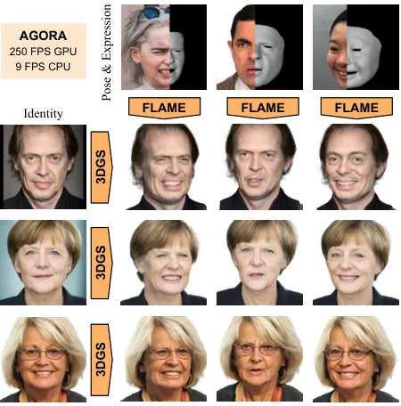

Figure 1: Our method, AGORA, generates animatable 3D avatars. AGORA
produces highly photorealistic identity-preserving results and supports
dynamic control on pose and face expressions, while allowing real-time
inference at 250 FPS on a single GPU and $`\sim`$9 FPS under CPU-only
inference.

(SDS) \[46, 21, 76, 56\] or a single image. However, these methods often
face challenges with view-consistency and achieving the level of detail
required for realistic human heads. The most promising direction for
generating diverse, high-quality avatars has been 3D-aware Generative
Adversarial Networks (3D GANs) \[5, 31, 24, 1, 32, 52, 51, 40, 13, 6,
50, 7\], which learn a distribution of 3D heads from 2D image
collections \[25, 66\]. While some works have extended 3D GANs to
dynamic scenarios \[54, 12, 2, 65, 67, 55, 23\], they typically rely on
computationally expensive neural fields. Concurrently, recent advances
in static generation have adopted the highly efficient 3D Gaussian
Splatting representation \[24, 31\], but lack animation capabilities.
This leaves a critical gap: a method that combines the generative power
of 3D GANs with the real-time rendering of 3DGS to create fast, explicit
and precisely-animatable avatars. Recent work, GAIA \[71\], attempts to
fill this gap by incorporating expression conditioning to produce
animatable avatars. However, this method, while promising, still faces
challenges in both inference speed and visual fidelity.

To address this, we introduce a novel framework for generating
animatable 3D head avatars that unites the efficiency of 3DGS with the
generative power of 3D GANs. Our approach builds upon a static
generator, inspired by GGHEAD \[31\], which produces a canonical set of
3DGS attributes. To enable high-fidelity control, we introduce spatial
shape conditioning in the generator and a lightweight, FLAME-conditioned
\[33\] deformation branch that predicts attribute residuals for
canonical Gaussians. We further enforce expression faithfulness with a
dual-discriminator scheme that provides adversarial supervision on both
rendered appearance and synthetic geometry cues. Since the
identity-specific generator has to be evaluated only once per subject,
animation reduces to the lightweight deformation branch, which keeps the
whole pipeline real-time. Crucially, we train from static face images
only, without multi-view capture or video supervision. The resulting
model generates high-fidelity, controllable avatars capable of real-time
rendering (Fig. 1). Our contributions can be outlined as follows:

- •
  A novel animatable 3DGS generator that couples a lightweight,
  FLAME-conditioned deformation branch predicting per-Gaussian attribute
  residuals with spatial shape conditioning of the identity branch,
  disentangling identity from expression;
- •
  An effective adversarial training strategy using a dual-discriminator
  on both rendered images and synthetic geometry cues to enforce
  expression consistency;
- •
  State-of-the-art results in controllable animation, demonstrating
  superior expression fidelity and real-time performance (250 FPS on a
  single GPU, and $`\sim`$9 FPS on CPU) over previous animatable avatar
  methods.

## 2 Related Work

Related works can be categorized into static 3D GANs and animatable 3D
GANs.

Static 3D head avatars. A significant line of research focuses on
training generative adversarial networks on 2D image datasets like FFHQ
\[25\] to produce 3D-consistent outputs. Early works \[3, 6, 7, 50, 44,
13, 40, 42, 75, 20\] incorporated implicit neural radiance fields (NeRF)
\[37\] into 2D GAN frameworks to enable 3D-consistent generation. To
improve rendering speed and view consistency, hybrid NeRF-based
representations were introduced \[34, 4, 39\] and adopted by subsequent
methods \[5, 52, 51, 68, 62\]. Several methods employ a super-resolution
network to further accelerate rendering at the cost of some view
consistency \[5, 68, 40, 42\]. In particular, EG3D \[5\] builds upon the
StyleGAN \[26\] architecture to generate an intermediate triplane
representation, which is then rendered into a low-resolution image and
further upscaled. While producing high-fidelity results, this reliance
on NeRF leads to slow training and inference and introduces 3D
inconsistency artifacts due to the super-resolution network. To address
this performance bottleneck, subsequent works replaced the NeRF renderer
with the highly efficient 3D Gaussian Splatting (3DGS) representation.
For instance, GGHEAD \[31\] generates 3DGS attributes in a UV space
mapped to a 3DMM template, while GSGAN \[24\] directly generates a 3D
point cloud in a coarse-to-fine manner. Although these methods achieve
real-time rendering, they are fundamentally designed for static head
generation.

Dynamic 3D head avatars. Another line of work extends 3D GANs to model
facial dynamics \[12, 54, 65, 23, 2, 55, 53, 67\]. Some methods control
articulations by conditioning generation on semantic maps \[55, 53,
23\]; however, such conditioning can yield inconsistent animation in
videos. An alternative approach is to condition the generator on
parameters of 3D morphable models (3DMM) \[33, 45, 35\]. Several
approaches \[67, 65, 2\] also predict deformation fields to warp a
canonical representation with respect to given 3DMM parameters. One
recent work, Next3D \[54\], incorporates 3DMM more directly: it adapts
the EG3D framework by rasterizing neural textures on an articulated
FLAME mesh and projecting the head onto orthogonal triplanes. To enforce
geometric consistency, it introduces dual discrimination supervising the
generator with synthetic renderings of the FLAME geometry. While this
enables animation control, expression fidelity can degrade on complex
motions, and dependence on an implicit representation leads to slow
inference. Our work addresses this limitation by integrating animation
control into a 3DGS-based 3D GAN, achieving both high-fidelity animation
and real-time performance. Recent work GAIA \[71\] explores a similar
direction and delivers strong results. Compared with GAIA, AGORA applies
spatial conditioning in both generator and discriminator (UV-aligned
shape maps and FLAME-guided displacement renderings), which we find to
be an important contributor to visual quality and expression fidelity
(Sec. 4.3).

3D head avatars from single image. Orthogonal to the generative task,
another goal is to perform animation directly from a single input image
\[14, 72, 29, 59, 70\]. Some recent methods, such as Live3DPortrait
\[63\], focus on generating high-quality static portraits, which, while
impressive, do not produce animatable models. Building on this idea,
methods like Portrait4D \[10, 11\] and VOODOO \[61, 60\] aim to produce
fully animatable avatars. These approaches typically operate by
leveraging a pre-trained 3D GAN, either by distilling it into a direct
image-to-avatar encoder or by training an encoder on a large-scale
synthetic dataset generated by the GAN. While these models offer
impressive single-shot performance, their quality is fundamentally
dependent on the underlying generative model. A recent direction
synthesizes pseudo-4D supervision with multi-view image/video diffusion
models and then optimizes a personalized avatar (_e.g_., CAP4D and MVP4D
\[58, 57\]); however, this optimization-heavy process is time-consuming
for each new subject. Another line uses strong DINO \[41\] features to
infer animatable 3D Gaussian heads from a single image, including
GAGAvatar \[9\] and related methods \[43, 30\]. Although effective,
these feature-driven approaches rely on explicit 3D supervision, whereas
AGORA is trained purely from static 2D image collections. LAM \[22\]
also conditions on DINO features, but its inference-time animation is
based on plain linear blend skinning (LBS), restricting non-linear
expression effects such as wrinkles and other fine-scale deformations.
In contrast, our work strengthens the underlying 3D-aware GAN prior with
an expression-specific deformation branch that captures such non-linear
effects, providing a stronger foundation for single-image pipelines
while retaining real-time inference.

## 3 Method

In this section we introduce preliminary concepts followed by a concise
description of our approach.

### 3.1 Preliminaries

3D Gaussian Splatting. 3DGS \[28\] is an explicit 3D representation that
models a scene as a collection of 3D Gaussians, enabling high-quality,
real-time rendering. Each Gaussian is defined by a position
$`\mu\in\mathbb{R}^{3}`$, a covariance matrix
$`\Sigma\in\mathbb{R}^{3\times 3}`$ (parameterized by a scale vector and
a rotation quaternion), view-dependent color represented by spherical
harmonics (SH) coefficients $`c`$, and an opacity $`\alpha`$. The color
$`C`$ of a pixel is computed by alpha-blending $`N`$ Gaussians sorted by
depth:

```math
C=\sum_{i=1}^{N}c_{i}\alpha^{\prime}_{i}\prod_{j=1}^{i-1}(1-\alpha^{\prime}_{j}), \tag{1}
```

where $`\alpha^{\prime}_{i}`$ is the opacity of the $`i`$-th Gaussian
modulated by its 2D projection onto the pixel. This process is
differentiable, allowing for gradient-based optimization of all
parameters.

FLAME 3D Morphable Model. FLAME \[33\] is a statistical head model that
provides a low-dimensional parametric space for shape $`\beta`$,
expression $`\psi`$, and pose $`\theta`$. The template $`T_{P}`$ is
formed by adding linear combinations of shape blendshapes
$`B_{S}(\beta)`$, expression blendshapes $`B_{E}(\psi)`$, and
pose-corrective blendshapes $`B_{P}(\theta)`$ to a base template
$`\bar{T}`$:

```math
T_{P}(\beta,\psi,\theta)=\bar{T}+B_{S}(\beta;\mathcal{S})+B_{E}(\psi;\mathcal{E})+B_{P}(\theta;\mathcal{P}). \tag{2}
```

After applying linear blend skinning $`W`$, the articulated model is
$`M(\beta,\psi,\theta)=W(T_{P}(\beta,\psi,\theta),\mathcal{J}(\beta),\theta,\mathcal{W}).`$
This formulation allows for fine-grained control over facial identity
and articulation. In this work, we primarily leverage the expression
parameters $`\psi`$ and the jaw pose $`\theta`$ to drive the animation
of our generated avatars.

### 3.2 Architecture Overview

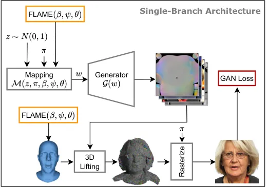

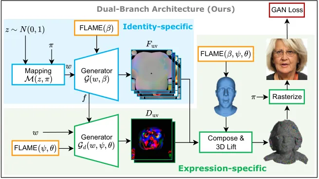

(a) (b)

Figure 2: Single- and dual-branch generator designs and expression
conditioning. (a) Single-branch GGHEAD-style baseline with no FLAME
conditioning; the orange box marks the conditioning hook used in our
ablations: $`(\beta,\psi,\theta)`$ injected into the mapping network
$`\mathcal{M}`$. (b) Dual-branch AGORA: an identity path
$`\mathcal{G}(w,\beta)`$ produces canonical 3DGS attributes, while an
expression path $`\mathcal{G}_{\text{d}}(w,\psi,\theta;f)`$ predicts
residuals. Residuals are composed with the canonical attributes, _3D
lifted_ onto the articulated FLAME mesh, and rasterized.

The overall architecture of our generative model $`\mathcal{G}`$,
illustrated in Fig. 2(b), builds upon the UV-based GGHEAD framework. Our
goal is to produce an animatable 3DGS avatar from a latent code
$`z\in\mathcal{Z}`$, camera parameters $`\pi`$, and FLAME parameters
$`(\beta,\psi,\theta)`$. Following EG3D \[5\], a mapping network
$`\mathcal{M}`$ maps the latent code $`z`$ and camera parameters $`\pi`$
to an intermediate latent variable $`w\in\mathcal{W}`$. The core
generator $`\mathcal{G}`$ then synthesizes a set of UV-space feature
maps $`F_{\text{uv}}`$ from $`w`$ and $`\beta`$, which encode the
identity-specific, canonical Gaussian attributes:

```math
\displaystyle w \displaystyle=\mathcal{M}(z,\pi),\ \ F_{\text{uv}}=\mathcal{G}(w,\beta). \tag{3}
```

We obtain the raw Gaussian attributes $`\mathcal{A}_{M}`$ by bilinearly
sampling $`F_{\text{uv}}`$ at a set of pre-defined UV coordinates
$`x_{uv}`$:

```math
\displaystyle\mathcal{A}_{M}=\text{GridSample}(F_{\text{uv}},x_{uv}), \tag{4}
```

where $`\mathcal{A}_{M}=\{\mu_{\delta M},s,q,c,\alpha\}`$ includes a
position offset $`\mu_{\delta M}`$ relative to the template mesh $`M`$,
as well as scale $`s`$, rotation $`q`$, color $`c`$, and opacity
$`\alpha`$.

The final 3D position of each Gaussian is obtained via _3D lifting_: we
bilinearly interpolate a base position from the articulated FLAME mesh
$`M(\beta,\psi,\theta)`$ at $`x_{uv}`$ and add the predicted offset,

```math
\displaystyle\mu=\text{Interpolate}(M(\beta,\psi,\theta),x_{uv})+\mu_{\delta M}. \tag{5}
```

This design anchors the generated 3DGS to the underlying parametric
mesh, providing a structured basis for animation.

### 3.3 Spatial Shape Conditioning

We condition the main generator $`\mathcal{G}`$ on the FLAME shape code
$`\beta`$, as shown in Fig. 2(b), to encode shape-specific priors
(_e.g_. smaller craniofacial proportions for children). We found that
naively injecting $`\beta`$ into the mapping network $`\mathcal{M}`$
makes the intermediate latent $`w`$ overly dominated by $`\beta`$, which
reduces $`z`$-driven diversity and leads to mode collapse.

Instead, we adopt a softer, spatial conditioning strategy: we derive a
UV-aligned map of the _shape-isolated_ deformation field and concatenate
it to the feature maps within $`\mathcal{G}`$. Concretely, with
$`\beta_{0}`$ denoting the canonical neutral shape code and neutral
expression and jaw pose set to $`(\psi_{0},\theta_{0})`$, we compute

```math
\Delta V_{\text{shape}}(\beta)=M(\beta,\psi_{0},\theta_{0})-M(\beta_{0},\psi_{0},\theta_{0}). \tag{6}
```

We then bake $`\Delta V_{\text{shape}}`$ into a UV-aligned displacement
map, apply _per-sample variance normalization_ to better match the
unit-variance assumption of the StyleGAN-style synthesis network, and
concatenate final channels with the block features. This spatial,
UV-consistent conditioning injects shape biases where they matter
geometrically while preserving the stochasticity carried by $`z`$.

### 3.4 Deformation Branch

To refine the coarse 3DMM-based articulation and add high-frequency
changes, we introduce a separate, lightweight deformation branch
$`\mathcal{G}_{\text{d}}`$. This branch takes low-resolution
$`64\times 64`$ feature maps $`f`$ from the main generator, which encode
coarse structural features (_e.g_., face shape, hair regions) \[25\],
and is conditioned on the FLAME expression $`\psi`$ and jaw pose
$`\theta`$ via style modulation. It produces expression-specific
features $`D_{\text{uv}}`$ for the geometric Gaussian attributes:

```math
D_{\text{uv}}=\mathcal{G}_{\text{d}}(w,\psi,\theta;f). \tag{7}
```

From these, we obtain residual Gaussian attributes $`A_{D}`$ by
bilinearly sampling $`D_{\text{uv}}`$ at UV coordinates $`x_{uv}`$,
where $`\mathcal{A}_{D}=\{\Delta\mu,\Delta s,\Delta q\}`$. These
residuals are then _composed_ with the canonical attributes from the
main branch to obtain the final Gaussian attributes $`\mathcal{A}`$.
Specifically, we use post-activation summation for means, quaternion
multiplication for rotations, and summation for log-scales.

This design is crucial for two reasons: (1) it prevents
identity–expression entanglement, as naively conditioning the main
generator $`\mathcal{G}`$ on expression parameters would cause the model
to learn a unique identity for each expression vector; and (2) it
enables fast, real-time animation of a fixed identity, since the more
computationally expensive identity-specific $`\mathcal{G}`$ only needs
to be run once.

### 3.5 Final Gaussian Model

We apply activation functions similar to GGHEAD on the predicted
position and scale of the Gaussians. For the position offsets, we use a
bounded $`\tanh`$, which upper-bounds the maximal deviation of Gaussians
from the template mesh by $`\gamma_{\text{pos}}`$. For the scale
parameters, we use a bounded exponential with softplus, which constrains
the maximum scale to $`e^{-s_{\text{max}}}`$ while initializing it at
$`e^{-s_{\text{init}}}`$. Finally, we rasterize the Gaussian model
$`\mathcal{A}`$ with camera parameters $`\pi`$ to produce the generated
image.

### 3.6 Enforcing Expression Consistency

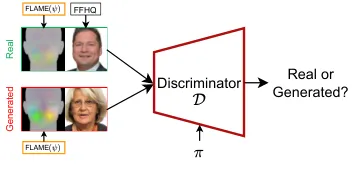

Figure 3: Dual-Discrimination. We pass synthetic renderings $`S(\psi)`$
along with the RGB images.

Naively training the generator with only an image-based discriminator is
insufficient for precise expression control. Following Next3D \[54\], we
condition the discriminator $`\mathcal{D}`$ on the target expression by
concatenating the rendered image with a synthetic FLAME rendering
$`\mathcal{S}(\psi)`$, as illustrated in Fig. 3. With UV-coordinate
coloring of FLAME vertices \[29\], expression consistency improves, but
the model still under-expresses high-intensity cues (Sec. 4.3).

We therefore replace UV coloring with a stronger displacement-based
signal so that the discriminator can penalize fine-grained deviations.
Specifically, we color-code the posed FLAME mesh by its
expression-isolated vertex displacement from the neutral pose:

```math
\Delta V=V_{\text{posed}}-V_{\text{neutral}}. \tag{8}
```

Using the same neutral-state notation as above,
$`V_{\text{posed}}\in M(\beta_{0},\psi,\theta_{0})`$ and
$`V_{\text{neutral}}\in M(\beta_{0},\psi_{0},\theta_{0})`$. As indicated
in Fig. 3, the resulting displacement-colored rendering
$`\mathcal{S}(\psi)`$ is concatenated with the RGB render as input to
$`\mathcal{D}`$. As shown in Table 3, this significantly improves
expression consistency.

### 3.7 Loss functions & Regularizations

We train with the generator-side non-saturating GAN loss \[18\]:

```math
\mathcal{L}_{\text{GAN}}=\text{softplus}\big(-\mathcal{D}(\mathcal{R}(\mathcal{A},\pi),\,\mathcal{S}(\psi),\,\pi)\big). \tag{9}
```

Following GGHEAD, we also regularize position, scale, and opacity,
employing $`L_{2}`$ losses $`\mathcal{L}_{\text{pos}}`$,
$`\mathcal{L}_{\text{scale}}`$ and Beta loss
$`\mathcal{L}_{\text{opacity}}`$. In a similar fashion, we apply
$`L_{2}`$ regularization to the position
$`\mathcal{L}^{D}_{\text{pos}}`$ and scale
$`\mathcal{L}^{D}_{\text{scale}}`$ residuals predicted by the
deformation branch. These terms discourage large global warps and
encourage the deformation branch to remain localized to fine-grained
expression details. Following prior works, we apply R1 regularization
\[36, 26\] on Discriminator to keep training stable.

## 4 Experiments

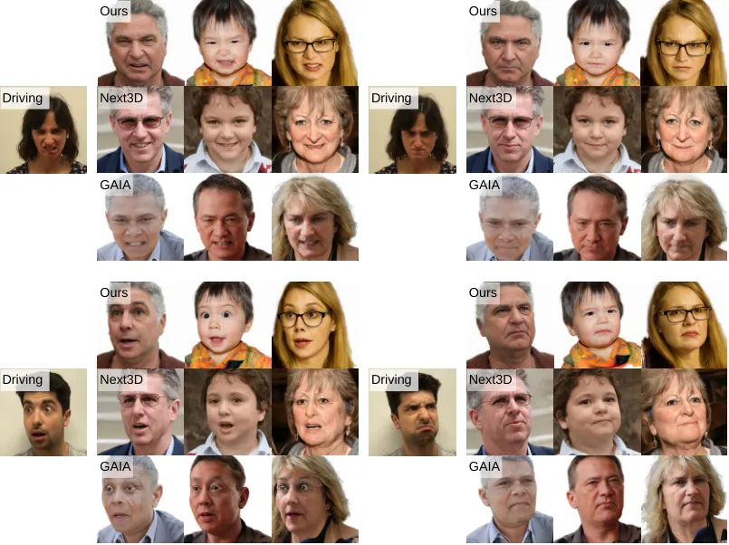

Figure 4: Qualitative comparisons with Next3D and GAIA on avatar
generation, pose and face expression transfer.

Implementation details. Our generator and discriminator models are based
on StyleGAN-2 architecture. We train the model in 2 stages. First, we
train it for 6.5M images using $`256\times 256`$ resolution
rasterization, sampling 65K Gaussians on UV grid. Next, we train the
model for 14M images on full $`512\times 512`$ resolution, sampling 262K
Gaussians. During both stages we use batch size 32, we set discriminator
learning rate to $`0.002`$ and generator learning rate to $`0.0025`$. We
apply R1 gradient penalty once every $`16`$ steps with $`\gamma=1.0`$
coefficient. For regularizations, we empirically choose
$`\lambda_{\text{pos}}=0.25,\lambda_{\text{scale}}=0.5`$ for main branch
and $`\lambda^{D}_{\text{pos}}=1.5,\lambda^{D}_{\text{scale}}=1.5`$ for
deformation branch. We apply $`\mathcal{L}_{\text{opacity}}`$ only
during the second stage and use coefficient
$`\lambda_{\text{opacity}}=1.0`$. The entire training takes 4 days on
4$`\times\text{RTX A6000}`$.

Dataset. We train our model on FFHQ \[25\] dataset, consisting of 70000
human head images. Following prior works, we mirror the dataset to
obtain around 140000 images in total. Following GGHEAD \[31\], we use
MODNet \[27\] to remove background from FFHQ images. For each image we
estimate FLAME parameters via off-the-shelf estimator \[48\], and
further derive camera parameters from estimated head rotations.

Baselines. We compare with the static baselines GGHEAD \[31\] and
EG3D \[5\]. We also compare with the state-of-the-art NeRF-based
animatable 3D GAN, Next3D \[54\], and the recent 3DGS-based method
GAIA \[71\].

We employ Fréchet Inception Distance (FID) to measure the quality of
generated images. Following prior works \[54\], we use Average Pose
Distance (APD), Average Expression Distance (AED) and identity
consistency (ID) metrics to evaluate animation quality. To further
evaluate mouth consistency, similar to GAIA we calculate the Average
Jawpose Distance (AED-jaw). To compute metrics, we follow exactly the
same protocol described in \[54\].

We further compare inference speed of the methods on avatar reenactment
setting, _i.e_. with running identity branch once with caching. To this
end, we report FPS on a single RTX A6000 of PyTorch implementation of
our method without any additional optimizations. For Next3D we measure
FPS on the same machine using the code from the author’s repository
\[54\]. For GAIA we take the measurements from their paper, which are
also conducted on an RTX A6000 GPU with identity caching. In addition,
we report CPU-only inference speed for AGORA; hardware details are given
in the supplementary material.

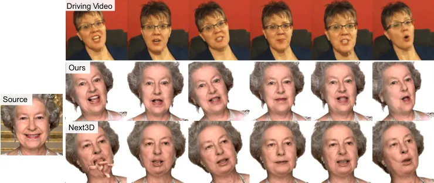

(a) Next3D

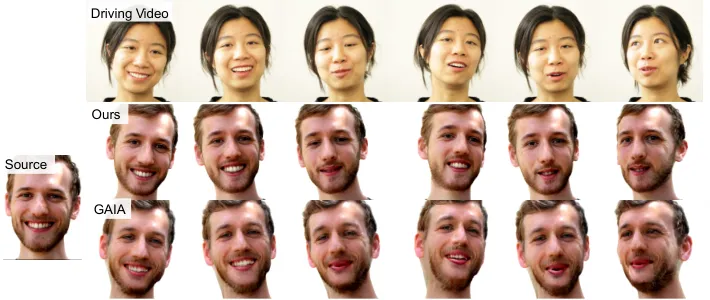

(b) GAIA

Figure 5: Single-image avatar (PTI) comparisons against previous
methods.

### 4.1 Comparison with SOTA

Table 1 compares AGORA with static head generators GGHEAD \[31\],
EG3D \[5\] and recent animatable head avatars Next3D \[54\],
GAIA \[71\]. As can be seen, our approach outperforms all other
baselines in terms of image quality (FID). For camera and identity
consistency, AGORA scores better in APD and ID compared to GAIA and
Next3D. For the animation quality, we significantly outperform
NeRF-based Next3D in both AED and AED-jaw. Compared to GAIA, our method
produces more consistent mouth articulations, resulting in significantly
better AED-jaw. While GAIA shows better expression consistency in AED
metrics, qualitative comparison in Fig. 5 demonstrates fewer artifacts
in faces produced by our method. Finally, our method significantly
outperforms previous methods in inference speed. We report 250 FPS and
$`\sim`$9 FPS runtime on GPU and CPU (16 threads), respectively, enabled
by the lightweight deformation branch $`{\cal{G}}_{d}`$ and the simple
FLAME linear blend skinning used by AGORA.

|               |                    |                    |                        |                       |                    |                  |
| ------------- | ------------------ | ------------------ | ---------------------- | --------------------- | ------------------ | ---------------- |
| Method        | FID $`\downarrow`$ | AED $`\downarrow`$ | AED-jaw $`\downarrow`$ | $`\text{ID}\uparrow`$ | APD $`\downarrow`$ | FPS $`\uparrow`$ |
| EG3D \[5\]    | 3.28               | –                  | –                      | –                     | –                  | –                |
| GGHEAD \[31\] | 4.06               | –                  | –                      | –                     | –                  | –                |
| Next3D \[54\] | 3.18               | 0.930              | 0.046                  | 0.74                  | 0.031              | 15               |
| GAIA \[71\]   | 3.85               | 0.530              | 0.040                  | 0.72                  | 0.027              | 52               |
| AGORA         | 3.17               | 0.682              | 0.021                  | 0.75                  | 0.025              | 250              |

Table 1: Comparison with state of the art. Lower values are better for
FID/AED/APD; higher is better for ID/FPS. Best results are shown in
bold, and second-best are underlined. Note that EG3D and GGHEAD don’t
offer expression control, so we only report FID.

### 4.2 Qualitative Results

Avatar generation. We qualitatively compare AGORA (ours) against Next3D
and GAIA on avatar expressiveness. Fig. 4 presents results of
re-animating faces with strong expressions from the FEED dataset \[15\].
Our method closely follows the driving expressions and recovers
fine-grained cues such as wrinkles, while remaining emotion-consistent
(_i.e_. clear _disgust_, _anger_, and _surprise_). Notably, for the same
_surprise_ input our model yields age-appropriate behavior (forehead
wrinkling for older subjects but not for children), enabled by
shape-code conditioning, which preserves identity priors while
modulating expression detail. While Next3D renders high-quality images,
it often under-expresses or misaligns the target articulation in
high-intensity cases. GAIA generally produces valid expressions, but
AGORA renders more realistic faces and shows fewer artifacts in extreme
expressions, where GAIA occasionally exhibits issues around the eyes.

Avatars from a single image. We further compare methods by generating
avatars from a single image using Pivotal Tuning Inversion (PTI) \[49\].
For each source face image we run PTI to obtain its avatar, randomly
assign a driving video, and transfer its expressions and camera motion.
For both AGORA and Next3D we use the same PTI implementation from the
authors’ repository \[49\]. For GAIA, neither code nor model weights are
publicly available, so we report only the PTI example provided by the
authors and exclude GAIA from the user study below, which requires
personalizing and re-animating all source images.

Figure 6: User study on single-image avatar reenactment. Pairwise
preferences between AGORA and Next3D over identity consistency,
expression consistency, and overall video quality.

As illustrated in Fig. 5 (left panel), Next3D struggles under extreme
jaw poses, exhibiting pronounced mouth/teeth artifacts, whereas AGORA
maintains precise mouth articulation and better preserves identity. To
evaluate this trend at scale, we run a video-level user study with 50
in-the-wild source images and 20 driving videos. The driving set
includes challenging clips with large rotations and strong expressions
from FEED \[15\] and additional in-the-wild talking-head videos.
Participants compare AGORA and Next3D on identity consistency,
expression consistency, and overall video quality (temporal smoothness).
Fig. 6 shows consistent preference for AGORA across all three criteria;
full protocol details are provided in the supplementary material.

Fig. 5 (right panel) presents a qualitative comparison of our method
with GAIA. We can observe frequent artifacts in mouth areas and
inconsistent head geometry for GAIA-generated avatars, see _e.g_.,
column 4. In contrast, our method yields smoother motion and consistent
teeth rendering. These observations can be further confirmed from videos
in the supplementary material.

Expression–identity disentanglement. In Fig. 7 we assess disentanglement
of expression and identity by independently interpolating the identity
latent and the FLAME expression parameters. We sample two identities and
two expressions and obtain other identity codes and expression settings
by linear interpolation. We then render the resulting grid of
expressions and identities while keeping other parameters unchanged.
Rows exhibit smooth expression transitions with stable identity, while
columns vary identity without altering the intended expression. The grid
indicates clean factor separation: precise expression changes and
consistent identity traits, with no visible entanglement.

### 4.3 Ablation Study

We next evaluate design choices of our method. To keep ablations
tractable, we report results for a lightweight setting using
$`256{\times}256`$ image resolution and 65K Gaussians. Unless stated
otherwise, all variants share the same data, schedule, and seeds under
these settings. The exception is Table 4, which reports full-scale runs
with $`512{\times}512`$ rasterization and 262K Gaussians.

Conditioning architecture. Table 2 compares architectures for
identity-consistent expression control. We ablate different ways to
condition the model on FLAME shape, expression, and jaw parameters
$`(\beta,\psi,\theta)`$.

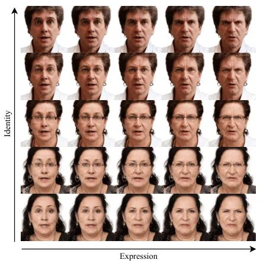

Figure 7: Expression–identity disentanglement. Rows vary expression at
fixed identity; columns vary identity at fixed expression.

Exp.1–2 are single-branch baselines following Fig. 2(a): Exp.1 uses only
FLAME LBS and gives the worst FID/AED, showing explicit conditioning is
necessary. Its high ID reflects under-articulation, not disentanglement:
appearance changes little beyond the LBS geometry, so identity is easy
to preserve. Exp.2 injects $`(\beta,\psi,\theta)`$ directly into the
mapping network $`\mathcal{M}`$ (orange hook in Fig. 2(a)); FID improves
but ID drops, indicating identity–expression entanglement (visualized in
Fig. 3 of the supplementary material). Replacing that injection with the
deformation branch (Exp.3) improves FID/AED further, yet ID remains low.
Exp.4 additionally conditions $`\mathcal{G}`$ on person-specific,
expression-independent shape $`\beta`$, recovering ID at a small AED
cost ($`0.563\rightarrow 0.588`$) and giving the best overall FID/AED/ID
trade-off. AED-jaw and APD stay essentially constant across all four
variants. Overall, splitting identity and expression pathways improves
quality while enabling fast animation, since only lightweight
expression-specific modules run at test time.

|           |                       |             |        |                   |                   |                       |                |                   |
| --------- | --------------------- | ----------- | ------ | ----------------- | ----------------- | --------------------- | -------------- | ----------------- |
| Exp.      | $`\cal{M}`$           | $`\cal{G}`$ | Branch | FID$`\downarrow`$ | AED$`\downarrow`$ | AED-jaw$`\downarrow`$ | ID$`\uparrow`$ | APD$`\downarrow`$ |
| 1.        | -                     | -           | S      | 6.59              | 0.686             | 0.022                 | 0.74           | 0.026             |
| 2.        | $`\beta,\psi,\theta`$ | -           | S      | 5.46              | 0.664             | 0.022                 | 0.56           | 0.027             |
| 3.        | -                     | -           | D      | 5.29              | 0.563             | 0.024                 | 0.56           | 0.026             |
| 4. (Ours) | -                     | $`\beta`$   | D      | 4.72              | 0.588             | 0.022                 | 0.70           | 0.026             |

Table 2: Expression–identity disentanglement. Lower is better for FID,
AED, AED-jaw, and APD; higher is better for ID. “S” and “D” stand for
Single and Dual branch architectures.

Discriminator expression conditioning. Table 3 compares discriminator
conditioning strategies for expression control. Without expression-aware
discrimination (row 1), the generator is free to optimize realism alone
and produces much worse AED. Conditioning with cGAN-style vector
projection \[38\] also fails to improve AED (row 2), likely because
stronger camera/geometry cues dominate and the expression signal is
ignored. We therefore condition through image space by concatenating
synthetic renderings with real/generated images. Next3D-style dual
discrimination gives only a minor AED gain (row 3): its renderings also
encode FLAME’s shape code, so the discriminator can memorize identity
from each (shape, expression) pair, pushing the generator toward
identity–expression entanglement (ID 0.59 vs. 0.70 for ours) rather than
faithful expressions. Our expression-only rendering with
LBS-displacement texture cues removes this shape leakage, provides the
strongest expression geometry signal, and achieves the best AED/AED-jaw
(row 4).

|                                      |                   |                       |
| ------------------------------------ | ----------------- | --------------------- |
| Variant                              | AED$`\downarrow`$ | AED-jaw$`\downarrow`$ |
| 1\. w/o dual discrimination          | 0.832             | 0.024                 |
| 2\. cGAN-style vector projection     | 0.847             | 0.025                 |
| 3\. Next3D-style dual discrimination | 0.766             | 0.024                 |
| 4\. Ours                             | 0.588             | 0.022                 |

Table 3: Dual-Discrimination ablation. Lower is better.

Comparison with GAIA design choices. In Table 4 we report an additional
ablation of our full-scale setup ($`512{\times}512`$, 262K Gaussians)
aimed at comparing our method with GAIA. We modify the following
components of AGORA: spatial conditioning is replaced with GAIA’s vector
conditioning, and dual discrimination is replaced with GAIA’s
two-discriminator design (shape and expression). GAIA\* is our closest
GAIA-style setting: both AGORA components are disabled, and we also
apply GAIA’s loss scheduling and deformation-branch regularization from
their paper (official code was unavailable). Every modified variant has
higher FID than Ours (3.42–8.53 vs. 3.17). Notably, spatial conditioning
on its own is worse than using neither component (8.53 vs. 6.08),
suggesting that shape-conditioned features only pay off once the
discriminator is expression-aware, which is what dual discrimination
provides. The two components are therefore complementary, and together
they account for most of the visual-quality gap to the GAIA-style
baseline. FID, however, does not capture identity preservation, where
spatial conditioning has its clearest effect (Table 2, Exp.3 vs. Exp.4:
ID $`0.56\rightarrow 0.70`$).

|                 |                |                |                   |
| --------------- | -------------- | -------------- | ----------------- |
| Variant         | Sp. cond.      | Dual- disc.    | FID$`\downarrow`$ |
| GAIA\*          | $`\times`$     | $`\times`$     | 6.08              |
| Dual-disc. only | $`\times`$     | $`\checkmark`$ | 3.42              |
| Sp. cond. only  | $`\checkmark`$ | $`\times`$     | 8.53              |
| Ours            | $`\checkmark`$ | $`\checkmark`$ | 3.17              |

Table 4: Comparison with GAIA design choices in full-scale training
($`512{\times}512`$, 262K Gaussians). Lower is better for FID.

## 5 Conclusion

We presented AGORA, a conditional 3DGS GAN for animatable head avatars.
A dual-branch generator couples an identity path with an
expression-specific deformation branch; spatial shape conditioning
injects shape priors without collapsing diversity; and dual
discrimination on synthetic geometry cues enforces precise expressions.
The same model applies to single-image PTI avatars and remains stable
under large poses and articulations. AGORA results in excellent
generation quality, real-time rendering at 250 FPS on a single GPU, and
interactive-rate CPU rendering, while outperforming existing animatable
avatar methods. Future work will address hair animation, robustness to
varying illumination, as well as extensions to full-body models.

## References

- \[1\] An, S., Xu, H., Shi, Y., Song, G., Ogras, U.Y., Luo, L.:
  PanoHead: Geometry-aware 3D full-head synthesis in 360deg. In: CVPR.
  pp. 20950–20959 (2023)
- \[2\] Bergman, A.W., Kellnhofer, P., Wang, Y., Chan, E., Lindell,
  D.B., Wetzstein, G.: Generative neural articulated radiance fields.
  In: Adv. Neural Inform. Process. Syst. vol. 35, pp. 19900–19916 (2022)
- \[3\] Cai, S., Obukhov, A., Dai, D., Van Gool, L.: Pix2nerf:
  Unsupervised conditional $`\pi`$-gan for single image to neural
  radiance fields translation. In: CVPR. pp. 3981–3990 (2022)
- \[4\] Cao, A., Johnson, J.: HexPlane: A fast representation for
  dynamic scenes. In: CVPR. pp. 130–141 (2023)
- \[5\] Chan, E.R., Lin, C.Z., Chan, M.A., Nagano, K., Pan, B.,
  De Mello, S., Gallo, O., Guibas, L.J., Tremblay, J., Khamis, S.,
  Karras, T., Wetzstein, G.: Efficient geometry-aware 3D generative
  adversarial networks. In: CVPR. pp. 16123–16133 (2022)
- \[6\] Chan, E.R., Monteiro, M., Kellnhofer, P., Wu, J., Wetzstein, G.:
  $`\pi`$-gan: Periodic implicit generative adversarial networks for
  3d-aware image synthesis. In: CVPR. pp. 5799–5808 (2021)
- \[7\] Chen, X., Jiang, T., Song, J., Yang, J., Black, M.J., Geiger,
  A., Hilliges, O.: gdna: Towards generative detailed neural avatars.
  In: CVPR (2022)
- \[8\] Chen, Y., Wang, L., Li, Q., Xiao, H., Zhang, S., Yao, H., Liu,
  Y.: Monogaussianavatar: Monocular gaussian point-based head avatar.
  In: SIGGRAPH ’24: ACM SIGGRAPH 2024 Conference Proceedings.
  Association for Computing Machinery (2024)
- \[9\] Chu, X., Harada, T.: Generalizable and animatable gaussian head
  avatar. In: Adv. Neural Inform. Process. Syst. (2024)
- \[10\] Deng, Y., Wang, D., Ren, X., Chen, X., Wang, B.: Portrait4D:
  Learning one-shot 4D head avatar synthesis using synthetic data. In:
  CVPR (2024)
- \[11\] Deng, Y., Wang, D., Wang, B.: Portrait4D-v2: Pseudo multi-view
  data creates better 4D head synthesizer. In: Eur. Conf. Comput. Vis.
  pp. 316–333. Springer, Cham (2024)
- \[12\] Deng, Y., Yang, J., Chen, D., Wen, F., Tong, X.: Disentangled
  and controllable face image generation via 3D imitative-contrastive
  learning. In: CVPR. pp. 5154–5163 (2020)
- \[13\] Deng, Y., Yang, J., Xiang, J., Tong, X.: Gram: Generative
  radiance manifolds for 3d-aware image generation. In: CVPR. pp.
  10673–10683 (2022)
- \[14\] Doukas, M.C., Zafeiriou, S., Sharmanska, V.: Headgan: One-shot
  neural head synthesis and editing. In: Int. Conf. Comput. Vis. (2021)
- \[15\] Drobyshev, N., Casademunt, A.B., Vougioukas, K., Landgraf, Z.,
  Petridis, S., Pantic, M.: Emoportraits: Emotion-enhanced multimodal
  one-shot head avatars. In: CVPR (2024)
- \[16\] Gafni, G., Thies, J., Zollhöfer, M., Nießner, M.: Dynamic
  neural radiance fields for monocular 4D facial avatar reconstruction.
  In: CVPR. pp. 8649–8658 (2021)
- \[17\] Giebenhain, S., Kirschstein, T., Rünz, M., Agapito, L.,
  Nießner, M.: NPGA: Neural parametric gaussian avatars. In: SIGGRAPH
  Asia 2024 Conference Papers. pp. 1–11 (2024)
- \[18\] Goodfellow, I.J., Pouget-Abadie, J., Mirza, M., Xu, B.,
  Warde-Farley, D., Ozair, S., Courville, A., Bengio, Y.: Generative
  adversarial nets. In: Adv. Neural Inform. Process. Syst.
  vol. 27 (2014)
- \[19\] Grassal, P.W., Prinzler, M., Leistner, T., Rother, C., Nießner,
  M., Thies, J.: Neural head avatars from monocular RGB videos. In:
  CVPR. pp. 18653–18664 (2022)
- \[20\] Gu, J., Liu, L., Wang, P., Theobalt, C.: Stylenerf: A
  style-based 3d-aware generator for high-resolution image synthesis.
  In: Int. Conf. Learn. Represent. (2022)
- \[21\] Han, X., Cao, Y., Han, K., Zhu, X., Deng, J., Song, Y.Z.,
  Xiang, T., Wong, K.Y.K.: HeadSculpt: Crafting 3D head avatars with
  text. In: Adv. Neural Inform. Process. Syst. vol. 36 (2023)
- \[22\] He, Y., Gu, X., Ye, X., Xu, C., Zhao, Z., Dong, Y., Yuan, W.,
  Dong, Z., Bo, L.: LAM: Large Avatar Model for One-Shot Animatable
  Gaussian Head. In: ACM SIGGRAPH 2025 Conference Papers. pp.
  1–13 (2025)
- \[23\] Hong, F., Chen, Z., Lan, Y., Pan, L., Liu, Z.: Eva3d:
  Compositional 3d human generation from 2d image collections. In: Int.
  Conf. Learn. Represent. (2023)
- \[24\] Hyun, S., Heo, J.P.: GSGAN: Adversarial learning for
  hierarchical generation of 3D gaussian splats. In: Adv. Neural Inform.
  Process. Syst. vol. 37 (2024)
- \[25\] Karras, T., Laine, S., Aila, T.: A style-based generator
  architecture for generative adversarial networks. In: CVPR. pp.
  4401–4410 (2019)
- \[26\] Karras, T., Laine, S., Aittala, M., Hellsten, J., Lehtinen, J.,
  Aila, T.: Analyzing and improving the image quality of StyleGAN. In:
  CVPR. pp. 8110–8119 (2020)
- \[27\] Ke, Z., Sun, J., Li, K., Yan, Q., Lau, R.W.: Modnet: Real-time
  trimap-free portrait matting via objective decomposition. In:
  AAAI (2022)
- \[28\] Kerbl, B., Kopanas, G., Leimkühler, T., Drettakis, G.: 3D
  gaussian splatting for real-time radiance field rendering. ACM Trans.
  Graph. 42(4), 139:1–139:14 (2023)
- \[29\] Kim, H., Garrido, P., Tewari, A., Xu, W., Thies, J., Niessner,
  M., Pérez, P., Richardt, C., Zollhöfer, M., Theobalt, C.: Deep video
  portraits. ACM transactions on graphics (TOG) 37(4), 1–14 (2018)
- \[30\] Kirschstein, T., Giebenhain, S., Niessner, M.: FlexAvatar:
  Learning Complete 3D Head Avatars with Partial Supervision. In:
  CVPR (2026)
- \[31\] Kirschstein, T., Giebenhain, S., Tang, J., Georgopoulos, M.,
  Nießner, M.: GGHead: Fast and generalizable 3D gaussian heads. In:
  SIGGRAPH Asia 2024 Conference Papers. pp. 1–11 (2024)
- \[32\] Li, H., Chen, C., Shi, T., Qiu, Y., An, S., Chen, G., Han, X.:
  SphereHead: Stable 3D full-head synthesis with spherical tri-plane
  representation. In: Eur. Conf. Comput. Vis. pp. 324–341. Springer,
  Cham (2024)
- \[33\] Li, T., Bolkart, T., Black, M.J., Li, H., Romero, J.: Learning
  a model of facial shape and expression from 4D scans. ACM Trans.
  Graph. 36(6), 194:1–194:17 (2017)
- \[34\] Liu, L., Gu, J., Lin, K.Z., Chua, T.S., Theobalt, C.: Neural
  sparse voxel fields. In: Adv. Neural Inform. Process. Syst.
  vol. 33 (2020)
- \[35\] Loper, M., Mahmood, N., Romero, J., Pons-Moll, G., Black, M.J.:
  SMPL: A skinned multi-person linear model. ACM Trans. Graph. 34(6),
  248:1–248:16 (2015)
- \[36\] Mescheder, L., Geiger, A., Nowozin, S.: Which training methods
  for GANs do actually converge? In: Int. Conf. Mach. Learn. pp.
  3481–3490 (2018)
- \[37\] Mildenhall, B., Srinivasan, P.P., Tancik, M., Barron, J.T.,
  Ramamoorthi, R., Ng, R.: NeRF: Representing scenes as neural radiance
  fields for view synthesis. Communications of the ACM 65(1),
  99–106 (2022)
- \[38\] Miyato, T., Koyama, M.: cGANs with projection discriminator.
  In: Int. Conf. Learn. Represent. (2018)
- \[39\] Müller, T., Evans, A., Schied, C., Keller, A.: Instant neural
  graphics primitives with a multiresolution hash encoding. ACM Trans.
  Graph. 41(4), 1–15 (2022)
- \[40\] Niemeyer, M., Geiger, A.: Giraffe: Representing scenes as
  compositional generative neural feature fields. In: CVPR (2021)
- \[41\] Oquab, M., Darcet, T., Moutakanni, T., Vo, H., et al.: Dinov2:
  Learning robust visual features without supervision. Transactions on
  Machine Learning Research (2024)
- \[42\] Or-El, R., Luo, X., Shan, M., Shechtman, E., Park, J.J.,
  Kemelmacher-Shlizerman, I.: Stylesdf: High-resolution 3d-consistent
  image and geometry generation. In: CVPR (2022)
- \[43\] Oroz, A., Niessner, M., Kirschstein, T.: PercHead: Perceptual
  Head Model for Single-Image 3D Head Reconstruction and Editing. arXiv
  preprint arXiv:2511.02777 (2025)
- \[44\] Pan, X., Xu, X., Loy, C.C., Theobalt, C., Dai, B.: A
  shading-guided generative implicit model for shape-accurate 3d-aware
  image synthesis. In: Adv. Neural Inform. Process. Syst. (2021)
- \[45\] Paysan, P., Knothe, R., Amberg, B., Romdhani, S., Vetter, T.: A
  3D face model for pose and illumination invariant face recognition.
  In: 2009 Sixth IEEE International Conference on Advanced Video and
  Signal Based Surveillance. pp. 296–301. IEEE (2009)
- \[46\] Poole, B., Jain, A., Barron, J.T., Mildenhall, B.: DreamFusion:
  Text-to-3D using 2D diffusion. In: Int. Conf. Learn. Represent. (2023)
- \[47\] Qian, S., Kirschstein, T., Schoneveld, L., Davoli, D.,
  Giebenhain, S., Nießner, M.: GaussianAvatars: Photorealistic head
  avatars with rigged 3D gaussians. In: CVPR. pp. 20299–20309 (2024)
- \[48\] Retsinas, G., Filntisis, P.P., Danecek, R., Abrevaya, V.F.,
  Roussos, A., Bolkart, T., Maragos, P.: 3d facial expressions through
  analysis-by-neural-synthesis. In: CVPR (2024)
- \[49\] Roich, D., Mokady, R., Bermano, A.H., Cohen-Or, D.: Pivotal
  tuning for latent-based editing of real images. ACM Trans. Graph.
  42(1), 6:1–6:13 (2023)
- \[50\] Schwarz, K., Liao, Y., Niemeyer, M., Geiger, A.: Graf:
  Generative radiance fields for 3d-aware image synthesis. In: Adv.
  Neural Inform. Process. Syst. (2020)
- \[51\] Schwarz, K., Sauer, A., Niemeyer, M., Liao, Y., Geiger, A.:
  Voxgraf: Fast 3d-aware image synthesis with sparse voxel grids. In:
  Adv. Neural Inform. Process. Syst. (2022)
- \[52\] Skorokhodov, I., Tulyakov, S., Wang, Y., Wonka, P.: Epigraf:
  Rethinking training of 3d gans. In: Adv. Neural Inform. Process.
  Syst. (2022)
- \[53\] Sun, J., Wang, X., Shi, Y., Wang, L., Wang, J., Liu, Y.:
  Ide-3d: Interactive disentangled editing for high-resolution 3d-aware
  portrait synthesis. ACM Trans. Graph. (2022)
- \[54\] Sun, J., Wang, X., Wang, L., Li, X., Zhang, Y., Zhang, H., Liu,
  Y.: Next3D: Generative neural texture rasterization for 3D-aware head
  avatars. In: CVPR. pp. 20991–21002 (2023)
- \[55\] Sun, J., Wang, X., Zhang, Y., Li, X., Zhang, Q., Liu, Y., Wang,
  J.: Fenerf: Face editing in neural radiance fields. In: CVPR (2022)
- \[56\] Tang, J., Davoli, D., Kirschstein, T., Schoneveld, L.,
  Niessner, M.: GAF: Gaussian avatar reconstruction from monocular
  videos via multi-view diffusion. In: CVPR. pp. 5546–5558 (2025)
- \[57\] Taubner, F., Zhang, R., Tuli, M., Bahmani, S., Lindell, D.B.:
  MVP4D: Multi-View Portrait Video Diffusion for Animatable 4D Avatars.
  In: Proceedings of the SIGGRAPH Asia 2025 Conference Papers. pp.
  1–11 (2025)
- \[58\] Taubner, F., Zhang, R., Tuli, M., Lindell, D.B.: Cap4D:
  Creating Animatable 4D Portrait Avatars with Morphable Multi-View
  Diffusion Models. In: Proceedings of the IEEE/CVF Conference on
  Computer Vision and Pattern Recognition (CVPR). pp. 5318–5330. IEEE
  Computer Society (2025)
- \[59\] Thies, J., Zollhöfer, M., Stamminger, M., Theobalt, C.,
  Nießner, M.: Face2face: Real-time face capture and reenactment of rgb
  videos. In: Proceedings of the IEEE Conference on Computer Vision and
  Pattern Recognition (CVPR) (2016)
- \[60\] Tran, P., Zakharov, E., Ho, L.N., Karmanov, A.,
  Bermudez Venegas, A., Goldwhite, M., Agarwal, A., Hu, L., Tran, A.,
  Li, H.: VOODOO XP: Expressive one-shot head reenactment for VR
  telepresence. ACM Trans. Graph. 43(6), 253:1–253:26 (2024)
- \[61\] Tran, P., Zakharov, E., Ho, L.N., Tran, A.T., Hu, L., Li, H.:
  VOODOO 3D: Volumetric portrait disentanglement for one-shot 3D head
  reenactment. In: CVPR. pp. 10336–10348 (2024)
- \[62\] Trevithick, A., Chan, M., Takikawa, T., Iqbal, U., De Mello,
  S., Chandraker, M., Ramamoorthi, R., Nagano, K.: What you see is what
  you GAN: Rendering every pixel for high-fidelity geometry in 3d GANs.
  In: CVPR (2024)
- \[63\] Trevithick, A., Chan, M.A., Stengel, M., Chan, E.R., Liu, C.,
  Yu, Z., Khamis, S., Chandraker, M., Ramamoorthi, R., Nagano, K.:
  Real-time radiance fields for single-image portrait view synthesis.
  ACM Trans. Graph. (2023)
- \[64\] Wang, Y., Wang, X., Yi, R., Fan, Y., Hu, J., Zhu, J., Ma, L.:
  3d gaussian head avatars with expressive dynamic appearances by
  compact tensorial representations. In: Proceedings of the IEEE/CVF
  Conference on Computer Vision and Pattern Recognition (CVPR). pp.
  21117–21126 (2025)
- \[65\] Wu, Y., Deng, Y., Yang, J., Wei, F., Chen, Q., Tong, X.:
  Anifacegan: Animatable 3d-aware face image generation for video
  avatars. In: Adv. Neural Inform. Process. Syst. (2022)
- \[66\] Xie, L., Wang, X., Zhang, H., Dong, C., Shan, Y.: VFHQ: A
  high-quality dataset and benchmark for video face super-resolution.
  In: IEEE Conf. Comput. Vis. Pattern Recog. Worksh. pp. 657–666 (2022)
- \[67\] Xu, H., Song, G., Jiang, Z., Zhang, J., Shi, Y., Liu, J., Ma,
  W.C., Feng, J., Luo, L.: OmniAvatar: Geometry-guided controllable 3D
  head synthesis. In: CVPR. pp. 12814–12824 (2023)
- \[68\] Xu, Y., Peng, S., Yang, C., Shen, Y., Zhou, B.: 3d-aware image
  synthesis via learning structural and textural representations. In:
  CVPR (2022)
- \[69\] Xu, Y., Chen, B., Li, Z., Zhang, H., Wang, L., Zheng, Z., Liu,
  Y.: Gaussian head avatar: Ultra high-fidelity head avatar via dynamic
  gaussians. In: CVPR. pp. 1931–1941 (2024)
- \[70\] Yu, W., Fan, Y., Zhang, Y., Wang, X., Yin, F., Bai, Y., Cao,
  Y.P., Shan, Y., Wu, Y., Sun, Z., Wu, B.: NOFA: NeRF-based one-shot
  facial avatar reconstruction. In: ACM SIGGRAPH 2023 Conference
  Proceedings. pp. 1–12 (2023)
- \[71\] Yu, Z., Li, T., Sun, J., Shapira, O., Park, S., Stengel, M.,
  Chan, M., Li, X., Wang, W., Nagano, K., De Mello, S.: Gaia: Generative
  animatable interactive avatars with expression-conditioned gaussians.
  In: ACM SIGGRAPH 2025 Conference Papers. pp. 1–10 (2025)
- \[72\] Zakharov, E., Shysheya, A., Burkov, E., Lempitsky, V.: Few-shot
  adversarial learning of realistic neural talking head models. In: Int.
  Conf. Comput. Vis. (2019)
- \[73\] Zheng, Y., Fernández Abrevaya, V., Bühler, M.C., Chen, X.,
  Black, M.J., Hilliges, O.: I M Avatar: Implicit morphable head avatars
  from videos. In: Proceedings of the IEEE/CVF Conference on Computer
  Vision and Pattern Recognition (CVPR). pp. 13545–13555 (2022)
- \[74\] Zheng, Y., Wang, Y., Wetzstein, G., Black, M.J., Hilliges, O.:
  PointAvatar: Deformable point-based head avatars from videos. In:
  CVPR. pp. 21057–21067 (2023)
- \[75\] Zhou, P., Xie, L., Ni, B., Tian, Q.: Cips-3d: A 3d-aware
  generator of gans based on conditionally-independent pixel synthesis.
  arXiv preprint arXiv:2110.09788 (2021)
- \[76\] Zhou, Z., Ma, F., Fan, H., Yang, Z., Yang, Y.: HeadStudio: Text
  to animatable head avatars with 3D gaussian splatting. In: Eur. Conf.
  Comput. Vis. (2024)
- \[77\] Zielonka, W., Bolkart, T., Thies, J.: Instant volumetric head
  avatars. In: CVPR. pp. 4574–4584 (2023)

Supplementary Material

This supplementary material provides additional results and more details
about our method. In particular, Section 0.A presents user study details
and additional qualitative results. Section 0.B provides template,
architecture, and evaluation details. Finally, Section 0.C discusses
some of our design choices, limitations, and ethical considerations.
Please refer to the supplementary video for more qualitative results.

## Appendix 0.A Additional Results

### 0.A.1 User Study

This subsection describes the user-study protocol used for the
comparison reported in the main paper. We run a video-level,
three-question forced-choice study with an optional equal (tie) option.
Each participant answers three questions per video: ID consistency,
expression consistency, and overall video quality. Each participant
rates 25 of the 50 video pairs; participants are split into two groups
to cover all pairs. In the interface, we first show a static _target_
portrait (identity to match). Below it, each trial presents a
three-panel comparison video: _LEFT_ = Method A, _MIDDLE_ = real driving
video, _RIGHT_ = Method B. We randomly swap the left/right assignment of
methods on every trial. In the UI, method_1 corresponds to ours and
method_2 to Next3D.

Fig. S1 shows the user-study interface, which we use for the AGORA
comparison reported in Fig. 6 of the main paper.

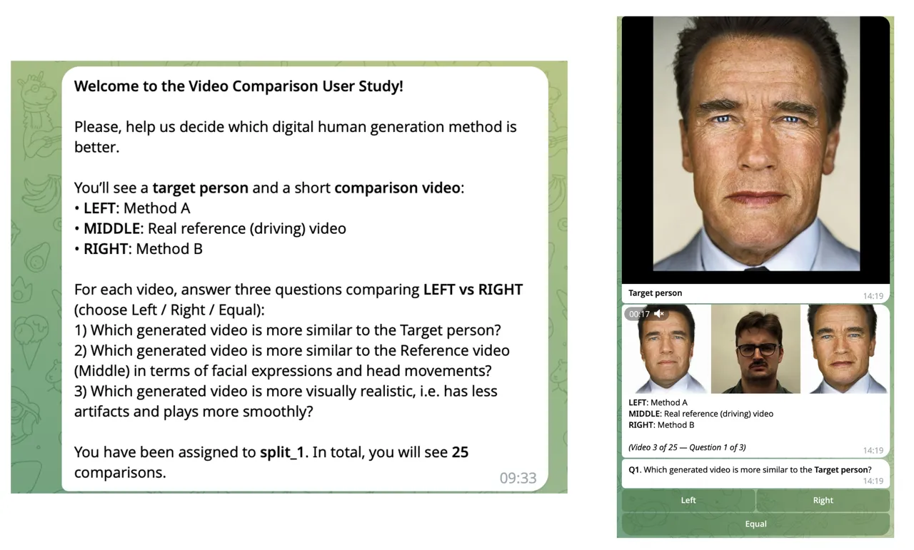

Figure S1: User-study interface.

We discard equal votes and evaluate significance with a two-sided
binomial test against 50% on decisive votes. Table S1 summarizes the
results. For all three questions, the preference for our method is
highly statistically significant.

|                 |                 |                   |            |                    |                        |
| --------------- | --------------- | ----------------- | ---------- | ------------------ | ---------------------- |
|                 | method_1 (ours) | method_2 (Next3D) | Ties (abs) | Win rate (ours, %) | $`p`$-value (binomial) |
| q1 (ID)         | 335             | 76                | 117        | 81.5               | $`<10^{-39}`$          |
| q2 (Expression) | 405             | 51                | 72         | 88.8               | $`<10^{-68}`$          |
| q3 (Quality)    | 389             | 58                | 81         | 87.0               | $`<10^{-60}`$          |

Table S1: Pairwise preference (ours vs. Next3D) on decisive votes. We
report two-sided binomial $`p`$-values.

### 0.A.2 Additional Qualitative Results

#### Few-shot Inference.

In the main paper, we apply PTI only to single-image personalization
(Sec. 4.2 and Fig. 5), but the same pipeline can also be extended
naturally to a few-shot setting. Fig. S2 illustrates a simple extension
of PTI from one-shot to few-shot personalization. With a single input
image, PTI can overfit to the observed view and produce side-view
artifacts on out-of-distribution identities. Using several input frames
stabilizes the optimization and yields a more coherent avatar under
viewpoint changes. In our few-shot setup, we jointly tune the pivot
latent $`z`$ and the FLAME parameters $`\beta,\psi,\theta`$ across the
available frames during the first PTI stage before continuing with the
standard generator tuning.

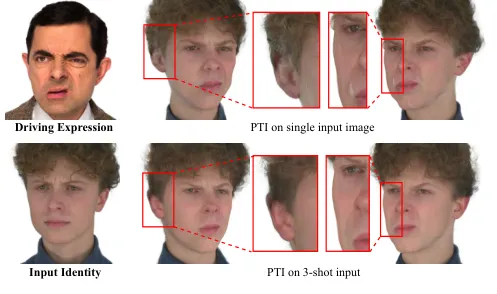

Figure S2: Few-shot PTI illustration. Top: PTI from a single input
image. Bottom: PTI from three input images. Multi-frame tuning reduces
view-dependent artifacts and yields more stable geometry.

#### $`z`$-driven Diversity.

As discussed in Sec. 3.3 of the main paper, naive vector conditioning of
the shape code can reduce identity diversity and lead to
identity–expression entanglement; this is also reflected by the low ID
score in Table 2, row 2 of the main paper. Here we visualize this
failure mode by comparing naive vector conditioning against our spatial
shape conditioning. Fig. S3 demonstrates that AGORA preserves
latent-driven identity diversity even when the driving tuple is fixed.
We keep the FLAME shape, expression, pose, and camera parameters
constant and vary only the latent code $`z`$ across columns. With our
spatial conditioning, changing $`z`$ produces distinct identities while
maintaining the same articulation. In contrast, a naive vector
conditioning of the shape code collapses to nearly the same identity,
which is consistent with the identity–expression entanglement observed
in the ablation study.

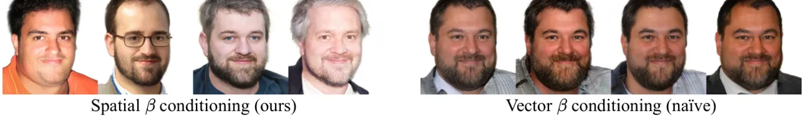

Figure S3: Qualitative comparison of latent-driven identity diversity.
For each group, the driving parameters are fixed and only the latent
code varies across columns.

## Appendix 0.B Method Details

### 0.B.1 Template and Architecture Details

#### FLAME Template with Mouth.

We augment the standard FLAME2020 template with mouth interior because
vanilla FLAME does not model visible structures such as the oral cavity
and teeth, which leads to unrealistic mouth appearance under strong
expressions and large jaw motion. We extend FLAME2020 with a mouth
cavity and two (upper/lower) rows of frontal teeth. For the mouth
cavity, we derive skinning weights by averaging the upper- and lower-lip
weights and mixing them 50/50 as vertices approach the deepest point of
the cavity. For shape and expression blendshapes, we reuse those of the
upper/lower lips. For pose blendshapes, we take the upper/lower-lip
correctives and blend them 50/50 toward the cavity apex. Since our
training data lacks back-head supervision, we remove the back-head
region and fill the resulting UV hole by stretching neighboring side
regions.

#### Deformation Branch Details.

We deliberately design the expression-specific branch to be lightweight.
It takes as input $`64\times 64`$ features from the main branch, which
encode identity-related structure, and predicts $`256\times 256`$
expression-specific UV-space deformations of the Gaussian attributes via
two consecutive StyleGAN2 blocks (see Fig. S4). The deformation branch
has only $`\sim`$3M parameters, compared to $`\sim`$30M for the identity
branch, enabling real-time avatar animation at inference.

Figure S4: Architecture of identity- and expression-specific branches
(StyleGAN2 blocks).

#### Spatial Shape Conditioning Details.

Given the FLAME shape code, we generate a UV-aligned field of
shape-induced XYZ residuals (see Fig. S5) and inject these features into
every StyleGAN block of the main generator.

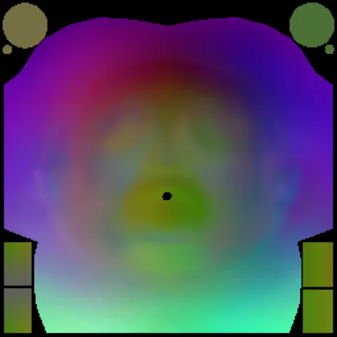

Figure S5: Each pixel encodes the vertex XYZ displacement w.r.t. the
template.

### 0.B.2 Evaluation Details

#### Metric Computation.

We follow the evaluation protocol of Next3D \[54\]. FID is computed on
FFHQ using 50k random samples drawn from the latent, camera, and FLAME
parameter distributions; for $`256^{2}`$ baselines we use FFHQ-256. For
AED and APD, we randomly sample 500 identities and, for each, 20 random
{expression, pose} pairs. We re-estimate FLAME parameters from generated
images and compute the mean distance to the driving parameters. The ID
score is calculated as the mean ArcFace cosine similarity between 1000
generated image pairs of the same identity under different poses and
expressions. Cropping and alignment are consistent with training.

#### Hardware Details.

Our GPU runtimes are measured on a single NVIDIA RTX A6000, using a
naive PyTorch implementation of our method without any additional
inference optimizations. For CPU inference measurements, we use an Intel
Xeon Platinum 8570 CPU and run naive PyTorch CPU inference with 16
threads. Following the reenactment protocol of the main paper, the
identity branch is evaluated once per subject and cached, so the
reported frame rates correspond to running the deformation branch,
attribute composition, 3D lifting, and rasterization per frame.

## Appendix 0.C Discussion

### 0.C.1 Design Choices

#### Comparison to Next3D’s Dual Discrimination.

We visually compare our dual-discrimination synthetic renderings with
those from the Next3D approach (Fig. S6). We observe that our renderings
provide stronger expression-specific cues, enabling the discriminator to
more effectively penalize the generator for expression inaccuracies.

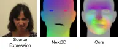

Figure S6: Comparison of synthetic renderings $`S(\psi)`$.

### 0.C.2 Discussion and Limitations

Why not diffusion? Our goal is _real-time_ sampling and reenactment with
explicit FLAME control and identity caching; GANs provide single-pass
generation and fit naturally with our dual-branch formulation. A
diffusion formulation would require a well-defined denoising target in
3D-representation space (_e.g_., UV-parameterized 3DGS attribute maps),
which is not available as ground-truth for in-the-wild 2D datasets like
FFHQ; alternatively, latent diffusion would require an additional
image$`\rightarrow`$3DGS encoder/autoencoder pipeline to define the
latent space. This direction is orthogonal to the scope here.

Use of larger datasets. The current StyleGAN2-based training recipe
remains stable at the scale used in this paper, aided by R1 and Gaussian
regularization. Scaling to substantially larger datasets is feasible in
principle, but the benefit will likely depend more on the diversity of
head pose and facial expression than on raw image count alone. Extending
the data distribution along these axes is therefore a more promising
direction than merely increasing volume.

FLAME expressivity. AGORA inherits the expressive ceiling of FLAME,
especially for highly asymmetric or otherwise out-of-space facial
motions. The framework itself is modular: it can be retrained with a
more expressive FLAME-like model, and it can also be extended with
learned implicit expression latents that complement the explicit FLAME
controls at the cost of additional inference-time computation.

Beyond these directions, our current model is trained and evaluated on
frontal heads and does not synthesize the back of the head. This
limitation can be alleviated by supervising with full-head data, in the
spirit of PanoHead \[1\]. In addition, we do not explicitly control
ocular gaze: the generator is not conditioned on gaze and the FLAME
parameters we estimate exclude eyeball rotations. A practical path
forward is to obtain per-image gaze from a monocular estimator during
training and map these predictions to FLAME’s eyeball joints, enabling
explicit gaze control at inference. We also leave hair animation and
illumination handling to future work.

### 0.C.3 Ethical Considerations

AGORA produces identity-preserving, controllable head avatars at
real-time rates, even on CPU, which lowers the barrier to large-scale
deployment and introduces dual-use risks (_e.g_., unauthorized identity
cloning, consentless personalization, and misuse in telepresence or
misinformation). In our experiments we rely on publicly available
datasets and do not train on private images; for any release we will
provide usage guidelines that require proof of consent for single-image
personalization. We explicitly discourage use for impersonation and
encourage research on consent-aware editing and robust content
provenance to complement technical advances.
