# GaussianHeadTalk: Wobble-Free 3D Talking Heads with Audio Driven Gaussian Splatting

Madhav Agarwal Affiliation: University of Edinburgh    Mingtian Zhang
Affiliation: University College Londonmadhav.agarwal@ed.ac.uk,
mingtian.zhang.17@ucl.ac.uk, {l.sevilla,s.mcdonagh}@ed.ac.uk    Laura
Sevilla-Lara Affiliation: University of Edinburgh    Steven McDonagh
Affiliation: University of Edinburgh

###### Abstract

Speech-driven talking heads have recently emerged and enable interactive
avatars. However, real-world applications are limited, as current
methods achieve high visual fidelity but slow or fast yet temporally
unstable. Diffusion methods provide realistic image generation, yet
struggle with one-shot settings. Gaussian Splatting approaches are
real-time, yet inaccuracies in facial tracking, or inconsistent Gaussian
mappings, lead to unstable outputs and video artifacts that are
detrimental to realistic use cases. We address this problem by mapping
Gaussian Splatting using 3D Morphable Models to generate person-specific
avatars. We introduce transformer-based prediction of model parameters,
directly from audio, to drive temporal consistency. From monocular video
and independent audio speech inputs, our method enables generation of
real-time talking head videos where we report competitive quantitative
and qualitative performance.

^(†)^(†)footnotetext: Project Page:
[https://madhav1ag.github.io/gaussianheadtalk](https://madhav1ag.github.io/gaussianheadtalk)

![[Uncaptioned
image]](arxiv-2512-10939--c41485f0c092.figures/figure-1.webp)

Figure 1: To address the challenges of temporal instability, slow
rendering, and limited photorealism in existing methods, we propose
GaussianHeadTalk: a real-time system that generates photorealistic,
temporally stable 3D talking head avatars directly from monocular video
and arbitrary audio input. Corresponding output frames generated by
state-of-the-art methods GaussianTalker \[9\] and TalkingGaussian \[29\]
are also provided for visual comparison.

## 1 Introduction

Generating talking head videos, driven directly by audio, can be
considered a valuable task with multiple practical applications \[7,
2\]. Whether in the education sector, health care, teleconferencing, or
film and entertainment industries, high-quality personalized talking
head avatars serve as an effective path for information transfer. For
instance, AI-driven virtual assistants for telemedicine can be useful in
assistive communications and post-stroke rehabilitation \[1\]. By
providing a human face to an interactive agent, instead of a text-based
input-output platform, the user experience is made more
immersive \[59\]. Further uses include dubbing movies into multiple
languages, which reduces the production time and cost of VFX studios
manyfold \[6\].

The canonical problem involves taking a short input video of a person,
alongside an arbitrary speech audio signal, in order to create a
person-specific avatar that can generate an output video of the subject
appearing to speak the audio content (*i.e.* with visual lip-syncing
that accurately matches the input audio). The task is commonly known as
_face reenactment_ and previous solutions involve using GANs \[43, 50,
3, 24\], Diffusion models \[54, 8, 51\], NeRFs \[23, 20\] and, more
recently, 3D Gaussian Splatting \[9, 29, 10, 38\]. Diffusion-based
methods have robust generative priors and produce state-of-the-art image
quality yet they are computationally expensive and inference speed is
typically slower than GANs and NeRFs. In contrast, 3D Gaussian Splatting
(3DGS) methods are person or scene-specific and have recently shown
efficacy in rendering high-quality images and videos comparable to that
of diffusion models, but at real-time speeds.

Although recent advancements in 3DGS have successfully incorporated
temporal information for dynamic scenes \[52, 32\], the integration of
related techniques into the synthesis of audio-driven 3DGS talking heads
remains an open challenge. This gap highlights the need for novel
approaches to combine dynamic, temporally consistent facial animation
with audio-driven generation. The task is inherently dynamic, requiring
precise temporal information to ensure realistic and consistent facial
movements, particularly lip synchronization. Current audio-driven 3DGS
methods rely on parameter tracking for temporal information, which often
falls short for monocular videos. Inaccuracies in such tracking can lead
to temporal flickering (i.e., ‘wobbling’) in the face region, causing
visible artifacts. Our experiments show that this instability arises due
to the improper utilization of temporal information from an input video,
which manifests itself as either inaccurate 3D mesh parameter tracking
from RGB videos or independent frame-by-frame generation.

To address this problem, we leverage a transformer architecture \[48\]
to process the audio signal in a manner that can capture long-range
semantic information \[36, 46, 44\]. In tandem, we use the input video
to learn a person-specific style embedding, which can maintain the
visual identity of the speaker. We conjecture that directly mapping an
audio signal to rasterised pixel space is highly challenging due to its
high dimensionality, inherent non-linearity, and the extensive data
required to cover the diverse output distribution of realistic facial
appearances. We therefore alternatively opt to predict the FLAME \[31\]
parameters for a template mesh and use them to render the subject head
using 3DGS \[38\]. Although previous work has explored predicting 3DMM
parameters from audio \[19, 53\], our novel architecture uniquely
integrates a person-specific style embedding to preserve identity
information, alongside direct FLAME parameter prediction from audio.
This direct prediction allows temporal information from the audio to
inherently influence and constrain consecutive frame predictions,
significantly enhancing temporal consistency and reducing ‘wobbling’. We
transfer the lip movement generated from our transformer model and head
motion from the original video through an optimized set of FLAME
parameters.

One aspect that is widely assessed when judging the quality of generated
videos is that of stability \[41, 21\]. Intuitively: “_the videos are
stable_” is a subjective statement. To formalize the notion, we propose
a stability metric; towards quantifying video temporal stability (see
Sec. 3.3).

Our contributions can be summarized as follows:

- •
  We highlight the utility of transformer-based prediction for
  person-specific 3D Morphable Model (3DMM) parameters, from input
  audio. Our approach enables a temporally consistent mesh-based subject
  rendering.
- •
  We introduce a metric to quantify the temporal stability of synthetic
  talking head avatars.
- •
  Our overall pipeline, coined GaussianHeadTalk, achieves real-time
  video rendering, while maintaining competitive performance across both
  perceptual quality and video stability metrics.

## 2 Related Work

### 2.1 2D Talking Head Generation

Image generation and editing capabilities of modern generative models
have inspired many practical applications including talking head
synthesis. Early 2D-image based talking head methods ingest a single
input image of a person and use GANs to drive video reenactment \[43,
50, 3, 22, 24, 18, 45\]. These methods generally make use of an
intermediate representation such as facial keypoints \[43, 50, 3, 24,
22\] or latent vectors \[45, 18\] to map motions to pixel space. 3D
Morphable Models (3DMM) \[25, 47, 61\] also provide an intermediate
representation by mapping a 2D input image to 3D space and then back to
2D, affording control of head rotation. Imperfect mappings, however, can
lead to a lack of identity preservation in resulting generated videos.
Audio-driven methods  \[37, 63, 60\] focus on achieving accurate
lip-sync, while head motion is generally non-deterministically learned
from the training dataset.

Given the superior generation quality of Diffusion methods \[17\], in
comparison to GANs, some researchers recently employed them for face
reenactment \[54, 8, 51\]. These methods provide better image quality,
but inference is slow and computationally expensive, making them
infeasible for real-time generation. A recent line of works \[30, 27\]
introduce real-time generation, but the use of single input source
images does not provide these models with temporal motion information.
We conjecture that this leads to problems like unnatural head movement,
stiff torso, and output quality is significantly dependent on identity
features such as teeth and eye appearance within the single source
frame. 2D based methods also suffer from a lack of detailed 3D facial
geometry information. This impedes external control over facial motion
and consistency during head rotation.

### 2.2 3D Talking Head Generation

With the advent of 3D rendering techniques such as NeRFs \[34\] and
Gaussian Splatting \[26\], researchers have started to explore these
methods to render talking heads. NeRF-based approaches \[23, 20\] learn
a radiance field from multiple input images of a single scene. The
volumetric rendering is performed based on an input controlling signal
e.g., audio. AD-NerF \[23\] has an intertwined architecture that models
the head and torso using two separate networks, limiting its
flexibility. The original NeRF architecture results in slow rendering
speed ($`{<}1`$ FPS on NVIDIA V100 GPUs \[55\]), for talking head
synthesis \[42, 33\]. Protrait4D \[15\] uses multi-view synthetic data
to learn tri-plane representations and, subsequently,
Protrait4D-v2 \[16\] works on pseudo-multi-view videos. We note that
these methods cannot perform real-time rendering.

Gaussian Splatting has emerged as an effective real-time rendering
method via Gaussian optimization on input scene meshes. The input meshes
are generated from monocular or multi-view videos. GaussianAvatar \[38\]
and GaussianHead \[49\] use parametric models to control head motion.
While the former binds Gaussians on a FLAME \[31\] mesh, such that every
mesh triangle has at least one Gaussian, the latter uses a motion
deformation field and tri-plane representation. To enable motion, these
renders can be conditioned directly on audio or driving video  \[9, 29,
10\] to create talking heads. GaussianTalker \[9\] and
TalkingGaussian \[29\] both utilize a tri-plane representation and fuse
an audio signal to predict the deformation offsets in an end-to-end
approach. GaussianSpeech \[4\] and GaussianTalker \[58\] use
FLAME \[31\] as an intermediate representation to map audio to
Gaussians. GaussianSpeech \[4\] focuses on generating high-dimensional
vertex offsets from audio for multiview videos. GaussianTalker \[58\]
predicts fine-grained offsets for Gaussian position, rotation, and color
to synthesize details like teeth and wrinkles, however layering this
detail-synthesis network on top of fully audio-generated motion may risk
amplifying any underlying instability from the motion prediction module.
These methods are suitable for real-time inference due to high rendering
speed; however, we conjecture that independent frame-by-frame generation
and a lack of optimization, using objectives that account for temporal
tracking, have the potential to induce jittering artifacts. Another line
of work directly predicts 3D Morphable Model (3DMM) parameters, such as
FLAME \[31\], from an audio signal \[14, 40, 19, 53\]. Their focus is on
controlling facial parameters, rather than handling texture information,
and hence, provide semantically meaningful motion controls. In this
work, we take advantage of an intermediate 3DMM representation by
mapping audio-to-face parameters and then render a video using Gaussian
Splats with real-time performance.

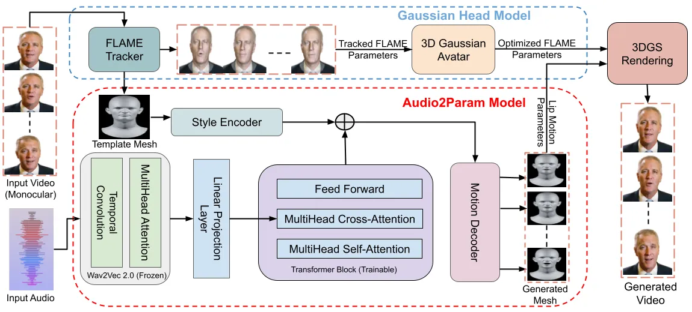

Figure 2: We introduce GaussianHeadTalk, which comprises of Gaussian
Head Modeling and audio to facial motion mapping. We first generate
meshes from an input video using VHAP \[39\] tracking. Given an input
audio and a template mesh, The audio to facial motion mapping uses a
transformer-based architecture with a frozen Wav2Vec 2.0 \[5\] encoder.
It learns long-term audio context and maps it directly to the 3D mesh by
predicting FLAME \[31\] parameters. The generated parameters are used to
render a person-specific GaussianAvatar \[38\], trained using the input
video.

## 3 Methodology

Our method is trained using an identity-specific video $`V=\{I_{n}\}`$,
consisting of $`n`$ image frames. We build our model in two-stages,
where the first stage involves training identity-specific Gaussian
Splatting from the input video $`V`$, such that each Gaussian is
optimized with respect to a 3D Morphable Model’s triangles by ensuring
that every triangle is attributed to at least one Gaussian. The first
stage of our pipeline (see Sec. 3.1) builds upon GaussianAvatar \[38\],
where we replace the original FLAME \[31\] parameters with parameters
optimized by person-specific avatar training. In the second stage
(Sec. 3.2), we learn an audio to FLAME \[31\] mapping, which captures
the speech style of a given identity. We next provide details for each
stage.

### 3.1 Gaussian Head Model

3D Gaussian Splatting (3DGS) \[26\] reconstructs a static scene in 3D
space using images and intrinsic, extrinsic camera parameters. A scene
is represented using a set of $`K`$ anisotropic 3D Gaussians, where each
Gaussian is defined by a center mean $`\mu_{i}\in\mathbb{R}^{3}`$ and a
covariance matrix $`\Sigma_{i}\in\mathbb{R}^{3\times 3}`$. The density
of the $`i`$-th Gaussian for a 3D coordinate $`x\in\mathbb{R}^{3}`$ is
given by:

```math
G_{i}(x)=e^{-\frac{1}{2}(x-\mu_{i})^{\top}\Sigma_{i}^{-1}(x-\mu_{i})}. \tag{1}
```

Further decomposing the covariance matrix for efficient storage and
rendering, we obtain $`\Sigma=RSS^{\top}R^{\top}`$ where $`R`$ is a
rotation matrix and $`S`$ a scaling matrix. By additionally storing
appearance information, a 3D scene can be defined by a set of 3D
Gaussian primitives:

```math
\mathcal{G}=\left\{G_{i}=(\mu_{i},s_{i},q_{i},\alpha_{i},\text{SH}_{i})\right\}_{i=1}^{K}, \tag{2}
```

where $`\mu_{i}\in\mathbb{R}^{3}`$ is the position vector (c.f. Eq. 1),
$`s_{i}\in\mathbb{R}^{3}`$ is the scaling vector,
$`q_{i}\in\mathbb{R}^{4}`$ is a quaternion representing orientation,
$`\alpha_{i}\in\mathbb{R}`$ is an opacity value, and $`\text{SH}_{i}`$
denotes a set of spherical harmonics for encoding color as a function of
view direction.

At rendering time, the 2D pixel-wise color $`{C}`$ is calculated by
blending a subset of all 3D Gaussians whose projection into the image
plane overlaps with that pixel location. Let
$`\mathcal{N}\subseteq\{1,\dots,K\}`$ denote the set of overlapping
Gaussians:

```math
\text{C}=\sum_{i\in\mathcal{N}}c_{i}\alpha_{i}^{\prime}\prod_{j=1}^{i-1}(1-\alpha_{j}^{\prime}), \tag{3}
```

where $`c_{i}`$ is the view-dependent color of the $`i`$-th Gaussian,
and $`\alpha_{i}^{\prime}`$ is the projected 2D opacity of each
Gaussian, obtained by multiplying the projection of the overlapping 3D
Gaussian onto the image plane with the original opacity $`\alpha`$.

GaussianAvatar \[38\] introduce a method to bind Gaussians to Morphable
Model mesh triangles, in this case, a FLAME \[31\] representation. For a
given triangle with vertices and edges, a Gaussian is initialized using
the mean position of the vertices, the direction of one edge, and the
normal vector of the triangle. A process of Gaussian densification helps
to adjust to an appropriate number of Gaussians, based on local scene
complexity. This involves increasing or decreasing the number of
Gaussians in a given part of the scene and is achieved by either
splitting Gaussians into two if the view-space positional gradient is
large, or cloning into two if it is small. To avoid density explosion, a
pruning strategy removes points that have very low opacity, while
maintaining at least one splat per triangle.

The stability of the rendering process depends heavily on the accuracy
of the binding between Gaussian splats and FLAME \[31\] triangles. In
contrast to alternative work, such as INSTA \[65\], where bounding
volume hierarchy (BVH) based nearest triangle search \[13\] leads to
flickering artifacts, GaussianAvatar \[38\] is agnostic to tracked mesh
inaccuracies due to back-propagation of a positional gradient for each
triangle. This consistent binding between Gaussians and the mesh
triangles, regardless of pose or expression, allows fine-tuning of FLAME
parameters. Along with the optimization of Gaussian splats parameters
for position and scaling, FLAME parameters (translation, pose, and
expression) were therefore also optimized during training. This plays a
crucial role in stabilizing the rendering output, mitigating
misalignment between the triangle meshes and Gaussians. We leverage this
Gaussian-based head modeling and FLAME parameter tuning to help generate
stable output.

| Method                 | Self-Reenactment |                  |                     |                  |                         | Cross-Reenactment |                         | FPS$`\uparrow`$ |
| ---------------------- | ---------------- | ---------------- | ------------------- | ---------------- | ----------------------- | ----------------- | ----------------------- | --------------- |
|                        | PSNR$`\uparrow`$ | SSIM$`\uparrow`$ | LPIPS$`\downarrow`$ | Sync$`\uparrow`$ | Stability$`\downarrow`$ | Sync$`\uparrow`$  | Stability$`\downarrow`$ |                 |
| IPLap \[62\]           | 29.0412          | 0.9462           | 0.0340              | 3.902            | 0.6633                  | 3.324             | 0.6856                  | 3.4             |
| EDTalk \[45\]          | 26.9461          | 0.8626           | 0.0486              | 7.144            | 0.7802                  | 6.982             | 0.7931                  | 17.2            |
| Ditto \[30\]           | 21.0595          | 0.7412           | 0.1284              | 7.023            | 0.9245                  | 6.844             | 0.9618                  | 24.2            |
| MimicTalk \[56\]       | 23.8775          | 0.8092           | 0.0735              | 5.446            | 0.8824                  | 5.286             | 0.9227                  | 12.1            |
| GaussianTalker \[9\]   | 27.6079          | 0.9352           | 0.0451              | 5.346            | 1.7622                  | 5.042             | 1.8745                  | 59.6            |
| TalkingGaussian \[29\] | 27.3053          | 0.9335           | 0.0342              | 6.422            | 1.7183                  | 6.146             | 1.8803                  | 72.2            |
| GaussianHeadTalk       | 29.1233          | 0.9477           | 0.0338              | 6.528            | 0.6201                  | 6.122             | 0.6836                  | 45.4            |

Table 1: Self-Reenactment and Cross-Reenactment experimental settings.
Our method achieves strong results in terms of stability, realism, image
quality and remains competitive for lip-sync.

### 3.2 Audio to Facial Motion (Audio2Param)

We map from an audio signal to facial motion by leveraging the FLAME
parametric 3D Morphable Model. FLAME disentangled parameters control
identity, expression, and pose. These parameters can then be used to
generate an explicit 3D head mesh. Distinct from previous work \[19,
53\], which operates directly on full 3D head meshes by predicting
triangle deformations or vertex positions, we take advantage of the
disentangled FLAME representation. By directly predicting FLAME
expression parameters, we reduce the complexity of our learning
objective from explicitly predicting the spatial location of thousands
of face vertices to the prediction of fewer than one hundred parameters
that together define facial expressions and lip motion.

We design a transformer-based architecture to capture long-range
temporal information from the audio signal concerning the context of the
spoken sentence. To mitigate the lack of diverse 3D audio-video datasets
containing explicit visual data, 3D meshes and paired audio, we
instantiate our encoder using Wav2Vec 2.0 \[5\] which has previously
demonstrated strong representation performance for audio
information \[19, 53\]. We encode audio signals into feature vectors by
adding a linear projection layer after the encoder. Similar to \[19\],
we use a Periodic Positional Encoding (PPE) to provide temporal
information to the transformer decoder and a binary alignment mask to
avoid information leakage from future frames.

For a single identity $`m`$, let the input training set be given by
$`L=\{A,M_{{gt}}^{0:T},N_{m}\}`$, where $`M_{gt}^{0:T}`$ is a sequence
of ground-truth meshes for $`T{+}1`$ frames, $`A`$ is an audio signal
from the ground-truth video that corresponds to those frames. The
neutral template mesh $`N_{m}`$ represents the given identity. Each
input training set is generated by processing an input video consisting
of $`T{+}1`$ frames using the VHAP tracker \[38\] to generate ground
truth meshes $`M^{0:T}_{gt}`$ and neutral template mesh $`N_{m}`$. Our
objective is to predict a sequence of meshes $`M^{0:T}_{pred}`$, given
audio and neutral template mesh, such that:

```math
f_{\theta}(A,N_{m})=M^{0:T}_{pred}\approx M^{0:T}_{gt}. \tag{4}
```

The correlation between the audio signal and lip movement is typically
high, but the correlation between the audio signal and head movement is
not \[57\]. Since different yet plausible head motions and expressions
exist for the same speech, there is no one-to-one mapping between speech
and head motion. Hence we focus on predicting accurate lip movement from
audio, by checking for high correlation between audio and lip movement,
and transfer head motion directly from the original tracked video
sequence.

In addition to the head motion, the (potentially independent) audio
speech signal $`A`$ is processed through the transformer encoder and
linear projection layer. We denote the output from the linear projection
layer for $`T{+}1`$ frames as $`C^{0:T}`$. For a given frame $`t`$, the
transformer encoder takes audio for frames $`[0,\ldots,t]`$ and uses the
linear projection layer to generate $`C^{t}`$. The predicted audio
features are passed to the multi-head attention block of the transformer
to obtain the latent vertex offsets $`O_{v}^{0:T}`$ for each frame.

To utilize latent vertex offsets, an identity-specific template mesh,
which is an average of all meshes obtained through video tracking, is
encoded through a style encoder network to obtain an identity embedding
$`S`$. This procedure is shown in Fig. 2. Predicted latent vertex
offsets $`O_{v}^{i}`$ for frame $`i`$ are linearly combined with this
embedding as:

```math
O_{sv}^{i}=S+O_{v}^{i},\quad i\in\{0,\ldots,T\}. \tag{5}
```

The style-conditioned latent embeddings $`O_{sv}^{0:T}`$ are then
processed by a motion decoder, which comprises a set of linear layers
that map them to a low-dimensional FLAME parameter space, to obtain a 3D
mesh representation. By performing this process for each frame $`i`$, we
obtain a predicted mesh sequence $`M^{0:T}_{pred}`$.

Toward achieving accurate lip motion and jaw movement prediction, we
isolate the FLAME parameters responsible for jaw movement. We use these
to augment the ground-truth mesh as $`M_{gt^{\prime}}`$ and calculate a
loss as the difference, in vertex space, between this and our predicted
mesh per frame. The remaining FLAME parameter values, used to define the
ground-truth mesh, are instantiated using the template mesh. The model
is trained end-to-end using an $`L2`$ loss between the ground-truth and
predicted meshes in vertex space as follows

```math
\mathcal{L}_{mesh}=\sum_{n=1}^{N}\left(\sum_{t=1}^{T}\left\|M_{gt^{\prime}}^{t}-M_{pred}^{t}\right\|_{2}\right). \tag{6}
```

During inference, the Audio2Param component ingests a neutral mesh and
audio signal in order to predict a sequence of animated 3D facial meshes
using the FLAME parameter space. The predicted FLAME parameters are used
to drive the motion of a person-specific avatar \[38\], culminating in
the generation of an audio driven talking head.

### 3.3 Quantifying temporal consistency

Noted existing work generate talking head videos by posing video
rendering as a set of, per-frame, independent tasks. We observe that
this typically leads to a lack of temporal consistency in the output,
which manifests itself as unnatural wobbling, aberrations, and facial
oscillations. Toward quantifying this problem, we employ a measure of
temporal smoothness for a given video.

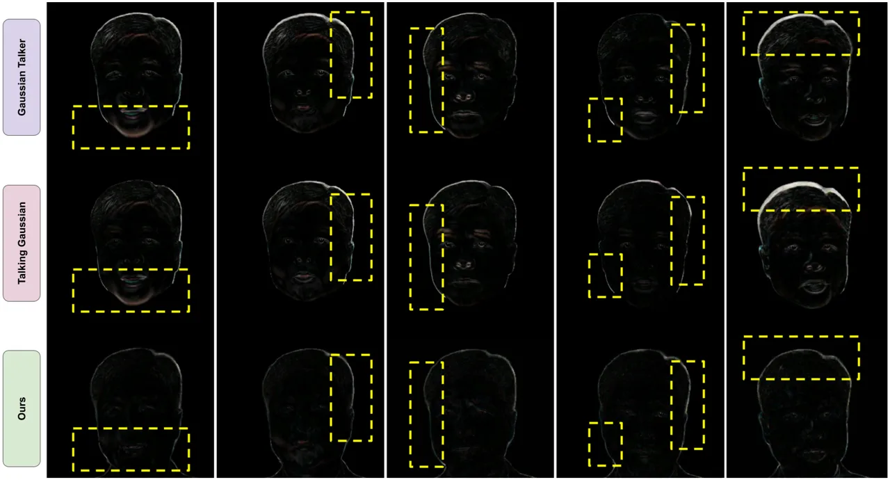

Figure 3: Facial “wobbling” artifacts can be visualized via the absolute
difference between generated and ground-truth frames, in image-space.
The temporal gap between consecutive columns is ten frames in each case.
Our method exhibits smaller and spatially-more-stable disparities,
across time.

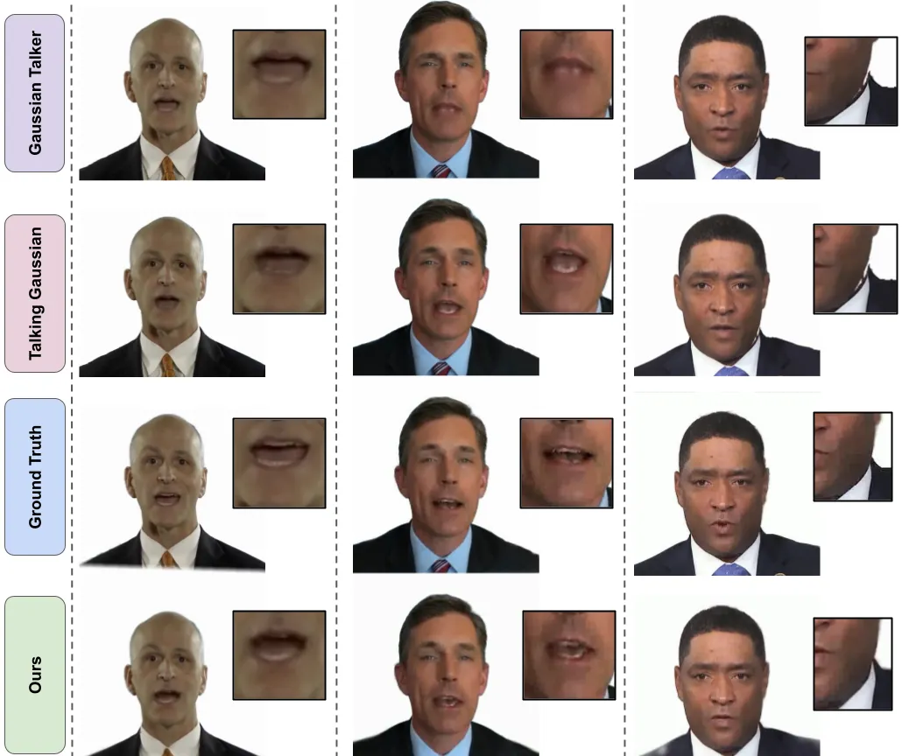

Figure 4: Self-Reenactment Results: We show qualitative results between
the Gaussian based methods by reenacting them using the original audio.
Our method, GaussianHeadTalk, shows better mouth movement, sharper teeth
and fewer artifacts.

We first select a video and accompanying audio sample from the
dataset \[61\] and proceed to render a talking head video using the
original audio signal. This enables a direct comparison between the
generated video and the original video (ground-truth). Towards defining
a robust evaluation protocol, we detect and track facial key
points \[64\] on the nose, as these key points are largely unaffected by
jaw movement and expression changes. The time-domain signal provided, by
these key points, can then be compared between generated and ground
truth video frames. Further, we observe that high-frequency wobbling and
rapid oscillations are challenging to detect using keypoint comparisons
alone, and thus adopt a hybrid approach by additionally performing a
Fast-Fourier-Transform (FFT) analysis to identify frequent and uneven
oscillations.

Our hybrid approach takes an average of mean motion difference
$`M_{d}`$, variability in motion magnitude $`V_{m}`$, and high-frequency
power $`H_{f}`$. Each term is normalized by their respective maximum
values across a given sequence of input frames. Our compound stability
score is then calculated by taking the average of these values:

```math
\text{Stability score}=\frac{M_{d}+V_{m}+H_{f}}{3}. \tag{7}
```

## 4 Experiments

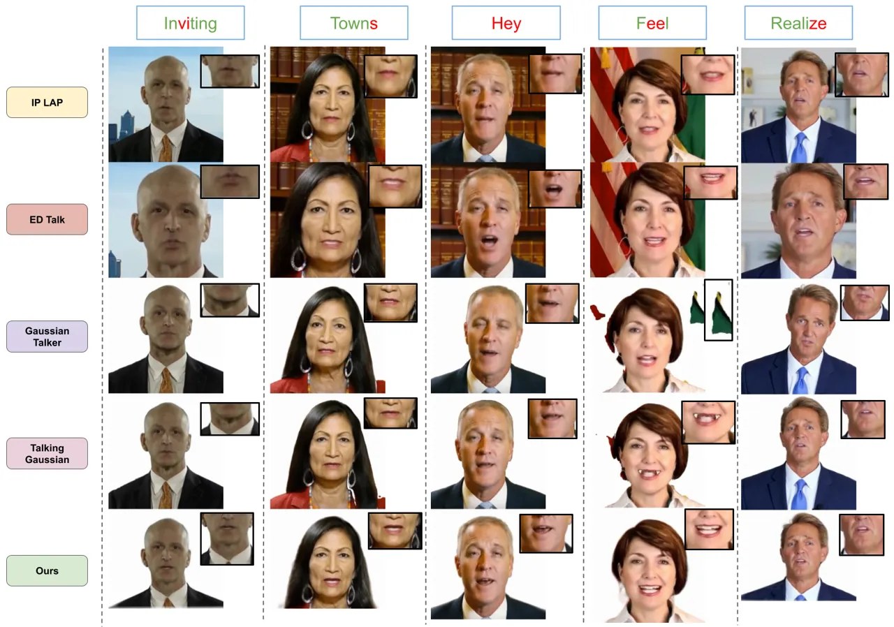

Figure 5: Cross-Reenactment Results: visual reenactment using various
methods with audio from a different speaker. The top row shows the words
from the audio, where red text highlights exact phonemes.
GaussianHeadTalk can provide improved lip movement for these audio
samples where other methods struggle with lip motion.

### 4.1 Experimental Settings

#### Dataset:

We perform experiments on two datasets: VOCASET \[14\] and HDTF \[61\].
Both datasets provide videos and synchronized audio. VOCASET also
provides tracked 3D-scans of the faces. We use VOCASET for pre-training
the Audio2Param component, and HDTF for training and evaluating
person-specific gaussian avatars. Since the Gaussian Splatting and
NeRF-based models require subject specific training, we select ten
subjects from HDTF that cover a diverse set of identities and have a
minimum of four minutes in video length. All videos were converted to
25fps to maintain experimental consistency. We synthetically generate 15
audio clips covering five different languages, with an average duration
of seven seconds, using a text-to-speech model¹¹ 1
https://elevenlabs.io/.

#### Comparison Baselines:

We compare GaussianHeadTalk with current state-of-the-art methods. Two
approaches, GaussianTalker \[9\] and TalkingGaussian \[29\], naturally
align with our proposed problem setting as both can be considered
audio-driven Gaussian methods. We also compare with IP LAP \[62\] and ED
Talk \[45\] which are GAN based methods, and Ditto \[30\] which is a
Diffusion based method. Lastly, we use MimicTalk \[56\] to evaluate
performance of a related NeRF technique.

#### Implementation Details:

Our method is built on PyTorch. We first used VOCASET \[14\] audio-video
and their tracked FLAME \[31\] parameters. We train our Audio2Param
component using ADAM \[28\] optimizer with a learning rate of
1$`e^{-4}`$. We pre-train for 50000 steps and all experiments were
performed on a single NVIDIA Tesla A100 GPU (40GB).

### 4.2 Quantitative Evaluation

We evaluate the performance of our model on two tasks: self-reenactment
and cross-reenactment. First, for self-reenactment, we extract the first
30 seconds of a video as a test set. We train on the remaining part of
the video segment. For cross-reenactment, we use synthetically generated
audio from a text-to-speech model so that the audio sample contains no
information about the trained person identity. We compare our method
with state-of-the-art Gaussian Splatting \[9, 29\], GAN  \[62, 45\],
Diffusion \[30\] and NeRF \[56\] based methods. To evaluate
self-reenactment, we use Peak Signal-to-Noise Ratio (PSNR), Structural
Similarity Index Measure (SSIM), and Learned Perceptual Image Patch
Similarity (LPIPS). We calculate the Sync confidence score \[12, 11\]
for both self-reenactment and cross-reenactment. We observe that our
method predominantly improves upon the state-of-the-art (ref. Table 1).
For the perceptual metric GaussianHeadTalk performs better than NeRF and
alternative Gaussian based methods. IPLap \[62\] provides results
comparable to ours, as it models only the lip region using a GAN-based
architecture. However, inference is somewhat slower, which may impede
its real-time applications (ref. Table 1).

### 4.3 Qualitative Evaluation

We show visual results in Figure 4 and Figure 5 for qualitative
comparison. GAN based methods provide good lip-sync in both cases, but
their image quality falls short; with generated videos of resolution up
to $`256\times 256`$. Gaussian-based methods (GaussianTalker,
TalkingGaussian) generate sharper images, but their lip sync scores are
low. As example, they show lower lip openness while speaking ‘Hey’, (see
middle column of Fig. 5). They also display wobbling artifacts in the
generated videos, mainly due to the lack of long-term temporal
information and improper tracking of 3D parameters during training. Our
method generates stable talking head videos, with qualitative results
that concur with the relative quantitative metric improvements. We
provide supplementary videos for further results visualization.

### 4.4 User Study

We conduct a user study to investigate how generated video quality is
perceived by humans. We select a group of thirty individuals and present
each survey participant with multiple video triplets. Our study compares
the performance of GaussianTalker \[9\], TalkingGausian \[29\] and our
work. Participants were asked to evaluate videos in terms of
“naturalness” (_i.e_. assess wobbling and artifacts), lip sync quality,
and image quality (_i.e_. evaluate identity preservation in generated
videos). Generated video orderings were randomized and models
responsible for generation were masked from participants. Each
participant was shown ten sets of video triplets, each with an average
duration of five seconds. Participants were asked to provide an ordinal
ranking for each triplet, for each assessed aspect: ‘Best’, ‘Average’,
and ‘Worst’, which we numerically map to values 3, 2, and 1,
respectively. For each participant, we sum the ratings a method received
across the 10 triplets, and then divided this sum by 3 to normalize the
score into a range of 3.3–10. The final reported scores, for each
method, are average normalized scores across all thirty participants
(Table 2).

| Method                  | Natural$`\uparrow`$ | LipSync$`\uparrow`$ | Quality$`\uparrow`$ |
| ----------------------- | ------------------- | ------------------- | ------------------- |
| GaussianTalker \[9\]    | 4.0                 | 5.0                 | 4.0                 |
| TalkingGaussian \[29\]  | 6.2                 | 7.2                 | 6.5                 |
| GaussianHeadTalk (ours) | 9.8                 | 7.8                 | 9.5                 |

Table 2: User Study assessing human visual perception of generated video
quality. The scores are averaged over different participants, with ten
being the maximum.

All participants ranked videos generated by our method as the most
natural, which supports our improved video stability claims. In terms of
‘LipSync’, our method scores slightly above TalkingGaussian, which
correlates with the related ‘Sync’ score (Table 1). Performant lip sync
quality may be explained by the special focus on the lip region, in both
cases. Image quality for our method can also show improved human rating
scores, with respect to the compared state-of-the-art.

### 4.5 Ablation Study

We perform ablative studies to evaluate our methodological choices (see
Table 3). We first explore the effect of using non-person-specific
(_i.e_. non-optimized) FLAME parameters directly for rendering (“w/o
Parameter Optimization”). Resulting generated videos display artifacts
around various parts of the face which arise due to inaccuracies in
parameter alignment, distorting the videos generated.

We also tested the effect of more restrictive motion transfer; namely,
transferring only the lip motion (FLAME model jaw parameters) and
keeping the head motion static (“w/o Full Motion Transfer”). This
strategy leads to artifacts around parts of the generated video, due to
the movement interdependence between distinct FLAME parameters. We
observe smoother video generation, with fewer artifacts, when we
transfer the full set of FLAME parameters (remaining pose and expression
components) from the original video.

| Method                     | PSNR$`\uparrow`$ | Sync$`\uparrow`$ | Stability$`\downarrow`$ |
| -------------------------- | ---------------- | ---------------- | ----------------------- |
| w/o Parameter Optimization | 27.6987          | 6.5123           | 1.1432                  |
| w/o Full Motion Transfer   | 23.5621          | 6.4962           | 0.9154                  |
| GaussianHeadTalk (ours)    | 29.1233          | 6.528            | 0.6201                  |

Table 3: Ablation study: removal of key method components results in
qualitative visual degradations and respective decreases in associated
metrics.

## 5 Limitations and Discussion

Our method can generate high-quality talking heads, but is restricted to
exactly this part of the body and currently cannot render partial or
full human bodies. This limitation arises due to our usage of a
head-specific parametric model. Extension to accommodate full-body
reenactment might involve designing a Gaussian Splatting model that
binds to SMPL-X \[35\], or similar full-body 3D parametric models. We
conjecture that a further interesting line of future work will involve
exploring any benefits derivable from learning facial expression changes
based on the _tone_ and _speed_ of the audio signal, or other external
control parameters for changing the emotions of the face.

## 6 Ethical Consideration

The generation of photo-realistic talking heads is a technology that
carries potential risks of misuse, particularly in the creation of
deepfakes for misinformation, harassment, or identity fraud. We advocate
for the incorporation of robust watermarking and detection mechanisms to
help distinguish synthetic content from real media and reduce the
potential for harmful misuse.

## 7 Conclusion

We introduce a novel method for generating high-quality 3D talking heads
with lip sync in real time. We proposed a temporally stable pipeline
that uses transformers to capture sematic information and long-range
dependencies from audio signals. We also introduce a stability metric to
quantify perceptual wobbling in generated videos. Our method offers
strong performance with respect to the existing state-of-the-art in
terms of qualitative and quantitative benchmarks and we believe that
high-quality real-time facial reenactment holds exciting potential for
many practical and useful real-time applications.

## References

- \[1\] A. Afridi, S. Obaid, N. Raheel, and F. A. Rathore (2025)
  Integrating artificial intelligence in stroke rehabilitation: current
  trends and future directions; a mini review. JPMA. The Journal of the
  Pakistan Medical Association 75 (2), pp. 445–447. Cited by: §1.
- \[2\] M. Agarwal, A. Gupta, R. Mukhopadhyay, V. P. Namboodiri, and C.
  Jawahar (2022) Compressing video calls using synthetic talking heads.
  In British Machine Vision Conference (BMVC), Cited by: §1.
- \[3\] M. Agarwal, R. Mukhopadhyay, V. P. Namboodiri, and C. V.
  Jawahar (2023) Audio-visual face reenactment. In Proceedings of the
  IEEE/CVF Winter Conference on Applications of Computer Vision (WACV),
  pp. 5178–5187. Cited by: §1, §2.1.
- \[4\] S. Aneja, A. Sevastopolsky, T. Kirschstein, J. Thies, A. Dai,
  and M. Nießner (2024) Gaussianspeech: audio-driven gaussian avatars.
  arXiv preprint arXiv:2411.18675. Cited by: §2.2.
- \[5\] A. Baevski, Y. Zhou, A. Mohamed, and M. Auli (2020) Wav2vec 2.0:
  a framework for self-supervised learning of speech representations.
  Advances in neural information processing systems 33, pp. 12449–12460.
  Cited by: Figure 2, Figure 2, §3.2.
- \[6\] D. Bigioi and P. Corcoran (2023) Multilingual video dubbing—a
  technology review and current challenges. Frontiers in signal
  processing 3, pp. 1230755. Cited by: §1.
- \[7\] B. Chen, J. Chen, S. Wang, and Y. Ye (2024) Generative face
  video coding techniques and standardization efforts: a review. In 2024
  Data Compression Conference (DCC), Vol. , pp. 103–112. External Links:
  [Document](https://dx.doi.org/10.1109/DCC58796.2024.00018) Cited by:
  §1.
- \[8\] Z. Chen, J. Cao, Z. Chen, Y. Li, and C. Ma (2024) Echomimic:
  lifelike audio-driven portrait animations through editable landmark
  conditions. arXiv preprint arXiv:2407.08136. Cited by: §1, §2.1.
- \[9\] K. Cho, J. Lee, H. Yoon, Y. Hong, J. Ko, S. Ahn, and S.
  Kim (2024) GaussianTalker: real-time talking head synthesis with 3d
  gaussian splatting. In Proceedings of the 32nd ACM International
  Conference on Multimedia, MM ’24, pp. 10985–10994. Cited by: Figure 1,
  Figure 1, §1, §2.2, Table 1, Table A, Table A, Table A, §4.1, §4.2,
  §4.4, Table 2.
- \[10\] X. Chu and T. Harada (2024) Generalizable and animatable
  gaussian head avatar. In The Thirty-eighth Annual Conference on Neural
  Information Processing Systems, External Links:
  [Link](https://openreview.net/forum?id=gVM2AZ5xA6) Cited by: §1, §2.2.
- \[11\] J. S. Chung and A. Zisserman (2017) Lip reading in the wild. In
  Computer Vision–ACCV 2016: 13th Asian Conference on Computer Vision,
  Taipei, Taiwan, November 20-24, 2016, Revised Selected Papers, Part II
  13, pp. 87–103. Cited by: §4.2.
- \[12\] J. S. Chung and A. Zisserman (2017) Out of time: automated lip
  sync in the wild. In Computer Vision–ACCV 2016 Workshops: ACCV 2016
  International Workshops, Taipei, Taiwan, November 20-24, 2016, Revised
  Selected Papers, Part II 13, pp. 251–263. Cited by: §4.2.
- \[13\] J. H. Clark (1976) Hierarchical geometric models for visible
  surface algorithms. Communications of the ACM 19 (10), pp. 547–554.
  Cited by: §3.1.
- \[14\] D. Cudeiro, T. Bolkart, C. Laidlaw, A. Ranjan, and M.
  Black (2019) Capture, learning, and synthesis of 3D speaking styles.
  In Proceedings IEEE Conf. on Computer Vision and Pattern Recognition
  (CVPR), pp. 10101–10111. Cited by: §2.2, §4.1, §4.1.
- \[15\] Y. Deng, D. Wang, X. Ren, X. Chen, and B. Wang (2024)
  Portrait4d: learning one-shot 4d head avatar synthesis using synthetic
  data. In Proceedings of the IEEE/CVF Conference on Computer Vision and
  Pattern Recognition, pp. 7119–7130. Cited by: §2.2.
- \[16\] Y. Deng, D. Wang, and B. Wang (2024) Portrait4D-v2: pseudo
  multi-view data creates better 4d head synthesizer. arXiv preprint
  arXiv:2403.13570. Cited by: §2.2.
- \[17\] P. Dhariwal and A. Nichol (2021) Diffusion models beat gans on
  image synthesis. Advances in neural information processing systems 34,
  pp. 8780–8794. Cited by: §2.1.
- \[18\] N. Drobyshev, A. B. Casademunt, K. Vougioukas, Z. Landgraf, S.
  Petridis, and M. Pantic (2024) EMOPortraits: emotion-enhanced
  multimodal one-shot head avatars. In Proceedings of the IEEE/CVF
  Conference on Computer Vision and Pattern Recognition, pp. 8498–8507.
  Cited by: §2.1.
- \[19\] Y. Fan, Z. Lin, J. Saito, W. Wang, and T. Komura (2022)
  FaceFormer: speech-driven 3d facial animation with transformers. In
  Proceedings of the IEEE/CVF Conference on Computer Vision and Pattern
  Recognition (CVPR), Cited by: §1, §2.2, §3.2, §3.2.
- \[20\] G. Gafni, J. Thies, M. Zollhöfer, and M. Nießner (2021) Dynamic
  neural radiance fields for monocular 4d facial avatar reconstruction.
  In Proceedings of the IEEE/CVF Conference on Computer Vision and
  Pattern Recognition (CVPR), pp. 8649–8658. Cited by: §1, §2.2.
- \[21\] W. Guilluy, L. Oudre, and A. Beghdadi (2021) Video
  stabilization: overview, challenges and perspectives. Signal
  Processing: Image Communication 90, pp. 116015. Cited by: §1.
- \[22\] J. Guo, D. Zhang, X. Liu, Z. Zhong, Y. Zhang, P. Wan, and D.
  Zhang (2024) LivePortrait: efficient portrait animation with stitching
  and retargeting control. arXiv preprint arXiv:2407.03168. Cited by:
  §2.1.
- \[23\] Y. Guo, K. Chen, S. Liang, Y. Liu, H. Bao, and J. Zhang (2021)
  AD-nerf: audio driven neural radiance fields for talking head
  synthesis. In IEEE/CVF International Conference on Computer Vision
  (ICCV), Cited by: §1, §2.2.
- \[24\] F. Hong, L. Zhang, L. Shen, and D. Xu (2022) Depth-aware
  generative adversarial network for talking head video generation. In
  IEEE/CVF Conference on Computer Vision and Pattern Recognition (CVPR),
  Cited by: §1, §2.1.
- \[25\] X. Ji, H. Zhou, K. Wang, W. Wu, C. C. Loy, X. Cao, and F.
  Xu (2021) Audio-driven emotional video portraits. In Proceedings of
  the IEEE/CVF conference on computer vision and pattern recognition,
  pp. 14080–14089. Cited by: §2.1.
- \[26\] B. Kerbl, G. Kopanas, T. Leimkühler, and G. Drettakis (2023) 3d
  gaussian splatting for real-time radiance field rendering.. ACM Trans.
  Graph. 42 (4), pp. 139–1. Cited by: §2.2, §3.1.
- \[27\] S. Kim, S. Jin, J. Park, K. Kim, J. Kim, J. Nam, and S.
  Kim (2025) Moditalker: motion-disentangled diffusion model for
  high-fidelity talking head generation. In Proceedings of the AAAI
  Conference on Artificial Intelligence, Vol. 39, pp. 4302–4310. Cited
  by: §2.1.
- \[28\] D. P. Kingma and J. Ba (2014) Adam: a method for stochastic
  optimization. arXiv preprint arXiv:1412.6980. Cited by: §4.1.
- \[29\] J. Li, J. Zhang, X. Bai, J. Zheng, X. Ning, J. Zhou, and L.
  Gu (2024) Talkinggaussian: structure-persistent 3d talking head
  synthesis via gaussian splatting. In European Conference on Computer
  Vision, pp. 127–145. Cited by: Figure 1, Figure 1, §1, §2.2, Table 1,
  Table A, Table A, Table A, §4.1, §4.2, §4.4, Table 2.
- \[30\] T. Li, R. Zheng, M. Yang, J. Chen, and M. Yang (2024) Ditto:
  motion-space diffusion for controllable realtime talking head
  synthesis. arXiv preprint arXiv:2411.19509. Cited by: §2.1, Table 1,
  §4.1, §4.2.
- \[31\] T. Li, T. Bolkart, Michael. J. Black, H. Li, and J.
  Romero (2017) Learning a model of facial shape and expression from 4D
  scans. ACM Transactions on Graphics, (Proc. SIGGRAPH Asia) 36 (6),
  pp. 194:1–194:17. External Links:
  [Link](https://doi.org/10.1145/3130800.3130813) Cited by: §1, Figure
  2, Figure 2, §2.2, §2.2, §3.1, §3.1, §3, §4.1.
- \[32\] Z. Li, Z. Chen, Z. Li, and Y. Xu (2024) Spacetime gaussian
  feature splatting for real-time dynamic view synthesis. In Proceedings
  of the IEEE/CVF Conference on Computer Vision and Pattern Recognition,
  pp. 8508–8520. Cited by: §1.
- \[33\] X. Liu, Y. Xu, Q. Wu, H. Zhou, W. Wu, and B. Zhou (2022)
  Semantic-aware implicit neural audio-driven video portrait generation.
  In European conference on computer vision, pp. 106–125. Cited by:
  §2.2.
- \[34\] B. Mildenhall, P. P. Srinivasan, M. Tancik, J. T. Barron, R.
  Ramamoorthi, and R. Ng (2021) Nerf: representing scenes as neural
  radiance fields for view synthesis. Communications of the ACM 65 (1),
  pp. 99–106. Cited by: §2.2.
- \[35\] G. Pavlakos, V. Choutas, N. Ghorbani, T. Bolkart, A. A. A.
  Osman, D. Tzionas, and M. J. Black (2019) Expressive body capture: 3D
  hands, face, and body from a single image. In Proceedings IEEE Conf.
  on Computer Vision and Pattern Recognition (CVPR), pp. 10975–10985.
  Cited by: §5.
- \[36\] Z. Peng, Y. Luo, Y. Shi, H. Xu, X. Zhu, H. Liu, J. He, and Z.
  Fan (2023) Selftalk: a self-supervised commutative training diagram to
  comprehend 3d talking faces. In Proceedings of the 31st ACM
  International Conference on Multimedia, pp. 5292–5301. Cited by: §1.
- \[37\] K. R. Prajwal, R. Mukhopadhyay, V. P. Namboodiri, and C.V.
  Jawahar (2020) A lip sync expert is all you need for speech to lip
  generation in the wild. In Proceedings of the 28th ACM International
  Conference on Multimedia, MM ’20, New York, NY, USA, pp. 484–492.
  Cited by: §2.1.
- \[38\] S. Qian, T. Kirschstein, L. Schoneveld, D. Davoli, S.
  Giebenhain, and M. Nießner (2024) Gaussianavatars: photorealistic head
  avatars with rigged 3d gaussians. In Proceedings of the IEEE/CVF
  Conference on Computer Vision and Pattern Recognition,
  pp. 20299–20309. Cited by: §1, §1, Figure 2, Figure 2, §2.2, §3.1,
  §3.1, §3.2, §3.2, §3.
- \[39\] S. Qian (2024) VHAP: versatile head alignment with adaptive
  appearance priors. External Links:
  [Document](https://dx.doi.org/10.5281/zenodo.14988309),
  [Link](https://github.com/ShenhanQian/VHAP) Cited by: Figure 2, Figure 2.
- \[40\] A. Richard, M. Zollhöfer, Y. Wen, F. de la Torre, and Y.
  Sheikh (2021) MeshTalk: 3d face animation from speech using
  cross-modality disentanglement. In Proceedings of the IEEE/CVF
  International Conference on Computer Vision (ICCV), pp. 1173–1182.
  Cited by: §2.2.
- \[41\] M. Roberto e Souza, H. d. A. Maia, and H. Pedrini (2022) Survey
  on digital video stabilization: concepts, methods, and challenges. ACM
  Computing Surveys (CSUR) 55 (3), pp. 1–37. Cited by: §1.
- \[42\] S. Shen, W. Li, Z. Zhu, Y. Duan, J. Zhou, and J. Lu (2022)
  Learning dynamic facial radiance fields for few-shot talking head
  synthesis. In European conference on computer vision, pp. 666–682.
  Cited by: §2.2.
- \[43\] A. Siarohin, S. Lathuilière, S. Tulyakov, E. Ricci, and N.
  Sebe (2019) First order motion model for image animation. In
  Conference on Neural Information Processing Systems (NeurIPS), Cited
  by: §1, §2.1.
- \[44\] W. Song, X. Wang, S. Zheng, S. Li, A. Hao, and X. Hou (2024)
  TalkingStyle: personalized speech-driven 3d facial animation with
  style preservation. IEEE Transactions on Visualization and Computer
  Graphics. Cited by: §1.
- \[45\] S. Tan, B. Ji, M. Bi, and Y. Pan (2025) Edtalk: efficient
  disentanglement for emotional talking head synthesis. In European
  Conference on Computer Vision, pp. 398–416. Cited by: §2.1, Table 1,
  §4.1, §4.2.
- \[46\] B. Thambiraja, I. Habibie, S. Aliakbarian, D. Cosker, C.
  Theobalt, and J. Thies (2023) Imitator: personalized speech-driven 3d
  facial animation. In Proceedings of the IEEE/CVF international
  conference on computer vision, pp. 20621–20631. Cited by: §1.
- \[47\] J. Thies, M. Elgharib, A. Tewari, C. Theobalt, and M.
  Nießner (2020) Neural voice puppetry: audio-driven facial reenactment.
  In Computer Vision–ECCV 2020: 16th European Conference, Glasgow, UK,
  August 23–28, 2020, Proceedings, Part XVI 16, pp. 716–731. Cited by:
  §2.1.
- \[48\] A. Vaswani, N. Shazeer, N. Parmar, J. Uszkoreit, L.
  Jones, A. N. Gomez, Ł. Kaiser, and I. Polosukhin (2017) Attention is
  all you need. Advances in neural information processing systems 30.
  Cited by: §1.
- \[49\] J. Wang, J. Xie, X. Li, F. Xu, C. Pun, and H. Gao (2023)
  Gaussianhead: high-fidelity head avatars with learnable gaussian
  derivation. arXiv preprint arXiv:2312.01632. Cited by: §2.2.
- \[50\] T. Wang, A. Mallya, and M. Liu (2021) One-shot free-view neural
  talking-head synthesis for video conferencing. In Proceedings of the
  IEEE Conference on Computer Vision and Pattern Recognition, Cited by:
  §1, §2.1.
- \[51\] H. Wei, Z. Yang, and Z. Wang (2024) Aniportrait: audio-driven
  synthesis of photorealistic portrait animation. arXiv preprint
  arXiv:2403.17694. Cited by: §1, §2.1.
- \[52\] G. Wu, T. Yi, J. Fang, L. Xie, X. Zhang, W. Wei, W. Liu, Q.
  Tian, and X. Wang (2024) 4d gaussian splatting for real-time dynamic
  scene rendering. In Proceedings of the IEEE/CVF conference on computer
  vision and pattern recognition, pp. 20310–20320. Cited by: §1.
- \[53\] J. Xing, M. Xia, Y. Zhang, X. Cun, J. Wang, and T. Wong (2023)
  Codetalker: speech-driven 3d facial animation with discrete motion
  prior. In Proceedings of the IEEE/CVF Conference on Computer Vision
  and Pattern Recognition, pp. 12780–12790. Cited by: §1, §2.2, §3.2,
  §3.2.
- \[54\] M. Xu, H. Li, Q. Su, H. Shang, L. Zhang, C. Liu, J. Wang, Y.
  Yao, and S. Zhu (2024) Hallo: hierarchical audio-driven visual
  synthesis for portrait image animation. arXiv preprint
  arXiv:2406.08801. Cited by: §1, §2.1.
- \[55\] X. Yan, J. Xu, Y. Huo, and H. Bao (2024) Neural rendering and
  its hardware acceleration: a review. arXiv preprint arXiv:2402.00028.
  Cited by: §2.2.
- \[56\] Z. Ye, T. Zhong, Y. Ren, Z. Jiang, J. Huang, R. Huang, J.
  Liu, J. He, C. Zhang, Z. Wang, et al. (2024) MimicTalk: mimicking a
  personalized and expressive 3d talking face in minutes. Advances in
  neural information processing systems 37, pp. 1829–1853. Cited by:
  Table 1, §4.1, §4.2.
- \[57\] H. Yehia, P. Rubin, and E. Vatikiotis-Bateson (1998)
  Quantitative association of vocal-tract and facial behavior. Speech
  Communication 26 (1-2), pp. 23–43. Cited by: §3.2.
- \[58\] H. Yu, Z. Qu, Q. Yu, J. Chen, Z. Jiang, Z. Chen, S. Zhang, J.
  Xu, F. Wu, C. Lv, et al. (2024) Gaussiantalker: speaker-specific
  talking head synthesis via 3d gaussian splatting. In Proceedings of
  the 32nd ACM International Conference on Multimedia, pp. 3548–3557.
  Cited by: §2.2.
- \[59\] L. Zhang, J. Yu, S. Zhang, L. Li, Y. Zhong, G. Liang, Y.
  Yan, Q. Ma, F. Weng, F. Pan, J. Li, R. Xu, and Z. Lan (2024) Unveiling
  the impact of multi-modal interactions on user engagement: a
  comprehensive evaluation in ai-driven conversations. External Links:
  2406.15000, [Link](https://arxiv.org/abs/2406.15000) Cited by: §1.
- \[60\] Y. Zhang, M. Liu, Z. Chen, B. Wu, Y. Zeng, C. Zhan, Y. He, J.
  Huang, and W. Zhou (2024) MuseTalk: real-time high quality lip
  synchorization with latent space inpainting. arxiv. Cited by: §2.1.
- \[61\] Z. Zhang, L. Li, Y. Ding, and C. Fan (2021) Flow-guided
  one-shot talking face generation with a high-resolution audio-visual
  dataset. In Proceedings of the IEEE/CVF Conference on Computer Vision
  and Pattern Recognition, pp. 3661–3670. Cited by: §2.1, §3.3, §4.1.
- \[62\] W. Zhong, C. Fang, Y. Cai, P. Wei, G. Zhao, L. Lin, and G.
  Li (2023) Identity-preserving talking face generation with landmark
  and appearance priors. In Proceedings of the IEEE/CVF Conference on
  Computer Vision and Pattern Recognition (CVPR), pp. 9729–9738. Cited
  by: Table 1, §4.1, §4.2.
- \[63\] Y. Zhou, X. Han, E. Shechtman, J. Echevarria, E. Kalogerakis,
  and D. Li (2020) Makelttalk: speaker-aware talking-head animation. ACM
  Transactions On Graphics (TOG) 39 (6), pp. 1–15. Cited by: §2.1.
- \[64\] Z. Zhou, H. Li, H. Liu, N. Wang, G. Yu, and R. Ji (2023) STAR
  loss: reducing semantic ambiguity in facial landmark detection. In
  Proceedings of the IEEE/CVF Conference on Computer Vision and Pattern
  Recognition (CVPR), pp. 15475–15484. Cited by: §3.3.
- \[65\] W. Zielonka, T. Bolkart, and J. Thies (2023) Instant volumetric
  head avatars. In Proceedings of the IEEE/CVF conference on computer
  vision and pattern recognition, pp. 4574–4584. Cited by: §3.1.

\thetitle

Supplementary Material

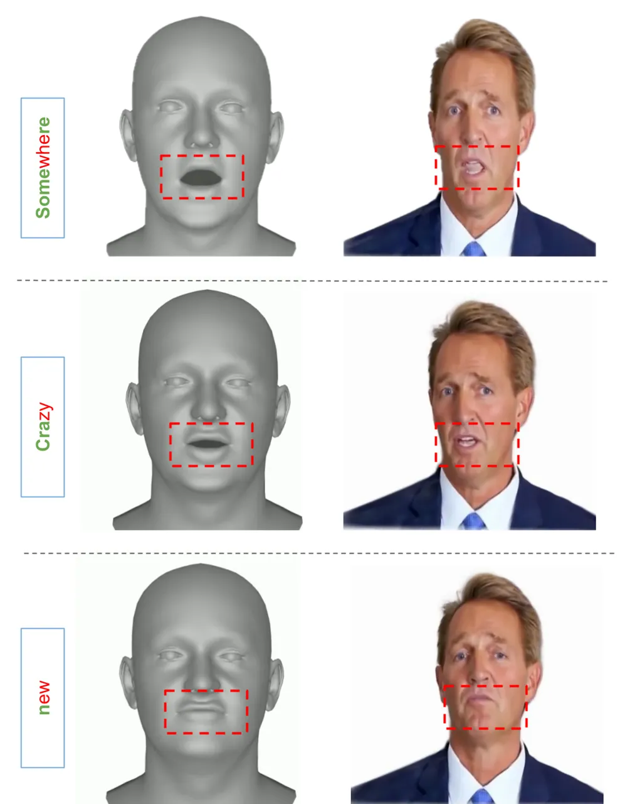

Figure A: For a given audio signal, GaussianHeadTalk generates a
lip-sync 3D mesh and use the generated FLAME parameters to transfer lip
motion on a trained GaussianAvatar with optimized FLAME parameters.

## A Qualitative Ablation Study

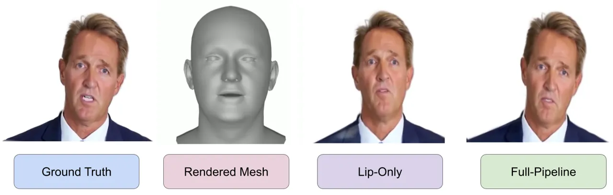

Figure B: Ablation Study: Effect of transferring the lip motion and
keeping other parameters static (w/o Full Motion Transfer). The results
shows visible artifacts in the generated avatar, as the FLAME parameters
are not fully independent.

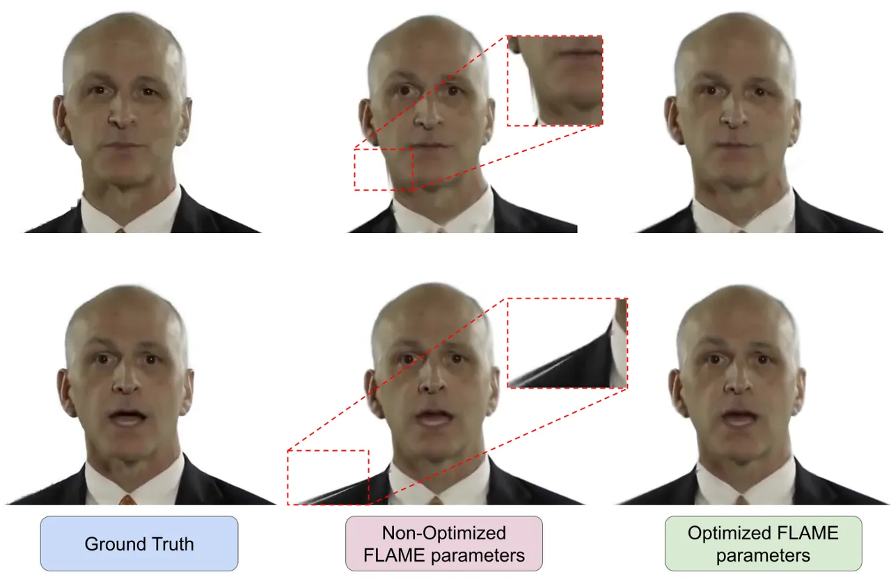

Figure C: Ablation Study: Using Non-Optimized FLAME parameters (w/o
Parameter Optimization). This leads to artifacts around the torso
region, and wobbling issues.

## B Temporal Analysis of Keypoints

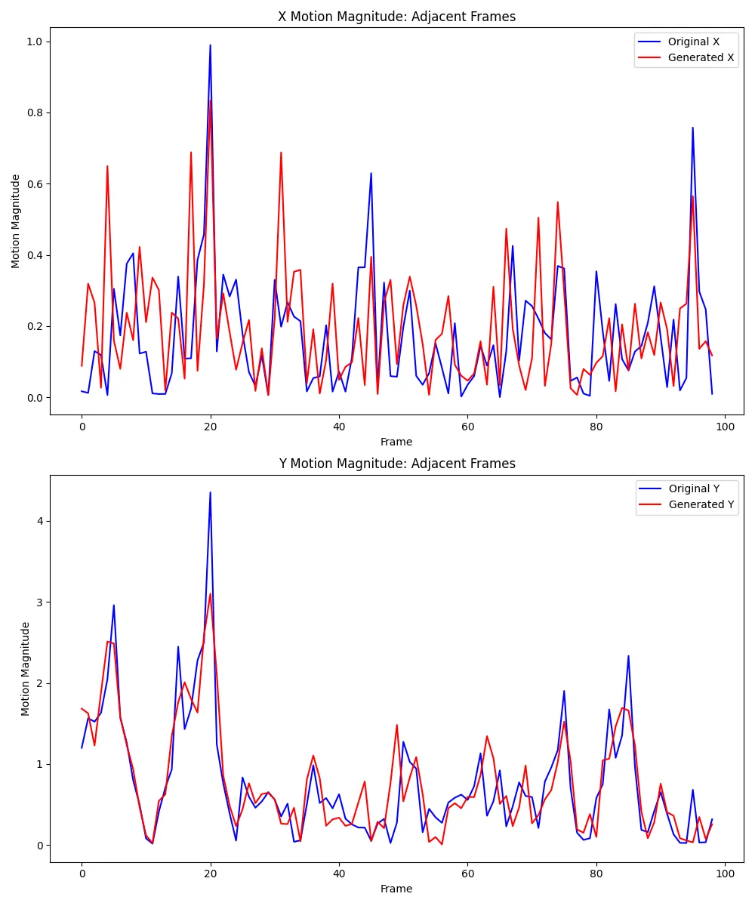

Figure D: Comparison of keypoint movement across time between an
original video and a video generated using GaussianTalker. The overlay
graph shows that there is flickering in the rendered video. In ideal
case, these two graphs should be perfectly overlapping. We report
$`x`$-axis, $`y`$-axis motion magnitude over time in upper and lower
plots, respectively.

## C User Study

| Category    | Method                  | Final Score | ‘Best’ (3) | ‘Average’ (2) | ‘Worst’ (1) | Total Ratings |
| ----------- | ----------------------- | ----------- | ---------- | ------------- | ----------- | ------------- |
| Naturalness | GaussianHeadTalk (ours) | 9.8         | 284        | 14            | 2           | 300           |
|             | TalkingGaussian \[29\]  | 6.2         | 40         | 178           | 82          | 300           |
|             | GaussianTalker \[9\]    | 4.0         | 5          | 50            | 245         | 300           |
| LipSync     | GaussianHeadTalk (ours) | 7.8         | 142        | 118           | 40          | 300           |
|             | TalkingGaussian \[29\]  | 7.2         | 128        | 92            | 80          | 300           |
|             | GaussianTalker \[9\]    | 5.0         | 25         | 100           | 175         | 300           |
| Quality     | GaussianHeadTalk (ours) | 9.5         | 260        | 35            | 5           | 300           |
|             | TalkingGaussian \[29\]  | 6.5         | 80         | 125           | 95          | 300           |
|             | GaussianTalker \[9\]    | 4.0         | 1          | 58            | 241         | 300           |

Table A: Detailed breakdown of User Study Ratings. 30 participants
evaluate 10 videos of each method, generating 300 ratings in total. For
each triplet, a participant assigns the ranks 1, 2, and 3 once each, so
the raw sum across the three methods is 1+2+3=6. Over 10 triplets, this
gives a total of 10×6=60. After dividing each method’s total by 3 for
normalization, the overall sum across all methods is fixed at 60/3 = 20.

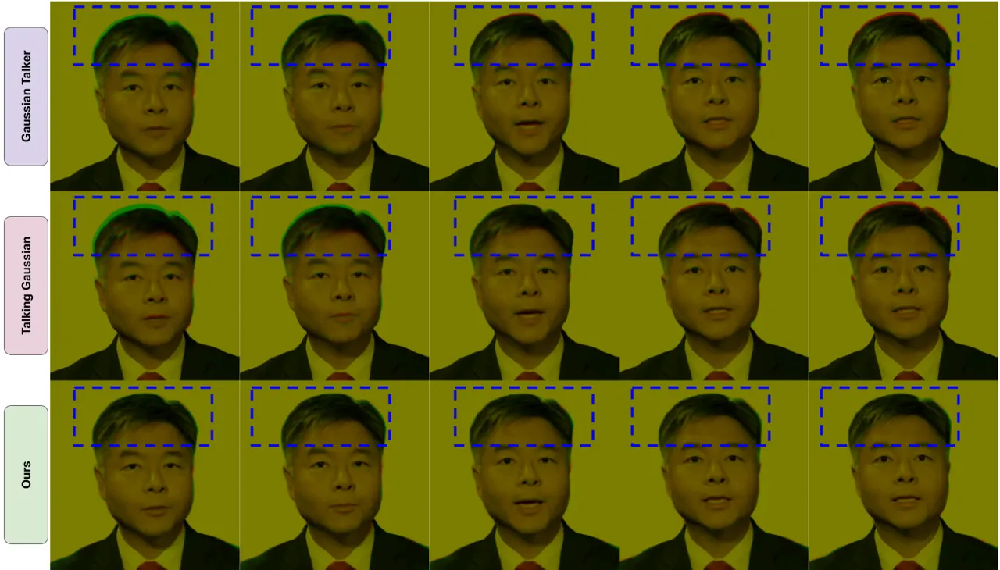

Figure E: Visualization of frame stability through color channel overlay
with ground-truth video over 10 consecutive frames. The significant
displacement (wobbling) observed in the GaussianTalker and
TalkingGaussian methods contrasts with the high overlap and stability
achieved by our proposed method. Green and red channels highlight the
differences within the blue dashed boxes.

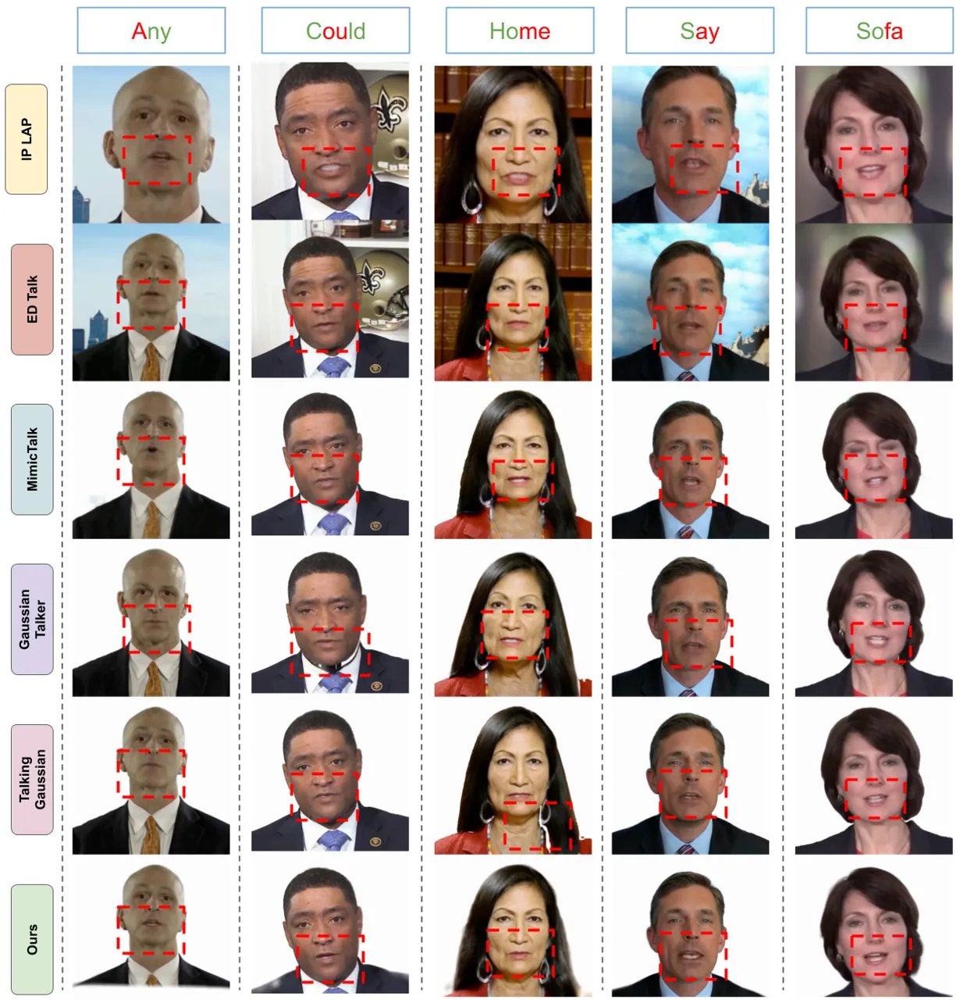

Figure F: Cross-Reenactment Results: We show the visual results by
reenacting various methods using a different audio, from a different
speaker. The top row shows the word from the audio, with red part
highlighting the exact phoneme. GaussianHeadTalk provides the best
possible lip movement for these new audio samples. Other methods
struggle to have proper lip motion, generate high-quality videos and no
artifacts.

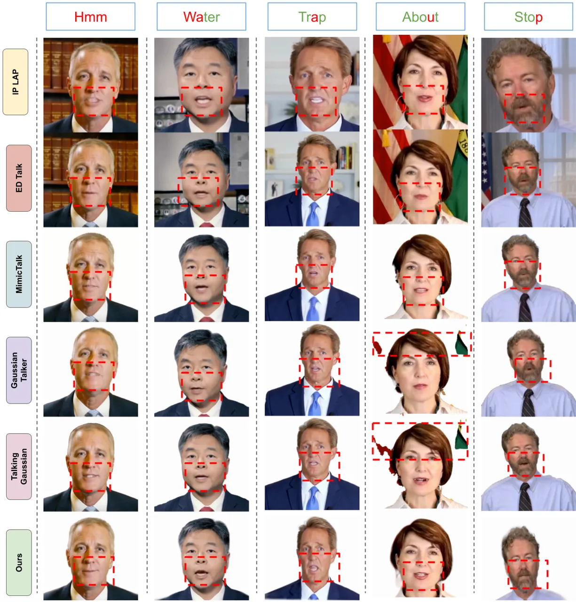

Figure G: Cross-Reenactment Results: We show the visual results by
reenacting various methods using a different audio, from a different
speaker. The top row shows the word from the audio, with red part
highlighting the exact phoneme. GaussianHeadTalk provides the best
possible lip movement for these new audio samples. Other methods
struggle to have proper lip motion, generate high-quality videos and no
artifacts.
