# FactorPortrait: Controllable Portrait Animation via Disentangled Expression, Pose, and Viewpoint

Jiapeng Tang Affiliation:  Meta Reality Labs Affiliation:  Technical
University of Munich    Kai Li Affiliation:  Meta Reality Labs   
Chengxiang Yin Affiliation:  Meta Reality Labs    Liuhao Ge
Affiliation:  Meta Reality Labs    Fei Jiang Affiliation:  Meta Reality
Labs    Jiu Xu Affiliation:  Meta Reality Labs    Matthias Nießner
Affiliation:  Technical University of Munich    Christian Häne
Affiliation:  Meta Reality Labs    Timur Bagautdinov Affiliation:  Meta
Reality Labs    Egor Zakharov Affiliation:  Meta Reality Labs    Peihong
Guo Affiliation:  Meta Reality Labs

###### Abstract

We introduce FactorPortrait, a video diffusion method for controllable
portrait animation that enables lifelike synthesis from disentangled
control signals of facial expressions, head movement, and camera
viewpoints. Given a single portrait image, a driving video, and camera
trajectories, our method animates the portrait by transferring facial
expressions and head movements from the driving video while
simultaneously enabling novel view synthesis from arbitrary viewpoints.
We utilize a pre-trained image encoder to extract facial expression
latents from the driving video as control signals for animation
generation. Such latents implicitly capture nuanced facial expression
dynamics with identity and pose information disentangled, and they are
efficiently injected into the video diffusion transformer through our
proposed expression controller. For camera and head pose control, we
employ Plücker ray maps and normal maps rendered from 3D body mesh
tracking. To train our model, we curate a large-scale synthetic dataset
containing diverse combinations of camera viewpoints, head poses, and
facial expression dynamics. Extensive experiments demonstrate that our
method outperforms existing approaches in realism, expressiveness,
control accuracy, and view consistency. [Project
Page](https://tangjiapeng.github.io/FactorPortrait)

![[Uncaptioned
image]](arxiv-2512-11645--6f349c044939.figures/figure-1.webp)

Figure 1: Given a single portrait image, FactorPortrait generates vivid
portrait animations featuring complex facial dynamics, and precise,
flexible camera control. Our method supports a wide range of
controllable combinations, including viewpoint, pose, and expression.

## 1 Introduction

Generating lifelike portrait animation from a single image has wide
applications in virtual and augmented reality, film, education, and
entertainment. However, it is an inherently ambiguous problem due to the
limited information present in a single image. High-fidelity appearances
and realistic facial motions generation without identity shift are key
challenges.

Generative Adversarial Networks (GANs) \[23\] have shown promise in
generating such animations. GAN-based methods \[48, 58, 14, 19, 20, 81\]
can generate richer facial details than conventional video animation
methods \[2, 32, 37, 43\], but exhibit poor generalization to unseen
identities, have visual artifacts, motion distortion, and lack of
sufficient control over facial expressions. Pre-trained foundational
diffusion priors, _e.g_. Stable Diffusion \[54\] and Wan \[66\] have
shown promising results when adapted to facial animation
generation \[26, 24, 74, 78\]. 2D facial landmarks for representing
facial expressions \[45, 72\] can only capture coarse movements of
facial features, and 3D Morphable Model (3DMM) as dense geometry
guidance \[11, 60, 52, 61\] is unable to capture fine-grained details
such as wrinkles. Moreover, existing methods are restricted to frontal
viewpoints and lack continuous viewpoint control, limiting their
applicability in VR/AR applications.

To this end, we propose FactorPortrait, a video diffusion method that
enables life-like portrait video synthesis from disentangled control
signals of facial expression, head movement and camera viewpoints. We
designed an expression controller that efficiently injects expression
information into the DiT \[50\] based video diffusion network with
minimal learnable parameters. For pose control, we utilize parametric
body mesh tracking to obtain body meshes that are rendered into normal
maps as spatially-aligned dense conditioning input. We adopt Plücker ray
maps to represent viewpoint. Finally, we fuse identity appearance cues,
template mesh normal maps, and ray maps in a condition fusion layer
before the DiT network.

Controllability in video diffusion models requires a supervised
fine-tuning dataset with accurate annotations for each control factor in
monocular videos, covering diverse combinations of viewpoint, pose, and
expression. In-the-wild portrait videos could provide the needed variety
on head poses and expressions, but they are often captured from fixed,
frontal viewpoints. For the videos with camera movements, accurately
recovering head articulation and camera motions from in-the-wild
monocular videos remains challenging due to local minima in rigid and
non-rigid tracking. One might consider rendering continuous views from
static 3D head assets to augment continuous camera motions in the
training dataset. However, this approach only generates videos with
static expressions or poses. To address this limitation, we employ a
synthetic dataset containing video renderings from high-quality
Gausssians-based animatable head avatars reconstructed from dense
multi-view studio captures \[47\]. These avatars enable novel view
renderings along arbitrary continuous camera trajectories while
simultaneously allowing expression and pose changes during camera
movements, simulating realistic observation scenarios in VR/AR
applications.

As shown in Fig. 1, our method generates high-quality portrait
animations with accurate identity preservation and complex facial
expressions, while enabling precise, flexible camera control: (1) static
frontal viewpoint with dynamic pose and expression; (2) static novel
viewpoints with dynamic pose and expression; (3) static pose and
expression with dynamic viewpoint; and (4) simultaneous dynamic pose,
expression, and viewpoint.

The contributions of this paper can be summarized as:

- •
  We introduce a controllable portrait video diffusion model that
  enables flexible combinations of facial expressions, camera
  viewpoints, and head poses.
- •
  We propose a data curation strategy that augments monocular videos
  with synthetic renderings, enabling continuous view synthesis with
  both static and dynamic expressions and poses.
- •
  We design an expression controller network that efficiently injects
  latent expression codes into DiT with minimal learnable parameters
  while capturing complex facial expressions.

Extensive experiments demonstrate that our method outperforms
state-of-the-art portrait animation methods across different datasets
and control modes.

## 2 Related Work

### 2.1 Portrait Video Animation

Portrait video animation methods can be divided into non-diffusion and
diffusion-based approaches.

Non-diffusion work \[59, 70, 25\] utilized implicit keypoints as motion
representations to warp source portraits, while others \[38, 74\]
encoded expressions as latent vectors and injected them into generator
networks for feature-space manipulation. To incorporate geometric
priors, some methods integrated 3DMM \[7\] into GANs \[65, 6\] or
employed 3DMM blendshapes as motion representations \[44, 12\]. However,
these non-diffusion-based approaches lack robust priors for extreme
poses and expressions, and warping-based strategies fail to achieve 3D
consistency and high rendering quality under large head and body
movements.

Recent diffusion-based approaches \[45, 76, 22\] achieved significant
progress in portrait animation by adapting visual foundation
models \[54, 5, 9, 34\]. FADM \[80\] pioneered diffusion-based portrait
animation, followed by methods \[30, 72, 75, 45\] that fine-tune Stable
Diffusion \[54\] for human portrait animation. To achieve temporal
consistency, subsequent methods \[8, 68, 27, 29, 84, 69, 63, 62, 71\]
leveraged image or video diffusion models in an end-to-end fashion for
temporally coherent portrait video generation. They mitigated background
jitter issues while enabling superior identity generalization.
DiffusionRig \[18\], DiffusionAvatars \[33\], ConsistentAvatar \[77\],
and Stable Video Portraits \[49\] generated avatar animations but
required subject-specific training. For expression control, some
methods \[45, 72\] used 2D facial landmarks, which provide only coarse
and inaccurate control. Others \[11, 60, 52, 61\] leveraged 3DMM
reconstruction to guide image or video diffusion models. However, the
limited representation capacity of PCA-based parametric models and fixed
template meshes makes it difficult to capture nuanced facial
expressions, such as wrinkles. HunyuanPortrait \[76\] recently
introduced implicit expression latents for UNet-based video diffusion
models \[8\] using additional cross-attention layers, but at a high
computational cost. In contrast, we present an expression controller
that injects expression latents into DiT \[50\] via Adaptive Layer
Normalization layers \[3, 51\], introducing only minimal learnable
parameters.

### 2.2 Camera Conditioned Diffusion Models

Early approaches \[41, 56\] introduced camera pose conditioning into
pretrained text-to-image diffusion models for novel view synthesis. To
improve multi-view consistency, later methods \[42, 57, 67, 21, 61\]
employed 3D-aware attention mechanisms to jointly denoise multiple
views, thereby enforcing consistency across them. However, these
image-based models lack temporal priors, which leads to inconsistency
when generating views with significant viewpoint changes. Recent
video-based work \[73, 83, 4, 46, 79, 53\] finetuned video diffusion
models for camera control along continuous trajectories, achieving
smoother view transitions and improved temporal consistency.
MVPerformer \[82\] jointly denoised multi-view human videos and enabled
novel view rendering through 4D reconstruction from monocular video.
However, these methods focus solely on camera control and do not
generate novel facial expressions or head movement beyond the input.
Many approaches \[4, 46, 82\] require a monocular video as input. In
contrast, our approach accepts a single image as input and enables
comprehensive portrait animation with precise control over various
combinations of dynamic camera viewpoints, facial expressions, and body
poses.

## 3 Dataset Curation

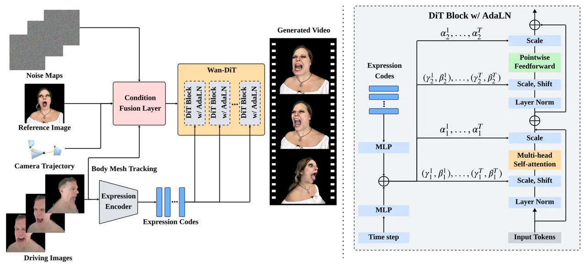

Figure 2: Pipeline Overview. Our method generates a video of the
reference subject animated by the body pose and facial expressions from
the driving images, while following the specified camera trajectory. The
model consists of three main components: (1) a condition fusion layer
that combines noise maps, the reference image, and camera pose
annotations, and body mesh tracking as input to DiT; (2) an expression
encoder that extracts and aggregates per-frame expression codes from the
driving images; and (3) a video diffusion model based on Wan-DiT blocks
with adaptive layer normalization (AdaLN), which applies scale and shift
transformations conditioned on the per-frame expression codes and
frame-agnostic timestep embedding.

To achieve fully disentangled control over multiple signals, the ideal
approach is to acquire large-scale videos that encompass all possible
dynamics simultaneously. However, collecting such comprehensive data at
scale is often impractical, primarily in data storage and computational
resources. One possible approach is to recover all the disentangled
dynamics from monocular videos, including head poses, facial
expressions, and camera parameters. However, accurately solving rigid
and non-rigid tracking, remains a significant challenge. In this
section, we present the carefully designed dataset curation strategies
that deliver disentangled and accurate dynamics for model training,
where each dataset covers a subset of control signals at a time.

### 3.1 Real Data

Due to the aforementioned data constraints, direct joint training for
video synthesis with fully disentangled controls is intractable. To
address this, we leverage both monocular iPhone captures and multi-view
studio recordings to incrementally develop these capabilities.

Phone Capture. We utilize a monocular iPhone video dataset comprising
11,976 identities, with on-average 4,000 frames per capture from 30
videos, at a resolution of 1440x1080. The videos include a variety of
actions such as head rotation, brief expressions, and speech. We
primarily leverage the rich identities and diverse facial dynamics.

Studio Capture. The multi-view studio dataset, similar to the ones
in \[10, 35\], includes 1414 identities recorded with 78 synchronized 2K
cameras, each providing approximately 4,000 frames across diverse facial
expressions, head movements, and gaze directions. For each capture, 11
views are randomly sampled to balance coverage and computational
efficiency. We retain 612 raw captures for training expression dynamics
and novel view synthesis.

### 3.2 Synthetic Data

We propose using animatable head avatars to generate synthetic videos
with disentangled signals, by rendering two distinct types of videos:
(1) _ViewSweep_: contains static expressions and varying camera
trajectories; (2) _DynamicSweep_: contains simultaneous changes in both
facial dynamics and camera viewspoints. This synthetic data explicitly
disentangles camera motion from portrait dynamics, enabling clear,
independent supervision of each signal.

Gaussian Avatar Fitting. We fit animatable Gaussian avatars for 802
studio captures, with disentangled expression code, camera view, and
pose, similar to the universal prior model in \[35, 40\] but without
hair-specific control nor lighting input. An expression encoder \[1\] is
used to extract latent expression codes. A hypernetwork conditioned on
identity information generates person-specific bias maps. The final
guide mesh and Gaussian parameters are produced for image rendering.

Re-rendering. With the fitted animatable Gaussian avatars, we render
arbitrary videos using desired expression codes, body poses, and novel
cameras. This disentangles the camera motion and facial dynamics in the
rendered videos, allowing for independent supervision of each control
signal during model training.

- •
  _ViewSweep_. For each identity, we randomly select a facial expression
  and design a camera trajectory (e.g., spin or spiral) with varied
  distance and look-at points. This yields 128 unique 100-frame
  sequences at 1024x1024 resolution per identity.
- •
  _DynamicSweep_. Rather than keeping expressions static during camera
  motion, facial expressions and body poses are sampled from random
  segments of the original capture. Each identity generates 32 unique
  128-frame trajectories at 1024x1024 resolution.

## 4 Controllable Portrait Animation

Our pipeline generates a video of the reference subject, controlled by
the camera views, body poses, and facial expressions from the driving
image sequence, as illustrated in Fig. 2. We adapt video foundation
prior model Wan \[66\] as the backbone for the face domain task through
supervised training. The encoders responsible for extracting
disentangled identity, pose, expression, and camera information are
described in Sec. 4.1. Sec. 4.2 shows how to integrate these control
signals into the Diffusion Transformers \[50\] denoising framework. Our
training strategy for a high-fidelity and fully disentangled control is
introduced in Sec. 4.3.

### 4.1 Disentangled Conditions

Given a single portrait image $`\mathbf{I}`$ as reference, a camera
trajectory $`\mathbf{C}`$, and a driving video $`\mathbf{D}`$ of length
$`T`$ (another identity or same identity), the goal is to generate the
high-fidelity portrait video with temporal coherence. The generated
video should: 1) preserve the identity and appearance of the reference
image $`\mathbf{I}`$; 2) follow the camera trajectory $`\mathbf{C}`$ to
render novel viewpoints; 3) inherit the expression variations of the
driving video $`\mathbf{D}`$. To achieve disentangled control, we first
extract conditions on identity, pose, viewpoint, and expression from
disjoint inputs.

Identity Condition. For identity preservation, we extract the latent
features $`\mathbf{z_{I}}`$ from reference image $`\mathbf{I}`$ using
the Wan-VAE encoder $`\mathcal{E}`$ \[66\]. Unlike identity embeddings
from face recognition models \[55\], which often lose fine-grained
appearance information, this VAE latent retrains rich low-level facial
details, including skin texture, facial structure, hair, and other
identity-specific characteristics. They are seamlessly integrated into
the diffusion process via attention mechanisms within the same latent
space.

Pose Condition. To extract body pose from the driving video
$`\mathbf{D}`$, we estimate the parametric body
meshes $`\mathcal{M_{D}}`$ via a feed-forward 3D human mesh method based
on \[31\], and render body meshes $`\mathcal{M_{D}}`$ into normal maps
$`\mathbf{N_{D}}`$. The normal maps provide a dense, pixel-aligned
representation of 3D body movements and is seamlessly integrated into
the video diffusion models for pose control. Unlike rotation matrix or
Euler angles, normal maps maintain spatial correspondence within the
image domain. Thanks to the human body priors \[31\], the body mesh
estimation is robust even in challenging scenarios such as occlusions,
providing us reliable pose conditioning.

Camera Condition. Similar to previous work \[13, 28\], Plücker
coordinates are used to represent camera viewpoints in a continuous
manner. For each driving frame $`\mathbf{D}_{i}`$, we compute the
relative camera pose $`\boldsymbol{\pi}_{i}`$ between the driving frame
$`\mathbf{D}_{i}`$ and the reference image $`\mathbf{I}`$. Plücker ray
maps $`\mathbf{R}_{i}`$ are then constructed to encode both the
direction and position of the rays from the target camera viewpoint.

Expression Condition. We utilize a pre-trained expression encoder \[1\]
to extract 128-d expression latent codes
$`\{\mathbf{E}_{\mathbf{D}_{i}}\}`$ from the driving video
$`\mathbf{D}`$. Traditional methods for facial expression
representations typically rely on facial landmarks or parametric models
like FLAME \[36\]. However, they have significant limitations in
capturing nuanced facial expressions, including micro-expressions, fine
wrinkles, mouth interior and tongue movements. In our pipeline, the
expression encoder is designed to overcome these challenges by
implicitly capturing fine-grained, complex, and non-linear expression
dynamics, while excluding identity information by an aligner encoder and
frame latent encoder.

### 4.2 Controllable Video Diffusion

We now detail how to input these condition signals into the
Wan \[66\]-based video diffusion transformer with two key modules:
condition fusion layer and expression controller.

Video Diffusion Transformer. Given an input video
$`\mathbf{V}\in\mathbb{R}^{T\times H\times W\times 3}`$ with $`T`$
frames, Wan \[66\] uses a causal video autoencoder to encode
$`\mathbf{V}`$ into a compact spatiotemporal latent representation
$`\mathbf{z}=\mathcal{E}(\mathbf{V})\in\mathbb{R}^{l\times h\times w\times c}`$,
where $`l=(T+3)//4`$, $`h=H//8`$, $`w=W//8`$, and $`c=16`$ denote the
temporal, height, width, and channel dimensions, respectively. Wan
leverages flow matching \[39\] to learn a continuous-time ordinary
differential equation (ODE) that transforms Gaussian noise
$`\boldsymbol{\epsilon}`$ into the video latent $`\mathbf{z}`$,
conditioned on input signals. During training, video latent
$`\mathbf{z}`$ is gradually perturbed to produce noisy versions
$`\mathbf{z}_{t}`$, and a denoising transformer is trained to predict
the velocity field needed to recover the original latent structure.

Condition Fusion Layer.

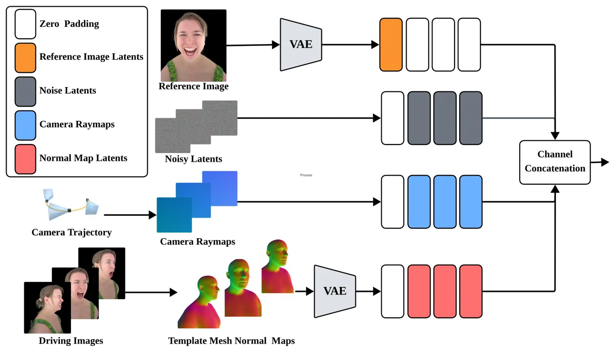

Figure 3: Condition Fusion Layer. We extract reference image latents,
ray maps, and normal video latents from the template mesh to represent
identity, viewpoint, and pose, respectively. They are concatenated with
noise latents as input to the diffusion model.

As shown in Fig. 3, a unified input layer is introduced to fuse multiple
conditioning signals via feature concatenation. Specifically, we combine
noisy video latent $`\mathbf{z}_{t}`$, reference image
latents $`\mathbf{z_{I}}`$, body normal maps latents $`\mathbf{N}`$, and
camera ray maps $`\mathbf{R}`$ into a single feature.

- •
  Normal maps and ray maps are concatenated along the channel dimension
  to form a dense spatial signal.
- •
  Reference image latent $`\mathbf{z_{I}}`$ is prepended to the noisy
  video latent $`\mathbf{z}_{t}`$ along the temporal dimension, treating
  it as the first frame of the sequence.

For reference frames, normal maps and ray maps are zero-padded and
computed from the identity camera matrix, since there is no motion or
viewpoint change. For generated frames, reference image features are set
to zero, ensuring that each frame receives only its relevant
conditioning signals. This asymmetric conditioning design helps the
model to learn the relationship between the static reference and the
dynamic generated sequence.

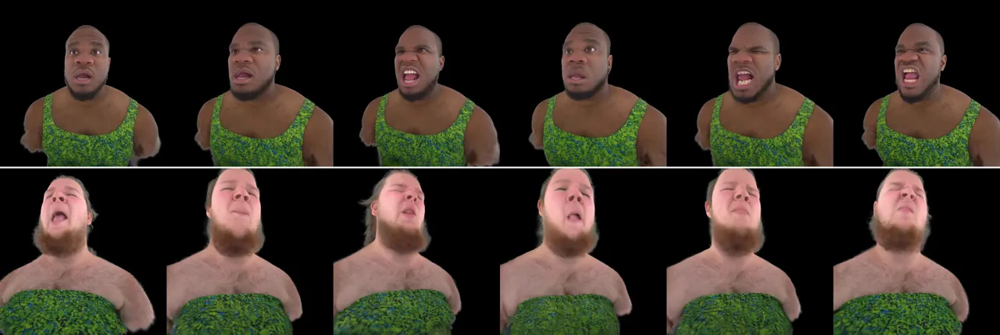

|       |     |     |     |      |     |
| ----- | --- | --- | --- | ---- | --- |
| Input | C1  | C2  | C3  | Full | GT  |

Figure 4: Qualitative Ablation Studies on the DynamicSweep dataset. C1:
without DynamicSweep during training, C2: without body normal maps as
head pose conditions, C3: change expression latents to landmarks as
expression conditions. Each component is essential for achieving the
desired view, head pose, and expression control in our method.

Expression Controller. To achieve precise expression control, a sequence
of $`T\times 128`$ expression codes {$`\mathbf{E}_{\mathbf{D}_{i}}`$}
are first processed using two self-attention layers, which aggregates
temporal dependencies across frames and outputs features of size
$`T\times C`$. They are grouped by chunks of 4 consecutive frames into
features {$`\mathbf{e}_{i}`$} of size $`(T+3)//4\times 4C`$, except for
the first frame corresponding to the reference image, to align with the
video latent for frame-wise conditioning.

We then add the compressed expression latent $`\mathbf{e}_{i}`$ to the
shared timestep embedding $`\mathbf{t}`$, resulting in frame-specific
timestep embeddings $`\mathbf{t}_{i}=\mathbf{t}+\mathbf{e}_{i}`$. These
embeddings are used to predict shift and scale parameters that modulate
the video latent at each frame via adaptive layer normalization
(AdaLN) \[51, 3, 50\].

```math
\text{AdaLN}(\mathbf{z}_{i},\mathbf{t}_{i})=\gamma(\mathbf{t}_{i})\cdot\frac{\mathbf{z}_{i}-\mu(\mathbf{z}_{i})}{\sigma(\mathbf{z}_{i})}+\beta(\mathbf{t}_{i}), \tag{1}
```

where $`\mathbf{z}_{i}`$ denotes the latent features of the $`i`$-th
frame, $`\gamma(\cdot)`$ and $`\beta(\cdot)`$ are learned functions that
predict the scale and shift parameters from the frame-specific timestep
embedding, $`\alpha`$ is the dimension-wise scaling parameters applied
prior to any residual connections, and $`\mu(\cdot)`$ and
$`\sigma(\cdot)`$ are the mean and standard deviation. This design
allows the model to apply distinct expression conditions to each frame
independently, while maintaining temporal coherence through the shared
base timestep embedding. Compared to cross-attention layers, our design
requires minimal computes with only a few additional learnable
parameters.

### 4.3 Progressive Training

|               |         |         |         |         |
| ------------- | ------- | ------- | ------- | ------- |
|               | Stage 1 | Stage 2 | Stage 3 | Stage 4 |
| PhoneCapture  | 100%    | 60%     | 20%     | 20%     |
| StudioCapture | \-      | 40%     | 20%     | 20%     |
| ViewSweep     | \-      | \-      | 30%     | 30%     |
| DynamicSweep  | \-      | \-      | 30%     | 30%     |
| Timestamps    | 13      | 25      | 49      | 81      |

Table 1: Progressive training. We gradually enhance the model’s ability
to generate temporally smooth videos of increasing duration while
supporting disentangled control of expression, pose, and viewpoint.

As illustrated in Tab. 1, our video diffusion model is trained with a
staged strategy, where each each stage is designed to address specific
learning objectives.

- •
  Stage 1 uses only the PhoneCapture data to focus on robust control
  over facial expressions and head pose, leveraging rich identities for
  identity preservation.
- •
  Stage 2 incorporates the multi-view StudioCapture for novel view
  synthesis. This further bootstraps the learning on expression and
  pose, by explicit supervision of disentangled camera and facial
  dynamics.
- •
  Stage 3 adds the synthetic sequences, to disentangle camera motion by
  exposing the model to a wide variety of camera trajectories alone, or
  with simultaneous changes in expression and pose together.
- •
  Stage 4 maintains the same dataset ratio as Stage 3 but focuses on
  generating longer video sequences.

By gradually increasing the timestamps, our model starts from basic
temporal transitions and incrementally learns more complex temporal
changes. This curriculum-based approach helps the model build a strong
foundation in short-term dynamics before tackling long-range ones.

## 5 Experiment

### 5.1 Implementation Details

Datsets. We train our model using the combined dataset describe in
Sec. 3 and Tab. 1. For evaluation, we randomly sample 50 sequences of
unseen identities from each dataset.

Comparisons. We compare our method against recent state-of-the-art
approaches for portrait animation. GAGAvatar \[15\] reconstructs
animatable Gaussian avatars from a single image and renders novel views
and expressions. CAP4D \[61\] is a multi-image diffusion model guided by
3DMM tracking \[36\]. HunyuanPortrait \[76\] is a state-of-the-art video
diffusion method for talking face generation.

Evaluation Metrics. We evaluate the generated videos in four aspects: 1)
Image quality: PSNR, LPIPS, and SSIM measure pixel-level alignment and
structural similarity, similar to \[21\]; 2) Identity similarity: CSIM
computed from ArcFace embeddings \[16\] measures identity preservation; 3) Expression accuracy: AED \[58\] measures the difference in 3DMM
expression coefficients between generated and ground-truth images using
Deep3DFaceRecon \[17\]; 4) Video quality: FID \[41\], FVD \[64\], and
IQA \[76\] assess temporal consistency and perceptual quality.

Implementations. Our model is initialized from the pre-trained Wan
2.1-T2V models and trained on 64 GPUs with a batch size of 64. We employ
a four-stage training strategy, where each stage is initialized from the
previous stage. Stages 1 and 2 are trained for 20,000 iterations with a
learning rate of $`1\times 10^{-4}`$. Stage 3 uses a learning rate of
$`5\times 10^{-5}`$ for 20,000 iterations. Stage 4 uses a learning rate
of $`2\times 10^{-5}`$ for 30,000 iterations.

### 5.2 Ablation Studies

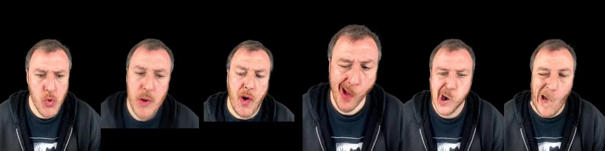

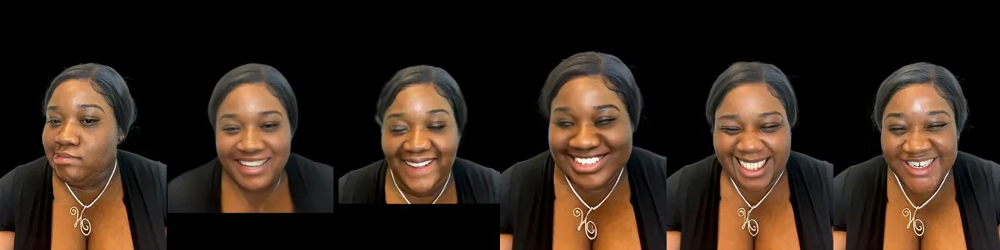

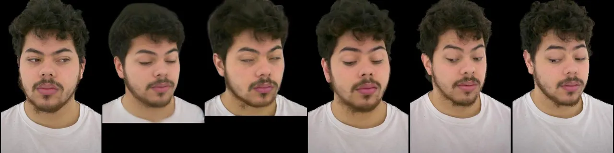

|       |                  |              |                        |      |     |
| ----- | ---------------- | ------------ | ---------------------- | ---- | --- |
| Input | GAGAvatar \[15\] | CAP4D \[61\] | HunyuanPortrait \[76\] | Ours | GT  |

Figure 5: Comparison against state-of-the-arts on the Phone (first two
rows) and Studio (bottom row) Dataset. Previous methods struggle to
achieve sufficient photorealism (_e.g_. blurred beard and hair) and
precise control on expression or view angle, while our method produces
results with sharp details and accurate controls.

We conduct comprehensive ablation studies to validate each design of our
method. Qualitative and quantitative results are presented in Fig. 4 and
Tab. 2, respectively.

| Method | PSNR $`\uparrow`$ | SSIM $`\uparrow`$ | CSIM $`\uparrow`$ | AED $`\downarrow`$ | IQA $`\uparrow`$ | FID-VID $`\downarrow`$ |
| ------ | ----------------- | ----------------- | ----------------- | ------------------ | ---------------- | ---------------------- |
| C1     | 21.63             | 80.37             | 78.20             | 0.221              | 57.14            | 40.44                  |
| C2     | 16.62             | 70.32             | 65.16             | 0.202              | 56.17            | 50.22                  |
| C3     | 19.60             | 77.48             | 70.01             | 0.290              | 57.36            | 53.78                  |
| Full   | 22.81             | 83.32             | 78.82             | 0.212              | 60.08            | 20.68                  |

Table 2: Quantitative Ablation Studies on the DynamincSweep dataset. C1:
without DynamicSweep during training, C2: without body normal maps as
head pose conditions, C3: change expression latents to landmarks as
expression conditions. Overall, these variants would lead to worse image
and video quality, lower identity similarity, and less accurate
expression control. Best and 2nd-best are highlighted.

C1: without dynamic Gaussian avatar renderings during training. To
enable accurate joint control of camera and expression, we augment
training data with videos rendered from animatable Gaussian avatars that
exhibit simultaneous camera and expression changes. Without this data,
the model fails to generalize to joint control modes, as it cannot
extrapolate from training data containing only disjoint camera or
expression variations.

C2: without normal maps for body pose control. Without it, the generated
videos exhibit significant head pose deviations from the ground truth
(the 2nd row of Fig. 4). Since expression codes are disentangled to
represent facial expressions only, the model generates ambiguous results
with inconsistent head poses, leading to decreased image quality metrics
(PSNR, LPIPS, SSIM) as shown in Tab. 2.

C3: latent expression code vs landmarks. We compare the latent
expression codes in Sec. 4.1 against 2D facial landmarks. As shown in
Fig. 4 and Tab. 2, landmark conditioning fails to capture subtle facial
expressions, resulting in degraded metrics, while the expression latents
provide richer representation of fine-grained expression dynamics.

### 5.3 Comparisons against State-of-the-arts

Phone Dataset. We compare against prior methods on front-view talking
face video generation on the Phone dataset. As shown in Fig. 5, our
method can generate complex facial expression and wrinkle details, while
prior methods tend to produce results with muted expressions or
imprecise pose control. The metric evaluation in Tab. 3 demonstrated
that our method consistently and significantly outperform
state-of-the-art methods in almost all metrics.

|                |                        |                   |                   |                      |                   |                    |                  |                        |                    |
| -------------- | ---------------------- | ----------------- | ----------------- | -------------------- | ----------------- | ------------------ | ---------------- | ---------------------- | ------------------ |
| Dataset        | Method                 | PSNR $`\uparrow`$ | SSIM $`\uparrow`$ | LPIPS $`\downarrow`$ | CSIM $`\uparrow`$ | AED $`\downarrow`$ | IQA $`\uparrow`$ | FID-VID $`\downarrow`$ | FVD $`\downarrow`$ |
|                | GAGAvatar \[15\]       | 21.45             | 76.50             | 0.173                | 78.91             | 0.191              | 52.50            | 48.87                  | 0.030              |
| Phone Capture  | CAP4D \[61\]           | 16.58             | 71.01             | 0.203                | 72.48             | 0.231              | 51.45            | 23.81                  | 0.031              |
|                | HunyuanPortrait \[76\] | 17.18             | 71.37             | 0.216                | 70.91             | 0.199              | 56.58            | 35.37                  | 0.032              |
|                | Ours                   | 24.68             | 82.85             | 0.071                | 86.15             | 0.203              | 71.16            | 21.49                  | 0.007              |
|                | GAGAvatar \[15\]       | 21.11             | 83.19             | 0.186                | 80.11             | 0.156              | 52.50            | 41.32                  | 0.055              |
| Stuido Capture | CAP4D \[61\]           | 14.64             | 74.79             | 0.292                | 77.50             | 0.190              | 49.80            | 44.82                  | 0.072              |
|                | HunyuanPortrait \[76\] | 15.26             | 63.43             | 0.433                | 41.62             | 0.192              | 54.39            | 83.67                  | 0.099              |
|                | Ours                   | 24.45             | 83.80             | 0.118                | 85.15             | 0.137              | 66.81            | 45.28                  | 0.025              |
|                | GAGAvatar \[15\]       | 21.11             | 83.19             | 0.186                | 80.11             | 0.156              | 52.87            | 41.32                  | 0.055              |
| ViewSweep      | CAP4D \[61\]           | 19.90             | 76.84             | 0.262                | 76.93             | 0.154              | 50.99            | 96.20                  | 0.024              |
|                | HunyuanPortrait \[76\] | 15.92             | 71.66             | 0.337                | 51.59             | 0.175              | 26.35            | 40.94                  | 0.215              |
|                | Ours                   | 23.25             | 84.55             | 0.133                | 81.62             | 0.136              | 60.77            | 19.51                  | 0.011              |
|                | GAGAvatar \[15\]       | 20.58             | 81.93             | 0.200                | 77.41             | 0.185              | 52.50            | 45.32                  | 0.041              |
| DynamicSweep   | CAP4D \[61\]           | 16.05             | 78.41             | 0.260                | 74.00             | 0.214              | 49.97            | 22.39                  | 0.032              |
|                | HunyuanPortrait \[76\] | 15.61             | 70.71             | 0.348                | 52.14             | 0.219              | 32.44            | 41.93                  | 0.166              |
|                | Ours                   | 22.95             | 83.58             | 0.137                | 79.98             | 0.207              | 61.00            | 20.68                  | 0.008              |

Table 3: Comparisons against State-of-the-art methods on Phone Capture,
Studio Capture, ViewSweep, DynamicSweep datasets. Best and 2nd-best are
highlighted.

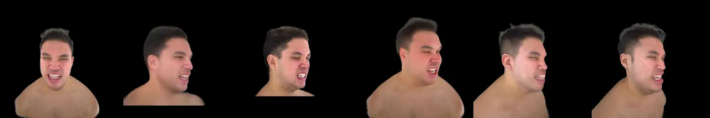

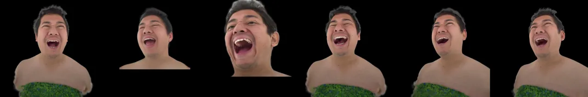

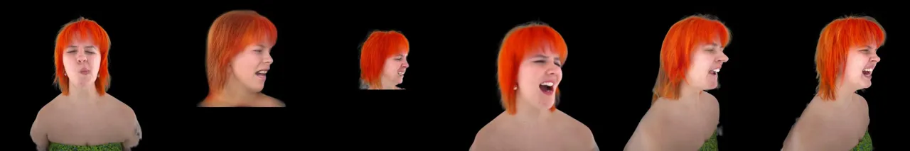

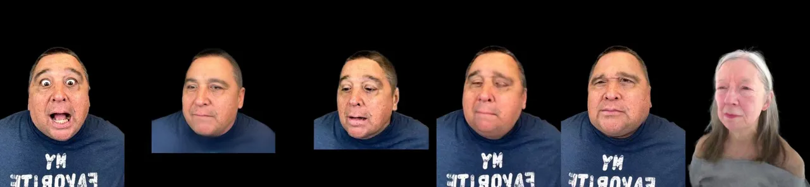

|       |                  |              |                        |      |     |
| ----- | ---------------- | ------------ | ---------------------- | ---- | --- |
| Input | GAGAvatar \[15\] | CAP4D \[61\] | HunyuanPortrait \[76\] | Ours | GT  |

Figure 6: Comparison against state-of-the-arts on the ViewSweep (top two
rows) and DynamicSweep (bottom two row) Dataset, _i.e_. with static
expression (ViewSweep) and dynamic expression (DynamicSweep) under
random camera trajectories. Noting that last row is a cross-reenactment
result. It demonstrates the superiority of our method on identity
preservation, expression transfer and view control.

Studio Dataset. In the Studio dataset, we generate talking face videos
under a fixed novel viewpoint. As seen in Fig. 6, GAGAvatar and CAP4D
struggle to achieve sufficient photorealism, accurate expression
control, and fine details such as hair strands. HunyuanPortrait also
produces results with a clear deviation from the target view angle. In
contrast, our result videos are with better ID preservation and facial
expression details such as wrinkles. The superiority of our method is
also evidenced by the metrics in Tab. 3.

ViewSweep Dataset. We evaluate the capability of camera control on the
synthetic ViewSweep dataset. Qualitative comparisons in Fig. 5
demonstrate that our method preserves identity and expression details,
while synthesizes photo-realistc novel views. The improved metrics in
Tab. 3 supports this conclusion as well regarding image quality,
identity similarity, and video quality.

DynamicSweep Dataset. We also compare the capacity to achieve
simultaneous camera and expression control on the DynamicSweep dataset.
As seen in Fig. 6, our method generates more consistent images in terms
of ID and viewpoint for both self driving, and cross-identity animation,
which are consistent with metric improvements.

## 6 Conclusion

In this work, we propose a controllable portrait video animation method
via disentangled conditioning of expression, pose, and camera viewpoint,
enabling flexible combinations of different control modes. We leverage
synthetic datasets rendered from high-quality animatable Gaussian
avatars, to generate videos with static expressions (camera motion only)
or time-varying expressions (joint camera and expression dynamics).
These synthetic datasets, combined with real-world monocular videos and
multi-view videos from professional studios, provide comprehensive
supervision for finetuning our video diffusion model. For accurate
facial expression control, we employ implicitly defined expression
latents to modulate intermediate features via adaptive layer
normalization. Extensive experiments demonstrate that our method
achieves superior performance in controllable portrait animation with
high realism, expressiveness, and view consistency. We hope our work
inspires future research on controllable portrait animation for VR/AR
applications and beyond.

## References

- \[1\] Vasu Agrawal, Akinniyi Akinyemi, Kathryn Alvero, Morteza
  Behrooz, Julia Buffalini, Fabio Maria Carlucci, Joy Chen, Junming
  Chen, Zhang Chen, Shiyang Cheng, et al. Seamless interaction: Dyadic
  audiovisual motion modeling and large-scale dataset. _arXiv preprint
  arXiv:2506.22554_, 2025.
- \[2\] Oleg Alexander, Mike Rogers, William Lambeth, Jen-Yuan Chiang,
  Wan-Chun Ma, Chuan-Chang Wang, and Paul Debevec. The digital emily
  project: Achieving a photorealistic digital actor. _IEEE Computer
  Graphics and Applications_, 30(4):20–31, 2010.
- \[3\] Jimmy Lei Ba, Jamie Ryan Kiros, and Geoffrey E Hinton. Layer
  normalization. _arXiv preprint arXiv:1607.06450_, 2016.
- \[4\] Jianhong Bai, Menghan Xia, Xiao Fu, Xintao Wang, Lianrui Mu,
  Jinwen Cao, Zuozhu Liu, Haoji Hu, Xiang Bai, Pengfei Wan, and Di
  Zhang. Recammaster: Camera-controlled generative rendering from a
  single video. _arXiv preprint arXiv:2503.11647_, 2025.
- \[5\] Jason Baldridge, Jakob Bauer, Mukul Bhutani, Nicole Brichtova,
  Andrew Bunner, Lluis Castrejon, Kelvin Chan, Yichang Chen, Sander
  Dieleman, Yuqing Du, et al. Imagen 3. _arXiv preprint
  arXiv:2408.07009_, 2024.
- \[6\] Tina Behrouzi and Atefeh Shahroudnejad. Maskrenderer: 3d-infused
  multi-mask realistic face reenactment. _Pattern Recognition_,
  155, 2024.
- \[7\] Volker Blanz and Thomas Vetter. A morphable model for the
  synthesis of 3d faces. In _ACM SIGGRAPH_, pages 187–194, 1999.
- \[8\] Andreas Blattmann, Tim Dockhorn, Sumith Kulal, Daniel
  Mendelevitch, Maciej Kilian, Dominik Lorenz, Yam Levi, Zion English,
  Vikram Voleti, Adam Letts, et al. Stable video diffusion: Scaling
  latent video diffusion models to large datasets. _arXiv preprint
  arXiv:2311.15127_, 2023a.
- \[9\] Andreas Blattmann, Robin Rombach, Huan Ling, Tim Dockhorn,
  Seung Wook Kim, Sanja Fidler, and Karsten Kreis. Align your latents:
  High-resolution video synthesis with latent diffusion models. In
  _IEEE/CVF Conference on Computer Vision and Pattern Recognition_,
  pages 22563–22575, 2023b.
- \[10\] Chen Cao, Tomas Simon, Jin Kyu Kim, Gabe Schwartz, Michael
  Zollhoefer, Shunsuke Saito, Stephen Lombardi, Shih-En Wei, Danielle
  Belko, Shoou-I Yu, Yaser Sheikh, and Jason Saragih. Authentic
  volumetric avatars from a phone scan. _ACM Transactions on Graphics_,
  41(4), 2022.
- \[11\] Xiyi Chen, Marko Mihajlovic, Shaofei Wang, Sergey Prokudin, and
  Siyu Tang. Morphable diffusion: 3d-consistent diffusion for
  single-image avatar creation. In _IEEE/CVF Conference on Computer
  Vision and Pattern Recognition_, pages 10359–10370, 2024a.
- \[12\] Zechen Chen, Long Jin, Haolin Sun, Yilun Ni, Yucheng Zhou, Siyu
  Qin, Yun Chen, Haozhe Huang, and Jingdong Wang. Bring your own
  character: A holistic solution for automatic facial animation
  generation of customized characters. _arXiv preprint
  arXiv:2402.13724_, 2024b.
- \[13\] Zilong Chen, Yikai Wang, Feng Wang, Zhengyi Wang, Fuchun Sun,
  and Huaping Liu. V3d: Video diffusion models are effective 3d
  generators. _IEEE Transactions on Pattern Analysis and Machine
  Intelligence_, pages 1–18, 2025.
- \[14\] Kun Cheng, Xiaodong Cun, Yong Zhang, Menghan Xia, Fei Yin,
  Mingrui Zhu, Xuan Wang, Jue Wang, and Nannan Wang. Videoretalking:
  Audio-based lip synchronization for talking head video editing in the
  wild. In _ACM SIGGRAPH Asia_, pages 1–9, 2022.
- \[15\] Xuangeng Chu and Tatsuya Harada. Generalizable and animatable
  gaussian head avatar. _Advances in Neural Information Processing
  Systems_, 37:57642–57670, 2024.
- \[16\] Jiankang Deng, Jia Guo, Xue Niannan, and Stefanos Zafeiriou.
  Arcface: Additive angular margin loss for deep face recognition. In
  _IEEE Conference on Computer Vision and Pattern Recognition_, 2019a.
- \[17\] Yu Deng, Jiaolong Yang, Sicheng Xu, Dong Chen, Yunde Jia, and
  Xin Tong. Accurate 3d face reconstruction with weakly-supervised
  learning: From single image to image set. In _IEEE Conference on
  Computer Vision and Pattern Recognition Workshops_, 2019b.
- \[18\] Zheng Ding, Xuaner Zhang, Zhihao Xia, Lars Jebe, Zhuowen Tu,
  and Xiuming Zhang. Diffusionrig: Learning personalized priors for
  facial appearance editing. In _IEEE/CVF Conference on Computer Vision
  and Pattern Recognition_, pages 12736–12746, 2023.
- \[19\] Michail Christos Doukas, Stefanos Zafeiriou, and Viktoriia
  Sharmanska. Headgan: One-shot neural head synthesis and editing. In
  _IEEE/CVF International conference on Computer Vision_, pages
  14398–14407, 2021.
- \[20\] Nikita Drobyshev, Jenya Chelishev, Taras Khakhulin, Aleksei
  Ivakhnenko, Victor Lempitsky, and Egor Zakharov. Megaportraits:
  One-shot megapixel neural head avatars. In _ACM International
  Conference on Multimedia_, pages 2663–2671, 2022.
- \[21\] Ruiqi Gao, Aleksander Holynski, Philipp Henzler, Arthur
  Brussee, Ricardo Martin-Brualla, Pratul P. Srinivasan, Jonathan T.
  Barron, and Ben Poole. Cat3d: Create anything in 3d with multi-view
  diffusion models. _arXiv preprint arXiv:2405.10314_, 2024.
- \[22\] Xuan Gao, Jingtao Zhou, Dongyu Liu, Yuqi Zhou, and Juyong
  Zhang. Controlling avatar diffusion with learnable gaussian
  embedding, 2025.
- \[23\] Ian Goodfellow, Jean Pouget-Abadie, Mehdi Mirza, Bing Xu, David
  Warde-Farley, Sherjil Ozair, Aaron Courville, and Yoshua Bengio.
  Generative adversarial networks. _Communications of the ACM_,
  63(11):139–144, 2020.
- \[24\] Hanzhong Guo, Hongwei Yi, Daquan Zhou, Alexander William
  Bergman, Michael Lingelbach, and Yizhou Yu. Real-time one-step
  diffusion-based expressive portrait videos generation. _arXiv preprint
  arXiv:2412.13479_, 2024a.
- \[25\] Jianzhu Guo, Dingyun Zhang, Xiaoqiang Liu, Zhizhou Zhong, Yuan
  Zhang, Pengfei Wan, and Di Zhang. Liveportrait: Efficient portrait
  animation with stitching and retargeting control. _arXiv preprint
  arXiv:2407.03168_, 2024b.
- \[26\] Yuwei Guo, Ceyuan Yang, Anyi Rao, Zhengyang Liang, Yaohui Wang,
  Yu Qiao, Maneesh Agrawala, Dahua Lin, and Bo Dai. Animatediff: Animate
  your personalized text-to-image diffusion models without specific
  tuning. _arXiv preprint arXiv:2307.04725_, 2023.
- \[27\] Yuwei Guo, Ceyuan Yang, Anyi Rao, Zhengyang Liang, Yaohui Wang,
  Yu Qiao, Maneesh Agrawala, Dahua Lin, and Bo Dai. Animatediff: Animate
  your personalized text-to-image diffusion models without specific
  tuning. In _International Conference on Learning Representations_,
  2024c.
- \[28\] Hao He, Yinghao Xu, Yuwei Guo, Gordon Wetzstein, Bo Dai,
  Hongsheng Li, and Ceyuan Yang. Cameractrl: Enabling camera control for
  video diffusion models. In _International Conference on Learning
  Representations_, 2025.
- \[29\] Li Hu, Xin Gao, Peng Zhang, Ke Sun, Bang Zhang, and Liefeng Bo.
  Animate anyone: Consistent and controllable image-to-video synthesis
  for character animation. In _IEEE/CVF Conference on Computer Vision
  and Pattern Recognition_, pages 8153–8163, 2024.
- \[30\] Johanna Karras, Aleksander Holynski, Ting-Chun Wang, and Ira
  Kemelmacher-Shlizerman. Dreampose: Fashion image-to-video synthesis
  via stable diffusion. In _IEEE/CVF International Conference on
  Computer Vision_, pages 22623–22633, 2023.
- \[31\] Rawal Khirodkar, Timur Bagautdinov, Julieta Martinez, Su
  Zhaoen, Austin James, Peter Selednik, Stuart Anderson, and Shunsuke
  Saito. Sapiens: Foundation for human vision models. In _European
  Conference on Computer Vision_, pages 206–228. Springer, 2024.
- \[32\] Tobias Kirschstein, Shenhan Qian, Simon Giebenhain, Tim Walter,
  and Matthias Nießner. Nersemble: Multi-view radiance field
  reconstruction of human heads. _ACM Transactions on Graphics_,
  42(4):1–14, 2023.
- \[33\] Tobias Kirschstein, Simon Giebenhain, and Matthias Nießner.
  Diffusionavatars: Deferred diffusion for high-fidelity 3d head
  avatars. In _IEEE/CVF Conference on Computer Vision and Pattern
  Recognition_, pages 5481–5492, 2024.
- \[34\] Weijie Kong, Qi Tian, Zijian Zhang, Rox Min, Zuozhuo Dai, Jin
  Zhou, Jiangfeng Xiong, Xin Li, Bo Wu, Jianwei Zhang, et al.
  Hunyuanvideo: A systematic framework for large video generative
  models. _arXiv preprint arXiv:2412.03603_, 2024.
- \[35\] Junxuan Li, Chen Cao, Gabriel Schwartz, Rawal Khirodkar,
  Christian Richardt, Tomas Simon, Yaser Sheikh, and Shunsuke Saito.
  Uravatar: Universal relightable gaussian codec avatars. In _ACM
  SIGGRAPH Asia_, pages 1–11, 2024.
- \[36\] Tianye Li, Timo Bolkart, Michael. J. Black, Hao Li, and Javier
  Romero. Learning a model of facial shape and expression from 4D scans.
  _ACM Transactions on Graphics_, 36(6):194:1–194:17, 2017a.
- \[37\] Tianye Li, Timo Bolkart, Michael J Black, Hao Li, and Javier
  Romero. Learning a model of facial shape and expression from 4d scans.
  _ACM Transactions on Graphics_, 36(6):194–1, 2017b.
- \[38\] Connor Z. Lin, David B. Lindell, Eric R. Chan, and Gordon
  Wetzstein. 3d gan inversion for controllable portrait image animation.
  In _ECCV Workshop on Learning to Generate 3D Shapes and Scenes_, 2022.
- \[39\] Yaron Lipman, Ricky TQ Chen, Heli Ben-Hamu, Maximilian Nickel,
  and Matt Le. Flow matching for generative modeling. _arXiv preprint
  arXiv:2210.02747_, 2022.
- \[40\] Di Liu, Teng Deng, Giljoo Nam, Yu Rong, Stanislav Pidhorskyi,
  Junxuan Li, Jason Saragih, Dimitris N. Metaxas, and Chen Cao. Lucas:
  Layered universal codec avatars. In _IEEE/CVF Conference on Computer
  Vision and Pattern Recognition_, 2025.
- \[41\] Ruoshi Liu, Rundi Wu, Basile Van Hoorick, Pavel Tokmakov,
  Sergey Zakharov, and Carl Vondrick. Zero-1-to-3: Zero-shot one image
  to 3d object. _IEEE/CVF International Conference on Computer Vision_,
  pages 9264–9275, 2023a.
- \[42\] Yuan Liu, Cheng Lin, Zijiao Zeng, Xiaoxiao Long, Lingjie Liu,
  Taku Komura, and Wenping Wang. Syncdreamer: Generating
  multiview-consistent images from a single-view image. _arXiv preprint
  arXiv:2309.03453_, 2023b.
- \[43\] Stephen Lombardi, Tomas Simon, Gabriel Schwartz, Michael
  Zollhoefer, Yaser Sheikh, and Jason Saragih. Mixture of volumetric
  primitives for efficient neural rendering. _ACM Transactions on
  Graphics_, 40(4):1–13, 2021.
- \[44\] Shengjie Ma, Yanlin Weng, Tianjia Shao, and Kun Zhou. 3d
  gaussian blendshapes for head avatar animation. In _ACM SIGGRAPH_,
  2024a.
- \[45\] Yue Ma, Hongyu Liu, Hongfa Wang, Heng Pan, Yingqing He, Junkun
  Yuan, Ailing Zeng, Chengfei Cai, Heung-Yeung Shum, Wei Liu, and Ying
  Shan. Follow-your-emoji: Fine-controllable and expressive freestyle
  portrait animation. In _arXiv preprint arXiv:2406.01900_, 2024b.
- \[46\] YU Mark, Wenbo Hu, Jinbo Xing, and Ying Shan.
  Trajectorycrafter: Redirecting camera trajectory for monocular videos
  via diffusion models. _arXiv preprint arXiv:2503.05638_, 2025.
- \[47\] Julieta Martinez, Emily Kim, Javier Romero, Timur Bagautdinov,
  Shunsuke Saito, Shoou-I Yu, Stuart Anderson, Michael Zollhöfer, Te-Li
  Wang, Shaojie Bai, et al. Codec avatar studio: Paired human captures
  for complete, driveable, and generalizable avatars. _Advances in
  Neural Information Processing Systems_, 37:83008–83023, 2024.
- \[48\] Yuval Nirkin, Yosi Keller, and Tal Hassner. Fsgan: Subject
  agnostic face swapping and reenactment. In _IEEE/CVF International
  Conference on Computer Vision_, pages 7184–7193, 2019.
- \[49\] Mirela Ostrek and Justus Thies. Stable video portraits. In
  _European Conference on Computer Vision_, 2024.
- \[50\] William Peebles and Saining Xie. Scalable diffusion models with
  transformers. In _IEEE/CVF Conference on Computer Vision and Pattern
  Recognition_, pages 4195–4205, 2023.
- \[51\] Ethan Perez, Florian Strub, Harm De Vries, Vincent Dumoulin,
  and Aaron Courville. Film: Visual reasoning with a general
  conditioning layer. In _Proceedings of the AAAI conference on
  artificial intelligence_, 2018.
- \[52\] Malte Prinzler, Egor Zakharov, Vanessa Sklyarova, Berna
  Kabadayi, and Justus Thies. Joker: Conditional 3d head synthesis with
  extreme facial expressions. In _International Conference on 3D Vision
  (3DV)_, pages 1583–1593. IEEE, 2025.
- \[53\] Xuanchi Ren, Tianchang Shen, Jiahui Huang, Huan Ling, Yifan Lu,
  Merlin Nimier-David, Thomas Muller, Alexander Keller, Sanja Fidler,
  and Jun Gao. Gen3c: 3d-informed world-consistent video generation with
  precise camera control. _IEEE/CVF Conference on Computer Vision and
  Pattern Recognition_, pages 6121–6132, 2025.
- \[54\] Robin Rombach, Andreas Blattmann, Dominik Lorenz, Patrick
  Esser, and Björn Ommer. High-resolution image synthesis with latent
  diffusion models. In _IEEE/CVF Conference on Computer Vision and
  Pattern Recognition_, pages 10684–10695, 2022.
- \[55\] Florian Schroff, Dmitry Kalenichenko, and James Philbin.
  Facenet: A unified embedding for face recognition and clustering. In
  _IEEE Conference on Computer Vision and Pattern Recognition_, 2015.
- \[56\] Ruoxi Shi, Hansheng Chen, Zhuoyang Zhang, Minghua Liu, Chao Xu,
  Xinyue Wei, Linghao Chen, Chong Zeng, and Hao Su. Zero123++: a single
  image to consistent multi-view diffusion base model. _arXiv preprint
  arXiv:2310.15110_, 2023a.
- \[57\] Yichun Shi, Peng Wang, Jianglong Ye, Mai Long, Kejie Li, and X.
  Yang. Mvdream: Multi-view diffusion for 3d generation. _arXiv preprint
  arXiv:2308.16512_, 2023b.
- \[58\] Aliaksandr Siarohin, Stéphane Lathuilière, Sergey Tulyakov,
  Elisa Ricci, and Nicu Sebe. First order motion model for image
  animation. _Advances in Neural Information Processing Systems_, 32,
  2019a.
- \[59\] Aliaksandr Siarohin, Stéphane Lathuilière, Sergey Tulyakov,
  Elisa Ricci, and Nicu Sebe. First order motion model for image
  animation. _Advances in Neural Information Processing Systems_, 2019b.
- \[60\] Jiapeng Tang, Davide Davoli, Tobias Kirschstein, Liam
  Schoneveld, and Matthias Niessner. Gaf: Gaussian avatar reconstruction
  from monocular videos via multi-view diffusion. In _IEEE Conference on
  Computer Vision and Pattern Recognition_, pages 5546–5558, 2025.
- \[61\] Felix Taubner, Ruihang Zhang, Mathieu Tuli, and David B.
  Lindell. Cap4d: Creating animatable 4d portrait avatars with morphable
  multi-view diffusion models. _IEEE/CVF Conference on Computer Vision
  and Pattern Recognition_, pages 5318–5330, 2024.
- \[62\] Linrui Tian, Qi Wang, Bang Zhang, and Liefeng Bo. Emo: Emote
  portrait alive - generating expressive portrait videos with
  audio2video diffusion model under weak conditions. _arXiv preprint
  arXiv:2402.17485_, 2024.
- \[63\] Zhengyan Tong, Chao Li, Zhaokang Chen, Bin Wu, and Wenjiang
  Zhou. Musepose: a pose-driven image-to-video framework for virtual
  human generation. _arXiv preprint arXiv:2405.17827_, 2024.
- \[64\] Thomas Unterthiner, Sjoerd van Steenkiste, Karol Kurach,
  Raphaël Marinier, Marcin Michalski, and Sylvain Gelly. Towards
  accurate generative models of video: A new metric & challenges.
  _CoRR_, abs/1812.01717, 2018.
- \[65\] Evangelos Ververas and Stefanos Zafeiriou. F3a-gan: Facial flow
  for face animation with generative adversarial networks. _IEEE
  Transactions on Circuits and Systems for Video Technology_, 2022.
- \[66\] Team Wan, Ang Wang, Baole Ai, Bin Wen, Chaojie Mao, Chen-Wei
  Xie, Di Chen, Feiwu Yu, Haiming Zhao, Jianxiao Yang, et al. Wan: Open
  and advanced large-scale video generative models. _arXiv preprint
  arXiv:2503.20314_, 2025.
- \[67\] Peng Wang and Yichun Shi. Imagedream: Image-prompt multi-view
  diffusion for 3d generation. _arXiv preprint arXiv:2312.02201_, 2023.
- \[68\] Qilin Wang, Qingyuan Yu, Xiaoyu Zheng, Yuan Zhou, and Shuai
  Huang. Vividpose: Advancing stable video diffusion for realistic human
  image animation. _arXiv preprint arXiv:2405.18156_, 2024a.
- \[69\] Tan Wang, Linjie Li, Kevin Lin, Yuanhao Zhai, Chung-Ching Lin,
  Zhengyuan Yang, Hanwang Zhang, Zicheng Liu, and Lijuan Wang. Disco:
  Disentangled control for realistic human dance generation. In
  _IEEE/CVF Conference on Computer Vision and Pattern Recognition_,
  2024b.
- \[70\] Ting-Chun Wang, Arun Mallya, and Ming-Yu Liu. One-shot
  free-view neural talking-head synthesis for video conferencing. In
  _IEEE/CVF Conference on Computer Vision and Pattern
  Recognition_, 2021.
- \[71\] Xiang Wang, Hangjie Yuan, Shiwei Zhang, Dayou Chen, Jiuniu
  Wang, Yingya Zhang, Yujun Shen, Deli Zhao, and Jingren Zhou.
  Unianimate: Taming unified video diffusion models for consistent human
  image animation. _arXiv preprint arXiv:2406.01188_, 2024c.
- \[72\] Huawei Wei, Zejun Yang, and Zhisheng Wang. Aniportrait:
  Audio-driven synthesis of photorealistic portrait animation. _arXiv
  preprint arXiv:2403.17694_, 2024.
- \[73\] Rundi Wu, Ruiqi Gao, Ben Poole, Alex Trevithick, Changxi Zheng,
  Jonathan T. Barron, and Aleksander Holynski. Cat4d: Create anything in
  4d with multi-view video diffusion models. _IEEE/CVF Conference on
  Computer Vision and Pattern Recognition_, pages 26057–26068, 2024.
- \[74\] You Xie, Hongyi Xu, Guoxian Song, Chao Wang, Yichun Shi, and
  Linjie Luo. X-portrait: Expressive portrait animation with
  hierarchical motion attention. In _ACM SIGGRAPH 2024 Conference
  Papers_, pages 1–11, 2024.
- \[75\] Zhongcong Xu, Jianfeng Zhang, Jun Hao Liew, Hanshu Yan, Jia-Wei
  Liu, Chenxu Zhang, Jiashi Feng, and Mike Zheng Shou. Magicanimate:
  Temporally consistent human image animation using diffusion model. In
  _IEEE/CVF Conference on Computer Vision and Pattern Recognition_,
  pages 16016–16025, 2024.
- \[76\] Zunnan Xu, Zhentao Yu, Zixiang Zhou, Jun Zhou, Xiaoyu Jin,
  Fa-Ting Hong, Xiaozhong Ji, Junwei Zhu, Chengfei Cai, Shiyu Tang,
  et al. Hunyuanportrait: Implicit condition control for enhanced
  portrait animation. In _IEEE/CVF Conference on Computer Vision and
  Pattern Recognition_, pages 15909–15919, 2025.
- \[77\] Haijie Yang, Zhenyu Zhang, Hao Tang, Jianjun Qian, and Jian
  Yang. Consistentavatar: Learning to diffuse fully consistent talking
  head avatar with temporal guidance. In _ACM Conference on Multimedia_,
  2024a.
- \[78\] Shurong Yang, Huadong Li, Juhao Wu, Minhao Jing, Linze Li,
  Renhe Ji, Jiajun Liang, and Haoqiang Fan. Megactor: Harness the power
  of raw video for vivid portrait animation. _arXiv preprint
  arXiv:2405.20851_, 2024b.
- \[79\] Wangbo Yu, Jinbo Xing, Li Yuan, Wenbo Hu, Xiaoyu Li, Zhipeng
  Huang, Xiangjun Gao, Tien-Tsin Wong, Ying Shan, and Yonghong Tian.
  Viewcrafter: Taming video diffusion models for high-fidelity novel
  view synthesis. _IEEE Transactions on Pattern Analysis and Machine
  Intelligence_, pages 1–18, 2024.
- \[80\] Bo-Wen Zeng, Xuhui Liu, Sicheng Gao, Boyu Liu, Hong Li,
  Jianzhuang Liu, and Baochang Zhang. Face animation with an
  attribute-guided diffusion model. _IEEE/CVF Conference on Computer
  Vision and Pattern Recognition Workshops_, pages 628–637, 2023.
- \[81\] Bowen Zhang, Chenyang Qi, Pan Zhang, Bo Zhang, HsiangTao Wu,
  Dong Chen, Qifeng Chen, Yong Wang, and Fang Wen. Metaportrait:
  Identity-preserving talking head generation with fast personalized
  adaptation. In _IEEE/CVF Conference on Computer Vision and Pattern
  Recognition_, pages 22096–22105, 2023.
- \[82\] Yihao Zhi, Chenghong Li, Hongjie Liao, Xihe Yang, Zhengwentai
  Sun, Jiahao Chang, Xiaodong Cun, Wensen Feng, and Xiaoguang Han.
  Mv-performer: Taming video diffusion model for faithful and
  synchronized multi-view performer synthesis. _arXiv preprint
  arXiv:2510.07190_, 2025.
- \[83\] Jensen Zhou, Hang Gao, Vikram S. Voleti, Aaryaman Vasishta,
  Chun-Han Yao, Mark Boss, Philip Torr, Christian Rupprecht, and Varun
  Jampani. Stable virtual camera: Generative view synthesis with
  diffusion models. _arXiv preprint arXiv:2503.14489_, 2025.
- \[84\] Shenhao Zhu, Junming Leo Chen, Zuozhuo Dai, Yinghui Xu, Xun
  Cao, Yao Yao, Hao Zhu, and Siyu Zhu. Champ: Controllable and
  consistent human image animation with 3d parametric guidance. In
  _European Conference on Computer Vision_, 2024.

Supplementary Material

In this supplementary material, we provide additional details about our
dataset curation strategy in Sec. 7. We then introduce further
implementation details of our method variants in Sec. 8. Next, we
present additional results on the Phone Capture, Studio Capture,
ViewSweep, and DynamicSweep datasets, including both self-reenactment
and cross-reenactment, in Sec. 9. Finally, we discuss the limitations of
our current work and outline future directions in Sec. 10. We encourage
readers to visit the webpage self-contained in our supplementary
material for more video generation results.

## 7 Dataset Curation

A summary of the dataset for disentangled dynamics is described in
Tab. 4, with details explained below.

### 7.1 Phone Capture

| Dataset       | Cameras | Identities | Frames/ID | Resolution | Each video exhibits |                   |             |
| ------------- | ------- | ---------- | --------- | ---------- | ------------------- | ----------------- | ----------- |
|               |         |            |           |            | View change         | Expression change | Pose change |
| PhoneCapture  | 1       | 11,976     | 2,000     | 1440x1080  | ✗                   | ✓                 | ✓           |
| StudioCapture | 78      | 612        | 4,000     | 2048x1334  | ✗                   | ✓                 | ✓           |
| ViewSweep     | Random  | 802        | 12,800    | 1024x1024  | ✓                   | ✗                 | ✗           |
| DynamicSweep  | Random  | 802        | 4,096     | 1024x1024  | ✓                   | ✓                 | ✓           |

Table 4: Dataset Overview. PhoneCapture and StudioCapture datasets
contain real video recordings. ViewSweep and DynamicSweep datasets
consist of synthetic video renderings based on fitted Gaussian avatars.

We utilize a monocular iPhone video dataset comprising 11,976 unique
identities, with each identity contains an average of 4,000 frames from
30 videos, at a resolution of 1440x1080 pixels. For each identity, the
video sequences include a variety of actions such as head rotation,
brief expressions, and speech. Since phone captures features a static
camera set up and focus on facial dynamics across a large number of
identities, we primarily leverage the rich identities and diverse facial
dynamics in this dataset.

### 7.2 Studio Capture

The entire studio dataset comprises 1414 identities from 78 synchronized
cameras at a resolution of 2048x1334 pixels. Each identity is captured
with approximately 4,000 frames, encompassing a wide range of facial
expressions, head movement, emotional displays, gaze motion, sentence
reading, speech, and free face activities. For training efficiency, each
identity randomly samples 11 views from the 78 cameras for each capture,
ensuring coverage across the entire camera views while reducing
computational overhead. We retain the raw captures for 612 identities,
for learning the expression dynamics and novel view synthesis.

### 7.3 ViewSweep

The rendering for fitted Gaussian Avatars simulates mobile-like captures
by setting up a series of handheld cameras and introducing randomness
for each. For each capture, we render 128 distinct camera trajectories,
_i.e_., 100-frame video sequences, with frozen expression and head pose
for each trajectory. There are two kinds of camera trajectories, spin
and spiral. Cameras in spin videos follow an oval path, distance between
25 centimeters and 40 centimeters, and at most 5 elevation degree
randomness. Spiral camera trajectory is drawn by fitting a spiral curve
based on 4 randomly sampled seed locations, within yaw angle in
$`[-90^{\circ},90^{\circ}]`$. Camera intrinsics follows an Field of View
of $`72^{\circ}`$ horizontally and vertically, to simulate the
iPhone-like captures.

### 7.4 DynamicSweep

In this setting, instead of maintaining a frozen expression during
camera spin or spiral, facial expressions and poses are taken from a
random segment (128-frame) of the original studio capture. We render 32
distinct trajectories for each identity, _i.e_., 128-frame video
sequences, among which 16 are camera spin and rest 16 are camera spiral.
Camera configurations are adjusted similarly as the ViewSweep dataset.

## 8 Implementation Details

### 8.1 Expression Condition

We adopt a pretrained imitator face representation \[1\] for expression
condition. Specifically, the pretrained expression encoder, _i.e_. a
typical ResNet34 backbone with a linear head, extracts the 128-dim
latent feature from a roll-normalized facial image crop. An alignment
encoder, with the same ResNet34 plus linear layer architecture, produces
3D translations for the head and body, and rotation angles for the head
alone, from an upper body crop image. These two encoders were trained
with a decoder end-to-end for talking head video generation.

### 8.2 Ablation Studies

Our final model uses a sequence of expression codes as condition to
control the faciail expression. For head pose control, we concatenate
noisy latents with normal maps rendered from the body mesh tracking as
inputs, which are fed into diffusion transformer. Our model was trained
on a combination of Phone, Studio, ViewSweep, and DynamicSweep datasets.
To study the effectiveness of each design, we individually remove each
design.

Without dynamic Gaussian avatar renderings. To enable accurate joint
control of camera and expression, we use DynamicSweep dataset,  *i.e*.
videos rendered from animatable Gaussian avatars exhibiting simultaneous
camera and expression changes. Without the DynamicSweep dataset, the
data ratio for training stages 3 and 4 is as follows: Phone (20%),
Studio (40%), and ViewSweep (40%).

Without normal maps for head pose control. To assess the impact of
normal maps on head pose control, we conduct an ablation study by
removing the normal maps rendered from body mesh tracking in the
condition fusion layer.

Latent expression code vs. 2D facial landmarks. Instead of using latent
expression codes for expression control, an alternative approach is
facial landmarks detected from the driving video. Specifically, we
detect 238 facial landmarks per frame and represent them as 2D point
clouds. These landmark sequences are encoded using a transformer with
alternating spatial and temporal attention layers, capturing both
intra-frame spatial relationships and inter-frame temporal dynamics.
Specifically, the landmark encoder is composed of 2 spatial attention
and 2 temporal attention layers. To inject the encoded landmark features
into the diffusion transformer, we add additional cross-attention
layers, enabling the model to incorperate the landmark features at each
frame. The training strategy and configuration remain identical to those
used for our final model.

## 9 Additional Results

### 9.1 Self-Reenactment

We provide additional qualitative comparisons on Phone Capture, Studio
Capture, ViewSweep, and DynamicSweep datasets in Fig. 7, Fig. 8, Fig. 9,
and Fig. 10, respectively.

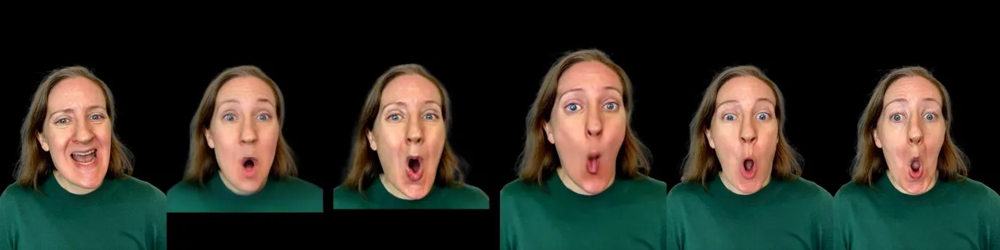

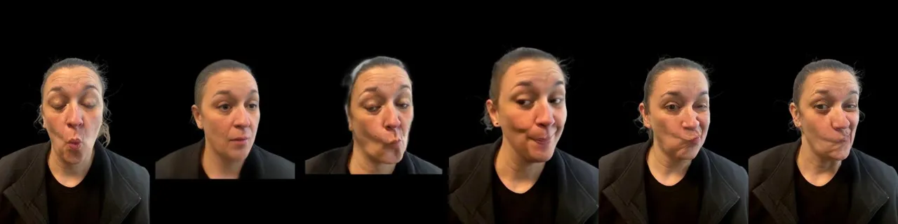

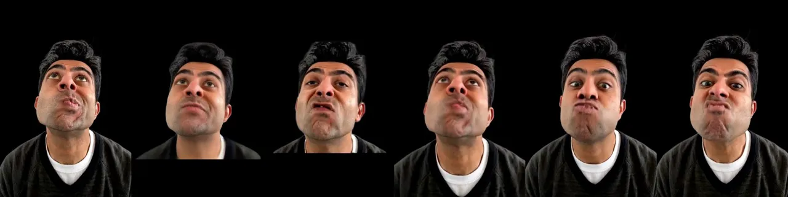

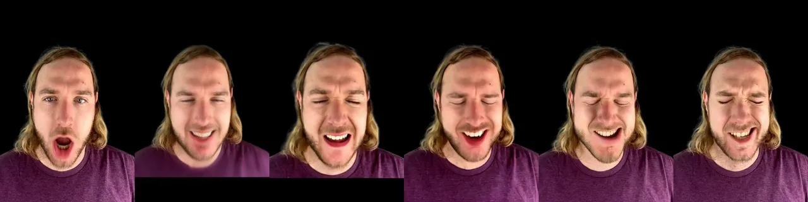

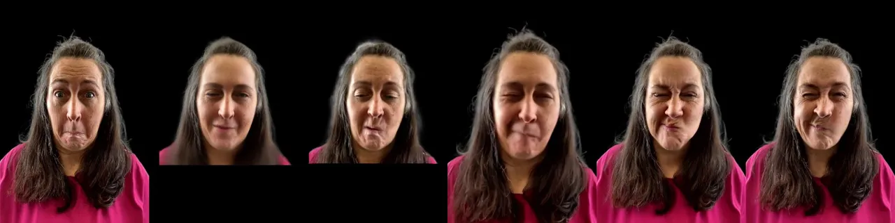

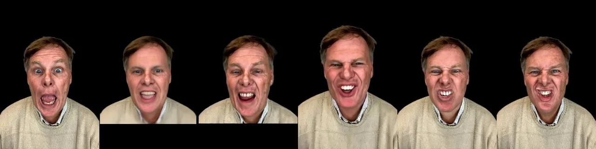

|       |                  |              |                        |      |     |
| ----- | ---------------- | ------------ | ---------------------- | ---- | --- |
| Input | GAGAvatar \[15\] | CAP4D \[61\] | HunyuanPortrait \[76\] | Ours | GT  |

Figure 7: Comparison against state-of-the-art methods on the Phone
Dataset. The target output is a static, frontal view video with changing
expressions. Our method achieves more accurate control over complex
facial expressions and additionally enables the generation of hair and
torso regions.

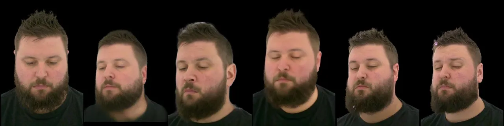

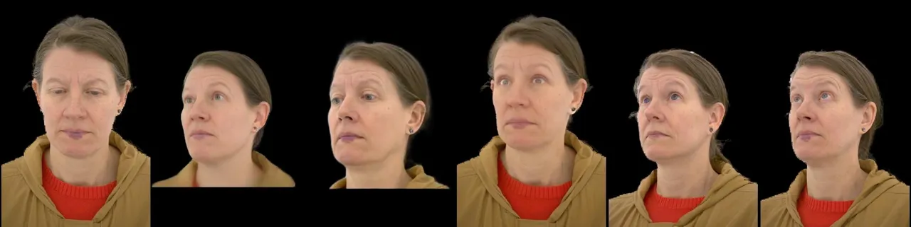

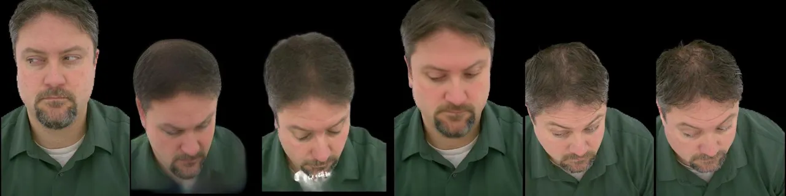

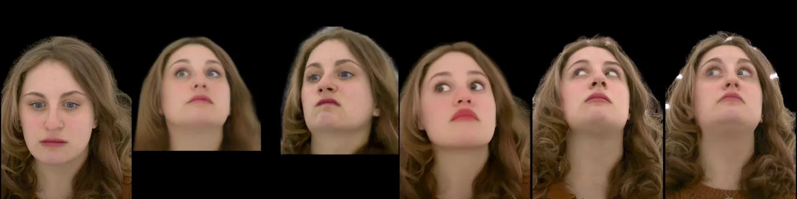

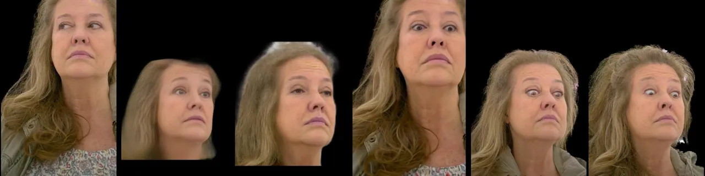

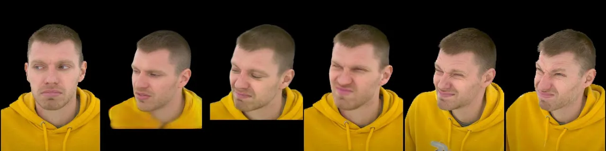

|       |                  |              |                        |      |     |
| ----- | ---------------- | ------------ | ---------------------- | ---- | --- |
| Input | GAGAvatar \[15\] | CAP4D \[61\] | HunyuanPortrait \[76\] | Ours | GT  |

Figure 8: Comparison against state-of-the-art method on the Studio
Dataset. The desired output is a static, novel view video with changing
expressions. Our method generates more plausible eye movements and gaze
directions. Compared to HunyuanPortrait, our approach enables more
accurate viewpoint control. In contrast to GAGAvatar, we can synthesize
hair and beards with sharper details.

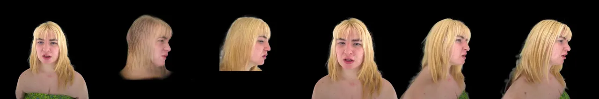

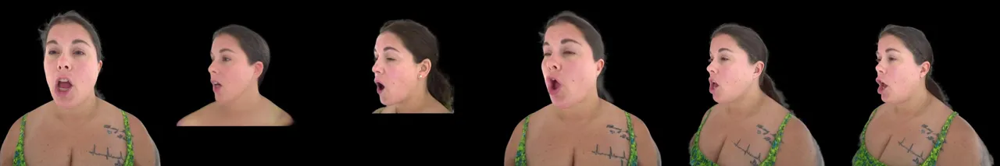

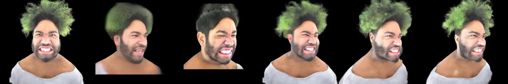

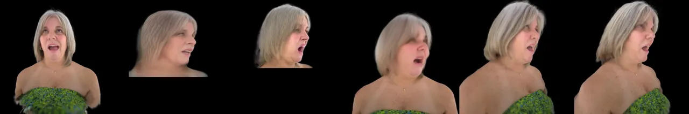

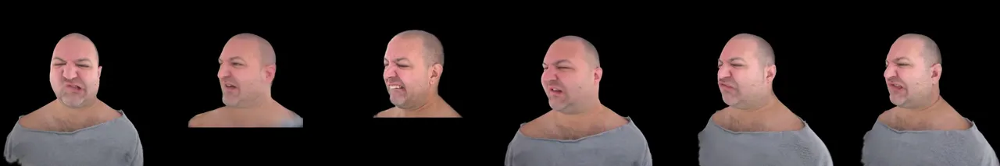

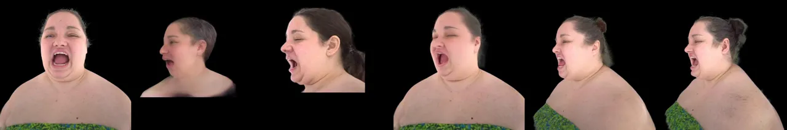

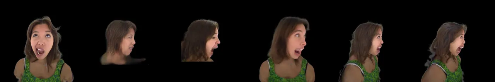

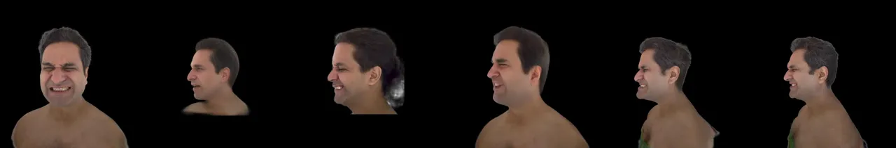

|       |                  |              |                        |      |     |
| ----- | ---------------- | ------------ | ---------------------- | ---- | --- |
| Input | GAGAvatar \[15\] | CAP4D \[61\] | HunyuanPortrait \[76\] | Ours | GT  |

Figure 9: Comparison against state-of-the-arts on the ViewSweep Dataset.
The desired output is a stack of novel-view images along a camera
trajectory, with static expressions. Our method achieves more favorable
view synthesis, better preserving facial identity and capturing detailed
hair and mouth interior features under hold-out viewpoints. Compared to
the recent video diffusion method HunyuanPortrait, our approach enables
more precise viewpoint control.

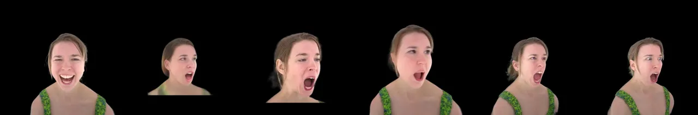

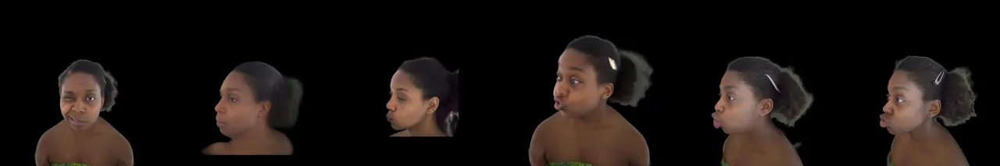

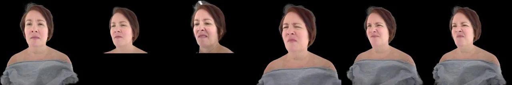

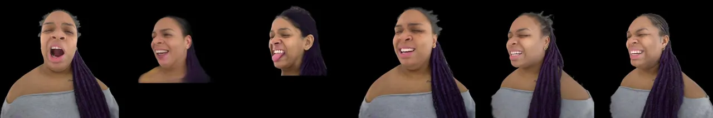

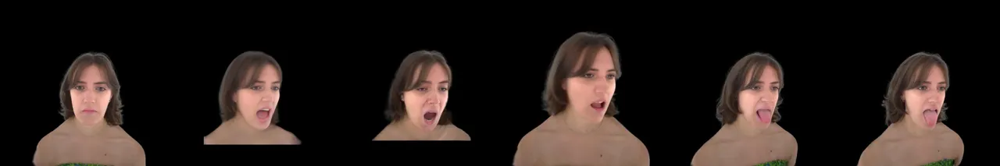

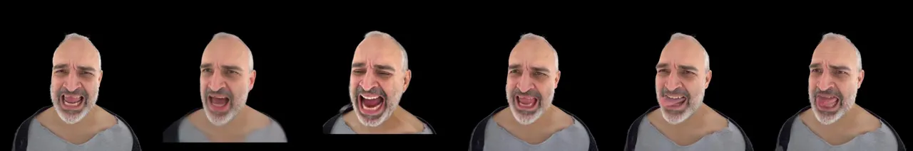

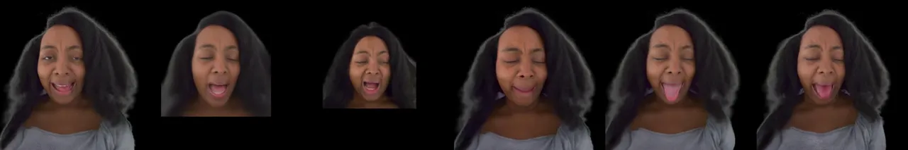

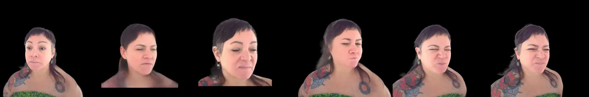

|       |                  |              |                        |      |     |
| ----- | ---------------- | ------------ | ---------------------- | ---- | --- |
| Input | GAGAvatar \[15\] | CAP4D \[61\] | HunyuanPortrait \[76\] | Ours | GT  |

Figure 10: Comparison against state-of-the-arts on the DynamicSweep
Dataset. The desired output is a video with both view and expression
changes. Our method better preserves facial identity, achieves accurate
expression control—including challenging cases such as ”sticking out
tongue”—and provides precise viewpoint control.

### 9.2 Cross-Reenactment

We compare our method against state-of-the-art methods for
cross-identity reenactment on Phone Capture dataset (static frontal
view, dynamic pose/expression) and Dynamic Sweep dataset (dynamic view,
pose and expression). The qualitative results are illustrated in Fig. 11
and  12.

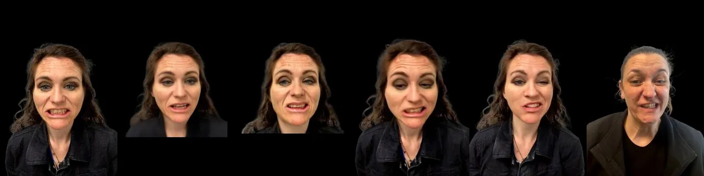

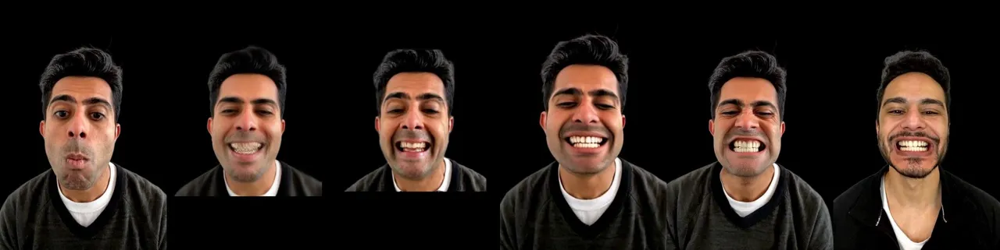

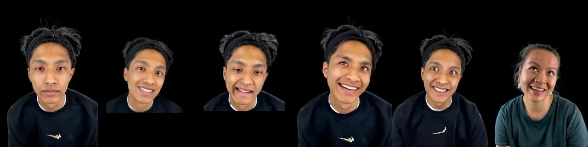

|       |                  |              |                        |      |         |
| ----- | ---------------- | ------------ | ---------------------- | ---- | ------- |
| Input | GAGAvatar \[15\] | CAP4D \[61\] | HunyuanPortrait \[76\] | Ours | Driving |

Figure 11: Comparison against state-of-the-arts on the task of cross
reenactment on the Phone Dataset. In this task, we transfer the pose and
expressions from the driving identity to the source ID image (input),
while enabling continuous viewpoint control. Our method can better
preserving facial appearance while enabling precise control over pose
and expressions.

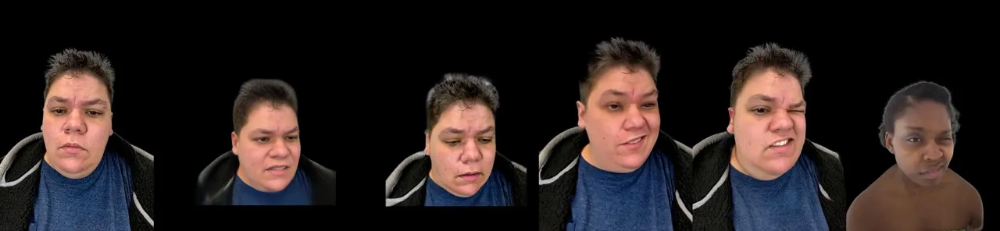

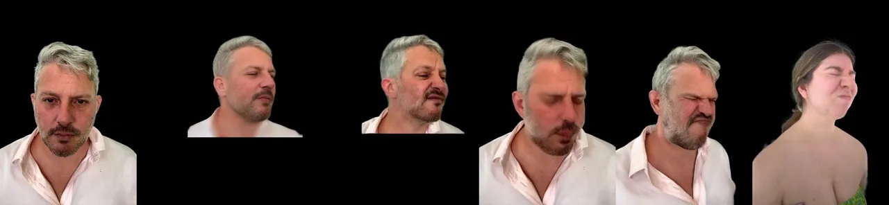

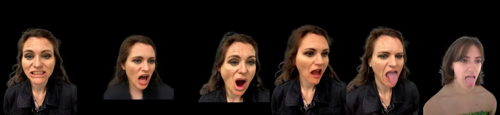

|       |                  |              |                        |      |     |
| ----- | ---------------- | ------------ | ---------------------- | ---- | --- |
| Input | GAGAvatar \[15\] | CAP4D \[61\] | HunyuanPortrait \[76\] | Ours | GT  |

Figure 12: Comparison against state-of-the-arts on the task of cross
reenactment on the DynamicSweep Dataset. In this task, we transfer the
pose and expressions from the driving identity to the source ID image
(input), while enabling continuous viewpoint control. Our method
achieves more accurate expression control and effectively preserves
appearance details from the source ID image. Additionally, it enables
precise viewpoint control, resulting in desired novel view synthesis.

## 10 Limitations and Future Work

While we demonstrate promising video generation results via disentangled
expression, pose, and camera control, several limitations remain. First,
our method focuses on upper-body portrait generation and does not model
hand or full-body animation. Second, similar to other DiT-based video
diffusion models, our method faces computational bottlenecks that
prevent real-time inference, restricting its use in interactive
applications. Third, our current method does not disentangle lighting
conditions, which would enable explicit control over illumination and
further enhance relighting. We leave these directions for future work.
