# InteracTalker: Prompt-Based Human-Object Interaction with Co-Speech Gesture Generation

Sreehari Rajan^(\*) Affiliation: Machine Learning Lab,    Kunal
Bhosikar^(\*) Affiliation: IIIT Hyderabad, India    Charu Sharma
Affiliation: {sreehari.rajan, kunal.bhosikar}@research.iiit.ac.in
 charu.sharma@iiit.ac.in

###### Abstract

Generating realistic human motions that naturally respond to both spoken
language and physical objects is crucial for interactive digital
experiences. Current methods, however, address speech-driven gestures or
object interactions independently, limiting real-world applicability due
to a lack of integrated, comprehensive datasets. To overcome this, we
introduce InteracTalker, a novel framework that seamlessly integrates
prompt-based object-aware interactions with co-speech gesture
generation. We achieve this by employing a multi-stage training process
to learn a unified motion, speech, and prompt embedding space. To
support this, we curate a rich human-object interaction dataset, formed
by augmenting an existing text-to-motion dataset with detailed object
interaction annotations. Our framework utilizes a Generalized Motion
Adaptation Module that enables independent training, adapting to the
corresponding motion condition, which is then dynamically combined
during inference. To address the imbalance between heterogeneous
conditioning signals, we propose an adaptive fusion strategy, which
dynamically reweights the conditioning signals during diffusion
sampling. InteracTalker successfully unifies these previously separate
tasks, outperforming prior methods in both co-speech gesture generation
and object-interaction synthesis, outperforming gesture-focused
diffusion methods, yielding highly realistic, object-aware full-body
motions with enhanced realism, flexibility, and
control.([https://sreeharirajan.github.io/projects/InteracTalker/](https://sreeharirajan.github.io/projects/InteracTalker/))

![[Uncaptioned
image]](arxiv-2512-12664--10d727be03f9.figures/figure-1.webp)

Figure 1: InteracTalker generates realistic, full-body human motion,
precisely integrating object interaction with expressive co-speech
gestures, conditioned by speech audio, text prompts, and a target
object.

## 1 Introduction

Generating realistic, scene-aware human motions is critical for
applications across computer graphics, robotics, and virtual
environments, from gaming to embodied AI. While significant progress has
been made in generating animations from text \[28, 38\] or speech \[34,
23\], these methods, including text-to-motion techniques \[36\], often
focus on isolated aspects of human movement. However, these approaches
typically lack the gestures that come with co-speech motion, resulting
in motions that may not accurately reflect the realistic nature of human
motion. Conversely, co-speech generation techniques \[4, 5, 7, 20, 30,
41\] can produce expressive gestures but frequently struggle to handle
full-body object interactions. This fragmentation exists due to a lack
of integrated datasets with multimodal annotations \[9, 22\].

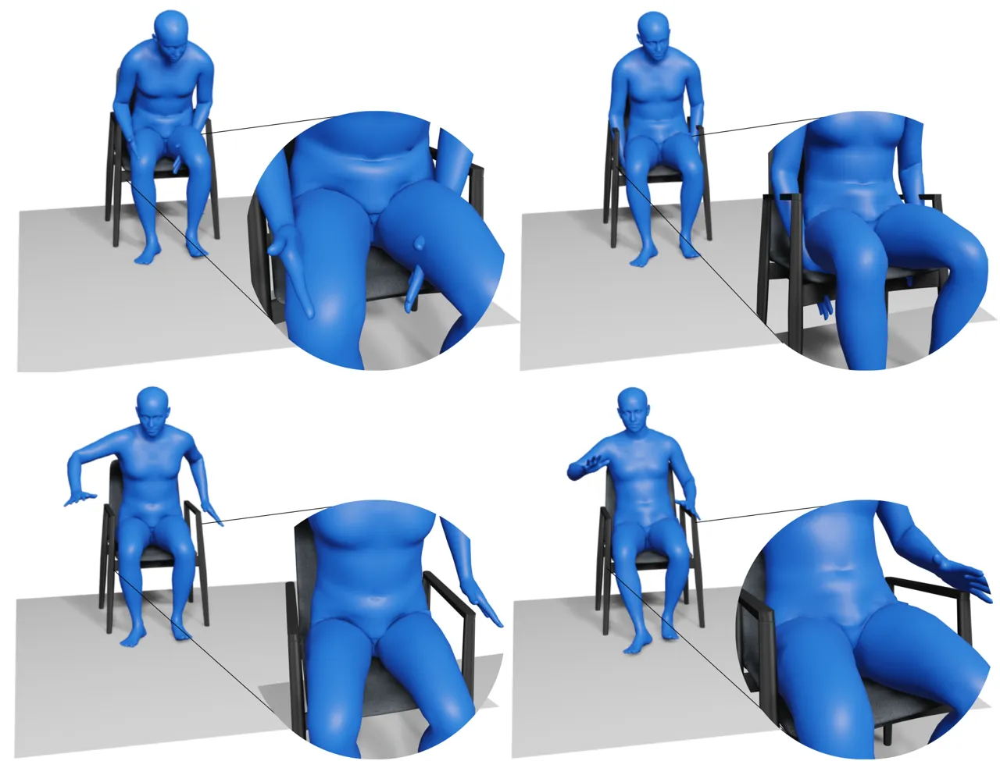

Figure 2: Comparison of Naive Motion Concatenation vs. InteracTalker.
The top row shows a naive approach with severe artifacts like self- and
object-penetration. The bottom row demonstrates our InteracTalker
framework’s coherent, artifact-free motion by jointly considering all
signals.

A seemingly intuitive approach to combine these capabilities would be to
naively concatenate independently generated co-speech (upper-body) and
object-interaction (lower-body) motions. However, as illustrated in
Figure 2 (top row), this fails. The motions lack mutual awareness,
leading to undesirable self-penetrations and object penetrations. This
highlights the critical need for a more integrated solution that truly
understands the interplay between speech, body, and environment,
Figure 2 (bottom row).

To overcome these limitations, we introduce InteracTalker, a novel
framework that is the first one to seamlessly integrate text-conditioned
object-aware motion generation with speech-driven co-speech gestures
(Figure 1). This bridges a critical gap between isolated full-body
motion synthesis and context-rich object interactions.

Our key contributions are: (1) Unified Full-Body Motion Generation:
InteracTalker unifies full-body co-speech gesture generation with
prompt-based human-object interaction through a multi-stage training
process to align motion, speech, and text prompts within a shared
embedding space. To support this, we curated a human-object interaction
dataset by enriching an existing text-to-motion dataset with detailed
object interaction annotations. (2) Modular Adaptation Modules: We
introduce modular adaptation modules specifically for object-driven
interaction and co-speech-driven gesture. These are further extended
into a Generalized Motion Adaptation Module, a flexible framework that
allows for the integration of diverse conditioning signals without
requiring computationally expensive retraining of the entire system. (3)
Adaptive Fusion Strategy: A strategy to reweight the conditioning
signals at each time step, ensuring a balanced fusion of heterogeneous
conditioning signals. (4) Efficient and Robust Motion Generation: Our
method eliminates the need for expensive test-time optimizations,
producing significantly more realistic motions in considerably less time
than existing methods. A key advantage of our Generalized Motion
Adaptation Module is its ability to generate motion irrespective of the
presence or absence of specific conditioning signals, all while
maintaining a constant test-time.

Extensive experiments demonstrate that InteracTalker not only
effectively integrates these tasks but also outperforms state-of-the-art
methods that tackle them individually, achieving greater realism,
flexibility, and control in generating plausible, scene-aware full-body
motions. In summary, InteracTalker represents a significant step towards
unified and truly realistic human motion generation, paving the way for
more immersive and lifelike digital characters.

## 2 Related Work

Human motion generation and human-object interaction have advanced
significantly, focusing on realistic, context-aware motions for virtual
humans \[42, 14, 27\]. Early kinematic or physics-based models lacked
context awareness for complex, real-world scenarios. Our work builds on
these foundations by integrating multi-modal control.

Text-Conditioned Human Motion Generation. Text-based motion generation
has progressed notably, enabling intuitive and versatile synthesis \[38,
28, 24\]. TeSMo \[36\] aligns motions with scene geometry from natural
language. However, these methods often focus on abstract actions or
predefined interactions, lacking detailed co-speech gestures or
fine-grained object manipulations.

Co-Speech Gesture Generation. Another key area is expressive co-speech
gesture generation synchronized with audio. Early work captured
individual styles \[8\] or leveraged trimodal inputs \[37\]. More recent
advancements include enhancing coherence \[21\], diverse
synthesis \[18\], and using diffusion models \[31\]. BEAT \[20\]
introduced a large-scale dataset, while MambaTalk \[29\] focuses on
efficient holistic gesture synthesis. Freetalker \[32\] also uses
diffusion models to generate gestures conditioned on both speech and
text, demonstrating fine-grained control. While Freetalker \[32\]
advances multi-conditional gesture synthesis, it focuses on upper-body
gestures and overlooks the complex challenge of full-body interaction
with objects, a limitation shared by most co-speech methods \[31\].

Scene-Aware Human Motion and Broader Interactions. Generating motions
aware of and interacting with the environment or other agents is
growing. TeSMo \[36\] and Zhao et al. \[39\] consider scene geometry but
lack precise object interaction modeling. InterDance \[16\] explores
reactive 3D dance duets, highlighting multi-agent synchronized motion
complexity. While some frameworks integrate co-speech and full-body
control \[3\], they still often miss explicit human-object interaction,
a critical limitation in cluttered environments. Other approaches align
multimodal inputs for conversational gestures \[35\], learn 3D gestures
from video \[10\], or use expressive masked audio modeling like
EMAGE \[19\].

Unifying Co-Speech Gestures and Object Interactions. Existing research
typically addresses text-driven motion, co-speech gestures, or
scene-aware human motion in isolation. Methods often excel in one area
but rarely combine both simultaneously with fine-grained full-body
control. For example, while diffusion models have been used for text and
speech-driven gesture generation, they have not been successfully
adapted to include object-aware interactions. This gap, integrating
co-speech gestures with complex, dynamic human-object interactions
within a unified framework, motivates InteracTalker, our novel framework
designed for plausible, object-constrained, and co-speech full-body
motions.

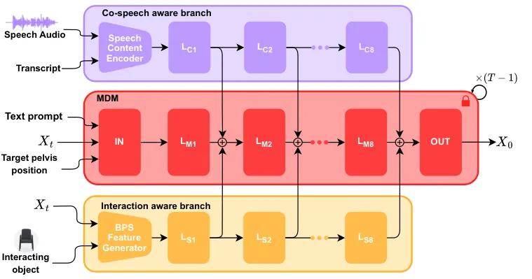

Figure 3: InteracTalker’s architecture involves pre-training a Motion
Diffusion Module (MDM), then fine-tuning Co-speech Gesture and
Interaction-Aware branches; at inference, both branches condition the
frozen MDM for holistic motion generation.

## 3 Methodology

### 3.1 Overview

Given speech audio, its corresponding transcript, a descriptive text
prompt, and a specified target object, our objective is to generate
realistic full-body human motions. These motions should simultaneously
exhibit expressive co-speech gestures that capture the rhythm and
semantics of the speech content, while also performing object-aware
interactions guided by the text prompt and the target object’s
properties. The generated full-body motion will seamlessly integrate
stylistic elements derived from both speech and text inputs.

Our InteracTalker architecture, illustrated in Figure 3, comprises three
major conceptual components: (1) Motion Diffusion Module (MDM): This
core module, based on the Motion Diffusion Model \[28\], is responsible
for generating general, interaction-agnostic motion based solely on the
text prompt. (2) Interaction-Aware Adaptation Branch: This component
incorporates human-object interaction conditions, modifying the MDM’s
output to ensure realistic and physically plausible object interactions.
(3) Co-Speech Gesture Adaptation Branch: This component similarly
injects co-speech conditions into the MDM, enabling the generation of
expressive gestures synchronized with speech.

By leveraging both adaptation branches, the generated motion
comprehensively includes both realistic co-speech gestures and full-body
object interactions. A multi-stage fine-tuning approach is employed to
train these specialized branches.

### 3.2 Human Motion Diffusion Model (MDM)

Our foundational Motion Diffusion Model (MDM) generates motions by
iteratively denoising a temporal sequence of $`N`$ poses. During
training, the model learns to reverse a forward diffusion process.
Specifically, the denoising model predicts the denoised motion $`X_{0}`$
from a noisy input motion $`X_{t}`$. The training largely follows the
standard procedure for denoising diffusion models \[12\]: a motion is
sampled, noise is added to obtain $`X_{t}`$, and the denoising model
predicts the original motion, optimizing a reconstruction loss. During
this denoising process, the model can be conditioned by various signals,
such as a text prompt.

Input: Noisy input motion $`\mathbf{X}_{t}`$, condition
$`\mathbf{C_{k}}`$

Output: Condition adapted noisy motion $`\mathbf{X}_{t-1}`$

1 $`\mathbf{c}_{k0}\leftarrow\mathbf{E}_{k}(\mathbf{C_{k}})`$;

2 $`\mathbf{H}_{M0}\leftarrow\mathbf{IN}(\mathbf{X}_{t})`$;

3 $`\mathbf{H}_{M1}\leftarrow\mathrm{L}_{M1}(\mathbf{H}_{M0})`$;

4 $`\mathbf{c}_{k1}\leftarrow\mathrm{L}_{k1}(\mathbf{c}_{k0})`$;

5 for _$`j\leftarrow 2`$ to $`8`$_ do

    6
$`\mathbf{H}_{Mj}\leftarrow\mathrm{L}_{Mj}(\mathbf{c}_{kj-1}+\mathbf{H}_{Mj-1})`$;

    7 $`\mathbf{c}_{kj}\leftarrow\mathrm{L}_{kj}(\mathbf{c}_{kj-1})`$;

8 end for

9 $`\mathbf{X}_{t-1}\leftarrow\mathbf{OUT}(H_{M8}+\mathbf{c}_{k8})`$;

10 Return: $`\mathbf{X}_{t-1}`$

Algorithm 1 Modular Motion Adaptation

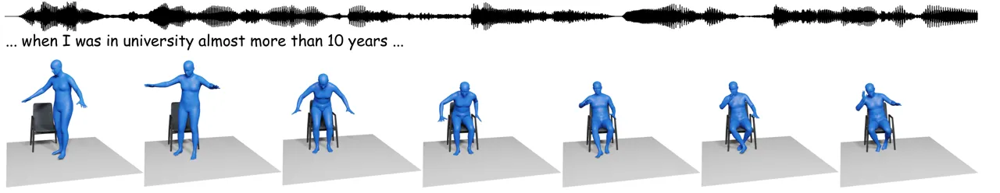

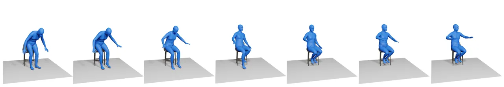

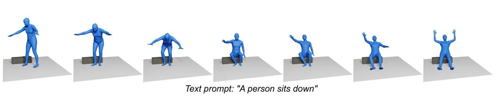

Figure 4: InteracTalker: Adaptive full-body motion with consistent
co-speech gestures across various object heights (e.g., armchair, high
stool, and Reebok step) for the same audio input.

Unlike some prior works that generate skeletons and then fit SMPL bodies
to them \[36\], we directly utilize SMPL pose parameters. This approach
enables the direct regression of SMPL parameters, effectively
eliminating the need for computationally expensive post-processing
optimization steps like those in \[2\]. Further details on our pose
representation are provided in the Supplementary Materials.

The MDM architecture consists of linear input layers $`(IN)`$, eight
transformer blocks $`(L_{M1},L_{M2},...,L_{M8})`$ and output linear
layers $`(OUT)`$. The diffusion model can be conditioned on a text
prompt, which is encoded using CLIP \[26\], specifying a desired motion
style and, optionally, a final goal pelvis position and orientation. We
utilized a combination of the HumanML3D \[9\] and SAMP \[11\] datasets
to pre-train our base MDM.

### 3.3 Generalized Motion Adaptation Modules

The base MDM generates human motions without explicit environmental or
expressive constraints. To significantly enhance the realism of these
motions, particularly in complex scenarios, they must be aware of
various contextual factors, such as their surroundings and co-speech
cues. This awareness is achieved through our novel Generalized Motion
Adaptation Modules.

These modules share a common architectural design: an encoder $`E_{k}`$
processes corresponding input constraints $`C_{k}`$ (e.g., scene
details, object geometry, co-speech audio). The encoded features are
then passed through eight dedicated transformer blocks
$`(L_{k1},L_{k2},...,L_{k8})`$. The activations from each of these
adaptation blocks serve as conditioning signals, which are then added to
the corresponding transformer blocks within the MDM to generate adapted
motions. This is shown in Algorithm 1.

A key advantage of this modular design is the ability to train each
adaptation module separately with the frozen base MDM. This multi-stage
training process eliminates the need for a single, exhaustively
annotated dataset encompassing all possible constraints, thereby
improving data efficiency and scalability.

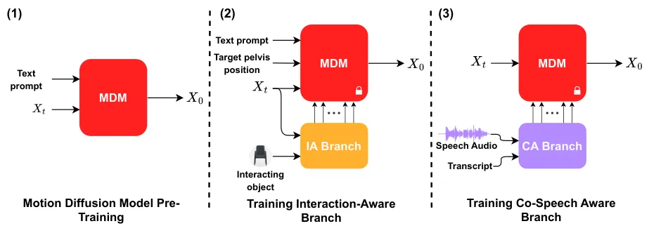

Figure 5: InteracTalker’s three-stage training pipeline: (1)
pre-training the base MDM, (2) fine-tuning the Interaction-Aware (IA)
branch, and (3) fine-tuning the Co-speech Aware (CA) branch, all by
injecting their signals into the frozen MDM.

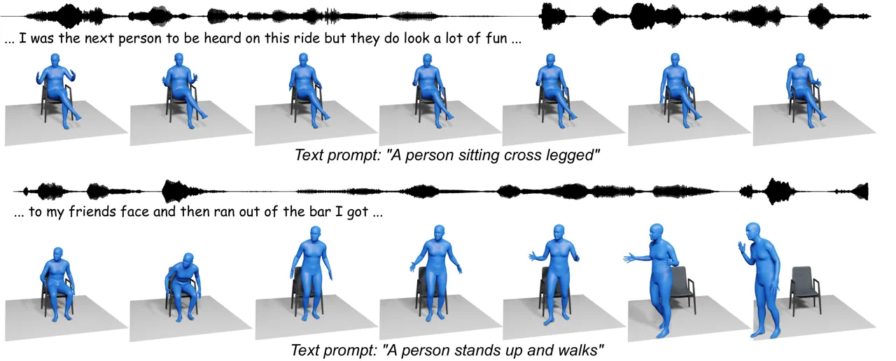

Figure 6: InteracTalker: Qualitative results showcasing diverse,
object-aware motions with co-speech gestures, generated from varying
text prompts for a single object.

This modular adaptation framework is highly extensible and reusable
across a variety of downstream tasks. It allows for the seamless
integration of new conditioning modules without retraining of the entire
system, effectively decoupling the main diffusion model from
task-specific adaptations. Furthermore, multiple adaptation modules can
be combined during inference to generate highly complex and
multi-conditioned motions. We achieve this through an adaptive fusion
strategy (refer to Section 3.3.3) that operates during the diffusion
sampling process to balance these heterogeneous signals. Instead of
using fixed weights, we dynamically reweight the contributions of each
branch to ensure a coherent and plausible final motion. During
inference, the guidance of each module is integrated as follows:

```math
\mathcal{X}_{t}=\mathcal{X}_{uncond}+\sum_{i=1}^{n}\lambda_{cond_{i}}\mathcal{X}_{cond_{i}}, \tag{1}
```

where $`\mathcal{X}_{uncond}`$ is the unconditioned prediction (obtained
by setting all conditioning signals to zero tensors), and
$`\mathcal{X}_{cond_{i}}`$ represents the guided prediction from
individual conditioning $`cond_{i}`$ (obtained by subtracting
$`\mathcal{X}_{uncond}`$ from the prediction when only $`cond_{i}`$ is
active, and all other conditionings are set to zero).

#### 3.3.1 Object-Driven Interaction Motion Generation

The interaction-aware branch is specifically designed to enable
realistic human-object interactions. It comprises a BPS (Basis Point
Sets) feature generator (Figure 1b in Supplementary Materials) and eight
transformer blocks. At each denoising step $`t`$, the inputs to this
branch are the current noisy body pose $`X_{t}`$, and the target
interaction object.

The BPS feature generator utilizes Basis Point Sets \[25\] to robustly
represent object geometry and derive human-object interaction
features \[36\]. Object geometry features are computed as the minimum
distance from each point in the BPS to the object surface. To generate
human-object interaction features, we calculate the minimum distance
from each BPS point to the 3D locations of the 22 SMPL joints from
$`X_{t}`$. These two sets of features are then merged using a
Multi-Layer Perceptron (MLP) to obtain a learned combined feature
vector, which serves as the input to the first transformer block
$`(L_{S1})`$ of this branch.

Interaction Motion Data: To train this branch, we curated a dataset of
interaction motions, specifically “sitting from standing position”,
“sitting”, “standing from sitting position”, “walk to sit”, and “from
sitting position, stands and walks”. These motions were extracted from
the SAMP dataset \[11\]. To obtain corresponding motion-aligned 3D
objects, we selected chairs of varying heights from the 3D-FRONT
dataset \[6\] and manually aligned them to the extracted motions. We
leveraged the textual descriptions of each extracted motion as annotated
by \[36\].

|               |                   |                  |                  |                  |                  |
| ------------- | ----------------- | ---------------- | ---------------- | ---------------- | ---------------- |
| Method        | Motion            | Natural          | Object           | Gesture          | Fewer            |
|               | Realism           | Motion           | Interaction      | Quality          | Penetrations     |
|               | $`(1-5\uparrow)`$ | $`(\%\uparrow)`$ | $`(\%\uparrow)`$ | $`(\%\uparrow)`$ | $`(\%\uparrow)`$ |
| Concat        | 2.77              | 29.7%            | 20.3%            | 26.6%            | 20.3%            |
| InteracTalker | 3.77              | 70.3%            | 79.7%            | 73.4%            | 79.7%            |

Table 1: User study comparing InteracTalker with a naive concatenation
(Concat) method. Motion Realism is the average rating from 1 to 5. All
other metrics show the percentage of participants who chose our method
as superior in a two-alternative forced-choice question.

Interaction Motion Training: During training, the base MDM weights are
frozen. The activations from each transformer block
$`(L_{S1},L_{S2},...,L_{S8})`$ of the interaction-aware branch are added
to the corresponding activations of the MDM’s transformer blocks
$`(L_{M1},L_{M2},...,L_{M8})`$, as outlined in Algorithm 1. This
mechanism effectively injects the interaction-aware conditioning signals
into the diffusion process. The training process is supervised by the
following loss function:

```math
\mathcal{L}_{SW}=\mathcal{L}_{rec}+\mathcal{L}_{pelvis}+\mathcal{L}_{contact}+\mathcal{L}_{collision}, \tag{2}
```

where, $`\mathcal{L}_{rec}=\left\|X_{0}-x_{0}\right\|^{2}`$ is the L2
reconstruction loss, $`\mathcal{L}_{pelvis}`$ is L2-loss between the
final pelvis pose of the ground truth and the denoised output,
$`\mathcal{L}_{contact}`$ and $`\mathcal{L}_{collision}`$ are contact
and collision losses, respectively, adapted from \[33\].

Crucially, since only a subset of frames typically involves direct
human-object interaction, we apply $`\mathcal{L}_{contact}`$ and
$`\mathcal{L}_{collision}`$ selectively to a dynamically chosen subset
of frames. For motions ending in a “sitting position”, the last few
frames are selected for supervision. Similarly, for motions beginning
from a “sitting position”, the initial few frames are chosen. This
targeted supervision, unlike previous works such as \[36\], enables
effective collision and penetration awareness during training, thereby
eliminating the need for expensive test-time optimizations.

#### 3.3.2 Co-Speech Driven Gestures Motion Generation

The co-speech gesture branch is designed to generate expressive body
gestures synchronized with spoken language. This branch consists of a
speech content encoder (Figure 1a in Supplementary Materials) and eight
transformer blocks. The speech content encoder takes audio and its
corresponding transcript as input. These are processed separately to
obtain distinct audio and text features. These features are then
concatenated and passed through a linear layer to derive a joint
audio-text feature vector, which subsequently feeds into the stack of
transformer blocks $`(L_{C1},L_{C2},...,L_{C8})`$.

| Method                  | FGD$`\downarrow`$ | BC$`\uparrow`$ | Diversity$`\uparrow`$ |
| ----------------------- | ----------------- | -------------- | --------------------- |
| S2G \[8\]               | 25.129            | 6.902          | 7.783                 |
| Trimodal \[37\]         | 19.759            | 6.442          | 8.894                 |
| HA2G \[21\]             | 19.364            | 6.601          | 9.671                 |
| DisCo \[18\]            | 21.170            | 6.571          | 10.378                |
| CaMN \[20\]             | 8.752             | 6.731          | 9.279                 |
| DiffStyleGesture \[31\] | 10.137            | 6.891          | 11.075                |
| Habibie et al. \[10\]   | 14.581            | 6.779          | 8.874                 |
| TalkShow \[35\]         | 7.313             | 6.783          | 12.859                |
| EMAGE \[19\]            | 5.423             | 6.794          | 13.057                |
| SynTalker \[3\]         | 6.413             | 7.971          | 12.721                |
| InteracTalker (Ours)    | 1.017             | 7.074          | 8.136                 |

Table 2: Quantitative comparison of co-speech gesture generation on
BEATX: Performance metrics (FGD $`\times 10^{-1}`$, BC
$`\times 10^{-1}`$, Diversity) are reported, with best in bold and
second-best underlined.

Co-Speech Gesture Data: For training our Co-Speech Gesture Adaptation
Branch, we utilized the comprehensive BEATX-Standard dataset \[19\].
This large-scale dataset is particularly well-suited for our task, as it
comprises over 30 hours of high-quality co-speech motion data,
meticulously synchronized with corresponding audio recordings and their
accurate transcripts. Its rich collection of natural conversational
gestures provides ample data for learning the intricate relationships
between speech and body movements.

Co-Speech Gesture Training: Similar to the interaction-aware branch, the
base MDM weights are frozen during the training of this branch. The
activations from each transformer block $`(L_{C1},L_{C2},...,L_{C8})`$
of the co-speech branch are added to the corresponding activations of
the MDM’s transformer blocks $`(L_{M1},L_{M2},...,L_{M8})`$. This
mechanism effectively injects the co-speech-aware conditioning signals
into the diffusion model. The training of this branch is supervised
solely by the reconstruction loss, $`\mathcal{L}_{rec}`$.

#### 3.3.3 Adaptive Fusion Strategy

Direct fusion of these heterogeneous conditioning signals results in
imbalance. During diffusion sampling, the relative relevance of the
signals might change dynamically; therefore, fixed or manually adjusted
guidance weights are unable to address this.

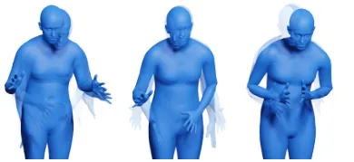

Figure 7: Qualitative results of InteracTalker’s Co-Speech Gesture
Adaptation Branch: expressive, diverse gestures precisely aligned with
speech audio on the BEATX dataset.

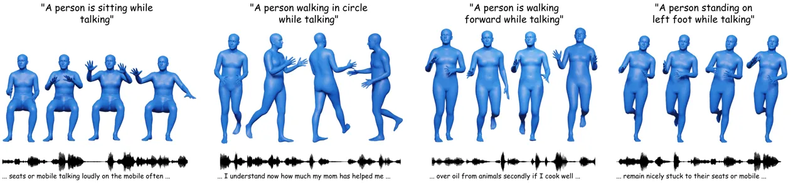

Figure 8: Qualitative results of InteracTalker’s Co-Speech Gestures
Adaptation Branch: diverse, natural, and expressive full-body gestures
synchronized with various speech inputs in general settings.

To overcome this, we introduced an adaptive fusion strategy during
diffusion sampling, which involves updating these guidance weights,
$`\lambda_{cond_{i}}`$ in each timestep. First, to avoid scale
imbalance, we normalized the co-speech residual,
$`\mathcal{X}_{cospeech}`$, relative to the interaction-aware residual,
$`\mathcal{X}_{int}`$. Next, to adaptively learn the guidance weights,
$`\lambda_{cospeech}`$ and $`\lambda_{int}`$, we employ
pseudo-supervision using single-conditioned predictions. Specifically,
we compute motion predicted when only the interaction-aware branch is
active ($`X_{0}^{int}`$) and when only the cospeech-aware branch is
active ($`X_{0}^{cospeech}`$). These serve as anchors that represent how
motion would evolve if each conditioning signal were considered in
isolation. During diffusion sampling, we encourage the fused prediction
$`\mathcal{X}_{t}`$ to stay consistent with both anchors by updating the
guidance weights $`\lambda_{cond_{i}}`$ via gradient-based
self-supervision, without requiring ground-truth. At each timestep,
$`t`$, we then measure how far the fused prediction $`\mathcal{X}_{t}`$
deviates from each anchor by computing the two losses given:

```math
\mathcal{L}_{AF_{int}}=\left\|\mathcal{X}_{t}-\mathcal{X}_{0}^{int}\right\|^{2}, \tag{3}
```

```math
\mathcal{L}_{AF_{cospeech}}=\left\|\mathcal{X}_{t}-\mathcal{X}_{0}^{cospeech}\right\|^{2}, \tag{4}
```

These losses serve as soft alignment signals: if the fused motion
deviates too much from the anchor of one condition, the corresponding
guidance weight is raised to amplify the effect of that branch.
Conversely, if the alignment is already good, its guidance weight
naturally decreases. We update $`\lambda_{cospeech}`$ and
$`\lambda_{int}`$ using gradient-based online updates at every denoising
step:

```math
\lambda_{cospeech_{t-1}}=\lambda_{cospeech_{t}}-\frac{\partial\mathcal{L}_{AF_{cospeech}}}{\partial\lambda_{cospeech_{t}}}, \tag{5}
```

```math
\lambda_{int_{t-1}}=\lambda_{int_{t}}-\frac{\partial\mathcal{L}_{AF_{int}}}{\partial\lambda_{int_{t}}}, \tag{6}
```

where, $`\lambda_{cospeech_{t}}`$ and $`\lambda_{int_{t}}`$ are the
guidance weights at timestep $`t`$ and $`\lambda_{cospeech_{t-1}}`$ and
$`\lambda_{int_{t-1}}`$ are the guidance weights at timestep $`t-1`$.

This approach ensures that the final motion is not only physically
plausible but also stylistically consistent, as the model dynamically
prioritizes the most relevant conditioning signal at each step of the
denoising process.

## 4 Experiments

Our training pipeline, illustrated in Figure 5, follows a three-stage,
modular approach to overcome the challenge of limited fully annotated
data. We first pre-train the base Motion Diffusion Model (MDM), using
the HumanML3D \[9\] and SAMP \[11\] datasets. Subsequently, we train the
Interaction-Aware (IA) Branch using a custom dataset derived from
SAMP \[11\] and motion-aligned objects from the 3D-FRONT \[6\] dataset.
Finally, the Co-speech Gesture Adaptation Branch is trained using the
BEATX \[19\] dataset. During inference, signals from both branches are
synergistically injected into the frozen MDM to generate comprehensive,
multi-conditioned motions. A detailed description of our experimental
setup is provided in the Supplementary Materials.

### 4.1 Holistic Evaluation: Interaction-Aware Co-Speech Gesture Generation

As the first work to address the specific, complex task of generating
co-speech gestures that simultaneously account for detailed object
interactions, we showcase the qualitative capabilities in Figure 4 and
Figure 6, demonstrating the effectiveness of our approach in combining
the conditioning effects of both co-speech dynamics and object
interactions. Table 1 is a user study that compares our full
InteracTalker framework with a naive concatenation (Concat) approach,
which combines independently generated upper-body co-speech gestures and
lower-body object-interaction motions.

|               |                                     |        |         |                                  |        |
| ------------- | ----------------------------------- | ------ | ------- | -------------------------------- | ------ |
|               | Goal-reaching error$`(\downarrow)`$ |        |         | Obj. penetration$`(\downarrow)`$ |        |
| Method        | Pos.                                | Height | Orient. | Value                            | Ratio  |
| DIMOS \[39\]  | 0.2020                              | 0.1283 | 0.4731  | 0.0193                           | 0.1076 |
| TeSMo \[36\]  | 0.1445                              | 0.0120 | 0.2410  | 0.0043                           | 0.0611 |
| InteracTalker | 0.1247                              | 0.0388 | 0.0965  | 0.0010                           | 0.0619 |

Table 3: Quantitative performance on human-object interaction:
InteracTalker (Interaction-Aware branch) compared to SOTA on the SAMP
sitting dataset. Metrics include Goal-reaching Error (Pos, Height,
Orient) and Object Penetration (Value, Ratio). The best values are in
bold and the second-best are underlined.

In Figure 4, we present results across three chairs of varying heights.
These examples highlight InteracTalker’s ability to generate co-speech
gestures that not only align closely with the input speech audio’s
rhythm and semantics but also appropriately adjust full-body movements
and poses based on the affordances and constraints of the target
object’s geometry. Furthermore, Figure 6 illustrates the adaptability
and versatility of our method by showcasing various human-object
interactions with the same object, all while maintaining natural
co-speech gestures. This demonstrates the rich diversity of motions our
integrated framework can achieve.

User study was conducted with 64 non-expert participants, who compared
paired videos with speech audio generated by our method and the naive
concatenation approach. Participants rated motion quality across several
aspects, and results show a clear preference for InteracTalker, with
significantly higher realism scores and fewer artifacts such as self-
and object-penetrations (see Table 1 and Supplementary Materials for
details).

### 4.2 Co-Speech Gesture Generation

To evaluate the performance of our Co-speech Gesture Adaptation Branch
independently, we compare our method against state-of-the-art
speech-to-motion generation techniques. This isolated evaluation clearly
assesses the effectiveness of our co-speech-aware component.

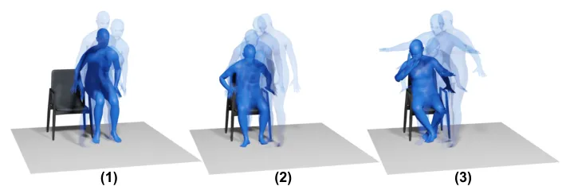

Figure 9: Qualitative Ablation: Incremental realism shown using a
consistent prompt and object. Motion progresses from (1)
interaction-agnostic baseline, (2) object-aware motion (IA Branch), to
(3) fully integrated motion with co-speech gestures (IA + CA Branch).

Quantitative comparisons in Table 2, which utilize established metrics
like Frechet Gesture Distance (FGD) \[37\], Diversity \[15\], and Beat
Consistency (BC) \[17\], indicate that our approach achieves comparable,
and in several cases superior, performance relative to current
state-of-the-art methods. Qualitative results, further illustrating the
diverse and natural co-speech gestures generated by our method, are
presented in Figure 7.

Additionally, to assess the generation of full-body motions conditioned
on both speech and text prompts, we conducted a qualitative experiment
with diverse text prompts and speeches, presented in Figure 8. This
shows that our method can also generate co-speech gestures that closely
align with the input speech, along with general motions given by the
text prompts.

### 4.3 Human-Object Interaction Generation

We evaluate the Interaction-Aware Adaptation Branch independently to
directly compare its performance against state-of-the-art human-object
interaction methods. Quantitative and qualitative results are presented
in Table 3 and the Supplementary Materials, respectively.

Table 3 critically highlights our method’s superior performance in
goal-reaching tasks without requiring any test-time guidance or
optimization, a significant advantage over previous state-of-the-art
approaches. Specifically, our method consistently achieves lower object
penetration values and ratios, indicating substantially more physically
plausible and collision-free interactions. We define the object
penetration value as the average Signed Distance Function (SDF) value
across all penetrated body vertices in the generated motions, while the
object penetration ratio represents the fraction of generated poses
exhibiting penetration, calculated over all frames in the motion
sequence.

### 4.4 Ablation Study

To understand the individual contributions of each adaptation branch, we
conducted a qualitative ablation study using a consistent text prompt
(“A person sits down”) and target object, as shown in Figure 9. Without
any adaptation branches, the motion is interaction-agnostic (Figure 9,
left), leading the human body to simply “sit”, disregarding the chair.

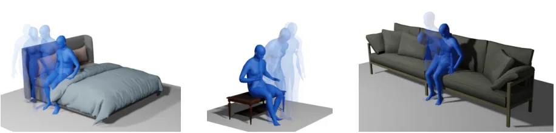

Figure 10: Qualitative results: InteracTalker demonstrates robust
generalization to novel, unseen object geometries, showing successful
navigation and appropriate physical engagement.

Interaction-Aware Motion: By activating only the Interaction-Aware
branch (Figure 9, middle), the generated motion becomes object-aware.
Instead of sitting directly, the human character appropriately takes
steps towards the chair and then performs a plausible sitting motion on
it.

Interaction-Aware + Co-Speech Motion: Finally, by incorporating both the
Interaction-Aware and Co-speech Gesture branches (Figure 9, right), the
character not only performs the object-aware sitting action but also
exhibits natural, synchronized co-speech gestures, demonstrating the
full integration capability of InteracTalker.

### 4.5 Generalization to Unseen Objects

To assess the generalizability of our method beyond its training data,
we performed human-object interaction experiments with unseen and
complex object types, presented in Figure 10. Although the
Interaction-aware branch was primarily trained on chairs of varying
heights, this experiment aims to confirm its robustness and adaptability
to novel object geometries. As illustrated in Figure 10, our method
successfully understands the complex nature of these unseen objects and
is able to navigate the character to the most suitable area for
interaction. This qualitatively proves the strong adaptability of
InteracTalker with complex, unseen object types for interaction
scenarios.

## 5 Conclusion

We introduced InteracTalker, a novel framework unifying co-speech
gestures and prompt-based human-object interactions, which addresses
isolated approaches in motion generation. Our framework, which leverages
a multi-stage training process, modular adaptation modules, and an
adaptive fusion strategy, successfully unifies and outperforms prior
methods in each subtask, yielding realistic, object-aware full-body
motions with gestures, offering superior realism, flexibility, and
control.

Limitations and Future Work: While InteracTalker marks a significant
advance, it has some limitations. The current framework focuses on a
single character, whereas real conversations often involve multiple
characters. Extending to multi-character is an exciting future
direction. Our approach also does not explicitly account for stylistic
variations like speaker identity or emotion, which would result in more
customized motion. Additionally, addressing the scarcity of diverse
human-object interaction datasets, extending to complex scene-aware
motions, and automating target pelvis position inference from text
prompts remains crucial for broader applicability.

## Acknowledgments

The authors gratefully acknowledge the support of the Science and
Engineering Research Board (SERB), Government of India, for providing
GPU computing resources that enabled this research.

## Appendix

In the Appendix, we provide the following:

- •
  3d human motion representation details in Appendix A.
- •
  detailed discussion on adaptation module encoders in Appendix B.
- •
  comprehensive implementation details and experimental setup in
  Appendix C.
- •
  qualitative examples of physically plausible human-object interaction
  by InteracTalker in Appendix D.
- •
  an expanded review of the conducted user study in Appendix E.

## Appendix A 3D Human Motion Representation

Our 3D human motion is represented using SMPL pose parameters, a
standard practice in recent work. The orientation of each of the 22
joints (including the root joint) is encoded using 6D rotations \[40\]
to avoid gimbal lock and ensure continuity. Instead of using absolute
global translations, we represent the global body movement as the
difference between consecutive frames \[1, 13\]. This approach helps to
generate smoother motions by focusing on local displacement rather than
absolute position, which can suffer from drift. Consequently, each
motion frame is represented as a 135-dimensional vector, comprising the
6D rotations for all 22 joints and a 3D vector for the consecutive
global translation. A full motion is a sequence of these 135-dimensional
vectors. Before training, these features are normalized using the mean
and variance of the training set, a standard procedure to stabilize the
learning process.

## Appendix B Adaptation Module Encoders

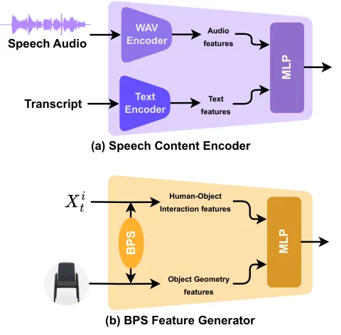

Figure 11: Architecture of InteracTalker’s Adaptation Encoders. (a) The
Speech Content Encoder extracts joint audio-text features from speech
audio and a transcript for co-speech gesture generation. (b) The BPS
Feature Generator derives object geometry and human-object interaction
features from the body pose and a target object to guide object-aware
motion.

This section provides a detailed overview of the two primary encoders
used to generate conditioning signals for our adaptation modules. The
architecture of these encoders is illustrated in Figure 11.

As shown in Figure 11(a), the Speech Content Encoder is designed to
process the multimodal inputs required for co-speech gesture generation.
It takes both speech audio and its corresponding transcript, processes
them to extract distinct features, and then concatenates these to
produce a joint audio-text feature vector. This feature vector
subsequently serves as the conditioning signal for the Co-speech Gesture
Adaptation Branch.

Figure 11(b) details the BPS Feature Generator, which is responsible for
deriving object-specific conditioning signals. This encoder takes as
input the current noisy body pose and the geometry of the target object.
It extracts two types of features: object geometry features from Basis
Point Sets (BPS) and human-object interaction features. These are then
merged to create a comprehensive feature vector that guides the
Interaction-Aware Adaptation Branch, enabling our model to generate
motions that are highly responsive to a target object’s properties.

## Appendix C Experimental Setup

Our experimental setup follows a three-stage training process,
leveraging a modular approach to build the InteracTalker framework.

First, the base Motion Diffusion Model (MDM) was pre-trained using the
HumanML3D \[9\] and SAMP \[11\] datasets, which do not contain object
interactions. This training was performed for 500k steps with a batch
size of 200. Following this, the MDM was frozen to serve as a stable
motion prior for the subsequent training of our adaptation branches.

Next, the interaction-aware branch was trained for 110k steps with a
batch size of 64. This stage utilized the SAMP \[11\] dataset, augmented
with motion-aligned objects from the 3D-FRONT \[6\] dataset, along with
their corresponding text prompts.

Finally, the co-speech aware branch was trained separately for 600k
steps with a batch size of 64 using the BEATX \[19\] dataset. This
allowed it to specialize in the fine-grained dynamics of co-speech
gestures.

For all training stages, we used the AdamW optimizer with a learning
rate of $`10^{-4}`$. All experiments were conducted on a single NVIDIA
GeForce RTX 2080 Ti GPU, with the total training time spanning
approximately 5 days. The number of diffusion steps was set to 1000 for
both training and inference.

During inference, the conditioning signals from both adaptation branches
are synergistically injected into the pre-trained and frozen MDM,
enabling the generation of comprehensive motions that account for both
co-speech dynamics and object interactions simultaneously.

## Appendix D Qualitative Results of InteracTalker

This section provides a visual demonstration of our method’s performance
in generating realistic and physically plausible human-object
interactions. Close-up views of the interaction regions in the generated
motions are presented in Figure 12, visually demonstrating that our
approach effectively maintains the necessary physical contact for
realistic interaction while rigorously minimizing penetration with the
target object.

In addition to Figure 12 presented below, a supplementary video is
provided to offer a dynamic view of our qualitative results. A ‘README’
file is also included with the video, which details the specific content
and examples shown.

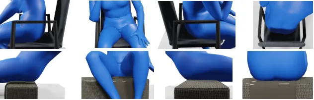

Figure 12: Qualitative Results: Physically Plausible Human-Object
Interaction by InteracTalker. This figure demonstrates our method’s
superior ability to generate realistic human-object interactions.
Observe how our approach consistently maintains necessary physical
contact with the target object (e.g., foot on ground, hand on chair)
while achieving minimal penetration, a key challenge in interaction
synthesis. These results visually corroborate our low quantitative
penetration metrics.

## Appendix E User Study

As the first work to address the complex task of generating co-speech
gestures that simultaneously account for detailed object interactions,
we conducted a user study to assess the perceived plausibility and
realism of our method. We compared our full InteracTalker framework with
a naive concatenation (Concat) approach, which combines independently
generated upper-body co-speech gestures and lower-body
object-interaction motions. We recruited around 64 participants with
minimal or no prior expertise in the domain to ensure an unbiased
evaluation based on visual clarity and naturalness. Participants were
presented with pairs of videos from both our method and the naive
approach. For each pair, they answered questions about different aspects
of motion quality. The full evaluation interface is provided in
Figure 13. The user study results, demonstrate a strong preference for
our InteracTalker framework (preferred 75%). Our method achieved a
significantly higher average rating for motion realism and was preferred
by a large majority of participants across all other metrics. This
confirms that a unified, integrated solution is critical for generating
realistic motions, as the naive approach consistently produced motions
with undesirable artifacts such as self- and object-penetrations.

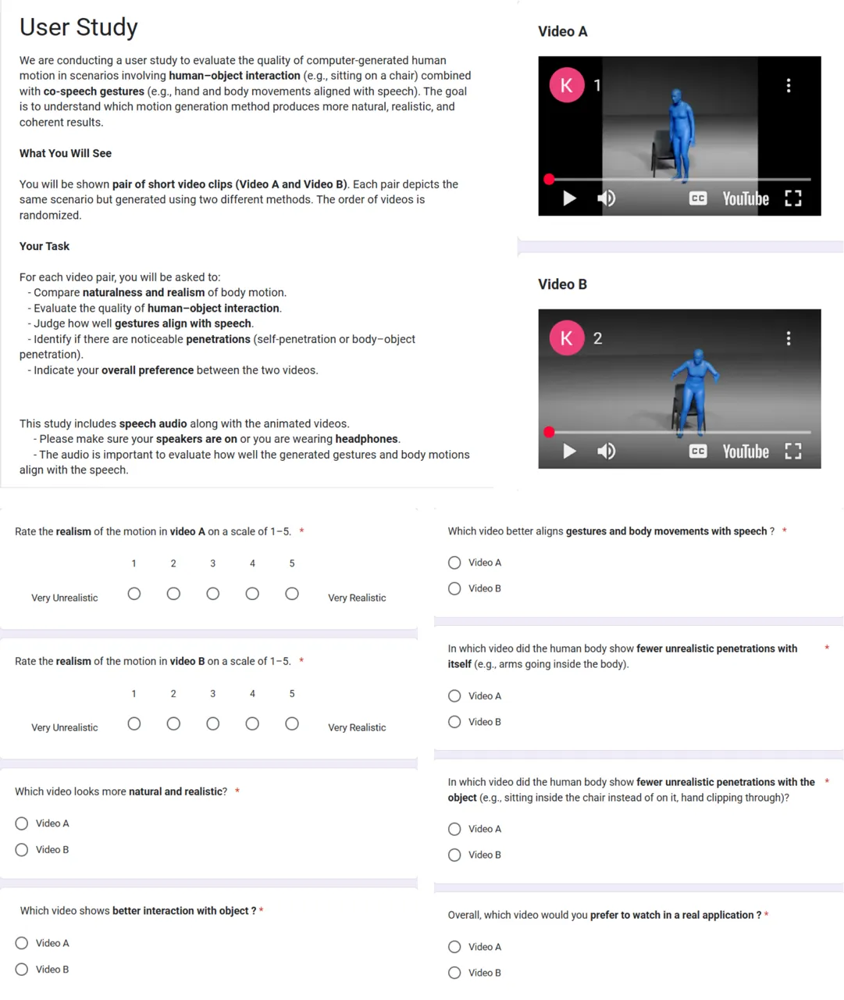

Figure 13: Interface used in conducting user study.

## References

- \[1\] N. Athanasiou, A. Cseke, M. Diomataris, M. J. Black, and G.
  Varol (2024) MotionFix: text-driven 3d human motion editing. In
  SIGGRAPH Asia 2024 Conference Papers, pp. 1–11. Cited by: Appendix A.
- \[2\] F. Bogo, A. Kanazawa, C. Lassner, P. Gehler, J. Romero,
  and M. J. Black (2016) Keep it smpl: automatic estimation of 3d human
  pose and shape from a single image. In Computer Vision–ECCV 2016: 14th
  European Conference, Amsterdam, The Netherlands, October 11-14, 2016,
  Proceedings, Part V 14, pp. 561–578. Cited by: §3.2.
- \[3\] B. Chen, Y. Li, Y. Ding, T. Shao, and K. Zhou (2024) Enabling
  synergistic full-body control in prompt-based co-speech motion
  generation. In Proceedings of the 32nd ACM International Conference on
  Multimedia, pp. 6774–6783. Cited by: §2, Table 2.
- \[4\] K. Chhatre, R. Daněček, N. Athanasiou, G. Becherini, C.
  Peters, M. J. Black, and T. Bolkart (2024) Emotional speech-driven 3d
  body animation via disentangled latent diffusion. External Links:
  2312.04466, [Link](https://arxiv.org/abs/2312.04466) Cited by: §1.
- \[5\] R. Daněček, K. Chhatre, S. Tripathi, Y. Wen, M. Black, and T.
  Bolkart (2023) Emotional speech-driven animation with content-emotion
  disentanglement. In SIGGRAPH Asia 2023 Conference Papers, SA ’23,
  pp. 1–13. External Links:
  [Link](http://dx.doi.org/10.1145/3610548.3618183),
  [Document](https://dx.doi.org/10.1145/3610548.3618183) Cited by: §1.
- \[6\] H. Fu, B. Cai, L. Gao, L. Zhang, J. Wang, C. Li, Q. Zeng, C.
  Sun, R. Jia, B. Zhao, et al. (2021) 3d-front: 3d furnished rooms with
  layouts and semantics. In Proceedings of the IEEE/CVF International
  Conference on Computer Vision, pp. 10933–10942. Cited by: Appendix C,
  §3.3.1, §4.
- \[7\] S. Ghorbani, Y. Ferstl, D. Holden, N. F. Troje, and M.
  Carbonneau (2022) ZeroEGGS: zero-shot example-based gesture generation
  from speech. External Links: 2209.07556,
  [Link](https://arxiv.org/abs/2209.07556) Cited by: §1.
- \[8\] S. Ginosar, A. Bar, G. Kohavi, C. Chan, A. Owens, and J.
  Malik (2019) Learning individual styles of conversational gesture. In
  Proceedings of the IEEE/CVF conference on computer vision and pattern
  recognition, pp. 3497–3506. Cited by: §2, Table 2.
- \[9\] C. Guo, S. Zou, X. Zuo, S. Wang, W. Ji, X. Li, and L.
  Cheng (2022) Generating diverse and natural 3d human motions from
  text. In Proceedings of the IEEE/CVF conference on computer vision and
  pattern recognition, pp. 5152–5161. Cited by: Appendix C, §1, §3.2,
  §4.
- \[10\] I. Habibie, W. Xu, D. Mehta, L. Liu, H. Seidel, G.
  Pons-Moll, M. Elgharib, and C. Theobalt (2021) Learning speech-driven
  3d conversational gestures from video. In Proceedings of the 21st ACM
  International Conference on Intelligent Virtual Agents, pp. 101–108.
  Cited by: §2, Table 2.
- \[11\] M. Hassan, D. Ceylan, R. Villegas, J. Saito, J. Yang, Y. Zhou,
  and M. J. Black (2021) Stochastic scene-aware motion prediction. In
  Proceedings of the IEEE/CVF International Conference on Computer
  Vision, pp. 11374–11384. Cited by: Appendix C, Appendix C, §3.2,
  §3.3.1, §4.
- \[12\] J. Ho, A. Jain, and P. Abbeel (2020) Denoising diffusion
  probabilistic models. Advances in neural information processing
  systems 33, pp. 6840–6851. Cited by: §3.2.
- \[13\] D. Holden, J. Saito, and T. Komura (2016) A deep learning
  framework for character motion synthesis and editing. ACM Transactions
  on Graphics (ToG) 35 (4), pp. 1–11. Cited by: Appendix A.
- \[14\] J. Lee, J. Chai, P. S. A. Reitsma, J. K. Hodgins, and N. S.
  Pollard (2002) Interactive control of avatars animated with human
  motion data. In Proceedings of the 29th Annual Conference on Computer
  Graphics and Interactive Techniques, SIGGRAPH ’02, New York, NY, USA,
  pp. 491–500. External Links: ISBN 1581135211,
  [Link](https://doi.org/10.1145/566570.566607),
  [Document](https://dx.doi.org/10.1145/566570.566607) Cited by: §2.
- \[15\] J. Li, D. Kang, W. Pei, X. Zhe, Y. Zhang, Z. He, and L.
  Bao (2021) Audio2gestures: generating diverse gestures from speech
  audio with conditional variational autoencoders. In Proceedings of the
  IEEE/CVF International Conference on Computer Vision, pp. 11293–11302.
  Cited by: §4.2.
- \[16\] R. Li, Y. Zhang, Y. Zhang, Y. Zhang, M. Su, J. Guo, Z. Liu, Y.
  Liu, and X. Li (2024) InterDance:reactive 3d dance generation with
  realistic duet interactions. External Links: 2412.16982,
  [Link](https://arxiv.org/abs/2412.16982) Cited by: §2.
- \[17\] R. Li, S. Yang, D. A. Ross, and A. Kanazawa (2021) Ai
  choreographer: music conditioned 3d dance generation with aist++. In
  Proceedings of the IEEE/CVF international conference on computer
  vision, pp. 13401–13412. Cited by: §4.2.
- \[18\] H. Liu, N. Iwamoto, Z. Zhu, Z. Li, Y. Zhou, E. Bozkurt, and B.
  Zheng (2022) Disco: disentangled implicit content and rhythm learning
  for diverse co-speech gestures synthesis. In Proceedings of the 30th
  ACM international conference on multimedia, pp. 3764–3773. Cited by:
  §2, Table 2.
- \[19\] H. Liu, Z. Zhu, G. Becherini, Y. Peng, M. Su, Y. Zhou, X.
  Zhe, N. Iwamoto, B. Zheng, and M. J. Black (2024) EMAGE: towards
  unified holistic co-speech gesture generation via expressive masked
  audio gesture modeling. In Proceedings of the IEEE/CVF Conference on
  Computer Vision and Pattern Recognition, pp. 1144–1154. Cited by:
  Appendix C, §2, §3.3.2, Table 2, §4.
- \[20\] H. Liu, Z. Zhu, N. Iwamoto, Y. Peng, Z. Li, Y. Zhou, E.
  Bozkurt, and B. Zheng (2022) Beat: a large-scale semantic and
  emotional multi-modal dataset for conversational gestures synthesis.
  In European conference on computer vision, pp. 612–630. Cited by: §1,
  §2, Table 2.
- \[21\] X. Liu, Q. Wu, H. Zhou, Y. Xu, R. Qian, X. Lin, X. Zhou, W.
  Wu, B. Dai, and B. Zhou (2022) Learning hierarchical cross-modal
  association for co-speech gesture generation. In Proceedings of the
  IEEE/CVF conference on computer vision and pattern recognition,
  pp. 10462–10472. Cited by: §2, Table 2.
- \[22\] N. Mahmood, N. Ghorbani, N. F. Troje, G. Pons-Moll, and M.
  Black (2019) AMASS: archive of motion capture as surface shapes. In
  2019 IEEE/CVF International Conference on Computer Vision (ICCV), Vol.
  , pp. 5441–5450. External Links:
  [Document](https://dx.doi.org/10.1109/ICCV.2019.00554) Cited by: §1.
- \[23\] W. Peng, K. Zhang, and S. Q. Zhang (2024) T3M: text guided 3d
  human motion synthesis from speech. External Links: 2408.12885,
  [Link](https://arxiv.org/abs/2408.12885) Cited by: §1.
- \[24\] M. Petrovich, O. Litany, U. Iqbal, M. J. Black, G. Varol, X. B.
  Peng, and D. Rempe (2024) Multi-track timeline control for text-driven
  3d human motion generation. External Links: 2401.08559,
  [Link](https://arxiv.org/abs/2401.08559) Cited by: §2.
- \[25\] S. Prokudin, C. Lassner, and J. Romero (2019) Efficient
  learning on point clouds with basis point sets. In Proceedings of the
  IEEE/CVF international conference on computer vision, pp. 4332–4341.
  Cited by: §3.3.1.
- \[26\] A. Radford, J. W. Kim, C. Hallacy, A. Ramesh, G. Goh, S.
  Agarwal, G. Sastry, A. Askell, P. Mishkin, J. Clark, et al. (2021)
  Learning transferable visual models from natural language supervision.
  In International conference on machine learning, pp. 8748–8763. Cited
  by: §3.2.
- \[27\] O. Taheri, V. Choutas, M. J. Black, and D. Tzionas (2023) GOAL:
  generating 4d whole-body motion for hand-object grasping. External
  Links: 2112.11454, [Link](https://arxiv.org/abs/2112.11454) Cited by:
  §2.
- \[28\] G. Tevet, S. Raab, B. Gordon, Y. Shafir, D. Cohen-or, and A. H.
  Bermano (2023) Human motion diffusion model. In The Eleventh
  International Conference on Learning Representations, External Links:
  [Link](https://openreview.net/forum?id=SJ1kSyO2jwu) Cited by: §1, §2,
  §3.1.
- \[29\] Z. Xu, Y. Lin, H. Han, S. Yang, R. Li, Y. Zhang, and X.
  Li (2025) MambaTalk: efficient holistic gesture synthesis with
  selective state space models. External Links: 2403.09471,
  [Link](https://arxiv.org/abs/2403.09471) Cited by: §2.
- \[30\] S. Yang, Z. Wu, M. Li, Z. Zhang, L. Hao, W. Bao, M. Cheng,
  and L. Xiao (2023) DiffuseStyleGesture: stylized audio-driven
  co-speech gesture generation with diffusion models. In Proceedings of
  the Thirty-Second International Joint Conference on Artificial
  Intelligence, IJCAI ’23. External Links: ISBN 978-1-956792-03-4,
  [Link](https://doi.org/10.24963/ijcai.2023/650),
  [Document](https://dx.doi.org/10.24963/ijcai.2023/650) Cited by: §1.
- \[31\] S. Yang, Z. Wu, M. Li, Z. Zhang, L. Hao, W. Bao, M. Cheng,
  and L. Xiao (2023) Diffusestylegesture: stylized audio-driven
  co-speech gesture generation with diffusion models. arXiv preprint
  arXiv:2305.04919. Cited by: §2, Table 2.
- \[32\] S. Yang, Z. Xu, H. Xue, Y. Cheng, S. Huang, M. Gong, and Z.
  Wu (2024) Freetalker: controllable speech and text-driven gesture
  generation based on diffusion models for enhanced speaker naturalness.
  External Links: 2401.03476, [Link](https://arxiv.org/abs/2401.03476)
  Cited by: §2.
- \[33\] H. Yi, C. P. Huang, D. Tzionas, M. Kocabas, M. Hassan, S.
  Tang, J. Thies, and M. J. Black (2022) Human-aware object placement
  for visual environment reconstruction. In Proceedings of the IEEE/CVF
  Conference on Computer Vision and Pattern Recognition, pp. 3959–3970.
  Cited by: §3.3.1.
- \[34\] H. Yi, H. Liang, Y. Liu, Q. Cao, Y. Wen, T. Bolkart, D. Tao,
  and M. J. Black (2023) Generating holistic 3d human motion from
  speech. External Links: 2212.04420,
  [Link](https://arxiv.org/abs/2212.04420) Cited by: §1.
- \[35\] H. Yi, H. Liang, Y. Liu, Q. Cao, Y. Wen, T. Bolkart, D. Tao,
  and M. J. Black (2023) Generating holistic 3d human motion from
  speech. In Proceedings of the IEEE/CVF Conference on Computer Vision
  and Pattern Recognition, pp. 469–480. Cited by: §2, Table 2.
- \[36\] H. Yi, J. Thies, M. J. Black, X. B. Peng, and D. Rempe (2024)
  Generating human interaction motions in scenes with text control. In
  European Conference on Computer Vision, pp. 246–263. Cited by: §1, §2,
  §2, §3.2, §3.3.1, §3.3.1, §3.3.1, Table 3.
- \[37\] Y. Yoon, B. Cha, J. Lee, M. Jang, J. Lee, J. Kim, and G.
  Lee (2020) Speech gesture generation from the trimodal context of
  text, audio, and speaker identity. ACM Transactions on Graphics (TOG)
  39 (6), pp. 1–16. Cited by: §2, Table 2, §4.2.
- \[38\] M. Zhang, Z. Cai, L. Pan, F. Hong, X. Guo, L. Yang, and Z.
  Liu (2022) MotionDiffuse: text-driven human motion generation with
  diffusion model. External Links: 2208.15001,
  [Link](https://arxiv.org/abs/2208.15001) Cited by: §1, §2.
- \[39\] K. Zhao, Y. Zhang, S. Wang, T. Beeler, and S. Tang (2023)
  Synthesizing diverse human motions in 3d indoor scenes. In Proceedings
  of the IEEE/CVF international conference on computer vision,
  pp. 14738–14749. Cited by: §2, Table 3.
- \[40\] Y. Zhou, C. Barnes, J. Lu, J. Yang, and H. Li (2019) On the
  continuity of rotation representations in neural networks. In
  Proceedings of the IEEE/CVF conference on computer vision and pattern
  recognition, pp. 5745–5753. Cited by: Appendix A.
- \[41\] L. Zhu, X. Liu, X. Liu, R. Qian, Z. Liu, and L. Yu (2023)
  Taming diffusion models for audio-driven co-speech gesture generation.
  External Links: 2303.09119, [Link](https://arxiv.org/abs/2303.09119)
  Cited by: §1.
- \[42\] W. Zhu, X. Ma, D. Ro, H. Ci, J. Zhang, J. Shi, F. Gao, Q. Tian,
  and Y. Wang (2023) Human motion generation: a survey. External Links:
  2307.10894, [Link](https://arxiv.org/abs/2307.10894) Cited by: §2.
