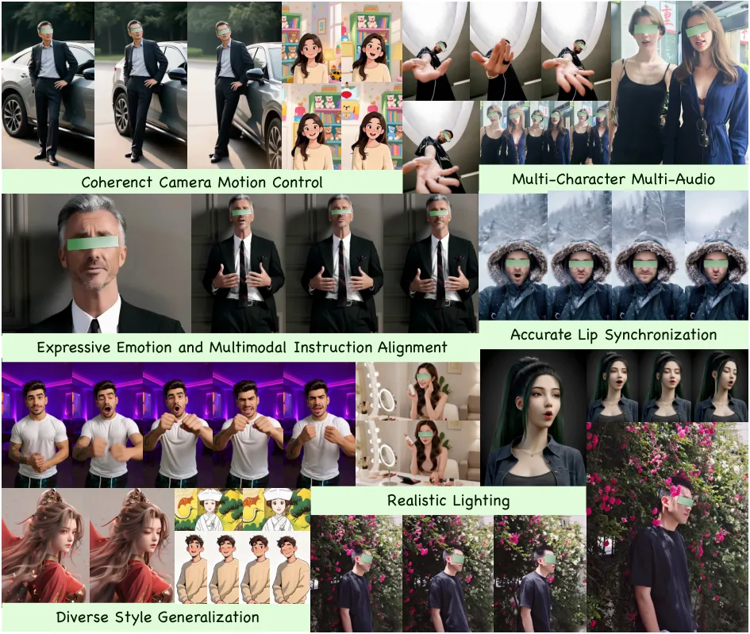
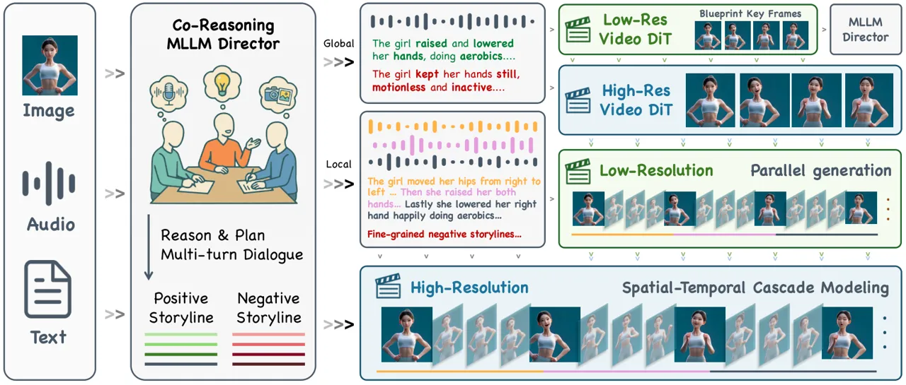
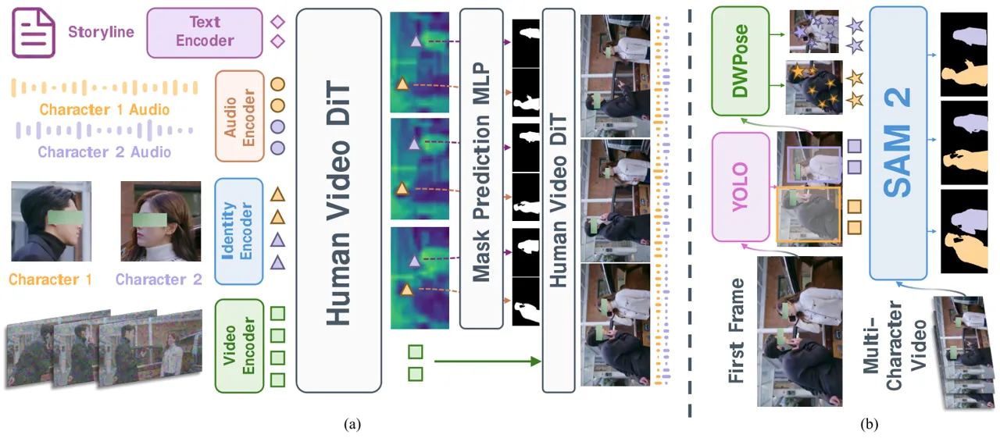
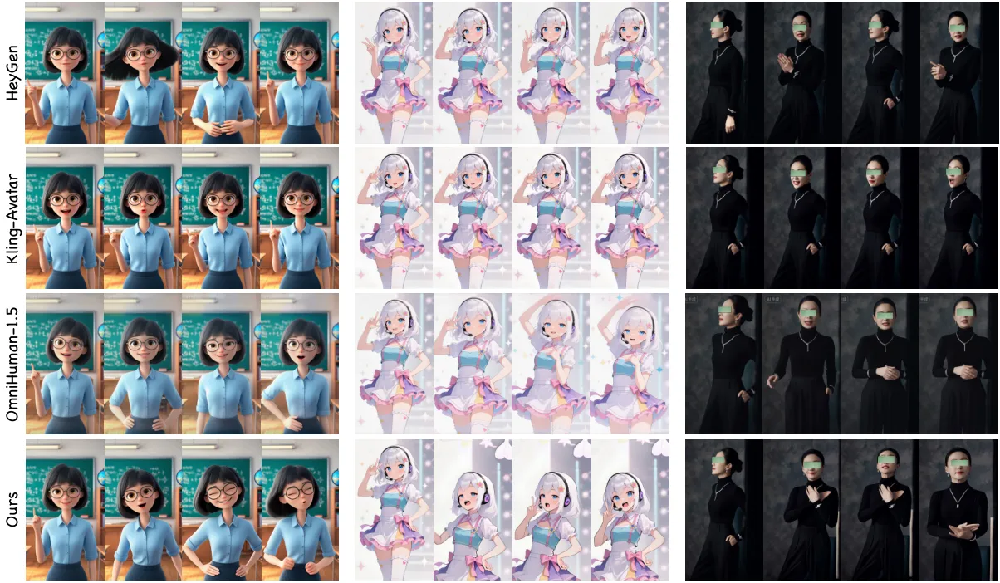
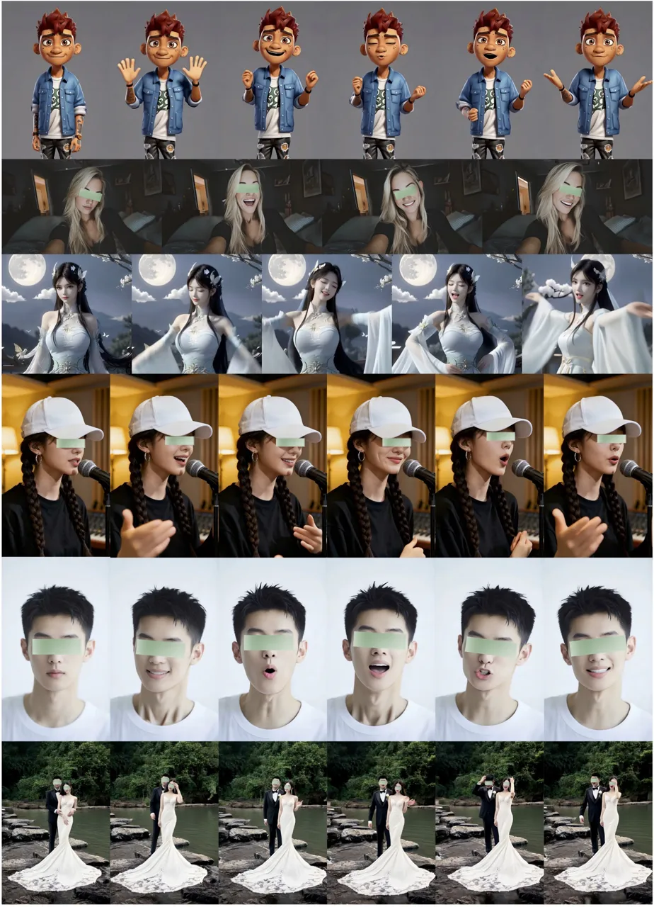
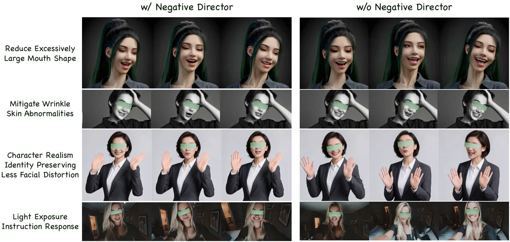

\headertext

KlingAvatar 2.0: Co-Reasoning Directed Spatio-Temporal Cascade Modeling
for Avatar Synthesis \metadata\[Date\]December 15, 2025
\metadata\[Access\][https://app.klingai.com/global/ai-human/image/new/](https://app.klingai.com/global/ai-human/image/new/)
\metadata\[Model ID\]Avatar 2.0

# KlingAvatar 2.0 Technical Report

Kling Team    Kuaishou Technology

###### Abstract

Avatar video generation models have achieved remarkable progress in
recent years. However, prior work exhibits limited efficiency in
generating long duration high-resolution videos, suffering from temporal
drifting, quality degradation, and a weak prompt follow-up as the video
length increases. To address these challenges, we propose KlingAvatar
2.0, a spatio-temporal cascade framework that performs upscaling in both
spatial resolution and temporal dimension by first generating
low-resolution blueprint video keyframes that capture global semantics
and motion, and then refining them into high-resolution, temporally
coherent sub-clips using a first-last frame strategy, while retaining
smooth temporal transitions in long-form videos. To enhance cross-modal
instruction fusion and alignment in extended long videos, we introduce a
Co-Reasoning Director composed of three modality-specific large language
model (LLM) experts. These experts reason about modality priorities and
infer the underlying user intent, converting inputs into detailed
storylines through multi-turn dialogue. A negative director further
refines negative prompts to improve instruction alignment. Building on
these components, we extend the framework to support ID-specific
multi-character control. Extensive experiments demonstrate that our
model effectively addresses the challenges of efficient, multimodally
aligned long-form high-resolution video generation, delivering enhanced
visual clarity, realistic lip–teeth rendering with accurate lip
synchronization, strong identity preservation, and coherent multimodal
instruction following.

## 1 Introduction

Audio-driven avatar video synthesis aims to generate realistic and
expressive human-centric videos, featuring synchronized facial and
emotion expressions, coherent lip-teeth movements and body gestures, and
natural character interactions with both the environment and other
characters. This technology holds significant value across diverse
domains, including education, personalized services, industrial
training, entertainment, and advertising, where it enables more
immersive and engaging experiences.

The field of audio-driven avatar video generation has evolved
significantly through several stages of technological advancement. Early
approaches focused primarily on lip-synchronized facial animation,
leveraging audio-to-motion representations \[20, 71, 18, 57, 29, 7\] and
direct audio-to-video synthesis for portrait animation \[75, 64, 65, 50,
55, 28, 41\]. Subsequent developments expanded the scope to semi-body
video generation, incorporating hand gestures and upper body animation
\[39, 34, 54\], followed by full-body video generation with background
environments and character-environment interactions \[9, 8, 15, 60, 35,
14, 16, 30, 12\]. These advances in complex human motion modeling,
realistic environment generation, and natural interactions have been
largely enabled by pretrained DiT-based video diffusion models \[74, 67,
36, 38, 56\]. To address more complex real-world scenarios and improve
controllability, recent works have explored human-object interactions
\[27\] and multi-person conversational scenarios with per-character
audio control \[33, 63, 62\]. Multimodal large language model (MLLM)
driven storyline planning has emerged as a promising direction, enabling
fine-grained expressions, vivid emotions, reasoned actions, and
environmental interactions through shot-level guidance for long-duration
generation \[30, 12\]. Despite these advances, existing methods remain
inefficient for generating long-duration, high-resolution digital human
videos, often suffering from visual degradation and limited coherence
with complex, long-horizon multimodal instructions.

Figure 1: KlingAvatar 2.0 generates vivid, identity-preserving digital
humans with accurate camera control, expressive emotions, high-quality
motion, and precise facial–lip and audio synchronization. It achieves
coherent alignment across audio, image, and text instructions,
generalizes to diverse open-domain styles, and supports multi-character
synthesis with identity-specific audio control. These capabilities are
enabled by our multimodal instruction-following, omni-directed
spatial–temporal cascade framework for high-resolution, long-duration
video generation.

Building upon the foundation of \[12\], we propose a unified framework
that addresses the aforementioned challenges. To enable efficient
long-form, high-resolution video generation, we introduce a temporal and
spatial cascade framework that samples low-resolution blueprint videos
for efficient generation and then gradually upsamples them to longer
durations and higher resolutions. This approach enriches visual details
while mitigating temporal drifting artifacts that plague long-form video
generation. For long-duration video generation, effective multimodal
fusion and adherence to user instructions are crucial. When handled
poorly, modality conflicts can cause severe degradation. To address
this, we develop a Co-Reasoning Director that improves upon existing
MLLM reasoning capabilities, operating in a multi-turn dialogue manner
to generate coherent shot-level storylines. This is complemented by a
novel negative director that captures fine-grained negative prompts to
enhance instruction-following accuracy. Moreover, complex digital human
applications often involve multiple characters, where how to accurately
drive each human becomes an essential problem. To this end, we leverage
deep DiT block features and ID-aware attention to realize
mask-controlled audio injection, enabling synchronized yet individually
controlled character animations in complex conversational settings.
Together, these components form an integrated system that advances the
state-of-the-art in audio-driven avatar video synthesis by
simultaneously addressing efficiency, instruction alignment, and
multi-character coordination.

To develop and train such a model, we curated an enhanced dataset that
expands upon \[12\], featuring a substantially larger collection of
high-quality, cinematic-level video data. Our dataset encompasses
multilingual and multi-character conversational scenarios, with
extensive filtering pipelines applied to ensure high visual fidelity and
consistent audio-lip synchronization. We conduct extensive experiments
to evaluate the performance of our proposed framework. Our evaluation
demonstrates that our model achieves superior performance against
leading competitors \[30, 12, 21\] across visual quality, camera
movement, lip synchronization accuracy, fine-grained lip-teeth detail
preservation, vivid and natural character animation, and audio-emotion
alignment. In terms of generation efficiency, our spatial-temporal
cascade framework enables long-duration and high-resolution video
synthesis with improved computational efficiency compared to prior
methods, while maintaining identity consistency and story continuity for
videos up to 5 minutes. We highlight representative generation results
in Figure 1. We summarize our contributions as follows:

- •
  Spatial-Temporal Cascade Framework: We introduce a spatial-temporal
  cascade framework that enables efficient generation of long-duration,
  high-resolution videos through progressive and parallel temporal and
  spatial upsampling, effectively mitigating temporal drifting artifacts
  while enriching visual details.
- •
  Co-Reasoning Director: We develop a Co-Reasoning Director that
  coordinates multiple MLLMs and LLMs in a multi-turn dialogue manner to
  capture details across modalities and resolve modality conflicts,
  generating coherent shot-level storylines. A complementary negative
  director further enhances fine-grained negative prompts to improve
  instruction-following accuracy and character emotion expression.
- •
  Multi-Character Multi-Audio Control: We propose a multi-character,
  multi-audio control mechanism that exploits deep DiT features for
  character mask prediction, enabling synchronized yet individually
  controlled animations from multiple audio streams.
- •
  Strong performance and generalization: KlingAvatar 2.0 achieves
  state-of-the-art performance across multiple dimensions, including
  visual quality, coherent and vivid character animations, natural
  camera movements, accurate lip synchronization, and precise
  audio-emotion alignment, while demonstrating strong generalization to
  diverse domains and scenarios.

## 2 Related Works

Video Generation. Visual content generation has achieved remarkable
breakthroughs through diffusion models, from photorealistic image
synthesis to video generation. Early video generation approaches
extended pretrained U-Net \[45\] based image synthesis models \[22, 49,
11, 44, 5, 4\] by incorporating temporal dimensions or combining 1D
temporal attention with 2D spatial attention blocks to capture
inter-frame correspondences and reducing computational costs \[19, 59,
23, 48, 1\]. However, such designs that model all frames without
temporal compression face limitations in scalability, along with issues
of temporal drifting and visual artifacts. Recent DiT-based image
synthesis methods \[40, 13, 3\] have advanced realistic image generation
through scalable training paradigms, enabling high-fidelity appearance
and improved instruction following. Building upon these progresses,
video diffusion models have shifted focus toward DiT-based architectures
\[74, 67, 36, 38, 56\]. These methods employ 3D convolutional VAEs to
compress videos both temporally and spatially into compact tokens, and
leverage large transformer models combined with growing training data
and computational resources to capture temporal dynamics and visual
details, establishing new state-of-the-art results for video generation.
Recent extensions of video diffusion models further advance efficient
and long-context generation \[32, 70, 53, 6, 73, 17\], unified
multimodal conditioning with cascaded super-resolution for
high-resolution synthesis \[52\], and world modeling \[69, 51, 26\].
Despite these advances, these methods are primarily designed for general
video generation with text or image prompts, lacking audio conditioning,
and remain inadequate for speech-driven digital human modeling.

Multimodal Avatar Synthesis. Multimodal avatar synthesis has achieved
significant progress through rapid development. The field has evolved
from early non-audio driven methods \[46, 47, 72, 24, 61, 42\] that
transfer motion from reference videos or landmark sequences, as well as
3D-based digital human synthesis approaches \[2, 25, 10\], to modern
audio-driven video generation systems. Among audio-driven methods, some
employ explicit facial landmarks derived from audio features for precise
control \[57, 29, 7\], while others learn implicit motion
representations from audio to enable more flexible animation \[20, 71,
18\]. More recently, transformer-based audio-driven approaches utilize
cross-attention mechanisms to eliminate intermediate motion
representations, directly generating talking avatars from audio using
diffusion models with end-to-end synthesis \[75, 64, 65, 50, 55, 28,
41\]. Beyond facial lip synchronization, semi-body methods synchronize
hand gestures and upper body movements with audio \[39, 34, 54\],
enabling more expressive digital human generation. Recent advances
leverage large-scale pretrained video diffusion models to achieve
enhanced temporal coherence and visual fidelity \[9, 8, 15, 60, 35, 14,
16\], supporting the generation of complex background environments and
full body interactions. Further developments include specialized
extensions for human-object interactions \[27\] and multi-person
conversational scenarios with per-character audio control \[33, 63,
62\], further increasing the applicability and realism of avatar
synthesis. Most recently, MLLM-based multimodal planning enables
fine-grained expression, vivid emotions, reasoned actions, and
interaction with the environment through shot-level guidance for
long-duration generation \[30, 12\].

## 3 Method

KlingAvatar 2.0 extends the Kling-Avatar \[12\] pipeline, as illustrated
in Fig. 2, given the reference image, input audios, and textual
instructions, the system efficiently generates high-fidelity, long-form
digital human videos with accurate lip synchronization and fine-grained
control over multiple speakers and roles. In the following, we detail
the spatial-temporal cascade diffusion framework (Sec. 3.1), the
co-reasoning multimodal storyline director (Sec. 3.2), the
multi-character control module (Sec. 3.3), and the acceleration
techniques (Sec. 3.4).

Figure 2: Overview of the KlingAvatar 2.0 framework. Given multimodal
instructions, the Co-Reasoning Director reasons and plans hierarchical,
fine-grained positive and negative storylines in a multi-turn dialogue
manner, and the spatio-temporal cascade pipeline generates coherent,
long-form, high-resolution avatar videos in parallel.

### 3.1 Spatial-Temporal Cascade Modeling

To support long-duration, high-resolution avatar synthesis with
efficient computation, KlingAvatar 2.0 adopts a spatial-temporal cascade
of audio-driven DiTs built on top of pretrained video diffusion models,
as illustrated in Fig. 2. The pipeline comprises two nested cascades
that jointly handle global storyline planning over long horizons and
local spatio-temporal refinement. First, a low-resolution diffusion
model generates a blueprint video that captures global dynamics,
content, and layout; representative low-resolution keyframes are then
upscaled by a high-resolution DiT, enriching fine details while
preserving identity and scene composition under the same Co-Reasoning
Director’s global prompts. Next, a low-resolution video diffusion model
expands these high-resolution anchor keyframes into audio-synchronized
sub-clips via first-last-frame conditioned generation, where the prompts
are augmented with the blueprint keyframes to refine fine-grained motion
and expression. An audio-aware interpolation strategy synthesizes
transition frames to enhance temporal connectivity, lip synchronization,
and spatial consistency. Finally, a high-resolution video diffusion
model performs super-resolution on the low-resolution sub-clips,
producing high-fidelity, temporally coherent video segments.

### 3.2 Co-Reasoning Director

KlingAvatar 2.0 employs a Co-Reasoning Director that jointly reasons
over audio, images, and text in a multi-turn dialogue manner, building
on recent MLLM-based avatar planners \[30, 12\]. The Director is
instantiated with three experts: (i) an audio-centric expert performs
transcription and paralinguistic analysis (emotion, prosody, speaking
intent); (ii) a visual expert summarizes appearance, layout, and scene
context from reference images; and (iii) a textual expert interprets
user instructions, incorporates conversational history from the other
experts, and synthesizes a logically coherent storyline plan. These
experts engage in several rounds of co-reasoning with chain-of-thought,
exposing intermediate thoughts to resolve conflicts (e.g., an angry
vocal tone paired with a neutral script) and to fill in underspecified
details such as implied actions or camera movements. The director
outputs a structured storyline that decomposes the video into a sequence
of shots. Additionally, we also introduce a negative director, where
positive prompts emphasize desired visual and behavioral attributes, and
negative prompts explicitly down-weight implausible poses, artifacts,
and fine-grained opposite emotions (e.g., sad vs. happy) or motion
styles (e.g., overly fast vs. slow).

For long videos, the director further refines the global storyline into
segment-level plans aligned with the audio timeline, which directly
parameterize the keyframe cascade and clip-level refinement modules.
This high-level multimodal planning converts loosely specified
instructions into a coherent script that can be consistently followed by
the diffusion backbone, substantially improving semantic alignment and
temporal coherence.

### 3.3 Multi-Character Control

KlingAvatar 2.0 generalizes the single-speaker avatar setting to
multi-character scenes and identity-specific audio control. Our design
follows the character-aware audio-injection paradigm used in recent
multi-person conversational avatars \[62, 33, 63\]. Empirically, we
observe an important architectural property: hidden features at
different depths of the DiT blocks exhibit distinct feature
representations. In particular, latent representations in deep DiT
layers are organize into semantically coherent spatial regions with
reduced noise, and these regions align well with individual characters
and other salient objects.

Figure 3: (a) Multi-character video generation pipeline with
identity-specific audio control. A mask-prediction head is attached to
deep DiT features, and the predicted masks gate ID-specific audio
injection into corresponding regions. (b) Automated multi-character
video annotation pipeline.

Motivated by this observation, we attach a mask-prediction head to
selected deep DiT blocks, as shown in Fig. 3(a). Concretely, given a
specified character in the first frame, we encode the reference identity
crops using the same patchification scheme without adding noise to
reference tokens. We then compute cross-attention between deep video
latent tokens and these reference tokens for each identity, and apply
MLP modules to regress per-frame character masks. Ground-truth (GT)
masks are downsampled to match the spatial and temporal resolution of
the intermediate latent features. During training, the DiT video
backbone is frozen and only the mask-prediction modules are optimized.
During denoising, the predicted masks are used to gate the
identity-specific audio stream injection to corresponding regions.

To facilitate curation of a large-scale multi-character dataset for
training, we expand our data sources to include podcasts, interviews,
multi-character television serires and more.To collect GT character
masks at scale, we developed an automated annotation pipeline that
produces per-character video masks, as illustrated in Fig. 3(b). The
pipeline leverages serveral expert models: YOLO \[31\] for person
detection, DWPose \[66\] for keypoint estimation, and SAM2 \[43\] for
segmentation and temporal tracking. Specifically, we detect all
characters in the first frame with YOLO, estimate keypoints within each
detection using DWPose, and use the resulting bounding boxes and
keypoints as prompts for SAM2 to segment and track each person in
subsequent frames. Finally, we validate the generated video masks
against per-frame YOLO and DWPose estimation results and filter out
misaligned or low-overlap segments to ensure high-quality annotations
for training.

### 3.4 Accelerated Video Generation

To achieve accelerated inference efficiency, we explored distillation
schemes based on trajectory-preserving distillation exemplified by PCM
\[58\] and DCM \[37\], and distribution matching distillation
exemplified by DMD \[68\]. Based on comprehensive evaluations of
experimental cost, training stability, inference flexibility, and final
generative performance metrics, we ultimately selected the
trajectory-preserving distillation approach. To further enhance
distillation efficiency, we developed customized time schedulers by
analyzing the performance of the base model across different timesteps,
thereby balancing the inference speedup ratio against model performance.
Within our distillation algorithm, we introduced a multi-task
distillation paradigm through a series of precisely designed
configurations. This paradigm not yields a synergistic effect (1+1\>2),
improving the distillation outcomes for each individual task.

| GSB                    | Overall | Face-Lip Sync. | Visual Qual. | Motion Qual. | Motion Expr. | Text Rel. |
| ---------------------- | ------- | -------------- | ------------ | ------------ | ------------ | --------- |
| Ours vs. HeyGen        | 1.26    | 0.86           | 1.76         | 0.88         | 1.53         | 1.39      |
| Ours vs. Kling-Avatar  | 1.73    | 0.80           | 0.89         | 1.13         | 2.47         | 3.73      |
| Ours vs. OmniHuman-1.5 | 1.94    | 1.02           | 1.99         | 1.06         | 1.13         | 1.08      |

Table 1: Quantitative results of GSB metrics between our approach and
other competitors across diverse criteria.

Figure 4: Visualization of GSB benchmark results comparing KlingAvatar
2.0 with HeyGen, Kling-Avatar, and OmniHuman-1.5 across various
evaluation criteria.

Figure 5: Qualitative comparison between KlingAvatar 2.0 and baseline
methods. Left: Our method produces more natural hair dynamics and vivid
facial expressions. Middle: Our results adhere more closely to the
specified bottom-to-top camera motion. Right: Our generated video aligns
better with the prompt “…turned to the front and folded her hands in
front of her chest”.

## 4 Experiments

### 4.1 Experimental Setup

We follow the human preference–based subjective evaluation protocol in
\[12\] to conduct comprehensive evaluations of KlingAvatar 2.0. We
construct 300 high-quality test cases, each consisting of paired image,
audio, and text prompts, including 100 Chinese speech, 100 English
speech, and 100 singing samples. For each case, annotators perform
Good/Same/Bad (GSB) pairwise comparisons between our results and those
of baseline methods. We report (G+S)/(B+S) as the main metric, where
higher scores indicate stronger human preference. To capture
fine-grained aspects of video quality and multimodal alignment, we
further extend GSB to a richer set of detailed criteria, including:

- •
  Face–Lip Synchronization. Measures temporal alignment between face and
  lip motions and speech, the naturalness and continuity of facial
  expressions, and the consistency between movements, facial dynamics,
  and phonetic content.
- •
  Visual Quality. Evaluates overall aesthetics, sharpness, and fidelity
  of fine details such as hair, teeth, and skin texture, as well as
  temporal consistency of appearance and robustness to artifacts,
  flickering, and implausible lighting or color.
- •
  Motion Quality. Assesses the plausibility, smoothness, and temporal
  coherence of body, head, and camera motion, avoiding geometric
  distortions, jitter, unnatural warping, body-part collapses, and
  unstable character tracking.
- •
  Motion Expressiveness. Characterizes the richness, diversity, and
  vividness of lip, facial, and full-body movements, and their emotional
  match with the audio and text in terms of intensity, timing, and
  modulation of gestures and head poses.
- •
  Text Relevance. Reviews the alignment and coherence of the generated
  storyline, camera trajectories, and scene dynamics with the textual
  instructions.

### 4.2 Experimental Results

We compare KlingAvatar 2.0 against three strong baselines: HeyGen
\[21\], Kling-Avatar \[12\], and OmniHuman-1.5 \[30\]. Quantitative GSB
results across diverse dimensions are summarized in Table 1 and
visualized in Fig. 4. Our method achieves strong overall performance,
with especially notable improvements in motion expressiveness and text
relevance. Qualitative comparisons are provided in Fig. 5.

Figure 6: Representative qualitative results generated by our
spatial–temporal cascade framework with the multimodal co-reasoning
director.

Figure 7: Ablation study of the negative director on blueprint
keyframes. The negative director enhances facial expressiveness,
improves temporal stability and emotional controllability, and reduces
lighting and exposure artifacts.

Our model generates richer, more natural dynamic effects and follows
multimodal instructions more faithfully, demonstrating an enhanced
understanding of complex audiovisual intent and effectively addressing
the key limitations of baseline methods. Across baselines, hair dynamics
are either relatively rigid (Kling-Avatar, OmniHuman-1.5) or
occasionally less physically grounded (HeyGen). Our method produces more
temporally consistent and physically plausible hair motion and head
poses, leading to improved perceived naturalness. For multimodal
instruction following, HeyGen and Kling-Avatar generally generate stable
but relatively simple camera trajectories, while OmniHuman-1.5 sometimes
deviates from the specified camera instructions. KlingAvatar 2.0
produces camera motions and scene dynamics that are more closely aligned
with the textual prompts, yielding detailed and coherent
interpretations. Regarding emotional expression and fine-grained motion
instructions, HeyGen and Kling-Avatar sometimes under-emphasize the
target actions, whereas OmniHuman-1.5 incorrectly folds the hands at the
waist instead of in front of the chest. In contrast, our approach more
reliably captures the intended motion of folding the hands in front of
the chest, produces movements synchronized with the audio and target
emotion, and yields facial and body expressions that are both expressive
and realistic.

Fig. 6 showcases results generated by our framework across diverse
scenarios. Powered by the spatial–temporal cascade and the multimodal
co-reasoning director, our approach accurately interprets and fuses
image, audio, and text instructions, producing emotionally expressive
characters, coherent full-body and camera motions, and precise,
fine-grained lip synchronization. Beyond single-speaker talking
scenarios, our method generalizes well to multi-person interactions with
per-character audio conditioning. These results demonstrate the
robustness and versatility of KlingAvatar 2.0 in open, complex settings.

As shown in Fig. 7, prior work typically uses a small, fixed set of
generic negative prompts (e.g., “artifacts, bad quality, blur”) for an
entire video, offering only coarse control over undesired content. In
contrast, our negative director employs detailed, shot-specific negative
prompts that track the evolving storyline and target emotion. This
per-shot control discourages implausible expressions, unstable motion,
and narrative-inconsistent artifacts, leading to more natural,
emotionally faithful, and temporally stable results that better follow
the text description.

## 5 Conclusion

In this paper, we present KlingAvatar 2.0, a unified framework that
enables spatio-temporal cascade generation for high-resolution,
long-duration, lifelike multi-person avatar videos with omni-directed
co-reasoning directors. Our multimodal, multi-expert co-reasoning
director thinks and plans over audio cues, visual contexts, and complex
instructions through multi-turn dialogues to resolve ambiguities and
conflicting signals, producing coherent global storylines to guide the
long-form synthesis trajectory and detailed local prompts to refine
sub-clip dynamics. The hierarchical storyline drives generation of
low-resolution blueprint keyframes, and spatio-temporal upscaled
high-resolution, audio-synchronized sub-clips, which are efficiently
composed into long-form videos in parallel via first–last frame
conditioning. We further extend the application scenarios to
multi-character settings with identity-specific audio control and
develop an automated annotation pipeline to curate large-scale
multi-person video datasets. Experiments demonstrate that KlingAvatar
2.0 delivers leading performance in visual fidelity, identity
preserving, lip–audio synchronization, instruction-following,
long-duration coherence, and multi-character, multi-audio
controllability. We believe our exploration of an omni-directed,
multi-character, multi-audio, long-form, high-resolution avatar
synthesis framework paves the way for future research and applications
in digital human generation.

## 6 Contributors

All contributors are listed in alphabetical order by their last names.

Jialu Chen, Yikang Ding, Zhixue Fang, Kun Gai, Yuan Gao, Kang He,
Jingyun Hua, Boyuan Jiang, Mingming Lao, Xiaohan Li, Hui Liu, Jiwen Liu,
Xiaoqiang Liu^(\*)^(\*) \* Project Lead, Yuan Liu, Shun Lu, Yongsen Mao,
Yingchao Shao, Huafeng Shi, Xiaoyu Shi, Peiqin Sun, Songlin Tang,
Pengfei Wan, Chao Wang, Xuebo Wang, Haoxian Zhang, Yuanxing Zhang, Yan
Zhou.

## References

- \[1\] A. Blattmann, T. Dockhorn, S. Kulal, D. Mendelevitch, M.
  Kilian, D. Lorenz, Y. Levi, Z. English, V. Voleti, A. Letts, et
  al. (2023) Stable video diffusion: scaling latent video diffusion
  models to large datasets. arXiv preprint arXiv:2311.15127. Cited by:
  §2.
- \[2\] H. Chen, H. Zhang, S. Zhang, X. Liu, S. Zhuang, P. Wan, D.
  ZHANG, S. Li, et al. (2025) Cafe-talk: generating 3d talking face
  animation with multimodal coarse-and fine-grained control. In The
  Thirteenth International Conference on Learning Representations, Cited
  by: §2.
- \[3\] J. Chen, C. Ge, E. Xie, Y. Wu, L. Yao, X. Ren, Z. Wang, P.
  Luo, H. Lu, and Z. Li (2024) Pixart-$`\{`$$`\backslash`$sigma$`\}`$:
  weak-to-strong training of diffusion transformer for 4k text-to-image
  generation. arXiv preprint arXiv:2403.04692. Cited by: §2.
- \[4\] J. Chen, Y. Wu, S. Luo, E. Xie, S. Paul, P. Luo, H. Zhao, and Z.
  Li (2024) Pixart-$`\{`$$`\backslash`$delta$`\}`$: fast and
  controllable image generation with latent consistency models. arXiv
  preprint arXiv:2401.05252. Cited by: §2.
- \[5\] J. Chen, J. Yu, C. Ge, L. Yao, E. Xie, Y. Wu, Z. Wang, J.
  Kwok, P. Luo, H. Lu, and Z. Li (2023)
  Pixart-$`\{`$$`\backslash`$alpha$`\}`$: fast training of diffusion
  transformer for photorealistic text-to-image synthesis. arXiv preprint
  arXiv:2310.00426. Cited by: §2.
- \[6\] M. Chen, L. Cui, W. Zhang, H. Zhang, Y. Zhou, X. Li, X. Liu,
  and P. Wan (2025) MIDAS: multimodal interactive digital-human
  synthesis via real-time autoregressive video generation. arXiv
  preprint arXiv:2508.19320. Cited by: §2.
- \[7\] Z. Chen, J. Cao, Z. Chen, Y. Li, and C. Ma (2025) Echomimic:
  lifelike audio-driven portrait animations through editable landmark
  conditions. In AAAI, pp. 2403–2410. Cited by: §1, §2.
- \[8\] J. Cui, Y. Chen, M. Xu, H. Shang, Y. Chen, Y. Zhan, Z. Dong, Y.
  Yao, J. Wang, and S. Zhu (2025) Hallo4: high-fidelity dynamic portrait
  animation via direct preference optimization and temporal motion
  modulation. arXiv preprint arXiv:2505.23525. Cited by: §1, §2.
- \[9\] J. Cui, H. Li, Y. Zhan, H. Shang, K. Cheng, Y. Ma, S. Mu, H.
  Zhou, J. Wang, and S. Zhu (2024) Hallo3: highly dynamic and realistic
  portrait image animation with diffusion transformer networks. arXiv
  preprint arXiv:2412.00733. Cited by: §1, §2.
- \[10\] L. Cui, X. Xu, W. Dong, Z. Yang, H. Bao, and Z. Cui (2025)
  Cfsynthesis: controllable and free-view 3d human video synthesis. In
  Proceedings of the 2025 International Conference on Multimedia
  Retrieval, pp. 135–144. Cited by: §2.
- \[11\] P. Dhariwal and A. Nichol (2021) Diffusion models beat gans on
  image synthesis. In NeurIPS, Vol. 34, pp. 8780–8794. Cited by: §2.
- \[12\] Y. Ding, J. Liu, W. Zhang, Z. Wang, W. Hu, L. Cui, M. Lao, Y.
  Shao, H. Liu, X. Li, M. Chen, X. Liu, Y. Liu, and W. Pengfei (2025)
  Kling-avatar: grounding multimodal instructions for cascaded
  long-duration avatar animation synthesis. arXiv preprint
  arXiv:2509.09595. Cited by: §1, §1, §1, §2, §3.2, §3, §4.1, §4.2.
- \[13\] P. Esser, S. Kulal, A. Blattmann, R. Entezari, J. Müller, H.
  Saini, Y. Levi, D. Lorenz, A. Sauer, F. Boesel, D. Podell, T.
  Dockhorn, Z. English, K. Lacey, A. Goodwin, Y. Marek, and R.
  Rombach (2024) Scaling rectified flow transformers for high-resolution
  image synthesis. arXiv preprint arXiv:2403.03206. Cited by: §2.
- \[14\] Z. Fei, H. Jiang, D. Qiu, B. Gu, Y. Zhang, J. Wang, J. Bai, D.
  Li, M. Fan, G. Chen, et al. (2025) SkyReels-audio: omni
  audio-conditioned talking portraits in video diffusion transformers.
  arXiv preprint arXiv:2506.00830. Cited by: §1, §2.
- \[15\] Q. Gan, R. Yang, J. Zhu, S. Xue, and S. Hoi (2025) OmniAvatar:
  efficient audio-driven avatar video generation with adaptive body
  animation. arXiv preprint arXiv:2506.18866. Cited by: §1, §2.
- \[16\] X. Gao, L. Hu, S. Hu, M. Huang, C. Ji, D. Meng, J. Qi, P.
  Qiao, Z. Shen, Y. Song, et al. (2025) Wan-s2v: audio-driven cinematic
  video generation. arXiv preprint arXiv:2508.18621. Cited by: §1, §2.
- \[17\] Y. Gu, W. Mao, and M. Z. Shou (2025) Long-context
  autoregressive video modeling with next-frame prediction. arXiv
  preprint arXiv:2503.19325. Cited by: §2.
- \[18\] J. Guo, D. Zhang, X. Liu, Z. Zhong, Y. Zhang, P. Wan, and D.
  Zhang (2024) Liveportrait: efficient portrait animation with stitching
  and retargeting control. arXiv preprint arXiv:2407.03168. Cited by:
  §1, §2.
- \[19\] Y. Guo, C. Yang, A. Rao, Z. Liang, Y. Wang, Y. Qiao, M.
  Agrawala, D. Lin, and B. Dai (2023) Animatediff: animate your
  personalized text-to-image diffusion models without specific tuning.
  arXiv preprint arXiv:2307.04725. Cited by: §2.
- \[20\] T. He, J. Guo, R. Yu, Y. Wang, J. Zhu, K. An, L. Li, X. Tan, C.
  Wang, H. Hu, et al. (2023) GAIA: zero-shot talking avatar generation.
  arXiv preprint arXiv:2311.15230. Cited by: §1, §2.
- \[21\] HeyGen. External Links: [Link](https://www.heygen.com/) Cited
  by: §1, §4.2.
- \[22\] J. Ho, A. Jain, and P. Abbeel (2020) Denoising diffusion
  probabilistic models. In NeurIPS, Vol. 33, pp. 6840–6851. Cited by:
  §2.
- \[23\] J. Ho, T. Salimans, A. Gritsenko, W. Chan, M. Norouzi,
  and D. J. Fleet (2022) Video diffusion models. In NeurIPS, Vol. 35,
  pp. 8633–8646. Cited by: §2.
- \[24\] L. Hu, X. Gao, P. Zhang, K. Sun, B. Zhang, and L. Bo (2023)
  Animate anyone: consistent and controllable image-to-video synthesis
  for character animation. arXiv preprint arXiv:2311.17117. Cited by:
  §2.
- \[25\] W. Hu, S. Li, Z. Peng, H. Zhang, F. Shi, X. Liu, P. Wan, D.
  Zhang, and H. Tian (2025) GGTalker: talking head systhesis with
  generalizable gaussian priors and identity-specific adaptation.
  Proceedings of the IEEE/CVF International Conference on Computer
  Vision. Cited by: §2.
- \[26\] S. Huang, J. Wu, Q. Zhou, S. Miao, and M. Long (2025)
  Vid2World: crafting video diffusion models to interactive world
  models. arXiv preprint arXiv: 2505.14357. Cited by: §2.
- \[27\] Z. Huang, Z. Zhou, J. Cao, Y. Ma, Y. Chen, Z. Rao, Z. Xu, H.
  Wang, Q. Lin, Y. Zhou, et al. (2025) HunyuanVideo-homa: generic
  human-object interaction in multimodal driven human animation. arXiv
  preprint arXiv:2506.08797. Cited by: §1, §2.
- \[28\] J. Jiang, C. Liang, J. Yang, G. Lin, T. Zhong, and Y.
  Zheng (2025) Loopy: taming audio-driven portrait avatar with long-term
  motion dependency. In The Thirteenth International Conference on
  Learning Representations, External Links:
  [Link](https://openreview.net/forum?id=weM4YBicIP) Cited by: §1, §2.
- \[29\] J. Jiang, G. Lin, Z. Rong, C. Liang, Y. Zhu, J. Yang, and T.
  Zhong (2024) Mobileportrait: real-time one-shot neural head avatars on
  mobile devices. arXiv preprint arXiv:2407.05712. Cited by: §1, §2.
- \[30\] J. Jiang, W. Zeng, Z. Zheng, J. Yang, C. Liang, W. Liao, H.
  Liang, Y. Zhang, and M. Gao (2025) OmniHuman-1.5: instilling an active
  mind in avatars via cognitive simulation. arXiv preprint
  arXiv:2508.19209. Cited by: §1, §1, §2, §3.2, §4.2.
- \[31\] Ultralytics YOLO External Links:
  [Link](https://github.com/ultralytics/ultralytics) Cited by: §3.3.
- \[32\] W. Kong, Q. Tian, Z. Zhang, R. Min, Z. Dai, J. Zhou, J.
  Xiong, X. Li, B. Wu, J. Zhang, et al. (2024) Hunyuanvideo: a
  systematic framework for large video generative models. arXiv preprint
  arXiv:2412.03603. Cited by: §2.
- \[33\] Z. Kong, F. Gao, Y. Zhang, Z. Kang, X. Wei, X. Cai, G. Chen,
  and W. Luo (2025) Let them talk: audio-driven multi-person
  conversational video generation. arXiv preprint arXiv:2505.22647.
  Cited by: §1, §2, §3.3.
- \[34\] G. Lin, J. Jiang, C. Liang, T. Zhong, J. Yang, Z. Zheng, and Y.
  Zheng (2025) CyberHost: a one-stage diffusion framework for
  audio-driven talking body generation. In The Thirteenth International
  Conference on Learning Representations, External Links:
  [Link](https://openreview.net/forum?id=vaEPihQsAA) Cited by: §1, §2.
- \[35\] G. Lin, J. Jiang, J. Yang, Z. Zheng, and C. Liang (2025)
  OmniHuman-1: rethinking the scaling-up of one-stage conditioned human
  animation models. arXiv preprint arXiv:2502.01061. Cited by: §1, §2.
- \[36\] D. Liu, S. Li, Y. Liu, Z. Li, K. Wang, X. Li, Q. Qin, Y.
  Liu, Y. Xin, Z. Li, B. Fu, C. Si, Y. Cao, C. He, Z. Liu, Y. Qiao, Q.
  Hou, H. Li, and P. Gao (2025) Lumina-video: efficient and flexible
  video generation with multi-scale next-dit. arXiv preprint
  arXiv:2502.06782. Cited by: §1, §2.
- \[37\] Z. Lv, C. Si, T. Pan, Z. Chen, K. K. Wong, Y. Qiao, and Z.
  Liu (2025) Dual-expert consistency model for efficient and
  high-quality video generation. https://arxiv.org/abs/2506.03123. Cited
  by: §3.4.
- \[38\] G. Ma, H. Huang, K. Yan, L. Chen, N. Duan, S. Yin, C. Wan, R.
  Ming, X. Song, X. Chen, et al. (2025) Step-video-t2v technical report:
  the practice, challenges, and future of video foundation model. arXiv
  preprint arXiv:2502.10248. Cited by: §1, §2.
- \[39\] R. Meng, X. Zhang, Y. Li, and C. Ma (2025) EchoMimicV2: towards
  striking, simplified, and semi-body human animation. In CVPR,
  pp. 5489–5498. Cited by: §1, §2.
- \[40\] W. Peebles and S. Xie (2023) Scalable diffusion models with
  transformers. In ICCV, pp. 4195–4205. Cited by: §2.
- \[41\] Z. Peng, J. Liu, H. Zhang, X. Liu, S. Tang, P. Wan, D.
  Zhang, H. Liu, and J. He (2025) Omnisync: towards universal lip
  synchronization via diffusion transformers. arXiv preprint
  arXiv:2505.21448. Cited by: §1, §2.
- \[42\] D. Qiu, Z. Fei, R. Wang, J. Bai, C. Yu, M. Fan, G. Chen, and X.
  Wen (2025) Skyreels-a1: expressive portrait animation in video
  diffusion transformers. arXiv preprint arXiv:2502.10841. Cited by: §2.
- \[43\] N. Ravi, V. Gabeur, Y. Hu, R. Hu, C. Ryali, T. Ma, H. Khedr, R.
  Rädle, C. Rolland, L. Gustafson, E. Mintun, J. Pan, K. V. Alwala, N.
  Carion, C. Wu, R. Girshick, P. Dollár, and C. Feichtenhofer (2024) SAM
  2: segment anything in images and videos. arXiv preprint
  arXiv:2408.00714. Cited by: §3.3.
- \[44\] R. Rombach, A. Blattmann, D. Lorenz, P. Esser, and B.
  Ommer (2022) High-resolution image synthesis with latent diffusion
  models. In CVPR, pp. 10684–10695. Cited by: §2.
- \[45\] O. Ronneberger, P. Fischer, and T. Brox (2015) U-net:
  convolutional networks for biomedical image segmentation. In
  International Conference on Medical image computing and
  computer-assisted intervention, pp. 234–241. Cited by: §2.
- \[46\] A. Siarohin, S. Lathuilière, S. Tulyakov, E. Ricci, and N.
  Sebe (2019) First order motion model for image animation. In NeurIPS,
  Vol. 32. Cited by: §2.
- \[47\] A. Siarohin, O. J. Woodford, J. Ren, M. Chai, and S.
  Tulyakov (2021) Motion representations for articulated animation. In
  CVPR, pp. 13653–13662. Cited by: §2.
- \[48\] U. Singer, A. Polyak, T. Hayes, X. Yin, J. An, S. Zhang, Q.
  Hu, H. Yang, O. Ashual, O. Gafni, et al. (2022) Make-a-video:
  text-to-video generation without text-video data. In ICLR, Cited by:
  §2.
- \[49\] J. Song, C. Meng, and S. Ermon (2020) Denoising diffusion
  implicit models. arXiv preprint arXiv:2010.02502. Cited by: §2.
- \[50\] M. Stypulkowski, K. Vougioukas, S. He, M. Zieba, S. Petridis,
  and M. Pantic (2024) Diffused heads: diffusion models beat gans on
  talking-face generation. In Proceedings of the IEEE/CVF Winter
  Conference on Applications of Computer Vision, pp. 5091–5100. Cited
  by: §1, §2.
- \[51\] H. Team, Z. Wang, Y. Liu, J. Wu, Z. Gu, H. Wang, X. Zuo, T.
  Huang, W. Li, S. Zhang, et al. (2025) HunyuanWorld 1.0: generating
  immersive, explorable, and interactive 3d worlds from words or pixels.
  arXiv preprint arXiv:2507.21809. Cited by: §2.
- \[52\] T. H. F. M. Team (2025) HunyuanVideo 1.5 technical report.
  arXiv preprint arXiv:2511.18870. Cited by: §2.
- \[53\] H. Teng, H. Jia, L. Sun, L. Li, M. Li, M. Tang, S. Han, T.
  Zhang, W. Zhang, W. Luo, et al. (2025) MAGI-1: autoregressive video
  generation at scale. arXiv preprint arXiv:2505.13211. Cited by: §2.
- \[54\] L. Tian, S. Hu, Q. Wang, B. Zhang, and L. Bo (2025) EMO2:
  end-effector guided audio-driven avatar video generation. arXiv
  preprint arXiv:2501.10687. Cited by: §1, §2.
- \[55\] L. Tian, Q. Wang, B. Zhang, and L. Bo (2025) EMO: emote
  portrait alive generating expressive portrait videos with audio2video
  diffusion model under weak conditions. In European Conference on
  Computer Vision, pp. 244–260. Cited by: §1, §2.
- \[56\] T. Wan, A. Wang, B. Ai, B. Wen, C. Mao, C. Xie, D. Chen, F.
  Yu, H. Zhao, J. Yang, et al. (2025) Wan: open and advanced large-scale
  video generative models. arXiv preprint arXiv:2503.20314. Cited by:
  §1, §2.
- \[57\] C. Wang, K. Tian, J. Zhang, Y. Guan, F. Luo, F. Shen, Z.
  Jiang, Q. Gu, X. Han, and W. Yang (2024) V-express: conditional
  dropout for progressive training of portrait video generation. arXiv
  preprint arXiv:2406.02511. Cited by: §1, §2.
- \[58\] F. Wang, Z. Huang, A. W. Bergman, D. Shen, P. Gao, M.
  Lingelbach, K. Sun, W. Bian, G. Song, Y. Liu, et al. (2024) Phased
  consistency model. arXiv preprint arXiv:2405.18407. Cited by: §3.4.
- \[59\] J. Wang, H. Yuan, D. Chen, Y. Zhang, X. Wang, and S.
  Zhang (2023) Modelscope text-to-video technical report. arXiv preprint
  arXiv:2308.06571. Cited by: §2.
- \[60\] M. Wang, Q. Wang, F. Jiang, Y. Fan, Y. Zhang, Y. Qi, K. Zhao,
  and M. Xu (2025) Fantasytalking: realistic talking portrait generation
  via coherent motion synthesis. arXiv preprint arXiv:2504.04842. Cited
  by: §1, §2.
- \[61\] T. Wang, A. Mallya, and M. Liu (2021) One-shot free-view neural
  talking-head synthesis for video conferencing. In CVPR,
  pp. 10039–10049. Cited by: §2.
- \[62\] Z. Wang, J. Yang, J. Jiang, C. Liang, G. Lin, Z. Zheng, C.
  Yang, and D. Lin (2025) InterActHuman: multi-concept human animation
  with layout-aligned audio conditions. arXiv preprint arXiv:2506.09984.
  Cited by: §1, §2, §3.3.
- \[63\] C. Wei, B. Sun, H. Ma, J. Hou, F. Juefei-Xu, Z. He, X. Dai, L.
  Zhang, K. Li, T. Hou, et al. (2025) Mocha: towards movie-grade talking
  character synthesis. arXiv preprint arXiv:2503.23307. Cited by: §1,
  §2, §3.3.
- \[64\] M. Xu, H. Li, Q. Su, H. Shang, L. Zhang, C. Liu, J. Wang, L.
  Van Gool, Y. Yao, and S. Zhu (2024) Hallo: hierarchical audio-driven
  visual synthesis for portrait image animation. arXiv preprint
  arXiv:2406.08801. Cited by: §1, §2.
- \[65\] S. Xu, G. Chen, Y. Guo, J. Yang, C. Li, Z. Zang, Y. Zhang, X.
  Tong, and B. Guo (2024) Vasa-1: lifelike audio-driven talking faces
  generated in real time. arXiv preprint arXiv:2404.10667. Cited by: §1,
  §2.
- \[66\] Z. Yang, A. Zeng, C. Yuan, and Y. Li (2023) Effective
  whole-body pose estimation with two-stages distillation. In
  Proceedings of the IEEE/CVF International Conference on Computer
  Vision, pp. 4210–4220. Cited by: §3.3.
- \[67\] Z. Yang, J. Teng, W. Zheng, M. Ding, S. Huang, J. Xu, Y.
  Yang, W. Hong, X. Zhang, G. Feng, et al. (2025) CogVideoX:
  text-to-video diffusion models with an expert transformer. In ICLR,
  Cited by: §1, §2.
- \[68\] T. Yin, M. Gharbi, R. Zhang, E. Shechtman, F. Durand, W. T.
  Freeman, and T. Park (2024) One-step diffusion with distribution
  matching distillation. https://arxiv.org/abs/2311.18828. Cited by:
  §3.4.
- \[69\] J. Yu, J. Bai, Y. Qin, Q. Liu, X. Wang, P. Wan, D. Zhang,
  and X. Liu (2025) Context as memory: scene-consistent interactive long
  video generation with memory retrieval. ICCV. Cited by: §2.
- \[70\] L. Zhang and M. Agrawala (2025) Packing input frame context in
  next-frame prediction models for video generation. arXiv preprint
  arXiv:2504.12626. Cited by: §2.
- \[71\] W. Zhang, X. Cun, X. Wang, Y. Zhang, X. Shen, Y. Guo, Y. Shan,
  and F. Wang (2023) Sadtalker: learning realistic 3d motion
  coefficients for stylized audio-driven single image talking face
  animation. In CVPR, pp. 8652–8661. Cited by: §1, §2.
- \[72\] J. Zhao and H. Zhang (2022) Thin-plate spline motion model for
  image animation. In CVPR, pp. 3657–3666. Cited by: §2.
- \[73\] X. Zhao, X. Jin, K. Wang, and Y. You (2025) Real-time video
  generation with pyramid attention broadcast. In ICLR, Cited by: §2.
- \[74\] Z. Zheng, X. Peng, T. Yang, C. Shen, S. Li, H. Liu, Y. Zhou, T.
  Li, and Y. You (2024) Open-sora: democratizing efficient video
  production for all. arXiv preprint arXiv:2412.20404. Cited by: §1, §2.
- \[75\] T. Zhong, C. Liang, J. Jiang, G. Lin, J. Yang, and Z.
  Zhao (2024) FADA: fast diffusion avatar synthesis with
  mixed-supervised multi-cfg distillation. arXiv preprint
  arXiv:2412.16915. Cited by: §1, §2.
