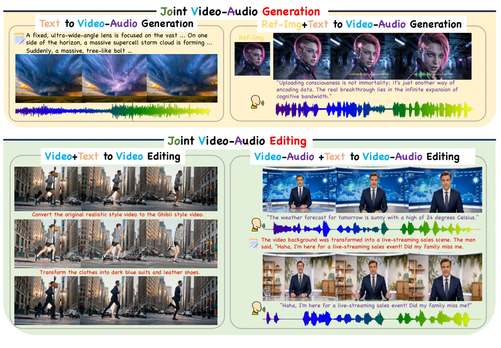
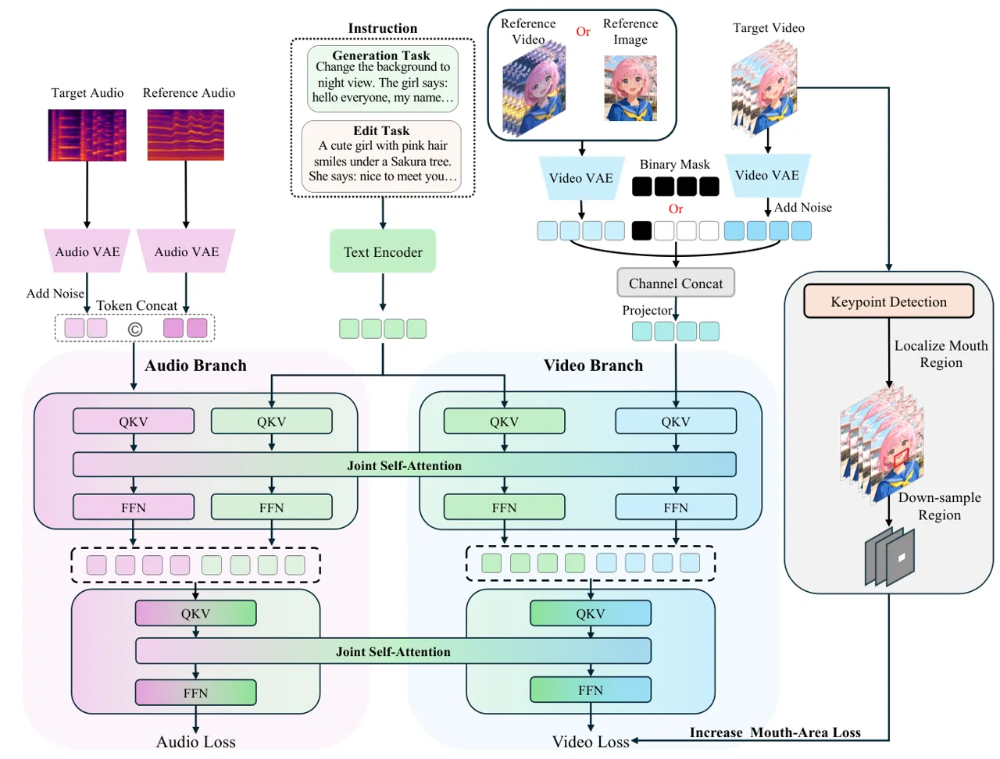
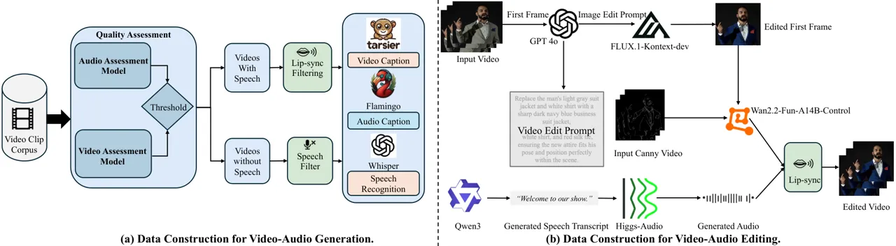
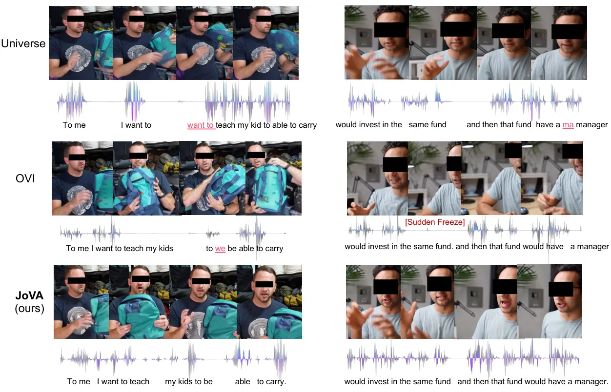
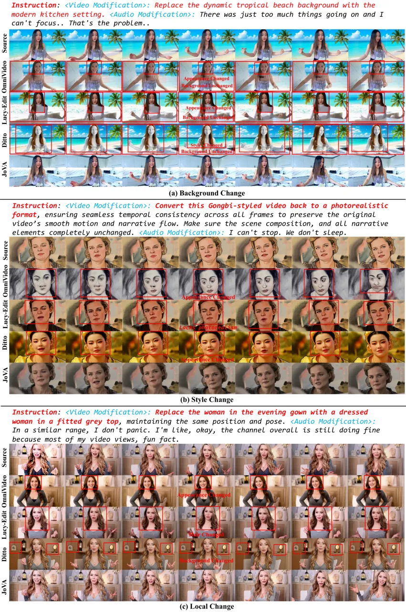
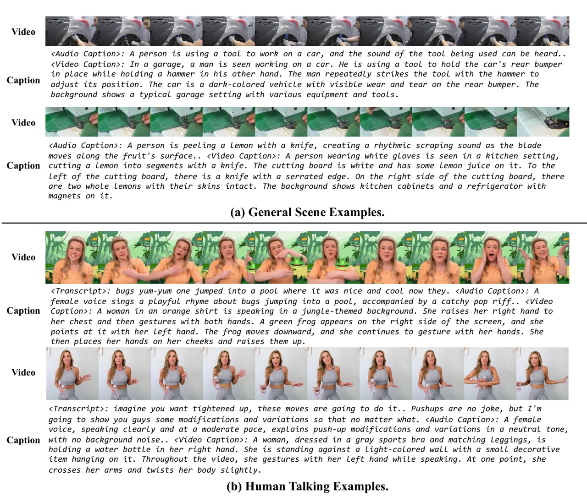
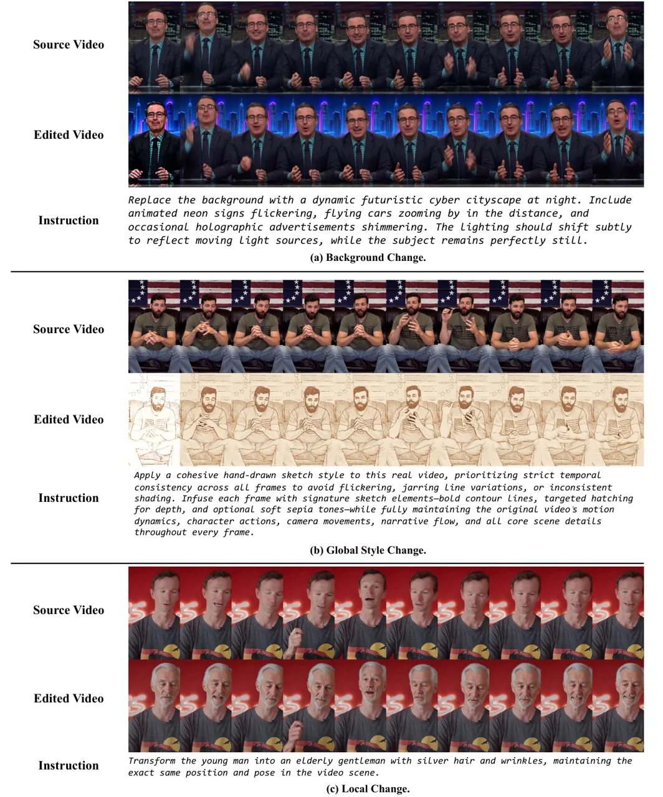
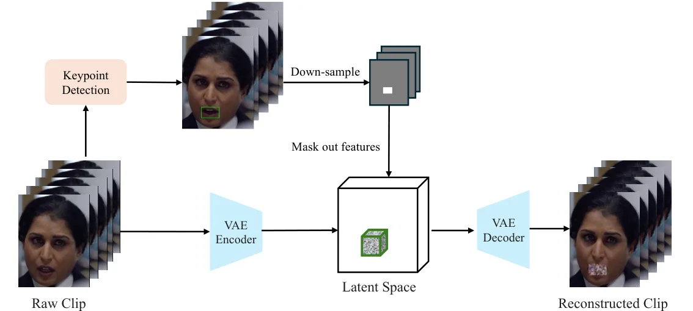
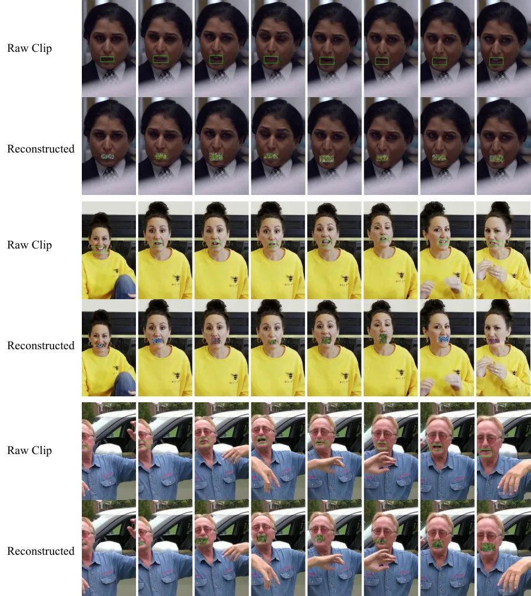

\correspondence

Kai Han at , Xiaohu Huang at

# JoVA: Unified Multimodal Learning for Joint Video-Audio Generation and Editing

Xiaohu Huang^(1, \*)   Haoyang He^(2, \*)   Hao Zhou^(3, \*)  
Qiangpeng Yang³   Shilei Wen³   Kai Han^(1, $`\dagger`$)  
¹The University of Hong Kong   ²Zhejiang University   ³ByteDance  
^(\*)Equal contribution   ^($`\dagger`$)Corresponding author Email:
<kaihanx@hku.hk> Email: <huangxiaohu@connect.hku.hk>

###### Abstract

In this paper, we present JoVA, a streamlined framework that unifies
joint video-audio generation and editing. While existing methods often
rely on fragmented, task-specific architectures or complex fusion
mechanisms, JoVA employs native joint representation learning for direct
video, audio, and text interaction in a dual-branch architecture. This
design eliminates redundant alignment modules and effectively unifies
diverse multimodal tasks within a single model. Furthermore, we utilize
channel-wise conditioning for flexible image and video reference to
avoid massive token expansion, alongside a mouth-area loss to enhance
lip alignment. To fully empower and systematically evaluate this
framework, we construct a comprehensive training corpus encompassing
video-audio generation and editing datasets, and introduce unified
benchmarks tailored for these multimodal tasks. Extensive experiments
demonstrate that JoVA achieves state-of-the-art performance across
benchmarks, establishing it as an extensible framework for versatile
content creation. Project page:
[https://visual-ai.github.io/jova](https://visual-ai.github.io/jova)

## 1 Introduction

Recent years have witnessed a remarkable evolution in AI-driven content
creation, transitioning from image synthesis to the more complex domain
of video generation. This surge has catalyzed extensive research across
various specialized directions. For instance, video generation models
\[66, 36, 79, 6, 27\] have achieved high-fidelity visual synthesis;
joint video-audio generation frameworks \[67, 23, 46\] have emerged to
produce synchronized content; video editing techniques \[15, 40, 4\]
enable fine-grained visual modifications; and lip-sync methods \[53, 49,
39\] focus on simulating realistic talking heads. However, these
directions largely exist as separate streams of work.

To tackle these distinct tasks, researchers typically design
task-specific model architectures or introduce complex multimodal fusion
mechanisms, such as additional cross-attention layers \[46, 67, 23\].
This fragmentation limits model simplicity and extensibility. Recently,
unified models \[72, 63, 31\] have demonstrated the ability to handle
multiple video tasks within a single framework. Yet, they lack the
capability to output audio, rendering the generated video content less
vivid and immersive. Therefore, developing a unified model capable of
seamlessly handling diverse multimodal tasks—spanning both generation
and editing across video and audio modalities—is a highly promising yet
challenging frontier.



Figure 1: Overview of the JoVA framework’s capabilities. JoVA seamlessly
unifies various multimodal tasks within a single model, including
text-to-video-audio generation, reference-image-conditioned generation,
video editing, and joint video-audio editing. By utilizing a simplified
architecture, it ensures high-quality, synchronized, and flexible
multimodal content creation.

To bridge this gap, we present JoVA, a unified framework capable of
joint video-audio generation and editing within a single model (Fig. 1).
To realize this architecture, we integrate pretrained video and audio
models, streamlining the overall design by eliminating redundant
multimodal fusion modules. In their place, we use a native joint
self-attention mechanism that concatenates video, audio, and text
tokens, enabling direct and seamless multimodal interaction. This
simplified configuration preserves the core philosophy of transformer
architectures and guarantees exceptional task extensibility. To handle
visual reference conditions in editing tasks, we adopt a channel-wise
conditioning approach, which flexibly incorporates spatial inputs
without drastically expanding the token sequence length. Furthermore, to
address the challenge of lip-speech synchronization—where the mouth
region occupies a tiny fraction of the frame ($`\sim`$2.3%)—we
incorporate an area-specific loss during training to ensure precise
alignment without adding architectural complexity.

To endow the model with versatile capabilities, we construct a
large-scale training corpus of $`\sim`$3M diverse pairs, encompassing
natural video-audio scenes, human talking videos, and complex joint
editing data. For assessment, we introduce two benchmarks, JoVABench-Gen
and JoVABench-Edit, and further evaluate our model on the public
Verse-Bench \[67\]. Extensive experiments demonstrate that our model
consistently achieves leading performance across all tasks. Please refer
to the supplementary material for the generated video results.

In summary, our main contributions are as follows:

- •
  We propose JoVA, a unified architecture for joint video-audio
  modeling. By processing modalities through a unified representation,
  JoVA eliminates the reliance on complex cross-modal fusion modules and
  fragmented designs, establishing a highly extensible foundation for
  multimodal content creation.
- •
  To empower this single architecture to handle a diverse spectrum of
  generation and editing scenarios, we construct a multi-domain training
  corpus of $`\sim`$3M high-quality pairs. The introduced automated data
  synthesis pipeline is designed to scale up the generation and editing
  of data.
- •
  Extensive experiments on two introduced benchmarks (JoVABench-Gen and
  JoVABench-Edit) and Verse-Bench demonstrate that our single JoVA model
  achieves superior performance across diverse generation and editing
  tasks.

## 2 Related Work

### 2.1 Joint Video-Audio Generation

Recent advances in video generation have been driven by diffusion models
transitioning from UNet-based architectures \[57, 56\] to
transformer-based designs \[51\], exemplified by Sora \[8, 50\]. This
shift has spurred high-fidelity models like Wan \[66, 1\], Goku \[11\],
Waver \[83\], CogVideoX \[79\], and HunyuanVideo \[36\]. Beyond visual
fidelity, recent post-training methods such as VGGRPO \[3\] introduce
latent 4D geometry rewards to improve camera stability and world
consistency in generated videos. Building upon this visual foundation,
cross-modal generation largely diverged into unidirectional streams.
Audio-driven video methods \[12, 18, 19, 42\] typically rely on cascaded
pipelines to animate talking heads from speech. Conversely,
video-to-audio (V2A) approaches \[13, 24, 61, 47, 84, 68\] focus on
generating ambient sounds for silent videos. However, these decoupled
approaches often require auxiliary synchronization modules, increasing
system complexity and limiting semantic coherence. To achieve cohesive
multimodal synthesis, various joint video-audio generation frameworks
\[30, 75, 69, 45, 58, 85\] have emerged. Despite the significant
progress marked by large-scale models like UniVerse-1 \[67\], Ovi
\[46\], UniAVGen \[82\], and LTX-2 \[23\], most existing approaches
adopt dual-branch architectures that process modalities separately and
fuse them through explicit cross-attention. Such newly introduced
alignment layers are typically trained on much smaller multimodal
corpora than the billion-scale video backbones, which can disturb
pretrained visual priors. In contrast, JoVA abandons complex fusion
modules for native joint self-attention, reusing pretrained transformer
parameters to process all modalities equally for precise alignment and
architectural elegance.

### 2.2 Joint Video-Audio Editing

Instruction-driven video editing has advanced rapidly, with existing
methods injecting conditions via cross-attention \[63\], channel or
sequence concatenation \[15, 72, 40, 25\], or parameter-efficient
fine-tuning \[48\]. Yet handling complex multi-task instructions in a
single model remains difficult, and preserving audio-video
synchronization adds further complexity. Recent works \[17, 43, 86\]
employ training-free latent inversion or intricate pipelines with mask
refiners and feedback agents. Similarly, precise lip-sync methods \[49,
53, 39\] are typically restricted to editing only the mouth region and
heavily depend on external masks for guidance. A major drawback of these
approaches is their fragmented nature: they often require stitching
together independent models and auxiliary inputs, severely complicating
the pipeline. In contrast, JoVA resolves these limitations through a
natively unified architecture. It utilizes joint self-attention for
multimodal interaction and channel-wise conditioning to avoid drastic
sequence expansion, while a simple area-specific loss ensures accurate
lip-sync.

## 3 Method

### 3.1 Preliminary

Our framework builds upon the Waver \[83\] video generation model, which
employs a transformer-based diffusion architecture. For video encoding,
we adopt the Wan2.1 VAE \[66\] to compress visual features in both
spatial and temporal dimensions. Text prompts and instructions are
processed through a combination of T5-XXL \[55\] and Qwen2.5-32B \[77\]
encoders to provide rich semantic conditioning.

Following the MM-DiT architecture \[16\], Waver processes multimodal
inputs through a two-stage design: an initial multi-stream stage where
modalities maintain separate parameters, followed by a single-stream
stage where all modalities share the same parameters. Each stage
consists of transformer blocks containing self-attention and
feed-forward network (FFN) modules. For a given layer, the computation
can be expressed as:

```math
\mathbf{h}^{\prime}=\text{SelfAttn}(\mathbf{h})+\mathbf{h},\quad\mathbf{h}^{\prime\prime}=\text{FFN}(\mathbf{h}^{\prime})+\mathbf{h}^{\prime}, \tag{1}
```

where $`\mathbf{h}\in\mathbb{R}^{N\times D}`$ denotes the input features
with $`N`$ tokens and dimension $`D`$.

For training, we employ the flow matching \[44\] framework, which
provides a simple and effective approach for generative modeling. The
training objective minimizes the difference between the predicted
velocity field and the true flow velocity:

```math
\mathcal{L}_{\text{video}}=\mathbb{E}_{t,\mathbf{x}_{0},\mathbf{x}_{1},\mathbf{C}}\left\|v_{\theta}(t,\mathbf{C},\mathbf{x}_{t})-u(\mathbf{x}_{t}|\mathbf{x}_{0},\mathbf{x}_{1})\right\|^{2}, \tag{2}
```

where $`t\sim\mathcal{U}[0,1]`$,
$`\mathbf{x}_{0}\sim\mathcal{N}(0,\mathbf{I})`$ is sampled noise,
$`\mathbf{x}_{1}\sim q(\mathbf{x}_{1},\mathbf{C})`$ represents training
data conditioned on $`\mathbf{C}`$ (text and other modalities),
$`\mathbf{x}_{t}=t\mathbf{x}_{1}+(1-t)\mathbf{x}_{0}`$ defines the
interpolation path, and
$`u(\mathbf{x}_{t}|\mathbf{x}_{0},\mathbf{x}_{1})=\mathbf{x}_{1}-\mathbf{x}_{0}`$
denotes the corresponding flow velocity.



Figure 2: Overall architecture of the proposed JoVA framework. Our model
natively unifies video and audio generation and editing through a joint
self-attention mechanism. Complex multi-task instructions are processed
via a text encoder to guide the generation. For visual conditioning, we
employ a channel-wise concatenation strategy with a binary mask to
flexibly accommodate reference videos or images. Conversely, reference
audio tokens are encoded and integrated into the audio branch by token
concatenation. A localized mouth-area loss is applied to the video
output to ensure lip-speech synchronization during training, which is
exclusively active for human speech scenarios and does not affect the
generation of natural scenes or ambient sounds.

### 3.2 Unified Video-Audio Generation and Editing

Joint Video-Audio Architecture We propose a unified framework designed
to natively handle both generation and editing tasks across video and
audio modalities. As illustrated in Fig. 2, our architecture comprises a
visual branch, an audio branch, and a shared text encoder that processes
complex multi-task instructions. Instead of relying on cascaded models
or complex external fusion networks, we seamlessly integrate these
modalities into a shared transformer backbone.

To establish robust audio generation capabilities within this single
model, we initialize the audio diffusion model by duplicating the
pretrained parameters of our video backbone. For feature extraction, we
employ the MMAudio VAE \[13\] to process audio spectrograms, converting
raw audio signals into compact latent representations. Within each
transformer block, tokens from the video input, the audio input, and the
instruction text are processed through a shared joint self-attention
mechanism:

```math
[\mathbf{h}^{\prime}_{v};\mathbf{h}^{\prime}_{a};\mathbf{h}^{\prime}_{t}]=\text{JointAttn}([\mathbf{h}_{v};\mathbf{h}_{a};\mathbf{h}_{t}]), \tag{3}
```

where $`\mathbf{h}_{t}`$ contains text features for both the video and
audio branches. Unlike prior methods that rely on separate
cross-attention layers, our joint self-attention mechanism allows video,
audio, and text tokens to interact directly in a unified space. It also
avoids adding newly initialized alignment modules whose training data
scale is much smaller than that of the pretrained backbone. Furthermore,
to ensure precise temporal alignment between the video and audio
streams, we adopt the temporal-aligned RoPE (Rotary Position Embedding)
from MMAudio \[13\], which synchronizes the positional encodings of both
modalities along the temporal dimension.

Unified Conditioning. To accommodate editing instructions, we introduce
modality-specific conditional inputs. The integration strategies are
carefully tailored to the distinct sequence characteristics of video and
audio modalities.

For the audio branch, alongside the noisy target audio latent, we
introduce a reference audio latent encoded via the Audio VAE to provide
acoustic context. Because the sequence length of audio latents is
extremely compact—typically accounting for less than $`1\%`$ of the
video token length—we can directly employ a token concatenation strategy
to integrate the reference audio. This approach effectively provides the
necessary context without incurring significant computational overhead.

Conversely, for the visual branch, directly appending reference video
frames via token concatenation would lead to a massive increase in
sequence length, resulting in prohibitive computational costs.
Therefore, we employ a channel-wise conditioning strategy guided by a
binary mask. Specifically, the reference visual input is encoded by the
Video VAE and concatenated with the noisy target video latent and a
corresponding mask along the channel dimension. The mask is set to $`1`$
for frames where the reference is provided, and $`0`$ otherwise (in
which case the reference channels are filled with default padding).
After the channels are concatenated, a projector layer is utilized to
fuse their information. This design not only avoids the token explosion
problem but also natively unifies image-to-video generation and video
editing (flexibly accommodating reference images as conditions) without
requiring architectural modifications.

Training Objectives and Mouth-Area Loss Our unified model is optimized
using flow matching objectives. To ensure the model learns a wide
variety of acoustic patterns and human speech characteristics, the audio
branch is trained on a comprehensive mixture of large-scale
text-to-audio and text-to-speech datasets. The audio flow matching loss
is defined as:

```math
\mathcal{L}_{\text{audio}}=\mathbb{E}_{t,\mathbf{a}_{0},\mathbf{a}_{1},\mathbf{C}}\left\|v_{\theta}(t,\mathbf{C},\mathbf{a}_{t})-u(\mathbf{a}_{t}|\mathbf{a}_{0},\mathbf{a}_{1})\right\|^{2}, \tag{4}
```

where $`\mathbf{a}_{t}`$ represents the audio latent at time $`t`$, and
$`\mathbf{C}`$ denotes the conditioning information.

While the unified architecture effectively handles general video-audio
alignment, achieving fine-grained lip-speech synchronization for
human-centric content requires targeted supervision. To address this, we
introduce a localized strategy that emphasizes the mouth region during
training. We first apply facial keypoint detection to the original video
frames to localize the mouth region and extract a bounding box. This
bounding box is then mapped to the VAE latent space through proportional
spatial scaling and a sliding-window temporal downsampling to match the
latent dimensions, yielding a precise mouth region mask $`\mathcal{M}`$.
More implementation details are given in the supplementary material.

Our final training objective combines the general flow matching losses
with this localized supervision:

```math
\mathcal{L}_{\text{total}}=\mathcal{L}_{\text{video}}+\mathcal{L}_{\text{audio}}+\lambda\mathcal{L}_{\text{mouth}}, \tag{5}
```

where $`\mathcal{L}_{\text{video}}`$ is the standard video flow matching
loss. The term $`\mathcal{L}_{\text{mouth}}`$ applies the flow matching
objective strictly restricted to the mouth region of the video latent:

```math
\mathcal{L}_{\text{mouth}}=\mathbb{E}_{t,\mathbf{v}_{0},\mathbf{v}_{1},\mathbf{C}}\left\|v_{\theta}(t,\mathbf{C},\mathbf{v}_{t})_{\mathcal{M}}-u(\mathbf{v}_{t}|\mathbf{v}_{0},\mathbf{v}_{1})_{\mathcal{M}}\right\|^{2}, \tag{6}
```

where $`\mathbf{v}_{t}`$ denotes the video latent at time $`t`$, and
$`\lambda`$ is a weighting coefficient. Crucially, this mouth-area loss
is exclusively applied to data containing human speech. For natural
scenes or general ambient sounds, we set $`\lambda`$ to $`0`$, ensuring
that the generation of non-human content remains completely unaffected.

### 3.3 Construction of Training Data

To support unified video-audio generation and editing across diverse
scenarios, we construct a large-scale, high-quality dataset comprising
approximately 3 million (3M) video-audio-text pairs. Fig. 4 summarizes
the dataset composition, while Fig. 3 illustrates the two primary
construction pipelines tailored for generation and editing tasks,
respectively.

Data Construction for Video-Audio Generation. As shown in Fig. 3(a), we
begin with a large corpus of raw video clips. To ensure data quality,
these clips first pass through a rigorous Quality Assessment module,
utilizing both Audio and Video Assessment Models to filter out
low-quality samples based on predefined thresholds. The retained
high-quality videos are then categorized into two streams: videos with
speech and videos without speech. For videos containing speech, we apply
a Lip-sync Filtering module to ensure tight audio-visual alignment,
which is crucial for talking-head generation. For videos without speech,
a Speech Filter is applied to guarantee the purity of ambient sounds.
Subsequently, we employ a multimodal annotation pipeline to generate
comprehensive text labels. We utilize Tarsier \[80\] for detailed video
captioning and Audio-flamingo \[21\] for audio captioning. For the
speech subset, Whisper \[54\] is additionally used for automatic speech
recognition (ASR) to extract precise transcripts. This tri-level
annotation enriches each sample with structured semantic information
from complementary visual, auditory, and linguistic perspectives.



Figure 3: Overview of our training data construction pipelines. (a)
Video-Audio Generation Data: Raw videos undergo rigorous quality
assessment and filtering, followed by comprehensive multimodal
annotation including video/audio captioning and speech recognition. (b)
Video-Audio Editing Data: A workflow to synthesize paired editing data,
utilizing foundation models for visual editing, audio generation, and
lip-sync alignment.

Data Construction for Video-Audio Editing. To train the model for
video-audio editing tasks, we design an automated data synthesis
pipeline (Fig. 3b) to construct paired source-target editing data.
Inspired by the visual editing paradigm of OpenVE \[25\], we adapt and
extend this approach to the multimodal domain. Given an input video, we
extract its first frame and utilize GPT-4o to generate an Image Edit
Prompt. This prompt guides FLUX.1-Kontext-dev \[5\] to produce an Edited
First Frame. Concurrently, GPT-4o \[29\] generates a Video Edit Prompt
detailing the desired temporal changes. We then extract the Canny edge
map from the input video to serve as structural guidance. The Edited
First Frame, Input Canny Video, and Video Edit Prompt are fed into
Wan2.2-Fun-A14B-Control \[2\] to generate the visual component of the
edited video. Building upon this visual foundation, we further construct
the corresponding audio track. We use Qwen3 \[76\] to generate a speech
transcript, which is then synthesized into high-quality audio using
Higgs-Audio \[7\]. Finally, a Lip-sync module aligns the generated audio
with the visual output, resulting in the final Edited Video. This
pipeline allows us to efficiently scale up high-quality, paired
multimodal editing data.

### 3.4 Dataset Distribution and Details

To train JoVA effectively for both generation and editing tasks, we
construct a large-scale, diverse, and highly aligned video-audio-text
dataset. As shown in Fig. 4, the dataset encompasses approximately 3
million high-quality samples and covers both generation-oriented and
editing-oriented data.

Figure 4: Detailed statistics of our video-audio-text dataset. (a)
Overall dataset composition ($`\sim`$3M), highlighting the proportion of
Edit Data (45.2%) versus Generation Data, including General Scenes
(21.6%) and Human Speech (33.2%). (b) Distribution of the $`\sim`$1.36M
editing task samples across four task types. (c) Distribution of the
$`\sim`$1.13M edit category samples, excluding reconstruction tasks.

Overview of the Training Dataset. The overall dataset is broadly
categorized into Generation Data and Edit Data, which are further
divided into three main subsets:

- •
  Text-Video-Audio General Scenes (without Speech): This subset
  comprises $`\sim`$650K samples (21.6% of the overall dataset). Sourced
  from open-source datasets including InternVID \[71\], AudioCaps
  \[34\], and VGGSound \[10\], it is strictly cleaned and aligned to
  help the model learn correspondences between visual elements and
  natural environmental sounds.
- •
  Text-Video-Audio Human Speech Scenes: This subset comprises $`\sim`$1M
  samples (33.2% of the overall dataset). Collected and annotated by our
  team, it focuses on strong synchronization among lip movements, facial
  expressions, and speech in human talking scenarios.
- •
  Video-Audio Edit Data: This subset comprises $`\sim`$1.36M samples
  (45.2% of the overall dataset). Derived from the human speech scenes,
  it is constructed using our automated pipeline to generate rich
  editing instructions and source-target pairs, establishing the
  foundation for JoVA’s editing capabilities.

## 4 Experiments

### 4.1 Datasets and Evaluation Metrics

Datasets. We evaluate our method on three benchmarks. First, we
introduce JoVABench-Gen and JoVABench-Edit, two curated evaluation sets
specifically designed to assess video-audio generation and editing
capabilities, respectively. We emphasize that all 200 samples in these
benchmarks undergo a strict filtering process to ensure there is
absolutely no overlap with our training data. Second, to evaluate the
broader generalization capabilities of our model, we employ Verse-Bench
\[67\] as an out-of-domain dataset. It contains 600 image-text prompt
pairs spanning a wide range of audio categories, including human speech,
animal vocalizations, instrumental music, and natural ambient sounds.

Evaluation Metrics. Following the evaluation protocol of UniVerse-1
\[67\], we assess our model across multiple dimensions: joint
video-audio quality, text-to-speech accuracy, audio generation quality,
and video generation fidelity. For video-audio alignment, we measure
lip-sync accuracy using SyncNet \[14\] to calculate confidence scores
(LSE-C) and distances (LSE-D) only on human-speech samples;
general-scene videos are strictly excluded because these metrics target
visible mouth motion. For general-scene audio-video synchronization, we
additionally report DeSync, where lower values indicate better temporal
alignment. Text-to-speech quality is evaluated through Word Error Rate
(WER) by transcribing generated audio with Whisper-large-v3 \[54\].
Video generation fidelity is comprehensively assessed using Inception
Score (IS) \[60\], computed on the generated video frames rather than
the audio, for visual quality and diversity, Motion Score (MS)
calculated from RAFT-detected \[64\] optical flow, Aesthetic Score (AS)
averaging MANIQA \[78\] fidelity, aesthetic-predictor-v2-5 quality, and
Musiq \[33\] scores, ID consistency measuring DINOV3 \[62\] feature
similarity between reference images and generated frames, and frame
consistency (FC) measuring CLIP similarity between consecutive frames.
Additionally, we evaluate text-video semantic consistency using
ImageBind \[20\] Text-Video Alignment (IB-TV). For audio generation, we
evaluate distributional similarity using Fréchet Distance (FD) and
Kullback-Leibler (KL) divergence on PANNs \[35\] and PaSST \[37\]
features, semantic consistency via LAION-CLAP \[74\] scores, and
AudioBox-Aesthetics \[65\] measures for Production Quality (PQ),
Production Complexity (PC), Content Enjoyment (CE), and Content
Usefulness (CU).

### 4.2 Implementation Details

Unless stated, our framework builds upon the Waver \[83\] 12B model as
the base architecture. We adopt a two-stage training strategy: in the
first stage, we train the audio branch in isolation on collected
text-to-audio and text-to-speech data using a batch size of 256 and a
fixed learning rate of $`1\times 10^{-4}`$ for 80K steps. In the second
stage, we perform joint video-audio generation and editing training with
a batch size of 32 and a learning rate of $`3\times 10^{-5}`$ for 100K
steps to learn multimodal interaction. During inference, we apply
classifier-free guidance \[26\] with a weight of 10.0 for both video and
audio generation and editing to enhance generation quality.

### 4.3 Comparison with State-of-the-Art Models

On joint video-audio generation benchmarks (JoVABench-Gen and
Verse-Bench), we compare our method against two categories of
approaches: (1) audio-driven generation methods, where we use
ground-truth audio to drive video synthesis for fair comparison of
conditional generation capability, including FantasyTalking \[70\] and
Wan-S2V \[19\]; (2) joint video-audio generation methods, including the
recent UniVerse-1 \[67\], JavisDiT \[45\], Ovi \[46\], LTX-2 \[23\], and
UniAVGen \[82\] where available.

|                              |                   |                   |                  |                  |                |                |                |                  |                |                |                |                |
| ---------------------------- | ----------------- | ----------------- | ---------------- | ---------------- | -------------- | -------------- | -------------- | ---------------- | -------------- | -------------- | -------------- | -------------- |
| Method                       | Audio-Video       | TTS               | Audio            |                  |                |                |                |                  |                | Video          |                |                |
|                              | LSE-C$`\uparrow`$ | WER$`\downarrow`$ | FD$`\downarrow`$ | KL$`\downarrow`$ | CS$`\uparrow`$ | CE$`\uparrow`$ | CU$`\uparrow`$ | PC$`\downarrow`$ | PQ$`\uparrow`$ | MS$`\uparrow`$ | AS$`\uparrow`$ | ID$`\uparrow`$ |
| Audio-driven Generation      |                   |                   |                  |                  |                |                |                |                  |                |                |                |                |
| FantasyTalking \[70\]        | 3.10              | -                 | -                | -                | -              | -              | -              | -                | -              | 0.22           | 0.44           | 0.87           |
| Wan-S2V \[19\]               | 6.43              | -                 | -                | -                | -              | -              | -              | -                | -              | 0.82           | 0.44           | 0.72           |
| Joint Video-Audio Generation |                   |                   |                  |                  |                |                |                |                  |                |                |                |                |
| UniVerse-1 \[67\]            | 1.62              | 0.37              | 1.04             | 0.83             | 0.16           | 3.68           | 3.90           | 2.12             | 4.39           | 0.43           | 0.42           | 0.82           |
| JavisDiT \[45\]              | 1.04              | 1.08              | 1.15             | 0.64             | 0.41           | 3.36           | 3.53           | 2.31             | 4.76           | 0.20           | 0.44           | 0.30           |
| Ovi \[46\]                   | 6.41              | 0.23              | 0.75             | 0.66             | 0.30           | 5.00           | 5.67           | 1.75             | 5.77           | 0.94           | 0.41           | 0.75           |
| LTX-2 \[23\]                 | 6.21              | 0.15              | 0.80             | 0.64             | 0.32           | 5.06           | 5.53           | 1.81             | 5.64           | 0.92           | 0.44           | 0.74           |
| UniAVGen \[82\]              | 5.87              | 0.17              | 0.70             | 0.62             | 0.34           | 5.32           | 6.10           | 1.62             | 6.30           | 0.90           | 0.44           | 0.75           |
| JoVA                         | 6.70              | 0.19              | 0.67             | 0.64             | 0.33           | 5.40           | 6.03           | 1.69             | 6.49           | 0.97           | 0.48           | 0.78           |

Table 1: Performance comparison on JoVABench-Gen. The results of other
methods are reproduced using their official code. The audio inputs for
audio-driven models are from ground-truth audio. Missing reported
metrics are denoted by “-”. $`\uparrow`$ / $`\downarrow`$ indicate
higher / lower is better.

JoVABench-Gen. Table 1 shows that JoVA achieves the best overall
performance on JoVABench-Gen. It reaches the highest LSE-C (6.70),
surpassing Ovi (6.41), LTX-2 (6.21), UniAVGen (5.87), UniVerse-1 (1.62),
and the audio-driven Wan-S2V (6.43), which validates the effect of
mouth-area supervision. JoVA also obtains strong speech, audio, and
video quality, including the best FD (0.67), CE (5.40), PQ (6.49), MS
(0.97), and AS (0.48). On the shared metrics from LTX-2 and UniAVGen,
JoVA leads on LSE-C, FD, CE, PQ, MS, AS, and ID while remaining
competitive on WER, KL, CU, and PC.

|                                    |                   |                     |                |                   |                |                |                |
| ---------------------------------- | ----------------- | ------------------- | -------------- | ----------------- | -------------- | -------------- | -------------- |
| Method                             | LSE-C$`\uparrow`$ | LSE-D$`\downarrow`$ | FC$`\uparrow`$ | IB-TV$`\uparrow`$ | IS$`\uparrow`$ | AS$`\uparrow`$ | MS$`\uparrow`$ |
| Combined with Diff2Lip             |                   |                     |                |                   |                |                |                |
| Ditto \[4\] + Diff2Lip \[49\]      | 2.44              | 5.30                | 0.98           | 0.23              | 2.13           | 0.34           | 0.35           |
| ICVE \[40\] + Diff2Lip \[49\]      | 2.45              | 5.35                | 0.99           | 0.18              | 1.72           | 0.36           | 0.30           |
| InsViE \[73\] + Diff2Lip \[49\]    | 2.38              | 5.72                | 0.99           | 0.21              | 1.02           | 0.39           | 0.28           |
| Lucy \[15\] + Diff2Lip \[49\]      | 2.34              | 5.83                | 0.98           | 0.18              | 3.01           | 0.28           | 0.30           |
| OmniVideo \[63\] + Diff2Lip \[49\] | 4.07              | 5.50                | 0.98           | 0.19              | 3.03           | 0.35           | 0.71           |
| Combined with Wav2Lip              |                   |                     |                |                   |                |                |                |
| Ditto \[4\] + Wav2Lip \[53\]       | 5.85              | 2.83                | 0.98           | 0.23              | 2.33           | 0.42           | 0.46           |
| ICVE \[40\] + Wav2Lip \[53\]       | 5.54              | 2.50                | 0.98           | 0.15              | 1.55           | 0.41           | 0.32           |
| InsViE \[73\] + Wav2Lip \[53\]     | 5.16              | 4.40                | 0.97           | 0.18              | 1.36           | 0.37           | 0.24           |
| Lucy \[15\] + Wav2Lip \[53\]       | 5.37              | 3.24                | 0.98           | 0.19              | 3.01           | 0.34           | 0.53           |
| OmniVideo \[63\] + Wav2Lip \[53\]  | 4.86              | 1.75                | 0.97           | 0.18              | 2.27           | 0.37           | 0.63           |
| JoVA                               | 5.88              | 1.66                | 0.98           | 0.21              | 3.21           | 0.47           | 0.66           |

Table 2: Performance comparison on JoVABench-Edit. As there are no
directly comparable open-source baselines, we combine video editing
models with lip-sync models (Diff2Lip \[49\] and Wav2Lip \[53\]) for
comparison, which use ground-truth audio as inputs.

JoVABench-Edit. Table 2 evaluates JoVA on JoVABench-Edit. Since no
directly comparable open-source baseline exists for joint video-audio
editing, we construct cascaded pipelines that combine video editing
models with Diff2Lip or Wav2Lip using ground-truth audio. These
baselines therefore solve a strictly easier conditional task, while JoVA
jointly synthesizes both video and audio. Despite this advantage, JoVA
achieves the best lip-sync accuracy (LSE-C $`5.88`$, LSE-D $`1.66`$) and
the strongest video fidelity (IS $`3.21`$, AS $`0.47`$).

|                              |                   |                      |                   |                  |                  |                |                |                |                  |                |                |                |                |
| ---------------------------- | ----------------- | -------------------- | ----------------- | ---------------- | ---------------- | -------------- | -------------- | -------------- | ---------------- | -------------- | -------------- | -------------- | -------------- |
| Method                       | Audio-Video       |                      | TTS               | Audio            |                  |                |                |                |                  |                | Video          |                |                |
|                              | LSE-C$`\uparrow`$ | DeSync$`\downarrow`$ | WER$`\downarrow`$ | FD$`\downarrow`$ | KL$`\downarrow`$ | CS$`\uparrow`$ | CE$`\uparrow`$ | CU$`\uparrow`$ | PC$`\downarrow`$ | PQ$`\uparrow`$ | MS$`\uparrow`$ | AS$`\uparrow`$ | ID$`\uparrow`$ |
| Audio-driven Generation      |                   |                      |                   |                  |                  |                |                |                |                  |                |                |                |                |
| FantasyTalking \[70\]        | 2.68              | -                    | -                 | -                | -                | -              | -              | -              | -                | -              | 0.07           | 0.42           | 0.87           |
| Wan-S2V \[19\]               | 6.49              | -                    | -                 | -                | -                | -              | -              | -              | -                | -              | 0.17           | 0.46           | 0.89           |
| Joint Video-Audio Generation |                   |                      |                   |                  |                  |                |                |                |                  |                |                |                |                |
| UniVerse-1 \[67\]            | 1.62              | 0.23                 | 0.18              | 1.25             | 2.70             | 0.16           | 3.53           | 4.61           | 2.49             | 5.20           | 0.20           | 0.47           | 0.89           |
| JavisDiT \[45\]              | 0.85              | 0.27                 | 1.00              | 0.99             | 1.75             | 0.19           | 3.48           | 5.03           | 2.49             | 5.49           | 0.27           | 0.42           | 0.40           |
| Ovi \[46\]                   | 6.61              | 0.49                 | 0.12              | 0.97             | 2.23             | 0.20           | 3.95           | 5.60           | 2.09             | 6.20           | 0.55           | 0.47           | 0.86           |
| JoVA                         | 6.65              | 0.16                 | 0.11              | 0.82             | 1.39             | 0.29           | 4.47           | 5.94           | 2.47             | 6.23           | 0.75           | 0.49           | 0.86           |

Table 3: Performance comparison on Verse-Bench. The results of Ovi and
JavisDiT are reproduced using their official code. Missing reported
metrics are denoted by “-”. $`\uparrow`$ / $`\downarrow`$ indicate
higher / lower is better.

JoVA does not rank first in every single metric, but it provides the
best overall trade-off. Its MS of $`0.66`$ is close to
OmniVideo+Diff2Lip ($`0.71`$), while avoiding that pipeline’s lower
lip-sync score (LSE-C $`4.07`$). It also maintains competitive IB-TV
($`0.21`$) and FC ($`0.98`$) without sacrificing video quality (IS/AS),
showing the advantage of avoiding error accumulation in two-stage
pipelines.

Verse-Bench. On Verse-Bench (Table 3), JoVA remains strong across
diverse scenarios. It achieves the lowest WER (0.11), competitive LSE-C
(6.65), the best DeSync (0.16), FD (0.82), KL (1.39), CS (0.29), CE
(4.47), MS (0.75), and AS (0.49), while preserving identity consistency
(0.86).

### 4.4 Diagnostic Study

| $`\lambda`$ | LSE-C$`\uparrow`$ | WER$`\downarrow`$ | FD$`\downarrow`$ | KL$`\downarrow`$ | PQ$`\uparrow`$ | AS$`\uparrow`$ |
| ----------- | ----------------- | ----------------- | ---------------- | ---------------- | -------------- | -------------- |
| 0.0         | 1.39              | 0.17              | 0.67             | 0.63             | 6.44           | 0.48           |
| 2.0         | 6.53              | 0.18              | 0.67             | 0.62             | 6.47           | 0.46           |
| 5.0         | 6.70              | 0.19              | 0.67             | 0.64             | 6.49           | 0.48           |
| 8.0         | 6.65              | 0.18              | 0.68             | 0.63             | 6.40           | 0.47           |

Table 4: Effect of mouth-area loss weight $`\lambda`$ on JoVABench-Gen.
$`\uparrow`$ / $`\downarrow`$ indicate higher / lower is better.

| Strategy                          | LSE-C$`\uparrow`$ | WER$`\downarrow`$ | PQ$`\uparrow`$ | AS$`\uparrow`$ | ID$`\uparrow`$ |
| --------------------------------- | ----------------- | ----------------- | -------------- | -------------- | -------------- |
| Seq. Cross-Attn. (Ovi-style)      | 6.51              | 0.24              | 6.25           | 0.48           | 0.75           |
| Parallel Cross-Attn. (w/ linear)  | 1.59              | 0.29              | 6.31           | 0.46           | 0.74           |
| Parallel Cross-Attn. (w/o linear) | 6.57              | 0.28              | 6.14           | 0.47           | 0.76           |
| Joint Self-Attn. (Ours)           | 6.70              | 0.19              | 6.49           | 0.48           | 0.78           |

Table 5: Comparison of audio-video fusion strategies on JoVABench-Gen.
All variants share the same backbone capacity, training data, and
schedule; only the cross-modal interaction mechanism differs.
$`\uparrow`$ / $`\downarrow`$ indicate higher / lower is better.

Effectiveness of Mouth-Area Loss. We first investigate the impact of the
mouth-area loss weight $`\lambda`$ in Eq. (5). As shown in Table 5,
increasing $`\lambda`$ from 0.0 dramatically improves lip-sync accuracy
(LSE-C from 1.39 to 6.53), demonstrating the critical role of targeted
supervision on the mouth region. Without mouth-area loss
($`\lambda=0.0`$), the model does not fully learn fine-grained
lip-speech alignment through joint attention alone. The optimal
performance is achieved at $`\lambda=5.0`$ (LSE-C: 6.70), where the
model effectively balances lip-sync precision with overall generation
quality. Further increasing $`\lambda`$ to 8.0 leads to marginal
degradation (LSE-C: 6.65). Notably, audio quality metrics (WER, KL, PQ)
and AS remain stable across different $`\lambda`$ values, confirming
that our mouth-area supervision strategy enhances lip-sync without
sacrificing general audio-visual quality. The substantial improvement
from $`\lambda=0.0`$ to $`\lambda=2.0`$ (LSE-C: 1.39 $`\rightarrow`$
6.53) highlights the necessity of explicit mouth-region guidance for
achieving precise synchronization.

Figure 5: Comparison of different audio-video fusion strategies. (a)
Joint self-attention processes video, audio, and text tokens together in
one layer. (b,c) Cross-attention variants exchange information through
explicit audio-video attention paths, while text conditioning remains
inside the self-attention layers.

Comparison of Joint Self-Attention and Cross-Attention. To validate our
joint self-attention design, we compare it with three cross-attention
variants under identical capacity and training data. As shown in Fig. 5,
JoVA processes video, audio, and text tokens together in unified
self-attention, enabling bidirectional multimodal interaction while
reusing pretrained transformer parameters. In contrast, the sequential
Ovi-style variant alternates cross-modal interaction, while the two
parallel variants compute cross-modal attention alongside self-attention
and merge the results either with or without an additional linear
adaptation layer.

Tab. 5 shows that joint self-attention achieves the best LSE-C (6.70),
WER (0.19), PQ (6.49), ID (0.78), and matching-best AS (0.48). The low
LSE-C of the parallel cross-attention variant with linear adaptation
(1.59) suggests that the added projection can disrupt cross-modal
alignment. These results validate that unified multimodal processing is
essential for high-quality, synchronized audio-visual generation without
introducing additional parameters.

### 4.5 Qualitative Results

Fig. 6 presents qualitative comparisons of video-audio generation
quality. We visualize generated frames alongside their audio waveforms
and automatic speech recognition (ASR) results, with recognition errors
underlined in red. UniVerse-1 produces incomplete speech with missing
words, indicating weaker audio generation quality. Ovi shows temporal
consistency issues, including sudden freezing artifacts and
mispronunciations. In contrast, JoVA generates smooth, natural speech
with accurate word pronunciation and maintains precise lip-speech
synchronization throughout the sequence. The aligned audio waveforms and
correct ASR transcriptions demonstrate JoVA’s superior capability in
joint video-audio generation with proper cross-modal alignment.



Figure 6: Qualitative comparison of speech generation and lip-sync
quality. Generated video frames with audio waveforms and ASR
transcriptions. Red underlines indicate speech recognition errors.
UniVerse-1 omits words, Ovi shows freezing artifacts and
mispronunciations, while JoVA produces accurate speech with precise
lip-sync alignment.

Fig. 7 further compares video-audio editing. JoVA better follows
background, style, and local edit instructions while preserving unedited
regions, whereas baselines tend to introduce identity shifts, entangle
unrelated attributes, or produce incomplete edits under the same
audio-conditioned setting. For background replacement, JoVA changes the
scene while preserving the subject appearance; for style conversion, it
restores photorealism without corrupting temporal consistency; for local
replacement, it edits target attributes without changing the global
layout. These cases show that joint video-audio conditioning provides
stronger instruction following than cascaded editing baselines. More
visualizations are given in the supplementary materials.



Figure 7: Qualitative comparison of video-audio editing. We compare JoVA
against cascaded baselines (OmniVideo + Diff2Lip and Ditto + Wav2Lip,
with ground-truth audio) across background change, style change, and
local change. JoVA better follows the editing instructions while
preserving unedited regions, whereas the baseline pipelines often
introduce identity shifts, attribute entanglement, or incomplete edits.
Pose differences are expected because the edited subjects are driven by
modified audio inputs.

## 5 Conclusion

In this paper, we introduce JoVA, an extensible framework that unifies
joint video-audio generation and editing. Native joint self-attention
eliminates complex task-specific fusion modules and enables direct
interaction among video, audio, and text, while channel-wise
conditioning supports flexible visual editing without prohibitive token
growth. A simple mouth-area loss further improves lip-speech
synchronization for human-centric content.

To train and evaluate JoVA, we curate a comprehensive multi-domain
corpus and benchmarks. Experiments show state-of-the-art performance
across generation and editing tasks, especially in multimodal alignment
and generation quality. We also observe several limitations: very fast
hand motion can still induce finger artifacts in generation, and
instruction-based editing does not always preserve text in text-rich
backgrounds. In addition, our audio-video editing currently focuses on
human-speech scenes, as paired audio-video editing data for general
scenes remains difficult to obtain; this is a data limitation rather
than an architectural one, and our framework can be extended to
general-scene editing once suitable data becomes available. Future work
will address these issues by expanding training diversity and broadening
JoVA’s coverage of high-motion scenes, text-rich backgrounds, and
general-scene audio-video editing. JoVA establishes a strong foundation
for unified multimodal content creation.

## 6 Declaration

All datasets, images and videos of designed character portraits used in
this paper are solely for research purposes. In addition, the datasets
and models employed in this paper are also exclusively for research use
and will not be integrated into any products of ByteDance.

## Acknowledgments

This work is supported by Hong Kong Research Grants Council – General
Research Fund (Grant No. 17211024), Hong Kong Innovation and Technology
Commission – Innovation and Technology Fund (Grant No. ITS/488/24FP),
and HKU Seed Fund for PI Research.

## References

- \[1\] Alibaba Cloud (2025) Wan2.5. Note:
  [https://wan.video/](https://wan.video/)Accessed: 2026-06-30 Cited by:
  §2.1.
- \[2\] Alibaba PAI (2025) Wan2.2-Fun-A14B-Control. Note:
  [https://huggingface.co/alibaba-pai/Wan2.2-Fun-A14B-Control](https://huggingface.co/alibaba-pai/Wan2.2-Fun-A14B-Control)HuggingFace
  release. Accessed: 2026-06-30 Cited by: §3.3.
- \[3\] Z. An, O. Kupyn, T. Uscidda, A. Colaco, K. Ahuja, S.
  Belongie, M. Gonzalez-Franco, and M. T. Gazulla (2026) VGGRPO: towards
  world-consistent video generation with 4D latent reward. arXiv
  preprint arXiv:2603.26599. Cited by: §2.1.
- \[4\] Q. Bai, Q. Wang, H. Ouyang, Y. Yu, H. Wang, W. Wang, K. L.
  Cheng, S. Ma, Y. Zeng, Z. Liu, et al. (2025) Scaling instruction-based
  video editing with a high-quality synthetic dataset. arXiv preprint
  arXiv:2510.15742. Cited by: §1, Table 2, Table 2, Table 8, §8.
- \[5\] Black Forest Labs, S. Batifol, A. Blattmann, F. Boesel, S.
  Consul, C. Diagne, T. Dockhorn, J. English, Z. English, P. Esser, et
  al. (2025) FLUX.1 kontext: flow matching for in-context image
  generation and editing in latent space. arXiv preprint
  arXiv:2506.15742. Cited by: §3.3.
- \[6\] A. Blattmann, T. Dockhorn, S. Kulal, D. Mendelevitch, M.
  Kilian, D. Lorenz, Y. Levi, Z. English, V. Voleti, A. Letts, et
  al. (2023) Stable video diffusion: scaling latent video diffusion
  models to large datasets. arXiv preprint arXiv:2311.15127. Cited by:
  §1.
- \[7\] Boson AI (2025) Higgs-Audio V2: redefining expressiveness in
  audio generation. Note:
  [https://github.com/boson-ai/higgs-audio](https://github.com/boson-ai/higgs-audio)Accessed:
  2026-06-30 Cited by: §3.3.
- \[8\] T. Brooks, B. Peebles, C. Holmes, W. DePue, Y. Guo, L. Jing, D.
  Schnurr, J. Taylor, T. Luhman, E. Luhman, C. Ng, R. Wang, and A.
  Ramesh (2024) Video generation models as world simulators. Note:
  [https://openai.com/index/sora/](https://openai.com/index/sora/)OpenAI
  Technical Report. Accessed: 2026-06-30 Cited by: §2.1.
- \[9\] H. Chen, Y. Zhang, X. Cun, M. Xia, X. Wang, C. Weng, and Y.
  Shan (2024) Videocrafter2: overcoming data limitations for
  high-quality video diffusion models. In CVPR, pp. 7310–7320. Cited by:
  Table 6.
- \[10\] H. Chen, W. Xie, A. Vedaldi, and A. Zisserman (2020) Vggsound:
  a large-scale audio-visual dataset. In ICASSP, Cited by: 1st item.
- \[11\] S. Chen, C. Ge, Y. Zhang, Y. Zhang, F. Zhu, H. Yang, H. Hao, H.
  Wu, Z. Lai, Y. Hu, et al. (2025) Goku: flow based video generative
  foundation models. In CVPR, pp. 23516–23527. Cited by: §2.1, Table 6,
  Table 6.
- \[12\] Y. Chen, S. Liang, Z. Zhou, Z. Huang, Y. Ma, J. Tang, Q.
  Lin, Y. Zhou, and Q. Lu (2025) HunyuanVideo-Avatar: high-fidelity
  audio-driven human animation for multiple characters. arXiv preprint
  arXiv:2505.20156. Cited by: §2.1.
- \[13\] H. K. Cheng, M. Ishii, A. Hayakawa, T. Shibuya, A. Schwing,
  and Y. Mitsufuji (2025) MMAudio: taming multimodal joint training for
  high-quality video-to-audio synthesis. In CVPR, Cited by: §2.1, §3.2,
  §3.2.
- \[14\] J. S. Chung and A. Zisserman (2016) Out of time: automated lip
  sync in the wild. In ACCV, Cited by: §4.1.
- \[15\] DecartAI Team (2025) Lucy edit: open-weight text-guided video
  editing. Note:
  [https://huggingface.co/decart-ai/Lucy-Edit-Dev](https://huggingface.co/decart-ai/Lucy-Edit-Dev)Accessed:
  2026-06-30 Cited by: §1, §2.2, Table 2, Table 2.
- \[16\] P. Esser, S. Kulal, A. Blattmann, R. Entezari, J. Müller, H.
  Saini, Y. Levi, D. Lorenz, A. Sauer, F. Boesel, et al. (2024) Scaling
  rectified flow transformers for high-resolution image synthesis. In
  ICML, Cited by: §3.1.
- \[17\] Y. Fu, R. Si, H. Wang, D. Zhou, J. Sun, P. Luo, D. Hu, H.
  Zhang, and X. Li (2025) Object-AVEdit: an object-level audio-visual
  editing model. arXiv preprint arXiv:2510.00050. Cited by: §2.2.
- \[18\] Q. Gan, R. Yang, J. Zhu, S. Xue, and S. Hoi (2025) OmniAvatar:
  efficient audio-driven avatar video generation with adaptive body
  animation. arXiv preprint arXiv:2506.18866. Cited by: §2.1.
- \[19\] X. Gao, L. Hu, S. Hu, M. Huang, C. Ji, D. Meng, J. Qi, P.
  Qiao, Z. Shen, Y. Song, et al. (2025) Wan-S2V: audio-driven cinematic
  video generation. arXiv preprint arXiv:2508.18621. Cited by: §2.1,
  §4.3, Table 1, Table 3.
- \[20\] R. Girdhar, A. El-Nouby, Z. Liu, M. Singh, K. V. Alwala, A.
  Joulin, and I. Misra (2023) ImageBind: one embedding space to bind
  them all. In CVPR, pp. 15180–15190. Cited by: §4.1.
- \[21\] A. Goel, S. Ghosh, J. Kim, S. Kumar, Z. Kong, S. Lee, C. H.
  Yang, R. Duraiswami, D. Manocha, R. Valle, et al. (2025) Audio
  flamingo 3: advancing audio intelligence with fully open large audio
  language models. arXiv preprint arXiv:2507.08128. Cited by: §3.3.
- \[22\] Y. Guo, C. Yang, A. Rao, Z. Liang, Y. Wang, Y. Qiao, M.
  Agrawala, D. Lin, and B. Dai (2023) Animatediff: animate your
  personalized text-to-image diffusion models without specific tuning.
  arXiv preprint arXiv:2307.04725. Cited by: Table 6.
- \[23\] Y. HaCohen, B. Brazowski, N. Chiprut, Y. Bitterman, A.
  Kvochko, A. Berkowitz, D. Shalem, D. Lifschitz, D. Moshe, E. Porat, et
  al. (2026) LTX-2: efficient joint audio-visual foundation model. arXiv
  preprint arXiv:2601.03233. Cited by: §1, §1, §2.1, §4.3, Table 1.
- \[24\] M. Haji-Ali, W. Menapace, A. Siarohin, I. Skorokhodov, A.
  Canberk, K. S. Lee, V. Ordonez, and S. Tulyakov (2024) AV-Link:
  temporally-aligned diffusion features for cross-modal audio-video
  generation. arXiv preprint arXiv:2412.15191. Cited by: §2.1.
- \[25\] H. He, J. Wang, J. Zhang, Z. Xue, X. Bu, Q. Yang, S. Wen,
  and L. Xie (2025) OpenVE-3M: a large-scale high-quality dataset for
  instruction-guided video editing. arXiv preprint arXiv:2512.07826.
  Cited by: §2.2, §3.3.
- \[26\] J. Ho and T. Salimans (2022) Classifier-free diffusion
  guidance. arXiv preprint arXiv:2207.12598. Cited by: §4.2.
- \[27\] W. Hong, M. Ding, W. Zheng, X. Liu, and J. Tang (2022)
  Cogvideo: large-scale pretraining for text-to-video generation via
  transformers. arXiv preprint arXiv:2205.15868. Cited by: §1.
- \[28\] Z. Huang, Y. He, J. Yu, F. Zhang, C. Si, Y. Jiang, Y. Zhang, T.
  Wu, Q. Jin, N. Chanpaisit, et al. (2024) Vbench: comprehensive
  benchmark suite for video generative models. In CVPR, pp. 21807–21818.
  Cited by: Table 6, Table 6, §7.
- \[29\] A. Hurst, A. Lerer, A. P. Goucher, A. Perelman, A. Ramesh, A.
  Clark, A. Ostrow, A. Welihinda, A. Hayes, A. Radford, et al. (2024)
  GPT-4o system card. arXiv preprint arXiv:2410.21276. Cited by: §3.3.
- \[30\] M. Ishii, A. Hayakawa, T. Shibuya, and Y. Mitsufuji (2024) A
  simple but strong baseline for sounding video generation: effective
  adaptation of audio and video diffusion models for joint generation.
  arXiv preprint arXiv:2409.17550. Cited by: §2.1.
- \[31\] Z. Jiang, Z. Han, C. Mao, J. Zhang, Y. Pan, and Y. Liu (2025)
  Vace: all-in-one video creation and editing. In ICCV, pp. 17191–17202.
  Cited by: §1.
- \[32\] X. Ju, Y. Gao, Z. Zhang, Z. Yuan, X. Wang, A. Zeng, Y.
  Xiong, Q. Xu, and Y. Shan (2024) Miradata: a large-scale video dataset
  with long durations and structured captions. NeurIPS. Cited by: Table 6.
- \[33\] J. Ke, Q. Wang, Y. Wang, P. Milanfar, and F. Yang (2021) Musiq:
  multi-scale image quality transformer. In ICCV, Cited by: §4.1.
- \[34\] C. D. Kim, B. Kim, H. Lee, and G. Kim (2019) Audiocaps:
  generating captions for audios in the wild. In ACL, Cited by: 1st
  item.
- \[35\] Q. Kong, Y. Cao, T. Iqbal, Y. Wang, W. Wang, and M. D.
  Plumbley (2020) PANNs: large-scale pretrained audio neural networks
  for audio pattern recognition. IEEE/ACM Transactions on Audio, Speech,
  and Language Processing. Cited by: §4.1.
- \[36\] W. Kong, Q. Tian, Z. Zhang, R. Min, Z. Dai, J. Zhou, J.
  Xiong, X. Li, B. Wu, J. Zhang, et al. (2024) HunyuanVideo: a
  systematic framework for large video generative models. arXiv preprint
  arXiv:2412.03603. Cited by: §1, §2.1.
- \[37\] K. Koutini, J. Schlüter, H. Eghbal-Zadeh, and G. Widmer (2021)
  Efficient training of audio transformers with patchout. arXiv preprint
  arXiv:2110.05069. Cited by: §4.1.
- \[38\] Kuaishou (2024) Kling ai. Note:
  [https://klingai.com/](https://klingai.com/)Accessed: 2026-06-30 Cited
  by: Table 6, §7.
- \[39\] C. Li, C. Zhang, W. Xu, J. Lin, J. Xie, W. Feng, B. Peng, C.
  Chen, and W. Xing (2024) LatentSync: taming audio-conditioned latent
  diffusion models for lip sync with SyncNet supervision. arXiv preprint
  arXiv:2412.09262. Cited by: §1, §2.2.
- \[40\] X. Liao, X. Zeng, Z. Song, Z. Fu, G. Yu, and G. Lin (2025)
  In-context learning with unpaired clips for instruction-based video
  editing. arXiv preprint arXiv:2510.14648. Cited by: §1, §2.2, Table 2,
  Table 2.
- \[41\] B. Lin, Y. Ge, X. Cheng, Z. Li, B. Zhu, S. Wang, X. He, Y.
  Ye, S. Yuan, L. Chen, et al. (2024) Open-sora plan: open-source large
  video generation model. arXiv preprint arXiv:2412.00131. Cited by:
  Table 6.
- \[42\] G. Lin, J. Jiang, J. Yang, Z. Zheng, and C. Liang (2025)
  Omnihuman-1: rethinking the scaling-up of one-stage conditioned human
  animation models. arXiv preprint arXiv:2502.01061. Cited by: §2.1.
- \[43\] Y. Lin, K. Lin, Z. Yang, L. Li, J. Wang, C. Lin, X. Wang, G.
  Bertasius, and L. Wang (2026) Zero-shot audio-visual editing via
  cross-modal delta denoising. In WACV, Cited by: §2.2.
- \[44\] Y. Lipman, R. T. Chen, H. Ben-Hamu, M. Nickel, and M. Le (2022)
  Flow matching for generative modeling. arXiv preprint
  arXiv:2210.02747. Cited by: §3.1.
- \[45\] K. Liu, W. Li, L. Chen, S. Wu, Y. Zheng, J. Ji, F. Zhou, R.
  Jiang, J. Luo, H. Fei, et al. (2025) JavisDiT: joint audio-video
  diffusion transformer with hierarchical spatio-temporal prior
  synchronization. arXiv preprint arXiv:2503.23377. Cited by: §2.1,
  §4.3, Table 1, Table 3.
- \[46\] C. Low, W. Wang, and C. Katyal (2025) Ovi: twin backbone
  cross-modal fusion for audio-video generation. arXiv preprint
  arXiv:2510.01284. Cited by: §1, §1, §2.1, §4.3, Table 1, Table 3,
  Table 8, §8.
- \[47\] S. Luo, C. Yan, C. Hu, and H. Zhao (2023) Diff-foley:
  synchronized video-to-audio synthesis with latent diffusion models.
  NeurIPS. Cited by: §2.1.
- \[48\] C. Mou, Q. Sun, Y. Wu, P. Zhang, X. Li, F. Ye, S. Zhao, and Q.
  He (2025) InstructX: towards unified visual editing with MLLM
  guidance. arXiv preprint arXiv:2510.08485. Cited by: §2.2.
- \[49\] S. Mukhopadhyay, S. Suri, R. T. Gadde, and A.
  Shrivastava (2024) Diff2Lip: audio conditioned diffusion models for
  lip-synchronization. In WACV, Cited by: §1, §2.2, Table 2, Table 2,
  Table 2, Table 2, Table 2, Table 2, Table 2, Table 8, §8.
- \[50\] OpenAI (2025) Sora2. Note:
  [https://openai.com/index/sora-2-system-card/](https://openai.com/index/sora-2-system-card/)Accessed:
  2026-06-30 Cited by: §2.1.
- \[51\] W. Peebles and S. Xie (2023) Scalable diffusion models with
  transformers. In ICCV, pp. 4195–4205. Cited by: §2.1.
- \[52\] Pika (2024) Pika ai. Note:
  [https://pika.art/try](https://pika.art/try)Accessed: 2026-06-30 Cited
  by: Table 6.
- \[53\] K. Prajwal, R. Mukhopadhyay, V. P. Namboodiri, and C.
  Jawahar (2020) A lip sync expert is all you need for speech to lip
  generation in the wild. In ACM MM, Cited by: §1, §2.2, Table 2, Table
  2, Table 2, Table 2, Table 2, Table 2, Table 2, Table 8, §8.
- \[54\] A. Radford, J. W. Kim, T. Xu, G. Brockman, C. McLeavey, and I.
  Sutskever (2023) Robust speech recognition via large-scale weak
  supervision. In ICML, Cited by: §3.3, §4.1.
- \[55\] C. Raffel, N. Shazeer, A. Roberts, K. Lee, S. Narang, M.
  Matena, Y. Zhou, W. Li, and P. J. Liu (2020) Exploring the limits of
  transfer learning with a unified text-to-text transformer. JMLR. Cited
  by: §3.1.
- \[56\] R. Rombach, A. Blattmann, D. Lorenz, P. Esser, and B.
  Ommer (2022) High-resolution image synthesis with latent diffusion
  models. In CVPR, Cited by: §2.1.
- \[57\] O. Ronneberger, P. Fischer, and T. Brox (2015) U-Net:
  convolutional networks for biomedical image segmentation. In MICCAI,
  Cited by: §2.1.
- \[58\] L. Ruan, Y. Ma, H. Yang, H. He, B. Liu, J. Fu, N. J. Yuan, Q.
  Jin, and B. Guo (2023) Mm-diffusion: learning multi-modal diffusion
  models for joint audio and video generation. In CVPR, Cited by: §2.1.
- \[59\] RunwayML (2024) Introducing gen-3 alpha: a new frontier for
  video generation. Note:
  [https://runwayml.com/research/introducing-gen-3-alpha](https://runwayml.com/research/introducing-gen-3-alpha)Accessed:
  2026-06-30 Cited by: Table 6, §7.
- \[60\] T. Salimans, I. Goodfellow, W. Zaremba, V. Cheung, A. Radford,
  and X. Chen (2016) Improved techniques for training GANs. In NeurIPS,
  Cited by: §4.1.
- \[61\] S. Shan, Q. Li, Y. Cui, M. Yang, Y. Wang, Q. Yang, J. Zhou,
  and Z. Zhong (2025) HunyuanVideo-Foley: multimodal diffusion with
  representation alignment for high-fidelity foley audio generation.
  arXiv preprint arXiv:2508.16930. Cited by: §2.1.
- \[62\] O. Siméoni, H. V. Vo, M. Seitzer, F. Baldassarre, M. Oquab, C.
  Jose, V. Khalidov, M. Szafraniec, S. Yi, M. Ramamonjisoa, et
  al. (2025) DINOv3. arXiv preprint arXiv:2508.10104. Cited by: §4.1.
- \[63\] Z. Tan, H. Yang, L. Qin, J. Gong, M. Yang, and H. Li (2025)
  Omni-video: democratizing unified video understanding and generation.
  arXiv preprint arXiv:2507.06119. Cited by: §1, §2.2, Table 2, Table 2,
  Table 8, §8.
- \[64\] Z. Teed and J. Deng (2020) RAFT: recurrent all-pairs field
  transforms for optical flow. In ECCV, Cited by: §4.1.
- \[65\] A. Tjandra, Y. Wu, B. Guo, J. Hoffman, B. Ellis, A. Vyas, B.
  Shi, S. Chen, M. Le, N. Zacharov, et al. (2025) Meta audiobox
  aesthetics: unified automatic quality assessment for speech, music,
  and sound. arXiv preprint arXiv:2502.05139. Cited by: §4.1.
- \[66\] A. Wang, B. Ai, B. Wen, C. Mao, C. Xie, D. Chen, F. Yu, H.
  Zhao, J. Yang, J. Zeng, et al. (2025) Wan: open and advanced
  large-scale video generative models. arXiv preprint arXiv:2503.20314.
  Cited by: §1, §2.1, §3.1.
- \[67\] D. Wang, W. Zuo, A. Li, L. Chen, X. Liao, D. Zhou, Z. Yin, X.
  Dai, D. Jiang, and G. Yu (2025) UniVerse-1: unified audio-video
  generation via stitching of experts. arXiv preprint arXiv:2509.06155.
  Cited by: §1, §1, §1, §2.1, §4.1, §4.1, §4.3, Table 1, Table 3, Table
  8, §8.
- \[68\] J. Wang, X. Zeng, C. Qiang, R. Chen, S. Wang, L. Wang, W.
  Zhou, P. Cai, J. Zhao, N. Li, et al. (2025) Kling-Foley: multimodal
  diffusion transformer for high-quality video-to-audio generation.
  arXiv preprint arXiv:2506.19774. Cited by: §2.1.
- \[69\] K. Wang, S. Deng, J. Shi, D. Hatzinakos, and Y. Tian (2025)
  AV-DiT: taming image diffusion transformers for efficient joint audio
  and video generation. In ACM MM, Cited by: §2.1.
- \[70\] M. Wang, Q. Wang, F. Jiang, Y. Fan, Y. Zhang, Y. Qi, K. Zhao,
  and M. Xu (2025) Fantasytalking: realistic talking portrait generation
  via coherent motion synthesis. In ACM MM, Cited by: §4.3, Table 1,
  Table 3.
- \[71\] Y. Wang, Y. He, Y. Li, K. Li, J. Yu, X. Ma, X. Li, G. Chen, X.
  Chen, Y. Wang, et al. (2023) Internvid: a large-scale video-text
  dataset for multimodal understanding and generation. arXiv preprint
  arXiv:2307.06942. Cited by: 1st item.
- \[72\] C. Wei, Q. Liu, Z. Ye, Q. Wang, X. Wang, P. Wan, K. Gai, and W.
  Chen (2025) Univideo: unified understanding, generation, and editing
  for videos. arXiv preprint arXiv:2510.08377. Cited by: §1, §2.2.
- \[73\] Y. Wu, L. Chen, R. Li, S. Wang, C. Xie, and L. Zhang (2025)
  Insvie-1m: effective instruction-based video editing with elaborate
  dataset construction. In ICCV, pp. 16692–16701. Cited by: Table 2,
  Table 2.
- \[74\] Y. Wu, K. Chen, T. Zhang, Y. Hui, T. Berg-Kirkpatrick, and S.
  Dubnov (2023) Large-scale contrastive language-audio pretraining with
  feature fusion and keyword-to-caption augmentation. In ICASSP, Cited
  by: §4.1.
- \[75\] Y. Xing, Y. He, Z. Tian, X. Wang, and Q. Chen (2024) Seeing and
  hearing: open-domain visual-audio generation with diffusion latent
  aligners. In CVPR, pp. 7151–7161. Cited by: §2.1.
- \[76\] A. Yang, A. Li, B. Yang, B. Zhang, B. Hui, B. Zheng, B. Yu, C.
  Gao, C. Huang, C. Lv, et al. (2025) Qwen3 technical report. arXiv
  preprint arXiv:2505.09388. Cited by: §3.3.
- \[77\] A. Yang, B. Yang, B. Zhang, B. Hui, B. Zheng, B. Yu, C. Li, D.
  Liu, F. Huang, H. Wei, et al. (2024) Qwen2.5 technical report. arXiv
  preprint arXiv:2412.15115. Cited by: §3.1.
- \[78\] S. Yang, T. Wu, S. Shi, S. Lao, Y. Gong, M. Cao, J. Wang,
  and Y. Yang (2022) MANIQA: multi-dimension attention network for
  no-reference image quality assessment. In CVPR, Cited by: §4.1.
- \[79\] Z. Yang, J. Teng, W. Zheng, M. Ding, S. Huang, J. Xu, Y.
  Yang, W. Hong, X. Zhang, G. Feng, et al. (2024) Cogvideox:
  text-to-video diffusion models with an expert transformer. arXiv
  preprint arXiv:2408.06072. Cited by: §1, §2.1, Table 6, §7.
- \[80\] L. Yuan, J. Wang, H. Sun, Y. Zhang, and Y. Lin (2025) Tarsier2:
  advancing large vision-language models from detailed video description
  to comprehensive video understanding. arXiv preprint arXiv:2501.07888.
  Cited by: §3.3.
- \[81\] D. J. Zhang, J. Z. Wu, J. Liu, R. Zhao, L. Ran, Y. Gu, D. Gao,
  and M. Z. Shou (2025) Show-1: marrying pixel and latent diffusion
  models for text-to-video generation. International Journal of Computer
  Vision 133 (4), pp. 1879–1893. Cited by: Table 6.
- \[82\] G. Zhang, Z. Zhou, T. Hu, Z. Peng, Y. Zhang, Y. Chen, Y.
  Zhou, Q. Lu, and L. Wang (2025) UniAVGen: unified audio and video
  generation with asymmetric cross-modal interactions. arXiv preprint
  arXiv:2511.03334. Cited by: §2.1, §4.3, Table 1.
- \[83\] Y. Zhang, H. Yang, Y. Zhang, Y. Hu, F. Zhu, C. Lin, X. Mei, Y.
  Jiang, B. Peng, and Z. Yuan (2025) Waver: wave your way to lifelike
  video generation. arXiv preprint arXiv:2508.15761. Cited by: §2.1,
  §3.1, §4.2.
- \[84\] Y. Zhang, Y. Gu, Y. Zeng, Z. Xing, Y. Wang, Z. Wu, and K.
  Chen (2024) Foleycrafter: bring silent videos to life with lifelike
  and synchronized sounds. arXiv preprint arXiv:2407.01494. Cited by:
  §2.1.
- \[85\] L. Zhao, L. Feng, D. Ge, R. Chen, F. Yi, C. Zhang, X. Zhang,
  and X. Li (2025) UniForm: a unified multi-task diffusion transformer
  for audio-video generation. arXiv preprint arXiv:2502.03897. Cited by:
  §2.1.
- \[86\] H. Zheng, S. Weng, J. Liu, S. Yang, B. Shi, and X. Wang (2025)
  Audio-sync video instance editing with granularity-aware mask refiner.
  arXiv preprint arXiv:2512.10571. Cited by: §2.2.

\beginappendix

## 7 Quantitative Evaluation on Video Generation

In addition to evaluating the joint video-audio capabilities, we also
assess the pure video generation performance of our method on the widely
recognized VBench \[28\] benchmark. This allows us to rigorously compare
JoVA’s visual generation quality against several state-of-the-art video
generation models.

As shown in Table 6, JoVA achieves the highest Total Score (82.61) among
the compared methods, surpassing strong baselines such as Gen-3 \[59\]
(82.32), Kling \[38\] (81.85), and CogVideoX-5B \[79\] (81.61).
Furthermore, our model demonstrates exceptional capability in complex
compositional generation and motion synthesis, securing the top scores
in Semantic Score (77.47), Dynamic Degree (78.33), and Multiple Objects
(73.20). It also maintains highly competitive performance in Quality
Score (83.90) and Human Action (99.20), closely trailing leading
commercial and open-source models. On Appearance Style (22.17), JoVA is
in the same range as the other open-source baselines but is not the
best, reflecting our focus on high-fidelity content generation rather
than stylized rendering. Overall, these results indicate that while JoVA
is designed for unified video-audio generation and editing, its
foundational video generation quality remains at the forefront of the
field, effectively handling complex semantics and highly dynamic scenes.

[TABLE]

Table 6: Comparison with state-of-the-art video generation models on
VBench \[28\]. The results of other methods are borrowed from \[11\].

## 8 Human Subjective Evaluation

To rigorously assess the perceptual quality and alignment of our
generated and edited outputs, we conduct a comprehensive human
subjective evaluation. The user study involves 21 participants who are
tasked with evaluating 50 diverse samples for each task. Participants
blindly rate the outputs on a Mean Opinion Score (MOS) scale ranging
from 1 (worst) to 5 (best).

For the Video-Audio Generation task (Table 8), users evaluate the models
across three key dimensions: Video Quality, Audio Quality, and
Audio-Video Synchronization. As shown in the results, JoVA consistently
outperforms the baseline methods (UniVerse-1 \[67\] and Ovi \[46\]) in
all metrics, demonstrating superior capability in generating
high-fidelity, well-synchronized multimodal content.

Table 7: Human Subjective Evaluation on Video-Audio Generation. Mean
Opinion Scores (MOS) on a 1–5 scale.

Table 8: Human Subjective Evaluation on Video-Audio Editing. MOS on a
1–5 scale. Audio Quality is omitted as the baseline methods utilize
ground-truth audio as input.

| Model             | Video Quality | Audio Quality | A-V Sync |
| ----------------- | ------------- | ------------- | -------- |
| UniVerse-1 \[67\] | 3.65          | 2.85          | 2.10     |
| Ovi \[46\]        | 3.95          | 3.65          | 4.05     |
| JoVA (Ours)       | 4.05          | 4.15          | 4.10     |

| Model                              | Video Quality | A-V Sync | Instruct-Follow |
| ---------------------------------- | ------------- | -------- | --------------- |
| OmniVideo \[63\] + Diff2Lip \[49\] | 2.85          | 2.95     | 2.70            |
| Ditto \[4\] + Wav2Lip \[53\]       | 3.40          | 3.75     | 3.30            |
| JoVA (Ours)                        | 3.95          | 4.00     | 3.85            |

For the Video-Audio Editing task (Table 8), we introduce an additional
metric, Instruction-Following, to measure how accurately the models
execute the given text prompts while preserving the unedited regions.
Note that we omit the Audio Quality metric for this task, as the
baseline methods directly utilize ground-truth audio as input. We
compare JoVA against OmniVideo \[63\] + Diff2Lip \[49\] and a much
stronger baseline pipeline, Ditto \[4\] + Wav2Lip \[53\]. While Ditto
\[4\] + Wav2Lip \[53\] yields competitive visual quality, JoVA still
maintains a clear advantage. JoVA achieves a higher score in Video
Quality (3.95 vs. 3.40), A-V Sync (4.00 vs. 3.75), and
Instruction-Following (3.85 vs. 3.30), highlighting its robustness in
handling complex, multimodal editing instructions without compromising
temporal alignment.

## 9 Additional Dataset Details

### 9.1 Details of Video-Audio Generation Data

The generation subsets (General Scenes and Human Speech Scenes) serve as
the foundation for the model’s ability to synthesize high-fidelity,
synchronized video and audio from textual prompts. To provide an
intuitive understanding of this data, Figure 8 illustrates typical
training examples used during the generation phase. These examples
highlight the diversity of our dataset, capturing both complex
open-domain environmental dynamics and fine-grained human facial
movements, ensuring the model learns robust modality-specific
representations before advancing to complex editing tasks.



Figure 8: Examples of the video-audio generation training data. The
samples showcase diverse scenarios, including general open-domain scenes
and human speech environments, accompanied by their corresponding text
descriptions used for generation tasks.

### 9.2 Detailed Distribution of Video-Audio Edit Data

To ensure robust and precise video-audio editing capabilities, our Edit
Data encompasses a wide variety of tasks and granular categories.



Figure 9: Examples of the three fine-grained edit categories present in
our training dataset: Background Change, Global Style, and Local Change.

Task Distribution: The edit dataset contains a total of 1,367,438
samples distributed across four distinct task types: pure video editing,
pure audio editing, joint video-audio editing, and video-audio
reconstruction. Pure video editing constitutes the largest portion at
approximately 48.3%, while the remaining three tasks are evenly
distributed, each accounting for around 17% of the total data. This
balanced composition allows the model to master both independent
modality manipulation and joint multimodal editing.

Edit Category Distribution: For the actual editing tasks (excluding the
reconstruction data, leaving a total of 1,130,230 samples), we further
categorize the editing instructions into three fine-grained levels:
Background Change, Global Style, and Local Change. As visually
demonstrated in Figure 9, this hierarchical categorization equips the
model to handle diverse editing demands, ranging from macroscopic
stylistic transformations to microscopic local modifications.

Through the aforementioned rich and well-distributed dataset, JoVA is
able to fully learn the alignment relationships between video and audio
modalities, demonstrating excellent generalization capabilities in
complex joint generation and editing tasks.

| Stage   | Training Data / Task           | Batch Size | Learning Rate       | Training Steps |
| ------- | ------------------------------ | ---------- | ------------------- | -------------- |
| Stage 1 | Text-to-Audio & Text-to-Speech | 256        | $`1\times 10^{-4}`$ | 80K            |
| Stage 2 | Joint Generation & Editing     | 32         | $`3\times 10^{-5}`$ | 100K           |

Table 9: Training configurations for the two-stage training strategy of
JoVA. Stage 1 trains the audio branch in isolation; Stage 2 performs
joint video-audio generation and editing.

## 10 Training Strategy and Configurations

To effectively learn both modality-specific representations and complex
multimodal interactions, we adopt a two-stage training strategy for
JoVA.

Stage 1: Audio Branch Initialization and Modality Training. In the first
stage, we initialize the audio branch by duplicating the structural
design of the pretrained video model. We then train this individual
audio modality branch exclusively on the text-to-audio and
text-to-speech samples from the aforementioned video-audio Generation
Data. This allows the audio branch to develop strong generative
capabilities before being integrated with the visual modality.

Stage 2: Joint Multi-modal Training. In the second stage, we perform
joint video-audio generation and editing training. By utilizing both the
video-audio generation data and the video-audio editing data, the model
learns complex multimodal interactions, enabling it to perform
synchronized generation and precise editing tasks.

The detailed hyperparameters for both training stages are summarized in
Table 9.

## 11 Mouth-Area Mask Validation



Figure 10: Mouth-area mask generation and validation pipeline. Detected
mouth regions are mapped to VAE latent space, then zero-masked and
decoded to verify localization accuracy through selective visual
degradation.



Figure 11: Zero-masking validation results across four video samples.
For each sample, the top row shows the original video frames with
detected mouth bounding boxes (green), and the bottom row shows the
reconstructed frames after zero-masking the corresponding region in VAE
latent space. The selective degradation observed exclusively in the
mouth areas of reconstructed frames confirms precise mask localization.

To validate our mouth-area localization strategy, we perform
zero-masking experiments in the VAE latent space. As illustrated in Fig.
10, we first detect facial keypoints to localize the mouth region with a
bounding box, map this box to VAE latent space considering spatial
downsampling and temporal merging, set the corresponding latent features
to zero, and finally decode back to pixel space. Accurate localization
should result in degradation exclusively in the mouth area while
preserving other regions.

Fig. 11 presents validation results across four different video samples.
For each sample, we compare the original frames with detected mouth
boxes (top row) against the reconstructed frames from zero-masked
latents (bottom row). As shown in the reconstructed sequences, the mouth
regions exhibit clear visual degradation (blurring or distortion), while
other facial features such as eyes, nose, and overall face structure
remain well-preserved. This selective degradation pattern across
different subjects, poses, and expressions confirms that our
spatial-temporal downsampling approach accurately preserves mouth
localization when mapping from pixel space to VAE latent space. The
precise alignment validates that the mouth-area loss applies targeted
supervision to the correct region for effective lip-speech
synchronization learning.

## 12 Future Work and Scaling

JoVA demonstrates strong performance across various joint video-audio
generation and editing tasks, and its unified architecture opens several
promising directions for further scaling and deployment.

Our current model is trained on a curated dataset of approximately 3
million video-audio-text pairs, which is sufficient to establish robust
multimodal alignment and high-quality generation within the unified
architecture. Scaling the training data to a significantly higher order
of magnitude (e.g., tens or hundreds of millions of highly aligned
pairs) could further unlock the potential of native joint
self-attention. Exploring the scaling behavior and emergent capabilities
of JoVA under such data regimes remains an important direction for
future work.
